# 量子合盘占星专书

### 【占星家简介】

彭定轩，台湾台北人

全球首位华人自创占星学派【占星家】、占星老师、占星学研究者，占星咨商资历自2000年起，2012年创立【量子占星】。

生命修行自九岁起，经三十余年心志磨练及彻底改造，从深度思索中转化蜕变，始悟出宇宙运行之道，持续修练中。幼年抗拒体制，自学卓然成家。1994年新时代思想启蒙，1999年开始占星学研习。以哲学思想为核心，结合量子力学、混沌理论、全息宇宙观等作为指引，建立天人相应的诠释机制，首位华人自创学派【量子占星】。

【量子占星宗旨】：
期许学员将占星学做为深度剖析自我，洞察世事人心、了解人生使命的思维工具，并从中找到符合自性的灵修之路，体认自我的人生真谛，进而以占星学做为创造生命经验、体验生命实相的修行法门。

### 【本书出版赞助致谢】
(依笔画序)

田培坤、李显台、高逸芬、高健凯
许瞳、邹宜纹、蔡若荷、蔡郁君
欧阳聿娟、韩咏靺、苏国铭

### 【自序】

以占星探索生命，至今近二十年，经过多年的质疑、思辨、打破再整合的反覆锤炼后，在接受新时代思想的潮流洗礼，并通过量子力学的观念启发（木星水瓶），经由岁月历练及时间催化下，终于走出自己的风格，方承担起家族传承的灵性课题（土星巨蟹），以非主流的占星写作、咨询及教学，从事传道、授业、解惑的工作（太阳射手）。

以敝人的认知理解，占星并非一门知识法则与技术计算的应用科学，更非经验归纳、数据统计的命理玄学，占星的本质乃不折不扣的生命哲学，是以象征性的符号系统，配合实体天体的运行规律，来思索人类与天地万物的关系，是最悠久的哲学流派。

1999年起，受韩良露 师的四本全占星作品所启蒙，受其广博思想及宏大观念影响深远，至今犹然，自许为私淑弟子。另受惠于洪能平 师早期著作，虽未曾谋面，但反复阅读勤作纪录，打下扎实基础。自2001起随李孟浩 师，培养深度剖析及组织结构的思维能力，2005年随罗安娜 师研习，开始进入「无缘大慈、同体大悲」的修行层次。

灵性选择所带来的生命试炼，接踵连三，但小我毁灭之际，新我随之重生（流年冥王合日冲土）。2006年起，量子占星的概念已见雏形，2012年以「观点性、机率性、语言性、全息性」四大法则，成立首位华人自创的【量子占星】学派。

笔者命盘呈现的压力三角(土星十宫、冥王一宫、太阳四宫)，显示不愿流俗待己严苛，自我折磨自讨苦吃，却又受困表达的机能障碍与沟通的逃避态度(海王三宫，20岁前不会说话，33岁前不会写文)，早年多舛。自毁与救赎的临界点，出现在1994年，因缘之下，接触新时代思想之赛斯书。

自2011年先父去世后，才豁然明了，此生的灵性课题，是要将家族传承之课题，予以高难度复杂及独特化。先父曾为英语翻译官，拥有可观英文书籍，先祖为佛教学者，长年任教大专学院。但笔者在先祖离世后，无来由地抗拒制式教育，不愿走上正规学术之路，在面对浩瀚如海的经典原文书籍与无穷无尽的占星资料时，无缘识之也不愿啃读。

原来灵性设定，此生要以血肉之躯的意志行为，亲手引发各种正负面的生命经历，亲身检验占星的实用法则，在「你创造自己的实相」之信念下，甘为占星修行的「证道者」。

本书是通过亲身的人际遭遇，来体察生命实相的纪录，一种另类的生命哲学，它并非一本浅显易懂的占星书，却是孤芳自赏、曲高和寡的笔者，以文字所能表达的最丰富形式了。

为了将研习占星十余年，所遭遇的人际经验及生命领悟，充分融入报告内容之中，本书历经四年撰写，大修四次，小修无数，尚有未竟之处，预计每十年改版一次，以成为华文占星经典为最终目的。

彭定轩 2017.12

### 【前言】

这不是一本让人按图索骥，寻找真命天子、理想伴侣的人际成功学，如果想用它来算计并寻找想要的人际关系，必然挫折连连。当然，本书主要是拿来当成工具书，逐一逐条去对照参考，从中得到解说符合现象的乐趣。

这是一本引导人从超越世俗的观点，检视身边人际关系的生命修炼法，如果用它来体察既有的人际关系，必将感到生命的奥妙无穷。本书核心宗旨，是希望读者明了，人在世界上，只会遇到「自己」，一个人周遭的重要缘分，无非是自己的无数化身而已。

俗话说：「以己之心，度人之腹」，任何人际互动、往来及相处，都是自己先在心里，针对某种角色与事件情境，预设了某些行为准则与反应制约，如同摆好「白脸、黑脸」的座位，等待条件符合的某人，按照自己的标准，前来对号入座，可能相谈甚欢，也可能是来引爆炸弹、不欢而散。

「你对待世界的方式，就是世界对待你的方式」反之亦然。任何人际关系，表面上无论是哪一方主动，采用言语挑衅、肢体暴力攻击他人，另一方的心理情感虽然受伤及意外，但就长期全面来检讨，自身言行也难辞其咎。

因为，每一个人在此生所遭遇的其他个人，包括父母子女在内，都是自身人格的某一部分，被放大、缩小、回转、扭曲跟剪影过后的不同版本。

此种分裂使人误以为，别人对待自己的态度行为，完全是由对方采取主导，自己只被动地配合及反应，成为无辜的一方，其实大谬不然。

「没有外面的人」，任何一个人，在生命所遭遇的他人，若对自己发生任何影响，无论影响是强弱大小、情绪感觉是好恶正负、自身反应是顺从或违反，都表示对方必定反映了自身的某一面向，才使自己产生认同、亦或不认同的反应。

换句话说，无论自己感到熟悉愉悦、想要亲近作伴，亦或觉得恐惧厌憎、避之唯恐不及的人，都是内在的一部分向外投射，所吸引来某人扮演的对应角色。

一个人若自身有所觉察与修行，定可减少人际关系中的恶业苦果，就算真的避不过共业的宿命，在惨痛事情发生后，也能学习反求诸己，坦然接受并宽恕，不去责备仇恨任一方。

因为，一个人处于世上，所遭遇的所有人，都是从「无形无质」的神性所分裂出来的，拥有个别性的生物躯体，不同面向的另一个自己。

读者如藉由此书的内容，来对照人际往来的宫位相位等关系，不仅可从彼此性格及行为的融合、对立、摩擦与辅助，找出人际相遇的共同课题，理解今生与某人相逢的深层意义，探索生命的终极价值。

更重要的是，透过形形色色的人际关系，察觉自己是如何一手创造出此生此世的生命实相，一旦读者修练到某个程度，看透生命中遭遇的每个人、每件事，都是灵性所要体验的，必将心悦诚服，大叹诚然不虚！

### 参考书目

- 【合盘占星讲义】－罗安娜
- 【人际缘分全占星】－韩良露
- 【人际合盘占星全书】－鲁道夫

### 特别感谢
(依笔画序)

- 李兆华、许芬铃
- 陈映竹、张雅玲
- 蒋欣芳、刘芮帆
- 阎延妹、关佩芝

### 诚挚感谢
(依笔画序)

- 王辰元、王文凯、王子杰
- 王廉威、王珮琳、林示慧
- 金一鸣、吴美玲、沈瑞珍
- 涂美华、洪秋凉、倪念华
- 黄千千、黄晓娴、蔡黎慧
- 潘贞蒨、刘永威、阎延波
- 简春锦、颜芳菁、苏品宾

### 量子占星团队

- 朱咏翎
- 郑羽妡
- 戴鹏飞

### 不可缺的另一半

吕玥馨

### Synastry 生命哲学<->

人类在地球上诞生初始，便透过观察与纪录，来认知周遭世界的因果，如日夜更迭、四季循环、潮汐周期、和星辰的运行规律。同时也藉由动物定时迁移，植物四季变化的模式，辨识所处的环境，寻找生存之所需，并利用人脑建构秩序的能力，沉思所见一切。

人类大脑本能地在寻求「秩序」，一旦面临混沌、不确定、碰运气、弄不清因果关系，就不可能理解、掌握，并控制世界对生活的冲击，让人类心生恐惧担忧。早期人类从日昇日落、物换星移、潮汐起伏、四季更迭等现象中，发现大自然具有可预测的模式，并且利用这些规律，找出趋吉避凶的方法。

现代智人高度发达的大脑，创造出一种名为「未来」的观念，是其他动物不具有的，原本在现实中，所有一切只存在于当下，或记忆中的过去，但「未来」这个概念让人类变得独特，让我们意识到现在的行为，可能会影响未来的结果，一旦能够预测未来，便得以预见潜在的危机和机会，这种强大的优势，让人类在地球上的地位，一跃而升，主宰一切。

自古至今，的不同人类社会都演化出一套文化，以便解释自己在人世及宇宙间的定位，「世界观」乃是由各个社会的集体知识、信仰、神话、语言、符号所构成的。人类将各种知识思想，紧密编出一则合情合理的故事，塑造剪接这则故事，为所处世界理出脉络。无论哪种世界观，都认为世间万物彼此相连，没有任何事是孤立存在的。

古今中外的人类思想，都具有强烈的动机，想要得知：「我从哪里来？」「为何而来？」「死后往哪里去？」在文明尚未出现的社会中，如此「形而上」的问题，通常是由「故事」及「传说」负责回答。为了进一步提供终极的答案，各个不同地域种族的文明，都有一套自我建构的说法，谓之「神话」。

自然而然，有许多人将世事万物的兴衰，归结为天意，认为冥冥之中，有一股无所不能的力量，谓之「神」，在操纵世事的变化。人类为了探求上天旨意，想方设法寻求「合理」的解释，找出表象变化背后的原因。

不同的人类社群，透过观察经验与推论，代代累积的知识，交织形成自我一套世界观。不同地域、人种、族群的文明，形成的不同世界观中，统治人类的精灵与神祇，如中国、日本、希腊罗马、埃及、北欧、印第安等神话传说中，描述各不相同。

为了解释神话中，不同角色与情节发展的因果结构，自然产生出此结构又是如何生成的理论学说，随年代发展，演变成为宗教。无论是佛教、回教、祆教、基督教，其教义中都记述了宇宙的结构，好让信徒们在上天堂或下地狱时，皆有路标可循，不致迷路。

只要是能提出让人类对于不确定的未知，足以安心的「方案」，无论宗教、神话、传说、习俗、自然现象，都可能成为一种信仰系统。古代人认为太阳及月亮，逐日逐月，对人类所处环境发挥影响，是显而易见的，进一步赋予日月星辰象征意义，将其视为神祉来崇拜，理所当然。

现代占星学的萌芽，始自西元前三千年的西亚「两河流域」文明时期，当地住民是以「神性膜拜」为主要思想，苏美人开始使用楔形文字，为天空中聚集的星群命名，并逐年记录下一些天文现象，如日蚀、月蚀、逆行等。

后来巴比伦人发明了几何计算，把天空圆周画为360度，并依月亮通过的区域，分为17或18个大小不等的区域。到了后期，才把太阳运行通过的轨迹「兽圈」，也就是依循着黄道带，将天空分为十二个大小相等的区域，成为现今的黄道十二星座。现代占星学中的星座名称，如金牛座、狮子座、天蝎座等，均可追溯至此文明期。

到了古巴比伦和亚述文明，人类更形成了一种观念，将天体运行视为神的意志，天体位置对于人世间的兴衰变化，出现「因果性」及「决定性」的影响力。之后更演变成，人们将肉眼所观察到的七颗行星，太阳、月亮、水星、金星、火星、木星及土星，以自身不同文化，如希腊、罗马、埃及等，各自所尊崇的神明为名，赋予每颗行星特殊的神性，来作联想及演绎，把神明意志与行星运行，建立起奥妙的「同时性」。

此种「天上如是，地上亦然」（as above so below）的相感关系，彰显自古以来，人类就明白自己身根植于自然世界，不可分离。古代文明之宇宙观，将人和自然万物视为「同一整体」，为满足日益发达的人脑「预知将来」的需求，西洋占星学就此诞生。

### 生命哲学<二>

晴朗的新月夜空中，闪烁着成千上万的星星，乍看杂乱无章的繁星中，认真观察之下，这里可以「看出」一只狮子，那里可以「连出」一座天秤，似乎隐藏着各式各样的图样，或称「模式」。

人类透过占星学的观点，从十二星座的单纯原型，到排出满佈符号的诞生盘（Natal chart），从简单的火土风水四分类，到复杂的星盘诠释艺术。无论是西洋现代占星、古典占星或印度占星，各种占星理论派别，依据不同的参照数据，使用五花八门的大行星、小行星、虚点及各式各样的分宫制，都可架构出许多种「地球人事」的象征模型，来做观察、分析、推演及预测。

人类因大脑皮质的的高度发展，自古便有「如果这样做…之后会如何」的理性思考，各大古老文明在启蒙后，不约而同，都开始对天上星辰，以自身文明特有的神话故事，赋予个别的象征意涵。以「公认」的指标作为参数，建立一套理论体系，并以系统的「规律性」变化为指引，预见未来发展的结果或状况。

占星学的诞生及发展，是基于人类的本能习性，无法忍受「不确定」的未来，时时对于自身的行为，可能造成的后果，怀有探知、预测及防范的心理，浮现出风险评估的意识，而产生「预知未来」的需求之下出现的。西洋占星堪称最古老的哲学理论，是基于「天上如是，地下亦然」（as above so below）的「天人相感」思想上，在人类历史上超过四千年，体系于两千年前完备，依循发展至今。

#### 合盤邏輯～哲理

  人類對於自身的吉凶禍福充滿了好奇心，創造出各種信仰及觀念，想要找到毫無瑕疵的答案，命運究竟是先天被神所注定，還是透過後天環境所造成的？就此形成了極端的兩種派別。但生命真相顯然不是「先天論」所認為，一個人的知識、思想及行為際遇，完全來自先天的基因遺傳與個性特徵，並非有人一出生，就注定是富貴皇帝命或貧困乞丐命。卻也非「後天論」者主張的，人的一切性格、行為與命運，只是在成長環境中，受到不同的知識教養及行為訓練，所培育出來的習慣性生物。

  西洋占星盤可以想像成，一個人基於出生時間與地點差異，與生俱來帶有某種獨特的「認知模式」，每個人都以自己的特有模式，在探索這個世界。每一個因時間地點差異，呈現不同排列組合的星盤，就像是一個個「形狀各異」的篩子，代表每個命盤主以特定的模式，作為自身感官接收及反應回饋的系統，不停面對外界訊息的轟炸，把符合認知模式的訊息留下來，不符合自身模式的，予以剔除，當作沒看到、沒聽到、沒感覺。

  至於客觀存在的物理現象，無法視而不見的，也會用不同模式後製處理，予以放大、縮小及扭曲，以求這個世界「看起來」符合自身的認知模式。占星學的「認知論」，統合了先天特性及後天環境的兩極論調，主張每個人都是在更高層、習焉不察的信念之下，運用自身的差異性觀點，對外在的客觀世界，加以觀察並反應，型塑並詮釋。

  因此，每個人都是活在自身所創造的小太陽系中，而小宇宙又處於家庭、社會及國族意識，所形成的中宇宙之內，受其包裹與制約。自身中宇宙與其他族群所創造的中宇宙，在當下時間與空間構築的大宇宙之中，並行不悖。

#### 思維脈絡

  本命星盤，是每個人投胎轉世選擇的「靈性劇本」，Synastry合盤如同兩個各自運行的小宇宙，在中宇宙的時間空間相逢遭遇，共謀在大宇宙的世界舞台上，合作演出靈性所編排的人生戲碼。

  以人本主義的角度，每個人生到世上來，都有其獨特的生命意義與價值，個體（小宇宙）在物質界（大宇宙）的旅程中，不可避免會和其他個體（小宇宙）與文化（中宇宙）相遇撞擊。

  但是，生命個體的小宇宙，只能以自身特定的模式，來觀測外界的大宇宙，在與中宇宙的人事物，發生接觸的遭遇過程中，無可避免，都是經由自動化的主觀意識，來認知訊息、進行篩選，繼而產生情緒感受，最後透過語言文字，描述表達給他人知道。

  事實上，單憑個人的所見所聞，就算自我認定事件的經過，是千真萬確的，也只是一面之詞，無法代表其他人的認知與感受。甚至對同一事件的描述傳達，也因每個人認知模式的不同，在選擇性記憶（自我保護、自圓其説）的作用，及誘導式詢問（言語催眠、情感傾向）之下，對同一件事，形成「羅生門」的謎團，出現各説各話，難以整合的認知差距，彷彿各自活在平行世界中。

#### 合盤邏輯～哲理

  因此，任何人在和他人相關的互動中，所認知的事件情節，所產生的好惡感受，都只是用本身既有的觀點，加以接收、理解、詮釋及描述，是屬於小宇宙的認知範圍。

  其實，每個人在物質界的世俗生命，大多時間是活在自己的小宇宙之中，在與其他個體往來時，才擴及到共同的中宇宙領域，通常是在出國旅遊以及跟異國人士互動時，才稍稍觸及其他的中宇宙文化。但每個小宇宙的太陽，卻自以為客觀理性，認定生命過程是親身體驗、普世認同的。

  此時，Synastry合盤提供了一種「互為主體」的生命模型，以行星比喻雙方的人格功能及心理動機，星座比喻雙方不同的天賦特質及行為模式，宮位比喻相處環境及地緣因素，相位比喻雙方在哪方面互動和諧、輕鬆平順，在那些方面又激烈摩擦、互不相讓，提供了全方位及超越性的角度，作為觀察人際互動的客觀依據。

  占星合盤(Synastry)字根出於希臘文(syn-astron),意思是「連接星際」,是占星學用來了解人際關係時,最古老、經典、正統,也最普遍的方法。任何人際間的接觸及互動,都潛藏許多的可能性,雙方可能從陌生人,因故變成點頭之交,進而成為朋友戀人等重要關係,也可能擦肩而過、無緣相識。

  每一種生命狀態,都是一種「量子態」,一種關係的可能性,如「平行宇宙」同時存在。像是冰山露出海面的一小部分,在不同的時間地點下,可能露出另外一角,雙方因緣際會成為其他關係,但不可能在同時間內,發生所有的可能性,就如冰山不可能被全部看見一樣。

##### RULE 人際關係的法則一

- 任何人際間的互動,都潛藏許多可能性,雙方可能從陌生人,因故變成點頭之交,進而成為朋友戀人等重要關係。
- 每一種可能性都是一種「量子態」,每一種具體關係都像冰山露出海面的一小部分。
- 任何人在不同的時間地點下,可能露出另外一角,因緣際會變成其他關係。

  每個人在潛意識中,對同一人的關係發展,同時蘊藏了許多的能量,例如某甲的許多顆星,包括月亮、金星、火星及土星,同時和某乙的太陽與木星形成挑戰相位,在雙方初識時,何種能量先被引發,決定關係發展朝向不同的發展,但未先聲奪人、取得主導的行星能量,不代表從此消失不見,而是被隱沒在冰山之下。

##### RULE 人際關係的法則二

- 每個人在潛意識中,對同一人的關係發展,同時蘊藏了不同能量。例如某甲的月亮、金星、火星及土星,同時和某乙的太陽與木星形成挑戰相位。
- 雙方初識時,何種能量先被引發,決定關係的發展朝向不同發展,未取得主導的行星能量,不代表從此消失不見,而被隱沒在冰山之下。

#### 合盤邏輯～哲理

  雙方也許心知肚明但不想改變，也許不願去想，以免破壞原本模式，合盤可以用來解釋及預測，關係中潛藏的「複雜可能」，無論是朋友、情人、夫妻、夥伴、家人乃至對手仇敵，相處不管喜怒哀樂、互動無論愛恨情仇，雙方都要各自負起一半責任，沒有任一方是全然地被動受害、無辜且毫不知情的。

  因此，完整精確而立體化的人際關係，「不可也不該」將兩張本命盤，透過某種數學公式計算，合成一張新盤的方式，做為觀察分析及論斷的依據。諸如時空中點盤、馬克思盤等，此種「衍生性星盤」的發明存在，既不需要也不合乎邏輯。

  我們透過Synastry可以達成的理想，是如何調整自身星系內的行星，使其處於適當的位置與動能，努力維持平衡，不致讓兩個星系因引力過強，相互碰撞後激起劇烈火花，之後漸行漸遠、各奔前程。也不致使兩個星系因運行速度及方位差距過大，在不停膨脹的大宇宙之中，一但錯過，永不相會。

## 運用系統

  看似滿天星斗、眼花撩亂的占星盤，其實只有四大要素，就是星座、宮位、行星及相位，這幾個要素之間的關係為何呢？

  現代流行的比喻法：四種要素可比擬：行星是演員，星座是角色，宮位是舞台，行星之間的相位，則是演員彼此的不同戲碼。量子占星的觀念，「星座是天，宮位是地，行星是人，相位是緣。」

##### RULE 占星盤四大要素

  量子占星的Synastry合盤法，是承襲現代占星學，以日、月、水、金、火、木、土、天、海、冥等十顆星，行星代表兩個人的人格功能及心理動機，如太陽是理性功能，想要受重視肯定的顯性動機，月亮是情感功能，需要受安全保護的隱性動機，秉持本命星座的先天個性，如太陽在射手座、月亮在天蠍座等。

  十大行星落入對方命盤的宮位，代表彼此在後天環境中各種因地制宜所產生的緣分，接下來行星和對方不同行星，各自形成0度、180度、90度、120度等相位，象徵雙方基於各異的動機滿足，與生命際遇的經驗需求，在相同的時空中產生接觸互動，所謂「因緣和合」，形成千變萬化的人際關係。另外輔以

#### 合盤邏輯～哲理

  上升星座（Asc，主要人格及生存模式），及中天星座（MC，事業特質及社會使命），十顆行星與這兩個點是否呈合相（0度）及對相（180度），作為次要參考。

  雖然古典及近代有許多專家學者使用南北交點、四大小行星、八顆超海王星，乃至上百顆的恆星與阿拉伯點與等，應用在本命星盤的解讀上，以增加命盤的複雜性，試圖提升分析預測的準確度。但基於「化繁為簡」的應用需求，主流占星系統，便足以顯現出人際關係的無數種可能性，至於更多的條件因素，是無論多麼複雜的星盤參數，都無法顯示出的，例如命盤主的「性別為何」？此種攸關解盤思考及結論判斷的重要條件，一定要實際求證才能得知，無須在盤上畫蛇添足，徒增困擾。

  Synastry合盤為了集中焦點，相位只使用托勒密系統的前四種：合（0度Conjunction）、沖（180度Opposition）、刑（90度Square）、拱（120度Trine），至於六合（60度），影響力較微弱，作用視為拱（120度）的一半力量，可自行參考資料延伸詮釋，更次要的八分相（45度）、補十二分相（150度）等，則一律捨棄。

  在分析Synastry合盤相位時，要先留意行星相位的容許度（Orb）設定，一般而言，合（0度）、衝（180度）、刑（90度）、拱（120度）等主要相位，可設定成跟本命盤相同的正負8度內,六合(60度)則設定正負6度,容許度多寡,可以視為兩顆星距離越近,彼此力量越強,尤其相差在1度內的精準合相,經常是雙方關係的重點。因占星並非宿命論與決定論的「是非邏輯」,而是帶有機率性及渾沌性的「模糊邏輯」,有時主要相位可以放大到正負10度,依舊可以作為觀察的依據。

  現今許多中英文網站及智慧手機APP,都有免費排列占星命盤的服務,個人盤的相位組合通常也列出,而屬於進階的Synastry合盤的宮位及相位圖表,除了占星軟體外,需要留意尋找一下專業度較高的網站,在輸入雙方的出生年月日時地點後,便會列出一張雙圈命盤,並附有雙方詳細的宮位及相位資料。

  在做Synastry合盤之前,首先要將雙方的本命盤,做相當程度的占星分析,再論Synastry盤的時候,方可深入透徹。Synastry合盤像一種多維度的立體模型,如先確立這個3D模型,是由哪些2D平面所建構組成的,更能有效透過這個模型,精確剖析雙方的關係特性、相處互動的良好和諧及障礙困難之所在,找出彼此在這段人際關係中,所應學習的人生課題,及今生承擔的宿世業力。

  接下來更要考慮雙方的實際條件,如年齡、輩分、身分、乃至國籍等,外在社會性的客觀條件,以及學歷、教育背景及家庭成長等,雙方所受無形文化的影響力。其中最重要的是「性別因素」,雙方究竟是男對女、男對男、還是女對女的合盤,需要依此來選取不同的觀察重點,這些客觀條件及環境因素,若不先另行得知,只有神仙才能猜到。

##### RULE 占星合盤的邏輯

- 行星=兩個人(產生互動)
- 星座=稟持天性(性格特質、喜好衝動)
- 宮位=後天環境(環境場合、相識媒介)
- 相位=因緣和合(朋友、情人、性伴侶、夫妻、夥伴、親人、怨偶、仇敵)

#### 家族傳承<一>

  當一個人在母胎中，還未呱呱墜地時，就已處於俗世的人際網絡中了，胎兒跟母親之間的關係，是藉由「胎教」產生影響。從個人星盤中，月亮落入的星座、宮位及相位，顯示母親在懷孕當時的夫妻情感、家庭支持、人際關係及現實壓力之下，形成何種情緒和感受，處於何種生活環境中。個體透過母親對客觀環境的覺知，及母親的主觀情緒感受，傳承到此生此世的家族課題，母親無疑是生命降世最初的人際關係。

  一個人月亮的星座、宮位及相位等，顯示生命在離開母體後，所受到的環境影響，無論是父母相處的關係、家庭生活的氣氛、長輩的期許及壓力、成長過程的順逆等，都使個體在早期的人際互動中，受到各種潛意識的制約。

  但是，一對父母經常不只生養一個子女，為何在同樣家庭出生成長的兄弟姊妹,每個人星盤中太陽月亮的位置都不相同(雙胞胎除外)?因為同一位母親,在懷不同小孩時,當時所處的外在環境,及內在的情感狀態,不盡然相同,各種主客觀的差異,早已藉由胎教,塑造腹中胎兒的「先驗模式」了,

  每個生命都以獨特的認知模式,對環境的訊息,做出不同的接收、解讀及反應,形成「經驗反饋」與「習性制約」。各種情感交流的模式,潛藏在下意識人格中,像預先安裝在系統中的程式,一旦遇到符合的環境條件,和外界產生接觸時,程式就如病毒被激活般,不受系統控制自動跳出,讓人再次去經驗類似情境。

  因此,不同個體在同一家庭出生後,可能對相異的成長環境(月亮不同宮位)採用相同的認知模式(相同星座),也可能對相似的成長環境(相同宮位)採用相近的認知模式(相同星座)。更多的狀態是,每位手足間的月亮星座宮位都不相同,因為每個人傳承的課題,就算在同一家族中,也都不一樣。

##### RULE Synastry 之 家族傳承 1

- 不同個體在同一家庭出生後,對相異的成長環境(月亮不同宮位)採用相同的認知模式(相同星座)。
- 對相似的成長環境(相同宮位)採用相近的認知模式(相同星座)。同一位母親,在不同兒女心中的形象,大相逕庭。
- 真正起源不在教養成長的條件落差,而在於兩兄弟所受胎教有別。
- 不同兒女就以各自態度,對母親同樣關懷,以不同模式接收、解讀及反應,形成反饋作用,塑造出母子間既定的情緒互動及相處習慣。

  舉例來說,某甲的月亮落在獅子座十一宮,和火星三宮呈現120度和諧相位,在其心中母親是熱情豪爽、自尊心高、表演欲強的性格,有喜好朋友、交遊廣泛、參與社團的行為,自己也能和母親玩在一起,並能有良好的溝通互動。

  而某甲的兄弟某乙,卻是月亮落在天蠍座二宮,和火星八宮呈現180度對沖相位，在其心目中，母親是神秘深沉、好惡分明、情欲強烈的性格，有重視金錢、飲食享受、投資理財的行為，但常為了金錢資源及情感交流的問題，和母親激烈爭執，相處互動火爆。

  同一位母親，為何兩位兒子心中的形象，如此大相逕庭？從表面看來，是母親照顧兩兄弟的態度有別，造成兩人反應不同，當初為何出現這種差異？真正起源不在教養成長的條件落差，而在於兩兄弟所受胎教有別，以致一開始，兩兄弟就以各自態度，對母親同樣的關懷，以不同模式接收、解讀及反應，久而久之，形成一種反饋作用，塑造出母子間既定的情緒互動及相處習慣。

  某甲月亮獅子十一宮的情感模式，可能源自於母親懷孕時，受到家人重視、朋友關心及同儕支持，與手足同學等人交流活躍，甚至頻繁出遊，行為自由自在，情緒充分滿足。此種胎教使某甲出生後，遺傳了母親開朗自信，喜歡熱鬧的外向性格，得以在後天環境中，發展出朋友相伴、社交活躍的行為。

  某乙月亮天蠍二宮的情感模式，可能源自母親懷孕時，擔心生活經濟的穩定度，在養育的資源分配上產生焦慮情緒，甚至面臨和親人在資源的排擠，在家庭的情感關懷上，有所委屈和爭執。這種胎教使某乙遺傳到母親懷疑恐懼，孤僻獨處的內向性格，同時在後天環境中，培養出物質擁有、頻繁消費的行為。

  月亮顯示每個人的反射慣性，無形受到的心理制約，對朋友金錢等特定人事物，產生本能的情感依賴，稍有不滿就形成焦慮擔憂，是隱藏的心理弱點。月亮代表敏銳善感及柔軟脆弱的一面，會下意識配合外界需要，既容易受傷，又含蓄害羞不好意思，凡事都不明說，形成恐慌退縮、忐忑不安，不舒服的不安全感。

  月亮形成難以割捨的情感包袱，易受外界影響，激起神經質的情緒化，做出不明智的行為，所謂「關心則亂」。本命月亮如刑剋嚴重，容易因心軟而付出，因擔憂而讓步，又覺得被人佔便宜，吃虧受委曲，需要時刻小心維護，否則一碰就碎的玻璃心。

  某甲長大後，因體貼朋友的習性，養成親切的社交態度，投入休閒相關領域，參與娛樂性質的團隊，以自然結交朋友的習性，從事群眾接觸的工作。某乙則因需要物質的習性，發展生產消費的能力，以生活用品零售及餐飲製作，作為基本謀生方式，隨時飲食購物及生產商品，滿足自小的心理慣性，無法接受不能方便購物的生活。

  無論兩兄弟長大後如何發展，行為模式都遺傳到母親的某一面向，「靈性選擇」繼承母系家族的部分課題，並透過教養後代傳承下去。

  月亮的星座宮位相位，顯示男性吸引何種女性，成為生活依賴及照顧關懷的妻子，女性則自身發揮陰柔特質，扮演妻子角色。若本命日月刑沖者，將受原生家庭父母不和所影響，無論遇上何種婚姻對象，潛意識都感到對方不認同不支持自己，甚至因陰陽不調而生育困難，造成婚姻爭執不睦。

  無論男女，月亮都是反哺雙親的方式，關心家人及對待家庭的態度，與外在世界情感交流的模式。無論先天性格遺傳，還是後天塑造養成，月亮根深蒂固的模式，在生命裡成為不察的「奇異吸子」，使人透過類似角色的扮演互動，展現體貼照顧、支持輔佐等行為，提供小團體的情感資源，維持社會的無形結構。

#### 家族傳承<二>

  一個人的本命盤，顯示出受到家族、父母、家庭、祖先、民族、國家等小社會與大社會的力量，在特定課題上的傳承與制約，個人今生的人際關係，容易在哪些領域遇到什麼類型的人，也跟家族課題息息相關。換句話說，個體的小宇宙，乍看是自由於世間大宇宙自在遨遊，但其運行軌跡，永遠脫離不了家族中宇宙的無形牽引。

##### RULE Synastry 之家族傳承2

- 本命盤受到家族、父母、家庭、祖先、民族、國家等力量影響。
- 本命盤顯示靈性在特定課題上的傳承與制約。
- 今生容易在哪些領域遇到什麼類型的人，跟家族課題息息相關。

##### 個體的小宇宙<家族中宇宙<俗世大宇宙

  如本命太陽和土星有相位者，不僅自己和社會權威之間有重要互動，也代表父親祖父等男性祖先，與家長及體制間的關係，如何被社會管束制約，被要求為家族做出什麼貢獻，建立何種領域及規模的成就，對所處社會又產生什麼影響力。

##### RULE Synastry 之家族傳承3

- 太陽和土星有相位者，自己和社會權威之間有重要互動，代表從男性祖先傳承到關於家族、文化、企業、民族等社會性質的重大使命，被迫吃苦受罪扛起責任，以成大器。
- 本命日土硬相位，容易遇到性格嚴厲、作風保守、苛刻要求的男性權威，對其反應異常敏感，不肯接受合乎社會規範的要求，卻自己訂下超乎尋常的不合理標準，凡事自我壓榨、自討苦吃。

  因此，本命日土硬相位，容易遇到性格嚴厲、作風保守、苛刻要求的對象，比其他人更敏銳感受到外界的要求與壓力，尤其是師長權威跟社會體制的傳統期許，自身在嚴格限制與龐大責任的磨練下，逐漸成為特定型態的「權威角色」。

  同理，本命月土有相位者，代表母親承受頗大的親情壓力，不僅造成原生家庭的情感匱乏及情緒壓力，也督促自己耐心經營家庭、努力維護情感，並容易吸引情感表達有障礙的對象，要求自己付出，帶來實際的情緒負擔。

  反之，本命日天硬相位者，自小受父親特立獨行、不守規範，乃至違反倫常、不負責任的另類影響，自己也不自主形成脫離體制、反抗權威的行為傾向。男性將越來越像生身父親，女性則容易遇到奇葩類型的男性，帶來驚嚇意外，無預警被挑起冒險神經，讓自己感覺既不可靠，又忍不住想試試看，體驗驚世駭俗的刺激滋味。

##### RULE Synastry 之 家族傳承4

- 本命月土硬相位，感受母親的嚴肅冷漠，缺乏溫暖親切，自身不知如何表達情感，柔性安撫家人，容易吸引情感表達有障礙的對象，帶來實際的情緒負擔。
- 本命日天硬相位者，感受父親嘗試新奇、反覆無常的神經突發，以及不遵倫常、挑戰禮教的古怪另類，自己也不自主形成脫離體制、反抗權威的行為傾向。
- 男性將越來越像生身父親，女性則容易遇到奇葩類型的男性，帶來驚嚇意外，使人生發展不安定、非主流化，男性關係變化多端。

  再者，本命金冥相位者，象徵家族曾擁有龐大資源的操控權力，藉以從商、從政、為善或是作惡，造成自己對於金錢物質，懷有深層無名的禁忌與罪惡感，容易在金錢相關人事，抱持扭曲極端的態度，和人大鬧彆扭，自取其辱，引起複雜的恩怨糾纏，製造金錢剝削及嚴厲懲罰的情節，共演恐怖驚悚的金權掛勾及情欲勒索戲碼。

### RULE Synastry 之 家族傳承

本命金冥相位者，易因從小與人爭奪寵愛，養成對物質享受、美學品味及人際社交方面，極端變態及強迫扭曲的操控欲，逼自己以金錢取悅討好他人，又責怪他人不照自身奇特的標準給予回饋，容易和人因情感金錢的複雜往來，結下恩怨。

本命金木相位者，對金錢看得不重，敢要求善待也樂於分享，會奢侈花費購物玩樂，同時大方款待他人，並得到外界相等的回饋。

不論合盤法則亦或實例，口袋空空的金木相位者，常吸引鈔票滿滿的金土相位者接近，金木輕鬆分享歡樂的態度，可大幅減輕金土在金錢享樂方面的心理壓力。

反之，如本命有金木相位，無論其父母家庭的經濟條件如何，自己在金錢及社交方面，都抱持較為輕鬆慷慨，樂於分享的態度，也容易得到外界給予的好處及利益。根據實例，金木相位經常吸引金土相位作伴，金土不斷給自己找對象，來付出情感與金錢，金木則厚著臉皮大方接受，金土從跟金木的交往互動中，尋求較為輕鬆的人際交流與物質享受，釋放對社交及財務的恐懼壓力。

占星盤中的水星，象徵人類的思考模式、學習傾向、心智能力和表達方式，其處理訊息的功能進化，從現代人的腦容量持續增加，大腦皮質表面積不停擴大，神經突觸的高度聯結顯示出來，可說現代人平均比原始人聰明許多。

但現代人就算比前人知識豐富百倍，資訊充足千倍，卻仍在情感、金錢、權力、道德及倫常等，攸關人性欲望的價值抉擇中，與一萬年前的原始人近似，不停犯同樣的錯誤，而自討苦吃，為什麼呢？

以常理而言，人類在發達的理性頭腦及生物的情感本能之下，口頭上都說，「我要追求快樂，不要體驗痛苦」，但實際上卻不停重複帶來苦難折磨的行為模式，製造生命關卡及情緒壓力，激發自身更獨特的創造力。因為人類不僅是種靈長類動物，不只有人性與獸性的組合，個體一切行為的最高指標，乃是靈性所選的成長課題。

每個人靈性都會選擇獨一無二的生命課題，並透過家族的先天遺傳，及環境的後天遭遇，形成根植於潛意識的反應，使個體不斷經歷類似的人事，直到學會課題為止。

生命存在的意義與價值，如同普通煤炭深埋地底，承受高溫高壓數百萬年，才淬鍊出晶瑩剔透的金剛鑽，得以脫穎而出，永傳於世。

#### 陰陽互補

占星盤中的十大行星，象徵每個人內在藏有十種相異的心理功能與行為動機，也是現代智人都具備的生理本能及心理需求，無人例外。例如：男性的太陽代表「自我成就」與「意志彰顯」的動機，男性的火星代表「男子氣概」與「競爭征服」的功能，女性的月亮代表「關懷需求」與「情緒依賴」的動機，女性的金星代表「美容裝扮」與「取悅討好」的功能。

##### RULE 占星的男性擇偶條件

| 關注重點 | 行星符號 | 關鍵含意 | 意識功能 |
| :--- | :--- | :--- | :--- |
| 太陽 | | 【自己扮演丈夫的角色】 | 代表男性心中「最佳伴侶」的標準，透過被尊重、被期許、被要求擔當社會責任，達成受肯定的人生成就，活出榮耀彰顯的獨特價值。 |
| 月亮 | | 【熟悉安全的妻子類型】 | 代表男性需要「情感依賴」的方式，經由生活居家的習慣，期許親切熟悉的妻子類型，建立安全穩定的家庭生活，滿足相互依附的安全感 |
| 火星 | | 【表達男子氣概的方式】 | 代表男性自己宣洩「脾氣精力」的方式，以何種風格取得事物利益，如何表現男性欲望，征服女性的身心。 |
| 金星 | | 【喜歡欣賞的異性類型】 | 代表男性喜歡的「美麗女性」類型，經由金錢禮物的贈與及休閒娛樂的寵愛，愉悅雙方的感官，取得對方好感，證明自身的賺錢能力。 |

因先天生理因素及後天的社會制約，男性自身易活出太陽、火星的陽剛能量，而將月亮、金星的陰柔能量，藉由親密女性展現出來，因此男性命盤中，月亮代表妻子類型，金星代表女友類型。同理，女性自身容易活出月亮、金星的陰柔能量，而將太陽、火星的陽剛能量，透過親密男性展現出來。所以女性命盤中，太陽代表丈夫類型，火星代表男友類型。

##### RULE 占星的女性擇偶條件

| 關注重點 | 行星符號 | 關鍵含意 | 意識功能 |
| :--- | :--- | :--- | :--- |
| 太陽 | | 【理想丈夫的發展條件】 | 代表女性心中「最佳伴侶」的標準，透過期許、推動與扶持對方的事業，協助丈夫完成理想成就，活出自我的獨特價值，完成個人使命。 |
| 月亮 | | 【滿足安全的生活習慣】 | 代表女性表達「情感關懷」的方式，經由滿足照顧他人的需求，扮演理想妻子的類型，建立穩定熟悉的家庭生活，取得相互依附的安全感 |
| 火星 | | 【心動男性的男子氣概】 | 代表女性會被哪種「性格脾氣」的男性吸引，激起自身被征服的渴望，並引發本能的生理欲望，產生性接觸的衝動。 |
| 金星 | | 【喜歡欣賞的感官愉悅】 | 代表女性喜歡親近的「帥哥俊男」類型，經由吃喝玩樂的休閒活動，彼此討好取悅，以物質享樂方式，愉悅雙方的感官需求。 |

這種「男性陽剛，女性陰柔」的性格特質和行為傾向，在現今兩性平權的趨勢中，各種傳統社會的性別理想、要求與偏見的制約，都日趨淡化下，越來越多的「肉食女」及「草食男」，乃至於跨性別者，不符生物雌雄標準的類型紛紛出現。但大體來說，不管是在未開發或已開發地區，在排除了社會制度、文化風俗、家庭教養及父母制約等因素下，大部分男女的內在需求及外在行為，仍可依循「陰陽互補」之法則，來作劃分及預測。

十大行星代表不同的次人格，但存在於深淺有別的意識層面，會因不同人物、事件及情境，受到激發。如火星代表的粗暴戰士、金星代表的嬌柔公主、木星代表的智慧導師、土星代表的嚴肅長老等，都被包裹在上升星座的主人格之下。

舉例而言，原始人在面對野獸出現時，會被激發出維護生存的功能，出現戰鬥或逃命的反應，是火星所代表的。在面對俊男美女出現時，則被誘發出欣賞及擁有的功能，採取取悅及討好的反應，是金星所代表的。每個人在類似情境下所受到的刺激，雖程度因人而異，但性質無疑相同。

##### ☆合盤邏輯～吸引法則

同理，每個人因內在的認知結構有差別，在面對不同的人物、事件及情境時，會以不同的性格與動機，來面對及反應。例如男性命盤中有月亮和金星的90度刑相，在遇見心儀類型的女性時，除了金星欣賞想要接觸的反應外，還會被挑起月亮膽怯的不安全感，因而不敢主動親近，並要求自己以金錢來取悅對方，才敢採取行動。

又如，女性命盤中有太陽和火星的180度對相，在遇見理想丈夫的類型時，會先被挑起火星的戰鬥本能，不由自主發起攻擊，勝過男性滿足競爭心。如跟男性建立了太陽的重要關係後，也因好勝心及征服欲太強，動輒挑釁刺激，相互火爆對立，造成伴侶間的爭執不睦。

古云「孤陰不生，獨陽不長」，在同性間的感情及同志伴侶普遍盛行的現今社會，親密關係仍舊不脫陰陽之道的運作。隨處可見，在同性伴侶間，有一方在關係中，扮演較為陽剛、主導、社會化的角色，另一方則扮演陰柔、配合、家庭化的角色。如同性的雙方陽性特質都強，關係多半只是激情，無法長久保持，如雙方都陰性太強，則相處維繫力不夠，一方容易脫離，另尋互補性更強的對象。

##### # 吸引法則 <一>

如果，人在世間遇到的人際關係是果報，本命星盤的配置就顯示出因緣，什麼樣的人，就吸引什麼樣的緣，藉由和他人不同的互動，展現自身命盤的能量。

例如上升在處女座的人，特別容易遇到太陽及月亮在處女座者，雙方一拍即合，建立起重要的人際互動。不同在於太陽處女將發揮主導權，鼓勵上升處女在工作上發展長才，期許上升一方建立專業形象，以適應社會生存的需要。月亮處女則含蓄配合上升處女的需要，對上升一方不自主出現情感依賴，產生較為親密的私人關係。

如本命太陽與土星有相位者，易吸引上升、太陽、月亮在魔羯者，敏銳感受到對方給自己的管束要求與責任壓力，又如本命月亮與火星有相位者，除了吸引上升、太陽、月亮在牡羊座者，也容易和火星在一宮的女性建立關係，透過和對方互動的意氣爭執，反映自身情緒容易受女性刺激，因而發怒甚至動手的慣性。

##### ## 合盤邏輯～吸引法則

人性的複雜程度，表現在「同時具有」多種次人格，如太陽是理性意識、月亮是感性情緒，金星是休閒和審美，火星是工作及脾氣。除了人工設計的電腦智慧外，每個人或多或少、或輕或重，都有某些人格分裂，如在表現太陽人格時，暫時遺忘忽略月亮人格的存在，或意識在不同人格之間切換，卻不自知。

如本命的金星和月亮、火星等形成挑戰相位者，經常在看身上一件喜歡的物品時，美感意識及消費衝動被觸發，一時用金星態度判斷，覺得美好認為值得，就想購買收藏。但意識卻不自主在其他人格間切換，或許改用月亮態度考量，覺得昂貴不捨或精美不實，而後悔買下；或許改用火星衝動面對，一時性起爽快掏錢，又快速反悔要求退換。這些對於同一人事物的態度差異，都是因內在的人格分裂，導致朝三暮四、判斷錯誤，「做了也後悔，不做又難過」，內心矛盾拉扯，行為反覆無常，堪稱「認知失調」。

又如本命盤有金星和土星、冥王呈挑戰相位者，容易在遇到和女性的金錢往來時，一開始取悅討好及賺錢意識受到引動，用金星標準衡量，認為公平合理有利可圖，而答應合作互惠。如此時土星意識冒出，則察覺對方嚴格要求，自身價值感被貶低，工作表現不合格，產生過強的責任感，甘願承受壓榨，不得不接受報價砍殺，甚至酬勞被延遲拖欠。

此時如冥王意識浮現，常因對方態度強勢，自身感受威脅利誘，生怕對方不快，被迫接受不合理條件，處處妥協配合。如此將使人食髓知味，進一步用高壓要求，採魔鬼標準，逼迫自己完成不可能任務，卻苛扣工作報酬。自身如不滿利益被剝削，將激烈爆發對抗，使合作惡質性破裂，甚至出現勞資爭議、訴訟求償等金錢糾紛，雙方結下重大仇怨。

換句話說，本身金星有挑戰相位者（90度、180度），無論遇到何種人際關係，不管彼此合盤關係如何，都容易在金錢情感上，覺得受到損失傷害。本命行星的刑沖剋相，顯示出一個人內在某些次人格，處於動機矛盾及能量摩擦的狀態，容易遭遇特定人事的刺激，引發負面互動及爭議狀況，藉由雙方衝突對立情境，看到自我無法察覺的內在分裂。

我們從各種社會新聞事件中，常見關係中的某一方被欺負、被霸凌、被暴力，似乎完全被動受到攻擊侵犯，致使身心傷害，是不折不扣的受害者、受虐者、無辜之人。以占星研究的觀點，常可發現受害者的命盤中，有個人行星（日、月、水、金、火）與火星、土星、冥王的刑沖相位。以能量互動的角度來看，此種狀況都是受害當事人，基於潛意識的某種動機，導致己身的言行舉止，在「無意中」引發的慘痛際遇。

加害者對別人不會這樣，對其他人沒有這麼小氣、這麼凶、這麼壞，為何偏偏對你如此？因為你「無意識需要」對方如此，理性卻無自覺。就占星哲學的立場，任何人際關係中，沒有一方是完全無辜的，一切都是生命求取特殊體驗，為了個體能力的培養及強化，在精神肉體上必經的磨難與修練。

##### 吸引法則<二>

占星盤中的十大行星，象徵的不同功能與動機，代表每個人的潛意識中，都藏有頭腦意識不到的部份，不停地在生命歷程中，遭遇到特定的人事物，透過他人的言行舉止，激發出自己某些反應，反映內在的能量，謂之「投射」。

生命中的種種遭遇，不管是自己主動的行為選擇，或外力加諸於己的事件，其實都是內心的認知模式，決定如何去處理，「重點不是發生了何事，而是用何種態度去面對」。

無論塑造模式的根源，是來自父母遺傳、家庭教養、社會制約，亦或靈性設定之課題，都使個人與外在世界之間，建立出特定的因應模式。此種模式導致我們在生命旅程中，和週遭人事物之間，總是演著換湯不換藥，形式雖異但本質相同的老套戲碼。

外在世界彷彿一幅立體的投影幕，螢幕上呈現出來的生命戲碼，無論悲歡離合、喜怒哀樂、吉凶禍福等，都只是個人內心的認知與投影。每個人都有特定的生命劇本，建構出不同的認知模式，使不同的人們在遇到完全相同的處境時，做出截然不同的反應，產生不同的人際互動，造就不同的人生際遇。

投射作用與吸引法則是一體兩面，透過占星命盤的解讀後，能讓我們徹底理解，現實世界中的事件際遇，其實都是一個人戴著「量身打造」的有色眼鏡，聚焦於特定的觀察模式，所創造出來的一種假象。

舉例來說，當某甲的命盤中有水星天王呈現挑戰相位，他的認知模式將是：心智活躍不安，凡事逆向思考，不斷受到噪音干擾，言語不附和他人。而行為表現常是：突發性與人爭吵，心智反應異常快速，對新奇創意有所天分，不斷追求新穎學習。

某甲大腦神經亢奮的傾向，不停與人交談，並以層出不窮的驚人言語，追求不重覆的心智體驗。無論遇到何者，都唯恐表達不夠新奇，刺激反應不足，而以不符常理的思維，突發神經的表達方式，不間斷在生活工作上形成現實反饋，吸引前所未有的獨特、意外及驚奇經驗。

如徵詢他人意見，不肯接受大唱反調，覺得別人老在反駁，爭執不休因而決裂；反應太快，對外在資訊及溝通問答，迅速做出回應，卻認為被疲勞轟炸，心智無法休息；與人互動忽冷忽熱，打破倫理百無禁忌，引發異常反應，卻感覺自己受驚嚇；好學新知但不持久，突然轉換學習目標，學業因而中輟，卻認為體制老舊；突發奇想做出承諾，想法卻反覆無常，破壞合夥協議，頻頻與人毀約；追求冒險的旅遊體驗，無預警變更主意，卻認為外界不守信用，交通行程頻出意外。

換個角度，某甲心智躁動不安的毛病，藉人際相處互動的過程，將內在顛覆改造及實驗創新的能量，以言談、學習及旅遊活動表現，「壓力成為最大的動力」。水天刑沖的心智矛盾，帶來強烈的學習興趣，原本天馬行空的奇想，激發出尖端知識及罕見學問的天分，探索異景的刺激需求。

水天挑戰相位者將領先群眾，接觸新時代革命思潮，快速領悟另類知識，加以創新應用，而成為前衛思維的傳播者、科技創意的發明家、周遊列國攀登奇岳的冒險者、及解決特殊問題的專家。

當一個人總是遭遇不如意的人事，面對天不從人願的逆境時，惟有不再怨天尤人，不再燒香拜佛、祈禱保佑。而是反求諸己，深入探索和覺察自己內在的「造夢模式」，方能看到客觀的「物自身」，真正理解「你創造自己的實相」的生命法則。

占星合盤讓我們對所有的人際緣分，產生超越式的覺察，在面對重蹈覆轍的人際互動時，更能反躬自省。藉此理解一切生命問題的根源，無論吉凶禍福亦或是非對錯，都不在外界及他人，而是自我的內在模式。如果個人因此找到調整之道，改善修正模式的著力點，就能優化預設的生命程式，使之運作更加順暢，不致一再當機重啟。

以Synastry合盤的立體化模型，分析解構潛意識中的認知系統，了解自己與他人的互動，理解雙方相遇的學習課題。如此能對內在投射模式瞭解更多，幫助自我看清內在的陰影和黑暗面，調整與他人間的相處，學習接受、臣服與感恩。更進一步察覺自我未知的能量，透過人際關係的共同修練，激發原本深藏的無窮潛力，創造更精彩更豐富的生命情節，完成此生的「個體化」使命。

##### # 行星意涵 <一>

無論在本命占星或是Synastry合盤中，十大行星都是首要主角，在分析每顆星落入宮位及形成相位之前，要先徹底瞭解行星的屬性，傳統占星把十大行星分為陽性、陰性及中性，量子占星獨創的理論，則是把十大行星分為陽性、陰性、中性及變性四種。

| 陽性 | 陰性 | 中性 | 變性 |
| :---: | :---: | :---: | :---: |
| 太陽 ☉ | 月亮 ☽ | 水星 ☿ | 冥王 ♇ |
| 火星 ♂ | 金星 ♀ | | |
| 木星 ♃ | 土星 ♄ | | |
| 天王 ♅ | 海王 ♆ | | |

行星不同屬性的性質表現，太陽、火星、木星、天王星等陽性行星，代表主動、積極、帶領、進取、創造、凸顯的能量，月亮、金星、土星、海王等陰性行星，則是被動、消極、配合、保守、涵養、隱藏的能量。

中性的水星則視落入星座與相位，決定表現偏陽或偏陰，如水星與太陽有相位則被陽性化，水星與月亮有相位則被陰性化。

| 陽性 | 強度 | 陰性 | 強度 | 中性 | 強度 | 變性 | 強度 |
| :---: | :---: | :---: | :---: | :---: | :---: | :---: | :---: |
| 太陽 ☉ | 中 | 月亮 ☽ | 中 | 水星 ☿ | 無力 | 冥王 ♇ | 業力 |
| 火星 ♂ | 低 | 金星 ♀ | 低 | | | | |
| 木星 ♃ | 高 | 土星 ♄ | 高 | | | | |
| 天王 ♅ | 不定 | 海王 ♆ | 不定 | | | | |

至於變性的冥王星，會改變其他行星的屬性，如冥王和太陽形成相位，太陽將被陰性化，若冥王和月亮形成相位，月亮則被陽性化，這是冥王的特殊之處。

再來區分行星的不同層次，如日、月、水、金、火等內行星，代表個人化的性格特質，是自身能夠察覺、理解並控制的。

木星與土星兩顆社會行星，代表家庭社交的小社會，與體制國家的大社會，所產生的無形影響，意識就算能察覺，也難以理解，更無法控制。

天王、海王、冥王等三顆世代行星，象徵宇宙靈性賦予人類潛能進化的指引，個人被引發的行為及現象，不僅自身打破頭也想不明白，也常因違反道德法規、出現脫離傳統的離經叛道，甚至不為社會所允許的驚世駭俗。

| 陽性 | 層次 | 陰性 | 不陰不陽 | 忽陰忽陽 |
| :--- | :--- | :--- | :--- | :--- |
| 太陽 | 生物本能 | 月亮 | | |
| 火星 | 人類意識 | 金星 | 水星 | |
| 木星 | 社會文明 | 土星 | | |
| 天王 | 宇宙進化 | 海王 | | 冥王 |

例如，當一個人的太陽落入對方四宮時，雙方都能察覺彼此類似家人的熟悉感，常出現在血親姻親等家庭關係中，即便不是家人，也有同居和室友的緣分。當月亮落入四宮，雙方情感的親密性更強，更常形成同居關係，但月亮容易擔憂焦慮，凡事想得太多，態度優柔寡斷、患得患失，影響關係的長遠穩定。

若木星落入四宮，將在居家相處及店面營運，相互幫助對方繁榮興盛，但木星的社會性，適合文化教育及商業活動，不具個人關係的親密性。如果土星落入四宮，則雙方同樣有居家相處緣分，在一個屋簷下生活的行為，因土星代表無法理解的前世宿緣及累世業力，雙方雖有實質互動，卻是基於經濟、

#### 合盤邏輯～行星意涵

工作、責任等現實考量，個人意識感受很大壓力，相處並不愉快，只是基於現實，不得不然。

假如海王落入四宮，雙方一樣有同居關係及家庭生活，海王是靈性進化的力量層次，象徵累世未竟的宿緣，引發追逐夢想的動機，想在今生落實，完成前世理想。卻因雙方現實在年齡差距的不倫，以及身分輩分的亂倫，只有無奈欺瞞及逃避，關係隨緣聚散。彼此只能以藝術、宗教、慈善、醫療及靈性活動來維繫，但海王在心底使人魂牽夢縈，久久無法忘懷，是超出個人意識及一般常理，世俗難以解釋的奇妙緣分。

#### 行星意涵<二>

在Synastry合盤中，十大行星代表雙方內在的次人格，具備各自的人格功能及心理動機，展現殊異的性格特質、喜好衝動，在不同宮位的環境場合中遭遇相識，宮位則是個人的能力資源及環境因素，如彼此行星形成相位，代表有緣進一步互動，合（0度）與拱（120度）是輕鬆持久的關係，沖（180度）與刑（90度）通常激烈而短暫。

十大行星分為三種層次，內行星的日月水金火，是基於雙方的好惡意願，所建立的個人化關係，影響範圍侷限於彼此；外行星的木土，代表基於社會家庭社交等環境因素，所建立的工作現實關係，影響範圍較廣泛；外行星的天海冥，可視為難以理解的宿世因緣、不可抗拒的超世俗力量，所促成的特殊關係，影響範圍及意涵長久深遠。

行星入宮位的詮釋，並非如一般理論所述，一定是行星一方採取主動、宮位一方處於被動，而是視行星本身的陰陽屬性及所處層次，來判斷究竟何方較為主動，促使雙方產生往來。就算同一宮位，不同的行星落入，也讓雙方在相同領域，產生不同的能量感應，關係發展出現奧妙變化。

如太陽是理性、陽剛、人生目標的次人格，代表個人發揮主導，展現自尊的領域，也象徵女性的理想丈夫類型。月亮是感性、陰柔、情感習慣的次人格，是展現溫柔體貼、配合照顧的領域，也代表男性的妻子類型。

如男性太陽落入女性七宮，男性必定在雙方互動及合夥發展，擁有完全主導意志，要求女性公開配合。如女性的月亮落入男性七宮，女性雖渴望建立親密關係，但不主動表態，只體貼男性的親密需要及合夥協助，七宮容易接收到月亮「既期待又怕受傷害」的脈脈含情，主動約月亮私下相處。

在個人行星層次，太陽、火星的陽性行星，將主動投入宮位一方的資源及環境，如月亮、金星等陰性行星，則被動接受宮位一方提供的資源及環境。

##### RULE 行星落入宮位的詮釋心法之一

行星是「動機能量」，宮位是「環境資源」

- 如是個人陽性行星，會主動投入宮位一方的環境
- 如是個人陰性行星，會被動接受宮位一方的資源

如太陽落入第五宮，要太陽主動約五宮玩樂，談情說愛產生浪漫，雙方才可能成為戀人；又如月亮落入五宮，月亮對五宮有戀愛及玩樂的浪漫期待，但又敏感多心，容易膽怯退縮，只敢默默關懷，等待五宮表態接納。

在社會行星層次，較沒有行星主動、宮位被動之分，而是雙方的心理功能與行為動機，受到社會風氣、環境因素的道德文化影響，同時主動或同時被動。如木星落入七宮，雙方因共同的思想觀念、學習興趣及文化背景，彼此都大方積極，樂於作伴，以輕鬆體驗的態度，建立七宮的親密關係及合夥共事，雙方不易結婚，較為好聚好散。

##### RULE 行星落入宮位的詮釋心法之二

社會行星的行為動機，受環境因素影響，落入個人宮位時，沒有行星主動、宮位被動之分

- 木星會使雙方都較為主動，樂於投入宮位的輕鬆享樂領域
- 土星會使雙方都較為被動，被迫投入宮位的沉重責任領域

若是土星落入七宮，常是因共同的現實責任、工作需求及道德束縛，雙方都被動壓抑、小心慎重，以戒備恐懼的態度，建立七宮的關係制約及工作合夥，相處沉重壓力大，互動不輕鬆自在。

在天王、海王、冥王的世代行星層次，力量來自個人靈性的選擇，及家族課題的傳承，受宇宙進化的集體潛意識影響，更加沒有行星主動、宮位被動之分。如天王星落入五宮，雙方都無意識主動，態度突發且明確，以實驗嘗試的動機，快速投入不倫戀情、特殊表演及投機冒險的領域，關係帶有前衛、意外及特殊性，互動如閃電般，使人震驚訝異。

如海王落入五宮，雙方態度都被動隱藏，卻緩慢浮現精神交流的動機，萌生曖昧情愫，若非彼此暗自傾慕，但不明白表示。就是參與藝術表演及靈性撫慰的活動，關係具有虛幻逃避、療癒救贖性及超然美感性，撲朔迷離難以落實。

如冥王落入五宮，則雙方都糾結且扭曲，不由自主產生潛意識衝動，時而強迫時而被強迫，如同飛蛾撲火，激烈投入異態欲望、情感糾葛、及投資操控的領域，關係帶有鬥爭、毀滅及轉化性，相處緊張對峙、充斥心理折磨。

##### RULE 行星落入宮位的詮釋心法之三

世代行星受個人靈性、家族業力、集體社會、世代意識的無形影響。三王星落入他方宮位時，沒有行星方主動、宮位方被動之分別。

- 天王星使雙方都無意識主動，快速投入宮位的刺激冒險領域。
- 海王星使雙方都無意識被動，緩慢進入宮位的精神交流領域。
- 冥王星會使雙方無意識強迫，激烈投入宮位的情感鬥爭領域。

#### 宮位法則 <一>

##### RULE 不同行星在不同領域產生不同互動

- 行星=雙方內在次人格（產生互動）
- 星座=秉持天賦習性（先天特質、後天教養）
- 宮位=在情況及事件（生活領域、現實環境）
- 相位=產生不同反應（朋友、情人、性伴侶、夫妻、伙伴、親人、怨偶、仇敵）

Synastry合盤在以行星宮位作為分析切入點時，首先觀察雙方的行星，落入對方命盤上下半圓的比重。下半圓的一宮到六宮偏「個人私密」性，雙方相處常是居家性質，只跟彼此互動；上半圓的七宮到十二宮偏「社會公開」性，雙方互動是大家可見的，關係涉及較多數人。

接著，察看左半圓跟右半圓，左半的第十宮到第三宮，偏自我主觀的獨立性關係，雙方雖有接觸往來，但常各做各的，右半的第四宮到第九宮，偏雙方搭檔的夥伴化互動，共同行為需要彼此配合，密不可分。若上下左右的比重呈現5比5或6比4，代表關係大致平均，一旦超過7比3的話，就需特別留意，關係將傾向某一方發展。

再來，區分雙方互動的宮位特質，釐清雙方最有可能的發展走向，如掌管情感婚姻的主要宮位，以第四、五、七、八宮為主，掌管職業工作的主要宮位，是以第二、六、十、十一宮為要，掌管朋友情誼的主要宮位，則以第三、七、九、十一宮是重點。

| Pl | Position | Hous |
| :--- | :--- | :--- |
| ☉ | 00° ♉ 28' | 4th |
| ☽ | 15° ♌ 59' | 10th |
| ☿ | 03° ♍ 22' R | 9th |
| ♀ | 11° ♎ 29' | 9th |
| ♂ | 00° ♏ 24' | 8th |
| ♃ | 19° ♐ 07' | 10th |
| ♄ | 13° ♑ 17' | 10th |
| ♅ | 17° ♒ 00' | 1st |
| ♆ | 17° ♓ 51' R | 2nd |
| ♇ | 16° ♔ 56' | 12th |
| ☊ | 13° ♕ 53' | 7th |
| Mc | 12° ♖ 34' | 10th |
| Asc | 10° ♗ 59' | 1st |

| Hous |
| :--- |
| 1st |
| 7th |
| 7th |
| 7th |
| 6th |
| 7th |
| 8th |
| 10th |
| 11th |
| 9th |
| 4th |
| 7th |
| 10th |

| Pl | Position | Hous |
| :--- | :--- | :--- |
| ☉ | 06° ♉ 50' | 2nd |
| ☽ | 09° ♌ 14' | 3rd |
| ☿ | 11° ♍ 33' | 4th |
| ♀ | 15° ♎ 01' | 4th |
| ♂ | 03° ♏ 16' | 3rd |
| ♃ | 01° ♐ 37' R | 8th |
| ♄ | 04° ♑ 04' R | 8th |
| ♅ | 28° ♒ 54' R | 10th |
| ♆ | 24° ♓ 34' R | 11th |
| ♇ | 22° ♔ 30' R | 9th |
| Mc | 10° ♖ 11' | 10th |
| Asc | 25° ♗ 26' | 1st |
| ♃ | 17° ♘ 24' | 4th |

| Hous |
| :--- |
| 4th |
| 6th |
| 7th |
| 7th |
| 6th |
| 11th |
| 11th |
| 1st |
| 2nd |
| 12th |
| 7th |
| 12th |
| 3rd |

##### 行星宮位表示意圖

舉例來說，甲方的十大行星落入乙方宮位，以第二、六、十、十一宮佔大多數，重點在實際面的工作事業。而乙方落入甲方，卻是第四、五、七、八宮為壓倒傾向，顯示私人情感的重要緣分，那雙方究竟將如何發展呢？

先以太陽、月亮、土星落入宮位為觀察焦點，如甲方的太陽落乙方三宮、月亮落乙方六宮、土星落乙方十宮，而乙方的太陽落甲方五宮、月亮落甲方九宮、土星落甲方十宮。

其中第五宮掌管戀愛玩樂，第三九宮掌管心智交流，第二六十宮掌管工作職業，此時土星相互落入對方十宮。毫無疑問，雙方關係將以事業經營、社會名聲、行政權力為主軸，資訊溝通、文化教學、宣傳企劃、業務行銷為輔。

##### RULE 愛情伴侶合盤重點

- 第四宮(家庭宮)=居家習慣、情感安全、同居緣
- 第五宮(玩樂宮)=浪漫感受、休閒娛樂、子女緣
- 第七宮(伴侶宮)=搭配互補、異質吸引、合夥共事、相處緣
- 第八宮(資源宮)=財務共有、互通有無、情欲交流、分享緣
- 是否有星落入??

##### RULE 職業工作合盤重點

- 第二宮(物質宮)=金錢觀念、物質處理(生產賺錢的舞台)
- 第六宮(工作宮)=行政流程、服務觀念(勞動輔佐的舞台)
- 第十宮(事業宮)=權力管理、企業體制(提拔推舉的舞台)
- 第十一宮(朋友宮)=團隊合作、社會人脈(理想奉獻的舞台)
- 是否有星落入??

但乙方太陽落甲方五宮該如何解釋？太陽星座代表性格特質的吸引力與排斥性，太陽宮位代表對方在何種領域的主要行為，是自己看得上、認為有價值、會給予尊敬及重視的。太陽一方看中五宮的玩樂創意、才華表達及戀愛態度，覺得五宮是可愛之人，認為有休閒娛樂、浪漫互動乃至男女戀愛的價值。

若五宮一方自身無星，則感受不深，五宮若有強力行星，可能回應太陽的熱烈表態，太陽和五宮哪顆行星呈現相位很重要，決定關係的進一步發展。若雙方都未婚，可能成為職場情侶，如一方或雙方已婚，太陽的理性可能克制，不去發展男女親密，轉為師生態度對待。

合盤最常遇到的分析判斷，是雙方能否走入婚姻，一般是以第四、五、七、八宮為判斷依據，雙方越多行星落入這四個宮位，通常代表婚姻、家庭緣分越強。不一定同時都有星落入對方的四、五、七、八宮，例如甲方有星落入乙方的四、五宮，乙方有星落入甲方的七、八宮，也可相互彌補不足。

假如婚姻伴侶的合盤缺了其中一宮，代表雙方在此宮較無共同行為，如都沒有星落入對方四宮，代表欠缺家庭相處及家人互動，關係穩定性不夠。如都沒有五宮，代表缺乏浪漫、玩樂及教養子女的活動，關係情趣性不足。如少了八宮，代表缺乏男女情欲及資源分享的行為，關係連結性不深。如沒有七宮，因第七宮是公開關係、公平互動及公認契約，顯示雙方難有正式的夫妻名分，只是同居沒有約束，甚至是私下的秘密情緣，關係聚少離多。

#### 宮位法則<二>

二十世紀心理學巨擘榮格（Carl Gustav Jung，1875—1961），身兼占星學家的他，前後做過三次占星婚配研究，總計蒐集483對夫妻的本命星盤（共966張），進行Synastry合盤比對，發現了如下現象。

第一次以50種占星配對因素，如太陽與月亮、金星與火星、上升與下降星座的相位，針對180對夫妻進行比較，結果顯示雙方的太陽與月亮合相（落在同一星座）的機率剛好10%。第二次就220對夫妻觀察彼此月亮是否合相，符合率是10.9%。第三次針對83對夫妻，統計雙方的月亮與上升是否落在同一星座，則出現9.6%的比率。

乍看關聯性沒有很高！如以現代統計觀點檢驗，將隨機的比率作為標準，在不算小的統計規模之下，結果應該逼近8.33%的平均值（100%除以12星座）。

榮格Synastry研究，總計483對，夫妻星盤（共966張）。

- 第一次180對夫妻，結果日月合相機率10%。
- 第二次220對夫妻，月亮合相佔10.9%。
- 第三次83對夫妻，月亮上升同一星座比率9.6%。

全部483對

- 180對，符合機率10%
- 220對，符合機率10.9%
- 83對，符合機率9.6%

##### RULE Synastry宮位法則1

##### RULE Synastry宮位法則2

- 平均值8.33%（100%除以12星座）
- 三次統計值10%、10.9%、9.6%，相比8.33%的隨機值，分別高出12%、13%、11.5%。
- 第三次83對、第一次180對、第二次220對，符合比例隨取樣數提升，第三次11.5%、第一次12%、第二次13%。

正常平均值 8.33%
高正常平均值 12%
高正常平均值 13%
高正常平均值 11.5%

審視榮格的世紀性Synastry研究，結果正符合量子占星的運作法則，「觀點性」與「機率性」。

「觀點性」是指，當一個人用某種觀點模式，去觀察一件事物時，就會看到符合此觀點的現象。如同物理實驗中的「雙夾縫效應」，當用測量波的方式去測量光，光呈現出波的特性；當用測量粒子的方式去測量光，光則呈現粒子的特性，證實了光的「波粒二元性」。

「機率性」顯示，以占星做為觀測系統，其驗證準確性一「效度」一高於隨機率，其規範一致性一「信度」一也始終不變，等同物理定律般，具備確實有用的計算評估功能。

量子占星解釋：「當兩個人的太陽月亮呈現合相，不一定成為夫妻，但成為夫妻的機率高於隨機他人」。假設任何兩人的Synastry合盤中，在第1項太陽合相月亮、第2項月亮合相、第3項月亮上升同一星座，三項特徵任選其二，加以編號組合。

第1項配第2項的一號組合，「不是」夫妻的機率是80.2%（90%乘以89.1%），第1項配第3項的二號組合，不是夫妻的機率為81.4%（90%乘以90.4%），第2項配第3項的三號組合，不是夫妻的機率為80.5%（89.1%乘以90.4%）。

換言之，一號組合「是」夫妻的機率為19.8%(100%減80.2%)，二號組合是夫妻的機率為18.6%（100%減81.4%），三號組合是夫妻的機率為19.5%(100%減80.5%)。如果三種婚姻徵象全都符合，形成第四號組合，非夫妻的機率為72.5%（90%乘以89.1%乘以90.4%），則雙方「是」夫妻的機率達到27.5%（100%減72.5%），科學證明，Synastry的參考價值難以輕忽。

##### RULE Synastry宮位法則3

- 1日月合相、2月月合相、3月亮上升同星座
- 一號組合（1+2）「是」夫妻的機率為19.8%(100%減80.2%)
- 二號組合（1+3）「是」夫妻的機率18.6%
- 三號組合（2+3）「是」夫妻的機率為19.5%
- 四號組合（1+2+3）「是」夫妻的機率達到27.5%（100%減72.5%）

#### 宮位法則<三>

在本命占星盤中，上升星座代表一個人的自我認同與角色呈現，上升點（Asc）是第一宮的起點，在星盤圓周上，與Asc相差180度的位置，則是第七宮範圍的開始。第七宮是伴侶宮，掌管配偶、伴侶、搭檔等一對一關係，無法被輕易取代的重要他人。

##### RULE Synastry宮位法則4

- 上升星座代表自我角色的扮演，第七宮掌管配偶、伴侶、搭檔等，不輕易被取代的他人。
- 上升處女座者，第七宮落雙魚座，遇到強力雙魚特質者，容易形成重要人際關係。同理，上升雙子座者，易和射手強的人，形成難以替換的合作。

Synastry的宮位法則，越親密的人際伴侶及合作夥伴，必是相對星座與宮位的搭配，常見夫妻情感伴侶的關係，出現太陽牡羊對太陽天秤、月亮金牛對月亮天蠍，以及太陽一宮配太陽七宮、月亮二宮配月亮八宮的奇妙巧合。

##### RULE Synastry宮位法則5

- 親密的人際伴侶及合作夥伴，必定是相對星座與宮位的搭配。
- 例如太陽一宮男配太陽七宮女、月亮二宮男配月亮八宮女。
- 人格特質的對立，與行為模式的互補，是人際的主要學習。

實例也有太陽雙魚及月亮處女的男性，和太陽處女及月亮雙魚的女性結為夫妻，日月星座互為對宮，標準彰顯出重要關係的法則，在於人格特質與行為模式的對立與互補，乃是人際相處的學習目的，否則雙方不用相遇相識。

同時，四正星座的組合也很關鍵，如同屬變動性的太陽射手對太陽雙魚、同屬固定性的月亮獅子對月亮天蠍，雖是意志相左與情緒摩擦居多，因生命具有調整改變的需求，衝突雙方常出現重要連結，彼此學習截長補短，促使生命進化發展。

親證實例，甲男太陽雙魚十一宮對沖火星處女五宮，在流年土星進八宮時，遇到太陽射手八宮對沖土星双子二宮的乙女，合盤後四顆行星分別在變動星座與固定宮位，形成雙重的「大十字」組合。乙女土星無意識制約住甲男的意志及衝動，嚴格訓練穩定負責，督促其完成逃避拖延、無力執行的任務，扮演甲男生命需要的教官。

乙女本命日八沖土二的功利現實，不停與甲男索討金錢物質，待其床頭金盡，無力支付自身所需後，隨即離開關係，代表階段性工作結束，雙方既像前世的債權與債務關係，又如收費性服務的八宮往來，一個願打、一個願挨，沒有是非對錯的道德問題。

另外，如太陽星座彼此衝突，如處女與射手，雙方性格特質大相歧異，想法作風摩擦不斷。若雙方本命太陽都在四宮，彼此認同對方的行為領域，先天個性不合，但後天環境地緣契合，也可能長久往來，齊力完成目標任務。

##### RULE Synastry宮位法則6

- 太陽星座相衝突，但本命太陽宮位相同，可能建立長久關係。
- 如太陽處女四宮女，與太陽射手四宮男，太陽雖衝突但同落四宮，性格態度不契合，但相互認同行為領域，有機緣完成共同目標。

有時，命盤中代表伴侶類型的行星，所處的星座與宮位會相互混合，例如女性太陽在寶瓶座（數字11）落入第六宮（數字6），代表男性配偶的性格是天賦特殊、作風另類，而社會角色是勤奮服務者及專業工作者。剛好先生的太陽在處女座（數字6），加上天王落一宮（數字11），星座跟宮位巧妙呼應。

最後，以太陽、月亮、土星三顆行星，代表三種婚姻家庭的重要動機，太陽的陽剛開創性、月亮的陰柔孕育性、土星的業力穩定性，歸納出配偶合盤中，出現機率最高的四項宮位組合，當作雙方能否達成婚配的觀察要點：

##### RULE Synastry宮位法則7

1. 太陽、月亮落入對方四宮。
2. 太陽、月亮落入對方七宮。
3. 太陽、月亮落入對方十二宮。相位越多關係越深。
4. 土星落入對方四宮、七宮。

#### 流年法則 <一>

土星是時間之神，以量子占星的觀念，土星乃是命盤之主，主宰一切能量的具體與事件的顯化。在分析Synastry合盤時，自然也不例外。一個人今生會遇到何種緣分，與他處於什麼樣的生命階段，該學習何種人生課題，有絕對的關聯性。

假設一個人本命盤中，有太陽與土星的硬相位，在太陽的自我意識還沒覺醒，個人尊嚴尚未彰顯之前，都覺得自己運氣欠佳，特別容易在社會中，遭遇嚴厲老師、冷漠家長、現實朋友及體制權威的限縮、要求、管教及否定，備受壓抑喪失信心，任勞任怨卻被嫌得一無是處，飽嚐無價值感的緊縛之苦。

如前所述，本命有日土相位的人，一輩子都容易遇到上升、太陽、月亮在摩羯座者，扮演管束壓抑自己的角色。其實不管本命有沒有日土相位，當流年土星進入第一宮的時候，也容易遇到上升、太陽、月亮摩羯座，及土星在第一宮，性格嚴謹正經冷漠、行事一板一眼之人，扮演監督自己的魔鬼教官，訓練己身對獨立生存、承擔責任、工作職業方面的耐心與毅力，促使自我社會化，適應現實環境。

同理，當流年土星進入本命第二宮，便容易吸引經濟拮据、財務困難的人，要求自己付出時間勞力，卻無力給予合理報酬，使己手頭拮据，節衣縮食，學習加強每一分錢的使用效率。當流年土星進入第三宮時，也容易遇到本命土星在三宮者，給自己帶來溝通壓力及心智要求，雙方在資訊及溝通上，產生實際任務，透過教學、言語、文字的教授、帶有工作責任的心智互動，強化雙方的三宮能力。

當日土相位者隨年紀漸長，社會歷練逐漸豐富，特別是失敗、受挫、遲延的經驗越來越多後，將發現自己遇到的人際關係，都有很強的道德感與責任感，並加諸自己艱難工作及沉重壓力，訓練自己表現成熟老練。

當日土相位者咬牙通過人生難關的磨練，在專業成就與社會地位，越形重要不可取代後，就將遇到尊重自己年紀、專業、資歷及人生經驗的後生，企圖追隨自身的晚輩。日土之人此時察覺自身在社會中的價值性，甘願任勞任怨負起責任，擔任權威長者的角色，成為家庭、企業、社會、國家的中流砥柱。

通常，一個人的年紀越長，世俗經驗越多，心性修為越深，越能將原本的負面能量，加以控制與轉化。學會不再年少輕狂，容易受到誘惑，好奇衝動嘗試，又無法妥善處理，從失敗受挫的人際關係，學習痛苦的經驗，重複同樣課題，不斷進行修鍊。

換句話說，當一個人的心性修為如隨著歲月歷練，越加符合土星的法則，凡事做到負責盡職、遵守法規道義、堅持道德良心的處世原則，遇到的人際緣分也越有利於己。

當流年土星進入第七宮時遇上的重要對象，無論是否你情我願，約束壓力都難以逃脱。未婚者在此時常因道德責任、家長要求、經濟考量等不可抗拒的現實壓力，被迫走上婚姻之路。已婚者常在此時遭遇伴侶困難，可能是第三者介入，可能配偶出現身心障礙，最多的是雙方緣盡情了，因而協議離婚。

更奇妙的是，當流年土星進入第四宮，會碰上與童年故居相關的故人，透過敘舊引發不甚美好的陳年記憶，提醒自身始終牽掛於心，但無暇解決的家族課題；流年土星進五宮時，易與過往情人重逢，可能與之再續前緣，重溫舊夢，也可能遭遇索討自身虧欠之情債，彰顯前世今生的業緣，無論如何無法再逃，必須清償結算。

#### 流年法則<二>

流年行星不斷地運行，例如火星每兩年繞行命盤一圈，平均每六個月，會和本命任一顆星形成硬相位（0度、90度、180度）。流年木星每十二年繞行命盤一圈，平均每三年會和本命行星形成一次硬相位。流年天王每八十四年繞行一圈，平均每二十一年，和本命行星形成一次硬相位。

人在世界上遇到的所有關係，都和本命盤的結構，以及流年運勢息息相关，本命盤代表一輩子容易遇到什麼樣的人、事、情境，與對方產生何種互動，形成特定模式的經驗。流年運勢則代表生命階段性的課題，人處於不同的生命歷程，就會遇到何種人、事、情境，讓自己學習、修煉，得到生命成長的超越經驗。

流年推動的人事變遷與因緣和合，引發本命顯示的生命挑戰與成長機會，使之遇到相對應的人物、事件與情境，扮演相符合的角色，配合演出要學的生命課題。例如流年海王進入第七宮（掌管婚姻伴侶、重要合夥、親密互動、契約協議）時，便容易吸引本命海王一宮者，可能是藝術靈性的工作夥伴，或心靈交流的感性伴侶，欲和自己密切往來。因海王夢想且虛幻，往往一廂情願，意志不夠堅定，容易失望放棄，關係隨緣聚散，不易落實與持久。

當流年火星和本命金星形成相位時，男性易遇到刺激自己情欲衝動的女性，女性常吸引來對自己有追求興趣的男性。此時並非雙方合盤中，顯示多麼重要的緣分因素，可能只是一時心動於對方的外貌、身材及作風，散發的性格魅力及生理吸引，快速產生短暫關係，但無法長期維持。因此本命盤的人際態度，以及流年運勢的考量，遠大於雙方合盤的因緣。

如某甲本命土星落在三宮，將在流年運勢推動下，引來對三宮有理想抱負者，例如海王在三宮的某乙。某乙因現實障礙及心理因素，行事缺乏動力、拖延怠惰，怯於執行自身三宮的夢想，此時某甲的土星得以發揮能耐，監督某乙完成有關三宮的工作，如教學、寫作、演說、宣傳等，某甲藉由幫助訓練某乙，盡到土星的使命。

因此，任何人際關係的相遇互動，都是自身需要且創造的，無論表面的原因形式，是自己主動去自討苦吃，還是被動地接受責任壓力，都是當時生命所處之階段，所帶來的考驗課題。

本命的行星相位象徵此生的重點緣分，不停受流年運勢的推動，要等時候到了，才實現宿世因緣。本命就有日天、月木、金火相位者，隨時保持欲望體驗的冒險動機，在流年行星和本命行星形成挑戰相位（90度、180度）時，容易被帶有強烈天王、木星及火星特質的人所挑動，激發潛伏已久的能量，採取「早想試試」的行為。但自身在理性的認知上，並不覺得是自己想要的，而認為是對方要求及強迫，自己不得已採取因應，引發事件及情境，心理感受是被動的，誤將責任完全歸咎對方。

例如：本命有太陽天王合相（0度）者，當流年天王和本命太陽形成180度時，才會遭遇古怪特殊的男性，激起自己冒險興致，大膽神經不畏後果，挑戰未曾嘗試的人事，引發意外損失及突發傷害。又如，本命有月亮木星合相者，要待流年木星和本命月亮形成挑戰相時（90度、180度），才會受到性格慷慨、作風豪爽的女性，給予情緒上鼓舞及資源的助益，讓自己慣性得以解放，脫離原本的安逸懶散。

例如本命金星和冥王有90度、180度，一輩子都容易吸引來上升、太陽、月亮落入天蠍座，或冥王落入一宮的人。本命就算沒有金冥的刑剋，當流年冥王與本命金星形成挑戰相位時，也容易遇到升、日、月在天蠍，以及冥一或八宮很多星的人，帶來冥王的調教。雙方潛意識共同商演，聯手製造金錢、情感及社交上，種種爭議、糾纏及麻煩的狀況，藉由彼此互動，認識黑暗人性與原欲鬥爭的複雜課題。

#### ★合盤邏輯～流年法則

#### 流年法則<三>

在占星盤中，流年行星的運行規律，顯示一個人會在何時遇到何種人，具有可預測的週期性。生命每隔一段特定時間，就因生命課題的成長需求，無論主動接觸，還是被找上門，都會遇到相似的人物、事件與情境，引發類似的遭遇，促使自己採取因應改變，讓生命潛藏能量得以發揮，今生擁有更多體驗、覺察及提升的機會。

#### 人際關係的三大分別

| 宿命關係 | 半宿命關係 | 機率關係 |
|---|---|---|
| 親子關係 | 夫妻關係 | 朋友關係 |
| 手足關係 | 情侶關係 | 主從關係 |
| 師生關係 | 服務關係 | |
| 重要合夥 | 同儕關係 | |
| 心靈知己 | 同好同道 | |
| 曖昧暗戀 | 體液分享 | |

根據量子占星的觀點，現代社會的人際關係，除了父母親人的血緣之外，其他人際不具有「命中註定」的唯一性，而是因應生命課題的任務性，是隨條件變化的機率性。如流年木星進入第七宮，每個人走十二年一輪的結婚運，容易受到生活環境及社交圈子的小社會所鼓勵，遇見主觀條件及社會背景「較為」符合之人，引發樂觀冒險的信心，採取進入婚姻的勇敢行為，不表示此時的婚配對象，就是一生一遇的真命天子或天女。

如流年土星，每七年和本命金星形成一次相位，任何人在此時，都將遭受情感、金錢及人際方面的分合壓力，伴侶上經常出現第三者介入，引發婚姻離異的危機。同理，並不代表此時新出現的對象，取代當初選擇的原配，就是絕對正確的。只是流年土星的考驗時候到了，在基於審美、金錢、人際方面的情感觀，針對伴侶關係的價值性與忠誠度，再一次嚴格的取捨試煉。

通常，一個人的流年運勢，只有木星和土星兩顆社會行星，是遵循累積的時間法則。多數人因年紀越長、世俗經驗越多，家庭資源越增，社會權力也越大。而象徵世代性的天王、海王、冥王等，代表超世俗的突變、沉溺與改造能量，是宇宙集體的超意識，所帶來的破壞轉型、夢想成真與蛻變進化之契機，並不遵循建構社會的規範性。

天海冥的流年週期，使人脫離常軌，遭逢預期之外的人際，給生命帶來地震、海嘯及火山爆發等意外，打破隨時間培養的家庭結構及道德價值，推翻隨心力建構的家庭倫理及社會成就，出現晚節不保的生命變化。

例如本命天王落十二宮之人，在五十出頭時，必定遇到流年天王進入八宮的課題（天王運行一個星座約7年，天王從十二宮到八宮，運行7至8個星座，平均約53年），此時在男女情欲、金錢資源、權力鬥爭等，關於人類原欲的領域，將發生意外狀況，自我顛覆或被人改變。

當流年天王進入八宮，可能遇到寶瓶座及天王特質強烈之人，被激發出奇特的性需求，快速進入情欲關係，無預警出軌外遇，或援交買春，推翻以往對於性及男女情欲，所抱持的行為模式。如果本命就有金星與天王相位之人，年輕時已飽經各種快速親密的經驗，有過各式新奇的情欲經驗，嘗試過各種性技巧快感之人，此時可能被扭轉，對男女情感反而出現異常冷漠的疏離態度，不想再用一般性行為追求興奮刺激，出現反常斷電的性冷感。

此時的天王星課題，會波及親密伴侶的共同資產，以及權力控制的合夥投資、遺產繼承等方面，可能因資源分享的財務意外，和重要他人分離決裂。此時容易在配偶關係及親密合夥的人際方面，遇到寶瓶及天王特質強烈者，被引發人生計畫之外，難以預料的金錢運勢，無論是天降橫財、一夕致富，或是投資錯誤、導致破產等，中年危機亦或中年發跡，脫離原本穩定軌道，人生急速逆轉。

如本命海王落二宮之人，無可避免在五十歲前後，遇到流年海王進入第五宮的課題（海王運行一個星座約14年，海王從第二宮到第五宮，運行3至4個星座，平均約49年），將在浪漫戀愛及子女教養方面，產生犧牲奉獻、迷惘追求、理想與幻滅之感。

當流年海王進五宮，將會遇到雙魚及海王特質強烈之人，受誘惑被引發一廂情願的浪漫追求，戀上無法承諾以及無能回報的對象，不由自主扮演拯救者角色，無條件奉獻心力資源。此時莫名渴望體驗非現實性的愛，愛上不能愛的對象，例如對藝術家、上癮者或心靈導師，產生自欺欺人的感動情懷，甘願被哄騙誘拐，為此犧牲家庭、事業、金錢和名聲。可能一再原諒對方的欺騙不忠，不料最後琵琶別抱，雙方無緣相守，將人生的夢想、失落與遺憾，反映在偷情暗戀、犧牲救贖、藝術奉獻及靈性追求上。

此時海王五宮的迷惘困惑，涉及子女的成長教養，可能經驗子女的身心困難，如罹患疾病必須醫治照顧，或身心衰弱失學在家教育，無止盡為子女犧牲。晚婚男性或許面臨不孕症狀，為了求子心願，無限度投入金錢資源，影響生活安定。

例如本命冥王落入一宮之人，將在四十來歲時，遇到流年冥王進入第五宮的課題（冥王運行一個星座短則12年，長則30年，現代流年冥王運行速度較快，大約12到17年，冥王從第一宮到第五宮，運行3.5至4.5個星座，平均約45年），將在浪漫戀愛及創造表達上，極端表現欲徹底被激發，在冒險、投機、創造性高的活動，投入全副熱情心力，發揮獨特才華，瘋狂迷上浪漫戀愛和金錢遊戲。

### Quantum Astrology

#### 【十二宫位报告】

第一宫【自我宫】
第二宫【物质宫】
第三宫【沟通宫】
第四宫【家庭宫】
第五宫【玩乐宫】
第六宫【工作宫】
第七宫【伴侣宫】
第八宫【资源宫】
第九宫【文化宫】
第十宫【事业宫】
第十一宫【朋友宫】
第十二宫【心灵宫】

### Quantum Astrology

### Synastra

### 第一宮

#### 【自我宮】

- 奮鬥夥伴
- 勵志監督
- 能力激發
- 表面互動
- 投射對象
- 形象仿效

## 第一宮的
##### 初步印象和人格型態

第一宮，代表個人的外在形象、自我認同和生存態度，決定了肉體呈現的「原型」，是一個人生存於世的基本型態，掌管體型、氣質、容貌等，第一眼可以辨識出來的印象。

第一宮就是命宮，上升點（Asc，俗稱的上昇星座）就是第一宮的起點，兩者並不完全相同，上昇是一個點的所在星座，定義是零維度，第一宮則是一塊平面區域，定義是二維度。

上升星座和第一宮內的行星，是個人對外界事物的反應模式，如上昇星座是武士的盔甲，宮內行星便是武士所配備的各種武器。上升代表人類透過某種既定模式，和外界環境互動，進而被教養和塑造，逐漸成熟和定型。

當一個人面對陌生人事物時，會本能以特定形式自我包裝，產生某種制約性反應，如表情、衣著、談吐、舉止等，瞬間給人留下初步印象。若最初給人的印象是不討好的，如上昇天蠍跟冥王一宮的防備敵意，以及上昇魔羯跟土星一宮的沉悶壓抑。無論其人真正性格本質究竟如何，已經不容易讓人想靠近，進一步認識，可說外緣不佳，往後要用更多時間事跡，予以證明考驗，才能改變給人的既定成見。

人際往來遵循相互回饋的機制，「如同鏡子般，你笑我也笑」，當行星落入一宮時，行星所散放的功能與動機，直接影響到宮位一方的自我認同，本能予以特定的回應。例如太陽落入一宮時，彼此對能力形象產生高度認同，相互期許並尊重，易建立重要公開關係；當月亮落入時，本能生出親切熟悉感，自然而然情感交流，以生活分享相互照顧依賴；當金星落入時，引發強烈好感，對彼此外貌氣質看得順眼，輕鬆表現欣賞之意。

當木星落入時，一宮的言行舉止及生存態度，受到激勵、鼓舞及助益，木星扮演貴人使一宮生存輕鬆發展順利、心境樂觀開朗；當土星落入時，土星擔任教官要一宮負起責任，一宮感受管束壓抑，覺得沉悶無趣。當天海冥落入一宮時，雙方受集體潛意識所影響，若非一宮人生方向被扭轉，就是行事風格被改造。一宮的個人意志和自我認同，受天王的刺激顛覆，因而意外脫軌；受海王的迷惘撫慰，因而迷糊混淆；受冥王的操控挑剔，相處抗拒緊繃。

人際關係中的一宮，特別容易顯現出來，被外人看到雙方性格作風和行為意志的差異。一宮的往來互動，可增進雙方運用生命活力，有利肉體生存的能力展現，也可能形成一方想要支配主宰，另一方堅持立場的意志抗衡，互不相讓，正面衝突進而大動干戈。當一宮自身有太陽、火星、天王、冥王等落入時，將明確顯露主觀意識，如激進、衝動、偏執、自我中心等。一旦遇到他人行星落入，一宮的主觀意志受強烈反應，認為對方發動挑戰，容易針鋒相對擦出火花。

如果一宮本身並無主星，當他人行星落入時，則反應較為被動不顯，則根據不同行星性質，引發不同的自我表現。例如當女方太陽落入男方一宮時，男方的外在形象、自我認同及能力展現，因女方的期待與肯定，無意識受到刺激，特別表現出陽剛特質，行事作風有擔當氣魄，不讓英雄氣短。反之女方月亮落入男方一宮時，男方的形象作風、情緒表達和內心安全，受女方的敏感焦慮及情緒依賴所影響，不自主反應出溫柔細膩及情緒化面向，緩緩產生私密的情感交流，時有兒女情長。

#### 內行星入宮位～第一宮

#### 第一宮的初步印象和人格型態

###### 【關鍵主題】

- 奮鬥夥伴、勵志監督
- 能力激發、表面互動
- 投射對象、形象仿效

#### SUN > (1)
##### 太陽落入一宮

太陽落一宮在一般關係中，太陽鼓動一宮盡情釋放自我，期待一宮表達上升星座的特質，太陽的熱烈強化一宮的自我認同。如太陽天秤期許上升天秤，展現人際互動與公關能力的形象，上昇牡羊座則受太陽牡羊所影響，競爭性及自我中心特質更加突出。

太陽星座與雙方關係的真實本質有關，一宮的上升星座，如與太陽是相同星座，自然具有親和性，一宮較不會自我隱藏。例如上昇落在射手座，一宮範圍跨越兩星座，太陽對其一親切，另一則陌生。太陽射手落上升射手一宮，雙方將是熱情的朋友關係，太陽摩羯落上升射手的一宮，彼此則是嚴肅的工作關係，兩種不同的能量，都刺激一宮的自我呈現。

在社會關係中，太陽是積極進取的能量，主動找一宮共事，激活一宮的自我彰顯，太陽傳遞星座的特質、意見與態度，透過一宮強力表現。太陽讓一宮自信增強，能力充分發揮，主導一宮適應社會生存，有助工作表現及形象塑造。例如太陽處女認為上昇處女有細節工作能力，一宮受到熱力感召，自信展現工作成果，迎向太陽的能量。若是太陽天秤落上昇處女的一宮，則一宮較無法展現親和魅力，社交公關的能力不足以讓太陽天秤滿意。

在兩性關係中，太陽是主觀的一方，對一宮有向心力，宮位一方則較客觀，不完全受太陽左右。一宮有他人行星落入，宮位易感受到行星的需求，有自覺配合行事，或有能力抽離關係。太陽無論是男是女，都主導雙方互動，藉由一宮展現自身特質，備感榮耀光彩。太陽期待一宮反射自身的陽性能量，未必對一宮有其他要求，雙方往來公開化，不一定有私人交情。

一宮如是女性，通常配合度高，較能滿足太陽男的強勢要求；一宮如是男性，覺得太陽女個人主義太強，凌駕本身意志，因面子尊嚴顧慮，不易發展親密關係。不同於太陽落入七宮時，太陽要求雙方有所一對一的互動，常建立起親密的情感伴侶，以及重要工作夥伴關係。

#### 月亮落入一宮

月亮落一宮在一般關係中，月亮有寄託依賴的需求，容易對一宮表達私人情緒，傾吐內心感受、情感好惡及童年往事。一宮察覺照顧月亮的必要性，會耐性聆聽月亮心事，久而久之養成相處習慣，月亮視一宮為替代性家人。月亮若本身和諧相位，將使一宮展現溫柔體貼的一面，私下情感交流頻繁，成為親密分享的朋友。月亮若本身挑戰相位，常因負面情緒困擾，影響一宮的心情穩定及日常生活，一宮不堪其擾的話，可能迴避互動。

在家庭關係中，若子女是月亮，象徵親子間有難割捨的親情綆帶，子女易養成戀母、戀父、戀家等情結，依賴家庭資源生活，很難真正離開父母身邊。如父母是月亮，特別關注子女的個人發展，正面期待與焦慮擔心溢於言表，希望子女長大後獨立自主，不再依靠家庭，進而反哺父母安穩生活。月亮與一宮若無血緣關係，年紀又有相當差距的話，雙方常因相處感覺親暱熟悉，建立起乾爹娘與乾子女的關係。

在兩性關係中，一宮對於月亮的情感反應，有本能性的回應，產生莫名的熟悉親切感，有時弄不清是浪漫愛情、朋友情誼或親情依賴。一宮主動關懷月亮的情感狀態及生活需求，雙方建立情緒餵養關係，月亮喜歡與一宮分享食物，常找對方吃飯，送吃的喝的給一宮，藉生活照顧表現母姐親情，彼此常有家庭、親友、飲食的往來互動。月亮反應特別敏感，在意一宮對自身親人的態度，容易覺得被影射而受傷，若一宮未即時安撫月亮，月亮容易神經質發作，雙方分分合合、關係藕斷絲連。

#### 水星落入一宮

水星落一宮在一般關係中，水星覺得一宮開放度高，可以接納己見，盡情表達暢所欲言。一宮認為水星意見有實用性，雙方一見面頻繁交流，像有說不完的話，時刻停不下來。水星踴躍發問，刺激一宮思考，一宮提供較客觀的理解，較深刻的思維，提供個人意見答覆水星。一宮將水星隱藏未覺的想法動機，予以點破說明，使水星釐清思路、恍然明白。

在社會關係中，一宮常對水星闡述人生發展的計劃，水星提供有用的生存之道給一宮，談話不是風花雪月的私人閒聊，是攸關雙方做人處事的風格、策略及評價，常見於專業的諮詢服務中。雙方透過特定主題的交談，頻繁對話思辨，在個人化的專業表現上，相互借鏡切磋，透過心智互動，看清自我思考表達的不周全，藉以反躬自省，常見於同學、同好及師生的心智成長關係。

在私人關係中，水星落一宮不利親密關係的互動，如水星本身挑戰相位，一宮敏鋭的自我意識，容易引起水星喋喋不休的反應，雙方縱然長篇大論，也難以有效溝通清楚。水星就算表達客觀見解，也將觸及一宮的自我認同、外在形象與角色扮演，一宮覺得飽受批評、挑釁與諷刺，更加堅持個人作風，雙方不時針對無關緊要的瑣事，唇槍舌劍言語衝突，顯得言不及義、雞同鴨講。若水星是男性，女性欣賞男性專業的心智表現，但水星愛説不説，引起一宮不滿。若一宮是男性，水星心智能力被誘發，口語表達旺盛，性別角色中性化，男性不易產生浪漫感受。

金星落一宮在一般關係中，一宮擁有過人才華或是耀眼外貌，金星欣賞一宮的外在條件，樂於擁有如此友人為伴，一宮感受金星的稱許及喜愛，大方秀出長處優勢。一宮的外在形象及行事態度，是金星欣賞的戀人原型，雙方不一定真的談戀愛，或多或少藏有浪漫因子。金星喜歡與一宮連袂出現，把一宮當作展示對象，共度輕鬆愉快的休閒娛樂，滿足受人艷羨的浮華虛榮感。

在社會關係中，金星提供實質好處，讓一宮利用條件資源，展現獨特才華及美好形象，共創社交表演的娛樂舞台，營造公開的賺錢機會。金星認為一宮像精緻的藝術品，百般恭維奉承，使一宮首肯、願意配合，讓發揮創意設計包裝，展現給外界欣賞，共創牟利商機，雙方可能形成藝術家、模特兒、明星與知名經紀人之間，彼此與有榮焉的關係。

在兩性關係中，一宮獨特的氣質、外貌及作風，激發金星的浪漫感受，一宮大膽表明欣賞，金星察覺一宮知情識趣，心動於一宮營造的氛圍，對關係感受驕傲愉悅，接受一宮的示愛。一宮原本對金星並無深情，但覺得金星夠關注自己，樂於被取悅討好，相處時心花怒放。如果雙方其他緣分夠深，將因此走上紅毯，但不保證關係穩定持久，因婚後生活的日常相處，將使金星偶像崇拜的光環，迅速褪色黯淡無光。

當金星是女性時，除了看上男方資源外，也寄望一宮陪伴玩樂享受，滿足奢侈的物質需求。金星被一宮的經濟條件引誘，願意相互結合，但其懶散、放縱、不求上進，帶給男性心理壓力跟金錢負擔。當金星是男性時，女性對男性的讚美取悅，久而失去興趣，會設法脫離處境，但金星永遠衷情於一宮，對一宮的情感如果落空，將會惆悵失落。

#### 火星落入一宮

火星落一宮在一般關係中，火星的高昂能量，強化一宮表現自我，使之精神振奮，活出上昇星座的形象。火星的生存意識受一宮刺激，一宮令火星恢復元氣，鼓舞雙方展現生命活力，積極為人生目標採取行動，有利任何勞動、運動、冒險、開創性、動態性的競合關係。火星若和一宮刑剋，如同棋逢對手，雙方不服輸鬥志被激起，公開場合較勁，正面爆發衝突。

在職業關係中，火星與一宮共事為伴，自然表現出興奮、自信與滿足，火星不斷促使一宮行動，共同完成任務，雙方適合開創、挑戰、冒險及業務導向的合作。火星臨時起意的急性子，有時讓一宮措手不及，準備不周，難以配合火星的快節奏。若雙方缺乏更深的聯繫，火星的自我中心及三分鐘熱度，常因發現新目標，主動離開一宮，另尋其他合作對象。

在兩性關係中，一宮的外在表現符合火星的欲望類型，火星受一宫外型條件吸引，本能被激發躍躍欲試，以擁有一宮為目標。當火星是男性時，女性激起男性原欲，立刻行動追求滿足，快速征服一宮的肉體，但女性不覺得自己只是欲望的對象。當火星是女性時，女性激勵男性表達氣概，一宮容易被火星激怒，動機不全然是性欲驅力。如果雙方有其他的深層聯繫，一宮將使火星興致不減，永遠吸引主動接觸，共創充滿活力、挑戰性高的互動。

#### 木星落入一宮

木星落一宮在一般關係中，一宮的人格特質，符合木星的期許，容易察覺其善意，充分接受木星的正向積極。木星提供社會性資源，傳遞樂觀進取的能量，強化一宮展現優勢特質，幫助一宮盡情活出自我。一宮給木星展現知性引導及慷慨給予的充分空間，使之助人為樂、感覺良好，不覺得被拒絕及掃興，一宮態度越開放，遇到的人緣就越佳。木星幫助一宮角色升等，將原本職業、形象及自我認同，大幅予以改善，得到社會肯定。木星與一宮互為貴人，不同於木星落七宮時，是把七宮當合夥人，在伴侶關係及合夥共事方面，給予七宮一方助益。

在社會關係中，木星與一宮往來開放性高，相處輕鬆不受拘束，較無現實責任及束縛壓力。木星具有文化、教育、哲學、藝術方面的思想、知識及意識型態，影響一宮的生涯發展，雙方有緣從事社會性的文化教育、藝術表演、休閒娛樂等。木星的慷慨大方，是社會當下潮流趨勢，藉由個人傳達的發展能量，不純粹是木星個人意願，而與整體社會情境相關，所謂形勢比人強、時勢造英雄。若木星未和一宮個人行星成相位，雙方將以社會互動為主，未必有私下來往，如木星找一宮投資文化出版，藉其社會資源，達成雙方高層次的理想。

在私人關係中，木星充分提供一宮自我提升的指引及資源，透過文化教育及休閒旅遊，使一宮生命樂活，釋放生存壓力。木星鼓舞一宮表達教育、休閒、藝術、繪畫、舞蹈、歌唱等才能，活出開放本性，一宮透過文化藝術的表現，使木星感到得意，更加信心滿滿。若一宮本身有月亮、土星、海王落入，常因性格膽怯、自我壓抑，感到人生苦短，一旦遇到木星，較易敞開心胸、放懷接納生命美好。

#### 土星落入一宮

土星落一宮在一般關係中，一宮在生存方面的現實處境，激發土星責任感，要求一宮認同世俗價值、認真做事。土星懷有世俗考量及功利目的，對一宮高標要求，培訓一宮適應社會，管束壓抑一宮的自我表達。一宮心理壓力很大，覺得土星小器吝嗇，和土星相處沉重、乏味、不開心，常感喘不過氣。

土星通常年紀大一宮不少，透過深厚的身分、資歷及權威，給一宮指導訓練，一宮既覺得要盡責，又感到很大壓迫。如土星與一宮互剋，一宮不肯乖乖聽話會逃避責任，不想履行義務，得到現實教訓，生存更加困難。如土星與一宮和諧相，一宮藉由土星的苦心，培養獨立生存的意識，磨練出穩定的謀生能力。

在社會關係中，土星認為一宮有助社會表現，一宮覺得土星有現實智慧，雙方有宿命性的責任感，相互扶持共同打拼，謀求生存穩定，土星是主動開創工作的一方，一宮則是承接任務的一方。土星如是上司，一宮下屬特別難受，不論上司說什麼，都覺得自己受指責；如果土星是下屬，則上司覺得權威地位被挑戰，部屬不知為何讓長官不快。

在私人關係中，土星如和一宮個人行星有相位，代表極強現實連結，關係是今生必修主題。土星的無形壓力，使一宮的本能飽受嚴格制約，很難自然親密接觸，除了職業、工作、家庭、財務外，不想與土星額外互動。重要伴侶不像工作職業，可以說換就換，土星的權威來自年紀地位，一宮要學習不把土星的壓力個人化，否則將陷入畏懼的囚籠。不同於木星和一宮的放縱玩樂，土星和一宮砥礪刻苦，能夠忠誠持久，完成艱難的生存任務。

#### 天王星落入一宮

天王星落一宮在一般關係中，天王神經亢奮，以層出不窮的奇怪點子，帶給一宮人生進化契機。天王百無禁忌的前衛創意，激活一宮的改革潛能，無意開拓一宮生命的冒險。天王閃瞬的電擊能量，以敲邊鼓刺激一宮，不經意打開心防，回應程度因人而異，如天王和一宮內行星有相位，一宮較易出現個人反應，大膽突破自我設限的模式，脫離陳舊的保守作風，活出嶄新人生可能。若天王本身受剋，其反覆無常疲勞轟炸，變化多端的古怪要求，無預警驚嚇一宮，破壞原本的自我紀律。

在社會關係中，一宮和天王平日鮮少往來，不常私人互動，一宮的資源情境，誘發天王的實驗精神。一宮發起新奇活動，邀天王參與發揮專長，實驗特殊創意，嘗試另類行為，顛覆社會規範的一般準則。在家庭關係中，若天王是子女，沒有倫常觀念，和雙親不分長幼，父母不扮演權威角色，縱容子女玩耍，態度無法無天，比朋友更沒大沒小。若父母是天王，將以前衛理念啟發子女，但性格行為不穩定，無法給子女安全感，養成一宮獨立自主的性格，親子互動獨特且疏離。

在私人關係中，天王出人意表的無厘頭、發神經，一宮視若平常，容許天王胡鬧。雙方不合乎伴侶的互動，也不遵從社交的禮儀，若非短暫一夜情，老少不倫戀，就是不受拘束的同好友誼。天王瞬息萬變，無意間違反他人期待，使一宮寄望落空、訝異不解，視天王為奇葩怪胎，彼此往來不易維繫，也不至於輕易結仇。若天王能量高，將使一宮知性層次提升，若天王能量低，則讓一宮精神不安，一般人對天海冥的宇宙性力量，難以察覺也無力抗拒。

#### 海王星落入一宮

海王星落一宮在一般關係中，一宮的人格特質，成為海王夢想的投射，海王嚮往一宮的生活情境，對一宮充滿美好的想像。海王製造迷霧使一宮誤解，以為經由海王指引，可以實現人生夢想，尋找理由藉口，運用一宮資源維持生存。海王自我陶醉，夢幻感受比一宮更強，關係本質矇矓化，海王分不清人我界限，在一宮的言行舉止中，看到無窮夢想與頹廢墮落，兩極特質同時彰顯。海王傳達訊息落差很大，時而展現美妙的浪漫與藝術，活出崇高面向，啟發一宮的靈性智慧；時而展現病態的缺陷，欺瞞混淆一宮，一宮能躲則躲，避免隨之起舞。

在社會關係中，海王傳遞不切實際的虛幻計畫，蠱惑一宮相信，投注資源讓自己圓夢。一宮視海王為夢想家、藝術家及靈性上師，不自覺成為海王的代言人，雙方從互動中滿足同情、諒解與拯救的需求，適合非世俗性的心理諮詢、情感療癒、藝術創作、宗教靈性等往來。如海王和一宮互剋，海王自欺欺人，引發溝通不良、產生誤會及錯覺，彼此一廂情願錯誤期待，隨後夢想破滅，不適宜現實相關合作。

在私人關係中，海王對一宮態度不確定，感覺時好時壞，令一宮感到不安，海王混亂影響一宮，一宮的不平衡也影響海王，雙方有超世俗的心靈感應。海王催眠一宮，在精神上依賴自己，關係中有隱藏的奧秘，外界很難看清現實。海王不由自主裝可憐，扮演弱勢病態及精神耗弱角色，期待一宮捨身救贖。如雙方相位互剋，易使自身反應出彼此弱點，負面情緒互相干擾，往來中隱藏精神晦暗，不利身心健康。

#### 冥王星落入一宮

冥王星落一宮在一般關係中，冥王對一宮的外在形象，有嚴苛的挑剔，強迫一宮改頭換面。冥王潛意識轉化一宮，激發一宮的生存潛能，強化一宮行為的自主性，學習自我控制，得以適應社會生存。一宮反應可能兩極化，若非回應冥王期待，脱胎換骨徹底改造，表現更厲害有深度，使冥王淨化力得以發揮，就是拒絕承受高壓，避免與冥王往來。

若冥王本身剋相，將以強勢作風，潛在強勢控制一宮外在言行表現，操縱一宮的生殺大權。冥王專制、霸道及不講理的作風，使一宮恐懼厭惡，不自主引發危機情境，雙方均感羞辱，互動緊張不安。天海冥落入他人一宮時，代表超個人性的世代能量，不常對一宮產生個人認同感，但集體意識自然藉由行星一方傳達，影響一宮的行為意識。不同於冥王落入十二宮，是冥王挖掘十二宮的內在精神，不干預十二宮的外在行為。

在社會關係中，冥王深刻的洞察力，看穿一宮自我認同的糾結，對其生涯發展有不小影響，適合當一宮的精神醫師及靈性上師。冥王一宮的人際往來，潛藏有權力對峙，不適合朝夕相處，需要簡化往來關係。冥王的極端態度，可能摧毀原本互動，公然爭議敵對，莫明其妙反目成仇。冥王徹底的身心改革，一宮只能偶爾聽示，不宜太常見面，否則壓力很大。雙方要犧牲表面的利益，改用電話簡訊示意，才能削減負面能量，不致引發事件。

在私人關係中，一宮形諸於外的生活，冥王特別看不順眼，企圖操控其言行，全天候擔任魔鬼教練，以精神鍛練改造一宮。一宮如不耐身心折磨，心中暗生憎恨，無意識引發危機，與冥王對抗決裂，脫離關係束縛。如冥王與一宮互剋，顯示有業力牽纏，最好少單獨相處，避免建立親密關係。冥王無明的執念，將引起麻煩糾紛，製造罕見的荒謬事件，使雙方捲入爭議。冥王被迫出面處理，解決現實危機，造成深層罪惡感，從此不相往來。

### Quantum Astrology

##### Synastry

### 第二宮

#### 【物質宮】

- 飲食購物
- 工作夥伴
- 金錢往來
- 理財諮詢
- 生活照顧
- 生產製造

## 第二宮的

##### 物質生存與價值觀念

第二宮，掌管一個人的金錢收支、物質享受、生活方式和自我價值，是我們對肉體存活所需資源的態度，對飲食是珍惜利用，還是浪費耗損，對日常物品是堪用就好，還是不斷消費收集，有多大的佔有跟享受欲，對於觸手可摸的具體物質，有多強的生產製造力，與何種品味鑑賞力。

第二宮代表自我價值的設定，對自己的時間勞力付出，值得換取多少報酬，具有的基本標準，掌管個人的基本經濟。正面的二宮發展，可在己身的勞力付出、時間耗費、心血創作，和實質的金錢收入間，取得平衡關係。使人利用金錢所得，適度消費購物，犒賞工作辛勞，並擁有物質豐裕、不虞匱乏的人生，感覺活得充實有意義。

負面發展的二宮，若非極為看重金錢的安全感，賺再多都吝於用錢，就是物欲過強，拼命購買收藏，企圖用物質填滿生活空虛。另一種狀況則是，看輕自己的生產服務，自認付出的時間勞力，不配得到滿意回饋。因自己不重視個人價值，總覺得在做童工，受他人剝削，而心生怨懟。

當天王落入時，將激發金錢的空想實驗，帶來意外收入及不測支出，顛覆雙方財務穩定。天王無意識的刺激，使二宮謀生方式徹底轉變，天王奇特的花錢作風，帶給二宮經濟不測跟實質損失。

當海王落入時，消彌雙方對金錢的界限原則，常因相互救贖的動機，揮霍錢財物質。海王過於夢幻的理想，以及不負責任的迷糊，使二宮無條件犧牲奉獻，甚或莫名遭受損失。

當冥王落入時，雙方把財務資源當成鬥爭工具，用來掌控對方身心。冥王的黑魔法，可能無中生有創造可觀規模，影響二宮的金錢收支；冥王的挑剔質疑，淬鍊二宮的產品質量，使二宮賺錢能力強化，符合冥王苛求。

人際關係中的二宮，不只限於銀貨兩訖的商業買賣，若在情侶、夫妻、家庭成員間，代表雙方有密切的財務往來，可能一起消費購物、合夥做生意、共同投資，彼此的金錢供給及物質享受，對關係維持舉足輕重。行星如果與二宮互剋，象徵金錢價值觀有所不諧，對於金錢購買的具體物品，彼此抱持不同態度，容易為柴米油鹽、水電瓦斯的基本用度發生爭執。雙方對錢產生歧見時，因牽涉私人生活，不僅實質利益衝突，也傷及感情，影響關係穩定，最終基於現實經濟，決定繼續維繫抑或分道揚鑣。

人際關係中的二宮如果互動和諧，相處合作能一起賺錢生財、共度物質豐裕的舒適生活，彼此是對方的財神爺。二宮的往來除了運用金錢，共享豐富的物質外，高層涵義在於彼此互助增值，共創更高的經濟價值，雙方相處時勤於生產賺錢，樂於花錢消費，促進經濟流通，充裕更多人的口袋。

##### The Twelve Houses

#### 第二宮的物質生存與價值觀念

###### 【關鍵主題】

- 飲食購物、工作夥伴
- 金錢往來、理財諮詢
- 生活照顧、生產製造

##### SUN > (2)
###### 太陽落入二宮

太陽落二宮在一般關係中，二宮有實質資源，遇到太陽會展露慷慨，願意花錢請客，表現高級的購物品味及消費能力，滿足太陽尊嚴。太陽遇見二宮比較務實，引導二宮理性消費，提升二宮的經濟狀況，穩定其日常生活。太陽提供專業技能及人生經驗，助二宮釐清經濟狀況，以金錢物質銀貨兩訖的交易買賣，肯定二宮自我價值。

在社會關係中，二宮的商品販售及服務提供的品質，影響太陽的接觸意願，太陽有消費欲望，光顧二宮生意，願意付出較高價碼，購買其服務及商品。二宮資源可能是實質金錢，也可以是專業能力，要太陽積極表示，才被激發奮鬥企圖。太陽如同採礦者，投注資金、技術、時間，挖掘二宮資源，二宮如同金山銀礦，帶給太陽巨大報酬。雙方往來利益至上，有利合夥賺錢，一起作生意能具體執行，帶來實質收穫。如太陽本身剋相，代表缺乏信心與能力，不願用心負起經營責任，造成雙方財務損失。如二宮本身無星，對太陽的賺錢計劃，缺乏興趣動機，難以穩定配合，長期獲利需合乎正道。

在親密關係中，太陽基於實質的需求動機，視二宮為私人帳戶及財庫，一有需要就主動存入提出。二宮視太陽為謀生工具，仰賴其供給生活，伴侶有被物化傾向，相處缺乏真心誠意。雙方重視經濟穩定與物質享受，若不涉及金錢財務，太陽則不想與二宮互動。在家人關係中，經常藉由共同管理家族企業，買賣賺錢共同生活。

二宮對資源的態度影響太陽特質表現，如太陽天蠍落二宮，太陽是經理人，二宮是出資者，天蠍以金錢操作增加報酬，誘使二宮同意管錢手段。如太陽射手落二宮，太陽擔任導師，教導二宮金錢的文化教育功能，從事冒險大膽的用途，鼓吹二宮將資產投入學習、旅遊、投機等活動。

月亮落二宮在一般關係中，月亮提供日常生活飲食，表達親切關懷，二宮欣然接受，雙方常共用便餐。月亮對二宮的生活資源格外敏感，有時含蓄依賴，有時體貼付出，透過小吃小喝，與二宮情感交流。二宮以小錢小物回饋月亮，給予安全感，月亮得到情感滋養，有助自我價值穩定，不再患得患失。二宮對金錢的情緒反應及生活狀態，讓月亮有熟悉感，想要親近，相互照顧。不同於太陽的理性主導，月亮迎合二宮生活習慣，尋找家庭象徵，彼此有類家人情感。

在職業關係中，月亮精打細算，觸發二宮開店作買賣的想法，培育二宮謀生安定化，雙方適合餐飲、房地產、日常用品販售等合夥。如月亮相位佳，有助雙方積少成多、緩慢獲利，反之雙方易對錢財優柔寡斷、焦慮不安，或因女性介入所影響，共同財務受損。二宮對飲食的態度，影響月亮的親密感，如月亮處女落入二宮，處女擔任管家僕人，攜帶有利保健的養生食物款待二宮，以實際有序的方式幫二宮打理財務。如月亮天秤落入二宮，月亮則扮演公關，邀請朋友與二宮共餐，介紹合夥賺錢的機會給二宮。

在親密關係中，月亮常下廚作羹湯，對二宮生活習慣十分敏感，提供二宮日常飲食，有時生怕二宮不悅而鬧情緒。月亮常送小禮物，以物質討好作為情感展現，餵養二宮情緒，雙方自然進入居家生活。月亮計較蠅頭小利，格外關心生活開支，各自打著不同算盤，容易因居家習慣的差異，在日常開支的小錢上，產生擔憂、恐慌及不安，掀起關係的風波。

##### 水星落入二宮

水星落二宮在一般關係中，水星對金錢財務的創意點子，二宮認為有價值，水星喜歡跟二宮談用錢的想法，雙方三句話錢不離口。水星對二宮花錢方式常有意見，二宮常請教水星關於金錢的問題，水星的看法雖然客觀，但聽不聽在於二宮，建議缺乏實質影響力。二宮可能資助水星求學，在學習過程提供環境，培養水星心智成熟，完善足以謀生的知識。

在社會關係中，二宮提供舞台，讓水星發揮言語、文字及傳播能力，完成學習、演說及著作，得到文化、知識、教育的賺錢機會，雙方建立商業合作。水星蒐集實用資訊，提供二宮不同的賺錢、投資及理財方式，二宮可得到商業知識，增進對金錢的理解，強化對物質的掌控力。水星可當二宮的投資顧問，透過談錢心智連結，如水星吉相位，二宮較能善用資訊，水星剋相則多言少成，合作經常告吹。

在兩性關係中，水星屬中性特質，無陰陽相吸的關鍵性，但雙方在金錢價值、物質使用、生活態度是否契合，對彼此瞭解有若干影響。二宮對金錢的想法刺激水星的思考，如水星巨蟹落二宮，巨蟹易擔憂焦慮，吐露內心對金錢的不安及恐慌，提供二宮保本至上、安全第一的理財建議。如水星獅子落二宮，獅子本性豪奢擺闊，可能吹噓誇張的財務經驗，鼓動二宮投資消費擴大手腳。雙方溝通媒介在賺錢、用錢及存錢，水星若對金錢物質做出承諾，容易因價值觀念的差異，空口白話失信於二宮，頻繁為錢口角，但對關係好壞作用不大。

##### VENUS > (2)
###### 金星落入二宮

金星落二宮在一般關係中，金星的人際魅力，二宮喜歡欣賞，生怕金星不悅，樂於付出討好。金星的玩性高昂，帶領二宮休閒娛樂，使其放鬆愉悅，感受美好價值的事物。二宮難逃金星索求，常以送禮請客取悅，雙方互動捨得花錢，共享美食及浪漫玩樂，體驗精緻的生活品味，表面尚稱和諧。二宮的務實態度，有時資助金星，喚起金星穩定的需求，財務狀況逐漸改善。

在職業關係中，金星有表演才華，想利用二宮資源，提出休閒娛樂性的賺錢建議，順帶擴充人際社交。二宮的經濟環境，有利金星傳達美學、表演、創作的特質，及公關、人際、財務等專長，合作創造利益，雙方適合生活美學、藝術設計、戲劇表演、投資理財等合夥。如金星和諧相，能引導二宮正確投資，實現金錢獲利，金星本身若受剋，將因過度理想的計畫，使二宮金錢損失。

在親密關係中，金星的可愛迷人，二宮願意花錢買單，提供優渥物質及舒適環境寵愛金星。金星常為了金錢好處及生活穩定，與二宮建立伴侶關係，互動有功利色彩，感情建立在物質上。二宮大方讓金星運用資源，企圖以輕鬆方式生財，不會給很大壓力，金星優柔寡斷、缺乏主動積極，不利雙方的財務處理。金星如與二宮互剋，雙方在價值觀上易有歧見，因金錢產生磨擦，最初因利益結合，最後也為錢分道揚鑣。

如金星和諧相，可強化二宮財務動機，努力賺錢也懂得消費，雙方精神物質雙重增值。若金星受剋，將懶散放縱、好逸惡勞，追求奢侈無度的玩樂，二宮為滿足金星物欲，擔負沉重經濟壓力。二宮對錢的態度刺激金星的欲望，如金星金牛落入二宮，金牛追求經濟穩定及物質擁有，欣賞二宮的安穩務實、重視品味的花錢習性，甘於單純穩定的優質生活。如金星雙子落入二宮，雙子喜好變化、不安於室，促使二宮多方兼差，努力賺錢，在電子產品、觀光旅遊上大肆消費。

##### 火星落入二宮

火星落二宮在一般關係中，火星對二宮的財務，生起覬覦之意，認為二宮的能力，有利自己生存所需。火星提出賺錢計劃，激勵二宮積極運用資源，有效開發商機，實現財務野心。二宮認為火星對金錢大膽，用錢衝動浪費，行為缺乏耐性，火星認為二宮保守膽小，不敢追求財務自主，謀生能力不足。雙方互動常基於金錢目的，共同活動花費龐大，火星的耐力不很持久，雙方往來開始很熱，一旦缺乏金錢涉入，將迅速冷卻。

在職業關係中，二宮認為火星對財務冒險，態度自我中心，計劃不周難以執行。火星則認為二宮對賺錢考量太多，行為畏縮不前，會積極催促二宮行動，一起挑戰財務目標。火星相位佳時，對錢的企圖刺激二宮的物質欲望，帶來賺錢動力，有利雙方從事財務及商業活動。火星本身剋相時，易衝動莽撞及堅持己見，因財務與二宮不快，產生金錢紛爭。如二宮本身無星，火星搧風點火無效，快速轉移對象，另尋目標。如二宮自身有星，對金錢態度較有主見，將不滿火星的主導侵略，雙方就算合作，也難長期維持關係。

火星落二宮在親密關係中，火星態度自利，欲利用二宮財務，滿足一己之私。火星想控制二宮的資源，慫恿二宮一起搶錢，如二宮不受現實利益誘惑，則未必受火星擺布，不讓火星為所欲為。火星對金錢物質急性子，常一時衝動亂買東西，不許二宮阻止，又常因反悔而發脾氣。雙方對金錢有不同堅持，常因為錢而吵架，傷及私人感情，不利日常和諧。火星即使毫無剋相，伴侶也應縮減投資規模，以免商業合夥就算獲利，日久還是會起爭執。

#### 外行星入宮位～第二宮

##### JUPITER > (2)
###### 木星落入二宮

木星落二宮在一般關係中，木星的慷慨分享，引發二宮的善意回饋，二宮提供木星生活所需，木星受惠二宮的環境，現實生存得以安定。木星有社會性的天賦好運，可用自身智慧，指引二宮開拓財源，啟發財務的封閉性。二宮大方拿出資源，讓木星冒險運用，將二宮的錢財轉移用途，追求符合潮流的理想。木星如二宮互剋，現實索求很多，貪得無厭揮霍浪費，二宮卻不以為意。木星帶來崇高的精神指引，開放的生命經驗，使二宮付出越多，得到也越多，精神物質雙重成長，相互是財務貴人。

在職業關係中，木星有崇高目標，二宮務實投資木星，讓木星在旅遊、文化、教育、宗教方面，發揮社會擴展性，實現高層的精神價值。木星若受剋，會因物質需求及金錢投資，增加二宮預算開支，需當心木星好高騖遠的賭性，下注過於大膽投機，形成投資風險。木星如相位良好，將妥善運用社會機運，使二宮資產膨脹，出手愈加大方寬裕。木星使二宮的多餘資源用以社會，二宮使木星的身分形象升級，雙方互惠互利，共享精神繁榮及物質豐盛。

在親密關係中，二宮因個人好惡，對木星特別大方，在學習、玩樂、旅遊、冒險上縱容木星，不全然是無私的分享動機。二宮無論資源多寡，都支持木星基本生活，二宮在財務方面，因木星大力推薦或社會機緣，獲得幸運的賺錢機會，現實財富增加。木星如和二宮互剋，常因好享樂愛花錢，購置奢侈豪華用品，生活豐富不虞匱乏。木星受惠於二宮的慷慨，二宮成為木星的金錢供應者，並不覺得被逼迫，當初的助人善舉，帶來好心好報的豐盛回收。

##### SATURN > (2)
###### 土星落入二宮

土星落二宮在一般關係中，土星的能力高深而冷門，二宮察覺利用價值，感到莫名義務，有責任提供財務支持，助其發揮專業用以賺錢，解決生存課題。土星現實經濟的壓力不小，給二宮心理負擔頗重，雙方互動務實，不隨便吃喝玩樂。土星對金錢悲觀負面的態度，時刻提醒財務吃緊，無形限制二宮的用度，雙方往來具有功利目的，相處方式樸素實際，在一起花費節制，不會奢侈享受。

在職業關係中，土星提出商業合夥及投資建議，二宮感受財務壓力，基於道義配合土星。二宮覺得土星的金錢要求，超出自己能力，感覺變得窮困，付出是基於責任，而非樂意給予，雙方可在財務及商業上合夥共事。土星如和二宮互剋，雙方一起做生意，易因土星的私心自用、不負責任、恐懼猜疑及過度管制，經營上財務拮据，共同遭受損失，商業合作失敗，得到苦果教訓。土星若與二宮和諧，將發揮專業能力及理財經驗，使二宮懂得勤儉節制，財務緩慢穩定，建立長久合作，幫助對方達成財務穩定。

在親密關係中，土星基於道德及家族狀況，現實經濟壓力大，會指導二宮用錢，二宮感受經濟窘迫，努力賺錢存錢，應付土星的高標要求。土星對金錢有心理障礙，永遠怕錢不夠，不敢隨意動用資源，花費保守節制。土星節儉度日的準則，生活習慣單調，用品簡樸制式化，飲食習慣固定保守，二宮感受窒息。

土星的價值觀不合時宜，律人甚嚴不准花錢，但只管別人不管自己，會囤積收藏符合原則的陳舊之物，二宮很難一起分享。二宮長期規劃小心花費，日久財務穩定，但無法與土星享受豐盛。若土星與二宮互剋，二宮受土星行為壓抑，不敢消費享受，卻費盡心機理財賺錢，但因受限綁手綁腳，反而造成投資損失，製造更大壓力。雙方陷入金錢匱乏的負面循環，因心理貧窮的恐懼，明明家道殷實，卻捨不得過好日子，生活吃苦受罪。

##### 天王星落入二宮

天王星落二宮在一般關係中，二宮擁有的資源，激發天王的實驗動機，對金錢出現冒險前衛的空想。天王對二宮的獨特能力與價值，無論在金錢物質，還是精神思想，產生探索興致。天王不斷刺激二宮反應，顛覆二宮的價值觀，讓二宮作快速賺錢的夢，使之財務解放，願意付出資源，換來新奇的精神體驗。二宮的金錢態度被天王扭轉，開始冷靜客觀思考，重新看待金錢物質和自我價值的關係。雙方的精神進化層次，決定彼此朝向極端物質性，還是極端精神性傾向發展。二宮跟隨天王改變用錢方式，因而產生各種正負面回饋，反過來影響天王過於激進的金錢觀，長期下來，共同開發出特殊的精神財富。

在職業關係中，天王以新創意新點子，古怪多變的思維，鼓吹二宮開放資源，改變花錢理財方式，活化二宮的未知潛力，運用特殊才能賺錢謀生。如天王受剋，將讓二宮花用平常不敢動的錢，製造財務意外，帶來金錢損失。天王帶來的財運契機很難掌控，跌起來有去無回，不像土星雖也造成二宮損失，但不至於完全不見，除非天王相位很好，二宮才可能留住獲利。雙方如從事電腦資訊、電子產業、高科技和科學發明，新思潮，占星玄學相關工作，激盪出有助文明提升、心智成長的創新產品，將會意外賺到大錢。

在親密關係中，天王無預警帶來生活的變化，如突發神經亂花錢，買希奇古怪的東西回家，無意中損壞日常用品，使二宮感受驚嚇。無論天王是男是女，都以奇特方式破壞日常財務的安全感，如天王是男性，可能從事權證、期貨、選擇權等高槓桿的金融賭博，短線投機式股票操作，用有去無回的冒險，讓雙方存款歸零。若天王是女性，生活財務獨立自主，允許先生不拿錢回家，促使伴侶從事收入不穩的自由工作，三年不進帳，進帳吃三年。夫妻財務大起大落，超出一般常情常理所能預料，易因金錢價值及生活方式差異太大，情感疏離乃至關係決裂。

##### NEPTUNE > (2)
###### 海王星落入二宮

海王星落二宮在一般關係中，海王在生活上弱勢，二宮擁有的金錢資源，使海王心動嚮往，對二宮裝可憐要求資助。海王扮演受害角色，尋找理由說詞，誘使二宮相信自己，矇騙二宮拿錢出來花用。海王對二宮的財務有不切實際的幻想，解消二宮的金錢防備，二宮扮演救贖角色，易受海王迷惑，拿錢支持海王的理想，滿足奉獻的欲望。海王的經濟處境，引人同情憐憫，二宮有時並不信以為真，卻因慈悲心軟，不忍拒絕無奈付出，維持二宮生活所需。

在職業關係中，海王推銷商品服務，講得天花亂墜，期望二宮出錢買單，但對品質保證及售後服務無法落實。海王無力遵守金錢原則，對錢財言而無信，編造各種名目，要求二宮付帳。海王常在不告知二宮情況下，擅自動用共有錢財，暗中造成二宮不明的損失，埋下財務崩潰的種子。二宮不宜與海王金錢往來，不僅商業合夥難以回收，買賣無法獲利，投資更是丟進水中。二宮要認清真相，抱持徹底犧牲、不求回報之心，在財務足以負擔之下，方可出錢資助海王，助其實現藝術表演及靈性追求的夢。雙方從事廣告宣傳、音樂攝影、電影戲劇、宗教靈性等，目的在撫慰人心，不計利益得失的活動較宜。

在親密關係中，海王對金錢永不厭足，千方百計迷惑二宮拿出資源，二宮難以拒絕要求，生活供給不設限，養成海王浪費惡習。二宮常因同情憐憫，失去對海王的理性判斷，明知遭受欺騙，仍舊縱容海王。海王的理財智商低落，對金錢自欺、迷糊、不顧現實，無法擔負財務責任，蠱惑二宮投入一夕致富的幻夢。二宮不能輕信海王夢呓，日常收支及生活預算必需自己管理，掌握金錢控制權，永遠不讓海王碰錢。否則雙方將因海王的迷糊，造成財務混亂，留下一團爛帳，二宮連帶被拖累。

##### PLUTO > (2)
###### 冥王星落入二宮

冥王落二宮在一般關係中，冥王有挖掘欲望，覬覦二宮深不可測的能力，欲探索深埋的寶藏。二宮具獨特的賺錢方式，可能並不自知，冥王以強迫性態度，使之檢視謀生資源，二宮從此懂得運用能耐，創造實質收入。冥王的自虐虐人，時而製造金錢危機，淬鍊二宮賺錢能力，若非情感勒索，便藉由財務控制，改造二宮用錢態度，滿足權力操控。冥王極端的創造性與摧毀性，既幫助二宮生財，也製造麻煩糾紛，引發金錢價值觀的鬥爭，導致對抗決裂。冥王的生殺大權屬集體世代性，自身無法理解控制，對於能予配合的對象，方產生強大作用。

在社會關係中，冥王對金錢的專制態度，無所不用其極，提出魔鬼誘惑的條件，千方百計與二宮合作。冥王的自毀傾向，常埋下財務核彈，引發生活危機迫使二宮共同解決。雙方的商業合作及金錢往來，帶有金融保險、神秘、心理、玄奧、生死、醫療等特殊性質，容易引發禁忌爭議，攸關日常收入跟雙方生計。合夥雖不涉及他人，但內涵趨向複雜，帶有人情與道義性，非銀貨兩訖般清楚乾淨。

在家庭關係中，若冥王是父母，以徹底控制生活用度來管教，剝奪子女金錢自主的權利，甚至製造破產、欠債、被勒索的恐怖情境，威脅子女心理安全。若冥王是子女，對家庭理財的方式看不過去，產生心理危機，欲扭轉父母的金錢觀念，以強迫作風乃至恐嚇態度，硬要父母拿錢出來，親子為財產分配起衝突。子女的強勢霸道，不代表行為正確及執行無誤，把錢拿去通常越管越糟。子女將學到慘痛教訓，學習如何控管自身，不干涉父母浪費敗家。

在親密關係中，冥王對二宮的用錢，大為看不順眼，時常挑剔、質疑、找麻煩，若非強迫分享，就是用錢控制。冥王極力督促二宮賺錢，控管二宮資源，任何生活花費都要干預，以求財務安全保障。冥王對金錢極端偏執，經常嚴以待人，自己卻濫用資源，胡亂投資及藏私房錢，造成重大財務損失，二宮心生憎惡。雙方在日常用度上，扮演權力宰制與被壓迫者，因生活開支及用錢習慣，長期鬧不愉快，暗中對抗心結漸生。若伴侶關係惡化，雙方將因共同資產糾纏不休，對贍養費及財產分配，發生嚴重紛爭。

### Quantum Astrology

##### Synastry

### 第三宮

#### 【溝通宮】

聊天話友

兄弟姊妹

同學鄰居

業務對象

師生傳授

傳媒共事

##### 第三宮的心智交流與手足情誼

第三宮，掌管個人的基礎心智，是人類與環境的互動，從懂得認親到牙牙學語，大腦理性意識發展的起點，塑造在生活環境中，與其他人、事、物的交流模式。

第三宮是心智成熟歷程中，最初的社交經驗，以幼年跟兄弟姐妹、同學鄰居間的相處，少年接受幼兒園、小學、初高中等教育，培養和手足血親、街頭巷尾等人際網連接上線，包含聊天、閒談、打招呼等行為習慣，都代表學習如何跟外界人事，以言語訊息、肢體表情來溝通交流。

第三宮是生活環境的觀察能力，對周遭人事的風吹草動，不假思索立即反應，培養和外界輕鬆交流的慣性。第三宮的多元好奇心，對五花八門、變化萬千的即時資訊，及左鄰右舍的街談巷議，有多工接收跟現場直播的反應。

三宮影響淺近的生活常識及地理認知力，代表人類心智對於環境的變化，具有敏捷彈性的適應力，能快速認知察覺，並解讀周遭訊息的涵意，產生言語、表情及動作回應。無論古今，三宮都是認識可食用的野生植物，躲避攻擊性的野生動物，認得出外狩獵及回家休息之路，所必備的生存能力。

在私人關係中，如三宮被突顯，雙方的認識往來，將有手足般的熟悉感，言語一拍即合，交談輕鬆活潑，但內容多是對時事的心得感想、生活的往事回憶，聽來的小道消息、熱門的網路傳聞等。

如是職業關係，第三宮代表日常的人流、物流、資訊流的處理，包含心智創作、即時通訊、影音閱聽、逛街閒晃、短途旅遊等活動，涵蓋了書報雜誌、信息瀏覽，大眾傳媒、解說導引等領域。三宮的工作涉及演講教學、電視廣播、廣告行銷、網路新聞、教育出版、貨運物流、交通運輸等，負責讓來自四面八方的人、事、物及生活知識，得以在社會網絡中順暢流動的單位。

當太陽落入三宮時，太陽的心智思想、教學演說，受到三宮的認同，太陽利用三宮的資源，三宮樂於提供環境機會，讓太陽盡情表現心智能力，太陽覺得三宮肯定自己，表達自信昂揚。當月亮落入時，喜歡與三宮話家常、聊心事，月亮把三宮當手足，渴望三宮的言語關懷；三宮傾聽月亮的心情，體貼月亮的情緒性想法，付出時間心力，幫助月亮釐清事物條理。金星落入時，自然與三宮談論輕鬆話題，分享藝術美學的訊息，一起聽音樂看電影，欣賞美好悠閒的事物。

當火星落入時，積極與三宮心智交流，快速急促的溝通言談，雙方頻繁傳訊、說話聊天、旅遊閒逛，一刻停不下來，容易一言不合而爭吵，還波及手足鄰居。當木星落入時，三宮的心智學習，受木星的鼓舞激勵，引向正面的思考，三宮將木星當專業顧問，擴展心智接觸的領域。當土星落入時，三宮的成熟心智及專業知識，受土星認真看待，慎重檢視三宮心智表現，訓練三宮的言語表達，得以社會化有效利用。

第三宮顯示心智頻繁的溝通交流，密集的语言互動及訊息傳送，街頭賣場的閒逛瀏覽，短程旅遊的踏青健走等，樂在交通往返，顯得奔波忙碌。彼此輕鬆自在的家常閒聊，交換生活感想、分享即時新聞、討論親人鄰里的瑣事，侷限於日常的淺顯經驗，有時候為了說話而說話。

人際關係的第三宮，正面是充分溝通，順暢交流心情想法，負面則是意見不合，動輒口角鬥嘴。許多人都際關係的問題，來自沒有共同的興趣話題可聊，不知如何表達個人感受，如果藉由三宮認清問題，加以促進調整，有助彼此瞭解及關係維繫。

##### 第三宮的心智交流與手足情誼

###### 【關鍵主題】

- 聊天話友、兄弟姊妹
- 同學鄰居、業務對象
- 師生傳授、傳媒共事

##### SUN ▶ (3) 太陽落入三宮

太陽落三宮在一般關係中，太陽對三宮的說話風格有熟悉感，初識時輕鬆閒聊，產生類手足情誼。雙方熱衷日常交談，太陽的心智能力受三宮重視，三宮引介太陽認識可聊天的兄弟姊妹及朋友，侃侃而談，發揮心智專長。當太陽與三宮互剋時，代表思維模式不同、言語經常相左，若非言不及義，閒扯淺薄的生活瑣事、新聞八卦，就是各說各話，難以真正互信，關係無法深入。

在社會關係中，雙方意見交換頻繁，太陽鼓勵三宮擴大業務的發展，三宮刺激太陽接觸廣泛的知識，在日常生活、大眾傳媒、常識雜學方面，表達所知，有利雙方意見充分溝通，不至發生誤會。太陽的知識藉由三宮傳達，三宮認同太陽的創意，理性意識契合，在日常資訊上有重要交流，可一起從事教學演說、廣告宣傳、行銷行銷、大眾媒體工作。

在家庭關係中，親子言談互動不拘傳統長幼，習慣稱兄道弟，像平輩般結伴出遊。若太陽是父母，很重視子女心智建設，慷慨供給多元化學習資源，期許子女心智健全。若太陽受剋，代表父母耗費資源，子女卻多學少成，浪擲心力在旁門左道，得不到良好學習效果。如太陽是子女，將以優異學業表現，彰顯父母栽培之功，得到榮耀肯定。如太陽受剋，子女主觀意見強烈，為考試目標及升學志願，抗拒父母期待，忤逆家長教育心願。

在兩性關係中，太陽主動和三宮接觸，雙方原本是地緣接近的同學或鄰居，互動模式家常化，較像兄弟姐妹，有家人般的自在與熟悉，可以當很好的話友、學伴及遊伴。三宮的情感不是激情愛戀，是童年家庭成長的熟悉感，經常碰面打招呼，習以為常。許多人早期的伴侶關係，受限於親生手足及同學鄰居的經驗，因輕鬆自然無壓力，而跟類家人的對象在一起。經常要待年紀漸長後，方能釐清異性手足與婚姻配偶的角色區別，開始尋找互補性更強的伴侶。

##### 月亮落入三宮

月亮落三宮在一般關係中，月亮感覺三宮親切，三宮認為月亮隨和，透過生活話題的交談，培養出知心的親密感。月亮對三宮意見特別敏感，關心三宮的現況，傾聽三宮想法，把三宮當延伸家人看待。三宮以軟性的知識與月亮談心，提供情緒穩定的建議，助月亮釐清情感慣性，安定日常心智。月亮察覺三宮態度的溫暖，產生不自覺的情緒依賴，期待三宮提供聊天機會，滿足傾吐需求。彼此可以不帶實際動機，輕鬆閒話家常，分享對生活時事的情緒感受。

在職業關係中，月亮關心三宮的心智發展，幫三宮做企劃專案，輔助三宮傳播知識、開設講座、管理專頁，散佈資訊，讓三宮知名度慢慢打開。三宮引介家人給月亮認識，提供廣告寫作的工作機會，讓月亮透過多媒體表現情感，得以生活穩定。月亮膽子特別小，情緒時起時落，想法優柔寡斷，狀態不夠穩定，三宮要設法維持關係。雙方往來跟彼此手足相關，在寫作出版、演講教學、媒體行銷、宣傳企劃等領域有緣共事。

在家庭關係中，月亮三宮的家人，不只有今生緣份，前世也曾是手足，親子互動類似兄弟姊妹。當月亮受剋時，常因個人情感、生活資源及內在安全感的無名困擾，不易獨立自主，而要求三宮日常關懷，依賴飲食照顧，影響手足的家居穩定，增添情緒壓力及生活開支。

在親密關係中，月亮關心三宮的兄弟姐妹及女性友人，與之密切往來，建立親生手足的親密互動。三宮提供日常建議給月亮，安排逛街閱聽及旅遊行程，安撫月亮不安情緒。雙方即使沒有血緣，相處也有類手足的熟悉感，願意訴說內心私密，自然而然知心溝通。如月亮和三宮互剋，常因過度的想像力，出現擔憂焦慮，帶給三宮情緒煩惱，雙方易為生活瑣事，激發非理性反應，神經質鬧瑣碎的口角爭執。

##### 內行星入宮位～第三宮

###### 水星落入三宮

水星落三宮在一般關係中，水星平時未必愛說話，但面對三宮時不感壓力，常徵詢三宮意見，雙方有談話緣份。三宮的身分處境，讓水星願意閒話家常，相互資訊交流，建立類手足及同學的溝通。水星的説話風格符合三宮習慣，三宮欣賞水星的開放，理解水星的知識，三宮的日常閒聊輕鬆化，水星與三宮談話中，釐清日常想法。如水星本身受剋，因表達瑣碎，言不及義，無謂廢話太多，延誤正事。

在職業關係中，三宮宛如水星的資料庫，幫助水星理解廣泛的知識，刺激水星思考，啟蒙學習，水星從溝通中受益。水星主動引發三宮的發表欲，透過口頭、文字、視訊等方式傳達，談話重點在心智、語言、知識的溝通學習，有利師生關係的教學效率，雙方可一起從事媒體，適合寫作、廣告、傳媒、通訊等工作。水星如和三宮互剋，容易溝通隔閡，辭不達意，甚至心理猜忌、口角鬥嘴，言語產生誤會。

在親密關係中，雙方的交流不在情緒感覺上，而以日常的心智探索為主要動機，三宮的知識思想，觸發水星的點子，願意聯絡手足同學，一起參與知性活動。彼此可能頻繁短程出遊，一起閒逛大街小巷、短程踏青、看電影電視，引介兄弟姐妹及同學好友，從事輕鬆不費勁的腦力活動，如聊天、打電玩、打麻將、玩牌戲等。

###### 金星落入三宮

金星落三宮在一般關係中，金星察覺三宮的隨和，喜歡和三宮分享愛好、展現美學品味。三宮認為金星的言語親切，對金星的知性感興趣，介紹朋友跟三宮聊天，徵詢感情意見。三宮的人際深化金星的興趣，金星得益三宮的人際關係，才華表現日漸專精，輕鬆獲得讚美。金星誘發三宮的談話情趣，溝通時運用創意點子，增添多元趣味，有利感情互動。雙方言語投機，對日常休閒有相似的娛樂，往來情誼中交織了一些喜歡及欣賞，卻非浪漫的男女愛戀。經常一起逛街、旅遊、看電影、打電玩，透過文字影音等媒介，交換對詩詞、散文、音樂、影視等，娛樂美學上的感受。

在職業關係中，三宮欣賞金星的才華，予以宣傳行銷，引介朋友認識其美學藝術。三宮提供人際資源及場地平台，讓金星發表作品，舉辦文字、言語、多媒體創作的活動，金星得以實質獲益。在親子關係中，三宮父母讓子女學習喜歡的科目，盡情發展興趣專長。金星父母常帶子女吃喝旅遊，親子相處輕鬆自在，玩在一塊沒有壓力。若金星和三宮互剋，代表金星的興趣品味，三宮心理有意見，但求相處和諧，不會明白表達。

在兩性關係中，三宮覺得金星溫暖愉悦，金星享受三宮為伴的輕鬆，相處時聊興趣、聽音樂、看電影、藝術欣賞及短程旅遊，頻繁以簡訊貼圖、語音視訊傳達愛意，熱衷以好玩言語打情罵俏。交往過程常有兄弟姐妹參與，感情互動愉快悠閒化，不追求如火如荼的狂熱激情，是類手足之浪漫情感。若金星和三宮互剋，一起旅遊很花錢，對玩樂意見相左，易受旁人耳語影響，左右關係和諧性。

###### 火星落入三宮

火星落三宮在一般關係中，火星覺得三宮的談話，對心智有激勵作用，經常一時興起找三宮抬槓。三宮介紹兄弟姐妹與火星互動，運用人際資源，助火星採取有效行動，取得生存所需。火星時而態度迫切，不顧三宮感受，言語上主動挑釁，刺激三宮的思考表達，雙方心智交流快速激烈，你來我往不停說話。如火星與三宮互剋，三宮備感威脅騷擾，一講話就爭論不休，意見相左唇槍舌戰，像無限回合的辯論對手。

在職業關係中，火星基於執行效率及業務考量，積極找三宮合作教學演說及媒體行銷，適合傳媒業務、廣告行銷、電視廣播、電話民調工作，以及快速問答的談話節目。火星作風任性且自利，經常衝動承諾，卻無恆心履行，雙方要小心簽訂契約，以免釀成爭端。在師生關係中，如火星是老師，教學直接要求效率，沒耐心等學生吸收理解；如火星是學生，將以犀利言詞連珠炮詰問，使老師心智疲憊，難以招架。

在家庭關係中，兄弟姐妹間互動頻繁，日常容易口角，成天鬥嘴不休。如火星是父母，常疾言訓斥子女，強化子女心智能力；如火星是子女，常因瑣事不耐煩，管不住脾氣，與父母大小聲爭執，家庭成日不安寧。

在兩性關係中，火星主導雙方的心智連繫，主動打電話、發簡訊邀約三宮，積極找三宮出遊、逛街、踏青，從事消耗體力的活動。火星的作風自我中心，不顧及三宮的溝通需求，易被三宮點燃火氣，把三宮捲入和手足、同學的爭議中。雙方可能為兄弟姐妹引發衝突，時而意見不合，出現火爆場面，鬧得四鄰皆知。如火星和三宮嚴重互剋，當心別在開車時談話爭論，以免一時火氣上沖，釀成意外事故。

##### 外行星入宫位～第三宫

###### JUPITER > (3) 木星落入三宫

木星落三宫在一般關係中，木星覺得三宮心智開放，三宮覺得木星層次夠高，木星興致昂揚的言談作風，三宮感到親切欣賞。木星有高等知識學問，三宮洗耳恭聽表示支持，木星談起專業知識，鼓勵三宮表達意見，三宮回饋文化、教育、哲學的見解，擴充木星的思考題材。雙方在知性領域的知識、見聞，心得的分享，相談頗為投機，木星代表所處環境的社會性條件，有助三宮的知識傳遞，雙方互動未必親近，不如個人行星落入三宮，顯示重要的私人往來。

在師生關係中，木星一方如是老師、同學、鄰居等，被三宮喚起善意，主動付出協助，使三宮上學、做功課、交通過程順利，言談相互啟發、增廣見聞。若三宮是長輩，擁有求學補習方面資源，營造良好環境，提供木星發問求知，教學相長。在親子關係中，木星父母讓子女就讀環境良好及師資高級的學校、補習班、才藝班，出國遊學等，培養優質的同學人脈，有助子女社會發展。木星子女資質頗高，學習自動自發，培養多元心智，以優秀成績就讀名校，課業不讓父母傷腦筋。

在職業關係中，三宮幫木星宣傳專業思想，木星尋求三宮的發展建議，雙方互為人生旅途的導遊。木星認為三宮的知識資源有助自己升級，三宮看中木星的傳播能力，木星教學、演講、寫作的長才，因三宮網路傳媒的平台資源獲得曝光。木星樂觀分享的行為傾向提醒三宮，如何將艱深知識大眾化，促使木星心智學術的影響，由縱向的鑽研朝橫向的普及，迎合大眾閱聽的層次，在出版、傳媒、資訊、教學、旅遊方面，雙方均從中獲益。

在親密關係中，木星的高談闊論三宮可以理解，三宮因木星心胸開放、樂於傾聽分享，容易開啟心房，心情不好時，跟木星談話得到鼓舞。雙方有同質的知性擴展傾向，木星的好動活躍及社會人脈，將以尋幽訪勝的知性旅遊、深刻思想的心智激盪、參與知識分享的聚會等，幫助三宮提升見聞層次。三宮引介朋友、同學、近親給木星認識，豐富日常聊天話題，有利近距離的人際往來，彼此有類血親的情感。

###### SATURN > (3) 土星落入三宮

土星落三宮在一般關係中，土星的思考嚴謹，三宮覺得有助判斷，凡有要事會徵詢土星意見當決策參考。土星心智老成持重，說話正經八百，對現實就事論事，言談主題沉悶，雙方互動正式化，非輕鬆隨意泛泛之談。土星判定三宮想法淺薄、意見多變，期望三宮的思考模式正確，三宮認為土星說話教條、冷漠且狹隘，經常教訓自己，雙方想法有所隔閡。三宮覺得土星負面思考，說話實際但不中聽，溝通壓力很大，不輕易與其談話，但長期維持聯繫，土星建議是否有利於三宮，端視本身相位好壞。

在職業關係中，土星擁有專業知識，成為三宮請益對象，土星基於責任及利益考量，必須跟三宮共事，本身不很樂意，非關工作考量，不跟三宮交談。土星對工作要求嚴格高，若與三宮口頭協議，在聯繫溝通上託付責任，三宮常不願承擔壓力，任務因而延遲，無法如期達成。雙方工作牽涉正式性的傳播，如演說講座、大眾傳媒、教學出版、交通郵政等，土星督促三宮養成有紀律的思考、研究、寫作的習慣，將知識及想法實用化，三宮提供機會資源，讓土星表現專業，如介紹出版、安排教職、策劃講座等。

在两性关系中，土星觉得三宫说话态度轻浮，有责任施以耐心，给予训练要求，在生活中负起责任。三宫认为土星的心智僵化，凡是想得太多，说话前要请示准备，太过古板无趣，压抑自己表达欲望。双方日常沟通压力大，相处难以放松，除了必要事项，不知该说什么，只谈正事不会聊天，夫妻常是工作同僚及学术研究的伙伴。生活重点在共同的心智活动，交通接送的责任，重视督促子女学习教育及课业督导，可一起从事补习班、安亲班、驾训班等工作。若土星与三宫互剋，易因兄弟姊妹的压力，双方沟通困难，致使手足不睦，土星交通运气不佳，行程容易因事延误，双方最好不要共乘，以免彼此耽搁。

###### URANUS > (3) 天王星落入三宫

天王星落三宫在一般关系中，天王古怪、特异的谈话风格，察觉三宫的接纳性，被触发神经跳针的外星语言，刺激三宫做出回应，三宫若自身无星可以不理。天王思考百无禁忌，怪异惊人之语层出不穷，以前所未有的创意，带来急速变化的实验性，谈话主题、对象与情境不会重复。天王大异其趣的脑筋急转弯，认为三宫是知己，积极找三宫谈非主流知识，题目与日常所知不同，有关于电脑资讯、高科技电子及占星玄学，非一般生活领域。天王接收到集体性的前卫思潮，藉与三宫聊天时展现，双方交谈友善又疏离，关系难以亲密化。

在职业关系中，三宫介绍新奇人事给天王认识，在无预警情况下，让天王做言语实验，激发知性分享的神经性冲动，分享特殊创意，碰撞出规模难测的心智大爆炸。双方谈论内容脱俗不凡，和高科技、新发明相关，可从事广告创意、新型传媒、资讯通讯、社群网站、占星玄学工作，前卫思潮及尖端知识是交流重點。天王上司是點子製造機，突發新奇創意任務，交由三宮下屬負責，天王只管觀念發想，執行經常中斷。雙方相位互剋時，天王的鬼點子將不靈光，提倡的革命性計畫，只是空想的餿主意，成事不足敗事有餘。

在家庭關係中，天王與三宮的手足無緣，兄弟姐妹是社會觀念的制約，天王的古怪超越情理倫常，雙方疏離並非吵架結仇，而是不近人情的冷漠。天王突如其來的顛覆，攪亂三宮的交通行程及言語溝通，給三宮製造意料不到的麻煩，挑起三宮與朋友、同學鄰居間，關係意外決裂，乃至奇特不倫的往來。

在私人關係中，天王的前衛思想，帶給三宮新奇的見解、朋友及活動，豐富三宮在思想、閱聽、旅遊方面的日常體驗。若天王與三宮互剋，天王的獨特思維，語出驚人具破壞性，三宮雖可承受，但對手足往來及近親和諧不利。雙方因觀念落差，常因生活瑣事突發口角，言語關係決裂，反覆簽下婚姻協議與生活規範。天王不宜駕駛載送三宮，雙方最好避免同車，要小心天王安排的行程，替三宮的交通，帶來難料的不測。

##### 海王星落入三宮

海王星落三宮在一般關係中，海王的神秘知識，無形中魅惑三宮，海王有奇妙的心電感應，說話含糊具暗示性，三宮覺得心事被一語道破。海王對環境的敏感，無意識混淆三宮，解除心智界限，說出不該說的話，彼此言語易起誤會。雙方溝通良好與否，與內在無言的表達有關，心底潛伏思想暗流，說不出的比說出的更真實。海王代表集體的理想與虛幻，啟發三宮接收世代的夢境，使其靈性成長，雙方精神互動被強化，在心理學、神秘學、藝術、宗教等領域，有療癒撫慰性的談話交流。

在職業關係中，海王落三宮並不有利，海王關心非世俗的超越性境界，三宮則以大眾觀點及日常普及為要務。海王有美學創作及藝術表演天賦，但意志薄弱、不食人間煙火、行事拖延怠惰，無法完成三宮期待。三宮想藉海王傳播夢幻、救贖人心，卻拿海王無能為力，終致失望放棄，合夥不了了之。海王的糊塗、健忘、心不在焉，缺乏守時觀念及秩序原則，給三宮溝通聯絡、交通行程、行政事項、短程旅遊的麻煩，海王不宜作三宮的司機、秘書及聯絡人。三宮掌管文書交通領域，海王很難遵守承諾，不能為三宮作保，一旦出事會推託卸責。

在家庭關係中，海王落三宮的兄弟姐妹有宿緣，父母親子前世是血緣手足，今生再成家人。海王如受剋嚴重，將有莫名其妙的弱勢及病態，海王父母可能失智，帶給三宮子女身心經濟負擔。海王子女可能自閉，不跟父母說話，對家庭和諧造成困擾，三宮父母對子女的心智無可奈何。

在私人關係中，海王言語表達閃爍其詞，難以說明真正想法，易使三宮誤解，產生不切實際的期待。海王一廂情願作夢，用過於美好的想像，提出理想承諾，誘使三宮相信，作出包容、退讓與犧牲，最後嘗到失落的無奈。海王溝通缺乏判斷力，容易受騙上當，三宮特別當心海王所簽的合約，千萬不可為其作保，也不可讓海王抵押貸款。海王的敏感、脆弱、無法面對現實，難對失敗結果負責，使三宮的近親往來出現誤會，左鄰右舍的溝通受到拖累。

##### 冥王星落入三宮

冥王星落三宮在一般關係中，冥王對三宮的心智表現異常敏銳，挑剔三宮的説話風格，認為不夠深刻犀利。冥王的改造驅力，堅持己見操控三宮，減少上網、玩手機、看電視的空檔，使之專注於學習思考，增進説話的控制技巧。冥王製造演説教學的機會，讓三宮表達主題複雜的演説，使原本鬆散的口語及文字，產生日常洗腦作用。冥王藉三宮環境與資源，透過獨特主題的文字，心理爭議的話題，神秘禁忌的思想，傳播世代性的改造與轉化原力，三宮基於利益交換，甘願受冥王操控。冥王代表集體的毀滅創造性，三宮若接收到，未必要做出反應，可選擇不隨之起舞。

在社會關係中，冥王察覺三宮的獨特心智，激起宰制欲望，三宮給予冥王權力，任其運用網路、傳媒等平台。冥王的厲害心智深不見底，其卓越見解給三宮強力啟示，使其認知事物有形的法則，瞭解基本宇宙原理，如數學物理的邏輯。雙方共同探索日常經驗中，較複雜的知識，如心理學、經濟學、物理學、數學、醫學等領域。冥王如受剋嚴重，將運用三宮的媒體資源，置放特殊的心智炸彈，傳達禁忌、扭曲、爭議的知識思想，如謠言傳播、邪教宣傳、炸彈製作、恐怖流言等，影響大眾閱聽，引發社會恐慌。

在家庭關係中，冥王對三宮的兄弟姊妹影響深刻巨大，彼此因嫉妒猜疑、暗中心智角力，爭奪家庭資源，長期冷戰鬥爭，手足間有深度心結。冥王對異性三宮的情感反應異常，超出血緣家人的層次，手足間如有亂倫情結，青春期前就有感覺。

在私人關係中，冥王極度在意與三宮的溝通，用言語簡訊折磨三宮，強迫三宮服從己意，雙方易為瑣事觀念不合，引發激烈口角，鬧得鄰里皆知，成為爭議題材。冥王猜疑心極重，對三宮言詞有強迫性反應，時而扭曲其語意，覺得受威脅恐嚇，雙方溝通壓力大，很難生活化輕鬆閒聊。冥王可能挑撥三宮的想法意見，介入三宮和手足、同學、親友及鄰里的互動，引爆潛藏的危機，造成三宮與他人的溝通誤會，產生心結互不往來。

### Quantum Astrology

### Synastra

### 第四宮

#### 【家庭宮】

- 血緣家人
- 同居伴侶
- 房東房客
- 同住室友
- 居家管理
- 店面經營

##### 第四宮的家庭生活與內心根源

第四宮，從純粹個人化的發展，進入了小社會的階段，掌管我們的家庭環境、居家生活，除了與伴侶建立的核心小窩之外，還包括原生家庭及父母親。

第四宮是個人與原生家庭的關係，受父母長輩的養育對待，塑造出的行為制約，顯示成長過程中，遮風避雨的居家環境，是充裕豐盛還是困頓多舛，感受到的家庭氣氛，是愉悅和諧亦或冷漠嚴厲。

第四宮象徵家族傳統及血脈傳承，顯示出重要的家族課題，每個人的性格特徵及行為模式，大多是成長家庭所養成，俗稱「家教」。第四宮主宰個人的生活空間，會打造專屬的小天地，當成私密的情感避風港，滿足安全歸屬感的需求。

第四宮與人類在俗世的生命根源關連深厚，會追溯自己的心理根源所在，從家庭背景追尋到祖先傳承，再追溯至群族、種族、國族等更大更久的生命源頭，發展出民族認同及國族意識，採取守護家園、保家衛國的行為。

在私人關係中，四宮若非顯現在血親姻親的家屬間，也常是室友、房客等人際，有同在一個屋簷下生活的緣分。雙方自然產生親情的感覺，常在家中共處，分享居家活動，家庭成員有頻繁往來，相互拜訪、一起吃飯、做家事、家庭聚會等，提供生活照顧及心理關懷的支持。

在職業關係中，第四宮的人際緣份，出現在飲食餐館、超商超市、旅館飯店、房產土地、古董舊貨鋪相關的共事中。當吉星落入彼此四宮，雙方可以穩定相處，經營得法發展獲利。若凶星落入並受剋，可能引發動盪不安，如遭竊、被搶、失火、淹水等，裝潢器具及財務受破壞損失。

在伴侶關係中，雙方必有重要的四宮連結，才有在同一屋簷下，日常共處的緣分。若彼此行星相剋，居家生活成為共同課題，家庭不再是讓人休息放鬆、充電的補給站，而成習慣不合的戰場。雙方常因原生家庭的影響，在生活飲食、家庭倫理、居家規範、子女教養等，意見習慣相左，致使情緒焦慮、寢食不安，不想回家面對壓力。尤其發生在原生家庭之中，讓人無法躲避，若非激烈衝突，就是壓抑容忍，形成冷戰。

當他人太陽落入自己四宮時，太陽散放積極意願，四宮感受熱情鼓舞，樂於接納對方當家人，雙方極具同居緣，男女間結為夫妻的機率頗高。當月亮落入時，渴望得到四宮關心，柔性配合照顧四宮生活，把四宮當家人對待；四宮提供家庭結構及店面場地，給月亮穩定支持，月亮被動接受四宮付出，滿足情感安全及生活所需。

金星落入時，引發四宮的玩心，雙方享受居家飲宴，安排家庭社交，共同生活浪漫娛樂化。四宮重視金星的美感品味，提供資源供其發揮，金星成為室內設計師，美化四宮的家居環境。當火星落入時，衝動拉四宮做事，主導家居活動，如四宮不願，火星生氣甚至動手，雙方爭執吵鬧，不利同居關係。

當木星落入時，雙方將相處緣分，發展成文化活動，舉辦知性居家派對。木星的人氣加福報，幫助四宮的家居繁榮發展，從事店面買賣及場地經營，發展越發興旺。當土星落入時，雙方前世有緣，四宮感受很大責任，為土星提供穩定的居家。土星若非對家人管教太嚴，就是居家原則保守，四宮基於義務同住，心理壓力大，除非共同在家工作，否則生活不很愉快。

第四宮象徵生物基本的築巢習性，以何種方式遮風蔽雨，生活才舒適安穩，是人類習焉不察的安全慣性。四宮是內心情感的聯繫，無論何種人際往來，只要涉及四宮，彼此的私密情緒、內心情感的交流較為深入。雙方透過家庭親人往來，建立更深的連結信任，不會只是個人對個人，關係維繫較能持久。

##### 第四宮的家庭生活與內心根源

**【關鍵主題】**
- 血緣家人、同居伴侶
- 房東房客、同住室友
- 居家管理、店面經營

###### SUN > (4)
####### 太陽落入四宮

太陽落四宮在一般關係中，太陽與四宮前世連結，今生有同住一個屋簷下的緣份，太陽感覺與四宮是同一宗族，雖未組成家庭，也會是室友關係。太陽邀請四宮到家中作客，擔任主人熱情款待，經常在一起吃飯，類似家人般相處，往來有彼此的家人小孩參與。太陽對四宮產生照料責任，四宮感到溫暖之情，樂於造訪太陽住處。太陽如相位受剋，既與四宮同住，態度又專制主導，不跟四宮商量，因相處壓力而起衝突。

在職業關係中，雙方在店面、商場、專櫃、工作室、房產租賃等領域有重要互動，太陽若是老闆及主持者，強大的主導力，有發號司令的統御意識，四宮身為小團體的一分子，聽從太陽安排指使，維持運作的上下從屬結構，較有利職業發展。如太陽是受僱員工，強勢的主宰作風，使四宮領導權威受威脅，員工若非反客為主、取而代之，就是迫使主管離開組織，小團體就此瓦解或趁機重組。

在家庭關係中，太陽想和四宮同住，四宮難以拒絕，男女間比太陽七宮有更強緣份，從同居伴侶形成家庭婚姻。七宮是親密伴侶跟重要合夥，四宮不僅是兩人共同生活，還有原生家庭的往來及要求，必須延續血脈、傳宗接代。太陽無論是男是女，都擔任一家之主，主導雙方家庭生活及家族活動，四宮如是男性，家長角色被弱化。

親子關係間如有太陽四宮的位置，代表前世的家人緣份，不易脫離地緣的牽絆，容易長年同住。四宮是家人血緣的象徵，家人間若無四宮關聯，彼此家庭認同感不強，現實處境雖是一家人，但生活行事不強調家人身分，共同參與家庭事務的機率減少。

###### 月亮落入四宮

月亮落四宮在一般關係中，四宮營造居家環境，滿足月亮生活需求，月亮常把四宮的家當旅館，要求供給起居條件，款待自己休息。四宮在家中設宴備房，提供情緒歸屬的安全感，使狀態多變的月亮得以安定。月亮若和四宮互剋，對居家場地過於敏感，情緒易受影響，四宮看不習慣，月亮需要四宮照顧，主動付出較少，時而依附四宮，時而想要脫離，四宮日常生活受干擾。

####### 內行星入宮位～第四宮

在職業關係中，四宮察覺月亮的溫馨情感，產生回饋責任，將提供場地店面等資源，讓月亮發揮情感能力，生活逐漸安定。月亮感受到四宮的親切接納，雙方產生類家人的情誼，有緣在休閒居家的咖啡廳、小酒吧、工作室當中，私下親密共處。四宮如果開店，月亮會當自己家，常常去光顧生意，成為固定熟客。但月亮的感受敏銳，不習慣場地搬遷或常換人顧，否則情緒不安，因熟悉感不再而少去。

在家庭關係中，四宮的家庭活動以月亮為主，彼此前世是家人，四宮決定今生和月亮的互動模式。雙方常一起分享食物及家居生活的情誼，共同處理餐飲、房產、場地、店面、農場等工作。月亮如是子女，從四宮父母的資源，滿足生活所需，月亮如是父母，反向產生依賴，需要子女照顧。四宮是關係中負責任的一方，照顧方式影響月亮的感覺，可能產生感激依戀，亦或感到嘮叨厭煩。

在兩性關係中，月亮讓四宮感覺親切想依賴，四宮對家庭的態度，月亮察覺無形熟悉感，雙方家人親密多於伴侶愛戀。但月亮的情緒起伏大，四宮需保持適當距離，否則容易因居家瑣事，夫妻朝夕相處易摩擦鬧情緒。月亮一方如是女性，特別注重家庭安全，期許四宮丈夫努力工作，不容沒事賴在家裡。月亮抗壓性弱，對家庭認同感不穩定，較無力促成家庭緣份，一旦四宮長年離家在外，無法維持居家結構，月亮易埋怨在心，雙方必須要有子女，否則生活將起變化。

水星落四宮在一般關係中，水星覺得四宮言談熟悉親切，自然和四宮訴說心事，建立深入的心智交流，四宮願意回饋感想給水星，彼此有較私密的心理對話。水星可能借四宮的家當工作場所，給四宮的家庭事務，一些個人化意見，雙方所談並非高等知識，只是日常想法的傳遞。四宮的居家生活及家族狀況，水星會關心而詢問，四宮平時可能是悶葫蘆，未必回應水星，只有關於家庭、個人情感、家族傳承的話題，四宮才有興趣回應，雙方並無太多資訊交流的話題可聊。

在職業關係中，四宮心中的見地，是水星感興趣的，想加以傳播的資源，水星引導四宮，將內心想法訴諸文字語言呈現。四宮提供場所環境，讓水星從事思考學習等，四宮的家居、店面及場所，被水星當成寫作、閱讀、談話，心智交流的地方。四宮邀水星到家中，做內心知識與私人情感的分享，如心理諮商、個人講座、讀書會或家族排列等活動。雙方在日常事務中，可能從事環境保護、園藝花卉、養身保健、飲食買賣等工作的人際關係中。

在私人關係中，水星四宮對男女的親密性無促進作用，水星談陳年往事與家族回憶，四宮耐著性子傾聽，但無助於男女關係發展。雙方如有其他伴侶及家屬緣分，會將家中場地發展成教育、文化、知識的交流處，家族中有文化知識的傳承。若子女是水星，常在家中自修學習，居家生活以個人閱聽為主，若父母是水星，注重親子溝通，以家庭知識資源，強化子女心智。若水星和四宮互剋，則童年教育與家人溝通出現困難，若非成日爭吵，就是話不投機、口角不斷。

###### VENUS > (4)
####### 金星落入四宮

金星落四宮在一般關係中，金星接受四宮的邀請，攜帶禮物拜訪，四宮提供娛樂讓金星放鬆，雙方共度居家休閒，享受美食、影視、閱聽、其樂融融。四宮溫暖對待金星，徵詢居家佈置意見，金星把四宮當友善家人，發揮藝術品味，對其住處提供建議，扮演四宮的室內設計師，美化居家生活。

在職業關係中，四宮覺得金星有藝術內涵與表演價值，願意提供資源，安排場地環境，邀金星駐店演出，以及家中作客表現。金星的才華廣受歡迎，具休閒娛樂效果，有利商機利益，成為四宮專屬的表演者，滿足四宮對人際社交的需求。

在家庭關係中，常在家中飲宴社交，家庭生活充滿娛樂享受及精緻美食，逢年過節相互送禮，家人彼此討好。金星若和四宮互剋，對於金錢支出及家居佈置的品味不同，只以物質取悦，缺乏真切關懷。若金星是子女，小時候家庭經濟寬裕，享有豐富物質生活。如金星是父母，晚年子女會付出資源，讓父母居家得以安穩舒適，但大多情況是父母付出，子女回饋較少。

在親密關係中，金星重視居住的舒適及美感，四宮尋找溫泉旅館及優質飯店款待金星，滿足其居家愉悅的要求。金星希望四宮改善居家環境，擁有自己的房子，但態度委婉，不會明確表達。若四宮無法提升居家品質，金星可能另起爐灶，搬到更好住處，四宮要以更佳條件才能留住金星。若金星和四宮互剋，金星的價值考量與家人因素，造成四宮的心理壓力，雙方在家庭安全與生活習慣有所牴觸，雖維持表面和諧，相互不得罪，卻欠缺真正的知心親密。

###### MARS > (4)
####### 火星落入四宮

火星落四宮在一般關係中，火星的居家狀況吵雜不寧，引發四宮的照顧意識，火星認為四宮居家理想，能滿足自身需求，與四宮提議同住，雙方有極強室友緣。火星態度積極，主動拜訪邀約，找四宮一起勞動，整理家務幫忙搬家。四宮一開始勉予答應，但日久不滿火星自利作風，雙方各過各的生活，不利長久緊密相處。

在職業關係中，火星精力旺盛、充滿幹勁，拉四宮一起做事，共同經營店面、合租場地及個人工作室。火星積極參與四宮工作，欲快速達成業務目標，態度自我中心且三分鐘熱度，帶來麻煩爭執，四宮覺得困擾，不想配合行動，火星嫌四宮懶惰而發火，雙方合夥不穩定。

在家庭成員中，火星覺得四宮計較於居家瑣事，四宮難忍火星的任性及衝動，容易引起家庭紛爭不和。如火星是父母，不斷嘮叨碎念，要求子女幫忙做事；如子女是火星，任何情緒不快直接爆發，雙方都不堪其擾，嚴重時出現家暴事件。

在兩性關係中，火星衝動與四宮同居，主導居家活動，四宮被動配合。雙方因居家習慣、生活細節及佈置整修等活動，容易意見不合，動輒引發不快，口角爭執。火星不肯相讓，雙方吵鬧不休、摔碗砸盆，乃至大打出手。火星煩躁好動，需要不停找事忙，讓四宮覺得累，有時無意引發淹水、失火等意外，不利居家安寧。火星本身若吉相，彼此可用做運動、做家事、居家布置、整修家園的方式，調節火星的暴躁，就算雙方並無剋相，也不宜同住一個屋簷下。

###### 木星落入四宮

木星落四宮在一般關係中，木星對四宮格外大方，像家人般慷慨付出，助四宮生活安定。四宮提供居家場所，歡迎木星到家中作客，引薦人際資源給木星，增進實質利益。木星帶來文化知性及高等教育，在四宮場地從事推廣，增加四宮心靈財富。木星在社會、經濟、文化等，來自較高階層，基於社會機緣，攜來精神及物質雙重禮物，回報四宮支持，並不感覺有壓力，有助四宮內外增值。

在職業關係中，木星有豐富資源，邀請四宮主持店面、掌管事業基地，四宮幫木星維持順利運作，讓木星無後顧之憂，得以獲利向外拓展。木星心存感激，開放釋出主導權，將房屋、店面、土地，工作室的管理交給四宮，提供財務及精神支持。四宮在家居店面的活動，讓木星才能得到表現機會，受到社會賞識，有助文化、教育、出版等發展。

在家庭關係中，如木星是父母長輩，全力照顧四宮後代，提供不虞匱乏的精神資源及物質需要，家庭作風民主，不會嚴加管束。當木星受剋時，父母可能縱容子女，零用錢給很多但不約束，子女一切視為理所當然，不懂得感恩回饋，造成父母家居困擾。若木星是子女晚輩，小時候興家旺業，助父母房地店面家產擴張，長大後在居住上善待父母，提供環境良好的住房，給四宮管的房子會增值，木星無形中賺錢。受剋的木星子女愛好自由，出外求學工作旅遊，不受父母約束，雖不帶來麻煩，但木星給四宮太多承諾無法兌現，父母對子女的家庭理想不易達成。

在伴侶關係中，木星鼓勵四宮搬到更好的地方，營造寬敞的居住空間。提升家庭生活品質。四宮提供居家安定，木星得到穩定後盾，在四宮支持下，樂觀擴張財富規模，有良好條件生養子女，與眾多家人同住，共創繁榮的大家庭。夫妻擁有豐富資源，有好運氣買到優質的房屋店面，因良好機緣快速增值，可以共同投資不動產。

##### SATURN > (4)
###### 土星落入四宮

土星落四宮在一般關係中，土星有心理障礙及現實壓力，四宮基於責任道義，關心土星的居家生活，希望土星住得安穩，雙方有緣居家共處。土星的作風孤立，有很大距離感，四宮的家居要求對土星而言感到沉重，土星用社交理由及工作需求拒絕四宮，但又無法真正逃離，彼此有前世業力的束縛。

在社會關係中，四宮認為居家生活，土星有責任供給維護，土星的嚴格態度，設下高標準的規範，要求四宮盡職，遵守土星的居家準則。土星可能是四宮的僱傭、房東、建商及設計師，幫四宮管理家居秩序、維護事業基地，只負責盡到義務責任，打理整頓住所的外在環境，雙方相處冷漠、制式、職業化，常出現在居家維護、房屋租賃，及物業管理的人際關係。

在家庭關係中，土星有功利性目的，欲和四宮一起居家工作，四宮感受規矩繁多並不愉快。土星努力應付四宮的同居要求，制定嚴格居家生活條約，四宮覺得壓力很大，雖不樂於和土星同住，但又放不下照顧責任。土星和四宮即使不是家庭成員，也常是同居人及室友，雙方牽涉較多居家活動，可能前世是家人，今生有居家共處緣。

在夫妻關係中，土星要求四宮負起養家責任，但只關注現實層面，對四宮的情緒缺乏同理心，不考量其情感需求，居家有難以跨越的心理隔閡，相處不十分輕鬆愉快。土星因家庭背景及環境因素，設下重重門檻，拒絕四宮的互動要求，使其受挫而沮喪。雙方因共同的束縛感，有不得不同住在一起的責任義務，無法輕易脫離制約，否則得付出龐大代價。夫妻要注意生育之事，四宮定義是傳宗接代，超越婚姻伴侶的協議，土星的生理障礙及心理壓力，不利共同家族傳承。

##### 天王星落入四宮

天王落四宮在一般關係中，天王具獨特思想及才藝，引進不尋常的想法、活動跟朋友，進入四宮的家庭，帶來新奇感受。四宮對天王有超然的熟悉感，把天王視為虛擬家人，共同分享居家空間。天王不安於室，常不在家，四宮難以預料跟控制天王行為，相處互動十分不穩。雙方可能共用攤位、店面、場地等空間，但無制式約束，天王找刺激多變化、不求安定，可能突然搬遷、整修、改造、結束共有的居家及店面，使四宮的事業基地，無法長期穩定。

在家庭關係中，天王我行我素，無法擔任家庭的傳統角色，不符合家庭倫常，不遵守家族傳統，四宮覺得天王的家人特殊另類，友善但疏離，很難親密互動。天王推翻日常秩序，顛覆家庭生活安穩，製造不尋常、不穩定的活動，天王不可預料的言行舉止，帶來四宮居家的不安定。天王如是父母，常因工作突然外出，家中唱空城計，甚或常帶陌生人回家，破壞子女心理安全。天王如是子女，若非在家製造意外，就是不服管教，動輒離家出走，使父母居家不寧。

##### 海王星落入四宮
###### NEPTUNE > (4)

海王落四宮在一般關係中，四宮覺得海王有童年熟悉感，把海王當替代性家人，彌補原生家庭的遺憾，彼此前世有親人關係。海王對四宮的內心夢想，有極深的感應共鳴，在潛意識有情緒連繫。四宮了解海王的心理活動，想把海王當家人，但海王逃避一起生活，雙方同居很難落實。雙方如靈性較為覺醒，海王將對四宮的居家，帶來長期緩慢的影響，讓四宮的家中，逐漸成為宗教、靈學、藝術活動的聚集地。

在家庭關係中，海王對四宮營造的家居環境，懷有理想期待，但海王無法明說，無形中蠱惑四宮搬家。海王因慢性疾病，身心衰弱而情緒不穩，生活習慣隨意，把四宮的家弄得一團亂，造成雙方居家不滿足。正面的海王對四宮有很深的親人之愛，提供理想的居家環境，為四宮帶來藝術、靈性及宗教之薰陶。負面的憂鬱及沉溺情緒，造成四宮潛意識不安，無法滿足四宮的家庭生活，不利心理健康。海王對四宮的家庭生活，因逃避而生出誤會，又一廂情願地付出，甚至因現實的無能無奈，把四宮的房產搞不見。

在親密關係中，四宮察覺海王的居家需求，無條件提供理想住處給海王，海王心懷感激但態度隨緣。海王有無法控制的心理疾病，覺得四宮只關心外在居家生活，自身內在需求受到誤解、忽略及漠視，因而情緒失調，莫名其妙發神經，加強彼此的精神不安，不適合一個屋簷下同住。海王常是不為人知的第三者，四宮是已有配偶者，海王帶給四宮虛幻的家庭夢想，四宮難以脫離潛在影響，外遇關係可隱藏很久，成為長期的不安因子，緩慢侵蝕雙方家庭，但不易造成四宮離婚。

##### 冥王星落入四宮
###### PLUTO > (4)

冥王落四宮在一般關係中，冥王有獨特創造性，引發四宮的強烈關注，四宮透過冥王的神奇能耐，察覺內心不明的暗流，浮現情感轉化的契機。冥王自身的創傷，帶來麻煩困擾與心理壓力，對四宮的居家、店面及事業基地，潛藏巨大危機。冥王的態度極端強硬，在運用四宮資源時，迫使四宮改變習慣，威脅四宮的居家安寧及情感安全，容易心理鬥爭及權力糾葛。

在職業關係中，冥王施展黑白魔法，改造四宮居家活動，涉入心理學、招靈會、家族排列、業力解讀等活動，可幫四宮心理洞察及轉化。冥王以可觀經濟及執行魄力，主導四宮的居家整頓，雙方可能從事法拍屋買賣、災後修復、生態保護、都市更新、住宅計畫等，歷經金錢、權力及情感鬥爭過程，歷經艱辛排除萬難後，有益社會改造的更新重建。

在家庭關係中，如冥王是父母，扮演專制獨裁的角色，對子女的居家有絕對宰制，動輒看不慣四宮的家居習慣，徹底控制居家活動，子女心理壓力很大，潛藏深度的不滿。如冥王是子女，正面是傑出才幹的子女，很有強勢主見，不輕易服從父母，反而操控父母，主導家庭大權。負面的冥王將製造重大危機，摧毀原生家庭，使家人長期鬥爭，不由自主怨恨成仇。

在親密關係中，冥王彷彿家庭警察，挑剔四宮居家生活，批判四宮的家人關係，製造恐怖氣氛。四宮懼怕冥王力量，迫於淫威不得不從，任其施展高壓，全權掌管家庭。冥王表達情感的方式激烈，傾盡全力操控擺佈，以冷熱暴力折磨肉體精神，家庭相處緊張。

若冥王是第三者，對已婚者家庭深度涉入，摧毀四宮原本生活，不像天王落四宮時，是突發的外遇出軌，關係朝疏離及決裂發展，不易產生金錢情感糾纏；也不如海王落四宮時，是秘密的情感關係，雖暗中醞釀很久，但不一定實質外遇。冥王對四宮家庭有生殺大權，將因親人情感、金錢資源、教養權力等，引發爭議事端，逼迫四宮服從己意，雙方有前世家人關係，情感紛爭未了，今生再度重演。

### Quantum Astrology

##### Synastry

### 第五宮

【玩樂宮】

- 休閒玩伴
- 戀愛對象
- 浪漫約會
- 遊戲同好
- 親子教導
- 師生傳授

##### 第五宮的自我創造與遊戲人生

第五宮，掌管一個人的玩樂欲，是內在童心的展現，從小時候躲貓貓、家家酒的任意玩耍，到青春期對喜歡對象出現傾慕，開始耗費心思發明創新，營造浪漫，相互取悅逗樂，將內在玩興盡情呈現，製作一齣樂趣洋溢的戀愛遊戲。

第五宮彷彿生命遊樂園，一入其中樂不思蜀，容易迷上好玩的人事物，內向者著迷於影視、動漫、電玩等休閒，培養琴棋書畫等喜好，從各式把戲中自得其樂。外向者有明星作秀的動機，需要自娛娛人，將內在玩興培養成獨特才華，如歌唱、樂器、運動、魔術、電競、角色扮演等，秀給外界觀賞，討人讚嘆愉悅，取得受欣賞、被仰慕的感覺。

第五宮意謂人類內在的創造力，會以生育子女、教養兒童、作育英才等，教育培養下一代，展現自身未成的藝術文化科學天分。第五宮一旦與金錢掛勾，冒險賭性被激發，亟需測試運氣，迷上賭博投機、賽馬彩票及釣魚養鳥等，一翻兩瞪眼的輸贏遊戲。第五宮若與物欲連結，則喜歡音響、相機、模型，乃至重機、名車等，玩弄創意有趣的玩具、玩物、玩意兒，砸錢購買，玩賞、收藏、配備及改裝，著迷於個人嗜好，樂此不疲。

在一般關係中，五官的雙方是結伴吃喝玩樂、輕鬆互動的朋友，一起喝下午茶、看電影、聽音樂會，參與藝文風的娛樂表演，營造高雅品味的休閒活動。第五宮的社會關係，很多是在休閒場所共事的夥伴，及學校、社團、社區大學中，休閒色彩的才藝進修及成長班中，老少不拘的師生關係。

當他人太陽落入自身第五宮，太陽視五宮為可愛之人，主導吃喝玩樂，雙方肯定玩得來。男女關係間，太陽如主動追求，容易和五宮談戀愛，彼此想擁有小孩，太陽若不表態，也相互欣賞，潛藏浪漫動機。當月亮落入時，月亮不自覺依戀五宮，五宮若是接納，容易產生愛戀，感情是親人和情人的混合。月亮察覺到五宮的情緒，受其需求感染，常找五宮一起吃飯，用情人方式居家相處，獲得滿足及安全感。

當金星落入時，產生強烈無比的吸引力，金星常對五宮一見鍾情，看五宮是情人眼裡出西施。五宮讓金星想要玩戀愛遊戲，金星視五宮為愛的原型，愛戀感覺很難消失，較不易成為夫妻，如結為伴侶特別有愛人感。當火星落入，將成為狂戀的愛人，欲快速征服五宮，會以主動積極的性暗示，吸引五宮的注意，但火星容易厭倦不耐，一旦滿足性的慾望，易火速結束遊戲，雙方適合當性玩伴。

在親密私人中，五宮充滿了浪漫情調、生命活力和創意熱情，雙方感覺彼此魅力迷人，生起傾慕愛戀之情，瞬間來電，激發共譜戀曲的玩心。伴侶關係若有強力五宮，交往過程洋溢豐富多彩的樂趣，無論興奮瘋狂的熱情，亦或如癡如醉的浪漫，潛在的創造力充分被激發。平庸之輩都變成才子才女，為表達火熱癡情，所發明的肉麻簡訊、噁心情話、情書詩篇等，幾可傳頌千古。

在夫妻關係中，五宮讓雙方注重生活情趣，若非經常休閒旅遊，就是專注子女教養，不致平淡無味。當雙方五宮受剋時，過程固然好玩，但不易安定持久，可能因外遇偷情，因而爭風吃醋、猜忌疑心及權力鬥爭，像坐雲霄飛車，隨時有出軌可能，關係跌宕起伏、驚險刺激，充滿戲劇性發展。

尤其當太陽和木天冥同落入五宮者，更是充滿活力、熱情和冒險，洋溢「戲劇人生」的創造能量，常無意間製造出電影劇情般，迭盪起伏的情節，緊張刺激高潮迭起，因禍得福出現轉機，造就百轉千迴的傳奇情愛。

##### 第五宮的自我創造與遊戲人生

【關鍵主題】

- 休閒玩伴、浪漫約會
- 戀愛對象、遊戲同好
- 親子教導、師生傳授

###### SUN > (5)
####### 太陽落入五宮

太陽落五宮在一般關係中，太陽的才華令五宮欣賞，五宮覺得太陽特別有趣，雙方有吃喝玩樂緣。太陽的熱情創意讓五宮振奮，五宮願意買約會飲宴的帳單，讓太陽發揮獨特身手，一展個人創作表演。太陽的玩心激起五宮的興緻，主動找五宮一起趣味休閒，五宮提供舞台及觸媒，使太陽盡情燃燒，雙方從事熱鬧、精彩、戲劇化的娛樂活動，揮灑內在小孩的創意。

在家庭關係中，親子教養十分有樂趣，父母子女不僅互相欣賞尊重，更能玩在一起，分享家庭歡樂。受剋的太陽有強勢作風，將主導支配五宮的才華培養，雙方都感壓力。若太陽是父母，以自身熱衷的興趣喜好栽培子女，能否成功養出天才兒童，要看雙方相位。如太陽是子女，主動展現高昂興趣的天賦專長，是否能成大器，端看父母五宮動機足夠強烈，方可長期提供資源。太陽落五宮常見於師生關係，五宮擁有的資源，太陽認為有價值，能當作玩樂、創作、教學、游戲的創意加以發揮。

在兩性關係中，太陽欣賞五宮魅力，對五宮出現強力熱情，五宮除非本身很強，雙方不一定談起戀愛，但肯定有愛慕情意。太陽積極和五宮往來，常在一起吃飯、看電影、做運動、參與表演性質的聚會派對，是很好的玩伴。五宮是太陽喜歡的類型，被視為可愛的對象，太陽如主動表態，五宮易被羅曼蒂克所打動，願意投入戀愛，嘗試刺激冒險。

太陽如是男性，自視為情聖唐璜，太陽女性自認是多情的卡門，愛搞戲劇化浪漫，逗弄五宮的玩心，刻意作秀需要被五宮重視，強勢駕馭雙方情感。太陽把五宮的回應當成尊嚴，不斷要求肯定，五宮有星時樂於配合，沒星時則不勝其擾。雙方戀愛過程中，被激發共有小孩的願望，當作愛情的創作品，夫妻間容易多產。

###### 月亮落入五宮

月亮落五宮在一般關係中，月亮關心五宮的戀愛狀況，付出關懷照顧，助五宮找到情感對象，希望五宮感情順利。月亮的情感想像力，激發五宮對音樂、戲劇、戀愛的浪漫表現，五宮提供才華表現的資源，支持月亮的基本生活，穩定月亮表現創意的方式、才藝有所成就。月亮因五宮的體貼及依賴，感到充分安全，配合五宮的休閒需求，一起吃飯聊天，輕鬆共度閒暇時光。

在職業關係中，五宮擁有獨特的藝術才華及戲劇表現力，是月亮熟悉的，特別瞭解五宮的潛能，緩慢培育五宮發展，自然而然呈現創造力。雙方相互滋養成長，逐漸萌生靈感，成為藝文創作、藝術表演、休閒娛樂方面的夥伴。彼此適合藝術家與經紀人、演藝者及保姆的關係，如果五宮是藝人作家，月亮較能充分配合，耐心照料，輔佐才華展現；如果月亮是藝人，對自我表現患得患失，因情緒起伏達不到演出要求，五宮必須小心翼翼呵護備至。

在親密關係中，五宮不自覺喜歡上月亮，有月亮相處作伴，自然萌生內心的甜蜜感，月亮感受親切溫柔，默許五宮對自己付出，芳心暗動，情意若有似無。雙方無論是否真的成為戀人，彼此定有隱約的愛戀之意，月亮不同於太陽的強大吸引力，在於熱鬧精彩的激情玩樂，而在日常生活格外甜蜜，雙方喜歡待在家中，用情人的羅曼蒂克相處，互動帶有生活體貼與飲食照顧。月亮落五宮的家庭成員，情感性質超過一般親子的層次，無論母子間的親密，亦或父女間的浪漫，都混入對理想情人的喜歡、欣賞及愛戀，子女是父母前世的愛人。

###### MERCURY > (5)
####### 水星落入五宮

水星落五宮在一般關係中，水星的口語及知識，五宮覺得好玩有趣，引發水星的表現欲，找五宮學習專精才藝。水星覺得五宮有所見識，找五宮諮詢個人情感，討論感情的發展變化，尋求知性客觀的建議。水星同時關注五宮的情感狀態、子女教養、文藝能力、表演才華及投資理財等，樂於分享個人經驗，給予意見，供其參考。水星覺得五宮擁有的資源，有利口語傳播的展現，幫水星的才藝推廣介紹，雙方頻繁討論文化、教育、藝術的興趣，以及影視、休閒、娛樂的話題。

在師生關係間，如水星是老師，其廣泛知識及生動活潑，對五宮的學習較具啟發性；如水星是學生，容易好動不安、尋求多元接觸，到處挖掘知識，不專注跟隨五宮。在親子關係間，水星子女的教育受到特別關注，五宮家長提供學習建議，鼓勵子女發展個人天份，有利親子教養；如水星是父母，主動培養教導子女，學習水星愛好的興趣，如子女五宮無星，可能缺乏學習興趣。

在私人關係間，水星的知性功能，不會傳達浪漫情意，跟男女間羅曼蒂克感覺無關，雙方頻繁交談，未必是談情說愛。水星只對五宮的感情態度有興趣，水星思慮較多頻繁發問，有助雙方瞭解對戀愛的看法，釐清情感態度。如果水星受剋，將因思緒過度、多心猜忌，成天懷疑伴侶的想法是否有鬼，使五宮心生煩躁。在夫妻間有利溝通子女教養的問題。

###### 金星落入五宮

金星落五宮在一般關係中，五宮被金星的明星氣質折服，欣賞金星的藝術才華，看中其美好的創造價值，將扮演金星的賞識伯樂。五宮營造有趣的環境，讓金星玩興大發，好像進入遊樂場，雙方樂於一起休閒玩耍。五宮的迷人特質產生強大呼喚，要金星趕快來玩戀愛遊戲，情誼很難被控制在普通朋友。金星握有情感的主導權，散發魅力吸引五宮，雙方若是同性，也會有欣賞愛戀情愫。

在家庭關係中，父母若是金星，會寵愛包裝五宮，給很多玩樂、教育及學習資源，讓子女培養個人才華，供父母休閒社交表演之用。子女如是金星，將是家中的開心果，親子玩在一起，製造歡樂活動，取悅父母得以放鬆。在師生關係中，金星的才華價值使五宮臉上有光，五宮格外討好金星，金星老師大方滿足五宮學生的學習欲望，金星學生慷慨招待五宮老師吃喝休閒，雙方相處融洽。

在兩性關係中，五宮增加金星愛的價值，成為金星心中愛的嚮往，彼此有強大的情愛引力。不同於火星落五宮是性欲高漲，金星落五宮是情人眼裡出西施，金星被觸動戀愛創造力，對五宮一見鍾情。金星的浪漫未必有性關係，戀愛過程不以性滿足為主，不像火星五宮純然是慾望的嚮往，一旦滿足即燃燒殆盡。

若金星和五宮互剋，代表愛的嚮往難以完成，戀愛遊戲無法綁住雙方，不易成為夫妻，越重要的人際關係，通常越不有趣好玩。雙方就算沒有結成正果，但金星對五宮的情意很難消失，如結為夫妻，特別有愛人感，互動相處浪漫長存，會以教養子女的培育樂趣為主。

###### 火星落入五宮

火星落五宮在一般關係間，火星的精力旺盛，積極和五宮結交，視五宮為運動遊戲的玩伴，頻繁邀約耗費體力的玩耍娛樂。五宮的創作才華、戲劇表演及投資經驗，被火星的世俗企圖，認定有現實利益，發起熱鬧活動邀五宮參與。火星激勵五宮強化資源，慫恿投入金錢冒險，才華表演的行為，五宮因而消耗精神或利益損失。如五宮本身無星，態度不夠主動積極，火星不滿直接發怒，快速離開五宮另尋目標。

在師生關係，若火星是學生，學習興趣高昂，老師的學識能力，是學生征服的目標，若五宮是學生，欣賞老師的才華，全力支持火星的發展，關係主要靠火星維繫。火星易對五宮產生肉體性趣，製造機會躍躍欲試，成熟的五宮會躲避。如果五宮是老師，比較沒麻煩，如果火星是老師，欲望控制力要很強，否則容易出現師生不倫往來。雙方壓抑的性欲望，常導致激烈口角及暴力體罰，互動火爆衝突，背後有隱藏的性能量。

在兩性關係中，火星高昂的性緻，展現旺盛的精力與企圖，強力征服五宮，頻頻主動表態，吸引五宮關注。火星追求熱烈的性遊戲，表達性趣赤裸裸，視五宮為性的玩伴，不是苦苦壓抑就是快速執行。火星對五宮性緻勃勃，比太陽金星更難克制，但耐力持續不久，只熱衷追求過程，一旦進入肉體關係，火星就結束遊戲。

五宮的本質是浪漫而不是性，金星落五宮是浪漫玩伴，表達興趣保持禮貌，可以精神戀愛多年，浪漫史持續十年都不會失禮。火星讓五宮體驗的滿足感，不如太陽金星愉悦，除非多星一同落入五宮，才可加強及延長。若是夫妻伴侶，火星如是丈夫，性的要求頻繁，若非只顧自我快速解決，就是變成性虐遊戲，才能滿足欲望。火星若是妻子，不易主導性生活，男性若是抗拒，女性容易憤怒發脾氣，另行發展休閒娛樂紓解壓力。

###### 木星落入五宮

木星落五宮在一般關係中，木星的高昂興致，引導五宮的童心玩性，朝更高層次發展。木星以幽默風趣、不拘一格的輕鬆態度，鼓勵五宮以玩樂、冒險、戀愛、才華展現，實現生命的內在創造，雙方相處甚歡，休閒時增廣見聞。五宮就算本性沉悶無趣，一遇到木星就特別開懷，樂於從事藝術欣賞、文化旅遊、戲劇表演、才華養成等，具知性色彩的休閒活動。

在職業關係中，木星有社會性資源，五宮的能力、經驗，所處環境及人生閱歷，引發木星的興趣，產生推廣宣揚、利己利人的理想。木星主動邀約五宮，指導如何將個人興趣，朝社會性成就發展。木星大膽投資五宮，鼓勵五宮利用自身才華，五宮感激木星的指引，提供實質資源，打造表演舞台，讓木星一展身手。雙方合作以獨特的創造表現，如木星導演指揮五宮攝影師，共同完成傑出作品，取得眾人賞識，得到實質利益。

在親子關係中，如木星是子女，因天性開朗、活潑樂觀，表現高級知性及優越才華，促進家庭豐盛，生活品質提升；若木星是父母，大方供給資源，讓子女自由學習發展，為其表現備感榮耀。在師生關係中，如木星是老師，無私分享積極培養，學生容易照單全收。如五宮是老師，木星學生的聰明才智，將青出於藍，令老師引以為傲。

在親密關係中，木星挑動五宮的好玩潛能，五宮引起木星的情感冒險，男女互動自由、活躍及知性化，共同擁有高雅的興趣，如藝文創作、音樂鑑賞、藝術品味、文化旅遊等。彼此鼓勵培養喜好、豐富人生，透過精彩活動及浪漫情境，讓關係更加愉悅，男女情欲知性化。如木星是女性，將供應豐沛資源，大方放任丈夫自由發展，投入興趣嗜好及創作才華，藉此得到豐富回饋。如木星是男性，除了帶妻子從事高級旅遊娛樂外，樂於接納許多子女，若非自己生養，則與親人小孩同住同玩，共享親子創造之樂。

###### 土星落入五宮

土星落五宮在一般關係中，土星態度嚴肅保守，不認同五宮玩樂活動，土星從事的休閒娛樂傳統、古老又僵硬，五宮無法欣賞，高昂玩興受限，相處時不會說笑、極為無趣。五宮的玩性及才華，若能承受土星的現實壓力，可得到經驗協助，開始穩定有效表演。雙方無創造性工作時，相處時單調乏味，五宮自身沒星時，土星玩性無法被激發，很難玩在一起。

在社會關係中，土星受五宮的特質吸引，看中五宮的創造價值，產生現實考量，高標檢驗五宮能力。五宮若是通過審核，土星將扮演教官角色，督促五宮勤奮練功、規律創作，不許浪費時間揮霍精力。五宮的才華創作及表演天分，被土星培養成專業表演者，得以社會性展現，雙方適合休閒、娛樂及教育事業。土星對五宮的投資感到義務，信任土星專業，將投資交由其掌管，土星若是吉相，擔當投資管理能讓五宮獲益，反之則否。

在親子關係中，土星強化雙方的責任義務，不能不承擔，但感覺很累。土星父母管教嚴格，子女壓力大不樂相處，土星子女有所障礙，帶給父母教養負擔。在師生關係，土星是教導者較佳，學生覺得老師雖嚴肅古板，但教學負責盡職。如土星是學生，則老師的專業權威、經驗及道德，備受學生考驗，覺得難以施教。

在親密關係中，土星對五宮有道德責任，有義務管好五宮，紀律五宮的玩樂興致。土星的正經拘謹，易讓五宮緊張、恐懼和不快，五宮覺得土星單調嚴肅，根本玩不起來，無聊掃興之至，避之唯恐不及。在夫妻關係中，五宮常為了經濟安全及身分地位的考量，才和土星在一起，雙方以生兒育女為考量，很難產生溫暖輕鬆之愛。土星落五宮顯示夫妻間有子女問題，不同於土星落四宮，是四宮不想與土星擴大傳承，而做人工避孕。土星五宮代表雙方有生育課題，若非不易懷孕，就是因教養的態度及價值觀差異，出現困難衝突，造成情感不睦。

###### 外行星入宮位～第五宮

###### 天王星落入五宮

天王落五宮在一般關係中，天王古怪、另類、活在當下的作風，五宮感到新鮮有趣，被激起特異的興致，蠢蠢欲動一窺奇境。天王擁有特殊才華，層出不窮的表演創意，五宮提供資源溫床，培養天王隨機發揮，較有規律發揮奇才。天王的反常、顛覆、不怕死，本質是世代性的探索、實驗及顛覆，不具個人情感好惡，雙方關係基本不是男女情感，而是知性的博愛，吸引力閃電出現也瞬間消失。

在社會關係中，天王前衛尖端的心智，五宮有心加以運用，共同舉辦非主流的新穎休閒、玩樂聚會及教學活動，一起從事遊戲設計、特殊創作、新奇娛樂及財務投機，可能共創驚人收穫。如天王和五宮互剋，雙方將因無預警、不準備的冒險心態，瘋狂投入賭運氣的活動，製造不可控制的風險，結果難以預測，造成龐大損失。

在家庭關係中，若天王是父母，在子女面前不擺權威，採取開明放任，非傳統的教養方式，鼓勵五宮發展獨特自主。如天王受剋，管教態度反覆無常，不負教養責任，破壞子女安全感。如天王是子女，性格較為早熟、獨立及叛逆，生活不依賴父母，親子互動非比尋常。天王常是優異資質、古靈精怪，既令父母驕傲又措手不及的小天才。受剋的天王頻繁製造意外，父母驚嚇頭痛、難以約束管教，親子關係可能意外分離及破壞決裂。

在兩性關係中，天王突發感受觸電，打破道德界限及傳統制約，對五宮萌生喜歡愛戀，彼此常是年齡、背景、身分、輩分落差極大者。天王在意外場合與特殊情境下，受五宮身體言語的刺激，被引發類似情感性欲的好奇心，如膨脹過度的友誼，一時衝動失控，產生不倫情誼。天王引發異常的性吸引，臨時起意一拍即合，比金火合相的陰陽相吸，更易突然發生性關係。

天王不具約束性，像獵奇的探險家受到刺激，只是神經突發，不會產生愛之幻覺，一時興起成過眼雲煙。五宮清楚天王無法受拘束，沒有安全感，會自行覺醒凍結情感，終止荒唐關係。雙方難以進入正常階段，除非同時有內行星落五宮，情感有個人因子，關係才有穩定可能。

###### 海王星落入五宮

海王落五宮在一般關係中，海王有神奇的創造力，五宮感受療癒作用，海王以隨性揮灑的說故事、耍戲法、變魔術，讓五宮脫離世俗塵囂，產生夢境的感受。海王以隨緣即興的表演，展現撫慰救贖，五宮察覺其超越性意義，給予包容扶持，提供環境跟機會，培養海王的才華展現。雙方在酒精催化下，產生不必言喻的默契，一搭一唱，演出相互魅惑的戲碼。

在職業關係中，海王的理想過高，態度懶散被動，人際社交不穩定，計劃常無疾而終，雙方都感無利可圖。海王在藝術表演、心理撫慰、靈性療癒等領域中，扮演五宮的藝術顧問及心理導師。海王的現實感薄弱，想法不切實際，若非一廂情願建議，就是提出一夜致富的美夢，蠱惑五宮產生幻覺，做出錯誤判斷，雙方常因一時誤解，帶來人際困擾及金錢損失，不利商務合作往來。

###### 外行星入宮位～第五宮

在家庭關係中，海王父母寵溺子女，當成未竟的夢想培育，使五宮全心追求藝術，小孩可能成為傑出藝術家。海王子女自小很有藝術天分，全心浸淫藝術，父母放任隨性發展，子女成為生活白癡。當海王與五宮互剋時，親子關係將不太尋常，若海王是父母，可能因自身的精神障礙、心理病態及行為上癮，致使無能照顧，造成子女心理傷害；若海王是子女，可能因故被父母漠視、忽略及遺棄，雙方無法實質互動。五宮格外為了海王的先天精神障礙，亦或後天憂鬱症狀，做出犧牲奉獻，雙方有難以言說的秘密，若非子女是外遇私生，就有父母不想告人的收養關係。

在兩性關係中，海王的朦朧含糊及自我陶醉，形成夢幻的偶像特質，五宮不由自主戴上有色眼鏡，因誤會產生迷戀，視海王為愛的幻象，產生虛無飄渺、魂牽夢縈的情感。五宮的逐夢想像力境界高遠，關係發展不只是好玩，而有更深的迷戀感，男女間雖暗通款曲，海王常有其他對象，雙方只是暗戀及婚外情。海王的虛幻之愛難以實現，雙方情感一旦具體化，夢幻就會破滅，因失望而結束。海王引發五宮莫名的感情困擾，朋友往來出現情感迷惘，同性間也有曖昧情愫產生，但不易真正落實。

###### 冥王星落入五宮

冥王落五宮在一般關係中，冥王深刻的洞察力，以無比的專注決心，挑剔批判五宮的個人表現，對其創造力有關鍵性影響。冥王有常人沒有的獨特能耐，相中五宮的潛能，透過知識傳授、金錢利益、心理操縱，挖掘五宮隱藏的能力，徹底轉化其才華，五宮的表現成績，視雙方的相位決定，常出現在徹底操控，有金錢往來的師生關係中。

在社會關係中，冥王對五宮的狀態敏銳，五宮分享情感困擾與財務危機，冥王基於拆除心理炸彈的動機，涉入五宮的感情及投資。冥王常是五宮在情感、投資、理財方面的經紀及顧問，若雙方剋相嚴重，將同遭慘痛的投資損失。

在家庭關係中，如冥王是父母，對親子關係異常執著，將五宮當成自我創造的延伸，將強勢擺佈子女，淬鍊其肉體精神，逼迫激發潛力，子女在學業競爭、才藝表現、感情戀愛上，感受很大壓力。若冥王是子女，輕則頑強忤逆，耍脾氣鬧彆扭，給父母精神折磨；重將製造麻煩糾紛，若非亂花錢偷刷卡玩遊戲、買東西，讓父母負擔還債，就是結交損友、加入幫派等，受朋友操控而犯罪，帶給父母管教困擾，甚至發生難纏疾病及突發意外，出現災厄劫數，父母面臨生離死別危機。

在親密關係中，五宮對冥王有致命吸引力，冥王扮演危險情人，產生強迫性衝動，暴發狂熱的征服欲，對五宮肉體躍躍欲試，彼此互動的主軸是性生活、資源分享和權力鬥爭。冥王的佔有欲強烈，對戀愛緊張異常，不自主產生猜忌、懷疑與嫉妒，質疑五宮的情感忠誠，不時無中生有、空穴來風，製造難解的感情爭議。

冥王的罪惡感既深又強，常被五宮無意踩中痛腳，觸犯到心理禁忌，激起強烈的負面情緒。冥王自虐虐人的驅力，一手主導愛恨交織、欲生欲死的戲劇性情節，逼迫彼此背叛、外遇出軌、搞小三，鬥爭白熱化。冥王扭曲性的改造欲，傾力操控五宮全副身心，對象很難脫離掌握，除非最初不進入關係。冥王複雜的情感糾纏，既執著又自責，夫妻間易因教養小孩的方式、價值觀及資源分配問題，造成權力鬥爭。

### Quantum Astrology

##### Synastry

### 第六宮

#### 【工作宮】

##### 勞動幫傭

##### 第六宮的
工作服務與生活秩序

第六宮，掌管一個人的工作、健康、聘僱等，是現代人展現生理機能，投入群體生活，按步就班執行程序，完成勞動、飲食與起居，擔任社會齒輪中的一環。

第六宮象徵日常生活的規律性，人只要存活著，就無可避免日常之事，如吃飯喝水、刷牙洗澡、洗碗掃地、郵件帳單等，關乎日常流程甚鉅。一個人每天何時起床梳洗，灑掃請安，讓生活上軌道，保持生理機器的運作順暢，影響身心健康，養生保健、秩序流程等。此等微不足道的行為習慣，在人際相處扮演重要角色，許多人際因瑣碎的生活作息及勞動習慣，互不適應出現磨擦，無法共同生活及一起做事。

The Sixth House

第六宮代表我們對勞動服務的基本態度，究竟勤勞細心亦或懶散打混，是一個人的勤奮指數，影響工作運、同事緣、部屬緣，聘僱與受僱運。在一般關係中，第六宮常是同事、從屬、客服等性質，如醫護和病患、餐廳和顧客、設備安裝及售後維修等，共同進行專業諮詢、健康調養、衛生保健、身心整合等工作服務。

第六宮的「侍奉」性，代表一方提供個人化的服務，協助另一方的生活便利，雙方有「隸屬」關係，如管家、幫傭、侍衛、僕役、看護與雇主。第六宮也是各行各業的專門工作者，提供的高技術高專業的「量身訂做」，如醫藥諮詢、理髮修容、服裝造型、按摩推拿、硬碟重整、寵物美容等。

第六宮在集體人際上，還包括律師、代書、會計師、精算師、醫療諮商等，解決特殊任務諮詢與代辦事項。如果雙方互剋，要小心疑難雜症的診斷錯誤，造成一方的健康受損，以及維修不彰、保養不力，造成被服務者的身心壓力跟生活不便。

The Twelve Houses

當他人的太陽落入自己六宮時，雙方有勞資雇用的關係，太陽雇主有權命令六宮屬下改善服務品質、提升工作效率，主導六宮職業轉變，如六宮本身無星，不足以完成太陽的典範要求。如六宮是雇主客戶，看重太陽的專業，指派重要任務，太陽有能力達成目標。當月亮落入時，雙方有工作同事緣，也產生私人工作友誼，常一起飲食、烹飪、照顧小動物等。六宮找月亮到家中吃飯，有功利性任務，是要求月亮當助手夥伴，幫忙家居維護、飲食料理、生活照顧等事務，月亮則較情緒化，要視心情好壞，不易達成指派事項。

當木星落入時，將以社會資源，提供更好的工作計畫，教育訓練課程，改善六宮的環境，提昇六宮技術，適合教育、文化、旅遊相關，但木星樂觀誇大的空泛承諾，經常無法兌現。當土星落入時，六宮上司要求土星屬下任勞任怨，擔負沉重工作，土星有義務感，可當六宮的行政秘書及生活助理，處理上司日常瑣事。當土星是雇主時，有不帶感情的功利性，嚴格要求六宮的工作表現，使六宮嚴謹自律，土星可能管理失職，六宮覺得壓力沉重，卻又無法離職。

The Sixth House

在私人關係中，第六宮的務實傾向，相處注重健康營養、生活起居、衛生習慣、工作流程等。第六宮實用性的人際關係，表現在親人、情侶、夫妻等，一方常不自覺負起責任，處理日常生活事務，在雙方的居家照顧、飲食起居、跑腿辦事等，需要耗費體力精神的行為中，承擔勞動義務。

第六宮的親密伴侶同時身兼管家僕人、護士醫生、家教會計，互動抱持職業態度，顯得刻板制式，較缺乏浪漫樂趣。若雙方六宮互剋，生活將為洗碗、洗衣、打掃、整理等，如何排班輪到誰做，因家事的責任歸屬，造成意見爭執與相處壓力。

The Twelve Houses

##### 第六宮的工作服務與生活秩序

【關鍵主題】
- 同事部屬、客戶主雇
- 照顧養育、醫療保健
- 專業服務、勞動幫傭

###### SUN > (6)
太陽落入六宮

太陽落六宮在一般關係中，六宮看中太陽能力，太陽強大的意志力，強化六宮的工作意識，促使六宮職業改善，六宮因此受益，有利工作技能提升、環境優化及目標完成。太陽與六宮相處實際化，私下玩不起來，雙方往來基於工作，吃飯聊天只是應酬，任務一結束互動就告終。人際涉及工作會有壓力，相處不易輕鬆，較無緣做真正的朋友，難有進一步發展，是否維持職業往來端看太陽意願。

在社會關係中，太陽有能力替六宮做事，六宮意識太陽提供的服務，對自己生活秩序、健康保健及工作技能，具有重大影響。六宮一方是雇主較佳，太陽的專業會被看重，六宮願意去找場地、設備、客戶等資源，訓練及聘僱太陽，為顧客提供服務。六宮指派的工作任務，太陽有使命達成高標準，六宮讓太陽因工作成就，閃耀自信而發光。若太陽一方是雇主，將明確督促工作效率，使六宮備感壓力，如六宮自身無星，不易達到太陽的理想要求。

在職業關係中，太陽六宮常見於護理照顧、醫療保健、美容藥品、房東房客等個人化服務。當六宮是顧客時，可以避免太陽受剋又落自身六宮者，否則將使生活、健康及工作出狀況。要太陽本身與火木土冥吉相，才容易完成六宮的交待任務。太陽本命若與木星刑沖會粗心大意，日土刑沖是不負責任，日海刑沖常偷雞摸狗，日冥刑沖則違抗命令。

在兩性關係中，伴侶必定有工作及服務的連結，彼此曾是同事、客戶的服務關係，相處時講究生活秩序、家務條理、飲食衛生、辦事流程等規範，生活中樂趣較少。太陽若是男性，期許妻子勤奮做好家事，供應工作動力；太陽若是妻子，格外關心先生工作成果及健康狀態，會幫先生進補調理及安排健檢，打理好日常待辦瑣事。

###### MOON > (6)
月亮落入六宮

月亮落六宮在一般關係中，六宮提出工作計畫，介紹客戶服務給月亮，月亮展現情感關懷，協助六宮完成任務。雙方有較私密的共事緣，因工作及服務產生情誼，像家人般一起吃飯，引見朋友親人相互認識。月亮落六宮的朋友關係，必有個人化的往來，彼此談論家常瑣事，涉及養生保健及寵物話題。月亮不習慣雙方只有工作關連，渴望與六宮情緒互動，想要超越實務範圍，發現六宮對情感交流有限制，工作完成關係就結束，月亮易產生受傷感。

在職業關係中，六宮常找月亮一起吃飯，目的是談工作，要月亮當夥伴，幫忙家庭飲食、情緒療癒、情感呵護等服務，常見於餐飲、店面、寵物照顧、居家用品的買賣。月亮不像太陽那麼注重工作，易心軟且情緒化，抗壓性較差，需要親密支持。六宮抱持功利性態度，往來必定有實際目的，沒事不會找月亮，雙方私交有隔閡，但無傷於工作共事。

月亮與六宮彼此可能是私人醫生、營養師及按摩師與客戶的關係，私密感覺涉及實際服務，身體情緒互動密切，不只是職場社交應酬。月亮如自身受剋，會不適應六宮的工作紀律，達不到原定工作目標，覺得被壓榨受委屈。月亮如本身吉相可放鬆心情，發揮想像力，完成六宮交待，維持長期往來。

在親密關係中，月亮以照顧健康飲食、打理生活細節，幫六宮處理日常瑣事，以情感為服務動力，建立生活親密。六宮關心共同工作成果，很難放下實用生活目標，雙方互動不只限於兩性情愛，必須一起工作才能維持。月亮感覺六宮太過實際，只在乎生活照顧及工作成果，不關心情感互動，把自己當工具人對待，月亮受剋時將加倍敏感、易鬧情緒。月亮與六宮交往越久，彼此越像同事及主雇，職業任務影響親密交流，可發展成工作伴侶。如老闆認為秘書助理十分能幹，是工作生活上的好幫手，日久產生男女感情，親密關係成為工作的附屬。

水星落六宮在一般關係中，水星以專業知識，提供六宮工作建議，水星的知識技能，有助於六宮改善技巧、培養專業。六宮提供環境場地，讓水星演說、諮商、寫作，表達心智能力，完成資訊性工作。水星對工作服務的想法，提供給六宮參考，六宮未必聽取，雙方是否能夠共事，要看其他緣分。

在職業關係中，水星的知識技能，有利六宮的服務勞動，六宮運用經驗與資源，助水星表現專業的口語文字，更有效率完成工作。水星需要六宮當助理副手，在日常生活的起居照顧上，及工作服務的標準流程上，協助處理瑣碎的細節，負責執行繁雜的事項。當水星相位和諧，雙方溝通順暢，使行政效率高，按時完成工作計劃。水星若有剋相，則三心二意反覆修改，言語溝通產生誤會，六宮覺得水星太過善變，工作規劃無法定期完成。

例如水星的作家、漫畫家、雕刻家等，請六宮擔任助手不可或缺，六宮不僅要幫水星購買飲食、倒垃圾等跑腿雜事，還要負責聯繫溝通、打字、擬草稿、想點子、畫草圖、製作模型等，需要專業技巧的工作，雙方共事有利文字創作、出版編輯、技能教學、醫療保健等個人化工作。

在親密關係中，水星給六宮健康生活的意見，希望六宮按照規律起居，水星囑咐六宮處理日常郵件，提醒自己帳單繳費到期日，若六宮本身無星，不易按時完成任務。夫妻經常談論養生醫藥話題，合作執行有利健康的生活方案，如減肥、健身、飲食控管、健康檢查等保健計畫，訂定行程約定共同遵守。若水星和六宮互剋，代表雙方對起居、飲食、運動等養生習慣不合，行事承諾成為空談。

##### VENUS > (6)
###### 金星落入六宮

金星落六宮在一般關係中，六宮看上金星的實用價值，利用金星喜好專長，引介人際社交，替金星創造利益。金星喜歡六宮的服務態度及工作環境，感到輕鬆自在，樂於購買專業化服務，六宮承接金星的消費光顧，得到不錯的收穫，雙方因工作服務而吃喝娛樂，相處頗為愉悅。在親子關係中，金星父母培養子女職業專長，期望六宮成為有用的人；六宮父母格外關切子女日常需求及健康，提供無微不至的飲食照顧。

在職業關係中，金星與六宮是友善的職場夥伴，因工作業務的盤算，產生私人往來，有如政商聯誼，促使職場商場互動和諧，但非真正友誼，而是應酬關係。若六宮是雇主，將安排有利任務，讓金星員工發揮所長帶來好處，工作愉快順利。如金星是雇主，格外看重六宮的職場功能，付出資源打通關節，討好取悅六宮，關係主客易位。若金星和六宮互剋，將因工作建立私人感情及利益交換，又因金錢情感的價值觀差異，導致職場的人際麻煩。

在親密關係中，六宮提供飲食交通接送等服務，滿足金星輕鬆及享樂需求，金星因六宮的務實勤勞而動心，常提議一起吃飯玩樂，逐漸產生浪漫。雙方常是工作上的客戶、主雇及同事關係，除工作往來外，還有私人社交，難保職場的純粹友誼。雙方的私人感情，只因共同的工作任務而存在，如其中一方離開崗位，關係將告結束。若金星和六宮互剋，可能因職場戀情，引發爭風吃醋，產生情感糾紛。

##### 火星落入六宮

火星落六宮在一般關係中，火星的服務熱忱，被六宮的身心需求所刺激，六宮願意付出實質報酬，促使火星赴湯蹈火。火星熱心幫六宮搬家、跑腿、找房子、找工作，催促六宮生活積極有效率。在親子關係中，火星父母主導生活及學習，子女將乖乖聽從作息安排，如六宮是父母，要求火星遵守規範，子女自我主張強烈，不願輕易聽從、直接展現脾氣。

在社會關係中，火星具有衝刺幹勁，將安排工作任務，要求六宮照章行事，主導工作提昇效率。如火星受剋，作風我行我素，凡事獨斷堅持，提供的服務不符需求，擾亂六宮的工作流程。六宮需要火星效力，火星常自我中心，無法配合意見很多，因而受傷及損失，雙方一起做事不能急躁，需從長計議。

火星落六宮常見於醫病關係，火星一方如是醫護藥師，快速決定治療過程，可能不利六宮病人，如醫生要為病患開刀，不可立刻答應。火星如是美髮、護膚、理容師，將自作主張，使客戶哭笑不得，甚至造成六宮傷害。六宮是工作和服務關係，雙方沒有很深情感，也難結下冤仇，不會太私人化，若有紛爭可理性處理。

在兩性關係中，火星鼓舞六宮運動健身，主動幫六宮服務，六宮接受火星的驅策力，有助恢復生活元氣，伴侶間曾是同事客戶等主雇關係。雙方常心血來潮，發起機動高的工作及服務計畫，可以一起勞動做事。火星主導性質及方向，負責產品開發，六宮提供生產資源及後續服務。如火星與六宮互剋，火星的三分鐘熱度，計畫常虎頭蛇尾，雙方為工作爭吵，疲於奔命卻一事無成。

##### 木星落入六宮

木星落六宮在一般關係中，木星提出遠大方案，推廣六宮的工作項目，助其超越環境侷限。木星的慈善博愛與助人成事，為六宮打造專業化，創造發展寬廣的空間，助六宮完成高層次的工作服務。木星的抽象與形而上思維，時而好高騖遠地空談，誇口大開承諾支票，木星的自由派作風，難以忍受一成不變，六宮無法約束，木星構思的宏觀計畫，揮霍六宮的資源，變成無法兌現的空頭支票。

在職業關係中，六宮的工作環境，是木星嚮往的崇高境界，木星的高專業服務，被六宮有效利用，讓木星自在發揮前瞻性。木星將六宮能力社會化，高調宣揚專業能力，擴張成龐大的工作計畫，雙方共事方式隨興，彼此雖有理想共識，但無制式化的責任與規範，時而雷聲大雨點小。六宮看中木星的知性顧問，邀木星擔任企畫宣傳及教育訓練職務，從事文化出版、教育訓練、心理輔導、宗教醫療、旅遊規劃等工作。木星對六宮有精神性的治療力，提供醫療保健的諮詢，以及實質的生活照顧，幫助六宮身心狀況改善，可能在醫療看護、醫藥病患、上師與信徒間出現。

在親密關係中，木星運用社會資源輔佐六宮，幫六宮作好社會宣傳，發揮高級專業能力，六宮以實際服務回饋，助木星完成績效目標，夫妻若非工作同事，就有個人聘僱關係。六宮的社會及人脈資源豐富，帶給木星更多成功的表現機會，木星的瀟灑任性，不靠六宮也可興旺。如木星是丈夫，以專業知識，幫妻子提升工作技能與產品價值，如木星是妻子，從事的文化、旅遊、教育、顧問等專業，六宮丈夫以公司資源提供業務，不用木星親自出面，六宮樂於賣面子，並不覺得被勉強。

##### 土星落入六宮

土星落六宮在一般關係中，土星對六宮的工作表現，有不自覺的監督責任，在意紀律、效率及實用性。六宮覺得土星期許沉重，可能因土星要求而自律，如六宮本身不喜工作，則逃避與土星互動。六宮覺得土星的能力，有助工作成果改善，以及健康狀況的調整，會請教土星專業技術問題。土星對工作態度有嚴苛標準，態度冷淡、身段高、缺乏彈性，不輕易答應六宮的聘雇請求，雙方若非因工作因素，不易產生緊密關係。

在職業關係中，土星注重工作效率，認真勤勉孜孜不倦，有注重形式的官僚作風。六宮覺得土星功利考量，雙方關係實際不帶感情，常出現在重要的主雇關係中。六宮如是雇主，看重部屬能力，要求重要任務執行到位，有心培養屬下成材。如土星是老闆，管理權威不講情面，嚴格磨練屬下，易使員工過勞身心出問題。

在醫病關係中，土星如有剋相，對雙方都不利，常造成醫療過程的障礙及困難，甚至醫療疏失。土星即使是名醫權威，也可能與六宮互剋，代表病患因素致使醫生誤診，醫療過程被拖延。土星犯錯原因可能與經驗不足，藥物使用及手術過程有關，能找出明顯可見的疏漏，如牽涉到十二宮，代表醫生能力沒問題，但找不到具體原因，象徵宿世業力。

在親密關係中，夫妻在生活相處有上下從屬的態度，妻子把丈夫當主人敬奉，亦或當成寵物對待。夫妻相處缺乏情趣，需要共同分攤家務，一起照顧子女及養育動植物，常為家事誰做起爭執。如土星是妻子，有沉重的服務工作，負責帳單、水電、修繕等居家管理，可當丈夫的行政秘書及生活助理。土星若是丈夫，因工作因素造成妻子壓力，若非因生活繁忙，對妻子態度冷漠，就是無法負起工作責任，迫使妻子辛苦養家。土星若和六宮互剋，在自身紀律和生活秩序，及飲食作息問題，使六宮的作息產生困擾。土星要求有條不紊的生活秩序，想管好六宮的飲食跟起居，卻力有未逮，夫妻為居家的環境整理，出現責任歸屬的壓力。

##### URANUS > (6)
###### 天王星落入六宮

天王星落六宮在一般關係中，天王發現六宮的資源獨特，有利工作服務上的創意，六宮配合天王的特殊要求，雙方建立同好、友誼、不具約束的約聘關係。天王的奇特創意不時閃現，常有突如其來的古怪念頭，一日數變，提出前所未有的異端點子，推翻原本計畫，要求快速轉換，疲勞轟炸六宮夥伴。天王的突發事件及意外情境，啟發六宮轉換職場生涯，打破既有型態，從事自由、另類、高科技行業。

在職業關係中，天王看不慣六宮的既有形式，對工作秩序及服務規範，有難以預期的破壞性。如天王是下屬，獨立自主性極強，不聽任務命令，不遵守職場倫理。六宮約聘天王當助理部屬，但天王不聽六宮指揮，自認是雇主的朋友，隨時可以走人，不受規範約束，無法負起責任。如天王是雇主，以顛覆傳統的乖張精神，激烈改革例行公事，不給下屬一般工作，交待的不是普通任務，創意都是空包彈，成果不易落實，六宮要忍受天馬行空。天王吉相可激發六宮潛能，助其找到適合行業，剋相造成六宮精神緊張及工安意外。天王擔任六宮的特殊專業服務，如電腦升級、系統更新、網站架構等任務，獨特改造及前衛思維，使六宮技能提升，工作方式轉型，服務效率跳躍式升級。雙方可有自由性高的任務協助，無法共事規律的工作。

在親密關係中，天王的工作技能和職業型態，是另類前衛、非傳統，高度自由性，六宮感到新鮮刺激，頗為好奇嚮往。如天王是男性，職業極不穩定、工作內容多變化、服務對象不可測，日常作息不固定，給妻子意外驚嚇，安全感不夠。如天王是女性，鼓吹先生自行創業，脫離既有的工作，冒險進入未知跑道。妻子對日常飲食、健康及作息的變化性，將以另類的養生飲食及運動保健，將丈夫當作實驗對象，發揮生活起居的新穎創意。

##### NEPTUNE > (6)
###### 海王星落入六宮

海王落六宮在一般關係中，海王對工作的超然理想，遠超世俗的功利性質，無意識喚起六宮的服務精神，六宮覺得海王的靈感創意，啟發對工作之夢想，渴望脫離例行的規範框架。六宮基於慈悲奉獻，提供海王工作環境，協助完成藝術創作、戲劇表演、心理諮商、靈性療癒，表現救贖撫慰的服務心願。海王迷糊怠惰，常偷懶、逃避、不負責任，六宮管不動海王，合夥做事效率不彰，雙方約定常有誤解，因故拖延乃至不了了之，難以貫徹履行契約。

在工作關係中，海王常打混摸魚找藉口，精神不集中頻犯低級錯誤，讓六宮收拾爛攤子。海王下屬態度被動消極，卻又善良柔弱，惹人同情憐憫，不懂拒絕易受利用，讓雇主既頭痛又無奈。如海王是雇主，想太多又缺乏決斷力，無為而治不管事，常失蹤當隱形人。主管缺乏實用觀念，提出一廂情願的目標任務，交待部屬逐夢，卻無堅持毅力容易放棄。海王可能要求隱瞞數據，如作假帳、偽報薪資等，引發職場醜聞。雙方只宜藝術、文學、靈性療癒、宗教慈善等領域，但海王作家、藝術家因頹廢無靈感而拖稿失聯，仍令六宮的編輯、經紀人煩惱不已。

在醫病關係中，海王若是醫生藥師，容易不自覺出錯，六宮病患要小心被誤診、開錯刀、配錯藥等，莫名其妙的醫療狀況，別跟海王購買保健食品。海王若自身吉相，表現出無私的撫慰及包容，對六宮病患的治療恢復，具有無形的正面影響。

在親密關係中，男女間因工作職場、客戶主雇、醫病照護而萌生戀情，關係本質是基於服務而相識結合，與玩樂相遇之浪漫戀情不同，彼此義務照顧的特質很強。六宮原本工作及生活的秩序，被海王融解，產生迷惘、混亂及超然，脫離現實的運作軌道。相處時追求脫離塵囂的寧靜感，一起睡眠做夢、看影視戲劇、聽音樂佛經，忘卻現實殘酷，追求心靈共鳴的互動特別多。

如海王是妻子，女性對勞動服務的夢想、縱容及隨緣，瓦解先生對工作的價值觀，六宮不想再當一板一眼的上班族，開始追求理想的工作形式，從事想像力發揮的職業。海王丈夫則因工作應酬，作息不正常，乃至情感外遇晚歸不回家，說謊矇騙妻子，影響六宮生活起居及心理健康。

##### PLUTO > (6)
###### 冥王星落入六宮

冥王星落六宮在一般關係中，冥王獨特的專業，有一眼刺穿真相的魔力，六宮既敬又畏，感受深刻影響。六宮察覺冥王的改造趨力，半強迫性運用資源，約聘冥王共事魔鬼任務，展現厲害能耐。冥王對於六宮的託付，有不屈不撓的執拗性，不達目的絕不罷休。冥王對專業表現強硬而自負，堅持形式無可動搖，六宮安排服務流程時，備感壓力困擾，工作價值與身心狀態，遭受冥王劇烈摧毀，因無法忍受冥王苛求，以極端手段終止共事。雙方常在金融財團、醫病生死、金融直銷、心理諮商等，運用金錢、技術及強權，改造身心的領域往來，互動潛藏不滿，產生心理暗鬥，引爆金錢權力的糾葛，關係爆發決裂，也埋藏重生契機。

在工作關係中，冥王勇於挑戰艱難，與六宮生死與共密切配合，貫徹執行不可能的任務。冥王上司若以深謀遠慮的權力操控，威脅利誘部屬狂熱工作，六宮將全力以赴達成任務，對機密守口如瓶以報答賞識。冥王上司若是專制獨裁的作風，恐怖管理職場霸凌，強迫加班剝削權益，製造勞資鬥爭。冥王下屬則回以報復態度，若非挑剔質疑、頑抗命令，就是策畫陰謀暗中背叛，製造主管麻煩。如同事夥伴的冥王落六宮，彼此潛藏心理角力，不可明說的權力鬥爭，暗地波濤洶湧，乃至敲詐勒索，但不會當面爭吵。雙方常在政治、演藝、心理學、命理學、金融操作、醫療救護、反恐監控等，充滿爭議、高壓、危機性的領域，建立緊張的合夥共事。

在親密關係中，冥王對日常秩序有極端癖性，以不可違反的禁忌，強迫六宮遵守生活規範，讓雙方身心緊張。冥王若是丈夫，對工作有強迫的狂熱態度，日以繼夜拼命操勞，身心健康產生劇變。丈夫可能出現生死攸關的病痛，引發喪失能力的危機，迫使妻子耗盡資源照顧治療，身心飽受折磨。冥王若是妻子，對健康有很深的危機感，要求六宮遵守飲食戒律、強迫運動等，在生活作息、飲食保健及生活秩序，用盡手段方式，要求百分百服從。六宮若非陽奉陰違，反抗冥王操控，則伴侶因作息飲食，各自堅持纏鬥不休。

### Quantum Astrology

##### Synastry

### 第七宮

#### 【伴侶宮】

- 婚姻配偶
- 合夥對象
- 私密諮詢
- 競爭敵手
- 重要搭檔
- 親密互動

##### # 第七宮的
###### 合作共事與親密互動

第七宮，涵蓋親密社交、婚姻配偶、合夥共事等，是一對一的人際關係，表現在與人「面對面」相處時，能否察言觀色，用何種態度待人接物，是應對進退的公關能力。

第七宮掌管主觀意識的表現，如何在與人互動時拿捏分寸，設身處地為對方考量，在與人合作上，順利搭配完成任務。第七宮有助人成事的動機，可發揮公關交際，充當牽線人，尋求搭檔，展現默契聯手攻防，取得一加一大於二的表現。

第七宮和第一宮相對，一宮象徵自我的人格認同，七宮則是重要的伴侶認同，藉雙方互動彰顯個人的內在投射，藉他人映照出自身被壓抑、難察覺、不認同的「人格陰影」。

我們和他人接觸時，多多少少會從對方身上看見，一些自己潛在擁有跟內在需要的，自身卻難以表現出來的特質，不自覺受到吸引，產生相互接納及緊密依賴的感覺，謂之「互補性」，而在情感、工作、社交上，與某些人建立重要的夥伴關係。

當他人太陽落入自己七宮時，太陽重視七宮，設法和七宮建立關係，太陽的主觀意識強烈，長期令七宮感受壓迫。若太陽為男性，唯我獨尊的強勢主導較可維持，女性以男性表現為榮，易建立夫妻緣份。太陽女性要求男性凡事配合，丈夫成為關係附庸，男子氣概受損。月亮落入七宮時，月亮覺得七宮有家人熟悉感，相互照顧依賴，月亮含蓄委婉，不主動表態但配合對方，相處時有情緒交流和家庭活動，還涉及彼此家人朋友。

當金星落入時，金星看七宮無比迷人，喜歡單獨約會作伴，進行浪漫互動，比日月容易成為情侶。金星帶來精神物質的美好，與七宮共同體驗，但沒有很強占有欲，若有更深夫妻緣，金星可為關係加分。當火星落入時，對七宮有強烈的肉體興趣，欲透過性的連結，促使關係具體化。火星無法控制侵略的衝動，作風直接粗魯，往來中予取予求，自我中心動輒不耐，引發雙方意氣之爭，甚至暴力相向，不利和諧共處。

當天王落入時，雙方關係另類前衛，互動極不穩定，不能做一般夫妻、情侶、親密朋友，只宜保持遠距，偶爾往來相處，否則容易決裂。當海王落入時，七宮一時迷惑，接納對方為夥伴，但互動中藏有欺瞞，逃避現實及無法負責。關係存在誤會隔閡，可長期不聯絡，難以維持現實。當冥王落入時，互動潛藏無形壓力，很難輕鬆相處，無緊要之事不往來。男女間有很強的肉體吸引力，但冥王製造麻煩，引發情感、金錢及權力的爭議，關係水深火熱。

在一般關係中，第七宮代表一對一的人際往來，如醫生與病患、律師與客戶、諮商師與客人、家教與學生、工作搭檔、商業夥伴等，具有承諾、協議與契約的關係，一起從事合夥、外交、法律、仲介、經紀等工作。

本身第七宮有星者，有你來我往的互動需求，容易建立死黨及閨密關係，聯袂結伴出雙入對，常徵詢他人意見，做為行事參考，有時候過度依賴，易受影響進而被擺佈操控。通常太過親密的人際關係，容易出現嫌隙，因意志對立及情感競爭，無法取得共識而相互排斥，形成衝突爭執乃至敵對。

在私人關係中，七宮是重要且密切的人際及合作，是不可取代的關係，如夫妻、父母、子女及事業夥伴等。七宮象徵既合作共生又對立競爭，雙方尊重彼此，公平互惠、兼顧人我的雙贏思維。若雙方七宮互剋，代表既需要對方，又難以和平協調，一方強勢要求，另一方無法配合，因自他的利益失衡，導致公開糾紛，甚至官司互控，形成婚姻訴訟，及商業合夥的對簿公堂。

##### The Twelve Houses

###### 第七宮的合作共事與親密互動

###### 【關鍵主題】
- 婚姻配偶、合夥對象
- 私密諮詢、競爭對手
- 重要搭檔、親密互動

##### SUN > (7)
######## 太陽落入七宮

太陽落七宮在一般關係中，太陽在七宮面前特別好面子，自認地位無可取代，希望共同出席的場面，必須達到高標規格，否則有傷顏面，容易大發雷霆。太陽認為值得被尊重，主動約七宮聯袂進出，建立一對一往來，促使關係公開化。七宮感受太陽的重視，認知到太陽特質是自身欠缺的，彼此有很大互補性，會對太陽的要求做出回應，付出時間心力予以配合，建立重要關係。

在社會關係中，太陽自我要求甚高，認為七宮的資源，有助達成個人目標，積極主導關係發展，與七宮達成共事的約定，七宮被太陽的強勢所駕馭，願意協助太陽完成理想。太陽的考量主觀，都是自我的想法及尊嚴，七宮的平等訴求無法達成，久而久之受不了，可能鬧拆夥分手。雙方的人際課題，是相處共事的地位與權利，是否公平合理，無論太陽是男是女，雙方都需調整自我，學習彼此是協調互助，而非尊卑主從的關係。

在親子關係中，如太陽是子女，不利父母管教，家長無法教導尊卑之道，輩分權威被削弱。在師生關係間，太陽是學生時，表現特別突出，博取老師另眼青睞，七宮擺不成長輩架子，雙方互動沒有距離，像同輩般平等相處。無論太陽是尊是卑，和諧互動得靠太陽自我收斂，充分尊重七宮需求。若太陽依然故我，慣於發號司令，強勢表達主張，要求七宮配合服從，長久下來就算七宮能夠忍受，旁人也將察覺關係的不平等，七宮的跟隨像是太陽的影子。

在親密關係中，太陽在關係中作主，凡事自己決定，唯我獨尊的霸道作風，使七宮備受壓抑，態度日益畏縮，不滿能量長久累積，終致無法忍耐。若太陽是男性，妻子以丈夫強勢表現為榮，不平等狀況較可維持。若太陽是女性，丈夫像是妻子附庸，男子氣概不受肯定，表面陽奉陰違，但會外遇出軌，在外建立可主導的伴侶合夥。雙方不像太陽落五宮，本質是男女浪漫的戀愛遊戲，五宮較能表達個人意願，要求太陽取悅自己。

##### 月亮落入七宮

月亮落七宮在一般關係中，月亮對七宮有莫名熟悉感，不自主接近七宮，下意識進一步互動。月亮態度含蓄被動，七宮察覺月亮的需求，常約月亮一起吃飯，月亮出現家人般的依賴，彼此產生親密之情，相處時十分自然，有內心的情緒交流，往來時牽涉到家人朋友。七宮關心月亮的伴侶需要，會介紹朋友給月亮，提供社交往來的資源，成為月亮的人際媒介。七宮若本身有星，易感覺月亮的體貼照顧，較能回饋情感付出，滿足月亮的內心需求。七宮沒星則反應遲頓，不會主動聯繫月亮，月亮容易受傷，但還是配合七宮。

在職業關係中，月亮對七宮的資源心動，想建立重要合夥，但月亮想得很多，態度膽怯行為畏縮，態度不夠堅定。雙方若原本是同事、朋友及夥伴關係，會有頻繁的一對一互動，因工作需要出雙入對，伴侶及合夥緣可以靠時間日久強化，容易在餐飲服務、日常用品買賣，及情感諮商的關係中出現。

在親子關係間，若子女是月亮，相處時親密感特強，父母不能隨便責備，否則子女易受傷鬧情緒。如父母是月亮，態度陰晴不定，照顧時好時壞，對子女回應特別敏感，易引發神經質反應，親子難以理性溝通，日常互動因情緒壓力，不夠輕鬆愉快。

在親密關係中，月亮需要七宮依賴自己生活，但左思右想、忐忑不安，既期待又怕被拒絕，不會主動表態。七宮如察覺月亮的伴侶需要，會營造適當環境予以配合，滿足月亮的親密期待，雙方夫妻緣分頗強，但月亮心猿意馬，關係不如太陽落七宮穩定。如月亮是男性，易被女方觸發戀母情結，覺得七宮適合當家人，給予溫暖安全感。如月亮是女性，則感覺丈夫需要自己幫忙，照顧飲食起居之餘，同時充當人際協調的合作夥伴，輔佐男性事業成功。

##### MERCURY ▷ (7)
######## 水星落入七宮

水星落入七宮在一般關係中，七宮對社交的態度，水星認為可以溝通，積極徵詢七宮對合夥的意見，針對特定議題交換想法。七宮平常可能少與人往來，但覺得水星可以輕鬆說話，不會拒絕水星的邀約，雙方常有一對一的私人談話，是很好的心智交流夥伴。水星如果受剋，常對合夥事項輕諾寡信，說得好聽卻做不到，使七宮感覺受騙上當。水星若與七宮互剋，雙方知性立場針鋒相對，可能公開辯論，造成言語爭執及溝通誤會，成為眾人皆知的心智對手。

在職業關係中，七宮的人際與合夥資源吸引水星，水星主動找七宮談合作事項，洽談文字、繪圖、影音、出版方面的計劃，關係不涉及第三者。雙方合夥注重協調溝通，將對工作成果，不斷修改加入點子創意，頻繁往來意見互動，適合學生家教、寫作翻譯、教育演說、出版插畫、多媒體教學的工作關係。如水星和七宮互剋，雙方提出許多合作及學習計劃，卻總是空口白話，無力執行。

在親密關係中，水星愛找七宮交談，徵詢看法意見，相處時許多情境，雙方不得不交談，水星若本身受剋，說話瑣碎嘮叨不中聽，造成溝通壓力，七宮不喜歡水星常跟自己說話，否則被激發內心不快。七宮是重要的伴侶緣分，水星不強調男女情愛，無力促使關係進一步發展，但加強重要人際中的心智、知識、學習與溝通的互動性質。水星若是男性，會強勢表達意見，讓女性折服聽從；水星若是女性，男方覺得對方中性化，話說得越多越失去性趣。

##### VENUS > (7)
######## 金星落入七宮

金星落入七宮在一般關係中，金星看七宮特別順眼，喜歡與七宮私人接觸，七宮感受愉悅善意，樂於回應金星的玩樂邀約，雙方常有一對一互動。金星感到七宮的休閒興趣，符合自身品味，可以共享輕鬆的玩樂飲宴，款待取悅七宮。金星若和七宮互剋，表示金錢及感情價值觀不合，常是酒肉朋友之流，但最多不相往來，不致鬧不愉快。

在職業關係中，金星覺得七宮的資源，有利金錢利益跟人際擴展，願意付出代價找七宮面談，徵詢情感社交的問題。七宮為金星引薦人脈，營造愉悅環境氛圍，讓金星展現藝術能力及社交才華。金星可能提議合夥共事，計畫帶有藝術表演及休閒娛樂的色彩，雙方表面維持融洽，就算拆夥也不易當面撕破臉。

在親密關係中，金星感受七宮的魅力，認為迷人可愛，想長期與七宮作伴。七宮感到金星的特質，與自己有所互補，願意單獨與金星作伴，共享休閒娛樂。金星的遊戲玩性，追求感官愉悅，比日月落七宮，更常見於男女的戀愛關係。金星對七宮的占有動機不強，不易促成婚姻配偶，雙方若有更強夫妻緣，金星羅曼蒂克的言行，可為關係加分，相處時互動甜蜜、滿溢浪漫之情。

若男性是金星，大方送禮請客，樂於付出資源，替七星吃喝玩樂的享受買單，在關係中實質付出金錢。若金星是女性，容易接受七宮的追求，費心安排輕鬆的休閒娛樂，介紹有利賺錢的人脈給男性，為關係付出人際情感。

##### MARS > (7)
######## 火星落入七宮

火星落入七宮在一般關係中，火星強烈被七宮吸引，感到積極往來的必要，七宮基於利益而配合。火星基於本能行動，作風直來直往，常不顧七宮需求，頻繁拜訪尋求互動，七宮可能感到不快。火星的精力旺盛，積極約七宮一起逛街運動跟玩樂，七宮如不願配合，火星易不耐而發怒，損及共同的人際社交。

在職業關係中，火星認定七宮的能力，有利工作及生存，主動提出業務合作，徵詢七宮意見，快速索求七宮供給。火星察覺與七宮的競爭合作需求，但主觀意識強展現侵略性，七宮如不同意主張，立即滿足需求，火星易轉移對象，爭取其他任務，雙方合作會起衝突。在師生關係中，火星察覺七宮的人格特質，是自己缺乏的，感到既羨又妒，不擇手段和七宮打成一片。如七宮較為世故，則運用人際往來的經驗，教導火星培養耐性，學習與人建立關係的智慧。

在兩性關係間，火星對七宮產生強烈的欲望，七宮難以抗拒火星的侵略欲求，一開始會予配合往來。如火星是男性，以性魅力作為追求武器，快速征服女性肉體，促使關係重要化。如火星是女性，除了透過性為工具，還會付出金錢、人際等好處，以現實好處引誘男性，跟自己維持往來。雙方若缺乏更有力的連結，火星心血來潮的熱度，將迅速冷卻，讓七宮反感，關係不易長久維持。

##### ## 木星落入七宮
JUPITER ▷ (7)

木星落七宮在一般關係中，木星熱衷自身的願景，認為七宮是豐富土壤，值得投注耕耘，主動展現善意，和七宮建立緊密的往來。木星擁有豐富人脈及良好公關，運用社會資源，鼓勵七宮發揮專業，大力提升發展。木星幫七宮宣傳長才，七宮視木星為導師貴人，特別慷慨回報木星，彼此幫助成長。雙方通常好來好往，互相催化正面人格，主要關係不愉快時，不會波及旁人。

在職業關係中，木星利人利己的擴張本質，主動和七宮共事，成為專業代言人，共同實現高層次的社會理想。木星有展望未來的人生願景，看中七宮的人脈社交及公關專長，七宮的知性廣受社會接納，仰仗木星推廣。木星給予甜頭，要求七宮持續努力，從事文化出版、心理諮商、旅遊休閒、藝術經紀、法律諮詢、公共關係等合作。若七宮本身無星，木星自由開放，互不拘束的態度，時常任性揮霍，錯失良機，七宮無法約束，雙方合夥較不牽涉現實利益及責任義務，往來雖輕鬆未必能穩定。

在親密關係中，木星的熱情爽朗，鼓舞七宮的伴侶意識，大方接納七宮的伴侶需求，從知性友誼變成男女親密。木星瀟灑的寬容態度，使伴侶性質擴張，超乎一般情欲層次，互動傾向知性分享，浪漫感覺被淡化。木星活躍好動，也激勵七宮自由發展，彼此承諾隨興，關係不受拘束，促成配偶力量不十分強，夫妻能容許另一半在國外生活工作。木星如果受剋，對關係輕忽放縱，不願負起現實責任，可能帶有虛情假意，表面大方承諾，卻無法信守落實，雙方分手不易交惡。

##### # 土星落入七宫

土星落七宫在一般关系中，土星认同七宫的社交作风，认为值得慎重对待，长期从中得益。七宫察觉土星的重大使命，付出资源让其安定，双方有很强宿命缘，建立重要往来。土星的现实功利，发现七宫的社会性价值，对关系的维持有责任感，有事不会不理对方。土星态度僵化古板、设下规范缺乏弹性，若非谨言慎行、就是冷漠以对，七宫感到沉重，没事不轻易互动，双方往来就算稳定，也不利轻松相处。

在职业关系中，土星有长远规划，有条不紊制定高标，督促七宫努力做事，完成具体工作。土星有管理责任，分层授权七宫执行，七宫觉得负担重大、饱受压榨，相处很不开心。七宫畏惧土星不讲情面，不轻易靠近，双方互动困难，不利一对一的共事。土星的专业既深又难，重视规矩形式、尊卑辈分，七宫难以轻松接受指导。土星是年长权威的一方较佳，如七宫愿意承受长期训练，充分协调就能稳定共事，在艰辛高压的努力中，建立可观的现实成就。

在两性婚姻中，土星态度严肃冷漠，处处约束指导七宫，七宫觉得缺乏情趣，基于现实考量又逃不了，双方不由自主重要连结，常出现在夫妻、家人等宿命关系中。土星若是男性，有庞大的家庭责任及经济压力，要求妻子生活上配合付出，女性觉得单调乏味，为了现实只有忍耐。土星若是女性，性格忧郁不苟言笑，心理畏缩行为压抑，在关系中设下重重障碍，既要求七宫负责，又拒绝与丈夫亲密。

土星七宫是人际伴侣中，重大业报的主要象征，土星与七宫的相位互剋越多，越難掙脱業力擺佈，關係越親密，問題越沉重。雙方因無可抗拒的虧欠感、道德責任及現實壓力，如父母要求，奉子成婚及經濟考量等，建立實質關係。彼此以認真嚴格態度，要求對方擔負責任，完成生命課題，不利親密但有助學習成長。

##### 天王星落入七宮

天王落七宮在一般關係中，天王的非凡作風，打破族群的角色制約，刺激七宮人際往來的好奇嘗試，雙方一拍即合，建立知性分享的往來，天王隔岸觀火的本質，彷彿網路認識，進而見面互動的同好，可當七宮社交感情的諮詢對象，給予理性客觀的建議。天王破壞性的異端思維，隨機尋求知己，態度友善但冷漠，只求啟發七宮心智，不求密切往來，讓雙方繼續當自己。天王古怪突發的作風，經常出人意料戳七宮、互動即時、短暫且偶發，七宮感到不安、驚訝、受騷擾，有時閃躲天王的當面挑戰，無預警中斷及疏遠，但不帶情緒恨意。

在職業關係中，天王有尖端的特殊才能，基於創新精神，抱持功能測試的實驗態度，引發七宮興起合作構想，雙方打破身分階級的隔閡，閃電建立一對一往來。天王以前衛知性吸引七宮，但對合夥共事漠不關心、不近人情置身事外，七宮覺得不安定、不可靠、不可信任，常有意外狀況致使合作停擺。七宮的重點在一對一的往來互動，天王打破常規的作風，造成很大距離感，雙方可在科學研究、心理諮商及玄學推廣方面，建立非制式化的合作，有利各自發揮所長。

在親密關係中，天王回歸自我的動機，尋求七宮的合作夥伴，共同製造特殊情境，顛覆傳統婚姻。雙方可能在同志假結婚、脫產假離婚、長期移民監、租賃情人等，顛覆常規的關係中，建立不倫的分偶關係。天王沒理由要求七宮擔任傳統角色，七宮則缺乏名義實權，想管天王也管不住，伴侶間各自有感情對象，但仍可一起作伴。

天王不會發號司令，尊重七宮的平等性，把制式配偶變成特殊友誼，有利維持開放性婚姻，分居兩地仍保持伴侶情誼。天王認為夫妻終生相處並束縛，只是一般世俗，其觀念非主流化，違背傳統價值，七宮也認同接受，雙方關係另類前衛，不是正常夫妻、情侶、親密夥伴。

##### # 海王星落入七宮
NEPTUNE ▷ (7)

海王落七宮在一般關係中，海王的慈悲胸懷與撫慰精神，吸引七宮與之結緣，彼此擁有相近的藝術、美學與宗教的追求，在心靈相互理解。海王對親密關係充滿理想性，實際行為很不穩定，若非一廂情願付出及犧牲，就是完全逃避接觸，人際維繫力異常薄弱，雙方常莫名失聯，很難維持實質友誼。若七宮一方夠強，勉強可以留住海王，七宮本身不強時，經常找不到人，保持往來很累，只有藝術心靈的共同理想，可讓雙方隨緣相聚。

在職業關係中，海王擁有浪漫藝術及人生夢想，但忽視現實層面的努力，若非眼高手低執行不力，就是缺乏自制難以堅持。七宮無法期待海王扮演好會計師、律師及醫生角色，只有藝術、心靈領域容許虛幻想像，能量轉移較能發揮，可以做藝術、心靈、慈善及宗教方面的同好。雙方不可妄想在實際事物上合夥工作，不適合牽涉利益的商業合作，否則最後都將失望幻滅，尤其不可簽訂合作契約，否則一方凡事擺爛，計畫拖延難以推動，合作無疾而終。

在親密關係中，海王的善良柔弱，有意無意營造假象，引發七宮同情憐憫乃至迷惑，視為理想伴侶。海王的藝術靈性散發神秘魅力，誘發七宮的精神共鳴，海王的虛幻夢囈，令七宮一時心軟，莫名奇妙接納海王。海王可能因身心衰弱，需要自我放逐，沉潛休養恢復，不符七宮的關係需求。雙方常因誤解而結合，互動中埋藏欺騙隱瞞，逃避現實及無法負責，若非因工作求學因素，相隔兩地無緣相處，就是其中一方有第三者，無法真正交心。雙方都心知肚明，但一廂情願自欺欺人，關係存在很深的心理隔閡，相處時無法共享伴侶的親密感。

##### PLUTO > (7)
######## 冥王星落入七宮

冥王落七宮在一般關係中，冥王無與倫比的精神意志，洞察七宮心理創傷，予以轉化改造。七宮察覺冥王的能耐，接收到巨大的創造能量，全力動員社交人脈讓冥王接觸。冥王藉由七宮引介，發揮深藏不露的潛力，成為厲害角色，彼此視為重量級朋友。冥王的社交態度好惡分明，對人際的價值有獨特堅持，七宮感受極大無形壓力，很難輕鬆相處，沒有緊要之事不互動。七宮若踩到冥王痛腳，冥王易對七宮鬧彆扭，心中不滿但不明說，產生負面情結，從此結怨公開為敵，老死不相往來。

在職業關係中，冥王的決心意志與深度洞察，扮演心理諮詢及財務顧問，提供七宮深度分析及危機檢測。冥王強迫七宮徹底轉化，有助個人療癒，發揮潛能及解決問題，雙方建立起專業診斷及客戶的關係。冥王工於心計深謀遠慮，對七宮夥伴的能力資源，產生嫉妒、佔有及控制欲，七宮感到龐大的共事壓力，在權力行使及資源分配上，雙方暗中較勁。

在家庭關係中，冥王基於家族傳承的權力及共業，常留下難解糾紛，危及七宮家人的生存安定。冥王埋下掠奪鬥爭的禍根，牽涉遺產分配、稅務保險、事業接班、身後殯葬遺囑等麻煩事項，七宮被迫繼承，處理冥王遺留的重大危機，如處理得宜，將挖掘出可觀的寶藏。

在親密關係中，冥王在性格、精神及資源上，有凡人難抗的魔力，七宮不由自主充滿渴望，亟欲一窺究竟。冥王追求靈肉契合的狂熱激情，無法容忍絲毫自主，要求百分百佔有七宮，雙方有很強的肉體吸引力。冥王糾結難搞的怪癖，不時挑剔、批判、找麻煩，製造情感、金錢及權力的爭議，執著於自虐虐人，相處水深火熱。

若冥王是男性，可能不斷外遇又回頭，操控玩弄妻子身心；如冥王是女性，可能因關係中的情緒創傷，大鬧自殺自殘，逼迫七宮重視。冥王象徵無明的業力牽引，彼此既因複雜的糾葛，相互對抗決裂，卻又激情交纏，不肯善罷干休，就算離婚分手，也因情感權力纏鬥許久，不易一乾二淨。# Quantum Astrology

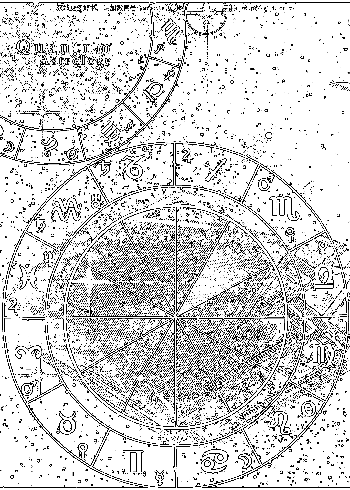

##### Synastry

### 第八宮

#### 【資源宮】

- 情欲交流
- 資源管理
- 心理洞察
- 情感糾纏
- 命理諮詢
- 保險受益

##### 第八宮的資源分享與原欲煉獄

第八宮，掌管資源分享、情欲交流、生死疾厄、神秘心理等，攸關個人隱藏性的社交往來。第七宮是關係的櫥窗，第八宮則是關係的後台，是我們想要保持私密、不輕易公開的人際關係。

第八宮是與人深度連結的渴望，藉由性、情欲、金錢、權力交換、資源分享等，結成密不可分的生命共同體，如同植物延伸地下的盤根交錯，共享水源及養分，難分難解。第八宮掌管生殖、死亡與性愛，生命繁衍循環不可或缺的行為，牽涉到控制、侵占及爭奪的生殺大權，形成人心與社會的禁忌，形成「只可做，不可說的秘密」。

The Eighth House

第八宮是我們面對公共財的態度，和第二宮的資源和金錢，單純化的「你的歸你，我的歸我」，只關乎個人的物質享受跟生活用度有所不同。第八宮涵蓋和他人共有的財物資產，「你的歸我管，我跟你分享」趨於複雜，牽涉到伴侶、家庭、合夥人、投資利益、公眾預算等，攸關各方權益的資源分配，像一塊眾人分食的大餅，如何分得人人滿意，是門深奧學問。

在一般關係中，第八宮的金錢往來和商業經營、信用借貸、投資理財、仲介經紀、保險稅務等相關，雙方透過商業及金融合作，互通有無、互蒙其利。八宮透過長期的醫院診療及心理諮商等，藉私密洽詢及情感命理的諮商，分享身心創傷及心理玄學的資源，交易牽涉到情感層面，無法銀貨兩訖。

第八宮不能單靠自己，需和外界建立「特殊關係」，才能得到附加的好處，其中潛藏的貪婪、怨恨、癡迷與猜忌，透過心機、計謀與策略呈現，一但牽涉到秘密契約、監察偵探、遺產贈與、犯罪分贓、政治利益等，不可避免引發殘酷的人性鬥爭。

The Twelve Houses

當他人太陽落入自身八宮時，太陽主動找八宮合作投資，涉及集體利益的挖掘與分配，是重量級的商業往來。太陽覺得八宮深不可測，八宮從事金融理財、心理諮商時，能吸引太陽頻繁光顧，傾其全力投資。當月亮落入時，則心動於八宮的財富，期許得到零星甜頭，但羨慕之情不會明示。月亮覺得八宮的資源深刻複雜，不自覺受到吸引，乖乖將財富管理權交給八宮。

當金星落入八宮，無論同性異性，金星都為八宮的情境著迷，受美感魅力所吸引，八宮成為金星的性感偶像。金星的感官欲望被八宮誘發，涉及精神情感的征服、滿足及衝突，有潛在的權力鬥爭，金星欲望是否被滿足，八宮握有主導權。當火星落入八宮，原始欲望強烈，更加關注八宮資源，主動利用其精神知識牟利，雙方可在心理學神秘學方面，從事業務合作。火星男性衝動的生物本能，對八宮女性有不可擋的性衝動，鬥爭意識被深化，不能滿足將發動攻擊，引發毀滅性的危機。

在人際緣份中，第八宮象徵人類原欲，如性、生殖、佔有、死亡等，涉及種種與他人在情感及資源上，相互占有、掌控、操縱欲望的衝突，十分難纏，不能等閒視之。如自身八宮沒星，但有行星落入他人八宮，將無意識誘發對方欲望，引起無明貪念及情仇鬥爭，點燃麻煩的導火線。

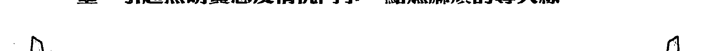

The Eighth House

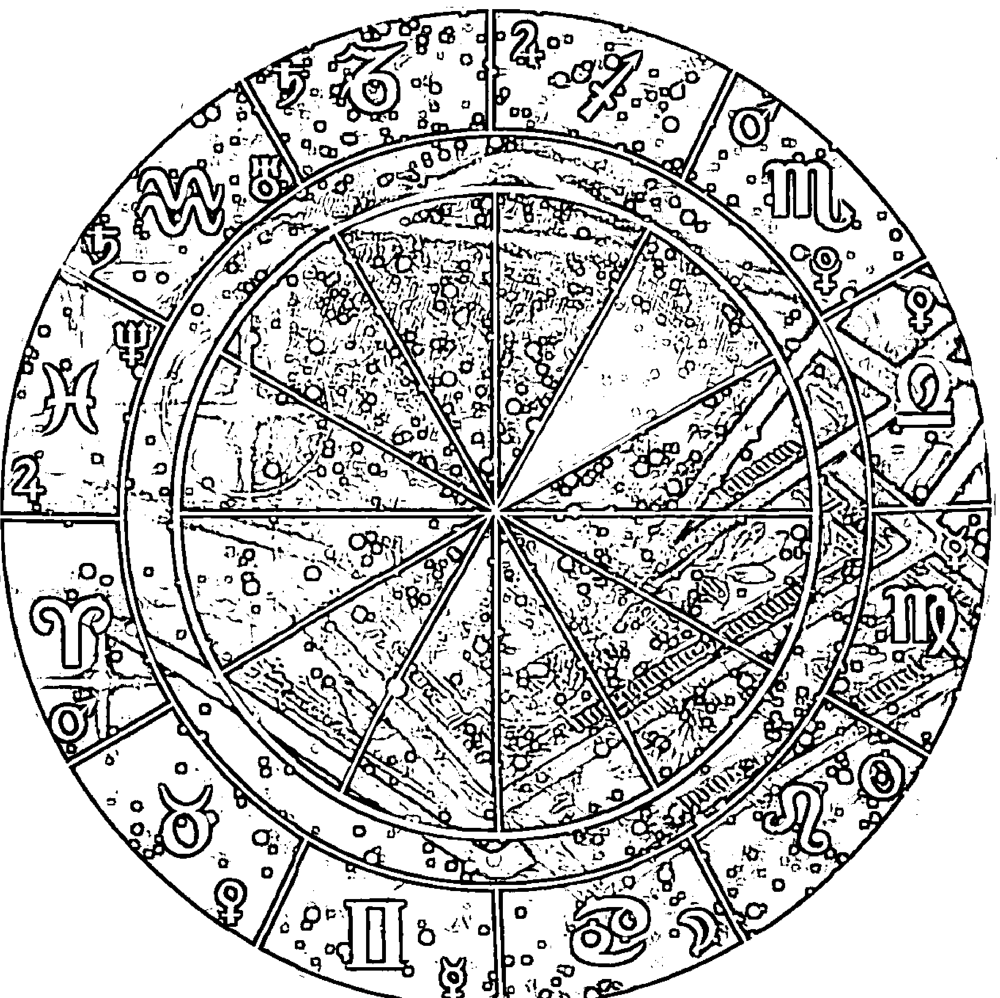

如果雙方八宮互剋嚴重，易誘使內心的「小惡魔」蠢蠢欲動，執迷於人性五毒，控制不住激情，強迫涉入情感、金錢與權力的糾葛，引發性紛爭、贍養費、遺產爭奪、稅務衝突、生死危機，造成重大精神災難及物質損失，如性侵、情殺、財殺、醫療糾紛等，後果慘烈且無可挽回的悲劇。

如果八宮正面發展，雙方經歷深刻的緊張情境，共度互動的痛苦煎熬，將如頻死後又再重生，靈性充分學習成長。彼此通過鬼門關一般的考驗處境，共同挖掘出的秘密資源，如能控制得當，將如威力無窮的原子能，造福廣大群眾。

The Twelve Houses

##### 第八宮的資源分享與原欲煉獄

###### 【關鍵主題】

- 情欲交流、命理諮詢
- 保險受益、資源管理
- 心理洞察、情感糾纏

SUN > (8)

##### 太陽落入八宮

太陽落八宮在一般關係中，太陽察覺八宮的神秘魅力，受到吸引一探究竟，毫不隱藏強烈興趣，八宮難以抗拒熱情。太陽的奉承與讚賞，照亮並挖掘八宮，八宮不為人知的陰暗面，太陽容易看得清楚。太陽受八宮的控制引導，認知到萬千宇宙中，在資源、人性、欲望、心理等領域，原本自身觀點之外，還有不同繁複彩度的漸層，開始探索花花綠綠的奇妙世界。

在商業關係中，太陽堅定謀求八宮的資源，八宮看重太陽的優異表現，覺得可用來賺大錢，雙方有重要商業往來。八宮擁有的精神財富，啟發太陽的成功意識，八宮以有形無形的資源助太陽發展壯大，鞏固資源利益。太陽覺得八宮掌握很多資源，有意分享八宮的市場，提議商業合作，主導共同的目標發展，雙方事業版圖牽涉廣大。

在社會關係中，八宮若從事命理玄學、心理諮商等工作，太陽感受深刻神秘，特別喜歡光顧，八宮本身有星的話，可持續供應挖掘，影響力既大且深，八宮若是空宮則沒有礦藏，太陽興趣不長。八宮引導太陽認識資本市場，從事股票投資、商業買賣及心理、神秘、靈性研究等。若太陽與八宮互剋，易因妄自尊大的獨斷作風，在共同人際及資源，引發心理鬥爭，與八宮出現公眾權力及私人欲望的糾葛。

在親密關係中，太陽感受八宮的性魅力，以征服八宮滿足虛榮心，八宮迎接太陽的熱誠，強烈轉化太陽的性觀念，使之撥雲見日。五宮的性是肉體的興奮，把上床當遊戲，一旦不愉快分手可以了事。八宮的吸引有神秘性，帶來靈魂連結的融合感受，魅惑力比較持久，觸及靈魂留下深刻印記。

太陽無論是男是女，都主導關係進行，太陽男性容易以性證明尊嚴，太陽若是女性，不願性接觸時，八宮男性無法勉強。雙方若外遇偷情，不會很快結束，將因資源分享緊密連結，發展同居及共產，關係牽涉商業合夥、資產處理、分產稅務等，太陽無法輕易離開八宮。

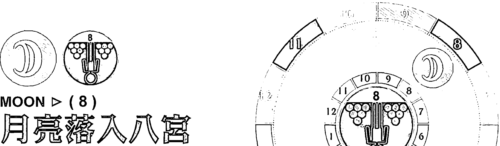

月亮落八宮在一般關係中，月亮感覺八宮的資源，是內心欽羨的，但態度含蓄緘默，不直接表達對八宮的興趣。月亮的隱約需求，八宮提供生活支持，拉攏月亮情感依偎，給予溫暖回饋，雙方情感交流深而久。八宮的複雜難解，替月亮帶來深刻的事物，八宮的人際、情感、財務等狀況，彷彿錯綜的心理迷宮，月亮無比好奇，又難以想像黑暗糾結，不敢冒險探索陰森。八宮藏有不為人知的秘密，月亮的防衛心重，容易多心猜疑，感覺不夠舒服自在，產生說不出來的情緒困擾。

在職業關係中，月亮覺得八宮有神奇魔法，能識破自己心事，解開潛藏的心謎，直指情緒幽微之處，有利心理諮商關係。月亮病患找八宮作心理分析，分享神秘學心得，有獨特的親密感，透過八宮解說得到靈性啟發，雙方常在商業合夥、日常用品、房屋地產、心理醫病關係中出現。如月亮與八宮互剋，特別敏感脆弱，容易受傷退縮，不敢輕易接觸八宮。

在家庭關係中，八宮主動幫月亮家人管錢，八宮對資源分享及投資保險的態度，刺激月亮的安全需求，小心翼翼付出資源，從財務共享中得到關懷滿足。八宮的心理起伏，影響月亮的內心平靜及居家生活，月亮透過八宮知道很多家族隱私，覺知人性的黑暗陰影面，承受不了時將逃避互動。如月亮與八宮互剋，家人彼此資助但帳目不清，造成財務糾葛，可能發生保險理賠、房地產、繼承權方面的糾紛。

在親密關係中，八宮藉由財務，權力及性等方式，心理操縱月亮的情感，支配月亮的財富。月亮覺得八宮的情感要求，太過激烈、沉重與陰暗，既不解其詳也無法承擔，形成潛在的相處壓力。月亮對八宮的錢記得清楚，但態度扭捏，基於感情不會明說。月亮若是男性，乖乖順從妻子主意，依賴八宮家管理財，累積共有的資源。月亮若是女性，基於安全感需求，會存私房錢另行投資，不讓八宮知道。

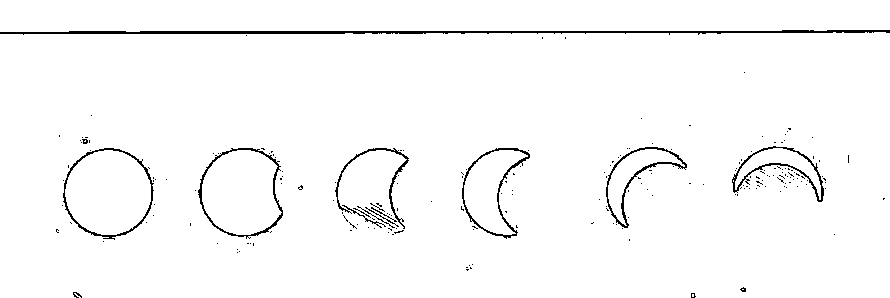

##### 水星落入八宮
MERCURY > (8)

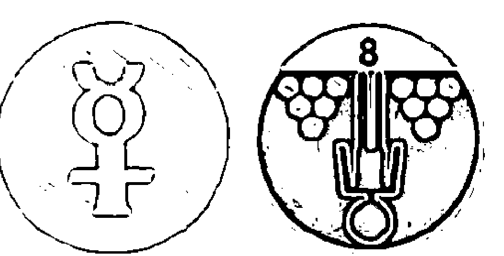

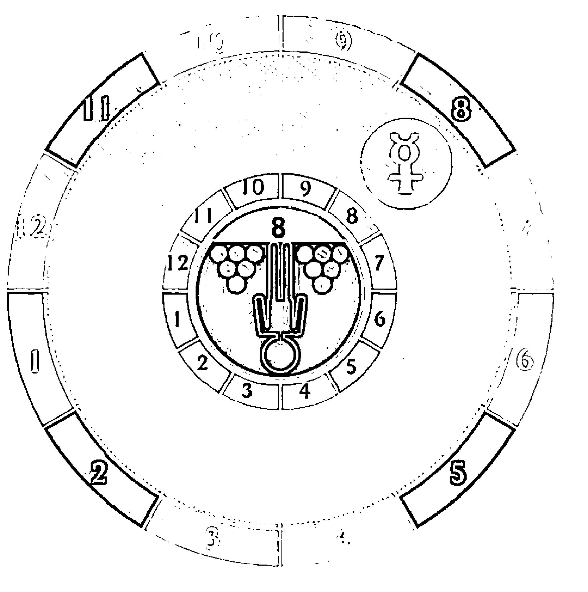

水星落八宮在一般關係中，八宮的心理、情感及欲望，引起水星的探究心，水星包打聽的特質，常找八宮詢問男女相關之事。八宮的精神資源，對水星產生深刻心智影響力，水星將受八宮啟蒙，開始對神秘、心理、命理學，產生學習興趣，八宮帶領水星從事生死學、心電感應、靈異現象的研究，參與心理學講座及神秘學課程。水星意識到八宮的理財經驗，開始對投資理財感興趣，常請教專業知識，一起買股票做投資。

在職業關係中，八宮感到水星知識的商業價值，引介商業機會給水星，共同從事心理諮商、神秘教學的合作。水星依賴八宮的理財能力，財務會跟八宮討論商議後再做決定，八宮不一定有錢，但擅長出主意或是擁有操控權，像水星客戶的經紀及仲介角色，幫水星管理錢財或是調度金錢。若水星與八宮互剋，水星因三心二意猶疑不定，因而輕信八宮說詞建議，在投資借貸上遭受損失。

在親密關係中，水星覺得八宮有深不可測的知識，被誘發出兩性的好奇心，找八宮談論性與欲的看法。水星愛講黃色笑話，跟八宮談成人話題，言語直接露骨，八宮覺得欲望被一語說中，有時心癢難耐，若八宮有星可能採取行動。男女之間的性吸引力，雖因頭腦知性而減弱，仍要小心出現性和金錢的糾葛，有時會出現堂表叔姨的手足亂倫，亦或水星學生與八宮老師的不倫關係中。

##### 金星落入八宮

金星落八宮在一般關係中，八宮是藝術家，金星是欣賞者，深為八宮的情境著迷，覺得八宮擁有的資源，是符合自己品味的。金星受八宮的情感控制，需要八宮對自己的特殊關注，無論同性異性，金星都被八宮所吸引。金星的物質品味與賺錢欲望被八宮賞識，有利發展人際社交、美學培養及藝術發揮，才能表現受到讚美。八宮若是有星，代表深不可測的礦藏，埋著金星難以理解精神財富，八宮無星則難以回饋金星的期待。

在職業關係中，金星羨慕八宮的心理資源及金錢權力，產生嚮往之心，萌生功利性目的，金星以金錢好處及親切討好，使八宮付出手中資源，讓金星得到人際、社交與商業的利益。八宮透過商業買賣、情義襄助、資源饋贈等，增進金星的精神財富及實質利益，雙方適合從事藝術表演、心理神秘、休閒娛樂、奢侈品相關的合夥。如果金星與八宮互剋，雖為共同利益的分配權力，產生價值觀的糾紛，但金星的圓融手腕，不會主動挑明，鬥爭不易表面化。

在親密關係中，金星覺察八宮散發的魅力，具有很強的性吸引力，八宮成為金星的性感偶像。金星表現愉悅且有禮，八宮欣然接納，金星的感官欲望，被八宮的補蝶網所引誘。八宮的權力操控，主導雙方在性方面的發展，決定金星的慾望是充分滿足，亦或感受失落，但金星不喜爭執，互動雖涉及情感性欲的征服、滿足及衝突，潛在的心理較勁不易明顯衝突。

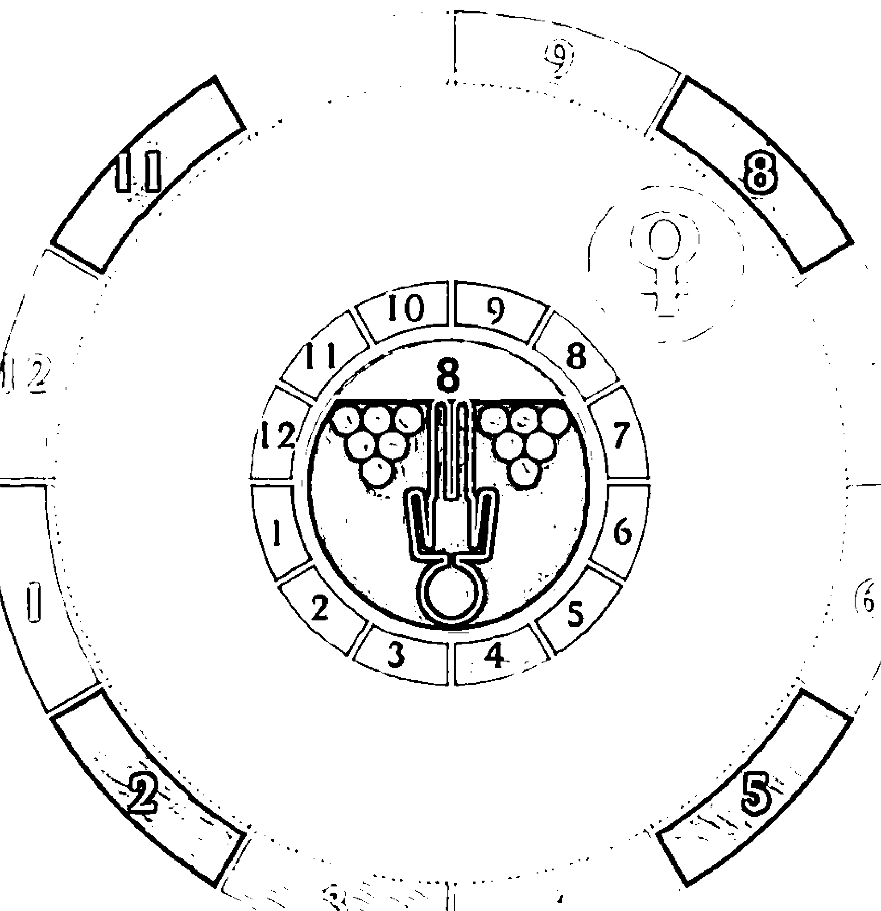

##### MARS > (8)
火星落入八宮

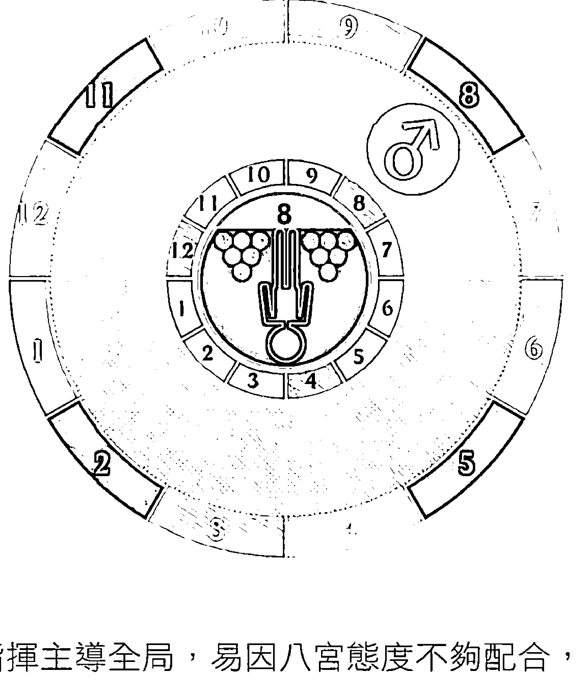

火星落八宮在一般關係中，火星的自利欲望強烈，積極關注八宮的心理資源，八宮被激起極大的開創能量。火星鬥志高昂，行事果斷快速，主動利用八宮的精神知識等能力，急切獲取成績。火星自我意識強，慣於指揮主導全局，易因八宮態度不夠配合，引發誤會及憤怒，率先發難破壞關係，造成爭執各自為政。

在職業關係中，火星的膽識作風，主動提出進取計劃，促使八宮合夥投資，製造搶錢商機。雙方可在心理學及神秘學投資，相互激勵驅策，一起開發業務，獲得實質商業利益。火星行事冒險草率，缺乏耐性、溝通及協商能力，可能因突發事故，不徵詢八宮意見，自作主張或冒然退出，造成合夥變質。八宮覺得火星自私，心生埋怨不滿，雙方常因金錢、情感、財務糾紛，造成權力衝突，甚至公開為敵。

在親密關係中，八宮無比的性魅力，火星旺盛的欲望被激發，燃起原始的性本能，產生勢不可擋的性衝動。如火星是男性，深度欲望被引爆，迫切以性征服八宮，最初雙方的性激情洶湧澎湃。火星只求一時爽快，但八宮使關係深度化，男性的佔有欲強烈，關係不佳時也會硬來，出現肢體衝突，女性感覺受強暴。

如火星是女性，生物的鬥爭本能被深化，女性以資源分享作為操縱方式，伴侶間有頻繁金錢往來，易與八宮男性互不相讓。雙方若捲入婚外情或三角戀，易演出欲生欲死的情感鬥爭，火星的憤怒若被引爆，可能發動毀滅式攻擊，製造生死對決的危機，變成玉石俱焚的慘劇。

###### 外行星入宮位～第八宮

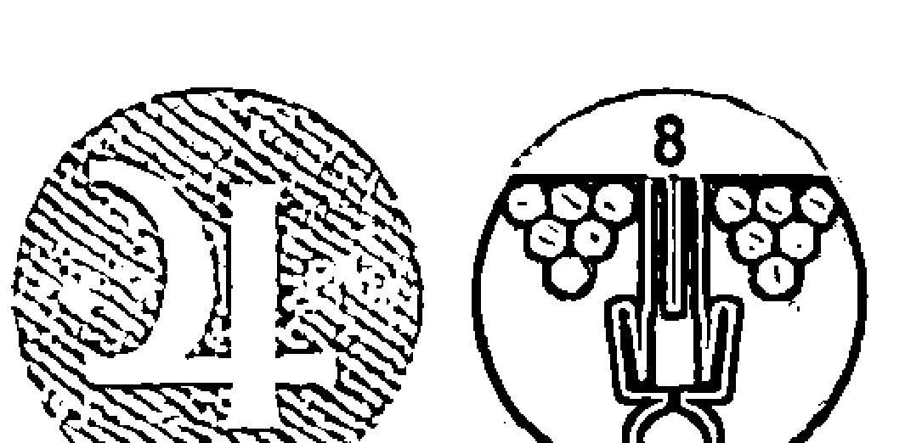

##### JUPITER ▷ (8)
木星落入八宮

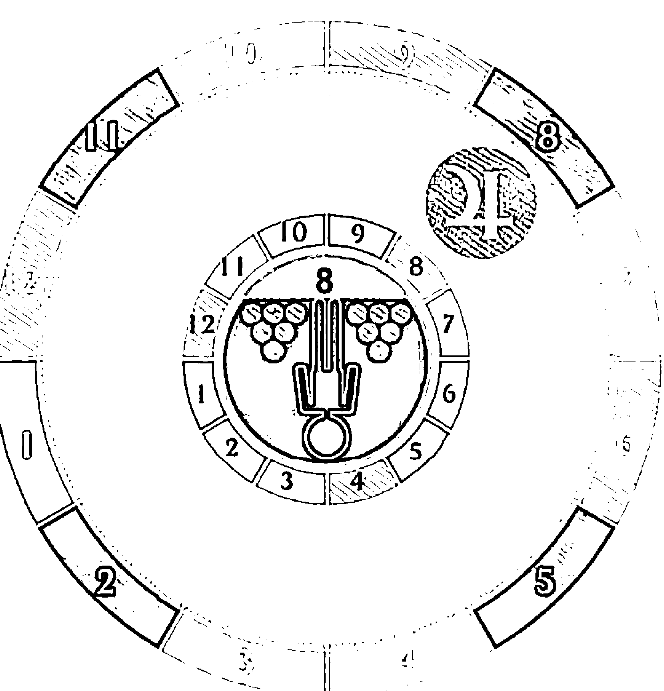

木星落八宮在一般關係中，木星的自由開放，接觸到八宮的心理資源，木星坦率真誠的作風，開啟八宮的封閉性。八宮的專業長才及智慧潛能，在木星看來是珍貴寶藏，八宮無窮盡的精神力，木星熱衷一探究竟，有望得到精神成長及物質收穫。八宮擁有特殊的神秘知識，能啟蒙木星開竅，木星的現實經驗藉由八宮增進，八宮的生命智慧則因木星的哲思而成長。八宮以實質好處回饋木星，雙方相處重視知性交流與心智成長，可一起分享對心理、神秘、靈學、宗教的專業。

在職業關係中，木星的專業能力，要有八宮的資源培養，才能茁壯發揮，八宮藉由栽培木星而獲益。八宮如同企業金主，木星像經理人，八宮財富交由木星操作，木星加以增值，從管理中獲利。八宮企業家資助木星藝術家，是看上木星迎合潮流的生財潛能，八宮是木星需要的合夥人，八宮擁有的社會資源使木星受歡迎，但木星有信念堅持，未必願意被八宮經紀。木星經由八宮的建議指引，將金錢投資的深度，提升到精神領域，雙方適合從事和心理、教育、文化、醫療、宗教相關的商業活動。

在親密關係中，木星感受八宮的性魅力，鼓舞八宮放膽靠近，八宮若是有星，將積極回應木星，雙方一拍即合，建立知性自由的男女關係。木星若是男性，給予女性豐富的金錢饋贈及物質分享，關心其精神成長，播下種子讓八宮培育心理財富，雙方結合有社會利益的考量。木星若是女性，引薦商業合夥的貴人，帶給八宮好運良機，使男性運用社會時尚賺錢。八宮給予木星許多好處，就算關係結束，還會留下可觀資源，木星是實質受惠者。

##### SATURN ▶ (8)
土星落入八宮

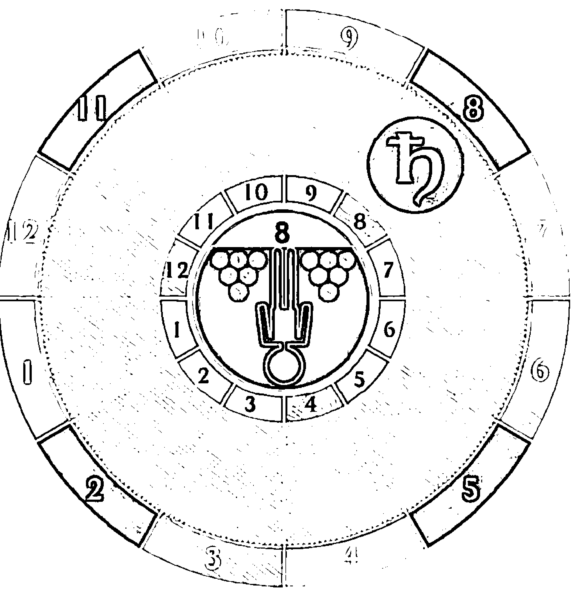

土星落八宮在一般關係中，土星胸懷城府，看中八宮的資源，視為有利可圖的對象，尋求現實合作的商議。八宮的金錢來源複雜，常是取自他人資產，不是單純工作收入，但願與土星共同分享。如八宮自身很強，將製造複雜的情感、金錢、權力的糾葛，讓土星被迫捲入，分擔財務困難，雙方的金錢往來，一定涉及第三方。土星可能怕麻煩而冷漠拒絕，造成八宮處境孤立，求助無門，土星的行為結果，不一定造成不利，反而使八宮狀況穩定，好壞視土星相位而定。若八宮自身沒星，心理壓力很大，可以保持距離，不回應土星動機，以策安全。

在職業關係中，土星具專業的醫療分析，對八宮的心理問題感到責任，長期付出心力關注，往來涉及監察偵探、醫院診所、心理玄學等領域，土星要當心一時不慎，與八宮造成醫療糾紛。土星在商業合夥、金融理財的實務經驗，八宮有現實需求，聘僱土星運用專業資格，成為八宮個人理事。土星極為謹慎務實，試圖讓雙方獲利，如相位互剋，土星就算再精打細算，仍可能投資失利，自身也付出不小代價，並引發共同的財務壓力。雙方常在金融理財、直銷保險、信用借貸、仲介經紀方面，成為利益至上的忠實夥伴，但不易做真正交心的朋友。

在親密關係中，土星對性保守且壓抑，視性為工作義務，八宮對土星性趣缺缺，不願意經常上床，親密交流中有很大芥蒂。伴侶會有共同管理的財產資源，但一方常以性及金錢控制另一方身心，因情感權力、財務管理及資源運用的問題，造成心理壓力，出現性冷感，長期下來成無性夫妻。

###### 外行星入宮位～第八宮

八宮代表人類的原欲，如性欲、生殖、控制、死亡的本能，土星的道德約束及行為限制，造成資源分享及情感交流的障礙。若雙方嚴重互剋，可能因前世業力，難以放下貪嗔癡慢疑的執著，形成性紛爭、贍養費、撫養權、遺產稅務等，關係結束後無法避免的問題障礙，一旦處理不當，將引發慘烈且無可挽回的後果。

##### 天王星落入八宮

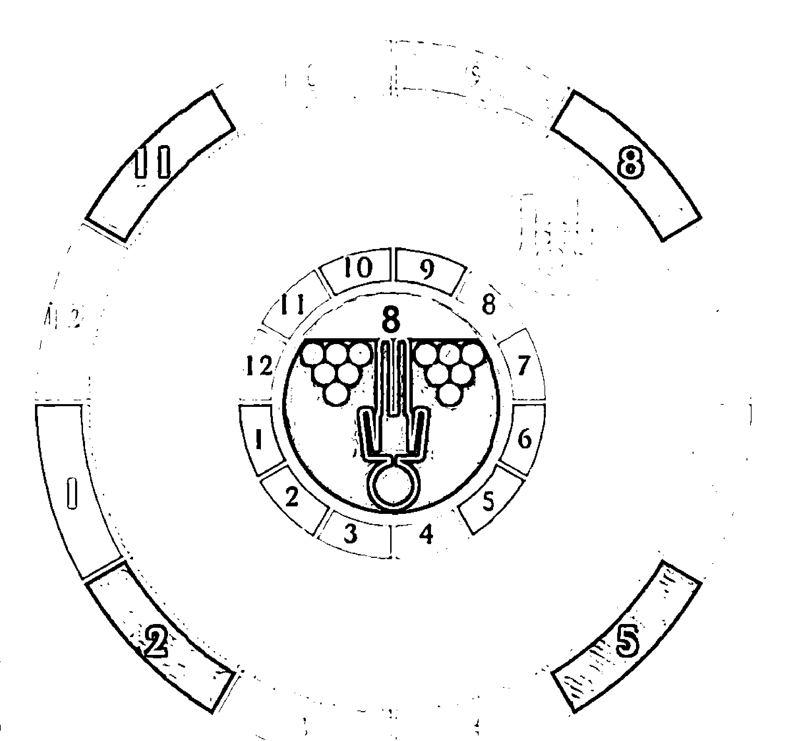

天王落八宮在一般關係中，天王我行我素、不拘一格的作風，引起八宮好奇探索，天王新穎獨特的心理能力，催化八宮的神秘感應力，顛覆原本平凡，產生靈性直觀。八宮喚起天王的冒險欲，引發不明究理的心理驅力，被天王當成另類的情欲對象，彼此分享特殊的男女經驗。天王的能量如昇華成純粹知性，雙方會以通訊資訊工具，建立頻繁的心智互動，激起宇宙原創性的靈感火花。天王與八宮互為雷達及接收器，雙方隔空心智連結的特殊頻率，只有對方可以解讀。如八宮本身無星，天王發射的電波斷斷續續，雙方互動有一搭沒一搭，關係很不穩定。

在職業關係中，天王擁有原創性的心理啟發、商業創意及獨特發明，八宮投資天王發展罕見產品，彼此成為前衛知識、玄秘思想、尖端科技、創新發明的夥伴。天王藉由八宮接收到宇宙原生訊息，並隨興分享，八宮本身能量強的話，可一起探索心理學、神秘學、占星學，不限於探索對方的身心。天王態度古怪且疏離，八宮若是空宮，商業計劃不積極促成，天王也漫不經心，雙方合作停留在天馬行空的階段。

在個人關係中，天王察覺八宮的奇異性感，八宮並不知情，天王的欲望是神經衝動，比火星的生理本能更強，八宮無警覺心，但在天王百無禁忌的挑撥下，雙方可能突發不倫、出軌的兩性接觸。天王原本對八宮並無情欲，但能量被激發後無法自制，將對八宮產生強烈的渴求，欲快速征服八宮身心。雙方的性接觸是無預警、令人訝異的，刺激常是曇花一現的迷戀，造成強烈心理衝擊，顛覆彼此的情感、財務及生命觀。

天王打破倫常的偏激怪癖，若陷入瘋狂癡迷，可能對八宮近親亂倫、約會強暴、非合意的同性接觸、隨機的性騷擾等。天王能量超越社會的身份界限，產生性別混淆，與八宮的性舉動，不是個人好惡需求，有脫離道德約束的宇宙博愛性。

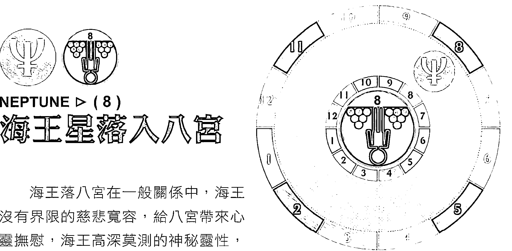

##### 海王星落入八宮

海王落八宮在一般關係中，海王沒有界限的慈悲寬容，給八宮帶來心靈撫慰，海王高深莫測的神秘靈性，有利八宮的精神財富，彼此有神秘、心理、玄學、靈性的分享和收獲。海王為理想的追求與犧牲，吸引八宮關注，奉獻一己之力，供給海王生活資源，支持藝術、宗教、靈性等發展。海王如與八宮互剋，在神秘現象及靈性經驗上，表現的理想、幻境及神通，將迷惑矇騙八宮，使其不經意盲從，反而精神迷失。

在社會關係中，海王一時作夢，受到八宮資源引誘，在投資理財及商業合夥上，產生不切實際的理想。海王想管理八宮的資產，提出自欺欺人的計劃，說得天花亂墜，鼓吹八宮拿錢投資自己。海王因一廂情願、不負責任的態度，

###### 外行星入宮位～第八宮

致使管理不當，無法兌現承諾，造成八宮的損失。海王神棍可能騙財騙色，八宮如將金錢交給海王，極可能血本無歸，只能當作贊助海王的理想，不能期望穩定獲利，雙方不宜實質的商業往來。

在私人關係中，海王在兩性情欲上，易被八宮的暗示所誘發，出現曖昧模糊的想像空間。海王對八宮產生超乎尋常的性幻想，如暗戀、婚外情、老少戀、同性戀等，但會遮掩逃避，不明白讓八宮知道。海王對關係不切實際的虛幻妄想，通常不易行動落實，如八宮有星可能主動表態，海王缺乏自制力被動配合，引起古怪、混亂、欺瞞的兩性關係，如主僕偷情、性騷擾、性交易、家族亂倫等。海王的頹廢的宿命態度，引起八宮心理共鳴，性接觸涉及隱私秘密，牽扯暗中的金錢往來，及不為人知的資源分享。

##### 冥王星落入八宮

冥王落八宮在一般關係中，冥王的生命遭遇，鍛鍊出厲害覺察力，具有強大深刻的挖掘性，吸引八宮親近。冥王具挑戰禁忌的強迫性驅力，八宮有特殊且驚人的經驗，藉冥王的心理黑洞，窺探人性黑暗及生死奧秘，有利冥王發揮能耐。冥王助八宮察覺內心糾結，將埋藏的心理炸彈解除，雙方無意識接近相互利用，達成心理洞悉及情感交流目的，往來相處狀態緊張，但是談心十分深入。

在社會關係中，冥王因八宮利益而動心，往來中緊緊控制八宮，冥王鍥而不捨地檢查診斷，將發現八宮潛藏的生理病灶及精神危機，常出現在心理諮商及外科手術的醫病關係中。冥王的特殊才幹，有效利用八宮資源，建立商業合夥，擁有共同目標及競爭對手。雙方透過秘密性質的冒險行為，解除重大危機，磨練出更強的抗壓能耐，並獲得可觀利益，成為消防、軍事、警察領域的強力搭檔。雙方常在財務冒險、心理醫療、生死玄學等成為夥伴，如有重大剋相，將因懷疑猜忌心作祟，而爆出醫療糾紛、財務糾葛、生命危機等慘痛事件。

在私人關係中，冥王的原欲被八宮察覺，激起強烈的警覺心，八宮藉由性行為，改造及轉化冥王扭曲的心理。雙方的性活動頻繁且深刻，可到達小死亡的高潮，八宮體驗到生命奧秘，冥王感受重生的喜悅。八宮一方若無星，不耐心理糾纏，關係難以持續，冥王因不甘心很難忘懷，自我折磨很久。

如雙方的業力深重，冥王的強迫性原欲難以控制，可能藉由誘姦、迷姦及約會強暴，用性、金錢及權力控制八宮，滿足極端的交流需求。冥王如與八宮剋相，雙方易因資源的佔有與控制，激烈鬥爭成仇結怨，在獎金、保險、遺產上出現恐怖情境，引發一方謀財害命，造成波及性命的犯罪事件。夫妻間如有冥王八宮，需減少金錢往來，不可合夥投資做生意，否則易在繼承權、贍養費、稅務方面，產生財務上的重大紛爭。

##### ASTROLOGY HOUSE 8

##### Synastry

### 第九宮

#### 【文化宮】

- 旅遊玩伴
- 師生同道
- 學術同好
- 精神道友
- 異國情緣
- 國際貿易

##### 第九宮的心智探索與國際視野

第九宮，掌管遠方旅遊、異地求學、哲學宗教、法律道德，是我們脫離日常生活的嚮往，追尋自由開闊的體驗欲，渴求異於原鄉的文化衝擊，追求更寬廣的生命閱歷。

第九宮不安於室的流浪精神，難以長期忍受規律生活及環境拘束，提起勇氣浪跡天涯，離開土生土長的環境，透過遠離家鄉的國際旅遊，滿足冒險犯難的渴望，以異國的居住移民，見識新奇未知的世界，超越狹隘的本位觀點。

第九宮象徵人類文明背後的設計藍圖，從小來自家長學校的倫理教誨，以及環境社會塑造出的道德價值，影響人生信念及處世哲學的建構。第九宮的思想信念根深蒂固，形成特定的意識型態，左右一個人的政黨傾向與國族認同。

##### The Ninth House

第九宮的博古通今，既涵蓋古老傳統的宗教信仰、四書五經、哲學文化、法律規範等，影響一個人對不同性別、語言、種族、文化、信仰的接納與排斥。第九宮也與時俱進，不受限偏狹的知識系統，透過博士教育、留學深造、專業進修等，超越原本的思考層次，成為人生的哲學家、思想家，專業領域的研究家、理論家。

當他人太陽落入自身九宮時，太陽看中九宮的高等經驗，奉為精神導師，透過共通信念，喚起九宮的共鳴。雙方以請益傳授的尊重態度，進行高等心智對話，討論哲學宗教、倫理道德、經典文化、法律觀念等。彼此雖認定互為知音，但缺乏日常閒聊動機，關係不如一般朋友密切。

當月亮落入時，雙方常一起吃飯，分享倫理習俗、家族傳統、旅遊見聞等話題，常出現在親密的講師與學生間。雙方面對不同的觀念時，九宮採取客觀知性的態度，月亮較為感情用事，九宮不易留住月亮，往來關係不穩定。

##### The Twelve Houses

當金星落入時，九宮的見識令金星感興趣，雙方有相似的美學和文化傾向，一致的娛樂社交之愛好，金星喜歡和九宮作伴，分享對音樂、藝術、旅遊、美學的愛好。九宮具有專業領域知識，推薦金星嘗試，豐富鑑賞品味。當火星落入時，以共同參與文化及旅遊相關的活動為主，互相鼓勵對方，狂熱投入工作。火星積極宣揚推銷理念，易因觀念不同，攻擊九宮的信仰及思想，可能因此觀念敵對，隔空互打筆戰。

在私人關係中，和諧的九宮代表對異國旅行、宗教文化、五術玄學、教育哲學方面有共通的追求興趣。雙方的情誼奠基於相近的生命之旅，產生高層的精神共鳴，往來互動可開拓更高深、更開闊的知識、思想與學問，共同傳揚文化、宗教、信仰，將個人化的思想，擴及更寬廣的領域。

如雙方有互剋的九宮關係，代表價值觀有所分歧，可能分屬不同文化、教派、政黨、國籍，在道德、正義、公理、法律方面的議題，各自堅持觀念，無法取得共識，引發思想衝突。雙方在日常層面，仍可保持一般的朋友、情侶、夫妻及家人關係，但人生信念的差異與隔閡，一旦涉及更高更深的價值取捨，就劍拔弩張，互不相讓，產生無形的精神戰鬥。

##### The Ninth House

在職業關係中，雙方和大學院校、研究機構、宗教組織、文化出版、國際貿易、立法外交、學術智庫相關。和諧的九宮，象徵雙方共事有助教育普及、文化傳播、教化人心及國際交流，創造精神資產及實質利益，彰顯海內存知己，天涯若比鄰。

如雙方九宮互剋，在對人對事的態度上，容易上綱上線到倫常道德，觸及律法層次。小至禮儀風俗，中至族群差異，大至國家認同，雙方都自認護持神聖，無法容忍不同的訴求，引發觀念論戰，無論官司訴訟、宗教審判或法律裁決，都是爭議紛擾的九宮現象。

##### The Twelve Houses

##### 第九宮的心智探索與國際視野

###### 【關鍵主題】

- 旅遊玩伴、師生同道
- 學術同好、精神道友
- 異國情緣、國際貿易

##### SUN ▶ (9) 太陽落入九宮

太陽落九宮在一般關係中，九宮是太陽理想的上師原型，九宮擁有的文化、哲學、宗教及旅遊的心得，是太陽熱衷追求的經驗，雙方有文明思想交流的緣分。太陽主動透過共同話題，喚起九宮的共鳴，熱切挖掘九宮的思想，利用九宮的教育文化、思想信念等資源，確定生命目標及人生價值，讓自己更加理解人生。九宮代表不同宗教、文化、國族、地域的文明標準，相信什麼是善，什麼是惡；認為什麼可以，什麼不行，如思想觀念的紅綠燈，是人際往來中的高層指引。

在社會關係中，九宮以尊重態度請益太陽，進行高等心智對話，交換對人生的心得，表達對人類文明設計的態度，常共同分享哲學宗教、倫理道德、法律規範、經典文化、思想信仰、異國旅遊的知識經驗。若觸及共同話題將很投機，認定對方知音難得，但缺乏日常閒聊動機，再談得來，關係也不如一般人密切。有利師生同修關係，雙方常是進修專班同儕、文化講座同學、宗教同修道友、心理諮商及法律顧問的主僱等。如太陽受剋，將以武斷態度，強制九宮接受自己在哲學、宗教、國家、民族、黨派的觀念，引起九宮不滿。如無法跨越思想鴻溝，取得相處共識，將引發意識型態的衝突，嚴重者會訴諸法律。

在兩性關係中，雙方是專業知識及高等思想的同道，擁有共同的文化圈，有緣在國外旅遊中相識，相處中充滿專業知識、出版教育、文化藝術及宗教哲學的互動，關係建立在文明交流上，彼此是精神同道。如太陽與九宮互剋，象徵雙方在國家種族、道德倫理、宗教信仰上，有極大差異。如一方是白人，一方是黑人；一方信仰基督教，一方奉行伊斯蘭，但都想傳教，說服對方接受，卻各不相讓，造成高層觀念的對峙。雙方必須學習接受文化背景的差異，瞭解自身奉行的準則，不是絕對真理，並非放諸四海皆準。

##### 月亮落入九宮

月亮落九宮在一般關係中，九宮運用文化資源，助月亮發展潛能，雙方經常一起吃飯，並有異地出遊機會。彼此討論文化思想、命理哲學、倫理習俗、家族傳統等話題，既有較高的精神交流，又交織著家居、情感及飲食等私人活動，常出現在人生講師與進修學生間。雙方在面對不同的觀念時，九宮較能採取客觀知性的態度，月亮卻會感情用事，覺得對方有所意見，即表示不喜歡、不接受或不認同自己，關係不十分穩定。

##### 內行星入宮位～第九宮

在社會關係中，月亮習慣九宮的待人作風，會參與九宮的教育、文化、旅遊、思想等活動，光顧九宮的生意服務，覺得類似家庭聚會。九宮如開設店面、工作室，將邀請月亮進駐，協助月亮開設專業課程，舉辦文化、教育、旅遊等講座。但月亮易多心、情緒化，產生不安全感，會因體貼或猜疑九宮，而頻繁更換場地，九宮不容易長留住月亮。

在兩性關係中，月亮對傳統習俗、倫理法律、文化旅遊、宗教哲學等方面，受家庭背景及成長環境很大的影響，和九宮產生情緒共鳴，彼此交流不同觀點。月亮代表童年的不同成長經驗，養成對於家族倫常、道德法律、意識型態、宗教觀念的情緒反應。如果月亮和九宮互剋，則因雙方的觀念差異，產生意見摩擦及情緒困擾，但月亮無意識鬧情緒，不易九宮明白彼此的不合在哪。如月亮信仰儒釋道，九宮信奉基督教，月亮對九宮不肯隨自己拿香參拜，容易感覺受傷，認為九宮不僅是反對觀念，而是反對個人。男性月亮落女性九宮，雖有婚姻緣份，但在外地關係密切，異國同居及登記結婚機會高，一旦回到本國，反難安穩同住。

##### MERCURY > (9) 水星落入九宮

水星落九宮在一般關係中，水星對九宮的精神資源產生興趣，九宮扮演啟發、領導及教育者，水星學習聆聽，開啟較高層次的思維。九宮與水星建立純粹知性的互動聯繫，分享深奧思想、哲學理念、宗教信仰及異國閱歷，水星增廣見聞，助九宮傳遞高深思想。雙方常透過諮詢、教學、請益等，討論人生發展、文化思想、學術話題、宗教理論等話題，交換對於人類高等心智及文明演化的觀點，平日不常往來。

在職業關係中，九宮扮演上師、領隊及律師等角色，答覆水星的徒弟、團員及客戶，關於人生、旅遊及法律的疑問，常見於宗教修行、旅行團隊、法律諮詢等人際。水星落九宮易在各種形式的師生關係出現，當雙方和諧時，水星學生較能理解接納九宮老師的觀點，從中得到專業知識，領悟到高深哲理。若有挑戰相位時，雙方觀念差距甚大，思想交流搭不上邊，水星學生覺得九宮高深莫測，理念信仰大相徑庭，教學講道語焉不詳，難以真切領悟；九宮老師則覺得水星只對淺薄知識感興趣，針對瑣碎頻繁發問，簡直不堪教誨，非自己所能化育之輩。

在兩性關係中，水星的純知性功能，在男女間吸引力更形弱化，彼此的話題層次很高，跟日常生活落差很大。雙方可能是年紀差距很大的師生，因學術研究的需要，日久成為生活伴侶，專業知識、精神成長及旅遊閱歷，才是互動交流重點。若非經常出差旅遊，共同從事國際貿易，就是分享宗教哲學、倫理法律、經典文化的看法時，才有共通話題。常見於研習專業知識的同儕伴侶中，如語文進修、法律知識、藝術文化、占星哲學的同學、同修、同好關係。

##### VENUS > (9) 金星落入九宮

金星落九宮在一般關係中，九宮的知識見聞，令金星異常感興趣，喜歡和九宮一起享樂，從事音樂、文化、藝術、旅遊的活動。九宮在文化思想、哲學宗教及異國經驗等領域具專業知識，樂於推薦金星嘗試，豐富金星的鑑賞品味，彼此對社交娛樂美學的愛好頗為相投。雙方相似的民族文化與意識型態，將發展較高的精神層面，分享對於哲學宗教、倫理法律、經典文化、高等思想、異國生活的經驗，有一起外地旅遊的緣分。

在職業關係中，金星認同九宮的文化觀念，察覺九宮的資源，有利自己在文化出版、專業課程、法律知識方面的發展，金星有創作才能，九宮有出版經驗，金星會找九宮合夥，或諮詢相關意見。九宮若是宗教上師或人生導師，可能提供國外弘法的旅遊，以及宗教朝聖的機會，讓金星的學生信徒開開眼界。

在兩性關係中，金星覺得九宮的生命價值觀，異樣且好玩，九宮受金星的玩興所鼓舞，雙方常在文化進修、宗教講座、異國旅遊、登山冒險等領域，因共同興趣結識而交往。雙方都有豁達的人生觀，喜歡精神振奮的感覺，追求好玩的戶外活動及旅遊行程，給彼此帶來生活樂趣，一有餘暇就跑去度假，不易安穩居家生活。

##### MARS > (9) 火星落入九宮

火星落九宮在一般關係中，火星認為九宮是知己，需要九宮肯定想法，強力推銷哲思觀念給九宮，鼓吹九宮認同自己。九宮將舉辦教育文化、哲學思想、旅遊傳播、異國節慶等活動，邀火星參與共事，給予表現機會。火星認為九宮資源可以利用，將積極安排工作，趁機吸收九宮知識，推廣自身理念。但火星因自我、魯莽、堅持己見的作風，自作主張草率辦事，或思想與九宮不同，頻頻攻擊其信仰觀念，我行我素的態度，使雙方合作不易。

在職業關係中，雙方不只是分享宗教、哲學、道德及法律的觀念知識，而是共同參與相關的活動，如文化出版、哲學思想、宗教推廣、法律事務等領域的夥伴、道友、同仁，彼此鼓勵對方投入工作。火星自我中心、跋扈武斷的態度，硬要說服九宮接受，使之更加反感，雙方雖在高等觀念上產生爭執，成為思想對手，但對主要關係無太大影響。在師生關係中，如九宮是導師，火星學生無論是否認同其觀念，站在支持或反對立場，都將明確表態。如火星是導師，將因學生不夠受教，快速轉移目標，無耐心說服九宮慢慢接受。

在兩性關係中，火星與九宮間的性吸引力較為知性，火星促使九宮往遠處跑，頻繁從事戶外冒險及遠方旅遊，雙方易成為運動休閒的玩伴。火星想在思想觀念層面主導，鼓吹自身意識形態，積極要九宮信仰改宗，支持相同政黨。如雙方相位互克，一旦涉及旅遊、文化、倫理、法律、宗教、民族、政治、黨派等話題，彼此就劍拔弩張、唇槍舌劍，激烈較勁辯個輸贏，競奪心智競賽的錦標。雙方旅遊途中要當心火星的挑戰勇氣及衝動脾氣，導致九宮的意外傷害，甚至涉及法律事故。

##### 外行星入宮位～第九宮

##### JUPITER > (9) 木星落入九宮

木星落九宮在一般關係中，木星擁有高度理想，覺得九宮是人生知己，樂於和九宮分享人生見解和專業知識。木星的遠大目標，一遇九宮就滔滔不絕、高談闊論，扮演精神導師，啟發九宮領悟。九宮擁有的社會資源，對信念、思想、哲學、宗教抱持的態度，引導木星自由開放的思想，在環境中落實發展，讓木星的動機得到具體支持。木星帶九宮攀登知識之塔，九宮協助木星發展廣泛智慧，雙方稱得上是天生成道友，互動將以精神成長、文化交流為主。

在職業關係中，木星展現專業，九宮用來傳播，九宮的個人資質，木星認為可造。木星常是自成一派的上師導師宗師，聘請九宮擔任其助理、助教、顧問。九宮扮演耐心受教的學生及信徒，負責將木星的思想，傳達出去的執行企畫，常見於高等知識及人生信仰的師生關係。木星有機會將帶九宮出國發展，九宮則幫木星策畫演講教學出版，如木星是作家講師，九宮是出版人及編輯企畫，雙方適合從事文化教育、宗教哲學、藝術研究及國際貿易相關工作。如木星本身受剋，將空口白話過多承諾，要求九宮支持鼓勵，往往陳義過高，執行難達標準。

在親密關係中，木星與九宮對生命有相似的價值觀，共同熱衷戶外活動、知性冒險及異國旅遊，一起探索世界，成為很好的旅伴。關係不彰顯兩性吸引力，卻使彼此心智提升，追求高遠目標，大方分享豐富的精神資源。如木星和九宮互剋，代表在人生信仰及價值觀念上，見解有所歧異，雙方過度堅持自身信念及宗教信仰，並想說服對方，最終徒勞無功。

##### SATURN ▶ (9) 土星落入九宮

土星落九宮在一般關係中，土星的高等思想，九宮察覺到實用價值，會提供資源引介人際，讓土星高談闊論，展現知性權威。土星的人生經驗歷久彌新，九宮感到理念的傳承責任，給予實質支持，使土星公開傳播理念，加以世俗化利用。雙方談論話題常是嚴肅的宗教觀念、高遠的生命哲學及艱深的專業知識，土星扮演九宮的人生導師，給予精神指導，但強調實用的價值，而非靈性的領悟。雙方互動時土星愛說教，九宮會參考，但基本觀念仍有不可跨越的鴻溝，既感到對方想法重要，又無法完全接受。

在社會關係中，土星擁有專業知識，九宮提供教學平台，使其傳播教育、文化、哲學等觀念思想，彼此在專業知識及高等心智上的交流，和實質工作有關，並非純粹清談，只為休閒娛樂。雙方的宗教、哲學、法律、文化、旅行往來活動，不只是興趣愛好，而以工作職業為主，開設事務所、教會廟宇、投資出版、旅行經營等。

雙方常在教育、法律、國貿領域，因共同理念使命，建立長期工作責任。若雙方有挑戰相位，則因處世價值不同及意識型態落差，出現思想交流的障礙，甚至因道德倫理觀的差異，在法律、條文、規範上釀成實際麻煩。在師生關係中，土星的精神導師，覺得九宮學生態度雖認真，但吸收領悟不佳；若土星是學生，將以嚴格標準，檢視老師專業表現。

在私人關係中，雙方在面對傳統習俗、家族倫理、異國旅行、哲學宗教等問題時，都堅持己見，覺得對方保守僵化、難以溝通。土星男性要求妻子奉

##### 外行星入宮位～第九宮

行社會道德規範，面對父母晨昏定省，九宮認為食古不化，無法遵從。土星女性要求丈夫配合家族風俗習慣，結婚時要三媒六聘，九宮判定墨守成規，不符實際。雙方的人生價值、教育理念及宗教觀點，在在不同，形成相處的心理隔閡。

天王落九宮在一般關係中，天王在奇特罕見的機緣下，以演說、講座、教學、出版等方式，給九宮強烈的知性衝擊。天王有前瞻、革命、先驅性的哲學、宗教、法律、文化等觀念，開啟九宮的精神視野，分享大異其趣的生命閱歷，使九宮接觸新穎的異國文化及另類思想，破除原本陳舊的世界觀。如天王和九宮互剋，天王雖然秀異，但思想因太過前衛、非主流及驚世駭俗，造成九宮思想產生逆轉，其特殊價值觀及人生觀，給保守的九宮極大震撼，視天王為外星人。天王導師的異端思想離經叛道，對九宮的意識型態、人生成長及旅遊計劃，造成突發的顛覆，九宮自身星越多，受天王影響越深。

在社會關係中，天王的特殊知性及發明創作，被九宮無意間相中，視之為珍奇異寶，共同創造新穎的獨佔性商機。九宮如自身有星，將設法讓天王發揮，大肆宣揚崇高的精神，可建立精神同盟的互動，僅限文化經典、哲學、五術、宗教、新時代等範疇，雙方日常往來疏離。

在商業關係中，天王提出一堆天馬行空的商業構想，但天王變數太大，引發意外破壞現狀，使九宮驚嚇無安全感，雙方協議不具實質約束力，合作不易持久。在師生關係中，天王老師獨樹一格自成一家，吸引九宮追隨，天王不停變花樣，給學生知性刺激。天王學生會挑戰老師觀念，時而唱反調，九宮老師如不耐，會疏遠往來，讓天王另尋明師。

在私人關係中，天王不服權威、顛覆傳統的人生觀，跟九宮雖然有所爭執，但在本地原先沒事，一起出國才引發意外狀況。天王的意識轉變，因所處地域不同，無預警被激活，高等意識的刺激，在異鄉異地才出現變化。天王按不住冒險的神經衝動，突發奇想中斷計畫及變更行程，令九宮驚訝不快，分道揚鑣。天王無論單身已婚，都可能在異地邂逅外籍情人，打破禮教閃電交往，卻因雙方在文化背景、倫理觀念及信仰思想的差異過大，而快速決裂分手。

###### NEPTUNE ▶ (9)
**海王星落入九宮**

海王落九宮在一般關係中，海王扮演人生智者，透過教育、文化、藝術等，傳達高等思想，提升九宮的精神層次。海王引領九宮對外地的人事物，產生理想期盼，對旅遊、移民、國貿等遠方發展，抱持美好憧憬。雙方的互動，跟經典藝術、歷史人文、旅遊閱歷結合，透過藝術表演的欣賞，高深知識的進修，哲學宗教的修道，分享對美學、靈性、精神成長的領悟。

海王如與九宮互剋，海王所接收的集體夢幻與理想，九宮欲加落實在教育文化層面，雙方在人生信念及宗教信仰，常以虛擬想像，而非邏輯思維來理解。海王闡述的高深思想，對九宮彷彿雞同鴨講，彼此有心交流，卻難以精神認同，成為無意義的清談同道。

在社會關係中，海王的靈性導師，正面給予弟子精神指引，使其靈性成長加速。負面則以虛妄不實的宗教哲學觀，使九宮人生觀迷惑錯亂，失去覺察地著迷崇拜海王，任其擺佈誤入歧途，導致精神受傷及金錢損失。海王的作家、學者及藝術家，給予九宮出版承諾，提議遠大計劃，想運用九宮資源在教育、文化、藝術方面合作，卻因不願負責及執行乏力而落空。海王的理想過高，常營造無法實現的幻象泡沫，九宮不宜找海王當法律顧問、智庫幕僚及專案經理，否則共造的海市蜃樓，將一戳即破。

在私人關係中，海王懷抱求道修行、遠行移民的夢想，九宮理解並予支持，一起實現旅遊朝聖的心願。海王的一廂情願跟不切實際，使九宮大作冒險淘金之夢，旅遊不宜涉及實務工作、海外創業跟國際貿易，否則容易失望幻滅，半途而廢。雙方在精神層面難有共識，海王覺得九宮信奉儒家，只知遵循家族的習俗、信仰、儀式等表面形式，缺乏根本的本質理解。九宮則認為海王的創世信仰過度唯心，不具世俗實用性，若不涉及意識形態，彼此可相安無事。

###### PLUTO > (9)
**冥王星落入九宮**

冥王落九宮在一般關係中，冥王具厲害的知識思想，有成為宗師的潛能，挖掘九宮的世俗經驗，雙方對既有的社會制度、教育文化、道德法律、哲學宗教，有很強的改造使命感，共同建立教育霸權。冥王以身試法的爭議作風，引起九宮無意識的關注，如雙方靈性發展較高，將在異國文化、哲學宗教、教育改革等領域，因共同理念成為強力的盟友。冥王的集體毀滅與創造性，九宮接收並承受壓力，協助冥王順利轉化成高等心智，共享獨特的精神使命感。如冥王和九宮互剋，話題一涉及族群政黨、宗教法律、國家認同等意識形態，就會劍拔弩張，發動思想的十字軍，向對方宣戰，誓不妥協。

在社會關係中，冥王利用九宮的人脈資源，九宮讓冥王精神思想得以茁壯，雙方如有和諧相位，可能合作創辦學院、成立出版社、推廣新興宗教，引進外國的法律精神及信仰思想，如三民主義、革命宣言、宗教經典等，對原有制度規範及立法精神，產生巨大而深遠的影響，將因此革除舊有威權，再造全新的集體意識。

若冥王與九宮互剋，容易對法律理解不同，道德觀念不合，相互隔空交戰，大打筆墨官司，甚至提起訴訟，對簿公堂。在師徒關係中，冥王宗師的極端偏激，對九宮信徒強勢洗腦，使其深信不疑長久效忠；冥王弟子則飽受思想壓迫，嚴厲質疑九宮導師的高層觀念，甚至背出師門，揭發不為人知的信仰黑幕。

在親密關係中，冥王因成長背景養成的觀念，在宗教信仰、文化傳統、國族認同等有所偏執，企圖改造九宮根深蒂固的思想。冥王藏有不少思想地雷，九宮若無心碰觸到，將引爆冥王的極端，強迫九宮毀棄改宗。冥王執意操控九宮思想，如本身信仰基督天主，非但不肯拿香祭祖拜拜，反要改變對方，九宮無星多半順從，在恐怖控制下徹底轉變。九宮若有強勢星體，則不肯信服採取反擊，親密關係因文化信仰產生對抗衝突，但不易波及日常生活。

第十宮有成為「社會家長」的企圖，希望擁有支配眾人的行政權力，會藉由既定體制，在政府部門、企業組織及公共單位中，擔任行政主管，亦或自行創業，建立自己的名號招牌，掌管經營權的施行。十宮有管理眾人之事的責任感，渴望獲得公眾信任，擔當「父母官」。尤其女性的十宮，常以身為子女的家長，扮演父母的角色自居。十宮的實質動機是來自父母家族的無形傳承，以社會上的名聲成就與管理權力，彰顯內心所受「靈性召喚」的使命，實現此生的獨特天職。

如他人太陽落入自己十宮中，太陽熱烈鼓舞十宮，克服恐懼和限制，積極運用能力，十宮提供表現舞台，增進太陽參與社會的意願，完成當家作主的企圖。太陽自身具有優異條件，讓十宮覺得有光彩，不管太陽是長是幼，十宮都會敬重，但私下往來較不密切。

如月亮落入，十宮的事業及社會地位，在在影響月亮的生活安定及內心安全，常出現在家庭成員間。月亮女性以照顧家庭為主，期望十宮提供實際安全，妻子為了生活安全感，盡心輔佐丈夫事業。月亮男性在乎女性的社會表現，工作家庭依賴妻子甚重，妻子若非負起養家活口的責任，就是負責家庭對外的事務處理。在社會關係中，雙方常在餐飲服務、房地產、居家日用品買賣，因事業工作像家人親密往來。

如木星落入，木星運用十宮資源，參與公開活動，傳播崇高理念，帶給大眾知性成長，夫妻可合夥創業，關係中互蒙其利。木星投注資源，助十宮事業擴張，特質符合流行趨勢。雙方樂於公開亮相，舉辦文化、教育、旅遊的高調宣傳，一起參與流行、時尚、名牌店的開幕派對。木星一方以配偶為貴，彼此與有榮焉。

若土星落入，土星有責任督促十宮努力，公開批判指出十宮的缺失，望其更加小心謹慎。十宮雖重視土星的專業，但十宮覺得土星功利現實，對事業發展悲觀負面，合夥不易成功。雙方若是同行同業，往來涉及公眾領域，將給彼此不小壓力，十宮如自身無星，並不在乎社會功名，因厭惡土星的現實而疏遠，不利雙方親密互動。

### 第十宮
#### 【事業宮】
- 事業夥伴
- 家長角色
- 公眾共事
- 權力對手
- 責任同僚
- 利益關係

##### 第十宮的事業權力和社會舞台

第十宮，掌管事業成就、公眾名聲、權威地位、家長形象等，代表我們站在面對大眾的舞台上，容易展現何種特質，企圖得到何種社會認同和公眾肯定。

第十宮落入的星座是父母的角色扮演，從小制約個人在面對社會體制及權威人士時，採取何種態度來應對。第十宮內的行星，象徵被家長塑造面對社會的行為動機，引領一個人培養對待世界的觀點，並顯示和家族的公開關係。如果說第一宮是「自我面具」，第十宮的星座就是「公眾面具」，是自我內在渴望被社會認同的特質。

第十宮的工作事業，較接近終身志業及人生志趣，涉及公共事務的行政管理，奠基於權力上的名聲榮耀，並非單純賺錢謀生之任務，以及受僱於人的差事，是身居無法被取代的要職。十宮是從小感受到的家長期許及社會壓力，產生謀求功名的企圖，立志在公眾領域取得權力名聲，建立被大眾認同的成就，作為受人景仰的成功人士。

在一般關係中，第十宮是嚴謹的企業合作，以及正經的事業往來，有社會利益的交流，比單純的金錢買賣及工作聘僱，雙方較有公共資源。十宮顯示共同的社會參與，攸關長期的公眾名聲，雙方因共同管理及公開推薦，建立社會名聲、政治權力、家庭地位和管理權威，完成企業營運、社會目標及家族期許，關係受到公開檢視，互動成為標竿。

十宮關係常顯示雙方互動非同小可，在生涯中具有關鍵性的扭轉作用，對工作、事業和人生，有重大決定性影響，彼此在人生發展中，有舉足輕重的正負面效應。若挑戰性的十宮相位，象徵雙方在社會舞台上有重要對手戲，如同業的商場勁敵，對立的政壇對手，公開化的家務紛爭，相互攻擊、杯葛、奪取及破壞彼此的事業目標、社會名聲及管理權力，甚至讓個人恩怨蔓延至公眾領域。

###### 【關鍵主題】
- 事業夥伴、家長角色
- 公眾共事、權力對手
- 責任同僚、利益關係

##### 太陽落入十宮

太陽落十宮在一般關係中，太陽展現成功，促使十宮走入社會，十宮動員手頭資源，增進太陽參與社會的企圖心，常見於重要的事業往來。十宮擁有的社會舞台是公開性的，讓太陽發揮所長，耀眼表現容易被看見。雙方的工作有利益交換，彼此公平公開交易，共同處理事業及社會利益，比六宮的工作聘僱，更有合作資源。在社會領域中，十宮是正式的體制機構，涉及嚴肅的事業往來，雙方有功利性的互動；九宮是小眾學術，不是社會主流，只在特定主題活動；十一宮是群眾運動，是另類學習團體，及非營利性組織。

在社會關係中，太陽提出事業計劃，供十宮的發展參考，十宮看中太陽能力，相互提攜公開推薦。十宮期許太陽功成名就，提供社會人脈及處世經驗，給太陽機會協助，助其克服恐懼與自我設限，提昇地位形象。若太陽本身受剋，對十宮代表的權威體制，將出現矛盾態度，既渴望從十宮的權力資源得利，又害怕受十宮的掌控及壓迫，因主觀意識作祟，出現自卑且自大的情結。如太陽與十宮有挑戰相位，雙方合作將出現公開化的利益衝突，使得眾人皆知。如十宮本身空宮，野心企圖不強，太陽的力量難以發揮，雙方私人往來不頻繁，有宮位關係而沒有相位時，只限行星的能力展現，沒有宮位的具體成果。

在私人關係中，無論太陽身為男女長幼，個人必定具有卓越條件，在十宮培育教養之下，頭頂耀眼光環，站上社會舞台，受到表揚肯定，十宮與有榮焉，常有父母以子女表現為傲。在兩性關係中，親密伴侶同時有無可取代的事業連結，若太陽是男性，丈夫運用妻子的社會及家族資源，成就事業目標，妻以夫為貴。若太陽是女性，將在十宮丈夫輔佐下，成為企業負責人，男性擔任副手經理人角色。

##### 月亮落十宮

月亮落十宮在一般關係中，月亮敏感的天性，心動於十宮的社會名聲，受十宮的公眾價值吸引，擺脫退卻小心接近，在公開場合生活往來。月亮關心十宮的事業發展，表現親切特質，彼此適合飲食買賣、養育照護、情感關懷、房地產、居家修繕、日常用品販售，因工作事業，像家人般往來問候。在社會關係中，月亮受十宮的權力安排，建立職業互動，十宮適合當老闆，可主導事業、發號司令，月亮副手聽命行事。如月亮是老闆，對待員工如同家人，又覺得部屬表現不夠穩定，時常擔憂焦慮，只有照顧關懷，很難嚴格管理。

在家庭關係中，月亮滿足十宮的社會需求，十宮提供月亮安全保障，十宮的工作、事業及社會地位，影響月亮的家庭生活和內心安全感。如月亮是父母，會提供支持滋養，擔任輔導角色，滿足子女實現志趣，不強制照父母意願，輔助十宮成長及創業。如果十宮是父母，子女不僅得到生活照顧及物質滿足，也被父母主觀培養，父母供應子女的教育經費，創業資本乃至婚禮基金一應包辦。父母的社經地位，是子女社會安全感的媒介，使之內心滿足以及不安，子女覺得被父母當成情感的示範工具，個人表現受父母社會意識所制約，親子關係帶有功利性。

在兩性關係中，十宮負起養家活口、面對社會的主要責任，月亮則以照顧家庭為主，如月亮受剋，將安逸懶散、做不好家事。月亮十宮的婚姻結合，常是因應社會及家長的功能性要求，以生活安全為考量，缺乏自然的男女之情，關係中的現實與功利性特別凸顯，不利男女親密互動。當月亮是男性時，社會角色容易倒置，過度依賴妻子主外行事，有礙男方社會發展，除非妻子耐心持續、付出資源培養，輔助丈夫獨立。當月亮是女性時，在乎丈夫的事業表現，期望得到實際保障，但不直接表達，只以情緒化反應。

##### 水星落十宮

水星落十宮在一般關係中，水星的想法點子，十宮認同實際功能，符合自己的事業志趣，會加以社會化利用。水星的理念思維，十宮運用資源加以宣揚，公告周知，有利水星知名度提升。水星的想法及觀念，提供十宮生涯規劃及事業發展的建議，啟發十宮的靈感，完成社會性工作。十宮可幫水星的心智知識及傳播能力，找到有力的機構支持，獲得企業組織的採用，爭取社會體制的認可。

在職業關係中，水星與十宮的言語接觸及資訊交流，大都是在談公事，私下沒有話題。水星找十宮合作事項，容易被大眾看見，雙方適合從事新聞廣電、大眾傳播、出版翻譯、文化教育、旅遊等合作。如水星和十宮互剋，雙方對事業意見不一，常為工作吵架，變成公開性議題，影響彼此的講話溝通與交流。水星的中性與客觀化，一旦處境改變或消失，雙方不會為此掛心，不易成為對手敵人。

水星落十宮在兩性關係中，水星特別關心十宮的工作事業，將花很多時間，討論雙方的社會表現，給予對方意見。水星十宮若非辦公室情侶，就是以共同事業為基礎事業的夫妻，否則不常見到實際案例。雙方除了職業工作及社會事務之外，將為如何扮演家長角色，以及子女的社會教養跟生涯發展，頻繁交換意見，談話務實功利，不會無意義閒聊。

##### 金星落入十宮

金星落十宮在一般關係中，十宮擁有的優異條件，可能是其外貌身材、社交手腕及突出才藝，是金星所看重的，欲好好加以利用，得到人際發展及社交利益。金星喜歡參與十宮的公眾活動，金星的表演才華及美學藝術，十宮將以具體化呈現，幫金星的個人才藝打造表演空間，金星可藉由十宮的舞臺，使自己更加閃亮，雙方在關係中各謀其益，友誼帶有功利性目的。

在職業關係中，金星從事表演創作，十宮提供社會資源，給予公開機會，雙方適合從事藝術、音樂、娛樂、公關、流行、奢侈品買賣等相關工作。如同演藝人員與製作人、藝術家與經紀人關係，合作讓十宮的事業擴展，也讓金星的才藝展現，獲得公眾讚賞。金星是擁有才藝的創作表演者較佳，十宮基於實質利益考慮，會專注資源捧紅金星，希望金星塑造受歡迎的形象，讓自己有光彩；若金星是經紀製作一方，態度較為被動，缺乏毅力及足夠資源，不易長期支持十宮發展。

在親密關係中，金星看上十宮的社會地位，常因為十宮的事業名聲，予以答應結合，十宮覺得金星的優異條件，可以彰顯自己的身份榮耀，雙方對關係的考量中，有很強的勢利因素。金星如是男性，相中女性的社會資源，期許得到青睞，有所發展好運。金星如是女性，可能是被男性金屋藏嬌的對象，十宮必須提供奢華的物質享受，滿足金星的虛榮及欲望。無論男女，十宮一旦失勢，退出社會舞臺時，雙方感情受現實利害的制約，金星常因失去利益的動機而分手。雙方若是夫妻情侶，私人情感與社會成就相結合，易因金錢事業造成情感矛盾，缺乏自然溫暖的共鳴。

##### 火星落入十宮

火星落十宮在一般關係中，火星看到十宮擁有的社會功能，野心企圖被激發，積極發起活動，設法利用十宮。火星的能力突出，引起十宮注意，認定有社會價值，願意運用名聲地位人脈等，讓火星充分表現。火星需要十宮的指導提拔，運用十宮資源達成目標，十宮則需要火星的支持效力，壯大事業聲勢，因而產生頻繁的職業往來。火星本身就在十宮者，不會畏懼目光評價，習慣公開宣示個人主張，容易吸引火星落自己十宮的人，引發自己的脾氣，雙方吵架爭執，乃至公然為敵。

在職業關係中，火星主導性強烈，認為十宮表現不順己意，直接表達憤怒不滿，十宮覺得火星衝動性急、難以合作馴服，容易因工作引發糾紛，雙方合作緣不如金星木星。火星與十宮都不願服輸示弱，讓自己表現被對方比下，相互激起強烈鬥志，可共同完成高強度，高競爭的工作任務，常發生在運動比賽、商業競爭、工程建築、政治軍事等領域。如火星和十宮互剋，將因同行同業的市場競爭，把彼此當作對手，企圖打倒及壓制對方，成為眾人皆知的業界敵人。

在兩性關係中，十宮的社會資歷、形象、地位及資源，讓火星為之尊敬看重，鍥而不捨接近十宮，以求快速提拔，完成自己的野心。火星若是男性，會受十宮的激勵，快速聯手創業，挑戰市場取得成功，也容易隨潮流快速收攤，結束營業。火星若是女性，可能冀望升遷不擇手段，若非以性關係攀附上司，就是用金錢禮物賄賂討好，爭取提拔。當火星與十宮互剋時，容易有經營權力的糾紛，演變成公眾風暴，波及共同事業。

##### 外行星入宮位～第十宮

###### JUPITER > (10)
木星落入十宮

木星落入十宮在一般關係中，十宮察覺木星的自信、長才及高人氣，有助自身的理想宣傳及社會推廣，大方提供建議，鼓勵木星事業表現。木星具有專業素養，樂於運用十宮環境，參與公眾活動，共同營造歡樂氣氛，以高調的社會表現，傳播崇高理念，引發公眾討論，帶給大眾知性成長。雙方追求的事業發展及共同願景，是當下社會潮流及未來趨勢所在，可用資源不虞匱乏，關係中互蒙其利。

在職業關係中，木星豔羨十宮的名聲成就，會因十宮在場，情緒高亢興奮，表現優異受歡迎。如十宮是節目主持人，常發木星藝人通告，十宮的活動主辦人，特別點名木星來賓亮相，彼此交相輝映、與有榮焉，適合從事時尚、流行、文化、教育相關工作。若木星和十宮互剋，可能過度樂觀不夠努力，縱容彼此揮霍良機，承諾社會的理想事業，浮誇不實及虛幻膨脹，落個雷聲大雨點小，轟轟烈烈一事無成。

在親密關係中，木星投注自身資源，助十宮事業擴張，夫妻可合夥創業，事業特質符合流行趨勢。雙方樂於公開亮相，舉辦文化、教育、旅遊的宣傳活動，一起參與流行、時尚、名牌店的開幕派對。無論男女，木星都以配偶為貴，若木星是丈夫，十宮是企業家千金，男性事業企圖心蓬勃旺盛，將倚仗岳家資源，大膽開創新領域。如十宮是男性企業家，木星妻子將以丈夫為名做號召，成立社團組織基金會，從事教育、慈善、公益等事業，將丈夫權力地位廣泛性利用。

###### SATURN > (10)
土星落入十宮

土星落十宮在一般關係中，土星用嚴格高標準，審核十宮的人生志趣，覺得不夠務實，只是在做夢。土星在意十宮的社會評價，以功利性眼光評估十宮的事業態度，認定其表現不夠老練，不符社會性需求。土星批判指出十宮的公開缺失，希望十宮更加小心謹慎，並以自身經驗及知識，指導十宮的表現。雙方互動若涉及公眾領域，會給對方很大壓力，彼此對於社會功名的價值觀認知，容易產生差異，公開保持距離。十宮若自身無星，並不在乎社會功名，會厭惡土星的現實，因而疏遠關係。

在職業關係中，土星擁有的社會地位，使十宮感到敬畏，土星對十宮的生涯發展有責任感，以長久的世俗經驗，及社會失敗的教訓，督促十宮認真努力。十宮重視土星的專業名聲，提供社會舞台，利用公開的表現機會，當眾做球給土星，點名要求經驗分享。土星做事注重功利及效率，將發揮指導及訓練能耐，運用個人專業，協助十宮發展。

如土星和十宮互剋，十宮覺得土星太過現實，對事業發展悲觀負面，而不願遵從指示，雙方合作不易成功。如土星有和諧相位，其擁有的過來人經驗，對十宮的事業能派上用場，彼此可在合作的成果中，看到人生實際的價值。雙方可以建立重要的社會關係，但彼此不宜是同行，否則容易因為大環境的景氣興衰，影響實質利益的穩定。

在兩性關係中，土星若是男性，對工作野心很大，有事業成就的具體壓力，給予妻子現實責任，要求為丈夫事業勞心勞力。十宮若是丈夫，恐懼背後面的權威勢力，被妻子高壓要求，社會表現力爭上游，滿足家族的權力名聲欲。婚姻伴侶經常成立公司，共同事業被當成專門產業的發展指標，成為社會景氣及產業競爭力的標竿，雙方背景常是知名的家族聯姻，婚姻有明顯政商利益考量，關係受到社會的高標檢視，互動良窳動見觀瞻。

###### URANUS > (10)
天王星落入十宮

天王落十宮在一般關係中，天王扭轉世俗價值，鼓動十宮開創嶄新志業，打破傳統的父母期許，顛覆社會規範的制約，朝個人獨立、尖端創意、高科技的領域發展。天王的自由、古怪與奇想，自創一套邏輯道理，認為十宮可以脫離體制，自立門戶及自成一家，嘗試另類發展，活出生命的無限可能。天王的神經不安定，常因無法自制，當眾脫軌鬧事，破壞十宮的公開形象。十宮如果有星，將無意識受天王引導，成為頭銜罕見的自由工作者，隨之一起發瘋，反之則影響不太具體。

在職業關係中，天王提供新奇點子，刺激十宮自行創業的念頭，天王運用十宮的資源，培養出特殊專長及前衛思想，突破原本受限的工作領域。天王不在乎主流職業，覺得瑣碎的行政技術工作缺乏價值，慫恿十宮辭去上班族職務，朝新時代思想、高等知識、獨佔科技領域，引導社會進化的職業發展。天王經常一時興起，挑撥十宮開創實驗性的投資及事業，但天王不斷追求新穎目標，態度疏離且行為反覆，將使十宮名聲及財務受損。天王有時狂熱投入，促使十宮事業轉型，有時漫不在乎冷眼旁觀，袖手讓事業一夕間結束，十宮沒星可以不理天王瘋言狂語，避免生涯意外。

在家庭關係中，天王的神經衝動，時而開明友善，時而自私無情，行事作風捉摸不定。如天王是父母，會以自由方式管教子女，用實驗性質的放任態度，培育出特殊天賦，作風前衛的子女，抑或教養出不適應社會規範、搞體制破壞及社會革命的子女。在親密關係中，天王如是男性，不願從事一般工作賺錢，十宮妻子提供生活資源及特殊啟發，支持丈夫成為自由的創意工作者。天王如是女性，將大力鼓吹丈夫辭職，自行創建理想的前衛事業，帶來生涯轉型的契機，允許丈夫不給家用，使家庭安定出現變數。

##### 海王星落入十宮

海王落十宮在一般關係中，海王表現出超然美妙、夢幻神奇的藝術、美學及心靈才能，十宮被海王的奉獻情懷所觸動，看到海王非比尋常的特質，十宮找機會公開推薦海王，使之受到社會廣泛關注。海王擁有藝術、靈性及救贖的事業理想，十宮設法打造舞台，提供機會資源，助海王才華演出及實現目標，海王得以成名，成為公眾偶像。

在社會關係中，海王渴望十宮資源，讓自己受到崇拜，卻因態度被動懶散，行為怠惰拖延，不易充分利用助力，完成十宮的期許。雙方如同表演者和經紀人，十宮容易看到海王的演藝偶像、藝術工作者及靈性導師，走下舞台後，像常人般平凡普通、缺乏魅力的一面。十宮設法美化海王，使其原有的事業形象，包裝一層藝術、靈性及神秘色彩，雙方有緣在表演、心靈、藝術、文化、宗教等領域發展。但海王的隨緣及逃避，常無視大好機會，工作半途而廢，令十宮心灰易冷，雙方容易產生誤會，不適合功利性及效率性的商業合夥。

在私人關係中，海王是超個人性的連結，常是藝術、心靈、宗教方面的同好，不容易有個人化的情感牽連。雙方若有其他實際相位，可能因工作原因，不定期有聯袂出現的社會活動。海王在公開場合與十宮的互動如霧裡看花，真正關係讓人猜不透，容易看圖說故事，萌生聯想跟誤解。雙方人前人後表裡不一，可能私下發展曖昧，形成地下戀情，自認神鬼不知。海王容易無意識引起莫名的機遇巧合，被人看穿識破，使原本掩飾露餡，傳出流言蜚語，形成公衆醜聞。

##### 冥王星落入十宮

冥王落十宮在一般關係中，冥王的強大意志力，運用心理掌控力，挖掘十宮的事業潛能，改造十宮的社會野心。冥王有深刻洞察力，察覺到十宮的生涯危機，引爆十宮的鬥爭意識，並提供轉化重生的方案，十宮事業形象被迫脫胎換骨。冥王是同世代的集體潛意識，象徵巨大的成功意志與恐怖的爭議驅力，本命冥王星就在十宮者，容易遇到年齡相近者的冥王落自己十宮，社會競爭壓力特大，成就驅力相對增強。

在職業關係中，冥王具有厲害能耐，操控十宮利用資源，影響大眾行為意願，朝有利冥王掌權的趨勢發展，雙方在政治、商業、演藝、醫學、心理及神秘學界，有左右社會風氣的重大權力連結。十宮的事業態度及公衆形象，受到冥王的正負面影響，展現高度爭議跟毀滅危機，同時具有重建契機。雙方若是和諧相位，將齊心協力、不屈不撓、奮鬥有成，成為強力的事業夥伴，雙方若是互剋，則不可避免各自受到同儕壓力，引發激烈持久的纏鬥，成為公開的事業勁敵。

在親密關係中，冥王和十宮相濡以沫，共同承擔來自工作的社會壓迫，以及家長期許的家族壓力，面對長輩時特別緊繃。冥王若是男性，不願從事一般工作，欲自行創業掌權，無意識製造危機，強迫生涯轉型。冥王若是女性，除了工作壓力之外，還因子女生育及教養問題，在事業野心及家庭權力當中，引發權力宰制、剝奪與鬥爭的身心折磨。

本身冥王十宮者，常藉由同齡配偶的遭遇，顯現與權威間的深層業力，暗中角力對象涉及雙方父母。夫妻伴侶的冥王十宮，若同時有土冥相位，代表宿世的糾纏，雙方的心理較勁、資源運用及權力分享的不愉快，會在公開領域展現。若冥王具有吉相，有管道紓解壓力，可增進自身修為，減輕偏執和貪念，不被五毒情緒控制行為，才不致引發家庭重大紛爭。

### Quantum Astrology

##### Synastry

### 第十一宮

#### 【朋友宮】

- 共同社交
- 社會聯誼
- 同好道友
- 團體成員
- 人道志工
- 網路情誼

##### 第十一宮的社群友誼和地球之家

第十一宮，掌管個人的團體活動、同好聯誼、社會人脈，人類是唯一能集結大規模群體的動物，以各自的小社會分工，凝聚群策群力的共識，合力建構大社會的文明，在地球物種層級中攀登巔峰。

第十一宮代表個人用何種態度交友，選擇何種朋友交往，在團體中扮演何種角色，是我們的廣泛交遊及社會參與，代表同志、同修、同道等。十一宮掌管四海一家的仁慈博愛、世界大同的理想，為了團體的公共目標，與不親密卻能合作共事的一群同志，眾志成城實現理想，涵蓋網路社群、同好會社、政黨聯盟、人道組織等。

在社會關係中，第十宮是嚴謹的社會合作，及公眾認可的往來，九宮是小眾的學術研究，帶有哲學宗教法律性質，十一宮則是公民社會的參與，具有人道、慈善、公益性質的組織，各種同好集結成的社群，另類的非主流社團。

十一宮是志同道合的無私分享，關係並非一對一的互動，而是多對多的往來，不具承諾契約，不會太過拘束，通常經由網路聯結，各司其職，不需真正會面。

十一宮的交遊廣闊而複雜，在聯誼聚會時，常是來自三教九流、龍蛇混雜的江湖人馬，齊聚一堂，交流興趣、知識、意見與經驗。如雙方有挑戰相位，易同仇敵愾一拍即合，又因牽扯共同的情仇利益，難以達成共識，原本歃血為盟的道友，合縱連橫黨同伐異，產生恩怨糾葛。

如果太陽落入自身十一宮，太陽認同十一宮的集體心智，被十一宮拉去做事，對普世價值、群體心智、人文科學發生興趣，在團體中成為好友。十一宮是在沒有束縛下，對大社會的理想，太陽受十一宮影響，養成社會改革意識，出現非功利行為，加入十一宮的環境，從事人道、公益、社工、學運等，有強力的社會工作共事緣。

如月亮落入，十一宮拓展月亮的狹隘視野，進入廣闊社會舞台，月亮覺得十一宮了解自己，萌生親密歸屬感，十一宮感受月亮的溫暖支持，介紹好朋友給十一宮認識。夫妻情侶間的家庭生活，常與一群朋友分享，共事時有情感交流，親密中不含拘束性。

如金星落入，金星覺得十一宮有趣，喜歡找十一宮玩耍娛樂，十一宮開拓金星的社交生活，觀賞藝術表演，使金星的休閒視野更前衛，往來常涉及其他朋友。若有其他強力條件配合，雙方可能擦槍走火，變成親密男女朋友。如火星落入，火星刺激十一宮的社交機緣，十一宮的獨創性，提昇火星工作的品質。火星常批評十一宮，十一宮覺得火星急躁、不禮貌、具侵略性，雙方對人生目標時有意氣之爭，爭論內容非關個人價值。

在一般關係中，十一宮常發生在電腦資訊、前衛知識、尖端科技、玄學研究、天文占星等社團組織，和諧相位讓彼此運用突破性的想像力，參與新奇有趣的活動，創造不凡的知識分享和心智啟發。

挑戰性的相位，則帶來不可控制及預測的變化，雙方因理念契合而聚集，甚至成群結夥搞破壞，因「責任分散」的群衆效應，合力顛覆秩序、齊心反抗體制，例如示威抗議、佔領國會，集體違法犯紀。

第十一宮的真諦，在於擴充個體的關係，從親人朋友的小社會，發展到全人類的地球村。第十一宮的活動，使我們放下狹隘的個人主義，建立人與人、國與國之間非功利性的連結，無條件地信任、互助與分享，闡揚烏托邦式的「自由、平等、博愛」精神，達成全人類和平、繁榮、均富的理想境界。

##### 第十一宮的社群友誼和地球之家

###### 【關鍵主題】

- 社會聯誼、同好道友
- 團體成員、共同社交
- 人道志工、網路情誼

##### SUN > (11)
太陽落入十一宮

太陽落十一宮在一般關係中，十一宮認為太陽是同道，擁有共同價值觀，會營造環境機緣，拉太陽參與自身相關的團體，分享群眾感興趣的社會話題。太陽受十一宮鼓舞，面對十一宮活動時，產生集體的進步改革意識，動機變得非自利性。太陽自尊意識強大，積極促成十一宮活動，希望被當成重要朋友及成員，友誼不具私人佔有欲，不易產生親密感。若太陽本身挑戰相，將因自我中心的強勢及主觀，使團隊價值出現爭執，議題涉及團體的共識，較具客觀性，不至於太嚴重，十一宮可以不理太陽。

在一般關係中，太陽認同十一宮的團體理想，把十一宮當志同道合之人，滋生互助情誼，一起從事團隊競賽、公益宣導及社會服務，達成集體心智的共同目標。十一宮是集體高等意識，在廣泛社會層面展現，將原本素不相識，但具有共同理念的人，凝聚在一起的團體，如網路社群、團隊合作、同好社團、公益組織等。十一宮本身強的話，將積極回應太陽的熱情，倍增參與能量，影響力廣泛。若太陽和十一宮互剋時，雙方因團隊運作的觀念及社會改革的理想，價值觀落差太大而起衝突，一旦志不同道不合，就此分道揚鑣、友誼不存，沒有強力約束。

在兩性關係中，太陽在團體中眾星拱月，十一宮看上突出之處，彼此在社團聯誼中相遇，在工作團隊中共事，有重疊的社交圈，關係建立在共同朋友、興趣及社會人脈上，從同好慢慢成為親密情侶。不同於七宮是一對一關係，十一宮在群眾活動建立的往來，是多對多的互動，單獨相處反而不習慣。太陽如和十一宮互剋，彼此感情易受共同朋友及社會環境所影響，演出如同「愛情白皮書」中，纏繞著友誼、同志、愛慕及暗戀，擺盪在友情與愛情間，多元複雜且變化萬千的劇情。

##### 月亮落入十一宮

月亮落十一宮在一般關係中，月亮在團體中原本怕生，十一宮覺得月亮貼近內心，待以親切善意，月亮覺得十一宮了解自己，主動親近十一宮。十一宮邀月亮加入社交圈，月亮會予配合，十一宮受到支持，感覺溫暖之意。雙方一見面就有莫名的熟悉感，月亮邀十一宮到家中作客，引介家人認識，分享自身居家生活。雙方不時有個人的情感交流，即使不是情侶，也有私密的情緒互動，有時分不清究竟是友情還是愛情。

在職業關係中，十一宮察覺月亮的柔性配合，希望月亮協助自己，但月亮的不安特質，態度羞怯被動，容易優柔寡斷、患得患失，讓十一宮很難掌握，營利性合作不易穩定，較適合不具功利性的情感分享。雙方若非大企業中的部門同事，就是同好社群中的成員，一起從事餐飲供應、生活用品、婦女團體等服務，有一對一的相處，共擁四海一家的歸屬感。

在親密關係中，十一宮介紹同好團體給月亮，月亮介紹親密友人給十一宮，希望伴侶也參與自己的社交，拓展生命視野，從雙人家庭生活，進入更廣大的社會舞台。雙方是不太傳統的情感模式，各自追求開放的感情生活，允許彼此自由發展，親密中不具拘束性。如月亮和十一宮互剋，月亮易因疑心病及佔有欲，不時鬧非理性情緒，引發外力介入家庭生活，使十一宮感到不安。雙方因共同社交圈的連結，私生活被公開化，家庭情感及金錢糾紛，被搬上檯面，成為公共領域的八卦議題。

##### 水星落入十一宮

水星落十一宮在一般關係中，水星認為十一宮是談得來的朋友，十一宮介紹同好給水星認識，引薦水星加入團體組織，讓水星發表思想興趣。十一宮認為水星有專業知識，想聽取對方的意見，水星覺得十一宮會談大題目，將參與十一宮舉辦的聚會活動，藉由十一宮社會人脈，拓展自身交遊圈。水星分享自己對朋友、團體及群眾的看法與經驗，說給十一宮知道，但各自成長歷程不同，交情變化快速不定。

在職業關係中，水星可能上十一宮的團體課程，認識興趣相同的同好，雙方很少談感覺，不易有一對一的關係。水星與十一宮的心智互動，基於共同的群體心智及社會目標，在團體中才會交談溝通。水星藉十一宮認識網路友誼、同好社交、文化思想或生態環保等，關於人道理想、社會公益、改革發展等，社會寬廣面的知識議題。

在兩性關係中，水星知性異常發達，容易被十一宮開啟話匣子，雙方常是團體同好成長班的同學，輕鬆交談為友。水星交流領域廣闊，不涉及私人情感，除非同時有月亮金星火星，否則成為男女朋友機會不高。三宮是求學成長期的朋友，手帕交或總角之交，有共同回憶的聊天話題；七宮是親密死黨，有緊密情緒交流，彼此性格互補，友誼不易變化；十一宮是共同興趣的朋友，一起參與同好活動，但交誼因素多變，不易維持情感親密。

##### 金星落入十一宮

金星落十一宮在一般關係中，金星覺得十一宮的喜好符合交友品味，自然親近十一宮，十一宮給予金星更廣闊的社會觀點，使金星美學品味及藝術視野，符合時尚進步潮流。金星認為十一宮人氣高，具有群眾影響力，有助自己參與人群、廣結善緣；十一宮找金星聽演講、看表演、認識同好，加入社交活動，開拓金星的團體休閒。雙方常在藝術表演及興趣學習的參加成員中，因共同興趣而結識往來，如演唱會、音樂會、俱樂部、夜店派對中，從同好變成朋友。

在職業關係中，金星參與十一宮舉辦的團體分享，欣賞十一宮的理念，十一宮的人脈資源，擴大金星的社會參與。十一宮找金星合作，加入十一宮的團

##### 內行星入宮位～第十一宮

隊，帶給金星實際好處。雙方職業往來較無利益性，帶有公益慈善、人道服務、藝文表演、美學分享的色彩，不以營利為主要目的，適合涉及群眾的組織團體運作，如基金會、扶輪社、社工團體、同好聯誼等合作。

在兩性關係中，金星對十一宮有好感，但偏純粹友誼，無個人佔有欲，不易變成情侶。除非十一宮本身有力，才因共同興趣愛好，引發私人好感，點燃男女情欲，變成實質情侶關係。雙方相處互動時，較少私人性約會，永遠涉及共同的朋友、社交及團體，彼此一對一的連結較為缺乏，專屬親密感不足。若金星和十一宮互剋，需當心因金錢及情感，引發糾紛，擴及共同的社交圈，但分手後也不會成仇。

###### MARS > (11)
####### 火星落入十一宮

火星落十一宮在一般關係中，火星基於自利動機，察覺十一宮有可觀的社交資源，火星頻繁派發任務，刺激十一宮活動力。十一宮在團體活動及網路社群中，看到火星的突出表現，拉火星商量朋友社團，共同參與團隊運作。十一宮是在沒有體制的束縛下，對人生的理想及社會抱負，雙方有社會共事緣，一起完成團隊組織的理想，達成同好群衆的目標。火星態度主動積極，視十一宮為得力夥伴，但做事缺乏耐心，三分鐘熱度，且自我中心、具攻擊性，令十一宮感受壓力。

在職業關係中，火星認定十一宮的群衆緣，有助團體勢力擴展，主動找十一宮合作，共同發起廣泛的同好活動，如網聚、說明會、路跑、旅遊團、遊行示威等。十一宮的獨特創意，促進火星的工作效率、改善成果品質，十一宮的社會資源，擴大火星社交範圍，轉變原本自私自利的行為傾向，提升到社會公益層次。火星雖看中十一宮的人脈，但十一宮若本身沒星，則表現無以為繼，常令火星失望，因行事不如己意而發火，雙方不易長期合作。

在兩性關係中，火星的主見強烈，動輒批評十一宮的朋友，認為不同道不入流，十一宮覺得火星急躁、不禮貌，雙方感到不快。火星覺得十一宮不夠積極進取，浪費機會資源，因自己社交需求，無端找十一宮麻煩。雙方對朋友社交及群衆團體看法歧異，易鬧意見不合，其爭論內容非關彼此性格，而是對社會處境的價值觀。如火星有挑戰相位，易被十一宮挑起攻擊欲，本質雖是朋友及團隊成員，一旦擦槍走火，容易衍生性、金錢及權力等糾紛爭執。

###### JUPITER > (11)
####### 木星落入十一宮

木星落十一宮在一般關係中，木星的教科文能力及人生智慧，符合時尚潮流廣受歡迎，十一宮的社會資源，有利於木星的長才發揮。十一宮若自身有星，如同人脈銀行，將介紹一群朋友認識木星，提供支持後盾。木星有啦啦隊作用，能凝聚高度人氣、帶動集體風向，幫助十一宮的團隊取得成功，社群影響力擴大。十一宮若自身空宮，不熱衷團體活動，無力提供太多機會，木星的善意無用武之地。雙方的廣泛情誼，是因地制宜的緣份，往來並不密切深入，像是參加不限條件的派對。

在職業關係中，十一宮提供適當資源，助木星組成團隊，雙方有崇高文化性目標，不涉及功利目的，有利一起參與教育、文化、學會組織的團體運作。木星的精神地位及專業身分，樂於推薦十一宮長才，提昇其社會名聲及社團交遊，適合從事文化教育、學習成長、宗教宣導的知性活動，雙方知性影響力更形擴展。十一宮本身強力才能成事，十一宮若無星，難以配合木星的社會理想。

在私人關係中，十一宮以木星的知性為榮，促使木星參與社交活動，夫妻可一起從事社會工作，助彼此拓展人脈，互相推薦拉攏，加入教育文化、公益宗教團體，共同實現廣泛的社會理想。若木星和十一宮和諧相，代表雙方理想相同，可成為同志道友，一起為社會貢獻所長；若彼此互剋，代表雙方對團體的願景有差距，共同的希望可能落空，但能學習到新的生命經驗，不會因此失和。

###### SATURN > (11)
####### 土星落入十一宮

土星落十一宮在一般關係中，十一宮的社交態度，得到土星重視，參與十一宮的活動有實用性目的。土星交友態度謹慎，認真看待十一宮的友誼，認為朋友聚會要做有用之事，不只是吃喝玩樂。土星對長期朋友忠實，但不輕易交心，十一宮產生責任感，珍惜彼此的關係。土星有組織同好的企圖，不讓社交活動毫無目的，將以自身專長及經驗，利用十一宮的社交人脈，廣泛分享及服務眾人，落實共同的團體目標，十一宮提出改善建議，考驗土星的誠意。若彼此有剋相，因對友誼的價值觀不合，雙方逐漸疏遠，但心中仍有罣礙。

在社會關係中，土星具有團隊所需的专业能力，十一宮邀土星參與長期的團體學習、人道服務及公益活動等，需要耐心的社會交流，如救國團、運動隊伍、網路社群、同人社、社區大學。土星嚴肅看待權力運作，擔任管理角色，要求十一宮培養合群，訓練十一宮完成工作任務。雙方友誼較非個人性，需面對廣大群眾的需求，及特定族群的事務，常是政府機關、企業部門及工會社運的成員。土星與十一宮在大眾相關的部門共事，如區公所、健保局、清潔隊的同僚，商業領域如工廠部門的同事、商場單位的同仁、連鎖加盟的督導，互動態度制式化。基於社會利益往來，公開相處一板一眼，諸如網路論壇管理、醫療單位義工、宗教團體志工、社區服務同好等，有共同維持社團運作的責任。

在私人關係中，十一宮視土星為重要友人，因身分環境產生距離，不常見面聯絡，土星的功利性和現實主義，十一宮較容易接納。土星基於實際目的，舉辦專業性及功能性的活動聚會，特地邀約十一宮，傳遞社會參與的價值性。

土星設下參加的原則、條件及門檻，十一宮覺得單調乏味、不夠輕鬆好玩，感到不小壓力，若非有實用性目的，否則不太想參與。夫妻伴侶可能是共同的團體成員，因工作產生私人連結，公私態度分明，社交活動玩不在一起。

##### 外行星入宮位～第十一宮

###### 天王星落入十一宮

天王落十一宮在一般關係中，天王宣揚特殊理念，十一宮對天王的前衛知識感興趣，彼此在社交場合意外偶遇，一見如故，很談得來。雙方常經朋友的朋友介紹而認識，基於共同喜好與特定話題，偶然往來互動，相處不易產生衝突。天王的身分職業罕見，十一宮欣賞天王客觀的知性，認為天王是奇人異士，不定期徵詢獨特的意見，但天王對友誼的態度疏離，雙方難做親密的朋友。如大學社團活認識的朋友，畢業後沒有見面的動機，在同好組織及俱樂部中，眾人基於短期目標，臨時湊成的運動團隊及分組合作，任務結束後也難找理由再聚。

在社會關係中，天王參與團體社交的動機，被十一宮舉辦的活動所刺激，十一宮組織的社群團體，如科學研發、實驗樂團、占星聚會、示威組織等，天王認同新穎原創性。天王提出改革點子，與十一宮共組分享的研究團隊，但天王作風另類、態度反覆，忽冷忽熱很不穩定，十一宮難以預測捉摸。天王對共同理想的顛覆力，強於十一宮的團體凝聚力，無意識唱反調搞破壞，十一宮無法掌握天王的心，也留不住天王的人。雙方的約定承諾，缺乏現實束縛，經常中斷不易完成，一旦目標達成，最終也將作鳥獸散。

在私人關係中，十一宮的交遊廣泛，有三教九流的朋友，引薦天王參與社群，期望伴侶有共同社交圈。天王介紹特殊才能的朋友，啟發十一宮的進步思想，汲取前衛觀念及新穎知識，不具有強制性。天王的朋友社交及群眾關係，注重理念交流與知性分享，促使十一宮觀念革新，脫離酒肉朋友圈，社交參與從此被扭轉。天王如有受剋，社交表現不受控制，十一宮受刺激驚嚇，但對日常生活影響不大。

###### 海王星落入十一宮

海王落十一宮在一般關係中，海王超然物外的夢幻情懷，喚起十一宮的無私分享，將引介自身人脈，接觸海王的精神理想。雙方常在宗教、神秘及精神同道的社群，有緣認識往來，如宗教靈學、藝術音樂、電影欣賞等團體活動，建立網友、影友、酒友等關係。海王的性格柔弱，不通俗務，常受人欺負，時有現實壓力及情緒困擾，激發十一宮的同情救贖，無條件傾聽海王訴苦。海王慣於逃避，不敢面對現實，與十一宮若即若離，但不會公開決裂。

在社會關係中，十一宮提供同好社群的環境，讓海王在朋友社交間營造活動，十一宮借海王之能，撫慰朋友貢獻團體。海王理想性太高，態度隨緣被動，不會積極運用人脈關係，經常錯失機會，發展很不穩定。海王作風與世無爭，只需共同喜好跟理想追求，不求組織結構化，無法遵守秩序規範，友誼關係鬆散。雙方不適合現實合作，對職業所需任務，無法確實執行，易因不察迷糊及散漫，頻頻拖延、取消、出紕漏。

在私人關係中，海王對十一宮似曾相識，十一宮的直觀靈感被強化，海王有藝文、宗教、靈性的理想，十一宮付出友誼人脈支持海王，使其緩慢發揮影響。雙方常在團體同好的活動，經共同友人介紹，因相似興趣而認識，開始進一步互動。如海王受剋，雙方往來會牽涉共同友人，引發莫名的誤會傳聞，海王無心之中，使十一宮與朋友淡漠疏遠。本命海王就在十一宮者，同輩海王均落自身十一宮，懷抱類似的人生夢想，有超然心靈熟悉感，彼此交談不需多，一切盡在不言中。

###### 冥王星落入十一宮

冥王落十一宮在一般關係中，冥王深刻洞察、扭轉乾坤的厲害能耐，在十一宮眼中無可取代，十一宮重視冥王能力，渴求得到另眼相看。十一宮設法利用資源製造機會，讓冥王表現洞察人心、挖掘秘密的特殊才幹，取得朋友間的獨特評價。十一宮無論是社交友誼中的困擾，以及從團體群眾間得知的秘聞，都與冥王暗中分享，十一宮如在社交圈引發爭議，會徵詢冥王解決問題的方案。十一宮引介給冥王的朋友，可能攜帶心理炸彈，帶來心理糾纏跟行為麻煩，冥王既厭惡又避不掉，與十一宮友誼潛藏對抗危機。

在社會關係中，十一宮對社會現象的批判，冥王能敏銳察覺，十一宮抱持社會改革的願景，期望冥王協助完成。冥王與十一宮共擁特定團體的資源，冥王受十一宮極力推舉，在其中掌握可觀權力，成為傑出的策略執行者。雙方在特殊性質的組織中，如示威團體、醫療急救、軍警消防、殺手聯盟等領域合夥，共創強大而隱密的影響力。

本命冥王在十一宮者，相差五到十歲內的同輩，冥王均落自己十一宮，容易在同學同儕同僚關係中，因權力競爭跟資源奪取，相互打擊創傷，產生難解情結。雙方在學校、軍隊、競賽團體中，被分配到共同任務，而密切結合，經歷殘酷危機，建立生死之交。彼此因共同的團隊目標結識，也因共同的社會利害，引發權力糾紛及心理衝突，導致深厚友誼破裂。

在私人關係中，冥王的極端偏激，挑剔十一宮的社交行為，質疑十一宮的交友目的，忌憚十一宮朋友的身分和權力，排斥十一宮的社群聯誼，任何友人都看不順眼。如十一宮本身強大，將藉由厲害的朋友，改造冥王原本態度，吸納進入自身社交圈，冥王就算不甘願，但基於權謀動機跟實質利益，也勉強自己配合。如十一宮本身弱勢，將受冥王伴侶操控，與其厭惡的朋友徹底絕交，從此不相往來。

### 第十二宮

#### 【心靈宮】

前世宿緣
心靈伴侶
地下關係
秘密情人
暗戀情愫
神秘感應

##### 第十二宮的心靈感應與集體意識

第十二宮是「集體意識」的呈現，穿透物質與心靈的界限，透過個人的宗教、靈修、夢境、催眠、冥想等行為，窺視難以言喻的幻境，探索神秘的心靈世界。

十二宮掌管因果輪迴，此生無法解釋的現象，如藝術天分、預知夢境、幻聽幻視等莫名稟賦，只能以前世殘留來解釋。十二宮有星者，因超乎常人的感應力，擁有敏感體質，易感受無形能量的存在，時有窺見靈體的超常經驗。

十二宮的避世退隱，掌管監獄、寺院、修道院、庇護所、精神病院、深山孤島等，遺世獨立、被塵俗放逐的領域。十二宮涵蓋看不見、摸不著、卻作功有能的神秘現象，如通靈扶乩、心電感應、他心通、天眼通，頻率的跨時空傳遞，以及特異功能、符咒儀式，巫術魔法等空間能量的操作，是日常知識無解，及科學儀器難以驗證的未知。

十二宮的合一本質，涵蓋宇宙創造的一切萬有，容納宇宙廣袤無邊的資料庫，是全人類意識的共同根源。古往今來偉大的政治家、文學家、藝術家及科學研究者，都有重要的十二宮，其偉大思想及創作，吐露了集體意識的心聲，使世代眾人廣泛共鳴。科技長期研究的重要貢獻，如研發核彈或開採油源，無形中影響全人類命運。

如雙方有十二宮關係，代表常理無法解釋的前世緣分，雙方可能心靈感應，顯現心有靈犀的無言了解，可分享對藝術、靈修、神秘學、超心理學的知識興趣，在世俗及精神上，成為暗中助力及幕後推手。挑戰性的十二宮，代表不欲人知的祕密，彼此感覺芒刺在背，相互提防對方陷害，造成自己金錢、感情及名聲的受損。

如太陽落入他人十二宮，太陽覺得十二宮有潛能，運用獨特直觀和神秘靈感，引導太陽自我察覺，雙方分享神秘學的興趣。太陽鼓勵十二宮走出暗室，拉出來一起做事，多和外界接觸，展現心靈能量。

如月亮落入，有前世親人緣份，月亮覺得十二宮了解自己，很深的熟悉感，盡在不言中。月亮對十二宮有所期待，如得不到立即滿足，月亮容易疑神疑鬼，潛在埋藏情緒困擾。雙方情感相互撫慰，照顧對方生活，常有私下的財務往來，當心金錢糾紛。

如金星落入，金星暗中親近十二宮，雙方對藝術、音樂、電影、心理學、神秘學等，有共同的喜好和品味。雙方在心靈上密切，分享內心直觀和靈感，但在生活中不密切，有好感不一定發生愛情，除非業力緣分夠深。金星喜歡十二宮的原型，雙方有曖昧隱藏的私人情愫，如暗戀、幽會、地下情，不易實質發展，表面上若無其事。

在職業關係中，十二宮常發生在心理醫生和病人、監獄看守和囚犯、心靈導師和信眾學生之間。

挑戰相位的十二宮，常出現一方無助、脆弱、依賴心重，另一方被當成全能的救贖者，使心靈軟弱者更加無能，讓對方全然操縱擺佈，也可能一方承受現實責任、犧牲拯救另一方，持續輪迴的因果業報。

在私人關係中，十二宮代表不為人知的秘密性，除了表裡不一的私密情感，可能是雙方約定保守重大秘密，死前不可告人。尤其日月落入此宮，常象徵重要前世宿緣，潛意識有業力牽連，今生以婚姻相互償還。

##### 內行星入宮位～第十二宮

###### 第十二宮的心靈感應和集體意識

【關鍵主題】

前世宿緣、心靈伴侶
地下關係、秘密情人
暗戀情愫、神秘感應

##### SUN > (12)
####### 太陽落入十二宮

太陽落十二宮在一般關係中，太陽意識到十二宮的心靈處境，有助自我潛能發揮，主動扮演幕後推手，助十二宮排除心靈困擾，成為十二宮的貴人。如十二宮發展活躍，將有敏感的靈異特質，坐擁靈魂瑰寶，無條件贈與太陽能量。十二宮用催眠通靈、唸咒施法、拙火瑜伽等操作，使太陽放鬆意識、開啟直覺，潛意識作用提昇。如太陽受克，可能暗中算計十二宮，以不為人知的秘密行徑，形成十二宮莫名情緒壓力。十二宮一方較能察覺業力，可以自身做出選擇，若十二宮本身空宮，正負力量皆不明顯。

在社會關係中，十二宮具有直覺靈感，以心靈、藝術、魔法等超現實為引導，使太陽無形能量被激活，十二宮強化太陽神秘經驗，對藝術及靈學感到興趣。太陽察覺十二宮的心靈資源，激勵十二宮走出暗室，重見天日，和外界接觸展現潛能。太陽若在知性及神秘星座，將受十二宮的靈性啟蒙，開始研習心靈神秘。太陽若在藝術及情感星座，則展現藝術創作能量。雙方從事心靈活動及幕後工作，分享靈性修行及藝術創作的的心得，成為神秘、禪修、超心理學同道，以及電影、攝影、戲劇方面的同好。

在兩性關係中，太陽對十二宮有心靈感應，十二宮接收太陽訊息，但頭腦未必理解，象徵前世的因緣牽引。十二宮若進入關係，代表宿世業報未清，太陽較難負起世俗責任，帶來隱藏的壓力、負擔和不幸，關係常是秘密、未知、不可告人的，易發生在婚外情、偷情、暗戀中。如太陽本身受剋，在關係中不能見天日，為逃避眾人耳目，私下秘密行事，欺瞞矇騙十二宮，使之心靈困擾及現實損失。若十二宮本身剋相，前世功課尚未學完，吸引的人際關係，以輪迴果報居多，容易重複業力模式，不易擺脫負面影響。十二宮若正面發展，能量修練較成熟，不只受外力牽引，即使發生衝突也減少，不輕易任人擺佈。

##### 月亮落入十二宮

月亮落十二宮在一般關係中，月亮覺得十二宮莫名熟悉，帶來內心安全感，向十二宮吐露擔憂、恐慌與焦慮，分享深層內心，雙方有隱藏的情感牽連。十二宮前世記憶被喚起，出現逃避現實、墮落頹廢的行為，加強彼此脆弱感傷的心靈陰影，雙方互動沉溺於想像世界，情感交流氾濫化。月亮無法明言真正感覺，以自我矇騙表現情感，十二宮不解其需求，月亮感受內在委曲。月亮同情十二宮的處境，資助救贖十二宮生活，雙方易有混亂的財務糾葛，今生今世難以解決，關係在現實中被弱化，令他人猜想不透。

在職業關係中，十二宮具神秘情感能力，扮演心理諮商角色，容納月亮的深層情緒，令月亮感到安心，覺得十二宮瞭解自己。月亮受十二宮引導，開始對潛意識的心理困擾及心靈困惑，產生研究認知的興趣，如月亮有通靈體質，將被十二宮活化。彼此深知對方私秘之事，給予私人庇護，如果月亮和十二宮互剋，將守不住秘密，導致困惑猜疑，互不信任。雙方常有祕密的財務往來，但混淆難以釐清，不知誰欠誰的，要小心涉及私人情誼的金錢糾紛。

在親密關係中，月亮對十二宮有情緒依賴，十二宮提供心靈撫慰，使月亮情緒安穩，月亮則以關懷體貼，默默滋養十二宮。伴侶有前世的親人聯結，很深的親切熟悉感，強烈共鳴及長久相處緣分。伴侶間內心交流很深，分享深層的同情與憐憫，相互身心照顧，有心靈相通之感，一切盡在不言中。如月亮和十二宮互剋，有不切實際的期待，十二宮無法在現實中負責，無法滿足月亮需求，夫妻生活依附在同情與救贖。十二宮常有不可告人的秘密，引起月亮潛在焦慮，特別脆弱敏感易受傷，但不讓十二宮知曉。十二宮是超乎現實的連結，月亮就算分手後，也難忘記與十二宮的關係，在所有親密回憶中，優先被記起。

##### 水星落十二宮

水星落十二宮在一般關係中，水星的心智活動，被十二宮的潛意識吸引，觸發不可見的心靈溝通。水星邏輯化的頭腦，藉十二宮吸收靈性知識，透過十二宮為管道，傳遞集體潛意識的訊息，如同靈媒角色。十二宮屬於超個人關係，相互了解並非建立在口語溝通，而是心有靈犀，很少真正交談，涉及不可理解的讀心、通靈、靈氣療癒等能量傳遞。十二宮引領水星的表面心智進入較深的領域，使水星對占星塔羅、心理研究、神秘靈修產生興趣，水星本身有自己的專長，遇到十二宮才會談心理神秘。

在職業關係中，水星幫十二宮幕後企劃，暗中策略及資訊傳達，秘密助十二宮操作，希望十二宮被人知曉。水星的理性分析及專業能力，使十二宮能力具體化，變得公開務實，有助十二宮利用心靈資源。水星挖掘十二宮的心靈寶藏，透過直接間接方式，研習十二宮的神秘知識，用個人風格加以傳播。雙方的敏感心智，相互刺激心靈想像力及藝術創造性，應用在神秘心理、幕後製作、攝影錄影等領域，適合神秘學傳授、潛意識開發、心理學研究、夢境探討等工作。

在親密關係中，水星聆聽十二宮的內心秘密，與十二宮的溝通，產生靈感創意，雙方不說話交談，常暗傳訊息。若水星是男性，心智雖活躍好動，內心有許多想法，但不願跟女性明說，造成十二宮精神困擾。若水星是女性，經常想得太多，過度批評及挑剔檢視，導致男方性冷感，伴侶在性方面不協調。若水星與十二宮互剋，則水星藏有不可告人的秘密，始終欺瞞十二宮，造成十二宮心智誤會及心靈創傷。

###### VENUS > (12)
####### 金星落入十二宮

金星落入十二宮在一般關係中，金星欣賞十二宮，無意中想親近，十二宮隱約感受，但不說穿點破。金星基於表面和諧，埋藏愛慕情意，雙方潛在心有靈犀，知道對方內在感受。彼此在心靈上密切，對藝術、音樂、電影、心理學、神秘學等，有共同的喜好和品味，能分享很深的直觀和靈感。雙方在生活中關係不密切，就算有好感，不一定互動往來，不需要與對方聯絡溝通，也不會忘記彼此。

在職業關係中，十二宮擁有神秘潛能，金星察覺實用價值，誘導十二宮展現心靈藝術才華，幫十二宮美化推廣，將潛藏能量化為現實收益，暗助十二宮發展。金星的藝術美學表現，十二宮加以幕後操作，引領金星的品味深化，幫十二宮用在人際社交及商業目的，雙方互助暗中生財，適合心理學、神秘學、音樂療癒、藝術攝影的合作。

在兩性關係中，金星喜歡十二宮的原型，而非個人，把欣賞放在心中，難以表白，形成暗戀情愫。不同於金星落在一宮時，金星一定明白表示愛慕，公然追求一宮，共同出雙入對。十二宮察覺金星是前世情緣，今生難以實現，除非業力程度夠深，否則不易具體親密，彼此在現實中的互動，靠其他宮位關係顯現。雙方若是落實兩性親密，將是不可告人的偷情及地下戀，如果自制得宜，常是難忘的一夜激情。十二宮的秘密藏得很深，相處態度表裡不一，表面上若無其事，日常往來有莫名的心理壓力。

###### MARS > (12)
##### 火星落入十二宮

火星落十二宮在一般關係中，火星認定十二宮的潛在資源，有助自己發揮能力，十二宮察覺火星的直覺，能幫自己釐清真相，雙方快速建立行動夥伴。火星的生存能量單純而野蠻，對十二宮產生複雜情結，其衝動本能及自利行為，不願告知十二宮。火星的欺瞞行為，激起十二宮下意識的反應，形成不明所以的感覺，認為受傷採取防備。火星的自私自利，帶給十二宮潛在麻煩，引來秘密的監控者，被十二宮當成暗中敵人，不再與火星往來，雙方衝突的關鍵是秘密，不會公開化。

在職業關係中，十二宮找火星作心理諮詢，火星積極表現能耐，強力打開十二宮心靈之門，使其接受活躍的生命能量。十二宮如本身有星，在心理學、神秘學、心靈療癒及靈修方面有所資源，相中火星的業務開發，雙方活動有秘密、隱藏、不為人知的特質，適合從事耗費勞力體力的心理課程、心靈開發、調查跟監、監所管理、療養庇護等幕後工作。十二宮如無星，現實關係發展不具體。

在兩性關係中，火星對十二宮產生性幻想，十二宮欲迎還拒，男女間出現奇怪的性暗戀，但不易具體落實，象徵前世未了緣分。火星若是男性，將主動出擊，引發雙方莫名發生性關係，但男性欲望滿足後，將後繼乏力，性欲可能昇華，亦或變成性無能。火星如是女性，本身難以做出性表達，男性讓女性的原欲無法持續，可能成為心靈伴侶，沒有性關係仍舊渴望對方。如同時有日、月、金等星落入十二宮，雙方情意或可繼續維繫，進一步發展關係，建立秘密的地下戀情。

###### 木星落入十二宮

木星落十二宮在一般關係中，十二宮激發木星為善的意識，木星在心靈支持十二宮，十二宮大方接納木星的慷慨相助。木星本身的文化、心理、靈學等興趣，啟發十二宮的靈修意識，促使十二宮發展具體能力。十二宮擁有的智慧泉源，強化木星的神秘信仰，使木星在神秘學、心理學及宗教靈修領域，更加專業及深入，木星擔任十二宮心理顧問，提供心理、生活、事業、財務等問題的解答。

在社會關係中，木星具有專業能力及獨特稟賦，幫十二宮幕後操作，木星是不具名的創意提供者，十二宮擔任具名的作家編輯，共同完成文化及心靈方面的理想，雙方適合從事與公益慈善、靈性傳播、文教推廣工作，常見於作風自由的靈性導師與學生弟子之間。木星如果受剋，經常只是口頭承諾，不付諸行動，十二宮無力獨自落實計畫。木星可能只顧理想不顧現實，盲目樂觀地擴展計畫，卻達不到承諾效果，十二宮覺得許多機會資源被浪費。

在私人關係中，木星是十二宮前世的貴人導師，今生扮演親密角色，無形中引領十二宮，使之情感得到支持，現實得以穩定。十二宮因前世種下福田，今生得到木星的善果，開啟心靈之旅，莫名其妙交好運道。雙方藉由伴侶關係，在精神層面相互成長，可一起靈修靜養，自然發展成心靈伴侶，男女情欲隨之淡化。

###### SATURN > (12)
####### 土星落入十二宮

土星落十二宮一般關係中，土星覺得虧欠十二宮，易鬆懈心理防備，任其予取予求，土星看到十二宮的心靈利益，甘願在現實上付出，為十二宮效勞，共同完成宗教、靈性、藝術的夢想。土星覺得十二宮的要求是沉重負擔，如不願負責，自身的現實狀況，也連帶遭受挫敗停滯，因而憂鬱沮喪。土星願意負責的話，不僅能取得靈性資源的管理權，十二宮且打開靈魂之門，促使土星得到內在理解，產生靈性智慧。如十二宮本身夠強，有靈性天賦與慈悲無我的精神，讓土星體驗到生命奧秘，今生得以修練解脱，反之則否。

在職業關係中，土星有不為人知的工作責任，十二宮察覺其靈性使命，將提供資源環境，讓土星緩慢養成。土星的原則嚴格、自我要求甚高，在心靈神秘領域有工作往來，十二宮決定是否接受土星的任務。如雙方有互剋相位，當心受到秘密力量的莫名阻撓，以及暗中小人的言行破壞，彼此出現難以明說的誤會，形成合作障礙。雙方可能從事隱藏化、地下化、保密化性質的工作，諸如神秘心理、玄學研究、宗教靈修，乃至殯葬禮儀、保全監控、科學研發、電影電視等幕後工作等。社會運作背後所存在的，各種無名英雄的領域，共同完成過程艱辛，不輕易公開的困難工作。

在私人關係中，土星與十二宮的業力深重，感受到十二宮的超越性意義，雖內心不明所以，但無法脫離前世約定。親密伴侶有深層的宿命連結，要共同完成超世俗的生命功課，土星今生以夫妻家人、藝術合作、宗教同修、靈性同道等身分，與十二宮在現實建立關聯，重新演出前世的靈魂劇本。如雙方互剋，代表土星業力過重，十二宮無能承擔，雙方因靈性課題結合，也因不明原因分手。

##### 天王星落入十二宮

天王落十二宮在一般關係中，天王的卓然不群，穿越十二宮的意識隔閡，開拓潛在知覺。天王超世代的革新力，毫無顧忌跟畏懼，躍進十二宮深不可測的心靈能量海中，搜尋罕見的宇宙性經驗。雙方世俗的身分職業落差很大，互動非比尋常，關係特殊令人訝異不解，不會只是普通朋友。

天王與十二宮有突發的心電感應，但無法控制莫名騷動，天王的特殊經驗使十二宮不安，十二宮的內心情境，天王受刺激卻難以適應，雙方世俗連結不深。十二宮本身強力者，易受天王無形影響，出現他心通能力，產生意識被打開後的精神困擾，十二宮無星者，意識層面不容易覺察。

在社會關係中，十二宮擁有心靈資源，強化天王的直觀，開啟天王的第三眼，激發隱藏的天賦，獲得宗教、靈魂學、心理學、神秘學的特殊智慧。天王藉由心理諮商、回溯催眠、音樂療癒、靈氣灌頂，刺激十二宮潛意識浮現，活化十二宮的心靈動力。天王擁有特異功能，啟發十二宮心理轉化，打破十二宮的輪迴之門，湧現全新契機，解脫輪迴的限制。十二宮本身星多者，如與天王從事心理、神秘、靈學等交流，將獲致不凡成績，但在世俗表象不易呈現。

在私人關係中，天王以閃電般的知性交流，刺探十二宮的深層隱私，以神秘心靈為觸媒，暗中進行精神的接觸。雙方存有不尋常的緣分，以突發短暫的親密邂逅，得到對生命神秘的體會，可能發生不為人知的一夜情、不倫戀、老少配及師生戀。表面條件沒有共同點，卻有種深層的相吸相斥，彼此忍不住親近，卻又難以安定。天王可以快速凍結，不會留戀太久，主動開啟關係互動，也主動割捨脫離。如天王與十二宮互剋，雙方無意識搞破壞，成為對方的背後小人，引發暗中的秘密風暴。

##### 海王星落入十二宮

海王落十二宮一般關係中，海王無我的犧牲奉獻，引發十二宮的靈性嚮往，感受宇宙的大愛，視海王為心靈救贖者。十二宮傾吐埋藏的靈性困擾，尋求海王的療癒及撫慰，心靈依賴海王，雙方一起拋開現實俗務，沉浸於相通的精神世界。海王與十二宮有共同的靈魂記憶，十二宮有星者，將接收到海王無言的訊息，海王今生未了的夢想與遺憾，由十二宮加以實現，十二宮無星則不會直接回應，但潛意識知道一切。

在社會關係中，十二宮提供靈感經驗，啟發海王對藝術音樂、心理神秘、靈魂探索、集體意識的深入覺察。十二宮有長期耐性，供給實質助益，培育海王在藝術心靈的社會性表現，為海王做出旁人不知的犧牲。如海王靈性夠高，在十二宮暗中的支持下，終將在人文、藝術、心靈領域，出現偶像級的表現成就。如海王相位受剋，將隱瞞十二宮，背後秘密搞鬼，造成十二宮金錢損失、情感傷害及精神困擾。在師生關係中，十二宮的靈修弟子，經常盲從海王的自我陶醉，上師的精神迷藥服用上癮，輕則逃避現實，陷溺幻想世界，重則現實墮落，解消於凡俗世間。

在私人關係中，十二宮具難解的超凡魅力，喚起海王對前世的記憶，海王以為十二宮是今生靈魂伴侶，產生神秘的情感迷戀，願意被十二宮操縱，經驗深刻的迷醉癡狂，雙方有莫測的前世宿緣。海王無法與十二宮一起生活，有超乎個人情愛的精神嚮往，常出現瓦解倫常的想像。

海王的對十二宮並非個人之愛，難以建立現實連結，十二宮想將關係世俗化，無法落實造成精神困擾。雙方處境兩難，如發展小我的情欲，回到現實後將幻滅，靈魂沒有肉體無法結合，因而無限嚮往。一旦進入世俗關係，落實小愛的肉體連結，反消彌靈性的大愛，心靈契合感消失無蹤，也生出莫名失落感。

##### 冥王星落入十二宮

冥王落十二宮在一般關係中，冥王有巨大的現實轉換能力，可以化腐朽為神奇，十二宮在不知情狀況下，被冥王暗中解決潛伏的危機。十二宮具特別洞察力，可助冥王化解內心的幽微創傷，但冥王頑強的敵意，會抗拒十二宮用心，雙方留下深埋的心結。

十二宮感到冥王的心理威脅，潛意識無來由緊張焦慮，因怕被侵犯、剝奪、中傷的無名恐懼，生出極強防範心。冥王是集體的權力欲及惡勢力，本命冥王落十二宮者，代表個人承擔同世代的群眾共業，被迫犯下荒謬的罪行，一般人難以理解及超越。

在社會關係中，十二宮潛意識的訊息，能被冥王挖掘，冥王以精神意志、權力資源，強力控制十二宮，適合當十二宮的心理醫生、靈性顧問、催眠導師及夢境分析者，雙方在催眠、通靈、秘教、生死輪迴等方面產生互動。

自身冥王落十二宮者，同世代的冥王都將落自己十二宮，冥王是強迫性的犯罪潛能，可以為惡也可為善。十二宮運用誘人資源，趨使冥王祕密行事，雙方可在獄政管理與囚禁罪犯、偵察監控與宵小破壞、警安保全與恐怖份子、防駭封鎖與網路攻擊等領域合作，共同面對隱藏的敵對勢力，也可能暗中較量，彼此成為未曾謀面的無名對手。

在私人關係中，冥王以極端的精神操控，對十二宮的催眠洗腦，形成潛意識騷擾。冥王無論是父母抑或配偶，都有專制獨裁的恐怖作風，十二宮恐懼其強勢霸道，深怕被找麻煩，養成祕密的行事作風。冥王不由得心生憎恨，引發自毀行為，威脅十二宮的精神安全。雙方常因不可告人的禁忌隱私，檯面下有心理角力及資源爭奪，家人間相互防範，彷彿諜對諜關係，互動緊張對峙，很難開誠佈公坦白以對。

> 「科學之所以值得追求，
> 是因為它揭示了自然界的美」
>
> 愛因斯坦

##### 占星學是什麼？

即是在「天人感應」之觀念與「上天如是、地下亦然」(as above so below) 的思維下，所孕育出的「系統化」生命哲學。出生星盤就是一張生命藍圖，及內在投射的機制，行星落入的位置，都揭示此生企圖、潛能、天賦與障礙；從占星著手，能瞭解一個人的生命重點與課題，並找到固著的模式，與造成生命挫折、停滯、困頓的根源。唯有理解內部結構，才能激發生命轉化，有意識地創造及深刻覺知外部事件。

##### 學完占星你能獲得什麼？

你無法獲得有形的東西，但你能得到無形的經驗，課程中我們將以學員星盤做深度剖析，並結合實際名人案例分析，將心法融合其中，讓你了解自己的人生佈局，提高靈性層次覺知與轉化。

##### 關於量子占星

量子占星的核心觀念，可用以下詩意的句子傳達：
「雪花一旦落在手上；就不再是一片雪花，而變成了一滴水」

量子占星可用兩句話簡單說明：
「量子」是借用量子力學的觀念，解釋占星學的作用機制；用理性思辨的邏輯思維，以「科學」化嚴謹質疑的態度，審視占星學的現象和理論。

量子占星的觀念為四點：
一「觀點性」
二「機率性」
三「語言性」
四「全像性」

量子占星的理念，是打破占星學數千年來，被神話學、神秘學、玄學及心理學所詮釋的框架。開始以現代物理學的思想，及先進的新時代宇宙觀，建立占星學的哲學基礎，揭開占星學神秘的面紗，替占星學邁向「人類可以理解」的學問之路，開啟一扇曙光之窗。

量子占星的嶄新思維，帶您以獨特觀點，透過占星學的觀測，認識個人生存於世，所遭受種種「觀念框架」的「無形制約」！惟有徹底認知「所受限制」後，才能緩慢瓦解至完全超脫，實現真正的「生命自由」！

### 量子占星課程樹
#### 課程階段表

- 入門 > 星座
- 基礎 > 宮位、行星
- 中階 > 相位、宮主星
- 高階 > Transit流年、Synastry合盤

學員可依照自己對於占星的了解程度進行選擇
報名高階解盤工作坊的學員
需對十大行星、十二宮位有基礎認識

更多關於課程資訊與占星研習
可至官網、粉專查詢

量子占星官網 http://quant-astro.funy.asia

### 學分制

基礎四堂2分、六堂3分、
中階兩堂1分、四堂2分、
六堂3分、高階兩堂2分、
四堂3分、六堂4分，
修滿7分頒發初階證書，修滿14分頒發中階證書，
修滿20分頒發高階證書，通過考試頒發專業證書。

### 主題工作坊

- 金錢財運（兩堂）
- 愛情婚姻（兩堂）
- 工作事業（兩堂）
- 家庭親子（兩堂）

### 學院課程

- 十二星座（四堂）
- 十二宮位（四堂）
- 十大行星（六堂）
- 相位（十堂）
- 宮主星（四堂）
- Transit流年（六堂）
- 次限、日返與流年整合（四堂）
- Synastry合盤（十二堂）

### Quantum Astrologer
### 量子占星

21 世紀《量子占星論》
運用哲學的邏輯理性，
將量子力學的精神，結
合靈性宇宙觀，對古今
中外，各種占星學的世
俗關聯及心理機制，作
出完整全面的解釋。

其一、「觀點性」二、「機
率性」三、「語言性」四。
「全像性」：四種法則的
嶄新思維，讓您以獨特
觀點，透過占星學的修
行，明瞭生存於世的終
極價值！

### 量子占星
#### 官方網站

### Quantum Astrology

看似滿天星斗、眼花撩亂的星盤，只有四種要素：行星、星座、宮位及相位。

Synastry 合盤的邏輯則是，雙方基於不同的身心功能與行為動機（行星），在不同的環境場合（宮位），產生接觸互動；又因不同的性格特質（星座），彼此認同、對立、摩擦及協助（相位），從相識者演變成朋友、情人、配偶、夥伴、對手等，形形色色的人際關係。

如在男女關係中，太陽自我彰顯的成就動機，落入另一方掌管休閒玩樂及浪漫戀愛的五宮，代表太陽欣賞五宮，想與五宮吃喝玩樂、浪漫約會，進而談戀愛遊戲。若五宮本身有月亮、金星、火星、木星、天王等，經常一拍即合；五宮若是土星、海王、冥王，則會嚴格測試亦或逃避往來；五宮沒星的話，不易被引發觸動，只當太陽是有趣的朋友。

太陽若落入掌管工作服務的六宮，代表太陽看上六宮能力，想要一起做事，雙方有緣當同事夥伴及勞動主雇。六宮若本身有星，易被太陽強力帶動，在工作服務的環境中，密切結合成為親密伴侶。

Synastry 合盤中的宮位，代表雙方有緣在一起，共同活動的場合。行星方的能量動機是否足夠，能否帶動宮位方的反應；宮位方的生活需求，是否足以維繫行星方的互動，是觀察重點。若環境發生改變，緣分也起變化。