# 闹闹星座全集

---

# 白羊座

## 闹闹的星座书

闹闹 著，
高璐 漫画。

## 闹闹的星座书
白羊座

# 你可以不相信星座，
但不能不相信闹闹

一流的勤奋，
二流的智商，
末流的第六感。

切记！
不要对白羊座的人隐瞒什么！
如果他真的关注你，
会悄无声息地掌握你所有的背景资料。
你说的是真是假，
他早就一清二楚了。

白羊座的女子性格非常坚强刚烈，
别想要这个女人放弃骄傲及自信，
也别想强迫她，
更别想把她放在幕后。

不要对她来硬的，
要以情动人，
千万别以为可以威胁得了她们。

白羊座的人具有意志、勇气、决断、行动力、领导力，
是站在领导地位的首领人物。

人是好人，
笨了点儿。

有一半白羊座是喜欢帅哥的，
但不会太执着。
白羊座天生具有不可思议的运势。

对感情直率而真诚，眼睛里容不得半点沙子。

拥有一颗无辜幼稚的童心，只不过不要被他们内心虚张声势的外表所迷惑，不要被白羊座打败，他永远是No.1。在你心中，需要一个答案。他们对于爱情的看法是比较简单而直接的，不会模棱两可，不会含糊敷衍，爱了就说爱，不爱了就说不爱，讨厌拖泥带水、暧昧不清的状况。因此跟白羊座的人在一起，你能很轻易地捕捉到他们的情绪和态度。

### 血型与白羊座
- A型白羊座：基本就是性格分裂，理智与情感天人交战的双重性格。
- B型白羊座：性格简单明朗有活力，敢冒险没战术。
- O型白羊座：最盛产野心家的摇篮。
- AB型白羊座：不错，只有他们是白羊座里的谋略专家、智慧的领导者。

白羊男，满脸就写着一个急字。

脑筋好使，行动又机敏，集策划和执行于一体，是行动派的绝对代表。而且他们绝对不是嘴上和你誓死保证，行动上大打折扣的人群，这让他们成为比较难得的职场全才。

## 图书在版编目（CIP）数据

闹闹的星座书·白羊座 / 闹闹著. --北京：中信出版社，2010.6
ISBN 978-7-5086-2046-6 / G·419
Ⅰ. 白… Ⅱ. 闹… Ⅲ. 星座-关系-性格-通俗读物 Ⅳ. B848.6-49
中国版本图书馆 CIP 数据核字(2010)第074281号

## 闹闹的星座书·白羊座

NAONAO DE XINGZUO SHU·BAIYANGZUO

- 著者：闹闹
- 策划推广：中信出版社 (China CITIC Press)
- 出版发行：中信出版集团股份有限公司 (北京市朝阳区和平街十三区35号煤炭大厦 邮编 100013) (CITIC Publishing Group)
- 承印者：山东新华印刷厂德州厂
- 开本：787mm×1194mm 1/32
- 印张：3.75
- 字数：95千字
- 版次：2010年6月第1版
- 印次：2010年6月第1次印刷
- 书号：ISBN 978-7-5086-2046-6 / G·419
- 定价：16.80元

版权所有·侵权必究

凡购本社图书，如有缺页、倒页、脱页，由发行公司负责退换。 服务热线：010-84264000
http://www.publish.citic.com 服务传真：010-84264033
E-mail: sales@citicpub.com author@citicpub.com

## 闹闹的星座书

# 白羊座

闹闹著
高晗漫画

# 星座是一种生活方式

其实，一直以来，我对于自己被称做“星座专家”，亦或“女巫”、“大师”，都是诚惶诚恐的。说到底，我不过是一个有机会接受了一些关于星座的正规教育，又热爱星座，并愿意付出努力去研究的学生而已。

而星座对于我们生活的影响，实在是显而易见的。每周二，有如此多的读者，等待着新一期杂志或周刊的出街，他们会迅速翻到有星座专栏的那一页，先看一下未来一周的工作、生活、交友会是怎样的状况。也有越来越多的人会在聊天时，甚至面试的时候，首先被问起星座……

一切一切，都在告诉着生活在都市里的我们：星座，早已成为我们生活的一部分。对于大多数只是希望借助星座来了解自己、调整自己、改善自己的普通人来说，也许占星学与神秘学的博大精深跟他或她并没有太多关系，大家不过是想凭借着一些简单的语言、直白的描述和不太晦涩的逻辑，了解自己所在星座与自己所属的血型组合起来，会有怎样的人生，应该怎样面对职场，如何调整自己以迎来更美好的明天……

星座是一种生活方式

于是，我决定写下这套书，来满足有着这样需求的读者。他们也许并非星座爱好者，但他们相信占星学与血型科学对人的影响；他们不求对占星学的每一个专有名词、每一个宫位有详细深入地了解，但他们希望用最直接的方式被告知，与他们星座相关的凡此种种。

为这些读者服务，恰是我完成这套书的动机。

需要说明的是，被很多读者喜欢的《爱情全占星》与《血型星座全占星》的出版已经是两年前的事情，而那套书，也已经完全地卖断货了。虽然有读者给我鼓励，但我看到的，依然是书中无数的不足，于是决定，那套书不再再版。我会细细改正全部的错误，加入过去两年中关于星座研究更新、更准确、更有趣的内容，形成这套新的丛书。当然，我也会纳入过去书中那些详实有效的内容，用这样的方式，拿出这套新的作品，以飨读者。

一切一切，就让我们重新从星座开始认识自己吧。

星座是一种生活方式/ 闹闹 ………… 2

## Chapter 1 白羊座鉴定书
- 白羊座·事业鉴定 ………… 18
- 白羊座·爱情鉴定 ………… 22
- 白羊座·财富鉴定 ………… 43
- 白羊座·健康鉴定 ………… 47

## Chapter 2 各星体落在白羊座
- 太阳在白羊座 ………… 54
- 月亮在白羊座 ………… 54
- 水星在白羊座 ………… 54
- 金星在白羊座 ………… 54
- 火星在白羊座 ………… 55
- 木星在白羊座 ………… 55
- 土星在白羊座 ………… 55
- 天王星在白羊座 ………… 56
- 海王星在白羊座 ………… 56
- 冥王星在白羊座 ………… 56

## Chapter 3 白羊座女性阅读专区
- 提升职场魅力 …… 59
- 社交夺目法则 …… 61

## Chapter 4 白羊座血型鉴定书
- A型白羊座 …… 64
- B型白羊座 …… 72
- O型白羊座 …… 84
- AB型白羊座 …… 94

## Chapter 5 什么是十二星座？
- 两极性质 …… 108
- 四分性质 …… 110
- 三分法 …… 114

白羊座的词典里没有“智能”一词。他们最害怕的事物就是智能，因为在智能之下，白羊将成为最懦弱胆怯的生物。

星座是一种生活方式

# Chapter 1
1. 白羊座·事业鉴定
2. 白羊座·爱情鉴定
3. 白羊座·财富鉴定
4. 白羊座·健康鉴定

白羊座是黄道星座，所以在天文学上，它的地位还是很重要的。它是位于从晚秋到初秋、稍微偏南的天空上的一个星座，符号用羊的角来表示。

# 中心位置
赤经2时40分，赤纬21度、在双鱼和金牛两座之间。α、β、γ（娄宿三、一、二）在仙女座γ星以南约20度。α星为二等星，和仙女座β、γ两星形成等腰三角形。座内有高于四等的星5颗。

### 白羊宫
黄道十二宫的第一宫，黄经从0度到30度，原居白羊座，故名。但由于岁差，现已移至双鱼座。每年3月21日前后太阳到这一宫，那时的节气是春分，所以春分点又叫“白羊宫第一点”。

## 观星
每年12月中旬晚上八九点钟的时候，白羊座正在我们头顶。这是个很暗的小星座，里面只有紧挨着的2.3m的α星和2.7m的β星稍微显著些。秋季星空的飞马座和仙女座的四颗星组成了一个大方框，从方框北面的两颗星引出一条直线，向东延长一倍半的距离，就可以看到白羊座了。

哇……他跳得真高。
但那好像是我们自己的篮筐唉！

你以为打篮球时谁最喜欢当大前锋？你以为谁最喜欢带着大伙向前冲？
那还用说，当然是白羊座的人。

星座是一种生活方式

| 类别 | 特征列表 |
| :--- | :--- |
| 负面特征 | 专制、性急、暴烈、草率、自大、粗鲁、不服从、虎头蛇尾 |
| 正面特征 | 先驱、执行、竞争、冲动、热情希望、勇敢、独立、活跃、活于现在、迅速 |
| 星座疾病 | 头痛、眼睛的疾病、牙疾等 |
| 身体部位 | 头、脸、大脑、上排牙齿等 |
| 弱势行星 | 土星、天王星 |
| 落陷行星 | 土星 |
| 强势行星 | 太阳 |

星座名: Aries, 牡羊座, 天羊座。
符号意义: 公羊、公羊的角。
星座象征: 火象、阳性的基本星座，掌握着头部，生命的开始部分。
守护行星: 火星。
相对星座: 天秤座。
星座句诀: 我是 (I am)。
星座字诀: 创始、逞强。
入庙行星: 火星。

星座是一种生活方式

一流的勤奋、二流的智商、末流的第六感……

> 这个室内漆的颜色真是太拉风了！
> 你们把它用在客厅吧。
> 这事我自己就OK啦。

就职场来说，白羊们做事有魄力没人情包袱，基本就靠着冲锋陷阵、攻城略地的不要命站稳脚跟，说白了，挺牛的呐。

他们拥有冒险进取的意识，积极迈进的精神。

一个合格的白羊座人士，面对任何事情都会全力以赴，白羊的羊角正可以用来说明这种个性。

白羊座的人具有意志、勇气、决断、行动力、领导力，是站在领导地位的首领人物。

他们拥有冒险进取的意识，积极迈进的精神，能够坦诚地表达自己的意见，开朗地鼓励同事，并受到别人的信赖和尊敬。白羊座的人不愿意墨守成规、固守陋习，其思想是属于走在时代尖端的革新派。他们也深具野心，有勇气并付出实际的行动去实现个人意志，同时还具有高度的容忍性、不畏艰辛的意志力以及斗争本能。不过可能会较没耐性，有急躁、好强的倾向，很少有始有终地完成自己开创的事务。

白羊座的人有两个最明显的特征,
一是身材瘦, 二是自信。

他们具有积极机动的人格，喜欢行动，是坦率型的，喜欢到处走，讨厌受拘束。

白羊座的人想象力丰富，也有直觉力，能预见，灵感丰富，心智活动热烈。一生中个人、社会、经济等各方面都决定着他的心智及感情的表现。

他们像摆脱了严冬困境的春天，欣欣向荣，活泼开朗，有冲劲，不受束缚，极其自信，坦白直率，甚至还很勇敢，具有迷人的举止，为人亲切，有侠义之心，慷慨气质，是富有正义感的热情人物。喜欢被人尊敬的感觉，善于外交，具有冒险和开创精神。

但是易粗率行动，易凭冲动做事。他们亦会偏心，不宽恕别人，不耐烦，感情用事，看不起虚伪的人。

星座是一种生活方式

### 白羊座的男子
> 很多人都不相信有破镜重圆这套，但他相信，并且期待。

白羊座的男子是值得信任的，他对感情真诚、专一，并且热情。很多人都不相信有破镜重圆这套，但他相信，并且期待。然而他像个孩子，脾气不是很好，很容易就暴怒。在感情中他必须要站在主导的地位，否则就会生气，像孩子般蛮横不讲理。必须得承认，有时候白羊座并不是很负责任的星座。他会以很快的速度进入爱情，然而也会很快从爱情中跳脱出来。当他开始冷若冰霜时，那表示一切对他而言都毫无意义或毫无趣味了！所以保持他对这段感情的乐趣及热情就很重要了。女士们，保持你们的淑女风范，像是照顾孩子似的照顾他，听他说话，让他掌权，别破坏他的男子气概。

> 在感情中他必须要站在主导的地位，否则就会生气。

### 白羊座的女子
白羊座的女子走自己的路，你要来追她，就得先跑得过她，并且在她面前架好一面精心设计、不被她察觉的网。但是谁能跑得过她？虽然她霸道蛮横，却期待能被真正的强者征服，跪倒在他的膝前，用充满柔情蜜意却自信的眼神，看着她的爱人。

白羊座的女生性格非常坚强与刚烈。别想要这个女人放弃骄傲及自信，也别想强迫她，更别想把她放在幕后，如果你真要这样做，那你就得先学会别想她，因为你可能随时会失去她。所以不要对她们来硬的，要以情动人，千万别以为可以威胁得了她们。

你必须信任她，就像她也信任你一样。她不会骗人那一套，而且对你的一见钟情，到现在仍让她感到甜蜜，更何况她是那么勇敢。

# 事业鉴定
白羊座的人脑筋好使，行动又机敏，集策划和执行于一体，是行动派的绝对代表。

而且他们绝对不是嘴上和你誓死保证，行动上大打折扣的人群，这让他们成为比较难得的职场全才。

土星是白羊座事业宫的宫主星。

在事业上，白羊座的人是严肃以对的，无论他们的职业是只有一份还是兼干两三份，必定都是全力以赴。很多白羊座的人若不是开一家公司自己当老板，便是老板身边最得力、最不可或缺的助手。执行力强又有绝佳的idea让白羊们得到几乎所有领导团体的重视，他们脑筋好使，是孕育新想法的绝对有机体。守护行星火星带来的行动本色，扫除了光磨嘴皮子不动手的可能缺陷，面对大问题时不会拍拍屁股走人，加上火星不怕兵行险着，因此他们也不会过度保守，具备大无畏、勇于承担和冒险的绝佳品质。他们根本不想做小事业，满脑子转的都是大事业。

当白羊座的事业宫与海王星对冲的时候，可能会出现：
- 工作忙碌、各种事务缠身的局面不断发生，小事演变成大事，拖拖拉拉做也做不完。压力加大从而导致负面情绪横生，暴躁的脾气一拥而上，可能得罪身边的朋友和同事。
- 经过努力后终于得到提拔但却被釜底抽薪，得不到手下的拥护和理解，反而是流言蜚语不断涌现，只有假装充耳不闻，一切都要自己扛自己背，身心疲惫，但总之还是要坚持才行。
- 热情不再高涨，整个人好似被施了魔咒一样提不起精神，本来精神和行动力都超强的白羊座，因为火星与海王星对冲带来的负面影响直接作用于性格上，懒懒散散的，简直有悖于他们以往的作风，也经常来回折腾在理想和现实的矛盾里，找不到自己，不清楚下一步究竟该往哪里走。

## 水星是白羊座的学习守护星，双子宫是白羊座的学习宫。

这代表他们的优势在于能迅速吸收知识和具有非凡的领悟力。白羊座的人从不提倡读死书，休想要他们乖乖坐下来慢慢啃书钻研，抱着书撞电线杆的永远不会是白羊。白羊座的人脑子滴溜滴溜转得飞快，理解能力特强，常常是老师一讲完，他们已经深得其精要，还会反过来嫌老师教得太慢。白羊座的人还有强大的自学能力，有时喜欢自创捷径。受火星影响，他们比较喜欢争论，老要跟别的好学生就一道数学或物理题争出谁对谁错才肯罢休。

### 爱情鉴定

有一半以上白羊座的人是喜欢帅哥美女的，作为外貌协会的会员，寻觅伴侣时，容貌和身材是他们的第一限定条件。

如果够不上这些，接下去肯定没戏了。不要一开始就和那些白羊座的人讲心灵美，他们只会告诉你，相由心生，心灵美自然外貌就美喽。

至于剩下来的那一半的白羊，他们主要倾向于对象的气质要有一种符合他们胃口的味道，而且还不能是蠢笨迟钝的才行。白羊座的守护行星火星在一个特定的界面上是表达原始本能的，因而吸引他们的异性必定不是丑得离奇，在反应速度上也不能太慢，否则他们会因为不便带出去见人而郁闷到上吊。

他们喜欢在爱情中主动追求对方，而对那些反过来追他们的人，总有些提不起兴趣。

他们对于爱情的看法是比较简单而直接的，不会模棱两可，不会含糊敷衍，爱了就说爱，不爱了就说不爱，讨厌拖泥带水、暧昧不清的状况。

因此跟白羊座的人一起，你能很轻易地捕捉到他们的情绪和态度。他们喜欢在爱情中主动追求对方，而对那些反过来追他们的人，总有些提不起兴趣。而一旦他们真的决心跟随你，那么即使你用再过分的示爱方式，他们也不会觉得过分。一般白羊座的人在结婚后都比较忠心，没有搞婚外恋的愿望或者尝试婚外性体验的好奇心，因为白羊座的人除了专心赚钱外，余下的就是一门心思想着如何营造美好而充满活力的家庭生活。

## 白羊座，一辈子都在急。

怎么又把胡萝卜籽吃了？

至于剩下来的那一半的白羊，他们主要倾向于对象的气质要有一种符合他们胃口的味道，而且还不能是蠢笨迟钝的才行。

## 对白羊座的人来说，对方的纵容与关注是他们最需要的。

他们需要一个答案：在你心中，他永远是NO.1。不要被白羊座虚张声势的外表所迷惑，他们内心不过是一颗无辜幼稚的童心，只想不停地探索周围的世界，只想被他们爱的人称赞、珍惜，所以请不要吝惜对他们的鼓励。

## 白羊座的人对感情直率而真诚，眼睛里容不得半点沙子。

跟白羊座的人交往，你会觉得仿佛遇上了小风暴，时时要准备遭遇惊险的画面。他们本身是充满忌妒心和占有欲的，但却要求他们的伴侣不能这样。正像星座的象征白羊一样，他们需要被放养在广袤的草原上，可以让他们纵情驰骋。跟白羊座的人交往，你永远都是他的囚徒。

> 跟白羊座的人交往，你永远都是他的囚徒

当白羊座的人告诉你他喜欢你，那么他就是真心实意地喜欢你。但是喜欢你和他的原则相比，当然，他的原则更重要！

## 切记！不要对白羊座隐瞒什么！

假如他真的关注你，他会无声无息地掌握你所有的背景资料。你说的是真是假，他早就一清二楚了。假如你的隐瞒跟他的原则相抵触，白羊座的人，尤其是白羊座的女人会表现出最狠的心肠，跟你分手的时候，她可以掰开你紧紧握住她的双手。不过在你不知道的角落，却一个人坐在空房间饮泣到天亮。

### 温柔兔

### 娴淑兔

### 火爆兔

记得，三从四德对白羊男没啥吸引力，他们不会因为你是做贤妻的料而追你娶你。

*   理解不了“干吗要自卑”。
    葛优自出道起就不觉得自己的“发型”有什么不好，他那句“聪明的脑袋不长毛”在上世纪90年代几乎成了流行语。
*   自信，敢于自嘲。
    有人问舒淇“你觉得你自己性感吗”，敢于自嘲的她竟然回答说，你们被骗啦，我那些性感的造型都是表演出来的……
*   耿直倔强，有领导欲。
    徐静蕾公开承认，“我其实是一个‘指手画脚’的人，比较主观，而且又特别固执，有点‘一夫当关万夫莫开’那种劲儿。”
*   喜欢说真话，总是一不留神就得罪了人。
    好莱坞大明星拉塞尔·克罗曾经在接受芝加哥电台访问时，劈头盖脸地痛骂了梅尔·吉布森：花2500万美金拍的那个大家听不懂古拉丁文又没字幕的电影《耶稣受难》，根本是自找麻烦！

## 对白羊座的人而言，爱的乐趣多半来自追求的过程。

别看白羊座表面上不温不火，其实他们的爱是宫廷式的爱，而穿戴着闪亮盔甲的骑士是不会吝啬或不认真地爱一个人的。他们所爱的通常是那些华丽的理想，而不是那位坐在那里有些激动地看着骑士们为了她展开竞技的公主。对许多白羊座的人来说，爱就是追求，而不是到达终点或获得芳心。假如你爱上一个白羊座，即使已经爱到万劫不复、没他不行，也一定得绷住了！千万别太主动了，这是与白羊座的人谈恋爱的命门。

白羊座的人常有一见钟情的情况，似乎多半是直接表达内在感情的人。

在竞技运动或休闲娱乐中，隐藏着爱苗滋长的机会。

你可以在社团活动或各种运动俱乐部中，期待与异性的邂逅。运动将是你们两人的共同爱好点。如果心爱的他或向往的白马王子是运动员，乃是最适宜的拍档。不妨也试着挑战他所喜爱的运动项目。如果你天生富有旺盛的挑战精神，一定可以获得他的青睐。和平日自然而然一起活动的他，或并不放在心上的人，某天有可能因运动的撮合，发展为亲密的爱情关系。白羊座的人邂逅爱情最多的季节是夏天，而且机会往往是突然从天而降的。

可以在社团活动或各种运动俱乐部中，期待与异性的邂逅。

非常喜爱照顾他人，乐善好施的白羊座一旦喜欢对方，会渴望为其做任何事。不过有可能会行之过度，有帮倒忙的可能。因此，避免令对方感到负担是彼此交际往来中的重点。在热恋期，白羊座的人只要听到对方亲口说的“我爱你”，必会忘记其他的一切，顺从对方说的一切。重视肌肤之亲的白羊座在采取行动时，为了避免事后感到后悔，应考虑再三。

虽然白羊座与同是火象星座的狮子座和射手座的合适度最高，人见人爱的天秤座对白羊座来说却有着无法抵挡的吸引力，但这种致命吸引力绝对是双刃剑，搞不好的话，白羊会被天秤给彻底毁掉的。

## 捕获白羊座法则

## Step 1

因为白羊座的人实在是太没有耐性了，所以要捕获他们的心，你必须保持足够的耐心和好脾气，不离不弃地坚守在她或他的身边。脸皮不妨稍稍厚一点，当然要厚得有分寸，死缠滥打是肯定没戏唱的。

## Step 2

保持一定的距离。伪装胜于一切，即使他烧到求你快灭火，你也别连防护服都没穿就急着救人。他自己的欲望还没达成，你就别傻到认为你是他唯一的欲望。

## Step 3

你嘴巴够甜吗？如果不够，那就抓紧时间多多练习吧。白羊座是个很奇怪的星座，他甚至可以原谅你们恋爱期间你小小的出轨，却无法容忍你不是他心目中想象的那个模样。所以，如果要捕获白羊座的恋人，不妨根据他的口味调整一下自己吧。

## Step 4

对于这个自大狂星座来说，和他们交手时你一定要自信满满，千万别有一丁点怀疑自己，否则一定完蛋。

### Step 5

白羊座是个非常实惠的星座，无论男女都有很强的赚钱能力，所以他们并不喜欢999朵玫瑰这种华而不实的东西。送给他们的礼物最好是有实用价值的，送房子送车子肯定比大钻戒外加9999朵玫瑰的成功率来得高。

## 金星火星爱情魔法

任何一个星座，与爱情最直接相关的是金星和火星，而金星、火星落在白羊座的解析如下：

### 管理爱情的金星

金星代表的是爱情，在男性的占星图上则代表了女朋友。一个人会不会犯桃花、会不会到处留情，看的也是金星。金星同时也代表了俊男美女，所以一般的偶像明星都要有颗很强的金星，才能成就他们的事业。有意思的是，金星还代表了流行艺术，所以有些人可能会很奇怪，为什么有些西餐厅驻唱歌手长得一脸猥亵的样子，怎么可能还有那么多的人爱他们爱得要死。这就要归咎于金星了，金星掌管爱情和音乐，所以一般人很难区分得清楚，究竟自己是爱上音乐呢还是爱上人？所以也难怪一些高中男生，就算爬山累得要死，也要死命地背把吉他，毕竟在音乐的催化下，容易让爱情有所共鸣。

> 快刀斩乱麻，也来不及说再见！

### 金星在白羊座

想当初，日剧天后宫泽里惠和相扑选手贵花田之间的爱情，从订婚到悔婚都来得很突然，这的确很像金星在白羊座的人会做的事。因为白羊座掌管运动，而且是那种强调爆发性的运动，所以金星在白羊座的人处理起感情来，也会有点像在跑百米一样，只求赶快到达终点。当陷入热恋时，他希望能够赶快结婚；可一旦过了恋爱的蜜月期，就会觉得对方是个“鸡肋”，通常也是金星在白羊座的人，而且他很少会有“弃之可惜”的犹豫，秉持的原则就是真爱第一，永远都是先分了手再说。

那么为何金星在白羊座的人通常可以博得忠实的美名呢？

那是源于很少听说他们有脚踩两条船的恶劣行为。关于这点我想比较稳妥的说法可能是，他们分手的动作通常很迅速，以至于来不及脚踩两条船。

金星在白羊座的人会爱得很有侵略性，喜欢征服他人。

先前我们也提过，白羊座的守护行星火星同时也掌理着战争，导致金星在白羊座的人会爱得很有侵略性，喜欢征服他人，而如果这颗金星又落在外现的宫室，那么他们表现爱意的方式会让你害怕，有点像早期马景涛演琼瑶连续剧时的那副德行，一副逼你就范的模样。直接屈服？啊！万万不可，他们这些金星被白羊座统治的家伙，奉“弱是罪恶”为圭臬，他们瞧不起不战而降的俘虏，所以你要和他玩些欲擒故纵的手段，或者研究下该如何以柔克刚，方能立于不败之地。

白羊男：人是好人，笨了点儿。

白羊女：缺心眼、神经大条，但关键时刻勇往直前，有担当，比男人强。

> 笨蛋，你到底会不会开车呀……
>
> 要死啊！敢这么和盖盖讲话。
>
> ……

### 管理行动的火星

“♂”这个挂在厕所入口、代表男性的符号，在女生的占星图上，正代表女朋友。而在男性的占星图上，则可以看出这个男人追女朋友的企图心和行动力如何。火星也代表了勇气、战斗力和军人，李宗盛一首歌叫做《爱情少尉》，歌词里提到

> “不要以为你有完全的准备，不要以为你有多好的防备，我要从你那里尝到爱情的滋味，我要紧紧地跟随！”这正是火星精神的最佳写照。

同时，火星强的人通常可以成为好的运动员，也难怪很多运动员，像NBA的小虫等人，通常会花名在外，想想也不是很难理解，精力过剩的人，才有可能去挑战别人嘛！

### 火星在白羊座

火星在白羊座的人运动细胞发达，爱过就不会后悔！

火星之所以叫做“火”星，正由于它以热能和动力来主宰了白羊座（在冥王星还没发现前，它也主宰了天蝎座）。偏偏第一宫原本就是白羊座在管，所以火星在第一宫的人，通常精力旺盛，过着讲求时效和斗志的生活，你可以去问问这些人的妈妈，这个家伙从小是不是在暑假刚开始的前三天就把暑假作业做完了？首先踏上月球的太空人阿姆斯特朗就是如此！

火星在第一宫的男性通常热爱运动，适合他们的形容词有“雄壮、威武、果敢、武断”，他们通常很像那种会去拍剃须刀广告的男子，为此在校园内通常颇受女同学的青睐。而且这样的人也很容易“叛变”，因为火星在第一宫的人通常都没有什么耐性，空间造成的距离在他们身上感受得特别深刻。而且传统教育总是明示或者是暗示男人应该就是他们这副样子，他们的女友来源也不虞匮乏。

> 只在乎曾经拥有， 不在乎天长地久。

至于火星在第一宫的女子，由于在女性的占星图上，火星代表了男朋友，所以她们会相当崇拜运动员型的男人，英国王室的安妮公主，她的火星也在第一宫，所以老是和马术教练、军人传出绯闻。

一言以蔽之，白羊座的人很努力，但不太会努力。

## 财富鉴定

毫不讳言，白羊座的人是很爱钱的，甚至比起买断爱钱版权的摩羯座一点都不逊色，尽管有几只白羊会意识比较薄弱。

> 随时都能嗅到金钱的先机，火星的冒险精神使他们胆略过人，不会缩在一旁顾虑重重。

大部分白羊座的人生活的中心和焦点仍然是钱，没有什么可以如此强大到促使他们奔波劳碌、绞尽脑汁。

虽然如此，他们却很少是一毛不拔的铁公鸡或者长副死脑筋的守财奴。受到守护行星火星的影响，白羊座的人灵活多变，四面出击，随时都能嗅到金钱的先机。无论是炒股、不动产投资还是新兴行业买卖，火星的冒险精神使他们胆略过人，不会缩在一旁顾虑重重。他们的钱是活的、是动的，花了出去又赚了回来，赚了回来又花了出去，仿佛地球上的光合作用，氧气和二氧化碳循环往复生生不息。他们懂得以钱生钱之道，即付个首付款买回一套房子然后租出去，不下几年不但赚回首付款还有额外的租金，十几年后不花一分钱便免费赢回一套房子。

可能白羊座的人银行账户上存款真的不多，甚至还有信用卡账单未付，但却总是让人觉得他们出手大方阔绰，应了那句老话，能花钱的人才能赚钱。问题只在于赚的是大钱还是小钱，或仅仅维持生计的小小钱。

**天王星一直待在白羊座的财帛宫，从大运上看，目前财运较动荡不定。**

白羊座的财运时常会发生预料之外的情况，可能今天走势一下突破顶点，明天就跌落到历史最低。要不就是今天朋友来借钱，明天购物血拼又是一大笔花费。钱好像长了腿一样到处乱跑，反正就是整体都不太稳定，任何跟钱相关的机遇也全都带有变动性质，因而做任何事之前最好预留一笔以防万一，以免落到口袋空空的悲惨下场。

财帛宫里的天王星跟木星构成四分相，两个暗示机遇的行星一相遇，可能表示白羊们可以在没有预计的情形下增加进账或大小赚一笔，缓解紧张的经济状况，可以为家庭添置新的物品，或增添较大的开支。

基本上，绝大多数的公司里，紧要时刻需要人上场杀敌、要开拓业务、要立军令状，那白羊座的人一定会出现在必然入选的前三名里。

## 健康鉴定

白羊座是星象纪年当中一年里的第一个星座，身为首位的白羊座是一个非常大气、热爱生活、充满毅力、性格坚强的星座。

白羊座的人给人精力旺盛和办事能力出众的印象，他们通常内心成熟，心态平稳，身体条件也很好，耐得住寂寞，能吃苦。

白羊座的人机体需要较多的铁质。为此，他要多吃些白菜、洋葱、胡萝卜、菠菜、香菜和主食。蒜和洋葱是白羊座的人比较偏爱的调味品。吃凉拌菜时最好用葵花籽油，并适当加些蒜。

另外，白羊座的人还要补充足够的钾，以强化肾上腺和肌肉的功能。可吃些香蕉、栗子、橄榄、葡萄、面食、米饭和马铃薯。白羊座的人不宜摄入太多的脂肪，可经常吃点红肉类食。物以增加优质蛋白，但不可吃得过多。吃的时候应加些生洋葱和香菜末，可防止动脉硬化。在心情处于低潮的时候，最好吃些爽口的食物，如黄瓜、甜瓜、西红柿等。

只有参加体育活动，才能使他的身心处于最佳平衡状态。

白羊座的人具有很强的抗疲劳能力，一切需要发挥体力、智力优势的活动，他都易于取胜。

这个星座的人无论男女，都十分注意形体的健美和表现自己不容忽视的优势。

白羊座很难安静下来，做事不遗余力，因此，很快就会精疲力竭。

疾病总是突然降临到他的头上，而且多属于急性发作，使其一蹶不振。如果使他恼羞成怒，他会变得咄咄逼人，神经极度兴奋，从而导致机体内平衡失调，出现发热、荨麻疹等反应性疾病。只有参加体育活动，才能使他的身心处于最佳平衡状态。如因此大量出汗，压抑所产生郁闷不畅的情绪也会随之一起排泄出去。

白羊座的人非常热爱大自然，因此最适合他们的，毫无疑问是登山运动。

登山运动要求有良好的身体和心理素质，坚强的意志品质，吃苦耐劳的个性，追求更高的志向。而那种向往高处，挑战极限的感觉是白羊座一生向往的。标榜另类，宣扬自我，追求与众不同的过程也是白羊座的人最为欣赏的。虽然登山的过程异常漫长，爬升的体验让人痛苦，但“这边风景独好”的巨大诱惑始终可以让他们保持旺盛的斗志，并且不遗余力地向上，向上，再向上，一直持续到登顶为止。这种魄力，十二星座中几乎没有哪个星座能和白羊相提并论。

1786年，法国沙莫尼村的医生帕卡尔在当地一名石匠巴尔玛的陪同下，一起登上了西欧的最高峰勃朗峰。次年，瑞士的科学家索修尔由巴尔玛做向导，率领20多人的登山队再次登上了勃朗峰，宣告了现代登山运动的诞生。值得一提的是，资料显示，索修尔和巴尔玛都是出生在3月的白羊座，不知道这是天意，还是惊人的巧合。

下雪啦，我去替你取围脖。

对于把所有仅剩的心智能力全部都放在吹牛与支配他人的白羊座而言，在他身边的你只要能用专注眼神且面带微笑地聆听教诲并大声叫好，便可以轻易得到他们的友谊与百分之百的信赖。只是白羊座的人绝对不可信赖，他们在面对你的时候活泼无比，给你承诺时热情有劲，三分钟后便忘得一干二净。

任何有生命的智能体，只要与白羊座相处超过十分钟，便能完全了解他们脑袋里的东西，真的简单到你只需要十分钟便能完全了解。除此之外，白羊只剩下利用开朗的外表作为掩饰的自私自利，与明明没有却仍要膨胀的办事能力。

## Chapter 2 各星体落在白羊座

| 星体 | 页码 |
| :--- | :--- |
| 太阳在白羊座 | ……54 |
| 月亮在白羊座 | ……54 |
| 水星在白羊座 | ……54 |
| 金星在白羊座 | ……54 |
| 火星在白羊座 | ……55 |
| 木星在白羊座 | ……55 |
| 土星在白羊座 | ……55 |
| 天王星在白羊座 | ……56 |
| 海王星在白羊座 | ……56 |
| 冥王星在白羊座 | ……56 |

### 太阳在白羊座

你是个勇武、直率、野心勃勃的人，行动快速，有活力和热情。你有强大的统治欲，是领导者而非跟随者，你从事有权威以及专司管理的职务时可望大有表现。你喜欢在自己高兴时做自己的事情，非常坚持己见，有时甚至倨傲。对于他人的需求很敏感，不过很少怀恨别人。然而在你过度的信心下，可能隐藏着很深的自卑。

### 月亮在白羊座

你把生命当做一场冒险，很能接受新观念，把经验当做实现自我的手段。有很多未加矫饰的真实热忱。你那快捷而易变的心智是出色的、敏锐的，但很容易脾气急躁、神经质，甚至冲动鲁莽，只是脾气来得快去得也快。你常会表现出“我先”的倾向，似乎对于周围人所付出的感情相当超然，但在情感方面又很尖锐激烈，常刻意把感情当做图利的工具。

### 水星在白羊座

你具有想象力，有良好的远见，也有凡事独占鳌头的欲望。你可以很容易地表达自己，也可以很优美地做即兴演出。有时候你会尖锐甚至以讥讽的方式使用你紧张的能量。个性猛烈而容易冲动，你还可能有容易改变观念或突然转向的趋势。这个配置不太适合持续的努力，因此你需要培养耐心，学会不要因耽搁延误而变得不耐烦。

### 金星在白羊座

你好动、热情且有煽动人的力量，令人无法抗拒，这种侵犯力甚至会把别人赶跑。由于生性外向又热情，你会在社交场合表现优异。对事物的看法相当积极乐观，有创造力与艺术家的气质。若相位受克，则个性轻浮，容易仓促成婚，或缺乏风度，必须学习了解别人的感受。

### 天真无邪的白羊座

### 火星在白羊座

你是活泼有力、独立、喜欢支配他人、专制与勇敢的。固定的工作会使你厌倦。你很难妥协，生性积极主动，喜欢充当驾驶员。你的热忱具有传染力，通常是群体中的领导者。如果你能学会疏导你的能量，培养耐心和同情心，成功将属于你。你是强壮的，而且对性颇为热情，遇有挑战性的相位时，你可能会经历无法控制的欲望。脾气急躁，容易激动。

### 木星在白羊座

你有英雄作风，勇武、热情、慷慨、有执行能力，有领导才能，并有追求自由与付出行动的强烈意志。由于你能分析过去的利弊得失，可在哲学与教育的领域中有创新表现。你也可能太过自我中心，而应把这种“我先”的倾向导向鼓舞他人之事。

### 土星在白羊座

这是一个不利的配置，由于土星在白羊座的驱力与能量上的阻滞，你会以自我为中心，难以认同他人的权利。你有很多潜意识里的恐惧，带给你一种对安全感的强烈需求。这种位置暗示了一种跟父亲有关的情结，在女性的星盘上，则代表了一位嫉妒的配偶。虽然你的时间感不是最好的，但有强有力的推理能力，喜好辩论。

| 星体 |
| :--- |
| 太阳 |
| 月亮 |
| 水星 |
| 金星 |
| 火星 |
| 木星 |
| 土星 |
| 天王星 |
| 海王星 |
| 冥王星 |

### 天王星在白羊座

你在任何所投入的领域中都是个标准的开路先锋。生性独立且资源丰富，有时候甚至言语激烈像是有敌意似的，其实你有自己的道德观。拥有良好的机械才能，还有一种不寻常的神经能量。如果温和地使用，能将所有的意念导向建设的管道。如果运用不得当，可能会导致个性叛逆、不通世故、缺乏自我控制，而且过分狂热，会激烈地拒绝过去所有的传统。

### 海王星在白羊座

在海王星停留于白羊座期间出生的人，倡导了许多新的宗教观念与哲学观。他们都同样拥有一种强烈的使命感，能表现出很大的想象力、创造力与自觉力。若相位受克，会使人满怀虚荣与自私的计谋，而且充满邪恶的欲望。

### 冥王星在白羊座

冥王星最近一次位于白羊座是1823年到1851年间。这个时代有一种改革的强大愿望，如果他们感觉受到攻击，便会想方设法报复，对权力有着一种着魔般的需要。拥有充沛的活力与大胆的想法，他们的想象力几乎没有边际，不过他们需要自我约束，不然可能会耗尽自己的体力。

## Chapter 3 白羊座女性阅读专区

| 章节 | 页码 |
| :--- | :--- |
| 提升职场魅力 | ……………… 59 |
| 社交夺目法则 | ……………… 69 |

聪明、努力、不偷懒，有品位，豁达……进取、乐观、新生、旺盛的生命力，这就是构成白羊座女子的基本调性。

白羊座几乎是十二星座当中口碑最好的一群人。诞生在大自然冬眠之后回春时节的白羊座，好的记号是向着目的突进的白羊头部，同时这也象征冲出泥土伸展的幼芽。大家常常会毫不吝惜地把各种赞誉给她们：聪明，努力，不偷懒，有品位，豁达……

### 进取、乐观、新生、旺盛的生命力，这就是构成白羊座女子的基本调性。

她们对自己的一切，从工作到服饰，都可以是全情付出，尽心尽力。

### # 提升职场魅力

白羊座的你代表了品位，这一点应该是被大多数人认可的。提升白羊座女性的职场魅力其实最重要的就是提升你在办公室里的受关注度。

质地优良的鞋子与皮包，是每天都离不开的外化符号。

白羊座不是赶时髦、追时尚的人，通常衣服并不多，也不见得华丽或出位，但件件得体。她们绝对应该是高雅品牌的常客，举手投足间都透露出良好的教养与做派。

经典款式的办公室套装，质地优良的鞋子与皮包，是每天都离不开的外化符号，因此对于白羊座的人来说，在日复一日的办公室形象当中提炼出自己的经典造型尤为重要。

而白羊座女性也是最应该选择自己品牌的一群人，钟情于一两个像Fendi这样同样是诞生在3月，同样是白羊座属性的品牌。

要把自己的责任感发挥给大家看，感知到你的责任心、上进心以及天生的高度协调能力。

品牌，让所有人觉得你能把一个品牌的服装演绎到极致，这绝对是白羊座最应该选择的提升职场魅力的方法。

白羊座的女性几乎是最负责任的一群人，所以通常她们也是最容易在职场上出人头地以及被上司认可的好员工。举一个例子来说明，就好像你给她一张地图，她会急着联络航空公司、旅行社，看看机票多少钱。这就是最典型的职场上的白羊座女性。因此，在这种性格的前提下，

只要把自己的责任感发挥给大家看，让他们感知到你的责任心、上进心以及天生的高度协调能力，那无论上司和下属就都会为你折服了。

此外，淡蓝色的丝巾或者腕带有强烈的聚集职场人气的妙用，值得一试。

# 星座是一种生活方式

## 社交夺目法则

不少身在职场的白羊座女性都应该经历过公司的重大聚会，在这样的场合里面，每一个角度看到的你都应该是典雅而不失高贵的，因此Jil Sender简约华丽风格的套装是最应受白羊座女性推崇的，此外，华丽夺目的首饰是不可或缺的，就用最经典的Swarovski吧，要知道它们出现在你身上的时候，绝对有另外一番味道。

帮助白羊座在社交场合夺目的第一要素应该是：自信，一定要自信。所有的服装和配饰都应该是帮助你提升自信的，从这个角度上说，最顶级的品牌确实是你的最佳选择，因为通常白羊座的人都很忙，并没有太多时间研究日新月异的新品牌，所以选择大牌的经典款式是不会出错的好选择，Celine和Fendi的礼服典雅且不失华丽，而且细节设计好到无以复加，各个角度、各个细节都是可以让白羊座满意的好选择。

绝对不要试图改变羊儿们的行为，此一举动将会为你带来无以伦比的失落与挫折感。甚至使你觉得自己与羊儿们一般，毫无继续生存下去的价值。

## Chapter 4 白羊座血型鉴定书

| 血型 | 页码 |
| :--- | :--- |
| A型白羊座 | ……………… 64 |
| B型白羊座 | ……………… 72 |
| O型白羊座 | ……………… 84 |
| AB型白羊座 | ……………… 94 |

A型白羊座的人个性认真而保守，但朴实的外表下面却藏有一颗超过一般人的野心，渴望拥有刺激又充满变化的人生。

你很早即拥有人生的目标，诸如“希望拥有成龙那样的人生”或“将来统一世界的大任必定由我参与完成……”等等，有些天真、不切实际，却让人很难加以指责。你通常在处理某件事情之前已有预设或自定规则，例如“今天就处理那件事”或“至少要把这件事完成”。但在另一方面，你也会表现出极为率性、直白的态度，常不务正业，有浪费时间的遗憾。

觉得某件事情势在必行时，你会马上采取行动。所以内心所想和外在的行动往往会形成矛盾，很容易彷徨失措、不知所以。

大概要到30岁左右，A型白羊座的人的心态才会回复沉着稳健，开始努力让自己全神贯注于近期的目标上。

A型白羊座的人在A型人中是属于行动派，不过在白羊座的四种血型组合当中，却属于决断力迟滞的慎重派。

在公司里，你具有掌握领导权的强烈倾向，将成为引人注目的存在。属于会照顾他人的类型。不过稍欠为对方设身处地着想的思虑，可以说是一个很大的缺点。在婚姻方面，A型白羊座多半是早婚者，这也是很容易造成问题的地方，发生分居或离婚等严重事态的可能性很大。凡事不急躁猛进，一步步慢慢地往前进，乃是A型白羊座成功的关键。

A型血的人通常具有卓越的管理能力，当然也包括管理好自己的身体。因而只要平日能定期地检查健康状况，便无需担心。

你充满活力且精力充沛，然而，强己所难的作为最后还是会累积成疾病，必须注意适度休息。不要以为身体不错就暴饮暴食。如果染患稍微严重的疾病，不妨尝试特殊的疗法，很有可能迅速恢复健康。

休闲活动会给A型白羊座的人带来好运。尤其是与运动相关的事情，可能带来幸福。骑脚踏车旅行或露营时可以结交新的朋友。拟订计划，掌握领导权乃是你的专长。最适宜活动的季节是炎夏。

白羊座所暗示的身体部位是颈部以上。必须注意的疾病是脑出血、头痛、眼疾（近视或远视）、耳鼻喉的疾病等。

# 星座是一种生活方式

### A型白羊座职场鉴定

人际关系单纯的职业比较适合你，而你自己本身也渴望以专家的姿态活跃于人生舞台。

充满活力的A型白羊座，属于自己订立目标后勇往直前的类型。一般的工作都可以驾轻就熟。不过，最无法忍受听候他人的命令或被人催促。当处于遭受攻击的境况时，你会发挥比现有实力更高的能力，从而成为团体中的佼佼者。同时，你也会成为团队里优秀的领导者，才气洋溢，格外活跃。只要赶上时代的潮流，即使是原本不擅长的工作，你也会获得成功。

不过，如果你曾经遭遇过挫折的经验，会意外地显现脆弱和胆怯，渐渐失去白羊座天生特有的决断力。其实，白羊座随时随地都可重振旗鼓。不畏失败、不慌不忙的处事态度，必会促成工作上的成功。

把失败当做成功的踏脚石，让自己更为成长茁壮。

拥有非常好的交友运，在同伴之间通常是处于中心领导地位的人。适合那些确实发挥领导能力、带领团体的活动。对待同伴极尽照顾体恤之责，因而受到朋友们的仰慕。个性善恶分明而容易树敌，但却不好争斗。并非轻易露出敌意的人，心地宽广，即使和意气不相投合的人，也能经营交际关系。不过，略有轻率鲁莽举动，必须改正专断自为、拼命向前冲的缺点。

可以协助你的朋友，是一个能冷静地观察事物，乍看之下显得冷酷的人。因为，当你偏离目标走错路时，必须有人扶你一把，使你回归到正途上。你是会因为急于找出结论而慌张的人，因此，身边若有泰然自若的朋友，你将可从他身上学习到许多，对方也将是你一生中最好的商量对象。

# 星座是一种生活方式

## Advice

A型白羊座的特征中最具共性的一点是，你是热情、积极前进的人。换言之，在凭直觉而认定目标的同时，是个会将整个生命投入其中的人。不过，一旦碰到挫折，会变得异常神经质。

随时必须留意的是，对于他人的意见或想法要洗耳恭听，并顾虑对方的感受或立场再采取行动。绝不单方面地强制处理事情。同时，率性的个性很容易因为小的纠纷而失去冷静。不妨深呼吸之后给自己一个缓冲的时间，再处理事情会有更好的成果。

发挥与生俱来的活力，向任何事挑战。即使曾经遭遇挫折、失败，也不必因之感到畏缩、胆怯。把失败当做成功的踏脚石，让自己更茁壮成长。

发挥与生俱来的活力，向任何事挑战。即使经历挫折失败，也不必因之感到畏缩、胆怯。

### 爱情鉴定

A型白羊座所选择的对象，一定是外表英俊或秀美的人。富有都会青年的品位，而且观念想法认真、踏实。

A型白羊座的人常出现一见钟情的情况，多半是直接表达内在感情的人。只要觉得某个异性极为优秀，立即燃起炽热的恋火，一天24小时不分昼夜，脑海中只有这一个人。但是，当想要向对方表白心意时，A型血特有的羞耻心会强烈地产生作用，于是无法断然地采取行动，径自烦恼不已。但是，白羊座的性格不会永远为此事而闷闷不乐。

总有一天，在思念之情已无法驾驭时，会向对方表白心意。如果对方接纳你的心意，从当天开始将展开瑰丽的人生，可能会发展出轰轰烈烈的恋情。这样的人在一生当中，应该会有丰富的恋爱经验。也许是容易一见钟情的缘故，会有早婚或闪婚的可能。不过，A型白羊座本性是及时作乐的人，二十几岁的婚姻通常是、不顾未来生计的莽撞形式，并不值得赞许。

血型中能实现A型目标的是O型，而星座中的白羊座、狮子座、射手座都具有类似的目标，有很多共通的部分，可以说是情投意合的对象。

你可以不必勉强自己，自然地和以上这些星座的异性交往。

其次较合得来的人是双子座、天秤座、水瓶座的异性，你们的关系可以互补彼此的不足。同时，这些星座的人会提供你所缺乏的知识或教养。你和巨蟹座、摩羯座的人处不来。因为对于这些星座的人的处心积虑、视野狭隘，会令你感到厌恶不已。

在白羊座当中，最能把白羊座的性格表现得淋漓尽致的，就是B型白羊座的人。

B型白羊座的人经常表现出开朗活泼的模样，并且是对任何事物都可以全身心投入的类型，但是，你的内心却是起伏激烈、阴晴不定的。遇到他人有所求时，虽然无法拒绝，但会暗地里痛恨。如果遇到再努力也没法突破的事情，不必急于作问题分析，不妨凭自己的灵感作决定，也许有出人意料的幸运降临。你若要提高灵感的敏锐性，必须付出持续不断且实在的努力。

B型白羊座的人天生具有神秘且不可思议的运势。

你应该会有许多为自己带来益处的意想不到的邂逅，或他人无法想象的神秘经验。你拥有极佳的家庭运，将拥有圆满的家庭生活。即使有纠纷产生，也会出乎意料地因为有贵人相助而化凶为吉，把一场风暴转化成幸运。

B型白羊座的人无论男女都洋溢着少男少女的气息，难以克制其赤子之心。

B型白羊座的人相当容易是工作狂，因此腰背部的毛病会发作得比较严重。

腰膝酸软、坐骨神经痛这类的毛病虽不至于危及生命，可一旦发作却是非常痛苦的。所以请注意在下雨天一定要保暖，一旦感到不适，睡觉时就最好用上电热毯之类的保暖物品，可以有不小的帮助。B型白羊座的人面对竞争压力永远不服输，好斗，易缺乏磷质，不妨多吃些小鱼、核桃、韭菜、洋葱、芥菜和乳酪等食物。

白羊座男性是工作狂，白羊座女性是好下属性。

## 职场鉴定

相对来说，B型白羊座的人属于白羊座中职业运势在最高点的那一群。好运气和性格优势几乎都占全了。

男性是工作狂，而女性则是办事周全的好下属，这种公认的职业优点，几乎都是瞄着B型白羊座去的。打篮球时谁最喜欢当大前锋？谁最喜欢带着大伙向前冲？那还用说，当然就是B型白羊座的你啊！要上场杀敌，要开拓业务，你永远都是第一人选。积极有干劲儿的你是职场行动先锋，新客户你去开发，新政策你去推动，别人不敢做的事情你一手包，不怕得罪墨守成规的大佬，誓死铲除阻碍公司前进的绊脚石……你做事有魄力，没人情包袱，既有冲锋陷阵、攻城略地的本领，又懂得如何才能在复杂的职场斗争中占据有利地位。有如此四两拨千斤的本事，当然稳占职场一席！

B型白羊座，尤其是B型白羊座的女性比较容易妥协，不会太强硬地对待工作中的争执，这一点也会为白羊座争取时间与空间，比较容易顺风顺水喔。

你非常喜爱照顾他人，乐善好施的你一旦喜欢对方，就会渴望为他做任何事情。不过稍微行之过度，就有帮倒忙的倾向。因此，避免令对方感到负担，是交际往来中的重点。

## Advice

无论是在事业上还是生活上，唐突地向自己的目标人物展开追求，不会有太大的效果，不妨事前拟定工作或者爱情攻势的策略。

接近他所尊敬的长辈或上司，以及常与他为伍的朋友们，获得这些人的好感，乃是最上策。如果你是让长辈或朋友们满意的人——那么他在斟酌衡量之后，必会向你表示好感。

B型白羊座并不是耐性很好的一群人，很容易放弃，一旦遇到困难马上就会怀疑自己。其实没那么糟糕，记得多给自己一些信心与支持，要相信自己不比任何人差，甚至好过大多数人，要自信、勇敢地面对生活中的苦难。说起来容易做起来难，但一定要试着让自己看到未来的希望，其实B型白羊座的人是很容易得到好成绩与好生活的。记得克服一点点心理弱点，就可以在职场和生活中把你的性格优势发挥到最大。

A型白羊座，基本就是性格分裂、理智与情感天人交战的双重性格。

B型白羊座的人，容易为心爱的人过于牺牲奉献。

和同龄人相比，你会显得较为朴实，容易对异性表现出积极的态度。脑海中每时每刻都会浮现出在学校或办公室中，找到心中白马王子或者公主的念头。在举止行动上，往往对异性有过度注意的倾向。与心仪的人相处时会刻意地打扮，或刻意表现出过度的好感，结果往往适得其反，遭人嫌弃。

其实，你完全不必刻意扮华丽高贵，以休闲运动服饰的打扮，表现干净的模样，反而能增强异性缘。不论周遭的人打扮得多么光鲜亮丽，重要的是要拥有自己的风格，不必和他人争奇斗艳。

### 和异性交往时，应注意保持公开化的交往关系，对自己更具信心。

譬如，不妨穿着一套时髦的套装，也许可以藉由外在的改变发现另一个全新的自己。

### B型白羊座的婚姻速配指数都是非常具体的，这也是B型血人的特征。

- ○ 富有理性、精力充沛的B型双子座。个性上有如天气般阴晴不定的你，和处事大胆、专注地投入某一件事情时能够全神贯注的异性，必是最佳拍档。与你搭配的对象是富有理性且拥有个人观念想法的人。再加上若是兴趣广泛，又可以适当地发泄自己欲望，生性猜疑不定的你和B型双子座的人相处，应该可以避免莫名的不安定感。
- ○ 富有行动力，我行我素的B型射手座。生性开朗，难以拒绝他人请求的你，和非常厌恶旁门左道、性格坦然的人最合得来。B型射手座是那种富有行动力，一旦决定自己的目标，则奋发图强往前迈进的人。另外，他们也讨厌受别人指使，只要自己认为可行，即使碰到再大的反对声，也必付诸执行。此类生性强悍的人也和你投缘。
- ○ 好喜自由自在地过生活，且精力充沛的AB型狮子座。对于生性开朗却情绪起伏不定的你，较适合的异性是富有超人一等的行动力，一旦真心投入某一件事，即全神贯注的精力充沛型的人，AB型狮子座正是这样。AB型狮子座的人喜爱凭自己的想法自由自在地活动，在恋爱方面喜欢享受不受拘束的豪放恋情。如果受到周遭者的命令，或被他人压迫时会立即反抗。
- ○ 忠实于自己感受的B型水瓶座。个性开朗、乐善好施的你，和厌恶被他人命令束缚，若无法全力投入某件事上就显得不安的B型水瓶座的人经常一拍即合。而且B型水瓶座的人非常在意世俗的眼光或道德约束，自己却毫无知觉，但是和你相处时，他们便没有这些烦恼。

**B型白羊座：性格简单明朗，有活力，没战术敢冒险。**

O型白羊座：最盛产野心家的摇篮。

O型白羊座的人，对任何事情都非常积极，多半是富有行动力的人。随时为未来着想，却也不失赤子之心，性格纯真、乐善好施是你最大的优点，也因此你绝不会被别人忽视。

立即付诸行动，精力充沛而且活力十足。决定做某事后便按捺不住内心的冲动，渴望立即付诸行动。你精力充沛而且活力十足，生性坦率朴实，如果不据实地表达出自己内心所有的想法，就会忐忑不安。你自信心极强，能凭自己的力量开创未来，且具有领导能力。

但是你性格过于老实，也缺乏体恤他人感受的温柔之心，有时会表现出顽固的一面。一旦对某事非常着迷，恐怕会看不清真实状况，被他人认为是过于自我的人。O型白羊座的人可能极受人欢迎，也可能极度惹人厌恶。应随时注意自己的言行举止，避免招来负面评价。

## O型白羊座的人年少有成，年纪轻轻便能成功。中年时必须注意避免与他人发生纠纷，尽可能不依赖亲戚或家人。

在钱财方面，O型白羊座的人整体而言具有极佳的运势。但你花钱极为阔气，更不会为了金钱向他人低头，因此很容易眼睁睁地错失财运。所以经常外表看似富裕，其实却不然。最好稳妥地开源节流，避免卷入遗产继承或法律问题的纠纷中。

轰轰烈烈的恋爱极可能成就一段美好的婚姻，但必须千万注意“欲速则不达”的问题。可能与父母之间的关系不睦，或与儿女的缘份较薄。

**在健康方面，因为白羊座对应着人体的头脑，可能有脸部或头部的伤害，或眼、耳、鼻等部位的疾病。**

O型白羊座的人，适合在四季变化的大自然中活动。调节情绪、消除压力的有效方法是运动，例如网球或慢跑。不妨放下手边的事，到户外活动筋骨，不过要注意，做任何运动时先做热身。身体健康、充满活力的你，特别要防止对自己的健康过于自信所造成的疲劳伤害。

偶尔小酌无妨，但要避免喝太多酒而表现失态，不仅他人对自己的评价大打折扣，也赔了自己的健康，总之，喝酒应量力而为。平时须注意头部或面部的伤害、神经痛，或胃肠方面的疾病，尽可能多做运动之外，也别忘了适当休息。

## 职场鉴定

在工作方面，O型白羊座的人无论从事任何行业，由于才华出众，都是最称职的高手，而且，极可能处于领导者的地位。

O型白羊座的男性会显得对事业充满野心，年纪轻轻就会尝试创业。即使是女性也会野心勃勃，适合从事可以满足竞争心理、具有冒险性或刺激性的工作，不适合从事单调的工作。

O型白羊座的人较适合任职于中小企业而非大企业，独立创业发展也很有前途。

适合O型白羊座的职业有媒体、大公司行政及公关部门负责人、产品经理等等。

在组织团体中，你的个性似乎颇为突出。你大而化之、活泼开朗的性格，常让工作变得愉快。你具有优秀的时髦品位，且是活力充沛的行动派，经常受到周围的人的瞩目。但是处事过于专注投入，在他人眼中，是行事缺乏思考的人。因此，有时必须听听同事的意见。你喜爱拟定整个约会行程，安排开会、参观、用餐等各项细节，但有时也需听从工作中的另外一方来决定一切。总之要留意不过于突显自己，应表现得较为含蓄，且不可感情用事，凡事按部就班地做，可避免无谓的冲突。

永远保有赤子之心，天真活泼的你，有时试着保持沉默。摇身一变为成熟内敛的人，会散发出另一种不同的魅力。

## Advice

你是个相当有个性的人。而且出乎自己的想象，正义感过于强烈，表现出不妥协的一面。所以，身边应有能明确地给你提供意见的朋友，以便能让你更冷静、清楚地审视自己。相反，如果过于从善如流，可能会被认为太过八面玲珑，所以，也要强调自己个人的存在。

有时，要压抑过度的情感发泄，虽然喜怒哀乐形于色才是你的可爱之处。但必须注意的是，即使你被自己信赖的人出卖，或听到不实的谣传，都必须保持冷静，先反省自己是否有过失，也许是言多所带来的灾祸。身边拥有许多朋友的你，遇到困难时，会有许多人伸出援手，而你只管放心地接受他人的帮助即可。

只要觉得某个异性极为优秀，立即燃起炽热的恋火，一天二十四小时不分昼夜。

### 爱情鉴定

个性积极且拥有十足信心的O型白羊座，在恋爱方面也能凭自己的力量缔造良缘。热情澎湃的你绝不会处于被动立场，一旦有中意的异性，必会对他表白自己的心意。

对方若对你无意，你会采取穷追不舍的攻势，直到让对方了解自己的心意为止，这样的热情会使对方感到欣喜，慢慢发现你的可爱。但是，你经常想做就做，忽略了对方所期盼的是什么。过度的热情有时反而造成对方的负担，甚至因此限制住对方。同时，易冷易热的性格，常在短短数日即失去热情，此种不稳定的性格，恐怕会摧毁你们之间培养的良好关系。

因此，性格直率的你必须适当控制自己的感情，先仔细思考对方所真正渴望的，尽量地配合对方，才会拥有一段美好的恋情。

和O型白羊座的人最合适且能相处融洽的是白羊座、狮子座、射手座的异性。这些异性格调高雅，与你意气相投。可以与你和乐共度人生的是双子座、天秤座、水瓶座的异性。而稳重踏实却难以与你相处的是巨蟹座和摩羯座的异性。

以血型分析，与O型血的异性相处时，你应表现出含蓄内敛，适切地迎合对方。与A型血的异性相处，要以温柔的言语态度表达你的感受。而面对B型血的异性，可以对他的生活方式或工作表示你自己的意见。至于遇到AB型血的异性，应重视彼此的心灵契合。

综合而论，如果你想在两性关系中处于主导地位，最好的对象是B型狮子座的异性。若渴望处于被动的地位，B型双子座的异性为最佳。你和AB型巨蟹座及A型摩羯座较难相处。

结婚后，你并不热衷于家事。但是值得注意的是，不要认为待在家里就可以不在乎应有的打扮。

我可是AB型的白羊哦！嘻嘻……

AB型白羊座：不错，只有他们是白羊座里的谋略专家、智慧的领导者。

你年纪轻轻即已受到众人的瞩目，有值得他人瞩目的才能与感性，有如鹤立鸡群般存在。

AB型白羊座的你，是具有个性魅力的人，活泼开朗、神采奕奕。自尊心非常强，富有社交手腕，喜爱追求冒险与变化的AB型白羊座，永远展现光彩亮丽的一面，通常是朋友心羡的对象。但对人的好恶非常强烈，欠缺对他人的体恤之心。

你头脑聪慧，具有敏锐的分析力，不论在任何方面，都能发挥个人特色，隐藏着享受成功荣耀的潜力。但是追求变化的心会在无形中左右你的行动，被认为是朝三暮四或阴晴不定、难。以捉摸的人，但是这反而使你散发出一股神秘的气息，呈现出小恶魔般的模样。

但是情绪变化多端的你，会为无聊小事担心挂虑，属于劳碌命的类型。你很容易和他人起纠纷，如果没有亲属、知己或情人，会笼罩在孤独无依的感觉中，务必注意因此而引起的不快。协调精神与温和的待人关系，是你开运的关键。你最大的缺点是无法有耐性地把某件事贯彻始终，如果不克服这个缺点，恐怕会造成家庭内的不和谐。

> > 如果年少有成，就应具有持续的耐力、才能进一步提升自己。

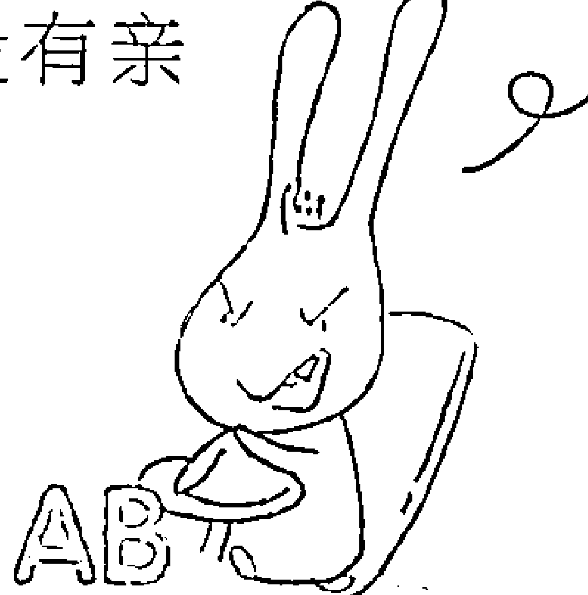

相较前半段人生的华丽，有些AB型白羊座在人生的后半段有衰弱的运势。如果年少有成，就应具有持续的耐力，才能进一步提升自己。不可认为已取得成功，便可高枕无忧。你的人生取决于你的努力。必须拥有理解的能力，培养圆通的性格。以长远的眼光而言，专心致力建立基础、稳定局势，是明智之策。因循此法，婚姻生活中将得到公婆疼爱，拥有安定幸福的人生。

AB型白羊座的人全身上下充满活力，体温偏高，过度劳累后也能很快恢复。请注意神经痛、头部的伤害，以及眼、鼻、胃肠的疾病。若要调节情绪，不妨从事户外运动。打球或慢跑，尽情地活动肢体。出外旅行时，建议你到阳光普照的南方。适合从事富刺激感的休闲活动。

注意神经痛、头部的伤害，以及眼、鼻、胃肠的疾病。

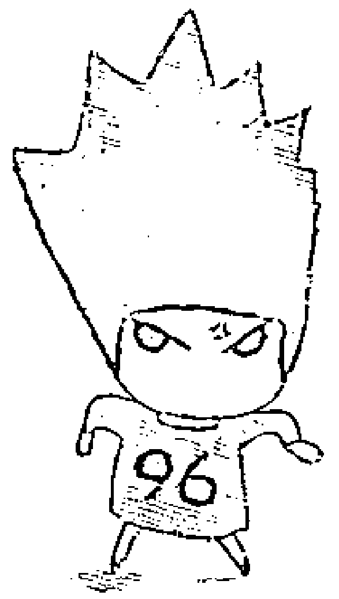

大家都明白感情需要温和慢炖，独独白羊男，满脸就写着一个急字。


白羊座的人天性火大，但脾气来得快去得也快，最好的办法就是不搭理他们。

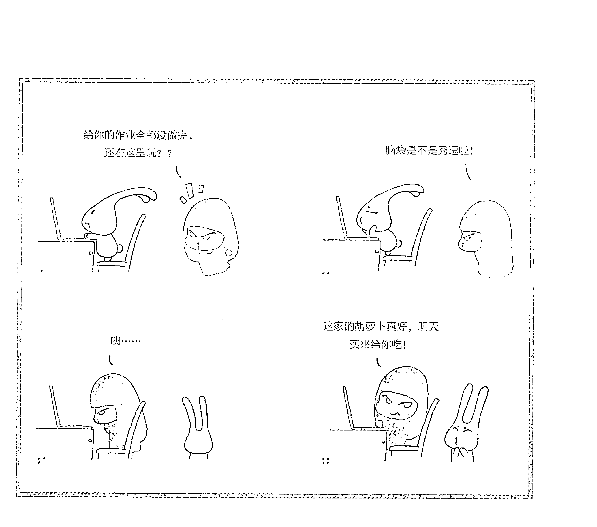

> 给你的作业全都没做完，还在这里玩？？

> 脑袋是不是秀逗啦！

> 咦……

> 这家的胡萝卜真好，明天买来给你吃！

### AB型白羊座

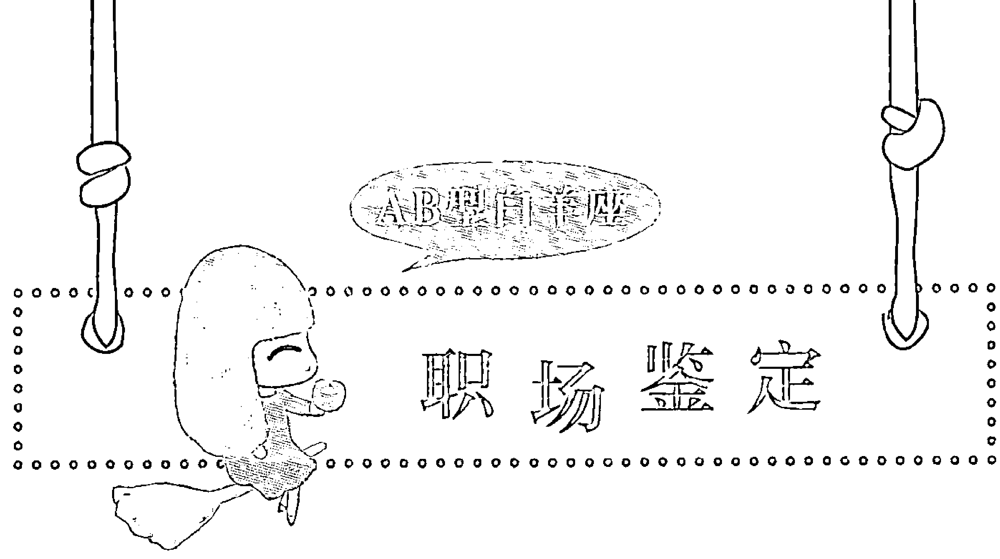

## 职场鉴定

头脑机灵、做事反应快速准确的你，是能够迅速敏捷处理工作的干才型的人。

在富有变化及竞争激烈的工作上，如果处于领导者的地位，可发挥你的实力。你适合独立创业，或在中小企业中寻求活跃的舞台。不适合从事受人指使、听命于人的工作。如果要运用天生开朗活泼的性格，应选择能与多数人直接接触的工作。

> 如果要运用天生开朗活泼的性格，应选择能与多数人直接接触的工作。

适合你的职业是政治家、出版业者、媒体相关业者、广告文案人员、公关、顾问、导演、美容师、演艺人员，甚至自己创业。

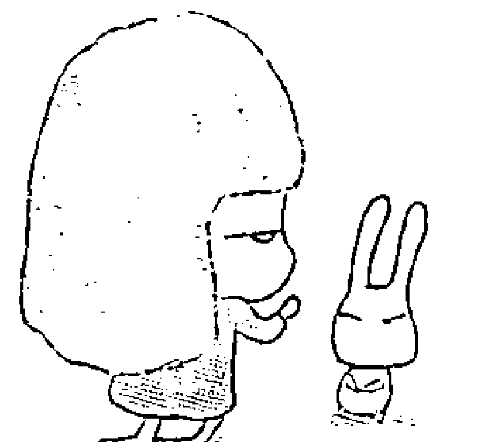

星座是一种生活方式

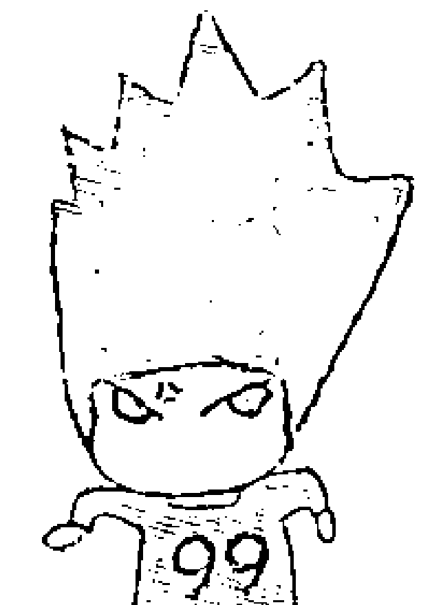

AB型白羊座是四种血型白羊座当中第六感最发达的一群人，这会为你的职场生涯带来意料不到的好机遇，千万不要荒废了自己天赋的才华，淋漓尽致地施展才是正经事。

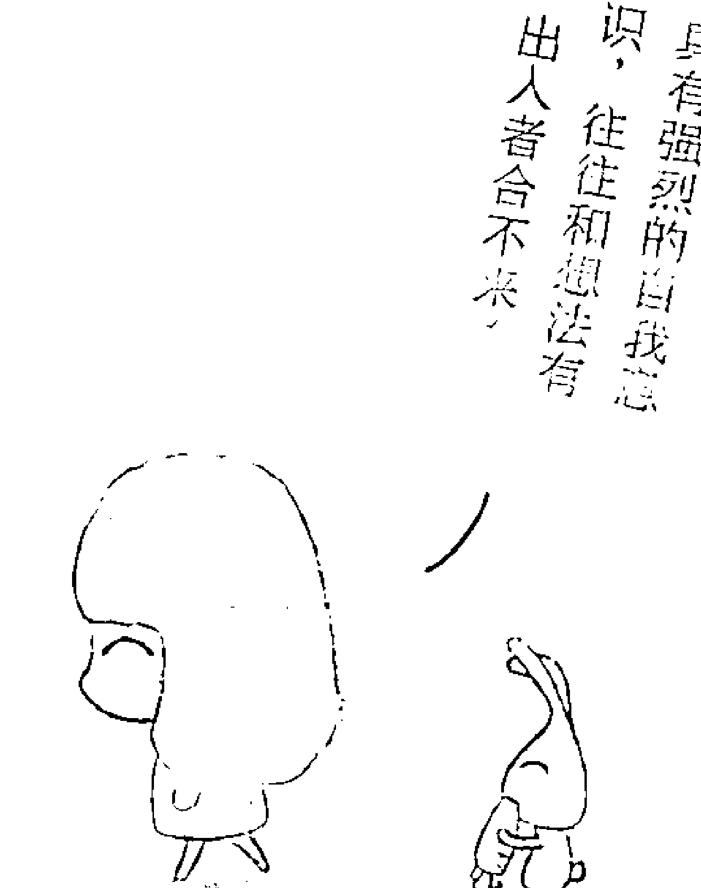

你似乎具有做任何事都能无往不利的能力。因此如活用广泛的兴趣，足以成为各专业领域的佼佼者。运动神经非常发达，善加利用运动社团或团体活动，将有许多难得的机遇等着你。因此，千万不要闷在家中，尽量走到户外，结识更多的朋友。你必须藉由阅读、美术鉴赏或听音乐等方式扩大自己的兴趣层面，提升自己的层次。以坦率朴实的心和自己原有的面貌与他人接触，可会获得更多的机遇。

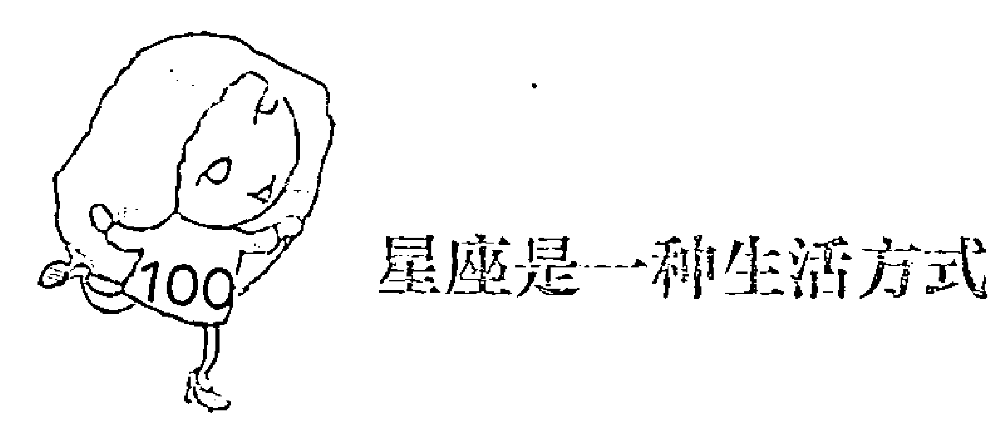

但AB型白羊座的人由于个性过于黑白分明，具有强烈的自我意识，往往和想法有出入者合不来，彼此很难理解对方。

因此，你和那些与你交往的人会明显地分出敌我，但天生乐善好施、善良的你，可能因为对方的态度，转变对他的观念。

很容易和你闹意见的是双鱼座，此外，和处女座、天蝎座、摩羯座的人也合不来。对于意气不相投的星座，建议你不要与他单独交往，要利用团体活动接触。

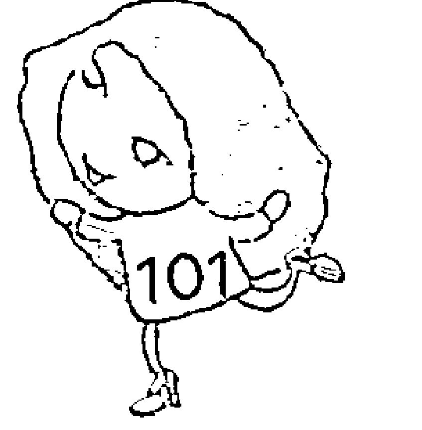

## Advice

“我不甘于从事这么无聊的工作。我应该有属于我的一片天空，而不是目前的境况。你也这样认为吧。”这是AB型白羊座的人常常抱怨的话，而一般人对于如此自命不凡、不求实际的人都会特别小心。因此，首要的提醒就是不要有太多的抱怨，这对你的成长有害无利，切记切记。

除此之外，要学会大方地说自己的缺点，对于自己的缺点，明白地表示出来反而轻松。“我非常讨厌自己的鼻子。矮矮塌塌的，你瞧，鼻梁也不正！”听闻此言，鲜少有人会嘲笑，反而会报以正面的鼓励。因此，推心置腹的协商是职场沟通的契机，有时你会被认为是难以理解的人，不能率直地谈论自己的问题。大方地与他人交谈是好方法，谈话内容不拘，可以是工作或人际关系上的问题，但必须是正在令你烦恼的问题。

大方地与他人交谈是好方法

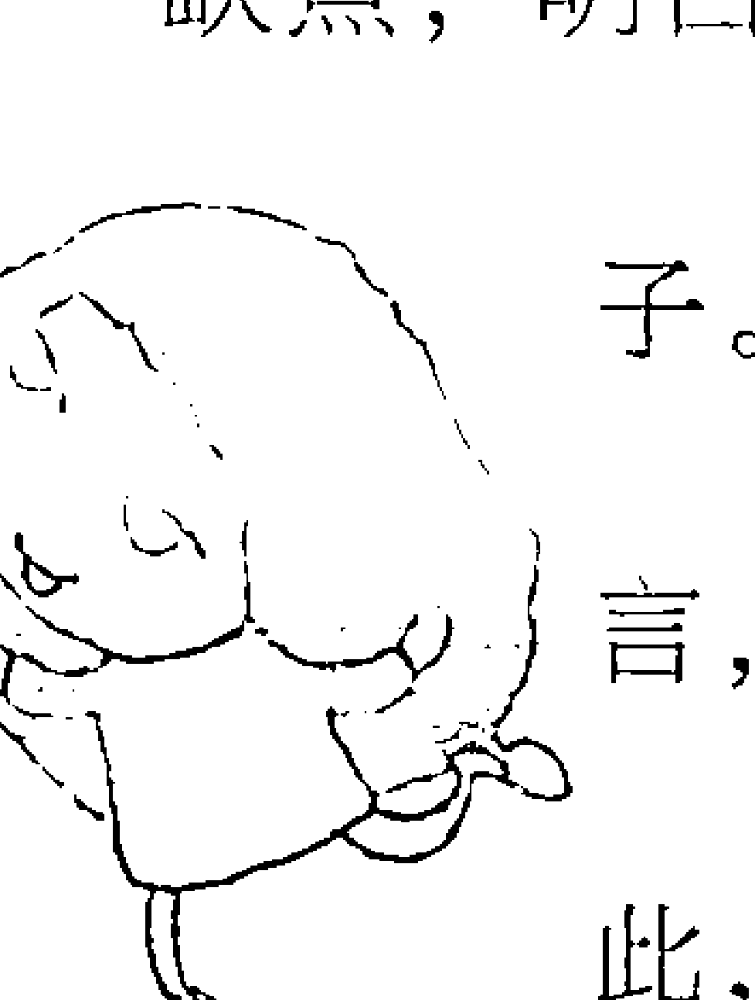

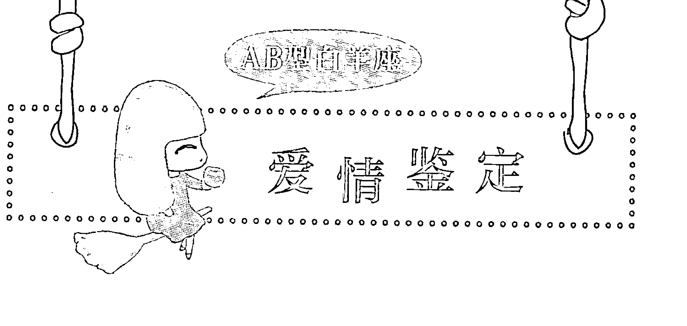

AB型白羊座是易热易冷的类型，爱火燃起时一发不可收拾，表现出主动追求异性的大胆。但是，如果出现稍感不快的事情，原本炙热燃烧的爱火，会急速冷却，变得冷淡。总之情绪的变化非常极端。

你不必刻意经营，就有吸引异性的特质，虽然你会认真地选择与你相配且能平等交往的情人，但找到符合标准的对象前，身边会有越来越多的异性，甚至可能不断地更换身边的护花使者。然而你的内心是诚恳的，头脑也非常聪明。对婚姻伴侣的要求非常高，并强烈地渴望谈一场认真的恋爱。但当意中人注意到你时，你反而对他的关心突然冷却，这种矛盾的态度，很容易令对方不知所措。以此态度谈恋爱的你，也许是自恋的倾向作祟。当你成长为一个能够认真地以平等的态度与异性相处的女性，性格必然就会安定下来。

唯有虽深受大家喜爱，却不以此自骄，且不惜任何努力为人生打拼的异性，才是最适合你的伴侣。你的对象不一定是众人瞩目的明星型，相反，个性朴实开朗的人，将与你非常协调。与你的搭配性最佳的异性是那种稳健牢靠型，充满斗志，足以为任何人倚赖，碰到困境或遭逢苦难时信心也绝不不动摇的男性。最好更兼性格爽朗、外型帅气。这样的人不会以个人的偏见，或听信他人谣言，对你妄下评断，能以客观的眼光看待你。如果话题丰富，懂得如何取悦你，你的生活将因此变得更愉快。

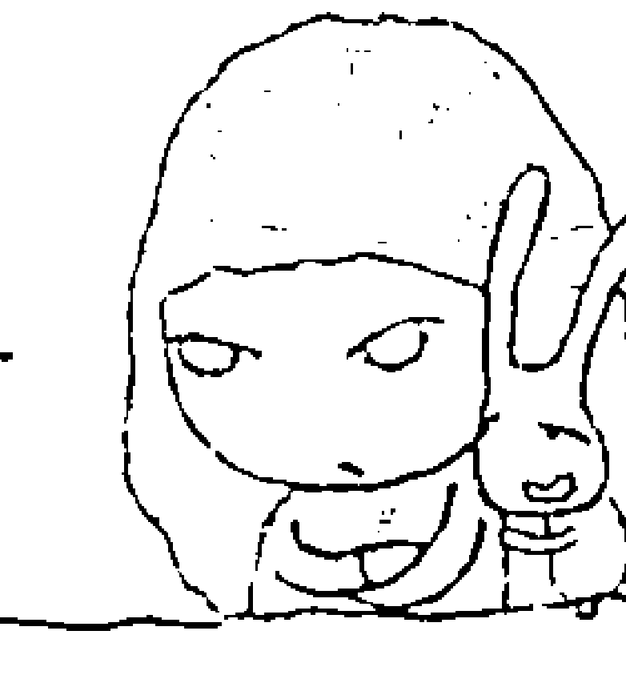

年龄上的差距不会造成问题，不过，选择同年龄或差距两三岁的人（年轻或年长），比年龄差距悬殊者好。

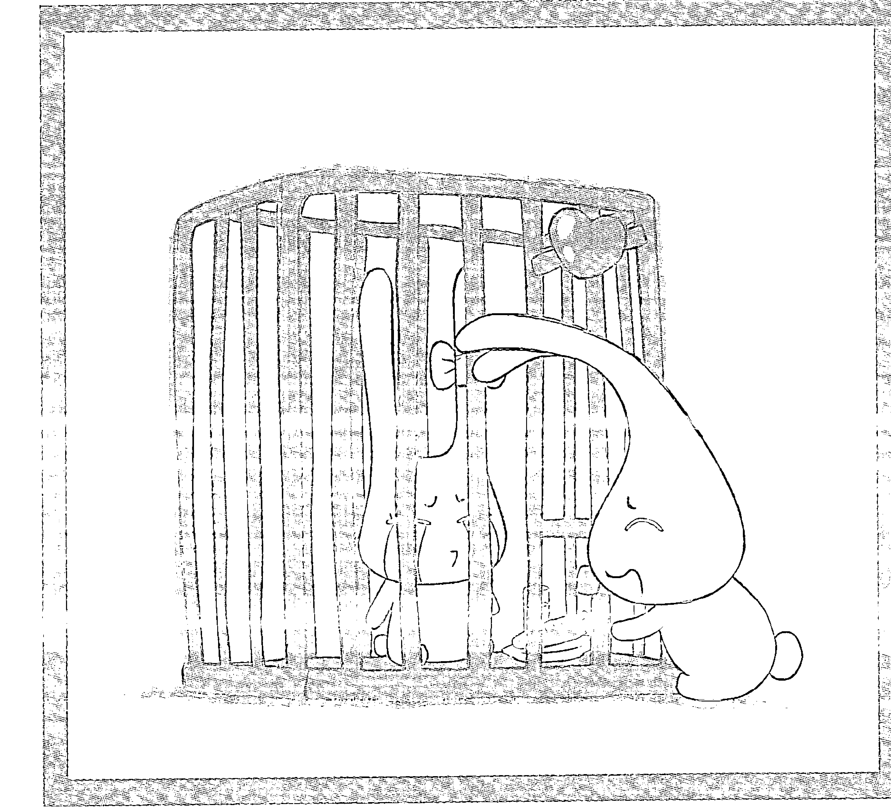

白羊男追你的时候，你会觉得你就是上天恩赐给他的公主，追不到你，他绝对会被玉皇大帝砍。

## Chapter 5

## 什么是十二星座？

其实关于十二星座的精准定义，几千年来都没有人可以给出真正意义上的名词解释，而如果我们在薄薄的一本星座人手册里再描述过多的天文学知识，实在太有凑字数之嫌了。我们不如用另外一种方式，来解读十二星座的划分，以及对于我们生活的影响。

唯一需要解释的是，为什么有名字的星座有88个，而被占星学使用的星座却只有12个？这是因为2000多年前，古代天文学家就发现，太阳在星空中是不停移动着的，每年移动一周。这种现象，实际上是地球绕太阳公转的反映。太阳对于人类的重要性是不容置疑的，所以它在星空中移动的路线就有了专门的名字——黄道。

黄道穿过十二个星座，这十二个星座自然就有了“黄道星座”的说法。

+   两极性质
    - 阴性星座
    - 阳性星座
+   四分性质
    - 火象
    - 地象
    - 风象
    - 水象
+   三分法
    - 本位型
    - 固定型
    - 共同型

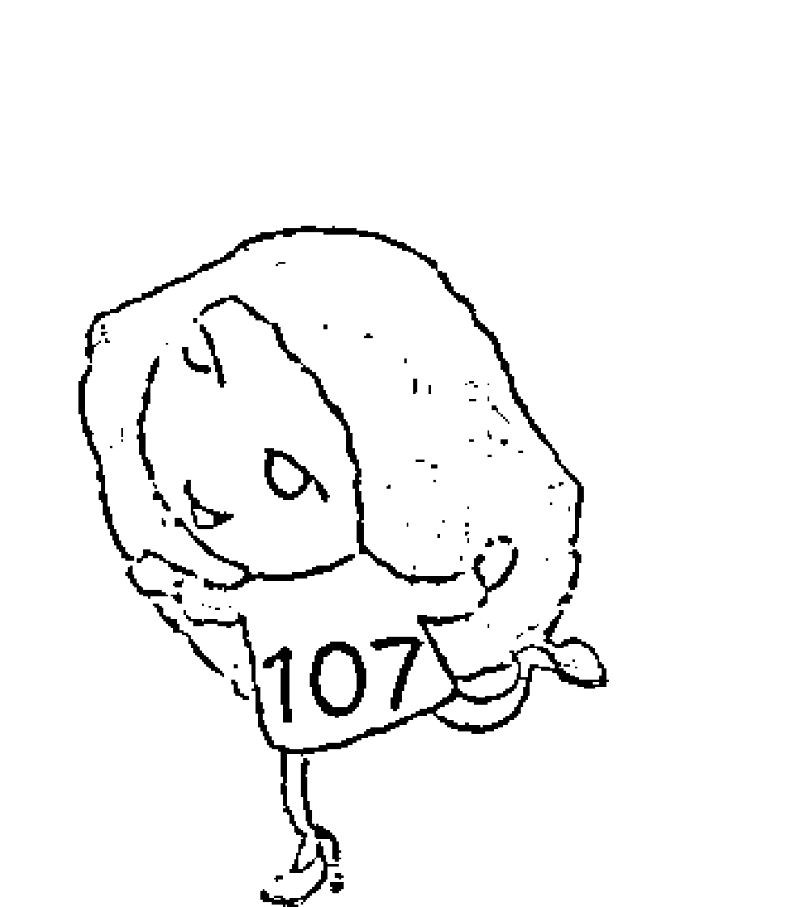

## 星座的“两极性质”

我们根据星座的两种不同特质，可以把十二星座分为两组。其中一组称为“阴性星座”，而另一组则称为“阳性星座”。

## 阳性星座

+   特点
    - 个性乐观、主动积极。
    - 开创性强。
    - 比较容易快速获得成功。
    - 得成功与成就。
+   星座
    - 水瓶座
    - 射手座
    - 天秤座
    - 狮子座
    - 双子座
    - 白羊座

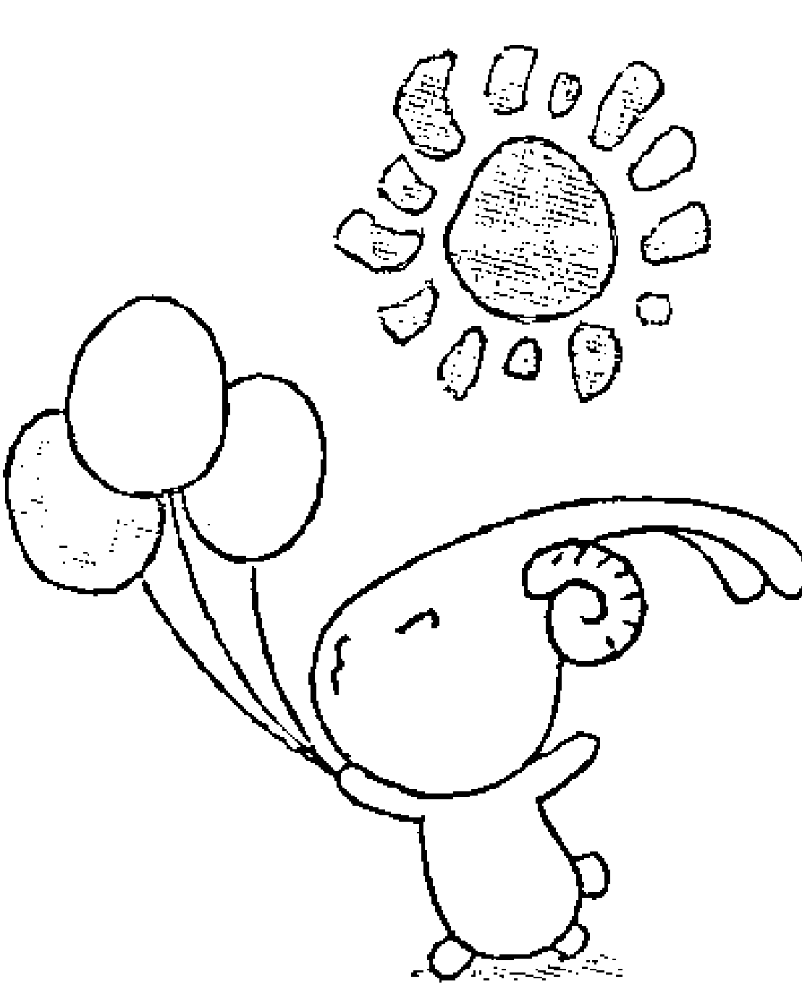

## 阴性星座

+   星座
    - 双鱼座
    - 摩羯座
    - 天蝎座
    - 处女座
    - 巨蟹座
    - 金牛座
+   特点
    - 个性悲观、被动、消极。
    - 开创性弱。
    - 成功与成就虽然来得迟缓，但具有永久性。

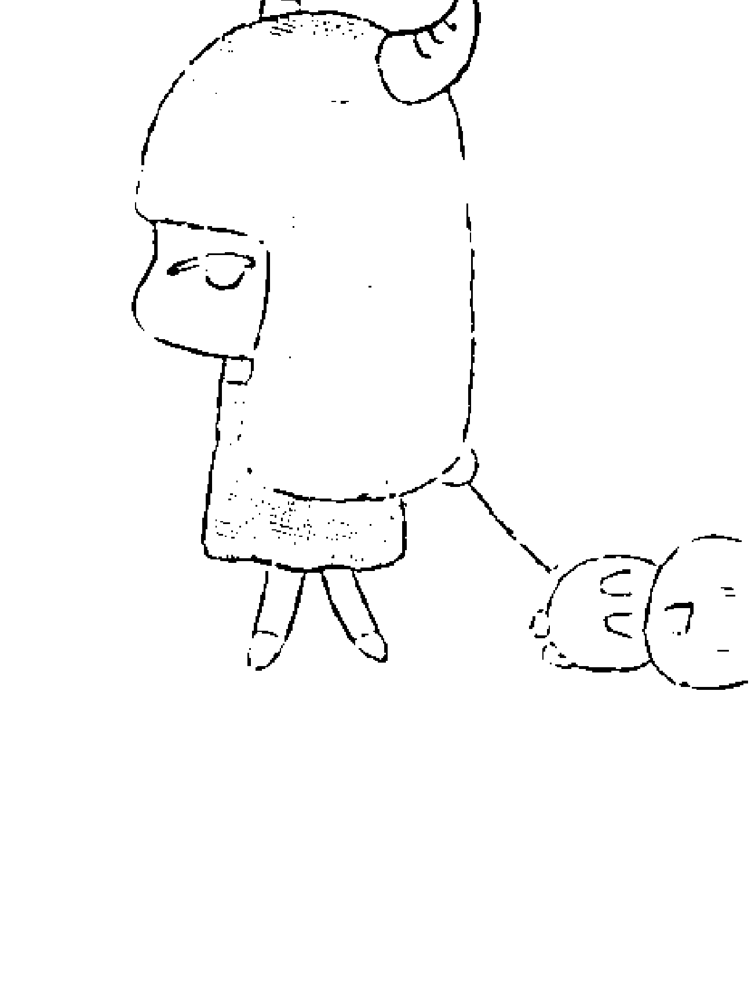

星座是一种生活方式

### 火象星座

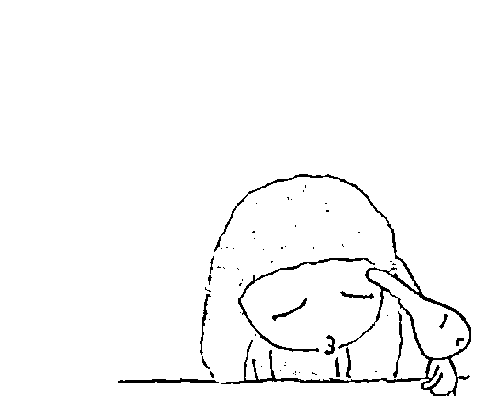

+   星座
    - 白羊座
    - 狮子座
    - 射手座
+   特点
    - 热情如火、率性而为。
    - 自负但浪漫。
    - 缺点：专横霸道与太过激烈...

---

### 地象星座

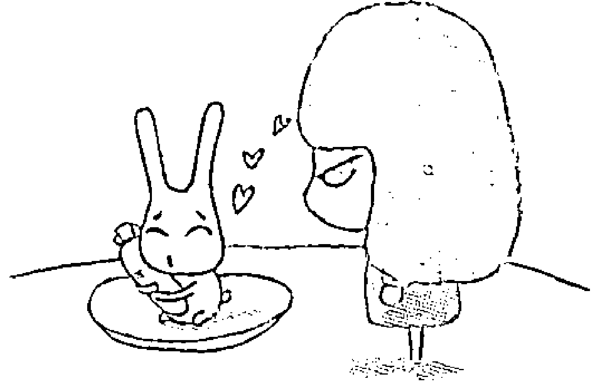

+   星座
    - 金牛座
    - 处女座
    - 摩羯座
+   特点
    - 实际、独立、保守、官能主义。喜爱物质上的舒适。拥有优秀的身体复原能力。缺点：笨拙、不灵巧、过于物质崇拜。

星座是一种生活方式

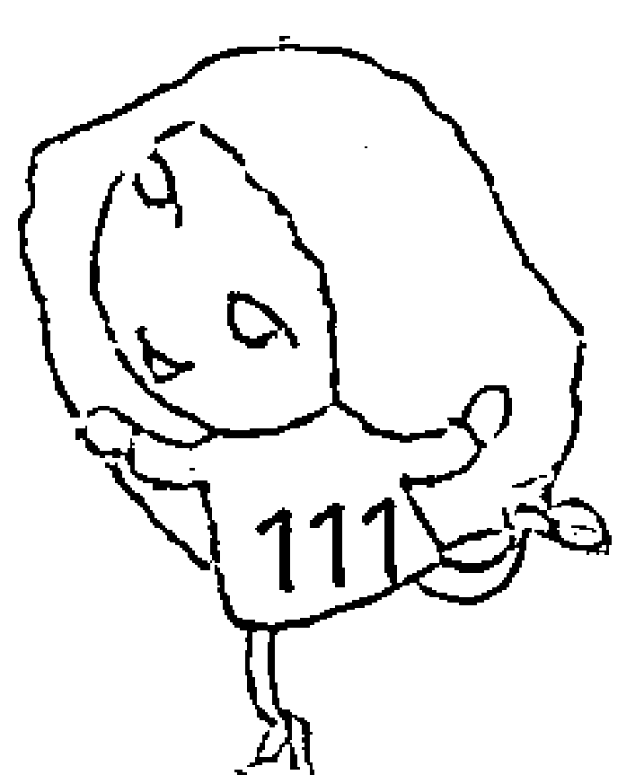

## 水象星座

+   星座
    - 巨蟹座
    - 天蝎座
    - 双鱼座
+   特点
    - 感受敏锐易动感情，且感情持久。直觉丰富、感应力强、敏感。易受情绪左右，且易受环境影响。缺点：自我放纵、自怜与犹豫不决。

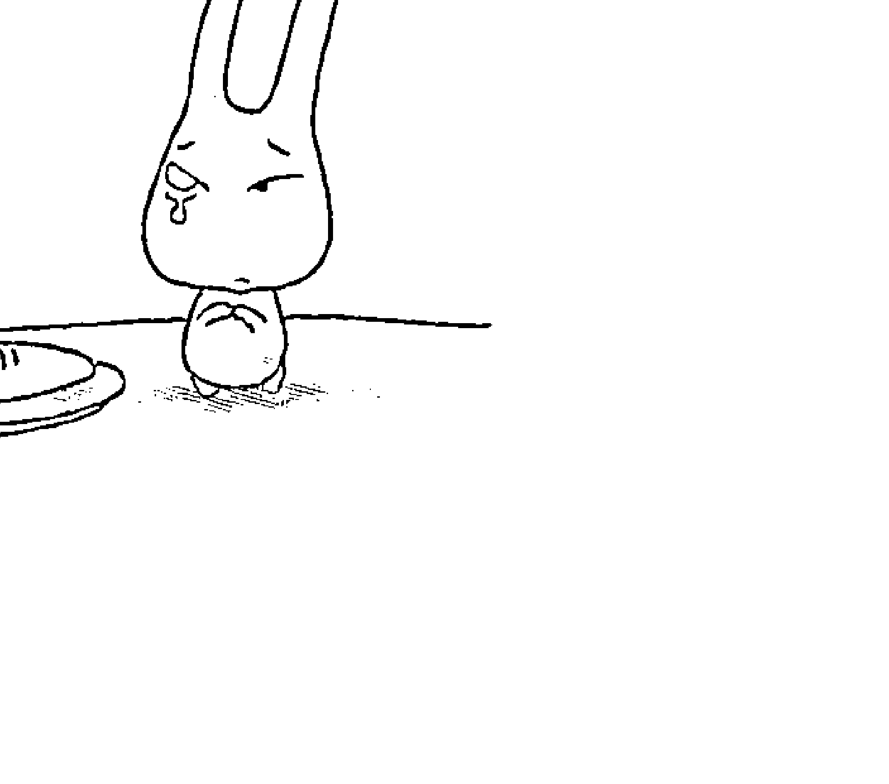

### 风象星座

+   星座
    - 双子座
    - 天秤座
    - 水瓶座
+   特点
    - 表达能力佳。
    - 擅长抽象的推理。
    - 有逻辑头脑，心胸宽阔、客观、无偏见，且有理想主义的倾向。
    - 缺点：冷漠与不切实际。

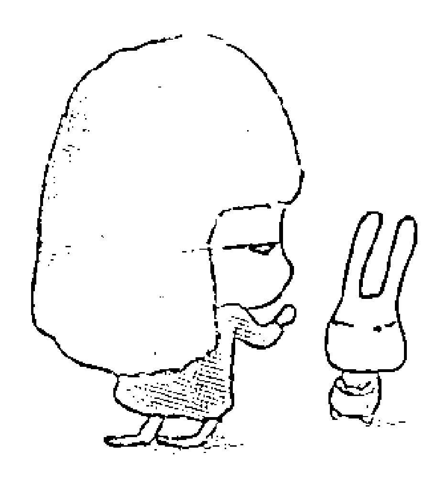

### 本位型星座

这四个星座恰如罗盘上的四个原点：白羊座在东，天秤座在西，巨蟹座在北，摩羯座在南。它们之所以称为“本位型”，乃因为它们掌握四季的变化。白羊座主春季、巨蟹座主夏季、天秤座主秋季、摩羯座主冬季。

+   星座
    - 摩羯座
    - 天秤座
    - 巨蟹座
    - 白羊座
+   特点
    - 看法，自我中心。缺点：顽固，过于固守自己的达成目标的步伐缓慢但扎实。富于洞察力，记忆力绝佳。能够做积累的功夫。意志坚决，能够专注，稳定，

# 「星座的「三分法」」

我们也可以把黄道上的十二星座，每四个一组，分为三组。同一组中的星座有共同的特性，每一组都有其表现生活形态的样式。

### 固定型星座

这些星座是每个季节的中间月份。本位型星座带来季节的交换，而固定型星座则稳固地夹在每个季节的中段。

+   星座
    - 金牛座
    - 狮子座
    - 天蝎座
    - 水瓶座
+   特点
    - 多能多艺，善于变通，性情易变，心思精妙。有同情心与丰富的直觉，其心智灵巧有弹性。缺点：好欺骗、狡猾、诡诈、没有恒心、不够可靠。

### 共同型星座

共同型星座是每个季节的结尾，这是一段完成该季节的工作、开始计划下个季节的时分。

+   星座
    - 双鱼座
    - 射手座
    - 处女座
    - 双子座


星座是一种生活方式

## 你可以不相信星座，但不能不相信闹闹

处女座的人是完美主义者，极度厌恶虚伪和不正当的事情。无论年纪大小，都保有一颗赤子之心，充满了对过去的回忆和对未来的憧憬。

处女座的人是不惹人注目的效率冠军，是谦虚的典范。

计较、自私、与你终生相伴，小气、更是你的特色。

标准的低温动物，他们冰冷的理智和冷漠的行为正是人类中一种被称为“老处女”的品种完美的写照。

处女座的人，智商不高，情商很高。

对学习怀着崇敬和认为很重要丰富可以使人不被不可当做命在他面前会激发更强烈的使他兴奋从各种诠释

他陷入情网时，很少直截了当地表达，而会采用含蓄的方式，而恋情看来颇为寂寞。

处女座是一个物质星座，所以不但爱钱，还爱得很过火，加上谨小慎微的性格，一分一毫都要算得仔仔细细、清清楚楚，可谓斤斤计较。

他们对世界观察得太详细并知道太多了，以至于太过严肃，他也不喜欢冒险，不相信任何突发、不受控制或无法解释的事情。

+   处女座血型
    - A型处女座：纯洁善良，谨慎怯懦。
    - B型处女座：可爱懦弱，个性矛盾。
    - O型处女座：老老实实的纯情派。
    - AB型处女座：外表冷漠，内心充满幻想。

ISBN 978-7-5086-2051-0
定价：16.80元

最容易被讨厌的星座。

处女座的人具有洁癖的倾向，因而在情感生活上较难和别人建立起亲密的关系。

# 处女座

## 闹闹的星座书

闹闹著 高瞻漫画

## 图书在版编目（CIP）数据

闹闹的星座书·处女座 / 闹闹著. —北京：中信出版社, 2010.7
ISBN 978-7-5086-2051-0
Ⅰ. 处… Ⅱ. 闹… Ⅲ. 星座－关系－性格－通俗读物 Ⅳ. B848.6-49
中国版本图书馆 CIP 数据核字 (2010) 第074284号

# 闹闹的星座书·处女座
NAONAO DE XINGZUO SHU · CHUNVZUO

著者：闹闹
策划推广：中信出版社（China CITIC Press）
出版发行：中信出版集团股份有限公司（北京市朝阳区和平街十三区35号煤炭大厦 邮编 100013）
（CITIC Publishing Group）
承印者：山东新华印刷厂德州厂

开本：787mm×1194mm 1/32
印张：3.5
字数：95千字

版次：2010年7月第1版
印次：2010年7月第1次印刷

书号：ISBN 978-7-5086-2051-0 / G · 424
定价：16.80元

# 版权所有·侵权必究

凡购本社图书，如有缺页、倒页、脱页，由发行公司负责退换。 服务热线：010-84264000

http : //www.publish.citic.com
服务传真：010-84264033

E-mail : sales@citicpub.com
author@citicpub.com星座是一种生活方式

其实，一直以来，我对于自己被称做“星座专家”，亦或“女巫”、“大师”，都是诚惶诚恐的。说到底，我不过是一个有机会接受了一些关于星座的正规教育，又热爱星座，并愿意付出努力去研究的学生而已。

而星座对于我们生活的影响，实在是显而易见的。每周二，有如此多的读者等待着新一期杂志或周刊的出街，他们会迅速翻到有星座专栏的那一页，先看一下未来一周的工作、生活、交友会是怎样的状况。也有越来越多的人会在聊天时，甚至面试的时候，首先被问起星座……

一切一切，都在告诉着生活在都市里的我们：星座，早已成为我们生活的一部分。对于大多数只是希望借助星座来了解自己、调整自己、改善自己的普通人来说，也许占星学与神秘学的博大精深跟他或她并没有太多关系，大家不过是想凭借着一些简单的语言、直白的描述和不太晦涩的逻辑，了解自己所在星座与自己所属的血型组合起来，会有怎样的人生，应该怎样面对职场，如何调整自己以迎来更美好的明天……

于是，我决定写下这套书，来满足有着这样需求的读者。他们也许并非星座爱好者，但他们相信占星学与血型科学对人的影响；他们不求对占星学的每一个专有名词、每一个宫位有详细深入地了解，但他们希望用最直接的方式被告知，与他们星座相关的凡此种种。

为这些读者服务，恰是我完成这套书的动机。

需要说明的是，被很多读者喜欢的《爱情全占星》与《血型星座全占星》的出版已经是两年前的事情，而那套书，也已经完全地卖断货了。虽然有读者给我鼓励，但我看到的，依然是书中无数的不足，于是决定，那套书不再再版。我会细细改正全部的错误，加入过去两年中关于星座研究更新、更准确、更有趣的内容，形成这套新的丛书。当然，我也会纳入过去书中那些详实有效的内容，用这样的方式，拿出这套新的作品，以飨读者。

一切一切，就让我们重新从星空开始认识自己吧。

## Chapter 1 处女座鉴定书

- 处女座·事业鉴定 ………… 20
- 处女座·爱情鉴定 ………… 22
- 处女座·财富鉴定 ………… 45
- 处女座·健康鉴定 ………… 47

## Chapter 2 各星体落在处女座

- 太阳在处女座 ………… 50
- 月亮在处女座 ………… 50
- 水星在处女座 ………… 50
- 金星在处女座 ………… 50
- 火星在处女座 ………… 51
- 木星在处女座 ………… 51
- 土星在处女座 ………… 51
- 天王星在处女座 ………… 52
- 海王星在处女座 ………… 52
- 冥王星在处女座 ………… 52

## Chapter 3 处女座女性阅读专区

- 提升职场魅力 ………… 56
- 社交夺目法则 ………… 58

## Chapter 4 处女座血型鉴定书

- A型处女座 ………… 62
- B型处女座 ………… 72
- O型处女座 ………… 80
- AB型处女座 ………… 88

## Chapter 5 什么是十二星座？

- 两极性质 ………… 98
- 四分性质 ………… 100
- 三分法 ………… 104

处女座的人，一辈子都在准备。

## 第六宫
8/23-24-9/22-23

处女座是全天空第二大星座。古希腊人把处女座想象为生有翅膀的农神得墨忒尔的形象，她一手拿着麦穗，仿佛在和人们一起欢庆丰收。

# 中心位置

赤经13时20分，赤纬-5度。在狮子座之东，天秤座之西。α星（角宿一）是一等星，同狮子座β星和牧夫座α星构成一个等边三角形。座内有亮于四等的星15颗。

## 观星

顺着大熊座北斗勺把儿的弧线，就可以找到牧夫座α星，也就是大角。沿着这条曲线继续向南找，再经过差不多同样的长度，可以看见一颗亮星，这就是处女座α星，我国古代称为角宿一。连接北斗的α星和γ星，延长到七八倍远的地方也可以看到角宿一。

## 奴仆宫

这是个物质之宫，代表你的工作、健康与习惯。它显示雇佣关系，以及雇员、房客、仆人、宠物、被抚养人的状况。显示你能为他人提供的服务，例行公事，你的衣服与你穿着服饰的方式，卫生保健、疾病以及各种影响健康的状况。这个宫位也代表叔伯姑婶等旁系长辈，以及你心智中的无意识部分。

> 闹闹，冰箱坏了，我的冰激凌只好你抱着了。

处女座的人也是标准的低温动物，他们那冰冷的理智和冷漠的行为正是人类中一种被称为“老处女”的品种的完美写照。

旺势行星：水星。
落陷行星：海王星。
弱势行星：金星。
身体部位：腹部、大小肠、结肠、十二指肠、肝脏、胰脏、胆、胆囊、肚脐、下腹网状组织、下神经丛、下腹内脏。
星座疾病：消化不良、便秘、肠部问题、结肠不整等。
正面特征：勤劳、好学、科学气质、讲求方法、善于分辨、求真、精确、仁慈、讲求完美。
负面特征：好批评、琐碎、忧郁、自我中心、担心疾病的困扰、挑剔、学究、怀疑主义、邋遢。

星座名：Virgo、乙女座、天女座。
符号意义：处女、希腊文「处女」的拼法。
星座象征：地象、阴性的变动星座，代表柔顺和蛮荒。
守护行星：水星、谷神星、灶神星。
相对星座：双鱼座。
星座句诀：我分析（I analyze）。
星座字诀：识别辨明、服务。
入庙行星：水星。

很多人一提到处女座的人就有本能的抵触情绪，就想到洁癖或者吹毛求疵，其实，这是很偏颇的。

处女座的人看起来干干净净、伶俐过人，拥有一双眼神柔和且善于观察的眼睛，嘴巴的弧线优美，下颚宽阔，整体而言，散发着清新而高雅的气质。

通常情况下，处女座的人很容易是个完美主义者，极度厌恶虚伪与不正当的事。无论年纪大小，都保有一颗赤子之心，充满了对过去的回忆及对未来的梦想。他们也很实际，总是可以使幻想和实际共存且共荣。他们十分看重细枝末节，常为了小地方的完美而忽略了大局，喜欢批评他人。水星的位置影响这种倾向的强弱，例如太阳的位置在处女座、水星的位置在狮子座时，则较能顾全大局。优秀的处女座人不仅慎重且具乐于助人的天性，充分享受施与的乐趣。

处女座的人一般对学识渊博的人怀着崇敬和亲近的心，他们认为知识是很重要的，丰富的知识可以使人通达天地，不会被命运中不可解的谜团所困扰。当命运阻挡在他面前时，会激起他更强烈的求知欲，并使他兴致勃勃地从各种角度去诠释它。

> > 这幅毕加索的画是你挂在这里的吗？
> > 嘻嘻……
> > 赞一个。
> > 不过下次注意不要把画挂倒了。

处女座的人是不惹人注目的效率冠军，是谦虚的典范。

处女座的人，骑驴找马。

我一定要找到一把更帅更有型的扫把……

这是一个典型的独身者的性格，不喜欢意料之外的事情。在激情所致的内心骚动面前，常常显得惶恐万分。他们用持续不断的自我克制或批评精神来自卫，把遵守习俗作为行动的准则，一成不变的生活是他理想的天堂。

因受到土星的强烈影响，处女座的人多数表现得冷漠而疏离，一副拒人于千里之外的神情，谁见了都不会觉得他们平易近人，如果单单看第一印象，他们铁定会因为分数太低而出局。但是这绝对只是自我保护的外壳，外表冰冷内心如火，才是他们的真面目。所以要认识处女座的人，一定要通过日积月累的相处，才能知道他们的优点，像认真、负责、意志坚定、有做大事的气魄、理性、思考精确等等，他们会因为这些优点而在人群中树立起良好的形象和名声，也会因为这些优点而成为最可信任和依赖的人物。

闹闹，你知道什么是走光么？
盖盖，你学坏啦！
自从你变身为处女后……
周围的邻居都搬家走光啦！
计较是你的优点，自私与你终生相伴，小气更是你的特色。

> 处女座的男子是个既认真又有强烈责任心的人，一丝不苟地做好本职工作是他的座右铭。

## 处女座的男子

处女座的男子是个既认真又有强烈责任心的人，一丝不苟地做好本职工作是他的座右铭，可以让别人充分地信赖他依靠他。他们最重视的两样东西是事业和钱财，视之为可以增加地位和声誉的保障，爱情在他们眼里是可有可无的。因为他们生来就没有安全感，而爱情在他们看来是变幻无穷的，有时候一句承诺还比不上一杯热拿铁来得让人温暖。即使有些处女座的男子会一辈子记得旧日的恋情，但别误会，这并非是痴情的体现，只是他们的记忆力太好的缘故，或者只是由于他们觉得失去的比得到的多。

## 处女座的女子

处女座的女子有一种内在的魅力，那是一种不受“时髦”影响的特有的浪漫气质。她的谦逊有时会发展到唯恐被人注意的程度，因此，她与生活总保持一定的距离，愿意为别人贡献出自己的全部精力。她十分注意细节，有时到了神经质的地步；也非常注重自己的安全，不喜欢意外的事情。她是一个相当出色的家庭主妇，懂得如何体贴、照顾自己的亲人，使他们心情愉快、身体健康。她心甘情愿地承担起家庭生活的责任，但她需要别人把她的辛勤劳动看在眼里，感到她是不可缺少的。她很善于为别人治病，但自己的身体会经常感到不适，需要用相当长的时间来调理自己脆弱的身体。

# 事业鉴定

因为过于追求事业上的成就感，绝大多数处女座的人都有潜力变成最超级的工作狂。

碌碌无为绝对不是处女座的人能忍受的，他们获取重要职位的愿望要比拥有一个幸福家庭强大一万倍。也许这是由于他们的兴趣爱好非常单调，因而无法将多余的精力疏导出去，只有沉迷于工作。无论是当老板还是单纯的上班族，他们都可以为了一个目的不辞劳苦，忍受各种煎熬，忍辱负重，承受巨大的压力。他们可以从白天忙到半夜，从周一忙到周末，从年头忙到年尾，吃饭也要看公文，几乎是争分夺秒地赶命。虽然是土象星座，但办起事来一点都不低调，甚至有时让人感觉颐指气使，这一点让老板们颇为喜爱。但事实是，这看起来是为公司卖命的劲头，其实只是他们想要实现心中的目标。因此，在职场上没有人敢小看处女座的人，只要他们的目的不变，肯定能将自己的技艺磨炼到最高水平，从而成为某个领域内的顶尖强人。

值得注意的是，处女座的事业宫里有黑月驻扎，可能需要多留意隐藏于表面之下的小问题，疏忽大意可能导致未来会出现更大的问题。

### 爱情鉴定
*处女座*

必须得承认的是，处女座的人其实都是一些内心非常压抑的人，而且非常非常实际，因此要他们相信一见钟情是相当不容易的。

他们对世界观察得太详细并知道太多了，以致太过严肃。再者，他们不喜欢冒险，不相信任何突发、不受控制或无法解释的事情。处女座的人又具有洁癖的倾向，因此在情感生活上较难和别人建立起亲密的关系。当他陷入情网时，很少直截了当地表达，而会用含蓄的方式，故而恋情看来颇为寂寞。金星的位置决定着此星座的情感，假如太阳和金星的位置同在处女座，他在情感上的禁忌会更多，同时也更难和旁人分享亲密的关系，不过当金星的位置在天秤座时，他表达的方式会较为自由，性格上也比较平易近人。

想要真正获得处女座的人的爱，你需要很多的时间去细心栽培。他们会选择可以信赖的对象，而不是耀眼的。你不难发现他的品位和习惯——永远选择有用、安全、有品质保障、有知识的对象。温暖与智慧对他们而言是相当具吸引力的，具幽默感的语言更是能引起他们的兴趣。他们凡事喜欢清楚明白，要求自己表现完美，包括分手也一样。看来温文尔雅，其实他们喜欢将恋爱的感觉藏在内心深处，一旦你通过考验、他决定付出时，压抑的感情即会爆发出来，他会忽然变得积极大胆，那时只有应不应该去做，不会考虑委不委屈。所以和他们相处的模式就必须随机应变，但中心思想不要变。

智商不高，情商很高，这就是处女座的人。

> “你知道梁祝化蝶的故事吗？”
> “太凄楚了！”
> “想来他们还是聪明的。”
> “没变成鹌鹑……”

处女座的人尽管在爱情上有这样那样的不足，但他们骨子里并不是特别冷酷的人，他们还是相信真爱，并期待被全身心爱护的，因此对于处女座的人，要给多他们一些理解。送他们定情信物，也一定要好好跟他讲清楚，这礼物里面包含了多少你对他的感情和忠贞。最适合送的定情信物是精致的、有家庭感的小工艺品，比如雕刻精美的木雕、欧洲的传统手工艺品或限量发行的纪念表等。处女座的人很会睹物思人，因为他们最喜欢这种很温暖、很受重视的感觉，只要一看到你送的小礼物，就会想到和你在一起共度的温馨浪漫的烛光晚餐。

记住，要用恒心、毅力和忠诚来打动处女座的人。

处女座的人对家庭的重视程度，恐怕得分两个阶段来看：第一阶段是他们在组建自己的家庭以前，跟父母同住一个屋檐下时。这时处女座的人在多数情况下是心存隔膜的，他们会遵守父母定下来的规章制度，力图不去违背或破坏它们，但是比较少感受到家庭的温情，或者说他们只理解维护家庭完整和安宁的秩序，没有理解在秩序以外的东西。因此他们可以没有多少牵挂地跑到外面求学、拼搏事业，即使他们不是真的不关心父母。

包包里的钱不够了，你只能吃差一点的胡萝卜了。
又买了炫酷的新包，还说没钱呢！
还有，处女座的女生最爱装穷！

它们在干嘛？
在玩失序……
处女座的人相信秩序，但他们的行为会让身边所有的人失序。

处女座的人要求一切都有条有理，而且最好是他们亲自当家做主。

第二阶段是他们到了成人的年龄有了自己的小家庭后。这时处女座的人是非常重视家庭的，因为他们认为稳定的家庭是安心打拼事业的保障，然而过去那套意识已经在处女座的心中根深蒂固了，他们自然而然地在新家庭里实施秩序化管理，这个东西应该留着，那个东西应该扔掉，这些钱应该存在银行里以作后备，那些钱应该留着作为每月支出。处女座的人要求一切都有条有理，而且最好是他们亲自当家做主。

## 捕获处女座法则

这是一件很简单的事情！他挑剔，但只要你比他更好，他就会住嘴，还会对你死心塌地！

## Step 1

想要追处女座的人，你必须先确定他是否也对你有好感。很容易，你只需约他两次。一次是私下里，一次是公众场合。如果他的态度差别很大的话，你就有希望了。害羞敏感的处女座的人在很多时候很别扭，而他们克服别扭的方式就是放得更开。这种表里不一的情况在他面对自己喜欢的人时更是变本加厉！为了掩饰反而更难掩饰。所以面对处女座的人，先确定他是否喜欢你比什么都重要，否则到头来你只会白忙一场，甚至还会有受骗的感觉。

## Step 2

处女座的人还有着“过尽千帆皆不是”的毛病。当他和你说了再见，不管是心平气和地说还是破口大骂地说，如果你在心底还抱着“或许还会复合”的念头那可就大错特错了。处女座的人说了“再见”就是再也不见。虽然他自己会痛得比谁都厉害，心里升起一千次想复合的念头，可是强烈的自尊心只会让他宁可痛苦也不回头，宁可孤独也不食言。

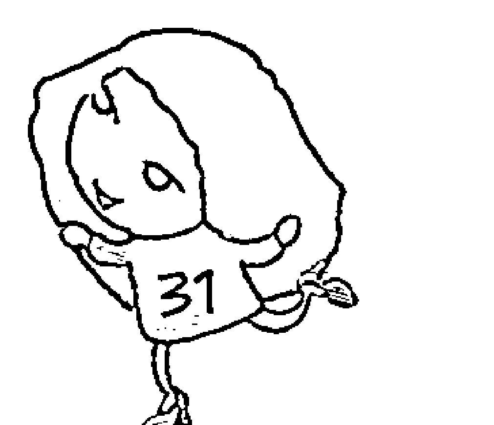

## Step 3

处女座的人也是一个“聪明反被聪明误”的类型，他们太过实际的个性经常会让恋人觉得这个人在恋爱或者婚姻的前后判若两人，为此而离婚或者分手的故事数不胜数。所以，恋上处女座的人，就必须先有这方面的心理准备哦。

处女座的人是最害怕自己上当受骗的。

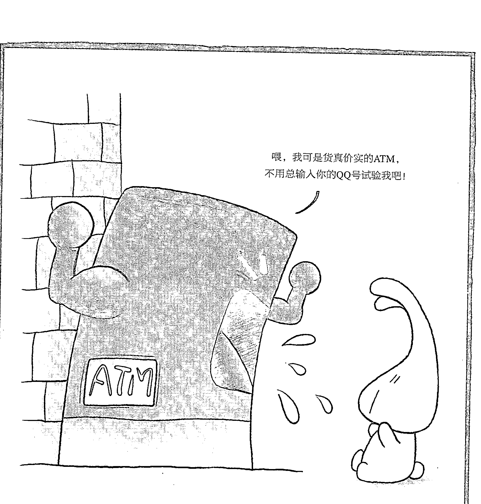

喂，我可是货真价实的ATM，不用总输入你的信用卡号试验我吧！

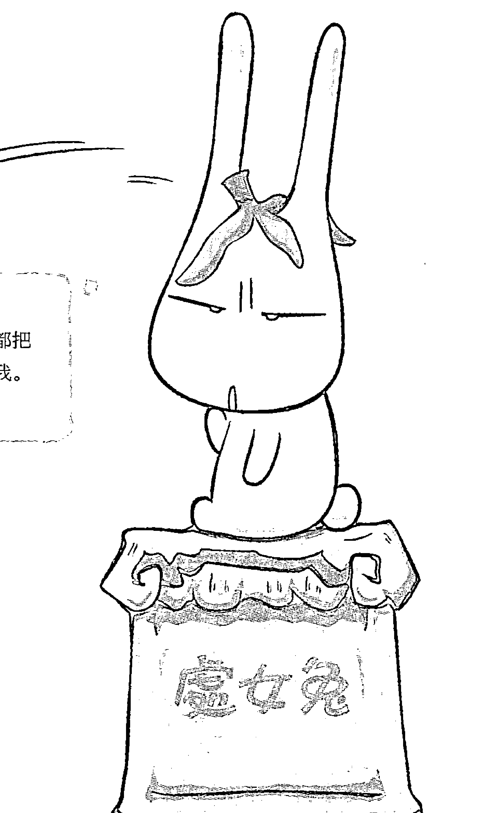

> > 拜托喔！别每次都把这样的角色留给我。

处女座是最容易被讨厌的星座。

当然，最后被处女座的人选中的人还是幸福的。只要你诚实、理性、负责，让他们信赖，另外不要嫌他们要求得多，你们就能够幸福到老。处女座和双鱼座的互相吸引是由来已久的，其实说起来，土象星座和水象星座并不是100%合拍的星座，但唯独处女和双鱼两个星座的人却常常会看对眼。不过他们却是适合恋爱未必适合结婚的典型，如果要将爱情的路走得长久，双方都需要付出很多努力，要克服很多性格上的弱点。

适合对处女座的人实施的爱情小魔法，源于他们内心深处的缺乏安全感，尤其是月亮和金星宫位不够好的那些人，即使自身条件再优秀，对方再深爱自己，也很容易觉得婚姻或者爱情不够牢固，因此，对他们的爱情小魔法其实就是帮助他们增强爱的信心。首先准备三条线，红蓝白各一条，然后拿着，先在心中默念所爱的人的名字三次，把三条线绑在一起再打三个结，在下一次约会的时候（结婚后还是可以约会嘛）戴在手上。

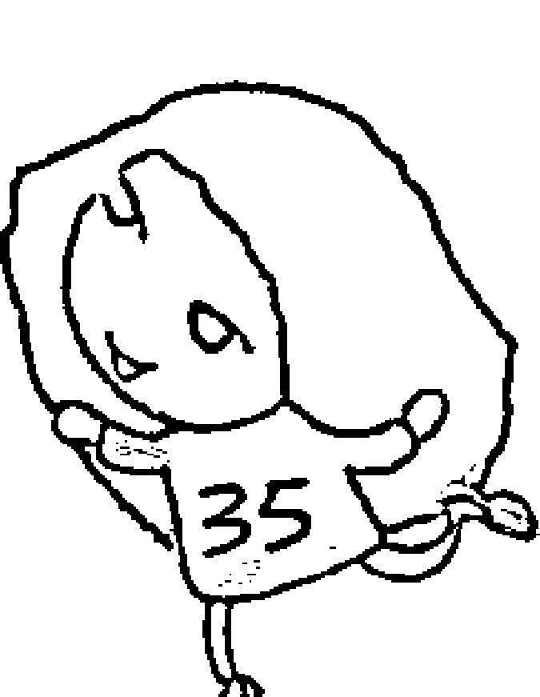

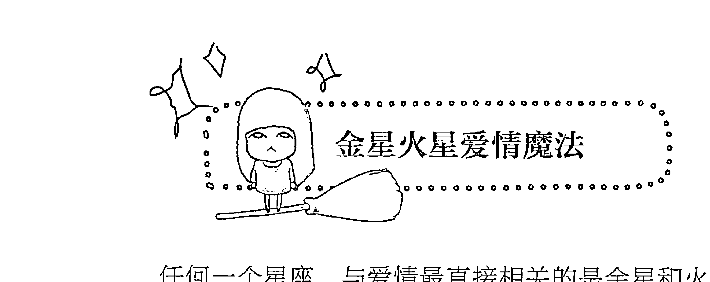

任何一个星座，与爱情最直接相关的是金星和火星，而金星、火星落在处女座的解析如下：

### 管理爱情的金星

金星代表的是爱情，在男生的占星图上则代表了女朋友。一个人会不会犯桃花、会不会到处留情，看的也是金星。金星同时也代表了俊男美女，所以一般的偶像明星都要有颗很强的金星，才能成就他们的事业。有意思的是，金星还代表了流行艺术，所以有些人可能很奇怪，有些西餐厅驻唱的歌手，长得一脸猥琐的样子，怎么可能还有那么多的人爱他们爱得要死。这就要归因于金星了，金星掌管爱情和音乐，所以一般人很难区分得清楚，究竟自己是爱上音乐呢还是爱上人？所以也难怪一些高中男生，就算爬山累得要死，也要死命地背把吉他，毕竟在音乐的催化下，容易让爱情有所共鸣。

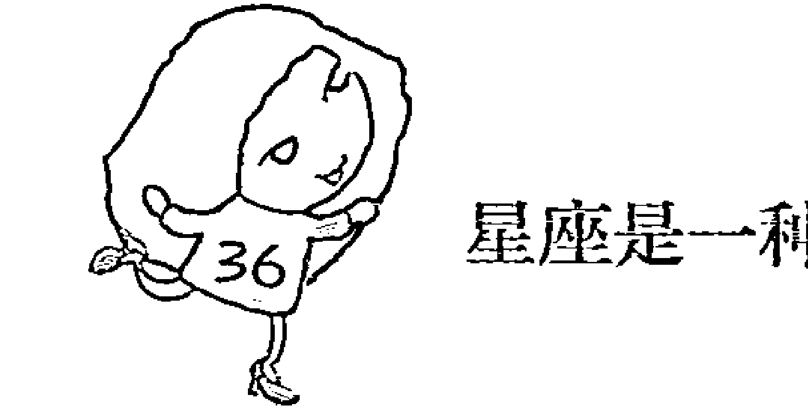

> 不是精雕细琢的爱情，我才不要！

## 金星在处女座

金星在处女座的人，可以一边看心爱的戏剧一边在骂，这实在不能责怪他们的性情不够温和，你知道金星管到一个人对于戏剧的审美观，以及对于艺术的品位，难怪他们爱对任何看不顺眼的情节找茬儿。这种百般挑剔的态度也会反映在他们的感情上。我曾经看到过一位金星在处女座的女子在毕业典礼上嫌男朋友送的五十朵玫瑰花不好看，理由是“一看就知道是今天在校门口买了十把凑起来的，谁谁谁……的男朋友都是用订的……”引号里的人名总共念了十来个。值得警惕的是，金星在处女座的爱情，有时会太过“务实”，很少因为爱情而忘记面包，更有甚者，不时还会瞧不起人。其实，金星在处女座的人之所以那么“务实”，有很大的原因是因为他们很胆小。也好啦，胆小的话，最起码就不会到处拈花惹草，只不过他们害怕的内容和别人不同，他们老担心比不上人家，即使是恋爱的对象也是如此。所以，如果你喜欢的人正好金星落在处女座，请切记，一定要看《VIVI》或是《Man`s Non-No》这些日本杂志（因为日本在占星学里是处女座管的），抱着找工作面试的心情兢兢业业仔细打扮，否则他会嫌你寒酸。连小配件也要挑好，他们可是很注意细节的。一件该用熨斗熨好的衣服，你却不熨，那你可就“面试”失败了，而且别忘了，他们的面试通常只有一次。

## 处女座的判断逻辑不适用于任何一个年代，而只存在于他们自己编织的幻想之中。

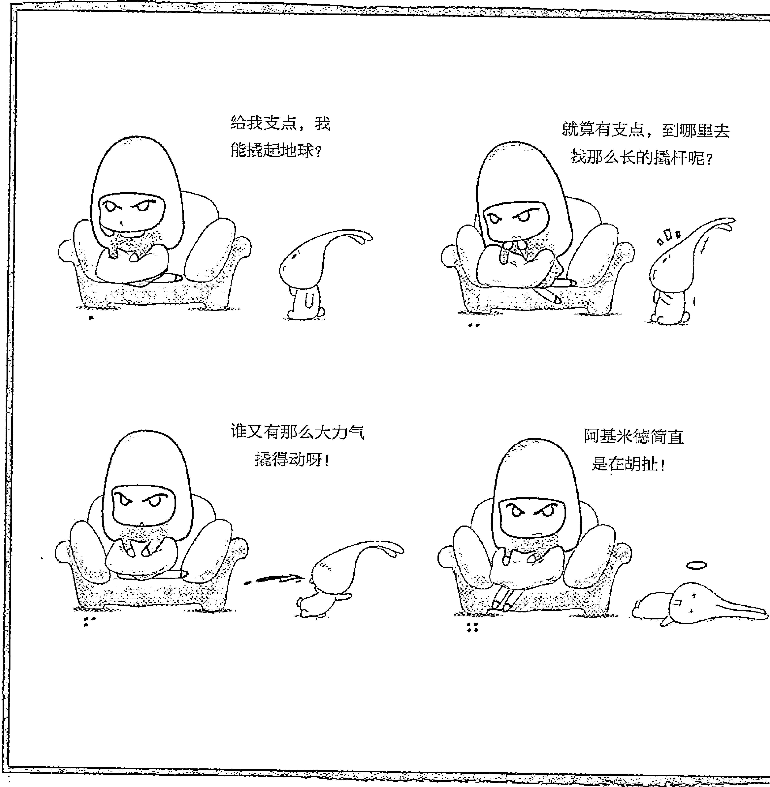

> 给我支点，我能撬起地球？

> 就算有支点，到哪里去找那么长的撬杆呢？

> 谁又有那么大力气撬得动呀！

> 阿基米德简直是在胡扯！

## 管理行动力的火星

“♂”这个挂在厕所入口、代表男性的符号，在女生的占星图上，正代表女朋友。而在男性的图上，则可以看出这个男人追女朋友的企图心和行动力如何。火星也代表了勇气、战斗力和军人，李宗盛有一首歌叫做《爱情少尉》，歌词里提到 “不要以为你有完全的准备，不要以为你有多好的防备，我要从你那里尝到爱情的滋味，我要紧紧地跟随！” 这正是火星精神的最佳写照。

同时，火星强的人通常可以成为好的运动员，也难怪很多运动员，像NBA的小虫等人，通常会花名在外，想想也不是很难理解，精力过剩的人，才有可能去挑战别人嘛！

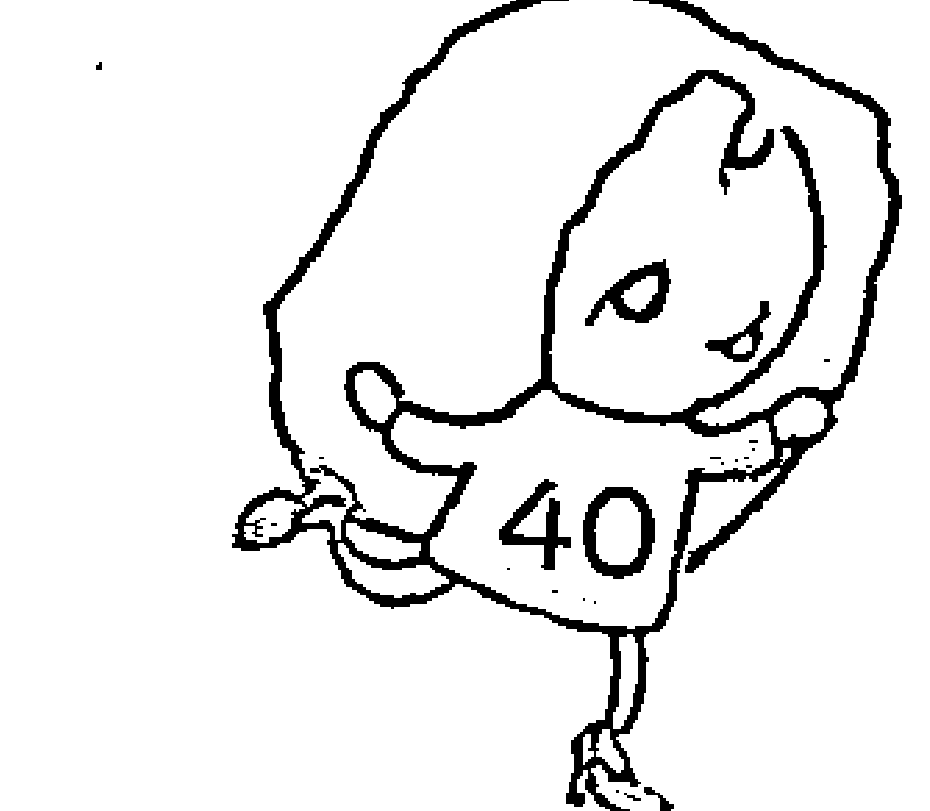

星座是一种生活方式

## 火星在处女座

> > “我对女友要求的不多，长相普通即可，可是五官一定要端正；身材适中即可，可是穿着不能随便。最重要的是，身家一定要清白，还有不能是断掌，最好擅长烹饪，爱干净是第一要务……”

电视剧里经常有这种人，早晚都摆着一副晚娘脸孔，其实充其量就是个管家的角色，而这种人就是典型的火星在处女座的人了。火星在处女座的人老因为他们的外在表现而被称做冷血动物。事实上，他们大概也不会在乎诸如此类的封号，反正从小学开始，当他还在当卫生委员的时候，就老是被人家这么称呼了。不过从本质来说，他们这样并不是不带感情或者自负，只是他们相当重视做事的效率，任何浪费时间或金钱的行为在他们眼里都是种罪恶，深怕会对不起那些在非洲连饭都吃不饱的难民。因为受到这些感情因素的影响，所以火星在处女座的人比较适合往军人或公务员职业发展。

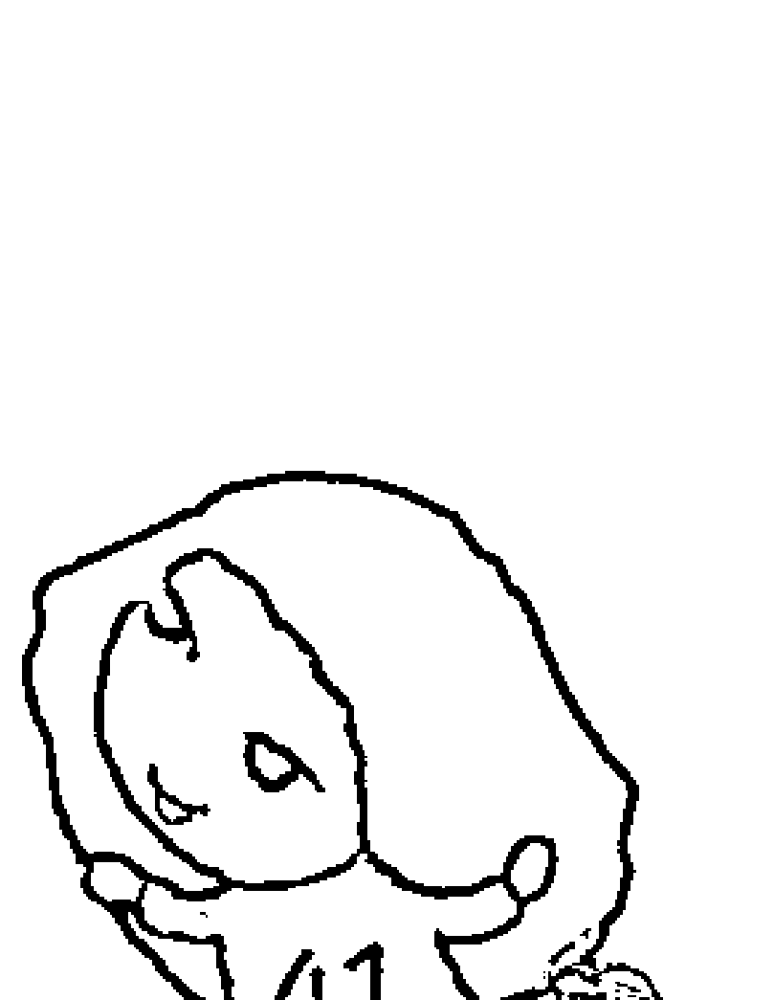

星座是一种生活方式

火星在处女座的人通常工作勤奋、努力发现错误，但表现在爱情上就蛮恐怖的。火星在处女座的男性常因他会提醒女友多加些衣服而被冠上体贴的美名，不过这其实不是他重视细节，而是对自己严格要求的缘故。等到跟他相处久了你就会知道，他在言语上并不懂得赞美情侣，反而还会故意批评你的缺点，伤害你的自尊心。但如果你可以了解包容的话，反正突变的爱也是爱，谁不是青菜萝卜各有所爱呢？

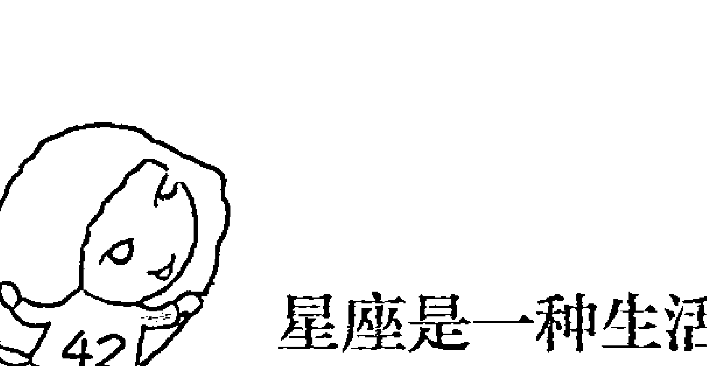

处女座的人的方向感也许好过金牛座，只是牛儿们往往很清楚地知道自己在这方面的缺点而懂得谦虚，但处女座的人却是坚持到底，直到和他同车的人宁可下车走路，也不愿再与可笑到了极点的处女座的人同行，免得全车人小命不保。

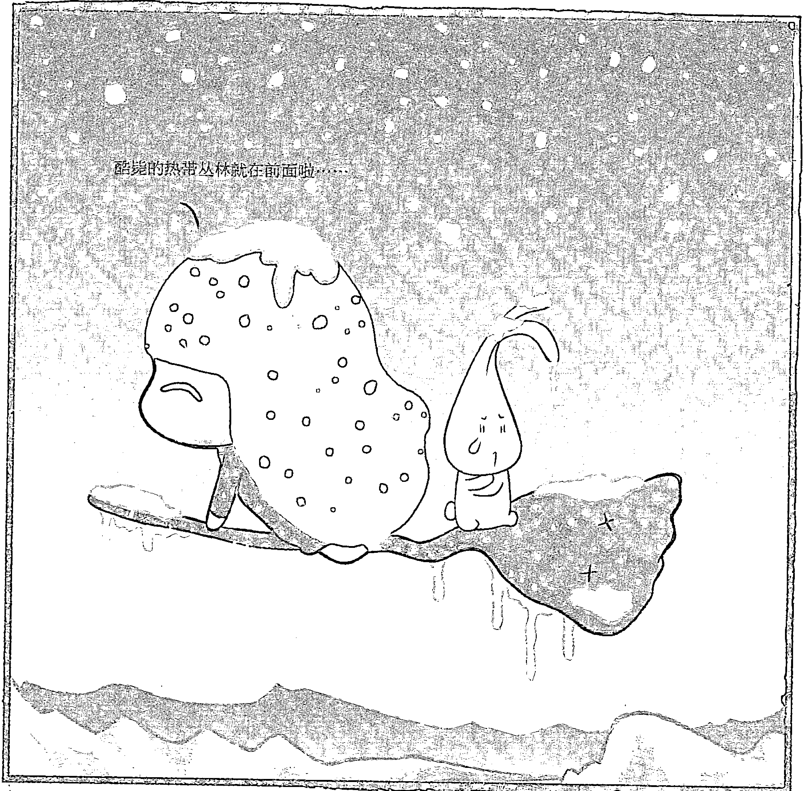

当一个处女座的人不动不笑时，请静静观察；在他们脸上会发现一种罕见的病情「早老症」。

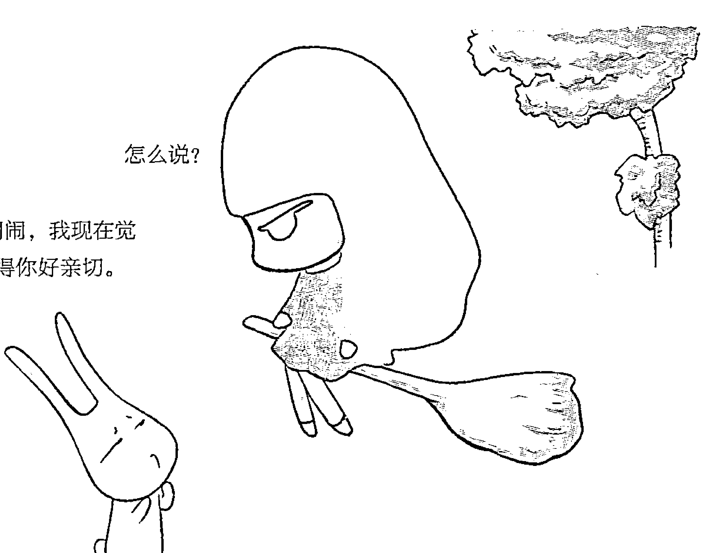

怎么说？
闹闹，我现在觉得你好亲切。

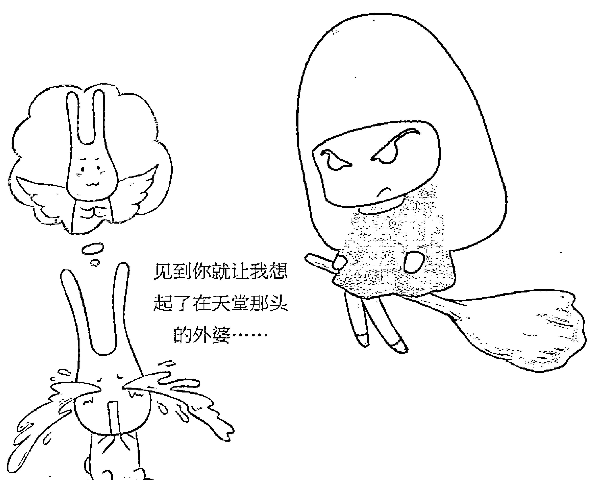

见到你就让我想起了在天堂那头的外婆……

## 财富鉴定

处女座是一个物质的星座，所以处女座的人不但爱钱，而且爱得有点过火，加上谨小慎微的性格，一分一毫都要算得仔仔细细、清清楚楚，可谓斤斤计较。

在钱财这个问题上，即使处女座的人表现得很大方，其实心里也在喊痛。有时他们会装作对钱不怎么在乎，但是如果有人借钱不还，即使只是五块十块，他们心中也一定会记住这笔账，下次再想从他们那里借钱简直就是妄想。当他们手头拮据的时候，会为了无端丢掉一块钱而耿耿于怀老半天，然后拼命思索如何把丢掉的钱尽快赚回来，对于这点，甚至连他们身边的亲朋好友都不能忍受。

在日常支出方面，大部分处女座的人都是节俭有度的，他们讲求实用主义，力求将钱花在刀刃上，不会为了美观或好玩而购买只能看不能用的东西，他们称那个为浪费。因为处女座的人最缺乏的不是情感、不是道义、不是理想，而是物质上的安全感，所以他们非常需要稳固而牢靠的物质保障，经常会赚了足够的钱后马上买房子，若叫他们一辈子租房子过着飘忽不定的生活，估计会郁闷而亡。

谈到投资，处女座的人最多也只是对不动产感兴趣而已，比较富裕的话也许会购买各种保险，为将来尽早作好未雨绸缪的准备，这点也十分符合他们的性格——决不可百密一疏。

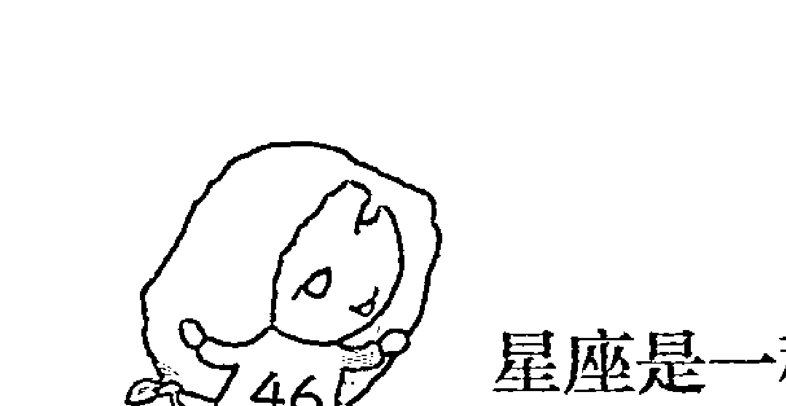

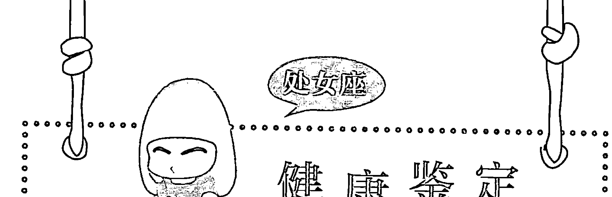

## 健康鉴定

处女座的人看似容易生病，其实只要稍微注意锻炼身体和保持健康饮食，基本就能健康得像只熊。处女座本身就代表忍耐力，除非连续熬了十天十夜外加曝晒挨饿，他们才会因为体内蕴蓄的能量耗光而倒下来，否则，连神仙都忍不住去睡觉了，他们还能精神抖擞地赶活儿，这点不得不让人佩服得五体投地，是旁人怎么都学不来的。

处女座的守护星土星尽管时常带来磨难，却也带来了补偿。因为处女座的人小时候多半是多病多灾的，属于标准的“药罐子”，但是越大就会越少生病，而且他们一般注重养生和医疗，一点小事就紧张到不行，号称保养才是王道，所以通常就是越养身体状况就越好，最后一般是比较长寿的，长寿对他们而言就是补偿。

需要注意的是，处女座的人可能会因为缺钙而造成骨折，所以平时在饮食上要加强钙质的补充，牙齿和皮肤要经常彻底清洁，最好每隔一段时间看一下牙医，有什么小问题及时修补，别五十岁就开始掉牙齿。另外由于处女座是完美主义者或者类完美主义者，总会事无巨细地注意每一个小细节，务必达到零缺点为止，经常处于一种用脑过度的状态下，所以适度补充营养是很重要的。维生素B6是处女座的人所必需的，有减轻焦虑、缓解神经过敏和治疗失眠等功效。

竞走运动是最适合处女座的人的一项户外运动。

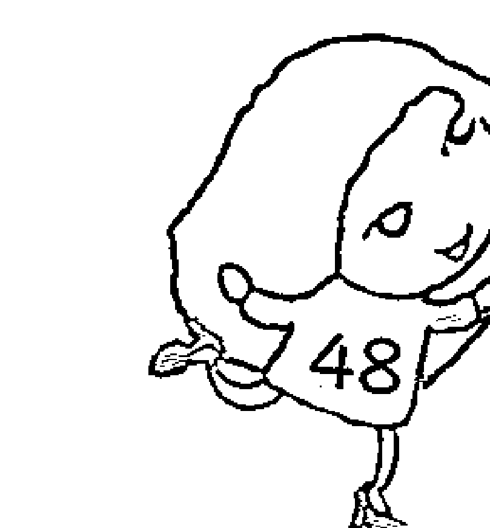

星座是一种生活方式

## Chapter 2

各星体落在处女座

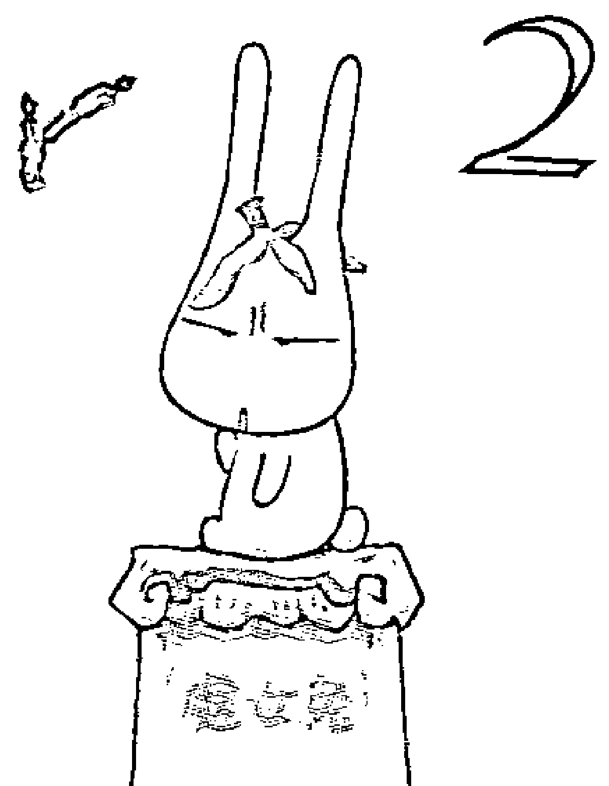

- 火星在处女座 (54)
- 金星在处女座 (50)
- 水星在处女座 (50)
- 月亮在处女座 (50)
- 太阳在处女座 (50)
- 冥王星在处女座 (52)
- 海王星在处女座 (52)
- 天王星在处女座 (52)
- 土星在处女座 (54)
- 木星在处女座 (54)

## 太阳在处女座

你行事审慎适度，分辨是非的能力颇强，思虑周到，每件事都可做完善的处理。你喜欢例行公事，随时都能为人服务，认真负责。你很注意细节，但可能因为太过分而变成挑剔，喜欢品头论足，甚至多管闲事。你虽然很容易担心，但不易气馁，一旦克服了胆怯就会变得能言善道，能够很清晰地表达自己的想法。

## 月亮在处女座

你对于别人的鼓励与欣赏很动心，这使你在感情上过于热切，倾向于在各种人际关系中扮演驾驭的角色。你容易与人纠缠不休，易动怒。很能大方地付出自己的时间与劳力，想为人服务，但难以了解别人的需求。月亮在这个位置是强调心智上的特质，但却以稳定与实际的倾向取代了月亮在双子座时好动的心智。

## 水星在处女座

你是爱挑剔、善分析与实际的，你的思考也是冷静、合乎逻辑与客观的。由于你的判断公正，所以能将所有的意念加以分门别类并作成索引，在你需要它们时可随时取用。你知道如何把学问变成物质上的利益，可能对医学、卫生、数学以及所有涵盖细节的工作感兴趣，也能成为一个具有说服力的演说者。你诚实，不过可能无法忍受比你笨的人，或者过于猜疑。

## 金星在处女座

你很难付出自己的感情，宁愿与他人分享工作上的乐趣或知识上的追求。易把感情隔离，直到藏起所有原来流露的感情为止。所以你可能晚婚，或始终保持独身，但与朋友、同事的关系良好。你不羞怯激动，言辞和蔼可亲，对遭遇不幸的人甚感同情。若相位受克，整个倾向将反其道而行，丝毫不逃避爱情。

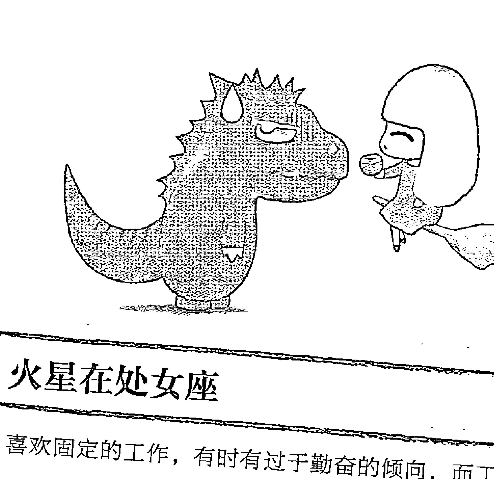

## 火星在处女座

你一丝不苟又能吃苦，喜欢固定的工作，有时有过于勤奋的倾向，而工作过度可能会来疾病。在性方面，你是标准的理想主义，虽然不一定是柏拉图式的。你对花蝴蝶型的人很没有耐心，有时候，你可能看上去缺乏热情与想象力。火星落在处女座对于从事医学方面的事业是个很好的位置。有不利的相位时，你必须避免过于挑剔、爱算计或多疑的毛病。

## 木星在处女座

你是个天生有高贵思想的学者，对任何事物都有很高的标准。你好分析，实际而慈祥，然而感情可能太过狭隘。处女座注重细节的特质与木星的扩展本质有冲突，所以你可能会有点小题大做。除非木星受克，否则整洁与秩序对你而言非常重要，你在心理健康、教育、保健或医疗方面的工作上表现良好。

## 土星在处女座

你是实际、小心而且努力工作的人，谨守道德与良心的尺度。以效率来运作推动自我与他人的工作。这可能使你显得相当严肃。人们偶尔会很痛恨你对细节这么注意，所以你必须培养一种良好的幽默感。当你学会分辨事情的轻重缓急后，就能够大展宏图。你在医学上的表现良好。若有不利的相位时，可能会导致你有爱唠叨的倾向，对未知的事物存在恐惧。

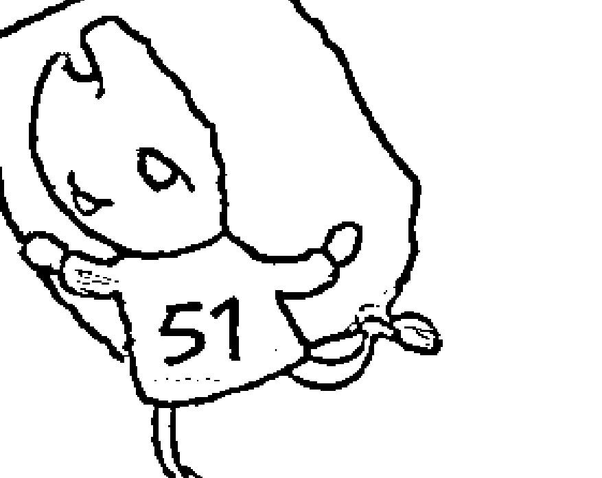

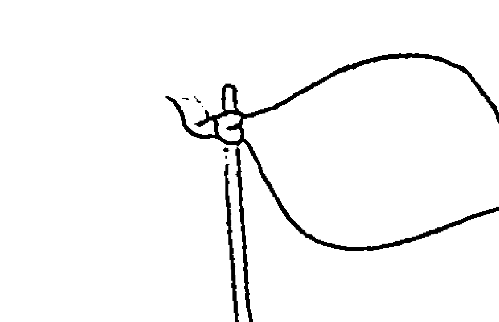

冥王星 海王星 天王星 土星 木星 火星 金星 水星 月亮 太阳

## 天王星在处女座

你的本性是用功的，有创造发明的天赋。而且你会是个好老师，对工作的态度是有原则的，而且你够实际，这种实事求是的态度与辨别的能力对你的事业是非常有帮助的，能使你获得大多数人的接受。若有不利的相位时，可能会牵涉到太多的神秘事物，或可能会使你会有不寻常的健康问题。

## 海王星在处女座

你可能是个伟大的人道主义者，为有价值的理想而战。你对健康与雇佣的条件有新的看法，是第一代能将精神病学纳入你日常生活关注范围的人。你可能会在理智与情感之间经历一种很强的拉力，而且可能有承担责任上的困难，这会让你想通过药物或其他使人产生幻觉的途径来逃避。有不利的相位时，你可能会有精神病与神经衰弱的症状。

## 冥王星在处女座

你善于分析，有创造发明的才智，重视技术性，还是个完美主义者。你在医学、精神分析与商业上有才能，也可能会有清教徒的倾向且过于挑剔。

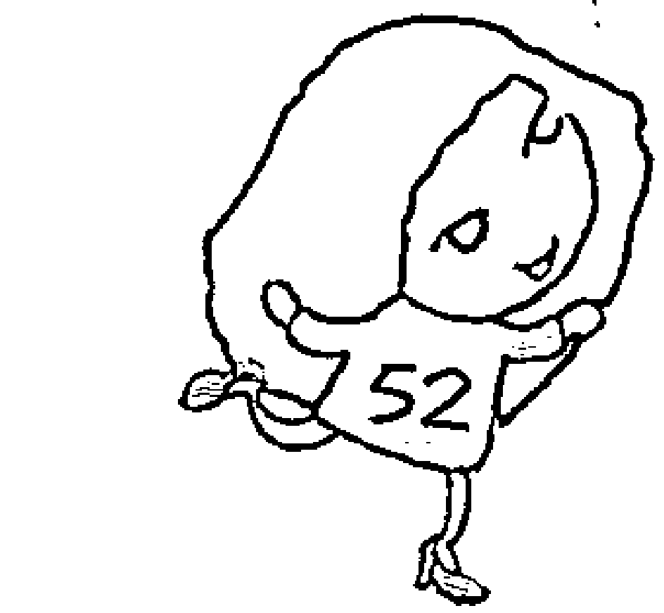

星座是一种生活方式

### Chapter 3

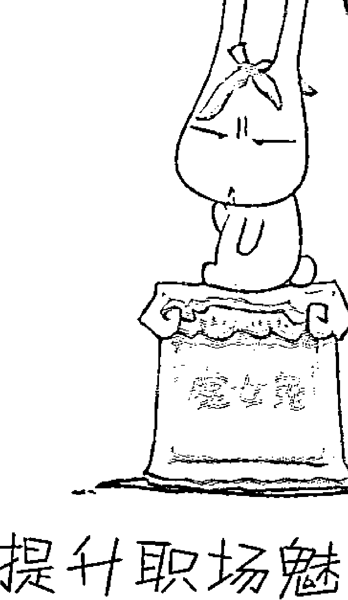

处女座女性阅读专区

- 提升职场魅力 .................... 56
- 社交夺目法则 .................... 58

对于处女座的女性，相信每一本星象书都会这样描述：苛求完美，对于爱情固执并且专一，追求浪漫。所喜欢的异性是拥有智慧并且务实冷静的人。处女座的女性，正是人如其名，纯洁、有洁癖及正义感，讨厌任何不合理的事情，万事都要秉承公正、公平的原则，并非她刻意要去找别人的麻烦，只是天性中便有爱挑毛病的习惯。

处女座的女性是完美主义者中的佼佼者。她追求完美，但并不是追求才情，而是追求顽强的生命力与永无止境的恒心。即使一辈子所追求的理想到死时尚未出现，她也会瞑目，因为她觉得那是存在的。如果半途变节，否定了原本坚信的理想，等于使得“完美”这件事根本不存在、不可能。所以当人们聊起处女座的女性时，最津津乐道的，莫过于她们那种令人讶异的毅力。

处女座的人对每一件事情都要周密计划。

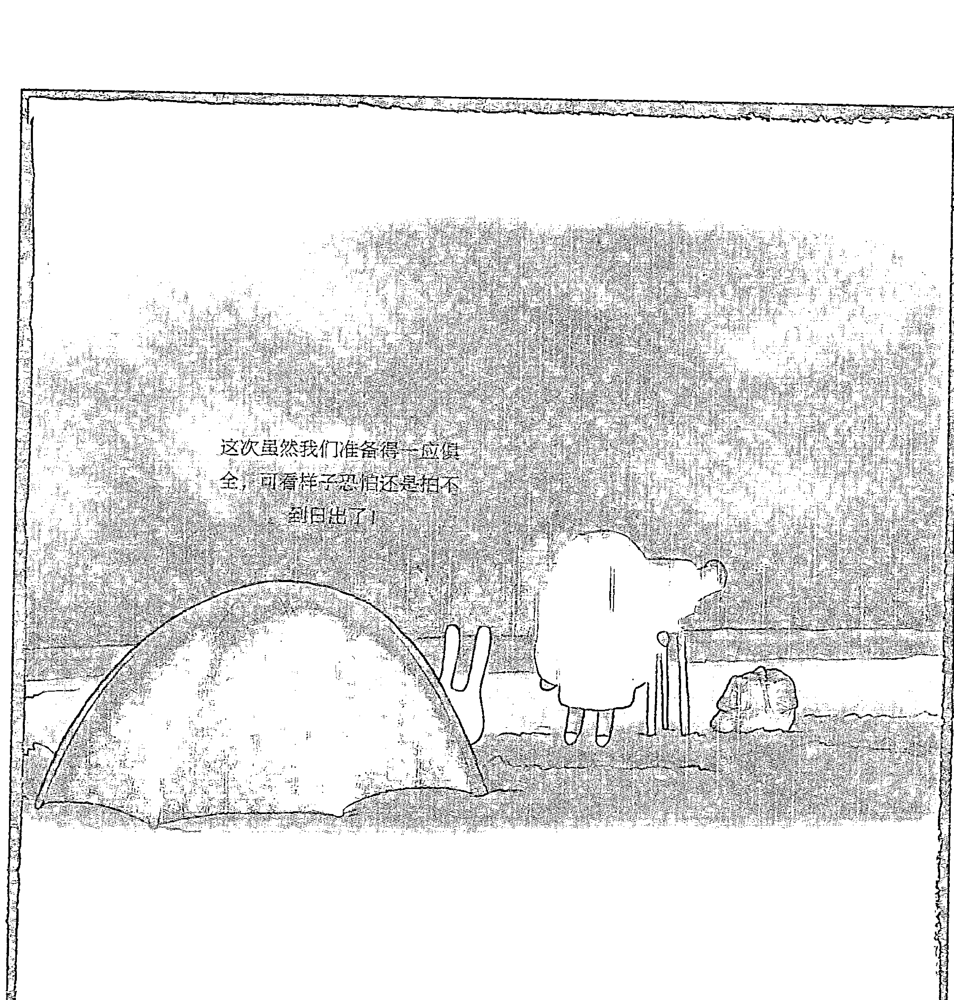

## 提升职场魅力

处女座的女性是在职场当中不停努力、不断提升自己魅力的那群人，她们从不满足于现状。而很多老板也很欣赏处女座的女性下属，谁不喜欢一个每天都打扮得玲珑剔透、无比精致的OL在办公室走来走去啊。

但说到提升职场魅力，对于处女座的人来说，最重要的是不要陷入在一种审美观念中不肯出来。

要知道这个世界的美其实是很多元化的，多元到很多你原本视而不见的品牌和饰物其实有着更好的效果与影响力，因此可以苛刻，但不要固执，请试着尝试尽可能多的风格。基本

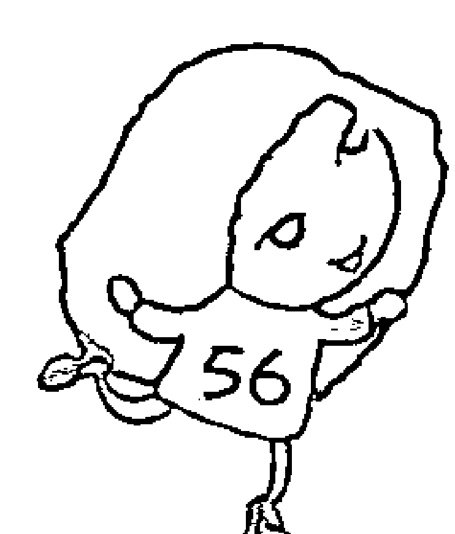

星座是一种生活方式处女座的女性是在职场当中不停努力、不断提升自己魅力的那群人，她们从不满足于现状。然而，处女座的女性在办公室里不会是人气王，这是她们的弱项。因为她们实在太沉溺在自己的天地里，加上挑剔与追求完美的个性，常常让同事们觉得很难接近。所以，想要在职场中获得更高人气的处女座女性们，你们可以适当表现出一点柔弱与需要帮助的小小窘境，这会让周围的同事觉得你并没有那么强硬，对你来说也都不是什么坏事。

## 社交夺目法则

当处女座的女性遇到难题或正在处理事情时，总会安静地默默努力。她们能接受各种要求，并且可以凭借专业知识处理得井然有序，为了真理，她们甚至愿意付出更多。这种个性常常导致处女座的女性在社交圈中相当不起眼。所以，适时收起一些苛刻的处女座个性吧，要相信你们的审美和魅力是那么的出众且与众不同。

让处女座的女性在社交圈中夺目的最佳法则是变被动为主动，该笑的时候活泼地笑，该优雅的时候大方地优雅，只要做到这些其他星座最容易做到的事情，你们就一定能成为社交场合里夺目的明星。

处女座的人聚集人气的法物是琥珀。琥珀的纯净与处女座的秉性相得益彰，佩戴琥珀饰物可以有出人意料的好效果，此外，在房间正南方向放置白玉装饰物也有增强运势的好效果。而参加一些重要的聚会时，处女座的女性们应该尝试略微前卫的造型设计，Marni是相当不错的选择。

## 处女座明星着装榜样

### 蔡依林

太阳、木星、土星都落在处女座的蔡依林尽管出道时间并不长，但处女座凡事坚持的个性却让我们看得一清二楚：从她出道至今，体重瘦了10公斤，曾经读书与工作都不拉下，体质孱弱无比，甚至不惜在腹部开了一个小口，塞药进去好让药物尽快吸收。这种几近“自虐”的行为，一再地表现出蔡依林处处追求尽善尽美的处女座个性。她的月亮及火星都落在天蝎座，情绪强烈但却不会轻易表达，同时她也拥有一种神秘且深沉而内敛的性格，有独特的吸引力，再加上她的太阳与海王星呈90度，非常有异性缘。此外这一星盘也让她成为一个对审美近乎苛刻的人，熟悉她的人都知道她是为了美可以不要命的人，一套衣服哪怕有一点点不满意都不会收货，一定要改到完全合乎她的要求为止。作为日本设计师的超级拥趸，她身上的所有表演与日常衣服，小到一顶帽子一双袜子都必须去日本买，对南青山和表参道的熟悉程度甚至可以比拟日本本地设计师。

### 张曼玉

张曼玉是另一个经典的完美主义者！她拥有优雅的步态、淡然的微笑和玲珑有致的曲线……举手投足间都风情万种。关于她，任何语言似乎都是多余的，从没有一个设计师指责已年过40的她的穿着或者造型有任何不合时宜的地方，她只要出现，就是大家眼中的最佳，这需要何等的功力与魅力？不仅仅是服装，她对于首饰也有着无与伦比的演绎能力，所有国际顶级品牌的珠宝，从白金到钻石、珍珠，她几乎都做过或长或短时间的代言人。在红地毯上的张曼玉，简直就像神话里的王后一般让人无法抗拒。

## Chapter 4 处女座血型鉴定书

- A型处女座 ......................... 62
- B型处女座 ......................... 72
- O型处女座 ......................... 80
- AB型处女座 ....................... 88

A型血坚定踏实的气质和处女座的一丝不苟、完美主义完全吻合。你是以合理的态度面对生活的人。

你可能会有极端的洁癖，缺乏通融性。自尊心强、一丝不苟又神经过敏，是凡事都要贯彻到底的完美主义者。因此你连鸡毛蒜皮的小事也会顾虑周全，绝不弄乱自己的步调，一步步踏实而坚定地处理工作。不过对于自己想做的事，若无法获得满足感，内在的不满情绪便随之高涨，随即表现出批评的态度或变得歇斯底里。只要身边的朋友犯下一点过失或暴露一丝缺点，你都会尖锐而严厉地批判。不论对方是平日一起嬉笑怒骂的伙伴，亦或热恋的男友，都不允许对方有任何不正常、不纯洁的做法。情况严重时，你极有可能变成不负责任的吹毛求疵高手。

如果过于拘泥细微小事，恐怕有不顾大局的危险。请朝向那种敞开心胸、开朗而悠哉度日的生活哲学迈进。

**与其成为翘楚或领导者，毋宁退居后方。辅助者的角色较为适合你。**

A型处女座的人在人生的前半段工作或家庭内变化极多，似乎常遭遇困难与挫折。但由于你们天生处事慎重且具有洁癖，会以自己的步调前进，晚年将拥有幸福。你拥有财运，不论男女都能从配偶身上获得利益。不过，赌博、投机事业会诱导你走向毁灭，因此最好远离这些玩意。另外，因兴趣而着手的事情将会变成你的副业，将能从中获得利益。你身边的朋友经常张三李四地更换，那是因为你爱结交的多半也是和你一样爱发牢骚的人。

从本性来说，A型处女座的人是认真的人，做不出违背良心的风流韵事。不过，有时一时的风流也会变成真诚相待的爱情，应特别注意。你身体不太强壮，略有体质虚弱的倾向，会因神经过敏造成精神方面的疾病，天生的操劳习性也可能诱发疾病。另外，你经常容易钻牛角尖而胡思乱想，积累成疾病就是神经性胃炎、腹痛、下痢等等。你也会因为过于在意身体而胡乱吃药或找医生看病，搞得精神不宁，这些都是不好的现象。对你而言最有效的治疗法是活动肢体寻求心灵的调节。享受运动后汗流浃背的舒畅或出外旅行，都能促进身心的健康。若能每天做运动锻炼身体，生活将变得清爽健康。

## 职场鉴定

A型处女座的人具备敏锐的观察力、周密地处理事务的能力与分析力。如果从事实务性的工作，必可发挥天生的才华。

因为你能正确且顺利地把工作处理妥当，因此，在同伴、同事及上司间拥有极好的评价，成为大家所重视的人才。不过，能随时以冷静的态度判断事物、想法实际的你，并非引人注目的人物。通常更愿做退居幕后、为人思虑出力的幕后英雄。A型处女座的人适合从事调查、研究、评论、编辑等工作，适合的职业有税务员、会计师、调查员、评论家、编辑等。而且对你来说，与其自创事业，不如在企业团体内展现技能较为妥当。

你对待朋友极好，堪称顾虑周到，也具有很强的服务精神。不过最好注意避免过度用心，令朋友有多管闲事之感。同时你本身心思细密，很容易因为朋友的一句无心之言而受伤。和你在职场上最合拍的是那些能静静地聆听你的梦想或抱负的人，通常你们会成为意气相投的朋友。然而你本身的性格如果以负面表现出来，容易受到朋友中伤。若一再地更换身边的友人，将渐渐失去与真正的好友相遇的机会。希望你能多注意到他人善良的一面，在这个前提下与人交往。

如果能稍微缓和神经质的一面，扩大视野，A型处女座的人将能成就一番事业。同时，必须具有坚定的信念。

A型处女座的人：纯洁善良，谨慎怯懦。

> 盖盖，不要太快啊！

如果能稍微缓和神经质的一面，扩大视野，A型处女座的人将能成就一番事业。

## Advice

思虑周密的你在职场上是出了名的严谨大师，上至公司的运营方向，下至产品的不良率，只要是与公司相关的所有事物，你都会布下天罗地网，用你精准的眼睛一一检查，绝对不允许错误在你面前出现。如果是你自己出错则会自责不已，并信誓旦旦绝不再犯。请保持这种对工作近乎完美的要求，因为极低的失误率将会是你成功的绝招。

### 爱情鉴定

A型处女座的人气量小却心思细腻，一点小事都足以引起你的敏感反应，很容易受到伤害，一段美好的感情很有可能会因细微小事而造成悲剧性的分手。

你对爱情很冷静，具有强烈的好奇心，喜欢仔细地观察对方的行动。你处事极为慎重小心，因此很难发展亲密的关系，也常因此而烦恼，眼睁睁地错失良机。你不擅长处理爱情中的拉锯战，虽然对性也抱有强烈的兴趣，却会装模作样避重就轻。不过一旦与异性交往之后，必会保持诚实互重的关系。结婚后的A型处女座女性将会是位称职的家庭主妇，能建立起圆满和乐的家庭。在育儿方面也驾轻就熟，是个好妈妈。不过由于你的神经过敏，常有过度的猜疑，也许会令另一半感到有些厌烦。记住，在选择伴侣的时候请选择能不断带给你梦想的人，似乎因相亲而走上红毯会远比恋爱结婚来得顺当。

与A型处女座的人合得来的是处女座、白羊座和金牛座的异性，可以彼此开诚布公地交谈，同时他们又具备现实、具建设性的性格，所以，和A型处女座的人堪称最佳拍档。其次合得来的是天蝎座、水瓶座和巨蟹座的异性，这些星座的人会带给你梦想，而且能彼此依存发展为互相关怀的关系。你和射手座、双子座的人合不来，对方优柔寡断的性格简直是你的眼中钉，处理事情难以下定决心，你们的关系绝对不可能长久。

处女座的人的词典里没有“当下”一词。他们认定自己一定会越来越完美；只是处女座的人计算时间的单位是“秒”，所以才会造成处女座的人随时随地变幻的心情和无时无刻的洁癖。

> 我是秒秒钟日臻完美的……

> 盖盖你也想吧？
嗯嗯。

> 只有洗得白白滴才能更完美喔！

## B型处女座

B型处女座的人人生性开朗，富有同情心，乖顺的外表下有一颗奋发向上的心。

你个性里有慎重处事的一面，也具有顽强的耐力，可一步步踏实地把别人所交付的工作完成。当你对所处环境有所不满时，反而更能发挥自己的兴趣或才艺，是懂得适当发泄不满情绪的人。但是，这种个性所造就的另一面却是使原本就不喜欢你的人留下更坏的印象，或者你会言不由衷，以奉承话迎合他人，若一直是这样的态度，将会令原本对你有好感的异性也渐渐感到厌恶。对于一般人会打退堂鼓的事情，B型处女座的人会秉持天生的耐力付诸实行，一旦他们觉得这件事情是可行的，即使开始时略有困难，他们也会坚持到底，这乃是获得幸运的重大秘诀。

B型处女座的人会拥有出身显赫的强运，也能白手起家，是运势非常好的人。

当事情有变数时，往往有贵人相助，或有可以发挥自己构想的机会。但运势的急剧变化常会像戏剧那般发生，也许这边你正在庆幸拥有难得的幸运时，随即却陷入到坏的运势中。记住，要与自己的同事保持相同的步调，若彼此步调无法一致，必会造成失败。而如果对任何事都仔细作分析、先考虑结果再采取行动，也不能发挥你天生所具有的强运。

B型处女座的人是可以兼顾工作与家庭生活的人。

结婚后的你如继续工作一定能拓展财运，堪称鱼与熊掌兼得，婚姻生活并不会成为你发挥自我才华的绊脚石。你可以处理好职场上必需的社交活动，天生八面玲珑与谨慎并存，是很好的性格。对于讨厌的事情，你也有勇气断然地说不，不会让自己遭受不必要的误解，惹来更多的麻烦。你很清楚自己个性中的优缺点，相信“失败是成功之母”，不会受限于细微小事的失败。你具有挑战的精神，带着坚强的态度面对关键性的事件，不为小事牵肠挂肚，以舒畅开朗的心情迈向更远大的目标。建议B型处女座的人选择能充分发挥自身知识与技能的职业，适合的职业有教师、公务员或社会福利人员等。

B型处女座的人：可爱懦弱，个性矛盾。

### 爱情鉴定
**B型处女座**

B型处女座的人全身散发着魅力，无时无刻不在追寻温柔婉约的事物，崇尚富有浪漫气息的爱情。

不过，由于你过于忠实于自己的感受，在异性的眼中往往会被认为是令人无法忍受的人。虽然平时的你总是会被异性所追捧，但骨子里却总抱着自暴自弃的态度，认为自己根本无缘与异性邂逅，但另一方面，却又暗自期待梦中情人的出现。你唯一的社交障碍会出现在与异性的初次接触上，你应学会体察到他的内心，在分别时握手或送上亲吻以表达你的心意。不需要感到灰心，只要对他表现得积极主动，机会自然来临。对于自己认为可行的事情不必感到迷惑，尽管付诸实行。即使情况超乎你的控制也不要心浮气躁，以退为进的策略是你恋爱成功的重要方法。

B型处女座的人天生温柔善良的性格，会使你无法掌握人生的真正目标，过着混混噩噩的生活。

B型处女座的人理想中的异性，必定是像超人那样的人。但如果一味追求拥有自己所没有的人，会让你错失很多值得珍惜的事物，结果只会令你后悔莫及。其实最适合你的异性，不仅外在体格英挺，谈吐及对服装的品位颇佳，且要能了解你的想法，富有现代感，如果对方还是拥有广泛兴趣的人，那更是绝佳人选。B型处女座的人天生温柔善良的性格，会使你无法掌握人生的真正目标，过着混混噩噩的生活。所以即使是单相思，也必须好好地对“爱”认真地思考一番。对待B型处女座的人的爱情绝招是：故意从他的眼前消失一段时间，当他焦急万分时，你再出现在他的面前。

他见不到你时，自然会心生疑惑，主动去找你了。

### 最适合和B型处女座的人交往的异性是：

- B型的狮子座的人。富有行动力、坚强勇敢。
行动力强，足以打开他人封闭的心，而且是性格开朗的异性。能够巧妙地诱导并掌握你的情绪，乍看之下并非俊俏英挺的人，但却富有诚意且宽容大量。即使约会迟到，也能够耐心等候，这样的人是你最理想的伴侣。如果是心浮气躁或神经质的异性，就和你完全合不来。

- AB型的摩羯座的人。能够理解他人的优缺点，以宽容的心包容你。
最适合你的异性是你小时候的玩伴或者是很早就认识而且了解你的人。交往时日非常久，有如手足般亲密。在那些平时与你并没有男女情爱感情的人当中，也许会出现和你相当投缘的情人。

他们有时像兄长，有时又像慈爱的父亲，能够以宽容温和的包容力接纳你，将是你的最佳伴侣。

- AB型的处女座的人。能够带领你成长、生性宽容。
富有责任感，个性喜好支配他人。这种异性刚开始可能会令你感到不满，但是你的心将渐渐被他那强悍的处事态度所打动。他们是最理想的伴侣，生性宽宏大量，可以引导你封闭的个性。有着“强人所难”的男子气概，另一面却拥有女性的温柔情愫。如果是家中次男或是有姐妹的男性，是较好的选择。

- B型的双鱼座的人。擅长掌握他人的心、富有现代感。
你可能不会明白直言，但是，你的心却已经被出人意料的异性所吸引。你是那种很容易令周围人感到意外的人，常常会对那些不可思议的异性动了真感情。

## O型处女座

O型处女座的人是怀抱崇高理想完美主义者，无法忍受随随便便、不庄重的举动。

你处事小心慎重，略带神经质，非常在意他人对你的批评。严谨的态度虽无可厚非，但若能学会适当地放松自己将会更好。你生性浪漫，富有细致的感受性，非常重视过去的回忆。但是过度缅怀前尘旧事会被过去的一切所羁绊，无法掌握现在，不如顺应时代的潮流。

你的记忆力非常好，又兼具敏锐的批判力与分析力。虽然稍嫌活力不足，不过在这方面可由O型血特有的好动性格所弥补。在待人处事上，你总是带着严厉的批评眼光，因此即使你是站在客观的角度作正确的批评，仍会给人以吹毛求疵之感。

你经常会把全副心思放在细微的小事上，恐有因小失大的危险。而当遇到失败或有不愉快的事情时，会把责任推卸给别人。

O型处女座的人会在结婚后因配偶而带来经济上的好运，过得比较宽裕，常有出国的机会，在国外也拥有财运。你的运势唯有靠获得朋友及周围人的支持才能开展，想要不劳而获是不可取的，O型血的人在这方面具有极其强烈的运势。若是怠惰或不重视朋友，你会因此而蒙受巨大损失，年轻时更要特别注意这一点。高明的社交手腕能提升你的运势，适当地表现出弱势可以博得大家的好感，甚至获得上司的注意。应避免举止行为遭受误解，切勿做一位独行侠。不过，你不会因投机或赌博发财，如果涉足其中，必会走向身败名裂之路。

在婚姻方面，若非自己认同的对象，最好宁缺毋滥。O型处女座的人在婚后必将是位细心照顾丈夫和儿女的贤妻良母。但可能会有再婚或红杏出墙的不愉快事件发生，晚年则会过着幸福安定的生活。

你容易染患因过度操劳或无法释怀过去不愉快的事而造成的神经性疾病，例如神经性胃炎、妇科病、湿疹等等。如果出外旅行，最好选择海边或环岛旅行。若是出国旅行，可以选择加拿大南部或南太平洋群岛。偶尔抛开一切缠身俗务，徜徉在大自然中，也是非常好的调剂。在旅游地必须注意营养均衡，避免暴饮暴食。

O型处女座的人：老实的纯情派。

## 职场鉴定

O型处女座的人并不是引人注目的人，却能获得长辈的提点。性格融通懂得实际，是值得信赖的。

你具有相当优秀的评断与分析能力，非常适合从事研究工作。你也天生具有艺术才华，但较适合成为艺术评论家，而非从事创作的艺术家。因为你在创作能力上略嫌不足，但评论和分析的能力却远远超过一般人。以准确性为要点的细致工作可以让你充分发挥实力。你唯一的大缺点是视野比较狭隘，所以适合担任成功人士背后的那位女人，即做幕后英雄胜于做舞台上的佼佼者。

你对人的好恶很明显，很难找到真正能符合你标准的人，在待人接物方面，只会对特定的对象表现忠诚。你非常在意他人的缺点，却往往忽视自己的缺点，并为此耿耿于怀，无法百分之百地传达自己内心的感受，让别人了解你。不论任何时刻，都应该保持虚心，乐于接受他人的意见，这会让你更具魅力。

适合O型处女座的职业是秘书、财务管理、教师、翻译、医生等等，也适合担任科学性的研究工作。如果具有电脑或相关领域的特殊专长，便能在经营副业上获得成功。在职场上和你搭配性较好的星座是金牛座、处女座和白羊座。

> 星座是一种生活方式

### 爱情鉴定

其实O型处女座的人感情丰富，但因为表现方法较为含蓄，对爱情也始终保持着很强的戒心，看起来总是对爱情淡然处之的样子。

但相对的，其实你也拥有极强烈的好奇心，只是对人的好恶太明显，生性喜爱揣测又多疑，因此需要花一段较长的时间才能真正爱上一个人。你总是带着犀利的眼光观察，直到完全说服自己之后才会真心为对方付出，符合你的标准的人又似乎很难找到，所以可能常常错失良机或延后婚期。你对于对方的教养、学识非常重视，所以你的婚姻极有可能是相亲结合，而非自由恋爱结婚。另外，由于你天性中的洁癖，渴望永远做个清纯少女，对于只有性没有爱的成年人爱情十分排斥，因此，你绝不会糊里糊涂地谈一场没有结果的恋爱。

O型处女座的人与处女座、金牛座和白羊座的人最为投缘，你们彼此可以提高知性层次，分享喜悦。其次较投缘的是巨蟹座、天蝎座和双鱼座的人，只要敞开心扉诚实地交往，他将会成为你人生中的极佳帮手。而与你搭配性较差的是双子座、狮子座和射手座的异性，注意不要落入对方的陷阱中。

对待O型血的异性，千万不要批评对方，应采取积极主动的追求；和A型血的异性相处，要刻意表现别人所疏忽的体贴；而对于B型血的异性，态度不要过于计较，即使对方约会迟到了也要宽容相对；对待AB型血的异性，必须重视对方的内在优点，不要对细微小事斤斤计较。

综合而言，和O型白羊座或B型金牛座的异性在一起，他们能够了解你的个性，且能配合你。而O型双子座、AB型射手座的异性似乎是令你捉摸不透的人。

星座是一种生活方式

AB型处女座的人细腻感性，拥有卓越的理智，凡事先顾及周围人的立场，把自己摆在第二位，因此深受朋友们的信赖。

不过完美主义的你不论对自己还是对他人都要求严苛，常因细微小事而变得神经质，也有可能因此伤害到他人。你的头脑聪慧，但有固执的一面，一旦相信自己是正确的就绝不低头。自尊心非常强，看起来似乎能与他人协调，其实完全是依赖自己的心意行动。信念如此坚强的你恐怕会在自己毫无知觉的情况下被别人视为是顽固任性的人。其实，你的内心是善良的，一旦受到别人的指责便会陷入迷茫、踌躇，你容易被别人无心的批评而损害到自信心。

你一旦卸下完美主义的一面，就会暴露脆弱的本质。你必须能适时地放松自己，但千万注意不要自信过头。

你具有很强的长辈运，能和长辈亲戚相处愉快。家庭生活中，不要为鸡毛蒜皮的小事斤斤计较，乃是幸福的来源。心思细腻的你，很容易变得神经过敏。要特别注意避免睡眠不足或过度依赖药物。平常可能会有重大的疾病，需注意神经性胃肠炎、下痢、便秘等等。如果消耗太多精力在工作上，必须适时地转换紧张情绪，可抽时间和意气相投的朋友做短程旅行或到古都、旧址遗迹自在地散步。最好能积极地在户外活动肢体，可以打网球或慢跑。

星座是一种生活方式

## AB型处女座职场鉴定

AB型处女座的一生有变化与安定的两面，若能坚持，便能够完美地完成一件事。

你的努力胜于能力。不会为眼前的困难所束缚，会勤勉踏实地一步步迈进，乃是平凡人生中的开运秘诀。如果可以的话，最好能事先制定下远大的目标。你的人生缺乏向前进的活力，唯有得到支持爱戴后才会拥有动力。你也不擅长处理人际关系的问题，常因此累积压力，身边若缺乏朋友或情人的鼓励，也不要为此自怨自艾，相反，更应思考如何使自己成长。
美中不足的是，你对能力不及自己者常带轻视的眼光，会在无形中树立敌人，请特别注意。千万不要以学历出身自傲，应表现出谦虚的态度，务必培养含蓄的生活之道。你即使身居幕后也能尽忠职守，总有一天必获得肯定。

> 星座是一种生活方式

AB型处女座的人：外表冷漠，内心幻想。

处女座非常完美，也追求完美。的确，处女座最最完美，完美到不必追求、完美到人人皆知，完美得最最成功的状态就是龟毛。

适合AB型处女座的人的职业有会计师及相关业者、秘书、公务员、律师、评论家、研究人员、出版行业者、护士、保健人员、医生等等。

AB型处女座和巨蟹座、天蝎座和双鱼座的人能够成为最佳的互助者，在求学时期可互相探讨课业，在工作上则是最好的搭档。至于双子座、天秤座和水瓶座的人，只要彼此不过于干涉对方，便不会造成冲突。不过你和白羊座、狮子座、射手座的人之间无法理解彼此。

批判精神过度旺盛的你，特别注意不要成为人人避之犹豫恐不及的人物，对他人要求过于苛刻只会惹人嫌弃。

星座是一种生活方式

### 爱情鉴定

AB型处女座的人并不是会一见钟情的人，
而是属于在长久深入的交往后萌发感情，
对对方逐渐产生好感的类型。

理性的你，对于爱情的态度非常认真慎重，重视现实而非
浪漫的气氛。一旦谈恋爱就认为应与恋爱的对象走进婚姻，不会
把恋爱当游戏。如果遇见心目中理想的异性，你便会有充足的勇
气，主动向对方示爱，这也是AB型处女座女性的特质。不过你
绝不会为爱情牺牲自己，也许会被视为不够圆滑或难以相处的
人。对自己要求非常严格的你，对于自身缺点往往有过分在意的
烦恼。请带着勇气表现真实而自然的自己。感到不安时，应试着
找人商量，不要一个人闷闷不乐。

> > 理性的你，对于爱情的态度非常认真慎重，重视现实而非浪漫的气氛。

适合做AB型处女座情人的人是不论任何事都全力以赴的认真的人。你和凡事都能凭自己的力量处理妥当的人格外投缘，因为彼此都无法忍受草率随便的作为或半途而废的行为。他们乍看起来朴实不引人注意，但对应诺的事情必付诸实行，富有强烈的责任感。当你情绪不佳、认为男人都不是好东西时，他也能温柔地守护着你，有时像朋友，有时像大哥。对网球、滑雪、游泳乃至潜水等各项运动无所不能的异性，也是无可挑剔的人选。如果对方是能在艺术方面或阅读上寻求乐趣的知性派，你们的相处会更愉快。记住，年长者比年幼者更适合你！

## Chapter 5

## 什么是十二星座？

其实关于十二星座的精准定义，几千年来都没有人可以给出真正意义上的名词解释，而如果我们在薄薄的一本星座人手册里再描述过多的天文学知识，实在太有凑字数之嫌了。我们不如用另外一种方式，来解读十二星座的划分，以及对于我们生活的影响。

唯一需要解释的是，为什么有名字的星座有88个，而被占星学使用的星座却只有12个？这是因为2000多年前，古代天文学家就发现，太阳在星空中是不停移动着的，每年移动一周。
这种现象，实际上是地球绕太阳公转的反映。太阳对于人类的重要性是不容置疑的，所以它在星空中移动的路线就有了专门的名字——黄道。
黄道穿过十二个星座，这十二个星座自然就有了“黄道星座”的说法。

- **两极性质**
  阴性星座 阳性星座
  
  
  → 98

- **四分性质**
  火象 地象 风象 水象
  
  
  → 100

- **三分法**
  本位型 固定型 共同型
  
  
  → 104

## 星座的“两极性质”

我们根据星座的两种不同特质，可以把十二星座分为两组。其中一组称为“阴性星座”，而另一组则称为“阳性星座”。

## 阳性星座

- 个性乐观、主动积极。
- 开创性强。
- 比较容易快速获得成功与成就。

- 水瓶座
- 射手座
- 天秤座
- 狮子座
- 双子座
- 白羊座

## 阴性星座

- 双鱼座
- 摩羯座
- 天蝎座
- 处女座
- 巨蟹座
- 金牛座

个性悲观、被动、消极。开创性弱。成功与成就虽然来得迟缓，但具有永久性。

星座是一种生活方式

### 火象星座

- 射手座
- 狮子座
- 白羊座

实际、独立、保守、官能主义。
喜爱物质上的舒适。
拥有优秀的身体复原能力。
缺点：笨拙、不灵巧、过于物质崇拜。

星座是一种生活方式

## 星座的『四分性质』

我们也可以把黄道上的十二星座，每四个一组，分为三组。同一组中的星座有共同的特性，每一组都有其表现生活形态的样式。

### 地象星座

- 金牛座
- 处女座
- 摩羯座

热情如火、率性而为。自负但浪漫。缺点：专横霸道与太过激烈。

感受敏锐易动感情，且感情持久。直觉丰富、多情喜感、感应力强、敏感。易受情绪左右，且易受环境影响。缺点：自我放纵、自怜与犹豫不决。

## 水象星座

- 双鱼座
- 天蝎座
- 巨蟹座

星座是一种生活方式

### 风象星座

- 双子座
- 天秤座
- 水瓶座

表达能力佳。擅长抽象的推理。有逻辑头脑，心胸宽阔、容观，无偏见，且有理想主义的倾向。缺点：冷漠与不切实际。

### 本位型星座

这四个星座恰如罗盘上的四个原点：
白羊座在东，天秤座在西，巨蟹座在北，摩羯座在南。它们之所以称为“本位型”，乃因为它们掌理四季的变化。白羊座主春季、巨蟹座主夏季、天秤座主秋季、摩羯座主冬季。

```
意志坚决，能够专注，稳定，
能做积累的功夫。
富于洞察力，记忆力绝佳。
达成目标的步伐缓慢但扎实。
缺点：顽固，过于固守自己的看法，自我中心。
```

星座是一种生活方式

## 星座的『三分法』

我们也可以把黄道上的十二星座，每四个一组，分为三组。同一组中的星座有共同的特性，每一组都有其表现生活形态的样式。

### 固定型星座

这些星座是每个季节的中间月份。
本位型星座带来季节的交换，而固定型星座则稳固地夹在每个季节的中段。

- 水瓶座
- 天蝎座
- 狮子座
- 金牛座

热切，野心勃勃，有热忱且独立。
他们心智快捷而不知足。
缺点：仓促草率，不体谅别人，专断自为。

## 星座的「三分法」

### 共同型星座

- 双鱼座
- 射手座
- 处女座
- 双子座

多能多艺，善于变通，性情易变，心思精妙。有同情心与丰富的直觉，其心智灵巧有弹性。缺点：好欺骗、狡猾、诡诈、没有恒心、不够可靠。

开始计划下个季节的时分。这是一段完成该季节的工作、共同型星座是每个季节的结尾

星座是一种生活方式

## 闹闹的星座书
# 金牛座

> 你可以不相信星座，但不能不相信闹闹

忠诚是金牛座的人与人的第一个要求，同时他们也会如此严格地要求自己。

- A型金牛座：明理重义，好恶分明。
- B型金牛座：悠然自得的乐天主义。
- O型金牛座：按部就班，沉稳固执。
- AB型金牛座：冷静理性，和平至上。

最容易早婚的星座。

感情上的占有欲和嫉妒心强大到让伴侣只想挣脱出去喘口气。

想不到吧，金牛座的女人最容易搞得男人倾家荡产。

金牛座的词典里 没有 方向一词。 与他们约会的最好方式 是约在他家门口， 因为 他们是天生的路痴， 有些甚至是 路障， 所以 请原谅他们的 迟到吧。

金牛座的人 以追求财富为人生的主要目标， 而对于社会地位的追求， 则属其次。 他们为人现实， 善于理财， 最讨厌浪费。 虽然本性也喜欢偷懒， 但是若为了挣钱， 就会拼命工作， 又因为懂得开源节流， 所以说是未来最有可能成为富翁的星座。

金牛座的人 靠的多是 灵气和天生的 领悟力， 在刻苦上， 则稍逊色于他人。 也许多因为 缺少足够的 坚忍， 可以成为行业内的 骨干人才， 却 鲜少进阶为 大师级人物。

ISBN 978-7-5086-2047-3

定价：16.80元

身材匀称 无论男女 很胖或很瘦 不多。

两小无猜 同窗之爱 公车恋宿 办公室恋勇 都是 金牛座 期待的 恋爱模式

图书在版编目（CIP）数据

闹闹的星座书·金牛座 / 闹闹著. —北京：中信出版社, 2010.6
ISBN 978-7-5086-2047-3
Ⅰ. 金… Ⅱ. 闹… Ⅲ. 星座－关系－性格－通俗读物 Ⅳ. B848.6-49
中国版本图书馆 CIP 数据核字(2010)第074283号

# 闹闹的星座书·金牛座
NAONAO DE XINGZUO SHU·JINNIUZUO

著 者：闹闹
策划推广：中信出版社（China CITIC Press）
出版发行：中信出版集团股份有限公司（北京市朝阳区和平街十三区35号煤炭大厦 邮编 100013）（CITIC Publishing Group）
承 印 者：山东新华印刷厂德州厂
开 本：787mm×1194mm 1/32 印 张：3.75 字 数：95千字
版 次：2010年6月第1版 印 次：2010年6月第1次印刷
书 号：ISBN 978-7-5086-2047-3 / G·420
定 价：16.80元

版权所有·侵权必究
凡购本社图书，如有缺页、倒页、脱页，由发行公司负责退换。 服务热线：010-84264000
http://www.publish.citic.com 服务传真：010-84033
E-mail：sales@citicpub.com
author@citicpub.com

# 金牛座

## 闹闹的星座书

闹闹著 高瞻漫画

中信出版社·CHINACITICPRESS

# 星座是一种生活方式

其实，一直以来，我对于自己被称做“星座专家”，亦或“女巫”、“大师”，都是诚惶诚恐的。说到底，我不过是一个有机会接受了一些关于星座的正规教育，又热爱星座，并愿意付出努力去研究的学生而已。

而星座对于我们生活的影响，实在是显而易见的。每周二，有如此多的读者，等待着新一期杂志或周刊的出街，他们会迅速翻到有星座专栏的那一页，先看一下未来一周的工作、生活、交友会是怎样的状况。也有越来越多的人会在聊天时，甚至面试的时候，首先被问起星座……

一切一切，都在告诉着生活在都市里的我们：星座，早已成为我们生活的一部分。对于大多数只是希望借助星座来了解自己、调整自己、改善自己的普通人来说，也许占星学与神秘学的博大精深跟他或她并没有太多关系，大家不过是想凭借着一些简单的语言、直白的描述和不太晦涩的逻辑，了解自己所在星座与自己所属的血型组合起来，会有怎样的人生，应该怎样面对职场，如何调整自己以迎来更美好的明天……

星座是一种生活方式

于是，我决定写下这套书，来满足有着这样需求的读者。他们也许并非星座爱好者，但他们相信占星学与血型科学对人的影响；他们不求对占星学的每一个专有名词、每一个宫位有详细深入地了解，但他们希望用最直接的方式被告知，与他们星座相关的凡此种种。

为这些读者服务，恰是我完成这套书的动机。

需要说明的是，被很多读者喜欢的《爱情全占星》与《血型星座全占星》的出版已经是两年前的事情，而那套书，也已经完全地卖断货了。虽然有读者给我鼓励，但我看到的，依然是书中无数的不足，于是决定，那套书不再再版。我会细细改正全部的错误，加入过去两年中关于星座研究更新、更准确、更有趣的内容，形成这套新的丛书。当然，我也会纳入过去书中那些详实有效的内容，用这样的方式，拿出这套新的作品，以飨读者。

一切一切，就让我们重新从星座开始认识自己吧。

星座是一种生活方式/ 闹闹 ………… 2

# Chapter 1

# 金牛座鉴定书

- 金牛座·事业鉴定 ………… 22
- 金牛座·爱情鉴定 ………… 26
- 金牛座·财富鉴定 ………… 43
- 金牛座·健康鉴定 ………… 47

## Chapter 2

# 各星体落在金牛座

| 太阳在金牛座 ………… 50 | 木星在金牛座 ………… 51 |
| 月亮在金牛座 ………… 50 | 土星在金牛座 ………… 51 |
| 水星在金牛座 ………… 50 | 天王星在金牛座 ………… 52 |
| 金星在金牛座 ………… 50 | 海王星在金牛座 ………… 52 |
| 火星在金牛座 ………… 51 | 冥王星在金牛座 ………… 52 |

### Chapter 3

## 金牛座女性阅读专区

- 提升职场魅力 .......... 55
- 社交夺目法则 .......... 57

### Chapter 4

## 金牛座血型鉴定书

- A型金牛座 .......... 62
- B型金牛座 .......... 72
- O型金牛座 .......... 84
- AB型金牛座 .......... 94

## Chapter 5

### 什么是十二星座?

- 两极性质 .......... 110
- 四分性质 .......... 112
- 三分法 .......... 116

看过草原上的牛吧？毫无方向感地吃着走着吃着，我想，这就是所有的饲牛牧场都必须围上一圈围栏的原因。

# Chapter 1

## 金牛座 / 鉴定书

- 金牛座·事业鉴定 .................... 22
- 金牛座·爱情鉴定 .................... 26
- 金牛座·财富鉴定 .................... 43
- 金牛座·健康鉴定 .................... 47

# 第二宫 4/21~5/20

金牛座的人对钱财格外在意，这和它落在黄道十二宫的财帛宫有很大的关系。每年4月20日前后太阳达到这一宫，那时的节气是谷雨，黄经从30度到60度。

主宰着个人的钱财状况、收入和资源等。

# 中心位置

赤经4时20分，赤纬17度。在英仙和御夫两座之南，猎户座之北。座内有著名的昴星团和毕星团。座内有亮于四等的星28颗。

# 财帛宫

黄道十二宫的第二宫，又称财帛宫，主宰着个人的钱财状况、收入和资源等。一般来说，第二宫的宫主星所飞入的宫位，表示与个人钱财有关的生活课题。而飞入第二宫内的飞星，是指示着个人想要去掌握的生活课题。

# 宫主星

- ○第一宫宫主星入弱或入陷，有可能是应该得到的钱财或机会突然消失了，或者是家庭的经济情况并不好，比较缺钱。
- ○第一宫宫主星的凶相位太多，有可能是对金钱有着过高的期待，拥有再多的财富也不能使你满足。
- ○第一宫宫主星逆行（天王星、海王星和冥王星违行为例外），有可能是指挣钱能力不能充分显现，除非有遗产可以继承。

> 敢说我们金牛座讨厌，哼哼……哼哼……

如果公开说金牛座是最boring的星座，会不会被他们砍死呢？

- **负面特征：**
- 自我放纵
- 固执
- 动作慢
- 好辩
- 坏脾气
- 占有欲强烈
- 贪婪
- 物质主义

- **正面特征：**
- 有耐心
- 保守
- 热衷居家生活
- 官能主义
- 彻底
- 稳定
- 具依赖性
- 实际
- 具艺术感
- 忠实

- **星座疾病：**
- 喉头炎
- 声带炎
- 甲状腺疾病等

- **身体部位：**
- 小脑
- 脑叶
- 后颈骨
- 颈
- 喉
- 声带
- 口
- 舌
- 耳
- 上颚
- 甲状
- 腺
- 扁桃体
- 下排牙齿等

弱势行星：天王星。

落陷行星：冥王星。

强势行星：月亮。

星座名：Taurus、牡牛座、天牛座。

符号意义：金牛、公牛的头与角。

星座象征：地象、阴性的固定星座，多产及多情的宫。

守护行星：金星。

相对星座：天蝎座。

星座句诀：我有、我拥有 (I have)。

星座字诀：建立、和谐。

入庙行星：金星。

> 金牛座的性格，如果用一句话来概括，那就是：有条不紊的闷骚。

金牛座的性格，如果用一句话来概括，那就是：有条不紊的闷骚。

首先是身材匀称，无论男女，很胖或者很瘦的不多，大多体态不错。

其次，金牛座的人个性温和，很好相处，是朋友们喜欢的类型。金牛座很重要的特质之一，是金牛男与金牛女相对来说比较相像，性格统一。不过，金牛们虽然忠厚，其实心机并不少，而且也很聪明，千万别低估了他们。

全世界最会跟男人要东西的女性，打死你都想不到，正是貌似最诚实最愚钝的金牛女，通常她们才最容易搞得男人倾家荡产。

其实金牛座的人是韧性超强的，他们不是不会做，只是没把他们逼到那份儿上……

# 金牛座的人喜欢按自己的人生哲学行事，
绝不轻易改变自己的生活习惯。

金牛座的人向你示好，是打算做一辈子朋友的；金牛座的人和你恋爱，至少当你们共同出发的时候，他是打算和你天长地久的。

金牛座是不太爱撒谎的老实孩子。固执己见是他性格上的突出特点，同时也是他的主要缺点。平时温文尔雅，一旦被触怒，金牛们会变得令人望而生畏。他们对逆境的适应较慢。挫折和失败常使他意志消沉，甚至会把自己囚禁在无声的愤怒中，拒绝与外界的一切接触。不过一旦境况有所好转，他们又会重新振作起来，以空前的工作热情去实现自己的目标。

> 金牛座是不太撒谎的老实孩子，固执己见是他性格上的突出特点。

# 不得不承认，金牛座的人善于理财。

他们拥有一定数量的财产，十分善于安排自己的钱财和家庭生活，手头从无紧张之时，因为唯有这样方能感到泰然自若。事业上，他们也是强者，具有天生的无懈可击的才华。成功之路是漫长却又确定无疑的，尤其在农业、建筑和商业等行业方面。由于金星或月亮强有力的影响，金牛座的人常常会选择投身于戏剧等艺术生涯。许多著名的歌唱家和戏剧界人士的天宫图中都是以金牛座为主的。

金牛座的人从事业到感情、人际一条线发展，比较中庸，几乎没有值得可圈可点的好形势，这点足以令这些对生活要求颇高、怀揣着梦想愿望的人大失所望。

在未来的几年中，金牛座的人可能会因为对财富太过眷恋而让周围朋友的忍耐力到达极限。感情上的占有欲和嫉妒心强大到让伴侣只想挣脱出去喘口气。

在朋友那里只知道索取不愿回报，脱离人际关系构筑自己的悬空舞台。

之前不良生活习性的后遗症随时爆发，身体出现状况，像讨债一样纷纷追赶着他们不放。

这些都是对之前所作所为的回应和结果，所以自然而然的，如果之前金牛们是以德报怨、以乐观的态度处理周围的事物和人的话就不用面对这样的问题。不过往好处想，如此发展更像是要为之前的不足画上一个完美的句号，金牛们被要求重新出发，在纷繁复杂的人事关系中理清头绪。想要以后的道路能顺利走下去，这段时间是个关键的转折期。

> 对即将登场的考验以平常心视之即可，泰然处之反而会令人刮目相看。

在遭遇逆境时，金牛座的人在保持姿态的同时，更要把持住自己的心态。把这段时间当成学习的最佳时机，倾听身边的朋友、爱人对自己的评价和意见，找出导致问题的原因，保持良好的生活、饮食习惯，重新审视之前的作风，避免同样的恶果再次上演。对于个性向来低调也守本分的金牛来说，对即将登场的考验以平常心视之即可，泰然处之反而会令人刮目相看。

金牛座最值得称道的地方，也许是他们最坚定的要在这光怪陆离的世界里寻找勇气和善良的那群人。

金牛女是十二星座女性中最容易早婚的，你们不知道吧？

金牛们要铲除大碍，就得把之前留给别人的坏印象统统推翻，积攒人品和积累实力同等重要。

逆境当前，应极力让自己放空，口中默念“不求有功但求无过”，那就不会太过于纠结，不致痛苦地找不到方向。其实任何打击都吓不倒金牛座。要是因为百事缠身就把自己弄得披头散发好像刚从电视机里爬出来那样，只会更加遭人厌恶。

命运也许会安排金牛座的人四处飘荡。

命运会驱使金牛座的人对艺术和慈善更感兴趣，也随之发现更多来自生命的美好。

各种可能性的排列也并非是现在的金牛能料想到的，中年之后的变数将会由这几年的所为为看点，因此正解是如何把握好现在，所有看似平淡不可为的事情其实暗藏涌动力，要看自己是否善于把握。

# 事业鉴定

金牛座的人很有运气，
木星也给他们带来了不少机会。

他们只要勤于工作，就能有丰富的进账。他们不会抱怨眼前的事业。在职场上，金牛座讲究实际的手腕，会让许多人在心里恨得牙痒痒却不敢出声，从而在暗中结下“仇家”。

如果在工作中出现掉链子的情况，或许金牛们需要检讨一下自己是否过于贪心。此外，由于土星的长时间刑克也会令他们的心理负担沉重，从而在性格上变得刚愎自用，随之而来的还有他们那强烈的自尊心。

金牛座的人通常自认为在文艺领域拥有卓越的天赋，因此，如果他们能够将任意一种文艺兴趣发展为终生的精神寄托，那么这个就是他们的事业。

> 为了兴趣或者已经变为生活习惯的所谓兴趣，他们还是挺专注挺卖力的，而且常常能够领先他人一步，成为其中的佼佼者。

金牛座的人靠的多是灵气和天生的敏悟力，在刻苦上则稍逊色于他人。也许因为缺少足够的坚忍，虽然他们可以成为行业内的骨干人才，却鲜少进阶为大师级人物。

抓住时机，最近两年是金牛座突破事业瓶颈的有利时机。改变自己的头八个月，可能会感觉工作非常繁重，压力也不小，怎么忙都忙不完，恨不得插上翅膀飞走。不过木星代表的是机遇和擢升，在这个时间段里金牛座的人会因为遇上某个好时机而跳到更大更好的公司工作，也可能被提拔到更高的职位。一直希望改变工作环境的金牛们熬到了云开见月的时候了。至于逆流而上还是顺应时势而变，则视乎他们的意愿和抉择。

学业方面，金牛座的学生容易犯迷糊，常常一不留神看错了标题导致一错到底，不过回头看看，他们往往怎么想也想不明白为何当时自己会看走了眼。

> 金牛座的学生容易犯迷糊，常常一不留神看错了标题导致一错到底。

**金牛座的人天生聪明，真的非常聪明，一点就明白，所以普遍学得轻松而且成绩好，尤其是在文科上占据着绝对优势。**

很多金牛座的人都极度偏科，一看见数理化就“昏死”过去，文科拿一百分理科拿三分的极端事件是经常发生的。

金牛座的人有一个非常值得称道的优点，就是他们拥有极为美妙的嗓音与完美的音感——如果你能请他们在唱歌前先把嘴里的食物吐出来的话。

### 爱情鉴定

两小无猜、同窗之爱、公车恋情、办公室恋爱，都是金牛座期待的恋爱模式。

> 在金牛座的爱情原则里，忠诚非常重要。

金牛座的爱情梦想，不是天雷勾动地火的激情电影，而是温馨浪漫的古典小说。

在金牛座的爱情原则里，忠诚非常重要。

忠诚是金牛座对情人的第一个要求，同时他们也会如此严格地要求自己。

金牛座是非常重视生理感觉的星座，对许多金牛而言，性在亲密关系中占有极为重要的分量，也是维持情侣关系的重要因素。

元素。如果金牛座的人选择忠贞，他就会非常忠于他的伴侣。然而他们又是官能主义的、爱美的，有些简直就是热爱奢侈享乐的人；若不选择忠贞，他就会快乐地追逐感官的欢愉及满足，且不会因为婚姻而有所转变——至于他会如何选择，全赖他的个人观点、所处时代及个人价值观而定。

## 稳定性对金牛座而言很重要，而满足感亦然。

> 他们的浪漫是属于古典式的，因为他们有循于惯例的倾向。

受金星主宰的金牛座，有着对浪漫的独特见解。他们的浪漫不同于天秤座的潇洒、双鱼座的沉溺，或天蝎座的热情，他们的浪漫是属于古典式的，因为他们有循于惯例的倾向。鲜少有金牛座的人会在许多亲密关系之

> 绝对别让金牛座的人处理你的钱财，因为金牛们一直都很认真地相信，只要经过他们手上的有价品都将归于他们所有。

> 我连续三天为你清理房间，你要奖励我胡萝卜。
>
> 你以后不要替我清理房间了。
>
> 为什么？
>
> 没什么可清理的了！东东都跑你的卧室去了。

间来来去去。另外，金牛座的单纯几乎到了令人抓狂的地步。金牛座的情人，内心的占有欲和嫉妒心都很重。因而，内心贪婪是造成金牛座不安于室的一个原因，一旦发现情人已经掌握不住，很可能另外发展出地下恋情，目的只是为了满足一份操控欲，贪恋情欲的欢愉也是一个大问题。

## 避免犯同样的错误，是金牛座躲开爱情厄运的不二法则。

金牛座的情人，内心的占有欲和嫉妒心都很重。因而，内心贪婪是造成金牛座不安于室的一个原因。

因为固执和自尊心过强，金牛座的人可能在爱情的战场上长期“抗战”而苦无结果。心痛时无人可以倾诉，或是不知道如何敞开心扉，也是一种恶性循环。分手后无法真正一刀两断，对情人的爱恨混淆不清，最后只得任由不堪回首的往事折磨自己，都是负面的范例。

# 金牛座的男子

金牛座的男子舍得花时间思考，只为了作出正确无误的决定。他们对外界感受相当敏感，若是愿意付出感情，就会花时间来思考及观察，以确定你会不会是那个与他共度一生、享受他所拥有的一切的那个女孩。

金牛男们多是好好先生，只是有些顽固，不过他的爱总令人感到平实、简单，他们除了送花外，还会写诗，另外还有个迷人的本事，赚钱。要了解金牛座的男子，你也要舍得花时间，逐渐在生活中发现他的浪漫。

他们是耐心的教练。骨子里会希望对方有淑女风范，也希望女朋友有点儿智慧，懂得礼节；知道什么时候该说话，什么时候该闭上嘴巴；在某些场合中，会对男士低头；不做奇怪的表情，特别是那种怪到会让别的男士以为对他们有好感的表情。

星座是一种生活方式

## 金牛座的女子

金牛座的女子大多很安静，而且也很坚强。这是个盛产女强人的星座，所以金牛座的女子大都有点“大女人”的气质，无论在生活还是工作中特别容易招惹小男生的爱慕。

她总是静静地接受生命中的考验及挫折，甚少抱怨；她有处理一切事物的能力，并且可以以冷静的心态和积极的行动力克服遇到的一切问题；她可能很固执，不过有强烈的自制力，对于那些一般不会影响到她的价值观的判断，她不会与人作太强烈的争辩，而是运用自制力去忍受不同观点。但是千万别激怒她，这一点好处也没有。

别小看金牛座女子看上的、可以让她倚靠终身的人，因为她们总是在找那些真正的男人，并尝试把生活的担子交给他。

## 金牛座的性格、金牛座的外貌、金牛座的爱情

金牛座的人，通常都是好男人或好女人的典型外貌。深受很多观众喜爱的影星奥黛丽·赫本，就是最典型的金牛座的性格、金牛座的外貌和金牛座的爱情，金牛座的她有着一张排列优雅、无处不显示出高贵内涵的星盘。

金牛座的本性使奥黛丽·赫本对爱情和婚姻十分期待，她会向往一种稳定长久、彼此完全拥有的感觉。尽管自身的迷人风采已经成为万千人的梦想，她仍可以为爱情放弃一切绚目的光环。但执著的憧憬往往得不到相应的回报，配偶的不忠诚往往是对金牛座最大的打击。1954年，赫本千挑万选后嫁给梅尔·费勒，一个相貌英俊，身兼演员、编剧、制片人、导演数职的电影人。在婚姻中赫本悉心维护感情，但对方的不忠却给她带来很大的创伤。1968年两人离婚。1969年，赫本嫁给意大利医生安德鲁·多蒂，金牛座的女人很多都会选择为了爱情而放弃事业，赫本更是如此，她甚至长年息影苦心经营爱情和家庭，但她再度尝到了同样的创伤。至此，奥黛丽·赫本对于爱情的信心全部毁灭了，她致死都没有再选择新的爱人。

如果在爱情法器和信物里面出现“钱”、“支票”这样的字眼，也许太具侮辱性了，但事实上，金牛座的人对物质的苛求已经不仅仅是对别人，甚至是对自己。没有不爱钱的金牛，钱对他们来说有着至关重要的意义，虽然世间不乏金牛座的艺术家，但比起金牛座的守财奴来说，少了不知道几千几万……

金牛座的人向往的爱情信物，绝对不能是一根共同爬山的时候捡到的羽毛，或者一片落叶，这些浪漫的东西是双鱼座、水瓶座的钟情之物，对金牛座来说，信物几乎等同于贵重物品，而且绝对是越贵重，他越觉得你爱他，钻石、房子、车子……这些都不失为给金牛座的备选信物。

> 想知道他们的存款数字及银行账号，奉劝你还是早点死了这条心吧！

也许金牛座的人不愿承认，但他们真的是没钱就没安全感的人，这一点，你必须看开。其次，念旧的金牛座老是对旧情人念念不忘，这也是他们的本性。一般而言，金牛座的爱情比较保守，在还没有尝试爱情之前，对恋爱会抱着刻板的想法。歌曲里经常唱的“一生只爱一个人”是金牛座的最高理想。

金牛座的男子很舍得花时间来了解爱人，而要了解他们，对方也要舍得花时间。他很浪漫，这不是开玩笑，只是你要看得出他的浪漫，得花上一段时间去训练。金牛座的女子相当重实际，而且她也浪漫得很，只是不喜欢让情绪来干扰实际。她对于想追求金牛座的人来说，作好打持久战的准备是最重要的。

有着相当敏锐的感官，真实的事物才会吸引她，千万别指望和她一起过只讲精神、不求物质的生活。

如果说从看对眼到展开恋情，需要一段时间做热身运动，那金牛座的人则需要超长时间的热身期，足以令准备不足的人凉了半截。所以，对于想追求金牛座的人来说，作好打持久战的准备是最重要的。金牛座的人虽然不见得都很慢热，但是绝对没有冲动型的情人。尤其是金牛座的女子，几乎没有采取主动出击的例子。像这种保守的态度，虽然在现代社会显得不合时宜，但是他们很难从骨子里去作转变。

星座是一种生活方式

## 捕获金牛座法则

## Step 1

不要轻信，别被他们略嫌迟钝的外表骗了。对大多数人而言，这是个最不能轻易托付感情的星座。倒不是因为他们花心或有劣根性，而是金牛座的人实际上都有一些深不可测的心机，如果打的是持久战，最后竖白旗的可能会是金牛座的对手。

## Step 2

除非他愿意相信你，否则你一定没有机会。因为金牛座是一个在感情上绝对不愿冒险，也绝不容忍失败的星座。你不要被金牛座一副亲切的大哥哥（或是一副邻家女孩）的模样给迷惑，从而在一开始就轻敌。

## Step 3

他会跟你做很久很久的好朋友，看过你最可恶的一面后才决定是否要更进一步，也不要事后哭天喊地的说自己看走眼。因为他最不能忍受的就是自己看走了眼，即使只是逢场作戏。这样，他才有机会去取笑别人的失算。

任何一个星座，与爱情最直接相关的是金星和火星，而金星、火星落在金牛座的解析如下：

### 管理爱情的金星

金星代表的是爱情，在男性的占星图上则代表了女朋友。一个人会不会犯桃花、会不会到处留情，看的也是金星。金星同时也代表了俊男美女，所以一般的偶像明星都要有颗很强的金星，才能成就他们的事业。有意思的是，金星还代表了流行艺术，所以有些人可能会很奇怪，为什么有些西餐厅驻唱歌手长得一脸猥亵的样子，怎么可能还有那么多的人爱他们爱得要死。这就要归咎于金星了，金星掌管爱情和音乐，所以一般人很难区分得清楚，究竟自己是爱上音乐呢还是爱上人？所以也难怪一些高中男生，就算爬山累得要死，也要死命地背把吉他，毕竟在音乐的催化下，容易让爱情有所共鸣。

# 金星在金牛座

华丽的外表下，有一颗好色的心，孔圣人也说过呀——“食色性也”！

他们有时会有种“雅”不可耐的感觉，具有精致的审美观，而且也会想尽办法让你知道这一点。在他还不是很有钱时，就会努力表现得像豪门贵族的王子公主一般。他们听古典乐，邀你去看卢浮宫，注意巴黎今年流行什么服饰，把音响升级到顶级。他肯定也是个美食专家，皮包里常备有记事本，记录哪里有不错的小馆，绝不逊于一般专业的餐饮评鉴专家。

正所谓食色性也。金星在金牛座的人，肉体的吸引力对他而言是相当重要的，特别是男性（因为男性的金星对应着女朋友），对他们而言柏拉图式的爱情简直就是神话，简直是亵渎女体，衣服得要剪裁“合身”才叫做衣服。但是除了性感之外，别忘了，他要的是个精致的艺术品，你还必须在外头表现出雍容华贵的淑女风范，请参考华伦·比提太太的模样，因为比提就是个典型的金星在金牛座的男人。

## 管理行动力的火星

“♂”这个挂在厕所入口、代表男性的符号，在女生的占星图上，正代表女朋友。而在男性的占星图上则可以看出这个男人追女朋友的企图心和行动力如何。火星也代表了勇气、战斗力和军人，李宗盛一首歌叫做《爱情少尉》，歌词里提到“不要以为你有完全的准备，不要以为你有多好的防备，我要从你那里尝到爱情的滋味，我要紧紧地跟随！”这正是火星精神的最佳写照。

同时，火星强的人通常可以成为好的运动员，也难怪很多运动员，像NBA的小虫等人，通常会花名在外，想想也不是很难理解，精力过剩的人，才有可能去挑战别人嘛！

星座是一种生活方式

## 火星在金牛座

“性趣”高人一等，像希特勒；健康强壮，像牛一样！

火星在金牛座的人通常好色、荒淫无度，如果相位好的话，顶多就是拥有多于常人的性享乐。之所以会如此，是因为金牛座是土相、固定的星座，因此导致这个“土”被“固定”得像水泥一样，硬邦邦。而且火星的独占欲又相当强烈，容易借着性生活来证明自己的存在。

火星在金牛座的人毅力强、体力好，那是由于金牛座本来就代表黄道各宫的金库，而火星在金牛座意味着体力可以得到很好的储存，颇能落实“健康就是财富”这句话。此外，火星在金牛座的人行事也像头牛，沉稳踏实，不必别人提醒就能明了“欲速则不达”的道理，计划在他们手里都能按部就班地如期完成。

金牛座现实到他们绝对不愿意轻易浪费一点属于自己的能量。

## 财富鉴定

金牛座的人以追求财富为人生的主要目标，至于对社会地位的追求，则属其次。

为人现实，善于理财，最讨厌浪费。虽然本性也喜欢偷懒，但是若为了赚钱，就会拼命工作，又因为懂得开源节流，所以说是未来最有可能成为富翁的星座。

> 若为了赚钱，就会拼命地工作。

金牛座的人不喜欢乱花钱。大部分的金牛座不会因为冲动买东西，事前会仔细斟酌，属于小心翼翼的类型，也不愿意把钱花在游戏上。

他们使用东西会有惯性，东西没坏就不换，买东西的数量比别人少。但这不表示牛儿小气，相反，他们愿意花大笔钱买好东西，因为可以用得比较久，也会吃贵的东西，因为这是一种享受。

> 金牛座的人不会做看不见、摸不着的发财梦，理财观点是保值。

金牛座的人们不会做看不见、摸不着的发财梦，理财观点是保值，例如买金饰、钻石，连买房子都需要是可以马上得到收益的。加上很在意处理钱的态度，他们很适合做长期投资。

## 从星座性格的角度来分析，金牛座具备成为富翁的很多潜质。

不过在实际中更重要的是，在相应的环境下，要具有良好的判断能力，努力不懈地追求自己的目标。

金牛座的男子在投资上缺乏果敢和冒险精神，可能会因此错过许多良机。但他们有很强的直觉力，如果能借助于此脚踏实地地安稳开展事业，定会获得成功。

金牛座的男子偏重感性，有较强的直觉和与生俱来的艺术天分，学习专业技术是最佳的选择，这样的人生会过得很惬意。适合他们的具体职业有作家、画家、儿童文学家、设计师、食品制造业者、出版业者和金融业者等，同时，最好能长时间地投入某个领域。如果在企业供职，则以总务、劳务、策划等管理职务和技术研究职务为优先考虑。

金牛座走财运的年龄是26、33、42、51、60岁，最好在30岁到40岁之间成就事业。

金牛座的字典里没有“方向”两字。与金牛座约会最好的方式是约在他家门口，因为他们是天生的路痴，有些甚至是路障，所以请原谅他们的迟到吧。如果他们能够不那么爱吃的话，或许可以抽出一些时间想想自己身在何处。

## 健康鉴定

循序渐进的金牛座，可选择一些能培养自己嗜好的运动，如漂流等运动量较大的有氧极限运动。

瞄准未来一年，锻炼自己，开拓新领域，培养更具冒险精神的攀冰运动，是相当适合金牛座的选择。虽然很多人对攀冰运动还很陌生，但它现已渐渐成了流行趋势。对于大多数年轻人，尤其是未来几年的金牛座年轻人来说，是相当好的运动。不仅可以强身健体，还补充了在这一年里你最需要补充学习的精神，如冒险、突破、等待和协作等等。

> 瞄准未来一年，锻炼自己，开拓新领域的精神。

就算是一坨屎，也有遇见屎壳郎的那天——金牛座就是可以等待那天的人，喷泪喷泪。

快回家，要下雨了。

我要在流星出现的时候许愿……

这就是流星雨吧……

## Chapter 2

各星体落在金牛座

| 星体 | 评分 |
| :--- | :--- |
| 火星在金牛座 | 54 |
| 金星在金牛座 | 50 |
| 水星在金牛座 | 50 |
| 月亮在金牛座 | 50 |
| 太阳在金牛座 | 50 |
| 冥王星在金牛座 | 52 |
| 海王星在金牛座 | 52 |
| 天王星在金牛座 | 52 |
| 土星在金牛座 | 54 |
| 木星在金牛座 | 54 |

# 太阳在金牛座

你是有毅力、有决心，是个审慎且勤奋工作的人，但总需要一段时间才能适应新观念。个性矜持而踏实，很少对人施加压力。你喜爱优雅的生活，并有一股想去建立稳固基础的内在动力，尤其在经济方面。你为人很顽固，但不易发怒，然而一生气可就不得了。你富有同情心且善解人意，是个忠实的朋友，但也是个稳固、动摇不得的敌人。

# 月亮在金牛座

月亮在金牛座为旺相，这一位置带有月亮内省而稳定的一面，同时减低了月亮所代表的善变性。为了理想你不辞辛劳地坚持到底。你讲求实际，注意力往往集中在物质舒适度和财物处理上。什么都想要最好的，但不会花时间在小事物上。基本而言，你个性羞怯，而且可能缺乏原则性，所以不要太固执于自己的所作所为。你的官能反应缓慢但强烈，有精确的记忆力，可尝试反复思索，而后以缓慢而稳定的方式，根据所得的资讯展开行动。

## 水星在金牛座

你生性固执，一旦展开一项计划便不会放弃。也从来不妄下定论，因此在心智上属于保守、谨慎的，也是具有建设性的。对于喜欢与不喜欢的事物态度鲜明，喜爱金钱与物质，对艺术与异性都很有兴趣。很少对新观念有立即的反应，对生活经验的依赖比从书本上学习的要多。

# 金星在金牛座

你性情稳定，值得信赖。通常富于魅力，面容姣好，也可能拥有甜美的嗓音，很容易吸引异性。你健谈而善社交，注重感情。触觉很发达，喜爱华丽的环境，天生就看重物质层面的价值。虽然是个官能主义者，表达感受时却很被动。在任何艺术领域中都可能有突出表现。每当缺乏安全感时，你会变得嫉妒又充满占有欲。若相位受克，个性会很顽固，也有可能晚婚。

## 火星在金牛座

你顽固、实际、有决断力而且非常有自信。一旦决定了某一项行动，就很难改变。虽然不客气地评判他人，却会与不义抗衡到底。耐力强，但缺乏冲劲与机动性。你有良好的学习能力，在花钱的方式上较为特殊。你会是个技巧娴熟的工匠，对做生意也很在行。

## 水星在金牛座

你善于理财，遇上投资或金融事务之类的问题会表现出过人的精明。可以成为股票经纪人或银行家。若相位良好，会对人生的价值有深刻了解。喜欢用金钱可买到的奢华物品。如果木星受克，则会因奢华口味而变得自我纵容，既浪费又懒惰。个性方面你的内心极为固执，不喜欢别人的推力，并对公义与正统宗教感到兴趣。

## 土星在金牛座

你生性节俭甚至有些吝啬。体力极佳，顽固异常。对所爱的人或物都一定要拥有。天性有耐心，守纪律而且有决心，实际而坚持原则。对生活抱着一种实事求是的态度。愿意为成功而努力工作，但并非全心投入。大的商业机构，或者政治圈都是适合你的工作领域。唯有在价值感受得以进化，或学会利用创造潜力时，你才会发现自身内在的平和。

- 冥王星
- 海王星
- 天王星
- 土星
- 木星
- 火星
- 金星
- 水星
- 月亮
- 太阳

### 天王星在金牛座

你在财经界、地球资源与经济改革方面有泉涌般的新概念，而且能进一步落实，寻找实际的新方法。你创造力很强，而且对他人有一种天生的磁性般的吸引力。若是发展良好，许多音乐与艺术上的天赋将会发挥作用。如果过于重视物质的话，可能在表达上会受到限制。不利的天王星相位可能会产生婚姻上的波动，在罗曼史中有意外的困难，而且倾向嫉妒与顽固。

### 海王星在金牛座

你对科学与艺术有一种实际的态度。对音乐鉴赏有天赋，有与生俱来的生意头脑。由于自身强烈缺乏安全感，容易引致他人误会。对冥王星所形成的相位可能使人拥有治疗的能力。海王星有不利相位时，会导致你对财富过于关注，或者在处理金钱上自我欺骗与粗心大意。

### 冥王星在金牛座

你会显示出耐心、固执、感性以及丰富的艺术感知力，对于财富与永恒有着着魔般的需要。这正是富人得利而受薪阶级付出巨大辛劳的相位。

### Chapter 3

- 提升职场魅力 ..................... 55
- 社交夺目法则 ..................... 57

> 金牛座的女性喜欢安静而精致的生活，因此对于生活的追求往往都是从细节着手的，不会被一眼看穿。

全世界最大的误解，就是总有对星座一知半解的人觉得金牛座是一个沉闷又土气的星座，而且不解风情。老实说，这真是大错特错、太委屈他们了。

## 其实金牛座是低调的风骚者。

金牛座的人通常自我感觉不错，不太擅长交流，但绝不代表他们不解风情。金牛座的女性喜欢安静而精致的生活，因此对于生活的追求往往都是从细节着手的，不会被一眼看穿。相对熟悉后你会发现，金牛座其实是一个在日常生活中相当有韵味的族群，她们的女人味，是要靠悉心体会的。

星座是一种生活方式

## 提升职场魅力

大多数金牛座，或多或少都有莫名其妙的自信心，认为自己是品位的代言人。这一点其实是不大好的，比如你很可能把自己打扮成了一个办公室怪物却还在洋洋自得，这对于提升职场魅力真的没什么帮助。

通常来说，金牛座做不了时髦的时尚引领者，所以职场穿衣方式应是精致而有亮点的。

提升职场魅力的最佳选择应该是学会佩戴某一样较为昂贵的、能代表身份的物品，比如Cartier的女装手表，这绝对是彰显品位、提升个人职场魅力的不二法则。

星座是一种生活方式

> 金牛座女性提升职场人气的秘诀，就是淋漓尽致地体现她们忠实、稳定、信守诺言的形象。

朝九晚五的工作所提供的稳定感，能够满足金牛座对安全感的需求。但其实她们对紧张的都市生活和枯燥的上班生涯不感兴趣，这注定金牛座的女性在职场上不会是熠熠生辉型的。

帮助金牛座女性提升职场人气的秘诀，就是淋漓尽致地体现她们忠实、稳定、信守诺言的形象，让本来让人不以为然的性格统统展现出来，成为可以固化的焦点。

一成不变的珍珠饰物，以及造型传统、做工精良的OL套装可以帮助金牛座女性树立传统又稳重的办公室形象，而这样的人永远都是老板最需要的类型。

星座是一种生活方式

## 社交夺目法则

金牛座在职场上是非常缺乏安全感的族群，尤其在面临重要场合的时候，最需要通过自身的穿着打扮带给自己足够的信心。

因此，相对厚实的材质、历久弥新的款型都是最能给她们心理暗示的好选择。

金牛座也是最需要准备几套昂贵但亮眼的OL套装与礼服的星座，相信我，它们能带给人的心理安慰远比花出去的钱要值多了。

## 金牛座的思考方式缓慢保守，然而思想却时有建设性。

这一点，其实也是金牛座在任何重要的社交活动中让自己用另类的方式“独自美丽”的社交夺目法则。她们从来不像身边一朵朵迅速盛开又急速凋零的花朵那样，相反，她们未必夺目，但持久芬芳，代表了忠诚、持久的品位与对生活的追求。在明白这一点的基础之上，就不难选择那些代表了恒久与品位的品牌作为你的战衣。

## 金牛座明星着装榜样

林忆莲
最经典的金牛座女明星。没有认真和坚毅的长期努力，就没有今天的林忆莲。她不漂亮，一双小小的“懵猪眼”无论如何都和美扯不上关系，也没有性感身材，从某种角度上说，她的音色也许并不十分完美。但是翻翻她的档案，是一张完满的成绩单。Sandy不高调，但被公认很有自己的风韵，有一种“人群中独自美丽”的个性。从20岁到40岁，她一天比一天会穿，而且从未被指责着装不当，即使是在年过40的今天，身材保持得相当优美的她身穿Jil Sander黄金礼服出场时，依旧非常惹眼。有评论甚至认为今天的Sandy在经历了那么多风风雨雨之后，比年轻时更有魅力了。这就是最经典的金牛性格，低调，但充满风韵。

珍妮·杰克逊
这是一个不认命的，一定要搏出位，最后演变成笑话的例子。珍妮希望自己能成为最高调的女明星，时尚弄潮儿，结果大家都知道了，露乳事件迅速演变成为丑闻，她没能引领时尚却成了所有报纸影剧版嘲笑的对象。所幸，金牛座震得住场的个性救了她，经过一轮调整，她重新回到重视歌艺、凸显性感的老路上来。出席奥斯卡颁奖礼的她身穿一身Versace镶嵌钻石的巧克力色礼服，与她黝黑的皮肤完美地融为一体，颇为引人注目，也再次诠释了金牛座“朴实的风骚者”这个经典个性。

金牛座的人，一辈子都在守。

吃口香糖都不会往外吐的家伙！

### Chapter 4

金牛座血型鉴定书

| 血型 | 对应页码 |
| :--- | :--- |
| A型金牛座 | → 62 |
| B型金牛座 | → 72 |
| O型金牛座 | → 84 |
| AB型金牛座 | → 94 |

A型金牛座的人，是脚踏实地处理事务、努力不懈的人。一旦定下目标，你就不顾他人反对，从头到尾贯彻始终，具有坚忍不拔的信念。此乃A型金牛座的处事之道。

你富有责任感，具备强过一般人的耐力。不过在作出决断之前，似乎颇费时间。行动缓慢，在性急者眼中看来，颇令人心急难耐。换言之，是属于“三思而后行”的人，因此少有失败，能确实地掌握未来。

富有责任感，具备强过一般人的耐力。

A型金牛座的人天生性格消极，却十分坚持己见。如果他人不推一把，则蛰伏不动。然而柔和而乖顺的外表下也有不可忽视的顽固一面。

（侧边栏文字）你对钱财、既有的事物具有强烈的执著心。

你对钱财、既有的事物具有强烈的执著心，一旦占为己有，绝不拱手让人。从另一个角度而言，可以说是重视“物品”的类型。你有增加财富的能力，可购买业绩表现稳定的股票，或具有增值性的不动产等。但没有一本万利的投机运。必须使用安全而确实的方法，获得经济上的成功。你对美的感受性也极为丰富。诸如在绘画、雕刻或音乐等方面，都富有卓越的审美眼光，能分辨真货与赝品的差别。

> 不半途感到气馁，奋力不懈，乃是建立基础的要诀。

A型金牛座的人年轻时的行动范围较狭隘，还不算具有活动力。若没有明确的目标，将过着单调而平凡的人生。不必挑剔，只管找出有兴趣的事物，让自己能全神投入其中。若从中找到自己感兴趣的事物，务必持之以恒，成为长年的兴趣。年岁越增长，你会越有安定感。中年之后的A型金牛座不仅拥有地位，还拥有丰厚的财富，在物质或精神层面上，都能达到令人满足的境界。不半途感到气馁，奋力不懈，乃是建立基础的要诀。

星座是一种生活方式

A型金牛座的人平日疏于对健康的管理，而且一旦生病就会变得很神经质。

因为体质关系，A型金牛座从下颚到肩的部分容易出现病变，因此容易染患咽喉、扁桃腺、甲状腺等部位的疾病。

> 比起活动肢体的运动，不如选择可享受其中、松弛身心的项目。

休闲方面，让你可以充分地享受其中的运动是最适合你的。譬如骑自行车在公园里兜风，或到山间散步。当然，高尔夫也是非常适合你的运动。

你的味觉极为发达，可以和朋友享受用餐的愉悦。豪华的料理会带来意趣盎然的气氛。另外，如能鉴赏绘画或雕塑，也是很好的兴趣。

## A型金牛座 职场鉴定

### 虽然极擅长表面上的交际往来，但本质上你是缺乏融通性、独占欲极强的顽固者。

常有机会与新朋友邂逅。只要稍微扩大视野，把心敞开来，那些优秀又值得交往的朋友就会慢慢地聚集在你周围。你沉静的气质与诚实的品格，往往给旁人极佳的印象。但长久交往后很容易失去协调性。

处事正确而不白费力气的A型金牛座，在工作上最重要的是努力去表现平常的自己，也不忘记展现积极处理事务的态度。在职场上，你不擅长积极的行动，也不会主张自己的意见。因此常会因为不会表达自己的真心而独自黯然，也许还会招致上司或同事们的误解。

星座是一种生活方式

在规划职业时，A型金牛座必须特别注意避免选择繁忙的工作，公关或营业等部门并不适合你。

最适合你的职业是那些可以按部就班、让你以自己的步调处理事务的工作。由于你天生具有优秀的数字能力及金钱观，因此，会计或总务的工作也是适合你的职业。

而在特殊的工作上，也可以考虑活用天生所具有的艺术才华，例如：美食专家、雕刻家、设计师、画家、音乐家、作曲家、造型专家等。

A型金牛座的人多半是行为举止异于常人者或艺术家。他们是那种不会将工作与生活区分开的人，所以，身边的朋友往往可以带给他们工作机会。

> 务必留意扩大自己的交友圈，尽量结交亲密的知己与朋友。

## Advice

A型金牛座处理工作的原则是“安全确实”，这一点的确很好，不过，有时也缺乏大胆的态度。最重要的是舍弃内在的畏怯，鼓起勇气踏入完全崭新的世界。

务必留意扩大自己的交友圈，尽量结交亲密的知己与朋友，凡事都应积极行动，这样将带来幸福。如此，微不足道的占有欲或顽固的个性也会因此消逝无踪，你一定可以从中发现自己更强大的人格。

星座是一种生活方式

### 爱情鉴定

A型金牛座是非常专一的。这个星座血型组合的人，绝不可能有所谓的花花女郎或花花公子。根本不会作出冒险的禁忌恋爱游戏。

> 一旦以心相许，会表现出奉献式的爱情。

若没有把握将来会必定结婚，你即使喜欢对方，也不会打从心里去爱对方。从坏处解释，似乎是隐藏着精打细算的心态。但是，A型金牛座的人一旦以心相许，会表现出奉献式的爱情。即使对方面临再大的困难，也会随侍在侧，表现出一起共渡难关的温柔。

另一方面，A型金牛座表面上虽给人沉静、内敛的感觉，而内在却隐藏着强烈的欲念。独占欲极强，可以说是醋劲极大的人。就连虚构的恋人也会让你心生嫉妒。当然，从另一角度而言，这也可以说是‘为爱全心付出’的证明。

星座是一种生活方式

A型金牛座认定的理想结婚对象，首要条件是要有经济能力。

具有现实观念的你，必会选择一个可以让你生活安定的人。与其和前途会有波折起伏的人恋爱结婚，不如与可以保证幸福的对象结婚。

对方不仅在生活上不可出现问题，性格也不能失之偏颇。你会以这些作为衡量的标准，找出一生中最重要的人。与你最为相配的，是能在自己的掌握范围内大胆直言的金牛座、处女座和摩羯座的异性。其次较合得来的是巨蟹座、天蝎座和双鱼座的异性。A型金牛座的人看到他人遭受困难时，会立即伸出援手，所以也有可能会对异性由同情转变为爱情。

很可惜的是，你和狮子座、水瓶座的人永远都合不来。因为彼此过于坚持己见而造成纠纷，常有失之交臂的情况。如果恋人是这些星座的人，只要不迷恋这段恋情，应该不会有任何结果。

> 以为有把扫帚就能冒充女巫吗？看你的丑样子。

A型金牛座：明理重义，好恶分明。

B型金牛座，无论男女，天生就不依赖他人，喜欢亲自处理任何事情。

B型金牛座的人是无可救药的彻头彻尾的浪漫主义者。

如此顽固的个性，虽然可能成就一番事业，但总的来说还是缺点。你对事物的领悟力强，手脚灵活，但是容易树敌，这一点要特别注意。你是一个无可救药的彻头彻尾的浪漫主义者。内心充满着享受冒险刺激的念头，乐于追求生活刺激，可能会在晚宴等场合情不自禁地放开自己，做一些事后让自己懊悔的事情。如果对自己有把持不住的感觉，不妨找位个性认真，或有些严肃的朋友作伴。

星座是一种生活方式

坦白来说，B型金牛座并不是富贵在天、天生好命的族群。幸运之神不常眷顾你，一生中也少有幸运凭空来临。有时甚至会接连遭遇坏运气，如外出碰到扒手，失望地回到家里，竟又发现被闯空门。这种屋漏偏逢连夜雨的破事儿，B型金牛座的人最容易遇到。

不过，B型金牛座的人虽然没有物质方面的运势，却不必担忧精神方面的运势。

> 只要自己的精神感到充实，物质方面的不如意、坏运，你是不会放在心上的。

在公司、学校或家庭，当你能确实地感到快乐，或全心投入于某件事物时，坏运气自然会远离。B型金牛座的人和朋友或情人也能相处融洽。但是，当心情变得消沉或感到迷惘时，便会遭逢坏运。例如，当你因为处理一件艰难的工作而感到不知所措时，好不容易倾注全力完成，却发现当时的环境已改变，结果造成重大的损失。所以B型金牛座的人必须控制住自己的情绪，不要让自己处于不安定的状态，不然可能会承受双重的打击。

B型金牛座的人喉咙鼻子都不太好，动不动就会声音沙哑、喉咙痛、流鼻涕，不论有没有流行感冒，B型金牛座的人都得去医院报到。偏偏你对民间小偏方没什么兴趣，因此金牛座是一种生活方式座的人生病呻吟时绝对要记得“破财消灾”这句话，找名医就对了。此外，B型金牛座的人在未来几年里，要特别注意正常的作息饮食，健康运总体还是不错的。

另外，B型金牛座的人容易患上一些奇奇怪怪的小毛病，所以很可能发生没病的时候生龙活虎，有病时却不容易治愈的情况，在日常生活里你要更加小心。很多时候貌似健康实则亚健康，所以你应该养成定期进行全身检查的习惯。不科学、不卫生的生活方式不要再继续下去了，别把自己当成金刚，即使是金刚也难挡重压的侵袭。

## 职场鉴定

诚如外表给人的冷淡感觉，你的思考条理分明，井然有序，是个脑筋聪明的人。你处事非常慎重，因此鲜少有失败的情形，但有时也会被认为缺乏冒险精神。

看似温和没有威胁性的B型金牛座，总是任劳任怨、默默地将工作做完，在办公室里不会表现得特别精明也不会逞威风，让人很容易忽略你的存在。但这份不耀眼的功劳，却是在江湖中避开许多武林高手攻击的生存之道，甚至可以变成“杀人于无形之中”的厉害武器。你能胜任艰难乏味的工作，并对金钱有很高的敏感度。用温柔的耐力将金钱管理好，是你无坚不摧的内功。

在职业方面，B型金牛座适合具有专才的职业，如医师、药剂师、教师、建筑师、卫生技师等等。

B型金牛座生性腼腆，不擅长直接表达自己，但沉静乖巧的外表容易博得他人的好感。你身上会时时出现让人难以理解的地方。

职场上，最好的社交方式也许就是传统的介绍认识。偶尔改变发型，或穿着颜色亮丽的服装，这些异于往常自己的表现方式将会改变别人对你的印象。说不定做了这样的改变，那些平常办不到的事情就能迎刃而解了。多配合别人也是改变自己的好方法。

> 多配合别人也是改变自己的好方法。

无法用言词表达时，不妨准备一些小礼物，这是不刻意表达自己心意的最好方法。这时可千万不要忘了，附上一张能传递祝福的卡片。所有这些小细节跟看起来不那么职业的处理方式，正是你的职场社交秘诀。

## Advice

明确地表示是或不是，是对你的建议。

B型金牛座的人很容易被情绪控制，想法也会随之迅速改变，甚至说出不负责任的话语，使问题陷入胶着。你要学会明白地表达自己的意见，同意或是拒绝。如果能获得上司或同事的信赖，就可以避免纠纷产生。即使他（她）们变得歇斯底里，也应保持冷静。

### 爱情鉴定

B型金牛座的人貌似纯真无邪，内心却充满突破的欲望。

有时候你会故意忤逆长辈，满脑子与世俗对抗的恶作剧念头。不过即使长大了，也经过了各种历练，拥有各方面的知识与经验，B型金牛座的人依然可以保持内心的纯真，堪称是永远不会长大的小孩类型。

B型金牛座的人虽然在处事方面极为慎重小心，却常有因判断过于草率，或太讲究气氛而遭逢重挫的情况。而且你非常容易信任他人，在自我防卫方面稍嫌不足，面对这样的女友，男友整天的心情都是忐忑难安的。甚至有时可能因为你这样的性格，导致爱情的破灭。

B型金牛座的人抱有强烈的信念，略带固执己见的倾向，不过对于自己已经下定决心的事，即使遭受阻拦，也能奋发不懈、贯彻到底。人际相处上，属于不引人注目的类型。

### 你必须学会，

> 即便是对讨厌的人，也应宽大地体恤对方的感受。

如果你是男性，在恋爱方面如果对人太过亲切，不能适可而止，容易卷入复杂的三角关系中。最适合B型金牛座交往的异性是B型或AB型的双鱼座、B型的天蝎座，或者AB型的摩羯座。他们虽有颧骨凸出、略显恐怖的脸孔，其实是非常容易亲近的人。对颜色的嗜好是茶色或灰色系。

B型或AB型的双鱼座。给人相当老实、诚实的感觉，脚踏实地，朝向远大的目标努力。不是引人注目的人。缺乏社交，朋友不多。

B型的天蝎座。脸孔外型是骨骼硬挺、颧骨微凸的人，眼睛较小。乍看下给人严肃的印象，但出人意外地具有幽默感，会对心爱的女性牺牲奉献。他们往往喜好朴实、富有知性的干才型。

AB型的摩羯座。喜好诗或哲学，是自然主义色彩浓厚的学者类型。诚实、稳扎稳打、踏实努力的朴素性格，看重顺其自然的生活方式，并不在意时髦的打扮，和生性含蓄、内敛者是最佳拍档。AB型的摩羯座喜爱思考，对于哲学、占卜也感兴趣。但对人际往来感到麻烦，因此并不积极，只拥有一两位志同道合的亲密知己。属于学究派，会对自己的专业燃起斗志。

## B型金牛座：悠然自得的乐天派。

## O型金牛座：按部就班，沉稳固执。

O型金牛座具有高尚的精神，处事沉着稳定，受人信赖，让身边的人有安全感。公开场合里显得内向腼腆，但并不至于性格沉闷，口齿也十分伶俐。不过因为自我主义过于强烈，有坚持己见、不听他人意见的顽固一面。在家中则是自说自话的霸王，占有欲强。对于已经拥有的物品，必会珍惜收藏。

O型金牛座因为处事慎重，往往采取行动的决断力也跟着慢半拍，不过一旦着手进行，则拥有坚忍不拔的执著与耐力，一点小事不足以动摇你的意志。

你很少发怒，不过要是真的发起怒来，便相当执拗，绝不妥协。在保守的外表下，O型金牛座的人拥有一颗崇尚新颖事物的好奇心，对美感具有敏锐的感受性。

你似乎特别具有责任感。对于想与之成为朋友的人，必须花费相当长的时间来彼此了解，不过一旦彼此肯定后，就会很珍惜你们之间的友谊。你非常在意周围人的眼光，凡事非要得到朋友们的支持，这是略显顽固的一面。也可能会因此为你招来敌人，而且很可能就出现在朋友中，需要特别注意。

> 一旦着手进行，则拥有坚忍不拔的执著与耐力，一点小事不足以动摇你的意志。

## 随着年龄与经验的增长，

O型金牛座的人日渐沉着稳定，在安定的状态下一步步地茁壮成长，累积相当多的财富。

你天性不喜虚掷浪费。有时会为表现出气派而出手大方，不过，这些花费全在你的能力范围之内，因此既能令你维护与朋友之间的关系，又显得十分慷慨。你的父母通常是了不起的人物，但你和兄弟姐妹之间却不一定十分融洽。所以O型金牛座的人对婚姻的态度非常慎重，有自己的主见，不受他人意见的影响。有时会做出令人惊讶的举动，但不会出现离经叛道的行为。

> 你拥有不动产运，
可以以此作为长期的稳健投资。

你拥有不动产运，可以以此作为长期的稳健投资，不过千万避免卷入法律纠纷。

你是稳重踏实、非常慎重的人，但有时也应该放下身段，不拘小节地与朋友们玩闹一番，不过必须注意玩过头造成的身体疲劳。

肝脏、肾脏、卵巢、腰部、喉咙、甲状腺等方面的疾病似乎特别容易让你困扰。尤其需要特别注意喉咙的毛病。觉得身体不适时，千万不要全盘接受所有的药物，而是要通过改变生活规律、注意饮食内容等方式调节。

若要调适心情，不妨约朋友出去看看电影、欣赏戏剧、外出购物，或者参加手工艺或绘画研习会，也可以参加义工活动，这些都是使你身心复苏的好方法。

如果出外旅行，你适合去山区，避开海边。可以选择绿意盎然、清静而且空气新鲜的地方，在这样的环境下，安静地阅读或思考事情，非常适合感受性敏锐的O型金牛座。

O型金牛座的人富有强烈的责任感，不会轻易改变目标，可以用一生有始有终地完成一件工作。

建立良好的人际关系，扩大交际范围，也有助于顺利发展工作。

虽然有时也会有换工作的念头，但不至于有太大的变化。

因为时间越久就越能使你的才华获得认同，最重要的是，建立良好的人际关系。扩大交际范围，也有助于顺利发展工作。

你不适合讲求速度、忙碌、变化激烈的工作。因为天生具有敏锐的美感和艺术方面的才华，可学习某项相关技能。适合的职业是画家、演艺工作者、宝石或珠宝饰品设计师等等。

应该多学着如何更适当地向朋友表达心意，坦率地表现自己。

O型金牛座可以和巨蟹座、处女座、摩羯座的人成为工作搭档，双鱼座也是好选择。而金牛座和双子座则是旗鼓相当的竞争对手。如果和天秤座、天蝎座能彼此理解，便可相处融洽。

应该多学着如何更适当地向朋友表达心意，坦率地表现自己。当对方陷入困境时，怀着体贴善良的心伸出援手，尽力去帮助他人。

## Advice

个性保守，缺乏融通性，在行动或决断上往往慢人一步是金牛座常见的毛病。所以给你的建议是，处事要机灵，避免眼睁睁地错失机会及好运。

O型金牛座的人非常重视与他人的交际往来。即使彼此间的观念不同，也不可坚持己见，试着接纳别人的意见。若是有人来商量事情或征求意见，最好给出具有建设性的具体意见。

> > 你须谨记在心，对于自己的能力或天分，要有百分百的信心。

和朋友之间，绝对不要有金钱上的纠纷。因为这些金钱问题恐怕会成为友谊发生变数的根本原因，或是引起不幸的导火线。

你须谨记在心，对于自己的能力或天分，要有百分百的信心。

### 爱情鉴定 (O型金牛座)

O型金牛座的人对爱有一种温柔的执著，常暗自在心中为爱狂热，却不会积极经营，也不知如何倾诉爱慕之意。

因此，与O型金牛座的人经营爱情，可能要经过一段长时间的孕育才会开花结果。不过这样的爱情属于持久的爱，如果有特定的人选，必能长期交往。也不会为一时的气氛陶醉，或被热情冲昏了头脑。

O型金牛座的爱意非常强烈，是个善妒的人。

但是，O型金牛座的爱意非常强烈，是个善妒的人，可能使与你相处的人会有一言一行都被控制的感觉。不过，如果彼此的心灵相通，亦是非常好的搭配。

你对婚姻的态度非常慎重，如果在精神及物质上无法获得满足，绝不会贸然地走上婚姻之路。你会选择有经济能力、生活安定的人作为交往对象。做事态度也是尽心尽力的类型，结婚后无论是家事、子女教育等问题都能照料周全。由于O型金牛座的人性格略带顽固，有刚愎自用的一面，通常会凭自己的意志决定婚姻。

与O型金牛座最配的是金牛座、处女座及摩羯座，能为彼此创造幸福，是人生中的最佳伴侣，一起成长。其次合得来的是巨蟹座、天蝎座和双鱼座，遇到这些星座的异性，你们能够彼此敞开胸怀、坦诚交往。

狮子座和水瓶座的异性不太适合你。不仅会各执己见、个性合不来，在生活上也难以产生共鸣。

> > 如果在精神及物质上无法获得满足，绝不会贸然地走上婚姻之路。

对O型血型的异性，你不妨采取主动；而面对A型的异性，最好是不露痕迹地传达体贴的心意；对于B型的异性，重要的是倾听他的诉说；而对于AB型的异性，不妨找事情与他商量。

B型摩羯座、B型处女座的异性，会觉得你是牢靠而稳重的人，可以放心地与你交往。A型狮子座和O型水瓶座的异性，一旦领教你的嫉妒，会恨不得快点逃离。

O型金牛座的人婚后对家事也要求完美，注意不要让自己变成蓬头垢面的黄脸婆。

# 星座是一种生活方式

AB型金牛座的人是现实的理想主义者，心中的目标一旦建立，就要立即着手去做，不会有好高骛远的举动。具有顽强的执著与耐力，缺点是性情中也有浮躁不定的一面。

在他人遭受苦难时，AB型金牛座的人无法坐视不管，而是会表现出关心的态度、温暖的鼓励，露出为他人惋惜的神情。但是，过度为他人操心常常会让你变得心情不佳，也会因为顾忌他人的感受而不忍责难，无法适时地给予建议，另一方面，你也会因此说出一些言不由衷的奉承话，使原本的关怀徒劳无功，最后以招致误解而收场。

AB型金牛座的人个性开朗大方，极富同情心。也拥有领导能力，但因缺乏向未知领域挑战的勇气，有志难伸。墨守自己的天性，将会阻碍自身发展。

AB型金牛座的人拥有极强的运势，具有掌握高尚名誉地位的气运，除非有重大的变故，否则一生将能过得自由随兴。

但能否孕育这样的幸运，乃受家庭环境、教育与处事方式的极大影响，中年之前如何为事业努力，乃是人生成败的关键。

AB型金牛座的人富有家庭观念，结婚走入家庭后，会是个理想的对象，过着踏实的生活。无须爱人的提醒或指点，你自然会带着爱心把一切家事处理妥当，让爱人由衷地心怀谢意。

> >当占有欲表现在外时，你极有可能变成一个保守顽固的人。

如果与和自己投缘且个性踏实的人结合，你的奉献与爱将建立一个愉快的家庭。不过，当占有欲表现在外时，你极有可能变成一个保守顽固的人。不过应适度在意他人的批评，需拥有广泛的兴趣，不忘随时努力，提高自己的层次。

要格外留意心脏的状况，不要发起神经来连续在跑步机上跑几个小时不停歇，不要长时间进行剧烈运动，如不加以防范，很可能引发重大疾病。

AB型金牛座的疾厄宫里有黑月，所以要注意张弛有度，不要忙起来没日没夜还要出去彻夜狂欢，就是没病也会引出病来。必须特别注意防止身体过度劳累，好的体魄还是要靠自己把持，平时多注意生活习惯，保持平和的心态，都是有助于身心健康的关键点。 此外，还要特别注意饮食习惯，留意扁桃腺、甲状腺等方面的疾病。

在休闲方面，AB型金牛座较适合听音乐、做手工艺和看电影，或与志同道合的朋友做短途旅行，探访历史古迹或进行美食之旅、森林浴等等。

## AB型金牛座：冷静理性，和平至上。

给你几千元就买回来这么个烂东西？

只有这个牌子的才有赠品哦。

但这东西根本不好用！

所以人家赠送了这个呢。

金牛座，占小便宜吃大亏的典型人群。

## AB型金牛座

## 职场鉴定

AB型金牛座属于在任何事上都追求完美的人。天生具有艺术涵养，也兼具美感品位，最好能够活用天生的才能，培养某种技术。诚实地面对工作是成功的关键。

在职场中，无论男女，只要是金牛座，就一定不会是公司中最差劲儿的员工。你对自己非常有信心，在工作时会流露出野心，好发表意见，喜欢参与决断，很有先锋意识。这种乐观的心态会让金牛座的人步步高升，在很短的时间内实现自己的目标。

AB型金牛座的人虽简单，可并不糊涂，对个人利益看得比较重，工作稍有不合理就会直截了当地将不满发泄出来，有时会给上司留下“事儿多”的印象。

AB型金牛座的人属于职场上反应非常快的族群，快速反应带来的好机会可能会改变你的一生，但也要学会适当抑制自己的职业敏感，不要适得其反。

> 与他携手共进会让你心情愉悦，工作也如顺水行舟。

你处理事情很慎重，速度却略为缓慢，因此最好选择适合优雅个性的工作。诚实地面对工作是成功的关键。最合适你的职业是设计师、钢琴家、作曲家、画家、会计等等。

生性腼腆，但内心隐藏着满腔的热情是AB型金牛座的典型特征。因此，面对工作上的伙伴，你必须花费一些时间让别人了解自己的优点。不慌不忙、完全依自己的步调沉着地与别人接触。

AB型金牛座的人具有鉴赏他人的能力，也有顽固、过于自负的一面，必须坦率地接纳第三者的意见。很多时候你像老黄牛一般，是个不折不扣的工作狂。工作中当牛儿与牛儿走到一块时，似乎就分不开了。彼此很容易成为最默契的搭档，就如同用一个头脑思考的两个身体。最好的邂逅场所是学校或办公室，对美具有敏锐感觉的金牛，可借由参与音乐会等社团活动，认识志同道合的伙伴。

## Advice

多和双鱼座和天秤座的人做朋友，他们将会是你事业上的福星。对于AB型金牛座的人来说，双鱼座的人极富同情心与包容力，当你的牛脾气无人可挡时，鱼儿能够抚慰你那颗不平静的心，成为你最佳的倾诉对象和庇护者。而天秤座温和优雅的气质就像一道和煦的阳光，温和怡人。与他携手共进会让你心情愉悦，工作也如顺水行舟！

### 恋爱鉴定

### AB型金牛座的人

倾心的对象是富有勇气和有明确人生规划的异性。期待与能改变你的性格和未来的情人相遇。但是由于理想过高，恐怕难以遇见心目中最中意的恋人。甚至就算心目中的最佳对象主动示爱，也不会迅速落入情网。喜欢与意中人独处，珍惜两个人的小世界。

AB型金牛座的人追求罗曼蒂克的邂逅，内心憧憬着唯美的爱情。一旦喜欢对方就会死心塌地追随。甚至连着装打扮、饮食嗜好等也刻意配合，表现出牺牲奉献的态度。你喜欢与意中人独处，珍惜两个人的小世界，若不能如影随形地陪伴在他身旁，则会有一种不安感。对方对于你百般依顺、事事依赖的态度，会让你感到喜悦。

对于婚姻，AB型金牛座则保持理性慎重的态度，如果在经济、精神方面无法获得安定的保障，绝不贸然走进婚姻。你的嫉妒心很强，必须拥有较宽阔的心胸，方可享受恋情。

### 和AB型金牛座搭配性佳的异性是处事积极、富有强烈责任感的人。

> 富有同情心的金牛女性，要小心陷入无聊男子的圈套中。

适合你的男性虽然平常表现出一副女人是玩物的态度，事实上却是非常细心且体贴的大哥类型。虽然带有性急的一面，但这如果是出自保护的用心，不妨与之交往。

在工作地点或旅游中，你会更容易遇到和自己意气相投且值得信赖的男友，他会成为你最佳的辅助者。不过，富有同情心的金牛女性，要小心陷入无聊男子的圈套中。

金牛座的人看起来甜美又可爱，其实他们的心底只有金钱和性爱，除此之外只剩巨大的空虚心灵，强烈缺乏安全感，如果说还有什么，那么全部都是顽固、顽固、顽固。

## 金牛座，等的不是机会，是寂寞……

> 快回家！

> 不，我在等日出。

> 都快黄昏了，等什么日出！

> 哦，那我在等日落。

## Chapter 5

## 什么是十二星座？

其实关于十二星座的精准定义，几千年来都没有人可以给出真正意义上的名词解释，而如果我们在薄薄的一本星座人手册里再描述过多的天文学知识，实在太有凑字数之嫌了。我们不如用另外一种方式，来解读十二星座的划分，以及对于我们生活的影响。

唯一需要解释的是，为什么有名字的星座有88个，而被占星学使用的星座却只有12个？这是因为2000多年前，古代天文学家就发现，太阳在星空中是不停移动着的，每年移动一周。这种现象，实际上是地球绕太阳公转的反映。太阳对于人类的重要性是不容置疑的，所以它在星空中移动的路线就有了专门的名字——黄道。黄道穿过十二个星座，这十二个星座自然就有了“黄道星座”的说法。

| 分类 | 具体内容 |
| :--- | :--- |
| **两极性质** | 阴性星座、阳性星座<br>(引用自 P990) |
| **四分性质** | 火象、地象、风象、水象<br>(引用自 P992) |
| **三分法** | 本位型、固定型、共同型<br>(引用自 P996) |

## 星座的“两极性质”

我们根据星座的两种不同特质，可以把十二星座分为两组。其中一组称为“阴性星座”，而另一组则称为“阳性星座”。

## 阳性星座

- 个性乐观、主动积极。
- 开创性强。
- 比较容易快速获得成功与成就。

+   水瓶座 | 射手座 | 天秤座 | 狮子座 | 双子座 | 白羊座

## 阴性星座

- 双鱼座
- 摩羯座
- 天蝎座
- 处女座
- 巨蟹座
- 金牛座

个性悲观、被动、消极。开创性弱。成功与成就虽然来得迟缓，但具有永久性。

### 火象星座

- 白羊座
- 狮子座
- 射手座

热情如火、率性而为。自负但浪漫。缺点：专横霸道与太过激烈。

#### 星座的“四分性质”

我们也可以把黄道上的十二星座，每三个一组，分为四组。同一组中的星座有共同的特性，每一组都有其表现生活形态的样式。

### 地象星座

- 金牛座
- 处女座
- 摩羯座

实际、独立、保守、官能主义。喜爱物质上的舒适。拥有优秀的身体复原能力。缺点：笨拙、不灵巧、过于物质崇拜。

## 水象星座

- 双鱼座
- 天蝎座
- 巨蟹座

感受敏锐易动感情，且感情持久。直觉丰富、多情善感、感应力强、敏感。易受情绪左右，且易受环境影响。缺点：自我放纵、自怜与犹豫不决。

### 风象星座

- 水瓶座
- 天秤座
- 双子座

表达能力佳。擅长抽象的推理。有逻辑头脑，心胸宽阔、客观、无偏见，且有理想主义的倾向。缺点：冷漠与不切实际。

### 本位型星座

这四个星座恰如罗盘上的四个原点：白羊座在东，天秤座在西，巨蟹座在北，摩羯座在南。它们之所以称为“本位型”，乃因为它们掌握四季的变化。白羊座主春季、巨蟹座主夏季、天秤座主秋季、摩羯座主冬季。

- 摩羯座
- 天秤座
- 巨蟹座
- 白羊座

## 星座的“三分法”

我们也可以把黄道上的十二星座，每四个一组，分为三组。同一组中的星座有共同的特性，每一组都有其表现生活形态的样式。

### 固定型星座

这些星座是每个季节的中间月份。本位型星座带来季节的交换，而固定型星座则稳固地夹在每个季节的中段。

- 水瓶座
- 天蝎座
- 狮子座
- 金牛座

热切，野心勃勃，有热忱且独立。他们心智快捷而不知足。缺点：仓促草率，不体谅别人，专断自为。

意志坚决，能够专注，稳定，能做积累的功夫。富于洞察力，记忆力绝佳。达成目标的步伐缓慢但扎实。缺点：顽固，过于固守自己的看法，自我中心。

### 共同型星座

共同型星座是每个季节的结尾，这是一段完成该季节的工作、开始计划下个季节的时分。

- 双鱼座
- 射手座
- 处女座
- 双子座

多能多艺，善于变通，性情易变，心思精妙。有同情心与丰富的直觉，其心智灵巧有弹性。缺点：好欺骗、狡猾、诡诈、没有恒心、不够可靠。

### 你可以不相信星座，但不能不相信星座

座的人而言，多了一份母性的迷思，记住，需要被需要，无微不至地被照料，这么回报对方。痛苦、无助，的弱点和需要，就能引起他们对你的兴趣。

巨蟹座的人生性多愁善感，有忧郁和做白日梦的倾向，常会对过去的美好时光缅怀不已。虽然容易生活在过去，不过他们也能充分掌握现在，只做对自己有利的事情，所以很容易在年轻时就成功。

巨蟹座的男人有一种与众不同的恋家感，他对于自己的家、自己喜欢的人和事物都相当深情。

当他们开始坠入爱河时，所表现出来的行为是极相似的。别期望他们会将每件事情都说清楚，巨蟹座的人会把他的心思公开示的。当你与他们相处时，必须学着去解读他们信息及心思。不悦的表现是因为他感觉被拒绝，紧黏着你则意味着他需要安心，发牢骚则表示他感到难过。易怒则意味着他感到不被肯定。

巨蟹座的女子所拥有的脆弱是最典型的女性脆弱，而在尔虞我诈处处是陷阱的职场上，她们所拥有的过人能力与社交手腕，也都是非常女性化的。甚至完全不喜欢存钱，不喜欢将钱财堆在角落里，而是想方设法以钱生钱。他们几乎会将所有的闲钱都用来投资，不管是赚还是赔，反正是热情大过于投资本身。同时不介意比普通人挥感能花则花，钱则的一切动向好像都不在掌控中。

大多数水象和风象星座或多或少都会情绪化，但像巨蟹座这般变化比光速还快的，屈指可数。

- **A型巨蟹座**：重视原则，安分守己。
- **B型巨蟹座**：超群的直觉和敏感度。
- **O型巨蟹座**：热爱生活，遵守世俗。
- **AB型巨蟹座**：古道热肠，老好人。

## 巨婴国

武志红著
思南文学

## 图书在版编目（CIP）数据

闹闹的星座书·巨蟹座 / 闹闹著. —北京：中信出版社, 2010.6
ISBN 978-7-5086-2049-7 / G · 422
I. 巨… II: 闹… III. 星座－关系－性格－通俗读物 IV. B848.6-49

中国版本图书馆 CIP 数据核字 (2010) 第074279号

## 闹闹的星座书·巨蟹座

NAONAO DE XINGZUO SHU · JUXIEZUO

著 者：闹闹
策划推广：中信出版社 (China CITIC Press)
出版发行：中信出版集团股份有限公司 (北京市朝阳区和平街十三区35号煤炭大厦 邮编 100013)
(CITIC Publishing Group)
承 印 者：山东新华印刷厂德州厂
开 本：787mm×1194mm 1/32
印 张：3.5
字 数：95千字
版 次：2010年6月第1版
印 次：2010年6月第1次印刷
书 号：ISBN 978-7-5086-2049-7 / G · 422
定 价：16.80元
版权所有·侵权必究
凡购本社图书，如有缺页、倒页、脱页，由发行公司负责退换。 服务热线：010-84264000
http://www.publish.citic.com
服务传真：010-84264033
E-mail：sales@citicpub.com
author@citicpub.com

## 巨蟹座的书

## 闹闹的星座书

闹闹著 高瞻漫画

# 星座是一种生活方式

其实，一直以来，我对于自己被称做“星座专家”，亦或“女巫”、“大师”，都是诚惶诚恐的。说到底，我不过是一个有机会接受了一些关于星座的正规教育，又热爱星座，并愿意付出努力去研究的学生而已。

而星座对于我们生活的影响，实在是显而易见的。每周二，有如此多的读者，等待着新一期杂志或周刊的出街，他们会迅速翻到有星座专栏的那一页，先看一下未来一周的工作、生活、交友会是怎样的状况。也有越来越多的人会在聊天时，甚至面试的时候，首先被问起星座……

一切一切，都在告诉着生活在都市里的我们：星座，早已成为我们生活的一部分。对于大多数只是希望借助星座来了解自己、调整自己、改善自己的普通人来说，也许占星学与神秘学的博大精深跟他或她并没有太多关系，大家不过是想凭借着一些简单的语言、直白的描述和不太晦涩的逻辑，了解自己所在星座与自己所属的血型组合起来，会有怎样的人生，应该怎样面对职场，如何调整自己以迎来更美好的明天……于是，我决定写下这套书，来满足有着这样需求的读者。他们也许并非星座爱好者，但他们相信占星学与血型科学对人的影响；他们不求对占星学的每一个专有名词、每一个宫位有详细深入地了解，但他们希望用最直接的方式被告知，与他们星座相关的凡此种种。

为这些读者服务，恰是我完成这套书的动机。

需要说明的是，被很多读者喜欢的《爱情全占星》与《血型星座全占星》的出版已经是两年前的事情，而那套书，也已经完全地卖断货了。虽然有读者给我鼓励，但我看到的，依然是书中无数的不足，于是决定，那套书不再再版。我会细细改正全部的错误，加入过去两年中关于星座研究更新、更准确、更有趣的内容，形成这套新的丛书。当然，我也会纳入过去书中那些详实有效的内容，用这样的方式，拿出这套新的作品，以飨读者。

一切一切，就让我们重新从星座开始认识自己吧。

星座是一种生活方式/  闹闹 ………… 2

# Chapter 1

## 巨蟹座鉴定书

- 巨蟹座·事业鉴定 ………… 18
- 巨蟹座·爱情鉴定 ………… 24
- 巨蟹座·健康鉴定 ………… 40

## Chapter 2

### 各星体落在巨蟹座

- 太阳在巨蟹座 ………… 44
- 月亮在巨蟹座 ………… 44
- 水星在巨蟹座 ………… 44
- 金星在巨蟹座 ………… 44
- 火星在巨蟹座 ………… 45
- 木星在巨蟹座 ………… 45
- 土星在巨蟹座 ………… 45
- 天王星在巨蟹座 ………… 46
- 海王星在巨蟹座 ………… 46
- 冥王星在巨蟹座 ………… 46

# Chapter 3 巨蟹座女性阅读专区

- 提升职场魅力 ............ 49
- 社交夺目法则 ............ 50

# Chapter 4 巨蟹座血型鉴定书

- A型巨蟹座 ............ 56
- B型巨蟹座 ............ 66
- O型巨蟹座 ............ 78
- AB型巨蟹座 ............ 88

# Chapter 5 什么是十二星座?

- 两极性质 ............ 102
- 四分性质 ............ 104
- 三分法 ............ 108

巨蟹座的人通常只做对自己有利的事，所以在年轻的时候很容易成功。

星座是一种生活方式

# Chapter 1

- 巨蟹座·事业鉴定 48
- 巨蟹座·爱情鉴定 24
- 巨蟹座·健康鉴定 40

巨蟹座

6/21-22~7/22-23

巨蟹座出现在狮子座西边，长蛇头的北面，座内最亮星只有3.8m，根本看不出螃蟹的形状，这也许是因为赫刺克勒斯的一棒早把它打得粉碎的缘故吧。

# 中心位置

赤经8时10分，赤纬20度。在双子座之东，狮子座之西，长蛇头的北面，是黄道十二星座中最暗的一个。

## 观星

座内有亮于四等的星4颗。在巨蟹座中央的δ星附近(或狮子座轩辕十四和双子座β星这两颗亮星之间)，眼力好的人可以看到一小团白色的雾气，我国古书中描述它：“如云非云，如星非星，见气而已。”直到望远镜发明以后人们才观测到，它原来是一个星团，即疏散星团M44(积尸气，即鬼星团)，天文学上称为“蜂巢星团”。这个星团的成员有200多颗，距离我们520光年。

## 田宅宫

这是个“情感之宫”。本宫代表你的根源，代表你的家庭与双亲，你所出生的家族，以及你将建立的家庭。这包括你的遗产、遗传与祖先，你的心理根源与你的私生活。此宫还表示财产，如房屋或其他不动产，以及所有隐蔽的事物。它也是个结束之宫，代表晚年，各种事物的结束，死后的声名与埋葬的处所。它显示了童年时父母是否对你有较大影响力，也表示你的主观自我，与你建构自身的性格基础。

他们的同情心与倾听了解全是假装，他们愿意耐心听完你长达两小时的难过心事，只是为了在你终于休息和住嘴时，开始诉说倾吐他们自己从出生到现在，每一件小事的点点滴滴和巨细靡遗的痛苦回忆。

落陷行星：土星。

弱势行星：火星。

身体部位：胸腔、乳、横膈膜、肺、胃、消化系统、肝上叶、腺体、内分泌、淋巴腺等。

星座疾病：胃溃疡、大肠炎、消化不良或胸部问题等。

正面特征：坚持、持久、富于直觉力、母性、喜爱家居、生活、敏感、爱国、好助人、有同情心、感情丰富、记忆力良好、遵循传统。

负面特征：溺于沉思、易怒难取悦、易受伤、消极、好操纵人、过度谨慎、懒惰、自私、自怜。

星座名：Cancer，又名蟹座。

符号意义：螃蟹、螃蟹的钳子。

星座象征：水象、阴性的基本星座，并且是女性化而多产的。

守护行星：月亮。

相对星座：摩羯座。

星座句诀：我感觉 (I feel)。

星座字诀：感觉、生产力。

入庙行星：月亮。

旺势行星：木星。

巨蟹座的人天生热爱家庭，并会珍惜婚姻的关系。

巨蟹座的人生性多愁善感，有忧郁和做白日梦的倾向，常会对过去美好的日子缅怀不已。

虽然容易生活在过去（水星的位置在巨蟹座时会加强这种性格），不过他们也能充分掌握现在。巨蟹座的性格时常在两个极端间摇摆不定，只有在受到家庭影响时，才有可能安定下来，因为他们天生热爱家庭，并会珍惜婚姻的关系。

巨蟹座的人具有不屈不挠的意志，一旦拟定计划，必然付诸实现。但有时候为了私人利益，会过于大方，应避免不必要的奢侈。

星座是一种生活方式

有些巨蟹座的人心胸狭窄，常为了一点芝麻小事而耿耿于怀，缺乏容人的雅量，经常像被激怒的刺猬般竖起浑身的尖刺。

他们会拒人千里之外。不过如果自己在言词上不小心伤到朋友时，也会感到内疚。应多学习容忍、体谅别人，如此再加上有礼貌、善交际、富幽默感的迷人个性，及对人道主义的祟，会吸引更多的朋友。

巨蟹座的人属于情绪波动较强烈的类型，直觉力也很强。他们很难彻底喜欢上一样东西，但一旦全身心投入了，便会付出大量的体力和精力并且乐此不疲。水象的巨蟹座一般不太愿意独自活动，他们更愿意在群体当中协同作战，体会齐心协力的快乐。高超的外交能力使得巨蟹座的人无论在公司还是朋友圈子里都是非常招人喜欢的那一类。所以，和巨蟹座的人们一起开创事业肯定是件挺愉快的事情，他们算是夏日里的最佳旅伴。

> 很难彻底喜欢上一样东西，但一旦全身心投入了，便会乐此不疲。

星座是一种生活方式

和巨蟹座的人一起出去，买单的时候记得一定要100%坚持AA制的超级原则，千万要算清楚。

因为巨蟹座跟金牛座一样是金钱观非常强的星座。不仅如此，你还绝不能在任何一件事情上亏欠巨蟹座的人，哪怕只是一件芝麻绿豆那么大的小事，他们也会记得比什么都清楚。巨蟹座的词典里也永远没有“时间”一词。与他们约会要注意时间，因为他们自己毫无判断“时间还剩多少”的能力。重点是他们永远有忙不完的事，所以你若同巨蟹座的人约好下午3点集合，大概6点到达就可以了！

巨蟹座，一辈子都在等。

比金牛座更不得了的星座，就是心中除了钱还是钱的巨蟹座。

星座是一种生活方式

巨蟹座的人善于学习，即使是一项非常有技术难度的活儿。

操作那些复杂的机器对于巨蟹座来说绝对不在话下，不过他们的守护星是月亮，因此极其阴晴不定。说白了就是，有时候他会说翻脸就翻脸，可能你还在崖壁上吊着，他在下面已经不耐烦到要发脾气走人了。不过别担心，巨蟹座不是不讲道理的星座，基本上，他们即使不低头认错，也会在自己搞清楚状况了以后，用他们自己的方式向你表示歉意的。

星座是一种生活方式

# 事业鉴定

委身于机械性上下班的巨蟹们，会无比迷惑未来究竟会向哪里转变。越是不清楚状况，越是担心好的机遇何时才会眷顾自己的时候，就越要保持平稳的心态，否则之前的努力都会付之东流。

爱思考不切实际的东西，想太多而做太少。

巨蟹座的人爱思考不切实际的东西，想的太多而做的太少。最佳的做法莫过于少想，做现在应该做和能做的事情，实施无为而治的策略。如此一来职业道路便可以畅通无阻，一切会恢复正常，前途也会变得通达。不要一味地抱怨自己虽然很忙碌，却没有得到相应的报酬，只怕真正加官进爵的时机到来时你却没有作好足够的准备。所以，在享受职场运势亨通之

前的日子里，巨蟹座的人应该把这段时间看做是积累和储备能量的时候，只要把该做的都做到，之后在家等着好消息就是了。

由于巨蟹座的优势表现在洞察力、深刻分析和深度见解上，如果要考虑转业的话，很多职业都是适合他们的。

无论是从事科研还是担任普通的接待员，他们的优势在于能够一心一意、不受任何干扰地迈向目标，能够捕捉别人最细微的神情动态并加以辨析。在人际交往中，这些也都是具有很大优势的。巨蟹座的人可能本身能力一般，但是在与人相处时可以如鱼得水，能深刻了解对方的需求，如果好好利用会带来很多意想不到的收获。巨蟹座的人有足够强的潜力，就看是否狠下心肠或者某天被迫发挥出来。

> 他们完全不喜欢存钱，不喜欢将钱财堆在角落里，而是想方设法以钱生钱。

巨蟹座的财帛宫在射手座和双子座，从中可以看出其实他们的财务带有浮动性，可能今天有很大进账，明天就已经消费出去了。他们完全不喜欢存钱，不喜欢将钱财堆在角落里，而是想方设法以钱生钱。他们几乎会将所有的闲钱都用来投资，不管是赚是赔反正是热情大过投资本身。同时不介意比普通人挥霍点，能花则花，钱财的一切动向好像都不在掌控中。

星座是一种生活方式

### 如果遭遇木星进入财帛宫，可能会使巨蟹座的人面临以下情况：

- ○ 正财运提高了。由于投资或者努力工作带来的回报，让荷包比过去鼓胀，财务状况出现喜人的局面。
- ○ 进账没有多大的起色而花销却增大了，似乎不能抵御内心的购买欲望，即使是荷包已经不太够应付了，还是会在心仪的东西面前败下阵来。
- ○ 巨蟹座的人在对待钱财问题上的心态向着宽容乐天转变了，即使实际收入没有太大改变，也仍然觉得比过去开心，突然感觉到生活应该更加注重内心的满足，表面的浮华和光鲜都是短暂即逝的。

> 即使实际收入没有太大的改变，也仍然觉得比过去开心。

相对来说，发生第三种情况的可能性还是比较低的。如果遇到的是第二种情况，自然就要多加小心了，否则一年下来看到存折中的现款还是不超过三位数时，只有追悔莫及了。

由于木星同时还跟天王保持四分相，这意味着财务波动、财来财去纯属平常，可能这会儿赚了把，那会儿又因为一些事情悉数耗光。不过遇到有可能会来钱的机遇千万不要犹豫，放开胆子去做吧，这可能是巨蟹座近几年很难遇到的大笔进账的机会，由此带来的好收益是想都想不到的。

巨蟹座的学业运势是绝对可以让正在学海中拼搏的螃蟹们长舒一口气的。巨蟹座的学生大多数都特别出类拔萃，因为他们的理解力比一般人深且犀利，看问题自然更加深刻，举一反三的能力让他们在面临变化的时候也能顺利交出令人满意的答卷。另有一小部分巨蟹座的学生有些迟钝，但是后劲儿很足，即使之前被别人拉下较大的差距，也能很快赶上去，年终时考试成绩也是预想之内的，和自己的付出成正比，总之学习运绝对不差。

巨蟹座的词典里没有“时间”一词。与巨蟹座的人约会要注意时间，他们毫无判断“时间还剩多少”的能力。重点是他们永远有忙不完的事。

### 爱情鉴定

对巨蟹座而言，他们的爱里还多了一份母性的迷思。

记住，他们需要被需要。

他们既需要被无微不至地照料，同时也会这么回报对方。表现出痛苦、无助，展示你的弱点和需要，你就能引起他们对你的兴趣。

当你与他们相处时，必须学着去解读他们的信息及心绪。

巨蟹座的人在开始坠入爱河时，所表现出来的行为是极相似的。别期望他们会将每件事都说清楚，很少有巨蟹座的人会把他的心思公开展示的。当你与他们相处时，必须学着去解读他们的信息及心绪。不悦的表现是因为他

感觉被拒绝，紧黏着你则意味着他需要安心，发牢骚则表示他感到难过，易怒则意味着他感到不被肯定。但如果你试着将问题挑明了讲，巨蟹座的人会从你身边溜开。通常连他自己也不知道自己是怎么一回事。

## 巨蟹座的男子

巨蟹座的男子有一种与众不同的恋家感。他对自己的家、自己喜欢的人和事物都相当深情，只有在他的领地——在家里，在妻子和孩子身边或者与自己的知心朋友在一起的时候，他们才能表现出内心的欢慰。

至少从表面上看，巨蟹座的男子是充满温情和喜欢顺从的人。他们平易近人，容易相处，很愿意帮助人。他们的举止稳重而有魅力，好钻研并对事物有自己独特的见地。巨蟹座的男子对待事业和生活都极其认真。他深居简出，同时又向往美妙的旅行和奇异的探险，美味而精致的食物也常常会吊起他的胃口。然而有时他会不顾现实地固执己见，对没有得到他认可的问题或事情采取顽强的抵制态度。

巨蟹座的男子有一种与众不同的恋家感。

巨蟹座的男子是充满温情和喜欢顺从的人。

巨蟹座的男子是多变的，只是多变的是他的情绪，而不是他的个性。他会花很多的时间用于处理自己的心情，而且又被动得要命。他一直在寻求安全感，对于任何事物，他所求的就是不受伤，因为他的内心太敏感了，任何的风吹草动都会令他紧张，令他担心他所拥有的一切会离他而去。他宁愿离那些纠缠不清或不愉快的事情远远的，因为他本身很容易受各种烦躁不安情绪的影响。在那些与自己志趣不相投的人面前，巨蟹座男子会感到心情不畅，宁愿选择沉默或暗自离去。不过你必须了解，他要的只是安全感，但并不表示他不能保护一个家。

大多数水象和风象星座或多或少都会情绪化，但像巨蟹座这般情绪化，变脸变得比光速还快的，屈指可数。

> > 看到了吧，这就是巨蟹！

## 巨蟹座的女子

巨蟹座的女子具有两面性。她是相当内敛的，但也相当的疯癫、歇斯底里；她可以很忧愁，也可以很快乐；会很悲伤，也会很疯狂。巨蟹座的女子非常痴情，但往往不知道真正令她心醉的人是谁。她是相当被动的，这点你得有心理准备，不要以为她不为你所动，别忘了她也很害羞，在她面前千万别发出任何过大的举动或声音，这会令她觉得你是否对她有什么不满，并且因此使她的情绪受伤。

告诉你，有时你会发现天底下再也没有什么事会比她情绪受伤更悲惨的了。巨蟹座的女子可谓典型的“水做的女人”，而且只要开始落泪就很难停得下来，你得多带几条手帕才够她用。

巨蟹座女子的感官只有在触及想象的窗口时才会苏醒。她是个心境永远年轻、思想深处却常常有朦胧意识的“姑娘”，充满幻想的天真。当人们信任她时，她会充满温情、幽默和诗意。但是当别人对她缺乏信任时，她敏感的神经就会失控，在无声无息中积累不满和忧怨。

他们会将幸福建立在自己的孩子身上，把自己全部的爱心都献给孩子。家庭是巨蟹座神圣的乐团，而真诚的家庭温情会为他带来他所必需的精神上的稳定与平衡。他们善于承担生活的责任，并能帮助异性从超载的繁忙中解脱出来。这个星座的男子喜欢与他同样充满温情的、爱幻想的女性。而巨蟹座的女艺人梁洛施能够抓住富商小巨人李泽楷的心，也是巨蟹座特有的保留和门槛，让人想要保护和爱惜。

巨蟹座是最典型的“性格决定命运”的族群，所以如果想和他们生生世世，最重要是了解他们，了解他们的性格细节、生活上的点点滴滴，这样就能用最直接的方式得到他们的心，幸福地和他们生活在一起。他们的热情表现于爱情上的远不及表现于婚姻上的。从衣、食、住、行上关心他们、爱他们，他们便会满足。一旦拥有舒适美满的家庭，巨蟹座的人可以放弃一切，全心投入，“蟹妈”“蟹爸”对家庭的责任感一向是无与伦比的。

所以，相信你所选择的巨蟹，给他们时间，用最生活化的方式爱他们，这样很好。

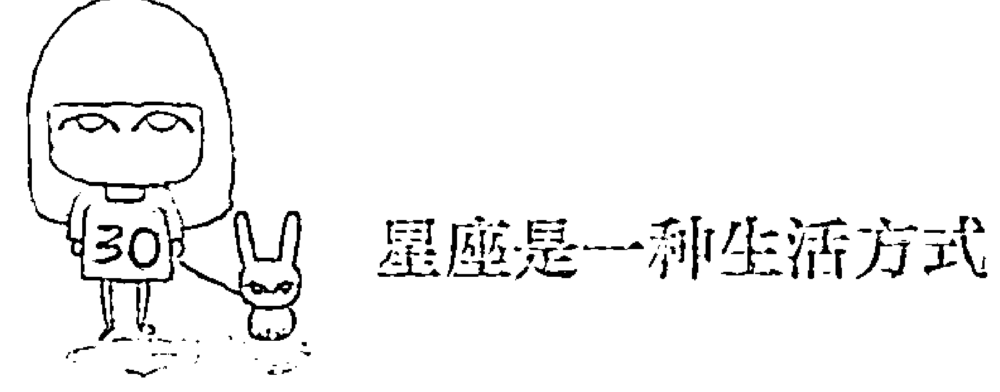

## 对巨蟹座的人有着致命吸引力的星座是摩羯座。

这听上去有点不可思议，但确实是真的，这两个星座的组合貌似平庸，甚至无趣，但事实上却是一个可以“改变世界”的组合，他们相遇和恋爱的过程常常可以有非常奇幻的故事发生，是星座配对当中最为神奇的一对。其实巨蟹座也是非常现实的星座，他们的浪漫都是适时的、骨子里的。他们很爱钱，很喜欢有规划的、衣食无忧的生活，所以如果有不贵但却实用的东西源源不断地送上来，会是很有效的爱情信物。

说到爱情法器，巨蟹座，尤其是巨蟹座的男子其实是很相信玄学的，也相信命理、运气之说，所以，一些很“仙”的物件会是他们愿意珍藏，也令他们懂得你的心意的。

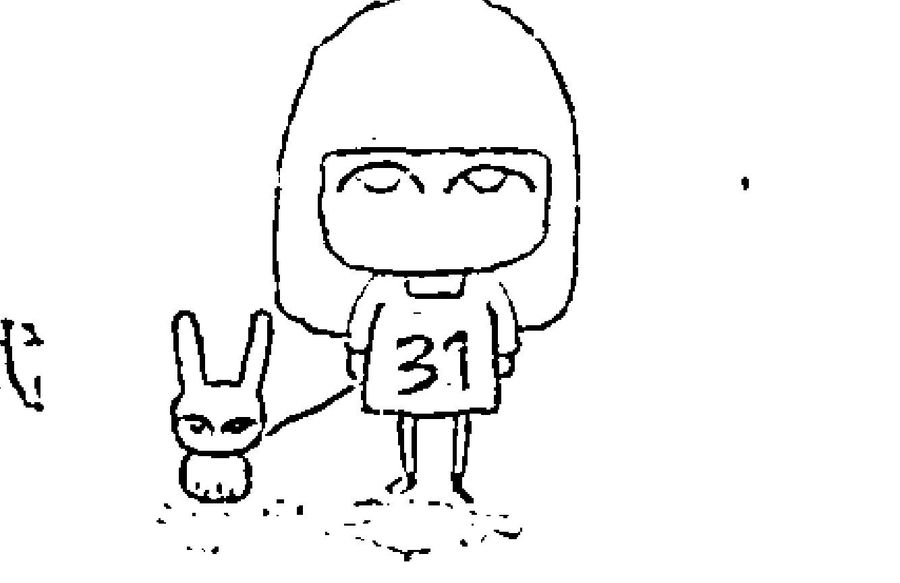

### 捕获巨蟹座法则

- 1. 要相信一见钟情。
- 2. 要让他在人群中一眼就能发现你。
- 3. 如果你可以做到像王子或者仙女般出场，就一定要不遗余力地去做。
- 4. 给他足够的空间，相信他，那就一定会有好的结果。

我是温柔可人的巨蟹。

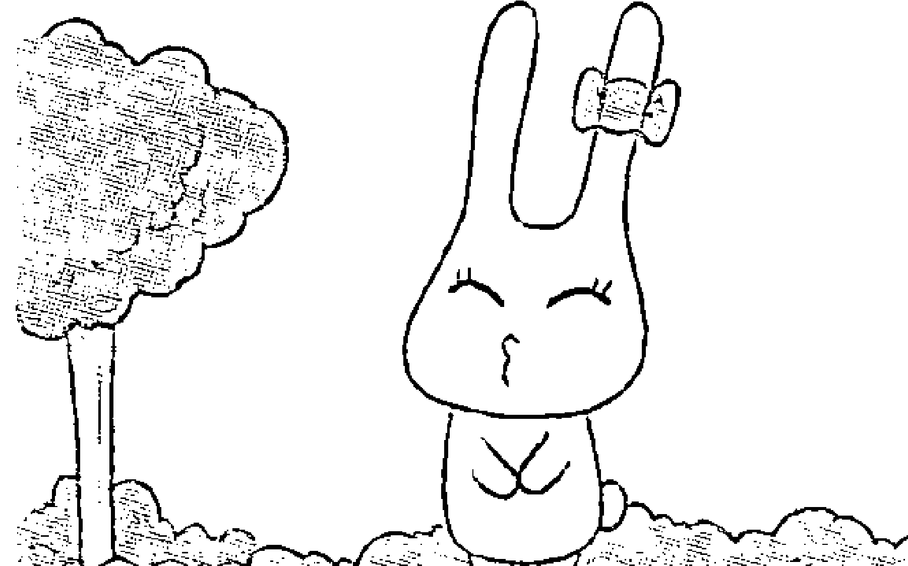

嘻嘻，我有一筐胡萝卜。

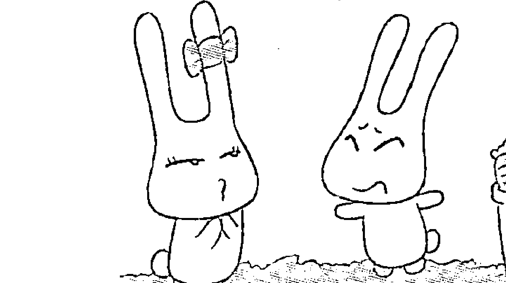

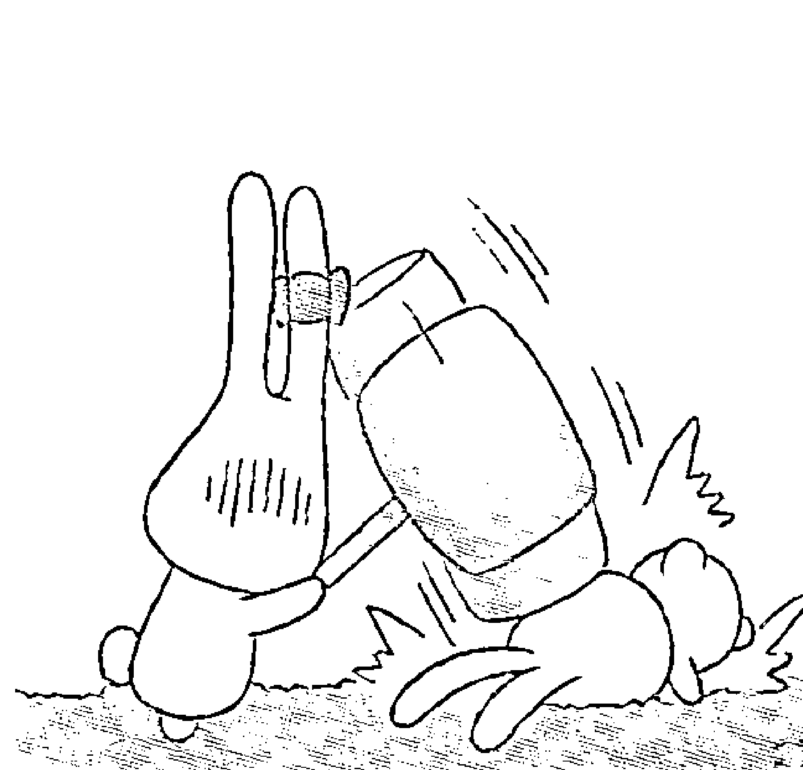

做梦啊你，这些加一起也买不了一个包包！


巨蟹女很适合做老婆吗？那要看你的财力有多雄厚了。

## 金星火星爱情魔法

任何一个星座，与爱情最直接相关的是金星和火星，而金星、火星落在巨蟹座的解析如下：

### 管理爱情的金星

金星代表的是爱情，在男性的占星图上则代表了女朋友。一个人会不会犯桃花，会不会到处留情，看的也是金星。金星同时也代表了俊男美女，所以一般的偶像明星都要有颗很强的金星，才能成就他们的事业。有意思的是，金星还代表了流行艺术，所以有些人可能很奇怪，有些西餐厅驻唱的歌手，长得一脸猥亵的样子，怎么可能还有那么多的人爱他们爱得要死。这就要归咎于金星了。金星掌管爱情和音乐，所以一般人很难区分得清楚，究竟自己是爱上音乐呢还是爱上人？所以也难怪一般的高中男生，就算爬山累得要死，也死要面子地背把吉他，毕竟在音乐的催化下，容易让爱情有所共鸣。


# 星座是一种生活方式

巨蟹女与双鱼女的区别在于，巨蟹女只是情绪化，而双鱼女是神经质。


此生，贵座最大的优点就是刚愎自用！

有水的地方就一定有鱼儿！


## 金星在巨蟹座


金星在巨蟹座的人的爱情很有妈妈的味道。他们能给人温暖亲切的第一印象，像铃木保奈美就是。不论男女，他们对于所爱的人总表现出如母爱子般的关怀。嘘寒问暖，通常烧得一手好菜，当他知道你喜欢巧克力时会去学做巧克力蛋糕、巧克力牛奶、巧克力布丁、巧克力面包……将任何可以加上巧克力的食品送到你的眼前，直到你吃腻为止。

如果你有玩弄别人感情的习惯，最好不要招惹金星在巨蟹座的人，一来，这实在很残忍，对于一个用情至深的人很不公平；二来，这其实也是为你自己着想，你知道妈妈的爱虽然很伟大，可以为孩子牺牲一切，但其实也是有着很强的占有欲，所以一旦你和金星在巨蟹座的人说bye bye时，当然他不会来烦你，但他会折磨他自己，有时还要小心一下分手的他精神状态如何。如果你一点都不觉得人言可畏的话，那，那，那……我也无话可说。

## 管理行动力的火星

“♂”这个挂在厕所入口、代表男性的符号，在女生的占星图上，正代表女朋友。而在男性的占星图上，则可以看出这个男人追女朋友的企图心和行动力如何。火星也代表着勇气、战斗力和军人，李宗盛有一首歌叫做《爱情少尉》，歌词里唱到“不要以为你有完全的准备，不要以为你有多好的防备，我要从你那里尝到爱情的滋味，我要紧紧地跟随！”这正是火星精神的最佳写照。

同时，火星强的人通常可以成为好的运动员，也难怪很多运动员，像NBA的小虫等人，通常会花名在外，想想也不是很难理解，精力过剩的人，才有可能去挑战别人嘛！

### 火星在巨蟹座

> 皇天在上，后土在下，祈祝风调雨顺，国泰民安，人人乐业安居！

以前听过一首歌曲，歌名已经忘了，但是听完以后我就一直在怀疑，真的有这样的人吗？歌词是这样的：“你爱家，更爱国，我心里真快乐。”后来学了占星学，发现真的是有这样的人，这些人就是火星在巨蟹座的奇男子、奇女子。

巨蟹座是以月亮为掌管行星，月亮代表了妈妈，火星在这个位置的男女都很适合家居生活，也就是说，火星在巨蟹座的男性颇有当家庭“主夫”的天赋。女性则会希望自己将来的老公是个新新好男人，最好还能烧得一手好菜。而把家稍微扩大些来看，就是国家，所以火星在巨蟹座的人通常有一种伟大的情操，视家国为己任，希望“国泰民安”。很多时候你都会想给这种人一卷“胶带”，因为他们对于一些民不聊生的灾害，会一直念个没完。另外还有一点就是，火星巨蟹的男人通常多多少少有些恋母情结，就是会去找个妈妈型的太太。要讨好这种人，先探听探听他的妈妈是个什么样，保证可以手到擒来。

## 健康鉴定

巨蟹座的人本性就是那种活动活动筋骨，减减肥就得了的人群，但这对于他们的健康无疑是没有帮助的。


一定要安排他们去做一下户外探险，其实也很简单的，就去水边吧。本来巨蟹座就是水象星座之首，螃蟹水中生，所以，亲近水是巨蟹座的人骨子里的特质，虽然也有不少巨蟹座的人是旱鸭子，可他们很少会像其他星座的人一样从心底里害怕水，或者排斥水上运动，水中的活动对他们来说简直就是不在话下。

近水是巨蟹座的人骨子里的特质。

巨蟹座的男性多半都是胖子，有一部分动作的协调性需要练习。而巨蟹座的女性也属于易发胖体质。

但大多数巨蟹座的人体力都不错，因此对协调性要求不是太高而且体力消耗量大的嬉水类运动才是他们锻炼的最佳选择。

巨蟹座的人富有冒险精神，喜欢尝试新鲜事物，这一点是其他的十一个星座没法比的。除此之外，他们还很爱面子，是自我感觉非常良好的星座，所以像溯溪和溪降这类听起来就很酷、很新新人类的运动项目也能最大限度地迎合巨蟹座的虚荣心。


### 巨蟹座，安全至上。


## Chapter 2


### 各星体落在巨蟹座

- 火星在巨蟹座 ↓ 45
- 金星在巨蟹座 ↓ 44
- 水星在巨蟹座 ↓ 44
- 月亮在巨蟹座 ↓ 44
- 太阳在巨蟹座 ↓ 44

- 冥王星在巨蟹座 ↓ 46
- 海王星在巨蟹座 ↓ 46
- 天王星在巨蟹座 ↓ 46
- 土星在巨蟹座 ↓ 45
- 木星在巨蟹座 ↓ 45

## 太阳在巨蟹座

你天生依恋家庭，有爱国心，有母爱且充满想象力。你性情沉静，坦诚且易接纳别人，也很在乎别人对你的看法。你喜欢感到被需要，从对全人类的深刻关怀中，你可以克服天性的羞怯。你还喜好烹饪与招待客人，是个狂热的收藏家。当有需要时，你会变得长袖善舞以达成目标，因为达成目标是你的安全感所在。平时你需要一个宁静的安歇之处，周遭的一点风吹草动都会影响你的心情。

## 月亮在巨蟹座


你富于母性与同情心，但有时会以恩人的态度自居。你有丰富的情感与服从力，对家庭与家人抱有特殊的爱。你性情温和宁静，怀有浪漫的爱，而非剧烈的激情。你常常天真地相信自己的直觉，但对无法控制的事物感到焦虑。你的官能印象非常精确，但不常把感受表现出来。你的心智倾向于沉思，反应缓慢而不确定。你对外界的影响很敏感，而接收到的往往是负面的震撼。

## 水星在巨蟹座

争论会引发你的固执，你一下定决心，就会非常坚守自己的决定，和善与赞美是跟你打交道的最好方式。你的心灵是善于记忆的，而你的思考是有创造性的。你常有突如其来的直觉，喜欢诗歌。同时还是个敏感的听众，对他人的痛苦充满同情，但你可能没办法做到客观地思考，理性地判断，因为你总是会将情感投射其中，这种情况可能导致你对自己感到失望。

## 金星在巨蟹座

理想主义，有追求诗情画意的倾向。你喜欢享受生命中美好的一面，可能会自我纵容，但很少奢侈浪费。你的感受力敏锐，易受伤害，但会以保持忙碌或假装不在乎来隐藏情感。


在乎的方式设法掩饰。你热爱并顾念家庭，即使尚未结婚也会习惯性的照顾别人。你的反应出于直觉与感情，你与伴侣的关系比较像母子而非配偶。你性格温和，有同情心，处处迎合别人，散发出宁静的魅力。

### 火星在巨蟹座

你天生举止优雅，不过由于情绪因素与情感上的挫折，可能相当喜欢斗嘴，而且会卷入不和谐的家庭关系中。通常你不愿牺牲自己的看法，喜欢独立作业。生性贪得无厌而又带点艺术气质，设计精巧的小机械很适合你。你在紧急情况中能保持坚定冷静，如果压抑过多的愤怒，可能会产生抑郁的情绪或肠胃的问题。很不幸的是，这个火星位置可能会导致早年丧母。

### 木星在巨蟹座

你富有同情心，遇到事情能优雅沉着地处理，具有良好的公关能力。因为喜爱与形形色色的人接触，在交际应酬方面表现优异。木星落在此座预示着你有良好的家庭背景，并深爱小孩，能经营一个安定的家庭。注意不要太过伤春悲秋，或太过为家中的事务操心。也必须小心暴饮暴食的毛病。你能把财务料理得很好，可从不动产中获利。

### 土星在巨蟹座

由于在情感上的表现受到禁止，你可能会觉得受到孤立与害羞。早年的家庭生活缺乏温暖或曾经有过麻烦，也许会使你心中受创。虽然你需要爱，家庭生活却异常不稳定。尽管如此，你还是倾向于家庭，愿意为你的家人负起责任。为了保持一种尊严，你会隐藏自己内在的思想与情感。你爱哭，但却是在私下，别人看到的只是你忧郁的眼神。你缺乏对他人的了解，虽然心里很想帮助他人，却常常无能为力。你很在意物质上的获得，非常精明能干。


- 冥王星
- 海王星
- 天王星
- 土星
- 木星
- 火星
- 金星
- 水星
- 月亮
- 太阳

### 天王星在巨蟹座

面对家庭与婚姻的压力，你会采取一种不同的态度来追寻自由。你把父母看做是同辈而非权威人物，或者你可能完全忽视他们。你不喜欢家人所建立的生活形式，觉得在别的地方生活会更为自在，或者可能有着一种回归自然的短暂嗜好。如果你真的选择组建一个传统的家庭，你会在其中塞满电子产品与设计精巧的小机械，或者你可能会用自己的双手亲自布置居所。你喜欢四处旅行与飘荡，敏感而具有直觉，能够接受抽象与神秘的事物。当遇到有挑战性的相位时，可能会带来情绪上的波动。你的情感可能是不稳定的，性情也不够理智。

### 海王星在巨蟹座

海王星最近一次出现在巨蟹座是从1901年到1915年。你对土地有强烈的感受，对家庭与家人亦然。你是理想主义的，在情感上相当敏感。忠诚爱国，对宗教观念采取开放的态度，你愿意为保护他人而牺牲。

### 冥王星在巨蟹座

你对安全感这种东西有强烈的需要，还有获得稳重成熟感的需要。这个位置暗示社会的知觉。冥王星在巨蟹座的运作方式是自觉性与本能性的，而且它喜欢打破传统。不过，它也能使你充满怨恨，甚至倾向于病态。

### Chapter 3


### 巨蟹座女性阅读专区

- 提升职场魅力 ………… 49
- 社交夺目法则 ………… 50

用我的观点看，巨蟹座的女子，是这个世界上最极致的女性。

很多人都觉得双鱼座的女性敏感又脆弱，等于女人的代名词。其实错了。时间飞转到今天这个年代，时尚女性，尤其是时尚的事业女性如果一定要找一个族群做代言人的话，那应该是巨蟹座。这是一群内心非常女性化，虽有较高的处事手腕，但行动起来还是非常女性化的都市人。她们所拥有的脆弱是最典型的女性脆弱，而在尔虞我诈处处是陷阱的职场上，她们所拥有的过人能力与社交手腕，也都是非常女性的。甚至连那些让她们快乐与伤悲的事情，也无一例外都是最女性化的。

## 提升职场魅力

巨蟹座女性会过度工作导致身心疲惫，其实这样对自己对公司都未必有好处，因为没有上司会对一部工作机器予以信心与厚望。但人有时会掉进自己所设下的陷阱里，矫枉过正，变成工作狂也不晓得，越是自我要求严格，越容易出现力不从心的现象，长此以往只会对自己的事业发展造成重大的阻碍。虽然职场上的事情说也说不完，但对女性而言，如果可以化繁为简，通过衣着与个性的辉映来为职场加分，绝对是好事情，而这种能力，相信巨蟹座的女性是相当超群的。

巨蟹座女性会因为工作过度导致身心疲惫。


蓝色是属于巨蟹座女性的幸运色，蓝色的服装或饰品可以提升她们在职场的受关注度。再来就是，如果有虎耳草的话，用漂亮的玻璃瓶装起来当装饰，也可以增加运气和职场人气！

星座是一种生活方式


## 社交夺目法则

一般来说，是母性支配着巨蟹座女性身心上的平衡。母爱之情在这一星座的女性身上得到了充分的体现。

> > 社交场合的巨蟹座女性，就应该是怎么有女人味怎么来。


落实在穿着上，用一个比较惯常的，而且无论什么年龄的巨蟹座女性都能接受的方式解读就是：女人味。基本上呢，社交场合的巨蟹座女性就应该是怎么有女人味怎么来。

在职场等重要场合当中，巨蟹座选择的衣服应该多少要具有平稳情绪、带来力量的作用。而突出女人味一直是巨蟹座女性职场社交中的重要课题，因此雪纺、薄纱都是巨蟹座的女性在重要场合礼服材质选择的要素，D&G的礼服是超级合适的选择。


星座是一种生活方式

> 你绝不能亏欠巨蟹座的人任何一件小事，他们会把这些记得比其他一切都清楚的。


巨蟹女通常超级有母性，不过拥有的多半是母性里的缺点，比如纵容、比如爱得无原则……

变身巨蟹的nownow！


给你吃胡萝卜好不好？


N天后……


### 巨蟹座明星着装榜样

### 广末凉子

这是一个让人不陌生的名字。或许你已经不记得她到底演过什么，但是呢，大多数人都会记得她清纯的扮相，优雅的穿着，以及细腻婉约的形象。好吧，这就是经典的都市巨蟹座女子。

据说广末凉子有一套自创的穿衣哲学。她会先从杂志和各大品牌的秀场上了解时尚的最新潮流，接着会根据自己的气质、体型，在这些时尚信息中找出最适合自己的款型、色彩和面料。同时她还是称职的“服装买手”，会根据预算，将自己想要的衣服、配件、彩妆从商场和小店一一淘出。紧跟着，她开始为自己的秀作准备，在家里的大床上把新款的服饰和以前的存货搭配出无限可能。所以，用凉子的话来说，虽然她从一个平凡的巨蟹座小姑娘变成了现在的超级女明星，但她的穿衣哲学、时尚观点是从未改变过的。而这，也许是对普天下的巨蟹座女性有一点点提示的作用。

千万不要以为螃蟹们在满月时群聚在沙滩上向着美丽月色祈祷，是在发送着什么世界和平的愿望，其实心里嘀咕的是有朝一日大海的浪潮可以变成“钱潮”，而且恰好都砸在自己身上。

闭上眼睛，我们一起许个愿吧！


一分钟后……


### Chapter 4


## 巨蟹座血型鉴定书

- A型巨蟹座 ................. 56
- B型巨蟹座 ................. 66
- O型巨蟹座 ................. 78
- AB型巨蟹座 ................. 88


无论男女，A型巨蟹座的人都是骨子里母性本能相当强的人。重视邻居、朋友及家人，渴望保护他们，帮助他们，是充满着慈爱关怀的人。> 不擅长以冷静的态度判断事物。


而且，A型巨蟹座的人防卫本能极强，当自身或同伴身边出现敌人时，会使出全力防卫，能对抗恶者、保护弱者，拥有善良且宽阔的心胸。不过当这种精神表现过度时，会出现排他的一面。你重视他人的感觉胜于理论或讲道理，因此很容易受情绪性的气氛或人情所左右，不擅长以冷静的态度判断事物。


从好处解释，可以说你有着丰富的感受性，擅长情感表现。记忆力超强，能迅速地理解事物，也具备卓越的模仿能力，但从另一方面来说，你会带有喜新厌旧的本能，这一点必须特别留意。也许是丰富的感受性使然，你很容易受新奇诡异、散发异国情调的事物所吸引，是那种能够悠游享乐的人。人际关系的纠纷，将造成重大的障碍，因此，凡事都不可感情用事。扩大自己的视野，才能安全地在人生之海上航行。

> > 扩大自己的视野，才能安全地在人生之海上航行。


## A型巨蟹座多半是有福气的人。

## 与父母的缘分极深，极有可能继承财产。

在父母的身边生活，是获得幸福的条件。也有不少人可能会成为富有财主的养子或养女。在年轻时你常有劳苦，常常事与愿违，也会发生若干纠纷，因此可能有许多必须忍耐熬过的事情。但是倍尝辛苦后必有回报，千万不可焦急。如果讲求实际，生活方式从不出错误，中年以后将有飞黄腾达的机会。尤其是晚年生活将越来越幸福，属于老来得福的人生。


A型巨蟹座：重视原则，安分守己。

A型巨蟹座是非常爱吃东西的一类人，必须特别注意胃部的疾病。应强忍食欲，尽量控制在八分饱的状态，避免饮食过量。另外你的神经也较为敏感脆弱，容易染患神经性胃炎、胃溃疡等。肝脏也不甚健壮。A型巨蟹座的人天生具有较好的家庭运，但若遇到家庭内部事件对你造成的压力，容易引起精神的不安定，立即导致损害健康的严重后果。另外，你处事略欠沉着稳重，必须注意意外的伤害。

如果参加休闲活动，宜选择水边的场所，将有好运来临。虽然潜水有些危险，但对你而言倒是相当有趣的休闲活动。在觉得燥热时，不妨躺卧在吊床上，在轻摇慢摆下享受舒适的睡眠。

应强忍食欲，尽量控制在八分饱的状态，避免饮食过量。


## 职场鉴定


在职场上，A型巨蟹座的人给人以擅长与上司沟通的印象。同时还具备聚合团体的才华，在小组中工作时，将是各个岗位都积极延揽的人才。

A型巨蟹座的人适合从事需要具备奉献精神的工作，所以当教师的非常多，而A型巨蟹座的女性则适合从事护士的工作，或是做老年人、儿童、病患等体力衰弱者的辅助者，这类工作将是你的天职。味觉极为发达的你，也适合从事厨师或营养师等工作。

以自己开创事业为目标的A型巨蟹座，经营饭店、旅馆或别墅将极为适合。


> > A型巨蟹座人的缺点是很容易感情用事，有时会因心情而改变对工作的态度。请务必公私分明，不可混为一谈。

A型巨蟹座是十二星座中最迷恋家庭气氛的星座，使用的交际方法也踏实牢靠。通常职场和生活的社交对你来说是很难区分的，在这一点上，A型巨蟹座是十二星座与四大血型的组合中最为突出的一个族群。你有牺牲奉献的精神，但行之过度时，对方会觉得不胜其烦。请注意无论职场上的搭档还是朋友，以不留痕迹的方式对待对方，如果成天把工作和正常社交都搅和在一起，恐怕会招致对方的厌恶。由于视野较狭隘，你必须以较宽容包涵的心面对事情。同时，请培养自己冷静观察事物的能力。

星座是一种生活方式


> > 你身边的朋友往往可以带给你工作机会。

A型巨蟹座的人拥有牢固踏实的金钱观，绝非虚掷浪费的人。虽然略有斤斤计较的一面，不过，为了将来的生活设想，这倒是不错的倾向。

最适合你的职业是那些可以按部就班，以自己的步调处理事物的工作。由于你天生具有优秀的数字能力及金钱观，因此，会计或总务的工作也是你适合的职业。


而在特殊的工作上，也可考虑活用天生所具有的艺术才华。例如从事美食家、雕刻家、设计师、画家、音乐家、作曲家、造型师等职业。

A型巨蟹座的朋友多半是行为举止异于常人者或艺术家。他们是那种工作与生活不会分开的人，所以你身边的朋友往往可以带给你工作机会。

> > 如果条件允许可以考虑早婚，但不适宜成为专职的家庭妇女。


## Advice

A型巨蟹座的你较适合走进家庭，尤其是女性，如果条件允许可以考虑早婚，但不适宜成为专职的家庭妇女。而A型巨蟹座的男性也是先成家后立业的典范，事业是伴随家庭稳定之后才会腾飞的。

由于性格使然，光凭你一个人无法确实地实行任何事，很容易半途而废，因此重要的是找到能够鼓励你的朋友，在你身旁督促你的所思与所行，这也许是你成功的捷径。扩大自己的视野，仔细地观察周遭情况，是你目前最需要的。

### 爱情鉴定

你是愿意为对方全力付出、牺牲奉献的类型。随时渴望在爱人的身边一起行动，共享时光。极乐意助人，也喜欢亲手调制料理犒劳他，并倾听对方谈论未来的生活计划。

另一半身上所穿戴的物品或必要的东西，A型巨蟹座的人一定会统统亲手制作或亲自选购。因此，追求刺激而渴望热烈恋情的异性，对于你如此强烈的母性本能也许会感到碍手碍脚、不胜其烦。如果是憧憬家庭式爱情的异性，必会沉醉于你所制造的家庭气氛中，把这段恋情化为实际。你和他若能一体同心，便可以在恋爱中培养出彼此间夫妇般的默契，在你们两人身上，似乎已散发着家庭的气氛。

星座是一种生活方式


结婚对象最好是拥有家庭观念的人。

A型巨蟹座的人的结婚对象最好是拥有家庭观念的人，也应该选择体格壮硕、健康的人。这样的伴侣才能满足你天生的强烈母性本能。结婚后，由于善于储蓄，你的经济情况会逐渐变好，逐步过上富裕的生活。


最适合成为你人生伴侣的是巨蟹座、天蝎座、双鱼座的异性。彼此富有强烈的同情心，将成为互相慰藉的伙伴。其次较适合的是金牛座、处女座的异性，这些人将和你齐头并进，一步步地实现你的梦想。很可惜的是，白羊座和天秤座的异性不适合你，因为你们双方都会坚持己见、率性自为，将导致彼此伤害的结果。

# B型巨蟹座

你是朴实而爽朗的天使，拥有几近单纯的朴实性格，开朗爽直，绝不拘泥细微小事，个性纯真。

> > 你擅长自我表现，常有令周围的人瞠目结舌的行为。


而且，B型巨蟹座的人富有强烈的浪漫气息，对各式各样的事物都会很感兴趣，兴趣广泛。你的观念极为新奇，一遇到奇特怪异的想法便渴望能立即实行。擅长自我表现，常有令周围的人瞠目结舌的行为。在一般人的眼中，你是个“有点奇怪的人”。有趣的是，你的朋友们都乐于见到你那标新立异的行为。

星座是一种生活方式


## B型巨蟹座的人在紧要关头，能发挥出惊人的勇气。

B型巨蟹座人的运势和一般人不同，如果从事自己喜好或感兴趣的工作，天生的才华加上运势的推波助澜，将可以踏上成功的坦途，出人头地。而且，你对所肩负的职务非常忠实且勤勉，会获得上司和周围人的信赖，拥有极高的声望。所以，你首先必须切实了解自己喜欢什么，对什么事物较感兴趣，这是开拓幸运的关键。

切实了解自己喜欢什么，对什么事物较感兴趣。

持续学生时代既有的兴趣，步入社会工作后，发挥该方面的才能而成为成功者的人，几乎都是B型巨蟹座。相反，如果找不出自己的人生方向，B型巨蟹座的人终其一生很难掌握大运。这种人多数到社会工作，如果你觉得一直不够幸运，应再一次审慎地反省，或许需要下一番重大的改变的决心。


是属于钻牛角尖的类型，或是耐力不足中途放弃，而无法持久的类型。到社会工作，如果你觉得一直不够幸运，应再一次审慎地反省，或许需要下一番重大的改变的决心。

总体来说，B型巨蟹座的人属于所有组合当中相对比较健康的族群，这一点不得不说是相当令人羡慕的。只要记得不要过量饮食，适度运动，小心骨骼老化，那么一生的大多数时间里，尤其是青春岁月里，你都是相当健康的。


## B型巨蟹座：超群的直觉和敏感。


## 职场鉴定


B型巨蟹座的男子恪守社会的法规，重视生活常识，脚踏实地地过着安分的生活，这与巨蟹座本来的性格是一致的。

如果要他丢弃旧有的，重新再创一个新东西，他宁可将旧有的东西改造一番，继续使用。换句话说，B型巨蟹座的人是相当保守念旧的，你想要改变他原有的生活方式，是不太可能的。这样的个性，使其对国家、对社会永远忠心耿耿、矢志不变，对家庭也是劳心劳力，至死后已。在爱国、爱家、爱友方面，没有一个星座比B型巨蟹座的人表现得更加强烈，因此，此星座的人易流露出偏袒亲友及利己的本性。这个毛病必须设法改掉。

总是任劳任怨、默默地将工作做完。


星座是一种生活方式


> 若只注意身边的事，则失之琐碎、狭隘。

B型巨蟹座的男性大都有女性化的倾向。同情弱者而抗拒强者，具有菩萨般的胸怀。但这种“软性的爱”如果用得太过分的话，则给人肉麻的感觉，当节制为是。记得若只注意身边的事，则失之琐碎、狭隘，宜扩大视野，使人生的旅途更加广阔。


而对于B型巨蟹座的女子来说，与其拥有专门的工作或发挥个人的特质展现才华，不如走进家庭，才能掌握难得的幸运，获得周围人的信赖。

你的温柔及顺应力，在婚后会发挥得淋漓尽致。如果把婚姻放在第二位，而着重于发展自己的才华，以工作创造自己的天地，可能会破坏你的整体运势。你那体贴、细腻的特质将在家庭中展现。不论是相亲结婚或恋爱结合，B型巨蟹座的人都是属于在婚姻生活中可以展现魅力的人。


## 你那体贴、细腻的特质将在家庭中展现。


B型巨蟹座的最佳社交方法就是迅速结盟，尤其是如果能和志同道合的朋友合伙，更会如虎添翼，你的才能也能得到最大化的发挥。所以，你不适合经营需要独当一面的事业，而是需要一位帮手来协助你，才能出人头地获得成功。

不过，感情用事、拖泥带水、主观意识强都将是你的致命伤，务必要改进。


平时对人态度极为温和，又乐于助人，是大家心目中的老好人。

## Advice

B型巨蟹座的人最具日本人的特色，我们只要回想一下自己了解过的日本人，就可以找到证据。以感情来说，他们的感情丰富而敏感，就如湖水一样，只要一小颗的投石，就能激起层层的涟漪，波荡不已。因此，B型巨蟹座的人情绪极不稳定，有喜怒无常的现象。B型巨蟹座的人平时对人态度极为温和，乐于助人，是大家心目中的老好人。只要能控制自己的情绪，不被心情的好坏影响行为态度，就能成为一个受欢迎的人物。B型巨蟹座的人感情重于理智，决定事情时往往以感情为前提，故其判断有失偏颇，若一旦肩负领导者的职务，恐怕有失职之虞！

星座是一种生活方式


### 爱情鉴定

你的意见必须完全被遵从。“全权由你处理”这句话，可以提高你的责任感，加深彼此的感情。

B型巨蟹座的人对婚姻千万不可掉以轻心，需要小心经营。由于强烈地抱持拥有家庭的愿望，只要你有意，对方就会依你的愿望为你实现。不过在你的命理中，解除婚约，或婚事无疾而终的倾向颇强。你是个极厌恶隐瞒的人，任何事情都会说明白，但有时这种态度不见得有好的结果。

在你的心中有时会产生猜疑的念头。这个猜疑会造成两人相处时的障碍，或是误会对方的心意，伤害到对方。表现出你自然而然朴素的心，是彼此交往时非常重要的态度。


## 最适合和B型巨蟹座交往的异性是：

- B型或AB型的巨蟹座。平时他们会给人率性自为的感觉，似乎难以亲近，一旦深入地交往后，会发现他们其实是相当柔性的人。是不寄望他人的协助，以自己的力量迅速地处理任何事情的人。他们也具有浓厚的同情心，对任何细枝末节都能小心注意，以避免伤害到别人。是能顾虑到未来的状况，再采取行动的人。如果是眉目清秀、心灵清纯的异性，更是最佳人选。


- B型或AB型的处女座。这个组合的人生性温柔，对任何人都会表现出同样的体贴与关心，绝对不会树敌。碰到他人有所请求时，他们会尽量配合，性格非常柔和。会随时注意自己的外表，脸上永远带着爽朗的微笑，交往越久令人感受到的魅力越大。如果你还正好和他拥有共同的兴趣，将成为志同道合的伙伴。


到户外四处活动，你对阳光下的男孩所展现的强健体魄相当有好感。


- AB型的双鱼座。与其安静地待在室内，不如到户外四处活动，你对阳光下的男孩所展现的强健体魄相当有好感，更何况你还有可能与他有相同的兴趣。如果是有妹妹的异性，更是不可多得的选择。


星座是一种生活方式

# O型巨蟹座：热爱生活，遵守世俗。


拥有强烈的个人意志，绝不允许离经叛道的行为。富有敏锐的感受性及崇高的知性，最大的缺点在于情绪起伏的落差较大。

O型巨蟹座的人拥有极强的生命力，是富有知性的行动派。愿对众人发挥博爱精神，乐于助人。但另一方面，当面对与你所爱的人发生冲突的人时，强烈的战斗心就会油然而生，卖力地作自我防卫。换言之，你具有极强的防卫本能。因此对于朋友以外的人，表现出不易亲近的排斥感。你容易受他人影响，也因此具有模仿他人的才能。但在达到瓶颈、无法突破时，便会留在原地。你身具各方面的资质，可以适应任何情况，但千万不要落入样样皆通一点，却一事无成的境地。

O型巨蟹座人的一生极富变化，幼年时期也许会过一段辛苦的日子，不过你天生充沛的活力足以捱过各种难关，尤其是女性更为突出，能以坚忍不拔的耐力克服一切困难，直至苦尽甘来。历经波折后，中年时的O型巨蟹座便可积聚钱财，过着安定的生活，所付出的努力也能获得社会地位上的回报，越到晚年越不会再有这方面的顾虑。

适合与你结婚的人是彼此年龄相近的人。

你的物质生活并不会特别富裕。

你和父母有极深的缘分，不过可能和亲戚之间的感情不睦，也可能有金钱上的纠纷。

如果继承了父母的财富，要注意它可能带来的纠纷。

你拥有非常好的朋友运，朋友中有许多生活富裕的人，或社会地位很高的人，这些人将带给你幸运。你会深受艺术家型友人的影响。注意不要吝啬于交际上的花费，它将使你事半功倍。

O型巨蟹座的人由于身体的吸收能力极佳，可能会造成肥胖。而且经常大吃大喝也会造成胃肠负担过重，特别要注意饮食过量的问题。

注意养成规律的饮食习惯，小心控制自己的体重。

也要留意肝脏、胆囊方面的疾病。出外旅行，到海、湖、溪谷等有水的地方会给你带来好运，但千万注意坠落山崖或旅行时染患疾病这类的意外。你贪婪好吃的习惯蕴藏着中年发福的隐患，克制吃零食的欲望，注意养成规律的饮食生活，小心控制自己的体重。

## 职场鉴定

你十分擅长拉关系套交情，平日喜欢和身份地位高的人来往。正因为如此，很有可能受到这些人的提拔，获得极大的援助。

> 你能一手创造出突显自己个性的特点。

记忆力强、聪明伶俐而且多才多艺的O型巨蟹座，在各个方面都能堪称模仿天才，这是巨蟹座的特征。此外，你还具有敏锐的直觉力，与创造和求变创新的能力。你能一手创造出突显自己个性的特点，你的一切努力都会获得相对的回报。感受性敏锐而且乐于助人的你，有时却会表现排他的一面，千万注意不要因此而树敌。

O型巨蟹座的人适合各种类型的职业，例如杂志编辑、童书作家、手工艺家、饮食相关行业业者、生活顾问、室内设计师。

星座是一种生活方式

> 容易受人影响的你，重要的是培养自主性，训练观察人的眼力。

师、社会福利相关行业业者等等。在职场上和你合得来的是巨蟹座、天蝎座和双鱼座，借由他们可提高你的精神层面。如果和金牛座、狮子座和处女座的人能彼此互相理解帮助，他们也会是你职业生涯中的得力助手。而面对射手座的人时，只要不感情用事，与之用冷静泰然的心态交往，对自己也有益处。

O型巨蟹座人的个性和白羊座、双子座、天秤座、水瓶座的人不合，你们之间若发生纠纷不要看得太认真，避免不必要的摩擦。容易受人影响的你，重要的是培养自主性，训练观察人的眼力。

# 星座是一种生活方式

## Advice

O型巨蟹座的人非常温和，乐于助人又值得信赖。但表现过度时，恐怕会侵害到他人的隐私。虽然并无恶意，但可能会因为脱口而出的言语，伤了对方的心。对你来说，朋友是最重要的，因此必须珍惜难得的友谊，细心经营。

你往往对自己所处理的事情感到不安，其实，不论发生什么事情，你都应对自己的生活方式充满自信。即使在工作将告一段落时也不可以放松自己，做任何事都应从头到尾贯彻到底。尤其必须特别注意对长辈应有的礼仪。

> 朋友是最重要的，因此必须珍惜难得的友谊，细心经营。

很多巨蟹座的人讲话超难听，虽然你并没恶意，甚至是好意，但每件事经您的金口一开，莫名其妙就树了一堆敌人。

### 爱情鉴定

喜欢由友情发展而来的爱情，但付出感情时经常犹豫不定，可能前一秒钟心情愉快，下一秒钟却板起脸孔，令对方不知所措。

O型巨蟹座的人具有强烈的嫉妒心，绝不会以玩乐的心态谈恋爱。不仅自己有强烈的执著劲儿，相对地也要求对方抱有相同的心理，绝不给自己或对方留有任何空间。无论在任何事情上，你都无法拒绝别人，这可能会使你完全落入被动的局面当中。尤其是面对婚姻问题时，必须以冷静的头脑去审视对方，分辨清楚他是否抓住你的同情心作为弱点，以骗取你的感情为目的。遇到这种情况，千万不可沉醉于当时的气氛，

对爱有一种温柔的执著，常暗自在心中为爱狂热，却不会积极经营。

星座是一种生活方式

这乃是了解他的最好时机，要抛开感情因素的干扰，理性仔细地分析对方。

极富知性的你，擅长书写文章，偶尔以书信传达心意，颇具效果。与你最搭配的星座是巨蟹座、天蝎座和双鱼座，你和这些星座的人意气相投，可以彼此推心置腹地交谈，也能大方地对他说出内心的秘密。其次合得来的星座是金牛座、处女座和白羊座，他们会帮助你，彼此成为互助的关系。

对血型是O型的异性，有时要故意奉承对方，对他说好话；对A型血的异性必须在细枝末节上注意，照料他身边的一切琐事；至于面对B型血的异性时，偶尔不妨向他撒娇；而面对AB型血的异性，则要以充沛的爱对待他。B型天蝎座和O型双鱼座的异性，会对你所散发的母性本能感到很满足。而A型白羊座、O型天秤座的异性在谈恋爱的过程中，对你并不挑剔，婚后却可能会对凡事以儿女为优先的你感到不满。

# 星座是一种生活方式

### AB型巨蟹座的你，

是个脚踏实地、努力奋斗不懈的人。

诚实，富有强烈的责任感，深得周围人的信赖。不过生性略为顽固，处事缺乏融通性。

你天性喜爱家庭气氛，具有强烈母爱特质，对于年幼、弱势的群体，你会发挥母性的本能予以温柔照顾。同时对于重要的人和事物也会全心全意地付出。AB型巨蟹座的女性通常是朋友们倾诉心事的对象。但若是不小心，恐怕会因背负太多的责任造成身心的负担。因此，你应该学习如何巧妙地拒绝，并

星座是一种生活方式

清楚地向对方传达自己的状况的能力。如果高估自己的能力，恐怕会格外的辛苦。

沉稳踏实而且体贴的你，缺点是常为鸡毛蒜皮的小事犹豫不决，难以下决心。又爱发牢骚，容易被他人的批评所影响。你必须拥有让自己飞向崭新世界的勇气。

AB型巨蟹座的人整个人生都会处于安定的状态下，好运与恶运之间的起伏较小。属于晚年发达的类型，年轻时期的你可能并不引人注目，但随着年龄的增长，运势节节高升，中年之后，以往的努力便会为你带来成果。

非常重视家庭的人，随时保护自己的家人免受伤害。

努力不懈的你如果对工作能够全心全意地投入，必会获得信赖，也可能在社会上获得极高的评价。

AB型巨蟹座是非常重视家庭的人，随时保护自己的家人免受伤害，和父母及儿女心心相印、相亲相爱。婚后是重视家庭、重视儿女的好父母。

如果在你的一生中有起伏，可能会是伴侣不顾家庭，导致家庭陷入危机。如果伴侣对你不再有以往那

般关爱，凭你独特的直觉，能很快地发现丈夫的婚外情。不过随着年龄的增长，夫妻之间的感情也会日渐稳定，此时的重点是不要过度拘泥于小事，拥抱真正的自己。

> > 注意养成规律的饮食生活，小心控制自己的体重。

食欲旺盛的AB型巨蟹座，常因饮食过量引起胃肠不适，这也是造成你肥胖的原因。必须注意饮食习惯。另外，希望你注意胃肠、肝胆的疾病，以及水肿及硬化症。

## AB型巨蟹座

## 职场鉴定

AB型巨蟹座是所谓的“大哥大姐型”，以巨蟹座特有的敏锐感受性迅速地掌握他人的心理，扮演人与人之间的导管角色，和气且善于穿针引线，算是一流的配角。而且对于受托之事，AB型巨蟹座的人从来不会拒绝，即使是对自己并不欣赏的人，也能笑脸相待。你富有责任感，对工作的领悟力极强，可在各种工作上获得成功。尤其具有创造才华，必会受到众人的瞩目。你天生擅长交际，能够轻易与人建立良好的关系。且为人

> 如果高估自己的能力，恐怕会格外的辛苦。

小心谨慎，遇到可能争执的情况，事前即予以回避，更不会打架滋事。你不会搞派系，不论任何情况，都站在中立的立场。多才多艺且聪明伶俐的你，锁定目标并努力不懈乃是成功关键。适合你的职业有杂志编辑、文学作家、童话作家、生活用品制造商、室内装潢设计师、饮食相关行业业者、评论家等等。

# 星座是一种生活方式

## Advice

> 跟朋友一起出外走走，尽情享受生命中无牵无挂的一刻吧。

AB型巨蟹座的人对待工作很容易会像着了魔一样无法自拔，这时需要特别留神，避免坠进恶性循环中，要慢慢培养自我控制的能力。尝试把对工作的狂热转移到其他事情上，尽情享受个中乐趣。所以当你发觉自己无法集中精神工作，时常不小心犯错，脾气暴躁、缺乏幽默感、心绪不宁、小题大做、动辄跟同事或客户发生争执时，就需要暂且放下工作好好休息一下了。跟朋友一起出外走走，尽情享受生命中无牵无挂的一刻吧，直至身体与精神完全放松。

星座是一种生活方式

AB型巨蟹座：古道热肠，老好人。

## AB型巨蟹座

### 爱情鉴定

AB型巨蟹座对于恋爱的态度非常慎重。

不轻易暴露自己的真心，不知如何与异性相处的你，甚至会对爱情感到胆怯。

你在感情中很现实，喜欢有利于自己的爱情。

约会时，对方很可能摸不清你内心所想，因为你即使喜欢对方，通常也不会向对方表白心意。这种恶性循环可能会使你错失难得的机会。请放开自己，让自己更开放、更自然地与异性交往。你不会贸然地闯进一份恋情，是属于慢慢孕育爱情的类型。你对于恋爱与婚姻的问题非常认真慎重，如果对方的心并不是专注于你，便会令你感到不安。你天性重视家庭，对于对方多情或不专注的态度会随时保持警戒心。你在感情中很现实，喜欢有利于自己的爱情。

星座是一种生活方式

富有行动力且处事积极的人与你合得来。尤其是那些踏实走自己人生，能够珍惜你与你的家人，就连同性朋友也会赞赏他是个“好男人”的人。

> 千万要提防那些擅长吹捧女性、以低姿态吸引你的男人。

随时领先一步，能带头引领你的男性最适合你。态度积极的他一旦喜欢上你必会猛烈追求，毫不在意别人的眼光。在朋友面前也会直接地表示对你的好感。刚开始也许会让你觉得别扭，但在众人的祝福下，不知不觉中你已和他步上红毯。

> 结婚的对象，最重要的是是否和你的父母、家人合得来。

为了保护你而不怕困难、略微顽固却心地善良、富有男子气概的异性与你最搭配。不过千万要提防那些擅长吹捧女性、以低姿态吸引你的男人。

天生具有流行感的男性能够扩大你的视野。不过如果是结婚的对象，最重要的是他是否和你的父母、家人合得来。整体而言，你似乎与年纪稍大的男性较为投缘。

巨蟹男不是最顾家，是最爱表演自己很顾家。

> 变身巨蟹兔。

> 还有什么比家人更重要呢？

> 我们巨蟹是最爱家的啦……

> 真受不了这个家伙！

## Chapter 5

## 什么是十二星座？

其实关于十二星座的精准定义，几千年来都没有人可以给出真正意义上的名词解释，而如果我们在薄薄的一本星座人手册里再描述过多的天文学知识，实在太有凑字数之嫌了。我们不如用另外一种方式，来解读十二星座的划分，以及对于我们生活的影响。

唯一需要解释的是，为什么有名字的星座有88个，而被占星学使用的星座却只有12个？这是因为2000多年前，古代天文学家就发现，太阳在星空中是不停移动着的，每年移动一周。这种现象，实际上是地球绕太阳公转的反映。太阳对于人类的重要性是不容置疑的，所以它在星空中移动的路线就有了专门的名字——黄道。黄道穿过十二个星座，这十二个星座自然就有了“黄道星座”的说法。

+   **两极性质**
阳性星座 阴性星座
102

+   **四分性质**
火象 地象 风象 水象
103

+   **三分法**
本位型 固定型 共同型
103

## 星座的“两极性质”

我们根据星座的两种不同特质，可以把十二星座分为两组。其中一组称为“阴性星座”，而另一组则称为“阳性星座”。

## 阳性星座

+   - 个性乐观、主动
- 行动积极。
- 开创性强。
- 比较容易快速获得成功与成就。

+   - 水瓶座
- 射手座
- 天秤座
- 狮子座
- 双子座
- 白羊座

## 阴性星座

+   金牛座
巨蟹座
处女座
天蝎座
摩羯座
双鱼座

个性悲观、被动、消极。
开创性弱。
成功与成就虽然来得迟缓，但具有永久性。

### 火象星座

+   - 射手座
- 狮子座
- 白羊座

实际、独立、保守、官能主义。

喜爱物质上的舒适。

拥有优秀的身体复原能力。

缺点：笨拙、不灵巧、过于物质崇拜。

# 星座的「四分性质」

我们也可以把黄道上的十二星座，每四个一组，分为三组。同一组中的星座有共同的特性，每一组都有其表现生活形态的样式。

> 热情如火，率性而为。自负但浪漫。缺点：专横霸道与太过激烈。

### 地象星座

+   金牛座
处女座
摩羯座

感受敏锐易动感情，且感情持久。
直觉丰富、多情善感、感应力强、敏感。
易受情绪左右，且易受环境影响。
缺点：自我放纵、自怜与犹豫不决。

## 水象星座

+   - 巨蟹座
- 天蝎座
- 双鱼座

# 星座的「四分性质」

+   - 水瓶座
- 天秤座
- 双子座

### 风象星座

表达能力佳。擅长抽象的推理。有逻辑头脑，心胸宽阔、客观、无偏见，且有理想主义的倾向。缺点：冷漠与不切实际。

### 本位型星座

这四个星座恰如罗盘上的四个原点：白羊座在东，天秤座在西，巨蟹座在北，摩羯座在南。它们之所以称为“本位型”，乃因为它们掌理四季的变化。白羊座主春季、巨蟹座主夏季、天秤座主秋季、摩羯座主冬季。

- 摩羯座
- 天秤座
- 巨蟹座
- 白羊座

意志坚决，能够专注，稳定，能做积累的功夫。富于洞察力，记忆力绝佳。达成目标的步伐缓慢但扎实。缺点：顽固，过于固守自己的看法，自我中心。

## 星座的“三分法”

我们也可以把黄道上的十二星座，每四个一组，分为三组。同一组中的星座有共同的特性，每一组都有其表现生活形态的样式。

热切，野心勃勃，有热忱且独立。他们心智快捷而不知足。缺点：仓促草率，不体谅别人，专断自为。

### 固定型星座

这些星座是每个季节的中间月份。本位型星座带来季节的交换，而固定型星座则稳固地夹在每个季节的中段。

- 金牛座
- 狮子座
- 天蝎座
- 水瓶座

多能多艺，善于变通，性情易变，心思精妙。有同情心与丰富的直觉，其心智灵巧有弹性。缺点：好欺骗、狡猾、诡诈、没有恒心、不够可靠。

### 共同型星座

- 双鱼座
- 射手座
- 处女座
- 双子座

共同型星座是每个季节的结尾，这是一段完成该季节的工作、开始计划下个季节的时分。

星座是一种生活方式

## 摩羯座

闹闹的星座书

你可以不相信星座，但不能不相信闹闹

## 闹闹的星座书 摩羯座

关系的困扰，尤其是难以与人建立起的关系。因不善沟通，可能因为害羞，则是他过分执着于成就。

是的，摩羯座就是这么一个冷漠功利到让每一个他身边的人，甚至是至亲都不想理他的“东西”。

并不会特别告诉别人要做什么，而是直接告诉别人要怎么做。有时候他们还会显露出令人印象深刻的深厚学识来支持自己的论点，因此得小心出现独裁行为的倾向。

摩羯座的几乎毫无生活的情调，比金牛座更糟糕。他们可以不要性，只要事业。摩羯的龟毛，也逼得最高精神导师更难搞得冒火，他们非常不容易迷上某种看似灿烂纯真对异性有杀伤力，不过对未知非常谨慎，对恋爱其实也是胆怯的。

处事会从实际利益出发，在日常生活中相当节俭，凡事以节省为原则，买礼物亦只会挑有实际用途的东西。

中信出版社·CHINACITICPRESS

博取同情，也不喜欢出风头。

颇有自知之明，但很难从个人生活的小圈子里摆脱出来。

他们处事也会从实际利益出发，在日常生活中相当节俭，凡事以节省为原则，买礼物亦只会挑有实际用途的东西。

执着和注重纪律是摩羯座的优点。他们经常鼓励自己，不怕困难，孜孜不倦地向理想迈进，而且外表冷静，遇事临危不乱，往往能够在别人手忙脚乱的情况下抢占先机。

- A型摩羯座：坚忍不拔且孜孜不倦。
- B型摩羯座：吃苦耐劳的进取者。
- O型摩羯座：埋头苦干的实践家。
- AB型摩羯座：勤勉慎重严肃古板。

如果问你：摩羯座的友情和爱情哪个更重要，他会告诉你：是钱和他自己。

摩羯座，啰里八嗦。

## 摩羯座

闹闹的星座书

闹闹著 高瞻漫画

## # 图书在版编目 (CIP)数据

闹闹的星座书·摩羯座 / 闹闹著. —北京：中信出版社，2010.7
ISBN 978-7-5086-2055-8
Ⅰ. ① 闹… Ⅱ. ① 闹… Ⅲ. ① 星座—关系—性格—通俗读物 Ⅳ. ① B848.6-49
中国版本图书馆 CIP 数据核字(2010)第074288号

## # 闹闹的星座书·摩羯座
### NAONAO DE XINGZUO SHU·MOJIEZUO

著 者：闹闹
策划推广：中信出版社 (China CITIC Press)
出版发行：中信出版集团股份有限公司（北京市朝阳区和平街十三区35号煤炭大厦 邮编 100013）
（CITIC Publishing Group）
承 印 者：山东新华印刷厂德州厂
开 本：787mm×1194mm 1/32 印 张：3.75 字 数：95千字
版 次：2010年 7月第1版 印 次：2010年 7月第1次印刷
书 号：ISBN 978-7-5086-2055-8 / G·428
定 价：16.80元

版权所有·侵权必究
凡购本社图书，如有缺页、倒页、脱页，由发行公司负责退换。 服务热线：010-84264000
http://www.publish.citic.com 服务传真：010-84264033
E-mail:sales@citicpub.com
author@citicpub.com

# 星座是一种生活方式

其实，一直以来，我对于自己被称做“星座专家”，亦或“女巫”、“大师”，都是诚惶诚恐的。说到底，我不过是一个有机会接受了一些关于星座的正规教育，又热爱星座，并愿意付出努力去研究的学生而已。

而星座对于我们生活的影响，实在是显而易见的。每周二，有如此多的读者，等待着新一期杂志或周刊的出街，他们会迅速翻到有星座专栏的那一页，先看一下未来一周的工作、生活、交友会是怎样的状况。也有越来越多的人会在聊天时，甚至面试的时候，首先被问起星座……

一切一切，都在告诉着生活在都市里的我们：星座，早已成为我们生活的一部分。对于大多数只是希望借助星座来了解自己、调整自己、改善自己的普通人来说，也许占星学与神秘学的博大精深跟他或她并没有太多关系，大家不过是想凭借着一些简单的语言、直白的描述和不太晦涩的逻辑，了解自己所在星座与自己所属的血型组合起来，会有怎样的人生，应该怎样面对职场，如何调整自己以迎来更美好的明天……

星座是一种生活方式

于是，我决定写下这套书，来满足有着这样需求的读者。他们也许并非星座爱好者，但他们相信占星学与血型科学对人的影响；他们不求对占星学的每一个专有名词、每一个宫位有详细深入地了解，但他们希望用最直接的方式被告知，与他们星座相关的凡此种种。

为这些读者服务，恰是我完成这套书的动机。

需要说明的是，被很多读者喜欢的《爱情全占星》与《血型星座全占星》的出版已经是两年前的事情，而那套书，也已经完全地卖断货了。虽然有读者给我鼓励，但我看到的，依然是书中无数的不足，于是决定，那套书不再再版。我会细细改正全部的错误，加入过去两年中关于星座研究更新、更准确、更有趣的内容，形成这套新的丛书。当然，我也会纳入过去书中那些详实有效的内容，用这样的方式，拿出这套新的作品，以飨读者。

一切一切，就让我们重新从星座开始认识自己吧。

星座是一种生活方式/ 闹闹 ............ 2

# Chapter 1
### 摩羯座鉴定书

- 摩羯座 • 事业鉴定 ............ 20
- 摩羯座 • 爱情鉴定 ............ 24
- 摩羯座 • 财富鉴定 ............ 49
- 摩羯座 • 健康鉴定 ............ 52

## Chapter 2
## 各星体落在摩羯座

- ①太阳在摩羯座 ............ 56
- ②月亮在摩羯座 ............ 56
- ③水星在摩羯座 ............ 56
- ④金星在摩羯座 ............ 56
- ⑤火星在摩羯座 ............ 57
- ⑥木星在摩羯座 ............ 57
- ⑦土星在摩羯座 ............ 57
- ⑧天王星在摩羯座 ............ 58
- ⑨海王星在摩羯座 ............ 58
- ⑩冥王星在摩羯座 ............ 58

### Chapter 3
### 摩羯座女性阅读专区

- ①提升职场魅力 ………… 62
- ②社交夺目法则 ………… 64

### Chapter 4
### 摩羯座血型鉴定书

- ①A型摩羯座 ………… 68
- ②B型摩羯座 ………… 78
- ③O型摩羯座 ………… 88
- ④AB型摩羯座 ………… 98

## Chapter 5
## 什么是十二星座？

- 两极性质 ………… 108
- 四分性质 ………… 110
- 三分法 ………… 114

星座是一种生活方式

## 摩羯座：啰里八唆

# Chapter 1
### 鉴定书
## 摩羯座

- 摩羯座·事业鉴定 ......................... 20
- 摩羯座·爱情鉴定 ......................... 24
- 摩羯座·财富鉴定 ......................... 49
- 摩羯座·健康鉴定 ......................... 52

## 摩羯座
### 第十宫
12/21-22-1/19-20

摩羯座也是黄道星座。可好像黄道星座都很暗淡，它里面最亮的星也只是两颗3m星。延长织女星(天琴座)和牛郎星(天鹰座)，向南到一倍远的地方所见到的那颗3m星，就是摩羯座中最亮的β星。从摩羯座的星图上看，它像是一只展翼夜空的蝙蝠。

# 中心位置

赤经21时，赤纬-18度。在人马射手座之东，水瓶座之西。座内亮星不多，有三等星2颗，四等星7颗。

### 事业宫

第十宫位上的主宰行星等皆关系到个人是否具有争一席之地的力量，关系到勃勃野心和完成壮志的卓越毅力，是名副其实的事业宫。而从政治角度来看，这是个管辖政治的执行部门，代表在权力顶峰的高官以及公共权力机构的总体力量。它代表实现、命运、社会表现、职业生涯以及在社会上的权力。

星座是一种生活方式

所有属于人类的玩意儿，都令摩羯觉得倒胃口和毫无意义。当然，权力与金钱除外！

### 旺势行星：火星。
### 落陷行星：月球。
### 弱势行星：木星。

身体部位：膝盖、腿部下方、膝骨、关节、牙齿、骨骼、三焦、全身统合系统。

星座疾病：风湿、膝盖或骨头方面的疾病。

正面特征：保守、谨慎、负责、小心翼翼、遵循传统、有经营头脑、完美主义、实际、工作勤奋、节俭、严肃。

负面特征：自我中心、专断、不谅解、宿命论、理智先于情感、固执、压抑、易陷于沉思、功利主义。

星座名：Capricorn, 山羊座。

符号意义：山羊、山羊的角与尾、山羊牺牲品。

星座象征：地象、阴性的基本星座，对女性来说是半凶半吉的星座。

守护行星：土星。

相对星座：巨蟹座。

星座句诀：我用、我利用（I use）。

星座字诀：经营、管理、支配、控制、野心。

入庙行星：土星。

几乎所有的摩羯座都带有宿命色彩(土星的影响)，像水瓶座那样欢乐开阔的人生观，他们是绝对难以接受的。如果事情太容易或进展得太顺利，反而会让他们感到怀疑。

由于受土星的影响，他们有着认真负责和寻求明确界线的性格倾向(这和受木星主宰、喜欢无限拓展的射手座不同)，因此摩羯座的人常被认为是保守的。他们会接受生活中自己必须扮演的角色，所以有时候反而缺乏改变的动力。然而无以伦比的耐力往往可以使他们克服一切，因此似乎很难有什么能阻挡他们爬到最高点。摩羯座的人并不怎么在意要花多少时间才会有成果，他们相信努力工作、小心修正和慢工出细活，而且很少半途而废。

星座是一种生活方式

摩羯座的人几乎毫无生活的情调与乐趣，比金牛座更糟的是，他们可以不要爱，只要性。摩羯的龟毛程度，也直逼“最高精神导师”处女座，更难搞的是，他们非常不容易迷上某种事物。

摩羯座的词典里没有“服务”一词。

### 占星学家认为，摩羯座是最难作性格分类的一个星座，因为它所包含的类型实在太广泛。

摩羯座代表的是生命周期的第十个阶段——63岁至70岁，需要安全感和支持；另一方面在想法上也累积了许多的人生智慧。他们天生有熟知权力运作的本能，有些摩羯座的人并不会特别告诉别人要做什么，而是直接告诉别人要怎么做。有时候，他们还会显露出令人印象深刻的深厚学识来支持自己的论点，因此得小心出现独裁的倾向。

摩羯座的人给人的印象是：十分清楚自己想要什么，也深恐犯错或走错方向。

摩羯座的人处事会从实际利益出发。在日常生活中相当节俭，凡事以节省为原则，买礼物亦只会挑有实用价值的东西。一般来说，摩羯座的人给人的印象是：十分清楚自己想要什么，也深恐犯错或走错方向。

### 一般说来，摩羯座的人总是力图用理智去支配自己的行动。事业心胜过情感。

他们希望自己的生活能有可靠的物质保障，这样才能感到安心。总是担心会失去什么，即使在物质生活条件十分优裕的情况下，这种没由来的念头也时常浮现在他的脑海中。只要土星在星座命盘图中影响力较强，或者它与月亮或金星呈不好的相位，那么忧郁将伴随摩羯座人的生活，无法摆脱。他们用很大的勇气和能力去处理自己生活中的一切事情，并愿意负责。他们也颇有自知之明，但很难从个人生活的小圈子里摆脱出来。需要别人对自己的理解和信任。

星座是一种生活方式

摩羯座的人从外表上看来，多半是平静而且传统的，但偶尔也会出现几位穿着大胆新潮、行为前卫的摩羯人。事实上，他们虽然身处在各种不同的环境，从事着各种不同的职业，但力争上游的念头是不会改变的，那是他们个性上最大的特点。

摩羯座的人对感情热烈执著，兼具女性的温柔和孩子的天真。一旦认定自己心目中的爱人，便不顾一切地将自己交给对方，无论对方是贫穷还是落魄。

他们看似灿烂纯真的笑容对异性有着致命的杀伤力。不过他们对未知的事物非常谨慎，对恋爱其实也是胆怯的，一旦进## 摩羯座
# 事业鉴定

由于属地象星座，摩羯座的人性格稳定，工作踏实，受人信赖，凡事考虑周详，是耐力很强的踏实派。

他们处理任何事情的基本原则是“尽全力”，不会巧言令色，也不喜欢出风头。执著和重视纪律是摩羯座的人的优点。他们经常鼓励自己，不怕困难、孜孜不倦地向着理想迈进，而且他们外表冷静，遇事临危不乱，往往能够在别人手忙脚乱的情况下，抢占先机。在冷漠、与世无争的外表背后，摩羯座的人其实有着强烈的热情和欲望，极其渴望得到名利，甚至会为了追求权力而牺牲爱情。但由于自信心不足，所以会极力压制欲望，因此给人言不由衷的感觉，影响别人对他们的信任。

摩羯座的人总带着一种壮志未酬的情结，对自己有极其严格的要求，但可惜缺乏胆色和应变能力，又缺乏外交手腕，造成内心极度郁结，思想上、行为上都无法获得真正的释放。

他们缺乏开创先河的毅力和胆色，不爱冒险，习惯遵照传统观念办事，是最不会盲目跟随潮流的人。在面对新事物时，他们会踌躇不前，因此不太适宜移民或留学。对于胆小内向、不擅应变的摩羯人，要在国外陌生的环境中站稳脚跟是一项极严峻的挑战。假如无法适应新环境，他们会变得焦躁不安，情绪不受控制。摩羯座的人长期压抑的情绪一旦爆发，崩溃的后果会是相当严重的，因此，他们也不宜从事投资及高风险行业。他们适合在安全稳定的环境下工作，喜欢静心观察身边的事物，在耐心中磨练自己，将压力逐步转化成稳步向前的推动力。

摩羯座的人有强烈的责任感，思想富逻辑性，喜欢吸收知识，对艺术有很高的天分。但他们个性率直，思想欠灵活，在处理问题时会固执己见，不容易接受别人的意见。加上他们外表严肃，不苟言笑，一段时间之后，容易因为人际关系失和，各方面饱受冲击和困扰。

**摩羯座的人最好从事文化艺术工作，或者独自工作的行业，减少人与人之间的接触与摩擦可以令他们重新建立自信心。**

只要获得充分的鼓励和认同，他们就能够任劳任怨地工作，认真尽责，在事业上有一番大作为。他们一般在学业上没有特别出色的科目，在各科都很平均的情况下，选择专业时只有凭自己的兴趣来，但是有时候兴趣对摩羯座的人来说是特别不靠谱的东西，他们更加愿意通过综合评判看自己在哪一科的优势大过劣势，来作最后的选择。最近一段时间摩羯座的人在学习过程中，无论是接受能力还是灵活性，相比其他人来说会略逊一筹，但是他们很能通过自身优势去弥补，用超乎寻常的理解和分析能力以及钻研的精神，通过付出比别人多出十倍的努力来换取更加优异的学分。

> 记住 “自暴自弃，对不起空气，无灾无难，对不起志气；感谢一世，成功一世，看开一分，轻松一生！”

### 爱情鉴定

摩羯座的人常会有人际关系的困扰，尤其是难以和别人建立起亲密的关系。他之所以不善沟通，一方面可能因为害羞，另一方面则是他过分执著于事业上的成就。

不管在何种情况下，他们常有被孤立的感觉。假如太阳的位置在摩羯座，上述弱点的减弱或加强就视金星的位置而决定。他们会压抑自己的情感与性欲，如果金星位于摩羯座或处女座的话，则这种压抑的情形会更严重。但是要知道，摩羯座的人其实是个双面人，外表冷漠，内心却是火热无比；看来现实，但心底却渴求浪漫。他们不喜欢失去控制权，但是超越其控制能力的异性，却对他们有莫大的吸引力。

摩羯座的人不管男女都相当重视社会地位，但是考虑方向略有不同，摩羯男在意的是女方家族的社会地位是否有助于他的事业；摩羯女则在意男方本身的社会地位是否有助于装点她的门面。他们需要借物质、地位及财富来获取情感保障。摩羯座的人个性保守而传统，认为恋爱到最后就是为了结婚，当他们一旦下定决心，就能海枯石烂，永志不渝。

> **摩羯座的人无论做任何事情，都需要有一个理由；所以一份爱情，他们也要一个理由。**

对于他们来说，如同人生中的其他事情一样，他们对爱情也会长期规划，并且按部就班地进行情感投资，期待在不远的将来收回相应的“成本”。这并不是他们刻意功利，只不过性格如此而已。但如果摩羯座的人不能够了解自己的感情，就会变得冷漠，并且在两人关系中成为一个冷酷的独裁者。摩羯座的人需要的是耐心与奉献精神，在一份感情刚刚开始的时候，他们显得非常容易害羞，而且有些笨拙。随着时间的推进，他们慢慢接纳了这份感情，对这份感情的认同感增强后，表现就会好得多。一般来讲，在确定关系之后，摩羯座的人会在内心对这份关系形成一种深刻的责任感。所以，如果你想与他们分手，那将是一件极其艰巨的工作。而一旦你成功了，这个摩羯人将变得充满怨恨和复仇心。他们这种极端情绪与天蝎人的极端情绪形成的原因不同。天蝎座的人会感到这是一种对个人自尊的最大打击，而摩羯座的人根本不会把这件事情当做个人层面的事情，他们会以为是这个世界出了错，因为事情的发展背离了他们完善的无懈可击的计划。所以他们会变得异常压抑，无法承认事实。这也是摩羯人应该注意的。

**摩羯座的人对待爱情是忠诚专一的，他们在感情中虽然不太浪漫，但是实际又体贴，任何一句嘘寒问暖都是发自肺腑的，对于承诺也能够说到做到，绝对不会这边信誓旦旦，那边转过头去连刚才说了什么都忘记了。**

谈恋爱对于他们来说，永远只是手段而非目的，因为他们自始至终都在找寻一个成家立业的好伴侣，有时候没有爱的火花无所谓，只要彼此价值观相同，能相伴、有共识就好，这股安定的力量是决定一切的因素。他们对于对方的外貌是不太在意的，他们宁愿对方更加靠谱，更加富有理性和知性，对他们体贴入微就好，因此他们在选择对象的时候常常能透过现象看本质。不过摩羯座的人有时是缺乏安全感的，甚至会杞人忧天，即使掌控了一切也好像随时要失去的样子，在感情中十分小心翼翼，处处以他人为先，喜欢揣摩对方的心思。

> 摩羯座的人对于另一半事先答应自己的事情或约会忽然翻案或临时取消，非常不能接受。

摩羯座的人对于另一半事先答应自己的事情或约会忽然后悔或临时取消，非常不能接受。因为他已经排除万难把时间安排好了，他很在乎，相对的，他希望对方也很在乎。所以和摩羯座的人在一起，就一定要让他们知道他们在你心里至高无上的地位，要守时守约。说白了，他们就是要寻觅一个最适合自己的人，小心翼翼地保护自己，保护自己的爱情。

企图心强、风格稳健和独立自信的人，最能吸引摩羯座人士的注意力，因仰慕之心而动情的例子也很多见。学生崇拜老师、部下欣赏上司这类的感情很有可能发生在他们身上。

不过心动是否会演变成恋爱的行动，对方的态度扮演了关键性角色。如果对方不特别积极，那么恋情无法点燃的可能性极大，时间一久会慢慢淡化；但对方若积极示爱，摩羯座的人是很难抵挡这种诱惑的。

摩羯是冬天的象征，知道我的意思吧。

如果你问摩羯座的人友情和爱情哪个更重要，他会告诉你是钱和他自己。

只有当他们不但对自己的未来充满安全感，而且对两人关系也充满安全感和信心时，他们才会迸发出他们在性方面的精彩。

这个时候的摩羯座，懂得如何利用良好的耐心去等待对方，如何用奉献精神来满足对方。他们会用他们的努力发现自己伴侣的欲望引发点，帮助对方达到最大的满足。他们的性趣不是天蝎座那种粗糙、原始的激情迸发，也不是天秤座那种充满浪漫与诱惑力的激情暗涌。他们的性是一种结合，是人类对性的本能需求以及通过性达到两个人真正的灵欲合一愿望的结合。

> 只要能表现出体贴的心，他们就能很直接地体会到！

摩羯座是很在乎感情投入的星座，因此对他们来说最有效的信物就是你亲手制作的、一针一线缝制出来的东西。比如冬日里的手织毛衣或者围巾。摩羯座是个务实的星座，所以送他一条质地良好的围巾对他们来说是再实用不过的了。如果自己不会打毛线，买一条现成的围巾其实也不错，想要获得摩羯座的人的心，只要让他们很温暖、很放心就可以了，只要能表现出体贴的心意，他们就能很直接地体会到！

摩羯男不婚的特多，晚婚的也很多，因为不知道要什么。

## 摩羯座的女子

所有摩羯座的女性都是不苟言笑、毫无情趣的老古板？这样想可不太正确！她们虽然多半都不是你敢轻易唐突的佳人，但也绝不是缺乏女性魅力的男人婆。摩羯座的女子是超级闷骚型，不管她的外表给你什么样的感觉，你都不要认为她是柔弱的。尤其当一个摩羯女子遇到了那个给她信心、给她安全感的男性之后，就会立刻变成一头温柔又热情的小母羊。但在她还没有找到理想人选之前，多数摩羯座女子会努力做一个成功的职业女性，为自己的事业前途奋斗。她优雅、保守、传统、顽固、忧郁、悲观，她其实很富于变化，只是自己锁住了自己的本性。她是个很清楚自己能做什么又在做什么的女子，总是很小心地处理自己的事，对于你的事她不是不关心，只是她太清楚自己的立场了，更何况你又是个男人。她也许会把感情放在第二位，而工作永远是第一，但这并不代表她不需要感情，只是她对浪费时间不感兴趣罢了。她们脚踏实地地积累自己的财富、社会地位以及生存实力，绝不浪费时间幻想白马王子的出现。她们对于工作压力的承受能力很少有人能比，而且当她们立下目标的时候，便有不达目的誓不罢休的决心和勇气。她们的态度一点都不高调，但就是有一种你难以解释的威严。

她对于有着优秀背景，或是有个好家世的人比较有兴趣，重点并不在钱，而是社会地位。她是个相当传统的人，并且很坚持己见。她也许很保守，但她也很女性化；她也许很安静，但她也可以很冷漠地接受挑战。不过摩羯座的女性两面性很强。最会把男人搞到倾家荡产的，想不到吧？恰是金牛女和摩羯女。

## 摩羯座的男子

摩羯座的男子是那种可以为了成功而无限压抑自己感情的男人，虽然不是全部，但确实占了相当大的一部分。为了能够早些成功，到达巅峰，他会把握任何可以使他成功的机会。事实上，他绝对不会在自己事业无成的时候去谈恋爱。同样，他也会希望你早些进入状况，别再浪费生命。摩羯座的男子很少表露自己真正的感情，基本上是一个孤独的人。他的生活是在一丝不苟的精神、高度的责任感和逻辑头脑的严格控制下进行的。激情一般是由雄心和权力欲望调动起来的。他总是在辛勤地耕耘，有无懈可击的工作态度。容易认为别人所做的一切都不理想，一定要自己亲自动手。时间将会证明他的成功。他的思想经常处于犹豫不定的状态中，情绪忧郁，只有在知己之间或感到自己被人信任的时候，脸上才会露出笑容，否则总是沉默不语，静观事变。因为怀疑异性感情的真诚程度，他们对女性总是保持着一定的距离。只有当真的倾心于她的时候，深藏的爱才能迸发出来，而且这种爱是经久不衰的。

但摩羯座的男子其实很浪漫，不过是在他们有时间浪漫，并且想浪漫的时候才会这样。历史上有很多大情圣是这个星座的。只是你要了解，他的浪漫常被他的纪律给锁住了，因此绝大部分的时间里，他是严肃的，而且镇静。虽然他看起来如此持重、认真、实际，但在他的内心却期待着被赞美。他期待爱人是位贤妻良母，而且和他那一大家子都能相处愉快，任何对他家人批评的言语，他都会听成是你在要求“分手”。

## 捕获摩羯座法则

摩羯座的人去爱别人时，好像套路都是一样的。当他爱上你的时候，一定是显得果敢无比的。在他眼中，爱情的脸长得一清二楚，有什么好犹豫的呢！你大可享受他那种马力十足的求爱速度。不要拖延，当他在兴头上时，拖延会使他突然觉得一切都是假的。按进度表上的计划有效率地进行着的事情会让他觉得价值倍增，一方面表示他的预估没错，一方面则可确定他没有浪费时间。摩羯座的人从不做无谓的浪费，而且喜欢预测成功。

当他追求爱情的时候，爱情对他来说是最重要的，事业或理想都会不值一提。但是当他正全力为事业冲刺时，他也会对爱情和所谓的理想感到乏味。当然啦，一旦他锁定目标追求一个理想时，爱情与事业又会变得皆可抛。

摩羯座的人常常会忽略对方的感受，但是千万别以为他们不爱你，或者不够爱你，其实就是单纯的忽略掉而已。所以不要伤心，不要急着离开他们，只要给他们一点小小的教训就好了，学会给他（她）一点颜色看看，他们还是很爱你的。针对摩羯座的人的爱情灵药就是，学会有分寸地教训他们一下下。摩羯座的人其实还是很可爱的，他们对于自己得到的爱情常常会诚惶诚恐，所以征服他们的爱情魔法就是帮助他们克服恐惧感，正确看待自己的爱情。

## Tips

对于摩羯座的人来说，虽然恋情让人感到温暖和期待，但最初的表白却是令人感到恐惧的，要克服这种恐惧，让小魔咒来帮你吧！在表白前夕，用右手的中指蘸水，在左手掌心画上一个“成”字，完成后双手合起，祈求爱的天使赐给你勇气，然后再用右手在空中写一个“天”字，就可以使你的体内聚集起极大的能量，在爱情告白的时候临场表现没问题喔！

摩羯女两极化，要么特二，要么特精。

## 金星火星爱情魔法

任何一个星座，与爱情最直接相关的是金星和火星，而金星、火星落在摩羯座的解析如下：

### 管理爱情的金星

金星代表的是爱情，在男生的占星图上则代表了女朋友。一个人会不会犯桃花、会不会到处留情，看的也是金星。金星同时也代表了俊男美女，所以一般的偶像明星都要有颗很强的金星，才能成就他们的事业。有意思的是，金星还代表了流行艺术，所以有些人可能会很奇怪，有些西餐厅的驻唱歌手，长得一脸猥琐的样子，怎么可能还有那么多的人爱他们爱得要死。这就要归咎于金星了，金星掌管爱情和音乐，所以一般人很难区分清楚，究竟自己是爱上音乐呢还是爱上人？所以也难怪一些高中男生，就算爬山累得要死，也要死命背把吉他，毕竟在音乐的催化下，容易让爱情产生共鸣。

## 金星在摩羯座

谁说我“冷感”？我不过是还没开窍！

金星在摩羯座的人和土星在第七宫的情况有些类似。摩羯座，或是第十宫有很多行星的人，通常大器晚成。相对的，金星在摩羯座的你，对于情爱的开窍也比较晚，简单地说，你对异性的兴趣较常人晚。晚虽晚矣，但是金星在摩羯座的人一旦爱上，占有欲是很强的，希望对方爱他甚于爱自己，还会要求对方绝对服从，只要对方能照自己的话做，态度就会缓和下来。这种爱情就好比公司老板对员工一样，老板愿意花钱雇你总是希望你做的比拿的薪水多，落在爱情上，金星在摩羯座的人也永远期待对方的付出远胜于自己。

金星在摩羯座的人还有另外一个特点，就是很容易在上学期间发生师生恋，这种情结其实来自他们很容易爱慕那种功成名就的人，说起来也是蛮现实的。而且在学校那种象牙塔里头，老师就好像天一样，便是金星在摩羯座的人心目中的偶像（土星在第七宫也有类似的情形）。

## 管理行动力的火星

“♂”这个挂在厕所入口、代表男性的符号，在女生的占星图上，正代表女朋友。而在男性的占星图上，则可以看出这个男人追女朋友的企图心和行动力如何。火星也代表了勇气、战斗力和军人。李宗盛一首歌叫做《爱情少尉》，歌词里写到“不要以为你有完全的准备，不要以为你有多好的防备，我要从你那里尝到爱情的滋味，我要紧紧地跟随！”这正是火星精神的最佳写照。

同时，火星强的人通常可以成为好的运动员，也难怪很多运动员，像NBA的小虫等人，通常会花名在外，想想也不是很难理解，精力过剩的人，才有可能去挑战别人嘛！


星座是一种生活方式

## 火星在摩羯座

工作第一，老婆第二，一个人也没有什么不好！

火星在摩羯座的人意志力是很坚强的，他们对任何事都有企图心，从小身上就很有一种领袖风范，很爱指使别人。行行出状元，用在火星在摩羯座的人身上是很合适的，因为无论在任何领域内，他都要想办法成为一个佼佼者。火星在摩羯座是当领导人的好位置，像肯尼迪的火星就在摩羯座，对于政令的推动有正面影响。但这个位置会由于生活过分严肃而缺乏恋爱的乐趣。他通常是被父母亲念个半死才去相亲的那种人，而且他评判对方适不适合自己的标准，通常是以能不能对自己的事业有帮助来决定的。

星座是一种生活方式


摩羯女就是那种永远人前扮弱势，让你不能不、不忍心不照顾她的人；但一旦你不搭理她了，其实她的储备资源比谁都多，过得比你还好。


如果要摩羯座的人高唱“我只在乎你”，他的歌唱对象极有可能是“钱”。“钱不一定万能，但没钱万万不能”的说法，他们深深认同，甚至不惜为钱奔命。在摩羯座的词典里，“有钱”和“成功”是同义词。

他对金钱的欲望来自在没钱时吃过不少闷亏，谁叫这个社会是金钱至上的呢。大致上，摩羯座的财运在十二星座中不是太强，即使强也是赚的辛苦钱，很少出现花着别人的钱活得风风光光的情况。摩羯座的人的财运完全来自努力。也许他们某个时期运气似乎特别好，但那绝对不是凭空而来的，只不过是他努力多年所累积的实力展现出来罢了。摩羯座的人是没有偏财运的，对此要有自知之明，脚踏实地赚吧。

刻苦成为摩羯座的人年轻时给人的普遍印象，他的赚钱本事就是勤奋，也许是多做多赚，也许是比其他人认真。有些摩羯座的人倒是可能因为缺乏物质安全感而将一小部分工资用做稳定系数较高的投资，只需利用一下天生的聪明才智，还是能够小发一笔的。相当一部分的摩羯座对钱财缺乏必要的兴趣和天分，还是不要玩投资、玩股票的好，免得耗损了原本已经不太旺的财运。


摩羯座的人在这几年，个人财务运势方面都会显得较为平稳，整体状况还不错，若能好好理财，在金钱方面会有不小的收获。不过还需保持谨慎的态度，切忌一时头脑发热作出不理智的消费和投资决策，即使财运再好也会统统亏损。

相对于财运，他们的求职运势却似乎并不是那么强劲，想要找到新起点的摩羯们还是需要保持慎重的态度，不要因为一时冲动丢了手头工作，未必能找到更好的。对未来感到十分迷惘，不清楚自己究竟想做什么、适合什么，这将是导致他们求职路上重重阻力的最主要原因。


## 健康鉴定

摩羯座可是十二星座中社会心态最成熟的一个星座。他们是坚韧与顽强的代言人，也许会被打倒，但决不会被打死，他们的意志力坚如磐石。

登山运动自开展以来已广为普及，社会上的许多成功人士都偏好这项既休闲又磨炼意志的运动，而且此项运动还备受中老年人的青睐。作为地象本位星座的摩羯座，干练又重视实际的他们无疑是登山运动最适合的人选，享受一步步艰难攀登带来的成就感，登顶的瞬间实现最崇高的自我价值，与名川融为一体，如山石般雄伟不朽，描绘出摩羯座人一生的追求和向往。


星座是一种生活方式

然而这就对了！羊儿们正是热爱“不被需要”。


最boring的星座，不是金牛就是摩羯，你们俩争冠军。


星座是一种生活方式

## Chapter 2

## 各星体落在摩羯座


- 太阳在摩羯座 → 56
- 月亮在摩羯座 → 56
- 水星在摩羯座 → 56
- 金星在摩羯座 → 56
- 火星在摩羯座 → 57
- 木星在摩羯座 → 57
- 土星在摩羯座 → 57
- 天王星在摩羯座 → 58
- 海王星在摩羯座 → 58
- 冥王星在摩羯座 → 58

## 太阳在摩羯座

由于你充满野心，态度严肃，对职务很专注，你的生活可能不那么惬意，但终能获胜。虽然你很自制、负责而实际，但经常陷入自怜。你有优秀的推理能力，对于目的与方向，感觉很敏锐。与人交往时，可能显得严肃而保守，然而一旦被别人信任，你会是个忠实而牢靠的朋友。你很容易社会化，所以很乐意为了所渴求的事物而勤奋工作；自尊对你而言很重要。

## 月亮在摩羯座

你希望被公认为是有头有脸的人物。在感情方面极为敏感，而同时又爱批评别人，然而当你的兴趣被激起时，却相当体贴且不容易厌倦。月球在此是失势的行星，带来的特质恰好与温情而喜爱护育的巨蟹相反，所强调的是保守、缄默与冷漠。对于自己的价值观缺乏安全感，还有许多潜意识的恐惧。对别人的轻视，无论是真实的或自己想象的都极为敏感。

## 水星在摩羯座

你工作勤勉、谨慎，为人正直，具有看穿一切的心灵能力。你对于事实与数字的记忆力极佳，细节性的工作正对你的脾气和胃口。当想说明某件事时，你可以相当有技巧更兼具外交手腕。有良好的常识以及将意念转化为实际行动的能力。同时你是个能自我约束的人，也是个好的纪律训练者。你在思考与行动上都很有方法，这给予了你执行与政治上的能力。

## 金星在摩羯座

你先天缺乏安全感，为弥补这一点，成年后的你往往是个追求社会地位与物质生活的人。对待婚姻与交友，表面上似乎冷漠而好算计，其实是因为惧怕被拒绝而试图保护自己。你很难向别人表达内心的柔情。在大庭广众之下显得高傲而保守，功成名就时亦会显得势利眼。你经常会压抑自己的感情与性欲，其实打从心底是个官能主义者。


## 火星在摩羯座

你具有吸引力，生性既骄傲又淳朴，而且协调性良好，是个优秀的组织者与推理者。“自我控制”与“自我约束”是你的关键字。你强烈地渴望成功，而且愿意努力工作来争取。由于你是如此实际，所以很少会冲动行事，在商业上能发挥良好。这个位置可能会与双亲之一分开，而且通常是父亲。如果火星有不良相位，可能有骨折的危险。你在性方面是强烈与坚毅的，你必须学会培养幽默感、谦逊与温情。

## 木星在摩羯座

作风保守，能成功地经营自己的事业，也能在大型企业或机构服务而且表现良好。你需要一个能带来足够金融资产的事业，以使你获得安定感。你痛恨浪费，坚守崇高的道德标准。财务上可能在房地产方面有所发展。你的耐心与专一使你容易积聚财富，但可能因为吝啬而因小失大。若木星相位不佳，会令你生活悲惨，个性冥顽不灵，过于拘泥传统，弄不好还会成为殉道者。

## 土星在摩羯座

你对权力、声望与权势野心勃勃，所以政治、商业、科学或任何易博得大众称道的行业都适合你。由于坚韧不拔、善于算计、谨慎又实际，你是一个优秀的组织者，可以轻易完成要达到的伟大目的。因为把自己置身在一种庄严的氛围中，你可能看起来既冷酷又严峻。你勤勉工作，觉得每个人也都应该借着努力才能有所收获。


## 天王星在摩羯座

你希望政府、政治等有新的改变，而且愿意为创造一个更好的将来而立法。虽然你向往明日，却不愿放弃昨日。你的预感力与见解良好，能够接受旧传统，并以崭新的方式来看待它。你睿智的看法使你成为一位有吸引力、令人振奋的领导者。你对土地、资源与家畜感兴趣，可以用科学的方法在这些领域建立事业。

## 海王星在摩羯座

你有一种深沉的责任感，会自我约束，而且会试图将创造性的情感变为实际与可见的应用。当海王星的力量比摩羯座强时，会将精神与诗一般的想象力融入日常生活之中。海王星在1984年进入摩羯座，此时有许多实际的发现：人们开发海洋食物，出现新形态的政府与政治观念。

## 冥王星在摩羯座

冥王星最近一次在摩羯座是1762年到1778年间。许多政治的严酷统治到后来引起了反叛与暴动。它赋予个人毅力、野心，以及在组织管理能力上的效率。这个时代是保守的、物质主义的，在精神方面是强者。


### Chapter 3


摩羯座
女性阅读专区

- 提升职场魅力 ..................... 62
- 社交夺目法则 ..................... 64

说到摩羯座，有一个经典到不能再经典的设计师，可以代表这种星座的极致风格，这就是著名的简约派设计大师Jil Sander。

说她的设计代表了整整一个时代，恐怕没有人会反对。你看，Jil Sander服装的风格与性格，其实就是典型的摩羯座性格。貌似平凡，但注重细节，一板一眼绝不偷工减料，但细微之处见精神，细细体会，设计中还充满了浪漫主义的味道，但外表看起来完全不张扬，从不推销自己，只等对的人到来与欣赏。

> > 有人说“摩羯座的人是活死人”。


## 提升职场魅力

职场上的摩羯座女性，渴望拥有不虞匮乏的物质生活，所以具有勤俭的美德，有时甚至到了吝啬的地步。

她们会有计划地赚钱、存钱，而摩羯座谨慎爱担忧的性格让她们未雨绸缪，比别人更早作打算，并且按部就班地实行，是别人眼中值得信赖的伙伴。不过摩羯座的人并非是不懂浪漫和生活情趣的人，她们内心其实是敏感而又多情的，只是不太懂得表现出自己的情感，而且总会先顾虑到现实状况。因此，对于摩羯座的女性来说，提升职场人气最大的秘诀就是：勇敢，勇于冒险才有成就。

摩羯座的女性一般比较缺乏自信，不大敢冒险，因此在工作上少有惊人之举。


摩羯座的女性一般比较缺乏自信，不大敢冒险，因此在工作上少有惊人之举。要取得大的成就，必须努力培养自己的冒险精神。勇于冒险求胜，就能比想象的做得更多更好。在勇冒风险的过程中，摩羯座的人能使自己的平淡生活变成激动人心的探险。这种经历会不断地向摩羯座的女性提出挑战，也会持续地使她们恢复活力。

# 星座是一种生活方式


## 社交夺目法则

摩羯座的女生基本上是不喜欢社交的，她们情愿自己一个人安安静静地做事。甚至她们喜欢的休闲活动也是比较静态的，例如看书、听音乐等。有些摩羯座的女性由于环境的关系，必须经常参加社交活动，也很少是社交场合中风头最健的人物，她通常比较沉默，让大家非常惊讶。但最大的特点也许同时是社交场合的夺目法宝：书卷气，不多说话，配以设计裁剪良好、风格鲜明的装扮，无论如何，这样的人都是会在社交场合自己发光发热的。山本耀司的职场礼服，长裙配长衣的设计，典雅不失跳跃感，是摩羯女性本季的好选择。

摩羯女子不喜欢做众人眼里的发光体，无论参加怎样的聚会，她们也永远不会是闪亮的聚光灯。只有拥有细密心思的人才能发现，她们衷心热爱着复古的打扮。而这样的扮相也


星座是一种生活方式

摩羯女子不喜欢做众人眼里的发光体，无论参加怎样的聚会，她们也永远不会是闪亮的聚光灯。


会在公司的重要场合相当有分量！生活规律的摩羯女子最善于隐藏自己真实的感情，她们将自己包裹在一层层的衣服下面，觉得安全时会轻轻一笑，此时如若自己臂弯里有一只最新限量版的Anna Sui手绣小包，脚踝上还有一串颇具民族特色的木质珠链，貌似无意却已泄露了主人爱好复古打扮的心思，是相当有腔调的装扮。


# 摩羯座明星着装榜样

桥本丽香

在中国，很少时尚女性不知道这个名字。桥本丽香是典型的日本女孩，可爱、甜美，不过她内在的性格却与这种甜美可爱截然相反，太阳和火星都落在摩羯座的她对人很爽快，有点男孩子气，说话做事喜欢干脆利落，对待工作更是认真严谨，执著而有毅力，永远都抱着积极向上的人生态度。严于自律的她为了保持身材，养成了有规律的饮食习惯，平时非常注重减轻工作和生活的压力。在工作时她是尽心尽力的，非常敬业。尽管每天都要不断地重复：无数次上妆、卸妆再上妆，微笑微笑再微笑……她都能够面对每次两三个小时的拍照时依然精力充沛，按照摄影师的要求摆出种种姿势，无需言语上的任何提醒。随着每次快门的“咔嚓”声，她迅速地调整自己，让摄影师捕捉到不同的表情和角度，而脸上的笑容明媚天真，看上去的的确确发自内心，这样的专业水平足以令所有人折服！

张韶涵

很多人都知道张韶涵是个偶像派歌手，但很少有人知道，其实她是学服装设计专业的，而且算是半个专业的时装设计师。外表苗条可爱的她就像一块透明的水晶，时而优雅魅惑，时而单纯善良，从人群中看过去，你会立即被她夺目的光芒击中。

生活当中，张韶涵是一个叛逆小魔女类型的女生，她的最爱是朋克教母Vivian Westwood，几乎每个季节的最新款服装她都会先飞去香港扫货，然后悉数带回台北，经过精心的搭配后在各个场合亮相，骨子里的叛逆并没有那么容易被发现，但总可以在她搭配的细节里显山露水。也许，这就是摩羯座的天性所造就的明星气质吧。


星座是一种生活方式

### Chapter 4


摩羯座
血型鉴定书

- A型摩羯座 …………………… 68
- B型摩羯座 …………………… 78
- O型摩羯座 …………………… 88
- AB型摩羯座 …………………… 98

星座是一种生活方式


忍耐力极强，具有严肃的道德观。喜爱孤独，内心始终隐藏着远大的计划。

初次见面的时候，A型摩羯座的人会给人留下稍嫌晦涩暗淡的第一印象，而你高傲的自尊心也会造成难以亲近之感，有时会表现出孤芳自赏的态度。不过，你内在暗藏的热情绝不逊于任何人。同时，你也是对传统事物情有独钟的人。对于那些看见新潮事物就趋之若鹜的人十分不赞同。崇尚古朴，会被有历史的建筑物所吸引。

不论面对任何困难，你都能一一克服，具有坚忍不拔的耐力。至于缺点，应该是个性一丝不苟，缺乏灵活变通的手段。


朝着目标前进是值得赞许的精神，不过，往往失于视野狭窄，必须敞开心胸倾听他人的意见。

年轻的A型摩羯座多半是吃尽苦头的人，而身边的人常是造成辛苦的原因。

> 不论是工作或结婚，任何事情往往起步比他人晚，因此，刚开始发展并不顺利。

你的家族中会有纠纷发生。同时因被朋友背叛或因他人的中伤，使得事业之途受到阻挠而不顺畅。不过，停滞难升的运势到了中年以后会烟消云散，苦尽甘来，辛苦获得的回报会使你的运势迅速好转，可能拥有地位与名声。40岁以后会以顺畅的步伐迈向摩羯座天生拥有的安定之途。


不论是工作或结婚，任何事情往往起步比他人晚，因此，刚开始发展并不顺利。这时正需要摩羯座天生具有的超强耐力，咬紧牙根捱过难关，才能慢慢地靠近目标。请永远带着信心，你所希求的事物必能拥有。如果早婚，较可能出现婚姻的裂痕。因此，掌握幸福婚姻的条件是，到了适婚期再结婚。不论遇到任何困难，坚持将原有的信念贯彻到底，才是掌握成功的关键。


A型摩羯座的人天生体格结实匀称，无赘肉的困扰，令旁人心羡不已。身体状况极为良好，不过，唯独对于寒冷的抵抗力较弱，冬天必须注意保暖。最应注意的身体部位是膝盖。

你较容易染患风湿、神经痛、贫血、皮肤与神经性的疾病（胃炎或胃溃疡）。天性努力不懈的你，应务必避免过度消耗体力，同时也要注意避免意外的伤害。平时留意作适度的休养。在休闲活动方面，最好是与大自然亲近，到可舒展身心的郊外旅行或露营等，是最适合你的户外活动。养成每天早起的习惯，把晨间体操当做每日必行的功课，也是维护健康的好方法。同时，不妨学习花道或茶道，作为修身养性的方式。


星座是一种生活方式

## A型摩羯座是奋斗不懈、积极努力、绝不怠惰的人。

与其从事各式各样的工作，不如选择一个最适合自己的行业，让它成为你终生的职业比较好。成为某行业的专家，是最适合不过的选择。年轻时期，A型摩羯座的人可能会怀才不遇，不过只要脚踏实地地努力，在经年累月之后必能成就大事业。你不适合追求流行或张扬的职业。你的天性使得你在注重传统的工作上，必能崭露才华。生性认真、具有个人信念和主张的你，适合的职业是经营不动产、古器具店、旧画店，此外，你也适合担任医生、化学家、陶艺家，教授各种兴趣（琴艺、茶道、插花等）的老师，以及建筑家、药剂师等。

星座是一种生活方式

在职场上不愿受他人的指使和命令，也不喜爱差遣他人。人际关系单纯的职场最适合你。不论对自己或朋友，你都有同样严格的要求。处理任何事时都能发挥坚强的耐力，也是可以忍耐孤独的人。也许是本性使然，你似乎不会主动积极地结交朋友。因此是属于朋友较少的人。

但是正因为身边的朋友不多，才能聚集所谓“三益友”。为数不多的朋友每一个都是你的知己。你身边所聚集的，全是可以深交的朋友。从这一点而言，实质上你是受朋友之惠的人。你的朋友通常都很有个性，而崇尚传统、古典意味的你，经常会从朋友身上得到不同的启发。

如果你的观念能往前推进一步，或者进入你未熟识的世界，全得益于朋友的帮助。

你应该找机会，回馈朋友们所带给你的幸运与利益。

## Advice

你是处理任何事都能保持自己的步调、在人生的道路上对自己完全忠实的人。不论在社会或家庭中，永远保持这样的姿态。在处理单一的事物时，你会贯彻到底，绝不落人后，但因视野狭隘，可能受到损失。即使你固执地坚守自己的步调，也请不要忘记因时因地处理事物的通融性，必须倾听他人的意见，着力拓展自身的人格和视野。改变自己，让自己成为通融的人。

你处理任何事情都具有野心，不过却不精于找出处理事物的方法。你所应具备的是，表现自己，朴实而直接地表现自己的心里所想。事实上你是具备实力的人。你所想要的东西一定可以得到。请秉持天生的超强耐力，永不退缩，坚持到最后一秒。对所有一切都积极进取的你，适当地转换情绪，是事半功倍地展现实力的要领。因为，你具备成功者的资质。

星座是一种生活方式

## A型摩羯座：坚忍不拔且孜孜不倦。

### 爱情鉴定

**A型摩羯座**

A型摩羯座是由衷地深爱单一对象的人。将从某一个特定对象身上学习到许多事情。

不过，你对于恋爱保持相当慎重的态度，不会轻易地开始与异性交往。除非十分清楚对方的一切，否则绝不擅自踏出恋爱的第一步，可以说是几近胆怯。其实你身边常有恋爱的机会，却常常眼睁睁地错失良机。同时，你不擅长表达感情，有时反而言不由衷，常造成对方的误解。你应尽可能地表现自然朴实的自己，才能成就难得一遇的恋情。你天生羞涩的神态，其实会深深地烙印在对方的心中，留下深刻的印象。

一旦开始恋爱关系后，你通常会与对方长久而深入地交往。与异性之间无形中有一种熟悉感，虽然交往的时日不长，却似乎已经是多年的老情侣般默契。从恋爱到结婚，你会踏实地一步步往前迈进。

A型摩羯座的人，随着年岁的增长会得到幸福。在婚姻方面，最好是晚婚。相亲结婚远比恋爱结婚有效，也较能遇见人生的最佳伴侣。同时，在恋爱方面，常与交往的第一个异性朋友成为终身伴侣。

适合这样的你的婚姻对象是重视家庭的人，不过你似乎也容易被朝三暮四者吸引。摩羯座、金牛座和处女座的异性最适合你。略带消极的你，可以向这些星座的异性坦率地表白心意。其次合得来的是巨蟹座、天蝎座和双鱼座的异性。常感到孤独的你，会因他们所具有的热情而消除寂寞。很可惜的是，你和白羊座、天秤座的异性合不来。这些人渴望处于领导地位，强行贯彻自己的意见，绝对无法和你达成妥协。

星座是一种生活方式

一旦摩羯座开始拧巴，其他人就是骑着刘翔也撵不上。

> 盖盖！
怎么啦？
不要追啦！

## B型摩羯座

你是活泼好动、绝对无法保持安静的人。追求新鲜的事物，四处物色能引起你好奇心的对象。很容易热衷于某件事，浑身洋溢着热情。

- 你的心思常常被阳光底下的新鲜事所吸引，
- 周围人也能宽容地接纳这样的你。

你的心思常常被阳光底下的新鲜事所吸引，周围人也能宽容地接纳这样的你。必须注意浑然忘我时带给他人的麻烦与不便。不论性格或体态都具魅力、个性活泼、散发着开朗气息的你，似乎在潜意识里极渴望受到周围人的注目。能轻松地周旋在每一个仰慕者身边，渴望受到所有人的欢迎。换言之，你是个八面玲珑的人。

星座是一种生活方式

B型摩羯座的人能公平地周旋在每一个仰慕者身边，渴望受到所有人的欢迎。

但如果对自己的魅力过于自信，有时会太得意忘形，你会尝到苦果，记得在关键时刻适时地踩刹车。同时，请加倍珍惜你的同性朋友。

## 你所过的是充满梦想与希望的人生。

B型摩羯座的人可以说是最能享受人生的人，即使面临苦难也心平气和。保持极为乐观的态度，倒是常让对方或配偶为你受苦受累。你的一生充满起伏变化，享受与各阶层相处的乐趣，过着华丽而刺激的人生。结婚以后仍然保持单身时代的蓬勃朝气，哪怕上了年纪也显得永葆青春。到了老年，你可能与儿女们相处得不好，因此必须事先考虑老年的生活问题。

在日常生活中，你应特别注意调节情绪，更换房间的布置，或重新设计室内陈列，换新家具、大扫除等都是好方法，活动肢体后的汗流浃背能让精神为之一爽。你的家政水平完全不逊于行家，尤其在烹饪方面更是拿手，如果能经常做料理宴请异性，不仅能捉住他的胃，也会紧紧抓住他的心。不过胃较虚弱的你应绝对避免抽烟。

星座是一种生活方式

## 职场鉴定

你可以发挥一般人所缺乏的专业知识或技能。同时，会全心全意地投入自己的专业领域，以发挥专长为乐，对工作的执著超过对婚姻的坚持。

执著在自己感兴趣的世界里的B型摩羯座的人本来就是比较温驯和气的，自我主见不强，往往给人一种很朴实的感觉。但是真正的你只希望跟好朋友共处，让别人来配合自己，又会嫌麻烦。所以一个人也能玩得尽兴。朋友少也不觉得不好。比较能够自得其乐。你虽然有高超的社交技巧，也不是与任何人都交往的。切实认清对方的价值，觉得不论精神上或物质上交往都有利时，才会现出积极的社交手腕。但是，一旦失去了平衡，摩羯座小心的性格容易强过B型血特有的积极性，因为过分谨慎而导致疑心太重，遭人诟病。

B型摩羯座的人产生想结婚的念头时，往往已是自己年龄老大，或意中人早已有家室，错失了不少良机。你所适合的工作是翻译人员、电脑相关行业者、药剂师或者医生。

## Advice

B型摩羯座的性格特征，也许可说是“刻苦勤勉”。不懈怠地鞭策自己，珍惜每时每刻的努力，将“天才是九十九分的努力加一分的才气”作为座右铭铭记在心。其努力奋斗的状况，可达到废寝忘食的地步。在挤满人的房间里、公车上，甚至厕所里，不管什么地方，都不忘读书。当B型摩羯座的人埋头于工作及目标时，那种模样和气场是令人难以接近的。拥有调剂人生的兴趣和嗜好，会使你的生活过得更充实。

星座是一种生活方式

## B型摩羯座：吃苦耐劳的进取者。

> 我可是与你越来越近咯！

你强烈地向往梦幻世界，生性浪漫，对文学、艺术有着强烈的兴趣。

和同伴一起欣赏音乐会或到美术馆参观画展，都相当能满足你的心灵需求。但注意不要过于脱离现实和不切实际，要避免虚幻的梦想。尤其千万不要在旅行中被花言巧语所骗。

因为能以公平的态度对待每一位异性，所以你很容易获得他们的倾心，可能会因此而被误以为花心。也会有令你大感意外的人对你表达爱意。你对事物有理性的分析能力，也能从整体判断事物。但虽然内心渴望放手一搏，却无法立即付诸实行。纵然找到一个令你心动的好人，也缺乏勇气邀约对方。

休假日，若要到休闲中心解放自己，除了选择山间的别墅小屋，不妨到五星级的饭店投宿。这可以凸显你独特的个性。

> 千万不要在旅行中被花言巧语所骗。

## 最适合和B型摩羯座交往的异性是：

- AB型的摩羯座。时髦，略带冷酷感。
眉清目秀，略显老实。他的举止行动内敛，散发出一股强烈的朴实气息。行事含蓄，开始给人冷淡的印象，随着交往日久，显现出这类人独特的个性。当陷入热恋时，反而会表现冷静。对你而言，如果你能随时注意一下自己的外型，那些具时髦感的异性会更适合你。

- B型的双鱼座。富有责任感、努力不懈。
沉静，散发质朴气息，对年长者表现体恤之心，对别人所要求的事，必负起责任苦干到底，堪称努力不懈的奋斗者。即使碰到不愉快的事情，也不会表露在脸上。和你最合适的是身材略为肥胖、脸型较大的异性。如果是有姐姐的人就更好了。喜爱口味清淡的日本料理的人胜于喜欢味道浓重的西洋料理的人。

- AB型的处女座。聪明善良且努力不懈。
碰到令人不快的事情，较容易立即表现在脸上。不过心地非常善良，极懂得体恤他人，属于一步步脚踏实地向前努力的人。他是先顾及他人的感受再采取行动的类型。绝对不做令人厌恶的事，是对他人有体恤之心的好人。懂得储蓄、孝顺父母、年纪较大的异性是你的最佳拍档，如果脸庞是圆形、眼睛比较大就更好了。

- O型的狮子座。顾虑周围人的立场再采取行动，心地善良。
举棋不定、犹豫不决，约会也常选不定地点，磨磨蹭蹭地错失良机。其实，犹豫不决乃是过于顾虑对方的立场，无法以自我本位采取行动所致。这种人可能是留着胡须、戴眼镜、体格消瘦、嘴形较小的男性。如果他在家排行老二，那么就会更加适合你了。

你是忍耐力极强且诚实的人。喜爱孤独，缺乏社交手腕，常以旁观者的立场观察现实世界，但有时也渴望有一番令人侧目的言行，具有不同于一般O型血人的特有气质。

具有坚忍不拔的顽强耐性，但内心隐藏的澎湃热情同样是无与伦比的，女性尤其有对抗逆境的韧性。你毫不在意他人的眼光，拥有坚强的信念，对于自己的主张绝不让步，一旦着手处理的事必贯彻到底。对自己要求非常严格，也同样要求他人，但有时这种严峻的态度会造成自负的情况。内敛的你，也许会被人认为是冷酷无情的人。中规中矩的态度是你秉持的信念，也引以为傲，但在处理具体事物上应带有某种程度的弹性，切勿过于顽固。

O型摩羯座属于大器晚成型，年轻时会经历不少波折与辛苦。无法获得父母的支持，近亲好友常有纠纷，兄弟姐妹也有不和的情况，可能很早脱离父母，甚至会经常尝到失恋的滋味。

但是凭着顽强的耐力，你可以熬过各种难关，最终必定苦尽甘来，获得回报，因此不需急于倚赖他人或寻求援助。你是不会胡乱花费的节俭型，懂得储蓄，但必须花费时也毫不吝啬，出手大方。30岁左右开始，你的经济情况逐渐步入稳定，但在此之前手头并不宽裕。从事投机或投资有利于你。购买奖券的手气不好，应以稳当的方法储蓄。你适合长时间从事研究的工作，即使身处团体中，也能奋发图强。你对待婚姻极为慎重，能从婚姻了解到家庭的真正面貌。早婚是促成你再婚的主要原因，晚婚较能掌握幸福。配偶会协助你，成为你最好的左右手。你的体格得天独厚，极为健康强壮，不过，风湿、皮肤炎、胃痉挛、胃炎、贫血等都是你容易染患的疾病。你尤其必须注意从食物中摄取足够的营养。另外，虽然你有很强的运动能力，却容易造成运动伤害，这一点也务必小心。出外旅行时，可能有染患疾病或受伤的意外发生。你似乎有很大的可能在国外留学时发生意外事故或不幸，因而在处事和行动上应谨慎小心。

星座是一种生活方式

## O型摩羯座：埋头苦干的实践家。

nownow说这个牌子的酒喝后头不晕，骗人的！

O型摩羯座

## 职场鉴定

O型摩羯座的人应发挥自己的专业素养，并保持努力，适合专心投入一件事情，全心全意地付出，若是能持续下去，必能获得成功。

你属于大器晚成型，需要长时间的磨砺。或许在工作上，同时期的伙伴们可能已独当一面，而你还在学习的阶段。即使如此，也千万不可因此而焦急，你的才能终会有展现的时候。你不仅对待自己严苛，也同样要求他人，可能因此影响人际关系的和谐，从这一点看来，你易成为我行我素的独行侠。凡事独来独往的你，可能无法适应瞬息万变的流行职业，而适合你的职业是媒体编辑、音乐家、茶艺师或花艺师、陶艺家或电脑相关业者等。

星座是一种生活方式

你的朋友运并不好，可能会与好朋友离别或遭到他们的背叛，因而影响到工作。

你会拥有社会地位高的朋友，朋友虽不多，却都是莫逆知己。你喜爱孤独，这会影响你在职场的发展，必须多花些时间敞开心胸，经营友谊，了解你的人，一定能成为你真正的朋友。与你意气相投的星座是金牛座、处女座和摩羯座，他们是与你携手走向人生的亲密知己。而巨蟹座、天蝎座和双鱼座的人，是你达成目标的最佳协助者。双子座、天秤座和水瓶座的人，若不是和你对立，便是有助于你发展的。而对白羊座、狮子座、射手座的人，你最好保持距离，彼此不干涉。而你也绝不能封闭地躲在自己的象牙塔内。

星座是一种生活方式

## Advice

你对自己的想法、观念及工作都具有十足的信心，有自我主张过盛的倾向，但是有时过度的自信反而会带来负面的效果，这种态度恐怕会引来前辈或上司对你的嫌弃。

任何事情，即使是自认为对的事，偶尔也要视情况再行动。对于值得尊敬的朋友给你的建议，应虚心地接纳。

另外，与人交谈时，千万不要对自己所熟知的事滔滔不绝地对他人展开演说，即使能做好的事情，也要尽心求教他人，因为你的虚心求教，对方会感觉受到信任，从而对自己产生自信，因此心生喜悦。

结婚后走入家庭的你，将是个贤惠的勤俭持家者，但注意不要因此忽略了打扮。

## O型摩羯座

### 爱情鉴定

O型摩羯座对待恋爱的态度非常慎重小心，有着战战兢兢、如履薄冰的心态。

你的恋爱会有一段较长的孕育期，但你对彼此之间的感情十分有自信，这种心态在无形中也会传达给对方。你深具O型血特有的坚强意志与强烈自尊心的特质，不会沉溺于恋情中，更不会为恋爱而恋爱。你很害怕受到伤害，因此对爱情十分精打细算，但仍然懂得体恤对方的感受，尊重对方。

追求真爱的你，不经意间会流露出一股崇高的尊严。你所追求的对象，并不仅限于有出众的外貌，你所选择的是有教养、有经济能力，而且值得尊敬的人。你的理想结婚对象应该是以家庭为第一，抱有强烈家庭观念的人。

星座是一种生活方式

最适合和O型摩羯座的人交往的异性是摩羯座、金牛座和处女座。彼此能以真心、真面貌交往，可以成为亲昵知己，共同创造幸福。其次合得来的是巨蟹座、天蝎座、双鱼座。他们与你拥有共同目标，是你的好帮手。搭配性不太好的星座是白羊座和天秤座，这两个星座的人因为与你的性格正好相反，在每一件事情上都难以取得共识。

对待O型血的异性，有时应包容他不讲理的一面；和A型血的异性相处，一起从事一件事情必须事先详细说明整个预定的步骤；而对于B型血的异性，可采取出乎其料的惊喜礼物攻势；对待AB型血的异性，要以毫不矫揉造作的诚实态度与他交往。

B型金牛座和O型处女座的异性最适合你；B型白羊座、A型天秤座的异性天性轻浮，让你无法忍受。

AB型摩羯：勤勉慎重严肃古板。

> 喂！演了这么久了，给点面子笑下好不好？

**自尊心强、好强不服输，女性也有不让须眉的气概，是AB型摩羯座的特质。**

你的优点是对自己诚实，持续踏实的努力，且具有顽强的耐性。虽然你会发现人生并非想象中的那么有趣，但AB型摩羯座不会因而迷失自己的目标，仍然会勇敢地往前迈进。你在朋友圈里并不是突出的人，但永远积极的性格必能让你拥有坚定不移的友情。如果过度躲藏在自己的巢中，则难以表现出你天生的宽容温柔，而会被认定是个冷淡的人。习惯与孤独相处的你，如果身边有个开朗活泼的朋友，对你的帮助会很大。当

星座是一种生活方式

> > 外表看似含蓄内敛，实际上顽固也是你性格中的一面。

与他人冲突时，生性顽固、不愿放弃自己立场的你，一旦被说服，必能转而忠实地以他为学习榜样。外表看似含蓄内敛，实际上顽固也是你性格中的一面。

你很有主见，喜欢开拓人生的方向，在他人眼中，也许显得太过朴实，但你是拥有强运的人。十几岁到二十岁初期就能够掌握幸运的机会，或是有理想中的异性对你一见钟情。拥有自己所信服的人生模式，是能确实实现自己梦想的方式。如果有贵人相助，即使碰到挫折或障碍，也能顺利通过。发生重大的失败或遭逢不幸，你的强运也能力挽狂澜、重振士气。能够获得伴侣或朋友的协助。你开运的关键是尽量调整以自我为中心的性格，踏实努力，并采纳他人的忠告。

# 星座是一种生活方式

## 擅长节约惯于储蓄的你，拥有极佳的财运，但是缺乏偏财运。

深获年长者疼爱的你，能够和上司和爱人的父母相处融洽。不过，你一板一眼的做事态度可能会影响家庭气氛，必须适时舒解情绪。

拥有健康体魄或美丽肌肤与秀发的你，虽然对食物极为挑剔，却也能注意到自己的健康。应当注意的疾病是脱臼、性病、风湿、胃炎及偏食引起的贫血等。日常生活中，应适时地作情绪调节。培植观叶植物，或在室内装潢上多用点心，亲手做料理，练习厨艺，都能使自己感到愉快。如果出外旅行，建议你做探访遗迹、古都的历史之旅。

星座是一种生活方式

## 生性努力的AB型摩羯座，能够钻研某一项技术而成为行家。

你在研究或创造性的工作上可以获得成功。不过因为你并不是处事灵敏的人，所以有大器晚成的倾向。一旦决定自己想要投入的工作，必须脚踏实地地为之努力，你的才能才会开花结果。

你适合对你干涉少、能以自己主张处理事情的工作，如律师、医生、研究学者、药剂师、作家、会计师、音乐家、设计相关业者和电脑相关业者等等。

AB型摩羯座的人绝对不会向他人暴露自己的真心，你把所有的性情都隐藏于温柔、亲切的笑脸下。过分激动，多管闲事等较轻浮的态度及草率的行为，可以说是绝对不会做的。你有强烈的好奇心与多方面的兴趣，因此交朋友也很容易。在不善交友的摩羯座中算是朋友最多的。而且你勤于跟好友联络，可以渐渐地扩展朋友圈。只是一旦某人被你判定为“不需要这种朋友”时，就会立刻显现出很冷淡的一面来。

## Advice

A B型摩羯座的人是“完全武装型”的。以坚实、慎重为宗旨，摒弃大胆、冒险的作为。危险的近路不肯走，宁可绕道去走安全的远路。以努力、耐力支撑而小心行动的模式，或可说是“完全武装”的注脚吧！必要时，请扩大交际范围，吸纳他人的优点，尤其扩大自己的视野最为重要。不仅需要防守，攻击力的训练也是不可或缺的。

> > AB型摩羯座

# # 恋爱鉴定

当你陷入一段感情的时候，身边会有许多帮助你的朋友，这样的你能够在亲友和朋友的祝福与支持下，培育真感情。

如能遇见对自己的人生拥有确定目标且坚强的异性，你必须无怨无悔地爱他尊敬他，和他携手共创人生。油腔滑调，外表滑头的人，对你的爱并不能持久。如果与比自己懦弱的异性交往，你会情不自禁对他厉声严词，爱理不理。如果有什么会阻挠AB型摩羯座的爱情，那应是你顽固、以自我为中心的性格。你经常会为无聊小事表现出固执、不妥协的一面，如果无法站在对方的立场思考，缺乏宽宏大量的心，爱情是难以持久的。

你有强烈的好奇心与多方面的兴趣，因此交朋友也很容易。

对方若没有表现积极的追求，你不会主动地表达自己的心意，这也是你的缺点。因为太在意自己的自尊心、无法低下头来会让你错失不少良机。建议拿出勇气来表现出真正的自己，以甜言蜜语、温柔的态度为武器，赢得让你心动的异性。

在爱慕虚荣型的异性身上，你无法学习到什么。

A B型摩羯座的人与拥有明确人生哲学、富有男子气概的异性较投缘。如果是秉持自己信念迈向人生的人，且目标、兴趣与你相同，则是最佳人选。使你心动的是对他的尊敬与彼此的共鸣，是能够指点你人生方向，最好是显得威风凛凛，受到周围人尊敬、信赖的异性。即使外表不帅气，但奋发努力、积极向上的人，和你不但极为投缘，也能发挥自立的精神，创造幸福的婚姻生活。唯有与这样的人相处，才能彼此吸引，甚至只是目光交接，就能了解对方的心意。

这样的异性对爱情的表现较为笨拙，对待女性也显得腼腆。彼此间绝不可吝惜语言上的沟通，要尽量制造能够坦率交谈的机会。

# # Chapter 5

# ## 什么是十二星座？

其实关于十二星座的精准定义，几千年来都没有人可以给出真正意义上的名词解释，而如果我们在薄薄的一本星座手册里再描述过多的天文学知识，实在太有凑字数之嫌了。我们不如用另外一种方式，来解读十二星座的划分，以及对于我们生活的影响。

唯一需要解释的是，为什么有名字的星座有88个，而被占星学使用的星座却只有12个？这是因为2000多年前，古代天文学家就发现，太阳在星空中是不停移动着的，每年移动一周。这种现象，实际上是地球绕太阳公转的反映。太阳对于人类的重要性是不容置疑的，所以它在星空中移动的路线就有了专门的名字——黄道。黄道穿过十二个星座，这十二个星座自然就有了“黄道星座”的说法。

两极性质
阴性星座 阳性星座

四分性质
火象 地象 风象 水象

三分法
本位型 固定型 共同型

星座是一种生活方式

# # 星座的“两极性质”

我们根据星座的两种不同特质，可以把十二星座分为两组。其中一组称为“阴性星座”，而另一组则称为“阳性星座”。

# ## 阳性星座

- 个性乐观、积极。
- 积极行动。
- 开创性强。
- 比较容易快速获得成功与成就。

- 水瓶座
- 射手座
- 天秤座
- 狮子座
- 双子座
- 白羊座

# ## 阴性星座

- 金牛座
- 巨蟹座
- 处女座
- 天蝎座
- 摩羯座
- 双鱼座

个性悲观、被动、消极。
开创性弱。
成功与成就虽然来得迟缓，但具有永久性。

星座是一种生活方式

# # 火象星座

- 射手座
- 狮子座
- 白羊座

热情如火、率性而为。
自负但浪漫。
缺点：专横霸道与太过激烈…

# # 星座的「四分性质」

我们也可以把黄道上的十二星座，每三个一组，分为四组。同一组中的星座有共同的特性，每一组都有其表现生活形态的样式。

# ## 地象星座

- 金牛座
- 处女座
- 摩羯座

实际、独立、保守、官能主义。
喜爱物质上的舒适。
拥有优秀的身体复原能力。
缺点：笨拙、不灵巧、过于物质崇拜。

# ## 水象星座

- 巨蟹座
- 天蝎座
- 双鱼座

感受敏锐易动感情，且感情持久。 直觉丰富、多情喜感、感应力强、敏感。 缺点：自我放纵、自怜与犹豫不决。易受情绪左右，且易受环境影响。

星座是一种生活方式

# # 星座的四分性质

# ## 风象星座

- 水瓶座
- 天秤座
- 双子座

表达能力佳。
擅长抽象的推理。
有逻辑头脑，心胸宽阔、客观。
观点无偏见，且有理想主义倾向。
缺点：冷漠与不切实际。

# ## 本位型星座

这四个星座恰如罗盘上的四个原点：

白羊座在东，天秤座在西，巨蟹座在北，摩羯座在南。它们之所以称为“本位型”，乃因为它们掌理四季的变化。白羊座主春季、巨蟹座主夏季、天秤座主秋季、摩羯座主冬季。

意志坚决，能够专注，稳定，能做积累的功夫。
富于洞察力，记忆力绝佳。
达成目标的步伐缓慢但扎实。
缺点：顽固，过于固守自己的看法，自我中心。

# # 星座的『三分法』

我们也可以把黄道上的十二星座，每四个一组，分为三组。同一组中的星座有共同的特性，每一组都有其表现生活形态的样式。

# ## 固定型星座

这些星座是每个季节的中间月份。

本位型星座带来季节的交换，而固定型星座则稳固地夹在每个季节的中段。

- 金牛座
- 狮子座
- 天蝎座
- 水瓶座

星座是一种生活方式

# ## 共同型星座

多能多艺，善于变通，性情易变，心思精妙。有同情心与丰富的直觉，其心智灵巧有弹性。缺点：好欺骗、狡猾、诡诈、没有恒心、不够可靠。

共同型星座是每个季节的结尾，这是一段完成该季节的工作，开始计划下个季节的时分。

- 双子座
- 处女座
- 射手座
- 双鱼座

星座是一种生活方式

# # 射手座

你可以不相信星座，但不能不相信闹闹

射手座是真正坦荡到无才能和思想的人，叫他们抬起头望天，嘴巴微开，你可以马上看见一个智障。

他们在感情上时而热情如火，时而漠不关心，这种起伏不定的态度通常是造成感情破裂的直接原因。

和射手座的人在一起的人不一定有怪癖，但是让射手座的人心动的人绝对有怪癖。如果有可能，他们喜欢征服有智慧且带点野性的异性，越捉不到的越刺激。

有很好的幽默感，有决断力及意志力，还有很好的观察力、领悟力和推理能力。

有时会有点幽闷恐怖，若长久处相同的环境会变得相当消沉。他们生性乐观，追求速度的感觉及喜欢无拘无束。出生于射手座，生命过程中的理想比目的更为重要。

# # 闹闹的星座书

# # 射手座

很多射手座的人都在追寻偶然的关系，虽然有时会太过偶然。所以对待他最好的方式，就是别对他过度依赖，或太想占有他，让他明白你永远都是他最好的朋友及伴侣……

年轻时作风莽撞，有盲目乐观的倾向，甚至会过度追求刺激，从犯错中得到教训的次数也较其他星座更为频繁。他们常会有不合传统观念的举止，但年老后却忽然180度大转变，成为思维古板的人。

A型射手座：知性和野性的结合。B型射手座：自由奔放，积极热情。O型射手座：射向天空的一支箭。AB型射手座：即知即行的实践家。

射手座的守护星是希腊神话中宇宙的宙斯—宇宙的主宰和全知全能的众神之王，所以他们是神圣的完美主义者，有阳刚的气息、宽容体贴的精神。

交际手腕了得，头脑灵活，能知进退，尽本分，怀着积极的态度去面对人生，不相信未来会黑暗，坚信世事总有转机，明天会更好。

ISBN 978-7-5086-2054-1
定价：16.80元

# # 射手座

# # 闹闹的星座书

闹闹著 高瞻漫画

中信出版社·CHINACITICPRESS

# # 图书在版编目（CIP）数据

闹闹的星座书·射手座 / 闹闹著. —北京: 中信出版社, 2010.6
ISBN 978-7-5086-2054-1

Ⅰ. 射… Ⅱ. 闹… Ⅲ. 星座－关系－性格－通俗读物 Ⅳ. B848.6-49

中国版本图书馆 CIP 数据核字(2010)第074285号

# # 闹闹的星座书·射手座

NAONAO DE XINGZUO SHU·SHE SHOU ZUO

- 著 者: 闹闹
- 策划推广: 中信出版社 (China CITIC Press)
- 出版发行: 中信出版集团股份有限公司 (北京市朝阳区和平街十三区35号煤炭大厦 邮编 100013) (CITIC Publishing Group)
- 承 印 者: 山东新华印刷厂德州厂

- 开 本: 787mm×1194mm 1/32
- 印 张: 3.75
- 字 数: 95千字
- 版 次: 2010年6月第1版
- 印 次: 2010年6月第1次印刷
- 书 号: ISBN 978-7-5086-2054-1 / G·427
- 定 价: 16.80元

版权所有·侵权必究

凡购本社图书, 如有缺页、倒页、脱页, 由发行公司负责退换。

服务热线: 010-84264000
http://www.publish.citic.com
服务传真: 010-84264033
E-mail: sales@citicpub.com
author@citicpub.com

# # 射手座

# ## 闹闹的星座书

闹闹著 高瞻漫画

中信出版社·CHINACITICPRESS

# # 星座是一种生活方式

其实，一直以来，我对于自己被称做“星座专家”，亦或“女巫”、“大师”，都是诚惶诚恐的。说到底，我不过是一个有机会接受了一些关于星座的正规教育，又热爱星座，并愿意付出努力去研究的学生而已。

而星座对于我们生活的影响，实在是显而易见的。每周二，有如此多的读者，等待着新一期杂志或周刊的出街，他们会迅速翻到有星座专栏的那一页，先看一下未来一周的工作、生活、交友会是怎样的状况。也有越来越多的人会在聊天时，甚至面试的时候，首先被问起星座……

一切一切，都在告诉着生活在都市里的我们：星座，早已成为我们生活的一部分。对于大多数只是希望借助星座来了解自己、调整自己、改善自己的普通人来说，也许占星学与神秘学的博大精深跟他或她并没有太多关系，大家不过是想凭借着一些简单的语言、直白的描述和不太晦涩的逻辑，了解自己所在星座与自己所属的血型组合起来，会有怎样的人生，应该怎样面对职场，如何调整自己以迎来更美好的明天……

于是，我决定写下这套书，来满足有着这样需求的读者。他们也许并非星座爱好者，但他们相信占星学与血型科学对人的影响；他们不求对占星学的每一个专有名词、每一个宫位有详细深入地了解，但他们希望用最直接的方式被告知，与他们星座相关的凡此种种。

为这些读者服务，恰是我完成这套书的动机。

需要说明的是，被很多读者喜欢的《爱情金占星》与《血型星座全占星》的出版已经是两年前的事情，而那套书，也已经完全地卖断货了。虽然有读者给我鼓励，但我看到的，依然是书中无数的不足，于是决定，那套书不再再版。我会细细改正全部的错误，加入过去两年中关于星座研究更新、更准确、更有趣的内容，形成这套新的丛书。当然，我也会纳入过去书中那些详实有效的内容，用这样的方式，拿出这套新的作品，以飨读者。

一切一切，就让我们重新从星座开始认识自己吧。

星座是一种生活方式：闹闹

## Chapter 1 射手座鉴定书

- 射手座・事业鉴定
- 射手座・爱情鉴定
- 射手座・财富鉴定
- 射手座・健康鉴定


## Chapter 2 各星体落在射手座

- 太阳在射手座
- 月亮在射手座
- 水星在射手座
- 金星在射手座
- 火星在射手座
- 木星在射手座
- 土星在射手座
- 天王星在射手座
- 海王星在射手座
- 冥王星在射手座


星座是一种生活方式

### Chapter 3
射手座女性阅读专区

- 提升职场魅力
- 社交夺目法则

### Chapter 4
射手座血型鉴定书

- A型射手座
- B型射手座
- O型射手座
- AB型射手座


## Chapter 5
什么是十二星座？


- 两极性质
- 四分性质
- 三分法


> 星座是一种生活方式

# 射手座的人最想偷懒，但一般他们都很辛苦。


> nownow，你确定我是射手座的吗？

> 嗯嗯……


- 射手座·事业鉴定
- 射手座·爱情鉴定
- 射手座·财富鉴定
- 射手座·健康鉴定


## 第九宫

11/22-23~12/20-21

射手座也是黄道星座(射手座在黄道星座中也被称为“人马座”)。夏夜，从天鹰座的牛郎星沿着银河向南就可以找到它。因为银心就在射手座方向，所以这部分银河是最宽最亮的。

# 中心位置

赤经19时，赤纬-28度。在蛇夫座之东，摩羯座之西。位于银河最亮部分，银河系中心就在射手座方向。弥漫星云M8肉眼可见。座内有亮于四等的星20颗。


### 射手宫

第九宫。黄经从240度到270度。每年11月22日前后太阳到达这一宫，那时的节气是小雪。

## 观星

射手座正对着银心方向，所以它里面的星团和星云特别多。在南斗σ和λ两星连线向西延长一倍的地方，可以看到一小团云雾样的东西，这其实是个星云。在望远镜里看上去，它是由三块红色的光斑组成的，十分好看，被称为“三叶星云”。射手座里的星云还有不少，比如在南斗斗柄μ星的北面，有个星云很像马蹄的形状，因此被称为“马蹄星云”。


星座是一种生活方式


射手座的人特想发财，但射手座的富豪最少。

# 强势行星：月亮。

# 落陷行星：水星。

# 弱势行星：天王星。

身体部位：臀部、大腿、小腿上部、坐骨神经、血液动脉系统。

星座疾病：坐骨神经或臀部问题等。

正面特征：坦率、爱好哲学、爱好自由、心胸宽广、爱好运动、慷慨、乐观、有正义感、对宗教感兴趣、有学者风度、热情。

负面特征：好辩、富侵略性、多话、自我纵容、因循苟且、无耐心、好赌、强求、性急、易激动。


星座是一种生活方式

星座名: Sagittarius, 天箭座、天剑座、半射手座。

符号意义: 射手、射手的箭。

星座象征: 火象、阳性的变动星座，是男性与不生育的宫。

守护行星: 木星、科隆星（凯龙）。

相对星座: 双子座。

星座句诀: 我了解（I see）。

星座字诀: 察觉、理解、渴望、追求。

入庙行星: 木星。


在占星学上，射手座的象征是一个半人半马的形体，手执弓箭瞄准目标，实际上这个形象也可以在他们的性格当中加以印证。

## 射手座的人崇尚自由

他喜欢在广阔的户外进行活动，特别是骑马奔驰。射手座的人认为生命是由一连串挑战组合而成的，无论在精神上或是在实际生活中都有向未知领域探索的倾向。他们忠心、爱国、守法、大方且无拘无束，精力充沛，好争论且对权位有野心，对受磨难及被压迫的人有慈悲心肠。他们的本性诚实、真心、坦白且值得信任。他们对任何事情都充满好奇心，在成长的过程中，若发现可以狩猎之物必张弓搭箭瞄准猎物。但他们对待自己的朋友是仁慈大方的，在很多事情的处理上都很圆滑，具有交际手腕。


星座是一种生活方式

射手座的人喜欢无拘无束及追求速度的感觉，他们生性乐观热情，是个享乐主义者。

# 对射手座人而言，

# 生命过程中的理想和憧憬，比目的更为重要。


出生于射手座的人喜欢无拘无束及追求速度的感觉，他们生性乐观热情，是个享乐主义者。有时会有点幽闭恐惧的倾向，若长久处在相同的环境中会变得相当沮丧。射手座的守护星是希腊神话中的宙斯——宇宙的主宰和全知全能的众神之王，所以他们也是神圣的完美主义者，有阳刚的气息、宽容体贴的精神，重视公理与正义的伸张。

星座是一种生活方式


## 厌恶粗劣的东西，有贵族气息。

> 他们在感情上时而热情如火，时而漠不关心。

射手座的人有很好的幽默感，有决断力及意志力，还有很好的观察力、领悟力和推理能力。心智反应很快，学任何事都很快，但生气时会变得非常顽固。他们会把灵活的想象力运用到实际事物上，对周围感兴趣的事物能够专心致志，能洞悉他人的动机。但有点神经质。他们在感情上时而热情如火，时而漠不关心，这种起伏不定的态度通常是造成感情破裂的直接原因。射手座的人直觉力强，有预感能力，有高尚的理想，幸运由自我信任所产生。他们会有将精力分散于多种事物的倾向，不愿意专注于单一的目标。有处理紧急事件的特殊才能，一件突发的意外事件，可能会把他向成功更推进一步。


射手座的人年轻时作风莽撞，有盲目乐观的倾向，甚至会过度追求刺激，因此从犯错中得到教训的次数也较其他星座更为频繁。年轻时他们常会有不合传统观念的举止，但年老后却忽然180度大转变，成为思维古板的人。虽然他们终生不改崇尚个人自由的习性，却总能发挥与生俱来的智慧和潜能，很可能会涉及与哲学有关的领域。


他们喜欢机智、华美的交谈，以及感性和充满希望的结论。如果你讲起话来很富有哲学的意味，射手座的人就会很兴奋，他会非常认真地与你讨论生命的意义，而且很在意是否有一个具体的结论。

这里指的结论不是实际的解决方案或可行的答案，也许只是抽象的概念。有时候，你甚至会觉得只有形而上的意义才能说服一匹马，因为形而上才耐人寻味，才有无限的可能性，才能任由他的想象力去驰骋。


射手座就是这样一个带有卓然气质的族群，自信满满且张力十足，但也由于太有“范儿”了，在初次见面的时候很难摸清他们的底细，若是没有跟他们近距离接触过，很可能会以为他们是目空一切、不易亲近的。此外，他们还挺容易表现得冷漠，这会对人际关系造成一定程度的误解和阻碍，不过，也许正是这副不那么容易让人接近的外表，会招来藏在暗处的欣赏者和仰慕者。其实他们幽默、刚直率真、对人生的看法富有哲学性，也希望能将自身所散发的火热生命力及快感传递给其他人，所以通常人缘都很好。甚至在人际交往中会因为太容易感动，容易被朋友或同事利用。他们可能会对并非初次见面的所有人都抱有一副开放的心态。


射手女特容易变lesbain（女同性恋）。

# 事业鉴定

很少能贯彻始终地做一件事，所以射手座堪称是转换工作最多的星座。

射手座的人思考灵活敏捷，充满好奇心和求知欲，理想和兴趣都是很多元化的。他们的交际手腕了得，头脑灵活，应变快，做事积极，热忱待人，不贪功冒进，也不会畏缩不前。他们总是能知进退，尽本分，怀着积极的态度去面对人生，不相信未来会黑暗，坚信世事总有转机，明天会更好。当他们从事和创造力有关的工作时，更是脑力与精力完美结合的代表，好像半兽人一样充满活力，再加上善于学习和四处搜集见闻的习性，更是令他开阔了眼界，简直无往不利。


射手座的人具有事业雄心，不会只满足于养活自己的工作，他们必须从工作中获得肯定从而实现自我价值，而钱财对他们来说反而是次要的。

> 射手座的人个性是普遍外向的，他们需要打造属于自己的事业。

射手座的人的个性是普遍外向的，他们需要打造属于自己的事业。年轻的时候他们喜欢不断往外跑，所以结婚的年龄也会相对较晚，甚至婚后也会因此忽略家庭，或者说在他们心中，事业的分量比家庭的分量要重一些，但这不说明他们跟家人的关系就糟糕得一塌糊涂。相反，他们在心里是比较重视亲情的，问题只是行动上可能缺少明显的表达，经常表现出一副毫不在乎的样子。射手座的人在事业未能经营得很好时是不会轻易考虑结婚的。射手座对家庭的理想是可以在寂静的时候安然享受自


# 星座是一种生活方式


我的地方，但是这并不妨碍他们时不时地开party，其实两者是不矛盾的，再外向的个体也需要温暖而私密的个人空间。

# 由于受到木星的正面支持，射手座的人在事业上会有不少好机会。

如果要想顺利达成目标，在把握机会的同时就要付出比别人更多的时间和精力，此外，还要多多训练自己的耐心，并持之以恒。摒弃玩乐的心态，让自己明白有些事情是值得去奋力一搏的。如果这些都做到了，射手座的人在事业上的道路不仅会顺畅很多，而且有望获得跳跃性的进阶，几乎就是站在机会的平台上去采摘成功的果实。


射手座的人善于学习和四处搜集见闻，值得发挥出的热量就更多，也会有更加强大的表现力。


脑力与精力的完美结合，如果从事创造性的工作会好像半兽人获得人脑的感悟，事半功倍。

加上他们善于学习和四处搜集见闻的习性，值得发挥出的热量就更多，也会有更加强大的表现力。射手座代表无拘无束，所以射手座的人们绝对不会在事业尚未取得成就之前就把自己藏匿在大山石洞之中，他们是伴随着生命的历程一直需要发光发热的自由体，没有什么能够束缚住他们的进程。


星座是一种生活方式

### 爱情鉴定
**射手座**

由于射手座属于火象星座，因此他们完全具备为爱不顾一切的潜力，不顾世人眼光大胆开展反传统之爱。

虽然他们可以做出让人瞠目结舌的事情，对待爱情又异常火热，但你可不要被这些表象给迷惑了，其实他们的内心还是传统和保守的。不能否认的是，也有部分射手座的人在爱情上抱着玩世不恭的态度，只是把追求和得到看成一场游戏，以获得征服后的快感。

射手座的人独立精神很强，喜欢我行我素，不愿受到别人的约束。感情上十分真诚，是个情感丰富的人，爱情会很早就在他的心中燃起绚丽多彩的火花。他的一生机遇甚多，似乎总是有美好的爱情在等待着他。他对自己喜欢的人会表现得十分


无私和慷慨，并希望自己周围的每个人都能满意和幸福。

射手座的男性喜欢向高难度挑战，对没可能在一起的女孩最感兴趣。较喜欢健美型的异性，林黛玉型的女孩或仙风道骨的男孩，他(她)是看不上眼的。射手座的女子个性浪漫多情，对世界充满了好奇，没有戒心，故常因冲动而受到伤害，幸而乐观的个性使她不致被挫折击倒，而有再试一次的勇气，所以有人误以为她在游戏爱情。射手座的人对待感情重质不重量，在选择伴侣的时候，品格和智慧比相貌更容易打动他们，他们绝对不要放个花瓶在家里。即使年轻的时候曾经迷恋过纯粹的外在，在经过时间的慢慢沉淀后，最终也会发现什么才是他们真正想要的。

喜欢健美型的异性，林黛玉型的女孩或仙风道骨的男孩，他(她)是看不上眼的。


星座是一种生活方式


射手是真正坦荡到毫无才能与思想的“伟人”，叫他们抬头望天、嘴巴微开，你可以马上看见一个智障，但他们愿意学习，这是唯一的优点。


# 由于注重异性的内在大过外表，所以射手座的人常常会有将友情转化成爱情的状况发生。

> 善妒或是占有欲过强都会使他丧失热情。

事实上，他们自己也分不太清楚这两者的区别。他们需要灵活而富有创意的性生活——不拘泥于形式、地点或是时间——可以配合对方，创造出各种不同气氛和方式的欢愉场面，他们不仅对伴侣的肉体感兴趣，对方也必须在此方面具有旗鼓相当的智慧。虽然渴望肉体上的快乐，却会与一些异性朋友展开柏拉图式的精神恋爱。在情感上，他们需要有适度的空间来容纳他们所崇尚的自由，善妒或是占有欲过强都会使他们丧失热情。如果在婚姻中得不到适度的自由，连日常生活也会受到影响——在双重束缚下，他很可能产生挣脱的意念。


# 射手座的男子

相信射手座的男子会只爱一个女人的人醒醒吧！

他的冒险性格来自原始呼唤，一如月圆时就仰天长啸的野狼。如果他因为某种原因成了你的男人，同样的，也会因为某种原因属于别的女人。不过在外玩腻了的射手男是会自己回来的。他喜欢出主意，喜欢安排家人的生活，同时又尊重每个人独立的个性和他们完全的行动自由。如果他的家庭生活是特别幸福和满意的，那么他的感情也会变得坚贞不渝。他喜欢凡事来龙去脉都能一清二楚，不喜欢含糊其辞和模棱两可。

射手座男子对女人的品味，以正常人的眼光来看实在不敢恭维。太平凡的女人引不起他的兴趣，反而那些有点人格缺陷的女人才能引起他的兴趣。


> 在外玩腻了的射手男是会自己回来的。

# 射手座的男子

与容貌无关但与气味有关，与精神无关但与好奇有关，与金钱无关但与宿命有关。或者说，和射手座男子在一起的女人不一定怪僻，但是让射手男心动的女人绝对怪僻。如果可能，他喜欢去征服有智慧及有点野性的女子，越捉不到的，他就会觉得越刺激。他做任何事情都很直接，就像说话，常会伤到人。很多射手座的男子都在追寻偶然的关系，虽然有时会太过偶然，不过野马在未驯服之前，不也都是如此吗？对待他最好的方式，就是别对他过度依赖或太想占有他，让他明白你永远是他最好的朋友及伴侣，尽管他心里仍不时会燃起浪迹天涯的梦……

> 喜欢去征服有智慧及有点野性的女子。


> 让他明白你永远是他最好的朋友及伴侣。


## 射手座的女子

射手座女子热力四射，有的时候会热得失去控制，反而伤了许多人。她是活泼好动的，虽然看起来是如此文静，可是只要“开关”被打开了，她就会无止尽地令你烦扰不已——别以为只要把开关关掉就行了，那个开关根本就是坏的。若是运气好的话，你也许可以找到“电池”，想办法拔掉——但是她又很可能是用“插电”的。


她是相当直接，对任何事情都是如此。如果你觉得她太不拘小节了，她会觉得你有点奇怪，甚至会认为你不够大胆——这有什么关系，只不过是挽着你的手而已，又不是要跟你结婚。她也会如此对待她的男性朋友，所以别太大惊小怪。她不会喜欢上绵羊型的男人，因为她喜欢那种被保护的感觉，但你可要了解，被保护并不代表可以被左右。她可是相当独立的，而且她像匹野马，要想驯服她，可没那么容易喔！

射手座的女子不会随随便便就一头栽进恋爱之中，除非


星座是一种生活方式造型简单大方的饰品都很好，也最适合射手座洒脱的个性。

## 射手座的女子

你一开始就向她证明：你绝不会非要和她“定”下来不可！
切记切记：凡是射手，几乎都酷爱自由——不自由毋宁死。特立独行者看似自由，但射手座的人又希望被人接受，因此还是会觉得不自由。这个矛盾很是困扰着他们。所以，假如真的爱她，就一定要给她自由，这是关键。

爱好自由的射手座女子，也非常不拘小节，所以在选择定情信物给她们时也应考虑到这点。水晶玻璃等造型简单、大方的饰品都很好，也最适合射手座洒脱的个性，所以，你不妨送个苹果造型的装饰物给射手女。当然，若是你要送个像《恋爱世纪》中的水晶苹果就更好了。射手座的女子是永远都怀着赤子之心的族群，她们是相当浪漫的，像这种经典的爱情礼物，她们是会100%看出你的心意的。

星座是一种生活方式

## 捕获射手座法则

射手座的人与白羊座和狮子座的异性100%协调，很容易会好上，但彼此之间却并不是真正具有致命吸引力的星座。射手座的人很容易被风象的水瓶座和天秤座的异性电到，但却跟他们并不是很有恋爱缘。理由很简单，其实他们骨子里喜欢的女性，并不是很好驯服的类型，所以对他们有致命吸引力的星座异性，未必是他们搞得定的呀。

切记！射手座绝对是个欺善怕恶的星座，你对他掏心挖肺的好，他不见得喜欢，但是如果你和他一样充满野心，不甩他，他倒是想高手过招一下。

星座是一种生活方式

### step1

即使你对他有100%的好感，最好也只表达出60%，除非你们是在同一时间里一见钟情，而且你要确信他的感觉。感情对他而言只是一段旅程，沿途虽然会有很多流连忘返的停靠站，但他希望这段旅程不会因某个站而终止。

### step2

相信他，允许他犯错误，给他解释的机会。他不了解异性？绝对的！不是不了解，是非常不了解。更可怕的是，他也不想了解。

### step3

就算识破了他的自以为是，也宽容一点，配合一点，让他多做一会儿“英雄”。由于射手座的守护星落在朱庇特（木星）这位多情种子的身上，因此，新鲜感一过，他对你的好奇心便会急剧降低，甚至忘恩负义地扭头就走，这没什么好奇怪的。

## Tips

让射手座“永不变心”的魔法：

将左手的指甲留长，到了一定的长度后，涂上正红色的指甲油，在月圆之夜剪下，然后连同自己的三根头发和他(她)的照片用纸包好，埋在庭院里。这样可以防止对方变心，也让其他有企图的人都能自动远离他(她)。

> > 射手男对未婚妻说：现在你骂我，是因为你还不了解我，等你以后了解了我，你一定会动手打我的。

冒着被打死的风险说一句，射手女是十二星座的女性中最不可爱的。

> Hi, 我是射手女，你是射手男吗？

## 射手座明星爱情代表

侯佩岑是非常典型的射手女，她外表出众，性情温婉，喜欢简单的服饰，不喜欢佩戴华丽的项链，很多时候穿礼服，脖子都是光溜溜的，不戴任何饰物。生活中的打扮也显露出她秀外慧中的一面。射手座的女子注重文化修养，她们追求的是一种舒心的美好，包括对自身的品位的要求也是如此。但在情感问题的处理上，她又不是那么高智商，比如当年用“夺命追魂call”这么可怕的方式吓坏了非常爱她的周杰伦，最终导致两人分手。

射手座的女子，比其他星座的人更渴望不间断的恋爱关系，是个天生诚实又热情的理想主义者。如果可以找到一个能够和自己拥有相同梦想的人，必定会忠于对方。

## 金星火星爱情魔法

任何一个星座，与爱情最直接相关的是金星和火星，而金星、火星落在射手座的解析如下：

### 管理爱情的金星

金星代表的是爱情，在男性的占星图上则代表了女朋友。一个人会不会犯桃花、会不会到处留情，看的也是金星。金星同时也代表了俊男美女，所以一般的偶像明星都要有颗很强的金星，才能成就他们的事业。有意思的是，金星还代表了流行艺术，所以有些人可能会很奇怪，为什么有些西餐厅驻唱歌手长得一脸猥亵的样子，怎么可能还有那么多的人爱他们爱得要死。这就要归因于金星了，金星掌管爱情和音乐，所以一般人很难区分得清楚，究竟自己是爱上音乐呢还是爱上人？所以也难怪一些高中男生，就算爬山累得要死，也要死命地背把吉他，毕竟在音乐的催化下，容易让爱情有所共鸣。

星座是一种生活方式

## 金星在射手座

我的世界比你大，我的人生比你美，以至于我的夜晚也……比你寂寞……一个公众人物的幽默感可以成为某种权威，进而成为魅力的指标，所以金星在射手座的人在现代社会可以说是相当吃香。金星在射手座的人的幽默感是出了名的好，而且他们的幽默通常是很有哲理的，可以让你笑着流泪。比如你对一个金星在射手座的人说话，而他正吃着芝麻烧饼，你吆喝他拿张报纸遮着，他可能会对你说出“人要吃饭，蚂蚁也要活呀！”之类你想也想不到的至理名言。光从这点，你就可以看出金星在射手座的人的乐天性格，你知道一个人如果活得很快乐的话，通常也就有自信，但是要谨防流于骄傲、自大、自以为是，就像简·芳达，她的金星就落在射手座，这让她不但乐于运动（射手座通常酷爱户外活动、旅游、运动），讲话时也会带有一份唯我独尊的傲慢态度，相信令人印象深刻。金星在射手座的人凡事讲求精致高雅的品位，当然也无法忍受心爱的人粗俗没内涵，因此当他发现对方是个绣花枕头时，通常都会拂袖而去，因此金星在这个位置的人，爱情经常都处在寻寻觅觅的状态中。

星座是一种生活方式

## 管理行动力的火星

“♂”这个挂在厕所入口、代表男性的符号，在女生的占星图上，正代表男朋友。而在男性的占星图上，则可以看出这个男人追女朋友的企图心和行动力如何。火星也代表了勇气、战斗力和军人，李宗盛一首歌叫做《爱情少尉》，歌词里提到

> > “不要以为你有完全的准备，不要以为你有多好的防备，我要从你那里尝到爱情的滋味，我要紧紧地跟随！”

这正是火星精神的最佳写照。 同时，火星强的人通常可以成为好的运动员，也难怪很多运动员，像NBA的小虫等人，通常会花名在外，想想也不是很难理解，精力过剩的人，才有可能去挑战别人嘛！

星座是一种生活方式

> > “你缺乏耐心，我对你有耐性；
你不要我陪你，我愿意等你。”

### 火星在射手座

这样就对了！火星在射手座的人，通常给人像运动员的第一印象。他们热爱运动，像偶像歌星郭富城就是。而且，火星在射手座的人对新鲜事物富有好奇心，想亲自尝试一下，但可能只有三分钟热度而已。

火星在射手座的男性，也正是因为他们的好奇心颇强，往往希望结交到各种不同类型的女性，对感情易冷易热，那种死缠烂打的招式在火星位于射手座的人身上是很难看到的。他们平时就不会把鸡蛋都放在同一个篮子里，更何况是在感情受挫时，通常用“天涯何处无芳草”这句话就把自己给打发掉，根本不用别人来告诉他。

射手座宛如太阳照射在地上的一个洞，洞里面什么都没有。这个星座之所以存在纯粹是为了凑足十二星座的灵数系统。

## 射手座财富鉴定

对于射手座的人来说，银行卡里的钱只是数字罢了。钱最能吸引射手座的地方，在于它的用途和所代表的无限可能。

三心二意、动作太快、太冲动、轻率和出手大方，这些都是掏空射手座的荷包的主要原因。节省在射手座的人看来，是近乎自虐的行为。喜新厌旧的射手座，使用的东西必须不断更新，对于品位倒没有执著追求。他们认为，什么都是凭一种感觉，只要心情对了，花多少钱都无所谓。所以射手座的人常常会头脑发热买回一些不需要，或者根本就不大喜欢的东西。基本上来说，想要存下钱来对他们来说就是不可能完成的任务，所以也不会太富有。

> > 冲劲和魄力，让射手座总是能领先别人一步，掌握市场的先机。

## 天性开朗和慷慨的射手座，

## 大部分的钱都花在交际费用上。

一旦有好友开口借钱，射手座也是不会推脱的。可能平时借钱帮人积攒了不少口碑，慷慨的射手座也很少会遇到完全断粮的情况，总能获得别人的救急，在关键时刻还是可以得到回报的。就算没有大财，小财还是能够保持的。冲劲和魄力，让射手座总是能领先别人一步，掌握市场的先机。但是这种高赌博性的冲动行为和鲁莽轻率的投资行径，也为射手座带来了两极化投资结果。他们要不就是一夕致富，要不就一夜之间一文不名，不是当上皇帝，就是沦为乞丐。射手座的人财务状况总是上下震荡剧烈起伏，让人不禁心惊胆颤地为他们捏把冷汗。射手座的人无论男女，都带有一点天真，这并不是说他们缺乏大智慧，而是天性带有一种无可救药的乐观，对于赚钱这种事态度也相当开放、勇于尝试。不过，射手座虽然具有企业家精神，掌握了一定的人脉关系，但对于起伏不定的市场并没有全程掌握的能力，应对外部变幻多端的环境，应变力还有待加强。不管如何消费、作什么投资，射手座一定要预先设定底线，不要拿钱去买经验，知道什么时候该停止消费和投资行为。“高报酬、低风险”这种口号，绝对不要相信。

喜欢尝试新鲜、个性急躁的射手座，喜欢能够立即见效的投资形态，所以他们不屑缓慢停滞的房地产和债券市场。交给别人操控的基金，也不符合射手座喜欢主导一切的性格。唯有需要快狠准的眼光、回收迅速的短线投机性股票，或者投资报酬率快又高的期货市场，才是射手座的最爱。他们极具爆发力和冲力，但缺乏耐力和持续力。安全和稳定不是他们追求的，杀进杀出、冲锋陷阵，才能燃烧起射手座的热忱和豪情。

射手座是十二星座中最适合去演007的，不是因为他办案神勇，而是因为他最容易爱上敌方的女特务。

盖盖，我叫你去找找我的扫帚在哪里……

对啊！我就是007，我在查案啊！

鬼才信你啊！

## 健康鉴定

射手座的人天生热爱自由与户外活动，冒险心旺盛，喜欢旅行，讨厌受束缚，追求一种自由奔放的人生。

虽然不拘小节，但他们运筹帷幄的本领却高人一等，遇到困难时最擅长拐个弯，然后以全新的角度找出克服的方法。这些性格，无论从大的人生方面还是小的运动方面来说，都是非常难能可贵的。对于射手座的人，寻找一种既有难度又可以全身心享受大自然的户外方式是最重要的。他们的性格非常有特点，幽默、刚直率真、对人生的看法富含哲学性，同时也希望将自身所散发出来的火热感染身边的人。所以适合射手座的户外运动首先必须是前卫的、时髦的，并且要有技术难度，还要能充分享受大自然，比如新兴的户外项目定向越野。

星座是一种生活方式

绝对不能交给射手座一份必须单独完成的工作，那会使你即将拥有更多更多永远也做不完的其他工作。

文件好多喔，电脑装不下啦！

去打电话，让他们送个100G的硬盘。

哦哦……

我需要一块硬盘，哦对……要100斤的。

## Chapter 2

各星体落在射手座

- 太阳在射手座 (48)
- 月亮在射手座 (48)
- 水星在射手座 (48)
- 金星在射手座 (48)
- 火星在射手座 (49)
- 木星在射手座 (49)
- 土星在射手座 (49)
- 天王星在射手座 (50)
- 海王星在射手座 (50)
- 冥王星在射手座 (50)

## 太阳在射手座

你很热情，喜欢置身人群之中，自在、坦诚、愉快、乐观。你生性宽容，可与各种类型的人一起工作，接纳他们不同的举止。你也信奉普世原则，诸如博爱与世界和平。但你经常忙碌不堪，粗心与浪费是你的缺点。你很外向，但直率而缺乏耐心，会在无意中伤害到敏感的人。你喜爱运动、户外活动与旅行。“别束缚我”是你的口头禅。

## 月亮在射手座

你对人的观感很天真，从未察觉出真正的人性差异。心胸开阔，像圣诞老人般友善。倾向能与别人融合为一，把他人的想法当成自己想法的一部分。你有敏锐的预言能力，第六感相当灵验，因此判断犀利。你始终在探索，心智活动永不止歇，但缺乏连贯性，而且必须学习在说话前三思。你厌恶混乱，排斥任何与当前问题不相关的事物。心智上，你只能集中于一件事，甚至到了只有单一想法的地步。

## 水星在射手座

你是诚恳的，有一种不加修饰的幽默感。慷慨、进取、诚实，不喜欢欺骗任何人。你行为任性，时常没有经过考虑就脱口而出。由于兴趣过于广泛，很容易分散心智的力量。你的心灵不需要磨得更锐利，只需要方向。你对层次较高的教育、哲学与宗教感兴趣。喜欢任何形式的旅行，也可能成为一个喋喋不休的话匣子。如果水星有不利的相位，则表示你有说教，或在态度上倾向迂腐的趋势。

## 金星在射手座

你友善而外向，喜好自由，因为很坦诚，很多人都愿意和你做朋友，能够在人际关系上保持相当客观的态度。你的鉴赏眼光与道德标准相当传统，偏好古典风格，感情上也偏向理想主义。你喜爱户外活动、旅行与赌博，欣赏有哲学思维或关心教育的人，拥有异国姻缘的概率很高。若相位有克，则容易性情轻浮，好寻欢作乐，表达情感时太袒露，或强行把自己的信念加诸别人身上。

### 火星在射手座

你充满了生命的活力，内在的力量根植于一种良好的生活哲学。你通常没有经过调查就粗率地接受了新观念，当然你也没什么耐性，可能是个社会除恶运动的参与者。旋律、和谐与节拍对你而言都是天赋。由于你是勇敢、奢侈又有才气的，会受到所有社交聚会场所的欢迎。在性方面你既大方又非常具有冒险精神。有不利的相位时，你可能无法坚持从头到尾，还可能因旅行而经历危险。

### 木星在射手座

你能察觉到机会的到来，应多把握。你喜欢年轻人与动物，喜欢使他人获得光明的生活，因为你爱好社交，所以必须处于人群中才能感到惬意。你最可能担任的工作职位是小主管，很少只担任下属。你眼光远大，会是个深刻的思想家。你喜爱奢华的事物，因此花钱可能会较随意。你性格乐观而外向，对户外活动、宗教、运动感兴趣。若相位受克，则会心胸狭窄，自以为是，莽撞草率，不分是非。

### 土星在射手座

你对宗教、哲学与高等教育抱有一种严肃的态度，会试图抓紧荣誉与严格的道德标准。对玄奥的事物，包括精神上与哲学上的，都极感兴趣。生性独立能干，追求真理与正义。有纪律，有良好的集中力。你会从辛勤工作与应用上获得许多。你的名誉对你相当重要，你也颇以自己在工作上的杰出表现而自豪，但也会在受到不公平指责时觉得备受伤害。个性坦诚，有精明的直觉与良好的科学理解力。这个位置也暗示你可以与那些受到限制或受苦的人处得很好。你可以做个好老师、牧师或政治上的领袖。

- 冥王星
- 海王星
- 天王星
- 土星
- 木星
- 火星
- 金星
- 水星
- 月亮
- 太阳

### 天王星在射手座

任何种类的自由表达对你来说都非常重要。你乐于拥抱新的宗教理念，而且倾向于灵魂学与形而上学等领域，习惯以一种科学与客观的态度接近。你有良好的幽默感与乐观的外表，有同情心又开朗。你喜欢拓展自己的视野，不愿被教条或传统约束。你喜欢旅行，而且也有段时间会这么做。当遇到有挑战性的相位时，你可能会是多疑的不可知论者，个性容易激动，甚至具有叛逆性。

### 海王星在射手座

射手座是代表开放、坦白与理想主义的天宫，海王星在这个位置上一定会带来很多隐藏事物的爆发。你可以探索心灵的力量，扭转现行的法律，追寻生命更深沉的意义。你会对教育有新观念，对外国文化很感兴趣，对宇宙宗教的观念心仪。如果海王星呈凶相，可能会漫无目标地四处漂泊，缺乏判断力，不信任他人，相信假先知之类的神棍。

### 冥王星在射手座

这个位置会带来精神上的重生，宗教上的新趋势与回复到自然为基础的法律上。个人的自由对你而言非常重要，对于哲学与人道主义有着强烈的需求。你是热忱且具多样性的，对人性有很深的信心。

星座是一种生活方式

### Chapter 3

射手座
女性阅读专区

提升职场魅力 ........................... 55

社交夺目法则 ........................... 57射手座的人，尤其是女性，通常很喜爱动物，所以给宠物看病、养狗、驯马均是射手座的专长。对艺术也相当有天分，舞台、音乐、文学都是适合且能获利的行业。射手座的女性即使没有机会受到更高层次的教育，依然具有强烈的求知欲，会在失学之后继续进修。由于天生喜欢接受挑战，她们在事业上也追求成就感，为了逃避沉闷和呆板，总是处于不断的变动当中。虽然有不少射手座的女性终生在办公室或工厂中从事一成不变的工作，但那多半是迫于形势，而非心甘情愿。

> 这个家伙，
为了逃避洗碗宁愿不吃饭！

射手座的人讨厌责任，甚至可以放弃利益来回避义务。

射手们热爱效仿一切一切需要与不需要的事，这些都可以让他们保持高度的学习热情。

## 射手座的女性意志力非常坚强。

她们的忠心不只是原则或情感问题，而是生性固执。所以看起来似乎走到哪里都能一往无前，其实是因为她们根本不容许有任何其他的可能出现。然而，能真正从失败中吸取教训的射手，就能成功地面对生命中更大的挑战，人格也会更趋成熟。在此基础之上，射手座的女性想要在职场提升人气，更多的要靠实力与积累，而非投机取巧。而所谓提升职场人气的秘诀，其实就是说，多少应该增加一些线条柔和的东西，学会用微笑，用略微的“示弱”来化解工作矛盾，而不是每一次都咄咄逼人，每一次都无比强势。要知道在职场当中，射手座女孩的一个微笑，胜过很多星座的二百个微笑呢！

生性热情好动的射手座女性，乐于接受新事物，虽然布置办公室的兴致不是那么高，不过可以试试换下窗帘。如果想迎接更多好运，建议你把办公用品全部换成粉黄色系。在办公室里插上一些蒲公英，喷一些柠檬草味道的香水，让自己尽量保持清醒，切勿在忙乱中作决定。一旦失去了方向感，将很容易落入圈套之中，所以宁可错过投资机会，也不要因为一时的大意而造成庞大的金钱损失。

射手座的女性由于精力充沛，总是忙于那些对自己有刺激、有吸引力的事，却忽略了一些有意义的小事，这对你在职场的成长是极为不利的。以小见大，见微知著，才能够防微杜渐，防患于未然。此时，配上一些使人看到会觉得心情愉悦与轻松的装饰品，比如温润的珍珠、剔透的水晶等等，都可以中和射手过于强硬的工作个性，是相当好的职场开运小物。但类似金属造型与金银饰品，就相当不合适了。

## 社交夺目法则

> 对射手座的女性而言，
生活是一连串的探险，充满永无休止的可能性。

她喜欢有新事物可供期盼，也喜欢别人、生活本身和自己对自己的挑战。她极欲了解生活的意义以及扩大视野，开拓对知识、对人和对过去的看法。她也喜欢与许多人相处。这样性格的人，原本在社交场合就是光彩夺目的。她们的个性非常耀眼，因此根本不需要过多的点缀，一套做工精良的衣服配上张扬的个性，将会令她成为无与伦比的社交典范。射手座女性对服装的要求是设计至上，感觉至上，她们对面料质地等细节根本没什么讲究，只要一眼看中就足够了！不过在出席重要场合时，应注意不要过于相信自己的直觉。

## 射手座明星着装榜样

### 许慧欣

说射手座的许慧欣拥有完美的身材、天使的脸孔与率真的个性，恐怕没人会反对吧。是的，其实很多射手座的女性都是这样的。拥有优雅气质、甜美且打动人心的歌声，不管慢板抒情歌、快板舞曲亦或是难度超高的 Rap，对她来说都能像天生歌者般地完美诠释。从小就学舞蹈的许慧欣更是对芭蕾、爵士等等都很在行，跳起舞来如行云流水般自然，这也是典型的射手座的聪明。

射手座女生的打扮往往都会让自己看起来不够可爱，所以要多吸收美的资讯，不要觉得出门前打扮一番很麻烦，因为这是提升魅力的关键！如许慧欣本人就是多个服装品牌的代言人，无论从内衣到牛仔裤，都无比看重其优质的外表与肢体表现力。Levi's是许慧欣永恒的上上选，每每新款牛仔裤上身，总让人觉得风情万种，射手们，不妨试试看吧。

### 布兰妮

布兰妮是一个特殊又特殊的明星，很难给她一个精准的定位，少年时品位最佳，但现在品位最烂，似乎一切都在她的运筹帷幄中，又仿佛她根本无心经营。她是12月2日出生的射手座，这天出生的人具有强大的精神力量。不论她们的身材多么娇小，对周遭环境的影响力却是让初识的人始料不及的，尤其是在做事时，她们的光彩才会真正焕发出来。11岁时“小甜甜”就在迪斯尼的电视节目中出现过，穿着露脐露背装，又蹦又跳地唱着流行歌，但谁也想不到，这位来自美国路易斯安那州的娇小女生在21岁那年结婚时，已7次荣登全球一致票选最爱“国民美少女”。

布兰妮初出道时，以青春甜美、活力动感的形象一下子征服了观众。在她第一张专辑的MV中，白上衣牛仔裤的简单装束看起来是那么青春逼人。不久，布兰妮就改变了形象，什么破烂都敢往身上穿，可谓“衣不惊人死不休”。那时，有传闻说她要模仿麦当娜。此后，布兰妮的着装品位受到了人们的质疑，随之而来的是媒体的批评、讽刺。然而，布兰妮仍然我行我素，一次次以奇异的着装登上小报头条。所以，这也是真实存在的射手座，让你无法用任何一种逻辑来归纳她的个性与穿着品位。

射手座的人所能做到最好也处理得最棒的事，就是扯后腿，偏偏她们又觉得自己有着高尚的心灵。小心，不要说漏嘴，你该清楚射手们的模仿能力和现在的血腥恐怖电影。

### Chapter 4

## 射手座血型鉴定书

- A型射手座 ................................ 62
- B型射手座 ................................ 74
- O型射手座 ................................ 86
- AB型射手座 ............................... 96

星座是一种生活方式

A型射手座的人以自由、快速、变化为生活信条。不愿受到任何人的束缚，完全以自己的步调走自己的人生。同时，A型射手座常见性急的人，处理任何事情时都有迫切找出结论的倾向。

> 你常表现出两种极端的个性。一方面崇尚精神层次较高的事物，另一方面却沉溺于官能享乐中。

有时大胆行动，有时又会突然变得胆小懦弱。追求变化的天性不难理解，却明显暴露出沉不住气的性格。不过你是非常重视常识的人，虽然表现极端，似乎也想要寻求平凡的结果。你的求知欲望极为旺盛，多半是博学多识的人，对金钱与物质较无偏心，淡泊名利。

A型射手座的人性格开朗，容易相处，将成为受人欢迎的人。不论对爱情或工作，你都有激烈澎湃的热情，即使结婚后也不会心甘情愿留在家里，仍然会全力为工作付出。不过，你认真学习也拼命游玩，不论是兴趣、工作或游戏，都以贯彻到底的观念进行着。而且你的财运也不错。年轻时期的辛劳将在中年后获得回报，使得人生的后半程慢慢地朝着成功的坦途迈进。不过你的人生初期运势较坏，似乎和父母（尤其是父亲）缘薄，且有许多劳苦波折。但是可能会获得为数不少的遗产。职业方面变化无常，在找到适合自己的职业前，你会辗转历经数个工作。不为过去的陈伤旧痕耿耿于怀，毅然决然地迈向未来是你性格中值得赞扬的地方。

应经常出外旅行，旅行能丰富你的人生，使你感到愉快。一年一次，或者两年一次都无妨，异国的天空必会带给你积极走向人生的希望。同时，旅途还隐藏着幸运之钥，能让你获得数次飞黄腾达的机会。由于生性活泼且具行动力，你的新陈代谢极为旺盛，拥有健康的身体。但可能会因为对体力过于自信，处事强己所难影响到健康。尤其是，必须注意睡眠不足。你天生呼吸器官和神经系统较弱，容易染患咽喉、支气管、肺、肝病，坐骨神经痛、风湿等毛病。请不要长久逗留在空气不佳的场所或烟雾弥漫的地方。而对于伤风感冒这类小毛病也不可等闲视之，因为它有可能变成重大疾病的诱因。另外，也不要令精神过于疲惫，防止神经衰弱。

当射手座的人跟甲在一起时，讲话的动作声音语气便会像甲，当他们跟乙在一起时，一切又都像乙。

## A型射手座

## 职场鉴定

你不仅富有强烈的求知欲，也是懂得享受工作的人。

处理工作迅速敏捷的你，短时间内就可达到纯熟，但偶尔也会有沉不住气的时候，想在团体中突显自己、擅自行动，应在已经准确掌握了周围所有状况后再采取行动。你能敏感地察觉气氛，且能适当地发挥幽默感，负责圆场。在任何场合，A型射手座的人都能迅速结交朋友，因为你的多才多艺绝不会让任何人感到无聊。

> 适合A型射手座的朋友是头脑机灵、脑筋转得快的人。

背负花心恶名，其实是因为射手男不会掩藏罢了，双子、天蝎、双鱼都比他们花。

对于射手男来说，每次看见美女，总是惊为天人。

> 快出来……
哪去了～～ 怎么又消失了？
自己家里没有胡萝卜吗？

那些天生就是一副刻板模样，或不爱读书、学识浅薄的人，都不适合做你的朋友。你仿佛有一种天生的魔力，会把那些谈吐有趣且懂得谈话艺术的人陆续聚集在自己的周边。和那些可以在言谈上分享欢愉气氛、拥有丰富精神内涵的朋友们来往，所有的一切就能随时激励你的精神，同时也使你充满学习崭新事物的喜悦。

> 你天生和异国有极深的因缘，将会把国际性的感觉发挥在工作上。

适合你的职业是：翻译工作，贸易或与海外情报、旅行相关的职业，或是能具体呈现出射手座求真精神的工作，如法律专家、学者、宗教学者、作家、编辑等等。由于你的运动神经相当发达，所以如果你对运动有兴趣，不妨朝自行车手、赛车选手、登山家等职业目标迈进。

## Advice

朴实、坦率、善于鼓励他人是你的优点，但必须注意这些优点有时可能会变成缺点。例如，你不经意间说的一句话，是否曾经伤到别人的心。坦率的意见无可厚非，但绝不可忘记对他人的体恤之心。

你对速度感及变化也一直向往不已，你希望人生有如万花筒般变化多端，所以经常会处于游移不定的状态，目标一而再、再而三地转变。从现在开始，你必须试着培养全神贯注的精神，以及顽强的耐力和实干的精神。

### 爱情鉴定

诚如其象征标志所示，射手座会主动把爱情之箭射向对方的心。在男女间的爱情追逐中，主动进攻追求，远比被动地等候爱情，更能燃起你炽热的恋情。你对爱的精神要求较高，虽然也注重外表，但更为重视内在。你对于如何去吸引异性抱着极大的兴趣，但对于如何彼此交往却不十分热衷。因此当一段恋情到达中途时，你有可能会突然从对方的眼前消失。而属于射手座的热情，有时还会同时投注在两个异性的身上，享受变化的乐趣，随时追求不同的目标。如果只是把恋爱当做一种游戏，在异性之间穿梭游移、寻找更好的对象倒也无可厚非，但若要考虑到婚姻的问题，最好还是采取慎重的态度。

> 你天生具有易冷易热的性格，因此，较难安于家庭生活之中。

但即使在恋爱中游移不定，你对于婚姻所抱持的态度，仍会呈现出A型血的人特有的认真。虽然无法安定于家庭生活，但从形式上，你倒也能承担起对家庭应有的责任。

> 最适合A型射手座的结婚对象是头脑机灵、外表看起来比实际年龄年轻的人。

尤以射手座、白羊座、狮子座异性为最好，你会觉得和他们谈话投机，不会感到厌倦。其次合得来的是双子座、天秤座和水瓶座的异性，这些星座的人将会带给你勇气。很可惜的是，处女座、双鱼座的人和你合不来，他们会三番五次地改变意见，和你难以达成共识。

A型射手座：知性及野性的结合。

> 你将过着风平浪静的安定人生。

不论在社会或家庭，都不会有重大的意外发生，也能幸运地获得美好的婚姻，建立平凡的家庭。同时也有朋友之惠，你在10～20岁之间结交的朋友，将成为你一生长伴左右的知己。如果你的身边有不幸的事情发生，必是地震、火灾等突发性的自然灾害。不过你这种类型的人，一旦碰到这些突发事件，受到的打击会很大，有可能使原本安定的人生突然转变。但只要能捱过这个危机，迈入老年之后，物质方面绝不会匮乏。

你怀抱热情，心地善良，性格温和，鲜少和他人打架动粗或发生口角，具有非常敏锐的判断能力，是个能适当处理事情的人。

不过，太过一帆风顺的人生将会使你的生活变得单调，反而会令你有空虚不足之感，甚至会莫名地感觉心浮气躁。你必须努力寻求精神的平衡。

喜爱运动的B型射手座，却未必身强体健，这是因为，他们虽然喜欢运动，但却常常因为闲杂小事而忘记运动。享受美食，却爱吃油腻的食物、无法控制热量的摄取，搞得肥肉横生。热爱读书，却因为蜡烛两头烧的个性被弄得疲惫不堪。很多射手座的人年轻时活蹦乱跳，中年后却落得一身是病，这就是因为B型射手座什么都爱的个性，使得活动量超负荷的缘故。射手座来者不拒的本性，往往种下肝脏、免疫力降低的恶因，造成肝病、慢性疲劳、喉咙发炎等症状，这只能怪射手们自己的个性了。

## 职场鉴定

B型血的人和射手座的人在性格上有很多共通点，例如自由的意志，好奇心强，对什么事都感兴趣，对事情不执著等等，都是共通的。不拘泥于形式及习惯，对事情有弹性的想法及随机应变的行动力，这也可以说是共通的性格特征。

所以B型射手座的人也许可说是B型人中最B型、射手座中最射手座的典型。你的好恶非常明确，喜爱即表现爱意，讨厌则露出厌恶之情，是绝不妥协的人。

因此，在周围人的眼中，你可能被界定为没有弹性、行事干脆的人。你的兴趣极为广泛，认为只从书面知识中了解吸收有兴趣的事物是不够的，更想身临其境看看。B型射手座的理想，大概是见闻并体验世界上所有的事吧，此外，对知识及经验都抱有同样的热情。你对社会地位的野心及对金钱的欲望极小，可说是具有高深哲学精神之人，所以几乎从不对世俗的东西保持执著。

B型射手座的人对事物的要求并不会太高，同样的也不希望别人在这方面太过要求。只是有时随兴的你会比较不顾及别人的感受，心直口快，会让不了解你的人产生误解。如果你觉得受到别人欺侮时，不会刻意隐匿伤口，而是大胆且直接地向伤你的人吼出你的不悦，这是令你让他人刮目相看的本色。

在工作中，B型射手座的人无法在一个固定的职位坐太久，辞职跳槽对你来说，是追求自我理想的必要过程。如果你想逃离自认为早就待不下的地方，只要有准备启程远行的好心情，就能够享受放开一切的极度自由。不过对女性来说，只要找到意中人，纵然目前拥有一份非常好的工作，也会断然地放弃工作，为爱人走进家庭。即使你赚了大钱，或有一份令你周围的人欣羡不已的好工作，最后你仍然会选择家庭。

## 自我防卫意识薄弱是B型射手座的特征。

你在人际关系上不会筑一道屏障来保护自己，行动方面也有不顾危险而突进的倾向。你对任何人都开放地展露自己，会给他人有老实且明朗的印象。大胆的行动力，也许会为你赢得积极而有勇气的评价。但若以相反的角度来看，就是太过鲁莽，缺少慎重。

对于天性好动的B型射手座来说，最佳的社交地点是视野辽阔的山野、棒球场、博物馆、专卖店等你百去不厌的场所。如果对方是教徒，在教会将有机会让你们更接近。


星座是一种生活方式


B型射手座：自由奔放，积极热情。


## Advice

你的缺点是没有持续性，无法维持既定的目标，虽然思考及行动力都很敏捷，但是容易半途而废。有卓越的集中力，却没有耐心及毅力。如果失败了就颓丧地在半途放弃，或者尽管是辛苦得来的，厌烦了也就轻率地舍弃。与四周步调不一致，容易独自一人先动手。脑筋转得快，才能也多，但易厌烦及性急的特点都会惹祸。所以即使你的行动力再强，也要考虑到与他人的协调，相信共同协力的力量！


星座是一种生活方式

相信你经常有这样的经验，心中永远忘不了在学校或工作中认识的异性，在联谊会上邂逅的人，一直盘桓在你的脑海中，使你辗转难眠。

一旦陷入情网，B型射手座的人整个脑海里全是对方的影子，喜欢打爱情热线，电话费相当惊人。有时会借酒壮胆，表现出令人意外的大胆行动。其实，你天生具有受欢迎的素质，所以任何事都应适可而止。富有行动力的你，在自己真正喜爱的对象面前，会有180度大转变。

你在结婚之前不能谨守最后防线。不过，你对于性却带着几近洁癖的观念。若在拥挤的电车内被迫与陌生的男性挤在一起，必会全身起鸡皮疙瘩。你的性格非常善良，可能会过于在意周围人的感受，有时反而有无形的压力。对于曾经失恋或不愉快的经历影响常考虑过多，因而在爱情上表现消极。

你碰到爱慕虚荣的花花公子型男人，往往有招架不住之感。但请记住：即使这类型的男性开着豪华轿车邀你出游，你也应该断然拒绝，因为唯有诚实朴素的男性，才能带给你幸福。

## 和B型射手座女性搭配的异性：

-   ○ B型狮子座。

    虽然长相有可能不英俊，但是是能力充沛的运动员型。个性不拘小节，活力充沛，强壮健康，富有干劲儿。也许你会被外表英俊且心思细腻的人所吸引，但不久后，你必会对这样的男性感到厌倦。不如将目标转向你原本提不起兴趣的运动员型，说不定开始交往后，反而渐渐产生好感。


星座是一种生活方式


> 他追了她好久呢，真执着啊。
> 看女的这态度……没戏！
> 哪呢？我怎么什么也没看到！
> 这不，飞进来了。

射手座的人一般对世界上发生的一切事情都有浓厚的兴趣，换言之，是八卦男女。

射手男婚前花，其实婚后挺乖的，当然，只是大多数情况下。


-   ○ AB型白羊座。

    是浑身上下洋溢着男子气概、值得信赖的男性。有可能从事推销或专门技术的工作，值得依赖。生性乐观，即使失败也不会一蹶不振，性格开朗、身体强壮。你最好选择年龄差距在3岁以上的人。若是心思细腻，足以掌握你的嗜好，整天如影随形地陪侍在侧也不会感到无聊的人，则是最好的人选。

-   ○ AB型狮子座。

    紧要关头能依赖的父亲型男性。给人俨然父亲或大哥的威严，值得信赖的活动派。行动迅速敏捷，走路的模样极引人注目，从远处一眼即可辨认出来。

对B型射手座男性来说，则是很简单地确定自己的心意就可以寻到最佳伴侣。


> 你是生性开放且乐观的人，不被任何事物所束缚，
> 天生崇尚自由，排斥一切的常理规范，
> 生活中追求的大目标无非就是“自由”。
> 散发出清爽自然的魅力。

如果将人分成思考类型与行动类型，O型射手座的人通常属于行动类型。定立目标、掌握未来，绝不为过去所束缚。你的感觉十分灵敏，是从思考再进入行动的人，反应非常迅速。你具有强烈的好奇心，对任何事物都感兴趣，但耐力不足，难以贯彻始终，一旦能掌握未来后，便会渐渐失去热情。你富有比一般人更强烈的正义感，生性老实，绝不说谎。


星座是一种生活方式

不喜欢迎合他人步调，厌恶拍马屁、说奉承话的做法，在团体生活中稍欠圆滑。

> > O型射手座的人可在两种不同类型的工作中发挥才华。

## 你喜欢用珍品名货，品位高人一等。

O型射手座的人可在两种不同类型的工作中发挥才华。年轻时期问题较多，中年以后运势呈安定的走势。30岁前后可能遭逢不幸，运势跌入谷底，处于窘迫的逆境。婚姻方面可能梅开二度，而你的外遇问题可能是导致家庭纠纷的最主要原因。结婚后仍然持续工作不仅适合你的性格，也能积蓄大笔的钱财。同时，可能出乎意料地获得父母的遗产。但是，你最好不要经营不动产事业。以赌运来说，讲求速度的赌博方式对你较有利，因为你拥有敏锐的直觉。朋友运极佳，当遇到困难、陷入窘境时，必可获得朋友或周围人的援助。


星座是一种生活方式

你会在出外旅行时交上好运，也是遇见贵人的好机会。

## 海对你而言是危险的，可能导致死亡，若要游泳，最好选择游泳池。


你的肺、支气管等呼吸器官及神经器官抵抗力较弱，同时也要注意腰、喉咙、肝脏、眼睛等方面的疾病。你的生活方式不规律，因此切忌熬夜或饮食不正常。务必在休息与工作之间取得平衡，否则，恐造成神经衰弱。你会在出外旅行时交上好运，同时也是遇见贵人的好机会。探索未知的冒险旅行，足以满足你的好奇心，进行这种旅游并无妨，但必须小心不要发生意外事件。和朋友们一起做团体慢跑也是不错的休闲娱乐。此外参加宴会也有不错的机运，但要特别注意宴会上的疏忽造成的麻烦。

应该多学着如何更适当地向朋友表达心意，坦率地表现自己。当对方陷入困境时，带着体贴善良的心伸出援手，尽力去帮助他人。


星座是一种生活方式


O型射手座：射向天空的一支箭。

# O型射手座 职场鉴定

你喜爱速度变化感，因此与汽车、飞机、火车等交通工具特别有缘，成天坐在办公桌旁的工作会令你极度不满。

你有能力同时处理两种不同的工作，但缺点是缺乏计划且耐力不足。你的兴趣随时在转变，工作也是如此。对任何事情在采取行动前，不妨思考一下目前所做的是否是最适当的。当你的工作发展到某个程度时，往往因缺乏后劲而草草结束。不过你具有国际感和灵敏的反射神经，钻研外国文学对你有很大的帮助。碰到陌生人毫不畏怯的你，总是能获得大家的好感。除了略有顽皮的一面，你基本上是个多才多艺的人。身边拥有许多对自己有帮助的朋友，他们是你人生中最大的支援，同时，也会得到许多异性朋友的爱慕，你的朋友运可谓得天独厚。


适合O型射手座的人的职业有贸易相关业务、翻译、神学家、宗教学者、空姐、职业运动员、旅行家、插花艺术家、模特儿、媒体相关业者等等。最意气相投的星座是射手座、白羊座、狮子座，你们能了解彼此的个性，成为亲密的知己。和双子座、天秤座、水瓶座的人也可以无所不谈，成为互相协助的好友。但和金牛座、处女座的人却无法成为好友，但也不会对你有负面的影响。

最好不要和巨蟹座、天蝎座、双鱼座的人保持亲密关系，这是对你交友的唯一建议。

过于坦率的你，有时会在不自觉中伤害到别人。应有倾听他人所言、听听不同意见的雅量。如遇他人有事相谈，即使对自己没有直接利益，也要全心协助，增进彼此友谊。


星座是一种生活方式

# # Advice

你是处事积极、独来独往、敏捷、极富决断力的人，所以，有时对于别人的举动会让你觉得搔不到痒处般地难过。但是正因为人是群体动物，所以你也应当改变自己，配合他人的步调。只是独个尽力往前冲刺，有时会失去团体生活的协调性。

迷惘、犹豫不决是你处事的禁忌，犹豫不决会造成意想不到的失败。不必回头流连往事，只管向前进，应具有谨慎、不畏困难的勇气。


你不擅长说谎，性急又易怒，在说话之前，应先思考是否恰当。为了保持幸福的婚姻生活，你在婚后最好能继续工作。

星座是一种生活方式

### 爱情鉴定

O型射手座的人的恋爱将是轰轰烈烈的，而且，很有可能是一见钟情的模式。

每次几乎都是你自己的心里先萌生爱火，紧追不舍，直到对方注意你为止。但是，这样的爱情燃烧得快，冷却得也快，通常不久后，你便会想办法逃离对方。这种情况会反复不断地出现。你的爱情表现大方，行动也大胆，深受异性的欢迎。你非常诚实，又带着稚气的纯情，会随心所欲地谈恋爱，完全不在意世俗的眼光，因此，你也可能同时爱上两个以上的异性。

你过于重视自己的感觉，可能会不顾一切、鲁莽行事，或没有顾及别人的感受，做法上欠缺细腻的一面，这些都应该特别注意。


星座是一种生活方式

> 和O型射手座的人搭配性最好的星座是射手座、白羊座、狮子座。


O型射手座的人平常不安于常规，更不会急着结婚，也不会向往婚姻家庭生活。正因为如此，绝不会谈令自己后悔的恋爱。

和O型射手座的人搭配性最好的星座是射手座、白羊座、狮子座，彼此谈话的速度及话题能充分协调，且能坦率地沟通彼此的感受。其次合得来的是双子座、天秤座和水瓶座，他们会在各方面给予你协助和鼓励，和你相处愉快。搭配性不太好的星座是处女座和双鱼座，他们捉摸不定的性格，只会让你感到焦躁不已。


星座是一种生活方式


| 血型 | 追求方式 |
| --- | --- |
| O型 | 可以采取礼物攻势 |
| A型 | 以精心调制的料理，让他享受到妈妈照料的滋味 |
| B型 | 不如替他打扫房间、料理家务，会使他惊喜不已 |
| AB型 | 不妨由你主导整个约会的安排，散步、购物或是看电影 |

综合而言，B型水瓶座或B型射手座的异性最能了解你的个性。A型处女座和A型双鱼座的异性，会束缚你的自由。


对事物有明快的决断力，不为俗务所苦。精神饱满、充满蓬勃朝气，是你无可比拟的魅力所在。

AB型射手座的你，崇尚自由、个性开朗。有强烈的好奇心，并一再地扩展自己的世界。具有优秀的创造性，非常讨厌受到他人的束缚，若只是躲在社会所架设的框框内，则无法发挥你的能力。不过，要注意你那不够专情、易热易冷、难以对一件事情贯彻始终的毛病。你过于轻率地处理友情与爱情，可能会是造成失败的原因。在处事方面也有略为草率的一面，希望能特别注意。拥有强烈自我主张的你，应该养成站在对方立场思考的习惯。


星座是一种生活方式

惯。过于主观地批评别人，是你遭人嫌弃的主因。对别人的好恶极为明显的你，缺乏对他人的体恤之心，如果不改正这一缺点，很容易与他人发生争执，孤独感将支配你的人生。

## 头脑灵敏且灵感源源不绝的你，自年幼即是引人瞩目的焦点。

> 有强烈的好奇心，并一再地扩展自己的世界。

你的人生前半段过得灿烂辉煌。如果能把你的能力与独立发挥在工作或专精的事物上，便能获得成功。不过要注意的是，即使刚开始特别用心，却可能因为缺乏耐力功亏一篑。若想要扩大自己的视野，你必须发挥耐力，坚持认真地生活。遇到纠纷时，你的家人、近亲或朋友将伸出援手。也许你会因为自己的花心导致再婚。开运的关键是要注意富有协调精神及善解人意。若只是固守在自己的象牙塔中，人生的后半段必过得十分辛苦。

> 对健康相当有自信的你，一旦生病也会变得精神衰弱。

对健康相当有自信的你，一旦生病也会变得精神衰弱。千万不可熬夜或饮食生活不正常，注意腰痛、风湿、肝病等隐疾。闲暇时不妨多做做运动，借以锻炼身体，也可从事冒险旅行或兜风旅行。若要游泳，千万先做好暖身体操。


星座是一种生活方式

> 书上说熬夜容易熊猫眼，没错哦！


# AB型射手座：即知即行的实践家。

# AB型血座 职场鉴定

你适合从事富有变化与竞争、具有速度感的工作，不宜被办公桌或人际关系绑住。

> 诚实地面对工作是成功的关键。

唯有重视个性与灵感的自由环境，才能发挥你的能力。以你的个性来看，不合性情的工作绝对是对心灵及肉体的双重折磨，比监狱里的劳役更难受。更换职业对你来说已成为家常便饭，但不一定是由于某些特殊的原因，很可能只是一时感到倦怠，甚至是转变心情的借口。不过，转行的次数越多，你的成功概率反而越大。


适合你的职业有三个条件：有变化、富于冲劲、自由发展，缺少其中任何一项都不成。


跟你最有缘的职业大部分都跟海外和旅行有关，具有国际观的你，应学习外国语言，以国际作为你活跃的舞台。国际贸易、国际谈判、文化交流等等都是不错的选择，不仅充满了挑战及刺激，也满足了你的野心。而性格冲动、缺乏持续力的你，应该拥有一个能够补足自己缺点的伙伴。而翻译、外交官、外国文学作家、模特、律师、运动选手、乐团指挥、出版媒体相关业者、插花艺术家等职业较适合AB型射手座的女性。


> 与他（她）携手共进会让你心情愉悦，工作也如顺水推舟。

射手座的你擅长交际，所以朋友很多。不论是在旅行中，还是在参加某些活动时，你都会结交一些新的朋友。因为你有着与生俱来活泼随和的个性，所以别人也很乐意和你交友。你很重视朋友，当朋友遭遇困难时，你会不惜一切地为他效劳。不过，由于你说话有些不经过大脑，所以很容易伤到个性敏感的人。因此和别人说话时，你也该为对方多考虑。白羊座、双子座、天秤座、射手座、水瓶座的人和你志趣相投，很能谈得来。而和你最合不来的是金牛座的人。因为你只要看到他慢吞吞的动作，心里就会着急。如果能多培养几分耐性的话就能和他继续交往。至于其他星座的朋友，和你的感情普通。

## Advice

容易厌倦，对一件事从不执著到底的AB型射手座，虽然与生俱来就有瞬间集中力，但在持续性上却较弱。过于性急想要得出结论，或者缺乏慎重而招致失败，都是要注意的弱点。适当控制自己的速度，凡事视情况而定，不要一味向前冲。否则可能会被冠以轻浮等负面评价。


星座是一种生活方式

# AB型射手座 恋爱鉴定

当你碰到意气相投的人，即刻雀跃万分，燃起对爱情的憧憬。如果某个英俊的男子对你表现出善意，从此便再也忘不了这个人——AB型射手座的人就是这么天真可爱。

富有智慧且个性开朗的你，属于追求热情如火恋情的类型。你是无拘无束、可以自由地在爱情中展翅飞翔的人。虽然具有冷静的判断力，但在恋爱中就完全不管用了。如果是彼此能心灵相通的对象，就能激发你隐藏的热情，因此走进幸福的婚姻，但令人不安的是你的耐力不足，缺乏持续的热情。有些AB型的射手座，因内在隐藏的热情无法适当地传达，从而造成心态的不平衡，致使情绪常常极端变化，随着年纪增长，追富有智慧且个性开朗的你，属于追求热情如火恋情的类型。

求刺激与享受的倾向会减淡，慢慢变得稳重。千万不可忘记的是，也要重视自己的心情。但是你对爱情有易冷易热的倾向。一旦对方动了真情开始追求你时，你反而想要逃脱。

## 拥有明确的人生目标的异性是你最佳的伴侣。

全部精力投注在工作上，专精事物、兴趣或个人信念，富有行动力与决断力的异性与你的搭配性极佳。对于崇尚自由、极度厌恶束缚的你来说，对方必须是能够理解你的人。如果他是个对婚姻抱持老旧的观念、一心一意想把你调教成贤妻良母的男性，或是把你当做个人私有财产的人，则无法长久与你一起生活。相反，能够倾听你、尊重你的意见，心胸宽广的人，即使别的方面稍嫌不足，也会是你最好的伴侣，对自己的人生抱着明确的态度，也能够理解你必须拥有自己的人生。当然，两人之间必须有稳固的感情基础，他可能会是你的朋友、老师或学长。在年龄方面，年长或年轻都无妨，你极有可能和被认为前途无量的年轻男性结缘，似乎和从事推销相关行业、媒体相关行业的男性颇有缘。

## Chapter 5

## 什么是十二星座？

其实关于十二星座的精准定义，几千年来都没有人可以给出真正意义上的名词解释，而如果我们在薄薄的一本星座人手册里再描述过多的天文学知识，实在太有凑字数之嫌了。我们不如用另外一种方式，来解读十二星座的划分，以及对于我们生活的影响。

唯一需要解释的是，为什么有名字的星座有88个，而被占星学使用的星座却只有12个？这是因为2000多年前，古代天文学家就发现，太阳在星空中是不停移动着的，每年移动一周。

这种现象，实际上是地球绕太阳公转的反映。太阳对于人类的重要性是不容置疑的，所以它在星空中移动的路线就有了专门的名字——黄道。

黄道穿过十二个星座，这十二个星座自然就有了“黄道星座”的说法。

## 星座的“两极性质”

我们根据星座的两种不同特质，可以把十二星座分为两组。其中一组称为“阴性星座”，而另一组则称为“阳性星座”。

## 阳性星座

*   个性乐观、主动积极。
*   开创性强。
*   比较容易快速获得成功与成就。

*   水瓶座
*   射手座
*   天秤座
*   狮子座
*   双子座
*   白羊座

## 阴性星座

*   金牛座
*   巨蟹座
*   处女座
*   天蝎座
*   摩羯座
*   双鱼座

个性悲观、被动、消极。
开创性弱。
成功与成就虽然来得迟缓，但具有永久性。

### 火象星座

*   射手座
*   狮子座
*   白羊座

热情如火、率性而为。自负但浪漫。缺点：专横霸道与太过激烈……

### 地象星座

*   金牛座
*   处女座
*   摩羯座

实际、独立、保守、官能主义。喜爱物质上的舒适。拥有优秀的身体复原能力。缺点：笨拙、不灵巧、过于物质崇拜。

## 水象星座

*   巨蟹座
*   天蝎座
*   双鱼座

感受敏锐易动感情，且感情持久。直觉丰富、多情喜感、感应力强、敏感。易受情绪左右，且易受环境影响。缺点：自我放纵、自怜与犹豫不决。

## 星座的四分性质

### 风象星座

*   水瓶座
*   天秤座
*   双子座

*   表达能力佳。
*   擅长抽象的推理。
*   有逻辑头脑，心胸宽阔、客观、无偏见，且有理想主义倾向。
*   缺点：冷漠与不切实际。

### 本位型星座

这四个星座恰如罗盘上的四个原点：白羊座在东，天秤座在西，巨蟹座在北，摩羯座在南。它们之所以称为“本位型”，乃因为它们掌握四季的变化。白羊座主春季、巨蟹座主夏季、天秤座主秋季、摩羯座主冬季。

*   意志坚决，能够专注，稳定，能做积累的功夫。
*   富于洞察力，记忆力绝佳。
*   达成目标的步伐缓慢但扎实。
*   缺点：顽固，过于固守自己的看法，自我中心。

## 星座的「三分法」

我们也可以把黄道上的十二星座，每四个一组，分为三组。同一组中的星座有共同的特性，每一组都有其表现生活形态的样式。

*   热切，野心勃勃，有热忱且独立。
*   他们心智快捷而不知足。
*   缺点：仓促草率，不体谅别人，专断自为。

### 固定型星座

这些星座是每个季节的中间月份。本位型星座带来季节的交换，而固定型星座则稳固地夹在每个季节的中段。

*   水瓶座
*   天蝎座
*   狮子座
*   金牛座

多能多艺，善于变通，性情易变，心思精妙。有同情心与丰富的直觉，其心智灵巧有弹性。缺点：好欺骗、狡猾、诡诈、没有恒心、不够可靠。

### 共同型星座

*   双鱼座
*   射手座
*   处女座
*   双子座

## 闹闹的星座书 狮子座

狮子座的人 本质是阳刚的、专制的，具有太阳般的生气。他们天生怀抱着崇高的理想，对弱者有慈悲心及同情心，做事能够全力以赴，为周遭人发挥旺盛的生命力，为弱者或正义而战。

## 你可以不相信星座，但不能不相信闹闹

其实相当敏感，容易受到伤害，不过因其具有戏剧天分，故在表面上可以不动声色，并且对不公平的对待展现出最大的宽容。

狮子座的自尊心，一定要记住这一点，狮子座的自尊心是绝对不能碰的，不仅仅是不能够伤害，甚至是不能够去怀疑和触及的。

狮子座的人是心灵成长最早的族群，却是心灵成熟最晚的族群。

狮子座的没落，除了他们自认‘优秀’，绝对不批评指责行为，因为这么品行将会是狮子，呵斥，怎么会让你口中的，正告，他骄傲的

## 闹闹的星座书
狮子座

狮子座的人的自恋程度
位居十二星座之首，
可以因为别人崇拜的目光
或者是弱势的态度
而展现自己的爱

宽宏大量，不拘小节，
心胸开阔，也有顽固、
傲慢、独裁的一面，
有时也相当浪漫，
喜欢美丽的事物并爱炫耀财富，
被人围绕，享受与赞美。

对年轻时的理想或信念往往会供奉终生，不会改变。
这种固守
既有观念的习性，
难免显得顽固，
因而应该避免
思想闭塞。
他们
绝非多愁善感
那一型，
所以很少
闷闷不乐，
但是一旦绝望，
精神很容易崩溃

*   A型狮子座：天真浪漫，内向羞涩。
*   B型狮子座：锋芒毕露，坦率自然。
*   O型狮子座：心胸宽广，不拘小节。
*   AB型狮子座：时而和蔼，时而严肃。

ISBN 978-7-5086-2050-3
定价：16.80元

狮子座的人
喜好交际，重视朋友，
个性豪爽，有强大的领导能力，
并且具有激发人心的气质，
所以经常是团体中的焦点人物，
依然有王者之风。

## 闹闹的星座书
## 狮子座

闹闹著
高瞻漫画

## 图书在版编目 (CIP) 数据

闹闹的星座书·狮子座 / 闹闹著. —北京：中信出版社, 2010.7
ISBN 978-7-5086-2050-3
I. 狮… II. 闹… III. 星座一关系一性格一通俗读物 IV. B848.6-49
中国版本图书馆 CIP 数据核字(2010)第074282号

## 闹闹的星座书·狮子座

NAONAO DE XINGZUO SHU · SHIZIZUO

*   著者：闹闹
*   策划推广：中信出版社 (China CITIC Press)
*   出版发行：中信出版集团股份有限公司 (北京市朝阳区和平街十三区35号煤炭大厦 邮编 100013) (CITIC Publishing Group)
*   承印者：山东新华印刷厂德州厂
*   开本：787mm×1194mm 1/32    印张：3.75    字数：95千字
*   版次：2010年7月第1版    印次：2010年7月第1次印刷
*   书号：ISBN 978-7-5086-2050-3 / G·423
*   定价：16.80元

# 版权所有·侵权必究

凡购本社图书，如有缺页、倒页、脱页，由发行公司负责退换。 服务热线：010-84264000
http://www.publish.citic.com 服务传真：010-84264033
E-mail: sales@citicpub.com
author@citicpub.com

# 星座是一种生活方式

其实，一直以来，我对于自己被称做“星座专家”，亦或“女巫”、“大师”，都是诚惶诚恐的。说到底，我不过是一个有机会接受了一些关于星座的正规教育，又热爱星座，并愿意付出努力去研究的学生而已。

而星座对于我们生活的影响，实在是显而易见的。每周二，有如此多的读者，等待着新一期杂志或周刊的出街，他们会迅速翻到有星座专栏的那一页，先看一下未来一周的工作、生活、交友会是怎样的状况。也有越来越多的人会在聊天时，甚至面试的时候，首先被问起星座……

一切一切，都在告诉着生活在都市里的我们：星座，早已成为我们生活的一部分。对于大多数只是希望借助星座来了解自己、调整自己、改善自己的普通人来说，也许占星学与神秘学的博大精深跟他或她并没有太多关系，大家不过是想凭借着一些简单的语言、直白的描述和不太晦涩的逻辑，了解自己所在星座与自己所属的血型组合起来，会有怎样的人生，应该怎样面对职场，如何调整自己以迎来更美好的明天……

于是，我决定写下这套书，来满足有着这样需求的读者。他们也许并非星座爱好者，但他们相信占星学与血型科学对人的影响；他们不求对占星学的每一个专有名词、每一个宫位有详细深入地了解，但他们希望用最直接的方式被告知，与他们星座相关的凡此种种。

为这些读者服务，恰是我完成这套书的动机。

需要说明的是，被很多读者喜欢的《爱情全占星》与《血型星座全占星》的出版已经是两年前的事情，而那套书，也已经完全地卖断货了。虽然有读者给我鼓励，但我看到的，依然是书中无数的不足，于是决定，那套书不再再版。我会细细改正全部的错误，加入过去两年中关于星座研究更新、更准确、更有趣的内容，形成这套新的丛书。当然，我也会纳入过去书中那些详实有效的内容，用这样的方式，拿出这套新的作品，以飨读者。

一切一切，就让我们重新从星座开始认识自己吧。

星座是一种生活方式/ 闹闹 ........... 2

# Chapter 1

狮子座鉴定书

*   狮子座·事业鉴定 .......... 26
*   狮子座·爱情鉴定 .......... 30
*   狮子座·财富鉴定 .......... 49
*   狮子座·健康鉴定 .......... 54

## Chapter 2

各星体落在狮子座

*   太阳在狮子座 .......... 58
*   月亮在狮子座 .......... 58
*   水星在狮子座 .......... 58
*   金星在狮子座 .......... 58
*   火星在狮子座 .......... 59
*   木星在狮子座 .......... 59
*   土星在狮子座 .......... 59
*   天王星在狮子座 .......... 60
*   海王星在狮子座 .......... 60
*   冥王星在狮子座 .......... 60

### Chapter 3

狮子座女性阅读专区

*   提升职场魅力 ············· 64
*   社交夺目法则 ············· 66

### Chapter 4

狮子座血型鉴定书

*   A型狮子座 ··················· 70
*   B型狮子座 ··················· 78
*   O型狮子座 ··················· 86
*   AB型狮子座 ·················· 94

## Chapter 5

什么是十二星座？

*   两极性质 ·············· 104
*   四分性质 ·············· 106
*   三分法 ················· 110

星座是一种生活方式

即使撞到鬼，傻大胆的狮子座的人也不知道害怕，基本上就认为他们遇到的不过是一个万圣节扮鬼的孩子罢了……别说，这一招还蛮管用的。

喵

我就说传说中的兔兔兔!

哇，终于等到你了传说中的兔兔!

星座是一种生活方式

# Chapter 1

狮子座·事业鉴定..................................................... 26

狮子座·爱情鉴定..................................................... 30

狮子座·财富鉴定..................................................... 49

狮子座·健康鉴定..................................................... 54

## 狮子座
第五宫
7/23-24-8/22-23

狮子座也是黄道星座。在四千多年前的每年6月，太阳的视运动正好经过狮子座。不过现在6月，由于岁差的缘故，太阳的视运动已经到了金牛座与双子座之间。

# 中心位置

赤经10时30分，赤纬16度。在巨蟹座之东，处女和后发两座之西。座内有亮于四等的星18颗。α星(轩辕十四)与β星(五帝座一)，γ星(轩辕十二)和δ星(西上相)构成有名的四边形。

### 流星雨

每年11月中旬，尤其是14、15两日的夜晚，在狮子座的ξ星附近，会有大量的流星出现，这就是著名的狮子座流星雨。

# 子女宫

黄道十二宫的第五宫，这是个“生命之宫”。表示子女、爱情、罗曼史、假期、游戏、赌注、嗜好与副业。它显示对感情的态度以及付出真爱的方式，也表示戏剧、文学或艺术上的才华。它代表事业心、运动，原创力与创造上的出口，也代表出头、政治、纯艺术、社交、怀孕及子女的教育。

星座是一种生活方式


> 美美兔说我不成熟。

> 嗯嗯，改变一下吧。

> 这样好多了吧？

狮子座的人其实是心灵成长最早的族群，但也是心灵成熟最晚的族群。

旺势行星：海王星。

落陷行星：天王星。

+   身体部位：
- 心脏
- 前胸
- 后背
- 上背
- 脊椎
- 侧腹

星座疾病：心脏病、背痛与脊椎问题。

+   正面特征：
- 戏剧性
- 理想主义
- 骄傲光荣
- 野心勃勃
- 有创造力
- 高贵
- 浪漫
- 慷慨
- 有自信
- 乐观

+   负面特征：
- 虚荣
- 追求社会地位
- 孩子气
- 自大
- 怕受嘲弄
- 残酷
- 炫耀
- 虚伪
- 专横

星座名：Leo、狮座、天狮座。

符号意义：狮子、狮头与狮尾。

星座象征：火象、阳性的固定星座，雄浑有力且充满野性。

守护行星：太阳。

相对星座：水瓶座。

星座句诀：我将要（I will）。

星座字诀：表达感情和思想、影响。

入庙行星：太阳。


星座是一种生活方式


狮子座的人本质是阳刚、专制的，具有太阳般的生气。

# 狮子座的人有一种贵族气质、王者风范，它是十二星座中最具有权威感与支配能力的星座。


他们的本质是阳刚、专制的，具有太阳般的生气。他们天生怀抱着崇高的理想，对弱者有慈悲心及同情心，做事能够全力以赴，为周围人发挥旺盛的生命力，为弱者或正义而战。他们做事相当独立，对自己很有自信，擅长组织事务，做事认真细致，也知道如何运用能力和权术来达到目的，能够发挥创造的才华，使成果具有建设性、原创性，是个行动派。同时狮子座的人也很会照顾大家的情绪，通常情况下，他们的人缘都不错。

星座是一种生活方式


> 狮子兔。

> 谁呀？


> 我是来收你做我主人的！


> 这是你的福气，因为我最棒的兔子。


> 过分！一大清早就来说疯话！盖盖，你不要再乱认识朋友了！

狮子座的人的词典里没有“优秀”一词，除非是指他们自己。

绝对不要批评、指责狮子们的行为，因为这样做将会被狮子们呵斥。狮子们怎会有错？你口中的那些缺点正是他的骄傲之处。


难道每次见到美眉你都要回头看看吗？

不是谁都懂得欣赏背影的……

他们宽宏大量、不拘小节、心胸开阔，

不过也有顽固、傲慢、独裁的一面，有时也相当浪漫，

喜欢美丽的事物，爱炫耀，享受被人围绕与赞美。

狮子座的人热爱生命、好享乐，个性温暖、友善、体贴、外向，对人慷慨大方，很容易交朋友。因为狮子座的人喜爱交际，重视朋友，个性豪爽，有强大的领导力和煽动力，所以经常是团体中的焦点人物，俨然有王者之风。狮子座天生还颇有戏剧天分，是舞台上广受瞩目的焦点。若某人喜欢着华丽服装、举止雍容、作风海派、遇事果决，那么十有八九是个狮子座的人。有他们存在的场合，往往就有阳光和欢笑。


星座是一种生活方式

总之，狮子座的人的特性一目了然，毫无复杂或隐秘之处——他是王者，是上司，在团队里，他就是领导者，并且也深知自己具备这种操纵和领导别人的能力。他们不仅擅长领导，本身也能以身作则，努力上进。当太阳的位置在狮子座时，此种倾向更加明显。但狮子座也有自大、武断、不容异己的缺点，自视过高，势利、权力欲望强，会仗势欺人、好管闲事，因而需要时时约束自己、自我反省，才能将与生俱来的乐于助人、大方等优点做最好的发挥。

令人感到讶异的是，狮子座的人其实相当敏感，容易受到伤害，不过因其具有戏剧天分，故在表面上能够不动声色，并且对不公平的待遇展现出最大的宽容。

在被激怒的时候，他会以王者的威严慑服对方。狮子座的人即使出身寒微，依旧拥有一己的尊严和属于自己的王国。狮子座的人具有开阔的视野，能够一眼就看出事情的梗概并抓住重点所在，思想和见解不会局限一隅，经常面临智力上的考验和政策性的决定。思想具有建设性，虽然称不上心思敏捷，却会做出有力的结论。看起来粗枝大叶，实际却不粗疏。不过经常忽略了细节（水星在处女座的位置时，可纠正这种缺点）。

此外，狮子座的人对年轻时候的理想或信念往往会供奉终生，不会改变，这种固守既有观念的习性难免显得顽固。因而应该避免思想闭塞。他们绝非多愁善感那一型，所以很少闷闷不乐，但是一旦绝望时，精神容易崩溃，幸好他们的复原能力惊人，内在的热力会再度散发。心血来潮时就背起个包四处流浪，过游牧的生活是狮子座的人最想要的生活状态，而无法实现该梦想的他们只能在脑袋里一遍又一遍地勾勒着虚幻的图景。当然了，这并不代表狮子座的人的家庭观念有多薄弱，相反他们是十分重视亲情的，家庭观念也很浓厚。只是他们采取了开放而自由的相处方式而已，因此有点非传统的意味，这也是大多数人所不能理解的。但狮子座的人肯定不会因为身边人的看法而驻足不前。


星座是一种生活方式


> 狮子座的人肯定不会因为身边人的看法而驻足不前。


在很多方面，狮子座的人都会显出西化的倾向，遵从独立的人格。虽然表面上看起来与亲人的关系比较疏离，但只要内心牵挂就好，也并非什么坏事，起码在离家的日子里，不会因为想家而感怀落泪，没必要将场面整得凄凄惨惨的。


> 有句话是别人说的，他说你们狮子座的人
是拿掌声当氧气的浑球，我看说得挺对。


绝不能让狮子座的人觉得他们「被需要」，一旦这个错觉产生，所有的狮子座的人会顿时散发万丈光芒到令人觉得刺目惊心的地步，而旁人完全无法理解他们到底是怎么了。

盖盖，我要一杯咖啡。


轰隆隆隆……


能者多劳，没办法……

只是送杯咖啡，没必要这么大场面吧……


踏上旅途对他们来说只不过是人生的一个必经阶段，也是必须独自去体会的。每开始走出新的一步，对他们来说都是一个新的开始。

家庭是狮子座的人的欢乐王国。
他们非常喜爱自己的孩子，很欢迎朋友之间相互往来。不过，狮子座的人决不会允许自己的伴侣有任何不检点的行为，更不能容忍任何使他威信扫地的背叛行径。

星座是一种生活方式


# 狮子座的男子

狮子座的男子有极强的自信心和战胜困难的韧劲，也有使家道兴旺的才能。他们善于排除困难，但有可能在顺境中遭受失败，或遭到阴险小人的陷害。

他拥有吸引人的独特魅力，在事业中如果能发挥这一优势必将获得成功。只是他们命中注定要经历较多的挫折，少年时期可能会经历精神磨难，有深深的孤独感。只有在25岁左右品尝过失败的苦涩，才能在而立之年享受安稳的生活。28岁左右会意外地获得有权势人士的认可，得到独自经营事业的机会。他们具有出色的判断力和勇敢的开拓精神，时常会有出众的创意冒出，在风险事业或尖端领域中崭露头角。一定要坚守信用和信义，因为这才是狮子座最珍贵的财产和成功的钥匙。

狮子座的男子善于排除困难，但有可能在顺境中遭受失败，或遭到阴险小人的陷害。


星座是一种生活方式

狮子座的男子不善于对女性表露情感，会因为无法向对方表达深情而内心焦躁

# 狮子座的男子

狮子座的男子不善于对女性表露情感，且会因为无法向对方表达深情而内心焦躁。和年轻时遇到的女性没有缘分，如果强行结婚必会遭遇许多风波。为了消除心中的孤独感，他们也许会同时与多名异性进行交往，但如果陷得太深，会阻碍自己的发展。可能会因为外遇导致事业困顿而离婚，部分人甚至会建立两个家庭。在性方面，狮子座的男子精力旺盛，不懂得甜蜜的呢喃耳语和爱抚，喜欢直奔主题。

喜欢奢侈浪费是狮子座男子的缺点，而他们之所以如此不懂得克制，是因为炫耀的心理在作祟。


## 狮子座的女子

狮子座的女子能力很强，十分自信，至少她一直试图给人形成这样一种印象。她竭尽全力来迎合人们的赞美，从来不愿扮演次要的角色，要当“明星”，要做强者。假如她的愿望受挫或努力失败，更会激发她的权欲意识。

但同时她们待人亲切温柔，多情善感，想象力丰富，是典型的浪漫主义者。只在有些情况下缺乏坚定立场。好奇心强，喜欢不太危险的小冒险，偶尔也会表现得胆大包天，有变化无常和歇斯底里的一面。她们容易在现实和理想之间徘徊，所以不能给她们太多悠闲的时间，忙碌才能使她切身感受到现实。
她们缺乏牺牲精神，容易自满和自以为是，在处理事情上喜欢随心所欲，这很容易导致失败。同时狮子座的女子自负、高傲，只有那些具有特殊才干或者能给她带来“光辉灿烂”生活的人，才能征服她的心。如果梦寐以求的爱情不能如愿以偿，她将不惜任何代价继续为自己的夙愿和新的理想而奋斗。狮子座的女子从不愿承认失败，不过万一她理想的婚姻夭折，情绪会受到极大的震动，需要相当长的时间才能平复。

## 狮子座的女子

狮子座的女子天生早熟，从少女时期开始便受到男性们的追逐，20岁左右就会出现结婚的念头，但大部分狮子座女性会在30岁之前一直过着孤独的单身生活。在甜言蜜语、礼物或浪漫的气氛下，她们很容易显得不堪一击，内心充满孤独时尤其容易受诱惑。她们不会去做诸如暗地里与人交往或私下里攒钱这样一类偷偷摸摸的事情，在每件事情上都必须开诚布公。她们很容易激情澎湃，有时想象自己能够像小说中的女主人公一样经历轰轰烈烈的爱情。她们喜欢温文尔雅、英俊潇洒的男性，有陷入不道德情感的危险，不善于区分同情心、好感和爱情。

狮子座女子对性有着很强的欲望，喜欢积极主动地去爱抚对方，高兴时不拒绝采取新的花样。婚后将成为贤妻良母，这是个令人欣慰的女主人，她喜欢经常不断、颇讲排场地招待自己的亲朋好友。但偶尔会有离家出走的念头，想摆脱家庭，走向社会。


# 事业鉴定

完成上司安排的任何工作，对狮子座的人来说根本不在话下，不过光是这样也太小看了他们的能力了吧？

狮子座的人敏而好学，学以致用，是学得快用得快的星座，而且求知欲也足够旺盛。他们最聪明的一点莫过于善于发现自身的优势所在，并能集中精力攻克难题，所以往往以专才而闻名，在社会各行各业都能混得相当成功，一定能成为领头羊。他们有战胜一切的雄心，工作稳定之后还可将领导气质展露无遗，受到周围同事的钦佩。每年人夏以后，狮子们的运势会相对差一些，在工作中遇到不少烦心事，满目愁苦、郁闷到死，可越是挣脱越是缠绕得紧。对于身负重要职务的狮子们来说，夏季应该是他们好好表现的时期，他们在夏天尤其有斗志，工作虽然很辛苦，压力与风险也很大，但只要扛过这些难题，就会有获得提升与嘉奖的机会。

# 狮子座的人在事业上，总是被要求突破高难度障碍。

面对事业难题，是选择创新，还是遵循大流，抑或保守行事？这是狮子座的人一直会遇到的问题。他们的一生中，往往需要做出众多重大的决策，受到重视当然是件好事，但恐怕也会让他们陷入另一个困境。不过相比选择不当，他们更怕拖延耽误了事情的进展。此时，如果狮子座的人的操控欲和王者风范得以善加利用的话，他们将会有长足发展，同时也要谨防利用不当遭诟病。容易被众人瞩目的狮子座的人，很容易结交到一些能够帮助你的朋友。仕途也会因此变得通达，受到领导器重而被安排到重要的位置行使重大职责。损友也自然退散，无脸再见你。


一直以来，得到好成绩对狮子座的人来说不是什么大问题，狮子座的人要聪明起来真的非常聪明，他们常常表现出在某一学科有着惊人的发现力，在别人刚接触还搞不清楚状况的时候，他们就已经到了举一反三的境界了。就整体的学业和事业运势来说，狮子座的人表现优异，是那种听惯别人赞叹“这你你也知道”的人。几乎总是位居分数榜首的他们好像都没有花太大力气去学习，基本上在别人眼里都是半玩半学的状态，尤为让人羡慕不已，可是实际上他们还是暗下了工夫的。这些其实是因为，对于狮子座的人来说，可以把玩和学的时间安排得好好的，一样都不会落下。

狮子座的人在最近几年内不宜作重大投资或重要决定，即使有必要要签订的合同，也要谨慎再谨慎。如果独断专行，也许只有万分之一的好机会。必须认清楚时局和形势，无论是在职场还是团体关系、亲友关系中，时常会出现乌云密布的状况，一不小心便会成为众矢之的。

# 星座是一种生活方式


> 玩得好臭哇。


> 闭嘴！


> 你真的好臭，我受不了啦。

狮子座的人一向觉得自己是全世界最优秀的领导人，但事实上他们不是“世界上最差的领导人”就不错了！

### 爱情鉴定

狮子座的人很向往爱情，但他所谓的爱情有的时候不是真的爱情，只是一种向往或者是自己的梦想，说白了，狮子座的人最爱他自己，他要让自己发光发热，得到别人的爱和崇敬。

他会因为得到他人的关爱而感到愉悦，于是就爱上了那个人。究其根本，是因为太爱自己了。狮子座人的自恋程度可以说是高居十二星座之首，他可以因为别人崇拜的目光或者是柔弱的态度而释放自己的爱，但这并不是纯粹的爱。此外，狮子座的人很喜欢征服感，也许他不爱你或者还不足够爱你，但是为了那种征服感，他也会“爱”上你，以证明自己的非凡魅力，当然他们很不愿意伤害别人，因为他们的内心是善良和充满正义感的。狮子座，是一个博爱、充满阳光能量的星座。

狮子座的人，无论男女，都很容易陷入一份感情，但是热情来得快，冷却的速度也快得惊人。如果他可以对一份感情持续很长的时间，那么恭喜了，说明你真的很强势很有魅力，足以让他对你死心塌地。

狮子座的人是内在没有安全感又很敏感的人，很可能会想从更有魅力和新鲜感的事物上寻找温暖，因为他们骨子里的不安感从未消退过，表面的自信只不过是保护自己的盔甲。同时他们也可以很绝情，词典里没有“后悔”或者“回”

狮子座的人很爱面子，自尊心比什么都重要。

星座是一种生活方式

狮子女比狮子男更不靠谱。

头”这样的词，因为狮子座的人很爱面子，自尊心比什么都重要，一旦放弃了，就不可能回过头去改变。

轰轰烈烈的爱情是狮子座的人梦寐以求的，因此一旦失恋往往痛不欲生。但是过不了多久，马上又会物色新的对象。

狮子座的人对自己喜欢与不喜欢的人，反应不同。对没感觉的异性能滔滔不绝地侃侃而谈，在喜欢的人面前却口舌打结般的不能自由自在地畅谈。一旦点燃了爱火，就会单刀直入，而且往往会采取略显做作的追求方式。百花齐放的公园、一望无垠的沙滩，都是他们会选择的约会场所。狮子座的人虽然有很多的恋爱经验，但是并不会同时和好几位异性

# 星座是一种生活方式

交往。虽然讲究派头，但却以真诚的态度对待恋人。擅交际的他们，还是希望以真面目和对方交往，不过必须特别注意的是，不要被异性华丽的外表所迷惑，而丧失了对真爱的认知。不论是对自己或对对方，都应该保持一颗冷静的头脑。

> 一定要重视狮子座的人的自尊心，千万要记住：狮子座的人的自尊心是绝对不能碰的，不仅不能够伤害，甚至不能够去怀疑和试探。当然，如果你想赶走一个狮子座的人，这也是最直接的办法。记住，如果爱他，就一定要加倍小心呵护他的自尊心。

狮子座的人外向的特点是不容否认的，“丛林之王”是不可能在一个地方安定下来的，即使他已经获得了控制权，

# 星座是一种生活方式

又会去争抢另一块属于自己的地盘。他们才不会安安稳稳地享受争夺来的果实，让生活充满刺激和色彩是狮子们所乐于见到的。狮子座的人决不允许自己的伴侣有任何不检点的行为，更不能容忍使他威信扫地的、对爱情的背叛行径。家庭是他欢乐的王国，他非常喜爱自己的孩子。很欢迎朋友之间的相互往来。凡事认真细致，总愿把每件事做得完美无缺，并希望通过他的努力，使他周围的人都能欢愉和幸福。

喜欢追求奢华享受的狮子座的人，也会选择高级豪华的场所来制造和爱人相遇的机会。像夜总会、餐馆、舞池都是适合他们去的地方。而运动也提供了他们和爱侣相遇的机会。冬天，当狮子座的人在滑雪场滑雪时，可能会和一个很不错的异性触电。

# 星座是一种生活方式

## 狮子座也是一个办公室恋情发生概率很高的星座。

狮子座也是一个办公室恋情发生概率很高的星座，在工作当中建立起良好的关系，继而发展到爱情是个不错的选择。他们不太相信完全靠激情维系的东西，所以，试试选择接近他的工作或者他最大的个人爱好吧，也许会有意外的惊喜。

狮子们讨厌一切漂亮的生物，也厌恶一切有智能、有才华的生命体。没错，只是除了他们自己之外。

狮子们会认为自己一切的自大、狂妄及为所欲为，皆是上天赋予他们的责任，而他们必须好好尽到这些责任，以期完成使命。

> 你们都是为我而生，我才是你们真正的主人……

狮子座的人理想的对象应该是富有远见、充满智慧、见解独特、尊重私人空间的异性，同时最好还能够跟他们四处游历、谈天说地。

他们面对心仪的对象时还是十分向往稳定的，希望能够在家庭中照顾对方，悉心体会到温暖。他们会把爱人打扮得很体面，最好能迎合自己的想法，这点也是他们感情中的关键所在。在两人的关系中，大多的时候都能够相亲相爱，把自认为最美好的感情都给对方，而善解人意的另一半也会给予相应的回报，让人想无限地沉溺其中。如果与水瓶座的人结为伉俪，他们会有事业上的共同愿望，能互勉互助，并且都能追求高雅舒适的生活。

## 捕获狮子座法则

狮子座的人相当自信，自我感觉良好，对于爱情的态度也是如此。他们喜欢身处爱情的氛围中，霸气地掌握一切，若爱上狮子座的人就得先接受这个事实。

## Step 1

首先，你必须赶紧让他拥有占上风的优势，不断给他打气。虽然自信满满的他不会怀疑自己的能力，可是来自亲密爱人的不断肯定却是比什么都有效的鼓励。

# 星座是一种生活方式

## Step 2

别看他们外表总像个大男人，内心却是孤独脆弱的。其实狮子座的人很容易受伤，不要为他的乐观或者傻兮兮的态度所骗，要了解他们的个性。在人前就要给足他面子，在两人单独相处的时候还要极尽温柔，千万不要伤了他那颗表面豪迈、内里脆弱的心。

## Step 3

一旦他对你开始冷淡起来，识相的就别再问了！拿得起、放得下，永远记住这句话。

## Tips

爱情小魔法对于大气的狮子座的人来说，也许是他们不屑的，但其实魔法在很多时候和心理意念有异曲同工的地方。所以最适合狮子座的魔法其实就是依靠自己无比坚定的意志力来冥想，想象着，你爱的人，马上就要来了……

全世界最爱面子的就是狮子座的人，所以他们永远喜欢金光闪闪的东西，甭管多难看，只要亮晶晶的他们就喜欢！

## 金星火星爱情魔法

任何一个星座，与爱情最直接相关的是金星和火星，而金星、火星落在狮子座的解析如下：

### 管理爱情的金星

金星代表的是爱情，在男生的占星图上则代表了女朋友。一个人会不会犯桃花、会不会到处留情，看的也是金星。金星同时也代表了俊男美女，所以一般的偶像明星都要有颗很强的金星，才能成就他们的事业。有意思的是，金星还代表了流行艺术，所以有些人可能很奇怪，有些西餐厅驻唱的歌手，长得一脸猥琐的样子，怎么可能还有那么多的人爱他们爱得要死。这就要归因于金星了，金星掌管爱情和音乐，所以一般人很难区分得清楚，自己究竟是爱上音乐呢还是爱上人？所以也难怪一些高中男生，就算爬山累得要死，也要死命地背把吉他，毕竟在音乐的催化下，容易让爱情有所共鸣。

## 金星在狮子座

金星在狮子座的人大多很容易成为“河东狮吼”的角色。

应该这么讲，狮子座的人的骄傲表现在金星的爱情上的话，会使得他们厌恶旁人把他当成弱者。

他们期待和爱侣能有“初始点的平等”，以至于有不少金星在狮子座的女性投身妇女运动。但矛盾的是，金星在狮子座的男性，虽然表面上仍会表现出温柔体贴，该迁就的地方也愿意迁就，但是他们在骨子里头还是存在大男人的意识。

金星在狮子座的人都有喜欢当明星的情结，这要归因于他们天生的创造力和戏剧性，如果没有一个很好的发泄渠道，他们可能会将这种当明星的喜好发挥在爱情生活中。虽然会把平等对待挂在嘴上，可是他们却老希望爱侣能把他当成偶像看待，崇拜他，并以他的意见为准。他们通常不会觉得另一半有钱有势是一种魅力，但是“极度”希望伴侣表现出才华，并期待分享其光芒。所以金星在狮子座的人挑选伴侣时可得仔细看看，万一遇上有才无德之人，那可就上了贼船了。

# 星座是一种生活方式

## 管理行动力的火星

“♂”这个挂在厕所入口、代表男性的符号，在女生的占星图上，正代表女朋友。而在男性的图上，则可以看出这个男人追女朋友的企图心和行动力如何。火星也代表了勇气、战斗力和军人，李宗盛有一首歌叫做《爱情少尉》，歌中唱到“不要以为你有完全的准备，不要以为你有多好的防备，我要从你那里尝到爱情的滋味，我要紧紧地跟随！”这正是火星精神的最佳写照。

同时，火星强的人通常可以成为好的运动员，也难怪很多运动员，像NBA的小虫等人，通常会花名在外。想想这也不是很难理解，精力过剩的人，才有可能去挑战别人嘛！

# 星座是一种生活方式

## 火星在狮子座

> 火星在狮子座的人具有深受群众爱戴的“领袖风范”，果敢又具有胆识，具有说服力，容易博得众人喝彩。

他们通常有热爱艺术的倾向。想想看，乾隆皇帝不也老爱收集些名画，满满地盖上自己的印章，弄得像是收发室一样，你能说他不爱艺术吗？说到火星在狮子座的人在爱情上的表现，日本有一对相当有名的银色夫妇山口智子和唐泽寿明可以作为代表。这两个火星在狮子座的演员，在情感方面的表现都毫不扭捏作态，总是很诚恳地表现自己。山口智子就曾明确表态自己喜欢那种气质高贵、颇有王者架势的男人，而唐泽寿明这位在剧中老是扮演富豪接班人的男演员，也的确可以满足她这点小小的虚荣。

火星在狮子座的男性其实很好辨认——他总喜欢将女友介绍给周围的朋友认识，做事的态度是一旦事情不如己愿，就会脾气暴躁，而且为了赢得女性的欢心，宁可打肿脸充胖子，硬撑门面。但是一旦对方拒绝他的求爱，后果将很难收拾。

# 星座是一种生活方式

焦躁不安、行色匆匆。

一定做了坏事。

必须抓住他……

狮子座的人老有一种无聊至极的正义感，好像在伸张正义、扶弱济贫，其实啥也做不成。

## 狮子座

## 财富鉴定

受到太阳守护的狮子座的人，有着无穷的热力和活力，习惯以王者自居，喜欢全世界都围绕他们转。他们热衷追求荣耀和光彩，无时无刻不在寻找表现自己的舞台，也无时无刻不在设法凝聚众人的目光焦点。

自信、自负、热情、大方，有过人的气魄和胆量的狮子座，称得上是十二星座中最具领导统驭和征服欲望的星座。

这样的性格特质同样反映在狮子座的人的投资理财行为上，他们就像是天生的冒险家，有一掷千金却面不改色的英雄气概。身为征服者象征的狮子座，为了凸显自己王者的尊

# 星座是一种生活方式

贵和优越，也为了表现自己的与众不同，更为了要赢得大家的惊叹和赞赏的眼光，他们始终醉心于轰轰烈烈、高风险、高刺激的豪赌游戏。越大的格局，越重的赌注，就越能激起他们天生的征服欲望。极具戏剧性格的狮子座的人，就如同舞台上的演员一样，观众的掌声越大，反应越热烈，他们就越是使出浑身的解数，忘情卖力地演出。

狮子座的人厌恶琐碎，讨厌啰嗦，最怕麻烦，所以变化快速、即时性强、富娱乐性和戏剧性的投资工具，才符合他们豪情万丈的性格。

动辄数十万甚至上百万的高尔夫球证投资，或是各种名目的俱乐部会员证，既可以表现地位又可以炫耀身份，一直是狮子座十分热爱的理财投资。高风险、高操作难度、高获利性的

期货、外汇、股票和权证市场等，也是狮子座的人乐于挑战的地方。而基金、债券、定存等平淡又乏善可陈的投资项目，他们根本就不屑一顾。至于房地产，虽是大投资，但是旷废日时，基本上是他们会敬而远之的领域。

重排场、爱面子、重视生活享受的狮子座的人，是极度不

理性的消费者。他们花钱时通常只关心是否符合身份地位，而

从来不会计较价钱是不是合理或究竟值不值得。为了满足“尊

贵”的感觉和需求，狮子座的人总是出手阔绰，花钱如流水，

只要能满足一时的虚荣，就算散尽千金亦在所不惜，因此常给

人一种挥霍无度、奢华浮夸的印象。

推崇及时享乐的狮子座的人从来不会亏待自己，对别人也

极为慷慨大方。在缺乏计划又毫无节制的高消费下，入不敷

出、捉襟见肘的情况也就司空见惯。只是对骄傲的狮子座来

说，钱是小事，失了面子才是要命的。所以他们并不会因此而

# 星座是一种生活方式

节制，有时为了打肿脸充胖子，寅吃卯粮，甚至演变成债台高筑，也就不足为奇了。因此，尽管狮子座的人赚钱能力不差，却始终难有积蓄。但到了中年以后，他们倒会有些不错的求财机会出现。可能和获得新职位有关系，让收入有了不小的提升，也可能是投资的项目有了收益，但要注意见好就收，不要太过贪婪。

> 自信和胆量是狮子座的人在投资理财上的两大优势，但却有好大喜功、重面子不重里子的致命伤。如何里外兼顾，既可不失面子又可以保有里子，是狮子座的人必须面对的理财课题。

在最近的一段时间里，狮子座的人的财运会比较稳定。稳定的意思就是平常，没有太大起色也没有太大回落。不过要提防的是，可能会有遭人欺诈或是因其他意外而损失钱财的可能性。即使是朋友之间，但凡涉及较多金钱的时候，都要小心再小心。

狮子座的人才不是野心家，其实在实现梦想的过程中，他们是最脚踏实地的。

> 我要一口一口地把你们吃光光……

## 健康鉴定（狮子座）

怎么说他们好呢？狮子座的人的名单里几乎没有什么运动健将或者户外强人，当然，他们自己除外。狮子座的人生性热爱运动和探险，愿意参与各种运动，追求刺激是他们热爱的，可问题是他们天生动作不协调，又死不承认，还偏偏一定要做到最好！

狮子座的人不会自虐，所以像徒步、爬山、攀岩之类艰苦的运动，他们是绝不会尝试的。

潜水运动入门简便易行，并不像人们想象的那么神秘莫测，借助现代化的潜水器材，稍加专业潜水教练的培训，便可在教练的带领下潜入海底，欣赏神奇的海底风光，简直像是天

# 星座是一种生活方式

生为狮子座的人准备的运动。当然，更重要的是，潜水是一种可以最大程度满足狮子座的人的自尊心和虚荣心的运动。

受自己的宫位影响，狮子座的人很容易出现心肺系统的病变，因此，在年轻的时候适当增加心肺系统的锻炼会对自己的健康有帮助。狮子座的人机体需要镁，可用镁粉（医用的）做为期三周的理疗，每年两次，春天一次，秋天一次。这样可以清除身体内的毒素。狮子座的人还需要硫，能强壮骨骼，尤其是脊柱，因为他们常常会觉得脊柱不舒服。还要多吃生菜、洋葱、白菜、无花果、杏和柑橘等蔬果来补充硫。有条件的话，每天早晨可以喝点鲜橙汁。此外，对恋爱中的狮子座人来说，蜂王浆是最好的生物兴奋剂。

## Chapter 2

各星体落在狮子座

太阳在狮子座 58

月亮在狮子座 58

水星在狮子座 58

金星在狮子座 58

火星在狮子座 59

木星在狮子座 59

土星在狮子座 59

天王星在狮子座 60

海王星在狮子座 60

冥王星在狮子座 60

## 太阳在狮子座

你是天生的领导者，活跃、慷慨、有朝气、乐观。虽然你很有自信心，却怕别人的嘲笑与羞辱。没有人可以强迫你做任何事情，但阿谀谄媚能制伏你。你喜欢表现你的感情，有创造力且感情丰富，很可能会成为优秀的演员或教师。此外，虽然你可能没有很多子女，却很喜欢小孩，而他们也都会对你很热情。

## 月亮在狮子座

你自负、独立，常常缺乏好奇心，可一旦被激起兴趣，即可学得又快又正确，你自身一切学问的累积都是出于兴趣。一旦作出决定，对于别人的干涉与批评就会很痛恨。在感情上，你很依赖于自己的本能反应，相当以自我为中心，浮夸，缺乏客观的判断能力。你的感官印象很敏锐，能对别人的动机迅速作出精确的评估。

## 水星在狮子座

你是理想主义与不切实际的，对于浪漫的想象占据了你大半的注意力。你拥有一种与生俱来的精致感，希望能够在你所选择的范围内被认为是权威的——虽然你并不擅于解决问题，而且经常会忽略细节。不过你有野心、有良好的执行能力，当水星有不利的相位时，你可能过于顽固、自我沉醉且脾气暴躁。

## 金星在狮子座

你热情而浪漫，热爱生命与爱情，行为相当戏剧化。你可能非常高傲，喜欢受人瞩目。看重外表，喜欢浪漫、叫人兴奋的求爱作风。也可能是个攀龙附凤的人，喜欢参加华丽的舞会，崇拜高尚人士。总之，你极需别人的掌声与喝彩，如果在家中无法获得，会在外面寻求。你能给别人温暖，并忠于你认为值得爱的人。

## 火星在狮子座

你生性大方、爱玩、有同情心、充满活力，能散发出强大的个人磁场。你喜欢从大方向上来看待每件事情，很少因缺乏自信而苦恼。如自我意志发展过强，则必须先学会对细节的掌握。火星在这个位置上的人，会有很强的性吸引力。你在爱情上坦率而大方，在性方面温和而具有表达力。

## 木星在狮子座

你是个天生的开心果。热心助人，积极进取，当别人还在做梦时，你早已将计划付诸实施，几乎各种情况皆能应付自如，还可以在政治上有所表现。若遇到有挑战性的相位，你会变得骄傲自负，做任何事情都很激进。你的健康状况良好，只是可能会有体重方面的麻烦。

## 土星在狮子座

你强烈需要被认可的感觉，并且不惜任何代价追求领导的权威感。要求得到他人的注意和尊重，个性固执。有时候会因太过谨慎与保守而忘记享受人生。你可能是个严肃的纪律守护者，缺乏幽默感。若遇到有挑战性的相位，可能会导致投机事业失败。

# 星座是一种生活方式

冥王星 海王星 天王星 土星 木星 火星 金星 水星 月亮 太阳

## 天王星在狮子座

你对自己的看法很肯定，而且会固执地遵循。自我彰显，不喜欢传统，热爱与众不同，对人性有深入的了解。你有无限的决心，愿意推翻那些不合理的事物。但必须学会自我约束，不然可能具有相当的毁灭性。

## 海王星在狮子座

你倾向于浪漫和理想主义，带有艺术家的特质。你渴望权力，对娱乐有一种天赋才能，还有头一个尝试任何事情的勇气，投机事业正合你的胃口。你会把爱情理想化，享受追求的情趣。如果海王星的位置受克，你可能是独断、颠覆和追求奢侈享乐的。

## 冥王星在狮子座

你很有自信，并且有一种强大的权威感。你有良好的商业机遇，可能提升大众的利益。但它同时也导向了对性的利用或放任享受，而且也可能宣告了用来统治或控制一切的欲望。

### Chapter 3

狮子座 女性阅读专区

提升职场魅力 .................................................. 64
社交夺目法则 .................................................. 66

> 狮子座的女生也有小女人温柔如水的那一面，只是很难被普通人看到。

狮子座的女生，也许是十二星座的女性当中生活得最辛苦的。因为她们太努力，又太爱负责任。她们通常喜欢把坚强和大姐大的一面示人，遭遇不顺心的事情也只是背着亲友自己扛下来。但这并不是说她们不温柔，她们也有小女人温柔如水的那一面，只是很难被旁人看到。

### 最坚强地温柔着，这就是狮子座的女性。

猫科动物的脑一向不大，却绝对骄傲任性，并自以为是地滥用他们绿豆般大的脑子，到处下达指令且沾沾自喜到无法自拔。

- 太居中了，不美，向左些。
- 不是黄金比例，再向左些。
- 不行不行……还得向左。
- 再左些……左些！

## 提升职场魅力

散发着像太阳般耀眼的光芒、做无法让人忽视的超级巨星，除了狮子座的人，还有谁有这样的霸气！

办公室就是你的舞台，职场就是你的领地，为了获得荣耀和得到他人尊重，你会格外卖命工作，只为证明你是最好的。

你拥有过人的组织能力及耐力，危急时会展现过人的勇气，对同事或者兄弟姐妹都很讲义气，这会使你成为一个很好的管理者，受到他人的钦佩和瞩目。

狮子座的人不善于奉承别人，所以要提升职场人气，首先得视自己的性格行事，不要妄图像别人一样说一堆好话讨好上司，没用的，这并非你的专长。对你来说，提升人气的秘诀首先就是做你自己，坦然地做你自己，相信自己是最有能力的。在办公室里把你的狮子座性格发挥到淋漓尽致！

在职场扮靓这件事情上，狮子座的人也是从来都不马虎的，从细节开始装扮全身，从头到脚都要一一过问。当然，穿名牌从来都是你的不二法则，最新的Coach办公室系列应该是你的好选择吧。银色手链是你的办公室幸运物，对提升人气有不可言喻的小小妙用。另外，霸气十足的你在办公室内要多放一些银色的装饰品，这会让你更有兴趣去专注于自己的工作。

# 星座是一种生活方式

## 社交夺目法则

狮子座的女性在职场的社交圈中，从来都是相当夺目耀眼的。而且最让人佩服的是，她们的夺目并不仅仅来自美丽和得体，更来自她们身上散发出来的出色的职业感，让人一看便知这个女子是不可小视的。

所以，狮子座的女性们，穿上那些得体又不失典雅、有点金属感又带有那么一点点中性色彩的漂亮衣服，让你的职业感散发得淋漓尽致吧，这就是你的最佳社交夺目法则！适合狮子座的夺目礼服有很多，Gucci的华丽长裙低调不失高雅，配以Miu Miu的雪纺面料的上衣，相当不错又吸引眼球呢！

记得再配上一点充满柔情的珍珠与彩色水晶系列的饰物，狮子座这一点“坚固的柔情”，仔细观察还是可以觉察到的。

星座是一种生活方式

## 狮子座明星着装榜样

### 郑秀文

Sammi会穿，穿得漂亮，这一点很少有人质疑。16岁时她就在歌唱大赛中脱颖而出，不过当时长着一张圆圆胖胖脸庞的郑秀文实在并不算出众。而太阳半合天王的她深知改变的重要，现在，减肥成功的她已成了“骨感美人”，造型更是令人惊艳不已，前卫多变的形象成为郑秀文在音乐界引人注意的重要手段。郑秀文是相当典型的香港女子，她的装扮也是典型的Hong Kong Style，精致，全身名牌包裹，注重每一个微小的细节，一副细骨架却永远都在减肥。Sammi多次公开宣称自己是三宅一生的超级粉丝，如果可以，她愿意永远都穿着三宅一生和所有它的副牌不要脱掉。

### 张惠妹

从大山里走出来的张惠妹被誉为中国台湾地区娱乐界的“音乐之光”，狮子座的她有着爽朗、天真的个性，太阳、水星、火星同时落入狮子座更使她魅力四射、无人可挡，下至十几岁的孩子，上至八九十岁的老人，几乎都会被她的光芒射中！我想我不能说阿妹非常“会穿”，可是不得不承认，她的穿着相当有特色，算是少有的让人对她在公众场合的穿着留有深刻记忆的艺人，而这种能力，对于艺人来说无疑是非常重要的。以这个标准来看，阿妹无疑是非常成功的穿着高分艺人。值得一提的是，阿妹基本不爱名牌，很少将几十万的华丽礼服穿上身，虽然有公认的迷你好身材，可她依然相信，衣服不见得要贵，关键是要穿出感觉，而这一点，算是她身上难能可贵的时尚精神吧。

星座是一种生活方式

狮子座的人其实什么都不想要，也从来没什么大野心，只要他们能拥有一个国家、上万个奴仆、一栋华丽的宫殿，宫中拥有一个有着三千美女/壮男（且定期更换新面孔）的酒池肉林，狮子们就能心满意足直到老死。

### Chapter 4

狮子座
血型鉴定书

- A型狮子座 …… 70
- B型狮子座 …… 70
- O型狮子座 …… 86
- AB型狮子座 …… 94

A型狮子座的人将A型血的内向与保守和狮子座开朗、天真浪漫交互呈现，是略带双重性质的性格。

你具有“王者风范”，喜欢居于众人之上，带头领导，极度关怀他人且乐善好施。你的自尊心要比他人强一倍，即使是女性也具有男性的特质，因此经常成为团体内的中心人物，拥有让多数人聚集在自己周围的能力。然而你抵挡不住他人的吹捧，会因为别人的一句奉承话而态度骤变，相反，若有人对你提出建议、忠告，你就会表现出极度的不悦。同时，你是耐不住寂寞的人，却又表现出喜爱孤独的倾向。

A型狮子座的人在财运方面倒不必担忧。你拥有充沛的活力，有强烈的向上之心，用自己的能力与行动来赢得财富、名声与地位。不过，你似乎对积蓄钱财不感兴趣，宁愿把钱投资在自己想做的事情上，必须改正花钱无度的习惯。

> 你抵挡不住他人的吹捧，会因为别人的一句奉承话而态度骤变。

你幼年时期的家境似乎不太好，不过，结婚后会和另一半建立起有如朋友关系的婚姻生活。可能儿女成群，也有可能生下双胞胎。你天生身强力壮，做起事来奋发有劲。而且，基于A型血特有的完美主义倾向，讨厌半途而废，即使为难自己也要贯彻到底。你从不体恤自己的身体，到了中年以后，会有疾病突然袭来。因此，从年轻时就应避免过度劳累。尤其需要特别注意心血管循环系统方面的疾病，譬如高血压、脑溢血、心肌梗塞、动脉硬化、贫血、狭心症等等。另外，你也容易染患神经痛、关节炎、风湿等疾病。不妨做稍微远距离的兜风旅行，打网球或桌球等活动也会让你神清气爽。

星座是一种生活方式

## A型狮子座职场鉴定

你不擅长迎合他人，或以互助协力的方式齐头并进。因此理想的职场状态是处于众人之上发挥自己的能力。若能成为令人瞩目的主角，即可以发挥最高的能力。

你在年轻时会因受雇于人必须向人低头，常有自尊心受挫的情况发生。尽早拥有名声地位，才是成功之道。如能够活用A型狮子座的长处发挥才华，在25岁到30岁之间即能意气昂扬、激越风发地往前迈进。但请千万注意，不要为强行作决定而表现出强硬态度，要避免成为独裁者。为了回避人际关系上的矛盾，有时必须要学会含蓄，过于相信自己的能力也不好，若能学会谦虚，你将会有了不起的成长。A型狮子座的人适合往演艺圈发展，不妨朝演员或歌手的目标迈进。若渴望在商界成功，经营宝石或高级成衣等奢侈品会比较适合你。

星座是一种生活方式

## Advice

对生性勇敢又富行动力，却又有着多愁善感一面的你，有一个简要的建议：虽然你开朗活泼、精力充沛的个性值得称许，但凡事都有可能行之过度，应避免使他人对你的观感呈现两极化。而且，自尊心强虽然值得称赞，但也应尊重他人的意见再采取行动。

另外，可能是有些自大的缘故，A型狮子座的人一旦被别人称赞便会乐昏了头。千万不可忘记，对你而言，那些严厉地批评指导你的人，远比那些对你吹捧拍马的人更值得你去尊敬。

狮子座的人，一辈子都在控制。

## A型狮子座爱情鉴定

你是会过度表达爱情的人，即使一句“我爱你”也要配合夸张的动作，向往谈一场引人注目的恋爱。

A型狮子座的人在选择情人时，先看外表容貌，对于没有地位、名声的人也是不屑一顾的。你讨厌妥协，永远追求最优秀的人与最佳的场所，自尊心又高，绝不谈没有结果的恋爱。你天生喜爱华丽的事物、高贵的情调，约会时会选择气派豪华的场所，且重视浪漫气氛。不过你却带有一些感伤情怀，也会有娇俏可爱的一面，堪称恋爱高手。

不过出人意料的是，你的内心对婚姻与恋爱有着极为冷静的判断。一旦提到婚姻问题，想法就会急剧转变，会适时地成为极为平凡的家庭主妇。以你的性格，绝不会成为蓬头垢面的糟糕妻子，夫妇关系最好是朋友般的知己。

最适合和A型狮子座交往的异性是狮子座、射手座和白羊座的人，你们将成为意气相投、一拍即合的伴侣。其次较合得来的是天秤座、水瓶座、双子座的异性，他们能指点你，并协助你改正缺点。可惜的是，天蝎座与金牛座的异性和你不合，因为你们是同类型的顽固者组合。在你眼中的天蝎座有令你在意的藏私之处，而你眼中的金牛座则显得过于老实，反而凸显人性度量的狭窄。

A型狮子座的人：天真浪漫，内向羞涩。

## B型狮子座

B型狮子座的人拥有天生的外向性格，是不知烦恼的行动派。乍看似乎弱不禁风，其实本质是个非常坚强的人。

> 遭到反对时必然会强烈反驳，属于行动远比思考快的人。

你绝对无法安静地等候，遭到反对时必然会强烈反驳，属于行动远比思考快的人。你也具有吸引别人的神奇魅力，可以极富技巧且手段高超地掌控对方的心情；不过只有在真正中意的异性面前，你才会表现自然。

星座是一种生活方式

一般而言，B型狮子座的人缺乏爆发性的强运，人生的运势是属于平静稳定的类型。

不过身边虽少见幸运的事，倒也没有令人不快的事发生。不冀求自己能力不可及的目标，只要踏实地以自己的步调前进，就可以永远保持幸运。你的人际关系非常好，周围不会出现对你有恶意的人，你的幸运将会因为朋友们对你的诚意而持续。另外，在工作或读书方面，也能获得朋友们提供的中肯建议。不过千万记得，不要把人际关系带来的好运认为是自己天生所拥有的运气。而且若把这个想法毫无保留地透露给朋友，恐怕会因此招来反感或阻碍。即使你目前正深得朋友之惠，似乎处于相当顺利的时期，也必须持续踏实地努力。

千万不要把人际关系带来的好运认为是自己天生所拥有的运气。

星座是一种生活方式

B型狮子座的人属于令人羡慕的健康人群。

为了让自己拥有强健的心脏、漂亮的背部曲线，应谨记只摄取低油低脂肪的食物，比如多多享用橄榄油海鲜料理大餐吧，记得再来一杯红酒，可以降低发生心脏病的风险。你也可尝试一下针灸、草药和按摩，狮子座的人有亲近自然的本性，并会在老祖宗的自然疗法中显现出来。如果经济条件许可的话，不妨与情人一起到温暖的南国旅游，晒晒太阳、放松心情，也是个保健身心的好方法。

## B型狮子座职场鉴定

你是属于重视自己的工作胜于婚姻生活的类型。

觉得寂寞时反而会激起奋斗的上进心，绝不会在他人面前表现出懦弱的一面。你讨厌被他人指使，会贯彻自己本身的生活主张。因此，即使你喜欢某个异性，也不会渴望立即结婚。通常你会与较年幼的异性结合，或成为受到年幼者仰仗和依赖的人。B型狮子座的人有两种极端的类型，一是早婚，另一种是拼命工作，同时享受单身生活。最适合你的职业有销售及相关行业、经营餐厅或饭店等。

## B型狮子座爱情鉴定

B型狮子座的人具有一股神奇的个人魅力，足以掌握异性的心。

你会带着即使被拒绝也无妨的心态，主动与对方搭讪、邀约，尤其是在舞会或音乐会等场合里，你的主动搭讪可能会带来好的结果。碰到为难的事情，你就会立即找异性商量，有时还会刻意流下热泪，或撒娇似的在他耳边倾诉，让对方为你的模样大大感动。不过，你的缺点是碰到花花公子型的异性就会招架不住，所以必须慎选对象。

你的举止动作会给人相当优雅的印象，甚至在喝咖啡或打电话的时候也是如此。在与异性谈话时你也会保持甜美的笑容，如果你还拥有一口洁白的牙齿，这种致命吸引力将会达到极致。同时，你还喜欢营造一些能凸显你清纯气质的气场或氛围，如使用留香很久的香皂或柑橘味道的香水等。

适合与你走入婚姻殿堂的异性必须拥有使人信服的魄力，凡事一肩扛起，而且个性开朗。最理想的人选是那种脸上经常带着笑容，富有幽默感、生性坦荡、处事乐观、喜好运动的异性。一般而言，若是圆脸，似乎较好。

星座是一种生活方式

最适合和B型狮子座的人交往的异性是：

- B型的白羊座的异性。能确实了解你的个性，足以让你依赖。他们是举止迅速伶俐，具有行动力的人。即使碰到略为不快的事情，也能凭天生顽强的耐力去克服它，对各种不同的事物都感兴趣，头脑灵活。当你感觉烦恼或遭遇挫折时，可以适时给予正确的建议。绝对不是怕寂寞的人。
- B型的射手座的异性。值得依赖的，热情的，脑筋聪明的人。尤其是方形脸的B型射手座异性最适合你。他们是最令你感动的、值得依赖的人，而且拥有其他人所缺乏的独特才能，富于行动力。即使平时并没有表现出这些才能，但在必要时刻却能展现隐藏的才华，令你感到十分惊讶。
- AB型的射手座的异性。个性开朗的运动员型。那些性格和你一样沉闷的人并不适合你，甚至在约会的时候都会不时分心周围的情况，尤其是容易受闲言闲语左右的人，你根本无法与之相处。

星座是一种生活方式

B型狮子座的人：锋芒毕露，坦率自然。

O型狮子座

你是标准的狮子座性格，在外表现为一个骄傲又正义凛然的优秀领导者，即使身为女性也不失领导风范，很喜欢照顾别人。但实际上却是十足脆弱的感性的人。

你对他人的好恶表现得非常明显，身边常聚集与自己意气相投的优秀人才。只要是优秀的人，即使对方的年纪较轻、地位较低，也能一视同仁，这是你的优点。你非常喜欢热热闹闹的聚会场合，在这类场合，你总希望成为焦点人物。如果被人忽视，你会感觉受伤或闹别扭，因而也在无形中树立了不少敌人。

星座是一种生活方式你的一生具有极强的运势。不仅拥有极佳的朋友运，而且会得到富人、社会地位高的人的支持，即使不汲汲营营，也能得到好的结果。

天生的经营才能，再加上极佳的财运，令你如虎添翼，就连赌博也会有好运。令人担心的是你虚荣心太强。不过你对钱财倒没有太多的企图心，你追求的是权力与荣誉。

在家庭方面，你和父母中的某一方缘分较薄，挑选的婚姻对象也偏向于性格冷淡、不受形式束缚的人。你必须注意的是自己对人和对事物易冷易热的飘忽感，从你飘忽不定的态度来看，有可能不顾父母的反对，任性地决定自己的婚事。

星座是一种生活方式

你的纠纷经常发生在家庭中，将公私划清界限是你应谨守的生活态度。

你必须注意心脏和脊椎的毛病，眼睛、关节的疾病以及动脉硬化等。

除了与交情好的朋友维持良好的关系外，也必须重视工作上的人际关系，偶尔不妨和同事一起出外用餐。但千万不可暴饮暴食，摄取过多的胆固醇，否则可能造成动脉硬化。你有许多参与联欢会的机会，但应当尽可能是禁烟、禁酒的场合，若是必须喝酒，就尽量避免抽烟，因为同时进行可能会对你的生育能力造成威胁。如果有参与滑雪、溜冰等冬季运动的机会，要积极主动。你的旅行运非常好，将有幸运的邂逅机会。

星座是一种生活方式

## O型狮子座的人：心胸宽广，不拘小节。

这个叫阿凡达的小绿人实在是太酷了。

## O型狮子座

## 职场鉴定

在众人面前毫不畏惧的你，唯有位居于众人之上，才能发挥实力。

从事不感兴趣的工作，是造成压力的主因。认真卖力工作，却无法得到应有的回报时，可能会自觉能力不被认可，而与主管大闹一番，变成不受欢迎的人。不过你的心思易犹豫不定，不时会把注意力移转到其他的事物上。记住，不可以在外兼做其他事业，应执着地投入一份固定的工作。你极富正义感而且活泼开朗，周围常会聚集许多爱慕者。然而也有些O型狮子座的人性急而顽固，具有强烈的虚荣心，容易树敌。当你处于中心的领导地位时，对于他人的奉承往往招架不住，这个弱点千万要注意。

> 当你处于中心的领导地位时，对于他人的奉承往往招架不住，这个弱点千万要注意。

## 适合O型狮子座的职业是模特儿、影视明星、媒体相关业者、设计师、时尚领域相关企划人员等等，此外，经营宝石业也颇适合你。而与你在职场上最投缘的星座是白羊座和射手座，他们能充分了解你的个性，彼此互相欣赏，成为好朋友。双子座、处女座、天秤座和水瓶座的人也是能交心的朋友，会是你工作中非常好的协助者。如果你和金牛座、巨蟹座、天蝎座和双鱼座的人交往，最好仅止于浅层的交际关系。

### 爱情鉴定

你是个热情洋溢的人，是众人瞩目的焦点，即使不主动走向人群，身边也会有仰慕者聚集。在异性眼中，你是他们希望能随同在侧的另一半。所以，永远都有浪漫的绯闻围绕着你，可能会拥有梦幻般的恋情。

你有略微风流的一面，足以让身边的异性为你争风吃醋，只有当真正喜欢的人出现在你眼前时，你才会只专注于一位异性。你性格中自傲顽固的一面，使你在与异性相处时常渴望处于较优越的地位。若是对方不能表现出配合的态度，你便不满足。在你的观念中，恋爱和结婚根本是两回事。

和你最合得来的人是狮子座、白羊座和射手座的人，他们能迅速和你成为莫逆知己，是能使彼此成长的人。其次合得来的人是双子座、天秤座和水瓶座的人，你们言语投机无所不谈，是办事时的最佳拍档。很可惜，与你不太相配的是金牛座和天蝎座的人，因为彼此的价值观及对事物的看法非常不一致。

对血型是O型的异性，有时你必须刻意地让步；对A型血的异性则绝对不可违背彼此的约定；至于面对B型血的异性时，不可固执己见，发生冲突时必须立即道歉；而面对AB型血的异性，应避免伤害到对方的自尊心。

B型双子座和O型天秤座的异性，对于你的任性与大肆挥霍，不会放在心上，而是一笑置之。而与A型金牛座和O型天蝎座的异性结婚，则可能有家庭破裂的危险。面临纠纷或困境时，要用认真的态度处理。

对血型是O型的异性，有时你必须刻意地让步。

才色兼具，办事干脆利落，全身散发着开朗的气息，十分具有魅力，是众人心仪的对象，这是AB型狮子座的人特有的气质。

你态度悠然自若，活力充沛，会把所有的热情倾注在一件事情上。不管他人作何感想，必贯彻到底。凡事会先制定目标，活出自己的人生意义。擅长建立人际关系的你，是非常重视朋友的人，但若在团体中没有掌握领导权，会感到无趣，你随时渴望居于王者的地位，这是狮子座的人共同的特质。对别人的请求无法拒绝，天生具有老大个性的你，缺点是过于自信、固执己见，恐怕因此会认为是个任性、以自我为中心的人。然而给人非常可靠的印象的你，实际上也有怕孤独的一面。

### 基本上，你一生中拥有颇佳的交友运势。

> 即使处于逆境，天生坚韧的性格也足以帮你挺过难关。

即使处于逆境，天生坚韧的性格也足以帮你挺过难关。你的周围聚集着志同道合的朋友，不费吹灰之力即能拥有强势的伙伴。不仅获得年长者的看重，晚辈也对你百般顺从。若是处于众人之上的位置，必可获得社会名声与地位。

### 但你的人生是兴衰起伏的组合，会有大风大浪。

星座是一种生活方式

如果能确实掌握自己的优缺点，努力地为生活奋斗，就能掌握吉运。体谅他人的立场，努力使自己的性格趋于圆满，在无意识中会有适时的帮助。哦对了，你还拥有很好的财运。

你的健康并没有太大的问题，但是要注意自己的情绪起伏，不要轻易大动肝火，要多修身养性，少吃多运动是核心中的核心。你要小心行车安全，不要进行过度危险的游乐，切勿与他人发生肢体冲突而酿成血光之灾。减少出入公众场合的次数，可免于感染流行性疾病。如果你是个老烟枪，请当心肺部的健康问题，万一引起肝炎、肺炎、肺结核等疾患，会较难痊愈。

星座是一种生活方式

## AB型狮子座的人：时而和蔼，时而严肃。

> 变身狮子的闹闹比你变脸还要快呢！

## AB型狮子座

## 职场鉴定

> 选择激发你内在热情的工作，必能发挥你的实力，拥有充实的人生。

AB型狮子座的人不适合从事无决定权的单调工作，如果你的能力无法获得认同，或无法获得上司的赞赏，你会因此变得消极。相反，选择激发你内在热情的工作，必能发挥你的实力，使你拥有充实的人生。

你适合从事的职业是企业家、会计师、经营顾问、模特儿、学艺人员、政治家、各种设计师、教师、媒体相关业者等。天性乐观且好赌的AB型狮子座的人，极具玩家本性，不仅爱玩，而且敢玩。吸引他们投资的最大理由是乐趣而非利益，是赢得众人尊崇，而非累积钱财。唯有众所瞩目的大格局投资市场，才能激发他们热情参与的活力。也唯有别人不敢轻易尝试的高风险投资工具，才是狮子座乐于投入的舞台。

唯有别人不敢轻易尝试的高风险投资工具，才是狮子座乐于投入的舞台。

如果你是一位女性，结婚后仍然继续工作，必能在事业上闯出一番天地。

## Advice

> 重视体面的你，千万不要被他人外在的容貌所蒙蔽，因为人最重要的还是内在的本质，尤其是身处职场的时候。因为那些其貌不扬的同事往往会是真正能够帮到你的人，不要小看了他们哦。

星座是一种生活方式

### AB型狮子座 爱情鉴定

当理想中的异性出现时，你会对他一往情深，心中再容不下其他人，这就是AB型狮子座的人的恋爱模式。

如蝴蝶般斑斓夺目的你深具魅力，是每个异性都想追求的紧俏人选。不喜隐藏秘密、运用心机的你所自然流露出的感情，特别吸引异性。你渴望拥有一段激烈的恋情，会让你情有独钟的异性因无法掌握你的心而焦躁不已。你对人有非常明显的好恶，即使对方表现得十分热情，若是你不喜欢的类型，便会急于摆脱纠缠。对于无法结合的恋情，你反而特别痴迷。出现情敌的恋情、遭受反对的恋情，这些都会挑起你对这份感情的执著与热情。在遇见值得托付一生的异性之前，你会经历无数次浪漫史。

在恋爱中，以自我为中心的态度，及渴望支配对方的欲望，会成为导致失败的原因。记住，一颗体贴的心在恋爱中也是非常重要。

与AB型狮子座的人投缘的异性是富有个性且随时向新事物挑战的人。外表看起来忠厚老实，但与你独处时，却能表现迅速灵敏的行动力，令你刮目相看。你应选择的伴侣是对你的任性一笑置之、个性豪爽的人，也能尊重你的自由，婚后仍然期许你有所成长，愿意彼此扶持走完人生。他们最好无论做任何事，都能有平均水准以上的表现，富有冒险心，心胸宽大，能包容人，对人生充满积极的热情。但如果遇到的是支配欲强、要把你设定为自己的附属品的异性，可要特别小心。不论是恋爱或婚姻、友情，唯有彼此认同才能建立良好的关系。

星座是一种生活方式

## Chapter 5

## 什么是十二星座？

其实关于十二星座的精准定义，几千年来都没有人可以给出真正意义上的名词解释，而如果我们在薄薄的一本星座人手册里再描述过多的天文学知识，实在太有凑字数之嫌了。我们不如用另外一种方式，来解读十二星座的划分，以及对于我们生活的影响。

唯一需要解释的是，为什么有名字的星座有88个，而被占星学使用的星座却只有12个？这是因为2000多年前，古代天文学家就发现，太阳在星空中是不停移动着的，每年移动一周。
这种现象，实际上是地球绕太阳公转的反映。太阳对于人类的重要性是不容置疑的，所以它在星空中移动的路线就有了专门的名字——黄道。
黄道穿过十二个星座，这十二个星座自然就有了“黄道星座”的说法。

| 类别 | 特征 | 包含星座 |
| :--- | :--- | :--- |
| **两极性质** | | |
| 阳性星座 | 个性乐观、主动<br>行动积极<br>开创性强<br>比较容易快速获得成功与成就。 | 水瓶座<br>射手座<br>天秤座<br>狮子座<br>双子座<br>白羊座 |
| 阴性星座 | 个性悲观、被动、消极。开创性弱。成功与成就虽然来得迟缓，但具有永久性。 | 双鱼座<br>摩羯座<br>天蝎座<br>处女座<br>巨蟹座<br>金牛座 |
| **四分性质** | | |
| 火象星座 | 热情如火、率性而为。<br>自负但浪漫。<br>缺点：专横霸道与太过激烈。 | 射手座<br>狮子座<br>白羊座 |
| 地象星座 | 实际、独立、保守、官能主义。喜爱物质上的舒适。拥有优秀的身体复原能力。缺点：笨拙、不灵巧、过于物质崇拜。 | 摩羯座<br>处女座<br>金牛座 |
| 风象星座 | 表达能力佳。擅长抽象的推理。有逻辑头脑，心胸宽阔、客观、无偏见，且有理想主义的倾向。缺点：冷漠与不切实际。 | 水瓶座<br>天秤座<br>双子座 |
| 水象星座 | 感受敏锐易动感情，且感情持久。<br>直觉丰富、多情喜感、感应力强、敏感。<br>易受情绪左右，且易受环境影响。<br>缺点：自我放纵、自怜与犹豫不决。 | 双鱼座<br>天蝎座<br>巨蟹座 |
| **三分法** | | |
| 本位型星座 | 热切，野心勃勃，有热忱且独立。他们心智快捷而不知足。缺点：仓促草率，不体谅别人，专断自为。 | 摩羯座<br>天秤座<br>巨蟹座<br>白羊座 |
| 固定型星座 | 意志坚决，能够专注，稳定，能做积累的功夫。<br>富于洞察力，记忆力绝佳。<br>达成目标的步伐缓慢但扎实。<br>缺点：顽固，过于固守自己的看法，自我中心。 | 金牛座<br>狮子座<br>天蝎座<br>水瓶座 |
| 共同型星座 | 多能多艺，善于变通，性情易变，心思精妙。有同情心与丰富的直觉，其心智灵巧有弹性。缺点：好欺骗、狡猾、诡诈、没有恒心、不够可靠。 | 双鱼座<br>射手座<br>处女座<br>双子座 |

## 闹闹的星座书
### 双鱼座

双鱼座的人
多半有浓密的棕色头发，
而其温和和
敏感的特质将会全部显现在
椭圆形的脸孔上。
如无意外，
他们还将有弧度优美的额头、
丰满的双颊
和匀称纤细的四肢。

你可以不相信星座，
但不能不信闹闹

双鱼座的人很容易和别人分享，是最能享受朋友亲密情谊的一个星座。

如果爱情与面包不能两全，绝大多数双鱼座的人都会义无反顾地选择爱情。

柔和的个性使得双鱼座无论男女都吸引异性的目光。但任何灼热的爱，他们一旦到手，就会觉平淡无奇。鱼儿在感情上，像极了花丛中的蜜蜂，只在某一朵花上暂时停留，当爱情的蜜月期一过，就会马上转移到另一朵花上陶醉。

中信出版社·CHINACITICPRESS

渐渐文库
闹闹的星座书
双鱼座

最容易沉溺在过去，沉溺在回忆之中的人。

双鱼座的人充满梦想、灵性和深刻的情感，他们总是深陷在灵和欲之间，退缩在一种自创的梦幻之境里。他们爱做梦，也无时不在幻想，常将这种情结搬到现实环境中。

在职场上的魅力，在于能够体贴人，而且温柔有礼，令身边的人也受到影响而变得随和起来。另一方面，他们在工作的时候，会变得积极、进取、富有冒险精神。

- A型双鱼座：善解人意的仁慈服务者。
- B型双鱼座：敏锐而高深的艺术家。
- O型双鱼座：柔顺浪漫的好好先生。
- AB型双鱼座：流浪的吉普赛人。

顺应性和适应力，具有能将工作做好的能力与实力，但不宜在竞争激烈的职场里打转，因为他们太容易相信别人，经常受骗。

双鱼座的人有着于常人的强大适应能力，他们在家中的时候，可以是百分百住家男人，但到了工作的时候，又可以变成大胆任性的野心家。

## 闹闹的星座书
双鱼座

闹闹著 高瞻漫画

中信出版社·CHINACITICPRESS

## 图书在版编目（CIP）数据

闹闹的星座书·双鱼座 / 闹闹著. —北京：中信出版社，2010.7
ISBN 978-7-5086-2057-2

Ⅰ. 双… Ⅱ. 闹… Ⅲ. 星座—关系—性格—通俗读物 Ⅳ. B848.6-49

中国版本图书馆 CIP 数据核字(2010)第074278号

# 闹闹的星座书·双鱼座
NAONAO DE XINGZUO SHU·SHUANGYUZUO

著 者：闹闹
策划推广：中信出版社（China CITIC Press）
出版发行：中信出版集团股份有限公司（北京市朝阳区和平街十三区35号煤炭大厦 邮编 100013）
（CITIC Publishing Group）
承 印 者：山东新华印刷厂德州厂

开 本：787mm×1194mm 1/32 印 张：3.5 字 数：95千字
版 次：2010年7月第1版 印 次：2010年7月第1次印刷
书 号：ISBN 978-7-5086-2057-2 / G·430
定 价：16.80元

# 版权所有·侵权必究

凡购本社图书，如有缺页、倒页、脱页，由发行公司负责退换。 服务热线：010-84264000
http://www.publish.citic.com 服务传真：010-84264033
E-mail: sales@citicpub.com
author@citicpub.com

# 星座是一种生活方式

其实，一直以来，我对于自己被称做“星座专家”，亦或“女巫”、“大师”，都是诚惶诚恐的。说到底，我不过是一个有机会接受了一些关于星座的正规教育，又热爱星座，并愿意付出努力去研究的学生而已。

而星座对于我们生活的影响，实在是显而易见的。每周二，有如此多的读者，等待着新一期杂志或周刊的出街，他们会迅速翻到有星座专栏的那一页，先看一下未来一周的工作、生活、交友会是怎样的状况。也有越来越多的人会在聊天时，甚至面试的时候，首先被问起星座……

一切一切，都在告诉着生活在都市里的我们：星座，早已成为我们生活的一部分。对于大多数只是希望借助星座来了解自己、调整自己、改善自己的普通人来说，也许占星学与神秘学的博大精深跟他或她并没有太多关系，大家不过是想凭借着一些简单的语言、直白的描述和不太晦涩的逻辑，了解自己所在星座与自己所属的血型组合起来，会有怎样的人生，应该怎样面对职场，如何调整自己以迎来更美好的明天……

于是，我决定写下这套书，来满足有着这样需求的读者。他们也许并非星座爱好者，但他们相信占星学与血型科学对人的影响；他们不求对占星学的每一个专有名词、每一个宫位有详细深入地了解，但他们希望用最直接的方式被告知，与他们星座相关的凡此种种。

为这些读者服务，恰是我完成这套书的动机。

需要说明的是，被很多读者喜欢的《爱情全占星》与《血型星座全占星》的出版已经是两年前的事情，而那套书，也已经完全地卖断货了。虽然有读者给我鼓励，但我看到的，依然是书中无数的不足，于是决定，那套书不再再版。我会细细改正全部的错误，加入过去两年中关于星座研究更新、更准确、更有趣的内容，形成这套新的丛书。当然，我也会纳入过去书中那些详实有效的内容，用这样的方式，拿出这套新的作品，以飨读者。

一切一切，就让我们重新从星座开始认识自己吧。

# 星座是一种生活方式/ 闹闹 .......... 2

# Chapter 1

# 双鱼座鉴定书

- 双鱼座・事业鉴定 .......... 22
- 双鱼座・爱情鉴定 .......... 26
- 双鱼座・财富鉴定 .......... 43
- 双鱼座・健康鉴定 .......... 47

## Chapter 2

# 各星体落在双鱼座

- 太阳在双鱼座 .......... 50
- 月亮在双鱼座 .......... 50
- 水星在双鱼座 .......... 50
- 金星在双鱼座 .......... 50
- 火星在双鱼座 .......... 51
- 木星在双鱼座 .......... 51
- 土星在双鱼座 .......... 51
- 天王星在双鱼座 .......... 52
- 海王星在双鱼座 .......... 52
- 冥王星在双鱼座 .......... 52

### Chapter 3
双鱼座女性阅读专区

- 提升职场魅力 ………… 55
- 社交夺目法则 ………… 58

### Chapter 4
双鱼座血型鉴定书

- A型双鱼座 ………… 62
- B型双鱼座 ………… 72
- O型双鱼座 ………… 82
- AB型双鱼座 ………… 92

## Chapter 5
什么是十二星座？

- 两极性质 ………… 102
- 四分性质 ………… 104
- 三分法 ………… 108

星座是一种生活方式

双鱼座的人，一辈子都不知道自己在做什么。

# Chapter 1

- 双鱼座 · 事业鉴定 .................... 22
- 双鱼座 · 爱情鉴定 .................... 26
- 双鱼座 · 财富鉴定 .................... 43
- 双鱼座 · 健康鉴定 .................... 47

# 第十二宫
**2/19-20 ~ 3/19-20**

双鱼座也是黄道星座，不过它比摩羯座还暗，最亮的也只是4m星。天文学上重要的“春分点”就在双鱼座内。

# 中心位置

赤经0时10分，赤纬10度。在仙女、白羊、鲸鱼、飞马等星座之间，春分点在其南边界处附近，座内有四等星8颗。

## 春分点

古希腊时代的著名星象学家喜帕恰斯发现春分点时，它还位于双鱼座与白羊座之间，因此定立白羊座为黄道第一宫。春分点的位置每年都会往前移动一点，这就是分点岁差。现在它已经移到了双鱼座里面。

## 观星

从星图上看，双鱼座中位于秋季四边形正南的这几颗星可以看成是一条鱼(西鱼)，四边形的飞马座β星和仙女座α星向东延长一倍碰到的那几颗暗星是另一条鱼(北鱼)。而位于两条鱼之间、以α星为顶点的“V”则是拴住它们的绳子。

双鱼座的人的词典里没有“自我”一词。双鱼座的人的内在人格分裂情况远超过双子座的人。双鱼们从来不曾认真地去看待与思索一个问题的答案，但所有发生在他们身边的风吹草动，却都会让鱼儿们想入非非。

旺势行星：金星。

弱势行星：水星。

身体部位：脚部、脚趾、松果体。

星座疾病：皮肤硬化，大脚趾根黏液囊炎肿、鸡眼与其他的脚部问题。

正面特征：
- 善解人意、好施舍、有同情心、感情丰富、好牺牲、直觉敏锐、内省、有韵律节奏感、喜好艺术。

负面特征：
- 拖延、啰嗦、忧郁、悲观、感情固执、胆怯、不实际、怠惰、经常感到被误解。

| 星座名 | Pisces、鱼座、南鱼座、天鱼座、水鱼座。 |
| :--- | :--- |
| 符号意义 | 双鱼、鱼、双鱼结合在一起。 |
| 星座象征 | 水象、阴性的变动星座，且是女性的、成熟与多情的星座。 |
| 守护行星 | 木星、海王星。 |
| 相对星座 | 室女座。 |
| 星座句决 | 我相信（I believe）。 |
| 星座字决 | 相信、认为、易感动。 |
| 人庙行星 | 木星、海王星。 |

星座是一种生活方式

双鱼座所代表的是生命周期的最后一个阶段——从77岁到84岁，象征着精神意志逐渐脱离世俗形躯，和宇宙合而为一。

双鱼座是黄道十二宫中的最后一个星座，也可以说是高度发展的一个。属于水象星座，并且同时受到海王星的主宰。此外，双鱼座和射手座一样，也受到木星的影响，具有向外拓展和多变的性格特质。双鱼座代表的是人类心灵和宇宙合而为一，是再一次重生（再回到白羊座）所必经的阶段，将风象水瓶座的超然独特转化成火象白羊座的直接单纯，并且对于宇宙最高力量有着坚定不移的信仰。

象征双鱼座的两条鱼悠游于浩瀚的宇宙之海，代表朋友之间的深刻友谊以及深入了解生命万物的能力。又因为鱼可以生活在深海中，因此带有隐藏和神秘的色彩，所以双鱼座一直有一个特别的寓意：不用害怕失去俗世的形躯，死亡只是另一次新生的开始。

> 这么伤心呀；哪个美眉又抛弃你啦？

> 明白了，这次遇到了个橡皮糖，你的哀婉故事没法继续了……

他们爱一个人通常只有一个理由，那就是当他们如自己预期那样被抛弃时，就可以尽情享受那种悲伤与痛苦，然后才有借口以楚楚可怜的模样去钓下一个早已被双鱼认定一定会抛弃自己的对象。

双鱼座的人是最容易沉溺在过去，沉溺在回忆里的人。

星座是一种生活方式

双鱼座的人是敏感、仁慈、和善、宽厚、与世无争、温柔、多愁善感的纯情主义者，也是十二星座中最“多情”的类型。

他们爱做梦，也无时无刻不在幻想，常将这种情结搬到现实环境中。

受到主宰行星海王星的影响，双鱼座的人充满梦想、灵性和深刻的情感。他们总是深陷在灵和欲之间，退缩在自创的梦幻之境里。他们爱做梦，也无时无刻不在幻想，常将这种情结搬到现实环境中，因此显得有些不切实际，但他们是善良的，绝对有舍己助人的牺牲奉献精神。他们算不上是实际派，但擅长理解和表达抽象的想法和系统。所以尽管双鱼座的人被认为是梦想家，但是如果能将这种天生的洞察力运用于对人性的观察，同样可以如鱼得水。

星座是一种生活方式

双鱼座是个古老复杂的星座，包含了太多的情绪，所以双鱼座的人在情绪方面起伏非常大，拥有矛盾的个性、敏锐的感性和纤细的触觉，种种冲击的融合便产生了无与伦比的艺术天才。

他们性格多变，不易作出正确的判断。有点像小孩，充满着冒险和狂妄的梦想，有些冲动和激进。虽然幸运女神常眷顾此星座，但若将好运视为理所当然，则危险性将大大增加，所以应自我修正。双鱼座的人舌灿莲花，有着和双子座的人不相上下的灵巧辩才，但只在感觉受威胁时才会展露，和双子座的人那种为辩而辩的个性大不相同。

星座是一种生活方式

大多数人都会觉得，双鱼座的人有自己独特的缄默方式。

双鱼座的人具有双重性格，因此易得精神上和心理上的毛病。

闹闹变身双鱼后做了心理医生。

每天好多病人来咨询。

后来……

这些病人都疯了。

双鱼座的人有过份浪漫的倾向，如果够聪明的话，他们会将自己的缺点转化为优点，投身到艺术领域中去——小说、戏剧、诗歌或舞蹈所需要的正是这种梦幻的特质。例如，在我们所熟知的古典音乐大家中，最多的便是双鱼座。也许，这也是他们另一种沉醉的表现。不幸的是在现实生活中，许多双鱼座的人为了逃避现实而对药物过度依赖，结果沉溺其中而难以自拔。总之这是一个充满神性和魔性，理解力、观察力强却又优柔寡断，缺乏自信，神经质（如果是女人则更是像用泪水做成的，可谓女人中的女人），自制力不强，又善变得像谜一般的星座。

# 星座是一种生活方式

双鱼座的人很容易和别人分享，是最能享受朋友亲密情谊的一个星座。

但过度的敏感使得双鱼座的人很难拥有自在的社交生活。他们天生多愁善感，容易陷入沮丧和自怜的情绪中，如果又有逃避问题的倾向，那就更麻烦了。由于意志薄弱加上优柔寡断，不懂得如何拒绝别人，可能使自己总是活在别人的阴影下。但换一个角度讲，双鱼座的人有丰富的同情心，能够以悉心的看护、祈祷或是冥思的方式疗护朋友心灵的创伤，但自己却缺乏面对现实的勇气。不过双鱼座的人深刻复杂的情感，对于那些向往多彩多姿生活的人倒十分具有吸引力。只不过他们还是需要很多独处的时间，而且很可能成为遗世独立的隐者或独行侠。

或许因为生性敏感，双鱼座的人记性奇佳。除此之外，他们还具有奉献精神，是真理的信奉者(不只是对宗教如此，对其他信仰也是同样)。再加上木星的影响，他们大多慷慨、有同情心、能敏锐地觉察别人的困难，以怜悯之心面对不幸；不过必须小心，别让人利用了自己的善意。

# 事业鉴定

双鱼座的人有复杂的双重性格，他们有丰富的想象力，亦有很敏锐的观察能力。但个性脆弱，意志力不强，怀疑心重，经常因为忧虑而变得多愁善感，思想和情绪出现很大变动。受两种完全相反的意志所支配，有时会有善良的一面，有时会出现反叛的一面，甚至在职场上走向歧路。

双鱼座的人的魅力在于他们能够体贴他人，而且温柔有礼，有顺应性和适应力。他们具有将工作做好的能力和实力，但不宜在现实或竞争激烈的职场中打转，因为他们太容易相信别人，所以经常受骗，切记在遭遇困难时要多看看前进的方向，比一直钻牛角尖要好很多，若在逆境时不能坚强，将无法恢复自信心。

双鱼座的人性格稳重、慈爱，他们能够温柔体贴地对待身边的人，令身边的人也受到影响而变得随和起来。但另一方面，他们在工作的时候会变得积极、进取、富于冒险精神。受双重性格的影响，双鱼座的人具有异于常人的强大适应能力，他们在家中是百分之百的住家男人，但到了工作的时候，又可以变成大胆、任性的野心家。

星座是一种生活方式

双鱼座的人在工作上的最大缺点就是固执己见，无法采纳别人的意见。所以虽然他们在工作上有良好的表现，最后却往往因为意见不合而与别人发生冲突，令自己遭受挫折。

双鱼座的人充满活力与行动力，喜欢自由自在、不受束缚的生活。他们对自己有着极强大的自信心，很相信自己的感觉，不容易采纳别人的意见。由于自视极高，他们会将所有问题和不快藏在心中，理由是觉得连自己都解决不了的问题，世上不可能再有其他人可以帮忙。

他们即使内心极度痛苦，表面上仍会装作若无其事，甚至可以开怀说笑，表现出双鱼座的人的典型双重性格。

无论在何种情况下，把持住自己的意志力，不受外界的引诱和冲击，是双鱼座的人最应该记住且要留意的事情。要积极地寻找人生目标，为自己开发多方面的兴趣，不要只将注意力集中在感情方面。双鱼座的人沉溺于感情世界的主要原因之一往往是工作上的不如意令其自尊心和面子受损，希望通过感情获得心灵上的慰藉，这其实是一种很消极的解决方法。请勇敢地面对失败和挫折，寻求正面的解决方法，在性格上作出调整，令自己的事业再创高峰，而不要逃避现实、退缩不前。双鱼座的人是富有对他人的同情心，但偶尔也要试着“同情”一下自己，想想工作中的你，是不是又因为太过软弱而受了委屈？梦想是双鱼座的人生存的粮食，可是光靠这些就能吃饱吗？当别人踩到你的头上去时，你是应该生气并作出反击的！

### 爱情鉴定

双鱼座的人多半有浓密的棕色头发，而其温和敏感的特质将会全部体现在其椭圆形的脸孔上。如无意外，他们还将有弧度优美的额头、丰满的双颊和匀称纤细的四肢。

柔和的个性，使得双鱼座的人无论男女都具有吸引异性的能力，但任何灼热的爱情，他们一旦到手后就会觉得平淡无奇，鱼儿在感情世界里与花丛中的蜜蜂非常相似，只会在某一朵花上暂时停驻，当爱情的甜蜜一过，就会马上飞到另一朵花上停留陶醉。

如果想要和双鱼座的人保持一段长久的关系，那么这段关系必须能够帮助他们将内心世界与现实关系统一起来，他们必须能在这段关系中体会到属于自己的愉悦与灵感，寻找到自己心中一直在追寻的生活答案。那些只知道顺从双鱼座、试图实现鱼儿们任何不切实际梦想的人，和那些盲目认为双鱼座的一切梦想都是不切实际的人，对于他们来说一样糟糕。这些做法，都会使双鱼座的人对自身价值产生怀疑，破坏他们的内心平衡。当他们处在一段不适合的关系中时，就会放弃所有的自我信仰，只是茫然地抓住对方，希望通过抓住对方进而捕捉到外面的整个世界。而这样做的结果，只能是让他们越来越被限制在自己的个人世界里无法呼吸。

星座是一种生活方式

# 如果爱情与面包不能两全，绝大多数双鱼座的人都会义无反顾地选择爱情。

双鱼座的人对待爱情原本就特别浪漫，不但温柔体贴，而且充满想象力。他们好像爱情小说中的男女主角一样，每天什么事都不做，只要谈恋爱就能过日子。所以他们当然希望自己的另一半也是充满爱与浪漫的好情人，才能够将自己的梦想完美地呈现出来。如果遇到的只是不解风情的俗人，势必会成为鱼儿们的梦想终结者，让他们的人生变得万念俱灰，了无生趣。有句话说“人不轻狂枉少年”，选择浪漫的爱情的确需要勇气，但要提醒双鱼座的人，在选择爱情时更要有毅力来面对现实的压力。当选择了戏剧性的爱情时，紧接着而来的可能是戏剧性的压力。如果饿得每餐只能吃一个茶叶蛋，或者被父母亲关起来，或者被送到国外留学，还能够像小说电影里的主角那样坚持到底、百折不挠吗？可惜双鱼座的人的意志力一直都比较薄弱。

星座是一种生活方式

双鱼座代表的是生命周期的最后一个阶段——从77岁到84岁，所以在浪漫之外，双鱼座的人的性格深处的本质更像一个求稳的老人。

双鱼座的人随时都在等待恋爱的对象，这是他们自认为最浪漫的事情。

选择爱情很难，坚持所爱无怨无悔更困难。双鱼座的人一旦决定为爱牺牲，一定要有坚强的意志，否则在日后难免会感到遗憾和后悔。

双鱼座的人对性的欲望是包裹在自己的内心世界里的。对于他们来说，性就是一次远航，让他们在航行中感受到迷醉与激情。但是，他们是非常固守在内心世界里的，如果能够学会积极地利用丰富的内心世界来激励自己投入参与，他们就会创造出最美好、最令人兴奋的身心交流。

最爱幻想的双鱼座的人，喜欢一切和海有关的东西，尤其是对爱情这等浪漫的事情。他们喜欢带你去海边旅行，在海边向你求爱，所以双鱼座的人的爱情信物应该是跟海洋有关的代表恒心的东西，比如一只贝壳或者海豚造型的白金项链坠。

## 双鱼座的男子

说真的，双鱼座其实是最容易出现同性恋的星座，男女都是。不仅如此，双鱼座的男子还是骨子里最不排斥，或者说最愿意吃软饭的那一群人。当然，另外一个极端就是他有可能非常大男子主义，什么都要他说了算，巴不得三妻四妾。你很少会找到比实际年龄看起来老的双鱼座男子，这是他最爱的保护色之一，但有时他也会为这个许多人梦寐以求的特质而困扰不已，因为这会使他看起来不够可靠，尤其是在异性面前。双鱼座的男性一般都缺乏实际感，比较爱挥霍。对处于困境中的朋友有强烈的同情心，会毫不犹豫地慷慨解囊、真诚相助。

双鱼座的男子神秘，有些不可思议，人们无法知道他在想什么或希望什么，有点乌托邦的思想倾向。他不能忍受孤独，本能地受到团体的吸引和影响。生活上也经常得过且过，在困难或矛盾面前他不喜欢让步，总渴望有奇迹般的解决办法，而当需要作出抉择时，却又常常束手无策。

> 双鱼座其实是最容易出现同性恋的星座，男女都是。

## 双鱼座的男子

在爱情方面，如果对方不主动倾述衷情的话，双鱼座的男子是不会考虑付诸行动的。所有的鱼儿都在寻求一种虚伪的安全感，喜欢隐藏真正的动机，并且让别人知道的永远不会是正面的答案，一直有着朝相反方向行事的欲望。他们需要一个能指导自己言行、精明强干的生活伴侣。由于在恋爱问题上缺乏主动性，任人选择和追求，容易造成不随心愿的结合。他很有可能成为品德高尚的楷模，也可能成为不专一、迷恋轻浮爱情的人，这将取决于其所处的环境及所受的教育的影响。

> > 双鱼座的男子是理想的情人，但对婚姻生活中世俗的一面常有不知所措的感觉，是个综合分数不高的丈夫。

双鱼座的男子是理想的情人，但对婚姻生活中世俗的一面常有不知所措的感觉，是个综合分数不高的丈夫。假如上升星座位于处女座，对伴侣会比较挑剔，这一点可以弥补他凡事马马虎虎的性情。若金星的位置也在双鱼座时，浪漫的气质会更加明显。

## 双鱼座的女子

双鱼座的女子是许多男人的梦中情人，但是，这些美人鱼却不怎么好伺候，重点在她们永远知道该如何让她的男人来保护她、为她做事。当然你也可能会碰到些非常强悍的雌鱼，凡事都想强过男人，会令她身边的男子瞬间失色。但是基本上她们还是会使人觉得她们是需要被保护的、害羞的、偶尔会有点漫不经心。这是保护色，没忘记吧？寻求虚伪的安全感。这是种本能，而那种欲言又止的态度，也就是常会令异性愿意去为她做些什么的主因。

双鱼座女子的身上有一种令人难以抵御的奇异的魅力，并且性情温柔、易于相处。对生活充满热望，但缺乏应变的能力，喜欢别人把一切都安排好。不过在激动人心的大事面前，或在令人沮丧的情况下，她们的情绪变化反而并不很激烈。这一星座的女性多半像天真可爱的孩子，希望自己是丈夫的掌上明珠。性格比较脆弱，有些反复无常。别人很容易

## 双鱼座的女子

用感情融化她们，从而听凭支配。双鱼座的女子需要学会说“不”字，这是最好的自卫方法，然而，又是何其难也！

双鱼座女子的一生是充满想象和富有强烈精神色彩的一生，内心中经常映现出五彩缤纷的幻想。即使钟情的人与想象中的偶像截然不同，还是会热情且真诚地投入他的怀抱。她们忠于爱情并愿意为爱情而献身。爱情生活充满神秘色彩，或者全然听天由命，追求柏拉图式的意境。双鱼座女子的兴趣面比较集中，物质或金钱对她们的吸引力不大，甚至对其缺乏必要的概念。在管理家政和经济方面，需要有人协助。

# 捕获双鱼座法则

**要双鱼座的人不出轨，简直是不可能的事！**

因此，如果你现在正在喜欢双鱼座的人，我劝你还是睁一只眼闭一只眼过日子比较好！

如果你爱他，那就请你停止追问，学会住口，好好计划自己的生活，这正是双鱼座的人最迷恋的生活方式。对于他们，实在没有太多的规律可循，反正，你是永远也斗不过他们的。而对于恋爱中双鱼座的人来说，这应该算一个忠告：爱情灵药对你们来说，其实就是管住自己，你们是超级聪明的，甚至是最聪明的一个族群，但小聪明和大智慧是有很大区别的，所以，爱情跟事业一样，应该踏实地去爱，少一点小花样，也许一切都会更好。

烟碱酸是双鱼座的人所必需的营养爱情的物质，在鱼肉、猪肉、牛肉、黄绿色蔬菜中含量较多。十二星座中最具有矛盾心理的双鱼座，往往无法自拔地沉溺于爱恨循环的情结中，烟碱酸可促进体内化学反应活性化，拥有很强的代谢作用，若是缺乏的话会亢奋晕眩，产生妄想症。还有一个很玄幻的爱情魔法，作用是增加鱼儿们去爱的能力。点燃一个花味的熏香，冥想自己沐浴在神的视线之下，并真心地向神祈求。将蜡烛涂上你的星座魔法油，呼唤神来跟你会面，念：BLESSED BE！将你所祈求的事用墨水写在羊皮纸上，当蜡烛烧到四分之一处时将其放在蜡烛下，使你的请求受蜡烛的光芒照耀。

星座是一种生活方式

## 金星火星爱情魔法

任何一个星座，与爱情最直接相关的是金星和火星，而金星、火星落在双鱼座的解析如下：

### 管理爱情的金星

金星代表的是爱情，在男性的占星图上则代表了女朋友。

一个人会不会犯桃花、会不会到处留情，看的也是金星。金星同时也代表了俊男美女，所以一般的偶像明星都要有颗很强的金星，才能成就他们的事业。有意思的是，金星还代表了流行艺术，所以有些人可能会很奇怪，为什么有些西餐厅驻唱歌手长得一脸猥琐的样子，怎么可能还有那么多的人爱他们爱得要死。这就要归因于金星了，金星掌管爱情和音乐，所以一般人很难区分得清楚，究竟自己是爱上音乐呢还是爱上人？所以也难怪一些高中男生，就算爬山累得要死，也要死命地背把吉他，毕竟在音乐的催化下，容易让爱情有所共鸣。

> “罗曼蒂克”是我的专有名词，“顾影自怜”是我的专属权利！

# 金星在双鱼座

梵·高的金星就落在双鱼座，所以这种金星落在双鱼座的人的爱情观，有时是会浪漫得让人受不了的，因为他们虽然号称是别无所求地付出，但是这种付出也是从金星在双鱼座的人自身的观点出发的，对于别人并不一定是适用的。如果你的男朋友送给你一只血淋淋的耳朵，你能说他不爱你吗？但是这是你想要的吗？

不过绝大部分时候，他们还是温柔多情的，即使他们示爱的方式有点疯狂，身边还围绕着很多的追求者。同时在这里呼吁一下，如果你的男朋友是金星落在双鱼座的人，或是火星落在天秤座的人的话，请你不要糟蹋他的感情，他们是那种当你告诉他你心中另有所属时，真的会毅然决然转头离去，并给你祝福的人，即使心里真的是痛彻心肺，通常也只会在眼神中闪过那么一丝的痛楚，并不会表示太多，深怕表现得太难过会让你走得不安心，所以这种人我们要保护他们，因为他们太珍贵了。

## 管理行动力的火星

“♂”这个挂在厕所入口、代表男性的符号，在女生的占星图上，正代表女朋友。而在男性的占星图上，则可以看出这个男人追女朋友的企图心和行动力如何。火星也代表了勇气、战斗力和军人，李宗盛有一首歌叫做《爱情少尉》，歌词里提到

> > “不要以为你有完全的准备，不要以为你有多好的防备，我要从你那里尝到爱情的滋味，我要紧紧地跟随！”

这正是火星精神的最佳写照。

同时，火星强的人通常可以成为好的运动员，也难怪很多运动员，像NBA的小虫等人，通常会花名在外，想想也不是很难理解，精力过剩的人，才有可能去挑战别人嘛！

星座是一种生活方式

# 火星在双鱼座

很多电影明星，尤其是男性明星，都是火星落在双鱼座的，比如日本著名演员木村拓哉。但火星在双鱼座的他也像电影里头一样，虽然有这方面的天分，但是身旁要有个永远支持他的力量告诉他：你做得到的！否则很容易因为一时受挫、无法突破而怀疑自己的能力，自暴自弃，放弃自己的才能。但是，令人觉得有些难过的是，这些感情丰富的人通常对待恋爱意志不坚，随时会被人感动，反而给人滥情的感觉。当他的事业最终真正成功的时候，往往不能忠于原来的选择，令另一半要高唱“我终于失去了你”。

其实双鱼座无论男女，虽然常笑脸迎人，但并非出自本性。

# 双鱼座 财富鉴定

双鱼座的人的金钱观是十二星座里面比较弱的，他们更在乎的是感情、恋人和梦想，千万不要和他们说钱，否则会被认为是俗不可耐。

> 不排除会有金钱至上的鱼儿，至少在他们心中认为得到了金钱就可以得到一切。

要让双鱼座的人为了金钱而卖力工作似乎是不可能的。除非换个角度，为了自我价值的实现，为了家人的生活更加美满，总之无论如何都不能和金钱直接挂钩，这些看似太过理想化，不过这就是他们的人生哲学。不过也不排除会有金钱至上的鱼儿，至少在他们心中认为得到了金钱就可以得到一切，包括名誉地位，其实这种想法也是非常不切实际的。对于双鱼座的人来说，关于钱财的问题似乎一直是难以得到缓和与解决的。

星座是一种生活方式

欲极其膨胀的时候，无论如何努力，财运也一直毫无起色，让他们无奈到极点，付了那头不能付这头，手紧得很。眼巴巴地看着别人穿上当季新装，自己也只有打肿脸充胖子。加上海王星与土星对冲，双鱼座的人老是会幻想买大房子买汽车或者中彩票等等，他们倒是宁愿永远沉浸于幻想之中，无奈现实总是会击破幻想，而且即便一时幸运，小小地赚了一把，也马上就会耗光。

所以，如果是在稳定的大公司或团体中办公，对双鱼座的人的储蓄理财会有极大的好处。

星座是一种生活方式

任何一个工作场合有只双鱼再加一只天蝎，这个地方的人事流动率一定十分惊人，而永远都还在岗位上的始终是他们两个。

如果上帝给我一个机会除掉一个星座的男人，我希望是双鱼男，因为他们是人渣；如果上帝给我一个机会灭掉一个星座的女人，我希望是天蝎女，因为她们是双子女的天敌。

> 双鱼座

## 健康鉴定

自由潜水，无疑是最适合双鱼座的极限运动。

温柔的鱼儿离不开水与梦，蓝色的海洋总能令他们魂牵梦萦、心驰神往。潜水是极限运动中最为轻松浪漫的项目，只要不怕水，背上氧气瓶就可以真正做一次小鱼儿啦！或与爱人携手同游海底世界，浪漫地寻找公主遗失的贝壳、伯爵丢弃的宝藏，迷失在无边无际的海洋与梦想中，双鱼座的人保准能找到这样一片天堂而感动呢！

王婆卖瓜是双鱼座的人的典型表现。

## Chapter 2

各星体落在双鱼座

| 星体 | 分数 |
|---|---|
| 火星在双鱼座 | 59 |
| 金星在双鱼座 | 50 |
| 水星在双鱼座 | 50 |
| 月亮在双鱼座 | 50 |
| 太阳在双鱼座 | 50 |
| 冥王星在双鱼座 | 52 |
| 海王星在双鱼座 | 52 |
| 天王星在双鱼座 | 52 |
| 土星在双鱼座 | 54 |
| 木星在双鱼座 | 54 |

# 太阳在双鱼座

你是个梦想家，对人亲切、宽容、和善。因为不愿伤害任何人，加上很容易受人影响，你很难作出任何决定，因此必须克服想要逃避困难的心理障碍。你有创造力，有灵性，甚至有些神秘主义的倾向，也时常因怠惰而不切实际。讨人喜欢的你，总是善对陷于困境的人，也很喜欢动物。

# 月亮在双鱼座

你始终很天真，看不到别人的缺点。对所有人皆深情款款，善解人意，然而却很容易受伤，即使一点点芝麻小事也会让你伤感落泪。你不喜欢冷漠而客观地面对事实，因此很容易在人际关系方面受到伤害。有时你可能缺乏幽默感与常识，还容易受到感官的欺骗，因为你始终带着粉红色的眼镜看世界，对于任何事情，皆只愿意相信最好的一面。

# 水星在双鱼座

你具有良好的直觉，记忆力很好，借由吸收力而非阅读的能力来学习。喜欢将自己真正的想法隐藏起来，只有与亲近的朋友或亲戚在一起时才会表达你的看法，这种水星的配置显示出一种双重兼性，更显示了矛盾的特质。你喜欢学习，通常对音乐或某种艺术有极大的热爱。

# 金星在双鱼座

你温柔慈爱，乐善好施，善解人意，浪漫而敏感。你对情爱需求甚切，若缺乏爱的滋润会有迷惘的感觉。为人极富直觉力，与艺术、诗歌、大自然、动物都很投缘。你不但本身有创造力，而且能给人以灵感、激发他人的创造力，然而由于过度敏感，使得自己极容易受伤，经常要暗地里独自哭泣。

你的情感难以预测，可能相当热情，也可能非常冷漠。由于你很有同情心，这一点很容易被人利用。过度的敏感可能会妨碍你的自信，必须培养主动性，凡事不能逃避。虽然外表上看起来勤奋，其实你的气质应该算是懒散的。在性方面，你非常浪漫，沉溺肉欲。有不利的相位时可能会有酗酒或依赖药物的倾向。

## 木星在双鱼座

你温和友善、不摆架子，天生对别人有吸引力。常常帮助遭遇不幸的人，但有时似乎太过滥情了。你可以成为优秀的医生、护士或兽医。你对于世俗的成功不感兴趣，需要周期性的隐居。若相位受克，这种位置会导致自我牺牲，逃避责任以及过度感情用事，这些特质也会造成你变成社会上的寄生虫。

## 土星在双鱼座

你富有想象力，有时候还有过度的倾向。容易活在过去，在面对现实时可能有困难。你有极大的情感理解力，态度谦卑，愿意为不幸的人工作。但对自己却缺乏洞察，容易低估自己的价值。你需要安静与独处来发现自己的各种才能。你容易把生命看得过于严肃，而反应过于情绪化。小心，不要有自怜的倾向并导致情绪沮丧。

- 冥王星
- 海王星
- 天王星
- 土星
- 木星
- 火星
- 金星
- 水星
- 月亮
- 太阳

## 天王星在双鱼座

你的内心总是怀有善意，带点理想主义，也很有想象力。你有神秘主义的倾向，对沉思、瑜伽术与东方哲学感兴趣。具有艺术气质与美感，对从事表演来说这是个极佳的位置。你可能是自我牺牲型的，同时也可能经历一种精神上的挣扎，以追寻其他更为高贵的成就。由于过分敏感，你会很容易激动，需要学会在身体与情绪上放松。

## 海王星在双鱼座

当海王星落在自己掌管的星座双鱼座时，代表灵感及精神层面，是敏感与有预知能力的。这个位置预示着有音乐的天赋，对于那些身处困境中的人能感同身受，并会出现新的文化观念。

## 冥王星在双鱼座

你在个人的问题上很容易受到大环境的影响。富有同情心，敏感、有想象力与仁慈之心。人格相当有吸引力，能够牺牲自我，甚至有时候达到病态的地步。

星座是一种生活方式

### Chapter 3

双鱼座
女性阅读专区

- 提升职场魅力
- 社交夺目法则

对爱情的要求、对事业的诉求，都有自己独特的角度。

双鱼座的女性是所有星座中，最容易受到外界影响的，她们生性敏感、思想脱俗，但不切实际，常有逃避现实的倾向。

出生图中其他行星的位置对这种与生俱来的弱点有正面或负面的影响。

所以，她们对一切追求都是极致的，包括对美的追求、对爱情的要求、对事业的诉求，都有自己独特的角度。

# 星座是一种生活方式

## 提升职场魅力

双鱼座的女性最容易让人联想到“水”，她们的性格也确实和海有许多相似之处：深沉、会突然起风暴以及翻腾起伏的潮流。而抓住自己的这一特质加以发扬光大，就是双鱼座女性提升职场人气的秘诀。

双鱼座的女性原本就是充满艺术气质的，她们举手投足间流露出的感觉原本就是小众的，典雅而忧郁，很多时候让人觉得充满了书卷气与艺术家的气质，如果在此之上加以精巧的饰品或服装的点缀，则不难成为聚会或职场的焦点，提升人气也就不难了。双鱼座代表了时尚，这一点是毫无疑问的。这是一个总是能在第一时间抓住流行趋势，并把它淋漓尽致地体现在身上的星座。也正是由于这个特征，双鱼座一直是盛产设计师的星座，双鱼座的人有一种几乎天生的对潮流的敏感。因此，如果你是一个双鱼座的人，就一定不要辜负了自己做“潮人”的本事喔。

提升职场魅力就要首先发挥自己的优势，没有任何一个老板不喜欢穿着得体、时尚又不失典雅的OL穿行在每日死气沉沉的办公室里，而站在潮流尖端的双鱼座就更应该是其中的弄潮儿。因此穿着时尚，引导办公室潮流应该是身为双鱼座的你的不二选择！此外，最流行的着装也会为你带来意想不到的机会，因为双鱼座的人在职场上邂逅帅哥的机会多得不行，说不定哪天你就会在工作中遇到自己的真命天子。所以啊，双鱼座的女生们，请加油吧，把自己打扮得漂漂亮亮的每天飘扬在办公室，这就是你们提升职场魅力的最佳法则。

双鱼座的女性也可以稍稍放下自己一直喜爱的“活泼、清新”的风格，而更多尝试充满女人味的穿着，此外一直热衷于西洋礼服的你也许应该更多地尝试一些中国风，从来没在社交场合穿过旗袍吧，我的建议是不妨试试看喔，它会给你带来新的朋友，进而打入新的社交圈。张天爱最近推出的春夏季礼服特别适合双鱼座的女性，精致俏皮、西式裁剪的中式设计与传统花色布料的长款礼服把“不食人间烟火”与“超凡脱俗”的双鱼气质衬托得淋漓尽致。

单颗的珍珠饰物是提升双鱼座职场人气的恩物，它的温润可以补充双鱼座的人的体力的不足。

## 社交夺目法则

双鱼座的女性具有温柔浪漫的个性，富于直觉和艺术气质，既骄傲又不能丢掉一些无谓的自卑，有点像小孩，充满着冒险和狂妄的梦想，因此有着这样个性的她们原本在社交场合就是夺目的。所以双鱼女们所要做的，只是怎么样把自己最完美的一面展现在大家面前。

首先，请把说话速度放慢，不要着急，通常在社交场合中，双鱼座的女性都是中心，有着无尽的话题，但请慢一点，给自己多一点时间思考，也给大家多一点时间领略你不言不语的魅力。不要忘记啊，通常双鱼座的人的静态美都是出众的，你要给大家欣赏的时间呀。这个季节里，帮助双鱼座的女性在社交场合夺人眼球的好伴侣是水晶，剔透的水晶可以把双鱼座的人灵动的个性十分准确地体现出来，所以无论是晚宴也好，签约也好，哪怕是跟男朋友约会，水晶都应该是你的不二法宝。

星座是一种生活方式

## # 双鱼座明星着装榜样

### 伊能静

双鱼座的女生可是那种既能把宝宝照顾得妥妥当当，又不会让你从她身上找到母性光环的高手。她们希望自己能够给人的第一印象，就是个还没有当妈的人。有了宝宝后越发怀念自己的少女时代。所以即使嫁做人妇，当了妈妈，伊能静还是能够带着发卡、穿着蕾丝裙扮少女，你能拿她怎么样！而不久前的一次颁奖典礼上，她更是将这种风格演绎到了极致，黑色的蕾丝礼服配蕾丝配饰的高跟鞋，完全像欧洲18世纪童话故事里的精灵女子，让人无论如何也不敢相信这是一个已经三十几岁，孩子都满地跑的成熟女人。双鱼座的“为了追求浪漫与永葆少女风貌可以不惜一切代价”的秉性在她身上算是毫无保留地发挥了。

### 范晓萱

跟双鱼座的其他女明星比起来，晓萱算是另类的双鱼座的人。双鱼座是一个盛产女明星的星座，但类似晓萱这样温柔中带着强硬、不喜欢妥协的类型，还真是少之又少。范晓萱相当讨厌自己曾经的娃娃装打扮，在没有表演的时候，她完全是一副摇滚女的造型，身上有17处纹身，12处穿孔，她热衷颓废的Punk风格，但又爱穿传统意义上的名牌。她是Vivian Westwood的fans，早年间出席大小颁奖就常常是一套VW的行头。不过她也不排斥所有的主流名牌，Celine据说还曾经考虑要找她做代言人，理由就是她可以把那华丽的品牌穿出一种特有的少女味道。

双鱼女vs.双鱼男，基本就像这个世界的两极一样。

## Chapter 4 双鱼座血型鉴定书

双鱼座
血型鉴定书

- A型双鱼座 ........................... 62
- B型双鱼座 ........................... 72
- O型双鱼座 ........................... 82
- AB型双鱼座 .......................... 92

血型是A型的双鱼座的人，比起其他血型的双鱼座的人，在性格上少见缺点。不过由于人太好，常有被他人趁虚而入的隐忧。

在架构理想上，决不会输给任何人，但总是缺乏实际操作的耐性。

A型双鱼座的人宅心仁厚，看见处境可怜的人绝对无法坐视不管，即使牺牲自己也要拯救对方。对事物的想法，偶有理想化的一面。在架构理想上，决不会输给任何人，但总是缺乏实际操作的耐性。温和善良的心地自然可取，不过多少还是应学习一些现实、谨慎及严肃的态度。A型双鱼座的人平常并不特别讲究生活，过着平平庸庸的日子，但是若碰到一点变化立即会受到影响，容易受周边环境所左右，很难把一件事情贯彻始终。甚至轻易地被不负责任的意见所动摇，踏错人生的脚步，因此打乱了自己整个人生的步调。确实地拥有个人的生活信念，对你而言是个必要的课题。

**A型双鱼座的人多半富有艺术才华，而且上天也愿意为他们提供足够的舞台，所以与其小心谨慎地生活，还不如大胆潇洒地迈向人生的坦途。**

但与其凭个人的能力开拓前途，最好能获得众人的协助，才是迈向成功的捷径。可惜的是，你的财运并不强，无法成为大富翁。同时理财观不够坚定，赚到的钱财往往左进右出，如果现在开始储蓄，生活会变得更为踏实。

星座是一种生活方式

在家庭方面，A型双鱼座的人父母中某一方可能会出现再婚的情况。你自己的婚姻如果不基于现实的立场作考量，也极有可能会不幸选错人。

你对疾病相当敏感，体质非常纤弱，又为他人之事耗费心思，消耗过多的体力。千万不可强求。恐会有精神方面的疾病，而精神方面的疲劳会诱发心脏病、胃肠不适等等疾病。

在你身体的各个部位中，以足踝到足尖部分最为脆弱。尤其平时应特别注意，不要受到伤害或者着凉。在休闲活动方面，最好能经常游泳。夏天到海边，冬天则在温水泳池中松弛筋骨。游完泳后，那些阴霾的情绪也会随之扫而光。另外，觉得不舒服时，不妨试着洗把脸或漱漱口，会让你感觉舒服点。

# 星座是一种生活方式

## A型双鱼座
职场鉴定

A型双鱼座的人实现梦想，或者一步步走向理想，都必须依靠朋友们给你的帮助。同时，你有机会获得社会地位高的朋友的提拔。

追求理想并将其付诸实现，乃是你本来的面貌。如果从事具有规律性的工作或活用直觉力的工作，便可以发挥你天生具备的丰富才华。请务必选择可在一生中充分发挥你实力的工作，否则，你的职业道路会完全受周边环境的影响，自己的个性将无法发挥。你应该明确地说出该说的话、拒绝该拒绝的事，让自己永远能坚定地说YES或NO，绝不可以站在模棱两可的立场。在职场上，你能够体恤他人，又有一颗善良的心，可以温和地包容朋友，若能恰如其分地迎合对方的感受，再顽固的人最后也会对你敞开心扉。不过，你天生服务精神过于旺盛，经常会把自己搞得疲惫不堪，与朋友相处时，务必留意不要给自己太大的负担。那些在想法、行动上比你现实的人可以成为你在职场上的好帮手，来自这些人的行动力的刺激，可唤醒沉睡于你心中的另一种能力。另外，你也必须拥有能够认真倾听你的抱负或理想的朋友。 适合A型双鱼座的人的职业是歌手、音乐家、小说家、舞蹈家、舞者、摄影师、服装设计师、护士等，而朝社会福利事业发展，对于双鱼座的你也非常适合。

# 星座是一种生活方式

# # Advice

感情非常细腻而丰富的你，一定要拥有鲜明的个人主见，要不然不但会被别人骗，更会让人觉得你没有立场，这是你在社会生活中必须具备的最低限度的技巧。

> > 感情非常细腻而丰富的你，一定要拥有鲜明的个人主见。

在工作方面，你可能需要同时兼顾两个以上的职位。其中之一是为了获得生活所需钱财的工作，另一个则是孕育你梦想的工作。若对目前的工作感到步步为艰，在考虑转职之前，也许应先暂停兼职的工作，审慎考量后才能获得好的结果。另一个重要问题，A型双鱼座的人通常对钱财并无计划，支出方面常显浪费。请养成每天多少储蓄一些钱的习惯，当积蓄一些钱财之后，你的观念想法也会渐渐地踏实。

星座是一种生活方式

## **A型双鱼座**

### 爱情鉴定

天生温柔和善的性格使得A型双鱼座的人绝不会伤害到对方的感情，但极端的情况是，就连讨厌的人来邀约，你也不敢说出个“不”字，表现得非常顺从。

揣测对方的心意非常重要，而你所具备的这种能力也强过一般人，不过千万不可忽略自己的感受，需诚实地面对自己的心情再采取行动。A型双鱼座的人一生中会有很多次恋爱的机会，在他人眼中也许是极风流的花心者。但其实每次恋爱时，你都是极尊重对方感受的，绝无玩弄之意，每一次的恋爱都是出自真诚，以认真的态度对待。你是全心全意为对方奉献的人，但是你的付出可能无法获得相应的回报，因而会使你感到绝望，但是这所有一切的失败，都具有让爱做梦的你从梦中惊醒的效果。不要沉溺于恋爱，这句话是对你的忠告。

A型双鱼座的人在清纯无邪的外表下，隐藏着非常强烈的肉体欲望，同时也贪婪地追求着精神层次的充实与肉体层次的欢愉，这一点还请正确地认识自己。但与其过早结婚，不如晚婚较能找到更合适的伴侣，请选择工作热心且一丝不苟的人。双鱼座、巨蟹座和天蝎座的异性最适合你，他们会把你的事情当做是他们自己的事情，彼此成为最好的谈话对象。其次合得来的人是金牛座、处女座和摩羯座的异性，这些星座的人会实现你的梦想，同时也会给你相当有帮助的建议。可惜射手座的异性与你合不来，彼此之间的意见难以达成一致，碰到任何事都会互相推卸责任。

星座是一种生活方式

## A型双鱼座的人：善解人意的仁慈服务者。

B型双鱼座的人：敏锐而高深的艺术家。

B型双鱼座的人好强，非常厌恶受人指使，给周围的人极为华丽气派的印象。

你是富于行动力、举止气派的类型。且自主性极强，具有独自研拟计划，且能一一将其实现的能力。你生性天真浪漫，从不为周遭的事物耿耿于怀。也因为如此，你也许未曾有过称得上恋爱的恋爱。但是，你深具魅力、受人欢迎的性格没人比得上。而且，这种魅力是你与生俱来的。若是女子，则是天真烂漫，尚未发掘自身女人味的类型。

喜欢当帅哥美女、让别人啧啧称奇的B型双鱼座，却天生容易长得肉墩墩的。偏偏遇上近年来越瘦越美的流行风潮，使得体型偏向丰满的你饱受歧视，必须花费很多工夫才能减肥成功。事实上，要让B型双鱼座的人减肥也不难，只要让他们看看变瘦之后来自众人艳羡的眼光，他们就会铆足了狠劲儿减肥。所以，千万别刺激体重适中但外型丰满的B型双鱼座的人，否则减肥减出了人命可不得了。

> 虽然B型双鱼座的人在金钱和物质上不致匮乏，但却不是能够积蓄钱财的类型。

对你而言，金钱是四处流动的资源，在此观念的强力支配下，你认为金钱是用来购买乐趣而不是存放在银行里储蓄的。你生性不擅长订定预算、开源节流，在金钱的使用上非常大方，容易从送礼给他人这件事中得到满足，因此，你的金钱多半是花费在他人身上的，而非为了自己。因为过于爱慕虚荣，常出现虚掷浪费的行为。但从另一个方面来说，你也拥有卓越的赚钱本领，拥有足以弥补花费的赚钱本事。属于钱财虽多，花费也多的类型。在用于吃喝玩乐之类的金钱方面，没有令你为难之时。生活各个方面，也不至于有困扰的地方。二十岁后半段到三十四五岁左右是你一生当中钱财出入最多的时期，千万不可因一时兴致忘了节俭，大肆挥霍。

注重心灵飨宴的B型双鱼座的人，最向往不食人间烟火的空灵境界。

# B型双鱼座
职场鉴定

一触即发的敏锐感性和浪漫的气息，乃是B型双鱼座的人最大的魅力点。

你拥有广泛出众的品位与才能，又具有顺应能力。具有艺术的天分，直觉及想象力也相当丰富。如果选择可以充分发挥魅力的工作，将是社交舞台上一颗闪闪发亮的明星。在职场上，你应该抛弃虚幻，以勤为本，因为B型双鱼座的人非常容易陷入虚幻的空想，或希望能通过一些“省力”的巧功夫得到想要的东西，这是不可取的。只有靠勤奋，你才能走好自己的人生路，最终获得事业的辉煌。勤奋可以使B型双鱼座的人更充分地发挥自己的聪明才智，做到一些只有天才才能做到的事

星座是一种生活方式B型双鱼座的人生信条是：幸运、等待。而其实，幸运只给勤奋者，等待只会浪费时间，而等不来生命。懒惰，其实只是一种浪费，它浪费的是宝贵的生命。

B型双鱼座的人是非常随遇而安的，没有什么架子，往往让人们感觉很好相处。

你的思维模式比较简单，如果有人需要倾诉什么烦恼或秘密，会非常乐意找你。同所有的双鱼座的人一样，B型双鱼座的人非常喜欢八卦。特别的一点是，比较迷糊的你在事后会完全忘记别人和你说过些什么，而且别人的烦恼也不会给你造成什么心理负担。乐呵呵的你对生活的要求并不会特别高，过好每一天便很满足。而且抗压性很好，不会被任何问题所困扰，碰到再难解决的事情，睡一觉便很快烟消云散。

B型双鱼座的人也不喜欢与人争什么，有点淡泊名利的感觉，但交给你的事情，你都会很认真细心地做好。不过做得再好，你也会觉得自己不够完美，因为在内心深处，B型双鱼座的人是有一点点缺乏自信的。你也很喜欢热心地帮助别人，不会计较什么回报。生命对于B型双鱼座的人来说，应该是自由自在、充满了热闹的气氛和友情的温暖，交一些朋友，四处旅行便好。

## Advice

B型双鱼座的人不擅长拒绝别人，经常会让已经存在的问题不断地拖延下去，甚至会因为没有勇气说“不”而让问题拖上好几年，更有甚者，会半道溜走，堂而皇之地将一个烂摊子丢给别人。这将给B型双鱼座的人的职业道路带去很大的阻碍，与其这样，倒不如最开始的时候就明明白白地拒绝别人，让双方的心情都来得轻松。不要把事情复杂化，经常发牢骚，抱怨不平或不满，这些都是不能从根本上解决问题的！

星座是一种生活方式

# B型双鱼座

### 爱情鉴定

与一般人比较起来，B型双鱼座的人是属于慢慢享受恋爱的酸甜苦辣，然后再考虑结婚的类型。

这是由你暧昧不清、摇摆不定的性格所致，且一不小心就会让对方的心离你越来越远。有时不妨摆脱一切常识规范的束缚，表现得大胆一些。你的人缘非常好，不论是同性或异性都对你有好感。当处于所谓的“适婚期”年龄时，你会非常渴望组建家庭。你的恋爱是一般常见的模式，不会有轰轰烈烈的恋爱或是有戏剧性的恋爱过程。如果到适婚年龄尚无适当的结婚对象时，必有人为你介绍好对象，也有照顾你的长辈助你一臂之力。你的婚姻呈两极化，可能很早结婚，也可能是遥遥落后的晚婚型。但整体而言，通常属于晚婚型。

星座是一种生活方式

> 如果双方没有爱，纵然条件再好也不会结婚，如此率性自为是你的缺点。

## 最适合与B型双鱼座的人交往的异性是：

- ○ B型的天蝎座的人。内心深藏坚定信念的领导型。

初识的感觉是老实、温和的人，其实内在拥有坚强的信念，对于他人的意见会作出冷静的判断，但不会拂逆他人。碰到某个问题或团体中有事商量时，会发挥敏捷有魄力的领导能力，巧妙地统合众人，是受到众人欢迎的好青年。

- ○ AB型的双鱼座的人。具有少年般纯纯的气质。

与你最适合的是能够了解你，且散发出少年般清纯气息的异性。朴实不引人注目，绝不做出背叛人的事情，同时也会控制欲望，不做奢望，绝不会把感情暴露在外。但也正因为如此，刚开始交往时，也许常令人觉得无法捉摸。

星座是一种生活方式

- ○ B型的双鱼座的人。积极向上，蓄势待发的异性。

随时怀抱远大的梦想与抱负、积极朝着崭新的事物挑战的对象，是你最好的伴侣。虽然喜怒不形于色，但他们能采纳他人的意见，借由阅读吸收各方面知识以期提升自己，全身洋溢积极热情，且生性浪漫，有时会向往像电影主角般编织甜美爱情。

- ○ AB型的巨蟹座的人。拥有坚定的信念，重视自我的类型。

乍看之下给人内敛、老实的印象，但别看他们平常一副忠厚老实的模样，碰到紧要关头，会展现了不起的实力，也会主动处理困难的事。虽然看似对他人言听计从十分乖顺，其实内在拥有强烈的自我主张，是非常重视自己的人。且十分珍惜友谊，绝不会背叛朋友。

星座是一种生活方式

# O型双鱼座

O型双鱼座的人性格上带有冷酷的一面，兼具坚强与柔弱的两面性格，情绪变化多端，有时令人摸不清哪一个才是真正的你。

你性格非常亲切而温和，富有敏锐的感受性，心思细腻，永远在追逐梦想。但易感情用事，欠缺现实性。旺盛的服务心使你很难拒绝别人的请求，也不敢做自己想做的事，缺乏自主性。你的心思经常摇摆不定，缺乏自己的信念，容易受影响是你的缺点。但你仍然具有O型人开朗活泼的特质，顺应变化的能力极强，这些特点足以弥补前述的缺点。至于你不敢直言说不，并非是你的意志薄弱，而是基于渴望平等与人相处的心态，希望获得众人的喜爱，但是，也可能被一些居心叵测的人利用这个弱点，使你蒙受损失。所以心肠太软可能令你落入他人的圈套。你的灵感敏锐，头脑十分聪明，但依赖心过强是美中不足之处。

## O型双鱼座的人会在距离出生地十分遥远的地方获得成功，因此成功绝不是借助父母之力。

你可能因沉溺于爱情而遭到背叛，婚姻生活不稳定，有可能再婚，而一切纠纷的根源在于你的亲人。如果晚婚，会比早婚较能掌握幸福，配偶可能是体弱多病的人。结婚后最好能继续工作，你的能力可以兼顾本业与副业两项工作，且都能获得成功。你可以拥有许多知己，但不要忘了朋友之中也存有敌人的事实。晚年运势不安定，不过能够长命百岁。

星座是一种生活方式

## 你必须要注意手、脚踝、心脏、眼睛、生殖器官方面的疾病，也要留意感染结核病。

你常有消化不良的现象，应注意营养均衡，控制饮食。最重要的是避免睡眠和饮食的不规律。

如果你抽烟，应立即戒烟，因恐伤及心脏，也可能降低生育能力。你有极佳的旅行运，到各地旅行时通常会碰到好运，尤其是乘船旅行，常有获得幸福的机会。如果是到国外旅游，建议你选择火车作为交通工具，因为可能在列车的餐饮车厢中与学生时代的同学不期而遇，发展出一段美丽的爱情。你手脚极为灵活，具有绘画、写诗及散文写作等方面的才华，此外也适合从事手工艺。

星座是一种生活方式

## 职场鉴定

O型双鱼座的人是积极追求梦想与理想的浪漫主义者，拥有丰沛的灵感，头脑聪慧，构想丰富。

如果时机来临，能集合天时地利人和，发挥自己卓越的才华。

你并不适合从事反复单调的工作，整体来说，你较适合能活动肢体的工作，而非整天坐在办公室里。年轻的时候，你尚无法胜任计算损益得失或运用策略这些能力，因此不可莽撞行事、勉强而为。你的个性温和且具体贴之心，也适合自己开班授徒，教授他人才艺。如果决定朝艺术领域迈进，为了磨炼天生所具有的敏锐的艺术观，可到国外留学进修。O型双鱼座的人感情细腻，很容易因为鸡毛蒜皮的小事受伤害，但在你温柔的外表下，拥有坚强的意志。在职场上，你会拥有许多好朋友，但不要只表现出对他人服从的态度，有时也可主动掌握领导权。另外，和搭配性佳的星座在一起工作时，必须特别注意金钱上的借贷关系，纵然搭配性极佳，也有可能因钱财发生纠纷，引起争吵或冲突的情况。最好选择能兼顾兴趣与实质利益的工作，例如舞蹈家、画家、雕刻家、教师等。

与O型双鱼座的人合得来的有巨蟹座、天蝎座和双鱼座的人，彼此以心相交，是有助于彼此的亲昵好友。你和金牛座、处女座和摩羯座的人搭配性也不错，无所不谈，是彼此心灵的支柱。和白羊座、狮子座的人相处时，若只是限于一般的交际往来，倒不会有波折起伏。你必须特别注意双子座、天秤座和水瓶座的人，因为他们很容易变成你隐藏的敌人。

星座是一种生活方式

## Advice

即使所做的每件事都无往不利、水到渠成，也千万不可为此沾沾自喜，要随时记住所有一切的成功并非是只凭自己的力量就能获得的，在你不知不觉中，另有暗中帮助你的人。

### 爱情鉴定

O型双鱼座

亲切温柔的O型双鱼座，会拥有不少令人欣羡的爱情。但感受性丰富，散发着甜美气息的你，有时会沉迷于自我满足中，忽略了经营爱情。

每个人都会觉得你非常可爱，你的魅力点之一便是拥有令人怜惜的娇态。但是，也许你的他却认为你不够成熟，正暗中希望你再成熟一点。因此，撒娇可增进你们彼此的感情，但也要适可而止。你的心思细腻，却不擅长做整理的工作，千万别让你的白马王子猛然撞见你的房间里乱七八糟、堆满垃圾。在穿着打扮上，也是同样的原则，请随时保持衣着、头发和指甲的清洁。

你具有旺盛的服务精神，懂得体贴对方，但对于讨厌的人，你会认为表示拒绝也是失礼的行为，往往不情愿地应允对方的邀约，会因此被他人误以为是多情的人。如果连你的爱人都误解了你，会造成不可弥补的遗憾。因此，请更要明确地表示接受或拒绝。你可能会被情人背叛，但不会做出背叛对方的行为。你适合的结婚对象是工作热心的理论家，且具强烈责任感的人。这样的人即使工作再忙碌，也绝不会不顾家庭。

与O型双鱼座的人搭配性最佳的是双鱼座、巨蟹座和天蝎座的人，这些人碰到任何事都会感同身受地为你设想，分享彼此的喜悦与悲伤。其次合得来的是金牛座、处女座和摩羯座的人，这些人不仅能帮助你，也是你精神上的依赖。与你不太投缘的是双子座和射手座的人，即使感觉相通，也只能维持普通朋友的关系。

对待O型血的异性，你必须试着表现认同感，予以奉承，也不妨向他索求礼物；和A型血的异性相处时，必须保持亲昵关系和互相尊重的态度，尽量使用温柔的言词；而对于B型血的异性，千万不要中途打断他说话，要表现出乖顺迎合的态度；对待AB型血的异性，交往要拿捏得当，适度为他打理身边琐事，也适度地给予他自由。

对O型巨蟹座、B型天蝎座的异性，只要你表现诚恳的态度，对方必会给你相对的回应。若是AB型双子座、AB型射手座之类态度冷静、崇尚自由的人，只会让你身心俱疲。

O型双鱼座的人：柔顺浪漫的好好先生。

# AB型 双鱼座

有如少年般浪漫纯情的AB型双鱼座，想象力极为丰富，但感情的变化起伏大而激烈，欠缺从头到尾完成一件事情的耐性。

如果觉得别人需要自己，你会表现出尽心尽力的态度。碰到朋友有难绝不会计算损益得失、及时伸出援手的你，有一颗纯真善良的心。也因为如此，你对于他人的请求通常难以拒绝，容易感情用事。从另一个角度来看，也容易被他人的赞美冲昏了头。你应该慎重选择朋友或情人，以防被他人玩弄于股掌之间。相信他人是你的优点，不过应培养自己的决断力与自主性，拥有思考的能力和面对人生的态度。

重感情、欠缺理性的你，对他人的依赖性过强，人生很可能因与他人的遇合而改变。晚婚较吉，因为经历数次恋爱能使你成熟。意志不坚定的你，婚后若能努力培养执著的耐性，将拥有灿烂光明的人生。感觉极度敏锐的你，如果拥有一个活跃的舞台，不论兴趣或工作，都能够获得成功。若是没有支持的背景，也必须有奋发努力的人生观。看似聪明的你，如果只会空口说说，缺乏行动力，即使拥有好运也可能与它擦身而过。

被认为爱管闲事的AB型双鱼座的人，属于管家婆型，但不擅长做计划性的节约储蓄。拥有财运，不过仍应保持个人踏实的生活，浪费的金钱观将破坏难得的财运。

心思细腻的你，较容易消化不良，应保持规律的生活与均衡的饮食。必须留意脚部的伤害、痛风、肝脏疾病以及肥胖的倾向。可以在闲暇时到处走走看看，尽情享受旅行的乐趣，那些观光客罕至的地方对你较具吸引力。利用你独特的艺术品味与智慧，拓展自己的兴趣世界。

星座是一种生活方式

## 职场鉴定

AB型双鱼座的人由于排在十二星座血型排列之末，所以人生可能会充满坎坷苦难，与其费力抗争，还不如以玩世的态度随波逐流来得轻松，因此他们对工作也不会报以很大的期望，不论是权力、名望还是金钱的报酬都不是他们关注的焦点，完成一件事的成就感就是他们对工作最大的要求。

对AB型双鱼座的人来说，竞争性强、讲究效率速度及手段技巧的工作是最危险的抉择。因为他们天性便是安于现状，只求一个平淡的未来，厌恶勾心斗角，因此一般商业及部分竞争激烈的服务业并不适合他们。如果因为受到环境的限制，在毫无选择余地的情况下接手跟别人竞争的工作，那么慎选工作伙伴是重要的先决条件，而且必须在起步之前便立定志向，学习不轻易妥协和绝不放弃的精神。AB型双鱼座的人在社交中首先要思考的是哪一种人群是最被需要的，这样才对症下药，在这一点上，AB型双鱼座的人的社交显然是经过深思熟虑、相对比较成熟的。但学会适度的放轻松，享受交往或者朋友本身是很愉快的，也许是AB型双鱼座应该学会的，社交之中凡事不要想得太多太严密太难为自己，给自己一点空间。

> 社交之中凡事不要想得太严密太难为自己，给自己一点空间。

## 具有艺术天分及直觉力、想象力丰富的你，应尽量发挥天生的才华。

你具有旋律感，音乐才华洋溢，可以选择兼具兴趣与实际的工作。且个性温柔，富有体恤之心，也适合从事与教育有关的行业。单调重复的工作不适合你，最好选择能与你的梦想及浪漫主义相结合的工作。适合AB型双鱼座的人的工作大都是和文化及社会服务有关的，因为在这些行业中没有太多的工作压力，而且适合AB型双鱼座的气质及灵思慧心的天分。比如美术、音乐与自由创作作家，以及各种设计工作，这些职业让你可以在自由的状况下逐渐展现才华。另外，医生、护士、慈善工作等角色也符合你善良温柔又愿意奉献自我的本能，更能从中获得人生的乐趣。

## Advice

随性的AB型双鱼座的很少为别人工作，也很少因为现实的压力或经济需要而妥协，至于使命感也很薄弱，所以，可以说他们是缺乏动力的人。因为海王星是梦幻之星，所以他们常常沉醉在幻想世界里，忽略了现实的问题，可是一旦下定决心要实现梦想，就会致力于现实世界。

星座是一种生活方式

## AB型双鱼座 爱情鉴定

具有魅力且性格温柔的AB型双鱼座的人，深受异性的欢迎。而且，你是崇尚爱情的浪漫主义者，身边接连不断地有绯闻传出。

虽然你不会主动和异性搭讪，但在因缘际会下，经常有机会陷入热恋的情网。你的恋爱模式是属于两情相悦、爱苗炽热的类型，有可能与一见钟情或交往不久的他发展出一场轰轰烈烈的恋爱。你的爱绝不会吝啬，只要有“我爱你”这句话作为回报，即使遭受再大的反对也会为所爱的人付出一切。简单来说，你是为爱而生，为爱而死的人。谈起恋爱即忘了自我的你，很可能有死心塌地地付出，却遭到惨痛背叛的可能。

你只需多一些冷静的思考，便可了解对方其实一点也不适合自己。容易相信他人的AB型双鱼座的人很容易被异性欺骗。必须倾听朋友或家人对你的忠告，谈恋爱也要保持清醒。

与AB型双鱼座的人搭配性较好的异性是个性诚实、积极面对人生的人。他不擅长表现爱情，但能体贴地掌握你的情绪变化，了解你，是个个性温和的人。你和对工作热心的异性也很合得来，但是请不要选择工作第一、家庭第二的人。有时因一时冲动，你可能对外表帅气的花花公子动心，但你要认清，从对方身上你无法有所获得的事实。如果面对一个懦弱、过于老实的人，头脑聪敏的你对他而言，恐怕会变成母亲的角色，对方只会是个听从你指使的人。你唯有和人生经历丰富、真正成熟的异性在一起才能拥有幸福，这样的人有时会指责你的任性，但也会认真思考你的内心想法，给你真正需要的帮助。只有那些能正面接纳你的爱情、个性诚实的人，才是能带给你幸福的对象。

## AB型双鱼座的人：流浪的吉卜赛人。

## Chapter 5

## 什么是十二星座？

其实关于十二星座的精准定义，几千年来都没有人可以给出真正意义上的名词解释，而如果我们在薄薄的一本星座人手册里再描述过多的天文学知识，实在太有凑字数之嫌了。我们不如用另外一种方式，来解读十二星座的划分，以及对于我们生活的影响。

唯一需要解释的是，为什么有名字的星座有88个，而被占星学使用的星座却只有12个？这是因为2000多年前，古代天文学家就发现，太阳在星空中是不停移动着的，每年移动一周。

这种现象，实际上是地球绕太阳公转的反映。太阳对于人类的重要性是不容置疑的，所以它在星空中移动的路线就有了专门的名字——黄道。

黄道穿过十二个星座，这十二个星座自然就有了“黄道星座”的说法。

- 两极性质
- 阴性星座
- 阳性星座

- 四分性质
- 火象
- 地象
- 风象
- 水象

- 三分法
- 本位型
- 固定型
- 共同型

## 星座的“两极性质”

我们根据星座的两种不同特质，可以把十二星座分为两组。其中一组称为“阴性星座”，而另一组则称为“阳性星座”。

## 阳性星座

个性乐观、主动、积极。开创性强。比较容易快速获得成功与成就。

- 水瓶座
- 射手座
- 天秤座
- 狮子座
- 双子座
- 白羊座

## 阴性星座

- 双鱼座
- 摩羯座
- 天蝎座
- 处女座
- 巨蟹座
- 金牛座

个性悲观、被动、消极。开创性弱。成功与成就虽然来得迟缓，但具有永久性。

### 火象星座

- 白羊座, 狮子座, 射手座

实际、独立、保守、官能主义。喜爱物质上的舒适。拥有优秀的身体复原能力。缺点：笨拙、不灵巧、过于物质崇拜。

## 星座的【四分性质】

我们也可以把黄道上的十二星座，每三个一组，分为四组。同一组中的星座有共同的特性，每一组都有其表现生活形态的样式。

- 热情如火、率性而为。
- 自负但浪漫。
- 缺点：专横霸道与太过激烈。

### 地象星座

| 地象星座 |
|----------|
| 金牛座   |
| 处女座   |
| 摩羯座   |

## 水象星座

感受敏锐易动感情，且感情持久。

直觉丰富、感应力强、敏感。易受情绪左右，且易受环境影响。

缺点：自我放纵、自怜与犹豫不决。

- 双鱼座
- 天蝎座
- 巨蟹座

## 星座的『四分性质』

### 风象星座

- 双子座
- 天秤座
- 水瓶座

表达能力佳。擅长抽象的推理。有逻辑头脑，心胸宽阔、客观、无偏见，且有理想主义的倾向。缺点：冷漠与不切实际。

### 本位型星座

这四个星座恰如罗盘上的四个原点：白羊座在东，天秤座在西，巨蟹座在北，摩羯座在南。它们之所以称为“本位型”，乃因为它们掌握四季的变化。白羊座主春季、巨蟹座主夏季、天秤座主秋季、摩羯座主冬季。

- 白羊座
- 巨蟹座
- 天秤座
- 摩羯座

> 意志坚决，能够专注，稳定，能做积累的功夫。富于洞察力，记忆力绝佳。达成目标的步伐缓慢但扎实。缺点：顽固，过于固守自己的看法，自我中心。

## 星座的「三分法」

我们也可以把黄道上的十二星座，每四个一组，分为三组。同一组中的星座有共同的特性，每一组都有其表现生活形态的样式。

热切，野心勃勃，有热忱且独立。他们心智快捷而不知足。缺点：仓促草率，不体谅别人，专断自为。

### 固定型星座

这些星座是每个季节的中间月份。本位型星座带来季节的交换，而固定型星座则稳固地夹在每个季节的中段。

- 水瓶座
- 天蝎座
- 狮子座
- 金牛座

## 星座的「三分法」

多能多艺，善于变通，性情易变，心思精妙。有同情心与丰富的直觉，其心智灵巧有弹性。

缺点：好欺骗、狡猾、诡诈、没有恒心、不够可靠。

共同型星座是每个季节的结尾，这是一段完成该季节的工作，开始计划下个季节的时分。

### 共同型星座

- 双鱼座
- 射手座
- 处女座
- 双子座

## 你可以不相信星座，但不能不双子座

双子座的人，外貌千差万别，实在很难去界定，就像他们的性格一样。见风使舵、随机应变、化劣势为优势这种事情，他们最在行。

如果你的猎物是双子座，恭喜你，你即将要步入魂飞魄散的世界。

- 双重性格，一个是脾气乖戾的艺术家，一个是明朗的社交家。
- 喜欢幻想，但富有灵感和想象力。
- 易满足于沉思和白日梦。
- 这使得双子座的人生活发生矛盾。
- 是故，这个星座多产作家、发明家和作曲家等等。
- 优点是有潜在的艺术才能，缺点是有拖延的倾向。
- 自私，不关心别人的感情和思想，神经质，不好相处。

最聪明的也是最笨的是双子。最聪明的是双子，也是最笨的。

喜爱谈话，且表现欲强烈，但谈话的内容少有深度，只能提迎合场面的话题。虽然擅长交际，交友范围也非常广泛，但似乎多半只是浅薄而表面的关系。

中信出版社·CHINACITICPRESS

双子座的人从来只是将钱单纯地看做钱，认为钱就是拿来花的，不是拿来生存，也不是拿来以钱生钱的。他们可以从信用卡贷一笔，然后很快还上，不会让钱财成为负债。只有特别缺钱的时候，他们才会觉得钱财是要的。

他们可以在并不宽裕的情况下，请朋友吃一顿大餐，千万不要以为他们是为了撑面子，对于双子座的人来说，只是为朋友花销一些。

### A型双子座：

精力充沛，好奇心强。

### B型双子座：

反应灵敏，行动迅速。

### O型双子座：

行动力与多面性相结合。

### AB型双子座：

性格复杂，多样化。

双子座的人具有花花公子、花花女郎的素质。

不是向往轰轰烈烈恋情的人，虽然可以如恋爱高手般令异性陷入情网，自己却宛如第三者般冷静地看待恋情，有冷眼看人生的能力。

有时会和复杂的异性大谈恋爱，且乐在其中，不会专情于某一个人。由于天生讨厌受束缚，会喜爱爽快利落的恋爱方式。沉溺在时而吸引对方，时而不理睬对方的游戏之中，享受恋爱的心理拉锯战。

## 图书在版编目（CIP）数据

闹闹的星座书·双子座 / 闹闹著. —北京：中信出版社，2010.6
ISBN 978-7-5086-2048-0

Ⅰ. 双… Ⅱ. 闹… Ⅲ. 星座—关系—性格—通俗读物 Ⅳ. B848.6-49

中国版本图书馆 CIP 数据核字 (2010) 第074280号

## 闹闹的星座书·双子座
NAONAO DE XINGZUO SHU·SHUANGZIZUO

- 著者：闹闹
- 策划推广：中信出版社（China CITIC Press）
- 出版发行：中信出版集团股份有限公司（北京市朝阳区和平街十二区35号煤炭大厦 邮编 100013）（CITIC Publishing Group）
- 承印者：山东新华印刷厂德州厂
- 开本：787mm×1194mm 1/32
- 印张：3.5
- 字数：95千字
- 版次：2010年6月第1版
- 印次：2010年6月第1次印刷
- 书号：ISBN 978-7-5086-2048-0/G·421
- 定价：16.80元

版权所有·侵权必究

凡购本社图书，如有缺页、倒页、脱页，由发行公司负责退换。
服务热线：010-84264000
http://www.publish.citic.com
服务传真：010-84264033
E-mail：sales@citicpub.com
author@citicpub.com

### 双子座

闹闹的星座书

闹闹著 高瞻漫画

# 星座是一种生活方式

其实，一直以来，我对于自己被称做“星座专家”，亦或“女巫”、“大师”，都是诚惶诚恐的。说到底，我不过是一个有机会接受了一些关于星座的正规教育，又热爱星座，并愿意付出努力去研究的学生而已。

而星座对于我们生活的影响，实在是显而易见的。每周二，有如此多的读者，等待着新一期杂志或周刊的出街，他们会迅速翻到有星座专栏的那一页，先看一下未来一周的工作、生活、交友会是怎样的状况，也有越来越多的人会在聊天时，甚至面试的时候，首先被问起星座……

一切一切，都在告诉着生活在都市里的我们：星座，早已成为我们生活的一部分。对于大多数只是希望借助星座来了解自己、调整自己、改善自己的普通人来说，也许占星学与神秘学的博大精深跟他或她并没有太多关系，大家不过是想凭借着一些简单的语言、直白的描述和不太晦涩的逻辑，了解自己所在星座与自己所属的血型组合起来，会有怎样的人生，应该怎样面对职场，如何调整自己以迎来更美好的明天……

于是，我决定写下这套书，来满足有着这样需求的读者。他们也许并非星座爱好者，但他们相信占星学与血型科学对人的影响；他们不求对占星学的每一个专有名词、每一个宫位有详细深入地了解，但他们希望用最直接的方式被告知，与他们星座相关的凡此种种。

为这些读者服务，恰是我完成这套书的动机。

需要说明的是，被很多读者喜欢的《爱情全占星》与《血型星座全占星》的出版已经是两年前的事情，而那套书，也已经完全地卖断货了。虽然有读者给我鼓励，但我看到的，依然是书中无数的不足，于是决定，那套书不再再版。我会细细改正全部的错误，加入过去两年中关于星座研究更新、更准确、更有趣的内容，形成这套新的丛书。当然，我也会纳入过去书中那些详实有效的内容，用这样的方式，拿出这套新的作品，以飨读者。

一切一切，就让我们重新从星座开始认识自己吧。

## 星座是一种生活方式/ 闹闹

# Chapter 1

### 双子座鉴定书

- 双子座 事业鉴定 ........... 20
- 双子座。爱情鉴定 ........... 22
- 双子座。财富鉴定 ........... 37
- 双子座。健康鉴定 ........... 42

## Chapter 2

### 各星体落在双子座

- 太阳在双子座 ........... 46
- 月亮在双子座 ........... 46
- 水星在双子座 ........... 46
- 金星在双子座 ........... 46
- 火星在双子座 ........... 47
- 木星在双子座 ........... 47
- 土星在双子座 ........... 47
- 天王星在双子座 ........... 48
- 海王星在双子座 ........... 48
- 冥王星在双子座 ........... 48

### Chapter 3

### 双子座女性阅读专区

- 提升职场魅力 ………… 52
- 社交夺目法则 ………… 54

### Chapter 4

### 双子座血型鉴定书

- A型双子座 ………… 58
- B型双子座 ………… 62
- O型双子座 ………… 78
- AB型双子座 ………… 88

## Chapter 5

### 什么是十二星座?

- 两极性质 ………… 98
- 四分性质 ………… 100
- 三分法 ………… 104

双子座都是分身王，一个人同时做八件事儿，那是很正常的。

> 有音乐，电视也开着呢……

> 有人在用电脑，还有的在聊电话……

> 在开Party啊……

# Chapter 1

- 双子座·事业鉴定 .......................... 20
- 双子座·爱情鉴定 .......................... 22
- 双子座·财富鉴定 .......................... 37
- 双子座·健康鉴定 .......................... 42

## 第三宫
5/21-22~6/20-21

双子座是从冬季到春季之间，出现在银河东岸的一个星座，符号用双胞胎的兄弟来表示。它是十二星座当中相当特别的一个族群，古代占星学对于双子座的争议也是最大的。

# 中心位置

赤经7时10分，赤纬24度。在金牛和巨蟹两座之间。α和β两颗最亮的星很突出，α星(北河二)是二等星，β星(北河三)是一等星。疏散星团M35肉眼可见。座内有亮于四等的星19颗。

## 观测

双子座是冬季星座，每年的12月和1月是最佳观测时机。整体上呈现长方形，星座比较对称，在猎户座的东北方。

## 兄弟宫

表示你所居处的环境、你的兄弟姐妹以及各种形式的沟通，比如写作、演说。它也代表交通工具，并包括短期旅行。双子座代表你心智上的意识部分与主观部分，以及你早期所受的教育，还显示了你的心智对于学问与新观念的态度，和你向四周传达的能力。

> 羞羞，你做事太不专心了

> 啪嗒……

> 嗯哼……

> nowhow好像也没专心喔，否则看《悲惨世界》是不会这么开心的……

就工作而言，双子嘴里说一，手里做二，心里想三……

入庙行星：水星。

落陷行星：木星。

身体部位：支气管、上呼吸道、肺、肺上叶、锁骨、手、臂、肩膀、神经系统。

星座疾病：支气管炎、结核病、手、手臂、肩膀的伤及神经不适等。

正面特征：愉快、好奇、易适应环境、善于表达、机智、伶俐、有文学修养、有发明力、手巧。

负面特征：双重性格、善变、忘恩、不镇定、好动、工于心计、缺乏专注、缺乏诚意。

星座是一种生活方式

星座名：Gemini。

符号意义：孪生子、罗马数字II。

星座象征：风象、阳性的变动星座，雄浑有力，充满野性。

守护行星：水星。

相对星座：射手座。

星座句诀：我思、我想（I think）。

星座字诀：交通、资讯、适应性。

双子座的人，外貌千差万别，实在很难去界定，就像他们的性格一样。

## 他们有着双重性格，一个是脾气乖戾的艺术家，另一个是聪明的社交高手。

这使得双子座的人的生活充满矛盾。他们喜欢幻想，易满足于沉思和白日梦，但富有灵感和想象力，所以，这个星座多产作家、新艺术的开创者、发明家和作曲家等等。优点是有潜在的艺术才能，缺点是办事拖拉的情形严重。自私、冷漠、神经质、不好相处，甚至在恋爱中，双子座的人也会显露出明显的双重性格。他们可以将两种截然不同的个性隐藏掩饰后合二为一，见风使舵、随机应变、化劣势为优势这种事情，他们最在行。

不得不承认，无论男女，双子座的人一般都有满嘴跑火车的本事。

> > 天！又重了2磅。

> > 快拿走！

> > 哇！这么多香香归我了。

> > 是让你把这该死的秤拿走。

双子座胖子很多，因为他们太爱吃了。

他们在性格方面的最大特征便是具有极敏锐的观察力，聪明机智，有辩才，动作快而有力，手艺也十分高超，在各方面都能表现出自己的才能。

他们有强烈的好奇心和求知欲，对于新观念和新流行的动态十分敏锐。这使双子座的人能够保持年轻的心态且富有魅力，有众多的朋友围绕在他的四周。然而从另一方面来说，也就犯了样样都懂、样样都不精的毛病。

遇事都能妥善对应，冷静观察，果敢而有担当。而且常会有一些突发奇想的点子，属于大胆假设、小心求证的个性。

双子座的人喜欢拥有两种职业两种罗曼史，喜欢富于变化的生活，喜欢经常旅行。对不同环境具有很强的适应力，善于随机应变。此星座者比较理智，不容易动感情，很少经历深刻的爱情。

星座是一种生活方式

## 双子座的男子

双子座的男子相当神奇，他可以用一百种方法说“我爱你”，而且随时可以再发明另外一百种。他变得很快，不管是感情、态度、心情、想法还是服饰，“改变”是他的代名词之一。别忘了，他是两个人。所以得要有足够的心智来跟上他的脚步。当你把他当成两个人来看时，一切会比较有趣，尤其是当他对你冷言冷语时。但是有时你也别跟得太紧，不要太接近他的内心世界，他心中有块地方是不准任何人接近的，你最好懂得分寸，别犯了他的忌讳。聪明的你实在应该知道何时应该离他远一些。双子座的感情需要在时间与空间上花样百出。不管婚前或婚后，他都不会安定下来，包括他的言谈举止，你必须一直都富有想象力，就算到了七老八十，也必须如此，否则你会跟不上他的“节奏”。

> > 他心中有块地方是不准任何人接近的。你最好懂得分寸，别犯了他的忌讳。

## 双子男=大忽悠+花心+本事不大

晚上一起去看星星吧！

不行，小苹果已经约我了。

谁是小苹果？我要和他决斗……

你找我啊？

......

双子女的中年很不好过，要注意。

## 双子座的女子

双子座的女子常会令人眼花缭乱，有时更会使你的思考打结。她们比一般女子要多好几倍的变化，根本就是由一大堆不同性格的人所组成的，所以她如此难以预测，而且一向如此。她的速度快极了，不是要你和她赛跑或竞走，如果她真的要和你比赛速度的话，你甚至还没站在起跑线上就已经输了。和她在一块儿，会令你感觉到生命中充满了趣味：悲伤的、快乐的、一切的一切。和双子座的女子谈恋爱是需要用上想象力的，你真的得用力去想想哪个才是真正的她，也许一直到最后才会恍然大悟：原来哪个都不是她，真正的她根本就没出现过。

如果你执著于征服双子座的女子，那得做一个能令所有男士妒嫉到两眼冒火的幸运家伙，这可要用点技巧了。不过还有些先决条件：你是否真的够聪明？够机灵？反应够快？够让她信任？这虽然有些勉强，但你绝对要知道，她心中一直都在担心这担心那，只是一般人看不出来而已，你得要细心些，别在沾沾自喜的过程中，漏掉了她某种瞬间流逝的情绪。

# 事业鉴定

双子座的人不管是当老板还是打工，除了要求劳动量跟工资具有正比例关系外，还要求工作环境多少得是自由而有弹性的，最好能给他们发挥奇思妙想的余地。

如果没有给双子座的人足够的空间，把他们的大脑禁锢起来，这会比把他们的手脚束缚起来更加可怕，只要有机会和时运给双子们，他们一定会好好把握的。

双子座向来以理念著称，要将理念转化为现实层面，他们会借助事业来实现的。很多双子的事业都偏宏观，他们喜欢大事业，跟社会、国家、环保等挂钩。如果你想把个人理想付诸于现实的“双子”，不如趁现在放手一搏，蓝图早已呈现在心中，还等什么呢？

未来15年间，双子座的人必须非常小心地对待自己的每个决策，千万谨慎，不要为了一时兴起或者玩乐的心态就妄下定论。这对于行事、生活从来都是带些玩乐心态的双子们来说是一个巨大的考验。

同时在未来的这段时间里，是开始重新审视局面、规划人生的一段新里程。因为面对的是掌管“生与死”的宫位，意味着将开始以“残酷且深刻的方式”去分离出双子生命的“有和无”，进化和蜕变的速度与日俱增，方式也来得更加惨烈，没有半点延缓和犹豫的态势。这绝对是一场发人深省、刻骨铭心的改变。需要正视现实带来的冲击，保持理智的决断力，是成功与否的关键。

> > 正视现实带来的冲击，保持理智的决断力，是成功与否的关键。

### 爱情鉴定

如果你的猎物是双子座，恭喜你，你即将要步入“魂飞魄散”的世界。面对如此变化无穷的对手，并非是无计可施的，相反，如果你把它当成是一场“碟中谍”，其实还蛮有趣的。

在追求他之前，先诚实地问一下自己可能性，否则受伤的肯定是你。双子座的人不长情，善变，对爱情没有恒心和毅力，甚至会出现喜新厌旧的状况。对付这种人，最好的办法就是始终保持自己在爱情当中的强势，无论男女都一样。学会以不变应万变，培养良好的恋爱心态是最重要的。

双子座的人多是聪明伶俐、口才好人缘也好的人，很容易和异性搭起一座桥，但是如果真的想和他天长地久，你必须要聪明到一定程度才行。定力和耐力一样也不可以少，否则可能会追不上他们。他们喜欢爱与被爱的感觉，脑袋上仿佛装有两根天线，一个收，一个放，必须花费双倍的力量。

双子座其实是内心不够强大的一个族群，他们的心智还是很单纯的，只是那种单纯要人去发觉。他们对爱情特别挑剔，这是因为他们内心深处有一个部分很渴望被“爱到”，而一般人很难做到，很难“爱”到他们想被爱的地方，并且用他们希望的方式。

星座是一种生活方式

大智慧没有，小聪明泛滥，这就是双子座。

她生日时，你坐在直升机上为她放烟花。

就像一场为她而降的流星雨，

哇，酷毙了。她一定感动得一塌糊涂。

确实很赞，但我到哪儿去找直升机呀？

双子座的人很怕被抛弃，也很怕对方变心，跟双子座谈恋爱，留住他们最好的方式就是让他们始终对这份感情有着一份诚惶诚恐的担心，始终害怕失去你。只要保持好这种状态，双子们即使一时逞强跑开了，最终还是会乖乖回到你身边的。

放心吧，你想得没错。双子座是最相信致命邂逅、最相信一见钟情、最喜欢浪漫和意外的一个族群，所以，穷尽你的能量、用尽你所有的花招来对付双子座吧，没问题的！类似月光下的海边漫步，9999朵玫瑰花求婚这种事儿，用来对付双子座的人是最好不过的了，他们会在一瞬间的感动之后立刻答应跟你天长地久的，至于是不是真的能天长地久，就要等他们从陶醉的状态中恢复过来再说了。

十二星座中最花哨的是双子座，最喜新厌旧的也是双子座。

## 捕获双子座法则

## Step 1

与双子座的人交往犹如谈一场三角恋情，得双倍温柔，也必须花费双倍精力！他们很在乎知识的汲取，但是他们汲取知识的方式是以量与速度取胜，常常虎头蛇尾。要想获得双子座的垂青，你必须在他认为重要的范围内上知天文、下通地理，并且比他研究得更深入。

## Step 2

双子座的人是很多其他星座一生中的最爱，同时也是另外一部分星座避之不及的族群。但如果你是天蝎座，那么恭喜你，能够让双子座的人爱恨交加的，只有你们了。对他们来说，具有致命吸引力的星座有很多，但真的能让他最爱也最恨的，只有天蝎座。

## Step 3

双子座的人虽然在金钱上愿意付出，但绝对不能由你主动伸手去要。而且他们是属于借钱出去就不好意思要回来的人，于是钱出去了，疙瘩也就永远在那儿了。相反，对方越是拒绝他在金钱上的馈赠，他们就会越想要付出，甚至认为可以帮助你是自己的成就。

星座是一种生活方式

任何一个星座，与爱情最直接相关的是金星和火星，而金星、火星落在双子座的解析如下：

### 管理爱情的金星

金星代表的是爱情，在男性的占星图上则代表了女朋友。一个人会不会犯桃花、会不会到处留情，看的也是金星。金星同时也代表了俊男美女，所以一般的偶像明星都要有颗很强的金星，才能成就他们的事业。有意思的是，金星还代表了流行艺术，所以有些人可能会很奇怪，为什么有些西餐厅驻唱歌手长得一脸猥亵的样子，怎么可能还有那么多的人爱他们爱得要死。这就要归咎于金星了，金星掌管爱情和音乐，所以一般人很难区分得清楚，究竟自己是爱上音乐呢还是爱上人？所以也难怪一些高中男生，就算爬山累得要死，也要死命地背把吉他，毕竟在音乐的催化下，容易让爱情有所共鸣。

在双子的生命里，不可能出现他人正面的价值，升官、发财、结婚、生子、赚大钱、得大奖等所有的喜事，到了双子的嘴里都会被说成一段集邪恶、淫乱、罪孽、堕落、肮脏、沉沦于一体的恐怖成功史。

不过关于反击攻讦他人的辱骂、嘲讽，双子们保证是十二星座中的第一好手。更了不起的是，当你回敬双子时，他们无视到了极点的无动于衷和恍若未闻，才真正令人佩服得五体投地！

好啦，知道偷吃胡萝卜不对就可以了。

唉！为这么点小错就要罚自己面壁……

是我错了好不好！

### 金星在双子座

动念如风，爱情离不开学习，你必须和我一起成长！

金星在双子座的人通常有“口吐莲花”的本事。他们在其他相位的配合下，通常可以成为极其优秀的电台广播员。日本有一位女星山口邦子，长得实在是很“不孝”——谈不上漂亮，但是却能在演艺界攻下一席之地，其反应和口才可想而知，绝非泛泛之才。此外，金星落在双子座的人还喜欢学习，善于沟通，品位多变，说得好听点就是多才多艺，说得明白些则是“滚动的石头不生苔”，样样通、样样松。但是作为他的伴侣，你最好每天看报、看电视，或者干脆彻底执行“每日一书”的政策，因为他讨厌言语无味、经年累月不读书而面目可憎的人。金星在双子座的人通常渴望和情人分享他的想法，而且最好有语不惊人死不休的创意观点。在他心中的神仙伴侣可能是像李清照和赵明诚一般，以艺术为乐，常诗词唱和。

金星在双子座的人基本上对于爱情是很理性的，所以他在表达爱意时，是属于“精神”上的承诺，而非肉体的贡献。

## 管理行动力的火星

♂”这个挂在厕所入口、代表男性的符号，在女性的占星图上正代表男朋友。而在男性的占星图上，则可以看出这个男人追女朋友的企图心和行动力如何。火星也代表了勇气、战斗力和军人，李宗盛一首歌叫做《爱情少尉》，歌词里提到

> > 不要以为你有完全的准备，不要以为你有多好的防备，我要从你那里尝到爱情的滋味，我要紧紧地跟随！

这正是火星精神的最佳写照。

同时，火星强的人通常可以成为好的运动员，也难怪很多运动员，像NBA的小虫等人，通常会花名在外，想想也不是很难理解，精力过剩的人，才有可能去挑战别人嘛！

### 火星在双子座

火星在双子座的人热衷唇枪舌剑，是标准“杠头”！

看过《傲慢与偏见》吧？那是火星在双子座的人心目中谈恋爱的标准模式。他们通常会像《傲慢与偏见》里的主角一样，找各种机会和他心仪的对象抬杠。你一定会怀疑，怎么有人这样谈恋爱的，恋爱中的人希望的，不就是从别人那里多听听自己的好处吗？

当火星这类好战之星落在主导沟通的双子座时，你可以先去探听一下，从小他是不是就很爱同兄弟姐妹间的唇枪舌剑，好不容易“西线无战事”了，还要在嘴上放“冷箭”招惹别人。我发现有不少火星在双子座的人，是听众热线节目的主要支持者。怪的是他们通常很清楚，真理很少在谈话节目里头越辩越明，但是却实在无法抗拒拿起电话就可以开战的诱惑。

如果你的男友正是火星在双子座的那种人，当他侃侃而谈“交代”事情的时候，你是不是常有给他一卷“胶带”的冲动？千万别这样，如果你真的不喜欢男友的啰嗦，比较好的方法是，你不妨和他一起去学种新的语言，或者一起看武侠小说（火星在双子座的人通常喜欢看武侠小说），还可以去参加培训班等等。火星在双子座的人通常渴望能够获得新知、接受再教育，是成人教育、终身学习理念的推崇者。这样一来，不但可以将他的“战斗力”转移到开发新的知识领域，你也真的获得一个“多闻”的男友，不是一举多得吗？

双子座心智速度太快，快到把自己留在5岁而来不及长大。看起来很有“内容”，而所谓双子的内容，正如同他们难以区分的性情一般，同样令人难以发觉。

一个问题困扰了我好久。

可以说给我听听吗？

双子座的人都注定会有两个baby吗？

双子座的词典里没有“实在”一词。绝对不要相信双子座的任何一句话，他们的谎言远超出你能想象的数倍，更胜于他们这一生说过的实话。

## 财富鉴定

### 双子座

提起双子座的人，人们几乎很少将他们跟钱财联系到一起，好像他们从来不用吃饭过日子似的，其实这只是他们天生乐天和顽童的样子让别人误解了。

事实上，双子座除了受到天王星反传统的影响，还受到土星的影响，个性具有实际的一面，但是他们从来只是将钱单纯看做钱，认为钱就是拿来花的，不是拿来死存着也不是拿来以钱生钱的。

他们可以从信用卡贷一笔，然后很快还上，不会让钱财成为负累。只有特别缺钱的时候，他们才会觉得钱财是重要的。他们可以在并不宽裕的情况下，请朋友吃一顿大餐，千万不要以为他们是为了撑面子，只是对于双子座的人来说，为朋友花钱是理所当然的。消费一些简直就不算什么。因此双子比摩羯、金牛慷慨，这也是他们活得比别人自在的原因之一。

有些人可以借助外力或环境的帮助而提升金钱运，相反，有些人则会受到其他事件的影响而弱化了金钱运势，甚至把重心转移到人生其他方向上。纵观双子座的财运发展趋势，受到流年土星停滞在双子座的影响，他们会开始为前景感到担忧，并因为他们所遇到的事情而唤醒自己内心里注重物质的部分，让他意识到必须要认真思考和规划人生了。而且，向来创意点子层出不穷的双子座，很有可能产生一堆令人兴奋的想法，每条路都想尝试一番。

在为计划作准备的同时，他们会不吝于支出。这种情况下很容易产生资源浪费和资金走向不明的情况。因此，关于每一项计划的可行性都应该先前审慎评估，以免有白白投资、白缴养路费、白买学习考试资料、白白花钱等虎头蛇尾的情况发生。这段时间，双子座的人会有强烈的赚钱动机，或许可以听。

星座是一种生活方式取母亲或其他女性的意见，她们的理财意见或许保守些，但是对双子而言，却可能是最安全的。

想法再多，若没有实际行动也是空想，所以点子多多的双子座应着重培养自己的执行能力。

大多数双子对理财都一副不屑一顾的态度，但是随着年龄增长，必须学会如何面对现实，必须小心翼翼处理自己的财务问题。


因为土星是压力之星，一直对他们的财源有深重影响，所以倘若不在消费前认真规划，财务就会出现沉重的负担。控制好自己的购物欲望，对导致负债增多的随意消费行为保持警惕。

想法再多，若没有实际行动也是空想，所以点子多多的双子座应着重培养自己的执行能力。可以把眼光放远，站在市场流行趋势的前端去经营，成功的决策与机会会再次出现。发挥你对资讯超强的捕捉能力，许多新兴资讯就在你周围。不断地研究、试验及发展，增加对目前技术与设备的了解，能使你掌握更为先进的生产力和进财能力。学会懂得不断检讨与改善方法是成功的大前提。

> 双子座的人工作上有不错的运气，尤其在律师、公关、销售等以口才谋生的岗位上，简直是如有天助。

其次适合他们的是创意行业。而你的投资、理财方向主要还是要放在主营事业方面，不要太分散。一些像遗产、房地产或意外之财之类，不可多想。同时要节制以下的开支：教育支出、房屋装修、结婚庆典、娱乐旅行等，这些都是让你破财的主因。另外也要注意一下自己的声誉及信用，否则将来资金调度、贷款可能要出现问题。如果有与风象星座者如双子座、天秤座、水瓶座一起投资的机会，应该考虑拒绝，因为从长远来看怕会以失败收场。


双子男的一辈子很容易被N多女人诅咒。

挨扁的家伙。


失眠的家伙。


当宅男的家伙


吃不到新鲜胡萝卜的家伙。


nownow，我再也不要双子兔了……

## 健康鉴定

生于风向变动星座的双子座，
灵活性与反应速度堪称第一。

多变的思维、迅速的应变能力、强烈的好奇心使双子座的人当之无愧成为自行车特技表演者的最佳人选。还有重要的一条是，双子座的人最有可能犯的毛病，多与心肺功能有关系，而骑自行车正是提高心肺功能的最佳运动之一。自行车运动不仅能防止高血压，还能提高新陈代谢频率，防止血管硬化等，并有增强骨骼的作用。而且骑自行车能有效减肥，根据统计，一个75公斤的人如果以每小时14公里的速度骑100公里，可减少至少半公斤体重。借运动减肥，或边节食边运动的人，身材比单靠节食减肥的人会来得更好更迷人。我不知道如何来描述


星座是一种生活方式

多变的思维、迅速的应变能力、强烈的好奇心使双子座的人当之无愧成为特技单车的最佳人选。


“更迷人”，但事实上，运动所带来的结实肌肉，和单车运动所练成的健康足踝，比令人憔悴的节食要好看多了吧！

除此之外，单车运动还有其他好处。适当的运动能分泌一种荷尔蒙，这种荷尔蒙使你心胸豁然、精神愉快。而骑自行车压缩血管，使得血液循环加速，大脑因此摄入更多的氧气。骑过一阵子之后，会觉得脑筋更清楚。


最聪明的是双子，最笨的也是双子。


星座是一种生活方式

## Chapter 2 各星体落在双子座


火星在双子座

金星在双子座

水星在双子座

月亮在双子座

太阳在双子座

符号：◇ 符号：9G

符号：◇ 符号：9G

符号：◇ 符号：9G

符号：◇ 符号：9G

符号：◇ 符号：9G

冥王星在双子座

海王星在双子座

天王星在双子座

土星在双子座

木星在双子座

符号：◇ 符号：48

符号：◇ 符号：48

符号：◇ 符号：48

符号：◇ 符号：47

符号：◇ 符号：47

### 太阳在双子座

敏锐、健谈，游移不定，具有同情心。变化是你生活中的调味品，行事态度暖昧，不负责任，必须培养持续力，否则无法获得真正的成就。你喜欢交朋友，但潜意识里却极力避免深刻的感情。你的口才流利，喜欢阅读，有很多嗜好。不过最好把你的能力与天赋用在交流和传播的工作上，才不至于变成一个无聊的话匣子。

### 月亮在双子座

感情喜求变化与新奇，而非持久与深度，通常无法保有持续的感情与不可动摇的忠贞。你的感受力不强，但直觉精准。对外来事物的接收乃基于理性，而非感觉。你的心智多变，但经常进入混乱状态。你具有多才多艺又善于适应不同环境的特质，所以可同时拥有两个或多个职业。

### 水星在双子座

你性格丰富，但不偏不倚，在洞察事实上的能力相当客观。语言表达力极佳的你喜爱学习，为人机智、健谈而且有吸引力，能够轻松地与人沟通，对日常的事物皆感到兴趣盎然。这是因为你的神经系统非常灵敏的缘故。你的思考大胆机智，也许可以成为作家或是对外发言人。

### 金星在双子座

你大方、友善而且态度超然。追求自由，喜爱四处游历。天性好奇，渴望经历各种各样的生活。有文学修养，甚至有诗情。你的感情比较倾向于心智的层次，且喜爱变化。你对于爱情的价值观相当肤浅，但风采悦人，喜欢有知识、有幽默感的伴侣，只是感情无法持久，可能有一次以上的婚姻。你与兄弟姊妹、邻人能轻松地建立起良好关系。


### 火星在双子座

你的心灵永远是主动的，也很善于运用心智，观察入微，爱追根究底，容易激动。你常常会觉得必须冒险，而且经常是多头并进。你必须学习集中心志。崇尚自由并有很强的正义感，言词流畅，然而常常是单刀直入，难免伤人。在性方面你会把深厚的关系转换为表面的关系。同时这也显示了一位伴侣是不能让你完全满足的。

### 水星在双子座

你善于交际，心胸宽广。源源不断的创意与机智可使你在组织性的工作上成为出点子的人，并多方面地表现你的天赋。虽然你的性格活泼、爱开玩笑，但也有神经质的一面，会出其不意地发作。这个位置会让你与兄弟姐妹分开，并有一次以上的婚姻。若遭遇挑战性的相位，你必须注意不要在学习上钻牛角尖，并调节自己的好动天性。

### 土星在双子座

你有很强的适应能力，有系统组织能力和逻辑思维能力，因此你能把自己分离，冷静而理智地处理事务。土星在这个位置对探究心灵，钻研知识、科学或数学等方面极为适合。你在推理、解决问题与写作上有很强的能力。喜欢阅读，一生都会持续地学习，而最重要的是发展出一种诚实对待关系的态度。如果过分忍耐压抑，可能会神经紧张。


- 冥王星
- 海王星
- 天王星
- 土星
- 木星
- 火星
- 金星
- 水星
- 月亮
- 太阳

## 天王星在双子座

聪明、具创造力，由于你是变动不安的，所以很难从头到尾遵循一种想法。不过你能够抓到新的观念，喜爱改革，特别是在教育方面。天王星的有利相位可能带给你天才般的灵感，不利相位可能会导致笨拙的言语，不切实际，很少能想到他人的感觉，且与手足或亲戚之间有隔阂。


## 海王星在双子座

你天性机警、好问，对新奇的经验有种渴望，很难定得下来。你会发展出许多有关贸易、商业、旅行与通讯的新理论。有不利的相位时，你可能会全神贯注于肤浅的价值，易受外在影响，爱辩论、有手腕、心胸狭窄、爱说闲话。

## 冥王星在双子座

冥王星于1983~1995年位于双子座。这期间没有伟大的发现或任何重要的占星启示。出生于这段时间的人有家庭主义倾向，但同时也是好动不安又冲动的，你追寻表达自我的新方式，扩展自己的才智，但同时你也是爱讽刺与挑剔的。


48

星座是一种生活方式

### Chapter 3


双子座 女性阅读专区

- 提升职场魅力 52
- 社交夺目法则 54

天生具有双重性格，对新鲜事物尤其感兴趣，容易对呆板及枯燥的事物感到厌烦，从而导致半途而废。


### 这是一个多么多面而又难以描述的星座呀！

双子座是所有星座中最能保持青春活力的，双子座的女性经常都处于行动的状态，你可以发现她们在做事的时候简直不能停歇下来，而且往往会同时进行好几件事情。天生具有双重性格，对新鲜的事物尤其感兴趣，容易对呆板及枯燥的事物感到厌烦，从而导致半途而废。此外，她们的品位也是最难界定的，好的时候比谁都好，时尚嗅觉敏锐得一塌糊涂。不好的时候什么都能搭在身上，没有比她们更不会穿衣的人了。

双子们的嘴上“功夫”绝对不能忽视，他们最喜爱“赞赏”你的痛楚、“恭维”你的弱点，和“宣传”你在一生中感到最苦恼的难题。


nownow你真是太棒了。宇宙间很难有人能配得上你。

这样的人一万年也不会出现。

就算有一天出现了……

他也会自惭形秽地走开。

## 提升职场魅力

双子座的女性具有良好的判断力，永远不会改变主意，这一点让她们在职场上永远显得胸有成竹而引人注目，确实是所有老板都侧目与感兴趣的族群。此外，她们还言辞犀利，精于编织语言，只要有一点粗浅的印象，便能将这一点说得煞有介事，总之瞎吹胡捧的本事绝对是第一流的。

所以呢，这一点也让双子座的人在占据职场一席之地的时候充满了优势。但切记，双子座虎头蛇尾的脾气很容易让老板高兴而来，败兴而去，因此提升职场魅力的最重要原则就是，运用着装与配饰提升自己的职场耐力与责任心。深色系的OL套装未必是双子座女性的爱，但它们绝对可以给你带来踏实、


诚恳的心理暗示，尤其是Jil Sander那种最简单的设计与曲线的完美展示，在相当程度上可以弥补双子座女性的职场不足，这是她们提升职场魅力的偷懒选择。

基本上，双子座女性的意志一直都是一体两面：积极与消极，动与静，明与暗，相互消长，共荣共存的。她们通常很多才多艺，可同时处理很多事情，有些则会表现出明显的两种或多种人格，这种多变的特性，往往令人难以捉摸，但是又十足灵活，拥有很强的适应力和变通性，风格多变但一定具有自己的style。所以呢，聪明的双子们一定明白，这种全世界只有双子座人士才具备的两面性与神秘感，运用得体就是她们提升职场人气的不二选择啦。只有你们才可以周一穿Under Cover那样的顶级东洋Punk牌走街头风，周二就穿着无比精致的Max Mara套装美美地进办公室，这种永远让大家觉得你充满新鲜感的做法，很令人羡慕与一见倾心。

星座是一种生活方式


## 社交夺目法则

双子座女性才情洋溢，并具有很强的感染力。因为她们善于在游戏的气氛中亲近你，瓦解你的武装，引导你开发自己潜藏的快乐。因此，双子座的女性永远都是各色社交场合当中最引人注目、最会绽放自己的那群人，她们几乎不用故意做什么动作，就已经足够吸引大家的眼球了。但是如果想精益求精，力求所有人都觉得她们的品位好、家教好、举止得体与美艳，那可就要大大发挥对时尚最敏锐的洞察力了，所有未来一个季节会流行的东西，都必须提前一段时间上身，这一点是双子座最过人的时尚能力了吧。

双子座的女性适合很多种风格的穿着或混搭风，但这绝对不是说所有双子座的人都很会穿。事实上她们也是最容易自以为自己穿得很美，走出去说不定会让马路上的人瞠目结舌的那


人群。职场及其他重要场合是不会允许你犯这种错误的，穿错衣服而导致错过机会，是敏感又自负的双子们绝对不会原谅自己的事情。因此，貌似保守与传统，适当出位与叛逆的搭配是双子座在重要场合全满分的着装方法。比如LV的小礼服，一件从正面看起来完全平凡的Little Black Dress，正当大家觉得平淡无奇的时候你转个身，后面则是一直裸露到臀部的露背设计与细蕾丝，美得令人叫绝。如果再配上Jil Sander水珠系列的礼服高跟鞋，摇曳身姿带来的种种遐想让人想不成为场内明星都很难吧。

### 双子座明星着装榜样

#### 莫文蔚

没有比莫文蔚更适合诠释双子座如真如幻性格的明星了。太阳、月亮、木星都落在双子座的莫文蔚长得算不上漂亮，但具有双子座特立独行的作风，而且反应快，好奇心也很强，经常有惊人之举，给人精神上以及感观上的强烈刺激。莫文蔚是个如精灵般狡黠的女子，她气质如风，难以捕捉，却不会故作神秘，让你糊涂。她可以自恋，可以调皮，可以安静，可以聒噪，却突然间气定神闲，唱出个性又流行的旋律。现在最流行的就是莫文蔚这种气质型性感，她有着让所有人羡慕的资本。

值得一提的是，莫文蔚最爱的品牌是Marc Jacobs，私下里我一直认为这是一个超级双子座的牌子，所以双子座女生们，不如去shopping一下吧。


#### 张柏芝

时髦、美丽、个性、不断出位、不拘小节、永远特立独行。这些最经典的双子性格在张柏芝身上几乎都聚集全了，让她永远都是争议的中心人物。有人说她真性情，爱一个人爱得要死；有人觉得她虚伪、低俗、不配做明星。但不管你怎么看待她，你都会明白她是独一无二的，充满了只有她才有的特质，这就是双子座的明星。我个人认为张柏芝在小字辈女明星里绝对是潮流派的经典代表。LV是她的最爱，她曾扬言所有限量版的LV手袋，只要香港有一只，一定是她的。再次怀孕前最后一次公开亮相，她身着紧身的Loewe小礼服、手提编织袋效果的LV大挎包、配一双D&G的超高跟水晶鞋，与谢霆锋一起摇曳生姿地出席某著名手表品牌的发布会，就算她不刻意做些什么，摄影师也绝对不会放过这样一个标准的另类美人。

看，这就是双子座女明星的先锋力量。


## Chapter 4 双子座血型鉴定书


- A型双子座 ………… 50
- B型双子座 ………… 60
- O型双子座 ………… 70
- AB型双子座 ………… 80


A型双子座的你，具备灵敏的行动力与明快的判断力，不会安静地固定在一个位置。

> 请在二十岁前决定将来的目标，尽全力稳固基础。

好奇心旺盛的性格值得称道，不过也许是处事广而浅的倾向较强，开始从事一件事后极少贯彻始终。所以能否尽早发现自己生命的目标，乃是A型双子座的人成功的关键。请在二十岁前决定将来的目标，尽全力稳固基础。

你喜爱谈话，而且好胜心极强，但谈话的内容很少有深度，只能提供迎合场面的话题，可以说这是你的弱点。虽然擅长交


星座是一种生活方式

际，交友范围也非常广泛，但似乎多半是浅薄而表面的关系。A型双子座的人具有过度在意他人感受的一面，耗费所有的力气在迎合对方的身上，事后可能弄得自己筋疲力尽，不过也许在他人眼中是个八面玲珑的人。你天生具有强烈的两面性，可以很习惯同时拥有两项工作。但是天生具有神经质性格的双子座，即使外表看起来前卫，事实上却会出人意料地表现出保守、踏实的一面。做任何事都极其灵巧，驾轻就熟。是崇尚“及时行乐”的人。

A型双子座的人随时表现出灵敏快速的行动力，因而乍看起来身体似乎也健壮，其实神经系统极为脆弱，容易染患神经性疾病。由于经常出入嘈杂场所，因而吸入过量香烟或污秽的空气，


支气管、呼吸器官、肺部都会受到影响，胃肠负担也可能过重。

此外，你也常有失眠的问题，最好能定期接受健康检查。

### A型双子座有异国姻缘的可能性比较大。

很容易为爱情感到迷惘乃是这个星座的特征，因此多少有导致外遇或再婚的倾向。你必须坚信自己所选择的对象，舍弃疑惑之心，才能避免爱情上的纷扰。


> 星座是一种生活方式A型双子座：精力充沛，好奇心强。

> 跟住那个老伯，看他为何一天到晚跑个不停。

A型双子座的人可以在现代社会里如鱼得水，活跃于其中，具有爽朗的个性。你所适合的职业是广播员、主持人、现场报道记者、广告文案或广告宣传相关行业从业者，这里将是你活跃的舞台。若渴望在国际社会大显身手，可朝翻译、导游或外交官等方向努力。你能够灵敏地观察当时的状况，和任何人都能好好相处。即使是和初见面者面对面，也懂得迎合其步调、拉近彼此关系的要领。你生性最讨厌被旧规矩束缚，所以那些懂得边玩边工作的伙伴远比只会认真努力贯彻到底的人更适合你。你赢得人际关系的重点是：提供开朗的话题及适时出现的玩笑话。

> > 请认真地分析自己的性格，因为你必须拥有一个可以深交的朋友，即使仅有一人也无妨。

你天生适合社交，拥有许多朋友。但是似乎多半是广而浅的关系，很难有所谓的亲密知己。请认真地分析一下自己的性格，因为你必须拥有一个可以深交的朋友，即使仅有一人也无妨。只要有这样的朋友在身边，你的人格才会逐渐完善、成熟。

必须注意的是，你会因为一时兴起而随意承诺他人，言行不一致会把长久培养而成的信赖关系破坏掉。所以，你如果能够在天生开朗的气质上添加些诚信，则可拥有更充满活力的人际关系。

## Advice

三心二意的习性，不论好坏都将伴随A型双子座的一生。若要成就远大的目标，绝不可为眼前的事物所迷惑。同时必须珍惜与周围亲近朋友的关系。对于随时给你严厉建议的朋友，应带有感谢之心。即使胸无大志地生活，人生中也会有几个必须捱过的困难。这时A型双子座的人必须拥有耐性与柔软应变的能力。所幸你已经具有柔软应变的能力，但是似乎缺乏耐性。应以真诚的态度，面对随时鼓励你协助你的朋友。感到压力时，可以到安静的地方好好休息。

星座是一种生活方式

### 爱情鉴定

你不是向往轰轰烈烈恋情的人，虽然能够如恋爱高手般令异性陷入情网，自己却可以宛如第三者那样冷静地看待恋情，有冷眼看人生的倾向。

A型双子座的人具有花花公子、花花女郎的倾向，同时会和许多异性大谈恋爱，且乐在其中，似乎不会专情于某一个人。由于天生讨厌受到束缚，你喜爱爽快利落的恋爱方式。沉溺于若即若离的游戏，享受恋爱过程中的心理拉锯战。吵架后能随即和对方重归于好，也许是因为暂时没有和其他人保持亲昵的关系。总的来说，个性稍嫌冷淡乃是执著心不强的性格使然。

聪明又知性的你，具备和任何人打成一片的谈话技巧，因此你的身边必定有多姿多彩的爱情故事。你所追求的对象是健康阳光类型，彼此的出生地最好相隔遥远，或到国外旅行时认识的异国友人，也有可能发展成为爱情。虽然渴望安定的生活，强烈地渴求婚姻，但A型双子座的人都不是称职的家庭主妇（夫），因为家庭生活无法使他们完全获得满足。即使结婚了，你也会坚持要求夫妇之间保留绝对的隐私，讨厌过度干涉对方，认为夫妇关系应当有如朋友一般。

最适合A型双子座的是双子座、天秤座和水瓶座的异性，拥有可以深入交谈的共同话题，或出外旅行都能促进情谊。其次合得来的是白羊座、狮子座和射手座的异性，你通常会被这些星座的异性感染，涌现出蓬勃的朝气。可惜的是你似乎和处女座以及双鱼座的异性不合，追求梦想的你，会被现实的处女座所嫌弃。虽然双鱼座的男人重视感情，但在你的眼中却是为感情所左右、靠不住的人。

星座是一种生活方式

你那充满光辉与荣耀的成功史，双子们恍如亲眼所见一般，然后用令人拍案叫绝的创意，编造出令你崩溃并毁灭的故事。

B型双子座的人无法安静地待在室内，随时渴望变化，对新颖的事物极感兴趣。头脑聪慧，积极进取，能广泛地吸收知识，做任何事都带着积极的热情。不愿意向他人低头，是会对抗强权势力的类型。不过沉不住气。

你是极为独立的人，身边如果未曾有情人相伴，也许是因为你的态度太积极，在尚未确认对方的心意之前，即自作判断而表现过度。不过像你这样的人，一般的异性都认为你的身边不乏护花使者或美女。你在大家眼中会释放出“有来头的爱人”的信息，反而较具魅力。

星座是一种生活方式

### B型双子座的人无法掌握大运，人生可在许多小运气的伴随下度过。

> 一般来说没有太大的苦难或重大烦恼，属于平稳安泰的人生。

一般来说没有太大的苦难或重大烦恼，属于平稳安泰的人生。如果是上班族，随着在职年数的增加，会一步步往上升。若是学生，平时的努力必能获得回报。你会有房屋或不动产的小运。B型双子座的人陷入最危险的状态是，毫不考虑周围状况就燃起熊熊的野心。为了达成心愿，通常会有急躁的行动，和原本脚踏实地掌握运势背道而驰，反而有自掘坟墓的危险，好运也会逃之夭夭。若要着手未曾做过的事物，你必须有充分的准备，慎重行动。与其在短期内获得幸运，不如以长远的眼光持续努力。

神经系统功能超弱的B型双子座，如果有边吃饭边赶工的坏习惯，就很容易被误认为是胃肠功能不良的患者，可能常常因为拉肚子、便秘、胃痛、胀气的问题到医院肠胃科报到。心理压力不除，又怎能有健康的身体呢？

星座是一种生活方式

### B型双子座：反应灵敏，行动迅速。

哪里是辩论啊？分明是演讲嘛！

## B型双子座

## 职场鉴定

你是可以一再地改变风格，建立特异形象的人。平凡的工作根本无法令你满足，甚至可能埋没你难得的才华。

B型双子座的人在择业时注意不要太追逐新鲜，总之一定要先弄清楚自己最适合从事的是哪些职业，再去寻找适合自己事业发展的公司。不是看现在社会上什么公司、什么职业最热门，自己也去“凑热闹”。

择业如同择偶。我们都知道，选择一个合适的配偶，可以奠定一辈子幸福生活的坚实基础，而选择一个不适合自己的终生伴侣，会带来无穷无尽的烦恼。对于B型双子座的人来说，选择了一个好的职业，会越干越有劲儿，整个事业蒸蒸日上；选择了一个不好的职业，就可能一事无成，或者事倍功半。

> 择业不正确B型双子座的人可能一事无成，或者事倍功半。

## Advice

-   不要太好奇，专心面对工作及适应环境。
-   多集中注意力，但该放松时也别绷得太紧。
-   发挥你求知的精神，让工作变得新鲜有趣。
-   多利用行事历或备忘录，提醒自己每天该做的事。
-   做事切勿急促，等想清楚或规划完善后再行动。

## 双子座，自导自演。

> 反光板再高点。

B型双子座的人在紧要关头往往缺乏勇气，有时会因为思考过度而举棋不定。但是B型双子座的女子，却是极受异性欢迎的人物。想必有许多异性曾经对你表示好感，但是你却丝毫不为所动。因为除非你为对方意乱情迷，否则他人追求你的爱情模式，并无法使你感到满足。甚至在你内心某处，似乎对两性之间的性关系带有厌恶感，你所追求的是超凡脱俗的圣洁之爱。但是你的理想定得太高，你必须让自己更接近现实。

你似乎容易与同一团体中活跃的异性结为连理。约会的场所是在公园或有河流、湖泊的地方，最理想的是可以一边用餐一边交谈的地方。你的幸运颜色是红色和粉色。表白爱意时，电话的效果比书信来得好，直接说出往往带来好运。而分别之际的适当话语也会加深他对你的印象。

### 最适合和B型双子座交往的异性是：

-   B型的狮子座。富有行动力，可以预期未来大展鸿图并出人头地的才干类型。他深受年长者信赖，能力获得肯定，态度积极，不论任何事都处理得积极有效率。前途光明，未来值得期许，具有“投资潜力”。不需他人的提醒，会主动思考新的计划，并留意一般人所疏忽的地方。如果恰好是圆脸型的人，那更将成为你的最佳拍档。
-   B型或AB型的水瓶座。对任何新颖的事物，带有强烈好奇心的老大类型。有旺盛的求知欲，也充满现代感，是跟得上潮流的人，善于钻研，对电脑或时下流行的新款电子产品大有兴趣。初识的阶段虽难以掌握对方的性格，但两人独处且深入交谈后，会惊讶地发觉彼此是志同道合者，心里有烦恼时，能够立即伸出援手的人最为适合。
-   B型的射手座。富有好奇心，热情四射，生活丰富，精力充沛型。与你最能成为理想中一对的是对各式各样的事物感兴趣、无法安静地待在家里的异性。对待女性会表现出极大的温柔，相对的，也给人以花花公子的印象。不过，即使同时喜欢上两名女性，露出风流的一面，本质上他们对于感情还是相当认真的，会对喜爱的异性表现出牺牲奉献的精神。

星座是一种生活方式

你很知性，而且是个性开朗的社交达人，反应灵敏，擅长表达，是极富行动力的人。只要有你在的地方就会显得特别热闹。你也具备卓越的语言能力，对各方面事物都充满兴趣。

虽然任何事物都能引起你的兴趣，你也能将事事处理妥当，却难以针对一件事情从头到尾贯彻始终，恐怕最终演变成多才却不专精，到头来一事无成的人。不过你对于社会变化具有敏锐的洞察力，适应力极佳，这是O型双子座特有的性格。只要能确实掌握自我，便不会彷徨失措。你也具有冷静、清纯的一面。因此有时可能出现双重性格，平时若不明确地表现自己的个性，恐怕会失去他人对你的信任，千万不可被别人视做是八面玲珑的人。

O型双子座的人具有财运与极佳的赌运。O型双子座特有的顺应环境变化的能力，可以同时发挥两种能力，从事两种工作，以获得更多的财富，但是千万注意，这也可能是散财的原因。你的一生将会波澜起伏，会充满着许多困难与灾难，但所幸有贵人相助，可以突破危机，晚年运气转好。

O型双子座的人具有财运与极佳的赌运。年轻时出手大方，极其浪费，但这一点随着年龄的增长，会慢慢地转变为慎重稳定。你个性开放，深受异性的欢迎，也常被认为不安定。这一点会对你的爱情造成不好的结果，必须千万注意自己的言行举止。结婚建立家庭后，你并不是个称职的家庭主妇（夫）。最好仍能工作，如果不外出工作，也应在家庭生活之外寻找个人的兴趣空间。组建家庭后要谨慎处理钱财，开源节流。

心思细腻、神经过度敏感的你，不要自寻烦恼，过于在意周围人的看法，或只在意结果，这对你自己是不利的。凡事牵肠挂肚的个性很容易引起神经衰弱或自律神经失调的神经系统疾病，请务必小心留意。若想要拥有健康，心情也不可飘乎不定，不能感情用事。注意养成规律的生活，避免睡眠不足。另外，要特别注意在国外发生的意外伤害或事故。

星座是一种生活方式

### O型双子座：行动与多面性的结合。

## 职场鉴定

头脑灵敏、反应迅速的你，适合从事具有速度感、步调快的工作。绝对不适合做朝九晚五、坐在办公桌旁的上班族，处处受束缚的职场环境无法发挥你的才能。

自立门户、独自创业这类事情也不适合你，你较适合在团队组织中较为自由且空间大的工作。能发挥你口齿伶俐或优异的社交能力的工作是新闻记者、媒体相关业者、翻译、空中小姐、播音员等等。另外你也能在工作之外从事副业，也许年纪轻轻即拥有了一定的地位。

你内心所想和口中所言，有时会有出入。而你朴实的本性有时会把别人的玩笑话当做真话，或因鸡毛蒜皮的小事受到伤害，所以在真心交朋友之前，你必须完全让对方了解你的个性。

白羊座、狮子座和射手座的人会是你很好的倾诉对象，他们会与你无所不谈，堪称最完美的顾问。不过也要注意的是，你和这些星座的人很容易产生办公室暧昧，如果不想失去机会，又不想妨碍工作，不妨相对明朗地处理其中的这种关系。这样无论最终是发展成爱人还是工作搭档，都不至于以难堪的结局收场。

星座是一种生活方式

## Advice

你属于天生劳碌的命，有太多径自烦恼的事，是否真的要如此在意周围的一切呢？太顾虑结果如何，往往会造成很大的损失。在举棋不定之时，建议先付诸行动。

另一方面，你是爱出风头的人，所以你必须随时提醒自己，在团体内保持低调，尖酸刻薄的言语会造成别人对你的误解。另外，千万不要钻牛角尖，表现开朗活泼的态度，才能消除这些误解。

### 爱情鉴定

整体来说，O型双子座的人是享受爱情，但不沉溺其中的人。如果对某个异性有好感，会主动地展开追求，只是这股热情冷得也快。

你谈恋爱时不会一头栽入，能保持相对的冷静。而且周围永远不缺乏异性追求，你也可能同时爱上不止一个异性，有朝三暮四的倾向。这是因为你非常重视自己的感觉，忠于自己感受的缘故。只是这样的态度很容易引起桃色纠纷，甚至导致身败名裂。以享受的态度面对爱情的你，也许曾经经历过不伦的恋情。即使是游戏，也应慎重选择对象。

> 你谈恋爱时不会一头栽入，能保持相对的冷静

说话技巧高明、能享受谈话乐趣是你的优点，和素昧平生的异性相遇时，可尽量由你提供话题。你与异性邂逅的机会会伴随着清爽的初秋而来。参加宴会、与朋友聚会或在旅游地都有与异性邂逅的机会等着你。而邂逅对象多半是曾经认识的人，因此，如何才能顺其自然地交往是非常重要的，可试着主动和对方说话。

最适合和O型双子座交往的异性是双子座、天秤座和水瓶座。与这三个星座的异性相处时，你可以放开胸怀无所不谈，且有助于精神层面的成长，是人生中最好的精神导师。其次与你合得来的是白羊座和射手座。你们可以成为互相勉励的朋友。和你想法最接近的是处女座的人，而你和容易感情用事的双鱼座合不来。

星座是一种生活方式

对血型是O型的异性，与他接触时必须保持新鲜感；对A型血的异性则要带着体贴的心，温柔地与他交往；至于面对B型血的异性时，不妨谈谈彼此的梦想或人生观；而面对AB型血的异性，要不露痕迹地付出。综合来说，B型水瓶座或B型天秤座的异性会带给你自信且能帮助你。而A型巨蟹座或AB型双鱼座的人心思细腻，恐怕会让你感到厌烦。

星座是一种生活方式

## AB型双子座

AB型双子座的你，性格敏锐，拥有特别强的直觉，但缺点是三心二意，经常卷入人际纠纷中，建立广泛的人际关系，且谈吐风趣，拥有超人一等的观察力。鲜少暴露自己的真心，多半以冷静、旁观者的态度对待事情。外表给人顽固的印象，但却出人意料地拥有脆弱的一面。

自尊心强、品位甚高的你可以积极地开拓自己的人生。遇到事情时会大胆采取行动，另一方面却无法放下身段倾听他人的意见，这一点可能造成你和朋友或情人之间的隔阂。年幼即...表现出积极性格的你，会将人生完全掌握在自己手上，若有贵人相助，必有璀璨充实的人生。中年之后，你可以凭借实力坐上领导者的位置，能在社会上功成名就，并拥有财运。但若是将顽固、犹豫不定、爱慕虚荣等缺点暴露在外，人生的好运将毁于一旦。会阻碍AB型双子座好运的最大问题是你无法持续稳扎稳打地努力，也不能专注地追求一项目标。

必须记住，成功的要领是用持续不断的努力换取实力与信任。你是不愿意向他人低头的人，一次的失败会造成极大的重创。请千万不要忘记，人生唯有彼此互助，才能结出累累硕果。还必须注意不要因为虚荣心而将钱财悉数散尽。

星座是一种生活方式

结婚后的AB型双子座并非安于家庭的类型，最好能借由兴趣或工作与社会保持接触。自己经营事业也能获得成功。

对健康不太在意的你，千万不可对自己的身体过于自信。

你是神经质的人，应注意压力造成的神经系统疾病，也要留意呼吸器官的疾病。喜爱旅行的你，可以到海边眺望大海抒解情绪。你是富有语言才华的人，应尽量通过海外旅行丰富见闻。

星座是一种生活方式

# AB型双子座：性格复杂，多样化。

> 听说，看一个人的书柜里放些什么书，就会知道她是怎样的人！

- 欧洲地理
- 料理王
- 惊悚小说
- 荷马史诗
- 赛马会

> 真是猜不透她呢！

AB型双子座的人脑筋灵敏、富有卓越的行动力及独创性，掌握时机的直觉也高人一等。

天生具有外交手腕、商业才能和谈话技巧。不过你处事缺乏耐性，不适合从事过于固定的工作。你说起话来条理清楚，求知欲旺盛，若能活用这些特质，必能掌握成功。如能从事出版或媒体相关行业，也会是不错的机遇。

AB型双子座的人都很健谈，有很好的社交手腕，容易跟陌生人打成一片，是个制造快乐气氛的高手，能源源不断地提供丰富的话题，在工作中很受同事们欢迎，为自己积累不错的人缘。由于双子座的人天生爱好社交活动，往往会将钱花在交际应酬上，所幸本身是在职场社交方面投资回报率很高的族群，因此大可不必自责或克制自己。

星座是一种生活方式

## Advice

双子座，尤其是AB型双子座，是那种转眼之间就会“无影无踪”的人。因此能否战胜自己的心神不定和总会分神的习惯，将会是你能否成为职场胜利者的关键要素。另外，你常常会沉湎于令人难以理解的意念之中，只做自己感兴趣或能使自己开心的事。你对世上发生的事情无所不晓，头脑中充满着许多新奇的想法，但很难一一将其付诸实践，不是半途而废，就是被同时出现在脑海中的两个或更多个想法弄得不知所措，进退两难。不过，原则上你总是第一个开创通向成功之路的人。

星座是一种生活方式

### 恋爱鉴定

深受异性欢迎的你，无法满足于只爱一个人，因而时常周旋在各式各样的异性当中。不过，一旦真正爱上某人，你也会为之神魂颠倒。

AB型双子座的人渴望获得所有人的好感，受到所有人的欢迎，结果可能因此被自己心目中最重要的异性所厌恶。崇尚自由的你，不适合独占欲强、渴望把情人的一切完全占为己有的异性。当你从对方身上发现这种倾向时，你的热度会在刹那间快速冷却。同样，那些对你言听计从的人，也会令你感到无聊之极。足以挑起你爱火的，是那些会用最严厉的声音痛责你任性并不留情面数落你的异性。虽然当时的你可能大为愤怒，但不久之后，你便会被对方深深吸引。如果强迫你忍耐他，或者他对你处处干涉，认为你是他的所有物，即使对方多值得依赖，也无法长久。唯有尊重你的个性、充分给你自由、宽宏大量体贴的异性才最适合你。

最适合和AB型双子座的人交往的是舞姿曼妙、具有社交手腕、看似游戏人间，但内在却一板一眼、认真踏实的人，而且对新颖的事物感兴趣，与你有共同的兴趣，如果从发型及穿着的品位都能符合你的感觉，彼此之间必能相处愉快。换言之，外表体面得体的异性更能打动你的心。

你是懂得玩乐又能适当克制自己的人，不仅处事行为稳当，也深知人生也需及时享受的道理。结婚这件事情并不能把你束缚在家庭中，碰到周末或节假日，会带你外出玩闹一番、永远像情人一般对待你、能处处照顾包容你的异性是最理想的结婚人选。

## Chapter 5

## 什么是十二星座？

其实关于十二星座的精准定义，几千年来都没有人可以给出真正意义上的名词解释，而如果我们在薄薄的一本星座人手册里再描述过多的天文学知识，实在太有凑字数之嫌了。我们不如用另外一种方式，来解读十二星座的划分，以及对于我们生活的影响。

唯一需要解释的是，为什么有名字的星座有88个，而被占星学使用的星座却只有12个？这是因为2000多年前，古代天文学家就发现，太阳在星空中是不停移动着的，每年移动一周。

这种现象，实际上是地球绕太阳公转的反映。太阳对于人类的重要性是不容置疑的，所以它在星空中移动的路线就有了专门的名字——黄道。

黄道穿过十二个星座，这十二个星座自然就有了“黄道星座”的说法。

+   ### 两极性质
    - 阴性星座
    - 阳性星座

+   ### 四分性质
    - 火象
    - 地象
    - 风象
    - 水象

+   ### 三分法
    - 本位型
    - 固定型
    - 共同型

## 星座的“两极性质”

我们根据星座的两种不同特质，可以把十二星座分为两组。其中一组称为“阴性星座”，而另一组则称为“阳性星座”。

## 阳性星座

个性乐观、主动积极。
开创性强。
比较容易快速获得成功与成就。

- 水瓶座
- 射手座
- 天秤座
- 狮子座
- 双子座
- 白羊座

## 阴性星座

- 双鱼座
- 摩羯座
- 天蝎座
- 处女座
- 巨蟹座
- 金牛座

个性悲观、被动、消极。开创性弱。成功与成就虽然来得迟缓，但具有永久性。

星座是一种生活方式

### 火象星座

- 射手座
- 狮子座
- 白羊座

热情如火、率性而为。
自负但浪漫。
缺点：专横霸道与太过激烈……。

# 星座的「四分性质」

我们也可以把黄道上的十二星座，每三个一组，分为四组。同一组中的星座有共同的特性，每一组都有其表现生活形态的样式。

### 地象星座

- 金牛座
- 处女座
- 摩羯座

实际、独立、保守、官能主义。
喜爱物质上的舒适。
拥有优秀的身体复原能力。
缺点：笨拙、不灵巧、过于物质崇拜。

## 水象星座

- 巨蟹座
- 天蝎座
- 双鱼座

感受敏锐易动感情，且感情持久。
直觉丰富、多情喜感、感应力强、敏感。
易受情绪左右，且易受环境影响。
缺点：自我放纵、自怜与犹豫不决。

星座是一种生活方式

### 风象星座

- 水瓶座
- 天秤座
- 双子座

表达能力佳。擅长抽象的推理。有逻辑头脑，心胸宽阔、客观、无偏见，且有理想主义的倾向。缺点：冷漠与不切实际。

### 本位型星座

这四个星座恰如罗盘上的四个原点：白羊座在东，天秤座在西，巨蟹座在北，摩羯座在南。它们之所以称为“本位型”，乃因为它们掌握四季的变化。白羊座主春季、巨蟹座主夏季、天秤座主秋季、摩羯座主冬季。

意志坚决，能够专注，稳定，能做积累的功夫。富于洞察力，记忆力绝佳。达成目标的步伐缓慢但扎实。缺点：顽固，过于固守自己的看法，自我中心。

## 星座的『三分法』

我们也可以把黄道上的十二星座，每四个一组，分为三组。同一组中的星座有共同的特性，每一组都有其表现生活形态的样式。

热切，野心勃勃，有热忱且独立。他们心智快捷而不知足。缺点：仓促草率，不体谅别人，专断自为。

### 固定型星座

这些星座是每个季节的中间月份。本位型星座带来季节的交换，而固定型星座则稳固地夹在每个季节的中段。

- 水瓶座
- 天蝎座
- 狮子座
- 金牛座

多能多艺，善于变通，性情易变，心思精妙。有同情心与丰富的直觉，其心智灵巧有弹性。缺点：好欺骗、狡猾、诡诈、没有恒心、不够可靠。

### 共同型星座

- 双子座
- 处女座
- 射手座
- 双鱼座

共同型星座是每个季节的结尾，这是一段完成该季节的工作、开始计划下个季节的时分。

星座是一种生活方式

# 闲闲的星座书
水瓶座

# 你可以不相信星座，
但不能不信水瓶座

只要有机会，
水瓶座的人便能想出许多
新奇的点子，
并且赋予他所从事的工作一种
崭新而独特的面目。
当然，
他们也有足够的能力
从事呆板的工作，
不过这会白白辜负他们
与生俱来的
创造能力。

喜悦
是水瓶座性格中
最重要的一部分。
基本上，
他们从来都是
以开放的态度来面对人生的。
因为他们如此能够接纳他人，
因此也常常认为
自己会受到同等的待遇，
不过事实上却往往
不是这么回事。

大多数水瓶座的人
内心里并没有
住着一个小孩子，
只是他们都以为
自己一直有赤子之心。

水瓶座，
一辈子都在做梦。

对水瓶座的人来说，
地位、名誉、财富都是
束缚自己的链子，
连结婚也是一种束缚。

特别喜欢
充满安全感
「朋友式」
爱情关系，
因为那样的
他们可以有
进一步
追寻他们丰富
梦想与兴趣
的最大特色。
水瓶座的
讨厌束缚
追求自由，
他们崇尚
独立自主，
不惜牺牲一切
换取一切
地步。

中信出版社 CHINACITICPRESS

记住，水瓶座的人永远不会为了谁去赴汤蹈火，虽然他们都演得很有义气。

适合与别人合作，或者成为团体的一部分，在无压力的状态下，方能完全展现其绝佳的记忆力与创造力。

- A型水瓶座：理想又保守的矛盾体。
- B型水瓶座：不同凡响的创造力。
- O型水瓶座：爽朗的现实主义者。
- AB型水瓶座：客观理智的智多星。

只要有机会，水瓶座的人便能想出许多新奇的点子，并且赋予他所从事的工作一种崭新而独特的面目。

一旦遭到拒绝，常会让他们觉得窒碍难行，且困惑不已。

ISBN 978-7-5086-2056-5

定价：16.80元

# # 水瓶座

闹闹的星座书

闹闹著
高瞻漫画

中信出版社·CHINACITICPRESS

## 图书在版编目（CIP）数据

闹闹的星座书·水瓶座 / 闹闹著. —北京：中信出版社，2010.7
ISBN 978-7-5086-2056-5

I. 水… II. 闹… III. 星座-关系-性格-通俗读物 IV. B848.6-49

中国版本图书馆 CIP 数据核字(2010)第074289号

# 闹闹的星座书·水瓶座
NAONAO DE XINGZUO SHU·SHUIPINGZUO

著 者：闹闹
策划推广：中信出版社（China CITIC Press）
出版发行：中信出版集团股份有限公司（北京市朝阳区和平街十三区35号煤炭大厦 邮编 100013）
（CITIC Publishing Group）
承 印 者：山东新华印刷厂德州厂
开 本：787mm×1194mm 1/32 印 张：3.75 字 数：95千字
版 次：2010年 7月第 1版 印 次：2010年 7月第 1次印刷
书 号：ISBN 978-7-5086-2056-5 / G·429
定 价：16.80元

版权所有·侵权必究

凡购本社图书，如有缺页、倒页、脱页，由发行公司负责退换。 服务热线：010-84264000
http://www.publish.citic.com 服务传真：010-84264033
E-mail : sales@citicpub.com
author@citicpub.com

# # 星座是一种生活方式

其实，一直以来，我对于自己被称做“星座专家”，亦或“女巫”、“大师”，都是诚惶诚恐的。说到底，我不过是一个有机会接受了一些关于星座的正规教育，又热爱星座，并愿意付出努力去研究的学生而已。

而星座对于我们生活的影响，实在是显而易见的。每周二，有如此多的读者，等待着新一期杂志或周刊的出街，他们会迅速翻到有星座专栏的那一页，先看一下未来一周的工作、生活、交友会是怎样的状况。也有越来越多的人会在聊天时，甚至面试的时候，首先被问起星座……

一切一切，都在告诉着生活在都市里的我们：星座，早已成为我们生活的一部分。对于大多数只是希望借助星座来了解自己、调整自己、改善自己的普通人来说，也许占星学与神秘学的博大精深跟他或她并没有太多关系，大家不过是想凭借着一些简单的语言、直白的描述和不太晦涩的逻辑，了解自己所在星座与自己所属的血型组合起来，会有怎样的人生，应该怎样面对职场，如何调整自己以迎来更美好的明天……

星座是一种生活方式于是，我决定写下这套书，来满足有着这样需求的读者。他们也许并非星座爱好者，但他们相信占星学与血型科学对人的影响；他们不求对占星学的每一个专有名词、每一个宫位有详细深入地了解，但他们希望用最直接的方式被告知，与他们星座相关的凡此种种。

为这些读者服务，恰是我完成这套书的动机。

需要说明的是，被很多读者喜欢的《爱情全占星》与《血型星座全占星》的出版已经是两年前的事情，而那套书，也已经完全地卖断货了。虽然有读者给我鼓励，但我看到的，依然是书中无数的不足，于是决定，那套书不再再版。我会细细改正全部的错误，加入过去两年中关于星座研究更新、更准确、更有趣的内容，形成这套新的丛书。当然，我也会纳入过去书中那些详实有效的内容，用这样的方式，拿出这套新的作品，以飨读者。

一切一切，就让我们重新从星座开始认识自己吧。


星座是一种生活方式/ 闹闹 ………… 2

# Chapter 1

### 水瓶座鉴定书

- 水瓶座·事业鉴定 ………… 20
- 水瓶座·爱情鉴定 ………… 24
- 水瓶座·财富鉴定 ………… 49
- 水瓶座·健康鉴定 ………… 52


## Chapter 2

### 各星体落在水瓶座

- ①太阳在水瓶座 ………… 56
- ②月亮在水瓶座 ………… 56
- ③水星在水瓶座 ………… 56
- ④金星在水瓶座 ………… 56
- ⑤火星在水瓶座 ………… 57
- ⑥木星在水瓶座 ………… 57
- ⑦土星在水瓶座 ………… 57
- ⑧天王星在水瓶座 ………… 58
- ⑨海王星在水瓶座 ………… 58
- ⑩冥王星在水瓶座 ………… 58

### Chapter 3
水瓶座女性阅读专区

- 1. 提升职场魅力 ………… 62
- 2. 社交夺目法则 ………… 64

### Chapter 4
水瓶座血型鉴定书

- 1. A型水瓶座 ………… 68
- 2. B型水瓶座 ………… 78
- 3. O型水瓶座 ………… 88
- 4. AB型水瓶座 ………… 100


## Chapter 5
什么是十二星座？


- 1. 两极性质 ………… 110
- 2. 四分性质 ………… 112
- 3. 三分法 ………… 116

星座是一种生活方式


人们对水瓶座最可怕的误会就是以为他们守口如瓶。其实在你跟水瓶座说一个秘密的同时，他已经想好去跟别人嚼舌头的先后顺序了。基本上在天亮的时候全中国就已经无人不知了，比开新闻发布会快多了。


> 盖盖，你可以替我守秘密吗？
> 嗯！


# 星座是一种生活方式

# Chapter 1


鉴定书
水瓶座

**水瓶座·事业鉴定** ................................................................................ 20
**水瓶座·爱情鉴定** ................................................................................ 24
**水瓶座·财富鉴定** ................................................................................ 49
**水瓶座·健康鉴定** ................................................................................ 52


## 第十一宫

1/20-21~2/18-19

水瓶座虽然贵为黄道星座，但里面却没有亮星，最亮的也只是3m星。把飞马座的β星和α星向南延伸到一倍半远的地方，有一片比较暗的星，这一大片暗星就组成了水瓶座。

# 中心位置

赤经22时40分，赤纬-13度。在飞马和双鱼两座之南，南鱼座之北。α、β、θ、δ (危宿一、虚宿一、泣二、羽林军二十六)四星排成γ字形，即瓶口，ζ星(坟墓一)是美丽的目视双星。α星和γ星(坟墓二)差不多在天赤道上。球状星团M2在小望远镜内即可见到。座内有亮于四等的星17颗。


### 流星雨

水瓶座每年会出现两次流星雨。一次于5月上旬出现在η星附近，5月6日是其最为壮观的时期，它可是由著名的哈雷彗星造成的呢。另一次会在7月下旬出现在δ星附近，于7月31日达到最高潮。

### 海王星

说到水瓶座，有一件事情不能不提：我们太阳系的九大行星之一——海王星，就是在水瓶座的方位发现的。


星座是一种生活方式

大多数水瓶座的人内心并没有住着一个小孩子，只是他们都认为自己一直有赤子之心。

落陷行星：太阳。

弱势行星：海王星。

身体部位：脚踝、膝盖以下、小腿、脚踝、胫骨、腿部神经系统、血液及循环系统、静脉等。

星座疾病：关节炎、循环系统问题、脚踝扭伤及骨折等。

正面特征：独立、创造、宽容、个人主义、力求革新、爱好艺术、追求知识、有科学气质、有逻辑头脑、人道主义、利他主义。

负面特征：行为不可预测、性情不定、厌烦细节、冷漠、羞怯、古怪、过分专注于各种看法、激进派、叛逆。


星座名：Aquarius、水瓶座、挑夫座。

符号意义：水瓶、持壶者、水波或电光。

星座象征：风象、阳性的固定星座，且是男性、无效果及革命的宫。

守护行星：土星、天王星。

相对星座：狮子座。

星座句诀：我知道（I know）。

星座字诀：知道、认识、利他。

入庙行星：土星、天王星。


星座是一种生活方式


水瓶座是摩羯座和双鱼座之间的过渡星座，将土象摩羯座的努力不懈转化成水象双鱼座的广博、超越世俗。

水瓶座的象征符号是倒水的侍者，侍者手握的水瓶盛装的是洁净的真理和永恒的智慧。


水瓶座的象征符号是倒水的侍者，侍者手握的水瓶盛装的是洁净的真理和永恒的智慧。由于主宰水瓶座的天王星不但运行轨道乖离，而且具有强大到可以破除所有阻力的力量，因此必须在避免正面冲击的情形下顺势而为，并将这股力量引导到正确的方向上。水瓶座让我们体悟到科学的价值、超感官的力量，以及在未来的一千年中，我们将会有有的转变。

我是把忧郁的扫帚，只懂飞到远处逃避现在……

大清早不见人就是去吟诗了，不用工作吗！

水瓶座天生忧郁是没错，唯一的不同是，他们始终自恃为天生忧郁的王子或公主，而事实上他们不过是你我身边最普通的一个人，心比天高，命比纸薄。

记住，水瓶座永远不会为了谁去赴汤蹈火，虽然他们都显得很义气。


> 别动，打劫了。
> nownow你来得正好啊！
> 嘿嘿，打劫！
> 我要一杯圣多斯咖啡！

水瓶座是黄道宫上的第十一个星座，第三个风象星座(也是最后一个)。水瓶座是除了摩羯座之外，具有最强烈宇宙观的一个星座。另外由于受到具有爆发力的天王星所主宰，水瓶座有着前卫的思想，可以带领别人超越既有的物理形态，拓展出无限宽广的视野。他们不但有接纳所有不同观点的气度，而且在思想和行动上，与生俱来拥有如宇宙般广博的智能。

水瓶座的人大多有着一双灵动的眼睛、高耸的鼻子和面积不小的嘴唇，下颚线条柔和，略呈圆形，外表综合来说堪称是英俊或美丽，却并不特别突出。

他们生性悲天悯人，富有改革精神及高贵的情操，可惜缺乏热情。


水瓶座代表的是生命周期的第十一个阶段——70岁到77岁，好比一个人逐渐脱离俗世的生活，像个孩子般返老还童，充满奇思异想，却同时拥有智慧的人生观。水瓶座的人具有超越物质限制或极限的倾向，这正是使他们拥有高度接受力的最大原因；另一方面，主宰行星天王星不可预测、怪异的本质也直接影响到水瓶座的性格。他们以让人不能理解的举止而闻名，别人根本猜不透他们的心思，想以持续重复的工作矫正他们无规则可循的行为，更是行不通的。水瓶座需要的是更大的自由空间来发挥想象力，而且受到的限制越少越好。

水瓶座是理想主义的倡导者，十分重视科学和宇宙的真理。他们竭力想保持客观，因此有时候不免被认为冷漠无情。他们很容易掌握状况，迅速作出反应，在人生的湖面上轻松滑行而过。很矛盾的是，水瓶座的人常常无法抗拒那些看起来丰富、深沉的人，容易被这样的人吸引。


# 星座是一种生活方式

自由与博爱的典范，就是水瓶。


千万别跟水瓶座的人谈恋爱，他们不需要“人”的爱惜。他们会去爱世界上任何一种有生命或无生命的东西（或每一样东西），但却不会爱你。也别跟水瓶座的人上床，因为他们根本接近无性。

> 养了你这么久，你却宁愿抱着胡萝卜装善良也不跟我玩一会儿！你这忘恩负义又虚伪的家伙！


> 水瓶座的人喜欢事事顺遂，渴望得到快乐和别人的了解。


喜悦是水瓶座性格中最重要的一部分。基本上，他们从来都是以开放的态度来面对人生的。

因为他们如此能够接纳他人，因此也常常认为自己会受到同等的待遇，不过事实上却往往不是这么回事。一旦遭到拒绝，常会让他们觉得困惑不已。水瓶座的人喜欢事事顺遂，渴望得到快乐和别人的了解。然而，当他们面对冲突或压迫性的要求时，可能会情绪失控，不是以迅雷不及掩耳的速度反击，就是干脆消失算了。

星座是一种生活方式


# 事业鉴定

水瓶座的人需要富有创意或是能够使自己长进的工作，他们对一成不变的例行公事很快就会感到厌倦。

只要有机会，水瓶座的人便能想出许多新奇的点子，并且赋予他所从事的工作一种崭新而独特的面貌。当然，他们也有足够的能力从事呆板的工作，不过这会白白辜负他们与生俱来的创造力。他们不适合独立工作，会因过于认真的态度而压力过大，心情紧张、忧虑不安，故适合与别人合作，或者成为团体的一部分，在无压力的状态下，方能完全展现其绝佳的记忆力与创造力。

水瓶座的人有很大的抱负和理想，但对物质要求不高，金钱亦不能为水瓶座的人带来心灵上的满足。他们最大的缺点就


星座是一种生活方式

是行动上不够积极和进取。喜欢钻研新学问，也有很好的口才和说服力，但行动力是相对较弱的部分，有时会造成虎头蛇尾，雷声大、雨点小的情况。原因并非他们浮夸爱吹嘘，而是无法摆脱艺术家或发明家的作风，不喜欢工作上的限制，在别人眼中则变成了耐力不足。但在水瓶座人自己的眼中，却认为这是为了做得完美而必需的执著，甚至很欣赏自己这种漫不经心之中成就事业的作风。

> "付出才能杰出，磨炼才能熟练。"

水瓶座是个适合新兴行业的星座，而且特别适合从事高科技产业，例如资讯、电脑或者是电子通讯甚至航天产业。同时水瓶座也是一个有创意的星座，不能接受太过于呆板的工作，喜欢发挥创意，适合从事有关设计企划或者需要发明创造的职业。除了这些以外，天生好奇的他们还适合从事学术研究的工作，把他们旺盛的好奇心都发挥在对专业事物的研究中。通常，努力加上天才的大脑都会令他们有不错的成绩呢！

星座是一种生活方式


不过水瓶座的人喜欢用自认为有效率的方法做事，会让别人以为他只是在投机取巧！原创性高但天生改革派的作风常令他们备受争议，容易成为让老板最头痛的造反派！

水瓶座的人因为自己的想法多了一点，而常常被人冠上“难搞”的罪名，其实他们是再好相处不过的人了。水瓶座的人不会想去伤害人，但这并不表示别人就不会来伤害他。他们的反击方式是找个机会踩着对方往上爬。他们常给别人心胸宽广的形象，就算吵过架甚至出卖过自己的人也能够容纳，不会有黑白分明的明显好恶。这是他“反击”的过人之处，就是有本事减少敌人，让大家都是朋友。


# 星座是一种生活方式

胡萝卜是有生命的……

它的灵魂是怎样的呢？

它赞成大家当素食者吗？

当够哲学家了吗？

水瓶座的人喜欢表现哲学家的天资，甚至去写哲学书。但他写的书，书名一定是这样的：《这是哲学》、《你凭什么说这是哲学》、《凭什么我就不能说这是哲学》、《光你说这是哲学这就是哲学了？》、《得多少人说这是哲学，这才是哲学》、《你看我一眼就把我他者化了》、《你把你他者化了又怎么样了》、《他者化是文化霸权》、《试论他者化真的是文化霸权吗？》……


### 爱情鉴定

水瓶座的人是富于革新精神与自由精神的“思想家”，并且对于自己的想法与理想抱有非常顽固的信念(固定星座的影响)。

在爱情领域，他们特别喜欢充满安全感的“朋友式”的爱情关系。因为那样的话他们就可以有机会进一步追寻他们丰富多彩的梦想与兴趣了。水瓶座的最大特点是讨厌束缚、追求自由，他们崇尚独立自主到不惜牺牲一切来换取的地步，而且因为崇尚自由的精神，所以对他人的自由也颇为尊重，是友善的个人主义者。对此星座的人而言，地位、名誉、财富都是束缚自己的链子，连结婚也是一种束缚。与朋友基于精神与心智的亲近而建立情谊，待人亲切但不深交，充满智慧却不够热心。

对于博爱又知性的水瓶座来说，所有的关系都是从朋友开始发展的，每个人都可以成为他的朋友，因为每个人都有不同的特质和优点，值得他去发掘、去了解。


水瓶座的人要去认识一个人，绝对不会从“这个人拥有什么”的角度出发，他们更关心的是这个人的做人准则是什么，以及他在生活中是如何去做的。

而在这些人当中，他们会选择一个给他们以“最大安全感”的人，因为这个人可以帮助他们放心地去追求自己的梦想，或是一时的异想天开。财富与地位这类外在条件，对水瓶座的人而言并不怎么重要，而一个有足够的智慧与开阔胸


水瓶座的人只适合被强暴，这种方式也许才属于水瓶，也才能为他们带来一丝丝快感。水瓶座的人绝不会给你任何承诺，承诺对他们来说是幼稚且无聊的玩意儿。


襟、能陪着他们追寻理想的人对他们却有致命的吸引力，“人生”对他们来说是一场无尽的探索。他们喜欢聪明、博学或是具有丰富知识的人，醋意奇大、占有欲强、脑筋不会转弯的人都不合他们的胃口。他们重视精神层面，因此对肉体吸引的感应力较弱，沉迷于恋爱的过程而非结果。

水瓶座的人绝对是很难被线牵住的“风筝”，他们需要很大的勇气才能对一个人作出所谓的爱情承诺。可一旦恋情开展，一切都转向明朗、公开而正式。他希望向所有的朋友介绍他的情人，那时他的表情是满足但又喜不自禁的。深厌束缚的天性使得他们纵使在婚姻中仍需维持某种程度的独立自主，对这点予以尊重和谅解的异性才能与水瓶座的人维系良好的感情。让他们感到受困是一种不明智之举，最高层次


的做法就像如来佛对孙猴子一般，让他感觉海阔天空，实则仍在你的掌握之中。水瓶座的人喜欢独处，不喜欢别人干扰，他们认为享受孤独是一件美妙的艺术。但是一旦他们作出承诺，他们固定星座的特质就会使他们对于自己的承诺分外忠诚，将会是一个值得信赖的伴侣，不过却不解风情。

如果水瓶座的人爱上你，凡是你们相爱的任何时刻，他都是忠实的。万一爱情故事结束，他也仍然恋旧，虽不可挽回却也深情如昔。

他们以此保障“真爱可以永恒”。而完美主义使得他们的爱情发生概率虽然高，但成功机会却少。占有欲也将在他的爱情史上成为“腥风血雨”的形成因素之一。当一个水瓶

座的人感到被对方接纳，并且能够被理解，他们会非常用心去珍惜这份感情。但同时他们也是一个为快乐而快乐的人，需要一个愿意和他们一起去探索无尽未知世界的伴侣，一个同样为分享自由而不停努力的灵魂伴侣。这样一份关系，水瓶座的人会用全部的身心去呵护的。

> 水瓶座的人无法忍受别人一厢情愿地喜爱着他，他更不可能一厢情愿地缠着别人。

水瓶座的人无法忍受别人一厢情愿地喜爱着他，他更不可能一厢情愿地缠着别人。当他吸引你时，你最好不要太快表现出你对他的好感或好奇，更千万保留你对他的赞美之词，因为万一你并不吸引他，他会觉得你对他的评价不值得采信。只有他吸引你、你也吸引住他，愉快和平等的关系才有指望，尤其表现在爱情上。

至于令水瓶座的人心动的爱情，其最开始的情节未必石破天惊，但不能没有叫他惊奇之处，就像突然有人塞了一把糖给他吃，而他没想到你知道他爱吃的正是那种糖。大概不少人觉得水瓶座是不负责任的情人，别说瓶子们矢口否认，连我都不以为然哦。他只是不肯对不对劲儿的恋情继续负责罢了，那样既是不诚实，也侮辱了对方。

他们是非常宽容的人，似乎不太有什么嫉妒心与占有欲，并且对于自己伴侣身上那些弱点也愿意大而化之地忽略不计。但是，请你不要真正伤害到他们。你伤害了一个水瓶座的人，就好像熄灭了一盏明亮的灯，而这盏灯将永远不会为你再次点亮。水瓶座的人宽容的背后，其实潜藏着一种冷酷的决裂精神。

# 星座是一种生活方式

水瓶座，都是朋友。

没有梦想的兔兔是悲哀的兔兔。

有多少颗星星，我们就会拥有多少胡萝卜。

我们一起数星星吧。

水瓶座的词典里没有“规范”一词。水瓶座的人只适合在精神病院工作和生活，因为他们的怪异与离经叛道，可能只有精神病人能够赞赏与认同。

实际上，他喜欢的更多是友谊而不是爱情，因为爱情会妨碍他形而上学的沉思：我是谁？我从哪里来？我到何处去？但他也会强势地投入爱情的怀抱，或者把一切都理想化。

他的感情一定是从朋友关系开始，而且就算是结了婚，也要一直和他保持朋友的关系，这点非常重要。

你必须要知道，他心中认为朋友是很重要的，而且你在和他交往时就应该发现他对朋友永远比对你好。他是晚婚的人，而且绝大部分的原因除了找不到可以和他心智匹配的女子之外，就是他太热爱自由。水瓶座的男性在40岁左右的时候，常常会出现不可避免的人生转折。他会改变自己的生活，抛弃过去，奔向新的未来。

也许，也许水瓶座的人是十二星座里面最容易忘记人类还有性这件事的人……

当然这并不是说他们不能够乐在其中，但是只有当他们感到舒适和安全的时候，他们才会去做。何况，这世界上有太多的事情等待他们去发掘，他们实在腾不出太多的时间来过多关心这个。性爱对于水瓶座的人来说，只是一种知识的追寻，他们可能有丰富的理论、高明的技巧，但是却难有遏制不住的激情。当然啦，当他们感到自己“想要”的时候，绝对是充满“探索”精神的，喜欢会玩各种花样的好奇的伴侣。而他们的最大满足，是来自他们感到对方在整个过程中全部身心能够停留在自己身上。对于他们来说，“性”是一种方式，伴侣通过这种愉悦的方式达到巩固最真挚友谊的目的。没错，水瓶座的人特别强调一种友谊般的感觉，一种融入这段友谊感到自我的感觉。

对于生性浪漫、相信童话的水瓶座的人来说，充满浪漫气息的水晶球不但是爱人之间最佳的礼物，更是最符合他们气质的东西。水瓶座的人本来就给人一种透明、摸不透的感觉，就像水晶球内的情形一般，才刚以为自己看清楚了，没想到稍一晃动，小雪花就遮住了你的视线。不如在美丽的圣诞夜，送这样一个能和他们心灵相通的礼物吧！

### 水瓶座的男子

水瓶座的男子不愿按规章制度办事，也忍受不了任何约束。他既有个性又富于魅力，是能使他所爱的人心神荡漾的人。由于土星的影响，他们的性格比较冷漠孤僻，思想富有哲理性。如果天王星的影响力大，会使这一星座的男子变得很幽默，喜欢与人交往，并对所有新的事物充满好奇心。

水瓶座男子的内心世界就是这样错综复杂，难以理解。他给人的表象是朴实爽直，但内在心理总是在悖论和矛盾中徘徊。水瓶座的男子总是让人觉得他是好奇的，而且最气人的是：他常会让你在觉得他好像对你有意思时，才发现原来他不管是对谁都一样的好奇。一般来说，他对人热忱，愿意帮助人。但在某些特殊的情况下也会表现得异常冷漠和不近人情。

> > 水瓶座男子的内心世界就是这样错综复杂，难以理解。

> 你若故意表现得根本不在意他，或是无视他的存在，那他对你的兴趣可就会提高许多了。

他们比较欣赏那些用智慧将他吸引过去的女子，有立场，但又不是卫道士或是拥护女权运动到过火。他的好奇使他很喜欢分析，他可以分析你的头发，也会分析你的动作，当然也会分析你讲话的方式，有时就连你无意义的动作他也可以分析个半天。你若故意表现得根本不在意他，或是无视他的存在，那他对你的兴趣可就会提高许多了。

### 水瓶座的女子

水瓶座的女子好奇心强，常常把强烈的愿望和独立的精神融合在一起。她是一个反传统和不愿意随声附和的人，说话和做事全凭自己的兴趣。绝大部分的水瓶座女子都爱帽子或是独特的发饰，这是个潜在的隐藏行为，主要是不想让一般的芸芸大众发现她那敏锐多感又有智慧的头脑。

她希望凡事都能自己去自由选择和行动，她的反应又是难以预料的，有时甚至会使人怀疑她的理智程度，这一点尤其表现在爱情问题上。她的情感与她的想象密切相关，她不但喜欢现实中的人，而且也喜欢从她的幻觉中走出来的人。实际上，她的心常常停滞在爱情上，尤其当金星或月亮处在她的星座命盘图中的某些位置时。

她的爱情生活是浪漫的，比传统的程式更自由，她希望在友谊的基础上去发展永恒持久的爱情关系。水瓶座女子有着特有的专情，而你若是光从她的外在表现上来看，是一点都看不出来的。她是每个人的朋友，于是就会有些人会把她想象得如同花花女郎一般，因为那些人永远也搞不懂朋友与情人的区别，而她却分得很清楚，至少她可以感觉出谁会令她的心跳加快。

她容易走极端，可能有一颗最纯洁的心、最美好的爱情，也可能变得彻底冷漠无情。但是，一旦她真正发现了自己的爱，那么她会把自己全部的智慧、全部的真诚和自己所拥有的一切都毫无保留地献给自己所热爱的人。一定不要让她失望，否则你将无可挽回地失去她。

### 捕获水瓶座法则

要想追到水瓶座的最好方法，就是绝对不“放电”，因为他们可是非常好的绝缘体。先从朋友开始，然后把自己打扮得像个谜一样——他们对于神秘的人比较有兴趣——可是他并不喜欢你去探索他的秘密，同时他更不喜欢你去试探他的热情，那是小孩子才会玩的把戏，你去跟别人玩吧！

对于水瓶座的人来讲，独立自主比单纯的爱情生活要珍贵许多。因此他们一定会要求爱人尊重自己的这一品格，这样你们的爱情才会健康发展。他的兴趣也相当多变，会去尝试各种事物，所以你也得有个能和他相匹配的头脑。如果可以胜过他，那获得青睐的机会会比其他人多出好几倍。他很喜爱检验人的动机，尤其是检验你的真诚，因为即使他外表上看起来是多么的不在乎，仍旧是会怕受伤的。如果你现在锁定的猎物是水瓶座的人，相信一定能感觉到他们的三心二意和优柔寡断，不管在心理层面他们是多么需要一个温柔体贴的情人，事实上不够坚定的他们，真正适合的是具有豪迈气概且不会过度依赖他人的强者。

你必须够坚定，够稳当，而不要做一个需要被哄或被照顾的情人，见异思迁、喜新厌旧的他们或许一开始会被迷惑，但当他开始冷淡时，也就是一切结束的时候。而能将这一点做到最好的，就是狮子座的人，因此狮子座就变成了对水瓶座的人具有致命吸引力的星座。表面上，水瓶座的人人缘很好，很爱热闹，但事实上，他们绝对是内心孤独的族群。水瓶座的人是公认的不遵守社会规则的怪人，但事实上在他的性格中隐藏着保守的一面。水瓶座的人顽固得不容易改变自己的意见或主张，但另一方面却又极端讨厌和别人争执及诉诸暴力。有时在快要跟别人起正面冲突时，他会装作完全不知道有反对声音的样子，而按自己想做的去做。

从外表看起来，水瓶座的人充满魅力，很有社交手腕，但本质上却有着喜欢孤独、不喜欢别人靠近的冷淡的一面。看起来他好像跟大家相处得都不错，其实却巧妙地保持着相当的距离。

给他们一个肆意假想的天空吧，对他们宽容一点。水瓶座的人处理事情的能力太弱，毫无头绪，简直像个外星人，所以其实水瓶宝宝很多时候也很可怜，需要你像宠溺小孩一样爱护他们，无论他们看起来是多么的高大威猛。水瓶座的人其实个个都是恋爱高手，也是最招人喜欢的族群。他们内心平衡，很认同自己是艺术家，但当然绝对不可能每一个水瓶座的人都是艺术家，所以帮助他们补充爱情的维生素，其实应该是帮助他们维持性格平和，正确看待自己。

以土星和天王星为守护星的水瓶座，叶酸缺乏是比较常见的毛病。不要以为只有孕妇才需要补充叶酸，由于水瓶座的人具有特立独行和压抑、坚持的个性，对应于人体部分为小腿、脚掌、血液循环系统，而叶酸是可制造红血球的维生素，在芦笋、高丽菜、扁豆、甘蓝菜中含量丰富。

夜晚，找一个看得清楚星星的地方，朝向神秘夜空中最闪亮的一颗星，对着它默念自己的愿望。如果是许下恋爱方面的愿望，应该对着西方最亮的恋爱之星——金星来许愿，这是最有效的！

### 管理爱情的金星

任何一个星座，与爱情最直接相关的是金星和火星，而金星、火星落在水瓶座的解析如下：

金星代表的是爱情，在男生的占星图上则代表了女朋友。一个人会不会犯桃花、会不会到处留情，看的也是金星。金星同时也代表了俊男美女，所以一般的偶像明星都要有颗很强的金星，才能成就他们的事业。有意思的是，金星还代表了流行艺术，所以有些人可能会很奇怪，有些西餐厅的驻唱歌手，长得一脸猥琐的样子，怎么可能还有那么多的人爱他们爱得要死。这就要归咎于金星了，金星掌管爱情和音乐，所以一般人很难区分清楚，究竟自己是爱上音乐呢还是爱上人？所以也难怪一些高中男生，就算爬山累得要死，也要死命背把吉他，毕竟在音乐的催化下，容易让爱情产生共鸣。

## 金星在水瓶座

请不要用有色眼镜来看我们，我和他是哥儿们呀！

对有些人来说，爱情是他们生命的全部，但是也有些家伙，爱情对他而言，就是有也好，没有也罢，都无所谓。金星在水瓶座的人就倾向于后者。所以有很多金星在水瓶座的人如果谈恋爱的话，通常是在女方倒追的情况下才有可能成功。

金星在水瓶座的人爱情还有另外一个特点，就是往往需要先有哥儿们似的感情作为基础。他们很容易有很多朋友，应该说他们是喜欢团体群策群力感觉的那种人，到了最后，他之所以能和另一个人凑成一对，也是靠这些“狐朋狗友”在那儿从中撮合。起先是一大堆人共同出游，接下来则是别人故意制造他俩单独相处的机会，最后也可能要朋友在那儿瞎起哄，他俩才能走向红毯的那一端。不过他的另一半最后会为之气结的一点就是，金星在水瓶座的这些人心中，朋友似乎永远比另一半来得重要。你要有心理准备，以后你们俩的烛光大餐，可能都会成为烛光大“会”餐。

## 管理行动力的火星

“♂”这个挂在厕所门口、代表男性的符号，在女生的占星图上，正代表男朋友。而在男性的占星图上，则可以看出这个男人追女朋友的企图心和行动力如何。火星也代表了勇气、战斗力和军人，李宗盛有一首歌叫做《爱情少尉》，歌词里写到“不要以为你有完全的准备，不要以为你有多好的防备，我要从你那里尝到爱情的滋味，我要紧紧地跟随！”这正是火星精神的最佳写照。

同时，火星强的人通常可以成为好的运动员，也难怪很多运动员，像NBA的小虫等人，通常会花名在外，想想也不是很难理解，精力过剩的人，才有可能去挑战别人嘛！

## 火星在水瓶座

“新同居时代”就是让我给炒热的！“同志之爱”对我而言也很easy。

水瓶座的守护星天王星能带给他们革命的热诚，这不单是指政治上，所有这个相位的能量都会让人做出“不惊人死不休”的行为，像惊世骇俗的日本太太松田圣子便如是。

火星在水瓶座的人通常很能享受性生活上的创意。不是每个火星在水瓶座的人都渴望同居，或是尝试同性恋的生活方式，但是他们会比平常人多一份宽容的心来看待这些问题，因为他们会扪心自问，这种事如果发生在自己身上时会怎样。喜欢过无拘无束生活的他们，也不愿意带给别人束缚。

“水瓶，一辈子都在做梦。”

## 财富鉴定

一般情况下，水瓶座的人是依靠自己的灵气和创意来获取钱财的。

他们眼光独特，变废为宝是他们的拿手好戏，灵机一动绝对就是一个好创意。点子越多，赚的钱也就越多，所以满腹才华的他们，可以欣慰地数着钞票过日子了。缺点就是，他们有时对于金钱的喜爱远远没有你想象的那么强烈，他乐于赚钱只是为了获得自我肯定，或者拿到钞票立刻就挥霍一空，好像钱只是一个符号，远远没有追求心灵满足来得畅快。他们在个人投资理财方面显得波动较大，得失参半。求财方面可能需要付出比别人多得多的努力。每年年初的几个月是水瓶座投资的最佳时期，但不必急着收获。

水瓶座的人不仅不想多赚钱，甚至还会把钱拿来做些别人觉得无济于事的发明，或是捐助绿色和平组织等慈善团体。水瓶座的人适合担任募款工作。他们不期望自己多赚钱，但会希望帮助需要帮助的人。因此，对赚自己的生活费，就本着吃得饱就死不了的原则，而对赚公益的钱，可是扯破嗓门走断腿也心甘情愿。在最近几年，水瓶座的人正财运没有多大的起色，既不上涨也不跌落，内心的一些庞大的欲望还是无法满足，需要时日的积累。因为财帛宫远远逃离于凶星和吉星的影响之外，其实能够守财已经算是不错了，加上小开销不断，花在穿衣打扮上的钱已经不少，所以没有变化也是一种幸福，不要贪求过多。

大家不知道的是，在冷漠与疏离的外表下，水瓶座的自大、骄纵、狂妄与目中无人，可能更胜狮子座。

## 健康鉴定

没人会比风象的水瓶座更渴望展翅高飞的自由。

特立独行的他们常会选择那些在别人眼中只可远观的事物来尝试。高空滑翔是一项最接近鸟类飞行的运动，它无需任何燃料、引擎装置，而是运用简单机械与翔翼，利用高空冷暖急缓气流达到飞行的目的，让人充分领略到自由翱翔的舒畅与快感，与此同时，也正是因为它完全借助于人力操作的飞行特征，令许多人望而生畏。

此外，热气球运动也是水瓶座人的最爱之一。似乎从诞生之日起，热气球运动就被烙上了贵族烙印。200多年以后，这一活动才渐渐从当初的名门世家转向现今的豪商巨贾。而随着热气球材料的改进、制作工艺的提高、驾驶技术的日臻完善，热气球飞行已成为在任何地点都可进行、任何人都可尝试的新型空中体育项目，且仍不失为一种财富、身份、性格、勇气的象征。

属于固定风象星座的水瓶座既知性又理想化，且最不喜欢依赖他人。靠自己的力量飞起来，与鸟儿并肩翱翔，将世界尽收眼底，对他们来说是一件无比惬意的快事！

许多水瓶座的人认为自己是救世主，常常游说射手座伟人发动各种革命，因为除了坦荡荡的射手座外，没人敢相信水瓶座的话并愚蠢到照着去做。

## Chapter 2

各星体落在水瓶座

- 火星在水瓶座 (57)
- 金星在水瓶座 (56)
- 水星在水瓶座 (56)
- 月亮在水瓶座 (56)
- 太阳在水瓶座 (56)
- 木星在水瓶座 (57)
- 土星在水瓶座 (57)
- 天王星在水瓶座 (58)
- 海王星在水瓶座 (58)
- 冥王星在水瓶座 (58)

## 太阳在水瓶座

你深具原创力，个性独立，爱好自由，有个人主义的倾向，但如果这些特质没有把持好，很可能会变得叛逆乖张。你的言行不可预测，充满了好奇心，也相当有见识，你的目标在于表达有用的知识。你的好恶表现强烈，这使你显得顽固而不顺从。任何奇异的事物都会吸引你，而你也对神秘学、星象学或此类的活动充满兴趣。你博爱，不愿专注于一人，这使你在感情上显得相当超然。

## 月亮在水瓶座

你认为经验是证明自己的好机会，对于每件事情都有实际而又充满理想主义的观点。你很需要放松，因为你所负荷的感情往往过于沉重。你需要用计划或借着参与某项运动来缓解紧张，否则会深感受挫。你的官能感觉敏锐，理智与感情是一起运转的。你把宗教、人道主义、性欲与科学上的本能调和得很好。你有以第三只眼观察世界的本领，而且往往领先时代的思潮。

## 水星在水瓶座

你的资源丰富，观察力敏锐，具直觉力、原创力，独立且机智，通常是个很好的人性裁判者，也是个人道主义者。能够吸收抽象的意念，喜欢玄奥的事物，对社会和自己所学领域内的东西十分好奇。对科学、个性研究与人类利益有关之事物很有兴趣。你喜欢读书，通常会融入群体与组织中。说与写对你而言很容易，但可能会显得话很多。

## 金星在水瓶座

你冷静、沉着、友善、不自私，人缘很好，愿意把爱分给众人，不喜独占性的感情。你以自己的尺度过生活，而不顾及是否为社会所接受。你的兴趣经常是突然且不持久的。你的伴侣必须身兼友人与爱人，使你得以寻求心智上的刺激与多彩多姿的情趣。你本身较无占有欲，会闪避想要捆住你的人。星盘中若有困难的相位，你会变得冷漠、疏离、固执，追求奇异的性经验。

## 火星在水瓶座

你有高度的原则性与一副很现代的外貌，通常富于技巧，个性特征可能是冷漠有才智的。你是个很好的领导人才，以沉着与泰然的态度面对挑战。除非是主管，否则你很少会把事情做得很好，而且你轻视传统，除非它有合乎逻辑的内容。你在性方面勇于实验与改革，但你可能在个人的亲密接触上反而较缺乏。遇到有挑战性的相位时，你可能不满现状，觉得需要推翻已经建立的秩序。

## 木星在水瓶座

你不喜欢单调的例行公事，能尊重别人的看法，容易接受新观念，做事公正，待人体贴，好交际又勤勉，相当有政治家的气质，对于生命采取客观而民主的原则。在你的观念中，没有种族、阶级或宗教的阻隔。因为你有优越的判断力与原创力，所以在任何事业上都可以有良好表现。相位受克时，会使你毫无谋略、不宽容、不实际而且有反叛性。

## 土星在水瓶座

你有极佳的毅力，思考方式是民主与科学化的。发明与原创对你来说是很容易的事。你富有野心、努力工作，态度不偏不倚。对人们的态度以及关系都是负责任的，对友谊更是忠诚。在团体中，你的表现良好，社会关系对你非常重要，不过其他人可能误解你稳健的方式，而将之视为过分冷漠与镇定。有不利的相位时，你可能生性自私，而且痛恨任何让你不高兴的事。

+   冥王星 海王星 天王星 土星 木星 火星 金星 水星 月亮 太阳

## 天王星在水瓶座

天王星在它自己的天宫里力量非常强，具有穿透力并引发新事物的发明，是科学与玄奥的。你的领导能力毋庸置疑，对任何新的观念都采取开放的态度。你有才智，但冷漠，有时候可能会过于遗世独立。有不利的相位时，可能会反传统、不切实际，甚至渴望革命。

## 海王星在水瓶座

海王星于1998年到2012年进入水瓶座。这个时代的人，他们泰然处之的态度混合着对抽象事物的了解能力，结果在艺术与发明上产生许多新方法。当海王星再度通过水瓶座时，很多星象家都感应到宇宙的和谐可能成为事实。我们希望他们是对的。

## 冥王星在水瓶座

冥王星最近一次位于水瓶座是在1778年到1798年。对个人而言是意味着有才智、人道主义、聪明、不守传统的，他们热爱自由，是真理的追求者，同时他们也知道如何传达他们的梦想与意念。

### Chapter 3

- 提升职场魅力 - 62
- 社交夺目法则 - 64

## 极致的反差。

十二星座的女性当中，如果要选择内心和外貌反差最大的星座女性，毫无疑问是水瓶座。这是一个充满智慧的女性星座，她们的外表通常是柔弱的，但却拥有坚定的内心，百折不挠的个性又充满耐性，且非常女性主义。她们是老板最热爱的员工星座之一。如果用一个品牌来概括水瓶座，毫无疑问是 Donna Karan，这个品牌的创始人是一个外表平和、貌不惊人的女子，但却在不到20年的时间里，对纽约所汇聚的不同文化及其独特的生活气息作了一个全新的诠释。

水瓶座的人热爱朋友，却从不重视任何一段友情。

> 朋友啊！我爱你啊！
>
> 朋友啊！我也爱你啊！
>
> 你看啊！我最最爱你这个朋友啦！
>
> 我也爱你啊！
>
> 他跟所有人都是那样说的。

## 提升职场魅力

水瓶座常被称为“天才星座”或“未来星座”。因为它的守护星是天王星，在希腊神话中代表上通天文下知地理，所以她们具有前瞻性、独创性，聪慧，富理性，喜欢追求新的事物及生活方式。

因此，对于水瓶座的女性来说，增加职场魅力的最佳法则应该是抓住任何机会，让着装充分体现自己的性格优势。Donna Karan系列的职业女装不必多说自然是好选择，颜色沉稳当中不失跳跃，简洁当中穿插华丽，夺人眼球，这无不符合水瓶座的特质。此外，MaxMara的职业装也是超级好的选择，恰好符合水瓶座提升职场魅力的重要法则——简约中的尊贵。

水瓶座的女性因为想法很多，常常被人冠上“难搞”的罪名，其实水瓶座的人是再好相处不过的了。还不满意自己在工作上的人气吗？不妨让自己多一点包装吧，水瓶座的人应该懂得什么叫行销和个人PR吧，即使对你来说有点为难，但偶尔也要顺应一下潮流，因为其实水瓶座的女性是十二星座当中最具有职场人气的女性了。选择些蓝色环状装饰物带在身边吧，比如蓝色手环或项链，有助于水瓶座的人镇定情绪，坚定自己的选择，而环状饰物也是水瓶座的幸运恩物。

## 社交夺目法则

2月是属于水瓶座的月份，工作当中的各种机会都很多，而让你能在这段“黄金期”增加分数的秘诀是“机智的应变能力”。增加应变能力是增加职场人气的最重要因素，因此在寒冷的2月，在别人都隐没在一片阴霾的黑灰色当中时，如果能出现一抹亮丽的浅色，无疑是加分的好因素，相信任何主管看到一个光鲜亮丽但不失沉稳的摩登女性坐在办公桌对面，都会觉得是件赏心悦目的事情，更何况她还是一个很会工作的人呢！当参加重要聚会时，吸引眼球是你的第一原则，一定要体现水瓶座经典的品位与不乏流行元素的先锋意识，因此Dior的复古经典版晚礼服是超好选择，可搭配多层次的皮草。礼服最好选择优雅的窄长裙，充满女性妩媚又不失线条感，简直是水瓶座女性性格的外化体现，且它从来都能使穿着者步履自如，体现了优雅与实用的完美结合。

星座是一种生活方式

丝巾是水瓶座女性的幸运物，适当用丝巾来调整自己的着装与搭配吧，一定会有不可思议的好效果。

## 水瓶座明星着装榜样

### 林心如

对于水瓶座的明星来说，只要她们觉得高兴，认为对自己的事业有好处，是什么事情都能做得出来的。正所谓天不怕，地不怕。比如林心如在参加某一个婚纱秀上面，竟然大胆诠释了一套完整暴露体型的近乎三点式的婚纱，前卫而大胆，但穿着效果可圈可点，让人过目难忘。相信了吧，这就是水瓶座的经典个性，外表柔弱，内心却充满前卫的主张。

### 李英爱

很多人觉得水瓶座的女性是最符合现代社会需要的妻子。她既不会大女人主义，也不是相信宿命的传统女子。她懂得在婚姻之中保留自我、尊重别人。对于这一点，“大长今”李英爱就是最淋漓尽致的体现者，从个性到穿著，无不用心诠释着水瓶座女性特有的细节。如在某次法国影展上，李英爱身着一套以传统韩国裙装为基础的改良版Valentino Garavani的手工制作华丽长裙，惊艳到无以复加，成为韩国女性近期华丽穿着的经典瞬间。

星座是一种生活方式

水瓶座的人都是夜宵王，所以水瓶男胖子特别多。

### Chapter 4

水瓶座血型鉴定书

| 血型 | 对应页码 |
|------|----------|
| A型水瓶座 | 68 |
| B型水瓶座 | 70 |
| O型水瓶座 | 88 |
| AB型水瓶座 | 100 |

水瓶座的人是具有独创性、想象力丰富的人，最讨厌拘泥于一定的形式。但是血型是A型的人，具有重视规则或程序的倾向。因此，A型水瓶座的人，可能形成不安定的性格。

虽然具有独特的观念，却容易受周边的环境束缚，空有理想而不能实现。在思想领域，你擅长作伟大的企划，有时甚至会产生革命性的思想。不过，对于细微之处的考虑略有缺失，乃是你的缺点。如何让你所拥有的独创性世界和现实世界保持协调融合，可说是A型水瓶座的人最重要的课题。A型血的人通常会选择安全而踏实的途径，不过如果星座是水瓶座，情况则有不同，

> 在思想领域，A型水瓶座擅长作伟大的企划，有时甚至会产生革命性的思想。

这种组合的人不一定会选择安定的生活。有时你会出人意料地断然舍弃长久以来所持续的生活，而追求另一种崭新的生活方式，并倾注所有的热情。

在经济方面，A型水瓶座的人能得到他人的支援，可说是天生的功德，有不少这个组合的人都能继承遗产。

你会有深厚的友情缘，当然也深得友人支持。当陷入困境时，会有朋友向你伸出援手，相对的，你自己也常是朋友们的最佳商量对象。你天生温厚热情，若运气好，也许能将友谊发展成伟大的爱情。在人生的前半期，你常辛苦经营却怀才不遇。这是因为没有明确的目标。你常常快速地改变目标，不停地追求崭新的事物，虽然无可厚非，不过容易半途而废。迈入中年后，总算

星座是一种生活方式

获得肯定，踏上唯独你才能踏上的绮丽人生，将在众人的心中留下深刻的印象。

你在健康方面的关注重点是手腕和脚踝。请注意避免这些部位受伤。同时，你似乎也较容易罹患低血压、贫血等病症。你是经常动脑的人，需要大量充足的营养，同时，必须随时注意调整胃部的状况。而造成这些疾病的原因通常并非运动不足，而是精神方面的过度劳累。最好的方法是适时地作情绪的转换。

假日的时候，把时间全部投入在运动上也是个好方法。从工作环境中完全解脱，活动筋骨，有助于身心方面的复苏。兜风或出外旅行时会有意想不到的幸运降临在你的身上。为某件事举棋不定而想下定决心，或渴望让生活做180度的转换时，建议你潇洒地背起行囊出外旅行。

星座是一种生活方式

## 职场鉴定

水瓶座融和A型血的气质，可说是具有顺应性、能与组织团体互相协调的类型。

富有独创性，具备崭新的思想，通常深具发明和发现的才华。不过如果在欠缺通融性的职场，就无法发挥你天生具备的才华。所以你完全不适合服务于官僚机构，而适合从事设计师、摄影师、诗人、作曲家、心理学家等职业，而朝传媒相关业发展也不错。

在职场上，脑筋古板的上司恐怕无法察觉你的优点。而是否能得到上司的提拔，乃是你成功与否的关键点。请注意重视团体活动，以开朗的态度表现工作能力。你是非常重视并珍惜友谊的人，也常能得到朋友的建议与援助，获得朋友的提拔。而对朋友而言，你也是一位非常优秀的谈话伙伴，可以协助他们成长。朋友在你人生的各个阶段，于公于私，都将和你产生极为重大且密切的关联。当你朝着目标行动时，自然会有新朋友产生。这些朋友并不是可有可无、存在感弱的人，而是能彼此切磋琢磨、有如战友般亲密的伙伴。

> 激烈的辩论反而会加深彼此的友谊。

激烈的辩论反而会加深彼此间的友谊。纵然大家有时会意见相左，但固执于自己的主张、不肯认输的你，在对方的眼中反而显得有韧性。同时，行动富有革命性的你，身边会自然地涌现不少令你觉得有共鸣的人物。

星座是一种生活方式

## Advice

如果能消除待人冷淡的印象，对整个人生而言，你已实际往前迈进一步。极度讨厌既定事物和硬性规定的你，有时必须改正这样的观念。因为既定事物有着其成立的理由，它们自有其合理性。所以不能如此单纯地不计后果地舍弃。

再次谨慎地检视自古传承的方法、古老的观念等所谓过时的事物，对你而言是比较重要的。你对于奇异事物的好奇，比起常人更胜一筹。但请从此以后，把注意力转向实际理论。

星座是一种生活方式

*A型水瓶座：理想又保守的矛盾体。*

## A型水瓶座

### 爱情鉴定

把目标定在未来的你，喜欢在脑中勾画理想和充满希望的未来蓝图。

在他人看来这也许是闭门造车的幻想，但对A型水瓶座的人来说，梦想就如真实存在的现实，你可以具体而活生生地感觉到它。因你内心所怀抱的是宽广远大的爱而非个人的小爱。你尊敬知性和富有智慧的人。当你对某人燃起尊敬的感觉时，似乎也会同时触动爱情神经，从而演变为彼此恋爱的发端。

然而也因为如此，你与爱人之间与其说是情人，不如说是知己的关系。渴望淡然相处，不喜欢成天腻在一起。即使彼此相爱，也非常尊重各自的隐私。你所表现出的态度，在某些人的眼中会显得冷淡无情，或有拒人于千里之外之感。你的每一段恋情

星座是一种生活方式

为时并不长久，但就是在如此短暂的时间内，可以让你拥有如经历一生般的充实感。

你婚前的生活不是十分谨慎，结婚后却渴望拥有安定的生活。不过你天生重视世俗的眼光，因此即使有不合常理的行为出现，也不至于对人格造成影响。你的家庭可以维持相当程度的和平。彼此保持固定的距离，有如朋友关系的接触，似乎对双方都有益处。

与A型水瓶座的人最合得来的是水瓶座、双子座和天秤座的异性。彼此之间拥有丰富的话题，必会使你们忘却时间，享受谈话乐趣。其次合得来的是白羊座、狮子座和射手座的异性。他们会和你热情滚滚的生活方式产生共鸣，也会给你带来一些良性的刺激。可惜你和金牛座与天蝎座的异性不合。双方都很容易坚持己见，无形中燃起无谓的较劲之心。

水瓶座被公认为最智能与最聪明的星座，但这些智能大都只能为非洲土人解决问题。

每天给你五根大胡萝卜，到我那去吧。

## B型 水瓶座

你积极前卫，内心随时在追求自由的生活。厌恶受束缚的生活方式，喜爱向崭新事物挑战。喜爱谈话，擅长与人交际往来。

极富适应力的浪漫主义者，和任何人都能立即打成一片，处理人际关系的能力出类拔萃。

你是极富适应力的浪漫主义者，和任何人都能立即打成一片，处理人际关系的能力出类拔萃。你的性格受到众人的欢迎，有许多依赖你并且仰仗你的朋友。如果你工作的场所以同伴居多，工作将会制造你与异性邂逅的机会。但性格将决定你在职场上是左右逢源还是左右为难，适当地放下点个性是很重要的一点。

星座是一种生活方式

### 综观整个人生，你是综合运势非常强的人。

20多岁即能掌握一般人少见的机运，可借此发挥才能，凸显特色。你有非常了解你的贵人相助，也可以获得出乎意料的协助者。

不过，30岁到40岁这段时间是你人生中的劳苦期，家庭生活上的烦恼，或卷入纠纷中的苦难，会接二连三地涌至。但这将是一段非常重要的时期，你在那时候的努力和生活方式将会对你50岁以后的生活有非常重要的影响。如果能捱过这段劳苦期，必能拥有安定的老年生活，反之则有可能晚景萧条，或晚年生活漂忽不定，没有归属感。

星座是一种生活方式

## 职场鉴定

工作上，B型水瓶座的人能活用自己的美感品位，将原本只是兴趣的事情变成职业。因此，你不必思考选择什么工作为终身职业，或是否要以家庭为重，只要持续你的兴趣，或发展原本感兴趣却没有机会参与的研究，必有好的结果。B型水瓶座的人适合需要创造力的工作，最好是选择能自由发挥才能的工作环境，对于过于刻板或保守的工作最好敬而远之。当然，别人设计规划好的工作也不要去碰，因为这必定会扼杀你的才干。

你最好从事自由职业，开创一家公司的前途也会不错。总之，一定要能够利用你的策划、构思及独创的才能发展事业，这样必能有一番作为。此外，事务性工作或手工艺并不适合你，这些需要长时间专心投入的工作，会剥夺你创造力。你遇到失败通常很快便会灰心，或是干脆放弃。有时候再坚持一下，可能就会突破瓶颈而获得成功。

你对朋友很慷慨，会不惜巨资请客，交际费对你来说是一笔庞大的开销。你之所以不会成为金钱的奴隶，或许是因为你很明白，金钱是追求理想的手段，而非目的。别人可能对你的豪爽有些不满，但你并不在乎，而了解你的人会赞许你潇洒的作风。在拓展人际关系的同时，你应注意不要过度浪费，这是你改善财运的当务之急。

B型水瓶座的人对现实生活并不十分在意，不会努力去追求大富大贵的生活，不过，由于你颇具聪明才智，即使有变故发生，也不会因此陷入困境。

> 浪费金钱使你空有好财运而无太多财富的积累，应加强你的理财观念。

## Advice

在你的观念中，赚钱只为追求快乐和自由，因此会毫不吝惜地花掉大笔金钱而没考虑到储蓄，有浪费的倾向。浪费金钱使你空有好财运而无太多财富的积累，应加强你的理财观念。

对于B型水瓶座的女性来说，家庭需要经营，工作与家庭之间如果无法兼顾的话，不如放弃工作，毕竟家庭才是B型水瓶座女性的重心。这一点貌似与职场关系不大，但却是幸福的根本。

## B型水瓶座 爱情鉴定

你似乎容易对从未谋面，或仅仅是初次相逢的人动心，脑海中一直徘徊着那个人的身影，无法忘情。说白了，就是不那么现实。

早晨上班路上，不妨特别留意因缘际会间邂逅的异性。因为你拥有一种神奇的运势，会在偶然的邂逅中，发展出一段恋情，而这也是你骨子里最期望的浪漫爱情。不要嫌麻烦，无论男女，特别注意上班前的化妆，打扮一下，是不错的选择。

和你般配的异性：

- ○ AB型双子座。个性强、令人摸不清楚心思。个性分明，无形中令人捉摸不定。两人单独相处时，可能判若两人似的大开黄腔，或摇身一变为热情洋溢的人。
- ○ B型天秤座。有卓越的审美品位、非常时髦。适合戴帽子、非常注意发型或头部修饰的人。天生具有审美品位，总是穿戴格调高雅服饰的异性。
- ○ B型水瓶座。对工作充满积极的欲望、独特的构想，经常获得众人瞩目。彼此都是具有独特的构想、深受众人瞩目、受人称许赞扬的人。头脑聪慧，实力将会获得上司认可。很多B型水瓶座的人到了已婚年龄却仍是单身贵族，或在他人眼中，身边总有数名爱人，实际上却是孑然一身。
- ○ AB型双子座。心思非常细腻，略带神经质。体格消瘦，给人相当细致的感觉。额头宽广、下颚尖细的脸孔，常给人留下神经质的印象。这样的人，对你的一举一动非常留意。例如当两人在咖啡馆喝咖啡时，会先将砂糖放到你面前，乘车时也会先让你上车。最好年龄比你大好几岁，相差5～8岁则最为理想。

## B型水瓶座：不同凡响的创造力。

你是冷静的知性派，也是理想主义者。同时具有十足的信心、坚强的信念，一定要贯彻自己的主张。所以，你非常讨厌受到形式的束缚。

你是坚守信念的理论家，绝不妥协让步，即使身为女性也不屈服于强权，叛逆精神极强，有宁为玉碎、不为瓦全的气概。你才华洋溢，毫不在意他人的眼光。不过，你过于前卫进步，有时一言一行已脱离社会的规范，恐不被他人所接纳。对于财富地位等物质利益，你没有强烈的追求欲望，渴望和他人平等相处。

你通常是团体中的领导人物，得以随心发挥才华。但稍有些顽固，也缺乏统筹整合的能力。你是有能力的人，但也容易树敌。虽然如此，重视友谊的你也会获得朋友的帮助，身边有许多援助者。

你在经济上呈现非常不稳定的状态，汲汲营地追求财富却很可能落得重大的失败，成功的路上困难重重。你可能为了贯彻自己的理想而错失良机，但绝不会因此而后悔。家人会给你经济方面的支援，可能继承遗产，但这也是造成纠纷的原因之一。与朋友的交往频繁且亲密，交际费十分可观。

## 你没有赌运，因此想赚钱勿走旁门左道。

你身体较脆弱的部位是脚、手腕、眼睛、循环系统等，也很容易营养失调。因此必须特别注意避免消化不良或胃部的毛病。你非常喜爱出外旅行，旅行对你而言是必需的休闲活动，请你注意在旅游地染患疾病的危险。想要调适情绪，出外购物、看电影、听音乐会等都是好方法，另外，到清静的寺庙中修身养性，也是让你清耳明目的好选择。过于重视朋友之间的交际往来会让你疲于奔命，对你来说，拥有私人的休息时间是非常重要的。

## O型水瓶座：爽朗的现实主义者。

> 啊！请别在半夜 给我，否则 我要生气啦！

## 职场鉴定

你极富个性且率性而为，不论置身何处，都能发挥领导能力。你崇尚博爱主义，非常适合成为群体中的领导者。思考及行动富有独创性，前卫，易获得众人的瞩目。你是后进晚辈心中的靠山，也是他们羡慕的对象。不过，由于自我主义过盛，上司反而会忽视你的才华。这样的你无法待在讲究年资、制度僵硬或无法表达个人意见的工作场所，唯有自由、实力能获得肯定的工作，才能充分发挥你的实力。适合你的职业是演艺相关业者、顾问、播音员、设计师、摄影师、诗人、电脑相关业者。如果日后成为教育家，你将会特别照顾学业成绩落后的学生，必是个关心学生的好老师。但若是过于贪心，想插手许多能力不及的事，并不会带来好结果。请注意工作中的意外伤害。

你重视友谊，也非常珍惜身边的朋友，朋友可以说是你最大的助力，是你在需要时最值得信赖的伙伴。与你彼此志同道合的是双子座、天秤座和水瓶座的人，他们能成为你以心相交、彼此帮助的知己。白羊座、狮子座、射手座的人也能与你意气相投，彼此成为对方的镜子。

对于巨蟹座、天蝎座和双鱼座的人，如果你过于高估对方，必会感到失望，最好以平常心交往。

至于金牛座、处女座和摩羯座的人，最好不要与他有太过亲密的深交。当然，即使搭配性不佳，只要其中一方不要过于坚持个人己见，便能和平相处。唯有过于亲密交往，遗忘了应有的礼节与互相尊重，搭配性不好的双方才会引发冲突。

## Advice

对他人批评毫不在意的你，有时应谦虚倾听他人的忠告。独来独往不计后果地往前冲刺，只会为你带来负面影响。

你具有发明与发现的才能，可以从任何事物中发现乐趣，另一方面，也可凭此赚取大笔的钱财。但你花费在朋友身上的交际费用十分惊人，拓展人际关系虽无可厚非，但也必须适可而止。

你抱持博爱主义，但对人的好恶颇为极端，有时你不经意间的一句话，却可能已严重地伤害到别人的心。试着设想如果自己处于对方的位置是否会感到不快，自己若是被人指责是否会感到难过，这种换位思考法，会让你拥有体贴别人的心，在说话之前三思而后行。如果你对待别人能以此为出发点，将受到大家的喜爱。

## O型水瓶座 爱情鉴定

你是理性的人，拥有个人步调，兼具优秀的知性，喜爱与人交谈。不论做任何事都十分稳当，能和对方一起享受知性时髦的谈话。

你尊重彼此间的隐私，不要求对方毫无隐瞒地表现，相对地也讨厌被别人要求。理性重于感性，绝不会迷失自己。和任何人都平等相处的你，不论是对异性、同性都抱以关怀的态度。你并不是花心的人，但有时不能清楚地了解爱情与友情之间的差别。因此，对方也许因无法掌握到你的感觉，内心感到不安。

实际上，你很会争风吃醋，但是你的应对技巧高明，也懂得当一名忠实听众，会表现出诚恳的态度，对方还不至于因此对你有所怨言。在相处的过程中，你可以借由对方谈话的态度及不经意流露的动作，观察剖析对方。

你热情澎湃时特别容易感情用事，会沉迷于萍水相逢的恋情，其实应睁大眼睛看清楚对方是否适合自己，或只适合维持友谊关系。发现理想中的对象时，不妨刻意展现魅力，大胆地表态。在恋爱中绝不冒险的你，有时也应试着突破一下。对你的人际关系的建议是——不要肆意妄为。

> 对方也许因无法掌握到你的感觉，内心感到不安。

适合你的结婚对象是富有经济能力，在社会上具有名声，令人瞩目的人物。和你最投缘的星座是水瓶座、双子座和天秤座。彼此气息相通，谈话投机，是非常般配的伴侣。其次合得来的是白羊座、狮子座和射手座的异性。彼此的生活方式能产生共鸣，且能互相尊重。与你搭配性不太好的星座是天蝎座。你们都过于坚持己见，常演变为意气之争，在各自心中留下疙瘩。

对于O型血的异性，有时你必须表现热情，说些甜言蜜语；若是A型血的异性，应动脑筋营造约会的优雅气氛；至于B型血的异性，不妨制造开朗愉快的气氛，可尝试夸张的爱情表现。而面对AB型血的异性时，适合与他谈论具体清楚的话题，千万注意不可啰嗦唠叨。

综合而言，B型双子座的异性，能理解你的个性，认同彼此，维持平等关系。B型金牛座和O型天蝎座的男性，会束缚你的自由。

## AB型水瓶座：客观理性的智多星。

你之所以是朋友公认的领导者，乃是因为你宽阔的视野与巨大的包容力，连一直不睦的朋友碰到困难，你都能宽宏大量地给予援助。

“理性”是你个性上的特征，任何时候都保持着冷静及客观的态度，你的生活原则是对周围的事情保持敏锐的感觉，但同时也持超然的立场。不断变换角度，对复杂问题加以巧妙的分析并作出准确的判断，是你的专长。这样的你，自然而然会因脑袋瓜优秀而成为别人羡慕及求助的对象。

你很少感情用事，能以公正的角度、包容的心为他人考虑，但通常过度在意他人的反应。你有与初次见面者很快能打成一片、和任何人都能相处融洽的性格，你能发挥的能力是远大于你自己的想象的。你富有创造力，也拥有个人的想法主张，绝不会成为他人的应声虫，或受他人的影响。虽然拥有自己的想法主张与个人空间是重要的，但如果整天躲在自己的象牙塔内，并无益处。

不受权力利益诱惑的你，是有先见之明的进步派，隐藏着开拓新世界的能力。

处事牢靠、行事中庸的你，人生并非一帆风顺，可能在童年有过一些不愉快的回忆，夫妻之间的感情也会起波澜。不过，个性开朗、兴趣广泛、社交手腕高明的你，将因这些优点，命运获得改变，人生会经历劳苦，但也充满着光明与丰富的内容。你具有超越障碍、并借以茁壮成长的能力。通晓常识的你，不论做任何事都是得心应手，给人以头脑聪慧、富有才智的印象。不过，你不是老谋深算的人，不擅长尔虞我诈。

一步步脚踏实地的努力，是你开运的关键。千万不要为无聊小事而踌躇不前，也不可自恃而骄。另外，要注意改掉言行不一致的毛病。人生即使有不完满的地方，也应带着不服输的精神，如此将为你带来充实的人生。

不是老谋深算的人，不擅长尔虞我诈。

## 你有很好的财运。

你的身体感到不适时，通常是营养失调所造成。需注意的是手腕、脚、眼睛、循环系统的伤害或疾病。感觉疲劳时，不要勉强自己，赶紧放下工作，让身体好好休息。散步、慢跑、看电影、欣赏音乐会等，是最适合你的调节情绪的方法。如果出外旅行，则应选择能亲眼验证时代科技的旅程，新鲜的经验会激发你的潜力。

## AB型水瓶座 职场鉴定

你具有创造力、独创性，也掌握了丰富的知识，手脚十分利落。富有个性且热爱自由的你，若处于领导者的地位，必能发挥实力。选择自由且注重能力的工作场所，比重视资历论资排辈的工作环境，更能发挥你所拥有的优秀能力。你适合从事知性兼具创造性的工作，或是能发挥博爱精神的教育、社会福利等职业。

AB型水瓶座的你，就像一部运作精妙的计算机，在十二星座中堪称是“智多星”。因此你一贯是所有身边朋友求助的对象，而“助人”也就变成了你特殊的社交方法，而且相当有效。

> > 多一点感性，会使你更具亲和力。

## Advice

值得注意的是，千万别太强调自己意见的重要性，而忽略了别人的建议。适当表现自己的低姿态及宽容，善用活络的人际关系及充满亲和力的公众形象，会使你无往不利，事事如意成为理所当然之事。

再强调一次，你是个不折不扣的智能型人物。力求创新固然值得赞许，但有时难免变成苛求过多的人，多一点感性，会使你更具亲和力。

## AB型水瓶座 恋爱鉴定

AB型水瓶座的女性会深受各类型男性的欢迎，在一般人的眼中是个风流多情的女孩子。其实，你重视友谊胜于爱情，绝不会以爱情或性关系评估男人，你所谈的恋爱是友谊的升华。换言之，你最重要的朋友就是情人。

不在乎男友身边是否有其他女友的你，会让男人们觉得安心，喜爱聚集在你身旁，与你为友。即使你们由朋友变成情侣，感情仍然会维持朋友般的真心交往。

而AB型水瓶座的男性，绝不会因女性的甜言蜜语或赠礼而动心，而会选择彼此之间有共鸣，能共同享受生活、体验人生的人。不过，有些人会把你的同情误解为爱情，或想独自占有你，要防备这种情形发生。

你能够把恋爱和性爱关系划分清楚，是足以谈成年人之爱的成熟人士，但是很容易被异性认为是凡事只为自己设想的人，千万注意勿自信过头。

与A B型水瓶座的人最投缘的异性是富有智慧、风趣而且值得倚赖的人。你与兴趣相通、生活模式相似的人最相配。你认为伴侣是人生的最好伙伴，因此所选择的婚姻伴侣，应该是可以在朋友中光明正大交往的人。唯有与这样的他，才能共同建立幸福美满的家庭。

虽然你的外表给人以冷淡、富有智慧的印象，其实你是个谈笑风生且个性沉着稳重的人。最理想的伴侣是不爱慕虚荣，不因竞争心而自乱阵脚的人。你较适合与大方、能愉快相处的人交往，标榜“男子汉气概”的人不适合你。主张自己对自己的人生负责，两人结合将拥有更丰富的人生。与你的人生哲学一致，并拥有生活品位的男性是最佳人选。千万不要选择纠缠在你身边的人，或想要掌控你的一切的男性。渴望自由自在交往的人，才能理解你的人生。

## Chapter 5

## 什么是十二星座？

其实关于十二星座的精准定义，几千年来都没有人可以给出真正意义上的名词解释。而如果我们在薄薄的一本星座手册里再描述过多的天文学知识，实在太有凑字数之嫌了。我们不如用另外一种方式，来解读十二星座的划分，以及对于我们生活的影响。

唯一需要解释的是，为什么有名字的星座有88个，而被占星学使用的星座却只有12个？这是因为2000多年前，古代天文学家就发现，太阳在星空中是不停移动着的，每年移动一周。这种现象，实际上是地球绕太阳公转的反映。太阳对于人类的重要性是不容置疑的，所以它在星空中移动的路线就有了专门的名字——黄道。

黄道穿过十二个星座，这十二个星座自然就有了“黄道星座”的说法。

### 两极性质

- 阴性星座
- 阳性星座

### 四分性质

- 火象
- 地象
- 风象
- 水象

### 三分法

- 本位型
- 固定型
- 共同型

星座是一种生活方式

## 星座的“两极性质”

我们根据星座的两种不同特质，可以把十二星座分为两组。其中一组称为“阴性星座”，而另一组则称为“阳性星座”。

## 阳性星座

- 个性乐观、主动、积极。
- 开创性强。
- 比较容易快速获得成功与成就。

阳性星座包括：
- 水瓶座
- 射手座
- 天秤座
- 狮子座
- 双子座
- 白羊座

## 阴性星座

- 双鱼座
- 摩羯座
- 天蝎座
- 处女座
- 巨蟹座
- 金牛座

个性悲观、被动、消极。开创性弱。成功与成就虽然来得迟缓，但具有永久性。

星座是一种生活方式

### 火象星座

- 白羊座
- 狮子座
- 射手座

实际、独立、保守、官能主义。

喜爱物质上的舒适。

拥有优秀的身体复原能力。

缺点：笨拙、不灵活、过于物质崇拜。

星座是一种生活方式

## 星座的四分性质

我们也可以把黄道上的十二星座，每三个一组，分为四组。同一组中的星座有共同的特性，每一组都有其表现生活形态的样式。

### 火象星座

热情如火、率性而为。
自负但浪漫。
缺点：专横霸道与太过激烈。

### 地象星座

摩羯座，处女座，金牛座

实际、独立、保守、官能主义。
喜爱物质上的舒适。
拥有优秀的身体复原能力。
缺点：笨拙、不灵活、过于物质崇拜。

### 风象星座

- 双子座
- 天秤座
- 水瓶座

表达能力佳。擅长抽象的推理。有逻辑头脑，心胸宽阔、客观、无偏见，且有理想主义的倾向。缺点：冷漠与不切实际。

## 水象星座

感受敏锐易动感情，且感情持久。直觉丰富、多情喜感、感应力强、敏感。易受情绪左右，且易受环境影响。缺点：自我放纵、自怜与犹豫不决。

| 双鱼座 | 天蝎座 | 巨蟹座 |
| :---: | :---: | :---: |

## 星座的『四分性质』

### 风象星座

- 双子座
- 天秤座
- 水瓶座

表达能力佳。擅长抽象的推理。有逻辑头脑，心胸宽阔、客观、无偏见，且有理想主义的倾向。缺点：冷漠与不切实际。

### 本位型星座

这四个星座恰如罗盘上的四个原点：

白羊座在东，天秤座在西，巨蟹座在北，摩羯座在南。它们之所以称为“本位型”，乃因为它们掌理四季的变化。白羊座主春季、巨蟹座主夏季、天秤座主秋季、摩羯座主冬季。

- 摩羯座
- 天秤座
- 巨蟹座
- 白羊座

意志坚决，能够专注，稳定，能做积累的工夫。富于洞察力，记忆力绝佳。达成目标的步伐缓慢但扎实。缺点：顽固，过于固守自己的看法，自我中心。

星座是一种生活方式

## 星座的「三分法」

我们也可以把黄道上的十二星座，每四个一组，分为三组。同一组中的星座有共同的特性，每一组都有其表现生活形态的样式。

### 本位型星座

热切，野心勃勃，有热忱且独立。

他们心智快捷而不知足。

缺点：仓促草率，不体谅别人，专断自为。

### 固定型星座

这些星座是每个季节的中间月份。
本位型星座带来季节的交换，而固定型星座则稳固地夹在每个季节的中段。

- 水瓶座
- 天蝎座
- 狮子座
- 金牛座

### 共同型星座

共同型星座是每个季节的结尾，
这是一段完成该季节的工作，
开始计划下个季节的时分。

- 双子座
- 处女座
- 射手座
- 双鱼座

多能多艺，善于变通，
性情易变，心思精妙。
有同情心与丰富的直觉，
其心智灵巧有弹性。
缺点：好欺骗、狡猾、
诡诈、没有恒心、不够可靠。

星座是一种生活方式

## 天秤座

闹闹的星座书

闹闹 著 幽幽 漫画

天秤座的人
温柔、
娴雅，
需要快乐快乐的
生活，
需要忠贞不渝的
友谊与爱情。
随和与顺从
是他们性格上的
主要特点。

你可以不相信星座，
但不能不信闹闹。

他们富有魅力、
温文尔雅、
性格平稳、
目光敏锐，
具有合作精神，
不足之处是优柔寡断、
不坦率、难以被理解、
过分追求高雅的生活，
因循守旧、
机会主义、
注重琐事、
不专心和缺乏坚定性。

> “精神性的神经质”

天秤座的人是一群
“精神性的神经质”，
却又异常招人喜欢。
品格正直，
和蔼可亲，
无论是男性还是女性都
闪耀着魅力的光辉！

他们总是
在寻找内心的稳定与平衡，
没有这种平衡就不能平静地生活，
他们还是异常灵敏的，
微不足道的事情就会使他感到惊慌不安，
只要一阵微风，
便足以使之惊颤不已，
就连跟他在一起的人
也会被感染得很神经质。

天秤座的词典里没有“错误”一词，
只骄傲
还会承认错
承认错
天秤座
死不认
就算你亲
且马上
他的过
他们还
告诉你
错的，
你和爸爸
绝不
他。

的工作环境
不包括在内。

天秤座的人
是另一种恒久活在童年的人物，
不管年纪多大皆同，
而他们身边
必须随时备有满足他们沉迷于剪纸娃娃、
折小花朵、
堆沙子、
办家家酒的这类小玩意，
不然他们就无法在成人世界中生活。
而缺乏耐性和持久性是天秤座的人的极大弱点，
虽然领悟力强，但是持久度不高，
半途而废的概率比较大。

他们的爱情
生活是美满幸福的，
特有的魅力
会给他们带来所期望的
一切利益。
在孤独面前，
天秤座的人
会陷入完全不知所指的
状态，
所以
他们不能长时间
处于孤独
之中，
需要和大家保持
经常性的友谊，
需要别人的
钦佩和赞扬。

天秤座的男人
很体贴，对人又
心太软

A型天秤座：具有圆滑的交际手腕。
B型天秤座：冷静理智，不偏颇。
O型天秤座：优异的唯美意识。
AB型天秤座：优雅得无懈可击。

ISBN 978-7-5086-2052-7
9 787508 620527 >

定价：16.80元

天秤座的人
是一群
「精神性的神经质」，
却又
异常招人
喜欢。

天秤座的人
很多
都停留在
中等或
中上水平
其实
没有任何不
的影响，
完全是因
自己偷懒
贪玩，
导致的
各种不尽如
结果。

## 天秤座

闹闹的星座书

闹闹著 高瞻漫画

## 图书在版编目（CIP）数据

闹闹的星座书·天秤座 / 闹闹著. —北京：中信出版社, 2010.7
ISBN 978-7-5086-2052-7

I. 天… II. 闹… III. 星座—关系—性格—通俗读物 IV. B848.6-49

中国版本图书馆 CIP 数据核字(2010)第074286号

## 闹闹的星座书·天秤座
NAONAO DE XINGZUO SHU·TIANCHENGZUO

著 者：闹闹

策划推广：中信出版社（China CITIC Press）

出版发行：中信出版集团股份有限公司（北京市朝阳区和平街十三区35号煤炭大厦 邮编 100013）
（CITIC Publishing Group）

承 印 者：山东新华印刷厂德州厂

| 项目 | 内容 | 项目 | 内容 |
| :--- | :--- | :--- | :--- |
| 开 本 | 787mm×1194mm 1/32 | 印 张 | 3.5 |
| 版 次 | 2010年7月第1版 | 印 次 | 2010年7月第1次印刷 |
| 书 号 | ISBN 978-7-5086-2052-7 / G·425 | 字 数 | 95千字 |
| 定 价 | 16.80元 | | |

版权所有·侵权必究

凡购本社图书，如有缺页、倒页、脱页，由发行公司负责退换。 服务热线：010-84264000

http://www.publish.citic.com

服务传真：010-84264033

E-mail: sales@citicpub.com

author@citicpub.com

# 星座是一种生活方式

其实，一直以来，我对于自己被称做“星座专家”，亦或“女巫”、“大师”，都是诚惶诚恐的。说到底，我不过是一个有机会接受了一些关于星座的正规教育，又热爱星座，并愿意付出努力去研究的学生而已。

而星座对于我们生活的影响，实在是显而易见的。每周二，有如此多的读者，等待着新一期杂志或周刊的出街，他们会迅速翻到有星座专栏的那一页，先看一下未来一周的工作、生活、交友会是怎样的状况。也有越来越多的人会在聊天时，甚至面试的时候，首先被问起星座……

一切一切，都在告诉着生活在都市里的我们：星座，早已成为我们生活的一部分。对于大多数只是希望借助星座来了解自己、调整自己、改善自己的普通人来说，也许占星学与神秘学的博大精深跟他或她并没有太多关系，大家不过是想凭借着一些简单的语言、直白的描述和不太晦涩的逻辑，了解自己所在星座与自己所属的血型组合起来，会有怎样的人生，应该怎样面对职场，如何调整自己以迎来更美好的明天……

于是，我决定写下这套书，来满足有着这样需求的读者。他们也许并非星座爱好者，但他们相信占星学与血型科学对人的影响；他们不求对占星学的每一个专有名词、每一个宫位有详细深入地了解，但他们希望用最直接的方式被告知，与他们星座相关的凡此种种。

为这些读者服务，恰是我完成这套书的动机。

需要说明的是，被很多读者喜欢的《爱情全占星》与《血型星座全占星》的出版已经是两年前的事情，而那套书，也已经完全地卖断货了。虽然有读者给我鼓励，但我看到的，依然是书中无数的不足，于是决定，那套书不再再版。我会细细改正全部的错误，加入过去两年中关于星座研究更新、更准确、更有趣的内容，形成这套新的丛书。当然，我也会纳入过去书中那些详实有效的内容，用这样的方式，拿出这套新的作品，以飨读者。

一切一切，就让我们重新从星座开始认识自己吧。

# Chapter 1

## 天秤座鉴定书

- 天秤座·事业鉴定 ............. 18
- 天秤座·爱情鉴定 ............. 22
- 天秤座·健康鉴定 ............. 47

## Chapter 2

## 各星体落在天秤座

| 左列 | 右列 |
| --- | --- |
| 太阳在天秤座 ............. 52 | 木星在天秤座 ............. 53 |
| 月亮在天秤座 ............. 52 | 土星在天秤座 ............. 53 |
| 水星在天秤座 ............. 52 | 天王星在天秤座 ............. 54 |
| 金星在天秤座 ............. 52 | 海王星在天秤座 ............. 54 |
| 火星在天秤座 ............. 53 | 冥王星在天秤座 ............. 54 |## Chapter 3 天秤座女性阅读专区

- 提升职场魅力
- 社交夺目法则

## Chapter 4 天秤座血型鉴定书

- A型天秤座
- B型天秤座
- O型天秤座
- AB型天秤座

## Chapter 5 什么是十二星座？

- 两极性质
- 四分性质
- 三分法

星座是一种生活方式

天秤座有一个最大的才华，就是无与伦比的公关魅力，以至于大约年满16岁后（请注意是实际年龄，并不代表其心理年龄），男天秤会越来越像牛郎，女天秤则越来越像织女。

# Chapter 1

- 天秤座·事业鉴定
- 天秤座·爱情鉴定
- 天秤座·健康鉴定

## 天秤座
第七宫
9/23-24~10/22-23

天秤座位于处女座的东南方向，也属于黄道星座，不过它的亮星很少，秤的形象并不明显，是个不大引人注目的小星座。

# 中心位置
赤经15时10分，赤纬-15度。在室女和天蝎两座之间。α、ι、γ和β（氐宿一、二、三、四）4星构成梯形。即氐宿四座内有亮于四等的星7颗。

### 夫妻宫
这是个“面对面关系之宫”。本宫代表贸易、配偶、婚姻、离婚、签约、法律诉讼、交易、协议，任何与大众有关的交往以及大众的反应。它代表你的公开敌人，你与他人的合作或敌对关系。它代表你最缺乏的部分，因此它与代表你的强势人格特点的第一宫恰好相反。此宫也表示你对婚姻的态度，你的配偶，会有何种婚姻以及你可能结几次婚。它也表示你的祖父母以及任何赞助或替代你的人。

哪家的胡萝卜更好些呢？

天秤座的人，一辈子都在权衡。

| 项目 | 详情 |
| :--- | :--- |
| 旺势行星 | 土星 |
| 落陷行星 | 火星 |
| 弱势行星 | 太阳 |
| 身体部位 | 肾脏、肾上腺、副肾、下腰身、腰椎、内性器、卵巢、输卵管、内耳 |
| 星座疾病 | 肾病、下腰背痛、性病、卵巢及输卵管疾病、耳疾或听力障碍等 |
| 正面特征 | 合作、有说服力、交际广阔、爱好和平、高雅、公正、爱好艺术、善于外交、好社交、圆滑 |
| 负面特征 | 较浮华、冷漠、工于心计、不择手段求和解、犹豫不决、易赌气、易放弃 |

星座名: Libra, 秤座, 天秤座。
符号意义: 评量善恶正义的天平。
星座象征: 风象、阳性的基本星座，且是男性与半成熟的星座。
守护行星: 金星、婚神星、智神星、超冥星。
相对星座: 白羊座。
星座句决: 我衡量、我考虑 (I balance)。
星座字决: 衡量、权衡、合伙。
入庙行星: 金星。

星座是一种生活方式

天秤座的人温柔、娴雅，需要快快乐乐的生活，需要忠贞不渝的友谊和爱情。随和与顺从是他们性格上的主要特点。

天秤座是象征着秋天来临的星座，秋意表现在天秤座的人身上是对意气相投的特殊嗅觉。在人际交往中，他们孜孜不倦地寻求着共同点和互相谅解的土壤，和蔼可亲的秉性使仇恨和敌意永远无法靠近他的身旁。无论是天秤座的男性还是女性，都拥有这些难能可贵的特质，品格正直，平易近人，处处闪耀着人格魅力的光辉，还有他们身上所蕴藏着的艺术灵感和才华。这就是天秤座的人！

秋天出生的天秤座的人举止言行十分注意分寸，和他相处既不可急躁，又不可简单粗暴，因为他的情绪很难预测，高兴起来有时会忘乎所以。他对周围发生的一切都兴致勃勃，不仅知道事情的来龙去脉，而且还知道什么时机对成功最有利。他们温和的个性就像绵绵白云，悠悠行过碧蓝如洗的晴空，给人爽朗亲和的感觉，属于社交型的人士，无论做任何事情，都能受到周围人的喜爱。因为这个特性，使他成为风象星座中的高EQ星座。

不过，这并不意味天秤座的人就能够摆脱风象星座摇摆不定的特性，相反，这反倒成为他们唯一的致命伤。他们富有魅力、温文尔雅、性格平稳、目光敏锐，具有合作精神，不足之处是优柔寡断，不坦率，难以被理解，过分追求高雅的生活，因循守旧、机会主义、注重琐事、不专心和缺乏坚定性。

天秤座的人身上是对意气相投的特殊嗅觉。天秤座是象征着秋天来临的星座，秋意表现在他们的身上。

### 天秤座的人的命运往往都是在爱情和婚姻中发生作用或确定的。

他们的爱情生活是美满幸福的，特有的魅力会给他们带来所期望的一切利益。在孤独面前，天秤座的人会陷入完全不知所措的状态(尤其是土星与金星或月亮呈现不佳相位的情况下)，所以，天秤座的人不能长时间处于孤独之中，需要和大家保持着经常性的友谊，需要别人的钦佩和赞扬，只有在他感到舒适的环境中，才能无忧无虑地生活。

天秤座的人喜欢到商店里去消磨自己的时间，选购好玩和供观赏用的小礼物，赠送给自己的知心朋友。一旦病倒了，便会感到异常不幸并沉溺在失望之中。他需要有能使自己的风度和娴雅得到表现和被鉴赏的机会，渴望生活在充满艺术和美好幻想的意境中，而回避生活中的各种矛盾、困难和烦恼，丑恶的行为会把他吓跑，强暴的行径会使他的心灵受到创伤。只有天秤座的人出生时火星或天王星对他的影响力比较大的情况下，才能使这一倾向得到改变。

天秤座总是在寻找着内心的稳定与平衡，没有这种平衡就不能平静地生活。这是一个能为生活中的矛盾开辟和解之路的人。

星座是一种生活方式

## 天秤座事业鉴定

天秤座的人适合从事任何工作——肮脏、气氛不佳的工作环境不包括在内。

他们天生具有艺术细胞和创造力，有令人激赏的音乐及艺术天分，假使能控制对享乐的无限沉溺，必可获得此方面的成功。他们在医学和慈善事业方面亦有卓越的才能，天秤座的人所特有的机灵和外交手腕，使他们很容易成为站在时代尖端，受到大众欢迎的人。此外，他们亦会在主持方面有所成就。

天秤座的人不善独处，工作上也适合与他人合作，不适合独挑大梁。如果想经商的话（他们具有商业头脑，却狠不下心给竞争者以致命的打击），多半会与人合伙。虽然在工作方面，他们会尽心尽力担起一半的责任，合伙人却要当心他挥霍无度的习性。在购买值钱的东西时，天秤座要谨防受骗。若太关心别人的利益，可能会损及自身的利益，应避免在生意或私事方面做不必要的冒险，防止由于受欺骗而招致损失。在签署重要文件时，要格外小心。

天秤座的学生可以说是非常敏锐而灵活的，他们在学生时代一般都是灵巧、招人喜欢的好学生，而且由于具有很强的求知欲，接受能力十分强。学习新鲜事物时，基本是别人还在消化的时候他们就已经搞定了。他们会对感兴趣的学科投入百分之两百的精力，做到尽善尽美是他们的特点，即使是不太喜欢和擅长的学科，也会花费很多的时间，为的是要保持在一个水平线上不要相差太多，基本上学习对于天秤座的人来说不是一件费时的事情，只要集中精力，获得满意的学分也是轻而易举的。

星座是一种生活方式

缺乏耐性和持久性是天秤座的人的极大弱点，虽然领悟力强，但是持久度不高，半途而废的概率比较大。所以很多天秤座的人的成绩都停留在中等或者中上水平，其实没有任何不良相位的影响，完全是因为自己偷懒或者贪玩，导致各种不尽如人意的结果。

所以，老生常谈的就是，如果能潜心下来学习，成绩能够保持稳定，再加上不懈的努力，他们获得一定的成就也是不无可能的，就是要注意慢慢来，不要以为自己聪明就去走一些不该走的捷径，也不要贪多，嚼不烂反而不好消化。

拜托~~~~~~ 先把你的小伴放回原位好不好！

天秤座的人是恒久活在童年的人，不管年纪多大都是这样，天秤座的人身边必须随时有剪纸娃娃、折纸小花朵、扮家家酒工具这些玩意儿，不然他们就无法在成人世界中生活。

### 爱情鉴定

常常有人说，天秤座的人是一群“精神性的神经质”，却又异常招人喜欢。品格正直，和蔼可亲，无论是男性还是女性都闪耀着魅力的光辉！

天秤座的人总是在寻找着内心的稳定与平衡，没有这种平衡他就不能平静地生活。他们是异常灵敏的，微不足道的事情就会使他感到惊慌不安，只要一阵微风，便足以使之惊颤不已。天秤座的人的心思正是一架灵敏的天平，他徘徊于正反之间，摇摆于左右之中，摆幅极小，反复思索的频率极高。不要说天秤座的人神经质，连跟他在一起的人也会被感染得很神经质。不过，千万别把天秤座人的神经质想成是言行上的“神经兮兮”。

天秤座的人不算是一个能尽情享受人生的人，但是他挺追求人生中享受的一面。诚实温和，富同情心，重感情，处事力求公正与中庸，不愿偏激。擅长交际，渴望能共享快乐幸福的伙伴，重视婚姻，不做无理的嫉妒。喜爱推理、辩论及美的事物，审美眼光很高，讨厌粗俗的东西。把一件事分析多次后，一定要下结论。

天秤座是由金星所主宰的风象星座，这意味着心灵与思维的合一。

天秤座的情人也是十分活跃和好交际的，他总喜欢人们围绕在自己的身边，保持一种亲密的关系。通常，他们属于那种充满激情的情人，能够将奢华美丽的爱弥漫于卧室和彼此的关系间。他们喜欢浪漫，喜欢花朵，喜欢诗情画意，喜欢沉浸在爱河中的那种感觉，这是他们生活中非常关心的部分。无论是否热爱生活、工作以及身边的人，他们总是想要将自己与这些紧密联系在一起。

天秤座是黄道十二宫中保持中立的一族，总能在周围的各种情况中找到一种平衡，以至于他们常常不能够对某件事情作出迅速的决断，总是在选择爱人时摇摆不定，这一点可能会让爱他们的人感到沮丧。天秤座的人需要他人的关注与陪伴，如果缺少这些，他们将变得失落与毫无生气。在他们的生活中，爱人和朋友都占据着重要的位置，而这常常导致一个问题，那就是和他们的朋友相比，他们的爱人觉得自己并不重要。如果天秤座的人允许天平向某一方倾斜，那么将产生剧烈的波动。

星座是一种生活方式

### 浪漫、温和和放纵的性，都是天秤座的人喜爱的。

对天秤座的人来说，性爱是一种理想化的景象，它还包括了环境的摆设、色调和周围的气氛等。他们总是无法直截了当地说出自己喜欢和不喜欢的，因此耐心地让他们说出心里真正的想法变得十分重要。整个过程中，粗鲁的举动将是不被允许的，越浪漫越有情调越好。在一个和谐的环境中，他们将感到舒适与安全，而一个混乱与无序的环境则会使他们感到不安。同样，他们喜欢令人愉快和惬意的家庭环境，并始终关注着自己的生活是否温馨自在。他们会过滤掉一些粗鲁的行为，避免任何可能打乱安定现状的举动。当然，也有例外，当发现自己的天平变得不平衡时，他们的怒火会突然爆发。

### 暧昧似乎是天秤座恋爱时永恒的主题，而相信婚姻则是另外一个主题。

很多人认为天秤座的人是喜欢暧昧的，很多时候他们会不自觉地和有好感的异性走得很近，在言语行为上似乎超越了普通朋友的范畴，嘘寒问暖、关怀备至，很容易令对方误解。其实他们内心清楚明白，爱人只有一个，但是好朋友可以有很多，只是他们在恋爱之前的空窗期，会不断地寻觅一个适合的人，而且他们本来就善于交际，加上对人又很体贴，所以容易造成误会。

天秤座跟处女座的人，在恋爱这一点上是比较相似的，他们需要在几段感情中慢慢学会如何与对方相处、如何关心对方。

很多人认为天秤座的人是喜欢暧昧的。

星座是一种生活方式

一旦他们掌握了，就不容易变心了。但是在这个过程中，起初他们是有些懵懂的，也是不善于经营感情的，有时候他们更愿意活得自在而忽略了对方的感受，不过经过时间的洗礼，他们会慢慢学会很多。

值得提醒的是，有些天秤座的人会觉得，他们可以不需要爱情，有时只是需要一个可以陪伴的人罢了……

能让自己有倾诉的对象，在最软弱的时候找到一个肩膀。这时候或多或少，他们对于稳定的情侣关系已经开始缺乏信心与兴趣了。天秤座的人对于真正交往的对象是有较高标准的，必须是有气质有内涵、讲求平等民主的，否则他们会不断分手，不断寻找合适的对象，或者不婚。单身的天秤座在近几年里桃花运会比较旺，不要再那么犹豫不决了，要知道，万事都讲求平衡感在爱情上并不一定行得通。

天秤座是一个法器和信物可以合二为一的族群，送给他们的爱情信物有一个最好的选择，对他们来说寓意无穷，那就是——沙漏。重视平衡的天秤座，对很多东西都要求绝对的美感。送沙漏给他们不但能表达出你对他无限大、无限久远的爱意，更有希望你们的恋情能够长长久久的意思，既表达了你的情意，又很有品位，一举两得不是很好吗？

## 天秤座的男子

天秤座的男子都有着良好的气质，先不管他的长相是不是标准的天秤座帅脸。他对女人来说是富有魅力的，喜欢猜测她们的心理，倾听她们的心声和理解她们的感情。有时会竭力取悦于人，但这并不是为了赢得别人的欢心，而是为表现自己的真心诚意。希望事事都能做得完美无缺，否则就会感到内疚。他既是一个难得的知己，又是一个理想的伴侣。是一个既能对自己的妻子关怀备至、体贴入微，但又免不了朝三暮四的丈夫。

天秤座的男子好友善交、头脑冷静、举止大方、谈吐高雅，颇具外交官的气度。审美能力很强，丑恶与强暴都会引起他的反感。他希望自己周围的人都亲密无间、和睦相处。他很爱跟人接触，充分展现他的社交风范，但这并不表示他爱热闹，他只是把朋友关系看得很重要。如果你真的能吸引他，他也会希望能和你一块儿溜出人群，但即使如此，他还是一只花蝴蝶。重点不在于他会不会随便乱采蜜，而是有多少。

## 天秤座的男子

少花朵在明暗之间羡慕你或怨恨你。另外，在他带你离开人群之前，他还得先克服他那总是犹豫不决的个性……

他很体贴，对人又心太软，容易招来千朵桃花，切记要看紧他！爱他，就要爱他的朋友。与其枯坐家中“等人”，不如加入他的龙门阵。他和朋友下棋，你就和他朋友的太太一起烧菜聊天，说不定可以搜集到一些意外的情报呢！他的命运将随着婚姻的实现而确定下来。因为天秤座的人不能过孤独的生活，所以婚姻在其生命中将起着极其重要的作用，甚至会成为他人生的转折点。他需要爱情的烈火，需要倾诉衷情和赢得好感。他的全部幸福将取决于他所建立的各种关系。

白羊座的女性能征服天秤座男子的心，并使他沉浸在爱情的幸福中。通常情况下，总是白羊座的女性很主动，如果双方都有这个意向，那么这一姻缘是理想可行的。双子座女性的社交能力和活泼的性格会使他倾倒。水瓶座的女性会与他在艺术、美学方面志同道合，会理解天秤座男子的敏感性格。处女座和巨蟹座女性真诚和安静的性格会给他们带来永恒的光和热。

星座是一种生活方式

## 天秤座的女子

爱情是天秤座的女子生活中至关重要的大事，她性格脆弱而温柔，容易相处，优雅的风姿会触动人们的心弦，使人们产生好感，颇有惹人注目的魅力。她有些自我陶醉。生活上完全依靠丈夫，希望他能承担生活上的一切责任。独自一人的时候，她就会感到茫然若失。生活中天秤座女子需要快乐的情绪，更需要广泛地惹人注目。她对周围发生的一切都兴致勃勃，不仅知道事情的来龙去脉，而且还知道什么时机对成功最有利，最善于发现哪些人与自己志趣相投，因此很快会找到体贴、关心自己的知己或好朋友。

她的举止言行十分注意分寸，和天秤座女子相处时不可急躁，和粗暴，因为她的感情很难预测。她是一个理想的家庭主妇，能缓冲和调解任何矛盾与纠纷，给家庭生活带来欢乐和平静。但必须不断升华对她的感情，对其关怀备至、体贴入微，不辜负她的情意，才能牢牢地拥有天秤座的女子。

如果不是为了爱情而生存，那么她就会为艺术而献身。艺术会成为天秤座女子理想的职业，并能使她施展自己的全部才华。不过，要想取得成就，她必须克服懒散的性格。因为说到底她喜欢“泛”而不喜欢“专”。一言以蔽之，她们是表面上浪漫、骨子里实际的那种人。

天秤座女子的风采和魅力会唤起生辰星位在白羊座的男性的爱与激情。只要是彼此倾心，这样的结合会是幸福的。双子座的男性也会对天秤座女子产生好感，他妙趣横生、海阔天空和超级富有幻想力的谈吐会把天秤座的女子带到她梦寐以求的境界。

## 捕获天秤座法则

天秤座的人不喜欢处理搞僵的场面，他会因为不喜欢而恼羞成怒。这一恼，会把原先好不容易营造好的气氛都搞没了，然后，他会把再见说得很优雅，无情地告辞！那种会因为你受伤而把你抱住的人只存在于水象星座。至于天秤座就别想了，他没立刻跳上另一张床已经很对得起你了！

把气氛搞得活泼些，像乒乓球一样你来我往的机智性对话，对于喜欢精神恋爱的天秤座是个不错的陷阱。高雅的社交场所，鲜花盛开的花园，舞厅或娱乐场所，这些都是天秤座的人热爱的地方。记住，他们可不会在人潮汹涌的大排档或者公共汽车里爱上你。

天秤座是一个内心和外表反差很大的星座，记住，他们热情中藏着阴郁，潇洒里有着愤世嫉俗。所以，他们的死穴其实就是你可以看清楚他们到底在想什么。最能电到天秤座的人的当数双子座的人，同属风象星座的他们一见如故，有种莫名的亲切感，同样喜欢追求精神生活的两人会相约一起参加音乐会、看展览……充实心灵生活的同时，爱苗也在无形中滋长。

水对于天秤座来说是最完美的爱情灵药，既要学会水所代表的性格，又要多多补充水分，无论从字面意思还是深层意义上来说，水都是天秤座首选的爱情灵药。另外，天秤座的人对爱情的要求是很浪漫的，所以他们的爱情魔法也就是帮助他们保持爱的新鲜和浪漫。两人各执一枚外国硬币，在同一天早上的同一时间，用清晨第一道流出的自来水洗净后，置于掌心摩擦直到微热，轻轻吻一下硬币，然后互相交换带在身边。当结婚之日来临时，把两枚硬币一正一反地用强力胶黏在一块，相偕到海边，投向远方的大洋里，祈祷未来情海无波，永远相爱相知。

星座是一种生活方式

天秤女比天秤男没主意多了。

> 要穿哪一件出门才好呢？

## 金星火星爱情魔法

任何一个星座，与爱情最直接相关的是金星和火星，而金星、火星落在天秤座的解析如下：

### 管理爱情的金星

金星代表的是爱情，在男生的占星图上则代表了女朋友。一个人会不会犯桃花、会不会到处留情，看的也是金星。金星同时也代表了俊男美女，所以一般的偶像明星都要有颗很强的金星，才能成就他们的事业。有意思的是，金星还代表了流行艺术，所以有些人可能很奇怪，有些西餐厅驻唱的歌手，长得一脸猥琐的样子，怎么可能还有那么多的人爱他们爱得要死。这就要归因于金星了，金星掌管爱情和音乐，所以一般人很难区分得清楚，究竟自己是爱上音乐呢还是爱上人？所以也难怪一些高中男生，就算爬山累得要死，也要死命地背把吉他，毕竟在音乐的催化下，容易让爱情有所共鸣。

> 我爱百分之百的感觉，我要长相厮守的伴！

## 金星在天秤座

如果你对爱人的“终极期望”是“舒服”的话，那么你会喜欢金星在天秤座的人，因为他们会令人感到相当舒服，舒服得相当迷人！因为天秤座原本就是金星在管，因此金星落在天秤座是一个相当好的位置。虽然“金星管爱情、艺术……”，但是金星在天秤座的人关心的艺术比较不一样，他们特别强调人际关系的和谐，这也算是一种“人情世故”的艺术，是他们在人世间应该做的“好文章”。即使“美是心中有爱”被喊到“烂掉”，但对于金星在天秤座的人而言，他可真的是打从心里认同这句话的。

他们对于爱情的看法通常相当柏拉图，甚至可以说是接近宗教。他们会觉得爱情是一种不可侵犯的道德，他们喜欢心灵的契合，而非纯肉体的示爱。可是要知道的，就像化学、物理上都会有理想方程式，什么叫做理想？就是不可能达到的目标，所以他们也容易为这种情况所困扰，常常喟叹：“问世间情为何物？直教人生死相许！”有些金星相位不好的人还很容易性情大变，转而在感情世界中游戏人生。

除了对人际关系的重视，金星在天秤座的人也会比别人更需要爱情，需要个伴（因为天秤座正管到婚姻），而且奇怪的是，当他们一个人的时候，通常他们的潜力都相对不能发挥，这一点倒是可以参考美国风流前总统克林顿，没有他夫人希拉里的话，全世界都知道，他是绝对坐不上总统宝座的。

星座是一种生活方式

无论天秤男还是天秤女，都拥有一些可贵的女性品格。

## 管理行动力的火星

“♂”这个挂在厕所入口、代表男性的符号，在女生的占星图上，正代表女朋友。而在男性的图上，则可以看出这个男人追女朋友的企图心和行动力如何。火星也代表了勇气、战斗力和军人，李宗盛一首歌叫做《爱情少尉》，歌词里提到“不要以为你有完全的准备，不要以为你有多好的防备，我要从你那里尝到爱情的滋味，我要紧紧地跟随！”这正是火星精神的最佳写照。

同时，火星强的人通常可以成为好的运动员，也难怪很多运动员，像NBA的小虫等人，通常会花名在外，想想也不是很难理解，精力过剩的人，才有可能去挑战别人嘛！

## 火星在天秤座

> “爱人结婚了，却不是和我！我送你夏威夷来回机票，如果中金币，就当是礼金好了！”

人是好赌的动物，总是设法处处占便宜，面对感情也近乎如此。火星在天秤座的人倒是个例外。如果你的情人是火星在天秤座的人，当你告诉他你另有所爱时，他是那种真的会让你走，且绝不死缠烂打，而是给你真心祝福的人。他们真的是品种比较进化，能够将感情爱欲升华的好人。

除此之外，火星在天秤座的人重视公平性，具有社会意识、社会良心，虽然这个社会上充满不平与势利，但他为了自己要求的公平愿意努力争取，毫不放松，是个从事社会工作的良好相位。在旁人眼中看来，他们是典型的苦命人，到底为谁辛苦为谁忙呀？但他们自己通常能甘之如饴，还庆幸自己能随时掌握社会的脉动与呼吸，为社会的前进作见证。

如果相位好的话，火星在天秤座的人在社交上会有极佳的表现，通常能在奔波中建立人脉关系。

不主动、不拒绝、不承诺、不负责，这就是天秤男的爱情观……

## 健康鉴定

天秤座人的神经质不表现在言行上，他只是经常处于焦虑、不安的心境中，容易受惊，受不了精神干扰。他会压抑自己真正的情感，通常愿意用运动来纾解内心的矛盾和痛苦。有人说天秤座是“精神性的神经质”，在我看来，这实在是一个很精准的定义。

天秤座的人虽然外表温和友善、爱好和平，事实上，却非常善感，很容易因为承受太多不公平而倍感压力，因此影响健康。所以，适当的运动是天秤座的人释放压力的发泄渠道之一。天秤座是十二星座当中肢体动作最协调的一个族群，他们有与生俱来的良好体形，不一定特别强壮，但持久力、冲刺力和恢复力极强，属于天赋型的运动专家，因此他们几乎适合所有的户外运动项目。此外天秤座还集中了大量俊男美女，他们大多性格外向，很好相处，也愿意参与群体性的运动。 任何形式的团体运动，如土风舞、交际舞、棒球、羽毛球、篮球、乒乓球、接力赛跑、快步走等等都能吸引天秤座的人加入，他们甚至还可以从这些活动中扩展人际关系，交到新的朋友。

就像天秤座的男生天生都是运动高手一样，天秤座的女生几乎无一例外的都是天生的购物狂，也许血拼是女天秤们最爱的运动吧。当然，这只是一个小小的玩笑。

天秤座，无论男女，都很爱讲平衡，搞来搞去，最后就变成举世公认的没重点了。

注意你们的天秤朋友，他们一定有一样属于幼儿园或小学低年级劳作课程中的兴趣或嗜好，持续到现在，且沉醉其中快乐无比。

> > 看，这就是爱的城堡…… 做它的主人吧！

## Chapter 2
各星体落在天秤座

- 太阳在天秤座 ... 52
- 月亮在天秤座 ... 52
- 水星在天秤座 ... 52
- 金星在天秤座 ... 52
- 火星在天秤座 ... 53
- 木星在天秤座 ... 53
- 土星在天秤座 ... 53
- 天王星在天秤座 ... 54
- 海王星在天秤座 ... 54
- 冥王星在天秤座 ... 54

## 太阳在天秤座

你懂得妥协的妙用，所以可成为外交官。你喜爱美与优雅，有魅力而好交际，如与人合伙做生意，可获得最佳回报。你容易早婚，喜欢社交生活，举止高雅，喜欢款待客人。平静与和谐对你而言很重要，也很有可能为了达到这种境界而颇费周折。

## 月亮在天秤座

你把生命当成尝试在错误中追求真我的手段。寻求与人共享经验，对人性有一种轻松、优雅而且无私的感觉。你深切地需要别人的喜爱，所以往往十分热切地去取悦别人。你天生有礼貌，而且有外交家的风度，倾向于为当下而活。对于每件事情的变化，都会以公正的态度去衡量。性情友善，容易与人相处，人缘极佳，但如果把这些特质作负面的发挥，会变得任性、轻浮而好批评。

## 水星在天秤座

虽然你友善、心胸开阔、有理性，可一旦牵涉到你的原则时，可能会变得很坚决。你痛恨不义，喜欢平衡、和谐，并且以完全公平的态度来评判所有事物。你讨厌争论，喜欢讨论问题或推理，不会在仓促间作出决定。你渴望心智上的成长，喜爱艺术，对于接触有微妙的感觉，喜欢被风度良好、优雅与诚实的人所环绕。

## 金星在天秤座

和谐的婚姻与稳定的社交对你而言极为重要。你喜爱结交朋友跟取悦别人。判断事物相当公正，对社会行为有高度的标准。喜欢美与奢华的事物，任何不协调与噪音都会使你局促不安。虽然你不注重金钱，却欣赏金钱所能买到的事物。你容易受异性吸引，也易于吸引异性，事实上你所爱的对象若相位受克，对于所信仰的事物可能无法持久。

## 火星在天秤座

你是迷人、慷慨、友善、好合作与具有说服力的。你喜欢使他人快乐，非常合群，对新观念感兴趣。每当正义不彰时，你追寻正义感的反应会很迅速。你可能把自己的欲望、野心与他人的混淆不清。在性方面，你颇爱外在的刺激，如音乐、柔和的灯光与美丽的布置。你可能缺乏自信，应培养独当一面的能力。

## 木星在天秤座

你沉着、诚恳而且温驯，珍惜闲暇时光。天性喜欢支配别人，具有艺术才能、优雅品位与精湛的谈话本能，这些使你人缘极佳。你关心公益，别人也都信赖你的判断。你拥有高雅的气质，是个理想主义者。若有困难相位时，你倾向于对他人作道德上的判断。有时你会以双重标准处事，还可能会有法律上的麻烦。

## 土星在天秤座

你有哲学倾向且极富正义感，所以对从事律师、法官等职业来说是很好的选择。你对组织计划、安排商业活动等工作也很在行。你需要付出大量的耐心与努力来维持婚姻，在星图中暗示有晚婚的可能。你在群体中很有能力，能获得荣耀与财富。有高超的外交手腕与圆滑的处世态度。

## 天王星在天秤座

天王星在天秤座可能会带来有关婚姻与社会行为的新态度，你认为一段有意义的关系远比法律上的契约更为重要。你注意人们的动机，而且对正义也有新的看法。你是所有新式的建筑、音乐与艺术的拥趸，可以提出最狂野与奇特的观念而不显得具有挑战意味。如果遇到有挑战性的相位，你可能不愿接受责任，过于独立。

## 海王星在天秤座

你对与法律有关的新观念与义务都很有兴趣。你希望自己是人道、利他、有同情心与爱好和平的，不过结果是你可能是不切实际的。你有滥用药物的倾向，懒惰、缺乏意志力，老是“做自己的事”，通常会导致的直接结果就是离婚者比结婚者多，不合作比团结多。

## 冥王星在天秤座

这个位置带来有关婚姻、正义、改革、艺术与国际关系方面的新态度。你喜爱美，对和谐也有特别的需要。你的正义感与社会本能发展得不错。你是有适应性的，还可能感到一种对他人的责任感，但在一对一的关系上你可能是不变的。

### Chapter 3
天秤座
女性阅读专区

- 提升职场魅力 ..................... 50
- 社交夺目法则 ..................... 60

## 天秤座的女性是天生的超级审美者。

因为对美有着执著追求，审美眼光很高，所以天秤座的女性异常讨厌粗俗的东西。她们给他人的第一印象总是很好，因为这个星座的女性天生知道取悦他人的方法，而且本身也相当懂得待人接物的礼貌。她们对于善恶这两个极端的态度持有很平衡的看法，这是一般天秤座人的个性。她们的生活是平凡而快乐的，宁愿不出众也要听从内心的真实想法走下去。天秤座的人会永远保持绝不受伤害的圆滑态度，不喜欢表现出内心的想法。同时，天秤座还是一个盛产女明星的星座。

星座是一种生活方式

天秤座的人也是完美的广播人才，与双子座不同的地方是，天秤们即使正说着他人的八卦是非，也要随时保持着她们气质优雅的美好形象。

## 提升职场魅力

通常呢，天秤座的女性给人的感觉是轻轻柔柔的，有点飘忽、充满艺术感，因此在职场上面，她们是一群非常讨人喜欢的女性。而天秤女提升职场个人魅力的重点，无非就是让人更信任你的工作能力，将出色的工作能力与富有艺术感又温柔的个人气质完美地结合在一起，试问有谁会不喜欢这样的女白领呢？因此，天秤座女性提升职场魅力的三个法则是：

- 一、为了中和你的艺术气质，可以选择较为中性的女白领套装，这样可以让人看到你艺术之外的干练。
- 二、选择配饰来提升魅力。对于天秤座的女性来说，受到别人关注的不二法物是浅灰色的服装或丝巾搭配，看似低调却是不可或缺的点睛之笔，完全可以通过幸运色和幸运物打开局面。

### 三、在办公室正南方向放置黄色水晶，可以增强抵抗小人的能力。

对于上司来说，大都喜欢工作有热情的人，具体来说就是接受任务时不打折扣，勇于积极主动地克服困难，很少垂头丧气，始终保持高昂的斗志。天秤座的女性始终明白这个简单的道理：有了成绩，才能才会得以显露，才会不断升迁，任何上司都不愿去提携一个他认为毫无才能的人。所以，天秤座的女性如果想尽快得到晋升，提升职场人气，“以绩显才，以才升迁”无疑是最根本的一条道路。不要轻言放弃是你们在职场中最应该学会的提升人气的秘诀。一定要把之前三分钟热度的毛病彻底摈弃掉，才能获取上司的信任。

星座是一种生活方式

社交夺目法则

没有人知道如何捕捉天秤座女性的心，她们总在各种情况里不停地犹豫徘徊，有时候，甚至她自己也无法真正了解自己的内心。将这种性格带入到梳妆打扮中来，你也就不要奇怪，为何天秤座的女子能一天换三次衣服也不会有丝毫不耐烦的表情。更让人惊奇的是，她无论变成哪一种模样，从最典雅的复古礼服到规矩的OL着装，甚至是露脐露背的性感衣服，在举手投足间都挥不去那股天生的优雅，而且都可以出席任何重要场合。天秤座的女性对于美有一种天生的鉴赏力，在服饰搭配方面更是天生的好手。如果你的身边有一个女子，静如处子，动若脱兔，无论展现何样的风情，都让人有如沐春风的感受，那么有80%的可能性她是属于天秤宫的优雅女子。因此，不得不承认，天秤座是可以把任何衣服都穿成可以出席重要场合的那群人。如果一定要有一个推荐，那么优雅古典的紫色套装在这个季节里是最适合出席重要场合的，紫色是天秤座的人的幸运色。

天秤座的女性，无一例外地喜欢浪漫，喜欢花朵，喜欢诗情画意。她们喜欢沉浸在爱河中的那种感觉，这是她们生活中非常关心的部分。无论她们是否热爱生活、工作以及身边的人，她们总是想要将自己与这些紧密地联系在一起。因此，这种天秤座女性独一无二的浪漫与优雅特质，就是她们的社交夺目法则。选择一套做工精良的全手工制作的礼服吧，搭配上收藏多年的古董首饰，在任何社交场合，你所散发出来的气质都是其他女性无法复制与模仿的。值得推荐的是最新登场的Dior限量版礼服手袋，精致到无以复加的手工与镶钻设计，浪漫婉约的含蓄之美恰好合衬浪漫的天秤座。

## 天秤座明星着装榜样

### 袁泉

天秤座的袁泉是这样一种女子，外表甜甜美美，“文静乖巧”是她的专用形容词，遇到事情她也会听朋友的意见，但只是听听而已，她很知道自己要什么，少有因为外界的言论改变自己的决定。有人总结得很好，袁泉是个平衡的美人，你很难说她哪里很突出，但她就是那样的协调，永远让你觉得她是美的、优雅的、天真的、不失真情的。超乎想象的修长比例，前卫又甜蜜的绒毛短裤，娃娃造型与明星造型交相辉映，难怪姚谦都称赞她，说她是无与伦比的天生的明星。

### 周迅

这是一个超凡脱俗又活得认真的天秤座精灵女生。乖巧的模样，适宜的穿着，再加上淡淡的妆容，天秤座的周迅犹如一个天使般轻巧地降落人间。从《大明宫词》到《橘子红了》，人们逐渐发现了周迅那成熟而又到位的演技。她的戏往往可以让人看上两三遍也不觉得厌倦，如果能创造一个单独欣赏她演技的环境，你会感觉到，她正是在与观者交流。而她能拥有如此深刻的理解力与感觉力，正是受了水星和冥王星的强烈影响。

周迅是一个很有个性的演员，也是一个很有气质的演员。但她不是那种俗艳的美人，金星、火星同落天蝎的她纯真中带有一丝沧桑的美感，所以周迅给人的感觉一直是形象上的可爱加个性上的成熟。周迅的穿着观与同是天秤座的袁泉是如此的相似，你私下里见到她，永远是最普通的休闲装束，但一旦走上舞台，又永远是最抢眼的。自从做了Miu Miu代言人之后，各种场合亮相的她总是尽职尽责地把Miu Miu的各色系列演绎得淋漓尽致，让人不能不为她的魅力折服。

Chapter 4

天秤座 血型鉴定书

- A型天秤座 ............... 64
- B型天秤座 ............... 74
- O型天秤座 ............... 84
- AB型天秤座 ............... 92

A型天秤座的人处事中庸，可以冷静地看待自己的行动。虽然略有狡猾的一面，但A型血所特有的坚定踏实，会掩饰天秤座的负面性格。

你给人的第一印象极佳，是擅长博得他人信赖的人。喜爱交谈，话题也丰富，对于旁门左道的杂学知识简直无所不通。举止动作优雅具魅力，具有不凡的美感品位，多半是绅士淑女型。你和积极强烈的个性几乎无缘，不爱装模作样，保守和被动的性格较为突出。天生散发出沉着的气质，因此外表看起来会比实际年龄成熟。你平常一副泰然自若的神情，态度矜持，因此会给别人留下冷淡的印象。

A型天秤座的人对人生不会表现出消极的态度，却也没有积极进取的精神。一步步往前迈进，遇到任何事情都选择用安全无忧的方式解决，从中享受生活的乐趣。这乃是A型天秤座的人的处世哲学。

> 因为欠缺意气风发向前迈进的活力，因此，你似乎和所谓的“成功”缘薄。

因为欠缺意气风发向前迈进的活力，因此，你似乎和所谓的“成功”缘薄。当取得一定的成就之后你就会感觉满足了，接下来期盼的就是过着逍遥、舒适的生活。你天生具有美感品位，所以一直向往设计师等工作，但会因为过度追求理想而造成跳槽频繁。在交友方面，社会名流、艺术家、专家等等会聚集在你的身边。你富有卓越的社交能力，而且天生具有异性缘。

你拥有众多的兄弟姐妹，或是配偶的兄弟姐妹较多，婚后因姻亲关系而有较多的家人。

你对疾病没有很强的抵抗力，对气候变化有敏感的反应。

这样的你务必留意的是，平时应增强自己的体力，可以早起做体操或选择慢跑等活动。A型天秤座需要注意的身体部位是腰部，似乎和腰痛、畏冷、肝病、肾脏病、糖尿病、坐骨神经痛等疾病很有缘分，神经系统也不太健壮。每逢放假，应尽量松弛身心，让神经休息。出外看画展，或到陶艺教室捏陶土，都是使心情平静、身心复苏的好方法。静态的活动，远比活动筋骨的运动适合你。运动方面，可选择轻度流汗的项目，最好是运动后会带点舒适的疲劳感。

### A型天秤座

## 职场鉴定

诚如天秤座之名，你会展现出不偏不倚、具有协调性的工作态度。对任何事都可发挥一般程度的能力，不过，却缺乏特别引人注目的专长。

A型天秤座的人在25岁之后才会有很强的工作运，若想放手一搏，应选择在这段时期。尽早开拓自己擅长的事业，必可促成未来的成功。适合你的职业是要能活用你天生具有的美感品位的，如模特儿、柜台小姐、美容师、彩绘艺术家、设计师、画家等。你具有社交能力，擅长处理人际关系，因而这方面的相关工作也是适合你的职业。同时，如果你对社会地位或名誉有企图心，将会拓展你的工作领域。

A型天秤座的人：具有圆滑的交际手腕。

不凡的美感品位是你天生具有的卓越能力，但是要注意，其中也隐藏着追求功名利禄的虚荣心。

## Advice

虽然你并非特别引人注目的人，却懂得处事之道，你的人生将在平平凡凡的生活中度过。然而虽然你的外表是一副与世无争、率性自为的模样，内在却潜伏着强烈的个性。当美术或艺术触动你沉睡的心时，你的生存之道将会发生根本改变。而你必须特别注意的是什么？那就是虚荣心。不凡的美感品位是你天生具有的卓越能力，但是要注意，其中也隐藏着追求功名利禄的虚荣心。你必须充分地保持理性与感情之间的平衡。

A型天秤座

### 爱情鉴定

A型天秤座的人有过于在意对方外表的倾向，追求外表、知识、教养都在平均值以上的人，尤其重视外在的容貌。

你相当有自信，不过似乎不会主动向异性搭讪邀约。因为在你向他人打招呼之前，通常对方已先向你表示好感且主动邀约了。在感情方面，你保持着极为冷静的态度，但对方往往已陷入迷恋之中。虽然你喜欢对方，却不明显地表露出来。也许是这个缘故，会令人觉得有些冷淡。A型天秤座的人能以优雅而轻柔的态度享受恋情，也擅长控制自己的感情，所以即使多么深爱对方，也绝不舍弃自尊、放下身段，永远表现出高雅态度，属于中规中矩的中庸式爱情。

A型天秤座的人懂得展现自身的魅力，让对方获得充分的满足，相当擅长展现个人的魅力点以吸引对方。

不过，如果不把对方的感受放在心上，而是抱有玩弄对方感情的心态，必有意想不到的恶拔回应。请以真实的心回报认真与你交往的他。你在婚姻方面是非常幸运的人，在容貌、成就、品性等方面都可以找到与自己匹配的对象。你会和那些特别卖力工作、本性单纯或居于众人之上的人有缘。婚后你会渴望能维持相当水准的优雅，过着悠哉而又丰裕的生活。你沉浸在享受恋爱的趣味中，但一旦面对结婚这个严肃问题，会审慎地衡量现实状况，慎重选择对象。

与带有这种观念的A型天秤座的人合得来的是天秤座、水瓶座和双子座的异性，可以开诚布公地交谈，绝不至于落得争吵的结果，甚至可成为无话不谈的伙伴。其次合得来的是射手座、白羊座和狮子座的异性，这些星座的人会化解你心中的迷惘，给你鼓励与协助，同时你也会被他们坚强的生活态度所吸引。可惜的是，你和摩羯座、巨蟹座的人不合，因为他们在你的眼中是视野狭隘、观念刻板老旧的。

我觉得，天秤座的爸爸，是全世界最好的爸爸。

## B型 天秤座

B型天秤座的人外表看起来沉稳乖巧，颇重视人情世故，但有时情绪起伏异常激烈。不过，倒不至于被感情所左右，是可以适当控制感情的人。

你的精神状态比实际年龄更年轻，显得生气蓬勃。

你的精神状态比实际年龄更年轻，显得生气蓬勃。你永远追求更大、更高远的梦想，永不停止积极求新求变的意愿。若是依你目前的精神状态，不论从事任何工作，应该都可以发挥一般水平以上的实力。如果在工作或人际关系上出现差错，一定是努力不足所致。你相当善解人意，常为别人尽心尽力，属于大善人的类型，会因此获得周围朋友的喜爱，也能在人际交往中赢得信任。在人际关系中，与其让自己处于主导地位，不如成为辅助的存在，较能展现个人实力。你有一个较大的缺点，就是往往会错失难得的机会。有时，应积极地观察并及时作出判断。B型天秤座的人在精神和物质上最感到愉快自在时，会表现出喜欢呼朋唤友、颠覆创意、发明搞怪的特性。值得一提的是，你们受财星眷顾的好运更是无人能比，简直就是搭乘着幸运号列车，没有停靠，直接冲向终点。

> 在人际关系中，与其让自己处于主导地位，不如成为辅助的存在，较能展现个人实力。

# 星座是一种生活方式

B型天秤座的人随着年龄的增长，精神也会变得安定，外观及内在都会随之展现更大的魅力。

你的一生可能走来辛苦，但过程却是丰富多彩。在家庭方面，可能会有一番辛苦经营，那些曾经受你照顾的人会出乎意料地向你伸出援手。到了晚年，你将过着安定的生活。这是B型天秤座的人的性格所带来的结果。

健康运势一般的B型天秤座的人，耐力却十足，常表现出让他人难以置信的坚毅，所以千万别被他们看似柔弱的外表所欺骗了，即使叫他们在寒冷的冬天来个千米游泳也不在话下。通宵两三晚持续忙碌作业，只要接下来睡饱就照样和没事人一样。如若是偏胖的天秤座，那健康状况和实力更是不在话下，抱着电视机上十楼是一点问题也没有。体质和平时的处事态度让天秤座的人普遍长寿，不能不说，老天爷有时候还真是偏心！

### B型天秤座

## 职场鉴定

B型天秤座的人头脑灵敏且能迅速处理事物，在此基础上能力上可以获得满分。这样的你若具备专门的知识或技术，便会如虎添翼，充分地发挥自己的才能。

因为你天生是聪明勤勉的人，取得各项技术资格的也比一般人容易多了。当你处于需要时常与别人接触的环境中时，可凭着三寸不烂之舌获得大量的筹码，依赖外表和气质优势获得高人气，有望在所处的领域中混出点名气，或者站稳脚跟后迅速往上攀爬。B型天秤座的人善于把握机会，同时适时地累积学习，稳中有升地进步着。在职场上跳槽换工作的机会不少，事业上也会改头换面或者往上迈进一大步，比如原本只是个报社小编辑，可能会一下子被提升为某部门的主编或副主编。虽然看起来有些不可思议，但是这一切变化都是暗藏着规律的，伴随着你的不断进步以及贵人的推助，有时候一个平台就可以成就一番事业。当然事业上的好变化全赖贵人提拔，或者依靠平时积聚下来良好的合作关系，所以平时在人际关系上的积累就显得颇为重要，如果在这方面的处理上太过于自我的话，会有碍于今后路途的顺畅。

建议将吞下肚子里的东西重新进行系统整理，吃了要消化并化为已用才是最重要的。需要提醒注意的是，即使事业上好运连连，也不要被一时的成功冲昏了头脑，时刻保持谦逊和学习的态度，才能获得更多的收获，保持路途顺畅地走下去是基础条件。

## Advice

一直都要认识新的朋友，因为之前自己完全信任的状态很可能会出现坍塌，所以需要保持一直有“新鲜血液”的补充，建立起新的人际关系。有时你会感觉到亲密的关系始终拿捏不好最适当的距离，和朋友之间的关系亦近亦远，充满互相排挤的凌乱和矛盾，几乎周围的人是敌也是友，可以帮助你最多的未必就是你值得交心的人，总之要理清这些关系并不容易，但是你可以做到的是将资源最优最合理化。

星座是一种生活方式

### 爱情鉴定

B型天秤座的人容易被长辈型的温柔异性所打动，如果对方已有家室，或身边早有红粉知己，你会陷入更难自拔的困境。

如果遇到这种情况，需采取慎重的态度，建议你积极地走向户外，譬如到古都旅行或去郊外踏青，绝对不要将自己闷在家里。如果把感情表现在脸上，对你而言是不智之举。因为目前令你感到厌恶的人，也许有一天，你会发觉他其实是相当亲切的人，不要完全依赖第一印象。扩大你的兴趣层面，学习其他才艺也有可能发展出爱情。

B型天秤座的人心中燃烧着炽热的情感，有生气蓬勃的魅力。在上班途中或购物时，一定有许多为你驻足凝望的人，有时不见得是因为你的美貌或窈窕的体态，也许是你所散发出的开朗气息。随时保持洁净的习惯，尤其要注意指甲是否干净。

对某个异性有好感时，最好直截了当地向他表白心意。

> > 最适合与你交往的人，似乎是由你的第一印象所决定的。

不论任何对象，你都能适当地与他配合，但最适合与你交往的人，似乎是由你的第一印象所决定的。那种人会在第一次见面时，无形中令你感到紧张不已，或接触他深情的眼神，便不禁脸红。如果第一印象不好，即使个性合得来，大概也难以相处。最好是年长两三岁、在职业或学历方面值得你尊敬的异性。

## 最适合和B型天秤座的人交往的异性是：

- ○B型的双子座的人。想尽办法取悦你的人。
带你涉足你未曾见识过的地方，或第一个在你的生日时送礼物给你的人。喜爱跳舞、出席音乐会、旅行等，最好是能够一起享受生活的人。因此，你们的年龄差距不可以太大，最理想的是同年龄或相差一岁的异性。
- ○B型的水瓶座的人。 有如父亲般宽容大度的男性。
那种一见钟情式的感情，会使你很快地失去热情，冷静下来。反而是那些可以随时守在身边，彼此非常熟悉的人，或拥有共同兴趣的异性，才是你的最佳情人。在年龄方面，最好是差距较大，能够允许你撒撒娇、发发小脾气的人。

B型天秤座的人：冷静理智，不偏颇。

虽然是O型血，O型天秤座的人却具有能理智处理感情、注重协调性、不偏不倚的性格。

O型天秤座的人人生性冷静，办事合理，绝不会迷失自己，遇到困难时也不会慌张，反而十分镇定，不会求助于超自然的力量或信仰。待人温和且明辨是非，即使是年纪轻轻，也会给人以老成的印象，但如果不能适当地发挥O型血特有的强烈个性，恐怕会表现得表里不一。另一方面，你又是个理想主义者，具有比一般人更强烈的虚荣心及名利心，一心一意坚守自己的主张。此外，也不擅长自己动手处理工作，好逸恶劳，缺乏耐力。虽然生活可以在自己的能力范围内获得满足，但在强烈虚荣心的驱使下，恐有逞强的行为出现，千万要避免因此造成失败。

O型天秤座的人不会积极地开拓运势，但也绝不做超乎自己能力之外的事。你的人生态度不是向前迈进，而是等候，不会为工作冲刺，而是满足于现状。

你的人生可能会很辛苦，应是父母当中的某一方所造成的。你的婚姻伴侣是对工作非常热心的人，但他在家庭中却不是你理想中的对象。婚姻生活不能称得上幸福，恐有分居、离家出走或离婚的可能。到了中年时期，你的人生会发生极大的变化，可能要承受打击，第一个孩子不会继承父业，但在晚年会照顾你的生活。记住！异性会带给你财运，所以你结婚的对象可能是有钱人，也可能因亲人去世而获得遗产，你自己也十分擅长存私房钱。

星座是一种生活方式


O型天秤座的人较易染患与肝脏、肾脏、血液相关的疾病，也要尽可能注意皮肤炎等毛病。你对冷空气、湿气较无抵抗力，身体并不健康。而且你很容易积蓄压力，把生活的重心放在兴趣或运动上，将有益于健康。最好保持早晨起床后运动的习惯，如果碍于环境无法实行，至少每天花十分钟做简单体操，又可以带来保持身材的好处。此外，从事义工的活动也非常适合你。

## O型天秤座的人：优异的唯美意识。


一切都考虑周到的O型天秤座，绝不会在职场上与人争执或贸然动怒，而是会安然自若地处理事情。

你会选择稳定的工作，重视工作内容而非名誉、地位或财富。但对于工作的意欲不强，不会牺牲自己去做不喜欢的事。你不会卖力工作，也没有积极的作为，是一个中庸的社会人。适合你的职业是设计师、时装模特儿、美容师、化妆品相关业者等。一切讲求均衡的你，待人温和，鲜少树立敌人，但凡事被动且优柔寡断，很难结交亲昵的知己，有时候，明确地表示出你的想法会更好。

在职场上和你投缘的是双子座、天秤座和水瓶座的人，你们能彼此互补所缺，遇到困难或麻烦事时能互相伸出援手，是十分难得的朋友。和白羊座、狮子座和射手座的人能彼此互补缺点，也能分享喜悦。而对于巨蟹座、天蝎座和双鱼座的人，必须在充分了解彼此的缺点后再交往。很可惜，你和金牛座、处女座和摩羯座的人不投缘，不过只要不深入交往，维持礼节性的来往，便可以和平相处。

## Advice

你的处事态度不积极，却也不消极，可谓中庸且不偏不倚，但模棱两可的态度有时会大大影响别人对你的评价。要知道，日常生活中的任何一件事，你都必须有自己的主张。你应拥有知性，并培养自己的感性。

### 爱情鉴定

对于爱情不会采取积极攻势，只是安静等候的O型天秤座的人，在异性眼中，是非常优雅庄重的类型。

由于醒目的时髦装扮及高明的社交手腕，你往往是异性们追求的目标。但其实你是喜欢成天待在家中，而不爱到外面走动的懒鬼。然而，为恋爱而恋爱的你，不会对恋爱怀抱梦想。对爱的感觉，永远能在感性与理性之间保持平衡，不沉溺其中，也不会为爱消瘦憔悴。所以，你从来不会把恋爱与婚姻联想在一起。

缺乏决断力是O型天秤座的人最大的缺点，恐怕会因此错失许多良机，而你的优柔寡断也可能招来误解。但是，你具有O型血特有的积极性，只要一产生念头，便会立刻采取行动，也绝不会为自己的行动后悔。

星座是一种生活方式


与O型天秤座的人最投缘的是天秤座、双子座和水瓶座的人。你们彼此拥有共同的人生目的，可以共创幸福。其次较投缘的星座是白羊座、狮子座和射手座的人，在精神方面可以互助互补。而与你搭配性较差的是巨蟹座、天蝎座和双鱼座的异性，你们的观念不同，无法获得共鸣。

对待O型血的异性，偶尔应由你主动展开积极的追求；和A型血的异性相处，身边可随时准备针线类的小物品，在需要的时候表现你的体贴；而对于B型血的异性，可适时地诱出他的真心话，并在事后与他商谈；对待AB型血的异性，应充分了解对方的特长或能力，寻求他帮忙。

综合而言，和B型双子座或O型水瓶座的异性在一起，你们可以一起从事运动或建立共同兴趣。而O型白羊座、A型巨蟹座的异性，则无法忍受你那懒散的一面。


星座是一种生活方式

AB型天秤座的你，不仅脑筋聪明、手脚伶俐，擅长与人交际往来。更能在理性与感性之间保持平衡的状态，深得众人的好感。

你之所以获得朋友们的好感，乃是因为中庸的性格会带给人无比的安全感。但是稍有偏颇，恐怕会被批评是八面玲珑的人。加之你的性格认真踏实，不懂得如何推销自己，也会给人这样的印象。当你在为某些事烦恼不已的时候，朋友们却会认为你是没有任何烦恼的人。你给别人的印象，远超乎自己想象的复杂且难以捉摸。重视自己理想的AB型天秤座，同时也是一个重视自己理想的人。

> 外表看似含蓄内敛，实际上顽固也是你性格中的一面。

一个浪漫主义者，虽然决断力稍弱，但以长远的眼光来看，踏实的努力必会获得理解与重用。

AB型天秤座的女性心思非常细腻，不会对他人发牢骚或依赖他人。换言之，拥有坚强的独立心，有时可能因为独立心过于突出，而掩饰了你的女人味与可爱之处。家庭或工作上的不顺利，有时会损害到你的健康，千万注意不要累积压力。另外也要预防腰痛及内分泌系统的疾病。如果每天早晨能做一些运动，对健康会有好的影响。在兴趣方面，能活动双手的兴趣爱好，如绘画或演奏乐器，都能够调节情绪。

星座是一种生活方式

## AB型天秤座

## 职场鉴定

AB型天秤座的人有准确的判断力与强烈的责任感，个性中庸的你，是最理想的社会人。

你不会认为工作是为了金钱，而认为工作是因为拥有值得自己投注的目标，协调众人乃是你成功的关键。你重视人际关系的协调，绝不树立任何敌人，擅长处理与朋友之间的交际往来。绝不插手管闲事，却也不会表现消极的态度。拥有灵巧的谈话方式，同时也是最佳的听众。你天生具有受到众人喜爱的性格，有时也被认为是八面玲珑的人。讨厌发生人际关系纠纷的你，有时也会适当地迎合对方的谈话。但偶尔会显现出优柔寡断的态度，恐被人以为是意志薄弱。你所需要的是贯彻自己的意图，避免暧昧不明的应答，尽量明确表示是或不是的想法。

适合你的职业最好是能够展现你的创造性与卓越审美观的，如艺术领域相关业者、设计师、服务业者、播音员、美容师等。而富有知性的人、偏重艺术或喜爱艺术的人常会聚集在你的周围，你们常会针对某个思想或艺术领域的话题，展开活跃而愉快的谈话。

## Advice

AB型天秤座的人有时候在各方面的沟通与了解都难以进行，工作进展不是太顺利，让一些较为重大的问题纠结成乱麻而无法解开，进程大大滞后。你心里虽然平静，但是会一直保持等待的姿态，期待打破僵局的那一刻，让一切都能够有所进展。必须注意的是，除了等待之外你也必须把握现在的状况，主动采取必要的措施，才能让这段等待的时间不至于白白浪费掉，让它成为学习和调整的好机会。

### 恋爱鉴定

富有智慧且自立心强的AB型天秤座，举止绝不莽撞，不会莽撞地坠入情网。

你是属于靠时间慢慢酝酿爱意的人，不会有一触即发的恋情。虽然身边有许多朋友，却会在心中定下恋爱的标准。你重视体面，常被外表时髦、英俊潇洒的异性吸引。对事物能以合理的角度分析，不是沉溺于恋情的类型，有时在被异性热烈追求后，才会重新审视对方。别看你平时做任何事都可以表现出大胆的行为，唯独无法明白地向心爱的人表达心意。个性柔和亲切、肢体动作散发魅力的你，是异性向往的对象。如果心里有喜欢的对象，应该积极地采取行动。具有观察异性的能力的你，应该可以找到婚后仍能保持情侣感觉的对象，注意不要错失良机。

## AB型天秤座的人：优雅得无懈可击。

> 虽然身边有许多朋友，却会在心中定下恋爱的标准。

富有决断力，处事灵敏果决，值得依赖的异性与你最适合。

一旦对某件事下定决心，立即付诸行动的积极派，且是任何人都可以信赖的人，又富有社交手腕。也许刚开始他身边有很多女友，令你感以不安，但一旦他真正喜欢你，会专心一意地对你。拥有个人独特的主张，对工作充满积极的干劲儿，是与你最搭配的异性。

# 星座是一种生活方式

-   在宴会等热闹场合，永远是出色人物，愉快地与人交谈的异性。
这种人自有他游戏人间的一套方法，在艺术领域表现出色，如果是和你品位相通的人，更能拥有共同的愉快时光。你和过于平凡的异性并不会有结果。
-   也许在美的标准上和你的标准有些差距，却散发出内在涵养光芒的异性，也是不错的对象。
内涵丰富，处事乐观，对人永远保持宽容的心。好胜心强的你，必须有一个坚强而温和的人做你的避风港，对于一生的伴侣，你必须注重其内涵而非外表。

## Chapter 5

## 什么是十二星座？

其实关于十二星座的精准定义，几千年来都没有人可以给出真正意义上的名词解释，而如果我们在薄薄的一本星座人手册里再描述过多的天文学知识，实在太有凑字数之嫌了。我们不如用另外一种方式，来解读十二星座的划分，以及对于我们生活的影响。

唯一需要解释的是，为什么有名字的星座有88个，而被占星学使用的星座却只有12个？这是因为2000多年前，古代天文学家就发现，太阳在星空中是不停移动着的，每年移动一周。

这种现象，实际上是地球绕太阳公转的反映。太阳对于人类的重要性是不容置疑的，所以它在星空中移动的路线就有了专门的名字——黄道。

黄道穿过十二个星座，这十二个星座自然就有了“黄道星座”的说法。

-   **两极性质**：阴性星座、阳性星座，箭头指向102
-   **四分性质**：火象、地象、风象、水象，箭头指向104
-   **三分法**：本位型、固定型、共同型，箭头指向108

## 星座的“两极性质”

我们根据星座的两种不同特质，可以把十二星座分为两组。其中一组称为“阴性星座”，而另一组则称为“阳性星座”。

## 阳性星座

-   个性乐观、主动
-   积极性
-   开创性强
-   比较容易快速获得成功与成就

-   水瓶座
-   射手座
-   天秤座
-   狮子座
-   双子座
-   白羊座

星座是一种生活方式

## 阴性星座

-   双鱼座
-   摩羯座
-   天蝎座
-   处女座
-   巨蟹座
-   金牛座

个性悲观、被动、消极。开创性弱。成功与成就虽然来得迟缓，但具有永久性。

星座是一种生活方式

### 火象星座

射手座、狮子座、白羊座

热情如火、率性而为。
自负但浪漫。
缺点：专横霸道与太过激烈…。

> 星座是一种生活方式。

## 星座的『四分性质』

我们也可以把黄道上的十二星座，每三个一组，分为四组。同一组中的星座有共同的特性，每一组都有其表现生活形态的样式。

### 地象星座

-   金牛座
-   处女座
-   摩羯座

实际、独立、保守、官能主义。
喜爱物质上的舒适。
拥有优秀的身体复原能力。
缺点：笨拙、不灵巧、过于物质崇拜。

## 水象星座

-   双鱼座
-   天蝎座
-   巨蟹座

感受敏锐勿动感情，且感情持久。直觉丰富、多情喜感、感应力强、敏感。易受情绪左右，且易受环境影响。缺点：自我放纵、自怜与犹豫不决。

星座是一种生活方式

### 风象星座

-   双子座
-   天秤座
-   水瓶座

表达能力佳。擅长抽象的推理。有逻辑头脑，心胸宽阔、客观、无偏见，且有理想主义的倾向。缺点：冷漠与不切实际。

### 本位型星座

这四个星座恰如罗盘上的四个原点：白羊座在东，天秤座在西，巨蟹座在北，摩羯座在南。它们之所以称为“本位型”，乃因为它们掌理四季的变化。白羊座主春季、巨蟹座主夏季、天秤座主秋季、摩羯座主冬季。

-   白羊座
-   巨蟹座
-   天秤座
-   摩羯座

### 固定型星座

这些星座是每个季节的中间月份。本位型星座带来季节的交换，而固定型星座则稳固地夹在每个季节的中段。

-   金牛座
-   狮子座
-   天蝎座
-   水瓶座

意志坚决，能够专注，稳定，能做积累的功夫。
富于洞察力，记忆力绝佳。
达成目标的步伐缓慢但扎实。
缺点：顽固，过于固守自己的看法，自我中心。

## 星座的『三分法』

我们也可以把黄道上的十二星座，每四个一组，分为三组。同一组中的星座有共同的特性，每一组都有其表现生活形态的样式。

热切，野心勃勃，有热忱且独立。他们心智快捷而不知足。缺点：仓促草率，不体贴谅别人，专断自为。

### 共同型星座

共同型星座是每个季节的结尾，这是一段完成该季节的工作、开始计划下个季节的时分。

-   双鱼座
-   射手座
-   处女座
-   双子座

多能多艺，善于变通，性情易变，心思精妙。有同情心与丰富的直觉，其心灵巧有弹性。缺点：好欺骗、狡猾、诡诈、没有恒心、不够可靠。

星座是一种生活方式

# 天蝎座

## 蝎子特性之——

酷爱权力，
喜欢有
自己的思想方法，
所以天蝎座
是个高级星座。

对天蝎座的人来说，
钱、色、地位，
缺一不可。

你可以不相信星座，
但不能不信任蝎子。

当你告诉蝎子一个秘密的同时
他已经想好要在晚上八点告诉甲某，
子夜两点通知乙某。
同样，
蝎子们也会告诉你许多事，
包括别人对你最最狠毒的辱骂，
与最尖酸刻薄的批评。
然后他们等待，
等你说出回应对方的话语，
并且在你转身离开的同时，
就把你怨愤不平的情绪及怒火中烧的讽刺
让人清楚明白地知道。
就这样，也许几天，
也许几个礼拜，
被天蝎所认定的对手就又
少了两个。

别相信他给你的第一感觉，
因为天蝎座的人超会表演，
有时候
他们可以达到最高的
表演境界——看起来好像
那就是他们最真实的生活。
狗屁！
绝对是表演给你看呢。

不接受
任何失败，
如果
遭到了挫折，
他将会产生
强烈的
心理反应，
而后
会凭着
顽强的意志和
坚忍不拔的
精神，
从零开始。

天蝎座：
唯我独尊。

他们对爱情通常抱有
过高的理想色彩，
对情人的要求
是外在和内在达到
完美的统一，
至于爱情本身，
拿
他们会
臆想出来的情节
代替现实，
对情人诸多要求，
总觉得对方
不够完美，
不能契合自己
心目中的
标准，
但
这仅仅是对
情人的要求，
不要
奢望他们
会同样严格要求
自己。

创新、
大胆、
喜欢权势，
要随时
抑制过分强烈的
意志和独断独行的倾向。
天蝎座
高傲的个性
与冲动的行为
易树立敌人，
应多宽容别人
不同的想法和作风。

A型天蝎座：
多愁善感，逞强好胜。
B型天蝎座：
思想深刻，眼光敏锐。
O型天蝎座：
个性深沉，意志力坚强。
AB型天蝎座：
冷静理性，孤芳自赏。

与其他
星座的人
不同的是，
天蝎座的人
善于
等待
有利于自己的
时机。

天蝎座的
这是一种……
以不断……
天蝎座
也
深思熟虑
与其他
有利
天蝎
他选定
他会在
那么任何力……# 图书在版编目（CIP）数据

闹闹的星座书·天蝎座 / 闹闹著. —北京：中信出版社，2010.6
ISBN 978-7-5086-2053-4 / G·426
Ⅰ．天… Ⅱ．闹… Ⅲ．星座—关系—性格—通俗读物 Ⅳ．B848.6-49
中国版本图书馆 CIP 数据核字(2010)第074287号

## 闹闹的星座书·天蝎座

### NAONAO DE XINGZUO SHU · TIANXIEZUO

| 项目 | 内容 |
|------|------|
| 著者 | 闹闹 |
| 策划推广 | 中信出版社 (China CITIC Press) |
| 出版发行 | 中信出版集团股份有限公司 (北京市朝阳区和平街十三区35号煤炭大厦 邮编 100013) (CITIC Publishing Group) |
| 承印者 | 山东新华印刷厂德州厂 |
| 开本 | 787mm×1194mm 1/32 |
| 印张 | 3.75 |
| 字数 | 95千字 |
| 版次 | 2010年6月第1版 |
| 印次 | 2010年6月第1次印刷 |
| 书号 | ISBN 978-7-5086-2053-4 / G·426 |
| 定价 | 16.80元 |

版权所有·侵权必究
凡购本社图书，如有缺页、倒页、脱页，由发行公司负责退换。 服务热线：010-84264000
http://www.publish.citic.com 服务传真：010-84264033
E-mail: sales@citicpub.com
author@citicpub.com

# 天蝎座

## 闹闹的星座书

闹闹著 高瞻漫画

# 星座是一种生活方式

其实，一直以来，我对于自己被称做“星座专家”，亦或“女巫”、“大师”，都是诚惶诚恐的。说到底，我不过是一个有机会接受了一些关于星座的正规教育，又热爱星座，并愿意付出努力去研究的学生而已。

而星座对于我们生活的影响，实在是显而易见的。每周二，有如此多的读者，等待着新一期杂志或周刊的出街，他们会迅速翻到有星座专栏的那一页，先看一下未来一周的工作、生活、交友会是怎样的状况。也有越来越多的人会在聊天时，甚至面试的时候，首先被问起星座……

一切一切，都在告诉着生活在都市里的我们：星座，早已成为我们生活的一部分。对于大多数只是希望借助星座来了解自己、调整自己、改善自己的普通人来说，也许占星学与神秘学的博大精深跟他或她并没有太多关系，大家不过是想凭借着一些简单的语言、直白的描述和不太晦涩的逻辑，了解自己所在星座与自己所属的血型组合起来，会有怎样的人生，应该怎样面对职场，如何调整自己以迎来更美好的明天……


于是，我决定写下这套书，来满足有着这样需求的读者。他们也许并非星座爱好者，但他们相信占星学与血型科学对人的影响；他们不求对占星学的每一个专有名词、每一个宫位有详细深入地了解，但他们希望用最直接的方式被告知，与他们星座相关的凡此种种。

为这些读者服务，恰是我完成这套书的动机。

需要说明的是，被很多读者喜欢的《爱情全占星》与《血型星座全占星》的出版已经是两年前的事情，而那套书，也已经完全地卖断货了。虽然有读者给我鼓励，但我看到的，依然是书中无数的不足，于是决定，那套书不再再版。我会细细改正全部的错误，加入过去两年中关于星座研究更新、更准确、更有趣的内容，形成这套新的丛书。当然，我也会纳入过去书中那些详实有效的内容，用这样的方式，拿出这套新的作品，以飨读者。

一切一切，就让我们重新从星座开始认识自己吧。


星座是一种生活方式/ 闹闹

# Chapter 1

## 天蝎座鉴定书

-   天蝎座·事业鉴定 .......... 20
-   天蝎座·爱情鉴定 .......... 24
-   天蝎座·财富鉴定 .......... 41
-   天蝎座·健康鉴定 .......... 46


## Chapter 2

## 各星体落在天蝎座

-   太阳在天蝎座 .......... 50
-   月亮在天蝎座 .......... 50
-   水星在天蝎座 .......... 50
-   金星在天蝎座 .......... 50
-   火星在天蝎座 .......... 51
-   木星在天蝎座 .......... 51
-   土星在天蝎座 .......... 51
-   天王星在天蝎座 .......... 52
-   海王星在天蝎座 .......... 52
-   冥王星在天蝎座 .......... 52


### Chapter 3

## 天蝎座女性阅读专区

-   提升职场魅力 ………… 56
-   社交夺目法则 ………… 60

### Chapter 4

## 天蝎座血型鉴定书

-   A型天蝎座 ………… 64
-   B型天蝎座 ………… 74
-   O型天蝎座 ………… 84
-   AB型天蝎座 ………… 94


## Chapter 5

## 什么是十二星座？

-   两极性质 ………… 108
-   四分性质 ………… 110
-   三分法 ………… 114


星座是一种生活方式


酷爱权力，喜欢有自己的思想方法，所以天蝎座是个高级星座。


星座是一种生活方式

# Chapter 1


-   天蝎座·事业鉴定 ................... 20
-   天蝎座·爱情鉴定 ................... 24
-   天蝎座·财富鉴定 ................... 44
-   天蝎座·健康鉴定 ................... 86

# 第八宫
10/23-24-11/21-22

天蝎座是夏季星空最显眼的星座，也是黄道十二星座中最显著的。不过，天蝎座只在黄道上占据了短短7度的范围，是十二个星座中黄道经过最短的一个。

# 中心位置

赤经16时40分，赤纬-36度。夏季出现在南方天空，蝎尾指向东南，在蛇头、人马、天秤等星座之间。α星（心宿二）是红色的一等星。疏散星团M6和M7肉眼均可见。座内有亮于四等的星22颗。

# 认星

夏天晚上八九点钟的时候，南方离地平线不很高的地方有一颗亮星，这就是天蝎座α星。因为这时候南边低空中多是些暗星，所以它非常显著。找到了这颗星，天蝎座的其他部分就不难认出来了。

# 第八宫

第八宫预示着改变，危机，变化，性能力，与无意识的力量会合，死亡和再生。


星座是一种生活方式

天蝎的天敌是他自己。


**人庙行星**：火星、冥王星。
**旺势行星**：天王星。
**弱势行星**：月球。
**身体部位**：生殖器官、膀胱、直肠、前列腺、肾脏、子宫、鼻部、再生及免疫系统等。
**星座疾病**：痔病，膀胱、前列腺方面的疾病等。
**正面特征**：充满动机、有洞察力、富于执行力、足智多谋、有决心、热情、具有科学气质、善于探索、意识清晰。
**负面特征**：有报复心、神经质、偷偷摸摸、自大、暴烈、挖苦别人、疑心重、善妒、不宽容。

星座名：Scorpio、蝎座。
符号意义：蝎子、蝎尾、鹰。
星座性质：固定型、固定宫、稳定的、持续的。
星座象征：水象、阴性的固定星座，而且是女性与多产的。
守护行星：火星、冥王星。
相对星座：金牛座。
星座句诀：我想要、我需要（I desire）。
星座字诀：产生、创建、渗透、离异。


天蝎座的人有着强烈的第六感、神秘的探视能力及吸引力。做事常凭直觉，靠感觉来决定一切。

天蝎座的人个性强悍不妥协，也非常好胜，这是一种自我要求和自我超越，以不断填补内心深处的欲望。也正因为这样，天蝎座的人总会在心中定下一个目标，深思熟虑地朝目标前进。与其他星座的人不同的是，天蝎座的人善于等待有利于自己的时机。一旦时机到来，他选定了自己要走的路，那么任何力量都无法阻挡他的前进，他会经受住任何艰难困苦的考验。

巨大的耐力使得天蝎座的人敢于迎接艰难险阻，并能一一征服。无论在生活还是情感方面，错综复杂的问题非但不会使他厌烦，相反还会给他的生活增添乐趣。天蝎座的人从不接受任何失败，如果遭到了挫折，他将会产生强烈的心理反应，而后会凭着顽强的意志和坚韧不拔的精神，从零开始。别人失败或弃阵逃脱的地方正是他建立自己成功业绩的圣地。


星座是一种生活方式

他喜欢慎重而深思熟虑的冒险行动，也很会利用自己的魅力和感召力去达到自己的目的。

天蝎座的人常常表现出利益上的本性，颇懂生意经，越是棘手的生意，他越能从中渔利。许多有声望的金融家，他们的生辰天宫图中都有天蝎座强大的影响力。他也喜欢戏剧性的场面，会不时在自己前进的道路上导演一幕。最好不要成为他前进道路上的障碍，这是一个危险的竞争者和一个可怕的对手。他将永远不会忘记失败的教训和自己所受的伤害。

> 天蝎座的人酷爱权力，喜欢有自己的思想方法。
需要经常不断地处于忙碌之中。

他喜欢亲自动手去做任何事情，喜欢改善自己的工作和生活环境，喜欢更新自己的想法。他不喜欢无所事事和庸庸碌碌的生活，那会使他丧失生机和活力。

钱和物质对天蝎座的人来说是不可缺少的，但他从不被它们束缚自己的手脚。他对那些对自己的事业、工作有过帮助的人，总是念念不忘，肯为他们慷慨解囊。在生辰天宫图中，当火星在白羊座、天蝎座或摩羯座，或者在黄道第Ⅰ、Ⅹ、Ⅶ或Ⅳ宫中的影响力较大的时候，这一性格会表现得更为突出。

由于是水象星座的缘故，天蝎座的人有着敏锐的观察力，在情感上亦属多愁善感的类型，但却以自我为中心，对别人的观点亦完全不予理会。通常他们是深情而且多情的，表面上看起来很平静、温文尔雅、沉默寡言，但内心却是波涛汹涌。


天蝎座的人是深情而且多情的。
他们在决定行动时会表现得大胆积极，属于敢爱敢恨的类型。

天蝎座的人富有好奇心，很有眼光。他之所以喜欢面对困难，并非他对困难本身有特别的嗜好，而是他想要知道自己面对困难时会有什么样的反应。

虽然天蝎座的人天生不乏推理及分析的能力，能够一眼看穿自己所面临的难题，但是他的直觉感应却更为敏锐，因而往往会有不按牌理出牌的表现。

> 直觉感应敏锐，常常会有不按牌理出牌的表现。


创新、大胆、喜欢权势，要随时抑制过分强烈的意志和独断独行的倾向，天蝎座高傲的个性与冲动的行为易树立敌人，应多宽容别人不同的想法与作风。

他们天生具有吸引别人的魅力，周身散发着活力，以及刺激而迷人的气息，表现出独立而井然有序的精神及敏锐的社交能力，能够很容易自朋友那儿得到他所想要的，是卓越而健谈的人物，很受欢迎，因此可能很容易被惯坏而变得以自我为中心。而天蝎座的人在事业上也需要他人的扶持和器重，借助组织上的帮助，再加上个人的努力才会成功。他们的人生旅程属于大器晚成型的，因此到了中年甚至晚年才能功成名就。

高级的同时，还盛产坏蛋。


因为天蝎都太“人精”了，所以如果你偶尔遇到一个傻天蝎，那他绝对是傻得可以。


原来你就是那0.1%啊！


99.9%的天蝎可都是聪明的哦……

> ~~天蝎座的人的确是聪明得有点过头啦！所以很多不了解他们的人会说他们是奸诈的。~~

其实聪明智慧要视乎用在好的方面还是坏的方面了。若用在好的地方，成就会大得惊人，因为他有克服一切障碍的能力。相反若用在坏的方面，就真是天下大乱啦，因为他们会变得狡猾、残忍及阴险，是个“杀人放火”的高手。如果天蝎座的人能够正确发挥他们那超常智慧的话，无论是在工作、学习，还是爱情、家庭方面，都会取得巨大成功的。

星座是一种生活方式


# 事业鉴定

天蝎座的人在文艺上是颇有才华的，因此如果他们能够将在文艺方面的任意一种兴趣发展为终身的精神寄托，那么这就将是他们的事业。

虽然在别人眼里他们好像不是在经营着事业，但是他们会一直沿着大方向坚持下去，将个人的小情怀发展成大事业。天蝎座的人靠的多是灵气和天生的敏锐悟性，谈到刻苦则稍微逊色于他人，而且有时会显得过于懒散了，即使心中怀抱着崇高的理想，也难以立即把它付诸于实践。不过如果为了个人兴趣或者已经变为生活习惯的所谓兴趣，他们还是挺专注挺卖力的，而且常常能够领先他人一招，成为其中的佼佼者。不过在最近几年，天蝎座的人还是会有太过懒散的嫌疑，始终只能做行动力上的矮子，总是在小有名气的等级上徘徊，能上一个台阶的只是少数的人。

## 天蝎座的人工作上的新机遇不少，但他们却缺乏变化的勇气，不敢跳槽或想得太多。

给他们的建议是，勇敢一点。要知道没有人不面临同样的压力，而如果一定要有人身先士卒而且最后成就卓著，那么天蝎座的人通常都是排名最靠前的人。所以，想尝试转换跑道的天蝎们可以适时把握机会，一定可以为自己找寻到新的领域。在向理想目标挺进的过程中，难免会遇到各种阻力和重重困难，在这种情况下持之以恒是最难能可贵的。天蝎座是十二星座中最具有这一特质的星座。生命就是一场马拉松竞赛，最大的敌人不是别人，而是自己。在向事业迈进的旅程中，唯有靠持之不移的恒心，持续不断的努力，才能成为一个真正的成功者。如果通往成功的电梯出了故障，他们会选择走楼梯，一步一步来。千万别被别人嘲弄的声音、讽刺的语言、卑鄙的评论所吓倒。天蝎座的人只要蒙起耳朵，别去理睬他们继续前进，就能获得成功。

在学习上，天蝎座的人天生聪明，真的非常聪明，而且有着惊人的理解力。一般面对新的课题时总是他们头一个轻松上手，而且对于比较难的问题也乐于去学习和研究，通常都会学得轻松而且成绩好。不过偏科严重也是他们的普遍特点，天蝎座的文科占据着绝对优势，理科相对就弱多了，好些天蝎们几乎就是天生的理科白痴，既不想学也学不好，被文科老师爱死也被理科老师恨死。虽然有时他们抱着要努力学好理科的心态，可是一旦遇到困难也就放弃了。


星座是一种生活方式


> > 咦，你怎么越来越小呢？
> > 你一年没给水喝，不死已经算赚到啦！

蝎子们善于遗忘这些种种，所以他们永远也不会对人有亏欠和内疚。

# 天蝎座 爱情鉴定

十二星座当中，如果说有哪个星座最容易做出“性高于爱”的事情，那也许就是天蝎。他们是一个主宰着性与欲望的星座，毫不惧怕死亡与危险，他们能到达他们想到达的任何高度，是黄道十二宫中最充满激情、最大胆、最具活力的恋人。所以和他们相爱，一定要有足够的热情、体力和实力。

天蝎座的人能顽强地经受任何艰苦的考验，愿望的洪流会帮助天蝎座的人扫除前进道路上的一切障碍。他们善于猜测别人的弱点，抓住异性的心理并触动对方的情思。在爱情方面，天蝎座的人永远处于主宰地位，因为在他们看来，只要是好的，就可以无所顾忌。天蝎座的人对于爱情通常抱有过高的期望，他们要求对方绝对的忠诚，同时也能够给予对方同样强烈的爱。他们的爱如同烈火，要么不爱，要么就爱得轰轰烈烈、至死不渝。

天蝎座的人需要可靠的安全感，让他们觉得对方总是把他们放在心上。理想色彩，对情人的要求是外在和内在达到完美的统一，至于爱情本身，他们会拿臆想出来的情节代替现实，对情人诸多要求，总觉得对方不够完美，不能契合自己心目中的标准。但这仅仅是对情人的要求，不要奢望他们会同样严格要求自己，在爱情里，永远只能看到天蝎们在教育情人你们应该怎样，而自己犯一万次错也觉得是合情合理的。

天蝎座的人需要可靠的安全感，让他们觉得对方总是把他们放在心上。与天蝎座的爱人相处越长时间，彼此间的关系将变得越发牢靠。他们具有改变自我与迅速成长的能力，一个看起来不容易有所改变的天蝎座的人可能会突然戏剧性地长出翅膀飞向天空，无论是在身体、精神还是情感上，他们重生与复原的能力都是巨大而难以想象的。

人们对于天蝎座最可怕的不了解就是以为他们守口如瓶。

## 只有在激情和泪水中，天蝎座的人才能感到自己的存在和欢乐。

忠实与完全的爱，是天蝎座的人最最在乎的。天蝎座的人对你有多少爱情，就有多少的欲念。他有多么想占有你，就有多么为你节制他的情感。他的确是一个爱恨分明、性格激烈的人。爱上你，他便义无反顾，奉献热情与百分之百的忠诚，贡献私房钱，牺牲自我的享受，淋漓尽致地把疯狂与爱意紧密结合。他处处为你设想，时时提着一颗护卫你的心，以你的快乐为他的快乐。但是天蝎座的人不愿轻易将自己的情人曝光。也不为什么，他就是不愿意，这跟他的情人见不见得了人没关系。直到已经论及婚嫁，他才会把情人介绍给亲朋好友。忠实与完全的爱，是天蝎座的人最最在乎的。才情与美好的肉体，他们不会舍不得，却会一时被迷惑得很惨。他受不了背叛，自己也极少有背叛别人的情况。一旦背叛了他，等于抹煞了他所有的忠诚、爱、奉献和牺牲，这样会激怒他，甚至逼他走上复仇之路。不过并非每只天蝎的复仇性格都那么明显，O型天蝎最强，A型次之，AB型再次之，B型最弱。

由于天蝎座的人实在太喜欢爱情了，因此他们可能爱上爱情而非爱上情人，就算这段爱情结束了，他们也可以很快进入下一段。如果你发现他们的爱人有相似之处，请不要太过自恋地以为他们在找寻前任的影子，其实他们只是觉得这是上段爱情能够让他们感到舒服的可取之处罢了。不过天蝎座的人普遍富于同情心，心肠通常比较软，所以他们很容易因为同情而假想自己爱上了某人，也经不起别人施苦肉计。只要追求者的攻势强一点，他们就乖乖当俘虏了。

总体而言，天蝎座在个人情感上是相当愉快的，所以不要被暂时的不快遮挡了前方的通畅大道，抱着向前看的心态一切都会好很多。已有伴侣的天蝎们在与另一半相处的过程中是相当和谐的，懂得体谅对方，也能让彼此谈得很愉快，沟通上也很不错。期间可能会发生几次争执，究其原因可能会牵涉到双方的亲属。

天蝎们在与另一半相处的过程中是相当和谐的，懂得体谅对方，也能让彼此谈得很愉快，沟通上也很不错。

## 天蝎座的男子

天蝎座的男子是强者，不管他看起来是不是很凶悍的样子。你绝不可以以他的外表来看这个男人，他内心的强悍绝对是你前所未见的。他是那么自信、冷静，虽然他仍是热情的，不过这点却很少人可以看得出来！更少人知道他是如何地渴望爱情，就像是在撒哈拉沙漠中渴望水一般。他的热情极度强烈，如果你怕自己会被他的热情烤干，那就祈祷上天保佑你千万别被天蝎座的男子给碰上，因为这已经不是谁招惹谁的问题了，而是互相吸引。

爱情绝对的意识和强烈的欲望在他心中翻腾，并经常把他带到一个激情而茫然的忧郁世界中去。恰恰在这里，他会感到人生的真正价值和乐趣。只有当他超脱了自己本性的时候，才能从内心自我折磨的桎梏中解放出来，焕发出巨大的精神力量和令人难以想象的创造力。讲求实际的、勇敢的狮子座女性会改变他的性格，并把他从抑郁和错综复杂的顽念中解脱出来。

天蝎座的男子是强者，不管他看起来是不是很凶悍的样子。

## 天蝎座的女子

有时候，我真的很同情身边那些爱上天蝎女的男生们。天蝎座的女子是具有危险性的，但是偏有些不怕死的男人想去招惹她。她们的爱具有毁灭性，不过你若知道如何游走在毁灭与重生之间的秘密的话，那就准备好让所有想得到天蝎的爱、却又无法如愿的男人来嫉妒你吧！那是项极具挑战性的荣耀。如果你非常害怕天蝎座女子强烈的热情会使你受伤，那最好还是快点离开，别被后头等着冲上来的其他男人给踩伤了。

虽然天蝎座的女子从外表看不出她的热情，或是看不到她内心真正的热情，但她绝对是真的热情。至少会使你热情起来！她一直在找寻真正的男人，因为她自己就活像个男人。不过虽然她可以做许多男人才擅长的工作，甚至比男人做得更好，但仍旧希望自己能被保护。一旦找到了自己中意的男性，她会成为一个出色的伴侣。勇敢、任劳任怨，在艰苦的考验中，她会表现出一个主妇最无私的品质。

### 捕获天蝎座法则

天蝎座的人很现实，有人送他房子车子就会开心得要命，但他们的现实与白羊座的现实、处女座的现实都不一样，他们除了现实之外，还需要承诺，需要浪漫的感觉，需要纯粹的爱。对他们来说，物质是物质，爱情是爱情，如果说信物，就一定要是一样信物，而不是钱或者房车！所以，最完美的爱情信物和法器，其实是——瓶中信。写一封情深意切的信给多情的天蝎座，将它放进玻璃瓶中，也可以在玻璃上绑条缎带，或放一些海砂、贝壳进去，非常浪漫哦！

## Step 1

别相信他给你的第一感觉，因为天蝎座的人超会表演，有时候他们可以达到最高的表演境界——看起来好像那就是他们最真实的生活。狗屁！绝对是表演给你看呢。

## Step 2

永远不要让他知道你有多少钱。他很聪明，绝对可以辨别你大致的收入水平，不过这就够了，别再继续深入了。如果深爱他，只要对他好就可以了。

## Step 3

一定要保持浪漫和新鲜感，否则他会立刻跑掉。

## Step 4

别想要耍小聪明，别带有侥幸心理，天蝎座的人可不是一般人，不过他们还算宽容，如果态度好肯定能得到原谅，但如果你和他们耍心眼，那吃亏的肯定不是他们，而是你。

## Tips

天蝎座的人很容易变心，而且变心之后不容易回来，所以对天蝎座的爱情魔法，是将他们渐渐远离的心一点点拉回来。将忘忧草做成压花，用紫色墨水笔在淡紫色的信纸上签名，诚心地写一封信，然后在信纸的空白处用椭圆形的玻璃纸贴在忘忧草的压花上，将信装入信封中，然后放在月光下一个晚上，过几天之后他的心就会回到你的身边了。如果不行，一两个星期后再做一次。

天蝎座的人需要经常不断地处于忙碌之中，以此获得安全感。

任何一个星座，与爱情最直接相关的是金星和火星，而金星、火星落在天蝎座的解析如下：

### 管理爱情的金星

金星代表的是爱情，在男生的占星图上则代表了女朋友。一个人会不会犯桃花、会不会到处留情，看的也是金星。金星同时也代表了俊男美女，所以一般的偶像明星都要有颗很强的金星，才能成就他们的事业。有意思的是，金星还代表了流行艺术，所以有些人可能很奇怪，有些西餐厅驻唱的歌手，长得一脸猥亵的样子，怎么可能还有那么多的人爱他们爱得要死。这就要归咎于金星了，金星掌管爱情和音乐，所以一般人很难区分得清楚，究竟自己是爱上音乐还是爱上了人？所以也难怪，一些高中男生就算爬山累得要死，也要死命地背把吉他，毕竟在音乐的催化下，容易让爱情有所共鸣。

## 金星在天蝎座

痛快的爱，放心的恨，灵欲一线间……

管理爱情的金星落在天蝎座，这其实是一个很诡异很难掌握的位置。因为天蝎座本来就是管理那些难以启齿、很难用文字表达的神秘领域，一般人很难想象性生活和宗教超凡入胜的境界都可归到天蝎座来管。所以金星在天蝎座的爱情，通常都很极端，要么就带有浓郁的肉欲色彩，要么就是有一些异于常人、我行我素的感情价值观。

最有趣的一个例子就是“卡门”，而赋予卡门生命的音乐家比才的金星就落在天蝎座上，所以他所喜欢的女友特质都反映在卡门这个角色上。对于自己的性感魅力心知肚明并且从不吝于展现的卡门，可能被称做淫荡，但是她自认为在同一时间内只属于一个情人就是忠实。不过性魅力并不是卡门性格当中最重要的一环，可能更多的人心仪的是她那种将感情操控在自己手里的痛快（大概是出于一种自我补偿心理），以及对于大多数男子，或者说是全人类软弱性格的鄙夷。

### 管理行动力建的火星

“♂”这个挂在厕所入口、代表男性的符号，在女生的占星图上，正代表男朋友。而在男性的占星图上，则可以看出这个男人追女朋友的企图心和行动力如何。火星也代表了勇气、战斗力和军人，李宗盛有一首歌叫做《爱情少尉》，歌词里提到“不要以为你有完全的准备，不要以为你有多好的防备，我要从你那里尝到爱情的滋味，我要紧紧地跟随！”这正是火星精神的最佳写照。

同时，火星强的人通常可以成为好的运动员，也难怪很多运动员，像NBA的小虫等人，通常会花名在外，想想也不是很难理解，精力过剩的人，才有可能去挑战别人嘛！

深谙暴力美学，是最可怕的敌人！

## 火星在天蝎座

火星落在天蝎座的人有着强烈的情感，但处事不带感情，更不喜欢拖泥带水，只要决定好的事，不会因为个人感情而变卦，永远坚持原则，不会对任何人表示让步。他的行动充满致命性，会像毒蝎一样蜇人，还会像老鹰一样虎视眈眈地注视着自己的猎物，尤其是男性，可能会诉诸暴力。

以日本影星吉田荣作而言，他落在天蝎座的火星就为他的性感魅力加分，但是这个位置也让在演艺圈的他活得很辛苦，因为他会很容易就嫉妒别人。这个相位还会让人喜欢看恐怖电影或暴力犯罪的小说。如相位好的话可能会造就一个优秀的外科医生，反之可能沦为屠夫。

你好可爱啊！你真的超有气质的……盖盖，你可以告别单身咯。原来是个光杆啊，真无聊……天蝎女热衷抢人家老公这种事，但此星座不盛产小三。

## 财富鉴定

相传，天蝎座与象征死亡、遗产和赠予的黄道第八宫结了“金玉”良缘，因此迄今为止，天蝎座的人仍在享受着配偶在物质生活方面给他的利益。他的物质欲望必须得到充分满足。

还有些天蝎座的人，可能走向另一个极端，他们对这个世界上的幸福、财富毫无兴趣，而是去开创自己的信念之路，或者内心深处经历着神秘主义的骚动。但总体而言，天蝎座的人极有金钱概念，不但相当有投资理财的天分，也是精于算计的精明消费者。天蝎座的性格特质显现在投资理财上，就会充分地展露出他们“一切操之在我”的唯我独尊倾向。他们是只信任自己而不相信别人的人，所以投资理财方面也只信任自己的直觉和判断，而不会去听取任何专家学者的建议和意见。他们会默默地、不露声色地搜集钻研投资市场的资料，仔细观察市场的趋势脉动，凭借天生敏锐的洞悉力研究出一套只属于自己的投资策略。他们不会和别人讨论感想心得，也不会受他人看法的影响。自信、执著，却也顽固而刚愎。

受到冥王星及火星双重影响下的天蝎座，主观意识强烈，情绪反应极端，行事风格难以臆测，个性矛盾而且复杂。天蝎座的人有天生敏锐的直觉力，深沉内敛，精明干练，而且有心机和谋略，加上他们生性敏感多疑，自我防卫意识强烈，不轻易相信别人，所以凡事总给人一种深藏不露、高深莫测的神秘印象。

精明干练而且小心谨慎的天蝎座，在没有完整的策略规划和精确的沙盘推演前，是绝不会贸然行动的。

如同蝎子总是身居暗处，伺机而动，以期在最关键的时刻使出毒针，给予敌人最致命的一击。天蝎座的投资行动都是在他们已有万全准备的把握下，静静地等待最佳时机，然后快、狠、准地出手，倾全力孤注一掷。喜欢玩大进大出游戏的天蝎座，不屑于浪费精力做些蝇头小利的无意义投资。天蝎座喜欢利用别人的钱来赚取自己的利益，所以他们相当擅长于财务杠杆的操作，是抵押贷款、融资、融券的个中高手。定存、基金、债券等等利润不高又没有操控乐趣的投资方式，是不太受天蝎座青睐的。倒是房地产、股票，或是期货、认股权证等既可以挑战自己的眼光和能力，又符合以小搏大理念的理财方式，一直都是天蝎座乐于积极参与的投资领域。

天蝎座的投资行动都是在他们已有万全准备的把握下，静静地等待最佳时机，然后快、狠、准地出手，倾全力孤注一掷。

### 如何求取中庸、广纳建言，将是天蝎座在投资理财上必学的课题。

天蝎座在金钱的运用上是谨慎和冷静的，他们不会轻易受广告的诱惑或旁人的怂恿而冲动购买，也不会为了赶一时的时髦而盲目消费。因为值不值得，要不要买，天蝎座的人自有一套自己的看法。通常意义上，天蝎是可以存钱的星座。不管是大财小财，总归是能让自己一直过着还算不错的日子，即使是差的时候也不会惨到哪里去。

天蝎座的人大多都是人精，偶尔出产一个笨蛋绝对是“历史巨献”。

天蝎座

## 健康鉴定

这个盛产俊男美女的星座，同时会赋予他们自命不凡的性格，所以你永远别想在天蝎座的人面前做户外明星，哼哼，一准儿没门！

天蝎座的人非常热爱户外运动，会为生活中极细小的部分所感动。他们喜欢阳光雨露的滋润，特别愿意跟你一起背着大包爬上两天的山，去深山里支一个小帐篷，晚上看星星，体会别致的浪漫。加上他们大多数天资聪颖，学什么都特别快，因此确实是户外运动当中的明星。天蝎座又是一种恒久活在童年的生物，他们参与到户外运动当中来的理由很单纯，不像某些星座的同学，为了相亲为了社交为了做生意……他们才不会呢，他们就是来让自己快乐，来让自己像小朋友们那样参与游戏。不管年纪多大，在天蝎座的人身边必须能随时满足他们沉迷于剪纸娃娃、折小花朵、堆沙子、玩泥巴、办家家酒之类的爱好。注意你的天蝎座朋友，他们一定还保留着至少一样属于幼儿园或小学低年级劳作课程中的兴趣或嗜好。

所以呢，热爱浪漫、喜欢完美、公关能力出众的天蝎座最喜欢的运动应该是有冒险精神、很飘逸、动作很帅气、众人羡慕并且可以一直秀来秀去的那种。甭说了，肯定是滑翔伞！你想想啊，这般飞翔在天空当中，别人在底下羡慕地仰望，全身上下装备酷酷的极限运动，简直是为天蝎们量身定做的嘛。可以接受人们的仰望，与生俱来的运动天赋又可以让他们把这项要求高和充满冒险精神的运动演绎到完美。运动完毕后他们还可以用最刺激最丰富的语言像讲故事一样和所有的朋友分享经历，让你不佩服他都不行，看看，多完美呀！

对天蝎座的人来说，钱、色、地位，绝对缺一不可。

## 各星体落在天蝎座

## Chapter 2

| 星体位置 | 页码 |
|---|---|
| 太阳在天蝎座 | 50 |
| 月亮在天蝎座 | 50 |
| 水星在天蝎座 | 50 |
| 金星在天蝎座 | 50 |
| 火星在天蝎座 | 54 |
| 木星在天蝎座 | 54 |
| 土星在天蝎座 | 54 |
| 天王星在天蝎座 | 52 |
| 海王星在天蝎座 | 52 |
| 冥王星在天蝎座 | 52 |

## 太阳在天蝎座

你个性深沉，经常闷不作声，保持缄默，时而充满嫉妒、怨恨。报复心很重，身体复原力也相当强。虽然沉默寡言，但受到挑战刺激时会变得直言不讳。你意志坚决，有侵略性而且精明，很少处于被动或中立的立场，同时也是个找寻真理的人。有敏锐的判断力与具洞察力的见解，这些特质使你易于对别人施展权威。意志力和持续力是你的长处。

## 月亮在天蝎座

你的情感强烈，经常有出于任性的欲望。缺乏耐心，情绪多变，甚至进而沉溺于冥想。你容易受伤，因而变得嫉妒、怀恨与执意报复。经常太快就去评判他人，想要以微妙的手段去操纵别人。你对于别人的反对或干涉无法容忍，但也经常出于仁慈作出很多牺牲。

## 水星在天蝎座

你爱挑剔且多疑，有时候甚至是神秘或容易令人起疑的。你坚持自己的观念，旁人很难说服你改变心意。个性精明、体格孔武有力，口锋笔锋尖酸犀利，容易伤人，最好能将刺转化为机智。这种喜爱追根究底的个性令你适合从事任何与治疗有关的行业。心灵深沉，但难以宽恕别人。

## 金星在天蝎座

你的感情深刻，性欲很强，好嫉妒。作风隐密，行为颇为神秘，但很少失去高贵的气质。很难察觉别人的感受。你也可能非常理想主义，富于宗教感，甚至有神秘主义的倾向。你做每件事都很激进，当受到排挤或拒绝时容易有被遗弃的感觉，将爱心转为恨意。甚至你在艺术上的品位也颇受悲怆情愫的影响。若有挑战性的相位，你会缺乏安全感，对性很沉溺。

## 火星在天蝎座
你善于自我约束，有效率、高贵又容易动感情。你极少行动，除非已经知道什么最适合你。你是个理想主义者，善于探索，行为的方式颇为固定。个性非常值得信赖，但你对别人也有同样的期待，难免缺乏适应性与放松的能力。你是个计划者与举世无双的策略家，有一种要就要全部，不然全都不要的态度，难以妥协。如果误用了这种驱力，可能变得极为好妒。

## 木星在天蝎座
你很主动，对自己很有信心，喜欢对别人施展威权。你喜爱奢华的生活，也有能力赚足够的钱财去获得这种享受。你勇敢而耿直，对生命有深刻的见解，对于神秘学与玄学很有兴趣。立场坚定，对于自己的信仰与标准从不妥协。你的判断灵敏准确，还可能有神奇的医疗能力。考古学、音乐、医学、金融、财税与保险事业对你都颇有吸引力。若有挑战性的相位，你在投资与遗产方面可能会有损失，务必善加处理。

## 土星在天蝎座
你具有人格魅力，而且你的幽默是有刺激性的。神秘事物或任何需要敏捷应对的事务都很适合你。你对自己与他人的要求都很多，有完美主义的天性，对偷懒或不愿工作的人无法忍耐。你的态度是完美、微妙、坚毅与决断的，有巨大的意志力、能量与强烈的热情。你对成功有着强烈的渴望，有强烈的自我与骄傲，不过当你觉得某人对你不公时，可能因此对他怀有怨恨。

- 冥王星
- 海王星
- 天王星
- 土星
- 木星
- 火星
- 金星
- 水星
- 月亮
- 太阳

## 天王星在天蝎座
你的情感强烈，态度大胆。天生精力充沛而令人着迷，散发出一种性的吸引力。你从孩提时代就需要作许多调整，但你会接受这些挑战，进而控制你的身体与心灵。你对行动有决断力，不知懒惰为何物。喜欢深入探讨，拥有科学与机械上的天赋。个性方面，你必须试图克服自己善妒、占有欲强烈、无法迎合他人的性格。不利的相位可能带来叛逆的性格。

## 海王星在天蝎座
你爱好研究，有吸引力，情绪化且拥有巨大的再生能力，在绘画、文学、宗教和政治上有新的态度。如果海王星呈凶相，特别是如果再加上金星或火星的挑战相位的话，可能会有制造妖术、迷惑、背叛与特殊的性习惯。

## 冥王星在天蝎座
冥王星于1983年到1995年位于天蝎座。这期间没有伟大的发现或任何重要的占星或革命，艺术上也没有出现重要的新浪潮，但会有很多奇妙的探险，并带来巨大的改变与骚动。这可能是水瓶时代真正的开始，它也可能象征《圣经》中所预示的善恶大决战。会带来许多商业与金融上的改革，以及崭新的医学趋势。

### Chapter 3

天蝎座女性阅读专区

- 提升职场魅力 ....................... 56
- 社交夺目法则 ....................... 60

天蝎座的女性个性强悍而不妥协，也非常好胜，通常在她们内心都有一个目标，为了达到这个目标，即使倾其所有也在所不惜，这是一种超越自我的要求，用来不断填补内心深处的欲望。

也由于如此，她们在面对这个目标的时候，会非常有毅力，以不屈不挠的斗志和战斗力，深思熟虑地朝目标前进。通常她们是深情而且多情的，表面上看起来很平静、温文尔雅、沉默寡言，但内心却波涛汹涌。她们在决定行动时会表现得大胆积极，属于敢爱敢恨的典型。职场上的天蝎座女性有强烈的责任感、韧性强、有头脑、意志力强、支配欲强烈，对于生命的奥秘有独特见解，并且是永远有着充沛精力的微妙“混合体”。

> 表面上看起来很平静、温文尔雅、沉默寡言，但内心却波涛汹涌。

她们只有在激情、失望和泪水中才能感受到自己的存在和欢乐，她能经受住生活不幸的洗礼和考验。

喜欢戏剧性的变化。她能感受到或使人感到爱的巨大吸引力，个人魅力会帮助她在人生道路上畅通无阻地前进。

天蝎女还有一个最大的才华，就是无与伦比的公关魅力。

天蝎座的女性在感情上的私有欲和嫉妒心理较强，她所需要的不是丈夫欣赏自己的目光，而是他忠贞不渝和毫无保留的爱。如果在爱情方面受到愚弄或遇到了劲敌，她会产生强烈的报复心。当关系到自己切身利益的时候，她最有力的武器就是不讲情面。她常常把自己当做发泄怨愤的靶子，尤其是爱情问题上。但是她的能力和富有特点的性格会给周围的人留下深刻的印象。

不能忘记，天蝎女还有一个最大的才华，就是无与伦比的公关魅力，尤其是年满16岁以后（请注意是实际年龄，并不代表其心智年龄）。她们也是完美的广播人才，与双子座不同的地方是，天蝎们即使正说着他人的八卦是非，也要随时保持着优雅美好的气质形象。

## 提升职场魅力
天蝎座的女性对于职场，和她们对生活或者时尚的态度是一样的，就是：我要引领！因此，通常天蝎女对职业是充满尊敬与占有欲的。企图心旺盛、行事风格极端的天蝎，表现在外却是内敛沉稳、谨慎认真的模样，常让人察觉不到她们真实的功力，明眼人却一下就看出这其实是个狠角色，她们对权力有强烈渴望、自我要求很高，并且野心很大，所以总是用尽全力去争取想要的东西，不计代价也要成功。她们非常懂得要吃苦，隐忍，低调行事，凡事暗着来，攻城略地于无形之中，而最终获胜。

在职场笑到最后并且光芒万丈的，通常都是天蝎座。

全神贯注是天蝎座在人格上的最大特色。但因为天蝎座的人冷静、精明、忠于自己的欲望，毫不理会别人的想法，甚至专横霸道，掩饰真相，工于心计，因此会导致自己在办公室人气低迷。

所以，提升天蝎座女性职场魅力的不二法则只有努力工作，做得比所有人都要好。

如果办公位置在门口玄关处，最好在那里放置一个流动的水景或是一个鱼缸，因为水能转化磁场，将衰气转为旺气，对你和公司的整体发展有正面的助益。天生就有致命吸引力的天蝎座女性，普遍被认为是与性分不开的，床对天蝎座来说有着非常大的重要性，即使是在职场上依然是扭转天蝎座职场人气的重要象征物。

因此在办公室里放一个可折叠成床的沙发会让性感的天蝎座女性更加充满魅力。

另外需要注意的是，天蝎座的你要在办公室的西南面放置一面大镜子，并在镜子上方挂一个香包，这样既可以增加你的人缘，财务周转不灵的状况也将逐渐好转。

## 天蝎男婚前一般，婚后都是花心大萝卜！

## 社交夺目法则
众所周知，颈上的装饰是提升女性魅力的关键，尤其是对于神秘、独特的天蝎座，若是能拥有一款高贵典雅的项链，无疑将会令她们更加夺目出众。

绿宝石是天蝎座女性的幸运恩物。此外，手袋也是天蝎座在社交场合上光彩夺目的重要搭档。

Hermes精致的追求恰恰满足了天蝎座女性的另外一种重要特质——好奇的天性，无论是你灵动的内心还是灵巧的双手都和Hermes的风格完美地契合。天蝎座卓尔不群的职场风采可以被超凡卓绝、极致绚烂的Hermes体现得淋漓尽致，毫无疑问推向时尚潮流的前沿。

## 天蝎座明星着装榜样

### 林青霞
天生丽质的林青霞16岁即被星探相中，以电影《窗外》迅速走红，成为影坛最闪亮的一颗新星。天蝎座与生俱来的表演天才，使豆蔻初开的她能够轻松演绎各种角色。天蝎座神秘、热烈、好斗、狂野、酷爱冒险，绝对是不甘寂寞的一群，平淡的生活会让他们抓狂，只有在激情、失望和泪水中他们才能真正感到存在的意义。也正是这种神秘而敏锐的个性，使得林青霞的表演生涯丰富多彩。从上世纪70年代到90年代，她都是影坛的领军人物，同时从来都是典雅穿着、得体社交的明星典范。也正是天蝎座多面性的神秘气质，使林青霞兼具英俊与妩媚。

山本耀司（Yoji Yamamoto）是林青霞一生的最爱，《壹周刊》曾刊登出她身着白色Yoji裙装出行的照片，五十几岁依然风姿绰约，并被评为当月最佳穿着人士，实在令人佩服她对品位与时尚的精准定义。

### 朱茵
有人说天蝎座出的都是绝代玉女，个人觉得一点都没错。拥有十多年演艺生涯的朱茵，看起来却依然年轻动人。私下里朱茵个性非常天蝎，兴趣广泛。

> “我的兴趣就像水彩画，广泛而多姿多彩，当我作画时，我总喜欢用各种色彩绚丽斑斓的颜色，不断在画布上做深深浅浅的混和变化。”

所以，如果不当演员，她希望做个艺术创作者、设计师或者声乐家。水星也落在天蝎座的朱茵的最大愿望是得到别人的尊重，并不是出于对香港娱乐圈规则的认同，而是出于水星天蝎给她带来的一种修养。说到时尚，香港资深的时尚编辑曾经说过，朱茵虽然娇小，但身材傲人，能把欧美大牌礼服穿出真正的味道。众人都爱的香奈儿（Chanel）是朱茵出席任何颁奖典礼和电影首映式的不二选择，每一次也都得到时尚版编辑的高分，但私下里她不止一次说过，自己是香港自产品牌薇安·谭（Vivian Tem）的超级拥护者。

## 天蝎座：唯我独尊

### Chapter 4

### 天蝎座 血型鉴定书

- A型天蝎座 60
- B型天蝎座 70
- O型天蝎座 80
- AB型天蝎座 90

## A型天蝎座
冷峻和激情这两个极端确立了你的人格。如此不协调的组合，使你散发出一股神秘气息。

你是个让人琢磨不透的人，不爱说话，全身散发着略带阴沉的气质。若只见过一次面，任何人都难以得知你的真面目。你具有敏锐的洞察力，只凭一两次碰面即能看穿对方的本性，预言事情的局势。至于耐力，也强韧到超越一般人。在机会来临之前，不论花费多少时间你也能静候等待，总是保持蓄势待发的状态，在紧要关头发挥惊人的爆发力，而且处事利落，绝不浪费唇舌。你讨厌平平凡凡过一生。虽然外表看似忠厚老实，事实上却有强烈的斗争心，甚至对同事、朋友、上司也会燃起战斗意识，尤其渴望获得权力或地位时，此意识更为激烈澎湃。

A型天蝎座的人，作为伙伴活力十足，勇气百倍，若与之为敌，则是格外棘手难搏。若被他人背叛必定会全力以赴复仇，绝不放松攻击之手，誓给对方带来毁灭性的结果。

> 后半生如能把握机会，可渐渐鸿图大展。

也许是此心太盛使然，你人生中的敌人，甚至会是昨日的伙伴。在爱情方面也是一样，将倾注所有一切为爱情付出，常会掀起波涛汹涌的嫉妒心。

你人生的前半段运势一般，后半段的生涯里如能把握机会，可渐渐鸿图大展。工作方面，能够兼顾本职与副业。旅行中相当走运，也可能因而获得工作。同时，你在国外常有贵人相助。

至于婚姻，你也许无法一次走完全程，与第一个配偶的缘颇为淡薄。如有多认识一些演艺圈或上流社会的朋友，在这些人里将有日后可能会帮助你的人。务必随时留意，与他人保持和谐的关系，这一点将是你迈向成功的关键。

虽然从外表看来，你的形象并非身强力壮，但是却有着抵抗力极强的身体。体内隐藏着一股强而有力的生命力。

你的忍耐力值得赞许，但却不能对肉体造成过度的负担。年轻时倒无妨，中年以后要特别注意。尤其要注意的是生殖器与泌尿系统方面的疾病，建议作定期的健康检查。另外，你较容易遭遇与火或钱相关的意外，如烫伤等。不要抱着问题不放，偶而倾听音乐，或到海边、游泳池边玩玩，试着改变下自己的情绪。随时保持清爽的心情，才能维持精神与肉体的健康平衡。休假日即使无所事事，最好也到户外走走。同时，下雨天可能是好预兆。

A型天蝎座：多愁善感，逞强好胜。

## 职场鉴定
对于A型天蝎座来说，恒心是要付出代价的。当你们在向目标挺进的时候，千万别被别人嘲弄的声音、讽刺的话语、卑鄙的评论所吓倒，只要蒙起耳朵别去理睬他们，就能获得最终的成功。

A型天蝎座中常见具有超群的审美品位、表现力丰富或容貌深具魅力的人。具备卓越的语言才华，若能从事发挥这方面能力的工作，必有很好的发展。A型天蝎座的人适合从事调查性质或危险性大的职业，如医生、冶金、警察、研究工作、军事、石油等等相关职业。此外，工程师和雕塑家也会是不错的选择。性格激烈的你，对朋友的态度也比较极端。如果你喜欢一个人，对于他的任何行为都能包容。假如不喜欢一个人，你会不想见他的面也不想听到他的声音。一旦你发现某个朋友的缺点，就会感到嫌恶而想要离开他。其实每个人都有缺点，和人相处不能光挑缺点，而应该多发现别人的长处。

> 你应把每天当做一个崭新的日子，断然干脆地忘掉昨天的愤怒与悲伤。

## Advice
虽然你沉默寡言而且个性内向，却散发出一般人少有的魅力。也许懂得欣赏你的人并不多，但是能够理解你的人，都将成为你一生的伙伴。你稍欠协调性，但只要在日后的生活中予以矫正即可。要重视与人打招呼，容忍约会迟到的朋友，如此一来你的心会自然地敞开。你也是嫉妒心极强的人，但是你应把每天当做一个崭新的日子，断然干脆地忘掉昨天的愤怒与悲伤。

你必须把天生具有的强韧耐力朝较好的方向发挥。人生是段漫长的日子。天蝎座的你具有强健的身体。若能以不慌不忙的心态处理事物，将会出乎意料地顺利达到目标。

### 爱情鉴定
你是自尊心强、绝不会主动表白爱意的人。

但是你周身散发着恋爱的气息，能自然而然地吸引异性的眼光，为你着迷。你渴望的却是诚实认真的恋爱。虽然会给人留下花心的印象，不过你渴望的却是诚实认真的恋爱，不追求恋爱中游戏的关系。而与异性交往时会先确认对方的心意，斟酌之后再慢慢地表白自己的感受。随着交往日深，你将如胶似漆地黏在他身边，无法分离。但是某些异性对你这样的态度可能会感到厌烦。所谓亲密关系也有分寸，这一点是人际交往中必要的态度。A型天蝎座的人，内心隐藏着极为坚强的意志，一旦走进婚姻生活，对任何细微小事都能照顾周到，且会倾注所有来经营爱情。不过，由于对结婚对象的选择极为慎重，极有可能延误婚期。在经营彼此柏拉图式的爱情关系之外，你对性的欲望也十分强烈，因为你认为性乃是爱情的证明。

A型天蝎座的人选择对象的最重要条件是，必须找一个具有踏实经济观的人。

与你个性投缘的人是天蝎座、双鱼座、巨蟹座的异性，你们可以互诉衷情，成为意气相投的伙伴。其次合得来的是白羊座、处女座、摩羯座的异性。虽然你在处事方面动辄感情用事，不过这些星座的人比较具有现实观念，可以对你的情绪适时发挥克制的作用。而狮子座和水瓶座的异性和你合不来。在一起的话彼此顽固的性情会更加凸显，经常为鸡毛蒜皮的小事就剑拔弩张，很难重修旧好。

## B型天蝎座
B型天蝎座的人头脑灵敏、处事敏捷，集中力与顽强的耐力几乎无人可以相提并论。你是重视友谊、感情深厚的人。在工作上值得他人的信任，也受到周围人的欢迎，广结朋友。但B型天蝎座的女性对男性而言，会出人意料地拥有丰富的感受性，是个容易受伤害的女人。而且无法捉摸，让真心爱她的人难以了解。虽然你的个性宽容大量，有时却会因野心变得利己且残酷。如果碰到出乎意料、令人心动的事情，更会卯足劲儿积极奋发努力，自然能获得相当的成果。

20岁之前，你的人生不会有大风大浪，过着平平凡凡的日子，以20岁为界线，而后便会展开波澜起伏的人生。虽然渴望朝自己的目标迈进，但无奈命运捉弄，可能会陷入万劫不复的深渊，或经历飘浮不定的生活。

精神方面虽然无法获得满足，物质方面则十分富足。

不过不用担心，你不会维持太久惨淡的生活。在面临困境时，必有某人为你制造逃脱的机会。从这一点看来，B型天蝎座的人在苦难时期不应自暴自弃，要发挥顽强的耐力，静静等候机会的来临。

在人际关系及家庭运方面，好坏之别截然不同。精神方面虽然无法获得满足，物质方面则十分富足。

## 对于成年以后的B型天蝎座来说，亚健康是终其一生的最大健康问题。

一般来说，B型天蝎座的人敏感多疑，占有欲也特别强，有时候很是压抑自己的情感，有时候情绪又似火山爆发般猛烈，总之是一个让人捉摸不透的生命体。情绪如此波动起伏，很容易患有精神衰弱、神经官能症等毛病。而且天蝎座的人重视性欲，而过度纵欲会引起性病或生殖器官方面的毛病，人的精力也会大大耗损。凡事不要过于执著与敏感，用出世的态度来看待问题，人生才不会那么悲观。房事不应过多，过滥，做好保护措施很重要。

B型天蝎座：思想深刻，眼光敏锐。

## B型血天蝎座

## 职场鉴定

你的感受性非常敏锐，想象力的丰富可谓出类拔萃。对于精神层次较高的事物，或超乎眼界的事情特别有兴趣。集中力极强，同时具有超乎常人的直觉力。

得到贵人相助，才能逢凶化吉。

B型天蝎座的你，与其做个薪水阶级的上班族，倒不如学习一项专门技术，拥有一技之长，然后从事专门职业，如此一来对有事业心的你来说，成功的机会将大大增加。但是前面已说过了，此血型的你最好能得到贵人相助，才能逢凶化吉。所以你最好能找个稳当的环境，专心发展所长，如果想要自己独自创业，并不十分可行，可能会有重重阻碍。

你不擅长社交，不知如何去吸引他人。所以适合你的职业是医生、占卜师、侦探、作家、药剂师、检验师等等，你会因为认真的工作态度与强大的耐力而获得好评。在职场上，你拥有很强的办事能力，但是在与他人的协调性上似乎略有问题。学会和同伴一起分担喜怒哀乐，对你而言是十分必要的。不必强求，只需自然地流露天生具有的优点即可。

> **请舍弃猜疑之心，带着信任与他人和谐共处。**

你天生具有的神秘性，可能会吸引条件不错的朋友，但是相对于忠厚老实的外表，你内在所隐藏的是激烈澎湃的热情，因此是个无法依外表判断出个性的人。也许是不爱说话的缘故，你身边并没有太多的朋友，而且也不擅长同时与很多人交往。另外由于性格中强烈的神秘性，就连面对亲密的朋友时也不愿敞开心扉让他知道自己的内心世界。年轻时期和朋友间常有纠纷，而这些纠纷事后有可能成为历经波折的原因。

不过你总的来说还算是一个很重视朋友的人。尤其适合和天蝎座、处女座、摩羯座和双鱼座的人交朋友。职场上，和你最容易起冲突的是白羊座的人，因为你们两人对于自己所坚持的事互不相让。假如你肯稍微让步的话，你们就能成为好朋友。你很容易和艺术界、演艺圈以及有知名度的人成为好朋友。

# 星座是一种生活方式

## B型天蝎座

### 爱情鉴定

或许是深藏不露的性格所致，B型天蝎座的你经常会表现出一种吸引异性的神秘气质而不自觉。而更巧的是，这种吸引别人但自己却并不知的自然态度，又更加深了你不少魅力。

你是个相当有原则的人，即使自己无限的魅力吸引了异性，而对方又因此执著地爱上了你，如果你对对方并没有爱意，那么就绝不会动情。B型天蝎座的你，谈恋爱时绝不会仗着自己的魅力而随意玩弄别人感情，可说是个正人君子。

对你来说，恋情的开始通常是埋藏心中的爱苗逐渐滋长，在此期间你只会给对方热情的眼神，默默的关注，一旦时机成熟了便会发挥你锲而不舍的精神去追求。也正因如此，B型天蝎座的人给人占有欲极强的印象，觉得两人既然彼此相属，便不应有任何间隙。如果对方违背了你，必定在你心中造成很深的伤害，从而点燃心中的妒火。

> 如果对方违背了你，必定在你心中造成很深的伤害。

### 最适合B型天蝎座交往的异性是：

- AB型白羊座。富有敏捷的行动力、具备忍耐力的异性。

你内心所追求的理想情人，并非时下随处可见的平凡男人。你所期许的是特别感，在交谈中可以越发现出其观念的独特性，以及你产生共鸣的类型。对你而言，最适当的男性是处事沉稳、反应迅速，具有超人一等的耐力，一旦着手处理事情即使遭遇再大的反对，也必贯彻到底的人。

- AB型天蝎座。态度温和、能够体贴他人的异性。

你所追求的异性，可能是十分性感、全身散发着性魅力的类型，但事实上你和这样的异性无法持久交往。相反，那种刚开始给人沉默寡言和内向的印象、经过一段时间深入交往之后慢慢表现出内在的温柔与体贴的异性，和你才是最佳拍档。对料理感兴趣，有时也会在厨房里露点功夫，拥有多方面兴趣的人，应该比较适合你。

- B型双鱼座。仍保留少年朴实气质的人。

朋友有事商谈时，能够站在对方的立场，共同寻求解决之道。感动时连手部都会冒汗的、性格踏实的人，是你最理想的情人。他们是令女性在不知不觉中渴望占为己有的男人，或尚无法摆脱少年羞涩模样，使女性受其吸引自然流露母性爱的人。

星座是一种生活方式

你兼具天蝎座内敛、沉静以及O型血的人强烈的自我表现欲，表露出完全不同的两面。

有些O型天蝎座的人在此两面性中，其中的一面性格会较为突显，但多数人则是会对自己矛盾的两种性格感到困扰，有时显得非常沉默，事事带有神秘的色彩，有时则是开朗活泼、无所不谈。你一旦受到伤害，当时会强忍伤痛、隐藏多刺的一面，等待机会报复，更戏剧化的是，想报复对方的念头可能急转直下，变成以乐观的态度处理冲突。每一个决定刚开始时会信念坚定，但却极能见风使舵，顺应变化。

星座是一种生活方式

你本质上是相当热情的，但在这股热情的背后，又流露出一种神秘气息，在异性眼中，很具有吸引人的特殊魅力。你的自尊心很强，是个自信满满的人。年轻时所做的努力，不能立刻得到相应的回报，到了中年才能步入坦途。你是个多情的人，恋爱经验丰富，但你的情人有可能会背叛你。虽然内心对背叛你的人憎恨不已，所幸你还有O型血人乐天的本性，短时间之内便可忘却失恋的伤痛。你可能有两次以上的婚姻，人生可能因与爱人之间的关系而产生变化，或可能因亲人的去世饱尝艰辛，不过朋友亲人会适时伸出援手。兄弟姐妹少，会为儿女吃苦受累。

> > 年轻时所做的努力，不能立刻得到相应回报，到了中年才能步入坦途。

你拥有极佳的财运，并会因婚姻变得更强盛，你也可能在国外获得成功。

你若经营不动产是不错的选择，却没有投机事业获利的好运。运用时机，能在不受束缚的空间里表现活跃，在冷静的判断下，你能笃定自信地走向自己的人生。

你是生命力非常强韧的人，但生殖器官、泌尿器官较易患病，必须特别注意，此外，留意便秘、头痛、喉痛，以及甲状腺、眼睛方面的毛病，也要注意烫伤和意外事故。

你常偏食，又是消化不良的体质，因此必须养成均衡摄取营养、规律的饮食习惯，尽量少吃零食。酒精对你是一种毒害，最好能禁酒，香烟也绝对禁止。你有非常好的旅行运，如长期在国外旅行，会获得好运。为了拥有健康的身体，运动是必须的。音乐是你的好朋友，不论是喜悦、悲伤、寂寞，音乐都能帮助你调适心情。若要消除压力转换情绪，在音乐中愉快地与友人谈天是最好的方法。

# 星座是一种生活方式

## O型天蝎座：个性深沉，意志力坚强。

## 职场鉴定

你绝不是一个城府深、会计较的人，对于那种需要位于众人之上发挥领导力的工作并不拿手，但你有统合各种人才的能力，因此适合与人共同经营的工作方式。

你不知如何让自己的能力得到最大限度的发挥，也缺乏积极表现自己的欲望，在职场上恐怕难以获得认同。但是你天生具有强烈的执著心，若能发挥坚韧不拔的精神，最后必获得胜利。你易受奇妙和无法理解的事物的吸引，喜爱进行调查或探索。这种强烈的好奇心能充分地发挥在工作上。你不善于迎合他人的交际方式，敌我划分极为清晰，会断然拒绝与个性不合的人交往。具有社会名望或崇高地位的人，会对你表示支持，而你也能以行动回应。即使不主动结交朋友，也有朋友会向你聚集，虽然对人的好恶非常明显，却会珍惜真正的朋友，维系友谊。不过你身边很缺乏真正的朋友，可能被丈夫或情人背叛的你，应该早点看清朋友中也存有敌人的事实。

> 应该早点看清朋友中也存有敌人的事实。

适合你的职业是医生、侦探、占卜师、探险家、考古学家、导游等等。与你意气相投的星座有巨蟹座、天蝎座和双鱼座，他们能带领你的人生往更高的目标迈进，且能分享彼此的喜悦。你和金牛座、处女座和摩羯座的人能够无所不谈，友情日久弥坚。与白羊座、狮子座和射手座的人只要彼此能充分理解，便可以避免许多不必要的摩擦。双子座、天秤座、水瓶座的人很容易成为你的敌人，除非必要，最好不要与他们有所来往。

# 星座是一种生活方式

## Advice

将自己摆在第三者的立场面对事情，是你无意中表现出的错误态度，今后你应在各方面都采取主动，善用难得的机会。当事情如预期般成功时，不要因此而自信过盛，因为所有的事情只是依照既定的规则进行。

> 当事情如预期般成功时，不要因此而自信过盛，因为所有的事情只是依照既定的规则进行。

天蝎座与O型血的组合使你兼具神秘的色彩以及积极奋发的两面性，可能在特殊的时间或场合出人意料地表现出矛盾。因此，目前对你而言最重要的是适当地保持两者的均衡。

星座是一种生活方式

## O型天蝎座

### 爱情鉴定

因时间与场合不同，O型天蝎座的恋爱方式也有所不同，可能是隐藏在心里的纯纯单恋，或是积极开放的公开恋情。

你具有观察人的敏锐眼力，选择对象会偏重于对方的人格。

不论是哪一种方式，你都呈现出一种倾向：不主动去经营爱情。即使是打电话这种小事，当然，你也不会主动挂电话。你不热衷于将爱情、游戏划分得很清楚的感情。你生性具有比一般人更强烈的警戒心，在尚未真正了解对方心意之前绝不轻易表白自己的意思。但具有强烈自我主张的你，谈起恋爱却会充满配合对方，现出诚心诚意。而且会因对方的喜好特别为他打扮甚至为对方织毛衣。即使独处时你也不会感到寂寞，因此不会勉强结婚。

> 你不热衷于将爱情、游戏划分得很清楚的感情。

和O型天蝎座最配的星座是天蝎座、双鱼座和巨蟹座，你们彼此拥有真心的共鸣，但却容易感情用事。其次合得来的是金牛座、处女座和摩羯座，你们的交往明朗利落，他们可以适当地带领你向前看。狮子座和水瓶座的异性不太适合你，你们会彼此坚持己见，容易产生感情上的纠纷。

> 谈起恋爱却会充满配合对方，现出诚心诚意。

与O型血的异性相处时，应表现你那神秘的特质，安静地在一旁守候着他；而面对A型血的异性，不可只一味重视自己的意见；对于B型血的异性，你应当对话题丰富、喜爱交谈的他所谈论的每件事都感兴趣；若是对AB型血的异性，则需主动提供话题，千万不要使用质询式的对话。

综合而言，O型巨蟹座和B型摩羯座的异性喜欢你从一而终的专情，而O型狮子座和水瓶座的男性，很容易点燃你的嫉妒之火。

星座是一种生活方式

你乍看起来和善柔和、有些弱不禁风的模样，其实个性非常坚韧。因此，AB型天蝎座的人是内心如熔岩般火热燃烧，而外表沉默且不怒而威。这种个性在他人眼中，也许是神秘且富于魅力的存在吧！

被神秘的面纱包裹着的AB型天蝎座，说不定是出奇制胜者。万事周到，在应对时不露风声，彻底的冷静慎重型，这样的AB型天蝎座自然不会把自己的缺点与错误告知他人，更连优点与功绩也不肯随口奉告。你不爱与人争斗，重视友谊，能忠实地履行自己的责任。如果有谁认为这种人愿受他人的指使，可是大错特错的想法。虽然不爱与人争执，你却能控制整件事情运作，使其按自己的希望发展。你不会轻易暴露自己的缺点，也许因此会被人误认为是心机重的人。你的热情会依对象有所差别。

> 你的热情会依对象有所差别。

AB型天蝎座的人富有冷静判断事物的能力，尤其具有一眼看穿他人本性的独特能力，你有能力判断遇到的人是否与自己合得来，因而应该活用这天生的本能让自己变得开朗活泼、受人欢迎。只是你常无法控制自己的感情，表现出感情用事的一面，因为你的自尊心非常强，也非常重视信任关系，无法允许他人的背叛行为，很容易受到伤害。

拥有坚强生命力与行动力的你，年纪轻轻就能拥有幸运。请用心经营三十岁前后所拥有的好运势，让它能够持续到晚年。

你颇为多情，如果能与自己钟爱的异性结合，必能拥有幸福的人生。相反，如在彼此尚未完全了解前结婚，可能会闹到离婚的地步。对于爱情问题或家庭问题，你是无法睁一只眼闭一只眼的。你自幼即是努力的人，但如果表现出性急或朝三暮四的态度，难得拥有的强运便无法浮现出来。这些缺点很容易造成家庭的纠纷，务必小心留意。你的独特构想除了运用在工作与兴趣上，还会运用在掌管家务上。即使在家排行老幺，你都必须处于掌管整个家计的地位。你的运势会因结婚而强化，不过不能以不正当的方法致富。

你的生命力强，患病后恢复的速度快，但不可对自己的健康过于自信。必须注意生殖器官与排泄器官的疾病，尤其留意便秘的问题。调解情绪的方法是出外旅行或与朋友促膝长谈，远比喝酒、上馆子聚会适当。对美术及音乐极有兴趣的你，做一趟知性的旅行也不错。必须把运动作为每日必修的功课。

星座是一种生活方式

在你告诉蝎子一个秘密的同时他已经想好要在晚上八点告诉甲某，子夜两点通知乙某。同样，蝎子们也会告诉你许多事，包括别人对你最最狠毒的辱骂，与最尖酸刻薄的批评。然后他们等待，等你作出回应对方的话语，并且在你转身离开的同时，就把你怨愤不平的情绪，及怒火中烧的讽刺让人清楚明白地知道。就这样，也许几天，也许几个礼拜，被天蝎所认定的对手就又少了两个。

> > 盖盖说你是个留着爆炸头的丑八怪……

> > 你是个毫无内涵的小矮子，这可是扫把说的哦……

> > 竟敢污蔑三重帅哥！精灵小反斗却被骂毫无内涵！

> > 呼呼哈兮## AB型天蝎座

## 职场鉴定

AB型天蝎座的人多少有点神秘感，凡事自有主张，不喜欢别人过问自己做事的方法，所以对古板的规章制度常常很不耐烦。

> 稳扎稳打才是你成功必胜的秘诀。

不过因为你工作的时候一向冷静又有效率，所以成果通常都比预期的好，久而久之大家也就愿意让你自由发挥。AB型天蝎座的人意志非常坚定，甚至有点固执，一旦设定目标就不会轻易放手也不会心猿意马，没有一下想东一下想西的情况。

你会花很多时间布局、等待，最后一举成功。因为生性保守，做事谨慎，所以很少出现冒险的举动，稳扎稳打才是你成功必胜的秘诀。

星座是一种生活方式

你并不是居于众人之上的领导人物，而是位于辅助者的角色、发挥能力的类型。对于感兴趣的事情你能够全心全意投入，凭着天生具有的执著心，最后必能掌握成功。好奇心强，深受许多不可知的事物吸引，可选择调查研究性的工作，但必须培养表现自己的技巧，如谈话与社交。适合你的职业是医生、侦探、推理作家、科学家、导游、不动产业从业者、秘书、歌手、模特儿等等。你平常很冷静，但仍具有水象星座情绪化的特征。可以和人保持平稳的关系，但如果发现有异常情况，也绝对不会善罢干休。

> 和人保持平稳的关系，但是如果发现有异常情况，也绝对不会善罢干休。

## Advice

对AB型天蝎座的你来说，长远的规划是个很好的建议，基于你有先作好计划再付诸行动的优良本能，若能认清自己的努力和能力，配合适当的工作，必能收到事半功倍的效果。

由于你有性格沉稳的优点，所以应尽量避免跳槽转行，努力却半途而废是一种得不偿失的行为。坚守在同一个岗位上，假以时日必能有所成就。稳当可靠的职业是你的最佳选择，太富于冲击性、挑战性或非借助人际关系不可的职业并不适合你，而工作活动性大、弹性空间宽广的事业，诸如设计及艺术创作之类，也不适合你的性格。

爱情对AB型天蝎座的人来说是神圣庄严的，唯有在跌入爱情的网之后，你才会卸下保护自己的重重甲胄，让心仪的人看见真正的自我，由此可见，爱情在你心中所占的分量。

AB型天蝎座的人由于平常神秘惯了，拥有恋情时也会遮遮掩掩，凡是约会必定选择比较隐秘的地点，悄悄避开别人耳目。唯有如此才能让两人的真情在黑暗及沉默中充分流露，越是脉脉含情无言相对，越可以看出你用情的深刻。你的恋爱是热烈的，不过当爱情远离后，原本的热情会迅速冷却，出现时热情时冷淡的情况。AB型天蝎座的女性在追求理想中的男性时，表现得十分积极，但当对方注意到自己时，有些人反而会变得冷淡。如果

> 当爱情远离后，原本的热情会迅速冷却，却出现时热情时冷淡的情况。

你有这样的倾向就必须改变，因为爱情并不是占有对方的游戏。

能很快看透对方本性的你，具有在茫茫人海中找出最适合自己伴侣的能力。偶而，你会被批评为多情的人，也许是因观察异性的眼光过于犀利。但如果能遇见让彼此信赖的人，你将会经历一段幸福的恋爱，并且顺利踏上红毯。

你的自尊心非常强，必须小心因情敌或嫉妒迷失了自己。

## AB型天蝎座无论男女，绝对不可选择固执且个性消沉的人。

对于女性来说，最好选择喜爱白色或蓝色、对水上运动很感兴趣的男性。这类人个性爽朗大方，而且易动感情，擅长

星座是一种生活方式

> 明白什么是不该说的，这是他们在婚姻中最介意的品质。

与人交往，也懂得女人的心；心思细腻，外表略有女性化的感觉，其实是个富有行动力的硬汉。这样的他绝不让你操心，且能不露痕迹地顺从你。

为自己的事情已忙得不可开交的异性并不适合你，最理想的对象是深获同性朋友信赖、团体中的领导者、精明干练的男性，又有大哥哥般的包容心，他可以容忍你的任性，心胸宽大。

这位深获同性信赖的男性，也许对你表现出的是爱理不睬的态度，但每当两人独处时，你就能体会到他细腻的心思。最好是年龄差距很大（年长或年轻）的对象。

而对于AB型天蝎座的男性来说，懂得运用智慧的女性是他们的最爱，明白什么是不该问的，什么是不该说的，这是他们在婚姻中最在意的品质。

> 春天到了，一切陈旧的关系消逝而去，是你开始另一番新关系的最佳时机。

邂逅的机会在有“音乐”之处或有“水”的地方。到爵士咖啡厅或现场演奏的西餐厅、音乐会等场合，要特别注意身上的服饰打扮。

到海边、游泳池或湖畔的旅馆小憩时，也可期待邂逅的机会。

而墓园或秘密俱乐部等稍微怪异的场所，也隐藏着与异性邂逅的机会。春天到了，一切陈旧的关系消逝而去，是你开始另一番新关系的最佳时机。虽然将面临与心仪已久的他分离的愁苦，但是上天已经安排了另一段美妙的邂逅，能够让你忘怀分离的悲伤。

## Chapter 5

## 什么是十二星座？

其实关于十二星座的精准定义，几千年来都没有人可以给出真正意义上的名词解释，而如果我们在薄薄的一本星座人手册里再描述过多的天文学知识，实在太有凑字数之嫌了。我们不如用另外一种方式，来解读十二星座的划分，以及对于我们生活的影响。

唯一需要解释的是，为什么有名字的星座有88个，而被占

星学使用的星座却只有12个？这是因为2000多年前，古代天文学家就发现，太阳在星空中是不停移动着的，每年移动一周。这种现象，实际上是地球绕太阳公转的反映。太阳对于人类的重要性是不容置疑的，所以它在星空中移动的路线就有了专门的名字——黄道。黄道穿过十二个星座，这十二个星座自然就有了“黄道星座”的说法。

| 两极性质 | |
| :--- | :--- |
| 阴性星座 | 阳性星座 |
| 408 | |

| 四分性质 | | | |
| :--- | :--- | :--- | :--- |
| 火象 | 地象 | 风象 | 水象 |
| 440 | | | |

| 三分法 | | |
| :--- | :--- | :--- |
| 本位型 | 固定型 | 共同型 |
| 444 | | |

星座是一种生活方式

## 星座的“两极性质”

我们根据星座的两种不同特质，可以把十二星座分为两组。其中一组称为“阴性星座”，而另一组则称为“阳性星座”。

## 阳性星座

个性乐观、主动积极。开创性强。比较容易快速获得成功与成就。

- 水瓶座
- 射手座
- 天秤座
- 狮子座
- 双子座
- 白羊座

## 阴性星座

- 双鱼座
- 摩羯座
- 天蝎座
- 处女座
- 巨蟹座
- 金牛座

个性悲观、被动、消极。

开创性弱。

成功与成就虽然来得迟缓，但具有永久性。

### 火象星座

- 白羊座
- 狮子座
- 射手座

实际、独立、保守、官能主义。

喜爱物质上的舒适。

拥有优秀的身体复原能力。

缺点：笨拙、不灵巧、过于物质崇拜。

星座是一种生活方式

## 星座的『四分性质』

我们也可以把黄道上的十二星座，每三个一组，分为四组。同一组中的星座有共同的特性，每一组都有其表现生活形态的样式。

### 火象星座
热情如火、率性而为。自负但浪漫。缺点：专横霸道与太过激烈……。

### 地象星座
金牛座、处女座、摩羯座

实际、独立、保守、官能主义。
喜爱物质上的舒适。
拥有优秀的身体复原能力。
缺点：笨拙、不灵巧、过于物质崇拜。

感受敏锐易动感情，且感情持久。直觉丰富、多情善感、感应力强、敏感。易受情绪左右，且易受环境影响。缺点：自我放纵、自怜与犹豫不决。

## 水象星座

- 双鱼座
- 天蝎座
- 巨蟹座

星座是一种生活方式

### 风象星座
双子座、天秤座、水瓶座

表达能力佳。
擅长抽象的推理。
有逻辑头脑，心胸宽阔、客观、无偏见，且有理想主义的倾向。
缺点：冷漠与不切实际。

星座是一种生活方式

### 本位型星座

这四个星座恰如罗盘上的四个原点：白羊座在东，天秤座在西，巨蟹座在北，摩羯座在南。它们之所以称为“本位型”，乃因为它们掌握四季的变化。白羊座主春季、巨蟹座主夏季、天秤座主秋季、摩羯座主冬季。

- 摩羯座
- 天秤座
- 巨蟹座
- 白羊座

意志坚决，能够专注，稳定，
能做积累的功夫。
富于洞察力，记忆力绝佳。
达成目标的步伐缓慢但扎实。
缺点：顽固，过于固守自己的
看法，自我中心。

> 星座是一种生活方式

## 星座的『三分法』

我们也可以把黄道上的十二星座，每四个一组，分为三组。同一组中的星座有共同的特性，每一组都有其表现生活形态的样式。

### 本位型星座
热切，野心勃勃，有热忱且独立。
他们心智快捷而不知足。
缺点：仓促草率，不体谅别人，专断自为。

### 固定型星座
这些星座是每个季节的中间月份。
本位型星座带来季节的交换，而固定型星座则稳固地夹在每个季节的中段。

- 金牛座
- 狮子座
- 天蝎座
- 水瓶座

星座是一种生活方式

## 星座的『三分法』

### 共同型星座
多能多艺，善于变通，性情易变，心思精妙。有同情心与丰富的直觉，其心智灵巧有弹性。缺点：好欺骗、狡猾、诡诈、没有恒心、不够可靠。

### 共同型星座
| 双鱼座 | 射手座 | 处女座 | 双子座 |
| :---: | :---: | :---: | :---: |