# 预测占星学

## 鳴謝

首次接觸預測技法，是在哈坎·克勒克奧盧（Hakan Kırkoğlu）的占星課堂上。隨後，透過跟隨羅伯特·左拉（Robert Zoller）學習，我對古典預測技法更為熟悉，並有機會在此領域發展出自己的一套技巧。非常感謝這兩位老師的指導，使我能理解這些預測技法。我也要感謝親愛的好友班傑明·戴克（Benjamin Dykes），他為本書作編輯，且貢獻良多；能夠獲得他的支持，我深感高興及榮幸。

將本書由土耳其文翻譯成英文，經歷了莫大而漫長的努力。AstroArts（我們的占星學院）之畢業生——西貝爾·奧爾圖盧（Sibel Oltulu）很熟悉這些技法，出色地完成了這份工作。我對她致以萬分感激。

我還要感謝土耳其文版的編輯——穆斯塔法·科努爾（Mustafa Konur），在本書的排版及藝術設計上提供了協助。

最後，我要對親愛的妻子——蓋伊（Gaye）奉上無限的謝意，當我為本書的土耳其文版及英文版努力工作時，她從未間斷地給予我支持、耐心及包容。

奧內爾·多塞
伊斯坦堡，二〇一四年冬


## 預測占星學：從星盤預視幸福的你

| 弱 | 陷 | 必然無力 | 旺 | 三分性主星 (都勒斯) | 日間 | 夜間 | 伴星 | 界 (埃及) | 外觀 (迦勒底) | (00°00'-9°59') | (10°00'-19°59') | (20°00'-29°59') |
|---|---|---|---|---|---|---|---|---|---|---|---|---|
| ♂ | ♀ | ⚳ | ☉ | ♄ | ☿ | ☽ | ♃ | ♄ | ☿ | ☽ | ☉ | ♃ |
| (4) | (5) | (5) | (4) | (3) | (2) | (1) | | | | | | |
| ♃ | ♄ | ☿ | ☽ | ☉ | ♀ | ♂ | ☿ | ☽ | ☉ | ♀ | ♂ | ☿ |
| ⚳ | ☉ | ♄ | ☿ | ☽ | ☉ | ♀ | ♂ | ☿ | ☽ | ☉ | ♀ | ♂ |
| ♃ | ♄ | ♂ | ☿ | ☽ | ☉ | ♀ | ♂ | ☿ | ☽ | ☉ | ♀ | ♂ |
| ☽ | ♀ | ⚳ | ☉ | ♄ | ☿ | ♃ | ☿ | ☽ | ☉ | ♀ | ♂ | ☿ |
| ♂ | ☿ | ♀ | ⚳ | ☉ | ♄ | ☽ | ☉ | ♀ | ♂ | ☿ | ☽ | ☉ |
| ♀ | ☽ | ☿ | ♂ | ☉ | ♄ | ♃ | ♄ | ☿ | ☽ | ☉ | ♀ | ♂ |
| ♄ | ☿ | ♂ | ♀ | ☽ | ☉ | ♃ | ☉ | ♀ | ♂ | ☿ | ☽ | ☉ |
| ♂ | ♄ | ☿ | ♀ | ⚳ | ☉ | ☽ | ♀ | ♂ | ☿ | ☽ | ☉ | ♀ |
| ♃ | ☿ | ♄ | ♂ | ☉ | ♀ | ☽ | ☽ | ☉ | ♀ | ♂ | ☿ | ☽ |
| ☿ | ♄ | ♃ | ♀ | ♂ | ☽ | ☉ | ♂ | ☿ | ♀ | ☽ | ☉ | ♀ |
| ♄ | ☽ | ☿ | ♀ | ♂ | ☉ | ♃ | ☉ | ♀ | ♂ | ☿ | ☽ | ☉ |
| (0°59') | (0°59') | (0°59') | (0°59') | (0°59') | (0°59') | (0°59') | (6°-11°59') | (6°-11°59') | (7°-12°59') | (7°-12°59') | (7°-12°59') | (8°-13°59') |
| (6°-11°59') | (6°-11°59') | (7°-12°59') | (7°-12°59') | (8°-13°59') | (8°-13°59') | (8°-13°59') | (12°-17°59') | (12°-17°59') | (13°-18°59') | (13°-18°59') | (14°-19°59') | (14°-21°59') |
| (12°-17°59') | (13°-18°59') | (14°-19°59') | (14°-19°59') | (14°-21°59') | (15°-20°59') | (16°-21°59') | (19°-24°59') | (19°-24°59') | (20°-25°59') | (20°-25°59') | (21°-26°59') | (22°-27°59') |
| (19°-24°59') | (20°-25°59') | (21°-26°59') | (22°-27°59') | (23°-28°59') | (24°-29°59') | (25°-29°59') | (20°-29°59') | (20°-29°59') | (21°-29°59') | (22°-29°59') | (23°-29°59') | (24°-29°59') |
| 1. 外觀 | 2. 外觀 | 3. 外觀 | | | | | | | | | | |

## 中文版作者序

奥內爾·多塞

預測存在於生活的所有領域當中，因人類邁向未知時總會步步為營。毋庸置疑，預測在占星學裡是個極為重要的領域；事實上，它正正就是占星學的核心。為作出精確預測，便需要像藝術家對待其作品般進行詳盡精巧的研究。因此，古代占星師經常稱占星學為「神聖的藝術」。只有將技法與藝術融合為一，才能做出準確的預測。

現代占星師雖然廣泛使用預測方法，古典占星學裡的一些預測方法卻尚未普及至為人熟悉。事實上，古典占星學的預測方法憑藉高度準確性，為占星學作出巨大貢獻。在現代占星學及心理學概念的新趨勢中，這些預測方法應被結合使用。

書中除了涵蓋古典預測方法，還詳細介紹了其他方法，如過運法、次限推運法、太陽弧向運法、太陽回歸法、月亮回歸法，以及其他回歸圖和蝕相。本書旨在為所有古典及現代預測方法提供一個寬廣視角，附以案例星盤及解說，以幫助占星工作者作出準確預測。希望我們能夠藉本書實現此一目標。

本書乃華文界首本專門介紹預測方法的占星學書籍。特別鳴謝 SATA 占星學院簽下本書之翻譯版權，它將幫助華文讀者學習及使用古典預測方法，並將其融合於現代的技巧當中。

## 英文版出版序

班傑明·戴克 博士

很高興能為我的土耳其同僚——奧內爾·多塞所寫的預測技巧手冊進行英文翻譯，並將它呈獻給大家。在伊斯坦堡歷史最悠久、享負盛名的市集裡經歷了漫長的職業生涯後，奧內爾遵循自己的心念，全心投入占星學，很快便成為土耳其占星師之中的領導人物，在眾多電視節目上露面，並出版多本著作。他在伊斯坦堡設立的占星學院——AstroArt¹，是一所大受歡迎的學院，那裡充滿著學生活動，猶如一個忙碌的蜂巢。其占星學院的出版社已發行了十四本大受好評的書籍，當中尚未包括他本人在國際占星刊物上發表的文章。自二〇一二年起，他就開始於伊斯坦堡籌劃非常成功的「國際占星日」。

奧內爾·多塞的作品展現了當代占星學的一個重要趨勢：古典與現代占星學技巧及觀點的融合。例如在大多數情況下，他使用普拉西德宮位制，但當運用某些技巧時則主要採用整宮制。行星方面，他會使用三顆世代行星及凱龍星。他會使用跨星座相位，以及十二個先天宮位原型的一些特質（例如：將天蠍座、冥王星和第八宮的某些含義聯繫起來）。另外，讀者會看到本書將大量使用傳統術語「當事人」（native）及「本命盤」（nativity），這些術語分別代表出生者，以及他或她出生時的星盤。至於對占星學的取態，他將現代心理及精神層面，與講求現實層面的命定論或命運互相结合。也就是說，占星預測之所以有效，是源於宇宙中神聖的創造性和因果法則，使事件反映在本命盤之中。從多塞的角度來看，自由意志運作於這些法則裡，展現出我們可以控制和回應的事物，例如我們可以在畫布上隨心繪畫，但仍受一定的邊界與限制所約束。當他偶爾提到命運時，當代的讀者應該要理解箇中精神。

本書（以及古典占星學）的一個核心概念，就是對時間主星的詮釋。基於一些現代占星學的讀者並不熟悉此術語，就讓我在這裡先下定義。時間主星（希臘文：chronokratōr）通常是一個於特定時間內，在你的生命（或生命的某些層面）擔當管理責任的行星：它是一種讓人理解生命裡較長的一段時期的方式，而非用作尋找事件的「觸發點」，或指定的幾天、幾周內發生的特定事情。行星的排序，以及每顆行星所主管的時期將按所用技巧而定。此外，時間主星在實際上對某人的意義，很大程度取決於它在本命盤中所代表的事情。比如說，金星對每個人來說都象徵著某些特定事物，但作為某人的時間主星時，它可能象徵朋友（如果金星落在本命盤的第十一宮）或是死亡及恐懼（如落在第八宮），如此類推。本書所提到的預測技巧，涵蓋的時期大約為一年至二十五年。時間主星系統是非常有價值的，我深信你會發現它們準確而引人入勝之處。

在編輯方面，我會附上一些註解作解釋。但是在大部分的內容上，我會讓多塞的風格和詞彙自然流露，那麼讀者便能欣賞到，在古典和現代占星學迅速發展的活力國度裡油然而生的前衛聲音。此外，我還要感謝穆斯塔法·科努爾（Mustafa Konur）和瑪麗亞·馬特烏斯（Maria Mateus）的幫助。

最後，我於下方附上十三世紀義大利占星師古德·波那提（Guido Bonatti）拉丁文著作《天文書》（Book of Astronomy）中的一部分禱文，此段禱文亦出現在本書的土耳其文版本中。

> > 「以主耶穌基督之名，憐憫與聖潔，真神與真人，無法與之相比（並〔以〕終身光榮童貞的聖母瑪利亞〔之名〕），〔以〕帶領、主管、守護弗利群眾的殉道者聖瓦勒良〔之名〕），祂受信徒所祈求及讚美（與天父和聖靈，在本質上與三個位格合一，三位一體）；除祂以外並無其他神，祂創造、保衛和造就了天堂與大地（一切都是為了人類的可用之處），與當中的一切，〔祂〕以星星裝飾天空——可說是帶來亮光的明燈——這樣它們便可以憑藉自身的美德去處置〔所有〕劣等的東西，猶如它們被授予去支配著人類（同時它們將展示出來）；並將理性之事加諸所有生物以使他們能夠侍奉，祂使他們具有感知和理解的特權；祂甚至向他們展示了高等天體的運動，以及它們的象徵，祂還將天空延展，像帳篷般遮蓋其上，讓他們在天空中和透過天空（並以揭示和宣告它的神聖智慧），不僅理解過去與當下之事，更可以提防、預知，以及預視未來的事物。」

¹ www.astrolojiokulu.com/eng/。

## 作者序

借占星学院出版社出版我们第三本书的机会，很荣幸能为占星学习者提供又一本有价值的资料。本书的原著是用土耳其文所写的，但我们的目标之一，是用各地占星学子的当地语言书籍来进行教学，因此我们希望由日核出版社（The Cazimi Press）所发行的英文版本能获得广泛的认可。

《预测占星学：从星盘预视幸福的你》可能是目前最全面的指南，其中包含了古典和现代的预测技法。它是我们自二〇〇八年以来在学院使用的教科书——《进阶占星学》（Advanced Astrology）的扩增版本，并提供了多种技法的详尽概述，附以大量星盘案例和解释，以帮助从业者作出准确的预测。

除了多种为人熟悉的现代技法外，本书还向当代占星师介绍不可或缺且准确的古典预测方法，例如：主限向运法、法达运程法、配置法或界行向运法、三分性主星向运法及生命历程法。这些宝贵的古典技法是由早期的占星大师们所发展、运用及解释而来的，如：托勒密（Claudius Ptolemy）、维替斯·瓦伦斯（Vettius Valens）、卡毕希（al-Qābisī）、马谢阿拉（Māshā'allāh）、阿布·马谢（Abū Ma'shar）、乌玛·塔巴里（'Umar al-Tabari）、古德·波那提（Guido Bonatti）及尚·巴普提斯特·莫林（Jean-Baptiste Morin）。这些技法在占星实践的暗影中停留了一段时期，一部分由于占星学概念的差异，某些则是因为计算太复杂，还有就是心理占星学在二十世纪获得高度赞誉。自八十年代开始，古典占星学文献陆续被罗伯特·左拉（Robert Zoller）、罗伯特·汉（Robert Hand）、罗伯特·修密特（Robert Schmidt）、詹姆斯·霍登（James H. Holden）及较近期的班杰明·戴克博士（Dr. Benjamin Dykes）等当代占星师翻译及编撰成参考书目。

除了古典技术外，我们还会介绍及解释更为人熟悉的现代方法：过运法、次限推运法、太阳弧向运法、太阳与月亮回归法及蚀相。在最后一章还会说明如何运用这些方法到生时校正中。

我在此感谢占星学院的导师们——巴里斯·奥兹基里斯博士（Dr. Barış Özkiriş）、埃布鲁·卡特（Ebru Kart）、叶恩·卡拉卡（Yeşne Karaca）及穆斯塔法·科努尔（Mustafa Konur）在校对及编撰学院现存课本时所作出的贡献。感谢科努尔在封面筹划、页面设计，以及土耳其文版的编辑工作上作出的贡献。

本书是占星学院团队送给占星学读者们的一份礼物。

奥内尔·多塞
二〇一三年四月三十日
上午10时53分
伊斯坦堡，占星学院

## 译者序

巫利 Moli

多年前在高雄的诚品店内搜罗占星读物时，在云云占星书中，被其中一本，也是唯一一本写有「古典」二字的占星书所吸引，刚巧是戴克博士的经典著作，亦是希斯莉老师译著的。没想到当日在书店索书的经历，也默默为我的占星路途播下种子。

如果本命盘告诉我们自己是一颗甚么样的种子——只要剥开这颗种子，就会看见自己的本质、内潜能、人格面向和生命重心，那么预测方法就如同告诉我们，生命轨迹如何跟外界互相联结，而这些联结正是专属每个人的人生课题。

宇宙万物存活于大自然中，依照特定的生命轨迹展露自我。众生看似独立存在，事实上却环环相扣，正如种子萌芽后开花结果，毛毛虫破茧后蜕变成蝶，而花朵和蝴蝶在大自然定律下，于生命的不同阶段互相影响。我们的人生亦然。预测方法揭露出我们的人生轨迹在不同时间点上的演化及成长，揭示我们如何跟世界连结互动，如何透过因果定律实现生命百态，体现出生命的种种意义。

预测让我们知悉外面何时风光明媚，何时乌云盖顶，但并非要我们听天由命。人类面对坏事经常哀叹天意弄人，对好事却心存侥幸，只因人们没法以宏观角度看待生命，没去探究每件事的脉络及意义。试想像若我们从不播种，无论阳光有多灿烂，雨水有多滋养，果实绝不会在某一天神奇地冒出来。预测的意义，就是让我们认清命运与自由意志的交替运作为当下做出有意义的行动，在特定的生命蓝图中创造无限。正如我因缘认识了希斯莉老师，有幸翻译这本由戴克博士译成英文的预测著作，细心回想，也多得当年播下的种子。

此书乃市面上首本以古典预测方法为题的占星学书籍，希望此书能在更多华文读者的心中埋下一颗智慧的种子，生根发芽，共同打开古典占星的大门，同时令更多华人理解占星的真义。在此感激希斯莉老师在占星学习路上给我无限启蒙，同时亦感谢 SATA 占星学院让我有机会担任本书译者，并在编审过程中提供大量支援。最后，也要多谢我的伴侣在翻译此书期间一路相伴。

所有译稿交妥之时，刚好是我太阳回归的日子。
既是一个有意义的结束，亦是新一轮意义的开始。

## 译者序

陈萌

> > Mortal through I be, yea ephemeral, if but a moment
> I gaze up at the night's starry domain of heaven,
> Then no longer on earth I stand; I touch the Creator,
> And my lively spirit drinketh immortality.
> 凡人如我，生命短暂，哪怕在一个时刻
> 我凝视夜空中群星主管的天际，
> 我即不再站于大地；我触及到了造物主，
> 我生动的精神饮下不朽。
> ——Ptolemy
> 托勒密

很多时候，当我回头看自己过往的种种经历时，常会有一种模糊的疑虑——某件事为何会在那个时间发生？它们是随机出现的？还是注定会在那里？如果我在当时做了不同的回应，是不是后来的很多事情都会改变？我想要理清头脑中的种种迷思，因此一头扎进了占星学。有趣的是，当我多年之后再用各种占星预测技法追溯自己人生中的事件时，发现在正式开始学习占星学时，太阳弧的海王星正精准通过我的本命上升点，太阳弧的月亮刚刚进入双子座，而太阳回归盘的上升点也恰好刚跨入双子座。对于学习这样一门让我与星空、宇宙、Heaven连结的学科来说，不得不说是一种完美契合的开始。

人们自古以来运用占星学的一个重要目的就是预测生老病死，福祸旦夕。预测是在无穷极里寻找一个精确的答案，为了找到答案，通常有有两种途径——顿悟感知和科学计算。占星学就是后者，学习占星也更像是一个科学求真的过程。人类的知识大部分来自对世界的观察，当我们着眼微观细节，可能更容易研究世界的表象的规律；而占星学的研究则让我们登高望远，从而看到高阶维度的宇宙运作规律，我们称其为「命运」。千万年前我们的祖先仰望苍穹，洞悉了时间和空间的概念，奠定了人类文明的发展，至今无论文明如何更替，周天星斗永远提供着航标，就像时钟和尺规一样定义了人认知的参照。

如今实证科学界的数据已经让人们能朦胧地预测一些事件的发生，这是近三百年以来人类知识和科技的发展，而有着数千年历史的占星学，更是无数先贤的智慧积累下来的模型。岁月的遗落让我们无法完全掌握这个模型，但通过本书的内容我们可以窥探部分先贤的智慧。而一些在近代才开始流行的预测方法，使得当代占星与古典占星可以相辅相成，共同帮助我们解惑答疑。本书正是结合了多种多样的占星预测技法，既有追根溯源，又有详细的描述和丰富的案例，如它的原书英文名称一样，是一本相当实用的「Handbook」。

开始翻译本书的时候，还是二〇一九年中，而在写译者序的时候，已经到了二〇二零年初。年初获得重瞩目的土冥会合在摩羯座，精准合相了我的本命上升点，三分我的命主星土星。从几年前注意到这个即将出现的重要过运起，我就常常焦虑它会带来什么影响，甚至考虑要不要像末日准备者那样做好各种准备。但是在不断思考它的过程中，我发现此时此地此身才是我所拥有的一切。宇宙通过占星学给予我的，是帮助我成为更好的自己的机会，以及如果可能，最后脱离所有限制的地图，而不是一张必须按时上演的恐怖电影时间表。我很庆幸，可以通过占星学体会到宇宙万物的每个部分是如何连结在一起，并感受到和谐的宇宙律动的可能性。

## 引言

## 占星学的预测艺术

预测未来是人类本性中的直觉需求，也是让人对占星学感兴趣的其中一个原因。我们想事先知道事情会如何发展和推进，最后又会如何终结。我们需要采取适当的预防措施，并尽可能做出准确无误的决定作为对应。

即使没有意识到这一点，预测还是存在于生活的各个领域之中。例如：当我们想要投资时，便预测股票市场会如何变化，以及未来的走势会如何。当计划一次度假时，我们需要知道天气会有何变化。当报考重要的大学入学考试时，我们需要预测哪一所大学对自己的未来发展是最好的。

同样地，那些拥有先见之明的人在社会上会备受赞赏；拥有超越时代的思维、预见未来的人，总是在生活中获得成就。占星学本身就是一盏指路明灯，为我们指引道路，让我们知道将会经历甚么、何时会获得成功（或会否成功），以及开展新尝试的最佳时期。毋庸置疑，预先明了这些指示，便可以得到重要的优势。我们可以避免负面的事情发生，或者可以对这些结果做好心理及情绪上的准备。事实上，这代表我们能掌控一些事情，却对某些事情无能为力。

编译希腊化时期及阿拉伯占星著作的十三世纪意大利占星师——波那提，宣称占星学是一门独特的科学，能够帮助我们了解及预测事物¹。

> ¹ 请看《波那提基础占星学》（*Bonatti on Basic Astrology*）论述一第十一章。

根据波那提的说法，智者能通过占星学读取指示，以避免那些被预测到的负面事件，或至少在精神上为此而做好准备。托勒密也认为，那些熟知星体本质的人，有能力去免受其影响，并于它们的影响彰显前做好准备²。在预测的帮助下，人们可以用平和的心态及充足的力量去为即将发生的事情做准备。占星预测是其中一种才能，让人类提升智慧等级。

## ｜古典占星学的预测技巧｜

次限推运法、太阳回归法、太阳弧向运法等预测技巧，均受现代占星师广泛使用，当中尤其是过运法。然而，古典占星学里的一些预测技法，应当被精湛的占星师所知晓，却仍未普及至为人熟悉。

事实上，古典占星学的预测技巧凭借高度准确性，为占星学作出巨大贡献。要是充分掌握古典占星技法的资料，便可能理解到现代占星技法的根源。我相信在现代占星学及心理学概念的新趋势中，这些预测技巧应被结合使用。

古典占星学预测技巧最重要的贡献，在于对当事人可能经历的事情抱持一种客观的态度。古典的技巧帮助我们理解命运，当命中注定的事情以有系统、有排序的方式运作时，让我们能够预视生命中的细节及整体进程。我们可以轻易地从星盘中观察这个系统，因为一般来说，我们是无法直接掌控生命里的主题及事件的。同样地，古典占星学的技巧是有系统及井然有序的，并提供了特定的法则，让我们可以分析星盘及进行预测。因此，原则上我们能够准确地预测未来的事件。当预测生命的整体进程时，这些方法也提供了一种分层的方式：生命首先被分为主要及较长的时期，然后这些时期再被细分为较短的次要时期。

次限推运法及太阳弧向运法无疑是现代占星学里至关重要的工具。但在古典占星学的时代，它们并没有被使用。例如，次限推运法最先由普拉西德（Placidus di Tito）在著作《宗动天》（Primum Mobile）提及，这位文艺复兴时期的占星师，还以自己的名字为他所发明的宫位制命名³。然而，推运法在现代受到重用。古典占星师大多使用主限向运法、小限法、界行向运法及法达运程法。现代占星师并不常用主限向运法（其中一种最普遍的技法），因为当中涉及到的数学计算会吓倒某些人，且对于最佳的计算方式也具有很多争议之处。（我们将会说明如何轻易地使用托勒密向运法。）

过运法系古典占星师在学习所有技法后才会用到的方法，则被现代占星师广泛地使用。但对于现代占星师来说，过运法的其中一个最大问题在于，它有时会显得无用。古典占星学对此建议一个解决方案：在其他技巧中担当「时间主星⁴」的行星，其过运会比其他行星更为重要、更有影响力。即是说，古典占星学视过运为法达运程法、小限法、太阳回归法、主限向运法以及其他技法的「引发器」，而非事件的独立指标。

某些技巧没能够被正确使用的另一个原因，是因为并非星盘上所有行星都与当事人有关联。现代占星学倾向于假设整个星盘都代表当事人，这样带出的是：第一宫代表「我」；第二宫代表「我的」金钱；第三宫代表「我的」想法……所有东西似乎都是「我的」。这是一种自我中心的观点，使得我们认为生活中并不存在外部环境，也没有真正的「他人」。但事实上我们经常在生命里遇到其他人，且很多经验都与他人有关。在古典占星学中，当事人由第一宫、一宫主星，以及落在一宫内或与第一宫（上升点）形成相位的行星所代表，其余的宫位和它们的宫主星则关联到当事人生命里的其他人物。当这些代表因子与过运行星形成相位时，「我」本身不必然会受其影响。相对地，外在的事物如家庭成员、朋友、事业、金钱等等，却会受到影响。因此，当我的十一宫或十一宫内的行星与某颗过运行星产生相位时，我并不会受这次过运的影响，但朋友圈子里的某人却会受到影响。

用古典占星方法所作的预测之所以会较为准确，是因为它们作出了一定的区分（如上面所提到的），而在现代占星学或心理占星学中则没有这种区分。在心理占星学中，预测并非实践的支柱，但在古典占星学中，预测却扮演着支柱角色。透过这些古典方法，我们可以作出更好的星盘解读，以及更准确的预测。然而，我们无法断言准确度达百分之百。作为人类，我们的知识有限——我们能够预测，但绝对的知识只属于上帝。所有对占星学感兴趣的人，都应该要理解自身的位置及限制。

## | 注意预测时的用语！ |

占星学的重要任务之一是提防负面的结果，而不是构写灾难性的剧情。当作出这些警示，以及运用这门艺术为人类服务时，有觉知的占星师应察觉对方的心理，并要相当警惕，永远不要以夸大的情况引起恐惧和忧虑。有些占星师根本不懂人类的心理，在预测时随意地将恐惧和猜疑灌注到他们的客人心理；但如果我们谨慎小心，并有充足的知识，便可以向客人说明他们的选择将如何帮助自己积极地塑造未来，从而克服恐惧。否则，人们可能会感到害怕，认为自己受害于星体及行星，而他们却对此无法控制，也无法做出改变。

尤其在解读过运行星的影响时，应谨记这些行星的运行是注定的——但是它们带来的真正影响和最后的结果，均建立于我们如何通过自由意志和觉察来对其影响作出反应。唐娜·坎宁安（Donna Cunningham）强调，过运并不是我们无法掌握的个别事件，而是我们心理过程的一部分⁵。

过运法帮助我们提升对自我生命和存在的觉察。若你意识到人生就是一场学习的过程，而你所经历的一切都在帮助自己认识高我，那么过运法就永远不会令你感到震惊了。即使是最艰苦的过运，也能帮助我们增进理解。相反，抗拒改变反而会产生悲伤，而有时候困难会帮助我们成长。我们必须关注创造力和发展的过程，而非伤痛——这样我们便能对一切困难感恩，因它们将我们从黑暗带往光明，并帮助我们揭示自己真正的潜能。

## | 方法简介 |

我们将于本书探讨以下预测方法：

- 生命历程法 (The Ages of Man)：这是由托勒密所讲述的古老技巧，它将人生的特定年期按基本含义分配给七颗古典行星。这些时间主星的特定含义取决于它们在本命盘中的状态和情况。
- 界行向运法 (Direting by bounds or terms)：此方法是把上升度数在每个星座的分区进行向运，而这些分区则称为「界」。每个界都对应一段特定的时间，而界的主管行星便成为相关人生阶段的一般性时间主星。
- 三分性主星向运法 (Directing by triplicities)：在这方法里，我们会采用三颗称为「三分性主星」的行星，分别对应约三分之一的人生——宏观地描绘出某部分人生的质素和主要议题。
- 主限向运法 (Primary directions)：此古老技法建基于天空的日常转动，而且可应用于个人本命盘和世运占星学上。根据法则，七个因子都可以用作向运：上升点、天顶、太阳、月亮、幸运点，以及出生前的新月及满月的度数。
- 太阳弧向运法 (Solar Arc directions)：每颗行星每天和太阳以相同的度数前进，而每一天的运行都对应生命中的一年。比如说，假如当事人为三十八岁，星盘中所有行星前进的度数，等同于他的太阳从出生后的三十八天里所行走的度数。在此方法中，行星并不会逆行。比起当事人的心理状态，这个技巧与人生的外在情况更为密切。
- 次限推运法 (Secondary progressions)：此技巧是把每颗行星一天的移动等同于人生中的一年。因此，当事人三十岁时的次限推运盘，就是他出生后三十天的过运盘（推运盘的上升及天顶会另外处理）。次限推运法解释了当事人的心理发展，但由于一个人的内外状态常因共时性法则而并行，这类推运也能够提供一些与外在动力有关的线索。
- 过运法 (Transit)：这个技法追踪行星的实际运行与本命盘的关连，尤其当它们与本命盘中的敏感位置，如四尖轴形成合相及度数相位。
- 蚀相（Eclipses）：日蚀盘与月蚀盘是危机和改变的重要指示，尤其是当蚀相发生的度数与本命盘中的关键度数有紧密连系时。
- 法达运程法（Firdaria）：这一种波斯时间主星系统系把出生分为日生及夜生，并把行星分配给人生各阶段的特定年期。这些较长的时期（如月亮为九年）会再被细分成更短的阶段。分析这些行星组合的整体性质时，须考虑到它们在本命盘中的角色。
- 小限法（Profections）：这种古典技巧将人生中的每一年对应到星盘上的每一个宫位。在出生时，某一点（通常是上升点）作为第一宫开始，在人生的每一年推进一个宫位。
- 太阳及月亮回归法（Solar and lunar returns）：回归盘是以一颗行星（尤其是太阳或月亮）回到它们在本命盘上的位置时所起的星盘。对特定年份或月份进行预测时，须同时检视回归盘本身及它们与本命盘之间的关系。
- 生时校正（Rectification）：这些技巧对于生时校正这项非常重要的领域都很有用——当无法知晓真正的出生时间，可用以确定更精确的生时。

## | 书中星盘及做法上的细节 |

在继续讲解之前，最好先说明一下我在本命盘和回归盘中会用到哪些行星及宫位制。

首先，我会使用七颗古典行星、现代的三王星及凯龙星。我优先使用黄道星座的古典守护星作为宫始点主星，但也会使用现代守护星作为共同主星。此外，我同时采用庙主星以及旺主星，例如：火星是牡羊座的庙主星，而太阳则是它的旺主星。

至于宫位制，我主要采用普拉西德宫位制，同时我也会用整宫制以获取更多信息（尤其是用某些古典技巧时）。我会先看行星在普拉西德宫位的位置，然后再看整宫的。如果行星靠近下一个宫始点的位置，我会把它算到下一个宫位，尤其它落在相关的整宫里。举例来说，假设上升为射手座，而落在狮子座的木星在普拉西德宫位制下是第八宫，但是靠近第九宫宫始点。由于狮子座本来就是射手座计起的第九个星座，我便会视木星落入第九宫。有些时候，我在使用小限法时会优先使用整宫制，因为整宫制在古典占星学中是小限法的基础。至于劫夺星座，我会先考虑宫始点的主星，而被劫夺的星座之主星，则视为第二主星。

我会使用衍生宫位，并发现它们非常有助于从本命盘及回归盘中获取更多信息，尤其是要考虑当事人以外的人及他们的情况时。

最后，虽然我优先考虑托勒密相位，但也会使用次要相位（尤其是补十二分相〔译注：即 150°。〕）。我以 13° 作为太阳及月亮之间的相位容许度；发光体与行星之间为 10°，而行星之间的主要相位容许度为 8°。至于次要相位，在任何行星及发光体之间均采用 3°。对于续宫及果宫宫始点，我用 5° 为原则；而对于始宫宫始点的合相及相位则用 8°，但如果是发光体，我会扩大容许度到 10°。我还另外考虑更为紧密的相位，因我发现它们更加具有事件导向性。我亦会优先考虑入相位，尤其是与月亮的入相位。

# 第一章 生命歷程法

生命歷程法是用於判斷生命週期中的較長時期，以解釋人生裡典型的發展過程。七顆古典行星對應七個年齡階段，以童年為始，死亡為終。月亮作為最接近地球的星體，主管第一個人生階段，而土星則主管最後一個生命週期。

將生命分為這些時期的方法，最早記載於托勒密的《四書》(Tetrabiblos) IV.10。托勒密指出，原型生活可分為七個時期，每個時期都與七顆古典行星裡的其中之一有關：

> 「……始於生命的第一個時期，以及最接近我們的第一個星體，是月亮；終結於最後一個時期，以及最遠離我們，則是被稱為土星的星體。事實上，每個時期的偶然性質都符合相應的主管星體；我們需要觀察它們，才可理解劃分階段時所遇到的問題，尤其當我們從本命盤發現到一些特質，並斷定其差異時。」

換句話說，使用生命歷程法來評估生命的各個時期時，通常由時間主星的自然徵象入手；但它在本命盤的意義亦相當重要：即它所落之星座、宮位及相位。此外，我們不應獨立評估這些時間主星，而應該把它們視為一個整體去判斷。無論一顆行星是吉星還是凶星，它都無法主宰整個星盤。當我們對人生某段時期進行評估時，除了時間主星，還需考慮與其聯繫的其他行星。

以下列出了分配給各行星的年歲：

| 符號 | 年齡範圍 | 年數 |
|------|----------|------|
| ☽ | 0 – 4 歲 | 4 年 |
| ☿ | 4 – 14 歲 | 10 年 |
| ♀ | 14 – 22 歲 | 8 年 |
| ☉ | 22 – 41 歲 | 19 年 |
| ♂ | 41 – 56 歲 | 15 年 |
| ♃ | 56 – 68 歲 | 12 年 |
| ♄ | 68 歲 – 生命終結 | 1 年以上 |

圖表1：行星主管的生命歷程

### 月亮時期（0－4歲）

月亮時期與母親息息相關。從月亮在黃道帶的位置，我們可以評估母親的心理和生理特徵，以及當事人是如何受母親所影響。此判斷特別適用於出生後頭四年。月亮所落之星座被視作上升星座，而往後的其他星座，則被分配到每一個整宮制的宮位1。從觀察行星相對於月亮的位置，以及它們與月亮所產生之相位，我們可以得知母親在這段時期的一般情況。

這裡展示的第一張星盤是我的本命盤（見32頁），採用普拉西德宮位制。下一張則用整宮制：我們可以想像月亮為上升點，所以天蠍座是代表母親的第一宮。同樣地，月亮的第四宮（水瓶座）代表母親與家人的關係和她的居住情況；第七宮（金牛座）代表她的丈夫；第十宮（獅子座）代表她的事業。

托勒密用以下方式解釋這段時期：

> > 「由出生起至第四年，包括第四個年期在內，月亮接管嬰兒期並讓〔當事人的〕身體產生變化，失去穩定性。其快速成長及潮濕的本質，主管〔他的〕食物、〔他〕狀況的變動性，以及〔他〕靈魂的不完美、難以表達之狀態，符合它活躍的特質。」

1 戴克註：即是說，月亮所落的星座被視為上升星座，或者是母親的第一宮；下一個星座為母親的第二宮，如此類推。


圖表 2：奧內爾·多塞的本命盤，普拉西德宮位制


圖表 3：奧內爾·多塞的本命盤，整宮制

月亮所在的星座和宮位，以及它的相位，展示出那時期的情商發展。月亮代表著真實的情緒和本能，而我們的潛意識（月亮）比顯意識（水星）更早開始發展。因此，月亮在星盤中的位置顯示了我們早年的心理、身體、情感和精神狀況。月亮星座的特徵會在 0 - 4 歲時呈現出來。當然，月亮的位置會對我們造成一生的影響；但我們的顯意識會隨著成長而發展，經驗會積累，而這些影響會以更加受控的方式表現出來。

### 月亮在各星座

月亮在牡羊座：月亮在這位置是外來的，無法輕易地展現它的本性：月亮冷、濕的質料與牡羊座熱、乾的質料並不相容。月亮需要和平與安全感，以及情感連結，但它無法在牡羊座裡找到。月亮在牡羊座代表為生存而強烈鬥爭。它的需求是自我導向的。當事人的反應直接而魯莽，亦可能是不慎重的。

月亮在金牛座：月亮在此入旺，同時還擁有三分性（夜間）和外觀（第二個區間）的尊貴力量。一些古代占星師聲稱月亮在金牛座時，比處於巨蟹座更舒適。這裡的月亮代表了對物質和財務安全的需求，因沒有落陷，當事人會找到他所需要的安全感。此人不能輕易放棄他的習慣，可能非常保守和固執。另一方面，他很有耐性，而且行動緩慢。

月亮在雙子座：月亮在這位置是外來的，無法輕易地展現它的本質。它無法在這裡找到所需要的平和與安穩，因為雙子座會不斷去適應各種變化。月亮在這裡需要快速地行動，因此失去了它所需要的集中力。這個位置代表一個健談、適應力強、性格開朗的人。

月亮在巨蟹座：在這裡，月亮可強烈地展示它的自然象徵，讓當事人可以感受到情緒上的安全感。有這個月亮配置的人，也會為其他人尋找安全的環境，而不僅僅是為了自己。這亦表示當事人擅於表達自己的感受，以及理解他人的感受。

月亮在獅子座：月亮在這位置是外來的。由於月亮的本質與太陽（獅子座的守護星）向外展現的特質形成強烈對比，讓它在這個位置感到不舒服。有這種配置的人性格開放和直接。

月亮在處女座：非理性的月亮在理性的處女座，當事人會感到不安，情緒被阻擋。在土象的處女座裡，月亮對物質安全感的需求是顯而易見的。有這個位置的人是批判性及挑剔的，不容易喜歡上任何事物，且容易情緒起伏。

月亮在天秤座：月亮對情感安全與和平的渴求，在天秤座可以得到滿足，因為它位於由金星所主管的位置中，其性質與月亮很相似。當事人喜歡讓他人快樂，亦享受被愛。當為別人的利益行事時，他會感到很滿足，並具有強烈的正義感。他不歧視別人，並有能力配合他人。

月亮在天蠍座：位於這裡的月亮與其天性背道而馳。月亮的冷、濕質地很適合這個星座，但由於天蠍座是由火星主管的，這個位置會帶來情緒爆發和粗暴的情感。情緒非常強烈，嫉妒和復仇也是其特質。從正面來看，當事人情商高，對人性也有良好的理解。

月亮在射手座：月亮在射手座並不舒服，因在這裡它完全違背了本性。月亮需要穩定，但射手座是活躍的，會去適應不斷變化的境況。同樣地，月亮是內斂的，但有這個配置的人似乎很外向和友善。因此，當事人對別人的情緒並不敏感：相反，容易忽視他人的感受，並會在不考慮後果的情況下說出一些事情。這種人也容易情緒大起大落。

月亮在摩羯座：月亮在這位置落陷，但它亦是這裡的三分性主星。這種配置代表了責任和職責是最優先的，而情感則站在幕後，甚至完全被忽略。由於月亮在這裡找不到愛與關懷，當事人可能會有抑鬱情緒。理性、謹慎、務實、嚴肅的態度會抑制著他的情緒。當事人一般來說易感焦慮，且害怕他的秩序感會失控。對他來說，最重要的是能夠得到別人所認可。

月亮在水瓶座：月亮在這裡找不到情感和身體上的安全感，因為非理性的月亮在理性的水瓶座裡無法感到舒服。月亮渴望歸屬感，但水瓶座與獨立及個人主義有關。當事人可能認為他不需要情感和物質上的安全感，但他實際上是需要的。

月亮在雙魚座：月亮冷、濕的質料與雙魚座相容，但它的敏感度亦會更強。因此，當事人能夠保持對他人的同情心，也有深刻的直覺。另一方面，由於月亮在變動星座，此人會難以維持穩定的情緒。月亮對於被人照顧的需求，在雙魚座中會更為明顯。

### ｜月亮的入相位與離相位｜

與月亮產生入相位和離相位的行星，是古典占星師所關心的重要因素。以下是一些例子²：

在日間盤中，如果增光的月亮正離開木星，並入相位於火星，當事人易成為奴隸，需要乞求他人；他面臨著疾病和困難，並會死於非命。但是在夜間盤中，當增光的月亮與木星形成離相位，並正與火星產生入相位……

> ² 請參考在《論數學》（Mathesis）IV.3b（翟登版）及 IV.10（評論版）中的例子。戴克註：請注意，段落中的極端字眼來自於古典文本中所使用的典型用語，旨在概述最好和最差的情景。

相位時，此人在早年時家庭就遭受到傷害，他揮霍了所有遺產並陷入貧困。如果火星位於第二宮或第八宮，那麼此人會遭受很多苦難，並且會經歷慘烈的死亡。

如果本命盤中的月亮離開吉星（透過相位或合相），並入相位或合相於凶星，那麼當事人在獲得自由後就會受到奴役：因此，此人的整體地位會有一個良好的開始，但在之後的時間會轉壞。

如果月亮在日間盤中，從相位或合相中離開水星，那麼當事人會陷入衰退，經濟上會削弱，並且會患病、失去生活的方向。他可能死於非命，或者會被監禁，並經歷一些危機。

### 水星時期（4－14歲）

水星時期是智力發展、學習和開始進入學校受教育的時期。因此，水星在本命盤中的位置顯示了此人的學習能力和基礎教育。

托勒密這樣描述此時期：

> 「在接下來的十年裡，排第二的水星主管童年裡第二段歷程，亦佔了頭二十年人生的一半；這時開始闡明和塑造靈魂的智力和邏輯部分，並植入某些種子，令學習開始萌芽，揭示個性和才能上的特徵，通過指導、監護和初次的體育鍛煉去喚醒這個階段的靈魂。」

舍納（Schoener）認為³，我們應該考慮水星來評估一個人的智力和

> 3 舍納（Schoener）的《本命盤判斷三書》（Three Books on the Judgments of Nativities），第七章

精神狀態。水星是掌管智慧、邏輯、創造力、學習和理解的行星。因此，水星的位置、星座和相位是評估一個人智力發展的重要因素。水星的位置提供了一些信息，讓我們知道此人的教育、學習能力和學習過程，並且知道他如何與人交流。這類心智發展全都發生在 4 至 14 歲之間。

根據阿布·阿里的說法 4，如果水星位於啟動星座，那麼此人的理解能力快，非常聰明，並可能對各種科學和宗教分支感興趣。水星在變動星座的人具有中等智力：他們可能反應迅速，並一下子便生氣，而且想法和行動可能缺乏責任感和穩定性。如果水星在固定星座，那麼此人有決心且謹慎，並會意識到他們的責任。

水星在牡羊座：水星在這個星座中傾向於自信、果敢、精力充沛及直率。水星有這個配置的人學習快速，並勇於作決定。由於牡羊座的質料屬乾，他不容易接受別人的觀點。這類人很健談，未思考完便將話說出口，並充滿創意的想法。他的講話可能過於大膽，而且可能會因為耐性不足而遇到一些麻煩。

水星在金牛座：水星的質料傾向冷和乾，因此在這個星座裡感到很舒適。有這個位置的人說話時具有實際、建設性及謹慎的風格，伴隨著緩慢的學習能力。此人的決定是穩定而持久的。當事人能作出實際和謹慎的決策，想法固定且決斷，並具有高度集中力。

> 4 阿布·阿里的著作第五章（出自於戴克翻譯的《波斯本命占星 1》）。戴克註：請注意阿布·阿里在此並非說明生命歷程法，而是討論水星在本命盤裡的一般徵象。

不尋常領域的事情均讓他感興趣。

水星在巨蟹座：水星在質料為濕的巨蟹座會感到不舒服。由於水星是理性的行星，而巨蟹座的主管行星（月亮）則是非理性的行星，此人無法保持客觀的思維，往往會出現偏見和成見。他的決定極容易被情緒所影響。

水星在獅子座：水星與獅子座均為乾性，在質料上是相符的。另一方面，由於獅子座是固定星座，此人可能在想法上是固執和固定的。他講話時，會散發一股自信和專斷蠻橫的感覺。此人具有一種獨裁的性格；天生是一位領導者，能影響事件的進程。

水星在處女座：這對水星來說是一個美好的位置，能夠展現出強大的心智和科學研究才能。當事人具有解決問題的天賦，擅長說話及寫作，同時亦是具批判性思維的完美主義者。

水星在天秤座：水星在此星座會以外交及和解的方式運作。當事人會展現出高超的溝通和社交能力。此人是友好的，擅長在討論時接收不同角度的想法，並解決當中的分歧。

水星在天蠍座：水星在這個星座上會感到不舒服，因天蠍座的質料是濕和冷，與水星的本質並不相容。水星在天蠍座表示固定的想法、高度集中力、研究和強大的直覺，但也可能表示非理性和執著。當事人能以直覺去感知別人，從而決定如何與他人溝通，並洞悉其優點和缺點。

水星在射手座：水星在這個星座落陷，無法有效地展現其本質。另一方面，由於水星與射手座的的乾性質料相容，因此會帶來科學方面的天賦。當事人可能會在看見結果之前，已快速地作出判斷和偏見，也可能表現出熱情（但不耐煩）的態度。

水星在摩羯座：水星冷和乾的質料與摩羯座相近，因此能容易地表現其本質。然而，由於土星是摩羯座的主星，當事人可能需要更多時間和專注力。當事人解決問題的速度很慢，並需要系統化。他在溝通時追求邏輯，想法上可能帶有憂鬱和憂慮。此人個性內向，不會輕易建立親密關係。

水星在水瓶座：水星在此星座中表現出科學性思維，能成功地評估抽象的概念。另一方面，水星處於固定星座，可能帶來固定的想法和固執。直覺和邏輯思維都有良好的體現。當事人具有遠見及獨特的觀點，是自由派和人道主義者，同時具有當代的視野：對新穎的、原創的、非凡的事物和發現均感興趣。

水星在雙魚座：水星落在這個星座落陷及入弱，其冷和乾質料與雙魚座的冷和濕並不相容。此人沒有分析性思維，可能會混淆思想和動機。如果水星有困難相位，或者木星在星盤中沒有良好的配置，那麼此人可能是不誠實的。在雙魚座中的水星並非完全差劣的：重點是標準的水星技能在這裡表現不佳。雙魚座的直覺在童年時期可能更為明顯。

由於月亮和水星明顯與一個人早年的情感和理性特徵相關，我為它們提供了簡短的星座解讀；至於餘下的行星，我將以更概括的方式說明。

### 金星時期（14 － 22 歲）

金星時期與青春期有關，而金星在星盤中的位置特別顯示出此人的性傾向。如果金星落陷（譯註：也包括入弱、逆行、燒傷或受剋等各種不良狀況。），那麼此人在这段時期可能會有一些非一般的性傾向。

托勒密說：

> > 「金星，負責第三個階段，即青少年的時期。它主管接下來的八年，這數字剛好符合它本身的年期5，這時會自然地從成熟中啟發性行為，並植入一種衝動去投入愛的懷抱。特別在此時期，有一種狂熱會進入靈魂，令人不能自制，渴望任何獲得性滿足的機會，燃燒的激情，狡計，盲目衝動地成為戀人。」

### 太陽時期（22 — 41 歲）

在這時期，托勒密解釋說：「[太陽]在靈魂中植入其對行動的掌握和方向，對物質、榮耀和地位的渴望，以及從頑皮、天真的錯誤轉變到嚴肅、禮儀和野心。」

太陽時期是獲得創造力的時期。在這段時期裡當事人會展現自己，讓別人認識自己；當然，受認可的程度要視乎太陽的配置。當太陽位於較高的宮位，如第十宮或第十一宮時，或者太陽主管這些宮位，且不與凶星形成困難相位、又與吉星有良好相位時，會特別受到認可。但即使太陽不符合以上情況，也並不意味著此人不受認可：其他行星的良好配置也可能會獲得認可。

太陽所在的宮位讓我們知道當事人將受到認可的領域，特別是在太陽時期。例如，如果太陽位於第五宮（並與天頂或其宮主星有連結），那麼此人可能在第五宮的領域，例如藝術、體育、經紀交易或仲介中受

> > 5 戴克註：即金星較短的行星週期（8 年）。

到認可。可是，如果太陽在第十二宮且狀態欠佳，那麼此人可能罹患疾病及有隱藏的敵人，他將會在太陽時期經歷第十二宮的困難。

### 火星時期（41 – 56歲）

火星時期是充滿挑戰和衝突的時期，火星在星盤中的位置決定了鬥爭的領域。為了在鬥爭中倖存下來，火星需在星盤中具有良好配置。托勒密解釋說：

> > 「〔火星〕為生命帶來苛刻和痛苦，在靈魂和身體中植入擔憂及苦惱，給予意識及觀念去超越其壯年時期，並敦促將近結束之時，透過勞動來完成其值得關注的偉業。」

### 木星時期（56 – 68歲）

木星時期是當事人變得成熟、睿智，並學習如何放下的時期。托勒密這樣說明：

> > 「〔這一時期〕會放棄體力勞動、辛勞、動亂和危險的活動，並在它們的位置帶來禮儀、遠見、退休，以及包羅萬有的審議、告誡和安慰；此時，特別是男人，會珍視榮譽、讚美、獨立，伴隨著謙虛和尊嚴。」

### 土星時期（68歲—生命終結）

在土星時期，一個人會獲得深厚的智慧和經驗。然而，這時的身體卻因衰老和疾病而受到限制。

托勒密說：

> 「現在身體和靈魂的行動都放緩了，阻礙了他們的衝勁、享受、慾望和速度；因為生命的自然衰退，已經隨著年齡的增長而變得疲憊不堪、萎靡不振、軟弱無力、易被得罪，且在任何情況下都難以取悅，並保持遲緩的行動。」

### 按月亮增光及減光判斷星盤

本命盤中月亮的增光及減光階段，有助我們預測星盤中的跡象將會在人生的哪個時候發生。如果本命盤上的月亮增光，那麼它們將在生命的第一部分實現；如果本命盤上的月亮減光，那麼它們將在生命的第二部分進行。（當然，這並不意味著生命的另一半是空白的。）

換句話說，如果當事人有一個增光的月亮，星盤中所顯示的困難將在他生命的前半部帶來壓力，而在後半部會變得較輕鬆。對於月亮減光的人來說則恰恰相反：呈現出來的困難跡象會在他生命的後半部分產生壓力。當然，如果星盤中的吉象顯著，那麼他在那段時間可能有良好的發展。

根據費爾米庫斯·馬特爾努斯（Firmicus Maternus）在希臘化時期的教義6提及，我們應該關注月亮最近期的相位及下一個相位。結合上

6 請看《論數學》IV。

述的法則，意即如果與月亮形成下一個相位的是吉星，那麼此人的生活將更安逸。同樣地，如果是凶星，此人的生活將變得艱難。

假設人類的平均壽命是七十五歲，那麼當事人生命的後半部分將從 37.5 歲開始。當然，我們也可能按照居所之主⁷計算方法來判斷一半壽命的長度。

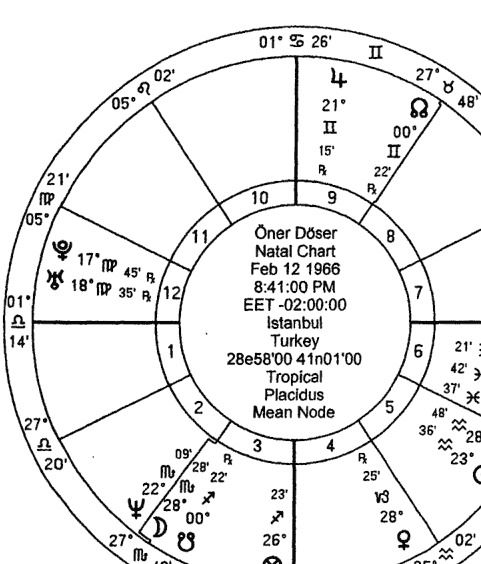

月亮在我的本命盤裡減光，這意味著我星盤上所顯示的事情，會在我生命的後半更加顯著。事實是這樣的，在我的本命盤中第九宮所顯示的問題，在我生命的後半段變得明顯：

> ⁷ 戴克註：請參看詞彙表。關於中世紀的計算方式，請看烏瑪·塔巴里在《波斯本命占星 II》的方法及波那提在《波那提本命占星》（Bonatti on Nativities）的延伸討論。

請留意，月亮正離相位金星，並入相位水星。在生命的前半段，我主要從事紀念品、服裝和女士飾物的工作。自踏入生命的後半部分，我便開始學習占星學。當然，我一直對占星學和類似科目感興趣，但在三十六歲之後（特別是三十七歲時）才開始正式從事這項興趣⁸。

我們也可以透過定位星來確定事件發生的時間。行星會在它所身處的宮位展開行動，而它的定位星代表這個宮位的事情是如何發展的。我對自己的高等教育並不滿意，因為父親不想我學習占星（土星四分木星）⁹。當然，他並沒有強力阻止我，卻說服我別去學習（木星容納土星）。但是在生命的後半展開時，我開始研究占星學來滿足自己的願望。由於木星在我的第九宮落陷，剛開始時我並不滿足；然而它的定位星為水星，我在接下來的幾年裡獲得了滿足感，因為水星在水瓶座，在此擁有三分性力量，而且落在第五宮裡，沒有被凶星阻礙，並因為東出而有力。

由於我的水星被焦傷，但正在離開被焦傷的位置。這可以解釋為：被焦傷的水星在我生命的前半部分是顯著的，我的父親（太陽）高度支配著我；但隨著年齡增長，水星離開被焦燒的位置，並開始展現其效能。與此同時，水星主管我的第九宮（按整宮制），與木星三分相。所有這些因素都表明我會被吸引到第九宮（占星學），並會在此獲得成功。

8 戴克註：水星是占星學及解讀的象徵星，而在這星盤裡主管整宮制第九個宮位。

9 戴克註：第四宮的宮主星（土星）象徵父母，尤其是父親。

## CLAUDIUS PTOLEMY：托勒密

## 第二章
### 三分性主星向運法

三分性主星向運法被借鑒古代文獻的阿拉伯占星師所使用。它被用作預測特定宮位在當事人一生中的發展。在這個方法裡，人類的標準壽命視為七十五年，且被分為三等分，每個部分被相應的三分性主星所掌管。透過解讀三分性主星，可概括地預測某個宮位所象徵的事件進程。

> 1 戴克註：這是阿拉伯和中世紀拉丁時期的方法，來自阿拉伯版本的都勒斯三分性主星系統；瓦倫斯則只用前兩顆三分性主星（《占星選集》〔Anthology〕II.2）。

### 使用方法

由於日夜區分（sect）影響三分性主星的排序，因此在這個方法中，最為重要的因素是星盤的日夜間區分。在日間盤中，當事人的前三分之一人生由日間三分性主星所掌管，而中間三分之一時期由夜間主星掌管，最後一部分則由伴星掌管。另一方面，在夜間盤中，前三分之一的人生由夜間主星掌管，依次是日間主星和伴星。伴星總是掌管生命的最後一部分。

以下圖表列出了都勒斯的三分性主星系統，為希臘占星和波斯—阿拉伯占星所使用。需時刻謹記，每個元素都有三顆三分性主星：日間主星、夜間主星及伴星。

| 元素 | 日間主星 | 夜間主星 | 伴星 |
|------|----------|----------|------|
| 火 | ☉ | ♃ | ♄ |
| 土 | ♀ | ☽ | ♂ |
| 風 | ♄ | ☿ | ♃ |
| 水 | ♀ | ♂ | ☽ |

圖表 4：都勒斯的三分性主星

如果一個宮位的三顆主星中，有兩顆落在良好的配置上，當事人便會在這個宮位的主題上獲得成功。如果只有一顆主星配置良好，便要根據這顆行星的力量及它在的黃道位置來進行評估，但是成就將減弱。如果三顆主星的狀態不佳，那麼成就便會更小。

每顆主星所落之宮位顯示在特定時段內主導的議題。比如說，假設在夜間盤裡，上升落在風象星座。由於水星是風象星座的夜間三分性主星，因此它就是第一顆三分性主星。土星是第二顆三分性主星，因為它是風象星座的日間三分性主星。木星是第三顆三分性主星，因為它是風象星座的三分性伴星。再假設水星落在第五宮，土星在第十宮，而木星在第二宮。這意味著在當事人生命的第一個階段，與水星相關的及第五宮的主題將會較為突出。因此，水星的配置（其尊貴力量、相位、所落宮位的宮主星，以及它和該宮主星的關係）將展示出在當事人生命的第一階段裡，第一宮事項的成功程度。對於第二和第三顆三分性主星，也可進行相同的評估。

三分性主星常被阿拉伯占星師所使用。甚至在某些情況下，他們對三分性主星的關注，還大於廟主星、勝利星及旺主星。在選擇三分性主星時，他們偏向使用配置最好，或最符合星盤日夜區分的那顆行星（意思是日間盤用日間三分性主星；夜間盤用夜間三分性主星）。舉例來說，假設在一個夜間盤中，第二宮是巨蟹座，他們便會選用火星，因火星是夜間盤中水象星座的第一顆三分性主星，便把它當作理想的指標。

這個方法可應用於所有宮位上。例如，當預測當事人每一個生命階段的財務狀況時，應檢視第二宮的三分性主星。這些主星將顯示出當事人的收入水平及來源。

假設在夜間盤裡，第二宮的宮始點落在天蠍座。對於夜間盤的水象星座來說，火星是第一顆三分性主星，金星是第二顆，而月亮則是第三顆。現在，我們可以預測當事人一生中每三分之一階段的財務狀態。假設人類的平均壽命設為七十五年，每一個階段便是二十五年。（根據波那提的說法，每個階段為三十年，對應土星的最短行星週期〔planetary period〕。瓦倫斯則認為，每個階段的長度取決於問題涉及的三分性主星之最短行星週期，或是那顆主星所落星座的赤經上升時間。不過，瓦倫斯並沒有解釋他如何得出這個結論。在這裡，我們將會採用更為普遍的方式，即把生命平分成三個階段，每個階段為二十五年。）

我們來看看下面這個案例星盤的天頂，也就是第十宮宮始點。第十宮代表專業地位、事業，以及當事人的行動、達成目標的方式，和實現自己天命的能力。

在這裡，第十宮是從巨蟹座 1° 開始的。由於這是張夜間盤，三分性主星的順序是火星、金星、月亮。第一主星火星在雙魚座會合土星。這顯示當事人在達成他的目標方面會有些困難，無法少年得志，因為火星會合土星，同時還落在第六宮。儘管火星是在他自己的三分性星座（水象的雙魚座），這張星盤並沒有承諾重大的事業成功；它帶來了眾多挑戰。

第二顆三分性主星金星落在第四宮摩羯座，與月亮和月交點有所連結。雖然金星擁有三分性力量（土象的摩羯座），但由於它逆行，當事人在達成目標的過程中會遭遇困難和延遲。但另一方面，金星沒有狀態不佳，並和第十宮的宮主星有良好相位，而且金星在始宮，具有一定的尊貴力量，也沒有與凶星形成凶相位，更與發光體之一有良好相位。因此，即使會遇上一些困難，當事人在達成目標或天命時，仍具有重要的優勢。還需謹記住，金星是上升主星。在這個階段，當事人（我）受僱於自己的家庭。我到 36 歲才開始在家辦公。（註：金星也是天頂的第二顆三分性主星，代表了工作，落在第四宮。）金星也是第九宮的主星，象徵著鑽研占星學，它和十宮主星（月亮）形成良好相位。

月亮是第三顆三分性主星，入弱在第三宮宮始點的天蠍座。即使月亮沒有和凶星形成困難相位，但卻會合了南交點（譯註：月亮與南交點形成跨星座的合相。），造成負面的情況。所以，我生命的第三個階段（從 50 歲到 75 歲）似乎是一個負面的時期。月亮與水星和太陽形成四分相，為此階段帶來了水星相關的活動及認可。月亮所落的宮位令其虛弱，但另一方面，此位置亦顯示出我的目標之一將以寫作為基礎（第三宮），這也產生自月亮及水星的連結。

> 5 戴克註：金星與月交點形成跨星座的三分相及六分相。

### 生命中獲得成就及幸福的時間

根據阿布·阿里的說法，當理解當事人何時會獲得成就、幸福及財富時，需檢視以下的指標：

首先，檢視太陽（日間盤）和月亮（夜間盤）的三分性主星。如果這些主星在始宮，並免受凶星的影響，當事人在獲取成就及幸福方面是幸運的。第一顆三分性主星愈靠近始宮，成功的機率便越高。

這些三分性主星告訴我們，當事人在人生每三分之一的階段裡，他的成就、機會及幸福是如何的。如果第一顆主星有良好的配置，當事人在前三分之一的生命中，就會是幸運而成功的；但如果第二和第三顆主星狀態不佳，餘生便會不幸且失敗，並經歷一些困難。又或者，如果第一及第二顆主星狀態不佳，但第三顆卻有良好配置時，那麼當事人在經歷長久而艱苦的努力後也未能成功，到了人生最後一個階段時，才會獲得成就及財富。

如果所有三分性主星都落在果宮，或者狀態不良，當事人需要努力去面對生命裡眾多困難。當三分性主星全都落在續宮時，會帶來辛勞的工作和較少的成功與收穫。然而，如果吉星落在始宮而凶星落在果宮，當事人可能會獲取成功與幸福。如果發光體也有良好的配置，當事人將會成為位高權重的人。

如果上升主星和月亮在始宮——若它們沒被凶星所影響，並與落入始宮的行星形成相位，尤其得到該行星容納——當事人應該是幸運、成功及幸福的。

如果上升主星入相位於發光體，而發光體擁有尊貴力量（入廟），或者發光體入相位於上升主星，而上升主星又有尊貴力量，當事人一生是幸運的。

如果幸運點和它的主星沒有受凶星傷害，而東方的行星落在始宮，並與上升點有相位，當事人可能有無窮無盡的幸運，並享有重要的地位和名譽。然而，如果相關的指標（幸運點、其主星及東方的行星）狀態不佳，且落在果宮，並與上升點沒有相位，那麼當事人的工作雖然很辛苦，卻只能獲得較少的成功與收入。

如果上升主星落在果宮，但與落在始宮的行星形成相位，那麼當事人艱苦工作後也能得到成功和財富。如果主星落入果宮、沒有尊貴力量，但與一顆有尊貴力量的行星形成相位時，當事人會在非常艱苦的工作後得到成功及財富。

如果三分性主星在星盤中配置不佳，則需要檢視一下幸運點。如果幸運點與木星或金星有所連結，當事人有潛力去獲得卓越的地位、權力、金錢和幸運。

我們還需要把幸運點視作第一宮，再看從幸運點起始的衍生宮位。比如說，木星落在從幸運點起算的第十一宮，便會帶來成功及良好地位。

如果幸運點落在始宮，並與凶星形成相位，當事人的成功及财富就會屬中等水平。

> 7 戴克註：這應該是指行星比太陽更早從地平線升起，並且不在太陽光束下。

如果兩顆凶星都在十一宮，或與幸運點在一起，或在日間盤中和太陽在一起、夜間盤中和月亮在一起，同時不具有尊貴力量，當事人便會面臨錯失良機的風險。

如果在夜間盤中，月亮離相位於吉星，並和其中一顆凶星有連結，當事人便會失去良機。

如果居所之主在果宮，並與其中一顆凶星有連結，當事人便會失去機會。

另外，如果凶星在始宮而吉星在續宮，當事人在生命的初段須奮力工作，但在生命的後半段會獲得好運。

如果（日間盤的）太陽或（夜間盤的）月亮與凶星形成離相位，並入相位於吉星，那麼當事人就會在勞苦工作後得到福祉。

如果（日間盤的）太陽或（夜間盤的）月亮的三分性主星配置不佳，並與具有尊貴力量的行星有相位，這也意味著當事人在艱苦工作後會獲得好運。

根據馬謝阿拉的說法，我們需要檢視日間盤中太陽和夜間盤中月亮的三分性主星。如果這些主星落在始宮，並沒有受凶星傷害，當事人便會終生幸運。如果它們在果宮，並受到凶星傷害，當事人便總是遭遇不幸。但是對於每個階段，應根據此階段的特定主星來作出個別預測，比如說，如果三分性主星在果宮，當事人在這個階段就會是窮困的，並遭遇麻煩。如果是吉星並落在始宮，同時與上升點有連結，也沒有狀態不佳，那麼當事人的運氣會更好。與此同時，如果發光體狀態不佳，這將賦予當事人更大優勢。

如果幸運點與其主星落在始宮，並且位於東方，與上升有相位的話，這對當事人來說象徵著巨大的財富。

所有從阿布·阿里及馬謝阿拉獲得的資料均展示了三分性主星在阿拉伯和中世紀占星學中是何等重要。這類分析往後甚少被使用，尤其在威廉·里利 (William Lilly) 之後的時期。

## ERMES TRISMEGISTU : 赫密斯·特利斯墨吉斯特斯

## 第三章 法達運程法

阿拉伯文（以及之後的拉丁文）「Firdaria」一詞源自於波斯文，而這個詞本身似乎是翻譯自希臘文的「Periodos」，意指一個時期或循環。法達是很多占星師均提及的行星時期系統，尤其是阿布·馬謝（他亦描述了用於世運占星學的版本）。它類似於印度占星學中的大運（Dasha）系統，以行星作為主星，掌管生命中一個接一個時期。

在法達時期中，每顆主星依次主管生命中的各個時期，我們將之稱為「主運（ruling period）」。每個主運還被分成七個較短的「次運（sub-periods）」。而每個法達時期都有一顆較長期的主運主星，以及較短期的次運主星。這兩顆主星擬定了某時期的本質，而主運主星的主題會被加以強調。當主運和次運主星在本命盤中有連結時，相關的主題就會得以強調。那段時期帶來的影響，是基於主星所落之宮位及所掌管的宮位。因此，要評估某法達時期的特質，需要查看兩顆主星的所落宮位、尊貴力量，以及其主管的事項。

由於主星的位置和守護關係多變，在介紹法達運程法的綜合書籍裡，大多只講述行星的基本意義，而沒有講解它們的相互關係、位置以及守護關係。其中包括阿布・馬謝和舍納的著作。

### 法達時期的順序

法達週期遵循一種簡單的排序，但日間盤與夜間盤則稍為有點差異。在日間盤中，首個時期由太陽開始，而夜間盤則從月亮開始。隨後遵循「迦勒底（Chaldean）」排序，從運行最慢的行星至運行最快的行星（土星、木星、火星、太陽、金星、水星、月亮）。當來到排序的終點時則回到土星重新再開始。除了由七顆古典行星掌管的七個時期外，還有月交點時期：北交點主管三年；南交點主管兩年。總共有九個時期，合共七十五年。75 歲之後，循環就從序列的起始發光體重新開始。

至於要把月交點安排在哪裡，則有兩種不同的觀點。像舍納等諸多占星師都會把月交點排到最後，不管是日間盤還是夜間盤。但本書將採用波那提（及某些占星師）的方式，即把它們安排在火星與太陽之間。

下列圖表為法達主星的排序：

| 序號 | 主星（日間盤） | 年期 | 最後歲數 | 主星（夜間盤） | 年期 | 最後歲數 |
|------|----------------|------|----------|----------------|------|----------|
| 1    | ☉              | 10   | 10       | ☽              | 9    | 9        |
| 2    | ♀              | 8    | 18       | ♄              | 11   | 20       |
| 3    | ☿              | 13   | 31       | ♃              | 12   | 32       |
| 4    | ☽              | 9    | 40       | ♂              | 7    | 39       |
| 5    | ♄              | 11   | 51       | ♆              | 3    | 42       |
| 6    | ♃              | 12   | 63       | ♅              | 2    | 44       |
| 7    | ♂              | 7    | 70       | ☉              | 10   | 54       |
| 8    | ♆              | 3    | 73       | ♀              | 8    | 62       |
| 9    | ♅              | 2    | 75       | ☿              | 13   | 75       |
| 總數 |                | 75   |          | 總數           | 75   |          |

圖表 6：波那提的法達主運時期

正如上述所說，法達主運被分成七個等分的次運。第一顆次運的主星，就是主管當前主運的行星，其他的則按照排序依次排列。例如，太陽主運被分為以下的次運：太陽－太陽、太陽－金星、太陽－月亮、太陽－土星，如此類推。月交點不主管次運，亦沒有次運。次運時期的長度如下圖所示。

| 主運主星 | ♄        | ♃        | ♂        | ☉        | ♀        | ☿        | ☽        |
|----------|----------|----------|----------|----------|----------|----------|----------|
| 次運1    | ♄        | ♃        | ♂        | ☉        | ♀        | ☿        | ☽        |
| 次運2    | ♃        | ♂        | ☉        | ♀        | ☿        | ☽        | ♄        |
| 次運3    | ♂        | ☉        | ♀        | ☿        | ☽        | ♄        | ♃        |
| 次運4    | ☉        | ♀        | ☿        | ☽        | ♄        | ♃        | ♂        |
| 次運5    | ♀        | ☿        | ☽        | ♄        | ♃        | ♂        | ☉        |
| 次運6    | ☿        | ☽        | ♄        | ♃        | ♂        | ☉        | ♀        |
| 次運7    | ☽        | ♄        | ♃        | ♂        | ☉        | ♀        | ☿        |

圖表7：法達次運主星

在下列圖表中，可以看到每個主運及次運所掌管的年期：

| 主運行星 | 主運時長 | 次運時長 |
|----------|----------|----------|
| ♄        | 11年     | 1年6個月26天 |
| ♃        | 12年     | 1年8個月17天 |
| ♂        | 7年      | 1年0個月0天  |
| ☉        | 10年     | 1年5個月4天  |
| ♀        | 8年      | 1年1個月22天 |
| ☿        | 13年     | 1年10個月9天 |
| ☽        | 9年      | 1年3個月13天 |

圖表8：法達次運時期

### 法達運程法的實用資訊

在解讀某個時期時，第一步要確定星盤的日夜間性：日間盤的法達運程由太陽開始；夜間盤則由月亮開始。請謹記，整個週期為七十五年，因此過了這個年齡便回到起始的行星重新開始。

在確定法達的主運及次運主星後，須關注它們的整體狀態：所落的位置、主管的宮位、尊貴力量、相位、與定位星的連結，以及定位星的位置，但每顆主星有三個主要因素需要考慮：

1. 在本命盤上的宮位
2. 在本命盤上所主管的宮位
3. 在本命盤上，是哪個宮位的旺主星

除此之外，主運主星在本命盤上的相位亦相當重要。

研究某個特定時期時，觀察這些行星在上一個時期的角色，也可能會帶來幫助。例如在日間盤中，水星是 11 到 12 歲的次運主星（主運主星為金星）。如果我們能夠理解水星在這個時期是如何運作的，那就能估計出水星在其主管的 18 至 31 歲期間會如何運作。事實上，日間盤的人在 29 至 31 歲時，會處於水星－金星時期，剛好與 11 至 12 歲時相反。金星在第一個時期會較為顯著（當它是主運主星時），但每顆行星在每個時期都會以類似方式運作。

請記住，月交點並沒有次運，也不會成為次運主星。我們會根據月交點所在的宮位作評估，舉例來說，假設北交點在第九宮的雙子座，那麼當事人就會在北交點主管的三年裡關注第九宮的主題。月交點主星的配置也會在評估上提供一些幫助。

### 案例：戴安娜王妃

現以戴安娜王妃的星盤為例，檢視她發生事故去世時的法達時期。

在以下的圖表裡，可以看到她每個法達時期的開始日期：

| 主運/次運組合 | 開始日期  | 主運/次運組合 | 開始日期  | 主運/次運組合 | 開始日期  | 主運/次運組合 | 開始日期  |
|---------------|-----------|---------------|-----------|---------------|-----------|---------------|-----------|
| ☉             | 1 Jul 1961 | ☿             | 1 Jul 1979 | ♄             | 1 Jul 2001 | ♂             | 1 Jul 2024 |
| ☉ ☉           | 1 Jul 1961 | ☿ ☿           | 1 Jul 1979 | ♄ ♄           | 1 Jul 2001 | ♂ ♂           | 1 Jul 2024 |
| ☉ ♀           | 5 Dec 1962 | ☿ ☽           | 10 May 1981 | ♄ ♃           | 26 Jan 2003 | ♂ ☉           | 1 Jul 2025 |
| ☉ ☿           | 10 May 1964 | ☿ ♄           | 18 Mar 1983 | ♄ ♂           | 22 Aug 2004 | ♂ ♀           | 1 Jul 2026 |
| ☉ ☽           | 13 Oct 1965 | ☿ ♃           | 25 Jan 1985 | ♄ ☉           | 19 Mar 2006 | ♂ ☿           | 1 Jul 2027 |
| ☉ ♄           | 19 Mar 1967 | ☿ ♂           | 4 Dec 1986 | ♄ ♀           | 14 Oct 2007 | ♂ ☽           | 1 Jul 2028 |
| ☉ ♃           | 22 Aug 1968 | ☿ ☉           | 13 Oct 1988 | ♄ ☿           | 9 May 2009  | ♂ ♄           | 1 Jul 2029 |
| ☉ ♂           | 25 Jan 1970 | ☿ ♀           | 22 Aug 1990 | ♄ ☽           | 5 Dec 2010  | ♂ ♃           | 1 Jul 2030 |
| ♀             | 1 Jul 1971 | ☽             | 1 Jul 1992 | ♃             | 1 Jul 2012 | ♅             | 1 Jul 2031 |
| ♀ ♀           | 1 Jul 1971 | ☽ ☽           | 1 Jul 1992 | ♃ ♃           | 1 Jul 2012 | ♆ ♆           | 1 Jul 2034 |
| ♀ ☿           | 22 Aug 1972 | ☽ ♄           | 13 Oct 1993 | ♃ ♂           | 19 Mar 2014 |               |           |
| ♀ ☽           | 13 Oct 1973 | ☽ ♃           | 26 Jan 1995 | ♃ ☉           | 5 Dec 2015  | ☉             | 1 Jul 2036 |
| ♀ ♄           | 4 Dec 1974  | ☽ ♂           | 10 May 1996 | ♃ ♀           | 23 Aug 2017 | ☉ ☉           | 1 Jul 2036 |
| ♀ ♃           | 26 Jan 1976 | ☽ ☉           | 23 Aug 1997 | ♃ ☿           | 10 May 2019 | ☉ ♀           | 4 Dec 2037 |
| ♀ ♂           | 18 Mar 1977 | ☽ ♀           | 5 Dec 1998  | ♃ ☽           | 26 Jan 2021 | ☉ ☿           | 11 May 2039 |
| ♀ ☉           | 9 May 1978  | ☽ ☿           | 18 Mar 2000 | ♃ ♄           | 14 Oct 2022 | ☉ ☽           | 13 Oct 2040 |

圖表 10：戴安娜王妃的法達運程

戴安娜於一九九七年八月三十一日遇上致命車禍。我們可以看到，當時她正處於當年八月廿三日開始的月亮－太陽時期。現在我們列出圖表，看看這個時期與哪些宮位有關，以及這時期的主星在本命盤上的相位：| 月亮 | | 太阳 | |
| --- | --- | --- | --- |
| 宫位：第二宫 | ☽ □ ♀ | 宫位：第七宫 | ♂ ☿ |
| 主管：第八宫 | ☽ ♄ ♂ | 主管：第九宫 | ☾ ✵ ☉ |
| 旺宫：第五宫 | ☽ ♄ ♊ | 旺宫：第四宫 | ☽ ✵ ☉ |

由于太阳主管的狮子座在星盘中被劫夺，我们将使用狮子座在整宫制的位置——狮子座是第九宫。

月亮在本命盘上的配置不佳。首先，它与八宫内的火星形成跨星座的对分相，这是个完全负面的相位。再者，月亮又与南交点合相，也会带来凶性的影响。因此，当事人在月亮时期里，整体上过得并不轻松。她应该是一九九二年就进入月亮时期的。

在查看次运主星（太阳）时，可以说它的相比月亮好。让我们检视太阳在本命盘上的位置。太阳在巨蟹座是外来的，其主星（月亮）位于一个困难的位置，月亮在水瓶座上并无尊贵力量，并由于它抵触土星的特质，又与其不合意³，所以无法得到自己主星的支持。太阳与第八宫的火星六分相，虽然这不是一个凶相位，但与一颗在凶宫的凶星形成相位也并非好事。而且，虽然火星拥有三分性力量，但由于会合了北交点，其凶性也会被增强。

最后，按照整宫制，太阳是第九宫的宫主星。第九宫代表着远方、外地、外国人等主题。

3 详见词汇表。

戴安娜发生事故时，与伴侣（太阳在第七宫）多迪·法耶（Dodi Fayed）正身处巴黎（第九宫）。太阳落在第七宫，主管第九宫，代表一段与有权势的外国人的恋情。太阳也会合了水星，即第七宫的宫主星，而且水星在普拉西德宫位制里是第九宫的宫主星。毋容置疑，这场事故和死亡正是戴安娜月亮－太阳法达时期的主题，尤其因为她正处于第十二宫的小限运程（[译注：以象限宫位制]上升的小限年落在第十二宫，正要到达她本命盘的上升度数）。由于本命盘本身已显示了一场无情的死亡⁴，此征象将会在上升的小限推进这些宫位时呈现出来。

再者，法达运程法无法单独用来进行重要的预测。透过此方法而找到的信息需经由小限法、太阳及月亮回归法及过运法的评估及支持，才可达到准确的结果⁵。

让我们继续按照法达时期，从戴安娜的星盘中检视一些重要的生活事件。以下是她生命里的一些重要事件：

-   宣布订婚：一九八一年二月廿四日：水星—水星时期。水星一般与宣布消息及新闻有关。水星是第七宫主星，同时也位于七宫，与太阳会合。这代表着宣布订婚也不足为奇。

> > 4 请留意月亮—天王星及月亮—火星的对分相。由于月亮是身体的一般象征星，且主管第八宫，而火星及天王星也在八宫，她的星盘显示了一场威胁生命、突如其来的事故。

> > 5 当然，不能说这是他唯一会去世的时间，但这是其中一个机率甚高的时间，尤其当我们结合了多种方法，特别是过运法时：过运的天王星准确地会合了本命盘的上升守护星——木星，同时也是那一年的小限主星。木星也是代表死亡之宫——第八宫的旺主星。由于天王星在本命盘的第八宫，它所带来的是死亡的征象。过运的海王星也与本命盘的土星形成等分合相（partile conjunction），土星在中世纪被视为「杀手行星」。

结婚：一九八一年七月廿九日：水星－月亮时期。如上述所提到，水星象征七宫的事项。月亮一般而言也与居所及家庭有关。我们可以用以下图表，理解月亮－水星的法达时期会影响哪些范畴：

| 水星 | 月亮 |
|------|------|
| 落在：第七宫 | 落在：第二宫 |
| 庙宫：第六、第七、第九宫 | 庙宫：第八宫 |
| 旺宫：第九宫 | 旺宫：第九宫 |

从月亮及水星在本命盘上的宫位可以看到，婚姻及金钱的宫位相当显著。水星（第七宫主星）与太阳的合相已显示出她将会与「皇室的人」结婚。月亮位于第二宫、主管第八宫，表示了结婚背后的原因是财力。一般而言，第二宫会为我们想做的事情提供支持，由于上升主星也正好在第二宫，这认同了我们的想法——当事人生命里最优先的事情，就是维持稳固的财政状况。当检视月亮－南交点的合相，以及它们与火星的对分相时，就可以总结出，当事人未必可以达成这个目标。（需记住火星是第二宫的胜利星。）另一个结婚的原因，是因为要培育小孩，以延续王室的未来：月亮，作为次运主星，同时主管第五宫，并与五宫内的金星形成相位。但由于婚姻宫位的主星是外来的，且被焦伤，加上月亮是外来的且受南交点所伤，婚姻并不会为当事人带来快乐。金星－月亮的联结并不足以带来快乐，因为金星同时也四分火星。另外，水星（第七宫主星）与月亮之间并无相位。

离婚：一九九六年八月廿八日：月亮－火星时期。我们可以制作一个图表，理解月亮－火星在此时期会影响哪些宫位，同时观察其相位：

| 月亮 | 火星 |
|------|------|
| 宫位：第二宫 | 宫位：第八宫 |
| 主管：第八宫 | 主管：第四、十一宫 |
| 旺宫：第五宫 | 旺宫：第二宫 |

从一九九六年五月开始，王妃进入月亮－火星时期，因两者互相伤害，令她经历着一些困难；再加上，月亮与南交点合相，而火星则与北交点在一起。波那提指⁶北交点会增加与合相之行星的影响力，而南交点则会减弱其影响力。在此星盘中，月亮减光，并与南交点合相，令它失去了所有吉性本质。再者，火星－北交点合相增加了其凶性。因此可以很容易地得知，这段时期给她带来了凶性影响。例如，我们能总结出，戴安娜在此时期正经历财务上的问题。

现在请考量火星的相位，因它是这次期的次运主星。我们已提及过月亮－火星的对分相了。火星亦与第十宫的主星——金星形成四分相，这代表她的婚姻问题（第四宫）会在众目睽睽下（第十宫）结束。由于火星－北交点的合相增强了其凶性，火星与七宫太阳及水星的六分相对她的婚姻来说并非好事。所有指标都意味着她会与伴侣分开。火星－太阳的六分相，也代表着一段与外国人及有权势的男性发展而来的关系，因为太阳落在第七宫，同时主管第九宫（在整宫制下），并与第七宫及九宫（在普拉西德宫位制下）的主星——水星合相。可是，这段恋情并不会带来很大利益。

事故与死亡：一九九七年八月三十一日：月亮－太阳时期。我们在之前已讨论过这个时期了。在这里，我们也认为这场事故与王妃的伴侣有关，如前所述，因为次运主星（太阳）就在第七宫内，并与第九宫有联结。月亮作为当时的主运主星，落在第七宫衍生而来的第八宫，也告诉我们伴侣的死亡。我们也已经提及月亮所受的伤害了。

### 获得认可的时间

如果本命盘显示出当事人会有名望及受到认同，便应检视太阳的法达时期，以预测当事人受到认可的时间，尤其是如果太阳在本命盘上是带来名望的行星时。同样地，也要检视太阳作为次运主星的时期（例如：木星－太阳、水星－太阳、月亮－太阳等等）。这时，我们便需检视太阳在哪个时期会当次运主星，同时主运主星又是十宫主星。比如说，若金星是十宫主，那么金星－太阳时期便很重要。

同样地，当十宫的胜利星或旺主星成为主运主星时，这段时期亦是重要的。例如，若天顶落在天秤座，土星便会变得重要，因为它是天秤座的旺主星，亦有机会是它的胜利星。如果土星的配置良好，且没跟发光体形成困难相位，那么刻苦的工作及努力付出，可能在土星－太阳时期带来名望及认可，尤其当太阳与土星有良好相位时。

我们亦应观察在本命盘上，第十宫内行星作为主运主星、同时太阳是次运主星的时期。如果在十宫内的行星是吉星，而且有良好的相位，那么在该行星及太阳成为主星的时期便会得到认可。如果第十宫的主星是吉星，在这个行星所主管的法达时期，也可能会带来认可。

如果第十宫代表名望及认可，当小限的上升走到第十宫时，便可能会受到认可。

如果十宫主星在星盘上落在良好位置，而且与吉星有良好相位作支持，当上升推运至该主星所在之宫位时，这一年也可能带来名望及认可。

如果吉星在太阳回归盘内的第十宫，而本命盘内有显示出名望及认可，这一年内也可能会得到认同。

太阳及木星的过运是短暂而较浅层的。因此它们的过运并不及其他行星的过运有价值。

我们还需要考量到行星与旺宫的关系。

在主限向运法中，太阳推进至吉星时，尤其是推向十宫主星时，假如这些行星有尊贵力量，便会带来认可及名望。

如果凶星在黄道上有良好的位置，且与吉星形成相位，那么在与其相关的领域中也会带来名望及认可，例如土星会在科学领域上受认同，火星则在军事方面。

最后，行星可能会在其主管的法达时期带来认可，假如它们：

1）主管第十宫（作为其庙主星、旺主星，或者胜利星）。
2）与第十宫或太阳有相位。
3）落在本命盘的第十宫或第十一宫。
4）落在其中一个始宫，并且是天顶的旺主星。


## INDI：金迪

## 第四章 小限法

在小限法里，上升或太阳会从0岁起（出生当天），每年生日推进至下一个星座。推进的宫位所代表的主题，会在那一年变得重要；而星座的守护星（称为「年主星 [lord of the year]」）就会在这一年的事件中担当重大的角色。

### 小限法的技巧

在小限法的技巧中，某些重点会「移动」或「推进」到下一个星座。而这两个常用的重点是：本命盘的太阳或上升星座（上升点）。

有关小限法最早期的研究，是由马尼利乌斯（Manilius）在公元前15年所写的。根据马尼利乌斯的说法¹，当事人的每一年都由一个星座主管，并以太阳为起点。举例来说，如果当事人的太阳在双子座，他的第一年（0至1岁）便会由双子座所主管；第二年（1至2岁）由巨蟹座主管，如此类推。每月主星亦按相同方式运作，但却由月亮所落的星座开始。而那个月份的第一天，由当月小限的星座所主管，第二天则由下一个星座主管，如此类推。每个小时的主星亦以相同方法开始。

至于上升²的年度小限，我们可以使用以下图表。例如，我本命的上升星座是天秤座（第一宫）。当我4岁时，我的小限上升便到达本命盘第五宫（水瓶座）。当我16、28、40岁时，小限上升亦同样地抵达第五宫。另一方面，当我49岁时，小限上升便会推至第二宫的天蝎座。因此在那一年，本命盘上的天蝎座就如同我的第一宫，射手座为第二宫，摩羯座为第三宫，如此类推。

1 马尼利乌斯的资料 III. 510ff，赫密斯（2002年）51－52页。
2 戴克注：马尼利乌斯提出此交替输值方法，被后的占星师广为使用。

| 宫位 | 0 | 12 | 24 | 36 | 48 | 60 | 72 | 84 |
|---|---|---|---|---|---|---|---|---|
| 1 | 0 | 12 | 24 | 36 | 48 | 60 | 72 | 84 |
| 2 | 1 | 13 | 25 | 37 | 49 | 61 | 73 | 85 |
| 3 | 2 | 14 | 26 | 38 | 50 | 62 | 74 | 86 |
| 4 | 3 | 15 | 27 | 39 | 51 | 63 | 75 | 87 |
| 5 | 4 | 16 | 28 | 40 | 52 | 64 | 76 | 88 |
| 6 | 5 | 17 | 29 | 41 | 53 | 65 | 77 | 89 |
| 7 | 6 | 18 | 30 | 42 | 54 | 66 | 78 | 90 |
| 8 | 7 | 19 | 31 | 43 | 55 | 67 | 79 | 91 |
| 9 | 8 | 20 | 32 | 44 | 56 | 68 | 80 | 92 |
| 10 | 9 | 21 | 33 | 45 | 57 | 69 | 81 | 93 |
| 11 | 10 | 22 | 34 | 46 | 58 | 70 | 82 | 94 |
| 12 | 11 | 23 | 35 | 47 | 59 | 71 | 83 | 95 |

希腊占星师在使用小限时，一般会使用整宫制，而我们接下来亦会使用此宫位制。


### 图表 13: 乔治·沃克·布什在一九四七年的小限盘（1岁）

上方是生于一九四六年的美国前总统乔治·沃克·布什（George W. Bush）的本命盘：这是他0岁时的星盘。在软件 Solar Fire 9 里，只要点击「档案（File）」后再点击「Tran/Prog/Dirn」，便可以为他下一年起一个小限盘（一九四七年，1岁）。在「星盘类型（Chart Type）」的工具栏中点击「年度小限（Profection Annual）」，然后填入他在一九四七年的出生日期。得出的星盘（上方）便显示出行星及上升推进了一个星座。要理解这对本命盘有何影响，需要制作一个比对盘，并将小限盘放在本命盘的外圈（看下图）。在外圈或外环，太阳及土星已推进到本命盘的第一宫；金星、水星及上升点到了第二宫；火星到了第三宫；月亮及木星到了第四宫，如此类推。


### 图表 14：乔治·沃克·布什的本命盘和一九四七年的小限盘

现在，让我们看看如何用都勒斯的方法³去解读小限盘。

### 都勒斯

根据都勒斯的说法⁴，本命的上升点会向前推进，所以每一年都会由一个星座所代表（正如上述所说明），而这个星座的守护星被称为「年主星（Lord of the year）」。需要分析的两个重要因素为：

3 下面大部分内容以赫密斯（2002 年）为基础。
4 《占星诗集》IV.1。

1）年主星的自然征象及在本命盘上的配置如何？
2）小限上升所到达的星座中有吉星，还是凶星呢？

让我们继续研究布希的星盘，看看小限的上升及推进的行星。在一九四七年（1 岁），小限上升推至第二宫。我们可以看到，上升抵达的宫位（处女座）内有火星。按都勒斯的说法，这并非一个好现象，因为火星是凶星。我们猜测，他可能会患上炎症或类似的疾病。水星是小限上升的主星，在本命盘上落在第一宫狮子座，而在小限盘上，太阳及土星亦到达此处。在这里，我们也许可以得出结论，他会得到家庭的关注（本命水星在第一宫，小限太阳在第一宫，且落在狮子座），但亦可推论他有一些健康问题或其他困难（小限土星在第一宫）。

再看看其他希腊占星师对小限法的见解：

### 托勒密

在《四书》IV.10 中，托勒密论述了当决定不同时期的星主时用到的各种方法，其中包括小限法。按托勒密所说，我们每年都可推进以下的因子到下一个星座：上升点、幸运点、月亮、太阳及天顶。辨别月主星的方法也是类似的，从各自的星座起推进，每二十八天便向前推进一个星座。「每日」的推进方式亦相同，从小限月的星座起，每两日半便推进一个星座。

### 费尔米库斯·马特尔努斯 (Firmicus Maternus)

费尔米库斯·马特尔努斯在公元 352 年完成他的著作《论数学》。在 II.28 里⁵，他解说了一套与小限法相似的系统。正如上述所说，生命的第一年是由本命盘的上升所代表，下一年由下一个星座代表，如此类推。但要辨别出一年当中较短时期的星主，会由年主星开始，并分配一定天数给它；至于余下的行星，则按它们位置上的排序作分配：太阳为五十三天，月亮为七十一天，土星为八十五天，木星为三十四天⁶，火星为四十二天，金星为二十三天，水星为五十七天，一共三百六十五天。

### 亚历山大的保罗 (Paulus Alexandrinus)

亚历山大的保罗在公元 378 年撰写了《占星简介》（*Introduction to Astrology*）。在第三十一章，他解释了如何找出年主星、月主星及日主星。对于年主星，如同惯常般由上升点开始，每年推进一个星座。至于月主星，则由目前的小限星座开始，每月推进一个星座。而日主星则由当月的星座开始，每天推进一个星座。

> 5 在评论版的 II.27。
> 6 戴克注：按霍登在翻译（78 页）时的注解，这是由原本的「三十天」修改而成的天数（详见参考资料）。

### 维替斯·瓦伦斯

按瓦伦斯在《占星选集》IV所说，当小限行星推进至本命盘上的行星时，它们会进入一种「施与受」的关系。比如说，如果木星在当事人的星盘上是财务的征象星，而在35岁的小限盘上，木星也会以同样方式推进。如果木星到达本命火星所在的星座，木星就会在这一年将财务的职责「移交」给火星，而火星就从木星手上「接任」这份职责。当然，还要看火星是否适合承担这个责任。首先要按照火星那叛逆的特质来作评估：火星会在财务上带来幸运吗？答案是：通常不会。然后本命火星的位置也会被评估，包括它身处的星座、它与其他行星的相位、它的守护关系及尊贵力量等等。

在以下的星盘里，你可以看到很好的一个例子。这是布希在35岁时的小限星盘，小限木星已推进至火星所落之星座——处女座。火星位于第二宫，所以它跟布希的财务状况有关。火星拥有三分性力量（处女座，土象的三分性主星），亦没有落陷（译注：此处及下文的「落陷」同时指入弱、逆行、烧伤及受剋等不良状态。）。再者，火星是本命幸运点的主星，同时与之形成六分相。因此当布希35岁时，预计他赚取的收入会随着这个小限的推进而增加。


图表 15：乔治·沃克·布希的本命盘和一九八一年的小限盘

### 特定事件的推进

瓦伦斯建议⁷用小限太阳、月亮及上升点去评估「整体时期」，那么我们就可以理解到当事人的生命里，大致上会发生甚麽事情。他更列出了一些可用各因子的推进来查看的特定事件：

-   推进上升可用來解讀生命力、身體及精神上的活動。
-   对于身份、名誉、父亲及其他权威人士，应看太阳的推进，因这些都与太阳有关。

> > 7 瓦伦斯的《占星选集》IV.11；同时请看赫密斯（2002 年）55 – 56 页。

-   月亮：疾病、受伤及其他对身体的物理性伤害。
-   天顶：一个人的职业以及其他帮助谋生的活动。
-   幸运点：好运及财富。
-   下降点：死亡及重大的转变或问题。
-   天底：机构、隐密的事情及死亡。
-   金星：配偶、关系、社交及女性。
-   火星：军事及类似事物。
-   土星：分离、疾病及继承。
-   木星：身份、朋友、合伙及收益。
-   水星：仆人、礼物、文书、社区以及与身体有关的事情。

## 案例：乔治·沃克·布希

让我们依照希腊占星的方法检视布希的星盘。在以下的星盘里，你可以看到他在二〇〇四年（58 岁）选举时之小限盘，即他本命盘的外圈。

小限的木星及月亮在本命盘的一宫带来正面影响。本命的水星及金星也落在这里，而且没有落陷。本命的金星（十宫主星）落在第一宫，显示了事业方面的事情对当事人来说相对容易，而且他会在这范畴上较幸运。（同时请留意在本命盘三宫的月亮及木星与本命的金星形成六分相。）此外，小限的天顶来到本命盘的第八宫（双鱼座），而主管它的木星推进到上升，代表两颗吉星在这一年都有利于他及其事业。

小限上升所推进之宫位是相当重要的。在这里，它位于代表好运的第十一宫（双子座）。本命的北交点亦在这位置上。水星是该年的年主星，落在本命盘一宫，是个有力的位置——这是一个巨大的优势⁸。

小限金星及水星推进到本命盘的十一宫，所以会为此宫位带来幸运（尤其是金星）。金星本身已经是十宫主星。小限太阳及土星位于本命盘的十宫内。虽然土星代表悲观、忧虑及消极，但太阳代表在选举中占有一大优势。

> 8 戴克注：这是因为水星主管十一宫、位于一宫，这代表好运动会来到布希身上：由于小限上升正处于本命盘的十一宫，激发了这一年的好运。

## 小限法的简易法则

根据马蒂安·赫密斯（Martien Hermes）⁹ 所说，下列的推进会显示出事件极大机会发生的时间：

- 当小限推进至落在始宫的星座时。
- 当它推进的星座，其主星（即年主星）落在始宫时。
- 当它推进至年主星所位于的星座时（月小限时亦如此）。
- 当它推进至特定事件的象征星所位于的星座时。例如，看财务状况时，可看推进的因子何时会到二宫主星所落之星。星座。
- 当它推进至与所问主题有关的星座时。例如，看财务状况时，便看它何时推进至第二宫。
- 当它推进至特定宫位内的行星，或一个与此宫位有强力相位的行星时。

特别在讨论婚姻时，如果小限上升推进至第七宫，或是太阳回归盘的上升点接近本命下降点的度数时，在这一年便很有可能会结婚。

按照罗伯特·左拉 10 所说，我们亦应检视小限的七宫何时会推进至其宫主星所落之宫位。又或者，如果小限上升或七宫到达任何七宫主星所守护之宫位时亦可能结婚。举例来说，如果七宫主星为金星，那么小限上升或七宫推进至金牛座或天秤座时，也会有所关联。

此外，亦可看主限向运中的月亮何时会推进至婚姻的象征星 11。

### 何时有好事发生？

在以下的时间极有机会发生：

- 当小限因子（某一敏感点或星体）推进到吉星所处于的星座时，但这个星座及行星并不能有状态不良等问题。
- 当小限因子推进至由吉星守护的星座时，即使宫内没有行星（同样地，不能有问题）12。

当然，这颗吉星所带来的幸运程度，是按它在星盘的位置而定的。如果这颗吉星有尊贵力量，便可能发生完全美好的事情；否则，事情可能只有部分是好的。如果这颗吉星的位置及状态不良，一般来说没有好事也没有坏事会发生。

### 何时有坏事发生？

在以下的时间极有机会发生：

- 当小限因子推进到凶星所处于的星座时。
- 当小限因子推进至由凶星守护的星座时，即使宫内没有行星。

同样地，这颗凶星所带来的不幸程度，是按它在星盘的位置而定的。如果这颗凶星没有尊贵力量，便会发生极差的事情；如果它有尊贵力量，事情只有一部分是恶劣的。如果凶星在良好的位置，可能没有任何坏事发生，甚至可能有好事出现。

> > 12 戴克注：换言之，当推进主体的年主星（或月主星等等）是吉星时。

### 解读总结

综上所述，总结一下运用小限法时的准则：

1) 小限上升在本命盘上所落之宫位最为重要。例如，假设小限上升在本命盘上的第十一宫，第十一宫的议题便会主导此年份。
2) 整个星盘会按照新的小限上升来解读。比如说，如果小限上升推进至本命盘的第十一宫，那么本命盘的第十一宫就会成为该年份的第一宫；本命盘的第八宫会成为了新一年的第十宫，如此类推。
3) 应用小限法时，应同时考量过运的影响，因为每个小限在十二年前走在同样位置时，相比之下，带来的影响会有所不同。

### 案例：奥内尔·多塞（37 岁）

正如前述所说，二○○三年六月廿一日，我把在伊斯坦堡大市集内的摊位租了出去，并离开那儿的工作，结束了二十年的商人生涯，转而展开占星事业，所以这是我生命中最关键的一年。现以小限法分析这一年。我生于一九六六年二月十二日，在二○○三年的六月为37 岁。因此，我的小限上升位于本命盘上的第二宫（请见前页的“小限上升对应的年龄及宫位”表）。

火星是第二个星座（天蝎座）的主星，亦是年主星，在本命盘上与土星合相。月亮是本命十宫的主星，落在本命盘的第二宫。（请谨记，使用整宫制时，任何行星在某个星座，即使在尾度数，也算处于同一宫位。因此，由于整宫制下天蝎座是我的第二宫，月亮也在本命盘的第二宫，即使以雷格蒙坦纳斯〔Regiomontanus〕宫位制来说是第三宫。）

本命天顶的主星位于今年的小限第一宫，意味着在这个时期我要为事业下一个关键性的决定。月亮象征踌躇不决及反覆无常。它与水星及太阳形成四分相、与金星有六分相，并与南交点合相。由于它与星盘上很多因子有相位，今年会是忙碌的一年。让我们逐一检视这些相位：

月亮与南交点的合相告诉我们，除了损失、问题、与工作相关的束缚外，将会有一个命中注定的改变。南交点与过去有关，而月亮亦与过去及家族连结有关。我在这一年离开了大市集的传统家族生意，以切断我与过去的连结。

月亮与金星（本命盘的上升主星）六分相，代表这时的决定对我个人来说是尤关重要的，虽然会遇上困难，但也会看到正面成果。金星在我本命盘第四宫，结束大市集的工作后，我便开始在家办公了。

月亮与水星及太阳四分相，象征着与占星相关的主题将会是重要的（水星主管双子座的第九宫），而且社交圈子也会改变（太阳主管本命盘十一宫）。在这一年，我在期刊（水星）上撰写占星专栏。我的专栏占了半版，虽然以书写作为日常工作对我来说有点艰难，但却令我感到快乐。

月亮与太阳的连结也代表了某种认可。二〇〇三年，我在很多电视节目上当嘉宾，这对我来说是意料之外的发展。另一方面，我开始进行专业咨询。月亮作为小限七宫（一对一互动）的旺主星，正好落在小限上升的星座内。

这一年的年主星——火星落在本命盘的第六宫（疾病、虚弱、困难、工作环境及状况、下属、租客），并与土星合相。由于我在这年的工作环境及情况改变了，前员工的环境也随之改变。我把商店租给另一家公司，并将所有员工都转让给他们。起初这些员工对于新状态感到愉快，但不久便感到不满，纷纷离开那间公司。

在健康方面，我需要面对祖父及祖母的疾病。由于我的父亲已去世，我需要与姑母一起照料他们。二〇〇三年七月，他们在六天内相继离世。这是个非常艰难的时期。火星作为七宫主星也代表着祖父（四宫起算的第四宫，即父亲的父亲）；而土星（本命一宫的胜利星，而一宫为七宫起算的第七宫，即祖父的配偶）代表我的祖母，两者在六宫合相。他们的家中发生了火灾（火星），而我的祖父因暴露于浓烟中而死去（土星）。

射手座落在我此年的小限二宫，而它的主星——木星则落在本命盘的双子座（第九宫）。这年我开始透过占星咨询来赚钱。

摩羯座落在小限三宫，而它的主星——土星则落在本命盘的第六宫。我在这一年开始学习罗伯特·左拉的中世纪占星学课程。我必须在这段时期下苦功钻研（土星在本命六宫）。金星也在小限的三宫内。本命的上升主星落在小限三宫，显示出教育、学习及写作是这年的主题。

我们也可透过其他小限宫位去解读星盘。比如说，可以审视小限的第十宫（落在狮子座），去评估我在事业及商业生涯的发展。太阳在小限四宫（水瓶座），并三分在本命九宫内的木星。我开始在家工作、进行占星咨询、在报章上写专栏、私人授课，并学习来自国外的中世纪占星技法。

## 确认时间

绘制了年度小限盘后，我们可以制作每月小限盘，以确认事件发生的时间。如上述例子所提到，我们知道在二〇〇三年的生日，小限上升会到达第二宫的天蝎座。因此，二〇〇三年二月十二日，小限上升就在天蝎座。它会在二月十二日至三月十二日期间留在天蝎座；三月十二日至四月十二日在射手座；四月十二日至五月十二日在摩羯座；五月十二日至六月十二日在水瓶座，并终于六月十二日至七月十二日时到达双鱼座。这些日子对我来说相当重要，因为年主星（火星）就位于这个星座，这一年最重大的事件便会发生在那个月里。

正如我所提到，我祖父的家在那个时候发生了火灾。我的祖父因吸入浓烟，在医院住了一个月，并于七月十七日离世。我的祖母本来就因病住院，而她也在七月十一日离世。那段时日，我实在伤心不已。

我在六月廿一日离开了大市集。正如我所提到，前员工开始为租用我商店的人工作，随后因不满而离开。（那家公司也面对困境，并于一年后不得不出清商店。）感谢主，我在短期内便找到新租客了。

我在七月三日搬到另一所房子。我将老房子出租，并找到了新的公寓，但在五个月后又再搬家，因为那所公寓实在很偏僻，不便于进行咨询。我在那里度过的五个月充满了悲观的情绪，虽然那是个宁静自然的居所：年主星火星位于第六宫，与土星合相，正好对应了所有的发展。

计算了月小限后，我们便可以计算日小限。虽然这个方法对某些个案来说可完美地发挥，但我发现对某些个案却派不上用场。在日小限里，每个星座相等于两日半。例如，天蝎座是这一年的小限星座，亦同时代表了第一个月（二月十二日到三月十二日），也代表这个月的头两日半（二月十二至十四或十五日）。日小限会在天蝎座两日半，自二月十五日起便在射手座，二月十七日起在摩羯座，如此类推。

要判断六月廿一日的星座及宫位，首先需要看月小限及日小限。看月小限的话，我在六月十二日至七月十二日时处于双鱼座（第六宫）。从双鱼座或六月十二日起，我便要以两日半为单位起算，直至六月廿一日到达双子座。因此，六月十七到达金牛座，在六月廿一在双子座。由于这个月由木星主管（守护双鱼座），而木星又刚好落在双子座，我便会认为这时会发生一些重大事件。按罗伯特·左拉所说<sup>13</sup>，当我们到达年主星或月主星所落之星座，或它们所守护之星座时，便可预见那个时期会发生重大的事件。

# N ARABI : 伊本·阿拉比

## 第五章 过运法

本命盘是一幅图画，描绘着出生的一刻，天空上星体的位置。然而，星体并非静止不动的——它们持续不断地在黄道上运转。过运是指行星的实时表现，以及它们与本命盘的关系。过运所触发的事件，某种意义上已预设在本命星盘中，按本命盘所承诺的表现出来（至少不会是相反的）。

过运法显示出当事人生命里的重要走势及事件。与其他方法相比，过运法可指出在一个较短的时期内某些事件发生的可能性。在特定时刻里，某一过运行星对世界所有人都处于同一星座位置，但重点却是这颗过运行星与本命盘的特定关系。

行星的速度对过运的影响力来说是最重要的因素。慢速行星会较有影响力，因为它们会在同一范围停留一段较长时间——它们带来的发展会横跨一个较长时期。快速行星的过运扮演着引爆器，指示出慢速行星带来的剧情会在何时出现。

在过运法里，行星可能会与一个特定度数触及超过一次。在触及一个特定度数后，这个向前行进的行星可能会逆行，并再次触及相同度数——那么这颗行星过运的影响便会更加明显。在第一次触及及，我们未必能理解发生什么事，但第二次便会变得明确——我们会意识到那颗行星的能量。与慢速行星的第二次触及及通常更有影响力。

过运的有效容许度由正相位的前几度开始，直至同度数时最有力量。入相位的影响会比离相位大。过运行星及本命行星的本质也很重要——过运的凶星可能会给本命盘的吉星带来麻烦。

| ☽ | 27.3 天 |
|---|---|
| ☉ | 1 年 |
| ☿ | 1 年 |
| ♀ | 1 年 |
| ♂ | 22 个月 |

| ♃ | 12 年 |
|---|---|
| ♄ | 29.5 年 |
| ♅ | 84 年 |
| ♆ | 165 年 |
| ♇ | 248 年 |

图表 17：行星过运的约略周期

### 运对于本命盘的特殊意义

正如前述所说，每颗行星都有其自然征象，而过运行星对于世界上任何人都位于同一个黄道位置。但解读某个星盘时，过运行星便会因宫位配置及守护关系而有特定意义。举例来说，某人本命盘上有木星－太阳的三分相，使他在生命某些范畴上获得幸运。相比太阳在水瓶座、木星在双子座（同为落陷）的三分相，太阳在牡羊座、木星在射手座的三分相会更为有利。本命盘上有凶星组合的人（如土星－火星四分相）将在生命的特定范畴上经历不幸。相对于土星在巨蟹座、火星在天秤座来说，土星在摩羯座、火星在牡羊座时的四分相凶性会较低。让这些一般性的主题对个人来说，特定意义的是它们在星盘上的位置及守护关系。因此，即使某些人的出生日期很相近，有类似的行星组合，但因星体在个别的星盘上会落在不同宫位，以至于出现重大的个体差异。因此在过运法中，即使行星基于本质上会有其自然征象，但要知道其具体精微的意义，便要判断它与特定星盘的关连。

### 过运中的关键因素

以下三个因素可引导我们评估过运法，并通过它们解读星盘：

1) 过运行星。
2) 过运行星之相位。
3) 被过运所触及的本命行星或敏感点（上升点、天顶、幸运点等等）。

让我们来检视这些因素：

### 过运行星

过运行星是首个重要因素。每颗过运行星会将其自然征象投射到本命盘上。比如说，土星的过运会带来限制、分离及缺乏。另一方面，这类过运会整理一些事物，并重整它们的架构。土星过运创造了与权威人士的关系，以及与规则有关的主题。再举多一个例子：木星会带来扩张、繁荣及富裕；从另一方面来看，它也会导致夸大。木星过运会带来威望、幸运及机会、社会支持、社交环境的扩张，以及认识新人事的机会。

然而，每颗过运行星也带着它因本命盘的配置而产生的征象。比如说，假若本命土星在第六宫，它的过运与任何行星、敏感点、宫位产生连结时，都会以土星的方式给那个宫位、行星或敏感点带来六宫的议题。对于土星在本命盘上主管的宫位亦是如此。如果土星在本命盘上主管第四宫及第五宫，与过运的土星形成相位的宫位、行星及敏感点都会承受四宫及五宫的议题。

假如过运行星在宫位、星座、相位方面均有良好配置，便会带来强而有力的结果。相反，如果过运行星配置欠佳、太虚弱或受压制，正向过运的有利结果会被削弱；负向过运则会带来更凶险的结果。

过运行星也会引动次限推运盘中的推运行星及其他重要的敏感点，如上升点及天顶。最后，过运行星也可能引动重要的蚀相度数。在引动的当下，当事人可能会经历正面或负面的事情。

### 过运行星的相位

首先，由于相位的本质是预测结果的重要指标，我们应分析过运行星的相位是正面还是负面的。假如过运行星会合其他过运行星，那么另一颗行星的自然征象亦应列入考虑之中。

合相（0°）会影响我们自己。过运行星与本命行星合相时，我们会强烈地感受到其影响。星盘在此时犹如手无寸铁，因为与本命行星会合的过运行星试图融入星盘当中。它未经调解，便将其特质加诸在本命行星上。合相带有统一、合一、相似性的能量，因此过运行星的能量会与本命行星的能量交混在一起。当事人可能会因这种新能源而失衡，并必须靠自己来适应。由于合相是主观的，当事人未必即时感受到箇中转变，然而其他人却可能会意识到这种变化。

对分相（180°）彰显的是“我与他人”的主题。在对分相中，一些事件的发展与我们的意愿相反，而旁人或其他事情会令我们作出决定，那些事件也按照他人而发展。在这种过运的影响下，我们倾向于怪责别人，但也从他们身上学习到很多东西。我们所面对的事情正反映着自我。其他人好像会讨厌及批评我们的想法和行动。与本命行星形成对分相的过运会造成极端的改变，就像爱突然转为恨。它们会带来分离和极端。

三分相（120°）创造出一股顺畅的能量流动，以及快速的发展——生命和事情因而运作畅顺，梦想很快便会成真。另一方面，要预防本已存在的问题也很困难，因为一切都轻易地得以延续。三分相既会带来迅速的胜利，也会带来迅速的失败。举例来说，当一颗吉星，如木星因过运而形成三分相，也有可能带来快速的死亡。如果我们努力去制造出正面的结果，三分相也能帮上忙。另一方面，我们想要避免的事情也会在被察觉之前就发生——如果过运土星与本命太阳形成三分相，我们的责任会快速地增加——当事人必须要承担起新的责任，也必然会被卷入组织及职责之中。

四分相（90°）带来考验我们的事件。这类相位会创造出困难及障碍，迫使我们作出修正及改变。我们可能要面对日益恶化的情况，也可能会经历一些新议题及事件，有种被卡住的感觉。我们需要发展出新的方法去处理这些挑战，因为这是唯一让我们可以向前迈进的机会。改变是必须的，而我们也需要去适应，所以最好采取行动帮助转变！

六分相（60°）告诉我们有机会和机遇去获取所需，但必须要付出努力以获得好处。我们通常需要为向往的正面结果作出努力。如果六分相发生在阳性星座（火象及风象星座），就会更快速地获取成果，但我们依然需要采取行动。六分相展现宇宙的礼物，但我们需要主动去触碰及抓住它们；大门已经打开，结果取决于我们决定进入（或不进入）哪一扇门。在任何事情上，当生活中走上新道路时，六分相总为我们提供支持。

半四分相（45°）和八分之三相（135°）教导我们耐心和忍耐，因为它们甚少带来成功——任何行动都可能造成拉扯，对于这些相位的最佳反应是耐心等待，直到尘埃落定。我们必须察觉到障碍，并等待更好的时机再作行动，因为当这些相位活跃时，事物很难被改变。

补十二分相（150°）强调我们要觉察生活中出问题的领域，并作出修正及替代这些事情的方案——无论我们是否准备好，改变是必需的。这类相位象征着缺乏协调和组织；不确定和犹豫不决占了上风。这时可能会经历一些事情，使我们把某些东西抛诸脑后。例如：过运土星和本命太阳之间的补十二分相会激发我们放弃自己的责任，离开我们曾经花了很大努力去获取的位置，从中退出。又或者，伴侣会拒绝承担责任并离开家庭。这个相位最具挑战性的地方在于，我们可能很难理解究竟需要做什么才行。所以我们可能会体验到愤怒和压力。这些关系中的压力来自于对问题缺乏理解和觉察。一些占星师宣称这个相位与疾病和死亡相关；我个人并不赞同这个说法，但认同这确实会带来巨大的压力。

半三分相（30°）带来较小的支持。伯纳黛特·布雷迪（Bernadette Brady）说半三分相具有确定时间的功能——只要在正确的时间位于正确的地方，它就会发挥效用¹。否则，这个相位并非那么有效。

这些相位分属各个层级，这样一来，最小的泛音相位会产生最大的影响。（在数个相位同时被引动时，我们也要考虑这个因素。）按力量从大到小顺序排列为：合相、对分相、四分相、六分相、半四分相，其他都是次要相位。

| 第1个泛音相位 | 360°÷1 = 360°（= 0°） | 合相 |
| :--- | :--- | :--- |
| 第2个泛音相位 | 360°÷2 = 180° | 对分相 |
| 第3个泛音相位 | 360°÷3 = 120° | 三分相 |
| 第4个泛音相位 | 360°÷4 = 90° | 四分相 |
| 第5个泛音相位 | 360°÷6 = 60° | 六分相 |
| 第6个泛音相位 | 360°÷8 = 45° | 半四分相 |

*图表18：泛音盘的相位*

我之前说过，慢速行星的过运会比快速行星更具作用力。当超过一个相位被引发时，我们也要按照泛音盘的准则去评估它们的强弱。

过运行星的星座也是很重要的——过运发生在启动星座会带来快速的结果；在变动星座会以中等速度带来结果；而在固定星座则会带来缓

¹ 布雷迪 1999 年文献，28 页。

The request was rejected because it was considered high risk轉化。如果兩者之間有困難相位，當事人可能會多疑、偏執、刻薄、執著、直言不諱。洞察力會增強，但也可能會變得瘋狂且執著。他應當保留靈活性，並與變化保持同步。挑戰性相位可能會使當事人壓制別人的想法——將自己的想法強加於人、脅迫及指責別人。這種困難的過運可能會令人感到沮喪。

冥王星－金星：這個過運為私人關係方面帶來重建及覺知。在合相下，當事人想要讓自己踏上一個截然不同的舞台。他會深入並轉化他的關係，其慾望會增強，這個過運還會帶來對特定某人的堅持。在冥王星－金星合相、四分相或對分相下，我們就別指望關係能和諧暢順了。在冥王星－金星會合時，比起順暢、膚淺的關係，當事人更需要一種深層關係。他可能會不時感到壓力，需要去表達其感受，也可能對其他人施加壓力。從負面角度來看，當事人可能會濫用權力（尤其在關係之中）、操弄事情、向別人施壓、經歷權力鬥爭和陰謀詭計。在關係當中，新的態度是無可避免的。慾望可能會引發麻煩，比如說，當事人可能會喜歡上某人，即使對方已經結婚了，而這可能會給對方的婚姻帶來很大困擾。另一方面，新關係在此影響下並不長久，這對情侶可能會因為嫉妒和過度佔有慾而產生問題。由於金星代表我們喜愛的事物，飲食習慣也可能會在此期間被迫改變。這兩顆行星的和諧相位會幫助當事人展現魅力、輕易地作財務安排、從別人身上獲得支持，以及跟有影響力人士建立良好關係。在會合、三分相和六分相時，可能會開展重要的關係或友誼。由於金星代表創造性的藝術天賦，這些天賦可能會在強烈的冥王星過運時得到激發，而在困難相位時會更加明顯，舉例來說：一個在愛情中經歷了戲劇性轉變的人，會將自己的情感導入藝術當中，創造出美妙而激進的藝術作品。

冥王星－火星：因為冥王星是「高八度」的火星，當冥王星的過運與火星形成相位時，火星的性質會更加明顯。困難相位可能強調了意外、暴力和爭鬥。這些相位可能會對生命造成危險。合相帶來了高度專注，由於顯現出來的能量過高，必須以某種方式加以引導才行。當事人可能變得更勇敢自信。這個過運會推動當事人去行動，激發其競爭本能並增強了維護自身領導權的慾望。不當地運用這個過運會帶來侵略性和有勇無謀，從而給當事人產生一些麻煩。他可能為了獲取權力而魯莽行動。像四分相和對分相般的困難相位可能會帶來暴力、意外及死亡等風險。過分誇大的冒險之心高漲，當事人會想去實現不可能的事情。和諧相位增強了當事人的行動力，引導他在最艱難的事情上輕易地步向成功。他可能擁有晉升的機會。由於勇氣和能量的提升，他會獲得成功，而且工作效率和耐力也會比過去有所提高。他擁有在運動中獲得勝利的潛力。當事人可能會力求轉變，因為此刻正是適當時機。

冥王星－木星：這個過運擴大了個人的權力，推動他在社交舞台上運用這種能量。它也可能誇大了個人的權力。當冥王星會合木星時，當事人會碰上機會去獲得龐大的成功，以及去認識受過良好教育、聲譽卓越或來自宗教領域的知名人士。當事人需要為成功而奮鬥，而勝出機率相當高。另一方面，當事人可能會改變或重整他的道德價值、信仰及人生觀。他可能想接觸形上學及個人發展方面的事情。這兩顆行星之間的和諧相位可能會帶來一些機會，讓當事人可增加權力、財富及拓展人脈。他可能會受到富有魅力和權力的人士支持，從而獲得成功。在這個過運和相位下，當事人很容易會找到解決法律糾紛的方法。他的倫理、道德和宗教價值觀可能會產生正面的改變。如果過運冥王星和木星形成困難相位，那麼當事人就會經歷一些錯誤、道德敗壞、缺乏自信，以及濫用這些經歷或浪費這些機遇的情況。如果本命盤中也有此徵象，便會過於冒險、傲慢及狂熱。當事人可能會在法律問題上遇到困難，並招致錢財上的損失。在宗教信仰方面，可能會出現破壞性的徹底改變。

冥王星－土星：這兩個充滿壓力的行星所形成的合相、四分相和對分相會帶來具有壓力的結果，亦顯示了當事人會經歷一些重大的考驗。首先，當事人當下必須作出結構性的改變。他的恐懼和憂慮必須被轉化，甚至被清除。這些相位會激發出轉變，但要看到過運帶來的結果，則需要花上一定的時間——當事人需要保持耐心。從正面的角度來看，這些相位增強了當事人的力量，並幫助他擺脫任何形式的壓抑，免受一切限制。當事人很容易在那些需要深度研究的領域上獲得成功。這兩顆行星的合相及困難相位可能會為他的事業造成壓力。他以為堅固及有保障的東西可能會被摧毀，難以控制情況和維持現狀。當事人需要更加務實，清理掉那些不再需要的東西。比起一成不變，他應順應時勢，在必要時作出修正——否則將會面臨更多困難。當事人可能會在商業方面更強大，工作能力得以提升。他能輕鬆地適應改變及捨棄不必要的事物。當事人可能會從年長的智者身上獲得忠告。他可能會獲得管理層的支持，實現長久的勝利。

### 海王星過運

海王星在黃道上的旅程要花上一百六十五年；它在每個星座逗留約十四年，每年的平均速度是 2° 至 5°。海王星的影響力是很複雜的，讓人在定義時感到困難和困惑。它會欺騙人們，令人相信那些最為不可能的事情都即將發生。它帶來困惑、不滿足、瓦解及逃避現實。當我們追求永恆的結果時，海王星的過運並無助益，甚至造成阻礙。海王星忽視邏輯，並加強了情感。這些過運讓我們超越唯物主義，變得理想化，並對集體意識敞開心靈，指引我們為集體利益而服務。海王星過運會呼應當事人的天賦才能，增強其想像力及創造力。

### 海王星在本命宮位的過運

海王星在第一宮：當事人無法用一種顯著的方式來表達自我。他不清楚自己到底想要的是甚麼，也無法直接地展露出來。他可能顯得有些神秘莫測，並表現出奇怪的態度。當事人可能走向神秘主義及靈性世界，同時直覺力也會增強。他的感受會變得理想化、整體化，並充滿了愛。在這個過運裡，其創造力和想像力會達至頂峰。如果過運海王星與太陽、月亮或上升主星形成困難相位，當事人可能會脫離現實。和諧相位會帶來靈感及豐富的想像力。

海王星在第二宮：當事人可能會在財務資源方面經歷一些轉變，並開始對財政事務展現出另一種態度。當事人可能會把金錢運用在符合理想的事物上，以及一些與靈性相關的主題，又或者認為金錢並不重要，可能會放棄自己的財產及金錢。如果過運海王星與二宮主星、八宮主星形成困難相位，當事人可能會對一些跟金錢相關的事情感到失望，他的財務來源可能會失去平衡。如果海王星和這些宮位的主星或星盤上其他重要的象徵星有和諧相位，當事人可能會借助直覺、想像力、靈感，或透過靈性主題或藝術賺錢。

海王星在第三宮：這個過運意味著當事人在與親戚有關的事情上超越自我，並強調慈悲及愛。如果過運海王星和本命行星形成困難相位，尤其是三宮主星或水星，他可能會遭受到誤解，並且在合約相關的事情上遇到問題。他的近親可能會經歷一些詐騙、欺騙和猶豫。當事人的心智世界可能會出現混亂和不確定性；他可能會脫離現實。在這個過運中，當事人在處理合約及文書時要特別小心。如果過運海王星與太陽、月亮、上升主星、水星、三宮主星或九宮主星有和諧相位，當事人的創造力會得以提升，也可能產生嶄新想法。

### 海王星在第四宮

從正面的角度來看，情感主題、團結、同情以及對家庭的奉獻會增加。當海王星與太陽、月亮、上升主星或四宮主星有和諧相位時，這些情況會更為明顯。從負面角度來看，家庭會出現分離和失望。由於當事人的內心世界充滿困惑，在安排自己的生活以及為未來作決策時可能會遇上問題。舉例來說，當事人可能想搬往其他地方，卻無法下定決心。海王星和太陽、月亮、上升主星或四宮主星的困難相位可能會造成這些影響。這些壓力相位可能會令家庭蒙受損失。海王星和八宮主星的困難相位也會帶來類似的結果。

### 海王星在第五宮

這個過運強調了與孩子、關係及愛情有關的主題。如果過運海王星和太陽、月亮、下降主星、金星或五宮主星有困難相位，當事人可能會在浪漫關係中變得敏感，陷入情感波動、失望以及戀愛詐騙。他和孩子之間可能會產生問題，而孩子也可能出現健康問題。困難相位會給藝術領域帶來創造力，但也可能對一些令人愉悅的事物上癮。愛情上可能會發生猶豫不決和不確定的情況。當事人可能無法認清自己是否想要孩子。生活中的愉悅事物無法滿足他。如果海王星形成的是和諧相位，就能得到正面的結果。當事人可能發現自己在愛情中真正需要的是甚麼，並且在與孩子的關係中獲得精神滿足。

### 海王星在第六宮

如果這個過運與太陽、月亮、上升主星、六宮主星或十二宮主星形成困難相位，當事人就會遭受疾病及身體虛弱的困擾。他可能會患上一些病因不明的疾病，或會因酒精成癮而引致風險。當事人可能會對自己的日常生活不滿，或者會被欺騙。然而，如果與本命行星之間形成和諧相位，他就會對日常的工作環境感到滿足，並且想要為他人的幸福而服務。當事人可能會走進靈性議題。他可能會在商業活動中積極運用想像力、直覺及創造力。他可能會養寵物。另一方面，海王星過運的困難相位會帶來和寵物相關的損失及哀傷。

### 海王星在第七宮

這個過運強調的是夥伴關係。如果過運海王星和本命太陽、月亮、七宮主星或金星形成困難相位，當事人可能會在關係中經歷幻滅、失望和作出錯誤決定，他無法活出自我，反而傾向於犧牲自我。他可能會將別人理想化、脫離現實，因而作出錯誤的決定。如果海王星與水星或七宮主星形成困難相位，當事人可能會在合約、合夥、法律案件，以及在類似的生活領域上遇到困難。假如海王星和這些徵象星有和諧相位，那情況便會剛剛相反。如果海王星和七宮主星、金星或月亮有和諧相位，當事人便會擁有幸福和諧的愛情關係。通過與水星和七宮主星形成的和諧相位，當事人能借助自己的直覺，與合適的人建立關係。他也可能在關係中犧牲自我。

### 海王星在第八宮

這個過運強調了共同收入與開銷、貸款與債務、死亡與遺產，以及非自然及神秘學方面的事情。如果海王星與本命太陽、月亮、二宮主星或八宮主星有困難相位，當事人可能會遭受錢財上的損失、失誤或誤導。如果過運海王星和本命水星有困難相位，當事人可能會經歷與遺產及債務有關的誤會或詐騙。此過運並非進行錢財協議的適當時機。海王星在八宮過運時，假如跟太陽、月亮及八宮主星有困難相位，當事人的父母或近親可能會去世。與上升主星的困難相位可能指示出當事人的死亡風險。如果海王星和這些徵象星有和諧相位，那情況便會截然不同。當事人會在共同努力以及貸款與債務上獲得別人的支持。他可能會靠直覺和想像力而獲取收入。對於發展神秘學和形上學方面的興趣來說，這是一個好時機。當事人在這個過運時，會比以往對生命的奧秘更感好奇。

### 海王星在第九宮

這個過運強調宗教議題、科學研究、含括人生觀的教學、旅行、教育事務，以及與外國人的連繫。當事人可能會經歷超越意識的狀態，走向從未踏足的靈性領域；他可能會為這些課題尋求諮詢，或出現更多夢境，從中得到更廣闊的想像。他可能會到外地旅遊。如果過運海王星與本命行星（尤其是三宮主星、九宮主星或水星）形成困難相位，當事人便會感到困惑；他可能會失去人生方向及遠景。在旅遊及教育範疇上，他會經歷失去及困境。假如過運海王星與本命木星或九宮主星有困難相位，當事人可能會在宗教領域上經歷困難及瓦解。另一方面，若過運海王星與本命行星或上述宮位的宮始點有良好相位，當事人便會拓展他的視野，在靈性領域上找到平衡，並透過預視未來趨勢而發現到真理。在教育及旅行相關的事情上，他也會獲得美好的成果。

### 海王星在第十宮

海王星在天頂的過運意味著海王星式事件在當事人的生命中將更顯著。當事人對於自己的目標會感到難以確定、猶豫不決。為達成目標，他應該全情投入工作，並超越自我。當事人可能會致力於神聖計劃；會為幫助別人感到快樂。如果過運海王星在這個宮位裡與本命行星或十宮主星有困難相位，當事人在事業上會遇到問題、詐騙及分離；可能會牽涉到醜聞之中。對於當權者及高層，當事人可能會感到失望。另一方面，假如過運海王星與本命行星或一宮主星、十宮主星有良好相位，當事人會在直覺的幫助及重要人物的支持與愛護下作出正確的決定。當事人在需要藝術及創作才華、想像力及設計技巧的工作上會獲取成功。

### 海王星在第十一宮

這個過運強調與朋友及社團的關係。當事人會認識海王星型（具有創意、直覺、忠誠、靈性）的人，或參與海王星型（靈性）的團體。這是一個追求理想目標的時期，但不應脫離現實。假使過運海王星與本命行星，尤其是太陽、天頂主星、上升主星及十一宮主星有困難相位，當事人就會因朋友或社交環境而感到失望。如果過運海王星與本命水星形成困難相位，當事人會被社交圈所誤導；應觀察本命盤中與此相關的部分。若過運海王星與上述因子有良好相位，當事人就會得到社交圈的支持，也有機會去幫助別人。當事人對待朋友時，會以愛與奉獻為首。

### 海王星在第十二宮

此過運強調孤立、脫離日常生活、冥想及祈禱、幕後事件、隱藏敵人，以及難以掌控的情況。海王星會讓人走向靈性活動及冥想，當事人會在此過運期間對這些事物感興趣。這是一個發掘內在智慧的好時機，但當事人可能會徹底遠離日常生活。他可能會脫離現實，拋開日常生活的責任。在此宮位的過運海王星若與本命太陽、水星、土星、天頂主星或上升主星有困難相位，當事人可能會陷入想像之中，思維變得散亂，並難以決定方向，也可能會無視責任及失控。他可能會遭受暗箱操作及隱藏敵人的攻擊。如果過運海王星與本命月亮、金星或下降點主星有困難相位，當事人可能會在浪漫關係中經歷失望及欺騙。

## 過運海王星的相位

合相：要瞭解海王星在合相中的角色，可能需要花上一點時間。它可能會帶來溫柔、和解、瓦解、直覺、心靈感應能力及靈性傾向。當事人可能會認識到海王星型朋友，改變了他的人生進程，其影響會根據合相的行星有所轉變。海王星對吉性的月亮及金星感到舒適；與這些行星合相會帶來浪漫、同理心及奉獻。但海王星在本質上與太陽及水星並不相配，因這些行星代表意志及邏輯——這種合相會帶來邏輯及意志力上的瓦解。與太陽及火星的合相會產生緩和效果，並讓人熱衷於生命中的挑戰。與火星的合相會減弱能量及降低張力，同時也會造成行動上的困難。海王星的理想化特質與木星很匹配，從而帶來平靜與靈性。與土星的合相會帶來標準模式的瓦解；當事人會難以維持紀律。

四分相及對分相：這些相位會令人遐想、失望、將別人理想化、經歷欺騙及幻滅、誇大、缺乏理想、無法認清現實、缺乏熱枕。可能會出現誤解及瓦解，也會散播錯誤的資訊。然而，創造力會達至頂峰。唯物主義及邏輯型的人可能會走向靈性及直覺。當事人身邊的海王星型人物可能會責怪他的唯物主義，並引導他走向靈性層面。他會難以在現實及靈性、邏輯及直覺之間取得平衡。

六分相及三分相：當事人會輕易地展現其靈性及奉獻精神。他在平衡唯物主義及靈性、邏輯及直覺時毫無難度。對於神聖的主題不會感到壓力，好像這些主題早就存在於當事人的周遭。當事人會以理想化的方式，為別人謀取幸福；藝術才華及創作能力會增強，並在超越物質層面上找到人生的意義。

### 過運海王星與本命行星的相位

海王星－太陽：太陽代表自我及權威人士。太陽與海王星在本質上並不相符。因此，太陽及海王星的對分相、四分相及合相（或其他次要及困難相位）會令當事人在展現自我時產生一些問題。此過運可能會令當事人在生活中面對權力人士或男性形象（老闆、父親、丈夫等等）時缺乏自信。當這兩顆行星合相時，當事人會被導向靈性主題。他可能會去關心一些有需要的人，並對身邊的事情很敏感。如果太陽與其他本命行星的相位亦支持這徵象，當事人便會有豐富的靈感，並充滿直覺。如果太陽與本命行星形成困難相位，這些壓力會帶來心理問題及不滿。當事人可能會脫離目標的軌道，逃離原有生活。他可能出現健康問題，並因為靈性經驗而難以適應現實。這兩顆行星的合相及其他和諧相位可能會對靈性體驗有所助益。當事人可能會正確地運用直覺；他會以慈悲待人，樂於幫助他們。他可能對神聖及宗教議題感興趣，並想要理解生命中的深層意義。他的想像力及創造力會提升，如果本命盤也有此徵象支持這一點，便可能在藝術領域上受到認可。這個過運會令人超越唯物主義。

海王星－月亮：月亮代表著我們生命的情感方向，聯繫到我們的本能及需求。過運海王星與本命月亮的相位令當事人更情緒化，對他人更有同理心，亦會專注在自我的情感需求與渴望上（合相時會更明顯）。他強烈渴望在情感上與人融為一體，但也可能變得過於敏感，而且情感渙散。也可能會出現抑鬱、不滿等心理問題，尤其當月亮有困難相位時會更明顯；還可能會跟家庭及女性（尤其是母親及妻子）發生情感上的問題。過運海王星與月亮若有困難相位，可能會對與女性、母親、妻子（在男性星盤）的關係感到失望，也會出現健康問題。因月亮與身體健康有關，當事人的胃部及胸部可能會有過敏情況，亦可能會經歷心理不平衡、悲觀、壓力、過敏反應、過份敏感、誤解，或由情感所致的欺騙等。本命月亮與過運海王星的和諧相位會帶來同理心、創意、靈感、敏銳、與女性的忠誠關係、理想、慈悲，以及幫助別人的渴求。

海王星－水星：

海王星（象徵想像及直覺）與水星（象徵思維、邏輯及理性）的相位並不輕鬆，尤其當本命盤的水星落在理性的星座上時。合相會令人思緒渙散，所以這並非作重大決定的好時機。由於心智混亂，當事人可能無法清晰地表達自己。如果過運海王星與本命水星形成的是困難相位，他可能會做出錯誤的決定，也可能會脫離現實。在海王星與水星有困難相位時，並不建議當事人簽署合約，而且在買賣及商業活動上應當小心。這兩顆行星的合相或和諧相位會讓人走向靈性及形上學的議題，令當事人善於表達其想像力及靈感。他可能會展現出理想化的想法、創造力、直覺及浪漫主義。理性與非理性之間會取得平衡。此時是學習或教授靈性課題的理想時機。

海王星－金星：

海王星在本質上與金星相似，所以它們的相位並不會帶來太大問題。這些相位帶來藝術領域上的靈感及創意。情感及浪漫效應會在合相中更為明顯。當事人會喜歡與別人融為一體，並致力為人類謀取幸福。在親密關係裡，他常為別人設想，並為對方奉獻。尤其當海王星與金星有緊張相位時，就會陷入將伴侶過份理想化的危機，而最後會感到失望或遭受蒙騙。柏拉圖式的浪漫（並最後因而受苦）是這個過運的困難一面。當事人可能對愛情及關係有過高期望、盲目行動，並遭受誹謗及牽涉於醜聞之中，尤其當本命盤也支持這一點時。這兩顆行星的和諧相位會帶來平衡而和諧的關係。在此過運期間，情感表達會很暢順，而雙方也樂於為彼此付出。

海王星－火星

這些相位有緩和效果，而並非活躍及運作性的，它們會降低行動所需要的努力。當事人如需行動、作出反應，要果斷及堅強時，面對這種相位便會感到困難。當事人的身體會因缺少活力而變得懶散。過運海王星與本命火星的合相、四分相及對分相可能會削弱免疫系統，引致過敏反應。當事人可能會因粗心大意及漫不經心而發生意外。他可能沒有自信、感到不滿，或充滿恐懼及擔憂。難以執行決策及尋找方向，可能會在工作及冒險時經歷欺騙、幻滅及誤解。如果是困難相位，當事人應遠離高危險的事。另一方面，和諧相位會將當事人的能量及付出導向靈性、形上學及宗教議題。當事人能在冒險中平衡自我。這並不是表現勇氣的時候，但這個過運可以展現出當事人的理想主義，以及幫助他在這個範疇上展現努力的一面。

海王星－木星

由於海王星及木星均為雙魚座的主星（譯註：古典占星雙魚座主星僅為木星），兩者的相位會是輕鬆的。合相會激發木星的理想主義、想像力及擴張的渴望。當事人會對神秘、靈性、宗教及神聖的議題感興趣。困難相位會令人走向極端主義、白日夢、理想主義及狂熱；當事人會容易受到辱罵。他可能會脫離現實，其善意及慷慨可能會被他人濫用。在財務方面可能會遭受欺騙及剝削，因此這對投資來說是一個充滿風險的時期。當事人可能會因期望太高而感到失望。他可能會在教育事務上遇到問題、失望及出錯。和諧相位會帶來靈性層面的發展及教育與法律方面的正面成果。在帶有理想主義的冒險、教育及法律事務上，很大機會得到樂觀正向的結果。和諧相位還會令人變得慷慨，包括物質及精神層面。

海王星－土星

這個過運讓當事人拋開習慣模式、放下原則及模糊界線。由於海王星及土星在本質上相反，要處理它們的四分相及對分相並不很容易。合相則稍為輕鬆點——當事人可能會輕易放寬他嚴格遵守的原則，並樂於這樣做。將他推至恐懼及憂慮的情況會在這組合相下開始融解。當然，這可能會動搖他的根基，使他逃離現實，尤其當海王星與本命土星形成困難相位時。困難相位會毫無因由地引致憂慮及恐懼。當事人可能會遭遇財政及商業事務上的崩壞；他可能會陷入醜聞之中，以至於無法維持現在的狀態及地位。多年來努力建立的根基，可能會被摧毀得七零八落。他的事業會停滯不前。困難相位還可能會引發抑鬱、恐懼及妄想。和諧相位可幫助當事人以積極的方式運用物質層面的事物，並實現他的夢想。在此期間，他對哲學及靈性主題感到興趣；可能會參與這方面的訓練，並將它們帶進現實裡。

### 天王星過運

天王星在黃道上的旅程要用上八十四年；它在每個星座逗留約七年左右，並有五個月逆行時期，平均速度為每天2′。天王星過運會帶來意料之外、震驚、非比尋常及快速的結果。我們會突然遇上極正面或極負面的事情。這種過運會改變固有及所謂的社會規條。它們幫助我們擺脫厭倦的事物，賦予我們煥然一新的生命。假如我們想要安於現狀，便會陷入麻煩之中。它們會喚醒及刺激思維，帶來無限的演化。它們激活並促進一個人的能量。基於天王星的電力特質，這些過運會帶來緊張及焦慮，但只要我們有足夠的應對能力，便能輕鬆度過這段時期。這種相位會幫我們開拓嶄新事物。對自由的渴求會在此時成為主導。

## 天王星在本命宮位的過運

### 天王星在第一宮

天王星在這個宮位會為當事人的生命帶來突如其來及意料之外的決定、改變和革新。他可能會用截然不同的風格去表達自己，令自己別樹一格。這正是一個拆除舊有模式、進行翻新的時機。他需要自由，並對變化及新事物更感興趣。他對舊有的習慣感到厭倦，可能會在外型、態度及談吐舉止上作出改變。他會感到更有活力及動力，並且用一種與過去不同的方式去理解世界；面對生活時會展現出獨創、意想不到、反叛的態度。他可能會用神經質的方式作出反應。對於自由的渴求不斷提升，促使他結束一些舊有關係。其他人可能無法適應當事人的轉變，尤其當過運天王星與七宮主星或金星合相、四分相或對分相時會更為明顯。這個過運也會帶來健康上的突變——當事人可能會經歷意外或行動不便，尤其當天王星與上升主星、月亮、太陽或六宮主星形成困難相位時。

### 天王星在第二宮

這個過運強調在當事人的財政狀況及價值觀上出現突然及意想不到的發展。他的收入會時起時落，難以維持固定收入——尤其當天王星與二宮主星、八宮主星或幸運點形成困難相位時會更加明顯，甚至令當事人遭受財務損失。另一方面，假如過運天王星與上述因子形成和諧相位，當事人可能會獲得意外的收入。他原有的東西可能會升值。當天王星在此宮位過運時，當事人對金錢的看法也會改變。他可能會發現全新的賺錢方式，也可能通過另類的科學領域、新發現及占星學來賺錢。

### 天王星在第三宮

天王星在這個宮位的過運強調與兄弟姊妹、近親有關的突然和意外發展，伴隨著一些不尋常事件。當事人可能會轉變他的社交圈子。他在溝通方式及處事態度上也會出現變化。這正是當事人改變心智及學習新事物的時刻。他可能會在各類課題上延續學習，尤其當過運天王星與三宮主星、九宮主星或水星形成相位時會更為顯著。在此階段，當事人會產生創意點子、發明及發現。和諧相位帶來與教育、出版、旅行、手足相關的驚喜和機會。困難相位為這些範疇帶來出人意表、意料之外的改變。當過運天王星與本命行星（尤其是火星）有困難相位時，當事人在旅行時可能會遇上事故。

### 天王星在第四宮

天王星在此宮的過運強調在家族及家事上，會有突如其來及意外的發展。當天王星在星盤裡最私密的位置過運時，當事人無法靜止不動——他可能會以無法預料的方式搬到其他地方，又或者會裝修房子，尤其在天王星與四宮主星、上升、上升主星、太陽或月亮形成困難相位時會更加明顯。這個過運會為家庭帶來分離及不安。當事人可能難以安定下來，或被迫要搬往另一所房子去。假如是和諧相位，當事人會樂於做出此類改變，但如果是困難相位，當事人或他的家庭可能無法在身處的地方感到安全及安寧。過去的一些事情可能會以驚人的方式再現。他可能會經歷一些與未來目標有關的轉變，並反映於事業上（第十宮）。假如過運天王星與本命行星有和諧相位，當事人便可輕鬆面對這些突然而快速的轉變。

### 天王星在第五宮

這個過運會為戀愛生活及關係帶來刺激效果。在此期間，關係會難以穩定下來，取而代之的是驚喜、急速發展、預料之外的開始及結束。當事人會在戀愛生活中尋求刺激，可能會與怪異的人建立關係。當事人可能會在關係中經歷分離及意想不到的驚嚇，尤其當天王星與五宮主星或七宮主星、金星形成困難相位時，更可能出現非比尋常的性愛經驗。由於第五宮也主管孩子，當事人也可能面對孩子健康上的轉變，以及與他們的關係上有徹底改變。金融上的投機可能招致損失。和諧相位會帶來與孩子相關的美好驚喜、突如其來的愉悅戀愛，自由也會得以強調。這也是一個投入各種興趣的好時機。創意會受到激發，當事人會用另一種方式來表達自我，也可能成為自由職業者。

### 天王星在第六宮

這個過運代表當事人可能會因突發事件而擺脫原本的日常作息。當事人可能在工作生涯、同儕關係、工作環境及目前的職位上遇到轉變。假如過運天王星與六宮主星或上升主星形成困難相位，當事人可能會在組織日常工作時遇到麻煩及意料之外的轉變。如果星盤本身有此徵象也支持這一點，他也可能經歷意想不到的健康問題，如神經疾病及血壓不穩定。當事人可能會在工作方式及態度上有所改變，也可能對其他領域感到興趣。如果過運天王星與六宮主星、天頂、太陽或十一宮主星有良好相位，他可能會經歷突如其來的良好發展、升職及轉變。他也可能出人意料地決定養寵物。

### 天王星在第七宮

天王星在此宮位過運強調了在關係上突然及無法預料的發展。在一對一的關係上，這個過運可能會帶來挑戰。在過運期間，當事人會渴望自由，無法接受別人的支配。在此時期可能會閃電結婚或離婚，無法擁有穩定的關係。他可能會表現得怪異而不可靠，也可能喜歡上非比尋常的人。現有的關係難以維繫，因為早已變得單調無趣；若然雙方都沒有致力挽救，這段關係終會告吹。叛逆的態度會傷害彼此的關係，尤其當天王星與上升主星、下降主星或金星形成困難相位時。這種困難相位也象徵配偶或合夥人的突發性轉變。和諧相位會帶來突如其來的關係、合夥及商業性合作。關係可能會跨出枯燥乏味的模式，產生激情。當事人的伴侶也會經歷快速而正面的發展。

### 天王星在第八宮

這可能會帶來危機及戲劇性的變化。此宮位在本質上帶來命中註定的事件。第八宮在古典及現代占星學裡均與死亡有關，也與玄秘事物及形上學有關。因此在天王星過運期間，這些議題會佔據了當事人的生活。他可能會目擊突發性的死亡，以及與遺產、償付有關的意外情況，尤其當過運天王星與八宮主星形成困難相位時。如果天王星與四宮主星、十宮主星、太陽或月亮有困難相位，當事人的父母可能會去世、經歷性命攸關的危機或接受手術。與上升主星、太陽或月亮的困難相位，意味著當事人會陷入生死攸關的情況。假如天王星與二宮主星、八宮主星或幸運點主星形成困難相位，當事人可能會遇上突如其來的財務虧損及危機。他也可能在涉及他人錢財的問題上遇到麻煩，例如配偶或伴侶會遇上無法預料的財務問題。信貸、債務、稅務及保險都可能會引發財務動盪及損失。另一方面，和諧相位會透過借錢、償付、遺產及其他財務來源帶來急速而突然的收入，也可能透過合夥關係而賺錢。

### 天王星在第九宮

這個過運帶來覺察及啟蒙。當事人的視野會拓展，加速個人成長。在此期間，當事人願意接受新想法、旅遊、與外國人交流、網上貿易、科學技術方面的機遇。他可能會參加一些與占星學、另類科學等相關的課程及研討會，並接觸更廣泛的圈子、去旅行、與外國人合作，尤其當過運天王星與三宮主星或九宮主星、水星、木星或太陽形成和諧相位時。當事人可能會產生獨創的想法，並進一步擴展。假如天王星與本命行星，尤其是上升主星、天頂主星、水星、木星或太陽形成困難相位，當事人可能會動搖其信念。他可能會發現目前的想法並不合情理，最後在自己所信仰的價值上遇到問題。他可能會在旅遊及外國相關的事情上遇到難題，也可能與道德敗壞的人進行傷風敗俗及不法之事。

### 天王星在第十宮

天王星在天頂的過運，可能會為當事人的生命及工作帶來徹底改變。可能會發生一些命中註定的事情，幫助他找到人生新方向。當事人可能會享受從前不喜歡的工作，嘗試那些未經測試的技術。他可能會在這個過運中遇上管理層的變動，以及突如其來的工作機會。假如過運與天頂主星、太陽或事業的象徵因子有困難相位，那麼當事人會被迫經歷一些具挑戰性的發展，並因而感到困擾。他可能會被開除或失去高職位。如果天王星與上述的象徵因子形成和諧相位，那麼變化就會較輕鬆及迅速，當事人可能會受到公眾的認可。正面的相位引發正面的形象，而困難相位則對他產生負面影響。即使天王星和本命行星之間沒有相位，他的公眾形象也會改變。當事人可能會對非比尋常的主題，例如占星學、形上學及人道主義等感興趣。在此過運期間，當事人可能會勇於作出新冒險，以及在生活中作出改變。他可能會抵抗從前的境況，並難以接受別人的權威。他會主動把自己個性化的一面放在第一位。

### 天王星在第十一宮

在此過運期間，當事人在社交圈子上會經歷重大改變。他可能會參與各種團體（例如占星學、形上學的學習小組），並認識到一些影響他整個人生的人物。他會把那些抱有共同理想的人放在首位。對於那些沒有共同想法的人，關係則會有所改變；他可能不再喜歡他的老朋友及過去的社交圈子。隨著志向及期望都改變，長期關係可能宣告結束。假如過運天王星與上升或天頂主星、太陽、水星或十一宮主星有困難相位，那些身不由己的改變便會是艱苦的，困難和爭執均會出現。如果天王星與二宮主星或宮內行星有困難相位，當事人可能會因金錢而跟朋友產生一些問題。第十一宮與創業（由第十宮代表）而產生的收入有關，所以天王星在此過運會帶來重大的起落。假使過運天王星與上述象徵因子有和諧相位，當事人的社交生活會順暢地變化。他可能會因突然的冒險及社交圈子的發展而受益，在社交圈子的地位也會迅速提升。

### 天王星在第十二宮

在這個過運期間，天王星的影響並不明顯。它可能會激發潛意識，或令隱藏敵人出現，尤其當過運天王星與十二宮主星或宮內行星合相時會更加明顯。隱藏敵人會作出意外的舉動，為當事人帶來麻煩。這可能通過與上升主星的困難相位而引發出來。十二宮與難以掌控的事件有關，所以一些突發、難以預料的事情都是當事人無法控制的。醫院、監獄，以及其他受侷限的地方所關連到的事情，都可能會在此時發生。在這個過運期間，當事人的潛意識會浮現。他可能會表達出其恐懼、焦慮，甚至乎是未發掘的才能。若然後他無法抒發緊張的情緒，便可能會變得神經質（事實上他可能會令周遭都很緊張）。他也可能會自殘，或相反地戒掉一些壞習慣，例如會突然戒煙。當事人可能會在此過運時加入一些秘密團體，或者開始學習形上學。

## 過運天王星的相位

合相：過運天王星的合相帶來轉變、覺醒及令人震驚的影響。這顆行星的重塑特質會完全地彰顯出來。當過運天王星會合水星、太陽、上升或其主星時，這些影響會涉及個人風格。與月亮及金星合相會帶來情感及關係上的改變；與水星合相帶來想法及自我表達上的轉變，火星是行動及冒險，木星是道德觀及信仰，土星則是現有架構、原則及恐懼上的變化。

### 四分相及對分相

困難相位帶來突然及難以預料的分離，改變是無可避免的；外在因素會強行帶來這些改變。在對分相中會因他人而改變。假如與月亮及金星這類敏感的行星有困難相位，天王星的突發及爆發性影響便會帶來壓力——當事人會情緒爆發。這可能會引發關係上的轉向，或因為對自由的渴求而展開隨意的關係。當事人在關係中會變得桀驁不馴、不可信賴。一些隱藏的事實會被揭開。如果天王星與火星或八宮主星有四分相或對分相，便可能會發生意外事故。與水星、上升主星、天頂主星的四分相及對分相可能會推動改革。在天王星的四分相及對分相當中，很難維持現狀及安穩。當事人最好在此時保持耐心。

### 六分相及三分相

在天王星的和諧相位下，接受改變及重整是輕鬆的。轉變是自發性及輕易的，不受外界干擾及施壓。當事人能快速地回應，並獲得美好成果，創造力滿滿。這些相位充滿了活力。與上升主星或天頂主星、一宮或十宮內行星形成的六分相及三分相會帶來快速及意料之外的成就。

## 週運天王星與本命行星的相位

### 天王星—太陽

此相位會根據太陽在本命盤上的位置和相位決定人格方面的重大改變及發展。當事人的性格會在這個過運中突顯出來——他需要極大程度的自由。當過運天王星會合太陽時，當事人可能會對形上學、占星學及科技等過去不關注的學科感興趣。他也可能會經歷一些出乎意料及不尋常的情況，而這些都與男性形象有關的，比如父親、丈夫或權威人士。這是當事人生命中最重要的階段之一。他可能會用一種有別於以往的方式來表達自我個性。他可能會實現某種覺察和啟蒙。然而，困難相位可能為此帶來危機。他會表現得缺乏耐心和神經質。改變並非出於自願，而是被外在因素迫使而成的。當事人可能會經歷一些由權威人士帶來的壓力；可能會突然辭職或迅速地改變目標。他可能會覺得有必要去反抗現狀；會失去耐心、無法容忍。當事人可能會遇上一些意料之外的健康問題。和諧相位可能會帶來輕鬆的變化，事情會快速而順暢地發生。當事人會自發及自願地作出改變，能夠清晰地表達自己的自由及個性，從權威人士及有權力的知名人士身上獲得支持，也可能會得到快速的認可，並獲得成功。

### 天王星—月亮

難應付的天王星與情緒化的月亮所形成的相位，會帶來不穩定、不安及緊張。它們的合相會帶來情緒起伏、難以預料的情緒爆發，以及非自願的態度。當事人可能會經歷一些意料之外的家庭問題，尤其與母親或妻子有關。困難相位會在這些事情上帶來更多壓力。舉例來說，當事人可能會離開他的配偶或家庭（或其他方面的分離）。他可能會用一種激進及不耐煩的方式去表達情感。由於月亮與身體有關，一些健康問題也會出現。當事人應審視及改變飲食習慣及方式——與月亮的相位會令胃部變得敏感。和諧相位會為家庭及居住方面帶來快速而正面的改變。他會因為獲得了自由而更為積極主動，也能夠在日常生活中輕鬆地適應這種改變的能量。這段時期也有助於跟女性之間的關係（在和諧相位下）。

### 天王星—水星

天王星與比它「低八度」的水星形成相位時，會開發心智上具有遠見及前瞻性的變化及啟蒙。這對於心智刺激、新想法及教育來說是完美的時機。當事人會獲得嶄新的視角，樂於探索、發明及創造。他會傾向於快速下決定，但應避免過於倉促。在困難相位下作出這類決定時會有更高風險。在此時期，當事人的言辭可能過於苛刻，容易傷人。由於水星代表神經，與水星的困難相位會帶來神經質，以及與神經有關的健康問題。他也有很大機會出現心智問題，因為智力活動在這時期很活躍。在溝通、合同、承諾方面，可能會出現一些變化，難以維持安穩。在和諧相位下，當事人會易於表達他的原創想法，而不會受到過多批判——其他人會容易接受及認可他的意見。他能輕易地找到辦法來解決問題。和諧相位會在心智活動、數學、科學及占星學方面帶來成就。

### 天王星—金星

在這些相位裡，關係會變得活躍起來。當事人對於關係的想法會轉變，關係上也會產生變化。合相會對改變感到興奮。這是發生一見鍾情、激烈愛情及驚喜的時機。害羞的人可能會走出羞怯，懷著冒險心去展開新體驗。困難相位可能會帶來隨意及不尋常的關係，以及對於關係的膚淺態度。假若當事人在追求自由時失去平衡，便可能會經歷一些分離及意料之外、令人不快的情況。如果他對關係生厭，便會去尋找新戀情，但並非說明這是建立長久關係的時機，更不代表這些關係在未來會是美好的。當事人可能會與一些不可靠、奇異、不合適的人建立關係。和諧相位為當事人的關係帶來輕鬆而刺激的轉變。他會遇到驚喜又具吸引力的關係。任何天王星—金星的相位都會在藝術領域上激發創意。困難相位所帶來的創造力更為顯著，因為當事人在經歷關係不平衡時，創意才華可能會提升。合相或困難相位會為金星主管的身體部位帶來一些健康問題，與生殖系統相關的平衡失調及問題（特別是卵巢及糖尿病）也會被引發出來。

### 天王星—火星

這是一個充滿壓力的相位。天王星會激發火星的活躍特質，引發無法預計的問題。合相會帶來大量的能量及效能，而結果可能是破壞性的，也可能是建設性的。這種高壓能量可能導致事故、爭鬥、分離及對抗性行動也可能會出現憤怒大爆發。在四分相及對分相下，能量的表現可能會更加粗暴，當事人行動時無所畏懼。另一方面，若然當事人企圖壓抑能量，反而會造成更糟糕的結果，消耗自身的所有能量。但和諧相位會帶來平衡的能量運用——他可能（或應該）在體育運動或類似的事情上表現自己。當事人可能會勇於冒險，並達至良好結果，只要他作出合理反應，在任何需要防衛及競爭的事情上便會獲得卓越成果。他會顯露出帶著理想主義精神的高強度節奏，也可能會表現出領袖特質，影響他人並促使他們作出行動。

### 天王星—木星

這個過運在個人及精神發展上帶來正面影響。當事人會樂於接觸新的哲學及世界觀。此過運會支持他所渴求的改變，為他帶來冒險及新體驗。當事人會想走往遠方，廣結人緣。在合相下，他會快速地抓住機會並從中受益。可是，這些機會可能來得快、去得快。發展會迅速實現，當事人會面臨突如其來及難以預料的事件。他會因驚喜的教育機會、海外旅遊、與外國人的關係，而經歷改變一生的時刻。在和諧相位下，當事人能輕易把握這些機會。學習小組及創新項目都會成為重點。在困難相位下，要找到幸運及機遇並不容易，當事人需付出更多努力才行。他可能會經歷突如其來、難以預想的損失，也可能會質疑自己的信仰及人生觀，信念會出現徹底改變。在教育、出版、與外國人的關係、財務上可能會遇上問題。他可能因為不加思考地行動而受到傷害。這段時期不適合作出投機活動。當事人在此階段應步步為營，因為他容易作出不道德的行為。他可能會遇上法律糾紛。因對於自由及擴張有過份的渴求，正常生活可能會出現破裂。

### 天王星—土星

這是一個困難的過運。天王星的重塑本質正挑戰土星想維持現狀的本質。在合相下，改變的能量即將來臨——當事人有機會去經歷變化，並決定變化的方向。這是一個改變舊有模式及原則、去舊迎新的好時機。天王星那異常及覺醒的影響，會以顯著的方式彰顯在土星身上。結果令當事人改變他對現實的理解及人生觀。在和諧相位下，當事人能在可控及有計劃的範圍內作出這些轉變。他能將改變整合到生活當中也能夠在事業及社交生活上輕易地、沒有任何包袱地作出適當的改變。他也可能得到權威人士的支持。但在困難相位中，要獲取這些支持是很困難的，要進行適當的改變也絕非易事。在困難相位的影響下，所有改變並非出於自願——外在因素及事件會迫使當事人進行改變。現有的架構正在動搖。他可能會遇上財務及房屋方面的困難。由於天王星帶來對自由的渴求，而土星代表無法輕易改變，困難相位可能會導致抑鬱等健康問題。

### 土星過運

土星的旅程需要用上廿九至三十年，在每個星座逗留大概兩年半，逆行期為五個月。土星的過運是人生重要的，甚至是最關鍵的階段，因它決定了我們人生的航道。土星代表那些被廣為接受的規則及結構。它與責任、限制及紀律有關。它向我們展示出生命中的現實，以及現況的限制。土星會在它身處的宮位中彰顯出我們相關的責任，以及應當學習的人生課題。這些考驗是命中註定的。我們要謹記著，想從生活中獲取所需，便要為此奮鬥。如果我們不願付出，土星會帶來更多麻煩及挑戰。土星在四尖軸（第一宮、第四宮、第七宮及第十宮）的過運迫使我們要回顧及重整人生——我們需要承擔更多責任，變得更有紀律。土星過運並非輕鬆的時期，而土星過運的宮位代表在此人生範疇上的更大拉## 土星在本命宮位的過運

土星在第一宮：當土星走過上升點，開始過運在第一宮時，舊有模式便失去效用。這正是作出重大決定、展開新循環的時機。在此期間，當事人需要作出穩健及現實的決策，因為他即將要重新定義自我、重整他的生活。他在此時會審視優先次序，需要專注在自我身上。他正面臨生命中的現實挑戰，負起更多責任，但這需要花一點時間。如果土星與本命行星形成和諧相位，那這些改變會是輕而易舉的。當事人在此階段會感到身體倦怠及無趣乏味，也可能會瘦下來，尤其當過運土星與上升主星、六宮主星、月亮或太陽會合或有相位時。困難相位更會帶來健康問題。

土星在第二宮：此過運強調當事人應當為財務及其他資產負責，而且要加倍小心。這是儲蓄及穩健投資的時機，不應參與異想天開的項目。當事人會尋求財政安穩及支援。他可能會覺得自己工作太多，收穫太少，也可能會因為未來的計劃而遇上財務問題。當事人會發掘新的賺錢途徑，可能會去諮詢財務專家關於財政及投資事務，但應避免不必要的開支及更為剋制。這時很難可以財政獨立。假如過運土星與本命行星，尤其是二宮主星或八宮主星形成和諧相位，當事人並不會遭遇太大的財務問題。相反，如果土星與這些行星或月亮、太陽、上升主星形成困難相位，財務問題便會更明顯。若然土星有和諧相位，且沒有逆行，當事人可能會進行穩健持久的投資。

土星在第三宮：此過運強調了對兄弟姊妹的責任、緊密的社交圈子、教育、資訊及溝通、旅遊。這顯示出，當事人將專注在心智及教育議題、考試、寫作及閱讀。他可能會參與深入的研究，例如寫論文。他也可能在這些活動上遇到問題，例如需要拼命用功以完成他的研究，因此而悲觀及焦慮。這正是他學習如何溝通、表達想法的時期。假如過運土星與本命行星形成和諧相位，當事人會因面對現實及承擔責任而獲得成功。然而，在土星的困難相位下，他會在這些事情上遇到麻煩：可能與兄弟姊妹及親戚之間出現問題；因誤解而引致難題及分離。在過運期間可能會有兄弟姊妹離家；協議及合約也可能會出問題。

土星在第四宮：這指出了當事人會在家庭及房屋方面負起責任。這是為未來建立新基礎的時機。土星過運於此宮時，當事人會經歷與生命、事業及未來有關的挑戰。假如過運土星與本命行星，尤其是上升主星、天頂主星或太陽有困難相位，當事人可能會跌進谷底。但經過了此時期，土星開始向天頂邁進——因此當土星在此處時，當事人應打下穩健的基石，往正確的方向前進，為未來作出良好的開端，因此這是一個重要的過運。在此期間，當事人的事業可能陷入危機。他可能會遇上一些與家庭及居家有關的難題，尤其當過運土星與上升主星、天頂主星或太陽有困難相位時。與四宮主星、太陽或月亮的困難相位會帶來與父母或家人相關的壓力。當事人也可能會搬遷至另一所房子或另一個城市。

土星在第五宮：這個過運強調了當事人可能要負起跟孩子相關的、性與愛、興趣及表演藝術相關的責任。即使當事人從未想過要生育小孩，也可能會承擔起與小孩相關的責任。假如本身已育有小孩，責任便會加重，需要更堅定踏實的步伐。他可能會遇上與孩子健康有關的問題，尤其當過運土星與五宮主星或上升主星有困難相位時。假如過運土星與上升主星、下降主星、五宮主星或金星有困難相位時，他可能會遇上與愛情及性愛有關的麻煩，也可能會跟土星所代表的年長或成熟人士發生曖昧關係。對於一個人的戀愛生涯來說，這是一個問題滿佈的過運。當事人也可能會專注於興趣及體育運動，在這些領域上承擔起責任或職責。假如過運土星與五宮主星或火星形成困難相位，便可能會受到一些束縛限制。在玩樂方面會出現兩種可能性：第一，他可能會與所有玩樂活動隔絕；第二，因過度享樂而損害了健康。當事人會在股票市場及買彩票這類活動上欠缺運氣。

### 土星在第六宮：

當土星的過運來到這個與日常作息、同僚、下屬、疾病、寵物、責任與職責、父系親屬、經工作而習得的才能有關的宮位時，當事人需要重整他的日常生活，需注意健康及飲食。過運土星若與六宮主星、十二宮主星、月亮或太陽有困難相位，便可能會帶來健康問題。當事人在此時期應當更有條理，因為他必須辛苦工作，處理繁多的細節。如此忙碌地工作，可能會危害健康。在此階段，他的工作環境可能比之前更艱苦，而職責也可能會增加。他可能對於同事或下屬的支援及表現不太滿意，有些人甚至會辭去工作，還可能會在工作中遇上紛爭及挑戰，而職責也會變得無趣乏味，尤其當過運土星與上升主星、天頂主星或六宮主星形成困難相位時會特別明顯。如果過運土星與本命行星形成和諧相位，當事人能展現出解決問題的能力，並能輕易地規劃好自己的日常工作與生活。

### 土星在第七宮：

這個過運為婚姻、合夥及協商等一對一關係帶來考驗——由於土星會為身處的宮位帶來責任，此過運會對關係帶來影響。當事人應更務實地、耐心地對待夥伴，幫助可能身處困難的他們，並準備好跟他們討論關乎責任的事情。信任夥伴是很重要的。當事人也可能曾經歷分離（尤其是那些無意義的關係），若發生在過運土星與本命行星有和諧相位時會較為輕易，特別是上升、下降及金星時。在困難相位中，影響是來自於外部因素，當事人會覺得自己是被迫去解決問題。這正是重新審視婚姻、合夥等親密關係的時機。當事人可能會被競爭者批評及反對。這是一個透過關係來學習的時刻。假如當事人在婚姻裡遇上問題，便應該去進行婚姻諮詢。如果當事人在土星過運七宮時結婚，這段婚姻便會穩定而持久——當土星處於有尊貴力量的位置時便更為可能。土星與本命行星的困難相位會帶來法律，以及與代理人有關的問題。這並非展開法律訴訟的合適時機。

### 土星在第八宮：

此過運指示出當事人會在財務、遺產、難題、手術、共同儲蓄與資源、稅務、開支和信貸方面經歷考驗及負上更多責任。當事人應在收入及支出之間保持平衡。他可能會在付款方面遇上問題，而應審視所有投資及開支，並按此作出修改。在共同資源、款項、信貸方面，他可能會遇上難題及延遲。當事人的伴侶也可能在財務前景上遇到問題。他可能會計劃辭職，但應當確保自己能取回應有的賠償。此時並不建議當事人申請貸款、信貸或借錢，尤其當過運土星與二宮主星、八宮主星、太陽、月亮或幸運點有困難相位時。他亦可能會在遺產方面遇到問題。假如過運土星與六宮主星、十二宮主星、八宮主星、上升主星、太陽或月亮形成困難相位，當事人可能會經歷生命危險。

### 土星在第九宮：

這個過運代表當事人在海外事務、學術、出版、旅遊、靈性事務上會有更多責任，或者會穩定下來。當事人可能會對新學科感興趣，即使過去不覺得它們有趣。他可能為了持續進步而參加培訓及付出努力，亦可能會以現實層面去重新評估他的人生觀。他會重視此階段，並在教育方面克己自律。如果當事人在海外貿易行業工作，他可能需要付出更多努力，並更為謹慎。土星代表著知識、智慧、科學及哲學上的奧秘，因此在這段過運期間，當事人會更專注在科學、宗教、靈性主題上，並在這些範疇上獲取更多知識，尤其當過運土星與上升主星、九宮主星、太陽、水星或木星形成和諧相位時會更為明顯。假如土星與這些象徵因子有困難相位，當事人在旅行時會遇上麻煩。

### 土星在第十宮：

此過運意味著當事人會在職業、與世界聯繫、未來目標、社會地位、管理技巧、與權威人士的關係上受到考驗。這過運也表示出當事人為了成功，必須更為努力，並運用他所有的強項。假如他在過去已打好堅實的基礎，現在便會看到成果，否則他便會在此時期遭受不滿。假如過運土星與上升主星、天頂主星、太陽或其他象徵其職業的因子形成困難相位，當事人可能會轉職或面臨失敗。在任何情況下，這對當事人的工作來說，都是一個需要堅定及耐心的時刻——土星離開時便是收穫之時。當事人可能會走向不熟悉的課題，從而引發出焦慮不安。這還是專注於工作上，而並非享受生活的時期。基於專心工作的需求，當事人會感到寂寞，將所愛的人拋諸腦後。此時他只會專注在事業、責任與義務、以及獲取社會認同的需求上。過運土星與本命行星形成困難相位時，當事人應當謹慎小心，因他在社會的名望及事業上可能會受到負面的影響。他可能會因行為不受認同而遭受抹黑。

### 土星在第十一宮：

這個過運代表當事人在社交圈子、朋友、機構、團體活動、願望、事業收支方面將會經歷考驗，並要承擔責任。他可能在團體活動及機構中負起責任，也可能在學會或慈善團體中擔任一些角色，為它們作出奉獻。如果過運土星與上升主星、天頂主星、十一宮主星或太陽有和諧相位，當事人便能輕鬆駕馭這些職責，獲得成功。另一方面，困難相位會妨礙成功，令當事人艱難地行進。從個人層面看，他在結識新朋友方面會遇上難題，也可能因意見相左而與朋友分離，也會經歷與朋友相關的限制、健康問題，甚至是死亡。當事人可能會眼見朋友離開自己。在困難相位的影響下，當事人可能難以維持他的社會地位。其他人可能會質疑他的領導才能。他可能會經歷與長期投資相關的限制，而透過行動所獲得的收入也會減少。和諧相位則會帶來較好的成果。

### 土星在第十二宮：

此過運代表當事人正為一個新循環作準備，因為這是一個為採取行動（第一宮，始宮）而作預備的宮位（果宮）。老舊及不滿的能量需在此領域被拋開，土星在此過運時，便更加明顯地展現其本質了。壞習慣可能因其他浮上水面的問題而被戒掉，當事人會感到精神緊張。然而，這是一個淨化的時期。由於第十二宮與難以控制的因素、焦慮、隱藏敵人及疾病有關，這些主題將會充分呈現。其困難相位會引起很多問題。假如過運土星與上升主星、十二宮主星、太陽、月亮或本命土星形成和諧相位，便會較易於淨化恐懼及焦慮。由於十二宮與秘密敵人有關，當事人可能會發現有人在他背後暗中傷人。他應當小心，尤其當過運土星與本命盤中上述因子形成困難相位時。在任何情況下，這都不是一個推進現況的時機。比起積極外出，當事人應留在家中、關注內在；他應審視自己的動態。這是進行冥想的理想時期，將會為當事人帶來智慧。

### 過運土星的相位

合相：土星的合相會帶來責任。這正是覺察及背負起責任的時刻，因為已經無路可逃了。要繼續前進的話，便要更加務實及深思熟慮。這種相位帶來抑鬱、沮喪及限制。當事人在身體上會感受到這些影響，例如體重下降、感到疲憊及乏味，或者出現健康問題。（抑鬱是土星合相帶來的常見健康問題。）另一方面，透過穩健而持久的腳步，當事人能夠實踐他的計劃。

四分相及對分相：土星在本質上跟對分相很相似。由於對分相會帶來距離、批判及苛刻的現實（也是土星的主題），土星的對分相會帶來類似的結果，並以最大程度去揭示其影響。四分相也是困難的相位——當事人的責任會增加，可能難以獲得生活中重要人物的認可，或者會受到限制及批評。健康問題、惆悵及抑鬱都是土星在困難相位中帶來的影響。

六分相及三分相：在和諧相位下，當事人能有效地表現自己。然而，雖然這些相位是正面的，但由於土星的參與，當事人仍需努力工作及付出以維持進步及達至成功。土星的相位並不會輕易地帶來成就。當事人需為成功付上代價，但成果是永久及穩固的。土星的和諧相位會帶來權威人士的支持。當事人能較輕鬆地承擔責任，接受它們並且做所需的事情——那麼被批評的風險便會降低。

### 過運土星與本命行星的相位

土星－太陽：由於土星及太陽都與權威有關，所有土星－太陽的相位都強調了當事人與權威的關係，以及他自身有多大威望。過運土星與本命太陽的合相顯示出責任即將找上門，而當事人亦無處可逃。如果當事人擁抱所需的責任，他將會享受長久的成果，但這過程並不輕鬆，因土星從來不喜歡輕易達到的成就。當事人需要努力工作及付出代價。土星—太陽的合相教導我們人生課題，讓我們變得耐心及成熟。這時最好樂於接受責任。這些責任可能會把一些關於目標或男性人物，比如父親、丈夫、老闆等方面的問題顯露。當事人在事業上會很忙碌，可能會作出新投資。在此時期，他需要有條理地工作才可獲得成功。土星要求的是自律及使命感。保持現實及謹慎是尤關重要的。當事人可能會受孤立並感到寂寞，尤其當太陽在十二宮或守護該宮位時。過運土星及本命太陽的困難相位會拖慢進程——權威人士可能會妨礙當事人，而並非提供支持，令當事人面臨沉重的批評，以及喪失聲譽的風險。當事人可能會因責任而感到疲累不堪，但此時應當保持耐心。困難相位也可能會帶來健康問題，包括發生在父親、丈夫或其他男性人物身上。假如過運土星與本命太陽有和諧相位，當事人會較易達至成功。可是，他依然需要保持條理及努力工作。他亦可能會得到權威男性的支持，事業地位得以提升。

土星—月亮：土星的本質是強硬的，同時代表著保持一定距離，所以它無法與月亮融合，因月亮是富有同理心的，而且強調安全感及歸屬感。在土星—月亮合相時，情感會受到壓抑。當事人在情感上會很拘謹，也無法得到所需要的同情。他可能需要負擔起與母親、妻子等女性相關的責任；可能在飲食習慣上要限制自己，因他需要為身體負責任。對健康來說，這是一個困難的過運——當事人會容易患上抑鬱，尤其當相位是負面時，而且他可能會患上跟胃部、肺部、乳房、胸部及荷爾蒙相關的問題。他需要面對殘酷的現實及責任，亦可能會跟生活中的女性產生問題，而家居及家人都需要他來負責。舉例來說，當事人可能要搬家，或改變家裡某些東西的擺放方式。假如是和諧相位，當事人可以輕易解決因責任而引起的問題。可是，他不會獲得情緒上的自由。這是一個維持客觀及現實態度去處事的時期。此相位很適合為家居作安排、買賣房子，以及重整家庭關係。當事人可能會作出一些跟設宴款待、家庭事務、結婚及其他與住宅有關的安排。

土星－水星：土星的紀律會引發水星的系統性思維及專注力。當這兩顆行星合相時，其影響會極度明顯。由於當事人能全神貫注，他可能會去學習新東西，全情投入心智活動而沒有絲毫分心。此過運令人果斷且富有邏輯。當事人在策劃能力的幫助下會獲得成功，但也可能會很悲觀及焦慮；視野可能會過於狹窄。他可能在溝通上遇到問題，害怕被誤解，尤其當兩者形成困難相位時。在困難相位下，他無法輕易地表達自己，而且說話的自由可能受限制。他可能會有神經系統、說話及聆聽、心智方面的問題。當事人可能難以證明自己的想法。在合約協議及其他需要簽署的東西上，他會經歷延遲及限制。在溝通時也可能遇到問題及誤解。當事人可能會變得古板及偏頗，在處理生活的現實層面時會感到困難，而變得現實及物質主義更會令他感到憂鬱。然而，這兩顆行星的和諧相位會讓當事人輕易表達自己及證明他的想法。他可以毫無難度地集中注意力，並輕鬆地順應現實而生活。此過運對於制定計劃、組織團體、簽合同和作出長期決策來說，也是一個好時機。

土星－金星：這是最困難的相位之一。帶來限制及距離的土星，跟愉悅、親切的金星形成合相或其他相位時，總是為關係帶來嚴肅及距離。此時在關係中應保持認真及現實，而當事人也要為這些關係負上責任。從正面角度來看，這類相位會帶來像婚姻般命中注定、穩定及長久的關係。當事人可能會在關係中更受控及穩定，即使他以前從來沒成功做到。從負面角度來看，這時期會為關係帶來束縛及壓抑。當事人會寧願在關係中耽擱並孤立自己。他也可能會在飲食方面上限制自己。當這兩顆行星有困難相位時，關係可能會破裂；一般來說，會引發問題及分離。當事人會意識到這段關係並非他所期望的——對此感到不滿足、焦慮及驚恐。他可能會對他的人生感到不滿，不想將時間花在生活的樂趣當中。他可能會在合作經營及審美方面遇上問題，例如裝潢之類的。當這兩顆行星形成和諧相位時，當事人會輕易地維持關係及當中的信任；他會用現實的態度面對所需的責任，並從關係中獲取所需。此時會透過關係，以及與年長、成熟人士的交往而變得成熟；很大可能通過合作計劃而獲得良好成果。

土星－火星：這兩顆行星都代表壓力及挑戰，所以它們的相位會帶來困難、麻煩及挑戰性的情況。土星的限制本質與火星的活躍特質並不相容。當它們會合時，當事人想採取行動卻有心無力。要迅速行動並不容易，且需要一些耐性——此時應緩慢而謹慎地行動。當事人會面臨挑戰，此時需要的是耐力；透過刻苦努力及付出才會得到成功。由於能量下降，當事人的健康可能會受到不好的影響。他會感到疲憊、受限及壓力，並且會失去動力。當兩顆行星形成困難相位時，當事人要付出更多努力去克服問題。他可能會在事業上面對競爭，亦可能會與男性發生問題及衝突、經歷危險的境況、做手術及蒙受一些損失。當能量無法釋放時，受壓抑的能量會帶來痛苦的結果。疲倦、喪失能量及動力、人體防禦系統的健康問題或肌肉疾病都很可能發生。在和諧相位下，當事人有機會去平衡這些能量。他能夠在正確的時機採取行動，耐心地推動事情進展，作出必要的干預，並承擔適量的風險。假如當事人付出努力、行事有條理，便會獲得成功。

土星－木星：土星限制及收縮的本質與木星擴張及尋找自由的本質互相違背。因此，土星－木星的相位是困難的，即使它們有可能以正面的方式彰顯。比如，合相會帶來機會去作出平衡、有規劃及組織的發展。這時期需要的是耐性，而這個相位會為當事人發展出一套人生觀。當事人可能會獲得智慧及變得成熟，卻限制了樂觀的態度。他需要注意的是——應當現實地實踐計劃，而不再當一個夢想家。他可能會達成實際層面的成功，但卻無法完全實現他所希望的擴張及發展——有些限制依然存在。在教育及財務上，他可能會受到限制，或至少會出現一些延遲現象。當形成困難相位時，當事人在成長中的發展及自由會受限。他可能沒法輕易地運用其資源去達到成功，在平衡信念及價值觀上也可能會感到困難。從正面角度來說，這些困難相位可防止過度及不平衡的成長——土星的過運會中和木星的極端。在和諧相位下，可能會發生有規劃及條理的成長。計劃變得更加踏實，並且確保成長是有計劃的。當事人可能會贏得有影響力人士的支持。與困難相位相比，和諧相位會為職業生涯、財政及教育方面帶來一些良好的機遇。此過運可能會幫助到當事人的靈性發展。

### 木星過運

木星繞黃道一周的旅程為十二年。它在每個星座逗留約一年，期間會強調該宮位的主題。它的逆行時期大概為四個月。木星帶來擴張、發展及富足，伴隨著和平、保護及合作。它是最大的吉星。在木星過運的宮位，我們會樂於迎接這個宮位所象徵的機遇，並嘗試在此領域中發展自己。這些發展可能是關於靈性、身體、心智或物質層面的，也可能是關係和健康層面的。木星開拓我們的道路，土星則限制我們。它也與教育有關——帶來知識、智慧，以及對學習與研究的渴求。當事人可能會在哲學、宗教及靈性領域上改善自我。古代的占星師會將木星跟財務關聯，因此和諧相位也會帶來財務上的好消息。過運木星會帶來自信，機會也會送到當事人的懷抱中；也會令他的社交圈子擴闊，帶來團隊精神；木星也與道德及法律事務有關。由於當事人可能會過度歡愉或自信，因而受到此過運的負面影響——因過度而遭遇風險。

### 木星在本命宮位的過運

木星在第一宮：這個過運象徵著幸運的降臨。當事人會實現他的願望，靠近他想要達成的目標，並有機會按意願去掌控情況，自信心也會得以提升。當事人會贏得他人信任、親近之人的支持、別人的資源，並以有利的方式去運用它們。當過運木星與上升主星、天頂主星、十一宮主星、八宮主星或太陽有和諧相位時，他會輕易地享受這些好處。當事人對冒險的結果及成功抱有樂觀態度。可是，他應當劃清樂觀的界線——他會遇到很多機會，並因過份樂觀自信而糟蹋這些機會，尤其當過運木星與上升主星、太陽、水星或天頂主星有困難相位時。木星會為新興趣、旅行、教育帶來裨益。對學習及體驗新事物來說，這是一個有利的過運。如果木星在本命盤上有良好配置，而過運的木星亦與本命行星形成和諧相位時，當事人可能會開展新事業或新冒險。這個時期對個人及靈性發展、道德及宗教議題來說也是正面的；會讓當事人擴闊視野。然而，這個過運也會讓身體膨脹，意味著當事人可能會體重增加。沉迷享樂及過度開支也是這個過運的風險。

木星在第二宮：傳統上來說，此過運代表著賺錢及變得富有。木星在此處的這一年會令當事人增加收入，更會發展出賺錢及管理金錢的才能。他可能會發現到提高收入的新途徑及新的投資方式。他可能會收在运势期间，当事人会为他的财产感到满足——赚取到满意的收入，并能够财务独立。他的财产会升值。假如运势木星与本命二宫或八宫的主星合相或形成相位，当事人在财务方面会遇上机会及机遇。由于收入增加，他会变得更有自信及勇敢，但也可能会在投资中冒险或采取夸张的举动，尤其当木星与上述因子有困难相位时会特别明显。当事人应认清他真正想要的东西，并通过此领域去赚取收入，而不是分散在各个范畴上。过度开支及傲慢是这个运势带来的问题。假如木星与下降点主星或八宫主星有和谐相位，有经验的金融界人士或专家可能会给予当事人有助益的建议。他可能从可信赖的同伴身上得到支持及忠告。此运势是投资的最佳时机。

### 木星在第三宫：

这个运势代表当事人会经历与兄弟姊妹、亲密朋友、心智活动、沟通、短程旅行、教育、写作阅读方面的重要发展及机遇。当事人的人生观会扩展，偏见会减少。他会为未来策划。他的想法可以接触到很多人，尤其当运势木星与三宫或九宫主星、水星、太阳形成和谐相位或合相时。他对人生抱有乐观的态度，亦会以乐观的想法感染他人。他会有一些机会去表达自己的想法，比如透过授课、现身于社交媒体或撰写及出版书籍，也可能会有机会发展他的心智技能。当事人可能会投入于研究、搜集资料及充实他的项目计划；对于神的智慧、灵性及哲学感兴趣；也可能精通于商业协议，并在事业上运用这些经验。在此运势期间，他乐于接受亲友的意见，并从他们身上得到财政、精神上的支持及助益。木星会为它所进入的宫位带来和谐及和平，因此这个运势会帮助当事人与亲密的朋友及亲戚达成和解，并有机会与住在远方的亲戚见面。除了当事人之外，他的兄弟姊妹也会从此运势中获益。当事人会更常出外旅行，并于旅游期间抓到一些机会。这是进行重要会议及签立合同的好时机。

### 木星在第四宫：

当事人可能会在家庭及房屋相关的事情上得到机会及机运，例如当事人可能会买房子或置产，或者搬到其他地方去，尤其当运势木星与上升主星、四宫主星或七宫主星，或者任何在四宫的本命行星有和谐相位或合相时。此运势会为家庭关系带来正面影响——增加家庭成员，或者与家庭有关的机会。当事人会从家人身上获得支持，而家庭成员彼此之间也慷慨对待。家居会充满平静、安稳的氛围。假如运势木星与四宫主星、上升主星或月亮有和谐相位，这对于维持内心平静、与家人的和平关系来说是一个美好的时期。

### 木星在第五宫：

在这一年的运势里，当事人会经历与孩子、浪漫、创意想法、艺术才华、享乐活动及假期相关的正面发展。如果当事人想要生小孩，这便是一个正面的时期。假如他本身已育有孩子，便会看到孩子们的正向发展。他可能会为小孩作出投资，尤其当运势木星与五宫或十宫主星有和谐相位时。这个运势会增加当事人的创意。他可能会透过一种强力而全面的方式，或者艺术作品去表达自我，并创造出更多收益。他会投放更多时间在兴趣及体育运动上。当事人也可能在爱情生活上经历正面发展——爱情与性爱会带来更大愉悦，甚至可能会与不同文化或富有经验的人建立浪漫关系，又或者现存的关系会变得更刺激。他也可能更热爱社交，参与很多社交活动及派对，尤其当运势木星与上升主星、五宫主星或十一宫主星形成合相或相位时。然而，当事人可能因过度玩乐而遇上风险。在股票市场交易之类的投机领域上，也可能会出现风险，尤其当运势木星与二宫主星、五宫主星、八宫主星或火星有困难相位时。

### 木星在第六宫：

在这一年的运势中，当事人会经历与健康、商业关系及环境的正面发展，并且会得到同事及下属的支持。他会在工作环境中得到机会。尤其当运势木星与上升主星、十宫主星、六宫主星或太阳形成和谐相位时，可能会发展出工作技能及条件。当事人在此运势时，会在办公室中感到愉快。他所获得的成功与承担的责任成正比。然而，由于六宫是果宫，所以这并非巨大的成功——木星在十宫会比六宫带来更大成就。由于六宫代表当事人的下属，也有可能他的下属会升职及获取成功，尤其当运势木星与六宫主星或三宫（第六宫起算的第十宫）主星形成和谐相位或合相时，当事人的部下可能会有出众的表现，并通过他们的技能而受益。由于六宫是代表生病及疾病的宫位，木星在此宫运势时会带来疗愈。如果当事人在此运势时正接受治疗，便可能会很快康复，尤其当运势木星与上升主星或六宫主星，或者月亮及其他星盘上象征健康的因子形成和谐相位时。木星在第六宫的运势也有利于戒掉坏习惯。当事人应重新安排他的日常作息，花一些时间来做运动。

### 木星在第七宫：

当事人会在七宫相关的事情上获得机会，因这个代表合伙的宫位会充满能量——此运势对于婚姻及商务合作来说是完美的。如果本命盘也支持这一点，当事人会遇到一个有良好财务前景的合伙人或配偶。他可能会认识到重要的名人，不论在私生活还是事业上。由于木星代表外国人，当事人也可能与外国人结婚或成为商业伙伴。七宫是一个让我们显露于人前的宫位，所以当木星在此运势时，当事人的成就会容易被察觉得到。他会受到社会的支持，受他人敬重。在商业咨询上他也可能会获取成功。他可能会从医生、律师、财务顾问、占星师等专家身上获得正面的建议。来自不同文化及背景的人会开阔当事人的眼界。法律问题在此时得以解决。木星的运势并不会为此宫位带来负面影响，但开空头支票或过高期待也可能带来风险，尤其当上升主星或七宫主星与运势木星有困难相位时。

### 木星在第八宫

这个运势与共同资源、死亡与遗产、形上学有关。这个宫位代表那些当事人的财务议题，包括那些超出他可控制的财务、因他人的机会而获益，或者面临因他人的损失而带来的损失。这个运势显示了生活中的人物（例如他的合作伙伴或配偶）将经历资金流动方面的扩展，尤其是当运势木星和上升主星、下降主星、二宫主星或八宫主星形成和谐相位时。八宫也是一个危险的宫位，但由于木星是最大吉星，所以当运势木星在这个宫位时会帮助当事人抵抗危险——假设当事人需要进行外科手术，木星在第八宫的运势便会帮助及保护他。这个宫位也和信贷、债务以及支付款项有关，所以木星在这里的运势对这些支出亦有所帮助。当事人会发现来自他人的支持。他也能在这个运势期间拿回别人欠他的东西。保险款项、抚养孩子以及赡养费也是这个宫位的主题——在这些领域上取得正面进展，克服所有问题。由于第八宫代表了共同资源，当事人可能会运用共同拥有的金钱。假如运势木星和本命行星，比如上升主星、二宫主星或八宫主星形成困难相位，那么便会过度地开销，而当事人可能会因负债和支付信贷而吃苦头。然而，假如木星和本命行星形成和谐相位，这时便是扩张信用来借贷的好时机。

### 木星在第九宫

在这个运势期间，当事人可能会在长途旅行、外国人、教育、出版与传播、宗教信仰及哲学等方面经历正面发展。旅行——不论是为了生意还是玩乐，都可能会带来幸运及机会，而且会令人感到愉悦。尤其当运势木星和上升主星、九宫主星、三宫主星、太阳、木星或水星形成和谐相位时，这些旅程将开拓当事人的视野。当事人可能会为了宗教而旅行。九宫也代表和外国人、旅游业、国际事务及外贸相关的活动，所以它在此处的运势代表了相关的优势和助益，尤其当运势木星与天顶、二宫主星、八宫主星或十一宫主星形成和谐相位时。木星本质上代表智慧和知识，会提升学习和研究的欲望，所以当事人可能会在哲学、宗教和灵性领域有所发展。这个运势对于开设讲座也有助益。教育方面的事务可能会带来成功，海外教育亦是如此。所有这些事情会在运势木星和上升主星、三宫主星、九宫主星或水星形成和谐相位或合相时会更为明显。如果运势木星和上述的象征因子形成困难相位，当事人可能会在相关领域上遇到困难。他可能会愚蠢地浪费掉所有机会。

### 木星在第十宫：

当事人可能会在这个时期经历跟商业生涯、事业、目标、与外界及权力人士沟通有关的正面发展。他能够有效地采取行动，显露于公众眼前。此运势带来的是社会地位、名望及威望的提升。当事人在工作及管理人力上的才华会得以发展。他可能会获得奖励或奖项。此时是为事业走上新道路的理想时机。当运势木星与天顶、十一宫主星、上升主星、太阳或事业象征因子形成和谐相位时，当事人会设下更高的目标。他可能会得到权力人士的支持，或得到与事业有关、富有意义的机会，也可能会在职业进修上获益，或会接受一些培训让事业迈前一大步。由于木星象征旅行，他可能会以公务为由去旅行，亦可能会与外国人签订合同，或将事业带上国际舞台。过去他不在乎的计划项目，可能会排到他的会议日程上。木星与上述的因子形成困难相位时，会为当事人带来挑战。他可能会过度冒险，或者投入于难以达成的创业计划。

### 木星在第十一宫：

当事人会在群体活动及社交生活上有积极的发展。第十一宫是代表幸运的宫位，而木星也是代表幸运的行星，因此木星是十一宫的自然守护星（译注：十一宫为木星的喜乐宫）。他能够在此运势中抓住很多机会。十一宫也是愿望及希望之宫，当事人会增加他的愿望及理想，享受到过去冒险的成果。他可能从社交关系中获益，并且会遇上一些能帮助事业发展的人。他会受到朋友的支持，从尊敬的人身上得到忠告。他会投入于社交场合及慈善活动，此运势也是一个创立这类团体的理想时期。他在事业上的收入会提升。当运势木星与上升主星、天顶主星、十一宫主星、七宫主星或太阳形成和谐相位时，这些正面影响会更为明显。木星与这些因子的困难相位，则会因傲慢及夸大而带来风险。

### 木星在第十二宫：

在此运势期间，当事人会经历与此宫位相关的正面及负面发展。木星在这个宫位的影响，并不及在其他宫位般显著，因为这里是星盘中最隐藏的位置。当事人会更了解自己、发现自己隐藏的才能。这是一个为未来做准备的时期。他可能会发现内在的智慧及创造力；会为未来设下目标，并为此作准备。这是感受内在宁静的时刻。当事人可能会因木星在此宫而在心灵上得到治疗。伴侣的健康问题也得以解决。当事人可能会戒瘾及解决自己的问题，甚至为别人的幸福而工作。他可能会去帮助有需要的人，却是用一种遮遮掩掩的方式。他也可能会得到别人的帮助。由于十二宫与隐藏的敌人有关，当运势木星与本命盘的上升主星、天顶主星、十二宫主星、火星或土星形成困难相位时，便可能会触发隐藏的敌意或幕后行动。

### 运势木星的相位

合相：木星的合相一般来说会带来正面的结果。与木星合相之行星，其本质会被木星所扩大、发展及释放。举例来说，如果木星与水星合相，当事人的视野会扩展，会学习独立思考及染上乐观主义。当然，这种过度自信也可能付出莫大代价，因当事人会投入无数冒险当中。木星的合相会带来繁荣及富足，而这些可能体现在情感、心智或肉体层面上。

四分相及对分相：木星是大吉星，让我们期待它带来善美，其困难相位不会带来太多伤害。因此，它的困难相位不会带来束缚及限制，反而会带来扩张及繁荣——扭曲、变质及挥霍的形容对此相位更为准确。

六分相及三分相：木星的和谐相位，尤其是三分相，会有助情况顺畅发展。这些相位与木星的本质相符，因此三分相会令其影响倍增。当事人能较轻易地展开努力及计划。木星的影响会透过快速发展、正面及提前的结果而体现出来。致富、独立、启蒙及灵性议题也会受到木星和谐相位的影响。

### 运势木星与本命行星的相位

木星－太阳：太阳的本质与木星相似——两者都与自信、愿望、诚实及慷慨有关。故此，运势木星与本命太阳的相位一般来说是正面的。它们的合相会在个人发展上带来重要的机遇。当事人会显现出身体及精神层面的提升。他会变得更乐观，自信也会提升，而他的自我意识也会增强（因而引发问题）。此运势也会带来名誉及认可，尤其当合相发生在始宫（即第一、四、七、十宫）。当事人可能会得到权力人士的支持，他的魅力及权力会增加，跟父亲的关系也会改善。也可能会轻易获得成功及名望。他可能会成名，假如本命盘也支持这一点。他可能会抵达事业上的关键位置，不用采取强制手段，别人便会自然地接受他的领导及同意他的决定。这个运势也对健康有好处。当木星与太阳有困难相位时，当事人难以获取别人同意，而且会夸大任何事情。他可能会跟父亲、像父亲般的人或其他男性权威发生权力斗争。然而，假如他可以找到平衡，便可能会达到成功——甚至突然成名。这时的关键在于当事人应避免自我膨胀及傲慢，不要愚蠢地错失优势。

木星－月亮：月亮及木星在本质上有些类似——两者都具有关怀及成长的特性。当运势木星与本命月亮合相时，当事人会有关爱及被关爱的需求；对归属感的渴求会增加。他可能需要建立一个家庭，也可能会比从前更情绪化、夸大自己的情绪，同时也会变得擅长表达这些情绪。对于一些过去无感的事物，他可能会作出情绪化的反应。他会感到乐观及精神上的强大。与女性会有良好关系，尤其是母亲及妻子。他可能会在健康、家庭及个人情感方面有正面发展。对于女性星盘来说，此运势很适合怀孕。这个运势也很适合结婚、搬家及买卖房地产。出现困难相位时，当事人的情绪会被夸大，会在不当的时间与地点爆发。当事人可能会与女性，尤其是母亲或妻子存在不平衡的关系。他可能因突然要搬到另一所房子而情绪失调。不过，木星的困难相位并不会带来负面影响。

木星－水星：木星的本质及水星是相对的——木星代表相信，而水星代表疑问及逻辑。运势木星及本命水星会带来心智发展。当事人会开始变得更乐天而不是质疑人生，对生活状况抱有乐观的期待及信任。在写作及演讲方面有才华的人会透过此运势而获益。当事人会建立语言技巧及手工技艺。他的自信会提升，眼界会扩阔。这是一个启发性的运势。在和谐相位下，当事人能轻易地扩展他的视野——其担忧及焦虑会减低，甚至会暂时消失，他对未来充满希望，得到了自由。这也是一个适合去旅行、教育、出版及传播的运势。当事人能轻易地说服别人。这是一个签约合同、进行演讲及讨论的好时机。当出现困难相位时，当事人会因大量的想法而变得散乱。他可能因参与太多项目，而令精神疲惫乏力。他会面对各种不同的意见，并难以从中作出抉择。他会被太多想法扰乱，并对所有事物抱有疑问。他可能会用一种夸张、跳脱的方式说话，难以集中在一个主题上。大量资讯会拉扯当事人的神经——当这些行星有困难相位时，他应注意言辞。

木星－金星：木星及金星同为吉星，这两颗行星形成的任何相位一般来说都会带来正面结果，包括在爱情、情感、浪漫际遇及关系，以及创造力方面的提升。运势木星及本命金星的合相会为当事人带来正面的气质和吸引力。他可能会透过同理心、吸引力，以及与他人良好的关系而获取成功。他会爱上玩乐，喜欢上奢华及高品质的生活。他也可能会表现得懒惰。他会在爱情及关系上遇到机会。这也是结婚及商业合作的完美时机。在和谐相位下，爱情及关系中的能量可以顺畅地流动。此时期最适合结婚及商业合夥。当事人可能会为了美观而接受手术，或参与其他跟个人护理及美容有关的事情。他与任何人都有良好的关系，到哪里都广为人所接纳。此运势让创意顺畅地流动，为艺术方面带来正面影响。假如木星及金星形成的是困难相位，当事人可能沉迷于大吃大喝、挥霍金钱在买衣服上，并且在生活中过度享乐；很有可能会变得奢侈浪费。当事人可能将幸运虚耗在爱情及关系上。过度的社交关系及活动也会影响他的健康，令他体重增加。然而，如果他能够取得平衡，就不必经历这些负面影响。

木星－火星：木星及火星有相似及相异的特质。相似的地方是爱冒险、创新、勇气及夸大。然而，木星倾向于相信，而火星则基于其反抗的本质而难以产生信任。木星关乎伦理道德及信仰；火星则有打破常规的倾向。运势木星与本命火星的相位会挑战现况。它们的合相会触发出勇气及探索的需求。当事人的能量及力量会增加，身体的防御系统会运作良好。对体育运动，尤其是增长肌肉、身体成长来说是一个有助益的运势。当这些行星有和谐相位时，会看到类似的影响——当事人会展开新冒险、展现出领导能力及勇气，并在工作上有快速及重大的成果。在健康方面也会带来正面影响。当事人会展现出适度的勇气。然而，困难相位会带来风险——他可能会展现出过度的勇气、强行推进情况、陷入麻烦之中，在竞争及比赛中落败；结果令他偏离主要目标。在体育运动上也可能发生同样事情——例如过度操练肌肉，或者在极限运动中冒险。他可能会在宗教、道德及神圣主题上过于狂热。他也许会在财政上冒险。当然，所有这些事情都要按火星在本命盘的位置来作评估。

木星－土星：木星与土星在本质上是相反的——木星代表扩张，而土星代表限制；木星代表乐观，土星代表悲观。当运势木星与本命土星形成相位时，当事人会尝试跨越悲观、限制及焦虑。他也许会尝试解决财务困难。他会以稳健及安稳的步伐走向未来，尤其在事业相关的事情上会更为显著。假如本命土星与其他行星有良好相位，便会较容易走出明智的脚步。假如有行星与本命土星形成困难相位，要解决及改变现况便会更困难及费时。在和谐相位下，当事人会轻易地在那些受限的生活领域中跨越挑战、维系自由及进行扩展。运势木星与本命土星之间的和谐相位也会为财务及事业带来正面影响。当事人的信念会恰到好处，在教育、旅行、法律方面的事情上也予以正面的期望。在困难相位下，这些发展都难以达成；当事人必须挑战现况才行。事情不会轻易地发展，当事人需要经历一些艰苦才可达成他所渴望的愿景。他会在财政上感到困难。忧郁、压力、恐惧及焦虑可能会增加。当事人需作出更多努力去平衡这些感受。

### 火星运势

火星在黄道上的运势要花上廿二个月，在每个星座大约停留两个月。火星大约每两年逆行一次，每次持续八十天。这颗行星具有引动和激活的能力。它代表了我们如何运用自己的能量，以及如何采取行动，也包括了我们的生存能力、身体耐力、肌肉力量和身体的防御系统。火星给予我们所需要的身体力量。当这种能量在运势期间过分活跃时，我们就容易发生意外和争执。另一方面，由于它也掌管身体的免疫机制，在困难相位的影响下，身体对疾病的抵抗力可能会瓦解，使我们容易患上传染性疾病。火星也和发高烧有关。火星运势的宫位显示出应在哪个生命领域中奉献自己的能量和付出努力、会在何处遭遇危险。如果火星运势发生在始宫（第一、四、七、十宫），它所带来的影响并不像土星般强硬，因为火星在宫位逗留的时间不如土星般长。

### 火星在本命宫位的运势

火星在第一宫：这个运势触发了采取行动、彰显个性、对事情作出新尝试的动力。当事人感到活跃、有动力和精力充沛；也会因这种高压能量而无法保持耐心，可能会因此遭遇意外和受伤。他会拥有很强的自信，喜欢采取主动并追求独立。他也许会以一种专横的态度去为自己的需要寻求许可，并强逼当下的局势按照他的方式发展。如果本命盘亦有此征象，他也会变得粗暴。他可能会很有进取心、咄咄逼人。这个运势负面的一面是因轻率而作出极为大胆的决定，从而带来风险。另一个负面特质，就是当事人会因自我膨胀而无视他人。

### 火星在第二宫：

火星的能量会因这个运势而导向财务方面。当事人会主动赚钱，并且在财务投资上更具勇气、更进取。然而，他需为维持财务安稳及应得的收入而努力争取。他可能在常规收入方面经历一些波动。火星也会让他在这个运势期间花费更多金钱，使他的开销增加。假如运势火星和上升主星、二宫主星、八宫主星、幸运点或者星盘上的财务象征因子有困难相位，当事人可能会因犹豫不决而蒙受损失。若然运势火星和这些象征因子之间有和谐相位，那么当事人就能成功作出新尝试，也承担得起财务风险。

### 火星在第三宫：

在这个运势期间，当事人与亲友圈的关系会成为重点。基于火星的本质，他可能会在这些关系中被挑衅。假如运势火星和本命盘的三宫主星、九宫主星、上升主星、下降主星、火星、太阳、月亮或水星有困难相位时就更加明显。运势火星会激发当事人渴望拥有行动的自由。他可能对很多事情感兴趣，想要学习很多新事物。由于小圈子里的事情不断变化，他也也许需要快速地作决定。他可能想竭力表达自己的想法，同时还会表现出一副爱争辩的样子，跟那些与他意见不合的人展开辩论。当事人可能会在交通和旅行中遭遇事故，尤其当运势火星和本命行星有困难相位时便会更加明显。在和谐相位的影响下，当事人可能会在教育、旅行、与小圈子的关系上有积极的态度。这个运势也代表了对兄弟姊妹和近亲的付出。

### 火星在第四宫：

这个宫位主管了住宅、家庭，而火星代表愤怒、争论和竞争。因此，这个运势可能会导致压力、争辩、麻烦，甚至是家庭内部的分离。这时候在家庭关系上应当更加宽容。由于火星会触发问题，任何困难都可能转变成大问题，尤其当运势火星和四宫主星、太阳或月亮有困难相位时会更为显著。这个运势也和住宅安全有关。由于古火星在第五宮：在這個過運期間，當事人會樂於投入愛情和浪漫關係、與孩子有關的事情、藝術才能、體育、投機及風險投資。火星在此過運期間，他尤其喜愛參與體育運動。假如過運火星和本命行星之間有和諧相位，當事人可能會把他的精力用在運動上，以變得更加強壯，使能量達至平衡。創意會被激發，他喜歡以積極的態度去行動。愛情和性愛也會被強調。當事人需要關注孩子的健康、預防意外發生；如果過運火星和五宮主星或宮內行星有困難相位的話，應當避免大膽的冒險，而且對於和孩子有關的新冒險來說這並非好時機。第五宮與樂趣及娛樂有關，所以在此期間，當事人可能樂於參加派對，玩得非常愉快；當然他需要保持平衡，不能玩樂過度。如果過運火星與二宮主星、八宮主星或幸運點形成困難相位，當事人需要避免在彩票和股票市場冒險或進行任何投機行為。

火星在第六宮：這個過運和日常作息及活動有關，所有活力及精力都會用在這些事情上。在這個階段，有太多工作需要完成，生活節奏加快。火星會侵略它所在的宮位，所以迅速的決策可能會給當事人帶來負面結果。假如過運火星和六宮主星、十宮主星、太陽或職業象徵因子形成困難相位，當事人便會在工作上經歷一些動盪。他也許會與同事和下屬產生問題，並發生一些誇張、激進的競爭。由於這時有太多項目需要完成，當事人可能會產生莫大的進取心——無法對同事保持耐心，並因一意孤行而將問題化大。他需要鍛煉身心，以避免把自己神經緊張的問題投射給別人；舉重能有效利用這些增強了的能量。當事人應當關注自己的健康，尤其當過運火星和六宮主星、十二宮主星、太陽或月亮形成困難相位時。如果過運火星和六宮主星、十宮主星、上升主星或太陽形成和諧相位，當事人可能會在事業上獲得成功，並受到同事和下屬的支持。

### 火星在第七宮

在此，所有能量和努力都集中在一對一關係上，如婚姻及合夥關係。假如過運火星和上升主星、七宮主星、月亮或金星形成困難相位，關係中就會出現侵略、競爭和爭鬥。當事人可能會在關係方面作出冒險的決定，產生分離，因為在關係中的自由比起假裝滿足更為重要。當過運火星和上述象徵因子形成和諧相位時，就能較輕鬆地平衡這股能量。在此期間，關係會充滿活力、積極主動，同時也令人精疲力盡。當事人需要在關係中避免快速而魯莽的行動，否則便有機會樹敵。在此過運期間，當事人會吸引具攻擊性、充滿活力和積極主動的人。從正面的角度來看，這些人可能會推動和鼓勵當事人。

### 火星在第八宮

在這個過運當中，當事人可能會經歷跟共同價值以及共享資源有關的行動。傳統上，第八宮和死亡有關，所以繼承及遺產也是這個過運的主題，而火星會在此時把這類事情帶進當事人的生活當中。然而，這不必然意味著當事人的死亡，只是死亡這個主題會變得顯著。舉例來說，當事人可能會在他的圈子裡目睹死亡發生，或者對死亡、超脫、形上學及神秘學感興趣。第八宮也跟花費及支付款項有關，基於火星的影響，當事人會在這個過運中增加開銷，可能需要支付更多款項。他也可能會遇到一些與共享資源有關的問題，尤其當過運火星和二宮主星、八宮主星、幸運點、太陽或月亮有困難相位時就更為明顯。當事人可能會在還債方面遇上困難，或者因而陷入困境中掙扎。他應當注意稅務、信貸、開銷以及支付款項等方面的事情。另一方面，第八宮也與恐懼、困難、苦痛、危險及醫療手術有關，而這些主題在本質上亦與火星一致。由於火星是凶星，當事人應當小心面對危險及分歧。若當事人打算在過運火星和本命行星（八宮主星、六宮主星或十二宮主星、上升主星、太陽或月亮）形成困難相位時進行外科手術，最好推遲手術，直至火星離開第八宮。

火星在第九宮：這個宮位跟旅遊、與外國人的關係、海外貿易、教育、出版與傳播，以及法律事務有關。火星會帶來力量，讓人在這些事情上積極爭取及採取果敢的行動。當事人可能會回顧外在的目標，並決定在這個階段要做甚麼。他會把能量用在上述的領域中，並找到行動的勇氣。當火星過運經過第九宮時（代表當事人的人生觀），又與本命太陽、月亮或火星形成和諧相位的話，他可能會擁有力量和活力去獲取更多的成功。這時候需要耐心而果敢。然而，他必須避免過分好辯和焦躁；需要平衡自己對成功的渴望，做出最佳表現。在此過運期間，如果火星和三宮主星、九宮主星、上升主星或八宮主星有困難相位，可能會遇上意外事故、小偷、疾病和打鬥等風險。他也許在宗教議題上會遇到挑釁。當事人可能在表現他的信仰以及對於生命的觀點時顯得專橫。學生在這個過運期間會參加重要的考試，或者面對與教育有關的挑戰。

火星在第十宮：此過運代表當事人應為理想和未來的目標而奮鬥。當事人充滿勇氣，能量處於巔峰狀態。決斷力和動力會讓他取得成功，尤其當過運火星和上升主星、天頂主星或太陽形成和諧相位時會更為明顯。這些相位給當事人帶來更多魄力。假如當事人正確運用這種能量，並專注於自己的目標上，成功率就會大增。當事人樂於在職場上展現權威。然而他需要牢牢記住，火星和焦躁及傷害有關——若過運火星和本命行星形成困難相位，當事人就會經歷過度競爭、激烈的討論，並與權威人士發生爭執。他可能會因為快速行動和大膽冒險而引致料想不到的局面。因此，當事人在此過運期間必須非常小心，愛惜自己的名譽地位、謹慎行事，並且要平衡自己的野心。

火星在第十一宮：這個過運增加了在社交舞台上對自由的需求。當事人在此過運的影響下會喜歡在團體中活動。因火星的攻擊性能量佔據主導，當事人應該平衡自我，不然便會和朋友及社交圈子裡的人發生爭吵。他可能會由於觀點的差異而經歷分離。當事人可能會吸引火星型的人，並且在團隊活動中表現出個人主義及反叛的態度，尤其當過運火星和上升主星或十一宮的主星形成困難相位時會更加明顯。另一方面，火星和本命行星的和諧相位令人懷著理想主義去努力。當事人可能會在社交舞台上展現出更強的領導才能，也會鼓舞別人。十一宮也主管了透過事業所賺取的金錢，所以此過運的和諧相位可能會幫助當事人在該領域上大膽前進。

火星在第十二宮：在這個過運期間，當事人的活力會下降，感到精疲力盡。火星主管免疫系統，所以當它落入一個虛弱的位置時，免疫系統也變得虛弱，當事人必須小心受病毒感染。他可能無法疏解自己的壓力，並由於所有壓力都在內部囤積而引起疾病。十二宮也跟隱藏敵人有關，假如過運火星與上升主星或十二宮的主星，或者太陽有困難相位，那麼當事人可能會遭受敵視。由於當事人形象虛弱，隱藏的敵人會從中獲益。疾病、醫院以及其他形式的離群索居都會受到強調。當事人可能會因為一些超乎控制的因素而蒙受損失。當這種能量以正面的方式運作時，他會轉向內在，發掘自己的內在智慧，對未來作決策時會聽從自己的直覺。這個過運適合瑜伽和冥想之類的活動——這些都能幫助當事人找到自身的內在力量。

### 太陽過運

太陽在黃道上繞一圈的旅程為一年，每天行進 1°。它在每個星座大約花上三十天的時間，並且不會逆行。太陽的過運在預測占星學中極為重要——太陽過運至任何宮位，我們都必須關注那個宮位的主題，並且在那些主題上表現自己。

太陽象徵健康和生命力。它代表了具有權威及掌控權力的人。因此，在太陽過運的宮位，我們會遇到與此宮位相關的權威人士。

### 太陽在本命宮位的過運

太陽在第一宮：太陽從上升度數開始的過運，代表著一個新循環正在重新充電和復甦。當事人會感到身體的活力提升。這個過運適合任何冒險。在這段日子裡，當事人的自信會增加，他可能會強烈地表現自己的權力，並以更有效的方式表達自己。他在運用才能、掌控局面和引人注意方面的潛力和能力均有所提升。這個過運的主要風險在於過分自信和傲慢。當事人可能變得自我中心，他會在這段時期專注於個人事務。面對他人時，他可能會顯得居高臨下。所以，當事人應當適當地控制自我。

太陽在第二宮：在這個過運期間，財務方面的事情會成為重點。這個過運幫助當事人管理他的收支狀況。當事人可能獲得男性（父親、丈夫、老闆等等）的幫助和支持，配合技能和意志來賺錢。他應當信任自己的預算能力，並有信心能靠個人技能賺取收入。他的收入會在這個過運期間增加，就如他的自信一樣。他也會變得更加慷慨。如果過運太陽和上升主星、二宮主星、八宮主星或幸運點主星有和諧相位，他可能會獲得短期的利潤。相反，困難相位會造成開銷增加。

### 太陽在第三宮

這是一個適合學習新事物的時期。當事人會透過寫作或交談來表達自己的想法。他對這些議題非常有自信。然而，他應當避免干涉別人的觀點、變得古板，並把自己的想法凌駕於別人之上。當過運太陽與本命行星形成困難相位時，便可能會有這些表現。比如，和上升主星或水星的困難相位可能會觸發類似的態度。當過運太陽和本命行星形成和諧相位時，當事人可能會出席重要的會議和簽訂合同。他會在親近的圈子裡得到認可，並利用這個過運來做廣告及市場營銷。在這個過運期間，兄弟姐妹之間的關係也很重要；當事人會對他們施加影響。他也可能會在親戚、鄰居以及其他親密圈子之中扮演重要角色。

### 太陽在第四宮

家人、家庭生活及住宅在此過運期間佔據重要地位。當事人可能會經歷與父母有關的重要發展。他的家人可能會需要他，讓他幫忙解決家庭問題。在這個過運期間，與家人的關係會變得牢固。當事人可能會證明自己才是家中的「老闆」。如果過運太陽和本命行星形成困難相位，他便會想在家中當主導，並可能會發生一些權力鬥爭。當過運太陽和天頂主星、本命太陽或木星形成和諧相位時，當事人也許會在家中招待重要而有名望的客人。他可能會搬家，尤其當過運太陽和上升主星、四宮主星或七宮主星形成和諧相位時。這是重建居所和家庭生活的好時機。過去的事情可能會浮上檯面，並且在此時得以解決，這種情況可能會發生在過運太陽對分過運月亮時（即滿月）。

太陽在第五宮：孩子、戀愛、玩樂以及體育等方面的事情會在這個過運期間被引發。對於開展和孩子有關的事情來說，這是個理想的過運。當過運太陽和上升主星、五宮主星、月亮或金星形成相位時，當事人可以很輕鬆地處理這些事情。這個宮位也代表當事人如何展示自己以及他的才能——尤其是藝術和創意方面。舉例來說，當太陽進入一個藝術家的第五宮時，他能夠比過去更優秀地表現自己的才華，尤其是當過運太陽與天頂主星也形成相位時。對於展現運動才能來說，這也是個正面的過運。當事人可能會花更多時間在享受生活和娛樂活動上。他可能會去參加社交活動，調情和性生活也可能變得重要。對於短途旅行以及非例行活動來說，這也是個合適的過運。太陽在這個宮位的過運，代表此時期會把時間花在自己身上。

太陽在第六宮：當太陽進入這個宮位時，日常作息與責任變得更為重要，並佔據主要地位。當事人應承擔比過去更多的責任，並且要處理更多問題、擔當更多職責。他可能需要處理過去所忽視的問題。當事人可能需要為他人而工作，因為這個宮位是為別人工作的地方。即使當事人就是自己生意的老闆，其他人也會指示他該去做甚麼。他可能需要關注別人的職責，而使健康受損。也許在責任的妨礙下，他無法處理自己的需求。他應當在此時期耐心地工作。另一方面，他可能因為要處理那些自己不喜歡的工作而感到不快。無論如何，為別人工作及幫助他們會讓他覺得這是「官方」事務，就好像是例行公事。由於這個宮位和同事及下屬有關，當事人可能會和這些人產生問題，尤其當過運太陽和本命上升主星、天頂主星、六宮主星或本命太陽有困難相位時。另一方面，當事人需要照顧好自己的健康，應嚴格控制和管理自己的飲食，尤其當過運太陽會合本命六宮內的行星，並且和十二宮內的本命行星對分時。

### 太陽在第七宮

當太陽開始在第七宮過運時，關係就會變得重要。當事人可能會遇到一些知名或特殊的焦點人物——他們是否會支持當事人，則取決於過運太陽和本命行星的相位是正面還是負面的。如果是和諧相位，當事人就會因與別人共事而獲得好處。他可能會簽訂重要的商務合約。當事人需要在一對一關係上發展一套策略，應保持覺察和樂於分享。在這個過運中，他可能突然需要支持一些在生命中非常重要的人，並要處理他們的需求。他永遠不可能在這個過運中獨善其身；他無法處理自己的個人事務。這時候應該和別人交流互動、幫助他們或者獲得他們的幫助與支持。他也許會去請教那些有商業合作經驗的人。當事人可能會在這個過運時搬家。

### 太陽在第八宮

在這個過運中，共同收入、配偶或合作夥伴的收入，以及債務、信貸、抵押和其他支付款項會成為重點。當事人可能會依賴別人，或者等待別人給予。傳統上，第八宮與死亡和繼承有關，所以這些主題也會成為重點——當事人可能要面對危險、手術和死亡。由於第八宮是財務宮位之一，他必須留心所有類型的支付款項，如稅務及信用卡。如果過運太陽和二宮主星或八宮主星，或者是上升主星形成困難相位，當事人必須對這些事情加倍小心。第八宮也和形上學以及超越死亡的事情有關，所以當事人可能會對這些主題產生興趣，並探索其中奧秘。

### 太陽在第九宮

在這個過運期間，旅行、海外貿易、教育、宗教及神聖主題會成為重點。為學習新事物而去旅遊，能為當事人帶來裨益。他可能會把生意擴展到國際市場。他需要深思長計，嘗試新的挑戰。當事人也許會享受人生中的哲學面向。他可能會專注在一些特別的議題。這個過運對於著書出版、學習新事物、拓展視野、開設講座之類的心智活動是有利的。當事人可能會宣傳自己；來自不同文化或國家、富有魅力及權勢的重要人物將在生活中扮演重要角色。這是個美妙的過運，讓人去旅遊、擺脫例行公事，或在不同主題上建立興趣。

### 太陽在第十宮

太陽甫進入這個宮位，當事人就會以商務、事業、社會地位及大眾認可等事情為主要目標。這是個引人注目、達到成功、取得進步的時刻。他可能會看到因過去成就而得來的後續效應。當事人可能會受到恭維及讚賞。他會展露才華、追求成功，甚至獲頒獎項；也可能會升職，登上強勢地位。當過運太陽與本命上升主星或天頂主星形成和諧相位時，當事人會在自己的目標上享有積極的發展。他需要檢視自己，因為此時所有事情都變得清晰，很容易就能察覺得到。假如過運太陽和本命行星有困難相位，當事人便要小心——這個過運會對未來產生影響。此時最好回顧一下自己的生活和目標。

### 太陽在第十一宮

這個過運會帶來更多社交活動。當事人周遭都是一些有權力及影響力的朋友，因為這是個提供支持的過運。當事人可以透過良好的社交關係，包括在過運期間遇到的人身上獲得好處。這時候不該獨處——當事人需要盡量參加更多社會機構。在未來規劃上，他會獲得意料之外的支持。他會在社會團體中展露自己的領導才能，並很容易獲成員所接受，亦會從團隊中獲益。朋友和社交變得更加重要，尤其當過運太陽和上升主星、天頂主星或十一宮主星形成和諧相位時。這個過運可以用來推動大型和重要的組織。

### 太陽在第十二宮

此過運適合用來回顧過去的一年，並為新事物作好準備。太陽的過運照亮了這個昏暗的宮位，所以一些過去沒有意識到的問題會在此時顯露出來。當事人可能會有一些秘密的敵人。他不該讓過去的事情對生活造成負面影響。他可能會透過獨自工作而獲得成功。十二宮代表了損失和悲傷，所以當事人的恐懼和擔憂會在此時增加。太陽在十二意味著這時候採取行動有點兒過早。在開始新計劃之前，當事人必須先強化現況。要是想避免損失的話，就不應作出倉促的決定。他必須留意自己的健康。這是個進行冥想或這類練習的理想時期。

### 金星過運

金星在黃道上的旅程大約需要一年，在每個星座大概花上一個月的時間。它每天的平均速度略大於1°，每十八個月逆行六周。

金星會為它訪問的宮位帶來短期的好處——社交活動、喜悅、人緣及戀愛關係。整體來說，金星與欣賞和讚美有關。在金星過運的地方，關係會順暢地流動。它代表了調解與契約等事務，婚姻也和金星有一定的關係，因為這也是一種契約關係。在社交方面，金星代表了平和的方式、態度及合作。它也和創造力有關，尤其在音樂和繪畫方面。金星代表了對奢華享受的熱愛。化妝品、服飾和珠寶都和金星有關。金星的過運會顯現在購買東西給自己或接受別人的漂亮贈禮上。

### 金星在本命宮位的過運

金星在第一宮：在這個過運中，金星能自如地表現出魅力和同情心。當事人會基於它的和解姿態及良好的人際關係而引人注目，並以自己的方式來控制場面。對於做水療、徹底改變外表和穿衣風格來說，這是一個好時機。這些改變會輕易得到別人認可。當事人也會樂於在這個過運期間表達自己和參與交際活動。對於跟朋友共度美好時光、玩樂，甚至去旅行來說，這是個理想的過運。當事人可能會在那些無法融洽相處的人之間擔當調解人。

金星在第二宮：這個為期一個月的過運對於財務問題有著正面影響，也適合購物和投資。當事人可能會透過藝術和創意領域，以及紀念品、服飾和珠寶等金星物品而賺取收益，尤其當過運金星觸及本命二宮內的吉星，或者與二宮主星、八宮主星或幸運點形成和諧相位時會更為明顯。這時候適合在服飾、宴會、珠寶、藝術品、家居裝飾和玩樂等方面花錢。

金星在第三宮：這個過運有助於社交能力以及和諧的親友關係。當事人可能會積極地進行溝通。由於在這個過運期間會保持平和與平衡，他也可能會為身邊的人充當調解人。當事人可能會通過寫作或言語溝通來表達自己的想法，在廣告、市場營銷、銷售、新聞以及網絡方面會獲得成功。這是進行重要會議和協議、旅行、教育，以及運用溝通技能的良好時機，尤其當過運金星和上升主星、三宮主星或水星形成和諧相位時。

金星在第四宮：這個為期一個月的過運給住宅和家庭方面的事情帶來正面影響，當事人在家居和家庭中會感到安全與平靜。由於金星代表和平，它給家庭關係帶來了正面的影響。對於解決任何家庭問題以及維持合作來說，這是個理想的時機。當事人不會到社交環境中尋找樂趣，而是更喜歡花時間和家人在一起，可能會在家舉行派對。他可能會在精神上感到平衡，但是身體卻不太活躍——他會花大部分時間留在家中。他可能會改動家居的裝飾、搬家、重新裝修、打理花園，或者買新家具，當過運金星和上升主星、四宮主星或月亮形成和諧相位時會更加明顯。

### 金星在第五宮

這個過運給愛情和關係帶來正面影響，因為金星代表五宮的事物。第五宮是金星的喜樂宮，所以此過運會帶來非常正面的結果。當事人的性生活變得更加愉悅。他可能會想要一個孩子，尤其當過運金星和上升主星、五宮主星、金星或月亮形成和諧相位時。他可能會得到和孩子有關的好消息（如果他有孩子）。由於這個宮位和創意活動及藝術才華有關，當事人會展現出他的才能。他會把時間花在自己的興趣愛好上，並樂在其中。這個過運也是短途旅行、社交以及跟朋友玩樂的理想時機。

### 金星在第六宮

當事人在這個過運時會受惠於他的下屬，或者在工作中借助與同事的良好關係而獲得成功。當事人可能在辦公室衝突中出面談和。如果他剛巧轉換了工作，便能夠在此過運期間快速適應新環境。平和的態度會讓他深受同事歡迎。他可能會樂於助人及為人做事。當金星在這個宮位時，健康也會受到一定的保護，但是當事人還是要留心，避免吃垃圾食品。他也許會在這個時期變得懶散，所以千萬不要忽視運動的重要性。也是照顧寵物的理想時期。

### 金星在第七宮

當事人可能在一對一關係上經歷良性發展，有機會去改變他在這方面的負面經驗。這對結婚來說是理想的過運，對於任何關係而言，金星亦是落於最佳的位置上。對於建立合夥關係以及簽訂商務協議亦有莫大助益。過運金星能夠輕易地在這個宮位展現其本質。然而，當事人可能會過於隨和，只懂按他人的意願來行動。這個過運也會增加一個人在法律事務上的機會，並且給談判帶來正面影響，尤其當過運金星和上升主星、七宮主星、太陽或水星形成和諧相位時。

### 金星在第八宮

此過運代表別人的期許得到了滿足。當事人可能會有機會償還債務，並且從事談判事宜。由於八宮也代表了夥伴的財務狀況，他可能從中受益，或者需要處理與這些有關的事務。當過運金星與本命行星形成和諧相位時，更容易獲得來自他人資源的利益。這個過運也可能涉及遺產、保險、稅務或共同財務等事務。如果相位困難，則需要小心處理共同財務，避免因金錢問題與他人發生糾紛。第八宮也與親密關係和轉化有關，所以當事人可能會在情感或心理層面上經歷深刻的連結與轉變。

況，其財務情況可能會得以改善。他所持有的股票和債券可能會升值，繼承等事務也會出現進展。當事人可能會同時獲得財務和道德上的支持。這個時期適合進行合夥事宜。假如本命盤在其他預測方法中也顯示金星所掌管之器官，如生殖器官、卵巢、腎臟等部位可能需要動手術的相關徵象，當過運金星和本命盤的上升主星、八宮主星、金星或火星有困難相位時更有可能動手術。

金星在第九宮：這是個對於海外旅行、與外國人的關係以及教育事務有積極作用的時期。當事人會樂於學習新事物以及花時間在其他文化的人士身上。此刻，他可能會丟棄一些過去的標準，為生活帶來新轉變。他會遇到一些新鮮有趣的人物，他們可能來自外國。這些人和事可以為生活帶來正面的觀念。他會對那些輕鬆、享受生活的主題感興趣，可能會在遠方找到他所尋覓的愛情，也可能會從遠方獲得好處，當過運金星和本命的七宮主星或金星形成和諧相位時便更有可能。（在男性的星盤中，我們也會考慮與月亮的和諧相位；在女性星盤中，則會考慮與太陽的和諧相位。）他可能有機會與外國人一起展開冒險，尤其當過運金星與天頂主星或九宮主星有和諧相位時會更為明顯。

金星在第十宮：這個過運對當事人的事業和職業、聲望、未來目標以及與管理層的關係來說相當有利。他會跟那些與事業有關的人和諧共處，有助於事業成功。這也是一個跟重要人士維持良好關係的好時機。當事人也許會從他的管理者處獲益處和支持。他可能會對藝術方面感興趣。如果他本來就身處藝術領域，此過運會以一種正面的方式幫助他。他的創造力和才能會受到大眾認可。這個過運也對公共關係有助益。假如過運金星和天頂主星或太陽形成和諧相位，當事人可能在地位上有所提升，並獲取成功。他也可能從有權勢的女性身上獲得好處。

金星在第十一宮：在這個時期，當事人的希望和願望會增加。對於團體活動、與朋友共度時間來說，這是個理想的過運。他可能會參加團體會議、各類活動、聚會，並認識新朋友。假如過運金星和上升主星、十一宮主星或太陽有和諧相位，當事人的目標可能會獲得支持。他可能會在社會團體中得到女性的支持，尤其在過運金星和本命金星或月亮形成和諧相位時。與本命太陽或木星的和諧相位會帶來聲望和社交圈子的擴展。這個過運亦為商業投資和經濟收入帶來正面影響。如果當事人沒有工作或事業，那麼他會和朋友及熟人度過這段愉快的時光。這個過運有利於慈善捐助和參加俱樂部。當事人身邊會出現許多藝術家和多才多藝的人。

金星在第十二宮：金星代表了關係，但在十二宮時卻帶來了孤獨。當事人在這個過運中，可能同時離開浪漫關係和社交關係。戀愛關係也許會有短暫的困難、誤解、損失和秘密事件。金星在十二宮的過運也會帶來柏拉圖式的戀愛。他可能會在表達情感方面遇上困難。另一方面，這個過運也讓人享受孤獨。如果過運金星和十二宮主星會合或有和諧相位，當事人可以透過此過運而獲益。這是最適宜冥想的一個時期。

### 水星過運

水星繞行黃道需時一年，在每個星座花上十五天至兩個月，平均速度為每天 1.5°，每年逆行三次，每次大約二十至廿四天。

水星和溝通、合約、書面文件、協議、承諾、購買與銷售、談判及教育有關。水星過運期間，很大可能會簽訂協議和進行談判。水星顯示出我們如何與外界溝通交流，它也跟日常作息有關。水星過運的宮位指示出我們要集中注意力的地方，以及進行溝通的領域。短途旅行也由水星掌管。但水星會繼承與它形成相位之行星的特質，所以它的困難相位會帶來負面影響，使言辭和態度變得尖酸刻薄。而在和諧相位下，能夠成功進行書面和語言表達，清晰地表達自己。

### 水星在本命宮位的過運

水星在第一宮：這個時期顯示了當事人能夠更有效地表達自己，運用說服技巧、通過言辭和想法來取得關注。如果當事人足夠聰明，他可以通過說服別人來扭轉局勢，令情況有利於自己。如果他按照邏輯而非情緒行事，便可以獲得成功。在這個過運中，當事人會主動運用智慧使溝通方面的事情順利進行。水星過運期間很適合進行重要的演講及簽訂合約。當事人可能喜歡在此過運中安排重要的會議。如果過運水星與上升主星、天頂主星、太陽或水星有和諧相位，當事人可以善用溝通技巧和口才在事業目標上。

水星在第二宮：當事人在這個過運時能正確運用資源、妥善理財，並提高賺錢能力。他能夠找到切實可行的方案。當然，他必須妥善管理好財務事項，並精明地作出開銷。他應該審視自己的收入，判斷收入是否能滿足他的生活方式。他也許會就財務和投資問題去諮詢專家，從而得到關於商務和商業投資的建議。當事人可以通過在商業上的成功，以及閱讀、寫作和教學等溝通技巧來賺錢。

水星在第三宮：在這個過運期間，當事人可能會發展他的心智和溝通技巧。他善於通過演講和寫作來傳達自己的想法。這時候很適合安排重要的會議和協議。當事人如果能夠以一種開放或靈活的態度對待別人的觀點，並保持良好的溝通，便可以和別人維持良好關係。這對於教育、教學、學習外語、手工艺、嶄新溝通技巧、旅行及寫作來說是最合適的過運之一。他可以有效地表達自己的看法，尤其當過運水星和上升主星、三宮主星、九宮主星、太陽或水星形成和諧相位時。

### 水星在第四宮：

制定家居計劃、談論重要的家庭事務及過去的事情、搬家或重新裝修事宜是這個過運帶來的一些影響。這也是重新考慮未來計劃、採取謹慎及明智行動的好時機。當事人需要在這個過運期間重新安排私人生活。他也可能會做出必要的決定以調整自己。前述之事會在過運水星和上升主星、天頂主星、四宮主星或太陽形成和諧相位時更加明顯。

### 水星在第五宮：

這個宮位與孩子、愛情、玩樂、興趣及體育運動有關——所以在此過運期間，當事人的心思全都放在這些事情上。比如，他可能會考慮生育孩子，甚至做出這樣的決定。這個過運有利於建立與孩子之間的健康溝通。在這個過運中，當事人能輕易地說服孩子。他也可能會談論愛情和性愛。他也許會獲得關於伴侶的消息，或者會提出約會的邀請，尤其當過運水星和本命行星有和諧相位時。如果過運水星和上升主星、五宮主星、七宮主星或金星有和諧相位，當事人可能會從這個過運中獲益。這也是個產生創意想法或進行藝術創作的好時機。

### 水星在第六宮：

疾病、日常工作、與下屬有關的溝通和協議會在這個過運期間增加。這個過運適合申請新工作及簽訂合約。當事人與同事的良好關係可以幫助他獲得成功，亦可透過同事的才能而獲益。這個過運能幫助當事人在工作環境中變得更有條理。他會反思其責任，了解自己的失誤，安排好日常工作，並且簽訂與其工作相關的新協議。他可能為了解決工作環境中的問題而制定計劃。這也是個檢查健康狀況的好時機。當事人會因工作環境的節奏太匆忙而感到神經緊張。這個過運對於照顧寵物也有好處。

### 水星在第七宮：

水星在七宮的過運促進了合夥關係。由於七宮也和協議有關，這個過運帶來和簽署有關的事情——當事人可能會簽訂一些關於商業協議、買賣房屋或婚姻的契約。當事人如果跟他人合作，並在一對一關係上發展出戰術和策略，那他就會獲得成功。由於這個宮位也代表客戶關係，當事人也許會發展新的銷售策略並參與重要的談判。他會得到關於商業夥伴或愛情伴侶的消息。這是一個跟伴侶談論重要事情的好時機，也適合建立新的夥伴關係，以及結伴去旅行。

### 水星在第八宮：

這是個討論和策劃財務事項的理想時期。當事人會和別人建立財務合作關係，並很容易為他的項目尋找到支持。為了避免產生任何問題，並且保護自己的權益，他需要把所有事情都用白紙黑字記下來，仔細閱讀合約上的所有條款。當事人也會經手處理別人的金錢，或者是信貸與債務。為了獲得更美好的成果，他最好在過運水星和二宮主星、八宮主星、七宮主星、太陽（日間盤）或月亮（夜間盤）形成和諧相位時才行動。這是鑽研神秘學和形上學的理想過運之一。死亡和繼承等方面的事務也和這個過運有關。

### 水星在第九宮：

這個過運適合所有以教育為目標的事情。出國留學、出版和傳播等方面的事情都成為重點。它所帶來的新想法可能會改變當事人的人生。他會聯繫一些能啟發自己的人，或與他們聚在一起。當過運水星和上升主星、三宮主星、九宮主星或水星形成相位時，當事人可能會參加培訓、舉辦研討會或進行國際演講。當過運水星和本命行星形成和諧相位時，當事人會為將來制定計劃、做出決定，並找到解決問題的辦法。他可能會參加一些對未來職業發展有幫助的培訓。

水星在第十宮：在這個過運期間，當事人可能會簽訂一些和職業有關的協議或參加業務培訓。由於水星掌管短途旅行，當事人可能會到外地公差。他也許會學習新技術、向權威人士分享他的觀點，並在事業方面取得建議，尤其當過運水星與上升主星、天頂主星、十一宮主星或太陽形成和諧相位時。他也可能會安排會議，或接觸重要人物。

水星在第十一宮：在此過運期間，當事人會增加與社交圈子的互動。他適合參與所有類型的社交活動和機構，會跟那些有共同理念的人聚在一起。這個時候有利於考慮未來的計劃。當事人會重新審視他原有的友誼，並在社交環境中經歷一些變化。他也許從可信賴的朋友身上獲得建議和忠告。他身邊會圍繞很多聰明、有才華和樂於溝通的人。他甚至可能因過多的溝通交流而變得忙碌。這個過運對於交流想法、慈善活動、商業冒險及投資來說是合適的，尤其當過運水星和上升主星、天頂主星、十一宮主星、太陽或水星形成和諧相位時。

水星在第十二宮：在這個過運期間，當事人想以緘默的方式來度過。獨自作業對他有所幫助，而且在這時發展的心智技能，會在水星進入第一宮時派上用場。這是一個預備階段，當事人正收集必要的資訊及材料。當水星在十二宮過運時，他無法清晰地表達自己。秘密的敵人會散播關於他的流言蜚語。過去發生的事情可能會再次帶來困擾。由於水星和狡猾及閒言閒語有關，當事人可能因身邊的這些事情而感到抑鬱。他此時會發現究竟是誰在背後講閒話，以及他們這樣做的原因。

### 月亮過運

月亮環繞黃道一周大約需時廿八日，在每個星座逗留大約兩日半。它的過運代表了情感生活的方向。月亮也和日常作息以及小圈子內的因子有關。按照月亮的過運，能夠很容易理解我們是如何受日常變化所影響的。月亮每天所處的宮位揭露我們在那個時段的生活主題。月亮過運的有效期通常只有幾小時——無法長期作出影響。然而，這些過運可能會激發本命盤中的其他元素。由於月亮通常代表女性，它的過運會帶來與女性的交流。

### 月亮在本命宮位的過運

月亮在第一宮：在這兩天半的時間裡，私人問題會成為關注的焦點。這時可以強烈感受到個人需求、情緒表達、同理心與同情心、對歸屬感的渴求，以及情緒的交流。假如當事人的期望沒有過高的話，會較容易獲得他所需要的關注。在這個時期，當事人能夠成功地理解他人，卻無法保持客觀。他可能會投入個人企業事務；此時亦是表達情感的好時機。

月亮在第二宮：在這幾天裡，當事人會以一種情緒化的方式來定義他的財產，以及他所重視的東西，對財務安穩的需求也會大幅增加。他可能會以他所擁有的東西來定義自己，但對於財務問題無法保持客觀，並可能做出情緒化的決定。如果月亮在二宮的過運和本命行星形成和諧相位，當事人可能會參與某些具有風險的投資。這幾天的主題總是圍繞著財務方面的事情。

月亮在第三宮：在這個時期，通訊方面會變得更繁忙。當事人和親密的圈子聯繫時會變得情緒化。他和別人交談時也很情緒化，這方面的溝通對當事人來說非常重要。如果他擅長下意識地控制情緒，並懂得如何保持客觀，就能夠和別人進行健康而有意義的交流。這個過運對於學習、分享資訊、寫作、演講及旅遊來說都是有利的。

月亮在第四宮：在這兩天半裡，當事人可能需要稍為抽身。他喜歡在家中消磨時間以及跟家人相處，或者純粹想要休息一下。在這幾天，當事人會反思自己的態度和情緒，以及對外界展現這些情緒的方式。當事人可能會意識到他的習慣以及過去的環境是如何影響到當下的生活。過去的事情可能會浮上檯面。這是搬家或對家居作出改變的理想過運。

月亮在第五宮：在這個過運期間，當事人會優先考慮愛情、性愛、孩子、創作技巧、興趣、業餘活動，以及玩樂之類的事情。情緒是如此激昂，以至於難以掩藏，使他用誇張的方式將此情緒展現出來。由於當事人被個人感覺所包裹著，他無法識別出其他人的感受。當事人會喜歡上孩子，並在相關的事情上付出努力。這幾天很適合玩樂和進行體育運動。

月亮在第六宮：在這些日子裡，當事人會以日常作息及責任為先。在此時期，與同事、下屬、日常工作有關的事情，都是日程表上最乏味無趣的。由於此過運過於短暫，並不足以用以指示疾病，但他亦應注意健康。當事人會不太在意自己，反而忙於為他人服務。

月亮在第七宮：在此時期，私人及工作上的一對一關係均是重要的。對此，當事人傾向以情緒來表達自我。此過運會影響當事人的婚姻、與敵人的關係，以及其他情感衝突。（當然，在該影響下難以維持客觀。）這個過運可能會用在建立合作關係、促進一對一關係、進行重要會議，以及簽訂合同（在當事人能控制情緒的情況下）。

月亮在第八宮：在這兩日半期間，共同資產、借貸及欠債、死亡及遺產、形上學及神秘學都會成為重點。當事人嚮往屬於別人的東西，並想要在共同財產中擁有更大掌控權。從正面角度來看，他可以收回借給別人的金錢，或者較輕鬆地支付款項。假如過運月亮與本命行星有困難相位，情況則恰恰相反，可能無法收回借出的金錢，或者在支付款項時遇到困難。

月亮在第九宮：在此時期，當事人可能會想跳出日常生活，而旅行會是個不錯的選擇。如果他在現實中無法出走，便可能在無形世界中出走——投入於宗教、哲學、高等教育，以及與外國人的交流當中。他會獲得新想法及新視野。當事人可能會跟外國人成為朋友，或者跟各色各樣的人聚在一起。

月亮在第十宮：此時當事人會專注在事業、工作項目、目標及社會地位上。私人生活會因此過運而變得公開，難以掩藏。如果他沒有想要隱藏的事情，那就不成問題了。當事人可能會跟權威人士建立情感聯繫及真摯的關係。對於在社會上表達自我，這個過運是一個完美的時機。這也有利於公共關係及銷售。

月亮在第十一宮：這個過運帶來對社交的需求。當事人想要花更多時間與朋友及社團的人在一起，在這類環境會感覺良好。與那些有共同理念的人一起時，他會感到舒適自在，更會受到他們的支持。這時期很適合評估一下自己的目標，以及審視這些目標是否跟理想一致。這對社交合作及熱鬧的活動來說是個良好的過運；也有利於透過職業來獲取收入。

月亮在第十二宮：當事人在此時會有一種抽離的需求。他在保持內斂時會更為舒服，不想投身於社團當中。這是一個獨處的時機，讓當事人面對自己的負面特質。此過運亦讓人適於接觸神秘及心靈層面，因為這些教義需要情感上的理解，而非心智上的。另一方面，當事人無法控制的外界因素、隱藏的敵人都可能會暴露。當月亮過運於十二宮時，他可能會出現心理問題。

### 月亮交點的過運

月亮交點花大約十八年半來環繞黃道一圈。平均交點（Mean Nodes）永遠是逆行的，每年平均移動 20°。當它們觸及行星或敏感點時，事件會以命中註定的方式發生，讓我們無法做出自主的改變。北交點的過運會帶來一些機會，讓生命作出適當的改變及進化；而南交點的過運則會暴露過去問題的軌跡。南交點的過運描繪了一種似曾相識的經驗。

### 四個案例

在以下的案例星盤中（即我在二〇〇三年離開大市集那份工作的時間），最顯著的過運就是土星在本命天頂的過運。天頂在巨蟹座，土星在此為落陷。因此，它在這個宮位的過運並不曾為職業及事業帶來滿意的發展。這是我離開大市集的日期，我在這個伊斯坦堡的中心已工作二十年了。土星在第十宮的過運帶來職業生涯的轉變。這時期也帶來了責任及對未來的擔憂。

放棄這份工作的決定是很突然的。當我下決定時，過運火星剛好通過我的本命太陽，並與本命月亮形成四分相。這是一個重要的過運，因為月亮守護我的第十宮。火星每兩年就會發生相同的過運——通過本命太陽、四分本命月亮，但這一次土星也正好經過天頂位置。次要過運總是會引發主要過運，而它們會互相配合來發揮作用。


接下來是我到溫哥華聽世運占星講座時的過運盤（二〇〇四年），這個研討會是由我的老師左拉所講授的。在此，可以看見過運盤上始宮的過運。

位於我本命盤第九宮的木星，正過運於我的本命上升點。對此我認為是：「九宮的事項來到我這裡。」過運行星會彰顯它在本命盤的主題，當它們在始宮過運時會更為明顯。過運木星位於天秤座，擁有三分性力量，所以它在上升點的過運是帶來益處的，具有啟發性及教育意義。在我逗留加拿大的八天裡，實在是獲益良多。木星在本命盤的第九宮，代表我的老師。上升代表我自己，以及圍繞我身邊的事情。講座結束後，我跟老師共度了兩天，學習了很多東西。另一方面，我的本命木星處於逆行，並四分土星，所以在我的生命裡，學習從來不會依計劃順利進行——我感受到木星的支持，但同時也感受到它的能量在我的本命盤中受到限制。在這幾天裡，過運土星亦跟本命月亮形成相位。這代表著一個讓我變得成熟的時期，但同時也挑戰著我的情緒。即使這是一個三分相，但不要忘記參與這個相位的土星位於巨蟹座，是其落陷的位置。


另一個案例如下，是我妻子到美國旅遊時的過運盤（二〇〇六年六月）。這趟旅程的開始，對我妻子的事業來說相當重要——主管事業宮（本命第十宮。譯註：應為主管 MC 位置）的火星正過運於上升點。（在本命盤中，火星也位於第十宮內。）這意味著十宮的主題當時在她的生命裡變得尤為重要。由於火星代表行動，這個過運顯示出她會開展一件事情，例如一趟旅程。與此同時，過運土星也在她本命盤的上升點，這意味著某種終結，而一些重大的事情即將發生，究竟會是怎樣的事情呢？


首先，因土星是本命十宮內的行星，而它正過運於其落陷的位置——獅子座，所以就事業來說，這不是個令人滿意的時期。她從工作了五年的公司離職，且由於土星過運在上升點，她感到受限制。即使她勤奮工作、才華橫溢，工作卻沒有迅速的進展。這些都是土星過運於本命盤的獅子座上升所帶來的影響。但這個趨勢即將終結，因土星已經開始離開上升點，也不會逆行回來。

另一個顯著的主題與健康有關，因第六宮的宮始點落在摩羯座，而兩顆主星（土星為廟主星；火星為旺主星）均會合本命盤的上升點。過運土星更與本命盤六宮的主星（土星）形成四分相。因此，她需要注意健康問題。土星代表感冒（譯註：因為土星帶有乾冷的性質）；火星則代表發熱。

我建議她在飛機上要妥善照顧自己，並備好充足的藥物。可是，要發生的事情總是難以避免的。由於她的航程甚多（八段航程），而飛機內也總是開著空調，她最後患上了感冒。在身體虛弱的情況下，隨後也發燒了。土星及火星位於她本命盤的金牛座（象徵喉嚨及頸部）也代表喉嚨的問題。這類問題在此時會一一顯露，因兩顆凶星正過運於上升度數。土星尚未與主管十二宮的本命月亮形成相位。這意味著她之後還可能會患上跟乳房、肺部及胃部（由巨蟹座及月亮所象徵）有關的疾病。

我妻子的旅程也是月交點過運的好例子。當她的過運盤放在我的本命盤上時，便會發現正過運於她第九宮（旅遊）的北交點，同時也落在我的第七宮（配偶）宮始點上。北交點代表她會多次出外旅行。當然，這並不是一般的旅程——這對她的事業極為重要，會影響其命運。還要強調的是，她的過運太陽（我本命第七宮的勝利星）正過運於我的本命第九宮，此宮位象徵著長途旅行（並在此宮與我的本命木星合相）。

在第四個案例中，當過運土星對分本命土星時，當事人會質疑生命，捨棄對生命來說不合適的事物，並要為他的關係及人生焦點作出重大決定。土星回歸到本命盤上的度數，代表著成熟的時刻。這類回歸的影響可以是正面的，也可以是負面的，取決於它在本命盤的配置。

在以下的案例裡，過運土星對分本命土星。本命土星位於第六宮雙魚座，守護第四宮及第五宮。由於這是一個夜間盤，加上土星守護第四宮，所以土星可能與當事人的父親有關。在對分相形成的一個半月之後，當事人的父親再婚——因此，土星過運於其本命位置衍生的第七宮，顯示出父親在關係上會經歷重要的人生階段（譯註：作者想表達，當土星過運到本命四宮主土星所在位置的衍生第七宮時，父親產生了重婚現象。）。


圖表 23：奧內爾·多塞，土星對分

# 本命盘的象征在过渡中重现

根据莫林（Morin）对过渡法的研究³，我们应将过渡及推运带来的影响与本命盘作出比对，因为只有本命盘所支持的象征，才会真实地彰显出来。假如跟本命盘中类似的组合在过渡时出现，其影响便会更大。我用几个例子来说明这个重要的法则：

在戴安娜王妃逝世当天（请参看本书第三章），本命月亮正与过渡火星形成四分相。在她的本命盘上也有类似的组合——主管八宫的月亮对分第八宫内的本命火星。因此，本命盘本身已显示出火星型态的死亡（意外或手术）。在意外当天，天空上也有类似的行星组合。这显示出当事人有很大机会遇上危机。

另一个例子是詹姆士·狄恩（James Dean）之死⁴。在他的星盘中，主管第八宫的月亮与八宫内的本命火星有一个紧密的四分相。这意味着他会经历残酷的死亡。在致命事故发生之时，月亮与火星有一个紧密的对分相。当然，这并非唯一的象征因子——我们还需要观察其他过渡。然而我想表达的是，本命盘的征象与天空中过渡征象的相似性。

再来看另一个例子，观察约翰·甘乃迪总统（President John F. Kennedy）的本命盘，他在一九六三年九月廿二日被刺杀而死⁵。本命火星落在第八宫，代表他可能会惨烈地死去。本命月亮落在第十二宫的宮始點，也是火星所在位置的勝利星，並與火星形成三分相。火星亦同時與第十宮內的土星形成六分相。當審視他死亡時的過運盤，便會發現過運月亮再與火星連結，而火星又與土星連結。當天，行星在天空中的排列與他的本命盤相類似。過運土星四分第八宮內的本命火星，而過運火星與上升主星（象徵生命）金星對分，亦是顯著的相位。同樣地，天空中過運時的徵象與本命盤上的徵象相近。

# 過運與太陽 / 月亮回歸

左拉同樣也宣稱⁶ 過運法並不能夠單獨使用，而應該同時透過其他方法作出評估：

> 過運……會將根本的原因引發出來，而星盤的其他因素，例如法達運程法、小限法、太陽回歸法、主限向運法及推運法等，則會產生出事件來……過運能修飾影響力，並且是最後才考慮的因素。

現在來看看一個例子：假如木星在本命盤第九宮，位於水瓶座10°。如今木星於太陽回歸盤內也落在水瓶座 10°。就木星在太陽回歸盤中回到本命位置而言，這是一個重大的回歸，而它在本命盤的意義便會變得更為顯著。當事人當下有機會去處理宗教及靈性的課題，為學習而出遊，並在高等教育及海外貿易中獲得成功（按木星的情況而定）。

假如一顆過運行星在太陽回歸盤內回到在本命盤上所落之星座，而非精確度數（例如木星只走到水瓶座 1°），這也是重要的，因為這會支持本命星盤象徵的事情實現出來。儘管過運木星回到本命星座時並未剛好會合其本命位置，但當事人依然能深切地感受到其影響。

如果過運行星在太陽回歸盤內與另一本命行星（即是自己以外的行星）以準確度數會合，我們便應觀察這個行星是吉還是凶，以及這個合相是正面的，還是負面的。

最後，過運應當與主限向運法及回歸法一併評估，由於過運通常帶來的是觸發效能，以及提供一個時間，指示出向運或太陽回歸所象徵的事件會在何時何地彰顯。舉例來說，一個代表生病的過運，會在主限向運法也顯示出疾病時才會具體生效，尤其當過運行星與本命位置或允星（promittor）形成相位時。又或者，假如一顆行星在太陽回歸盤上顯示出成就與卓越的名望，當它在那一年過運於本命上升位置時，這些良性影響會更為顯著。


# GUIDO BONATTI : 古德·波那提

# 第六章
### 太陽弧向運法

在太陽弧向運法裡，星盤中的所有象徵因子在特定時間內前進的距離，都與太陽所推進的距離相等。太陽作為太陽系的中心，是代表著我們存在的天體。它的日常運行象徵著我們生命中所能實現的發展。在太陽弧向運法裡，太陽一天的運行相等於生命裡的一年，而我們會分析向運盤及本命盤之間的連結。

## 太陽弧的技巧

太陽是太陽系的中心，在星盤上亦擁有同樣的象徵意義。太陽是最重要的天體，象徵著我們的存在。它的日常運行象徵著我們生命中所能實現的發展，其表現的公式「太陽運行一天相等於生命中的一年」，亦應用在其他行星上。計算這些運行的方法共有三種，而第三種最為準確。

第一種方法，是運用太陽每天的平均運行速度 59‘ 08”。但由於它的運行每天都有所變化，對於超過三十歲的人來說（即是運行三十天之後），以平均值計算所得的位置，可能與實際位置相差 1°。導致此情況的其中一個原因是，太陽的運行會按季節而有所不同——太陽在三月至九月期間會運行得較緩慢，而在十月至二月期間的運行則會較快。因此，精確的時間預測需要按照太陽真實的日常運行速度來計算（由電腦自動運算），但若然是概括性預測的話，則可以使用平均速度作計算。

第二種方法，就是簡單且被廣泛應用的「一度等於一年」計算方法。在這種方法中，太陽運行 1° 相等於生命中的一年（由太陽的本命位置作起點），其他行星亦是如此。舉例來說，要將星盤推進至廿七歲，便要將本命太陽的度數順著黃道加上 27°（在太陽弧中並無逆行），然後再為其他行星加上相同的度數。因此，當事人在廿七歲時，整個星盤就會按太陽弧（或稱「SA」）推進 27°。行星、天頂及上升都可能向著彼此或始宮推進。此方法經常用在生時校正上。

在第三種方法裡，要謹記「一度等於一年」的公式也只是一個平均數值。因此，若追求最精確的預測，便要採用太陽每天的實際移動速度，大約是從 57’ 至 1° 01’ 這個範圍。比如，假如你想預測四十五歲那一年，那麼只要找出太陽在出生時的位置及四十五日後的位置之間的實際差距——這就是你需為本命盤上其他位置所加的弧度或數值。

建立好太陽弧星盤後，將它與本命盤作比對，並觀察任何行星、四尖軸及中點之間的合相與其他主要相位。在太陽弧向運法中，容許度為0°，而1°相等於一年。當這些精確的位置被過運及月亮的次限推運所觸發時，便會發生重大事件。

由於土星與其他世代行星的運行速度非常緩慢，當這些行星推進至四尖軸或其他行星時，便會帶來重大事件。舉例來說，當 SA 土星走到本命上升點時，當事人會感到受限制及阻礙；他可能要面對健康問題，或者會感到悲觀及抑鬱。

若要用太陽弧作出準確預測，則需要考慮將甚麼推向甚麼。比如，從上述的例子來看，SA 土星與本命上升的合相，跟 SA 上升與本命土星的合相是有差異的。SA 土星會合本命上升時，會帶來限制及健康問題；而 SA 上升會合本命土星時，則會帶來成熟及進步，讓當事人邁向智慧。

然而，對於要作出準確預測，最重要的是本命行星的位置。再考慮 SA 上升點推向本命土星的例子，本命土星的尊貴力量、所落宮位及相位便會顯示出當事人會在哪個領域變得成熟，以及成熟的質量是如何的。由於行星與其他敏感點的位置也會改變，它們亦應被列入考慮當中。

### 關鍵字及解讀提示

在這裡只概括性地列出一些關鍵字，而沒有進一步解說。在進行快速分析時，這些行星的象徵意義相當有用。

| 符號 | 關鍵字 |
|------|----------|
| ⊙ | 啟蒙、進步、發展 |
| ☽ | 情緒、情感態度 |
| ☿ | 智力、想法 |
| ♀ | 美感、愛、良善 |
| ♂ | 能量、精力 |
| ♃ | 進步、繁榮、擴張 |
| ♄ | 嚴肅、紀律、挑戰、重建、死亡、策劃、控制 |
| ♅ | 個人主義、崇高理想、矛盾、重組、突變 |
| ♆ | 模糊不清、失去目的及目標、融入群體、靈感 |
| ♇ | 轉化、權力 |
| MC | 職業生涯、事業計劃、人生目標、幼童時期、母親 |
| IC | 家居、家庭、搬遷（包括買賣房地產）、新開始、幼童時期、父親 |
| ASC | 身份、人格、性格傾向 |
| DSC | 配偶、合夥人、關係 |

生命前十四年是人格發展的重要時期——所以我們應查看在太陽弧的前14°裡，是否有重大事件發生。這些事件也可能與父母生活的境況有關。

土星、天王星、海王星及冥王星與始宮的合相、四分相及對分相也是很重要的。

如果在同一時間裡，活躍的太陽弧多於一個，這可能會是一個關鍵的時期。當這些太陽弧被過運引發，尤其被月亮的次限推運所觸發時，我們便可以找到事件發生的時間。

假若用太陽的實際速度來觀察太陽弧，那便可以假設事件會在精確推進的大概三個月內發生。如果使用「一度等於一年」的方法，便要將應驗期放寬至六個月。

在太陽弧向運法裡，不會解讀 SA 行星所推進的宮位。但若涉及的位置在本命盤上也得以強調，便應該加以關注。例如當天頂主星朝天頂移動時，便可能強調事業方面的事情。

太陽弧的分析應該與時間性及事件的本質保持一致。舉例來說，對於一個七歲的小孩子，就不應預測他會結婚了。那時期的推進偏向反映父母生活上的事情。

當研究中點時，應關注太陽弧朝太陽－月亮的中點，以及土星及外行星（土星－天王星、土星－海王星、土星－冥王星）的中點的推進。當星盤推進時，假如外行星與這些中點形成合相或其他相位，便強調了當事人生命中的重要階段。你應當提前去找出這些中點。舉例來說，天王星－冥王星的中點帶來動盪、改變及轉化；土星－冥王星的帶來損失及破壞後的重生；木星－冥王星的帶來收穫及權力。如果任何推進的位置與這些中點形成相位，便應按照推進的行星及四尖軸的本質來作出分析。比如，土星－水星的中點與抑鬱有關——假如推進的海王星觸及這個中點，而海王星又跟十二宮有關，當事人便可能因精神問題或抑鬱而需要接受治療。

最後，基於神聖的因果法則，如果本命盤上沒有顯示某種可能性，那麼該類事情就不會實現。因此在進行預測之前，應先確認好本命盤中的可能性。

### 真實案例

在太陽弧向運盤內，由於每顆行星、宮始點、月交點及幸運點都以太陽的速度推進，星盤上沒有任何因素是可以單獨被解讀的。雖然行星、月交點及幸運點會推進至不同星座，但仍需以它們在本命盤所落的宮位來考慮。

我們來檢視一個以太陽弧推進至某一天的星盤，並將它合併到本命盤上。下方為將一九九一年五月十五日的太陽弧星盤疊加到本命盤上。SA 金星在水瓶座 23°，與本命太陽合相。另外，SA 月亮在射手座 23°，亦與本命太陽形成六分相。這些推進表示當事人的社會地位^1^ 及關係會受到正面影響（SA 金星－SA 月亮為太陽作出正面影響）；由於太陽是第十一宮的主星，亦是第七宮及婚姻點（獅子座 16°）的勝利星，這顯示出當事人會經歷婚姻（金星、月亮）之類的事件。當事人在當天訂婚，並於大概一年後結婚了。

# 第六章：太陽弧向運法

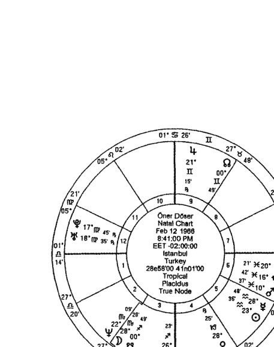

Inner Chart
Öner Döser
Natal Chart
Feb 12 1966
8:41:00 PM
EET -02:00:00
Istanbul
Turkey
28e58'00 41n01'00
Geocentric
Tropical
Placidus
True Node

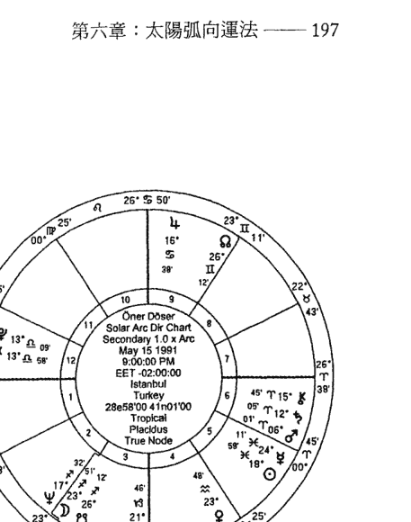

Outer Chart
Öner Döser
Solar Arc Dir Chart
Secondary 1.0 x Arc
May 15 1991
9:00:00 PM
EET -02:00:00
Istanbul
Turkey
28e58'00 41n01'00
Geocentric
Tropical
Placidus
True Node

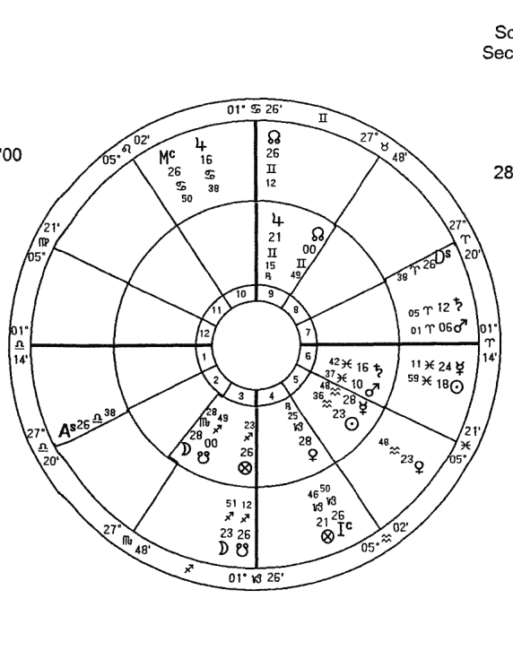

Inner Chart
Öner Döser
Natal Chart
Feb 12 1966
8:41:00 PM
EET -02:00:00
Istanbul
Turkey
28e58'00 41n01'00
Geocentric
Tropical
Placidus
True Node

Outer Chart
Öner Döser
Solar Arc Dir Chart
Secondary 1.0 x Arc
May 15 1991
9:00:00 PM
EET -02:00:00
Istanbul
Turkey
28e58'00 41n01'00
Geocentric
Tropical
Placidus
True Node

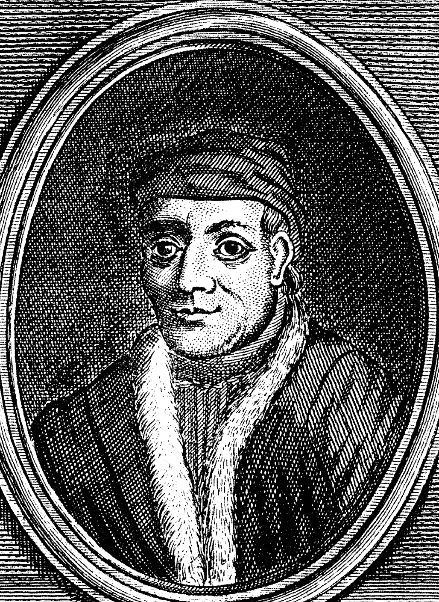

# JOHANNES SCHOENER (REGIOMONTANUS): 約翰內斯·舍納（雷格蒙坦納斯）

# 第七章
### 次限推運法

次限推運法是一種重要的預測方法。它以行星的「次限」運動，即它們在黃道帶中的運動（對應「主限」運動，即天體的周日運動）為基礎。在次限推運中，一天等於一年：因此，行星在出生後二十四小時的實際位置構成了一歲時的次限推運盤。每顆行星根據自己特定的速度推運¹。次限推運與當事人的內在發展相關，並幫助我們理解他可能有的反應。

¹ 對於推運的天頂和上升點，參見下文。

## 次限推運法與過運法的差異

從解釋的角度來看，過運法代表外部的動力，而次限推運法則代表當事人的心理發展。過運法涉及外在的事件，因為過運的行星實際上就出現在天空中的特定位置：它可以被觀測到。但是次限推運不能被直接觀測，因為它們的測算是以某種象徵性的假設為基礎的。儘管如此，這個技巧在評估當事人的心理歷程上非常成功。在心理情境中，所有事物都是從想法的層次以及伴隨而生的情緒開始的，然後反映在人的態度上。因此，次限推運法可以準確地預測態度。

同時，過運法是普遍的：換言之，行星的任何過運對地球上的每個人都有作用²。但是，行星進入星座的次限推運，它與本命行星的相位，或它的逆行運動，不會以同等程度影響每個人，因為其影響力有賴於它與每張本命盤的連結。次限推運法具有個體效應：推運的所有影響——行星星座和宮位的變化，逆行或順行，以及推運盤與本命盤之間的所有連結——都是個人化的。

² 戴克註：舉例來說，如果水星當前在雙子座，對於每個人來說它都在雙子座。

過運法和次限推運法之間最顯著的差異在於行星的速度。因此在詮釋過運法時，慢速行星比較重要，而在次限推運法中，快速行星則扮演主角。在推運盤中，月亮的速度是每年 13°，水星和金星每年 1°，火星每兩年 1°，但是木星是每六至七年 1°，土星每九至十年 1°（在快速運行且順行時）。

次限推運法中使用 1° 的容許度。對於入相位，最後的 12′ 更有效，因為它顯示出事件的開始已經相當接近了。當形成正相位時，心理需求及其伴隨的情緒會增強。入相位的作用總是比離相位的作用更強。

為了使次限推運法的作用適當地體現出來，可能需要過運來觸發。因此，應當將次限推運法與過運法一起評估。此外，除了評估次限推運星盤本身，還必須將它與本命盤的相位徵象列入考慮。最後，也應考慮推運行星之間的相位。推運的太陽和月亮之間的相位特別重要。特別是在推運和本命盤之間有相位時，當事人有機會完成一些事。

### 推運行星的含義

- 月亮顯示變化中的情感需求和情緒傾向。
- 水星顯示認知結構和溝通方式的變化。
- 金星顯示當事人在他的社交關係和審美價值觀上的變化。
- 火星顯示當事人如何展現自己以及改變行動。
- 上升點顯示當事人的習性、原始動機和作風正在改變和發展，產生了新的特點。例如，當推運的上升在天秤座時，當事人會粗淺地處理事件，但是當推運的上升進入天蠍座後，就會變成以一種更深入的方式去處理。推運的上升點和推運行星之間的相位將顯示相關方式和方法的訊息。
- 天頂，由於它代表著社會地位，比起上升較少個人化。基本上，天頂告訴我們當事人的職業、目標，和接近它們的途徑。當天頂在推運時，當事人的目標和他的社交形象會改變。例如，天頂在巨蟹座的當事人傾向於不樂意為了實現目標而冒險；但是當天頂推運到獅子座，當事人會變得更大膽和果斷。

太陽代表了一個人的創造性表達，意志的展現，以及組織性結構的發展。推運的太陽通常代表人生的歷程。例如，太陽在牡羊座的人會依序經歷金牛座和雙子座的特性。因為後續的星座有能力發展前面星座的潛力，推運的太陽從一個星座到下一個星座的移動中將會幫助當事人發展個人修養和靈性成熟。

- 推運太陽和月亮之間的月相是什麼？
- 推運月亮的星座和宮位是什麼？
- 推運太陽的星座和宮位是什麼？
- 是否有推運行星進入另一個星座或宮位？
- 是否有推運行星改變了方向？
- 推運星盤中是否有正相位？
- 推運行星之間的相位或它們與本命行星之間的相位。
- 運法對推運星盤的影響。
- 本命盤和推運的宮始點，特別是始宮之間的相位。

# 與本命盤的相位

為了展現其影響，次限推運法應當使用正相位，容許度不超過 1°；影響的持續時間根據行星的速度會有所變化。例如，太陽每年推運大約 1°，它會在形成正相位之前一年開始發揮作用，並即將在正相位之後一年完全離開。此外，注意那些已經在本命盤中形成相位的行星會通過次限推運法實現正相位。

合相代表能量的顯現。例如，太陽的合相會提升意識層次的動機：太陽－天王星代表一種啟蒙，太陽－月亮將家庭問題提到中心地位，而太陽－土星代表額外的責任和成熟。

四分相代表挑戰、衝突、野心和行動。

對分相代表矛盾、不滿和對立想法之間的互補性。例如，火星－金星代表關係中的衝突，太陽－月亮則是情感與理智之間的衝突。

三分相代表輕鬆的流動、機會、平衡與和諧。例如，月亮－土星表示在職業、責任和家庭生活之間的和諧。

六分相代表分享、支持和學習：太陽－金星代表一個人社交關係的支持。

補十二分相代表需要被轉化的命中註定的危機和精神壓力。例如，太陽－月亮代表意識與潛意識之間的互不相容，及因而產生的危機。

以下是一些觀察相位時的要點：

- 應當仔細研究本命盤，評估其潛能。
- 可以根據過去形成過的類似相位，以及它們呈現出的狀況來評估和理解相位。
- 推運盤和本命盤之間的相位很重要，並有長期的影響。應當特別研究本命太陽和上升主星的相位。
- 注意當本命相位被引發時的情況。例如，推運的太陽可能與一個本命三刑會衝相位的頂角相交。或推運的金星可能四分已經形成了對分相位的本命行星，因而創造出一個新的三刑會衝相位。

單一相位可能不會引發顯著的表現。應當運用過運法、太陽回歸法和其他技巧來確認某種預測。

### 宮位和星座轉換

當行星從一個星座轉換到另一個星座，後者的元素和四正性質變得較為重要。例如，當太陽從雙魚座轉換到牡羊座，火象元素和啟動星座的性質將會取得舞台上的主動權。當事人會放棄自我犧牲的特性（雙魚座），開始展現自我導向的態度（牡羊座）。他的自信心和活力會增加。當事人現在將會展現策略性的態度，並需要採取行動，而不是依賴於其他條件。此外，由於太陽在牡羊座入旺，太陽會輕鬆地展現牡羊座的功能（身份、創造性表達、意志力等等）。

當行星轉換到另一個宮位，可以總結出這顆行星的能量現在流入了另一個人生領域裡。同時，如果這顆行星從果宮轉換到始宮，它的力量也會增加。

## 推運的太陽

太陽象徵生命力和當事人表現其意志力的方式，以及他對於接納和創造性表達的需求。推運的太陽代表這些主題的發展。當事人的精神沒有改變，但是他的性格中結合了新的特點。例如，太陽在牡羊座的當事人會依序經歷太陽在金牛座和雙子座的特性：因此，在火象的特性之外，土象，然後是風象的特點會添加到他的個人特徵中。當太陽從火象星座推運到風象星座時，當事人會在他的溝通交流中使用先前的火象和土象品質，並通過分享他的觀點來表達自己。最後，當他的太陽推運到水象元素，他會學習如何自發地表達情感，精神價值將會變得重要。

太陽平均每年推運1°，但是在冬天較快，在夏天較慢。因此，對於那些出生在春分和秋分（三月和九月）附近的人來說，每年的推運差不多就是1°，但是對於出生在接近冬至和夏至（十二月和六月）的人來說，這個度數就會稍大或稍小一些。

## 推運的太陽在各星座中

牡羊座：太陽入旺在此星座，所以可以輕鬆地展現它的功能，變得強大。這個推運帶來了直接表達的能力、領導力、創業、愛的喜悅、自信和勇氣。從負面看，它可能帶來衝動、自私和攻擊性。當事人可能更聚焦於自己的願望，而對他人的權利不敏感：這可能對他的關係的穩定性及和諧性造成問題。如果當事人的星盤中缺乏火元素，那麼當推運的太陽進入牡羊座時，會帶來某種意義上的充足感，當事人可能會從此輕鬆地理解和運用火象能量，也許會表現出外向的態度，帶著自信和勇氣行動。

金牛座：這幫助當事人繼續他始於牡羊座的冒險。現在他有了一種更平和的能量，並通過沈默的行動達到具體的結果。物質需求將佔據舞台中心，當事人需要感覺到財務上的安全。從負面意義上看，這個推運可能帶來固執，對改變的抗拒，以及偏執。如果當事人的星盤中缺乏土元素，那麼當推運的太陽進入金牛座時，不足感會在某種程度上被彌補：當事人可能會輕鬆地理解和使用土象能量；他可能以一種實際的方式行動，並實現具體的成果。

雙子座：當事人的適應能力和學習能力提高了。溝通和心智活動開始在他的生活中更為重要。他可能比以前更健談，閒不下來。他會擺脫固執和偏執，在個性中結合更多的靈活性和多面性。從負面角度看，當事人可能有某種心智上的執著，他可能很容易分心。如果本命盤有很多變動星座的性質，當事人可能很難保持他的持續性冒險。

巨蟹座：在雙子座之後則進入巨蟹座，當事人學習如何傾聽他人，因為巨蟹座會用同理心的方式傾聽他人並給予情感支持。當事人現在無條件地保持情感牽絆和愛，需要情感上的穩定，並且增強了自省的能力。家庭和母親的問題變得更重要。在這個時期，當事人想要花更多時間和家人在一起。從負面看，他可能表現出害羞，難為情和誇張的情緒，因為他害怕被拒絕，害怕不被愛。

獅子座：進入獅子座後，當事人需要被接受、被欣賞，並以一種創造性的方式表達自己。為了吸引他人的注意並被欣賞，他想要透過意志力來管理他的生活。他可能展現出更精力旺盛、自信和外向的態度。從負面看，他可能是自私的，高度以自我為中心，自負，自認為高人一等。

處女座：在這裡，當事人的生產力和表現力都提高了，對於分析的需求和解決問題的才能也增長了。與獅子座相反，處女座對於他人的需求很感興趣；他想要幫助他人。他可能陷入細節的分析，以便使生活更富成效。由於過度的自我批評，他可能在自信心方面有些問題：他會因為害怕犯錯而避免冒險。工作和健康問題總在當事人的日程表上，他可能還想要節食和進行體能訓練。

天秤座：當推運的太陽進入天秤座時，當事人可能想要與他人產生社交連結，他對審美、平衡與和諧的需求也增加了。他可能能夠建立持久和平衡的關係。夥伴關係問題和婚姻可能出現在他的日程上。但是，由於太陽在天秤座入弱，當事人可能會在組織他的生活和表達意志力上經歷一些困難。因為他非常願意和解，可能會忽視自己的願望，在試圖平衡他的外部世界時喪失自己的內在平衡。在此期間他必須學會脫離對關係的沈溺，採取主動。

天蠍座：當事人需要清理他生活中不必要的結構，聚焦於更新，變得更強大，以及轉化。深度、慾望和精神主題會變得重要。在此期間當事人可能會運用他的直覺獲得更好的效果，轉危為機。但是，由於此星座的固定特性，當事人可能很難展現靈活的態度；他可能以孤注一擲的方式行動。此外，由於過度的懷疑、痴迷和報復心，他可能發現自己被捲入權力鬥爭。他需要抑制獲得權力的慾望。

射手座：在這裡，當事人需要探索生命，找到存在的意義，獲得原生哲學，汲取智慧。他享受從一個更寬廣的視角觀察生命，並與他人分享他的經驗。但是，從負面看，由於冒險和過度的樂觀，他可能要面對一些意想不到的後果。他還可能變得傲慢、教條主義和誇大其詞。當事人應當學習如何在可接受的範圍內冒險。

摩羯座：當事人會需要更多成功、權威性、秩序和控制。在此期間，事業和責任會被強調，當事人會成為一個完美主義者，有野心，有計劃；以目標為導向。他會更有耐心，更安靜。從負面看，當事人可能成為悲觀主義者，焦慮不安，因為他害怕不成功與不完善。

水瓶座：在這裡，當事人會需要改變、進展、啟發，獲取更多社會認同和願景。在這期間他可能參與新的社會組織。他可能想要變得更自由。從負面看，由於與他人情感上的距離，他可能會在關係中經歷一些分離和混亂。

雙魚座：當事人會需要超越、奉獻和大愛。靈性和神秘學的主題對他會更為重要，他將能夠積極地運用他的創造力和想像力。但是，在負面方向，當事人可能會迷失方向；他可能感到困惑，想要鬆開與現實的紐帶（他應當避免這樣做）。

## 推運太陽的相位

太陽－水星：因為太陽與水星之間的距離不會超過 28°，它們之間不會產生太多主相位。要形成六分相也需要很長時間，但是當它確實形成時，當事人會有機會連結到教育和溝通的領域。他可能做出有效的決定，形成新的項目，他的心智能力可能會提高，也可能頻繁地旅行。

太陽－金星：社交關係、感官的愉悅、婚姻、伴侶關係、藝術活動和審美價值得到重視。詮釋這個相位時，應當聚焦於本命金星所在的宮位以及它所掌管的宮位。例如，如果它主管第七宮，那它自然象徵的主題就將更加顯著，因為在現代占星學中，金星是第七宮的自然主星 ³。當太陽合相金星時，它們所在的星座非常重要。例如，如果合相發生在天蠍座，則關係中的渴望和一些權力鬥爭可能會浮出表面。由於金星和太陽的距離不會超過 48°，它們的相位代表關鍵的時期。但是，這兩顆行星可能一起推運，因為它們的速度幾乎是相當的。當它們形成 45° 相位時，在社交關係中可能會看到一些壓力和衝突。

³ 戴克註：多塞的意思是在現代占星學的「占星學的序列」中，牡羊座和它的主星火星從原型上推斷代表第一宮，所以天秤座和金星代表第七宮。當然在古典占星學中金星也代表第七宮的事物，例如關係，但是天秤座和第七宮之間並沒有對等關係。

太陽－火星：領導力和創業特質會佔主導地位。當詮釋這些相位時，應當聚焦於火星所在的宮位以及它所掌管的宮位。太陽－火星合相可能增強當事人的力量，但是也會增加意外的風險。和諧相位（三分相和六分相）可能提高當事人的競爭力和行動力。當事人可能以一種直接和清晰的方式表達他自己。困難相位可能帶來壓力和衝突。當事人可能很難管理他的憤怒。如果困難相位發生在第六宮、第八宮，或第一宮，當事人可能會有一些健康問題。

太陽－木星：個人發展、樂觀、希望、幸運、繁榮、對生命更寬廣的視野、宗教和哲學主題，都是這些相位的主題。應當聚焦於木星所在的宮位和它主管的宮位。和諧相位為當事人帶來歡樂和喜悅；他會以一種創造性的方式表達自己，並向他人傳播他的人生哲學。他可能遇見許多機會來幫助他在靈性和身體上發展。困難相位可能帶來風險、誇張、傲慢、教條主義和對冒險的鐘愛。如果困難相位發生在續宮，當事人可能過於浪費，或可能由於冒過多的風險而經歷財務損失。

太陽－土星：職業、責任、成功、權威性、對秩序的需要、以及重建是這些相位的主題。應當聚焦於土星所在的宮位和它主管的宮位。在和諧相位中，當事人可能輕鬆地重構他的生活。他在職業中可能實現成功和穩定。他知道自己的責任，並用一種有組織的方式聚焦於自己的目標。困難相位可能對他的創造性表達帶來困難，因為他可能感覺有壓力和沮喪。在此期間當事人可能喪失自信，容易意志消沈。他可能還有一些健康問題。

太陽－天王星：改變、發展、開悟、以及非凡創造力的潛力都是主題。應當聚焦於天王星所在的宮位和它主管的宮位。在和諧相位中，當事人可能對他的人生做出一些重要的改變，從團隊工作中受益，以及探索新的環境。創造力和活力在此期間佔有優勢。如果這些相位發生在第一宮或第五宮，當事人可能以一種意想不到和原創的方式展現他的創造力。困難相位可能帶來某些突然和令人震驚的發展，起伏和矛盾。如果這些相位發生在第六宮或第十二宮，當事人可能會有健康問題；如果在第一宮和第七宮，他可能在關係中有分離的情況，如果是在第二宮和第八宮，則會有財務上的起伏。

太陽－海王星：聚焦於海王星所在的宮位和它所主管的宮位。在和諧相位中，當事人可能拋開自我，戰勝二元性，實現合一的愛、臣服、理想主義、靈感、直覺和創造力。如果這些相位發生在第一宮或第五宮，當事人可能在創造性的項目中表現他的想像力。困難相位可能帶來不確定性、困惑、迷失方向和分離。如果這些相位發生在第十二宮，當事人可能有藥物或酒精上癮的問題；在第一宮和第七宮，他可能在關係中有些問題和失望，如果是在第六宮或第十二宮則是健康問題。

太陽－冥王星：聚焦於冥王星所在的宮位和它主管的宮位。在和諧相位中，當事人可能轉危為機，或展現出領袖才能，通過權威人物的支持而獲得權力。他可能經歷一種象徵性的重生。困難相位可能帶來執迷、懷疑、操縱、嫉妒、仇恨和權力鬥爭。這個轉化的時期還可能包含嚴重的危機。如果推運盤處於殘月（Balsamic lunar phase），這個時期可能相當艱苦。

## 推運的月亮

推運的月亮幫助我們確定好時機和計劃；它有一種觸發效應。作為運行最快的行星，它能夠與星盤中的每個特徵產生聯繫：所以，它的推運是占星師最重要的工具之一。它顯示了當事人情緒上聚焦的主題。

推運的月亮每兩年半改變一個星座，每月大約推運1°。它的速度會變化，有時快，有時慢，但是推運月亮每年的平均速度是13° 10′。它的推運展現出與其成相位的行星的自然徵象、宮位，以及所主管的宮位。當它的相位觸發本命盤中的相位模式時會帶來重要事件。例如，它會將四分相轉變為三刑會沖。

推運月亮的宮位代表了當事人感覺需要改變的生活領域，而它的星座代表了他的情感期待的性質。如果推運的月亮從星盤的上半球進入到下半球（或相反），也會帶來重要的發展。

## 推運月亮在宮位中

以下描述說明了月亮通過各個宮位的推運，但是原則上也可以應用於其他行星：

- 第一宮：當事人開啟了一個新的個人週期，獲得了主觀的觀點，並聚焦於自己的願望。他關注原始動機、習慣、個人發展和外表。他的當務之急是做出人生的改變，現在正是行動的時機。實現自我的動機是以第一宮的星座之元素和四正性質為基礎的。

- 第二宮：在這裡，當事人聚焦於他的財務資源和價值。他需要財務自由，但是可能會在這方面經歷一些起伏。他可能做一些投資，並在財務上冒些風險。因此，它與五宮內的行星形成四分相或與八宮內的行星形成對分相很重要，因為第五宮主管風險和投機，而第八宮主管與他人共同持有的投資。

- 第三宮：改變的能量聚焦在心理過程上。這是一個投入心智活動和教育目的的好機會。著眼於規劃短途旅行以及兄弟姐妹和鄰居的關係。在此時期溝通也很重要。

- 第四宮：情感安全、紮根的需要，與家人、家庭相關的元素都是重要的議題。當事人可能希望移居到其他地方或者重新裝修房子。他可能購買或出售不動產。這是內省和尋找內在平和的時間。當事人可能重新評估他的家庭關係：他可能會經歷一些分離，或者與家庭成員重聚。

- 第五宮：當事人享受以一種創造性的方式表達自己。強調子女，愛好，樂趣，愛情和性的議題。可能規劃浪漫的旅行。

- 第六宮：當事人在此期間想要幫助他人，解決問題，並且變得富有成效。他可能參與一些發展其才能的活動。但是，他的任務和必須要處理的問題的數量會增加。這是一個進行節食、開始體育和健身活動的理想時期，但是當事人應當小心他的健康。有些與工作環境和下屬相關的問題會變得重要。這還是一個對工作環境及使用方法做出調整的期間。

- 第七宮：關係在當事人的生活中變得重要。婚姻、離婚和合夥關係可能成為行動的主題。當事人可能在他的關係中發展出新的態度模式。公開的敵人和衝突也可能浮出表面。當事人會比以前更多參與社交活動。

- 第八宮：強調分享的資源。例如信用、抵押貸款、共同投資和繼承可能會有相關規劃。當事人可能傾向於形上學和神秘學主題。他可能發現自己處於權力鬥爭中，並且被過多的慾望所制約。他可能還會遭受某些情感危機。

- 第九宮：當事人會質疑存在的意義，並變得更明智，具有寬廣的視野。他希望獲取能夠提供人生意義的知識，並構建自己的人生哲學。他可能通過另類的學習得以進化。為了分享知識和經驗，他可能還會開講座和寫作。信念、靈性和哲學主題都變得重要。他可能還會帶著探索人生和外國文化的目的旅行。

- 第十宮：強調目標、職業、社會地位、以及當事人在社會上的形象。他可能會嚴肅地看待人生，並負起更多的責任。他在社會上的曝光率增加了，社會地位可能會改變；可能得到提升或變得出名。

- 第十一宮：激進的想法，社會環境的改變，參與慈善事業或者俱樂部，或結交新的朋友都是這個時期的主題。當事人想要與有著相同理念的人一起行動。另一方面，由於第十一宮是從第十宮起算的第二宮，當事人可能因為事業成就而掙得財富。

- 第十二宮：創造性、想像力、靈感、孤立、神秘學的主題在當事人的生活中會變得重要。他可能對另類療法、冥想和人道主義問題感興趣。他可能更願意待在幕後。從負面看，他可能從現實中出走並迷失方向；所以當事人必須小心。

## 推運的月亮在各星座

推運的月亮進入另一個星座並不意味著當事人會完全獲得那個星座的性質，而更像是他在情感上需要那個星座的特性。

牡羊座：當事人聚焦於採取行動和主動權。他喜歡挑戰。他可能輕鬆地展現領導才能。他感興趣的是自己的願望，而不是他人的需求。他對生命充滿熱情，開始迅速地行動。從負面看，他可能過於衝動，怒氣沖天地行動，再被迫帶著損失平息下來，面對因為他不假思索的行動而帶來的意外後果。

金牛座：當事人聚焦於獲得具體的成果和穩定性。只有當在財務上有保障時他才感到安全。他需要更多的安靜與平和。他不會不假考慮就回應；他對周圍的人表現出沈默。從負面看，他可能固執，拒絕改變。但是，由於月亮入旺在金牛座，這些負面的可能性不會被過多強調。

雙子座：當事人聚焦於交換具體的知識，溝通，並忙於研究。他現在更好奇了。許多知識湧向他。因為在此時期變得更加外向和愛交際，他不會享受安靜地坐著，總是很快行動。從負面看，當事人可能很緊張和焦慮。因為他總是要做多方面的事情，心智可能很容易就分散。

巨蟹座：當事人聚焦於家庭事務，情感連接以及情感安全的需要。在此期間，他想要花更多時間待在家裡，注意力放在家庭問題上。同理心、情感支持和情感連結增加了。從反面看，當事人可能過於敏感和憤憤不平。但是由於這個星座的主星就是月亮本身，它的負面不會被過多強調。

獅子座：當事人聚焦在以創造性的方式表達自己，被他人接受和欣賞。

處女座：當事人聚焦於實現更有成效，做出具體的分析。與日常工作和健康有關的事情被強調。當事人對情感問題採取一種機械性的方法；他只關心以此方式解決這類問題。因為他太熱衷於細節，見樹不見林；並且因為他的強迫症更加嚴重，所以感覺自己承受很大壓力。他還可能失去自信。有時當事人可能對特定的健康問題，例如節食和鍛煉非常著迷。

天秤座：當事人聚焦於審美價值，關係和婚姻。他需要透過關係，保持一對一的連結和社交來瞭解自己。因為他想要建立一種穩定和平衡的關係，便會展現出和解的態度，或充當他人的調解者。他不喜歡爭吵。審美價值得到重視，當事人想要變得美麗，也想使環境變得漂亮。

天蠍座：當事人聚焦於清除生命中不必要的事物、更新、獲得力量和轉化。在情感層面，他可能有一種深刻、激情和分享的態度。他的直覺有所發展，想要通過深入的研究來學習每件事物。他可能顯得神秘且內向。從負面看，當事人可能偏執、懷疑、嫉妒、報復心重，因為月亮在此星座並不是一個良好的位置。

射手座：當事人聚焦於探索生命、信仰系統和個人擴展。他很樂觀，充滿希望，愛冒險。教育、與國外的關係、旅行和法律事務是主題。在情感層面上他可能表現出對事件只有廣度，但缺乏深度的看法。從負面看，由於太過冒險，並且過於樂觀，他可能會面對意想不到的結果。他還可能是教條主義和傲慢的。

摩羯座：當事人聚焦於事業、成功、權威和秩序。在此期間，優先考慮工作和責任，因為當事人可能在情感層面上相當冷淡。當事人可能壓抑他的感覺，與他人保持情感上的距離。當事人可能很被動和焦慮，因為這對月亮不是一個好的位置。無論如何，他可能都無法實現他渴望的成功。

水瓶座：當事人聚焦於改變、進步、改造、開悟和新的願景。因為他需要擁有一種社會認同，所以會結交新朋友，擴展他的圈子。由於對自由和與眾不同的渴望，他可能與權威有些衝突，甚至可能是反叛的。因為水瓶座對月亮不是一個良好的位置，當事人可能經歷某些情感起伏和不穩定。從正面角度看，當事人可能在此期間做出改變，因為他容易接受新的想法。

雙魚座：當事人聚焦於靈性和神秘學主題。他需要超越、臣服、和大愛。他投入、共情、關懷他人，並與他人分享。他的直覺很強烈。從負面看，由於過度的理想主義，他可能會感到失望和困惑，並迷失生活的方向。

## 推運的水星

水星代表當事人對世界的看法、他的溝通方式和認知過程。水星的推運向我們顯示當事人的心智發展到了哪種水平。當推運的水星和其他行星之間有許多相位時，當事人需要獲得具體的知識，他開始忙於各種學習活動，過多的溝通交流充滿了他的生活。因為水星也與旅行、商業活動、交通和兄弟姐妹相關，這些主題也會被強調。

## 推運水星的相位

水星－金星：強調社交能力、愛、快樂、浪漫的表達、創造性過程和藝術主題。但是，這種關係可能很膚淺。和諧相位帶來關係中的和諧、有效的溝通和教育。困難相位帶來關係中的不和諧以及溝通的問題。

水星－火星：強調了溝通和教育有關的冒險，以及結合了體力與心智的努力。如果有和諧相位的幫助，當事人在心智工程中會獲得成功，並將其運用實施；他獲得了用直接的方式表達自己的技巧。它們的困難相位帶來精神壓力、不得體、以及不假思索就做決定。當事人可能有憤怒管理相關的問題。

水星－木星：教育，以及具象和抽象知識的結合在這裡被強調。這兩顆行星之間的和諧相位帶來教育和溝通領域的機會；當事人可能可以輕鬆地向公眾表達自己，還能通過旅行來發現世界。另一方面，困難相位可能帶來精神的壓力，誇張和不切實際的想法，教條主義和傲慢。因為當事人會在教育和溝通方面冒險，他可能會經歷一些問題。

水星－土星：教育和溝通上的嚴謹性和持續性被強調。當事人可能在他的受教育生涯中認真地對待每一步，做出富有成效的決定，並在這兩顆行星的和諧相位幫助下強化他的集中力。他可能很有組織性和紀律性，並運用他的規劃技能找到事業中的成功。另一方面，困難相位可能帶來悲觀情緒、焦慮、教育以及溝通上的問題，難以集中，以及強迫症。因為他的羞澀以及缺乏自信，可能在獲得他想要的成功上有困難。

水星－天王星：教育及溝通上的轉化和啟發被強調了。通過這兩顆行星之間和諧相位的影響，當事人可能產生非凡及激進的想法，發展出對事物更快速的理解力，並在教育事務上體驗正面的發展。困難相位可能帶來精神上的緊張，突然的打擊，以及學習和溝通上的中斷。當事人可能經歷思維混亂，難以集中精神，或者與他人溝通不良。他可能容易分心，或者有不切實際的想法。如果困難相位發生在第三宮或第九宮，當事人可能在學習或旅行方面遇到阻礙。

水星在推運中的相位揭示了溝通與思維方式的演變，以及學習與教育領域的發展。

水星－金星：溝通與思維會帶來教育和溝通上出乎意料的發展、烏托邦式的方法以及反叛。當事人可能有神經衰弱的毛病。

水星－火星：這個相位代表教育、溝通，以及認知過程議題的轉化。兩者之間的和諧相位將增強觀察力，淘汰無用的心智模式，轉化現有的認知過程，隨著教育上的正面發展變成更有領導力和效率的溝通者。困難相位可能帶來偏執、懷疑和對死亡的恐懼，以及溝通中的權力鬥爭。當事人可能強迫他人接受他的觀點。

水星－海王星：認知過程，例如創造性、靈感和想象力反映在了溝通中。在和諧相位中，當事人可能從無限的想象力和直覺的賜福中獲益。另一方面，困難相位導致混淆、難以做決定、逃離現實，並在極端情況下出現錯覺。

水星－冥王星：這個相位代表教育、溝通，以及認知過程議題的轉化。兩者之間的和諧相位將增強觀察力，淘汰無用的心智模式，轉化現有的認知過程，隨著教育上的正面發展變成更有領導力和效率的溝通者。困難相位可能帶來偏執、懷疑和對死亡的恐懼，以及溝通中的權力鬥爭。當事人可能強迫他人接受他的觀點。

## 推運的金星

金星與審美價值、和諧、平衡、愉悅、性慾、關係和社交性相關。金星還代表當事人自我欣賞的能力。通常來說，它的推運顯示當事人在一對一的關係和社會關係上的方式。

### 推運金星的相位

金星－火星：創造力和性方面的自信、慾望和男女關係，以及藝術類事物被強調了。這兩顆行星之間的和諧相位使性生活協調，兩性之間能量輕鬆流動，並帶來藝術事物的創造力。困難相位可能帶來關係上的衝突、競爭和攻擊、極端的慾望和過於衝動的性生活。

金星－木星：機會、幸運以及由於關係而帶來的繁榮被強調了。它們的和諧相位帶來社交關係上重要的機會，新朋友和財務的機會。困難相位可能帶來社交關係上的誇張，揮霍無度的習性、頭腦發脹的現象，以及對於性和其他感官享受的過度需求。

金星－土星：社交關係中的嚴謹性和持續性，審美價值上的傳統主義，以及對歡愉和性欲的控制都被強調了。在和諧相位中，當事人可能有遠距離關係；他是忠誠和可信賴的，偏好長久的關係。他知道他在關係中的責任，並能夠控制他的性欲。困難相位帶來關係上的困難，對愛持悲觀態度，缺乏自愛，缺少性衝動，並壓抑快樂。當事人可能飽受金星類型的健康問題（糖尿病，腎臟和生殖器官疾病）和財務困難困擾。

金星－天王星：強調社交關係中的創新和人道主義，感官歡愉和審美價值。這兩顆行星的和諧相位帶來對社會群體權利的敏感，並可能有太多的朋友。因為當事人對於審美價值和感官歡愉有一套獨創性方法，他可能參與到不一般的藝術活動中去。他還會敞開接納性生活中的新體驗。困難相位帶來不穩定、令人震驚的發展，突然開始或結束社交關係，財務狀況的起伏以及不正當的性生活。

金星－海王星：浪漫主義、順從、大愛、神聖的愛，還有藝術活動中的創造力被強調。和諧相位帶來投入、原諒、社交關係中的順從、以及非常浪漫的愛情生活。當事人可能通過神秘主義尋求神聖的愛。他能夠無差別地愛每一個人。由於他在審美價值和歡愉方面運用強大的想像力，而可能參與到藝術活動中。困難相位帶來社交關係上過度的理想化、寬恕、或投入，當事人因此可能遭受失望、困惑和欺騙的打擊。他可能沈迷藥物或酒精，因為這些物質會幫助他逃離現實。

金星－冥王星：通過關係的轉化被強調了。和諧相位帶來深刻與佔有欲，但是當事人可以化危機為機會。他可能看到來自有影響力的人物帶來的財務和情感支持，並在社會中佔據有力的地位；在與他人的關係中運用其力量和魅力。困難相位帶來懷疑、偏執、嫉妒、仇恨和權力鬥爭。當事人可能在性關係中墮落，並可能由此導致施虐癖（極端情況下）。他還可能經歷嚴重的財務危機。

## 推運的火星

推運的火星及其相位顯示出當事人要如何展現自己，採取主動，進行新的冒險和活動，並以新的方式運用他的能量。

### 推運火星的相位

火星－木星：運動、新冒險的機會和個人發展的嘗試被強調。和諧相位帶來熱情和勇氣，當事人會展示出這種態度，也會有效地運用他的領導力技巧。在此期間他可能對體育活動感興趣，並開始一些教育相關的冒險。他可能還會參與到個人發展的活動中去，也可能面對許多機會。困難相位帶來風險投資、狂熱、教條主義和傲慢。當事人可能參與此後會對他產生負面影響的活動。

火星－土星：持續的冒險精神和憤怒管理都與「本我」和「超我」的和諧相關，因為土星代表社交規則和我們的內在判斷（超我），而火星代表我們的原始面向（本我）。兩者之間的和諧相位可能帶來有效的憤怒管理、持續和穩定的冒險，從而變得以目標為導向和有决心。困難相位帶來憤怒管理中的被動攻擊行為和難以主動的問題。身體健康方面的問題也會被注意到。

火星－天王星：導向改變的冒險、勇氣、創新性活動和獨立性被強調了。和諧相位帶來新的開始、改變、獨立和創新。困難相位帶來事故、拒絕改變、前後不一、勃然大怒和反叛的行為。

火星－海王星：強調為了精神價值和目標，還有理想主義而鬥爭。和諧相位帶來當事人冒險中的想像力和創造力：他可能創造出新的藝術項目，或在精神活動中展現自己。困難相位帶來方向的迷失、懶惰、努力後卻失敗的失望，以及缺乏動機。由於火星代表生存的力量，當事人可能經歷某些健康問題（特別是與免疫系統相關的）。

火星－冥王星：強調了有助於化險為夷的冒險。冥王星就像是高八度的火星，所以當這兩顆行星形成和諧相位時，它們帶來了領袖魅力、勇氣、領導力、持續變化的冒險、以及打擊對手的天賦。困難相位可能帶來權力的濫用、殘酷、虐待和冒險中嚴重的危機。

## 月亮－太陽的關係

推運的月亮和推運的太陽之間所有相位都將創造一種結合兩者自然意義的連結：例如陰陽兩極，意識與潛意識，感性與理性等等。這些相位形態所在的宮位很重要。

## 圖表 24：日月週期中的相位和月相

這張圖顯示了推運的月亮和推運的太陽之間的月相。當月亮和太陽合相（0°）時，指的是新月時刻。因為月亮比太陽運行速度快，繼而與太陽形成不同相位，直到再次合相。當太陽和月亮之間的距離達到45°，就有了一個娥眉月，90°是上弦月，135°是盈凸月，180°是滿月，315°是殘月。當月亮完成這個360°的循環，再次達到太陽的度數時（譯註：即與太陽合相），就形成了另一個新月和一個新的週期。

簡單來講，從新月到滿月的階段是開始和建立的時期，而從滿月到新月的階段是完成和退出的時期。單獨看每個月相，新月是起始，娥眉月是擴張和固化，上弦月是行動，盈凸月是完成，滿月是滿足與收穫，虧凸月是與他人分享其能力，下弦月是重組，殘月則是釋放階段。讓我們仔細研究每個月相：

- 新月（0° - 45°）：推運的月亮和太陽每29.5年合相一次。此時當事人可能有一個新的開始，但是由於這個月相的過程並不清晰，當事人可能不知道想要走向哪個方向。他可能不知道採取措施的結果。他會問：「我在做正確的事情嗎？」然而他還是想要採取行動，把過去留在身後，因為他在上一個殘月已經察覺到了改變的需要。新月發生的宮位很重要，因為新的開始將與這個星座和宮位的需要相關。
- 娥眉月（45° - 90°）：這個月相強調從開始於新月的冒險中所獲得的反饋，以及根據這個信息使目標具體化和穩固。現在當事人可能使自己擺脫了過去的影響，並決定：他可以有意識地前進以接近他的目標，並對保護自己的資源有了野心。儘管一開始這是一個困難的階段，一旦相位達到60°時，就會變得較容易組織並且得到成果。
- 上弦月（90° - 135°）：這是測試的階段；當事人應當既有野心也有紀律，並努力顯示他的進步。他應當積極地工作，為在推運的新月時（上述提及）產生的新開始奠定良好的基礎。在此階段當事人應當積極主動，為自己的存在而鬥爭。這正是保護在新月時開始的冒險之時。當事人還應當得到他人的贊同，即使他可能有時會感到沒有被完全理解或被欣賞。因為這個相位是由四分相開始的，一開始可能會經歷一些困難，但是當變成三分相時，這些困難就將開始消退，能量會更輕鬆地流動。
- 盈凸月（135° - 180°）：在此月相中，當事人開始顯現出創造力、生產力，開始向社會展現他的工作。他可能努力尋找能夠增加他的生產力，並用一種更有效的方式利用他的資源的新方式。這是擴展生意的時期。當事人可能努力做到最好，並容易從他的努力中看到成果。現在目標更加重要了。當事人問自己：「我的目標還有沒有什麼被忽略的細節？」他應當對自己和所立目標有信心，因為補十二分相（150°）可能導致懷疑和優柔寡斷。因此當事人可能經歷某些危機，而其實應當轉換其機會。
- 滿月（180°－225°）：當事人可能遇見十四年前的新月時開始的事物之努力所產生的結果。所以，這是一個收穫的時節。如果當事人做出了積極的嘗試，他現在會接近成功；如果他不事生產、還不夠成熟，結果可能是令人失望的。當事人在這個月相期間更加客觀，並樂於分享，他可能在關係的幫助下有所發展。在此時期可能會有婚姻或合夥關係的計畫。
- 虧凸月（225°－270°）：在滿月月相之後，當事人生命中的能量會減退，個人野心開始逐漸消失。當事人現在與社會分享他的經驗，想要和他人分享他的哲學觀、展望，和現在對於生命更寬廣的認知。在此月相中，他會問自己：「我在嘗試接近自己的目標時，為社會做了什麼？」此外，他可能經歷人生中的一些改變：例如，他可能離開或變換工作。
- 下弦月（270°－315°）：虧凸月的月相之後，當事人想要向社會展示他的工作。他可能忙於他的工作生活，並尋求獲得實質的成果。在此月相中當事人可能實現成功，獲得名譽。當這個月相接近四分相的度數時，他可能需要更努力，更奮鬥。在此月相的結尾，當事人可能會問：「接下去我該做什麼？」
- 殘月（315°－360°）：這是淨化和從過去的努力中恢復的時期。當事人可能難以開始新的事物並感到困惑。離開舊的習慣和嗜好可能很困難。儘管他會有所克制，但仍舊難以保住財產。有些命定的損失會發生。當事人需要獨處，傾聽自己內在的聲音：然後他可能會有順勢而為的感覺。他可能享受學習靈性的主題、冥想和祈禱。

## 推運的逆行行星

太陽系中的所有行星都是正向運動的，但是從地球上觀察時，大部分行星看起來會慢下來，然後反向移動。（月亮和太陽不會逆行。）行星的逆行導致它們的能量被堵塞：不能良好地運用。所以，能量向內流動，最終當事人的自省能力提高了。這些行星停滯、逆行或再次轉向順行的日或年，以及它們所掌管的宮位非常重要。

- 水星逆行：推運的水星代表認知過程和一個人的溝通方式的改變。當推運的太陽和推運的水星在不同星座時，當事人可能感到他的心靈和表達心靈的方式之間有衝突。當推運的水星逆行時，當事人可能有溝通、學習和做決定的障礙。因此，當事人會感到被誤解，或不能充分表達自己。這個階段會持續十九至二十三年。從正面角度來看，當事人有機會轉向內在並自省。當水星轉向順行時，他開始更容易地表達自己並執行在水星逆行期間產生的想法。水星轉換順行的宮位，以及主管的宮位很重要。
- 金星逆行：推運的金星大約會逆行四十二年。在此期間，當事人可能有一對一和社交關係上的問題。在金星主題的事物，例如婚姻、性行為和伴侶關係上可能見到拖延和不滿。當金星逆行時，它的能量流向內在，因此人們可能看到柏拉圖式的愛情。從正面方面看，當事人可能發展出自愛的覺知，他的藝術創造力可能增加。審美價值對他很重要，他可能對愛和審美價值有獨特的要求。
- 火星逆行：推運的火星逆行大約八十年。在此期間，當事人可能在開啟事物或新階段，以及憤怒管理方面有困難。

火星之外的行星會覆蓋人生中更長的時期，從而不便於應用或說明。例如，木星會逆行一百二十年，而土星則是一百五十年。

## 宮始點的推運

人們可以觀察他們星盤中處於不同星座的宮始點的推運，以及這些宮始點與本命和推運行星的相位。但是，因為天頂和上升是最重要的個人指標，它們應當被強調。

找到推運的天頂很簡單：它與太陽以同樣的速度推運。因為上升點是天頂和出生緯度的函數，因此應先將天頂推運到想要的位置，再使用宮位表或電腦程式計算相應的上升，從而找到推運的上升。例如，人們可能以電腦程式計算出一張星盤，再隨時間動態向前推運：程式會自動根據選擇的天頂位置計算上升點。

- 推運的天頂：它代表了當事人的目標、展現自己的方式，他的職業、社會地位和社會形象。當天頂推運時，它與行星形成的相位代表當事人生命中的事件和改變。例如，當推運的天頂合相本命月亮時，則處於一個人的事業和目標中做出改變的時間，因為月亮代表改變。當它與本命月亮四分時，改變還會帶來情感危機。當它與本命月亮三分時，當事人可能從女性或母親那裡得到支持。
- 推運的上升：它代表當事人的基本動機、天賦和習性。當推運的上升與行星形成相位時，會發生與這些相位相關的重要事件和改變：行星的能量反映在當事人生命中第一宮的主題裡。在六分相和三分相中，能量流動很輕鬆，而四分相和對分相會將某些挑戰和壓力顯露出來。例如，推運的上升和本命火星的合相意味著當事人應當參與新的冒險並採取主動。但是，由於上升位置代表身體而火星主管意外，這個階段可能存在健康問題上的風險；這種風險在推運的上升四分本命火星時更大。此外，當事人可能需要為他的目標而鬥爭，也可能因為處於壓力之下而變得咄咄逼人。當推運的上升與本命火星三分時，當事人可能輕鬆地表現出積極主動，因為能量的流動有助於他開始行動。

## JOHANNES SCHÖNER : 約翰尼斯·舍納

## 第八章 界行向運法

界行向運法或配置法是最古老的預測技巧之一。界是將每個星座劃分為五個不均等的區間，每個區間由五顆古典行星之一守護（不包括發光體）。界主星是這種技術的核心因素：當上升點或其他點向運通過界時，界主星即意味著在這段期間會發生的事件的類型和發展。

在這種方法中應用埃及界的表格（見下圖）¹。例如，當上升點在天秤座 1° 14′時，落入土星的界，這個界的範圍是從天秤座 0° 到 5° 59′。所以當我們推進上升點，土星仍是剩餘的 4° 46′所對應的年份的界主星，直到在 6° 時進入下一個界。然後上升點會進入水星的界，它會主管當事人對應天秤座 6° 到 14° 這幾年的人生。木星是下一個界主星，在天秤座 14° 到 21° 之間。金星是再下一個界主星，主管當事人在 21° 到 28° 之間的人生。最後，火星將主管天秤座 28° 到天蠍座 0° 之間的界，然後火星再一次從天蠍座 0° 到 6° 59′開始作為界主星，如此等等。

> 1 戴克註：歷史上有幾種界的版本，但是「埃及界」是從古代直到中世紀阿拉伯時期應用最廣泛的。

### 圖表 26：埃及界

| 星座 | 界1 | 界2 | 界3 | 界4 | 界5 |
| :---: | :---: | :---: | :---: | :---: | :---: |
| ♈ | 4 0°-5°59′ | ♀6°-11°59′ | ☿12°-19°59′ | ♂20°-24°59′ | ♄25°-29°59′ |
| ♉ | ♀0°-7°59′ | ☿8°-13°59′ | 4 14°-21°59′ | ♄22°-26°59′ | ♂27°-29°59′ |
| ♊ | ☿0°-5°59′ | 4 6°-11°59′ | ♀12°-16°59′ | ♂17°-23°59′ | ♄24°-29°59′ |
| ♋ | ♂0°-6°59′ | ♀7°-12°59′ | ☿13°-18°59′ | 4 19°-25°59′ | ♄26°-29°59′ |
| ♌ | 4 0°-5°59′ | ♀6°-10°59′ | ♄11°-17°59′ | ☿18°-23°59′ | ♂24°-29°59′ |
| ♍ | ☿0°-6°59′ | ♀7°-16°59′ | 4 17°-20°59′ | ♂21°-27°59′ | ♄28°-29°59′ |
| ♎ | ♄0°-5°59′ | ☿6°-13°59′ | 4 14°-20°59′ | ♀21°-27°59′ | ♂28°-29°59′ |
| ♏ | ♂0°-6°59′ | ♀7°-10°59′ | ☿11°-18°59′ | 4 19°-23°59′ | ♄24°-29°59′ |
| ♐ | 4 0°-11°59′ | ♀12°-16°59′ | ☿17°-20°59′ | ♄21°-25°59′ | ♂26°-29°59′ |
| ♑ | ☿0°-6°59′ | 4 7°-13°59′ | ♀14°-21°59′ | ♄22°-25°59′ | ♂26°-29°59′ |
| ♒ | ☿0°-6°59′ | ♀7°-12°59′ | 4 13°-19°59′ | ♂20°-24°59′ | ♄25°-29°59′ |
| ♓ | ♀0°-11°59′ | 4 12°-15°59′ | ☿16°-18°59′ | ♂19°-27°59′ | ♄28°-29°59′ |

根據烏瑪·塔巴里的說法，為了對當事人的生活做出整體性的預測，應當推進本命上升點的度數²。在確定了上升點的準確度和分之後，就能確定界主星，上升點和下一個界之間的黃道度數之差應當被轉化為斜赤經上升³。「斜」赤經上升（或常簡稱為「赤經上升」）是天球赤道穿過上升－下降軸線的度數：它們不是簡單的黃道度數。因此在黃道带上一個6°的界不會持續六年，而是持續與這個界在赤經上升度數上的度數所對應的時間。這主要取決於出生地緯度。一旦知道了赤經上升的度數，每 1° 赤經上升等同於人生中的一年。以下將給出任一緯度上每個界的赤經上升度數的簡單數學說明。

無論上升在哪個界中，界主星都被烏瑪·塔巴里稱作 *jārbakhtār*，在波斯文中的含義為時間的「配置星」或「除數」⁴。第一個界主星將主管這個界涵蓋的度、分和秒所對應的年、日和時的運程，下一個界主星將主管對應於他的界的年數，以此類推。

> 2. 戴克註：詳見我的《波斯本命占星 II》，II.5 中翻譯的烏瑪關於本命星盤的書。
> 3. 戴克註：見下。
> 4. 戴克註：見前。

## 界的解釋

為了解釋界的時期，應當考慮配置星的性質和所在界的黃道帶位置。如果這顆行星是吉星，或與吉星有相位，這些年會比較平靜、擴張和繁榮。相反，如果界主星是凶星，或落陷，或在一個不好的位置，當事人在人生的這段期間將會面臨困難和危險。

古德·波那提也說⁵，我們應當評估與界形成相位的行星，以及這個相位的性質。在下面的星盤中，假設上升點的向運來到了天秤座 21°，金星的界，而本命木星在雙子座 21°。木星三分這個界，即與一顆吉星的界形成和諧相位，代表當事人在關係上會有一段成功和美好的時期。確實，下面的當事人（我）在此期間訂婚，並在二十六歲時結婚了。婚姻是金星類型的事件，因為木星與這個界形成了好的相位，總而言之，當事人將會進入他人生中一段快樂的時期。

從界中向運壽命釋放星（longevity releaser），或稱 hilāj⁶，也可以做出預測。假設釋放星在雙子座 16°，金星的界中。當把度數推到雙子座 18°，當事人的健康狀況將會改變，因為界主星會從金星變為火星。當釋放星的界從火星轉移到土星時，當事人可能經歷更多的健康問題。根據波那提的說法，如果釋放星的界主星從一顆凶星推進到另一顆凶星，結果可能是致命的。當然，永遠都要考慮這些行星在本命盤上的位置。

> 5. 戴克註：古德·波那提（Gūdī ibn al-Ḥusayn al-Bundārī）是十世紀的波斯占星家，著有《導師之書》。
> 6. 戴克註：Hilāj（也可拼寫為 hyleg）來自波斯文，含義為「釋放星（releaser）」，翻譯希臘文為 apheta，亦即「釋放星」。通常來講，釋放星不過是我們推進的一些點。但是在特殊情況下，它涉及星盤中指出當事人壽命和生命力的一個點：所以推進它將會對當事人的健康狀況有重要意義。托勒密在《四書》III 第十章或第十一章（取決於版本）中給出了尋找釋放星的指導。烏瑪·塔巴里在他論本命盤的書籍《波斯本命占星 II》，I.4 中也給出了描述。不是每顆釋放星都可以準確相同的方式被推進。

置和它们的相位。如果凶星在星盘中位置良好，或它们主管好的宫位，则解释也相应改变。

## 案例：奥内尔·多塞的上升点

如前所述，上升和下一个界之间的度数必须从黄道度数转化为斜赤经上升度数（OA）。这意味着我们必须知道上升的斜赤经上升（或 OA 上升）和下一个界开始所处的 OA。这两个 OA 之间的差就是欲知的期间长度。

OA 上升就是天顶的赤经（RA）（或 RA 天顶）+ 90°。所以，如果我们从电脑程序中知道 RA 天顶是 91° 34′ 35″，那么 + 90° 得到的数字就是 OA 上升：

```
对于上升点在天秤座 1° 14′：
OA 上升 = RA 天顶 + 90°
OA 上升 = 91° 34′ 35″ + 90°
OA 上升 = 181° 34′ 35″
```

现在我们需要找到下一个界，即天秤座 6° 的水星界开始所处的 OA。尽管可以使用三角函数直接计算这个值，但更简单的方法是（透过你电脑上的电子或其他计时功能）将当事人的星盘向前推进，直到上升点在天秤座 6° 的位置。然后，找到这张星盘的 RA 天顶，加上 90°。当上升点在天秤座 6° 时，在当事人纬度上的 RA 天顶就是 97° 35′ 04″。

对于天秤座 6° 00′（水星界）：

OA 上升 = RA 天顶 + 90°
OA 上升 = 97° 35′ 04″ + 90°
OA 上升 = 187° 35′ 04″

出生到当上升点进入水星界之间的时间是两个 OA 之间的差：
187° 35′ 04″ — 181° 34′ 35″ = 6° 00′ 29″。具体是多久呢？古人在计算时使用一年为 365 天，假定每个月 30 天。因此：

-   1° = 1年
-   5′ = 1月
-   1′ = 6日
-   10″ = 1日

6° 0′ 29″ 的距离是 6 年 3 天。因此，当事人会在六岁后很快就进入水星期间。

以下计算显示了在两个界开始处的 OA，以及从出生 OA 后经过的总时间，告诉我们当事人进入每个界时会是多大年纪。用你自己的程序将上面那张本命盘里后续的界都放在上升点，验证这些时间的 RA 天顶和 OA 上升：

### 对于天秤座 14° 00′（木星界）

OA 上升 = RA 天顶 + 90°
OA 上升 = 107° 42′ 43″ + 90°
OA 上升 = 197° 42′ 43″

经过的时间：197° 42′ 43″ – 181° 34′ 35″ = 16° 08′ 08″ = 从出生开始16年1个月15天

### 对于天秤座 21° 00′（金星界）

OA 上升 = RA 天顶 + 90°
OA 上升 = 116° 35′ 36″ + 90°
OA 上升 = 206° 35′ 36″

经过的时间：206° 35′ 36″ – 181° 34′ 35″ = 25° 01′ 01″ = 从出生开始25年6天

有这些计算的帮助，便有可能确定当事人的行星时期，和在任何年纪时的配置星或界主星。下表显示了这位客户从土星界的上升开始，直到74岁左右所经过的时间的数值：

| 界   | 星座 | 黄道度数 | 界的 OA   | 从出生开始的年                    |
|------|------|----------|-----------|-----------------------------------|
| ♄    | ♎    | (1° 14′) | (181° 34′ 35″) | 0年 -6年3天                       |
| ☿    | ♎    | 6° 00′   | 187° 35′ 04″ | 6年3天 -16年1个月15天             |
| ♃    | ♎    | 14° 00′  | 197° 42′ 43″ | 16年1个月15天 -25年0个月6天       |
| ♀    | ♎    | 21° 00′  | 206° 35′ 36″ | 25年0个月6天 -33年11个月11天      |
| ♂    | ♎    | 28° 00′  | 215° 31′ 24″ | 33年11个月11天 -36年6个月1天      |
| ♂    | ♏    | 0° 00′   | 218° 04′ 49″ | 36年6个月1天 -45年5个月19天       |
| ♀    | ♏    | 7° 00′   | 227° 02′ 47″ | 45年5个月19天 -50年7个月6天       |
| ☿    | ♏    | 11° 00′  | 232° 10′ 38″ | 50年7个月6天 -60年10个月10天      |
| ♃    | ♏    | 19° 00′  | 242° 26′ 19″ | 60年10个月10天 -67年3个月0天      |
| ♄    | ♏    | 24° 00′  | 248° 49′ 36″ | 67年3个月0天 -74年10个月11天      |
| ♃    | ♐    | 0° 00′   | 256° 26′ 21″ | 74年10个月11天                   |

### 0 – 6 岁（土星界）

在此时期，当事人有许多炎症的疾病，特别是由咽喉感染引起的。他的体质很弱。土星在第六宫，合相火星：这是炎症疾病的一个指征。土星四分第六宫主星木星，这一点也威胁了健康。

### 6 – 16 岁（水星界）

在此期间，当事人对于科学主题很感兴趣，特别是太空科学。当他还很小时，就写了许多故事。他想成为运动员，从很早就开始踢足球，十三岁以后打篮球。在此时期运动是他生命中唯一重要的事情。尽管他在这方面很有天赋也很成功，但是没有达到他所希望的水平。（另一方面，他的许多队友都成为了有名的篮球运动员。）直到十三岁时，他的健康仍然很差。他的母亲也有一些问题，母亲在他十三岁时去世了。

水星三分木星，显示出他对科学主题和写作的兴趣；水星所在的第五宫显示了他对体育运动的偏好。他的水星正在离开太阳，但是仍然处于焦伤中：这意味着他还很弱，不能获得他在体育方面所渴望的成功水平。太阳是第十一宫主星，所以他与水星的合相显示出当事人与许多出名的篮球运动员是朋友。水星四分月亮，代表了母亲的问题，而月亮四分太阳显示出他父母之间的混乱状况。最后，水星位于从第十宫（母亲的宫位）起算的第八宫：这显示了母亲的死亡。

### 16 – 25 岁（木星界）

当事人仍然对体育运动很着迷。在一九八二年，因为他忘记了考试，所以有一门课业没通过，他决定就此休学，为他父亲工作。他的父亲在那时期是一位极度厉行纪律的人。一九八四年，当事人得了黄疸病；又做了胃部疝气手术，之后还动了一次脚部小手术，最后他还有肾脏相关的疾病。从高中毕业以后，他开始从商。同时他也参加语言和电脑课程。因为在参 加大学入学考试前一晚与父亲的讨论，他取消了所有的申请，参加了远程学习课程。他继续协助他的父亲。一九九一年他从远程课程中毕业，但是并未对此学历满意；他总是相信如果他上过正规大学，会更成功。

界主星木星是第六宫的主星，一般来说代表了疾病。木星在双子座，第九宫，三分位于第五宫的太阳和水星。这显示出他的运动天赋。土星（第四宫主星）四分第九宫中的木星，代表学业环境上的困难；他在这个方面的不满源于土星四分木星，并且木星逆行。但是，水星三分木星解释了他对于更好的教育的渴望。木星落陷说明了黄疸病，因为木星掌管肝脏。双鱼座在第六宫宫始点，代表了与双足有关的问题。他早期的商业生涯由木星代表，因为木星是第十宫宫始点星座的旺主星。

### 25 – 34 岁（金星界）

在此时期，他开始和未来的妻子恋爱。服完兵役后，他在二十六岁时结婚了。他继续为父亲工作，在一九九五年一起建立了合伙关系。然后在一九九六年他开始制造成衣，并忙于与另一位合伙人的批发生意。到二〇〇二年为止，他都忙于这个生意和与父亲的活动。一九九五年他受到经济危机的严重影响。结婚后他搬了四次家，直到三十四岁为止。一九九七年他的父亲在一起交通事故中丧生。

界主星金星在摩羯座，是它自己的三分性主星，且逆行。它与月亮、北交点成相位。上升主星（金星）和月亮之间的六分相代表婚姻。同时金星一般也表示合伙关系，金星所在的第四宫是父亲的宫位。所以，很有可能是与父亲的合伙关系。金星在从第七宫起算的第十宫：这显示出他的合伙人是成衣生产行业的。金星在第四宫，并且在启动星座解释了他为什么会搬到这么多不同的房子去，逆行代表在找到合适的房子这个过程的不满意。逆行的金星同时代表经济危机中的财务动荡。他父亲的死亡由金星在第四宫中的位置所呈现。由于土星（金星的定位星）与火星合相在第六宫，可以得出他父亲的死亡为火星的性质（交通事故）的结论。

### 34 – 45.5 岁 (火星界)

当事人被二〇〇一年的经济危机严重影响，在二〇〇二年结束了他的制造生意。二〇〇三年他开始学习占星学。二〇〇五年他成立了 AstroArt 占星学院，并与妻子开始了一门艺术生意。他在财务上支持其妻子。

界主星火星落在双鱼座，第六宫，合相土星。火星是整宫制第七宫和第二宫的主星。由于经济危机，火星主管第二宫一定带来负面的发展。火星与土星合相在第六宫代表他职业上的变化，以及逃离家族生意。这两颗行星都主管第四宫（土星是庙主星，火星是旺主星）：他很快开始了在家办公。

界行向运法应当与其他解释和预测技巧一起应用。合并使用小限法、主限向运法、太阳及月亮回归法以及过运法，可以获得更多的解释。

> 7 戴克注：启动或基本星座显示了从一件事情到另一件事情快速的改变。

# JOHANNES KEPLER : 约翰内斯·克卜勒

## 第九章 主限向运法

主限向运法以主限运动或周日运动（天空围绕地球的明显的每日转动）为基础。在这个技巧中行星或其相位被推进到始宫的宫始点或另一颗行星。这是古典占星学中最强大的预测技巧之一，用于预测当事人生活中的重要事件。

### 基本概念

主限向运法是一门古老的技法，最开始常用于计算寿命，例如尼切普索－佩多西瑞斯（NechePso-Petosiris）和都勒斯等最早的文献中都有描述。其中一段最有名和最具影响力的描述出自托勒密（公元 150 年）关于计算寿命的章节中¹。马丁·甘斯登论主限向运法的历史和原理的作品（二〇〇九年）令人着迷，里面探讨了不同的占星师是如何使用、调整、改变和误解主限向运法的。这在西方文艺复兴时期和近代早期（十五到十七世纪）特别流行。此领域的著名人物包括雷格蒙坦纳斯（一四三六—一四六一年），纳伊博德（Naibod，一五二七—一五九三年），莫林（一五八七—一六五六年），里利（一六〇二—一六八一年），和普拉西德（一六〇三—一六六八年）。

上述的每一位占星师都有自己偏爱的方式，某些人的主限向运法可能非常复杂。我们将使用托勒密描述的基本方法，以及十世纪时卡毕希用一种更简单的方法对其进行的描述：两者都给出相同的结果，即普拉西德半弧（Placidean Semi-Arcs）。

## 向运的基本定义

主限向运法以主限运动，即地球每二十四小时围绕地轴的自转运动为基础。行星、恒星和发光体都从东方升起，在子午线达到顶点，至西方落下，并在天底达到相反的顶点。每颗行星在贯穿周日运动中都与其他行星、恒星、发光体和特殊点形成任何可能的相位，以上所有的位置都被认为是固定的（见下文）。

点与点之间的距离用弧度来测量，是沿着天球赤道上的赤经（RA），而不是黄道上的经度度数：主限向运法的全部目的是测量这些弧度。弧的长度确定何时（出生后多少年、月和日）会经历到某些事件。任何事件的特征都是以“征象星”和“允星”的性质、它们在黄道上的位置、以及它们的宫位为基础的。

因为主限向运法根据主限运动或称周日运动计算，所以与次限推运法不同，后者以次限运动或称黄道运动为基础。在次限运动中，行星在黄道带上自西向东移动；同样，次限推运法是用黄道带（在黄道上）上的经度计算的，而不是主限向运法中所应用的赤道度数或赤经度数。

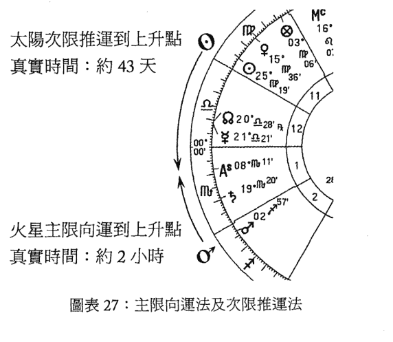

### 图表 27：主限向运法及次限推运法

上图部分地说明了区别。如果我们用次限推运法推进太阳（处女座25°）到上升点（天蝎座8°）将需要43天，这仅仅是因为太阳实际要花这么长时间来移动。由于推运一天的实际运动等同于人生的一年，我们可以期待在四十三岁左右发生太阳一上升类型的事件。不过，我们还可以通过主限向运法移动火星（射手座2°）到地平线或上升点：这是根据天空的每日转动速率计算的。在这个例子中，出生后需要大约二小时的真实转动使其星体接触到地平线或上升点。而这样做所需要的天球赤道上的实际距离会被转化为人生的年数。

## 征象星和允星

在主限向运法中，一个点被推进到另一个点：保持静止的那个点（例如上面提到的上升点）被认为是被动的，而通过主运动移动的那个点是主动的（例如火星）。从中世纪时期开始它们就被称作征象星和允星，但不是每一位作者都以同样的方式应用这两个词。我们会遵循马丁·甘斯登的理解来看古代作者如何理解这些概念。

征象星是星盘中的一颗行星或一个点，指示生命中的某个方面：它是一个保持静止的被动元素。托勒密²和一些其他作者使用五个征象星，有时也被称为“释放的”（或“生命主的〔hylegial〕”）点：上升点、天顶、太阳、月亮和幸运点。他们相信人生的所有重要事件都可以使用主限向运法预测。但是，有些占星师对此持异议：里贾尔（al-Rijāl）、莫林和里利使用全部七颗古典行星作为征象星³。

另一方面，允星是主动的元素，以主限运动被带到征象星，定义了征象星说明的事件的性质。所有七颗行星和它们的相位都是传统的允星。有些占星师把恒星也包含进来。

## 要点

因为天文学现实和理论上看样子是不同的，所以在阅读向运的书籍时会有很多困惑。理论上，人们常会想象一个征象星，比如上升点，正向移动，或逆时针移动通过黄道带上的星座，与允星（例如火星的星体）相遇。所以在图示中我们想象月亮（征象星）在黄道带上被向前推进到四分火星（允星）的位置，即处女座 2° 57′。但是实际上相反的：是火星（允星）以四分相通过周日运动或主限运动被顺时针推进至征象星（月亮）。

♂（允星）以四分相推进至
♀（征象星）

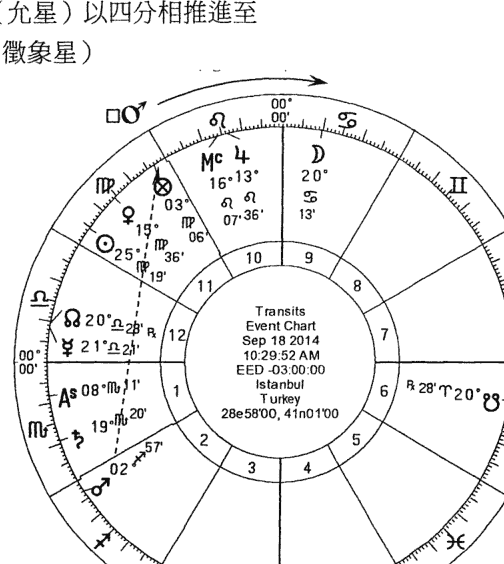

### 图表 28：火星（允星）以四分相推进至月亮（征象星）

## 正向运动和反向运动

如甘斯登所指出的，托勒密在预测寿命时区分了两种类型的向运法⁴。第一种类型就是我们上面所描述的（尽管在托勒密的著作中指示寿命的行星仅在星盘东半球出现）：通过主限运动从东向西将允星朝向静止的征象星（指示寿命的行星）推进。但是因为理论上想象征象星逆时针移动，经过各个星座朝向允星更容易，托勒密称其为“朝向后一个星座的运动”，这被认为是“正”向运动。

在第二种类型中，托勒密的寿命行星在星盘的西半球，它不是保持静止的，而是用周日运动推进征象星向允星运动。这次，托勒密称其为“朝向前一个星座的运动”，这被认为是“反”向。尽管如此，这仍然包含主限运动或周日运动，而不是在黄道带上的移动。

十九世纪之后，反向推进的含义改变了许多，人们可以通过阅读甘斯登的书籍来理解发生了哪些变化。彼时，逆行行星和特殊点也以一种特殊的方式被推进，有时是被没有完全理解这项技巧的人推进的。

## 在实际空间和在黄道带上的向运

主限向运法的一个主要区分是 in mundo（“在实际空间”。译注：秦瑞生老师建议此原文直译为“世俗”，会让读者不知所以然，因此采用实际空间较符合其意义。）和 in zodiaco（“在黄道带上”）的向运，以及与它们相关的相位。

在黄道带上的向运只有在黄道本身上的位置上，不含黄纬。例如，由于太阳的轨迹定义了黄道，它的向运总是在黄道带上。在上图中，火星星体在黄道带上的向运，就是在黄道或黄道带本身，而不是实际的火星星体推进到射手座 2°57′：因为它可能在纬度上偏向黄道南边或北边。

在实际空间的向运则要考虑行星纬度。如果火星的纬度在黄道以北或以南，它的位置会稍微偏离黄道本身射手座 2°57′的位置：所以，它的星体在实际空间的向运会导致稍微不同的向运弧。有时这会在同样的在黄道带上和在实际空间的向运之间产生几年的差异。

因为相位是在黄道带上被测量的，因此像火星这样以四分相的允星可以在黄道带上被推进（如上图）。但是它也可以在实际空间上或在天球赤道上被测量。由于黄道的斜交，赤道上（在实际空间上的）的四分相可以对应到一个在黄道带上的度数，这个度数更接近黄道上的三分相，反之亦然。

在这本书中，我们完全不会推进任何相位，仅使用在实际空间上的位置：这是因为当大多数电脑软件列出行星位置时（例如赤经和赤纬），都自动应用在实际空间的位置，这会使我们的工作变得简单。若想获得更多关于主限向运法的信息和为数众多的公式，请参见甘斯登的文章（二〇〇九年）。

## 为什么要推进特定的点？

在中世纪传统中，以下意义和这些位置是对应的⁵：

-   上升：健康与身体状况。
-   太阳：名声与声誉。
-   月亮：身体与精神状况，以及配偶。
-   幸运点：财富与收入。
-   天顶：当事人的职业。
-   出生前的朔望月⁶：如果当事人出生在渐盈的月相下，事件会在中年之前发生；如果是渐亏的月相，事件会在中年之后发生。

## 三种向运

以下我会解释某些特殊条件，但是根据征象星和允星的类型，通常可以有三种方式来计算向运：

-   如果两个尖轴点之一是天顶或天底，则完全以赤经（RA）测量弧度：即征象星的赤经和允星的赤经之间的差。这是最容易计算的。
-   如果两个尖轴点之一是上升点或下降点的度数，那么在上升点的情况中完全以斜赤经上升度数（OA）测量弧度，而在下降点的情况中完全以斜赤经下降度数（OD）测量弧度。两个尖轴点的OA/OD之间的差即是弧度。这是第二容易计算的。
-   在所有其他情况中，我们必须使用一种根据以下描述，以比率为基础调整的 OA 或 OD。这有一点繁复，但是仍然不难。

## 术语及符号

许多人在计算主限向运法时被吓到了，这可能看起来相当复杂。但是使用直接由电脑软件给出的在实际空间上的位置，我们所要做的大部分工作都是加加减减，只有最后需要解一个公式。以下是一些我们在公式中将会用到的缩写：

| 符号 | 描述 |
|------|------|
| Φ | 出生纬度 |
| λ | 黄道经度 |
| β | 黄道纬度 |
| RA | 赤经。“RA 天顶”是天顶的赤经，“RA 天底”是天底的赤经。 |
| OA/OD | 斜赤经上升（用于星盘的东半边）和斜赤经下降（用于星盘的西半边）。 |
| δ | 尖轴点的赤纬，表示为一个正数（北边）或负数（南边）。 |

时间对应值：用于转化向运弧度为时间的对应值。托勒密的对应值是一个常用值：弧的 1° = 1 年，弧的 5′ = 1 个月，弧的 1′ = 6 天。其他对应值包括纳伊博德的版本，为雷格蒙坦纳斯向运法的追随者所使用。

## 計算案例

如上文所述，根據征象星和允星是什麼，向運的方法有三種。下面我們將按順序說明：

- 一、如果天頂/天底是其中一尖軸點：僅使用 RA

在下面的案例星盤中，用反向的方式推進天頂到木星⁷。由於天頂是其中一個位置，因此這個弧度就是它們之間 RA 的差（或稱為 MD，天頂距離）：

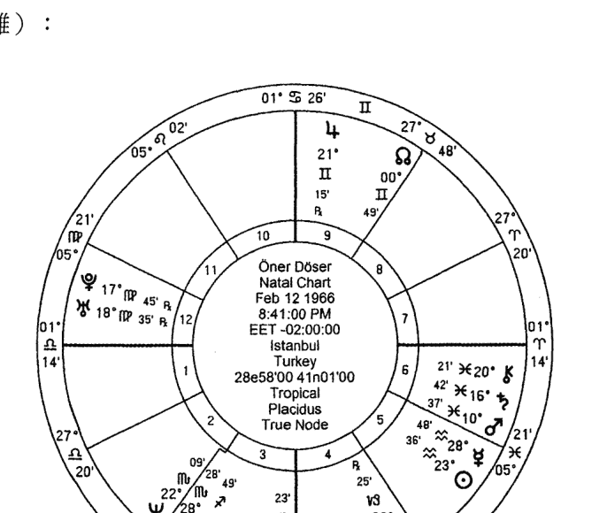

> 7 戴克註：在嚴格的古典應用中這通常是不被允許的，因為天頂是一個固定的大圈：所以它不能被周日運動移動到木星。在這個例子中，多塞實際上是在推進天頂的度數。我們還可以將此看為反向推進木星到天頂。無論哪種方式都只需要兩個位置的 RA。

|          | 天頂      | 木星      |
|----------|-----------|-----------|
| RA（來自電腦）⁸ | 91° 34′ 35″ | 80° 30′ 11″ |

推進的弧度 = RA 天頂（91° 34′ 35″） - RA 木星（80° 30′ 11″）
= 11° 04′ 24″

使用托勒密的時間對應值，這個弧度（大約）是11年1個月。由於我出生在一九六六年二月十二日，向運法來到了一九七七年三月。在一九七七年三月，我參加了升中學的考試。我在參加的所有考試中都很成功，那時開始進入最好的其中一間學校就讀。

要點：電腦軟件通常僅僅給出天頂的RA（RA天頂），而沒有天底的RA（RA天底）。如果我們推進某些包含天底的情況，應當使用RA天底。RA天底總是與RA天頂相差180°，所以你只需簡單的從RA天頂增加或減去180°就可找到RA天底。如果這個對應值大於或小於360°，則在此加上或減去360°，得到一個0°到360°之間的數值。

| 行星 | 名稱 | 星座 | 宮位 | 赤經 | 赤緯 |
|------|------|------|------|------|------|
| ♀ | 月亮 | ♏ | 3 | 236° 16′ | -19° 37′ |
| ☉ | 太陽 | ♒ | 5 | 325° 55′ | -13° 39′ |
| ☿ | 水星 | ♒ | 5 | 331° 35′ | -13° 33′ |
| ♀ | 金星 | ♑ | 4 | 298° 57′ | -13° 01′ |
| ♂ | 火星 | ♓ | 6 | 342° 28′ | -08° 26′ |
| ♃ | 木星 | ♊ | 9 | 080° 30′ | +22° 55′ |
| ♄ | 土星 | ♓ | 6 | 348° 30′ | -06° 58′ |
| ♅ | 天王星 | ♍ | 12 | 169° 49′ | +05° 15′ |
| ♆ | 海王星 | ♏ | 2 | 230° 12′ | -16° 36′ |
| ♇ | 冥王星 | ♍ | 12 | 174° 50′ | +18° 32′ |
| ⚳ | 凱龍星 | ♓ | 6 | 349° 34′ | -00° 07′ |
| ♁ | 北交點 | ♊ | 9 | 058° 40′ | +20° 19′ |
| ♃ | 南交點 | ♐ | 3 | 238° 40′ | -20° 19′ |
| ASC | 上升 | ♎ | 1 | 181° 08′ | -00° 29′ |
| MC | 天頂 | ♋ | 10 | 091° 34′ | +23° 26′ |
| ⊗ | 幸運點 | ♐ | 3 | 266° 03′ | -23° 36′ |
| DSC | 下降 | ♈ | 7 | 001° 08′ | +00° 29′ |
| IC | 天底 | ♑ | 4 | 271° 34′ | -23° 26′ |

圖表 29：奧內爾·多塞的赤經及赤緯度數表

## 二、如果上升／下降是其中一尖軸點：僅用 OA/OD

現在，讓我們反向推進下降點到火星的星體。因為下降點是其中一個尖軸點，其中的弧度只需簡單看 OD 下降和火星的 OD 之間的差距。

上升點的 OA 總是 RA 天頂 + 90°，下降點的 OD 總是 RA 天頂 - 90°。

由於軟體已經給出了 RA 天頂，因此很容易計算。讓我們首先找到 OD 下降：

```
OD 下降 = RA 天頂 - 90°
= 91° 34' 35" - 90°
= 1° 34' 35"
```

如果結果大於或小於 360°，則加上或減去 360°，得到一個 0° 到 360° 之間的數值。

現在我們來找火星的 OD，這裡有一點複雜。首先需要從軟體中獲得一些火星的數據，然後做兩步計算：

| 项目 | 火星 |
|------|------|
| RA (來自電腦) | 342° 28' 56" |
| δ (來自電腦) | - 08° 26' 36" |

為了用這些資訊來找到火星的 OD，我們必須使用下面這個公式找到它的赤經差 (AD)：

```
AD = arcsin ( tan δ * tan Φ )
AD 火星 = arcsin ( tan δ * tan Φ )
        = arcsin ( (-.14844004) * (.869797567) )
        = arcsin ( -.129112785 )
        = - 7.418326626 ( 或 - 7° 25' 06" )
```

要點：保留 AD 的正負極性，下一步需要使用。

現在應當根據需要的是 OA 或 OD，以及出生地在哪裡，來加上或減去 AD：

| | OA | OD |
|---|---|---|
| 北半球 | RA − AD | RA + AD |
| 南半球 | RA + AD | RA − AD |

此出生地是北半球，我們需要火星的 OD：

OD 火星 = RA 火星 + AD 火星
= 342° 28′ 56″ + (− 7° 25′ 06″)
= **335° 03′ 50″**

向運的弧度是兩個 OD 之間的差：
**1° 34′ 35″ (或 361° 34′ 35″) − 335° 03′ 51″ = 26° 30′ 45″**。通過托勒密的對應值換算出二十六年六個月（約四天）。

根據傳統的規則，當第七宮主星推進到第七宮宮始點時有結婚的可能。在此，火星（第七宮主星）反向推進到了第七宮宮始點。如果在我的出生日期上加上二十六年六個月，大致是在一九九二年八月。我是在一九九二年五月七日結婚的。我們不期望時間絕對精確，所以幾個月的差別很正常。

## 三、所有其他度數的推運：使用混合或調整的度數

在前面的例子中，向運都包括一個尖軸點度數：上升 / 下降或天頂 / 天底。我們找到每個尖軸點的單一值（RA，或者是 OA/OD），它們之間的差就是弧度。但是對於所有其他向運，我們需要在最終公式中加入一些其他的數值。

在這個例子中，太陽作為允星（移動的點），推進到作為征象星的金星（固定的點）。下表顯示了所有我們需要的數值。普通印刷體顯示的數值來自軟體，粗體顯示的數值是我們需要計算的——從尖軸的赤道位置開始，即如上文所述，從 RA 天頂加上或減去 90° 或 180°：

- RA 天頂：91° 34′ 35″
- RA 天底：271° 34′ 35″
- OA 上升：181° 34′ 35″
- OD 下降：1° 34′ 35″

|    | 金星 | 太陽 |
|----|------|------|
|    | 28° 25′ 20″ ♊ | 23° 36′ 22″ ♒ |
| λ  | 298° 25′ 20″ | 323° 36′ 22″ |
| β  | 7° 36′ 15″ N | 0° N |
| RA | 298° 57′ 47″ | 325° 55′ 54″ |
| δ  | -13° 01′ 40″ | -13° 39′ 16″ |
| MD | 27° 23′ 12″ | 54° 21′ 19″ |
| AD | -11° 36′ 37″ | -12° 11′ 55″ |
| OD | 287° 21′ 10″ | 313° 43′ 59″ |
| HD | 74° 13′ 25″ | 47° 50′ 36″ |
| SA | 101° 36′ 37″ | 102° 11′ 55″ |

### 圖表 30：向運的太陽推進到金星的數值

第一步：找到兩顆行星的 MD 或天頂距離。即它們與 RA 或天底（其中較近者）之間 RA 的差。由於與天底更接近，我們使用 RA 天底：

```
MD 金星 = RA 金星 (298° 57’ 47”) – RA 天底 (271° 34’ 35”)
    = (27° 23’ 12”)
MD 太陽 = RA 太陽 (325° 55’ 54”) – RA 天底 (271° 34’ 35”)
    = (54° 21’ 19”)
```

第二步：找到每顆行星的 OD⁹。如上面第二個例子所示，首先需要每顆行星的赤經上升差：

```
AD = arcsin (tan δ * tan Φ)
```

```
AD 金星 = arcsin ( ( – .231378902 ) * ( .869797567 ) )
    = arcsin ( – .201252806 )
    = – 11.61022928 或 – 11° 36’ 37”
```

```
AD 太陽 = arcsin ( ( – .242931542 ) * ( .869797567 ) )
    = arcsin ( – .211301264 )
    = – 12.19862058 或 – 12° 11’ 55”
```

然後，使用在第二個例子中用過的 OD 的規則和出生地點：

|      | OA     | OD     |
|------|--------|--------|
| 北半球 | RA - AD | RA + AD |
| 南半球 | RA + AD | RA - AD |

> 9 由於金星和太陽在星盤的西半邊，我們使用 OD，而不是 OA。

```
OD 金星 = 298° 57′ 47″ + (－11° 36′ 37″) = 287° 21′ 10″
```

```
OD 太陽 = 325° 55′ 54″ + (－12° 11′ 55″) = 313° 43′ 59″
```

第三步：找到 HD 或稱地平距離（Horizontal distance）。這是每顆行星與下降點的 OD 的差。（如果它們在星盤東半側，會使用它們的 OA 和上升點的 OA）。注意必須在這個特定的 OD 下降上加上 360°，以便能有效地從中減掉其他行星的 OD。

```
HD 金星 = OD 下降 (361° 34′ 35″) - OD 金星 (287° 21′ 10″)
= 74° 13′ 25″
```

```
HD 太陽 = OD 下降 (361° 34′ 35″) - OD 太陽 (313° 43′ 59″)
= 47° 50′ 36″
```

第四步：找到行星的半弧（SA），即地平線和天頂之間弧度的總數——在此例子中，是在下降點和天底之間，即行星的 MD + HD 的總和。

```
SA 金星 = MD 金星 (27° 23′ 12″) + HD 金星 (74° 13′ 25″)
= 101° 36′ 37″
```

```
SA 太陽 = MD 太陽 (54° 21′ 19″) + HD 太陽 (47° 50′ 36″)
= 102° 11′ 55″
```

第五步：計算弧度。現在使用每顆行星的 MD 和 SA，並做如下計算。記住金星是固定點，征象星（Sig）；太陽是移動點，允星（Prom）。

```
弧度 = 允星 MD - [ (征象星 MD/ 征象星 SA) * 允星 SA ]
弧度 = 54° 21′ 19″ – [ (27° 23′ 12″ / 101° 36′ 37″) *102° 11′ 55″ ]
= 54° 21′ 19″ – [ (.26952654) *102° 11′ 55″ ]
= 54° 21′ 19″ – [ 27° 32′ 43″ ]
= 26° 48′ 36″，或 26 年 9 個月約 18 天
```

這個日子大約在一九九二年的十一月到十二月間。我在一九九二年五月結婚。因為太陽是第七宮的勝利星，並掌管第十一宮，因此可以預期到這類事件。金星的性質與婚姻有關，太陽作為第七宮（婚姻）的勝利星，在第五宮（愉快、孩子、好運）內。我的未婚妻從一九八八年開始就是我的朋友。太陽在這裡連接結了第七宮和第十一宮，我是在自助餐廳（與第十一宮有關的地方）透過我妻子的朋友們遇見她的。

儘管在實際的婚禮日和太陽向運到金星的日期之間有六個月的差距，這並不意味著向運與婚姻無關。在主限向運法中，我們不會期待看到向運與事件之間逐日的對應。特別是這樣一顆行星被推進到另一顆行星（而不是一個尖軸），在主限向運法中兩顆行星之間的相位不能被用於精確地找到事件的時機——例如，它們不能用於生時校正。但是，它們與事件的象徵意義密切相關，顯示出當事人的生命中正在經歷一個相關類型的時期。

## 解釋主限向運法

首先，在應用主限向運法或其他技巧之前都應當透徹理解本命盤：因為預測回答了某事「何時」會發生，但是本命星盤本身說的是這會是「什麼事情」。本命盤告訴我們一生中所有可能的經驗，但是正面和負面的經驗看起來都混合在其中。向運法和其他預測技巧將這些經驗放在時間順序中，但還必須理解它們會是哪種類型的事件。如果在本命盤中沒有承諾，任何事都不能被實現或被預測。

針對不同的出生星盤，即使相似的向運也會給我們不同的結果，但仍能在包含相同行星的向運中看見類似性，因為每顆行星都是根據它的性質行動的。例如，火星意味著熱、戰爭和暴力；金星意味著愛、美和樂趣。所以，不同星盤中的兩顆火星，向運時仍然會有火星的性質，但是根據每張星盤的不同樣貌，細節可能差別很大。儘管主要改變的事情是每顆行星與宮位和星座的關係，但是行星的尊貴或反尊貴狀態也會影響結果的性質，它們與其他行星的相位也會影響這些宮位關係和性質。

根據左拉的說法¹⁰，主限向運法中的一顆行星作為征象星和對比作為允星時，其行為是不同的。允星（及其在黃道帶中的狀況和守護關係）代表了外部的狀況和事件的特定性質，而征象星是一些主題的普遍指徵。所以在解讀一張星盤時，我們必須首先理解允星承諾了什麼：承諾是專門對應這張星盤的，並且影響一般征象星。例如，當一顆行星被推進到太陽（名譽的一般征象星）時可能帶來名譽，但其特定的類型取決於允星的性質和位置。但是，當把太陽作為允星時，就可能特別涉及與父親相關的狀況，並對某些其他行星的一般含義帶來影響。通過使用這種方法，當事人所經歷的事件可以得到出色的評估。

值得注意的是：主限向運法可以應用在生時校正中，但是記住事件並不一定發生在預期的那一天和那個小時裡。如我們所見，它可能發生在向運弧所指出的時間附近幾個月內。此外，由於許多技巧在相同的時間段可能都很活躍（例如主限向運法、界行向運法、法達運程法和小限法），主限向運法可能並不適合於理解所有可能的事件。所以，逐日的事件不應使用向運法。

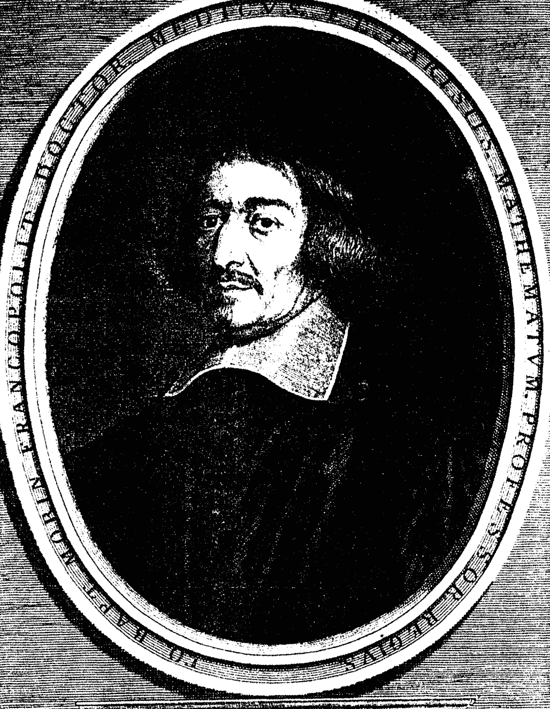

## JEAN BAPTISTE MORIN FRANÇAIS NATIF DE BLOIS MED. DOCT. PROFESSEUR A PARIS

> Quis, qualis, quantus que fuit Morinus habetur Ex scriptis. coeli themate et effigie.

Illustri ac nobiliss. D. D. Guill. Tronson Regi ab inter. Cons. & Secret. hanc effigiem dat amicus in suum mortaliumq. familiaremn, pignus fidelissimum

JEAN-BAPTISTE MORIN(MORINUS) : 尚·巴普提斯特·莫林


## 第十章 蝕相

在世運占星和本命占星中都會觀測日蝕和月蝕，用於每年的預測。日蝕僅會在新月，並且月亮經過太陽與地球之間，阻擋太陽到地球的光線時發生。月蝕僅會在滿月，並且地球來到太陽與月亮之間，因而擋住太陽到月亮的光線時發生。在這兩種情況中，以上這三顆星體都排列為一條直線。

## 蝕相的基本原理

要理解蝕相的機制，便將太陽當作一個光源，月亮是反射布幕，而地球是一個不透光的物體，有時站在布幕後面，有時在前面。當月亮（布幕）在太陽和地球之間時，它阻止太陽的光線到達地球，所以地球被置於黑暗中：這就是日蝕。但是當地球在太陽和月亮之間時，地球的物理球體在布幕（月亮）上投射出一片陰影，從而阻擋了太陽的光線到達這裡：這就是月蝕¹。

在每次新月和滿月期間，這三個天體會排列在同一個黃道經度和垂直平面上，但不在同一個水平平面上：只有當它們都在同一個垂直及水平平面上時才會發生蝕相，因為只有這時陰影才會恰好落在正確的地方。因此，不是每一次新月都是日蝕，也不是每一次滿月都是月蝕。

再說一次，日蝕僅會在新月時發生，而月蝕僅會在滿月時發生。現在我們每年至少有四次蝕相：兩次日蝕和兩次月蝕。有些年份裡可能還有更多：比如二〇一一年有四次日蝕和兩次月蝕；二〇一三年有三次月蝕和兩次日蝕。但是，每一年的蝕相數量是有限的，並且其中許多不是全蝕。如果是日蝕，月亮在一年當中會圍繞黃道走十二次，但它不會在每次都行經太陽的中心，因為它的軌道平面與黃道之間有 5° 的傾斜角（即它在黃道上的緯度）。因而，一年當中會有至少兩次，最多五次蝕相。其中最多兩次蝕相會是全蝕，在占星學上這是需要觀察的最重要的狀況。

> > 1 戴克註：在其他時候，月亮會反射太陽的光，所以是可見的（它的「反射」角度扮演了布幕這個角色）。

## 月蝕

如前所述，在月蝕期間，地球球體的陰影投射到了月球的球體上。由於地球比太陽小，它會以一種圓錐體的型式送出陰影：即“陰影圓錐”。由於光以直線傳播，它們根據地球的尺寸形成了另一道陰影。當月球到達陰影所落的空間區域時，月蝕就發生了。

但是月亮並不總是會到達陰影所落的平面上。當月亮圍繞地球轉動時，它會接近一個交點，而滿月發生在交點附近的12°到24°之間。月亮越接近交點，蝕相就越大。如果滿月發生在交點附近12° 15′以內，就會形成偏蝕：例如，在交點附近9° 30′以內形成的會是一個月偏蝕，但是在3° 45′到6° 00′之間，就會是月偏蝕加上月全蝕。

月蝕強調情感主題。這些週期適合照顧情緒，完成未完成的項目，以及將不必要的事物拋在身後。

古人相信月蝕是不吉的：它們會喚起不理性的反應。由於月亮代表家庭、房子和情感問題，因此與日蝕相比，月蝕觸發的是更內部的改變。但是，在社交和政治領域也可以感受到它們的影響。月蝕可能帶來某些私生活中的不安全感。當事人應當避免做出重要的決定，因為此時可能很難保持情緒平衡。當事人可能不會表現出活躍和外向，反而傾向於獨處、觀察自己的內在動力。由於他可能發現對此有一種複雜的反應，甚至來自於他所愛的人，他可能很容易感到灰心喪氣。

## 日蚀

交点是月亮的轨道穿过黄道形成的点。如果新月出现在交点附近至少 18° 31′，就会发生日偏蚀。在 0° 到 9° 55′ 之间，则是日全蚀。如果距离在 9° 55′ 和 11° 15′ 之间，会既包括偏蚀又有全蚀。

日蚀对于开启新的冒险和保持快速的发展很有用。这是一个确认新目标，抛弃旧有模式的有益时期。日蚀具有非常强大的影响力，因为它们发生在接近月亮的位置。由于此时两个发光体会在同一个星座，因而高度强调了这个星座的特性。

## 蚀相的影响

根据古代占星师的说法，蚀相是负面事件，因为它们导致悲剧性的状况，某些现有的事物会终结。蚀相带来压力和突然的问题。但是，现代占星师倾向于把蚀相看作是一次快速改变和发展的机会。依照现代占星师所说，蚀相给我们带来做出想要的改变所需要的能量。它们帮助我们重新规划生活，即使它们会同时加速负面和正面后果的发生。

当事人应当牢记每件事情都有原因，即使表面看来相当复杂、压力重重。蚀相的目的是将更好的事物带到我们的生活中。没有改变，就不会有进步。蚀相将我们聚焦于放弃某些事情，或与以往不同的行事风格，这可能很痛苦，但是对成长来说是必要的。通过觉知蚀相的影响，可以认识到更好的事物会来到我们的生活中，可以降低任何可能的危机的影响力。

蚀相在发生之前几个月开始显化它们的影响，并在发生后几个月还被持续感觉到。根据普遍的观点，月蚀在之后六个月都有效，而日蚀的效果会长达一年。但是根据蚀相持续的长度，一些占星师声称其影响会持续相应的长度。例如，如果一次月蚀持续了四个小时，则它的影响有四个月。同样，如果一次日蚀持续了两小时，那么它的影响在此后两年中都会被感觉到。

重要的蚀相在天空中留下一种影响的「轨迹」：未来的过运和推运会触发这个蚀相的影响。一些占星师说这种蚀相的影响主要在触发之后才能被感觉到。例如，如果一次蚀相落在某人位于双子座 15° 的本命太阳上，（比如）当火星过运到双子座 15° 时，或推运的月亮接近这个度数或其对分度数时，会更强烈地感觉到蚀相的影响。

每颗行星都会依照其自然征象来影响这个过程：
- 太阳：领导力，权威，权力斗争。
- 水星：沟通，重要的谈话，教育，短途旅行。
- 金星：和平，爱，外交。
- 火星：竞争，冲突和斗争，巨大的压力，战争。
- 木星：信仰，道德和伦理价值，法律议题，长途旅行。
- 土星：批评，限制，责任，延迟。
- 天王星：突然和意外的改变，意外事情，起伏。
- 海王星：失望，灵性议题，想象能力。
- 冥王星：权力斗争，领袖魅力，转化危机，重构。

蚀相的影响会根据它们发生的宫位展现出来。此外，蚀相所处的轴线倾向于在本命星盘上向后移动。例如，蚀相发生在第二宫－第八宫轴线上，则下一次蚀相会发生在第一宫－第七宫，然后是第十二宫－第六宫。

## 沙罗周期（Saros Cycles）

到公元前 747 年，巴比伦人已经可以预测何时会发生蚀相。到公元前四世纪，他们确认了蚀相是以序列发生的。由于一部中世纪希腊百科全书将其称为紹达（Souda）或苏达（Suda），日蚀的序列后来就被称作「沙罗」序列或周期：每次日蚀都属于一个每十八年又十一天重复其重要特征的特定的蚀相周期。巴比伦人还发现月蚀总是在日蚀之前两周或之后两周发生。

由于这些序列周而复始地在星盘上运动，当事人每十八年会经历一次类似的蚀相，每次与前一次之间的距离大约是 10°，并且经常是在同样的星座和宫位。如果这些蚀相合相本命行星，那当事人可能会有与十八年前类似的体验。

## 总结

每年会发生至少两次月蚀和两次日蚀，但是有些年份我们会经历更多（尽管全蚀才是最重要的）。任何一次蚀相都不会与另一次完全相同，虽然它们属于有着特定周期的同一个蚀相家族。同一个特定沙罗周期中蚀相之间的时间是十八年又十一天。

占星学上，日蚀和月蚀的差别在于日蚀有更多的外在影响，更倾向于创造事件，让我们的生活更有能量，而月蚀触发内在和情绪的改变。通常蚀相会把光投射到我们生活的阴暗面上。以前隐藏的事物变得明显了，我们曾经视为次要或忽略的事情现在必须要改变。蚀相就像地震：它们摇醒我们，告诉我们应当清理、终结和毁掉什么。一些蚀相可能给当事人的生活带来永久的影响。尽管张力会持续几周，但影响会延续更长时间。

对于诠释它们时所使用的相位和容许度，占星师们有不同的观点。一些占星师使用蚀相与本命行星形成的所有相位，而另一些主要使用合相和对分相，四分相则是可选的（我自己将四分相视为有效）。一些占星师声称所用的容许度应当为对合相 2.5°，对分相 2°，四分相 1°；另一些人则认为容许度可以是 5°。我本人认同 3° 是理想的容许度。

## 蚀相的重点解释性问题

- 1. 蚀相发生在哪个宫位？
- 2. 蚀相是否接近上升点、天顶，或任何本命行星，容许度在 5° 以内？
- 3. 蚀相是否影响任何相位型态？
- 4. 蚀相是否连结任何过运行星？
- 5. 蚀相所在的星座主星是否与任意过运行星有联系？或者，这个星座主星和过运行星是否连结本命盘、推运盘，或太阳回归盘中的任何其他行星？
- 6. 蚀相是否与任何恒星有相位？
- 7. 十八年前发生的事件是否对当前的日蚀有任何提示？

通常来说，发生在启动星座的蚀相会更快速的改变事件的进程，大约两周即可显现。在固定星座的蚀相带来缓慢但长久的影响。发生在变动星座的蚀相影响较小。它们仅给我们的日常事务带来一些调整和改变。

最后，记住蚀相的主题与（1）和蚀相成相位的行星的性质，（2）蚀相发生的宫位，（3）成相位的行星主管的宫位有关。以下的通用信息会帮助你在预测中更具体地应用这些原则。

## 蚀相与行星的连结

与太阳连结：蚀相与任何发光体的连结都是重要的。当蚀相连结本命太阳时，它自然会在太阳上反射其影响。所以，事件会聚焦于父亲，或其他代表权威的人物，对我们重要的人，我们的个性，必须展现自己的情况，以及认可和领导力问题。

与月亮连结：当蚀相与本命月亮连结时，当事人可能经历与女性人物，例如母亲或妻子有关的事件、健康、情感生活、潜意识、家庭生活、饮食习惯（和其他习惯）、过去的因素，以及改变与家和家庭问题有关的状况。

与水星连结：与本命水星连结时，当事人可能进行短途旅行，在与他的小圈子（例如兄弟姐妹，表亲或邻居）、年轻人、教育和心智活动相关的事情中经历一些突然而快速的改变。这个连结可能影响心智面向，以及行为和沟通方式。

与金星连结：当蚀相与本命金星连结时，当事人可能在关系、价值、带来愉悦的事物、以及获得乐趣的方式和服饰打扮等事项上经历重要的改变。可能还会经历维持与他人的和谐、性行为、与年轻女性之间关系的改变。

与火星连结：当蚀相与本命火星连结时，当事人可能在行动的方式和引发行动的事情上经历重要的改变。他可能需要采取主动，做出快速而强大的决策；可能要接受挑战，并需要大胆行事，或者被推向直接且考虑不周的行为。可能还会容易遭受意外、争吵和竞争，亦需要在此期间付出大量的体力。

与木星连结：

与本命木星的连结指出与宗教或灵性问题相关的突然与意外的发展，还可能出国旅行。强调对扩张和成长的渴望。新的机会可能到来。另一方面，可能难以小心谨慎：当事人会夸大，并过度期待。当事人的人生视野可能扩展，可以保持灵性和金融事务的成长。当事人可能过度理想主义。

与土星连结：

在与本命土星的连结中，当事人可能经历新的责任和意外的困难，或经济危机。由于土星与死亡相关，可能会发生突然的死亡；亦可能面对使人焦虑的状况，所以需要小心。当事人可能比以往工作更努力，却挣得更少。

与天王星连结：

与本命天王星的连结意味着突然的分离、意外、或改变。当事人表达其自由和个性的需求增加了。天王星的主题，比如科技、占星学和替代疗法可能有所发展，还可能面对奇怪而始料不及的态度。天王星所在的宫位很重要：如果它与四尖轴接近，这些影响会更突出。

与海王星连结：

当蚀相连结本命海王星时，当事人可能经历与敏感、创造性和艺术问题相关的情况。他可能脱离现实，发现自己处于幻象之中。这可能带来失望、分离和贬抑，或在奉献中迷失自我。当事人还可能经历酗酒或滥用药物导致的问题。

与冥王星连结：当蚀相与本命冥王星连结时，当事人可能经历急剧且深刻的影响，需要重构他的生活。暴力、死亡、关系中的晦暗，以及深层的热情可能带来困难的体验。从正面角度看，这个相位可能带来来如有影响力的人物的支持和对成功的渴望，无论当下情况如何，甚至是不可能实现之事。

## 蚀相的宫位轴线

蚀相发生的本命宫位在预测中很重要。在日蚀期间，太阳和月亮在同一个星座内，所以它们在同一个宫位。在月蚀期间，太阳和月亮在相对的星座，它们构成了一条对宫的轴线。

第一宫－第七宫轴线：如果蚀相发生在这个轴线，当事人可能经历与关系，婚姻或合伙关系，强调当事人的个性，他本人或其伴侣的健康，或本人及其伴侣新的开始和新冒险相关的情况。这是一种互为因果或相互迁就的状态。

第二宫－第八宫轴线：这个蚀相可能带来获利或损失。当事人可能在个人或公共资源、储蓄，以及借贷关系上遭受限制或获得突然的机会。由于死亡的宫位是焦点之一，继承议题可能是财务影响的一部分。

第三宫－第九宫轴线：与教育、心智活动、兄弟姐妹、亲戚、旅行、想法、写作和出版活动、演讲、法律问题相关的事宜会被强调。

第四宫－第十宫轴线：与维系家庭和职业生活之间的平衡、住房、职业、与未来有关的至关重要的决定（及其中的一些起伏波动）有关的事宜会被强调。

第五宫-第十一宫轴线：与一个人获得乐趣的方式、社交生活、亲密好友和社交环境、孩子、爱与浪漫、希望与期待、依赖于从他人获得的支持有关的议题会被强调。

第六宫-第十二宫轴线：疾病、虚弱、生活不受控制和麻烦的一面，无法展现自我的领域，或加以努力却获得更少回报的方面，麻烦的状况，损失，以及强迫性的工作被强调。

## 实例：两次日蚀

为了说明这些重要的影响，让我们看一下发生在我人生中的两次重要蚀相以及它们的影响。

在我的本命盘中，两颗凶星火星和土星都在第六宫（疾病、虚弱和日常事务），合相凯龙星，还对分位于第十二宫（损失、不受控制的事件、医院）的天王星和冥王星。这意味着包含火星和土星的宫位相关的主题，以及这些行星所主管的主题会在我的生活中凸显，带来压力和困难。

Inner Chart
Öner Döser
Natal Chart
Feb 12 1966
8:41:00 PM
EET -02:00:00
Istanbul
Turkey
28e58'00 41n01'00
Geocentric
Tropical
Placidus
True Node

Outer Chart
Total Solar Eclipse
Eclipse Chart
Feb 26 1979
7:54:17 PM
BGT -03:00:00
Istanbul
Turkey
28e58'00 41n01'00
Geocentric
Tropical
Placidus
True Node

图表 31：奥内尔·多塞，一九七九年日蚀

火星在我的星盘中是第三宫、第七宫和第八宫的主星，它与兄弟姐妹、配偶和关系，以及死亡有关。由于土星是第四宫和第五宫的主星，与家庭、孩子、爱相关的问题也被强调了。火星是第四宫的旺主星，土星是第一宫和第二宫的旺主星。所以，火星和土星都是第四宫的主星，与家庭和父母问题相关。月亮作为母亲的自然征象星位于天蝎座，也被火星主管。这意味着在我的星盘中，火星和土星的位置与母亲和父亲密切相关。

检视发生在我人生中关键日期上的天体事件时，我惊讶地看到两次蚀相发生在双鱼座（火星和土星所在的位置），间隔十八年，均与我母亲和父亲的死亡相关。在上面的星盘中，你可以看到一九七九年二月二十六日的日蚀投射到我的星盘上。这次蚀相发生在双鱼座7°，非常接近火星（位于双鱼座10°）。日蚀之后两个月，我的母亲去世了。记住这颗火星是第四宫的主星之一，还是月亮的主星。

十八年之后，在一九九七年三月九日，我又一次经历了双鱼座的日蚀，这次蚀相发生在接近土星的位置（见图）。日蚀之后三个月，我的父亲去世了。在这里，记住土星是我第四宫的主星之一，同时也是我的本命太阳（父亲的一般象征星）的定位星。

这些例子说明间隔十八年发生的蚀相的重要性，可以帮助我们做出当事人人生中关键性事件的预测。当然，我们不是必须面对负面的结果。有些蚀相会带来出生、婚姻、职业或成功与获利，其他一些则可能带来死亡、分离、失败和损失。

图表 32：奥内尔·多塞，一九九七年日蚀

## 出生前的蚀相

出生前的蚀相发生在当事人仍然在母亲子宫中时，它尤为重要。蚀相所在的星座和宫位，以及任何接近蚀相度数的行星都很重要。出生前的日蚀显示出我们的天赋和需要学习的功课，我们与其他出生在这个组别中的人分享的社会使命。出生前的月蚀显示出来自过去世的影响带给我们的功课，以及我们在此生中需要平衡和修复的事物。

如果出生前的蚀相与本命行星有好的相位，那么我们可能轻松地达到目标，但是如果它们之间有困难相位，就可能面对挑战和困难。在合盘中，如果出生前的蚀相与本命行星或其他重要的敏感点形成相位，则可能说明伴侣关系是命定且带有业力的。

让我们再次通过我的星盘分析这个主题。我出生于一九六六年二月十二日。距离我的出生日期最近的日蚀是一九六五年十一月二十三日，月亮和太阳合相在射手座 0°2。现在，我必须分析这两个问题：
- 1) 蚀相所在的星座是什么？这个星座落在本命盘哪个宫位中？
- 2) 蚀相的度数是否与任何本命行星、月亮交点或敏感点（例如上升点或天顶）有连结？

在下面的星盘中，可以看到这次日蚀的时刻在我（未来的）本命盘中的天体位置的投影。

> 2 戴克註：注意這是一次「環（annular）」蝕，與全蝕類似，但看起來月亮比太陽稍小一點。

Inner Chart
Öner Döser
Natal Chart
Feb 12 1966
8:41:00 PM
EET -02:00:00
Istanbul
Turkey
28e58'00 41n01'00
Geocentric
Tropical
Placidus
True Node

Outer Chart
Annular Solar Eclipse
Eclipse Chart
Nov 23 1965
6:09:51 AM
EET -02:00:00
Istanbul
Turkey
28e58'00 41n01'00
Geocentric
Tropical
Placidus
True Node

图表 33：奥内尔·多塞，一九六五年日蚀

重申，出生前的蚀相发生在射手座。这指出射手座主题，例如教育、出版、宗教和信仰、哲学、对扩张和更大视野的热情、接触更多人和跨越远距离的积极性、乐观主义是我的精神基础的重要特征。蚀相发生在我的本命第三宫，意味着我必须把我的知识传播给尽可能多的人。由于蚀相也与我的本命南交点合相，它指出了我从过去世带来的智慧。

在下面的星盘中，你可以看到最近的出生前的蚀相，一九六五年十二月八日的月蚀在我的本命星盘上的投射^3。

图表 34：奥内尔・多塞，一九六五年月蚀

出生前的月蚀发生在双子座。这意味着我必须进行修复、或完成某些与沟通、分享信息相关的义务。由于蚀相发生在我本命星盘的第九宫，这些义务与第九宫的主题有关，例如宗教、哲学、占星学、教育等等。这次蚀相接近本命第九宫中的木星：这表示我的本命星盘中的木星

> 3 戴克註：這是一次半影（「appulse」或 penumbral）月蝕，其中月亮在通過半影區時被遮擋光線，但不是由本影本身形成的月蝕。

会帮助我。由于与第六宫的本命土星成四分相，我在这条路上会需要克服某些挑战和障碍。

总结来说：由于出生前的蚀相发生在射手座／双子座和第三宫--第九宫轴线，那些需要为我自己实现的，以及我为了实现成功而需要修复和完成的事情，均具有这些星座和宫位的性质。

VILLIAM LILLY：威廉·里利

## 第十一章 太阳及月亮回归法

回归盘是当一颗特定行星回到其出生位置的准确时刻计算出的星盘。所有行星都可以创建回归盘，但是在占星学中我们主要使用太阳及月亮回归法。太阳回归盘可当作一个年度出生星盘，用于预测年度事件的咨询。

太阳回归（SR）盘是以太阳回到它的出生位置时的准确时刻计算出来的：所以，本命盘和SR盘之间的共同参考点是太阳的度数（由于其他行星的度数通常与它们的出生位置不同）。在SR盘的帮助下，可以推算下一年的事件。

太阳回归盘也被称作年度盘，或用更传统的说法，是当事人的「周期盘」。SR的时刻可能出现在当事人生日的日期稍前或稍后一点。一些占星师主张即将到来的SR的效力开始于三个月以前，而另一些人则说效力于一个月以前开始，并且持续到这一年完成之后的一个月。

至于以何地绘制星盘，有些现代占星师将SR设置为当事人的出生地；许多其他人更偏好在SR的时间使用当事人实际所在的地点起盘——如果这是当事人的永久居住地，则可以理解此处可能会更有效。莫林和沃尔吉内（Volguine）将SR设置为当事人在那个时刻恰好所在的位置，但我更愿意使用当事人在这一年中居住时间最长的地方。并且，我遵从莫林和沃尔吉内的做法，即不会为了岁差调整太阳回归盘；未调整岁差的回归盘一样能达到很好的预测效果。

## 解读太阳回归盘的法则

在评估太阳回归盘时，需要考虑几个通用法则：

开始分析SR盘之前，需要先彻底地了解本命盘，看看它实际承诺哪些真正的可能性。如果本命盘或推运盘没有证据支持，就不应做出任何预测。另一方面，如果SR盘没有指出本命影响的内容是什么，也不被主限向运法和小限法支持，那这个SR盘就是无甚效力的，事件可能根本不会展现出来。但是如果 SR 盘的征象确实支持本命盘的承诺，它们就会以一种强烈的方式展现出来。

分析和描述本命盘后，可以单独描述 SR 盤本身，然后比对两张星盘：这就像是给两个不同的当事人做合盘一样。

首先，必须看一下 SR 盤中的上升位置：它落入哪个本命宫位（或者换一种说法，本命哪个宫位在 SR 的上升位置）？这个宫位的中心主题、主要议题和特征状况将对当事人在这一年中非常重要。例如，如果 SR 上升落入本命第二宫，财务议题和财产会凸显在当事人的这一年中。如果本命中好的宫位在 SR 盘处于上升位置，将承诺快乐的一年；但是如果一个本命中不好的宫位在 SR 盘中处于上升位置，就会保证不幸的一年。当然，还应当看这个宫位的本命守护星和在 SR 中相同宫位的守护星的状况。

> > 沃尔吉内说：「如果本命盘的第六宫、第七宫或第十二宫在回归盘的上升点，不幸就在不远的将来，如果这个宫位的主星在本命盘中备受折磨，甚至会有许多厄运。¹」

当本命上升亦在 SR 盤上升（5° 容许度以内），这会是有重要意义的一年，有极大的潜力实现本命的承诺。

如果 SR 盤的上升点在任何星座的 29°，就意味着当事人即将结束某些事情，或者正要关闭一扇门。这一点对上升主星的度数也有效，因为 SR 上升点即代表当事人。（实际上应当考虑任何在星座最后一度的行星，因为它会显示其掌管的主题将经历某些重要的改变或结束。）当一个星座的初度数在上升点时，意味着当事人即将开始某些事情。这一点对上升主星也有效。并且也应当考虑任何在星座初度数的行星。

¹ 沃尔吉内（Volguine）文献 15 页。

接著應該看的是 SR 的上升星座，因為上升星座永遠是任何特定星盤的起始點；在這裡，它顯示出在 SR 期間當事人周圍的氛圍。例如，如果處女座在上升點，則顯示出當事人對物質安全、可靠性、批判性分析、分門歸類，以及注意細節、完美主義和對有條理有組織的需求會被突出。也可能出現身體或情緒健康問題、神經緊張以及令人擔心的狀況。

然後，必須聚焦於上升星座的元素和性質。例如，如果上升是火象星座，根據當事人本命盤中火象性質的強烈程度，他在這一年中會更積極，傾向於帶著更強的動機、激情、熱情和願望行事。還應當看看行星的元素分布。如果當事人的本命盤強調火象元素，在 SR 盤中也是如此，那麼他會帶著更多自發性和衝動來做事，反應迅速，他可能會冒險，勇於謀事。

下一個步驟應當觀察 SR 盤尖軸的性質，看看它們是在啟動星座、固定星座還是變動星座。啟動星座在尖軸代表新的開始，固定星座代表建立某些已經開始的事物，變動星座指出改善和／或調整這些事。如果 SR 盤許多行星都在啟動星座，就更容易積極開啟。啟動星座的尖軸和許多行星在啟動星座顯示出這會是充滿各種事件的忙碌的一年，很可能有個人關注和衝動的願望。如果 SR 盤許多行星在固定星座，就更容易保護已經建立的條件和結構，可能會完成某些項目。固定星座的尖軸和許多行星在固定星座顯示出這會是穩定的一年，沒有太大的變化。如果 SR 盤許多行星在變動星座，則更容易順著當前狀況的步調走。變動星座的尖軸和許多行星在變動星座顯示出這會是有很多變動、不穩定、不斷交替選擇的一年，很難保持穩定和現有的狀況。所以當事人必須保持靈活性，避免過度沮喪，為未來的事件做好準備。所有這些都是一般性的論述，很大程度取決於 SR 盤的相位和本命配置。

接下來應當看看是否有任何行星位於 SR 盤的第一宮中，特別是接近上升點的位置。如果有，這顆行星會根據其性質和主管的宮位，顯示出何種事件和狀況能夠輕易地來到當事人身邊（無論好壞）。如果這是一顆凶星，將代表困難和嚴酷的情況；如果是吉星，則周圍會有輕鬆和良好的狀況，別人也會給予支持。這顆行星還顯示出什麼事物或誰依賴於當事人：如果它主管第七宮，那麼他的伴侶在這一年中會依賴於他。它還顯示出當事人活動的性質——如果是火星，此年當事人的行為會更加衝動、大膽、冒險。當然他也會更易於出現困難和事故。

之後，再看 SR 上升主星，以及它在 SR 中的位置和相位。上升主星顯示了當事人在這個 SR 期間的生活主題，它所在的宮位給出了主題的更多跡象，指出當事人的重點會放在哪裡以及這一年中他生活的氛圍。如果它在始宮或有力的宮位中（例如第十一宮或第五宮），特別是如果它在其位置上也尊貴，那麼當事人會有能力控制這一年的事件。這個主星的相位顯示出如此為之是容易抑或困難。所以，如果主星狀態良好，當事人會從這顆行星象徵的事情中獲益，可以說，如果它自己的定位星處於良好的狀態、強大，並處於自己的尊貴位置，則這一點會更加有力。（行星的定位星在判斷行星時扮演強而有力的角色，它顯示以其自然徵象開始的資源和行動的結果。）還應當查看 SR 的行星與 SR 上升點之間的相位，以及這些相位來自何處（成相位行星的性質及其在 SR 的宮位位置、主管的宮位）。

再來，觀察 SR 第十宮主星在 SR 中的位置：它所在的宮位指出當事人的行動和事業的結果，並會給出他這一年中的職業和專業方面的信息。如果它在一個強大的位置（從性質和力量兩方面來看），則當事人會有能力掌控他的職業或專業，並可以從行動中實現良好的結果。十宫主星的相位会显示出如何为之容易或困难。如果主星状态良好，当事人会从这颗行星象征的事物中，在他的职业或专业方面获益，实现他的目标。如果 SR 第十宫主星的定位星状况良好、强大，并处于自己的尊贵位置，那么这一点就会更有力。还应当查看与第十宫宫始点形成的相位。

在此之后，观察 SR 盘中其他的尖轴行星（如有的话），因为位于尖轴的行星特别重要。如果有许多行星位于尖轴，则最接近的最重要。根据沃尔吉内所说：「在太阳回归盘中最先穿过尖轴的行星将它自己的个性特征印刻在这一年的发展上。因此，凶星在 SR 的尖轴上特别危险。2」

最后，要理解这些 SR 盤中的行星、星座和宮位，借用南斯·麦卡洛（Nance McCullough）的说法，即他主张：「太阳回归盘的行星代表当事人的环境或情况——看其行动与否。星座代表对这些行动的态度。宫位则指示了行动的领域。3」

## 比对本命盘和太阳回归盘

绝不应当不看本命盘而单独解读 SR 盘。在用上面描述的方法分析 SR 盘之后，应当开始比对它与本命盘，看看本命行星都位于 SR 的哪些位置：即，对任何本命行星，都要看它们在本命盘中的位置，以及在 SR 盘中移动到了哪里。所有本命行星都带有其来源于本命盘的特征，并將之帶到 SR 盤中，所以為了理解行星在 SR 中的角色和影響，很重要的一點就是要瞭解它們在本命盤中的角色。例如，假設水星在本命第二宮，但是移動到了 SR 第七宮，即指出這一年中透過合夥關係獲得金錢——如果本命盤中有這種可能性。

本命盤和 SR 盤配置中行星相似性的增加，意味著極有可能可以實現對當事人承諾的事情。如果行星在本命盤和 SR 盤中顯示出相同的影響，在那個時期的主限向運中也顯示相同的事情，那麼它絕對會展現它的影響。

解讀當前的 SR 盤時，還應當檢查前後年份的星盤，因為必須要考慮已經發生，或者尚未顯現其影響的主限向運和過運。如果一個良好的 SR 盤接著另一個好的，這意味著事件在好的道路上發展；反之亦然。

應當注意本命和 SR 上升點的度數。如果 SR 的上升點度數接近本命盤的上升點，這一年會承諾實現本命盤中的重要意義。如果這兩個度數的位置相對，則兩張星盤彼此對抗運作，會帶來困難；如果它們呈現四分相，很可能出現困難的結果；如果是三分相，則會帶來正面的結果。（當然，不應僅根據一個條件做出判斷。）

本命盤中每個星座的影響，與它呈現在 SR 盤中的宮位有關。如果本命宮位（及其星座）在本命盤中顯示正面的事物，在本命盤和 SR 盤中都位於良好的位置，則這一年會在這個宮位的主題方面很幸運。

另外，還應當注意 SR 盤的上升星座，以及第一宮中行星與它們所在的黃道星座（如果不是在第一個星座）的性質，因為在第一宮中的這些行星的象徵事件會極大地影響這一年。其次，還應當考慮任何位於第十宮的行星。

應當評估 SR 上升度數和本命行星之間的相位。如果這個度數接近本命凶星的度數，或本命第八宮及其主星的度數，則會顯現危險和殘酷的影響。當然，還應當根據凶星在本命盤中的位置，考慮它們是否承諾了死亡。

如果 SR 上升主星的度數接近本命凶星、本命第八宮，或本命第八宮主星的度數，也會帶來困難。根據某些權威的說法，如果本命第八宮宮始點在 SR 盤或月亮回歸（LR）盤的上升點，就預示當事人在那一年和那個月份的死亡。

還應當考慮本命上升點的度數在 SR 盤的哪個宮位。如果它在 SR 盤的第六宮或第十二宮，當事人可能面臨疾病，不應過度工作和過於努力。如果它在 SR 第五宮，可能帶來與孩子和戀愛有關的主題；如果它在 SR 第二宮，財務主題會是重點。

當行星落在 SR 盤中與它在本命星盤中不同的宮位時（常會發生這種情況），它會透過 SR 盤的宮位展現出它的本命影響——換句話說，每顆行星都將它的本命影響帶入 SR 盤中。所以在判斷 SR 盤時，即使 SR 盤中特定的主題在那一年佔主要地位，也永遠不應當忽視本命盤的承諾。但每顆本命行星每一年都試圖透過所在的 SR 宮位實現自己4。

本命行星的星座也很重要：如果一顆行星在兩張星盤中處於相同的星座，就會展現本命的承諾；如果它還在同樣的度數，就被稱為「完美的回歸」。

亦應當考慮行星在兩張星盤中是否被同一個主星掌管：如果被同一個主星掌管，就可能發生類似性質的事件。

應當考慮行星的本命宮位：如果行星在兩張星盤中位於同一個宮位，這一年中會以更強烈的方式展現本命的影響。

如果行星在兩張星盤中位於相同的星座和相同的宮位，則此年會以最顯著的方式展現本命盤中的承諾。

如果 SR 行星的位置與本命位置成四分相或對分相，它的表現會受到限制；當接近三分相位置時，則對它展現的支持會得以保持。

應當評估本命行星和 SR 行星之間的相位，預測應當以它們的主題為基礎：行星之間的和諧相位帶來正面的結果，困難相位帶來負面的結果。困難相位可以透過廟宮或旺宮的互容緩解，它們的嚴峻影響可能被減弱，或在巨大的努力之後帶來成功。如果兩顆行星之間是合相，則應當考慮它們的性質，以及合相的宮位和它們在本命盤中的位置。

如果兩顆本命行星之間的相位在 SR 盤中重複出現，也應當納入評估。如果兩顆本命行星之間的和諧相位在 SR 盤中重現，結果會是正面的；如果兩顆本命行星之間的困難相位在 SR 盤中重現，結果會是負面的。重複的徵象說明本命盤的承諾在那一年會被展現出來。如果兩顆行星在本命盤中有良好的相位，但是在 SR 盤中形成困難相位，那麼本命相位的積極潛力會被削弱；另一方面，如果它們之間的本命相位是負面的，而 SR 相位是正面的，當事人可能會找到一種方法從這些行星的困難影響和它們主管的本命宮位的主題下脫身。

應當評估 SR 盤中上升和天頂的性質、它們主星的位置，以及太陽和月亮的位置。SR 盤中太陽的位置，LR 盤中月亮的位置都很重要：它們的位置幫助我們確定這一年或這個月的主要焦點。

包含本命星群的本命宮位幫助我們確定當事人的人生焦點。應當檢查本命配置落入 SR 和 LR 的哪個宮位，因為它們指出這一年或這一個月的主要主題。例如，我妻子（見下）在本命金牛座有一個星群：她的一九九二年 SR 盤中，這些行星落在 SR 第七宮附近，而我們在那一年結婚。

再說一次，SR 上升主星很重要。應當檢查它在 SR 盤中的位置，然後比對它的本命位置：如果在兩張星盤中都位置良好，那麼此年它就會對當事人產生積極的影響，並帶來成功。要確定這種成功來自何處，應當檢查主星在 SR 盤的位置（以及對應的本命位置），還有與它形成相位的行星的位置。除此以外，還應檢視主限向運法，確定預期的事件是否承諾發生。

還應考慮這一年的年主星（LOY）落在 SR 盤中的哪裡。如小限法章節中所說，LOY 是主管任何特定年份中小限上升點落入的宮位的行星。透過人生每年的宮位即可得出 LOY，0 歲從上升點開始：所以，無論當事人的年紀多少，主管那個年紀的宮位的行星就是 LOY。LOY 在 SR 盤中所在的宮位和星座也很重要，它提供了關於當事人那一年的狀況和生活主題的進一步信息。如果 LOY 碰巧也是 SR 上升主星，它的影響甚至會展現得更強烈。

如果 SR 上升主星被焦傷，一些限制和有害的影響可能會阻止當事人的意圖，或當事人可能生病，或不能恰當地展現自己。

如果行星的黃道位置在本命盤和 SR 盤中一致，本命盤的主題就會在這一年中實現。

在应用时，应当首先确认SR的上升星座，并比对本命盘和SR盘。

## 五个案例

### 案例一：

在这个例子中，本页的星盘是本命盘，次页的是二〇〇三年的SR盘。在SR盘中，上升点位于处女座23°，本命盘的第十二宫。这意味着二〇〇三年的主题会与第十二宫有关，例如疾病、医院、损失、不可控的因素、隐藏的敌意等等。


圖表 35：奧內爾·多塞，二〇〇三年太陽回歸盤

下面，讓我們看一下本命行星在 SR 盤的哪些宮位中。例如，本命月亮在第三宮，是第十宮的主星；SR 盤中它在第十宮內，是它的廟宮巨蟹座。這意味著與事業和目標有關的主題很重要。

金星在本命第四宮，在 SR 盤中也在第四宮，同時也在摩羯座：這意味著住宅和家庭事務會很重要。第四宮還指出生命中有些事情即將終結，而有些事情正在開始。

土星在本命第六宮，現在 SR 雙子座第十宮宮始點：這意味著工作的環境和條件方面有些重要改變，下屬方面也會有所變化——並會影響當事人的商業生涯。當事人必須承擔與土星所在宮位相關的責任。由於土星和天頂緊密合相，很可能出現一些分離、困難和事業上的不滿。

### 二〇〇三年的重要事件：

- 这一年的上半年充斥著疾病和探访医院。我的祖父母接连生病住院，他们相隔六天去世。由于我父亲已经去世，我必须和我的姑姑一起照顾他们。这一整年都是第十二宫的主题。还需要强调的是，火星—土星对分发生在 SR 的第四宫和第十宫：这代表著家庭问题和死亡，因为本命火星代表我的祖父（他是第七宫的主星，即从第四宫起算的第四宫），而土星代表我的祖母，因为它是第一宫的胜利星（从第四宫起算的第十宫，我父亲的母亲）。我的祖父母的关系在生病之前有一些其他问题，因为我的祖父会伤害我的祖母：所以我们把他们分开，我照顾祖父，而我姑姑照顾祖母。
- 二〇〇三年六月，我作出了一个重大决定，离开我在伊斯坦堡市集的工作，向占星学的职业生涯迈进一步。我对市集的工作感到不快乐：这种环境和交易的生活不适合我，此外也没有带来令人满意的收入。经过两年培训以后，占星学已经成为我的全部生活，我只想要实践占星学，已经开始不顾当时的工作了。我租出了自己在市集中的商店，在保证了我的员工的工作条件后，将一切都转给另一位雇主，也是我的一位朋友。土星在本命第六宫，SR 的第十宫，双子座，揭示了整个剧情：我肩负著我的员工的责任，但是在保证了他们新的工作条件，成功为他们保住了稳定的工作环境后，我感觉轻松多了。
- 月亮在本命第三宮，是第十宮的主星，在 SR 第十宮，亦是它的廟宮巨蟹座。這強調了職業和專業目標即將改變。在開始占星學的職業生涯之前，我已經開始在一家報紙上撰寫專欄，我還在二〇〇三年夏天上了電視新聞節目（分享占星學觀點）。我對於學習和實踐占星學感到非常滿意。
- 二〇〇三年初，我被選為土耳其占星學聯盟的董事會成員。我還接受了哈坎·克勒克奧盧的培訓。木星在本命第九宮，現在 SR 第十一宮，表示活躍於與占星學相關的組織中。下半年，我開始從占星學中獲得收入，這同樣與這組配置相關。
- 我在這一年中搬了兩次家，一次在七月，另一次在十一月。在這期間，我在家中工作。我在那裡很快樂，但是長時間工作的同時，我與外界世界失去了聯繫——我曾經每天工作十四小時，而且很少參與體育活動。我對於盡快安定下來的需求感到有些恐慌。本命金星（是本命上升主星）在第四宮，摩羯座，沒有任何相位，解釋了孤僻的狀態和在家工作。

再來，看看本命太陽在哪裡（因為這是太陽回歸盤）。在下面這張圖中，你可以看到太陽在第五宮和第六宮之間，代表努力工作和對運動的興趣。

然後，把兩張星盤放在一起判斷：用這種方法可以檢查 SR 盤與本命盤在四尖軸和行星上的聯繫。我把 SR 盤放在內圈，本命盤放在外圈。


圖表 36：奧內爾·多塞，二〇〇三年太陽回歸盤比對本命盤

本命木星在 SR 天頂的度數上。這指出占星學（本命木星在第九宮）成為我的職業（天頂）。木星還與 SR 土星在一起：由於以前的工作產生的不滿，如今透過占星學解決了。本命土星四分 SR 土星：這意味著我會因為我的員工的不滿和責任而遇到難題。我的本命上升主星金星在 SR 第五宮，合相 SR 水星（SR 第十宮主星），意味著我的興趣（第五宮）現在將成為我的職業。

本命盤的北交點會合 SR 盤的南交點，所以我與占星學的關係是命中註定的。

| 項目 | Inner Chart | Outer Chart |
|------|-------------|-------------|
| 圖表類型 | Natal Chart | Solar Return Chart |
| 姓名 | Öner Döser | Öner Döser |
| 日期 | Feb 12 1966 | Feb 12 2003 |
| 時間 | 8:41:00 PM | 8:01:02 PM |
| 時區 | EET -02:00:00 | EET -02:00:00 |
| 地點 | Istanbul | Istanbul |
| 國家 | Turkey | Turkey |
| 坐標 | 28e58'00 41n01'00 | 28e58'00 41n01'00 |
| 投影 | Geocentric | Tropical |
| 星座系統 | Tropical | Alchabitius Semi-Arc |
| 宮位系統 | Placidus | True Node |
| 節點 | True Node | True Node |

圖表 37：奧內爾·多塞，本命盤比對二〇〇三年太陽回歸盤

然後，將 SR 盤放在本命盤上比對（本命盤位於內圈），這樣可以檢查本命盤與 SR 盤的軸線和行星的聯繫。在這裡，SR 月亮在本命第十宮的宮始點，代表工作的改變和新的嘗試。另外，本命第十宮的主星（月亮）在 SR 盤上對應本命第十宮宮始點的位置，是一個非常好的配置。土星合相本命第九宮的本命木星，顯示出會有第九宮主題上的困難，我確實不得不很努力地工作。SR 木星在本命第十一宮，顯示出會有一些與第九宮主題相關的團體活動。

接下来，应当检查两张星盘之间行星的相位。如果两颗本命行星之间的困难相位在 SR 盘中重复出现，特别是在凶星之间，这种负面影响就会以一种强烈的方式显现出来（如莫林所说）5。下面的例子说明了这一点。

### 案例二：

这个例子是二〇〇五年的 SR 盘。木星在本命盘中四分土星，在 SR 盘中这个相位重复出现了。这意味着相位的负面影响会重复，本命盘承诺的困难将会显现。

在二〇〇五年，我必须等待罗伯特·左拉占星学培训的考试结果。这是一段极具压力的时期。首先，我对问题用了非常长的篇幅作答，而我的老师那时正在生病。但是这个木星－土星四分相不像它在本命盘中那样困难，因为尽管相位相同，在这一年中，土星和木星有着旺宫的互容，减轻了困难的程度。在这期间，我必须在财务上支持妻子的生意，因为她必须进行投资。土星在 SR 第五宫，也在我妻子星盘的第十一宫（与投资或从生意中获得的利润相关）。木星在 SR 第七宫和第八宫之间。作为 SR 上升主星，木星代表我，显示我必须支持我的妻子。由于 SR 木星与南交点合相，并且逆行，它并不是特别有力。但是，由于它在天秤座，又是有力的，并且也是一个始宫，所以它有能力提供支持。


| 項目 | 內圈 | 外圈 |
|------|------|------|
| 圖表類型 | Natal Chart | Solar Return Chart |
| 姓名 | Öner Doser | Öner Doser |
| 日期 | Feb 12 1966 | Feb 12 2005 |
| 時間 | 8:41:00 PM | 7:35:55 AM |
| 時區 | EET -02:00:00 | EET -02:00:00 |
| 地點 | Istanbul | Istanbul |
| 國家 | Turkey | Turkey |
| 坐標 | 28e58'00 41n01'00 | 28e58'00 41n01'00 |
| 星座系統 | Tropical | Tropical |
| 宮位系統 | Placidus | Placidus |
| 節點 | True Node | True Node |

圖表38：奧內爾·多塞，二〇〇五年太陽回歸盤案例三：

莫林是太阳及月亮回归法狂热的拥护者。在他的《高卢占星学》（*Astrologia Gallica*）中，他设立了一些针对回归盘的规则，我们在下面的几个例子中将会说明他的规则。例如⁶，当本命上升和 SR 上升对分时，会带来负面的结果，特别是精确的对分相。让我们在另一个例子中看一下这种配置。下面是我一九九七年的 SR 盘。在本命盘中，上升点是天秤座 1°，SR 盘中的上升点是牡羊座 8°。我的父亲在那一年去世。当然，仅有这个对分相并不能暗示我父亲的死亡。星盘中还有其他指征。

首先，让我们考虑一下火星（SR 上升主星）和土星，在第一宫－第七宫轴线成对分相。土星是我的本命第四宫的主星，在这张星盘中它位于第十二宫和第一宫之间，与火星对分。而在本命盘中两者是合相的。

本命土星－火星合相在本命盘中，指出我的父亲（土星）会被某些恶性的影响所困扰，例如手术、事故、争斗等等。火星是我本命第七宫的主星，我父亲自己的第四宫（衍生宫）。这显示出他的生命可能会由于一次火星事件的结果而终结（第四宫）。在 SR 中这种影响甚至更为明显。火星与土星从第四宫宫始点对分。这两颗行星互容，但是都在自己落陷的星座中。这些因素增加了负面影响的可能性。在 SR 盘中，太阳在第十一宫和第十二宫之间。我父亲经历了一次事故，然后住院了几乎一个月。我们都希望他会好转，然而他并没有。也许在水瓶座、第十一宫的行星放大了我们的希望。另一方面，这些行星在我父亲本人的死亡宫里（从第四宫起算的第八宫）。

图表 39：奥内尔·多塞，一九九七年太阳回归盘

案例四：

回到莫林的说法⁷，他认为如果 SR 上升与本命上升形成三分相，这种配置在第一宫主题上是有正面意义的，但是如果是四分相，则是负面的影响。（但是，这不是判断第一宫主题是正面或负面的唯一标准。）

让我们看一下二〇〇四年的 SR 盘。比对两张星盘时，可以看到两者的上升点成六分相（某种程度上是正面的，但并非强而有力的相位）。我参加了我的老师在加拿大的研讨会，并在那里待了八天。我在研讨会上学到了许多知识，认识了很多人。我与老师在课后进行了相当长的对话，他甚至邀请我和另一位学生去他家共进晚餐。他真的对我很热情。但是，我却没能实现对这次旅行所期待的结果。SR 上升主星木星在第九宫，非常接近第十宫宫始点。这是一个良好的配置，代表了我的旅程。但是，木星在处女座落陷，且在逆行。还与它的本命位置成困难相位，并准确四分本命土星，这触发了本命木星—土星的四分相。由于我的老师生病了，他没有接受我成为他在土耳其代表的提议。他说他不能给我足够的支持，并告诉我，我已经具备了自己行事的潜力。他的说法很实际，但是我听到这些时仍感到很遗憾。回到伊斯坦堡之后，我甚至有十五天没有打开任何占星学的书籍。但是随后我决定准备自己的培训系统，不依赖于任何人：现在，我知道这是我做出的最好决定，但是当时我感到很失望。同时，我还感到压力很大，因为我甚至还没有得到甚早前就参加的考试结果。但是，我的老师是正确的：他病得如此严重，以至于根本不能帮助我。

图表 40：奥内尔·多塞，二〇〇四年太阳回归盘

案例五：

现在，莫林说⁸ SR 盘中的上升星座会影响本命盘第一宫象征的主题。在下面的星盘中，你会看到我的妻子一九九二年的 SR 盘。在她的 SR 盘中，本命盘的第四宫在上升位置：我们在一九九二年结婚，而第四宫与住宅和家庭事务相关。她的本命木星非常接近 SR 上升的度数。可以预期这一年是非常幸运的。

图表 41：盖伊·多塞，一九九二年的太阳回归盘和本命盘

莫林认为⁹，如果当事人本命盘中任何宫位不仅只有一颗行星，他将经历许多与这一宫主题有关的事情，因为每一年这些本命行星都会占据和触发它们所在的 SR 宫位。所以，这个宫位的承诺绝对会被实现。再看回这张星盘。许多本命行星聚集在 SR 第七宫：由于许多行星聚集在 SR 的同一个宫位代表这一年的重要主题，它意味着在一九九二年，婚姻和伴侣关系议题会占据主要舞台。金牛座在 SR 第七宫宫始点，而本命金星（金牛座主星）也在那里。这是婚姻的征象。你可能会想，土星在那里会带来问题，但是土星由金星主管，受到它的良性品质的影响。SR 上升受到本命木星帮助而减轻了损害。所以我们结婚没有任何延迟和问题。

太阳回归盘中的行星

太阳回归盘的行星代表在即将到来的一年中当事人的状况——值得一提的是，它们也将通过宫位的配置和主管关系承挺它们的本命意义：

-   ☉：个人问题、父亲和其他权威人物、赏识。
-   ☽：情绪问题、母亲、家庭、其他女性人物、健康问题、极大的改变。
-   ☿：沟通、教育、年轻人、迁移、学术活动。
-   ♀：关系、女性、努力维持和谐、亲密、婚姻和有趣的活动。
-   ♂：聚焦于能量和耗费精力的领域、对抗、竞争、勇气。
-   ♃：实现扩张和进步的领域、夸大、轻松流畅、经济宽松、学术追求、旅行、教师。
-   ♄：限制、责任、困难、局限、财务主题、要学习的功课、死亡。
-   ☊：关系、命定的主题、团体活动。
-   ☋：命中注定的事件、损失和麻烦。

回顾重要的解读原则

-   解读 SR 盘之后，须考虑它的行星和相位与本命盘中行星和相位的呼应，来看它如何引发或阻止在那一年中产生的本命的承诺。
-   如果本命盘是轻松的，而 SR 盘并非如此，这一年会带来困难和要学习的功课。但是因为本命盘有良好的配置，困难不会带来过多压力。如果两张星盘都很困难，这一年会充满要学习的功课及困难。如果本命盘显示很困难而 SR 盘很轻松，当事人会有很好的一年，并在这一年克服一些他本命盘中的困难。
-   如果本命行星之间困难相位现在在 SR 盘中转变为和谐相位，那么这些行星的困难在那一年会被克服。
-   如果 SR 盘和本命盘的始宫之间的相位是和谐的（例如三分相），这一年会很轻松。如果是负面的（例如对分相），这一年会充满困难。
-   本命金星和 SR 金星的合相通常是新恋情、浪漫主义和幸福的征象。
-   如果 SR 水星与它的本命位置形成合相，则指出教育主题、大量沟通、商业、和旅行；如果是火星，则有可能发生自我主张、勇敢开创事业、事故或手术。
-   如果大多数行星都在 SR 第一宫，当事人在那一年中会变得更积极和充满活力。他可能采取主动。如果它们在 SR 第七宫，当事人可能屈服于他人的愿望，顺从行事，并较少采取主动和掌控。如果是在第四宫，相比起事业和职业生活来说，当事人必须处理房产和家庭事务。如果是在第十宫，当事人不得不处理外部环境，以及事业、职业生活。
-   如果启动星座在 SR 的四尖轴上，这一年会更进一步，带来一些开始，而且这会是忙碌的一年，充满各种事件，并更容易积极主动。固定星座显示出这一年是完成新的步骤和处理早先的变化的时期，而不是做出重大变化的时期；这段期间责任会增加，当事人现在更加明了他生活中的目标，他可能透过努力获取成功。变动星座指出状况正在变化，新的选择将会出现：当事人可能进入他人生的新阶段，所以他必须灵活面对。事件不是出现在这一年中，此时更像是一个筹备阶段。很难保持稳定和现有的状况，当事人必须为未来的事件做好准备。
-   大部分行星所在的三方（或同元素）星座很重要。
-   本命上升所落的 SR 宫位很重要，同样 SR 上升所落的本命宫位也很重要。SR 上升透过所在的本命宫位显示了当事人的需求：如果在本命第十宫，当事人需要他的事业和以未来为导向的目标；这暗示着第十宫的主题会来到台面上。
-   SR 上升主星所落的 SR 宫位代表了当事人在这一年会对什么感兴趣。
-   SR 盘中，许多行星聚集的宫位和星座显示了这一年的焦点，因为合相指出了当事人的主要聚焦点。
-   SR 行星与它们的定位星有很强的联系：定位星总是代表事件的原因。
-   聚集在一个宫位中的行星透过它们所在的宫位，展现所主管宫位的能量。即，主管的宫位和所在宫位之间建立了联系。
-   应当将本命过运与 SR 盘一起评估。
-   应当将蚀相与 SR 盘一起评估。
-   如果 SR 行星接近 SR 上升或任何其他尖轴点，这些行星的能量会强烈地展现出来。
-   SR 行星将本命盘中的能量带到了 SR 盘中。例如，假设月亮在 SR 第十一宫，但是本命盘中它在第九宫，掌管第十宫。这意味着外国朋友和生意，或朋友与国外贸易主题会透过这些宫位连结被带到这一年中。
-   如果 SR 上升的度数非常接近本命上升的度数，本命盘的承诺将会被展现出来。
-   SR 上升主星的 SR 位置代表这一年的主要主题。例如，如果它位于第一宫，当事人会聚焦在自己和他的个人事务上；如果在第七宫，则婚姻和伴侣关系问题会占据主要重心。
-   在星座第 29° 的 SR 行星暗示一个时期的终结，这个结束与它所在宫位和主管宫位有关。如果始宫的宫始点在星座的第 29°，将会带来同样的影响。
-   SR 月亮的位置显示出当事人这一年会在什么方面经历关键的改变。如果它合相另一颗行星，则这颗行星主管的宫位也代表改变的领域。
-   如果许多 SR 行星都在启动星座或始宫，这一年会变得很积极，当事人想要有新的开始并吸引注意力。他可能还会不假思索地参与一些行动，做出突然的决定。
-   如果 SR 行星与四尖轴的主星之一成相位，它就会在星盘中较为重要。例如，火星（SR 第八宫主星）与木星（尖轴之一的主星）四分，火星就更为重要。
-   如果 SR 行星有许多相位，它会变得重要。
-   如果 SR 行星与本命上升合相，或本命行星合相 SR 上升，这颗行星会以一种强烈的方式展现它的影响。
-   在尖轴的行星会有力地展现它们的影响和特质。
-   当本命相位在 SR 盘中重复出现时，SR 行星会强调本命配置的含义。
-   如果许多行星在星盘中逆行，等待和拖延行动的主题会增加。

现在让我们看一下确认特定主题的一些有用的法则：

太阳回归盘中死亡的可能征象：

-   本命上升在 SR 第八宫，或 SR 上升在本命第八宫。
-   SR 上升接近本命上升，如果同时本命盘以其他一些预测技巧能够给出死亡的承诺。
-   SR 上升主星在 SR 第八宫。
-   SR 第八宫主星在本命第一宫，或本命第八宫的主星在 SR 第一宫。
-   SR 第八宫和 SR 上升主星之间有困难相位。

太阳回归盘中的婚姻征象：

-   SR 月亮接近 SR 上升的度数，或在 SR 第一宫。
-   本命太阳在第七宫，但是在 SR 第一宫。
-   SR 月亮在 SR 第七宫。
-   SR 金星或木星在 SR 第一宫或第七宫。
-   SR 金星和月亮彼此形成相位（而它们是第一宫主星或第七宫主星），或合相在 SR 第一宫或第七宫：因为这两颗行星都与婚姻有关（月亮指示家庭，金星指婚姻本身）。
-   本命或 SR 的上升主星在 SR 第七宫。
-   SR 上升和第七宫主星之间有相位，特别是互容关系。
-   本命第七宫在 SR 上升。
-   SR 金星和木星形成相位，如果木星是本命或 SR 的第七宫主星。
-   新月或满月的度数在第七宫。

在这一章中，所有 SR 盘的指导对于月亮回归法（LR）也同样有效，除了 LR 中指示事件仅持续一个月（确切地说是 27.3 天）。

在 SR 盘中使用确定时间的技巧：

罗伯特·左拉建议查看一年当中的所有满月：它们所落的黄道位置和本命宫位¹⁰。对于要确定时间的事件，我们可以将它们叠加在 SR 宫位上，来看它们点亮的特定生活领域。

我使用新月、满月和对 SR 盘的过运来预测那一年的重要事件。我认为太阳的过运是确定时间最应优先考虑的，特别是太阳过运到 SR 尖轴。我发现当过运的太阳和／或火星触发 SR 盘中的重要相位和相位形态时，就会发生重要的事件。

左拉还建议，对于时间问题应考虑法达运程法的主运和次运¹¹。在研究我的二〇〇三年星盘的重要事件时看到过的细节（在火星－土星法达）¹²，我发现将法达运程法和太阳回归法一起使用很有用。可以观察法达的主运和次运在 SR 盘中的位置，就像使用当年的年主星一样。

我还发现考虑本命盘的次限推运也很有用。当我结束在市集二十年的职业生涯时，推运的月相是代表结束的残月。当我开始提供职业的占星咨询时，次限推运的月亮正在接近推运的太阳，实际的新月仅仅发生在我第一次职业咨询之后几天。在咨询实务中，我看过很多次如果当事人在当前或下一个 SR 中正经历推运的新月或满月月相，就可以找到一个新月或满月，确认当事人即将开始或终结他或她生命故事中非常重要的一些事情。

¹⁰. 左拉 2003 年课程，第 19 课 21 页。
¹¹. 左拉 2003 年课程，第 19 课 22 页。
¹². 参见第四章。

安东尼·路易斯 (Anthony Louis) 称，他发现太阳回归之后第一次日蚀的星盘会提供特别有用的信息¹³。我同意他的观点。实际上，我倾向于考虑当年的所有日蚀和月蚀，从距离当事人生日最近的一次开始。

现在让我们更深入地看一下 LR 盘。

月亮回归法

月亮回归法计算的是当月亮回到与它在出生时相同的星座、度数和分数的准确时刻的星盘。月亮回归大约每 27.3 天，即一个恒星月发生一次。每年有十二到十三次。本命盘和 LR 盘之间唯一共有的位置就是月亮的度数，其他行星都在不同的位置。在 LR 盘的帮助下，我们可以月复一月地观察事件。

月亮回归法也是确定 SR 事件时间的最佳技巧之一。莫林建议我们考虑发生在 SR 当年的所有 LR¹⁴。当然，也许我们没有足够的时间详细看所有的 LR 盘，但是可以考虑那些与 SR 盘相似的 LR 盘。我发现考虑与 SR 盘有相同上升星座的 LR 盘很有价值，尽管上升度数不必相同。优先找出与当前 SR 盘有类似的行星配置，或接近当前的主限向运法的 LR 盘也很值得（例如，如果月亮和土星四分，并在这个时期左右的主限向运法中也成四分相时）。

为了确定已经由 SR 盘描述的事件的时间，考虑一下月亮在其中的位置。

¹³ 路易斯著作 11 页。
¹⁴ 参见莫林 2003 年版的案例第 67 – 69 页。

解读月亮回归盘：

在考虑 LR 盘时，最重要的一点就是尖轴。上升的星座代表我们将如何展现个人需求和情感，而天顶的星座代表我们的目标是什么，以及如何行动去实现它，从而得到结果。例如，上升在双子座代表在沟通方面的成功，如此地多面化，以及应当迅速适应改变的状况；摩羯座代表以一种控制的方式行动；狮子座代表自信和管理者的品质，以及吸引他人关注的需要求。但是天顶在水瓶座代表有新颖而现代的目标和创造力，射手座代表扩张的渴望，金牛座指出对永久性地位和财务安全的需求。

LR 上升主星是告诉我们当事人将在这个月中聚焦在哪里，如何应对变化的状态，以及它会在多大程度上实现成功的主要征象。我们还应当考虑天顶主星，它指出如何行动来实现个人目标。但是，再说一次，这个影响仅仅持续一个月。

月亮回归法中另一个重要的元素就是月亮本身的位置。通过它的宫位配置，可以理解当事人在特定月份中的基本倾向、主要主题、和情感满足的领域（见以下列表）。

任何接近 LR 尖轴的行星都很重要。与天顶合相的行星代表这个月的情感目标，和上升合相的行星代表情感需求。例如，如果火星合相 LR 天顶，当事人会在那个月达到他的目标，或向其迈进一步。当事人对目标显示出勇敢和直接的态度；他不会逃避接近目标的路途上的议论和竞争。火星在这里也代表与权威人物之间的障碍，和职业生活中竞争的需要。如果金星合相 LR 上升，则当事人需要情感和谐与平和，并需要以他的关系为基础来行动。如果金星有和谐相位，当事人可能轻松地达到这些目标；如果它有困难相位，当事人可能在实现愿望上充满困难。

太阳所在的 LR 宫位也很重要。我们应当检视太阳和月亮之间的关系：两者之间的相位可能预示重要的事件。

另一个重要的因素是行星在哪里聚集。

在 LR 盘中，有时会看到其他行星来到它们的本命度数。这暗示着那颗行星、它所在的宫位及其主星的主题将会在那个特定的月份里占主要重心。

还要看一下月亮在 LR 盘中的相位。如果它的本命或 SR 相位在 LR 盘中重复出现，就是一个关键的征象。例如，如果月亮和土星在 SR 盘中成四分相，同样的相位重复出现在 LR 盘中，这个相位形态的负面影响就会在那个特定的月份中体验到。

我们应当进一步考虑 LR 盘和本命盘或 SR 盘之间的联系。尖轴极其重要，例如本命上升度数在 LR 第七宫的宫始点，或 LR 天顶在本命天顶的度数上。

LR 盘中行星的宫位也很重要，本命上升主星的 LR 位置也很关键。

应当比对行星在 SR 盘中的宫位和它们在 LR 盘中的位置。还应检查 SR 上升主星在 LR 盘中的状况。

在所有这些比对中，都应聚焦于被高度强调的宫位。

LR 盘还应与 SR 盘、过运法、推运法和向运法结合研究。

月亮回归盘中的月亮位置

月亮在第一宫：当事人愿意在情绪上展现自己。他容易在情感上受伤，因为易受他人影响。轻松驾驭社交互动。在男性的星盘上，当事人与女性人物（母亲、妻子等等）的关系是关注的焦点。会规划与住宅、家庭有关的事项。

月亮在第二宫：财务问题被强调。当事人需要感觉财务安全，他可能对收入感到满意或不满（所以，还应当检视月亮的相位）。

月亮在第三宫：沟通问题被强调。与兄弟姊妹、其他亲戚、邻居的关系变得重要。知识的话题，例如教育、学习、阅读和写作，以及其他心智活动也很重要。这个配置可能代表快速地改变。

月亮在第四宫：住宅和家庭问题被强调；安全也很重要。与过去有关的问题可能暴露出来。对归属感的需求增强了。如果月亮有和谐相位，当事人可能由于感觉到属于某处而觉得满足。

月亮在第五宫：当事人需要外显情感。社交、乐趣、恋爱和性议题被强调。会出现一些与孩子、艺术活动、爱好和体育有关的活动。

月亮在第六宫：这是充满工作项目的一个月，当事人需要展现他的天赋，并忙碌地工作。工作使他满足。健康问题也许是核心焦点。在做出有关这一点的确切结论之前，应当先检视月亮的相位和星盘的整体状态。

月亮在第七宫：关系和社交被强调了。这可能带来认可。如果月亮的相位是和谐的，当事人会从他人那里得到正面的反应。这个配置对所有类型的社交关系都很好。会规划伴侣关系和婚姻的事项。

月亮在第八宮：當事人可能在情感上感到不舒服。可能產生一些財務問題，例如信用、支付和稅金。情感深沈，當事人可能因此而被深深地影響。

月亮在第九宮：旅行和可能將當事人帶離熟悉環境的事情被強調了。出現了高等教育和有助於當事人的學習和發展的其他議題、法律問題，以及與外國人相關的事物。教學和學習讓當事人滿足。他可能教授課程，參與出版項目，還有透過網路傳播信息。

月亮在第十宮：事業、職業和社會地位被強調。當事人可能受到他人認可。如果月亮的相位是和諧的，當事人會感覺他已經接近他的目標；否則，就會感到不滿足。由於月亮代表改變，當事人可能在他的職業和社會地位方面經歷變化。因為婚姻也意味著地位上的一種變化，對第十宮的強調可能指向婚姻。

月亮在第十一宮：社交生活被強調。當事人可能透過他與朋友的關係、為俱樂部和慈善事業工作而感到滿足。歸屬於組織很重要。當事人可能在他朋友的生活中經歷一些變化。他可能聚焦於理想和對未來的希望，還可能會在因事業而獲利方面有一些重要的變化。

月亮在第十二宮：當事人想要擺脫外部世界的擁擠人群，更喜歡平和安寧的狀態。建議他可以多進行冥想。他可能會經歷無法控制的狀況，或隱藏的敵人。也可能遭遇疾病和困難。這是難以做出決定的時期。這個時期更利於準備而不是行動。

月亮掌管的宮位也很重要，因為它顯示了能量的出口。例如，如果月亮在第七宮，當事人聚焦於一對一的關係；但是如果月亮主管第二宫，那么这些关系将会是以职业为基础的或财务方面的，而非浪漫的。月亮所在宫位始点的主星也可能带出关于事件的原因，以及如何暴露出来。如果主星反尊贵，落陷或入弱，并且有困难相位，则可以预期负面的结果。

## 月亮回归盘中尖轴的相位

靠近 LR 盘尖轴的行星也很重要。落在 LR 盘尖轴位置的本命行星，它们所在的本命宫位，和掌管的宫位两方面尤为重要。

-   ☉：个人事务，与父亲和其他权威代表有关的主题，名誉，赏识。
	☉ ⇀ 上升：因为个人品格和管理技巧而被认可，需要被认可，拥有取得认可所需的自信。
	☉ ⇀ 天底：对控制家庭和住宅问题的需求，成为幕后的领导者，自省。
	☉ ⇀ 下降：吸引他人注意力，对关系和来自他人的尊敬的需求，透过共同努力的方式作出影响。
	☉ ⇀ 天顶：对实现目标，取得认可，吸引他人的注意和登上社交舞台的渴望。

-   ☿：沟通交流，学习，教育，年轻人，旅行，学术活动。
	☿ ⇀ 上升：沟通交流，需要大量谈话，心智活动，灵活性，表达情感和展现天赋。
	☿ ⇀ 天底：內省，家庭內的溝通，在家進行閱讀和寫作活動。
	☿ ⇀ 下降：一對一的溝通，協議，發表演說，參與答辯。
	☿ ⇀ 天頂：溝通是優先事項，公開演講，因為想法而被認可，職業生涯中的知識追求，與上司的溝通，商業議題。

-   ♀：關係，女性，努力維持和諧，親密，婚姻和有趣的活動，社交活動，平順的生活。
	♀ ⇀ 上升：維持和諧與平衡，用天賦帶來團結，雙邊關係和協議，外交議題，尋求和平，懶惰，對外表做出改變，想要變好看，美麗的服裝，楚楚動人，同情心，社交和玩樂。
	♀ ⇀ 天底：在家庭生活中尋求安寧與平衡，閒散在家，在家社交，與朋友待在家庭環境中（例如家庭聚會），室內裝潢和新傢具。
	♀ ⇀ 下降：社交上積極，以關係為導向，和每個人都能成為朋友，共同行動，受歡迎，樂於接受邀請和新的提議，浪漫，在關係中尋求安寧與平衡，靈活變通，贊同女性。
	♀ ⇀ 天頂：吸引雇主的注意力，優雅，長相好看的優勢，和高層良好的關係，來自權威人物對事業的支持，社交機會，藝術性主題獲得認可，職場中的社交，在事業上來自女性人物的支持。

-   ♂：聚焦於能量和耗費精力的領域，對抗，競爭，勇氣，男性形象。
	♂ ⇀ 上升：充滿能量的強烈表達，展現領導力特質的渴望，苛刻，好爭辯的態度，反抗，競爭，容易出現事故和暴力。
	♂ ⇀ 天底：家庭內部的壓力和不安寧，充當家庭領導者的需求，保護自己的房子和家庭的本能，被過去的傷痛困擾。
	♂ ⇀ 下降：公開的敵人，緊張的競爭，關係中的討論與爭執，難以達成協議，採取共同行動的需要。
	♂ ⇀ 天頂：具有社會影響力的本能，實現目標的決斷力，採取行動，與上司辯論，競爭，由於領導力和充滿能量的特性而為人所知，成功的野心，冒巨大的風險，為了社會目標而戰鬥。

火星在始宮還指出事件發生的時間已經到來了。

-   ♃：實現擴張和進步的領域，誇張，很高的期待，輕鬆流暢，樂觀主義，經濟寬鬆，學術追求，旅行和教師，宗教人士。
	♃ ⇀ 上升：樂觀主義和自信的態度，容易實現個人目標，誇大其詞。高期待和高要求，歡樂的、幸運的、正面的。
	♃ ⇀ 天底：住宅和家庭的擴展，投資房地產，在家招待客人，擴張的計劃，與父親相關的正面狀況，感覺到內在的平和與安全，旅行。
	♃ ⇀ 下降：過度信賴他人，正面的關係，機會和提議，婚姻，與外國人的關係，很高的期待。
	♃ ⇀ 天頂：在職業和專業目標方面的正面影響，來自上級的機會和支持，以最好的為目標，要求很高，自信，社會認同，實現目標的機會。

-   ♄: 限制，責任，困難，界限，挑戰，嚴肅，現實，財務主題，與生意相關的主題，需要學習的功課，死亡。
	♄ ⇀ 上升：嚴肅和可靠，責任，悲觀主義，自信方面的問題，情感上不舒服，不能獲得財富和良好的健康，現實和挑剔的態度，不安全感和懷疑主義，極其遵守紀律並喜歡責任。
	♄ ⇀ 天底：感到內向並寡言少語，在建立與他人令人滿意的關係上有問題，缺少自信，擔憂，孤僻，疾病，不可和受限。
	♄ ⇀ 下降：關係中嚴峻的問題和責任，需要實事求是，延遲和困難，用邏輯處理所有關係。
	♄ ⇀ 天頂：嚴謹對待目標、與職業和專業生涯相關的責任，需要辛苦努力工作和有組織性。

如果有許多行星在尖軸或在啟動星座，則這個月會充滿動力。啟動星座位於尖軸代表需要行動。

如果本命上升在 LR 盤的上升位置，特別是如果實際度數非常接近，LR 盤的重要性和能量就會增加。如果與本命上升相對的星座在 LR 盤上升，將可預期困難與阻礙。

## 其他行星的回歸盤

### 水星回歸盤

本命水星代表溝通交流上的天賦，它的本命位置指出，如何與他人聯繫和溝通。它與我們如何交流自己的情感和體驗，以及我們如何與他人分享這些情感和經歷有關。

水星回歸盤¹⁵ 顯示出那一年的學習能力，和如何消化吸收的信息。它代表那一年會聚焦的問題。在水星回歸盤中，它所在的宮位顯示了，在這一年中心智會聚焦在哪裡，需要學習什麼，以及如何溝通交流。它在回歸盤中的相位代表那一年中事件的性質和需要學習的功課。例如，水星與木星的相位代表需要發散性思維，靈活處事，以及在教育上的發展或大膽的思考；它與土星的相位代表需要集中精神，在思想和教育問題上規劃良好。

水星回歸盤的上升代表想要如何表達想法，以及與外部世界的溝通方式。例如，如果上升點在巨蟹座，可能與眼下的問題有情感連結，或以接納的方式表達自我。

水星回歸盤的天頂代表願意展現的溝通類型，以及如何實現它。它顯示了投入哪些主題以取得成功，還有前進的方向。例如，如果牡羊座在天頂，可能傾向於直截了當的溝通，想法更積極主動，更有決斷性。

> ¹⁵ 如果水星與本命位置不止一次產生連結（例如，如果它逆行後再次經過），則第一次的連結較重要，但是也要考慮逆行時和再次順行時產生的連結。

### 水星在水星回歸盤的宮位中

水星在第一宮：溝通交流處於生活的最前線。在這一年中，可以開放的心態學習更多。這是演講、學習和結交新的關係的時期。好奇心很明顯。

水星在第二宮：當事人投注在財務問題上。他的想法可以帶來金錢。他可能有關於財務問題的新計劃。

水星在第三宮：當事人在心智上極度活躍；他持續閱讀和學習。兄弟姊妹和他親密的小團體是生活的中心。信息交換和新的研究領域都會吸引他的注意力。

水星在第四宮：與家庭和房屋問題有關的交流會增加。當事人可能搬家。與父親的關係變得很重要。當事人可能學習涉及個人生活和過去之事的新事物。家裡的溝通和活動會增加。

水星在第五宮：提升創造性思維。愛、涉及孩子和他們的教育的問題會成為中心話題。體育運動和興趣愛好令當事人的思維活躍，它們比前述的事宜更重要。

水星在第六宮：當事人的心思投入在健康和工作上。這對於任何心智工作來說都是一個很好的時期，與員工交換想法，發展關於工作的新想法或技術，注意工作中的細節；但也可能感到焦慮和緊張。

水星在第七宮：與他人的溝通交流增加了。可能會簽署關鍵性的協議。訊息的交換成為最重要的問題-----諮詢師們可能有相當活躍的一年。如果當事人已婚，他的伴侶可能經歷一段忙碌且活躍的時期。

水星在第八宮：財務狀況的改變，與他人交換關於金錢問題的意見，與商業有關的開支或稅金會圍繞在當事人周圍。如果水星有良好的相位，這可能是一個借貸的好時機。

水星在第九宮：對於任何學習或教育，或與商業有關的旅行、教育，或宗教來說，這都是一個有利的位置。這是敞開接收新點子和經驗，或回顧自己的哲學觀或生活方法的時期。

水星在第十宮：當事人把心思投入職業和專業問題。他可能參與一些注重創造力的生意。公共關係、寫作和商業活動可能佔據中心舞台。當事人可能發現自己要對公眾做演講。他的活動可能計劃良好。如果水星落陷，當事人可能陷入流言八卦和臆測。

水星在第十一宮：這對於參與到任何社會組織或活動中都是有利的配置，與朋友交換想法，制定未來的計劃，談論集體理想，或參與知識團體，或與年輕人在一起。

水星在第十二宮：這對於形成關於未來計劃的想法不是有利的一年，可能最好把自己的意見藏起來。秘密的敵人可能在背後密謀。這可能是退縮的一年，並且可能習慣於獨自工作、寫作、學習或研究。

### 金星回歸盤

本命金星代表與他人一對一的關係，如何與他們連結，以及關於愛情生活的主題。它代表我們的所愛以及如何去愛，什麼使我們快樂，我們看重什麼，以及發現在審美上令人愉悅和有價值的東西。它代表我們希望擁有的愛情交互的類型，還有如何表達自己的愛。

金星回歸盤¹⁶ 代表在這個特定的期間朝向愛和關係的途徑，期待從關係中獲得什麼，吸引我們的人的類型，什麼會使我們快樂，是否能夠輕易地實現這份幸福。它在金星回歸盤中的位置顯示了我們期待從愛中得到什麼，想要處於何種類型的關係中，以及在哪裡尋求幸福。它的相位指出以上提及的狀況會被如何影響。例如，如果金星在回歸盤的第五宮，但是與土星四分，如此可能會尋找愛和幸福，但是很難找到；即使找到了，也可能是短期的，或者我們在其中會經歷許多困難。如果金星沒有相位，當事人可能不會找到愛，受孤獨所苦。他不能建立親密關係。

金星回歸盤中的上升代表如何透過愛表達自己，以及期待的事物。如果上升點在金牛座，當事人會期待平和與安全。如果上升的度數落在任何本命行星上，本命行星的能量會變得顯著，並能表達完全的潛能。

金星回歸盤的天頂（和在那裡的行星）與金星性質的目標，以及處在關係中的人的特性相關。在天頂的強而有力的行星代表良好的關係和事業方面的支持；它們有助於確定關係的方向。

### 金星在金星回歸盤的宮位中

金星在第一宮：貫穿這一整年，我們可能非常重視與他人的關係，和表達出同情。會規劃婚姻和伴侶事項。這一年可能聚焦在自己的外表上，並想要看起來好看。可能在愛情中感覺更好。

> ¹⁶ 同樣，這裡主要看金星第一次順行經過本命位置時。

金星在第二宮：財務收益和新的機會增加了，但支出也增加了，因為總有一種想要揮霍的傾向。這是進行財務談判的良好時機。能夠從藝術、珠寶、裝飾物、服飾和娛樂中獲得收入。

金星在第三宮：可以從兄弟姊妹、親戚或鄰居處得到幫助。這也是與親密的朋友們相聚的好時機。這一年中，旅行可能令人愉悅。可能對生活的快樂更感興趣。

金星在第四宮：期待平靜與安全。房子和家庭關係變得重要，想要重新設計居住的地方。如果金星位置良好，就會收穫和睦的家庭關係。

金星在第五宮：這一年應當適合樂趣和娛樂。如果本命盤中有此承諾，那麼這一年可能會有孩子或懷孕。和孩子們關係良好。能擁有用於創造性藝術或愛好的時期。很可能墜入愛河。

金星在第六宮：這對於所有與工作和職業相關的事情都是有利的配置。可以在未來工作方面進行良好的協商。很可能會有健康的體魄，以及與員工或同事之間良好的關係。

金星在第七宮：一對一的關係變得重要。我們需要被他人所愛和欣賞，渴望在關係中得到和諧；變得幸福也依賴於他人的態度。如果金星落陷，可能經歷令人失望的關係。會規劃婚姻和伴侶事項。

金星在第八宮：這是一個金錢借貸的好配置。如果在本命盤中有承諾，並且被這個時期的其他預測方法所支持，則可能獲得來自他人的財務支持或繼承遺產。伴侶或夥伴可能會經歷財務上的增長。

金星在第九宮：在這一年中，出國旅行可能非常令人愉快和滿意。能夠與外國人進行良好的協商。這是關於國外貿易的有利配置。也可能在旅途中墜入愛河或與外國人相愛。

金星在第十宮：以職業生活為基礎構建關係。可能經由他人良好的關係和他們的支持來獲得成功。成功讓我們滿意。

金星在第十一宮：這是獲得來自朋友的幫助的良好配置。能夠作為團體的一部分而得到很多樂趣，並可以從職業或交易，或朋友、社會的有利的幫助中受益。

金星在第十二宮：這對於任何關係，特別是私人和個人性質的關係都是不利的配置。如果本命盤中有此承諾，這可能是離婚或分居的時期。可能從個人或社會關係中撤退出來。

### 火星回歸盤

本命火星代表如何展示自己，為何而戰鬥，如何反應，展現能量，顯示憤怒，以及完成的使命。例如，火星在雙魚座代表為了世界的目標而奮鬥；當事人透過被動和情緒化的反應表達他的憤怒；他沒有自發的行為，而是偏向於間接的和情緒化的反應。

火星在回歸盤¹⁷中指出，在這段兩年的時間中，上述提及的主題如何展現。我們認識到應當如何在這期間存活下來。火星在回歸盤中所在的宮位代表了能量將會聚焦的領域，以及什麼迫使採取行動。我們需要在這個宮位的主題下戰鬥；在那裡被激發，召喚到競爭中去。它的相位說明能否在競爭中成功：例如，與土星的相位可能帶來延遲和限制。

火星回歸盤的上升代表如何展現陽性能量。在上升的星座顯示了如何對新的狀況進行反應、在挑戰中的態度，以及冒險的程度。

經由火星回歸盤的天頂顯示了目標的特性；還顯示經由行動，向世界發出的信息。

### 火星在火星回歸盤的宮位中

-   火星在第一宮：這是進步的時刻。可以輕鬆地展示真正的潛力，並為了將它展示給全世界而行動。可能喜歡爭吵辯論。希望將生活掌控在自己手中。還可能容易碰到意外事故。
-   火星在第二宮：這是為物質而戰鬥的時期。消費會增加。火星掌管的宮位可能說明花費之處。對於掙錢更有野心。
-   火星在第三宮：這是聚焦於教育的時期。可能經歷與兄弟姊妹、親密的小圈子的問題或與這些人有關的挑戰性的時期。現在將自己的能量用於學習新事物。可能會有短途旅行，但是應當小心避免發生事故。
-   火星在第四宮：能量聚焦在家庭和與房子相關的問題上。可能在家裡遭遇安全問題。可能將自己的家看作戰場。也可能在家中經歷負面的事件，例如疾病和事故。看上去每個人都對我們的私生活感興趣。
-   火星在第五宮：這是參與體育活動的一段時期，但是如果火星在 SR 盤和本命盤中有困難相位，則必須小心。這一年中，生理上的性愛可能更重要。必須小心與孩子的關係，因為很可能會與他們有衝突。
-   火星在第六宮：這是努力工作的一段時期！可能會對抗員工或同事。這段期間對健康不太有利：感染、發燒或事故都可能發生。

火星在第七宮：當事人的主要焦點和挑戰是一對一的關係。可能面對競爭或在親密關係中的問題，包括婚姻和其他合夥關係中的分離。也許不得不處理法律事務，為自己的權利而鬥爭。配偶也會面對這種困難。

火星在第八宮：這是最危險的配置之一：如果本命盤中有承諾，那麼事故、受傷或手術都可能發生。有可能出現財務問題或共同財產上的衝突。開銷也會增加。

火星在第九宮：如果火星在 SR 盤和本命盤中有困難相位，那麼出國旅行在此時並不是一個好主意。旅行可能是令人沮喪和徒勞無益的。由於不同的觀點、方法或信仰可能產生衝突。也有可能出現與外國人的法律糾紛。

火星在第十宮：在此期間可能有與目標相關的困難。可能辭職，開始新工作，與上司產生衝突，只有努力才能加薪。可能在此期間更具野心和能量。

火星在第十一宮：這個配置對於作為團體的一部分不太理想。可能會與朋友衝突。只有當火星在 SR 盤和本命盤中都有良好的相位時，才可以進行合夥創業。也只有當火星有良好的相位時，才會預先設想生意投資中的風險。

火星在第十二宮：這是需要小心應對秘密的敵人的時期，因為他們可能在背後密謀一些事。如果在本命盤中有承諾，則可能出現手術、事故、受傷和住院。這段期間可以用來獨立工作。

## 第十二章 生時校正

生時校正即使用各種技巧確定精確的出生時間。在校正星盤時會使用許多方法，但是通常以假定的或粗略的出生時間為基礎，從而確定和劃分已知的人生事件的時間。

> 「我們應當意識到，對時間的判斷是對同時發生的事件的判斷。」
> 阿爾伯特·愛因斯坦（Albert Einstein）

每張出生星盤如同指紋一般，都是獨特的。創造這種獨特性的主要元素就是確切的出生時間。上升和天頂，星盤上主要的兩個點，比星盤中的其他元素對於出生時間要更敏感。由於它們平均每四分鐘移動 1°，你就知道準確的出生時間有多重要。有些技巧將 1° 等同於人生的一年，因此出生時間上四分鐘的誤差可能在預測上導致一整年的偏差。

為了減小不準確的出生時間帶來的風險，占星師們使用生時校正技巧。有一些技巧專門用於直接確定出生時間，而預測技巧也可用於這個目的。

以下兩個篇章，分別以古典和現代的角度學習特定的校正技巧：

### 古典生時校正技巧

由於當生時未知時，不可能解讀一張星盤，因此古典占星師使用幾種方法來確定準確的出生時間。威廉·里利使用下面這些方法¹：

1.  赫密斯（Hermes）的平衡（Trutine）生時校正法。
2.  托勒密的指示者（namūdār，或 animodar）生時校正法²。
3.  當事人的「意外事件（Accident）」（譯註：見詞彙表），通常使用於主限向運法³。

> ¹ 里利，第二卷，第 502 – 523 頁。
> ² 戴克註：托勒密並未給此技巧命名，但 namūdār 這個名字曾被波斯人所用，後由阿拉伯人保存下來，傳至拉丁地區。這個詞彙的拉丁文為 animodar，波斯文的意思是「指示者」。
> ³ 戴克註：「意外事件」是標準的古典占星術語，僅指當事人經歷過的事件：是「偶然發生到」當事人身上的事情（拉丁文為意外〔accido〕）。

在中世紀占星學中，解讀星盤之前通常要先計算當事人的壽命。但是為了這樣做，就必須要有精確的出生時間。通過使用指示者技巧或赫密斯的平衡（Trutine）校正法，占星師可以找出大致的出生時間。然後再使用主限向運法匹配多起意外事件，以便找出準確的生時。

### 赫密斯的平衡生時校正法

威廉·里利在其著名的《基督徒占星學》（Christian Astrology）中提到，校正星盤最好的方法，包括主限向運法——同時還提到赫密斯的平衡校正法。這個方法的基本原理是：受孕時刻的月亮位置與出生時刻的上升位置一致；受孕時刻的上升位置也與出生時刻的月亮位置一致。里利給出了一張計算的表格⁴，但基本概念就如前文所述。妊娠時間假定在258天到288天之間，那麼當事人的妊娠時間長度則取決於假定的出生時月亮與上升一下降軸線的關係（首先，他必須假定一個比較明確的出生時間）。如果月亮在假定的出生星盤地平線以下，而若它位於上升點或其之下，那麼妊娠期為273天，若距離上升越遠，離下降越近，則所指示的時間越接近288天（實際到達下降點或在其之下）。如果它在地平線以上，指示的時間就將在273天（在...）

> ⁴ 里利，第二卷，502頁。

上升或其之上）到258天（在下降或其之上）之间。从上升的准确弧线，可得出准确的日、时与分。

在星历表上倒推，找到受孕的那一天，里利指出，月亮在当天的时间实际上是在假定的出生上升。通过前后调整时间，占星师应该可以找到当两张星盘互相呼应的那个时刻，即可产生出生时间（或大致的时间）。

## 托勒密的指示者 (Ptolemy's namudar or indicator) 生时校正法

这是另一种用于找到大致出生时间的技巧⁵（然后通过主限向运法可以做到更准确）。它被用于细化已知但并不精确，只是约略（两小时以内）的出生时间。它由出生前最接近的新月或满月中发光体的位置而确定的：如果当事人出生在渐盈的月相中，出生前的朔望月就是最后一次新月，如果月亮是渐亏的，则考虑出生前的满月。想知道新月的位置很简单，只要找到两个发光体在同一位置时就可以了；但是对于满月，托勒密倾向于使用在月相本身的时刻，位于地平线以上的发光体位置。

因为这是粗略估算出的本命盘，所以找到朔望月的度数之后，找到它的主星的位置（通过三分性、旺、界，以及与行星的相对位置或其它配置）。如果某行星主管，或以前述所有的，或大多数的方式与这个度数相关联，那么这颗行星所在星座的度数将接近或对应上升所在星座的度数，则使用赤经上升度数或赤经上升时间来考虑。如果有两颗行星看起来具有同等主管力量，则同样也是用赤经上升度数，选择自己所在星座的度数更接近假定的上升度数的行星。如果超过两颗，则选择与始宫有连结，或掌管始宫，并且是在区分内的行星。但是如果相较于上升点，主星与天顶更为接近，则其度数将与天顶的度数有关⁶。

用一个例子总结一下，假定出生前的朔望月发生在双鱼座23°，在假定的出生星盘中，上升位置在金牛座末度数。再假设火星在出生星盘中位于巨蟹座25°。那么，火星是我们想要找出的主星是合理的：它掌管月相所在位置的界和三分性，三分月相。这就意味着出生时的上升度数大致在金牛座25°：即，火星（主要的主星或胜利星）出生时，它所在星座的位置大致对应正确的上升点所在星座的度数。

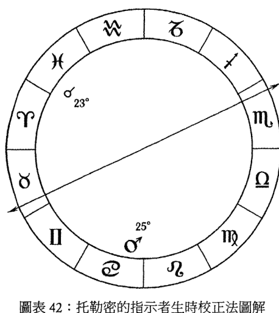

> ⁵ 托勒密，《四书》III.2。
> ⁶ 戴克注：托勒密的论述极为难解（这是他典型的写作风格），有时很难知道他到底是什么意思，特别是在使用赤经上升时间上。无论如何，托勒密的技巧被认为相对准确，但是仍然有些粗略，需要用主限向运法这样的方法进一步细化。

另一个例子是，想象出生前的朔望月是太阳的度数，在水瓶座 10° 22′。假定本命盘中，这个度数的胜利星是土星：所以要检查土星在假定的出生星盘中的度数。如果土星在巨蟹座 12°，那么我们就粗略地调整本命上升到它自己星座中的 12°：如果我们假设双鱼座是上升星座，那么上升度数就将是双鱼座 12°。

在比鲁尼（al-Biruni）关于这个方法的版本中⁷，当有两颗或更多可能成为胜利星或主要主星的选择时，偏向使用与上升有相位，或与尖轴最接近的那颗行星。如果最佳的选择都远离尖轴，则去找尊贵较少，但更靠近尖轴的那颗。另一方面，他指出有些占星师不区分行星与上升更接近，还是与天顶更接近。

这个方法并没有清晰地表明，是否应当对上升、天顶、两者，或其它因子进行计算；我认为应当考虑与胜利星或主管行星形成紧密相位的因子。但是一旦有了这个暂定的、经过修正的上升或天顶，就应假设真实的度数与之相距 5° 以内。所以，如果调整后的上升是双鱼座 12°（像上面那个例子一样），真实的上升应在 7° — 17°。

让我们看另一个例子。海因里希·兰曹（Heinrich Rantzau，1526 年 — 1599 年），是一名占星师，也是著名的路德教徒——菲利普·梅兰克森（Philipp Melancthon）的朋友，其出生前的朔望月为发生在处女座 17° 48′ 的满月，则胜利星是水星。水星在其本命盘上的位置是双鱼座 7°。所以由于他的暂定天顶是处女座 6°⁸，我们可以将星盘校正至处女座 7°。

> ⁷ 比鲁尼资料 §525（328 — 329 页）。戴克注：和托勒密一样，比鲁尼对这个方法的解释也不够清晰。
> ⁸ 戴克注：左拉书中提到了数名与兰曹同时期的人，计算出他的星盘为晚上 10 时 31 分，则天顶在处女座 6° 到 7° 左右（左拉 2004 年著作，3 — 6 页）。

然后通过他人生中已知的意外事件进行更精确的校正。

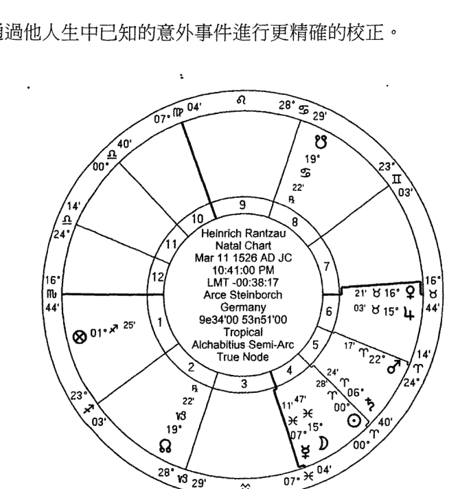

### 当事人的意外事件

主限向运法（见第九章）特别适于生时校正：计算的弧度应当对应相关的人生事件。确实，兄弟姐妹的出生、住所的关键改变、死亡、婚姻、孩子出生和人生历程的改变，以及职业都可能藉由征象点向运到尖轴来精确预测。

让我们回顾一下这种方法，在主限向运法中计算两个指示者，即征象星和允星之间弧的长度（以天球赤道上的赤经上升度数计算）；转化这个数值到时间的长度，即可计算何时会发生承诺的事件。检查征象星和允星在哪个宫位，以及它们主管的宫位，才足以判断究竟承诺了什么事件。然后决定要推进哪个行星，以及推进到何处。例如，如果将土星向运推进到天顶，而土星是外来的且位在第十一宫，意味着当事人常时运不济，会经历与职业相关的负面发展。我们可藉由对应弧度和已知事件的日期来校正星盘上的天顶。

古典占星师使用主限向运法时仅限于七颗征象星，而在小限法中，他们为了特定的目的推进特定的点。例如，主限向运法和小限法中的上升总体上都用于寻找特别针对当事人自己和生活的意外事件，而不是特别用于确定职业的起伏。对于职业和专业生涯，可以使用天顶的向运或小限。无论幸运点是否为主要的财务因子，都可以透过幸运点的向运，获得关于当事人财务状况的信息。事实上，幸运点的向运指出出乎意料的和幸运的事件，这也是它被用在生时校正中的原因。特别针对财务问题，可以向运主要的财务征象星：第二宫内的行星，或第二宫主星。简而言之，每颗行星或特殊点都可以不同的目的而推进。黄金法则就是：

> > 「首先解读星盘，理解何种类型的事件被承诺出现；然后通过使用向运法确定这些承诺的事件的时间。」

有时我们可以同时向运多个指示者到尖轴，通过不断尝试来找到可能的对应。例如，向运太阳、金星或木星的星体或相位到下降都可以指示婚姻；多个指示者到上升或天底的向运都可以代表重要的旅行或搬家，到天顶的向运代表职业的改变，到下降或天底的向运可以显现孩子的出生，凶星到天顶、天底或下降的向运可以指示父母或孩子的死亡。

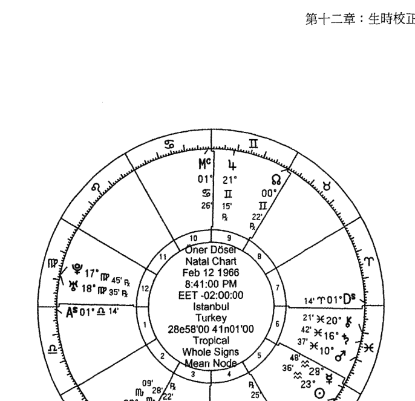

### 案例：向运火星找到结婚日期

作为案例，让我们用列在我的出生证明上的出生时间（晚上8时45分），然后看看火星到下降的向运⁹能否准确地显示我的婚姻：因为火星是下降的主星，它到那个宫位的向运直接代表婚姻。关于公式，请参考主限向运法的章节。在这个例子中，向运弧就是火星的斜赤经下降（OD）和下降的斜赤经下降之间的差¹⁰。

> ⁹ 戴克注：这是「反向」向运。
> ¹⁰ 戴克注：记住，斜赤经上升（OA）是在星盘东侧上升。这张星盘中的火星和下降点都在西侧，我们称之为斜赤经下降（OD）。

#### 要找到下降的 OD：

RA 天顶（来自电脑）：92° 34′ 45″
-90°
OD 下降 = 2° 34′ 45″（或 362° 34′ 45″，为了减去 360°）

#### 要找到火星的 OD：

火星的 RA（来自电脑）：342° 29′ 04″
火星的赤经下降度数：（来自电脑）：−08° 26′ 33″
火星的 AD：−07° 25′ 03″
RA + AD = 335° 04′ 01″
OD 火星 = 335° 04′ 01″

OD 下降 (362° 34′ 45″) − OD 火星 (335° 04′ 01″) = 27° 30′ 44″
弧度 = 27° 30′ 44″，或 27.5 年。

这个结果给出的日期是一九九三年八月，但是我在一年前的一九九二年五月七日结婚的。这意味着火星和下降之间的弧一定小了大约 1°，因为 RA 的 1° 等同于一年。既然天球每四分钟移动 1°，从出生时间中减去四分钟（晚上 8 时 41 分），看看会发生什么：

#### 要找到下降的 OD：

RA 天顶（来自电脑）：91° 34′ 35″
-90°
OD 下降 = 1° 34′ 35″（或 361° 34′ 35″，为了减去 360°）

#### 要找到火星的 OD：

火星的 RA（来自电脑）：342° 28′ 56″
火星的赤经下降度数：（来自电脑）：－ 08° 26′ 37″
火星的 AD：－ 07° 25′ 07″
RA + AD = 335° 03′ 49″
OD 火星 = 335° 03′ 49″
OD 下降 (361° 34′ 35″) － OD 火星 (335° 03′ 49″) = 26° 30′ 46″
弧度 = 26° 30′ 46″，或 26.5 年。

现在的结果距离我实际的结婚日期在两个月以内了。如我前面所说，在向运法中，不会寻求精确匹配的日期。这个日期已经足够接近，新的时间（晚上 8 时 41 分）也对应许多其他人生事件的向运。

### 生时校正需要的信息

为使用此方法来确定意外事件，则需要知道当事人生活中一些重要事件的日期，例如：

- 结婚和离婚。如果可能的话，也包括与伴侣第一次相遇的日期：这可能和结婚日期同等重要。
- 家庭成员死亡或生活的重要变化，例如父母离婚，搬家，兄弟姐妹出生。
- 重大疾病、事故和手术。
- 职业改变，例如新的开始、风险投资或损失。
- 其他重要的成功和失败。
- 孩子的出生。
- 当事人社会地位的重要变化。
- 重大的财务收益或损失。
- 搬家或搬到新的办公室。
- 教育里程碑，例如毕业、进入大学或得到硕士学位。这可能包括特定考试的日期（以及当事人是否通过考试）。

不是所有这些点对每个人都适用或重要。例如，当事人可能没有职业生活，可能未婚或没有孩子。

须重点指出的是当事人对特定的事件感受如何，以及如何被影响。

太多的生活事件可能令人困惑。所以，应把精力放在已知确切时间和最佳信息的事件上。带有确切信息的少量事件比时间不确定的大量事件更重要。如果当事人不记得任何日期，至少可以问他事件发生在那一年中的哪段期间。

知道两小时以内的出生时间会帮助我们进行校正。如果当事人说，他可能出生在中午 12 时到下午 2 时之间，则可以根据下午 1 时这个平均出生时间建立星盘。如果当事人没有任何关于他的生时的线索，可以根据中午 12 时的星盘或将太阳放在上升上。

完成这些向运后，继续检查过运法、推运法和太阳弧向运法（见下）。最关键的一点是确定行星和尖轴之间的相位。确定准确的尖轴极为重要。

### 现代生时校正技巧

### 过运法

最简单的校正方法是过运法。上升、天顶、本命行星和宫始点的过运代表重要事件：所以，如果知道事件发生的准确时间，过运的行星可以确定敏感点的位置。在人生的关键事件中，上升和天顶的过运特别重要。

对于更宽的时间区间来说，木星、土星和外行星，还有月亮交点都可能被运用。但是为了得到较为精确的时间，要使用火星、太阳、金星和水星。即使它们没有对本命盘形成正相位，在重要事件期间，它们也可能在尖轴上。过运的月亮一般不会给出重要的结果。我们还可以透过衍生宫进一步解释。

停滞的内行星可以用于同样的目的。例如，尽管水星是快速的行星，但在停滞期时经常在相同的度数待上好几天：所以，确认水星在什么宫位逆行和停滞可以帮助生时校正。即透过询问当事人关于这段期间的经历，可以确定相关的行星在什么宫位转为逆行。

如果我们知道重要事件的准确日期和时间，就可以聚焦在快速行星与尖轴的准确相位或合相上。由于慢速行星在同样的度数会停留很久，则被用于对更长的时期进行预测。

确定过运行星和尖轴之间的相位，确实对校正星盘非常重要。例如，第七宫内的行星或第七宫主星的相位使第七宫的主题浮现出来；当事人的关系、与配偶或伴侣有关的事件受到影响。

还可以考虑过运行星的自然征象，来预测经历的事件类型。例如，金星与婚姻和关系相关，火星与事故、手术和争吵相关，水星与重要的对话和会议相关，土星与责任、不成功的冒险相关，木星与机会相关。

还应当回顾与重要的中点成相位的过运。

如果已知事件的准确时间，则可以单独评估那段时间的过运盘本身，并与本命星盘比对：例如，在结婚那天和那个小时的上升可能与本命上升相同。

### 次限推运法

由于推运的行星移动很慢，在校正中被用于缩小较宽的时间间隔。应当检查推运的太阳、水星、金星和火星。如果我们确定已知的出生时间已经比较准确了，则可以使用推运的月亮。要得到更准确的出生时间，还可以使用推运的上升和天顶。但是，这不应是首选的技巧。

### 太阳弧向运法

在这个技巧中，所有行星（除了上升、天顶和月亮）都可以被用于校正星盘，因为行星移动得非常慢。太阳弧向运法采用太阳的每日运动，平均速度是每月 5′ 经度。这个技巧对于仅知道发生的年份和月份，但是不知道日子的事件特别有用。在这种情况下它会给出最佳的结果。当行星在尖轴，或尖轴在行星上时，都可以预期有重要事件发生。所用的容许度非常小。

### 太阳及月亮回归法

在太阳回归盘中，SR 上升主星或太阳所在的宫位，代表当事人在特定的这一年中的主题。SR 上升主星的宫位、黄道位置和相位指出，当事人是否能掌控情况，是否可以在聚焦的主题上成功。所以，可以藉由当年已知和重要的主题，从确定一张太阳回归盘的正确上升开始。例如，对于当事人结婚的那一年，可能推想 SR 上升主星或胜利星，以及 SR 第七宫主星或胜利星之间有相位或互动。

同时判断特定事件的过运盘和那一年的太阳回归盘也会有所助益。过运行星和太阳回归盘的尖轴及宫始点之间的相位、合相有助于确定时间。例如，如果当事人在某个时候经历一次重要的手术，过运火星和土星可能在太阳回归盘第八宫的宫始点位置。或者，对于当事人职业上的重要变化，过运行星可能与太阳回归盘的天顶形成相位或合相。

同样，月亮回归盘中月亮或上升主星的月亮回归宫位，也能显示当事人在特定的月份中的生活焦点。可以像太阳回归盘一样评估重要事件时的过运。

### 用于上升点和天顶的一般方法

确定上升和天顶的星座也是一种校正工具。这些敏感点的星座与当事人的外表、态度、行为方式和自我表达有关。知道当事人的外貌特征真的能够帮助确定上升星座。健康问题也可以提供一些线索。

### 位在上升，或与上升成相位的行星对身体的影响

太阳有权威性的态度和形象。他的眼睛和强大且抢眼的容貌会吸引每个人的注意力。他的身材很好，皮肤光滑，发色很浅。他可能很年轻就开始脱发。他的下巴很明显，宽阔的嘴总带着强烈的表情。他的领导态度反映在他的外表上。约翰·列侬（John Lennon）和彼得·塞勒斯（Peter Sellers）的太阳在上升点。

月亮带来一张圆脸，朝天鼻和扁平的脸颊。当事人对环境会过度敏感。他的心情变的快，情绪表现在脸上。身材不算高大。手脚都很小。举个例子，玛丹娜（Madonna）的月亮在上升点。

水星带来一张瓜子脸，高颧骨，尖锐的下巴，不明显的鼻子，大嘴和精致的五官。当事人的眼睛充满好奇，总是在寻求新东西。这显示出他有敏锐的思维，但是也可能焦躁不安。迷人的双手总是动来动去。看起来比实际年龄年轻。乔治·沃克·布什和麦当娜的水星在上升点。

金星带来柔和的个性，和蔼可亲的态度及温和的声音。当事人的鼻子恰到好处，眼睛很平和。他的眼睛通常是蓝色或浅棕色的。头发柔软。身材很好。他的态度温和，善于调解。葛蕾丝·凯莉（Grace Kelly）和比尔·克林顿（Bill Clinton）的金星就在上升点。

火星带来直接与尖锐的眼睛和宽阔的眉毛。当事人果断强烈的表情引人注目。他的前额和颧骨高耸。有长长的鼻子和有力的下巴。身材敦实强壮，皮肤发红。他的红发卷曲或像波浪般起伏。他充满能量。脸上可能有伤疤。东尼·布莱尔（Tony Blair）、克莉丝汀·迪奥（Christian Dior）和比尔·克林顿有火星在上升点。

木星带来贵族式的鹅蛋脸。当事人的鼻子很长，下巴明显。他有波浪式的头发和新月形的眉毛。他的眼睛很显眼，且有吸引力。男性有慈父表情。当年纪大一些以后，他的身形也会变大。克拉克·盖博（Clark Gable）和达斯汀·霍夫曼（Dustin Hoffman）的木星在上升点。

土星带来严肃和严厉的态度。他的下巴和嘴反映出耐力。他可能瘦骨嶙峋又高大，头发卷曲。他的皮肤通常是深色的。史恩·康纳莱（Sean Connery）和玛格丽特·余契尔（Margaret Thatcher）的土星就在上升点。

天王星带来浅色的眼睛和聪明的外表。他的鼻子既大又挺。他的下巴圆圆胖胖的，甚至可能有酒窝。他的态度尖锐，充满原创性，但是不稳定。约翰·屈伏塔（John Travolta）、希拉蕊·克林顿（Hillary Clinton）和卡尔·路易斯（Carl Lewis）的天王星在上升点。

海王星带来瓜子脸、小鼻子和新月形的眉毛。当事人有一双充满梦幻、眼神迷濛的眼睛。嘴唇很敏感。他有一般的魅力。他的脸庞可能由于缺乏水分很早就出现皱纹。玛丽莲·梦露（Marilyn Monroe）、保罗·麦卡尼（Paul McCartney）、凯特·史蒂文斯（Cat Stevens）和比尔·克林顿的海王星在上升点。

冥王星带来深色的皮肤。当事人眼光尖锐，充满吸引力。他的脸颊扁平，有时出现酒窝。身体强壮结实。皮肤柔软，有时很敏感。尽管头发茂盛，但是他的胸毛或体毛却不多。李奥纳多·狄卡皮欧（Leonardo di Caprio）和葛伦·克萝丝（Glenn Close）的冥王星在上升点。

### 如何确定上升点

确定上升星座在生时校正是一个重要的起始点，因为星盘本身是从上升开始建立的。上升在双子座或巨蟹座会在身体外表和态度方面产生不同的体验。如果月亮是上升的主星，在星盘中月亮就比其他行星的影响力更大；那么，就应当检查月亮所在的宫位。这个宫位显示出当事人会聚焦在什么事情上，在他的人生中，什么对他很重要。当事人透过它所在的宫位理解事情的先后次序。但是如果上升的主星是水星，那么当事人能量的专注点就完全改变了。（当然这里假设水星和月亮在不同的宫位。）因此，如果我们理解了当事人的首选时，就可以猜测上升的主星和上升星座本身。

由于上升主星的过运、推运和太阳弧在身体、个人问题以及健康方面影响当事人，应当发现上升主星与其他行星形成困难相位的日期，询问与那时发生的事件有关的问题：这种困难相位会带来事故、疾病和手术。例如，需要在处女座和天秤座之间选择作为上升星座，如果本命水星在某些不幸发生时有困难相位，那么当事人的上升应该是处女座；如果是金星有此相位，则上升是天秤座。

与上升有紧密相位的行星对身体外貌、个性、态度和健康有重要影响。上面列出了许多典型的身体影响，但是如果金星接近上升，则当事## 困難相位
通常困難相位給重要事件帶來更顯著的影響。那些第四泛音的相位（四分相、對分相和合相）在這種事件中更明顯，因為它們是與尖軸有關的相位。還應當考慮 45° 倍數的困難相位（例如 45°、90°、135° 和 180°），透過過運法和太陽弧向運法與上升、天頂或其他本命行星形成的相位。儘管合相並不是嚴格定義上的相位，但也帶來最大的影響。

### 相位容許度
對於當事人人生中的重要事件，作為特定事件的徵象星應當和星盤中的其他行星，以及重要的敏感點在特定的度數範圍內形成相位。這個範圍對於過運法可以放寬，但是對於推運法和太陽弧向運法會窄許多。然而，也無法要求絕對的精準。例如，如果行星與尖軸形成相位，容許度可以在 2°- 3° 左右。許多占星師使用 1° 的容許度，事件在這個期間內會傾向於更顯著。對於過運中的慢速行星，則允許更寬的度數，而對快速的內行星則容許度較小。

最後，檢查當過運土星接近尖軸的時間。土星在上升－下降軸線的過運帶來更明顯的困難、問題和責任。
如果我們可以準確地確定徵象星，那就可以根據行星代表的事項，或影響當事人的領域做出更好的校正。記住，除了檢查事件本身如何發生以外，還應當檢視它們在情感和身體層面所受的影響。

### 人生中的重要改变

### 職業改變
為了驗證這些改變，應當檢查第十宮宮始點的過運和推運，以及第四宮宮始點的過運和推運。例如，推運的月亮或太陽可能與天頂形成三分相、六分相或合相。

推運的天頂可能與第十宮的主星，或其他代表職業改變的行星形成相位。與天王星形成的相位可能代表職業上突然的改變。吉星之間的相位可能代表職業生活中正面的變化：推運的天頂和木星或金星的相位（在第十一宮內）可能帶來職業上正面的變化。

第十宮主星或在其中的行星可能與第十宮宮始點有過運的相位，例如，如果金星是第十宮主星，它通過過運合相第十宮宮始點。

當第十宮內的一顆行星過運回歸到出生時的位置，可能代表職業事項上的改變時期。

當行星過運經過天頂，則會規劃職業生活相關的重要事件。過運太陽合相天頂的日子也很重要。

當行星通過第四宮，也可以預期職業生活的發展。例如，當事人可能在土星從第四宮過運時經歷困難：職業生活本身的衝突，或者是家庭環境的困難反映到職業中。

外行星對尖軸的過運也是關鍵性的校正工具。例如，天王星在第十宮宮始點的過運可能帶來職業上突然的變化。冥王星在此處的過運可能帶來根本性的改變、轉化和致命的挑戰。這是一種被迫的改變，而非自願。它可能代表社會地位的權力鬥爭。海王星對天頂的過運或與宮始點的相位可能帶來謊言、優柔寡斷、消極被動和瓦解。形成困難相位則代表艱難和辛苦。通常來說，外行星代表命中註定的變化。

土星在第十宮的過運可能帶來獎勵，但也是努力工作，責任更大的一個時期。對於升職，可以檢查土星和第十宮宮始點之間的相位。如果當事人面臨重要的職業機會，還應當檢查過運木星和第十宮宮始點之間的相位。

在孩子的星盤中，天頂代表母親和父親的職業地位。

### 婚姻
檢查第七宮宮始點和第一宮宮始點。第七宮主星的相位也很重要。

由於金星和月亮以一種概括性的方式告訴我們婚姻的狀況，它們與第七宮宮始點透過過運、推運和太陽弧形成的相位可能代表結婚。因為木星與幸福和擴張有關，它與第七宮宮始點和第四宮宮始點的相位也可以代表婚姻，由此擴大家庭。

婚姻的原因和狀況也很重要。所以不應期待金星在所有婚姻中都扮演重要角色。當事人可能由於愛情之外的理由結婚。所以，其他行星可能更重要。例如，如果當事人為了聲望而結婚，太陽可能是主導性的因素。同樣，木星代表財務原因，火星代表性，天王星代表反抗家庭環境，冥王星代表權力鬥爭。

在太陽弧向運法中，還可以研究伴侶們決定何時結婚，以及正式訂婚的日期。

如果第七宫的主星到达第七宫宫始点或透过过运、推运和太阳弧形成相位，也可以期待出现婚姻。

推运的第七宫宫始点和过运行星之间的相位也很重要。或者，第七宫的主星可能与作为婚姻徵象的行星有相位。

第十宫也与婚姻有关。在第十宫宫始点的过运或推运可能象徵著婚姻。

还应当检查推运的天顶的相位。推运的月亮与推运的天顶合相可能代表婚姻。推运的上升和吉星，或和第七宫主星之间的相位也可能代表婚姻。

比对盘也可以被用作生时校正。如果伴侣其中一人的星盘已经经过校正，透过星盘的叠加，检查关键行星的宫位与尖轴的关系，也可以校正另一张星盘。

应当检查比对盘的过运。例如，当叠加结婚时刻的过运星盘到比对盘上时，吉星或婚姻的徵象星可能与尖轴形成相位。

第一段婚姻对校正会更有帮助，使用这些方法的成功率大约有95%。

### 太阳回归盘中的婚姻徵象
如果在太阳回归盘中看到结婚那一年的徵象，则可以总结生时校正是否正确。

> 注：这是在多个婚姻徵象之上的胜利星：参见波那提《波那提本命占星》1287页，或乌玛·塔巴里的《本命三书》III.5（在我2010年出版的《波斯本命占星 II》中）。

- 月亮在下降點或在第七宮。
- 上升主星或太陽在第七宮。
- 吉星（金星和木星）在第一宮或第七宮。
- 吉星與其他行星成相位，特別是對分相。
- 月亮和金星成相位。
- 新月發生在第一宮或第七宮。
- 滿月發生在第一宮－第七宮軸線或第四宮－第十宮軸線。
- 上升主星和下降主星成相位或互容，並且如果它們合相在第一宮或第七宮。
- 上升的度數靠近本命第七宮的度數。
- 與婚姻相關的特殊點及本命盤中的婚姻徵象，或與金星、月亮和木星（一般婚姻徵象星）形成相位。

我們還可以給這個列表添加更多內容。由於第四宮和第十宮也與婚姻相關，還應檢查它們的相位和行星配置。

## 離婚
應檢查離婚前第七宮的狀態，因為過運此處的行星的性質，和外行星的過運會是參考點。天王星在第七宮的過運可能帶來突然和意外的分離。如果離婚給當事人的生活帶來打架和爭吵，可以預期冥王星在第七宮過運。如果分居過程是由失望引起的，或伴侶一方需要更多忠誠，則可以思考是由於海王星的過運。土星在第七宮的過運可能會考驗關係。第一宮主星和第七宮主星的困難相位可能導致分離。

當推運的月亮經過第七宮，可能會在離婚過程中與其他行星形成困難相位。推運的金星和太陽也會在同樣的影響下導致離婚。

婚姻和離婚也與當事人的社會地位有關，因此對天頂的困難相位或天頂的推運也可能代表離婚。還應當檢查與太陽弧的天頂及其主星，或類似火星和天王星這樣的行星（產生分離）形成困難相位的時間。

在太陽回歸盤中，第一宮和第七宮的對分相，以及第四宮在內的三刑會沖可能導致離婚。

如果在一張星盤中看到夫婦離婚發生在第六宮和第十二宮對分相時，那麼可以校正星盤，使對分相發生在第一宮和第七宮。如果離婚的根源是特定的衝突，則可以推斷火星和冥王星參與在這個對分相中。

## 死亡
太陽回歸（SR）盤中，以下情況可能顯現那一 年某人的死亡。

- 本命上升的度數在 SR 第八宮。
- SR 上升接近本命上升，如果星盤在其他方面顯示出那一 年中的死亡。
- 第八宮主星在上升。
- SR 第八宮主星在本命第一宮。
- 本命第八宮主星在 SR 第一宮。
- SR 第八宮主星和上升主星之間的困難相位。
- 冥王星、海王星和土星在上升也可能帶來死亡。

其他人的死亡可以從他們的宮位衍生的第八宮來進行預測：例如，兄弟的死亡可以看第十宮（從第三宮起算的第八宮）。

太陽弧的行星或上升與發光體的困難相位或合相，可能帶來父親或母親的死亡。

### 重要的意外事件和手術
上升、上升主星和月亮之間的困難相位可能帶來事故。

火星和冥王星在帶來死亡的意外事件中很明顯。第八宮在這類例子中也很顯著。在第八宮的過運代表意外事件和手術。

推運的上升和火星、冥王星、土星和天王星這類行星之間的相位也可能代表意外事件。流血和燒傷是由於火星的影響。當月亮過運到上升，並與這些行星形成相位時，就可能發生意外事件。

推運的月亮在本命第八宮的宮始點可能代表重要的手術。因為這種手術都需要長時間的休養，因此第四宮、第十二宮以及它們的主星之間的相位可以作為進一步的徵象。

在太陽回歸盤中，還可以尋找上述提及的凶星與上升的相位。例如，假設當事人有嚴重的事故，根據暫定的太陽回歸盤，火星是第八宮的主星，並且在第十二宮，但是和上升的度數沒有非常接近的相位。則可以校正星盤，使火星接近太陽回歸盤的上升。

> 注：這裡所說的身體的意外事件是指一般意義上的受傷或意外。

## 重大疾病
在上升和第一宮的行星以及月亮，都與身體健康相關。所以，上升、上升主星或在第一宮的行星的困難相位可能帶來健康問題上的負面影響。另一方面，健康問題也與第六宮和第十二宮相關。第六宮主管較輕微的疾病，而第十二宮代表更嚴重的疾病和住院。這些宮位主星的困難相位代表疾病。

由於這些原因，我們需要確定行星的位置，以及宮始點所落的星座在哪裡。例如，假設土星在暫定星盤的第十一宮。如果當事人在與土星有關的困難相位期間有重大疾病或住院，則土星應當在第十二宮，所以星盤需要被校正。

太陽和上升主星位於太陽回歸盤的第六宮和第十二宮可能帶來重大疾病。

月亮推運至第六宮或第十二宮可能帶來疾病。也應當檢查推運的第六宮和主要本命行星之間的困難相位。月亮推運到困難相位可能帶來重大疾病。

在 SR 第六宮的行星告訴我們疾病的性質。土星可能顯示持久而難以治癒的疾病，木星可能代表肝臟疾病，金星可能帶來女性的疾病或糖尿病，月亮可能帶來荷爾蒙失調和胃部問題，水星可能代表與呼吸、神經系統相關的疾病。當然，我們還需要檢查本命盤。

## 生子
應當考慮行星在第五宮，特別是其宮始點的過運：尤其是木星和金星。當第五宮主星在第五宮過運，它會帶來生子事件。當第五宮主星或一顆吉星過運經過上升，也可能代表生子。

## 住所的主要變化
住所的主要變化可能在推運的天底與特定行星形成相位時發生。與天王星的相位帶來分離，與冥王星的相位可能顯示更根本的改變。與月亮的相位也可能帶來住所的改變。推運的月亮可能經過第四宮，特別是在宮始點位置。太陽回歸盤中的第四宮同樣是重要的。觀察過運的行星位於天底、上升和下降時，也可能帶來住所的變化。

## 教育
對於這一點，應當檢查第三宮與第九宮的軸線。

### 準備練習表格
為重要事件準備練習表格對於獲得各種技巧和行星影響的概況很有幫助。下面是一張對應我人生中的重要事件，並包含不同預測技巧的事件、日期和行星配置的表格。使用的是伊斯坦堡時間：

測試表格：奧爾內·多塞
一九六六年二月十二日，8:45 PM（出生證明），伊斯坦堡，土耳其

| 年份 | 日期 | 事件 | 過運法 | 推運法 | 太陽弧向運法 | 太陽回歸法 | 月亮回歸法 |
|------|------|------|--------|--------|--------------|------------|------------|
| 1992 | 5月7日 4:10 PM | 結婚 | ♀♃天底 ♃♄下降 | ♂♃下降 | ♀sa♂♀ | | ♀♃天底 ♃♃上升 |
| 1997 | 5月16日 3:00 PM | 父親去世 | | 天底♃♄ | | | ♄♃天底 |
| 2003 | 6月21日 5:00 PM | 離開在市集的工作 | ♄♃天頂 | ♀♃下降 ♆♃下降 | ♃sa△♃ | ♄♃天頂 | |
| 2003 | 7月6日 11:00 AM | 第一次職業諮詢 | ♀♃天頂 | ♀♃下降 ♆♃下降 | ♃sa♂♀ | | |
| 2003 | 8月27日 | 出現在CNN | | ♆♃下降 | | ♀♃上升 | |

生時校正中最重要的因素是四尖軸和行星之間的關係，因為四尖軸會被主要事件，或過運、推運和向運中的經歷所觸發。但是，請注意不是每一顆行星對尖軸的向運都會帶來事件。從事件方面看，上升－下降軸線與重要的關係改變有關，但是它們可能被行星和天頂－天底軸線之間的相位所觸發。

### 未知出生時間的當事人
當你的當事人出生時間不是十分確定時，請嘗試以下步驟：

- 1、確定至少三個、至多六個已知準確時間的，對當事人的人生來說重要的事件。且你應知曉事件的結果以及它對當事人的影響。
- 2、確定一個由月亮代表的事件，例如結婚、生產、與家庭相關的問題、母親及健康。
- 3、選擇以下幾種方法之一：推演這個日期的四尖軸的太陽弧向運，或使月亮與太陽弧推運的行星形成相位。

假設你選擇用來確定準確出生時間的重要事件是當事人孩子的出生。基於在假定的出生星盤中行星的一般位置，找到太陽弧的木星在那個日期接近本命月亮。這種情況下，我們選擇木星作為代表孩子的太陽弧的行星，月亮的位置應當基於此來微調。

假設生子的太陽弧的木星在射手座 10° 20′，假定的本命月亮在牡羊座 15° 45′。它們有 5° 25′ 的差。由於現在假設在孩子出生時相位是精確的，因此可以用已知時間的事件來確定本命月亮應當在哪裡，才能使太陽弧度數精確。在這個例子中，我們應當把月亮拉回牡羊座 10° 20′，以便木星能在當事人有小孩的那一年精確地到達這裡。一旦知道當天本命月亮在牡羊座 10° 20′ 的時間，就可以確定上升和天頂的度數。

如果木星不在可以做這種計算的合適的度數上，應當選擇另一個事件，並用一顆不同的行星做同樣的計算。當然，我們也應當用同樣的技巧處理其他重要事件。

### 詞彙表
這個簡短的詞彙表由班傑明·戴克改編，參考《古典占星介紹》(Introductions to Traditional Astrology)（戴克，二〇一〇年）中的章節和附錄，列出了本書中的一些技術術語。

- 意外事件（Accident）：拉丁文 accidens，阿拉伯文 dith。係指「降臨到」（befalls）或「發生到」（happens）某人身上的事件，但不一定是壞事。
- 不合意（Aversion）：係指從某個星座位置起算的第二、第六、第八、第十二個星座位置。例如，由巨蟹座起算時，行星落在雙子座，為巨蟹座起算的第十二個星座，即行星落在不合意於巨蟹座的位置。這些位置之所以不合意，是因為它們無法與之形成古典相位（aspect）關係。詳見 III.6.1。
- 落陷（Detriment）：或阿拉伯文「敗壞」（corruption）、「不良的」（unhealthiness）、「損害」（harm）。它泛指行星處於任何受損害或運作受到阻撓（例如受到燃燒）的狀態（如同「敗壞」一樣）。但它也特指行星落在其主管星座對面的星座（如同「損害」一樣），例如火星在天秤座為落陷。詳見 I.6 與 I.8。
- 尊貴（Dignity）：拉丁文「有價值」（worthiness）。阿拉伯文 hazz，代表「好運、分配」（allotment）。係指黃道上的位置以五種方式被分配給行星（有時也包含南北交點）主管與負責，通常會以以下順序排列：廟、旺、三分性、界、外觀。每項尊貴都有它自己的意義、作用及應用方式，並且其中兩種尊貴擁有對立面：與廟相對的是陷（Detriment），與旺相對的是弱（Fall）。其配置狀況詳見 I.3、I.4、I.6-7、VII.4；類比徵象的描繪詳見 I.8；應用廟與界作推運預測的方法詳見 VIII.2.1、VIII.2.2f。
- 配置法（Distribution）：係指釋放星（Releaser，經常就是指上升位置（Ascendant）的度數）推進經過不同的界。配置的界主星稱為「配置星」（distributor），而釋放星以星體或光線遇到的任何行星則被稱為「搭檔星」（Partner）。詳見 VIII.2.2f 與《波斯本命占星 III》。
- 東方/西方（Eastern/Western）：係指太陽的相對位置，通常稱為「東出」（oriental）與「西入」（occidental）。主要有兩種含義：(1) 行星位於太陽之前的度數從而先於太陽升起（東出），或行星位於太陽之後的度數從而晚於太陽降落（西入）。但在古代的語言當中，這些詞彙也指「升起」（arising）或「沈落」（setting/sinking），以類比太陽升起和沈落：因此有時它們指的是 (2) 一顆行星脫離太陽光束而出現，或是隱沒沈入太陽光束之中，無論它位於相對太陽的哪一側（在我的一些譯著當中將此稱為「與升起有關的」〔pertaining to arising〕或「與沈落有關的」〔pertaining to sinking〕）。占星作者們並不總是對它的含義加以澄清，而且對於東西方的確切位置，不同的天文學家和占星家也有不同的定義。詳見 II.10。
- 弱（Fall）：希臘文 hupsōma，阿拉伯文 hubūṭ，拉丁文 casus、descensio。係指在行星入旺星座對面的星座；有時稱為「下降」（descension）。詳見 I.6。
- Hilāj：「釋放星」的波斯文，同「釋放星」（Releaser）。
- 居所之主（House-master）：在拉丁文獻中通常稱為壽命主（alcochoden），來源於波斯文 kadukhudāh。即壽命釋放星（releaser）的主星之一，最好是界主星。詳見 VIII.1.3。但這個詞的希臘文同義詞 oikodespotēs 在希臘占星文獻中有多種應用，有時指廟主星，有時指前面提到的壽命行星，也有時指整張本命盤的勝利星（Victor）。

# 362 - 預測占星學：從星盤預視幸福的你

- Kadukhūdhā：係源於「居所之主」（house-master）的波斯文，在拉丁文中通常譯為壽命主（alochoden）。詳見「居所之主」（House-master）。
- 當事人（Native）：係指出生星盤的所有者。
- 外來的（Peregrine）：拉丁文 peregrinus，阿拉伯文 gharib。字面含義為「外地人」（a stranger）。係指行星在所落位置不具有五種尊貴（dignities）中的任何一種。詳見 I.9。
- 小限法（Profection）：拉丁文 profectio，即「前進」（advancement）、出發（set out）。為流年預測的一種方法，以星盤的某個位置（通常是上升位置）為始點，每前進一個星座或 30°，即代表人生的一年。詳見 VIII.2.1、VIII.3.2 及附錄 F。
- 釋放星（Releaser）：係為向運法的關鍵點。當判斷壽命時，會固定觀察幾個位置所具備的特性，釋放星即為其中之一（詳見 VIII.1.3）。判斷流年時，會以壽命釋放星，或特定主題的其中一個相關位置，或上升度數，作為預設的釋放星去推進或配置（Distribute）。許多占星師在週期盤（Revolution）的判斷上，係以上升（Ascendant）度數作為釋放星去推進。
- 區分（Sect）：係指一種將星盤、行星及星座區分為「日間」（diurnal/day）與「夜間」（nocturnal/night）的方式。若太陽在地平線上即為日間盤，反之則為夜間盤。行星的區分方法詳見 V.11。陽性星座（例如牡羊座、雙子座等）為日間區分，陰性星座（例如金牛座、巨蟹座等）為夜間區分。
- 時間主星（Time Lord）：依據一種古典預測方法，一顆行星會主管某些時間段。例如，年主星就是小限法（Profection）的時間主星。
- 勝利星 (Victor)：阿拉伯文 mubtazz。係指在某個主題或宮位 (I.18) 上或是以整個星盤而言 (VIII.1.4)，最具權威代表性的行星。參見《心之所向》（The Search of the Heart）（戴克，二〇一一年）。分辨找出最具權威代表性和力量的行星的方式。這顆行星掌管著一個或多個宮位（勝利星在宮位「之上」[over]），或者是滿足特定條件的候選者中的一員（勝利星在宮位「之中」[among]）。
- 整星座宮位制 (Whole signs)：係指最古老的分配人生主題的宮位系統，以及相位 (Aspect) 關係。以落於地平線的整個星座（即上升星座）作為第一宮，第二個星座為第二宮，以此類推。同樣，也是以整個星座的關係去判斷相位關係：例如落在牡羊座的行星會與落在雙子座的行星形成整星座相位，如果兩者之間形成緊密度數的相位影響會更強烈。詳見 I.12、III.6 及 Introduction §6。

# 參考書目

Abū Ma'shar al-Balhī, *The Abbreviation of the Introduction to Astrology*, ed. and trans. Charles Burnett, K. Yamamoto, and Michio Yano (Leiden: E.J. Brill, 1994)

Al-Bīrūnī, Muhammad bin Ahmad, *The Book of Instruction in the Elements of the Art of Astrology*, trans. R. Ramsay Wright (London: Luzac & Co., 1934)

Bonatti, Guido, *Bonatti on Nativities*, trans. and ed. Benjamin N. Dykes (Minneapolis, MN: The Cazimi Press, 2010)

Bonatti, Guido, *Bonatti on Basic Astrology*, trans. and ed. Benjamin N. Dykes (Minneapolis, MN: The Cazimi Press, 2010)

Brady, Bernadette, *Brady's Book of Fixed Stars* (Boston: Weiser Books, 1998)

Brady, Bernadette, *Predictive Astrology: The Eagle and the Lark* (York Beach, ME: Red Wheel/Weiser LLC, 1999)

Coley, Henry, *Clavis Astrologiae Elimata: Or, a Key to the Whole Art of Astrology* (London, 1676; reprinted by Renaissance Astrology Facsimile Editions, 2004)

Crane, Joseph, *A Practical Guide to Traditional Astrology* (Reston, VA: ARHAT Publications, 1998)

Cunningham, Donna, *An Astrological Guide to Self-Awareness* (CRCS Publications, 1994)

Dorotheus of Sidon, *Carmen Astrologicum*, trans. and ed. David Pingree (Abingdon, MD: The Astrology Center of America, 2005)

Dykes, Benjamin, trans. and ed., *Works of Sahl & Māshā'allāh* (Golden Valley, MN: The Cazimi Press, 2008)

Dykes, Benjamin, trans. and ed., *Persian Nativities I: Māshā'allāh and Abū' Alī* (Minneapolis, MN: The Cazimi Press, 2009)

Dykes, Benjamin, trans. and ed., *Persian Nativities II: 'Umar al-Ṭabarī & Abū Bakr* (Minneapolis, MN: The Cazimi Press, 2010)

Dykes, Benjamin, trans. and ed., *Persian Nativities III: On Solar Revolutions* (Minneapolis, MN: The Cazimi Press, 2010)

Dykes, Benjamin, trans. and ed., *Introductions to Traditional Astrology: Abū Ma'shar al-Qābisī* (Minneapolis, MN: The Cazimi Press, 2010)

Hermann of Carinthia, Benjamin Dykes trans. and ed., *The Search of the Heart* (Minneapolis, MN: The Cazimi Press, 2011)

Ibn Ezra, Abraham, *The Beginning of Wisdom*, trans. Meira Epstein, ed. Robert Hand (Reston, VA: ARHAT Publications, 1998)

Gansten, Martin, *Primary Directions: Astrology's Old Master Technique* (The Wessex Astrologer, 2009)

Hermes, Martien, “On Profections, a Traditional Method of Prediction,” in *The Astrological Journal*, Vol. 44, No. 6 (2002), pp. 51-60, and Vol. 45, No. 1 (2003), pp. 21-27.

Hermes Trismegistus, *Liber Hermetis*, ed. Robert Hand, trans. Robert Zoller (Salisbury, Australia: Spica Publications, 1998)

Hand, Robert, *Night & Day: Planetary Sect in Astrology* (Cumberland, MD: The Golden Hind Press, 1995)

Hand, Robert, *Whole Sign Houses: The Oldest House System* (Reston, VA: ARHAT Publications, 2000)

Holden, James H., *A History of Horoscopic Astrology* (Tempe, AZ: American Federation of Astrologers, Inc., 2006)

Houlding, Deborah, *The Houses: Temples of the Sky*, 2nd edition (Bournemouth, England: The Wessex Astrologer Ltd, 2006)

Al-Kindi, *On the Stellar Rays*, trans. Robert Zoller and ed. Robert Hand (Berkeley Springs, WV: The Golden Hind Press, 1993)

Lang-Wescott, Martha, *Derivative Angles* (Treehouse Mountain, 1992)

Lehman, J. Lee, *Classical Astrology for Modern Living: From Ptolemy to Psychology and Back Again* (Whitford Press: Whitford Press, 2000)

Lilly, William, *Christian Astrology* Vols. 1-2 (Abingdon, MD: Astrology Classics, 2004)

Louis, Anthony, *The Art of Forecasting using Solar Returns* (The Wessex Astrologer, Ltd., 2008)

Manilius, Marcus, *Astronomica*, trans. G.P. Goold (Cambridge and London: Harvard University Press, 1977)

Maternus, Julius Firmicus, trans. James H. Holden, *Mathesis* (Tempe, AZ: American Federation of Astrologers, Inc., 2011)

McCullough, Nance, *Solar Returns Formulas & Analysis* (Namac Publishing, 1998)

Morin, Jean-Baptiste, *Astrologia Gallica Book Twenty-Three: Revolutions* (2nd edition), trans. James H. Holden (Tempe, AZ: American Federation of Astrologers, Inc., 2003)

Morin, Jean-Baptiste, *Astrologia Gallica Book Twenty-Four: Progressions and Transits*, trans. James H. Holden (Tempe, AZ: American Federation of Astrologers, Inc., 2004)

Morin, Jean-Baptiste, *Astrologia Gallica: Book Eighteen, The Strengths of the Planets*, trans. Anthony L. LaBruzza (Tempe, AZ: American Federation of Astrologers, Inc., 2004)

Morin, Jean-Baptiste, *Astrologia Gallica: Book Twenty-One, The Morinus System of Horoscope Interpretation*, trans. Richard S. Baldwin (Tempe, AZ: American Federation of Astrologers, Inc., 2008)

Paul of Alexandria, trans. Dorian Gieseler Greenbaum, *Late Classical Astrology: Paulus Alexandrinus and Olympiodorus* (Reston, VA: ARHAT Publications, 2001)

Ptolemy, Claudius, *Tetrabiblos*, trans. F.E. Robbins (Cambridge and London: Harvard University Press, 1940)

Al-Qabisi, *The Introduction to Astrology*, eds. Charles Burnett, Keiji Yamamoto, Michio Yano (London and Turin: The Warburg Institute, 2004)

Robson, Vivian, *The Fixed Stars & Constellations in Astrology* (Abingdon, MD: Astrology Classics, 2003)

Rochberg, Francesca, *The Heavenly Writing: Divination, Horoscopy, and Astronomy in Mesopotamian Culture* (Cambridge: Cambridge University Press, 2004)

Schoener, Johannes, *Three Books on the Judgments of Nativities Vol. 1*, trans. Robert Hand (Reston, VA: ARHAT, 2001)

Volguine, Alexandre, *The Technique of Solar Returns* (ASI Publishers, Inc., 1980)

Zoller, Robert, *The Arabic Parts in Astrology: A Lost Key to Prediction* (Rochester, VT: Inner Traditions International, 1989)

Zoller, Robert, *On the Fifth House* (Mansfield, Notts: Ascella, 1997)

Zoller, Robert, *Foundation Course in Medieval Astrology* (London: New Library Ltd., 2000)

Zoller, Robert, *Tools and Techniques of the Medieval Astrologer Book 1: Prenatal Concerns and the Calculation of the Length of Life* (London: New Library Ltd., 2001-02)

Zoller, Robert, *Diploma Course in Medieval Astrology* (London: New Library Ltd., 2002-03)

Zoller, Robert, *Tools & Techniques of the Medieval Astrologer: Book Two, Astrological Prediction by Direction and the Subdivision of the Signs* (London: New Library Ltd., 2002-03)

Zoller, Robert, *A Medieval Astrologer Looks at Rantzau's Nativity* (Privately published, 2004)

> 國家圖書館出版品預行編目(CIP)資料

預測占星學：從星盤預視幸福的你 /
奧內爾. 多塞(Öner Döger)著 ; 巫利(Moli), 陳萌譯.
-- 初版. -- 臺北市 : 星空凝視文化,
2020.04 面 ; 公分
譯自 : Astrological prediction : a handbook of
techniques
ISBN 978-986-98985-0-8(平裝)
1.占星術
292.22
109004124

# 預測占星學：從星盤預視幸福的你
Astrological Prediction: A Handbook of Techniques：

- 作 者 | 奧內爾·多塞 (Öner Döger)
- 翻 譯 | 巫利 Moli、陳萌
- 審 譯 | 韓琦瑩、陳紅穎
- 責任編輯 | 賴彩燕、李少思
- 版 權 | 鄒捷
- 行銷企劃 | 李少思
- 總 編 輯 | 韓琦瑩
- 發 行 人 | 韓琦瑩
- 出 版 | 星空凝視文化事業有限公司
- 發 行 | 星空凝視文化事業有限公司
- 銀行帳號 | 【臺灣】玉山銀行 (808) 成功分行收款帳號：0510-940-159890
- 收款戶名：星空凝視文化事業有限公司
- 【大陸】招商銀行上海常德支行收款帳號：6232620213633227
- 收款戶名：魚上文化傳播（上海）有限公司
- 訂購服務 | skygaze.sata@gmail.com
- 地 址 | 110 臺北市信義區莊敬路 186 號
- 電 話 | 02-88094813
- 服務信箱 | skygaze.sata@gmail.com
- 美術設計 | 舒闊設計有限公司
- 印 刷 | 佳信印刷有限公司
- 總 經 銷 | 星空凝視文化事業有限公司
- 初 版 | 2020 年 4 月
- 定 價 | 630 元

ISBN 978-986-98985-0-8

有著作權·翻印必究
獲取更多好書，請加微信號：strcdts
店鋪：http://strc.cr.cx## ASTROLOGICAL PREDICTION
### A HANDBOOK OF TECHNIQUES


本書是一部最全面的預測占星學指南，體現了當今占星界的重要發展趨勢：古典占星與現代占星的結合運用。這也是越來越多當代占星師所追求的方向。

書中內容幾乎囊括了所有重要的預測方法，並對多種方法作詳盡描述，附以大量星盤案例和解釋，以幫助從業者作出準確的預測。

在預測的幫助下，人們可以用平和的心態及充足的力量去為即將發生的事情做準備。占星預測是其中一種才能，讓人類提升到智慧等級，幫助我們走上幸福之道。

建議陳列區：
- 命理
- 占星學
- 星座