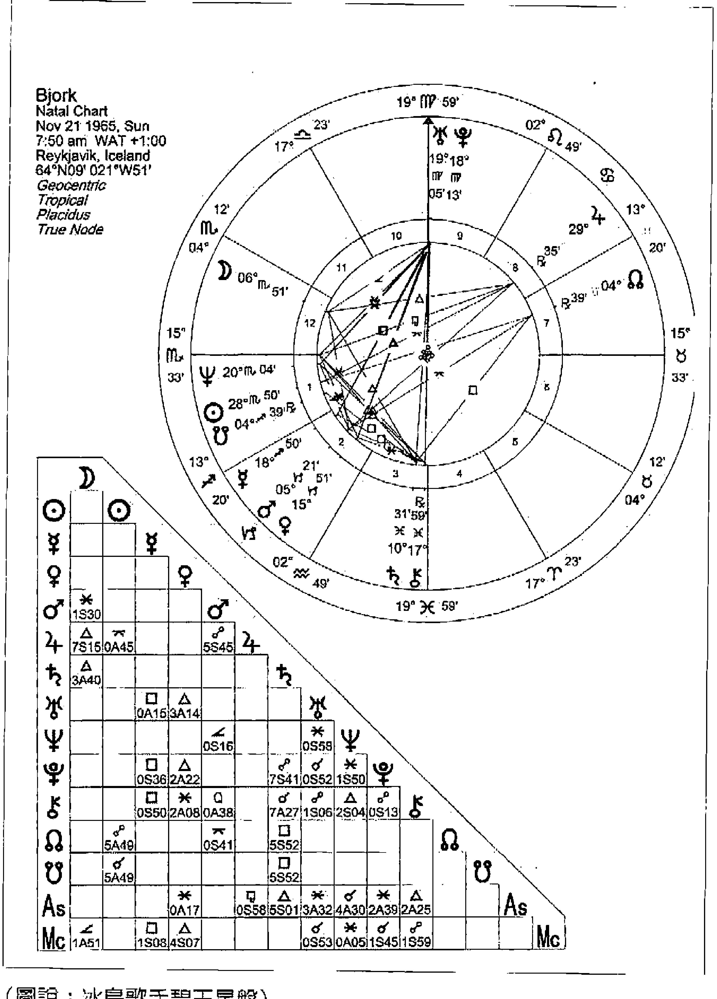
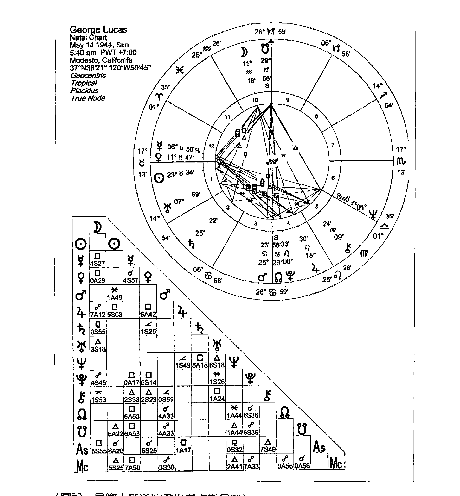
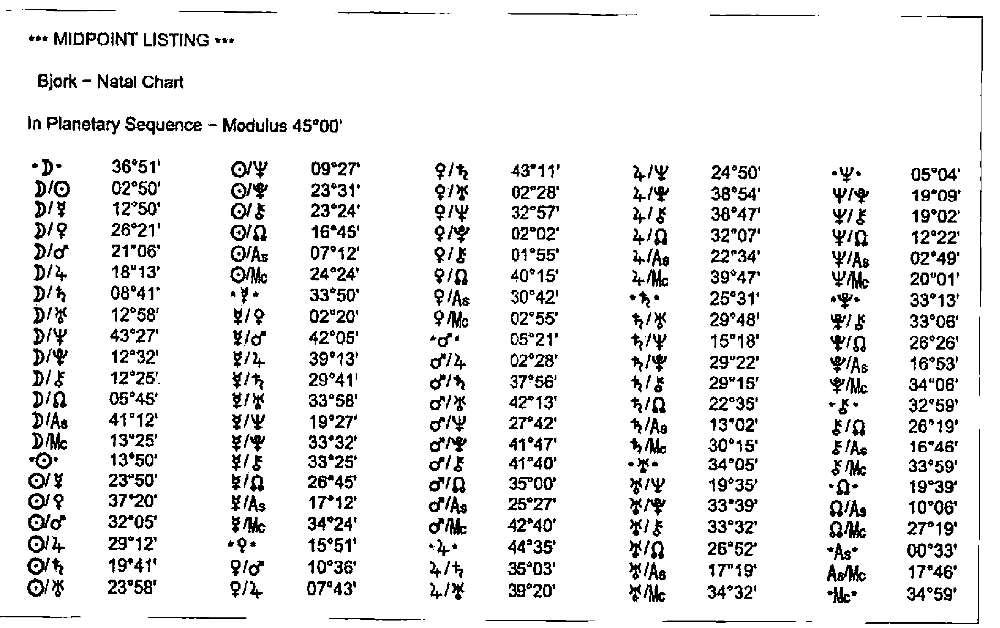
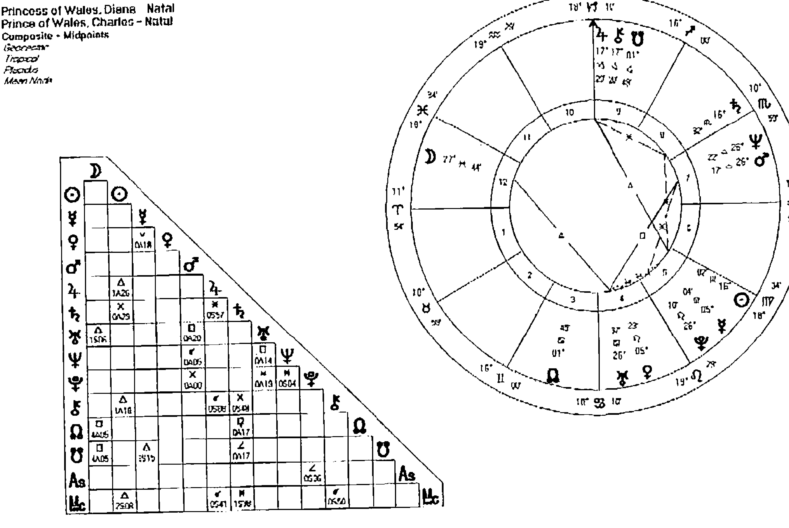
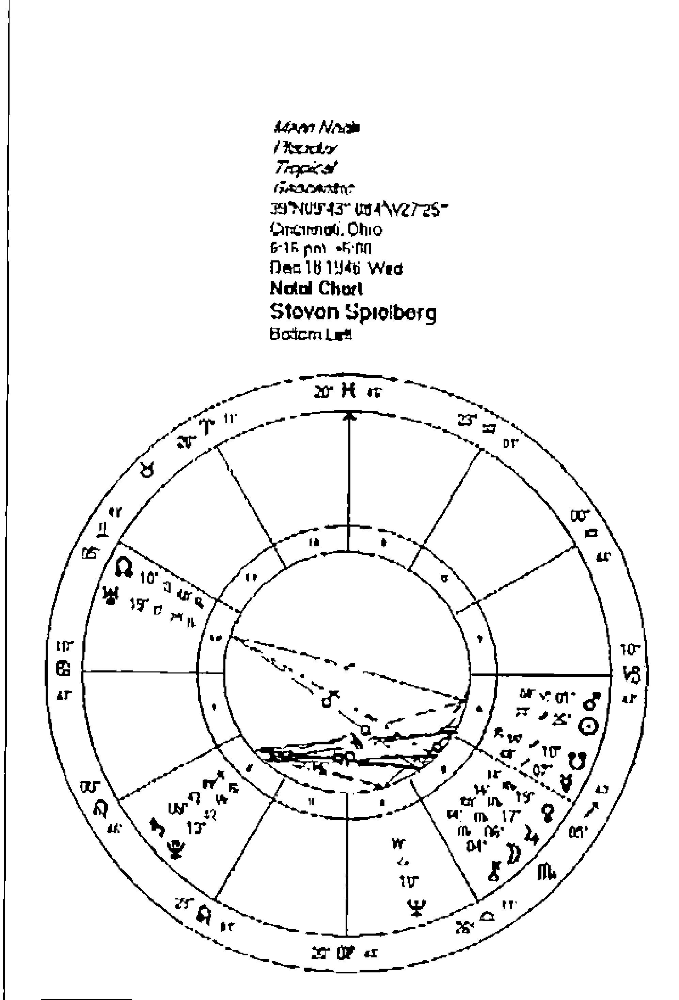
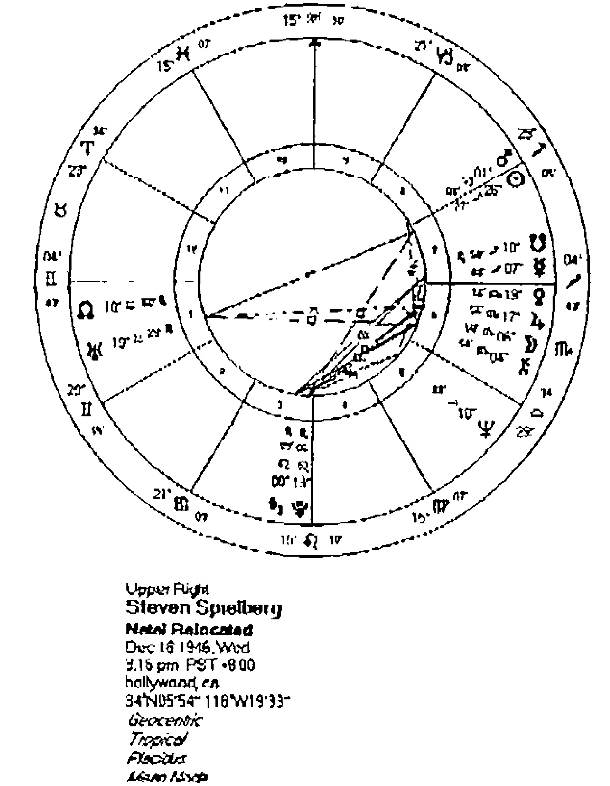

# 高阶占星技巧
中點技巧（Midpoint）能細緻透漏一張星盤所隱藏的秘密，有助於激發星盤的潛能；
組合盤（Composite Chart）能夠看出兩人、兩個家庭、單位、部門的組合能量和發展；
移民占星學（Relocation Chart）可分析個人在何處特別有利於發展，如同一套獨特的個人風水學。
藉助高階占星技巧，幫助自己找到最佳軌跡，朝更光明的方向出發！


## 作者序

## 占星，一門學習自身與時間、空間關係的學問
在過去數千年中，占星界發展出了許多技巧，例如：巴比倫人重視金星，與他們的女神崇拜有關；埃及人重視建築與農工，因而發展出重視地平線的上升點，開啟了不同宮位制度的研究；而阿拉伯點的研究，與中世紀的神秘主義特色有著強烈的連結；十九世紀強調科學精神的德國占星師們，期望能透過數學邏輯找出行星之間的共鳴，因而將中點技巧發揚光大；到了 20 世紀，占星師們則期盼占星也能夠詮釋當代心理學，由此發展出了心理占星。
我們可以發現，每一個時期發展的技巧，都象徵著當時的社會特質，不能因此而斷定誰是對的，或誰是錯的。
再者，由於現代科技的發達，電腦可幫助占星師們做出更多精密的計算，占星師能夠更精確地尋找出行星在地球上的投影，並因此開啟占星地圖的研究，甚至更進一步地將這一門技巧，發展成為非常類似中國風水的方位系統，並將此應用在個人星盤與世界大事的預測上。
這一一本強調高階技巧的占星書，正是我與 Jupiter 老師討論已久，最後也邀請 Monique 老師一起加入完成的作品，期待能帶給華人占星學界一些對十九、二十世紀占星技巧發展的不同視野。

魯道夫
2016年1月8日於倫敦

## 作者序
## 宇宙有多大，占星有多闊
小時候閱讀星座書，覺得有趣，大概是青少年期想尋求「自我認同」的方法，原來最了解自己的，不是身邊的同學長輩，而是書中那些「xx 座的你是怎樣怎樣」，那種被了解的感覺大概成爲了我的占星種籽。
後來接觸到正統的占星學習，更發現每顆行星之間的互動，簡直就像替我說話一樣，甚至比我認識的自己，描述得更爲深入、細微，連那些自己也不能言語的微妙感覺、爲什麼我會有某些習慣和想法、甚至一些本已遺忘的東西，都通過占星從潛意識中牽引出來。
起初以爲懂得基本星盤就是了，加個流年推測不就是傳統上對「命理、算命」的理解嗎？可是後來發現還有人際合盤、中點、泛音、移民、擇日、世俗占星、卜卦、古典派……學完一些又有新的冒出來，沒完沒了，卻讓人像上癮一樣，不停的去學習和發掘。真是宇宙有多大，占星就可以有多闊；心靈有多複雜，占星就可以有多少深度。
從了解人的心靈、運勢，到人與人之間的互動，以至世界大事、政治經濟，占星總是有不同的工具去探索，幫助我們從不同的角度去了解自己、身處的環境、身邊的人和事，過去和未來；而通過占星，亦了解更多背後的歷史、文化、哲學，簡直就是通識。一套學問能夠這樣無遠弗屆，並且能夠跟其他學問互爲連結，如醫學、心理學、魔法、草藥、治療、兒童教育、財經等，覆蓋和使用範圍之廣，可說是星星給人類的最佳禮物。
這些年以來，多得各界同好將占星學推廣，越來越多人對占星有興趣、有一定的認識，並認真學習及研究，所以此書就來介紹幾個專業占星師們所使用的一些進階占星技巧，讓讀者能了解這些稍微複雜但相當實用的工具。
本書所介紹的占星技巧，都是針對特別的範疇，做深人的研究，發掘一些潛藏的訊息，可說是帶出更多占星密碼。如不了解當中的竅門，就無法破解演譯了。本書所講解的技巧，「中點」是找出星盤中那些表面看不到的部分，內裡隱藏著的脈絡；「組合中點盤」則是看人與人之間的化學作用，而「移民占星學」更是人與地的關係，將星盤放在世界地圖上，可說是一套獨特的個人風水學。
我們的占星學院從 08 年創辦，還記得當初跟魯道夫老師在英國碰面，晚飯閒聊時就聊起辦占星學院的想法，想不到不但能成真，至今學院有幸已發展成一個小團隊，並能邀請國際知名的占星大師來亞洲講學，所以得在此先感謝這位一起並肩作戰的占星好友。
而在教學的過程當中，跟同學們也做了很多的討論，有時同學提出的問題，往往會刺激我們去思考；而不同的見解，也讓占星的詮譯變得更豐富，教學相長，讓我們身為老師亦能不斷進步，在學問上有更高的要求。而最讓我感動的，是同學們對占星的熱情和投入，那些熱熾的討論、發問、渴求知識的眼神，心裡那團星星之火，的確可以燎原。而同學之間還建立了一份占星專屬的友誼，那種大家說著共同語言，有種不用多解釋但已互相明瞭的感覺，不足為外人所理解。有時候，同學分享自己的經驗，說到學習占星如何助他面對一些難關，如何讓自己變成一個更好的人，如何去活出屬於自己的人生，更讓我覺得能夠分享這個學問，是一種福氣。
當然，最後必須感謝教導過我的各位老師、在占星路上互相支持的夥伴，一直給我很多的啟發，有時可能只是一句話，就讓我開竅；有時對我很嚴厲的老師，總是能帶我到另一層次。占星之路如天上的銀河一樣，沒有盡頭，之後我也將繼續努力學習、研究，期望可以將更多占星的智慧跟大家分享。

Jupiter
2016年1月13日於香港

## 作者序
## 歡迎回到宇宙舞台，與日月星辰共舞
> > 「生活不是侷限於人類追求自己的實際目標所進行的日常行動，而是顯示了人類參與到一種宇宙韻律中來，這種韻律以形形色色的方式證明自身的存在。」——泰戈爾
從小我就對生命充滿了好奇，寒暑假回外婆家最開心的就是追著外公詢問手相和紫微斗數，外公家二樓的大佛堂和一樓工作的小書房，總是最吸引我的地方。雖然外公在幫人算命時說的台語和客語對當時的我來說只能一知半解，但卻在我心裡播下了一個種子，外公應該算是我的命理啟蒙老師吧！
國高中讀的是私立學校，那個年代能讀得起私立學校的小孩，家庭環境都是非富即貴，而我父親只是職業軍人，但堅持教育的重要性，家裡四個小孩都讀過這所私校。因為和同學們的家世背景差距太大而有隔閡，加上成績總是吊車尾勉強過關，常常都是獨來獨往。
私立學校因為管教嚴格，學生99%是乖乖牌，而那個1%的怪咖就是我。學校制服是黑色百褶裙配黑色娃娃鞋，裙子長度規定是膝蓋下一公分，當時我就覺得只有老太婆才會這樣穿吧！所以常常將裙子捲到露出膝蓋，常因為頭髮裙子不符合規定而經常去教官室報到。
記得國一下學期開學的第一天，我穿了特別訂製的裙子，一條長至腳踝的百褶裙，走到教官室跟教官說：「這樣應該及格了吧！」教官被我氣到說不說話，要我寫悔過書，我認為自己沒錯所以拒絕寫（當時也不知道哪兒來的愚勇，也可能正值叛逆期），於是整個學期的午休時間，都得在學校中庭的噴水池前罰站，後來是輔導室的許老師向校長說情解救了我，讓我去學校的圖書館負責整理和打掃的工作，卻意外的讓我在學校生活中最快樂的時光。待在藏書豐富的圖書館，那幾年看了非常多的閒書，尤其是倪匡的小說，充分滿足了我這個太陽月亮水星都在雙魚座的人，那種精神靈感上的幻想與遨遊。
第一次要到歐洲學旅時，第一個念頭就是想要去格陵蘭的冰層之下尋訪我心靈中的勳曼醫院，於是我從冰島搭小直昇機到格陵蘭，這兩個地方也是 ACG 星盤中（Astro Carto Graphy），海王星上升和金星下降線經過的地方，讓我奇幻似的愛上這兩個地方，很難讓我用言語文字來形容這樣的感受，如同愛麗絲夢遊仙境一般，彷彿在那兒可以獲得某種净化超越與成長。
後來擔任心理輔導老師的經驗中，我發現其實學生的問題很少很小，但是老師與學生之間、家庭關係失衡、家長本身的問題卻多得不得了。更多感觸的是這些青春期的騷動與不安，無非都是自我意識的萌芽，是小孩開始想要獨立的第一步，他們熱切的想要知道我是誰，嘗試著用不同的方式來認識自己。但整個教育環境仍停留在成績與升學的考量下，忽視了個人可以發展的特質。
我發現學校這個體制不適合我，於是改變的契機在接觸了心理占星後萌芽了，當我有意識的選擇了自己想要的改變時，更能清楚的去接受可能而來的挑戰與機會。
感謝魯道夫老師將西方占星學人文的觀點帶進國內，有別於坊間星座老師的愛情配對、升官發財這類的速食觀點，或是傳統宿命論的命定好或不好二元論的說法。
當然心理占星學並非要推翻傳統占星學，而是讓我們以一種更宏觀的視角來讓我們認識自己，以謙卑的態度來面對那些我們個人無法掌握的，例如：國家的命運，在有限和無限中都能自在的活出自己的生命。同時心理占星學提供的人文思維觀點，讓我們帶著覺知來看待當下人事務的變遷與流轉，保持客觀的態度，陪伴著個案一同去看見、去接納自己，將生命的選擇權交還給自己。
當我們瞭解了自己的生命歷程時，也同步體悟宇宙星辰的運行週期，原來我們一直活在萬事萬物的象徵和隱喻中，這是多美妙的感受啊！
當然要感謝我親愛的家人，媽媽、姊姊、哥哥、妹妹一直以來對我的幫助與支持，還有我生命當中最重要的四個男人，Tenzin、Neo、Ethan、和高齡快90歲的老爸，感謝你們全然的愛與包容，讓我得以快樂的做自己，做著自己熱愛的工作。
最後還要謝謝願意與我分享生命故事的諮詢個案與學生，由衷感謝。

Monique
2016年1月21日

# Chapter 1 中點技巧
占星師在觀察星盤的時候，往往會試圖尋找行星與行星之間的互動，二十世紀初期的漢堡學派，就認為兩個行星在黃道距離的中間點是一個敏感的位置。若是在本命盤、流年、或是合盤上有任何其他行星觸動到了這個敏感點，將會引發強烈的效應。
中點技巧能夠告訴我們，一張星盤所隱藏的秘密，也是目前占星學界十分受到歡迎的高階技巧。
以星際大戰出名的大導演喬治魯卡斯（George Walton Lucas Jr.），在他的星盤中點上，就有海王星（影像、幻想、幻覺）天王星（天空、科技）火星（戰爭）的中點結合。當他執行星際大戰這部電影的計畫時，就發揮了星盤中點當中隱藏的強大力量。

### 中點：星盤當中隱藏的力量
### 中點技巧的歷史背景
在近代占星學中，許多占星師們希望透過不同的方式，從星盤中找出些行星隱藏的訊息，特別在19世紀末的德國，當時瀰漫著一股科學驗證占星的態度，當時的占星學家們莫不希望能夠以科學的角度出發來詮釋占星。
這一股從科學角度出發的占星學習態度促成了漢堡學派的形成，受到科學研究影響的占星師們紛紛開始從物理學的角度來探討行星對自然的研究。例如像是太陽黑子對地球上的農產與經濟的影響，或者紛紛從電波、光波的波動或週期的運行來討論占星。
這些占星研究者有時也會從古老的占星典籍當中得到啟發，並且用現代的態度來詮釋，其中至今仍被廣泛應用的就是中點（Midpoint）以及泛音盤（Harmonic chart），中點與泛音盤這兩門學問被視為是近代占星技巧，事實上這兩門學問出現已久，泛音盤在印度占星學當中已經有數千年的歷史，而中點的使用最明確的記載可以回溯至西元1200年的占星師波那提（Guido Bonati）。他使用一種在阿拉伯點（Arabic parts）計算時稱為半數總和（Half sums）的技巧，替他的君主蒙特非特羅伯爵（Count Montefeltro）找出了出兵時刻，他同時預言在該場戰爭當中伯爵會獲勝但是將會受傷，如同波納提的預言，蒙特非特羅伯爵在這場戰役中雖然受傷，但最後取得了勝利，從此中點在星盤當中的使用技巧受到了眾人的注意。
波那提所使用的技巧並沒有在占星學界流傳開來，中點技巧在當時被視爲是阿拉伯點的延伸，但這門方式的複雜計算並沒有受到歡迎，在缺乏有系統的發展之下，波那提的技巧逐漸的被占星師們遺忘。

### 中點技巧的原理
直到活躍於20世紀初期的德國漢堡學派占星師艾佛瑞·懷特（Alfred Witte）開始檢視這一門技巧，在當時充滿著科學精神的環境當中，占星師們相信行星能夠散發的能量，就像是太陽風一樣能夠引發震盪與波動。當行星在黃道上產生了某種相對關係就會帶來敏感點，這些敏感點將會引發能量的釋放（在占星學與身心靈當中，關於能量一詞並非物理學的能量定義）。有些時候這些敏感點的觀察，與我們對占星學當中傳統星座與行星之間的守護關係並不相符，但卻同樣對當事人或事件帶來劇烈的影響。
過去，占星師們認爲行星與行星之間，必須透過彼此的守護關係或相位來產生影響，但是，艾佛瑞懷特的研究引發了不同的占星學觀點，當行星形成某些相對位置的時候，就算彼此之間沒有產生所謂的相位，也能夠彼此影響，這就是——中點。
例如在傳統占星學當中，T型三角被視爲是最具衝突性的圖形相位，一般的占星研究者會說當三顆行星，其中AB兩行星形成180度，第三顆行星C又同時與AB分別形成90度，其中180度與90度都是所謂的衝突相位。所以行星之間產生的激烈共鳴引發了## 當事人強烈的感受。

如下圖，天王星在處女座 19 度，凱龍在雙魚座 17 度產生對分相，水星在射手座 18 度同時與天王星和凱龍都產生了四分相。從占星學的角度來看，這樣的強硬相位激發了一種以水星所代表的聲音文字，詮釋一種渴望以不同的改革態度與自由的釋放（天王星）來面對過去的傷痛（凱龍）。



（圖說：冰島歌手碧玉星盤）

但是在某些星盤上行星的排列組合並不如同這種強硬相位的關係，有些時候，這三顆行星彼此之間甚至沒有形成任何相位，但是透過艾佛瑞的理論，當我們計算兩顆行星在黃道距離上的中間點，這一個點稱為直接中點，然後從這個中間點開始，每45度我們都可以找出一個敏感點，稱為間接中點。所以在黃道上的360度我們一共可以找出8個中點。如果在你的本命星盤上恰巧有行星就在這個位置的前後2度的距離時，我們就可以說，這一個行星位在另外兩行星的中點上，形成了某種共鳴，其影響力並不會低於上一段描述的T型三角，有時甚至更為顯著。

## 如何詮釋中點

中點是兩行星在黃道上的敏感點，當有其他行星位在這裡時會強烈的被這兩個行星左右。中點的作用被視為是星盤上根據傳統的相位所看不出來的隱藏力量，這些力量是可以被發揮的，我們也往往透過許多星盤當中發現中點對一個人的強烈影響。例如以星際大戰知名的導演喬治盧卡斯為例，在他的星盤上就有海王星在天王星與火星的中點上的特質（見下頁圖）。海王星象徵著影像、電影、幻想，正好就在象徵著天空、太空的天王星與戰爭的火星兩者的中點上。他發揮了這樣的星盤特質，讓海天火的強烈特質散發在生命當中而獲得成就。

舉例來說，剛才的凱龍、天王、水星T型三角的星盤主人是冰島歌手碧玉（Bjork）的星盤，她透過聲音傳達對未來與自由的渴望，以及因為權力和環境所帶來的傷害。但是當我在另一張星盤中看到另一位歌手，沒有類似的強硬相位，乍看之下水星與天王星和凱龍星都沒有產生任何的傳統相位，但是他的歌聲卻也讓眾人感動落淚，她就是在2009年英國才藝競賽當中脫穎而出的蘇珊波爾。

以她貌不驚人的大嬸形象，一開口卻讓眾人驚艷，聲音讓許多人感動落淚，許多人說她的聲音治療了靈魂的傷痛。

乍看之下她的星盤中並沒有天王凱龍與水星的任何相位，但是當你使用艾佛瑞懷特的中點技巧時，你卻會發現蘇珊波爾的凱龍正好在水星與天王星的中點上。不同的歌手不同的音樂風格，同樣卻都有從傷痛中解放的聲音特質。



（圖說：星際大戰導演喬治盧卡斯星盤）

## 中點在流年與合盤的應用

簡單來說，中點，可以說是一種行星之間的關聯與互動，如同相位一樣讓行星彼此影響，但是它還可以應用在流年的方法當中。我最喜歡的案例就是我一位同學正抱怨著那陣子生活壓力非常大，整個人非常不舒服，可是流年星盤上卻沒有任何的明顯相位產生，那一週我們才學完中點的技巧，我現學現賣的打開電腦一看，就指著星圖對他說：「親愛的，最近行運的土星正分秒不差的在你的日月中點上面，當然你會覺得壓力特別大。」

同學驚訝的說原先學中點時，因為涉及數字計算，讓他一點興趣都沒有，同時他也認為這種不是相位的行星影響根本沒什麼了不起的，當我指出這件事情的時候讓他重新體驗了中點的重要。當流年行星與命盤兩行星的中點形成相位時，其效果非常像是一個流年行星同時與本命盤的兩行星產生相位。

除了可以應用在流年當中之外，中點也可以應用在合盤上。例如你的日月中點是處女座15度，而你的情人的太陽（或任何一個行星）也在這個位置的前後兩度，那麼表示他的太陽在你的日月中點上，對你來說，他的男性特質是促成你自我整合的重要關鍵。

首先，讓我們先來了解如何從星盤當中計算中點。

### 中點技巧的計算

中點的計算其實一點也不難，你只需要計算機和幾個簡單的概念就可以計算出來，而一般專業的占星軟體如 Solar Fire、Janus 都可以簡單的幫你製作出中點的列表。若使用 Solar Fire，當你叫出星圖之後，按下右手邊 Report 的地方，就可以看到許多資料，其中就有 Midpoint 的選項，所做出的列表我們在後面的文章將會解釋。

Janus 4.0 則是在 calculate 選項的功能當中有 Midpoint 計算功能。你可以在左手邊選擇你要使用的列表方式。網路上有免費的軟體，也有網頁可以讓你輸入兩行星的位置後找出他們的中點，我們會在稍後介紹。

#### 手算

如果你手上沒有任何的占星軟體，你可以動手計算或者利用我們介紹的網頁去計算中點，你也可以寫 e-mail 到華人專業占星教育學會，info@academyofastrology.co.uk，洽詢付費製作中點列表的服務。如果你對中點的原理有興趣的話，你就知道中點是計算出兩個行星在黃道上的中點距離，所以首先我們必須將這兩個行星在黃道上的位置找出來，我們不妨就用冰島歌手碧玉的天王星和凱龍來做範例。

首先，透過下面列表，我們將兩個行星在黃道上的度數換成絕對的黃道度數：

| 星座 | 絕對度數 |
| :--- | :--- |
| 牡羊座 | 0 |
| 金牛座 | 30 |
| 雙子座 | 60 |
| 巨蟹座 | 90 |
| 獅子座 | 120 |
| 處女座 | 150 |
| 天秤座 | 180 |
| 天蠍座 | 210 |
| 射手座 | 240 |
| 魔羯座 | 270 |
| 水瓶座 | 300 |
| 雙魚座 | 330 |

##### Step1
把碧玉的天王星處女座 19 度轉化成 360 度形式，我們只要把 19 度加上處女座的黃道絕對度數 150，便可得到天王星是 169 度。

##### Step2
把凱龍所在的雙魚座 17 轉化成 360 度形式，我們把 17 度加上雙魚座在絕對黃道上的度數為 330 度，所以凱龍是 347 度。

##### Step3
將兩個點加起來 169 + 347 = 516 度然後除以二得到 258，絕對黃道上的 258 度就是天王星與凱龍的直接中點。

##### Step4
接著將這個度數換成我們所熟知的 12 星座座標（參考上表），距離 258 度最近的是射手座的 240 而且還沒有超過魔羯座的 270，所以我們將 258-240 = 18，我們知道 258 是射手座的 18 度。

##### Step5
-   1. 258+45 = 303 = 水瓶座 3 度
-   2. 303+45 = 348 = 雙魚座 18 度
-   3. 348+45 = 393 = (超過 360 必須減去 360) = 33 = 金牛座 3 度
-   4. 33+45 = 78 = 雙子座 18 度
-   5. 78+45 = 123 = 獅子座 3 度
-   6. 123+45 = 168 = 處女座 18 度
-   7. 168+45 = 213 = 天蠍座 3 度
-   8. 213+45 = 258 = 射手座 18 度

這八個黃道上的度數就是碧玉的天王星與凱龍的敏感點，當碧玉本命盤有任何行星在這個位置上時，就會對她產生強烈的共鳴。所以我們看到碧玉本命盤的水星就在射手座 18 度附近，自然的她的水星就會成為天王星和凱龍星的中點。同樣的，如果流年時有行星經過上述的位置，那一個行星就會對碧玉的天王凱龍產生影響，或者有任何人有行星在這些位置也會對她產生影響。

同時我們會發現中點的出現有一定的規律，他會出現在同樣性質的星座的同樣度數，例如碧玉的天王凱龍的中點就出現在水瓶 3 度也就是固定星座的 3 度，和雙魚 18 度也就是變動星座的 18 度。

### 中點計算網頁

http://www.noendpress.com/pvachier/midpoints/index.php

這是個相當好用的中點計算網頁，假設你要計算兩個行星的中點，先在 Planet1（第一個行星）的下方輸入該行星的星座、度數和分，然後同樣的在 Planet2 下方輸入相同的資料，然後按下 FINDMIDPOINT，你就會得到兩組中點。

在這個網頁當中他會幫你計算出最近距離中點與最遠距離中點，但這其實沒有必要，你只要找出其中一個，知道他是開創、固定還是變動之後，再從這個度數加上 45 度，就可以找出另一個中點。

例如，假設你的月亮在金牛座 10 度 40 分，你的太陽在巨蟹座 5 度 10 分，你就在 planet1 sign 的地方輸入 Taurus，在下方第一欄輸入度數 10，在第二欄輸入分 40；同樣的，在 Planet2 的地方依此類推。按下 Findmidpoint 鍵之後你就會看到，畫面上顯示 Midpoint Near / Far:Gemini / Sagittarius 下方是 7 / 55，我們可以得知最近的中點是雙子座 7 度 55 分，所以所有變動星座的 7 度 55 分都會是你的日月中點。

從雙子座 7 度 55 分，加上 45 度之後，你會得到巨蟹座 22 度 55 分，由此可知所有的開創星座 22 度 55 分也都是你的日月中點。

### 中點計算軟體 Midpoint

中點計算軟體 Midpoint，這是一套免費的軟體，目前的版本只能夠在 XP 的環境底下執行，如果你使用 VISTA 或是 WINDOWS 7，可能必須尋找 WINDOWS XP 的模擬軟體並在底下執行這套免費的軟體。

這套軟體小而簡單，都是文字模式，但既然是免費的我們就不要有太高的要求。當你解壓縮安裝之後，它會跳出資料輸入的介面，輸入出生年月日地點經緯度與時區之後，按下 F2，便可以得到根據開創、固定、變動星座的中點列表，或者按下 ctrl+F1 之後，在 Modulus 當中輸入 45，就可以得到 45 度的中點樹的列表方式。你可以列印出來然後依照後面章節的解讀方式來解讀。

## 中點技巧的呈現方式

中點這一門技巧獲得當時艾佛瑞懷特和他的占星同好的重視，在他們所組成的漢堡占星學派當中，中點占有重要的意義，同時為了方便中點的研究，他們使用不同的星盤繪製方式，稱為刻度盤（Dial），並且有不同的刻度盤的應用，成為漢堡學派的特殊專長。但今日中點在占星學上的使用相當廣泛，就算不是漢堡學派的占星師也都同意中點有其特殊影響性，並且會在解讀星盤時列入參考，於是發展出了許多不同的中點呈現方式。

一般來說，中點的使用習慣用一種數學方式來呈現，例如剛才我們計算的天王凱龍中點，習慣寫成「天 / 凱」，或者英文的 Ur / Ch，亦可用符號表示 ♆ / ♄ 。

當我們知道碧玉的水星在天王凱龍中點時，我們可以寫成水=天 / 凱，或英文的 Me=Ur / Ch，或是符號的 ☿ = ♆ / ♄ 。

### 1. 行星排列中點列表
一般來說，我們常會在占星軟體上看到下列幾種中點的呈現方式，可以分成依照行星排列、角度排列或三性質區分法，端看個人的習慣選用。

行星排列的中點列表如同下圖，他是依照行星順序從月亮到冥王星、凱龍，最後上升天頂的列表排列方式。我們可以扣除 * ♆ * 這一類的符號，因為他們只是標示行星的位置，我們只需要注意行星 / 行星這樣的符號即可。



> （圖說：行星排列中點列表）

例如我們注意到 *□* 之後就是 ☽ / ⊕，代表著月亮 / 太陽的中點。接著看到這一行符號後面的數字 02°50′，意思是說，這一組中點會出現在黃道上 02°50′ 的位置，然後每 45 度會重複出現一次，所以碧玉的日月中點會出現在牡羊座 2 度 50 分，下一個日月中點會出現在 45 度之後的金牛座 17 度 50 分，然後依此每 45 度找到一個中點，可以找出星盤上的八個中點。

圖中排在 ☽ / ⊕日月中點之後的是月亮水星中點 ☽ / ☿，月亮水星中點的位置是 12 度 50 分，所以我們知道他的月水中點是牡羊 12 度 50 分，然後加上 45 度，會到金牛 27 度 50 分。

這個列表是以行星順序做為排列的，有些占星師習慣按照黃道上的順序排列，因此，月亮列表先出現，接著是太陽，然後是水星，最後是天頂。

### 2. 角度排列中點列表
在上一個列表方式中我們用行星排列，某些時候我們會希望自己在哪些角度上有哪些中點，所以出現了角度排列中點列表。

如下圖，在下圖中你可以看到，同樣的中點但是卻按照著黃道上的度數來排列，首先出現的是最接近並影響牡羊座 0 度的中點。對於碧玉來說，最接近的中點是金星凱龍的中點，位置在 1 度 55 分，然後是金星冥王中點，位置是 2 度 02 分。我們同樣可以依照剛才的方式，每 45 度去抓出其他的中點。

| 列1 | 列2 | 列3 | 列4 | 列5 |
|-----|-----|-----|-----|-----|
| *As* 00°33'<br>♀/☿ 01°55'<br>☿/♀ 02°02'<br>☿/♀ 02°20'<br>♂/♃ 02°28'<br>☿/♃ 02°28'<br>♃/As 02°49'<br>D/☽ 02°50'<br>☿/Mc 02°55'<br>*☿* 05°04'<br>*♂* 05°21'<br>D/♄ 05°45'<br>☽/As 07°12'<br>♀/♃ 07°43'<br>D/♃ 08°41'<br>☽/☿ 09°27'<br>♃/As 10°06'<br>☿/♂ 10°36'<br>♃/☿ 12°22'<br>D/♄ 12°25'<br>D/☿ 12°32' | D/☿ 12°50'<br>D/☿ 12°58'<br>♃/As 13°02'<br>D/Mc 13°25'<br>*☽* 13°50'<br>♄/☿ 15°18'<br>*♃* 15°51'<br>♄/♃ 16°45'<br>♀/As 16°46'<br>☿/As 16°53'<br>☿/As 17°12'<br>☿/As 17°19'<br>As/Mc 17°46'<br>D/♃ 18°13'<br>♀/☿ 19°02'<br>☿/☿ 19°09'<br>☿/☿ 19°27'<br>☿/☿ 19°35'<br>*♄* 19°39'<br>♂/♄ 19°41'<br>♃/Mc 20°01' | D/♂ 21°06'<br>♃/As 22°34'<br>♃/♄ 22°35'<br>☽/☿ 23°24'<br>☽/☿ 23°31'<br>☽/☿ 23°50'<br>☽/☿ 23°58'<br>☽/Mc 24°24'<br>♃/☿ 24°50'<br>♂/As 25°27'<br>*♄* 25°31'<br>♄/♃ 26°19'<br>D/♃ 26°21'<br>☿/♃ 26°26'<br>♄/♃ 26°45'<br>♄/♃ 26°52'<br>☽/Mc 27°19'<br>♂/☿ 27°42'<br>☽/♃ 29°12'<br>♄/☿ 29°15'<br>♄/☿ 29°22' | ♃/♄ 29°41'<br>♄/☿ 29°48'<br>♄/Mc 30°15'<br>♀/As 30°42'<br>♂/♂ 32°05'<br>♃/♄ 32°07'<br>☿/♀ 32°57'<br>*♃* 32°59'<br>♄/☿ 33°06'<br>*☿* 33°13'<br>☿/♃ 33°25'<br>☿/☿ 33°32'<br>☿/☿ 33°32'<br>☿/☿ 33°39'<br>*☿* 33°50'<br>☿/☿ 33°58'<br>♄/Mc 33°59'<br>*☿* 34°05'<br>☿/Mc 34°06'<br>☿/Mc 34°24'<br>☿/Mc 34°32' | *Mc* 34°59'<br>♂/♃ 35°00'<br>♃/♄ 35°03'<br>*D* 36°51'<br>♂/☿ 37°20'<br>♂/♃ 37°56'<br>♄/☿ 38°47'<br>♄/☿ 38°54'<br>☿/♃ 39°13'<br>☿/☿ 39°20'<br>☿/Mc 39°47'<br>♀/☿ 40°15'<br>D/As 41°12'<br>♂/☿ 41°40'<br>♂/☿ 41°47'<br>☿/♂ 42°05'<br>♂/☿ 42°13'<br>♂/Mc 42°40'<br>♀/♃ 43°11'<br>D/☿ 43°27'<br>*♃* 44°35' |

*** END REPORT ***

(圖說：角度排列中點列表)

### 3. 三性質星座中點列表
三性質的列表最容易觀察，也最受到占星師們的喜愛。他將中點的出現陳列方式依照開創、固定、變動的方式呈現出來，我們就可以清楚的知道，其實中點都會出現在開創、固定、變動的同一個度數。例如我們先前計算碧玉的日月中點，便能得知她的日月中點會出現在開創星座的 2 度 50 分，和固定星座的 17 度 50 分。這樣的列表最適合應用在我們想要知道流年過運或推運時刻，有任何行星移動到某一個度數上時，將影響到我們的哪些中點。

例如 2010 年海王星運行在水瓶座 28 度左右，就會影響到碧玉所有固定星座 27-29 度的中點，包括了月亮冥王中點、月亮水星中點、月亮天王星中點，土星上升中點等。

# *** MIDPOINT MODAL SORT ***

Bjork - Natal Chart

#### Cardinal Points - ♈♋♑♎

| 符号 | 角度 | 符号 | 角度 | 符号 | 角度 | 符号 | 角度 | 符号 | 角度 |
| --- | --- | --- | --- | --- | --- | --- | --- | --- | --- |
| *As* | 00°33' | ♀/☿ | 07°♈43 | ♄/☽ | 15°♌18 | *☊* | 19°39' | *♃* | 25°31' |
| ☿/♃ | 01°55' | ☿/♄ | 08°♉41 | *♀* | 15°♉51 | ☉/♄ | 19°♉41 | ♂/☊ | 26°♈19 |
| ♀/♄ | 02°02' | ☉/☽ | 09°27' | ☉/☊ | 16°45' | ☿/☽ | 20°♑01 | ☿/☊ | 26°21' |
| ♂/♀ | 02°♉20 | ☊/As | 10°06' | ♂/As | 16°♉46 | ☿/♂ | 21°06' | ☿/☊ | 26°♎26 |
| ♂/♄ | 02°♈28 | ♀/♂ | 10°♉36 | ☿/As | 16°♎53 | ♀/As | 22°34' | ♂/☊ | 26°45' |
| ☿/♃ | 02°28' | ☿/☊ | 12°22' | ♂/As | 17°12' | ♃/☊ | 22°♈35 | ♃/☊ | 26°♎52 |
| ☿/As | 02°49' | ☿/♂ | 12°♉25 | ♄/As | 17°♑19 | ☉/♃ | 23°♉24 | ☊/☽ | 27°♎19 |
| ☿/☽ | 02°50' | ☿/☽ | 12°♎32 | As/Mc | 17°♑46 | ☉/☽ | 23°♎31 | ♂/☽ | 27°42' |
| ☉/Mc | 02°55' | ☿/☿ | 12°50' | ☿/♃ | 18°13' | ☉/☿ | 23°50' | ☉/♃ | 29°12' |
| *☿* | 05°04' | ☿/♃ | 12°♎58 | ☿/♄ | 19°♉02 | ☉/♃ | 23°♑58 | ♄/♃ | 29°15' |
| *♂* | 05°♉21 | ♄/As | 13°♉02 | ☿/☽ | 19°♑09 | ☉/Mc | 24°♑24 | ♄/☽ | 29°22' |
| ☿/☊ | 05°45' | ☿/Mc | 13°♎25 | ♂/☿ | 19°27' | ♃/☽ | 24°50' | ♂/♄ | 29°♉41 |
| ☉/As | 07°12' | *☉* | 13°50' | ♄/☽ | 19°♑35 | ♂/As | 25°27' | ♄/♃ | 29°48' |

#### Fixed Points - ♌♏♒♓

| 符号 | 角度 | 符号 | 角度 | 符号 | 角度 | 符号 | 角度 | 符号 | 角度 |
| --- | --- | --- | --- | --- | --- | --- | --- | --- | --- |
| ♄/Mc | 00°15' | ♂/Mc | 03°59' | ♃/♄ | 09°♒20 | ☿/☽ | 17°♏02 | ☊/As | 25°♒06 |
| ♀/As | 00°42' | *♄* | 04°05' | ♃/Mc | 09°♒47 | ♂/♀ | 17°20' | ☿/♂ | 25°36' |
| ☉/♂ | 02°05' | ☿/Mc | 04°06' | ☿/☊ | 10°15' | ♂/♃ | 17°28' | ☿/☊ | 27°♒22 |
| ♃/☊ | 02°07' | ♂/Mc | 04°♏24 | ☿/As | 11°♏12 | ☿/♃ | 17°♏28 | ☿/♄ | 27°25' |
| ☿/☽ | 02°57' | ♂/Mc | 04°32' | ♂/♄ | 11°♒40 | ♃/As | 17°♏49 | ☿/☽ | 27°32' |
| *♄* | 02°59' | *Mc* | 04°59' | ♂/☽ | 11°♏47 | ☿/☽ | 17°♏50 | ☿/☿ | 27°♏50 |
| ♂/♄ | 03°06' | ♂/☊ | 05°00' | ♂/☿ | 12°05' | ☉/Mc | 17°孖55 | ☿/♃ | 27°56' |
| *☿* | 03°13' | ♃/♄ | 05°♒03 | ♂/♃ | 12°孖13 | *☿* | 20°孖04 | ♄/As | 28°02' |
| ♂/♃ | 03°♒25 | *☽* | 06°孖51 | ♂/Mc | 12°孖40 | *♂* | 20°21' | ☿/Mc | 28°25' |
| ♂/☽ | 03°孖32 | ☉/♀ | 07°20' | ☉/♄ | 13°♒11 | ☿/☊ | 20°♒45 | *☉* | 28°孖50 |
| ♄/♃ | 03°32' | ♂/♄ | 07°♒56 | ☿/☽ | 13°孖27 | ☉/As | 22°孖12 |  |  |
| ♄/☽ | 03°39' | ♃/♄ | 08°♒47 | *♃* | 14°35' | ☿/♃ | 22°43' |  |  |
| *☿* | 03°50' | ♃/☽ | 08°孖54 | *As* | 15°孖33 | ☿/♄ | 23°41' |  |  |
| ♂/♃ | 03°孖58 | ♂/♃ | 09°13' | ☿/♃ | 16°♒55 | ☉/☽ | 24°孖27 |  |  |

#### Mutable Points - ♊♍♐♓

| 符号 | 角度 | 符号 | 角度 | 符号 | 角度 | 符号 | 角度 | 符号 | 角度 |
| --- | --- | --- | --- | --- | --- | --- | --- | --- | --- |
| ♃/☽ | 00°18' | ☿/♂ | 06°♐06 | ☊/Mc | 12°19' | ♂/♀ | 18°32' | ♃/♄ | 23°47' |
| *♀* | 00°51' | ♃/As | 07°♍34 | ♂/☽ | 12°♐42 | ♂/♄ | 18°♐32 | ♃/☽ | 23°54' |
| ☉/☊ | 01°♍45 | ♄/☊ | 07°35' | ☉/♃ | 14°♍12 | ♂/☽ | 18°♍39 | ♂/♃ | 24°♍13 |
| ♀/As | 01°46' | ☉/♄ | 08°24' | ♄/♃ | 14°♐15 | *☿* | 18°♐50 | ♃/♃ | 24°20' |
| ☿/As | 01°53' | ☉/☽ | 08°31' | ♄/☽ | 14°♐22 | ♂/♃ | 18°58' | ♃/Mc | 24°47' |
| ♂/As | 02°♐12 | ☉/☿ | 08°♐50 | ♂/♄ | 14°41' | ♂/Mc | 18°孖59 | ☿/☊ | 25°♐15 |
| ♄/As | 02°19' | ☉/♃ | 08°58' | ♄/♄ | 14°孖48 | *♄* | 19°孖05 | ☿/As | 26°12' |
| As/Mc | 02°46' | ☉/Mc | 09°24' | ♄/Mc | 15°孖15 | ☿/Mc | 19°孖06 | ♂/♄ | 26°40' |
| ☿/♃ | 03°孖13 | ♃/☽ | 09°孖50 | ☿/As | 15°孖42 | ♂/Mc | 19°24' | ♂/☽ | 26°47' |
| ☿/♄ | 04°02' | ♂/As | 10°孖27 | ☉/♂ | 17°孖05 | ♂/Mc | 19°孖32 | ♂/♃ | 27°孖05 |
| ☿/☽ | 04°09' | *♄* | 10°孖31 | ♃/☊ | 17°♊07 | *Mc* | 19°孖59 | ♂/☽ | 27°13' |
| ♂/☽ | 04°孖27 | ♂/☊ | 11°19' | ☿/☽ | 17°孖57 | ♂/☊ | 20°孖00 | ♂/Mc | 27°40' |
| ♄/☽ | 04°35' | ☿/☊ | 11°孖21 | *♄* | 17°孖59 | ♃/♄ | 20°03' | ☿/♄ | 28°11' |
| *☊* | 04°♊39 | ♀/☊ | 11°26' | ☿/♄ | 18°孖06 | *☽* | 21°51' | ☿/☽ | 28°27' |
| ☉/♄ | 04°41' | ♂/☊ | 11°孖45 | *☿* | 18°孖13 | ☉/♀ | 22°孖20 | *♃* | 29°♊35 |
| ☿/Mc | 05°01' | ♃/☊ | 11°52' | ♂/♄ | 18°25' | ♂/♄ | 22°56' |  |  |

... END REPORT ...

> （圖說：三性質星座排列中點列表）

### 4. 中点树 (Midpoint tree)

解读出生图时，最常被占星师们使用的是中点树（Midpoint tree）技巧，因为中点树可以清楚明确地标示出你的每一个行星又是哪些行星组合成的中点。若我们看碧玉的中点树，会发现她的上升与木星都没有成为其他行星组合的中点，而她的海王则成为月亮和北交的中点，她的火星也是月亮和北交的中点。中点树最上方出现的行星代表着星盘上的行星，下方在＋符号两边的行星就是组成中点的行星，我们如果从免费软件 Midpoint 当中得出来的中点树会是用文字方式表示的：

```
（28 SCO 50） SUN
（13 LIB 25） MO / MC -0°25'
（13 CAP 03） SA / AS -0°47'
（12 LIB 58） MO / UR -0°52'
（27 SCO 51） MO / ME -0°59'
```

左手边象征的是行星或者中点所在的度数，右手边第一行则是本命盘的行星，在这个案例中，SUN 是太阳，下方的四组分别就是，MO（月）／ MC（天顶）、SA（土星）／ AS（上升）、MO（月）／ UR（天王）、MO（月）／ ME（水）。

所以我们知道这个星盘的太阳受到四组中点的影响，分别是月亮／天顶、土星／上升、月亮／天王、月亮／水星。从这些组合中，占星师可以预测出除了碧玉本身太阳在天蝎座第一宫和木星呈现150度和南交点合相的影响之外，她还会受到月亮、天顶、土星、上升、天王、水星交互组合的影响。

### MIDPOINT TREES
Bjork - Female Chart

Modulus 45'00' - Max Orb 2°00'

| *As* (Orb) | *H* (Orb) | *D* (Orb) | *V* (Orb) |
|---|---|---|---|
| *J* -0°58' | *M* +0°16' | *C* -0°16' | *N* -0°24' |
| *9/2* +1°21' | *D/N* +0°41' | *D/N* +0°24' | *N/As* -0°47' |
| *9/C* +1°28' d | | *O/As* +1°50' | *D/C* -0°51' |
| *J/9* +1°47' | | | *D/J* -0°59' d |
| *M/J* +1°54' | | | *D/H* -1°17' |
| *9/H* +1°54' d | | | *D/9* -1°24' |
| | | | *H/C* -1°27' |
| | | | *N/H* +1°28' |
| *9* (Orb) | *N* (Orb) | *H* (Orb) | *K* (Orb) |
| *N/H* -0°33' d | *O/N* +0°01' | *M/As* -0°04' | *9/C* -0°01' |
| *O/C* +0°53' | *N/C* -0°04' | *4/C* -0°41' d | *9/C* +0°13' d |
| *K/As* +0°55' d | *J/C* -0°12' d | *K/C* +0°47' | *J/C* +0°32' |
| *C/As* +1°02' | *H/Mc* +0°21' | *D/9* +0°49' | *K/C* +0°40' d |
| *J/As* +1°20' | *H/C* -0°30' | *H/N* +0°54' | *J* +0°50' |
| *D/As* +1°28' | *H/K* -0°37' | *O/Mc* -1°07' | *4/C* -0°51' |
| *As/Mc* +1°55' | *D/M* +1°26' d | *J/N* +1°13' d | *O/M* -0°54' |
| | *D/4* -1°26' | *K/N* +1°20' | *J/K* +0°58' |
| | *As/Mc* -1°53' | *O/K* -1°33' | *K* +1°06' d |
| | | *O/J* -1°41' | *H/Mc* +1°06' d |
| | | *N/Mc* +1°47' | *J/Mc* +1°25' |
| | | | *K/Mc* +1°32' d |
| | | | *Mc* +1°59' d |
| *H* (Orb) | *J* (Orb) | *K* (Orb) | *Mc* (Orb) |
| *J/K* +0°11' | *K/Mc* +0°09' d | *H/Mc* +0°00' d | *M/C* +0°01' d |
| *H/K* -0°13' d | *N/C* -0°10' | *K/Mc* -0°06' | *4/N* +0°04' |
| *9/C* -0°15' | *K* +0°15' | *H* -0°15' | *K* -0°53' d |
| *K/9* +0°19' | *H/Mc* +0°16' | *J/Mc* +0°18' | *J/K* -1°01' |
| *J* +0°36' | *K/K* -0°17' d | *H/C* -0°33' | *J* -1°08' |
| *J/K* +0°44' | *H* -0°36' | *H/K* -0°40' | *K/C* -1°19' d |
| *K/Mc* +0°45' | *K/Mc* +0°42' | *C* -0°52' d | *K/K* -1°26' |
| *K* +0°52' d | *H/K* -0°43' d | *Mc* +0°53' d | *H/C* -1°27' |
| *4/C* -1°05' | *K* -0°50' | *M/C* +0°54' d | *K/K* -1°34' |
| *O/M* -1°08' | *9/C* -0°52' d | *4/N* +0°57' | *H* -1°45' d |
| *J/Mc* +1°11' | *Mc* +1°08' | *H/K* -0°59' | *D* +1°51' |
| *K/Mc* +1°18' d | *M/C* +1°10' | *K* -1°06' d | *H/K* -1°52' |
| *Mc* +1°45' d | *4/N* +1°13' | *9/C* -1°08' | *K* -1°59' d |
| *M/C* +1°46' d | *4/C* -1°42' d | *4/C* -1°58' | |
| *4/N* +1°50' | *O/M* -1°44' d | | |
| *D* (Orb) | *4* (Orb) | | |
| *O/9* +0°29' | *As* +0°58' | | |
| *M/N* +1°05' | *D/C* -1°07' | | |
| *4/N* -1°47' d | *9/N* -1°24' | | |
| *M/C* -1°50' | *M/Mc* -1°55' | | |
| *Mc* -1°51' | | | |
| *4/K* +1°56' d | | | |

*** END REPORT ***

（图说：中点树）

易呈现出的冷漠严肃外在特质，月亮天王则呈现出独立女性以及对独立特质的关怀。

### 中点的诠释

在接下来的章节当中，我们会了解到中点如何诠释。中点的诠释需要一定的占星基础，特别是对三颗行星如何彼此影响要有扎实的占星基础概念。

占星师们把中点视为一种行星组合，而我们最常见的行星组合就是相位，但是中点多是三颗以上的行星组成的相位。这需要长时间的反复探索才能够明了行星如何彼此交互影响，这也涉及了许多占星学习者最不擅长的图形相位与星群的诠释。

在本章节中，你可以利用查询的方式得知你的中点如何呈现，你可以利用自己的中点树图表找出自己星盘中的中点，然后找到书中相对应的部分。

本书的中点排列方式，以所有与月亮有关的中点组合排在第一部分，例如月亮太阳、月亮水星、月亮金星依此类推。接着是太阳，包括太阳水星与到太阳冥王星和太阳南北交的中点。

但是在这里你找不到太阳与月亮的中点，因为这已经在月亮 / 太阳中点的部分描述过了，所以请参考前文。太阳之后是水星，同样的你找不到水星 / 月亮中点与水星 / 太阳中点，因为在前文描述过了，但是你可以看到水星 / 金星中点到水星 / 南北交的中点描述。你每找到一个行星组合就可以在这个标题下找到你想要的中点行星，例如你的月亮太阳的中点上有木星，那么你就先在月亮组合的部分找到月亮太阳中点组合，然后找到月 / 日 = 木来阅读这部分的描述。

又例如你想要了解星盘中太阳位在土星海王星的中点的特质，我们可以先找到土星组合，然后找到土／海＝日的部分。

### 月亮太阳中点

在星盘当中最重要的项目就是日月中点，你可以看看你是否有行星正好落入日月中点上，如果距离2度以内都表示有影响。

月亮与太阳是占星学当中相当被重视的星体，他们象征着我们个人的内在与外在的结合，许多占星师往往称日月中点是个人内在与外在的婚姻，也就是说，我们如何去实现创造精神与肉体的结合，我们透过什么方式去找到内在精神与外在物质生活的结合点，也是一种我们整合生活的方式。更重要的是，这一个行星因为同时被日月所影响，对你来说这一个行星的特质相当重要，它会影响你的生活，甚至可以用來整合你的生活。

太阳具有阳性的特质，而月亮具有阴性的特质，所以太阳和月亮也是我们观察自己与伴侶之间互动的指标。也许在你的个人星盘中，太阳和月亮之间并没有任何行星守护的关系，或是没有任何相位，但如果有行星是位在这八個日月中點上面，你就可以藉由那顆行星的特质，來整合星盤當中太陽和月亮這兩個重要的行星。

我們舉個例子來練習，假設你計算出你的月日中點是開創2度50分，與固定17度50分，這時候你星盤上正好有行星落在開創星座的0度50分到4度50分之間，或者你有木星落人固定星座的15度50分到19度50分之間。你就可以用木星的成長與信念特質來整合你的生活，木星的樂觀和成長也可能會出現在你的伴侶生活當中。

你也可以看看流年的行運或推運行星是否正在你的日月中點上，如果距離2度以內也表示有影響。

例如剛剛日月中點在開創2度50分的案例，目前的冥王星正在開創4度，這時候冥王星就會對他的生活產生全面性的影響，他可能覺得生活當中有許多危機出現，他可能覺得有一種需要去探索內心的迫切渴求。

如果你的伴侶有任何行星落入你的月日中點上，那麼他將透過那一個行星的特質來介入你的生活當中。就拿剛剛的案例來說吧！月日的中點是開創星座2度50分，正巧他的伴侶的土星落在這上頭，我們可以說，一方面這個人容易感受到伴侶對他的現實生活產生很大的影響力，可能扮演著一種權威的角色，也可能提供給他安全感和保護，不過另一方面也可能帶給他壓力和限制的感受。

#### 月／日＝水

水星在月亮與太陽的中點上，象徵著溝通與思考對個人生活的重要性，這些人擁有強烈的溝通渴求，就如同那些太陽或月亮在雙子座的人一樣，學習溝通能夠幫助他們整合生命當中許多重要的層面。這些人非常重視溝通、教育、學習、以及鄰里關係，他們的伴侶關係往往也強調這些特質，溝通、交流還有學習，對於此人的伴侶生活來說具有相當大的影響力。

#### 月／日＝金

金星在月亮與太陽中點上，象徵著藝術美麗以及個人內心當中對價值的衡量，占了生活當中相當重要的部分。除了優雅舒適之外，他們傾向尋找生活當中簡單平靜的方式，盡可能的避開與他人的衝突，因為這不是他們追求的生活。特別是在伴侶生活方面，他們更不喜歡產生衝突，因為這會讓他們覺得無法安穩的吃好飯睡好覺。而追尋與探索自我價值也會成為這個人生活當中的重心。

#### 月／日＝火

就算不是一個日牡羊或月牡羊，但是當你發現某人星盤中有火星在月日中點時，那麼此人的強烈競爭性與行動力將在他的生活當中展現出來。他們不一定脾氣很糟，但是實踐能力一定很強，他們的生活準則是勇敢、誠實、直接的表達自己，如果在生活中無法展現這一點，那麼他們會有強烈的失落感。此外，他們在伴侶生活當中可能會以不同的形式展現自我與動能。

#### 月／日＝木

木星在月亮太陽中點上的人，認為成長與信念是實現人生的重要條件。這組中點相當強調未來與前瞻性，以及做這件事情是否有意義，信仰與信念上的支持對他們來說是相當重要的，可以帶來安穩與自信。有些人則會強調自由與歡樂。伴侶關係對他們來說需要在信念上能夠互相契合，一同成長、一起冒險茁壯，或者一同旅行，都可以促進伴侶關係。

#### 月／日＝土

無論是生活當中的自我認知，或是在伴侶關係方面，這些人都抱持著較為實際謹慎的態度，因為如何面對人生是一件嚴肅的事，所以每一步都必須小心。但這種小心謹慎看在某些人眼中可能是一種自我設限，或許這樣的人容易給自己相當大的壓力。若能夠達到自我嚴格的要求，在成年之後這些人可能渴望成為某方面的權威。

#### 月／日＝天

天王星在月亮太陽中點的人強調與眾不同，他們不希望被世俗和平凡的事物給限制住。這些人會發揮自己獨立的特質，強調自身不受事物的限制，亦可能突然的去做某些事又突然的離開，自由對他們來說是生活當中相當必需的條件。自由在伴侶關係當中相當重要，這幾乎與一般人的概念不同，如何在伴侶關係當中保持自由與獨立，將成為這些人重要的生活課題。

#### 月／日＝海

敏感的特質讓這些人能夠在生活當中感受到他人不容易感受到的事物，也常有一種莫名其妙的惆悵，希望能從世俗事物當中超脫，這是一種渴望提高心靈層次、認識自我的特質。若能藉由宗教、信仰、心靈成長、藝術音樂來提昇，將可以引導自己榮耀生命。但有時過多的感受容易自我困擾產生迷惑。

#### 月／日＝冥

無論生命當中是否曾經歷過一些重大的危機，這些人對生活始終有一種強烈的不安全感，這可能透過想要緊緊抓住周圍一切的人事物來表現，當他無法掌握身邊的變化時容易感覺強烈的不安。若能透過對自己不安的深層探索瞭解，將有助於自己在生命當中更為舒適，更可能幫助他人面對心靈與精神上的疑問。

#### 月／日＝凱

凱龍在日月中點的人傾向協助他人處理人生目標與生活中的伴侶問題。但事實上，我們知道比起面對自己的問題，他人的問題總是更容易解決。這暗示著凱龍在日月中點的人渴望把自己的傷痛擺在後頭，這些不愉快可能來自於早期的記憶，讓自己無法在生活中達到平衡，甚至可能進一步的影響自身的伴侶關係。

#### 月／日＝南北交

渴望透過與公眾的接觸找到自己，這些人對於人群和公眾事務有著一定程度的興趣，這些接觸可能訓練我們如何同時保有過去根源所帶來的影響，以及朝著未來的方向前進。前進與後退並沒有真正的對錯，在一來一往的徘徊中亦能找尋真實的自我。比起他人來說，此人的人生道路更受到父母或撫養人的影響。

#### 月／日＝上升

這些人希望能夠清楚呈現或表達自己，至少他們希望能夠將自己意識到的自我，完整的在一對一互動中呈現出來。伴侶關係與他童年時所體驗到的父母互動或男女之間的關係有著強烈的連結。比起其他人來說，他們更可能在刻意的狀態下重複自己父母關係的互動，藉此來標榜自己與父母親之間的連結。

#### 月／日＝天頂

這些人可能透過建立完美的形象，或開創成功的事業來證明自己，他們希望自己的成果和努力可以被社會大眾看見。當然這也可能因而受到他人的影響，忽略自己真正想做的事情，他們可能將自己的追求與需求定義在外界的認可上，並將自身貢獻在社會服務或自己的職業中。

### 案例：為了信念而奮鬥的雨果

許多人都知道雨果是法國的大文豪，他的作品《鐘樓怪人》以及《悲慘世界》被改編成無數的電影、音樂劇。但是你知道嗎？在他的星盤上，位在水瓶座 1 度的火星正好就在他的月亮與太陽的中點上。

在政治上，雨果是一個強烈的人道主義與民主思想的信徒，從他的作品就可以看出他對不公平社會的強烈譴責（火星在水瓶），他率先登文反抗拿破崙三世登基，最後他被流放海外長達 19 年。我們可以看出水瓶火星對於社會公理和民主信念的堅持，在他的日月中點上對他的人生帶來明顯的指引。

## 月亮中點

月亮的中點與我們生活當中的需求有著密切的關係，也可能顯現出我們如何照顧自己和他人，甚至透露出我們對母親的看法以及我們對待伴侶的方式，當然更直接的會反映在我們的情緒與安全感的層面上。

#### ❖ 月亮水星中點

##### 月 / 水 = 日

在個人的生活當中表達自我感受是相當重要的一件事情，這些人可能因為相當在意自己的情緒表達，容易被認為是一個情緒化的人，但或許透過文學藝術的抒發可以找到榮耀自我的管道。這樣的人也較認同懂得表達情感的男性。

##### 月/水=金

學習瞭解、體認自身的感受或者表達自身的情緒，有助於發現自己的價值和帶來舒適安詳的感受。可以透過對於藝術音樂與美的學習產生共鳴，並經由這些事物來表達自己的感受。書寫、表達情感也可能帶來歡樂愉快和實際的利益。

##### 月/水=火

這樣的人或許思考反應迅速，感受力很強卻也不容易壓抑心裡想說的話，擁有一種敏感的特質，可能因為他人的言語而產生證實自己的渴望，也可能因為這樣而覺得周圍的人說話帶刺（或許他人也對當事人有同樣的感受）。與家人或周圍夥伴溝通時，衝動與衝突更容易表現出來。

##### 月/水=木

用一種樂觀積極的態度面對每一天的生活，比起他人更容易擁抱正面積極的想法，並且想要透過生活當中的學習來成長。渴望自己能夠無拘無束的表達心中的感受，但是情緒性的話語也很容易被渲染。

##### 月/水=土

用實際嚴肅的特質來決定日常生活作息，用務實的態度來做出每天的判斷，但在家庭生活當中卻沒有太多情感交流的機會，也可能在自我表達上呈現強烈壓抑的傾向。可能透過對家人的保護、規範，或提供實質援助來證實自己的情感。

##### 月/水＝天

科技與電腦可能在此人的生活當中扮演重要的角色，生活裡隨時充滿新奇的想法，也容易緊張焦慮。不帶情感的理性分析與批判卻是他表達自我感受的最佳方式，因為在內心裡，他渴望用一種超凡的眼光來看待情緒這件事。

##### 月/水＝海

用一種慈悲與同理心看待生活中的一切，因此不容易下決定。他的言語表達不容易被人正確的理解，甚至可以說誤解的機率相當高。可能他本身也傾向不要把話說得太清楚，或者每當想要表達內心的感受時，卻又被其他的事件給干擾影響。

##### 月/水＝冥

直覺與感受力相當精準，往往可以看透隱藏在他人內心當中的感受與想法，或者準確的預料沒有被揭露的秘密。這樣的人可能認為生活中每一個動作、每一句話都有其背後的意涵，有些時候反而讓自己活得太過緊張而無法放鬆。

##### 月/水＝凱

這類人對於言語與溝通相當的敏感，哪些話能夠傷害人、哪些話語能夠激勵人他們都相當清楚，可以運用言語和溝通相關的事物來幫助他人成長，治療別人的傷痛。但如果他們願意，也同時擁有用言語傷害他人的能力。更重要的是，他們需要學習如何在每天的生活當中用言語治療自己。

##### 月/水＝南北交

這些人可能是群眾的發聲管道，也就是所謂的為民喉舌。不過這並不代表他們真的會去從政，而是他們所說的話往往能夠獲得公眾的認可，或是在公開場合成為大眾的代言人。

眾的認同。或許某些程度上，他們懂得察言觀色，也瞭解大眾的需要，進一步的將它轉化為自己的聲音或文字表達出來。

#### ❖ 月亮金星中點

##### 月／金＝日

生活和環境的安定與舒適，在這類人的人生目標中占有重要的分量，這可能是此人極力追求的目標，而情緒上的穩定更能讓此人的外在表現更為傑出。此人對自我認同方面受到周圍女性影響明顯，例如可能會因母親、姊妹或女性友人與伴侶的感受而改變自己。

##### 月／金＝水

常帶給人溝通上的舒適感受，或許是聲音好聽、擁有歌唱技巧，或是擅長語言溝通來安撫他人。這樣的行星組合也可能透過書寫方式來傳遞生活當中的美好，或者同樣達到以書寫來安撫自己與他人身心的效果。

##### 月／金＝火

擁有這樣行星組合的人與生活周圍的女性關係可能相當的敏感，很容易因為女性的相關主題、生活環境與價值觀的評價而感到不愉快。有時和女性相處時會有較強烈的防衛態度，這些狀態若造成困擾，值得去探索童年時與母親姊妹的互動。

##### 月／金＝木

對未來抱持著美好的想法，有時可能太過樂觀或習慣粉飾太平，這可能是成長過程平順所帶來的影響。這樣的人常抱持著平凡平淡簡單的生活態度，有時可能被人認爲胸無大志。學習方面適合朝可以應用在每日生活當中的藝術或金融。

##### 月／金＝土

這類人會用一種有距離的態度來面對生活當中的情感與社交層面。他們或許不擅長經營人際關係，或是把情感看得太嚴肅，甚或用一種現實利益關係來看待人與人之間的互動，讓人感覺不易親近。對於感受與情感可能採取一種壓抑的態度。

##### 月／金＝天

生活需要大量創造性活動的刺激，於是有可能讓日子過得非常緊湊忙碌。社交圈的互動往來可以帶來這股刺激的能量，但又渴望能夠在人群當中保持自我的獨立性，這可能源自於內在對日常生活的強烈自由需求，這樣的人對於人群社會公益的議題相當關注。

##### 月／金＝海

海王星在月亮金星中點上，對生活會有種莫名的渴望，爲了達到美好的境界而想要超越一切的限制，可能透過融入音樂、藝術的環境來達成，或者用另一種發揮慈悲心與同理心的態度，來撫平自身的不安感受。

##### 月／金＝冥

對生活中的社交層面總有許多疑慮，或許是因爲經常看到人跟人之間權力操縱與金錢等複雜的關係，而無法輕鬆的與他人互動。這類人適合深入探索心靈當中隱藏的事物、成長過程當中的不愉快，進而帶來美好的生活。

##### 月／金＝凱

成長過程中任何不愉快的回憶都可能是此人用來幫助他人的技能，特別可能是與母親、姊妹或女性之間的關係。在尚未察覺這些過去傷痛的影響之前，很可能用膚淺的態度來面對生活中美好的一切，甚至在潛意識中無法接受美好與舒適的生活。

##### 月／金＝南北交

女性可以是啟發此人發現自我生命課題，以及走向重要人生道路的關鍵。可能透過展現出陰性或是女性法則的議題而讓社會大眾所認識。生活與工作較容易環繞在與滋養照護、女性價值、社交、美容等強調生活中物質層面所帶來的美好體驗。

#### ◆ 月亮火星中點

##### 月／火＝日

這組中點的人常覺得周圍的人對他懷有敵意，對於與自身相關的議題相當敏感，容易採取一種略帶攻擊特質的防衛心態。這種特質特別容易在父親、男子氣概、自我、權威等主題上展現，也可以帶來一種渴望成功的衝勁。

##### 月／火＝水

無論這個人有沒有自覺，但旁人常常感覺他說話帶刺，或者常用一種挑釁、挑戰或辯論的口氣來溝通，與家庭當中兄弟姊妹或鄰居之間的關係也比較緊張。或許可以將這樣的行星特質，展現在學習的衝刺與競爭上。

##### 月／火＝金

對於事物的價值有一種強烈的主觀意識，這樣的主觀特質雖不一定外顯，但卻會透過一種「在乎他人如何判斷事物」、或「此人價值」的態度來呈現。而「自己是否有價值」這件事情顯然很容易引發此人的情緒起伏，或者刺激此人賺錢的能力。

##### 月／火＝木

理想與信念可能是此人生活的動力，但也可能以非常重視物質的態度來表現。也就是說，如果某些事情可以得到獎賞，那麼對此人來說，拚命的動機也增加許多。同時，這樣的人認為未來是值得每天去努力奮鬥的。

##### 月／火＝土

這樣的人對責任這件事情相當敏感，這可能造成他對於責任歸屬相當在意，但不代表他會推卸責任。若是歸屬於他的責任，他可能拚了命也要負責到底，但若遇到他人的壓抑或限制，反而會引發他情緒上的對抗。

##### 月／火＝天

對於社會改造與群眾福利有關的事情有強烈的熱誠，但是對於自身的情感表現卻很容易採取一種疏離的態度，有時甚至用刻意壓抑或過度理性化的方式，來處理自身的感受與情緒。而這部分也可能透過與伴侶或夥件之間的疏離態度來呈現。

##### 月／火＝海

視覺效果、影片戲劇很容易引起這類人的反應，悲劇的情節可能激起他們的母性保護心態，某種程度來說，這樣的人非常敏感。若讓此人感受到他被犧牲、或他將要為某些事情犧牲，都可能讓他十分激動。生活當中容易遇到兩難的選擇，究竟該為保護自己挺身而出，或是明哲保身而退讓，常常因此感到迷惘。

##### 月／火＝冥

這種人不會是在危機時絕望等死的人，相反的，他們會奮力的反撲力挽狂瀾。此外，這類人很可能在下意識中尋找危機，換句話說，他可能抱怨著生活忙碌不得閒，可是卻總不聽他人勸阻的往危險的地方去。

##### 月／火＝凱龍

這樣的行星組合可能會用極端的方式來面對自身的衝動與憤怒，他們可能放棄自我防衛，不表現自己的憤怒、不容易衝動，給人一種冷靜或軟弱的感覺。他們也可能極端的敏感、易怒，讓周圍的人覺得動輒得咎。

##### 月／火＝南北交

在和人群與公眾接觸時，容易受到大眾的情緒渲染與鼓勵，從而開始選擇與人群接觸相關的職業。有可能獻身政治，或是在參與處理大眾需求相關的工作中找到自己的定位。也可能透過公益事業的關注而與大眾做接觸，進而感受到生命當中的成長。

#### ❖ 月亮木星中點

##### 月／木＝日

在物質層面上，這樣的人可能把舒適的物質生活當作追求的目標，但從其他的方面來說，他也可能希望把精神上的輕鬆愉快帶給周圍的人。這樣的人樂於與他人分享生活中的種種，並透過這些事情來證明自己。此外，他也可能將此形象投射到身邊重要的男性身上。

##### 月／木＝水

這類人可能希望用言語表達他們的信念，以及他們的夢想，但如果沒有行動力的配合，那麼這些夢想也僅只是空談罷了。有時候這類人會讓人覺得他們的目標理想都很遠大，至於是否能實踐，就得看當事人的行動力了。

##### 月／木＝金

在生活中散發愉快與舒適的特質，精神信仰可能替他們帶來愉快的生活。這些人或許是生活中的夢想家，但他们似乎很懂得他人追求夢想的心態，如果可以善用這樣的天賦，將可替自己帶來財富。

##### 月／木＝火

這類人對於所相信的事情，會採取一種很直接的方式去執行，並企圖展現出他們的想法、或者展現一種愉快而有理想的生活態度。女性容易被展現出行動積極，相當富於自信的男性特質所吸引，刺激出自己對於自由的需求與渴望。

##### 月／木＝土

他們可能宣稱自己只是用一種實際的眼光看待事物，但是卻很容易成為掃興的人。他們對生活中的享樂活動抱持一種壓抑的態度，不妨問問自己，是否將享樂享受視為一種罪惡？如果是，原因又是為了什麼？

##### 月／木＝天

對於未來始終抱持一種樂觀的態度，這些人可能喜歡在生活當中追求新的知識，並期待每天都有一些改變。不過有些時候也可能因為過分看重未來在生活當中的比例，而忽略了當下該有的責任，或者享受當下的時刻。

##### 月／木＝海

這樣的人相當強調精神生活的感受，他們的學習課題可能是學會放下我執與慈悲的心態。當他們體會到與他人分享勝過於自私的擁有時，將會樂於在每天的生活當中去實踐這樣的態度。

##### 月／木＝冥

這類人很有野心，但在社交生活中可能不怎麼討喜，因為他可能認為人們每天生活所爭取的就是那些權力與金錢，同時他們也認為必須經常保持警覺性。若能妥善運用這樣特質，或許有機會晉升富豪階級。不過很有趣的是，他們也可能是那種為善不欲人知的人。

##### 月／木＝凱龍

生活態度有可能因過去經歷的影響帶來改變，進而造成自己的疑惑。可能會用過分謹慎的態度，嚴格要求自己掃除生活中一切愉快的事物，也可能傾向另一種極端，而讓自己過於放縱。若能仔細檢視自己成長過程中的際遇，或許有助於調整這樣的態度。

##### 月／木＝南北交

在許多人眼中，他可能是一個可以帶來歡樂的人，他也可能是大家眼中的大好人。樂觀自信的生活方式可能來自於家庭的影響，但也可能帶來一種凡事過度的傾向。身邊的女性在人生長中扮演著重要的關鍵，或是透過異國文化的接觸，帶來人生信仰信念上的重要啟發。

#### ✦ 月亮土星中點

##### 月／土＝日

這類人習慣用一種嚴肅的態度面對生活，這可能源自於身邊男性的影響，或許是父親，或許是丈夫。這類人也可能認爲保護家人，提供家人必要的物質支援是一種榮耀。身邊的男性可能鮮少表示情緒感受，對此人來說，情緒的壓抑或控制是一件很重要的事。

##### 月／土＝水

與鄰居或生活周遭人的關係並不是十分親近，可能帶給人一種強烈的距離感受，甚至用這樣的態度對待兄弟姊妹。這類人說話表達比較就事論事，不喜歡釋放情感，甚至明顯的表現出對情緒化的人的厭惡。

##### 月／土＝金

若對這類人說：「你是一個生活態度相當實際的人。」對他來說可謂是莫大的讚美，因爲這可能是他認爲自身最值得被欣賞的一件事。對於事物的價值觀則受到過去家庭經驗的影響，在處理金錢財務的態度是比較務實保守的，這也可能展現在面對情感的態度上。

##### 月／土＝火

我們可以看得出此人在情感上壓抑時所需要面對的憤怒，他可能將這樣的精力轉化在工作或攻擊他人身上。情感上的壓抑與衝動的特質很明顯的在這個人的生活當中展現。對於家人的限制和保護亦相當敏感。

##### 月／土＝木

「踏實」這兩個字是這類人的生活信念，他們的期望可能是每天都能踏實安穩，他們不是那種喜歡衝動冒險的人，並且認爲安步當車才是成長與學習的最佳方式。「逐夢踏實」便是這些人的最佳寫照。

##### 月／土＝天

並不是這些人不喜歡改變，或者對未來沒有夢想，只是他們不喜歡生活當中的劇烈變動。他們寧願用踏實的步伐一次實踐一點點的改變，這種改變與改造或許緩慢，但或許是最實際的方式。

##### 月／土＝海

這類人可能用幻想、夢想、甚至逃避的心態面對現實生活中的一切，特別在情感上受到限制時更爲明顯。但這樣的行星組合也可以表現在需要細膩感受的藝術實踐上，對於處理情緒的困擾有相當大的幫助。

##### 月／土＝冥

生活中的限制可能引發一些危機，例如貧乏的飲食帶來的健康危機，或是無法表達情感而帶來的憎恨與嫉妒。在親密關係中若感受到阻擾時，可以考慮回頭檢視成長過程中無法獲得滿足的需求。

##### 月／土＝凱龍

成長經驗中，對於情感與內在感受性的表達或許比較陌生，有可能壓抑情感的需求，或是想要去控制情緒的抒發。他們可以因此成爲這方面的專家，幫助他人處理類似的情感與情緒問題。但同時，檢視與接受過去自身在這些方面的遭遇可能更爲重要。

##### 月／土＝南北交

展現在公衆的形象是比較理性、嚴謹的態度，或是具有責任感可以信賴的形象。也可能以此爲基準，尋找自己的人生道路。年長的女性或是自己討厭的女性，都有可能扮演生命當中相當重要的關鍵。

#### ❖ 月亮天王星中點

##### 月／天＝日

無論是自己選擇的或他人造成的，這樣的行星組合暗示著與周圍男性在情感上的疏離態度。女性會選擇自由不受拘束的特質來生活，尤其不在乎世俗的評價。無論是男性或女性都容易用一種抽離切割的方式來面對情緒和感受，強調理性的運作。

##### 月／天＝水

學習思考如何不受情緒的左右，是此人生命中一個常被提起的話題。或許此人的身邊就有一個這樣的近親或親近的朋友，或是在成長的過程中，長輩的教育傾向以這種態度來處理情感與感受。

##### 月／天＝金

認同女性獨立與自主的價值體系，當生活或情感上太過依賴他人時，有可能產生一種自我價值低落的感受。如果成長過程當中曾與女性有某種疏離狀態時，很可能將這種現象視爲自己是不是不夠好，才會造成此人的離去。

##### 月／天＝火

此人在行爲上希望能維持一種理智的態度，可能會透過隔絕情感與情緒的波動來達到這個目的，在面對危機與生存挑戰時，也會以這樣的冷靜態度面對。但這種態度若是套在他人身上，反而可能因他人的冷漠而惱怒。

##### 月／天＝木

這類人認爲獨立可以帶來自由，因此堅信自己在生活中需要相當大的獨立空間。這類人相信不要在情感上依賴他人才可以帶來更多快樂（至於會不會這麼做就不一定了）。這樣的特質特別容易出現在女性身上。

##### 月／天＝土

情感上的冷漠疏離與切割的態度，是此人人生當中重要的議題。成長過程中可能因爲親人的離去，而提早承擔家庭的重責大任。若爲女性，可能因爲爭取自身獨立而比他人承受更多壓力。

##### 月／天＝海

對於個人的獨立有一種憧懞，可能把獨身的環境想得太過美好或太過理想化，因而不顧後果的進行這樣的計畫。這類人可能認爲自己是親人離去之下的犧牲品，或者在生活中對親人別離這樣的事件有許多幻想。

##### 月／天＝冥

面對親密關係的時候，這類人可能會產生一種疏離的態度，並且引起某種程度上的心靈危機。成長過程中可能曾經因為分離或是分開的議題，而引發內在對於安全感的危機，若能正視這樣的課題並願意去探索深入內在的恐懼，將能轉化成強大的生命力。

##### 月／天＝凱龍

在生活當中可能擅長給人關於情緒疏離、或情感分離的建議，這個能力或許源自於成長過程中不斷嘗試處理和面對如何與親人分離的經驗。如何輕鬆或正常的看待親密關係，可能是此人重要的生活課題。

##### 月／天＝南北交

對於公眾相關的議題，此人總是能保持一種客觀理智且不帶情感的態度。在女性的議題上傾向獨排眾議，與眾人有著不同的看法，也可能因為這種態度而為眾人所認識。

#### ❖ 月亮海王星中點

##### 月／海＝日

可以說擁有某種程度的靈媒特質或者說強大的直覺能力。情感細膩容易受他人影響，常常將他人的感受當作自己的感受，可以說是一種對自身的迷惘，不過這種迷惘有時會以一種偉大的精神感召呈現。

##### 月／海＝水

擁有強烈的同理心，很能夠替他人著想，對於他人的言語和想法有種強烈的直覺能力。不過對某些人來說可能會因爲情緒上的波動而影響溝通的清晰程度，有時也常常讓人感覺此人十分情緒化。

##### 月／海＝金

這是一個十分強調陰性特質的行星組合，可能因爲慈悲善良的態度，或無私的照顧他人而獲得他人的讚美與欣賞，可以在工作場合當中有機會發揮這樣的特質來換取獎賞。但某種程度上，此人也可能產生自我與他人價值觀上的模糊。

##### 月／海＝火

常常受到情感的強烈驅使而採取行動，敏銳的感受力常常讓此人覺得需要自我保護。有時會有一種迷惘不知道生活當中的掙扎是爲了什麼？在種種戰鬥場合當中也會有一種不知爲何而戰的感受。

##### 月／海＝木

對於社會趨勢的變化有著敏銳的感受，也可能在工作事業當中發揮這樣的能力，此人常有一種強烈的追求精神成長與宗教信仰的傾向，用一種慈悲的態度來看待社會互動，這種慈悲源自於一種強烈的同理心。

##### 月／海＝土

自己是否應替他人的情緒感受負責，是此人生活當中的重要課題，可能常常因爲感受到他人情緒所帶來的壓力而不舒服。此外，這種行星組合也可能透過逃避壓力的方式來呈現。

##### 月／海＝天

在生活當中盡力的保持他人情感對自身的影響，對於公眾事務、社會改造的主題有著一種莫名的熱誠，對社會抱持著浪漫的改革態度，可能被認為是典型的理想主義者，能夠敏感的感受到社會大眾的需求。

##### 月／海＝冥

常因自身的纖細敏感而導致許多生活上的不愉快或危機事件。我們可以解釋為對於危機有一種直覺，但是反過來說，此人的豐富幻想力有時會將他人的危機感受當作是自己的而產生誤導。但也可能是自身壓抑這樣的特質而投射在他人身上。

##### 月／海＝凱龍

有一部分的人會讓纖細敏感的感覺主導生活，這種態度可能導致生活上的困擾。同樣的行星組合也可能造成另一部分的人，對於感覺採取不信任的態度而漠視生活當中的感受。無論怎麼呈現，這些人都能夠了解過多情緒感受所帶來的困擾。

##### 月／海＝南北交

可能在直覺中就選擇了適合自己的人生方向，但也可能透過一種關懷與犧牲的母性態度與社會大眾接觸。可能被大眾認為是一個善良敏感或十分情緒化的人。

#### ❖ 月亮冥王星中點

##### 月／冥＝日

這樣的行星組合暗示著此人具備一種情感上的控制力，同時對於自身的隱私有著強烈的保護意識，由於這種敏感的特質，可能讓他對他人的隱私有著相當程度的直覺，探查到他人不為人知的秘密可能讓他有一種自豪的感受。

##### 月／冥＝水

這是一個十分適合從事心理探索研究工作的行星組合，此人擁有深入他人心靈溝通的能力，同時可以分析出他人內心當中隱藏的秘密。另一個層面可能暗示著此人與兄弟姊妹親友之間的關係，有著某種程度的緊密連結或緊張。

##### 月／冥＝金

對於他人內心當中的直覺探索能力可以成為賺錢的方式，卻也可能造成社交生活當中的緊張。同時與母親之間的緊密連結，可能是此人對自我評價當中重要的一環，價值觀的不同可能造成親子之間緊張的態度。

##### 月／冥＝火

這種行星組合可能暗示著此人生活總是處於某種程度的緊張狀態，似乎總是要保護些什麼。這種張力也可能透過激烈的性愛表現。這種行星組合讓此人比別人更容易在秘密或計謀被他人說穿時大動肝火。

##### 月／冥＝木

此人容易在生活危機當中尋求信念的印證，一開始可能是強烈的懷疑論者，對於許多事情都無法相信，一旦尋覓到一個能夠說服他的信念後，他將會緊抓不放。

##### 月／冥＝土

可能對於女性有某種程度的猜疑，在成長過程當中女性帶來的壓力或危機事件，可能是造成不信任心態的主要原因。這將會是他們生活當中明顯的課題。家庭當中的秘密有可能會造成此人嚴重的困擾。

##### 月／冥＝天

成長過程當中有可能面對家庭或涉及女性的不愉快事件，這樣的事件迫使此人對於與女性（或者任何親密關係）保持一定程度的距離。如何學習面對過去傷痛並且釋懷，是成長的一大挑戰。

##### 月／冥＝海

當此人在某事件態度表現的曖昧不明時，或者面對一些不該遺忘卻又遺忘的事件時，很可能背後藏有一些家族的秘密。海王星影射的逃避與釋懷讓此人不願意正視這樣的問題，瞭解原因並且達到釋懷是重要的人生課題。

##### 月／冥＝凱龍

面對家庭危機或醜聞時，可能表現出兩極化的態度，最常觀察到的是他們往往是伴侶關係和家庭關係危機的處理高手，但也可能是自身在成長過程當中遇過類似的問題，所以具有處理的能力。該如何面對家庭帶來的困擾是重要的課題。

##### 月／冥＝南北交

在公眾的眼中是一個相當具有神秘性質的人物，他能夠解讀公眾隱藏在心中的共同想法，並透過這樣的方式獲得大眾的認同。

#### ◆ 月亮凱龍星中點

##### 月／凱＝日

凱龍的影響可以在此人身上明顯的看見。此人往往會用兩種極端的態度面對家庭與過去，一是以拒絕排斥的方式，另一種表現則是十分在意家庭成員的感受。這種過與不及通常是此人對成長過程中，長輩所帶來的不愉快無法輕易釋懷的緣故。

##### 月／凱＝水

此人在涉及情感表達時，特別容易產生難以輕鬆面對的反應。他可能口不擇言的讓人覺得他不夠莊重，但在面對他人傷痛的時候卻又特別細心敏感，甚至具有用言語安撫他人的能力。對此人來說，家庭主題的不愉快特別需要思考及面對。

##### 月／凱＝金

在成長過程中，親人的分離、遺棄或傷痛，很可能讓此人覺得是不是自己的錯誤造成，甚至進一步的質疑自身存在的價值。是不是因為我不夠好，所以他們才會離開？這樣的想法很可能影響此人的人際關係。

##### 月／凱＝火

此人對於家庭過去的傷痛相當敏感，當有人提起相關話題時，很可能引起此人的激烈情緒反應。他會採取實際的行動去面對這樣的議題，或者不斷的逃避，並將這樣的傷痛做為一種個人特質來展現。

## ◆ 月亮南北交中點

### 月 / 凱=南北交
此人可能對於社會當中的養育、棄養、與家庭的議題相當在意，無論自身是否有這樣的經驗，都可能相當了解這樣的議題，甚至有可能為此社會議題付出。

## ◆ 月亮南北交中點

### 月 / 南北交=日
此人將自身與眾人之間的互動視為一種重要的關係，很可能扮演群體的領袖，也可能將這樣的特質投射到周圍的男性身上，因而認為男人就應該是這樣子。

### 月 / 南北交=水
在言語當中能夠清晰的描繪出眾人的內心感受，很可能扮演使者、或訊息傳遞者的角色。也可能擅長在言談當中融入鼓勵人心的話語。

### 月 / 南北交=金
從某個角度來看，這樣的行星配置可能暗示著此人的美感與外表容易獲得大眾的認同，同時，透過照顧、關懷群眾，可能帶來自我價值的提升，亦能夠在這樣的狀態下展現自己的魅力。

### 月 / 南北交=火
在眾人眼中可能是一個強調自我與行動力的人，正面傾向是，此人擁有男子氣慨、勇氣或性感，負面傾向可能是暴力與壞脾氣。而大眾的觀點也很可能影響此人的行動方向。

### 月 / 南北交=木
若能夠發揮樂觀與積極的態度，將有機會獲得大眾的認同。此人的人生觀、信念、觀念等，頗能與社會大眾的主流觀感契合。

### 月 / 南北交=土
與外界接觸時容易感受到壓力，可能是因為社會對此人賦予過多的責任與期待，有時也暗示著此人身上容易背負大眾的恐懼投射。

### 月 / 南北交=天
與眾不同或許是一種較為正面的說詞，此人帶給社會的觀點便具有這樣的特色，當然也可以解釋為離經叛道或者特立獨行，或是能夠保持超然客觀的立場。

### 月 / 南北交=海
海王星的多變可能帶來不同的社會觀感，他可能被視為心地善良、重視心靈的角色，或者強調視覺藝術的特質；但他也可能被人當作是神棍與愛說謊的人，總是帶些神秘的特質。

### 月 / 南北交=冥
強烈的神秘與隱藏的特質，讓人無法看穿，同時也可能引發大眾的不安與危機意識。人們可能藉此將自身的恐懼與害怕投射到此人身上，他可能成為保護領袖，也可能千夫所指。

### 月 / 南北交=凱
在與公眾的互動上容易感受到傷痛，或許會因此恐懼與外界有過多的接觸，但也可能因此更瞭解社會大眾對個人情緒的感受與影響，進而能幫助他人。

## ◆ 月亮上升中點

### 月 / 上升 = 日
這樣的組合帶來了強烈的感性特質，可能透過關懷與照顧他人，來突顯自己在這個社會的重要性，母親與身邊的親密女性夥伴也可能帶來重要影響。

### 月 / 上升 = 水
在溝通上有一種需要表達出自己內心感受的傾向，同時因為敏銳的觀察力，對周遭的人事物相當的敏感。

### 月 / 上升 = 金
個人的魅力與價值，取決於一種熟識的感受，對於過去所熟悉的事物賦予更多的價值，展現對他人的關懷，將能提升個人的魅力。

### 月 / 上升 = 火
這樣的行星組合常讓此人在與他人互動時，容易覺得自己被冒犯了而去特別彰顯自己的主張。這可能與孩童時期主要照顧者所提供的餵養與生活照顧方式有著明顯的關聯。這種敏感的態度，也可能出現在日後的親密關係互動中，產生一種強烈的自我保護傾向。

### 月 / 上升 = 木
受到童年環境的影響，可能帶來一種樂於助人、關懷且喜歡照顧他人的態度，也可能在他人面前強烈的展現一種家庭教育或宗教信仰。

### 月/上升=土
此人對責任的看法明顯的受到母親或照顧者的影響，也可能把照顧他人與照顧自己，視為重要的責任或者沉重的負擔。

### 月/上升=天
成長過程中的經歷可能有些突然的轉變，對當事人來說，可能帶來客觀開闊的態度，卻也同時對於親密關係有著強烈自我空間的要求。

### 月/上升=海
對於周遭人事物的敏銳感受引發了強烈的同理心，容易展現出一種慈悲為懷的態度，卻也因為這樣，容易產生個人身分的迷惘。

### 月/上升=冥
個人隱私等議題，對此人可能帶來強烈的危機感受，或藉此展開重大的人生轉換。此人多半對私領域的事情保持神秘低調的態度，卻對他人的隱私有著神秘的細微察覺能力。

### 月/上升=凱
因為自身的經歷與體驗，對於照顧他人顯得十分專業。關懷、照顧、養育、保護的議題，對此人的家庭親子互動有著重要的影響。在漠視多年之後，將有機會深入檢視個人與父母之間的互動。

### 月/上升=南北交
此人對於女性、母親的看法，關懷與照顧的態度等議題，對個人與外界的互動過程中有著重要的影響。

## ◆ 月亮天頂中點

### 月 / 天頂 = 日
個人強烈的意識到私生活受到社會的關注，而非常在意外界對他的看法。母親與身邊的女性可能對此人有著重大的影響，而透過照顧大眾，將有可能帶來強烈的自信。

### 月 / 天頂 = 水
照顧、哺育、滋養、母性的主題等，可能是這個人思考與討論的主軸。從此延伸到對社會公眾的日常生活大小事務、民生需求的討論，都相當有興趣。可能透過溝通、教學等特質來照顧社會大眾。

### 月 / 天頂 = 金
透過金錢、財務、自我價值的探索，美麗、人際互動、情感等議題與社會大眾互動，並在這方面給予他人幫助，而此人在這類的私生活議題上，也可能被眾人注意並成爲輿論的話題。

### 月 / 天頂 = 火
某方面來說，此人對於男性特質的看法，以及對生存權利採取的行動，都會對社會產生影響。同時，個人的男性特質或行爲，容易受到社會大眾的矚目。

### 月 / 天頂 = 木
個人的宗教信仰、信念與對世界的看法，都可能會對外界產生重要的影響。而這樣的信念，可以追溯至母親以及童年的環境影響。

### 月／天頂＝土
身邊的女性與母親具有強烈的嚴肅特質，同時從他人的眼光來看，此人對母親與女性始終保持一種冷漠的距離。

### 月／天頂＝天
在社會大眾眼中是一個獨特但不容易親近的人，同時也可能是帶有強烈的理想改革特質的人，喜歡在公眾輿論中討論相關話題。

### 月／天頂＝海
此人若對身心靈、藝術、影像等事務展現強烈興趣，將可能受到公眾囑目。但此人在傳媒面前容易表現出一種難以捉摸的神祕特質，有時也可能成為引人注意的偶像。

### 月／天頂＝冥
深不可測的形象使這個人不容易走到幕前，在公眾面前可能被賦予極端的評價，對某些人來說甚至可能帶來不愉快的感受。母親與女性對此人來說具有相當強烈的緊密連結。

### 月／天頂＝凱
母親和童年的印象可能帶來一種不愉快的感受，是需要學習及面對的人生課題。但也因此，讓此人在關懷照顧他人方面有著更為顯著的特長。

### 月／天頂＝南北交
在人生課題上，此人相當重視對群眾的關懷，習慣考量周遭人與社會大眾的感受。有時候甚至在私領域中也十分在意社會或大眾的觀感。

## ◆ 太陽中點
太陽所涉及的中點，往往與我們對自己的看法有關，特別是那個希望讓他人看見的自我，表現在外的自我。

太陽的中點也往往象徵著我們與父親之間的關係，或是與權威之間的互動。占星師通常相當重視星盤當中的太陽中點。

### 太陽水星中點

#### 日／水＝月
這樣的中點組合暗示著某種程度上對情緒與感受的重視，雖然不一定常有情緒化的言語，但是在溝通時相當重視情緒與感覺。此中點組合的另一種可能性，是有一種強烈溝通的需求，特別在伴侶關係當中更加重視溝通。

#### 日／水＝金
就算是說實話也會顧及他人感受，正是這個中點的特質，此人重視人與人之間的關係與互動，也因此在意識中會在意他人的感受。他們不一定為了討好別人而不說實話，但是卻不太願意讓自己的想法傷害別人。

#### 日／水＝火
所謂的一根腸子通到底，大概就是描述這種人了。他們對表達自己的想法有一種急切性，心中的秘密也不太容易藏著，甚至要他們不說出自己的想法比死還痛苦。或許周遭的人不願意聽，但他仍不會讓話埋在心裡。

#### 日 / 水 = 木
此人或許對哲學、宗教、異國文化特別有學習的興趣，他們的想法有時候比起他人來得樂觀，也很容易對人產生振奮與鼓勵的影響。不過有時候聽在他人耳朵中，他說的話卻很容易超過實際的狀況。

#### 日 / 水 = 土
此人不輕易表達自己的意見與想法，有時這樣的態度可能會透過溝通上的障礙來呈現。對自己沒有信心、或者是溝通上的障礙往往需要長時間的訓練和克服。若能找到溝通障礙的根源，或許便能幫此人成功的超越這樣的限制。

#### 日 / 水 = 天
語不驚人死不休或許是此人帶給他人的印象。他們對於自我表達的自由相當重視，說話沒有什麼禁忌，越是別人覺得需要保留或限制的地方，他可能更喜歡去挑戰這個禁忌。這樣的中點組合暗示著必須透過不斷的與自我對話才能超越自我。

#### 日 / 水 = 海
這樣的中點組合相當適合朝著催眠與身心靈溝通方面的領域去尋求成就感。由於在溝通上抱持著一種對人寬容且不應該加以限制的態度，對許多人來說可能不容易接受他們這種黑白不分的態度，但這種態度卻很容易帶來身心靈上的啟發。

#### 日 / 水 = 冥
許多身心靈學者與心理學家都有這樣的特質，因為冥王星象徵著不斷的挖掘，特別在自我的探索與成長，還有自我溝通上，都需要這種深入追究的態度。但在這樣的覺察之前，或許會有一段自我表達的危機考驗。

#### 日／水＝凱
對於自我表達的困擾可能帶來許多影響，有的人雖然可以對事情暢談無阻，但是卻絕口不表達自己的想法，也有人努力挑戰這個議題。不過這樣的組合都暗示著這些人將擁有幫助他人、勇於表達自我的能力。

#### 日／水＝南北交
溝通、學習、認識自我與自我表達，似乎是此人的人生課題。例如寫日記或是身心靈成長的學習，都能夠帶來更深刻的自我認識，並扮演著此人生命當中的轉捩點。

## ❖ 太陽金星中點

### 日／金＝月
這一組相位暗示著來自於女性的啟發有著舉足輕重的影響，母親或年長女性的價值觀在每天的生活當中浮現，同時透過關懷與照顧他人得到自身的肯定，並因此獲得尊嚴與認同。甚至在工作當中需要從事許多照顧他人的事務。

### 日／金＝水
溝通與吸收新知是這樣組合的重要生活內容，他們在言語當中獲得相當大的滿足與榮耀，有時候甚至靠著溝通、語言，得到相當大的實質物質收穫。與兄弟姊妹的關係或者好朋友的互動，往往容易牽扯到金錢。

### 日 / 金 = 火
這樣的組合暗示著對於自我價值與外表的敏感，很容易因為他人的批評與建議而發怒，其背後的原因牽連到對自身價值的貶抑。同時這樣的人熱衷於人際關係的運作，積極在人群當中發揮自己的重要性。

### 日 / 金 = 木
金錢的議題將在無形當中成為影響此人對人生的看法與世界觀，成長的過程中，他人對自己的評價高低，很可能轉移成為日後對財務與資源的態度。提升自我價值以及視野上的高度，將可免除來自於金錢的控制束縛。

### 日 / 金 = 土
此人在現實生活中可能相當重視金錢，透過物質與金錢的累積，來保護自己脆弱的價值觀，與他人的互動則采取實際但疏離的態度。成長過程中對自身與對金錢的不安全感，相當明顯的受到長輩的影響。如何踏實的認清自己的價值，將成為此人一生中重要的課題。

### 日 / 金 = 天
外在表現上，此人的人際關係較疏離，總是與人保持距離；其實內心裡很清楚自己不願意接受在人我互動過程當中的價值觀交換，並對他人的價值判斷可能採取不屑的態度。突如其來的重大轉變，將改變自己在金錢與情感上的看法。

### 日/金=海
對於價值的觀感可能以兩種方式呈現，一種是對於自我的迷戀，將所有焦點放在自我身上，渴望得到別人的關愛；另一種則是對自我價值的迷惘，渴望從別人身上得到認可，容易去迎合身邊的人。這樣的組合要去了解任何事物都有其價值，更要善用包容心與同理心，來提升自己與人群互動的關係。

### 日/金=冥
對於事物可能有著極端的品味，不一定與眾人相同，但卻擅長發現被隱藏的價值，那些待價而沽的人事物都等待著此人去發現。此人並不容易對外表或人際產生信心，需要經過一番歷練後，才能了解自身的價值在哪裡。

### 日/金=凱
個人外表不一定要讓自己開心，這樣組合的人，輕則喜歡拿自己的外表開玩笑，重者忽略自己的外表裝扮與美醜。對於自身價值、女性層面、人際關係可能采取一種忽略的態度，好讓自己避免傷害。

### 日/金=南北交
人際關係與自我價值，是此人與他人互動的重要主軸。或許一開始會藉由朋友數量的多寡，或者他人是否喜歡自己來評斷自我價值，但隨著歲月的成長，將會知道真正的自我價值必須由自己來認定。

## ❖ 太陽火星中點

### 日/火=月
在生活中自我突顯與呈現是一件相當重要的工作，對於自己的認識，有助於釐清情緒上的困擾。經過長久的訓練之後，往往能在站出來為自己發聲的同時，也能夠引領並激發其他人勇敢的展現自我。

### 日/火=水
在溝通與學習上有著明顯的急躁性，意見的表達不落人後，有時候會讓人有一種此人十分自我的感受。的確，此人生活中的考量若一旦被他人忽略，就容易有一種身陷危機的感受。或許認識自我是一個重要的課題。

### 日/火=金
能勇敢表達出自己的意見是一種珍貴的價值，同時也能夠贏得大家的喜愛，從不需要擔心自己會因此破壞人際關係。習慣透過金錢或人際關係的運作，來追求自己所希望達成的目標，並偏愛外顯與主動的積極特質。

### 日/火=木
無論是積極主動或急於表現，在此人心中，深信人必須主動的去爭取自己所想要的任何一切。從另一方面看，這樣的人習慣擴大自我的影響，有時也會認為自己對周圍有著重要的影響力，甚至可能會誤解自己真正的影響力。

### 日/火=土
此人可能深受長輩影響，或需要較長時間來建立自己在表達上的勇氣。這並不是一件容易的事情，但這樣的人對於增進社會地位或者工作上的表現都會比較積極。除此之外，在其他方面都容易讓他覺得害羞。

### 日/火=天
這樣的行星組合非常在意自己行為與表現的原創性質，也就是說，他們非常不喜歡被人說成和他人一樣，這很容易讓他們不太開心，甚至大發脾氣。或許在內心深處，他們覺得唯有與眾不同才有可能出人頭地，並贏得更多生存的契機。

### 日/火=海
常被人認為是一組具有善良特質的表現相位，但事實上，海王星的慈悲與同理心只是其中一種呈現方式，藝術與超越很可能是另一種表現方式。比起在意個人的小我，他對於眾人的大我更加重視。有一種強烈的犧牲傾向，並藉此表現出對大我的重視。

### 日/火=冥
或許表面上看不出來，但是這樣的人很容易顯露出類似天蠍座擅長危機處理的特質，他們可能善於透過危機事件來證明自己的能力。或許他們平時忽略或否定自己的能力，直到遇到生命中的重大危機時才能獲得證明，並因此帶給人一種強而有力的形象。

### 日/火=凯
這樣的中點組合，一是拒絕所有與陽剛性質有關的特質展現，卻透過對展現這樣特質的人的極度喜好、或厭惡而表現出來；第二種則是在自己身上展現出極端的男性特質來保護自己。此中點的生命課題，在於如何平衡，用不極端的方式來呈現自己，讓勇氣來自於內心的召喚，而非顯現證明於他人。

### 日 / 火 = 南北交
這樣的中點組合很可能認為自己的一生背負著社會的重要使命，並且急於完成，在這過程中與一群人相遇，並可能領導他們完成目標。唯有理解自己對過去根源的反應，才能知道如何應用這些刺激，以激勵自己往未來積極前進。

## ❖ 太陽木星中點

### 日 / 木 = 月
在個人的生活當中有一種對自我的重視，很可能透過強調自己的意見與看法，或者對自己是否擁有對他人的影響力感到非常在意，這也關乎他的安全感。這個中點組合同時暗示著個人對自由的重視。

### 日 / 木 = 水
從某方面來看，說出自己的想法與意見非常容易，但對某些人來說可能是出自於自私的理由。這樣的相位組合，稍微加以訓練或關注周遭人事務，就很容易成為意見領袖，同時此人也能夠相當輕易的說出激勵人心的話。

### 日 / 木 = 金
認為自己的影響力等同於自己的魅力，同時也會藉此衡量自己的價值。在某個時期，或許會經歷無法對人產生影響力的狀態，此時不妨思考自身的價值為何需建立在影響力之上？而從另一方面來解讀，此人若能展現自己的自信，就能輕易的獲得良好的人際關係。

### 日/木=火
對於社會群體之間的事情相當敏感，特別在公眾輿論以及宗教事務上。如果個人有宗教信仰，必須注意對他人信仰的尊重，談論之間是否有言語冒犯他人之處。個人容易在推廣某種信念上投入大量的心血。

### 日/木=土
對於許多事情都抱持著懷疑的態度，這種組合的人可以利用這個特質成為學者，獨立且不輕易的受他人影響。但同時也可能發展成陰謀與懷疑論者，端看自己如何選擇。對於這樣的人來說，自信需要長時間的建立。

### 日/木=天
對於自己所相信的事情往往會天馬行空的賦予各種意義，並且相信這樣的意義對於世人來說是重要的，甚至可以帶來改變的力量。這樣的相位組合同時暗示著一種對外界社會積極的生活態度，他所關注的通常並不只是個人事務，而是群體。

### 日/木=海
這樣的人對自我的生活有一種高度的理想化，雖然這種期待可以讓我們朝著理想邁進，但也可能讓我們在面對現實落差時，內心感到失落。若希望改善這樣的特質，或許海王星的同理心、包容與慈悲，可以幫助我們走出這樣的態度。

### 日/木=冥
別人說的不一定算數，這樣的人對於「相信」這件事情有一種深層探索的習慣，無論是科學或是宗教，都會用一種認真專注的態度來面對。無論這樣的態度是否會帶來對信念的質疑，都是一個獲得個人信念的必要過程。

### 日/木=凱
這樣的組合暗示著在生命發展中，對於「相信」這件事情相當敏感，許多案例顯示，這樣的人往往曾經被相信的人傷害過，因此不輕易相信「承諾」這件事。因為只能相信自己、凡事只能倚靠自己，在生活或是工作當中容易產生人際互動的壓力。

### 日/木=南北交
宗教信仰或社會互動，對這樣組合的人有著極大的吸引力，眾人往往會因為你展現出的人生智慧與哲思，或是對於社會議題宏觀的遠見而被你吸引。同時這也暗示著透過發現或探索自己的信念與信仰，將找尋到人生的道路。

## ◆ 太陽土星中點

### 日/土=月
這樣的組合暗示著長輩在童年與家庭生活中所產生的影響，具有相當分量的占比，這樣的影響會帶來日後與老闆、權威等議題的敏銳反應。若能理解自己對權威的渴望，可以運用這樣的驅力將先天的優勢發揮在領導能力上，並得到相應的回饋。

#### 日/土=水

思考方向較重視現實層面，或許少了些彈性與應變能力，但重視有一分證據說一分話，也因為這樣的務實態度，可以獲得大眾的信任和依賴。此外，對於政治、經營、管理等議題有較多的興趣。

#### 日/土=金

無論性別、身分、地位，強烈的權威特質都會展現在此人身上。但在尚未釐清自身所擁有的價值之前，必須先經歷一段漫長自我探索的歲月。生活層面上，長輩與權威的讚許、認同以及批判都有著重大的影響，如何建立自身的價值並且不輕易受權威的影響，將是此人的重要課題。

#### 日/土=火

對於權威可能有極端的兩種反應，少數人可能發展成貢獻力量為長輩權威效命，但我們最常觀察到的，是對權威的反抗。這是建立個人獨立的重要過程，就算原本只為權威效命的少數人，某一天也可能會覺醒，並且認清為了活下去，自己必須建立自己的權威才行。

#### 日/土=木

此人對權威、國家、政權、制度有相當高程度的忠誠，他們可能深信某些宗教、制度與規範。若在學術理論上發展，可以深入應用探索，成為兼具學理與應用的專家。但這樣的人很少是冒險主義者，決定向外發展之前，他們將會深思熟慮避開過多與不必要的風險。

#### 日/土=天

對於權威可能會有極端的反應，有些人會對當權人士的言行產生極度的反感，進而獨立思考並採取不一樣的方式，成爲另類的權威。另外一些人則可能因爲早期的生活經驗較爲嚴謹保守，一旦接觸到自由創新風格的人事地物時，感到相當新奇與興奮，讓人生有了瞬間的改變。

#### 日/土=海

將心靈與精神無形的影響力，日復一日的落實與執行，將善的力量與美的感召，藉由宗教、藝術、娛樂表演、心靈精神的力量，透過具體的政治或是慈善商業活動模式實踐出來，並且獲得實質性的發揮。

#### 日/土=冥

成功之路或許比起他人來得更爲艱辛。因爲渴望追求的是大權在握的世俗成就，但是在尚未確認能夠擔當重任大任時，會低調的默默耕耘多年，等到累積足夠的能量和最好的時機，將能一躍成爲重要的核心人物。

#### 日/土=凱

究竟我們該發展自己獨特的本質？還是我們要爲了社會家庭的責任、規範給束縛？父母親或是老師的權威形象讓自己受到傷害，於是很容易讓自己對權威能帶來的保護感到存疑，並嘗試尋找與定義這些權威的特質、思考權威可能帶來的傷害與成長，這些都將促使展開一段追尋自我認同的旅程。

#### 日/土=南北交

或許正是因爲你不強調個人英雄主義，而讓你認真、負責任的特質被大眾所注意。對權威有種又愛又恨的情結，大部分來自於童年渴望父母的認同，如果你能意識到這一點，就是整合自己的第一步。

## ❖ 太陽天王星中點

### 日/天=月

生活當中需要大量的空間與自由，追求一種無法被教條與常規所限制的方式。如果能夠從事創意或是設計等相關工作，較能發揮這樣獨立自主的精神，否則身邊的人會因為抓不住你的步調與節奏，反而覺得你是個不容易親近的人。

### 日/天=水

天馬行空的思維方式，跳脫常軌的邏輯觀念讓你成為一個別人眼中擁有新奇創新能力的人，若能將這些想法用在改善人們生活進步的發明、革新、創新或觀點的推動，可以為整個社會帶來更多進步成長的空間。

### 日/天=金

無論在價值觀或是對愛情的看法，都有與眾不同的角度，尤其在情感上相當需要空間與自由。在追求自由與獨立的前提下，可以打破任何世俗的既定成見，也因為這樣，容易被定義成對抗社會習俗與規範的人。若能透過發揮原創性與突破性，可以建立起自己的價值系統。

### 日/天=火

對於自己的目標與追求會孤注一擲，電光火石般迅速又堅決的行動力，也常讓周圍的人追趕不上。工作性質最好能夠符合速度、冒險刺激與機動性，要不很容易對事物失去新奇感而喪失耐心。

### 日/天=木

對於信念、信仰懷抱著宏觀的態度，或許正因為這種不設限的心態，更能打破不合時宜的信念體系，並為社會帶來大的震撼。也許有些人視你為改革者，也有人將你當作激進份子，無論他人如何評價，真理永遠是你信奉的準則。

### 日/天=土

生命歷程的轉變可能以兩種階段呈現：某段時間你是個循規蹈矩的人，某段時間的你則是個特立獨行的人。無論這兩種方式如何交替，這組中點都會讓你在改革時掌握謹慎小心的原則，在穩定安全的狀態下進行改革。

### 日/天=海

心靈上的改革是你認為成長中最重要的一環。希望將看不見的心理或是心靈上的改革，透過科技結合在一起，宗教改革、心靈環保的議題也會是你發揮影響力的領域。

### 日/天=冥

雖然身邊的人不太能理解你的獨特觀點，但看見你的堅持，也會逐漸對你刮目相看。當你挑戰、推翻那些舊體制，將不合時宜的事物或是制度汰舊換新，重新賦予它們新的價值，就是你最大的成就感。

### 日/天=凱

童年時期渴望得到父母長輩的重視，若無法藉此肯定自身的價值，將可能以他人的標準來看待這個世界，於是，如何成就自己、展現自信與自我價值，便是這個中點組合的重要人生議題。

### 日/天=南北交

或許我們都害怕被這個社會孤立，或是被視為異議份子而陷在僵固的事物當中。但內心裡對於獨立、自由的渴望特質，將會是你震撼大眾並帶來自身改變與成長的契機。

## ✧ 太陽海王星中點

### 日/海=月

內在精神與心靈上的提升是你所追求的人生目的。你想要保護並照顧好身邊的每一個人，於是你的善解人意、慈悲心與同理心，讓你成為一位救贖者，但也要留意不要因為自己的過度想像，而誤解或曲解了他人的情緒和感受。

### 日/海=水

透過音樂、詩歌、影像、戲劇、舞蹈這些創作性的藝術表達，將腦中所思所想藉由故事與畫面傳達出來，非邏輯性的語言表達反而更具有啟發的精神。神秘的直覺會讓你不經意的說出大眾的心聲，成為集體意識的代言人。

### 日/海=金

像是帶著粉紅色的鏡片看世界，將世間一切寄託在美好浪漫與祥和的氣氛之下。缺乏對於現實生活的體驗與警惕，尤其在人際關係與金錢處理上需要多加留意，若能將此特質朝向藝術、慈善或是美容領域發展，容易引起共鳴，成爲吸引衆人喜愛的美麗夢想的代言人。

### 日/海=火

專注於自己的理想並孤注一擲，或是爲了不幸、處在弱勢的人抗爭，這種積極的行動力很容易讓你散發獨特的氣息，甚至成爲大衆投射的偶像。在生命中的某段時期，可能會出現自我懷疑，並對自己一直以來的堅持產生迷思，需要特別留意。

### 日/海=木

追求一種超俗不受約束的生活，特別是宗教或精神上的神秘體驗。這樣的人可能獻身於自己的理想而犧牲身邊的人事物，或者過度逃避現實生活環境下應該擔負的責任，沉浸在自己的幻夢當中。

### 日/海=土

這組中點往往顯示出在現實面與理想面中的平衡議題。內心雖對未來懷抱美好的熱切期待，但卻很容易受困於現實當中，例如：身體、金錢、權威、責任、社會認同等議題。雖然壓力重重，但透過自律終會達成目標。

### 日/海=天

對於理想的人生目標有著一種極端的想法，較難接受他人的意見，對社會思想、政治立場或是心靈改革成長的議題特別關注，進而帶給自己或其他人重要的啓發，或是成爲改革運動中的領導者。

### 日/海=冥

這組中點與神秘學或是心靈議題有著密不可分的關係，透過一些衝突事件可以看見人心當中良善的一面，雖然帶來了心靈上的強烈震撼，但精神層面的擴大與慈悲心的體現，卻會是成長過程當中最深刻的啓示。

### 日/海=凱

連結想像力、精神、療癒的特質，可以成爲你獨特的能力，這種心靈能力就像是經歷過受傷的醫者一樣，特別能夠撫慰人心。要注意在理想的桃花源與現實社會中的平衡，需要更多身心上的調整和適應。

### 日/海=南北交

大衆容易將理想和夢幻的特質投射予你。或許是被你的神秘空靈氣息所吸引，或是被你所刻畫出的未來遠景給吸引。直覺、藝術、宗教、心靈的影響力是你與這個世界溝通的橋樑，善用這些來幫助自己與他人，可獲得精神上的成長。

## ❖ 太陽冥王星中點

### 日/冥=月

童年的生活經驗對你影響甚巨。對於危機有種天生敏銳的直覺，這樣的觀察力可以幫助你很快洞悉真相並度過危機，但也可能讓你長期處在情緒的泥沼中。來自家庭與情感層面的保護慣性讓你很難有安全感，唯有嘗試接納並理解這些經歷，才能有助於自我的轉化與成長。

### 日/冥=水

看事情不會光看表面，認為掌握心智與知識就是一股強大的力量，相當在意語言文字背後所隱含的真相與動機，喜歡挖掘深究自己感興趣的事物。一旦下了決定會以強烈的意志力來達成，無論過程多麼漫長艱辛。

### 日/冥=金

往往能夠察覺到別人沒有看見的美感或是價值，藉由改造重新賦予它新的定義與價值。相當在意金錢物質或是外在外貌所帶來的附加價值，期望增加自己的社交魅力，獲得他人重視。重新定義人際關係中金錢物質的價值比重，將會是個人成長蛻變的關鍵時刻。

### 日/冥=火

這組中點強調生命的強勁動能。身體上的鍛鍊有可能會透過刺激性的極限運動來挑戰之外，心智上那股不服輸的特質往往是支撐下去的後盾。與其過著高枕無憂的安逸生活，更渴望槍林彈雨的真實人生。

### 日/冥=木

對於信念與信仰的態度，可能採取極端的看法。一種是以自己的意志力去堅持捍衛自己的理念，為自己相信的事物而戰；另一種則是完全的質疑，不相信任何人事物的影響，甚至想要挑戰他人的信念體系。或許採取中庸之道，不偏頗不過度，瞭解他人信念背後所依存的意義才是更重要的一件事。

### 日/冥=土

對於權威有著兩極化的反應，可能極端的不信任權威，並害怕擁有權力；或是執著於權力而將它視爲自己的責任。無論偏向哪一端，正視自己內在深層的恐懼與擔憂，將這股力量引導於集體的意識上，可以替群體帶來震撼性的檢視與轉化的力量。

### 日/冥=天

關注社會議題和政治現象，並投身其中，認爲改革必須大刀闊斧，溫和的浪花推不動改變的步調。同樣的，激烈改革也可能展現在自我的轉化與成長上，強烈的意志力帶來外型或是心智上的徹底轉變。

### 日/冥=海

在不夠瞭解自我之前，往往會以破壞性的力道來保護自己，認爲能夠掌控身邊的人事物纔會有安全感。可以透過探討心理學、神秘學、禁忌與危機的事物來剖析自我。生命中需要學習的課題是放手，握得再緊，也僅止於手心的那一小寸範圍，但張開手臂卻可以擁抱世界。

### 日/冥=凱

不妥協的意志力彰顯出堅毅的性格，但也可能是壓住自己的石頭。當我們看見原來困住的是自己，學會將過去的經驗釋放或是透過某種形式的消逝，將能帶來身心上徹底的轉化。洞悉本我的真實，就是生命中最好的教導。

### 日/冥=南北交

對於世事與人心的洞察有着天生敏銳的偵測雷達，人們會被你強烈散發出來的神秘特質、或是堅強的自我掌控力所吸引。這或許是來自於生活環境的耳濡目染，或是在成長環境中學習而來的，而周圍的人都會感受到你內斂的處事方式。

## ◆ 太陽凱龍星中點

- ### 日/凱=月
父母的期待是我們的重擔，希望透過荣耀家族來讓父母認同，非常在意自我的表達與呈現，於是在情感與情緒的需求上容易被忽略，日後對於「身心靈的滋養照顧」議題會相當關注。

- ### 日/凱=水
透過文字書寫、演講、圖文表達或是教學的方式，將自身成長過程的傷痛或是跌跌撞撞的經驗與大眾分享，特別能夠幫助他人釐清思緒上的盲點。擁有這組中點的人往往說話或是唱歌的聲音和語調會帶有療癒的能量。

- ### 日/凱=金
無論是審美觀或是自我價值，都有著不同於主流的衡量標準。在人生初期可能因此吃盡苦頭，因渴望和諧的人際關係而屈就自己去配合他人，尤其在情感關係當中，愈是追求完美愈是失望落空，透過此段經歷，方能逐漸發展出自身獨特的美與價值。

- ### 日/凱=火
對憤怒與保護的議題非常敏感，這可能來自於童年時期家庭氛圍的緊張，日後容易採取以退為進的消極抵抗行為，或是不做出決定的任性方式。但激起他人的敵意，將使自己更難以表達出自己的想法。運動是轉換這股爆發性能量的最佳抒解管道。

- ### 日/凱=木
為了追尋更崇高的真理，或是擴大自己的影響力，可能過度狂熱地投入於宗教、哲學或政治信仰等團體之中，甚至為了某種理想而犧牲奉獻。學習分辨真正的智慧與理想化的教條或信念之間的差異，是成長的重要關鍵。

- ### 日/凱=土
當自我的重要性被忽略時，取而代之的是努力證明自己以取得權威的重要位置。或許先瞭解自己內在抗拒權威的心態，是否害怕自己是個微不足道的人而無法贏得他人的認同？隨著時間與經驗的考驗，慢慢累積自信，最終可站上重要的位置。

- ### 日/凱=天
因爲自己的外在或是行爲表現而與其他人格格不入，這種獨特性可能帶給你一種被排擠的感受，像是局外人一樣無法融入一般社交生活。這種不願意屈服權威的獨立性與客觀的特質，往往是帶來改變與成長的關鍵。

- ### 日/凱=海
這是一組與治療和療癒有關的中點。療癒的過程偏向與神秘、超自然、宗教、心靈或是繪畫與藝術治療有關。療癒的過程則是透過心靈情感上的滋潤，渴望藉由心靈相契的一體感，無條件接納一切事物的發生，並融入到我們的生命當中。

- ### 日/凱=冥
透過身邊人事物的消逝，讓我們體驗並理解生與死的循環猶如黑夜與白天的交替，是宇宙的自然法則，是無法抵抗的力量，唯有學會放手讓某部分死去，重整之後才能看見煥然一新的自己。

- ### 日/凱=南北交
曾經受過的傷都會成爲滋養你成長的養分。將自己的歷練透過教導，像是師父或是導師般的精神力量去引導他人，善用創造力啓發他人去尋找自己的人生道路。接受自己是成長與創造力的開端。

## ❖ 太陽南北交中點

### 日/南北交=月

家庭的影響對你而言非常深。你關注的不只是外在世界的運作，也重視感受與內心的連結。在占星學中，太陽和月亮象徵著我們的顯意識與潛意識，追求與需求，當你能夠平衡這兩者時，就如同日月輝映一般，讓大衆都能因爲你的創意而看見自己的獨特性。

### 日/南北交=水

對你而言，知識就是力量，也因此你會對理性這件事特別在意，如何將自己的概念轉譯成文字或是口語表達，將會是你的人生目標。工作與生活可能大量涉及了一切形式的溝通、交流與教育。

### 日/南北交=金

似乎天生就很懂得善用自己柔性、溫順的特質來處理人際關係。你知道何時該放下身段去配合他人，尤其在稍有壓力的狀況下很容易屈服。或許這樣的特質在合作關係當中很受歡迎，但善待他人之時，就有可能爲難自己。

### 日/南北交=火

認為人生的成就就是透過勇氣與膽識來讓自己成長。身邊的人或許會認為你的攻擊性太強，常常有先發制人的挑釁動作，但對你而言，你只是想快速的達到目標。如果將這股衝勁用在刺激與競爭性的活動或運動，往往能帶來不錯的成效。

### 日/南北交=木

這組中點強調出對未來的重視，以及對生命意義的探究。你喜歡透過哲學、宗教來探討生命的可能性，不願意被任何形式的關係或經驗糾纏與束縛，承諾或許對你有些難，因為自由與自主才是你所重視的。

### 日/南北交=土

對於權威你是又愛又恨，一方面渴望得到他們的肯定，一方面又害怕自己做不好，對自己沒有自信。這組中點要你學會建構出自己的身分，重新定義權威的意義，不要服膺於外在的權勢，而是活出自己的內在權威。

### 日/南北交=天

這組中點強調出個人的原創性與思考觀點的獨立性。或許跳躍的思考方式難以讓人理解，或讓自己覺得是個局外人，有被孤立的感受。但也正因這樣的經歷，而特別關注弱勢族群或是社會邊緣人，甚至成為社會的改革者。

### 日/南北交=海

神秘纖細的敏感特質，讓你很容易就能與他人融合在一起。因為很難在平庸的現實生活當中找到理想，而將希望寄託於精神、宗教、藝術層面的追尋，通常作品很能夠引起眾人情緒感受上的共鳴。

### 日/南北交=冥

這組中點顯示出了超凡的意志力。但在你未能掌控全局之前，往往會靜觀其變，隱藏自己內心的想法，因為你對於安全感的要求比一般人更高。因為真理、真相對你而言是重要的，因此心理學、神秘學或是任何與探索自我有關的工具，都會引起你的關注。

### 日/南北交=凱

在你成為領導者之前，往往會先傾慕身邊那些散發出英雄氣質的人。或許一開始你是協助他們發光發熱的人，幫助他們站上舞台的人。當你慢慢在這過程中找到對自己的認同，信心漸增的時候，你的光芒也能吸引別人向你靠近。

## ❖ 太陽上升中點

### 日/上升=月

對家庭與安全感相當重視，非常渴望在情緒感受上得到認同。對環境有敏銳的覺受能力，在關係當中會以照顧者的形象來滋養自己與照料他人。

### 日/上升=水

反應靈活機敏是你給人的第一印象。重視心智上的互動能力，用理性邏輯分析的方式來看待身邊的人事物，但也容易侷限在自身所獲得的經驗與觀點中，只朝特定的軌道去思考。

### 日/上升=金

重視感官享受，懂得適時用和諧與柔軟的身段來處事。重視人際關係與社交生活，渴望成爲受人歡迎的人，可能會盡量避免衝突的場面而放軟身段去配合身邊的人。

### 日/上升=火

陽性的法則是你面對事物的原則。單刀直入的強勁能量或許不是每個人都能接受，或許需要時間的經驗和考驗，才能學習在膽識與魯莽之間找到展現自己的方式。

### 日/上升=木

樂天知命的個性與慷慨大度的精神讓你的機會增多。天生的領導特質讓你勇於冒險，擅長以樂觀、自信來引領人們並勇於嘗試更多的可能性。

### 日/上升=土

對於自我的要求比較嚴格。認爲這個世界運作就像是齒輪的原則，小齒輪帶動大齒輪，所以會用自律和自制的方式來看待一切，謹慎地計畫建構自己的人生。

### 日/上升=天

用一種超越自我藩籬的觀點，以全面整體性的概念來看待人群、社會和環境。或許有人會爲了你特立獨行的行事風格喝采，有人卻認爲你離經叛道，但無論如何，改革的精神和對於社會群體的關注，正是你最鮮明的標誌。

### 日/上升=海

別人覺得抓不住你的思路，甚至覺得你行事風格虛無縹緲，但透過觀察與無形的影響，彷彿就像是變色龍一樣，可以藉由環境的變化而讓你呈現出不同面向的自我。

### 日/上升=冥

與外界的互動會比較謹慎小心，愈是不熟悉的狀況下愈是行事低調。你不經意散發出來的神秘特質，會讓你與他人互動時吸引好奇的關注，而專注與堅持，往往是你的利器也是你的罩門。

### 日/上升=凱

對你來說，「如何讓別人看見我在世界的位置」是一個重要的課題。一方面希望能夠堅持自己的原則，另一方面又害怕自己被別人否定，於是如如何勇敢的展現自己，接受自己的不完美，是認識自己最重要的成長功課。

### 日/上升=南北交

你用一種充滿熱忱與生命力的態度來面對這個世界，周遭的人事物也容易被你的溫暖與領導魅力所吸引。當你愈能認同自己時，就愈能展現自己的意志力，並成為你所渴望的自己。

## ❖ 太陽天頂中點

### 日/天頂=月

與家庭的連結有著密不可分的關係，過去的傳承與家族歷史，是引領自己與未來接軌的橋樑。早期的生活經驗與家庭背景會對日後親密關係的安全感、以及人生目標的確立，有著極大的影響力。如何整合追求與需求層面的一致性，是人生重要的練習題。

#### 日 / 天頂=水

或許家庭背景是較重視溝通與思想觀念上的啟迪，所以日後容易將自己定位在獨立思考與觀察者的位置。希望透過心智或是教育的影響，來奠定自己在這個社會的位置。工作方面可能涉及大量文字、傳播、交流與交通上的一切活動。

#### 日 / 天頂=金

無論別人對你的評價為何，善待自己永遠是你處事的準則。你可以將美學、生活品味、音樂、文學、興趣喜好結合在人際網絡的互動當中，並成就自己的王國。不過亦可能因為太重視輕鬆自在的生活，而難以在人生旅途中冒險。

#### 日 / 天頂=火

認為權勢地位是一個人受到大眾尊敬與肯定的要素，所以會用積極的態度與行動來達成這樣的目的，創造人生的巔峰。生活中，與父母、老闆以及身邊權威人士的互動往往帶有濃厚火藥味，或許在自己成為權威之後，才能理解真正的力量不是來自脅迫，而是來自你的領導力。

#### 日 / 天頂=木

認為名聲等同一個人的精神。外在或許可以靠裝扮來加分，但內在的精神卻是模仿不來的，這些精神層面包括了道德、謙虛、宗教、哲學、人文意涵等，日後也非常有可能從事這類相關的工作。

#### 日 / 天頂=土

與權威之間的互動將成為人生一個重要的標界。在尚未有足夠的自信成為重要人物之前，有可能會相當抗拒或是臣服於權威之下。對於「責任感」的界定往往需要較多的時間與經驗來學習，這是奠定自己日後成爲權威的基石，也是這一組中點不可不學習的經驗。

### 日／天頂＝天

或許在別人眼中你是個獨行俠，很難與人並肩合作。無論任何年紀、階層、學歷與資歷都不會是你人生成長的束縛。創新與改革的特質，不斷超越與突破的精神，才是讓你能夠受到他人尊敬的方式。

### 日／天頂＝海

對事物投注的熱情態度，或是透過藝術才華與作品的展現，讓人們模糊了思緒上的藩籬而成爲一體，外界容易被你的魅力以及無私的精神所吸引。心靈產業、藝術工作者或是媒體工作者往往有這組中點。

### 日／天頂＝冥

細心縝密、低調行事的風格，往往引來兩極化的反應，有的人認爲這樣是安全的做法，有的人則認爲是檯面下的交易。神祕特質中散發出強大的力量，會讓人不經意的就能感受到你的控制力道，這種操控管理的力量是衆人認識你的方式。

### 日／天頂＝凱

過去經驗的累積，讓你知道要成爲一位站在舞台中央發光發熱的人，是透過曾經挫敗的經歷並結合經年累月的淬煉。這就是你成爲推手的動機，並能透過引領與教導去幫助身邊的人走向顛峰。

### 日 / 天頂 = 南北交

當你展現專業創意能力的時刻，就會吸引許多人的關注。也許你認為這些不過就是自己熟悉的小技藝，但看在他人眼中，這種獨樹一格的呈現方式，正是你體現這個世界的方式，同時也是讓這個世界認識你的方式。

### 水星中點

如同水星星庒宮位與相位一樣，水星中點也影響著我們的思想、溝通、交通、以及與周圍的互動，甚至在學習表現上的特質。我們與兄弟姊妹的關係也可以透過與水星相關的中點來看出端倪。

### ❖ 水星金星中點

#### 水 / 金 = 日

在自我的認知上，這樣的人可能帶有理想色彩，或者容易用這樣的標準對待周圍的男性，與周圍的人際關係是否和諧也成為這個人判斷自己是否成功的重要指標。

#### 水 / 金 = 月

對於母親與童年生活有著一種童話般的感受，並不是說他的童年真的美好，而是很容易產生對過去美好時光的懷念。自我價值的探索在此人的生活中顯得相當的重要，同時也可能暗示生活當中與他人有密切的財務互動。

#### 水 / 金 = 火

此人在行爲上強調對等互動的交流、和諧共存、以及期望以雙贏達到目標，這樣的信念能使他產生積極的動力。但如果周遭有不公平的言語對待或交易，有可能會讓此人感覺到被威脅。

#### 水 / 金 = 木

成長過程中，與身邊的人保持一種和諧親切的互動，人生的信念可能具有明顯的實用特質，同時透過價值觀的交流，將會帶來更多的人生見解，並提升自己的心靈層次。

#### 水 / 金 = 土

對於日常生活當中的財務主題，可能會有深刻的體驗，並帶來小心謹慎的財務態度，認爲自己在這方面需要長時間的學習。兄弟姊妹的財務狀態可能成爲此人的負擔，或者擔憂的主要內容。

#### 水 / 金 = 天

透過與他人的財務交流或者價值觀的探討，或者與兄弟姊妹之間的互動，可能爲此人帶來截然不同的人生態度。有時因爲價值觀的不同，和他人互動較容易產生疏離感。

#### 水 / 金 = 海

這樣的行星配置很可能替自己帶來一種財務上的狂熱願景，特別在和他人交流的時候需要特別注意。因爲這些狂熱的特質有時不易讓人做出清楚與理智的判斷，甚至將提高被欺騙的可能性。

#### 水 / 金 = 冥

人生中某個階段的體驗，可能帶來對金錢財務的危機感受，也可能帶來一種對金錢財務的敏銳觀察能力。若能在心靈上透過對自我價值的深層探索，或許可帶來更美好的生活。

#### 水／金＝凱

生活的體驗將帶來對金錢財務分析管理的能力，特別容易應用這樣的能力來協助他人處理日常生活的財務問題。同時，自身的價值觀很可能是轉變人生的重大關鍵。

#### 水／金＝南北交

日常生活中的金錢財務管理能力，將能帶來與外界更密切的互動，或是此人會擔任一些團體的財務管理職位。此外，對自我價值的認同，有助於更明確自己的人生長方向。

### ❖ 水星火星中點

#### 水／火＝日

快速的思考模式、略帶刺激與競爭性的言語，可能來自於一種認爲自己在生活當中容易受到威脅的無意識反應。也可能常因言語上的競爭勝利而感到驕傲，同時言語的辯論可以是協助此人達成重要目標的工具。

#### 水／火＝月

此種行星組合暗示著一種對於言語相當敏感的特質，他人說的話很有可能刺激此人的情緒。相對的，當他在情緒激動時也可能說出一些令人尷尬難堪的言語，甚至冒出一些自己也無法理解、出自無意識的話語。

#### 水／火＝金

這樣的人容易在生意上積極的爭取交易機會來提升自己的財務狀況，只要是跟賺錢有關的事，都很容易令他們產生一頭熱的興奮感。同時也可能因為在言語上或交易中的競爭勝利，而提升自我價值，人脈亦是競爭時的重要工具。

#### 水／火＝木

此人對於所相信的事情有種熱切激動的反應，對於他人所相信的事情喜歡打破砂鍋問到底，或是挑戰對方的想法，但對於自己堅信不移的事物不但採取積極捍衛的立場，同時還樂於四處傳播。

#### 水／火＝土

這樣的行星配置暗示著表達上的不易，一方面可能是緊張，另一方面可能是太過急躁，但無論是哪一種狀況，都暗示著快速的思緒超過實際能夠表達的狀況，需要多練習才能表達更順暢。同時，經驗與踏實的態度將可以改善表達的困難。

#### 水／火＝天

或許是因為改變帶來希望的特質，這些人面對改變或是與新事物接觸時，都很容易展現出兩極化的態度。有時容易與他人在改革的方法上爭論自己是對的，但也可能採取一種冷漠傲然的立場看待他人的爭論。此外，需特別注意交通上的突發狀況。

#### 水／火＝海

對夢想懷抱極大的熱情，這樣的態度特別容易展現在此人著手計劃夢想的時候，往往會一頭熱的栽進去。為了美好的未來、為了自己的美夢，與他人爭辯是常見的現象。應盡量避開服用藥物或酒精之後的旅行與行動。

#### 水 / 火 = 冥

不喜歡面對爭論與爭吵，對於吵雜的聲音有著明顯的厭惡，但是在最危急的時刻卻可以用清楚的言語表達自我，同時發表一針見血的言論令人驚訝。容易把急躁的語氣認為是一種威脅，同時憤怒與情急時也可能對人惡言相向。

#### 水 / 火 = 凱

曾經被具有挑釁意味的言語傷害的經驗，使得此人深深了解語言和文字可以成為怎麼樣的武器。但也因為這個體驗，反而更明白該如何幫助那些深受言語攻擊所傷害的人。或者，可以成為以言語作為治療工具的心靈療癒者。

#### 水 / 火 = 南北交

此人在言語上的表達往往可受到公眾矚目，若在言語當中發揮了犀利攻擊或捍衛的特質，將更容易成為媒體的焦點。對於人生成長有一種急迫與焦慮，但也可能從與他人的針鋒相對中，看見自己未來的道路。

### ✧ 水星木星中點

#### 水 / 木 = 日

這些人期望透過嘗試不同的事情來了解自己，像是到遙遠的地方去旅行求學、追求更高深的學問。他們希望展現的是一個積極有未來的形象，而這樣的想法將帶給他們更多的生活動力。

#### 水 / 木 = 月

你可能還未意識到在你的生活中，有種非常積極正面的強烈動力，這樣的特質讓你非常想要去探討未來的可能性。於是你可能花很多時間在盤算美好的未來，有時候會不會因爲太有把握，而把未來當作現在了呢？

#### 水 / 木 = 金

透過與國外有關的交易、學術探討研究、與國外的交流溝通、外語的教學與學習等，逐步提升個人的價值，這當然也包括了提升個人的財務收入。在朋友當中，此人通常扮演著討喜的溝通角色。

#### 水 / 木 = 火

有自己的一套世界觀點，容易與他人爭論。對於信仰的事物感到相當的積極，有時候甚至會使周遭的人感到稍微帶有侵略性或不適。對海外求學旅遊相當積極，甚至在海外特別活躍。

#### 水 / 木 = 土

信念上相當保守，不容易相信那些自己沒有親身體驗過的事物。通常會在學習外語或宗教哲學的相關事務上感受到緊張壓力，但是透過長久的練習，有可能反而成爲這方面事務的專家。

#### 水 / 木 = 天

此人容易在宗教哲學、探討形而上學和人與宇宙的關係，以及探討國際關係上有著與衆不同的觀點。透過與異國文化的接觸，可徹底改變個人的生活方式，而這也是此組中點常見到的狀況。

#### 水 / 木 = 海

對異國旅行常抱有一些幻想，在實際生活中有可能爲了到國外去而瘋狂的準備。對於信念或信仰這樣的事情採取較爲包容的態度。

#### 水／木＝冥

這一組中點較適合出國學習心理、考古、礦物、石化工業等等與冥王星有關的挖角、調查探索、深入研究等主題。在出國時需要多注意自身所處的環境，容易因為言語的誤解而發生一些不愉快。

#### 水／木＝凱

對他人不容易採取信任的態度，特別是信念、信仰和宗教相關的事物，很可能是因為年幼時有過不愉快的經驗。對於相信他人這件事情採取極端的不信任，對未來也不容易抱持樂觀的態度。

#### 水／木＝南北交

此人可以構築一個美好的未來，並朝著這個方向前進，這樣的能力似乎是天生的。在眾人眼中，此人具備帶來歡樂的特質，他的想法以及口語表達會讓人不由自主的圍繞在他身邊。

### 水星土星中點

#### 水／土＝日

可能會因為與長輩之間的溝通狀況，而對言語的表達感到有謹慎的必要，也認為透過謹言慎行，才能達到成功的目標。但同時，這樣的狀況也可能透過言語表達的困難來展現在他入面前。

#### 水／土＝月

在生活中以及面對女性時特別容易產生溝通上的壓力，謹慎思考每天生活中的每一件事情，是此人明顯的人格特質，這也可能造成他在生活中明顯的放慢步調。對於他人承諾的事務特別敏感，相對地不容易給予承諾。

#### 水 / 土 = 金

此人重視經驗的價值，透過嚴肅看待文字溝通、學習等事務來提升自我價值，或者也可能從事類似的工作來賺取金錢。不輕易與他人產生互動，在社交生活中也不是很容易開口，謹慎思考是朋友給他的評價。對於金融財務、社會互動有近一步專業探討的趨勢。

#### 水 / 土 = 火

這樣的行星配置組合，暗示著一種對於言語敏感的特質，但多半對於權威般的語言、父母師長的話、或者官方說法等特別的敏感，若有人用類似的語調對他說話，可能會引發明顯的刺激或衝突。這樣的組合也可能暗示著將運動表演等特質當作學問研究。

#### 水 / 土 = 木

這樣的星盤暗示著對於社會發展、國際關係、外國語言甚至是哲學等課題的專注興趣，他們將嚴肅的看待這些議題。此類人對外的互動也容易展現出謹言慎行以及審慎的態度，因為他知道這可能為自己帶來好運。

#### 水 / 土 = 天

他們不是畏懼改變，只是認為面對所有的改變應該更加小心謹慎，必須仔細的思考。他們對於許多事情都抱持著一種超越現在、並且更客觀的角度來面對。在學習課題上，他們有可能深入研究與科學有關的事物。

#### 水／土＝海

這樣的人有一種將幻想、夢想謹慎的描繪出來，並做成計畫的高度可能性。對許多人來說，難以描繪的未來與夢想，或者那些無法捉摸的事物，他們都有辦法落實並且具體化。而他們與其他人最大的不同之處，便在於懂得運用審慎的思考，而非空想而已。

#### 水／土＝冥

冥王星成爲水星和土星的中點，帶來了一種深度透視他人言語架構的能力，他們可能擁有分析他人書信、文本作品，或是從中探討細節影響與動機的能力。這種深入探討的能力也可能涉及了心理分析或者政治權力、金錢資源的內容。

#### 水／土＝凱

因爲過去的不愉快經驗，帶給此人溝通上的困擾，甚至產生言語表達上的障礙，或者面對特定人士（父母權威）時會採用兩極化的言語態度，可能絲毫不在意、反之則是相當畏懼他們。但此類人可以透過書寫與言語達到安慰他人的效果。

#### 水／土＝南北交

透過認真的學術研究，可能帶來與他人互動的機會，從而發現人生前進的道路。不過這當中也可能暗示著在言語表達上常出現無法自由發揮的狀況。

### ◆ 水星天王星中點

#### 水／天＝日

個人的成長與自我意識的建立，必須經歷一段重要的思想轉折，在這個重大變化之後將帶來明顯的個人成長，也可能明顯的抱持一種客觀與抽離的態度來看待自己的世界。

#### 水／天＝月

在處理情感、情緒與家庭議題上，很明顯的有著與眾不同的想法，最常見的是抱持一種客觀疏離的態度。這種態度容易讓周圍的人認為冷漠冷淡，但卻是此人保護自己隱私以及個人空間的重要模式。

#### 水／天＝金

對此人來說，異想天開的想法並不只是虛幻的夢想，這很可能帶來金錢上的收入，或者提升個人的自我價值。但對於人際之間的互動，此人習慣保持一定的距離，對於喜歡的人事物也希望盡量保持客觀的態度。

#### 水／天＝火

此人一旦冒出新的想法、或是涉及與未來有關的規劃時就很容易衝動，對他來說，生命的動力來自於這些與未來改革有關的念頭。這代表此人腦袋總是轉個不停，不過同時也需注意在衝動行事的同時，是否也能兼顧安全性。

#### 水／天＝木

這樣的人很強調未來與自由，可能總是在計畫思考著未來，或是腦筋總是動得比別人快一些，他總是不斷的思考，不喜歡受到教條化的侷限。一些國外的事物或者信念上的探討，總是能夠給了這些人相當大的啟發。

#### 水／天＝土

值得探討的是，為什麼你每次面對新的想法時總是恐懼害怕？或是急著說不？是否嘗試新想法的動作曾經造成你的不愉快？這個心結不打開，你就只能原地打轉，不斷的拒絕嘗試改變。別忘了，經驗會幫助你採取適當的步驟，無須畏懼或抗拒改變。

#### 水／天＝海

靈性上與藝術上的啟發將徹底改變你的想法，透過這些事物，可以帶來一些改變現況的好想法，當你需要改變或突破時，或許可以多接觸這些領域。不過有時也可能因為對身心靈與藝術的狂熱，而讓你冒出許多衝動的計畫或想法。

#### 水／天＝冥

對這些人來說，面對改變需要無比的勇氣，他們不輕易談論未來，或者對未來總是語帶保留。這樣的特質暗示著透過生命中的危機才能認真的思考未來，而危機也可能帶來徹底的生命轉變。

#### 水／天＝凱

對於大多數擁有這種組合的人來說，改變與傷痛畫上了等號，一些重大的社會改革事件可能曾經帶來不愉快的體驗，所以他們總是盡量避開改變的念頭，盡可能的維持現狀，兩極化的態度也可能導致他們絲毫不在乎周圍的變動。

#### 水／天＝南北交

此人的想法、突破性的觀點、以及對未來的計畫，都很可能把周圍的人吸引到他身邊來，讓人們一同分享這些與眾不同的想法，而這也是此人人生重要路途的啟發。

### ❖ 水星海王星中點

#### 水／海＝日

在思考個人的追求以及追逐的目標時總是容易混淆，也很容易受到他人的影響，並非沒有定見，但或許需要在多方嘗試之後，才能夠找到個人的成就之路。

#### 水／海＝月

這樣的人總是善體人意，對於照顧他人這件事相當熱衷。無論此人對外如何表現，這樣的星盤組合帶來了纖細敏感的特質，很容易在生活當中受到他人言語的影響，對他人的話語相當在意，甚至在無形中認同他人的需求而不自覺。

#### 水／海＝金

這樣的星盤特質很容易產生價值觀的混淆，或者對自我價值的迷惘。我哪裡好？我穿什麼好看？我值不值得人愛？這些特質都很容易因為他人的一句話而產生自我懷疑，但也可能為了追求自己認為有價值的事情而付出。

#### 水／海＝火

因為夢想與幻想而產生動力，擁有追逐夢想的熱誠，也具有某種烈士特質。同時，也容易因為與他人之間的溝通模糊而氣憤。如果可以，請盡量避免在情緒衝動或服用藥物酒精之後採取行動，因為這些行動很可能帶來危險。

#### 水／海＝木

有夢想才有希望、有夢想才有未來，這是此類人的寫照。有時候容易誤解他人所說的話，特別是外語、他人的信念、或者關於未來的計畫，都很容易誤解或是被誤解。這些人傾向把生活寄託在未來的夢想上，至於有沒有實現，得觀察星盤上的其他元素搭配。

#### 水 / 海 = 土

這樣的相位很符合「人生有夢，築夢踏實」這句標語，因為在他們的腦子裡，許多夢想和計畫在早期可能受到過挫折，這使得他們相當認真的研究現實社會的運作，以至於他們在築夢的時候，可以更為踏實一些。

#### 水 / 海 = 天

這是另外一組因為夢想帶來希望的相位，只不過這樣的特質比較傾向人類福祉與人文關懷。這些人思考的未來比較傾向於全人類生活的改善，同時他們也對改進生活的科技抱持著夢想。

#### 水 / 海 = 冥

在面對危機時，或許你可以選擇逃避，或者你可以透過熱情與想像力來克服這樣的危機。同時，理想化的心態或渴望超脫的想法，將引導你走向人生重大的轉變，但過程卻不一定舒適。

#### 水 / 海 = 凱

這樣的組合有一種強烈的治療能力，透過言語、聲音、書寫，透過對他人處境的同理心，產生出一股治療撫慰他人身心靈的能力。同時透過治療他人，也明白自己的創痛同時需要撫慰。

#### 水 / 海 = 南北交

無論是好是壞，真摯的理念或強烈的想像力，都是引導你走向人生的重要工具。但你也必須記得水能載舟亦能覆舟的道理，理念除了可以用來突破困境與轉變之外，也可能讓你因此而受到損害。

### ❖ 水星冥王星中點

#### 水 / 冥 = 日

在成長的過程中，面對犀利言語與思想考驗是必經的過程，這帶來清晰的洞見、審慎的思考與精闢的言語。無論在那個層面，思想的挖掘探索，將成爲榮耀你一生的重要目標。

#### 水 / 冥 = 月

從如何處理、面對危機的方向來思考，是每天生活當中少不了的事情，你必須弄清楚其實你並非真的活在危機中，或許你只是習慣這樣的思考模式而已。此外，這樣的組合與女性有著緊張且密不可分的言語思想交流。

#### 水 / 冥 = 金

這種組合的人，可能會透過一種神秘的直覺而贏得美名，但也可能因爲揭穿他人的隱私，而干擾到你的人際關係。這種特質可以是研究、調查、偵察或者深入心靈的諮商，這些相關行業也極可能帶來金錢收入。

#### 水 / 冥 = 火

這樣的人對於諷刺性的言語特別敏感，成長過程中尤其容易察覺到他人隱藏在心中不說的話。同時，他人對你的秘密刺探很容易引起你的憤怒與防衛，適合在生活當中練習與深度冥想有關的運動，例如瑜珈。

## 水/冥=木

或許你會以為好運總是不請自來，但事實上，你是相當有預見能力的人，在你的無意識中可能已察覺到那些對你有利的機會。如果你是一個不畏懼挑戰且追求不斷成長的人，那麼愈是危機的時刻，愈可能是你的機會所在，路途雖不輕鬆但是絕對值得。

## 水/冥=土

就算你不想成為重要人物，但你的人生體驗將在適當的時候，讓你有機會帶領大家度過難關。這樣的行星組合相當有危機意識，且可以在無意識中挑戰自己的恐懼極限，相當適合成為處理危機的專業人士。

## 水/冥=天

當別人看到危險與毀滅時，對你來說卻像打開了新的一扇門一般的激動。你往往可以看見別人看不見的轉變機會，就在他人苦惱執著放不下時，你可能早已準備好開創一片新天地。

## 水/冥=海

本質上，你是一個相當有深度見解的人，但是在不同的環境裡，會促使你用不同的態度來面對。有人因看見他人身處危險處境而生出同理心，有人卻會因為處於危機之中而有出世的念頭，這些經歷都會引導你超越現在的處境。

## 水/冥=凱

看著當下你所擁有的幫助他人的技巧，你是否感到驕傲？但這些能力是否與過去生活的困難窘境有著密切的關聯？不要害怕面對這些舊的事物，它們反而能夠讓你在幫助他人與自己的路途上更上層樓。

## 水/冥=南北交

謹慎檢視自己的每一個念頭與想法，具有深層覺醒的、威脅性的、毀滅性的想法、語言，都可能在重要的人生轉折點出現。人生的成功與從榮耀中消退的事件，也都與這樣的念頭有關。

## ❖ 水星凱龍星中点

### 水/凱=日

要克服那些與語言或溝通相關的問題並不容易，如果你能跨過這道檻，那麼你將擁有幫助他人的能力，甚至在這方面成為頂尖的人物或領導者。這包括了心理諮商、語言治療或計畫分析等工作。

### 水/凱=月

情緒上的不安可能與溝通、或是兄弟姊妹的相關問題有關，這也使得你在情緒波動時，特別需要有對象可以討論。此外，你是否已經察覺到，你的言語和文字能夠安撫人心？

### 水/凱=金

從心理的層面上來看，你對自身價值的看法很可能受到他人的言語影響而改變，或者不覺得自己值得他人所愛，甚至容易貶低自我的價值。但同樣的，你也能用類似的經驗幫助他人。

### 水/凱=火

對於言語溝通相當的敏感，他人若在言語當中有所不敬或諷刺的意思，都相當容易被你察覺到，同時也會讓你感到憤怒。對於兄弟姊妹或鄰近的人的傷痛，有一種渴望保護他們的正義感。

## 水／凱＝木

你對於他人所相信的事物，抱持著兩極化的態度，要不就聽而不聞，要不就是盲目的跟隨。事實上，在成長的過程當中，你可能與他人有些信念上的衝突而對你造成傷害，以至於你會用完全接受或完全不接受的態度來看事情。

## 水／凱＝土

無論你是否有印象，你與他人之間的溝通並不順暢，特別是跟長輩或者擁有權力的人，更容易感受到那種心理上的壓力。這樣的特質促使你對言語和溝通更加敏感，並且對這些事物具備更加謹慎的態度。

## 水／凱＝天

可能有段時間，你會苦惱於與他人溝通的問題，這或許也是你一直百思不解的困擾。若能透過諮商找到困擾的根源，你將有可能徹底的改變自己的生活態度。

## 水／凱＝海

你的願景、夢想、或者你的善良、慈悲的想法，有時候會是讓你誤解他人的主要原因。如果你總是不斷的遇到類似的困擾，或許這正提醒你在運用語言文字表達自我時要更謹慎小心。不要因此而害怕表達，有時真情流露更勝於文字上的理性表達，這種感同身受的渲染力往往讓你更具療癒的力量。

## 水／凱＝冥

有些事情埋藏在你的心底深處，是你不願意去觸碰的，那和過去不愉快的記憶有關，或許是兄弟姊妹或者被人斥責、誤解等事情。這讓你對於和別人溝通有著一種警戒心態，但在適當時機到來時，瞭解背後的原因將能帶給你巨大的覺醒。

## 水／凱＝南北交

言語和溝通的幫助或傷害，對你來說是一體兩面的。你無法避免的從這樣的方式中獲得許多利益，但也可能因為說錯話，而使你選擇與他人斷絕往來，活在自己的世界當中。

## ❖ 水星南北交中點

## 水／南北交＝日

父親或師長的角色在尋找人生的道路上占有重要的影響地位，他們的言語影響著你人生前進的方向。而透過與眾人討論或者寫作影響大眾，可以贏得榮耀。

## 水／南北交＝月

相對於太陽之於父親，這一行星組合的人受到母親影響較為明顯，同時也將影響此人對大眾賦予較多的關懷與照顧，或是可能從事類似的工作或從政。

## 水／南北交＝金

和眾人討論關於金錢、財務、價值、美麗、舒適生活、享受生活等主題，會是人生當中重要的事情，也可能以這樣的方式工作。

## 水／南北交＝火

關於人生要怎麼過、要何去何從，你都相當的敏感，你不是很願意聽到別人對你的未來指指點點，不過你卻可以協助別人在這一點上堅持自己的主張。

## 水／南北交＝木

用一種樂觀愉快、有自信的心態與眾人交流，你將有可能找到自己想走的人生方向。生命中的信念對你來說超乎尋常的重要。

## 水／南北交＝土

在對外的言行互動上保持一種踏實與實際的態度，這是 you 容易帶給大眾的印象。你的確可能受到過去環境的影響，並對自己的未來該怎麼計畫抱持謹慎的態度。

## 水／南北交＝天

出人意表的表達方式，是你常帶給他人的印象，特別在面對一些重要的抉擇之後，你可能採取冷靜抽離的態度觀察，但有時也會用一種極端的態度面對，讓人捉摸不定。

## 水／南北交＝海

你對未來懷抱著理想性，如果能夠找到這個理想，你將全力以赴。但是尋找理想的過程很長，而且可能充滿了困惑，卻是幫助你瞭解人生道路的重要過程。

## 水／南北交＝冥

在面對群眾或公眾事務時，你擁有神奇的觀察力，這份觀察力有人用來魅惑他人，有人用來操縱他人，有人用來服務他人，這或許也讓人對你感到又愛又怕。而如何呈現獨特的觀察力，全由你自己決定。

## 水／南北交＝凱

大家對於你有一種極端的印象，或許你正扮演著公眾傷痛投射的被害者或加害者，或者你擁有治療大眾心靈的文字言語能力，或許這些形象在不同的時間展現。

## 金星中點

金星中點透露出我們認為哪些事物的特質是美麗和諧的，哪些事物是有價值而值得我們去珍視珍藏的，以及哪些事物可以提昇我們的自我價值。金星中點也可能透露出我們因為想維持和諧，而去妥協讓步的層面，以及在哪些層面上與他人產生金錢物質、享受歡愉、分享交換的互動。

## ❖ 金星火星中點

### 金 / 火 = 日

相當注重人際互動，會積極參與各式社交活動來證明自己的存在價值，也可能透過追求外在物質所帶來的安全感，或是渴望贏得他人的讚許，以證明自我的價值。家庭背景有可能較重視男性的價值，若身為女性，則必須在成長過程中透過不斷的挑戰，才能提昇自己的價值。

### 金 / 火 = 月

相當重感情，因此會費心努力維繫。對於喜歡的事物會展開積極的行動，以滿足內在的情感和對於美感事物的需求，不過也可能因為太過激進而引起周遭人的不快。對於社交互動和金錢財務有著某種本能的直覺反應。

### 金 / 火 = 水

對於人與人之間的關係互動有很敏銳的直覺，如能善加訓練，可以從事需要臨場反應的工作。這樣的組合若能以一種藝術形式來展現，或許可將內在的衝突與競爭特質，轉化成一種具有和諧動力的傳播方式。例如將音樂、詩歌、文學等藝術活動應用在日常生活當中，很適合從事文創等相關行業的企劃與行銷。

### 金 / 火 = 木

慷慨大方和樂觀的生活方式是這些人的生活哲學，奢華的享受之餘，也要留心過度浪費恐會讓自己產生財務上的危機。自信、積極、樂觀、和諧的社交圈是讓自己成長的養分，但別因過度取悅和配合的傾向，失去自己的原本的價值體系。

### 金 / 火 = 土

對於自己喜愛的事物往往太過小心謹慎而無法輕易展開行動，或是容易將情感視為一種責任，而無法盡情享受輕鬆歡愉的時光。認同權威或是專業形象所帶來的價值觀，背後的動機可能來自於渴望得到父執輩的認同。

### 金 / 火 = 天

在情感生活和人際關係互動中，需要正視的是關於自由、空間、刺激以及獨立性。這樣的人對於事物的價值觀、外在的裝扮、甚至是擇偶條件都獨樹一格，常常讓身邊的人有著驚奇與極端反差的感覺。

### 金 / 火 = 海

這樣的人帶著一種浪漫情懷，往往因為期待美好的事物，而忽略該看清現實生活的真實面貌。很容易展開和進入一段關係，但要留心过度美化的虚幻形象而成为受害者或救赎者。若能将这种追求完美的心态发挥在关于艺术和美感相关的工作，将很容易吸引大众的共鸣和欣赏。

### 金/火=冥

强烈或是禁忌的情感对这样的人来说有一股莫名的吸引力，也可能过度重视金钱物质和权势所带来的力量。投注很多心力在金钱和权力的获得，认为这是在现实生活中得以生存的必要条件。

### 金/火=凯

对于情感的议题相当敏感，在生活中透过竞争和妥协来练习内在的协调，是一门需要相当长时间努力的功课。透过对于价值、力量、魅力、人际关系的互动，可以成为一位对两性关系有疗愈专长的人。

### 金/火=南北交

这也是一个富有创意的组合，透过展现自己的喜好和兴趣而让大众所认识，或是擅长发挥自身的魅力与吸引力，积极展开人际关系的互动。同时，也可能透过勇气的呈现，来吸引众人的目光。

## ✧ 金星木星中点

## 金/木=日

对人生总是怀抱着乐观、自信与美好，喜欢和身边的人分享自己对于宗教哲学或是关于生命意义的想法。人生采取一种轻松、享乐、自在随意的态度，即使面对困境也能一笑置之并从容应对。

## 金/木=月

善於將溫暖、慷慨的特質展現在情感上，會是一個很善解人意的伴侶。這也暗示著具有重要影響力的人通常與女性有關。若能將柔和、和諧、美麗的特質應用在工作中，可以輕易地在與女性特質相關的產業中嶄露頭角。

## 金/木=水

喜歡將思考的觸角伸向各個領域中，對學習充滿了樂趣，尤其喜歡心智上的刺激與活動。發揮自己的喜好與興趣，往往可以在玩樂、旅遊、娛樂的行業中賺錢或是獲得成就感。

## 金/木=火

對此人來說，生命的本質在於尋求一種擴展，希望接收不同的生命經驗和宗教哲學的思維，進而拓寬生命經驗，因此很容易被不同宗教信仰的異國人士、或是較年長的人所吸引。為自己所喜愛或珍視的人事物而戰時，記得包容與寬容將會使自己擁有更多。

## 金/木=土

認為這個世界的運作方式就是透過金錢財力來展現，可能會透過展現實質財富，例如：名車、名錶、房子等，或是另一種以分享手上的資源，將自己對於理念、信念、或是對於美好事物的創作與大眾分享，而成為美術、美學理念的佼佼者。

## 金/木=天

不一樣的審美觀與價值觀，會替你帶來全新不同的視野與人生規劃。生活的改變往往是透過人際、社交關係而帶來的改變。嘗試將自己的觸角伸向更高更遠與未來規劃有關的事物上，不要侷限於當下的狀況，你會更容易找到自身的價值。

## 金／木＝海

對於情感以及浪漫的生活懷抱美好憧憬，用一種單純、美好的渴望來對待生活周圍的人事物。但這樣的浪漫情懷，往往會在面臨現實狀況時感到困惑以及迷惘。對美有一定的鑑賞力，並嚮往溫情和諧的關係，容易將身心投注在藝術、宗教領域中去啟發他人或展現無私的愛。

## 金／木＝冥

具備自然而然展現自身魅力與取悅他人的能力，希望獲得身邊人的大量關注，但內心深處可能抱著害怕不受歡迎、被人拒絕的擔憂，於是人際關係變成了衡量自我價值的判斷。內在也有一種期待透過人際關係，而能得到益處的一面。

## 金／木＝凱

透過正義、真理與意義的追尋來找到讓自己成長的方向，雖然目標雄遠高大，但可能在實踐的過程中脫離了日常生活的根基，不要忘記「平凡」、「簡單」才是一切的基礎，沒有什麼是永遠的救贖。

## 金／木＝南北交

眾人是透過你對於生命意義的追尋，或是你樂觀自信的處世哲學而認識你。透過建構你的愛情觀、價值觀、善於分享生活中美好一面的特質，有助你走向成長的道路。

## 金星土星中點

### 金／土＝日

務實、踏實、牢靠、穩健是你自小就建立的價值觀，甚至很早就確立了人生的目標或階段性目的。例如：存到人生的第一桶金、成爲一個權威、一個具有影響力的人，習慣透過追求人生的目標來定義自己的成就。

### 金／土＝月

這是一個能夠將美學和美感應用在實際生活中的一組中點，可以說是生活的藝術家，能將日常平淡的生活，加入特別感性優雅的氣氛。

### 金／土＝水

認爲證明愛的最佳方式，就是維持一種實際、穩定的規律性。會對喜歡的人所表現出的一言一行都很在意，尤其是與承諾有關。可透過心智、語言的架構，或是建築等講求結構性的能力而獲得金錢與地位。

### 金／土＝火

會對喜歡的人事物採取一種比較保護的態度，但有可能會對某種階級制度或是過於現實的人心生不滿，若能夠將怒氣轉化爲動力，就可以完成階段性的計畫。

### 金／土＝木

容易對愛情、金錢、人際關係抱持比較嚴肅實際的態度，或許看在旁人的眼裡會覺得此人行事風格太過現實或狹隘，甚至無趣。但對你而言，愛、紀律和責任是畫上等號的，你會將它當成是自己的信念與真理而奉行不悖。

### 金／土＝天

若能將獨特、新奇、富有創意的想法放在激發靈感與發明上，將有突出的表現。可能對工藝設計有興趣，或透過社交、人際網絡連結、團體或群眾而獲得金錢收穫，但相對的也會希望在金錢和情感上保持一些距離以及自由。

### 金／土＝海

可以透過實際的行動與規劃，來完成心中所設定的理想。將美與和諧充分落實在宗教、藝術、身心靈等相關領域中，可以得到最大的發揮。在愛情與人際關係上，多半會透過藝文、美術、音樂、或是精神性的啟發理解而有更多交集。

### 金／土＝冥

對於情感、自身的價值可能感到懷疑，而讓心理產生很多的畏懼或是壓迫感，進而對人際互動感到恐懼。這樣組合的人需要了解安全感並非只是一味的控制自己與他人，練習柔軟才能克剛。

### 金／土＝凱

透過挫折，可以讓我們看見愛、情感、伴侶關係、價值觀所帶給我們的人生考題，雖然帶來傷痛，但「接受與經驗」可以帶給我們更大的力量。經歷傷痛之後帶來更豐盛的生命體驗，可替我們帶來同理與療癒自己和他人的能力。

### 金／土＝南北交

透過否定愛情、金錢、美麗、人際關係在生活中的影響，由一開始的質疑沒自信，而逐步建構出自己對於情感與美麗的定義，或是金錢財務的規劃保障。很適合從事與美容或是公關、婚禮顧問或是理財避稅的企劃與專員。透過自身經驗的分享，可帶來精神的成長與物質的回饋。

## ❖ 金星天王星中點

#### 金 / 天 = 日

認為生命當中最重要的，是保持人際互動與情感關係上的自由和獨立，希望保持價值和情感上理性的態度，過多的約束與承諾，都會讓這種組合的人覺得不自由。

#### 金 / 天 = 月

在人際互動時，剛開始會因為興奮與刺激，不斷尋求新奇感，所以容易有很多不同族群的朋友社交圈，一旦感覺到互動開始產生束縛與限制，關係也容易突然產生質變。如果能將自由與獨立的特質融合在人際互動之中，也許內心的孤寂感會減少許多。

#### 金 / 天 = 水

極具變動性和不穩定的特質，容易出現在人際關係、金錢、學習、溝通表達上。別人眼中的你可能是起伏不定的，但對你而言，生活就是要有不同的面向來活化，尤其是心智上的刺激，才能讓你踏出既定框架去看到新的可能性。

#### 金 / 天 = 火

不喜歡受到任何規範與制約，強調行動力與開放式的關係。認為一段感情關係或是在友情中，最重要的是自由自在的展現自我。透過不同的關係與獨特的價值觀，不斷證明自己的存在並不需要倚靠外界的認可。

## 金/天=木

成長過程當中可能產生價值觀的變化，亦或突然改變對某個人事物的觀點。實驗性的嘗試不同文化與生活方式，能替自己帶來不同的視角並獲得更多成長。

## 金/天=土

重視個人的自由與空間，喜歡透過新奇的創意以及科技的方式來體驗生活。周圍的人也許當你是個唱高調的理想主義者，但透過時間與經驗以加強你的實踐力，你也可以成爲一個引領新生活思潮的專家。

## 金/天=海

容易因爲過度投入與迷戀，而一股腦的將自己完全投入一個興趣或是一段感情當中，甚至企圖切斷與過去的連結。因爲價值觀的不同，容易在人際關係或是情感的互動中產生迷惘。唯美、浪漫的事物，可以展現在情感或是設計靈感當中。

## 金/天=冥

生命會在某個時間點面臨到自我價值的轉變與衝擊，這是一個省視與汰舊換新的時刻，不需要害怕自己的價值觀與社會有所衝突或抵觸，甚至擔憂自己的想法與衆人不同，唯有經歷過衝突挑戰之後，才能釐清自己內心真心想要的。

## 金/天=凱

不用害怕自己的觀點被孤立，每一個人都是單獨獨立的個體，有時站在一旁不屬於任何一派，反而可以看見事物的全貌。自由與超脫可以是你在受到挫折與傷痛時的一帖良藥，透過幫助他人，也能找到自己內在的價值。

### 金／天＝南北交

可能因為自己獨具的形象或是美感而受到眾人矚目，但這樣的美感不一定是世俗認定的那種美，有可能是因為展現出強烈的自我特質，或是不媚俗、帶有人道主義式的獨特魅力。

## ◆ 金星海王星中點

### 金／海＝日

當生活在充滿和諧完美、藝術氛圍、浪漫美感的環境中時，會特別覺得自己充滿生命力。追求一個沒有戰爭與醜陋的人性考驗的世界，往往因為過於慈悲良善而容易妥協自己配合他人，失去了自己的主體性。

### 金／海＝月

這是一個孕育陰性能量色彩的行星中點組合，與女性特質有關的事物強烈影響此人的生活。纖細敏銳的感受可以在設計、社交公關、藝術、宗教或是身心靈等領域中得到生活的養分。

### 金／海＝水

透過文字與聲音的傳達來展現自己獨特的魅力，這種充滿浪漫詩意的說話表達方式，有些時候會非常受人喜愛，但有時也要留心表錯情，而帶來的一些人際互動上的誤解。

## 金/海=火

對於愛情以及自己的興趣喜好，有時就如同飛蛾撲火般奮不顧身，聽不見身邊人給的規勸與忠告。不喜歡大張旗鼓而偏好低調的做事方式讓旁人難以捉摸，有時會因為過於衝動執拗而造成遺憾，但也可能因為孤注一擲而在最後展現出成果。

## 金/海=木

這組中點強調與內心心靈、精神自由、宗教等相關層面，生活環境容易和藝術、神秘學或是宗教領域產生連結。強烈的浪漫主義容易在關係中失衡，因為容易將對方視為仰慕的神或是需要救贖的受害者。

## 金/海=土

一旦找到讓自己覺得有價值的人事物，就會透過時間和經驗的累積來證明自己的理想不是幻夢。或許有人會笑你愚公移山，但最終你會用徐緩的步調與實際的方式建構出自己的烏托邦。

## 金/海=天

渴望關係當中的溫情感覺，通常能夠很迅速的進入一段關係，但有時也可能完全不要實質的關係，而是期待一種如霧般朦朧的柏拉圖式關係。情感與金錢關係的變化往往會讓你措手不及。

## 金/海=冥

熱情與意志力會主導整個生命的進行，渴望在關係當中得到大量的關注，並將力量傾注於其中。人際互動中往往涉及了禁忌、金錢、權力的角力，透過這些事件的淬煉、轉變，而重新獲得力量與價值。

## 金 / 海 = 凱

想像力、夢想、幻想、超脫現實的能力，可能是恩寵也可能是詛咒。因爲區別真實與現實往往是一線之隔，適合從事與繪畫寫作或是電影劇場等帶有抒發與療癒內心的工作，亦可得到最佳的發揮。

## 金 / 海 = 南北交

相信世間萬物充滿仁慈與和善，能敞開悲憫的胸懷來面對生活，並獲得幫助與成長。透過慈善、宗教、藝術、影像、心靈世界產生的吸引力，可將人們聚集在一起而得到成長啓發。

## ❖ 金星冥王星中點

## 金 / 冥 = 日

人生的目標是要成爲一個在物質與權力世界成功的人，包括金錢、力量、愛情、人我關係。或許因爲極力要求自己在各方面都表現極致，因而相當懂得操控的技巧，知道如何展現出自己最好的一面。

## 金 / 冥 = 月

在情感上需要大量的關注力，如果無法清楚知悉對方的一切就會覺得沒有安全感，甚至認爲這段感情沒有價值。不要企圖去改造對方來符合自己，騰出一些空間給對方也給自己，發自內心尊重與喜愛彼此真實的本性，這才是愛的真諦。

## 金 / 冥 = 水

這是一組非常適合發展公關、外交或是文字工作的中點組合。

懂得将思考沟通的重点放在彼此互利的层面，得体的应对和社交手腕，能让你得到想要的结果。另一方面，能够精准地掌握语言沟通上的奥妙力量，并吸引人们深思金钱与价值的议题。

### 金/冥=火

懂得深入心灵的力量远比外在施压来得更有用，于是容易将一切获得金钱与权力有关的法则，全部应用在如何发挥自己的吸引力与人际关系的运筹帷幄上，无论自己是否有意识到。

### 金/冥=木

这是一组对经济、物质相当关注的一组中点，有可能在金融投资行业中展现自己特长，也可能在精神领域中发展。无论涉及什么行业，工作的特质都包含了改造、重组、整合的性质在其中。

### 金/冥=土

内心对于秩序与权力有着无比的吸引力，在尚未意识到之前，可能会透过抗拒权威或是恐惧拥有权力，而宁愿屈居第二，不愿担任主事者。但总会在面临存亡关头时摇身一变成为责任者，展现出自律与自制的一面而得到认同。

### 金/冥=天

透过一些细微的事件，让我们感受到社会的变迁与历史改变的压力就在眼前。特别是在财务以及人际互动上，我们可以看见观点上的不同，在个人生活上要做出选择，在群体中必须沟通然后一起做出选择，虽然挣扎却能带来更多凝聚的力量。

### 金/冥=海

虽然深信人与人之间应该是充满美好和谐的互动，但总会在某段人际关系中看见丑陋与难堪的一面，这就象是天使与魔鬼同处一室，你将会在两种极端中去不断地检视思考，并且修正自己的价值观。

### 金/冥=凯

过往曾经因伤痛而获得的礼物，就是能够深入地认识自身的价值，体悟到真正的价值与力量并非藉由外界来界定，而是不盲从不跟随、不强制不执着，与过往的伤痛并肩平行，那才是最珍贵的礼物。

### 金/冥=南北交

周围的人会为了你所散发出的神秘气息而被吸引，或是你与生俱来对于金钱的直觉能力、美感的穿透力，将受到众人的认同，进而成为引领潮流的人。金钱、权力、亲密关系像是等腰三角形的三个点，若能善加整合与管理，会是你人生之旅的最大资源。

## ❖ 金星凯龙星中点

#### 金/凯=日

很难对别人说出拒绝与否定的话，于是在人际关系互动中常常迁就、迎合对方的喜好，深怕关系中出现「不和」而让自己不受欢迎。当你愈深入的认知与觉察时，就不会为了要成为人见人爱的玫瑰而抱憾，会因为自身的独特芬芳而绽放。

#### 金/凯=月

可能因为身为女性的身份而遭到忽略，或是因为情感的需求没有被满足而感受到被冷落，因此对于价值观或是情绪感受上的议题特别敏感。日后有可能投身在跟照护、养育、情感与人际关系有关的疗愈工作上。

#### 金／凯＝水

曾经因为说错话或是沟通不当而让人产生误解，这种恐惧会让自己日后说话时常常口不由心，对于有争议性的话题往往采取回避的态度。建议可以发展非语言性的表达方式，例如：音乐、诗歌、戏剧、词曲、默剧、直觉力等，可重新找到自己的价值。

#### 金／凯＝火

带着粉红色的镜片来看待身处的环境与身边的人，不免充满了期待与憧憬，这样很难看清现实，甚至可能自欺欺人，并忽略了自己的价值。在成长过程中有可能因为察觉自我价值的议题，而走向疗愈之路。

#### 金／凯＝木

朋友眼中的你是一位能够启迪人心与帮助他人寻找生命意义的人。你可以在悲痛的时候找到生命的信念，因为对你而言，乐观、开朗、自信的特质往往是疗愈的最佳伙伴，也是面对困境时最佳的老师。

#### 金／凯＝土

很容易触动他人内心深处，瞭解他人在情感上所遇到的坑洞，这是一份来自于感同身受后的经历转化而获得的礼物。容易在物质财物、人际关系上面临考验，谨慎处理所有的经历，这些都会变成日后的生命养分。

#### 金/凯=天

可能会展现出两种截然不同看待金钱财务的态度。一种是认为物质金钱可以快速的改善人们的生活，提供更多便利性；另一种则是曾受限于经济条件，而视金钱如粪土，鄙弃物质世界的运作。

#### 金/凯=海

内心当中对于精神性与心灵上的事物有着强烈的渴求。在日常生活中会对于人我相处之间的分界、界线、隔绝感到害怕和恐惧，希望藉由彼此心灵上的连结，来消弭外在现实环境因为分裂而带来的伤痛。

#### 金/凯=冥

对于事物美好的一面有着直觉式的反应，但同时也可以嗅出事物当中潜藏的危机。这种深入的直觉能力可让你在人际关系中面临两面的评价，但无论如何，真实在你眼中永远都无所遁形。

#### 金/凯=南北交

可能因为独特的审美观与价值观而被大众所熟知。工作经常涉及与美术、艺术、设计、美化等相关主题。

## ❖ 金星南北交中点

#### 金/南北交=日

在他人眼中，你的生活品味或是对于艺术的鉴赏力，像是磁力一般吸引周围的人向你靠近，乐于分享的特质让你在人际互动上容易留下好印象。由于你不认同强势的作风，采取柔性领导的风格将替你带来成就。

#### 金/南北交=月

因为你的善体人意、良善与爱心，往往可将周遭环境创造出一种安祥与和平的氛围，这样的薰陶有可能来自于善于照顾的父母。这样的中点组合很适合从事居家布置、室内设计、花艺、餐饮等将生活品味与艺术相互结合的行业。

#### 金/南北交=水

懂得透过自身的魅力来创造、提升自己的价值，尤其是语言文字的表达相当适切得体，虽然谦和温顺却又不失理性与公平的特色，很适合在金融、社交、美容、公关等行业中发挥这项特质。

#### 金/南北交=火

对于自己喜爱的人事物，往往会很积极地采取行动，周围的人也会因为你率真、果敢、直接的表达方式而被你吸引。无论是男性或女性拥有一组中点，即使不刻意都很容易散发出某种性感吸引人的魅力，往往可带来精彩热络的社交生活。

#### 金/南北交=木

对你而言，广结善缘就是用友善、乐观、慷慨的处世哲学来对待身边的人，但也须留心过于轻松随和易让人误解你太过轻佻不在意。重视生命经验当中的意义，因此喜欢接触不同的哲学和宗教来扩大自己人生的视野，相信形而上的哲思能带来生命的成长。

#### 金/南北交=土

对人际关系互动的和谐与否特别敏感。这可能来自于小时候在情感或是物质需求上有被排拒的经验，成长过程中既害怕不受欢迎，又渴望拥有面面俱到的情谊，所以对于情感与金钱物质抱持的态度是严谨认真的。学会在关系中看见自己的价值，正是成长的关键。

#### 金/南北交=天

透过自由、独立的行事风格，表现出前卫独特的审美观与价值观，大众容易因为这种鲜明独特的个性特质而被你吸引，你的原创性将带来自我以及社会风潮的创新与转变。在人际与情感关系互动中，需要大量的独立性与自主性。

#### 金/南北交=海

这是一组充满浪漫与理想色彩的中点组合。若是从事艺术创作，可充分发挥并满足人们对于浪漫与美感的需求。大众可能投射完美典范的梦幻形象在你身上，或是被你具有穿透力的感受与纯粹的情怀所感动。因为渴求关系当中的完美和谐，若不符合期待，亦很容易幻灭。

#### 金/南北交=冥

透过美与权力的结合，将自己认为最美好、最有价值的一面呈现在公众面前，但在这之前难免遇上金钱权力的挑战，往往愈是危机的时刻愈是能激发你的本能。

#### 金/南北交=凯

对于人际关系中涉及金钱的部分相当敏感。或许家族中有人因为在金钱物质的处理上曾经有过不愉快的经验，而让你特别小心谨慎。透过经验与教训的累积，往往会让你成为处理金钱财务的高手。

# 火星中点

火星的中点显示出我们容易对哪些事物展开行动，我们对于生存的看法，以及透过竞争的法则来争取表现自我的机会，亦可透露出哪些事物容易威胁到我们。火星的中点也象征做事的胆量、勇气、捍卫保护自己的方式。

## ◆ 火星木星中点

#### 火／木＝日

在他人眼中你就象个传教士一般，渴望透过宣扬自己的理念来影响周边的人。认为生命就是要不断地往前迈进，带着理想和热情来追求自己的人生目标。

#### 火／木＝月

保护的议题是生命当中一件相当重要的事情。这可能来自于过去的生活经验，不是被过度保护，就是缺乏保护。情感和情绪的自在表达与生活空间的自主性，是有这组中点的人认为生活需求的标准配备。

#### 火／木＝水

你不仅对生活中的任何事物都充满了想要一窥究竟的好奇心，同时也是思想上的实践者，尤其对心智活动充满了兴趣。博学是你成长的动力，你相信学习不该局限于书本，会是一个行万里路胜读万卷书的信仰者。

#### 火／木＝金

你需要透过冒险与扩展生活圈的方式让自己成长，不断地发掘自己的喜好与嗜好，并且将它分享在生活周遭，为了呈现出自己更美好的一面而努力。但要留心「过度」可能带来的潜在危险。

#### 火／木＝土

有可能为了权威而战，或是向权威开战，成长过程中关于和权威之间的对抗与制衡，将成为主要的生命议题。若能深入探索关于竞争、勇气、意志力、纪律与控制的能力，相信你距权威之路已不遥远。

#### 火／木＝天

为了捍卫自己的信念或理想而奋战虽然是件热血的事情，但无须去挑战他人的信仰。将改变成长的动能放在改善生活，以及切断那些不需要的人事物的连结上，用和谐温和的方式执行，则能让自己更接近目标。

#### 火／木＝海

容易为了自己的期待与理想，而展开一场旁人视为浪漫的冒险。如果能够将精力发挥在艺术、宗教、心灵、美感等相关领域，会是最好的方式。否则须留心慈悲心遭受欺骗，或是无法接受现实所遭遇到的挫折。

#### 火／木＝冥

如果你很容易在生活当中看见冲突与危机，不妨问问自己，究竟为什么如此渴望超越他人？其实这都是来自于生死存亡的隐忧与恐惧，而过度的焦虑往往是内心呼唤转变的前兆。

#### 火／木＝凯

多少有些弥赛亚情结，以为自己可以拯救身边的人，或是可以轻松的朝着梦想翱翔。直到在现实生活中受到挑战或是背叛时，才会认真思考究竟自己有多少能耐。不过也别轻易放弃，每一道伤痕都是你成长的轨迹。

#### 火／木＝南北交

当你展现出乐观正面的态度时，很容易吸引大众向你靠近，并且很容易被你激进的热情给感染。但在行动前除了考虑速度之外，也该兼顾品质，那么你的成果必定会更丰盛。

## ◆ 火星土星中点

#### 火／土＝日

这是一组阳性特质强烈的中点组合，强调了生命中男性与父权关系的影响。透过竞争的特质可以激发出勇气活力，并相信成为权威是生命当中重要的成就表现。

#### 火／土＝月

对于安全感有着强烈的需求，善于保护自己和照顾他人免于冲突，但有时可能因为防卫过当，而让人倍感威胁。愤怒往往来自于情绪上的安全失去保障。

#### 火／土＝水

说话沟通表达非常谨慎小心，不轻易表露出自己的想法，但有时会在关键时刻果决说出令人震撼的话。可能跟兄弟姊妹之间有着竞争性或是相处上的压力。

#### 火/土=金

自我的价值很难清楚厘清，尤其是在施与受时很难自在表现，对于外界对自己的评价很敏感。经过时间和经验的累积，往往会从事婚姻咨询、两性关系、社交、美容、设计行业。

#### 火/土=木

成长的过程中会有很多道德上的训练和规范，被告诫应该要做些什么，哪些事绝对不能做，可能对父母或是权威言听计从，或是宣扬自己的理念而对权威宣战。

#### 火/土=天

在高压之下，你能够快速的采取行动来处理紧急突发事件，象是在急诊室工作的人员、消防员、警察、需要与速度竞赛的工作都是你能够胜任的。同时这也是一组适合从事改革的中点，会对社会不公平之事提出改革的方针。

#### 火/土=海

可以为了实现自己的理想而牺牲一切，或是为了那些深陷不幸遭遇或是弱势的人，挺身而出抗争。同时这组中点也透露出对电影、影像、戏剧的高度兴趣，若能投身于此，将可获得很好的发挥。

#### 火/土=冥

虽然爆发性的力量可以让我们勇往直前，但深思熟虑的控制力量却是意志力的最佳呈现。学习用运动来控制意志与培养耐力，相信你同样可以应用在组织规划中。

#### 火／土＝凯

因为曾经有无法站出来捍卫自己的主张、或是保护自身安全的伤痛，对相关的议题很敏感，以至于在采取行动时总是缚手缚脚无法放手一搏。练习表达愤怒并非不文明，而是证实自己有能力保护自己。

#### 火／土＝南北交

透过生活中不断地试炼并成为某种形式的权威，这绝非一蹴可几，而是像是打一场持久战，每当你想放弃时就会出现一丝曙光，坚持到最后，才能展现出优秀的自控能力和实力，并让社会大众明白你的专业。

## ◆ 火星天王星中点

#### 火／天＝日

这是一组强调阳性动能的中点，快速的行动与果决的意志往往是这个人的自我表征。有可能是成长过程中父执辈的影响，并且认为成就荣耀来自于冒险与革命的行动。

#### 火／天＝月

对于私生活领域的事情比较敏感，有一种强烈想要保护的欲望，希望能够保有自己的独立性与空间。期待生活富有变化性，所以对于束缚相当反感，往往会在生命的某个时间点切断与过去的连结而促成成长。

#### 火／天＝水

思考快速而敏捷，不喜欢拐弯抹角的沟通方式。生活当中需要大量心智上的刺激，往往想到什么就直接采取行动，不会因为考量到其他人而停顿下来，所以比较难与他人合作。

#### 火／天＝金

人际互动存在着一种竞争的特质。容易快速地进入一段关系当中，但若关系一成不变，也很容易快速的切断连结。这是因为这类人的生活中需要大量的刺激与兴奋的吸引力，太过平淡会抹杀生活的活泼性与趣味性。

#### 火／天＝木

强调独立和自由的精神，不想受到身边人事物的束缚，渴望能够尝试新奇的事物、突破旧有的框架，将自己的生活空间与生命的层次扩大，当一个生命的冒险家。

#### 火／天＝土

压力多半来自于长辈、或是我们所尊敬的人士对我们的否定。但从另一个角度来思考，当我们受到动摇并举棋不定时，是否也意味着我们的内心其实还没有百分之百的肯定？这也不失为一个检测自己的好方式。

#### 火／天＝海

与其消极的对立对抗，不如确立目标展开行动。有这组中点的人很适合从事艺术、编剧、摄影、电影、舞台等工作，可以将想像力、同理心彻底发挥出来，并成为帮助他人改变与成长的动力。

#### 火／天＝冥

这组中点与大破大立的革新行动有关。将改革的动力展现在改善生活、切断不需要与不切实际的连结。纵然可能会有巨大险阻，但深入挖掘究竟「无法割捨」背后隐藏着放不下的是什么？才能运用破釜沉舟的力量来应对。

#### 火/天=凯

充满爆发力的能量，可用最快速的方式去完成自己想要做的事情，很难听从他人的意见。适合发展、推动与改革有关的事物，同时也能激发他人采取行动，或是与冒险、机动性、速度、器械有关的能力。

#### 火/天=南北交

透过人道或是改革创新的议题，而被社会大众所认识。最佳的展现方式是让他人看见你的勇气，勇于选择与他人不同的人生道路或是职业，但也要留心过度冲动与突发状况而带来的危险。

## 火星海王星中点

#### 火/海=日

渴望能跳脱平庸单调的生活，活出一种更富于精神性、理想化的境界。因为这样高度理想化的色彩，很容易对现实生活中的一切感到幻灭。

#### 火/海=月

如果没有将自己的想像力发挥在创意或是戏剧表演上，就很有可能会对自己，或是身边有着受苦经验的人感到怜悯同情，视自己为救赎者或是牺牲者的角色。

#### 火/海=水

较难用逻辑架构的方式来表达自己的思考和观点，可透过非理性语言式的沟通，呈现情感层面的叙述。例如：音乐、戏剧或是影像方面的才能，更能感动与启发人心。

#### 火／海＝金

大众会投射一种理想的典范在你身上，可能是大众情人的形象，或是新好男人或女人的模范。在处理情感或是金钱时要格外小心，因为过度的期盼往往容易因为一丁点失望而挫败。

#### 火／海＝木

对于确信的观点或是理论，有着一种狂热的追求，如同传教士一般推广自己的理念给其他人。对于灵性生活有一种憧憬，希望人与人之间能够没有界线的彼此互助。也许立意良好，但要留心善意是否被有心人士滥用。

#### 火／海＝土

就算是别人认为闲聊的灵感、或是自己内心曾经有过的理想，你都会将事情具体化并努力付诸行动。此外，也有可能会将这股力量转换成锻炼身体的执行力而努力健身。

#### 火／海＝天

可以将天马行空的幻想力放在科技或是电影、编剧、视觉影像、多媒体装置艺术的呈现中。将艺术与人文的精神透过电脑科技的应用，提升人们对于未来的视野与感受力。

#### 火／海＝冥

内心有动力要往前冲，但往往会失去准头，容易被周围的环境与人的诱惑而变更方向。生命当中会有一两次奇特的经历，这是藉由考验你的意志力来彻底转变你的身心。

#### 火/海=凯

过往受过的苦与伤痛，让你敏感的想紧紧保护自己，你也会为那些和你有相同遭遇与经验的人抗争奋战，希望可以帮助他人脱离类似的困境。

#### 火/海=南北交

会透过自身勇气或是慈悲心、同理心、善良的特质而与社会大众互动接触。有可能对社会工作、慈善、社福工作充满热忱，尤其是帮助他人脱离受困受虐，或是热衷于协助陷入困难的人。

## ❖ 火星冥王星中点

#### 火/冥=日

有着坚强的意志力，渴望透过自己的行动力来证明自己存在的必要性。成长过程中，关于意志力、行动与男性之间的议题需要厘清。有时阳刚不见得一定来自征服，臣服有时能产生更大的力量。

#### 火/冥=月

强烈的保护本能会想要安排控制身边所有的事物，一旦超出预期，很容易就当成了某种危机警讯。若是长期让自己的身心都处于备战状态，人际关系容易充满烟硝味，身体也会超出负荷。

#### 火/冥=水

言语与知识被你视为某种权力的象征。你会仔细深思他人的言语，并挖掘出其中未说出的真相或是秘密。若能深入探究语言文字所带来的力量，可以在学术上或是演说出自己独特的观点。

#### 火 / 冥=金

情感上很容易一拍即合，但也容易因为涉入情感与金钱上的竞争、嫉妒、权力角逐而有戏剧性的转折，似乎认为没有张力就不足以彰显情感的深度。关系上的危机往往也是另一处的转机。

#### 火 / 冥=木

适合从事与改革和整合有关的工作，心灵改革、政治、法律改革，或是与经济金融相关的并购整合与规划。当专注在目标上时，往往能够带来庞大的效益。

#### 火 / 冥=土

行进中的事物容易遇上阻力，这是考验耐性的最佳机会，千万不要心急，即使每次只前进一步也要尝试。这组中点就是来考验你的意志力和毅力，成功总是给坚持到最后的人。

#### 火 / 冥=天

没有办法停留在一种固定模式当中。生活上需要大量的新鲜感，或是强烈如电光火石般的兴奋刺激感，一旦感受到生活或是工作陷入淤滞，会立即想要透过行动来改变现况。

#### 火 / 冥=海

对于宗教、艺术、灵修与精神层面的事物，有着一种想要深入专注钻研的热忱，因为这是一种将理想化为行动的中点组合，为了目标理想，你会倾注全力，专注到让人废寝忘食。或许别人会认为你太痴狂，但唯有你自己清楚地知道你最在乎的是什么，力量就会自然地涌现。

#### 火/冥=凯

这种组合具有两极化的展现方式，站出去捍卫他人或是帮助他人去争取自己的权利；另一种则是否定他人的坚持和保护。当深入了解自己为什么会对坚持、保护、行动等议题特别敏感的同时，更能深入疗愈整合的关键。

#### 火/冥=南北交

内心拥有争取胜利的强烈欲望。这种力量源自于人类本能对于存活权力的取舍：适者生存。影响力与控制力会是你让大众认识你的方式，通常也容易发挥在管理学上。

### ◆ 火星凯龙星中点

#### 火/凯=日

对自己的表现显得相当在意，这可能是在成长过程中，因强烈地展现出个人特质而受到敌对冲击的缘故。在自我认知与发展上曾有过不知道如何展现的困扰，或许是在成长过程中，较缺乏男性父系权威力量的支持与引导的关系。

#### 火/凯=月

这组中点的组合与童年时期的情绪表达与安全感有关，如果小时候的家庭氛围象是战场一样，很可能对自己或是他人的情绪会十分谨慎小心。透过整合往往能够带来管理愤怒或是控制情绪的能力。

#### 火/凯=水

因为对语言或文字上的攻击非常敏感，在经历过深思熟虑的训练練習之後，往往可以成爲在溝通和文字表達上，善於傳達力量來激勵人心、鼓舞士氣的人。

#### 火／凱＝金

如果能夠避免推卸責任、或是改善將矛頭指向他人的習慣，這將有助於人際關係的修復。如果是女性，須留意這股能量往往會帶來與和男人之間的生存挑戰、或是競爭的議題。

#### 火／凱＝木

這種組合的人會以兩種方式展現，一種是讓自己逃避競爭與衝突對立的場面；另外一種則是用生氣憤怒不回應，來做爲反擊的方式。練習平衡、適度的表達自己，展現意志與勇氣，有助於成就自己與未來的理想。

#### 火／凱＝土

練習平衡兩種極端的力量，是生命中最大的禮物。例如：恐懼與勇氣，衝動與紀律。成長過程中可能會有關於意志力受挫、或是與權威衝突的議題值得探究。

#### 火／凱＝天

對於舊有傳統的事物容易產生質疑與不耐煩的態度，渴望透過快速的行動來達到變革與創新突破的目的。可以將科技、行動力、先進前衛的特質，運用在療癒與改革的方式中。

#### 火／凱＝海

這個組合強調了與夢想、想像力、幻想世界有著強烈的連結。若能應用在與想像力有關的領域當中，例如：電影、戲劇、音樂、繪畫等，並結合在治療、療癒與教育等工作中，必能充分發揮這種精神力量。

#### 火／凱＝冥

這種組合的人可以試圖想想，自己為什麼總是跟危險刺激、金錢權力以及情感上深層複雜的情緒有關，而非一味的抗拒、或是採取攻擊性的態度。這些心理上過度的緊繃，或是情緒上的過度反應，需要你學會放手，進行改變、轉型、轉化的自主行動。

#### 火／凱＝南北交

透過展現出保護者或是行動主導者的形象而獲得大眾的矚目，可能發揮在軍事、體育、英雄與領袖氣質上。但在此之前，身邊的人很有可能會投射、攻擊或是與你對立。練習體悟正確勇氣的力量，是開啟人生關卡的鑰匙。

- 火星南北交中點

### 火／南北交＝日

能夠堅決地為了爭取自己「想要的」而付出勇氣與行動，周圍的人會因為你的熱情與活力而受到感染，當你明確訂定行動方針之後，可如勇士和戰士一般，引領身邊的人朝向目標前進。

### 火／南北交＝月

情緒與感覺往往是讓你開始一件事情的動機，當下激起的過度反應，可能是強烈保護的心態，這種不矯揉造作、直接的情緒表達方式，有些人會覺得你是個性情中人而被你吸引，有些人則會覺得你的競爭心太強烈，必須與你保持距離才安全。生活與工作可能具有保護和照料、照顧有關的特質。

### 火／南北交＝水

這組中點顯示出心智上的頻繁刺激與觸動。有可能是敏捷的思考速度，或是帶有譏諷、犀利的語文表達與溝通模式。這種言簡意賅又切中核心的思考模式，很適合發揮在需要快速臨場反應的工作，像是時事評論、辯論演說、機智問答、主持等，需要富有机智機敏的語言表達特質。

### 火／南北交＝金

對於自己的人生目標很清楚，喜單刀直入、不迴避的爭取自己想要的利益，也懂得運用自身的魅力與吸引力，施展在人際關係的互動當中。或許在他人眼中你是個情感上的冒險家，但眾人也會因爲看見你在生活與情感上的活潑與激情，重新激活自己的人生。

### 火／南北交＝木

似乎天生爲了某種信念而生存。這組中點往往出現在那種對於宗教信仰或是政治主張有著狂熱的人身上。因爲對自己想法理念的堅持與捍衛，迫不及待想去推廣、想要擴大自我的領域。必須注意的是，可能因容不下他人的觀點而產生的衝突。

### 火／南北交＝土

對你而言，人生似乎是一場持久耐力的馬拉松考驗。愈是年輕時愈是渴望用百米衝刺的方式達到目標，但經歷會慢慢訓練你去分配速度與體力，學會如何操控自己，讓自己可以確實的達成目標。

### 火／南北交＝天

對於人道議題與社會公益事務相當關切，很適合從事改革、改造運動的領導者。生活中若能將競爭激勵的心態，與行動執行的能力充分發揮出來，就能跳過冗長的步驟直達核心目標。這組中點特別適合發揮在組織改造上面。

### 火／南北交＝海

這組中點，結合神秘、影像、幻術、行動的特質，透過親身參與其中，以展現藝術幻術的實際行動，進而帶給大眾啟發，很適合行動藝術、行為藝術者、魔術師表演工作者。有時這樣的人亦很容易受到某種直覺的神秘的感召，而採取行動。

### 火／南北交＝冥

喜歡透過積極競爭的方式，不斷地激勵自己朝目標前進，背後的驅動力往往來自於挑戰身體與心靈的極限，以證明自己的力量。像是登山、極限運動、舞者、武術等具有超強意志力與持續力的人。可將勇氣由內而外的展現並獲得成長。

### 火／南北交＝凱

無論是男性或女性，都會展現出陽剛的特質而受到矚目。對於保護議題的在意，有些人會透過鍛鍊肌肉來強化自己的力量，有些人則透過確立自己的目標來捍衛自己與他人。無論何種方式，都很容激起自己與他人的熱情與生命能量。

## 木星中點

木星中點透露出我們對於社會的觀感、社會發展的期待，以及我們的世界觀和宇宙觀。在個人層面上，則暗示著個人的信念與哲學觀，我們的信念具有哪些特質？我們會用何種態度來實現自己的信念？我們會用什麼樣的態度來面對個人的成長或生命當中的冒險？木星中點也透露出我們在哪裡可以得到幸運和發展的機會。

### ◆ 木星土星中點

### 木／土＝日

透過世俗的成就來定位自己，並且尋找人生的意義。樂觀與悲觀交錯的人生信仰往往是成就的動力來源，特別容易透過教育、教化相關的工作來奠基物質成就。

### 木／土＝月

生活習慣的養成有著嚴格的道德意識和規範，很多事情一旦被冠上紀律、責任，就有著現實的無奈感，但這是提早步入社會化的開端。母親或是身邊的女性在你社會化的過程中有很大的影響力。

### 木／土＝水

透過文字、寫作、旅行、遊學以及對異國文化的觀察，而對政治、經濟、社會議題有著強烈的關注，若不是積極的投身於發展未來理想的制度，就是堅持舊有體制的捍衛者。

### 木／土＝金

相信人際關係是奠基於社會的基礎，相信人脈就是錢脈，往往將社交活動視為必須學習經驗與責任之所在，所以在人情世故上表現的較一般人圓融成熟。

### 木／土＝火

可能曾經因為過於急躁或是過於保守的表現，而讓長輩或是權威者有過對自己感到失望的經驗，於是每當要行動前總是思慮再三，以致錯失先機。學習堅持信念並行動不懈，絕對勝過躊躇不前。

### 木／土＝天

對你來說，生命的自由與生活的空間，是你視為一個成年人獨立自主的條件。或許身邊的人認為你叛逆、反傳統，但這就是你尋求真理與生命意義的方式。

### 木／土＝海

慷慨的氣度會讓你結識到各式各樣的朋友，這也是你對生命不設限所獲得的冒險成長經驗。或許別人只看見你勾勒出希望與美好的夢想，但其實你已從現實面開始慢慢著手進行了。

### 木／土＝冥

周圍的人總是在最後一刻才知道，原來你位在權力的核心。鋒芒不外露的處世原則，往往來自於家族隱而不宣的秘聞、禁忌，或是過去的生活經歷所造就。

### 木／土＝凱

在你的成長過程中，父親或是權威形象曾經帶給你失望或是傷害，日後在相似的人際關係互動上，仍有可能重複這樣的模式。這些過去你抗拒、拒絕的，在日後都可能再次經驗，你必須相信，接受自己就是療癒的開始。

### 木／土＝南北交

樂觀開放的態度，加上具有前瞻性的遠見，若星盤中也強調土元素的話，便能善用謹慎的態度於實務的基礎上，雖然進度不如預期，但相信你終能堅持並達成目的。擁有這組中點的人往往強調與社會的互動，特別是與道德、宗教信仰、法律等有關的議題，能與公眾接觸而持續成長。

## 木星天王星中點

### 木／天＝日

渴望透過更偉大的目標來展開人生的追尋。或許旁人視你爲叛逆的異議份子，但其實你只是需要更多的空間與自由來發展自己的獨立性，因爲唯有你自己清楚知道，你所要追尋的人生不在主流的價值中。

### 木／天＝月

伴侶、情感關係會是一個生活重點。因爲內心對於自主與自由有著強烈的需求，不希望被情緒或是固定的關係束縛。如果生活沒有新鮮元素的刺激，很難讓一段關係維繫。

### 木／天＝水

重視心智上的交流和活動，是個天生的思想家，大至天文地理，小至街坊鄰里的八卦都能滿足你思考聯想的樂趣。尤其關切社會的脈動，認爲過去的歷史與未來的發展都是奠基於教育思想上的啟發。

### 木／天＝金

認爲一個人的價值就是能夠無所畏懼的做自己。情感上或是，在生活層面中，都相當重視享樂與自主性。可以很快進入一段關係，但流於形式化之後也可能很快的切斷連結。或許朋友之間的相處互動會比伴侶關係來得更自在。

### 木／天＝火

對於自己堅持想要做的事情，往往沒有任何人可以阻擋。行動力強，有可能因爲輕率的行爲而讓周圍的人替你捏把冷汗，如果能將這股動能轉化爲需要機動性強的工作，或許可以降低生活當中的突發狀況。

### 木／天＝土

生命當中常常遇到相互對立的狀況，例如：保守與擴張或是創新與守舊。不要因爲改變來得太快太突然而心生抗拒，只要願意踏出改變的第一步，接下來也就不難了。

### 木／天＝海

對於心靈或是宗教哲學上的思維抱持著開放的態度。在情緒、身體、心智上渴望如遼闊的天空般自由，冀望於神祕的經驗而有可能逃避現實生活，嚮往吉普賽的流浪生活。

### 木／天＝冥

雖然習慣可以帶給我們熟悉的安全感，但打破舊有的限制信念、有意識地做出改變，以新的觀念迎接改變，自然會帶來不一樣的選擇和生活。

### 木／天＝凱龍

實驗創新的思想與看法讓你對未來充滿憧憬，但很可能招致反對的聲浪，並讓你覺得受挫。激進的方式會吸引改革的目光，但也可能帶來一些需要注意的傷害。

### 木／天＝南北交

這組中點具有相當強烈的自由與獨立特質。若是來自於重視道德規範或是權威掌控的家庭，往往會屏棄舊制約與傳統的思維模式，而以特立獨行的方式去突破窠臼，帶來自我的成長。社會大眾也會透過你的反叛與創新精神而認識你。

## 木星海王星中點

### 木／海＝日

宗教與身心靈方面的事物，可能是這組中點的日常生活重點。你所實踐的是一種自由的生活理念，不願意被絆也不願意被定型。雖說如此，但當周遭人需要幫助的時候，你仍會挺身而出給予需要的人幫助。

### 木／海＝月

許多人都在討論犧牲奉獻與分享，這對你來說並不是一種空談，而是實際發生在生活當中的事情。當你身處於一個家人會為了彼此的幸福與需求而犧牲付出的環境中時，同樣也會促使你用同樣的方式來對待周圍的人，因為你深深了解分享和付出是一種幸福。

### 木／海＝水

世界如此美麗，這一組中點暗示著可能透過文字的書寫與閱讀，傳播你所深信的美麗世界。就像是深信自己的足跡能夠傳播天國福音的傳教士，你有可能把一種幸福的聲音傳遞到某一個角落去。

### 木／海＝金

這是一種內在的美感，對人的信任、和善以及包容，將突顯出你的善良與真誠。或許你善意的行動，正告訴別人真誠分享的快樂來自於一種內在的滿足之後，並不在意是誰將溢滿出來的幸福分享走，更不在意他們拿去做什麼。

### 木／海＝火

這一組中點很可能暗示著因為有太多的想法與目標，使得力氣沒有辦法專注在一個焦點之上，有時更可能因為徘徊迷惘而憤怒。但如果你是深刻地受到震撼並感動，將有可能用盡一切的力量去保護與實踐。

### 木／海＝土

這一組中點帶來對世俗、政治、經濟相當敏感的態度，或許我們已聽了太多過度理想的態度而導致的失敗，但這真的值得我們就此放棄美夢嗎？或許應該思考的，是如何將理想和理念一步步實踐的規劃。

### 木／海＝天

用「眾人皆醉我獨醒」來描述擁有這一組中點的人再適當也不過了。當社會一窩蜂地追逐某些事物時，你可能會往旁邊一站，試圖用一種更客觀或科學的態度來檢視，人們很可能認為你掃興，但對你來說，獨立思維更重要。

### 木／海＝冥

群眾所相信的事就是真的嗎？傳播媒體所發布的內容就應該照單全收嗎？傳播媒體對你來說有一種魔力，但是卻讓你又著迷又謹慎，你總是用一種獨特的觀察角度，去瞭解傳播媒體所擁有的力量以及對人的影響。

### 木／海＝凱

有一些痛苦需要遺忘，有一些痛苦讓我們不願再受約束與限制，有一些傷痛讓我們用如履薄冰的方式度過每一分每一秒。這一組中點很可能讓你在這兩種極端的療傷模式中迷惘，你是否能做到原諒但不遺忘？當平衡時，療癒也就出現了。

### 木／海＝南北交

在生活當中，你能察覺到自己的觀點如何受到周圍朋友的影響，也知道不同的生活背景，會給予我們不同的生活哲學態度。有智慧的你可以擷取不同的智慧來幫助自己，並用一種不偏不倚的態度，來看待周圍人們的互動。

## ❖ 木星冥王星中點

### 木／冥＝日

個人追求的是一種至高無上的權力，領導的魅力會讓你像是獲得全世界最棒的寶物一樣。不過在擁有權力之前，你需要先通過身心靈的全面挑戰。

### 木／冥＝月

來自成長過程中原生家庭的創傷，很容易在日後也捲入情感與情緒的暴風圈中，因為唯有深刻而激烈的存在才能滿足內在的需求。心理學、神祕學以及身心靈課程的學習，是轉化這些破壞性情緒的最佳工具。

### 木／冥＝水

對於知識有著一種迫切著迷的欲望。這種對於真相的渴求，如果能朝學術上發展，將會有相當不錯的展現。否則事事太過鑽牛角尖，容易替生活帶來過度的操煩。

### 木／冥＝金

人際關係中會因為涉及到價值觀、金錢、權力、宗教、信念以及觀點上的衝突而有角力出現，透過每一次的掙扎，都有機會吸收他人的見解，認識更多元化不同面向的世界觀。

### 木／冥＝火

孤注一擲的行動往往不成功便成仁，或許你的觀點與行動帶有前瞻性，能夠啟發他人，但也可能讓自己陷入麻煩。靜極思動會是最佳的行動方針。

### 木／冥＝土

新舊交接的衝擊即是改變的開始，當你意識到應該改變時，或許已是被改變的浪潮往前推著走。與其等待被改變不如主動迎接改變，相信這樣的心態轉換，將幫助你有另一番體驗。

### 木／冥＝天

一方面渴望改變，但又被內心的恐懼隱隱牽絆。改變對你而言是大刀闊斧全面擴展性的革新行動。應善用文化傳播或是心靈的力量，不僅有助於成長，同時更可有效率的擴展。

### 木／冥＝海

對於宗教心靈改革的議題非常關注，跟社會大眾有著強烈的連結，透過非語言式的表現，更能達到心靈上的連結，例如以文學、藝術、宗教、電影、戲劇、音樂的感染力來呈現。

### 木／冥＝凱龍

當我們想要展開一個新的計畫，或是在人生旅程中冒個險時，卻發現自己被困在糾結的關係或是生活瑣事當中走不開，恐懼擔憂便如影隨行而來。學習放手讓某部分的自己死去，才能啟動重建內在的意義。

### 木／冥＝南北交

可能因為過往的生命歷程中，和金錢、道德、宗教、禁忌、秘密與權力之間的角逐，而帶來生活當中的危機與挑戰。但這種經歷過高壓淬煉出來的行事風格，正是引領你翻轉人生的重要信念。透過強烈意志力的執行，將為你帶來精神上或是財務上的豐收。

## ✧ 木星凱龍星中點

### 木／凱＝日

現實生活當中的波折與險阻，會讓你不斷地尋找一個具有意義的人生。也因為透過不斷追尋真理的過程，讓你體悟到真正的意義不在外面絢爛的世界，而在我們曾經歷過的苦痛。英雄往往是能堅持做自己，並相信自己的人。

### 木／凱＝月

認為生活當中最有意義的事，並非那些至高無上、形同王公貴族般的神聖儀式，而是在尋常百姓、稀鬆平常的日子中，去體會生活的點滴真諦。這種生活哲學來自於家族或是祖先曾經的經歷，而透過你的實踐，進而影響你身邊的人。

### 木／凱＝水

或許在求學的階段中曾經歷過困難，有話直說的表達方式或許並不討喜，特別是在需要文字或口語表達的學科上。由於對思考、學習、文字的敏感度，透過訓練之後，反而能透過語言文字及溝通表達上散發希望，給人很多啟發並帶來療癒的力量。

### 木／凱＝金

雖然你的人生哲學是盡情享受當下的美好，但這種輕鬆過關的念頭可能會讓你摔跤，畢竟壓力與責任是讓你學會替自己負責的功課。學會適可而止，將能讓你的生命有很大的成長空間。

### 木／凱＝火

對於保護的議題很敏感。回想一下，是否在童年時，曾經因為無法站出來捍衛自己的主張與想法，而覺得怯弱無法保護自己？因為曾有這樣的經驗，於是 you 會教導身邊的人必須勇於捍衛自己的理念，爭取自己應得的東西。

### 木／凱＝土

或許因為曾經的期待與希望落空，或是樂觀與信心遭受打擊，讓你對於如何穩固於當下，並同時能夠發展未來感到擔憂。這組中點強調出對政治、經濟、文化與社會時事的關注與互動。

### 木／凱＝天

這組中點會讓我們對自由抱持強烈的信念。因為渴望掙脫現實加諸於我們的限制與束縛，往往以快速、突然轉變的方式，投入改革創新的活動，也因此容易對新型態的社會改造運動、政治創新理念、新興宗教感到興趣。

### 木／凱＝海

或許很多人認為你是在癡人說夢，嘲笑或是排擠你的觀點，甚至質疑你夢想的真實性，而讓你一度畏懼去相信自己的直覺。但當你願意再度連結想像力、面對內心世界時，你將能透過圖像、影像這類抽象的工具，來從事與療癒或教育相關的工作。

### 木／凱＝冥

唯有偏執才得以成功，這句話或許在你身上可以看見明顯的效應。這組中點很適合發揮在轉型或是組織改造的工作型態當中，改變需要極大的力量，這也暗示著通常會先由抗拒開始，而抗拒產生的阻力，會讓我們先從破壞開始，但破壞殆盡之後就是新的契機。

### 木／凱＝南北交

過往傷痛的經歷，讓我們發展出自己的哲學觀點，並非任何事情都只能採取正面、積極思考的方式，接受自己陰暗脆弱的一面，如同黑夜接續著白日而來，這是宇宙的中庸法則，接受自己的不足，才能迎來更多的可能性以豐富生命。

## ✧ 木星南北交中點

### 木／南北交＝日

由於成長背景的開放與自由，使得你在面對任何事情時都很自信樂觀，或許也正因為這樣積極的心態，幸運之神似乎也特別眷顧你。這是相當具有領導特質的中點，往往可以透過熱情宏觀的遠見帶給大眾啟發。

### 木／南北交＝月

家庭除了給你實質溫情的照料，也提供你精神的滋養與心靈上的啟發。在這樣的耳濡目染之下，你也具有照料與保護他人的特質，隨和親切並受到歡迎。但必須留心凡事過度的習慣，可能帶來日後的麻煩。

### 木／南北交＝水

心智的力量是你成長的最大動力。由於對身邊的事物充滿好奇與探索的心態，於是涉獵的知識很廣博，尤其對生命探索、宗教、哲學主題感到興趣，但不一定會嚴謹的考究。有些人則會透過旅行、遊學、宗教朝聖來接觸異國文化，以擴展人生的視野。

### 木／南北交＝金

透過對生命的信任，可為你帶來無形的資產。當你鼓舞他人追求自我發展與成長時，也帶來了內心的滿足與平靜。對你而言，有價值的東西並非只是數字增加的組合，而是內在意義所能帶來的感動和豐盛。

### 木／南北交＝火

無論是宗教理念或是新聞的熱門話題，你相當在意的是人們所相信的事情，是否經過了自己獨立的思考判斷，特別是那種人云亦云的態度、或是盲從的迷信，都很可能讓你怒火中燒，並用犀利的言詞攻擊。

### 木／南北交＝土

你用一種非常謹慎的態度去面對信仰、信念、新聞、傳說的內容。無法證實的事情你不屑一顧。這是一種科學而且實事求是的態度，這樣的態度也將替你贏得一些名聲與好運。

## 木 / 南北交=天

與他人閒聊的時候，身邊的人可能會驚訝於你的言談，你對社會的觀察相當的獨特，但不明就裡的人或許以為你只是一種荒誕的批判，但事實上，你採取一種客觀而且有遠見的態度在觀察人與人之間的交流，你的獨特觀點將帶來一些震撼。

## 木 / 南北交=海

佛家說，當人們歡樂的時候你也歡樂，這是一種慈愛的表現；當人們痛苦時你也感到痛苦，是一種慈悲的表現。慈悲用現代的話語來說就是一種同理心，人群互動時，同理心能夠增進交流與融合，這也是你在面對外界時最常表現出來的態度。

## 木 / 南北交=冥

你神祕的洞悉能力將看穿人們的過度的樂觀與自信，也深知不顧後果、毫無警覺的下場是什麼。若你嘗試提出警訊，必須知道未必討喜的下場，甚至很少有人會感激你；但如果要你什麼都不做，你也未必能夠逃過自己良心的譴責。

## 木 / 南北交=凱

凱龍的議題可訓練我們在人生當中保持均衡，不因為痛楚而陷入極端的反應。對社會的信任，或對宗教、信念的信任，在這一組中點出現時成為挑戰。而自身是否毫無自信，或是太過狂妄，也是你需要調整的重要課題。

## 土星中點

土星的中點通常暗示著我們容易在哪些層面懷疑自己、對自己不夠自信、受到限制壓力、容易感覺受困的方式。但也同時暗示著因為受到挫折，而不斷努力學習到的生命智慧以及專業技能。在社會互動當中，象徵著我們對於社會架構、社會規範的看法與態度，我們如何與政府或是權威互動的方式。

### ◆ 土星天王星中點

**土 / 天 = 日**
成長過程中，父母師長對你的要求較高，可能會有很多紀律和規矩要去遵守，但是內心中卻又嚮往著自由，因此日後與權威的關係互動，將成為一個重要的人生課題。

**土 / 天 = 月**
或許情感、情緒的表達對你來說是件需要學習的事情，優點是責任心重於玩樂，缺點是很難在情感上獲得安全感。伴侶關係或是人際關係上的互動，雖然可用成熟的態度去面對，但也有可能表現得太過謹慎而有距離感。

**土 / 天 = 水**
思考的角度與做事情的態度都是中規中矩，但有時會突然靈光乍現，跳脫既定的模式，突破思考的盲點。別以為這瘋狂的想法在現實當中不可行，許多新發明往往就是這樣來的。

**土 / 天 = 金**
不一樣的價值觀會讓你展開反傳統的關係，尤其是當你在對方身上找到你要的安全感，或許這是你內心呼喚改變現況的一種方式。在金錢財務投資方面，需留心大幅度的波動也會影響自我的價值。

**土／天＝火**
一個聲音要你拼命往前衝，因爲機會稍縱即逝，另一個聲音要你小心謹慎，必須把力量要用在最恰當的目標上。或許很辛苦，但這樣兩難的訓練，會鍛煉出強大的心志與自制力。

**土／天＝木**
你所相信的是人人生而自由，每個人都是獨立的個體，不應該被傳統的思想或是禮教所制約。非常崇尚自由的精神，但這自由是有限度的自由，也就是要能爲自己的行爲負責任，這才是真正的人道精神。

**土／天＝海**
這種組合的特質有可能呈現在兩個層面，一個在身體上，可能是抵抗力較弱；一個展現在心理層面上，特別害怕失控。或許透過這兩個層面，讓你更具備同理心並感同身受。

**土／天＝冥**
此人的生存法則，就是適者生存，不適者被淘汰。你或許不必太杞人憂天，活在繪聲繪影的恐懼當中，但保持警覺卻是應該的。

**土／天＝凱龍**
童年時被制止的聲音讓你在日後渴望掙脫一切的束縛限制，尤其是在人際關係和情感關係的限制。外在的你或許表現出毫不在乎的態度，但獨處時你才會知道真正的自由是解開思想的枷鎖，學習和自己好好相處。

**土／天＝南北交**
或許正因你身負傳統與革新兩股力量，往往容易在新舊與世代交替的狀況下，因爲自身嚴謹踏實又具有前瞻性的獨特觀點，而被眾人推舉出來。雖然頗有時勢造英雄之感，但局勢也可能瞬息萬變，不偏不倚是你成就自己人生的重要關鍵。

## ◆ 土星海王星中點

### 土／海＝日

認爲生命中最重要的，是能夠超越世俗定義的成就。或許你認爲能夠無差別的對待任何生命就是一種慈悲，你可能會將受虐兒童，受到饑荒所苦的人、以及流浪貓或狗當成是自己的責任而全心付出，這是你認爲人生重要的目標之一。

### 土／海＝月

也許你的外在形象嚴謹認真、一絲不苟，但內在的你是個情緒豐富，心思感受非常純淨敏銳的人。母親或是女性在你的成長過程中位居重要地位，你的生活模式與習慣都在不知不覺中受到影響。

### 土／海＝水

曾經因爲溝通表達上的誤會，讓你日後總是想要先將規矩和規則弄清楚，或是別人說的話你要確認再三。或許在剛開始時容易造成人際關係上的疏離，但表達出自己的感受時，仍可受到他人的理解認同。

### 土/海=金

或許別人的拒絕、質疑態度，正是協助我們看清自身的夢幻和過度的期盼，直到我們認清並找到屬於自己的內在價值，才是別人奪不去的光彩。

### 土/海=火

或許大眾會將理想化的特質投射在你的身上，視你為生命的鬥士或是具有領導權威特質的人。另一方面，在成長的過程中，累積了許多對權威者的憤怒或是不滿，轉而替那些處在弱勢的人們挺身而出、挑戰權威。

### 土/海=木

成長過程中，自己或是家人在信念信仰上曾受過傷害，或是有被欺騙的經驗，因而讓你很難輕易相信他人。對於安全感很在意，處事相當低調，不希望讓別人看見自己的意圖與野心。

### 土/海=天

性格上的衝突來自於積極與保守並存，因此很容易在精神上累積過多的壓力。重視理論與實務並行的方式，若能應用在科學研究、商業管理、社會制度與社會福利上，將會有相當不錯的展現。

### 土/海=冥

理智分析雖然可以讓我們避開一些可能遇見的風險，但如果你沒有冒險翻越一面圍籬，又怎能看見花園裡綻放的花朵？有時打破慣性可以讓我們有不同的體驗。

### 土／海＝凱龍

所思所想都是與人毫無隔閡、沒有分別與界線所帶來的心靈連結，而身處在這個物質世界中，卻又需要層層分明、定義清楚才能保護自己。於是這種內與外的交融整合，正是你必須去面對的人生課題。

### 土／海＝南北交

這是一組非常適合藝術家去活用的中點。當捨棄小我而傳遞出集體的感受時，透過憐憫、慈悲、犧牲、奉獻的情懷，將內心的觸動具體應用在宗教、藝術、音樂、文學的創作上，可獲得大眾的共鳴，激盪出集體意識連結的感動。

## ◆ 土星冥王星中點

### 土／冥＝日

對於世俗的物質欲望，有著強烈的成就動機。在你尚未意識到這股動力時，往往會選擇低調行事，精準掌控身邊可以應用的資源，來幫助自己成為權威。

### 土／冥＝月

習慣用一種實事求是的態度來看待人事物，強調實務的經驗法則。這種嚴謹冷靜的方式在職場上很適用，在面對生活與情感層面時可能就需要再多些柔軟，練習一些情緒與感受上的表達，或許會讓你的生活增加一些輕鬆愉悅感。

### 土／冥＝水

思考上的嚴謹與認真，讓你在溝通表達的時候言簡意賅，或許不是那種討人喜歡的說話方式，但語言文字中流露出的責任感讓人信賴，同時也容易產生些許距離感。

### 土 / 冥 = 金

若能將計畫管理的能力運用在金錢財務的規劃安排、理財投資上，將可發揮最大的效益。人際互動上，一開始容易被你神祕的特質所吸引，但在關係進展過程中卻可能因為你強烈的愛憎而產生變化。

### 土 / 冥 = 火

在面對與處理事情時，你偏向目的性導向。或許一開始看不見你的熱情與行動力，但只要有威脅或是危機感出現，你的衝勁與意志力會像馬拉松選手一般讓你堅持奮戰到底。

### 土 / 冥 = 木

對於神祕未知、禁忌、宗教教義與人生哲理等事物採取兩極化的觀點，有可能完全不相信、不接受；也可能特別想要深入了解而投身在其中。這種組合往往在危機發生時，可能有臨門一腳的好運道。

### 土 / 冥 = 天

無論是對心靈改革、社會運動、人道人權的改革，都有著強烈的使命感。在改革之前必定會面臨對舊有事物的極度厭倦，想要大刀闊斧的扭轉情勢，或許在改變的陣痛期間，運用和諧的手腕會推動得更順利些。

### 土 / 冥 = 海

擅長將藝術、影像、宗教、心靈、精神層面的事物與物質世界做結合，可能透過慈善、募款、商品化、或是文化扎根的方式，將這些虛無飄渺又深具影響力的事物擴展出去。

### 土／冥＝凱龍

會花很多心力關注那些無法彌補的傷痛，或是無法保護自己的傷痛，而將自己隔絕於他人的關懷之外。也可能讓自己投身在忙碌的工作中，忽略過往的傷痛，將自己視為一個局外人。這種兩極化的存在方式都是極端的，當你意識到自己的極端，才是開啟療癒的起點。

### 土／冥＝南北交

生命的挑戰來自於對權威的恐懼與生存的擔憂。或許這些經驗並沒有真正發生在自己身上，可能是透過家族或是集體意識而帶來的影響。無論是來自於自身或是外界的經驗，都會讓你必須肩負起責任，重新檢視權威的定義，摧毀那些制約所帶來的疑慮，並重新了解權威也可以帶來新的管理與保護的力量。

## 土星凱龍星中點

### 土／凱＝日

這一個中點組合強調了明顯的權威議題，與家中長輩（特別是男性長輩）之間的不愉快，已成為生命中需要認真面對的課題。在生活當中延續的影響可能會讓人無法輕易伸張自我的意志，或是對於命令與服從感到不悅。

### 土／凱＝月

受到壓抑的成長與家庭環境很可能促使你採取不同的方式來抒發情感，無論是不願受到綁縛，或是來者不拒的不斷承擔他人的情感束縛，這都與童年的所見所聞有關。責任的界線如何劃分，是一段成熟親密關係的主要挑戰。

### 土/凱=水

經驗與教訓在校園生活與同儕互動當中顯得相當重要，一朝被蛇咬的狀況十分容易出現在你的生活當中。這樣的狀況也暗示你可能比起同齡人來得早熟，總是能預先考慮到即將面對的問題與挑戰。

### 土/凱=金

對於自己存在的價值，以及自己是否受到別人的欣賞十分敏感，長期的否定讓人不容易發揮自身的長處，很可能造成即使他人稱讚你，也會讓你無法輕易地接受讚美。挖掘自身存在的價值，將會幫助你在金錢社交與情感方面的成長。

### 土/凱=火

是否總在最壞的狀況發生之前，你就已經做了放棄一切的決定？這一組中點帶來強烈的自我保護特質，過多的防禦無法讓生活開闊，毫無防備也非你所願，如何做好最壞的打算卻又願意冒險嘗試，很可能需要長久的磨練。

### 土/凱=木

或許長輩與家族中所承受的痛苦，讓你對未來卻步。或許你從不知道自己對自己的限制，來自於家中神秘的氛圍，若能回顧家族的歷史，解開自我限制的謎題，將可能讓生活帶來自由的空氣。

### 土 / 凱 = 天

社會中的壓抑氛圍，造成這個年代的分裂。這一個年代的人們可能因為歷史的無解因素，分裂成不同的陣營彼此對峙。當受到重創的壓抑遇上了不顧一切的衝撞，仰賴的是對彼此的包容互助與尊重。

### 土 / 凱 = 海

沉痛的生命課題將促使人們不斷地尋求解脫，有人尋求精神與心靈上的成長，有人透過藝術創造出一個療癒的烏托邦，海王星的解脫也可能是沉溺於某些事物的迷惘。學會記取教訓與放下該被遺忘的，這並不是一件容易的課題。

### 土 / 凱 = 冥

莫名的恐懼被深刻的壓抑在腦海當中，這不是心理遊戲就能夠輕易窺探的秘密，長時間的心靈療癒，可能讓你在生活中的每一個階段放下一點束縛，而人生便是永無止境的療癒過程。將心比心，你將會比任何人都有能力洞悉他人身上的傷痛。

### 土 / 凱 = 南北交

南北交象徵著群眾之間的互動與交流，擁有一個中點組合的你，能夠清楚了解權威對於群體的重要性，也能夠瞭解過度的權威將造成什麼傷害，透過適當的權威所帶來的領導，可以走出生活的方向，但也會對權威所帶來的傷痛感到戒慎。

## 土星南北交中點

### 土/南北交=日

根深蒂固的傳統可能在你的生命當中佔有重要的地位。根源、傳統、歷史這些字詞與你的身分密不可分，雖然責任頗重，但如果你願意肩負起來，將能利用過去的資源重新開創出一個重要的局面。

### 土/南北交=月

許多過往的事情將纏繞在你的生活當中。生活中的回憶，或者身心靈所討論的業力與過往經歷的牽絆，與家族中長輩的互動也十分的密切，他們的經驗滋養和保護著你，你也可能扮演過去傳承的守護者。

### 土/南北交=水

這樣的中點暗示著歷史的重要性，或許在你求學的階段，會對歷史與傳統文化相關的內容產生興趣，並當作學習的焦點。但成年後，所謂的歷史不再只是一門科目，而是從過去的自己與他人的經驗中，學習如何處理正在面對的問題，你也才會開始深刻理解「經驗」的真正定義。

### 土/南北交=金

大多數人都背負著來自於家庭或社會文化的過去，有些人引以為傲，有些卻成為沉重的十字架。你怎麼看待身上所承接的遺產與贈與？你是否引以為傲？你是否能找出這傳承當中的價值與美？如果你是顆鑽石，那麼試著去切割出最璀璨的光芒。

### 土／南北交＝火

當火星的攻擊向外展開的時候，這一組中點暗示著對於社會文化的保護，並且對於外來侵略與改變的抗拒。但這一組中點也可以是對內的衝突，對於自身文化與社會結構的嚴厲批判。

### 土／南北交＝木

未來和希望，有時候不一定是全然的改變，這一組中點暗示著在這當下，人們很可能在人群與社會的過去歷史當中，找到對未來有幫助的想法。這一組中點往往會突顯一種對於過去美好回憶的嚮往。

### 土／南北交＝天

這是一組頗具衝突的中點，這樣的人很容易看清在人群當中沉積已舊的弊病並加以批判。挑戰社會大眾的習性並不是一件容易的事，相當有可能被社會貼上怪胎或背叛者的標籤，或者因為這樣的分裂衝突，而讓你對社會採取疏離的態度。

### 土／南北交＝海

這一組中點具備某種感動大眾的藝術特質，若實踐在藝術創作當中並以普羅大眾為對象時，將引發群眾的共鳴。在其他層面可能暗示著對於權威或過去的嚮往，對於傳統文化或者當權者的行為給予熱情的擁護。

### 土／南北交＝冥

你知道這個社會存在著許多不願意被討論的過去，而你為了弄清真相也可能觸怒大眾。挖掘出來的秘密禁忌與真相，可能帶來巨大的利益與權力，同時伴隨著巨大的危機，請謹慎對待。

### 土／南北交＝凯

由於成長過程當中的不愉快經驗，讓你不斷學習不同的應對處理方式。久病成良醫的你，最終將發揮這些技巧幫助別人度過困難。但你必須思考的是，你要如何面對自己過去的傷痛？如果忽略與耽溺都不是最好的方式，那你又該怎麼辦？

## 天王星中點

天王星中點，象徵與自己相同世代的人，對於彼此共同的夢想、共同理想與希望的特質。也暗示著這個世代的人對於改變的態度和方向，以及我們會用什麼樣的方式來打破舊有的規範，而帶來自我改變與成長。

### ❖ 天王星海王星中點

#### 天／海＝日

認為自我的改造與革新成長，不單單只是外在裝扮的改變，或是身分地位的晉升，而是必須實際參與社會制度、政治、宗教、心靈上的改革，或是透過新思潮的刺激，運用心靈力量來引導。

#### 天／海＝月

有時希望保有自我的獨立空間，有時又希望和別人有更多的連結，這樣情緒上的波動可能會影響到情感與人際關係上的互動。關係互動中涉及親密安全感與舒服的間距感，是需要深入練習的功課。

#### 天 / 海 = 水

心靈與心智上的發展似乎無法以一般的方式來定義，可能被視作天才，也可能被視為怪咖。思想觀念上往往超前，或是有一些直覺式的啟發。應用得當的話，可以展現在跟直覺或是心靈能力有關的工作，若運用不適當則很容易自欺欺人。

#### 天 / 海 = 金

社交生活的多面向，讓你在情感上較無法穩定，愈是具有挑戰性的情感反而能夠吸引你。若是能將你獨特的審美觀還有對於音樂藝術方面的鑑賞力，透過創新的方式發揮出來，往往會帶來一股美感與時尚的仿效風潮，帶來金錢或是價值的提昇。

#### 天 / 海 = 火

很難安住在一個既定的環境當中，期待不同的生活狀態，將精力放在對新鮮事物的追尋上。情緒上很容易緊張激動，留心過於激進而帶來的意外傷害。

#### 天 / 海 = 木

富有慈悲心、同理心，強烈的認同四海一家的概念。對於宗教奧義與心靈方面的事物有龐大的興趣，可能花很多心力與金錢投入其中，藉此獲得超凡的神秘體驗。

#### 天 / 海 = 土

對於世俗定義的功成名就並不是太在意。有可能驟然放棄大家欣羨的工作或是地位，選擇過淡泊名利的生活，或是將自己所擁有的一切奉獻出來，成立或加入社福團體，為共同的目標努力。

#### 天/海=冥

會透過外在那些我們認爲重要不可缺的事物，來提醒我們存在的真正意涵。不是你在乎的金錢，或是你在乎的親人，你放不下的伴侶，而是你內心中放不下的情結，這種轉變才是心靈上的無價之寶。

#### 天/海=凱龍

當你要催生一件新的事物，最棒的禮物就是你不會抗拒任何新創意、新思維帶來的不適應。同時，生活中發生的任何可能性也都可以變得可以被包容。或許這就像是有教無類的老師，接受並包容學生的差異性。

#### 天/海=南北交

運用你獨特的理念與創新的思維，結合社會文化的趨勢走向，往往能夠爲藝術、心靈、宗教等領域帶來改革嶄新的經驗。衆人會因爲你獨樹一格的形象，而接觸到新文化、新流行的概念，亦很適合在娛樂流行產業中發展。

### ❖ 天王星冥王星中點

#### 天/冥=日

透過社會的改革與驟變，意識到時代的變遷與自我的成長，是息息相關密不可分的。只要發揮自己的重要性，小蝦米也可以對抗大鯨魚。

#### 天/冥=月

如果生活或是情感上缺乏刺激，很容易覺得日子索然無味。同樣的，在人際互動上既要求獨立性也同時要有獨占性，這都涉及了內在深層的安全感議題。練習收放自如才能真正得到內心平靜。

#### 天/冥=水

思想溝通方式看起來特立獨行，但自有一套縝密且觀察入微的方式。或許兄弟姊妹當中有人說話言詞犀利，帶給你壓力，讓你覺得很難與他溝通互動。

#### 天/冥=金

透過細微的事件讓我們看到歷史與社會變遷的巨大壓力，像是浪濤一樣一波波襲來，尤其是在金錢財務和人際關係互動上，個人的力量也可能撼動整個社會。

#### 天/冥=火

以迅雷不及掩耳的方式開始展開行動，一旦有變化，會以最快速的方式切斷連結保持距離。非常適合從事機動性和隱密性特質的工作，或是高風險、擅長危機處理能力的工作性質。

#### 天/冥=木

對於異國文化或是科技相關事物相當著迷。也要求在發展心智上的自由與空間。認為改變必須是全面的，亦有可能加入一些神秘性的宗教、政治有關的改革團體。

#### 天/冥=土

即使改變已然在你眼前，但來自於過去經驗的教訓，卻讓你一直徘徊在新舊之間難以前行。第一步是最艱難的，跨出一步之後就沒那麼辛苦了。

#### 天/冥=海

在某個時間點，你會突然受到精神或是靈性層面的感召，而決定做出令人驚奇的改變，或許旁人會覺得你觀念迷糊、被混淆甚至被欺瞞，但只有你才能聆聽到自己內在呼喚改變的聲音。

#### 天/冥=凱龍

太關注在傷痛上會讓我們看不見未來發展的可能性，但如果只關注外在，又有可能忽略了我們的內在隱微變化。學習內在平衡才能順應外來的時代變遷。

#### 天/冥=南北交

生命中可能會面臨突如其來的大環境考驗與變動，讓你體悟到並非所有事物都能靠一己之力來掌控。這或許帶給你一種宿命的感受，但善用你的直觀力與洞悉事物真相的透視能力，將控制身邊人事物的力量，轉而向內學會接受自己，這種轉變再生的力量將引導你走向一段不一樣的人生道路。

### ❖ 天王星凱龍星中點

#### 天/凱=日

親子關係當中的切割與疏離議題成為個人生活的中心，進一步可能延伸到工作職場或政治領域上與權威的對抗、衝撞。在成長過程中明顯的疏離感受，可讓你變得客觀，這也是取得個人成就的秘密武器。值得深思的是成為權威之後高處不勝寒的感受。

#### 天/凱=月

客觀與疏離，在親子關係與親密關係當中並不容易拿捏，或# 天／凱＝水

這樣的行星配置可帶來跨時代的洞見，只要你願意，你將有能力跨越不同世代的鴻溝，成爲人群的橋樑。水能載舟也能覆舟，對你來說，思考與溝通的技巧可以是職場與學業上的最佳利器，但是卻也可能在某些時候成爲與他人關係疏離的主要原因。

## 天／凱＝金

情感與情慾上的激情和傷痛，將緊緊的捆綁在一起，興奮激情的另一端是冷漠與拒絕，這樣的相位組合，可能使人在兩個極端中做出選擇，或是來回徘徊。深入內心檢視自我價值，將有助於調和在親密關係當中的兩極化表現。

## 天／凱＝火

火星在占星學中象徵著生存主題，在這行星組合當中，暗示著因爲人群中的疏離，而有生存受到威脅的感受，並可能進而起身爭取生存的權利。天王星與火星都同樣的具備了切割的特質，分離的傷痛可能在個人生活當中占有重要地位。

## 天／凱＝木

這一個世代的行星組合暗示著一整群人對於不同社會理念分歧的樂觀態度，認爲人群中的不同意見將有助於社會成長，但同時也可能暗示著過度樂觀的態度以及過度的開發將可能帶來的社會傷痛。

## 天／凱＝土

這一個外行星組合，突顯出社會中的壓抑與疏離對個人的影響，你將有可能夾在新與舊的衝突中，如同不同世代的代溝，或是對自由與保守的政治經濟理念的分離。或許這會讓你產生撕裂的痛楚，但深知此傷痛的你，卻最有能力彌補分裂對他人所造成的傷痛。

## 天／凱＝海

這一個世代會用一種超越形體與言語的方式，來陳述他們對疏離傷痛的感受，也因此，疏離與冷漠的主題很可能在藝術、音樂、影像表演中大量呈現。這樣的時代也可能透過宗教與身心靈來取得分離所帶來的不適應。

## 天／凱＝冥

被遺棄所帶來的無從保護自我的感受，將在這一個世代當中被廣泛的觀察到，從強烈的退縮傾向，到試圖掌控周遭一切以取得安全的渴望，都可能來自於成長過程中因為分離而產生的不安感受。透過深入檢視與療癒，讓生活中的控制與放手主題得以均衡。

## 天／凱＝南北交

你對於社會中的冷漠與疏離相當敏感，某些人採取同樣的態度保護自我，某些人致力於促進社會的互動，以消解彼此之間的冷漠。無論是疏離或和解，這些行為都相當容易受到周遭人群的關注。重點或許不是被貼上什麼標籤，而是你是否能用平常心看待。

## ✦ 天王星南北交中點

### 天／南北交＝日

對你來說，疏離人群的主要原因或許是想保持一種客觀的態度，但事實上你對於許多事情都保持著距離。這或許來自於成長環境的養成，也或許在你的腦海中英雄應該都是孤獨的，也只有看清這樣的幻影，你才可能再次享受與他人親近。

### 天／南北交＝月

或許你自己並沒有意識到，但周圍的人都與你保持著一定程度的距離，或者反過來，你刻意的與周圍的人保持距離。親密、親暱在你的成長的環境當中較少出現，甚至成為你不太擅長的態度。

### 天／南北交＝水

這是一組帶來特殊思考模式的中點，你的言論思考往往具有驚人的效果，與眾不同的思路將可能讓你對某些議題的觀察有所突破，相當適合將這樣的能力放在學術研究的方向。

### 天／南北交＝金

你對金錢與情感的態度不容易預測，也或許只有你自己清楚，在不斷地跳躍與變化的背後，存在著一種不喜歡被牢牢綁住的特質。越是人群聚集、眾所矚目的地方，你越是需要自由。

### 天／南北交＝火

獨立與自主是這一組中點強調的特色，從家庭生活當中不倚靠父母，到社會生活當中不願意被他人所拘束限制，若處於某種壓抑的時代或環境，你很有可能挺身而出，為了自己與群眾的自由獨立而奮戰。

### 天／南北交＝木

需要自由與空間，是你給他人的特殊印象，也是你在與人互動時相當在意的條件。或許打從心底你就信奉著人生而獨立的信念。當與眾不同的人出現的時候，你尊重他們，當你做出與他人不同的決定時，你也希望別人尊重你的選擇。

### 天／南北交＝土

並不是你老古板，但是對於許多改變與改革，你可能會先抱持質疑的態度，希望再三確認是否會危害到社會大眾。你認為許多事情沒有必要為了改變而改變，更沒有必要為了求新而改變。公眾的安全應該置於優先。

### 天／南北交＝海

這是一組相似於革命分子的中點組合，有些人對於改革有著許多的憧憬，願意拋頭顱灑熱血，為了烏托邦而犧牲。在其他方面則可能暗示著對於新的事物、新的想法、新的科技有著一種探索的熱誠。

### 天／南北交＝冥

這樣的組合與這樣的時間點，很可能暗示著一群人因為某些重大的社會事件而採取警戒的態度。這是一段陰暗與傷痛的時刻，這些人的內心當中很可能遭受過去重大分離的影響，不斷在內心當中掙扎，並渴望走出這個陰影。

### 天／南北交＝凱

改革可能帶來一部分人的犧牲，革命也可能帶來骨肉分離，這些狀況相當容易出現在這組中點的時間點，或擁有此中點的人身上。你們的議題是如果改革會帶來傷痛，那麼我們是否要拒絕所有的改變？

## 海王星中點

海王星的中點，象徵著這個世代的人共同的夢想與冒險的方向，或是容易引發我們狂熱投入而犧牲的事物，以及我們容易因為哪些事物與特質，特別容易感到迷失與失落。同時也可能透露出我們對於藝術與宗教、精神世界的觀點與看法。

## 海王星冥王星中點

### 海／冥＝日

那些無法以個人力量征服的課題，以及在有限的生命無法完成的挑戰，都對你有著莫名的吸引力。成就來自於挑戰不可能的事物，但也許有一天，生活將可能從人定勝天的雄心壯志，走向了解自身的卑微，並產生對於宇宙力量的臣服。

### 海／冥＝月

如果你已經看盡了人的卑微以及無情力量對人的影響，那麼從生活當中逃脫隱藏，是許多人選擇的道路。如果你仍對生活懷抱著希望，那麼對他人的關愛將會引導出強大的力量與命運對抗，將不可能化為可能。

### 海／冥＝水

對你來說，溝通與文字不僅僅存在字面的意涵，那些沒有被說出口的、神秘的言語，不為人知的訊息，隱藏在故事與謊言之後的真相，也將會一併被你吸收。這樣的中點帶來探索隱藏的訊息、解開謎語與密碼的能力。

### 海／冥＝金

愛是偉大的，對你來說這不是一個口號而是生命的主題。並不是沒有說出口的就不是愛，並不是沒有白頭偕老的就不是愛。愛裡頭有太多的背叛與秘密，愛裡頭有太多的包容與原諒，而你存在這世上的價值更需要長久深刻的挖掘。

### 海／冥＝火

你對於奴役控制以及犧牲感到敏感，對於無力保護自己感到憤怒，這樣的行星中點組合，相當可能被人生當中的神秘給吸引，並因此走上探索的道路。無論是宗教、哲學、政治經濟或身心靈的成長，你試圖找出人存在的深層意涵，且重新取得生存的力量。

### 海／冥＝木

無論出世或者入世的情節，這一組行星中點將替你帶來寬廣的生命格局。如果你願意去探索了解，生命將不會只是柴米油鹽，透過對於歷史文化的變遷，透過對於傳說與神話的研究，你將找出屬於你的獨特人生觀。

### 海／冥＝土

對於許多人來說，這不是一組樂觀以及輕鬆的中點，但卻有助你了解歷史中的宗教、政治等組織，如何透過權力影響個人。透過對於史實的挖掘與了解，你的世界將不狹隘，根據先賢的智慧，踏實的安排你的人生。

### 海／冥＝天

這是一組外行星組成的中點，將會出現在一整個群體當中，人們面對更巨大的自然力量所帶來的改變。對個人而言，那些超越你所能控制的事或許讓你心碎，但卻也同時徹底的改變了你對生命的看法，並開創出新的人生。

### 海／冥＝凱

過去沒有解開的謎題，生活當中不再會有答案的神祕事件，將會是你生命當中永遠存在的傷口。這或許讓你與眾不同，也會替你帶來獨有的處事能力。但更重要的課題是，當你發現自己不再特殊時，你該如何自處？

### 海／冥＝南北交

這樣的人對於群眾的抉擇與反應有著特殊的洞見，你非常清楚人群的集體反應背後的原因，你能預料人群將會選擇哪一個共同方向，你也很清楚社會必須一起承擔的共業是什麼。

## ❖ 海王星凱龍星中點

### 海／凱＝日

擁有一組中點的人，不一定記得因為什麼原因開始承擔起他人的責任，或許能者多勞，或許包容與原諒可以點亮人生的光明，但在遭遇到無名的冤屈與莫名的責任時，你是否有聽見內心的質疑：「為什麼是我？」

### 海／凱＝月

年幼時被忽略的缺憾，可能很久很久都記不起來，但卻在友誼與愛情出現裂痕時給予你重擊。或許你現在明瞭為什麼你總是對被人忽略的弱者特別有同理心。仔細呵護自己被忽略所帶來的傷痛，或許可以讓你在重要的抉擇時刻做出更明智的決定。

### 海／凱＝水

你的言語文字能夠莫名的感動著周圍的人們，因為你像一塊海綿，吸取著周圍人們沒有說出口的傷痛。無論你要怎麼解釋前世今生、通靈或超能力，若你不願意被這些莫名的過往干擾，那麼區分出這些傷痛屬於誰、來自於哪裡，將變得相當重要。

### 海／凱＝金

深入了解愛與分享的意涵，對你來說是相當重要的。我們從小就被教導著要與人分享才會快樂，我們從小被教導著愛不是占有，但直到你真正了解只有對自己擁有的一切感到滿足時，你才真的了解愛不是占有，你才能真的嚐到分享的甜美。

### 海／凱＝火

在許多時候，這樣組合的人大多不被認為能有什麼作為，也可能被視為做著大夢的理想主義者。直到你真的看見生命的卑微與掙扎，以及對於周圍的痛苦深刻地感覺共鳴時，你才會找到人生奮鬥的力量。

### 海／凱＝木

在這樣中點組合的時空下，木星象徵的富裕很可能讓人感到朱門酒肉臭的浮誇，也讓人因為更多的同理心而願意伸出善意的手。這個世界或許不盡完美，但是每一點付出的善意，都會療癒這不完美所帶來的傷痛。

### 海／凱＝土

這一個中點組合強調著界線所帶來的傷痛，以及權責劃分所帶來的幫助，我們將學會沒有任何事情是絕對的好，也沒有任何事情是絕對的惡。區別有時候有著相當模糊的界線，這條模糊的界線可以帶來傷害，也可以療癒傷痛。

### 海／凱＝天

這一組中點的時空，像是全世界的人都看見了新世界一樣，重大的改變出現在這時候，也促使人們邁向新的領域。獲得自由與救贖的人，可能同時品嚐著孤獨與倖存的罪惡感，或者拒絕面對過去。也或許真正的解脫，存在於承認我們的未來是來自於他人犧牲的感激。

### 海／凱＝冥

無論你是否在每天的生活當中表現出你的善意，內心裡的確存在著對於周圍不公義所帶來的敏銳覺察。這樣的洞悉能力可以讓你擁有影響他人的能力，也讓你深知無力自主可能帶來的痛楚，謹慎地使用上天賦予你珍貴的禮物。

### 海／凱＝南北交

模糊而且神秘的形象，可能讓人們朝你聚集靠攏，人們賦予你愈多輝煌榮耀的同時，也投射愈多的渴望在你身上，無論這是否是業力，來自於群眾的，總有一天必須歸還給社會，或許當你願意放下（失去）一切回饋於眾人的同時，也是你超越自身限制的偉大時刻。

## 海王星南北交中點

### 海／南北交＝日

在這一段時間當中，社會可能出現對於強而有力的領導人有利的局面，很可能社會正經歷一段混濁或悲傷的時光，需要強勢領導人給予撫慰。在個人星盤上，很可能暗示著個人身分的不確定，以及生活方向的不確定。

### 海／南北交＝月

如果你知道該怎麼對待自己的傷痛，你也會很明白該怎麼對待他人的傷痛。這樣的中點多半暗示著一種強烈的同理心，很容易感受到群眾的渴求。

### 海／南北交＝水

對於潮流，你像是嗅覺靈敏的獵犬，非常清楚大眾的狂熱正往哪個方向發展。對於群眾心理的熟悉，或許將引導你走上社會研究或政治文化相關的學習領域。傳播媒體、政壇、學術都是很適合你發展的方向。

### 海／南北交＝金

究竟什麼是完美？你很可能關心這個議題。或許我們該問究竟這個社會有沒有完美？模範生、模範家庭？模範母親？完美可能是群眾們設定出來的理想條件，但你手上握有的、你眼睛觀察到的那些事情難道都不完美嗎？

### 海／南北交＝火

這樣的中點很可能暗示著為了某些理念付出的強烈熱誠，就算犧牲也在所不惜。若作為時代的描述，很可能會有這樣的人出現。但是火海交點的中點，也經常是公共衛生體系需要提高警覺的時刻。

### 海／南北交＝木

一種樂於與他人分享的態度，可能來自於家庭當中耳濡目染的慈善行為。生活中的基本信念也是相信人們是善良的，在必要的時候願意與人們分享一切。不過海王星的虛無，也可能暗示著此人容易迷失生活方向。

### 海／南北交＝土

土星與海王星的議題往往是與人為善，還有界線、責任之間的衝突。當我們幫助別人時，有時卻不免抱怨著，為什麼他可以放手不管，而我卻要承擔一切責任？或許土星要我們找出犧牲時的實質獲益，好止住心中的埋怨。

### 海／南北交＝天

這可能是對社會當中鄉愿風氣的反思，一種對於一窩蜂心態的批判，或是對於概括承受態度的檢討。為什麼我們沒有辦法做出獨立的判斷？為什麼不能找出真正該承擔問題的人？有時你寧願保持距離也不願盲從。

### 海／南北交＝冥

這一組中點暗示著危機與危險藏在群眾的瘋狂之中。當一個社會的居民集體對某些事物產生狂熱追求或崇拜時，危險很可能就會出現。有這一組中點的人，在參與集體的行動時需要特別謹慎。

### 海／南北交＝凱

這一組中點也是一種對於狂亂與騷動的警戒，但我們可能不容易看清楚擔憂的根源，可能正來自於家族或族群的共同歷史傷痛。對於這個族群來說，或許和解與承擔共業的重要性，大過於追究哪一個群體該替這個傷痛負責來得重要。

## 冥王星中點

冥王星的中點象徵我們內在最深層的恐懼、害怕和擔憂的事情。面對這些過去的陰影，我們要如何透過深度的探索來了解，並帶來生存力量的再發現？同時這也暗示在哪些特質與事物中，容易讓我們感受到攻擊和威脅，甚至帶來生存的危機，而想進一步去保護的地方。

## 冥王星凱龍星中點

### 冥／凱＝日

對你來說，權威隱約地帶著一種恐懼與不愉快的感受，或許是長輩給予你過多的壓力，或許是經歷權威的高壓統治帶來的不愉快，連帶的讓你對成爲權威感到卻步。相對的，你也最能了解權力可以怎麼傷害人，或者可以怎麼幫助別人。

### 冥／凱＝月

對某些人來說，母親與女性照顧者有關的恐懼讓人難以承受，但另一種情況，則是緊密的關係讓你害怕失去母愛。許多在每天的生活當中學習如何面對這種無法抗拒的痛楚，以及無止盡的擔憂，而這也能引導你成爲一個治療者的角色。

### 冥／凱＝水

或許你不知道從什麼時候開始，你就擁有洞悉他人秘密的能力。你體會過秘密被公開的難堪，所以就算你擁有這樣的能力，也不代表你有公開他人秘密的權利。如果你不願意他人這樣對待你，那麼你該學習的可能正是如何與他人的秘密共處。

### 冥／凱＝金

對你而言，愛是深刻的療癒，正因爲深刻，所以不能夠膚淺，正因爲深刻，所以你的愛不容易找尋。但當愛成爲一種無法忍受的痛楚時，或許你該再次思考一下，真的愛你的人會這麼做嗎？換作你，你會這麼做嗎？

### 冥／凱＝火

你的機警與靈敏，讓你在職場上有著處理危機的能力，這樣的能力不是上天免費送你的禮物，而是你用生活的痛楚交換來的。當你與生命的痛楚和解的時刻，你的危機處理能力不會消失，而將昇華到更完美的境界。

### 冥／凱＝木

對於某些擁有此中點人來說，贏家最大，贏者全拿是一種世界運行的法則，並且被他們積極地奉行著。但是另一部份的人看見了這貪婪世界所同時帶來的不公義而起身對抗，善意可能透過謀略與俠盜式的行爲進行。

### 冥／凱＝土

描述你的可能經歷或許並不是對你最有幫助的，但如果你相信生命有其意義，那麼請你努力找出這一個意義，並且認真地將它活出來。生命中一連串的挑戰將有所回報，你將是一顆鑽石，但你必須有足夠的抗壓性。

### 冥／凱＝天

這樣的中點帶給人們看見許多隱藏在傷痛之後的原因，由於時代與文化風俗所帶來的傷痛絕非一個人可以改變，但是如果你願意，你將會是阻止傷痛再次發生的其中一個因子。或許惡行不會在你的時代終止，但你的行動與參與有其意義。

### 冥／凱＝海

在騷亂中，並不是每個人都有本事拋頭顱灑熱血，受到同理心的驅使，卻讓你覺得需要去做些什麼，好讓世界更美好。從積極為了爭取實踐理念的抗爭，到善意的言語撫平人心，都能夠符合海王星的定義。

### 冥／凱＝南北交

權力並不一定是醜惡的，你也不一定要背負著過去（祖先或前世）的負債。人們或許從過去來定義你，但你不必走上過去的道路。如果你深知某種力量可能帶來的傷害，那麼你也能夠找出它帶給人們的幫助。

## ✧ 冥王星南北交中點

### 冥／南北交＝日

尼采說，當你遠遠凝視深淵時，深淵也在凝視你。擁有這組中點的人，很可能在群眾深陷沉重傷痛時成為領導者與保護者。不過從另外一個角度來看，這也暗示著權威很可能在某一段時間之後，成為群眾內心的陰影。

### 冥／南北交＝月

這組中點會帶來生活當中的沉重，一些不愉快的回憶可能糾纏著你，卻也促使你走上了探索內心之謎的道路，投入心理學或靈性上的探討，或是深入研究某一種學問以找出真相。心靈的安穩是唯一的目的。

### 冥／南北交＝水

從神話的意象來探討這一組中點，像是引導著受傷的人群走過傷痛的嚮導。或許許多人已警告你旅途中的危險，但如果你鼓起勇氣走向前，你將蒐集到許多的故事，那些都能夠在日後給予你和他人更大的力量。

### 冥／南北交＝金

這一組中點所帶來的美，有可能是危險並令人窒息的。但冥王星的另一層意涵是深度的隱藏，或許因為某些你無法抗拒的原因，你的美麗、財富與存在的價值，需要經過一番深刻的挖掘與探索，才能被自己所發現。

### 冥／南北交＝火

危險，或許是當你走進人群當中的感受，無論這是你親身的經歷或是來自於他人的故事，都已經不重要了。如果人群的互動代表著一種隱藏的危機，你可以選擇與人群隔絕，或是深入危機當中找出保護自己與他人的方式。

### 冥／南北交＝木

這一組中點組合很可能暗示著財富好運與危險有著連帶關係，可能是從危機當中獲得財富，也可能是面對危機時會有好的運氣。而你不妨想想，這是否也告訴你樂觀的態度是面對不可抗拒的命運的最佳方式？

### 冥／南北交＝土

你的恐懼來自於過去的經驗與教訓，不過並不是所有的事情都有跡可循，很多時候困擾你的是一整群人共同承擔的不堪回憶。找出困擾你的不愉快，去看見它、定義它，如果不能征服，或許我們必須學會接受它是生命中不可切割的一部份。

### 冥／南北交＝天

當整個社會遇到危機時，你並不是那個坐以待斃的人，抵抗、奮戰、強勁的天王星能量促使你採取行動。但如果你覺得這並不屬於你的戰爭，而且這一群人是咎由自取的話，那麼你可能會選擇另一條道路來獨善其身。

### 冥／南北交＝海

可能是命運一般無法抗拒力量的驅使，使得不得不面對如同螳臂擋車，憑著一己之力無法對抗的狀況，讓人渴望尋求解脫。透過宗教藝術或者身心靈的學習而超脫當下的苦痛，或許被認為是逃避，但有的人反而能找出面對命運的大智慧。

### 冥／南北交＝凱

你可能相當熟悉人群當中因為權力爭奪而帶來的生存危機，也或許在成長的過程當中，你就曾面對過相當多這樣的威脅。你有能力熬過最嚴格的挑戰，你也有能力幫助他人通過考驗，但更重要的## 凱龍星中點

凱龍的中點象徵我們內心中比較敏感與脆弱的層面，因為在那裡我們有過傷痛，是需要多加關注和照護的地方。而這也象徵著我們是用何種態度來面對傷痛？如何學會與傷痛並存？如何領悟這傷痛所帶給我們的禮物？

### 凱龍星南北交中點

#### 凱 / 南北交＝日

許多時候我們知道過錯並不在我們身上，但這也成爲無能爲力的藉口。或許你將會發現許多與你有相同困擾的人，透過群體的療癒可以找回自信。同樣的，你也能將這樣的療癒過程傳承出去。

#### 凱 / 南北交＝月

你可以深刻了解被一群人誤解的感受，特別是那些你從沒有做過的事，卻莫名的由你承擔時。而你在這樣的成長環境當中，學會了該如何自處，以及該如何面對。當面對他人同樣的處境時，一點點的同理心將會是對方最大的支持力量。

#### 凱 / 南北交＝水

在社會的兩個極端當中，你有成爲橋樑的本事，當一群人因爲不同的意見而分裂時，你擁有溝通的能力，當人們因爲撕裂而傷痛時，你能夠撫平這樣的痛楚。但你是不是也聽見了自己內心因爲撕裂的疼痛、裂而發出的哭泣？

#### 凱 / 南北交=金

這一個中點可能會刻意避開衝突與紛爭，直到某天開始去思考所謂的社會和諧與富有，怎麼會是建立在某一群人的傷痛之上，如此才能夠真正替你所存在的人群，帶來真正的療癒與平靜。

#### 凱 / 南北交=火

某些心理治療會稱呼這一種人擁有鬥士的原型，當這些人面對社會的不公平時，將會採取積極的抗爭。而相對於這一個積極態度的原型，則是自我放逐、漠視不公義的流浪者。而你將學習到這兩種身分各自的優點並重新出發。

#### 凱 / 南北交=木

你的家世背景或許會帶給你一些困擾，但更重要的，是你從家人身上所學到的一切，建構了你對世界的觀點。請記住，你不必被這樣的觀點糾繃，而是應該站在這個觀點的基礎，找出屬於自己的生活態度。

#### 凱 / 南北交=土

有些人將感受到此中點所帶來的沉重族群壓力，也有些人將這中點視為一種無解的業力報應感受。我們無法改變過去已經發生的事，但若從積極的角度出發，將可發展出一種更為踏實的療癒態度。

#### 凱 / 南北交=天

驚人的言語或激進的態度，將可能使這一個中點的人面對被社會排擠的不愉快。但是出走與分裂可能是一個系統發展過程的常態，有時這樣的族群分割在面對劇烈衝擊時，將帶來更多應變的機會。

### 凱 / 南北交=海

這樣的中點將引導你看見許多社會中的不愉快，或是在社會發展中可能出現的不公平現象。甚或是如同佛陀一樣被人們有限一生的生老病死給觸動，積極的尋求解脫，並且進一步思考如何擁有更有意義的生活。

### 凱 / 南北交=冥

你傾向於深入探索傷痛背後的真相，那些被隱藏起來的不願意被提起的秘密。有時候這樣的習慣可能會讓你陷入一些難堪或危機當中，在你下決定這麼做之前，或許必須先安排好後路。

## Chapter 2
### 組合盤技巧
#### Composite Chart

《人際合盤占星全書》中所提到的「合盤」（Synastry）探討的是二人的互動，但兩個人仍是獨立的個體。

而組合盤，是將中點技巧運用在「關係」上，也就是將二人、甚至一個團體的人，各自的星盤融合起來，變成一個單一的星盤，代表整個組合／團體的能量，亦是大家混和之後的化學作用。

從組合盤上，我們可以看到一個組合（例如戀人、夫妻、兄弟、朋友、母親及兒子），以至一個團體（如一個家庭、一個部門、一家公司、一群朋友），做為一個單位，在個性、面貌、金錢、關係上等不同範疇的情況和發展。

### 組合盤簡介 (Composite Chart)

在占星學上，組合盤是一個較為嶄新的技巧，源自於二十世紀初的漢堡學派之中點學說。在本書的第一章，我們提到了中點技巧，就是找出一個星盤上行星之間的中點，而將此技巧延伸，就變成了組合盤。

「組合」的意思，就是將兩個或以上的星盤，合拼起來，變為一個單一的星盤，代表了這個組合作為單一個體的能量。

我們可以將任何兩個人的盤組合起來，例如戀人、夫妻、兄弟、朋友、母親及兒子；甚至將一個團體的人的盤組合起來，例如一個家庭、一個部門、一家公司、一班朋友等等。從中我們就可以看到整個組合 / 團隊的能量是怎樣。

「組合盤」的樣子，看起來跟一般的出生星盤完全沒兩樣，都是運用同樣的行星、宮位、星座和相位。只不過它代表的，不是單一個人，而是兩個或以上的人，混合出來的能量。我們常說，當兩個人碰在一起時，就會產生「化學作用」，而「組合盤」，就代表著這種「化學作用」。

你可以試著想像一下，當你自己一個人的時候，自然會有自己的性格、看法、感覺。而當你跟 A 碰上，二人一起時，彷彿自己有某些方面會變得不同，例如本來愛說話的你，對著 A 時總是變得較為沉靜。可是，當你碰上 B 時，情況又變得不一樣，平時很冷靜的自己，可能突然間會變得很神經兮兮。又或你或許曾經聽過人說，某某本是花花公子，每段戀愛不超過三個月，可是一碰上某甲，竟然收心養性，會乖乖的做出承諾，願意安定下來。

其實我們每個人，都有改變他人的能力，當然亦會被改變，視乎我們遇上了誰，而這個誰又跟我們混合出怎樣的結果。就像當牛奶混在茶中，就會變成奶茶；遇上了咖啡，就變了牛奶咖啡一樣，性質味道都會有很大的分別了。

我們在上一本書《人際合盤占星全書》中，主要是探討合盤（Synastry），將兩個人的星盤拼在一起做出比較，目的是看看二人的互動，A對B產生怎樣的影響，B對A又如何。可是，在這個層面，二人還是獨立的單位。而在組合盤當中，我們就將A和B二人合而為一，變成單一的個體，而當中所代表的，是二人在這段關係中，都有相同的感受的地方。

舉個例子，在合盤當中，A的土星，跟B的火星合相，那麼B會覺得自己的行動力被A限制或控制著；而A又會覺得B可以推動自己，去落實一些事情。這是他們二人各自的感受。可是，換了在組合盤中，土星跟火星合相，可以說在這一段關係裡，二人都會覺得熱情可能被壓抑著，但也可以說大家的行動都很實際，可以一起去落實一些事情。這種感覺是二人在一起的時候引發出來的能量，當事人甚至覺得這種感覺是很理所當然、自然而然的。例如你跟某人的組合金星在金牛，可能就會覺得跟這個人一些時，老是去吃喝玩樂、享受人生，總是覺得跟他一起才可以好好享受。就是不必刻意，也會有這樣的結果似的。

所以，合盤的技巧，是將個別的星盤做出比較，看看大家可以如何合作，哪些地方容易變得緊張，又或哪些地方較容易相處。而到了組合盤，就是實實在在的告訴我們，這段關係到底整個性質是怎樣，是二合為一的結果。

## 組合盤之操作

組合盤該如何計算出來？方法是運用中點的原理，找出兩個星盤行星和四角的中點。

首先，我們要將行星和四角在黃道上的星座度數，換成絕對度數，再除以參與這個組合盤的人數（如只有 2 人，則除 2；如有 4 人，則除 4）：

| 星座 | 絕對度數 |
| :--- | :--- |
| 牡羊座 | 0 |
| 金牛座 | 30 |
| 雙子座 | 60 |
| 巨蟹座 | 90 |
| 獅子座 | 120 |
| 處女座 | 150 |
| 天秤座 | 180 |
| 天蠍座 | 210 |
| 射手座 | 240 |
| 摩羯座 | 270 |
| 水瓶座 | 300 |
| 雙魚座 | 330 |

> 例：A 的太陽在巨蟹 23 度，那絕對度數就是 113 度。
> B 的太陽在射手 15 度，那絕對度數就是 255 度。

將兩者相加除二（113+255）/2=368/2=184度。再換回黃道星座，184度就是天秤座4度，所以他們的組合太陽就是天秤座4度了。

至於四角，計算方法也一樣：

例：A的上升點在天蝎座28度，絕對度數就是238度。B的上升點在水瓶座16度，絕對度數就是316度。

將兩者相加除二（238+316）/2=554/2=277度。

再換回黃道星座，277度就是摩羯座7度，所以他們的組合上升點，就是摩羯座7度。

如此類推，就能把各大行星和四角的中點都找出來，變成單一的星盤了。

其實關於組合盤的計算，有不同的占星師提出不同的方法，現時主要有四種：

1.  Midpoint Ascendant：計算方法是直接找出行星及四角的中點，如上面的例子一樣。
2.  Derived Ascendant：行星方面，仍是直接計算中點。而上升點，則是根據天頂的中點換算出來。
3.  Davison Relationship：這是由 Ronald Davison 提出的方法，考慮到時間和空間的概念，四角和宮頭都是以恆星時間計算出來。
4.  Coalescent：這個則是以泛音盤的概念計算。找出兩個星盤最短的行星距離，除以 360 度，作為泛音基數。然後找出最低的絕對度數的行星，將其度數乘以泛音基數。至於四角和宮頭則是按天頂及恆星時間找出來。

在以上四種方法中，最簡單和最普遍的，是第一種方法。而現在我們有不同的占星軟體幫忙，就算以上的方法看似複雜，但運用軟體就可以很方便的計算出來。而且你還可以試驗不同的方法，因他們得出的結果會不一樣，你可以試試看最喜歡哪個方法，亦可做一個比較看看。

相位方面，可容許度比出生星盤會緊一點：
- 主要相位（合相、三分、四分、對分））：5度。
- 六分相：3度。
- 次要相位：1度。

### 組合盤中的行星意涵

無論是個人星盤還是組合盤中的行星，核心意涵都是一樣的。不過在組合盤中，我們形容的是一個混合了的能量、二人／一群人變成一個單位後的能量，所以在演譯方面會有一點不同。以下就是各行星在組合盤中的意涵。

### 太陽

太陽是我們的人生目標、發展方向、焦點活力所在。放在組合盤上，即是二人一起時，焦點、生命力會落在什麼地方、一起走這段人生旅程時共同發展的方向，亦是這段關係最基本核心的性質（甚至可理解為這段關係的一些特性、性格），以及大家共同的目標。

### 月亮

月亮是我們的情感、情緒反應，以及需要和滋養。在一段關係中，大家的情感、情緒如何？是很疏離還是很熱情？怎樣的情緒會被掀起？一起時有什麼樣的情感需要？彼此之間又可以如何互相滋養對方？另外，亦代表了二人的共同需要、生活習慣，特別是一些跟安全感有關的議題。

### 水星

二人相處，溝通當然相當重要。組合盤的水星，代表了彼此之間的溝通重點何在、模式如何。有哪些東西是大家都感到興趣好奇，有什麼可以一起去學習。還有彼此的思想模式和方向如何，一起時特別會討論一些什麼樣的話題，都可從水星的位置中看到。

### 金星

金星本身就是代表了愛情、關係，放在組合盤中，就代表了彼此愛的感覺，能夠接受及給予愛的能力。同時亦是互相合作的情況、是否能夠互相尊重，達到怎樣的共識和妥協。金星亦代表金錢，自然就代表二人共同的財務狀況、理財態度。所以無論是愛情關係，還是生意上的合作，金星也是重點之一。

### 火星

火星是行動力和熱情所在。在組合盤當中，二人一起的熱情程度、行動力是怎樣，一起時總是熱情如火，還是大家都沒精打采呢？在一起的時候，決斷力、意志方面又如何？會發生什麼衝突、因為什麼而競爭吵架？當發生衝突時二人又會怎樣反應？如果是情侶關係，火星也代表了性的動力和能量。

### 木星

二人在一起，除了講究水星的溝通外，還有木星的信念，大家會一起分享怎樣的信念、哲學，對人生又有怎樣的看法？這段關係會帶給雙方一些怎樣的意義？木星也跟成長、發展、擴張有關，所以也是二人一同成長的方向，在這段關係中，大家可以找出怎樣的成長機會。還有二人一起去旅行、學習、探索的潛能何在。

### 土星

對於一段關係來說，土星其實是很重要的，一段關係能否長久、穩定，大家是否能夠做出承諾，二人需要負起的共同責任，就要看土星的位置了。當然，土星也有他的限制和恐懼的一面。在這段關係中，恐懼感何在、哪裡備受壓力，又或覺得受到什麼限制，都需要看土星的位置。

### 天王星

天王星代表了自由和獨立，所以在組合盤中，是二人對自由和獨立的渴望，無論是對外面的人，還是對彼此。不跟隨傳統、打破常規的地方何在，一起時製造的驚喜、突發事情，還有不想安定下來的地方。如能瞭解到天王星在給合盤中的意涵，就容易在那方面給予雙方空間和自由。

### 海王星

海王星是我們的夢想所在，在組合盤中，代表了二人共同分享的夢想，很理想化的東西，又或對這段關係的想像、渴望。另外，海王星也是大家能夠融掉界線，互相融合、不分彼此的地方，但同時也可以是讓彼此感到模糊、迷失的事情。

### 冥王星

兩個人、甚至一群人在一起，都有機會改變大家，互相轉化。冥王星所在的位置，就代表了彼此轉化、蛻變的地方，自然也是一個經歷破壞與重生的成長方向。冥王星也代表了權力鬥爭，無論那是感情上的互相占有拉扯，還是一段工作關係上的權力問題，都可以在冥王星的位置看出來。

### 凱龍

凱龍代表了傷痛和治療，在組合盤中，那就是大家容易受傷的地方，就像是一個敏感點，如果被刺中這個死穴，會很容易掀起雙方的痛楚。當然，傷口也是可以被治療的地方，凱龍的位置，也可以是互相做出治療，又或通過這段關係，讓大家在傷口中學習，而接納彼此，並發展出同理心。

### 南北交

南交點是雙方感到熟悉自在、舒服的地方，而北交點，就是大家都感到陌生的一個部分，甚至覺得那是挑戰或困難，不過，同時也是一個成長的方向。這端看雙方是否能夠運用南交點的優勢，一起向著北交點去邁進，從而讓這段關係更進一步。

### 組合盤中十二宮位的意涵

組合盤中的宮位意涵，跟一般個人星盤一樣，不過重點在於這是二人或一個團體共同的經驗，而非單一個人。另外，在傳釋時，也要注意組合盤中成員的關係，不同的關係，在分析宮位時，重點會不一樣。例如生意夥伴，第二宮、六宮這些跟工作金錢有關的宮位則會變得重要；又或如果是家人夫妻關係，第三宮關於親戚、兄弟姊妹的部分，亦需要考慮，但如果只是工作夥伴，在分析第三宮時，則可能只需考慮到跟溝通相關的部分。

### 第一宮

這兩個人或團體，整體上給外界一種怎樣的印象？形象如何？他們的待人處事態度、或看這個世界的角度又如何？第一宮是個人身份認同的地方，所以亦是這兩個人或團體怎樣看待自己、覺得自己是一對怎樣的戀人、或一個怎樣的組織。整體來說，第一宮（及相關守護星之位置）會告訴我們這個團體的重點、主旨在哪。

### 第二宮

在個人星盤中，第二宮是個人的財務和價值觀，第八宮是共享之財務。但到了組合盤，由於「二人／一群人」已成為了一個單位，所以第二宮就已經是二人共同之價值觀、資產、擁有的物質、財務情況。亦關乎二人的安全感議題。如果二人或這個團體是跟工作、做生意有關，二宮自然是一個需要注意的宮位了。

### 第三宮

第三宮跟溝通、通訊、思想有關。所以是二人之思想交流、溝通的模式，一起感到好奇、想學習的事。二人一起計畫、討論時的情況會如何？以及代表了鄰居，或是親戚、兄弟姊妹（這一點特別針對家人、夫妻關係）。

### 第四宮

第四宮是根源，也就是這一段關係的根源、基礎，源自哪裡。所以無論是什麼關係，這個「根基」都是很重要的。另外，特別針對伴侶、家人的關係，第四宮也代表了家庭相關的事宜，房地產，以及大家在一起時建立共同的家，或有沒有家的感覺。

### 第五宮

第五宮跟創意娛樂有關，這是大家共同的創意，以及可以一起去玩、享受的玩樂事宜，例如大家一起喜歡去看電影，還是去打球之類。對於戀人／夫妻，這個宮位也代表彼此的愛情感覺，以及生小孩相關的事。

### 第六宮

大家一起工作或生活時，會怎樣安排當中的規律、處理各項大小事務。是否可以分擔工作，互相為對方服務。同樣也可以看這兩個人／團隊，如何為其他人做出服務。

### 第七宮

在個人星盤中，第一宮是我，第七宮是他人、關係。但來到組合盤，第七宮難道變成了「關係的關係」嗎？這其實代表了二人對於「關係」這回事的看法，亦包括對於「身處的這段關係」的感覺、態度、看法。是否願意做出承諾，還是渴望有個人空間之類。另外，亦代表這兩個人或團隊一起時跟外面其他人的關係，包括共同的敵人、合作夥伴等。

### 第八宮

在個人星盤裡，第二宮是個人財務，第八宮是共享資源，那在組合盤中，第二宮已經是共同擁有資產、財務狀況，那麼第八宮又代表了怎樣的財務和金錢呢？那是二人跟他人分享的資源、財務合作上的事宜，例如一起的投資、股票、稅項、借貸等。第八宮也代表了危機和轉化，就是大家一起面對危機時的態度會怎樣，又或在这段关系中，会遇上怎样的危机或蜕变。第八宫也跟价值观有关，所以这也关乎双方能否互相尊重彼此的价值观。另外，就是彼此之间的亲密感。

### 第九宫

第九宫是大家共同的哲学、信念、信仰，一些知性上的交流，又或文化上的观点等。大家在一起会怎样去扩阔眼界，去探索未知的东西？在这段关系中是否可以增长彼此的智慧，从中学习和成长？同时也可以是跟法律、旅游、政治相关的事项。

### 第十宫

这段关系的公众形象、地位、名声，是否被外人所认同。大家的共同目标、对于成就的看法，一起建立的事业。由第四宫根源的开始，如何向第十宫的方向和目标进发。对于事业上的合作伙件，又或一家公司的组合盘，第十宫是特别需要注意的地方。

### 第十一宫

彼此之间的友谊，是否能够互相支持，有共同的理念、对未来的规划和想法。同时也是大家的朋友、社交圈子、团体活动。又或大家对于社会运动的态度和看法。这个宫位对于朋友关系，或团体的组合盘，更需特别注意。

### 第十二宫

大家在心灵、潜意识层面上的连繫，甚至跟整个集体意识的连结。第十二宫代表了隐秘，所以这也是这段关系隐秘、私密的部分，可能有些事情是彼此的秘密或隐藏了的部分，不让其他人知道。另外，也是大家对于玄学、慈善这些事情的看法。

### 組合行星※十二宮位

### 組合太陽※十二宮位

#### 太陽在第一宮

第一宮是給別人的印象，所以這兩個人/團隊走出來，很容易就能讓別人看到他們並成爲焦點，看起來也相當有自信。而如果這個組合是事業夥伴，甚至一些領袖型人物（如總統跟副總統），太陽一宮也更能讓他們展現領袖的風範，發揮領導才能。

而太陽在第一宮，也代表組合成員會重視這段關係，又或因爲跟對方走在一起，而變得更有自信。當然，因爲受到別人的注視，如果彼此的關係產生什麼變化，也很容易成爲別人的焦點。

#### 太陽在第二宮

第二宮跟金錢、價值、物質有關，太陽在第二宮，代表大家的焦點和注意力會放在物質和金錢上，雙方都會重視金錢、亦可能會渴望從這段關係中，獲得物質上的安全感。如果這是生意夥伴的組合盤，則相當配合這太陽二宮的能量，大家都會很重視賺取金錢、獲取利益，可以一起向著財務目標進發。

如果是愛情、伴侶關係，則大家都會重視要一起擁有一些財產、物質，就像要有共同的東西才代表這段關係是有價值的。不過，既然金錢和物質那麼重要，也要多了解彼此的價值觀並加以配合，避免在金錢、價值問題上發生衝突。

#### 太陽在第三宮

溝通在任何的關係上都是重要的一環，而太陽在第三宮，代表這段關係的焦點和能量，都會集中於溝通、思考的層面。大家可能會有不少共同的話題、興趣，總是很渴望跟對方交流、交換意見或討論。如果是朋友、伴侶等，大家可能有很多思想上的互動，至於是何種話題或說話的方式，則要看星座而定。而如果彼此是工作上的夥伴，則可以交換很多不同的意見，例如在會議中也會有較多的討論。

而第三宮也代表兄弟姊妹和親戚，如果大家是伴侶、家人的關係，則太陽三宮也代表彼此很重視身邊這些人，可能會有較多相關的活動，又或重視他們對自己的看法。

#### 太陽在第四宮

第四宮是家庭宮，也是一個代表內心世界、感情上安全感的宮位。這段關係的焦點自然也會放在家庭上。除了是建立家庭、或一起過理想的家庭生活外，亦很重視分享彼此的過去，特別是內心的感受、情緒，還有一些屬於你們彼此的私人生活。

如果不是家人、伴侶關係，而是朋友、合作夥伴呢？這也可以代表大家都很著重內心的安全感，甚至是內心、情緒上的事情。在這段關係中是否能夠獲得安全感就變成了焦點所在。

而第四宮也是整段關係的過去、根基。太陽四宮代表了大家都## 太陽在第五宮

第五宮是一個玩樂、戀愛、自我展現的宮位。所以如果是情侶關係，太陽在第五宮，當然能量上很配合，焦點都會放在戀愛相關的事情上，跟對方一起去享受、玩樂。而第五宮亦是跟自我展現有關，所以在這段關係中，會覺得可以輕鬆的做自己。

第五宮也是子女宮，所以如果是夫妻，大家的焦點也會放在小孩身上。

第五宮跟創意有關係，如果並非情侶關係，而是一些創作組合，像音樂人之類，則可以一起發揮創意。

#### 太陽在第六宮

第六宮跟工作和服務有關，這就是說，在這段關係中，大家的焦點會放在互相服務上，我為你做了一些事，你也最好為我做一點什麼，所以這關乎雙方是否能抱著為對方付出的心態。

如果是伴侶關係，可能會比較著重在日常生活各種事情上，合力調好生活節奏，處理各種大小事項。

如果是工作夥伴，則第六宮代表大家都會很注重工作，目標就是把工作辦得妥當完美。而如果是從事服務行業，更代表這個團隊會重視對他人提供的服務，從而得到認同。

#### 太陽在第七宮

第七宮是大家對關係的看法，包括現在身處的這段關係。也就是說，太陽在七宮，代表彼此對這段關係相當重視，而且是樂於分享，大家會努力去建立一段平等的關係，並認為大家合而為一，會比自己單一個人更有力量。

所以太陽在第七宮，無論是伴侶還是工作上的合作夥伴，都可以說是一個較為有力的位置，因為大家都會為著這段關係而努力。

第七宮也代表這個組合對外的關係，例如一家公司的團隊如何面對自己的客戶；又或一個國家的領袖的外交事宜，甚至一些共同敵人。太陽七宮，即代表這個團隊的焦點會放在對外、他人身上，可能會跟其他人有較多的互動。

#### 太陽在第八宮

第八宮是跟資源分享、金錢有關的宮位。太陽在八宮，代表了大家的焦點會放在資源分享上。跟第二宮的區別，在於第八宮的「金錢」，會跟投資、稅務這些涉及他人的財務有關，而不是純粹一起擁有的資產。

其實第八宮最重要的意涵，是「轉化」和「深層的情感連結」。太陽八宮，彼此都會覺得在這段關係中自我受到轉化，彷彿對方就是一個改變自己的人。而大家亦可能會一起去面對一些危機，如何一起去處理危機，成為這段關係的一個重點。

還有，這段關係亦很著重情感上的連結，是否願意將自己內心深處的部分跟對方分享，建立一種親密感，亦是大家的重要課題。

#### 太陽在第九宮

第九宮跟知性、智慧的交流成長有關。太陽在第九宮，代表大家會很著重彼此在哲理、信念、宗教、信仰上的交流，甚至通過相關的探索，而讓大家一起成長。

而二人亦是可以一起去探索外地、去旅行的好夥伴，又或可以一起去學習，在智慧上有所增長。

如果是事業的夥伴，太陽在第九宮更有利於一些跟外國有關的合作，又或大家是異地的合作夥伴，可以更有效地運用九宮的能量。

#### 太陽在第十宮

第十宮是在社會上的成就、地位、名聲。太陽在第十宮，代表大家會很重視這段關係在社會、公眾層面上的地位、聲譽、形象，就像一些名人情侶、拍檔，總是很注重在大眾眼光下的形象一樣。例如是否受到大家的認同、是不是公認的一對好情侶等等。

第十宮也代表了共同的目標和成就，大家會一起努力，為著一些共同的目標進發，可以互相鞭策，亦可以一起分享共同的成果。

當然，如果大家是事業上的夥伴，太陽十宮更是一個很適當的位置，大家都會為著事業目標打拼，並尋求成功和認同。

#### 太陽在第十一宮

第十一宮跟社交、朋友、團體活動有關，是「友誼」的宮位。這不單是大家對其他人的友誼，更重要的是彼此之間存在著的「朋友」成分。

太陽在十一宮，無論大家是什麼關係，都會重視彼此之間「友情」的成分，互相支持，並擁有共同的理念，甚至可以一起規劃未來。同時，亦會注重大家的共同朋友，或熱衷於參於團體、社會活動。

就算是事業上的夥伴，太陽在十一宮，也可能發展私下的友誼，關係不一定停留在工作的層面上。

#### 太陽在第十二宮

第十二宮是一個隱秘、關於內心的秘密、甚至一些看不見的心靈層面的東西。太陽在第十二宮，這段關係可能觸動到雙方一些內在的秘密，甚至在心靈上一直否定的部分。而大家如何處理這些東西，是這段關係能否發展成長的關鍵。

如果大家都可以利用這個機會，一起去面對內心深處的陰影、連自己也不敢觸碰的部分，坦誠相對，可以藉此有一個靈性上的成長。但如果一直逃避、不願面對，那麼這些東西便有可能防礙這段關係的發展。

另外，大家也可能將焦點放在靈性、神秘學的東西，但同時也要小心彼此會有逃避、不坦誠的傾向。

## 組合月亮＊十二宮位

## 月亮在第一宮

月亮是感覺、情緒，如果在組合盤的第一宮，代表這段關係的其中一個重點，就是彼此情感上的連繫，以及彼此都會將感情投放在這段關係中，同時亦容易分享彼此的感覺。

至於給別人的印象，未必像太陽那般受到注目或顯得很有氣勢，倒可能讓人覺得是很會照顧人，又或有較多的自我保護。

不過，也要注意月亮一宮，大家在這段關係中的情緒起伏會較大，容易被掀動情緒。當然，在一段感情關係當中這是自然的事，但若是工作夥伴的關係，則要小心情緒上的波動或感情用事會影響工作。

## 月亮在第二宮

彼此之間的需求以及在情感上的安全感，會建立於物質金錢的擁有上。雙方可能很著重賺取金錢、累積很多的物質，因為這樣才覺得安心，就像別人常說「麵包和愛情」的選擇，這段關係得要有麵包才能有讓人安心的感情。

當然，也要小心如果感情是建基在金錢上，大家在財務上出現問題的話，可能會影響彼此的情緒、感情；又或如果關係上出現狀況，亦有可能為著這份金錢上的安全感而不肯處理問題。當然，這須考量整個組合盤的情況。

## 月亮在第三宮

在這段關係中，大家的滋養會來自彼此的溝通、思想上的交流，彼此的需要就是交換想法，或一起去學習。而彼此的溝通方式會帶著很多的情感／情緒，這有利於情感上的交流和表達。因為兩個人相處，能夠表達內心的感受，是有利關係發展的。但亦要注意說話時可能變得過度感情用事或情緒化。

而大家感興趣的話題，可能會是跟家庭、歷史、家居、過去、食物有關。

## 月亮在第四宮

月亮在四宮，就像回到自己的家一樣。所以在這段關係中，大家可以建立一個情感基礎，感覺對方可以給予自己一定的安全感，以及一些熟悉感，而彼此的相處會感到十分舒適。

就算大家是初相識，也可能會有一種似曾相識的感覺，又或逐漸發現大家的背景、過去有一些共通的地方，因而建立出情感上的連繫和基礎。

月亮第四宮，對於家人的組合、或夫妻的組合更為相配，因大家可以一起建立家庭，並對家有一種歸屬感。

## 月亮在第五宮

月亮在一個玩樂、戀愛的宮位，代表情感上的滋養會來自一起去玩、享受，或參與一些創作活動。如果是戀人關係則容易帶來戀愛的感覺，而且在這段關係中感到舒服、安全。如果是夫妻關係，則會著重對小孩的照顧，對子女呵護備至。

不過要注意的，是第五宮始終只是一個玩樂、談戀愛的宮位，如果是情侶關係，可能會覺得大家一起玩得很開心，但如果想再進一步發展，例如結婚、做出承諾等，則需再看其他行星的位置，找出相關的可能性或潛能。

## 月亮在第六宮

無論在日常生活或是工作中，大家可能都會互相照顧，例如照顧對方的起居飲食、生活細節，又或在工作上特別願意為對方服務，為了把工作做得妥當。特別是當大家能夠一起工作／生活時，有助建立情感上的連繫。

如果這個團隊從事服務性工作，則月亮六宮可代表這個團隊能提供照顧周到的服務。

要注意的是，第六宮是跟「服務」有關，也暗示著要放下身段，以謙虛的態度為對方付出。所以如果月亮在六宮，雙方最好能夠抱著這種心態，為對方付出、照顧對方，有助感情上的滋長。

## 月亮在第七宮

月亮在七宮，代表大家都注重這段關係中的感情連繫，會樂於分享彼此的感覺，並認為這樣可以令關係更為完整。大家的情感依靠、安全感都會放在這段關係上，互相滋養，亦認為對方是可以了解自己感情世界的人，在一起時會感覺相當有安全感和熟悉感。這樣看來，會特別有利於一些情感關係，因大家會注重情感上的交流分享。

不過，對於一些較著重「理智」的關係，如工作夥伴，或政治拍檔等，雖然大家有較強的情感連繫，但也要小心把情緒、感覺的重要性放大，一起合作時不夠冷靜。

## 月亮在第八宮

第八宮是一個跟親密感、深層的情感連結相關的宮位，月亮位於此處，代表大家對對方都有一種強烈的情感，就算不用說話、不必表達，也可能感受到那份情緒和感情。這個位置有助於大家建立親密的感覺，但也要注意在過程當中，可能要先面對一些內在的恐懼，或一些很原始的情緒，如嫉妒、憤怒，以至於童年的陰影等。只要大家在此願意互相支持、一起面對，有助於親密關係的發展。

反過來說，如果不愿意去處理，則這些恐懼或強烈的情緒，可能會阻礙甚至破壞這段關係的發展。

## 月亮在第九宮

在這段關係中，大家可能都有一種需要，就是分享彼此的理念、哲學、世界觀、信仰。通過這一種交流，或找出當中的共同點，進而建立一份情感上的連繫，讓大家相處時有一種熟悉或舒適感。

如果大家一起去旅行，從中不但可以互相交流，一起去探索，還可以互相照顧。

如果這一段關係是跟外地、教育、旅遊、出版、宗教這些事項有關，則對於雙方的合作更為有利，因為彼此間通常會有十分良好的感覺。

## 月亮在第十宮

當大家有一個共同的目標或成就想達到，月亮在十宮代表了可以互相照顧和滋養，一起向這個目標邁進。

不過也要注意一點，就是第十宮是一個公眾形象、社會地位的宮位，所以雙方的情緒頗容易受到外界的影響，例如別人的指指點點和批評，可能會影響大家的心情和感情。所以可以將情感多投放在共同目標及彼此的努力上，避免過度受外界的影響。

## 月亮在第十一宮

雙方可能會因為有共同的理念、對未來有一樣的憧憬，而建立出一種情感上的連繫，就像大家都已了解彼此的心意一般。

就算是情侶、生意夥伴，但月亮十一宮都會讓雙方覺得對方是一個朋友、知己，可以互相照顧和支持。

而當大家一起參與一些團體活動、朋友聚會等，亦會覺得舒服、安全。這個團隊對於其他人（如其他的朋友、團體等），也可以擔當一個照顧者的角色，照顧各人的需要。

## 月亮在第十二宮

第十二宮是一個很抽象的宮位，因其涉及心靈上的連繫，一些觸摸不到的感覺，甚至潛藏在內心深處的部分。

月亮在十二宮，好處是大家仿佛不用說話、不一定認識很久，也好像已經有一種內在的連結、熟悉感，甚至很快就能建立一些默契，都是非言語或理智可以了解的。而大家也可以分享一些內心的秘密，感覺對方可以很了解自己的心情一樣，亦會喜歡有多一些二人共享的獨處時間，這樣會感到特別舒服。

不過，如果大家不願意坦誠相對，亦容易將感覺、情緒收藏，害怕對方會發現自己內心深處的秘密或軟弱的一面。

一些跟靈性、神祕學、冥想相關的事情，有助二人一起去面對雙方的內心世界，並從中獲得滋養。

## 組合水星＊十二宮位

## 水星在第一宮

第一宮是給別人的印象，所以這兩個人/團隊，給人的印象就是帶著水星的特性：注重溝通、理智、講邏輯，輕巧、聰明，像有很多資訊可以交流一樣。

而第一宮亦是一段關係的舵手，帶領著這段關係向著太陽的成長目標進發。所以如果當中的成員，無論是伴侶還是事業上的夥伴，能夠好好地運用這種能量，例如多發掘不同的話題，給大家多些時間空間去聊天討論，甚至一起去短途旅行，都有助為這段關係保持生氣及有所發展。

## 水星在第二宮

第二宮是大家的共同價值觀所在，即是彼此認爲在這段關係中，什麼是重要、有價值的。水星在第二宮，代表大家都會很重視彼此的思想交流，是否能夠好好溝通對話，如果有天溝通上出現了問題，便很容易影響大家對這段關係的價值判斷。

## 水星在第三宮

第三宮本身就是溝通的宮位，水星位於第三宮，也就是更加強調溝通在這段關係中的重要性。雙方會很著重思想上的交流，例如經常討論彼此的看法，有很多不同的話題，而通常談話的內容都是較為資訊性的。

其實在任何的關係中，溝通都是很重要的一環，當然，如果是一段情感關係，除了這種理性上的溝通外，還要看組合盤中其他情感相關的位置，看看有沒有感情上的互動。至於一般的工作、朋友關係，水星三宮已可讓大家聊個沒完沒了，有助彼此了解。

## 水星在第四宮

第四宮是一段關係的情感基礎，代表這段關係如何走過來。水星四宮可以說這段關係是建基於彼此的溝通和思想上的交流，例如大家最初認識時，可能覺得有很多共通的話題可以分享，又或被對方的想法、聰敏所吸引，進而建立感情。

另外，第四宮也是內心情緒的部分。水星四宮代表了大家討論的內容會比較內在、深入。這也是家庭、家居的宮位，如果是家人、夫妻，可能會很注重家中跟通訊、學習有關的布置，例如放很多書在家，又或會有良好的通訊設備等。

## 水星在第五宮

第五宮是跟享受、玩樂有關的宮位。對於雙方來說，在這段關係中最享受或覺得好玩的，可能不是什麼浪漫的事，而是可以輕鬆自在的跟對方聊天、討論，從中亦可以表達自己。一起時的玩樂活動，可以是去上課學習、逛書店、短途旅行之類，總之可以刺激腦袋的事情都可提供愉快的感覺。

如果有子女的話，水星五宮代表著重跟子女的溝通，又或對子女的教育。

如果是一對創作夥伴，五宮水星代表你們可以互相交流，透過討論而激發創意。

## 水星在第六宮

第六宮跟工作、服務有關，如果放在家人／伴侶這類關係上，也可說是在日常生活中，大家需要負起的責任。在第五宮玩樂完畢，到了第六宮就要處理實際的生活細節。

水星六宮，是大家在生活相關的事情上可以多做討論和溝通，可能平日的話題離不開柴米油鹽這些生活小事情。

而如果大家是工作夥伴的關係，則溝通變成了工作中重要的部分，如果維持有效的溝通，對於工作的效率和效果，都是一個重要的關鍵。假設這是一家公司團隊的合盤，水星在六宮，老闆可能就要多給大家溝通、說話技巧上的訓練，好讓工作更順利。

## 水星在第七宮

第七宮是大家對這段關係、或「關係」這回事的看法。水星七宮，就是雙方都認為溝通是關係中很重要的部分，而在這段關係中，不但會有很多想法上的交流，更會認為因為跟對方的討論、互相學習，而令這段關係更完整。

當大家變成一個組合、一隊團隊，特別有利從事一些跟水星相關的事，例如貿易、教育、學習，甚至寫書——非常有趣地，本書的兩位作者，組合盤中的水星就剛好位於七宮——也就是透過寫作去互相合作了。

第七宮也是對外的關係，水星七宮代表這個團隊會重視跟其他人的溝通，例如對外的合作夥伴、客戶等。

## 水星在第八宮

第八宮代表了一段關係中的深層情感部分，特別是一些深層的恐懼、陰影等。水星在第八宮，彼此的討論、話題，可能不是一般的風花雪月，而是一些較為深層的東西，像自己恐懼的情緒、一些禁忌的話題等，而如果雙方願意打開這個脆弱的部分，跟對方去討論，將有助關係上的發展。

第八宮也代表分享資源、跟他人有關的金錢事項，所以如果是生意 / 財務上的夥伴，這個位置頗為配合金錢上的交易、買賣事宜。

## 水星在第九宮

第九宮跟探索人生有關，所以代表了人生道理、宗教、信仰這些議題。水星在第九宮，代表大家所談論、感興趣的話題，都在於探索和了解人生，可以說是天文地理宗教哲學都會刺激著雙方的思考。當然，如果大家是教育、學術性的夥伴，水星九宮將有利大家在知性、思想上的交流和研究。

另外，這也可以代表跟外國的貿易、商業活動，如果大家是商業上的合作夥伴，甚至是異地之合作，則更配合水星九宮的能量。

## 水星在第十宮

第十宮是這一組人的公眾形象、名聲和地位。水星十宮，可能會讓人覺得這兩個人/這個團隊很有知識，掌握了很多資訊，又或他們會對自己發表自己的想法、言論。反之，其他人也可能對這段關係或當中的成員有較多的談論。

第十宮也是這段關係的目標、成就方向。對於大家的共同目標，雙方也會多做討論、分析、思考。而這些目標，亦可能跟教育、學習、交易、商業活動、寫作等水星事宜有關。（詳細的當然要看整體的星盤結構）

## 水星在第十一宮

第十一宮是一個關於團體、朋友、共同理念、對未來憧憬的宮位。水星十一宮代表大家對於一些理念、理想，關於社會的事情，以至對於未來都有一定的看法，並會多做討論和思考。

而彼此的溝通，就算是長輩跟後輩、上司和下屬的關係，都會較為朋友式的分享。

而大家亦會樂於跟其他朋友、團體多做交流，分享彼此的想法。

## 水星在第十二宮

十二宮是一個私密的宮位，水星十二宮，可能大家之間有很多秘密可以分享，又或這段關係中有一些秘密是不願意讓其他人知道的。

十二宮也是一個跟心靈、靈性有關的宮位，通過一起討論或學習相關的事情，有助二人互相了解。而靈性成長的東西，亦可成為大家連繫、溝通的橋樑。

當然，如果這部分發揮不良，也容易代表溝通上的障礙，不願意去表達自己，又或感到思想上不太相配。其實這都是源自於不願意說出內心的話，如能注意這部分，就有利於改善彼此的溝通。

## 組合金星 ＊ 十二宮位

## 金星在第一宮

金星本身就代表了愛情、關係、合作、吸引力。所以金星在第一宮，代表雙方很容易就被對方吸引，容易一開始就產生好感，並認為大家走在一起就是一段良好和諧的關係。大家亦會努力去維繫這段關係中的和諧感，樂於去平衡、妥協，找出共識。

第一宮也是給別人的印象。這兩個人走出來，就給人一種漂亮、和諧的感覺，別人會覺得這一組很相配合襯。

如果這是一對創意組合，例如從事藝術工作的拍檔，會讓人覺得真的很有藝術氣質，當事人亦會覺得很容易一起發揮美感。

## 金星在第二宮

金星代表了金錢、品味、美藝，位於第二宮，也就是回到自己的宮位。大家都重視一些漂亮的東西，以及藝術、美學相關的事物。

另外，亦會看重金錢物質，二人還可以一起去累積財產和金錢。所以這個位置對於事業／財務上的夥伴相當有利，因為大家會共同努力去賺錢。

金星也代表了關係和合作，位於第二宮，代表雙方都會很重視這段關係，不過，亦要注意這段關係的價值，可能是建基於物質和金錢，這對於財務夥伴當然是很合理的，但對於一些情感關係，還需看看星盤上其他代表感情的部分，是否可做一個平衡。

## 金星在第三宮

第三宮是彼此的溝通、想法，金星在此宮位，代表大家相當重視溝通、思想上的交流，又或被對方的說話、想法所吸引。而且，雙方的對話會注重保持關係的和諧，例如有問題也會有商有量，說話的方式也可能會保持優雅禮貌。話題方面，有可能會側重於談論關係、金錢、美藝的事情。

「溝通」總是人與人相處之間的重要一環，無論是什麼關係，如能像金星三宮般在溝通上保持平衡、能夠顧及對方的感受，凡事可商量而達到共識，都有助於關係良好的發展。

## 金星在第四宮

第四宮是一段關係的基礎，也就是這段關係源自何處。金星四宮，可說是這段關係的源頭，是基於彼此對對方的「愛」、好感、或吸引力。就算是非情侶關係，也可說容易對對方有一種良好的感覺。

如果大家是家人／伴侶關係，金星四宮代表大家會相當重視家庭生活，價值觀會放在維繫家庭的和諧。同時亦會合力打造一個舒適、漂亮的家，而大家所花的金錢，也可能會多落在家居上。

## 金星在第五宮

第五宮是戀愛、玩樂、享受生活的宮位，跟金星的能量頗為配合。金星五宮，容易為大家帶來一種愉快的戀愛感覺，一起時可以好好去享受生活，玩樂的節目也可以跟藝術、吃喝玩樂有關。

第五宮也是自我展現的宮位，金星於此，這兩個人走在一起時，總是可以展現自己漂亮、有吸引力的一面。

而這一對也可以是很好的創意組合，例如可以一起發揮創意，創製一些漂亮的東西，或從事各種藝術活動。當然，如果是生意、工作上的夥伴，更可以通過在藝術創意上的合作來發揮創意，甚至賺取金錢。

## 金星在第六宫
第六宫跟工作、日常生活有关，而且要求双方都付出、为对方服务。金星在六宫，如果得到正面的发挥，就是大家都会重视为对方付出，并维持和谐的关系，在日常生活的细节、工作的分担中，表达对对方的爱和感情。当然，这不像金星五宫那般享受，但是如能在日常事务中付出，也是另一种爱和责任的表现。

如果彼此之间是工作伙伴的关系，则工作当中容易维持和谐，双方都会倾向妥协和找出共识。

## 金星在第七宫
金星位于第七宫，就是回到自己的宫位。无论是什么关系，双方都会相当重视对方，觉得对方有吸引力，并且在这段关系中视大家为一个整体，而不只是两个单独的人。

这也显示会倾向在关系中让步、妥协，以维持和谐。正面的方向是彼此可以迁就对方，但亦要注意会变成过度的让步，放下了自我，甚至最后会觉得有点委屈。这些是正负面的可能性，所以重点是学习去察觉这些事情，而你自己做出调较。

至于对其他人的关系，也会倾向于保持平衡、和谐，特别有利于一些经常要对外的合作关系，例如国家的外交队伍，又或要常面对客户的公司，金星七宫不但有利人际和合作，亦有利通过这些合作而赚取金钱。

## 金星在第八宫
第八宫是关系中亲密情感的部分，金星八宫容易为双方带来较强烈的情感，或深层的情感联系。

第八宫也是一个代表危机和转化的宫位，金星是关系和价值观，所以金星位于第八宫，这一段关系可能会经历一些强烈的转化、大家要一起面对一些危机，又或在价值观上做蜕变。如果能够一起去面对这些转变，关系自然会变得更强壮。

另外，第八宫也跟共享财务有关，如投资、税务、借贷等。例如大家一起去投资，又或彼此是财务上的伙伴，金星八宫会较有利于这些财政事项。

## 金星在第九宫
金星在第九宫，大家对这段关系，可能会倾向于做一些知性、哲理性的讨论，特别是渴望从当中找到一些意义，而且更会重视彼此的信念、信仰、世界观等是否能够配合，并不是单纯的谈情说爱。

大家对于“关系”的期望，可能会希望彼此可以一起成长，而通过这段关系，大家的眼光会变得更广阔，又或可以为大家带来一些新的体验。一起去旅行、探索这个世界，或一起去学习研究某些学问，都有助于关系有所成长。

若是商业/工作上的伙伴，金星九宫会较有利于一些国际业务。

## 金星在第十宫
第十宫是公众形象，在社会上别人对此关系的看法。金星十宫，就像某些名人一样，一起时就会被人看作是“金童玉女”，甚至外界会期待这段关系是一种模范。而当事人在这段关系中，亦容易活在别人的目光或期待下。

第十宫也是共同的目标或成就，如果是工作/生意上的伙伴，可以通过达到事业的目标而获得金钱上的收获，又或双方可以有平等、和谐的合作，而一起向着目标进发、打造成就。而事业上的目标，或许会跟金钱财务、艺术、美艺、人际的事情有关。

## 金星在第十一宫
第十一宫是社交宫位，而金星亦跟打交道、建立关系有关，所以这一段关系，可以是一段和谐的友谊，大家有着共同的价值观和理念，互相支持，为着未来去创造价值。

而双方一起时，会热衷于参加社交、团体活动，一起结识朋友。亦可以是一起参加一些艺术、美艺，以至财务的团体。

其实无论是何种关系，金星在十一宫，都代表了一份和谐、平等、愉快的友谊存在着，有利于整体关系的发展。

## 金星在第十二宫
第十二宫，是一段关系中较为隐密、看不见的部分。金星在十二宫，潜藏的问题可能是彼此看不到这段关系的价值、重要性，又或总是把这段关系隐藏，不愿意让人知道。

如能发挥正面特性，则可以是大家在心灵层面上，有一种爱的联系，就算双方未必意识得到，但还是会感到一份情感在心中。而十二宫也是一个无私付出、牺牲的宫位，大家亦可能会为了这段关系，放下自我而无私的付出。

另外，亦可以通过从事一些灵性的活动，及多花一些时间一起独处，去认识隐藏着的内心情感，并发掘大家的价值出来。

## 组合火星 * 十二宫位
### 火星在第一宫
火星在第一宫，这是充满活力的一对，一起的时候充满了热情，但同时又可能容易发生冲突，吵吵闹闹的。因为火星的能量可以是炙热、激情、充满活力的，也可以是冲突、竞争，这端看二人如何运用这些能量了。

所以火星一宫，大家可以一起检视冲突竞争的源头何在，然后一起去处理。同时也可以有意识地去运用火星的能量，例如一起去做运动、或参与一些竞争性的活动。

这也可以是一个充满行动力团队，例如若这是运动员的组合盘，又或公司成员的，那么大家都可以发挥到火星的动力和活力。

### 火星在第二宫
第二宫跟金钱、价值观有关。火星二宫，可以代表二人走在一起会很有动力和行动力去赚钱，但同时亦有可能花钱时很冲动。

大家可能会因为金钱、价值观上的差别而发生冲突，例如在共同的财务上，谁负担什么，如何理财，都可能会引起纷争；又或对于同一件事彼此的价值观不尽相同，亦会因而有所冲突。

不过，我们总是要视乎不同类型的组合盘去做出诠释，例如如果这是一队销售队伍的组合盘，那么火星二宫，可代表大家会在财务、争业绩上竞争，亦很有动力去赚钱，这个组合倒是对公司来说很有帮助。

### 火星在第三宫
第三宫跟沟通说话有关，所以火星三宫，大家容易在言语上发生争执冲突，各自都认为自己的想法是对的，很努力的去证明自己比对方的头脑优秀。第三宫也是跟观点有关，所以双方也容易为某些观点、消息、新闻等辩论。如果这是公司成员的组合盘，那么大家在会议上，可能就会出现激烈的辩论了。

当然，从另一角度去看，火星三宫也代表说话之间充满了火花，彼此的说话和想法可以刺激对方的头脑。而通过热烈的沟通，有助加强大家之间的热情度。

无论任何关系，都要注意火星带有攻击性，所以要小心大家在说话上会互相伤害，损害关系，这点要特别留意。

### 火星在第四宫
第四宫是一段关系的源头、基础之处，火星在四宫，代表大家走在一起是源自最初的激情，相互之间有性的吸引力；又或大家在争执、竞争之中，亦能擦出一点火花。

第四宫也是一个内在安全感、情绪相关的宫位，火星在四宫，或许在这段关系中，彼此之间的情绪，除了激情，还会有愤怒的情绪，容易为了安全感、家庭的问题而争执。

### 火星在第五宫
第五宫跟自我展现、创意和恋爱有关。如果这是伴侣关系的组合盘，则这段恋爱可说是充满了激情、热烈的火花，而大家在这段关系中，可以充分的表现自我。第五宫也是玩乐、享受生活的宫位，所以一起时，总是热情满载的去玩乐，尤其当大家一起从事一些火星的活动，如竞赛、运动，都可以发挥火星的能量。

如果这是一个创作组合，则可以说在创作上充满了动力，亦会以行动去执行，并不只是停留在空想的阶段。

跟子女、小孩的关系，则要注意容易产生冲突，对孩子过于操控。

### 火星在第六宫
第六宫是一个关于服务的宫位，也就是在跟对方相处时要为对方服务、付出。不过火星的能量较为自我和独立，所以火星位于第六宫，则可能大家为了日常生活、或工作上的事务而产生冲突，这都是源自于火星自我的能量。所以，这需要学习第六宫所要求的谦虚、低调和付出，以火星的热诚和动力去做，则有助发挥火星的正面能量，减低磨擦。

另外，火星六宫也代表大家会在工作上出现竞争。其实竞争也是一种推动力，如果能运用这种竞争性，有助互相提升表现。但如果变成一种恶性的竞争，则大家在工作上容易发生冲突磨擦。

### 火星在第七宫
第七宫是大家对“关系”这回事的看法，包括身处的这段关系。火星七宫是大家都充满了热情和动力，情侣关系上亦有一种性的吸引力。不过火星代表独立、自我，所以双方也会希望在关系中保持自我，亦可能因此导致冲突。所以一方面彼此之间存在着一些激情，但同时也容易带有攻击或竞争性。

另外亦需注意在这段关系中的愤怒情绪，大家往往会将愤怒都投射在对方身上，认为问题和磨擦的源头都是来自对方。所以得多注意这方面的投射，如能认清自身内在的愤怒，有助减少彼此之间的磨擦。

第七宫也代表对外关系，所以这个组合，对于其他人可能会带着竞争的心态，亦可能觉得别人是在攻击自己。也要注意跟别人之间的冲突争执。

### 火星在第八宫
第八宫是大家进入亲密关系的时候，对对方的亲密感，同时内在的一些原始恐惧也会被引动出来。火星跟生存的议题有关，我们生下来便要积极的争取求存，当中自然牵涉到被遗弃的恐惧。火星第八宫，往往就会引发出在亲密关系当中的一些恐惧情绪，特别是妒忌和愤怒，害怕对方会离开自己，也容易导致在这段关系中的互相操控。

另一方面，火星八宫也代表了强烈的情感连结，彼此之间存在着激情的部分。

另外，第八宫也是跟他人的钱财。所以可能容易跟别人在金钱上出现竞争，又或为着财务事宜而发生冲突。

### 火星在第九宫
第九宫是一个探索人生哲理的宫位，跟信仰、信念、宗教有关。火星在第九宫，大家可以充满行动力和热情一起去探索人生，例如一起学习、到外地旅游，又或去找出共同的信念等。这些活动都可以燃起彼此的热情。

另外，火星亦可代表大家会为了信念、信仰、哲理、宗教这些问题而发生争执，因彼此的想法信念不同而导致摩擦。所以到底如何去运用火星的能量，需要双方一起调整。

### 火星在第十宫
第十宫跟事业、成就有关。大家可以为一个共同的目标奋力拼搏，火星的推动力有助双方一起达到这个目标。尤其如果这是一对事业上的组合，则更可推动这个共同事业的发展了。

不过，这也代表大家会在事业上成为了竞争对手，例如都希望能击倒对方以表现自己的优秀。亦可能为了事业、成就的问题而发生冲突。

第十宫也是这段关系在社会上的形象、地位，这两个人/团队可能会给人一种充满竞争性的感觉，在别人眼中亦是相当拼搏的团队，彼此之间的竞争、冲突亦容易外显给别人看见。

### 火星在第十一宫
第十一宫是大家的共同理念、对于未来的看法和憧憬。火星十一宫，代表大家可以为一些理念、为一个未来，或社会上的事务，而一起努力奋斗。同时，亦可代表为了这些事情，因为理念不同而产生冲突。这些都可以说是火星的一体两面，端看当事人如何运用相关的能量。

第十一宫也代表这两个人/团队在朋友、团队当中的表现。火星十一宫，表示这个组合会在团队当中渴望成为先锋、领导者，亦可推动整个团队采取行动。同时这也代表一群人中总是充满了竞争性，视其他人为竞争对手，总是想超越对方。

### 火星在第十二宫
第十二宫是一个私密的宫位，亦是大家在这段关系当中，一些看不见、想否定、压抑的部分。火星在十二宫，可能彼此间的热情、愤怒、竞争的情绪都会被压抑下来，大家不敢去表现。但压抑的部分如果不去面对，往往会以其他的方式走出来，例如一些秘密的敌人，而当事人会觉得为什么好像总是有其他人对自己不满，或做出一些暗地攻击的事情。其实这些都源自于十二宫被否定的情绪。

所以，火星十二宫的组合，可以以冥想、灵修这等心灵成长相关的方式，去处理彼此潜藏着的不满或愤怒，透过了解和对这些情绪的肯定，有助这段关系健康的发展。

## 组合木星*十二宫位
### 木星在第一宫
木星代表成长、探索、对于人生智慧的追求。木星在组合盘的一宫，这段关系当中，其中一个重点就是大家都会重视学习、哲理、一起去探索新鲜未知的东西，而且这段关系更有助双方一起成长、扩阔彼此的眼界。

木星一宫的组合，一起看事情、在待人处事方面都会抱着开心乐观的态度，而其他人看到这两个人/团队，亦会视他们为乐观、有智慧的人。

如果这个组合是教学团队、或从事出版传播之类的工作，木星一宫相当适合这种传播知识的工作，别人也会期待从他们身上学到一些东西。

### 木星在第二宫
木星二宫，代表大家在金钱、物质、资源上，会有一种丰盛的感觉，这不一定代表很有钱，但至少会有较多机会去赚钱，而且对于金钱总是抱着乐观的态度，不会老是为金钱问题烦恼。

另一方面则代表有较多的赚钱机会，但同时也要注意对于金钱的态度也容易变得过度慷慨，总是认为财来自有方，于是花钱也会很豪气。

第二宫也跟自我价值有关，木星二宫代表这段关系可令双方都更有自信，又或大家认为这段关系很有价值。

### 木星在第三宫
第三宫跟沟通、学习、思考、说话有关。木星三宫，可以说这两个人/团队，总是有说不完的话，大家都乐于沟通、表达自己的见解，而且所说的话题可以是一些较有深度的道理、聊一些关于信念、信仰相关的议题，甚至是国际事务之类。

最重要的，是通过彼此的交流，大家都可以扩展眼界，在智慧上有所增长。亦基于这种知性上的互动，大家可一同成长，一起去发掘人生的意义。

### 木星在第四宫
第四宫是家庭宫，所以如果大家是家人/伴侣关系，木星四宫可以代表家庭生活愉快，在家里大家会着重个人的空间和自由。

第四宫也是跟内在的情感和安全感有关，亦是这段关系的根基。这关系可说是建基于一种愉快的感觉，大家可以坦率地分享自己的感受，亦可以有一些知性的交流，内在有一种丰盛的感觉。

如果大家一起投资，亦容易在房地产上有较好的机会，成为财富的来源。

### 木星在第五宫
第五宫跟自我展现、恋爱、玩乐有关。木星五宫，可以说大家在相处时可感到开心愉快，因为双方都可以自在地表达自我，有一种无拘束的感觉。如果这是一段恋爱关系，更加强调了一种乐观、开心、自在的恋爱感觉。

大家一起时亦有很多玩乐的机会，而且一起享受的时光，可以是一起去旅行、学习、做运动，又或讨论一些学识见解，交流意见。大家的共同兴趣，可能是跟哲理、旅游、宗教等有关。

### 木星在第六宫
第六宫跟工作和服务有关，亦是日常生活。木星在六宫，彼此在日常生活当中都会乐意并慷慨地为对方服务，愿意分担生活上的责任。而在生活当中，则会注意彼此之间的空间和自由。

如果这是一个合作伙伴、工作的关系，木星六宫会给双方带来愉快的工作环境，亦乐意为对方服务，不会过度的斤斤计较。

而这两个人/团队对于其他人也会愿意付出，特别是如果这是从事服务性工作的团队，则可以提供优质、让人感到愉快的服务。

### 木星在第七宫
无论是什么关系，木星位于第七宫，大家都会觉得这段关系可以让双方一起成长，跟对方一起就会有所得，从中获得一些智慧，又或得以开展眼界。而且，大家可以透过这段关系去学到一点人生道理，亦觉得这样的关系富有意义。

一同成长的同时，也会给予对方空间，不会互相束缚，甚至觉得在对方身上总是有学习的机会，有很多东西可以探索，不容易沉闷。

而这两个人/团队对外的关系，也会有较多的人际互动，相处时也开心愉快。例如如果这是销售团队，则可能会有不少客户。

### 木星在第八宫
第八宫代表了关系中的亲密感，以及危机和转化。在这段关系中，大家在亲密感上不一定有很强烈、深层的连结，反而会倾向于知性上的交流，而且大家会保持一定的空间，同样感觉愉快。

而在这段关系中，可能大家都需要面对不少危机和转变，但通过这些转化，有助于双方的成长，并可从中学习更多关于人生的东西。

第八宫也是跟他人在资源金钱上的关连，木星在八宫，代表在共同投资方面会有较多赚钱的机会，但亦要注意可能会过度的进取冒险。

### 木星在第九宫
木星在第九宫，就像回到自己的宫位一样。这段关系的一个重点，就是大家一起去探索、去发掘新鲜的经验，甚至一起去冒险，从中去探讨一些人生的哲理，开拓眼界，进而达到成长的目的。

彼此可能有很多想法、见解可互相讨论、交流，特别是关于信念、信仰、宗教、道德的东西，可以刺激大家的思维。

另外，也会有很多机会出外旅行或跟外国联系，所以如果这个组合盘是事业上的伙伴，也会有利于一些跟外国有关的生意，或教育、出版这类事业。

### 木星在第十宫
第十宫是在社会上的地位和形象，这两个人/团队，可能会一直渴望在地位上的提升，例如得到更多人的认同、或争取到一定的名望、受到别人的肯定等。同时亦较容易在社会上建立一个知性、慷慨的形象。

大家的共同目标可能会相当宏大，同时亦会有不少的机会，让大家去发展、争取成就。而透过向着目标迈进，双方也可以一起成长、互相学习。

如果是事业上的伙伴，大家可能都有很远大的事业目标，并会全力发展，希望可以有更大的成就。

### 木星在第十一宫
第十一宫是友谊、团体，木星在第十一宫，代表无论大家是什么关系，总是会像朋友一样，为未来或共同的理念互相支持、向对方学习，并一起成长。大家对于未来总是抱着乐观的心态，会为了理想而努力。

这两个人/团体，也可能会身处不同的团体当中，又或大家有很多的朋友，社交生活相当热闹，亦会特别热衷于参与一些宗教、教育、旅游有关的活动。

### 木星在第十二宫
第十二宫会是这段关系的隐密宫位，一些大家都埋藏在潜意识里、不太意识到的部分，例如一些潜藏的问题或感受。而木星在十二宫的一个优点，就是大家都会比较坦白直接的去讨论彼此的感觉，从而更互相了解，让关系成长。

不过，由于木星在这个隐密的宫位，大家不容易在表面上看到这段关系的一些优点或益处，必须双方愿意探索内心，多些共处，才能够看到关系中让大家得益或成长的部分。

同时，亦可一起通过灵性的学习和探索，增加彼此的了解而让关系有所发展。

## 组合土星*十二宫位
### 土星在第一宫
土星一宫，这段关系给人的印象会是比较传统、保守的，跟外界亦较为疏离，让人觉得有点冰冷。而二人之间的关系可能比较冷淡，大家着重的可能是一些较为实际、现实的东西。各自讲求空间、自给自足，不会过度依赖对方。

在这段关系当中，双方可能会有一些对这段关系恐惧、不安，或觉得发展这段关系会有困难和障碍。但如果可以坚持下去，土星也会带来安稳和长久，而且大家也可以做出承诺，发展出一段可靠的關係。

### 土星在第二宫
第二宫跟金钱物质有关，当土星落到这个宫位，这两个人/团队，对于金钱物质方面总是有恐惧感，常常觉得不足，害怕变得匮乏贫穷，为金钱问题而担忧。

但同时，亦可适当地运用土星的能量，就是因为常感到不足，对于金钱变得小心翼翼，并建立出谨慎的理财态度，亦因对财务的规划，可以慢慢累积财富。

另外，第二宫也代表自我价值，需注意大家在这段关系当中，总会觉得自己不够好，怀疑自己或这段关系的价值。可能需要用较长的时间慢慢去发掘和肯定当中的价值。

### 土星在第三宫
第三宫跟思想沟通有关。土星在第三宫，大家在沟通方面可能会感到有一些障碍，不容易或不敢于去表达自己，又或双方都固执于自己既定的想法，因而造成沟通上的隔阂。可以尝试以土星的能量，用一个有系统、有条理的方式，把想法说出来，这样有助彼此的沟通。

如果大家是伴侣或家人的关系，因第三宫也代表了兄弟姊妹、亲戚，土星三宫容易跟他们之间有距离、隔阂，因此亦需要时间去建立、改善关系。

### 土星在第四宫
第四宫代表了内心的情感及一段关系的基础。土星在第四宫，可以说彼此的内心都有较强的恐惧感，对于这段关系不太信任，亦倾向隐藏和压抑情感、害怕流露，所以在情感的交流会较为缺乏，彼此的交流可能只停留在一些实际的事务上。

所以，土星在四宫，需多花点时间和耐性去面对彼此的恐惧，放下防卫，加强情感的交流。不过，土星四宫其中的一个优点，就是可以通过时间的历练，建立起稳定的感情基础。

### 土星在第五宫
第五宫跟恋爱和玩乐有关，应该是一个轻松、愉快的宫位，但土星的能量刚好相反，比较沉重、讲责任和限制。所以土星在第五宫，特别如果是恋爱关系，好像不易感受到那份轻松的恋爱感受，甚至觉得不易表达爱意。

而大家也似乎较为拘束，不太会去玩乐、享受人生，总是在约束自己，不敢放轻松去享受。

如果是夫妻关系，对于子女会相当严格、要求高，但也要注意彼此之间容易筑起一道墙，感情较冷淡疏离。

### 土星在第六宫
日常生活的宫位，土星在六宫，大家在日常生活或工作上（如果是工作关系）都会相当认真。第六宫是工作、认真、负责任，会努力的把事情做好，亦很有条理规划。所以土星来到这个宫位，倒是可以好好发挥正面能量。不过也要注意，可能会觉得必须为对方负起很多责任而感到吃力，变成了一种负担，所以要好好调整，以取平衡。

如果这是一个工作团队，所提供的服务可以是相当专业和认真，亦很负责任，可说是土星优秀的一面。

### 土星在第七宫
第七宫是大家对身处这段关系，或对“关系”这回事的看法和态度。土星在七宫，大家对这段关系可能会抱持一种严肃、负责任的态度，但同时也可能感觉到一种压力、限制，或觉得这段关系比较沉重、缺乏轻松感。

双方都可能比较保守、传统，对关系有较强的承诺感，但也可能因此显得不够浪漫。需要学习如何在责任和亲密感之间取得平衡，让关系既有稳固的基础，又不失温暖。

### 土星在第七宫
态度。土星在七宫，大家在一起会讲责任、承诺，又或为了社会约定俗成的规范去做，例如到了某个年龄就结婚之类。对于关系的看法或期望，也会是比较传统的。而大家建立关系时，也会按部就班，不会太急进。好处是大家都会倾向于建立长久稳定的关系，但也要小心会被责任而规范。例如可能大家相处不来，却为了责任而继续走在一起。

如果是工作伙伴，或对外的合作关系，土星代表关系可以持久，亦会重视承诺和责任，在工作层面上看来则颇有利。

#### 土星在第八宫
第八宫是关系当中的亲密感，土星在八宫会把这种亲密感压抑下来，这是源自双方对于亲密关系的恐惧，害怕把情感拿出来，或跟对方融而为一，一旦被遗弃就会相当可怕。

第八宫也是面对危机和转化的宫位。在大家需要面对危机或转变时，可能会比较抗拒，不愿意改变。

而关于财务、跟他人的资源分享的部分，跟二宫一样，对于这两个人/团队来说，会常常害怕资源不足，为财务的事宜担心之类。不过，如能因此而学习踏实地区规划，倒能够在投资方面慢慢累积财富。

#### 土星在第九宫
第九宫是二人关于信念、哲理上的讨论与探索，在这方面，大家都是抱着小心谨慎的态度，而讨论的方向或所相信的东西，都是比较实际，而不是一些太过虚无抽象的理念。

在讨论一些学问、信念上的事情时，大家可能都会坚持自己的观点，较不愿从对方的角度去看事情。又或当大家要磨合一些观念时总会有点困难。

土星虽然带来压力或隔阂，但如果能花些耐性和时间，慢慢培养出共同的信念，倒是可以建立起巩固的信念基础。

#### 土星在第十宫
第十宫代表了共同目标和事业成就，土星在第十宫，大家都会十分努力、坚毅的，为这个共同目标前进，渴望做出一番成就。所以如果这是一个事业伙伴的组合盘，土星在十宫倒是相当配合，代表大家都愿意为着目标去打拼，而且通过时间的磨练和建立，可以变成事业上的权威，或打造一个专家的形象。

在迈向共同目标的过程当中，土星难免会带来困难和考验，但如果大家能够坚持下去，努力不懈，假以时日自能创出一番成就。

#### 土星在第十一宫
第十一宫是彼此之间的友谊成分，就是大家能否互相支持，有一些共同的理想。土星在十一宫，一方面可说大家之间容易有一些隔阂，不会轻易的向对方伸出友谊之手。但大家的关系，如能经过时间的考验，倒是能够发展出长久的友谊。

而如果大家有一些共同的理想，又或一起参与一些社会事务，都会十分努力及坚毅地去达到相关的目标。

至于跟其他朋友、团体的关系，可能会较少共同朋友，又或跟他们的关系较疏离冷淡，但这些朋友可能会是较为成熟、或专业的人，亦可培养出长期的关系。

#### 土星在第十二宫
第十二宫是两个人在心灵层面，或潜意识上的联系，特别是一些隐藏着，我们不容易意识得到的部分。土星在这里，在这方面的连结，可能会有一些障碍和隔阂。甚至大家可能会觉得在关系上，似乎欠了点什么，又或隐隐地觉得不安，却又不知是什么，那就是土星在十二宫作祟。

第十二宫是我们最私密的部分，一段关系能否健康发展，就视乎大家能否打开心扉，好好去了解内心深处，并将心里的说话，收藏的东西都拿出来跟对方分享，当中甚至可能包括那些平日我们不敢说的话，像对对方的不满、埋怨等等这些阻碍着关系发展的东西。

所以土星在十二宫的，可能需要花更多的努力，去学习坦诚的了解和表达自己私密的部分，慢慢建立起心灵上的联系。

## 组合天王星 * 十二宫位

## 天王星在第一宫
这两个人/团队给人的感觉，就是很与众不同，甚至很突出、捉摸不住，所做的事情总是让人出乎意料之外。

而对他们自己来说，在这段关系中的其中一个重点，就是独立和自由，两人会互相尊重彼此的空间、生活。而且会强调自己一个人的独特性，不会因为进入关系而丧失自我，亦不会受世俗的规矩所限制，而会勇于去按自己的想法而为，感觉较为自我。

彼此之间的关系会较为疏离，冷淡，又或倾向理智的沟通。一起时可能会有些新的创意出来，所以颇为适合一些创意组合。

## 天王星在第二宫
第二宫跟财务、金钱、物质有关，飘忽不定的天王星来到第二宫，代表在一起时，金钱上总是比较多变化，可能突然有一笔收入，同时也会有不少预想不到的开支。不过，如果这是一个事业上的组合，则大家可以透过一些跟创新、科技、发明，凭着崭新的创意去赚钱。

第二宫也是关于价值观和自我价值。这个组合会较为重视一些新的意念，不会受传统的价值观影响，反而很有自己的一套，较为我行我素。同时亦会认为一些创意，反传统的东西很有价值。

## 天王星在第三宫
第三宫跟沟通、思考有关。天王在三宫，大家走在一起就可以激发出创意，带来天马行空的想法，可互相刺激思维。当然，对话、讨论也会较为理性、抽离和客观。

而两人在一起看事情的角度，也可能会较与他人不同，总是可以从新奇的角度出发，看出一些非一般的东西。

思想上亦较为开放，可以接受新事物。如果是一对创意组合，天王三宫可以引发很多的创作火花，以及崭新的思维。

## 天王星在第四宫
第四宫是家庭宫，也代表我们的家庭观念。天王星在四宫，大家在一起时会有一种非传统的家庭观念，就是不必一定要像传统的电视剧那样一家人温馨地住在一起，反而可能强调彼此之间的空间和个人生活，就算大家是家人或夫妻，也可能常常要分隔两地，又或各自有自己的生活之类。

第四宫也是内在的情感，所以这部分是比较疏离的，就算表达感情，也只停留在以理性的方式表达，对于一些情感关系，需要多注意组合盘上是否还有其他情感交流的部分。

## 天王星在第五宫
第五宫是自我展现、恋爱和玩乐的宫位。天王在第五宫，大家在一起时总是觉得有很多新鲜刺激的玩意，不会沉闷，所以在恋爱的时候也会觉得是好玩愉快的。大家在一起可以无拘束地展现独一无二的自己，保持自我，感觉自由自在。

而如果有子女，对于他们也会采取较为开放自由的态度，大家像朋友一样，没有传统的尊卑规范。

如果这是一对创意组合，则天王五宫当然可以带来无限的创意，新颖又与众不同。

## 天王星在第六宫
第六宫是跟日常生活、工作有关，是一个讲规律的宫位，没有第五宫的玩乐，而是要处理生活或工作上琐碎刻板的事情。所以天王星位于六宫，可能会觉得面对生活或工作上的责任相当受困，常常渴望打破这些规矩，自由自在地生活。

又或者可以在生活和工作中打破旧有、特定的模式，以自己的方法去做，不必停留在旧有的框框中，这些都是活用行星能量的方法。

如果是工作上的伙伴，则大家在工作上会较为独立，各做各的，亦可在工作上发挥创意，但对于一些很讲求合作性的团队，则可能要注意各自为政的问题了。

## 天王星在第七宫
天王在七宫，代表双方对于「关系」的看法，是倾向于比较自由独立的方式，就是大家可以有自己的空间和生活，较为疏离，不必常常黏在一起；又或如果是恋爱关系，也认为不一定要按着传统的想法什么时候结婚之类。会有自己独有的相处方式，旁人可能觉得古怪、标新立异，甚至觉得有点反叛，但如果能坚持自我的方法，也就不必在意他人的眼光。

至于跟其他人的关系，会保持友善、朋友平等式的相处，但始终会有一段距离，不会太过亲密。

## 天王星在第八宫
第八宫是关系中的亲密感，很讲求深层情感上的连结，是一个大家融而为一的宫位。但天王星是一个理智、独立的行星，跑到第八宫，可以说大家在情感上会较为冷淡疏离，不容易放下自我，难以将自己内在较为深层、软弱的部分给对方看见。所以在建立亲密关系上，要特别注意这方面的挑战。

而在跟他人的财务关系上，较容易会有突发的事件，像突然的收获、计算不到的支出等，当中的变化也会较多。如能在财务上保持独立的财政，则较能呼应天王的能量。

## 天王星在第九宫
第九宫代表了大家的共同哲学、信念，而天王星拥有强烈的好奇心，所以位于第九宫，可说是大家对于一些新奇、独特、富创意的学问会特别感兴趣，亦可一起去探索，甚至创造出新的理论、想法。同时亦会打破传统的信念，无论在宗教、道德观、人生智慧、科学上，都会尝试去钻研一些新的概念。而大家在讨论不同的想法和理念时，亦会较为理智客观，抱持开放的态度。

第九宫也是学习和旅游的宫位，天王在九宫，人家也会喜欢一起去学新的学问，又或到新奇好玩的地方去探索。

## 天王星在第十宫
第十宫是共同的目标和成就，在前进的过程中可能会经历较多的变化和起伏，例如目标经常变换，又或达到某种地位后，不一定会一直持续下去，可能有较多的转变。

天王.十宫相关的目标和成就，不一定是世俗上大众所认同的那种，而是有一种独特性，破旧立新的成分在内。如能一起创制一些特别的东西出来，所获得的地位成就也就是非一般的了。

第十宫也是名声、社会上的形象。天王十宫的组合，在社会人士眼中总是有些特别、反叛、又或觉得这些人很有创意，但未必为传统派所接受。

## 天王星在第十一宫
第十一宫是团体、友谊的宫位，天王在十一宫，就像回到自己的宫位一样。

无论这是什么样的关系，这段关系中的友谊成分，会保持着平等、开放、自由、独立的态度，大家可以讨论一些共同的理念、对未来的看法。

而大家在团体、朋友之间，总是会与众不同，在一群人中较为突出，虽然跟其他人都会表现友善，但又会保持一定的距离。

天王星也代表推翻和反叛，在十一宫，如果这是个社会、政治的团体，则会带着一种挑战权威，或推翻现有制度的立场。

## 天王星在第十二宫
第十二宫是一段关系中，大家隐密、甚至不愿意面对、否定的一些部分。天王星代表反叛、自我，大家在这段关系中可能不太敢于去将独特的自我表现出来，害怕别人觉得奇怪、不合传统规矩，而不接受自己。在心灵层面上的联系，亦会较为冷淡、疏离。

但天王星有一个正面的特性，就是坦率、直接。如果大家愿意打开心扉，将自己内心深处的部分坦白直接的表达出来，同时，学习去接受自己和对方自我与独特的一面，将有助关系上的成长。

## 组合海王星*十二宫位

## 海王星在第一宫
海王星在一宫，两人在待人处事的态度上，会带着梦幻、理想化的眼光去看世界，正面的是有慈悲心、同理心，乐于去帮助别人。但同时也需留意可能过度的理想化、不切实际，把一切都想得太美好。

第一宫也是给别人的印象，海王有一些绮丽、梦幻、理想化的感觉，所以这两个人/团队，可能成为别人的一种理想的投射，例如像电影中的恋人，又或所谓的「梦幻组合」。

而且，也需视乎这个是怎样的组合，如果是艺术上的伙伴，又或义工团队，则海王一宫有助大家一起发挥艺术或慈善的性质。

## 海王星在第二宫
第二宫跟金钱、物质的事务有关。海王在二宫，大家在理财方面可能会较为模糊、迷失，对金钱的掌控和概念不太清晰，所以要小心在共同财务上出现的混乱，甚至不知道钱总是花在哪里。

如果是事业上的伙伴，则更要注意这些财务上的问题，但如果大家是从事艺术、灵性、慈善这类海王星的工作，那倒能够呼应海王的能量，凭着这些项目去赚钱。

在价值观方面，不会有太强硬的原则，反而颇有包容性。但要注意，可能对于这段关系不太清楚当中的价值所在，甚至不太肯定大家走在一起有多重要。
皇家圣学院 http://strc.taobao.com

## 海王星在第三宫
第三宫跟沟通思考有关，而海王星很容易让大家在沟通上出现误解、迷糊的情况，如果能够觉察这个问题，则可尝试改善沟通，凡事多做解释，说个明白，以免产生不必要的误会。当然，如果大家是工作上的伙伴，则更要注意一些文书、通讯上的错漏。

不过，海王星也有他正面的地方，就是有一种包容性和同理心，大家在思想上会比较容易站在对方的立场想事情，或去包容不同的想法。甚至在沟通上容易建立一种心灵上的联系，不一定什么都要把话说出口。

## 海王星在第四宫
第四宫是一段关系的基础，海王在四宫，可能大家对对方、或对于这段关系有一种理想化的渴望，觉得对方就是自己想要的人，可以一起建立关系之类。

而如果大家共同建立家庭，可能会有一个很美好、理想的家的画面，一起为这份渴望去努力；但也要小心想得太美好，过度的理想化，到最后发现现实并非如此而变得失望。

另外，海王四宫也可能代表对大家的根和家庭有一种迷失感，就像不知哪里为家，欠缺安全或安稳的感觉。

所以海王四宫在打造理想的家的同时，也要提醒自己踏实一点，别老是活在梦幻当中。

## 海王星在第五宫
第五宫跟恋爱、玩乐有关。海王五宫，对于情感关系来说可能会有一种梦幻、浪漫的感觉，就像在电影或小说当中那种，而且大家就像融而为一、不分你我。对于这段恋爱可能会过度梦幻化，直到有天突然面对现实，难免会失望而回。

第五宫也是一个创意的宫位，所以如果是从事创作的工作伙伴，海王五宫反倒能带来很多的灵感和启发。

第五宫亦跟子女有关，对于子女可以是无私的奉献，亦可以说是过度的迁就，把自己看成拯救者，什么都要帮子女一把。

## 海王星在第六宫
第六宫是日常生活及工作有关的宫位。这两方面都比较讲规律、责任，海王星却容易让事情变得不清不楚，甚至不太负责任，把事情弄得混乱。但同时，第六宫也讲求在这段关系中，对对方的服务和付出，海王星的正面能量，就是可以为对方无私、不计较的付出，总是渴望能够为对方做一些最理想化、最美满的事情。

如果这是一个工作伙伴的组合，对于他人提供的服务，是会放下身段、带着牺牲精神的服务，但也要注意当中可能会有混乱、不切实际的问题出现。

## 海王星在第七宫
第七宫是大家对于关系的态度和看法。海王在七宫，大家对于「关系」会有很理想化的期望，总是觉得应当像童话故事中的公主和王子那样；又或被对方吸引，可能只是因为对方符合自己的想象，或对方某些条件满足了自己一些梦幻式的渴望。所以要注意，在进入一段关系时，先想想如果抽离这些梦幻的期待，是否能够看清楚真实、现实中的对方？否则老是活在幻想中，一段关系是很难健康发展。

海王七宫，也容易代表一种受害者与拯救者的关系模式，双方可能扮演其中一边的角色，渴望有人来拯救自己，又或自己可以当超人去救赎他人。

不过，无论是对于对方，还是对于其他人，都容易带着一种同理、慈爱的心态，总是可以从他人的角度去看事情，跟别人建立一种一体感。

## 海王星在第八宫
第八宫是关系中的亲密感，请求大家在这段关系当中放下彼此的防备、融而为一的感觉。所以海王在八宫，可让双方在情感上更容易的连结在一起，甚至无分你我；而大家一起面对着危机或转变时，亦可互相依靠。当然亦有可能是期望对方在危机当中拯救自己，或总是把自己看成是受害者。

第八宫也是跟他人的财务关系，海王在这里，必须相当小心在财务处理上，容易出错、混乱、数目不清之类，甚至被欺骗的情况。

## 海王星在第九宫
第九宫是对于人生道理、宗教、信念的探索。海王在九宫，大家对于人生有崇高的理想，抱着一种渴望世界大同的信念，而大家在讨论一些学问、道理的时候，也会比较理想化，有点像满腔理想的哲学家，要小心往往只停留在空想的阶段，却忽略了现实或可行性。

对于一些灵性、神秘学、宗教的事情会特别感兴趣，渴望从这些方面获得一种心灵上的救赎或慰藉。

## 海王星在第十宫
第十宫关于共同的目标或在社会上获得的成就，海王在十宫，容易为此而感到模糊，到底要往哪里去？有什么目标？似乎都不容易找到。

另一方面，亦可代表大家可以一起去追寻梦想，「人因梦想而伟大」，大家就是为着这一份遥不可及的梦想而努力。

第十宫也是这两个人 / 团队在社会上的形象、地位。海王在此，可能在社会上的形象不太清晰，容易被人忽略；但同时，海王亦是一种梦想的投射，另一种可能性就是成为社会上众人眼中的理想组合，就像某些社会的名人，大众会把理想、美化的渴望放在他们身上。

## 海王星在第十一宫
第十一宫是友谊、团体的宫位。海王在这里，代表彼此之间的友谊，又或是跟其他朋友的关系，会有较多理想化的期望，亦可能是大家不分你我，没有界限，能易地而处。同时，亦倾向于认识一些朋友，是比较艺术、灵性、或理想主义的。

第十一宫也是对未来的憧憬，海王在此，暗示一些对未来理想的盼望。这些盼望可以是一种推动力，让大家为此而努力，但同时亦可以代表梦幻一场，不切实际。所以这完全视乎大家如何去运用海王的能量。

## 海王星在第十二宫
第十二宫是一个跟心灵、灵性有关的宫位，海王在十二宫，就像回到自己的家一样。在这段关系中，大家在心灵层面上可以有一个无界限的联系，比较容易将一些隐藏在内心的东西跟对方分享。

不过，第十二宫也可以是一段关系中，束缚着大家的地方。海王在此，可能大家都害怕受到伤害，觉得非常脆弱，在关系中，不自觉地觉得自己是受害者、或总是等待他人的拯救。多加探讨和觉察当中的感觉，正面地运用海王的能量，像透过灵性、冥想、艺术方面来面对自己的心灵，以及这段关系受到束缚的地方，都有助这段关系的发展。

## 组合冥王星 * 十二宫位

## 冥王星在第一宫
冥王代表权力和转化，这两个人／团队，可能不其然的希望向外界展示自己的权力，而在待人处事上，倾向于去操控，希望获得权力，亦带着转化他人的动机。

第一宫是给别人的印象，冥王在一宫，给人的感觉可能会比较神秘，别人总是看不清内里的葫芦在卖什么药，而当事人亦会较为保护自己，不会轻易将自己的事让别人知道。

而两个人之间，亦可能存在一些权力拉扯的问题，如果能够运用冥王的能量，则大家可以透过这段关系得到转化、治疗和成长。

## 冥王星在第二宫
冥王在二宫，大家对于钱财、资源、物质的东西会有深层的恐惧，常常害怕会失去，所以会抓得很紧，或有强烈的控制欲。

而冥王星也是一个很极端的行星，可以代表彻底破坏，也可以是蕴藏庞大的财富，所以冥王二宫，有可能会经历钱财物质上的重大失去，但如能从中学习理财，重新建立新的价值观，亦有一个累积庞大财富的潜能所在。

在价值观、自我价值方面，冥王二宫可能会经历在价值观上的深层转化，就是大家一起会认为一些原有的价值观已不再适合自己，然后慢慢以新的价值观去面对人生。

## 冥王星在第三宫
第三宫是沟通、思考、学习的宫位。冥王星在这里，就是双方的沟通不会只停留在表面的风花雪月，聊天时总会做一些深入的探讨，一直发掘下去。特别是对于一些神秘学、心理学、人性内心的东西，都会有兴趣，或可以一起去学习。

不过也要注意大家在沟通上，自我防卫的意识较强，除非对对方有强烈的信任，否则可能不太敢于去表达一些内心的东西，又或在说话上，总是有一些权力、操控的课题，例如说一些很强硬的话，或要对方认同自己的话之类。这些都可通过深度的沟通而有所改善。

## 冥王星在第四宫
第四宫是这段关系的基础，也是大家的内心、情绪的部分。冥王在这里，彼此内心中总是带着一些深层的恐惧，这可能源于自己的童年、过去，将那些恐惧的情绪带到这段关系当中。害怕什么呢？冥王的恐惧是怕被遗弃，或是一些生存的议题，又或童年所受到的创伤之类。所以冥王在这个位置，大家都要多注意这些情绪的部分，如果能一起去面对，可以透过这段关系去治疗和做出转化。

就算这不是一段情感关系，而是事业、工作上的伙伴，也需要注意关系当中情绪上的部分，这些深层的恐惧，会带来一些权力斗争、操控的问题。

## 冥王星在第五宫
第五宫是恋爱、玩乐、享受的宫位，应当是轻松愉快的，但冥王的到来会让这段关系的爱情感觉变得强烈、深层，就是我们常说那种「激情」、「轰轰烈烈」、「没有你我不能活」的感觉。强烈的爱情，同时也容易带来强烈的不安和恐惧，深怕对方会离开自己。

第五宫也代表创意，自我展现，如果这不是情感的关系，而是一些工作上的伙伴，则大家可以创制出一些带有神秘感的东西。

## 冥王星在第六宫

第六宫跟日常生活、服务、工作有关，冥王第六宫，可以说大家对于生活、工作有强烈的投入感，会做得彻彻底底，为对方倾尽心力的服务。

但同时，冥王也有另一种可能性，就是权力上的斗争，这特别可能出现在工作关系上，就是大家常说的「办公室政治」，为了权力和操控，你争我夺。

冥王亦有彻底转化的能量，所以当大家一起时，生活模式或工作的规律都会变得很不一样，将过去的习惯完全改掉。

## 冥王星在第七宫

第七宫是大家对于「关系」或这段关系的态度和看法。冥王在此，双方对于这段关系会极度的投入强烈的情感，但背后可能亦有一种互相操控的心态，因当中会带着一些深层的恐惧，非常害怕对方会背叛或离弃自己。

从另一角度去看，冥王带有强大的转化和治疗的力量，透过这一段关系，双方可以对自己内心深处有更多的认识，面对内心的恐惧，从而有所成长和转化。

至于对于其他人的关系，则可能会出现一些权力斗争的问题，又或总是希望在关系中可以有一种掌控权，亦不容易向他人透露自己的事情。

## 冥王星在第八宫

冥王在第八宫，就像回到自己的宫位，第八宫是一个跟危机、转化有关的宫位。冥王在此，大家一起可能会经历、面对一些危机，从中把自己内心的宝藏发掘出来，而通过这段关系，大家亦会经历不少转化。

而第八宫也是深层的情感、亲密的关系，所以在这段关系中，难免埋藏在内心深处的情感、特别是一些害怕分离、被遗弃的恐惧，都会通过大家的互动而被引动出来，而冥王的情绪通常是相当激烈的。

但这也是一个好机会，将内心很多情绪垃圾都找出来，将之扫走，也就是一个治疗了。

至于跟他人之间的财务关系，冥王可以是摧毁，也可以是宝藏，注意这方面的斗争或相关的危机，但同时也可从中建立庞大的财富。

## 冥王星在第九宫

第九宫跟信念、信仰、人生哲理有关，冥王在此，对于相关的学问和讨论都会有很深入的探索，什么都要追根究底，甚至会有激烈的讨论。而大家亦可透过相关的讨论和探索，从中经历一些转化，甚至疗愈。

又或当大家一起的时候，自己已有的信念会受到冲击、被打破，并重新再建立新的信念和世界观。

这个位置颇为适合一些研究学问的伙伴，往往因为大家的分享和互动，而能发掘得更深更彻底，对学术研究很有帮助。

### 冥王星在第十宫

第十宫是共同的目标和成就，冥王在这里，代表大家对于得到社会、事业上的成就有很强的野心，并希望可以从中获得权力。

如果这是事业上的伙伴，在迈向事业目标时，大家有很大的决心，誓要达到这个目标为止，不过同时也要注意当中的权力斗争问题，又或过程当中会经历一些强烈的危机或变化。

冥王十宫也代表当两个人在一起时，大家的目标亦可能因此而彻底改变，跟旧有的不一样。

第十宫也是在社会上的形象，冥王给人的感觉就是很有力量、很强势，但亦带有神秘感，所以会给人很有企图心、甚至有势力的感觉。

### 冥王星在第十一宫

第十一宫是大家的友谊成分，冥王在此宫位，可以说大家可以是很亲近、投放很强情感的朋友，有着一些强人的共同理念，甚至带着一些可以转化他人、社会的愿望和憧憬。

可能会喜欢参加一些跟神秘学、心理学有关的团体，又或参与一些较为激烈的社会运动。跟其他朋友／团体，可能会有一些权力的问题，但同时亦可通过一些团体活动，让彼此得到转化。而彼此的共同朋友，可能也是一些低调、有权力或跟治疗有关的人。

## 冥王星在第十二宫

第十二宫是一段关系中大家不太意识得到、潜藏在背后的部分。冥王在此，可能有一些激烈的情绪、强烈的恐惧，大家一直压抑着，不以为意，又或不想去面对。如果不去面对这些深层的情绪，像妒忌、控制欲、恐惧等，他们就会隐隐地破坏着这段关系。

如能运用冥王的力量，则大家在心理、灵性层面上，其实有一种转化的欲望，当中有一股强大的动力，推动大家一起在这方面发掘、钻研，从而达到蜕变和治疗。或许经历一些危机或变化后，对于自己的心灵会有更透彻的了解，而让自己和整段关系重生。

## 组合凯龙星 * 十二宫位

## 凯龙星在第一宫

第一宫是整体上给人的印象和感觉，而凯龙在第一宫，别人会觉得这两个人/团队古古怪怪的，好像跟一般人很不同，甚至会带着一种轻视的眼光。而当事人亦可能觉得别人总是歧视自己，甚至在攻击着自己的伤口似的。

但如能学习、认清并肯定自己的独特之处，勇于突出自己，自然可以慢慢建立出自身的特色，亦不畏惧别人的眼光。

凯龙在一宫，这段关系的其中一个 important 课题，就是面对自己的伤口，互相学习，并从中找到治疗。

## 凯龙星在第二宫

第二宫跟自我价值有关，所以当大家在一起可能就会触动到内在的一个伤口，怀疑自己的价值、甚至这段关系到底有什么价值？有什么值得大家继续经营下去、走在一起？如果是一段情感关系，可能需要处理的就是「到底我有多值得被爱」这个伤口。

另外，第二宫也是跟金钱、财务有关。凯龙在此，也要注意金钱可能成为关系中的敏感课题，一不小心就会因为金钱的事而刺中彼此的死穴。

## 凯龙星在第三宫

第三宫是我们的思想和沟通，凯龙是我们的伤口和敏感点，所以大家在沟通的时候，说的话就会不自觉地刺中彼此的伤口，所以得注意说话的内容和技巧，也要知道什么应该说、什么要避忌一下。当然，也可以通过学习和沟通，从中去了解彼此的伤痛，并可一起讨论，去互相开解、治疗伤口。

第三宫也跟学习有关，所以大家亦可一起去学习一些跟治疗、心灵成长有关的东西。

如大家是家人夫妻，则在兄弟姊妹、亲戚当中，可能会是与众不同，甚至被视为怪咖的一对。

## 凯龙星在第四宫

第四宫是这段关系内在情感的部分，也是过去和家庭。凯龙在这个宫位，大家在情感上都会相当的敏感，一些原自于童年、家庭、过去的伤口，都会在这段关系中被引动出来。所以这个位置很讲求双方是否愿意一起面对过去，以及内在脆弱的部分，只有这样，才能透过这段关系去成长和处理这些伤口。

第四宫也是这段关系的基础，如果是凯龙的话，大家可能是基于彼此有一些类似的伤痛、过去的经历而走在一起，感觉就是可以互相理解而产生出同理心。正面的方向是大家可以互相扶持而去处理这些问题。

## 凯龙星在第五宫

第五宫是玩乐、享受、恋爱的宫位。凯龙在此，恋爱的感觉可能不是一般的甜蜜浪漫，反而可能因为对对方的伤痛，产生一种同理或怜悯的心，因而生出爱恋之情。

第五宫也是自我展现，就是在这段关系中我们能否尽情的表现自我。凯龙在此，或许会觉得自己跟别人很不同，亦怕对方不接受这样的自己，总是害怕去表现自我。但同时凯龙的课题就是通过这段关系，学习去肯定并接受自己独特的一面，勇敢的展现自己，在这段关系中才能轻松自在。

## 凯龙星在第六宫

第六宫是日常生活、服务、工作的宫位，一段关系中，大家无可避免，亦必须经常面对的，就是日常生活的琐碎事，又或每天的工作。凯龙在这个宫位，就特别容易因为这些日常的责任、枝微末节的地方，触碰到彼此的伤口，例如总是认为对方做得不够好，未尽责任。

其实第六宫讲求的，是为对方谦厚的付出，为生活或工作负起责任。而凯龙其中一个课题，就是要我们了解到每个人都有伤口、有不足之处，而去培养出同理心和谦厚的态度，不要以为自己是高高在上的。所以凯龙在此宫，就是要求我们学习谦虚，为对方服务。

## 凯龙星在第七宫

第七宫代表对关系的态度，凯龙在这里，大家可能会因为彼此的伤口而互相吸引，例如对对方的伤痛有一分怜悯心，又或发觉彼此有类似的伤口和经历，从对方身上照见自己的伤痛。正面的运用，可以因为互相了解而互相支持，一起去治疗。但亦要小心大家可能只是因为对对方的同情，又或可以互相依附而走在一起。

而这两个人／团队跟其他人的关系，可能总是觉得跟别人格格不入，害怕别人看轻自己、不接受自己，需要学习去接纳自己的独特性。另外，亦可代表着治疗者与病人的关系，例如医师、治疗师的团队，如有凯龙在七宫，则相当配合。

## 凯龙星在第八宫

第八宫代表了一段关系中的亲密感，就是当两个人在一起，需要打开心房，将自己较为内在、脆弱的部分流露出来的地方。凯龙在八宫，大家的内心深处可能较为脆弱，总是害怕会受到遗弃，总是觉得自己不好，怕对方嫌弃自己，自然内在充满了恐惧。凯龙的课题，就是透过一起面对这些恐惧和伤口，去了解到自己独一无二的地方，甚至接纳自己最软弱的部分，并慢慢去建立亲密关系。

至于在跟他人共享的财务方面，则要小心在这方面会变得依赖，又或当问题出现时，总是觉得自己是无辜的。学习负起责任去处理。

## 凯龙星在第九宫

凯龙是大家之间的敏感点，或所谓的致命伤。第九宫跟信念、信仰有关，所以凯龙在九宫，当大家谈到一些关于宗教、政治、信仰相关的话题时会变得敏感，一不小心就可能会触碰到对方的神经。

亦可以说大家的一些共同信念、信仰会与别人不同，甚至在别人眼中是颇为另类、不易被接受的。

凯龙也跟治疗有关，所以在九宫，也代表大家可以一起研究学习一些有关疗愈的学问，又或从自身的伤口中，去领悟一些人生道理和智慧。

## 凯龙星在第十宫

第十宫是大家在社会上的形象，在世俗的眼光下的模样。凯龙在十宫，这两个人／团队在社会上的身份或形象会是较为另类的，别人并不容易接受，甚至会有一种排斥的感觉。但如果能够冲破这些眼光，走自己的路，则可发展自己独一无二的一面，并在社会上建立自成一派的形象。

第十宫也是大家的共同目标，凯龙在此，可能这段关系就是让大家一起走上治疗的路，未必一定是成为治疗师，但一起去探索心灵，了解自己的伤痛，并借此去疗愈，都会是这段关系所带领的方向。

如果这是事业上的伙伴，如果大家是从事跟治疗有关的工作。

## 凯龙星在第十一宫

第十一宫是大家在团体、朋友圈中的情况。凯龙在十一宫，可以说这两个人 / 团队，在一群人当中总是跟其他人有点不一样，甚至会给人一些异类、怪怪的感觉，所以较容易在朋友、团体的事情上受到伤害，总是觉得别人不接受自己。但凯龙的课题也是让我们去接纳自己的与众不同，从而发挥自我的独特性。所以就是要学习在团体当中，如何去肯定自己的独一无二。

另外，凯龙十一宫也可以代表大家倾向于加入一些跟治疗有关的团体或活动，例如一些身心灵的成长活动，或是受创后的互助会之類。

## 凯龙星在第十二宫

第十二宫是一段关系中最隐密的部分，隐密得连当事人也不一定知道是怎么一回事，甚至无意识的压抑或收藏着这部分。

而凯龙在十二宫，就是大家可能都会将过去的伤痛，或在这段关系中所受到的伤害都埋藏在心底。不过，如果只是一直压抑和否定，这些伤口还是会影响着这段关系，甚至会有所破坏。所以大家最好能够一起去面对，坦诚的讨论内心的感受，特别是觉得受伤的地方，才有助彼此的成长。

## 组合南北交 * 十二宫位

### 南交在第一宫，北交在第七宫

第一宫代表自我、独立，而南交点则是大家习惯了、感到自在的地方。所以在这段关系中，双方要从一个比较自我、独立的位置，慢慢学习北交在七宫的课题，即是学习如何跟对方相处，如何相互依赖、合作，而不是只着眼在自我、自由方面，凡事要考虑到对方，或站在对方的立场去看。

此外，就是去学习信任及为这段关系做出承诺。当然，北交点的地方就是我们要去学习，并感到困难、带有挑战的部分，所以在最初阶段，大家会觉得跟对方相处实在不容易，却要逐步去学习放下自我，而建立这段关系。

### 南交在第二宫，北交在第八宫

第二宫跟金钱、物质有关，南交在二宫，代表大家对于如何运用资源、处理财政方面，都会觉得容易、自然，例如大家都会有一些共同的价值观，又或在钱财上的处理会有接近的态度。

对于二宫物质相关的事情，大家会感到容易处理，但对于第八宫，北交相关的事情，例如情感上的深层连结，在一段关系中内心情感的部分，可能就会觉得有点困难。例如如何可以打开内心的部分，跟对方交流？又或除了在物质、资源（二宫）以外，有更多的情感连系？这些都是大家需要共同学习的地方。

### 南交在第三宫，北交在第九宫

南交在第三宫，代表大家在沟通、说话方面，会感觉更容易更舒服，聊起来有一种亲切感，仿佛天南地北什么都可以谈，还可以发掘共同的兴趣、话题，思想方面也似乎较易磨合。但这可能只是停留在一些较为表面、肤浅的话题，如渴望关系有所成长，或彼此的交流更深入，则要向九宫的北交进发。

亦即在讨论、学习方面，层面需要更拓展，以及多探讨一些人生哲理，或以打开彼此的眼界为目标，通过对哲理、新鲜事物的探索，有助大家一同成长。

### 南交在第四宫，北交在第十宫

第四宫是内在的情感、家庭、内心的安全感，南交在四宫，代表大家在一起时容易建立安全感，就算是初相识，也会对对方有一种似曾相识的熟悉感。而当大家一起建立家庭时，也会觉得那是理所当然的事。

不过反过来，第十宫的北交点是挑战、感到困难的地方，所以这两个人／团队的课题是如何在社会上建立一定的地位、得到某些成就，而让别人认同。大家在私人生活的相处上感到容易，但当要去面对社会上的体制、世俗的眼光时，如何去获得别人的肯定和认同，便成为了一道课题、一个挑战，但如能努力向此迈进，便能有所成长和学习。

### 南交在第五宫，北交在第十一宫

第五宫是享乐、恋爱的宫位，南交在此，大家一起享受生活、玩乐，并感到轻松好玩，在恋爱的层面也容易会擦出一些爱情的火花。彼此遇上的时候有一种熟悉，像不知哪里见过你的感觉，当大家要各自建立、展现自我时，亦是轻松自然。
而第十一宫北交所在，就是大家如何跳出「二人世界」而走进人群、团体。在一群人当中，如何跟大家混在一起？或在团体当中，自己到底是扮演着什么角色？对于共同的朋友如何共处，这都是可能的难题。
还有，十一宫代表了共同对未来的憧憬，大家如何能不只是停留在面前的玩乐，而一起去计划将来？又如何从自我，发展到建立共同理念？这些都是由五宫的南交迈向十一宫北交的课题。

### 南交在第六宫，北交在第十二宫

第六宫是日常的工作、生活上的责任，南交在六宫，代表大家都习惯于为对方服务，认为付出是理所当然，亦可维系工作或日常生活中的正常运作，让大家都感到舒适自在。
而第十二宫的北交，就很讲求彼此之间的心灵连结，除了处理日常要做的事之外，在心灵的部分有没有交流？彼此是否愿意将心里的想法都让对方知道？因为北交所在是关系中感到困难、有挑战的部分，所以北交十二宫，大家总是觉得要打开心扉、或将收藏得很隐密的部分拿出来是一种困难，必须认真面对，才可以在这段关系有所成长。

### 南交在第七宫，北交在第一宫

南交在第七宫，代表大家都习惯了互相依赖，好处是可以互相支持帮助，亦感觉跟对方在一起才能让自己感到完整，在一段关系中，懂得从对方的立场去想、重视跟对方的承诺，都是很重要的。

不过，如果在一段关系中只是依赖对方，或只在意对方如何看待自己，就会容易变得失去自我。所以北交在第一宫，代表在这段关系中，成长的课题是如何保持独立，明白跟对方一起，不是相附相依的，而是双方是独立的个体，有自己的自由和空间，亦不要因为对方而失去了自我。

### 南交在第八宫，北交在第二宫

第八宫是关于亲密感的宫位，南交点在此，就是大家较容易去建立亲密的关系，感情上会有较深层的连结，不过，同时也会觉得二人密不可分，老是习惯了黏在一起，如果没有对方，就仿佛内心被掏空了似的。

而北交点在第二宫的课题，就是学习除了情感上的连结，大家在相处、接触上，也要顾及一些较为世俗的事情，像金钱、物质，如何去处理资源、财政上的事务，这些都是要学习的地方，大家的价值观是否一致，或如何磨合，也是这段关系的关键所在。

### 南交在第九宫，北交在第三宫

南交在九宫，大家比较习惯一起去探讨和研究一些人生哲理、学术性的东西，又或去探索新鲜、未知的事物。这些较高层次的东西不是不好，而是除了这些高瞻远瞩的事情外，还有很多现在、当下的东西需要理解和讨论，如果光是想着未来、或一些高深的学问，往往会忽略了眼前生活的资讯。

### 南交在第十宫，北交在第四宫

南交在第十宫，大家比较在意的，可能是一些共同的目标和成就，特别是在社会上的地位，在意外界的人如何看自己。可是，在努力地为目标拼搏之外，一个不可忽略的地方，就是北交四宫的部分，即是彼此感情上的交流、内在的情绪和安全感，以至一起建立的家庭。

在外头得到了名声、认同、赞赏，还是需要注重内在情感的部分，虽然对于这方面的交流，大家会感到不容易、陌生，但打好情感的基础，营造在一起时舒适安稳的氛围，学习向对方表达内在的感觉，才有助这段关系成长。

### 南交在第十一宫，北交在第五宫

第十一宫是社交、团体、朋友的宫位，南交在此，大家可能习惯于团体的生活，亦很着重自己在朋友圈中担当的角色，并且拥有共同的理念，向着未来一起前进。不过，在团体生活以外，北交在五宫，也提醒着大家的成长方面，是去建立及发展自我，而不只是顾着团体的生活，还要注重个人的创意、享乐，又或二人一起谈恋爱的时间。学习去享受生活、发挥自我的创意，有助这段关系的成长，一起时也会更为愉快。

第五宫也是子女宫，北交在此代表要更注意跟子女的关系，因为这是一个富有挑战的地方，需要多加学习跟子女的相处。

### 南交在第十二宫，北交在第六宫

第十二宫是一个较为灵性的宫位，代表了彼此之间的心灵连系和默契，对于心灵上的交流，大家会感到自然自在，亦比较乐于去谈谈内心深处的想法和感觉。

不过，光是灵性上的交流是不够的，北交在第六宫，也代表着需要学习的地方是现实生活上的责任、日常的枝微末节，虽然看起来不及「心灵」那么高层次，但两个人相处，也绝不能忽略这些实实在在的东西。为对方付出、服务，而不只是柏拉图式的精神沟通，是在一起时感到困难、不熟悉，但需要学习的地方，关系才能有所成长。

## 组合行星 ✳ 十二星座

## 组合上升点 ✳ 十二星座

## 组合上升点在牡羊

上升点的星座，代表了这两个人 / 团队给外间的感觉，也是这段关系的一种主调。上升牡羊容易给人一种独立、有活力的感觉，行动力、决断力亦强，但是好胜心、竞争心也重，这两个人就仿佛要跟其他人去争什么似的。另一角度看，也可以是一队先锋，做什么也快人一步，希望可以领先于他人，或带领着他人向前走。

而这段关系的一种基调，就是比较强调独立性，两个人在一起，无论是工作关系，还是情感关系，彼此都会较为独立，不会过度依附。

### 组合上升点在金牛

上升金牛的组合，会给人一种安稳、可靠的感觉，相当的可信，所以如果这是事业上的伙伴，需要面对客人，金牛上升就会特别容易让人信任。

而这两个人／团队待人处事的方式，会是小心谨慎的，而且会比较注重价值、金钱、物质上的衡量，要累积足够的物质以获取安全感。

在这段关系中，彼此可能需要较长的时间去建立，但倒是可以建立出一段较为长久、稳定的关系，而且互相信任、忠诚。大家在一起，也会较为注重物质上的享受，也会在意经济、金钱的状况，有安稳的经济基础，才会有安全感。

### 组合上升点在双子

上升在双子座，这个组合给人的印象会是轻巧活泼、沟通力强、好学的。不过看起来较为飘忽不定、有难以捉摸的感觉。在待人处事的方式上会较为灵活，容易适应环境，但变动性亦会较大，不太稳定。

这个组合的主调会跟沟通有关，所以大家在一起，可能有很多想法可以分享，有不少话题可以聊，而且最好能够经常保持新鲜感和变化，流畅的思想交流，有助这段关系发展下去。

如果這個組合是銷售隊伍，那代表說話、溝通、交易的雙子上升將相當符合。

### 組合上升點在巨蟹

巨蟹上升的這個組合，給別人的感覺可能是很柔和、感性的，但保護性也較強，可能需要較長時間，才能夠打開防衛網去跟別人打交道。

這兩個人 / 團隊的待人處事態度，會以感覺出發，看看感覺對不對，而自我防衛亦較強，不會很快或很輕易就跟別人熟絡。

在這段關係中，大家在情感上會較為敏感，但亦有較強的情感連繫。彼此會互相照顧、滋養，亦容易跟對方建立熟悉感，就算是新相識，也可能有一種一見如故的感覺，又或覺得對方就像家人一樣的親切。

### 組合上升點在獅子

獅子上升的組合，一走出來就很引人注意，大家的目光都會放在他們身上，而且能夠給人一種較為高貴、有氣派的感覺。在待人處事方面，總是希望可以表現自己，並獲得別人的認同，而且亦會扮演領導角色，希望別人可以跟隨自己。

兩個人在一起，會較為注重玩樂，一起時也容易帶來好玩、有樂趣的事，亦可以激發彼此的創意。不過在這段關係中，大家也會較注重自我，如果這是一段合作或情感關係，那麼過度的自我，在相處上可能會遇上挑戰。反過來，如果這是一隊創意或演藝組合，則容易發揮創意和表演欲，在一起可幫助大家去發光發熱。

### 組合上升點在處女

處女座的上升，這兩個人／組合給人的印象，可能是較為低調、實際、實事求是的。

當兩個人在一起，在待人處事方面，會傾向於分析、仔細的看事情，也會樂於為別人服務，而且會保持謙虛，以工作為上。

大家在相處上亦會為對方服務和付出，注意日常生活的一些瑣碎事宜。如果彼此之間是情侶的關係，則會較注重一些實際的事情，至於感情的部分，要看組合盤當中其他的位置來定奪。

如果是工作夥伴的關係，處女座上升頗能配合，因大家都會以工作為重，亦會努力的做到完美。

### 組合上升點在天秤

組合盤本身就是跟關係有關，而天秤座本身亦是代表著關係，所以天秤上升，代表這兩個人／團隊，會給人一種「好伴侶」、「好夥伴」的感覺，形象看起來優雅漂亮。

在待人處事態度上，會講究公平、公正，凡事會衡量，以求獲取平衡。同時亦頗懂得跟別人打交道，注重跟其他人的關係。

二人在相處上，會保持一種平等的關係，你付出了什麼，我也付出同樣的東西。會樂於一起行動，重視彼此的溝通，亦會懂得從對方的立場去看事情，做決定也會有商有量。

### 組合上升點在天蠍

天蠍上升的組合，給人的感覺總是帶點神秘感，不易讓人看透這段關係，同時，這兩個人／團體，也會對外界有所防衛，不會輕易將自己的事情讓人知道，會比較注重隱私，感覺上較為低調。

在待人處事上渴望掌握到權力，對別人或遭遇的事情，希望可以操控，但同時也有轉化他人的力量。例如若這是一個治療的團隊，則天蠍座的能量會更為配合。

而彼此在這段關係當中，會有較深的情感連結，投放強烈的感情，而大家通過這段關係，有可能一起經歷一些危機，但同時亦可因此獲得轉化。

### 組合上升點在射手

射手上升的組合，會給人樂觀、開朗的感覺，在別人眼中，會是熱情好動的，但同時亦會有一種知性、喜歡學習的印象。

在待人處事方面，看事情會看得較為長遠，想法也較為廣闊，可能會較為粗枝大葉，但也是慷慨、不斤斤計較的。

就算各自的性格是較為嚴謹、悲觀，但在一起時，就彷彿能夠讓彼此更為開心愉快，看事情也傾向從樂觀的一面去看。而且透過這段關係，大家可以互相學習、一起去探索人生，一起去冒險、旅行，並因此而共同成長。

### 組合上升點在魔羯

魔羯座的上升，容易給人一種嚴肅、正經的印象，但同時也可以讓人感覺專業、成熟。

大家在一起時，在待人處事方面會變為較為小心謹慎，亦相當的勤奮，做事有架構，總之就是要把事情做好，相當的可靠。

彼此在這段關係中，重視責任、承諾，並能夠發展成長久穩定的關係。不過在情感方面，會較為冷漠和疏離，重點倒會放在一些世俗的目標上。而且大家都較為自給自足，不會依賴對方。

如果這是工作上的關係，大家都可以一起努力，為了得到成就而拼搏。

### 組合上升點在水瓶

上升星座在水瓶座，這兩個人／團隊給人的印象會相當的突出、與眾不同，在別人的眼中，更可能感到有點奇怪。

這兩個人／團隊，在待人處事上相當的冷淡、理智、客觀，感覺上可能會較為冷漠。而做事方式亦會與眾不同，很有自己的風格。同時亦希望做一些特別的事，不喜歡跟一般人一樣。

當大家在一起，可能會激發彼此一些獨特的想法和創意，相處上亦注重溝通、思想上的交流，亦會有一些共同的理念。大家亦注重個人空間和自由，彼此會尊重對方做為一個獨立的個體，不會常常黏在一起。

### 組合上升點在雙魚

雙魚座的上升，這個組合給人的印象會是較為柔情、纖細，而大家在一起後，似乎會變得較為敏感，在待人處事、面向外界的時候，會傾向於去感受，以感覺去判斷，所以難免會讓人覺得陰晴不定，難以捉摸。

就算各自是一個很理智的人，但成爲一個組合後，就會將感性、情緒的部分引發出來，注重感覺，在相處上也會講究心靈上的默契和交流。

在這段關係中，彼此之間的界線會較爲模糊，不分你我，容易跟對方融合在一起，所以亦有助雙方去建立同理心，學習去關愛對方，甚至不介意爲對方犧牲付出。

## 組合太陽*十二星座

## 組合太陽在牡羊

組合盤中的太陽，代表兩個人或一羣人在一起後，整個團隊的核心走向，亦是大家在一起時可以發光發熱的地方。

太陽在牡羊座，大家在一起時充滿了衝勁、活力，很有拚勁，而且凡事也要比別人走快一步，希望可以領先，當個先鋒。

同時，競爭、取勝的心，也是這個組合的一個重點。無論是對於他人，還是組合成員之間，都帶有競爭性，希望自己比對方或別人好。如果是一隊銷售隊伍，可以說大家都會勇於去衝業績。但如果彼此是情感的關係，則要注意大家都會傾向獨立，而要學習在關係當中如何連繫和相處。

## 組合太陽在金牛

太陽在金牛座，代表二人或這個團體的本質，都會是較爲穩定，希望一切都是原來的樣子，最好不要有什麼變化，大家都會努力去維繫，希望建立長久、忠誠的關係。亦會追求物質上的安定，例如大家會一起努力去賺錢／存錢，滿足物質上的欲望。

如果這是情感、伴侶上的組合，彼此間的身體接觸、感官上的享受，都會較為重要。如果這是事業上的夥伴，則大家都會踏實的工作，為賺錢而努力。

因為金牛喜歡安穩，所以如果關係出現什麼變化，大家未必那麼容易適應、面對。要看組合盤內其他行星，有沒有一些變動型的星座去平衡。

## 組合太陽在雙子

太陽在雙子座，代表這段關係的本質是溝通性較強，大家注重思想上的交流、是否有共同的話題，跟對方能否好好的聊天，這些都會是關係的重點。

雙子座是變動型的星座，所以這段關係的變動性會較強，不會十年如一日，同時亦需要有新鮮感的注入，例如大家可互相學習或交流一些想法學識，多去發掘不同的話題，以保持這段關係的生命力，才不會讓關係變成一池死水。

如果這是一隊銷售組合，那麼雙子太陽特別配合這些憑口才或跟貿易有關的工作。

## 組合太陽在巨蟹

這個組合的本質會以情感為主導，彼此都會重視在一起的感覺，特別的念舊，所以也會不斷累積感情。當大家建立了熟悉感時，就會想一直黏在一起，如果遇上什麼變化或分離的事件，會較難以接受、適應。

大家在一起會互相保護、照顧，目標會是希望建立一個安穩的家，所以如果是情侶的組合，則大家在情感上會比較依賴對方，亦會以結婚生子成家爲目標。

如果這是事業上夥伴，也會較重視感情，不會只注重利益上的東西。

無論是何種關係，大家在一起時都需要較長時間去培養熟悉感及安全感，才能建立對對方的信任。

## 組合太陽在獅子

太陽在獅子座的組合，看起來就像那些明星夫婦、明星組合的感覺，就算他們各自可能是低調的人，但在一起，似乎就會變得耀眼奪目，能夠引起別人的注意，而且是一個很有創意的組合，玩樂性較強。

這個組合的目標，反而會把焦點放在展現自我上，透過這段關係，讓大家都發光發熱，去表現出自己的獨特之處。

獅子座也跟娛樂、創意有關，所以如果是演藝圈的組合，會更容易去展現自我，或在表演上更引人注意。如果是事業上的夥伴，亦有利於大家一起去領導他人做事。

## 組合太陽在處女

太陽在處女座，這個組合的重點會在意爲對方付出、服務，而且大家在一起會變得更爲實際、仔細，亦希望可以將這段關係打造得完美。

這個組合會相當重視日常生活上的細節，又或工作上的規律，大家都會為這方面而付出。

有些情侶在一起後，可能很重視浪漫的感覺，但太陽在處女座的話，則大家都會比較注重生活中實際的事情，並非談情就可以。而做為土象星座，處女座也代表大家都會追求踏實安穩的關係。

如果這是事業上的夥伴，則大家也會為工作的成績默默耕耘，踏實工作。

## 組合太陽在天秤

天秤座本身就是代表「關係」、「合作」，所以如果太陽在天秤，代表大家都會很重視「關係」這回事，目標是去建立一段和諧、平衡、對等的關係，大家平起平坐，互相付出、妥協。

太陽在天秤，大家在一起不會只考慮到自己，還會從對方的立場去想，找出共識。

兩個人在一起，會變得更注重漂亮、美感、藝術的東西，以及公平公義的事情。

如果是工作上的夥伴，合作起來也會更為和諧，所以組合太陽位於天秤頗為適合團隊工作。

## 組合太陽在天蠍

太陽在天蠍，大家會有一種很深的情感連結存在，會相當投入在這段關係中，在一起就不想分開，占有慾也會較強。這段關係可能也會牽起彼此的恐懼情緒，或內心陰影的部分，特別是害怕會被對方遺棄，總是想抓得很緊。

而大家也可以透過這段關係，去發掘更深層的自我，或許會經歷一些危機，並從中得到轉化。

天蠍座也跟共享財務、資源有關，所以如果是一些生意上或財務上的夥件，太陽天蠍也頗配合這種能量。

## 組合太陽在射手

太陽在射手，這個組合的本質是充滿了活力，總是不停的去探索，例如去旅行、一起去學習、發掘新的學問，總之這個世界就是一個充滿趣味的地方。當大家在一起，會變得樂觀、愉快，彷彿見到對方、跟對方一起，就會特別高興似的，同時亦很注重彼此的空間和自由，不會互相束縛。

這個組合的其中一個焦點，就是大家會很注重知性上的交流，談論一些人生道理、智慧，又或一起去研究一些學問，所以如果是教育界或研究院的團隊，會特別能夠發揮射手的特性。

## 組合太陽在魔羯

太陽在魔羯，這個組合的本質，可能會是較為嚴肅、踏實，對於這段關係會相當小心翼翼的去經營，追求的是安穩、承諾，一段長久的關係，而不是短暫的浪漫。

所以就算看起來沒有激情，但大家所追求的是細水長流的關係，而大家也會重視責任，願意為對方承擔。

對於世俗的成就，也是這個組合的追求目標，大家會頗注重在社會上的地位、名聲，也會一起向著事業的目標進發。所以如果是事業上的夥伴，又或一家公司的組合盤，那太陽魔羯更代表大家會為了建立事業成就而更加努力。

## 組合太陽在水瓶

水瓶座代表了理智、新奇、創新的東西。組合盤的太陽位於水瓶座，當這兩個人／團隊在一起，大家都會注重自由和空間，並會尊重對方是獨立的個體。就算各自是較為踏實的人，但在一起，太陽位於水瓶時，性質上就會變得喜歡追尋新奇創新的東西，渴望為自己、為對方帶來驚喜。

這個組合的本質會很重視理性的溝通，情感上的交流會較為冷漠疏離。所以如果是情感的組合，要看看組合盤上，有沒有一些強調感覺的行星位置。如果只是工作、生意的夥伴，則水瓶座的理智、重視團體的性質，則有助大家的創意發揮，以及整個團隊的合作。

## 組合太陽在雙魚

太陽在雙魚座，當這兩個人／團隊在一起，會變得較為感性、敏感，情緒會較容易流露出來。而且大家碰在一起，似乎彼此之間的界線都融掉了，有點不分你我的感覺。

這個組合也容易建立一種同理心，願意了解對方、為對方付出，甚至犧牲。

而透過這段關係，大家可能會去追求更高的理想，並學習一些關於心靈、靈性上的事情。

另一個角度看，也要注意在這段關係中，大家會較容易忘記、失去自我，又或過度依附對方。

## 組合月亮*十二星座

## 組合月亮在牡羊

月亮代表這個組合的情緒、感覺、以及一些本能反應、需要。月亮在牡羊的組合，會較為熱情衝動，比較孩子氣和直率，需要證明自己比對方或別人優越，所以彼此之間可能會存在著一些競爭，又或對其他人時總是想取勝、走快一步，才能獲取滿足感。在日常生活中，大家可從事一些競賽式的活動，或一起做運動，都有助於發揮月亮牡羊的衝勁和好勝心態。

另外要注意的是，月亮牡羊也代表了一些憤怒的情緒，大家碰上也就容易觸發憤怒，或許需要從中找出背後的原因，而不只是向對方發脾氣。

## 組合月亮在金牛

月亮在金牛座，這個組合在情緒上是會比較安定、安穩的，起伏不會太大。在情感上，也會傾向建立長久、忠誠的關係，太多的變化反而會引起大家的不安。

這兩個人也需要建立物質、經濟上的安穩，才會有安全感，累積越多越感安心。

這個組合也相當重視日常生活中的享受，例如大家一起去吃美食，這些實際的東西反而是情感交流的重點。而金牛座也注重身體的接觸，如果是情侶的話，多擁抱或觸碰對方的身體、表達愛意，也是互相滋養的方法。

## 組合月亮在雙子

月亮在雙子，大家在一起，情緒方面會比較飄忽不定，心意也經常轉換，不過也因此可製造多些變化，才能保持大家需要的新鮮感。

月亮雙子需要的不是安穩，反而是新奇有趣的東西，特別是對話、討論，以及思想的交流，所以需要多發掘聊天的話題，才能滿足內心的需要。如果有一天大家都發覺無話可說，那就要注意關係上可能出現問題了。

要滋養這段關係，大家可以一起去學習新的知識、上一些課程之類，滿足了腦袋，就是滿足了大家的內心。

## 組合月亮在巨蟹

月亮在巨蟹座，大家在這段關係中，相當的感情豐富、內心也很敏感，情緒上的起伏也可能會較大。情感上大家都會有互相依附的感覺，會彼此照顧對方，滿足對方的需要，藉此讓感情更深、拉得更近。

月亮在巨蟹，保護性也比較強，可能大家初認識的時候，會需要多一些時間去放下防衛，慢慢建立感情。又或對於外界，大家也會努力去保護自己和這段關係。

彼此都渴望有一個安穩的家，這樣才有安全感。夫妻之間可能會很重視買房子的問題；若是事業上的合作夥伴，可能會需要建立一個安全互信的基礎，才能順利合作。

## 組合月亮在獅子

這兩個人 / 團隊在一起，感覺就像很好玩、很多樂趣似的，而且也充滿了熱情，相當的溫暖。

要在這段關係中獲得滿足，大家都要努力保持開心、娛樂的氣氛，而且獅子座也是較為自我，喜歡得到注意，所以雙方都需要獲得對方的重視和讚美，又或在一起時，要得到其他人的注目。所以想維繫這段關係，不要吝嗇對對方的讚美。

在日常生活中，大家可以多參與一些娛樂表演活動，又或為生活加多一點奢華的味道，都有助滋養彼此。

## 組合月亮在處女

處女座月亮的情感相當細膩敏感，看起來好像沒有很大的起伏，但實際上就算很細微的事情，也可以觸動彼此的神經。

對於月亮處女座來說，感情這回事，需要審慎的分析和觀察才能夠去肯定，亦渴望這份感情純潔和完美，所以大家可能需要較長的時間去互相認識，直至彼此觀察分析足夠，才能肯定這段感情，或覺得有足夠的安全感。

在日常生活中，大家會比較注重一些生活上的細節、實際的事情，生活較有規律，還有很關心健康的事宜。

## 組合月亮在天秤

當組合的月亮位於天秤座，代表大家都很需要得到對方的滋養，有點害怕寂寞的感覺，所以總是希望對方可以陪伴自己，就算是工作團隊，也會很喜歡有人可以一起合作的感覺。

天秤座是風象星座，大家之間的情感聯繫會比較注重思想交流和溝通，討論一些話題、各抒己見，會特別覺得舒服。

日常生活中，可以多接觸一些漂亮的東西，或把家佈置得整齊美麗，都會讓大家感到滿足。

## 組合月亮在天蠍

月亮在天蠍座，大家會有很濃烈的情感，無論是開心不開心，都可以很激烈和極端。而且會有較強的占有慾和妒忌心，以及深層的恐懼和猜疑，總是害怕對方會背叛和離棄自己，很容易就會抓著對方不放手，越把對方捉得緊，越感到安心。

不過，天蠍座的自我保護力很強，所以需要大家在一起較長的時間，建立了信任，才會真的投入感情，或把心打開。

在日常生活方面，大家都比較保護自己的隱私，可能會喜歡兩人靜靜地在一起，亦不會將私事輕易告訴他人。

## 組合月亮在射手

月亮在自由自在的射手，大家在一起，情緒上總是輕快、開心的，感覺上變得很樂觀。但同時，這段關係也需要很多的自由和空間，不能受到對方的管束，才能保持愉快和舒適。

大家有一顆冒險的心，喜歡去探索新的事物，學習新的東西，所以如果一起去旅行、學習、或討論不同的事物，都可以帶來滿足、愉快的感覺。

因為射手喜歡自由，所以這個組合，就算是夫妻、情侶關係，也未必太注重要建立家庭，除非大家感覺這個家不是一個束縛，否則反會讓雙方感到不安。

## 組合月亮在魔羯

月亮在魔羯，這段關係在情感方面似乎會較冷淡、疏離，沒有什麼激情，反而追求安穩，亦會努力去維持，希望可以長長久久。但也要注意可能會把情感過度的壓抑，總是不敢表達出來。

魔羯做事總是小心翼翼的，也很會權衡利害，所以月亮組合在魔羯，大家可能都會計算一下在這段關係中，到底對自己有什麼好處、有什麼損失，用理智實際的去衡量，不會感情用事。

月亮魔羯的事業心也很重，如果是事業夥伴的關係，大家都會很努力為目標去拼搏。如果是夫妻情侶關係，彼此也可能會較專注於事業，不會老是談情說愛。

## 組合月亮在水瓶

水瓶座理智又冷漠，組合盤的月亮位於水瓶，在這段關係中，大家感覺上會較為疏離、冷漠，就算有任何情緒，也會以理智分析，甚至不能接受太激動或親密溫馨的感覺。

大家在情感上的連繫和滋養，反而會放在聊天、討論上，只要可以有思想交流，甚至激發出一些創新的想法和念頭，都有助製造新鮮感，滿足雙方。

在日常生活中，最好讓大家多保留一點私人空間，有自己的獨立生活，會讓大家感到舒服一些。

## 組合月亮在雙魚

月亮在雙魚座的組合，情感上會相當的豐富、細膩又敏感，彼此的一句話或是一些舉動都可以觸動敏感的心。不過，情緒上也較為多變不定，起伏較大。

雙魚座相當有同理心，大家很容易會感受到對方的內心，彼此的感覺彷彿融而為一。也因為可以易地而處，並對對方做出包容及體諒，大家比較容易建立起默契，甚至有種心靈相通的感覺。

在日常生活中，可以憑著一些藝術、靈性的活動，去維繫感情，並滋養彼此的內心。

## 組合水星 * 十二星座

## 組合水星在牡羊

水星代表我們的思想、溝通說話的方式和態度。水星在快速的牡羊座，這兩人 / 團隊在一起時，說話思想也會變得迅速，可以很快做決定，而且想到就會立即行動。

不過牡羊座也代表衝動和競爭，所以也要注意大家在說話的時候，用詞可能會過度強硬，又或不經大腦就說出來，甚至帶有攻擊性，容易形成言語上的衝突。

而且大家在說話時也較為自我，總是想贏對方，所以要多注意彼此的溝通技巧，小心會因為這些問題而傷害這段關係。

## 組合水星在金牛

水星在金牛座的組合，思想和說話方式都較為謹慎、小心，可能要想得清清楚楚，把實際情況好好考慮後才會把話說出來，或做任何決定。所以如果是生意、事業上的合作夥伴，特別對於金錢財務上的決定和考慮，都會很懂得計算並小心翼翼。

水星在金牛，大家都會很重視說話的可信度和承諾，不會隨便答應對方什麼，所以雖然有時做一個決定、或表達自己的想法時需要較長的時間（相對於快速的牡羊或輕巧的雙子），但會很守信用、亦很可靠。

## 組合水星在雙子

水星在雙子，就是跑回自己的星座。雙子座是一個很重視說話和溝通的星座，也有很多想法，大家在一起彷彿有說不完的話題，天南地北什麼都可以聊。不過雙子座是比較輕巧靈活的，所以對於一個話題不會說得太認真和深入，輕鬆聊天輕而易舉，但說到做出承諾，或仔細做一個決定時，可能會失去耐性，或者說了出來，轉頭又有另一種想法了。

如果這是一個銷售隊伍，那麼代表說話、交易、機巧的雙子，會相當適合銷售的工作。

## 組合水星在巨蟹

巨蟹座是水象星座，重視感覺、情緒、感情，當水星位於巨蟹座時，思想和說話都會較為情緒化，思考和決定時亦會受到感覺影響。大家在一起時，溝通上會比較注重彼此的感受，說話可能會比較溫和，也較容易體諒對方。

不過，巨蟹座也代表有防衛心，所以大家在說話時，可能也會有所保留，不會輕易把內心的話說出來。需要花點時間去建立信任，才會真的敞開心扉。

在這段關係中，大家會很重視安全感的建立，所以在言語上，也會比較注重承諾和可靠性，不會隨便答應對方什麼，但一旦答應了，就會努力去做到。

蟹，這個組合在思想溝通方面，會有較多的情感交流，容易把自己內心的感覺說出來。但同時說話、想法，也會受到情緒的影響，對於一件事情的看法，不是用理智的角度去分析，而是感覺對了就可以了。

大家在溝通說話的時候，也會有較強的保護性，就是如果跟對方還不是太熟悉、沒有足夠的安全感時，未必會輕易透露自己的想法。直至有一定的安全感，才會把內心的感覺流露出來。

### 組合水星在獅子

獅子座熱情又充滿創意，當組合盤的水星座落獅子座，代表大家在一起時，很容易互相激發創意，又或總是想出一些特別、新鮮的想法，所以這個位置也很適合一些創意團隊。大家在說話交流時，總是帶著開朗熱情的氣氛，不過獅子座也是較為自我的，大家在說話時，總是會以自己為出發點，如果在一段關係中，每個人都只是考慮到自己，而忽略了對方，那自然容易阻礙到溝通。所以水星在獅子座的組合，也要多留意這方面的問題，別忘了有時也要想想對方立場。

### 組合水星在處女

處女座重視細節，分析能力強，所以當水星位於處女座時，彼此之間的溝通、想法，都會較為理智、講邏輯，會一起分析事情，看事情也會相當仔細。彼此之間的話題，都會傾向一些日常生活，又或比較實際的東西，未必會常常談情說愛，但聊一下生活瑣事，或許就是大家相處的方式。

另外，也要注意在溝通說話時，可能總是會從一個批評、挑剔的角度出發，小心因此而說了一些令對方不高興的話。

## 組合水星在天秤

天秤座是風象星座，所以十分注重溝通，水星在天秤的組合，會喜歡有對方做伴而聊天、或討論一些話題。雖然大家說起話來有時像在辯論，但天秤座溝通的方式，就是喜歡從不同的角度出發，去分析、衡量，透過這樣的溝通，以維繫這段關係。

而且雙方總是可以站在對方的立場去看事情，不會只想到自己，所以凡事都可以有商有量，不會強硬將自己的想法加諸到對方身上。而這種態度，對於一段關係來說，有助彼此的溝通，也有助這段關係變得更和諧。

## 組合水星在天蠍

當這兩個人／團隊在一起，看事情總是可以更深入，彷彿能夠看穿表面，而看到一件事或一個人的內在部分，直覺力也比較強。

彼此之間的說話溝通，都會相當深入，例如討論到某一件事情，不會只在表面風花雪月，而是尋根究底、探求真相。

天蠍座也是一個情感強烈的星座，水星在此，溝通方式可能會帶著強烈的感情，也可以透過多溝通，將內心深處的感覺表達出來，增加彼此的情感連繫。

而且，當大家在一起後，也可能因為彼此之間的相處，而讓大家在思想上有一些改變和轉化，看事情的角度也會變得不一樣。

## 組合水星在射手

水星在射手座的組合，大家在一起時，看事情的角度好像都會變得更樂觀，有更多正面的想法。

彼此之間的對話、談論的話題，範圍都可以更拓展，通過這種交流，可以帶給雙方更高遠的目標，眼光也會更擴大，在智慧上能有所增長。而大家感到有興趣的東西，都會跟人生、宗教、信仰、外地等有關。

水星射手座的說話方式相當直率，有什麼會直接說出來，所以彼此的溝通會是很坦誠、真實的，但也要小心有時會過度的輕率直接，而不自覺的惹對方不高興。

## 組合水星在魔羯

水星在魔羯座，大家的溝通和想法都會很嚴謹、實際，凡事習慣謹慎思考、審視一番，說話也會小心翼翼，以免犯錯。看事情的角度，也較為實際或計算利害得失，實事求是，注重結果和成效。如果這是一段情感關係，可能會少了一些甜言蜜語。但對於工作夥伴來說，這卻有助於把工作做好。

另外，水星魔羯對於自己的想法也會較為壓抑，除非是想得很清楚，否則不會輕易的把話說出來。但同時也很注重承諾、以及說話的可靠性。

## 組合水星在水瓶

兩個人／團隊在一起，而水星落在水瓶座上，可說是一個非常有創意的組合，可以互相激發彼此天馬行空的想法，別人甚至可能覺得這組人的想法很奇特，跟主流很不同。

水星水瓶的想法會是突破傳統、較為前衛的，甚至水瓶座代表了未來，所以大家看事情也會很有遠見，不會單單考量當下的情況而已。

溝通上頗為理智，凡事有根有據，以事實和邏輯出發。但如果要用言語來表達感受，對水星水瓶來說可能不太容易。

## 組合水星在雙魚

水星在雙魚座，可能大家會比較注重心靈上的溝通，有時不一定會把話說出來，一些非言語性的溝通，例如從彼此之間的眼神、神態、動靜，可以感覺到對方的想法。

雙魚座是沒有界線的，所以大家在思想上很容易融為一體，心領神會的明白對方的想法，有助彼此建立默契。不過也要注意，大家之間的溝通可能不清不楚，說話含糊，容易引起誤會。所以要多加留意這個問題，以免造成誤解。

而大家感興趣的話題，會跟藝術、靈性的東西有關，多做這方面的探討，也有助加強彼此的溝通。

## 組合金星 * 十二星座

### 組合金星在牡羊

金星是欲望、想得到的東西，無論那是金錢、物質，甚至是「對方」。而位於牡羊座的金星，代表這個組合的人，想要一樣東西時就要立即得到，不能夠等待。在享受方面，如果要吃一頓大餐，這個組合並不是那種坐下來慢慢享受的模式，而是只要快就可以了，想要而立即得到，是最大的「享受」。

金星也代表金錢態度，而對於這個組合來說，金錢是一樣需要去競爭、努力去拼搏而得來的東西，或許彼此之間在金錢上會有一種競爭，但也可說大家在一起賺錢的動力也很強。而同樣地，花錢的時候，也容易變得衝動。

大家對外的人際關係，會是充滿了熱情和主動性，但也會喜歡跟別人競爭，總是想證明自己比別人更棒。

### 組合金星在金牛

金星在金牛，對金錢和物質都相當重視，總是覺得累積得越多，安全感越大，所以這個組合對於金錢會看得較重，理財方面也會很謹慎。

而金牛座也很注重享受，所以無論多努力的累積金錢，還是會懂得花在一些生活享受上，特別是感官性強的，例如去吃美食、買漂亮的東西、做個水療之類。

至於對關係的看法，彼此都會追求安穩和長久的關係，並且重視承諾，所以也會努力去維繫這段關係，亦希望不要有什麼改變。

### 組合金星在雙子

金星雙子的價值觀會比較注重通訊、溝通、學習、知識的吸取，所以大家會認為值得花錢買的東西，可能是一些跟通訊有關的物品，如電話、電腦之類，又或一起去上課進修等。雙子對於金錢並不如金牛那樣抓得緊緊的，會抱著一個較為輕鬆隨意的態度。

對於關係的看法，會比較在意彼此是否能夠做思想上的交流、溝通方面是否愉快，有沒有東西可以聊，如果彼此之間都有一些共同有趣的話題，或能夠多做溝通，都有助強化這段關係。

### 組合金星在巨蟹

金星在巨蟹座，對於金錢會看得比較緊張，較為省儉，因為巨蟹座需要很多的安全感，而金錢、物質，會是當中一個重要的來源。而所花的錢，可能都會放在家庭上，家人也會成為了這個組合賺錢的推動力。

對於關係、愛情的態度，金星巨蟹的組合，會有很豐富的感情，關係建立得越長久，感覺就越安心，而且也會對彼此一路走來的日子特別珍惜，不會輕易忘記。而如果這是情侶關係，大家都會認為談戀愛就是要結婚、建立家庭，是一種較為傳統的愛情觀。

### 組合金星在獅子

金星在獅子座，對於金錢，大家都相當的慷慨豪氣，會願意花錢在一些較為奢華的物品和享受上，對於其他人，在金錢上也不會怎麼計較，總是覺得在金錢上慷慨，會讓自己看起來很有面子。

對於關係的看法，總是帶著一種虛榮炫耀的心態，希望自己這段關係可以引起別人的注意，希望讓他人羨慕，就像明星一樣。

不過要注意的是，在這段關係中大家可能都比較自我，都希望對方或其他人遷就自己、聽自己的說話，所以需要留意別太過自我中心，容易影響關係。

### 組合金星在處女

處女座對於金錢相當懂得計算分析，所以就算兩個人各自很會花錢，但當兩人在一起，組合盤中的金星位於處女座時，都會變得較為精打細算，對於金錢也會謹慎起來，而且都會花在一些實際有用的東西上。

而對於關係的態度和看法，處女座其實很樂於為人服務，所以大家都會願意為對方及他人付出。而在關係上，也會以理智分析形況，若發現有什麼問題，會實事求是的討論分析，但自然也不會太浪漫或講究感覺了。

不過，大家對於「愛情」、「關係」，都會有一個很高的標準，希望可以符合自己心目中理想的完美境界，但這樣很容易給自己及對方太大的壓力，或因為總是不能達到完美而對關係感到失望。

### 組合金星在天秤

金星回到自身守護的天秤座，自然感到舒服並容易發揮。天秤座喜歡一切漂亮的東西，所以這兩個人／團隊，都會願意花錢在衣飾打扮、生活的享受上，而且覺得這樣會是大家在一起時的美麗時光。

金星在天秤座的組合，都會努力去保持和諧，盡量避免衝突，也會在意彼此之間是否對等、公平，不會讓其中一方特別強勢。所以就算不是情侶組合，而是工作上的夥伴，彼此的合作性也會很強，懂得互相尊重。

而這個組合也很懂得跟其他人打好關係，亦熱衷於一起參加不同的聚會、社交活動等等。

### 組合金星在天蠍

當兩個人／團隊在一起，大家對於金錢可能會相當的重視，天蠍座喜歡占有的感覺，這樣才會覺得自己很有掌控感和權力。這個組合或許會視金錢和物質為權力的象徵，會很努力的賺取金錢。

在關係方面，天蠍座會非常的投入，感情很強烈，但亦容易產生一種疑慮，總是害怕對方會背叛自己，所以有時會捉得很緊，沒法放鬆。

天蠍座也跟危機有關，所以這個組合可能會經歷財務或情感上的危機，從而讓這段關係成長、轉化，變更為成熟。

### 組合金星在射手

金錢對這兩個人／團隊來說，就是要慷慨地花出去的東西，總是樂觀地以為錢會自動進來，不必費心。但也要小心因為這種心態，花錢毫無節制，或過度浪費。

對於關係的看法，大家會覺得開心就足夠，而且最好能給予彼此自由，不必互相約束，所以未必會太重視婚姻或承諾，有時能夠保持一定的距離，反而才能讓雙方感到舒服自在。

在平日的相處中，如果能夠一起去旅行，或一起探索一些學問知識、人生哲理，都是一種享受，有助維繫關係。

### 組合金星在魔羯

金星在魔羯座的組合，會相當重視事業成就、社會地位這些東西，就算是情侶關係，一起時也可能會在意彼此的事業發展，多於沉醉在浪漫、情愛當中。而對於內心的情感、對對方的愛慕之情，也傾向壓抑，不會輕易表達。

對於關係、愛情的看法，大家也會是較為傳統的，而且很重視大家在一起是否會受到他人的認同，又或被社會接受。

對於金錢的態度，魔羯座是很保守和嚴謹的，只會花在有用或實際的東西上，反正對生活上的享受要求也不高。所以如果大家是財務、事業上的組合，金星魔羯的謹慎和實際將有助於理財。

### 組合金星在水瓶

水瓶座的關係會是較為冷淡、疏離的，彼此之間最好不要太親密，各自保留一些私人空間。而且對於關係、愛情的看法，都會相當的理智，合則來不合則去，不必有情感的牽絆。而且大家也能接受一些非傳統的關係，就算跟主流社會的期望不一樣，也會我行我素，不理會他人的眼光。而在這段關係中，大家都會重視思想上的交流，喜歡理性的討論。

至於跟其他人的關係，會相當友善，重視朋友，但同時也會保持一些空間和距離。

對金錢態度，會理智客觀的處理，對於物質或享受的東西，不會太過重視。

### 組合金星在雙魚

金星在雙魚的組合，大家對於愛情、關係的看法，充滿了理想化的期望和想像，最好就像童話故事中的情節一樣甜蜜浪漫。而大家在一起，就是不分你我、合而為一，事事為對方著想，為大家犧牲和付出，充滿了豐富的情感。

在金錢態度方面，大家都不會太計較，甚至對於金錢的概念會較為模糊，錢花在哪裡都不清楚。反而大家更注重靈性、內心的東西，一起的時候做些浪漫的事情，談談情，就已經很享受、很有感覺，不必計算金錢物質的多少。

## 組合火星 * 十二星座

### 組合火星在牡羊

火星代表了這個組合的行動力和熱情，火星在牡羊，可說這個組合充滿了活力衝勁，想到什麼都會立即去做，行動力超強。

如果這是情侶的組合，那麼彼此之間會有強烈的激情及性的能量。一起時，可以多安排一些戶外、體力的活動，例如多去做運動，有助發揮火星的能量。

這個組合會帶著較強的競爭性，可能會視對方為對手，總是想贏對方，又或一起時總是想戰勝他人，以顯示自己的優秀。

### 組合火星在金牛

火星在金牛的組合，無論做什麼行動，總是小心翼翼、非常謹慎，會想清楚才去做，而且一旦行動就會堅持到底，就算遇到困難也不會輕易放棄，相當有毅力。

火星亦關乎一些生存的議題，為了什麼而拼搏？火星在金牛，會努力的賺錢存錢，認為要有一定程度的物質和金錢，才能安心的生活下去。

而兩人之間會產生衝突或爭執的地方，往往是為了金錢或價值觀的問題，而吵起來就相當堅持己見，不會輕易讓步。

### 組合火星在雙子

火星在雙子座，這個組合的行動力往往會放在學習、爭取知識、溝通上，可能總是有拼勁的去學習不同的東西，很多事要去思考、很多話想說。但同時彼此間也容易在說話上有所衝突，發生爭執吵吵鬧鬧的。另外，亦要小心說話上帶有攻擊性，傷害到對方或他人。

做事方面，相當有彈性和適應力，能夠按不同情況而做出配合，但耐性較低，有時未必有耐性去完成一件事，甚至半途而廢。亦可能在同一時間，把精力投放在不同的地方，想做的事太多，也因此集中力太過分散，未能專心做好一件事。

### 組合火星在巨蟹

火星在巨蟹座，這個組合的自我保護性較強，尤其對於內心的感覺、私人的事情，都會盡力保護，不喜歡受到他人的干擾，最好讓他們自己處理就好了。

如果兩人是情侶、夫妻或家人的組合，火星在巨蟹，也代表大家會很努力去保護這個一起建立的家，如果有人對這個家產生任何侵擾或攻擊，可能會引起火星巨蟹的極大反擊。

這個組合在情緒方面會較為敏感和強烈，亦容易引起一些憤怒的情緒，而在行動方面，往往會受到情緒的控制。

### 組合火星在獅子

火星在獅子座，大家在一起會相當熱情、盡情玩樂、盡情享受、找樂趣。但這種激烈的能量，同時也可以變成衝突和暴躁的脾氣，較容易動怒，甚至會表現得很戲劇化。特別是火星在獅子，自尊心較強，總是渴望自己可以拿主意，並希望他人聽自己的話。而當自尊心受到攻擊或傷害，又或有些事沒法按自己的想法而為時，就會特別容易動怒。

在行動力方面，獅子座不但充滿幹勁，同時也是固定星座，所以一旦要做某些事，就可以持續下去，不會輕易放棄。

### 組合火星在處女

火星的熱情和動力，落在處女座身上會變成仔細小心的行動，而不是熱辣辣的拚勁。火星在處女座，行動上會相當的仔細，會先分析、計算清楚，然後再去做，而所做的事都會做出實際的考慮，不會一時衝動而去做，亦會樂於為他人服務。

而火星也代表彼此的競爭、會發生衝突的地方，這個組合容易為了一些細微、日常生活的事而有所衝突，不過發脾氣不是大吵大鬧的模式，而是比較毛躁、碎碎唸之類。

如果這是一個工作的團隊，火星處女座有助於落實工作，亦會努力把工作做好，務求達到完美。

## 組合火星在天秤

火星來到天秤座，再衝動火爆，也會受到講究和諧優雅的天秤影響，少了一股蠻勁，倒是在行動處事方面，多了一份禮儀和風度。

由於這是組合盤，涉及兩個人或一群人，所以大家在行動之前，總是有商有量，先衡量利弊得失才會下決定，但也容易有猶豫不決的毛病，思慮過多而未能決斷地行事。

至於大家可能會發生衝突的地方，往往會是為了公平、公義的事，但天秤座式的衝突，都是口頭上的辯論，不會有什麼粗暴的行為。

如果這是性愛關係，在性方面會比較注重享受、愉悅的氣氛，會視之為浪漫的事。

## 組合火星在天蠍

火星本來就是天蠍座的守護星之一，所以當火星位於天蠍座，火星的衝動、爆炸力會得到強大的發揮，特別是添加了天蠍座的深度和徹底。所以，這個組合做事的方式會是用盡全力，而且非要注意達到目標不可，無論遇上什麼困難，也會有強勁的意志去衝破，而且一做就會做得很徹底，不會虎頭蛇尾。

火星天蠍有這樣強的行動力和爆炸力，相對來說，憤怒的情緒也會很強，這個組合的成員之間，可能會存在一些激烈的情緒，還有占有欲、妒忌心，這些都很容易被激發出來，並形成大家的衝突。但同時也有非常強烈的激情，彼此會緊緊的抓著對方不放。而如果大家是情侶關係，性愛會非常重要，其中代表了彼此的激情和占有欲，會通過炙熱的性愛來表達。

### 組合火星在射手

當組合盤的火星位於射手座，兩個人在一起充滿了活力，很有動力的到處去探索，學習不同的東西、去體驗人生。而這個組合也可以是很有衝勁的旅遊夥伴，充滿了冒險精神一同探索世界。

在行動做事方面，這個組合的確很有熱誠和幹勁，但因為射手座是變動星座，堅毅力不足，不容易持久地把事情做到底。不過適應能力強，所以遇上任何的變化，總是可以調節而有彈性的處理。

另外，火星射手座做事，總會從一個宏觀的角度去看，或許會忽略細節，但反而適合做大型的規劃和行動。

### 組合火星在魔蠍

火星在魔蠍的組合，你會發覺當大家在一起時，做事會變得更有規劃、更小心謹慎，而且一早就會安排好，看看如何把事情妥當的完成，亦會相當實際，不會做虛無飄渺的空想。若真心要完成一件事，會很有耐性，吃得了苦，不怕艱辛。

彼此之間的力量和幹勁通常會投放在事業上，如果是工作夥伴的組合，火星魔羯自然會得到恰當的發揮，但如果是情感關係的組合，則要注意會不會過度專注於事業，而忘記彼此的情感部分。當然，這要再參考組合盤中的其他配置。

### 組合火星在水瓶

水瓶座是一個很理智的星座，代表行動力和衝勁的火星落入水瓶座，自然會變得冷靜理性，行動和做事都會先做理性的考慮，不會衝動行事，就算感覺很憤怒，也會以理智去控制怒氣。所以這兩人/團隊，就算有什麼衝突、氣憤的地方，也會冷靜的思考，不會輕易動手動腳。

水瓶座也是一個愛新鮮、創新的星座，所以這個組合在行動上，可能會做出一些反傳統的事，讓人出乎意料之外，甚至讓人覺得很反叛。

### 組合火星在雙魚

當熱情的火星遇上如在大海中的雙魚時，就像一團火被淹熄一般，兩個人在一起，行動力彷彿減弱了，做事也缺乏焦點，要做的事看來欠缺規劃。

不過，每個星座總有不同的面貌，也具備不同的優點。例如火星在雙魚座，力量可以投放在藝術創作、靈性成長方面，又或行動時，可按直覺、感覺而為，不一定要設定什麼限制界線。

至於當大家發生衝突或憤怒時，當中會混雜了很多複雜的情緒，也會引出一些受害的感覺。所以這個組合倒是需要多注意相處時的憤怒情緒，因為雙方都較為敏感、脆弱。

## 組合木星 * 十二星座

### 組合木星在牡羊

當兩個人 / 團隊在一起，透過彼此之間的相處互動，可讓大家都成長進步。而木星在組合盤中，可以看出這個組合的成長方向和步伐。

木星在牡羊座，這個組合的成長速度相當快速，也容易發展出自信、對自己的肯定。總是認為自己會比別人優越，也充滿了拼勁去擊敗他人。彷彿當大家在一起就能產生強大的動力，互相支持，一起成長發展。

大家在信念、信仰方面，會一起向著同一目標邁進，對於自己認為對的東西，一定會努力維護和爭取，如果別人跟自己的信念不一樣，可能會因此而發生衝突。

### 組合木星在金牛

當這兩個人 / 團隊在一起，大家會慢慢的一起成長，並非一步登天，但可以打好基礎、逐步的發展，所以也給予彼此足夠的時間去互相認識、建立信心，或磨合彼此的信念。

至於大家的信念，會是一些比較實際的東西，要有實實在在的根據才會去相信。在信仰或道德觀念上，也傾向於比較傳統保守。

守。

另外，大家認爲可以發展、甚至覺得幸運的地方，會是財富、金錢、物質方面，所以這個組合可以一起去累積財富、賺取金錢。也特別有利於事業、生意上的夥伴。

## 組合木星在雙子

這段關係的發展方向和模式，就如雙子一樣，多變、也是多向性的，大家在一起可以嘗試不同的東西，互相學習，爲關係灌注新鮮感和變化。不過，雙子座的最終目標也是豐富自己的腦袋，汲取不同的知識。所以這個組合可以有很多思想的交流，也可以天南地北無所不談，豐富彼此的知識，讓大家在學習當中成長。

至於在信念、道德觀方面，這個組合會抱著好奇、學習的態度，卻不會堅持哪種觀念一定是對的，反而會就不同的觀點去討論。

## 組合木星在巨蟹

木星在巨蟹座，這個組合的成長方向，可能是建立一個安穩的家，就算大家不是夫妻或家庭的關係，巨蟹座也可代表一個安全感的根基或環境，所以這個團隊要有所成長，必須先建立一個讓大家都感到溫暖、如家一般的環境，彼此之間互相關愛、關心，培養出熟悉感，整個團隊才可以慢慢的得到發展。所以即使是事業上的團隊，除了在業績上拼搏外，也不能忽略組員之間的感情連繫。

而大家的信念、道德觀、信仰，也傾向於較爲傳統，巨蟹座並不能接受太過新鮮前衛的想法。

## 組合木星在獅子

這個組合的發展成長方向，會是成爲一隊發光發熱、讓大家都注意到的明星團隊，大家可以盡情展現自我，以自己獨特之處去建立整個團隊的特色。就算是夫妻情侶關係，也可以成爲矚目、自信、耀眼的一對。

而這個組合要尋求成長，可以通過發揮創意，又或在跟玩樂、娛樂、表演相關的事項去發掘。

不過，這個組合也要注意，木星在獅子座，自信、自我的部分也可能無限的放大，有機會變得過度的高傲、自負，以爲全世界只有自己最棒，所以要小心這方面的問題。

## 組合木星在處女

這個組合可以尋求成長的方向，會是在日常生活和工作方面，學習爲對方或其他人付出和服務，或把手頭上的工作做得妥當。通過爲別人付出和工作上的磨練，大家一起就會成長，以及發揮服務他人的精神。

對於人生、道德的看法，會是比較執著、也抓得很緊，甚至可能會有道德上潔癖，有很多原則，黑白分明，對錯也要分辨得清清楚楚。

不過，處女座的過度注重細節、挑剔，木星的無限放大，這個組合很可能會把彼此的問題和瑕疵不斷放大，忘記欣賞對方的優點而影響彼此的關係，這點要特別注意。

## 組合木星在天秤

天秤座本身就代表了關係，所以在組合盤上，木星位於天秤座，大家可以透過這段關係學習互相合作、如何和諧地相處，有問題可互相妥協，或從彼此的立場看事情，這些都有助大家共同成長。

而大家在信念、道德觀上，會很重視一些公平、公正、公義的事情，而且也會喜歡討論一些跟人生、宗教、哲理相關的議題。而且大家也很重視和平，所以如有什麼問題，也會盡量以平和的方式去解決。

這對組合會很注重跟其他人的關係，所以一起時也會樂於參加不同的社交活動，從中得到樂趣並有所得益。

## 組合木星在天蠍

當大家在一起，會對於一些神秘學、心理學、生死相關的東西感興趣，並一起去探索，同時亦可透過這方面的認知、建立出來的智慧，特別是去發掘大家的陰影，以更了解自己和對方的內心，有助彼此的共同成長。

天蠍座也跟投資、分享資源、共同財產有關，所以這個組合也可以在相關的方面發展，亦可能在這方面比較幸運。

不過有一點要注意，就是小心對彼此的控制欲或有占有欲無限擴張、把對方緊緊抓著不放，而造成這段關係中的壓力。

## 組合木星在射手

木星在射手，就是回到自己的守護星座。這個組合感到最愉快、舒暢的地方，就是可以自由自在，無拘無束，大家給予對方空間和自由。

這個組合會樂於不斷去追求真理和知識，可以一起去旅遊、不斷的學習、探索人生，交流想法，都會讓大家覺得這段關係特別有意義。

這段關係需要不斷的尋求成長，如果有什麼阻擋著、讓大家停滯不前，沒有東西可以繼續學習，就會覺得沒有意思了。

不過也要注意，小心變得過度樂觀，想事情想得太遠而忘記現實的狀況，變得不切實際。

## 組合木星在魔羯

這個組合要成長和發展方向，會是建立世俗的成就、在社會上的地位、在事業上做出一番成績，並希望受到其他人的認同。

不過，這個發展步伐會較為緩慢，因為魔羯座總是小心翼翼、加諸各種限制，而且會相當謹慎，看清楚實際的情況後，才一步步的向前行。雖然緩慢，但因為小心、有耐性，又能夠堅持，所以反而能夠建立好足夠的基礎。

至於在信念、道德觀方面，會是較為傳統保守的，注重社會的階級、亦很尊重長輩的想法，而且對於自己的信念會相當的堅持，不會輕易轉變。

## 組合木星在水瓶

木星在水瓶座，大家在一起所追求的會是一段獨立、平等的關係，有足夠的空間，這段關係才能夠成長，否則只會讓大家感到窒息。

這個組合會一起去探索不同的理念，會有遠大的理想，尤其對於社會上的事、人道主義相關的議題特別關注。而對信念、道德觀、信仰方面較為開放，可以接受一些嶄新、非主流，以及反傳統的想法。

這個組合，在不斷成長的過程當中，可以互相支持，一直去發掘自己與眾不同的地方，敢於承認自己的獨特性並發揮出來，透過這段關係而展現獨一無二的自己。

## 組合木星在雙魚

木星在雙魚，也是回歸到自己守護的星座。這個組合會特別注重心靈上的成長、精神上的滿足，大家在一起，需要感到心靈上的豐盛，才會覺得這段關係有意義，而不是物質上的累積。所以，大家可以一起去學習一些跟靈性有關的東西，有助關係的發展。

而這個組合，會相當慷慨、極富慈悲心和同理心，很樂於幫助別人。所以也可以一起去做些慈善活動，發揮大愛的精神，為這段關係加添意義。

不過也要注意，精神境界當然重要，但小心變得過度的理想化，把一切想得太美好，而脫離了現實。

## 組合土星 * 十二星座

## 組合土星在牡羊

土星在組合盤中，代表了這段關係中大家壓抑、限制或感到恐懼的部分。

土星在牡羊座，彼此之間就算有一股熱情也會壓抑下去，不會輕易表現出來。而且在行動力或決斷力方面，可能會過度小心，欠缺了一份衝勁，做起事來速度較慢。

不過反過來，這也代表行事會謹慎穩重，大家會逐步的達成目標，也會有一份堅毅的精神。

如果這是一個事業上的夥伴 / 團隊，當大家能夠集中精神去做一件事時，往往可以得到實際的成果，獲得一定的成就或地位。

## 組合土星在金牛

對於這個組合來說，最懼怕的可能就是沒有足夠的金錢、物質，而財務問題也可能是這個組合需要面對的一項挑戰。對於財務的處理會相當小心謹慎，不會胡亂花錢，也會很努力的去賺錢存錢。

另外，關於自我價值方面也會感到有所不足，總是怕自己在這段關係中不被重視，又或整段關係在他人眼中，其實沒什麼可取之處。

其實，這些都是來自於土星的考驗和限制，憑著金牛座努力的

## 組合土星在雙子

土星在雙子座的組合，可能大家在溝通方面會有一些障礙，或許對於心裡的話，無法好好的表達出來，又或說話時總是詞不達意，容易引起誤會。就算自己是一個能言善道的人，不知爲什麼走進這段關係中，就會發覺有話說不清似的。

受到限制的地方，往往就是需要努力的地方，所以大家需要加強彼此的溝通，凡事再三確認、講個清楚，又或要鼓起勇氣去表達自己。亦可嘗試不同的溝通模式，像電郵、寫便條之類，以輔助溝通。最後，反而會有機會建立扎實的溝通橋梁。

## 組合土星在巨蟹

土星在巨蟹座，雙方需要處理的會是情緒、內心部分的問題。大家可能會壓抑著內心的感覺，無論開心、不開心，有什麼不滿，又或對對方的關愛，都無法輕易表達出來，甚至兩個人在一起時不容易感覺到對方的關懷愛護。

也因爲這種情感交流上的障礙，會容易讓雙方覺得缺乏安全感，總是不能肯定彼此之間的愛，不知對方是不是一個可以信任、或真的能夠照顧自己的人。

這個組合需要多花一些努力去打開自己的心房，將內心的感覺拿出來，讓對方感受到，然後才能慢慢建立出一定的情感基礎，讓這段關係繼續發展下去。

## 組合土星在獅子

獅子座跟戀愛、玩樂、享受有關，所以這個組合，特別是情侶關係的話，可能不容易感受到戀愛的樂趣，反而會視這份戀情爲一種責任或壓力。但也可以說，因爲這段戀情，而讓自己變得更爲成熟懂事。

而獅子座也是跟自尊心、信心有關的，大家在一起，感受就像是少了一份自信，雖然渴望受到對方或其他人的尊敬，但總是覺得欠缺了一點什麼似的。

不過，這些限制和壓力也會變成一種很好的磨練，因爲自我感到不足，便可慢慢努力去做一些讓自己感到驕傲的事，並培養出真正的自信。

## 組合土星在處女

土星在處女座，這個組合會讓自己承受不少壓力，因爲責任感很重，做每件事都務求做到盡善盡美，連最細微的地方也不放過。如果發現處理某些工作、或日常的事務做得不夠好，可能會相當的自責。

如果這是事業、工作上的夥伴，土星處女座有助大家認認真真的去辦事，而且會因爲這樣的努力、仔細和謹慎，可以做出一定的成績。

如果是情侶夫妻關係，則要注意在日常相處的事務上，給予彼此太大的壓力，或加諸太多的限制。同時也要小心因此影響健康。

## 組合土星在天秤

土星在天秤座，大家對於「關係」這回事都會用很認真的態度去對待，不但注重當中的和諧，更重視當中的承諾，以及彼此是否都負責任，願意為這段關係經營和努力。所以，大家對於這段關係會很認真，不會抱著玩玩的心態。

不過，也要注意可能因為太過注重「承諾」這回事，看得相當重，所以不敢輕易答應對方什麼，往往需要較長的時間才能建立對此關係的信心，並願意做出一些承諾。

所以無論這是伴侶關係，還是合夥關係，彼此認真的態度，都有助讓這段關係長久地發展下去。

## 組合土星在天蠍

天蠍座雖擁有很豐富濃烈的情感，但受到土星的限制和壓抑，不會那麼容易的流露出來，雖然大家的內心總是渴望能有更深層的連結，但同時也十分恐懼將自己藏得最深的情感拿出來，往往會造成親密關係的障礙。

這個組合也帶著強烈的恐懼感，常常防衛、害怕會有危機出現，又或者害怕被背叛、被遺棄，難免會對對方有一種戒備的心態。

另外，天蠍座也跟分享資源、共同財務有關，如果彼此之間有些金錢上的連繫，需注意這方面可能會遇上困難或問題。不過，如果建立穩健的理財態度，倒是有潛能可以累積大量的財富。

## 組合土星在射手

射手座需要自由、空間，需要跑來跑去，喜歡到不同的地方去探索，可是受到了土星限制，大家會感到束縛，在不斷去冒險、學習新事物時，還要負起很多的責任、做慎重的考慮，很容易感到不自在。

不過，這些責任也會讓大家在追尋自由時有一個限度，不會不顧一切的放任，反會考慮到在一段關係中，彼此也需要有一定的責任存在。

而這個組合在鑽研學問、探究人生的時候，也會採取謹慎的態度，反而有助於在這方面打好基礎，有更豐富的成果。

## 組合土星在魔羯

土星是魔羯的守護，所以這個組合可說有極重的責任感，非常重視傳統、紀律，彼此之間有什麼承諾、原則、規矩，都會一一遵守，這有助大家建立長久的關係，但也要小心變得過度的死板，遇上問題時不懂變通。

這個組合在事業、社會上的成就充滿了野心，總會很努力的向上爬，但同時也很容易產生不足感，覺得自己比不上他人，又或對自己過度的嚴厲批評，給予大家太大的壓力。如果大家是事業夥伴，這些事業上的野心可以是一種推動力，但如果大家是情感關係，則要注意會否對彼此太過苛刻，而忽略了情感上的交流。

## 組合土星在水瓶

土星也是水瓶座的守護之一，所以這個組合可能會有一些天馬行空、很有創意的想法，但同時也會考慮到實際的層面，能夠將這些想法去落實。而對於大家的理念、想法，會相當的堅持，不會輕易放棄。

水瓶座也跟未來有關，那是對於未來的期盼和規劃。受到土星的約束，這個組合對於未來可能會有點懼怕、較為悲觀，總是有很多的擔憂。

土星和水瓶的性質都是冷漠疏離的，講理智、實事求是，但如果這是情感組合，則要看看組合盤上的其他位置，有沒有一些情感交流的地方，否則要注意會否過度冷漠。

## 組合土星在雙魚

雙魚座充滿了無邊無際的想像力，也擁有細膩敏感如大海般的豐富情感，可是遇上了土星，可能會感到想像力無法隨意發揮，彼此之間有什麼情感也要克制一下，不能隨性表達。但凡事都有正反兩面，反過來說，抽象的感覺和想法得到了土星的幫助，可以用實質的形式表達出來，讓對方或他人更容易理解或感受得到。

這個組合需要面對的另一種挑戰，就是欠缺一種踏實的感覺，講責任、穩定的土星，在雙魚座中就像在大海中飄浮的船，大家對於這段關係總是有一種沒法踏實的感覺。但雙魚座要求的是絕對的信任，看似抓不緊，但如果能抱著全然的信任，自然就能建立內心的安全感。

在分析外行星——天王、海王、冥王、凱龍在組合盤上的星座特性前，必須先了解這些是世代性的行星，如果組合盤中的成員，大家的年齡相近，那麼出生星盤上的外行星星座應會是一樣的，而在組合盤當中自然會一樣。

所以單從外行星星座來分析，不會有額外的意涵，而是必須結合外行星在組合盤上的宮位參看，才可以分析得更為仔細貼切。

當然，如果組合盤中的成員，年齡上有一定的差距，又或當中有來自不同世代的人，那麼組合盤中外行星的星座，則有機會跟組合盤成員出生盤中的不一樣，在這種情況下，就會因為大家的組合而產生新的能量和意涵了。

## 組合天王星 * 十二星座

## 組合天王星在牡羊

天王牡羊代表這個組合帶有一種追求獨立、渴望自由的特性。大家總是有點不安於室，不能安定下來的感覺。所以如果這是情侶夫妻的組合，在建立家庭、追求安穩的時候，天王牡羊那種不能停下來的動力，可能會讓彼此重新檢視相處的模式。

在符合一般追求安穩感情的規範中，也要接受彼此之間是需要多些空間和自由，保持雙方的獨立性，才能夠配合彼此的能量。如果沒有察覺到這種特性，很可能會不自覺的去推翻這段關係的安穩性和當中的承諾。

如果這是工作上的夥伴，則大家都可以獨立工作，而且整個團隊也會有很強的開創性，往往會有新的點子、創新的念頭，並且充滿動力去開展各項計劃。

## 組合天王星在金牛

金牛座代表金錢、物質、價值觀這些事情，這個組合可能會有一些獨特的價值觀，與眾不同的品味，甚至會跟社會大眾所認同的不一樣。而從其他人眼中看來，則顯得有點格格不入或古怪。

這個組合金錢方面，可能會不太穩定，容易有突如其來的收入或支出；但另一方面，也可以憑著嶄新、有創意的想法去賺取金錢。

對於「安穩」這回事，這個組合會有自己新的體會和理解，他們追求的，可能不是大眾心目中一成不變的穩定，而是認為自由、開放、多變才是有價值的。

## 組合天王星在雙子

天王星在雙子座，當大家在一起時，總是可以激發對方的思考和創意，彼此之間可能有很多的討論和話題，而且可以從嶄新的角度出發，想出新的可能性，總之在一起的時候，會有很多新的思維刺激。

如果這是一個事業組合，特別有利於一些講求創意、或以通訊、溝通為主的工作，因為大家較容易想出新的點子，甚至發明一些跟通訊有關的東西，這些都可以充份運用天王雙子的能量。

## 組合天王星在巨蟹

天王在巨蟹座的組合，大家對於「家庭」可能會有新的想法和角度，跟傳統主流的有所不同。例如若這是家人、情侶、夫妻的關係，可能會認為大家就算是一家人，也不必過度依附或黏在一起，反而可以擁有各自的空間，保持多一些距離。又或大家對於家居的佈置，會有很多創意，把家居佈置得很有個人獨特的風格。

另一方面，由於巨蟹座渴望的是安全感、互相照顧及滋養的感覺，而天王星的變動、不安，增加了大家在情緒上的起伏和不穩定，總是欠缺了一點安全感。

## 組合天王星在獅子

這個組合頗為愛現，很能展現自己很特別、與其他人不同的地方，而且亦渴望其他人可以注意到自己。

天王星加上獅子座的組合，極富創意，並能互相激發，去創作新的東西出來。特別對於藝術、表演這些事項，會有獨特的創作力。

天王及獅子有個共通點，就是比較自我，所以這個組合在相處的時候，可能會較為自我，各有自己的堅持或想法。所以還得配合其他行星的位置，看看有沒有可以互相合作或妥協的地方，畢竟在一段關係中，二人的合作或磨合是很重要的。

## 組合天王星在處女

當大家在一起時，工作的方式、流程，又或日常生活中會產生新的形式、作法，而不會被一些規則所限制，尤其可以在一些細節當中，找出新的可能性，並做出更改變動。

這個組合可說是一個打破常規的團隊，例如大家是工作夥件，會有一些新的做事方式，不會總按照舊有規矩辦事；又或如果大家是家人或伴侶，在日常生活中可能會較為隨性，不會規定何時一定要做什麼。而且最好能夠在工作或生活中加添新鮮感，有助為整段關係注入動力。

## 組合天王星在天秤

這個組合對於「關係」的看法，無論是當下的關係，還是對於跟其他人的關係，都會打破傳統的規則，從一個嶄新的角度出發，甚至會推翻主流社會的模式。

對於「關係」，傳統上總會有一些特定的模式，例如兩個人談戀愛，什麼時候要結婚生子、組織家庭之類，但天王天秤的組合，未必會認同這種模式，他們有自己的一套，總之讓自己感到自在、自由的，就會去做，像同居不結婚、又或先生子後結婚等等，只要喜歡就會去做，不想受到社會文化習俗的束縛。

而這個組合，在關係當中也很注重個人空間、自由和獨立，不喜歡受到管束，也不喜歡去操控對方，只要大家保持平等就好。

## 組合天王星在天蠍

天王星在組合盤所在的位置，代表在這段關係中，哪一部分會讓大家得到嶄新的經驗或激發，而天蠍座是跟親密關係、深層心理有關。所以當大家的關係一直向前邁進，愈來愈深、變得愈親密時，彼此對於自己的內心、心理、以至恐懼或陰影，都會有新的啟發和了解，雖然當中的過程會讓人感到不安，但這也是一個自我發現、醒悟的過程。

另外，這個組合對於心理學、玄學、神祕學，以至一些禁忌的東西，都會很好奇心，並且可以從中發掘到新的元素，並從一個

## 組合天王星在射手

這個組合可以真正的開拓彼此的眼界，為雙方帶來各種新鮮的體驗。這段關係就像為雙方開啟了一道門，讓大家看得更遠，並能夠嘗試各種新的事物，整個世界看來變得更大。

大家可以透過一些學術討論、對人生的看法交流，進而互相啟發，甚至打破一直抱持著的信念，思想得到啟迪，從中一直成長。大家在一起時，所發展出來的信念、信仰，也可能會跟傳統、主流的相當不同。

## 組合天王星在魔羯

魔羯座跟傳統、架構、權威有關，本身的性質是較為保守、不喜歡變化的，總是按著教條辦事。但天王星的到來，會將這些東西一一打破。這個組合對於一些傳統或主流的制度，總會覺得不合時宜或設限太多，而去推翻、不跟隨主流走，並且建立自己的規矩。

如果這是一個事業的夥伴或團隊，可能會挑戰上司、或打破公司中的既有規則，所以比較適合在一些容許較多個人化或自由度的地方工作，否則很容易會跟上司或公司產生衝突。

## 組合天王星在水瓶

天王在水瓶座，就是回到自己守護的地方，加強了自由、獨立、反叛、創新的性質。

這個組合在一起，會引發一種強大的創意和變動的特性，為雙方帶來很多的新鮮感、與眾不同又刺激的體驗，例如總是會帶給對方驚喜，又或想出很多新奇有趣的東西，為生活注入新的刺激感。

水瓶座是較為自我的，所以在這段關係中，大家一方面要學習尊重彼此空間，同時也要懂得在保持自我當中，如何跟對方合作、以至共同生活，及接納對方的想法，而不只是停留在自我的層面上。

## 組合天王星在雙魚

天王星在這段關係中，帶給大家的嶄新的體驗，往往會是跟心靈方面有關的。例如大家可能對於心靈成長、治療、靈修、新世紀思想這些部分可以互相啟發，帶來新的想法，或從中得到一些不同的領悟。

天王雙魚也會是一個較為理想化的組合，總是希望事情可以達至心目中的理想境界，又或單純地去追求一些理念和夢想，而忽略了現實情況。

## 組合海王星 * 十二星座

## 組合海王星在牡羊

在二十世紀當中，暫未有組合盤出現海王牡羊的可能性，所以此部分暫不做探討。

## 組合海王星在金牛

在二十世紀當中，暫未有組合盤出現海王金牛的可能性，所以此部分暫不做探討。

## 組合海王星在雙子

在二十世紀當中，出現組合海王在雙子的可能性亦很低，例如一人在 1930 年出生（海王在處女座），另一個在 2012 年出生（海王在雙魚座），這樣才會有組合海王在雙子出現。

這個組合在溝通、思想方面，容易產生模糊、迷失、溝通不良的情況。可能大家相隔了很多世代，所以在思想上始終有距離，而需要花多一些努力去磨合。

## 組合海王星在巨蟹

海王在巨蟹的組合，對於家庭、根源，充滿了理想化的渴望，可以一起努力打造一個夢想之家。又或大家對於國家都有一份共同的理想，所以這也可以是為了建立美好家園而共同奮鬥的組合。

不過另一方面，這個組合如果是家人的關係，也有可能對於「家」這件事感到迷失，像找不到扎根的地方，又或為了家庭的事而感到失望。

## 組合海王星在獅子

這會是一個充滿了想像力和創造力的組合，非常熱烈的要去創造自己的理想世界和夢想，特別是在藝術創作方面，會有特別豐富的啓迪。

海王星也代表失望和迷失，所以在創作的過程中，容易感到迷惘，不知應往哪個方向走。

另外，當大家在一起，會比較容易放下自我，這樣對於一段關係，或許有助讓雙方更懂得從對方的立場看事情。

## 組合海王星在處女

這個組合會有強烈的服務和犧牲的精神，很樂意為對方或別人付出，願意幫助別人。

對於工作或日常生活，有過度理想化的傾向，渴望達到心目中的完美境界。但也要注意可能會過度的理想化，現實最終會帶來失望，所以也要學習從實際的角度出發，別要求過高或想得太美好。

## 組合海王星在天秤

這個組合對於關係、婚姻、合作這些事情，會有很高的期望，想得相當的美好，例如渴望擁有如電影小說中的完美婚姻，像公主和王子一樣。過高的期望容易帶來失望，尤其是面對現實問題的時候，所以在追求理想中的關係時，也要顧及實況。

另外，如果這是事業上的夥件，要注意在合作上可能會有些不清不楚的地方，而導致誤解、誤會。

## 組合海王星在天蠍

這個組合會帶著極大的決心去追逐夢想，就算當中可能會經歷一些危機或困難，也會勇於去衝破。

當大家在一起，可能很容易便解除了彼此的防衛，而能夠感受到對方的內心情緒和心態，這將有助於關係上的發展。

不過，另一個可能性，也可以是引發出對於親密關係的恐懼，彼此選擇逃避，不願意去面對。如果可以透過這段關係去面對內心深處的恐懼，倒是可以發揮一些治療作用。

## 組合海王星在射手

這個組合可說是相當的理想化，對於世界、對於未來，總是抱著美麗又樂觀的想像，相信這個世界是美好的，而且大家都充滿著熱情，一起向著理想邁進。

不過也要留意一下，大家可能會過度的理想化或樂觀，有時可能不願意面對現實，又或想逃避。而當真正看清現實時，又可能會覺得失望。所以在追逐夢想的同時，也要顧及現實。

## 組合海王星在魔羯

這個組合在面對夢想的時候，不會只是空口講白話，而是可以一起努力去將之實現，將夢想化成現實。不過在過程中可能會感到困難、或需要付出很多的努力。因為魔羯座所代表的，就是無比的毅力，需要時間慢慢去磨練。

不過，大家在一起可能也會害怕去夢想，又或不敢去想太多，互相給予了太多的限制。其實如果想像力發揮得宜，是可以把我們帶到更高更遠的地方，完成不可能的任務，這或許是海王魔羯需要思考的部分。

## 組合海王星在水瓶

這個組合在現今的世代，最能發揮想像力的地方，就是在科技、互聯網、電腦通訊的部分，又或對於社會、人道主義的議題，會有很多的理念，希望可以去實現。就算所用的方法會較為偏激，也會為了這個更高的理念去做。

## 組合海王星在雙魚

海王星在2011年才會逐漸步入雙魚座，所以組合盤出現海王雙魚，很大機會都是在2011年後出生的人組成的組合盤。這個組合可說是充滿了夢想，對於整個世界有一種世界大同、不分你我的理念，亦可以是有很強的藝術感和創作力，並熱衷於靈性、自然療法、新時代思想這些東西。

不過，也可能會有更重的逃避現實傾向，甚至會有上癮、沉溺於某些事物的情況出現。所以如果運用這個海王星的能量，需要更強的覺察能力。

## 組合冥王星在十二星座

冥王星於1912年進入巨蟹座，所以現代人的組合盤，暫未出現冥王在牡羊、金牛、雙子的可能性，因此由冥王巨蟹座開始。

### 組合冥王星在巨蟹

冥王星在組合盤的位置，代表了這個組合要一起去面對的危機、恐懼，或會經歷轉化的地方。

冥王在巨蟹，這個組合無論是何種關係，都較易缺乏安全感，總是害怕會有什麼危機或問題發生。

而大家需要面對的，可能是內在的恐懼、讓大家感到不安的地方，從中去認識自己內在情緒、內心的部分。不過，如果大家能一起經歷危機，從中亦能建立深厚的情感連結。

### 組合冥王星在獅子

冥王在獅子座，這個組合要面對的，可能是權力、操控的問題，例如誰拿主意、誰在這段關係中處於主導地位、如何平衡大家的權力，都是這段關係的一個議題。

而從這些事情當中，可以讓大家看清楚「自我」的部分，例如彼此是否過度的自我而忽略對方；還是常常懷疑自己，總是覺得對方想控制自己；又或為了想肯定自己而想對對方做出一些操控。

不過，透過這段關係，大家也可以得到轉化，進而發掘自己可以發光發熱的地方。

### 組合冥王星在處女

這個組合面對的危機和問題，會跟日常生活或工作有關，例如當大家在一起，平時自己習慣了的生活規律、或工作模式，都可能需要做出改變、互相磨合，或面對一些困難和挑戰，就算是一些瑣碎的事情，都要做出很大的改變。

另外，處女座會爲了一些細微的事而執著或批評，雙方之間的權力鬥爭的問題，可能就是爲了一些瑣碎的事，又或對對方有過度的批評、太過吹毛求疵而引發。所以，大家要學習的課題，可能是去接受彼此的不完美。

### 組合冥王星在天秤

天秤座是跟關係有關，冥王在此，當大家在一起後，對於「關係」的想法或概念會有所改變。例如自己本來認爲戀愛結婚生子是必然的模式，但當成爲這個組合的一員後，可能會有非常不同的想法，像接受同居、非婚生子這些截然不同的模式。

冥王在天秤，也代表大家在這段關係中，會特別注意公平、公正、公義的問題。例如雙方最好保持平等的位置，不分高低，又或者大家是否得到公平的待遇。而如何從中獲得共識，都是需要學習和面對的重點。

### 組合冥王星在天蠍

這個組合可能會帶著強烈的不安和恐懼，彼此之間需要面對權力鬥爭的問題，例如大家都不願將自己內心的情緒流露出來，當中有很多的猜疑，害怕對方會背叛自己之類。

其實這些都源自於內心莫名的恐懼，因而努力的想防衛保護自己。不過，如能突破這個障礙，彼此可以讓內心的情感流露出來，並加深雙方的情感連結，甚至透過這段關係而讓自己做出重大的改變和成長。

### 組合冥王星在射手

這個組合需要面對的挑戰，可能是大家會為一些信念、信仰上的事情而有紛爭，例如大家的信仰不同，又或對人生的看法不一樣，而產生衝突。不過如能一起討論、研究，也可以因為這段關係，而讓大家在信念、人生哲理、思想上有強大的轉化，看人生的角度變得不一樣，並因此而有成長的機會。

### 組合冥王星在魔羯

冥王星在2008年始進入魔羯座，所以在08年後出生的人的組合盤，才有機會出現冥王魔羯的情況。而這亦代表了這個世代/組合，會經歷社會上的各種危機和改變，例如大機構、既有傳統、規則的崩潰。而大家在一起，也可能會有共同的方向，就是去挑戰一些權威或架構，去徹底改變社會上過去或傳統建立出來的東西。

彼此之間的相處，可能需要面對權力、控制的課題，大家都可能有較強的操控欲，希望事事在自己的掌握之中，所以需要學習放下這種控制欲，並開始建立對對方的信任。

### 組合冥王星在水瓶

在二十世紀到目前為止，暫未有組合盤出現冥王水瓶的可能性，所以此部分暫不做探討。

### 組合冥王星在雙魚

在二十世紀到目前為止，暫未有組合盤出現冥王雙魚的可能性，所以此部分暫不做探討。

## 組合凱龍星在十二星座

### 組合凱龍星在牡羊

凱龍在組合盤中，代表了大家在這段關係中，需要一起面對及經歷的傷痛，但同時也可以在當中獲得成長和治療。

凱龍在牡羊的組合，大家在這段關係中，可能會覺得「自我」受到傷害，例如覺得對方像在攻擊或忽略自己，或在這段關係中失去了自我，又或互相在競爭，不容易合作。

不過，透過這些的傷痛，有助彼此在關係中發掘及認識自己，重新肯定自我、勇於去做自己，而不是為了對方而委屈自己。同時也明白到在一段關係當中，保持自我也是相當重要的，不必過度的貶低自己去遷就他人。

### 組合凱龍星在金牛

凱龍在金牛，大家需要面對的問題，會是一些跟金錢、物質有關的，可能總是覺得在金錢、物質上感覺不足，無論實際上擁有多少，心態上還是會為了金錢而擔憂、覺得不滿足，總是想追求更多，或吝於付出。

另外，凱龍金牛也是關於自我價值的問題，可能覺得對方看不起自己，或質疑自己的價值。又或做為一整個組合，會覺得自己好像沒有什麼值得被肯定的部分，甚至擔心其他人會貶低自己。

透過面對這些傷痛，在這段關係中，大家可以慢慢打造自我價值，去建立一些有價值的東西，從而對自己做出肯定。

### 組合凱龍星在雙子

凱龍在雙子座的組合，往往容易在溝通方面出現問題，例如彼此在溝通上有所誤會，而這些誤解又會讓雙方覺得對方的說話是在傷害自己。又或總是詞不達意，因而導致彼此之間的衝突或問題。

溝通可以說是一段關係中很重要的部分，是彼此之間的橋樑，所以經歷了這些問題後，也給大家一個機會去改善溝通，勇於去表達自己，這樣才有助關係的成長。

### 組合凱龍星在巨蟹

凱龍在巨蟹的組合，大家在一起總是欠缺了一份安全感，在情緒上會覺得不安，老是覺得對方對自己的關心愛護不足，於是緊緊的抓著對方，又或過度關心對方，其實都是出於想掌控以彌補不足的安全感。

而如果大家是家人的關係，更代表大家需要一起去面對來自於家庭、家族、過去的傷痛，從中學習和了解自己的根源。

凱龍在巨蟹要學習的課題，就是學習信任及建立安全感，這個安全感不是依靠他人來得到，而是自己內在建立足夠的安全感、去愛護關心對方，並非死命的抓著他人不放。

### 組合凱龍星在獅子

獅子座跟自我展現有關，渴望別人注視自己，把自己看成國王／皇后。組合凱龍在獅子座，大家可能會覺得對方總是忽略自己、不重視自己，然後或許會很費功夫去做一些事來引人注意，但往往用了不適當的方法，而導致問題更加嚴重。

獅子座亦跟孩子有關係，如果這是夫妻關係，亦要注意跟孩子之間的相處，大家可能為了孩子的問題而發生衝突，又或不自覺地對孩子造成一些傷害等等。這些可能都源自於自己的內在小孩曾經受到傷害，而又放到自己的孩子身上。

凱龍在獅子座要學習的課題，就是培養對自己的自信心、學會重視自己，不需要刻意做什麼來引人注意以肯定自己，亦可避免將自己內在小孩的傷痛再加諸於孩子身上。

### 組合凱龍星在處女

組合凱龍在處女座帶來的問題或傷痛，往往會是大家對這段關係、對對方的要求很高，在日常生活的細節中，也會雞蛋裡挑骨頭，甚至對對方做出過度的批評，這些都會傷害到彼此的關係。

世界上並沒有完美的情人或關係，所以凱龍在處女座，要學習的就是接受不完美，並且去為對方服務，一起努力把這段關係打造更美好，而不是只看到負面、不好的地方。

另外，這個組合也可能會對於治療、健康的事感到興趣，可以一起去學習或從事相關的事情。

### 組合凱龍星在天秤

「關係」本身，就已經是這個組合需要去處理的問題。例如大家曾經在不同的關係中受過傷害，而在現在的這段關係中顯露出來；或者感覺在這段關係中得到不公平的待遇，在關係中很難去妥協，又或為了得到對方的認同而過度付出等等。

如果組合盤的凱龍落在天秤座，大家在一起的其中一個重要課題，就是去學習「關係」這回事。透過這段關係，彼此可以學習如何相互公平的對待，保持關係中的和諧，並且不失去自己。或者，可視對方為一面鏡子，從對方身上更加認識自己，可以是這段關係的最大療癒。

### 組合凱龍星在天蠍

大家內在的深層恐懼，可能會在這段關係中被牽引出來，特別是一些埋藏在內心深處的情緒，像妒忌、憤怒、害怕分離、恐懼這些很原始的感覺。同時這段關係也可能牽涉到一些權力鬥爭，大家可能會很努力的保護自己，或牢牢的抓住對方不放，非常害怕受到傷害。

不過，這同時也是一個強大的轉化機會，透過這段關係，去面對自己深層的傷口，那些埋藏在心底的恐懼。如果能夠面對它，從各種情緒了解自己的課題，則是一個能夠療癒自己的好機會。

### 組合凱龍星在射手

凱龍在射手的組合，大家可能需要一起去面對信念、想法、信仰方面的分歧，以及其中引發的問題或傷痛。例如大家可能有不同的宗教信仰，對於人生有很不同的看法，而未能接受對方，或覺得對方是異類。又或者，大家有相同的信念，可是在外人眼中就會覺得是另類，而大家要面對來自他人的奇異眼光。

其實，大家可以在這段關係中，學習去接納不同的信仰，就算是一些較為另類的看法，或許從中也可以獲益，並拓展自己的眼光。同時透過學習不同的哲理，讓自己進步和成長。

### 組合凱龍星在魔羯

凱龍在魔羯座的組合，可能會認為自己在社會的制度、規範下，是比較另類的，並為了不被他人認同和接受而感覺受到傷害。例如，這個組合可能是一些另類的感情關係，又或從事較為冷門、甚至「奇怪」的工作，跟社會上的期望不一樣。

另外，魔羯座也代表父親、過去，所以在這段關係中，大家跟父親或過去的一些傷口會被牽動，或許可以透過這段關係被帶出來，讓大家認清和面對，這就有助於察覺和治療這些問題了。

### 組合凱龍星在水瓶

凱龍跟水瓶座有一些共通點，就是與眾不同，較為獨特、另類，跟社會或大眾的規範和期望很不一樣。而凱龍在水瓶座，這個組合可能有某些特質是相當的獨特，甚至被其他人認為是怪胎，而不被他人接受。當事人可能會因此感到不安，彷彿跟其他人格格不入，甚至好像受到歧視似的。

因此，這個組合要學習的，就是去接受和欣賞自己的獨特之處，甚至樂於去展現出來，不必感到羞愧。

### 組合凱龍星在雙魚

凱龍在雙魚座的組合，會有很強的同理心，總是能看見別人的傷口，並感同身受，對他人有一份慈悲心。不過，凱龍的傷痛，加上雙魚座的逃避，也有可能發展出負面的特性，就是只看到自己的傷口而傷春悲秋，或總覺得自己很慘很可憐，或一直在找方法逃避，不去看清楚問題。

其實雙魚和凱龍都有強大的治療能力，所以若能懂得發揮同理心，透過自己經歷過的傷痛，從中去覺察、學習，並以這種經驗去了解對方或他人的傷口，並予以幫忙，不但有益於他人，還對自己的心靈、個人成長，以及這段關係的發展都很有利。

## 組合南交和北交在十二星座

### 組合南交在牡羊座，北交在天秤座

在這段關係中，大家可能習慣了獨立生活或工作，亦較為自我，而挑戰則是去建立一段對等的關係，不只是獨斷獨行、只顧自己，而是學習跟對方合作、一起生活，從對方的立場去想事情，也就是將兩個個體變成一個組合 / 團隊。

另外，就是要學習去「依賴」，就是明白到，有些時候的確可以靠對方幫忙，而不是所有東西都要背負上身，最重要是學習去相信別人，了解對方可以為自己去做一些事情。

在這個學習的過程中，難免會感到不適應，或碰上一些困難，但這些都有助大家共同成長。

### 組合南交在金牛座，北交在天蠍座

這段關係中，大家可能習慣了在財務資源上比較獨立，亦較重視物質上的擁有，得到越多，安全感越大。

但是，當兩個人在一起，或大家一起工作時，就要學習分享手頭上的物質和資源，不是每樣東西都要那麼的劃清界線，這是你的、那是我的，而是可以一起去分享、一起去用。

除了物質、金錢、資源方面，在這段關係中，大家要面對的課題，就是在情感部分，如何勇於將之表達，跟對方做出情感上的聯繫和交流，不只是停留在物質層面，這都是大家需要處理的挑戰，也是成長的方向。

### 組合南交在雙子座，北交在射手座

南交點是大家感到舒適、習慣了的地方，南交在代表溝通、學習的雙子，這個組合在溝通方面可能會相當暢順，總是有很多不同的話題。不過，如果希望可以獲得成長，則可以一起去研究某些學問，探索人生哲理，甚至去討論一下關於人生意義的東西，而不只是停留在日常的資訊交換或聊天當中。

這段關係的成長方向，可以說是一個「智慧上的成長」，大家透過這段關係，去學會更多人生的道理，尋找更多人生的意義，亦可拓展彼此的眼界。

### 組合南交在巨蟹座，北交在魔羯座

這段關係在情感的部分會有較強的連繫，而大家亦會著重彼此的內心世界、私人空間。不過，老是停留在自己的世界中是不夠的，還需要看看外面的世界，跳出自己的安全地帶。

這段關係的成長、發展方向，就是一起建立世俗的成就，一起為事業拼搏，並去獲取社會上的認同。大家在一起的時候，需要多出去接觸這個世界，或按著社會上的規範去做，在私人世界以外，還是要面對很世俗的部分。

### 組合南交在獅子座，北交在水瓶座

這個組合可能很懂得享受，喜歡玩樂，亦很重視自我，焦點往往會放在自己身上，只要別人注意自己就好了。不過，光是顧著自己是不行的，北交點在水瓶，對於社會、團體的事務也需要參與，學習放下自我，多從集體或大眾的角度去考慮。例如大家在一起，無論是情侶還是一個工作團隊，需要顧及整體的利益，而不只是自己的事情。

當然，這個組合也充滿了創意，而且可以嘗試發揮天馬行空的想法，就算在別人眼中有點奇怪，但也可以大膽創新，去做一些嶄新的東西。

### 組合南交在處女座，北交在雙魚座

南交點在處女座，大家對於生活上的細節，又或工作上的效率，都會相當執著或在意，總是希望在每一個部分都做得完美，把事情辦得妥妥當當。

而北交點在雙魚座，這個組合倒是可以學習放下一些執著，追求完美不是不好，而是要學會包容一些不夠完美的東西，學習去放輕鬆，甚至去發揮自己的想像力，而不是什麼都要計算或實事求是。

透過這段關係，大家可以學會慈悲和同理心，互相包容，甚至可以發揮大愛的精神。

### 組合南交在天秤座，北交在牡羊座

南交在天秤的組合，在相處、合作方面，可能會覺得相當舒服愉快，認爲可以互相依靠，習慣了有對方作伴。不過，在這段關係中，大家反而要學習獨立，就是不需常常依賴對方，或什麼都要靠對方幫忙，而是可以獨立行事，並互相尊重彼此做為一個獨立的個體。

例如有些情侶就是常常要黏在一起，又或要求對方要陪伴自己；或做為工作團隊，常常依賴他人的幫忙，或需要別人下決定。當北交點在牡羊時，就要學習獨立起來，學會自己獨立處事、工作，自己做決定，不必過度的依賴。

### 組合南交在天蠍座，北交在金牛座

南交在天蠍座，大家在這段關係中，可能投放了很強的情感，而且在資源分配方面，也習慣了共享資源，不分你我。在這段關係中，必須要慢慢學習保持財政獨立，賺取自己的金錢，又或在工作方面，建立屬於自己的資源。

例如一些情侶可能在金錢上有共同的帳戶，又或某一方會在財務上依賴另一方。當北交點在金牛時，就要學習在物質、金錢上取得平衡，建立自己的安全感，而不是完全的情感依賴或共享。

務上依賴另一方。但當北交在金牛座時，則最好去學習管理好自己的財務、有自己賺錢的能力。在個人價值觀方面，也該試著肯定自己的價值觀，不必事事視乎對方的立場或他怎麼看。

### 組合南交在射手座，北交在雙子座

這個組合會很熱衷於討論一些人生的哲理，或做新的嘗試、探索新鮮事物。大家看事情的角度，總會帶著一個宏觀或遠大的目光。不過，想有所進步或成長，則要學習把目光拉回當下，在討論那些高瞻遠矚的事情外，也要實在一點，去吸收一些實質的資訊。

特別是如果這是一個工作的團隊，大家可能會想到一些很理想化的事情，又或有很宏大的理念，但如何將之變成被人容易理解的資訊，是否可以運用在當下的情況，都需要學習和調教。否則光有遠大的想法，而沒法切合眼前的景況，也是沒有用的。

### 組合南交在摩羯座，北交在巨蟹座

這個組合會相當的努力，為了事業拼搏，或許會有共同的目標而一起奮鬥，希望可以在社會上爭取到一定的成就、得到別人的認同。甚至大家對於這段關係，是否受到世俗的肯定也會很在意。

不過，當北交點在巨蟹，就要學習從外頭的世界，跑回自己的內心。例如大家在拼搏之餘，有沒有留一點時間，去滋養彼此的內心和情感？有沒有一些情感上的交流？特別是夫妻或家人關係，要注意如何為大家打造一個安穩的家，除了事業成就，家庭生活也不能忽略。

如果是工作上的夥伴，也可能需要好好建立整個團隊的根基。

### 組合南交在水瓶座，北交在獅子座

這個組合可能會較著重團體的事情，例如一起參加團體活動、朋友的聚會，關心社會的事務；如果這是一個團隊，凡事也會從整體的方向和利益出發。而北交點在獅子座，這個組合的學習成長方向，是從團體之中找回自己，嘗試去展現、表達自我，勇於在人群中站出來，甚至學習去領導別人。

還有，南交在水瓶，大家在相處時可能習慣了較為疏離冷漠的態度，而北交獅子的發展方向，就是要去學習表達熱情的一面，甚至放輕鬆的去享樂，感受人生好玩之處。

### 組合南交在雙魚座，北交在處女座

這個組合可說是充滿了理想，重視精神上的滿足，而且滿是想像力和藝術感。不過，光是空想是不夠的，北交處女座要求大家回到現實，在想像之餘，也要看看所想的東西是否可行、是否符合實際。而且雙魚總是有點粗疏混亂，北交處女座則是要學習往細節看。

這個組合也擁有雙魚座情感豐富的特性，比較敏感，也習慣了憑感覺去做事，而北交處女座則代表要去學習實事求是，仔細的計算清楚。雖然這些都是一種挑戰，但往往是這個組合的成長方向。

### 案例

#### 查爾斯王子、黛安娜王妃的組合盤



（圖說：英國查爾斯王子和黛安娜王妃的組合盤）

在看組合盤時，我們需要把這兩個人看成合而為一的個體，也就是大家在一起後的能量如何。

在上一本書《人際合盤占星全書》中，其中有皇室夫婦英國查爾斯王子及黛安娜王妃的個別星盤分析，這次我們可以看看二人的組合盤。

第一步可以先看太陽，組合太陽在第五宮處女座，第五宮的太陽代表這對皇室夫婦會著重自我展現，表現出充滿了個人氣派和特質的模樣。而處女座的模式是較為低調樸實的，就算是皇室人員，他們展現出來的樣子，也不像好萊塢巨星那麼耀眼，反而保持了英國人獨有的低調。而第五宮也代表了子女，太陽第五宮，可見這對夫婦的焦點之一，也會在他們的兩位王子身上。

這個組合盤的上升星座是牡羊座，代表了他們二人給外界的一種形象及面貌。當年他們結婚，可說是第一對皇族跟「平民」的婚姻，符合了「牡羊」做為先鋒的形象。而牡羊的守護星火星位於七宮，跟海王緊密的合相，可說這段婚姻，在別人的眼中，可真是夢幻式或童話式的關係。

而火星海王，跟四宮的天王四分（也是整個盤唯一的四分相），可說這段夢幻式的婚姻，背後其實是有一種不安、不穩定的情緒。天王四宮，代表這段關係的基礎，又或他們組織的家庭，是有點不穩定的，而且大家在心底裡都渴求自由、獨立；加上天王月亮的三分相，再度強調他們對自由和空間的需求。如果這方面的渴望得不到滿足，自由受到限制，這段關係就會變得很不穩定。

另一個重點，可以看四角的合軸星。木星凱龍在魔羯第九宮，緊緊的合著天頂。天頂就是他們在社會上的地位，相當容易理解，木星合天頂，代表了他們在社會上擁有崇高的地位，受到別人的羨慕和敬仰。不過因為魔羯的關係，貫徹他們較為務實低調的形象。不過，凱龍跟木星天頂合相，同時也解釋了他們的緋聞不斷，或常常受到媒體（第九宮）的攻擊，為他們帶來傷害。

另外，這個組合盤有一個特點，就是大部分都是柔和相位，只有一個四分相。有時大家總會覺得，一段關係的組合盤，有那麼多的三分、六分相，二人一定會相處得很和諧融洽。但其實一段關係當中，欠缺了一些強硬相位，也就象欠缺了一些火花和動力，在相處上，可能會覺得一切都理所當然，而且很快又會覺得彼此之間沒什麼愛情火花，就算遇上問題，也沒有動力去解決。

從他們的例子來看，柔和相位占大多數的星盤，沒有為他們帶來幸福愉快的婚姻，反而讓他們的關係容易觸礁。

# Chapter 3
移民占星學
Relocation Chart

我們起一個星盤時，是根據你的出生年、月、日、時，以及地點的經緯度去算的，也就是說，除了時間外，「地點」也會影響你的星盤，特別是宮位的排列。所以同一個出生時間，在不同的地點，會有不同的星盤。

而移民占星學，就是以「地點」做根據，看看在不同的城市、地點，你的出生星盤會做出何種變化。在不同的地方，星盤的重點會放在哪裡？什麼地方會特別有利發展事業、找愛情，又或利於讀書進修？透過移民占星學的各種技巧，我們可以看到自己在不同地方的星盤變化如何、重點何在，從而幫助自己，向世界不同的角落出發。

## 移民占星學介紹（Relocation Chart）

移民占星學在近年來越來越受到重視，因爲整個世界已經變成了地球村，大家出外旅行、讀書、工作，以至移民的機會越來越多，而移民占星學剛好能給予我們更多的資訊，瞭解我們在不同地方的能量如何。

想要計算出生星盤，我們會根據一個人的出生日期、時間，以及出生地點的經緯度來繪製，當中牽涉到「時間」和「空間」兩部分。而移民占星學，就是假設這個人離開出生地點，到另一個地方，根據那地方的經緯度和時間去繪製出生圖，就好象他在那個地方出生一樣。這樣就可以呈現出他跟這個地方的互動，在其中會產生怎麼樣的能量，以及他會做出怎樣的改變。

而移民占星學中包含了兩種方法，一種是換置圖（Relocation），另一種簡稱爲 ACG（Astro*Carto*Graphy），即占星地圖。換置圖就是上面所說道的，根據你要去的地方，繪一張新的星圖，然後看你的變化。

而另一種 ACG 占星地圖，是由一位美國占星師金·路易士（Jim Lewis）所發展出來的，他按照不同的出生地點，相關的行星位置，投影在地球的地圖上，讓我們可以很清晰的看到，在世界不同的地方，我們星盤上哪顆行星會變得特別重要，哪些能量會彰顯出來。

從中我們可以瞭解到我們跟不同地方的關係，瞭解到爲什麼會特別喜歡某個地方，又或對某個地方沒什麼好感。同時當我們要選擇移民、出外讀書、往外地發展的地點時，也會有一個更清晰的了解。

### 換置圖 (Relocation Chart) 的操作

換置圖計算的概念是：將出生時間和地點的經緯度，改為要換置的地方的當地時間及經緯度。也就是說，假設這個人是在那個地方出生。

例如某某生於 1980 年 1 月 3 日 18:00 台北，假設他要到倫敦去留學，想看看在當地的出生圖會變成如何，那麼計算的時候，以 1980 年 1 月 3 日 10:00 倫敦這些資料去計算，即是將台北時間 18:00 換回當時的倫敦時間（比台北慢 8 小時），以及地點的經緯度以倫敦為準即可。

又或他想去紐約，則應以 1980 年 1 月 3 日 5:00 紐約去計算，因當其時紐約時間是比台北慢 13 小時。

其實如果你有運用專業的占星軟體如 Solar Fire、Janus 等，則軟體當中已有相關換置功能，只需輸入要換置的地點，軟體就會自動計算，不必自己去換算時間經緯度。

當你細看換置圖，你會發現其行星坐落的星座度數、彼此之間的相位，跟出生圖是一模一樣的，變化的只是上升點，也就是宮位的分佈。所以在解讀換置圖時，重點是看四角、宮位的變換，換置後行星所影響到的宮位（生活領域），可按以下重點去解讀：

- 出生圖及換置圖的上升及四角之轉變、比較。
- 換置圖上有沒有合軸星。
- 在出生圖中重要的相位圖形，在換置圖中會影響哪個宮位？
- 出生圖的能量不會因爲換置後而徹底改變，所以還是需要以出生圖爲基礎，而換置圖只是在行星影響的領域中有所改變。
- 假設某人出生圖中，有一個 T 三角合著上升下降及天頂，這人會感覺在關係、事業方面，受到巨大的壓力。換置後，這個 T 三角可能落在其他宮位，並非合著軸線，雖然此 T 三角的壓力仍在，但由於不是合著軸線，當事人所感到的壓力可能會減少。
- 又或假設某人出生星盤中，土星在第七宮，在出生地的關係發展容易感到受限制。但換置後，變成木星位於七宮，即是發展任何關係的機會會增加，對於關係的看法也會變得樂觀一些。

## ACG 圖的操作

ACG 圖的操作，必須靠占星軟體才可做到。它會將你的出生星盤轉換成 ACG 圖，打開 ACG 圖，你會看到一幅世界地圖，而上面有很多不同的線，穿越不同的地區。起初看起來會很混亂，但其實由上到下的直線是天頂天底線，而波浪型的曲線是上升下降線。每條線上都會清楚標明行星的符號以及是哪一種線。

例如金星下降線穿越的地方，即代表如果將此人的星盤換置到這些地方時，金星會在換置圖上的下降點上；又或如果天頂冥王線穿越羅馬，則代表將此人的星盤換置到羅馬時，冥王會在天頂上。

簡單來說，ACG 是將不同地區換置圖，用另一個方式去表達出來，並讓我們一目瞭然。看到行星合軸四角的換置盤，會出現在哪些地區／國家／城市，而從中可以更方便去了解自己跟不同地點的關係，以及在哪個地方受到哪顆行星的影響最大。

而這種影響，不一定是到那個地方去生活，一些跟該地方有關的人或事，也可能會帶來同樣的影響。例如你的木星上升線穿過巴黎，不但去到巴黎你會感到愉快，可能遇上來自巴黎的人也會讓你覺得很開心，甚至對於巴黎的品牌會有特別的好感。

除了看個別的線外，某些地方，如果是有兩條線交會（上升／下降的曲線跟天頂／天底的直線交會），這個稱做「側近點」（Paran），此地對你的影響會更大，而在相同緯度的地方，也會有類似的影響。

## ACG 圖行星線的詮釋

上升線經過的地方，代表對於你的外表、待人處事態度、行事方式，對外界的期望等，都會隨著該行星而做出改變。

### 太陽上升線經過的地點

在這個地方，你可能會顯得更有自信，尤其如果你本來是較為害羞或內斂的，來到太陽上升的地方，會更勇於去表達，樂於展現真正的自己，同時對於自己的外表也更為重視，希望可以受到別人的注意，或讓人留下深刻的印象。

在這裡，你似乎也更容易發揮你的領導才能和創作力，以及更有表演欲，希望可以突出自己的個人特色，得到別人的認同。

不過也可能會較為自我中心，只考慮到「我」，總是要別人以自己為焦點，而忽略了其他人。

### 月亮上升線經過的地點

這個地方，就算你之前沒有去過，也會有一種熟悉感，有一種「家」的感覺。

在這裡，你可能更容易讓你的情感、感覺流露出來，在待人處事方面，更為著重自身的感覺，以直覺去判斷和考慮。不過，自我保護力會較強，會將自己私人的事、內心的東西收藏，除非對他人建立了安全感和熟悉感，否則不輕易流露。

在這個地方，你也會將自己女性化或陰柔的一面表現出來，別人會感覺到你溫柔、母性的一面。不過，這個地方也可能令你更為情緒化，牽動你很多的情緒，尤其如果你出生星盤中的月亮受壓抑，那麼在這裡會更容易讓你感到不安，或情緒起伏不定。

### 水星上升線經過的地點

這個地方可能會引起你的好奇心，覺得這個地方、相關的人和事都很有趣，亦會刺激你的思考。來到這裡，腦筋似乎特別活躍似的，不但會想更多事情，也更渴望學習新的東西，吸收不同的知識。

或許你也會更重視溝通，比原來的你更多話想說，總是想表達自己的想法，或跟別人聯繫。

水星也代表走動，所以在這裡，你也會較浮動，總是不能停下來，想到處走走看看。

### 金星上升線經過的地點

在這裡你會發覺自己的魅力上升，別人會覺得你很有吸引力，而且你自己也似乎更著重外表和儀容，會更花心思的打扮，讓自己變得更漂亮。所以如果想認識新的對象，不妨到金星上升線的地方，特別容易吸引他人。

這個地方也讓你感覺更為愉快，可以很享受身在此處，所以一般來說，我們會對金星上升線經過的地方特別容易有好感，總是會覺得很舒適。但同時也會很想花錢，沉醉在各種享受當中，負面的部分則是容易變得懶惰，欠缺了一點拚勁。

### 火星上升線經過的地點

來到這裡，彷彿充了電一樣，變得特別有拚勁和活力，做事較為積極，更有膽色勇氣的向前衝。尤其如果自己本來的行動力不足，來到火星上升線的地方，可有助於激發出你的動力。而且也會較為自我，決斷力較強，特別是本身較為害羞的人，來到火星上升線的地方，則會更有勇氣去表現和肯定自己。

不過在這裡，你也可能更容易發脾氣，變得較為衝動和暴躁，小心會因此而跟別人發生衝突，又或因為太衝動而發生意外。

火星也代表了性魅力，所以来到这里也会更有吸引力。如果是男性，更能表现出自己的男子气概。

### 木星上升線經過的地點

木星能夠帶給人開心、愉快、樂觀的感覺，木星上升線經過的地點，在那裡你會覺得特別輕鬆、自由自在，看事情也變得更為樂觀，看出去的世界也變得更為美好。

而且你會覺得在那裡，到處都有很多機會可以發展，感覺就像可以大展拳腳。

木星也跟學習、進修有關，如果想要遊學、留學，也可以選擇木星上升走過的地方，你會發覺那裡總是可以讓你大開眼界，學習到不同的東西，開拓視野。

### 土星上升線經過的地點

木星、金星上升線走過的地方，可能會給你較多玩樂的機會，而土星上升線，則可能會跟工作有關，或總是讓你要背負一些責任，要好好努力。你會變得更為小心謹慎，做事更加踏實，雖然會感到壓力，但也學會負責任，可說是一個給你好好磨練的地方。

當然，如果你不習慣土星帶來的壓力，在這些地方，你會覺得受到限制，甚至有點抑鬱的感覺。而就算你本來是個開朗活潑的人，到了這些地方也會收斂起來、變得較為冷漠嚴肅，做事也更有紀律。

### 天王星上升線經過的地點

天王星在星盤中，代表你與眾不同、獨特的那個部分，在天王上升線經過的地方，你可能會覺得自己變得截然不同，特別勇於去表現自己的獨特之處，而不需在意他人的眼光。在打扮、形象方面，也會敢於穿出自己的風格，甚至在別人眼中，會覺得有點怪咖。

同時，那個地方也可能會讓你感到新鮮刺激，可以激發你新的思維，有助你發揮創意。

所以如果你覺得生活有點苦悶，想找尋一些新鮮感，不妨到天王上升線的地方，會帶給你意想不到的刺激。

### 海王星上升線經過的地點

到了海王上升線走過的地方，你可能會覺得很輕鬆，彷彿將壓力都放下，沒有什麼焦點似的。所以這些倒是可以用來渡假減壓的地方，逃避日常生活的束縛和壓力，甚至會覺得這實在是在理想中的夢幻之地。不過，如果選擇這些地方去工作或讀書，可能就少了一些拼勁和目標。

這些地方也是一些給予你藝術靈感的地方，例如，如果你想找個地方創作，尋找靈感，又或去學習攝影繪畫這些藝術性的東西，也可到海王上升線的地方。另外，參加靈修、冥想、或找個地方退休，也可到這些「海王地方」去。

### 冥王星上升線經過的地點

如果你覺得生活乏味，或對現在的生活感到麻木，那麼冥王上升線走過的地方，會給你很激烈的感覺，將你內在的情緒牽動。

對於這些地方，你可能會有強烈的情緒被激發出來，但同時也不會輕易流露。此外，也可能對這些地方有一份恐懼感，會很努力的保護自己，害怕會有什麼危險的事發生。

不過，如果你渴望深層的蛻變，想從中獲得深刻的體驗和成長，不妨到冥王上升線的地方，給自己機會轉化。

### 凱龍上升線經過的地點

到凱龍上升的地方，可能會讓人覺得不太舒服，因為在那裡，自己彷彿是個異類，害怕其他人會歧視或看不起自己。而且在那裡也會變得較為敏感，內心的傷口很容易被引發出來。

不過，凱龍也有治療的力量，在這些地方，你會有更多機會去看清楚自己的傷口，以及找尋相關治療。例如你到當地參加一些治療課程，可能會有良好的效果。

另外，在凱龍上升的地方，也可以讓你學習去接受自己與眾不同的地方，不要懼怕他人的眼光，勇於去活出獨一無二的自己。

### 月亮交點上升線經過的地點

南交在上升的地方，就算是第一次去，也會給你一種很熟悉的感覺，而且會感覺舒服自在。不過，如果想尋求一些成長和發展，則南交上升的地方，可能會讓你停滯不前。反過來說，如果是北交在上升的地方，則會給你一種陌生的感覺，甚至在那裡生活可能會是一種挑戰，不容易適應。

不過，這也是可以讓你自我成長的地方，去學習一些新的東西。而且，南北交上升線經過的地方，會給你一種彷彿被命運推過去的感覺，像命中注定要跟這些地方有一些連結一樣。

下降線跟「關係」有關，跟他人的互動、工作夥伴、愛情關係等的性質和模式，都會隨著不同的下降線而做出改變。

### 太陽下降線經過的地點

在這些地方，你會發覺自己的社交生活變得更為活躍，更熱衷於跟他人互動，並渴望成為當中的焦點。同時，也會希望得到別人的認同，這樣才能夠肯定自己。

另外，在這些地方，你會更容易吸引一些有「太陽」特質的人，例如充滿了生命力、具創意、有魅力的焦點人物，而你在這些人際關係當中，也可以擔當領導的角色。在這些地方遇上的人，也有助激發你的創意，讓你可以好好發揮你的創造力。

而太陽也代表了男性，所以想認識對象的女性，也可以到太陽下降線經過的地方。

### 月亮下降線經過的地點

來到這些地方，你會更注重跟別人的關係，因為從中你可以得到內心的滋養和滿足。就算你本來是個較為獨立的人，到了月亮下降的地方，你也會渴望跟別人有較多的情感交流，期望別人給你照顧，同時亦會樂於去保護和照顧他人。

月亮也跟家庭有關，來到這些地方，或許你會渴望建立伴侶關係、組織家庭。

月亮代表女性，所以在這裡更容易認識女性的朋友，而男性想找伴侶，在這些地方可能會有更多機會。

### 水星下降線經過的地點

在這些地方，會有較多跟別人交流溝通的機會，亦容易認識一些有趣、年輕、有很多資訊提供給你的人。在這裡你不會覺得沉悶，因為總是有很多說話、學習、溝通的機會。

在這裡，你跟別人的互動，甚至是情侶之間也會更為重視彼此思想上的交流，例如大家是否可以溝通，有沒有好玩有趣的話題。

水星也跟貿易有關，所以如果你是從事這些行業，或想尋找更多商業機會、客戶，也可以到這些地方。

## 金星下降线经过的地点

金星本身就跟关系和爱情有关，所以如果你想认识更多人，甚至想有更多的恋爱机会，寻找理想伴侣，不妨到金星下降线经过的地方。在那里，你可能会有更多的社交活动，而且可以更愉快地享受在其中。

而在别人的眼中，你也会变得更吸引人、更有魅力。反过来说，你所认识的人会是优雅美丽、富有艺术气息，又或者你很能吸引这些带有「金星」特质的人。

金星也跟金钱有关，所以在这些地方，会有更多金钱交易的机会，所以也有助于相关的工作。

## 火星下降线经过的地点

在这些地方，人际互动上你会更加主动积极，而且社交活动也会变得更为热闹，不像金星下降那样舒服享受，倒是更有动力和热情，伴侣关系也会更为热烈。不过，也要小心在人际关系上，会容易跟别人发生冲突，又或互相攻击而闹得不愉快。

在这些地方，容易认识到一些充满活力、很有行动力的人。火星也代表男性，如果想认识多些男士，也不妨到火星下降线的地方去。

火星也跟性魅力有关，所以在这些地方你会变得更有吸引力，也容易发展充满热情的关系。

## 木星下降线经过的地点

如果你想拓展你的人际网络，想认识更多人，或在工作上寻找更多的客户、合作伙伴，都可以到木星下降线经过的地方。

在这里，你会有很多社交、认识朋友、伙伴的机会，而且都会感到非常开心愉快，充满了乐趣，而大家更可以有一些知性的交流，从对方身上学会一些智慧或道理，又或总是有很多人可以帮助你。

而你认识的人，也可能会是一些乐观，很有学问，或可以教你一些东西的人。又或反过来，你在他人的眼中，就像一位老师或智者，可以教导别人。

## 土星下降线经过的地点

在这些地方，在人际关系方面你可能会变得较为内敛、疏离，不太热衷于跟别人打交道，亦可能会觉得自己不够好，而不太敢于跟别人交流。

在这些地方，你可能没有很丰富的社交生活，亦或无法认识很多人，但认识到的，都可以慢慢建立长久稳定的关系，经得起时间的考验。

在这里认识的人，可能是一些较为成熟、冷静谨慎的人，又或是一些专家型人物。对方可能给予你一些压力，对你有所要求，但从中也是对你的一种磨练，让你变得更成熟。

## 天王星下降线经过的地点

天王下降线经过的地方，会带给你新鲜刺激的人际关系，你会认识到一些有趣、特别的人，跟你过去认识的截然不同。天王星跟团体、社会有关，所以在这些地方，可能会有较多的团体活动，让你拓展人际圈子。

不过，这些关系可能会有较强的变动性，不像土星下降那样容易保持长久的关系。而且关系亦会较为冷漠、有距离感，你会较注意自己的私人空间和自由。

如果是伴侣，大家也最好保持一定的距离，给予彼此空间，并常常制造惊喜和新鲜感，这些都有助维系关系。

## 海王星下降线经过的地点

来到这些地方，可能会碰上梦中情人，又或沉醉在梦幻式的爱情当中，充满了浪漫的感觉。不过也要小心，这些海王式的关系，当中可能带着很多不切实际的幻象，又或不确定的暧昧情况，而当梦幻破灭时，就会带来失望。

海王在下降，也要注意在人际关系中，会有欺骗、模糊不清的情况出现，例如大家有合作的关系，又要签约时，都要加倍注意，小心受骗或误会。

不过，海王在下降，也有机会认识到一些善良、有慈悲心的人，又或能够激发你的灵感和直觉的人。同时，在人际关系中，大家都没有界限，可以让你发挥大爱精神和同理心。

## 冥王星下降线经过的地点

在这些地方，人际关系方面可能会出现权力斗争的问题，彼此都想掌握主导权，而你在跟别人交往时，也会具有保护性，不会轻易流露内心的感觉或想法。这里认识的人，可能是很有权力、财富的人，但也可能是有很强的权力欲和占有欲的人。

在人际互动上，可能会引发出你的深层恐惧，又或一些埋藏在内心深处的情绪，但亦可因此建立带有强烈感情的关系，让你不易忘记。

冥王也跟财富有关，所以若要找合作投资的伙伴，或富有的客户，在冥王下降的地方也会有更多的机会。

## 凯龙下降线经过的地点

就算平日你不去理会你内心的伤口，但在这些地方，总是会透过人际关系而被引发出来。别人仿佛是在攻击你，触碰你的敏感点，让你觉得受伤害。又或你在人际圈子当中，总是觉得自己格格不入。但其实这些也是成长和治疗的机会，让你学习去肯定和接纳自己的弱点、与众不同的地方，当你愿意接纳自己，他人自然会接受你。

在这里，你也可能会认识一些治疗师或老师，可以带给你治疗或学习的机会。亦可能遇上一些弱势、需要你帮忙的人，透过对他人的帮助、感受到别人的痛苦，你自己也会学习到更多东西，反过来亦有助自己的成长。

## 月亮交点下降线经过的地点

南交点在下降的地方很容易跟别人打成一片，因为遇上的人，都会有一种一见如故的感觉，就像不知早在哪裡见过似的，在人际方面会觉得舒服自在。

而北交点在下降的地方，人际关系对你来说可能是一种挑战，看来不容易跟别人打交道，又或碰上的人，跟自己过往认识的很不一样，不知如何去相处。不过也可藉此去认识新的朋友，学习人际相处之道，而透过各种的人际互动，可以让自己有所成长。

天顶线走过的地方，代表了我们的事业目标、发展、名誉地位、社会形象，会随着不同的行星能量而有所转变，而我们可以选择合适的地方去做事业上的发展。

## 太阳天顶线经过的地点

太阳本身就是跟目标、成就、自我展现有关，太阳在天顶，代表容易获得世俗、事业上的成就，而且其他人都会看见，受到他人的仰慕和认同。因此若想找个地方发展事业，希望可以建立自己的地位，特别是渴望成为焦点或公众人物，例如从事演艺、表演、艺术家之类的，都可以考虑太阳天顶线的地方。

当然，到了太阳在天顶的地方，你的一言一行都很容易让人看见，所以也要配合你的事业目标和本身的性格，如果不喜欢太高调，想保持多些私人空间，那么这些地方未必最适合你。

## 月亮天顶线经过的地点

如果月亮在天顶这个位置，会较适合从事「月亮」相关的工作，例如要照顾、护理他人，跟家居、家庭、女性、历史有关的工作，像幼儿护理、家具生意、古董买卖等，都可以在月亮天顶的地方发展，较容易获得成就或地位。

不过，也要注意在这些地方，你的情绪总是容易受到外界的影响，或常为了事业、地位、名誉的事而变得敏感、起伏不定。又或在这些地方工作的话，跟上司之间的关系可能牵涉到一些情感，不容易公私分明，所以到这些地方发展就必须考虑这些问题。

## 水星天顶线经过的地点

水星在天顶的地方，比较适合从事跟通讯、沟通、贸易、写作、教育相关的工作，都会较容易得到肯定，获取名声。而你的言谈、想法、写作作品，都会成为别人认同你的地方，所以如果你想当一名作家、演说家之类这些跟「说话沟通」有关的工作，在水星天顶的地方，会较容易得到发挥和认同。

不过，当然也需要考量你水星的性质。例如水星在你命盘中是压力点，在天顶的话，也要小心你的事业、地位，可能会受到别人的言论所影响；又或你的言行稍有不慎，说错了或做错了任何事情，都会被众人看见，所以还得注意出生星盘的水星性质如何。

## 金星天顶线经过的地点

金星在天顶的地方，特别容易将你优雅、漂亮的一面在公众前展示出来，大众看你，会觉得特别有吸引力和魅力。金星也代表了价值，所以在这些地方，似乎更易彰显出你的价值，又或可以透过事业成就，来打造你的价值。当然，这也关乎你个人星盘中金星的相位，如果你的金星受到压力，那么这些地方可能会凸显了你相关的问题，但同时也是给你磨练的好机会。

金星在天顶的地方，特别适合从事跟人际关系、漂亮有关的行业，例如公共关系、时装、美容、外交之类，都会因为你的品味和人际手腕而得到认同。

## 火星天顶线经过的地点

如果你想激发自己的奋斗心和企图心，那么火星在天顶的地方可能会适合。在这里，你会将能量都放在事业上，努力地打拼、竞争，希望获取成就，成为当中的领导者。而在事业上，你可以凸显出你的决断力和胆量，在大众眼中，你会是一个很果断和有冲劲的人。

不过，火星在天顶的位置，在事业上的竞争也会较为剧烈，亦要注意可能受到别人的攻击。

火星在天顶的业务，会是一些跟运动、军事、机械之类有关的，较容易为人所肯定和认同。

## 木星天顶线经过的地点

木星在天顶的地方，可以为你的事业带来很多的发挥空间和机会，亦有助提升你的名声和地位，所以若是你想在事业上大展拳脚、争取名声，都可以选择木星天顶线经过的地方。而且，你会觉得在建立你的事业时，也可在当中找寻到一些人生意义，并非单纯为名为利那么简单。

而你建立出来的公众形象，也会让人觉得你所做的事是有益于他人，或觉得很宏大的事。

木星的其中一个意涵是「扩大」，所以也要注意，无论你做出来的事，是好或不好，也会被突显出来，甚至被夸大，也就是说，如果是一些错失或丑闻，也会「坏事传千里」。所以木星天顶也不是绝对的好，端看你做出了什么成绩。

## 土星天顶线经过的地点

土星所代表的，是慢慢的磨练，经过一段时间的努力，就会逐渐做出成果，并建立一定的成就。所以土星天顶线走过的地方，在事业上打拼虽然会很辛苦，或许需要承受很大的压力，但如果愿意努力，则可以建立扎实的地位和成就，而且还会相当的持久，不会轻易被打破。同时，透过这些锻炼，也可以让你变得更为成熟，学会负责任。

在这些地方工作，可能会是跟大机构、有名望的公司有关，又或可从事一些专业，像会计师、财务师之类，都能给人一种很专业的形象。

## 天王星天顶线经过的地点

如果你想在事业上有个180度的转变，一个大突破，想转换事业方向，到天王在天顶的地方，应可做出转变、新尝试，给自己新的刺激。

在这些地方，你可以从事一些较为冷门或另类的行业，也可以是跟科技、航空、发明有关的工作，较容易得到发挥的机会获得成就。另外，在这些地方，亦适合参与一些社会服务、或为了人道主义去打拼的工作。

不过，在这些地方，事业发展可能会较不稳定，例如经常要变换方向，又或你不愿停留在一份工作上太久。总之，这些地方可以带给你刺激和变化，但也要有心理准备会较不安定。

## 海王星天顶线经过的地点

如果你有一些梦想去追逐，又或你的事业是跟艺术、电影、设计、慈善、灵性的东西有关，则海王天顶线走过的地方，可能会较为适合，有助你在这些方面开创一番事业。而你所做的东西，容易引起大众的共鸣，引发大家的想象，甚至有潜能让你觉得你是大家的代言人，对你仰慕，把你看作是偶像。

不过，海王星的另一面，也有可能让你对事业失去了企图心，没有心思去拼搏，甚至对于事业的方向也会迷失。所以最好是搞清楚有什么梦想要追寻，才能在这些地方好好发挥海王的力量。

## 冥王星天顶线经过的地点

冥王在天顶的地方，可能会激发起你的企图心，不只希望在事业上可以得到什么成就，而是想获得权力，想要能掌控一切。不过，其中也可能牵涉到权力的斗争，又或经历种种的危机，从中去建立你的事业。但当你真的做出一些成绩时，可以具有很大的影响力，甚至可以转化他人，成为一个位高权重的人。

而冥王在天顶的地方，也较适宜从事一些跟神秘学、心理学、财务、侦测等相关的事业。

## 凯龙天顶线经过的地点

凯龙在天顶的地方，你所从事的工作，在大众世俗的眼光来看可能会觉得奇怪、另类，不容易接受，而你自己也可能害怕或介意他人的眼光。但如果真的能够接纳自己的工作，反而可以建立出独特性，做一些独一无二、很有个人特色的东西，才是真正打造成就的方向。

而凯龙在天顶的地方，特别适合从事治疗、教学、辅导这类可以帮助、有益于他人的工作。

## 月亮交点天顶线经过的地点

南交点在天顶的地方，发展事业对你来说，简直就是驾轻就熟，可以很自然地为了事业去努力，要获取地位或成就也不是困难的事，只是要注意可能会因此而忽略家庭或私人生活。

至于北交点在天顶的地方，可能你会很渴望建立一番成就，但当中需要面对一些困难，中间也有很多学习的机会。建立事业成就并不容易，但这是让你成长的一个方向，甚至觉得有一种使命感，或有一股推动力，推动着你去发展事业。

天底线经过的地方，代表着你在当地的家庭及私人生活、情绪、安全感、归属感，都会受到该行星的性质所影响。而如果你想选择一个地方移民定居，合适的天底线会是很不错的选择。

## 太阳天底线经过的地点

来到这些地方，特别是移民或长期居留，会觉得在这里建立的家，总是能带来温暖和开心的感觉，而且你的焦点也会放在家庭生活上，可以建立一个带给你活力和愉快感觉的家庭。

太阳也对应父亲和男性，所以在这些地方，可能会引发出一些跟父亲有关的议题，例如会更注重跟父亲的关系，又或碰上一些带着父亲形象的男性。又或如果你是男性，亦有机会在这里建立家庭或成为父亲。

不过，也可能会把焦点放在了家庭上而忽略了事业上的发展，当然这必须观察整个星盘的组合，以及天顶部分。

## 月亮天底线经过的地点

月亮本身就是跟家庭和根源有关，月亮在天底的地方，就算是一个陌生的地方，也能给你一种熟悉感，有一种「家」的感觉，而且很容易就能建立归属感。在这里会觉得安全、舒适，比较容易在这些地方落地生根，所以选择移民的话，找月亮天底线的地方是比较适合的。

月亮也跟女性、母亲有关，所以在这个地方，可能会引发出一些跟母亲有关的议题，例如认识带有母亲影子的人，又或女性可能想当妈妈。

## 水星天底线经过的地点

水星代表走动、短途旅行，所以水星在天底的地方，可能不是一个让你感觉平静的家，而是一个让你常常跑来跑去的地方，例如跟朋友、邻居会有不少交流，又或为了学习而忙碌，甚至有机会常到其他的地区、城市旅游或工作。如果你喜欢较有趣味、可以跟别人多做交流的地方，水星天底会是不错的选择。

另外，在这里，跟家人之间也会有较多的沟通、更多的话题。而你会对这个地方的历史、文化，都会感到兴趣，会是一个不错的学习环境。

## 金星天底线经过的地点

如果你想建立一个舒适、漂亮、感觉和谐的家，可到金星天底线的地方，那里会让你觉得愉快、开心，也很享受待在家的时光，或许会花费许多心思把家居弄得漂亮。

金星也跟金钱有关，在这里投资房地产，又或建立一个家居办公室、在家工作，都可以有较多赚钱的机会。

而在这里建立的关系、找寻伴侣，都可以给你一种安稳的感觉，甚至可以建立家庭。因此，在这里生活应该是相当舒适的，只是小心变得太懒惰！

## 火星天底线经过的地点

来到这个地方居住，可能会充满活力，总是有很多能量似的，满载着很多热情，但同时也可能引发出一些愤怒情绪，感到不安，容易跟家人发生冲突，又或对这个地方有一些不满。

在这个地方，生活可能会变得很忙碌，如果你喜欢热闹的生活，在这类型的地方，真的可能让你停不下来。

火星在天底的地点，其实比较适合喜欢繁忙热闹生活的人，又或从事一些竞争性活动，但如果想要一个安稳舒适的生活，那可能就不太适合了。

## 木星天底线经过的地点

来到这个地方，你可能会感受到木星带来的乐观和快乐，觉得这个是一个机会遍地的地方，如果是移民到这里，则在这边的家庭生活特别开心愉快，甚至较容易找到空间较大的房子。

木星也跟长途旅行有关，所以如果在这里定居留学，可能会有很多走动的机会，跑到不同的国家，又或有更多机会跟外国人接触。

木星亦代表学习，所以这些地方也会带来很多的学习机会，如果想留学，又或想修读一些课程，这些地方会是适合的选择。

## 土星天底线经过的地点

土星在天底的地点，容易带来束缚和压力的感觉，需要背负较多的责任，特别是来自家庭的责任。

不过，这里同时也可能带来安稳实在的感觉，若想在这里扎根，可能需要一段长时间去建立，因为起初会有一种恐惧或疏离的感觉，待慢慢适应后，才能够建立安稳的根基。

在情绪上也会多一些压抑，不轻易表达自己的情感。所以就算只是到这些地方去旅游，感觉上也可能不太享受，又或没有什么好玩愉快的感觉。所以，土星天底线的地方，可能会比较适合工作、发展业务，而不是享乐或定居。

## 天王星天底线经过的地点

如果想找一些新鲜刺激感，这些地方应可满足你。例如到这些地方旅游、游学，又或接触来自这些地方的人，都会让你觉得刺激又好玩。

而如果你到这些地方长期生活、定居，虽然可能会有不少新鲜感，但走动变化也可能很多，例如需要东奔西跑，不容易安定下来，而且在情感上，会有一种疏离的感觉，不易建立归属感和安全感。而在这里的家庭生活，会很需要自己的空间，很重视独立性和自由。

天王星也代表团体和社会，所以来到这些地方生活，也可能会有较多的团体活动，又或认识不同的朋友。

## 海王星天底线经过的地点

这些地方可能会带给你一种「这就是理想中的家」的感觉，满足你的幻想、符合心中的想像以及对理想的追求，而且很容易融入其中。

如果想找一个地方去度假，甚至去逃脱一下，脱离现实的束缚，海王天底可以给你这类感觉，就像去度假村、甚至迪士尼乐园那样。

另外，这些地方也适合去参与一些灵性或艺术活动，让你去寻求灵性上的成长、发展你的艺术创意。

不过，海王星也代表迷失，在这里也容易感到迷惘，不知自己的根源何在的感觉。虽然像是一个理想的地方，但又不够实在，像没法扎根似的。

## 冥王星天底线经过的地点

如果要刻意选地方移居或读书的话，大概很少人会去选冥王在天底的地方。因为在这里，情绪上不易感到安稳，甚至内在的一些恐惧、阴影都会被引发出来。而在这里建立的家，也可能容易遭遇危机和问题，不容易营造安稳舒适的氛围。

不过，如想寻求人生的转化，想来个翻天覆地的转变，又或去参加一些成长课程，去面对内心的阴影，藉以做一些深层的治疗，那么冥王天底的地方也算是适合的选择。

## 凯龙天底线经过的地点

这些地方相当适合做灵性之旅，因为在此，可能需要面对内心的伤口，又或一些跟过去、家庭有关的问题，都会在这里被引发出来。如能利用这个机会去了解自己的内心、处理这些问题、甚至去学习治疗，都可以是一个成长的机会。

不过，如果在这些地方定居，甚至建立家庭，则可能较为困难，容易因为家庭、种族的问题而受到伤害。例如别人当你是异类，不易接受你成为那个地方的一分子之类的，对于自己的内心和情绪，都会是一种伤害。而要学习的，就是去接纳这个与众不同的自己，以及自己的根源和文化。

## 月亮交点天底线经过的地点

南交点天底线经过的地方，会很容易给你一种熟悉感、归属感，就算一个陌生、未去过的地方，也仿佛回到家一样。不过，如果有一些过去的事情一直未能解决，则可能在这个地方再度重复，要你去面对和处理。

如果是北交点在天底，这个地方可能让你觉得陌生，甚至在这里生活会感到不容易，必须强迫你去面对一些挑战，但也因此，给你一些机会去学习新的东西，从中得到成长，也可以给自己崭新的人生体验。

### 案例

#### 史蒂芬·史匹柏 (Steven Spielberg)





要了解换置图和ACG图的操作和分析，我们可以从美国大导演史蒂芬·史匹柏 (Steven Spielberg) 的案例来看。

史匹柏出生在美国俄亥俄州的辛辛那提市，先看他的出生图，上升巨蟹，太阳射手在第六宫，四颗星包括命盘守护月亮都在天蝎座第五宫，代表着他有很强烈的创作力，而且可以将一些跟心理、权力斗争、危难、内心恐惧的东西，透过创作出来。

而第六宫的太阳、火星、南交及水星，亦暗示着他人生焦点和能量都会放在工作上。而天顶则是双鱼，他的事业发展和成就，都会跟艺术创作、想象力有关。这些都是他的出生星盘带来的能量，当他换置到不同的地方，这些能量就会在不同的领域中彰显出来。

尝试把他的出生图换置到加州的梦工厂好莱坞，上升星座变成了双子，原先在五宫的天蝎星群，移到第六宫，代表着他的创作力，可以在工作上表现出来。而天顶由双鱼变成水瓶，正好呼应他拍的电影，往往跟高科技、外太空、外星人有关，加上在出生图12宫的天王星，在好莱坞的图就跑到第一宫了，可说他的突破性、崭新的想法，可以更容易表达出来。

再看合轴星，冥王在三宫合着天底，意味着在这个地方，会容易经历权力斗争的问题，但同时也有机会获取权力。水星亦在七宫合下降点，代表在好莱坞，他跟其他人会有不少思想上的交流和互动。

在他的出生图上，有一个小三角，由土星冥王、水星、海王形成，顶端在四宫的海王，代表他在艺术创作上，相当有天份，而且还可以将之落实（土星），将他深度的想法（冥王三宫）藉由沟通表达（水星七宫）出来，并得到公众的共鸣（海王四宫）。

水星，以藝術的方式表達出來。而這個小三角，在好萊塢的換置盤上，頂端的海王由四宮移到五宮，加強了海王的創作意味，更變成了一個讓史匹柏展現自我的地方。

而冥王合天底這個部分，再看看 ACG 圖，就可以看到冥王天底線穿過加州的洛杉磯。當我們看整個 ACG 圖時，就可以看到換置到在全世界各地方，合軸星會有哪一些了。

舉一些例子，天王天頂線穿過法國巴黎，可以說史匹柏在法國巴黎，更能突顯他拍攝科幻片的形象，會因此而受到大家的認同。在亞洲方面，他的海王天頂線剛好就穿過香港，同時太陽和火星上升線也在附近，可說他的名聲、創作力，還有他的藝術成就，特別容易在香港這邊突顯出來，並為人所認同，甚至相當受歡迎。

如果他想好好休息或渡假，看到他的月亮、木星、金星天底線都穿過極北的格陵蘭，在那裡便可感覺相當愉快和舒適了。


這是一本討論專業占星技巧的書籍，講述當代占星學界專業占星師們經常使用的一些高階占星技巧。

### 中點技巧：

強調可以找出星盤中那些表面看不到的部分，內裡隱藏著的脈絡。

### 組合中點盤：

進一步地將中點技巧應用在合盤上，看人與人之間的化學作用，是目前相當受歡迎的合盤技巧。

### 移民占星學：

能夠觀察人與地的關係，將星盤放在世界地圖上，可說是一套獨特的個人風水學，在國際化的社會當中相當受到歡迎。

這些都是希望深入研究占星學的人不可或缺的技巧，也是英國占星學院專業課程的研究課題。