# 魅力星座之双子座

# 聪明却光说不练的双子

有上进心，脑筋灵活，善于调动周围的人和活跃气氛，不时冒出一些新的主意，使人们保持注意力及兴趣。会使用语言，很快把人与人之间的关系密切起来，但说话不饶人，有时未免尖刻而且不留情面。多具有外交家和社会活动家的天分；但情绪起伏较大，爱依自己的好恶行事。性格易受影响，比较敏感，较聪明，掌握技能比一般人要快。

## 健康

爱好运动，很小就参加一些劳动，使你的体格比同龄人健壮，偶有小恙也不愿去求医问药。年轻时依恃身体素质好尚可，到老年这样做就不足取了。你要是染上心肺方面的疾患，如若吸烟最好戒掉。工作时提防手臂受外伤。

## 学业

很难全面发展，不是文科成绩好，就是理科拔尖，两样皆好，但体育及美术又是弱项。不求样样会，但求一样领先即可。集中精力、在大学时猛攻主科，打下坚实基础。显赫的成绩会为你今后的发展给人以先人为主的印象。

## 婚姻

可能有较长的恋爱时期，一旦步入婚姻，多数会牢不可破，白头偕老。早婚者，在三年之内会有不少磕磕碰碰的事发生，如双方互不相让，可能会分道扬镳。如能互相谅解包容，过此危险期，婚姻会越来越美满。

## 职业

初选的职业可能不太遂心如愿，不是专业不对口，就是待遇不理想，遇到令你比较理想的职业，多数可能按兵不动，从事一种职业。要知道，有时是你选择职业，有时是职业选择你。

## 经济

只要勤劳肯干，从事第二职业的收入会与正业相等或超过正业。有人会将主要精力倾注到第二职业上来。消费有一定专一性，或用在家用电器上，或用在穿着上。较少有人会将积蓄作为投资再创效益。炒股、买卖证券者少。

## 事业

对事业有不懈的追求，男性在事业上取得成功者较女性多，但女性取得的成绩会令男性刮目相看，自愧弗如。通常在事业上有一次大的坎坷和转折，过后便会事业发达，有所成就。

- 花心、太招摇、不诚实、神经质、光说不练……
- 浅薄、意志不坚定、不够稳重、喜欢说闲话、

## 双子座父亲

喜爱教孩子许多东西，也愿意倾听孩子诉说种种趣事，有宠坏孩子的倾向。

## 双子座母亲

讨厌孩子的牵累，乐于回想无牵无挂的姑娘时期。除了孩子的学习情况，对其它放任自流。

## 双子座丈夫

能干风趣，家中有了他就有了欢乐，为了妻子和孩子，他什么事都愿意做。

## 双子座妻子

是工作家庭两不误的人。两者相比，还是想事业有成。为此时常与丈夫发生矛盾。太多的家务事，会令她头晕脑涨，不知所从。

## 双子座孩子

观察力敏锐，活泼好动，小时令父母操心受累。大些时，总爱问为什么，让父母无法回答。独立意识强，盼望早日独立。

# Magic星名堂——名人的榜样成就你的自信

## 艾弗森小资料

- 生日：1975年6月7日
- 星座：双子座
- 身高：1.83米
- 体重：75公斤
- 学校：Georgetown University
- 爱好：闲暇时候喜欢画画
- 最喜欢的食物：意大利宽面

# 艾弗森：篮球场上最矮的巨人

阿伦·埃泽尔·艾弗森可能是篮球场上最矮的巨人，当他第一次踏上NBA赛场的地板时，他听到的不是鼓励，而是怀疑。每个人在打量他的身材后，都告诉他：“你最终的目标就是每场得10分和5次助攻，因为你只有1.83米，你永远无法主宰这里。”但这不是艾弗森的目标，篮球对于这个出身弗吉尼亚贫民窟的小个子而言，不仅仅是摆脱一个阶级的手段，而是代表了一个虔诚的黑人天主教徒的全部信仰和价值观。

也许出身的阶级不是影响一个人性格和命运的决定性因素，但对于像艾弗森这样的赤贫阶层而言，他们其实只有两个选择——反抗或死亡。

## 【童年回忆，仅仅是污水和母亲的微笑】

跟很多美国黑人一样，艾弗森来自一个单亲家庭，他的母亲安妮在15岁时就生下了艾弗森，安妮从来没有结过婚，这意味着艾弗森和他的两个妹妹从一开始就没有得到过公平的社会待遇。艾弗森的生父在艾弗森的一生中没有任何意义，他在艾弗森出世前一直居住在康涅狄格州，他没有为艾弗森的生活支付过一美分，直到那年他因谋杀自己的女友而入狱，他与艾弗森仅仅见过三次面。

艾弗森整个童年的回忆可能仅仅是污水和母亲的微笑，艾弗森当时居住在弗吉尼亚州汉普顿的排污管道上，排污管经常爆裂，使艾弗森一家被整个城市的污水完全淹没。污水退去后的恶臭可以在他家弥漫数周之久，这使得他的两个妹妹经常生病，母亲安妮一天工作18个小时尚不能维持这个家庭的正常开销，他们经常因欠费而被停止水电供应，于是艾弗森生病的妹妹永远无法得到合理的治疗，他们一家要面临的不是温饱，而是最基本的生存可能，但安妮无时无刻不在用各种方法使这个家庭充满快乐和友爱，艾弗森多年以后评价自己母亲时说：“她做到了她能做到的一切！”

安妮的男友迈克尔·弗里曼是艾弗森实际意义上的父亲，他的一生有一半时间是在监狱里度过的。1991年的一次车祸使弗里曼失业了，为了维持这个近乎于崩溃的家庭，不顾一切的弗里曼开始贩毒，直到今天他仍然被关押在弗吉尼亚新港监狱——艾弗森在1993年曾在这个监狱里呆了4个月。没有人认为贩毒是可以宽恕的，但弗里曼在法庭上的陈词诉说了美国底层黑人的生活现状，“我没有买过卡迪拉克和钻石，我仅仅支付了我该付的账单”。这张账单肯定包括还没有开始用篮球挣钱的艾弗森。艾弗森始终为自己正在服刑的父亲感到骄傲，“他没有抢劫过任何人，他仅仅是竭尽全力地喂养他的家庭。你永远无法想象他是多么热爱他的家，如果他从监狱出来发现这个家只剩他一个人，他会立刻杀死自己”。

艾弗森在1996年曾去监狱里看望弗里曼，当发现弗里曼的衣服和鞋已破烂不堪时，艾弗森立刻脱下自己的篮球鞋交给弗里曼。那一天，艾弗森光着脚走回家的第一件事就是抱着母亲大哭一场。

艾弗森在回忆自己童年时说：“回到家，没有电，没有食物，有时没有水，有时会有水，但绝不会有热水。房间永远散发着腐烂的味道，墙壁潮湿得发霉，但我不觉得那是地狱，只要看到母亲微笑着走过来，我相信天堂也不过如此。”——大多数NBA球员都和艾弗森的情况相似，对于他们而言，逃离底层的唯一筹码只有上帝赐予他们的篮球天赋。

感谢上帝、母亲和托尼，他们使艾弗森成为“答案”。

安妮绝对是最早发现艾弗森篮球才华的人，她总在艾弗森企图退缩时说：“你必须为篮球付出一切，这是唯一能改变你生活现状的机会。”这句话在艾弗森以后的职业生涯里起到了至关重要的作用，小个子的艾弗森在NBA面对所有壮汉时都告诉自己：“这家伙企图剥夺我现在拥有的一切，企图把我扔回那个建在排污管上的房子里。”这总使他带着怒火去战斗。

10岁时的艾弗森最享受的运动是美式足球，他甚至认为篮球有点“娘娘腔”，直到某天他放学回家，安妮把一双用半年积蓄换来的乔丹篮球鞋交给他，并告诉他：“今天你去打篮球。”当时的艾弗森觉得世界崩溃了，他号啕大哭，但在母亲的坚持下，他来到篮球场，在那里他发现自己美式足球队的战友，渐渐地，他开始学会了享受这项新运动。

除了母亲和一个名叫托尼·克拉克的大孩子外，艾弗森从来没有偶像或榜样。克拉克比艾弗森大7岁，他总是不停地鼓励艾弗森：“你能成为一个了不起的人，在篮球场上你能击败任何对手。”当时的艾弗森非常喜欢逃课，而且经常溜到克拉克家找他一起游荡，但克拉克总在第一时间通知安妮把艾弗森接回学校，为此艾弗森还一度哭喊着咆哮他，“当时我觉得托尼太不够朋友了。”艾弗森后来回忆说，“不过现在我知道，只有他和母亲一直在关心我，他总是让我不要辜负了上帝给我的篮球才华，感谢上帝，我没有让托尼失望。”

在艾弗森15岁那年，克拉克被自己的女友谋杀了——在艾弗森当时的世界里，谋杀、毒品、抢劫和强奸是生活的一部分。

## 【入狱！他是种族歧视的牺牲品】

艾弗森的生活里没有属于阳光的故事，特别是在拥有种族歧视“优良传统”的弗吉尼亚州。关于艾弗森在1993年入狱的经历，直到今天依然影响着全联盟对他的看法，当然也影响了他对整个世界的看法。

那是1993年的情人节之夜，一大群黑人小孩拥着17岁的艾弗森到汉普顿保龄球馆，当时的艾弗森已是该市的名人，他刚刚作为圣地高中的四分卫带领校美式足球队夺得了弗吉尼亚高中冠军，同时他还带领校篮球队获得同样的荣誉。可以想象，一群来自贫民窟的黑小孩是多么以艾弗森为荣，他们在保龄球馆大声喧哗，在一些白人小孩多次劝阻无效的情况下，一场关于种族的战争已经不可避免了。

一个17岁的白人小女孩首先走到艾弗森身边对他说：“黑鬼，你对人种有什么看法？”艾弗森的朋友们迅速抓住这个女孩，然后一群白人小孩加入到混战中，有超过20人在这场激战中身负重伤。地方法院迅速对此案作出了判决：有4人总共被判入狱15年——这4人都是黑人！

法院认定艾弗森带头滋事被判入狱5年，检查官在起诉状上称“艾弗森用一把椅子猛击一个小女孩的头部”。但让我们来看看真相吧：有超过20个白种证人称看见艾弗森用椅子砸人，但他们对那把作为凶器的椅子的形容有10种之多；保龄球馆录像带的群殴场面里没有艾弗森的身影；有8个证人承认他们在那群黑人小孩里只认识艾弗森，而且他们认为所有黑人都长得差不多；负责审理此案的法官是一个受伤白人小孩的家庭密友；检察官在起诉书中仅仅描述了黑人小孩如何粗野，却只字未提那个“黑鬼”的称呼。

直到现在，艾弗森仍然坚持自己是清白的，“我会用椅子砸女孩？他们完全可以编得更聪明些，我当然会用椅子砸人，但只会砸那些我认为应该砸的男人”。最高法院在全国有色人种协进会（NAACP）的呼吁下，艾弗森仅入狱了4个月便获得假释。

现在没有人知道那个情人节之夜到底发生了什么，但所有人都带着一种似是而非的态度认为艾弗森有罪，没有人想过一个黑人是否在该案中受到了不公平的待遇。曾在艾弗森假释后参加的篮球夏令营中执教过他的鲍伯·威廉姆斯说：“艾弗森只是非常骄傲，这一点让很多人不舒服。他是个很有信念的人，为了自己的某种原则可以不顾一切，但他绝不是个罪犯。”

## 【除了篮球，他根本没有任何选择】

多年以后，艾弗森在回忆自己这段监狱生活时，感触最深的是：对于他这样出身底层的黑人，反抗是生存的唯一机会。每个来到新港监狱的新人都有一个特别的“加盟仪式”——一堆犯人围着他，往他身上扔各种各样的粪便。艾弗森并没有像很多新犯人那样失声尖叫或痛哭流涕，他眼睛里没有犹豫和畏缩，从此以后无论艾弗森面对多么强大的对手，他的眼睛里除了愤怒没有别的。

艾弗森的那群在街头认识的朋友在他服刑期间无私地帮助了他的家庭，使安妮能顺利地度过这段可能是她一生中最黑暗的日子，这也就是艾弗森为什么直到现在还依然和那群被认为是“社会垃圾”的人相交甚密的根本原因。

“看看他们，我就相信这世界上还有忠诚和友谊。”现在已是亿万富翁的艾弗森钱包里总是备有一两万美元，以随时交给那些向他伸手的朋友，“答案”的外号其实根本不来自于篮球，艾弗森也许能回答篮球场上的答案，但他回答最多的还是关于朋友们的“问题”。

艾弗森的声名使他在高中毕业选择大学时并没有太多选择空间，尽管Nike训练营非常器重他，但老实说，很多名校都压根儿没考虑过刚刚从监狱出来的艾弗森。当然也有特立独行的人，艾弗森获得Nike训练营的MVP后，乔治城大学助理教练埃迪·梅伊斯立刻说：“只要艾弗森不再进监狱，我们肯定要他！”梅伊斯当年选择了阿朗佐·莫宁，在患肾病前，他是NBA最优秀的中锋之一。

不得不提及乔治城大学的主帅约翰·汤普森，他像父亲一样对待艾弗森，在安妮主动找到汤普森问他愿不愿意给艾弗森一个机会时，汤普森说：“OK！我需要的只是篮球。”在乔治城大学，艾弗森的篮球信仰一度有过动摇，他走到汤普森的面前问：“约翰，你觉得我能成为美式足球明星吗？”汤普森像看着疯子一样盯着艾弗森一言不发，艾弗森后来回忆：“我想当时他肯定认为我疯了，他的眼神告诉我，除了篮球，我根本没有任何选择。”

在乔治城大学度过两年后，艾弗森终于可以摆脱他出身的那个阶级了。1996年选秀大会，76人在第一顺位选择了艾弗森。他并没有像很多新秀状元那样激动，也许早在10年甚至更早以前，他就已经做好了一切准备，他相信自己的生活不会永远只是毒品和廉价妓女，他为篮球付出了一切，现在，到了篮球给他回报的时候了。

艾弗森绝对不是你所能崇拜的偶像或学习的楷模，实际上，他从来没有试图成为人们的导师，他只是一个在生存边缘苦苦挣扎而且最后获得成功的斗士，跟你所见到的任何一个普通美国黑人完全一样。

一个典型的美国式故事，拥有好莱坞电影的大部分元素：天赋异禀但出身贫寒的年轻人，在社会的边缘苦苦挣扎，但凭借不屈不挠的努力和一点点运气，赢得了金钱和荣誉，最终抱得美人归。这并不是一部二流电影的脚本，阿伦·艾弗森给我们演绎了一个完整的美国童话，他的经历绝不是一个楷模或英雄的成长史，但他至少使我们相信：只要肯付出，一定会有回报！

# Magic魅力魔方——缺点改造提升你的魅力

## 魔方第一面：处事篇

### 魅力失分

#### 浅薄

双子座的人有点肤浅，认识事物、考虑问题、做事情都流于表面，不喜欢深入分析。

### 魅力改造

#### 小河的改变

韦伯

一条小河经历了重重阻挠，绕过高山与岩石，穿过森林和田野，一路奔腾，畅行无阻。最后，它来到了沙漠，小河想：“前面那么多困难都克服了，这次也应该能成功吧！”可是，它的努力一次又一次地白费了，水都渗到泥沙中，迂回不前。小河叹息说：“我最拿手的本事也不管用了，看来我注定平庸，永远也到不了大海。”

微风过来安慰它说：“我可以穿越沙漠，你也可以的，不过你要尝试着改变一下你自己……”

“改变自己，升华自己！”小河默默地念着，可是我从来没有这样做过啊，我能做得到吗？如果不行，那我岂不是自我毁灭吗？

“你这样想只是因为你从来就没有认识到自己还有巨大的潜能，没有认清你自己的本质，你可以的！”微风鼓励它说。

小河鼓起勇气，对自己说：“改变自己，升华自己！”于是，它投入了微风的怀抱，蒸发了，化作轻盈的水汽。第二天，它又化作了雨滴，终于融入了浩渺的大海。

> 魅力提示：

每个人都是一条奔腾不息的河流，一路上你需要跨越生命中的重重障碍，才能有所突破，有所进步。在这个过程中，有一点很重要，就是要像河流那样不断地充实自己，升华自己，使自己变得深沉睿智起来。

#### 心明如镜

张燕

有个年轻人刚搬入新居时，觉得自己的书房太小，就把书房四周的墙镶上了镜子，以使视觉空间增大。
开始的时候，果然觉得书房大了不少，过了一段时间，觉得书房又一天天地小起来。他每天在书房里苦思答案。事实上书房的空间既没有增加也未减少，为什么从前感觉小，装上镜子就感觉大，现在又感觉小了呢？对书房这种奇特的感觉，竟使他无法安心工作，加上每一转身就看见镜中的自己，日子一## 魅力星座智慧书之

长使他转向都感到困难了，到最后连进书房都已经让他感到畏惧了。

有一天，一位长者来到他家，他提起书房的事情，长者走进书房，看到四周的镜子说：“你的书房四周都是镜子，每天只看到自己，没有看到别的事物，感觉当然小了。你抬头看看世界，少顾影自怜，书房一定会大起来，你为何不把镜子背后的水银拿掉呢？”

那人听了若有所悟，于是便按老人所说的，把书房临街的镜子打掉，装了两扇落地窗，整个书房果然开阔起来。他每天都站在落地窗前，看外面的景象，到后来他把到落地窗前观赏视为在书房唯一的乐趣，竟无法安心坐在书桌前沉思和读书了。他重新陷入了苦恼，最后又去请教那位长者。

> “你为何不把镜子背后的水银拿掉呢？”

他说：“您叫我开了窗，书房是大了，但是我现在每天都坐在窗前，不能安心工作了，到底怎么办？”

> “您叫我开了窗，书房是大了，但是我现在每天都坐在窗前，不能安心工作了，到底怎么办？”

长者说：“你何不给心里装上水银呢？”

> “你何不给心里装上水银呢？”

> 魅力提示：
一个人面对外面的世界时，需要的是窗子；一个人面对自我时，需要的是镜子。面对世界用窗子才能看见世界的博大精深，面对自我用镜子才能看见自己的浅薄孤陋。

## 自己的镜子

佚名

爱因斯坦小时候十分贪玩。他的母亲常常为此忧心忡忡，再三告诫他应该怎样怎样，然而对他来讲如同耳边风。这样，一直到16岁的那年秋天，一天上午，父亲将正要去河边钓鱼的爱因斯坦拦住，并给他讲了一个故事，正是这个故事改变了爱因斯坦的一生。故事是这样的：

“昨天，”爱因斯坦父亲说，“我和咱们的邻居杰克大叔清扫南边工厂的一个大烟囱。那烟囱只有踩着里边的钢筋踏梯才能上去。你杰克大叔在前面，我在后面。我们抓着扶手，一阶一阶地终于爬上去了。下来时，你杰克大叔依旧走在前面，我还是跟在他的后面。后来，钻出烟囱，我发现一个奇怪的事情：你杰克大叔的后背、脸上全都被烟囱里的烟灰蹭黑了，而我身上竟连一点烟灰也没有。” 爱因斯坦的父亲继续微笑着说：“我看见你杰克大叔的模样，心想我肯定和他一样，脸脏得像个小丑，于是我就到附近的小河里去洗了又洗。而你杰克大叔呢，他看见我钻出烟囱时干干净净的，就以为他也和我一样干净呢，于是就只草草洗了洗手就大模大样上街了。结果，街上的人都笑痛了肚子，还以为你杰克大叔是个疯子呢。”

爱因斯坦听罢，忍不住和父亲一起大笑起来。父亲笑完了，郑重地对他说，“其实，别人谁也不能做你的镜子，只有自己才是自己的镜子。拿别人做镜子，白痴或许会把自己照成天才的。”

爱因斯坦听了，顿时满脸愧色。

爱因斯坦从此离开了那群顽皮的孩子。他时时用自己做镜子来审视和映照自己，终于映照出生命中的熠熠光辉。

魅力提示：盲目地与别人相比较，以为自己比身边的人聪明就满足了，或者觉得自己不如别人就沮丧了，这是多么浅薄的认知啊！千万不要因为你的浅薄而埋葬了你的大好前程。

## 魅力星座智慧书之双子座

## 修车女工

佚名

电影明星罗依德把车开到修检站，一个女工接待了他。她熟练、灵巧的双手，俊美的容貌一下子吸引了他。

整个巴黎全知道他，奇怪的是，这位姑娘毫不表示惊异和兴奋。

> > “您喜欢看电影吗？” 他禁不住问道。

> > “当然喜欢，我是个影迷……”

她手脚麻利，很快修好了车。“您可以开走了，先生。”

> > 他却依依不舍：“小姐，您可以陪我去兜兜风吗？”

“不，我还有工作。”
“这同样也是您的工作，您修的车，最好亲自检查一下。”
“那么，好吧，是您开还是我开？”
“当然我开，是我邀请您来的嘛。”车子行驶得很好。
“看来没有什么问题，请让我下车好吗？”
“怎么，您不想再陪一陪我了，我再问一遍，您喜欢看电影吗？”
“我回答过了，喜欢，而且是个影迷。”
“您不认识我？”
“怎么不认识，您一来我就看出您是当代影帝阿列克斯·罗依德。”
“既然如此，您为何这样冷淡？”
“不，您错了，我没有冷淡，而是没有像一些女孩子那样狂热。您有您的成就，我有我的工作。您来修车是我的顾客。如果您不再是明星了，再来修车，我也会一样地接待您。人与人之间不应该是这样吗？”
他沉默了。在这个普通女工面前他感到了自己的浅薄与虚伪。“小姐，谢谢！您使我想到了应该认真反省一下自己的价值了。好，现在让我送您回去。”

> **魅力提示：**
浅薄无知的人才会自以为了不起，喜欢得到别人的奉承和认可，一个真正有价值的人往往是深沉而内敛的。

### 魅力链接

- 书名：靠自己成功
- 作者：［美］爱默生 著；梁文静 译
- 出版社：新世界出版社
- 出版时间：2009-6-1
- 印刷时间：2009-6-1
- 开本：16开
- ISBN：9787510403248
- 包装：平装

### 内容简介：

《靠自己成功》共分为八部分：自立、自信、自助、自制；榜样、风度、性格、命运。 在当今物欲横流、光怪陆离、追求金钱与时尚的社会，也必须有自然、沉静的一面。同时，面对这个飞速发展的时代，个人应该怎么提高自己，该怎么样去成功，无数青年显得有些茫然。那么，就让我们倾听伟大的爱默生的劝告：

> > “奋发向上吧，悲伤的年轻人，要让自己发光。”

对，要让自己发光！要靠自己成功！这是我们获取成功最基本的也是最有效的途径，同时还是我们纪念爱默生的最好方式。

## 魔方第一面
处事篇

## MAGIC

魅力失分
没定性
双子座是超级没定性的，做事总是三分钟热度，只要稍感无聊，就会改弦易辙，变换场所。

## 为今天的牛奶努力

佚名

一次老同学聚会上，谁也没想到阿昆是混得最好的人，但更没想到的是，从毕业至今，他竟然在一个公司呆了10年！10年，现在还有谁会在一家公司干上10年？能做5年就已经是奇迹了，他现在是一家外资企业的生产部经理，年薪20万，他是自己开小车来的，全班仅他一个，我们齐声向他讨教成功之道，谁知他只一句话就把我们打发了：“我只为今天的牛奶努力。”

他说：“其实我也曾想过换个环境，但现在的工作这么难找，再说，你又不能保证新工作会比原来的好，与其这样浪费精力，倒不如全身心投入到现在的工作上去，多学点东西。我在生产线呆了三年，然后当技术员两年，后来当上了副经理，现在把副字去掉了……为今天的牛奶努力吧，兄弟们，别一山望着一山高，我们常说‘牛奶会有的，面包也会有的’可是我们必须得为今天的牛奶努力，不然一切都没有了。”

### 魅力提示：

对一个聪明人来说，每一天都是一个新的开始，你当然可以谋划自己的理想和前程，甚至可以放眼世界寻找更好的机会，但不要忘了我们首先得“为今天的牛奶努力”，在每个“今天”执著、踏实地走好每一步，展现在你眼前的将是满园春色。

## 增强自信的过程

佚名

已经去世的网坛名将亚瑟·艾虎大家一定很熟悉。他在生命后期，曾全力与艾滋病抗争，来唤起人们对这个“人类杀手”的重视。

但艾虎的伟大之处并不仅仅是在这里。在他之前，网球界一直是白人的天下，艾虎是打破网球界人种限制的第一人。

艾虎的成功是一个不断积累的过程。他的一生可以说是一个不断设定目标并完成目标的过程。他通过不断定立目标的方法，使自己登上了网坛的王座。他说：“我早期的教练常给我定下清楚明确的目标，并且这些目标正是我

## 魅力星座智慧书之双子座

愿意遵循的。这些目标不见得一定要像赢得巡回赛那么的重大，而是将一些有待克服的困难、需要的努力和做计划的事定为目标。如果能达成这个目标，一定会有某种收获。当然，不是只有赢得巡回赛才可以作为目标的。往往一些小目标渐渐地达成后，我自己都会意外地发现，嘿！大奖离我越来越近了！”
艾虎一直以这种方式参加高难度的比赛。他说：“参加巡回赛，你总想能进入复赛。比赛时，你总希望漏接的反手球不超过某个数字。或者是你必须锻炼体力到一定的程度，气候太热时，你才不至于很快就感到疲倦。这一类的小目标，可以帮助你把成为世界第一或赢得巡回赛这类的远大目标分解为几个较易达成的小目标。”
艾虎一生都以这种方式过日子。他实现一个具体的目标，就再定立一个新的目标。他说：“每次你定立一个目标，然后完成那个目标，其实就是一个不断增强自信的过程。”

> 魅力提示：
成功人士和平庸之辈的差别，就在于前者注重积累，将生活中一个个平凡的目标当成自己实现卓越的阶梯。而平庸之辈只会好高骛远，轻率冒进，或者因为目标过于困难而放弃了奋争的勇气。

## 风景不在对岸

藕益法师

一条河隔开了两岸，此岸住着凡夫，彼岸住着僧人。凡夫们看到僧人们每天无忧无虑，诵经撞钟，十分羡慕他们；僧人们看到凡夫俗子每天日出而作，日落而息，也十分向往那样的生活。日子久了，他们各自都在心中渴望着：到对岸去。

终于有一天，凡夫们和僧人们达成了协议。于是，凡夫们渡过河过起了僧人的生活，僧人们渡过河过上了凡夫的日子。

没过多久，成了僧人的凡夫们就发现，原来僧人的日子并不好过，悠闲自在的日子只会让他们感到无所适从，便又怀念起以前当凡夫的生活来。

成了凡夫的僧人们也体会到，他们根本无法忍受世间的种种烦恼、辛劳、困惑，于是也想起做和尚的种种好处。

又过了一段日子，他们各自心中又开始渴望着：到对岸去。

> > **魅力提示：**
>
> 风景不在对岸。任何事情做久了都会令人心生厌倦、感到没有出路。其实，问题也许并非出在事情本身上，而只是人的心理作用。在人生旅途中，永远都不要忘记随时调整心态，因为旅途的突破取决于人自身的突破。

## 八天与八年

喻广才

就职届满一个星期之后，他向主管提出辞呈。主管是一名女性，在这个行业中的资历相当深，每天做重复的工作，却乐此不疲，让他不解。
“起初，我以为我是很有兴趣的。工作一个星期以后，我才发现我对这个工作一点都没有兴趣。”他说得理直气壮。
“我该恭喜你，至少你才做了八天，就发现你对这个工作不感兴趣。”她感触万千地看着他，有点失望，但不忍心责怪。
几天前，他来应征的时候，兴致勃勃地表现出他对这个行业的热爱，一副“不入此行，终身遗憾”的豪情壮志，她因此而格外看好他。
缺乏经验，没有关系。热忱，才是年轻人最大的资产。基于这个理由，她很快说服自己，也说服了高阶层主管。没有想到，三分钟热度的遗憾，竟发生在他的身上。该怪自己看走眼，还是要怪年轻人太莽撞？
“说真的，我很想知道，你怎么能够在这种工作上熬了这么久？”临走前，他诚恳地问。

“八年。”她斩钉截铁地说，如同内心对自己的肯定。“我做这个工作，做了八年。而且愈做愈觉得有趣。”

“八天。我做不到八天，就觉得无聊死了。”他坦白承认。

“我不清楚你的状况，到底是因为判断错误入错了行，还是碰到少许挫折之后就退缩？不过，如果你真的觉得这个工作不适合你，我真心地恭喜你，没有在这里浪费太多时间。有些人，做了半辈子，结果一事无成，才发现：原来，自己从来没有喜欢过这个工作。就像有些人，结婚几十年，才发现从来没有真正爱过对方，这种感觉很可怕。”

听了她理性与感性兼具的回应，他有些感动，于是打开心门，诚恳地向她请教：“难道八年来，你从来没有动过放弃的念头？”

“没有。说真的，没有。”她回顾既往，以十分感怀的语气说，“我跌倒过，痛过，也疲倦过，但是从来没有放弃过。愈是这样，我愈发现自己真的很爱这个工作。拿爱情打比方，当你喜欢一个人的优点，也喜欢对方的缺点，才能爱得比较久。”

“也许，我熬过这八天，就会熬到八年。”他说。

“可惜，你熬不过这八天。”她说完一笑，送他离开办公室。

从八天到八年，是一段遥远的路。从开始的自知之明，到最后的坚持到底，需要的不只是热忱，还有全心投入的努力和接受挫折的勇气。

> > 魅力提示：
所谓的“三分钟热度”，常发生在过度天真的人身上。他们往往只看表面，不重实质；或只贪图好处，不接受缺点。一个人能够及早发现自己真正有兴趣的事，并且将兴趣培养成为专长，是一种挥洒自我到淋漓尽致的人生幸福。而这种幸福，只会属于勇于尝试、不轻言放弃的人！

## 魅力星座智慧书之双子座

### 魅力链接

- 书名: 引爆生命力
- 作者: 许伯恺, 吴锦珠 著
- 出版社: 石油工业出版社
- 出版时间: 2008-2-1
- 印刷时间: 2008-2-1
- 开本: 16开
- ISBN: 9787502164379
- 包装: 平装

### 内容简介：

在全亚洲畅销书作家“信义之星”吴锦珠小姐的协助下，这本《引爆生命力》终于在内地问世了。这本书告诉你的是一个没有背景的年轻人，如何背井离乡到中国内地打拼，成为中国第一潜能激发大师的过程，而且告诉你，如何才能开发出你自身巨大的潜能。在此书中，你能学到其他一万本书里学不到的成功秘密，也是追求成功时最重要、最关键的秘密。

人生失败的元凶是八大癌症：三分钟热度癌、找借口癌、抗拒提高收入癌等等，本书教你如何与这些癌作战，激发你最大的潜能，从而走向成功。

## 魔方第一面
处事篇

## MAGIC

> 魅力失分
容易紧张

双子座的人
非常容易紧张，遇到事情会表现得慌乱。

## 弗兰克的演讲

王莉萍

在从事推销的第一年，由于收入太低，弗兰克不得不再干一份工作，给斯古斯摩学院的棒球队当教练。

一天，弗兰克接到宾夕法尼亚州切斯特里基督教男青年会的一份请柬，邀请他参加他们组织的一个名为“清洁语言、清洁体育活动”的演讲会，并要求演讲。他知道这个演讲活动相当重要，他无法推辞。可弗兰克知道自己并没有在大庭广众之下演讲的勇气，有时连对一个陌生人说话也感到羞怯。这种性格在很多情况下阻碍了他在生意场上获得成功。

第二天，弗兰克来到费城的基督教男青年会，参加了公开演讲训练班。教育指导带着他来到一间教室。

弗兰克在后面坐下。他看见一个人站起来做演讲，他太紧张了。也正是他紧张的样子鼓起了弗兰克的勇气，心想：“可别像他那样，我的演讲一定要声音洪亮、流利。”

一会儿那个评论前一个演讲的人走了回来，教育指导把弗兰克介绍给他。这时弗兰克知道了他的名字，戴尔·卡耐基。

弗兰克对他说：“我想参加这个培训班。”
他回答道：“这个培训班的课程已过半了。”
弗兰克说：“不，我现在就要参加。”
卡耐基先生笑了笑，握住弗兰克的手说：“好吧！下一个就由你来讲。”

毫无疑问，弗兰克紧张得要命，不过他还总想告诉大家，自己为什么来此地。可紧张的情绪让他连一句“你好”都说不出来。后来弗兰克参加了一系列的训练，还参加了每周的例会。

两个月后，弗兰克去切斯特里的基督教男青年会做了一次演讲。此时，他可以轻松地对听众们讲述自己的个人经历了。他给他们讲了他在棒球队的经历，为何从重要的联赛中退出，甚至还讲了在球队时他的室友米勒·霍金斯的事儿。整个演讲差不多进行了一个半小时，事后二三十个听众都跑上前来与他握手，告诉弗兰克他们非常受感动。甚至使弗兰克对自己的演讲取得如此效果感到震惊。

> 魅力提示：
通过突破原有的障碍，人们会发现自己身上巨大的潜能。是的，我们没有必要紧张，不自信只能让我们一事无成。记住，克服紧张，将会使你成功地迈出第一步。

## 从容的秘诀

佚 名

“播慢一点！”组长对他说。
“播慢一点！”导播对他说。
“播慢一点！”经理对他说。
“播慢一点！”居然在电视公司门口，遇到总经理，也得到这么一句建议。

“我播得并不快啊，”小王心想，“我偷偷计算过了，别人播的字数跟我差不多，为什么大家不说别的主播播得快，却觉得我快呢？”

为了找问题的所在，小王特别去拜访了以前的新闻系教授。“我注意到了，你播新闻给人的感觉确实有点快，”教授一见面就说，“不过那不是真快，而是因为你的气有点急。”

“气急？”小王不懂，“我一点没有上气不接下气的感觉啊。”

教授笑笑，叫小王坐下，从茶几下面掏出个照相簿：“来，先不谈播新闻，你瞧瞧，我刚从墨西哥回来，这么老了，还去爬玛雅人的金字塔呢。神不神？”教授指着一张照片，只见那几乎只有四十五度的塔阶上，一群人手脚并用地往上爬，教授正是其中一个。

“上去还好，下去可就恐怖了，”教授瞪大眼睛，“因为往下看，每个台阶都一样窄，几百阶直通地面，一个不小心，滚下去，就完蛋了。比起来，还是泰山好爬。”说着翻到相簿的另一页：“你瞧，连你师母都上了泰山。”

“泰山为什么反而好爬呢？不是‘登泰山而小天下’吗？”小王问。“因为泰山的石阶虽然也陡，可是每隔一段，就会有一块比较宽的地方，让你可以暂时休息休息，”教授指着照片说，“就算不小心，滚下去了，因为有比较宽的地方可以缓冲，也好得多，”教授笑笑，“你注意，凡是给人危险感的，像是黄山的天都峰、玛雅的金字塔，都不见得因为它高，而是因为中间没有留下让人缓口气的地方。”

多么奇妙啊，自从拜访那位老教授，小王播新闻就不再给人急迫的感觉了。以前批评他的长官，一个个竖起大拇指：“播得太棒了，不疾不徐、字正腔圆。”没多久，小王就当选了全国最受欢迎电视记者。因此许多新进的记者都去向他请教。

“说来其实不难，”小王说，“就像爬山，别让自己太紧张，一直往前冲，走一段总要喘口气，如果你一个劲地念稿子，中间没有明显的顿挫，就会让人觉得气急。相反地，你可以播得很快，但是如果到专有名词的地方都能稍稍放缓一点，在段落与段落之间，都稍微做个停顿，甚至轻轻点个头，笑一下，观众看来自然觉得你从容。”

### 魅力提示：

紧张当中要有节奏，忙碌当中要有休闲。绘画时，在紧密当中要留个空白；歌唱时，在段落之间要换口气。天下的道理其实都一样啊！

## 魅力星座智慧书之双子座

## 四个过桥人

佚 名

有一处地势险恶的峡谷，涧底奔腾着湍急的水流，而所谓的桥则是几根横亘在悬崖峭壁间光秃秃的铁索。一行四人来到桥头，一个盲人、一个聋子，以及两个耳聪目明的正常人。四个人一个接一个抓住铁索，凌空行进。结果呢？盲人、聋子过了桥，一个耳聪目明的人也过了桥，另一个则跌下深渊丧了命。难道耳聪目明的人还不如盲人、聋人吗？一般情况下不可能。但在这种危险情况下，他耳聪目明的优点恰恰成了弱点。盲人说：“我的眼睛看不见，不知山高桥险，只知心平气和地攀索。”聋人说：“我耳朵听不见，不闻脚下咆哮怒吼，恐惧相对减少很多。”那个过了桥的耳聪目明的人则说：“我过我的桥，险峰与我何干？激流与我何干？只管注意落脚稳固就够了。”

> 魅力提示：
有时候近处的汹涌危险并不构成直接威胁，只是人们被其巨大气势吓破了胆，而不能从容镇定，放不开手脚，因而败下阵来。

# 不必紧张

绿萝

小明洗澡时不小心吞下一小块肥皂，他的妈妈慌慌张张地打电话向家庭医生求助。

医生说：“我现在还有几个病人在，可能要半小时后才能赶过去。”

小明妈妈说：“在你来前，我该做什么？”

医生说：“给小明喝一杯白开水，然后用力跳一跳，你就可以让小明用嘴巴吹泡泡消磨时间了。”

> **魅力提示：**

放轻松些，生活何必太紧张？事情既然已经发生了，那就坦然自在地面对吧。

### 魅力链接

书名：克服紧张

作者： [德] 诺斯拉特·佩塞施基安 著，薛思亮 译

出版社：社会科学文献出版社

出版时间： 2002-3-1

印刷时间： 2002-3-1

ISBN ： 9787801492623

包装：平装

### 内容简介：

本书是为各行各业、各个年龄段的受到身心紧张困惑的人们而写的。它通过19个具有典型意义的案例，说明受到压抑或单方面能力过于突出均是引发紧张和冲突的根源，导致精神和身体方面的紊乱。而积极的心理治疗是克服紧张的有效办法。

# 魅力第一面
## 处事篇

### 魅力失分
不专心

双子座做事总是用心不专一，一心二用，三心两意是双子座的真实写照。

# 老翁捉蝉

佚名

一天，孔子带领他的学生们走到一片树林里，忽然看到一位驼背的老翁正用一根竹竿在捉树上的蝉，那样子就像在地上捡些小石头一样容易。

孔子笑着走上前问：“老人家，您捉蝉怎么这么容易呢？这其中有什么诀窍吗？”

驼背老翁停下来，笑着说：“当然有。首先，捉蝉的竿子要拿稳，竿头的粘胶要对准蝉的翅膀，将要贴近蝉翅时，要快速地送竿。这些基本功都得好
好练习。”孔子又问：“老人家，您是怎么练习的呢？”

老翁答道：“为了拿稳竹竿，我在竿头放了两个圆丸就掉不下来了，然
后才去捉蝉，蝉能跑掉的就很少了。后来练到竿头放三个圆丸，再后来，竿头
可以叠放五个圆丸了。那时捉蝉就像在地上捡东西一样容易了。”

孔子听到这儿，不禁叹道：“真是功夫不负有心人啊。”

老翁微笑着说：“捉蝉时还必须精神高度集中。虽然天地那么大，万物
那么杂，但我在捉蝉时，眼里心里只有蝉的翅膀。照这样捕蝉，怎么可能捕不
到呢？”

孔子听了老翁的话，不住地点头。他转过头对身后的学生们说：“用这
种精神来学知识、做学问，哪有不成功的道理啊！”

> **魅力提示：**

不管做什么事情，都要勤于练习、专心致志，切不可三心二意。只有这样，日
久天长，才能有所成就。

# 竭尽全力

蒋光宇

在美国西雅图的一所著名教堂里，有一位德高望重的牧师——戴尔·泰勒。有一天，他向教会学校一个班的学生们先讲了下面这个故事。

那年冬天，猎人带着猎狗去打猎。猎人一枪击中了一只兔子的后腿，受伤的兔子拼命地逃生，猎狗在其后穷追不舍。可是追了一阵子，兔子跑得越来越远了。猎狗知道实在是追不上了，只好悻悻地回到猎人身边。猎人气急败坏地说：“你真没用，连一只受伤的兔子都追不到！”

猎狗听了很不服气地辩解道：“我已经尽力而为了呀！”

再说兔子带着枪伤成功地逃生回家了，兄弟们都围过来惊讶地问它：“那只猎狗很凶呀，你又带了伤，是怎么甩掉它的呢？”

兔子说：“它是尽力而为，我是竭尽全力呀！它没追上我，最多挨一顿骂，而我若不竭尽全力地跑，可就没命了呀！”

泰勒牧师讲完故事之后，又向全班郑重其事地承诺：谁要是能背出《圣经·马太福音》中第五章到第七章的全部内容，他就邀请谁去西雅图的“太空针”高塔餐厅参加免费聚餐会。

《圣经·马太福音》中第五章到第七章的全部内容有几万字，而且不押韵，要背诵全文无疑有相当大的难度。尽管参加免费聚餐会是许多学生梦寐以求的事情，但是几乎所有的人都浅尝辄止，望而却步了。

几天后，班中一个11岁的男孩，胸有成竹地站在泰勒牧师的面前，从头到尾地按要求背诵下来，竟然一字不漏，没出一点差错，而且到了最后，简直成了声情并茂的朗诵。

泰勒牧师比别人更清楚，就是在成年的信徒中，能背诵这些篇幅的人也是罕见的，何况是一个孩子。泰勒牧师在赞叹男孩那惊人记忆力的同时，不禁好奇地问：“你为什么能背下这么长的文字呢？”

这个男孩不假思索地回答道：“我竭尽全力。”

16年后，这个男孩成了世界著名软件公司的老板。他就是比尔·盖茨。

### 魅力提示：

每个人都有极大的潜能。要想出类拔萃、创造奇迹，就必须一心一意朝着目标全力前进。

# 福楼拜的特长

李琪

法国作家莫泊桑，很小便表现出了出众的聪明才智。一天，莫泊桑跟舅父去拜访他的好友——著名作家福楼拜。舅父想推荐福楼拜做莫泊桑的文学导师。可是，莫泊桑却骄傲地问福楼拜究竟会些什么？福楼拜反问莫泊桑会些什么？莫泊桑得意地说：“我什么都会，只要你知道的，我就会。”

福楼拜不慌不忙地说：“那好，你就先跟我说说你每天的学习情况吧。”莫泊桑自信地说：“我上午用两个小时来读书写作，用另两个小时来弹钢琴，下午则用一个小时向邻居学习修理汽车，用三个小时来练习踢足球，晚上，我会去烧烤店学习怎样制作烧鹅，星期天则去乡下种菜。”说完后，莫泊桑得意地反问道：“福楼拜先生，您每天的工作情况又是怎样的呢？”

福楼拜笑了笑说：“我每天上午用四个小时来读书写作，下午用四个小时来读书写作，晚上，我还会用四个小时来读书写作。”莫泊桑不解地问：“难道您就不会别的了吗？”福楼拜没有回答，而是接着问：“你究竟有什么特长，比如有哪样事情你做得特别好的？”这下，莫泊桑答不上来了。于是他便问福楼拜：“那么，您的特长又是什么呢？”福楼拜说：“写作。”

原来特长便是专心地做一件事情。莫泊桑下决心拜福楼拜为文学导师，一心一意地读书写作，最终取得了丰硕的成果。

### 魅力提示：

> > 专心致志地做好一件事，那是你成功的必备要素。

# 射箭
佚名

有一个年轻人，他跟着师父学射箭。师父教他射房子旁边那棵树上停着的一只鸟儿，他把箭搭在弓弦上的时候，师父问他：“你看见鸟了吗？”
他说：“看见了。”
师父又问：“你看见树了吗？”
他说：“看见了。”
师父再问：“你看见房子吗？”
他说：“看见了。”
师父说：“先不要射，等一会儿再射吧！”
过了一会儿，他师父又教他瞄准，他准备好了。师父又问他看见鸟儿、树跟房子没有？他这回看不见房子了，师父教他放下箭，仍然不让他射。
又过了一会儿，他又拿起箭来瞄准，师父再问他看见鸟儿、树跟房子没有？他这次只看见鸟儿，树跟房子都看不见了。
他师父才说：“好，现在射吧！”他一松手，“啪”的一声，箭射出去了，就把鸟儿射下来了。
他问师父：“为什么看得见树跟房子的时候就不能射？”
他师父告诉他：“你那时候不专心。不能专心，箭是射不中的。”

> > **魅力提示：**
> 做事要全心全意，一心一意，才能将自己的潜能发挥出来。

### 魅力链接

书名：活在当下
作者：[美]安吉丽思 著，黎雅丽 译
出版社：华文出版社
出版时间：2010-4-1
印刷时间：2010-4-1
开本：16开
ISBN：9787507530261
包装：平装

### 内容简介：

“活在当下”：并非不回忆过去，预计未来，而是专注于过程，一个过程只干好一件事情。回忆就专心回忆，展望就专心展望，念经就专心念经，劳动就专心劳动，吃饭就专心吃饭，食不语。故而僧家在种麦子、插秧之中都能悟出禅意。

本书是一本文笔优美、充满诗意的心灵散文集，有爱的能量与发人深省的力量洋溢在字里行间。读起来，对我们的心、我们的灵魂都是一种很好的滋养。安吉丽思努力在每一个生命的片刻，都带着爱、带着欣赏、带着觉察去全身心地品味。保持这样的生活态度，必然会在生活中体会到许许多多别人未曾发现的美妙滋味和人生领悟。别以为这只是在谈生活的态度，在成为生活美食家的过程中，你的灵性也将获得提升。许多灵修体系的精髓其实就是一个片刻接一个片刻地活在当下，全身心专注地生活。

# 魅力第一面
## 处事篇

> > 魅力失分
> 意志不坚定
> 
> 双子座的人是意志薄弱的人，做事情常常遭遇一点点挫折就会半途而废。

# 驯马经

唐金龙

阿拉伯有一位著名的驯马师，他驯出来的马甚至被称为“神马”。于是，人们也尊敬地称这位驯马师为“马神”。

每天早上，驯马师会指挥着一群马绕圈子跑，这其中有雄健的大马，也有很小的幼马。驯马师的助手，则在一旁呵斥着马，一边抓着马鞍左右跳跃，看起来活像马戏团的特技表演。

到了中午，沙漠的太阳正毒，驯马师却和他的助手骑马向沙漠深处奔去。

到了下午，当他们返回时，人们才发现他们每人手上都拿着一把弯刀，仿佛出征归来的样子。

> “你为什么要叫许多马绕圈子呢？”有人问驯马师。

> 驯马师说：“因为我教那些小马，跟在大马身后，学习听口令和驯服。没有大马的带领，小马是很难教的。如果我是老师，大马就是家长，我在学校教导，父母在家中带领，任何一方都不能少。”

> “那你的助手为什么要抓着马鞍左右跳跃呢？”

> “那是教马学会平衡，维持稳定。”驯马师回答。

> “至于中午的时候骑马出去，”驯马师接着说，“是因为中午天气最为炎热，让马在一望无际、其热如焚的沙漠里奔跑，这是一种磨炼，让它们知道如果不跑的话，就永远不会走出这片沙漠，只有经得起这样的磨炼才能成为千里马；而弯刀，是我们故意舞给马看的，用刀光闪烁刺激马的眼睛，发出强烈的声响，如果经历这种场面，还能够表现得镇定自若的，才能成为最好的战马。”

### 魅力提示：

自在不成人，成人不自在，不受苦中苦，难为成功人。如果吃不了苦，怎么能出人头地呢？只有经受磨炼，才会成为千里马。

# 卡许复活

佚名

美国歌星约翰尼·卡许出生在阳光普照的棉乡。他从小就有一个梦想——当一名歌手。

为了实现自己的梦想，卡许开始自学弹吉他，并练习唱歌，甚至自己创作了一些歌曲。服兵役期满后，他开始努力工作，以实现当一名歌手的夙愿。

当然，成功并没有马上到来。没人请卡许唱歌，就连电台音乐节目广播员的职位他也没能得到。他只得靠挨家挨户推销各种生活用品来维持生计。

不过卡许还是坚持练唱，坚持与他的梦想相关的所有活动。他组织了一个小型的歌唱小组在各个教堂、小镇巡回演出，为歌迷们演唱。

后来，卡许灌制了自己的第一张唱片，奠定了音乐工作的基础。其后不久，他红了，金钱、荣誉、在全国电视屏幕上露面——所有这一切都属于他了。

然而不久，卡许又接着迎来了人生的第二次考验。由于染上了毒瘾，他的事业一落千丈，经常出现在戒毒所里，而不是在舞台上。

卡许选择了重新站起来。他又一次对自己的能力作了肯定，深信自己能再次成功。他找到自己的私人医生。医生不太相信他，认为他很难改掉吃麻醉药的坏毛病。医生告诉他：“戒毒瘾比找上帝还难。”

卡许并没有被医生的话所吓倒，他开始了他的第二次奋斗。他把自己锁在卧室中，闭门不出，一心一意要根绝毒瘾。一边是麻醉药的引诱，另一边是奋斗目标的召唤，结果毅力占了上风。

九个星期以后，卡许又恢复到原来的样子了。他努力实现自己的计划。几个月后，他重返舞台，再次引吭高歌。他不停息地奋斗，终于又一次成为超级歌星。

### 魅力提示：

> 阻碍人们走向成功的因素有很多，最关键的是能否有毅力坚持下去，能否战胜横亘在面前的困难。有了目标，不懈地努力，以顽强的毅力坚持下去，必定能够到达目标。毅力到了一定地步，可以移山，可以填海，更可以从芸芸众生中筛出成功的人：

### 魅力改造

# 碰壁的鲮鱼
*佚名*

曾有一个有趣的实验，生物学家把鲮鱼和鲦鱼放进同一个玻璃器皿中，然后用玻璃把它们隔开。开始时，鲮鱼兴奋地朝鲦鱼进攻，渴望能吃到自己最喜欢的美味，可每一次它都“咣”地一声撞在了玻璃板上，不仅没有捕到鲦鱼，反而把自己撞得晕头转向。

碰了十几次壁后，鲮鱼沮丧了。当生物学家轻轻地将玻璃板抽去之后，鲮鱼对近在眼前唾手可得的鲦鱼却视若无睹了。即使那肥美的鲦鱼一次次地擦着它的唇鳃不慌不忙地游过，即使鲦鱼的尾巴一次次拂扫了它饥饿而敏捷的身体，碰了壁之后的鲮鱼却再也没有进攻的欲望和信心了。

几天后，鲦鱼因为有了生物学家供给的鱼料依然自在地畅游着，而鲮鱼却已经翻起雪白的肚皮飘浮在水面上了。

### 魅力提示：

> > 美食张嘴可得，鲮鱼却饥饿而死，这的确可悲可笑。然而，生活中的我们是否也当过那一条“鲮鱼”呢？一点点风浪就使我们弃船上岸，一次小小的碰壁就使我们裹足不前，一个小小的打击就让我们放弃了一切梦想和努力，甚至最宝贵的生命……许多时候，我们失败的真正原因在于：面对近在眼前的已被抽掉“玻璃板”，我们没有去“再试一次”。

# 成败只差五丝米

鲍亚民

电话机是谁发明的？恐怕很多人会异口同声地说出美国发明家贝尔这个名字。答案没错，不过，在贝尔之前，其实还有一位发明家曾为研制电话机做出过不小的贡献，他就是莱斯。

莱斯研究过一种传声装置，能用电流传送音乐，可惜的是不能用来传送话音，无法使人们相互交谈。莱斯研究过的这种传声装备之所以不实用，除了其他原因外，一个至关重要的原因是这种装置里的一颗螺丝钉往里少拧了1／2圈——大约5丝米。

贝尔在莱斯研究的基础上，一方面采取了新措施，例如不使用间断的直流电，改为使用连续的直流电，从而解决了传送时间短促、讲话声音多变等问题。另一方面将莱斯装置里的那颗螺丝钉往里拧了1／2圈。

莱斯的疏忽被贝尔发现并纠正了，奇迹也随之出现：不能通话的莱斯装置神话般地变成了实用的电话机。

失之毫厘，谬以千里。成败只差5丝米，也就是成败只差半毫米。

贝尔的改进使莱斯目瞪口呆。莱斯感慨万千地说：“我在离成功5丝米的地方灰心了，我将终身记住这个教训。”

> > 魅力提示：
> 不要把成功想得太遥远，有时候，它离我们很近，只是由于我们没有坚持而失之交臂。

### 魅力链接

书名：挫折是人生最好的礼物
作者：孙和 编著
出版社：地震出版社
出版时间：2009-12-1
印刷时间：2009-12-1
开本：16开
ISBN：9787502836436
包装：平装

### 内容简介：

没有人能给生活贴上永久顺利的标签，但不同的人面对困境的态度却各有不同。懦者尽尝烦恼，度日如年；畏者意志不坚，锐气尽失；志者自强不息，在困境的荒野上开垦孕育出一片最有前景的沃土。

人生的风雨是立世的箴言，挫折是人生最好的礼物。逆境并非绝境，人生“虽非尽是坦途在前，但也绝不可因一点小障碍而放弃走路”，要知道障碍过后，对于经历坎坷的脚来说，路会一点点变得平坦起来。历史告诉我们，英雄豪杰都是历经挫折才走向人生巅峰的。

# 魅定第一面 处事篇

## MAGIC

### 魅力失分

### 责任心淡薄

双子座很少会把责任这两个字放在心上，他完全不觉得他应该对什么事情负责。

# 逃难的国王

佚名

很多年前，有一个国王，他统治时期一点都不太平。强大的邻国频繁地侵略他的国家，入侵者大都勇猛善战，几乎每战必胜。他的国家似乎就要灭亡了。

国王带着自己的军队抵抗着敌人的入侵，但经过多次奋战之后，国王的军队还是溃散了。每个人都尽力各保其命，国王也是如此。他将自己伪装成一名牧羊人，独自逃进了一个森林。

经过了几天的流浪，他感到饥饿和疲惫，终于，他看到了一间伐木人的小屋，便敲了敲小屋的门，开门的是伐木人的太太。国王向她乞求一些食物，并请求暂住一宿。国王的外表太寒酸了，她完全不知道他真正的身份。她说：“如果你能帮我看着这些放在炉子上的蛋糕，我就给你吃一顿晚饭。我想出去挤牛奶。小心看着蛋糕，在我出去的时候，不要让蛋糕烤焦了。”

国王靠着火炉坐下来。他全神贯注地看着蛋糕，但没过多久，他的脑袋里就满是他自己的烦恼：怎样重整自己的军队，之后，又如何抵御敌人的攻击？想得越多，他就越觉得希望渺茫，甚至他开始相信再继续奋战下去也是没有用的。国王忘了他照看蛋糕的事。

过了一会儿，那个太太回来了。她发现她的小屋里满是烟，蛋糕变成了烧焦的脆片，而国王坐在炉灶边，出神地瞪着火焰，根本就没有注意到蛋糕已经烤焦了。

那个太太生气地喊道：“你这个懒惰没有用的家伙，看看你做的好事，你让我们都没有晚餐吃啦！”国王从自己的思考中回过神来，只是惭愧地垂着头。

刚好伐木人回来了。他立刻就认出那个坐在炉灶边的不速之客。他对太太说：“你知道你骂的人是谁吗？这是我们高贵的国王。”他太太吓坏了，连忙跑到国王的身边跪下，乞求他原谅她刚刚这么严厉的话语。

但是睿智的国王请她起身，说：“你骂得没错，我说我会看好蛋糕，而我却让蛋糕烤焦了。我被你骂是应该的。任何人要是承担了一个责任，不管责任大小，都应该切实地完成应尽的本分。这次我搞砸了，但是绝不会有下次了，我要去完成我当国王的责任。”

那之后没几天，国王就再度重整他的军队，并且很快就将敌人打败了。

> > 魅力提示：
在做任何一件事的时候，都需要有很强的责任心。在重视小责任的同时，也培养了我们对未来大责任负责的好习惯。

# 35个紧急电话

佚名

一位名叫吉埃丝的美国记者，有一天来到日本东京，在奥达克余百货公司买了1台唱机，准备送给住在东京的婆婆家作为见面礼。售货员彬彬有礼、笑容可掬地特地挑了1台尚未启封的机子给她。然而回到住处，她拆开包装试用时，才发现机子没装内件，根本无法使用。吉埃丝火冒三丈，准备第二天一早即去百货公司交涉，并迅速写了一篇新闻稿《笑脸背后的真面目》。第二天一早，一辆汽车赶到她的住处，从车上下来的是奥达克余百货公司司的总经理和拎着大皮箱的职员。

他俩一走进客厅就俯首鞠躬、连连道歉，吉埃丝搞不清楚百货公司是如何找到她的。那位职员打开记事簿，讲述了大致的经过。原来，昨日下午清点商品时，发现将一个空心的货样卖给了一位顾客，此事非同小可，总经理马上召集有关人员商议。当时只有两条线索可循，即顾客的名字和她留下的一张美国快递公司的名片。据此百货公司展开了一场无异于大海捞针的行动。打了32次紧急电话，向东京的各大宾馆查询，没有结果。于是，打电话到美国快递公司的总部，深夜接到回电，得知顾客在美国的父母的电话号码，接着，打电话到美国，得到顾客在东京的婆家的电话号码，终于找到了顾客的落脚地。

这期间共打了35个紧急电话。职员说完，总经理将1台完好的唱机外加唱片1张、蛋糕1盒奉上，并再次表示歉意后离去。吉埃丝的感动之情可想而知，她立即重写了新闻稿，题目就是《35个紧急电话》。

**魅力提示：**

如果没有责任意识，就不会有这样大海捞针的行动，就不会有及时改正错误的机会。今天的市场竞争，从某种意义上讲，就是责任感的竞争！

## 一条西裤

佚名

在一个旧城市的小路上，开设着一家老牌裁缝店。店里的徒弟聪明伶俐，深得师傅的喜爱和器重。

一天师傅即将出门，告诉徒弟今天要认真干活，有一位重要客户要来订制西裤。徒弟满口答应了。

师傅出门不久，一位美国人来到裁缝店，要求小裁缝按照他的尺寸做一条西裤。对于徒弟来说，学徒期马上就要期满，他很快就要踏出师门另谋出路，所以徒弟根本没有认真去做，结果这一条西裤被他做得粗糙不堪。美国人摇着头走出店门，放弃了这条西裤。徒弟觉得少了一件工作，反而得了清闲。

师傅回来后知道了这件事情，非常惋惜地告诉徒弟，那美国人是来中国招聘一批缝纫技工的，为了把徒弟推荐出去，师傅好不容易才把人家请到店里来考核。出乎师傅意料的是，徒弟却没有好好珍惜这个机会，那么精巧的手艺却做出了一条这么粗糙、不堪入目的裤子。

徒弟听完后追悔莫及。

### 魅力提示：

我们不是没有机会成功，只是在成功之前，我们并不知道机遇已经垂青我们。所以，在学习、工作期间，我们应该把每条“裤子”做好，尤其应该做好最后一条“裤子”。

## 撞钟的和尚

方一舟

有一个小和尚在一座名刹担任撞钟之职。他自认为早晚各撞一次钟，简单重复，谁都能做，并且钟声只是寺院的作息时间，没什么大的意义。就这样，敲了半年钟无聊至极，唉，“做一天和尚，撞一天钟”吧。

有一天，方丈宣布调他到后院劈柴挑水，原因是他不能胜任撞钟之职。

小和尚很不服气，心想我撞的钟难道不准时、不响亮？

方丈告诉他：“你的钟撞得很响，但是钟声空泛、疲软，没什么力量。因为你心中没有认识‘撞钟’这项看似简单的工作所代表的深刻意义。钟声不仅仅是寺里作息的准绳，更为重要的是要唤醒沉迷的众生。因此，钟声不仅要洪亮，还要圆润、浑厚、深沉、悠远。心中无钟，即是无佛；不虔诚，不敬业，怎能担当神圣的撞钟工作呢？”

小和尚无言以对，心中很惭愧。

### 魅力提示：

在成功面前没有投机取巧，也来不得半点虚假，认真对待工作中的一点一滴，切不可疏忽大意。

**魅力链接**
书名：责任成就卓越
作者：张保文 编著
出版社：华夏出版社
出版时间：2010-1-1
印刷时间：2010-1-1
开本：16开
ISBN：9787508056142
包装：平装

### 内容简介：

责任对每个人来说都是一种与生俱来的使命，它伴随着我们生命的始终。当你成为社会中的一分子的时候，你的身上就有了不可推卸的责任：对家庭的责任、对工作的责任、对社会的责任、对生命的责任。

责任不仅是至高无上的法则，同时也是成就卓越的动力。小到个人、家庭，大到企业、民族、国家，乃至整个人类社会的生存和发展，都离不开责任的推动。

责任可以推动一个人由平庸走向卓越。对于企业来说，更是如此。责任是企业的生存之本，也是企业的制胜之本。在激烈的市场竞争中，任何一家想以竞争取胜的公司都必须设法使每个员工有责任感。没有责任感的员工就无法向顾客提供高质量的服务，就难以生产出高质量的产品。当然，这样的企业也难以在这个竞争激烈的社会中立足。

## 魔方第二面

## 做人篇

### 魅力失分

### 不够稳重

双子座的人总是给人不够稳重的感觉。比如一件毫无趣味的小事，也会惹得他嘻嘻哈哈笑个不停，引人侧目。

## 井底之驴

佚 名

有一天某个农夫的一头驴子，不小心掉进一口枯井里，农夫绞尽脑汁想办法救驴子，但几个小时过去了，驴子还在井里痛苦地哀嚎着。最后，这位农夫决定放弃，他想这头驴子年纪大了，不值得大费周章去把它救出来，不过无论如何，这口井还是得填起来。于是农夫便请来左邻右舍帮忙一起将井中的驴子埋了，以免除它的痛苦。农夫的邻居们人手一把铲子，开始将泥土铲进枯井中。

当这头驴子了解到自己的处境时，刚开始哭得很凄惨。但出人意料的是，一会儿之后这头驴子就安静下来了。农夫好奇地探头往井底一看，出现在眼前的景象令他大吃一惊：当铲进井里的泥土落在驴子的背部时，驴子的反应令人称奇——它将泥土抖落在一旁，然后站到铲进的泥土堆上面！就这样，驴子将大家铲倒在它身上的泥土全数抖落在井底，然后再站上去。很快地，这只驴子便得意地上升到井口，然后在众人惊讶的表情中快步地跑开了！

就如驴子的情况，在生命的旅程中，有时候我们难免会陷入“枯井”里，会有各式各样的“泥沙”倾倒在我们身上，而想要从这些“枯井”脱困的秘诀就是：将“泥沙”抖落掉，然后站到上面去！

**魅力提示：**
如果我们以肯定、沉着稳重的态度面对困境，助力往往就潜藏在困境中。

## 总理的风度

佚名

英国作家韩素音曾经称赞周总理是一位十分富有魅力的领导人。基辛格也称周恩来是“难能可贵地既具有敏锐的机智又具有个人的魅力”的人。周总理之所以具有这种吸引千百万人的“魅力”，当然是由于他高尚的品德、卓越的思想和才华，以及他对于自己的人民和国际社会所做的杰出贡献。而他的风度、气质，以至于他的仪表和言谈举止，也无不给世人留下难以忘怀的记忆。见过周总理的人都知道，周总理在对外活动的场合，彬彬有礼。他双目炯炯有神，仪表堂堂正正。他风度翩翩，英俊过人。在有各国使节参加的社交场合，他总要到使节们的席上去，同他们一一碰杯致意。当他举杯时，总是目视对方，表现出对人的尊重。当他迈着刚劲的步伐向你走来同你紧紧握手的时候，总会使你感到一股亲切友好的暖流涌入心间。

周总理的气质、风度、仪表和举止，继承了我们中华民族五千年文化的优秀传统，周总理是我国人民在国际舞台上当之无愧的杰出代表。

**魅力提示：**
我们在与人交往时，尤其是在重要的场合，应当稳重自持，尊重对方，不亢不卑，落落大方。举止轻浮、狂妄自大，是会被人讥笑为浅薄无知、缺乏教养的。

## 稳重的功课

李宗吾

在一个富翁的桌上摆着一块钻石，光彩夺目地闪烁着。而在墙角的火炉边放有一些煤炭。

煤炭们唉声叹气：“唉！为什么我们天生身体黑？天生没价值？天生这副德性？唉！”

钻石听了很不忍，便开口安慰道：“同胞们，别难过了嘛！”

煤炭们一听，七嘴八舌地回答：“同胞？不会吧！我们是同胞？”

“我们可不像你天生好命，材质非凡呢！别挖苦我们了！”

“就是说啊，我们怎么可能是同胞！”

钻石回答：“真的，我没骗你们，我们可是远房亲戚呢！咱们的成分都是‘碳’，难道不是同胞吗？”

煤炭们叹惋道：“天啊！老天真是不公平！为什么我们的命运差那么多？”

钻石慢慢地说：“这是因为——我在地底时承受到了很大的压力，再者，我没有像各位那么早出土，我选择在地下多待了好几千年，所以我们后来的样子会不同。”

同样都是碳构成的，差异却如此之大！在这则故事的最后，钻石告诉煤炭亲戚们的话，也教导了我们两个重要的人生功课：第一，要能受得住压力，否则不易成功。第二，人要懂得“该出头时再出头”，不要浮躁、冒失地强出头，太急于表现，太急于出土，惯于太早秀出自己不成熟的意见、表现……将来您的价值不过是块“煤炭”；而相反在土里多待一会儿，学习稳重一点，内敛一点，谨慎一点，该出头时再出头，该发言时再发言，该表现时再表现，则将来您的价值有可能是块“钻石”。

### 魅力提示：

人生，要多学习“稳重”的功课。做人不稳重，其未来的路也不会稳！

## 焦小姐的失误

谷玉芬

焦雪梅是一名白领丽人，她机敏漂亮，待人热情，工作出色。有一回，焦小姐所在的公司派她和几名同事一道，前往东南亚某国洽谈业务。可是，平时向来优雅大方的焦小姐，在访问那个国家期间，竟然由于行为不慎而招惹了一场不大不小的麻烦。

事情的经过是这样的：焦小姐和她的同事一抵达目的地，就受到了东道主的热烈欢迎，在随之为他们特意举行的欢迎宴会上，主人亲自为每一位来自中国的嘉宾递上一杯当地特产的饮料，以示敬意。轮到主人向焦小姐递送饮料之时，一直是“左撇子”的焦小姐不假思索，自然而然地抬起自己的左手去接饮料，见此情景，主人却神色骤变，重重地将饮料放回桌上，扬长而去。

原来，在那个国家里，人们的左右手有着明显的分工。正规情况下，右手被视为“尊贵之手”，可用于进餐、递送物品以及向别人行礼。而左手则被视为“不洁之手”，用左手递接物品，或是与人接触、施礼，在该国被人们公认为是一种蓄意侮辱。

**魅力提示：**

焦小姐在这次交往中违规犯忌，说到底是由于她随性而为，举止不够稳重所致。有时这样的失误，会导致严重的后果。

**魅力连接**
| 项目 | 信息 |
| --- | --- |
| 书名 | 做人如水 做事如山 |
| 作者 | 李志敏 编著 |
| 出版社 | 中国纺织出版社 |
| 出版时间 | 2010-1-1 |
| 印刷时间 | 2010-1-1 |
| 开本 | 16开 |
| ISBN | 9787506460019 |
| 包装 | 平装 |

### 内容简介：

水有它的纯净、透明、轻灵、柔软、随和；而山，则有它的俊朗、沉稳、扎实、倔强和坚忍。人生在世，需要有“做人如水，做事如山”这样的境界和情怀。古人云：“水唯能下方成海。山不矜高自及天。”做人如水，要能适应任何环境，就像水一样包容万物。至柔之中又有至刚、至净、能容、能大的胸襟和气度。做事如山，要踏踏实实地做事，像山一样稳重，像山一样给人以信任。

## 星座第二重 做人篇

### 魅力失分

### 不讲信用

双子座说出去的话就像泼出去的水，说过之后转身也许就忘了，所以言而有信对双子的人来说是空谈。

## 信用仿佛一条细线

佚名

琼斯原本只是一名普通的职员，他就是靠信用树立了自己的声誉，后来成为一家报馆的主人。

琼斯在开始创业时，首先向一家银行贷了3000美元。其实这笔钱他并不需要，之所以贷款，就是为了树立自己守信用的形象。他当时根本没有动过这笔钱，还款期一到，便立即将这3000美元还给了银行。几次以后，琼斯得到了这家银行的信任，借给他的数目也渐渐大了起来。最后一次贷款的数额是2万美元，而这一次，琼斯是真的需要这笔钱去发展他的业务。

琼斯说：“我计划出版一份商业方面的报纸，但办报需要一定的经济基础，我估算了一下，起码需要2.5万美元，而我手头上总共才5000美元。于是，我去找每次贷给我款的那个职员。当我的计划原原本本地告诉他以后，他愿意贷给我2万美元。不过，他要我与银行经理洽谈一下。最后，这位经理同意如数贷款给我，还说：‘我虽然对琼斯先生不熟悉，不过我注意到，多年来琼斯先生一直向我们贷款，并且每次都按时还清。’因此，他很快就为我办好了贷款手续。

就这样，琼斯用这笔资金走上了成功之道。

在某些情况下，恪守信用会使自己吃亏，这时，我们该怎么办呢？藤田是这方面的典范。

1968年，日本麦当劳会社社长藤田接受美国油料公司订制300万副刀与叉的合同，交货日期为该年的8月1日。

藤田组织了几家工厂生产这批刀叉，但由于这些工厂一再误工，预计7月27日才能完工。但从东京海运到美国芝加哥路途遥远，8月1日肯定交不了货；若用空运，由于运费昂贵，会损失一大笔利润。

企业都是要追求利润的。这时，藤田面对的，一边是利润，一边是看不见摸不着的信用。思量再三，他毅然租用泛美航空公司的波音707货运机空运，花费了30万美元的空运费，将货物及时运抵芝加哥，按时交给了客户。

这次藤田在经济方面损失很大，却赢得了美国油料公司的信任。在以后的几年里，美国油料公司都向日本麦当劳会社订制大量的餐具，藤田也因此得到了丰厚的回报。

### 魅力提示：

有位哲人曾说过：‘信用仿佛一条细线，一旦断了，想要再接起来则难上加难。’

所以，你在使用信用这笔人生存款的时候，千万不要透支。当你的信用值为负数时，你可能就会变成一个没有人敢于信任的‘穷光蛋’。

## 回收的面包

佚 名

某年秋天，一场大洪水席卷了某地，导致了面包的短缺。由于没有接到特别的指示，凯瑟琳公司的外勤人员照常按循环表出外到各经销店送刚烘制出来的新鲜面包和回收超过期限的面包。

一天，运货员乘车从几家偏僻商店回收了一批过期面包。在返回的路上，中途他们的车停在了一家人口稠密的经销店前，马上被一群抢购面包的人围住了，提出要购买车上的面包。

运货员告诉他们这些面包已经过期了，是不能卖的。运货员的言辞反而引起了人们的误会，认为他们想囤积居奇，人越围越多，几个记者也加入其中。

无奈之下，运货员只得再次解释道：“女士们，先生们，请相信我，我决不是想囤货投机而不肯卖，实在是我们规定得太严了。车上的面包都已经过了期，如果凯瑟琳知道我把过期的面包卖给你们，那我就会被解雇。因此还请你们能够谅解。”

由于大家急需面包，这车面包最后还是在双方的“默契”下，很快被“强买”一空。

几家新闻记者将获得的这一则新闻极力渲染，成了轰动一时的报道。凯瑟琳公司的面包新鲜，诚实无欺，给消费者留下很深刻的印象。

**魅力提示：**

诚信是一笔无价的财富，聪明的人会牢牢地抓住它。

## 少女的机智

游宇明

从前，在欠债不还便足以使人入狱的时代，有位商人欠了一位放高利贷的债主一笔巨款。那个又老又丑的债主，看上商人青春美丽的女儿，便要求商人用女儿来抵债。

商人和女儿听到这个提议都十分恐慌。狡猾伪善的高利贷债主故作仁慈，建议这件事听从上天的安排。他说，他将在空钱袋里放入一颗黑石子，一颗白石子，然后让商人女儿伸手摸出其一，如果她拣中的是黑石子，她就要成为他的妻子，商人的债务也不用还了；如果她拣中的是白石子，她不但可以回到父亲身边，债务也一笔勾销；但是，假如她拒绝探手一试，她父亲就要入狱。

虽然是不情愿，商人的女儿还是答应试一试。当时，他们正在花园中铺满石子的小径上，协议之后，高利贷的债主随即弯腰拾起两颗小石子，放入袋中。敏锐的少女突然察觉：两颗小石子竟然全是黑的！女孩不发一语，冷静地伸手探入袋中，漫不经心似的，眼睛看着别处，摸出一颗石子。突然，手一松，石子便顺势滚落到路上的石子堆里，分辨不出是哪一颗了。

“唉！看我笨手笨脚的！”女孩呼道，“不过，没关系，现在只需看看袋子里剩下的这颗石子是什么颜色，就可以知道我刚才选的那一颗是黑是白了。”

当然，袋子剩下的石子一定是黑的，恶债主既然不能承认自己的诡诈，也就只好承认她选中的是白石子。

### 魅力提示：

如果想成为一个优秀的商人，就得以诚待人，要讲究信誉和诚信。指望耍手腕，迟早要追悔莫及。

## 密歇根野营计划

佚名

几年前，柯维曾经向自己的孩子承诺，带他们去密歇根野营。那里有神奇的瀑布和苍茫的森林，深受孩子们喜爱。然而那是一次昂贵的野营。不过，柯维还是想尽力去实现它，确保每个孩子都可以和大人一同去野营。

但是，在夏天来临之时，柯维因陷入经济困境而不得不重新安排计划。野营看来要成为镜中之花、水中之月了。

当柯维向八岁的儿子鲍比解释目前所面临的经济困境以及当年去野营已经不太可能这件事时，鲍比正坐在汽车的前排座位，他脸上的表情令柯维终生难忘——他用非常非常轻柔、细微得父亲几乎听不到的声音说：“但是，你曾经发誓你会带我们去。”

是的，柯维清楚地记得以前自己是“发誓”要如何，而并不是说“我试试看”，或者“我们来定一个目标”。

面对儿子的责怪，柯维的心头突然之间被一种莫名的情绪占据了，他告诉鲍比：“是的，我曾经起誓，谢谢你提醒了我。现在我郑重地告诉你，我们会去野营。我会让它成为现实。对不起，我忘了我曾经为此而起誓。”

接下来柯维要做的第一件事就是换工作，而他接受新工作的首要条件就是这份工作的奖金恰恰够送自己的孩子们去野营所需要的全部花费。

那年夏天的一个周末，柯维一家愉快地踏上了前往密歇根野营的旅程。

**魅力提示：**

信守我们的诺言，并努力去实现它！因为我们信守诺言，不仅仅只是去践履我们曾经说过的一句话，它也是我们的梦想、我们的动力，它将给我们带来力量，带来勇气，带来良好的人际关系，带来成功的喜悦。一个不信守承诺的人，连他的儿子都会瞧不起他。

**魅力链接**
| 项目 | 信息 |
| --- | --- |
| 书名 | 争取信任赢得人生 |
| 作者 | 刘加福 编著 |
| 出版社 | 中国纺织出版社 |
| 出版时间 | 2007-1-1 |
| 印刷时间 | 2007-1-1 |
| ISBN | 9787506441056 |
| 包装 | 平装 |

### 内容简介：

一个人要获得别人的信任，其前提是自己要诚信，别人的信任是对自己诚信行为的最好奖励。如果自己不诚信，就不能指望别人信任自己，实际上得不到别人的信任也是一种惩罚。从这个意义上讲，诚信不仅是一种美德，而且是对一个人做人、做事的基本要求。

# 第二面
第六篇

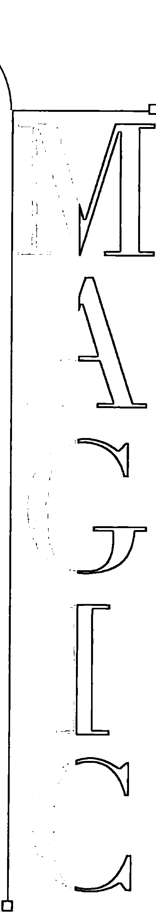

### 魅力失分

### 喜欢说闲话

双子座喜欢喋喋不休，只要打开话匣，就说个不停。

# 魅力星座智慧书之双子座

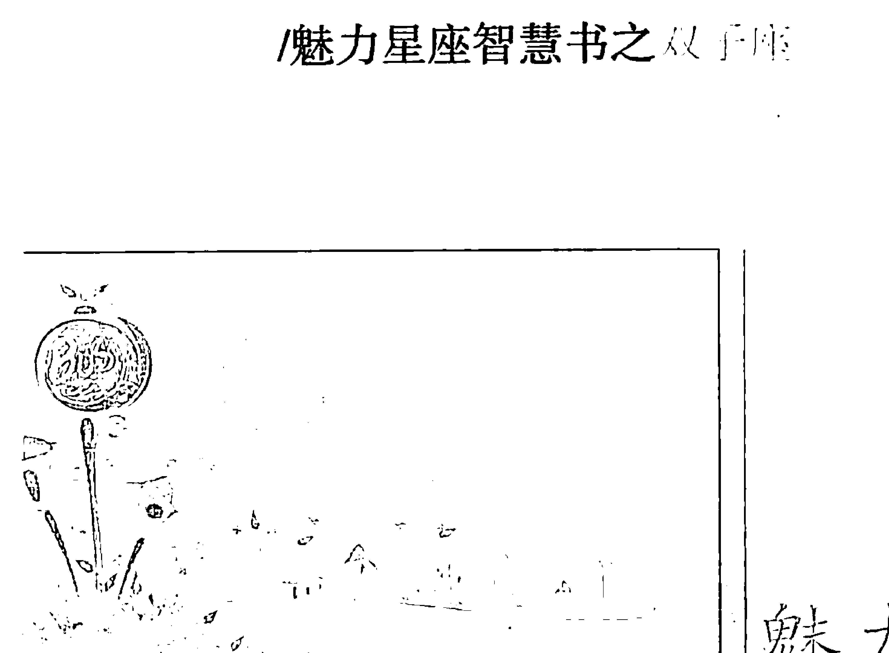

# 罗斯福的秘密

天天

罗斯福当海军助理部长时，有一天一位好友来访，谈话间朋友问及海军在加勒比海某岛建立基地的事。

“我只要你告诉我，”他的朋友说，“我所听到的有关基地的传闻是否确有其事。”这位朋友要打听的事在当时是不便公开的，但既是好朋友相求，那如何拒绝是好呢？

只见罗斯福望了望四周，然后压低嗓子向朋友问道：“你能对外传的事情保密吗？”

“能。”好友急切地回答。

“那么，”罗斯福微笑着说，“我也能。”

> 魅力提示：
“出我的口入你的耳，切莫向第三个讲起。”这全是自欺欺人的废话，你任何时候都不能指望别人就某事守口如瓶，你可以对好朋友说，他也会同样地对他的好朋友说，惟一的解决办法就是“打死我也不说”。

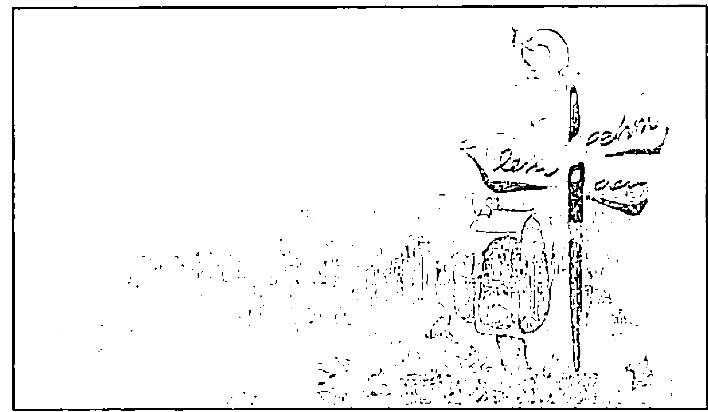

## 三个筛子

李茜

一个人急急忙忙地跑到某个哲人那儿，说：“我有个消息要告诉你……”

“等一等，”哲人打断了他的话，“你要告诉我的消息，用三个筛子筛过了吗？”

“三个筛子，哪三个筛子？”那人不解地问。

> “第一个筛子叫真实。你要告诉我的消息，确实是真的吗？”

> “不知道，我是从街上听来的。”

> “第二个筛子。”哲人接着说，“你要告诉我的消息就算不是真实的，也应该是善意的吧。”

> 那人踌躇地回答：“不，刚好相反……”

> 哲人再次打断他的话：“那么我们再用第三个筛子，请问，使你如此激动的消息对你我很重要吗？”

> “并不怎么重要。”那人不好意思地回答。

> 哲人说：“既然你要告诉我的事，既不真实，也非善意，更不重要，那么就请你别说了吧，这样的话，它就不会困扰你和我了。”

### 魅力提示：

经过“真实、善意、重要”这三个筛子筛一下要说的话，我们就会发现，很多话其实根本不必说。很多时候，当你管好了自己的嘴，其实也就管好了自己的生活。

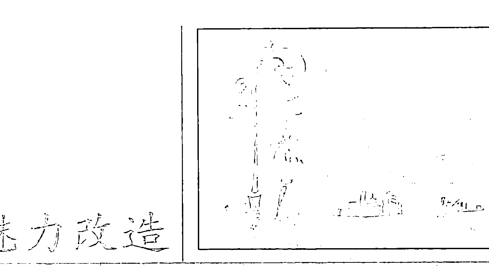

# 舌头宴

佚名

著名的寓言作家伊索，年轻时曾经当过奴隶。有一天，他的主人要他准备最好的酒菜，来款待一些赫赫有名的哲学家。当菜端上来时，主人发现满桌子摆的都是各种动物的舌头，简直就是一桌舌头宴。全桌客人议论纷纷，气急败坏的主人将伊索叫了过来问道：“我不是叫你准备一桌最好的酒菜吗？”只见伊索谦恭有礼地回答：“在座的贵客都是知识渊博的哲学家，需要靠着舌头来讲述他们高深的学问。对于他们来说，我实在想不出还有什么比舌头更好的东西了。”

哲学家们听了他的陈述，都觉得有理，便饶有兴趣地吃开了舌头宴。

第二天，主人又要伊索准备一桌最不好的菜，招待别的客人。宴会开始后，没想到端上来的还是各式各样的舌头。主人不禁火冒三丈，气冲冲地跑进厨房质问伊索：“昨天说舌头是最好的菜，怎么这会儿又变成最不好的菜了？”伊索镇静地回答：“祸从口出，舌头会为我们带来不幸，所以它也是最不好的东西。”这句无可辩驳的话，让主人哑口无言。

> 魅力提示：
言多必失，祸从口出，有时候话太多，不见得是件好事。

# 魅力星座智慧书之双子座

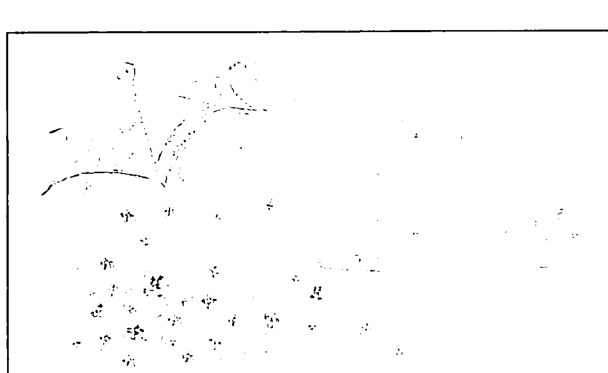

# 上帝不唠叨

佚名

古老的教堂里有一个严肃拘谨的老神父，他谆谆不悔地教导着教区内的信仰者们，并且十分满意他的教区内的信仰情形。几乎每个人都受洗了，礼拜天也上教堂，而且在日常生活中，都能切实依信仰而行，戒绝放荡的生活——除了一个嗜酒如命的酒鬼外。

为了这个酒鬼，老神父不知花了多少时间，用了多少苦心，费了多少唇舌，想尽一切方法劝他，但是仍然无法让他戒酒。每一次在神父的开导之下，酒鬼总是表露忏悔之意，决心不再碰任何一滴酒。然而这样的决心往往坚持不到午夜，人们便又见他烂醉如泥。

在一个深夜里，老神父在探访教友后欲回教堂的路上，迎面遇上这个酒鬼，只见他脚步蹒跚、浑身散发酒臭味，手上还拎着一只快见底的劣质酒瓶。

老神父见了酒鬼，不禁有气，斥责道：

> “看看你，这是什么样子，真不晓得若是上帝见到你这副德行会怎么说——”

酒鬼大着舌头答道：

> “我……我是不晓得上帝它老人家会怎么说我。不过，有一点我可以确定，它绝不会像你那么多嘴——”

### 魅力提示：

看完这个故事后，你的反应是否亟欲拿给您的另一半看，还是想让唠叨的上司或爸妈也能分享此则故事的精彩之处？如果你真是这么想，但愿你能稍稍用点技巧，太过直接的表达方式，有时效果适得其反。最重要的是，你应该反省反省，自己是否也像这个老神父一样呢。

### 魅力链接

| 项目 | 内容 |
| :--- | :--- |
| 书名 | 会说话会办事会做人 |
| 作者 | 闻君，金波 编著 |
| 出版社 | 时事出版社 |
| 出版时间 | 2007-5-1 |
| 印刷时间 | 2007-5-1 |
| ISBN | 9787802321182 |
| 包装 | 平装 |

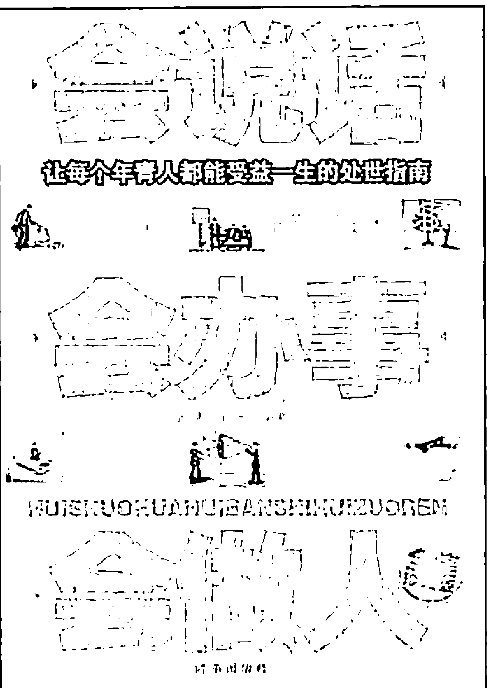

### 内容简介：

学会做人、学会办事、学会说话，是人生的三大生活技巧，缺一不可。
会做人，也会办事；会办事，要先会做人。同时，会说话，也是会办事和会做人的重要内涵，掌握了语言艺术，做人可以做得练达，办事可以办得聪明、圆满。所以说，掌握了这三大技巧，也就掌握了成功人生的金钥匙，人生一定会过得十分美满。
人生在世，离不开三件事：说话、办事和做人。学会做人、学会办事、学会说话，是人生的三大生活技巧，缺一不可。成为一个会说话、会办事、会做人的人，才能更好地为人处世，在社会、家庭、事业上取得成功。本书作为一本人生处世指南，向读者讲述说话、办事和做人这三方面的人生哲学和智慧，让每个年轻人都能受益一生。

# 魔法第二面
做人篇

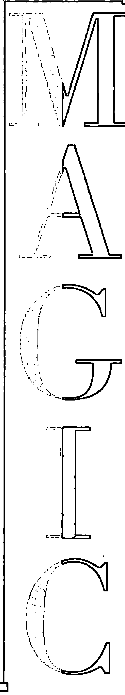

### 魅力失分

### 自以为是的傲慢

普通的双子已经眼高于顶，更何况有才华的双子？只不过，智慧一点的双子，会用亲切包装傲慢自大，让你看不出来！等试图再靠近他一点时，才发现，原来他一直不在意你，很多时候当他询问你的意见时，只是为了突显自己的聪明。

# 魅力星座智慧书之双子座

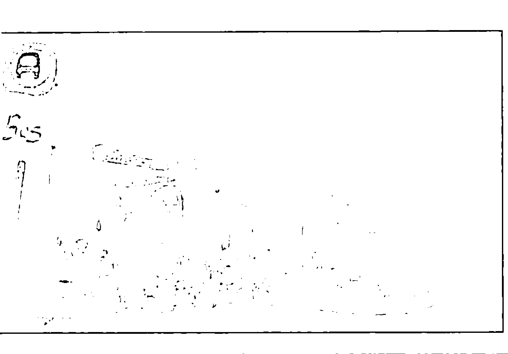

# 杜拉斯被救

刘军

杜拉斯是法国著名的作家，同时也是积极的参政者。1943年，她参与了一个反维护希特勒政权的集会。集会触痛了当时政府的软肋，所有参与运动的人，都受到警方的追捕，杜拉斯也准备暂避到小城格勒诺布尔。

火车包厢里还坐着三个人，一对母女和一个男人。男人叫布拉瑟，是当时法国的一个演员，他一眼就认出了杜拉斯。

布拉瑟曾在报纸上抨击过杜拉斯的新作《无耻之徒》，说小说里充斥着恐惧和欲望，是对孩子神圣心灵的亵渎。在包厢里，布拉瑟仍不依不饶，大声阐明自己的观点，并对杜拉斯提出建议，希望她能改进。

杜拉斯并没有生气，微笑着说：“很高兴您能仔细读完这本小说，我还以为没有人想看它呢。”说完，对面的孩子笑了起来。杜拉斯说这是她独立完成的第二部小说，以后会继续写下去，希望布拉瑟先生能坚持给出中肯的意见。

杜拉斯的话，让布拉瑟对她刮目相看，他曾以为杜拉斯只是个爱出风头的姑娘。于是，一改以前看不起她的态度，两人一见如故，在包厢里谈着见闻。

突然，两个军官冲进了包厢，要查看他们的身份证明，布拉瑟起身和军官寒暄，有个军官表示很喜欢他的表演，另一个军官似乎认出了杜拉斯，朝她望去。

“先生，这是我太太，请允许我介绍一下。”布拉瑟搂着杜拉斯朝军官说，两个军官犹豫了一会出去了，布拉瑟以法国人特有的浪漫帮杜拉斯度过了困境。

### 魅力提示：

> 有真才实学的人往往虚怀若谷，肯接受批评。而不学无术、一知半解的人，却常常自以为是骄傲自满。睿智的人，会在别人的批评声中找到出口，愚蠢的人，则在批评声中怨天尤人。谦虚谨慎的人会赢得尊重，在困境中得到帮助。

/魅力星座智慧书之双子座

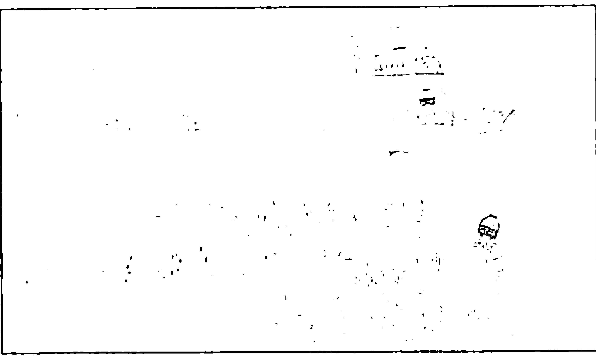

# 苍蝇和拉车的骡子

伊索

一只苍蝇叮在四轮车的车轴上，对拉车的骡子说：“你为什么走得这么慢！干吗不跑快一点？看来需要我来叮咬你的颈部了。”

骡子说：“我不怕你的恐吓，我只注意坐在你上面的那个人，他会用鞭子使我加快步伐，用缰绳拉我的头调整方向。你快滚开些吧，别再啰嗦了，我非常清楚什么时候该快，什么时候该慢。”

> 魅力提示：
不要自以为是，去做那些超越自己范围的事。那样，只会使别人厌恶。

### 魅力改造

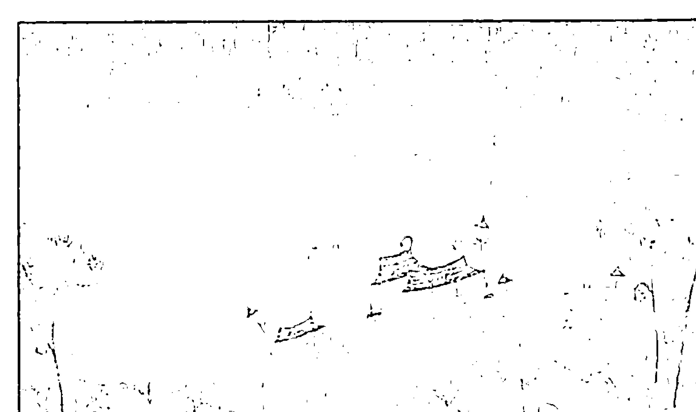

反面

# 杨修之死

佚名

杨修是个人才，属古代知识分子中的精英类人物，其人才思敏捷，聪颖过人，舌辩之士，得到曹操赏识器重，委以“总知外内”的主簿，成为丞相曹操身边的一位高级幕僚谋士，理应算得上一位重臣。

可是为什么曹操会杀他呢，起因是因为六件事情。这六件事情，层层叠加，不断地惹恼了他的主人曹操。最后曹操痛下决心，将其杀死。这六件事情分别为：

第一件事情是，曹操在花园的门上写一个“活”字，这是曹操为了卖弄一下自己的才干。结果杨修这家伙不给他面子，偏要拆穿曹操的西洋镜不可。告诉门匠说把门打得开阔些，门上写“活”字，就是阔，意思是说，本来的门太过于窄小了——曹操“忌之”。

# 魅力星座智慧书之双子座

第二件事情是，远方的客人送了“一合酥”给曹操，杨修认为这里的“合”应该是一人一口的意思，而原意是“盒”才对。“一合酥”被杨修一人一口与众分吃了，用我们现代人的话来说就是卖弄小聪明——曹操“恶之”。

第三件事情是，曹操本想以梦中杀人来警戒大家，杨修偏要在大家的面前揭穿不可，搞得曹操在众人面前没有面子。——曹操“愈恶之”。

第四件事情是，杨修告曹丕密请朝歌长吴质入内府商议，反被吴质用计陷害，曹操认为杨修是陷害曹丕——曹操“愈恶之”。

第五件事情是，曹操本想试一试曹丕、曹植的才干。原本曹植没有那个本事，可杨修偏要教曹植怎么做怎么做，开始的时候曹操认为曹植比曹丕聪明，很是赞赏，可是后来被曹操知道了，原来又是杨修坏了曹操的好事。——曹操“大怒”。

第六件事情是，杨修为曹植作答教，被曹操得知。——曹操“大怒”。

在发生了阔门、一合酥、曹操梦中杀人、吴质等事件后，曹操对杨修心中已暗存芥蒂，暗暗忌之戒备之，直到后来杨修又暗中插手废立太子之事，引起曹操极度不满和嫉恨。

这六件事，一步一步地逼迫曹操最后以“鸡肋”事件“惑乱军心”为借口杀死了杨修。

> 魅力提示：
真正聪明的人不会过分表现自己，自以为是的聪明到头来可能送命。

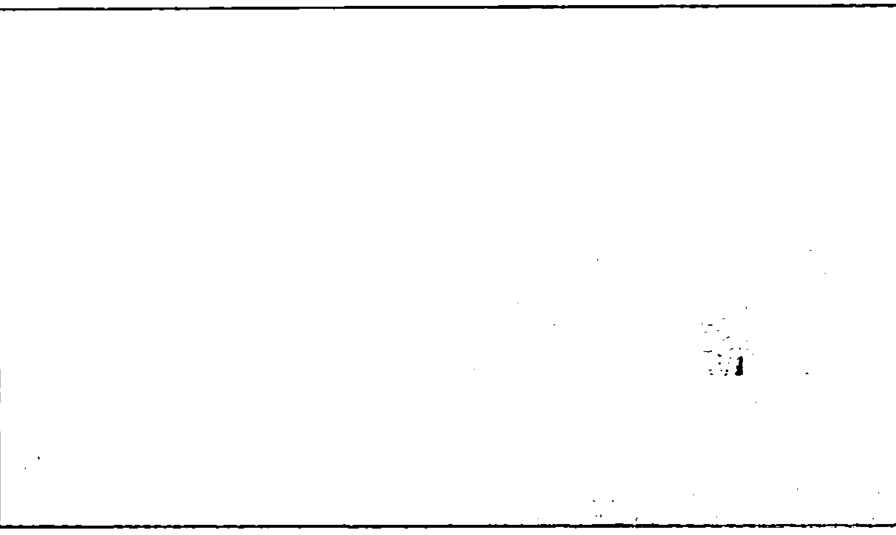

# 猴子逞能

田牧

吴王乘船顺着长江游览，兴之所至，停船上岸，登上一座猴山。众多猴子见了吴王一行，都十分害怕地逃避，跑到荆棘丛中去了。惟有一只猴子，从容地在树上跳来跳去，在吴王一行人面前显示它的灵巧。吴王操起弓箭来射它，它能敏捷地接住飞来的箭矢。吴王大怒，命令随从们一齐射，那只猴子被射了下来，死了。

吴王回过头来，对他的友人颜不疑说：“这只猴子呀，自恃它的身手灵巧，行动敏捷，来对我表示藐视，走上死路，是它自找的。你不必要对人表现出骄傲的神色来啊。”颜不疑陪吴王旅行归来之后，立即去请教贤人董梧，来改变他的神情气质，远离声色，拒绝荣显，三年之后，得到了京城中人们的普遍赞誉。

### 魅力提示：

> 人不可有傲气，不要仗着自己仅有的一点本事就无法无天，殊不知。这些本事在别人眼中只不过是小伎俩而已。太“牛”的人结局总不大美妙。

### 魅力链接

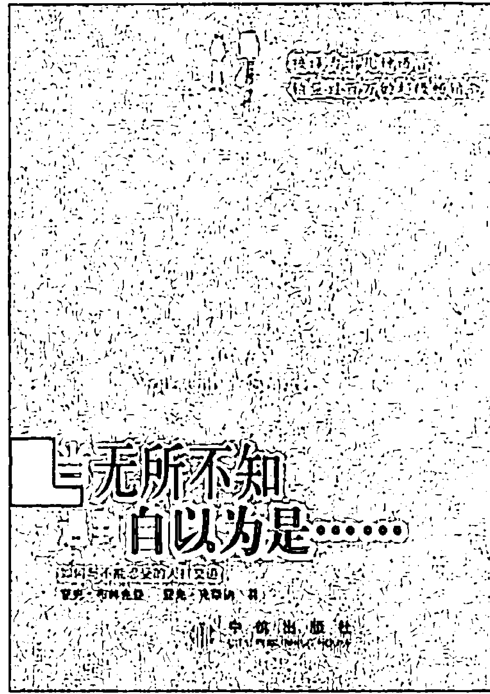

| 项目 | 内容 |
| :--- | :--- |
| 书名 | 当无所不知遇到自以为是…… |
| 作者 | ［美］里克·布林克曼 ［美］里克·克斯讷 |
| 出版社 | 中信出版社 |
| ISBN | 780073599 |
| 包装 | 平装 |
| 开本 | 大32开 |
| 出版日期 | 2003-01 |

### 内容简介：

被译为十几种语言，销量过百万的超级畅销书。

如果有人问你身边有令人头痛的人吗？你肯定会不假思索地扳着手指数出一大堆名字。如果有人问你是否认为自己是一个不好相处的人，你思考再三之后的答案大约是：“我会吗？！”但本书作者的观点与你正好相反。他们认为：其实并没有天生难打交道的人，而你也并不总是通情达理。

在本书中，你将学会一整套特殊的攻略，来应付上述高手和偶尔难缠的你自己。它们或可化干戈为玉帛，化冲动为理智，化暗藏敌意为诚恳对话；或可不战而屈人之兵，让刺头们乖乖地采取自己改变的方式；或可……

# 魔方第二面
做人篇

### 魅力失分
要浪费

双子座是相当没有节制的，花钱大手大脚，即使借钱也要满足自己的欲望，对他来说，不在乎什么浪费不浪费。

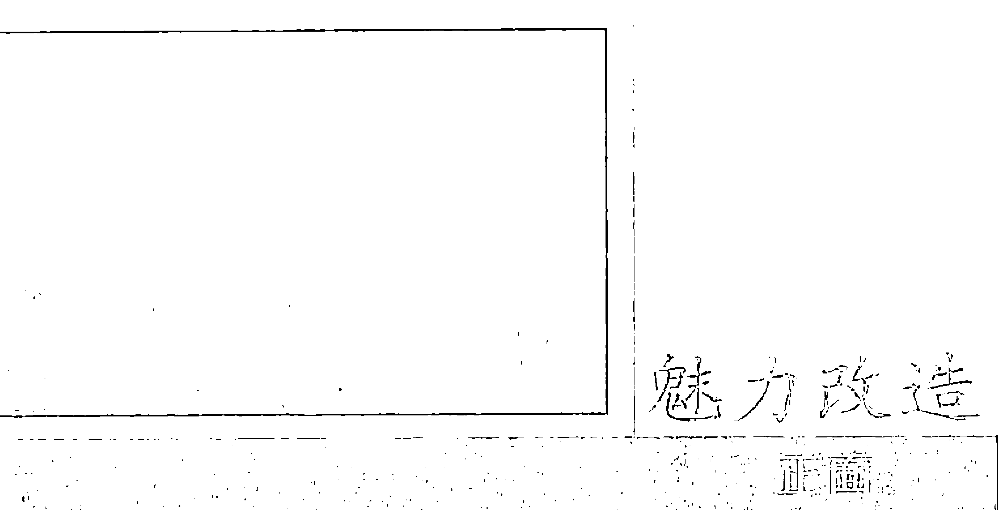

# 桓公喂蚊

佚名

齐桓公在柏寝台里睡觉，他对相国管仲说：“我们齐国国家富强，百姓生活很富裕，我没有什么忧虑。但有一件事处理不当，我却忧心忡忡，很不放心啊！现在蚊子嗡嗡地叫，它们没有吃饱，我有点忧虑。”

于是他拉开绿色的纱帐子，放蚊子进去。这些蚊子有的很懂礼貌，不忍心叮咬桓公，识相地飞开了；有的蚊子知道知足，叮了桓公一口，便飞走了；有的却贪得无厌，从不知足，停在桓公身上纵情叮咬，到它吮吸饱了，肠肚也因此胀破了。

桓公无限感慨地说：“哎呀！老百姓不也是这样的情况吗！”

于是他发布命令，要齐国制定在丰食足食的情况下杜绝铺张浪费的戒令，劝告百姓不要大吃大喝，不要过分追求绫罗锦缎的华丽装饰，从此勤俭节约在齐国蔚然成风。

### 魅力提示：

要提倡勤俭节约的生活，即使丰衣足食了，也不可铺张浪费，大吃大喝。

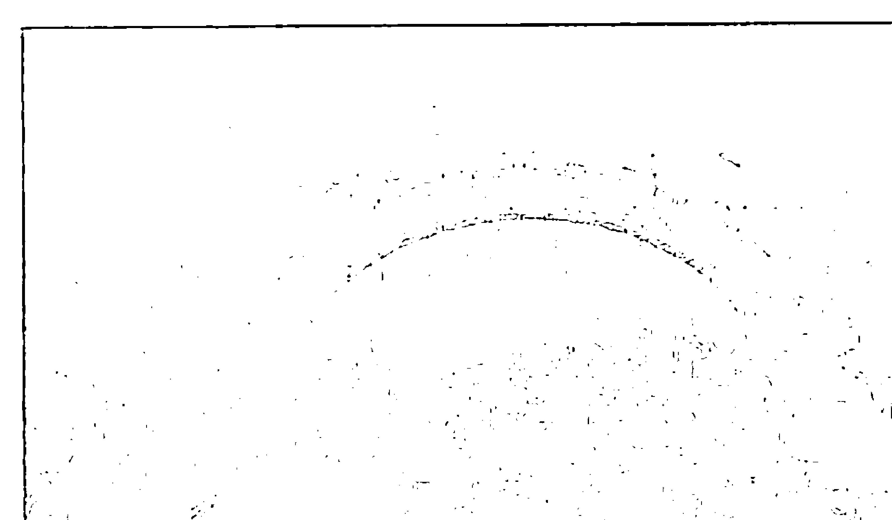

# 曾氏家族

佚名

曾氏家族从清朝至今久盛不衰，好运连连，这与他们的家训是分不开的。曾国藩的曾祖父曾制定治家信条八个字：“早、扫、考、室、书、蔬、猪、鱼。”其意思是：一要早起，二要打扫清洁，三要戒修祭扫，四要善待亲邻，其余四字就是：读书、种菜、饲鱼、养猪。

曾国藩幼承家训，对上辈所定的俭朴家规，信守不渝，并以此来教育自己的子女。及至他官居极品，位至爵相，仍然节俭自守，并严勉家人保持寒素家风。他在给长子曾纪泽的信中说：

# 魅力星座智慧书之双子座

> “勤俭自持，习劳习苦，可以处乐，可以处约，此君子也。余服官三十年，不敢稍染官宦气息，饮食起居，尚守寒素家风，极位可也，略丰亦可，大丰则我不敢也。凡仕宦之家，由俭入奢易，由奢返俭难。尔年尚幼，切不可贵爱奢华，不可习惯懒惰，不论大家小家，仕农工商，俭苦守约，未有不兴，骄奢倦怠，未有不败。”

他为让家中子弟能达到尚勤俭劳苦、戒骄奢倦怠的目的，曾为家人制定一套勤俭课目，规定男子要“看、读、写、作”，女子要“绣、食、粗、细”，即织麻纺纱，烧茶煮饭，打扫房舍，缝制衣服等。他在南京总督府任内，其夫人和儿媳们，每天还坚持织麻纺纱。

相传曾国藩为官三十年着布衣布袜，他每日吃饭，亦很简单，以一荤为主，有客略增加。曾国藩任总督，三弟任巡抚后，家中人看子孙增多，旧居不够用，他的九弟就花了三千串钱新建了一房舍。他听后大怒，写书指责九弟说：“新屋搬进容易搬出难，吾此生誓不住新屋！”他到病故时，仍住在两江总督旧居。

### 魅力提示：

即使家中有很多的房间，你晚上也只能睡在一张床上，即使你能尝尽天下的山珍海味，一日也不过三餐而已。凡事都要适可而止，适当地追求生活质量无可厚非，但是如果超过限度成浪费，那就于己于人都无益了。

# 爸爸的电报

张鸿

刚念大学时，爸爸和我约定，每月的15日给我寄500元生活费。因为开支毫无规律可循，三天两头里，我就找个理由与同寝室的舍友们到校园餐馆挥霍一顿：第一个月，爸爸容忍了我，提前把第二个月的生活费寄过来。然而我却恶习难改，第二个月、第三个月依然如此。终于，在离第四个月的收款日还遥遥无期的时候，我又捉襟见肘了。

万般无奈之下我拍了一封极其简短的电报回家：“爸爸，饿坏了。”
爸爸很快就回了电报，也很简短：“孩子，饿着吧。”

生活真是太伟大了，在那之后只有10块钱的10天里，我绞尽脑汁节衣缩食，出手之前锱铢必较，竟然也把那段难挨的日子熬过去了。

从此，我学会了精打细算，并且发现，其实只要稍稍收敛一下不必要的支出，每月400元生活费就够了。这样，每月我都可以积攒下一些盈余，这些钱可以买书、买磁带、买CD、旅游、捐款，当然也包括吃餐馆，但是比起单一地花在吃上，当然是有意思得多。

### 魅力提示：

> 不当家不知柴米贵，没挨过两顿饿、吃过几回苦的人，是不会知道钱是得之不易的，也不懂得安排自己的生活，我们应该学着在丰衣足食时勤俭节约。

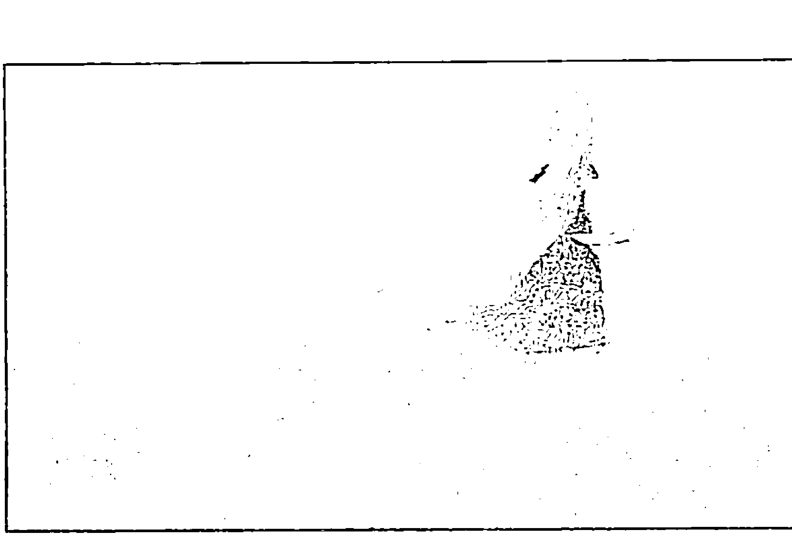

# 攒鸡蛋

佚名

美国有位作者以“你知道你家每年的花费是多少吗”为题进行调查，结果是近62.4%的百万富翁回答知道，而非百万富翁则只有35%知道。该作者又以“你每年的衣食住行支出是否都根据预算”为题进行调查，结果竟是惊人的相似。百万富翁中作预算的占三分之二，而非百万富翁只有三分之一。进一步分析，不作预算的百万富翁大都用一种特殊的方式控制支出，即造成人为的相对经济窘境，如将一半以上的收入先作投资，剩余的收入才用于支出。

这是巧合吗？不是的！这正好反映了富人和普通人在对待钱财上的区别。节俭是大多数富人共有的特点，也是他们之所以成为富人的一个重要原因。他们养成了精打细算的习惯，有钱就拿去投资，而不是乱花。

许多人都渴望成为富翁，却不知道要怎么做。

于是，许多人向富翁阿卡德询问致富的方法，阿卡德问他们：“假如你拿出一个篮子，每天早晨在篮子里放进十个鸡蛋，每天晚上再从篮子里拿出九个鸡蛋，最后将会出现什么情况？”
“总有一天，篮子会满起来，”有人回答，“因为我每天放进篮子里的鸡蛋比拿出来的多一个。”
阿卡德笑着说：“致富的首要原则就是在你放进钱包里的十个硬币中，顶多只能用掉九个。”

> 魅力提示：

道理很简单，除非你养成节俭的习惯，否则你很难积聚财富，即便积聚得到，也很难维持长久。一枚硬币可能真的微不足道，但它却是财富得以生长的种子。要学会为自己积攒这些种子。

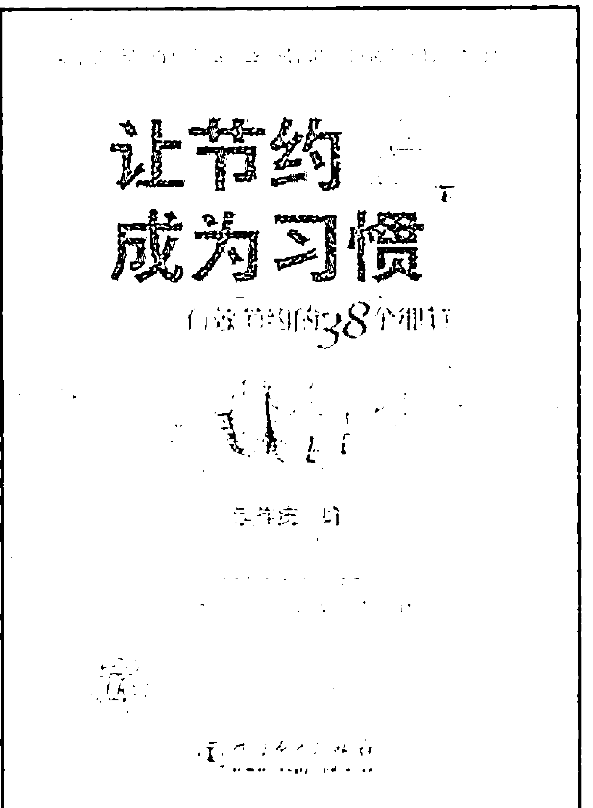

### 魅力链接

- 书名：让节约成为习惯
- 作者：淡佳庆 编
- 出版社：中国电力出版社
- 出版时间：2010-1-1
- 印刷时间：2010-1-1
- 开本：大32开
- ISBN：9787508398488
- 包装：平装

### 内容简介：

本书以企业生产经营中现实可行的节约细节为内容，以理念、工作、落实、流程、管理、提升等各个阶段为单元，列举和说明了让节约成为习惯的重要性和可操作性，明确能够实施节约的细节所在，帮助读者树立节约意识、践行节约习惯，为企业和个人创造更多收益、谋得共同发展。

本书说理简明，案例丰富，既可以协助企业宣传和确立节约文化，也能够为个人强化节约素养，是一本通俗有益的读本。本书可作为大众读物，也可作为企事业单位和机关节约培训教材使用。

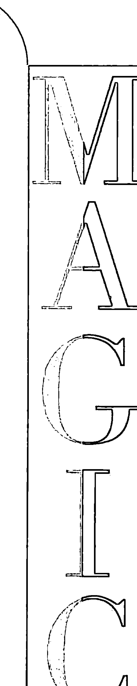

## 魔方第三面

### 恋爱篇

### 魅力失分

### 花心

很多双子座的人感觉能力较薄弱，不以情感满足为生命的重要目标，反而是好奇心强烈，把和多位异性发生感情之经验，当作是满足自己好奇心的一种手段。这种人没办法尊重他人的感情，而且把好奇心放在感情的前面，因此很难进入亲密关系。

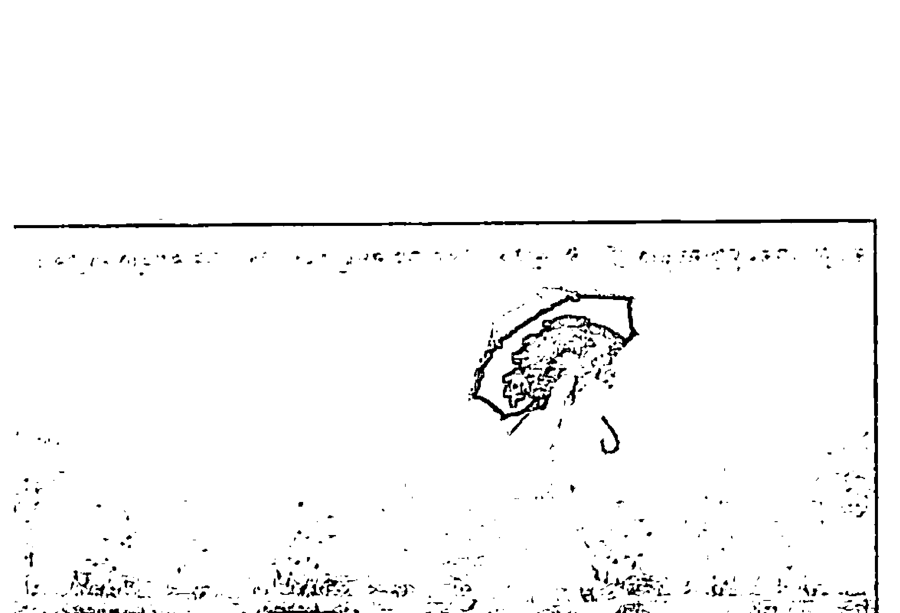

### 魅力改造

宣言

### 晏子辞婚

佚名

春秋时期，齐景公有个女儿，从小就生得乖巧可爱，特别惹人喜欢，齐景公对她更是爱如掌上明珠。

齐景公从宫中挑选出品学兼优的女官，对女儿辅导培养。随着时间一天一天地过去，女儿长大了，不仅相貌漂亮，而且知书达礼，落落大方，成了朝野皆知的绝代佳人。渐渐地，女儿到了谈婚论嫁的年龄，这可把齐景公愁坏了。

许多上卿、大夫都想让自己的儿子娶到这位佳人。一来可以跟国君联姻，即使以后有什么做得不对的地方，也不至于遭到砍头、抄家的惩罚；再者，百官知道后都会来巴结自己，说不定能捞到很多的好处。

但是当时有个规矩，就是诸侯之女嫁给诸侯之子，可景公担心把女儿嫁到别的国家去，父女就难再见面了，而且一旦两国交战，女儿的处境就更难了，他放弃了这种想法。

他又打算把女儿下嫁给国内的臣民，这样是离女儿近一些，可以常见到女儿。但他又担心门不当户不对，被人笑话，便也放弃了这种想法。

他想来想去了晏子，晏子身为齐国的相国，女儿嫁过去，做一位相国夫人，也不算辱没门庭。

但他不知道晏子是否同意，不能贸然行事，必须亲自去听听晏子的意见。

这一天，齐景公坐车来到相国晏府。晏子见国君到来，慌忙出来拜见，说道：“不知君侯光临，有失远迎，臣罪该万死！”

齐景公说：“相国不必客气，寡人在宫中呆腻了，来到相府与相国唠唠家常，不必大惊小怪。”

晏子吩咐家人赶快摆酒，为君侯接风。既然是家宴，晏子也就不拘礼了，唤出相国夫人来给齐景公斟酒。

齐景公问：“这是相国夫人吗？”

晏子回答：“对，这是臣的糟糠之妻。”

齐景公等相国夫人退下后，说：“唉！真是又老又丑啊。寡人有个女儿，又年轻又漂亮，就把她嫁给相国做妻子吧！”

晏子离开座位，对着齐景公恭敬地回答说：“现在她是又老又丑，可我与她生活在一起已经很长时间了，因此也赶上过她又年轻又漂亮的年华。况且人都是在年轻时把将来年老时托付给对方，在漂亮时把将来丑陋时托付给对方，我已接受了她的托付，对她做出终身的承诺了。君侯想赏赐给我一个年轻美貌的女子，难道是想让我背弃妻子的托付而抛弃她，另寻新欢吗？”

晏子说完，向景公拜了两拜，婉言拒绝了这桩婚事。

> 魅力提示：
> 夫妻之间应信守对爱情的庄严承诺，不可因对方年老色衰而喜新厌旧。

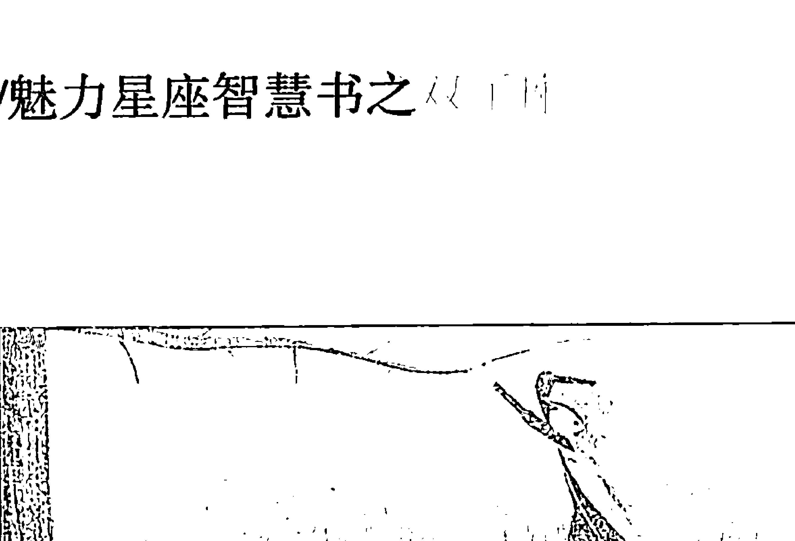

### 一条名叫痴情的路

佚名

在靠近湘南的乡下，有一条奇怪的石头路，莫名其妙地横过荒凉的土地，然后在远方断掉了。

这条路，是一个女人修成的。

几百年前，有一户人家，因为贫穷，丈夫便到外乡去打工，许久许久不曾回来。妻子便开始修路，先修好家门前的路，她怕丈夫回来时下雨，院子里泥泞；渐渐地，她向外面修路，朝着丈夫离开的方向，一块石头、一块石头地摆，直到她八十多岁，死的那一天，她的手里还握着一块石头，倒在了她修的路的尽头。后人感念女人的深情，不时打扫着那条石头路，几百年来，那条石头路便一直在荒野里延伸着。

凝视着那条由一块又一块石头铺成的小路，许多来观光的人都觉得有热热的液体在眼内涌动。

当那位年轻的妻子铺下第一块石头时，她一定在想，自己的丈夫不久便会踩着她亲手铺好的石头路如期归来。然而，日子一天天过去了，从青春妙龄到耄耋之年，丈夫却始终未能出现；失望的打击，未能改变妻子的心愿，她还在一块一块铺着石头，傻傻地等待，无悔地守候，深情地凝视，痴痴地盼望。人世间，唯有这一条没有终点的石头路，是用爱与心铺成的。妻子一定深信不疑，路铺得越长，自己与丈夫相见的日子就越近；总有一天，她亲手铺成的石头路，会把丈夫从远方带回家乡，带回她自己的身边。

漫长的岁月里，那份期待、那份渴盼、那份希望，在她心底不断燃烧，照亮了她原本孤寂的生命。我想，当她最终倒下的时候，她一定看见，那个等待了几十年的男人，正向她走来……

那条石头路，至今没有名字，但人们在心里都知道它叫“痴情”。

### 魅力提示：

> “爱”是一个最厚重的字眼，我们无法用金钱来衡量它的价值，因为爱是一种不期望回报的付出，是一种牺牲，是一生一世的相守。

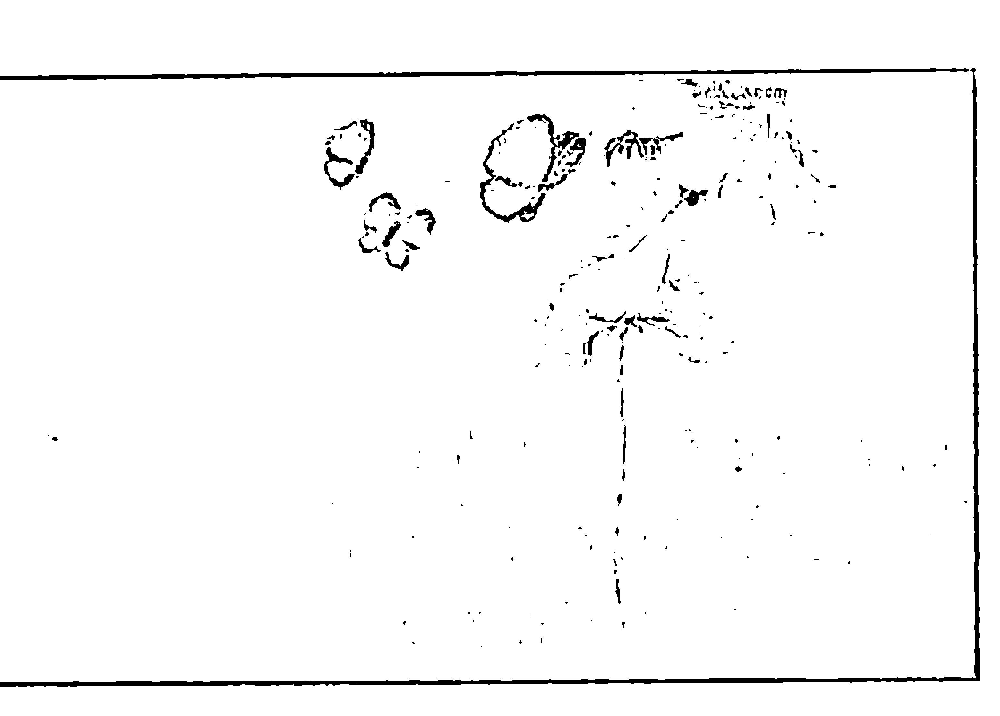

### 纸上婚变

佚名

法国小说家吕西安·里歇著书立说常常妙笔生花、浪漫情事多多，但他的家庭生活太平静、太单调了。

吕西安·里歇每天到图书馆去写作，他太太每天操持家务，并负责打印丈夫定期在《里昂晚报》上发表的短篇小说。

他每天回家的第一件事几乎是一成不变的：拥抱一下妻子，亲亲她的前额，说天天重复的一句话：“亲爱的，我希望我不在家时，你没有过于烦闷，是吗？”

太太的回答差不多也是一成不变：“没有，家里也有这么多事情要做。但看到你回来，我还是很高兴的。”

结婚23年来，几乎天天如此！

但是万万没有想到的是，奥尔嘉·巴列丝卡以第三者的身份闯进了他们的家庭。这是一个刚离了婚的漂亮、奔放，甚至有点寡廉鲜耻的女人。她降服了小说家，并且提出要跟他结婚。

小说家毕竟是小说家，他想出个妙主意。他编了一个故事，把自己与太太的现实处境转托成两个虚构人物的经历。为了能被妻子领悟，他还特意引用了他们夫妻间以往生活中若干特有的细节。在故事的结尾，他让那对夫妻离了婚，并特意写道：那个妻子对丈夫已经没有了爱情，一滴眼泪也没有流地走了，以后隐居在南方的森林小屋，靠丈夫补偿给她的足够的法郎，悠闲自得地消磨着自由的时光……

他把这份手稿交给太太打印时，心里难免有些不安。晚上回到家里时，心里嘀咕妻子会怎么接待他。

“亲爱的，我希望我不在家时你没有过于烦闷，是吗？”吕西安·里歇的话里带着几分犹豫。

太太却像平常一样安详：“没有，家里有这么多事情要做哪。但看到你回来，我还是很高兴的。”

吕西安·里歇猜测，难道她没有看懂？或者她把打印的事情安排到了明天？然而，太太告诉他，故事已经打印好了，并经仔细校对后寄往《里昂晚报》编辑部了。可是她为什么一字不提文中的情节呢？毕竟心虚，小说家没有多问，他受着情感的煎熬。

直到故事在报上发表后，闷葫芦才被打开。原来，太太把故事的结局改了：既然丈夫提出了这个要求，妻子只得强忍心中的悲伤，夫妻俩离了婚。可是，那位在结婚23年之后依然保持着自己纯真爱情的妻子，却在前往南方森林小屋的途中抑郁而死。

小说家吕西安·里歇震惊了，忏悔了，当下就和那个令他神魂颠倒的女人一刀两断。

太阳又升起来了，他们的生活还在继续。如同太太没有向他说起自己修改故事的结局一样，吕西安·里歇也没有向太太谈到自己的这段情事。

“亲爱的，我希望我不在家时你没有过于烦闷，是吗？”吕西安·里歇回到家时，一如既往地问道，不过比以往更加深情。

“没有，家里有这么多事情要做。但看到你回来，我还是很高兴的。”妻子一如既往地回答，不过比以往更加温柔。

> 魅力提示：
> 那些似乎太平静、太单调、太不浪漫的家庭生活，往往正是最安宁、最朴实、最值得珍惜的幸福生活。

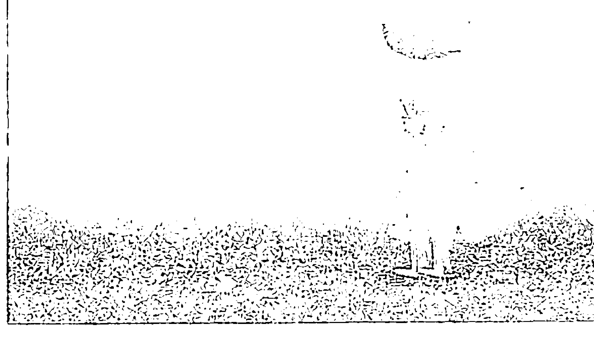

### 三根蜡烛

佚名

深夜，寺里一人一佛，佛坐人站。

人：圣明的佛，我是一个已婚之人，我现在狂热地爱上了另一个女人，我真的不知道该怎么办。

佛：你能确定你现在爱上的这个女人就是你生命里唯一的最后一个女人吗？

人：是的。

佛：你离婚，然后娶她。

人：可是我现在的爱人温柔，善良，贤惠，我这样做是否有一点残忍，有一点不道德。

佛：在婚姻中没有爱才是残忍和不道德的，你现在爱上了别人已不爱她了，你这样做是正确的。

人：可是我爱人很爱我，真的很爱我。

佛：那她就是幸福的。

人：我要与她离婚后另娶他人，她应该是很痛苦的又怎么会是幸福的呢？

佛：在婚姻里她还拥有她对你的爱，而你在婚姻中已失去对她的爱，因为你爱上了别人，正所谓拥有的就是幸福的，失去的才是痛苦的，所以痛苦的人是你。

人：可是我要和她离婚后另娶他人，应该是她失去了我，她应该才是痛苦的。

佛：你错了，你只是她婚姻中真爱的一个具体，当你这个具体不存在的时候，她的真爱会延续到另一个具体，因为她在婚姻中的真爱从没有失去过。所以她才是幸福的而你才是痛苦的。

人：她说过今生只爱我一个，她不会爱上别人的。

佛：这样的话你也说过吗？

人：我……我……我……

佛：你现在看你面前香炉里的三根蜡烛，哪根最亮？

人：我真的不知道，好像都是一样的亮。

佛：这三根蜡烛就好比是三个女人，其中一根就是你现在所爱的那个女人，芸芸众生，女人何止千百万万，你连这三根蜡烛哪根最亮都不知道，都不能把你现在爱的人找出来，你为什么又能确定你现在爱的这个女人就是你生命里唯一的最后一个女人呢？

人：我……我……我……

佛：你现在拿一根蜡烛放在你的眼前，用心看看哪根最亮？

人：当然是眼前的这根最亮。

佛：你现在把它放回原处，再看看哪根最亮？

人：我真的还是看不出哪根最亮。

佛：其实你刚拿的那根蜡烛就好比是你现在爱的那个最后的女人，所谓爱由心生，当你感觉你爱她时，你用心去看就觉得它最亮，当你把它放回原处，你却找不到最亮的一点感觉，你这种所谓的最后的唯一的爱只是镜花水月，到头来终究是一场空。

人：我懂了，你并不是要我与我的爱人离婚，你是在点化我。

佛：看破不说破，你去吧。

人：我现在真的知道我爱的是谁了，她就是我现在的爱人。

佛：阿弥陀佛。

### 魅力提示：

> 爱情也好，人生中的其他任何事情也好，珍惜当前，永远胜于三心二意。

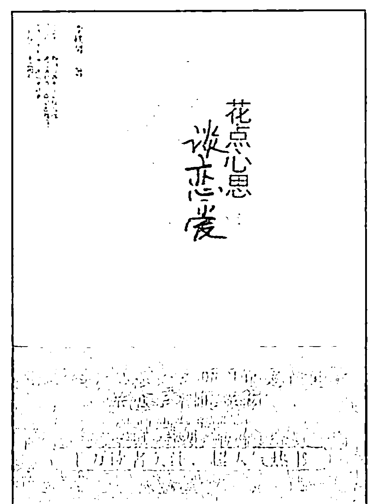

### 魅力链接

- 书名：花点心思谈恋爱
- 作者：李轶男 著
- 出版社：广西师范大学出版社
- 出版时间：2009-12-1
- 印刷时间：2009-12-1
- 开本：大32开
- ISBN：9787563391042
- 包装：平装

### 内容简介：

本书是一部畅销类情感专栏文集，全书几十余篇文章，全面地剖析了男女情感中所隐藏的不为人知的事儿。经典的妙语点评，细致入微的案例分析，泼辣大胆的文字风格，共同缔造了一部超人气的畅销热书。

恋爱，是每个人都会面临的问题，也是人类情感中最美好的事。但如何处理好恋爱，如何谈恋爱，却并非每一个人都懂得。为爱而伤，还是为爱痴狂？是享受爱情的甜蜜，还是品味爱情的酸楚？阅读本书之后，你将会一切都了然于心。

## 魔方第三面

### 恋爱篇

### 魅力失分

### 太招摇

有活力，加上过人的口才，让双子座的人在各种场合中都是被光环笼罩的。然而言多必失，每次当他忘情投入，与朋友们海阔天空的时候常常冷落了身边的另一半。加上周围异性经不住他幽默言辞的挑逗，都对他嬉笑怒骂，难免有打情骂俏的嫌疑。

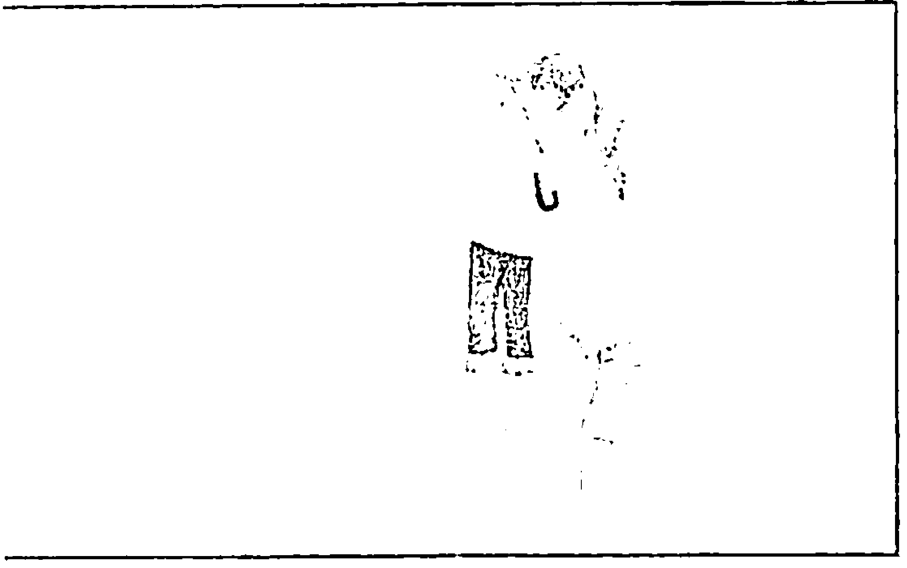

### 人生相爱有几时

佚名

他们都已大龄，是相亲认识的。遇上了，相爱了，结婚了。

婚后的日子像流动的蜂蜜，有着黏稠的甜。两个人手拉着手买菜，回来一起照着菜谱做。他放点儿鸡精，她再加点儿糖，一盘菜，七荤八素的味道，两个人吃得津津有味。

他去单位接她，从不站在马路对面，而是绕到她所在的那边，他怕她看到自己，不顾车辆跑过来，有危险。

她下班就匆匆回家，他回家就老老实实地帮她做家务。他们要把所有的时间，都用来相守相爱。

他们也吵架。那一天，她和他生气，不理他，顶着卧室的门，不让他进。后来，他说：“我给你出道数学题吧，人的平均寿命是72岁，我们认识的时候已经30岁。减去工作的时间，每天8小时；路上的时间，每天1小时；睡觉的时间，每天6小时；陪父母、朋友的时间，每周10小时；培养孩子的时间，每天4小时；学习充电的时间，每天2小时；还有生病的时间，处理杂事的时间……你算算，我们还剩下多少时间相爱？你舍得把相爱的时间用来冷战吗？爱一时少一时，过了这一小时，你再想补回来都来不及了。”

她立刻打开门，扑进了他的怀里。

### 魅力提示：

> 是啊，人生相爱有几时？人生那么短，全都用来与他相爱都嫌少，你为什么还要冷落这个对你最重要的人呢？

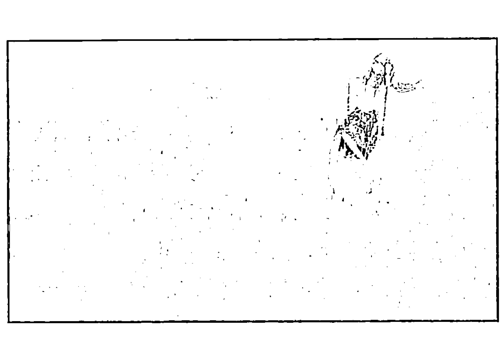

### 远看的美丽

佚名

看过一篇外国小说，讲述一位火车司机，每天开着一列火车经过那片肃杀的荒野，总感到很凄凉。好在，在荒野的尽头有一间茅屋。每当司机开着火车来到茅屋前，总会看见一个妇人带着个小女孩在窗口冲他招手。于是在司机眼里，这座简陋的茅屋无比可亲，这一对儿母女格外圣洁美丽。

十几年过去了，这位司机退休了。就想永远和这对母女一起在茅屋里住下去。可是进屋一看，不禁很失望：茅屋破破烂烂，母女俩衣衫褴褛，长相粗俗，神态多疑而冷漠。

可以想象，这位司机是多么的失望啊！

“看什么呢你？”妻子忽然一声牛吼，吓得我赶紧把手里的东西藏了起来。

“你可要注意了，别对邻家女孩儿那么殷勤，难道你就看不见她父母那钩子一样的眼神吗？”妻子奚落我。

“哎哎哎，看着路，别总盯着漂亮女人不放。车、车来了！”妻子把我一拉，一辆轿车鸣着喇叭贴着我的身子疾驰而过。

“你有神经病啊？干吗总是色迷迷的？”妻子恼了。

我感到委屈：“我没起什么歪心啊！”

“那你藏什么？见不得人么？”妻子责问。

我老老实实地把一叠女明星的写真图片交给老婆大人。

赵薇、林心如、张娜拉、倪萍……

这些都是大美女的养眼图片，我看的时候像欣赏满园鲜花，心平气和、陶醉其中……

这也算下流？

至于邻家女孩儿，她那么可爱，又很有才气，写了那么好的歌，还在网上谱了曲。乐队的人唱了，还火了！我能不服吗？表示点儿爱慕之心不行吗？

实话告诉你吧，她就是我的小知音、小偶像，我们之间能有什么别的？

她才比咱女儿大几岁啊！

至于街上的美女，那女人也太美啦。百里挑一？一万里也找不到一个！

那容貌、那气质、那风度……

“什么什么？你没看见吗？她都四十好几啦，为了她撞车？我傻啊？”

妻子笑坏了：“你是常有理，反正男人没一个好东西。”

我想说：别忘了，你爸你哥也是男人！可是没敢说。

也怪了，当初我和妻子也是一见钟情的。我迷上了她的娇美，她恋上了我的潇洒。

可如今，她既不娇又不美，成天满脸怒气，总是斥责。那张变形的脸让人看着就恶心。

我呢，也是邋里邋遢，不修边幅。潇洒？别笑话我啦！

一天，家里来了好几位妻子的闺中好友，都是穿金戴银的富婆。

我老老实实在书房里著书立说。她们都是小辣椒，我可不敢惹！

这些女人在客厅里叽叽咕咕，还对我指指点点，相当神秘。

让我心里像猫抓似的，疑惑又心慌。

那天过后，妻子忙起来。

每天都有一个女友开车来接她，家里还天天收到陌生人送来的鲜花，妻子也打扮起来，像个交际花。

我不放心地问了一句，妻子笑了：“你怕什么，这些又都不用咱花钱，你不正好可以在家搞创作吗？省得得不了诺贝尔文学奖怨我！

可我也不能为了得奖丢了老婆啊！

这天老婆临出门，神秘地朝我笑笑：“别动我的抽屉啊！”

我疑心大起，妻子前脚刚出门，我马上打开了她的抽屉，看到一本厚厚的小说集，我打开扉页，看见了作者近照，我一下子惊呆了：哇！近来正走红的女作家梅子原来就是我的老婆！

我又从抽屉里取出一本相册，里面的相片都是妻子的写真照。原来我的妻子比那些美女明星要美上千万倍！

我正看得带劲儿，身后忽然响起一片欢呼，一群手捧鲜花的女人簇拥着我的妻子，妻子打扮得像个女王，雍容华贵，仪态万方，绝世美丽！

我惊讶得嘴大张，眼发直，快乐得像个傻子。

众女人齐唱：“Happy birthday to you! Happy birthday to you! Happy birthday to you! Happy birthday to you”

唱完，梨花飞溅，众人齐声欢呼！

我一下子明白了：我和妻子同年同月同日生，今天是我们俩的生日啊！

> 魅力提示：
> 最好的风景不在别处，就在你的身边，就是那个与你日日相伴的人。不要把时间浪费在别人的身上而忽略了最值得你珍惜的人。

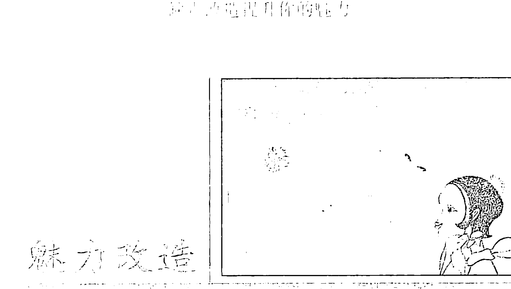

### 花开无声

纪广洋

寺院里接纳了一个年方16岁的流浪儿，这个流浪儿头脑灵活，手勤脚快。灰头土脸的流浪儿在寺里剃发沐浴之后，就变成了干净利落的小沙弥。

法师一边关照他的生活起居，一边因势利导教他一些为僧做人的基本常识。看他接受和领会问题比较快，法师又开始引导他习字念书、诵读经文。也就在这个时候，法师发现了小沙弥的弱点：心浮气躁、喜欢张扬、骄傲自满。

例如，他刚学会几个字，就拿着毛笔满院子写、满院子画；再如，他一旦领悟了某个禅理，就一遍又一遍地向法师和其他僧侣炫耀；更为可笑的是，当法师为了鼓励他，刚刚夸奖他几句时，他马上就在众僧面前显摆，甚至不把任何人放在眼里，大有唯我独尊、不可一世之势。

为了改变他的不良行为和作风，法师想了一个用来启发、点化他的非常美丽的教案。这一天，法师送了一盆含苞待放的夜来香给这位小沙弥，让他在值更的时候，注意观察一下花卉的生长状况。

第二天一早，没等法师找他，他就欣喜若狂地抱着那盆花一路招摇地跑来了，当着众僧的面大声对法师说：“您送给我的这盆花太奇妙了！它晚上开放，清香四溢，美不胜收。可是，一到早晨，它又收敛了它的香花芳蕊……”

法师就用一种特别温和的语气问小沙弥：“它晚上开花的时候，吵你了吗？”

“没有。”小沙弥高高兴兴地说，“它的开放和闭合都是静悄悄的，哪能吵我呢？”

“哦，原来是这样啊。”法师以一种特殊的口吻说，“老衲还以为花开的时候得吵闹着炫耀一番呢。”

小沙弥愣了一阵之后，脸刷地一下就红了，诺诺地对法师说：“弟子领教了，弟子一定痛改前非！”

> 魅力提示：
> 比起招摇着让全世界来看你花开，以一种内敛无声的方式悄悄绽放更让人感觉舒服安心。

妻子的炫耀

佚名

有这样一对夫妻，妻子姿色姣好，素质也高，夫妻俩感情一向很好。

单位有一名新来的风流倜傥的男子不明就里，还想追求她，并发出了吃饭的邀请。其实她对这种风流男子并不感兴趣，可又觉得这么帅气的男子追求自己，一定是因为自己很有魅力，所以她爽快地答应了邀请。

吃完饭后回到家，为了炫耀自己，她还向老公诉说了这件事，显出很得意的样子。结果，这不仅没有得到老公的理解和珍爱，相反，老公是不理不睬，生着闷气，从此老公对她还怀有种种怀疑和戒备，结果使美好的婚姻蒙上了一层阴影。

> 魅力提示：
> 爱情不是游戏，需要两个人相互忠诚、共同经营，招摇而不知检点最终的结果只会搬起石头砸自己的脚。

魅力链接
- 书名：低调的智慧
- 作者：王珊 编著
- 出版社：金城出版社
- 出版时间：2009-9-1
- 印刷时间：2009-9-1
- 开本：16开
- ISBN：9787802512252
- 包装：平装

### 内容简介：

低调的人比较宽容，能够尊重他人不同的看法、思想、言论、行为，甚至他人的宗教信仰、种族观念。低调的人不会轻易把自己觉得“正确”或者“错误”的东西强加于人。当然，他们也有自己的观点或做法，但是，他们在坚持自己观念的同时，会尊重他人的选择，给予他人自由思考和行为的权利。

低调的人并不是与世隔绝，而是在社会交往中保持一个真正的自我，他们不招摇过市，他们不矫揉造作，他们不扭捏作态，这使他们在这个充满诱惑的世界上不至于迷失自我。

魔方第三面
### 恋爱篇

魅力失分

有一个谁也进不去的私人空间。他愿意为爱付出，只要是为了爱，就算是要他付出性命，他也许都愿意，但是假如你还要计较他为何老躲在内心的私密角落的话，就莫怪他人还在，心却离你越来越远，远到连陌生人都不如，两人吵架时，冷战高手的他足以令你自我怀疑到抓狂。

沟通日

郭翠平

每月的最后一个星期六，是玉霞和丈夫雷打不动的“沟通日”。夫妻俩在单位都是忙人。孩子小，家务事自然多。过去，在商场当营业组长的玉霞每天站了一天柜台，腰酸腿疼，下班后还要接孩子买菜烧饭；丈夫是路桥工程师，常冒烈日在工地上跑，晚上回家时也早已精疲力竭，连话都懒得多说。

常是他要求她“温柔”，却总听她唠叨抱怨；她希望他“体贴”，他却发火说我在外拼命挣钱还不都是为了你们娘儿俩，回家来当然应该让我休息放松看看电视，等等。三句话不投机，就会要么引发一场争吵，弄得鸡飞狗跳孩子叫，要么冷着脸好几天互不理睬，心情压抑烦躁，日子久了大大影响夫妻感情。

好在夫妻俩都知书达理，他们走进了心理咨询室。在心理医生的建议下，两人近来约定：每月抽出一天，即把每月的最后一个星期六定为固定的“沟通日”。届时坚决把所有杂事都放下，把孩子送到外婆家，而后夫妻俩就骑车来到恋爱时常来的公园边，或心平气和地互相沟通交谈家事，安排下个月生活，或毫不遮掩地数落批评对方，或干脆就脸红脖子粗地痛痛快快吵上一架。说完吵完之后彼此都感觉轻松，如同夏天暴风雨之后天空特别纯净美丽一样，接着说不定两人还会像过去热恋时那样躲到树丛后面悄悄亲热一番。

说来也怪，自从实行每月一次的透彻沟通之后，心中的不满情绪得到定期释放发泄，夫妻俩平时反而不争吵了，家务活分着干，疼孩子敬老人，和和美美的让人好不羡慕。

> > **魅力提示：**
> > 在现今生存压力增加的情况下，爱人间的沟通交流非常重要。让沟通固定化，即定期进行平等的爱人对话，可舒缓紧张烦躁的心灵，消减两个人的矛盾。

爱是分享

佚名

小赵是一个喜欢旅游的男孩，他工作几年，攒了点钱就买了辆越野车，一有空就和朋友们去各地旅行。而小露是一个非常喜欢安定的人，她工作几年后就贷款买下了一套大房子，只不过一个人住那么大的房子，经常会感到寂寞，另外，她每月的收入很大一部分用于还月供，每次想去旅行都觉得资金很紧张，不得不打消那些计划。

后来，小赵在绿野网站上发了一个帖子，说是他提供车，愿找一个女孩一起自驾游杭州。这个帖子遭到不少人的非议和怀疑，许多女孩都不敢与之同行。而每逢周末、节假日只能窝在家里的小露却没想那么多，她只想出去撒撒欢。

于是，她回复了他，他俩一起从北京出发去了杭州。一路上，小露没觉得小赵是个坏人，他说自己可能单身太久，有点想谈女朋友了，所以才发那样的帖子，打算碰碰运气。结果，运气还真来了。

小露听到这样的话，感觉他很可爱。

言谈之下，小露发现他是一个特别爱旅行的男孩，把钱都用在了旅行上，至今还在租房生活。这起初在她看来是不可思议的，并觉得这样的男孩没有安全感。

小赵也没有强求她的意思，只不过想交个朋友而已。

从杭州回来以后，小赵继续过自己的简单生活。而小露却陷入了矛盾，她觉得自己就是被房子压得太紧了，才活得那么累，而人家小赵虽然没房子，但日子过得非常滋润。她越来越觉得自己以前太傻，太不会享受生活。

于是，她给好朋友打了一个电话，说：“我打算卖了房子买辆车，以后租房生活，反正现在年轻人都在租房。而且自己还可以开着车去旅行，再也不必为月供发愁了。”好朋友却说：“你太不会投资了，现在房子一直在升值，而汽车一直在贬值，最好的办法是找个有车没房的男朋友，既可以帮你还月供，你还可以和心爱的男人一起开车旅行！”

她听完好朋友的建议，感觉自己真的挺笨的，咋没想到这一出。就在这时，她又想起了小赵，觉得他或许是个合适的选择。

于是，她开始主动联络他，他们开始交往了，半年后正式谈起了恋爱，并很快结婚了，他俩比同龄人更早地过上了有房有车的幸福生活。

分享就是这么简单，把“你的”、“我的”变成了“我们的”，既成就了爱，又实现了梦想中的生活。

> > 爱是分享，只有学会了分享，精神才会富足，物质也会充足。分享，带给你的不仅仅是快乐，还有许多许多。

一杯冷却的热茶

佚名

一个周末的傍晚，心理学教授在阳台上整理白天拿出来暴晒的旧书，却观察到一幕生活的悲喜剧。与教授相隔一条防火墙的邻居在阳台上洗碗。她动作十分利落，水声与碗盘声铿锵作响，像发自她内心深处的不平与埋怨。
这时候，她丈夫竟从客厅端来一杯热茶，双手捧到她面前。
这个画面很让教授感动，为了不惊扰他们，他轻手轻脚地收起一摞书本，往屋里走。正要转身时，女人突然对男人没好气地说：“别在这里假好心啦！”惊讶不已的教授，从眼睛的余光中瞄到丈夫低着头又把那杯茶端回屋里——那杯热茶一定在瞬间冷却了，像他的心。
继续在洗碗的她，还是边洗边抱怨：“端茶来给我喝？少惹我生气就好了。我真是苦命啊！早知道结婚要这么做牛做马，不如出家算了。”
也许她需要的不是一杯热茶，而是他来分担她的家务。但是，这是可以商量的，而且也并不需要把情绪发泄在对方身上，特别是在对方对你献殷勤的时候。

### 魅力提示：

没有人是天生注定不幸福的，除非你自己关起心门，拒绝幸福之神来访。

两只刺猬的爱情

佚名

在一个寒冷的冬天，两只刺猬很冷，决定相互靠近取暖，但是很快发现，虽然暖和了，可是身上的刺却把对方的刺鲜血淋漓，疼的受不了。

于是他们决定分开，可是分开又太冷。

在不断的调试中最终发现适度的距离既可以取暖，又不至于刺伤彼此。

可是他们很快发现，这样保持距离，却又不方便交流。

经过不断的努力，后来，刺猬又发现一个更好的办法，就是当他们肚皮对着肚皮的时候，他们可以拥抱，而且更加暖和。

> 魅力提示：
> 肚皮贴着肚皮，心贴着心，只有这样的坦诚相待，才是爱情最适合的方式。

魅力链接
- 书名：卡耐基沟通的艺术
- 作者：［美］卡耐基 著，刘祜 编译
- 出版社：中国城市出版社
- 出版时间：2007-5-1
- 印刷时间：2007-5-1
- ISBN：9787507418491
- 包装：平装

### 内容简介：

这是一本教人行动的书。但书中所说的不是空洞的理论，而是有着令人难以相信的神奇功效。全书共分八部分，内容包括：人际沟通必须掌握的基本技巧，如何让他人喜欢并乐意帮助你，如何让他人赞同你的想法，如何更好地说服他人，男性专用的家庭沟通技巧，女性专用的家庭沟通技巧，如何克服沟通中的忧虑心理，如何掌握演讲的沟通技巧等。

最初，作者只是把这些规则写在各种小卡片上；在下一个时期，作者又将它们印在较大的卡片上；然后是印在一本小册子中；再接下来就成了一小本书。它的篇幅和内容不停地扩充，在经过15年的实验和研究之后，终于成了现在这本书。作者在这本书中所说的不是空洞的理论，而是有着令人难以相信的神奇功效。作者确确实实看见这些原则改变了许多人的生活，走上了成功之路。

## 第十四面 双子篇

### 魅力失分

### 过于冷漠

双子座的人往往比较冷漠，对朋友和身边的人缺乏热情，不懂得关心和付出。

魅力改造

正篇

自己的床铺不要钱

佚名

一个暴风骤雨的夜晚，一对上了年纪的夫妇来到一家旅店。他们的行李非常简陋，身无长物。

年老的男人对旅店伙计说：“对不起，我们跑遍了其他的旅店，里面全客满了。我们想在贵处借住一晚，行吗？”

年轻的伙计解释说：“这两天，有三个会议同时在这个地方召开，所以附近的旅店会家家客满。不过，天气这么糟糕，你们二位一把年纪，没个落脚处也不方便。”

伙计一边说一边把两位老人往里边请：“我们的旅店也客满了，要是不介意的话，你们就睡我的床吧！”

“那你怎么办呢？”那对夫妇异口同声地问。
“我身体很好，在桌子上趴一会或者在地上搭个铺都不碍事的。”
第二天早上，老人付房钱时，伙计坚持不要，说：“我自己的床铺不是用来赢利的，我怎么能要你们的钱呢？”
“年轻人，你可以成为美国第一流旅馆的经理。过些日子兴许我要给你盖个大旅馆。”
伙计听了，只当是一个玩笑，畅怀大笑起来。
两年过去了。一天，年轻人收到了一封信，信里附着一张到纽约的双程机票，约请他回访两年前在那个雨夜借宿的客人。
年轻人来到了车水马龙的纽约，老人把他带到第五大街和第三十四街的交汇处，指着一幢高楼说：“年轻人，这就是我们为你盖的旅馆，你愿意做这个旅馆的经理吗？”
不错，这位当年的年轻人就是如今大家都熟识的纽约首屈一指的奥斯多利亚大饭店的经理乔治·波尔特，那位老人则是威廉·奥斯多先生。

> 帮助别人，其实是在帮助自己。

祷告的手

佚名

《祷告的手》是一幅画的名字，更是真爱的名字。

丢勒和奈斯丁是一对好朋友，都是在奋斗中的画家。由于贫穷，他们必须半工半读才能够继续学业。可因为工作占去他们许多时间，两人的画艺进步很慢。梦想的遥遥难及撕扯着两个人。困惑了良久，两个人想出一个办法，决定以抽签的方式决定，一个人工作来支持彼此的生活费，另一个人则全心学习艺术。

丢勒赢了，得以继续学习。而奈斯丁则辛勤工作，供应两个人的生活所需。不久，丢勒前往欧洲各城市学习，奈斯丁继续无怨无悔、任劳任怨地工作着，赚取着两个人的生活费用及丢勒的学习费用，信守着自己的承诺。几年后，丢勒成功后，便按照两个人当初的约定找到奈斯丁，履行支持奈斯丁学习的协议。可他发现，为了支持自己而辛勤工作，奈斯丁那原本优美灵敏的双手的手指已经僵硬扭曲，遭到终生的损坏，已经不能灵敏地操作画笔了。丢勒心痛如绞。奈斯丁却宽厚自然地笑着，他竟丝毫没有因为自己无法完成艺术家的梦想而难过，心中还尽是为朋友成功而感到的兴奋。

这天，丢勒去拜访奈斯丁，发现奈斯丁正合着双手，跪在地上，安静而诚挚地为他做成功祷告。天才艺术家双眼潮湿，将朋友那双祷告的手画了下来。这幅画成为举世闻名的《祷告的手》。

> **魅力提示：**
> 每一个成功者的背后，其实都有着一双，或者更多双这样的手，值得那些成功的人们铭记，也值得那些没有成功的人铭记。不要吝啬做一双这样的手，这样，当你需要的时候，你也会得到很多双这样的手。

对着大山喊话的孩子

佚名

一个孩子跑到山上，无意间对着山谷喊了一声：“喂……”声音刚落，从四面八方传来了阵阵“喂……”的回声。

大山答应了。孩子很惊讶，又喊了一声：“你是谁？”大山也回音：“你是谁？”孩子喊：“为什么不告诉我。”大山也说：“为什么不告诉我。”

孩子忍不住生气了，喊道：“我恨你。”他哪里知道这一喊不得了，整个世界传来的声音都是“我恨你，我恨你……”

孩子哭着跑回家，告诉了妈妈，妈妈对孩子说：“孩子，你回去对大山喊‘我爱你’，试试看结果会怎样。好吗？”

孩子又跑到山上。果然这次孩子被包围在“我——爱——你，我——爱——你……”的回声中。

群山笑了，孩子也笑了。

> **魅力提示：**
> 我们总是在抱怨别人的态度太冷漠、情绪太不好，却不知你自己是对方一面最好的镜子。想让别人爱你，你得先去爱别人。

真情测试

杨长峰

日本社会关系学专家谷子博士讲过这样一个故事。

有一富翁为了测试别人对他是否真诚，就假装生了重病住进医院。

结果，那富翁说：“很多人都来看我，但我看出其中许多人都是为了分配我的遗产而来的，特别是我的亲人。”

谷子博士问他：“你的朋友来看你了吗？”

经常和我有往来的朋友都来了，但是我知道他们不过是当做一种例行的应酬罢了。

还有几个平素和我不睦的人也来了，我想他们肯定是听到我病重的消息，幸灾乐祸来看热闹的。

照他的说法，他测验的结果就是：根本没有一个人对他有真正的感情。

谷子博士就告诉他：“为什么我们苦于测验别人对自己是否真诚，而从来不测验一下自己是否对别人真诚呢？”

> 魅力提示：
> 人与人之间的感情都是相互的。真心换真心，虚情换假意。人心都是肉长的，你若是对别人冷漠不真诚，又怎么能寄希望于人家对你一片热情呢？

魅力链接
- 书名：你有几个灵魂
- 作者：朱建军 著
- 出版社：中国城市出版社
- 出版时间：2003-1-1
- 印刷时间：2008-1-1
- 开本：大32开
- 印次：6
- ISBN：9787507414608
- 包装：平装

### 内容简介：

在生活、工作的重重压力之下，我们心中常常充满矛盾和纠缠。让我们拆开心中的多个自我，审视自己的灵魂，重新认识自己，以达到自我世界的安定与从容。

魔方第四面
### 交友篇

### 魅力失分
### 不尊重他人
双子座总是有点自作聪明，对人虚伪，还总以为别人不知道，把别人当傻瓜。

副总裁不是总统

*佚名*

美国前总统乔治·布什是个原则性很强的人，他坚持“一就是一，二就是二”的原则。他认为空军1号就是空军1号，空军2号就是空军2号。“只有总统才能在南草坪上着陆。”

1981年春，当时身为副总统的布什正在一次飞往外地的例行公务旅行的飞机“空军2号”上。突然布什接到国务卿黑格从华盛顿打来的电话：“出事了，请你尽快返回华盛顿。”几分钟后的一封密电中布什被告知总统里根已中弹，正在华盛顿大学医院的手术室里接受紧急抢救，飞机调头飞向首都华盛顿。

飞机在安德鲁斯着陆前45分钟，布什的空军副官约翰·马西尼中校来到前舱为结束整个行程做准备。飞机缓缓下滑时，马西尼突然想出了个主意，他说：“如果按常规在安德鲁斯降落后，再换乘海军陆战队一架直升飞机，飞抵副总统住所附近的停机坪着陆，再驾车驶往白宫，要浪费许多宝贵时间。不如直接飞往白宫。”

布什考虑了一下，决定放弃这个紧急到达的计划，仍按常规行事。

“我们到达时，市区交通正处高峰时期，”马西尼提醒道，“街道上的交通很拥挤，坐车到白宫要多花10至15分钟的时间。”

“也许是这样，但是我们必须这样做。”

马西尼点点头：“是的，先生。”说着走向舱门。

看到马西尼中校显得疑惑不解，布什解释道：“约翰中校，只有总统才能在南草坪上着陆。”布什坚持着这条原则：美国只能有一个总统，副总统不是总统。

> 魅力提示：
> 人与人之间是需要相互尊重的，总统与副总统之间建立在相互信任基础上的相互尊重，是成就一个成功副总统最重要的条件。

尊重的力量

张丽钧

前不久，我和三个中学校长应邀到英国伦敦哈姆雷区中学去做“影子校长”。踏进校门的第一天，就遇到了一件让我们感触极深的事。

我们先在门卫那里做了来宾登记，然后就被领着去校长室。体型微胖的女校长正在和一个男生谈话，见我们进来，热情地和我们一一打了招呼，然后又将注意力转移到了那个男生身上。引领我们的人低声对我们道了声歉，将我们带离了校长室。但我们没走出几步，校长就追了出来，说：“走，我们一起去参观校园。”我发现那个男生就跟在校长身后，谦恭地埋着头。显然，校长从我的目光里看出了不解，于是说：“噢，介绍一下，这是爱德华，今天他被‘罚’充当我们参观校园的临时讲解员。”我们当中有个校长纳闷地问：“为什么说是被罚？”校长笑了，回头对爱德华说：“你自己告诉中国客人，你为什么被罚？”爱德华不好意思地说：“我和低年级的一个男孩打架了。我打伤了他。”爱德华不是一个好的讲解员，他只会指着一间间教室说：这里是食品技术教室，那里是舞蹈教室……总是他先开个头，校长再做详细介绍，弄得爱德华十分难为情。

快要走到体育馆的门口时，校长突然停下来，对爱德华说：“你给客人们讲讲那里的陈列品吧。”校长说完冲我们意味深长地笑笑，停下脚步，跟正在做楼体保洁的工作人员闲聊起来。爱德华突然兴奋不已，他跑过去，指点着门口陈列架上的陈列品，滔滔不绝地告诉我们哪个奖杯是哪次比赛得来的，哪件球衣是哪个校友在哪场大赛中穿过的……我们问他，你怎么对这些信息掌握得这么全面准确呀？他得意地一笑说：“我是学校橄榄球队的。你们看我领带上绣的这个图案，这就是橄榄球队的标志。”等我们再度与校长会合的时候，天下起了蒙蒙细雨。校长急于将我们带回办公楼。但是，爱德华突然小声向校长提议说：“再让他们去看看琼斯的椅子吧。”校长眼睛一亮，赞赏地点点头。爱德华于是带我们来到了小喷泉旁边的“琼斯的椅子”面前。他说：“五年前，琼斯在这所学校读八年级。有一天，他来上学的路上，被一辆汽车给撞死了……为了纪念他，同时也为了提醒人们珍爱生命，学校在这里安放了这把椅子。”校长用慈爱的目光注视着爱德华，突然开口对他说：“汽车对琼斯犯下了那样的罪过。而我们不是汽车，我们有眼睛，有理智，应该懂得爱和尊重，懂得保护弱小者和无辜者——你以为呢？”

爱德华使劲地点头，羞愧和自责使他的双颊绯红了。

就在那一刻，我深切地体会到了尊重的力量。

> **魅力提示：**
> 越是知道一个人错了，越要给予他足够的尊重，让犯错的心在一份高贵的赐予面前手足无措。

### 魅力改造

## 狐狸和仙鹤

张华琴

这天，狐狸请仙鹤吃饭，可他很吝啬，端出一只平底的小盘子，盘子里只盛了一点儿肉汤，他还连声说：“仙鹤大姐，别客气，请吃吧，吃吧！”仙鹤一看，非常生气，因为她的嘴巴又尖又长，盘子里的肉汤一点也没喝到，可狐狸呢，张开他那又阔又大的嘴巴，呼噜呼噜没几下，就把汤喝光了，还假惺惺地问仙鹤：“您吃饱了吧！我烧的汤，不知合不合您口味？”

仙鹤对狐狸笑笑：“谢谢您的午餐，明天请到我们家吃饭吧！”狐狸正等着这句话呢，连忙说：“好的，明天中午我一定去，一定去。”

狐狸一心想在仙鹤家多吃点儿，这天晚饭没吃，第二天早饭也没吃，饿着肚皮，早早来到仙鹤家等着吃午饭了。狐狸一进仙鹤家的门就闻到一股香味儿。他仔细嗅了嗅：“嗯，准是在烧鲜鱼！”心里不由暗暗高兴。狐狸坐到饭桌前，不一会儿，仙鹤端出一只长颈瓶子放到狐狸面前，指着瓶子里的鱼和鲜汤说：“狐狸先生，请吃吧，别客气！”狐狸望着那么一点大的瓶口，他那阔嘴巴怎么也伸不进去。闻着香味，肚子饿得咕咕叫，馋得直流口水。狐狸什么也吃不到，只能看着仙鹤把又尖又长的嘴巴伸进瓶子里，把鱼吃了，汤喝光，还挺客气地劝狐狸：“吃吧，放开吃吧！”

狐狸耷拉着脑袋，饿着肚皮回家了。

### 魅力提示：

> 人与人之间需要更多的真诚，而不是自以为是的小聪明，没有一个人会愿意活在欺骗与虚假中，大方些，真诚地对待每一个人，你会有意想不到的收获。

## 小老鼠救狮王

佚 名

在一片很大的森林里，有一只狮子，它是这里的狮王。

有一次，它抓住了一只老鼠，老鼠很可怜，它苦苦地哀求狮王，求狮王放了它。狮子经不住老鼠的苦苦哀求而放了即将到口的猎物。

小老鼠临走时说：“以后有机会我一定会报答你的。”狮子说：“你一只小小的老鼠能帮我什么呢？”

后来有一次，猎人带着他的猎狗来到森林里打猎，没想到让狮子盯上了，狮子立刻追了上来，眼看着就要咬到猎人了，突然狮子腾空飞起，被猎人布的巨网给网住了。猎人由于被狮子刚才的吼声吓跑了，所以根本不知道狮子被巨网网住。在生死攸关的时候，小老鼠带领它家族的成员，撕咬掉了巨网的绳索，狮子从而得以逃生。

### 魅力提示：

> > 拯救别人，就是在拯救自己。尊重你身边的每一个人吧，无论职务高低，身份贵贱，或许在你面临危难的时候，他就是那只拯救你于水火的“小老鼠”。

### 魅力链接

+   - 书名：尊重
- 作者：苏意茹 著
- 出版社：汕头大学出版社
- 出版时间：2005-2-1
- 印刷时间：2005-2-1
- ISBN：9787810369367
- 包装：平装

### 内容简介：

希望每个人能够时常提醒自己，唯有怀着尊重的心情，才能够在每次的挑战中获得新的经验与成功，也只有以尊重的态度去面对人生，才能够在不同的阶段中，用更新的心情和角度重新审阅自我，得到更多的生命智慧，迎接自我追求的成功！

## 魔方第四面 交友篇

## MAGIC

### 魅力失分 不诚实

双子座喜欢说谎，常常心口不一，不是一个真诚老实的人。

## 一场特殊的考试

佚名

雅利安公司是美国环球广告代理公司，因为业务需要，雅利安公司正准备招聘4名高级职员，担任业务部、发展部主任助理，待遇自不必言。竞争是激烈的，凭着良好的资历和优秀的考试成绩，安东尼荣幸地成为10名复试者中的一员。

雅利安公司的人事部主任戴维先生告诉安东尼复试主要是由贝克先生主持。贝克先生是全球闻名的大企业家，从一个报童到美国最大的广告代理公司董事长、总经理，他的经历充满了传奇色彩。并且，他年纪并不很大，据说只有40岁上下。听到这个消息，安东尼非常紧张，一连几天，从口头表达能力、广告业务及穿戴方面都做了精心准备，以便顺利“推销自己”。

复试是单独面试。安东尼一走进小会客厅，坐在正中沙发上的一个考官便站起来，安东尼认出来：正是贝克先生。

“是你？！你是……”贝克先生激动地说出了安东尼的名字，并且快步走到安东尼面前，紧紧握住了他的双手。

“原来是你！我找你找了很长时间了。”贝克先生一脸的惊喜，激动地转过身对在座的另几位考官嚷道：“先生们，向你们介绍一下：这位就是救我女儿的那位年轻人。”

安东尼的心狂跳起来，还没容得他说话，贝克先生把他一把拉到他旁边的沙发上坐下，说道：“我划船技术太差了，把女儿掉进了密西西比河中，要不是这位年轻人就麻烦了。真抱歉，当时我只顾看女儿了，也没来得及向你道谢。”

安东尼竭力抑制住心跳，抿了抿发干的双唇，说道：“很抱歉，贝克先生。我以前从未见过您，更没救过您女儿。”

贝克先生又一把拉住安东尼：“你忘记了？4月2日，塞纳河……肯定是你！我记得你脸上有颗痣。年轻人，你骗不了我的。”贝克先生一脸的得意。

安东尼站起来：“贝克先生，我想您肯定弄错了。我没有救过您女儿。”

安东尼说得很坚决，贝克先生一时愣住了。忽然，他又笑了：“年轻人，我很欣赏你的诚实。我决定：免试了。”

几天后，安东尼幸运地成了雅利安公司职员。

有一次，安东尼和戴维先生闲聊，他问戴维：“救贝克先生女儿的那位年轻人找到了吗？”

“贝克先生的女儿？”戴维先生一时没反应过来，接着他大笑起来，“他女儿？有7个人因为他女儿被淘汰了。其实，贝克先生根本没有女儿。”

> 魅力提示：
诚实是最伟大的美德，它为我们的生活涂上一笔最真实的色彩。

## 捧着空花盆的孩子

杨晶

从前有一位贤明而受人爱戴的国王，把国家治理得井井有条，人民安居乐业。国王的年纪逐渐大了，但膝下并无子女，这件事让国王很伤心。终于他决定，在全国范围内挑选一个孩子收为义子，培养成自己的接班人。

国王选子的标准很独特，给孩子们每人发一些花种子，宣布如果谁用这些种子培育出最美丽的花朵，那么谁就成为他的义子。

孩子们领回种子后，开始了精心地培育，从早到晚，浇水、施肥、松土，谁都希望自己能够成为幸运者。

有个叫雄日的男孩，也整天精心地培育花种。但是，十天过去了，半个月过去了，一个月过去了，花盆里的种子却连芽都没冒出来，更别说开花了。

苦恼的雄日去请教母亲，母亲建议他把土换一换，但依然无效，母子俩束手无策。

国王决定的观花日子到了。无数个穿着漂亮衣裳的孩子拥上街头，他们各自捧着盛开鲜花的花盆，用期盼的目光看着缓缓巡视的国王。国王环视着争奇斗艳的花朵与精神漂亮的孩子们，并没有像大家想象中的那样高兴。

忽然，国王看见了端着空花盆的雄日。他无精打采地站在那里，眼角还有泪花，国王把他叫到跟前，问他：“你为什么端着空花盆呢？”

雄日抽咽着把自己如何精心侍弄，但花种怎么也不发芽地说了一遍，还说，他想这是报应，因为他曾在别人的花园中偷过一个苹果吃。没想到国王的脸上却露出了最开心的笑容，他把雄日抱了起来，高声说：“孩子，我找的就是你！”

“为什么是这样？”大家不解地问国王。

国王说：“我发下的花种全部是煮过的，根本就不可能发芽开花。”捧着鲜花的孩子都低下了头，他们全都更换了种子。

> > 魅力提示：

诚实就如埋藏在泥土里面的种子，谎言犹如枝头上妖艳的花朵。虽然谎言能给人暂时的美感，但它的枯萎是不可避免的，而诚实会在那里生根发芽。

### 魅力改造

## 谁杀了陈佗

冯雪峰

有一个人想拜见县官求个差事。为了投其所好，他事先找到县官手下的人，打听县官的爱好。

他向县官的随从问道：“不知县令大人平时都有什么爱好？”

“县令无事的时候喜欢读书。我经常看到他手捧《公羊传》读得津津有味，爱不释手。”随从告诉他。

这个人把县令的爱好记在心里，胸有成竹地去见县官。县官问他：“你平时都读些什么书？”

“别的书我都不爱看，一心专攻《公羊传》。”他连忙讨好地回答。
县官接着问他：“那么我问你，是谁杀了陈佗呢？”

这个人其实根本就没读过《公羊传》，不知陈佗是书中人物。
他琢磨了半天，以为县官问的是本县发生的一起人命案，于是吞吞吐吐地回答：“我……平生确……确实不曾杀过人，对……对……对于陈佗被……杀之事更是一无所知。”

县官一听，知道这家伙并没读过《公羊传》，才回答得如此荒唐可笑。
县官便故意戏弄他说：“既然陈佗不是你杀的，那么你说说，陈佗到底是谁杀的呢？”

这人见县官还在往下追问，更加惶恐不安起来，吓得狼狈不堪地跑出去了，连鞋子也来不及穿。别人见他这副模样，问他怎么回事。

“我刚才见到县官，他向我追问一桩杀人案，我再也不敢来了。等这桩案子搞清楚后，我再来吧。”他边跑边大声说。

> **魅力提示：**
一个人应该用诚实、谦虚的态度去对待知识，对待别人。不懂装懂自欺欺人的做法既会妨碍自己的求知进步，被别人知道了还会贻笑大方。

## 等重的面包与牛油

佚名

法国北部的一个小镇，有位面包师傅常到隔壁农场买牛油。面包师傅发现每回购得1.5公斤重的牛油块，都被人偷斤减两，而且问题一再重演。终于，忍无可忍之下，他将农场主人揪送法办。

法官问农家：“您没有磅秤吗？”“有的。”

“您少了称重量的砝码吗？”

“我是少了几粒砝码块，重量不齐。”

“那您又如何能称出牛油块的重量呢？”

“跟您据实禀报，法官。根本不需要砝码！”“怎么可能？”

“事情是这样子的，当面包师傅很赏光地到农场买牛油，我也决定采购他做的面包。而且，每次就用他送来的1.5公斤面包当作砝码，称出等重的牛油卖给他。如果他不服，认为被欺诈，这不是我的错，是他自己的错。”

> > **魅力提示：**
> 
> 人人心中自有一杆秤，心灵的砝码能够灵敏地测量出人际交往中的真诚与虚伪，你如何待人，别人也将如何待你。

### 魅力链接

| 项目 | 内容 |
| :--- | :--- |
| 书名 | 让别人喜欢你的18个理由 |
| 作者 | 汪岩 编著 |
| 出版社 | 中国纺织出版社 |
| 出版时间 | 2008-7-1 |
| 印刷时间 | 2008-7-1 |
| 开本 | 16开 |
| ISBN | 9787506439183 |
| 包装 | 平装 |

### 内容简介：

在人际交往中，每个人都希望得到别人的理解、尊重和喜欢，想别人怎样对你，你就要怎样对别人。

我们都说不能以貌取人，但谁能否定第一印象的重要性？从仪表打扮就能看出你的粗心大意，谁还愿意跟你合作？自信是别人喜欢你的前提，相信自己，喜欢自己，别人才能喜欢你。优良的品德是别人喜欢你的基本条件，正直、真诚、诚实、谦虚、慷慨、努力、勇敢的人，让人信赖和尊重。热情、懂礼貌、尊重别人、爱别人、乐于助人、宽容让你结交真正的朋友。乐观、幽默为你得到别人的喜欢增加了砝码。感恩让我们大家懂得感谢社会，感谢亲人，感谢朋友，让我们更宽容，更幸福，更平和。

细节体现教养，细节展示人格，只有真正从内心修炼这些好的品格和习惯，才能真正得到别人的尊重和喜欢。

## 魔方第四面 交友篇

## MAGIC

### 魅力失分

### 让人没有安全感

双子座性格多变，让人难以捉摸，所以，与双子座的人相处，总让人觉得没有安全感。

### 魅力改造

## 管鲍之交

佚名

春秋时鲍叔牙和管仲是好朋友，二人相知很深。

他们俩曾经合伙做生意，一样地出资出力，分利的时候，管仲总要多拿一些。别人都为鲍叔牙鸣不平，鲍叔牙却说：“管仲不是贪财，只是他家里穷呀。”

管仲几次帮鲍叔牙办事都没办好，三次做官都被撤职，别人都说管仲没有才干。鲍叔牙又出来替管仲说话：“这绝不是管仲没有才干，只是他没有碰上施展才能的机会而已。”

他俩还一起当过士卒，打起仗来，冲锋时，管仲在后，鲍叔牙在前；败退时，管仲在前，鲍叔牙在后。人们都讥笑管仲贪生怕死，但鲍叔牙还是替他辩护：“管仲不是贪生怕死之辈，他家里有老母亲需要奉养啊！”

> 管仲曾感慨地说：“生我者父母，知我者鲍叔牙！”

后来，鲍叔牙当了齐国公子小白的谋士，管仲为齐国公子纠效力。两位公子在回国继承王位的争夺战中，管仲曾驱车拦截小白，引弓射箭，正中小白的腰带，小白弯腰装死，骗过管仲，日夜驱车抢先赶回国内，继承了王位，被称为齐桓公。公子纠失败被杀，管仲成了阶下囚。

齐桓公登位后，要拜鲍叔牙为相，并欲杀管仲报一箭之仇。鲍叔牙不愿担任相国之位，并指出管仲之才远胜于己，力劝齐桓公不计前嫌，用管仲为相。齐桓公于是重用管仲，果然如鲍叔牙所言，管仲的才华逐渐施展出来，终使齐桓公成为春秋五霸之一。

到了管仲病重，临死时，齐桓公到病榻前询问谁可继任为宰相，管仲并没有推荐鲍叔牙，而且说：

> >鲍叔牙为人贤良，但过于疾恶如仇，不是当宰相的材料。

后来，一些小人把这话传给鲍叔牙，本来是要挑拨管仲与鲍叔牙之间的关系，没想到鲍叔牙却说：

> >管仲说得对，如果让我当宰相，我首先把你们这些小人杀干净。

从此，管鲍之交被传为千古佳话。

### 魅力提示：

管鲍之交成为交友的典范，流传千古，这种交情的基础是任谁挑拨也无法离间的信任，他们之间不是利害关系，不是互相借重、互相吹捧，而是真心相助，不图回报。

## 青年和羊

佚名

有一个年轻人，他走在前面，后面用绳子牵着一只羊。

“这只羊之所以跟着你跑，是因为你的一条绳束缚了它，而不是它真心跟随着你，也不是你真心喜欢它！”有人开他玩笑说。

这青年听了之后，马上松开了拴羊的绳扣，抛开羊就径直向前走去，并时不时地改变方位。

那羊呢，虽没有绳子的束缚，却寸步不离跟在青年后面跑，丝毫没有离开青年的意思。

“年轻人，这是为什么？”开玩笑的人感到很奇怪。

青年停下来说道：“因为我供给它饲料，并且精心照料它。”

### 魅力提示：

> 真心对待你的朋友，你也会得到他们的忠诚。

### 魅力改造

## 公牛和狮子

从前，在靠近原始森林的一个牧场上生活着三头肥壮的公牛。它们形影不离，总是在一起吃草，一起到河边喝水，一起睡在牧场。

有一头狮子早就对这三头牛垂涎三尺了，但它始终没有下手的机会，因为三头牛从不分离。最后，狮子想出了一个主意：离间三头公牛之间的感情，然后再一头头地对付。

一天，一头公牛远离了它的两个伙伴，独自在森林边缘吃草。狮子慢慢地走上前，主动和它打招呼说：“朋友，听着！你要留心你的两个伙伴，因为我听说它俩为了霸占草地想干掉你。你瞧，它俩在窃窃私语，而且还不时地瞅你一眼，生怕你听见了。”

愚蠢的公牛转过它那笨重的大脑袋，果然看见它的两个伙伴在咬耳朵，一下子便轻信了狮子的话。打那以后，这头公牛和自己的伙伴离得愈来愈远了。

几天以后，狮子又用同样的诡计，在第二头公牛面前搬弄是非。结果，那头公牛也相信了狮子的挑拨，渐渐地也离开了自己的伙伴。

就这样，曾经亲密无间的三头公牛，现在却形同陌路，再也不团结了，相互离得远远的，去小河喝水的时间也错开了，甚至连晚上躺在树底下睡觉时，也尽量离得远远的。

狮子的计谋终于得逞，它高兴极了。一天，狮子突然从密林中奔出来，扑向一头公牛，咬断了它的脖子。而另外两头在远处分散吃草的公牛眼睁睁地望着狮子吞食了自己的伙伴，只想着那是它应得的报应。

第二天，狮子吃掉了另一头公牛。第三天，最后一头公牛也成了狮子口中的美食。

### 魅力提示：

要让自己的朋友信赖自己，给朋友以安全感，而不给小人或敌人以可乘之机，只有这样才能保存自己和朋友、不被小人各个击破或被敌人消灭。

## 牧人与野山羊

伊索

牧人把羊群赶到牧场去放牧，看见有几只野山羊混杂在羊群里。傍晚，他将所有的羊都赶进羊圈。第二天，暴风雨大作，不能到牧场去放牧，只好在羊圈里饲养。他丢给自己的羊一点点草料，仅限于不被饿死，而为了想把外来的那几只野山羊留下，成为自己的，他却给它们很多草料。

雨停后，牧人把所有的羊都赶向牧场，来到山下时，那些野山羊全都逃跑了。牧人指责它们忘恩负义，得到了特殊照顾，却仍要逃走。野山羊回过头来说：“正因如此，我们更要小心谨慎了。因为你特殊照顾我们这些昨天刚来的，而过于冷淡对待你以前一直饲养的。显而易见，今后再有其他的野山羊来，你一定又会冷落我们去偏爱它们。”

### 魅力提示：

> 喜新厌旧的人的友谊是让人觉得不可靠的，因为即使同他相交很久，他一有新交，便会冷落旧交。所以，这样的人是得不到真正的友谊的。

### 魅力链接

书名：掌控他人的力量
作者：苗一梅 编著
出版社：机械工业出版社
出版时间：2010-1-1
印刷时间：2010-1-1
开本：16开
ISBN：9787111291299
包装：平装

### 内容简介：

人与人之间的关系是世上最复杂的关系，而中国人之间的关系更加微妙。本书是一本社会人际关系心理学应用书，侧重点在人际关系的吸引、驾驭方面。

本书共介绍了六个方面的问题，包括如何吸引他人亲近自己、如何改变他人的态度、如何获得他人的帮助、如何说服并处理反对意见、如何强化他人的服从意识、如何化解双方冲突。在内容上深入浅出、通俗易懂。更重要的是，这些规则和相应的策略，既可以运用在社会生活中，也可以用在组织管理和工作业务中，无论是与人相处、情感关系还是团队管理、业务销售，都会给你提供有效的帮助。

## 魔方第四面
交友篇

> 魅力失分

> 过于圆滑

双子座的人十分善于讨好和敷衍别人，八面玲珑，没有自己的坚持和信念。

## 护士的坚持

在一所大医院的手术室里，一位年轻的护士第一次担任责任护士。“大夫，你已经取出了11块纱布，”她对外科大夫说，“我们用的是12块。”

“我已经都取出来了，”医生断言道，“我们现在就开始缝合伤口。”

“不行。”护士抗议说，“我们用了12块。”

“由我负责好了！”外科大夫严厉地说，“缝合。”

“你不能这样做！”护士激烈地喊道，“你要为病人想想！”

大夫微微一笑，举起他的手让护士看了看这第十二块纱布：“你是合格的护士。”他说道。他在考验她是否正直——而她具备了这一点。

### 魅力提示

要坚持自己的信念，坚持你认为是正确的东西。在需要的时候义无反顾，并能公开反对你确认是错误的东西，不管对方是谁，不管对手有多么强大的势力。

## 佛亦奈何不得

文泉杰

韩愈是唐代著名散文家和诗人，唐代古文运动的倡导者、领导者。

那时的皇帝唐宪宗，是个非常迷信佛法的人。元和十四年正月里，他派出一批太监与和尚，从凤翔法门寺护国真身塔内，把所传的佛祖释迦牟尼的一节指骨迎到长安皇宫里供奉，顶礼膜拜。这样大搞了三天之后，又把这节指骨送到长安的各大寺院里，依次供奉。一时间，京城内外的王公大臣们掀起了奢侈铺张的狂热活动，街头巷尾的老百姓全都议论纷纷。韩愈觉得，皇帝这样崇尚和提倡迷信活动，实在太不正常了，对于国计民生丝毫没有好处。他花时间精心写了一道奏章（即《论佛骨表》），痛切地指出佞佛是非常有害的事，要求皇帝立即下令制止，并且勇敢地表示“佛如有灵，能作祸祟，凡有殃咎，宜加臣身”。

这道奏章送上去后，唐宪宗顿时怒不可遏，几乎要下令杀了韩愈，幸亏有裴度等正直的大臣竭力救援，使唐宪宗不得不从轻发落，但是仍然把韩愈驱逐出京师，由刑部侍郎贬为潮州刺史。

当时的潮州是南方海边的荒僻之地，与长安相距约八千里远。那一带有瘴气，人碰上会得病，而且当时医疗条件很差，常会因此死去。被贬谪的官员是要立刻动身的。韩愈和哭哭啼啼的妻儿告别，独自一个人启程，沿着驿道到潮州去。一路上，他悲愤不平，但是刚直不阿的品格又使他坚持自己的正确主张，尽管为反对迷信招来一场弥天大祸，他也毫不后悔。

韩愈的侄孙韩湘，是韩愈爱侄韩老成的儿子，两家向来如同一家。韩湘听说叔祖父孤身上路，非常不放心，赶来和他同行，在离京师不远的蓝田追上了他。

韩愈望望远处，终南山上满布着浓云，天空大雪纷纷扬扬下着，积雪堆在蓝田关前的大道上，连马儿都前进不得了。这时，他再也控制不了自己的感情，便悲歌当哭，慷慨激昂地向韩湘吟诵了一首后来十分著名的诗篇：

一封朝奏九重天，夕贬潮阳路八千。欲为圣明除弊事，肯将衰朽惜残年！云横秦岭家何在？雪拥蓝关马不前。知汝远来应有意，好收吾骨瘴江边。

最后两句，是在向侄孙托付后事了。全诗写得正气磅礴，笔势纵横开合，境界雄壮阔大，表达了一种深厚而抑郁的感情，具有撼动人心的力量，因而流传千古。

韩愈在《论佛骨表》中说：“凡有殃咎，宜加臣身”。这话多么大胆而自信。虽然他为此受了折磨，但后来却生活平安。他在潮州为老百姓做了好事，至今潮州人民还在纪念着他。唐宪宗死后，换了个皇帝，他又被召回朝廷，先后为国子祭酒、兵部侍郎、吏部侍郎等，可见佛是奈何不得他的。但唐宪宗疯狂佞佛，却成了历史的笑柄。

### 魅力提示

敢于向权威挑战，首先必须是个正直的人。不正直就会屈服于权威，不敢坚持自己的信念，这样的结果是可悲的。盲目地跟从权威会使一个人丧失己见，一个没有自己主张和信念的人不是完整意义上的人。

辰雨 8

## 不说人之过

佚名

春秋时期，晏子手下有个人叫高缭。他在晏子手下做了三年的官，一直以来都很小心，为人也非常谨慎，为官三年以来从来没有犯过错。

可是突然有一天，晏子看似没有任何的原因就把他辞退了。

晏子左右觉得很奇怪，对晏子说：“高缭为你做事已经三年，从来没有办错事，你不给他奖励倒也罢了，现在还要将他辞退，似乎太过分了吧。”

晏子说：“我是一个不中用的人，正如一块弯弯曲曲的木头，必须用墨斗来弹，用斧头来削，用刨子来刨，才能做成一件有用的器具。每个人都会有自己的毛病和缺点，如果别人不给予提示的话，自己是看不到的。但是高缭呢，他在我身边足足三年，看见我的过错，却从来不说，这对我有什么好处？所以，我把他辞退了。”

### 魅力提示

真正的朋友是会毫不隐瞒地指出朋友的错误和不足的人，那些只会敷衍奉承的人是得不到朋友的认同的。

## 不敢炒的人

佚名

酒店的中餐部和西餐部各设一名主管。

中餐主管肖波为人木讷，言语不多，他做事凭自己的实力，对待员工和善，最大的缺点是爱顶撞上司。西餐主管林浪则很会逢迎领导的意思，世故圆滑的处事方法使他进酒店短短的几个月时间就升了两级。林浪为此经常在员工面前笑话肖波，说他做了两年还是原地踏步，没一点长进！肖波听了，不以为然，该干啥还干啥。

对林浪的所作所为，作为人事经理的我不得不提醒他。我说，林浪，其实做人没必要这样，只要你把工作做好，领导自然会重用你。林浪笑了笑什么也没说。

没多久，林浪违反酒店的规定，向客人索要小费，被顾客投诉到行政经理那里。没承想，经理替他向客人赔了礼道了歉，随便说了林浪几句，事情不了了之。这让林浪更是认准了一个理：只要和经理搞好关系，即使犯再大的错，领导也会站出来替他开脱。

后来，行政经理跳槽走了，我又招了另外一个来。林浪又想尽办法笼络新来的经理。肖波仍然老样，该干啥就干啥。

“新官上任三把火”，新经理为了邀功，一来就实施了几条不利于员工的措施，比如加班变成义务劳动，每月四天假改为三天等。为此，肖波带领本部员工进行据理力争，这让新来的经理一时间下不了台，最后还是老板出面才平息了。林浪趁机和新经理打成一片，新经理也的确需要这样一个忠实的“马仔”。

过了几个月，公司的生意滑坡，为了开源节流，老板下令各部门进行裁员。而主管将只留一个。这时候，有些好心的员工便劝告肖波，叫他不要那么倔，应该去经理那打点打点，以免失业。肖波没有去，他知道自己在劫难逃，便悄悄地收拾好行装。

第二天，结果却出人意料，经理竟然炒掉了林浪留下了肖波。经理解释说：“我是很想炒肖波，但竟然找不到要炒他的理由。他工作踏实，员工又拥护他，我怕炒了他会牵连到自己。”

### 魅力提示

圆滑不如实干。总有一天，只知讨好敷衍而不做实事的人是会尝到苦果的。

### 魅力链接

| 项目 | 信息 |
| :--- | :--- |
| 书名 | 性格是把双刃剑 |
| 作者 | 刘富奇、黄倩 编著 |
| 出版社 | 中国华侨出版社 |
| 出版时间 | 2006-12-1 |
| 印刷时间 | 2006-12-1 |
| ISBN | 9787802221758 |
| 包装 | 平装 |

## 内容简介

任何性格都有它的优点和缺点，性格本身并无高下之分。纵观古今，每一种性格都有成功者，每一种性格也都有失败者。性格就像一把双刃剑，看你怎么使用。要发挥出性格的最大威力，关键在于扬长避短。

性格中都有先天遗传而来的部分，但更多的是通过后天培养而形成。性格一旦形成，再想改变就很困难了，但性格是可以修正的，特别是其中的缺陷部分，可以通过理性的方式进行弥补。

我们究竟属于什么样的性格？我们的性格中有哪些优点和缺点？怎样才能扬长避短，让性格帮助我们顺利地度过一生？这些都是每个人必须正视和考虑的问题。本书能够明确地给你指出，你性格的优势与劣势在哪里，并告诉你如何才能做到扬长避短。

## 魔方第四面 交友篇

### 魅力失分

### 神经质

双子座的人总是喜欢举一反十，有点神经质。例如，他听到别人谈论艾滋病、癌症就感到非常可怕，见到别人被窃自己就变得格外小心等等。

## 阴影是条纸龙

佚名

祖父用纸给孙子做了一条长龙。长龙腹腔的空隙仅仅能容纳几只蝗虫，投放进去，它们都在里面死了，无一幸免！祖父说：“蝗虫性子太躁，除了挣扎，它们没想过用嘴巴去咬破长龙，也不知道一直向前可以从另一端爬出来。因而，尽管它有铁钳般的嘴壳和锯齿一般的大腿，也无济于事。”

可当祖父把几只同样大小的青虫从龙头放进去，然后关上龙头，奇迹出现了：仅仅几分钟，小青虫们就从龙尾爬了出来。

### 魅力提示

命运一直藏匿在我们的思想里。人之所以走不出人生的阴影，是因为他们没有想过要将阴影纸龙咬破。

## 烦恼日记

王莉萍

有一位女士，遇上一点不顺心的事情就胡思乱想，给自己制造烦恼。舞场上没有男士邀她去跳舞，她烦恼；年终没评上先进她也烦恼；碰上某个领导没有向她打招呼，她还烦恼……烦恼一来，她就会好几天精神不安。

当她察觉到烦恼给自己带来了高血压、心脏病时，后悔不已。她想克制自己，但烦恼一来，又无法克制。

后来有人建议她每天写20分钟日记，把消极的情绪忠实地写在日记里。还告诉她，这个日记是写给自己的，既要写出正面，也要写出负面。这样就可以把消极情绪从心里驱走，留在日记里。

从此以后，这位女同志坚持记日记，通过记日记来宣泄自己的烦恼，遇上让自己胡思乱想的事，便在日记里自己说服自己。

她曾在一篇日记里写道：“今天我在楼梯上向某局长打招呼，可某局长阴着脸，皱着眉头，理也没理我一眼。我想他的态度冷漠不是冲着我来的，八成是家里出了什么事，要不然就是挨了上级的批评。”在日记里这么一写，她心里的疑团一下子烟消云散了。

她还在另一篇日记里提醒自己：“我翻阅上月的日记，发觉那时的烦恼现在完全消逝了，这说明时间可以解决许多问题，也包括烦恼在内。如果以后我遇上新的烦恼，就要不断地提醒自己，现在何必为它烦心，我何不采取一个月后的忘却状态来面对眼下的烦恼。”

### 魅力提示

生活中总是会出现各种令人烦恼的事困扰着我们，我们应该学会尽力摆脱烦恼，尤其不能自寻烦恼，否则只会让自己心绪不安、心情沮丧。虽然我们没有特权去永远做自己高兴的事，但是我们有权不让自己陷入烦恼的困境，从而得到更多的乐趣。

### 魅力改造

### 反面

## 赶考

佚名

有位秀才第三次进京赶考，住在一个经常住的店里。考试前两天他做了三个梦，第一个梦是梦到自己在墙上种白菜，第二个梦是下雨天，他戴了斗笠还打伞，第三个梦是梦到跟心爱的表妹脱光了衣服躺在一起，但是背靠着背。

这三个梦似乎有些深意，秀才第二天就赶紧去找算命的解梦。算命的一听，连拍大腿说：“你还是回家吧。你想想，高墙上种菜不是白费劲吗？戴斗笠打雨伞不是多此一举吗？跟表妹都脱光了躺在一张床上了，却背靠背，不是没戏吗？”

秀才一听，心灰意冷，回店收拾包袱准备回家。店老板非常奇怪，问：“不是明天才考试吗，今天你怎么就回乡了？”秀才如此这般说了一番。店老板乐了：“哟，我也会解梦的。我倒觉得，你这次一定要留下来。你想想，墙上种菜不是高中吗？戴斗笠打伞不是说明你这次有备无患吗？跟你表妹脱光了背靠背躺在床上，不是说明你翻身的时候就要到了吗？”秀才一听，更有道理，于是精神振奋地参加考试，居然中了个探花。

### 魅力提示

> 积极的人，像太阳，照到哪里哪里亮，消极的人，像月亮，初一十五不一样。

我们的思想决定我们的生活，有什么样的思想，就有什么样的未来。

## 寻找梦中仇人

佚名

春秋时期，齐国有个武士名叫宾卑聚。

他从小习武，为人勇敢，喜欢炫耀自己的勇武。而且他的虚荣心又很强，整天打扮成侠客的模样，佩带一口宝剑，在大街上逛来逛去，耀武扬威，人们都躲着他。

人们躲着他，并不是因为人们怕他，而是因为人们都知道他的毛病，又没有什么利害冲突，谁也不愿意招惹他，所以他一直到六十岁时，也没有遇到过向他挑衅的人。

有一天夜里，他回想起几十年来的往事，因没有遇到一个主动向自己挑衅的人而感到遗憾。想着想着，他不知不觉就睡着了。

在睡梦里，他看见一个膀大腰圆的壮士，头戴一顶白绢帽子，帽子上还有一簇红缨，身穿绸衣，脚穿新绢鞋，身佩一口宝剑，剑鞘是黑色的。这个壮士迈着大步向他走来，厉声呵斥他，还往他脸上吐唾沫。宾卑聚被这个噩梦惊醒，发现自己原来是在做梦。俗话说昼有所思，夜有所梦。

这事儿若是换了别人也就不在意了，可是宾卑聚觉得自己的自尊心受到了挫伤，因此感到很不痛快，后半夜也没有睡着。

天亮以后，他找来朋友，对他们说：“你们都知道我的为人。我在年轻时期就学习武艺，崇尚勇敢。现在六十岁了，还没有遇到过任何主动挑衅的人，更没有受到过任何屈辱。昨夜在梦里我不但遇到了挑衅，还遭到侮辱。我发誓去寻找梦中那个模样的仇人，三天之内，如果找到他就羞辱他一番，报梦中的仇怨；如果找不到他，我也没脸再活下去了！”

朋友们都答应与他一道去寻找。他们每天从早到晚在十字路口，寻找宾卑聚的梦中仇人。路口过往行人很多，宾卑聚一一仔细辨认，却没有找到那个梦中仇人。

三天过去了，梦中的仇人没有找到，朋友们也都累了，各自回家休息去了，宾卑聚回到家以后就自杀了。

### 魅力提示

庸人自扰，拿那些无谓的或者根本不存在的人或事来为难自己，实在是愚蠢至极。

### 魅力链接

| 项目 | 信息 |
| :--- | :--- |
| 书名 | 我们时代的神经质人格 |
| 作者 | [美]卡伦·霍妮 著 |
| 出版社 | 上海锦绣文章出版社 |
| 出版时间 | 2008-5-1 |
| 印刷时间 | 2008-5-1 |
| 开本 | 16开 |
| ISBN | 9787806859216 |
| 包装 | 平装 |

### 内容简介

本书的目的，是希望给生活在我们周围的神经质一幅准确的画像，以刻画出实际上推动他们内心冲突、焦虑、痛苦，以及个人生活和人际交往中所遭遇的种种障碍。本书不涉及任何特殊或某些类型的神经症，而是集中探讨我们时代所有的神经质患者以不同形式共同表现出来的性格结构。

本书的重点在于强调神经质者实际存在的冲突和他为解决这些冲突所付出的努力，以及神经质者实际存在的焦虑和他为对抗这些焦虑所建立起来的防御系统。

## 魔方第五面 学业事业篇

### 魅力失分

### 光说不练

双子座是典型的“言论的巨人，行动的矮子”，计划目标也许定了一大堆，却没有一个真正实施了。

## 竖起来的鸡蛋

智慧鼠

哥伦布发现了新大陆之后，在皇室为他举行的庆功宴中，一位大臣不服气地说：“任何一个人坐上船航行，都能到达大西洋的对岸，有什么稀奇，值得大家这样大惊小怪！”有几个大臣也在一旁附和。

哥伦布听到后一言不发，朋友们都为他着急，埋怨他怎么不辩解。

过了一会儿，哥伦布叫仆役从厨房拿来了几个熟鸡蛋，请大家玩将鸡蛋竖立在桌上的游戏。许多人尝试，却没有一位能将鸡蛋竖立起来。

这时只见哥伦布拿起一个蛋，对准蛋的一端朝桌面敲下去，蛋的一端破了，蛋也稳稳直立在桌上。

满桌的王公大臣哗然，都叫着这算哪门子游戏，三岁小孩也会做。

哥伦布不疾不徐地说：“虽然是很简单的游戏，你们却没有一个人会做。知道怎么做之后，大家却都说太简单了！”

### 魅力提示

有时说得再多不如一个小小的行动，只说不做或者只想不做永远也不可能体会到成功的快乐。

## 周游世界

佚名

有一位南非女孩，从十六岁就开始徒步旅行，用两年多时间，途经十四个国家，步行一万六千一百八十一公里，纵跨非洲大陆，闯入吉尼斯世界奇迹榜。这就是二十六岁的菲奥娜·坎贝尔。

在菲奥娜的整个旅途中，最艰苦的日子是在扎伊尔境内。1991年9月，那里政局混乱，她被法国籍军团空运出境。当她又回来时，她的野外生存训练教练米尔斯陪她日行五十公里。但以后的几个月如噩梦一般，她走到哪里都遭到满怀敌意者的攻击，他们向她扔石头，肆意侮辱她、打她。

她在答记者问时说：“当地人既仇视又害怕我们，以为我们是人贩子，专吃妇幼的野人，当大大小小的石头落在身上，你唯一的办法是保持原来的速度继续前进，一切都是注定了的，不要抱怨，不要消沉。”不幸的是她和米尔斯又得了痢疾，之后他们在热带雨林里整整困了七个月，从早到晚，头发就没干过，衣服也在发霉，身上处处是疮，难以愈合。她指着身上圆锥形脓包对记者说：“你光看外表干了，以为已经好了，其实不然，里面还是烂的。”

尽管如此，菲奥娜从未想过放弃。菲奥娜说：“当你不知道何去何从的时候，你会感到世界是如此空旷，广漠而令人迷茫。这是一次折磨人的探险。一般只要吃几个月的苦就足够了，这一次却整整持续了两年时间。所以我必须好好地安排生活。”在这样周游世界的真实跋涉中，菲奥娜的许多想法都在发生根本的转变。她曾因为不得不随着身为皇家海军军官的父亲搬了二十二次家、转了十五次学而怨恨父亲。但在她走完了从悉尼到珀斯的五千公里路程时，也走出了对父亲的怨恨。

现在的菲奥娜已显出超出自己年龄的成熟与自信，她的周游计划没变，但周游的初衷已经变了。她认真地说：“我现在明显地变了一个人，虽然我说不出到底哪儿变了，但我肯定是有不少变化。我现在已经看到我需要的一些东西，以前我从未意识到我需要它们——比如家庭。”

一路上她对自己原有的文化背景也禁不住作了深刻的反思：“在非洲的有些日子是我一生中最幸福的时光。从那些非洲人中间，我看到一种恬淡与和谐，一种愉悦与温馨，我真想成为他们中的一员。他们拥有真正的快乐与友谊，他们对人的洞察力远比我们西方人强，我们不善于倾听别人讲话，而他们注意你的一举一动，包括你的身体语言。在他们面前，你无法掩饰。”

菲奥娜的行动可能也是许多年轻人的梦想，但她勇敢地将梦一个个付诸行动。而且她在行动中发现，周游世界升华了自己对一个个崭新环境的敏锐的感悟和理解能力。这种超凡脱俗的经历和心路积淀成为她一生的精神宝藏，那些极特殊的环境挫折从不同角度开发了她的潜能，激活了她潜在的耐受力、爆发力、应变力、支配性和独创性。当阅历了各种文化环境后，她才更了解自己是谁，自己能做什么，才真正懂得了生命的真谛。

### 魅力提示

事情要先做起来，才能判定自己行或不行。太多的事情对社会来说是前所未有的，对参与者来说是从未做过的。“尝试”作为一种行为方式，有助于人顺着行动的自然性理解自己，在尽力做事的过程中发现自己潜在的独特能力。

### 魅力改造

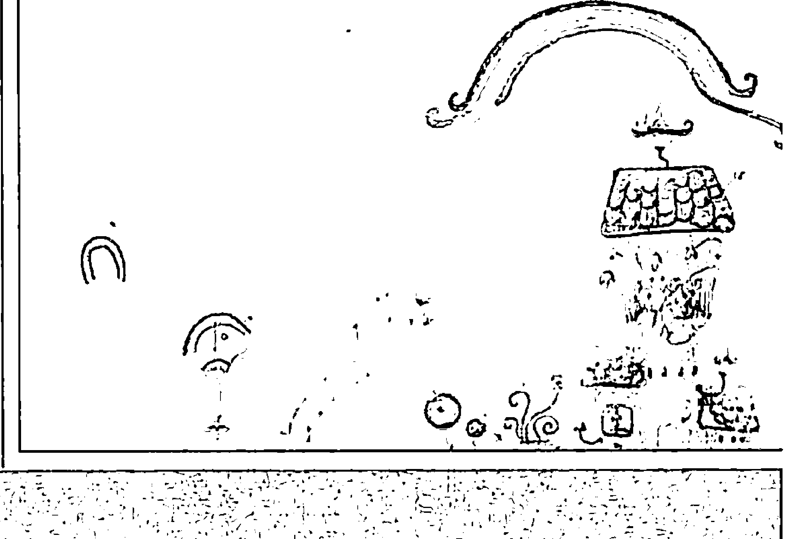

反面

## 身价

牟丕志

一个农夫养了一头会干活的牛和一只会说话的鹦鹉。除这两件东西外，家里再没有值钱的东西了。

一次，牛从田地干活归来，刚一进院，便躺在地上，站不起来了。鹦鹉见它汗流浃背，气喘吁吁，十分感慨地说：“老牛呀，你那样吃苦受累，可主人说你什么呢，说你干活慢，有牛脾气，你呀，可真是受累不得好呀，真可悲。你瞧我，不用干活，还让主人伺候着，主人还经常表扬我，说我真会说话，会学舌，太可爱了，你说我是不是比你聪明多了？你是否认为自己是个不折不扣的大傻瓜？”

老牛说：“我知道自己傻，但我相信主人不傻，我相信靠漂亮话只能得宠一时，不能得宠永远。”

鹦鹉听了老牛的话不以为然。于是双方便都沉默了。

夜里农夫家里来了一伙强盗，抓住了农夫，他们逼迫农夫交出一件值钱的东西，否则就要杀死农夫。鹦鹉看在眼里，心想，农夫最不喜欢老牛了，他肯定会把老牛交给强盗的。

可结果大大出乎它的意料，农夫将鹦鹉交给了强盗。

鹦鹉不服气，它问农夫，为什么不把牛交给强盗？农夫说：“其实这道理很简单，没有牛就不能耕田，我就得挨饿，甚至被饿死，而没有你鹦鹉，只不过少听一些漂亮话而已，无关紧要。”

> 魅力提示：

我们只有靠“一步一个脚印”、实实在在地工作，才可能取得事业上的成功，那些只说不做的，迟早会被淘汰。

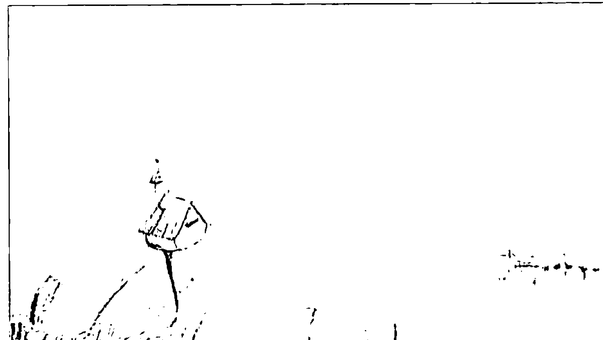

## 最中意的年历

佚名

一张年历有两张报纸大小，印着从2004年到2016年的12年，总共有144个月份，4380天。

这是工藤先生去年收到的年历中最中意的一张。

> “太棒了！可以一直用到退休的年历，这还是头一回看到呢！”

工藤夹着卷成筒状的年历回到家便大声说。

夫人发愁地说：“这么大的年历往哪儿挂才好呢？”

房间的墙壁几乎全被家具挡住了，连孩子的房间也贴满了歌星的大照片。

> “没法子，挂到卫生间的墙上去。”

虽说并非理想的位置，但从稳稳当当的观赏角度看，倒是再合适不过的地方了，而且阳光晒不到，用不着担心褪颜色。

打那以后有两个多月，工藤每天都欣赏着那张得意的年历。

这样一来，在卫生间里待的时间就不得不延长了。但毕竟可以在上厕所时想象一下将来。

儿子大学毕业的年份，女儿20岁的年份都显示出来了。儿子、女儿该办喜事的年份也都一目了然。接下去，连抱孙子的日子也能推算出来。

这张年历上，该有的日期真是应有尽有。

在卫生间里，工藤描画着孩子们的未来图景，微笑浮上了工藤的眉梢。

对年过45的工藤来说，这年历就是自己的目标。

“三年后的这个时候，怎么也得当上科长了，再过一年的这个月，可以改建住房了。”

他手指着年历，编织着希望，最后干脆用彩色铅笔圈了下来。

“改建费用借银行贷款的话，这个时候可以返还一半，从这儿开始准备养老的储蓄……”

想到这当儿，猛听夫人在敲卫生间的门了：“孩子他爸，快点出来！别人都在等着呢！”

这已经成了每天早晨的惯例了。

说也奇怪，到了3月中旬，工藤忽然变得言少寡语了。

一向以工作迷自居的他，连到公司上班也懒洋洋的，干什么都无精打采，整天长吁短叹的。显而易见是忧郁症的早期症状。

“怎么变成这副样子？”周围的人都很疑惑。

但是，还不到去精神病医师那儿咨询的地步。身体是健康的，工作也顺利，家庭也没有操心事。

这天早晨，工藤抱着想辞去公司职务的念头蹲在卫生间里，像往常一样端详着年历。

从头到尾看下来，每个月份内该有大事的地方，他都用彩色铅笔标着记号，详详细细地记录着12年的计划。退休的日期也在其内，自己的将来统统可以一眼看到底。

工藤先生若有所思，连裤子也不提，猛地站了起来，嚷道：

“你这个祸根！”说完一把掀去了那张年历。

> 魅力提示：
行动吧，在行动的过程中就形成了自身，人是自己行动的结果，此外什么都不是。

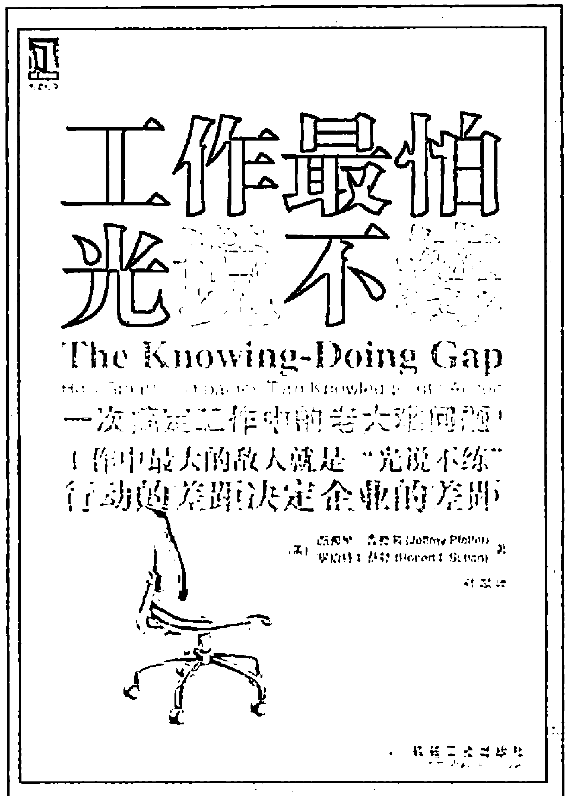

### 魅力链接

- 书名：工作最怕光说不练
- 作者：［美］普费弗 著，叶凯 译
- 出版社：机械工业出版社
- 出版时间：2010-3-1
- 印刷时间：2010-3-1
- 开本：16开
- ISBN：9787111298502
- 包装：平装

### 内容简介：

“光说不练”是组织中普遍存在的问题。人们都喜欢高谈阔论，如果谈论的都能付诸行动，倒也无可厚非。但假如光说不做，公司就要吃苦头，自己到头来也在劫难逃。本书作者经过仔细调查，发现阻碍公司前进的原因并不是公司中的人知道得太少，而是他们知道得太多、行动得太少。“光说不练”产生的行动差距，很快就使企业间出现了业绩的差距。

有些公司则成功地避开了“光说不练”的陷阱。在这些公司中，员工和管理者发表高见之后就会付诸实施，做到言行一致，公司很快迈向优秀，与平庸的公司拉开距离。

如何判断“光说不练”的具体症状？如何提前预防企业陷入“光说不练”的可怕陷阱？如何在企业内纠正工作中的这个最大敌人？本书将对症下药，一方面预警“光说不练”的恶果，一方面提出“说到做到”的8项工作方针。

## 魔方第五面
学业事业篇

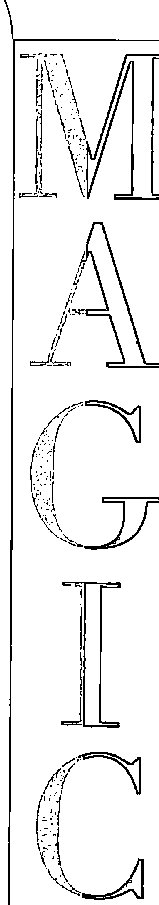

### 魅力失分 缺乏原则

双子座做事总是喜欢变来变去，缺乏原则。

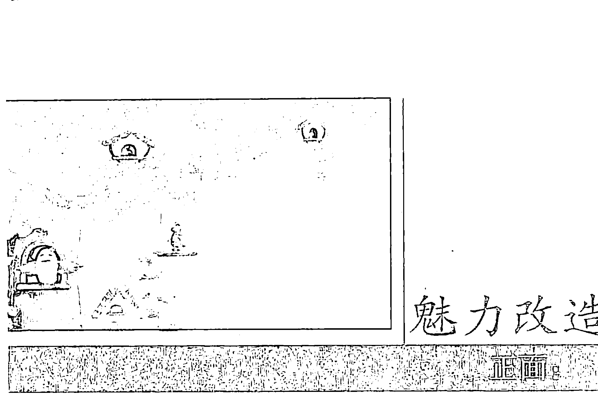

## 比尔的赔偿

盖温托斯

犹太人做生意十分注重合同。出口商比尔与犹太商人拉克签订了10000箱蘑菇罐头合同，合同规定为：“每箱20罐，每罐100克。”但出口商比尔在出货时，却装运了10000箱150克的蘑菇罐头。货物的重量虽然比合同多了50%，但犹太商人拉克拒绝收货。出口商比尔甚至同意超出合同重量不收钱，而拉克仍不同意，并要求索赔。比尔无可奈何，赔了拉克10多万美元后，还要把货物另作处理。

此事看来似乎拉克太不通情理，多给他货物也不要。事实不是那么简单。犹太人精于经商，深谙国际贸易法规和国际惯例。他们懂得，合同的品质条件是一项重要条件，或者称为实质性的条件。合同规定的商品规格是每罐100克，而出口商交付的每罐却是150克，虽然重量多了50克，但卖方未按合同规定的规格条件交货，是违反合同的。按国际惯例，犹太商人完全有权拒绝收货并提出索赔。根据联合国公约，出口商的行为是根本违反合同的。犹太商人此举是站得住脚的。

此外，还有个适销对路问题。犹太商购买不同规格的商品，是有一定的商业目的的，包括适应消费者的爱好和习惯、市场供需的情况、对付竞争对手的策略等。如果出口方装运的150克蘑菇罐头不适应市场消费习惯，即使每罐多给50克并不加价，进口方的犹太商人也不会接受，因为这样反而打乱了他的经营计划，有可能使其销售通路和商业目标受到损失，其后果是十分严重的。

最后，还有可能会给买方犹太商人带来意想不到的麻烦。假设犹太进口商所在国是实行进口贸易管制比较严格的国家，进口商申请进口许可证是100克的，而实际到货是150克，其进口重量比进口许可证重量多了50%，很可能遭到进口国有关部门的质疑，甚至会被怀疑有意逃避进口管理和关税，以多报少，要受到追究责任和罚款的惩治。

> 魅力提示：

既然签订了合同，就要严格遵守，这样既显得诚信，又能避免遭受意外损失。即使利益当前，原则还是要坚持。

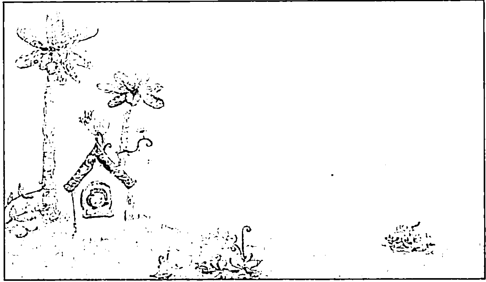

## 慈不掌兵

左丘明

《左传》记载：孙武去见吴王阖闾，与他谈论带兵打仗之事，说得头头是道。吴王心想：“纸上谈兵管什么用，让我来考考他。”于是，出了个难题，让孙武替他操练姬妃宫女。孙武挑选了一百个宫女，让吴王的两个宠姬担任队长。

孙武将列队操练的要领讲得清清楚楚，但正式喊口令时，这些女人笑作一堆，乱作一团，谁也不听他的。再次讲解了要领，并要两个队长以身作则，但他一喊口令，宫女们还是满不在乎，两个当队长的宠姬更是笑弯了腰。孙武严厉地说道：“这里是演武场，不是王宫；你们现在是军人，不是宫女；我的口令就是军令，不是玩笑。你们不按口令操练，两个队长带头不听指挥，这就是公然违反军法，理当斩首！”说完，便叫武士将两个宠姬杀了。

场上顿时肃静，宫女们吓得谁也不敢出声。当孙武再喊口令时，她们步调整齐，动作划一，真正成了训练有素的军人。孙武派人请吴王来检阅，吴王正为失去两个宠姬而惋惜，没有心思来看宫女操练，只是派人告诉孙武：“先生的带兵之道我已领教，由你指挥的军队一定纪律严明，能打胜仗。”孙武没说什么，而是从立信出发，换得了军纪森严、令出必行的效果。

> **魅力提示：**

> 正所谓“慈不掌兵”，管理者就应坚持正确的原则，虽然推行的结果可能是得罪一些高层人士导致自己的职位不保，但若你的政策推行不下去，那你的前途同样玩完。其实，只要你是真正客观公正地执行政策，按照原则办事，而不是纠缠于自己的私利，你还是会成功的。

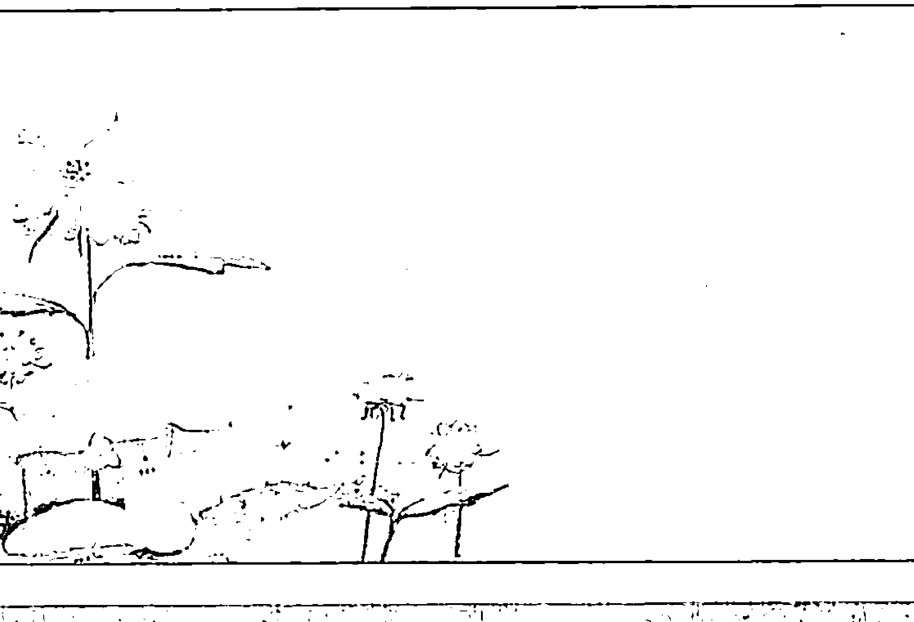

## 外商的选择

佚 名

内地两个小城市在争抢一笔外商投资。

这两个小城市的条件都差不多，位置、交通、资源、劳动力等都难分伯仲。硬件没有优势，那就只有靠软件了。

甲城市的领导决定，在土地使用价格、税收等方面再进一步做出让步，给外商更多的好处。但是出乎意料的是，外商最终还是选择了乙城市。

事后有人不解地问外商。

外商解释说：“甲城市的条件太过优厚了，他的许诺已经超出了国家政策的范围，不按法律原则办事。这种人情色彩太浓、政策随意性太强的地方我们不敢去，这是几十年的投资啊！”

> 魅力提示：

今天你可以违反原则给我好处，明天你又会无原则地干些什么？天知道！善变而没有原则是会让人没有安全感的。

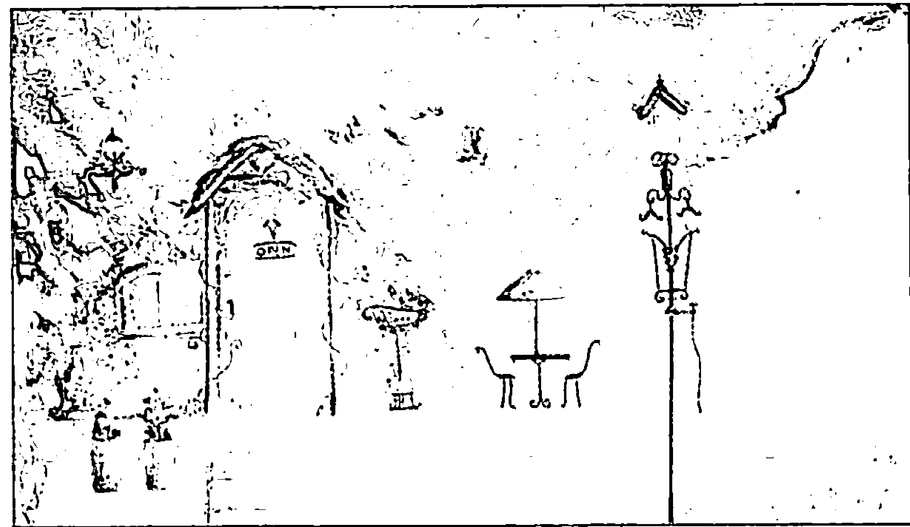

## 请说实话

佚名

有一家企业要招聘一名文秘人员，大学毕业生小周前去应聘，顺利进入面试之后，单位人事经理问了小周一个问题：“你可以自己解决住宿问题吗？”

小周可能是担心单位会拒绝没有住房的应聘者，就回答说可以自行解决的，小周通过面试，被该企业录用。

然而小周在场外却听说，人事经理问这个问题的本意是将为没有住房的员工解决宿舍，小周很是懊恼，又折回找到人事经理，说自己其实是没有住房的。

更令小周意料不到的结果出现了，在正式录用通知下达之前，这家企业的人事部通知小周，他被解除录用，原因是他没有说实话，而且给人过于注重待遇的感觉。

> 魅力提示：
求职者在面试时，应当坚持自己的本色和原则，以免使自己陷于被动。在始终处在流动状态的人才市场中，如果为了面试过关而放弃了基本的为人之道，就算是面试过关了，上班后，也难免会被精明的老板“炒”掉。

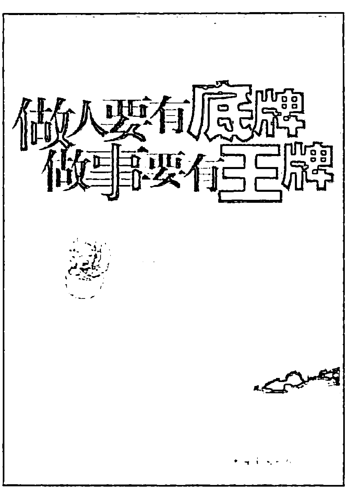

### 魅力链接

- 书名: 做人要有底牌 做事要有王牌
- 作者: 关力 编著
- 出版社: 中国华侨出版社
- 出版时间: 2009-4-1
- 印刷时间: 2009-4-1
- 开本: 16开
- ISBN: 9787802228382
- 包装: 平装

## 内容简介:

做人要有底牌，构筑固若金汤的人生防线；做事要有王牌，打造无坚不摧的成功利器。

所谓王牌，就是要给人看的牌，这种牌要大，要正，要能说明问题，让人一听就竖大拇指。

## 魔方第五面
学业事业篇

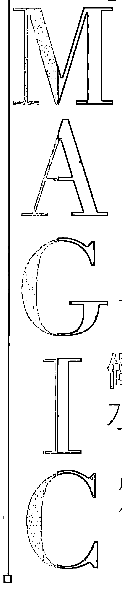

魅力失分

做事蜻蜓点水
不深入

双子座多学少
成，什么都懂一点，却
什么都不精通。

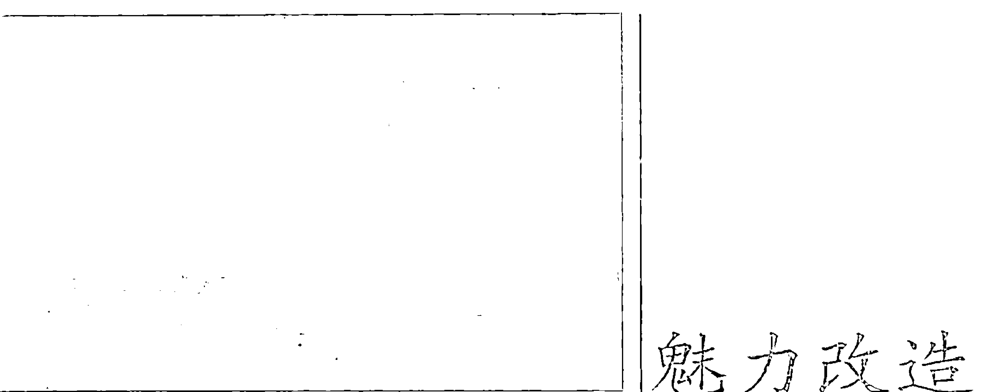

## 真花花瓶

田牧

以色列的所罗门王是位智慧勇敢兼具的国王，他的邻国皇后为答谢他长久以来的保护，带着贵重的礼物前来拜见。

皇后贡献的珍贵礼物有很多，包括稀奇的动物、罕见的宝石、美味的食物等。

最后，皇后献上两瓶花，并且对所罗门王说：“伟大的国王！这两瓶花之中，有一瓶是真的花，有一瓶是假的花，请用您的智慧来分辨看看，指出哪一瓶是真花吧！”

所罗门王仔细观察了很久，但怎么样都分辨不出哪一瓶是真花、哪一瓶是假花。

这个难题似乎将以智慧见称的所罗门王给难倒了。

就在这个时候，所罗门王听见从花园传来细微的嗡嗡声，于是叫人把窗户打开，过了不久，一只蜜蜂从窗外飞进宫内，钻进了其中一个花瓶里去。

所罗门王露出微笑，那只蜜蜂已经帮他解答了这个难题。

> 魅力提示：
学习是为了实际生活中的应用。而且，学习的技能和知识不在于多，而在于透。多，常常掩盖、忽略问题的存在。只有学精学透才能真正学有所用。

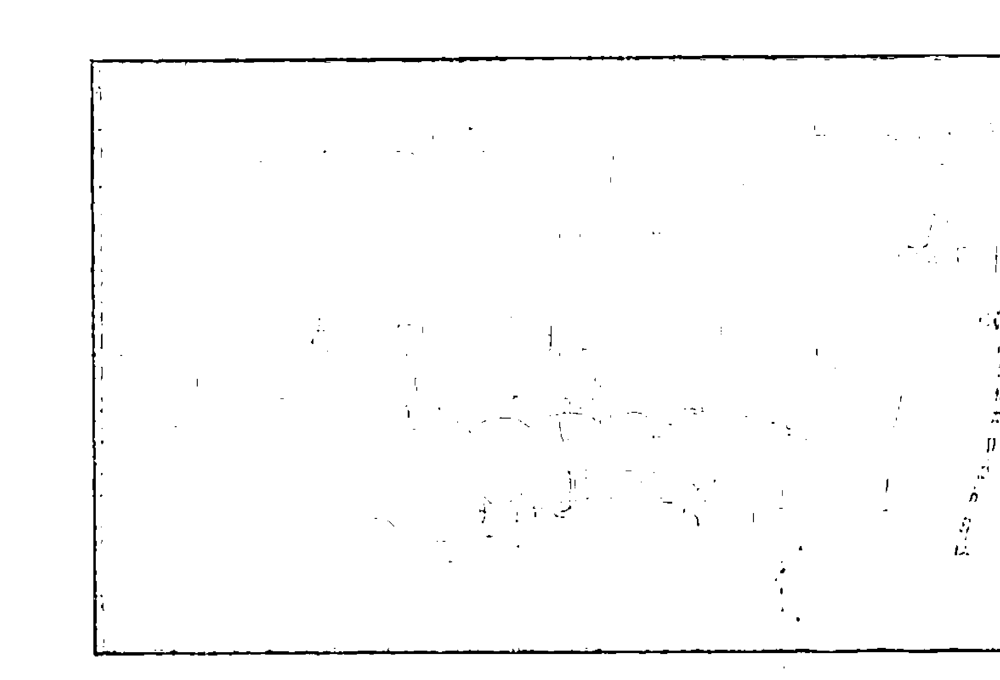

## 薛谭学歌

佚名

从前，有一个人叫薛谭。

薛谭爱好唱歌，但是他的家乡没有懂得音乐的老师。虽然先天的条件很好，但由于得不到名师指导，再加上缺乏音乐基本功的训练，他不能成为最好的歌手。

于是他决定离开家乡，到外地去寻访名师。

当时，有一位名叫秦青的音乐大师，他不但精通乐理，而且还会弹琴唱歌。薛谭寻访到秦青，要拜他为老师。秦青看到薛谭一路克服了很多困难，千里迢迢来寻师学艺，很受感动，就同意了他的请求，决定收下这个徒弟。

举行完拜师礼以后，薛谭便从基础理论开始，进行系统学习。

开始的时候，薛谭很用功，上课认真听讲，课后及时复习，不懂就问。这样，他学习很扎实，进步很快。不仅学会了乐理，而且还学会了唱歌。秦青很高兴，多次在众人面前表扬他。薛谭虽然还没有完全掌握秦青的艺术技巧，但他自己却认为已经全部掌握了。于是，他就向秦青告辞，要回家去。秦青就说：“好吧，咱们相处的这一段时间，有了师生情谊，等到明天为师给你送行。”

第二天，秦青和学生们到郊外十里长亭给薛谭送行。在送别会上，大家互相敬酒，当喝得兴致正浓时，学生们每人唱一支最优美动听的歌儿献给薛谭。最后，学生们提议请老师也唱一支。

秦青很愉快地接受了。只见他一边弹琴一边唱了起来。手指在琴弦上敏捷地跳来跳去，有急有缓，有轻有重，歌声凄凉悲壮，有时低沉，有时高亢。歌声飞过森林，森林发出回响，蓝天上的白云也停在那里，久久不愿意飘走。

这支歌深深地打动了薛谭的心，他想：“老师弹唱的技艺举世无双，有许多东西自己还没有学到呢。”

想到这里，薛谭向秦青鞠躬敬礼，说：“先生，我错了，从今以后再也不骄傲了！我不回家了，我还要留下来，继续向先生学习。”

从此以后，薛谭再也不说回家了。在秦青的耐心教育下，他终于成为当时最有名的一位歌手。

> **魅力提示：**
人不能有丝毫的自满心理。因为学无止境，活到老学到老，浅尝辄止或半途而废就学不到高深的技艺。

### 魅力改造

> > 感悟：

## 艺多不养生

木瓜

猫和狐狸外出朝拜圣地，打扮得像两个小圣徒。实际上它们圆滑又刁钻，善于阿谀奉承，是名副其实的骗子。一路上它们尽干坏事，没少骗吃家禽和干酪，根本不花费自己的一个铜子。

漫长的旅途枯燥无聊，于是它俩用争论问题来打发时光、驱除无聊。空旷的路上充斥着这两位朝圣者的吵嚷声。

一个话题结束后，它们开始互相贬损对方。狐狸轻蔑地对猫说道：“你自认为聪明，其实你懂些什么，我有的是锦囊妙计。”

“那有什么用，”猫说，“我只有一着，但它足以赛过各种计谋。”于是新一轮的争论又爆发了，它们各说各的理，吵得不可开交。

就在这时候，一群猎狗闻声赶来了，争吵迅速平息了。猫对狐狸说：“朋友，现在就看你有什么锦囊妙计了，动脑筋想想，赶紧找一条逃生之计吧，我就只有看这一着了。”话音刚落，猫纵身跳到树上，爬了上去。狐狸在那儿想来想去，可是它刚刚列举的上百条计谋没有一条管用。情急之中，它接连不断地钻进一个又一个窝穴中，把这群猎狗引入了歧途。然后慌慌张张地四处找寻安全的隐蔽之处，却怎么也找不到一个像样的地方。猎人开始用烟雾四处熏，狐狸稍有动静就会受到矮种猎狗的追咬。最后，狐狸实在受不了缭绕的烟雾，冒险钻出了地面，动作利索的猎狗迅速地一拥而上，咬住它的咽喉，狐狸就这样一命呜呼了。

> 魅力提示：
“宁缺毋滥”，同样，我们的生存技能也最好是“宁精毋平”。一个人要在社会上立足，必须拥有一技之长，在形成自己的特色的基础上全面发展。

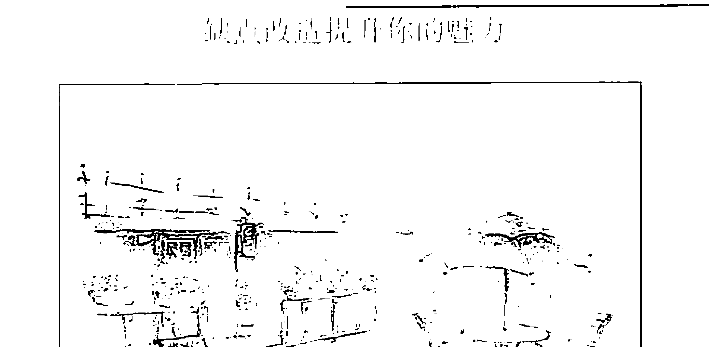

## 沙子与珍珠

冯新欣

有一个自以为是全才的年轻人，毕业以后屡次碰壁，一直找不到理想的工作，他觉得自己怀才不遇，对社会充满愤怒，可又无可奈何，感到非常失望。多次的碰壁，让他伤心绝望，他感到没有伯乐来赏识他这匹“千里马”。

这一天，他实在受不了这样的煎熬，也适应不了这个社会，于是就来到大海边，打算就此结束自己的生命。在他正要自杀的时候，正好有一位老人从附近经过，看见了他，并且救了他。老人问他为什么要走绝路，他说自己得不到别人和社会的承认，没有人欣赏并且重用他。

老人从脚下的沙滩上捡起一粒沙子，让年轻人看了看，然后就随便地扔在了地上，对年轻人说：“请你把我刚才扔在地上的那粒沙子捡起来。”

年轻人说：“这根本不可能！”

老人没有说话，从自己的口袋里掏出一颗晶莹剔透的珍珠，也是随便地扔在了地上，然后对年轻人说：“你能不能把这颗珍珠捡起来呢？”“当然可以！”年轻人说道。

老人意味深长地说道：“你应该明白，现在你自己还不是一颗珍珠，所以你不能苛求别人立即承认你。如果要得到别人承认，那你就要想办法使自己成为一颗珍珠才行。”

> **魅力提示：**
许多年轻人以为自己学了不少知识有了某些智慧，感觉自己是一块金矿，却总没人前来开采，便老是感叹怀才不遇，愤世嫉俗。其实怀才不遇实乃寻常之事，毕竟世间虽然人人都喜爱金子，喜爱那份金光闪闪，然而能够认识并开发金矿的人实在不多。既然如此，何不进一步将自己提炼成有着闪光色泽的金子呢？

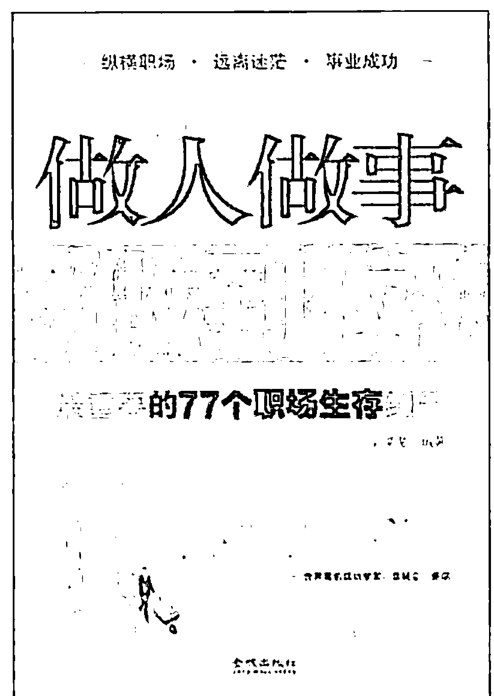

### 魅力链接

- 书名：做人做事做到位
- 作者：郭莹莹 编著
- 出版社：金城出版社
- 出版时间：2010-1-1
- 印刷时间：2010-1-1
- 开本：16开
- ISBN：9787802512672
- 包装：平装

### 内容简介：

本书不会告诉你如何一夜暴富，但会告诉你怎样找到一份好工作来发挥和提升自己。
本书不会告诉你如何拯救一个公司，但会告诉你如何在新公司立足，进而融入团队。
本书不会告诉你如何闯荡商海，但会告诉你如何减少公司里的阻力，将自己的能力和努力百分之百转化为业绩，让自己的付出真正得到应有的回报。
你只要照着本书所说的那些细节一点一点改变自己，就会发现你在职场求生变得越来越容易，越来越容易做出成绩。
先求生，再发展，辉煌的明天等着你。

## 魔方第六面
## 形象礼仪篇

双子座的人很无厘头，在形象上总是喜欢特立独行，标新立异，以吸引别人的目光。

## 行不在服

李远峰

墨子是战国时期的一位伟大的政治家和道德家。

有一天，墨子的弟子报告墨子说：“先生，外面有一个穿着儒生服装的人请求与先生相见。”

墨子说：“请他进来吧！”

一会儿，那个人跟随墨子的弟子进来。他复姓公孟，信奉儒家学说，是孔子弟子的弟子，人们尊称他为公孟子。

只见他头戴着青布冠，穿一身儒生的服装，腰带上还插着笏（hù）板（笏板，是古代朝会的时候所用的手板，有事记在上面，防备遗忘）。

他洋洋自得地问墨子：“请问先生，作为君子是穿上某种服装之后才有所作为呢，还是有所作为以后才穿上某种服装呢？”

墨子回答说：“人有作为没有作为，不在于他穿什么样的服装，关键在于他的行为如何。”

公孟子进一步追问：“凭什么得知这样的道理呢？”

墨子解释说：“从前，齐桓公头上戴着高冠，腰间系着宽大腰带，身佩金剑，手持木盾，他治理齐国，把齐国治理得很好；晋文公身穿粗布衣服，外套老羊皮袄，用熟牛皮系挂着长剑，他治理晋国，把晋国治理得很好；楚庄王头上戴的法冠还系着丝带，身上穿着的衣袍十分肥大，他治理楚国，也把楚国治理得很好；越王勾践剪短头发，身刺花纹，他治理越国，也把越国治理得很好。这四位君王，他们的穿着不同，但是都很有作为，建立的功业同样显赫。我凭这些懂得有作为的人不在于他们穿什么样的服装。”

公孟子说：“讲得好！我听说‘赞赏好的主张而不尽快实行，是不吉祥的’。我愿意脱去儒生的服装，更换掉儒生的青布冠，再来拜见先生，可以吗？”

墨子说：“不必了，请你就穿这身衣服与我相见吧。如果一定要丢弃笏板，更换青布冠，然后再与我相见，那么不就等于说一个人有没有作为果然取决于他的穿着打扮了吗？”

一句话把公孟子也说笑了。

> 魅力提示：
> 一个人的行为和穿着打扮没有必然联系，要有所作为，就不必刻意追求穿着打扮。

## 专业的打扮

汪洋

班·费德文是美国保险界的传奇人物，被誉为“世界上最有创意的推销员”。但他刚刚进入保险界时，着装打扮非常不得体，业绩也不好，公司准备辞退他了。

班·费德文非常着急，就向公司里的一位成功人士询问，那位成功人士对他说：

> “这是因为你的头发理得根本不像推销员，衣服搭配也不协调，看上去非常怪异。你一定要记住，要有好的业绩，首先要把自己打扮成一位优秀推销员的样子。”

“你知道我根本没钱打扮！”班·费德文说。

“但你要清楚那是帮你赚钱，你不会浪费一分钱。我建议你去找一个专营男装的老板，他会告诉你如何打扮。你这么做既省时间又省钱，为什么不去呢？因为这样更容易赢得别人的信任，赚钱也就更容易了。”那位朋友说。

班·费德文于是马上去了一家美发厅，特别理了一个推销员的发型，然后又去了那位朋友所说的男装店，请服装师帮他打扮一下。

服装师认认真真地教班·费德文打领带，又帮他挑西服，以及选择与之相配的衬衫、袜子、领带等。他每挑一样，就解说为什么要挑选这种颜色、式样，还特别送给班·费德文一本如何着装打扮的书。不仅如此，他还对班·费德文讲解了一年中什么时候该买什么样的衣服，买哪种衣服最划算。

从此，班·费德文焕然一新，他的穿着打扮有了专业销售人员的样子，推销起来更加自信了，他的业绩也因此增加了两倍。

> 魅力提示：
> 在日常生活和社会交往中，有时，第一印象起着决定性的作用。你的穿着打扮一定要与场合相符，与你的身份相符。

## 魅力星座智慧书之双子座

## 与众不同的老鼠

伊索

老鼠群和黄鼠狼群素来关系不好，经常为了一些事情大动干戈。但是，每一次老鼠们都被打得落花流水，落荒而逃，躲回到洞里半天不敢出来。老鼠们对这件事情尤为懊恼，它们在一起总结教训，最后得出一个结论——因为没有一个领导群体的将帅，所以老鼠部队屡战屡败。

后来，老鼠们举手表决，选举了几只有很高威望的老鼠做将帅。为了区分将帅和一般老鼠的身份，老鼠们提议将帅应该与众不同。

“怎样才能让自己与众不同呢？”将帅们想来想去，最后一致认为在自己头上绑上角是最简单也是最好的办法。于是老鼠们齐心协力制作了几个非常特别的角，并想方设法绑在了将帅们的头上。

不久，战事又起，可是有了戴着角的将帅的老鼠群再次被打得一塌糊涂。老鼠们四处逃窜，都想保住自己的一条小命。别的老鼠很容易地就逃进了洞里，而那些将帅因头上有角却怎么也钻不回洞里去了，很快就被黄鼠狼吃掉了。

> 魅力提示：
> 与众不同的人往往是首当其冲的受害者。如果真的要出彩，无须追求与众不同，只要做得比其他人好一点就足够了。

## 失败的面试

白山

王女士头脑聪慧，相貌秀美，是一家广告公司的卓越人才。干了两年的广告策划，王女士经验、能力更是大增，于是开始觉得公司的待遇、环境都不太能满足自己的要求了。认为自己这样有能力有品位的人就该有更高的追求，更好的发展。于是她辞了原来的工作。

很快就有几家大的广告公司通知王女士面试。王女士也欣然准备前往。但这次找工作之前王女士有些犹豫，心想自己以前土里土气的，根本就显不出自己的品位，这次找工作一定要打扮起来，大力展示自己的品位。王女士向往的是白领、金领，于是就提前到服装店挑选能展示自己品位的服装。经过一天的精挑细选，王女士终于为自己选好了两身奇特的服装。以王女士看来，别人经常穿的普通款式的衣服太陈旧了，没有品位，自己穿起来会显得很俗套。有品位的衣服，穿起来既要奇特新颖，又能显得年轻漂亮。

经过一番穿戴打扮，王女士信心十足地去面试了。第一家面试官是位中年女士，王女士一进门，就引起了面试官的注意。面试官上下打量一番这穿着奇特的姑娘，上衣一只袖子、半截领子，中间没系腰带还露着肚脐，下身裤子不像裤子，裙子不像裙子，上衣颜色黑白相间，下身裤子杂色刺眼。面试官还是头一次在面试场上见这样的着装。虽然所应聘职位对服装要求不严格，但王女士这样的奇装异服真令人不敢恭维。

面试官表面上还是热情地与王女士进行了面谈。结果让王女士回去等通知。王女士很纳闷，自己有经验、有能力，为什么就没通过面试呢，觉得一定是那个面试官不识人才吧。于是就到别的公司应聘了，王女士一连去了三家，结果都一样被拒绝了，弄得王女士很是气愤。疲惫不堪地回到家。王女士的母亲看出了女儿的过激之举，就劝王女士要简单、朴素地着装，以免别人看着奇装异服不舒服。王女士也有所察觉，觉得每次面试官看自己的眼神都怪怪的。她决定听母亲的，换为朴素、典雅的服饰。结果第四次去面试，很顺利地就被录用了。

王女士折腾了一圈儿，还是回到了朴素典雅。

### 魅力提示：

> 特立独行不代表就有品味，凡事都要结合自身情况而定，适合自己的才是最好的。

### 魅力链接

- 书名: 你的礼仪价值百万
- 作者: 周思敏 编著
- 出版社: 中国纺织出版社
- 出版时间: 2009-1-1
- 印刷时间: 2009-1-1
- 开本: 16开
- ISBN: 9787506453943
- 包装: 平装

## 内容简介:

在现代社会，礼仪修养几乎成为一个人和一个社会文明程度的标志。优雅的行为举止，得体的仪态和言语，真挚的情感和规范的礼仪，成为构建人与人之间沟通的桥梁，其力量和价值都是无可比拟的。《你的礼仪价值百万》内容涉及广泛，包括商务礼仪、职场礼仪、举止气质、服饰形象仪表、社交礼仪、用餐礼仪、公共场所礼仪、说话艺术、涉外及旅行礼仪等生活中可能接触到的所有礼仪规范。这是一本全新的礼仪书，以实用而规范的解说，形象而生动的图解，向你展示了魅力的秘密。在生活中，灵活掌握和运用，会让你的举止流露出自信和得体。这也是一本人生成功的枕边书。