# 魅力星座之双鱼座

## 浪漫而多情的双鱼
机敏、有智慧、有生活情趣。对自己和别人都同样地关心。有时处理问题犹豫不决，优柔寡断。有悲天悯人的情感和浪漫的艺术家气质，悟性颇高，善解人意，细心周到，乐于谈论精神生活中的话题。

对身体不是特别在意，由于饮食有度，心情平和，精神状态很好。喜静不喜动，爱好较为轻松的运动，如下棋、打高尔夫球等。对竞技性很强的运动，如足球、篮球，虽不喜欢参加，但喜爱欣赏。年轻时要防止腿部受外伤，老年慎防脉管炎等疾病。

聪明好学，使得什么难题遇上他，都会迎刃而解，因而博得同学的尊敬。学业优秀而轻松，有时间在业余充实自己，这又对学业起促进作用。一旦遇到其他总是影响学业的东西，又会很懊恼。但求学的道路会一帆风顺。

重感情，有忠心耿耿的爱人相伴。而表达方式比较含蓄、温和、细心的特点使爱人倍感温情。为了营造温馨的家庭气氛，会想出许多点子。重视家庭与孩子，家庭环境限制了他的活动范围，社交范围较小。

温和尽职的秉性，使他从事任何工作都会收到好的效果，和上下级的关系都相处得很好，只要努力，终会升到高级职员的位置。由于没有权力欲，竞争对手也较为少，但工作中有时缺乏自信心，意志不够坚定，办事时态度有时会比较偏激。

经济上一直不错，不过好面子及奢侈的个性对累积财富是一大障碍。有时会将钱财挡在门外，有时不计后果地花钱。购买欲比较强，就算财富来了，也如流水般很快流去，但相对经济上有保障，而且也较稳定，生活也舒适。

感情细腻，想象力丰富，最适合从事能发挥直觉力及肢体韵律感的工作。要避免受他人的影响及期望而做出与本性不合的决定，否则会阻碍事业的发展。作家、诗人、医生等职业十分适合。

对孩子的发展比较顺其自然，对孩子的过错很宽容，不强求孩子做不愿做的事，不太适合单独承担教育孩子的工作。

对孩子宠爱呵护，有时甚至显得纵容，常满足孩子过分的要求。

由于有妻子的支持和赞美，会很愉快地帮妻子承担部分家务，有时对妻子表现浪漫温情。

是个相当称职的家庭主妇，对丈夫和孩子的照顾细微，但有时情绪波动，容易掉泪。

敏感、有早恋的倾向，才艺方面表现好，喜欢小动物，好幻想。

星☆堂
名人的榜样成就你的自信

## 金庸：恬淡脱俗吐心声
不要问有多少人知道金庸，要问天下华人有谁不知道金庸。昔日，有井水处就有柳永的词；如今，有华人处即有金庸的小说。看多了金庸小说中的刀光剑影，很多人想当然地认为，这位“武林至尊”肯定是一位不苟言笑的严肃人物，有一副不怒自威的颜容，令人望之不免噤若寒蝉。其实，金庸生性活泼，平易近人，是老幼咸宜的良师益友。

金庸谈吐，温文尔雅，含蓄蕴藉，品之如品一杯清香四溢的佳茗，不仅沁人心脾，且能让人悟出一番做人道理。

金庸的书情节曲折，扑朔迷离引人入胜，妙在一个“奇”字；金庸的话亲切自然，平和恬淡，启人心智，贵在一个“真”字。温厚则可亲，雅韵自脱俗，用这句话形容金庸其人其话是十分贴切的。

- 金庸小资料
- 原名：查良镛
- 生日：1924年3月10日
- 星座：双鱼座
- 出生地：浙江海宁
- 职业：编剧

谦谦君子语亦谦
王朔的《我看金庸》一文是对金庸小说的一篇猛烈攻击的文章，但金庸对此没有拍案而起，也没有竭力争辩，更没有反唇相讥，他只是心平气和地说：

> 王朔先生的批评，或许要求得太多了些，是我能力所做不到的，限于才力，那是无可奈何的了。
> ‘四大俗’之称，闻之深感惭愧。香港歌星四大天王、成龙先生、琼瑶女士，我都认识，不意居然与之并列。不称之为‘四大寇’或‘四大毒’，王朔先生已是笔下留情了。我与王朔先生从未见过面，将来如到北京呆一段的时候，希望能通过朋友介绍而和他相认识。

不指责对方的言过其实，反承认自己才力有限；不责怪对方用语刻薄，反称赞对方“笔下留情”，且向对方伸出热情之手，希望与对方交朋友。在这里，金庸不仅做到了以诚待人，也做到了以礼待人，更做到了以心暖人。金庸此番话犹如播种分币却收获了大额钞票——王朔闻听此言大受感动，坦言：

> 比起金庸来，确让我惭愧。

“有容乃大，无欲则刚”是金庸最喜爱的一句话，也是他的处世原则，但他所提倡的宽容并非无原则地忍让，他认为得饶人处且饶人，该较真时也较真。

比如对王朔，他也说了这样一番话：“王朔先生说他买了一部七册本的《天龙八部》，只看了一册就看不下去了。香港版、台湾版和三联书店版的《天龙八部》都只有五册本一种，不知他买的七册本是什么地方出版的。我很感谢许多读者对我小说的喜爱与热情，他们已经待我太好了，也就是说，上天已经待我太好了。既享受了这么多幸福，偶然给人骂几句，命中该有，不会不开心的。”一方面，金庸旁敲侧击暗示对方所读《天龙八部》为盗版书，既是盗版书，文字的错讹、内容的散乱在所难免，王朔以此断定作者文字水平不高也就有失公道；另一方面，金庸巧作对比，暗示和广大读者那么多发自肺腑对自己作品的盛赞相比，王朔的几句尖酸之语实在是沧海一粟不值一提。人不可有傲气，但不可无傲骨。金庸是彬彬有礼的谦谦君子，也是傲骨嶙峋的铮铮汉子。他八十年代因起草基本法受到民主派的批评，说他有当特区行政长官的野心，金庸公开予以反驳，他说：“当行政首长有什么好？金庸的名和利相信都不会差过港督。今日全世界知道金庸的，会多过知道不论哪一位港督呢！一百年之后，恐怕相差更远吧？”一番铿锵有力、掷地有声的话既表明了对自己作品的高度自信，也道出了他淡泊仕途的人生情怀。

机智幽默两相宜
金庸有金庸式的幽默，他平时不动声色的谈吐往往会令人忍俊不禁。金庸喜欢驾车，更喜欢驾跑车。曾有人问他：“你驾跑车超不超车？”金庸答：“当然超车，逢电车，必超车！”闻者无不绝倒。金庸号称“从未醉过”。很多人以为他酒量过人，而实际情形是他很少喝酒，或喝得很少，那就当然不会醉了。

有一次，他对一个女孩说：“你的美丽增长率最高。”女孩听后大喜，沉吟片刻忽然醒悟，原来金庸是暗示她小时候长得难看。电视和武侠小说中有很多打斗场面，会给儿童和分辨能力低的成人带来不良的影响，对此，金庸的看法如下：“以前有人攻击武侠小说，认为小孩看了会模仿，也上山学道去了。我想这个责任不应该由武侠小说来负的，一把菜刀可以用来切菜，也可以用来杀人。我写小说时，只想到小说的读者，在小说中描述的事在电视中不一定可以演，因为看小说的人至少有阅读的能力，受过一定的教育。如果电视对观众有坏影响，应该由电视负责。因为电视编剧应该考虑到观众中有一部分是没有分辨能力的，打斗该适可而止。” “一把菜刀”的比喻既显示了金庸式的幽默与机智，也把一个众说纷纭的问题讲得一清二楚。金庸的老到圆熟、举重若轻由此可见一斑。金庸认为，生活中很多负面的事，常常不是人的能力可改变的，既然难以改变，就坦然接受，并且多往好处想，就愉快多了。比如，他的作品被大量盗版，他反而说：“如果没有那么多的盗版，我的书不会有那么多的读者。”风趣、洒脱，令人心折，真可谓大肚能容容天下难容之事了。其实，任何事都有正面及负面效果，多强调正面的，你会减少痛苦，增加快乐。如果你看到的尽是负面的，好事都会被你弄得沉闷痛苦。金庸的话中隐含着一种潇洒从容的生存智慧。

刚直正义显豪情
金庸原是《大公报》的记者，促使他动笔写武侠小说是他内心强烈的正义感。他说：“金庸的小说写得并不好。不过他总觉得，不应当欺压弱小，使得人家没有反抗能力而忍受极大的痛苦，所以他写武侠小说。” 虽然，武侠小说只能给生活中的弱者以心灵上的慰藉和道义上的声援，但金庸对弱小者的同情，对恶势力的憎恨，却由此显露无遗。有些作家为了赚钱，不惜粗制滥造格调低下的作品，以迎合某些读者的低级趣味，而金庸却在其创作鼎盛时期突然宣布封笔。他说：“关于武侠小说，我自己有个原则，希望不要重复：这样性格的人写过，我希望不要写了；这样的一个故事写了，我希望不要重复。我一共写了 15 部，很多事情都写过了，很多人物都写过了，再写下去就重复了，读者就会觉得不好看，我自己也觉得不好看了。”激流勇进，不易；激流勇退，更难，而金庸二者都做到了。

由此，我们亦可知晓金庸对文学何其虔诚，对读者何等负责。金庸办报，成绩显著；金庸写作，成就更大。那么，究竟是怎样一种力量和使命感推动金庸兢兢业业做好每一件事呢？对此，金庸说：“我认为，一个人一生所做的事业，不论大小，总应该能令自己回想起来感到欣慰。当然这是一个目标，做不做得到是另一回事，不过总得尽力去做就是了。所以，办报纸也应该办一份最好的报纸。当然这也是每个人的理想，如果你是开计程车的，就希望自己开得最好，朝向最好的目标走。”只问耕耘，不求收获；只问付出，不求回报。或许，金庸此番话的弦外之音正在于此，因为，人生的意义不在于完满的结局，而在于精彩的过程。很多人都认为金庸在创作和事业上都达到巅峰状态，对此，金庸不愿承认。他说：“‘一流高手’是绝对谈不上的，这不是谦虚，是自己真正的感觉。‘巅峰’这句话是不太适合的，也许用在小说上还可以，假如巅峰是指今后我自己不再有进步的话。至于事业和学问，肯定离巅峰还很远，因为我相信《明报》还会有很多进步，我自己也还需不断地钻研与学习。”肺腑之语，朴实无华。没有“一览众山小”的自负，只有“迈步从头越”的自勉。金庸此番话给了我们这样的启示：成功永远不是固步自封、裹足不前的理由，而是超越自我、重铸辉煌的开始。

魅力魔术
magic
缺点改造提升你的魅力

## 魅力第一面
### 外事篇
MAGIC
魅力失分——缺乏自信
双鱼座的人因为缺乏自信，所以容易受人影响而迷失方向。

迎接挑战
来去
年前的那个周末舞会，女孩子是秀发披肩、亭亭玉立的大二学生，她像一朵六月的新莲，在沸腾的舞池中，裙裾翩翩飞，飘逸而芬芳。

在目光的包围和无止的旋转后，她累了，坐在一隅休息。

这时，一个男孩走过来向她微微鞠躬，伸出手：“我可以请你跳一曲吗？”他彬彬有礼，像一个古代的王子，让人不忍拒绝。

带着一丝疲倦，她站了起来。当两个人面对面地站在舞池中，静等音乐响起的片刻，她突然发现，那个男生竟然比她似乎还矮一点点。也许并不真的比她矮，但是女孩子觉得，如果哪个男生与她等高，那就已经是很矮了。

“我比你还高哪！”女孩子悄悄地说，笑着，像小时候与小伙伴比高矮时得胜后的高兴的样子。其实是心无城府的，因为她从小便比身边所有的朋友长得高，已习惯了在与他们的比较中骄傲地笑。但眼前的男孩子并不是自己的朋友，只是舞会上偶然邂逅的舞伴。女孩子立刻为自己的口无遮拦而后悔了。她的脸刷的一下红了。

一切发生得太快了，男孩子有点猝不及防。稍稍愣了一下，脸上的笑还来不及褪去，新的一波笑意竟浮了上来。他不愠不恼地说：“是吗？那我迎接挑战。”

后面四个字稍稍有点重。女孩子无语，歉意地笑，躲过他的目光，却有点紧张地捕捉来自他的信息。只见他下意识地挺直了腰胸，轻描淡写地说：“把我所发表过的文章垫在我的脚底下，我就有你高了。”

原来，他也有他的骄傲。

舞会后，他们成了恋人。

后来，因为阴差阳错，他们并没能走到一起，但是，女孩却从来没有忘记过他，没有忘记当年在舞会上的那一幕情景，尤其是那两句不卑不亢的话：“我要迎接挑战”、“把我所发表的文章垫在我的脚底下，我就有你高了”。

魅力提示：
> 每个人都有自己的优势和长处，毫不犹豫地相信自己，不要因为别人的看法而让自己迷失方向。

一定是乐谱错了
周佳蓉
小泽征尔是世界著名的音乐指挥家。意大利的米兰斯卡拉歌剧院和美国大都会歌剧院等许多著名歌剧院，都曾多次邀他加盟执棒。

一次，他去欧洲参加音乐指挥家大赛，决赛的他被安排在最后一位。

小泽征尔拿到评委交给的乐谱后，稍做准备，便全神贯注地指挥起来。突然他发现乐曲中出现了一点不和谐。开始他以为是演奏错了，就让乐队停下来重新演奏，但仍觉得不和谐。至此，他认为乐谱确实有问题。可是在场的作曲家和评委会的权威人士都郑重声明：乐谱不会有问题，是他的错觉。

面对几百名国际音乐的权威人士，他难免对自己的判断产生了犹豫。但是，他考虑再三，坚信自己的判断是正确的。于是，他斩钉截铁地大声说：“不！一定是乐谱错了！”他话音刚落，评委们立即站立起来，向他报以热烈的掌声。

原来这是评委们精心设计的一个圈套，以试探指挥家们在发现错误而权威人士又不承认的情况下，是否能坚持自己正确的判断，因为只有具备这种素质的人，才真正称得上是一流的音乐家。

魅力提示：
成功的人除了拥有超越一般人的能力和素质外，绝对的自信心是必不可少的。只有充分地相信自己，才能不妥协于旧俗常规的挟制、不屈服于强权恶势的胁迫；才能打造一片属于自己的天空。

不幸的猎人
李子汶
一群人到山上去打猎，其中一个猎人不小心掉进很深的坑洞里，他的右手和双脚都摔断了，只剩一只健全的左手。

坑洞非常深，又很陡峭，地面上的人束手无策，只能在地面喊叫。可是喊了半天，喉咙都干了，都始终没人来。

幸好，坑洞的壁上长了一些草，那个猎人就用左手撑住洞壁，以嘴巴咬草，慢慢地往上攀爬。

地面上的人就着微光，看不清洞里，只能大声为他加油。等到看清他身处险境，嘴巴咬着小草攀爬，忍不住议论起来！

> “哎呀！像他这样一定爬不上来了！”
> “情况真糟，他的手脚都断了呢！”
> “对呀！那些小草根本不可能撑住他的身体。”
> “真可惜！他如果摔下去死了，留下庞大的家产就无缘享用了。”
> “他的老母亲和妻子可怎么办才好！”

落入坑洞的猎人实在忍无可忍了，他张开嘴大叫：

> “都他妈给我闭嘴！”

就在他张口的一刹那，他再度落人坑洞。

当他摔到洞底即将死去之前，他听到洞口的人异口同声地说：

> “我就说嘛！用嘴爬坑洞，是绝对不可能成功的！”

可惜那位仁兄连气带疼，一口气没上来就死了。

魅力提示：
不要在意别人的议论，要相信自己，无论在困境之中还是即将成功之时都要闭紧嘴巴。

## 父子骑驴
佚名
父子俩牵着驴进城，半路上有人笑他们：真笨，有驴子不骑！
父亲便叫儿子骑上驴，走了不久，又有人说：真是不孝的儿子，竟然让自己的父亲走！
父亲赶快叫儿子下来，自己骑到驴背上，又有人说：真是狠心的父亲，不怕把孩子累死！
父亲连忙叫儿子也骑上驴背。谁知又有人说：两个人骑在驴背上，不怕把那瘦驴压死？父子俩赶快溜下驴背，把驴子四只脚绑起来，用棍子抬着。经过一座桥时，驴子因为不舒服，挣扎了下来，结果掉到河里淹死了！
> > 魅力提示：
> 一个人要有主见，具备判断是非的能力，才不会被别人的意见所左右。不要活在别人的舆论中，要靠自己的脚走路，自己的脑袋思考。

- 书名：无条件信任的力量
- 作者：（韩）朴钟夏 著，千太阳 译
- 出版社：中国友谊出版公司
- 出版时间：2009-8-1
- 印刷时间：2009-8-1
- 开本：大 32 开
- ISBN：9787505725492
- 包装：平装

内容简介：
本书是一部内容励志，故事神秘，文笔又很优美的作品。本书讲述的是一名人逾中年的普通男人，经历了最初事业的艰苦打拼，结婚生子之后，人生的精彩与幸福似乎都已经过去，日子也渐渐乏味无聊。就在他即将掉入生活的深渊的时候，却接收到一封改变了他整个命运的邮件……本书通篇采用讲故事的方法，故事构思巧妙完整，语言通俗而又富有哲理，是一部真正意义上的“大众心灵励志”书。
作者通过“九头母牛”的故事，给读者营造了一个轻松愉快的氛围，让他们感受到阅读的快乐和幸福，领悟到给予的真谛。一个真正有想法和想象力的人，对自己充满信心，相信自己能够得到幸福，能够实现自己的梦想；坚信自己能用自己的智慧和勇气去感染身边的人。

## 魅力第一面
### 外事篇

## 魅力失分
太爱说话
双鱼座的人是老好人，非常好说话，一般不敢拒绝别人的要求。

### 真正的勇气
佚名
在一次国际海军联合军事演习前，德国、美国和英国的三位海军上将碰到一起，他们都说自己的将士是最勇敢的，互不服气。于是他们决定来比试一下。
德国将军命令一个水兵爬上100米高的旗杆顶端，然后跳下来。德国水兵很漂亮地完成了任务。
“不错！”美国将军称赞道，也召来一个水兵，命令他爬上200米高的旗杆顶端，然后跳下来，美国水兵也非常出色地完成了任务。
“精彩极了！”英国将军说道，“让我来告诉你们，我们皇家海军的勇气吧！”他面前的水兵说道：“我要你立即爬上那根300米高的旗杆顶端，然后再跳下来。”
“什么，让我去干这种事情？你一定是神经错乱了吧！”英国水兵瞪大眼睛喊道。
“看见了吗？先生们，”英国将军得意地说，“这才是真正的勇气！”

通常，“不”比“是”更难说出口，面对别人的要求，又有几个人敢于坚决地说“不”，自发地说“不”呢？

### 拒绝的理由
哈耶克
詹姆斯这几天明显有些睡眠不足，他有太多的事情要做。可是，当邻居海伦请他过去帮忙弄一下电脑时，他说：“愿意效劳！”派特请他帮忙将电子琴抬到楼下时，他说：“好的！”当哈瑞叫他帮忙照看一下自己的小孩时，他说：“可以。”当玛瑞安要他为她的派对做张海报时，他说：“没问题！”他的特点是几乎从不说“不”，而别克在这方面的风格习惯却与詹姆斯大不相同。
早上，露芮阿姨打电话来，问别克能不能陪她一起去看“索斯比”拍卖中国的古董。别克说：“不！”
中午，社区报纸打电话，问别克能不能为他们的征文颁奖。别克说：“不！”下午，圣若望大学的学生打电话来，问他能不能参加周末的餐会。他说：“不！”晚上，《华盛顿晚报》传真过来，问别克能不能写个专栏。他说：“不！”当詹姆斯说四个“是”的时候，别克说了四个“不”。
你或许要认为，别克有点不近人情，可当事人并没有这种感觉。因为，他很讲究方式和技巧。当他说第一个“不”时，同时告诉了她：“下次拍卖古董，我会去。至于今天，因为我对家具、器物、玉石的了解不多，很难提出好的建议。”
当别克说第二个“不”时，他说：“因为我已经做了评审，贵报又在最近连着刊登我的新闻，且在一篇有关座谈会的报道中赞美我，而批评了别人。如果再去颁奖，怕要引人猜测，显得有失客观。”
当他说第三个“不”时，他说：“因为近来有坐骨神经痛之苦，必须在硬椅子上直挺挺地坐着，像是挨罚一般，而且不耐久坐，为免煞风景，以后再找机会。”
当他说第四个“不”时，他以传真告诉对方：“最近刚刚寄出一篇文章，专栏等以后有空再写。”
别克说了“不”，但是说得委婉。他确实拒绝了，但拒绝得有理。因此能够取得对方的谅解，自己也落得清闲，而不像詹姆斯那样使自己睡眠不足。

在生活中，我们常常碍于面子，即便在自己不方便帮忙的时候或无力帮上忙的情况下答应别人的请求。这样一来，两方面都花费了时间和精力，而又没有解决问题。学会像别克一样说“NO”吧。

## 魅力改造
殿堂：

### 学会拒绝
周健平
周末躺在阳台晒太阳，惬意间，电话响起了。我极不情愿地接通电话，“周末，快出来，我们去逛街！”朋友在电话里嚷道。“不去了，没什么要买的。”我不好意思应道。“怎能不去？就缺你一个，快出来！”朋友又高声嚷道。
“我有事要忙，改天吧。”我推搪着，恨不得电话欠费停机。“还有什么比陪我们去逛街重要？难得周末，大伙有空聚聚，出来吧。”朋友不依不饶，似乎不把我拉出去就誓不罢休。“很久没看书了，你就放过我，容我当一天书虫吧。”我哀求道。“不行，早料到你会推辞了，我们在你楼下等着，限你十分钟下来，否则我们就杀上去。”朋友奸笑道，旁边还传来几个熟人的哄笑。
没办法，我只好“病恹恹”地跟着他们，逛步行街，看漫画展，游购物城，上馆子……好不容易挨到天黑，才拖着疲惫的身子，两手空空回到家，澡也不洗，把自己扔到床上，倒头就睡。第二天醒来，头晕鼻塞，赶去小区的诊所，医生说，“感冒了，打吊针吧。”说完，递过来一本杂志，让我打发时间。随手翻阅中，我看到了一个小故事——
有一天，楚威王派两名使者带着厚礼来找庄子，说要请他回去做楚相。正在濮水边钓鱼的庄子知道使者的来意后，说：“听说楚国有只死了三千多年的神龟，楚王用盒子装着它，当作稀世珍品放在宗庙里，你们说，这只龟是愿意用遗骨来取贵于庙堂，还是宁愿在泥水里，拖着尾巴自由爬行？”
两位使者说：“当然是活在泥水里好啊。”
庄子说：“你们走吧！我宁愿做一只拖着尾巴在泥水里自由爬行的乌龟。”
原来，早在几千年前，庄子就已深悟人生的真谛，敢于对外界施加给他的事物说“不”。连权贵都敢于拒绝，还有什么不能拒绝呢？我恍然大悟，自此下决心：学会拒绝。

如果真的不愿意，就坚决地拒绝，不要拖泥带水。

### 无奈的接受
佚名
一个朋友，总让帮忙做事，甚至连一句谢谢都没有，似乎一切都是应该的，想想是为朋友帮忙，就不该怕苦怕累，但自己工作繁忙几乎疲于应付，每次都不开心地去“帮忙”，心情真是郁闷。
又到评判业绩的时候，自己辛苦的付出，与收获却不成比例，但想想还是应该关注工作本身，不要计较太多。
一个偶然的机会，得知同事的工资竟是自己的三倍以上，可是大家所做的事情却相差不大，顿时做什么事情再没有热情和动力。
自己认真负责在做事，可公开场合，那些态度强势，善于表现自己的人，竟然几番数落，真让人窝火……
就这样，天长日久，你不拒绝，很多不开心的事情，从你做，到你总是做，到你就应该做；而那些所谓的好事，则是从没有你，到总是没有你，到就不应该有你！
想起以前听过的一个故事。有人去找禅师求得解脱痛苦的方法，禅师让他自己悟出。第一天，禅师问他悟到什么，他说不知道，禅师便举起戒尺打了他一下；第二天，禅师又问，他仍说不知道。禅师举起戒尺又打了他一下；第三天，他仍然没有收获，当禅师举手要打时，他却挡住了。于是禅师笑道：“你终于悟出了这道理——拒绝痛苦。”确实这样，我们可以拒绝生活中的痛苦，虽然我们无力去阻挡要降临的事情。
告诉那个总是无端找你帮忙的人，你也有自己的事情要忙，每个人的时间都是很宝贵的。
告诉那个窃走你劳动果实的人，自己付出的劳动是要受到尊重的。告诉你的领导，你希望自己的价值与业绩联系在一起，自己多做的工作，应与自己的职位、薪水与股份相匹配。不增加报酬就不该接受更长期的责任，除非有值得的其他补偿。

学会拒绝，是一种自卫、自尊与沉稳，是一种意志和信心的体现，也是一种豁达与明智，学会拒绝，才活得真实明白轻松。

## 魔力链接
- 书名：不要这样好吗
- 作者：（美）亚瑟罗德，荷杰 著，林娟娟 译
- 出版社：中国劳动社会保障出版社
- 出版时间：2004-4-1
- 印刷时间：2004-4-1
- ISBN：9787504530691
- 包装：平装

内容简介：
“不”是一个简单的字眼，但并不容易脱口而出。婉谢而不要严拒。温和的回应总能避免直面的尴尬。合情合理而又彬彬有礼的婉拒，不致于伤害彼此的和气或未来的合作良机。
唯唯诺诺待人处事，误事误人误自己；明明白白表露心声，省时省力省玄机。掌握睿智的回绝，学习婉言说不！

## 魔力第一回
### 处事篇
M A G I C

## 魅力失分
意志薄弱
双鱼座的人意志非常薄弱，抗拒诱惑的能力不足。

## 魅力改造

## 物质上的俘虏
吴长青
汤姆作为佛得角雷斯伊翰湾的守塔人，在这个偏僻的孤岛上已生活了将近四十年。当他还是二十多岁的小伙子时，就随他捕鱼的伯父来到了这座孤岛。
汤姆和伯父白天捕鱼，晚上点起篝火，从此，辽阔的大西洋岸边多了一座灯塔。汤姆已记不清楚他和伯父在暴风雨的夜里或是在飓风季节里救起了多少人。那些被救过的人偶尔路过孤岛，总不忘给汤姆叔侄俩捎上点什么，但每次都被他们拒绝。叔侄俩在雷斯伊翰湾不知不觉过了二十年。现在的雷斯伊翰湾少了一个人，添了一座坟墓，在汤姆看来，伯父仍陪伴着他。汤姆依旧白天捕鱼，晚上守候在伯父一生中唯一接受别人的一台风力发电机旁。雷斯伊翰湾的灯塔不再用篝火了。
十月的雷斯伊翰湾气候格外恶劣，汤姆几乎整夜都醒着。他知道，每年的海难事故频发季节已经来临。汤姆的小屋外已经是惊涛骇浪，他一遍遍检查，还给风力发电机的轴承加了润滑油。此时的小岛像要摇动起来。
汤姆从小屋里走出，像伯父一样敏锐地眺望大海，海面上黑压压一片，浪头拍打着礁石，发出一阵阵轰鸣。突然，汤姆发现远处的海面上有一点亮光，只有萤火虫的光亮那么大。他立刻意识到什么，迅速爬上灯塔。灯塔里的灯又垫高了很多，汤姆在废弃的火坑里重又燃起了篝火。远处的亮点越来越大，渐渐驶向了汤姆居住的孤岛，等亮点到近处时，汤姆才发现灯火是从一艘挪威籍的货轮上发出的。
天亮了，船长约翰带领船员在雷斯伊翰湾作短暂的停留，并打算给岛上的工作人员送去几吨食品，可当约翰走进岛上汤姆的屋子时，才发现汤姆的屋子还抵不上他船上的一个集装箱大。
“我要带你离开这里。”约翰感激地对汤姆说。
“为什么？”汤姆问。
“不为什么，我至少能给你每月两千五百美元的薪金。”约翰继续说。
“十年前，一位像你一样的船长曾答应给我每月三千美元的薪金。”汤姆平静地说。临别的时刻，约翰紧紧地拥抱了汤姆。
人的一生，守着什么岗位并不重要，可贵的是能给更多的人带来希望。

每个人处在特定的人生岗位上，都会有诱惑人的“蛋糕”出现，这时，你可入鼻的只能是它的芳香，千万不可入口。一旦做了物质上的俘虏，你就会迷失方向，看不见给人生导航的“灯塔”，迷失在欲望的汪洋之中。

## 盖迪戒烟
佚名
抽烟的人都知道，一旦上瘾，再想戒掉是很不容易的。
盖迪曾经是个大烟鬼，烟抽得很凶。有一次，他开车去度假经过法国，天公不作美下起大雨，他的汽车又抛锚了，只好在附近的一个小镇上的旅馆过夜。吃过晚饭，疲惫的他很快就进入了梦乡。
凌晨两点，盖迪醒来，他想抽一支烟。打开灯，他自然地伸手去抓睡前放在桌上的烟盒，不料里头却一支也没有了。他下床搜寻衣服口袋，毫无所获。他又打开装行李的箱子翻来覆去地找，希望能发现无意中留下的一包烟，结果又失望了。那就去买一盒，盖迪穿上衣服来到旅馆门外，这时候，旅馆的餐厅、酒吧早关门了。雨还在下个不停，街上一片凄清，所有的店铺都已经打烊了。
唯一的办法就是冒雨到自己停在几条街外的车里去拿。
越是没有烟的时候，想抽的欲望就越大。有烟瘾的人都有这种体验。
盖迪打算去自己的车里拿烟，想起帽子忘在房间里了，至少还可以用它遮遮雨。他回到房间，刚准备拿帽子时他突然停住了。他问自己：我这是在干什么？
盖迪坐在床边寻思，一个有教养的人，而且是相当成功的商人，一个自以为拥有理智的头脑的人，竟要在三更半夜离开旅馆，冒着大雨走过几条街，仅仅是为了得到一支烟。这是一个什么样的习惯，这个习惯的力量难道那么强大？
不一会儿，盖迪下定决心——决定戒烟。他站起来使劲地伸了个懒腰，然后把那个空烟盒揉成一团扔进了纸篓，脱下衣服换上睡衣回到了床上，带着一种解脱甚至是胜利的心情进入了梦乡。
至此，盖迪一生中再也没有碰过一支香烟。他就是闻名世界的美国石油大亨——保罗·盖迪。

自制力是每一个成功人士必不可少的素质之一。当我们面临诱惑时，要用理智的头脑来分清楚孰是孰非，再做出正确的选择。

## 毒贩与牧师
佚名
一个毒贩被警察追捕甚紧，逃躲到一间教堂里。他盘算着警方一定不会想到教堂里会藏有毒品。便请求教堂里的老牧师，对他说希望能够把自己的一些私人物品藏在教堂的钟楼上。
虔诚的老牧师一口回绝了毒贩的请求，并要他马上离开这里，否则就报警。
“如果你答应我的请求，我会报答你的善行的，给你十万元。”毒贩再次请求道。
“不。”老牧师坚定地说。
“二十万呢？”
“没有商量的余地，请你马上离开教堂。”
“五十万好吗？”毒贩仍不死心。
老牧师一把将毒贩推到门外，大发雷霆道：“快给我滚出去吧，你给的价钱快接近我心中的数目了！”

在物欲横流的今天，我们随时都面临着各种诱惑考验，你是否能够守住心中的那条防线？在面临它的时候，大声地对它说：“不！”

## 追蝶失澳洲
佚名
18世纪后半叶，欧洲探险家来到澳大利亚，发现了这块广袤千里、丰饶富足的“新大陆”。随后，白人殖民者蜂拥而至，为抢占土地、建立殖民地展开了激烈的角逐。
1802年，英国派遣弗林达斯船长率双桅帆船驶向澳大利亚。与此同时，法国的拿破仑也命阿梅兰船长驾驶三桅船鼓帆前往。
经过一番航海较量，驾驶先进的三桅快船的法国人捷足先登，抵达并抢占了澳大利亚的维多利亚州，将该地命名为“拿破仑领地”。在自我陶醉的洋洋得意之时，好奇的法国人发现：当地有一种珍奇的蝴蝶。为了捕捉这种色彩斑斓的珍蝶，他们竟然忘记了肩负的重要使命，全体出动，一直纵深追到澳大利亚的腹地。
正当法国人追捕珍蝶的时候，英国人驾驶着双桅船也匆匆赶到了。英国人看到了法国人停泊在那里的三桅船，顿时感到万分的沮丧。在万般无奈之中，他们突然惊喜地发现：先期到达的法国人却无影无踪了。机不可失，时不再来。于是，弗林斯达船长立即命令手下安营扎寨、抢占地盘……
等到法国人兴高采烈地带着珍蝶返回来的时候，这块面积相当于英国大小的土地，已经被英国人牢牢地掌握在手中，留给法国人的只是无尽的懊丧与遗憾。
珍蝶是诱惑。诱惑总是嘲弄那些认真追求它的痴情傻瓜。法国人大概做梦也不会想到，追捕小小的蝴蝶竟导致了失去澳洲的历史性悲剧。

世界上到处都有类似珍蝶的诱惑，到处都有超过珍蝶的诱惑。诱惑力越强，危害性也越大。不能战胜诱惑，就不能战胜自己；不能战胜自己，就不能战胜对手。胜人者应先自胜。

- 书名：意志的力量
- 作者：（美）弗兰科·哈德克 著，任剑，薛杰 译
- 出版社：中国言实出版社
- 出版时间：2009-7-1
- 印刷时间：2009-7-1
- 开本：16开
- ISBN：9787802502635
- 包装：平装

内容简介：
在美国持续畅销100年，再版306次，销量突破700万册，成功与否，人与人在关键时刻比拼的并不是谁比谁更聪明的智力因素，而是毅力，意志品质这些非智力因素决定谁能最终登顶。
美国总统奥巴马最突出的成功特质：“真正的力量并非来自我们武器或财富的规模，而是来自我们持久的意志力。”
成功与失败的分水岭在于意志力的强弱差异：成功者常常是意志力坚强的人；失败者常常是意志力薄弱的人。训练和提升意志力，就能使一个人获得成功的强大动力。
一个人只要具有善于自我克制的坚强意志力，就能承受常人难以承受的苦难，征服常人难以征服的障碍，完成常人难以完成的事业。

## 魔方第一面
### 处事篇
M A G I C

> ### 魅力失分
> 注意力不集中
> 双鱼座的人思绪经常是飘忽的，注意力不集中，经常抓不到重点与方向，讲话老是有点讲不清楚，让人摸不着头绪。

## 魅力改造

## 正方：

## 抓老鼠的猫
佚名
这是发生在美国密苏里州华伦斯堡州立师范学院的故事。1906年的一天，一个连续参加十二次演讲比赛失利的小伙子准备参加第十三次比赛。
在参赛前他去请教一名老教授，为什么自己总是失败呢？教授这样对他说道：“猫抓老鼠的时候，它的全部精神都集中在老鼠身上，它可没有多余的精力去注意自己。”小伙子想想后便向教授辞谢，因为他已经明白了一个道理。
小伙子又一次走上演讲台。这一次他全身心地投入到他所演讲的题目——《童年的回忆》中，以至于连讲完了都还沉浸在回忆当中，当台下报以雷鸣般的掌声时，他才意识到他的演讲结束了。最终他的演讲获得了此次比赛最高奖。
从此，这个小伙子在做每一件自己喜欢的事情时都向“抓老鼠的猫”学习，终于取得了举世瞩目的成就。他就是美国著名的企业家、教育家、演说家——戴尔·卡耐基。

不仅演讲如此，做任何一件事情都要投入：专注方可胜，忘我才能赢。

特别的招聘

佚名

一个商人因为业务发展的需要，决定招聘一个小伙计。
他在商店里的窗户上，贴了一张独特的广告：“招聘：一个能自我克制的男士。每星期4美元，合适者可以拿6美元。”
“自我克制”这个术语在村里引起了议论，这有点不平常。这引起了小伙子们的思考，也引起了父母们的思考。这自然引来了众多求职者。
每个求职者都要经过一个特别的考试。
“能阅读吗？孩子。”
“能，先生。”
“你能读一读这一段吗？”他把一张报纸放在小伙子的面前。
“可以，先生。”
“你能一刻不停顿地朗读吗？”
“可以，先生。”
“很好，跟我来。”商人把他带到他的私人办公室，然后把门关上。
他把这张报纸送到小伙子手上，上面印着他答应不停顿地读完的那一段文字。阅读刚一开始，商人就放出6只可爱的小狗，小狗跑到男孩的脚边。这太过分了，男孩经受不住诱惑要看看可爱的小狗。由于视线离开了阅读材料，男孩忘记了自己的角色，读错了。当然，他失去了这次机会。

就这样，商人打发了70个男孩。终于，有个男孩不受诱惑一口气读完了。商人很高兴。他们之间有这样一段对话：
商人问：“你在读书的时候，没有注意到你脚边的小狗吗？”
男孩回答道：“对，先生。”
“我想你应该知道它们的存在，对吗？”
“对，先生。”
“那么，为什么你不看一看它们？”
“因为我告诉过你，我要不停顿地读完这一段。”
“你总是遵守你的诺言吗？”
“的确是，我总是努力地去做，先生。”
商人在办公室里走着，突然高兴地说道：“你就是我要的人。明早7点钟来，你每周的工资是6美元。我相信，你大有发展前途。”
后来，男孩的最终发展的确如商人所说，若干年后，男孩成了一个有着良好口碑的企业家。

> 魅力提示：
专注是成功之门的一把密钥。做事如果欠缺这种精神，一心多用、三心二意，则万事不成。

魔方：

## 跳远第一名

佚名

有一只兔子，身材很修长，天生就很会“跳跃”，所以它一直有着“跳远第一名”的美誉，为此，它感到无比自豪和光荣。一天，森林里的国王宣布，要举办运动会，以提倡全民运动。

于是，兔子就报名参加“跳远”。果然兔子又击败了鸡、鸭、鹅、小狗、小猪……夺得了跳远比赛的冠军。

后来，有一只老狗告诉兔子：“兔子啊，其实你的天分很高，体力也很棒，你只得到跳远一项金牌，实在很可惜。我觉得，只要你努力练习，你还可以得到更多比赛的金牌啊！”“真的啊？你觉得我真的可以吗？”兔子似乎受宠若惊。

“没错啊，只要你好好跟我学，我可以教你跑百米、游泳、举重、跳高、推铅球、马拉松……你一定没问题啊！”老狗说。

在老狗怂恿之下，兔子开始每天练习“跑百米”、早晚也跳下水“游泳”，游累了，又上岸，开始练“举重”；隔天，跑完百米，赶快再练“跳高”，甚至撑着竿子不断往前冲，也想在“撑竿跳”比赛中夺魁。接着，又推铅球，也跑马拉松……

第二届运动大会又来了，兔子报了很多项目，可是没有一项入围，连以前最拿手的“跳远”，成绩也退步了，在初赛就被淘汰了。

> 魅力提示：
贪心的什么都想拿第一，结果连自己的强项都丢掉，这就是不专注的后果，成功源于专注。

## 射箭

佚名

有一个年轻人，他跟着师父学射箭。师父教他射房子旁边那棵树上停着的一只鸟儿，他把箭搭在弓弦上的时候，师父问他：“你看见鸟了吗？”
他说：“看见了。”
师父又问：“你看见树了吗？”
他说：“看见了。”
师父再问：“你看见房子了吗？”
他说：“看见了。”
师父说：“先不要射，等一会儿再射吧！”
过了一会儿，他师父又教他瞄准，他准备好了。师父又问他看见鸟儿、树跟房子没有，他这回看不见房子了，师父教他放下箭，仍然不让他射。
又过了一会儿，他又拿起箭来瞄准，师父再问他看见鸟儿、树跟房子没有，他这次只看见鸟儿，树跟房子都看不见了。
他师父才说：“好，现在射吧！”他一松手，“啪”的一声，箭射出去了，就把鸟儿射下来了。
他问师父：“为什么看得见树跟房子的时候就不能射？”
他师父告诉他：“你那时候不专心。不能专心，箭是射不中的。”

> 魅力提示：
处事要全心全意，专心致意，才能将自己的潜能发挥。

书名：专注的惊人力量
作者：（美）希克斯 著，邢鑫 译
出版社：中国城市出版社
出版时间：2010-1-1
印刷时间：2010-1-1
开本：大 32 开
ISBN：9787507421866
包装：平装

## 内容简介：

- 我希望健健康康，长命百岁；
- 我希望拥有一套合意的房子；
- 我希望拥有更舒适的工作环境；
- 我希望获取更多的财富；
- 我想找到自己完美的伴侣……

此刻的你，就是一种振动的存在。当你运用书中奇妙的方法引导自己的“振动”神奇地与本源契合时，专注力所到之处，本源能量亦会随之而流入，平衡、喜悦、幸福、自由、理想实现、一切美好的事物……
你的生活也将开启另一扇全新的大门。

# 处事篇

## 魅力失分

——感情用事

双鱼座的人缺乏理性，过于感情用事是双鱼座的死门。

## 掉进井里的驴

毛 毛

有一天，某个农夫的一头驴子，不小心掉进一口枯井里，农夫绞尽脑汁想办法救出驴子，但几个小时过去了，驴子还在井里痛苦地哀嚎着。

最后，这位农夫决定放弃，他想这头驴子年纪大了，不值得大费周章去把它救出来，不过无论如何，这口井还是得填起来。于是农夫便请来左邻右舍帮忙一起将井中的驴子埋了，以免除它的痛苦。

农夫的邻居们人手一把铲子，开始将泥土铲进枯井中。当这头驴子了解到自己的处境时，刚开始哭得很凄惨。但出人意料的是，一会儿之后这头驴子就安静下来了。农夫好奇地探头往井底一看，出现在眼前的景象令他大吃一惊：

当铲进井里的泥土落在驴子的背部时，驴子的反应令人称奇——它将泥土抖落在一旁，然后站到铲进的泥土堆上面！

就这样，驴子将大家铲倒在它身上的泥土全数抖落在井底，然后再站上去。很快地，这只驴子便得意地上升到井口，然后在众人惊讶的表情中快步地跑开了！

> 魅力提示：
就如驴子的情况，在生命的旅程中，有时候我们难免会陷入“枯井”里，会被各式各样的“泥沙”倾倒在我们身上，而想要从这些“枯井”脱困的秘诀就是：理性思考，想办法将“泥沙”抖落掉，然后站到上面去！

## 池塘里的青蛙

佚名

两只青蛙住在池塘里。夏天，池塘干涸了，他们不得不离开那里，四处寻找安身之处。

他们来到一个很深的井旁，井里井水清澈，其中一只不假思索地对另一只说：“喂，朋友，这里井水多好啊！让我们一起到这井里去住吧！”

另一只回答说：“这井这么深，这里的水如果也干了，我们又怎么爬上来呢？”

> **魅力提示：**
凡事要三思而后行，切不可轻率从事。

## 魅力改造

旅行

## 都是“感情用事”惹的祸

谢忠荣

因业务的发展，公司要招一名文案，招聘任务自然落到我这个部门主管的身上。身在这行多年，手中多少掌握几个写手的信息，刚巧，强子刚好辞了工作，我第一时间向老板推荐他。老板答应试用。

强子来了三天后，老板就领了一个小伙子来到我面前笑着说：“自荐来的，你试用一下。”小伙子叫昌胜，毕业于某艺术学校，有文案作品获过奖。也就是说，一个位子两个人争。

当我打探清楚昌胜真是和老板没有任何关系时，我心中那杆秤就倾向强子这边了。强子是我叫来的，虽然他没有做过文案工作，但他文学功底好，虽然需要一个过渡期，但文理是相通的，我根本就不担心强子的水平。所以我这“关”根本就不给昌胜机会。虽然他的不少创意好得常常令我叫绝，但我看完就扔到一边去，根本就不采纳。

有一次，给一家实力雄厚的公司做广告词时，我还是选送了强子的那份文案，可惜没有被采纳，这时候，昌胜找到我求我把他那份送过去试试。我当然不愿意，如果让那家公司采纳，成绩摆着哪，强子就输了。在多次请求没有结果下，昌胜恼了，说：“我就不信你个部门主管就一手遮天了。”

果然，昌胜告到老板处了。他出去没有几分钟，老板就打电话叫我把昌胜那份文案送给那家公司去。那家公司竟然没有改动昌胜那份文案一个字就采纳了。老板乐过之后阴着脸问我为什么不直接送昌胜这份过去，语气明显怀疑我的水平问题，一急之下，我如实说了自己想留强子的想法。

眨眼间一个月的试用期就完了，昌胜压倒性战胜了强子，眼看着强子不能入职，我感到很内疚，正眼也不敢看他一眼。就在我在不知如何向强子解释时，老板的决定却大出我意料，强子入职了，昌胜也留了下来。老板放弃的竟然是我。

老板的理由是，公司留的是全心全意推动公司发展的人，绝不容那些因为个人喜好而牺牲公司利益的人。

> 魅力提示：
一味的感情用事不但害人，而且害己，可惜，很多人非要等尝到了苦果才能体会到这一点。

## 别让一根稻草沉了一艘船

澜 涛

一位老妇人 18 岁那年，和邻居一个小伙子两情相悦，并暗定终身。然而，解放之后，她家族中有人在国民党政府任过职的“劣迹”，让她和她的家人成为小城人人躲闪的避讳。自然，小伙子也被家人严词相告，不可再和她有任何往来。

正是怀春年龄，她和他都满怀无限纯美的爱情，又怎能顾忌历史与政治的挤压，她继续和小伙子约会着。两个青春男女很快就越过最后的雷池。这在当时是被视为极其败坏道德的行为，但她和他都认为，那是他们对爱情的最真挚诠释。

她和他的交往还是被他和她的家人发现了。后果可想而知，他由父母选了一个妻子，择日成婚，她则被家人反锁在屋内思过。

他的婚礼很快就举行了，但新娘不是她。
她恨，恨他不遵守诺言，恨他懦弱无能，恨他胆小变节……千般恨，万种痛，她想以死解脱。就在她把剪刀对准自己的手腕时，她的脑海中突然跳出一个念头：就这样死了，太便宜他了，要活下去，要报复他，让他一生愧疚一生不安一生痛苦……
她那凝聚满满怨恨的人生之船就此触礁。她拒绝所有的说媒者，肆无忌惮地坚持自己的报复。
这期间，他的家因为各种变故而多次搬迁，而她总会随之搬成他的邻居。相邻而居，她也并不做什么，她认定，只要她出现，他就会受到良心的谴责。他曾一次次尝试向她道歉，但她一次次坚定地拒绝着。
终于，他在54岁那年抑郁而终。
她非但没有丝毫快感，反而心头对他的怨恨也一下消失得无影无踪。她开始了郁郁寡欢的生活，渐渐为自己的一生觉得不值。她开始后悔，后悔自己把一生都绑在了对他的仇恨上，后悔没有再火热地恋爱一次，后悔没有体验到做母亲的美好……但此时的她，已经满脸皱纹、牙齿脱落、脚步踉跄。
一切都无法回头。

> 魅力提示：
被怨恨困扰一生，到头来却又后悔，如果能够理性地面对和解决问题，人的一生会要精彩得多。

魅力个性美

书名：感性做人理性做事
作者：方州 编著
出版社：中国华侨出版社
出版时间：2006-9-1
印刷时间：2006-9-1
ISBN：9787802221253
包装：平装

## 内容简介：

做人感性好，这样你才会有魅力，才会开心，才会快乐，才会抛弃世间所有凡尘杂念，做好自己想做的事。不会管那么多，一切随缘，一切顺其自然。

做事理性好，这样你才会少犯错误，少走弯路，更容易达到成功。而不是凭着脑子发热，异想天开地想怎么样就怎么样，结果只会把事情弄得一团糟。这种人只会“成事不足，败事有余”。永远领略不到成功的风采。理性的人办事沉稳谨慎，环环相扣，思维严密，效率彰显，成绩斐然，深得别人的器重和赞美，能活出自己精彩的人生。

感性做人，理性做事，相信你能散发出人生绚丽多姿的色彩，在这个纷繁复杂的大社会环境中活出自己的个性来，在这个充满竞争的环境中快快乐乐、健健康康地成长、生存、发展，打造出自己的成功人生！

# 魔方第二面 做人篇

## 魅力失分 不懂反抗

双鱼座的人总是会给人软弱的感觉，因为他在受到欺压的时候，完全不懂得反抗。

### 半个指头

佚名

乌克兰诗人塔·格·谢甫琴科，于1814年生于一个农奴之家。他后来虽然赎了身，却因为写了许多革命诗歌，被流放到奥伦堡草原。他为人幽默而倔强，尤为傲视权贵。

谢甫琴科喜欢随渔民去划船，捕鱼后就到小店去闲坐。有一次，他在那儿遇见一位权贵，此人和他聊了一会儿，分别时，他向谢甫琴科伸出手来，却只给了一个指头，说：“当我向地位相等的人表示敬意时，我伸出双手；比我低一级的人，我伸出四个指头；再低一点的是三个指头；更低一点的是两个指头；对其他一切你则是一个指头。”

谢甫琴科笑道：“我是个农民，没有官位，怎么办呢？先生，我给你半个指头吧。”说罢，他将拇指夹在食指与中指之间，露出半个指头，向权贵伸出手去。

> 魅力提示：
高贵与卑贱的区别就是，一个是站着的，而另一个是跪着的。尊严是要自己给予的，当你笔直地站着的时候，没有谁能够让你跪下，除了你自己。

### 聪明的奶妈

佚 名

从前有个非常刻薄的财主，他贪婪而又吝啬。到了要发薪水的日子，他想要把仆人们的工钱都扣了，并且又让他们没什么话好说。

到了年终的时候，财主把所有的仆人召集在一起，对他们说：“今天，我很高兴，你们在我这里工作了一年时间，辛苦大家了。为了表示我的谢意，谁要是说出一件我没听过的事情，我就赏给他两百两银子，要是说不出来，那他全年的工钱都没了。”

仆人们无可奈何，只好按照财主的意思各自说了起来。

一个小丫环开口了：“我家以前有只鸡一天生了 6 个鸡蛋，有 4 个还是双黄呢！”

“哈哈，我还见过一天生 10 个鸡蛋的母鸡呢！工钱抹了。”财主说。

一个长工站出来说：“我家后山上有一棵能结出8种不同果子的树，一年四季都在开花。”

“嗨，别说啦，长12种果子的树我都见过。工钱抹了。”财主一边挥手一边说。

老财主一口一个“见到过”，“听说过”，大家的工钱就这样——都被扣了。

只有奶妈一直没动，她知道财主这是“软刀子杀人”。她最后一个站出来：“奴家姓李，小时候，奴家的祖父告诉我，说您的祖父曾借过我祖父五百两银子，让您来还。这老爷您一定听说过吧？”

“胡说，”老财主说，“我祖父怎……”老财主急忙打住又改口道：“没听过！”只好给了奶妈两百两银子。

奶妈把两百两银子平分给大伙儿，每个人得到的比一年的工钱还要多。

> 魅力提示：
再强大的敌人也有他的弱点，不要一味地软弱，用你的智慧，给予他致命的一击吧。

### 不要总是逆来顺受

契诃夫

前几天，史密斯把孩子的家庭教师尤里娅·瓦西里耶夫娜请到他的办公室来，需要结算一下工钱。史密斯对她说：“请坐，尤里娅·瓦西里耶夫娜！让我们算算工钱吧。您也许要用钱，您太拘泥礼节，自己是不肯开口的……喏……我们和您讲妥，每月30卢布……” “40卢布……” “不，30……我这里有记载，我一向按30付教师的工资的……喏，您呆了两月……”

“两月零五天……”

“整两月……我这里是这样记的。这就是说，应付您60卢布……扣除9个星期日……实际上星期日您是不和柯里雅搞学习的，只不过游玩……还有3个节日……”

尤里娅·瓦西里耶夫娜骤然涨红了脸，牵动着衣襟，但一语不发。

“3个节日一并扣除，应扣12卢布……柯里雅有病4天没学习……你只和瓦里雅一人学习……您牙痛3天，我内人准您午饭后歇假……12加7得19，扣除……还剩……嗯……41卢布。对吧？”

尤里娅·瓦西里耶夫娜左眼发红，并且满眶湿润，下巴在颤抖。她神经质地咳嗽起来，擤了擤鼻涕，但一语不发！

“新年底，您打碎一个带底碟的配套茶杯。扣除2卢布……按理茶杯的价钱还高，它是传家之宝……上帝保佑您，我们的财产到处丢失！而后呢，由于您的疏忽，柯里雅爬树撕破礼服……扣除10卢布……女仆盗走瓦里雅皮鞋一双，也是出于您玩忽职守，您应负一切责任，您是拿工资的嘛，所以，也就是说，再扣除5卢布……1月9日您从我这里支取了9卢布……”

“我没支过！”尤里娅·瓦西里耶夫娜嗫嚅着。

“可我这里有记载！”

“喏……那就算这样，也行。”

“41减27净得14。”

两眼充满泪水，高而修美的小鼻子渗着汗珠，令人怜悯的小姑娘啊！

她用颤抖的声音说道：“有一次我只从您夫人那里支取了3卢布……再没支过……”

“是吗？这么说，我这里漏记了！从14卢布再扣除……呐，这是您的钱，最可爱的姑娘13卢布……3卢布……又3卢布……1卢布再加1卢布……请收下吧！”

史密斯把11卢布递给了她……她接过去，喃喃地说：“谢谢。”

史密斯一跃而起，开始在屋内踱来踱去。憎恶使他不安起来。

“为什么‘谢谢’？”史密斯问。

“为了给钱……”

“可是我洗劫了你，鬼晓得，这是抢劫！实际上我偷了你的钱！为什么还说‘谢谢’？”
“在别处，根本一文不给。”
“不给？难怪啦！我和您开玩笑，对您的教训是太残酷……我要把您应得的80卢布如数付给您！呐，事先已给您装好在信封里了！可是何至于这样怏怏不快呢？为什么不抗议？为什么沉默不语？难道生在这个世界口笨嘴拙行吗？难道可以这样软弱吗？”
她苦笑了一下，从她脸上的神态史密斯看出了答案，这就是“可以”。
史密斯请她对自己的残酷教训给予宽恕，接着把使她大为惊异的80卢布递给了她。
她羞羞地过了一下数，就走出去了……

> 魅力提示：
自己的利益和权利要靠自己去捍卫，要大胆地反抗那些不公正的待遇和欺压。

### 智者的忠告

凤山居士

山顶住着一位智者，他胡子雪白，谁也说不清他有多大年纪。男女老少都非常尊敬他，不管谁遇到大事小情，他们都来找他，请求他提些忠告。但智者总是笑眯眯地说：“我能提些什么忠告呢？”
这天，又有年轻人来求他提忠告。智者仍然婉言谢绝，但年轻人苦缠不放。智者无奈，他拿来两块窄窄的木条，两撮钉子——一撮螺钉，一撮直钉。另外，他还拿来一个榔头，一把钳子，一个改锥。
他先用锤子往木条上钉直钉，但是木条很硬，他费了很大劲，也钉不进去，倒是把钉子砸弯了，不得不再换一根。一会儿工夫，好几根钉子都被他砸弯了。最后，他用钳子夹住钉子，用榔头使劲砸，钉子总算弯弯扭扭地进到木条里面去了。但他也前功尽弃了，因为那根木条裂成了两半。
智者又拿起螺钉、改锥和锤子，他把钉子往木板上轻轻一砸，然后拿起改锥拧了起来，没费多大力气，螺钉钻进木条里了，天衣无缝。而剩余的螺钉，还是原来的那一撮。
智者指着两块木板笑笑：“忠言不必逆耳，良药不必苦口，人们津津乐道的逆耳忠言、苦口良药，其实都是笨人的笨办法。那么硬碰硬有什么好处呢？说的人生气，听的人上火，最后伤了和气，好心变成了冷漠，友谊变成了仇恨。我活了这么大，只有一条经验，那就是绝对不直接向任何人提忠告。当需要指出别人的错误的时候，我会像螺丝钉一样婉转曲折地表达自己的意见和建议。”

#### 魅力提示：
在人际交往的复杂战场上，最隐晦曲折的路线往往最先到达目的。反抗也不一定是硬碰硬地对抗，也可以用一种迂回曲折的方式达到目的。

# 魅力星座智慧书之双鱼座

魅力链接
书名：方与圆全集
作者：宋小威 著
出版社：万卷出版公司
出版时间：2006-6-1
印刷时间：2006-6-1
ISBN：9787806018620
包装：平装

内容简介：
方是刚，圆是柔。方是原则，圆是机变。方是以不变应万变，圆是以万变应不变。方外有圆，圆内有方。能方能圆，亦方亦圆。方圆合一，无往不胜。
方是为人之本，是做人的脊梁。圆是成功之道，是处世的锦囊。为人没有方，则会软弱可欺。做事不懂圆，则会处处受敌。为人做事太方正太圆滑则寸步难行。只有方圆相间，方圆并用，才能在社会生活中进退自如，营造良好的人脉和生存环境，享受快乐惬意的人生，成就功名和大业。

## 魔方第二面 做人篇

魅力失分 马屁精
双鱼座的人都是天生的马屁精，为了迎合别人讨别人的欢心，往往不知不觉就说起奉承话，让人觉得很虚伪。

## 我知道你是明星

徐汉林

电影明星洛依德将车开到检修站，一个女工接待了他。她熟练灵巧的双手和年轻俊美的容貌一下子吸引了他。
整个巴黎都知道他，但这个姑娘却没表示出丝毫的惊讶和兴奋。
“您喜欢看电影吗？”他不禁问道。
“当然喜欢，我是个电影迷。”
她手脚麻利，看得出她的修车技术非常熟练。半小时不到，她就修好了车。
“您可以开走了，先生。”
他却依依不舍：“小姐，您可以陪我去兜兜风吗？”
“不，先生，我还有工作。”
“这同样是您的工作。您修的车，难道不亲自检查一下吗？”
“好吧，是他开还是我开？”
“当然我开，是我邀请您的嘛。”
车跑得很好。姑娘说：“看来没有什么问题，请让我下车好吗？”
“怎么，您不想再陪陪我吗？我再问您一遍，您喜欢看电影吗？”
“我回答过了，喜欢，而且是个电影迷。”
“您不认识我？”
“怎么不认识，您一来我就认出了，您是当代影帝阿列克斯·洛依德。”
“既然如此，您为何对我这样冷漠？”
“不！您错了，我没有冷淡。只是没有像别的女孩子那样狂热。您有您的成绩，我有我的工作。您今天来修车，是我的顾客，我就像接待顾客一样接待您；将来如果您不再是明星了，再来修车，我也会像今天一样接待您。人与人之间不应该是这样吗？”
他沉默了。在这个普通的女工面前，他感觉到自己的浅薄与狂妄。
“小姐，谢谢！您让我受到了一次很好的教育。现在，我送您回去。再要修车的话，我还会来找您。”

#### 魅力提示：
人生而平等，生活中的每个人都一样重要，我们有什么必要降低自己的人格去向权贵和名流表达平白无故的敬意？恪守本分，不卑不亢，如此做人才不丧失尊严。可是，生活里有多少人能够这样？

## 哑马

佚名

有一匹马一出生就是哑巴，心里有话却不能说出来，它一直非常痛苦。
一天，一个长着白胡子的神仙来到它的面前，对它说道：“让我将你从苦难中解脱出来吧，我可以让你开口说话，不但能讲兽言、鸟语，还能说人话！”
马听了十分高兴，眼泪都流了出来，心想：“如果真的能够这样，那我真的太感谢您了。”
“不过，”神仙接着说，“还有一个条件，就是当你能说话以后，你不能随便开口，我让你说什么你必须说什么，你不愿意也得说；而你心里想说的，没有我的同意也不能说。如果你答应这个条件的话，那你就点点头吧！”
马沉思了片刻，坚决地摇了摇头，便转过身去头也不回地急驰而去。

**魅力提示：** 一个正直的人懂得，如果向他人表露的不是发自内心的真实，而是谎言和欺骗的话，倒不如选择沉默。

## 理智的国王

佚名

有一个国王，他统治着很大一个国家，而且人民都很拥戴他。
一天，国王和他的大臣来到海边散步。这位臣子不停地奉承国王：“您是天底下最伟大的国王，您拥有着无上的智慧和崇高的荣誉；您还拥有最广阔的土地和无数敬爱着您的子民；您是上天派来的神无所不能……”这个大臣说得天花乱坠，还一点没有停下来的意思。
国王听他说了老半天，然后转头面向大海说：“海啊，我是你的统治者，我现在命令你停止波浪的前进，不许再打湿我的鞋子。”
但是海没有听从国王的命令，波浪依旧一层层地涌来，国王的鞋子和长袍都湿了。
国王转身斥责这位大臣：“你看到了没有，大海并没有听从我的命令，波浪还是打湿了我的鞋子。可见，国王也是一般的人，而不是像你说的那样！”
大臣再也没开口说话了。

#### 魅力提示：
伟大的人之所以伟大，那是因为他拥有理智的头脑，你的奉承只会自取其辱。

## 冤枉的歌手

谢米哈尔科夫

有一天，狮子进了剧场，准备欣赏鸟儿的演唱。这狮子有职又有权，在它面前，许多野兽吓得用两条后腿走路，连一口大气儿都不敢喘。狮子在包厢里坐定。一声呼唤：上场吧，歌星！
今天演唱的有两位：椋鸟和夜莺。面对狮子，椋鸟既胆怯又激动，差点儿忘记了歌词，过了好一阵子才渐渐镇静，突然降临的灵感给了它力量。
它唱得果然与众不同：忽而宛转啁啾，忽如鸽哨凌空，时而声如云雀，时而嗓赛柳莺，时而咕咕模仿鸡叫，时而哈哈学人的笑声。花样儿翻新层出不穷！但是狐狸发现，狮子听着歌曲，竟然闷闷不乐，有时反倒把身子扭转过去。
轮到夜莺上场，狮子又在皱眉。这是什么意思？简直弄不明白！狮子坐不安稳，它想站起身来。狮子太太好不容易劝丈夫坐着别动……而夜莺呢？演唱得格外动听！与椋鸟相比，有过之而无不及！
不料，狮子一抖鬃毛，忽然从座位上站起，没听完夜莺的歌曲，便离开剧场匆匆而去，随身还拉走了它的伴侣……
“都怪这些歌手！”旁边的狐狸立刻开了口，“是谁把它们捧成‘森林歌星’？五音不全，夸什么歌喉！我一直盯着狮子的脸色——隔段时间它就眉头紧皱！唱得真丢脸！当众出丑！”
随后它下了一道指示：责令夜莺和椋鸟降职，参加合唱团，重新学习！
怪哉！这究竟是怎么回事儿？狮子原本爱听歌曲，它自己偶尔也唱歌，据说，唱得还相当不错。听鸟儿争鸣它本应当格外高兴，怎么这次却一反常态呢？
原来事有凑巧：那天狮子饮食过量肚子一阵阵疼痛！后来，多亏了老鹰从中斡旋，要不然，可怜的椋鸟与夜莺，恐怕直到今天仍然呆在合唱团！

**魅力提示：**
做人不要见风使舵、总是琢磨别人的心思，而没有自己的主见。

## 魅力链接

- 书名：吴淡如超人气说话术
- 作者：吴淡如 著
- 出版社：中央广播电视大学出版社
- 出版时间：2009-3-1
- 印刷时间：2009-3-1
- 开本：32开
- ISBN：9787304042479
- 包装：平装

### 内容简介：
了解人、说对话，你就是人气王，说话代表一个人的沟通能力，而沟通能力常是人际关系的础石。会说话，不仅沟通无碍、谈话愉快，也有助于达成工作目标，赢得人缘。所谓的“会说话”，不是滔滔不绝、口若悬河就行，不是讲话“实在”就没问题。逞口舌之快，可能让你树敌，但沉默是金，也可能让你埋没一辈子。聪明说话，得顺着人性，并且看时间、看位子、看目的，还要有自己的见解和观点。有些地雷不能乱踩，有些话多说准没错，只要注意书中的叮咛，你也可以成为超人气说话高手！

## 魔方第二面 做人篇

魅力失分 喜欢讲大话
双鱼座的人往往喜欢用谎言来包装，动不动就喜欢讲大话。

## 魅力改造

处方

### 苍蝇和蚂蚁

拉封丹

苍蝇和蚂蚁在争论谁更有价值。
苍蝇说道：“神啊，一只卑贱的爬虫，竟要与我相比，这应该吗？我经常参加宴会，杀牛祭祖，我总尝在人先。而你这个渺小的虫子能够干些什么呢？你只会弄些面包渣之类的东西拖回家，对付着吃上三天。并且，我还要问你，在国王或者美人的头上，你停留过吗？我能让美女的皮肤更加洁白，例如一个让男人倾倒的女子，她做美容术的最后化妆，就是贴上一点蝇痣，使脸庞更加美丽迷人。所以你不用唠叨你的粮仓如何如何来烦我。”
“你到底说完了没有？”这位善于治家的蚂蚁反驳道，“你以为你的名声很好吗？大家都在骂你呢。你抢先偷尝各种祭品，并不是什么光荣的事。你这是玷污供品，传播疾病。你停在国王或美人头上，这是事实，但你们往往会被莫名其妙地打死，这就是对你们这种令人厌恶行为的惩罚。你还说能作一种装饰可以给人增添美感，这也是事实。你我皆为黑色，管那叫蚊痣也是可以的，但这能算一个值得标榜的话题吗？别再夸夸其谈了，赶快将你那不可一世的毛病改掉吧！当冬天到来之际，你就不会这么得意了，你会挨饿、受冻、衰亡。而我呢，将不用再奔波，风吹不到雨淋不着，无忧无虑呆在自己家里，尽情享受我的劳动果实。我今天的辛勤劳作就是为了使我以后能过上好日子。要看清什么是光荣，什么是虚荣。我在你这浪费了不少时间，得工作了。我必须将我的粮仓和厨房装满。”

#### 魅力提示：
人的价值并不是靠夸耀来体现的，只有踏实苦干，努力做好每一件事，你的价值才会真正体现出来。

### 最满意的答案

戴尔·卡耐基

在国际函授学校丹弗分校经销商的办公室里，古德曼正在应征销售工作。
经理约翰先生看着眼前这位身材瘦弱、脸色苍白的年轻人，忍不住先摇了摇头。从外表看，这个年轻人显示不出特别的销售魅力。
约翰先生在问了姓名和学历后，又问道：
“干过推销吗？”
“没有。”古德曼回答道。
“那么，现在请回答几个有关销售的问题。”
接着，约翰先生开始提问：“推销员的目的是什么？”
“让消费者了解产品，从而心甘情愿地购买。”古德曼不假思索地答道。
约翰先生点点头，接着问：
“你打算对推销对象怎样开始谈话？”
“‘今天天气真好’或者‘你的生意真不错’。”
约翰先生还是只点点头。
“你有什么办法把打字机推销给农场主？”
古德曼稍稍思索一番，不紧不慢地回答：“抱歉，先生，我没办法把这种产品推销给农场主，因为他们根本就不需要。”
约翰先生高兴得从椅子上站起来，拍拍古德曼的肩膀，兴奋地说：“年轻人，很好，你通过了，我想你会出类拔萃的。”
约翰先生心中已认定古德曼将是一个出色的推销员。因为测试的最后一个问题，只有他的答案令他满意。以前的应征者总是胡乱编造一些办法，但实际上绝对行不通，因为谁愿意买自己根本不需要的东西呢？
古德曼认识到了这一点，据实回答，所以被雇用了。

### 吹牛的狐狸

伊索

有一天，众多狐狸聚集在迈安特洛斯河边，想要喝河里的水。但因河水水流很急，它们彼此只是说说而已，不敢跳下河去。
其中有一只狐狸，嘲笑同伴胆小，为显示自己比它们勇敢，它壮着胆子跳人河中。湍急的河水一下就把它冲到了河心，站在河边的狐狸对它说：“请不要离开我们，快回来，告诉我们从哪里可以安全下去喝水吧。”
被水冲走的狐狸却回答说：“我想把一封寄往米利都的信送到那里去，回来后我再告诉你们吧。”

#### 魅力提示：
吹牛后要做的事也就是自己力所不能及的。既然力不能及，又不得不做，结果只有一个，那就是浪费时间、精力。为吹牛皮而付出这么大的代价，实在很划不来。

### 马车声

佚名

一个春日的午后，父亲与儿子一起来到林间漫步。这是一个美丽而安静的日子，温暖的阳光洒在他们的身上，许多鸟儿在枝头雀跃。
在一个弯道处，父亲忽然停了下来。他望着自己的儿子，在短暂的沉默之后，他问道：“你听到了什么声音？”
儿子仔细地听了听，几秒钟之后回答说：“我听到了鸟儿的叫声。”
“除了小鸟的歌唱之外，你还听到了什么声音？”父亲又问儿子。
儿子侧耳倾听，笑着说：“还有马车的声音！”
“是的，是一辆马车，而且是一辆空马车。”父亲若有所思地说。
儿子觉得非常纳闷，于是问父亲：“你有看见马车吗？您是怎么知道那是一辆空马车的呢？”
父亲答道：“从声音就能轻易地分辨出马车是不是空的。马车越空，噪音就越大。”
儿子想了想，还是有点不明白。父亲又接着说：“就像我们身边的一些人一样，他们肚子里没有多少知识和涵养，却总是口若悬河，夸夸其谈，一心想显出自己很有水平。他们想尽一切办法贬低别人，其实这样的人最无知，腹内空空。”
儿子思索着父亲的话，觉得非常有道理，常常反省自己。每当看到那些滔滔不绝、粗暴地打断别人谈话的人，或者那些目空一切、肆意贬损他人的人，他的耳边就响起了父亲的那句话：“马车越空，噪音就越大。”

#### 魅力提示：
俗话说，满瓶子不响，半瓶子咣当。口若悬河的人往往华而不实。因此，务实、真才实学，才是人在社会上的生存之道。

## 魅力链接

- 书名：低调出奇迹
- 作者：李嶷 编著
- 出版社：中华工商联合出版社
- 出版时间：2005-1-1
- 印刷时间：2005-1-1
- ISBN：9787801932075
- 包装：平装

### 内容简介：
喜欢高调，是我们这个时代的时尚。事情还没有开始做，首先就先说出来；成功的可能性只有一点，首先就描述一个美好的蓝图；实在没有什么值得说了，还要“炒作”，因为我们唯一的目的就是：吸引所有的目光，吸引所有的注意，用一个虚幻的“前景”，取得别人的支持，把其他人拉进来，一起投入到一个连自己都没有把握的事情中去！
我们听多了夸夸其谈的论调，看多了外强中干的行为，他们最终的结果却是什么呢？如果我们仔细观察一下发生在我们身边的事情，可能你会发现，低调常常可以完成高调所完成不了的事情。
也许我们应该关注一下“低调”这种更高明的处事谋略！在现代社会，低调的人生态度比高调更为难得；低调的气质，比高调的姿态更富有魅力；低调的方法，比赤裸的炒作更容易实现你的目标！低调能够创造奇迹！

## 魅力失分 优柔寡断
双鱼笨吗？一点也不，他们想太多心思太细密，不自觉便做得过多，也自然变得犹豫不决，都是太神经质所致。

## 魅力改造 正式

## 松下幸之助的成功

佚名

1910年10月，松下幸之助进入一家电灯股份有限公司，担任一名安装室内电线的练习工。7年后辞职，自己开设工厂，制造电灯灯头，由此一发而不可收，终于发展成日本乃至全世界第一流的家庭电器用品制造厂家。对于出身贫寒的松下幸之助来说，是怎样“白手起家”的呢？
日本明治维新以后，欧美各国新的交通工具与先进技术逐渐输入日本。电车是其中令人注目的交通工具。松下喜好预测、推想和分析，他认为各线电车一旦完成通车，自行车的需要就会减少，将来这种行业不容乐观。相反，与电车相关的电气事业因为能满足人们的迫切需要，日后一定能兴盛起来。
于是，松下毅然辞去了在人人羡慕的五代自行车店的工作，来到大阪电灯公司当了一名内线见习工。尽管对电的知识一窍不通，但由于喜欢，所以学起来得心应手。松下很快便掌握了安装和处理技术，并成为熟练的独立技工。由于工作出色，1911年，松下晋升为工程负责人。
在工作中，松下改良了一种新式产品，而上司却对此付之一笑。松下为自己的发明遭到冷遇感到惋惜和不服，精神上也受到了打击，产生了挫折感。他感到，即使在自己向往的电灯公司工作，也不能使自己的志向和才能得到充分施展，唯一的办法是另立门户，自己创业。于是他在大阪市的一个地方租了一间不足10平方米的房间，开办了一家小作坊，职工共有5人，包括松下夫妇及内弟植岁男，产品便是松下发明的新式电灯插口。这就是闻名全球的松下电器公司的最初模样。
小工厂成立后，等待松下的不是开市大吉而是失败。1917年10月，电灯插口制作成功。但10天内仅卖出100个，营业额不足10日元，不仅没有盈利，连老本也赔光了。他的妻子只得靠把衣物送进当铺度日。
松下并没有被眼前的困难吓倒，因为他相信，自己的努力一定能带来真正有价值的东西。同年底，机会来了，电风扇公司让松下替其试制100个电风扇绝缘底盘。这对困境中的松下来讲，恰如旱苗得雨。松下反复试验，解决了技术难题，与妻子、内弟一起日夜奋战，在年关迫近时如期交了货，且质量博得好评。结果，松下在年底获得了800日元的盈利。
1918年3月，松下幸之助在大阪市北区西野田成立松下电气器具制作所，从而开始了他成功的创业生涯。经过几十年的艰苦经营，松下终于使自己的企业成为以生产电子产品为主的国际性的庞大的企业集团。公司规模在日本仅次于丰田与日立两个公司，拥有职工119万人，资产达497亿美元，在世界500家大企业中，排名第17位。松下幸之助也从白手起家到几十年蝉联“日本最高额纳税人”。

#### 魅力提示：
当你认准了一件事，就果断的付诸行动吧，成功的希望至少有50% 但如果你犹豫，可能会错失机会。# 咬断后腿的狼

舒华

丹尼斯在非洲草原曾目睹了一只狼和鬣狗交战的场面，至今难以忘怀。那是一个极度干旱的季节，在非洲草原许多动物因为缺水缺食物而死去。生活在这里的鬣狗和狼，也面临同样的问题。狼群外出捕猎统一由狼王指挥，而鬣狗却是一窝蜂地往前冲，鬣狗仗着数量众多，常常从猎豹和狮子的嘴里抢夺食物。由于狼和鬣狗都属犬科动物，所以能够相处在同一片区域，甚至共同捕猎。可是，在食物短缺的季节里，狼和鬣狗也会发生冲突。这次，为了争夺被狮子吃剩的一头野牛的残骸，一群狼和一群鬣狗就发生了冲突。尽管鬣狗死伤惨重，但由于数量比狼多得多，很多狼也被鬣狗咬死了。最后，只剩下一只狼王与五只鬣狗对峙。

显然，狼王与鬣狗力量相差悬殊，何况狼王还在混战中被咬伤了一条后腿。那条拖拉在地上的后腿，是狼王无法摆脱的负担。面对步步紧逼的鬣狗，狼王突然回头一口咬断了自己的伤腿，然后向离自己最近的那只鬣狗猛扑过去，以迅雷不及掩耳之势咬断了它的喉咙。其他四只鬣狗被狼王的举动吓呆了，都站在原地不敢向前。终于，四只鬣狗拖着疲惫的身体一步一摇地离开了怒目而视的狼王，狼王得救了。

> 魅力提示：
> 人生中，拖我们后腿的东西很多，那就是患得患失、瞻前顾后、惊慌失措……如果不懂得放弃，就无法获取大的成功。

## 魅力改造

### 哲学家的失策

仲南萍

印度有一位知名的哲学家，天生一股特殊的文人气质，不知迷死了多少女人。

某天，一个美貌非凡的女子来敲他的门，她深情地对哲学家说：“让我做你的妻子吧！错过我，你将再也找不到比我更爱你的女人了！”

哲学家虽然也很中意她，但仍回答说：“让我考虑考虑！”

事后，哲学家用他一贯研究学问的精神，将结婚和不结婚的好坏所在，分别条列下来进行比较分析，才发现，好坏均等，真不知该如何抉择。于是，他陷入长期的苦恼之中，无论他又找出了什么新的理由，都只是徒增选择的困难。

最后，他得出一个结论——人若在面临抉择而无法取舍的时候，应该选择自己尚未经验过的那一个。不结婚的处境我是清楚的，但结婚会是个怎样的情况，我还不知道。对！我该答应那个女人的请求。

于是，终于下定了决心的哲学家来到女人的家中，问女人的父亲说：“你的女儿呢？请你告诉她，我考虑清楚了，我决定娶她为妻！”

女人的父亲冷漠地回答：“你来晚了十年，我女儿现在已经是三个孩子的妈妈了！”

哲学家听了，整个人几乎崩溃，他万万没有想到，向来引以为傲的哲学头脑，最后换来的竟然是一场悔恨。而后两年，哲学家抑郁成疾，临死前，将自己所有的著作丢入火堆，只留下一段对人生的批注——如果将人生一分为二，前半段人生哲学是“不犹豫”，后半段人生哲学是“不后悔”。

> 魅力提示：
> 面对人生，既要有当机立断的决心，更要有永不后悔的气魄！

### 吉恩的婚约

拿破仑·希尔

吉恩快四十岁了，他受过良好的教育，有一份稳定的会计工作，一个人住在芝加哥，他最大的心愿就是早点结婚。他渴望爱情、友谊、甜蜜的家庭、可爱的孩子以及种种相关的事。他有几次差点就要结婚了，有一次只差一天就结婚了。但是每一次临近婚期时，吉恩都因不满他的女朋友而作罢。

有一件事可以证明这一点。两年前吉恩终于找到梦寐以求的好女孩，她端庄大方、聪明漂亮又体贴。但是，吉恩对于婚姻过于谨慎，他还要证实这件事是否十全十美。有一个晚上，当他们讨论婚姻大事时，新娘突然说了几句坦白的话，吉恩听了有点懊恼。

为了确定他是否已经找到理想的对象，吉恩绞尽脑汁写了一份长达四页的婚约，要女友签字同意以后才结婚。这份文件又整齐，又漂亮，看起来冠冕堂皇，内容包括他所能想像到的每一个生活细节。其中有一部分是宗教方面的，里面提到了哪一个教堂、上教堂的次数、每一次奉献金的多少；另一部分与孩子有关，提到他们一共要生几个小孩、在什么时候生。

他把他们未来的朋友、他太太的职业、将来住在哪里以及收入如何分配等，都不厌其烦地事先计划好了。在文件末尾又花了半页的篇幅详列女方必须戒除或必须养成的一些习惯，例如抽烟、喝酒、化妆、娱乐，等等。

准新娘看完这份最后通牒，勃然大怒，她不但把它退回，而且又附了一张便条，上面写道：“普通的婚约上有‘有福同享，有难同当’这一条，对任何人都适用，当然对我也适用。我们从此一刀两断！”

当吉恩向朋友谈起此事时还说：“你看，我只是写一份同意书而已，又有什么错？婚姻毕竟是终身大事，你不能不谨慎啊！”

> 魅力提示：
> 有些事不必三思而后行，孔子说“再，斯可矣”，就是说思考两次就可以了。太谨慎就显得谨小慎微，这样的人难免会显得小气。

## 魅力链接

| 项目 | 信息 |
| :--- | :--- |
| 书名 | 选择重于一切 |
| 作者 | 邓叶染 编著 |
| 出版社 | 天津科学技术出版社 |
| 出版时间 | 2009-1-1 |
| 印刷时间 | 2009-1-1 |
| 开本 | 16开 |
| ISBN | 9787530847916 |
| 包装 | 平装 |

# 内容简介：

人生，因选择而绚丽；生活，因选择而精彩。

选择是一种取舍，放弃也是一种获得。选择是量力而行的睿智和远见，是顾全大局的果断和胆识。人生如戏，做好自己生命的导演，演绎最精彩的人生。生命需要做最有实效、最有价值的选择。

选择是一种人生的决断，是一种关乎勇气和智慧的事情，如果没有担当，优柔寡断，那只能接受“无可奈何花落去”的事实。凡事总是患得患失，那也只能给自己的人生空留惆怅。选择就在眼前，选择就在手中，放弃太多的贪欲，用心灵去面对，才会展现最真的自己，描绘最美的蓝图。

用一颗勇敢的心去选择，用一颗豁达的心去选择，用一颗感恩的心去选择，才会选择出最美好的人生。

## 魅力失分 心太软

双鱼座的人基本上都是属于心太软型，他的同情心很泛滥，所以经常会帮了坏人。

### 受伤的狼与羊

伊索

一只狼在准备袭击羊圈里的羊的时候被牧羊犬狠狠地回击了一番，被咬得遍体鳞伤。狼伤势很严重，落荒而逃，找了一块较为僻静的地方躺了下来，舔自己的伤口。一个夜晚过去了，它仍然不能动弹，痛苦地在地上呻吟。它腿上的伤口还没有愈合，走起路来就有一种撕裂般的疼痛。不能外出觅食，它只好乖乖地躺在那里。又是一天过去了，狼没有吃任何东西，也没有喝一口水。

“再这样下去我想我不饿死，也要先渴死了！我的嗓子！我的嗓子冒烟啦！”狼呻吟着。

这时，一只小羊发现了这块草地，正欢快地啃着小草。狼便请求小羊，说：“我很渴，你帮我到附近的小河里取一点水来吧，我会感激你救了我的命的！”

小羊吓了一跳，想起了那天晚上羊圈里的动乱，不禁有些害怕。狼继续柔声劝说：“我知道小羊是世界上最善良的动物，只要你给我一点水解渴，我不会要求你为我做更多的事，因为喝水之后我就能自己去寻找食物了。”

羊转身就跑，并扔下一句话：“如果我给你水喝，那么我就会成为你的食物。”

魅力提示：

善良的人并不需要帮助所有的人；帮助那些恶人就是助纣为虐，祸害自己。

### 狼落狗舍

克雷洛夫

一天夜里，一头狼本想钻进羊圈里作恶，不料却落入狗舍。猎犬们嗅到为非作歹的狼就在附近，全都大声吠叫，一起冲上去应战。于是，整个狗舍顿时沸腾起来，狗的叫声惊醒了饲养院里的人，饲养院里的人和狗，全都爬起来捉贼。

大门立即上了锁，院子里一片混乱，人们有的拿着枪，有的拿着木棒，有的拿灯把院子照亮。只见狼背靠墙蜷缩在墙角，磨着牙齿，竖起硬毛，凶狠的目光好像要把人和狗都吃光。但同时狼也清醒地意识到，此刻眼前的不是羊群，而是人和狗要为羊群跟自己算账。

狡猾的狼知道以自己一人的微薄之力是无法与这么多人和狗抗衡的，于是，它要求谈判，并立即发表了和平宣言：“亲爱的朋友们，何必这样吵吵闹闹呢？我这个老邻居不是来吵架的，而是来讲和的。让我们把过去的事情统统忘掉吧，一起来缔造共同的和平吧！我呢，从今往后，不仅不碰你们这里的羊群，还愿意为保护羊群而拼命。我以狼的名义起誓，我保证……”

这时猎犬管理员打断了狼的花言巧语：“你是大灰狼，而我是老猎手，你的本性我太清楚了。所以我的习惯是：跟狼决不讲和，除非把狼的皮剥掉。”说完，立即从栏里放出一群猎狗。

> 魅力提示：
> 惩治十恶不赦的人决不能姑息，否则就会被恶人伤害。千万不要为坏人的花言巧语所感动，因为那是会要你付出代价的。

### 老僧纵虎

佚名

从前，在太行山天井关西边十里处，有一座用茅草搭成的僧房，房里住着一位老和尚。

有一天，老和尚下山化缘经过一条山间小路，看见有一只像小狗那么大的虎崽，折断了前腿趴在地上，由于饥饿，嗷嗷待哺。老和尚非常可怜它，又因出家人以慈悲为怀，所以就把小虎抱在怀中，带回住处饲养。

老和尚吃素，没有肉食喂它，只好给它粥饭吃。小虎因饥饿得厉害，见到粥饭也不挑剔，总是饱食一顿，后来渐渐地养成了吃粥食的习惯。

老和尚非常喜欢小虎，小虎跟老和尚也非常亲昵。平时老和尚外出，小虎就跟在身后；老和尚在家，小虎就依在他的膝下陪伴。不管老和尚在哪里，小虎都步步不离左右。

两年过去了，小虎越来越强壮，现在它已经成为一只成年的老虎了。小虎虽然长大，但温顺的程度却仍然和从前一样。因为它一条腿有些瘸，人们称它为“跛脚虎”。

不光对老和尚，小虎对过往的客人同样非常亲密，没有一点威胁人的行为，所以远近的高僧都推崇老和尚是驯虎的能手。老和尚也欣然接受，以为老虎对他友善。

有一天，老和尚带着虎出远门，走到天井关，突然流起鼻血，淋漓不止。老和尚怕鼻血弄脏了地面，于是用脚尖点地，向虎示意，让它去舔吃。虎接到指示后就去老和尚的脚下舔血，虎舔到人血，觉得特别香甜，它从来没有吃过这么美味的东西，可吃在嘴里，又觉得太少无法解馋。它的兽性在鲜血的刺激下逐渐恢复，终于它按捺不住了，突然扑向老和尚，咬断他的脖子，把它拖到山涧中，吃了一干二净。

这只虎饱餐一顿过后，尝到了人肉的甜头。从此，它不再吃别的食物，整天蹲在路边，专等行人经过，它好扑食。

来往过客被老虎伤害的甚多，每到太阳偏西时，人们就互相告诫：“停止行路。”人们议论说，太行山的老虎吃人成性都是那只瘸虎煽动所造成的。

> 魅力提示：
> 江山易改，本性难移。对品质恶劣的坏人不应该有怜悯之心。

### 好心的狗

佚名

一匹狼跑到牧羊人的农场，想扑杀一只小羊来吃，牧羊人的猎犬追了过来，这只猎犬非常高大凶猛，狼打不过也跑不掉，便趴在地上流着眼泪哀求，发誓它再也不会来打这些羊的主意。

猎犬听了它的话语，看了它的眼泪，非常感动与不忍，便放了这匹狼。

想不到这匹狼在猎犬回转身的时候，纵身咬住了猎犬的脖子，幸亏被主人及时赶来，才救了猎犬一命，但猎犬也流了很多血，它伤心地说：“我原不应该被狼的话所感动的！”

#### 魅力提示：

妇人之仁有时可以发挥很大的感化力量，有时反而会成为一个人生存时的负担，所以应该训练自己的思考与判断能力，用理性与智慧来指引你的行为，而不要让感情牵动你的思考。

# 魅力星座智慧书之 ……

| 项目 | 信息 |
| :--- | :--- |
| 书名 | 公关专家不告诉你的“人际厚黑学” |
| 作者 | 张潜 著 |
| 出版社 | 东南大学出版社 |
| 出版时间 | 2009-4-1 |
| 印刷时间 | 2009-4-1 |
| 开本 | 大16开 |
| ISBN | 9787564116262 |
| 包装 | 平装 |

# 内容简介：

前GE集团总裁杰克·韦尔奇曾说：“找对人，就能做对事。”在二型社会中，广结人脉不再是成功的保证书，懂得品人、识人、用人，才能透过人脉创造永续的成就和财富。本书将揭露公关专家无法在演讲或课堂上告诉你的人际厚黑法则，让你了解：人没有好坏之分，关键在于如何为你我所用。如你能领悟厚植人脉的心法，用人时心黑如曹操、不要脸如刘邦，黑道白道和三教九流，都将是你的贵人，而不是你的敌人。

# 魔法第二面 做人篇

## 魅力失分

### 逃避现实的梦想家

双鱼座的人是逃避现实的梦想家，缺乏面对现实的勇气。

### 冒险

陈艳

有两个年轻人，去求助一位老人，他们问着相同的问题：“我有许多的理想和抱负，却总是笨手笨脚，不知道何时才能实现。”

老人只给他们一人一颗种子，细心地交代着：“这是一颗神奇的种子，谁能够妥善地把它保存下来，就能够实现你的理想。”

几年后，老人碰到了这两个年轻人，顺道问起种子的情况。

第一个年轻人谨慎地拿着锦盒，缓缓地掀开里头的棉布，对着老人说：“我把种子收藏在锦盒里，时时刻刻都将它妥善地保存着。”

老人示意点着头，接着第二个年轻人汗流浃背地指着那座山丘：“您看，我把这颗神奇的种子，埋在土里灌溉施肥，现在整座山丘都长满了果树，每一棵果树都结满了果实。”

老人关切垂爱地说着：“孩子们，我给的并不是什么神奇的种子，不过是一般的种子而已，如果只是守着它，永远不会有结果，只有用汗水灌溉，才能有丰硕的成果。”

不晓得谁说的，人类因为有梦想而显得伟大，也因为有了梦想而产生不凡。我倒觉得可以这么修改：生命因为有了理想而呈现伟大，生活因为有了实践而变得不凡。有了理想可以让你产生伟大的抱负，有了实践可以让你变得楚楚不凡。

如果种子有了神奇的力量，没有接触土壤，没有灌溉耕耘，没有精心栽培，最多也不过是一颗普通种子，一点也神奇不起来。

#### 魅力提示：

> 你该不会想把理想收藏在锦盒里，数十年来按兵不动，却无时无刻不期待它辉映光芒吧？

### 生命清单

向志

五官科病房里同时住进来两位病人，都是鼻子不舒服。在等待化验结果期间，甲说，如果是癌，立即去旅行，并首先去拉萨。乙也同样如此表示。结果出来了：甲得的是鼻癌，乙长的是鼻息肉。

甲列了一张告别人生的计划表离开了医院，乙住了下来。甲的计划表是：去一趟拉萨和敦煌；从攀枝花坐船一直到长江口；到海南的三亚以椰子树为背景拍一张照片；在哈尔滨过一个冬天；从大连坐船到广西的北海；登上天安门；读完莎士比亚的所有作品；力争听一次瞎子阿炳原版的《二泉映月》；写一本书。凡此种种，共27条。

他在这张生命的清单后面这么写道：我的一生有很多梦想，有的实现了，有的由于种种原因没有实现。现在上帝给我的时间不多了，为了不遗憾地离开这个世界，我打算用生命的最后几年去实现还剩下的这27个梦。

当年，甲就辞掉了公司的职务，去了拉萨和敦煌。第二年，又以惊人的毅力和韧性通过了成人考试。这期间，他登上过天安门，去了内蒙古大草原，还在一户牧民家里住了一个星期。现在这位朋友正在实现他出一本书的夙愿。

有一天，乙在报上看到甲写的一篇散文，打电话去问甲的病。甲说，我真的无法想象，要不是这场病，我的生命该是多么的糟糕。是它提醒了我，去做自己想做的事，去实现自己想去实现的梦想。现在我才体味到什么是真正的生命和人生。你生活得也挺好吧？乙没有回答。因为他在医院时说的，去拉萨和敦煌的事，早已因患的不是癌症而放到脑后去了。

> 魅力提示：
> 在这个世界上，其实每个人都患有一种癌症，那就是不可抗拒的死亡。我们之所以没有像那位患鼻癌的人一样，列出一张生命的清单，抛开一切多余的东西，去实现梦想，去做自己想做的事，是因为我们认为自己还会活得更久。然而也许正是这一点量上的差别，使我们的生命有了质的不同：有些人把梦想变成了现实，有些人把梦想带进了坟墓。

## 魅力改造

## 魔方

### 幻想和希望

佚名

有一个单身汉来到神住的山里，请求神赐给他一个美女。

先知告诉他，有一位姑娘叫幻想，长得很美丽，只要你闭上眼睛就会来到你的身边。于是，那个单身汉就一直闭着眼睛与幻想姑娘厮守着。

一天，有一位少女从单身汉的身边经过，看见他闭着眼，便问他为什么。

他说他在守护着他的幻想姑娘。少女说：“我是幻想的姐姐，我叫希望，如果你肯睁开眼，我愿意留下来陪你。”

单身汉说：“不行，如果我睁开眼，幻想姑娘就不见了，我不愿失去美丽的幻想。”

希望见不能说服他便叹了口气走了。

单身汉不能总闭着眼吧，当他猛睁了一下眼的瞬间，竟看到了希望那动人的身影，但希望很快就消失了。

从那以后，单身汉一直后悔——要是早睁开眼就好了！

#### 魅力提示：

幻想里什么都有，但都是虚无飘渺的，要想实实在在地拥有，付诸行动才是真正的希望。

### 被人打败的狮子

拉封丹

有人挂出一幅画，画家在上面画了一只威武的雄狮，当然，人们只需要用一个手指头就能轻松地将画中的狮子打败，看画的人心里有一种从未有过的满足感。

恰巧一头狮子经过这里，大家见了都不敢吭声。狮子说：“我很明白，在这里画家要把胜利归于你们，其实这不过是欺骗你们的作假本事。要是我的兄弟也能画的话，那结果将远不是现在这个样子。”

#### 魅力提示：

永远不要被虚幻的空想所左右，那样只能是自欺欺人。

## 魅力速览

| 项目 | 信息 |
| :--- | :--- |
| 书名 | 墨菲心想事成法则 |
| 作者 | （日）植西聪 著，陈菲菲 译 |
| 出版社 | 天津教育出版社 |
| 出版时间 | 2009-7-1 |
| 印刷时间 | 2009-7-1 |
| 开本 | 16开 |
| ISBN | 9787530957387 |
| 包装 | 平装 |

# 内容简介：

决定人生命运的绝不仅仅是才能、环境和外在条件，更取决于你的思考方式，你的想法。

你的命运会因你的想法而变得更好或更坏，如果想让某种好的现象显现出来，那么你就需要认识到潜意识的力量，并将积极的想法灌输到你的潜意识里，因此你必须时刻保持积极的心态！

这就是墨菲心想事成法则，一部集成功学、心理学、人际关系学于一体的心灵秘密经典，让你最大限度地发挥潜在的精神力量。

## 双鱼座

魅力失分 在感情问题上，双鱼座的人总是分不清是同情还是爱情，所以容易结下许多情债。

## /魅力星座智慧书之双鱼座

### 真情难装

杜学峰

那天晚上，在一档收视率很高的娱乐节目中，我看到一个很耐人寻味的游戏。

游戏的主角是一位男孩和四位女孩，四位女孩中有一位是男孩的女友。当然事先大家都不知道是哪一位，这就要求参加节目的嘉宾通过游戏中男孩和女孩们的言行、神态和表演作出判断。

这个游戏难就难在男孩和女孩们都是学表演的，在舞台上的表现都很自然，看不出什么破绽。譬如：让女孩们讲述与男孩的恋爱经历，每位女孩都讲得那么温馨动人，俨然是亲身经历；回答嘉宾的提问，每位女孩都显得从容不迫，滴水不漏；让男孩和女孩们分别配对表演恋人之间表达亲昵的动作，每对都近乎情投意合，难断真伪。

游戏着实难坏了嘉宾们。结果，揭晓答案时，嘉宾中只有一位著名男演员猜对了。主持人问他理由，他说，其实四位女孩的表演都很成功，但他并没有选择表演得最好的那位女孩。他注意到，只有一位女孩在男孩与其他女孩表演亲昵动作时，显得不由自主地有些着急，甚至差点掉泪，这证明她与男孩是有真感情的，所以他选择了这位女孩。

回答确实精彩又独到。的确，在生活中，有些事情可以像演戏那样装得难辨真伪，但有些事情——比如人与人之间的真情，是永远无法伪装的。

#### 魅力提示：

> 真正的爱情是无法伪装的，心里有爱的人，怎么会分不清楚呢？

# 最亮的那根蜡烛

佚名

深夜，寺里一人一佛，佛坐人站。

人：圣明的佛，我是一个已婚的人，但是我狂热地爱上了另一个女人，我真的不知道该怎么办。

佛：你能确定你现在爱上的那个女人，就是你生命里唯一的、最后一个女人吗？

人：是的。

佛：你离婚，然后娶她。

人：可是我现在的爱人，很温柔、善良、贤惠，我这样做是不是有点残忍，有点不懂道理？

佛：在婚姻中没有爱才是残忍和不道德的，你现在爱上了别人不爱她了，这样做是正确的。

人：可是我爱人很爱我，真的很爱我。

佛：那她就是幸福的。

人：我要与她离婚另娶他人，她应该是很痛苦的又怎么会幸福呢？

佛：在婚姻里她还拥有她对你的爱，而你在婚姻里已经失去了你对她的爱，因为你爱上了别人，正所谓拥有的就是幸福的，失去的才是痛苦的，所以痛苦的人是你。

人：可是我要和她离婚后另娶他人，应该是她失去了我，她才是痛苦的。

佛：你错了，你只是她婚姻中真爱的一个具体，当你这个具体不存在的时候，她的真爱会延续到另一个具体，因为她在婚姻中的真爱是从来没有失去过。所以，她才是幸福的而你才是痛苦的。

人：她说今生只爱我一个，她不会爱上别人的。

佛：这样的话你也说过吗？

人：我……

佛：你现在看你面前香炉里的三根蜡烛，哪一根最亮？

人：我不知道，好像都一样亮。

佛：这三根蜡烛就好比三个女人，其中一根就是你现在所爱的那一个女人，芸芸众生，女人何止千百万，你连这三根蜡烛哪根最亮都不知道，你为什么又能确定，你现在爱的那个女人就是你生命里唯一的、最后一个女人呢？

人：我……

佛：你现在拿一根蜡烛放在你眼前，再用心看看哪根最亮？

人：当然是眼前这根最亮啦。

佛：那你把它放回原处，再看哪根最亮？

人：我真的看不出哪根最亮。

佛：其实你刚才拿的那根蜡烛，就好比是你现在爱的那个最后的女人，所谓爱由心生，当你感觉你爱她时，你用心去看就觉得她最亮，当你把它放回原处，却找不到最亮的感觉。你这种所谓的最后的唯一的爱只是镜花水月，到头来终究是一场空。

人：哦，我懂了，你并不是要我与我的爱人离婚，你是在点化我。

佛：看破不说破，你去吧。

人：我现在知道我爱的是谁了，谢谢，谢谢。

佛：阿弥陀佛，阿弥陀佛。

#### 魅力提示：

最好的就在你的身边，一生与一个人白头到老，生死相依，这样的爱情最让人赞叹。

## 魅力改造

# 两个都不嫁

佚名

有一个正为情所困的女孩向智者请教：“我正和两位男士交往，而他们都向我求婚，我应该嫁谁呢？”
“两个都不要嫁。”智者给出了答案！
女孩子问道：“为什么？”
智者说：“因为你没有爱上任何一个人。”
女孩子不相信地说：“你怎么知道？”
智者答道：“如果你有，就不会来问我应该嫁谁了，你的心会立刻回答这个问题。”

#### 魅力提示：

真正的爱情是从内心发出来的，它不会犹豫不决，不会权衡利弊，更不会计较条件。

# 爱的坚守

佚名

这天，女同事白雪邀我参加晚上在她住处举行的生日 Party，虽然我已经有了一个如花似玉的女朋友，但美女有约，我哪能不去呢？

信口跟女朋友撒了一个谎，我就买了一大束意义含糊的鲜花，赴白雪的宴会去了。

白雪住在东郊，但具体住在什么地方，我不太清楚。兴冲冲骑着车赶到东郊，我掏出手机给白雪打电话：“白雪，我快到了，你在哪……”你说丧气不丧气，白雪还没来得及告诉我她住哪儿，手机没电啦！

还好，路边一个报摊上摆着一部电话。看报摊的是个两鬓苍苍戴眼镜的老头儿，我连忙扑过去：“大爷，我用一下电话！”谁知这老头儿把头一抬，拿了张报纸就把电话盖上了：“这儿没电话！”

这时，一位包着头巾的姑娘袅袅婷婷地走到老头儿跟前，娇声道：“大爷，我打个电话！”老头儿本来怒气冲冲的脸一下子像盛开的菊花，立马把报纸从话机上拿开，连声道：“好好，你打，你打。”说完，从桌边绕出来，还搬了个凳子给姑娘。那姑娘坐在桌边，拿起电话就聊天了：“喂，老公啊，今晚，我给你做红烧肉啊，我用小火给你慢慢地炖，炖到八成熟，我再给你放佐料，什么葱啊，姜啊，香菜啊，对了，你不愿吃太烂的，我早早给你盛出来，等你回来吃,你说好不好……”那姑娘打起电话没完没了，我在边上把肚子都气炸了。

姑娘啰啰嗦嗦总算打完了，却还是坐在桌边不走，好像还有什么事情忘了说。我一个箭步上去就按住了电话：“大爷，您也别太那个了吧，你不能光让姑娘打，不让男人打呀！”老头儿腾地一下红了脸：“你个小子，你想到哪儿去了？好好，你打，你打！”我心下不由微微得意，不抓着你痛处今儿这电话肯定打不成了。我抓起电话，拨打白雪的手机，不通，连电流声都没有！一看，电话机根本就没有电话线！

“那这姑娘……”我结结巴巴地问老头儿，老头儿长叹了一口气：“你是问她为啥打电话吧？告诉你，她是个疯子！她每天都要到这儿来打电话，这部电话就是为她准备的！”

姑娘名叫郑静，丈夫是个消防战士，在一次救火中牺牲了。丈夫是在一次晚饭前接到命令的，那晚，郑静为丈夫做了他最爱吃的红烧肉，因为那天是丈夫的生日，可惜丈夫这一走，就再也没回来。受到刺激的郑静一下子神经失常了，原先这个地方的报摊确实有个公用电话，郑静的新家就离报摊不远，有时候郑静会在这里给丈夫打电话，自从丈夫走了，郑静几乎每天晚上都来这儿打电话，而且内容永远都是红烧肉……

老头儿抹抹眼角：“后来这报摊儿的主人也去干别的了，我就接了他的报摊，也安一部和原先一样的电话，为的就是这姑娘，只不过电话没线而已，我是害怕她再伤心……”我张大了嘴：“大爷，您是怎么知道她这些事的？”老爷子抽了一下鼻子，叹气道：“因为，因为我就是她公公！自从她疯了后，就不认识我了，这孩子，心重，丈夫那晚没有吃上红烧肉，她疯了，还惦记着……”

郑静仍然坐在桌边，神情怔怔的，只是用手指着我的车筐，我知道，她看到了车筐里的花，我把花捧了出来，递给了郑静。郑静突然满脸喜悦，口中不知喃喃说些什么……

这晚，我没去赴白雪的宴会，把鲜花也送给了一个疯子，但我的心出乎意料地顺畅。我找到我的女友，告诉她，一个疯了的人还记着丈夫没吃的一顿晚餐，我们更应该给爱情一个坚守的理由。

#### 魅力提示：

爱情就需要两个人的共同坚守，而坚守的理由就是爱。

# 内容简介：

真爱有吗？有！向何处寻？向你的心里去寻！
这就是《真爱密码》向我们发出的惊世之语。那是我们在阅历了人间纷繁跌宕的情感戏场，拨开浓重弥漫的悲欢迷情，得以往真爱之义的纵深处，一瞥究竟的玄远之门。

# 魅力第三面
恋爱篇

## 魅力失分

# 自怨自艾

双鱼座的人喜欢自怨自艾，总是抱怨爱侣不了解自己的感觉，总是一副很受伤的样子，结果成了情人的负担，进入亲密关系就更难了。

### 多愁善感的女人

范天涯

她是一个多愁善感的女人，她有着姣好的面容和性感的身材。每次和女友一起逛街时，都会吸引路人回头望上一眼。

她的工作很稳定，是一所大学的英语老师。她很受男性的青睐，追求者从来没有断过。但她一直没有接受过任何人的追求，因为她心里一直在等待一个人。

而那个她深爱的小伙子，因为太忙碌于事业，平时很少跟她见面，电话也很少打。对于他的“冷落”，女友们很是不平，觉得她这样太委屈自己了。而她只是笑笑，平时休息的时候，自己一个人看书。

追求者们看到她对男友如此死心塌地，有人开始用损招，专门请小姐去骚扰那个小伙子，还请人偷偷拍照，并通过“特殊途径”传达给她。当看到那些似是而非的照片时，她越发觉得这些追求者的可笑了，她当然知道自己心爱的人是什么样的！

当看到所有的招数都起不到作用后，那些追求者们纷纷败退下去了，日子久了，连最后的两个追求者也败退了。此时，她心爱的男人事业开始有了起色，能够经常陪陪她了。而她越来越觉得满足，一面享受着爱情，一面鼓励着他继续奋斗。

两年后，他们顺利结婚，爱人的事业也蒸蒸日上。

#### 魅力提示：

想要拥有幸福的爱，既要相信自己的眼光，不要被他人制造的谎言、流言所击中，更要包容对方。

### 命运掌握在自己手里

黄阁登

一个屡屡失意的年轻人千里迢迢来到一个偏僻小镇，慕名寻访一位备受尊敬的老先生。
当谈到命运时，年轻人问道：“这个世界到底有没有命运？”
老先生说：“当然有啊。”
年轻人又问：“命运究竟是怎么回事？既然命中注定，那奋斗又有什么用？”
老先生没有直接回答他的问题，只是笑着抓起年轻人的左手，“不妨先看看手相，给你算算命。”他先给年轻人讲了一番生命线、爱情线、事业线等诸如此类话后，然后对年轻人说：“把手伸开，照我的样子做一个动作。”
老先生的动作是:举起左手，慢慢地而又越来越紧地握紧拳头。老先生问:“抓紧了没有？”
年轻人有些迷惑，答道：“抓紧了。”
老先生又问：“那些命运线在哪里？”
年轻人机械地回答：“在我的手里。”
老先生紧紧追问：“请问，命运在哪里？”
年轻人恍然大悟：“命运握在自己的手里。”

#### 魅力提示：

有的人总怨天尤人，或自怨自艾，全然忘了命运的主人就是自己。一个人的命运靠自己打造，掌握好自己的命运，命运才会精彩

## 魅力改造

### 亲爱的，你会抱住我吗？

田小勇

她对婚姻的恐慌，是从丈夫升职为总经理，回家的次数越来越少时开始的。他晚归，她会趁他睡熟时查看他的手机短信，偷偷拎起衬衣仔细地闻仔细地看。对于她的怀疑和侦查，他不是没有察觉，他也很讨厌她疑神疑鬼的样子，但是她控制不住自己。争吵日益频繁，她的心情越来越糟糕。后来，她在朋友的建议去看心理医生。

心理医生听了她的倾诉后说，周末会在公园举行一次活动，到时候带着你丈夫过来吧。

她和丈夫去了，那天去的都是夫妻。心理医生让妻子们面朝他站成一排，然后要丈夫们在后面站成一排，做好救助准备，待他喊了“开始”之后，前一排的妻子就往后倒。他说：“夫妻是世界上最亲密的人，所以，你们不要有顾忌，放心往后倒，好，开始！”

女人们都嘻嘻哈哈地笑着，身子一点点地往后倒，她也往后倒着，但是暗自掌握着身体的平衡，她担心后面的丈夫不会好好接住她。果然，她听到了接二连三的“扑通”声，原来心实的女人货真价实地往后倒去，结果站在身后的丈夫却没有认真地去接抱，于是就结结实实地摔到地上了。从地上爬起来的女人眼中都有了泪水，失手的丈夫们也满脸通红。她暗自庆幸自己多了个心眼儿，回过头，却看见丈夫脸色阴沉地看着另外几对夫妻。那几对都是妻子真的往后倒，而丈夫倾尽全力去接抱的。

心理医生指着那几对抱在一起的夫妻说，他们是这次实验中表现最为出色的人。他说：“在这里，妻子为大家表演了‘信赖’——信赖就是真诚地抽干心里的每一丝猜疑和顾忌，百分之百地交出自己。丈夫为大家表演的则是‘值得信赖’——值得信赖其实是信赖催开的一朵花，如果信赖的土壤过于贫瘠，那么这朵花就不会生长，更不会开放；当然，如果信赖的土壤肥沃松软，值得信赖这朵花就会开放得非常美丽。先生们、女士们，我知道你们当中有很多人都常常感叹自己不幸福。在这里，通过这个活动我想告诉大家，值得信赖是幸福的，而信赖他人是高尚的。你想做幸福的人吗？那么让我们先试着做高尚的人吧！”

她在那一刻恍然大悟，明白自己为什么没有真实地向后倒去了。

那天回到家，她和丈夫又玩了一次那个游戏。她问：“亲爱的，你会抱住我吗？”后面的人说：“会。我会的。”她闭上眼睛，直直地向后倒去，她能感觉到丈夫很努力地支撑着她已经发福的身体。泪水从眼里流了出来，她再一次找到了通向幸福的那扇门。

#### 魅力提示：

在爱情的世界里，要有自信、也要给对方足够的信任，不要让你的爱情充满猜疑，也不要让自己自怨自艾。

### 切忌喋喋不休

佚名

林肯一生最大的悲剧不是被刺，而是他的婚姻。

当布斯向他开枪时，他并未感觉到自己已受伤……但他几乎每天都生活在痛苦的深渊里。

他的律师伙伴合顿形容，林肯在二十三年内都处在“婚姻不幸所造成的痛苦”中。

“婚姻不幸”还是很委婉的说法，几乎一个世纪的四分之一时间内，林肯都是在他夫人的聒噪与吵闹中过日子。她永远抱怨、批评她的丈夫。她认为林肯的一切，没有一件是对的——他驼背、走路的样子很难看、呆板得就像印第安人。她说他脚步没有弹性，动作不斯文，甚至还模仿林肯的那副模样，喋喋不休地要改变他走路的姿势。她不爱看他的两只大耳朵和成直角的头，甚至指责她丈夫的鼻子不够挺直，又说他的下嘴唇突出，手脚太大，脑袋又生得太小，她骂他是个痨病鬼。

总之，他的妻子和林肯在各方面都持对立立场，在教养、环境、志趣、性情，还包括智慧和外貌上，他们永远是彼此激怒和敌视的。

《林肯传记》的作者，这样写道：“林肯夫人那尖锐刺耳的声音，就是隔一条街都可以听见。附近邻居常常听到她不断地咆哮怒喊，她的愤怒常常是以这种方式表现，而要形容她那副愤怒的神情，真是很不容易呢！”

所有的吵闹、责骂和喋喋不休，改变林肯了吗？在某方面来说，是的。那就是改变了林肯对她的态度，他懊悔自己不幸的婚姻，同时他尽量躲避见到她。她呢，只能在不停的喋喋不休中孤独地活着。

#### 魅力提示：

我们都看到了林肯夫人喋喋不休的结局。她所换得的，只是以悲剧收场的人生。她没能用喋喋不休去说服自己的丈夫，从而得到她想得到的，她把珍爱的一切和她的爱情捣毁无遗，为什么不能多为对方想想呢，你的宽容和体贴会让你得到更多的爱。

## 魅力链接

书名：爱的五种语言
作者：（美）查普曼 著，王云良 译
出版社：中国轻工业出版社
出版时间：2006-1-1
印刷时间：2006-1-1
ISBN：9787501950423
包装：平装

# 内容简介：

每一个人都有一个情绪的爱箱，只有当这个爱箱填满了的时候，人际关系才能发展。然而，不同人的爱箱需要用不同的语言来填满。查普曼博士发现人们基本上有五种爱的语言：肯定的言词、精心的时刻、接受礼物、服务的行动、身体的接触。

两性间许多误解、隔阂、争吵都是由于不了解或者忽略了对方的主要爱语造成的。当夫妻双方主动选择使用对方的主要爱语时，就能够很好地发展彼此的亲密关系，并积极地处理婚姻中的冲突和失败。

如果爱情是一则神话，那么这本书可以使美梦成真；如果爱情是一颗蜜糖，那么这本书将教你如何防潮防腐，让爱情进入婚姻永不褪色，永葆如新。

# 魅力第三面

# 恋爱篇

## 魅力失分

# 太过度浪漫

很多双鱼座的人喜欢浪漫的感觉，什么环境下都要讲气氛，讲浪漫，讲感觉。

### 晾晒的萝卜干

佚名

楼下住着一对老夫妻，男的是离休的处级干部，女的退休前是一家大医院的主任医师。他们的两个孩子，一个是某局里的中层干部，一个在国外读书。
入秋的一个傍晚，我看见那老夫人在翻晒萝卜，我很奇怪，像她这样的家庭，还用自己腌菜吃吗？我问她：“张阿姨，你家还腌咸菜吗？”那老夫人很有丰韵，笑起来一脸的幸福，她说：“你王伯就爱吃我做的萝卜咸菜，吃了一辈子都不够。过去工作再忙，都要给他晾菜，何况现在退休了有的是时间。”
望着翻菜的老人，忽然就想起林语堂先生的名言：爱一个人，从他肚子起。对那些走过几十载风风雨雨的婚姻来说，爱可能真的就落在碗里，落在“萝卜干”上了。

#### 魅力提示：

不是每份爱都是惊天动地的，实实在在，朴实无华是婚姻的一种境界。

### 搪瓷白缸

叶梓

一向身体健朗的他生病了，老年痴呆，来势汹汹；雪崩山倒之势。先是不认识回家的路，辨不清两个女儿，随后记不得自己的名字，再后来发展到不得不住院治疗。

住院的他，每天除了打针沉睡之时平静一会儿，其他时间像个小孩子不得安生，拍手吵闹不停。最让女儿头疼的是吃饭，饭菜吃得滴滴落落的，还会被他打翻弄得床单衣服上到处都是。一顿饭吃下来，喂他的女儿累得满头大汗。

那天，女儿手忙脚乱打碎了保温瓶，匆忙中只好从柜里随手拿出一个搪瓷白缸，将饭菜盛好送到医院去。也许是因为有他爱吃的红烧鱼和香菇碎肉，他吃得特别香，而且出人意料地吃得很安静，直到把饭菜吃个底朝天。女儿惊讶得不得了，以为他的病情开始好转。临吃完，他望着准备走的女儿说：“你……”

| 项目 | 内容 |
| :--- | :--- |
| 书名 | 真爱密码 |
| 作者 | （美）岁区，（美）麦克纳利 著；黄晋 译 |
| 出版社 | 花城出版社 |
| 出版时间 | 2008-9-1 |
| 印刷时间 | 2008-9-1 |
| 开本 | 124开 |
| ISBN | 9787536055049 |
| 包装 | 精装 |## 魅力星座智慧书之双鱼座

回去告诉淑贤，我很好，别让她担心，我很快就回去。”女儿微笑地回答着“好”。心底却深深地叹息，父亲越来越糊涂了。淑贤是母亲的名字，她已经离开他们许多年了。

那段日子，他变得安详起来，特别是在吃饭的时候，很合作，像个不再惹事的孩子。女儿不再为他吃饭犯愁。可每次当女儿离开时，他都要让她给淑贤捎话，不外是让她不要担心，他很快就会回家。有一天，他趴在窗台上喊住已下楼的女儿，说：“天冷了，让淑贤多穿衣服，她身子弱！”

天气真的越来越冷了。搪瓷白缸带的饭菜送到医院已没有了热气，女儿又买来一个保温瓶。没有想到的是，热乎乎的饭菜放在他面前，他却旧态复发，不肯轻易吃下一口，任凭女儿千说万哄。最后气得女儿喊道：你怎么可以这样气人？是不是看碟下菜？话一出口，女儿怔住了，忽然想起了什么！

回到家，搪瓷白缸静静地立在桌子上，在灯光下泛着年代久远的光泽，那是母亲曾经用过的啊！

> 魅力提示：
> 真正的爱情藏在生活的细微之处，只要你用心，就能感觉得到，比如对一个搪瓷白缸的执著，这是那些形式上的浪漫所不能及的。

### 最浪漫的事是没有后来的事

轻纱幻想

女孩正沉浸在失恋的痛楚中，喝了一点儿酒，有一点儿醉意。

在这样的朋友聚会中，总会有一些熟悉不熟悉的人，有一些似乎很近又很远的热闹。身边的男士好像是朋友的朋友的朋友，不太熟，但有一副宽阔的肩膀，看上去令人踏实。

> “借你的肩膀给我靠靠。”

女孩说。

男士愣了一愣，大度地点点头。

那一晚，女孩伏在男士的肩头哭了个肝肠寸断。

女孩在复原以后把这一段讲给女伴们听，真心感激那位男士。

所有的人都认为这会是另一个浪漫故事的开头。
女伴们起着哄问：“后来呢？”
女孩安静地笑：“没有后来。”
女伴们不依不饶：“怎么会没有后来？”真的没有后来。有“后来”的时候，就会有无数不浪漫的细节。
这就是为什么很少有人把自己的正在进行时称为“最浪漫的事”，最浪漫的事永远在回忆之中。
浪漫是一件没有后来的事，在多数情形下，它只是一种瞬间感受，倏忽而来，去的时候只有比来的时候更飘忽更迅捷更捉不住。
今天的人们对此都想得通透，没见到报章上大规模地探讨《泰坦尼克号》的“后来”吗？
没有人相信活着的罗丝和杰克可以相爱到老。这种理性其实有令人心寒的一面，它是浪漫离我们的生活越来越远的一个原因。
最近一次抒发浪漫情怀是在2月的三亚海滩往家里打电话。
子夜时分，独自坐在海边听涛，忽然就想一个人。
拨通手机，那一边睡意蒙眬。
我从海边月色直讲到穿着的裙子，然后说：“我给你听海涛声吧，听得到吗？”
电话在这时候线路不好，断了。
反正我也抒情抒得差不多了，就不再拨。
10分钟后，电话响起：“你有正事儿吗？”
那边的声音气急败坏，“深更半夜地打电话，说一半就没声儿了，你想吓死我呀？”这就是故事发展到了“后来”的样子。

> **魅力提示：**
> 浪漫不知道在什么时间退隐江湖，取而代之的是温暖的感觉，不像浪漫那么激动人心，但细密厚实、更有韧性，常常是一种战胜浪漫的力量。

### 荷叶有什么不同

佚名

一日，一年轻女子痛哭着走向佛陀，当即给他跪下。

佛陀大惊，忙将女子扶起。待到女子不再哭，才问她：“女施主，遇到了什么伤心事？”

那女子说：“伤心倒不至于，只是摆脱不掉。”

“什么摆脱不掉？”佛陀又问。

“每逢看到身边的女子，与浪漫的爱人牵手而过，心中便羡慕得不得了。我也有自己的爱人，但总觉他有这样那样的缺点，而且从不陪我一起浪漫，远不如人家的丈夫，心中很是不平。”女子说着又痛哭起来。

于是，佛陀带她来到一片荷花前，问：“池中那枝荷花是否快乐？”

女子回答：“荷花很美，又有荷叶相伴，当然快乐。”

佛陀说：“不然，荷花周边虽有许多荷叶，却没有一个是它喜欢的。它喜欢的是另一枝荷花附近的那片荷叶。女施主仔细看看，那片荷叶和这片有什么不同？”

女子凑上前看了半天，发现它们除了形状有所不同外，没有什么不同。

佛陀说：“如果我把那片荷叶移到这枝荷花附近，如何？”

女子回答：“不好，这片荷花和荷叶同呼吸、共命运已半生，彼此熟悉，突然和那片荷叶在一起恐怕会不习惯吧？”

佛陀大悦，称赞女子聪慧。女子大悟，欣然离去。

> 魅力提示：
> 平淡的爱情虽然可能没有华丽的外表，可却是最舒适的。别嫌自己的爱情太平淡，真情有时候就藏在平淡的生活里！

## 魅力书架

书名：爱的觉醒
作者：（印度）克里希那穆提（J.Krishnamurti） 著，胡因梦等译
出版社：深圳报业集团出版社
出版时间：2006-6-1
印刷时间：2006-6-1
ISBN：9787807090861
包装：平装

### 内容简介：

> “自由、爱与行动是息息相关的，你不能把它们分开，也不能把它们区分为政治或社会的活动。自由的心才能行动，这样的行动便是爱。”

> “正确的教育是找出截然不同的生活之道，使我们的心从局限中解放。只有如此，爱才会出现，从爱出发的行动一定能带来真诚的人际关系。”

能够爱就是最实际的事。克氏提出，我们必须先自由，才能够探索。唯有摆脱知识、理论、成见等一切执著，用心地观察，才能够看到真实。他认为，与爱相比，战争、野心、贪婪、生活方式及教育方式都是不实际的。而爱、没有野心、不被别人的话语影响而能独立思考等等，这一切都非常实际。

## 第三篇 恋爱篇

## 魅力失分

于爱情 双鱼座的人因为对爱情过分的投入而忽视了学业或者工作，在一起生活久了会渐渐感觉到生活的压力。毕竟，爱情不是人生的全部啊！当“经济危机”袭来时，爱情就会变成“如梦亦如幻”的泡影了。

## 鼓励

杰克·坎菲尔

美国大文豪霍桑若不是妻子苏菲亚的全力支持，可能无法在文坛上占有一席之地。

霍桑成名前是个海关的小职员，有一天，他垂头丧气地回家对太太说他被人炒鱿鱼了。他太太听了不但没有不满的表情，反而兴奋地叫了起来：“这样你就可以专心写书了。”“是呀，”霍桑一脸苦笑地答道，“我光写书不干活，我们靠什么生活呀？”

这时苏菲亚打开抽屉，拿出一沓为数不少的钞票。
“这钱从哪里来的？”霍桑张大嘴，吃惊地问。
“我一直相信你有写作的才华，”苏菲亚解释道，“我相信有一天你会写出一部名著，所以每个星期我都把家庭费用省一点下来，现在这些钱够我们生活一年了。”

有了太太的精神与经济上的支持，霍桑一心扑在写作上，终于完成了美国文学史上的巨著——《红字》。

> 魅力提示：
> 一个成功男人的背后离不开一个伟大的女人。我们是否真正在意过伴侣的才能？是否认真考虑过伴侣的梦想？爱一个人可以有很多内涵，但最终极的是，和他（她）在一起，努力使他（她）成为更好的自己。被支持的成功几率，显然比孤军奋战大得多。

作者：杰克·坎菲尔

## 莫扎特的爱情

明超

莫扎特21岁时，与母亲一起外出第二次演奏旅行。在去巴黎的途中，路经曼汗城时，莫扎特邂逅了一个芳名阿蕾霞的德国少女。

这位少女有着银铃般优美的歌喉，莫扎特整个心都被她迷住了。他就以教阿蕾霞的声乐为借口，说服母亲在曼汗停留了相当长的时间。

少女为了报答莫扎特的盛情，把芳心默许给他，莫扎特大为感激，表示愿意娶阿蕾霞为妻，帮助她成为歌剧明星，并把这一想法写信告诉父亲。母亲目睹这一切，感到如此下去，势必影响巴黎之行，就在儿子的信后，悄悄加了一段意味深长的补白：

> “这位姑娘很会唱歌是真的。可是我们不能忘记自身的利害。”

父亲来信，对莫扎特婉转警告：

> “你想要成为将来被世人淡忘的平凡的音乐家呢，还是做一位留名青史、受人祝福的一流音乐家？你愿意做时常被美貌所迷、不多几时死于床铺上、让妻儿流浪街头的人，还是做一名基督徒，过幸福的生活，重视名誉与自主，给予家族以安乐？”

接着父亲又以强烈的语气追加道：

> “必须前往巴黎，不得迟延。若是不能成为凯撒，就不必做人。”

在父亲的忠告下，莫扎特强忍感情，终于向阿蕾霞告别，和母亲踏上巴黎之途。

**魅力提示：** 年轻人血气方刚，最易情感冲动。为了一时的冲动放弃自己的学业、事业，肯定会悔恨终身。

张 袤

## 被丈夫催肥的女人

埃及有一个醋意极浓的男子名叫波加拉，他娶了一个美艳如花的妻子苏曼，年方29岁。结婚后不久，这个身材苗条、体重57.6公斤的少妇在参加一次选美活动中，独占鳌头，夺得冠军。苏曼夺得冠军后，跟着引来一些追求她的男士。

波加拉看到眼里，“爱”在心里，生怕妻子有朝一日被其他男人“撬”去。于是，他苦思对策，终于想出一条“下策”：每晚待妻子睡下后，向她注射类固醇，使其身体发胖，不知是慑于“夫权至上”或是丈夫巧言欺骗，苏曼一直任由丈夫摆布。经过半年的“催肥”，苏曼的身体不断“发福”，体重超过262公斤。

“我以为是染上了一种少见的疾病或是腺体有问题。”这个少妇向开罗一家报纸的记者说，“我请求丈夫带我去看医生，但他拒绝，他对我如此暴肥，似乎显得很高兴呢！我本是一个美丽的女人，不少男人都喜欢我，然而，现在我走到街上，孩子们都取笑我。”

她的丈夫波加拉怎么说呢？他说：“在商业社会里，我是一个很重要的男人，我不愿冒妻子被其他男人夺去的危险，所以，用药物‘催肥’了她，现在，她胖得像一头大象，再也没有哪个男人想多看她两眼，这就使我心安了。”

> **魅力提示：**
> 在爱的国度里，不论男女一旦沾上了小心眼，爱的甜蜜就要被取消。我们何不洒脱大度一点？对方的出色、美丽正从侧面证明我们的魅力。更重要的是，如果我们太沉溺于爱情，把心思花在吃醋那些事情上，是多么浪费时间啊。

## 真实的回答

詹新宇

她问：“如果我和你母亲同时掉进水里，你先救谁？”从前也不是没有考虑过，只是，一样的最爱……他大窘，左手搓着右手：“说不出的。”这大概是所有恋爱中的男人都必须回答的关口吧，可是，他却没能过去。

“哄一哄我也好嘛！”她跺脚，几近落泪。

最后她还是和他结了婚，却隐隐有忧。

婚后第一个春节，依风俗，她应该去婆婆家过年，因为她已经是他们家的人了。

婆婆家在乡下。客车在愉快地奔驰。过年了，大家都从四面八方往家赶，一车的欢声笑语。

忽然，“轰”的一声，客车冲进了大河。冰冷的水从各个缝隙里挤压进来。只一瞬间，就变成了一车的昏暗、一车的哭喊、一车的绝望。已到了阴曹地府的门前了吧？里面是慌作一团的人，外面是漆黑无边的水，躲无处躲，藏无处藏。她吓呆了。他是冷静的。一台崭新的 VCD，原本是送给老人的礼物，他迅速取出，砸破车窗，迎着汹涌而入的水，奋力往外一钻，鱼一样蹿向水面……他蹿上去了？关键时刻，他竟然自顾逃命！又渐次有玻璃砸碎的“哗啦”声，人们争相逃出车外，唯她不动，她不会水。车内的水不停上涨，任凭它及膝，及胸，及唇。她的泪，却无声下流。醒来时，已在岸上，在他怀里。她惊讶、恐惧，一场生死，已然恍若隔世。他满含歉意：“对不起，吓着你了。我必须先弄明白沉车位置和水深。上来的时候，你挣扎得好凶。”“我一直记得还欠你一个问题，现在回答你：如果你落水了，我会来救你，说不出先救谁，但你一定会先我而上岸，除非……”不等他说完，她拼命捂住他的口，她已经恨死了自己的这张乌鸦嘴，一朝应验，几乎痛悔终生。她却也突然明白：在自己与他母亲之间，当初无法做出选择的人，才真正可以放心一嫁。

> 魅力提示：
> 一个对自己母亲都不孝敬的男人，你也不能指望他对你怎样真情实意。检验爱的真假不在于他怎么说，而在于他怎么做。

## 魅力链接

- **书名**：爱的艺术
- **作者**：（美）弗洛姆 著，李建鸣 译
- **出版社**：上海译文出版社
- **出版时间**：2008-4-1
- **印刷时间**：2008-4-1
- **开本**：大32开
- **ISBN**：9787532745159
- **包装**：平装

### 内容简介：

在这本书中，弗洛姆认为，爱情不是一种与人的成熟程度无关，只需要投入身心的感情。如果不努力发展自己的全部人格并以此达到一种创造倾向性，那么每种爱的试图都会失败，如果没有爱他人的能力，如果不能真正谦恭地、勇敢地、真诚地和有纪律地爱他人，那么人们在自己的爱情生活中也永远得不到满足。

弗洛姆进而提出，爱是一门艺术，要求想要掌握这门艺术的人有这方面的知识并付出努力。在这里，爱不仅仅是狭隘的男女爱情，也并非通过磨炼增进技巧即可获得。爱是人格整体的展现，要发展爱的能力，就需要努力发展自己的人格，并朝着有益的目标迈进。

## 魔方第四面
交友篇

## 魅力失分
太单纯

双鱼座的人很单纯，单纯得过了头，所以很容易就上当，落入别人的圈套。

### 海鸥不上当

佚名

东海岸边有个村庄，村庄里住着一个喜欢海鸥的小伙子。

每天，他划着小船去海上，找海鸥玩耍。时间一长，海鸥都跟这个小伙子混熟了，成十成百的海鸥时而在船上盘旋翱翔，时而一群群栖息在船板上，有的还时常飞到小伙子怀抱里，同他亲热一番。

有一天，小伙子回家。他爸爸说：“听说海鸥同你很要好，明天给我捉一只回家。”小伙子答应了。

第二天，他划着小船到了海上，神色紧张地窥伺着海鸥。海鸥们却都在船的上空高高飞舞，没有一只再愿意下来。

> **魅力提示：**
> 本质通过现象来表现，内容通过形式来表现，人的内心活动也往往会因某种表情而暴露出来。和那些居心叵测的人交往的时候，要多长一份心眼。

### 昭帝慧眼识骗局

佚名

汉昭帝继位时只有8岁，根据武帝遗诏，由大将霍光辅佐幼主，帮忙料理国事。由于国家事务都由霍光决定，因此必然会得罪朝中的一些重臣，如上官杰、桑弘羊等人。

上官杰等人为了除去霍光，争得更多的权力，就伪造了一封燕王的书信，派人送到朝廷。信中给霍光捏造了一系列罪名：私调羽林军，调选自己府第的校尉，独断专行，想政变夺位等。桑弘羊不失时机地加以煽动，要免去霍光的职务，可昭帝却不听从。

第二天早朝，霍光得知了此事，便站在外面不愿上朝。昭帝见霍光没有来，便问：“大将军在哪里？”
“因燕王告他，不敢上朝。”上官杰乘机说道。

汉昭帝就下令霍光上朝。无奈之下，霍光只得上朝，刚入朝廷，他就卸下帽子顿首谢罪。
“请大将军把帽子戴上，我已知此信有假，大将军是被冤枉的。”昭帝说。
霍光非常吃惊，忙问：“陛下怎么知道的？”
昭帝说：“将军演习羽林军，这是大将军的职责所在。调选校尉这事不到十天，处在远方的燕王如何能知？况且，如果大将军想要发动政变的话，也用不着调动校尉。”
当时，汉昭帝仅14岁，他精辟的分析使朝中大臣大为赞叹，那个上书的人闻讯逃跑了。

> 骗局终究是骗局，善于思考的人能够找出其中的破绽，破绽一出，骗局也就被揭开了。

### 公牛和狮子

伊索

从前，在靠近原始森林的一个牧场上生活着三头肥壮的公牛。它们形影不离，总是在一起吃草，一起到河边喝水，一起睡在牧场。

有一头狮子早就对这三头牛垂涎三尺了，但它始终没有下手的机会，因为三头牛从不分离。最后，狮子想出了一个主意：离间三头公牛之间的感情，然后再一个个地对付。

一天，一头公牛远离了它的两个伙伴，独自在森林边缘吃草。狮子慢慢地走上前，主动和它打招呼说：“朋友，听着！你要留心你的两个伙伴，因为我听说它俩为了霸占草地想干掉你。你瞧，它俩在窃窃私语，而且还不时地瞅你一眼，生怕你听见了。”

愚蠢的公牛转过它那笨重的大脑袋，果然看见它的两个伙伴在咬耳朵，一下子便轻信了狮子的话。打那以后，这头公牛和自己的伙伴离得愈来愈远了。
几天以后，狮子又用同样的诡计，在第二头公牛面前搬弄是非。结果，那头公牛也相信了狮子的挑拨，渐渐地也离开了自己的伙伴。
就这样，过去曾经亲密无间的三头公牛，现在却视同陌路，再也不团结了，相互离得远远的，去小河喝水的时间也错开了，甚至连晚上躺在树底下睡觉时，也尽量离得远远的。
狮子的计谋终于得逞，它高兴极了。一天，狮子突然从密林中奔出来，扑向一头公牛，咬断了它的脖子。而另外两头在远处分散吃草的公牛眼睁睁地望着狮子吞食了自己的伙伴，只想着那是它应得的报应。
第二天，狮子吃掉了另一头公牛。第三天，最后一头公牛也成了狮子口中的美食。

> 魅力提示：
> 不要相信小人或敌人的花言巧语，要相信你的朋友，要团结起来，不给小人或敌人以可乘之机，只有这样才能保存自己，不被小人各个击破或被敌人所消灭。

### 每次都是第一次

李小卉

有个日本商人请一位犹太画家上馆子吃饭。坐定之后，画家便取出画笔和纸张，趁等菜之际，给坐在边上谈笑风生的女主人画起速写来。

不一会儿，速写画好了。画家递给日本商人看，果然不错，画得形神毕具。日本商人连声赞美道：“太棒了，太棒了。”

听到朋友的奉承，犹太画家便转过身来，面对着他，又在纸上勾画起来，还不时向他伸出左手，竖起大拇指。通常画家在估计各部位比例时，都用这种简易方法。

日本商人一见这副架势，知道这回是在给他画速写了。虽然因为位置关系看不见他画得如何，还是一本正经摆好了姿势，让他画。
日本人一动不动地坐了约有10分钟。
“好了，画完了。”画家说。
听到这话，日本人才松了一口气，迫不及待地凑过去一看，不禁大吃一惊，画家画的根本不是那位日本商人，而是他自己左手大拇指的速写。
日本商人连羞带恼地说：“我特意摆好姿势，你却捉弄人……”
犹太画家却笑着对他说：“我听说你做生意很精明，所以才故意考察你一下。你也不问别人画什么，就以为是在画自己，还摆好了姿势。从这一点来看，你同犹太商人相比，还差得远呢。”
到这时，那位日本商人方才明白自己错在什么地方：看见画家第一次画了女主人，第二次又面对着自己，就以为一定是在画他了。
日本商人犯了一个犹太人不会犯的毛病：以为有了第一次，便会有第二次。
而实际上，在犹太人的生意经上，明确地写着一条，叫做：“每次都是初交”。

> **魅力提示：**
> 生意场上没有永远的朋友，只有永远的敌人。所以，不要盲目地相信任何人。

魅力链接

书名：做人不要太老实
作者： 马维利 编著
出版社： 中国广播电视出版社
出版时间： 2008-10-1
印刷时间： 2008-10-1
开本： 16开
ISBN： 9787504355119
包装： 平装

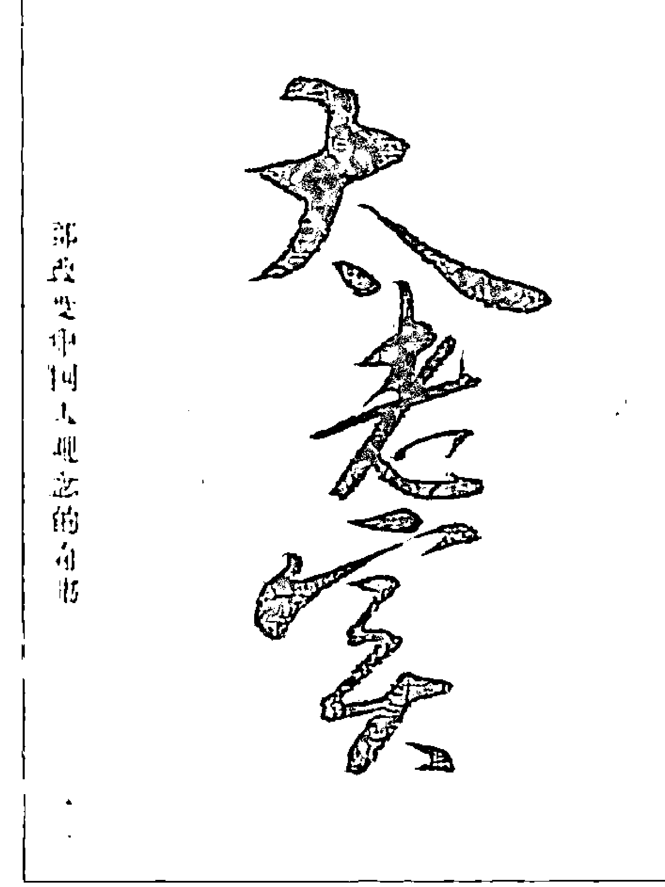

内容简介：

一部改变中国人观念的奇书。

现实残酷，我们又怎么能单纯地处世呢？当然，这里也并不是要教你如何狡猾，如何世故，而是站在实用的角度，一个人为了更好地保护自己不被伤害，那么，他就不能太老实。

《做人不要太老实》剖析老实人的缺点，以缺点为鉴，再充分举例，以生动的故事，精辟的分析，逐步深入，以点到面，娓娓道来，不愧是一本参透人生奥秘、破解世事规则的精品之作。

魅力第四面
交友篇

MAGIC

魅力失分
魔性

双鱼座的人很任性、很喜欢撒娇，“任性而为”基本上是每一个双鱼座内心的至上憧憬，让人感觉他很不成熟。

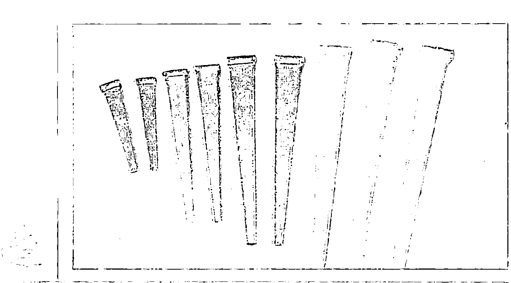

### 自律

佚名

在美国一所大学的日文班里，突然出现了一个 50 多岁的老太太。开始大家并没感到奇怪。在这个国度里，人人都可以挑自己开心的事做。可过了不长时间，年轻人们发现这个老太太并非是退休之后为填补空虚才来这里的。每天清晨她总是最早来到教室，温习功课，认真地跟着老师阅读。老师提问时她也会出一脑袋汗。她的笔记记得工工整整。不久年轻人们就纷纷借她的笔记来做参考。每次考试前老太太更是紧张兮兮地复习、补缺。

有一天，老教授对年轻人们说：“做父母的一定要自律才能教育好孩子，你们可以问问这位令人尊敬的女士，她一定有一群有教养的孩子。”

一打听，果然，这位老太太叫朱木兰，她的女儿是美国第一位华裔女部长——赵小兰。

#### 魅力提示：

自律是一种高贵的品质，懂得自律的人才是成熟的人，也更容易成功。

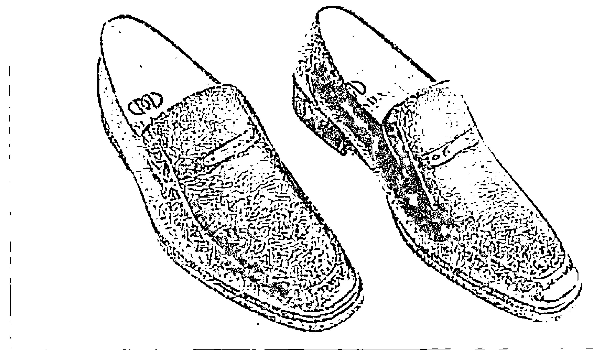

皮鞋的来历

在很久很久以前，人类都还赤着双脚走路。有一位国王到某个偏远的乡间旅行，因为路面崎岖不平，有很多碎石头，刺得他的脚又痛又麻。

回到王宫后，为了全国的百姓和自己的脚，于是他就下了一道圣旨：将国内的所有道路都铺上一层牛皮。他认为这样做，不只是为自己，还可造福他的人民，让大家走路时不再受刺痛之苦。

但即使杀尽国内所有的牛，也筹不到足够的皮革，而所花费的金钱、动用的人力，更不知凡几。虽然根本做不到，但因为是国王的命令，大家也只能摇头叹息。

一位聪明的仆人大胆向国王提出建议：“国王陛下，我有一个办法，既不需要您劳师动众，牺牲那么多头牛，也不需要花费那么多金钱。”国王忙问：“是什么办法？”“用两片牛皮包在您的脚上不是就不用再被刺了吗？”仆人说道。国王听了很惊讶，但也立刻明白了，于是他立刻收回命令，采用了这个建议——这就是皮鞋的由来。

魅力提示：

有时候多听取一下别人的意见，事情会解决的更好，任性而为只会使你的路越走越窄。

魅力改造

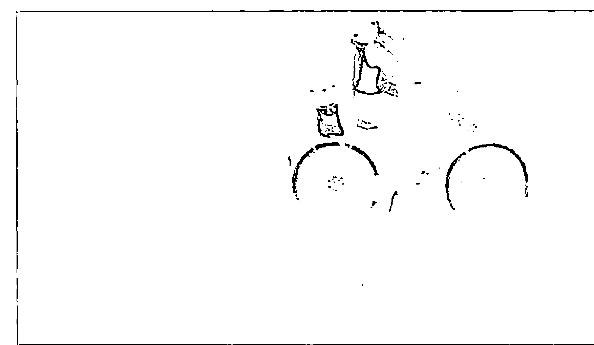

废游

任性的女孩

范天涯

女孩在肯德基店中和男友吵了起来，远远地大家都看着他们在争执，女孩气恼略略高声，而他低头，嗫嚅，忽又抬头，急急说什么，表情是且央且求。忽地她笑了，讨好的，几乎是谄媚的，他紧张地揉着自己的鼻子。
只听女孩微微提高了音量：“只有那样我才知道你爱我！”
是什么要求？一朵花，一杯茶，一盒香浓的巧克力？抑或一个甜蜜的吻，一个热烈的、情人的拥抱？
他整个人凝住了，良久，他支着椅子，慢慢起身，很慢很慢，随时会停下来一样，眼睛一眨不眨盯着女孩。她惊讶于他满脸的乞怜与哀求，如同驯顺的狗。
女孩甜甜地笑，酒窝天真，脚尖轻轻踢着。
他轻轻蹲下身，迟疑地伸手，仿佛要帮女孩系鞋带，却忽然，他飞快地一倾身，轻轻地吻了一下女孩赤裸的、一直满不在乎摆荡着的脚……
他飞速弹回原处，满脸绯红，而眼里有奇异的不能按捺又极力压抑的难堪。
他跪下去亲了她的脚，而这是肯德基，再正大光明不过的公众场合，音乐、笑声、薯条的香味和那么多陌生的眼光与侧视。

> **魅力提示：**
是什么可以让一个男人放下所有的身段，不顾尊严，忘记脸面，在公众面前，这般作践自己？的确，他爱她，可她爱他吗？有时候，过份地考验对方，不为对方着想，只会扼杀一段美好的感情。

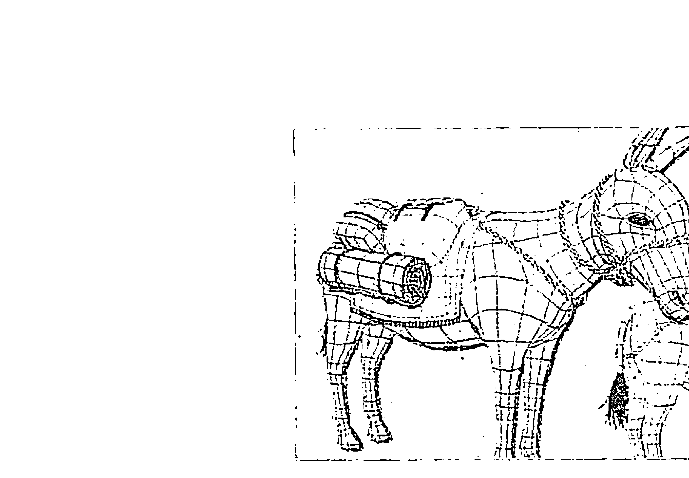

### 走出心灵的低谷

小小

古时候，有一只累极了的驴子，连走回自己圈的力气都没有了。

那是在冬天，非常寒冷。所有的街道都覆满了冰雪。

“我要在这儿停下了。”驴子说着，躺在地上。

一只饥饿的小燕子拍着翅膀飞到它旁边，细声对它耳语：“驴子，你不是在街道上，而是在结了冰的湖上，可要小心啊！”

驴子累坏了，它不理会燕子的忠告。打了个大大的哈欠，就睡着了。

它的体温一点一点把冰融化掉，最后，咔嚓一声，冰裂开了。

当它在冰水中游动时，他想，早知如此，就该听从那友善的燕子的忠告。

>> **魅力提示：**
每个人都有自己生命中最低迷和最糟糕的时候，通常这个时候我们都会自以为是，任性妄为，岂不知以如此心态来面对失败，将比失败本身更为可怕。

- 书名: 性格是把双刃剑
- 作者: 刘富奇，黄倩 编著
- 出版社: 中国华侨出版社
- 出版时间: 2006-12-1
- 印刷时间: 2006-12-1
- ISBN: 9787802221758
- 包装: 平装

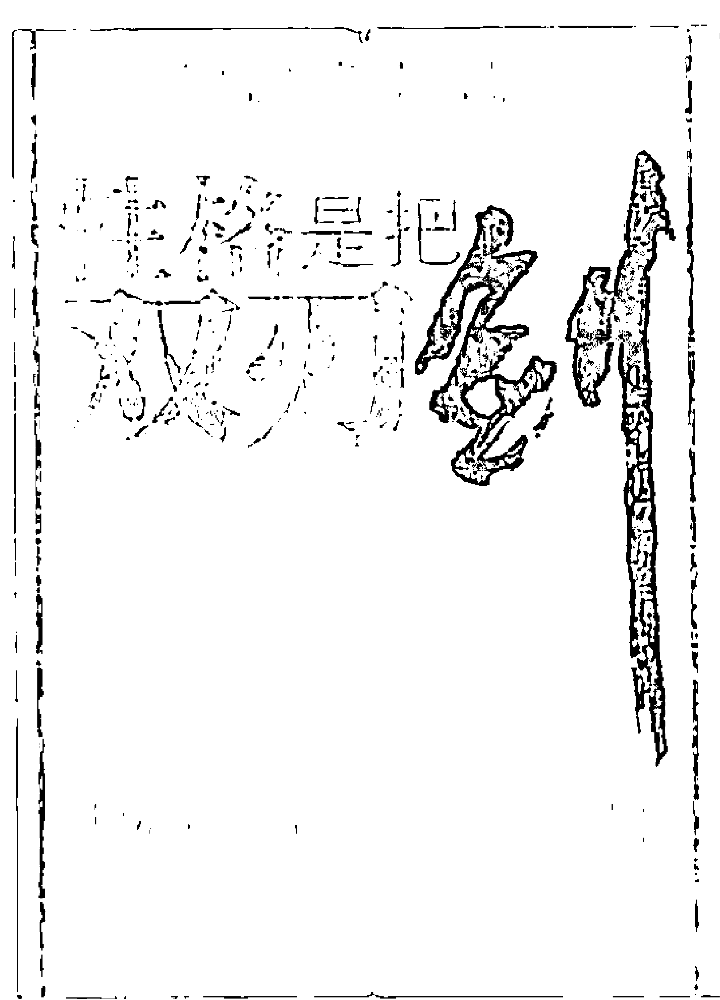

内容简介：

性格中都有先天遗传而来的部分，但更多的是通过后天培养而形成。性格一旦形成，再想改变就很困难了，但性格是可以修正的，特别是其中的缺陷部分，可以通过理性的方式进行弥补。

我们究竟属于什么样的性格？我们的性格中有哪些优点和缺点？怎样才能扬长避短，让性格帮助我们顺利地度过一生？这些都是每个人必须正视和考虑的问题。本书能够明确地给你指出，你性格的优势与劣势在哪里，并告诉你如何才能做到扬长避短。

魔方第四面
交友篇

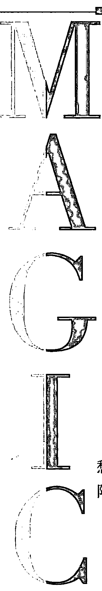

魅力失分

多愁善感

双鱼座的人容易多愁善感，常常不自觉就陷入情绪化的怪圈。

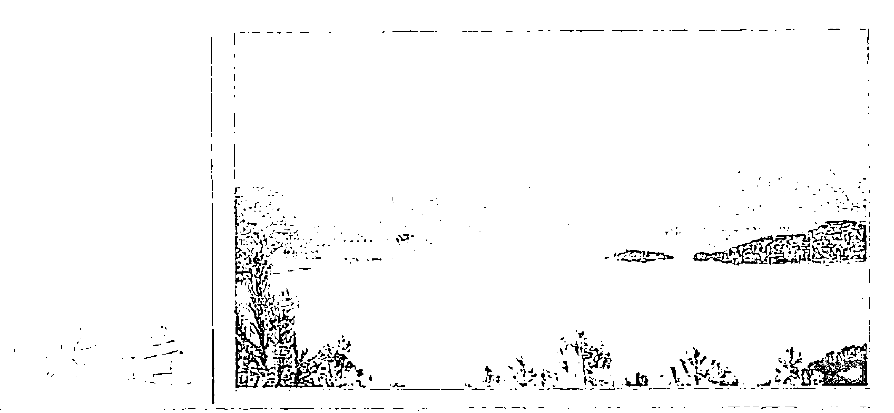

### 落水的年轻人

佚名

有个年轻人仗着胆大，在过一座很窄的桥时也不肯下车，结果连人带自行车一头栽进了河里。河水有一人多深，就在大家的惊呼声中，这个年轻人像游泳时扎了个猛子般从水里冒了出来。围观的人们把他拉了上来。

上岸后，这个年轻人没有半丝的悲哀，反而哈哈大笑起来。人们都很奇怪，以为他吓疯了。有人便问他：“你怎么还笑啊？”

“为什么不笑？”年轻人一边笑一边反问道，“我好好地活着，又没受一点伤，难道不值得笑吗？”

#### 魅力提示：

活着，就是上天给我们最大的恩赐。悲观者的眼里看到的尽是不幸；乐观者却能在不幸中看到幸运。好好珍惜每一天，对于活着的我们来说，一切都是美好的。

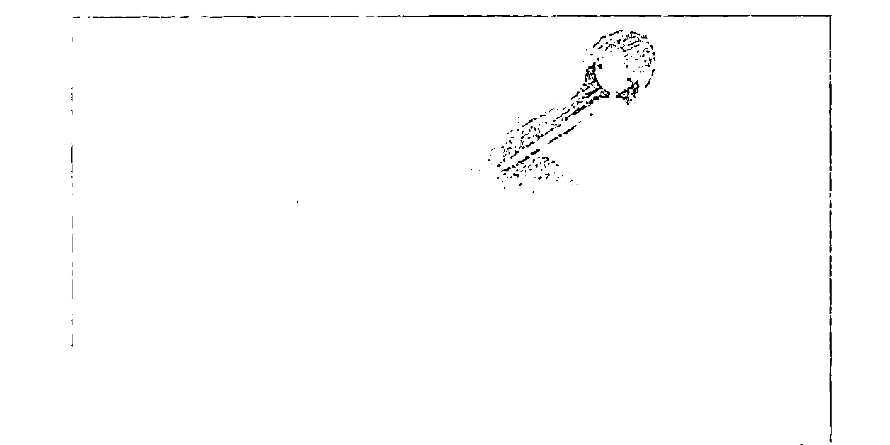

烦恼树

佚名

一个农场主，雇了一个水管工来安装农舍的水管。

这一天，水管工的运气很糟，先是因为车子的轮胎爆裂，耽误了一个小时。再就是电钻坏了。最后呢，开来的那辆载重一吨的老爷车趴了窝。

他收工后，雇主开车把他送回家去。

到了家门前，水管工邀请雇主进去坐坐。在门口，满脸晦气的水管工没有马上进去，沉默了一阵子，他伸出双手，抚摸门旁一棵小树的枝丫。

待到门打开，水管工笑逐颜开，和两个孩子紧紧拥抱，再给迎上来的妻子一个响亮的吻。在家里，水管工喜气洋洋地招待这位新朋友，之前的烦恼和郁闷似乎一扫而光了。

雇主离开时，水管工送他出门，陪他向车子走去。雇主按捺不住好奇心，问：“刚才你在门口抚摸那棵小树的枝丫，那有什么用意吗？”

水管工爽快地回答：“有，这是我的‘烦恼树’。我到外头工作，磕磕碰碰，总是有的。可是烦恼不能带进门，家里头有太太和孩子嘛，我不想让他们看到我烦恼的样子。我就把它们挂在树上，让老天爷管着，明天出门再拿走。奇怪的是，第二天我到树前去，‘烦恼’大半都不见了。”

>> **魅力提示：**
烦恼，一个我们并不陌生的字眼伴随我们多年。许多烦恼其实都是“庸人自扰”。不如在心中也栽上一棵烦恼树，寂寞、苦恼时亦可如《花样年华》中的周慕云一样，对着树洞说一些悄悄话，然后再将它尘封，让烦恼随风而逝。

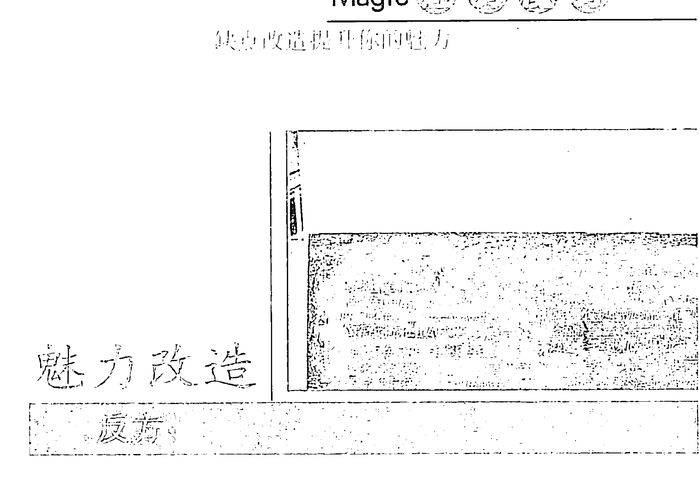

还是有两个机会

佚名

有个年轻人，适逢兵役年龄，抽签的结果，正好抽中上上签，最艰苦的兵种——海军陆战队。

年轻人为此整日忧心忡忡，几乎已到了茶不思、饭不想的地步。年轻人深具智慧的祖父，见到自己的孙子这副模样，便寻思要好好开导他。

老祖父说：“孩子啊，没什么好担心的。当了海军陆战队，到部队中，还有两个机会，一个是内勤职务，另一个是外勤职务。如果你分发到内勤单位，也就没什么好担心的了！”

年轻人问道：“那，若是被分发到外勤单位呢？”

老祖父说：“那还有两个机会，一个是留在本岛，另一个是分发外岛。如果你分发在本岛，也不用担心呀！”

年轻人又问：“那，若是分发到外岛呢？”

老祖父说：“那还是有两个机会，一个是后方，另一个是分发到最前线。如果你留在外岛的后方单位，也是很轻松的！”

年轻人再问：“那，若是分发到最前线呢？”

老祖父说：“那还是有两个机会，一个是站站卫兵，平安退伍；另一个是会遇上意外事故。如果你能平安退伍，又有什么好怕的！”

年轻人问：“那么，若是遇上意外事故呢？”

老祖父说：“那还是有两个机会，一个是受轻伤，可能送回本岛；另一个是受了重伤，可能不治。如果你受了轻伤，送回本岛，也不用担心呀！”

年轻人最恐惧的部分来了，他颤声问：“那……若是遇上后者呢？”

老祖父大笑：“若是遇上那种情况，你人都死了，还有什么好担心的？倒是我担心，那种白发人送黑发人的痛苦场面，可不是好玩的哦！”

魅力提示：

人生拥有的，是不断的抉择，端看您是用什么态度，去看待这些有赖您决定的无数机会，能够综观每件事情、每个问题的正反两面，您将发现，内心最深沉的恐惧，也在所有状况明朗了解之后，将会自行化为乌有。

魅力星座智慧书之双鱼座

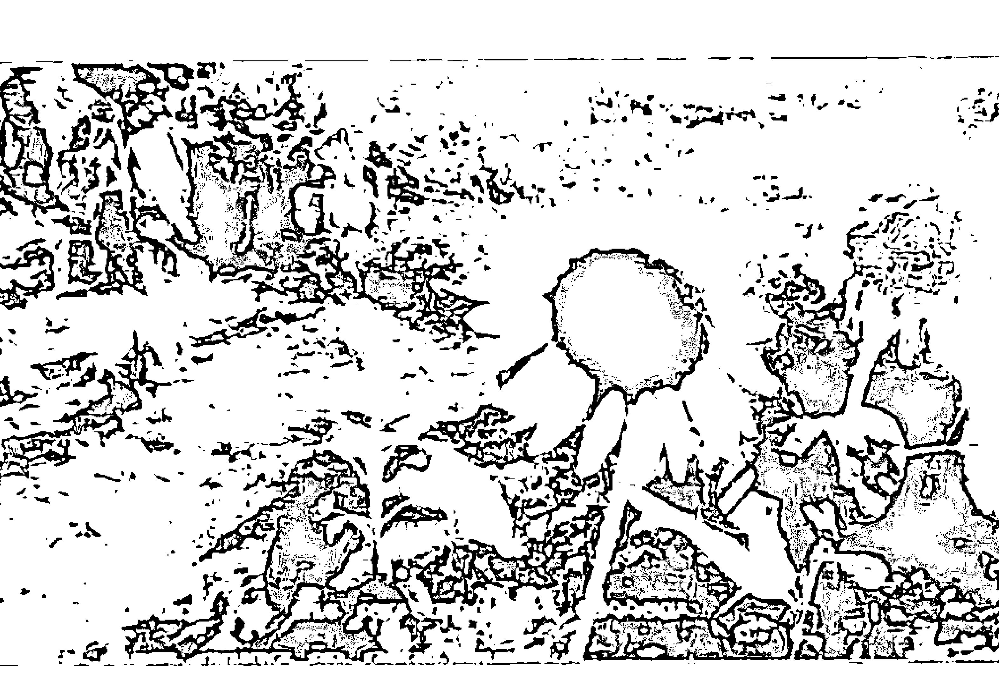

### 唐娜的病

佚名

已到知天命之年的老人唐娜得了一种怪病——她一听到“饿”字，马上就“饿得前胸贴后背”，虽然两小时前她刚吃过饭。她一天吃十多顿饭依然感觉饥肠辘辘。

唐娜退休后不久，就陷入饥饿感中。“感到饿就吃，才吃一点马上就不饿了，过一会儿，又感到饿。”唐娜说，随着时间的推移，饥饿感的频率和强度不断加强。“吃完饭不到两个小时，就又饿得心慌，一听到别人说饿，马上就觉得自己腹中空空，就是晚上，也要爬起来吃上三四顿饭。”唐娜痛苦极了。

唐娜四处求医，有医生认为她患了胃溃疡，但检查结果却一切正常。她到心理医生那里看病时，还随身携带了大量的方便面、方便粉丝等食品，只要一饿，马上就吃。这一天她吃了 13 顿饭。

经过心理专家诊断，唐娜患的是非常严重的焦虑障碍，主要是对“饿”很敏感，产生了焦虑心理，这也与她一饿就吃，一吃就饱，每次食量只有一点点有关。

确诊后，心理卫生中心的专家用特殊治疗方案对她进行治疗，到了第三周，唐娜和“饥寒交迫”的日子彻底拜拜了。

魅力提示：
过分的焦虑也许会引起身体的疾病，战胜焦虑的方法之一是确定和估计一下可能发生的最糟糕的结果是什么。通常我们所预先担忧的事并不会发生。

魅力链接

- 书名：破解情绪密码
- 作者：（美）辛德勒 著，刘杰 译
- 出版社：中国长安出版社
- 出版时间：2009-10-1
- 印刷时间：2009-10-1
- 开本：16开
- ISBN：9787510700903
- 包装： 平装

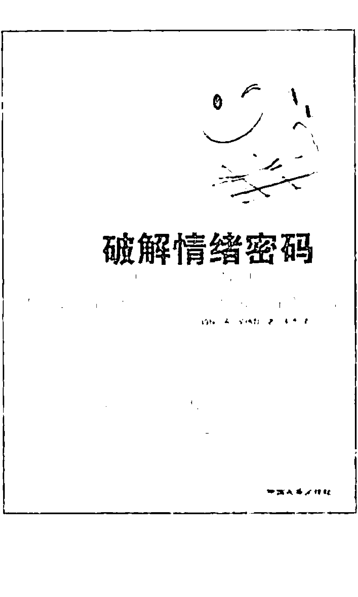

内容简介：

> > “正确的思维让人健康，错误的念头让人患病。”

自 1950 年问世以来，《破解情绪密码》与约翰·辛德勒博士的大名已经享誉欧美，在这本书的影响下，数以亿万计的读者改善了自己的健康，改变了自己的生活。

这是一本具有经典意义的心理学通俗读本，没有太多枯燥艰涩的术语或图表。作者本身就是一位资深心理专家，在他数十年的行医过程中，遇到过各种各样的心理疾病患者和求助者。所以，在书中你能看到大量发生在现实中的真实案例。这些人，无论是身处高位的富豪、企业家、专业人士，还是平凡的工薪阶层、家庭主妇、稚龄孩童，无不有着各自的心理、情绪问题。看过了他们的经历，你将发现情绪控制方法在改变人们生活中的神奇作用。

魔方第四面
交友篇

魅力失分

容易陷入沮丧而不可自拔

双鱼座的人在遇到不如意时，会陷入沮丧的情绪中，并且很难挣脱出来。

不要同情自己

南北

我有一位朋友，因为幼年时患了一场大病，命虽保住了，但下肢却瘫痪了。他的父亲是邮局干部，在他中学毕业后设法在邮局给他安排了一份可以坐着不动的工作，工资及各种福利待遇都与常人无别。在这个岗位上，他干了三年。按说，一个重残的人，能有一份这样安稳有保障的工作，应该是可以十分满足了。他的许多身体健康的同学，都还在为谋一份职业而四处奔波求人呢。但他却辞职了，因为他在人们的眼光中，不但看到了同情，更看到了怜悯还有不屑。他的自尊心在这种目光中一次次被刺伤，所以纵是父亲的耳光和母亲的哭求都没能阻止他。

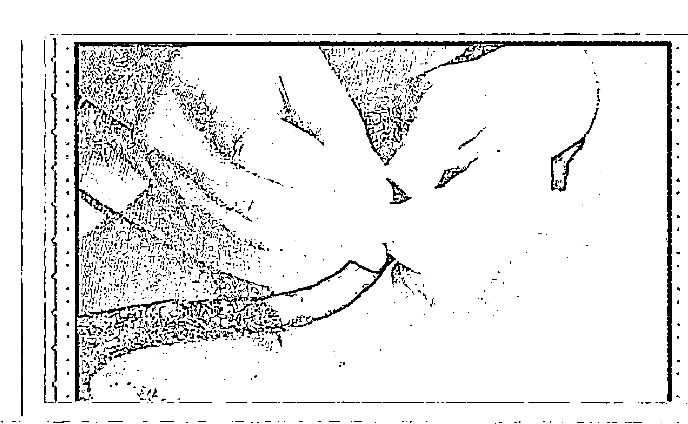

魅力改造

缺点改造提升你的魅力

辞职后他先是开了一间小书店，但不到半年便因城市改造房屋拆迁而不得不关门。之后，他又与人合办了一家小印刷厂，也仅仅维持了一年多，便因合伙人背信弃义而倒闭。

两次经商，都没成功，而且还债台高筑，这时他的父母和朋友们又来劝他，说你一个残疾人，就别胡折腾了，多少好手好脚的人还碰得头破血流呢，何况你！父亲更劝他趁自己还在领导岗位上，让他还是老老实实回邮局上班算了。

但他没有回头，而是又选择了开饭店。这次他吸取前两次的教训，一年下来，小饭店竟赢利两万多元，于是他又开了两家连锁店。

十年之后，他的连锁饭店不但在他居住的城市生根开花，而且还不断在周边的大小城市一间间开张。他自然也就成了事业成功的老板，且娶了漂亮能干的姑娘。当有人问他成功的经验时，他说了很多，但他说最重要的，就是千万不要同情自己。别人同情你不要紧，若自己同情自己，就会成为懦夫，失去奋斗的动力，成功也就决不可能。

魅力提示：

> 在现实生活中，不单是身有残疾和病患的人，就是健康的人，在遭遇挫折和失败的打击时，也会生出悲观失望、自怜自卑的心情来。在这种情绪的笼罩下，人往往不是寄希望于他人的援手，就是一蹶不振，失去重新尝试的勇气。不同情你自己，对自己进行鞭策和批判，反省和检讨失败的原因，才会走出懦弱心理的陷阱。

魅力星座智慧书之双鱼座

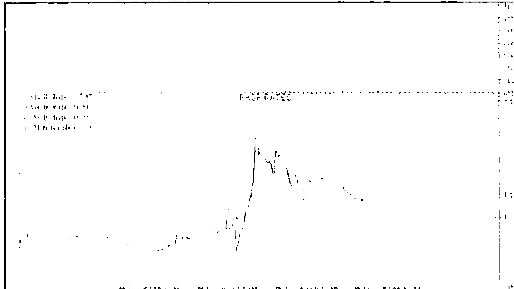

要看到事物阳光的一面

佚名

有一位银行家，在五十一岁的时候，财富高达数百万美元，而到五十二岁的时候，他失去了所有的财富，而且背上了一大堆债务。面临巨大打击，他没有颓废也没有悲观失望，而是决定要东山再起。不久，他又积累了巨额的财富。当他還清最后三百个债务人的欠款后，这位金融家实现了他的承诺。

有人问他，他的第二笔财富是怎样积累起来的。他回答说：“这很简单，因为我从来没有改变从父母身上继承下来的个性，就是积极乐观。从我早期谋生开始，我就认为要以充满希望的一面来看待万事万物，从来不要在阴影的笼罩下生活。我总是有理由让自己相信，实际的情况比一般人设想和尖刻批评的情况要好得多。我相信，我们的社会到处都是财富，只要去工作就一定会发现财富、获得财富。这就是我生活成功的秘密，记住：总是要看到事物阳光灿烂的一面。”

魅力提示：
我们都有这样的感受：快乐开心的人在我们的记忆里会留存很长的时间，因为我们更愿意留下快乐的而不是悲伤的记忆。每当我们遇到那些勇敢且愉快的人时，总会在一种柔和的亲切感中不由将自己展开。那么，我们为什么不主动这样让自己成为那样的人呢？

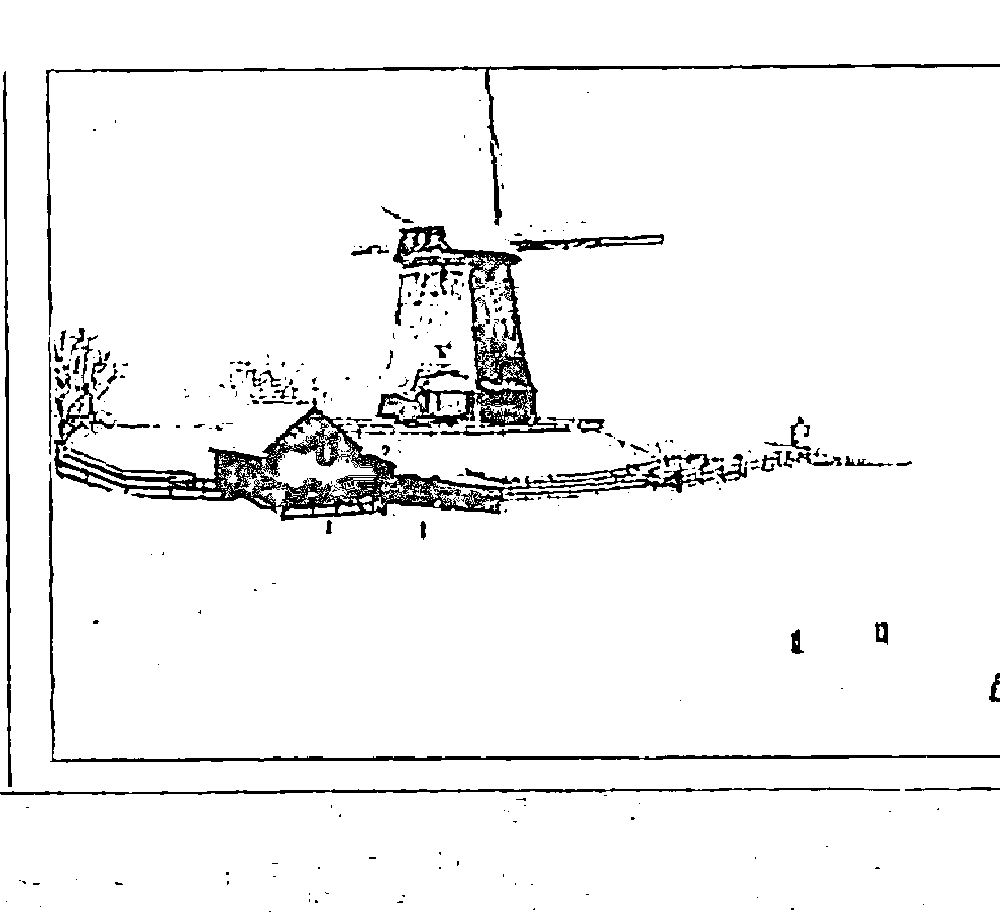

太阳和星星

一鸣

有一个年轻人，在路上与他在求学时期的老师巧遇，老师关心地殷殷询问年轻人的近况。

年轻人经昔日的恩师这么一问，仿如久旱逢甘霖一般，将自己从离开学校，到进入目前工作的公司之后，所有遭遇的不顺利情形，一五一十地对老师尽情倾诉。

老师耐心地听着年轻人的抱怨，好不容易等到年轻人告一段落，老师才点点头说：“看来，你的状况似乎不是十分理想；不过，重要的是，你有没有想过要改变这种现状，让自己过得好一点呢？”

年轻人急忙回答：“我当然想要过得更好呀！老师，有什么诀窍吗？”

老师神秘地笑了笑：“的确有诀窍，你明天晚上若是有空，到这个地址来找我！”说着，老师递了张名片给年轻人。

第二天晚上，年轻人来到老师的住处，那是在市郊的一处简陋平房。老师看到年轻人，高兴地在屋外摆了两张凉椅，要年轻人坐下来陪他聊天、看星星。

老师言不达意地和年轻人聊了半晌，年轻人毛躁了起来，急着要老师告诉他，如何方能使自己过得更好。

老师微笑地指着天上的星星：“你可以数得清，天上有多少星星吗？”

年轻人抓了抓头：“当然数不清了，这和我有什么关系？”

老师望着年轻人，语重心长地道：“孩子，在白天，我们所能看到最远的东西，是太阳；但在夜里，我们却可以见到超过太阳亿万倍距离以外的星体，而且不只一个，数量是多到数不清的。”

年轻人若有所悟，时而抬头看看星星，时而低头沉思，想着老师所说的话。

老师继续道：“我知道你的处境不顺利！但若是年轻时便一帆风顺，终其一生，你也只不过看到一个太阳；重点是，当你的人生进入黑夜时，你是否看到更远、更多的星星？”

年轻人的思绪仿佛进入宇宙的最深邃之处；感觉自己犹如站在埃佛勒斯峰顶，一片大好的未来美景，正在他的眼前展开。

> 魅力提示：
> 在你沮丧失意的时候，你看到那些闪亮的星星了吗？

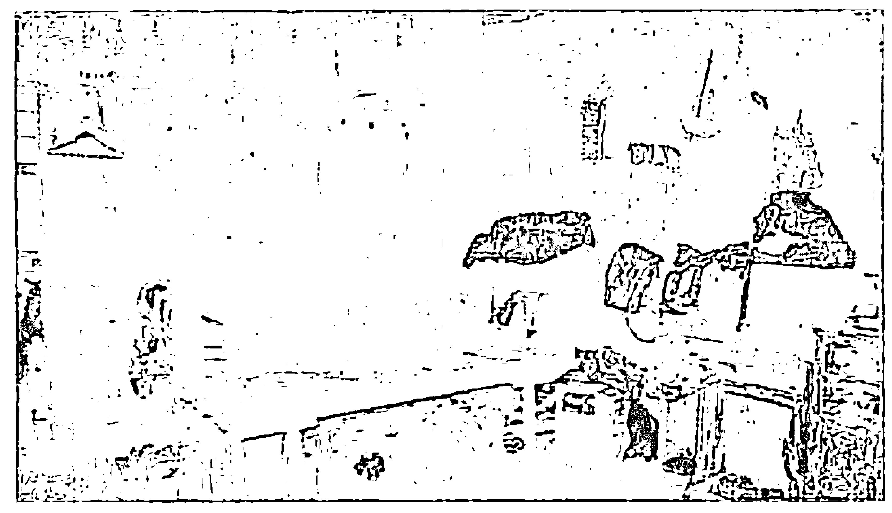

### 痛苦的背面

林夕

从小学到中学，她一直是班干部、三好学生，高中毕业，她以优异的成绩考入一所重点大学，担任系学生会干部，大三时还入了党。大学最后一年，她参加全市应届毕业生洽谈会，与北京一家很有名的企业达成协议，接收她毕业后去工作。她满怀欣喜，只等着七月份一毕业就去北京工作。

可是，就在毕业前一个月，她经不住好友的再三请求，答应替她去参加英语考试。结果，那次替考被同学发现举报了。当时，学校刚换了一位新校长，正严抓校风校纪，虽然系里老师再三为她说情开脱，最后她还是被处以开除学籍、勒令退学，并给以开除党籍、留党察看一年的处分。

这样的结果，不仅是她本人，连学校的老师、同学都有些不忍接受。那段日子，她的痛苦，可想而知。家人怕她想不开自杀，请假轮流陪着她。男友闻讯从外地赶回来看她。男友非常爱她，知道她出事后，他也非常难过、痛苦。看到她现在这个样子，更令他担忧。他不知道用什么办法，才能安慰她，化解她心中的痛苦。

一连三天，她不吃不喝，蒙头躺在床上。家人的安慰、劝解，她一句也听不进。到了晚上，男友过来，揭开她蒙在身上和脸上的被子，把一张写满了字的纸放到她眼前，说：“我知道你现在非常痛苦，你也完全有理由痛苦，即使你有一百个痛苦也不过分。你看，这张纸写的全是‘痛苦’，有一百个。我们打个赌，你把它一点点撕成碎片，我保证在十分钟内把它拼好。”

她看了看，接过来，一下一下，撕成碎片，扔在地上。不一会儿，地下就堆满了碎纸片。男友弯下身，一一捡起来，坐在一旁的写字台上，一块一块地拼。果然，用了不到十分钟，就拼好了。

她看着那些刚刚被自己撕成碎片、现在竟又粘贴在一起的“痛苦”，十分惊讶，终于开口，说了第一句话：“你是怎么拼好的？”

“很简单。你看，”男友把纸翻过来，只见纸的背面用红色彩笔写着一个硕大的“快乐”，两个字占满了一张纸，“我在它的背面写下‘快乐’两个大字，让它充满整张纸。拼的时候翻过来，按照‘快乐’的笔画拼，这样，一会儿就把它拼好了。”

“亲爱的，无论何时，你要记住，痛苦的背面，就是快乐！中国的大学你读不了，可是，全世界，不止中国有大学呀！你不是一直想去美国留学吗？其实我也非常想去。我们做个比赛好吗？我们俩一起报考托福，一起申请去美国读书，看谁先通过？”

她已是泪流满面，扑进男友的怀抱，用力点了点头。

## / 魅力星座智慧书之双鱼座

#### 魅力提示：

> 痛苦是一个深渊，如果不能控制，只能是越陷越深。我们应该学会快乐，快乐是战胜自己的前提。

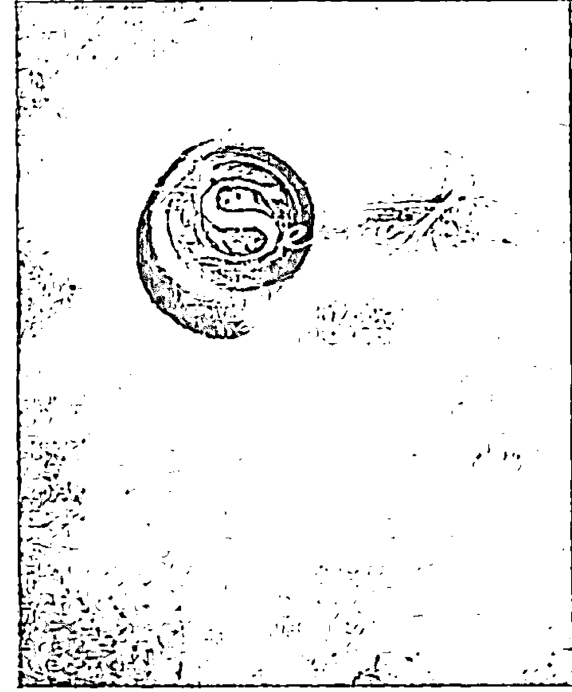

## 魅力链接

- 书名：The Secret 秘密
- 作者：（澳）拜恩（Byrne, R）著，谢明宪 译
- 出版社：中国城市出版社
- 出版时间：2008-11-1
- 印刷时间：2008-11-1
- 开本：32 开
- ISBN：9787507419887
- 包装：精装

## 内容简介

《The Secret 秘密》是一本注定属于伟大的心灵励志书。本书作者朗达·拜恩是澳大利亚电视工作者，有一年，父亲突然去世、工作遭遇瓶颈、家庭关系也陷入僵局，就在人生跌至谷底、生活即将崩溃时，意外发现了隐藏在百年古书中的秘密。作者还发现，许多当今的佼佼者早已了解并运用此秘密。因此，作者不禁疑问：“为什么不是每个人都知道呢？”于是，作者决心组织一个团队披露这个只有少数人才知道的秘密。她发现，洞悉这个秘密的人，他们都是各行各业的佼佼者，并且现身说法告诉你：
幸福、快乐、健康、金钱、人际关系，这个秘密都可能给你。了解这个秘密，你可能做到你想做的事。
在这个变化无常的大千世界里，我们终于找到了心灵的栖息之地。

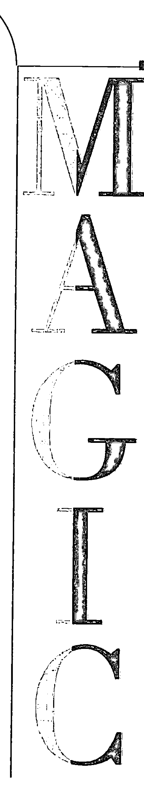

## 魔方第五面 学业事业篇

## 魅力失分 不够实际

双鱼座的人非常爱幻想，他会经常滥用想象力而沉溺于虚幻之中，不够实际。

### 法庭的证人

滕刚

那天下午，布兰克路过法庭，看见一堆人正往里挤，上前一问，才知道马上有公审。布兰克也挤了进去，在后排的一个旁听席坐下。

被告跟布兰克一样，穿着西装，但没有打领带。被告被指控杀了人。控方的证据是被告具备的作案时间，被告辩护的理由是案发当天下午他一直在家。但是，在近两个小时的法庭调查和辩论中，被告未能拿出证据证明案发当天下午他不在案发现场，结果被法官判了死刑，这让布兰克大惊失色，他连忙问坐在他旁边的一位戴夹鼻眼镜的先生：“请问先生叫什么名字？”那位先生说：

“我叫弗兰德。”布兰克说：“我叫布兰克。我想，你能证明我今天下午一直在法庭。”弗兰德先生说：“对不起，我只能证明你现在在法庭，至于你跟我说话前，你是否在法庭，我不能证明。”布兰克急了：“整个下午我都跟你坐在一起，我一步都没有离开这个座位，你怎么不能证明呢？”刚刚走下审判台的法官看见他们俩在纠缠，走了过来，布兰克说：“我确确实实整个下午都在法庭，我一直坐在他的旁边。”法官说：“你自己说了没用，你得有证人！有人证明你今天下午都在法庭吗？”布兰克望着弗兰德，弗兰德摇摇头。法官说：“幸好还没有人指控你！”布兰克惊出一身大汗。

布兰克出了法庭，挤上公共汽车。布兰克拿着售票员撕给他的票问：“你这票能够证明我今天下午五点左右在你们车上吗？”售票员说：“我们的票只能证明你乘过我们的车，不能证明你在什么时间乘的车。我们是公共汽车。”布兰克小心翼翼地把车票放进内衣口袋。临下车前，他问售票员：“请问小姐芳名？”售票员说：“我叫玛田娜。”布兰克指着自己的额头说；“我叫布兰克。记住，我这儿有个刀疤。”下了公共汽车，布兰克走进一家面包店。他要了一盘沙拉，一块面包。他跟服务员要发票。服务员说：“我们这样的小店没有发票。”布兰克说：“刚才那个被告说他案发那天下午三点曾下楼到面包店吃过点心。那家面包店不肯证明，他又拿不出发票之类的证据，结果被判了死刑。”服务员给他写了张条子，证明他某日某时某刻在他们店用过餐。布兰克临走前指着自己的额头说：“我叫布兰克。记住，我这儿有个刀疤。”

布兰克刚到家门口，就敲响了邻居的门。他对邻居说：“你看见了，我现在进门了，你能证明我到了家，我在家里。”布兰克关上门，倒在沙发上睡着了。他醒来，一惊，拉开门，敲开邻居的门说：“你看到了，我在家里。”邻居说：“我只能证明你两次敲我门的时候你在家里，至于其他时间你是否在家，请谅解，我不能证明。”布兰克急得在屋里乱转。他看见了床头柜上电话机。他打通了一个朋友的电话。他说：“我打电话给你，是想让你证明我在家，万一将来有人指控我，你可以为我证明。”朋友说：“从来电显示看，你是在家。但我只能证明你给我打电话的时候你在家，至于不打电话的时候，你是否在家，对不起，我不能证明。”

就这样，布兰克不断敲邻居的门，不断打朋友的电话。夜深了，他不能再敲邻居的门，不能再打朋友的电话。他仰在床上，看着天上的星星，想到自己无法证明一个人在家睡觉，他恐惧极了。他下了楼，来到街对面的一个朋友家。他睡在朋友的身边说：“你能证明，我今晚是跟你睡在一起的。”朋友打起了呼噜，他却睡不着觉。想到法庭上那个被判死刑的人，布兰克发现自己以前的生活是多么的危险。他一直一个人生活，他一直过着没有证人的生活，他甚至刻意追求这样孤独的生活。万一有人指控他，他真的会跟那个被告一样，因为没有证人而被判死刑。他再也不能一个人生活了，那是不可以的，那太危险了。他决定明天就找个证人，一起生活。

#### 魅力提示：

> 做一个成熟的人，不要活在幻想的世界里。心灵成熟的过程，是一系列自我发现、自我探险的过程。假如我们能够真正的成熟起来，便无需后退而躲进懦怯者的避难所里。

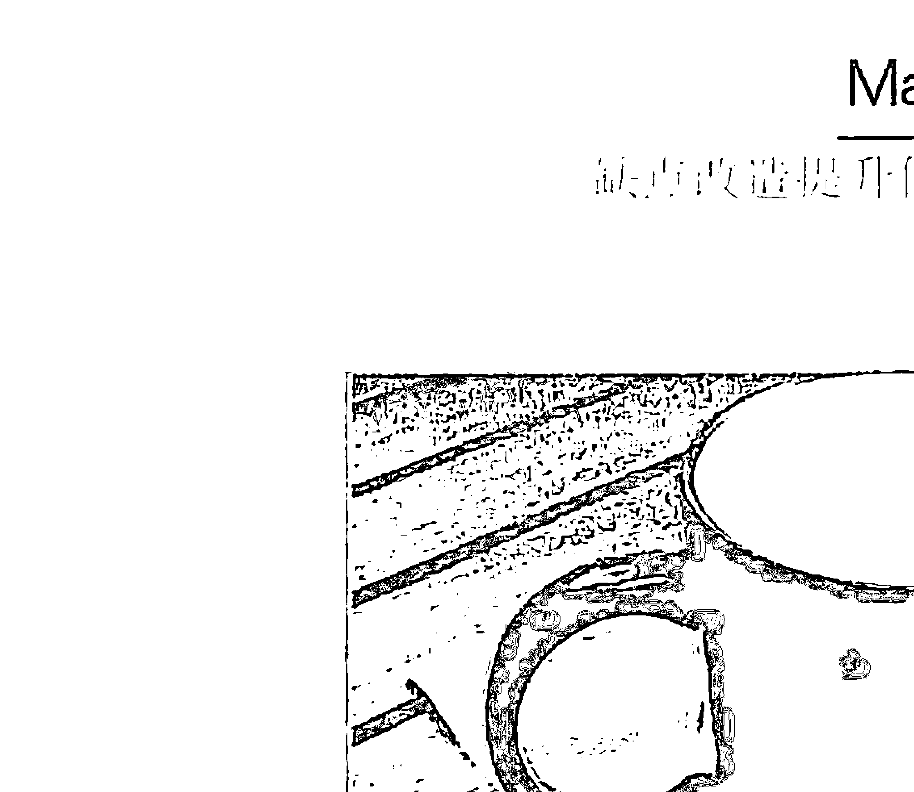

### 为今天的牛奶努力

佚名

一次老同学聚会上，谁也没想到阿昆是混得最好的人，但更没想到的是，从毕业至今，他竟然在一个公司呆了10年！10年，现在还有谁会在一家公司干上10年？能做5年就已经是奇迹了，他现在是一家外资企业的生产部经理，年薪20万。他是自己开小车来的，全班仅他一个，我们齐声向他讨教成功之道，谁知他只一句话就把我们打发了：“我只为今天的牛奶努力。”

他说，其实我也曾想过换个环境，但现在的工作这么难找，再说，你又不能保证新工作会比原来的好，与其这样浪费精力，倒不如全身心投入到现在的的工作上去，多学点东西。我在生产线呆了3年，然后当技术员两年，后来当上了副经理，现在把副字去掉了……为今天的牛奶努力吧，兄弟们，别一山望着一山高，我们常说“牛奶会有的，面包也会有的”，可是我们必须得为今天的牛奶努力，不然一切都没有了。

#### 魅力提示：

> 对一个聪明人来说，每一天都是一个新的开始，你当然可以谋划自己的理想和前程，甚至可以放眼世界寻找更好的机会，但不要忘了我们首先得为“今天的牛奶努力”，在每个“今天”执著、踏实地走好每一步，展现在你眼前将是满园春色。

## 魅力改造

### 处方

### 成功的秘诀

张玲俐

渤海口有一条小鱼，它下定决心要一路游到山顶。于是它逆向而行，这只小鱼泳技精湛，一会儿冲过浅滩，一会儿划过激流穿过了层层渔网，躲过水鸟的追踪。好不容易它游到了山顶，可它还来不及喘口气呢，刹那间，被冻成了冰！

一万年后，一群登山队员在山顶上的冰封中发现了它。立刻有人认出了这是产于渤海口的鱼。

一位年轻人赞道：

> “真是一条勇敢的鱼啊！穿越千川万水来到一个截然不同的环境，了不起！”

一位老者却说：

> “不！它只有伟大的精神，却没有伟大的方向，所以只换来死亡。”

#### 魅力提示：

成功，除了“努力”以外，更需要“方向”。很多人会选择不断地换跑道、换环境、换工作或是拼命地劳碌奔波，有时不妨暂时放慢脚步，想一想：这条路真的是我“想”走的吗？真的是我“该”走的吗？真的是我“适合”走的吗？

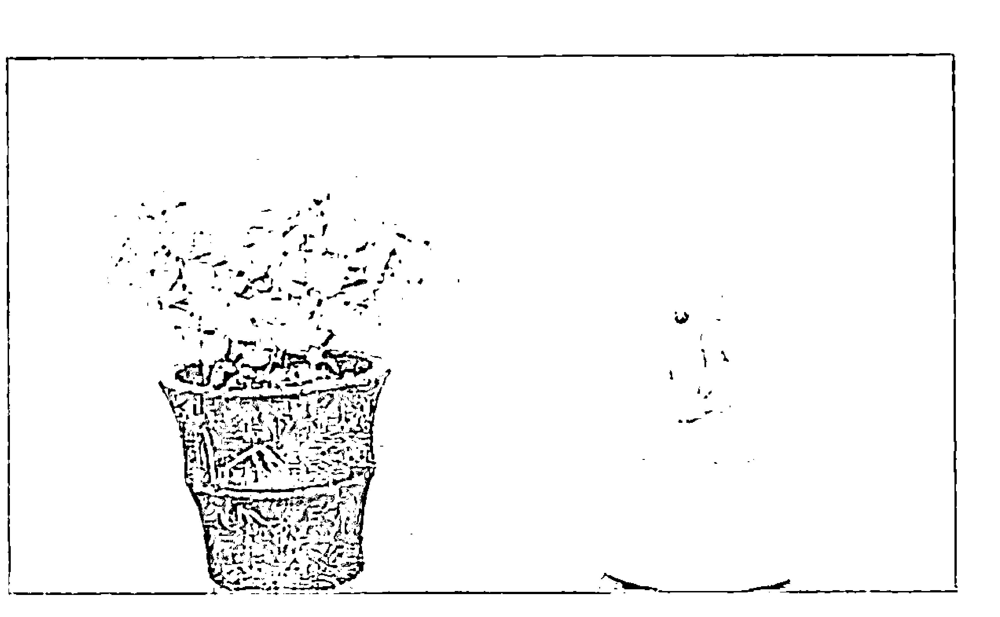

### 月亮水晶球

李若君

有个女孩偶然得到了一个做工精美而神秘的匣子，那是在一个有美丽月色的晚上，女孩好奇地把玩这匣子，幻想着其中的神秘物品。

匣子是那么不容易开启，以致女孩在竭尽全力开启匣子后，手一滑匣子跌落在了地上。匣子里的东西刹那间成了无数不同截面的水晶块。瞬间，一个发着月光般光芒，变幻异常的水晶球滑过黑夜闪着神秘的折光掉在了地上。水晶已碎，但那一闪即逝的美丽却永远留驻在了女孩的情怀中，完美而经典。

为了重新找到那份绚丽，女孩将匣子留在了身边，希望有一天重新找到一颗同样的水晶球放在里面。倘若找不到就让匣子成为一种曾经拥有的见证。

过了很多年，女孩的匣子依旧空着，这期间有许多希望得到女孩青睐的

#### 魅力提示：

人生就是这样，无论事业、爱情、生活都在进行着如此的故事……抛弃那些虚幻的东西，活在现实中吧

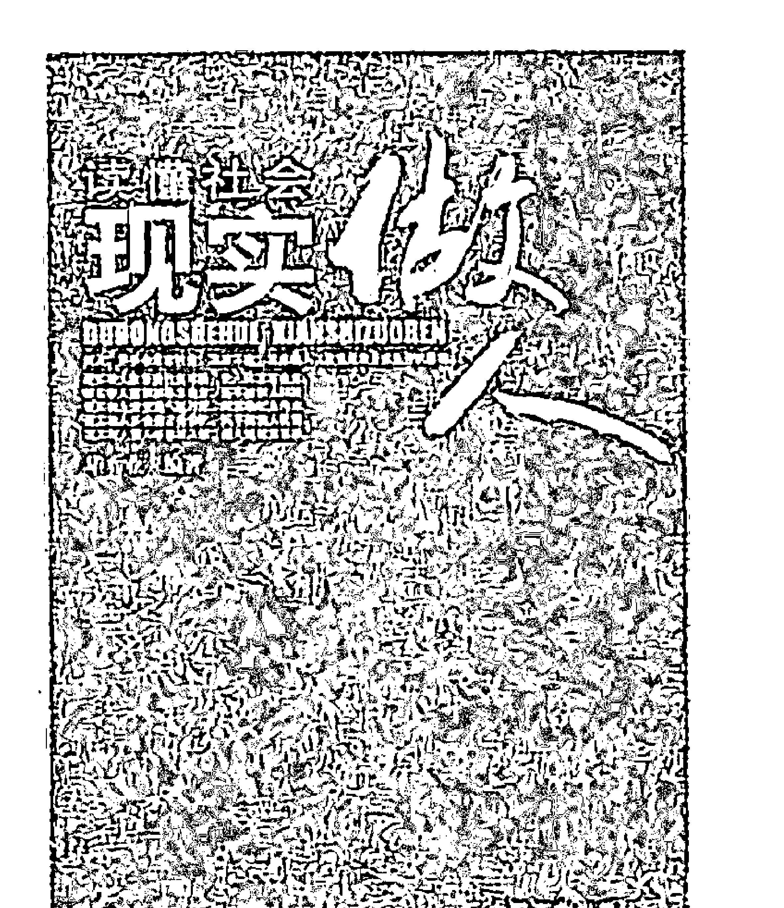

- 书名：读懂社会现实做人
- 作者：华业编
- 出版社：中国商业出版社
- 出版时间：2008-5-1
- 印刷时间：2008-5-1
- 开本：16开
- ISBN：9787504461285
- 包装：平装

## 内容简介

做人，要抛弃不切实际的幻想，天天不行动，急功近利想一夜暴富，难免阴沟里翻船。成功需要一步一步的积累，而不是凭空想象就能得到的。

在这个现实的社会里，做人必须要现实，否则就无法立足。抱太多幻想，就不能脚踏实地，做出成绩；不懂得赚钱花钱，就没有办法体现价值；不具备防人之心，就很容易上当受骗；不结交贵人，就不会有人帮忙；不讲究语言的艺术，就没有好人缘；做人太张扬，就容易遭人嫉恨；做人太固执，就可能走错方向。

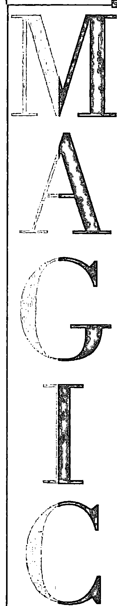

## 魔方第五面 学业事业篇

## 魅力失分 逃避困难

双鱼座的人一旦遇到困难就会畏畏缩缩，他马上想到的不是怎样解决问题，而是逃避。

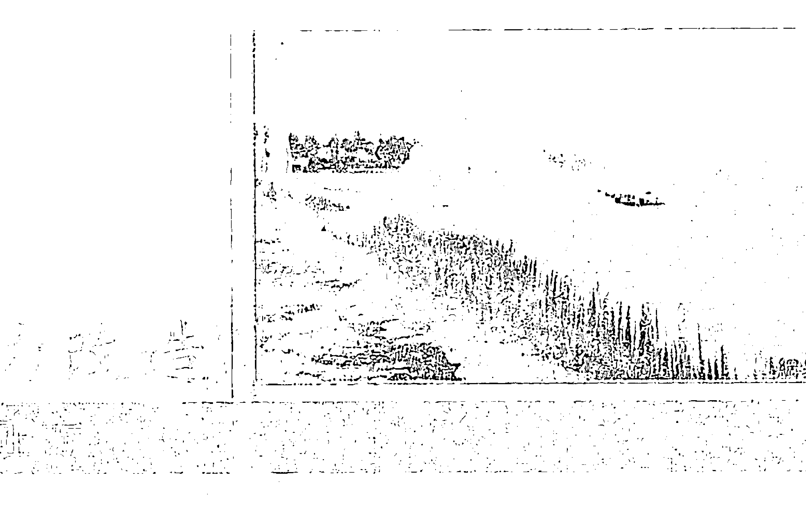

## 站在暴风雪中

佚名

那天的风雪真狂，外面像是有无数发疯的怪兽在呼啸厮打。风呜咽着四处搜索，从屋顶看不见缝隙的墙壁鼠叫似的“吱吱”而入。
大家都在喊冷，读书的心思似乎已被冻住了。一屋的跺脚声。
鼻头红红的布鲁斯老师挤进教室时，等待了许久的风席卷而入，墙壁上的《世界地图》一鼓一顿，开玩笑似的卷向空中，又一个跟头栽了下来。
往日很温和的布鲁斯先生一反常态，满脸的严肃庄重甚至冷酷，一如室外的天气。
乱哄哄的教室静了下来，学生们惊异地望着布鲁斯先生。

“请同学们放好书本，我们到操场上去。”几十双眼睛在问。“因为我们要在操场上立正5分钟。”即使布鲁斯老师下了“不上这堂课，永远别上我的课”的恐吓之词，还是有几个娇滴滴的女生和几个很壮的男生没有出教室。操场在学校的东北角，北边是空旷的菜园，再北是一口水塘。那天，操场、菜园和水塘被雪连成了一个整体。矮了许多的篮球架被雪团打得啪啪作响，卷地而起的雪粒雪团呛得人睁不开眼张不开口。脸上像有无数把细窄的刀在拉在划，厚实的衣服像铁块冰块，脚像是踩在带冰碴的水里。学生们挤在教室的屋檐下，不肯迈向操场半步。布鲁斯先生没有说什么，面对学生们站定，脱下羽绒衣，线衣脱了一半，风雪帮他完成了另一半。“到操场上去，站好。”布鲁斯先生脸色苍白，一字一顿地对学生说。谁也没有吭声，学生们老老实实地到操场上排好了三列纵队。瘦削的布鲁斯先生只穿了一件白衬褂，衬褂紧裹着的他更显单薄。学生们规规矩矩地立着。5分钟过去了，布鲁斯先生平静地说：“解散。”回到教室，布鲁斯先生说：“在教室时，我们都以为自己敌不过那场风雪。事实上，叫你们站半个小时，你们也顶得住，叫你们只穿一件衬衫，你们也顶得住。面对困难，许多人戴了放大镜，但和困难拼搏一番，你会觉得，困难不过如此……”学生们很庆幸，自己没有缩在教室里，在那个风雪交加的时候，在那个空旷的操场上，他们学到了人生重要的一课。

#### 魅力提示：

困难，对于弱者是一个深渊，对于强者是一笔财富。

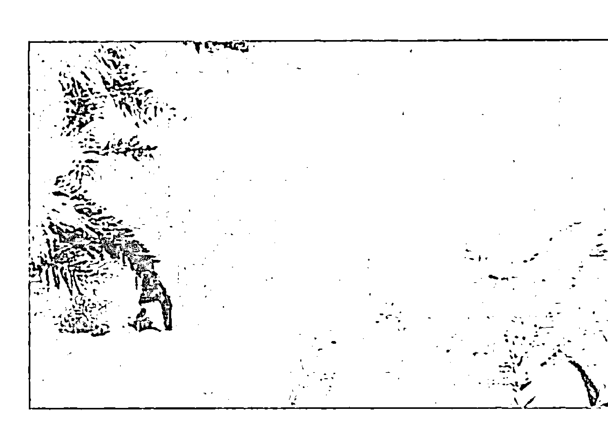

## 拼命往前冲

朱永康

弗兰克斯少校躺在死气沉沉的病房内，凝视着圣诞树发呆。这本是一年中最快乐的时候，而弗兰克斯却伤感不已。7个月前在柬埔寨时，一块手榴弹片戳进了他的左腿。医生已决定为他做截肢手术。

弗兰克斯毕业于西点军校，在校时是棒球队队长。他曾下定决心终身从军，但现今看来，退伍似乎是唯一的选择。尽管弗兰克斯感到自己仍有许多东西，比如作战经验、技术知识、解决问题的能力，可以贡献给部队，不过他也知道，受过重伤的军人很少有回到现役的：他们必须通过每年一次的健康考核，包括徒步行军两英里。弗兰克斯吃不准自己装着假肢能否胜任那种事情。

手术后最让弗兰克斯感到悲哀的，是他再也不能在棒球场上一展雄姿了。

在每周举行的棒球赛中，轮到他击球时，都得靠别人代他跑垒。

有一天在等候击球轮次时，弗兰克斯注意到一名队友滑进了第三垒。他寻思：如果我做同样的尝试，情况会怎样呢？

当弗兰克斯击球时，他一棒把球击到了场中央。他挥手叫替他跑垒者让开，自己迈动僵硬的腿，开始了痛苦的跑步。在第一垒和第二垒之间，他瞅见外野手将球抛向第二垒的守垒员。他于是闭上眼，拼命使自己往前冲，一头滑进了第二垒。裁判喊道：“安全入垒！”弗兰克斯欣慰地笑了。

几年后，弗兰克斯率领一个中队穿越恶劣的地形进行战地训练。上司怀疑一位截肢者能否接受这种挑战，但弗兰克斯用行动做出了肯定的回答。“这使我跟士兵们的关系更为密切，”他说，“每当我的假肢陷入泥泞时，我就叮咛自己：‘这便是你无腿可站时的情形。’”

今天，弗兰克斯已晋升为四星上将。

#### 魅力提示：

遇到困难和挫折，我们最好的选择就是往前冲，把它甩到身后，而不是绕过去。

## 魅力改造

### 处方

## 祈求

佚名

一个人在渡海时遇见风浪，他害怕被淹死，于是他跪在甲板上，合上双手，虔诚地向上帝祈求：“我英明的神主啊！求求你让我变成一条鱼，可以在海洋里遨游，不用害怕风浪的袭击。”上帝就把他变成一条鱼。

变成鱼的他在海里游着，碰见了一条鲨鱼。鲨鱼追得他筋疲力尽，好不容易才逃进珊瑚礁下面躲了起来。他又向上帝祈求让他变成一条鲨鱼，上帝又把他变为鲨鱼。

他想变成了鲨鱼应该没事了，可是不久他又遇上捕鲸船，看着身旁的鲨鱼被鱼枪无情地掳杀，他吓坏了，连忙向上帝祈求让他还是变回人吧！他觉得还是人厉害。上帝告诉他这是最后的一次，就把他变回了人。

他依旧回到了甲板上，“还是做人比较舒服……”他正念叨着，一个大浪打了过来，船翻了，他也淹死了。

#### 魅力提示：

> 逃避没有用,命运是注定了的。面对现实,生命的旅途只能从自己的脚下趟过。

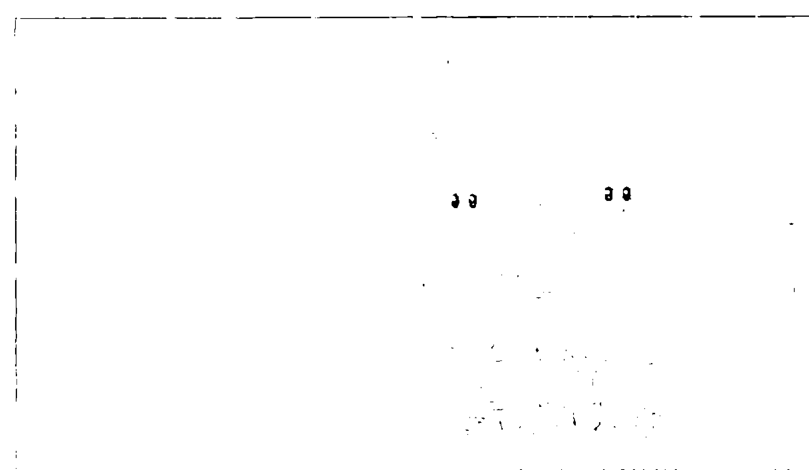

## 穷人和富人

佚名

一个富人见一个穷人很可怜，发善心愿意帮他致富。富人送给穷人一头牛，嘱咐他好好开荒，等春天来了撒上种子，秋天就可以远离贫穷了。穷人满怀希望开始开荒，可是没过几天，牛要吃草，人要吃饭，日子比过去还难，穷人就想，不如把牛卖了，买几只羊，先杀一只吃，剩下的还可以生小羊，长大了拿去卖，可以赚更多的钱。穷人的计划付诸了行动，只是当他吃了一只羊之后，小羊迟迟没有生下来，日子又艰难了，他忍不住又吃了一只。穷人想，这样下去还得了，不如把羊卖了，改买鸡，鸡生蛋的速度要快一些，鸡蛋立刻可以赚钱，日子立刻可以好转。穷人的计划又付诸了行动，但是日子并没有改变，又艰难了，他又忍不住杀鸡，终于杀到只剩一只鸡时，穷人的理想彻底崩溃了。穷人想致富是无望了，还不如把鸡卖了，打一壶酒，三杯下肚，万事不愁。很快春天来了，发善心的富人兴致勃勃地来送种子，赫然发现，穷人正就着咸菜喝酒，牛早就没有了，房子里依然一贫如洗。

#### 魅力提示：

很多人都有过像穷人一样的梦想，但却没有坚持到底。穷人总是逃避困难，富人总能想到解决问题的方法。成功者找战胜困难的方法，失败者却总是找逃避困难的借口。

## 魅力链接

- 书名：方法总比问题多
- 作者：荣融 主编
- 出版社：企业管理出版社
- 出版时间：2007-5-1
- 印刷时间：2007-5-1
- ISBN：9787801976468
- 包装：平装

# 内容简介：

对于职场人士来说，当遇到问题和困难时，能否主动去找方法解决，而不是找借口回避责任，这一点，对他在职场中能否成功和有多大发展空间具有决定性作用。“一点办法也没有！”这样的话，你是否熟悉？你的身边是否经常有这样的声音？当你向别人提出某种要求时，得到这样的回答，你是不是会觉得很失望？当你的上级给你下达某个任务，或者你的同事、顾客向你提出某个要求时，你是否也会这样回答？当你这样回答时，你是否能够同时体验到别人对你的失望？

本书将使你充满成就感，不再逃避，不再抱怨，无论多么困难的事情，你都有办法解决；它将使你的工作效率大大提升，你将会首先做最重要的事情，并尽量减少那些无意义的活动；它将使你更加聪明而不是更加辛苦地工作，快乐地享受人生。困难面前，让我们去寻找解决方法，而不要去找推脱的理由。

# 魔方第五面
学业事业篇

## 魅力失分

## 不善理财

双鱼座的人经济观念淡薄，会赚钱却不会理财，经常左手进、右手出，而且有挥霍的习惯。

# 重要的尾数

李振福

一个年轻人到某公司应聘临时职员，工作任务是为这家公司采购物品。招聘者在一番测试后，留下了这个年轻人和另外两名优胜者。随后，公司负责人提了几个问题，每个人的回答都各具特色，公司负责人很满意，面试的最后一道是笔答题。题目为：假定公司派你到某工厂采购两千支铅笔，每支铅笔五美分，你需要从公司带去多少钱？几分钟后，应试者都交了答卷。第一名应聘者的答案是一百二十美元。公司负责人问他是怎么计算的。他说，采购两千支铅笔要一百美元，其他杂用就算二十美元吧！公司负责人未置可否。

第二名应聘者的答案是一百一十美元。对此，他解释道：两千支铅笔需要一百美元左右，另外可能需要用十美元左右。公司负责人同样没表态。

最后轮到这位年轻人。公司负责人拿起他的答卷，见上面写的是一百一十三点八六美元，见到如此精确的数字，他不觉有些惊奇，立即让应聘者解释一下答案。

这位年轻人说：“铅笔每支五美分，两千支是一百美元。从公司到这个工厂，乘汽车来回票价四点八美元；午餐费两美元；从工厂到汽车站为半英里，请搬运工人需要一点五美元……因此，总费用为一百一十三点八六美元。”

公司负责人听完，欣慰地笑了。这名年轻人自然被录用了。

> 魅力提示：

无论是公司理财，还是家庭理财，无不从细处下工夫。无法想象一个不在乎小钱的人，能积攒多少大钱。事实上，理财同为人一样，细节决定成败。

# 股神

佚名

1996年被美国《财富》杂志评定为美国第二大富豪的巴菲特，被公认为股票投资之神。他也是早创业早致富的典型。巴菲特在十一岁就开始投资第一张股票，他把自己和姐姐的一点小钱都投入股市，刚开始一直赔钱，他的姐姐一直骂他，而他坚持要放着三四年才会赚钱，结果，姐姐把股票卖掉，而他则继续持有，最后证明了他的想法是正确的。

巴菲特二十岁时，在哥伦比亚大学就读，在那一段日子里，跟他年纪相仿的年轻人都只会游玩，或是阅读一些休闲的书籍，但他却是大啃金融学的书籍，并跑去翻阅各种保险业的统计资料，当时他的本钱不够又不喜欢借钱，但是他的钱还是越赚越多。

1954年他如愿以偿到葛莱姆教授的顾问公司任职，两年后他向亲戚朋友集资十万美元，成立自己的顾问公司，该公司的资产增值三十倍以后，1969年他解散公司，退还合伙人的钱，把精力集中在自己的投资上。

巴菲特从十一岁就开始投资股市，历经几十年坚持不懈。因此，他认为，他今天之所以能靠投资理财创造出巨大财富，完全是靠近六十年的岁月，慢慢地在复利的作用下创造出来的。

#### 魅力提示：

不少人将富人致富的原因，直接归因于他们生来富有、他们创业成功、他们比别人聪明、他们比别人努力或是他们比别人幸运。但是，家世、创业、聪明、努力与运气并不能解释所有致富的原因。他们的富裕靠什么呢？靠他们较强的理财能力，把握财富增长的轨迹。

# 马太效应的启示

佚名

主人要出门到远方去。临行前，他把仆人召集起来，按着各人的才干，给他们银子。

后来，主人回来了，就把仆人叫到身边，了解他们的使用情况。第一个仆人说：“主人，你交给我五千两银子，我已用它赚了五千两。”贵族听了很高兴，赞赏地说：“好，善良的仆人，你既然在赚钱的事上对我很忠诚，又这样有才能，我要把许多事派给你管理。”第二个仆人接着说：“主人，你交给我两千两银子，我已用它赚了二千两。”贵族也很高兴，赞赏这个仆人说：“我可以把一些事交给你管理。”第三个仆人来到主人面前，打开包得整整齐齐的手绢说：“尊敬的主人，看哪，您的一千两银子还在这里。我把它埋在地里，听说您回来，我就把它掘了出来。”贵族沉下脸说道：“你这又愚又懒的仆人，你浪费了我的钱！”主人于是夺回他这一千两，给那个有一万两的仆人，并说：“凡是有的还要加给他；没有的，连你所有的也要夺过来。”

#### 魅力提示：

“马太效应”的启示就是主人最后说的话：“凡是有的还要加给他；没有的，连你所有的也要夺过来。”这颇有点像我们常说的力气只会越使越多，而不会越使越少。胆小懦弱，不敢行动，是对自己潜能的最大浪费，如第三个仆人的作为，他把钱埋在地下，实质是把自己的才能埋在了地下。

# 金子与石头

佚名

从前，有一个爱钱的人，他把自己所有的财产变卖以后，换成一大块金子，埋在墙根下。每天晚上，他都要把金子挖出来，爱抚一番。后来有个邻居发现了他的秘密，偷偷地把金子挖走了。当那人晚上再掘开地皮的时候，金子已经不见了，他伤心地哭了起来。有人见他如此悲伤，问清原因以后劝道：

> “你有什么可伤心的呢？把金子埋起来，它也就成了无用的废物，你找一块石头放在那里，就把它当成金块，不也是一样吗？”

现在，大家若从经济学的角度看，这人所劝说的话，是颇有道理的。那个藏金块的人是一个爱钱的人，他把金块当做富有的标志，忘记了作为“钱”的黄金只有在进行商品交换时才产生价值，只有在周转中才产生价值。失去了周转，不仅不可能增值，而且还失去了存在的价值。那么和埋藏一块石头，确实没有什么区别。如果那个人能够把黄金作为资本，合理加以利用，一定会赚取更多的钱。即便一个公司老板手中有一定数额的资金，但他从思想上已不再愿意把钱用来再赚钱，不愿意把钱用来周转，那么对于他未来的事业来说，就像是人体有了充分的血液，但心脏已坏死，不再能够促进血液循环一样，他的事业也会静止不动而死亡。

> **魅力提示：**
> 学过一点《资本论》的人都知道，流通增利的奥妙在于钱财能够创造剩余价值。一个简单的道理，用货币去购买商品，然后再把商品销售出去，这时所得到的货币已经含有了剩余价值，也就是说，原来的货币已经增值了。

## 魅力链接

- 书名：留出你过冬的粮食
- 作者：陈作新 著
- 出版社：中国时代经济出版社
- 出版时间：2006-1-1
- 印刷时间：2006-1-1
- ISBN：9787801698490
- 包装：平装

# 内容简介：

普通百姓的第一本理财书籍，“人生难免有冬季”——本书从中国百姓十大典型案例入手，深入分析人们面对婚变、失业、退休、患病、购房、教育费等问题时，在理财观念与方法上的成败观，教您应对人生十大风险与挑战。

理财师帮助客户对未来有可能发生的事情，先做两手准备，万一不幸发生，有准备的自然不必畏惧，过渡一段时间，困难也就过去了。没有两手预备的，很可能悲剧收场。

写这本书的目的，是想用实实在在的案例来告诉大家，一个完整的理财规划应如何部署，希望大家从中有所领悟。

书里有人生常见的各种困难，并提供一些实际的解决方案。但像富翁常犯的两个错误之类的问题，书里没有答案，只是想引发每个人的思考，思考怎样看待财富、金钱与幸福之间的关系。

# 魔方第五面 学业事业篇

## 魅力失分

### 容易受环境影响

双鱼座的人非常容易受环境影响，比如他会因为看了一部悬疑恐怖片或者听到周围有不幸的事情发生而突然生出不安全感。

## 魅力改造

# 谁说环境决定人生

佚名

一个人嗜酒如命且毒瘾甚深，有好几次差点把命都送了。一次，他在酒吧里与人打斗，伤了人命，被判死刑。

这个人有两个儿子，年龄相差一岁。其中一个跟父亲一样有很重的毒瘾，靠偷窃和勒索为生，也因犯了杀人罪而坐牢。另外一个儿子可不一样了，他担任一家大企业的分公司经理，有美满的婚姻，有三个可爱的孩子，既不喝酒更未吸毒。

为什么同出于一个父亲，在完全相同的环境下长大，两个人却又有著不同的命运？

有媒体好奇，派记者去访问，记者分别找到二人，问造成他们现状的原因，二人竟是同样的答案：“有这样的父亲，我还能有什么办法？”

> 魅力提示：

我们总是说有什么样的环境就有什么样的人生、影响我们人生的真只是环境吗？面对人生逆境或困境时所持的态度，远比任何事都来得重要。

# 当对方心情不好时

佚名

有一个营销员去拜访一个新客户。当他来到那家公司时，接待他的客户代表正因为一些私事的困扰而心情不好，所以对这个营销员很不礼貌，说话很刻薄。

营销员有些生气了，但他并没有发作，他克制住了自己。在离开的时候，他依然很礼貌地笑着跟那位客户代表告辞，并对他的接待表示感谢。

营销员走后，那个客户代表感觉过意不去，便主动给营销员打去电话，向他道歉，并表示愿意使用他们的产品。

> 魅力提示：
> 一个人若想控制全局，必先学会把持自己。我们改变不了他人，但可以坚持自己，保持乐观向上的心情，不要受环境或他人的影响。

## 魅力改造

辰方：

# 小花

门书萍

森林里有一朵小花，生长在一棵非常粗壮的大树下。

瘦弱的小花一直都很庆幸自己有大树的保护，风吹不着，雨淋不着，毒辣的太阳也晒不着。生活得无忧无虑。

好景不长。有一天，突然来了一些人，只见他们拿着冒烟的并能发出很大声音的奇怪的东西，不一会儿就把大树给放倒了，然后又把大树分成一截截的再运走。

小花伤心死了，它为大树在哭，也为自己在哭。它哭着喊道：“天啊，失去了大树的保护，我会被嚣张的狂风吹倒、滂沱的大雨打倒、炙热的太阳烤蔫。”

不远处的一棵小树安慰它说：“快别哭了，你应该感到高兴才对。没有了大树的遮挡，阳光照耀你，甘霖滋润你。只有这样你弱小的身躯才会长得更茁壮，你的花瓣才会更美丽。即使狂风暴雨来了你也不会有所畏惧。如果你一直躲在大树的阴影里，你拥有的只是短暂且暗淡的一生。”

小花停止了哭泣，因为它看见太阳正在对它微笑。

#### 魅力提示：

> “梅花香自苦寒来。” 这世上没有永久的依靠，未来掌握在自己的手中。趁早告别安逸的摇篮，接受风雨的磨砺吧。

# 沙漠里的鸟儿

佚名

这是沙漠里仅存的一片小树林，树林里生活着数十只鸟儿，它们艰难地生活在这里。

一只鸟儿看着它们的栖息地越来越小，小树林随时都有可能被风沙淹没，便想到了离开这里。于是它便对其他的鸟儿说：“我们不能在这里坐以待毙了，我们要离开这里，寻找新的家园。”但是它的提议没有得到其它鸟儿的认同，它们认为四周都是沙漠，离开这里等于自寻死路。

这只小鸟为大家不能接受它的意见黯然神伤，决定只身离去。小鸟竭尽所能经过十几个昼夜不停的飞行，筋疲力尽的它终于看到了绿洲，它欢快地叫了起来……

而其他鸟儿依旧呆在那一片小树林中，经过几次风暴后，可怜的它们同树林一起被沙堆埋葬了。

#### 魅力提示：

没有任何人和事物能够让我们依赖一辈子，趁早离开才能激发出我们生命中的潜能，只有经历过风雨的磨砺，才能使我们更好地成长。

# 魅力连接

- 书名：圣严说禅
- 作者：圣严法师 著
- 出版社：内蒙古大学出版社
- 出版时间：2008-4-1
- 印刷时间：2008-4-1
- 开本：16开
- ISBN：9787811153255
- 包装：平装

# 内容简介：

国际知名禅师，圣严法师说禅经典。提倡心灵环保，建设人间净土。如果身心做不了主，受环境影响，结果反映出来的都是环境，你不但失去了自己，也失去了真正的面目。

本书没有教授禅修的方法，而是用一百则禅语的解说，让读者体验禅修者的心境，遇到困顿逆境时，可以当做精神食粮；遇到烦恼痛苦时，可以当做清凉散；遇到无奈时，可以当做避风港；遇到消沉落魄时，可以当做良师益友鼓励；遇到得意忘形时，可以当做缓和冲撞的手刹车。

# 魔力第五面
学业事业篇

# MAGIC

## 魅力失分

没有足够的危险意识

双鱼座的人有时候会很缺乏危险意识，对世界上的事物看法过于天真。

## 魅力改造

正方

# 野狼磨牙

伊索

一只野狼卧在草上勤奋地磨牙，狐狸看到了，就对它说：“天气这么好，大家在休息娱乐，你也加入我们队伍中吧！”

野狼没有说话，继续磨牙，把它的牙齿磨得又尖又利。

狐狸奇怪地问道：“森林这么静，猎人和猎狗已经回家了，老虎也不在近处徘徊，又没有任何危险，你何必那么用劲磨牙呢？”

野狼停下来回答说：“我磨牙并不是为了娱乐，你想想，如果有一天我被猎人或老虎追逐，到那时，我想磨牙也来不及了。而平时我就把牙磨好，到那时就可以保护自己了。”

#### 魅力提示：

做事应该未雨绸缪，居安思危，这样，在危险突然降临时，才不至于手忙脚乱。

# 两个和尚

刘佩学

有两个和尚分别住在相邻的两座山上的庙里。这两座山之间有一条小溪，于是这两个和尚每天都会在同一时间下山去溪边挑水，久而久之他们成了好朋友。

就这样，时间在每天挑水中不知不觉已经过了5年。突然有一天左边这座山的和尚没有下山挑水，右边那座山的和尚心想：“他大概睡过头了。”便没当回事。

哪知道第二天左边这座山的和尚还是没有下山挑水，第三天也一样。过了一个星期还是一样，就这样过了一个月，右边那座山的和尚终于受不了了，他心想：“我的朋友可能生病了，我要过去拜访他，看看能不能帮上什么忙。”于是他便爬上了左边这座山，去探望他的老朋友。等他到了左边这座山的庙里，看到他的老友之后大吃一惊，因为他的老友正在庙前打太极拳，一点也不像一个月没喝水的人。他很好奇地问：“你已经一个月没有下山挑水了，难道你可以不用喝水吗？”左边这座山的和尚说：“来来来，我带你去看。”于是他带着右边那座山的和尚走到庙的后院，指着一口井说：“这五年来，我每天做完功课后都会抽空挖这口井，即使有时很忙，能挖多少就算多少。一个月前我终于挖出井水，从此不用再下山挑水，我可以有更多时间练我喜欢的太极拳了。”

> 魅力提示：人生是一场以寡对众的战役，深谋远虑者胜出。俗话说人无远虑必有近忧，拥有适当的危险意识，才能防患于未然。

## 魅力改造

# 狼

# 狮子恋爱

伊索

狮子爱上了农夫的女儿，请求农夫把女儿嫁给他。农夫既不忍心把女儿许配给野兽，又不敢拒绝，就想出一个办法。

当狮子来催促的时候，农夫对他说：“我愿意把女儿嫁给你，可是我的女儿害怕你的尖牙和利爪，而且我也担心这些会伤害到她。如果你能剪掉你的利爪，并且磨平你的牙齿，我就立刻让女儿与你成婚。”

狮子高兴得不得了，说道：“只要能娶到她，什么条件我都答应，我马上按照你的意思去做！”

狮子回去后剪掉了自己尖利的爪子，在磨石上磨平了尖锐的牙齿。他打扮一新，到农夫家里迎娶新娘。可是到了农夫家门口，却发现农夫手提木棒，朝自己走来，看样子来者不善。狮子警惕地摆好了架势。果然农夫一阵乱棒像雨点一样敲击下来，但是狮子却无力还击，因为他的爪子和牙齿全然没有任何威力。

最后狮子落荒而逃，更糟糕的是，没有了尖牙、利爪，狮子再也无法捕捉到猎物，最后饿得奄奄一息。

> 魅力提示：
> 轻易放弃自己的强项和优势会让自己陷于危险之中，一旦优势失去就很难再挽回。

# 危险从何时开始

张瑜亭

织巢鸟是当之无愧的建筑大师，能以细枝搭配嫩草织出精美绝伦的巢。为了防雨，它们把出入口设计在巢底，还会衔来小石块放进巢内，加强稳定性。这一切都是为了爱情，雄鸟甘当房奴。

雨季过后，非洲的森林里新草初绿，又到了织巢鸟盖房娶妻的时候。在危机四伏的大森林里，它们必须时刻防范各种天敌，如何选择一个安全的房址，就显得尤为重要。奇怪的是，许多雄鸟却选择了最危险的地方，把新家筑在布满鳄鱼的河面上。

它们会精心挑选一根伸出水面的细枝条，然后把鸟巢牢牢地系在枝头，悬挂于水面之上，远远看去，就像一个大梨。织巢鸟聪明绝顶，还知道如何控制巢的大小，当全家搬进去之后，巢刚好能承受全部重量，使巢离水面的距离恰到好处，又不会掉入水中。底下就是成群游动的鳄鱼，虽然抬头就能见到美味，但也只有眼馋的份。如果有外来侵略者胆敢进犯，肯定会死得很惨，纤细的树枝无法承受突然增加的重量，会立即折断，把侵略者直接送入鳄鱼的大嘴。

最危险的地方，往往就是最安全的地方，聪明的织巢鸟深谙此道。在鳄鱼的“保护”之下，狸猫之类的偷猎者只能望水兴叹，不敢越雷池半步。解除了外来的危险，织巢鸟便可高枕无忧，放心地谈情说爱，洞房花烛后，不到24小时，雌鸟就会产卵，然后开始孵化。刚出生的小鸟食量很大，父母又不辞辛劳地来回奔波，为孩子送去足够的食物。

在父母的精心喂养下，小鸟茁壮成长，柔弱的枝条负担日益加重，鸟巢的高度每天都在缓慢下降，离水面越来越近，而它们浑然不觉。终于有一天，意想不到的悲剧发生了，当鸟巢接触水面的刹那间，凶残的鳄鱼张开了大嘴。

可怜的织巢鸟，也许并未意识到，从它忘掉危险的那一刻起，真正的危险才刚刚开始。

## 魅力链接

- 书名：紧迫感
- 作者：（美）科特著，王恩冕译
- 出版社：中信出版社
- 出版时间：2009-3-1
- 印刷时间：2009-3-1
- 开本：16开
- ISBN：9787508614434
- 包装：平装

## 内容简介：

紧迫感是多变经济形势下的核心生存能力！
真正的紧迫感是领导变革和应对危机的关键，但却没有人发现它。
这本书传递给你两个重要的信息：
在成功中预见危机——居安思危
在危机中找到机遇——居危思危
帮助你消除通往持续成功的两大障碍：
忙碌得热火朝天却抓不住重点——虚假紧迫感
成功之后将目光转向企业内部不再关注变化的世界——自满情绪
在严峻的经济形式下，企业要存续发展，每一个员工都要具有高度的紧迫感。紧迫感帮助企业化危机为机遇，使每一个人变被动为主动！

## 魔镜第六面

### 形象礼仪篇

## 魅力失分

太过于
追求时尚

双鱼座的人是潮流的追随者，对于任何新鲜的事物从不感到彷徨，然而过于追求时尚是双鱼座最大的缺点。

## 魅力改造

### 正方

### 特立独行的麻雀

艾那姆

一群站在树枝上的麻雀对其中的一只说：“我们全都是迎风站立，只有你跟我们站得相反。”
“我就是喜欢这样，我碍着你们了吗？”那只麻雀不服地说。
“你破坏了团体精神，是一只不合群的鸟。”
所有的麻雀一致谴责它。但是这只麻雀仍一意孤行。
它们依然迎风站立，只有这只麻雀继续站在相反的方向。
这时一只大花猫潜藏到树丛后面，由于大家都向着迎风的方向，没有察觉到花猫的出现。
当花猫正准备一跃而出时，却被那只站立方向和别的鸟不一样的麻雀及时看见，大叫道：“猫来了！快逃！”
其他的麻雀立刻闻声飞走，这只特立独行的麻雀救了大家一命。

#### 魅力提示：

人性的弱点就是盲目地跟风和随波逐流。要想活出自己的精彩，就要认清自己的才能，找到自己的方向，抗拒潮流的冲击。不要怕和别人有所区别，只要你了解自己，并敢于对自己的行为负责。

### 爱因斯坦的大衣

佚名

爱因斯坦成名之前，生活拮据，衣着随便。
有一位朋友曾劝他说，应该添置一件大衣，否则难以进入社交界。
他笑着答道：“我本来就默默无闻，就是穿得再漂亮也没有人会认识。”
几年后，成了大科学家的爱因斯坦和从前一样，依然衣着简朴。
那个朋友再次提醒他，快去做件像样的大衣，以便与自己的身份相符。
他还是笑着回答说：“现在即使穿得更随便些，同样也会有人认识我。”

> 魅力提示：
一个人的身份地位并不需要靠华丽的衣着来表现，只要你有才华，有成就，你就能得到别人的认同。

## 魅力改造

### 儒士儒服

佚名

庄子是道家学派。有一次他去谒见鲁哀公。
鲁哀公嘲讽他说：“鲁国多的是儒士，却很难找到先生的门徒。”
“不对！”庄子说，“实际上，鲁国的儒士很少。”
鲁哀公哈哈笑着说：“你没看见，举国上下都是穿儒服的，你怎么能说少呢？”
“我听说，”庄子回答，“儒士戴环冠，就知天时；穿句履，就知地形；衣带上挂个玉块，就善于机断。”
“是啊，是啊！”鲁哀公接连点头。
“可是，”庄子接着说，“君子明白这些道理，并不就一定要穿这样的衣服。反过来，穿这种衣服的人，未必就懂得这些道理。”
鲁哀公不以为然地直摇头。
庄子说：“大王不相信？那就试试看吧，请您通令全国，说不懂得天时、地形和机断，而妄穿儒服的人，一律处以死刑。”
鲁哀公通令下了五天，全国就再也看不见一个敢穿儒服的人了。

#### 魅力提示：

当一种思想学说或学派比较流行的时候，总有不少人要出来赶时髦，乔装打扮，追求形式，并且在社会上形成风尚，但他们是经不起事实考验的。

### 王子选妻

佚名

从前在夏威夷有一对双胞胎王子，有一天国王想在将王位传给大王子之前，为儿子娶个媳妇，便问大王子喜欢什么样的女性。王子回答：“我喜欢瘦女孩子。”而知道了这个消息的年轻女性想：“如果顺利的话，或许能攀上枝头做凤凰。”于是大家争先恐后地开始减肥。

不知不觉，岛上几乎没有胖的女性了。不仅如此，因为女孩子一碰面就竞相比较谁更苗条，甚至出现了饿死的情况。

但后来事情的变化急转直下，大王子因为生病一下子就过世了，因此仓促决定由弟弟来继承王位。于是国王又想为小王子娶媳妇，便问他同样的问题。“我比较喜欢丰满的女性。”小王子说。
而岛上知道消息的年轻女性，又开始大吃大喝以求增肥，不知不觉间，岛上几乎没有瘦的女性了。岛上为预防饥荒而储存的粮食也几乎被吃光了。而最后王子所选的新娘，却是一位不胖不瘦的女性。

> 魅力提示：
我们只知道不能为迎合某个人的口味而活，却忘了被某种利益驱使的潮流比人更善变 一味地跟随潮流，迎合某些人的口味，最终会不知所向，而被潮流所淹没。

## 魅力链接

- 书名：你的礼仪价值百万
- 作者：周思敏 编著
- 出版社：中国纺织出版社
- 出版时间：2009-1-1
- 印刷时间：2009-1-1
- 开本：16开
- ISBN：9787506453943
- 包装：平装

## 内容简介：

在现代社会，礼仪修养几乎成为一个人和一个社会文明程度的标志。优雅的行为举止，得体的仪态和言语，真挚的情感和规范的礼仪，成为构建人与人之间沟通的桥梁，其力量和价值都是无可比拟的。《你的礼仪价值百万》内容涉及广泛，包括商务礼仪、职场礼仪、举止气质、服饰形象仪表、社交礼仪、用餐礼仪、公共场所礼仪、说话艺术、涉外及旅行礼仪等生活中可能接触到的所有礼仪规范。这是一本全新的礼仪书，以实用而规范的解说，形象而生动的图解，向你展示了魅力的秘密。在生活中，灵活掌握和运用，会让你的举止流露出自信和得体。这也是一本你人生成功的枕边书。