# 魅力星座之天蝎座

# 神秘而报复心强的天蝎

天蝎象征鹰或灰蜥蜴，人们常常否认自己是天蝎座的。天蝎座的人很坚定自信，很少紧张。如果你是敏感的人请不要向他们征询意见。天蝎座的人勇敢，对朋友忠诚，他们不会忘记表示善意的礼品，当友情出现危机时，他们彻夜不眠，想方设法去弥补裂痕。他们信仰宗教，喜欢小孩，也对古代的神秘事情感兴趣。

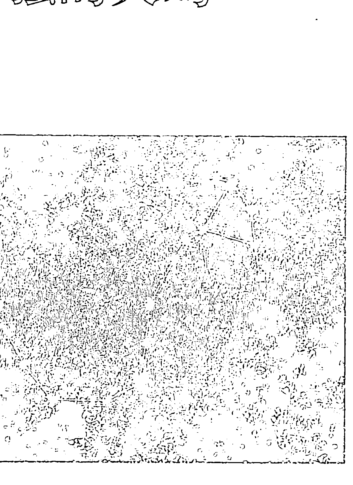

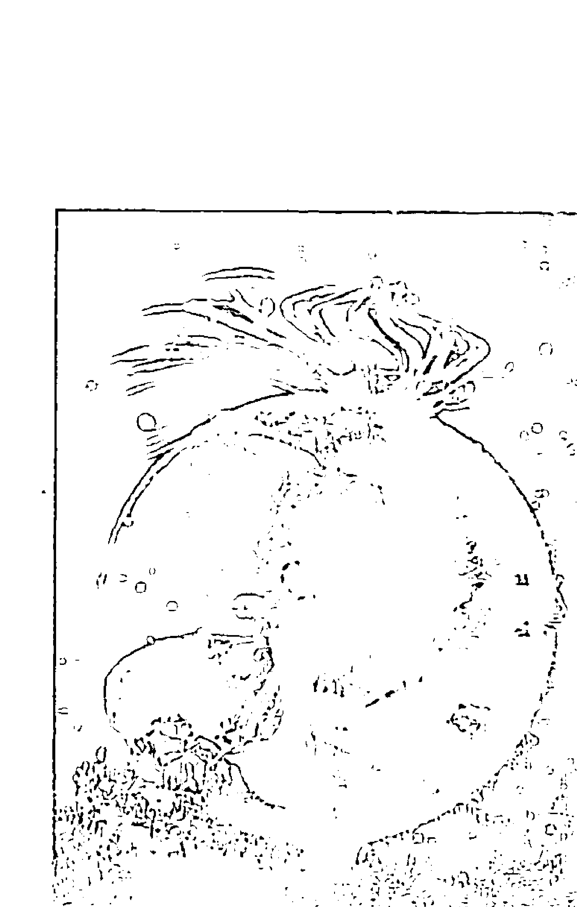

小时候在健康上很让父母操心，时常闹点小毛病，青春期开始发育成比较健壮的体魄。运动起来虽不十分敏捷，耐力却很好。应该注意多参加文体活动，如自己没有突出的运动特长，就多做组织工作。不妨一试游泳项目，也许能开发更大的潜力。使天蝎座的健康受益终生的运动项目，是坚持不懈的长跑。

喜欢不受任何干扰、安安静静地读书。埋头于书海常令天蝎座陶醉，以至废寝忘食。年少时就有追求人生大目标，立志成才的愿望。无论外面的世界多么精彩，都动摇不了他求知若渴的心。他的知识大多是从书本中获得的，他信奉“吃得苦中苦，方为人上人”。只要学习得法，遇名师指教，专业选择准确，他就会学有所成，走上高品位的人生之路。

职业：准确无误地选择好自己喜欢和擅长的专业，然后抱定终生为之奋斗拼搏的决心，偶有挫折，不要动摇气馁。他较适合的工作，最好是多与机器打交道，少与人打交道。伏案工作，面对仪器或书本，内心宁静，动作协调，思维敏捷。所以，宜做科学研究、发明创造、产品检验、计算机软硬件开发等性质的工作。做科学工作者、学者，或是做一个受人尊重的技师，他可能发挥出最大的光和热。

婚姻：特别希冀将爱情之舟停泊在一个平静安宁的港湾，所以用心寻求终身伴侣。谈恋爱可能花较长时间，不是为了浪漫，而是为了彻底了解。性格中缺少一点浪漫情怀，有时不够洒脱。常因忘我工作而忽视另一方，所以最佳的婚姻组合，是与家庭责任感强、善解人意、懂得体贴的人在人生之路上结伴同行。

生活：生活的经济来源以工薪为主，偶有较大额外收入，也是智力劳动所得。他从来没有为如何赚钱而伤过脑筋，工资收入较高，过中等水平的生活绰绰有余。有了钱既不想去投资，也不指望增值，舍得把钱花在子女教育和孝敬老人上。

事业：事业心与成就感是他毕生的追求，他决不接受“碌碌无为混此生”的观念。他的工作态度、责任感、水平与能力，有口皆碑，但他却不易因此而获得较好人缘。他不屑于关心日常琐事，往往显得有些孤傲，为此常处于比较孤独的状态。

- 没有转圈的占有欲、爱恨太强烈、心机重、有极强的权欲
- 感情用事、敏感、个性强悍、报复心强、没慈悲心

# MI 星合堂 Magic

名人的榜样 成就你的自信

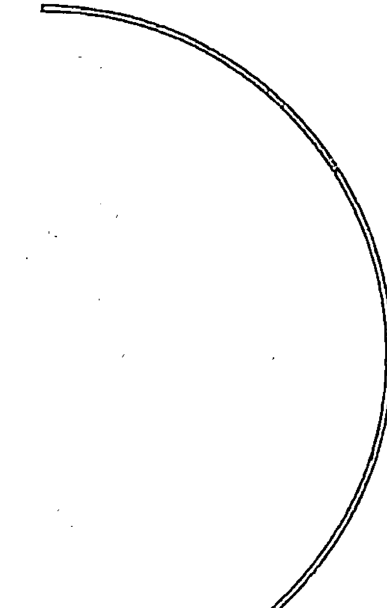

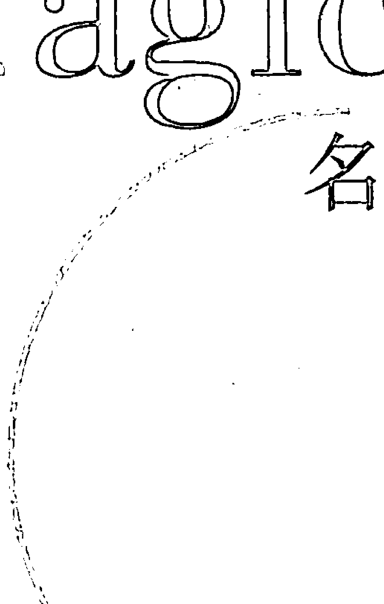

| 项目 | 内容 |
| :--- | :--- |
| 英文姓名 | William H. Gates III KBE |
| 中文姓名 | 威廉·亨利·盖茨三世爵士 |
| 生日 | 1955年10月28日 |
| 星座 | 天蝎座 |
| 出生地 | 美国华盛顿州西雅图 |
| 身高 | 183cm |
| 体重 | 78kg |
| 绰号 | 电脑神童、左撇子 |
| 格言 | “我是王”、“我能赢” |
| 理想 | 把世界引向未来时速之路 |
| 社交 | 不愿主动与人接触，但在压抑状态下极易高谈阔论 |
| 情绪 | 突发性的惊慌愤怒 |
| 管理 | “螺旋桨头脑”和“达尔文式管理”是运作微软最有效的手段。数据神经系统是未来管理的必然模式。 |

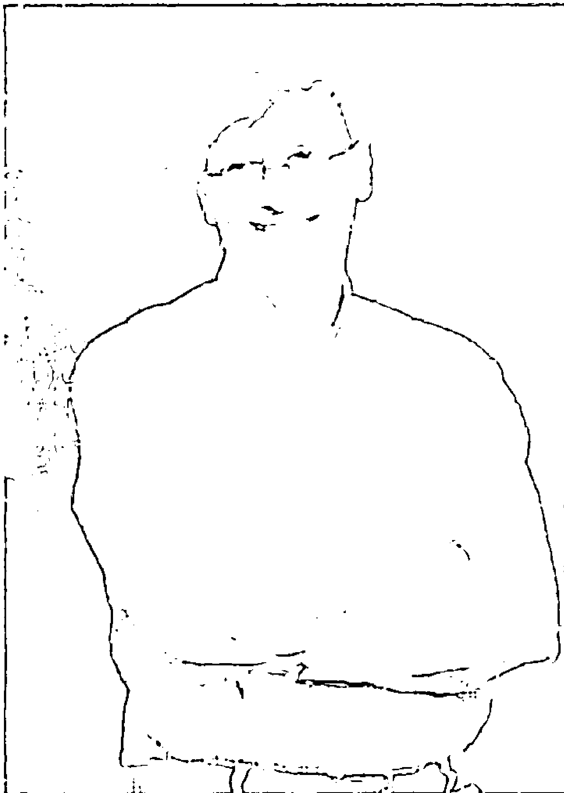

跟比尔·盖茨(Bill Gates)的家人一起谈话，最后总会有人提到泼水事件。当时，这位后来的软件业大亨还是个12岁的任性男孩，吃饭时跟母亲吵了个天翻地覆。他父亲在一旁实在受够了，端起一杯冷水泼到了小盖茨的脸上。小盖茨咬牙切齿地说：“感谢给我来了场淋浴。”盖茨家的人之所以经常提到这件事，不仅因为它的戏剧性，还因为，对于老盖茨(Bill Gates Sr.)来说，这是他少有的发火的时候。这次吵架预示着一个性格暴躁的小男孩的生活将出现转折，他从此走上一条使他成为日后为公众所知的比尔·盖茨的道路，成了微软公司(Microsoft Corp.)的创始人，也是世界上最富有的人。

在比尔·盖茨的成功故事背后，是他的父亲老盖茨。老盖茨恢复了被一个男孩打破的家庭平衡，这个男孩仿佛一夜之间长大了，具备了成年人的智慧。当儿子冲进残酷的商业世界并在其中蓬勃发展的时候，老盖茨静静地在一旁为他出谋划策。当巨大的财富给儿子带来新的压力时，老盖茨加入进来，发起了目前世界上规模最大的私人慈善基金。

这家基金名叫比尔及梅林达·盖茨基金会(Bill & Melinda Gates Foundation)，规模为300亿美元。

在接受《华尔街日报》采访时，盖茨父子及他们的家人首次透露了他们家庭生活中的许多细节，包括小盖茨从事咨询业的经历，以及他早期对电脑的兴趣在一定程度上可以说是一场家庭危机的结果。家庭内部讲求纪律和追求自由的力量有时会互相冲突，这些力量的共同作用塑造了比尔·盖茨的性格。

随着这位软件巨头开始全职为盖茨基金会工作，父子间的关系也进入一个新阶段。在过去13年的时间里，父亲一直是所有家庭成员中唯一一位每天都会出现在基金会的人。他最早在家里的地下室里创办了这个基金会，在儿子经营微软的最后10年中，他一直照看着基金会。现在，父子俩第一次真正在一起工作了。

老盖茨身高6英尺6英寸，几乎比儿子整整高出一头。众所周知，老盖茨比儿子更擅长交际，但他们都有敏锐的才智，而且同样直率，这种直率在一些人看来可能有点唐突。他不喜欢反省自己，而且他不认为自己在儿子的生活中有多大的重要性。

老盖茨在2005年的一次演讲中对一群非营利组织的领导者说：“作为一名父亲，我从没想到那个在我家里长大、吃着我的饭、名字也跟我一样的爱争论的小男孩将来会成为我的老板。”但事实就是这样。

在系列采访中的某一次，老盖茨说，盖茨成长的第一阶段——爱争论的小男孩——大约是从11岁的时候开始的。老盖茨说，大约就是那个时候，小比尔长大了，而且越来越让家里人头痛。

在那之前，盖茨家一直都很宁静。老盖茨和妻子玛丽有3个孩子：克里斯蒂(Kristi)、比尔（1955年出生）和利比(Libby)。这是一个亲密的家庭，家人热衷于竞赛：各种棋盘游戏、纸牌、乒乓球。还有各种固定习惯：比如每个周日同一时间的大餐；圣诞节的时候，全家每个人都穿同样的睡衣。

虽然老盖茨深深参与到孩子们的生活里，但他在感情上却多少有点内敛，孩子们认为，这可能是他那代人的普遍特点。老盖茨身材高大，加上身为律师喜欢小心措词的习惯，也让他有时显得有点吓人。他的大女儿克里斯蒂·布莱克(Kristi Blake)说，他回到家，坐到椅子上然后吃饭，但从来没有诸如来个拥抱这样的温馨举动。

在西雅图一家律师事务所从业期间，老盖茨将抚养孩子的日常工作大部分都留给了妻子。盖茨太太是西雅图一位银行家的女儿，就读高中和大学时，她一直都是运动员和优秀学生。她是在大学遇到老盖茨的。后来她成了一名全职志愿者，还曾在企业董事会任职。

玛丽鼓励孩子们刻苦学习，多运动，并学习音乐。（比尔·盖茨曾学过长号，但没有什么建树。）由于在富裕的家庭长大，因此玛丽有着自己教育孩子的方式。她希望孩子穿着得体、守时重信、热情好客。小盖茨在多数情况下都谨遵母命。

盖茨的妹妹利比·阿米特洛特(Libby Armintrout)说，她是最忙碌的家长，而且对我们抱有很高的期望。不仅关心我们的学习成绩，还包括方方面面，比如我们在公共场合的行为，以及如何与人交往。

## 【意志的斗争】

盖茨从小就非常努力。他从头到尾读完了整部《世界大百科全书》。他的父母也鼓励他多读书，但凡盖茨想读的书，他们都会买给他。

不过，父母却担心盖茨过于沉迷于书籍，而忽略了人际交往。他们强迫小盖茨参加他们举办的聚会，并在父亲的专业会议上充当服务生，希望他不再过度沉迷于书本。

老盖茨说，儿子在11岁时便表现出与众不同的智力水平，经常向父母问一些国际关系、商业和生命本质的问题。

老盖茨说，这些问题很有趣，他认为这样很好。现在可以告诉你，他母亲并不欣赏这一点，甚至令她感到不安。

此时，盖茨已开始不断冲撞母亲意欲控制他的本能，不断引爆意志的较量。玛丽对儿子的一切期待——保持房间干净、按时吃饭、不要咬铅笔——忽然间成为双方摩擦的起源。最终，两人爆发了一场激烈争吵。

阿米特洛特在谈到哥哥时说，他真的很讨厌。

老盖茨则扮演了和事佬的角色。盖茨的姐姐说，他会将他们分开，安抚他们激动的情绪。

盖茨12岁那年，在一次晚餐时，他同母亲的大战终于达到了高潮。在餐桌上，盖茨冲着母亲大吵大嚷，他现在将其描述为“极其不敬，带有狂妄自大”的孩子般的粗鲁”。

一向好脾气的老盖茨再也按捺不住心中的怒火，将一杯水泼到了儿子的脸上。

他和妻子还带孩子去看了心理医生。盖茨后来回忆道，他当时向心理医生说，他正在与想控制他的父母爆发战争。据说心理医生当时告诉老盖茨和玛丽，他们的儿子最终将赢得“独立战争”的胜利，他们最好减少对他生活的干涉。

老盖茨理解这番忠告。他在布雷默顿一个工人家庭长大，从这里乘渡轮到西雅图大约要一个小时。他说：“儿子与我的成长环境截然不同。我开始认真反省自己以前的行为以及与孩子的相处之道。”

老盖茨的母亲对孩子比较溺爱，为人非常随和。老盖茨只有一个年长7岁的姐姐。他的父亲是一个工作狂，与人合伙经营一家家具店，父亲一门心思扑在工作上，没有时间照顾孩子。老盖茨说，父亲把全部精力都花在打理店铺上。

老盖茨的人生轨迹深受另一个家庭的影响，这就是隔壁的布拉曼(Braman)一家。布拉曼的两个孩子成为他的玩伴，而父亲多姆·布拉曼(Dorn Braman)则成为老盖茨最重要的榜样。

布拉曼自己创立了企业，后来曾担任海军军官、西雅图市市长以及美国运输部副部长。上世纪30年代末，布拉曼一家带着老盖茨踏上了足迹遍布美国的公路之旅。在老盖茨成为童子军一员时，布拉曼曾是他们的团长，带领他们攀登奥林匹克山，搭乘破旧的公共汽车游览黄石公园及冰川国家公园。这支童子军团花了两年时间，用自己砍伐的花旗松建造了一座木屋。老盖茨说，布拉曼没有任何性格缺陷。

老盖茨和玛丽最终掀开了抚养孩子的重要一页：选择放手。他们把儿子送到认为会给予孩子更大自由的学校。盖茨就读的是私立湖滨学校，这所学校现在因成为盖茨首次接触到计算机的地方而闻名于世。

盖茨说，他开始意识到，他没有必要证明自己在父母面前的地位，而是要向这个世界证明他自己。

## 【少见的独立性】

从13岁开始，盖茨就有了相当大的独立性，这在当时很少见。有些晚上，他会去华盛顿大学享受免费使用的电脑。他大部分时间都不呆在家里，就像他父亲小时候一样。盖茨曾在奥林匹亚呆过，在那里的州立法机构听差，也曾在华盛顿特区的国会听差。大四时，他休学去华盛顿州南部的一个发电厂做了程序员。当时，盖茨与未来的微软联合创始人保罗·艾伦(Paul Allen)联手设计了用于计算道路车流量的“Traf-O-Data”设备，这也是两人之间的首次主要合作。

他的父母对他非常支持。当盖茨从哈佛退学，搬到新墨西哥州阿尔帕克基开创微软时，他们默许了。像盖茨这样的决定通常很难获得支持的。

盖茨的父亲说：“我和玛丽都对他的决定很担心，我想她比我还要更加担心一点儿；我们俩的期望和那些正在上大学的孩子们的父母们的平凡期望一样，就是希望孩子能拿学位。”

家人的支持是盖茨决定将微软搬到西雅图的原因之一，他在距离父母家不远的一座房子里安顿下来。盖茨的母亲安排了一个女佣打扫儿子的房子，保证他在参加重大会议时有干净的衬衫可以穿。她还坚持让盖茨遵照家族传统，包括每周日要到父母家里共进晚餐。

盖茨的父亲利用自己为小企业提供咨询的律师经历，帮助盖茨找到西雅图的商人加入微软董事会。1980年，盖茨带着他的父亲一起赴宴，帮助说服盖茨大学时的朋友、如今的微软首席执行长鲍尔默(Steve Ballmer)放弃研究生学业，加入微软。盖茨父亲的律师事务所后来还成了微软的代理，它的最大客户就是微软。

微软在面临上市问题时，盖茨担心这会让员工分心，他的父亲打消了他的疑虑。上市让盖茨成了亿万富翁，也酝酿了盖茨一家将要面对的新一轮挑战。

## 【走上慈善事业之路】

微软上市大赚一笔后，盖茨的母亲力劝他从事慈善事业。当时在场的一个人回忆说，一天晚上在盖茨父亲的律师事务所里，当盖茨的母亲劝他捐钱的时候，两人吵了起来。

这个当时在办公室的人说，盖茨嚷道：“我只是想经营我的公司。”盖茨表示，当时他并不反对慈善事业，他只是不想从微软的工作中分心。

最后，盖茨的母亲成功说服他在微软启动一个计划，为美国联合慈善总会(United Way)筹集善款。他还跟随母亲的脚步，于80年代加入了美国联合慈善总会的董事会。

不过随着盖茨财富的增加，西雅图地区非营利机构请求捐款的信件像雪片一样飞来。盖茨说，他曾计划从微软退休后或是在60岁左右的时候，专心做慈善事业。

在盖茨的母亲被诊断患上一种罕见的乳腺癌之后，这个计划的进度就加快了。在她与疾病抗争期间，她仍在劝说儿子更多地投入慈善事业。盖茨的母亲于1994年6月去世。

葬礼的当天，盖茨一家在家共进了晚餐。盖茨的父亲告诉孩子们不要担心他，他说他还能再活上10年。当时他70岁。不过，在他的妻子去世之后，他就没什么精神了。

大约6个月之后，在和盖茨小两口子一起排队进电影院时，老盖茨再次提起慈善事业的想法。他建议盖茨可以开始筛选募捐请求，并捐出一部分钱。

一周后，软件大亨盖茨拨出约1亿美元创建了一个基金会，让他的父亲经营。盖茨的父亲后来坐在厨房的桌子边，开出了基金会的第一张支票，给当地一项癌症计划捐款8万美元。

开始时，盖茨的父亲（他很快又再婚了）会在最有希望获得捐款的请求上草草地做点注释。然后放在一个装葡萄酒的纸盒子里，定期送到儿子家。这个盒子随后会返回来，上面附有盖茨的回复。盖茨的父亲之后会向所有募捐人回信，有时候会附带一张100万美元的支票和一页纸多一点儿的祝贺信。

盖茨父亲和一位微软前高管共同管理这个基金会，数百名工作人员负责捐钱、监督事宜，并将捐款范围扩大到教育和疫苗研制领域。

盖茨父亲说，他一直没有忘记这样一个事实：直到他的儿子和儿媳接管之前，他都是在扮演看管人的角色。53年后，他知道要给儿子空间。

盖茨父亲说，盖茨对一些事情的看法非常顽固，他们家庭的活力就在于在这些事情上不要干涉他，因为这只会是浪费时间而已。

Magic

缺点改造

（此处原文有图片描述，保留图片占位符）
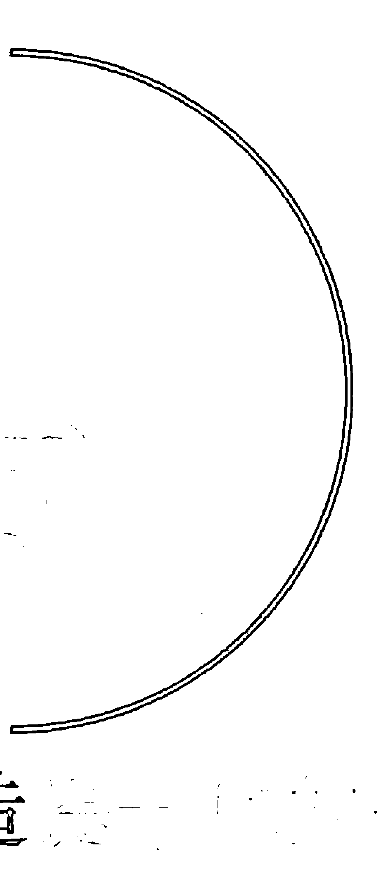

## 魅力第一面

## 处事篇

（此处原文有图片描述，保留图片占位符）
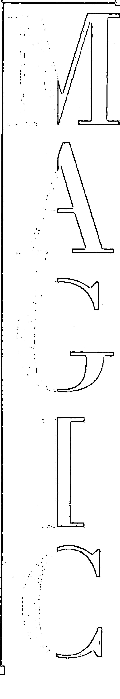

# 魅力失分

## 感情用事

天蝎座的感性一直都强于理性，所以很多时候会不计代价地去达到自己的目的，即使明知道是不好的事情，也会去做。

# # 马皇后谏察错案
佚名

马皇后是明太祖朱元璋的结发妻子。她知书达理，深明大义，是中国历史上屈指可数的女政治家之一。

（此处原文有图片描述，保留图片占位符）

朱元璋生性急躁，当了皇帝以后，变得待人苛刻，更加刚愎自用，喜怒无常。每当朱元璋临朝震怒时，马皇后就从中调停，有不少无辜被责的人因为她的暗中保护和援救而保住了性命或减轻了刑罚。和州参军郭景祥儿子被人告发忤逆不孝，曾经手持长矛要杀郭景祥。朱元璋闻听此言，火冒三丈，立即传旨捕杀。

马皇后进谏说：“郭景祥就这么一个独生儿子，他儿子怎么会有杀父行为呢？传言或许是造谣中伤。退一步想，就算他儿子不孝，但并未产生杀父恶果。如果因此诛杀此子，不仅于法不妥，而且令郭景祥老年绝户失养，命运更为悲惨。”

朱元璋听了觉得有理，就追回圣旨，命人调查。后来查明郭子杀父之事，确是误传。

> > 魅力提示：
> 我们在做一个重要的裁断之前，应该有理智的头脑，清醒的分析，不能意气用事。

## 诸葛亮的另一面

佚名

《三国演义》里诸葛亮大摆“空城计”，在“空城计”中，人们不仅看到了诸葛亮的超人智谋，还领略了他自我控制的非凡意志。

马谡失守街亭，蜀汉军队连遭重挫，司马懿引十几万大军扑来，兵临城下，情势万分危急。而诸葛亮身边却只有一班文官和两千五百名守兵，别无大将。众官闻敌军压境，“尽皆失色”，诸葛亮却传令“大开四门”，然后引小童二人，携琴一张，于城上楼前凭栏而坐，焚香操琴，笑容可掬。

刚刚经历了“街亭之败”损兵折将的诸葛亮，难道就没有挫折感吗？其实，他的这种挫折感远甚于部属。当街亭失守的消息刚刚传来时，一向雍容持重的诸葛亮，竟情不自禁地跺足长叹曰：“大势去矣！”然而，他能于瞬息之间调整好自己的心态，经受住挫折的强烈冲击，表现出自我控制的坚强意志，终于使蜀军化险为夷。

任何人遇上灾难，情绪都会受到影响，这时就一定要控制自己的情绪，用平和的心态去面对突然而至的险境，这样才能使自己走出人生的低谷。

> 魅力提示：
一个人的不凡，首先不凡在不同于常人的情绪控制素质，这是人的一种非常卓越的能力。无法想象一个轻易被激怒，经常为烦恼所苦的人，还能做成功什么事。

（此处原文有图片描述，保留图片占位符）
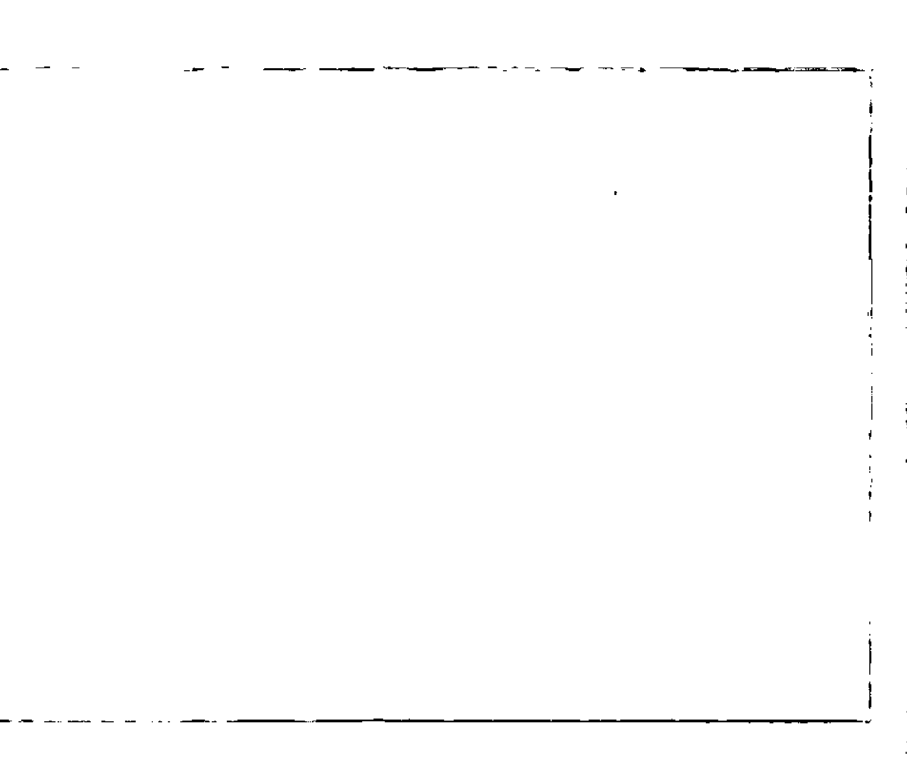

## 国王的老鹰

佚 名

有一天，国王到森林中去打猎，许多文官武将跟随其后，在他们身后还有一群带着猎犬的仆人，他们希望能够满载而归。

国王的手腕上站着一只强悍威武的老鹰，这只老鹰被训练出来专门打猎。只要国王一声令下，它就会飞向云端，向下四处寻找猎物。如果碰巧发现鹿或是兔子，它就会快速地扑上去，将其擒住。

这天，国王的运气并不好，他与大家走散了，天气又很热，他觉得十分口渴。他希望能够看到清凉的泉水，但是，炎热的夏日早已将山溪烤干了，老鹰也在上空无奈地盘旋寻找。

终于，国王发现有一些水沿着一块岩石边缘滴流下来。他想再往上走一点儿路，一定有一道泉水，而现在一次就只有一滴水落下来。
国王从马背上跳了下来，从袋子里取出一个小银杯，将它拿去盛接那慢慢滴落下来的水珠。国王花了很长时间才将杯子装满。他实在太渴了，杯子几乎装满水了，他迫不及待地把嘴凑到杯边。就在这个时候，突然天空中传来呼呼的声音，接着他的杯子就被打翻了，水泼洒在地上，倏地就渗进缝隙了。国王抬头一看，原来是他养的老鹰。
国王捡起杯子，又继续接落下的水滴。这次，他没有等那么久，就在杯内的水才半满的时候，他就把杯子举到嘴边。但是，在杯子碰到他的嘴唇之前，那只老鹰又再一次扑下来，把杯子从他的手中打落。这下子，国王真生气了。
他大声吼叫着：“如果你再来，我要把你的脖子砍断！”
然后，他又拿杯子盛水。但是，在他预备要喝水之前，老鹰又冲下来。愤怒的国王拔出剑刺中了它，可怜的老鹰倒在了血泊中，国王的杯子掉进了岩缝中。
国王只好继续向前走，他想找到水的源头。后来，他终于找到了一个积水的池塘，但是他也惊讶地发现，在水池里有一条死去的巨大的毒蛇。他顿时明白了。他哭喊道：“我的老鹰救了我，它是我的朋友，而我竟然把它杀掉了。”
他又艰难地回去，找到老鹰的尸体，把它厚葬了。从此以后，当他再发怒时，他就告诫自己：永远别在盛怒下做事。

> 魅力提示：
遇事冷静思考，任何时候都是有百益而无一害的。人在情绪极度激动，尤其是感情冲动的时候做出来的决定往往不太理智。

（此处原文有图片描述，保留图片占位符）
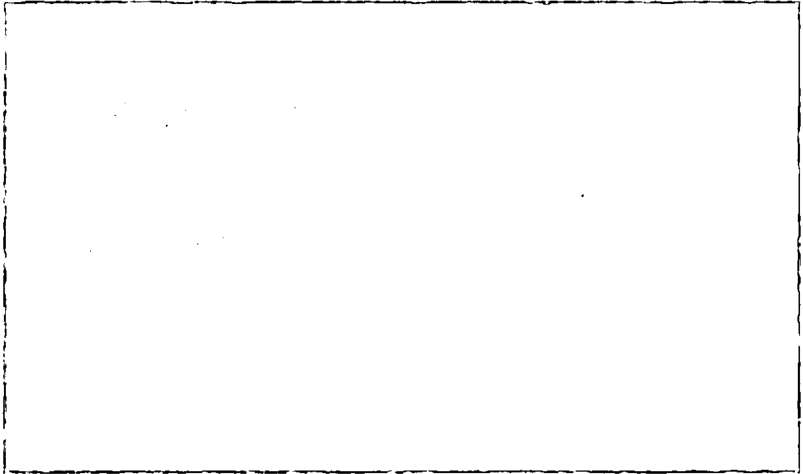

# # 王蓝田吃鸡蛋
**佚名**

古时候有个叫王蓝田的农夫，他是个性格非常急躁的人。

有一次吃鸡蛋，他用筷子去夹，没有夹起来，顿时大发脾气，把蛋拿起来丢到地上。结果鸡蛋在地上滚个不停。他就赶上前去，用木屐去踩它，又没有踩到。

这下，他更加愤怒了，简直是怒不可遏。于是他把鸡蛋从地上捡起来，塞到口里，嚼碎之后又把它吐掉了。

> > **魅力提示：**
>
> 简单急躁，感情用事，不但于事无补，反而会留下笑柄。

##### 魅力链接

+   书名：感性做人 理性做事
-   作者：方州 编著
-   出版社：中国华侨出版社
-   出版时间：2006-09-01
-   印刷时间：2006-09-01
-   ISBN：9787802221253
-   包装：平装

（此处原文有图片描述，保留图片占位符）
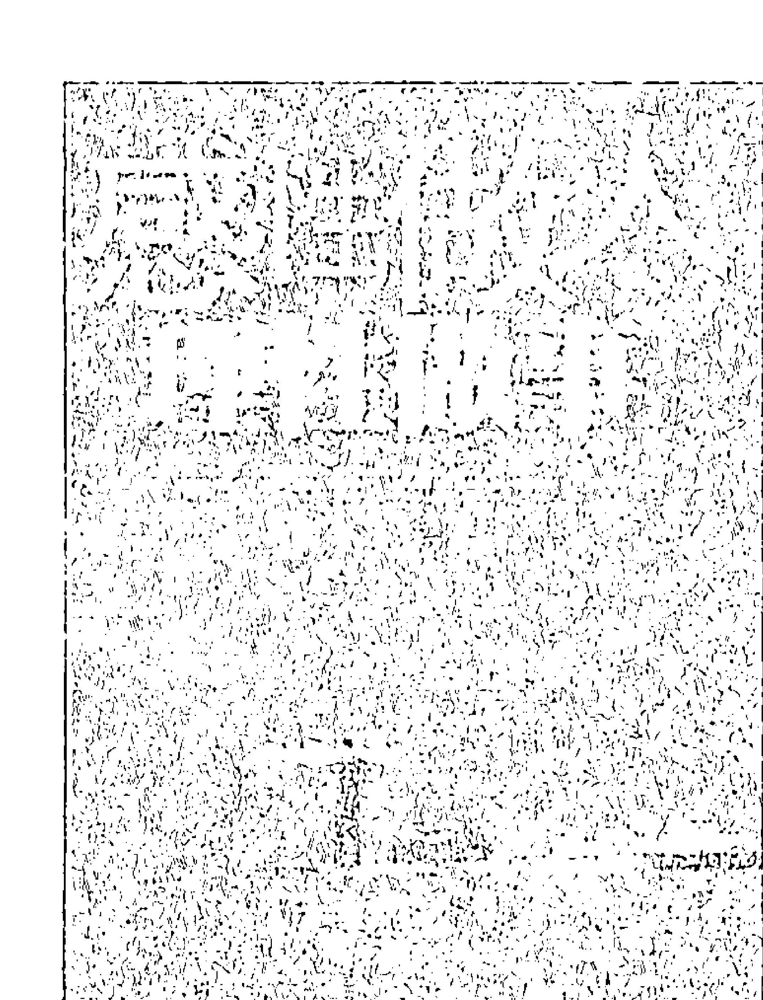

## 内容简介：

做人感性好，这样你才会有魅力，才会开心，才会快乐，才会抛弃世间所有的凡尘杂念，做好自己想做的事。不会管得那么多，一切随缘，一切顺其自然。

做事理性好，这样你才会少犯错误，少走弯路，才更容易达到成功。而不是凭着脑子发热，异想天开地想怎么样就怎么样，结果只会把事情弄得一团糟。这种人只会“成事不足，败事有余”。永远领略不到成功的风采。理性的人办事沉稳谨慎，环环相扣，思维严密，效率明显，成绩斐然，深得别人的器重和赞美，能活出自己精彩的人生。

感性做人，理性做事，相信你能散发出人生绚丽多姿的色彩，在这个纷繁复杂的大社会环境中活出自己的个性来，在这个充满竞争的环境中快快乐乐、健健康康地成长、生存、发展，打造出自己的成功人生！

## 魅力第一面
处事篇

**魅力失分**
**口是心非**

天蝎座是典型的口是心非的人，他的城府很深，别人休想很轻易地猜透他的想法。

## 哑马

佚名

有一匹马一出生就是一个哑巴，心里有话却不能说出来，它一直非常痛苦。

一天，一个长着白胡子的神仙来到它的面前，对它说道：“让我将你从苦难中解脱出来吧，我可以让你开口说话，不但能讲兽言、鸟语，还能说人话！”

马听了十分高兴，眼泪都流了出来：“如果真的能够这样，那我真的太感谢您了。”

“不过，”神仙接着说，“还有一个条件，就是当你能说话以后，你不能随便开口，我让你说什么你必须说什么，你不愿意也得说；而你心里想说的，没有我的同意也不能说。如果你答应这个条件的话，那你就点点头吧！”

马沉思了片刻，坚决地摇了摇头，然后转过身去头也不回地急驰而去。

> 魅力提示：
一个正直的人懂得，如果向他人表露的不是发自内心的真实，而是谎言和欺骗的话，倒不如选择沉默。

（此处原文有图片描述，保留图片占位符）
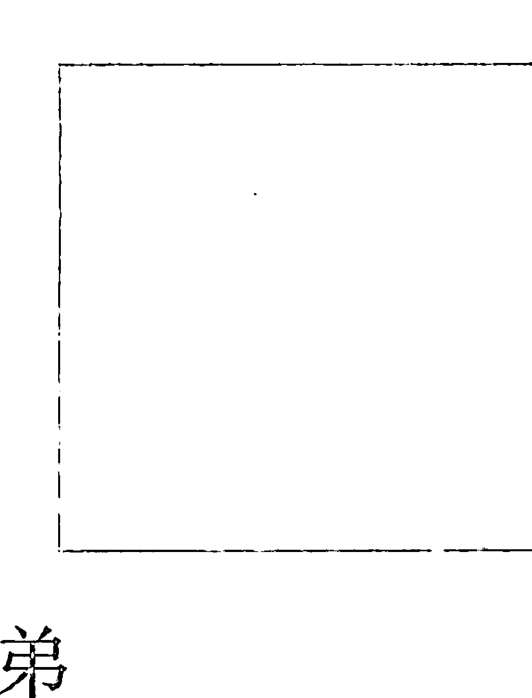

## 拙于言辞的兄弟

罗西

丹麦历史上有一对很有名的科学家兄弟，哥哥尼尔·波耳是物理学家，外向，善言；弟弟哈洛·波耳是数学家，内向，拙于言辞。他们是好兄弟，一条藤上的两个出色的瓜。

一天，哥哥尼尔建议他俩来个互相揭短，他觉得这很好玩。弟弟哈洛说：“噢，那我可做不到！”

哥哥说：“难道你不想让我快乐吗？”弟弟只好说：“你先说！”

哥哥开始批评弟弟：“你总是口齿不清，不爱说话，没有人知道你的细心、你的关怀……好了，现在你可以损我了！”

弟弟还是笑着说：“我做不到！”哥哥急了，便说：“你说话不算数！”弟弟这才“嗯嗯”地开了口：“哥、哥，你的衣领上有一根线头。”边说边帮他拿掉。这便是弟弟拙于言辞的力量，他的言行朴素而深情。

### 魅力提示：

在爱的表达上，言语固然有如风拂大地，但行动才是真正的流水深情。世上有不少木讷的朋友，他们不会送花，不会当面祝福，但当朋友需要帮忙的时候，他们会义不容辞，就算是需要输血的话，他们也会毫不犹豫地挽起袖子。

（此处原文有图片描述，保留图片占位符）
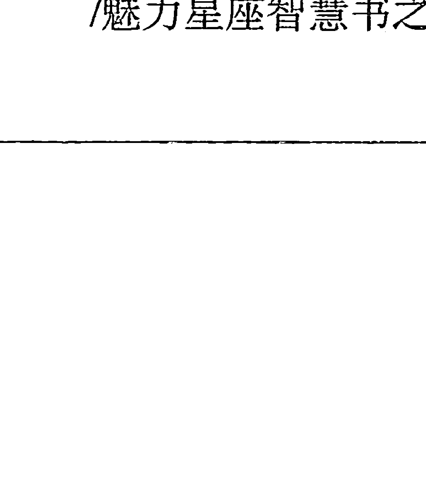

## 仁慈的狐狸

伊索

春天，一只八哥死于猎人的弓箭，但厄运并没有就此结束。它一死，它的三只雏鸟变成了孤儿。雏鸟刚出壳不久，懵懵懂懂，弱小无力。孱弱的雏鸟饥寒交迫，只知道吱吱尖叫，徒劳地把母亲呼唤。

“看着这些可怜的孤儿，谁能不感到难过呢？”一只狐狸蹲在鸟窝对面的石头上，对着众鸟大声疾呼，“朋友们，别抛弃这些无依无靠的雏鸟吧！哪怕给可怜的鸟儿衔去一颗麦粒，哪怕给它们的小窝塞上一根稻草，这样就能挽救它们的生命，还有什么能比做好事更神圣呢？瞧，杜鹃，反正你在换羽毛，最好拔下几根为它们铺一张暖床，何必让这些羽毛白白地浪费掉呢！燕子，你最好多捉几只蚊子，给孤儿们当午餐。斑鸠，你的子女都已经长大，它们自己觅食已经没有问题，你不如离开自己的家，像母亲一样照看雏鸟。至于你，亲爱的夜莺，你那迷人的歌喉人人赞扬，趁和风轻摇孤儿的小床时，你最好唱上一曲，哄它们睡觉。我深信，大家的热情照顾，会改变孤儿们的悲惨命运。听我的话吧，让我们来证明森林中居民都爱行善……”

正讲到这里，三只可怜的雏鸟已经饿得东倒西歪，从窝里掉下来落在狐狸的面前。狐狸立刻上前把它们统统吃掉，不再滔滔不绝地说教。

> 魅力提示：
那些口是心非，善于伪装的人，迟早会露出他的真面目。

## 真情测试

佚名

日本社会关系学专家谷子博士讲过这样一个故事。
有一富翁为了测试别人对他是否真诚，就假装生了重病住进医院。
结果，那富翁说：“很多人都来看我，但我看出其中许多人都是为了分配我的遗产而来的，特别是我的亲人。”
谷子博士问他：“你的朋友来看你了吗？”
“经常和我有往来的朋友都来了，但是我知道他们不过是当做一种例行的应酬罢了。”
“还有几个平素和我不睦的人也来了，我想他们肯定是听到我病重的消息，幸灾乐祸来看热闹的。”
照他的说法，他测验的结果就是：根本没有一个人对他有真正的感情。
谷子博士就告诉他：“为什么我们苦于测验别人对自己是否真诚，而从来不测验一下自己对别人是否真诚呢？”

（此处原文有图片描述，保留图片占位符）
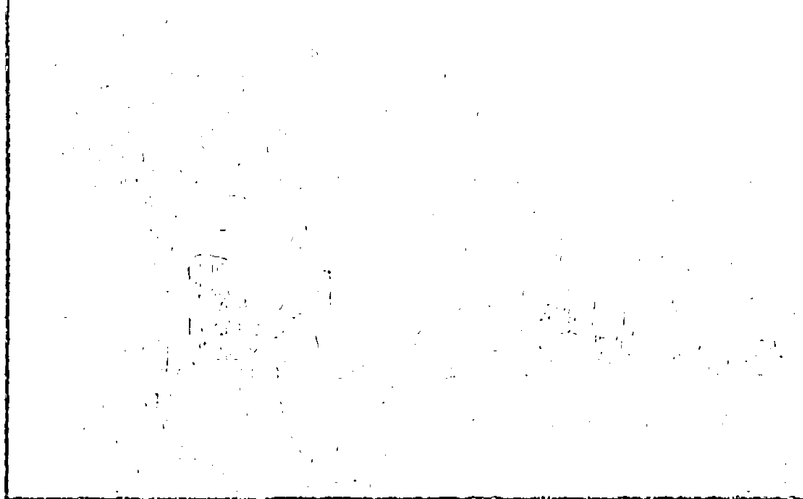

> 魅力提示：
人与人之间的感情都是相互的，其中自然包括真诚。真心换真心，虚情换假意。人心都是肉长的，你若是对别人不那么真诚，又怎么能寄希望于人家对你一片真诚呢？

（此处原文有图片描述，保留图片占位符）
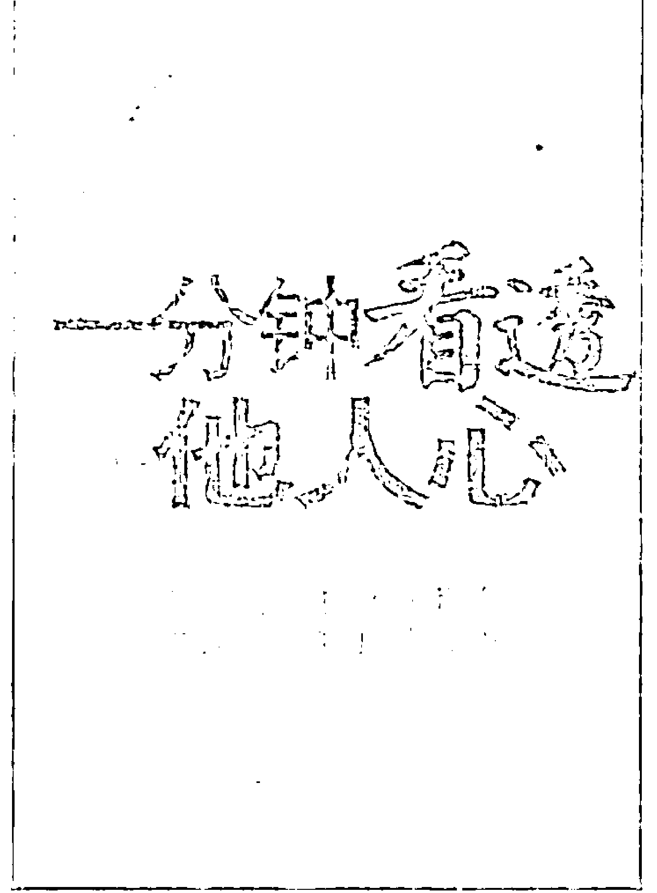

书名：一分钟看透他人心
作者：笛子 编著
出版社：中国商业出版社
出版时间：2009-03-01
印刷时间：2009-03-01
开本：16开
ISBN：9787504463005
包装：平装

## 内容简介：

俗话说：知人知面不知心。人心犹如一潭深不可测的湖水，口是心非之人随处可见。从古至今，无数人发出过这样的感叹：识人难，识人心更难！而要想在这种复杂的人际关系中立于不败之地，就需要了解别人的真实心理。
本书从外貌特征、言谈话语、行为举止、衣着打扮、生活习惯、兴趣爱好、社交场合等方面对看人识人做了详细的剖析与介绍，内容广泛，条理清晰，让你在轻松阅读的同时，还能够获得有益的人生经验与技巧。

## 魅力第一面 处事篇

## M A C C

# 魅力失分

## 说话大毒

天蝎座的人一般不太爱说话，但是如果你触到了他的底线或者他突然想发表意见了，那他说起话来是很毒的，经常被划入毒舌帮。

（此处原文有图片描述，保留图片占位符）
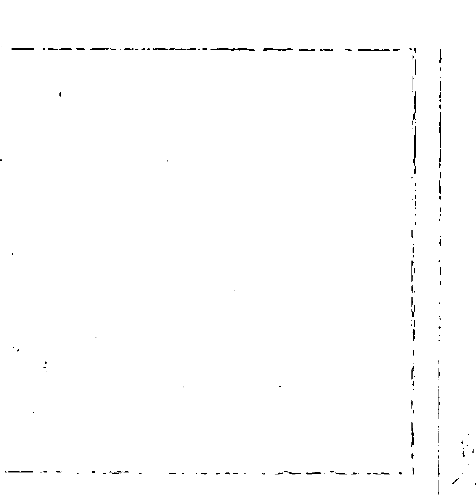

## 伟大的称赞

佚名

霍里斯和一位朋友在纽约搭计程车，下车时，朋友对司机说：“谢谢，搭你的车十分舒适。”
司机听了愣了一愣，然后说：“你是在嘲笑我吗？”
“不，司机先生，我不是在寻你开心，我很佩服你在交通混乱时还能沉住气。”
司机没再说什么，便驾车离开了。
“你为什么会这么说？”霍里斯不解地问。
“我想让纽约多点人情味，”他答道。
“靠你一个人的力量怎么办得到？”
“我只是起带头作用。我相信一句小小的赞美能让那位司机整日心情愉快，如果他今天载了20位乘客，受了司机的感染，也会对周围的人和颜悦色。这样算来，我的好意可间接传达给1000多人，不错吧？”
“但你怎能指望计程车司机会照你的想法做呢？”
“我并没有寄望于他，”朋友回答，“我知道这种效果是可遇不可求的，所以我习惯多对人和气，多赞美他人，即使一天的成功率只有30%，但仍可连带影响到300人之多。”
“我承认这套理论很中听，但能有几分实际效果呢？”
“就算没效果我也毫无损失呀！开口称赞那司机花不了我几秒钟。如果那人无动于衷，那也无妨，明天我还可以再称赞另一个计程车司机呀！”
“我看你脑袋有点毛病了。”
“从这就可以看出你越来越冷漠。我曾调查过邮局的员工，他们最感沮丧的除了薪水微薄外，还有就是欠缺别人对他们工作的肯定。”
“但他们的服务真的很差劲呀！”
“那是因为他们觉得没人在意他们的服务品质。我们为何不多给他们一些鼓励呢？”
他们边走边聊，途经一个建筑工地，有5个工人正在一旁吃午餐。朋友停下了脚步，“这栋大楼盖得真好，你们的工作一定很危险很辛苦吧？”那群工人带着狐疑的眼光望着霍里斯的朋友。
“工程何时完工？”霍里斯的朋友继续问道。
“6月。”一个工人回应了一声。
“这么出色的成绩，你们一定很引以为荣。”
离开工地后，对霍里斯说：“这些人也许会因我这一句话而更起劲地工作，这对所有的人何尝不是一件好事呢？”
“但光靠你一个人有什么用呢？”
“我常告诉自己千万不能泄气，让这个社会更有人情味原本就不是简单的事，我能影响一个就是一个，能两个就是两个……”
“刚才走过的女子姿色平庸，你还对她微笑？”霍里斯插嘴问道。
“是呀！我知道，”他答道，“如果她是个老师，我想今天上她课的人一定如沐春风。”

魅力提示：
学会称赞他人，你才会被人称赞，长着一副毒舌的人是得不到别人的喜欢的。

（此处原文有图片描述，保留图片占位符）
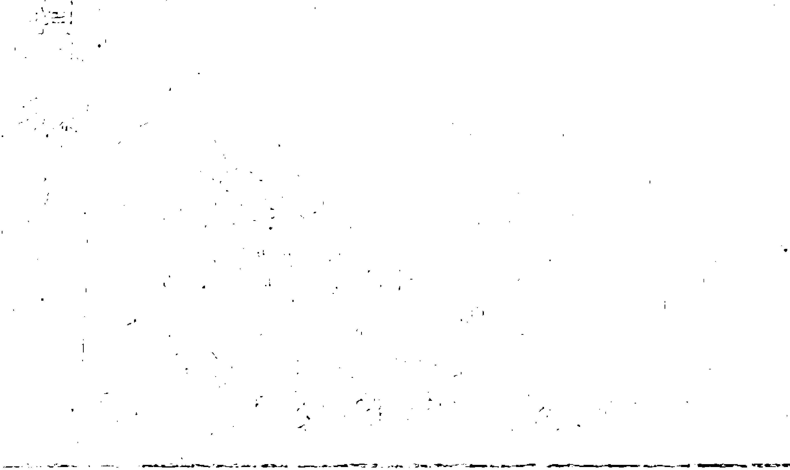

# # 实话先生与谎话先生

佚名

在一次盛大的舞会上，实话先生见到一位风韵犹存的老女人，主动走过去向她行礼，然后说：“您使我想起您年轻的时候。”
老女人微笑着说：“怎么样？”
“很漂亮。”
“难道我现在不漂亮吗？”老女人的话带有几分的戏谑。
实话先生非常认真地说：“是的，比起年轻时的您，现在的您皮肤松弛，缺少光泽，还有皱纹。”
老女人的脸红一阵白一阵，尴尬地瞪着那双愠怒的眼睛，刚才的愉悦与自信一下子消失得无影无踪了。

正在这时，谎话先生也来到老女人面前，彬彬有礼地邀请老女人跳舞，恭敬地说：“您是舞会上最漂亮的女人，如果你能接受我的邀请，我将是舞会上最幸福的人。”

老女人的眼睛顿时闪出迷人的神采，随后伸出了应允的手。

谎话先生和老女人在舞池里跳了一曲又一曲，老女人沉浸在无比的幸福之中。

实话先生坐在一边，看着这对年龄上很不协调的舞伴。

不知谎话先生微笑着对老女人说了句什么，老女人突然间焕发了青春活力，全身洋溢着生命的激情与魅力，舞跳得就像年轻人一样，简直像是一个出色、漂亮的年轻女郎！

舞会结束了。

实话先生叫住刚送走老女人的谎话先生，问道：“跳舞的时候你对她说了什么？”

谎话先生说：“我对她说，‘我爱你，你愿意嫁给我吗？’”

实话先生惊愕地瞪大了眼睛，气愤不已地说：“你又在说谎话了！你根本不会娶她。”

谎话先生说：“没错。可她很高兴，难道你没看见吗？”

两人话不投机，争执不下，不欢而散，各走东西。

天有不测风云，人有旦夕祸福。一个月之后，实话先生和谎话先生各自从邮差那里得到一封讣文，内容是一样的，都是请他们于5日9时参加老女人的葬礼。

他们在墓地不期而遇，也都看到了，那棺木中躺着的正是那位老女人。

葬礼结束后，老女人的一位仆人走过来，将两封信分别交给了实话先生和谎话先生。

实话先生打开信后，看到了老女人留给他的短信：“实话先生，你是对的。衰老、死亡都是不可避免的，但说出来却如雪上加霜。我把一生的日记全部赠送给你，那才是我的真实。”

# 魅力星座智慧书之天蝎座

谎话先生打开信后，看到了老女人留给他的遗言：“谎话先生，我非常感谢你那些美丽的谎言。它让我在生命的最后一段时光过得如此美妙和幸福，它让我生命的枯木重新燃起了青春的活力，它融化了我心中厚厚的霜雪。我把我的遗产全部赠送给你，请你用它去制造美丽的谎言吧！”

后来，实话先生和谎话先生成了朋友。他们一边喝酒，一边探讨做人与处事的真谛。

谎话先生非常佩服实话先生的耿直，由衷地说：“从根本上说，难听的实话要胜过动听的假话。谎言是不能持久的，只有实话才能经得起时间的考验。”

实话先生十分赞赏谎话先生的灵活，心服地说：“在某些场合下，谎言也是很受欢迎的。如果谎言是善意的，并局限于一定范围，通常也是可以被大家所理解的。比如息事宁人的谎言，就要胜过挑拨离间的真话。”

他们达成了共识：“诚实，固然是一个人极为宝贵的品质，但用起来一定要注意时间、地点和场合。”

> 魅力提示：
实话并不是每时每刻都会受到欢迎，特别是把实话说得很难听时。有时，善意的谎言更容易让人接受。

# # 呵护心灵
顾利锋

一位樵夫救了一只小熊，母熊对他感激不尽。有一天，樵夫迷路来到熊窝，母熊安排他住宿，还拿丰盛的晚餐款待了他。翌日早晨，樵夫对母熊说：“你招待得很好，但我惟一不满意的就是你身上的那股臭味。”母熊心里虽怏怏不乐，但嘴上却说：“作为补偿，你用斧头砍我吧。”樵夫照它的话做了。若干年后，樵夫又遇到母熊，于是便问它头上的伤好了没有？母熊说：“噢，那次痛了一阵子，伤口愈合后，我就忘了。不过，那次您说的话，我一辈子也忘不了。”

### 魅力提示：

语言伤害有时超过肉体伤害，因为它刺伤的是心，是灵魂。在现实生活中，有人只顾一时的口舌之快，有意无意地对他人造成了伤害，有时一句侮辱性的语言完全可能把深厚的友情葬送。有许多语言伤害原本可以避免，只要我们学会礼让——尤其是有不少人觉得礼让等于懦弱。

# 魅力星座智慧书之天蝎座

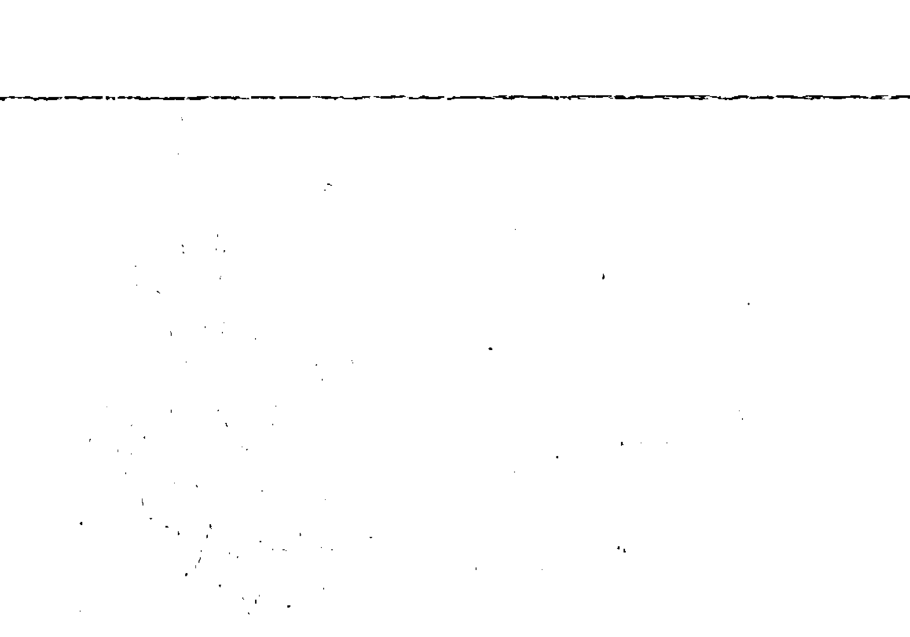

### 失败的绞刑

佚名

沙皇尼古拉一世登基后，国内就爆发了一场由自由分子领导的叛乱，他们要求俄国现代化，希望俄国的工业和国内建设必须赶上欧洲的其他国家。尼古拉一世残忍地平定了这场叛乱，同时判处其中一名领袖李列耶夫死刑。

行刑的那一天，李列耶夫站在绞首台上，绞刑开始了，李列耶夫一阵挣扎之后绳索突然断裂了，他猛然摔落在地上。在当时，类似这样的事件被当成是上天恩宠的征兆，犯人通常会得到赦免。李列耶夫站起身后确信自己保住了脑袋，他向着人群大喊：“你们看，俄国的工业就是如此差劲，他们不懂得如何做好任何事，甚至连制造绳索也不会！”

一名信使立刻前往宫殿报告绞刑失败的消息，虽然懊恼于这突如其来的变化，尼古拉一世还是打算提笔签署赦免令。

“事情发生之后，李列耶夫有没有说什么？”沙皇询问信使。

“陛下，”信使回答，“他说俄国的工业如此差劲，他们甚至不懂得如何制造绳索。”

“这种情况下，”沙皇说，“让我们来证明事实与之相反吧。”于是他撕毁赦免令。第二天，李列耶夫再度被推上绞刑台。这一次绳索没有断。

> **魅力提示：**
>
> 言多必失，祸从口出，在言语上逞强的人，暂时的满足远远不及由此带来的灾祸，何必让嘴上一时的痛快毁了自己生存的权利呢？

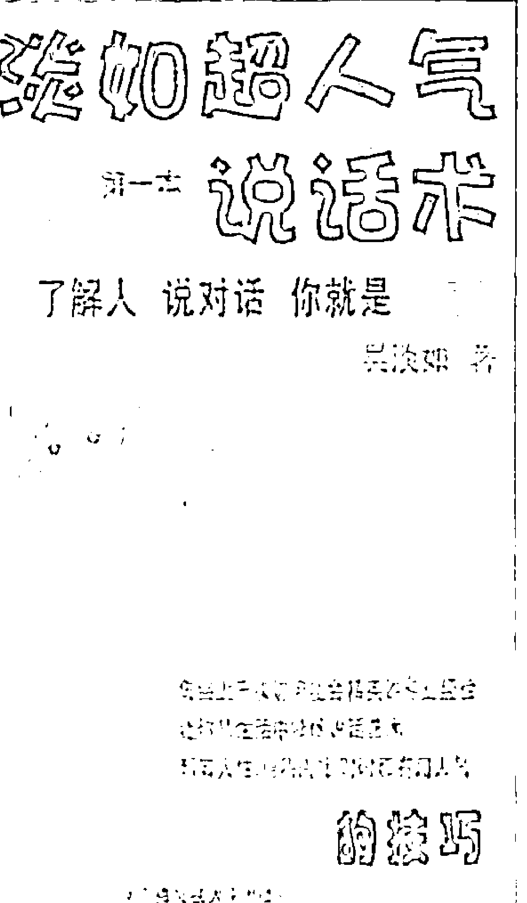

- 书名：吴淡如超人气说话术
- 作者：吴淡如 著
- 出版社：中央广播电视大学出版社
- 出版时间：2009-03-01
- 印刷时间：2009-03-01
- 开本：32开
- ISBN：9787304042479
- 包装：平装

## 内容简介：

了解人、说对话，你就是人气王。说话代表一个人的沟通能力，而沟通能力通常是人际关系的基石。会说话，不仅沟通无碍、谈话愉快，也有助于达成工作目标，赢得人缘。所谓的“会说话”，不是滔滔不绝、口若悬河就行，不是讲话“实在”就没问题。逞口舌之快，可能让你树敌，但沉默是金，也可能让你埋没一辈子。聪明说话，得顺着人性，并且看时间、看位子、看目的，还要有自己的见解和观点。有些地雷不能乱踩，有些话多说准没错，只要注意书中的叮咛，你也可以成为超人气说话高手！

#### 第一画 处事篇

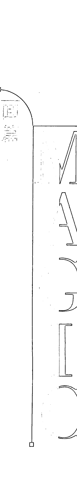

> 魅力失分 做事太过分

天蝎座做事不懂得适可而止，往往会做得过头，让人难以接受。

##### 雕像家的秘诀

洪 鸣

从前有个出色的雕像家，他的手艺远近闻名。一天有一个爱好雕像的人来向他请教其中的秘诀，雕像家毫不隐瞒地告诉他：“没什么秘诀。只要做到以下两点就行了：一是要把鼻子雕大一点；二是要把眼睛雕小一点。”

这个人又问：“为什么要这样呢？”

雕像家解释说：“这很简单，若鼻子大了，还可以往小里修改；若眼睛小了，还可以扩大。如果一开始鼻子就小了，就再也无法加大了；眼睛一开始雕大了，也就没办法改小了。”

“哦，还真是那么回事。”爱好雕像的人茅塞顿开。

> 魅力提示：
> 为人处世，一定要为自己和他人留一些回旋的余地，话不可说满、事不可做绝。只有这样，你才能行动自如，别人也会更自在。

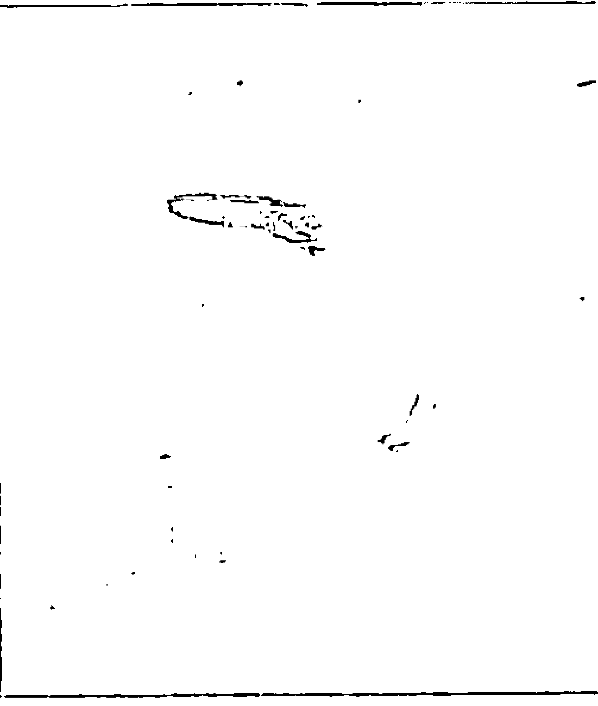

##### 没有无用的人

佚名

有一天，一位跟美国巨富梅考科干了20年的老工人，突然性情大变，在公司里酗酒闹事，与工头大吵了一场。这在梅考科公司所订的规章制度中，是绝不能容忍的事情。只要违反了这一条，不管是谁，都会被毫无例外地坚决开除。

当工头把这位老工人闹事的材料上报后，梅考科犹豫了片刻，但仍旧批写了“立即开除”四个字，并通报表扬了工头。

梅考科毕竟与这个老工人有患难之交的深厚感情，正在准备下班后到老工人家里去了解情况的时候，这位老工人却拿着“立即开除”的指令找到了梅考科。他一见梅考科的面，就气呼呼地骂开了：“梅考科，你他妈的真不是东西！当年你负债累累，工厂濒临倒闭的时候，3个月没发给我工资，老子照样替你卖命。可现在，你的公司办好了，为了这么点鸡毛蒜皮的小事，竟把老子开除了，你梅考科还有没有良心？！”

等这位老工人骂完了，火气消了些，梅考科才平静地说：“我怎么没良心？我要是没良心，不等你把这些脏话讲完，早就叫人把你揪出去了。”

接着，梅考科又开导他说：“作为一个老工人，公司里的规章制度你不是不知道，你应该带头遵守，可你为什么还要违反？我只是按规章制度办事，难道有什么不对吗？”

接着，梅考科又仔细地询问了老工人闹事的前因后果。原来这位老工人结婚很晚，老婆刚刚去世，留下两个孩子。一个孩子摔断了腿，住进了医院；另一个孩子没有母乳，成天在家里饿得直哭。他一个人心急如焚，毫无办法，只好喝酒解愁，待醒来时，被工头抓住，不问青红皂白，把他狠狠地训了一顿。他又急又气，便和工头大吵起来……

“你真糊涂呀！”当梅考科了解了事情的真相后，十分惋惜地责备这位老工人，“既然事情已经弄到了这种地步，你现在就什么都不要再想了，赶紧回家料理夫人的后事和照顾孩子。你放心，我梅考科不会让帮助过我的老朋友走上绝路的。”说着，便抽出一沓钱塞在这位老工人的手里，并嘱咐他以后不许再胡来。

老工人十分感激地握着梅考科的手，疑惑地问：“那你收回开除我的命令了？”

梅考科坚决地说：“不，不是那回事，我还是决定开除你，因为你违反了制度，在制度面前必须人人平等。但这并不意味着我见难不帮、见死不救。”

赏罚分明是有效管理的基本法宝。赏之不公，赏多赏少皆生怨；罚之有度，罚轻罚重总相宜。后来，梅考科把这位老工人安排到了自己家里的一个牧场去当管家。对此，无论是工头和员工，还是这位老工人，都心服口服，十分满意。

### 魅力提示：

梅考科的难能可贵之处，是他不仅做到了赏罚公正、分明，而且灵活、适度，充满了人情味。看来，没有无用的人，只有不会处理事情的人。

### 老鼠和公牛

伊索

一头公牛被老鼠咬了一口，非常疼痛。它一心想捉住老鼠，老鼠却早就安全地逃回到鼠洞中。公牛便用角去撞那座墙，搞得精疲力竭，躺倒在洞边睡着了。老鼠偷偷地爬出洞口看了看，又轻轻地爬到公牛的肋部，再咬它一口，赶忙又逃回到洞里。公牛醒来后，无计可施，烦躁不安。老鼠却对着洞外说：“大人物不一定都能胜利。有些时候，微小低贱的东西更厉害些。”

### 魅力提示：

有生存空间就能立于不败之地。为人处世，也要为自己留下生存空间，切不可太过极端，否则就会失去生存空间，最后走向失败。

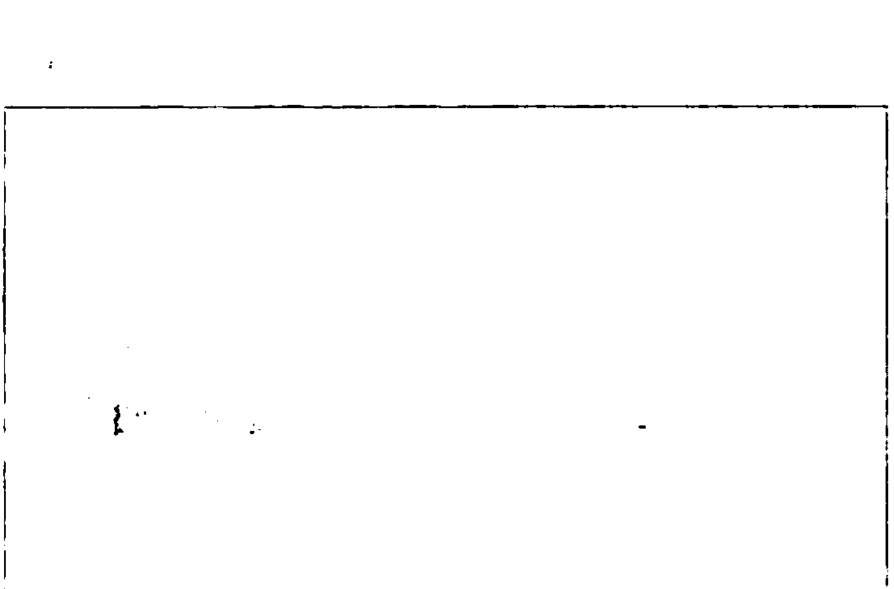

#### 昼夜荣辱各半

李异鸣

有一个姓尹的财主家大业大，在他家劳动的奴役，从早到晚都得不到休息。

有个在尹家工作了几十年的老仆人，每天累得筋疲力尽，但是尹家对他的奴役丝毫不减，苦活累活都让他去干，干不好就挨打受骂。他白天呻吟着去劳动，到了夜间，拖着疲劳的身体，往床上一躺就呼呼睡着了。

奇怪的是，这位老人每次睡着后，都梦见自己当了国王，高踞于民众之上，总揽全国政事，在离宫别院宴饮游乐，任意满足自己的欲望，无比快乐。

然而每次醒来以后，他仍然是个奴仆，从事艰苦的劳动。

也许是因为晚上的美梦，他白天干活时从来都不觉得苦。而这也可能是他在这家能干这么久而从未想过离开的原因。

一天，有人问他原因，他说：

> “人活百年，昼夜各占一半。我白天当奴仆，劳苦是劳苦，但是夜间当国王，快乐无比。我还有什么可怨恨的呢！”

与此截然相反的是，姓尹的财主苦心经营世间之事，时时都在思虑积累家业，心理、身体都很疲劳，每日夜间也昏沉沉地入睡。但他夜夜做梦给别人当奴仆，奔波劳碌，什么苦活累活都干，还经常遭受斥骂毒打，什么侮辱都尝遍了。他在梦中呻吟，说梦话，求饶，直到天亮才解脱，接着又去苦苦经营他的家业了。

姓尹的财主对这种情形很担心，害怕日久天长身体坚持不住，便去询问朋友，讨寻解决的办法。他的朋友听他述说了梦中的痛苦，便对他说：“你的地位很高，可以使得自身无比荣耀，家大业大，钱财多得用不完，远远胜过其他的人。到了夜间，你梦见当奴仆，也不奇怪。因为安逸和劳苦是循环往复，互相转化的，这也是自然的常理。你想要睡梦和白天都富贵尊荣，快乐无比，这怎么可能呢？”

姓尹的财主听了朋友的开导，顿时豁然开朗，觉得很有道理。这番话就像一服治病的药方，于是他就放宽了对奴仆们的劳动要求，不再那么刻薄狠毒，减少了自己心中思虑的事情。天长日久，由于心理压力减少了，梦中的痛苦也逐渐减轻了。

### 魅力提示：

> 日中则昃，月满则亏。无论什么事情，做得过分，就会向相反的方面转化。

# 魅力星座智慧书之

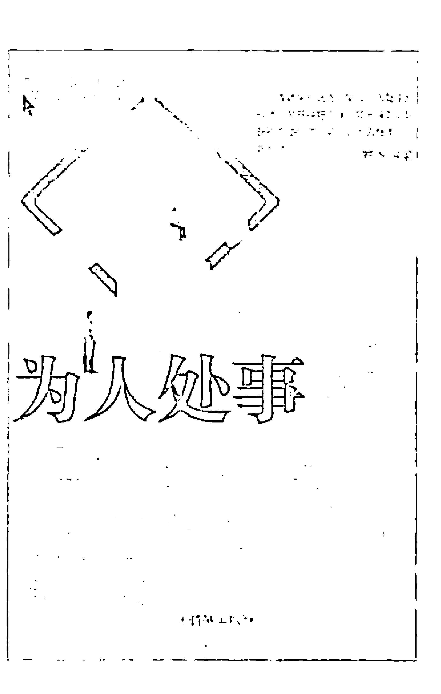

- 书名：为人处事 赢在分寸
- 作者：石晓 编著
- 出版社：朝华出版社
- 出版时间：2008-7-1
- 印刷时间：2008-7-1
- 开本：16开
- ISBN：9787505419148
- 包装：平装

## 内容简介：

儒家之中庸之道的精髓，即“不偏不倚”、“过犹不及”的思想。说到底是分寸的问题。为人处事，待人接物，无不渗透着分寸和火候的掌握。说话的生疏深浅、办事的轻重缓急、人际关系的亲疏远近、处世的高低姿态，都体现在分寸的把握上。

本书能让你在轻松的阅读中学会把握为人处事的各种分寸，使你无论是说起话来，还是办起事来，都能拿捏准确、游刃有余。

分寸决定尺度，尺度决定高度，高度决定态度，态度决定命运。从这个意义上说，分寸即是命运。

测试第二面 做人篇

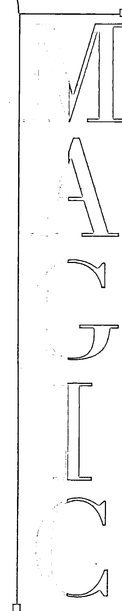

# 魅力失分

天蝎座的人敏感而脆弱，别人的一个小小的动作或眼神，他都会看在眼里记在心里。

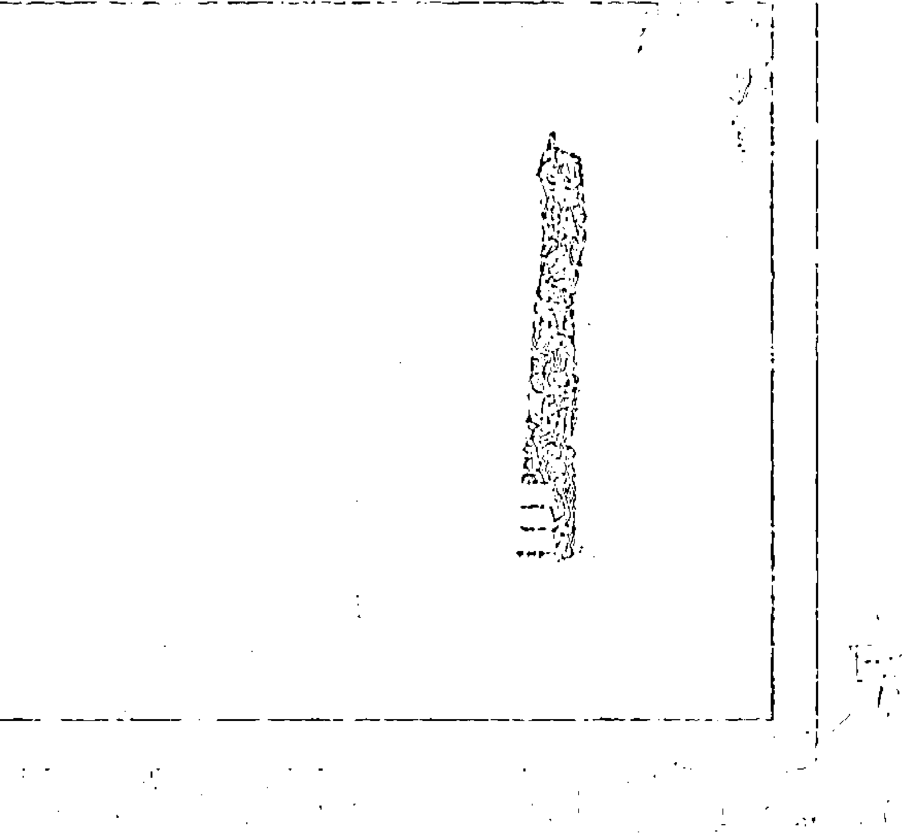

#### 老天爷的刁难

佚名

从前，有一位做生意的少年，刚从城里完成一笔丰厚的交易，身上带着大笔的钱骑着马赶路回家。

这几天的天气向来晴朗，不知怎地来到中途，忽然雷雨大作，将他淋成了落汤鸡，他渐渐心生不满，心想一定是老天爷故意刁难他。

少年一边赶路一边避雨，走走停停，经过一处浓密的树林时，突然跳出了一个强盗，手中握着一把老式猎枪对准少年。

强盗威胁他说：“快把身上的钱全部交出来，否则我一枪毙了你！”

“我和你无冤无仇，请不要伤害我，请你不要开枪。”少年慌张地乞求着。

强盗威风凛凛地说：“我是这座森林的老大，想经过这里的人都要留下过路费，看你是要留下命还是留下钱。”

这时，突然一声雷响，惊动了少年的马匹，马儿发出一阵嘶鸣，强盗想威吓少年，于是对空鸣枪，没想到枪竟然没响。

机不可失，少年连忙快马加鞭，逃离那座树林，终于摆脱强盗的追击。

少年松了一口气，自嘲地说道：“唉！刚刚还抱怨老天爷下大雨故意刁难我，如果天气晴朗的话，强盗的弹药没有潮湿，我一定难逃杀身之祸。”

> 魅力提示：
> 人生不如意事十之八九，若你的想法是积极乐观的，纵使不顺遂之事频频发生，亦能逢凶化吉。

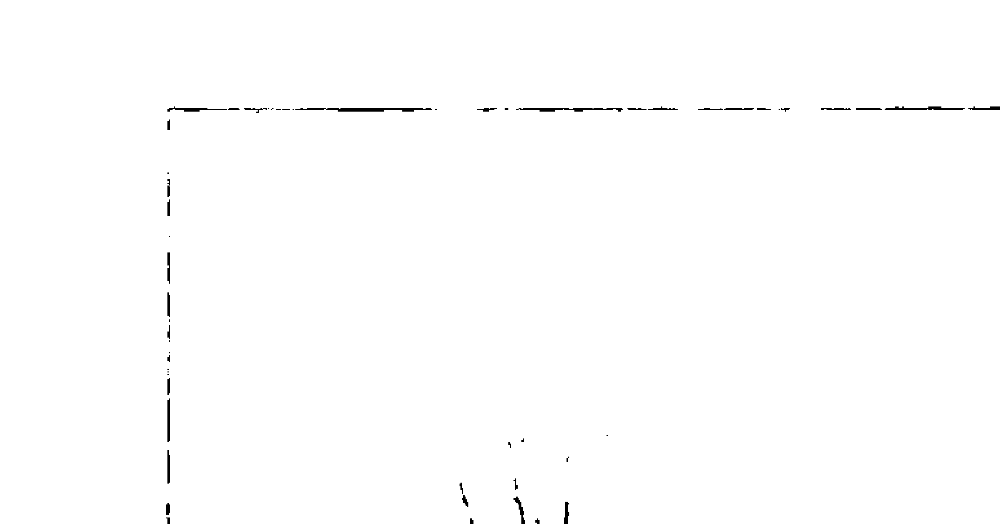

#### 烦恼日记

佚名

有一位女士，遇上一点不顺心的事情就胡思乱想，给自己制造烦恼。舞场上男士没有邀她去跳舞，她心里烦恼；年终没评上先进她也心里烦恼；碰上某个领导没有向她打招呼，她还烦恼……烦恼一来，她就会好几天精神不安。

当她察觉到烦恼给自己带来高血压、心脏病时，后悔不已。她想克制自己，但烦恼一来，又无法克制。

后来有人建议她每天写20分钟日记，把消极的情绪忠实地写在日记里。还告诉她，这个日记是写给自己的，既要写出正面，也要写出负面。这样就可以把消极情绪从心里驱走，留在日记里。

从此以后，这位女同志坚持记日记，通过记日记来宣泄自己的烦恼，遇上让自己胡思乱想的事，便在日记里自己说服自己。

她曾在一篇日记里写道：“今天我在楼梯上向某局长打招呼，可某局长阴着脸，皱着眉头，理也没理我一眼。我想他的冷漠态度不是冲着我来的，八成是家里出了什么事，要不然就是挨了上级的批评。”在日记里这么一写，她心里的疑团一下子烟消云散了。

她还在另一篇日记里提醒自己：“我翻阅上月的日记，发觉那时的烦恼现在完全消逝了，这说明时间可以解决许多问题，也包括烦恼在内。如果以后我遇上新的烦恼，就要不断地提醒自己：现在何必为它烦心，我何不采取一个月后的忘却状态来面对眼下的烦恼。”

# 魅力星座智慧书之天蝎座

> 魅力提示：
> 生活中总是会出现各种令人烦恼的事困扰着我们，我们应该学会尽力摆脱烦恼，尤其不能自寻烦恼，否则只会让自己心绪不安、心情沮丧。虽然我们没有特权去永远做自己高兴的事，但是我们有权不让自己陷入烦恼的困境，得到更多的乐趣。

#### 美丽心情

佚名

一位女士在珠宝店的柜台前挑选珠宝，同时把装着几本书的包放在旁边。这时，一个男士也来到柜台前看珠宝，女士小心地把书包移开。男士却十分生气地瞪着女士，觉得受到了侮辱，然后便离开了珠宝店。

女士很莫名其妙，自己又没把他当坏人，只是好意。她没了心思，出门开车回家。

在回去的路上，她和一辆卡车同时抵达一个路口。女士以为卡车一定会仗着车大抢先冲过去，于是她下意识地减慢速度让行，没想到卡车先停了下来，司机还探出头来，微笑着示意女士先过去。

女士开车过了路口，满腔的不快一扫而光。

> 魅力提示：
> 不要因为别人的坏情绪而影响了自己的心情，给别人一个微笑，会换来更多的微笑。

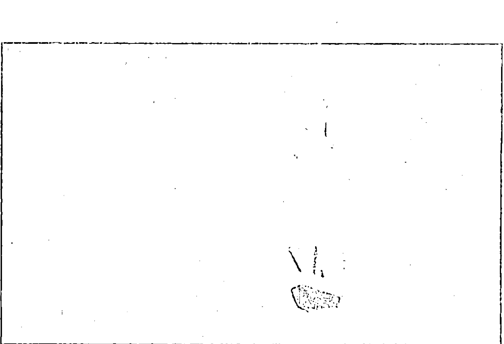

#### 师父的笑

白云守端禅师有一次和他的师父杨岐方会禅师对坐，杨岐问：“听说你从前的师父茶陵郁和尚大悟时说了一首偈，你还记得吗？”

“记得，记得。”白云答道，“那首偈是‘我有明珠一颗，久被法劳关锁。一朝法尽光生，照破山河星朵’。”语气中免不了有几分得意。

杨岐一听，大笑数声，一言不发地走了。

白云怔在当场，不知道师父为什么笑，心里很愁烦，整天都在思索师父的笑，怎么也找不出他大笑的原因。

那天晚上，他辗转反侧，怎么也睡不着，第二天实在忍不住了，大清早去问师父为什么笑。

杨岐禅师笑得更开心了，对着失眠而眼眶发黑的弟子说：“原来你还比不上一个小丑，小丑不怕人笑，你却怕人笑。”白云听了，豁然开朗。

> 魅力提示：
> 很多时候，我们陷于别人给我们的评论之中不能自拔。别人的语气、眼神、手势……都可能搅扰我们的心，白白损失了做个自由快乐的人的权利。

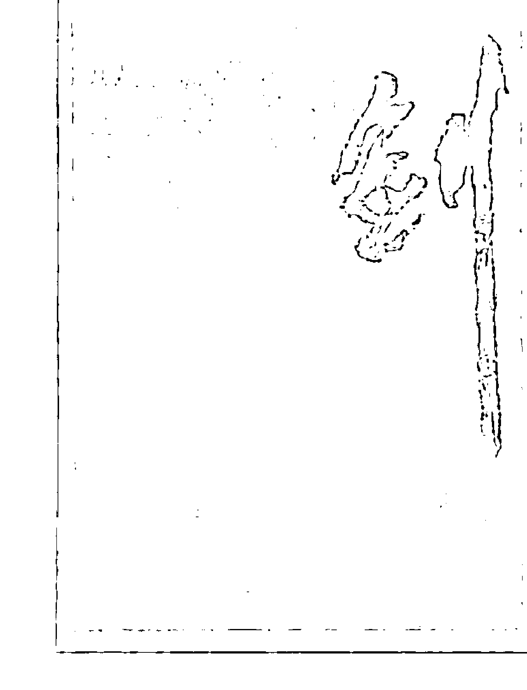

- 书名：性格是把双刃剑
- 作者：刘富奇、黄倩 编著
- 出版社：中国华侨出版社
- 出版时间：2006-12-01
- 印刷时间：2006-12-01
- ISBN：9787802221758
- 包装：平装

## 内容简介：

性格中都有先天遗传而来的部分，但更多的是通过后天培养而形成。性格一旦形成，再想改变就很困难了，但性格是可以修正的，特别是其中的缺陷部分，可以通过理性的方式进行弥补。

我们究竟属于什么样的性格？我们的性格中有哪些优点和缺点？怎样才能扬长避短，让性格帮助我们顺利地度过一生？这些都是每个人必须正视和考虑的问题。本书能够明确地给你指出，你性格的优势与劣势在哪里，并告诉你如何才能做到扬长避短。

测试第二面 做人篇

# 魅力失分

#### 得理不饶人

天蝎座的人得理不饶人，谁若违反了他的规则，即使愿意认错，也要有心理准备。他不但记性好、爱教训人而且记恨，曾犯过的错就这样被永恒地记忆在他的榜单上。

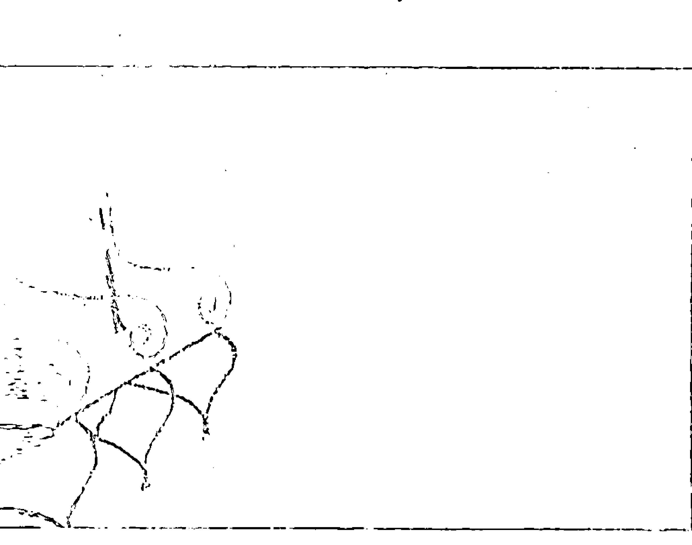

##### 涵养与智能

姜燮文

一次，前民主德国柏林空军俱乐部举行盛宴招待空战英雄，酒会正在热闹的进行中，这时，一位年轻的士兵斟酒时不慎将酒泼到乌戴特将军的秃头上。

顿时，士兵悚然，会场寂静。

倒是这位将军轻抚士兵肩头，说：“老弟，你以为这种治疗能再生头发吗？”

全场立即爆发出了笑声，人们紧绷的心弦松弛下来了，盛宴保持了热烈欢乐的气氛。

试想，乌戴特将军若认为“泼洒”头上有损尊严，严词训斥，大发雷霆之怒，将军在酒宴上将会给人们留下一个多么糟糕的形象！所以后人评点他不愧是一位“智慧将军”。

> **魅力提示：**
>
> 大智能是一种大涵养，有涵养的人才善于学习，我们从多话的人学到了静默，从偏狭的人学到了宽容，从残忍的人学到了仁爱。

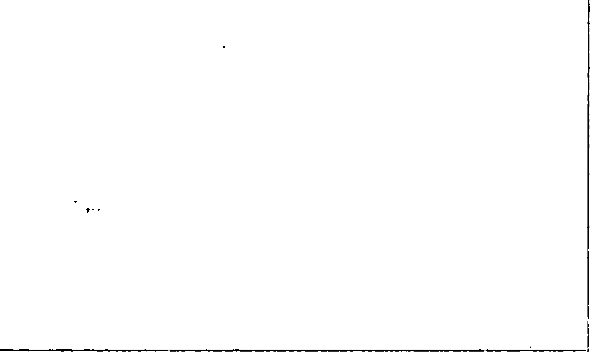

##### 把伤害留给自己

深 秋

“二战”期间，一支部队在森林中与敌军相遇发生激战，最后两名战士与部队失去了联系。他们之所以在激战中还能互相照顾、彼此不分，因为他们是来自同一个小镇的战友。

两人在森林中艰难跋涉，互相鼓励、安慰。十多天过去了，他们仍未与部队联系上，幸运的是，他们打死了一只鹿，依靠鹿肉又可以艰难度过几日了。

可也许因战争的缘故，动物四散奔逃或被杀光，这以后他们再也没看到任何动物。仅剩下的一些鹿肉，背在年轻战士的身上。这一天他们在森林中遇到了敌人，经过再一次激战，两人巧妙地避开了敌人。就在他们自以为已经安全时，只听到一声枪响，走在前面的年轻战士中了一枪，幸亏在肩膀上。后面的战友惶恐地跑了过来，他害怕得语无伦次，抱起战友的身体泪流不止，赶忙把自己的衬衣撕下包扎战友的伤口。

晚上，未受伤的战士一直叨念着母亲，两眼直勾勾的。他们都以为他们的生命即将结束，身边的鹿肉谁也没动。天知道，他们怎么过的那一夜。第二天，部队救出了他们。

事隔30年，那位受伤的战士安德森说：“我知道谁开的那一枪，他就是我的战友。他去年去世了。在他抱住我时，我碰到了他发热的枪管，但当晚我就宽恕了他。我知道他想独吞我身上带的鹿肉活下来，但我也知道他活下来是为了他的母亲。此后30年，我装作根本不知道此事，也从不提及。战争太残酷了，他母亲还是没有等到他回来，我和他一起祭奠了老人家。他跪下来，请求我原谅他，我没让他说下去。我们又做了二十几年的朋友，我没有理由不宽恕他。”

### 魅力提示：

一个人，也许能容忍别人的固执己见、自以为是、傲慢无礼、狂妄无知，却很难容忍朋友对自己的恶意诽谤，更别说是致命的伤害。但惟有以德报怨，把伤害留给自己，让世界回归温馨、仁慈、友善与祥和，才是宽容的至高境界。

#### 五个和尚

佚名

很早以前，有一座庙里住着五个和尚，可是庙里香火不盛，没几个人前来烧香拜佛。和尚们眼看揭不开锅了，于是决定四个人下山去化缘，留一个最小的和尚在庙里看门。这个方法看样子不错，和尚们用不着挨饿了。

就这样过了一段时间。一天，和尚们化缘回来时见小和尚正躺在床上睡着了，他们一个个很生气，想着他们几个人在外面辛辛苦苦讨回来粮食与你吃，你却在家安逸地睡觉。和尚们决定让小和尚以后跟他们一块出外化缘。

小和尚不得不听从师兄们的安排，第二天跟他们一道出门。到了晚上，和尚们回到庙里，简直不相信自己看到的，庙门大开，院子里乱七八糟地堆着柜子、箱子、衣服、经书……“被盗了！”和尚们反应过来说。

和尚们好不容易化缘得回来的粮食、钱物通通被强盗席卷一空。他们后悔不已。

### 魅力提示：

不要因为一点小错就将他人全盘否定。每一个人都有他的位置和作用，如果你让他离开他自己的位置，也许你会得不偿失。

#### 报复

王玉北

一位画家在集市上卖画，不远处，前呼后拥地走来一位大臣的孩子，大臣年轻时曾经把画家的父亲活活气死。

大臣的孩子在画家的作品前面流连忘返，选中了其中一幅，画家却匆匆地用一块布把它遮盖住，声称这幅画不卖。

从此以后，这孩子因为心病而变得憔悴；最后，他父亲出面了，表示愿意出高价。可是，画家宁愿把这幅画挂在他画室的墙上，也不愿意出售。他阴沉着脸坐在画前，自言自语地说：“这就是我的报复。”

每天早晨，画家都要画一幅他信奉的神像，这是他表达信仰的惟一方式。可是渐渐地，他觉得这些神像与他以前的神像日渐相异。

这使他苦恼不已，百思不得其解。然而有一天，他惊恐地丢下手中的画，跳了起来，他刚画好的神像的眼睛，竟然是那大臣的眼睛，而嘴唇也是那么地酷似。他把画撕碎，高喊着：“我的报复已经回报到我的头上来了。”

### 魅力提示：

仇恨、报复如双刃剑，它虽能伤人，却也伤己。学会宽恕与宽容吧。

## 内容简介：

- **书名:** 宽容:学会遗忘·拥抱幸福
- **作者:** 张茹
- **出版社:** 湖北人民出版社
- **ISBN:** 721604493
- **出版日期:** 2006-01
- **开本:** 32开
- **包装:** 平装

被执念遮住眼的人，生命的路会越走越阴霾。正如卡耐基所说：对于聪明的人来说，每一天都是一次新的生命的开始。因为，聪明的人，懂得宽容。本书为“青少年成才必备的六堂情商培训课”之一，是风靡台湾的青少年励志读本。阅读本书，让你我都拥有宽容和平直、达观和敦厚的心怀去生活处事，让每时每刻都充满喜悦。不论你是一个男子还是一个女人，待人温和宽大才配得上人的名称。一个真正英勇果断的人，决不会用拳头制止别人发言。善于或者能够忘记悲伤的人，他的每一天都将是快乐的。

#### 第二篇章

##### 处女篇

# 魅力失分

> 天蝎座只许我负天下人，不愿天下人负我的强悍性格，令人难以消受。

#### 从四十七到五十三

佚名

一个心胸狭窄、自私多疑的人，因为工作、生活以及人际交往都不顺心，突然喜欢上了算命，由生辰八字、紫薇斗数、姓名学到占星术，没一样不研究。

当然，他学算命不是觉得算命灵验，而是想证明算命是骗人的东西。原因是有一位非常著名的大师为他算命，算他活不到四十七，他发誓，非打烂那大师的招牌不可。

他愈学愈怕，因为他发现自己算自己，也确实活不长。这时候，他整个人都变了，他开始关注身外的事物，也学一些慈善人士那样，开始四处做善事，他自言自语道：“反正活不久了，好好利用剩下的岁月，做点对别人有益的事吧！”

接下来的岁月，人人都说他变了，由一个焦躁势利的小人，变成敦厚慈爱的君子。

不知不觉，他过了四十七、过了四十八，而今已经五十三，红光满面、生气勃勃，比谁活得都健康。

“你可以去砸那个大师的招牌了！”朋友有一天和他开玩笑。

他眼睛一亮，回问朋友：“为什么？”又笑笑，“要不是那人警告我，我根本认识不到以前的自己。照我以前的样子，别说话到现在，能活到四十七不犯心脏病，就算不错了！”

### 魅力提示：

人总是回头看，才会看清当初的自己。而且，改变越大，看得越清楚。比如很多富人对儿时苦难的理解，比如很多死囚对以往自由的见解。生活的内容远比我们想象的要丰富，我们自己也一样。不要把自己看得太重，也不要把自己看得太轻，更不要因为一时的成败在宽广无比的生命河流里迷失自己。

#### /魅力星座智慧书之天蝎座

#### 朋友和工作

佚名

马可先生是一家公司的总裁。他有一位翻译，是他的老乡加朋友，合作得很不错，但他时刻担心朋友做出什么事，让他进退两难。因为这位朋友太重感情。

果然，一次，在马先生和德国人谈一笔压缩机生意时，朋友迟到了20分钟，谈判也就因翻译缺席延迟了20分钟。德方因此就怀疑他们的信誉，生意告吹。

- “你知不知道这是笔大生意？”
- “我的女朋友病了，我送她去医院！”
- “你可以请人送她去！”
- “她是我的女朋友，不是别人的女朋友！”
- “你可以谈完生意再去看她！”
- “她需要我在她身边给她勇气！”
- “你怎么这么不知轻重？”
- “你怎么这么不懂感情？”
- “女人有的是，生意机会不会重来！”
- “钱还可以再赚，感情遗憾没法弥补！”

马可先生后来说，他也不忍心处罚朋友，但他说服自己，逼着自己残忍。他也知道钱还可以再赚，朋友交情一旦失去，就再难找回来。但他就怕自己狠不下心，以后在残酷的生存竞争中也心慈手软，所以他把处罚这个朋友作为自己战胜自己的契机。

那位朋友起初以为马可会原谅他，为朋友可以两肋插刀赴汤蹈火，还不能认亏一次？所以他在马可的处罚面前感到震惊和愤慨。但他终究是一个够朋友的汉子，很快就意识到在自己埋怨马可不够朋友时，自己也不够朋友，他深知经商的艰难，终于理解并原谅了马可。他主动提出辞职，因为他知道自己要是再遇到相同的事，还会有相同的选择。他决定自己办公司，再要感情用事时吃亏的是自己，而不会拖累朋友。

### 魅力提示：

如果我们想交朋友，就要先为别人做些事——那些需要花时间、体力、体贴、奉献才能做到的事。无论何时，都设身处地地为别人想一想，不要只顾自己的处境。

#### 误会

佚名

早年在美国阿拉斯加，有一对年轻人结婚，婚后生育，他的太太因难产而死，遗下一孩子。

他忙生活，又忙于看家，因没有人帮忙看孩子，就训练一只狗，那狗聪明听话，能照顾小孩，咬着奶瓶喂奶给孩子喝，抚养孩子。

有一天，主人出门去了，叫它照顾孩子。

他到了别的乡村，因遇大雪，当日不能回来。第二天才赶回家，狗闻声立即出来迎接主人。他把房门打开一看，到处是血，抬头一望，床上也是血，孩子不见了，狗在身边，满口也是血，主人发现这种情形以为狗性发作把孩子吃掉了，大怒之下，拿起刀来向着狗头一劈，把狗杀死了。

之后，忽然听到孩子的声音，又见孩子从床下爬了出来，于是抱起孩子；虽然身上有血，但并未受伤。

他很奇怪，不知究竟是怎么一回事，再看看狗身，腿上的肉没有了，旁边有一只狼，口里还咬着狗的肉；狗救了小主人，却被主人误杀了，这真是天下最令人惊奇的误会。

### 魅力提示：

误会的事，往往是人在不了解，无理智，无耐心，缺少思考，未能多方体谅对方、反省自己，感情极为冲动的情况下所发生的。人往往总是从保护自己的角度出发，这样造成的后果就是让原本亲近的人离你越来越远。

#### 恋爱不是领导关系

佚名

一对青年男女，二十四五岁的年纪。多年前偶然的相遇，于是缘分从那时候开始。当然，后来也有过分手——恋爱总免不了分手。女孩子说：“分手吧。不要拖泥带水，从此别再有瓜葛。”男孩子痛苦，但没有停下继续追求的脚步，后来，在男孩子的二度追求攻势下，女孩子重新成为了他的女友……五年后，这对男女又遭遇了分手。男孩子说：“分手吧。五年前再次追上你，就是为了甩掉你！让你尝尝被甩的滋味！”女孩子抬起一张惊愕痛苦的脸……女孩子分手时的一句话，男孩子记了整整五年！

### 魅力提示：

只许我负天下人，不许天下人负我！如此心胸狭窄、自私自利的男孩，有哪个女孩会愿意跟他共度此生？他的身边，又会有几个真心实意对待他的人呢？

## 内容简介：

- **书名：** 找回自己
- **作者：** 圣严法师 著
- **出版社：** 华夏出版社
- **出版时间：** 2009-01-01
- **印刷时间：** 2009-01-01
- **开本：** 32开
- **ISBN：** 9787508050928
- **包装：** 平装

在人生的路上，我们总是汲汲营营地追求物质上的欲望，却忘记生而为人的真正意义；我们常常忙着左顾右盼地评断别人，却忘了应先审视自己、认识自己。许多人或许不曾面对过“自己”，不曾认真地审视过那个真实的“我”，不曾想过人生的价值与意义究竟又是什么。

圣严法师以佛法的智慧，指引我们认识自己的方向，并为探寻时所升起的疑惑，提出最切实的建议。无论是人生的价值与目的、如何克服执着、如何放下欲望还是应有的生活态度、自我成长、忏悔与责任等，圣严法师都以最生活化的实例、最直接明了的说解，让读者可以立即运用，确实履行。期待在圣严法师的带领下，我们都能真正找到自我，为生命开启新的视野！

#### 第二章 做人篇

##### NAIJO

# 魅力失分

###### 神秘主义

天蝎座的人不想让别人了解自己的内心世界，但却很希望听到别人的心声。

#### 燕人悲祖

列子

有一个燕国人，生在燕国，却长于楚国，到了晚年想落叶归根回到故乡。

他走到晋国，同路的人骗他，指着前面的一个城镇说：“这就是燕国的城镇。”这个人听了就深深地叹了一口气。

同路的人又指着其中的一间房子说：“这是你祖先的房子。”这个人听了就流下泪来。同路的人再指一座坟墓说：“这是你祖先的坟墓。”这人忍不住放声大哭，同路的人却哄然大笑地说：“我刚刚说的都是骗你的，这里是晋国而已。”

这个人觉得愧疚，不久到了燕国，真的看到燕国的城镇和宗庙，看到真正的旧家和旧坟，心里的悲哀情绪已经十分淡了。

### 魅力提示：

人的悲哀只是一种情绪，一种情绪。一旦这种情绪释放出来后，情绪也就解开了。总是沉湎于悲哀或苦闷中的人，是因为他一直未能找到他释放情绪的对象，所以，经常找到合适的对象或方式来倾诉自己的内心，是减轻心理压力的重要途径。

#### 快乐四句话

佚名

一位少年去拜访年长的智者。

少年问：“我怎样才能变成一个自己愉快，也能给别人带来快乐的人呢？”智者笑着说：“孩子，在你这个年龄有这样的愿望，已经是很难得了。我送给你四句话吧。第一句是，把自己当成别人。”

少年说：“是不是说，在我感到痛苦忧伤的时候，就把自己当成别人，这样痛苦自然就减轻了；当我欣喜若狂之时，把自己当成别人，那样狂喜也会变得平和一些？”智者微微点头。

#### /魅力星座智慧书之天蝎座

智者接着说：“第二句话，把别人当成自己。”少年沉思了一会儿，说：“这样就可以真正同情别人的不幸，理解别人的需要，并给予适当的帮助。”智者两眼发光。

智者继续说：“第三句话，把别人当成别人。”少年默默地思索着，回答说：“这句话是不是说，要充分尊重每个人的独立性，在任何情形下都不能侵犯他人的核心领地。”智者哈哈大笑：“很好，很好，孺子可教！”

智者说：“第四句话，把自己当成自己。这句话理解起来太难，你留着以后慢慢品味吧！”

少年说：“也好。不过这四句话我怎样才能把它们统一起来呢？”智者答：“很简单，用一生的时间和经历。”

### 魅力提示：

这四句话真是概括尽了世间人与人之间以及个人如何独立于群体之间的种种关系问题，道尽了人一生生活的本真。不同时时候怀有不同的心态扮演不同的角色，便组成了世间形形色色各不相同的人生。悲剧还是喜剧，痛苦还是快乐，艰难还是轻松，等等，都在其中，至于真实情形如何，那就要看各自如何用一生的时间去经历了。

#### 大师的败笔

梅资

一位建筑设计大师一生杰作无数。在过完65岁寿诞之后，他向外界宣称：等完成封笔之作便归隐林泉。

一言方出，求他设计楼宇者便踏破门庭。

大师自有大师的想法。他一生学富五车，阅历无数，最大的遗憾就是时下人们批评的，把城市空间分割得支离破碎，楼房之间的绝对独立加速了都市人情的冷漠。他自己也深有感触。

##### /魅力星座智慧书之

于是，灵感像火花一样迸射出来，一种崭新的创作理念也日趋成熟——他要打破传统的楼房设计形式，力求让住户之间开辟一条交流和交往的通道，使人们相互之间不再隔离而充满大家庭般的欢乐与温馨。

一位颇具胆识和超前意识的房地产商很赞同他的观点和理念，出巨资请他设计。经过数月苦战，图纸出来了。不但业内人士一致叫好，媒介与学术界也交口称赞，房地产商更是信心十足，立马投资施工。

令人惊异的是，大师的全新设计却叫好不叫座。楼盘成交额始终处于低迷状态。

房地产商急了，于是公司信息部门马上做市场调研。调研结果出来了，原来人们不肯掏钱买房的原因，是嫌这样的设计虽然令人耳目一新，也觉得更舒爽，但邻里之间交往多了，不利于处理相互间的关系；孩子们在这样的环境里活动空间是大了，但又不好看管；还有，空间一大，人员复杂，于防盗之类人人担心的事十分不利……

设计大师听到了这个反馈，心中绞痛不已，他退还了所有的设计费，办理了退休手续，与老伴儿回乡下隐居去了。临行前，他对众人感慨道：我只识图纸不识人，这是我一生最大的败笔。我们可以拆除隔断空间的砖墙，而谁又能拆除人与人之间坚厚的心墙？

是的，心墙不除，我们生活的空间恐怕会越来越小。

#### 亲信

佚名

国王在外面喜欢上了另外的女人，却又担心被皇后知道，整天担惊受怕。

这时有一个很会讨好国王的大臣主动出谋划策，为国王设定许多与情人约会的方式，国王与情人的事情也只有这个亲信最清楚。

虽然国王与那个女人的约会都很隐秘，但皇后还是感觉到了些什么，于是去质问国王。

国王非常气愤，心想一定是那个大臣出卖了他。便立刻找了一个罪名，把那个大臣处死了。

其实，皇后也只是猜测而已，国王并没有被大臣出卖。

### 魅力提示：

过多地知道别人的隐私有时候并不是一件好事。‘伴君如伴虎’，尤其不要过问太多上司的隐私，也许你的好意往往会弄巧成拙。

##### /魅力星座智慧书之

##### 魅力链接

- **书名：** 遇见未知的自己
- **作者：** 张德芬 著
- **出版社：** 华夏出版社
- **出版时间：** 2008-01-01
- **印刷时间：** 2008-01-01
- **开本：** 32开
- **ISBN：** 9787508044019
- **包装：** 平装

## 内容简介：

本书中有一句话说得好，呼应了我长久以来沉淀的信念——“亲爱的，外面没有别人，只有自己”。生命来无影去无踪，无法臆测也难以捉摸，无论身处力争上游的快跑阶段，或逢人生变故减速慢行的彷徨时刻，或是看尽千山万水绚丽归于平淡的踌躇关头，面临其中的悲欢离合喜怒哀乐，唯有抱持观照内心并祈福感恩的心态，一切的真相才会自动水落石出。

这是一本好读、好用也好学的“现代修心书”。口齿伶俐、聪颖慧黠的“张前主播”，无情岁月并未褪除她才貌双全的一丝一毫，读其文如见其人，一路修行的用心良苦，就在一股脑儿无私奉献的字里行间，与众生交流。

#### 第二篇章

##### 做人篇

# 魅力失分

天蝎座是个冷漠的星座，他不会轻易去同情和怜悯一个人，要想让他发发慈悲之心，是件很难的事情。

#### 善行的回报

佚名

一位邮递员给一个老太太送邮件时，经常看到那位瘦小的老夫人从她那美丽的大房子中走出，借助一辆四个轮子的助行车，挣扎着走上房前的小路，去信箱取她的邮件。她每向前走一步都非常吃力。

在随后的一个月里，邮递员好几次遇到老夫人，每次都看到取信对她来说是一项多么艰难的任务。他估计老夫人从她房子前门走到信箱再返回去，至少要花20分钟。她每走几步都要停下来歇一歇。

一个周末，这位邮递员光顾了当地的一家五金商店，买了一只铜制的信箱。然后，他驱车来到老夫人的家，敲响了房门，并站在门口耐心地等待。

当老夫人终于把门打开时，邮递员礼貌地问她是否允许自己把这个信箱钉在她的门上，以省去她每天走到原来那只信箱取信的辛苦。她同意了，因此他就把那只信箱钉在了她的房门上。

在接下来的几个月里，当邮递员发送老夫人的邮件时，他便径直走到她的前门，把邮件塞进那只信箱。但从此以后，他再没有跟老夫人打过照面。

有一天，当邮递员走上老夫人家房前的小路时，发现一个男人正站在台阶上等他。那个男人介绍说，他是老夫人的代理律师。他告诉邮递员，老夫人已经去世了，并且问他今后能否将老人的所有邮件转送到律师事务所。随后，他递给邮递员一个信封，里面是老夫人留下的一封信——老夫人把她的房子、家具等所有物品，都留给了这位邮递员先生。在信中，老夫人写道：

“邮递员先生，你对我的友善甚至超过了了我的家人所给予我的。我已经有20年没有收到他们的消息了，他们不肯为了我而暂时放开他们手中的工作，而你却做到了这一点。

“愿上帝保佑你的余生幸福安康。”

### 魅力提示：

永远不要低估善行的威力。当人们尽心去帮助周围需要帮助的人时，给他人带去的是方便，留给自己的是欣慰，即使助人的人并不希望得到任何回报。

#### 一杯开水与几块面包

佚名

一位穷苦的学生为了凑足学费，到外地挨家挨户地推销商品。由于他想尽快凑足学费而不想多花钱，于是，鼓足勇气敲了一户人家的门，决定在推销商品之后，硬着头皮向这家人讨些食物。

开门的是一个小女孩，他一看便失去了勇气，心想，天下哪有大男人跟小女孩讨东西吃的？于是他只说自己需要一杯开水解渴。

小女孩看得出他非常饥饿，从屋里拿了一杯开水与几块面包给他。他很快把食物接过来，狼吞虎咽地吃着。一旁的小女孩看到他这种吃法，不禁偷偷地笑着。

吃完后，他很感激地说：“谢谢你，我应该给你多少钱？”他发现这个小女孩的家里十分破旧，拿这些食物给他一定很不容易。

小女孩傻傻地笑着说：“不必啦，这些食物我们家很多。”他觉得自己很幸运，在陌生的地方还能受到他人如此温馨的照料，便又鼓足干劲，向另一家走去。

多年后，小女孩感染了罕见的疾病，许多医生都束手无策。女孩的家人正一筹莫展，听说有一个医生的医术很高明，而且医生主动发出邀请，要为小女孩治疗。

在这名医生的全力医治和长期的护理下，小女孩终于恢复了健康。

出院那天，护士交给她医疗费用账单，她的父母没勇气打开来看，她也不敢打开来看，他们心里都知道可能要一辈子辛苦工作，才还得起这笔医疗费。最后，她还是打开了，看到签名栏写着以下这段话：

> “一杯开水与几块面包，足够偿还所有的医疗费。”

她眼里含着泪水，终于明白原来主治医生就是当年的那个穷学生。

### 魅力提示：

一杯开水与几块面包，之所以能和一辈子辛苦工作都不一定能偿还的昂贵医疗费等值，是因为那里面包含着对他入生命的善意与关爱。

##### 吉姆和劳尔

探险家吉姆和劳尔在穿越喜马拉雅山脉的一个山口时，看到雪地上躺着一个人。

吉姆决定停下来帮助那个人，但是劳尔反对：“要是我们带上这个累赘，我们都会没命的。”吉姆没有听取劳尔的劝告，他不能丢下这个十分虚弱的人，他要带着他一起走。

劳尔认为他没有多余的力气来帮助这个人，所以他一个人走了。

吉姆背着这个人艰难地前进。他的体温渐渐温暖了背上的这个人，这个人似乎有了一些精神。不久，这个人便可以在吉姆的搀扶下行走了。

当他们并肩前行了两天后，他们赶上了劳尔，不过，他已是一具冻僵的尸体。

### 魅力提示：

> 不要对需要帮助的人冷漠。付出爱心的同时，自己也能感受到温暖。

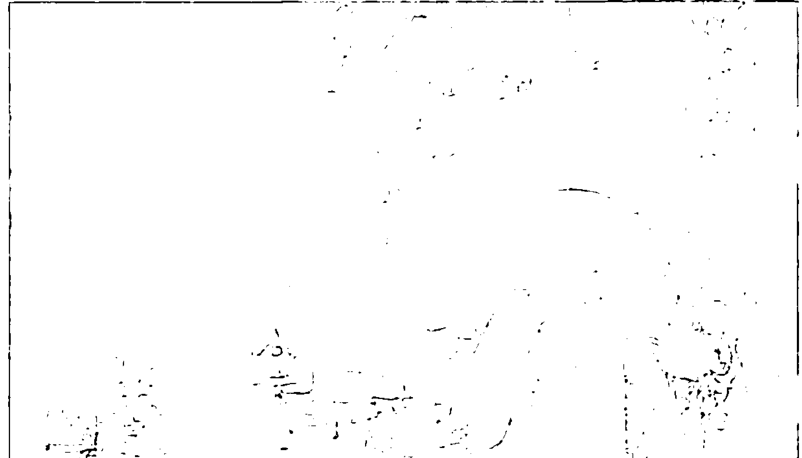

##### 你需要为冷漠付费

卡洛琳·李

1935年，一件简简单单的偷窃案正在纽约最贫穷脏乱的区的法庭上审理。当时，拉瓜地亚刚刚出任纽约市市长。他坐在法庭的角落里，亲眼目睹了这桩偷窃案的审理始末。

被指控的嫌疑犯是一位白发苍苍的老妇人。她的脸呈灰绿色，乍一看就知道她的健康状况极其糟糕，患有严重的营养不良。

事情其实很简单，老妇人在偷窃面包时，被面包店老板当场抓住，并被送到了警察局，最终被指控犯了偷窃罪。审判长威严地注视着这个瘦弱的老人，询问她是否清白或愿意认罪。老妇人嗫嚅着回答：“是，我承认。我确实偷了面包，因为我家里还有几个饿着肚子的孙子，他们已经两天没有吃到任何东西了。如果我不给他们点东西吃，他们会饿死的。我需要那些面包。”

审判长听完被告的申诉，平静地回答道：“尽管如此，我必须秉公办事，维护法律的尊严，你可以选择10美元的罚款，或是10天的拘役。”

由于案情简单，被告供认不讳，庭审很快就结束了。就在法官宣布退庭前，一直坐在旁听席上的市长拉瓜地亚站了起来。他脱下了自己的帽子，放进去10美元，然后转身对着旁听席上的其他人说：“现在，请在座的每一个人都交出50美分的罚金。我们每一个人都应该为自己的冷漠付费，因为我们生活在这样一个需要白发苍苍的老祖母去偷面包来喂养孙子的城市。”

旁听席上的气氛变得肃穆起来。所有的人都惊讶极了，但是每个人都默默地拿出50美分捐了出来。

这场70年前就已经结案的庭审，至今仍然感动人心。

### 魅力提示：

> > 有一句话是这么说的，爱的反义词不是恨，而是冷漠。让我们都打开心门，让阳光住进来，让这个世界多分一些关怀，给角落中受伤的灵魂；多分一点爱，给那些陌生的面孔。把冷漠变成爱，世界将更温暖！

书名：佛养心道养性
作者：宋天天 编著
出版社：新世界出版社
出版时间：2009-06-01
印刷时间：2009-06-01
开本：16开
ISBN：9787510402517
包装：平装

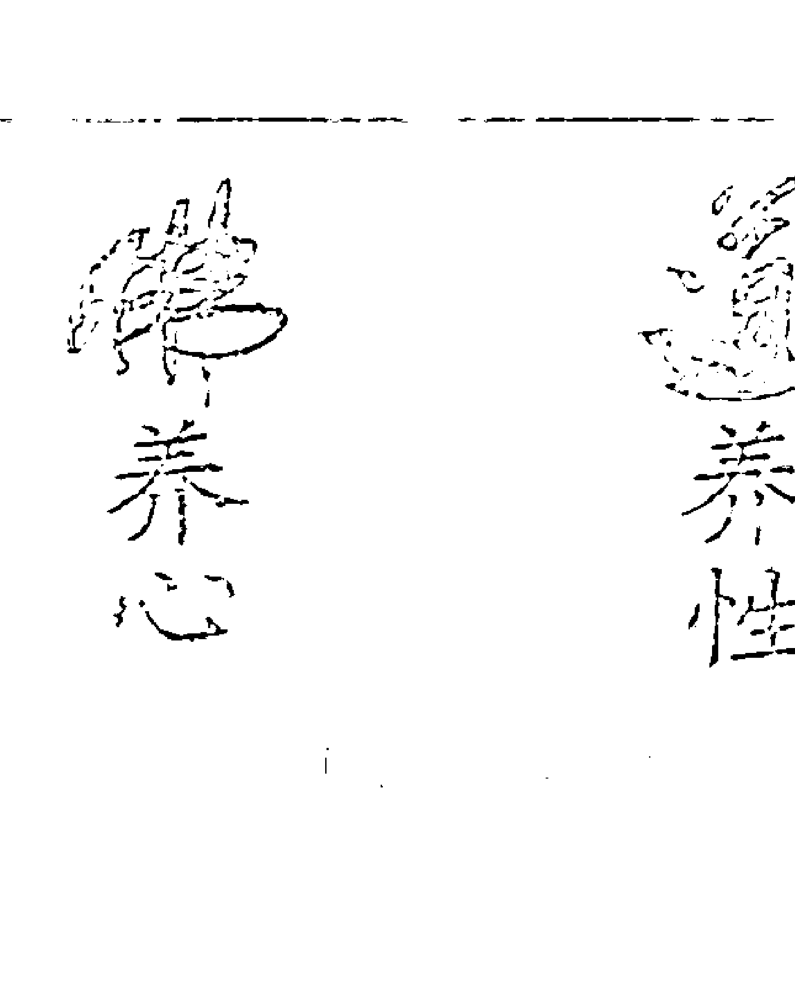

## 内容简介：

何谓慈悲？慈爱众生并给予快乐（与乐），称为慈；同感其苦，怜悯众生，并拔除其苦（拔苦），称为悲：二者合称为慈悲。慈悲是一切德行的根源，慈悲是无量智慧，慈悲是大爱。能感知一切众生的痛苦，能善待一切众生，并有想帮一切众生摆脱痛苦的心，就是慈悲心。慈悲心包括放下执著心，保持正心、宽容心、随缘心等。

本书共分八篇，以佛学思想为核心，分别从善念、放下、静心、做事、宽容、智慧、平常心、随缘八个方面，讲解了慈悲给我们带来的福报以及怎样修得慈悲心。书中还有“佛陀格言”、“禅机妙语”、“佛家典籍”、“佛心故事”等版块内容，使读者能更好地了解和感悟佛法。

我佛慈悲。慈悲即佛。佛即慈悲。

##### 总第二百 做人篇

###### ALIVE

# 魅力失分
###### 疑心病重

天蝎座的疑心病过重，他不容易相信任何人。

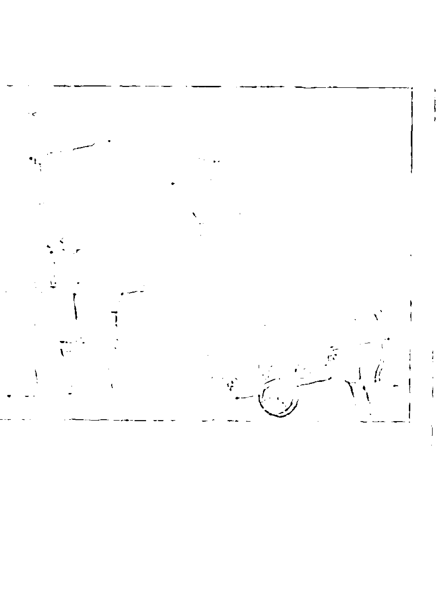

##### 美丽的欺骗

蒋光宇

年轻的爸爸和九岁的儿子在一起放风筝。突然，刮起了一阵旋风，一棵小树的树枝把风筝紧紧地缠住了。

于是，爸爸取来了一架梯子，准备往上爬。

儿子说：“爸爸，让我来吧！”

爸爸看了看九岁的儿子，想了想说：“也好，让你来就让你来。”

儿子像个机敏的小猴子，转眼就爬到梯子的上端，解开了缠在树枝上的风筝线，转过头来对着爸爸嘻嘻地笑。

儿子正要下来，爸爸制止了他：“等一等。”

儿子愣住了，望着爸爸，问：“怎么啦？”

爸爸说：“我先讲个流传很广的真实故事给你听，听完之后你再下来。”

于是，儿子笑得更加开心了，一手抓住梯子，一手拿着风筝，等着听爸爸讲故事。因为爸爸讲的故事，总是引人入胜的。

爸爸说：“有一天，美国大富豪洛克菲勒扶着自己的小孙孙在地毯上做爬梯子的游戏。他鼓励小孙孙勇敢地往上爬，同时安慰地说：‘有爷爷扶着，不用怕！’当小孙孙刚刚爬上梯子之后，老洛克菲勒便撒开了手，不再扶他的小孙孙。结果，小孙孙从梯子上摔下来。小孙孙哭哭啼啼地站起身来，问：‘爷爷，你为什么要骗我？’这时，老洛克菲勒说：‘你看，连爷爷这样的亲人也靠不住，别人说的话就更不能全都相信了。’”

停了一会儿，爸爸对儿子说：“我们照着做一次，好不好？”

儿子一听，脸都吓白了。“这么高，又没有地毯，怎么能行？”

爸爸说：“不要怕，勇敢一点，只要跳这一次就行了，不会有什么大的危险。我要给你留下一个深刻的印象，免得你以后长大了，容易上人家的当。”

然而，儿子还是不敢跳，站在梯子上，纹丝不动。

爸爸开始发号施令了：“听着啊，我喊一、二、三，喊到三的时候你就跳下来，然后我就把伸出去假装要接住你的手缩回来。”

咬紧牙关，闭上眼睛，忍着眼泪，无可奈何的儿子终于从梯子上跳了下来。他认为自己的身体将像一个南瓜一样“噗”的一声，摔得支离破碎……

然而，爸爸的身体没有移开，手也没有缩回去，而是把掉下来的儿子结结实实地抱在了怀中。

儿子虽然没有受伤，但是神情比刚才更加疑惑。他问：“爸爸，你为什么要骗我？”

爸爸笑出声来，说：“爸爸是想让你知道，即使是别人的话，有时也是可以相信的。何况是爸爸的话呢？”

##### /魅力星座智慧书之 天蝎座

所有灿烂的阳光又都回到了儿子的脸上。他搂着爸爸，不住地吻着爸爸的双颊。

突然，儿子又问：“我还是不明白，那个狠心的老洛克菲勒为什么要骗自己的小孙孙？”

爸爸耐心地解释：“像洛克菲勒这样举世闻名的成功企业家，为了教育自己的孙子不惜改变自己在小孙孙心目中的偶像地位。如果把那架梯子看成是通向成功的阶梯，那么爬梯子就是在成功之路上向上攀登。老洛克菲勒是要告诉小孙孙一个重要的道理：成功主要靠自己。当然，老洛克菲勒知道，刚爬上梯子的小孙孙即使掉在地毯上，也不可能被真的摔坏。”

> > 魅力提示：
>
> 人生有时候要善于怀疑，但更多的时候要善于相信。

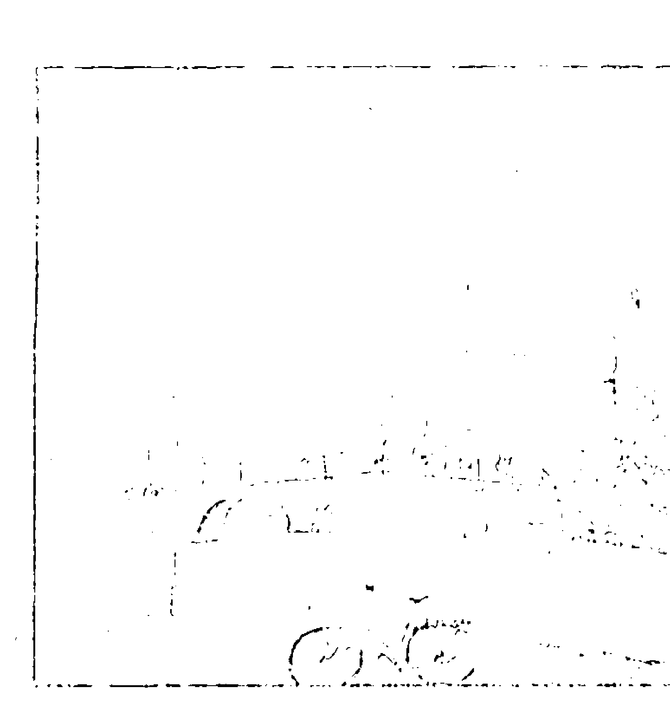

##### 我相信你

佚名

李明是一个德行不好的人，好吃懒做不说，还有偷偷摸摸的习惯，所有人都讨厌他，因为他借了别人的钱不还不算，还总是拿去赌博。所以周围的人都不借钱给他，即使他想做点小买卖都借不到钱。于是他跑到一个远房亲戚家借钱，那是他第一次向那个亲戚借钱，他以为亲戚不知道自己的底细。

李明很顺利地借到了钱。在他转身要走时，亲戚叫住了他，对他说了一句话：“曾有人打电话告诉我不要借钱给你，因为你有了钱就会去赌，而且还借钱不还，但我不相信你是那样的人，我想他们可能对你有误解。”
李明听了心里一惊，因为他的确是准备拿这笔钱去赌博的。亲戚的话给了李明很大的震动，他没有说话，关上门走了。
几个月后，亲戚收到了李明从外地寄来的钱，原来那天亲戚的话让李明深受感动，他知道自己应该有另一种人生，他再也不想骗人了，他想让大家重新认可自己，相信自己，所以他带着那笔钱离开了家乡，到外地打工去了。
三年后，李明衣锦还乡，把从前的欠款全部还清了。

### 魅力提示：

信任别人就是对别人的尊重，同样也会得到别人对你的尊重。其实世上并没有绝对的好人，也没有绝对的坏人，只要人与人交往时多一点信任、少一点歧视和偏见，那么任何人都会向好的方面发展。

##### 商人与明星

雅琴

一商人爱上了一位女明星，但是他又不太十分清楚女友的背景。

他不希望影响到自己的事业前途，于是，雇了一个私家侦探去调查她的底细。但是他并未将自己的真实身份透露给这名私家侦探。

不久，私家侦探给他发来调查结果：“该女士洁身自爱，身世清白，以往结交者皆良善之人，且无不良嗜好。唯一遗憾，就是近日不知何故，竟与一个声誉不佳的商界人士某某来往甚密。”

### 魅力提示：

我们经常对他人抱以怀疑和不信任的态度，这样的想法往往并不是别人引起的，而是自己疑心作祟。高尚的人拥有崇高的思想，卑鄙者的灵魂也是丑陋的。

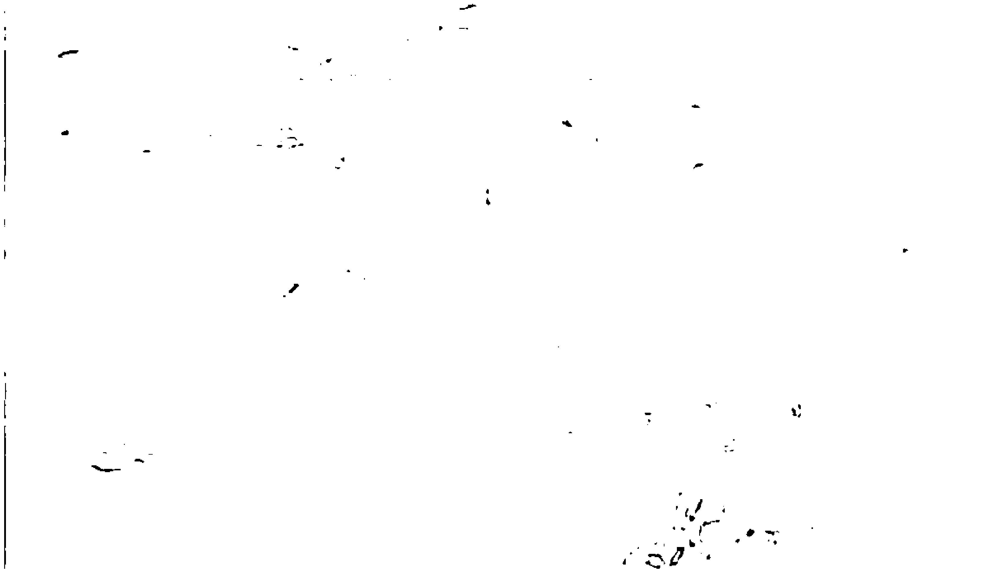

##### 和女人同居的禅师

范天涯

韩国的镜虚禅师，有一天晚上，带一个女人回到房间后，就关起房门，在房间里同居同食。徒弟生怕别人知道这件事，就把守在门外，遇到有人找禅师时，就说禅师正在休息。

但徒弟心想这样下去也不是办法，就鼓起勇气去找师父，进了门，看到一个长发披肩的女人躺在床上，身段苗条，有细白的背，还看见师父在她身上很自然地摸着。

徒弟一见，非常冲动，再也无法忍耐，大声责问师傅：“师傅啊，您这样做还能算是大师风范吗？您对得起大众吗？”

镜虚禅师一点也不动气，轻声地说：“我怎么了呢？”

弟子指着床上的女人，以斥责的语气说：“你看！”

师傅却平和地对徒弟说：“你看！”

因为师徒的对话，床上的女人转过了身来，徒弟看见一张看不到鼻子、眉毛、连嘴角也烂掉的脸，原来是一个患了麻风病的女人正苦笑着望着自己。

这时，师傅把手上的药往徒弟面前一递，泰然地说：“那么你来吧！”

徒弟跪了下来，说：“师父！你能看的，我们不能看；你能做的，我们不能做！弟子痴愚啊。”

许多猜疑的产生无非源自听说和所见，但是平常人们所说的：“耳听为虚，眼见为实。”其实也未必正确，对世间上的人和事的评判，对于是非好坏，并没有绝对的标准。知其一而不知其二，像徒弟误会了禅师一样，没有深入的了解，没有豁达的胸怀，没有慈悲的心，就是一种短见，一种愚痴。
记得有一篇故事，也阐述了这个道理。
从前，有一位长者，膝下有一子。到了成年，他为儿子办了婚事。这对年轻夫妇新婚燕尔，感情如胶似漆。
一天，丈夫对妻子说：“你到厨房给我倒一杯酒来，我要在这儿喝一顿。”
妻子赶紧到厨房，打开酒缸。不料，里面竟现出一位美人。妻子不知这是自身的影子，醋意大发，回来大骂丈夫：“你做的好事，把个漂亮姑娘藏在酒缸里，想瞒天过海，到底有什么企图？”
丈夫吃了一惊，非常纳闷，亲自掀开酒缸一看，竟也发现一个美男子。这时候，丈夫大发醋劲，反而把妻子痛责一顿：“你暗藏汉子，还敢诬赖我！”
这对感情一向融洽的年轻夫妇，顷刻间反目为仇，互揭疮疤，你一言我一语，责骂不休。
一位跟他们关系很好的婆罗门听到吵架声，过来询问他们原因。听了夫妻二人互相指责的话语，为了查明事实的真相，婆罗门亲自去查看酒缸，不料，缸里没有美女俊男，反而现出一位很体面的婆罗门。他以为这个婆罗门与主人的关系比自己与他们更为密切，主人为了远离自己，才制造了夫妻吵架的假象，让他知难而退。他胡思乱想地瞎猜一阵，竟一言不发地走了回去。
一会儿，一位比丘尼来了。她为了劝架，也到酒缸前查看，发现里面已有一位尼师，也怒气冲冲地走开了。
后来，一位行者走访到此，他看穿缸里全是影子，什么人也不存在。于是，把新婚夫妇拉到酒缸旁边说：“我把缸里的人拉出来给你们瞧瞧。”
只见他用一颗大石头，重击酒缸。酒水随着缸的破裂而洒了一地，里面再也没有什么人。新婚夫妇始知事情的真相，惭愧之余，和好如初。

> 魅力提示：
在平常的生活中，猜疑总是经常上演，在没有看清事实之前，万不可杯弓蛇影。

##### /魅力星座智慧书之

书名：信任
作者：[德]卢曼 著，瞿铁鹏、李强 译
出版社：上海人民出版社
出版时间：2005-05-01
印刷时间：2005-05-01
ISBN： 9787208050372
包装：平装

## 内容简介：

《信任》一书中，作者认为信任是一种简化机制。为什么人类的生活需要这些简化机制呢？因为包围人类的社会环境和自然环境太复杂了，必须找出一些简化机制来对应。卢曼说我们的生存需要很多的简化系统。信任也是这样一个简化系统。信任是一个将包围着我们的复杂性和不确定性变为一个二元的简化机制：可以相信还是不可以相信。

##### 第三日 败了阵

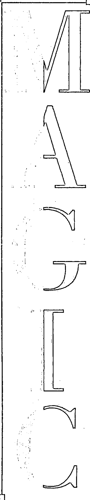

# 魅力失分

天蝎座的自卑感隐藏得很深，这自卑是隐藏在信心下的一个炸弹，一旦被人掌握利用，会让天蝎崩溃。

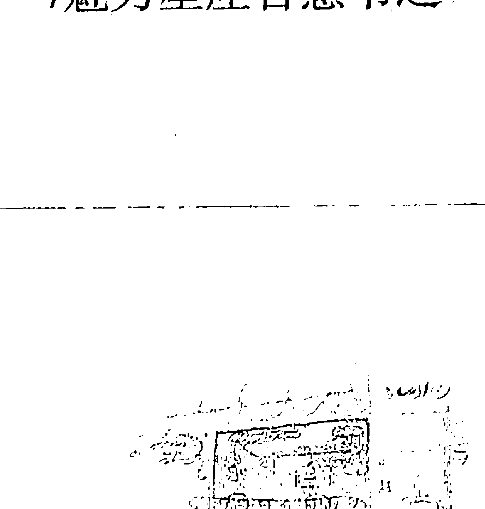

##### 业余球员

佚名

博格斯是美国著名的NBA篮球明星。他身高仅1.60米，是他所在的夏洛特黄蜂队最矮的球员，也是NBA中最矮的球员。他从小就喜欢篮球，可因个子不高，进不了球队。有一天他伤心地问妈妈：“妈妈，我还能长高吗？”他妈妈鼓励他说：“孩子，你会长得很高很高，会成为人人都知道的大球星。”从此，博格斯心里充满着长高的美梦。

> “妈妈，我还能长高吗？”

> “孩子，你会长得很高很高，会成为人人都知道的大球星。”

“业余球员”的生活即将结束，他面临着严峻的考验：只有1.60米的身高，能打好职业球赛吗？博格斯非常自信地说：“别人说我矮，反而成了我的动力。我偏要证明矮个子也能做大事情。”于是，在各个赛场上，人们看到博格斯灵活得就像个“地滚虎”，从下方来的球百分之九十都被他抢断。他越是个子矮越是能飞速地运球过人。后来，他被破格吸收到了职业球队。博格斯始终牢记当年母亲鼓励他的话，虽然他没有长得很高很高，但是，他已经成为世人皆知的大球星了。

> “别人说我矮，反而成了我的动力。我偏要证明矮个子也能做大事情。”

### 魅力提示：

> 锥子扎不出血的麻木，实际上就是一种心灵的死亡，而有痛的感觉就代表没有失去信心，没有失去生命力。知耻而后勇，只要信心在，有什么困难克服不了呢？一个人不管自己能力有多大，如果没有自信，什么事也做不成。

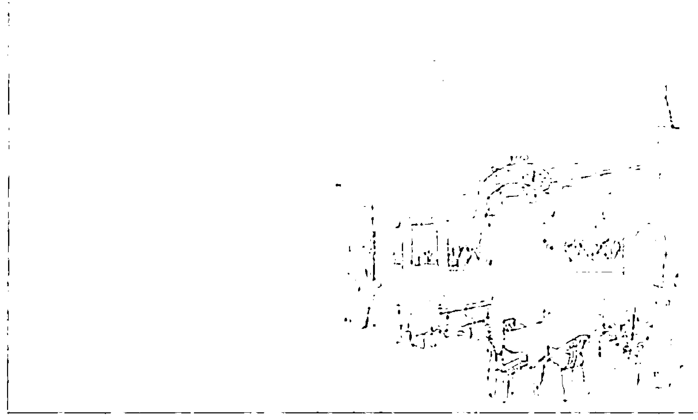

##### 高看自己

佚名

圆山饭店的管理者名叫严长寿，他没有很高的文凭，只有高中文化。可是，从一踏进社会开始，他便一直相信自己是个很有价值的人，所以，即使他当初只是担任打杂小弟的工作，也还是坚持穿西装、打领带，让自己看起来很专业。

直到现在，严长寿还是常常用这样的心态鼓励员工，改变他们对自己工作的看法。

# 魅力星座智慧书之

别小看这件事，因为一个人的尊严、成就感以及他成功的概率，往往来自于自己对自己的看法。
在餐厅里最不起眼的工作通常有两种：端盘子的服务生和厨房里的厨师。
他们始终都不觉得自己的工作有多高尚，所以厨师往往穿得很邋遢、态度很凶，他不觉得自己需要包装、需要礼貌。
端菜的服务生则是觉得自己做这份工作很委屈，整日不现笑脸。
于是，严长寿便对端菜的服务生说：“如果你只是把自己看成一个端菜员、一个点菜员，你不会看得起自己；可是如果你把自己看成顾客的‘餐饮顾问’，对厨房菜色的特点、顾客的习性与品味都能有充分的掌握，替每桌客人都能设计一份独一无二的菜单，不仅你会觉得自己很了不起，顾客也会对你刮目相看，并且很依赖你的建议，因为你比他更了解这个餐厅的特色。”

### 魅力提示：

就像灰姑娘变成公主一样，每个人都可以因为相信自己的价值，而成为自己的公主。改变别人对自己的看法，首先要改变自己对自己的看法。你将你看成王子或是公主，你才有可能成为真正的王子或公主！

##### 成就不会超出自信的高度

佚名

一个人的成就决不会超出他自信所能达到的高度。

据说拿破仑亲率军队作战时，同是一支军队，战斗力便会增强一倍。原来，军队的战斗力在很大程度上基于兵士们对统帅的敬仰和信心。如果拿破仑在率领军队越过阿尔卑斯山的时候，只是坐着说：“这件事太困难了。”毫无疑问，拿破仑的军队永远不会越过那座高山。拿破仑的自信和坚强，使他统帅的每个士兵增强了战斗力。所以，无论做什么事，坚定不移的自信力，都是达到成功所必需的和最重要的因素。

有一次，一个士兵快马加鞭给拿破仑送信，由于马跑得太快，在到达目的地之前猛跌了一跤，那马就此一命呜呼。拿破仑接到了信后，立刻写封回信，交给那个士兵，吩咐士兵骑自己的马，从速把回信送去。

那个士兵看到那匹强壮的骏马，身上装饰无比华丽，便对拿破仑说：“华美强壮的骏马不配给我这样下等的士兵享用。”拿破仑回答道：“世上没有一样东西，是法兰西士兵所不配享有的。”

### 魅力提示：

生活中到处都有像这个法国士兵一样的人。他们以为自己的地位太低微，别人所拥有的种种幸福，自己不会拥有，也不配享有。而正是出于这种心理，他们往往不求上进、自甘平庸，渐渐地也就真的不配享有他们永远不会拥有的东西。

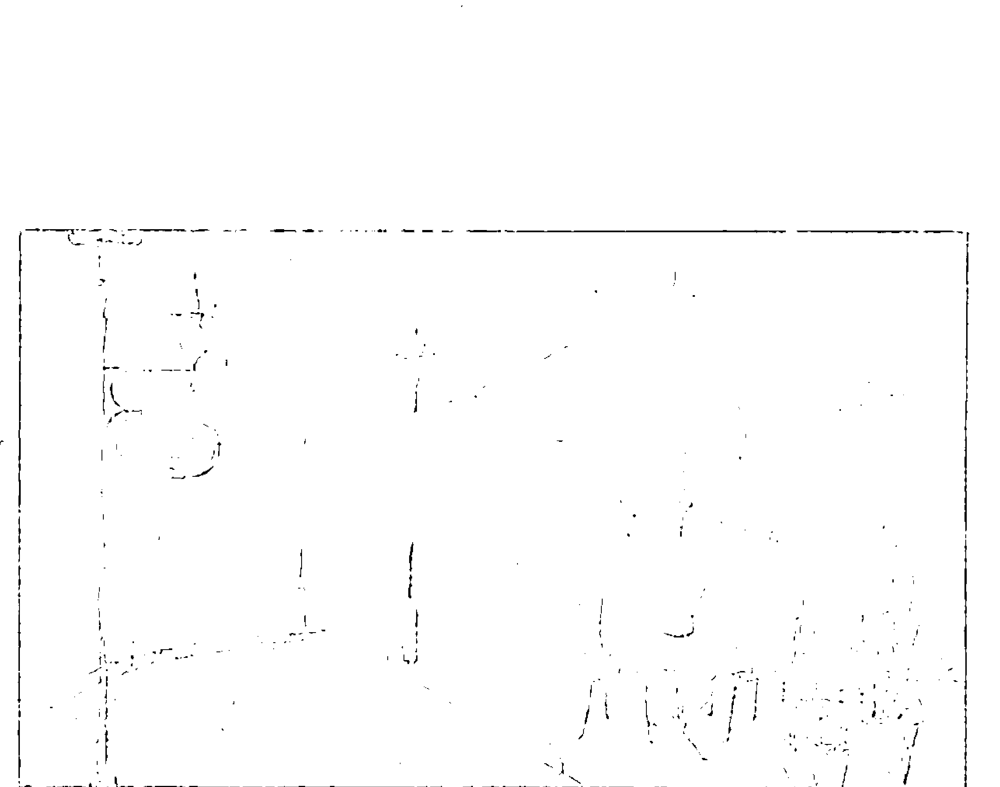

##### 寻找最优秀的人

马志国

古希腊的大哲学家苏格拉底临终前有一个不小的遗憾——他多年的得力助手，居然在半年多的时间里没能给他寻找到一个最优秀的关门弟子。

事情是这样的：苏格拉底在风烛残年之际，知道自己时日不多了，就想考验和点化一下他的那位平时看来很不错的助手。他把助手叫到床前说：“我的蜡所剩不多了，得换另一根蜡接着点下去，你明白我的意思吗？”

“明白，”那位助手赶忙说，“您的光辉思想是得很好地传承下去……”

“可是，”苏格拉底慢悠悠地说，“我需要一位最优秀的承传者，他不但要有相当的智慧，还必须有充分的信心和非凡的勇气……这样的人选直到目前我还未见到，你帮我寻找和发掘一位好吗？”

> > “好的，好的。”助手很温顺很尊重地说，“我一定竭尽全力地去寻找，绝不辜负您的栽培和信任。”

苏格拉底笑了笑，没再说什么。

那位忠诚而勤奋的助手，不辞辛劳地通过各种渠道开始四处寻找了。可他领来一位又一位，总被苏格拉底一一婉言谢绝了。有一次，当那位助手再次无功而返地回到苏格拉底病床前时，病人膏肓的苏格拉底硬撑着坐起来，抚着那位助手的肩膀说：“真是辛苦你了，不过，你找来的那些人，其实还不如你……”“我一定加倍努力，”助手言辞恳切地说，“找遍城乡各地、找遍五湖四海，我也要把最优秀的人选挖掘出来，举荐给您。”

苏格拉底笑笑，不再说话。

半年之后，苏格拉底眼看就要告别人世，最优秀的人选还是没有眉目。助手非常惭愧，泪流满面地坐在病床边，语气沉重地说：“我真对不起您，让您失望了！”

“失望的是我，对不起的却是你自己。”苏格拉底说到这里，很失意地闭上眼睛，停顿了许久，才又不无哀怨地说，“本来，最优秀的就是你自己，只是你不敢相信自己，才把自己给忽略、给耽误、给丢失了……其实，每个人都是最优秀的，差别就在于发掘和重用自己……”话没说完，一代哲人就永远离开了他曾经深切关注着的这个世界。

### 魅力提示：

人，最大的敌人是自己。最难认识的人也是自己。给自己一个准确的定位，这一点对每个人来说都是那么的艰难。一个人对整个世界来说纵然算不了什么，但对于自己来说，却是独自世界的全部和惟一。清醒地认识自己，完全相信自己，珍惜爱护自己，充分发掘和重用自己，这样你一定能获得人生的成功！记住，相信自己是世界上最优秀的人，至少，在你独自世界之中！

**书名：** 无条件信任的力量
**作者：** [韩]朴钟夏 著，千太阳 译
**出版社：** 中国友谊出版公司
**出版时间：** 2009-08-01
**印刷时间：** 2009-08-01
**开本：** 大32开
**ISBN：** 9787505725492
**包装：** 平装

## 内容简介：

本书是一部内容励志，故事神秘，文笔又很优美的作品。本书讲述的是一名人逾中年的普通男人，经历了最初事业的艰苦打拼，结婚生子之后，人生的精彩与幸福似乎都已经过去，日子也渐渐乏味无聊。就在他即将掉入生活的深渊的时候，却接收到一封改变了他整个命运的邮件……本书通篇采用讲故事的方法，故事构思巧妙完整，语言通俗而又富有哲理，是一部真正意义上的“大众心灵励志”书。书中还配有独家披露的“九头牛”系统培训法则，人人看后都可以独立操作，可执行性高，见效快。

作者通过“九头母牛”的故事，给读者营造了一个轻松愉快的氛围，让他们感受到阅读的快乐和幸福，领悟到给予的真谛。一个真正有想法和想象力的人，对自己充满信心，相信自己能够得到幸福，能够实现自己的梦想；坚信自己能用自己的智慧和勇气去感染身边的人。

在世界各个角落，听过这个故事的人都找到了重拾勇气与自信的具体方法。

##### 第二章
恋爱篇

# 魅力失分

####### 恋爱中

天蝎座因为太害怕失去所爱，所以老是爱吃醋，是一个超大容量的醋坛子。

##### 上锁的抽屉

范天涯

有一对夫妻，两人从大学时就相识，只不过丈夫谈过一个女朋友，但出国了。后来，遇到现在的妻子，毕业，结婚，多年来从未拌过嘴。

可是，丈夫总觉得得不到的才是最好的。于是，他总是对前女友念念不忘，并偷偷打听人家的地址，给人家写信。

这一切，忙碌的妻子起初并不知道。

可这个丈夫的思维很奇怪，觉得自己做了亏心事，别人也可能会做亏心事。渐渐地，他开始怀疑起妻子来，想看看她有没有像自己一样，背地里也有什么秘密。

经过一年的观察，他觉得妻子的言行都很规律，看不出有什么不正常。唯一让他好奇的是，妻子从去年以来，有一个抽屉一直是锁着的，钥匙也一直被妻子藏着，从未当着他的面打开过。丈夫也不好意思当面问妻子，他觉得自己有秘密，妻子有点小秘密也没什么。虽然这样想，但总是按捺不住那颗好奇心。

终于有一次，妻子去外地出差了。丈夫实在忍不住，他翻箱倒柜终于找到了钥匙，可是当他打开抽屉时，他却愣住了。

里面装的全是退回来的信——他写给从前的女友的——都没有拆封。他愣了半天，像突然明白了什么，轻轻地把抽屉锁好，把钥匙放回原地。他从此不再跟她提起抽屉的事情，也不再给前女友写信了。

> 魅力提示：
> 每个人心中都会有点秘密，不妒忌、不争吵，反而会让对方更加珍惜你。

##### 相信爱情

李莉

一对已结婚十多年的夫妻去城市的另一端看朋友，回来时天色已晚，又逢末班车，丈夫说：“咱俩从前两个门挤上去吧，人太多了。”妻子点头同意。

从前门挤上车的丈夫站在车厢中间，被一层层的人拥挤着，十分难受。忽然就有一只手悄悄地抓住他的手，凭感觉他知道那不是妻子的手，因为妻子的手肯定没有如此温热、柔软、细腻而动人心魄……他真希望这车能一直不停地开下去，哪怕到天亮都行。继而又想，这是一个什么样的女人呢？她怎么注意到我的？她叫什么名字呢？怎么样才能和她取得联系？忽然脑中灵光一闪，丈夫将自己的名片悄悄取出一张塞在那只可爱的小手里。

车终于到站了。丈夫恋恋不舍地下了车。从另一侧车门下来的妻子看起来并没有觉察到什么。

两个人横穿马路时，一辆摩托车疯也似的冲过来，妻子稍稍犹豫了一下，还是用身体撞开了丈夫……

丈夫抱起浑身是血的妻子跑进医院，天亮的时候，医生出来告诉他：“我们已经尽了力，你妻子只想见你最后一面。”

丈夫走进病房时，妻子的一只手攥成了拳头，后来那只手像电影里的慢镜头一样缓缓张开，丈夫的名片悄无声息地滑落下来……

> **魅力提示：**
> 爱是相信且不嫉妒。当妻子接到丈夫的名片的时候，她是什么样的心情我们也许无法确知，但是，她不顾一切为丈夫挡下摩托车的举动，却似乎已经说明了什么。

##### 吃醋

###### 佚名

有一个爱吃醋的太太，每当丈夫回来，她都会翻丈夫的衣领、检查丈夫的口袋，看看有没有女人的头发和口红印，每天都找。如果发现蛛丝马迹，她就会大哭大闹。

### 魅力提示：

嫉妒无疑是爱的一种表现，但往往会让人变得心胸狭窄，不可理喻。面对嫉妒者，应该设法给予明澈的空间；作为嫉妒者，应该多给自己自信，同时学会把信任还给对方。否则，一味苛求对方，甚至无中生有，只会让狭隘的思想遮住自己的双眼。

##### 迷恋情节

叶·吉克

新婚夫妇巴萨和阿拉正在返回麦蒂希市的途中。
“想不想玩游戏？”吉克想借此消磨旅途中的时间。
两个旅伴爽快地答应了。
“我给你们描述一段情节，你们要设法解释它。可以向我提任何问题，而我只回答‘对’或‘否’。”
新婚夫妇对此热心起来，于是吉克便开始讲起他的游戏：“夜深人静。一个男人正在睡觉。电话铃突然响起了。他起来，摘下电话听筒，却没有人说话。男人挂上了电话，又睡着了。请解释一下情节。”
“是女人打来的电话？”巴萨一箭中的地问。
“为什么偏是女人？”阿拉蹙眉说，但吉克的“对”字已经出口了。
“女人认识他？”巴萨紧追不舍。
“你干吗缠着这个陌生女人？”阿拉发火了，但吉克又已经给予了肯定的答复。
“男人结婚了？”情绪激动的姑娘也参加了游戏。
“对。”吉克宽慰她说。
“但打电话的，大概不是妻子吧？”巴萨以一种见多识广的人的口气说。
阿拉的脸刷地红了。吉克实事求是地肯定。
“这样看来，她只在晚上打电话？”巴萨迅速地迫近谜底。
“瞧他那样子！”阿拉声音颤抖地喊道，“好像无所不知似的。”
“亲爱的，”年轻的丈夫温情脉脉地微笑着，“家庭生活中无奇不有嘛！”

阿拉也微笑了。但这笑容预示着凶多吉少：“好啊，那又怎样？”
如果巴萨有经验的话，他可能会到此打住，但夜半铃声的情节完全吸引了他，他无暇留心爱妻的语调。
“这个女人，她很漂亮？”他孤注一掷地问。
“对，”吉克答道。于是巴萨喜笑颜开了。
“那么，”他得意洋洋地问，“那女人是想证实一下她的情人是否在家？”
“太卑鄙了！”阿拉喊道。
“不。”吉克坚决地回答。
巴萨皱起眉头，沉思了片刻。
“他使女人痛苦了？”他问。
“对，”吉克答道。
“等等，我跟你说……”巴萨眼露凶光，“一切都很清楚，这是暗号！”
“我也一切都清楚了，”阿拉站起来走向车门口，正好电气列车在一个站台边停下了。
“阿拉！”新郎喊道，“我们是下一站下车！”
“那是您下一站下车。”阿拉傲然回答，说罢便消失了。
巴萨绝望地随妻子跑去。在跑进通道之前，他猛地站住朝吉克喊道：
“我猜对了？”
“没有！”吉克大声回答道。
小伙子脸上流露出失望的神色。他挥了一下手，便消失在门外。
打那以后，吉克再也没遇见巴萨和阿拉，也不知道小两口是否言归于好了。其实，情节的谜底出奇地简单无邪。
男人睡觉打鼾，鼾声吵醒了隔壁的女人。为了把邻居弄醒，她拨了他的电话号码。确信折磨着她的人醒了之后，她挂了电话。事情就是这样。如果你们在哪儿遇到巴萨和阿拉，请向他们说明谜底。让我们共同努力使年轻的家庭免遭破裂！

### 魅力提示：

恋爱中的两个人是不能相互猜忌的。一定要记住，猜忌是爱情的天敌。

##### 魅力链接

| 项目 | 内容 |
| :--- | :--- |
| **书名** | 完全图解恋爱心理学 |
| **作者** | 穆铭 编著 |
| **出版社** | 南海出版社 |
| **出版时间** | 2008-05-01 |
| **印刷时间** | 2008-05-01 |
| **开本** | 16开 |
| **ISBN** | 9787544241137 |
| **包装** | 平装 |

## 内容简介：

人类一直在从不同角度探索爱情这个亘古常新的永恒主题，本书从心理学的角度诠释了恋爱心理、成就爱情、爱情的进展、外表魅力、爱情战争及忌妒心理6大主要问题。同时，对恋爱中容易出现但又必须克服的问题、恋人相处的方法、恋爱中的技巧等也做了相应阐述，帮您揭开爱情的神秘面纱。

##### 魅力第三面
恋爱篇

# 魅力失分
报复心强

天蝎座是个“复仇者”，就算是自己的女友也不放过。如果在最需要女友的时候而女友冷落了他，他也会用同样的方法来回击自己的女友，让女友好几天都敲不开他的心门。

##### 爱是永远的探望

佚名

英国有一位八十九岁的老人汤恩·罗斯威尔，一个已退休的奶酪师。他的心脏不好，而且有一条腿在十一年前因从梯子上摔下来而跌跛了。这样一位病残老人，居然每天花六个小时，行程两百五十七公里，去探望他的住在护理院中养病的老妻鲍琳。

> 护士贝蒂·洛根说：“他每天上午来，下午走，风雨无阻。甚至在下雪天，连邮差都不送信了，他仍照常来，我不知道他是如何能做到这一点的。”

> 七年前，汤恩的妻子因中风入护理院之后，汤恩坚持每天去看望她，七年如一日。他发誓说：“只要我还活着，我就会天天奔走。我答应过要与我的老伴恩爱至死。如果我俩长期分隔，怎能算得上是恩爱呢？”

然而，汤恩要去看看老伴一次，实非易事。他每天早上六点半起床，先从自己的农场走一公里多路到公共汽车站，然后搭乘五十分钟公共汽车到最近的火车站，转乘一小时三十分的火车到护理院所在的怀恩敦。从火车站到护理院尚有十七公里路程，汤恩没钱叫出租车，只好搭“顺风车”。旅途劳顿之苦，可以想象。

汤恩到达鲍琳身边时，已差不多是十一点四十五分了，刚好赶上吃午饭。

护士洛根天天目睹这一对老夫老妻相会时的情景。她说：“他一到便吻她的额头，随后便互相拥抱。为了赶上下午五点三十分回家的火车，他下午四点十五分就必须离开护理院。两人相别时总是眼中噙着泪花。”

汤恩回到家一般都在晚上八点十五分左右，他匆匆做晚饭，吃完便躺下安歇，以保证第二天能早早起床。他无数次地说：“有时我真梦想能住得靠近鲍琳些，但是，我知道这不可能做到。因为没人愿买我的老农场。我天天去看望她，虽然旅途还很顺利，不过，一想到我不能和鲍琳在一起的时光，我是多么难受。”

> 魅力提示：
> 唯有爱才是人的最丰厚和最庄严的奉献，是改变这个世界唯一的力量和信念。不要长久地仇恨任何人或事，否则真正受到伤害的只有自己。

##### 给心灵洗个澡

戴为国

从前有个人名叫商汤，他在洗澡盆边写了九个字：“苟日新，日日新，又日新”。商汤在洗澡的时候，外洗身，内洗心，所以他在洗完澡后“身心舒畅”。就是说，他洗澡时外去身上的污垢，内去内心的渣滓，所以他每次洗完澡后身心都很舒畅。

我们现在一般人洗澡，只洗身，不洗心，在洗澡的时候，还怨这个恨那个，这样的洗澡，不洗也罢。真正的洗澡，应该是外洗身，内洗心，把身体里里外外都洗得干干净净。

### 魅力提示：

> 大多数人的痛苦，都是因为自己看不开，放不下，一味地固执而造成的。痛苦犹如人心灵中的垃圾，它是一种无形的烦恼，由怨、恨、恼、烦等组成。随时清洗自己的心灵，才能洗掉贪欲、虚荣、自卑，才能使自己保持心灵的平静，从而有一个好的心情面对每一天。

##### 半间房和半个人生

林夕

我和阿楠是同窗好友，作为同龄人，我们有着共同的经历，求学、就职、结婚、生子，而后，又各自结束掉自己的婚姻。不同的是，我是主动，她是被动。就因为这一点差别，结局大相径庭。

先说我。因为离婚是我提出来的，他作为男人的自尊心受到了伤害，所以在财产上苛求我，让我放弃属于我的一半房产。我呢，当时已订好写作计划，并和出版社签了约，想尽快结束这死魂灵婚姻，静下心来专心写作。所以同意了他的无理要求，在放弃房产声明上签了字，用刚得的稿费在市区租了一套公寓，带着自己心爱的电脑和衣物，搬了进去。

阿楠的情况比我复杂。她老公在外面有了情人，情人逼着他离婚，否则就跳楼自杀。没办法，他只好回家和老婆摊牌。作为有过错方，他本想在财产上做些让步，可他的那位情人说什么也不让，非要一人一半。于是，原来两室一厅的房子一分为二，一人一室，厅和厨房共用。

现在，三年过去了，我早已用稿费买了自己的房子，而阿楠还和前夫一屋两家地住着。那天，我去她家看她。她的家，从她离婚以后我很少来。每次走进这扇门，内心都有种说不出的感情。以前这里是我们聚会、聊天的地方，有时聊得太晚，阿楠就留我住下，把老公赶到另一个房间去。现在，我们俩在她的房间里聊天，另一个房间里却传来她的前夫和另一个女人的说话声，还夹杂着电视里的枪击声、女人的叫喊声。心情可想而知。

“我看，你还是像我这样，先租个房子搬出去。以后多写点稿，赚钱买房。这样太遭罪了。”我实在忍不住，劝阿楠道。

“为什么？这房子是我的，这是法律上规定的，我为什么要给他们？”阿楠一脸不满，大声反驳道。

“没错，法律上是这么规定的，可你有没有想过，你住在这里，整天看着他们成双入对的，心情不好，无心看书写稿，这对你不也是一种损失吗？”

阿楠迟疑了一下，叹了口气：“说真的，我也这么想过。可是一看到那个狐狸精那副趾高气扬的劲，我就气不平。她抢了我老公，还想把我气走，独占我的房子，这不太便宜她了吗！所以，我不走！就这么耗着，看谁能耗过谁！”

我还想再说什么，但一看阿楠一脸决战到底、誓不罢休的神情，就把话收回去了。

阿楠又唠唠叨叨说了些他们之间的事，什么水电费交多了，他们两个人用，自己一个人用得少。什么他们总是早出晚归，影响自己休息了。都是些无聊琐事，我听着听着有些心烦。呆了一会就借口有事走了。

回去的路上，我不仅为阿楠感到惋惜，同时又为自己暗自庆幸。幸亏当初当机立断，没有在财产上纠缠。虽然放弃了属于自己的一半房产，但是得到了内心的平静和安宁，很快就走出了离婚的阴影，重新开始了自己的新生活。生活并没有亏待我，不到两年的时间，我有了一间产权属于自己的房子。

可是，再看看阿楠，从法律上讲，她维护了自己的利益，得到了属于自己的半间房。可是为了这半间房，她白白耗掉了三年，而且还要耗下去，说不定得搭上半个人生，这代价也太大了吧！

### 魅力提示：

> 很多时候，命运可能对我们不公平，但我们不能成为命运的奴隶。有时，放弃也是一种解脱。

##### 事理问答

佚名

一个后生从家里到一座禅院去，在路上他看到了一件有趣的事，他想以此去考考禅院里的老禅者。来到禅院，他与老禅者一边品茗，一边闲扯，冷不防他问了一句：“什么是团团转？”

“皆因绳未断。”老禅者随口答道。

后生听到老禅者这样回答，顿时目瞪口呆。

老禅者见状，问道：“什么使你如此惊讶？”

“不，老师父，我惊讶的是，你怎么知道的呢？”后生说，“我今天在来的路上，看到一头牛被绳子穿了鼻子，拴在树上，这头牛想离开这棵树，到草地上去吃草，谁知它转过来转过去都不得脱身。我以为师父既然没看见，肯定答不出来，哪知师父出口就答对了。”

老禅者微笑着说：“你问的是事，我答的是理，你问的是牛被绳缚而不得解脱，我答的是心被俗务纠缠而不得超脱，一理通百事啊。”

后生大悟！

### 魅力提示：

一段情缘，常常让我们愁肠百结；一次得失，常常让我们痛心疾首；一回成败，常常让我们终生牵挂。缚得牛团团转而难以吃草的是绳，约束人团团转而不得解脱的是无形的欲望。然而，人又何时能割断这欲望之绳呢？

##### 魅力链接

| 项目 | 内容 |
| :--- | :--- |
| **书名** | 心灵暗礁 |
| **作者** | 陈栋堔 著 |
| **出版社** | 重庆出版社 |
| **出版时间** | 2008-12-01 |
| **印刷时间** | 2008-12-01 |
| **开本** | 16开 |
| **ISBN** | 9787229002800 |
| **包装** | 平装 |

## 内容简介：

揭开人性的面纱，解救心灵的伤痛。穿越心灵的冰山，排解人性的暗礁。
人性的傲慢是一种自我孤立和慢性自杀。一些老谋深算的政治家，总是在向人诉苦，吟唱着一首“正在活受罪”的咏叹调，其实这是一种钝化别人嫉妒锋芒的策略。嫉妒从一降生，就已经与刽子手和绞刑架结伴而行，直到一条船上的人们同船一起沉掉，嫉妒才会开口笑。报复是人性中一处扭曲的心理死结。贪婪是失去权利的罪魁祸首，也是毁灭人生的恶魔。

# 魅力失分

天蝎座这种悲情主义者对伴侣是渴求的，对恋爱是疯狂的，但由于心态上可以说心有千千结，在脑筋上也是死命钻牛角尖。他们总是认为自己的恋爱要惊天地、泣鬼神、轰轰烈烈，要排除千辛万苦，受尽种种考验折磨，因此总是敢招一些烦恼重重的对象谈恋爱，结果该分手的不适时分手，拖到最后还是要分手，另外一种情况就是，很多天蝎座恋爱时吵吵闹闹，分手后又藕断丝连、想着对方，是另一种情绪上的自我虐待狂。

##### 支 点

易水寒

房东大娘的耳朵很背。刚跟她接触时，我打了个呵欠，她赶忙冲我说：“你说什么我听不清，你要大声一点！”

后来有一天闲聊，房东老大爷告诉我，大娘的耳朵是在一次病后留下的后遗症。那是一次惨痛的令人不忍回忆的经历。晚上睡觉时煤气泄漏了，大女儿和大女婿双双身亡。大娘由于离门比较近才幸免于难。但是她出院以后伤心过度，大病一场，耳朵就聋了。

不过，我在这个小院子里住了些日子，发现两位老人并没有因为其中一个耳朵聋而生活不便。每天早晨起来，大娘生火做饭，大爷在院子里收拾家什，待一会儿大爷就进来吃饭。一切井井有条，按部就班。大爷也从没大声向大娘喊过什么。

后来我终于发现了一个秘密，那就是大爷的耳朵特别灵敏。有一天晚上，我正在屋里看书，大爷忽然敲门进来问我什么东西在窸窸窣窣地响。我侧着耳朵听了听，再低头一看，原来是一只小耗子正在墙角啃我扔在那儿的苹果核。我刚才读书过于投入，没有注意到。我对大爷的举动感到有些奇怪——这么小的动静，你也能听得到？

大爷对我说：“你别看我都70多岁了，论起听力来，你们这些年轻人都不是对手。”我问他以前就是这样吗？他说不是。他是从房东大娘变聋以后，耳朵才在忽然之间变得特别灵敏的。

我看着大爷那满头花白的头发，觉得这背后似乎有着什么神秘的因缘。上帝让一个人失去了一件东西，又赋予他（她）最亲密的人双倍这样的功能，两个人依然是一个完整的整体。它是想让这些人获得一个生存的支点吗？我想一想，如果一个人的生命中没有一个深爱着自己的人该会怎么样呢？这实在是太可怕了！

# 魅力星座智慧书之爱与被爱的人

张兰

一个哲学家晚饭后去郊外散步，遇见一个人在那儿伤心地哭泣，哲学家问他为何如此伤心？那人回答：“失恋了。”

哲学家听了连连拍掌大笑道：“糊涂啊糊涂。”

失恋者止住哭，气愤地质问：“有学问的人就可以这样嘲笑别人吗？”

哲学家摇头道：“不是我取笑你，是你自己取笑自己啊。”

见失恋者不解，哲学家接着解释说：“你如此伤心，可见你心中还是有爱的；既然你心中有爱，那对方就必定无爱，不然你们又何必分手？你又何必伤心呢，我看你还是回家去睡觉吧！该哭的应该是那个人，她不仅失去了你，还失去了心中的爱，多么可悲啊！”

失恋者破涕为笑，恨自己对这浅显的道理怎么没看透？他向哲学家鞠了一躬，转身离去。

### 魅力提示：

只要心中有爱，你就是富足的。失去的可以再去争取，只要有一颗爱人的心，任何一次跳动都会产生爱的机会。爱神总是蒙着眼睛一直闯进人们的心灵。然而需要我们做的，不过是摘下蒙在失意者眼上的那块布而已。

# 我不认为这是牺牲

陈大超

一位美国的小伙子看中了一位中国姑娘，便一直追着不放。最后，中国姑娘辞掉了令人羡慕的工作，跟美国小伙子结了婚，飞到大洋彼岸去了。

> “我放弃了那么好的工作，远离父母跟你到美国来，这可是我为你做出的牺牲呀。”中国姑娘说。她以为这样说能使他感动，没想到他只是说：“不，不，我不认为这是什么牺牲。”

她后来才认识到，美国人在人际交往中，只会尊重你的选择，而不会承认你的牺牲。这就意味着：你做出的所有决定，都必须符合你自己的心愿，符合自己的心愿才能成为自己的真正选择。这样与人打交道，才会拥有真正的平等，同时也能赢得他人的尊重。那位美国小伙子是一位通晓中美两国语言的医生，在美国很容易赚钱的，他工作一个小时就有一百美元的收入，但是她却跟国内的朋友说：“我必须工作，必须学会自己赚钱。如果没有经济上的独立，就不可能做出真正符合自己心愿的选择，也就不可能赢得他长久的尊重。”

她做出了自己的选择。

### 魅力提示：

> 在爱情或者婚姻的天平上，我们常以自己做出的某种牺牲给对方加压，以致我们的爱情不堪重负。其实，如果我们将这种牺牲当做自己的选择，不让别人为自己的选择负责，而且一直保持自己选择的权利和自由，很自然地，便会赢得婚姻的幸福和爱人的尊重。

# 比地震更决裂

张曼娟

在强烈地震之后，你第一通电话最想打给谁？这是朋友间悄悄的探问。

在那次宛如世界末日的灾难中，我们都体会到濒临死亡的滋味，然后，自然会想起“最重要的事”，自然会惦记“最重要的人”。

我的一位结婚一年多的男性朋友告诉我，他冲动得想打给曾经热恋后来分手的往日恋人，因为“她一个人住在高楼上，又那么胆小”。可是后来，看见身旁的妻子颤抖着拨电话给岳父、岳母，一边说着一边痛哭，他突然警醒到，自己已经是结了婚的男人了。他现在应该做的事是抱住妻子，好好地安慰她。一直等到第三天，他才在办公室里打给旧情人，两个人淡淡地相互问候，在余震中挂断电话。他没有提起那夜劫后余生的冲动，觉得并不重要了。

我的一位女性朋友，家住虎林街附近，与震灾中倒塌的高楼相距不远，甚至还听得到当时轰然坍塌的巨响。地震过后，她接到许多慰问电话。因为曾去过香港工作，香港同事叫她先搬去香港住一段时间，等地震平息了再回来，就是暂住同事家也无妨。我们都知道香港住屋比较狭窄，别说是招待朋友住宿了，就连请吃饭都不会在家里，如今同事却热情邀约她去避难，果然是热情可感。

然而，提起已经分手的情人，她的语气黯淡下来了：“他知道我家住在哪里，可是，竟然连一通电话也没打来，就算是普通朋友，也可以关心一下吧？”其实，失恋或分手的灾难等级，就很像是强烈地震。

> “他知道我家住在哪里，可是，竟然连一通电话也没打来，就算是普通朋友，也可以关心一下吧？”

当我们与一个人相爱，便将身心安顿在这段情感中。爱情，是我们共同拥有的一幢坚固的房子。有一天，忽然有人提出分手，对方或许并不愿意，或许还没准备好，或许不能接受与面对，这爱情便经历了一次强烈地震。

我也听说了一对已经分手的情人，正因为地震后的关心电话而旧情复燃，重新走在了一起，但，过不了多久再度黯然分离。因为导致他们分手的那些因素都还存在，一场剧烈地震并不会完全改变一个人。都是因为我们的痴心，才会对已经结束的恋情犹存企盼，其实，失恋，真的是一种比地震还要决裂的关系。

### 魅力提示：

失恋，是一种比地震还要决裂的关系，有些爱情也许看上去很平凡，却细水长流，这才是完美而让人羡慕的。

- 书名: 九型人格
- 作者: [美]帕尔默 著，徐扬 译
- 出版社: 华夏出版社
- 出版时间: 2006-10-01
- 印刷时间: 2006-10-01
- ISBN: 9787508040738
- 包装: 平装

## 内容简介：

九型人格是一种深层次了解人的方法和学问，它按照人们的思维、情绪和行为，将人分为九种：完美主义者、给予者、实干者、悲情浪漫者、观察者、怀疑者、享乐主义者、调停者。

九型人格最卓越之处在于能穿透人们表面的喜怒哀乐，进入人心最隐秘之处，发现人最真实、最根本的需求和渴望。九型人格能够帮助我们洞察人心，用有效的方式应对他人，最终提升我们人生的幸福和成功。

# 魅力失分

当成为天蝎座的恋人之前，你觉得他会是你的避风港；当成为他的恋人之后，你会担心他会不会是所有人的避风港。

# 相处诀窍

佚名

- 作家：“请问你们夫妻相处得这么好，有什么诀窍吗？”
- 救火员：“我们不让星星之火酿成大火。”
- 木匠：“基础牢靠是根本。”
- 印刷工：“我们把对方的优点印成书，天天看。”
- 电工：“时而会有火花爆发，但我们接了安全的地线。”
- 旅馆老板：“优雅的环境，轻松的音乐，舒适的房间。”
- 牙医：“早上醒来的第一件事及晚上睡前最后一件事——给对方一个动人的微笑。”
- 而爱神说：“因为有爱。”

> 魅力提示：
夫妻相处融洽的最宝贵的诀窍那就是爱，只是表现的形式不一样而已。

# 天堂的玫瑰

吉米·韦乃尔

罗丝最喜欢红玫瑰，她的名字也是玫瑰的意思。每一年，丈夫都会送给她一些玫瑰花，花上系着漂亮的丝带。这一年，她丈夫去世了，玫瑰花依然送到了她的门前，卡片上仍然像从前一样写着：“做我的妻子吧！”

她丈夫年年给她送花，每一次他都写着这样的话：“对你的爱今朝更胜往年，时光流转爱你越来越多。”她想，今年的玫瑰一定是丈夫提前预定的。以后再也不会有玫瑰花了。一想到这些，罗丝禁不住泪如泉涌。

她心爱的丈夫并不知道自己会如此逝去。他总是喜欢把事情提前安排妥当，以往即使再忙的时候，凡事仍能从容办好。

罗丝修剪了玫瑰，把花插进一只很特别的花瓶里，花瓶旁摆放着丈夫满面笑容的遗像，她在丈夫心爱的椅子里一坐就是几个小时，伴着玫瑰花，痴望着他的相片，沉浸在美好的回忆中。

# 魅力星座智慧书之

一年过去了，失去了丈夫的日子使她觉得十分难熬，孤独和寂寞占据了她的生命。让她做梦也想不到的是：情人节前夕，门铃响了，有人送来了玫瑰花。

她把花拿进来，心中非常惊讶。是谁在恶作剧、为什么要惹她痛苦？于是她打电话给花店。

店主向她解释说：“我知道您的丈夫一年前去世了，也知道您会打电话来询问究竟。您今天收到的花，是您丈夫提前预购的。您丈夫总是提前做好计划，万无一失。他预付了货款，委托我们每年送花给您。去年他还写了一张特别的小卡片，嘱咐说如果他不在了，卡片就在第二年送给你。”

她谢过店主，挂上了电话，泪水涌流而下。手指不住地颤抖着，慢慢地打开了附在玫瑰花上的卡片。

卡片里是一张他写给她的便条。她静静地看着：“你好吗，我的妻子？我知道我已经去世一年了，我希望挺过一年的你没有受太多的苦。我知道你一定很孤单，很痛苦。我们的爱曾使生活里的一切如此美好，我爱你千言万语说不尽，你是完美的妻子，是我的朋友和情人，让我心满意足。时光只过去了一年，请不要悲伤，我要你即使是流泪的时候也是幸福的，这就是为什么玫瑰花将会年年送来给你。当你收到玫瑰的时候，想想所有的快乐吧，我们曾经是多么幸福啊。我的妻子，你一定要好好地活着啊。请……珍惜生命，追寻幸福吧。我知道那不容易，但是你一定要想想办法。玫瑰花每年都会如期而至，除非你不再应门，花店才会停止送花。那一天，花店的伙计会上门来访5次，以防你只是出门去了。但是，访问过5次之后，他就可以确认：这些花该送到另一处我指示给他的地方——我们重逢相聚的地方。”

### 魅力提示：

在人类一切感情中，只有一种是不需要任何理由的，这就是爱，全心全意，至死不渝。

# 恋爱就像放风筝

阿健

当风筝拿在手上，你希望别人以羡慕的眼光看你的风筝。当然，你也偶尔会偷偷地瞄一下别人的风筝；当风筝放上天空，你希望她飞的越高越好；但是，却不能断线，你希望她随时在你的掌握之中。而且，当你有所动作，她也得有所反应才行。更重要的，你要她靠近你……

突然，在你的视界中，飞来了另一只风筝。突然，让你有了再放另一只风筝的欲望。

于是，你把原来的风筝交到了左手。喔！可不能乱丢，万一飞走了怎么办？然后，你用尽了一切方法你拿到了你想要的另一只风筝。现在，你有了两只风筝。一只在左手，原来的。一只在右手，新的。你想尽办法，运用你高明巧妙的手腕操纵这两只风筝。喔！老天，可不能让这两只风筝缠在一起啊……连稍稍靠近一点都很危险，一高一低，一近一远，一左一右，一前一后。怎样都可以，就是不能碰一起。可是，万一有点不幸，老天刮风了，风筝靠近了。左手，右手，右手，左手。左放右抓，右抓左放。就是不能狠到两手都抓，傻到两手都放。你想，该下个最后的抉择吧。因为，两手都抓的结果，你一定会被失控的风筝线缠住。两手都放的下场，你会失去所有的风筝。但无论如何，往后你就是没有风筝可放就对了。于是，你想，总得留下一只吧……

于是，到头来，你还是只有一只风筝可放。你还是一样在放风筝的当儿继续地看别人的风筝。继续地有那么一点点的想法。真想再多放一只风筝，只不过，在想的当儿，你心里会有那么一点点担心。担心上回放掉的风筝，会不会又一阵风吹来，来缠上你现在的风筝。扯断，然后一同飞走；或者，直接掉落地面；直接K上你的脑袋。

> > 魅力提示：
> 一次只放一只风筝，握紧手中所握的线，这才是最好的。

# 爱心试验

佚名

有三个青年都爱慕一位既有钱又美貌的女子，各人都向她表示真挚地爱她。一日这女子想试试这三个人的心，看他们是爱她，还是爱她的钱财？所以约他们到家里来。她对他们说：“我知道你们都很爱我，不过我不能嫁给三个人，今天特请你们来试一试，谁真心爱我，我就做谁的终身伴侣。”三人都异口同声地称好。

少女把他们领到花园，就对头一个说：“你曾说过，如果我叫你死，你也甘心，现在请你用头撞向前面的墙，将脑浆撞出来给我看。”这人眼看前面的墙是石头砌的，撞上去非死不可，就摇头说：“这办不到。”少女说：“你既办不到就请出去。”又问第二位，他没有勇气，也主动的低头出去。末后的一位毫不犹豫地说：“我不但愿意为你撞出脑浆，就是在你面前把心剖开也愿意。”说着就把头极力撞去，不料那是纸墙，被撞出一个大洞，他一点也没有受伤。二人就欢喜地成亲。

> **魅力提示：**

借着别人的热心、试验你们爱心的实在。我们对自己心爱的人的爱是否经得起考验呢？

书名：低调做人的智慧
作者：程诚 编著
出版社：中央编译出版社
出版时间：2007-02-01
ISBN：9787802113732
包装：平装

## 内容简介：

低调做人就意味着“高”，同时也是深“藏”不露，“高”是“藏”的前提，只有这样，才能称为“低调”做人。正是这深“藏”不露，才使低调拥有了特殊的魅力。

低调的人并不是与世隔绝，而是在社会交往中保持一个真正的自我，他们不矫揉造作，他们不惺惺作态，这使他们在这个充满诱惑的世界上不至于迷失自我。

学会低调做人，就要不喧闹、不矫揉、不造作、不故作呻吟、不假惺惺、不卷进是非、不招人嫌、不招人嫉，即使你认为自己满腹才华，能力比别人强，也要学会藏拙。

# 魅力失分

要如何证明你是爱我的？最好的办法，就是测试你，测试你的极限与忍耐力，看你会不会因为不能忍受而逃。问题是，受不了天蝎动不动就说分手的，就真的走了；至于那些受得了的，又被天蝎打心眼里认定没有用，让他爱不下去。史上最爱把自己逼到角落的，天蝎座是第一名。

# 笼子和小鸟的爱情

佚名

一只笼子和一只小鸟相爱了。
笼子跟小鸟说：“我是一只笼子，是用来关鸟的那一种……笼子。”
鸟儿说他知道。
过了一会儿鸟儿问笼子：“你会关我吗？”
“我不会，可是，我却希望你……永远都在我身边……永远都不会离开我。”笼子艰难地回答。

鸟儿微笑了：“我会的。因为你对我而言，更像一间温暖的房子，而不是一个冰冷的笼子。”

不可言喻的幸福充满了笼子的心。

于是笼子和小鸟很快乐地生活在一起。早晨鸟儿会去寻一些小虫来果腹，再自由自在地在蓝天上纵情飞翔。傍晚回来，便哼唱起悠扬的旋律，点缀每一个美丽的黄昏。夜深了，鸟儿就依在笼中皎洁的月华里甜蜜地睡去。

可是，有一天，主人发现了睡在笼子里的小鸟，就锁上了笼子。

笼子心想，这样小鸟就可以一直跟它在一起了，可是，她失去了自由。失去了自由，爱情还会存在吗？不会。

而鸟儿的爱情，对笼子来说是多么的重要。笼子不愿意看到鸟儿失去自由，更不愿意看到鸟儿伤心，也不愿失去鸟儿对它的爱。

它深情地看着睡在自己怀里的鸟儿，含泪说道：“再见了，我的爱，希望来生我们能够再见。”

说完，笼子就四散裂开，轻轻地坠落……

### 魅力提示：

自由和爱情并不是互相抵触的，它们可以完美地结合在一起。但是如果一旦失去了自由，爱情恐怕也不会存在了。

# 失去不一定是损失

唐岩

一个老人在高速行驶的火车上不小心把刚买的新鞋从窗口上弄出去了一只，周围的人备感惋惜，不料那老人立即把第二只鞋也从窗口扔了下去。
身旁的旅客惊奇地问老人何故如此。
老人缓缓解释道：“这一只鞋无论多么昂贵，对我而言都没有用了，如果有谁能捡到一双鞋子，说不定他还能穿呢！”

### 魅力提示：

与其抱残守缺，不如就地放弃。事物的价值不在于谁占有，而在于如何占有。
普希金说：“一切都是暂时，一切都会消逝，让失去的变为可爱。”失去不一定是损失，也可能是获得。

# 猴和小鸟

达·芬奇

夏天，一只年幼的小猴子在树枝上跳来跳去，发现了一个鸟窝。

小猴像过年那样高兴，伸手就去抓。那些会飞的小鸟受到惊吓都逃走了，只有一只最小的鸟没有飞。我们的小猴子乐得欢蹦乱跳。它捉住小鸟，把它带回家去。

可怜的小鸟是那么柔弱、娇嫩和不壮实。小猴不断地亲吻、抚摸，把它紧紧地抱在胸前。老猴子望着小猴子，什么也没有讲。小猴子忘乎所以地喊道：“多么可爱的小鸟！我是多么爱你！”它不停地亲吻，紧紧地拥抱。可怜的小鸟死在它的怀里了。

> 魅力提示：

如果爱的方式不正确的话，爱得越深，给别人也给自己带来的伤害就越重。

# 爱情死后

佚名

一天，一位高僧化缘时经过一个村庄，看到一群人正围在一起叽叽喳喳地说着什么，当中有一个年轻女子正在哭泣。高僧过去问了情况，得知原来那个年轻小女子才失恋，一时想不开要寻短见，还好被一位大婶看见了。
高僧上前对女子说道：“姑娘可否愿意听在一言？”
姑娘怔怔地看着高僧，点了点头。
高僧于是说道：“爱情死亡以后，人分三种。”
“愚者多怨。把被负、被伤、被弃的憾、恨、怒，化为逢人便说的故事，若有雷同，绝对共鸣。琐琐碎碎，窝窝囊囊，百说不厌，百诉不累，把自己化成了一条又长又臭的缠脚布。人人退避三舍，她却浑然不觉，依然还在唠唠叨叨地争取早已流产的同情。

仁者不言。一个手掌拍不响，恋爱与分手，结婚和离婚，都是属于两个人之间的事。爱情的鹊桥断了，双方都有责任。就算对方移情别恋，也只能归咎于缘分破灭。保持缄默，是自我尊重的方式。

智者不记。把相恋时的狂喜化成披着丧衣的白蝴蝶，让它在记忆里翩飞远去，永不复返，净化心湖。与绝情无关，唯有淡忘，才能在大悲大喜之后练成牵动人心的平和；唯有遗忘，才能在绚烂已极之后练出处变不惊的恬然。

姑娘，你认为自己是哪一种人呢？

听完高僧的一番话，姑娘顿觉心旷神怡，回答道：“多谢高人指点，现在我已经知道该怎么去做了。”

> > **魅力提示：**
>
> 太过于在意自己心灵中那种微薄的感受，只会将自己深锁。此时此刻，我们不必再苦苦去寻觅幸福在哪里，而幸福，其实就在那种淡然的态度里。

书名：弗洛姆——有爱才有幸福
作者：吴光远、李慧 编著
出版社：新世界出版社
出版时间：2006-01-01
印刷时间：2006-01-01
ISBN：9787801879721
包装：平装

## 内容简介：

弗洛姆是现代思想中的“情爱大师”。他对现代人的研究和批判，对现代人心理状况的准确诊断，被称为“综合了弗洛伊德和马克思的学说”，使他成为现代心理学领域最权威的典范。他提出爱是一门实践的艺术，呼吁只有用爱才能拯救人类，这使他成为美国最著名、最受欢迎的心理学家。

本书将让你领略什么是“情爱大师”，教你明白现代人的孤独、焦虑、迷失和缺乏生气，了解现代人孤立无援的心理处境，认识欲望使现代人越来越俗气，懂得什么是生命中真正的幸福，如何寻找情爱的精神家园，明了只有爱才能拯救自己，以及男人、女人的爱的艺术。

# 魅力失分

天蝎座的心思比较复杂，不容易琢磨，因此，会让不了解的人感觉很难相处。

# 青年和羊

有一个年轻人，他走在前面，后面用绳子牵着一只羊。

> > “这只羊之所以跟着你跑，是因为你的一条绳束缚了它，而不是它真心跟随着你，也不是你真心喜欢它！”有人开他玩笑说。

这青年听了之后，马上松开了拴羊的绳扣，抛开羊就径直向前走去，并时不时地改变方位。

那羊呢，虽没有绳子的束缚，却寸步不离跟在青年后面跑，丝毫没有离开青年的意思。

> > “年轻人，这是为什么？”开玩笑的人感到很奇怪。

> > 青年停下来说道：“因为我供给它饲料，并且精心照料它。”

> > **魅力提示：**
>
> 真心对待你的朋友，你才能够得到他们的真诚。

# 一个也没有

周亮

小查德是个羞涩而又安静的少年。一天，他回到家，告诉妈妈他想为班里的每一个同学做一份情人节礼物。妈妈的心沉了下去。她想：“我希望他别这么做，可是……” 她曾见孩子放学漫步回家的情景，她的查德总是走在最后面。孩子们说着，笑着，手臂搭肩膀，而这些孩子里面从来没有查德。尽管如此，她还是决定帮孩子完成他的心愿。她买回了做卡片的硬纸、胶水和彩色蜡笔。一连三个星期，查德费尽心思做好了三十五张情人卡。

情人节终于来了，查德别提有多高兴了，他小心翼翼地把卡片叠好，放进一个袋子里，飞快地跑出了家门。他的妈妈决定为他烤他最爱吃的甜饼，准备在他放学回家的时候，把这些美味可口、热气腾腾的甜饼连同一杯热牛奶一起端到餐桌上。想到孩子可能得不到什么情人节礼物——甚至一件也没有——她的心在痛。

下午，她把甜饼和牛奶端到桌上。一听到孩子们的声音，她就向窗外望去。是的，他们回来了，大声笑着，非常开心。而查德依旧走在后面，却比平常走得快些。孩子的手里是空空的——她注意到。门开了，她忍住泪水。

“妈妈给你准备了甜饼和牛奶。” 她说，可孩子却好像没有听见，只是继续大步走过她身旁，脸上放着光，嘴里不停地说道：“一个也没有，一个也没有。”

她的心向下坠。

孩子却又兴奋地说道：“我一个也没有忘记，一个也没有！”

### 魅力提示：

小查德看起来有点苦涩，实则很幸福，起码这是他走向幸福的开始。大胆地向他人赠送礼物，分享欢乐，分担痛苦，表达自己内心的欢喜和爱意，当你在向他人传送欢乐的同时，欢乐也会荡漾在自己的心田。

# 小 费

佚 名

一位富有的老妇人住在斯威夫特博士家附近，她常常派她家仆人中的一个小男孩给斯威夫特博士送点礼物。斯威夫特只是接受礼物却从不给那小男孩任何小费。

一天，斯威夫特正忙于伏案写作，那个小男孩奔进他的房间，把书撞得东倒西歪，还把一个包裹往他书桌上一扔说：“我家女主人送给你两只野兔。”

斯威夫特转过身来说：“我的孩子，这不是投递包裹的方法。现在，你坐在我的椅子上，看着我做这件事的方法，你长长见识。”

那小男孩坐下来。斯威夫特出去了，敲敲他房间的门并等待着。那个小男孩说：“请进。”斯威夫特进来走到书桌前，彬彬有礼地说：“对不起，先生，打扰了。我家女主人向您问好，并希望您能收一下她儿子今天早晨在田地里打到的这两只野兔。”

那小男孩回答：“谢谢你，我亲爱的孩子，请向你家女主人和她儿子转达斯威夫特博士对他们的谢意。对了，这有两个先令赏给你。”

斯威夫特笑了。打这以后，他就从没忘记给那小男孩小费了。

### 魅力提示：

如果不是这一次换位表演，博士做了一回小差使，他便不会理解小费对小男孩的意义，自然不会也不记得给小男孩小费了。凡事不应只是考虑到自身，还要兼顾他人。特别是他人对你的态度行为有所疏忽怠慢或失误的时候，更应该反省一下自身的原因。

# 小镇

雅琴

老人静静地坐在一个小镇郊外的马路边。

一位陌生人开车来到这个小镇，看到老人，停下车打开车门，向老人问道：“老先生，请问这个城镇叫什么名字？住在这里的人属于哪类人？我正在寻找新的居住地！”

老人抬头看了一眼陌生人，回答说：“你能告诉我，你原来居住的那个小镇上的人是什么样的吗？”

陌生人说：“他们都是一些毫无礼貌、自私自利的人。住在那里简直无法忍受，根本无快乐可言，这正是我想搬离的原因。”

听了这话后，老人说：“先生，恐怕你又要失望了，这个镇上的人和他们完全一样。”

陌生人怏怏地开车离开了。

过了一段时间，另外一位陌生人来到镇上，向老人提出了同样的问题：“老先生，请问住在这里的是哪一种人呢？我正在寻找新的居住地！”

老人用同样的问题来反问他：“你现在居住的镇上的人怎么样？”

陌生人回答：“哦！住在那里的人非常友好，非常善良。我和家人在那里度过了一段美好的时光，但是，我因为工作的原因不得不离开那里，我现在就希望找到一个和以前一样好的小镇。”

老人说：“你很幸运，年轻人，居住在这里的人都是跟你现在居住的那里完全一样的人，你将会喜欢他们，他们也会喜欢你的。”

### 魅力提示：

心中有佛，眼中有佛。如果一个人觉得他所居住的整个小镇上的人们都是一些毫无礼貌、自私自利的人，那么可以肯定的是，他自己的心胸、修养、道德等也好不到哪里去。

- 书名: 圆通的人际关系
- 作者: 曾仕强 著
- 出版社: 北京大学出版社
- 出版时间: 2008-04-01
- 印刷时间: 2008-04-01
- 开本: 16开
- ISBN: 9787301134061
- 包装: 平装

## 内容简介：

人与人之间的关系是世上最复杂的东西，而中国人之间的关系更加微妙。一方面，中国人认为“在家靠父母，出外靠朋友”，靠不靠得住，就看关系如何。另一方面，中国人又希望凡事凭本事，而讨厌“拉关系”的行为。殊不知，一个毫无能力的人，是无法依靠人际关系而成功的。但是，缺乏良好的人际关系，能力再强，也无法顺利地获得成功。

本书以人伦关系为出发点，主要讲述如何处理工作关系和家庭关系这两大难题。要想解决好这两大难题，只需要掌握通俗易懂的十个要领即可，这十个要领内涵丰富，缺一不可，只要合理应用，则无往不利。

# 天蝎座

# 魅力失分

从心理上来说，天蝎座的人不是群居动物，他是心灵上的孤芳自赏型。

# 走出小屋

向东

家在加州旧金山的姗娜被获准去一个远在澳大利亚沙漠深处的军事基地，看望阔别三年的恋人。当她来到基地时，恰巧恋人到海外执行任务，姗娜决定留下等他回来。

恋人一个月后回来了，姗娜对他急急地讲述到这里后的孤独和寂寞：“基地周围都是沙漠，看不到几棵绿树，特别是附近的居民一看就是愚昧落后的土著人，和他们语言不通，每天我只好把自己关在小屋里。”

恋人笑了：“这里生活很美，不信，你走出小屋。”半信半疑的姗娜试着去和周围的世界接触。她忽然发现，头顶的星空比在屋里向外望的那一块辽阔美丽多了，而那些看起来愚昧的土著人对她也十分友好。在晴朗的夜色下，部落里的一百多人燃起熊熊篝火，为她跳起了迷人的舞蹈。姗娜后悔早该从小屋里走出来。两个月不知不觉地过去，姗娜对这一片土地竟依依不舍。回到美国后她根据日记写出了畅销全国的《沙漠游记》。

### 魅力提示：

世界美不美，生活好不好，关键在于你是否能走出“关闭”自己的小屋。消极、封闭自我，生命就会一片荒芜；积极、热爱生活，即使沙漠也会成为生命的绿洲。像姗娜一样，走出小屋吧，绚丽多彩的阳光就会照耀在我们身上。

# 交换

老面

几年前，我搭乘长途汽车在美国的各城市间艰难跋涉，为我的摄影创作寻找素材。就在这次旅行的最后一站西雅图市，我遇见了兰迪·麦克理。

兰迪有六七十岁，但看起来像已超过了一百岁。他的披肩长发灰白凌乱，夹杂着头天晚上在纸窝棚里睡觉时沾带的杂草，他的衣服乌一块紫一块，浑身散发着酒精和尿臊味。我第一次遇见他时，他正站在西雅图市中心的人行道上向路人乞讨，他面带微笑，双手向前伸。其实，他每天都这么站着。人们从他的身边来来往往，要么没意识到他的存在，要么就干脆躲避着他。

他的微笑却是真诚和令人愉悦的。那天，我在一旁观察了他很久。我觉得他是一个很好的拍摄对象. 于是同他谈了谈，每天付给他一些小钱，请允许以他为对象拍摄一组照片。他答应得很痛快。随后的三天里，我都躲在暗处，拍摄兰迪·麦克理的生活。他还同以前一样，每天站在市中心熙熙攘攘的街上伸出双手，面带微笑向人们讨钱。

第四天下午，来了一位小姑娘，六七岁的样子，穿着整洁合体的衣服，头上梳着小辫。她走近兰迪，从后面轻轻拽了拽他的衣角。兰迪转过身，小姑娘伸手将一个东西放到兰迪的手心里。一刹那，兰迪喜笑颜开。只见他马上伸手从口袋里掏出什么放进小姑娘的手心里。小姑娘也兴奋不已，欢蹦乱跳地向不远处一直望着她的父母身边跑去。

我简直抑制不住，想立刻就从隐蔽处跳出来，问一问他们俩究竟交换了什么神奇的东西，但想到所拍照片的客观性，还是努力地克制了自己。

当这一天的工作结束后，我向兰迪提起了困扰我一整天的问题。
“很简单，其实就是一枚硬币，她走过来，给了我一枚硬币，我反过来给了她两枚硬币。”兰迪·麦克理解释道。“因为我想教会她：如果你慷慨大方，你所收获的总会比你付出的多。”

### 魅力提示：

如果你对人慷慨大方，人们也会对你慷慨大方；如果真诚地把心交给别人，别人也会把自己的心完全地交给你。在你把心交出去的同时，你便已经收获了内心的喜悦与欢乐。

# 天堂里的自由

佚名

一只可爱的画眉被主人关在笼子里，上帝于是对画眉说：“跟我到天堂去生活吧。”

“我现在生活得很好啊，为什么要去天堂呢？”画眉说道。

上帝反问道：“那你有自由吗？”

画眉沉默了。

画眉跟着上帝来到了天堂，上帝把它安排在翡翠宫里住下，自己便去忙其它的事情了。

过了很长一段时间，上帝突然想起了画眉，便去翡翠宫看它。他问画眉：“我亲爱的孩子，你现在过得还好吗？”

画眉哀叹一声，说：“房子很漂亮，大得我飞都飞不到边，可是我一个人孤零零地生活在这大房子里跟住在笼子里有什么区别呢？”

### 魅力提示：

跟失去自由相比，孤独更加可怕。对我们来说，寂寞才是真正的牢笼。

# 不要让心灵的花园荒芜

胡桂英

贝尔太太是美国一位有钱的贵妇人，她在亚特兰大城外修了一座花园。花园又大又美，吸引了许多游客，他们毫无顾忌地跑到贝尔太太的花园里游玩。年轻人在绿草如茵的草坪上跳起了欢快的舞蹈；小孩子扎进花丛中捕捉蝴蝶；老人蹲在池塘边垂钓；有人甚至在花园当中支起了帐篷，打算在此过他们浪漫的盛夏之夜。

贝尔太太站在窗前，看着这群快乐得忘乎所以的人们，看着他们在属于她的园子里尽情地唱歌、跳舞、欢笑。她越看越生气，就叫仆人在园门外挂了一块牌子，上面写着：私人花园，未经允许，请勿入内。可是这一点也不管用，那些人还是成群结队地走进花园游玩。贝尔太太只好让她的仆人前去阻拦，结果发生了争执，有人竟拆走了花园的篱笆墙。

后来贝尔太太想出了一个绝妙的主意，她让仆人把园门外的那块牌子取下来，换上了一块新牌子，上面写着：欢迎你们来此游玩，为了安全起见，本园的主人特别提醒大家，花园的草丛中有一种毒蛇。如果哪位不慎被蛇咬伤，请在半小时内采取紧急救治措施，否则性命难保。最后告诉大家，离此地最近的一家医院在威尔镇，驱车大约五十分钟即到。

这真是一个绝妙的主意，那些贪玩的游客看了这块牌子后，对这座美丽的花园望而却步了。

几年后，有人再往贝尔太太的花园去，却发现那里因为园子太大，走动的人太少而真的杂草丛生、毒蛇横行，几乎荒芜了。孤独、寂寞的贝尔太太守着她的大花园，非常怀念那些曾经来她的园子里玩的快乐的游客。

### 魅力提示：

我们每个人的心中都有一座美丽的大花园。如果我们愿意让别人在此种植快乐，同时也让这份快乐滋润自己，那么我们心灵的花园就永远不会荒芜。

书名：改变性格 改变命运
作者：陶俊峰 编著
出版社：北京工业大学出版社
出版时间：2007-02-01
印刷时间：2007-02-01
ISBN：9787563917280
包装：平装

## 内容简介：

每个人都有自己独特的性格，可以说性格是人与人存在差异的重要标志。心理学家认为，性格会影响人的一生。只有培养优良的性格，才能成就自己，因为没有人能依靠孤芳自赏的性格获得成功。
性格决定命运，命运影响终身。消除了性格中的缺陷，也就改变了自己背时的命运，同时也就可能改变你的一生。因此，请相信性格的力量；相信性格是可以改变生活和命运的力量；相信你的性格影响着你的事业前程和生活质量；相信培养一个良好的性格将使你终生受益；相信命运掌握在自己的手中。

# 天蝎座

# 魅力失分

天蝎座的人爱恨分明，对他喜欢的人可以好得上天，而对于不喜欢的人就连看一眼都觉得难受。

# 秦献公赏罚分明

佚名

秦惠公死后，年幼的出子即位，人称“小主”。小主的母亲把持了国政，并重用奄变。奄变为人奸诈，不久就把秦国弄得一团糟。贤人们都愤愤不平，隐匿不出；老百姓也怨声载道。

公子连此时正流亡在魏国，觉得时机已经成熟，就打算乘机回秦国夺取政权，取代小主为君。于是他借助秦国大臣和百姓的支持回到秦国，来到了郑所要塞。

郑所要塞的守将是右主然，他下令严加防守，不放公子连进去，说道：“实在对不起公子了，俗话说：忠臣不事二主。公子您还是尽快离开这里吧！”

在迫不得已的情况下，公子连离开了郑所要塞，进入北狄，转道来到了焉氏要塞。守塞的菌改把他放了进去。小主的母亲和奄变听到这个消息以后大惊失色，马上下令起兵攻打公子连。

秦国的将士们接到命令说：“敌寇在边境上。”将士们在出发的时候都口口声声地说：“去迎击敌寇！”但走到半路时，将士们乘机发动了哗变，都说：“我们不是去迎击敌寇，而是去迎接国君。”

于是公子连带领军队杀回了国都，小主的母亲走投无路自杀身亡。公子连被立为国君，是为秦献公。

秦献公登基后要重赏有功人员。他很感激菌改，想多多地赏赐他；同时又很怨恨右主然，想重重地处死他。

大臣监突了解到秦献公的打算后，便进谏道：“国君这样做不行。秦公子流亡在外的有很多。如果您这样做了的话，那么大臣们就会争先恐后地把流亡在外的公子放进国来。这对您是很不利的。”

秦献公想了想，认为监突的意见确实非常的有道理。于是他下令赦免了右主然，而赐给菌改以官大夫的爵位，赏给守塞的士兵每人二十石米。

### 魅力提示：

我们做事不能以个人的爱憎来决定，而应该全面考虑这样做会带来的后果。

# 喜欢的人和不喜欢的人

赵 平

同学之间彼此不和，惊动了老师。

一天上课时，老师给每人发了一张纸条，要求全班同学以最快的速度，分别写出他们所喜欢和不喜欢的人的姓名。

有些同学在三十秒之内，仅能够想出一个不喜欢的人，有的同学甚至一个也想不出来，而喜欢的人却写出来很多个；相反地，另外一些学生对不喜欢的人却能一口气列出五个之多，而喜欢的人却一个也没有。

老师将纸条逐一收上来，然后进行统计分析，结果发现，那些列出不喜欢的人数目最多的，自己也正是最不受众人所喜欢的，而那些没有不喜欢的人，或者不喜欢的人很少而喜欢的人很多的同学，也得到了很多人的喜欢。于是，老师得出一个结论：大体而言，他们加诸别人的批判，正是对他们自身的批判。

### 魅力提示：

当你喜欢一个人时，他很可能会接纳甚至也喜欢上你，因为你向他表达了你的喜悦之情；而当你不喜欢某一个人时，他很可能也不会喜欢你，或虽曾喜欢也会渐渐改变，因为你脸上那不耐烦的神情使人退却。你如何待人，别人也会同样待你，除非他另有目的。

# 一盒饼干

华 音

一天晚上，一位女士在机场候机。为了打发几个小时的等候时间，她买了一本书和一盒饼干。

她找到一个位子，坐了下来，专心致志地读了起来。突然间，她发现坐在身边的一个青年男子伸出手，毫无顾忌地抓起放在两人中间的那个盒子里的饼干吃了起来，她不想生事，便视而不见。

不久，这位心怀不悦的女士也开始从那个盒子里拿饼干吃。她看了看表，同时用眼角的余光看到那个“偷”饼干的人居然也在做同样的动作。

她更生气了，暗自思忖：“如果我不是这么好心，这么有教养的话，我早就把这个无礼家伙的眼睛打肿了。”

她每吃一块饼干，他也跟着吃一块。当剩下最后一块饼干时，他不太自然地笑了笑，伸手拿起那块饼干，掰成两半，给了她一半，自己吃了另一半。

她接过那半块饼干，想道：“这人真是太没教养了!甚至连声谢谢都不说!我从来没有见过这么厚颜无耻的人。”

听到登机通知后，她长出了一口气。她急忙把书塞进包里，拿起行李，直奔登机口，看都没看那个“贼”一眼。

在飞机上坐好后，她又开始找那本没看完的书。突然她愣在那里，她看见，自己的那盒饼干还原封不动地放在包里!

现在要请求那个人原谅已经为时太晚了。她心里非常难过，因为她自己才是那个傲慢无礼、没有教养的“贼”。

曾几何时，我们在生活中以为事情应该是某种样子的，而后来却发现，事实并不像我们所想象的那样，即便有时是自己亲眼所见。

曾几何时，我们因为缺乏信任而凭借主观臆断来不公正地评价他人，结果却往往远离事实。

### 魅力提示：

我们在对别人进行评判之前应该三思而后行，要先想想别人为什么这样行事，想想别人好的一面，而不要急于做出负面判断。

# 张良巧计解危难

佚名

一天，刘邦在洛阳附近看见很多将军聚在一起发牢骚，走近他们的时候，他们就停止了议论，只见将军们的脸上带有埋怨的神色，看样子对刘邦挺有意见呢！

刘邦找来了张良，问他出了什么事，张良如实汇报说：“将军正在议论造反的事！”

这句话让刘邦吃了一惊，他刚做了汉朝的皇帝，天下初定，现在居然有人出来造反，这不能不让他着急。他赶忙向张良询问底细，张良分析说：“陛下斩蛇起义，全靠这些将士们出生入死才夺取了天下。现在，陛下打败了项羽，夺得了帝位，将军们最关心的就是授予官位和分封土地。可是，陛下分封的都是自己最亲近的人，处分的都是和陛下有怨恨的人。现在，将军们一边盼着陛下尽快对他们进行分封，一边又担心土地有限自己得不到封赏，还有一些人害怕平时得罪过陛下，会遭到陛下的处罚。所以他们聚集在一起密谋发难。要是处理得不合适，就会发生内乱。”

“事到如今，该如何收拾呢？”刘邦忙问。

张良不慌不忙地说：“我有一计，可以对付这个局面。陛下请告诉我，平时您最恨的而且将军们都知道的人是谁？”

事已至此，刘邦只得如实相告：“我最恨的人是雍齿。此人作战勇猛，立过许多战功，在将士们中也有威望。可是他依仗着自己的功劳，说话不顾君臣之礼，几次让我在大臣面前难堪。我真想把他给杀了，以解我心头这口恶气。但想到那时正是用人之际，也就忍了。”

张良拍手笑道：“这就好了，陛下马上封雍齿为侯，那些有战功而担心陛下为难他们的人，看到陛下分封了自己最恨的人，就会消除一切顾虑，再也不会造反了？”

刘邦采纳了张良的计策，摆下酒宴，当着大臣和将军们的面，封雍齿为什方侯，又让丞相、御史加快定功封赏的进度。

在这之前还准备滋事的将军们吃过酒宴，高高兴兴地说：“现在好了，什么都不用担心了，我们就等着陛下的分封奖赏吧！”

张良的这一计策，平息了这场将要发生的叛乱。

### 魅力提示：

在奖惩方面，应该公私分明。做到了公私分明，才能人心所向。

**书名：** 做人中庸不平庸 做事到位不越位
**作者：** 韩彪 编著
**出版社：** 中国华侨出版社
**出版时间：** 2009-11-01
**印刷时间：** 2009-11-01
**开本：** 16开
**ISBN：** 9787802229891
**包装：** 平装

## 内容简介：

偏之谓中，不易之谓庸。中者，天下之正道。庸者，天下之定理。一言一语，点透做人智慧，一招一式，尽是做事真经。

中庸之道要求我们自觉地进行自我修养、自我监督、自我教育、自我完善，把自己培养为具有理想人格的人，达到至善、至仁、至诚、至道、至德、至圣、合外内之道的理想境界。

这是一本为人处世宝典，书中浓缩了五千年中华文化的精华，融合了西方先进文化成果，把做人和做事的“道”与“术”，毫无保留地展现了出来。阅读本书的人都将获得的益处：更好地教给你做人做事的道理，做人中庸不平庸，做事到位不越位。

魅力失分

善交际

天蝎座的人比较沉默，会让人觉得很闷，不善于交际。

# 善意的催款信

佚名

吉米在一家服装商店担任经理助理时，负责处理向逾期不付款客户的催收信件。他们原有的催收函内容措辞强硬，甚至带点恐吓的意味，使人不敢恭维。

吉米一面看一面想：“老天爷，假使有人寄这种信给我不发疯才怪！我绝对不付这笔钱。”

所以吉米就写了会使人高高兴兴付账的信。

结果真的很管用。他站在顾客的立场，易地而处，居然就使公司的催收业绩达到破纪录的水准。

### 魅力提示：

凡事设身处地的站在对方的立场想一想，这种善意的想法，会让相处的人心里暖暖的，而有了这种暖意，交往和沟通将不再是一个难题。

# 小孩与花

阿列克赛

乡道上，一个小孩正低下身子，和路边的花说着一些我听不明白的话。我问他：“你对花说些什么呢？”他听不清，我只好蹲下来对他又说一次。他说：“我对花说：‘你今天开得真好看。’”

他还告诉我，如果我要对花说，一定要蹲下来在花边耳语，花才能听见，就像我对他说也要蹲下一样。

小孩的话使我呆站路边良久，想着：如果我们不能蹲下平视，就不能了解孩子，也不能看清路旁的花；如同我们不赤足伸进溪水，就永远不会知道溪水的温度。

> 魅力提示：
> 不蹲下身子，你就不能与花“耳语”也闻不到花香；不倾身向前，你就不能与他人轻言细语倾心交流；不潜心前行，你又怎能摘取成功的花朵？

# 森林山街的不动产经纪

佚名

杰克碰到了这样一个不理解他人，而只顾自己的想法的人，这让他心里很不高兴。因为对方并不知道自己在想什么，对什么感兴趣，只是一味的为自己的利益而一厢情愿。

杰克回忆说：“我在森林山街住了许多年，那是纽约市中心的一小片私人住宅区。有一天当我赶往东站时，偶然碰到一位不动产经纪人，他多年来一直在这一带买卖房产，非常了解森林山街的情况；因此我急切地询问他我那幢房子的建筑材料是金属板条还是混凝土预制板。他说他不知道，并且告诉我已经知道的事情——即我可以给森林山街园林协会打电话了解这方面的情况。第二天早上，我接到一封他写来的信。他问我是否已经了解到了我想了解的情况。按说他完全可以打个电话，用不了多少的时间就可以了解到此事。但他并没有这样做。他再一次告诉我说，我自己可以打个电话去了解，然后请我让他处理我的保险事宜。”

结果可想而知，杰克的保险没有让他来帮忙。

### 魅力提示：

如果你想要跟人很好的沟通合作，就必须站在对方的角度考虑问题。而不是一味地表达自己。

# 国王的车夫

郭晖

国王在花园随意走着，忽然看见前面跪着一个人。国王吃了一惊，问左右：“那是谁，跪在那里做什么？叫他过来。”

那人走到国王跟前，连连叩头，说：“小人被人陷害，求万岁救命。”

“你是干什么的？”国王问。

“20年来，小人一直为万岁赶车。”

“你抬起头来……咦，我怎么没有见过你？”

侍卫听到这话，对来人斥道：“还不快滚！”

那人慌忙爬起来，退了几步，转身要走。

国王看到他的背影，若有所思，命左右：“叫他回来。”

国王说：“他确是我的车夫，我看到他的背影才想起来。”

车夫虽然为国王赶车20多年，但国王每天看到的只是他的背影，不识得他的面孔也在情理之中。

### 魅力提示：

要想让人认识你，你就应该积极主动地接近，以真正的面目出现于他人的面前，而不要只是留下你的背影。

# 魅力星座智慧书之天蝎座

- **书名：** 15秒打动对方
- **作者：** [日本]大串亚由美 著; 包立志 译
- **出版社：** 机械工业出版社
- **出版时间：** 2009-04-01
- **印刷时间：** 2009-04-01
- **开本：** 大32开
- **ISBN：** 9787111264903
- **包装：** 平装

## 内容简介：

为什么最初的15秒至关重要？15秒钟恰好是人能够集中注意力、认真倾听的临界时间。

改变第一印象的“15秒演讲”技巧，在15秒内打开对方的心扉；90秒扣动对方心弦的超强谈话，在90秒内彻底征服对方！当你将诚意、勇气、技巧集于一身时，你和对方都会发生改变，最重要的是从今天开始努力！

不受职业、年龄限制，人人都可以提高交际能力！本书提供了即学即用的方法，当你掌握了具体的流程后，就可以畅快地说出难以表达的内容，不但对方能够欣然地接受，而你也会有一吐为快的感觉，从而内心充满喜悦。

本书追求的目标不是“滔滔不绝地述说”，而是在15秒内打开对方的心扉，“激发对方聆听的欲望”。

# 魅力失分

天蝎座有着非常固执的个性，当别人的意见和自己不同时，一般不会接受别人的看法。

# 淡雅的美术砖

佚名

20多年前，日本国内有个陷在苦境里挣扎的公司，它就是制造耐火砖的“国代耐火工业公司”。国代公司抱持观望的态度，不愿增加设备，致使生产出的耐火砖没人要，陷入了走投无路的困境。但加藤国雄董事长并没有被时代的浪潮吞噬。

这时加藤看到一本书里面写道：

> “马匹在现代虽然丧失了运输机能，但又以高度娱乐价值起死回生。”

这些并不引人注目的寥寥数字，却使加藤看到了希望，他高兴得跳了起来。从这几个字里灵光一闪，他不再愁眉不展了。

他想：“制造铸炉用砖亏本，资金已所剩无几。但我还有一家烧砖工厂，将来随着时代的进步，美术砖一定会逐渐取代现在的粗砖。在美术砖的色彩、光泽、感触等各方面求改进，继续不断改良，一定可以开创一项新事业。是啦，此路不通，该走别条路了。我该为美术砖做开路示范工作，带动日本的美术砖起飞。”

加藤信心百倍地投入到新产品的制造中去。经过尝试、摸索之后，他所做的产品越来越淡雅、优美、悦目，给人生动、舒服的感觉，可使建筑物光耀生辉。

在逐渐由实用变为重视外观美的时代里，加藤此举果然一帆风顺，无往而不利。在各种各样的东西皆在争妍竞美、角逐市场的今天，美术砖行销无阻，一个月可售20亿日元。

### 魅力提示：

如果一条路走不通了，还要苦苦挣扎、不肯放弃，那只能是一条道走到黑，没有希望转机。当此路不通时，应考虑改走别的路，也许能转危为安。

# 景公饮酒

李异鸣

春秋时期，齐景公好酒贪杯，有一次酒宴群臣，竟然一连喝了七天七夜。

大夫弦章看到后非常担忧，觉得再这样下去的话，齐国早晚会成为奴隶之国，于是就向景公进谏说：“您喝了七天七夜的酒，我希望您停止！不然的话，就请赐我死。”

景公见到这种情况，就说：“你是寡人的爱臣，寡人怎么舍得赐你死呢？让寡人再想想。”一会儿，晏子朝见，景公告诉他：“刚才弦章劝诫寡人：‘希望您停止饮酒！不然的话，就请赐我死。’如果听他的劝告，那我就被臣下控制了；假如不听，我又舍不得处死他。”

晏子听罢，很感慨地对景公说道：“弦章遇到你这样的国君，真是幸运！”

这倒把景公弄糊涂了，“这话从何说起呢？”景公问道。

晏子回答说：“假使遇到夏桀王、殷纣王那样的暴君，弦章早就被处死了。”

于是齐景公就停止了饮酒。

### 魅力提示：

每个人都有自己的爱好，但是你的爱好对别人来说是好还是坏，应该多听听别人的意见和劝告，不要一意孤行。

# 固执的神父

佚名

在某个小村落，下了一场非常大的雨，洪水开始淹没全村，一位神父在教堂里祈祷，眼看洪水已经淹到他跪着的膝盖了。一个救生员驾着舢板来到教堂，跟神父说：“神父，赶快上来吧！不然洪水会把你淹死的！”

神父说：“不！我深信上帝会来救我的，你先去救别人好了。”

过了不久，洪水已经淹过神父的胸口了，神父只好勉强站在祭坛上。这时，又有一个警察开着快艇过来，跟神父说：“神父，快上来，不然你真的会被淹死的！”

神父说：“不，我要守住我的教堂，我相信上帝一定会来救我的。你还是先去救别人好了。”

又过了一会儿，洪水已经把整个教堂淹没了，神父只好紧紧抓住教堂顶端的十字架。一架直升机缓缓地飞过来，飞行员丢下绳梯之后大喊道：“神父，快上来，这是最后的机会了，我们可不愿意看到你被洪水淹死！”

神父还是意志坚定地说：“不，我要守住我的教堂！上帝一定会来救我的。你还是先去救别人好了。上帝会与我同在的！”

洪水滚滚而来，固执的神父终于被淹死了……

神父上了天堂，见到上帝后很生气地质问：“主啊，我终生奉献自己，战战兢兢地侍奉您，为什么你不肯救我？”

上帝说：“我怎么不肯救你？第一次，我派了舢板来救你，你不要，我以为你担心舢板危险；第二次，我又派一只快艇去，你还是不要；第三次，我以国宾的礼仪待你，再派一架直升机来救你，结果你还是不愿意接受。所以，我以为你急着想要回到我的身边来，可以好好陪陪我。”

### 魅力提示：

坚持真理是人们所称颂的，但不辨是非、坚持错误做法的行为是愚蠢的。即使是上帝，对固执的坚持错误的人也无可奈何。思维也是如此，如果钻进牛角尖，不肯出来，坚持错误到底，那就只有失败，无法解决问题。

# 轻松走向成功

新华

有两个贫苦的樵夫靠上山捡柴糊口。有一天，他们在山里发现两大包棉花，两人喜出望外，棉花轻且贵，当下两人各背了一包棉花赶路回家。

走着走着，其中一名樵夫眼尖，看到山路上扔着一大捆布，他就和同伴商量，扔下棉花，改背布回家。他的同伴却有不同看法，认为自己背着棉花已走了一大段，到了这里丢下棉花，岂不枉费了先前的辛苦，坚持不愿换布。先前发现布的樵夫只好尽其所能背起布走。

又走了一段路，背布的樵夫望见不远处的地上散落着数坛黄金，心想这下真的发财了，赶忙用挑柴的扁担挑黄金。他的同伴仍是不愿丢下棉花，并怀疑黄金不是真的。发现黄金的樵夫只好自己挑了两坛黄金，和背棉花的伙伴赶紧回家。

谁知道刚走到山下，天竟下起雨来，两人在空旷处被淋了个透。更为不幸的是，背棉花的樵夫背上的大包棉花，吸饱了雨水，重得背不动，樵夫实在不得已，只能丢下一路辛苦舍不得放弃的棉花，空着手和挑金子的同伴回家去。

### 魅力提示：

在人生的每一个关键时刻，审慎地运用智慧，做最正确的选择，同时别忘了及时审视选择的角度，适时调整。要学会从各个不同的角度全面研究问题，放掉无谓的固执，冷静地用开放的心胸做正确的抉择。每次正确无误的抉择将指引你走向通往成功的坦途。

**书名：** 拿得起 放得下
**作者：** 燕鸣泉 编著
**出版社：** 九州出版社
**出版时间：** 2007-06-01
**印刷时间：** 2007-06-01
**开本：** 16开
**ISBN：** 9787801956583
**包装：** 平装

## 内容简介：

拿得起是什么？它是一种强者的执著。拿得起需要最准确的眼光，需要超人的自信，需要随时准备的积极心态，需要强有力的行动，需要有勇有谋的智慧头脑，需要钢铁般的坚强意志，等等。拥有这些，您才可能在残酷的竞争中激流勇进，勇往直前，得到自己该得到的一切，成为人们心目中的强者。

但是，人生最大的包袱不是拿不起来，而是放不下去。学会放下吧！放下固执，赢得变通的人生；放下自卑，赢得从容的人生；放下贪欲，赢得幸福的人生；放下烦恼，赢得快乐的人生；放下狭隘，赢得博大的人生……

# 第五期 学业事业篇

## 魅力失分 心机重

说到最有心机的星座，天蝎座是绝对的第一名。他精明、懂策略，只要是他想做的事情，无论对错，他都会不择手段地去做。

# 妙说诡辩

佚名

在哲学课上，学生们向苏格拉底请教：“老师，能不能用实例说明一下究竟什么叫诡辩？”

苏格拉底稍作考虑一下，然后说：“有两个人到我这里来做客，一个人很干净，一个人很脏。我请这两个人洗澡，你们想想，他们两个人谁会先去洗澡？”

“那还用说，当然是那个脏人。”一个学生脱口而出。

“不对，是干净人。”苏格拉底反驳道，“因为干净人养成了洗澡的习惯，脏人却认为没什么好洗的。”

“再想想看，究竟是谁会先洗澡了呢？”

“是干净人。”两个学生接着说。

“不对，是脏人。因为脏人比干净人更需要洗澡。”苏格拉底又反驳道。

然后苏格拉底再次问道：“如此看来，两个客人中究竟谁会先去洗澡呢？”

“脏人！”三个学生喊着重复了第一次的回答。

“又错了。当然是两个都洗了。”苏格拉底说，“干净人有洗澡的习惯，而脏人需要洗澡。”

“怎么样，到底谁会先去洗澡了呢？”

“那看来是两个人都洗了。”四个学生犹豫不决地回答。

“不对，两个人都没洗。”苏格拉底解释说，“因为脏人没有洗澡的习惯，而干净人不需要洗澡。”

“老师说得都有道理，但是我们究竟该怎样理解呢？”学生们不满地说，“你讲的每次都不一样，而又总是对的！”

苏格拉底说：“正是如此。你们看，外表上、形式上好像是运用正确的推理手段，实际上违反逻辑规律，做出似是而非的结论，这就是诡辩！常见的诡辩手法有偷换论题、捏造论据、循环论证、机械类比、强词夺理、断章取义等等。”

学生们又向苏格拉底请教：“老师，诡辩就是有意识地为某种谬论做论证，其中有巧妙的不易发现的逻辑错误。能不能用实例说明一下怎样才能识破诡辩中的逻辑错误？”

苏格拉底思考了一会儿，给学生们出了下面的智力测验题：

“有两位工人，一同维修一个多年没有维修过的又老又旧的破烟囱。当他们从烟囱里爬出来的时候，一位很干净，另一位却满脸满身的煤灰。请问你们：谁会先去洗澡呢？”

一位学生说：“当然是那位满脸满身煤灰的工人会先去洗澡喽！”

苏格拉底说：“是吗？请你们注意，干净的工人看见另一位满脸满身的煤灰，觉得从烟囱里爬出来真是肮脏；另一位看到对方很干净，就不这么想了，认为自己一定也很干净。我现在再问你们，谁会先去洗澡？”

两位学生很兴奋地争先恐后地回答：“哦！我知道了！干净的工人看到肮脏的工人时，觉得他自己必定也是肮脏的。但是肮脏的工人看到干净的工人时，却觉得自己并不脏啊！所以一定是那位干净的工人先跑去洗澡了。”

苏格拉底看了看其他的学生，所有的学生似乎都同意这个答案。

只见苏格拉底慢条斯理地说：“这个答案也是错的。两个人同时从又老又旧的破烟囱里爬出来，怎么可能一个是干净的，而另一个是脏的呢？这就叫做不合逻辑，也就是诡辩中的逻辑错误。”

学生们又向苏格拉底请教：“老师，应该怎样看待诡辩的作用呢？”

苏格拉底回答：“会说的不如会听的。诡辩有效，但有限。巧诈不如拙诚，千般巧计不如本分为人。”

> 魅力提示：
> “巧诈不如拙诚，千般巧计不如本分为人。”苏格拉底的做人道理，你记住了吗？

# 写什么便是什么

佚名

心理学家做过一个实验。

用两组完全相同的人像，一组人像下写上“凶恶”、“残暴”、“阴险”、“狠毒”等消极的词语，另一组的下面则写上“正直”、“勇敢”、“坚强”、“无私”等积极的词语。

心理学家请两组测试者分别对两组人像作职业估计。结果，前一组人像的职业估计大多是“罪犯”、“歹徒”等，后一组的职业估计则多是军人、警察等。

> > 魅力提示：
> > 我们用“意念”、“行为”、“语言”、“图像”在我们的心里写下什么，我们便是什么。暗示不可抗拒，就因为它“暗”，不知不觉，潜移默化，才使我们变得可怕。认识自己，重要的是在认识自己的过程中校正自己。

# 伪辩

佚名

法庭上，一个人被控谋杀。所有的证据已足够将其定罪，只是一直没有找到死者的尸体。

在审判就快要结束时，被告的律师知道他的委托人已经获释无望，但是仍不死心。

于是他说：“法官大人，在座的每一位女士，先生们，接下来的事情将会让你们大吃一惊。”律师看了下手表：“你们认为的那个‘受害人’将在一分钟内走进法庭。”说完他把目光投向法庭门口。

陪审员们都信以为真，侧过头看着入口。然而一分钟过去了，什么也没发生。

这个时候，律师又说道：“其实，刚才我所说只是一个假设，但是所有的陪审员都怀着期望的心态看着法庭大门。这说明，你们每个人对本案中是否有人被杀，持怀疑的态度。因此，我坚持提出对被告作无罪判决。”

法官让陪审团下去商议后做出决定。几分钟后，陪审员们返回法庭，宣布了他们商议后的结果——被告有罪。

“为什么会是这样？”被告的律师质问，“我看见所有的陪审员都盯着门口，你们都存在着疑虑。”

“哦，是的。”陪审团主席最后说，“我们都看着门口，但是，你的委托人没有。”

### 魅力提示：

事实胜于雄辩。惟妙惟肖的伪装掩盖不住事实的真相，精心策划的骗局终有被识破的一天。狐狸的尾巴终究会露出来的。

乌龟与狼

唐琦

有一天，狮王突然生病了，动物们知道后都纷纷赶来探望。
狼是马屁大王，它想现在机会来了，于是第一个赶到狮王的洞里，并带来它刚从农夫那里抓来的一只肥胖的母鸡，作为孝敬狮王的礼物。
狮王很高兴，对随后赶到的动物们说：“狼是我朝的第一大忠臣，它对我的孝心、忠心，你们都有目共睹，今后，你们都要向它学习。”
“是，尊敬的大王。”众动物虽然对狼不满，但慑于狮王的威风，都不敢对狼如何。

“尊敬的狮王，乌龟早就对你有二心，你看，到现在它还没来看你呢！”狼开始搬弄是非。但这句话被刚刚赶到的乌龟听到了，狮子立即对乌龟怒吼起来。

“尊敬的大王，我之所以来迟了，是因为我听到你生病的消息后，便急着四处寻医问药，想找到一个良方为你治病。”乌龟为自己辩解道。

“这么说你倒是对我最忠心的人，快把良方献出来。”狮子转怒为喜。

“大王，这是我从人类那里得来的一个秘方，告诉我的人据说还是华佗的后代呢。”乌龟说。

“快，快献出来。”狮王乐得手舞足蹈。

“秘方里说要治好大王的病，就必须剥下一匹狼的皮，趁皮还热乎乎的时候，包住你的身体，大王的病立刻就会好起来。”

狼立刻被捉住，活剥了皮。

魅力提示：
常常想着对别人使圈套的人却不明白，总有一天，自己也会落入别人的网中。因此，千万不要为了达到自己的目的而不择手段地伤害他人，这是最愚蠢的办法。

魅力星座智慧书之

书名：智慧选择改变人生
作者：裴玲 编著
出版社：中国言实出版社
出版时间：2009-05-01
印刷时间：2009-05-01
开本：16开
ISBN：9787802502475
包装：平装

内容简介：

每个人的一生，其实就是一连串的选择。不管你的选择是什么，都不要只求目的，不择手段。得到满意的结果固然重要，享受过程也是一种快乐。做智慧的选择，过无悔的人生。

快乐人生，智慧选择：在安定中选择改变，在逆境中选择突破，在争议中选择面对，在批评中选择幽默，在打击中选择宽容，在沟通中选择灵活，在自信中选择智慧，在得失中选择释怀。

魅力失分

自尊心超强的天蝎座非常好强，凡事都得争个输赢，这种个性常使他无意之间得罪不少人。

呆若木鸡

佚名

从前，有一种名叫斗鸡的赌博游戏，这种游戏在各国的宫廷里十分流行。帝王将相们在酒足饭饱以后，无所事事，常常用斗鸡来消磨时光，比赛输赢，从中取乐。

春秋战国时期，齐国的国王特别爱好斗鸡的赌博游戏，他虽然也饲养一些斗鸡，却因为驯养得不好，总是失败。于是齐王便下令张榜招募驯养斗鸡的能手，纪洁子是一个专职驯养斗鸡的专家，远近闻名，他应招去给齐王驯养斗鸡。

纪渻子驯养斗鸡十天，齐王便迫不及待地催问：“驯养成了吗？”
纪渻子回答说：“还不行。这鸡没有什么本领却很骄傲，仗着傲气，跃跃欲试。”
又过了十天，齐王又问：“怎么样？现在成了吧？”
纪渻子回答：“还不行啊！它听到其他鸡的叫声，见到其他鸡的影子，反应得特别迅速。”
齐王说：“怎么，反应迅速还不好吗？”
纪渻子说：“反应迅速，说明它取胜心切，火气还没有消除。”
又过了十天，齐王再一次问道：“怎么样了？现在难道还不成吗？”
纪渻子说：“现在差不多了。别的鸡虽然鸣叫着向它挑衅，它好像没听到似的，神态自若，毫无变化。不论遇到什么突然情况，它都不惊不慌，一副呆头呆脑的样子，好像木头做的鸡，它已具备斗鸡的一切特性了！别的鸡看到它这副模样，没有敢与它斗架的，遇到它掉头就逃跑。”
齐王把这只斗鸡带到斗鸡场上，果然每斗必胜。

魅力提示：

有的时候，大智若愚，将胜负置之度外恰恰可以取胜，成功之道在于养成良好的心理素质。

赢得起，也输得起

胡岳

这是一次残酷的长跑角逐。参赛的有几十个人，都是从各路高手中选拔出来的。

然而最后得奖的名额只有三个人，所以竞争格外激烈。

一个选手以一步之差落在了后面，成为第四名。

他受到的责难远比那些成绩更差的选手多。

“真是功亏一篑，跑成这个样子，跟倒数第一有什么区别？”

这就是众人的看法。

这个选手若无其事地说：“虽然没有得奖，但是在所有没得到名次的选手中，我名列第一！”

魅力提示：
谁说跑第四名跟跑倒数第一没有什么区别。在竞争中，自信的态度，远比名次和奖品更为珍贵。赢得起，也输得起的人，才能够取得大的成就。

西山羊与东山羊

李学森

森林中有一条河流，河水湍急，不停地打着旋涡，奔向远方。河上有一座独木桥，窄得每次只能容一人经过。

某日，东山上的羊想到西山上去采草莓，而西山的羊想到东山上去采橡果，结果两只羊同时上了桥，到了桥中心，彼此挡住了，谁也走不过去。

东山的羊见僵持的时间已很长了，而西山的羊照样没有退让的意思，便冷冷地说道：“喂，你的眼睛是不是长在屁股上了，没见我要去西山吗？”

“我看你是干脆连眼都没长吧，要不，怎么会挡我的道？”西山的羊反唇相讥。
“你让还是不让？不让开，我就闯。”东山的羊摇了一下头，那意思是：看到没有，我的犄角就像两把利剑，它正想尝尝你的一身肥肉是否鲜美呢。
“哼，跟我斗，没门！”西山的羊仰天长咩一声，便低头用犄角去顶东山的羊。
“好小子，我看你是不想活了。”东山的羊边骂边低头迎上西山的羊。
“咔”，这是两只羊的犄角相互碰撞的声音。
“扑通”，这是两只羊失足同时落入河水中的声音。
森林里安静下来，两只羊跌入河心以后淹死了，尸体很快就被河水冲走了。

魅力提示：
谦让是一种美德。你若处处争强好胜，便会处处碰壁。不懂得谦让所带来的恶果，有时是当事者自己都难以预料到的，当恶果发生时，你只能在上帝那里忏悔了。

跷跷板互惠原则

施以诺

彼特是一位会计师，一个满怀雄心壮志的企业新贵，他告诉自己，凡事一定要精打细算，绝对不能浪费任何资源，绝不放弃任何机会，要让自己随时保持在优势状态，无论大、小事情，绝不让别人越雷池一步，他甚至还运用了一些神不知、鬼不觉的手腕，把许多同业人士压在自己底下，以确保自己的地位。

果然，彼特获得了丰富的收入，占尽了所有的好处，成了一个高高在上的商场大亨。可是他并不快乐，总觉得生活中好像少了点什么，于是他越来越忧闷，越来越没笑容，最后，他得了轻微的忧郁症。

一个朋友介绍他去看一位心理治疗师，治疗师在了解了他的情况后，只在他的医嘱上写了一句话：“每天放下身段，去帮助一个身旁的人。”然后，便要他拿回去，两个礼拜后再来回诊。

彼特觉得莫名其妙，但还是把处方单拿回家了。

两个礼拜以后，彼特又来到治疗师面前，但这次却是堆满笑容地推开了门。

“情况怎么样？”
治疗师问，彼特开心地回答：“真是太奇妙了，当我肯牺牲自己的时间、精力，去替旁人服务后，反而会得到一种说不出口的欣喜感觉。”

俗话说“助人为快乐之本”，可不是吗？人与人之间的互动，就如坐跷跷板一样，不能永远固定某一端高，另一端低，就要高低交替，这样，整个过程才会好玩，才会快乐。“跷跷板互惠原则”是你我在同僚、朋友、夫妻……之间相处时，所不可缺少的一门艺术。

魅力提示：
一个永远不吃亏、不愿让步的人，即便真得到了不少好处，也不会快乐。因为，自私的人如同坐在一个静止的跷跷板顶端，虽然维持了高高在上的优势位置，但整个人际互动却失去应有的乐趣，对自己或对方都是一种遗憾。

- 书名：站在有光的地方
- 作者：吴若权
- 出版社：北京出版社
- 出版时间：2003-02-01
- 印刷时间：2003-02-01
- ISBN：9787200048421
- 包装：平装

内容简介：

开创成功人生，站在有光的地方，吴若权提醒你：

摆对位置，站在有光的地方时，要尽情挥洒自我。走下舞台的时候，记得把空间及掌声，留给台上的人。

自信的人生，应该是在专业上尽力发挥，而不是在唇舌上争强好胜。决心，可以很强烈；言语却必须很周延。

到了一个新环境，不妨留心观察周遭的人，哪些可能是你的贵人？所谓贵人，不全然比你资深，也不一定比你职位高。培植贵人时，千万不要犯了“只看上，不看下”的毛病。

工作上必须藏私，才能展现自己的事业。藏私，藏的不是工作上的独家秘籍，而是个人生活的隐私。

第五百 学业事业篇

魅力失分

极强的权欲

天蝎座天生具有极强的权欲，沉迷于操纵别人，喜欢以自己为中心，因此也难免有点坏脾气，对自己看不惯的事会大加责备。

戴尔交钥匙

佚名

戴尔在上大学的时候，就开始了创业。由于他多年养成了晚睡晚起的习惯，每天早起按时到公司上班，对他这个年轻人来说，简直是一件很痛苦、很难办到的事情。戴尔是唯一有公司大门钥匙的人，所以每次发现自己睡过了头，然后匆匆忙忙赶到公司附近的时候，远远地就能看到有二三十人在公司的门口闲晃，在那里等着他开门后进去。

日复一日，戴尔公司很少在早上九点半以前准时开门。后来逐渐有点提前，但也只是到早九点才开门。公司做出早八点上班的决定之后，戴尔便明智地把公司大门的钥匙交给了别人来掌管。
但是，戴尔公司的发展速度，快得惊人，越做越大，应该交出去的钥匙，显然也不只是公司大门这一把。
有一天，戴尔正在办公室忙着解决复杂的系统问题，有个员工走进来，抱怨地说：“真倒霉，我的硬币被可乐的自动售货机‘吃’掉了。”
戴尔不解地问：“这种事为什么要告诉我？”
员工理直气壮地说：“因为售货机的钥匙是由你亲自保管的啊！”
那一刻，戴尔明白了，自动售货机的钥匙应该立刻交给别人保管了，一切该交给别人保管的钥匙都应该立刻交给别人保管。
从戴尔交钥匙的故事，联想到了那个著名的授权定律：“上层授权面应占分内工作的60-85%，中层授权面应占分内工作的50-75%，基层授权面应占分内工作的35-50%。”很显然，授权是分身术，用贤乃成事之诀。
在创业初期，创始人往往要拳打脚踢、事必躬亲，承担许多具体的琐碎事务，或者说要保管着许多把钥匙。这也是很正常的事情，但当事业发展到具备一定规模的时候，许多该交的钥匙就一定要及时交出去。

魅力提示：

领导者必须善于授权。善做领导事务的领导，才配称为真正的领导。只有放下手里的小篮子，才能腾出手来掌管大江山。

大风和太阳的启示

佚名

旅行者穿着一件大衣急匆匆地赶路。北风看见了，便对太阳说：“咱们俩来比赛一下吧，看看谁能让这位旅行者脱下他的大衣。” “好吧。不过，这场比赛一定是我赢。”太阳说。 “你赢！哈哈哈！”大风骄傲地说，“你一定没有见识过我的威力吧。我发起威来，可以吹倒庄稼、吹倒树木、吹倒房子。我能让世界上的一切在我的威力下瑟瑟发抖。别说从他身上吹掉一件大衣，就是把屋顶统统吹翻，我也办得到。”

大风说完，便开始发起威来。它鼓足了劲儿，拼命吹了起来。河水翻起了波浪，树木东摇西晃，鸟儿们躲藏了起来，大地上的万物果然在它的威力下颤抖了起来。

然而那个旅人呢？他不但没有脱掉大衣，而且把大衣越裹越紧，大风累得筋疲力尽，仍然不能让旅人脱掉大衣。

大风无计可施。

“现在看我的吧。”

太阳微笑着升入空中，增加了一点温度，慢慢地，旅人感到越来越热，于是他解开了衣扣。过了一会儿，他干脆脱下了大衣。

太阳赢了。

魅力提示：

有时候强制的力量远比不上温柔的力量，要想达到自己的目的，何不用温柔点的方式让别人心甘情愿去做呢。

杀掉还是改掉

王晔

一只公鸡早晨起来报晓。天亮，被主人杀了。又一只公鸡早晨起来报晓。天亮，被主人杀了。接着又一只公鸡……
邻居不解：“这些公鸡每天报晓都挺准时的，你杀它们干什么？”
那人说：“早晨我有晚起的习惯，它们却叫得很早。”
邻居说：“这不是它们的过错，报晓是公鸡的天职。”
那人说：“这个我不管，我需要的是和母鸡交配的公鸡，而不是报晓的公鸡。”
邻居说：“可公鸡是不能不报晓的，你难道不能用另外一种方式来解决问题吗？”

“这个很难，”那人说，“我曾想割掉它们的嗓子，后来又想扎上它们的嘴，可这样太麻烦，而杀它们却很省事。”

“那你为什么不改变一下睡觉的习惯呢？”邻居疑惑地问。

“改变我的生活习惯，这怎么可能呢！”那人说，“我有这个习惯已几十年了，怎么会为几只公鸡而去改变呢？再说我是主人，它们应该符合我的需求，它们的行为与我发生矛盾时，受损失的只能是它们，怎么会是我呢？”

于是那人一直保持着杀鸡的习惯。也正因为这个习惯，他辛辛苦苦地养鸡，反而成为他经济上的一个沉重负担。

魅力提示：

生活不能尽如人意，总是矛盾重重，你是让别人来适应你呢，还是有时也会适应一下别人，或者像那个愚蠢的养鸡人，为了只要作出一点点让步就可解决的矛盾，硬是按照自己的意愿行事，以致自己困顿终生，甚至付出更为巨大的牺牲。杀或改，实在是一个值得深思的问题！

官癖

佚名

明朝末年，南阳府有个太守死在官署内，因为他做官没做够所以阴魂不散。

每天早晨衙中点卯的时候，人们总看见那太守的阴魂穿着官服，系着腰带，头戴乌纱帽，迈着方步缓缓走上堂来，然后面朝南坐在座位上。

府衙里的官吏、衙役很害怕，怕他像活着时那样发太守老爷的淫威，便纷纷向他行礼。鬼魂看见人们向他行礼，仍然频频点头，做出受礼的样子。就这样，一直坐到大天亮，他的影子才逐渐逝去。

因为南阳府衙老太守的阴魂不散，所以新太守不敢到这里来上任，这个职位一直空着。

后来，明朝被大清给推翻了，从明末的崇祯皇帝到清初的康熙爷，这将近一百年的时间，南阳一直没有人敢去上任。一直到了清朝雍正年间，有个姓乔的太守到南阳来上任，府衙中人向乔太守汇报了这种情况，乔太守有些不相信。

后来，他亲自观察才相信了。乔太守对府衙中人笑着说：“这是个有官癖的人，虽然身体已经死去，但阴魂不散，仍想占据这个官位。不过，不要紧，我自有办法使他明白，让他离开。”

第二天早晨，天还没亮，乔太守就起来了。他穿好官服，戴好顶戴花翎，抢先来到了大堂上。他登上太守的宝座稳稳地坐好，等待阴魂的到来。

到了点卯时辰，那个穿官服戴乌纱帽的阴魂远远而来。他看见大堂上的座位已经被占领，表现出非常吃惊的样子，他怒视新太守，新太守也瞪着眼睛看着他。

看了一会儿，新太守大声斥责道：“你做了一辈子官还没做够吗?鬼魂还想占据这个官位吗?告诉你，我和以前的太守不一样，我不怕你，从现在开始，这个位置是我的了，如果知趣，赶快退去!”

鬼魂听后犹豫了很久，最后围着座位转两圈，仰起头长叹一声，慢慢地消失了。

从那以后，人们再也没看见这种怪异的现象出现过。

魅力提示：
有的人对权位极为迷恋，对这种人的可恶行径应该予以抵制，不可纵容。

魅力链接

书名：不要用爱控制我
作者：[美]埃文斯 编著，郑春蕾、梅子 译
出版社：京华出版社
出版时间：2007-07-01
印刷时间：2007-07-01
ISBN：9787806007099
包装：平装

内容简介：

人人都希望别人同意自己的观点，让自己掌控一切；人人都可能不由自主地对别人指手画脚、随意评价。

有的人懂得校正自己的行为，适度控制，所以进退自如，生活得无比轻松。有的人却不明白这种行为给别人带来的痛苦。结果是失败的婚姻、紧张的人际关系和扭曲的心灵，自己也异常苦恼。

为什么人们会产生这种控制别人的欲望呢？为什么有人想改变这种行为，事到临头却总是无法自控？

本书以独特的视角，深入探讨了日常生活中，大家习以为常的这些下意识行为。揭示其背后的实质、解开我们的困惑和痛苦，让我们学会识别、理解和应用控制，使我们的生活远离暴力，从而更加和谐、幸福。

第六面 形象礼仪篇

MAGIC

魅力失分 显刻板

天蝎座不太在意形象上的变化，总是保持一成不变的形象，让人感觉有点刻板。

阿曼达的成功

陈丁荣

阿曼达是我为麻省理工学院遴选中国新生时面试的一位学生。
在我长期的面试经历中，我发现大部分中国学生虽然有不俗的学业表现，但在待人接物时往往显得有些拘谨局促，缺乏与人沟通的技巧。不过阿曼达显然不在此列，因为她的出色表现，整个过程，我们不像各负重任的面试双方，反似在公园里并肩散步的一对好友。

阿曼达给我的印象是如此深刻，我很乐意为大家回忆这段我与她共享的愉快经历：

为准备上午10:00的面试，冒着严寒，阿曼达5:30就从天津出发坐火车到北京了。之后，经过公交、地铁的几次辗转，她在上午9:45分提前到达了约定地点。然而，几经奔波，她完全没有风尘仆仆的疲惫，在黑色长大衣和时尚女靴的映衬下，反似刚刚出浴般清新自然、精神焕发，而和我有力的握手则又暗示着在她微风般温暖的个性下充满着自信和力量。相比许多面试者的紧张与拘束，我看到的阿曼达满眼都是兴奋和激动，多少人视为畏途的MIT面试，也许在她眼中只是一次新奇的探险。

阿曼达之所以获胜，不仅是因为她同时具备可贵的知性、天然的修养和坚韧的品质，还有那种让人感觉能成为你最好朋友的随和个性。

魅力提示：
随和的人总是比刻板的人更让人有亲切感，也更容易走进别人的心。

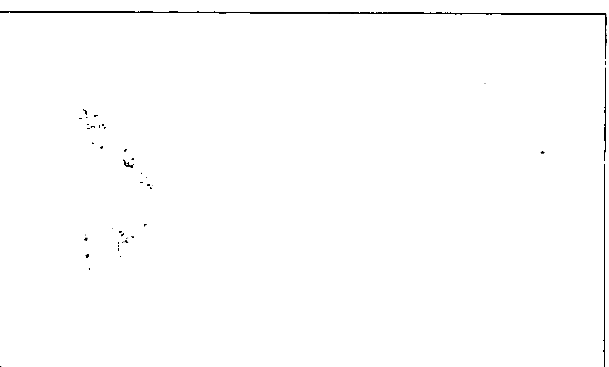

## 人生随字诀

殷志峰

三伏天，禅院的草地枯黄了一大片。
“快撒点草种吧！好难看哪！”小和尚说。
“等天凉了。”师父挥挥手，“随时！”

中秋，师父买了一包草籽，叫小和尚去播种。
秋风起，种子边撒、边飘。
“不好了！好多种子都被吹飞了。”小和尚喊。
“没关系，吹走的多半是空的，撒下去也发不了芽。”师父说，“随性！”

撒完种子，跟着就飞来几只小鸟啄食。
“要命了！种子都被鸟吃了！” 小和尚急得跳脚。
“没关系！种子多，吃不完！”师父说，“随遇！”

半夜一阵骤雨，小和尚早晨冲进禅房：“师父！这下真完了！好多草籽被雨冲走了！”
“冲到哪儿就在哪儿发！”师父说：“随缘！”

一个星期过去。原本光秃的地面，居然长出许多青翠的草苗。一些原来没播种的角落，也泛出了绿意。

小和尚高兴得直拍手。师父点头：“随喜！”

### 魅力提示：

> 随不是随便，是把握机缘，不悲观、不刻板、不慌乱、不忘形。随不是跟随，是顺其自然，不怨怒、不躁进、不过度、不强求。

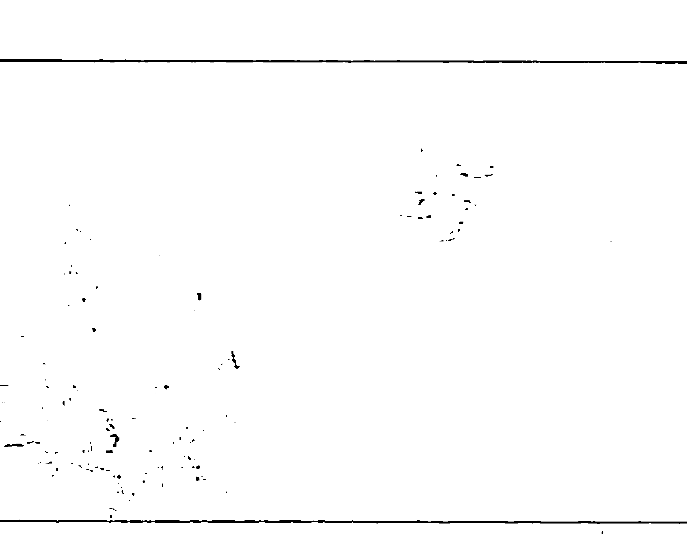

## 导演的选择

苏 岑

两个可爱的少女在路上走着，其中一个女孩较为高挑，她的表情配合着她讲述的内容，不知她们经历的事情有多么让人兴奋。她时而扬起修长的手臂比画着，时而调皮地吐吐舌头，她的女伴则不时地捂着肚子咯咯大笑。

在一旁观察良久的导演高兴不已，她们的表情和笑声多么富有感染力啊。两个女孩长得都很可人，尤其是那个高一点的，一双又大又亮的眼睛那么迷人！这不正是自己物色的演员吗？他立即带着摄影组走过去。

明白了导演的意图，意识到镜头正对着自己，那个高个子女孩立即收起了刚才兴高采烈的表情，把一双手端放在腹前，不难看出，她是在竭力让自己显得更高雅一些。她压抑着内心的喜悦，凝视着前面的镜头……

最后，导演选用了那个美丽高挑少女的女伴，一个之前相形之下略为逊色的女孩。

> “我这样决定只是因为她一听到有机会成为演员，就高兴地蹦跳起来，摇晃着她那位正在镜头前摆高雅姿态的朋友。”导演这样说，“一个不能自然表现自己的演员，会成为一个很糟糕的演员。”

### 魅力提示：

每个人在生活中都会扮演各种各样的角色。在学校你是学生或者老师，到了办公室你就必须做个干练的职员，一脸严肃的老板也有给可爱的儿子当马骑的时候……每个人都需要适时调换自己的角色，要想获得好人缘，自然更需要做一个角色切换自如的人。

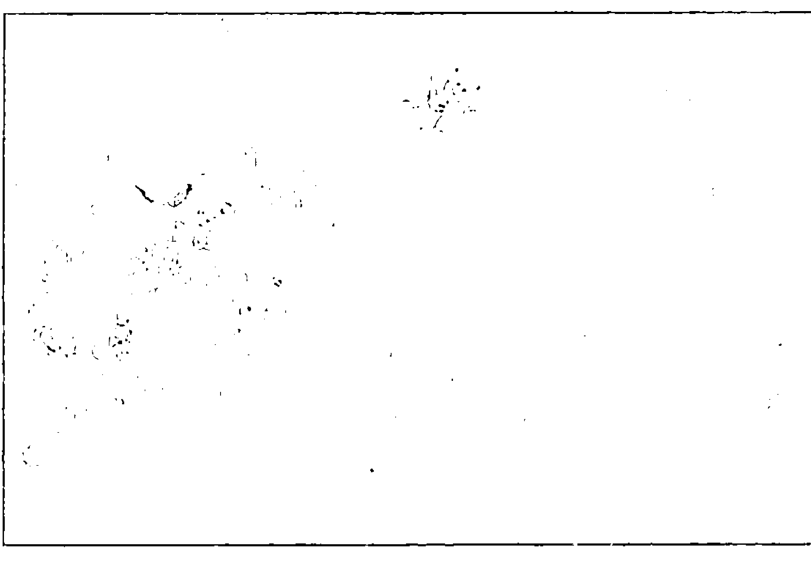

## 做人准则

云弓

一个年轻人去拜访一位大师，向他请教为人处世之道，大师给他讲了三个故事。

第一个故事：有两个强壮的青年，一拙，一巧。两人奉命在同一块地上各自挖井找水，很快两人都挖了两米深，但丝毫没有水的迹象。拙者继续在原地深挖，而巧者则换了个地方作新的尝试。终于拙者通过不懈的努力找到了汨汨的源泉，而不断地更换地点的巧者却一无所获。

年轻人听罢，若有所悟地点点头：“我明白，做人就应该持之以恒，不应该朝三暮四，蜻蜓点水，否则终将一事无成。”

大师只是笑笑。

第二个故事：还是这两个人，巧者在经过数次的尝试后，终于在一个地方发现了有水的迹象，于是深挖，最终找到水源。而拙者始终在原地，一如既往，埋头苦干，越挖越深，结果虽然付出了很多却始终没有找到水源。

“这？”年轻人有些迟疑，“我想也许人还应该不断地总结经验，而不应该刻板教条，更不应该执迷不悟。”

大师还只是笑笑。

第三个故事：两个人虽然都竭尽全力，但无论拙者挖多深，也无论巧者换多少地方，两个人都没有能找到水源。

“为什么？”年轻人疑惑起来，“那做人还有准则吗？”

“因为这个地方可能根本就没有水。”大师从容道，“其实为人也是如此，生活中没有一成不变的处世原则，一切都要靠你自己去摸索和体味。”

### 魅力提示：

世界上的任何事物都要变，你的形象当然也需要。

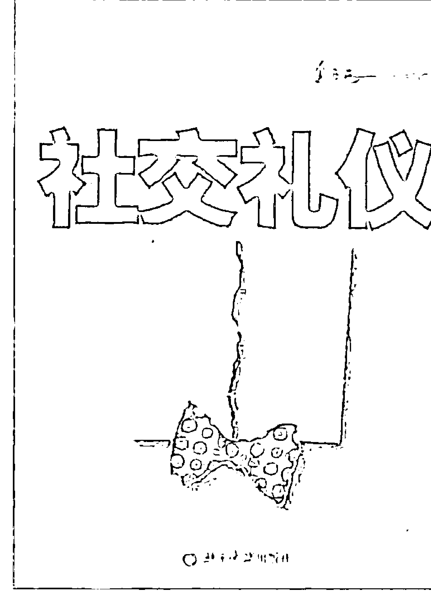

- 书名：社交礼仪
- 作者：金正昆 编著
- 出版社：北京大学出版社
- 出版时间：2005-08-01
- 印刷时间：2005-08-01
- ISBN：9787301093672
- 包装：平装

## 内容简介：

孔子曰：不学礼，无以立。 孟子曰：君子以仁存心，以礼存心。仁者爱人，有礼者敬人。爱人者，人恒爱之，敬人者，人恒敬之。礼仪是一种典章、制度，包括人的仪表、仪态、礼节等，用以规范人的行为、举止，调整人与人之间的关系。

随着社会的进步和文明的发展，人们的社会交往日益频繁。社交礼仪作为联系沟通交往的纽带和桥梁，显得更加重要。本书具体而详尽地介绍了社会交往中所必须遵循的各种社交礼仪，具有很强的实用性和可操作性。