# 魅力星座之射手座

# 散漫而追求自由的射手

他们性格开朗和善，说话率真，精力充沛，喜欢动物。木星人无所畏惧，人们喜欢与这些没有敌意的人相处。射手座的人极少发怒，除非他看到有人利用自己善良的性格达到卑劣的目的。他们会挑战权威，碰到冲突不会逃跑，也不会去搬救兵。他们拒绝承认生活的严肃性。

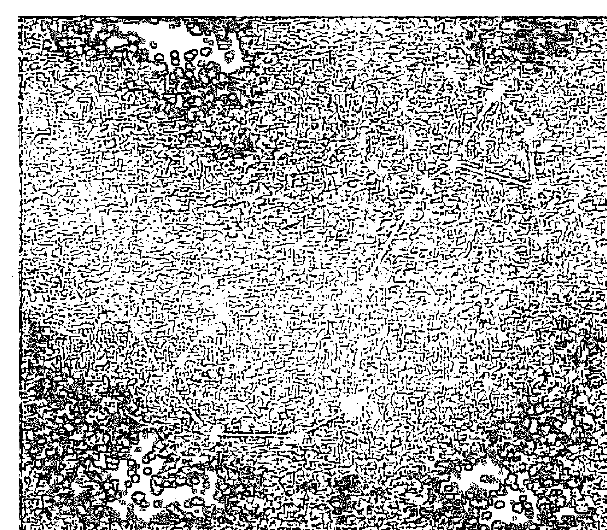

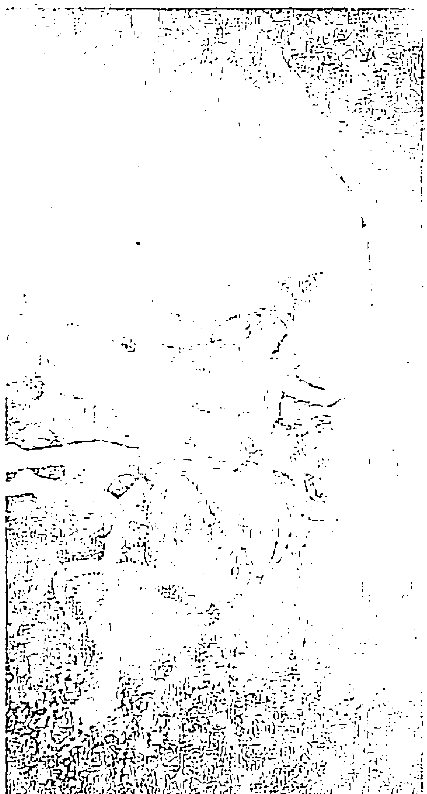

健康：射手座者是十二个星座中最有活力的人，喜欢运动，擅长奔跑，身材姣好，大多有一双修长健美的腿。射手座者在健康方面主要应对保持充足的睡眠时间和饮食适时适量多加注意。最佳休息方式是适当休闲。

学业：射手座者是一个太过于活泼好动的人，总是埋头于书本中对他是个很大的考验。当然，在现代社会，可以说是条条道路通罗马，大可不必整日为能否上大学，能否上名牌大学，或者攻读硕士、博士学位而忧心忡忡。但是，应该相信“知识就是力量”的教诲，无论通过怎样的途径实现自己的远大抱负，都要坚持不懈地积累知识，提高文化素质。

职业：射手座者性格比较开放，既喜欢发表意见，也擅长语言表达，如果经过专门训练，一般可以在外事交往、公共关系、商务洽谈、文化传播等方面有所建树。属射手座者还喜欢将乐趣寄寓于工作之中。所以，做个自由职业者，也不失为自己个性的选择。

## 婚姻：射手座者一生中的一切选择都有可能基于好梦想的天性，理想化成分居多，所以对外在的美比较苛求。一个属射手座的女性，可能会因与她第二次约会的男士仍然穿着上次见面时穿的衬衣，而将其淘汰出列。择偶条件高，使很多个射手座者虽谈恋爱很早，却迟迟成婚。也有的人逞一时之快而草率结婚。

## 经济：射手座者是一个头脑很灵活的人，他赚钱的门路很广，有许多人喜欢与他共事。但他对经商不是很感兴趣，总是不能全身心地投入。他潜意识里仿佛有一种更伟大的事业在等待着他去开拓，但是他头脑里又不能把那种事业具象化。他自己不办公司，也不在乎有没有公职，射手座者就像一条自由自在的小鱼儿，在大江大河里任意游玩。

## 事业：年少时他有时陷在好高骛远的误区里，设立的奋斗目标太遥远，难以企及。随着人生经验地日趋丰富，他仍然志向高远，不同的是，他学会了“千里之行始于足下”。他一个目标一个目标的趋进，每个目标的实现都会给他增添驱动力。当然，他所设立的金字塔尖上的那个远大目标，也许终其一生都不过是个美好的梦想而已，但他为之努力奋斗的过程，却为他的一生增添了光彩。

# MI星名堂agic

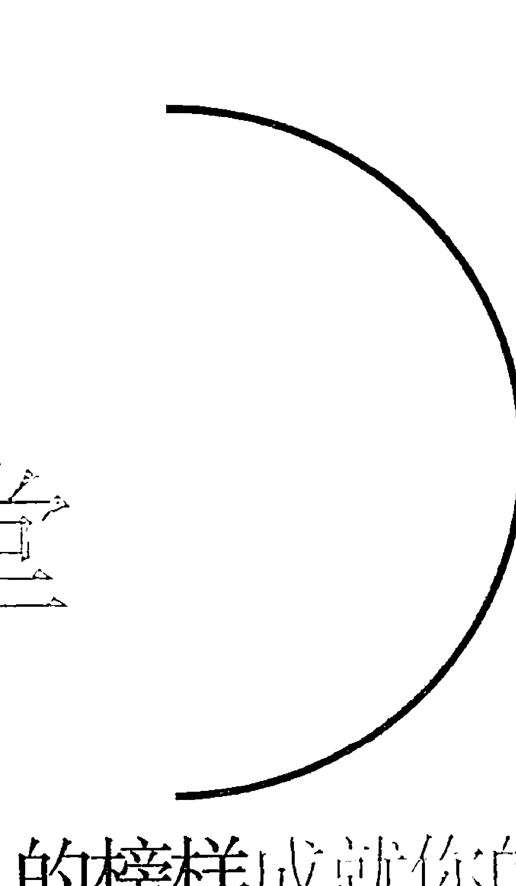

名人的榜样成就你的自信

# 华特·迪士尼小资料

- 本名：华特·艾利亚斯·迪士尼
- 生日：1901年12月5日
- 星座：射手座
- 职业：美国著名导演、制片人、编剧、配音演员、卡通设计者
- 事业成就：与其兄罗伊·迪士尼一同创办了世界著名的华特迪士尼公司

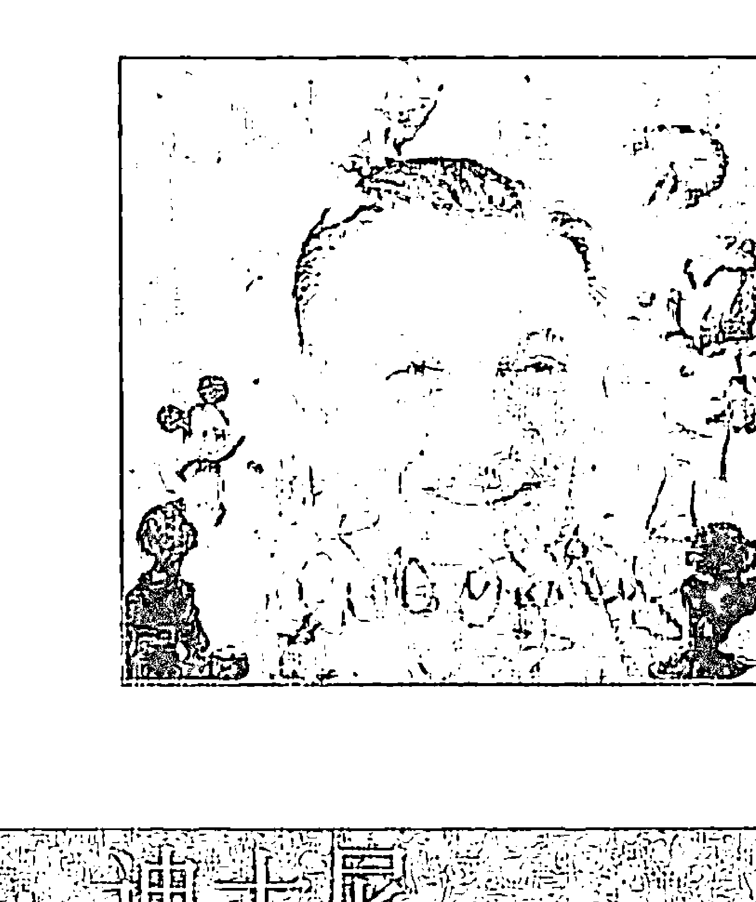

## 【早年生活】

童年对华特·迪士尼来说并不怎么好过，父亲伊利亚斯经常要求他和哥哥们打工，他们一旦表现不好就会挨打。

1918年，美国参加第一次世界大战。当年25岁的三哥罗伊马上应征入伍，到海外去参加战斗。同年7月，华特高中毕业后去看望在芝加哥城边上的大湖海军基地接受训练的罗伊，罗伊给华特讲了一些海外战争的故事，华特对参军的兴趣大大增加。当天他就决定要入伍。由于征兵人员对华特的年龄有疑问，要求他出示出生证明。由于找不到准确的证明，华特·迪士尼模仿父母的签字，成为了国际红十字会的一名志愿兵。

服完兵役后，华特回到了芝加哥。之后又回到小时候生活过的堪萨斯，在这里，华特真正开始了他的创业。到堪萨斯后，华特通过三哥罗伊的介绍在一家名叫普雷斯曼鲁宾的广告公司（Pesmen-Rubin Commercial Art Studio）做画家，由于公司对他的绘画能力有质疑，因此他只干了一个月就被解雇了。

1920年，华特和一位当时也在普雷斯曼鲁宾公司工作的同事乌布·伊沃克斯（Ub Iwerks）合伙成立了伊沃克斯—迪士尼商业美术公司（Iwerks-Disney），由于从一项业务中总共才挣到135美元，伊沃克斯—迪士尼商业美术公司成立不到一个月就停业了。

之后，华特加入了堪萨斯市广告公司，并在这里学到了拍摄电影和动画的基本技术。

华特建立了欢笑动画公司（Laugh-O-gram Films），并成功通过电影发行人弗兰克·纽曼发行公司制作的动画短片。1922年5月23日，华特征得乌布的同意，将伊沃克斯—迪士尼商业美术公司的剩余资产并入欢笑动画公司。在欢笑动画公司，华特制作了《小欢乐》（Laugh-O-Grams），并卖给了堪萨斯城的发行商。在制作动画《爱丽丝在卡通国》（Alice Comedies）的过程中，已经更名为纽曼欢笑动画的公司倒闭了。

1923年7月，华特·迪士尼到了洛杉矶，准备在好莱坞发展。

到洛杉矶后，华特·迪士尼和哥哥罗伊·迪士尼成立了迪士尼兄弟制片厂（Disney Brothers Studio），并接着制作《爱丽丝在卡通国》系列动画。

1925年7月25日，华特·迪士尼与制片厂的女员工莉莲·邦兹（Lillian Bounds）在爱达荷州结婚。度完蜜月回到好莱坞后，华特·迪士尼决定把迪士尼兄弟公司改名为华特·迪士尼制片厂，因为他认为单个名字比带有“兄弟”一词更有吸引力。

1926年，位于海布瑞恩的新片厂建成了。随后，迪士尼兄弟开始在新片场制作《幸运兔子奥斯华》（Oswald, the Lucky Rabbit）系列动画。

1927年《幸运兔子奥斯华》推出后反响不错，因此1928年2月，华特·迪士尼带着莉莲到纽约去找发行人查尔斯·明茨（Charles Mintz）讨论续签合同的问题。华特原本要提高价格，但明茨却要求华特降低价格，并告诉华特，他已经买通大部分《幸运兔子奥斯华》的制作人员，而且根据合同他拥有这系列动画的知识产权，这令华特惊慌失措。

在回好莱坞的火车上，华特·迪士尼突发灵感，创作出了一个以老鼠为原型的卡通形象——莫迪默（Mortimer Mouse），后来经过莉莲的建议，这个卡通形象改名为米奇（Mickey Mouse）。

1928年3月，华特开始了第一部米奇系列动画《飞机迷》（Plane Crazy）的制作。随后又制作了第二部《飞奔的高卓人》（Gallopin’ Gaucho）。由于这两部动画的反响很有限，当时有声电影又刚刚兴起，因此华特决定用帕特里克·鲍尔斯研究出的方法来给第三部米奇系列动画《威利汽船》（Steamboat Willie）配音，创作出了世界上第一部有声动画！1928年11月18日，《威利汽船》在纽约侨民影院进行首映，反响空前！这一天也被定为米奇的生日。

1929年，华特除了继续推出米奇系列动画外，为了增加流动资金，华特开始制作新的名为《糊涂交响曲》（Silly Symphony）的系列动画短片。

1930年，一个名叫乔治·博格费尔特的纽约商人为了送给自己的孩子圣诞礼物，向迪士尼片场购买了米奇和米妮形象在玩具、书籍和服装上的使用权。接着，华特·迪士尼授权纽约的拜博——兰出版公司出版发行米奇的出版物。

1931年，泰尼柯勒（Technicolor）公司发明了一种彩色电影拍摄技术。华特开始考虑拍摄彩色动画。并利用这种技术在1932年7月30日，推出了世界上第一部彩色动画《花与树》（Flowers and Trees）。同年，为了对华特·迪士尼创作出米奇表示感谢，电影艺术与科学学院授予华特奥斯卡特别奖。1933年，华特推出动画《三只小猪》（Three Little Pigs）。同年12月19日，华特的第一个女儿黛安·玛丽·迪士尼（Diane Marie Disney）出生。1934年6月9日，华特推出动画短片《聪明的小母鸡》（The Wise Little Hen），唐老鸭第一次出现。1935年2月23日，华特推出第一部彩色米奇动画《米奇音乐会》（The Band Concert）。1936年12月31日，华特的第二个女儿莎伦·梅·迪士尼（Sharon Mae Disney）出生（实际为迪士尼在1937年1月莎伦出生两周的时候领养）。

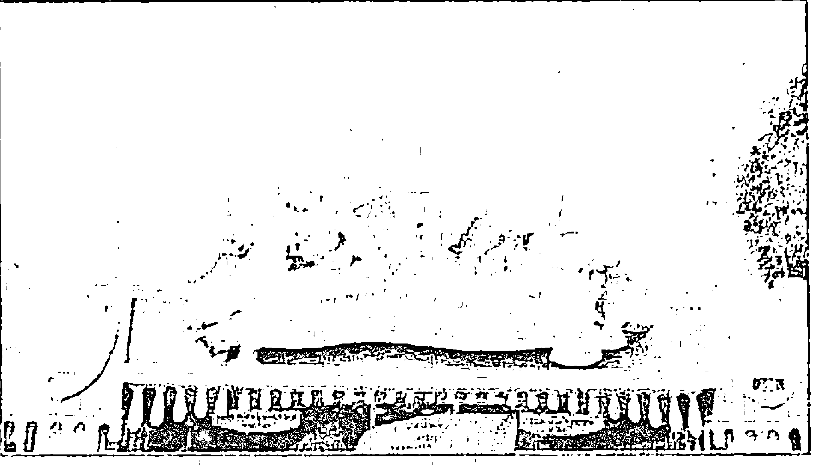

## 【动画黄金时代】

1937年12月21日，华特在好莱坞卡塞剧院（Carthay Circle Theater）正式推出了影史上第一部长篇动画电影《白雪公主与七个小矮人》（Snow White and the Seven Dwarfs）。华特在这部影片的制作过程中遇到了很多困难，影片花费大大超过预算，很多人都认为没有人会去看一部一个多小时全是动画的电影，有美国媒体甚至称制作《白雪公主与七个小矮人》是“迪士尼的愚蠢”（The Disney Folly）。然而影片上映后反响空前，在正式上映的第一场上，很多名人都起立鼓掌！接着在1938年，由于影片中的歌曲很受欢迎，华特发行了影片的原声带，这也是世界上第一张电影原声带。1939年，华特第二次被授予奥斯卡终身成就奖（荣誉奖），而且有一尊大金人加七座小金人。

1940年2月7日，华特推出第二部长篇动画电影《木偶奇遇记》（Pinocchio）。同年11月13日推出世界上第一部使用立体音响的电影《幻想曲》。

1941年，迪士尼制片厂的动画师由于不满华特的一些做法，比如要求他们加班、工作量大、不承认工会等，实行了大罢工，后来经过罗伊的工作，罢工停止。同年，华特作为美国政府的亲善大使到中南美洲访问，还由于创作出《幻想曲》第三次获得奥斯卡特别奖。这一年10月23日，华特推出第四部长篇动画《小飞象》（Dumbo）。另外，由于美国参加第二次世界大战，华特制片厂的大部分厂房都被美国军方用作军用。

在随后的战争期间，由于华特制片厂的不少员工都被征去参军了，除了发行了《小鹿斑比》（Bambi），华特无法继续拍摄长篇动画，因此开始拍摄中短篇幅的动画电影并制成合辑发行，如《致候吾友》（Saludos Amigos）、《三骑士》（The Three Caballeros）、《为我谱上乐章》（Make Mine Music）、《旋律时光》（Melody Time）和《米奇与魔豆》（Fun and Fancy Free）等。1946年11月12日，华特还推出了制片厂第一部真人与动画结合的电影《南方之歌》（Song of the South）。另外，在这个期间华特也为美国政府拍摄了不少宣传影片。

二战结束后，很多当年参军的员工回到片场，帮助华特制作影片。1950年2月15日，迪士尼再次推出了一部长篇动画《仙履奇缘》，从这开始，华特的动画制作进入黄金时期。在接下来的十多年里，华特推出了《小飞侠》、《小姐与流浪汉》、《睡美人》、《101忠狗》、《森林王子》（The Jungle Book）等多部脍炙人口的影片。1950年7月19日，华特推出了迪士尼第一部真人电影《金银岛》。在1964年8月29日，华特还推出了真人与动画结合由朱丽叶·安德鲁斯主演的电影《欢乐满人间》（Mary Poppins），这也是影史上迪士尼成就最高的电影。另外，华特也开始在电视上播出《迪士尼奇妙世界》（The Wonderful World of Disney）。

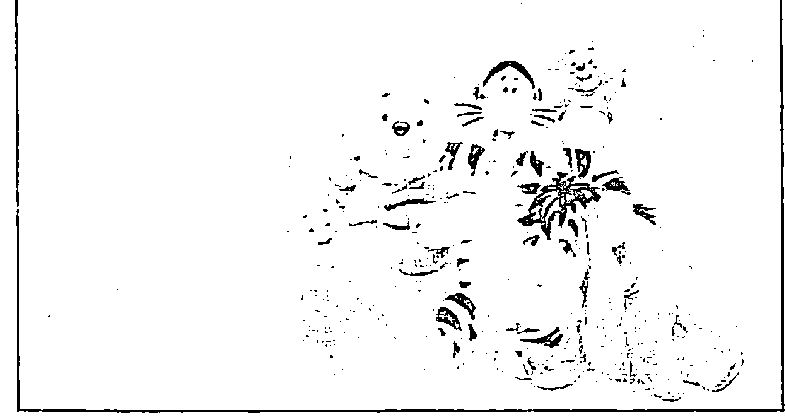

## 【创造主题乐园和晚年生活】

在这段时间里，华特还创建了世界上第一座迪士尼主题乐园——于1955年7月17日在美国加利福尼亚州阿纳海姆（Anaheim）建成的迪士尼乐园（Disneyland），并开始规划位于美国佛罗里达州奥兰多的迪士尼世界（Disney World，后来被罗伊·迪士尼改为华特·迪士尼世界）。

1966年12月15日，华特·迪士尼在他刚过完65岁生日后十天，由于肺癌医治无效，突发心肌梗塞逝世。华特的遗体被火化，骨灰被安葬在格伦代尔（Glendale）的森林墓地，一块杂草丛生的小块土地上，在那里，立着一块小小的纪念碑。由于华特逝世后的一切安排当时都没有公开，所以他遗体被速冻的谣言一直流传多年。

华特·迪士尼的一生就是不断追求梦想的一生，直到离开这个世界的最后一秒，他追求梦想的脚步都不曾停歇。

# Magic 魔力魔方

缺点改造提升你的魅力

# 魔方第一面
## 处事篇

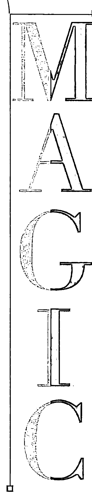

魅力失分
冲动

射手座是冲动派，做事不知道三思而后行。

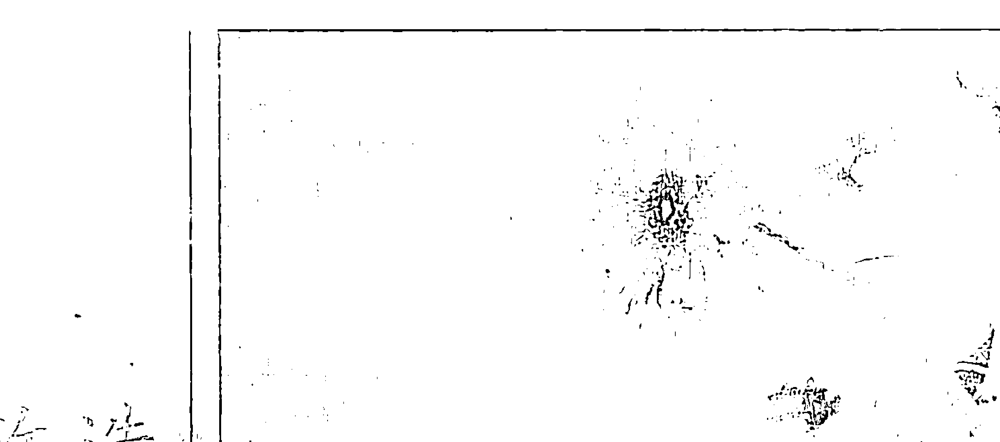

## 失败的激将法

王大庆

三国时期，蜀相诸葛亮亲自率领蜀国大军北伐曹魏，魏国大将司马懿采取了闭城休战、不予理睬的态度对付诸葛亮。他认为，蜀军远道来袭，后援补给必定不足，只要拖延时日，消耗蜀军的实力，一定能抓住良机，战胜敌人。

诸葛亮深知司马懿沉默战术的厉害，几次派兵到城下骂阵，企图激怒魏兵，引诱司马懿出城决战，但司马懿一直按兵不动。诸葛亮于是用激将法，派人给司马懿送来一件女人衣裳，并修书一封说：

> 仲达不敢出战，跟妇女有什么两样。你若是个知耻的男儿，就出来和蜀军交战，若不然，你就穿上这件女人的衣服。

> 士可杀不可辱。

这封充满侮辱轻视的信，虽然激怒了司马懿，但并没使老谋深算的司马懿改变主意，他强压怒火稳住军心，耐心等待。

相持了数月，诸葛亮不幸病逝军中，蜀军群龙无首，悄悄退兵，司马懿不战而胜。

**魅力提示：** 抑制不住怒火的人，往往伤人又伤己。如果司马懿不能忍耐一时之气，出城应战，那么或许历史将会重写。

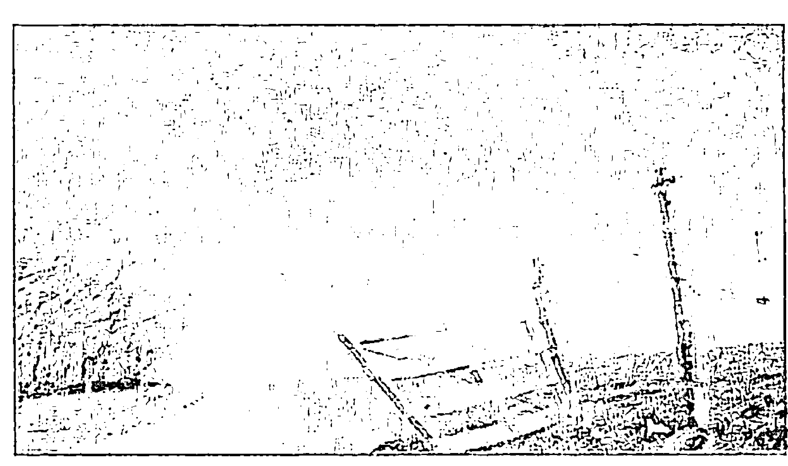

## 化愤怒为动力

哈耶克

汽车大王亨利·福特曾提到，自己之所以能有如此成就，是缘于在一家餐厅发生的一件小事。

根据亨利·福特的描述，在他还是一个修车工人的时候，有一次刚领了薪水，兴致勃勃地到一家他一直十分向往的高级餐厅吃饭。却不料，年轻的亨利·福特在餐厅里呆坐了差不多十五分钟，居然没有半个服务生过来招呼他。

最后，还是餐厅中的一个服务生看到亨利·福特独自一人坐了那么久，才勉强走到桌边，问他是不是要点菜。

亨利·福特连忙点头说是，只见服务生不耐烦地将菜单粗鲁地丢到他的桌上。亨利·福特刚打开菜单，看了几行，就听到服务生用轻蔑的语气说道：## 魅力星座智慧书之

菜单不用看得太详细，你只适合看右边的部分（意指价格），左边的部分（意指菜色），你就不必费神去看了！

亨利·福特惊愕地抬起头来，目光正好迎接到服务生满是不屑的表情，当下使得亨利·福特非常生气。恼怒之余，不由自主地便想点最贵的大餐。但一转念之间，又想起口袋中那一点点可怜微薄的薪水，不得已，咬了咬牙，亨利·福特只点了一个汉堡。服务生从鼻孔中“哼”了一声，傲慢地收回亨利·福特手中的菜单。口中虽然没有再说话，但脸上的表情却很清楚地让亨利·福特明白：“我就知道，你这穷小子，也只不过吃得起汉堡罢了！”

在服务生离去之后，亨利·福特并没有因为花钱受气而继续恼恨不休。他反倒冷静下来，仔细思考，为什么自己总是只能点自己吃得起的食物，而不能点自己真正想吃的大餐。

亨利·福特当下立志，要成为社会中顶尖的人物。从此之后，他开始朝梦想前进，由一个平凡的修车工人，逐步成为叱咤风云的汽车大王。

## 魅力提示

每一件不幸事件的背后，都相对隐藏着更大利益的种子，我们要领会上帝的安排。

### 掉在井里的狐狸和山羊

**伊索**

一只狐狸失足掉到了井里，不论它如何挣扎仍然不能成功地爬上去，只好待在那里。公山羊渴极了，四处找水喝，终于发现了这口井。它探着头，看见狐狸在井下，便问它井水好不好喝。狐狸觉得机会来了，心中暗喜，马上镇静下来，极力赞美井水好喝，说这水是天下第一井，清甜爽口，并劝山羊赶快下来，与它痛饮。

一心只想喝水的山羊信以为真，便不假思索地跳了下去，当它咕咚咕咚痛饮完后，就不得不与狐狸共同商议爬上去的办法。

狐狸早有准备，它狡猾地说：“我倒有一个方法。你用前脚趴在井墙上，再把角竖直了，我从你后背跳上井去，再拉你上来，我们不就都得救了吗？”

公山羊同意了它的提议。狐狸踩着它的后脚，跳到它背上，然后再从角上用力一跳，跳到了井沿上。狐狸上去以后，准备独自逃离。公山羊指责狐狸不信守诺言。狐狸回过头对公山羊说：“喂，朋友，你的头脑如果像你的胡须那样完美，你就不至于在没看清出口之前就盲目地跳下去。”

### 魅力提示

遇到事情，每个人的态度和做法各不相同，但只有先想后行的做法，才是明智的做法。记住这一点吧：凡事三思而后行。

### 克制冲动

佚名

斯坦德是一位经理，一大早起床，发现上班时间快要来不及了，便急急忙忙地开了车往公司急奔。

一路上，为了赶时间，斯坦德连闯了几个红灯，终于在一个路口被警察拦了下来，给他开了罚单。

这样一来，上班更是笃定迟到。到了办公室之后，斯坦德有如吃了火药一般，看到桌上放着几封昨天下班前便已交代秘书寄出的信件，斯坦德更是生气，把秘书叫了进来，劈头就是一阵痛骂。

秘书被骂得颇有莫名其妙的感觉，拿着未寄出的信件，走到总机小姐的座位，也是一阵狠批。秘书责怪总机小姐，昨天没有提醒她寄信。总机小姐被骂得心情恶劣之至，便找来公司内职位最低的清洁工，借题发挥，对清洁工的工作，没头没脑地，也是一连串声色俱厉的指责。清洁工底下，没有人可以再骂下去，她只得憋着一肚子闷气。下班回到家，清洁工见到读小学的儿子趴在地上看电视，衣服、书包、零食，丢得满地都是，当下逮住机会，便把儿子好好地修理了一顿。儿子电视也看不成了，愤愤地回到自己的卧房，见到家里那只大懒猫正盘踞在房门口，儿子一时怒由心中起、恶向胆边生，立即狠狠地一脚，把猫给踢得远远的。无故遭殃的猫，心中百思不解：“我这又是招谁惹谁啦？”这时，斯坦德正好从猫身边走过，谨慎的猫为防止再被人踢，迅速抓了一下斯坦德就溜，可怜的斯坦德被猫抓破了腿。

> 魅力提示：
> 冲动是魔鬼，人要是发脾气就等于在人类进步的阶梯上倒退了一步。

## 魅力链接

书名：我该如何停下来
作者：（美）格兰特（Grant, J. E.）著，刘翠玲 译
出版社：世界图书出版公司
出版时间：2005-10-1
印刷时间：2005-10-1
开本：21cm
ISBN：9787506274418
包装：平装

## 内容简介

我们都做过明知道并不好的行为——买太多的彩票，买负担不起的昂贵物品，或者为了记住一次假期而将酒店的毛巾带回家。对我们中的大部分人来说，这些行为只是暂时的好奇；但是对很多人来说，这些冲动是很强烈的。日复一日，他们在和无法抵抗的冲动做斗争，这些冲动影响了他们的家庭和工作。
美国著名的冲动控制障碍专家第一次将这个问题提到桌面上来。通过丰富的案例研究、鉴别这些障碍的操作性问卷，以及关于最新治疗的宝贵信息，《我该如何停下来》为那些从事这些行为的人以及关爱他们的人们提供了新希望。

## 魔方第一面 处事篇

## 魅力失分

**浪漫**
射手座的人散漫惯了，没有制度观念，对于他来说无故缺席、迟到是常有的事情。

### 临时搭起的桥

蒋光宇

1779年，德国哲学家康德计划到一个名叫珀芬的小镇，去拜访老朋友威廉·彼特斯。康德动身前曾写信给彼特斯，说自己将于3月2日上午11时之前到达。

康德3月1日就赶到了珀芬小镇，第二天早上租了一辆马车前往彼特斯的家。老朋友的家住在离小镇12英里远的一个农场里，小镇和农场中间隔了一条河。当马车来到河边时，细心的车夫说：“先生，实在对不起，不能再往前走了，因为桥坏了，很危险。”

康德下了马车，看了看桥，中间的确已经断裂了。河面虽然不宽，但水很深，而且结了冰。

“附近还有别的桥吗？”康德焦急地问。

车夫回答说：“有，先生。在上游6英里远的地方还有一座桥。”

康德看了一眼怀表，已经10时了。

“如果走那座桥，我们以平常速度什么时候可以到达农场？”

“我想大概得12时30分。”

康德又问：“如果我们经过面前这座桥，以最快速度什么时间能到达？”

车夫回答说：“最快也得用40分钟。”

康德跑到河边的一座很破旧的农舍里，客气地向主人打听到：“请问你的这间房子要多少钱才肯出售？”农妇大吃一惊：“您想买如此简陋的破房子，这究竟是为什么？”“不要问为什么，您愿意还是不愿意？”“那就给200法郎吧！”康德付了钱，说：“如果您能马上从破房上拆下几根长木头，20分钟内把桥修好，我将把房子还给您。”

农妇把两个儿子叫来，让他们按时修好了桥。马车平安地过了桥，飞奔在乡间的路上，10时50分康德赶到了老朋友的家。

在门口迎候的彼特斯高兴地说：“亲爱的朋友，您可真守时啊！”康德在与老朋友相会的日子里，根本没有对其提起为了守时而买房子、拆木头过河的经过。

后来，彼特斯在无意中听到那个农妇讲了此事，便很有感慨地给康德写了一封信。信中说道：“您太客气了，还是一如既往地守时。其实，老朋友之间的约会，晚一些时间是可以原谅的，何况您还遇到了意外。”

一向一丝不苟的康德，在给老朋友的回信中写了这样的一句话：“在我看来，在一定意义上可以说，无论是对老朋友，还是对陌生人，守时就是最大的礼貌。”

### 魅力提示

守时是一种美好的品质，它是人们彼此建立信任的基础。

### 请你做好最后一天

傅友福

那一年，我力挫群雄，以绝对优势应聘到一家台资公司任人事助理。一开始，我便全身心投入到工作中，而且自我感觉良好。可是没几天后，这种新鲜感及喜悦之情便荡然无存了。我不时有逃离监狱又进牢房的感觉：时间太紧，事务繁忙，没有一点自由空间，公司规定又多。以前在港商公司散漫惯了，一下子无法适应这种环境。更要命的是，公司有三个经理，每件事都要向他们一一汇报，否则，另一个经理问起来，一定有你好受的。

就在这个节骨眼上，我犯了一个错误。台商协会通知总经理下午两点开会，当时总经理不在办公室，我便向另一个经理作了汇报。也许那经理是事不关己，高高挂起的心态，没有转告总经理，结果总经理没有接到开会的通知。第二天早上，总经理对我吹胡子瞪眼睛，狠狠责备了我：这点小事也做不好！

我何曾受过这等窝囊气？咱惹不起还躲得起呢。我拉开抽屉，拿出了纸，龙飞凤舞地写着，准备送给总经理。

总管刘生拦住了我，并拿走我的辞职信，锁进他的抽屉里。因当时他是我的顶头上司，我也不好再说什么。

刘生抽了一根烟，眯起眼睛，意味深长地对我说：“傅生，我知道你是能胜任这份工作的，也许他们错怪了你，你可以走人，找工作还不容易。但你不可以现在就走，你要是现在就走的话，那不就证明了你没有工作能力，是因为自己做不好，让别人炒了鱿鱼？我跟你说，失去一份工作并不可怕，可怕的是好好的又背上一个不能胜任的罪名。不如做好最后一天吧，让他们满意了你再走。到时候你走了是你炒了他们，而不是他们炒了你，别人也会说你有骨气。你说呢？”

我细想一下，还真是那么回事，便听从了刘生的劝告，忍住心中的愤懑，决心做好最后一天再走。

可是，第二天，我又出了个差错，把经理要批阅的文件送到了总经理的案上。经理说我做事不细心，马大哈。

第三天，一份发给台北的传真打错了一个字，另一个经理说我太马虎，那个字要是款项的数字，公司损失不就惨了？重打！

第四天，经理要我通知各部门主管到办公室开会，我又把五金部的主管给通知漏了，总经理毫不客气地数落我一番……

我清楚地记得，那是第十二天，我早早就作好了准备，当天的工作总有条不紊地进行着。那天，总经理也好，经理也好，他们交代的事情我都一一不漏地按时完成。临下班时，一切总算平安无事了。就在这个时候，总经理把我叫到办公室，笑着对我说：“做得不错嘛，年轻人就要这样，迅速改正错误，丢掉散漫的毛病，适应新的工作环境。其实呢，你很有悟性，照这样下去，前途无量啊！好好做，公司不会亏待你。”前途无量！好的，有你这句话，我就可以脱离苦海了。

下班后，我找到了刘生，告诉他我已做好了最后一天，总经理还夸了我。刘生听完我的话，依然眯起眼睛说：“你想要回那张辞职信吗？”我笑着点点头。

他也笑了，笑得有点狡诈：“你能做好这一天，你就不能再做好下一天，再下一天，再下下一天……你已经能胜任这份工作了，干吗还要辞职，有病啊。”我又听从了刘生的话，终于没有辞职。工作中，每一天都让我当成是最后一天，做得好好的。如今，我还在这家台资公司做，而且在刘生走后，升任到行政主任，工作也越来越顺心了。

后来我仔细一想，恍然大悟了：我上了刘生的“当”了！能做好最后一天，为什么还要走？

### 魅力提示

把每一天当成是你在这个单位的最后一天，并把这一天做好，你就不会觉得他们是在故意刁难你了，你散漫的毛病也会离你远去，你已经是个能胜任任何工作的人。

## 魅力改造 魔方

### 迟到是你自己的事

陶陶

那年她刚从大学毕业，分配在一个离家较远的公司上班。每天清晨7时，公司的专车会准时等候在一个地方接送她和她的同事们。

一个骤然寒冷的清晨，她关闭了闹钟尖锐的铃声后，又稍微赖了一会儿暖被窝——像在学校的时候一样。她尽可能最大限度地拖延一些时光，用来怀念以往不必为生活奔波的寒假日子。那一个清晨，她比平时迟了五分钟起床。可是就是这区区五分钟却让她付出了代价。

那天当她匆忙中奔到专车等候的地点时，已是7点过5分。班车开走了。

就在她懊悔沮丧的时候，突然看到了公司的那辆蓝色轿车停在不远处的一幢大楼前。她想起了曾有同事指给她看过那是上司的车，她想真是天无绝人之路。她向那车走去，在稍稍犹豫后打开车门悄悄地坐了进去，并为自己的聪明而得意。

为上司开车的是一位慈祥温和的老司机。他从反光镜里已看她多时了。这时，他转过头来对她说：“你不应该坐这车。”

“可是我的运气真好。”她如释重负地说。

这时，她的上司拿着公文包飞快地走来。待他在前面习惯的位置上坐定后，她才告诉她的上司说，班车开走了，想搭他的车子。她以为这一切合情合理，因此说话的语气充满了轻松随意。

上司愣了一下，但很快明白了一切。他坚决地说：“不行，你没有资格坐这车。”然后用无可辩驳的语气命令，“请你下去！”

她一下子愣住了——这不仅是因为从小到大还没有谁对她这样严厉过，还因为在这之前她没有想过坐这车是需要一种身份的。当时就凭这两条，以她过去的个性是定会重重地关上车门以显示她对小车的不屑一顾而后拂袖而去的。可是那一刻，她想起了迟到在公司的制度里意味着什么，而且她那时非常看中这份工作。于是，一向聪明伶俐但缺乏生活经验的她变得从来没有过的软弱。她用近乎乞求的语气对上司说：“我会迟到的。”

“迟到是你自己的事。”上司冷淡的语气中没有一丝一毫的回旋余地。

她把求助的目光投向司机。可是老司机看着前方一言不发。委屈的泪水终于在她的眼眶里打转。然后，她在绝望之余为他们的不近人情而固执地陷入了沉默的对抗。

他们在车上僵持了一会儿。最后，让她没有想到的是，她的上司打开车门走了出去。

坐在车后座的她，目瞪口呆地看着有些年迈的上司拿着公文包向前走去。他在凛冽的寒风中拦下了一辆出租车，飞驰而去。泪水终于顺着她的脸颊流淌下来。

老司机轻轻地叹了一口气：“他就是这样一个严格的人。时间长了，你就会了解他了。他其实也是为你好。”

### 魅力提示

是的，迟到是你自己的事，你总要为自己的散漫付出代价。

### 原则

王晓洁

我曾经是一个漫不经心的人，对生活的态度是“不必太认真”，凡事过得去就行，无论对人还是对己。但那短短几分钟的经历，竟改变了我的这个态度。

那是1993年的除夕之夜，我在德国的明斯特参加学生的春节晚会。晚会结束时，整个城市已经睡熟了，这种时候，谁不想早点儿到家呢？我和先生走得飞快，就差跑起来了。刚走到路口，红绿灯就变了。迎向我们的行人灯转成了“止步”。

如果在另外的时候，我们肯定停下来等绿灯。可这会儿是深夜了，马路上没有一辆车，即使有车驶来，500米外就能看见。我们没有犹豫，走向马路……

“站住。”身后，飘过来一个苍老的声音，打破了沉寂的黑暗。我的心悚然一惊，原来是一对老夫妻。

我们转过身，歉然地望着那对老人。

老先生说：“现在是红灯，不能走，要等绿灯亮了才能走。”

我的脸忽地烧了起来。我喃喃地道：“对不起，我们看现在没车……”

老先生说：“交通规则就是原则，不是看有没有车。在任何情况下，都必须遵守原则。”

从那一刻起，我再没有闯过红灯。我也一直记着老先生的话：“在任何情况下，都必须遵守原则。”

### 魅力提示

贪图方便的人，总以为蔑视了原则，自己就获得了优先他人的便利。结果呢，他给别人制造了麻烦，也给自己带来了麻烦。

## 魅力链接

书名: 人生的游戏规则: 希恩夫人的生存智慧
作者: (美) 弗罗伦斯·S·希恩著, 薛杰译
出版社: 中国发展出版社
出版时间: 2004-11
开本: 21cm
ISBN: 7800877612
包装: 平装

## 内容简介

这是一本在美国经久不衰的经典畅销书。作为一位颇有影响的精神治疗大师，希恩夫人将自己生命的大部分时间花费在治疗人们心灵的创伤、认识积极的态度与获取成功和幸福的关系上，帮助人们实现自己的愿望。希恩夫人利用《圣经》故事，让人们明白做人的道理和准则。她认为人生就是一种博弈，存在各种规则，我们只有遵行这些规则，才能获得幸福，找到通往成功之道。

## 星座第一面 处事篇

## 魅力失分

**粗心大意**
射手座的人神经大条，粗心大意是他常常犯错的原因。

### 最好的介绍信

谢惠平

一位先生在报纸上登了一则广告，要雇一名勤杂工到他的办公室做事。约有50多人闻讯前来应聘，但这位先生却只挑中了一个男孩。

“我想知道，”他的一位朋友问道，“你为何喜欢那个男孩，他既没带一封介绍信，也没受任何人的推荐。”

“你错了，”这位先生说，“他带来许多介绍信。他在门口蹭掉脚下带的土，进门后又随手关上了门，说明他做事小心仔细。当看到那位有残疾的老人时，他立即起身让座，表明他心地善良、体贴别人。进了办公室他先脱去帽子，回答我提出的问题干脆果断，证明他既懂礼貌又有教养。”

“其他所有人都从我故意放在地板上的那本书上迈过去，而这个男孩却俯身拾起那本书，并放回桌子上。当我和他交谈时，我发现他衣着整洁，头发梳得整整齐齐，指甲修得干干净净。难道你不认为这些小节是极好的介绍信吗？我认为这比介绍信更为重要。”

### 魅力提示

有时，太多的言语介绍并不能体现出你的素养，相反，你的行动有时却是自身所具有的涵养的最有力证明。

### 重要的尾数

李振福

一个年轻人到某公司应聘临时职员，工作任务是为这家公司采购物品。招聘者在一番测试后，留下了这个年轻人和另外两名优胜者。随后，主持人提了几个问题，每个人的回答都各具特色，主持者很满意。

面试的最后一道题是笔答题。题目为：假定公司派你到某工厂采购2000支铅笔，你需要从公司带去多少钱？几分钟后，应试者都交了答卷。

第一名应聘者的答案是120美元。主持人问他是怎么计算的。他说，采购2000支铅笔可能要100美元，其他杂费就算20美元吧！主持人未置可否。

第二名应聘者的答案是110美元。对此，他解释道：2000支铅笔需要100美元左右，另外可能需用10美元左右。主持人同样没表态。

最后轮到这位年轻人。主持人拿起他的答卷，见上面写的是113.86美元，见到如此精确的数字，他不觉有些惊奇，立即让应试者解释一下答案。这位年轻人说：“铅笔每枝5美分，2000支是100美元。从公司到这个工厂，乘汽车来回票价4.8美元；午餐费2美元；从工厂到汽车站为半英里，请搬运工人需用1.5美元……因此，总费用为113.86美元。”主持人听完，欣慰地笑了。这名年轻人自然被录用了，这名年轻人就是后来大名鼎鼎的卡耐基。

### 魅力提示

在做任何事情的时候，我们都应该以严谨细致的作风去认真对待，这样你将会得到别人的信任，并且获得意想不到的效果。

## 差错

佚名

一个公司的会计因为账目出了差错，连续三个星期夜以继日地查账，但一直也没有找到出错的地方。账面上明明有600元的亏空，就是找不出哪里出了差错。她简直就快要疯了。

财务主管看到她如此的疲惫和焦灼，于是向她询问了情况后，让她把账本交给了他。主管在办公室里仔细地核对了每一笔收支，终于发现了问题所在——有一货款应该是1050元，却被记成了1650元。

当主管把这个明显的差错摆在会计面前时，会计仔细一瞧，这才发现：原来是一根苍蝇腿正好粘在了“1050”第一个“0”的左上角，于是1050就变成了1650了。

> > **魅力提示：**
>
> 很多事情的成败往往取决于一个小小的细节，细心的人才能把握全局。

## 一个马掌钉

**王 丽**

理查三世和亨利准备决一死战，这场战斗将决定谁来统治英国。战斗开始前的一天早上，理查派一个马夫去备好自己最喜欢的战马。
“快点给它钉掌，” 马夫对铁匠说， “国王希望骑着它打头阵。”
“你得等等，”铁匠回答，“前几天给所有的战马都钉了掌，铁片没有了。”
“我等不及了。” 马夫不耐烦地叫道。
铁匠埋头干活，从一根铁条上弄下四个马掌；把它们砸平、整形，固定在马蹄上，然后开始钉钉子。钉了三个掌后，他发现没有钉子来钉第四个掌了。
“我缺几个钉子，” 他说， “需要点儿时间砸两个。”
“我告诉过你我等不及了。” 马夫急切地说。
“我能把马掌钉上，但是不能像其他几个那么牢固。”
“能不能挂住？”马夫问。
“应该能，”铁匠回答，“但我没把握。”
“好吧，就这样，”马夫叫道，“快点，要不然国王会怪罪的。”

两军交上了锋，理查国王冲锋陷阵，鞭策士兵迎战敌人。突然，一只马掌掉了，战马跌倒在地，理查也被掀翻在地上。受惊的马跳起来逃走了，国王的士兵也纷纷转身撤退，亨利的军队包围了上来。

> > “马！一匹马，我的国家倾覆就因为这一匹马。”

> > 少了一个铁钉，丢了一只马掌。少了一只马掌，丢了一匹战马。少了一匹战马，败了一场战役。败了一场战役，失了一个国家。

## 魅力提示：

细心做好每一件事，切不可盲目大意，毫不在乎，因为有时候一个小小的错误就可能导致一个无法挽回的严重的失败。

## 魅力链接

- 书名：粗做人 细做事
- 作者：马燕 编著
- 出版社：中国商业出版社
- 出版时间：2009-8-1
- 印刷时间：2009-8-1
- 开本：16开
- ISBN：9787504464958
- 包装：平装

## 内容简介：

一个人不管有多聪明，多能干，背景条件有多好，如果不懂得如何做人、做事，那么他最终的结局肯定是失败。

做人做事是一种艺术，更是一门学问。很多人之所以一辈子碌碌无为，那是因为他活了一辈子也没弄明白该怎样去做人做事。

想要拥有美好的人生，就要做到粗做人，细做事。而且这粗和细应该是粗中有细、细中见粗、相辅相成、相得益彰的，生活就在这粗与细的相伴中实现幸福美满。

## 魅力第一面
处事篇

## MAGIC

魅力失分
情绪不定
射手座的人没有定性，热得快，冷得也快。

## 魅力改造

## 魔力改造

## 贵族学校里的拿破仑

佚名

拿破仑出生于穷困的科西嘉没落贵族家庭，他父亲送他进了一个贵族学校。他的同学都很富有，大肆讽刺他的穷苦。拿破仑非常愤怒，却一筹莫展，屈服在威势之下。就这样，他忍受了五年的痛苦。但是每一次嘲笑，每一次欺侮，每一种轻视的态度，都使他增加了决心，他发誓要做给他们看看，证明自己确实是高于他们。

他心里暗暗计划，决定利用这些没有头脑却傲慢的人作为桥梁，去争取自己的富有和名誉。当他接受第一次军事征召时，必须步行到遥远的发隆斯去加入部队。等他到了部队，看见他的同伴正在用多余的时间追求女人和赌博。而他的贫困也使他失掉了争取到的职位。于是，他改变方针，用埋头读书的方法，去努力和他们竞争。

读书是和呼吸一样自由的，因为他可以不花钱在图书馆里借书读，这使他得到了很大收获。他并不读没有意义的书，也不是以读书来消遣自己的烦闷，而是为自己将来的理想作准备。

他下定决心，要让全天下的人知道自己的才华。因此，他就以这种决心作为图书的选择范围。他住在一个既小又闷的房间里，在这里，他脸无血色，孤寂、沉闷，但是他却不停地读下去。

几年艰苦的用功，他的读书记录如果印刷出来多达四百多页。他想象自己是一个总司令，将科西嘉岛的地图画出来，地图上清楚地指出哪些地方应当布置防范，这是用数学方法精确计算出来的。因此，他数学的才能获得了提高，这使他第一次有机会表现他能做什么。

长官看见拿破仑的学问很好，便派他在操练场上做一些工作，这是需要极复杂计算能力的。他的工作做得极好，于是他获得了新的机会，开始走上有权势的道路。

这时，一切的情形都变了。从前嘲笑他的人，现在都拥到他面前来，想分享一点他得到的奖金；从前轻视他的人，现在都希望成为他的朋友；从前挖苦他矮小、无用、死用功的人，现在也都改为尊重他。他们都变成了他的忠心拥戴者。

> 魅力提示：
坚韧的力量是巨大的：它可以使穷苦的孩子努力奋斗，最终找到生活的出路；使一些残疾人，也能够靠自己的辛劳，创造惊人的奇迹。拥有坚韧的性格，就会拥有成功的资本。

## 成功不是来自最后的一击

佚 名

你知道石匠是怎么敲开一块大石头的吗？

石匠所拥有的工具只不过是一个小铁锤和一只小凿子，可是这块大石头却硬得很。当他举起锤子重重地敲下第一击时，没有敲下一块碎片，甚至连一丝凿痕都没有，可是他并不以为意，继续举起锤子一下再一下地敲，一百下、两百下、三百下，大石头上依然没出现任何裂痕。

可是石匠还是没懈怠，继续举起锤子重重地敲下去，路过的人看他如此卖力而不见成效却还继续硬干，不免窃窃私语，甚至有些人还笑他傻。石匠并未理会，他知道虽然所做的还没看到立即的成效，不过那并非表示没有进展。

他又挑了大石头的另一个地方敲，一锤又一锤，也不知道是敲到第五百下还是第七百下，或者是第一千零几下，巨大的石头终于在他最后一击中，裂成了碎片。

这时，有路人看见，禁不住为他鼓掌。他回头平静地望了一眼，继续敲起另一块石头。

> 魅力提示： 成功不是来自最后的一击。对石匠而言，巨石的碎裂，来自自己的每一次敲击。对于成功而言，也正是如此。一而再，再而三地连续努力，直到敲碎一切横在成功旅途上的巨大石块。

## 魅力改造

晨芳

## 上帝的烛台

卡洛琳·李

上帝要从一些小孩里面挑选几个出来让他们成为天使。他来到人间，给每个小孩一人一个神奇的烛台。叫他们保持烛台光亮，一尘不染，说只有这样烛光才会一直不灭。等过些日子，他再来取回烛台，如果谁的烛台上的烛光没有灭的话，谁就能够成为天使。孩子们很高兴，每一天都小心又仔细地将烛台擦得很干净，他们期待着成为天使。日子很快过去，已经两个多月了，上帝还是未出现，除了少数没有耐心的孩子的烛台灭了，大多数孩子的烛光仍然明亮。有人说上帝会在第一百天时到来。到了这天，孩子们很早就怀着激动的心情等待着上帝的到来。可是，一直等到天黑，上帝也未出现。很多孩子都说上帝是骗子，生气地把烛台扔进了树林里、水沟里。

## / 魅力星座智慧书之射手座

又过了两个月，上帝还是没有来。孩子们每天在一起游戏、玩耍，不再去管烛台了。可是有一个被他们称为“笨笨”的小孩，依然坚持每天把烛台擦拭得干干净净。

在第二百天的时候，上帝来了，他来收回烛台并把天使带到天庭。其他的小孩也希望变成天使，纷纷找出烛台来，可是，无论如何也点不燃了。而“笨笨”的烛光一直未灭，所以只有她长出了一对洁白的翅膀——成了一位美丽的小天使。

> 魅力提示：
机遇只会垂青那些不仅仅有愿望而且能够实实在在去做的人。只有为愿望坚持不懈地去努力，才是达到目标的惟一途径，我们的生活如此，事业亦如此，懒惰与投机者绝对无法享受成功的欢乐。

## 月台下的石油

佚名

石油公司有个负责勘探的工程师，他在气候干燥高温的西部沙漠勘探到了石油，于是，公司让他带队前往沙漠开采石油。

整整过了一年，别说开采到石油，连水也没钻到半滴。而公司却因此损失不小，因此，决定终止他们的工程，命他们即刻返回。

无功而返，工程师和他的队友们沮丧地坐在火车站的月台上等车。无聊的工程师拿着勘探石油的电子设备，在月台上四处探察，没想到，仪器上竟然显示月台下蕴藏着大量的石油。工程师气愤地将它摔在地上，恼火地骂道：“这地方我钻了那么多井，一滴油都没有，要你还有什么用！”

后来，有人在火车站的月台底下发现确实有石油；再后来，这里成了一片钻井林立的大油田。

> > **魅力提示：**
>
> 许多人常常与成功失之交臂，不是因为他们没有能力，而是因为不能够坚持到底。

## 魅力链接

- 书名：引爆生命力
- 作者：许伯恺，吴锦珠 著
- 出版社：石油工业出版社
- 出版时间：2008-2-1
- 印刷时间：2008-2-1
- 开本：16开
- ISBN：9787502164379
- 包装：平装

## 内容简介：

在全亚洲畅销书作家“信义之星”吴锦珠小姐的协助下，这本《引爆生命力》终于问世了。这本书告诉你的是一个没有背景的年轻人，如何背井离乡到中国内地打拼，成为中国第一潜能激发大师的过程，而且告诉你，如何才能开发出你自身巨大的潜能。在此书中，你能学到其他一万本书里学不到的成功秘密，也是追求成功时最重要、最关键的秘密。

人生失败的元凶是八大癌症：三分钟热度癌、找借口癌、抗拒提高收入癌等等，本书教你如何与这些癌作战，激发你最大的潜能，从而走向成功。

## 魔方第一面
处事篇

## 魅力失分

用逃避现实

爱看富含逻辑的超大本书是射手的特色，说到哲学与真理眼睛就发亮，但当他把所有的聪明都用在为生活的失败辩护时，那套似是而非的理论令人为之气结。

## 巧把缺点变为亮点

佚名

美国著名演说家罗伯特，头秃得很厉害，在他头顶上很难找到几根头发，在他过60岁生日那天，有许多朋友来给他庆贺生日，妻子悄悄地劝他戴顶帽子，罗伯特却大声说：“我的夫人劝我今天戴顶帽子，可是你们不知道光着头有多好，我是第一个知道下雨的人！”

> > 魅力提示：
> 人的一生，谁都难免会有失误，谁身上都难免会有缺陷，谁都难免会遇上尴尬的处境，有的人喜欢藏藏掩掩，有的人喜欢辩解。其实越是藏藏掩掩的心理越是失衡，越是辩解，却会越辩越丑。最佳的方法就是将其当做一种成长的经历，坦然面对。

## 坦言自己的错误

佚名

美国总统罗斯福于1912年在新泽西州的一个小镇集会上，向文化层次较低的乡下人发表了一篇演讲。

当他在这篇演讲中说到女子也应踊跃参加选举时，听众中忽然有人大声喊道：“先生！这句话和你五年前的意见不是大相径庭了吗？”

罗斯福听到这个问题，回想起自己5年前说的话，不是回避或者掩饰，而是聪明地回答道：“可不是吗？五年前，我确实另有一种主张的，可是现在我已深悟我那时的主张是不对的，你们可以接受我的改变吗！”

他的这种坦白、忠实、诚恳、亲切的回答，不但使那位问话的人获得了满意的答复，就是其他听众也丝毫觉察不出他有什么不安的情绪。

于是，台下响起了经久不息的掌声，听众们为这个勇敢的人喝彩。他的这种坦然面对自己犯过的错误的涵养让人敬佩，也让人们更加地信任他。

## 魅力提示：

每个人都会犯错误，这个道理人们都懂。当别人犯错误时，我们总是希望他们能够承认并加以改正。可是当这种事发生在自己身上时，很多人都采取回避态度：或者为保全颜面，或者出于承认错误则有不如人的感觉。于是很多时候，人们不愿意承认自己的错误。这就造成了人们相互交往的障碍，因为每个人都坚持自己是对的，而各自的观点分明是不同的，甚至是对立的，于是便留下了埋怨、不满和争执，轻则影响相互之间的关系，重则影响自己的做人形象。

## 我替你付 5 美元

文 枫

在美国，信用卡公司规定，开户、销户都是免费的，更换磨损了的卡片却要缴手续费5美元。

中国一位留学生在去更换卡片被要求交钱时便提出：既然如此，我干脆先销户，再重新开好了。

信用卡公司的工作人员听了，便觉得不可思议，他说：“从来没有人向我们这样提出过问题。”

但逻辑上又觉得留学生所讲是无可辩驳的，便说：“好了好了，我替你付这5美元吧。”

于是这位同胞免费更换了卡片。

然而，他在那位工作人员眼中成了贪小便宜的人，因为这5美元，他的形象就这样被毁。

> **魅力提示：**
爱耍小聪明的人总有一天会吃大亏，它会成为你成功路上的绊脚石，要知道往往聪明反被聪明误。

## 狡猾是一种冒险

托马斯·沃特曼

斯特曾在印度生活过，他回来对朋友说了这样一件事：
从前，在印度，有些穷苦的人为了挣点钱，不得不冒险去猎蟒。
那是一种巨大的蟒，一种以潮湿的岩洞为居穴的蟒，背部有黄色的斑纹，腹部呈白色，喜吞尸体，尤喜吞人的尸体。于是它被某些部族的印度人视为神明，认定它们是被更高级的神明派遣来的承担着消化掉尸体的使命的特使。因此，人死后，往往抬到有蟒占据的岩洞口去，祈祷尽快被蟒吞掉。为使蟒吞起来更容易，要在尸体上涂满油膏。油膏散发出特别的香味儿，蟒一闻到，就爬出洞了……

为生活所迫的穷苦人，企图猎到这种巨大的蟒，就佯装成一具尸体，朝自己身上涂遍油膏，潜往蟒的洞穴，直挺挺地躺在洞口。

蟒就在洞中从人的双脚开始吞，人渐渐被吞入，蟒躯也就渐渐从洞中伸出来。如果不懂得这一点，把头朝向洞口，那么顷刻便没命了，猎蟒的企图也就成了痴心妄想了……

通常它吞一个涂了油膏的大人，需要 20 分钟。

猎蟒者在它将自己吞了一半的时候，也就是吞到腰际时，猝不及防地坐起来，以瞬间的速度，一手掀起蟒的上颚，另一手将刀用全力横向一削，于是蟒的半个头，连同双眼，就会被削下来。自家的生死，完全取决于那一瞬间的速度和力度。蟒突然间受到剧烈疼痛的强刺激，便会将已经吞下去的半截人体一下子吐出来。人就地一滚躲开，蟒失去了上颚连同双眼，想咬，咬不成；想缠，看不见，愤怒到极点，用身躯盲目地抽打岩石，最终力竭而亡。

但是如果速度达到而力度稍欠，未能将蟒的上半个头削下，蟒眼仍能看到，那么它就会带着受骗上当的极大愤怒，蹿过去将人缠住，直到将人缠死，与人同归于尽……

有一个 13 岁的孩子。他和他的父亲相依为命。父亲患了重病，奄奄一息，无钱医治。只要有钱医治，医生保证病是完全可以治好的，钱也不多。于是那少年萌生了猎蟒的念头。他明白，只要能猎得一条蟒，卖了蟒皮，就不至于眼睁睁地看着父亲死去……

某天夜里，他就真的用行动去实现他的念头了。他在有蟒出没的山下脱光衣服，往自己身上涂遍了带香味的油膏。他涂得非常仔细，连一个脚趾都没忽略掉。一个少年如果一心要干成一件非干成不可的大事，那认真的态度往往超过了大人。

那少年手握一柄锋利的尖刀，趁夜黑仰卧在蟒的洞穴口。天亮之时，蟒发现了他，就从他并拢的双脚开始吞他。他屏住呼吸。不管蟒吞得快还是吞得慢，猎蟒者都必须屏住呼吸。蟒那时是极其敏感的，只要人稍微明显地呼吸，蟒都会察觉到。

不幸就发生在那少年的身体快被吞进了一半之际——有一只小蚂蚁钻入了少年的鼻孔。少年终于打了个喷嚏，结果可想而知……

> 狡猾并非是智慧，恰如调侃不等于幽默；狡猾往往是冒险，是通过冒险达到目的之心计，冒险的结果如何就看你的运气了

## 魅力链接

书名：讲故事 说诡辩
作者：于惠棠 著
出版社：齐鲁书社
出版时间：2008-6-1
印刷时间：2008-6-1
开本：32开
ISBN：9787533319878
包装：平装

## 内容简介：

什么是诡辩？通俗地说，就是讲歪理、假理，强词夺理，甚至蛮不讲理。喜欢诡辩的人在与人交谈或辩论中，常常玩弄种种诡辩手法迷惑对方，迫使对方同意他的观点或做法，以实现他的某种目的。对方即使明知不对，也一时难以反驳。但这种伎俩，“能胜人之口，不能服人之心”。
本书搜集了中外历史上以及现实生活中将近 160 个诡辩故事加以整理分类，应用形式逻辑与辩证逻辑的基本知识和原理，对它们进行逻辑分析，指出错在何处。说明任何诡辩都是由于违背了正确思维的规律和规则而形成的谬误，并进而揭露了诡辩的实质和危害。

## 魔方第二面

### 做人篇

### 魅力失分

### 感觉迟钝

射手座的人随性惯了，大大咧咧，讲话没头没脑，不看场合地乱放炮，会毫无警惕地用难听的话伤害到别人而自己还毫无所知。

## 魅力改造

配方：

## 赞赏式的责备

佚名

美国第三十届总统柯立芝刚上任时，聘了一个女秘书协助他。这个女秘书年轻又漂亮，但是她的工作却屡屡出问题，不是字打错了，就是时间记错了，这给柯立芝的工作带来了很多的麻烦。

有一天，女秘书一进办公室，柯立芝就夸奖她的衣服很好看，盛赞她的美丽，女秘书受宠若惊，要知道总统平时是很少这样夸奖人的。柯立芝接着说：“相信你的工作也可以像你的人一样，都办得很漂亮。”

果然，女秘书的公文从那天起就再没有出现过什么错误。有个知道来龙去脉的参议员就好奇地问总统：“你这个方法很妙，是怎么想出来的？”

柯立芝笑一笑：“这很简单，你看理发师帮客人刮胡子之前，都会先涂上肥皂水，这样做的目的就是让别人在受刮时不会觉得疼痛，我不过就是用了这个方法而已！”

> > 魅力提示：
> 责备的目的不过是为了使对方改正缺点，带着这样的心思，试着用赞赏的方式去责备，你收到的远远不止是责备本身。

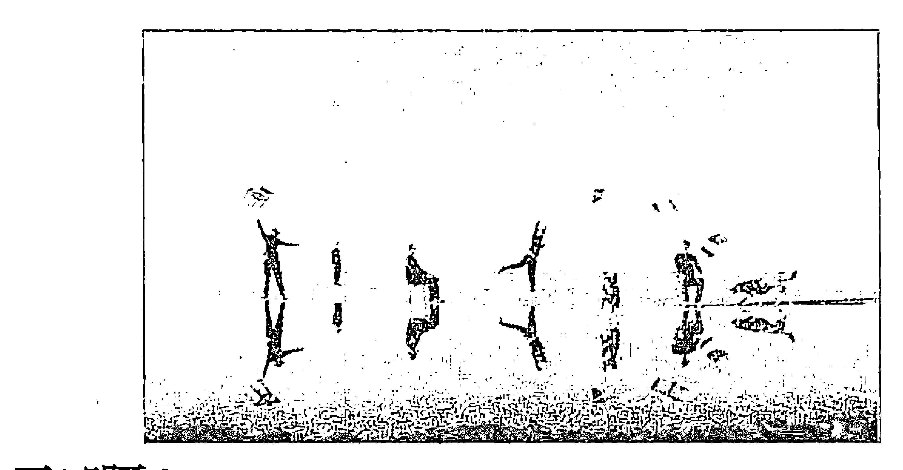

## 原来你不会飞啊！

佚名

有一位妻子聪明能干，丈夫却没有一点儿上进心，但是，在家里还要摆架子，以家长自居。妻子知道直接批评丈夫会激化夫妻之间的矛盾。于是有一天，妻子给丈夫讲了一段寓言。

坐在飞机上，一个乘客向空姐要饮料，要了半天，无人理睬，乘客只好作罢。过了一会儿，忽然那边也有人向空姐要饮料，并且满口骂骂咧咧。却原来是一只鹦鹉，也奇怪，只见空姐竟乖乖地将饮料给鹦鹉送上。这鹦鹉还不罢休，继续骂骂咧咧要这要那，每次骂过，空姐都赶紧把东西送上。乘客茅塞顿开，原来这飞机上的空姐吃硬不吃软，得骂！乘客学着鹦鹉的样子骂骂咧咧，果然，他要的饮料，空姐给送来了。这下，乘客乐了，嘴里不停地骂着，跟空姐要这要那。

乘客骂得正起劲，机长从驾驶舱走出来，一把抓住他就扔到飞机外边去了。倒霉的乘客从空中往下跌落，很是想不通。可是很快，机舱门又一次打开，鹦鹉也被扔了出去。

鹦鹉飞到乘客身边，绕着他转了几圈，很惊讶地说：“原来你不会飞！你在飞机上牛什么啊？”

这则寓言使丈夫正确认识了自己，从此以后，他改变习惯，发奋努力，终于取得了一定的成绩。

> 魅力提示：
难听的话幽默地说。夫妻生活中不能没有幽默，只有放松心情才能使爱情更甜美，这则寓言就让一家人感受到幽默的乐趣。笑过之后，丈夫意识到自己的问题，于是开始改变自己。

## 魅力改造

### 良方

### 樵夫与母熊

顾利锋

一位樵夫救了一只小熊，母熊对他感激不尽。
有一天，樵夫迷路来到熊窝，母熊安排他住宿，还拿丰盛的晚餐款待了他。
翌日早晨，樵夫对母熊说：“你招待得很好，但我惟一不满意的就是你身上的那股臭味。”母熊心里虽怏怏不乐，但嘴上却说：“作为补偿，你用斧头砍我吧。”樵夫照她的话做了。若干年后，樵夫又遇到母熊，问她头上的伤好了没有。母熊说：“噢，那次痛了一阵子，伤口愈合后，我就忘了。不过，那次您说的话，我一辈子也忘不了。”

> > 魅力提示：
>
> 你的一句随口而出的话也许会给别人的心灵造成难以愈合的伤害，心灵的伤害甚于肉体的伤害，因为心灵的伤害是对人整个精神的地震，别忘了小心呵护别人的心灵，因为那同时也是在呵护你自己。

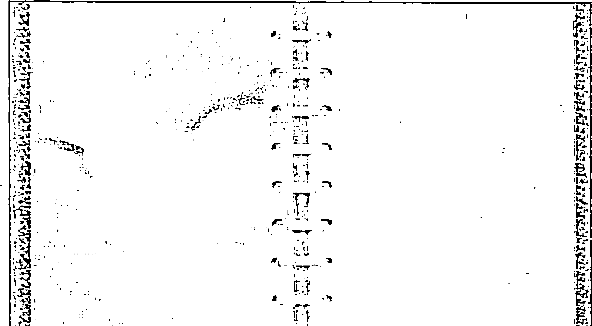

## 实话先生与谎话先生

海纳

在一次盛大的舞会上，实话先生见到一位风韵犹存的老女人，主动走过去向她行礼，然后说：“您使我想起您年轻的时候。”

老女人微笑着说：“怎么样？”

“很漂亮。”

“难道我现在不漂亮吗？”老女人的话带有几分的戏谑。

实话先生非常认真地说：“是的，比起年轻的您，现在您的皮肤松弛，缺少光泽，还有皱纹。”

老女人的脸红一阵白一阵，尴尬地瞪着那双愠怒的眼睛，刚才的愉悦与自信一下子消失得无影无踪了。

正在这时，谎话先生也来到老女人面前，彬彬有礼地邀请老女人跳舞，恭敬地说：“您是舞会上最漂亮的女人，如果你能接受我的邀请，我将是舞会上最幸福的人。”

老女人眼睛顿时闪出迷人的神采，随后伸出了应允的手。

谎话先生和老女人在舞池里跳了一曲又一曲，老女人沉浸在无比的幸福之中。

实话先生坐在一边，看着这对年龄上很不协调的舞伴。

不知谎话先生微笑着对老女人说了句什么，老女人突然间焕发了青春活力，全身洋溢着生命的激情与魅力，舞跳得就像年轻人一样，简直像是一个出色、漂亮的年轻女郎！

舞会结束了。

实话先生叫住刚送走老女人的谎话先生，问道：“跳舞的时候你对她说了什么？”

谎话先生说：“我对她说：‘我爱你，你愿意嫁给我吗？’”

实话先生惊愕地瞪大了眼睛，气愤不已地说：“你又在说谎话了！你根本不会娶她。”

谎话先生说：“没错。可她很高兴，难道你没看见吗？”

两人话不投机，争执不下，不欢而散，各走东西。

天有不测风云，人有旦夕祸福。一个月之后，实话先生和谎话先生各自从邮差那里得到一封讣文，内容是一样的，都是请他们于5日9时参加老女人的葬礼。

他们在墓地不期而遇，也都看到了，那棺木中躺着的正是那位老女人。

葬礼结束后，老女人的一位仆人走过来，将两封信分别交给了实话先生和谎话先生。

实话先生打开信后，看到了老女人留给他的短信：“实话先生，你是对的。衰老、死亡都是不可避免的，但说出来却如雪上加霜。我把一生的日记全部赠送给你，那才是我的真实。”

谎话先生打开信后，看到了老女人留给他的遗言：“谎话先生，我非常感谢你那些美丽的谎话。它让我在生命的最后一段时光过得如此美妙和幸福，它让我生命的枯木重新燃起了青春的活力，它融化了我心中厚厚的霜雪。我把我的遗产全部赠送给你，请你用它去制造美丽的谎言吧！”

后来，实话先生和谎话先生成了朋友。他们一边喝酒，一边探讨做人与处事的真谛。

谎话先生非常佩服实话先生的耿直，由衷地说：“从根本上说，难听的实话要胜过动听的假话。谎话是不能持久的，只有实话才能经得起时间的考验。”

实话先生十分赞赏谎话先生的灵活，心服地说：“在某些场合下，谎话也是很受欢迎的。如果谎话是善意的，并局限于一定范围，通常也是可以被大家所理解的。比如息事宁人的谎话，就要胜过挑拨离间的真话。”

他们形成了共识：“诚实，固然是一个人极可宝贵的品质，但用起来一定要注意时间、地点和场合。”

> > 魅力提示：
>
> 实话并不是每时每刻都会受到欢迎。有时，善意的谎言更容易让人接受。

## 魅力链接

+   - 书名: 说话的魅力
- 作者: （美）刘墉著
- 出版社: 接力出版社
- 出版时间: 2009-8-1
- 印刷时间: 2009-8-1
- 开本: 16开
- ISBN: 9787544807894
- 包装: 平装

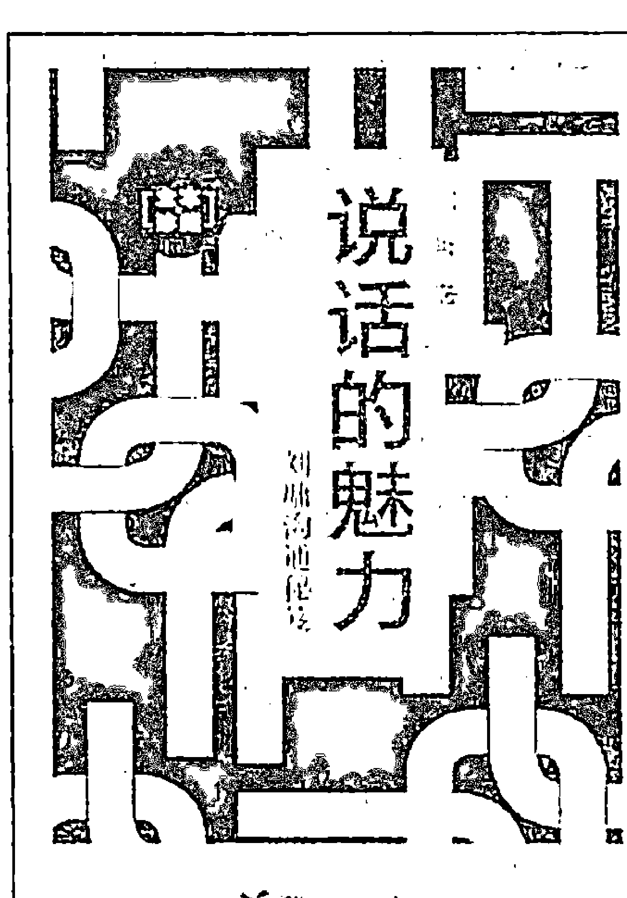

## 内容简介：

本书是刘墉先生关于说话技巧的四本著作的合集，包括《把话说到心窝里①》《把话说到心窝里②》《教你幽默到心田》《说话的魅力——你不可不知的沟通技巧》。

在本书里，刘墉先生以“说话”为主题，教你如何坏话好说、狠话柔说、大话小说、笑话冷说、重话狠说、急话缓说、长话短说、虚话实说。他也帮你分析古今中外的幽默，教你埋下伏笔、营造气氛、引爆笑点，把僵硬的语言变得婉转，黑白的语言变成彩色，甚至教你说活的时候需要注意的呼吸调整、仪表姿态、养气之方。

读完这本书，相信你也能成为应对得体、言谈潇洒的沟通达人、社交高手。

## 魔方第二面
做人篇

M
A
G
I
C

魅力失分

爱吹嘘

射手座的人喜欢夸张，吹牛是他的 一大乐趣。

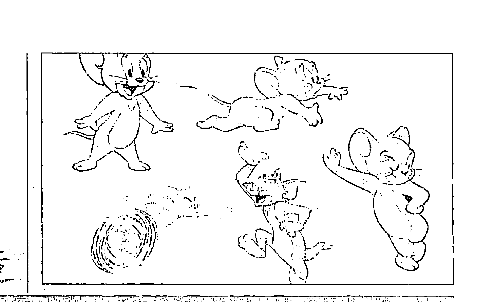

## 魅力改造

正方

### 强者不吹牛

亚 琼

小老鼠、小白兔、大公鸡比谁最厉害，在一起吹牛。
老鼠说：“我最厉害，有一次和大象决斗，我钻进它鼻孔里，咬得它直喊饶命！对于我，大象都不在话下，我还有什么可怕的呢！”
小白兔对小老鼠说：“你这个小地豆子，按体重比我小二十倍，也敢在此逞能！我是三次马拉松赛跑冠军的获得者，一次还创造了世界纪录，连赛跑能手猎豹都惧我三分！”
大公鸡说：“你们都给我住嘴！俗语云‘雄鸡一唱天下白’，太阳都按我的叫声出来，连人类也听我的指挥，按我的命令起床下地，因此老子天下第一！”
它们正在不着边际地吹牛，旁边的草丛中躺着一只老虎，似睡非睡，似醒非醒，听了它们的话，闭目微笑。过了一阵，老虎忽然打了一个哈欠，不由自主地说：“好困呀！”
老鼠、白兔、公鸡一看，无不抱头鼠窜……

### 魅力提示：

吹牛的人，充其量只能算只“纸老虎”，一旦势力雄厚的“真老虎”出现在他面前，他只会落荒而逃。所以，不断地给自己充电吧，机遇与成功，永远只会青眯有准备有实力的人。

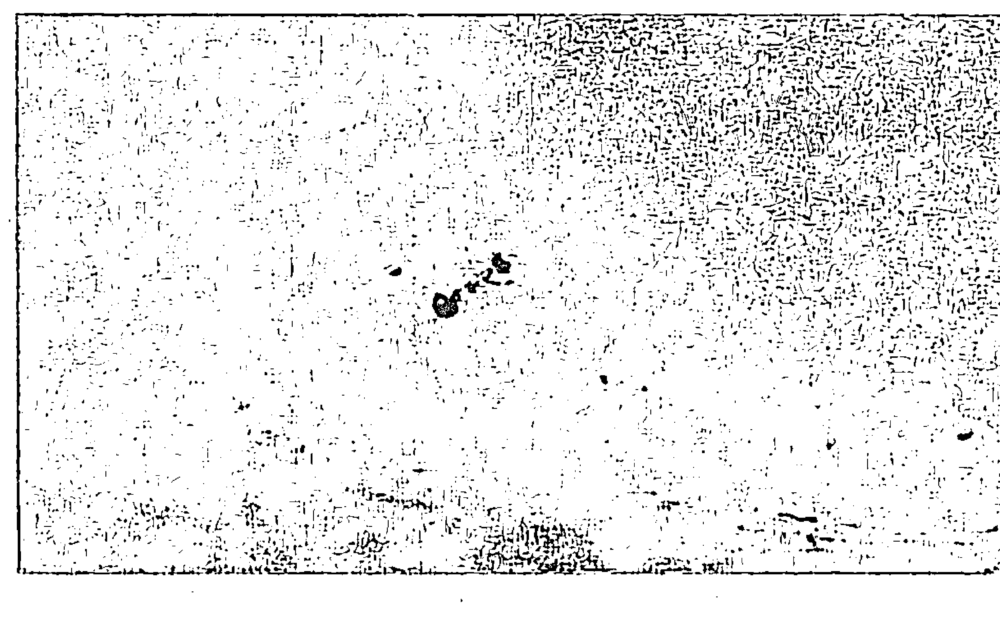

## 苍蝇和蚂蚁

拉封丹

苍蝇和蚂蚁在争论谁更有价值。

> > 苍蝇说道：“神啊，一只卑贱的爬虫，竟要与我相比，这应该吗？我经常参加宴会，杀牛祭祖，我总尝在人先。而你这个渺小的虫子能够干些什么呢？你只会弄些面包渣之类的东西拖回家，对付着吃上三天。并且，我还要问你，在国王或者美人的头上，你停留过吗？我能让美女的皮肤更加洁白，例如一个令男人倾倒的女子，她做美容术的最后化妆，就是贴上一点蝇痣，使脸庞更加美丽迷人。所以你不用唠叨你的粮仓如何如何来烦我。”

> > “你到底说完了没有？”这位善于治家的蚂蚁反驳道，“你以为你的名声很好吗？大家都在骂你。你抢先偷尝各种祭品，并不是什么光荣的事。你这是玷污供品，传播疾病。你停在国王或美人头上，这是事实，但你们往往会被莫名其妙地打死，这就是对你们这种令人厌恶行为的惩罚。你还说一种装饰可以给人增添美感，这也是事实。你我皆为黑色，管那叫蚁痣也是可以的，但这能算一个值得标榜的话题吗？别再夸夸其谈了，赶快将你那不可一世的毛病改掉吧！当冬天到来之际，你就不会这么得意了，你会挨饿、受冻、衰亡。而我呢，将不用再奔波，风吹不到雨淋不着，无忧无虑呆在自己家里，尽情享受我的劳动果实。我今天的辛勤劳作就是为了使我以后能过上好日子。要看清什么是光荣，什么是虚荣。我在你这浪费了不少时间，得工作了。我必须将我的粮仓和厨房装满。”

### 魅力提示：

> 人的价值并不是靠夸耀来体现的，只有踏实苦干，努力做好每一件事，你的价值才会真正体现出来。

## 魅力改造

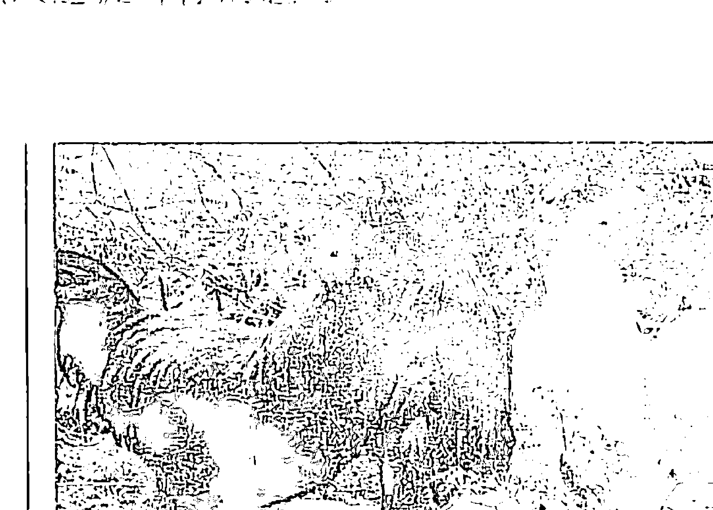

### 版前

### 吹牛的公鸡

谢米哈尔科夫

有只老鹰一心想要抓小鸡，总在村子上空飞翔。猎人看见了瞄准他就是一枪。空中强盗给打中了，顿时掉在地上，然而，鹰毛仍在空中飘了很久……这时公鸡从矮树林里正往外走，一看，他最怕的家伙现在已经一命呜呼了。

公鸡一下子变得威武万分！他的那顶鸡冠简直跟血一样红。“喂，鸟儿们，都来瞧一瞧吧！”他发出胜利的呼声，几乎喊破了喉咙。鸟儿纷纷飞来，发现老鹰躺在公鸡脚下。“好样的，大公鸡！”“好样的，智谋家！”“他的力气竟这么大！”

那位吹牛大王听到赞扬更加耀武扬威。他用战胜者的姿态向四面瞅。这时，偏偏有位朋友过去把那老鹰翻个脸朝天，从毛里面一啄啄出一颗子弹。于是，真情泄漏，真相大白，吹牛大王灰溜溜地溜走了。

> > 魅力提示：
> 有的人很像这只公鸡，最擅长的就是吹牛，目的无非是想让人羡慕，而往往事情的真相并非如此，一旦真相大白，吹牛的人岂不无地自容。

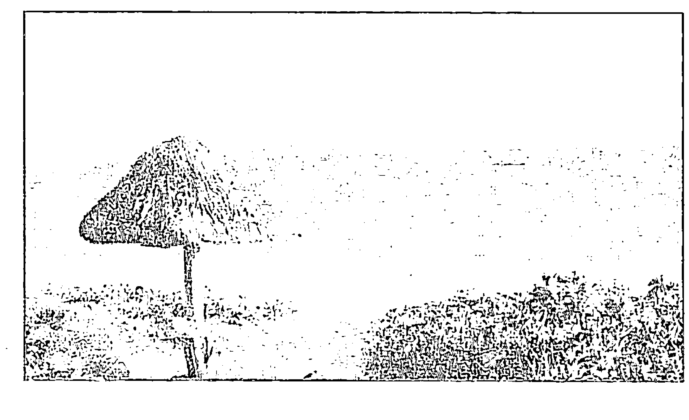

## 马车声

**黑格尔**

一个春日的午后，父亲与儿子一起来到林间漫步。这是一个美丽而安静的日子，温暖的阳光洒在他们的身上，许多鸟儿在枝头雀跃。

在一个弯道处，父亲忽然停了下来。他望着自己的儿子，在短暂的沉默之后，他问道：“你听到了什么声音？”

儿子仔细地听了听，几秒钟之后回答说：“我听到了鸟儿的叫声。”

“除了小鸟的歌唱之外，你还听到了什么声音？”父亲又问儿子。

儿子侧耳倾听，笑着说：“还有马车的声音！”

“是的，是一辆马车，而且是一辆空马车。”父亲若有所思地说。

儿子觉得非常纳闷，于是问父亲：“您有看见马车吗？您是怎么知道那是一辆空马车的呢？”

父亲答道：“从声音就能轻易地分辨出马车是不是空的。马车越空，噪音就越大。”

儿子想了想，还是有点不明白。父亲又接着说：“就像我们身边的一些人一样，他们肚子里没有多少知识和涵养，他们却总是口若悬河，夸夸其谈，一心想显出自己很有水平。他们想尽一切办法贬低别人，其实这样的人最无知，腹内空空。”

儿子思索着父亲的话，觉得非常有道理，常常反省自己。每当看到那些滔滔不绝、粗暴地打断别人谈话的人，或者那些目空一切、肆意贬损他人的人，他的耳边就响起了父亲的那句话：“马车越空，噪音就越大。”

### 魅力提示：

> 俗话说，满瓶子不响，半瓶子咣当。口若悬河的人往往华而不实。因此，务实、真才实学，才是人在社会上的生存之道。

## 魅力链接

+   - 书名：别让虚荣毁了你
- 作者：思远 编著
- 出版社：西苑出版社
- 出版时间：2008-6-1
- 印刷时间：2008-6-1
- 开本：16开
- ISBN：9787802102347
- 包装：平装

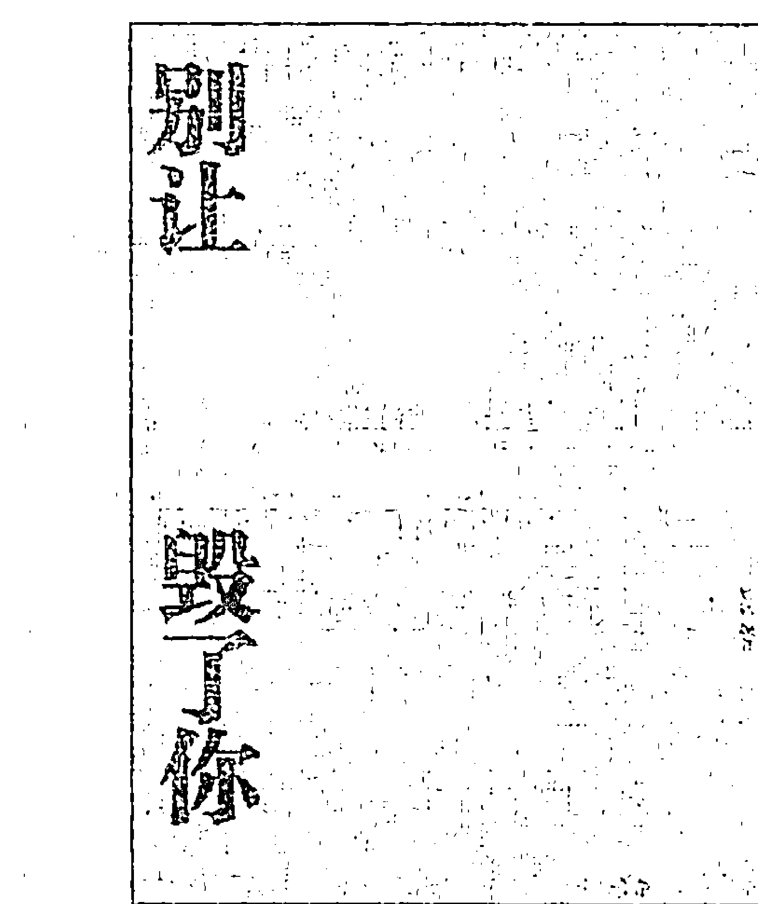

## 内容简介：

如果有人问：“你虚荣吗？”相信大多数人都不愿意承认自己虚荣。其实，虚荣心不少人都有。

在生活中，人们的虚荣体现在很多地方。比如，在我们身边经常有这样的人，样样要和别人比，比官位，比车子，比住房，比穿衣打扮，比婚丧喜事的排场等等。

还有的人得到一点荣耀，取得一点成就，就自以为了不起，趾高气扬。更有甚者，本事没有多大，却傲气冲天，经常将自己的短处隐藏起来，用自己的长处比别人的短处，并竭力排斥、挖苦、打击、疏远、为难比自己强的人，以显示自己是多么的与众不同。

我们针对虚荣心的种种表现编写了这本书，希望能给大家以警示，使我们每个人能够更好地适应这个色彩斑斓的社会。

## 魔方第二面
做人篇

## MAGIC

## 魅力(失)分
太没心机

射手座的人太没有心机，不懂得察言观色，一不小心就会冒犯到别人，因此，很容易得罪人。

## 会说话的小赵

佚名

小刘和小赵是一对刚结婚不久的恩爱夫妻，平时住在单位宿舍，只有星期天小两口才回家与父母团聚。

刘妈只有小刘这个独生子，所以非常疼爱小刘，整天都牵挂着儿子的身体。

有一个星期天小两口回家，刘妈当着媳妇的面说：“一周不见，小刘又瘦了。”很明显，刘妈是在责备小赵没有照顾好自己的儿子。实际上小刘并没有瘦。

面对婆婆的责备，小赵没有反驳，她接过话头，说：“妈，这段时间我忙着筹办单位的五四演讲活动，没时间好好照顾他。这都怪我。从明天起，我隔天弄顿肉给他吃，每周再买些鱼，加强营养。他也许要不了多久就会胖起来。”

第二周星期天，小两口又回家与父母团聚。刚一回家，小赵就拉着婆婆的手，指着小刘，汇报说：“妈，这周我给做了三顿肉、一顿鱼，还从单位食堂买回一只清炖鸡给他吃，可他还是没有胖。妈，您有什么好办法，能让他胖起来？”

婆婆被媳妇的话所感动，赶紧声明：“他就这样，吃什么都没有用。这是刘家祖传的，人人都这么瘦，你看他爸，还不是这个样子。”

婆婆的话说得全家哈哈大笑。

> **魅力提示：**

在人与人交往的过程中，往往会因意见分歧产生矛盾。此时，不妨学学小赵，后退一步，顺着对方的意愿，以退为进，既避免了矛盾激化，又妥善解决了问题。

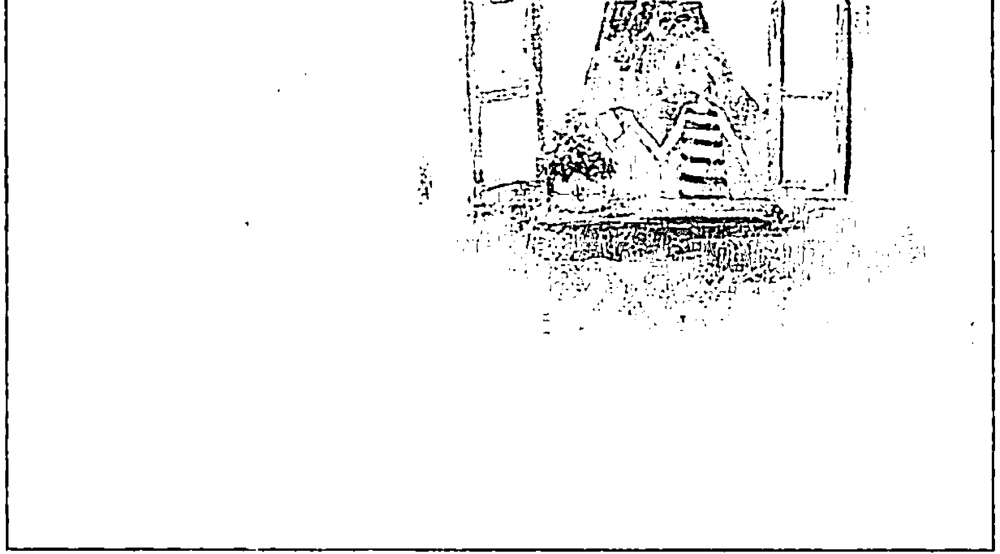

## 司马懿智取帅印

振 北

司马懿是曹操丞相府的长史。所谓长史即是总管的意思，官职并不小，但总管属幕僚，没有实权。他深有韬略，逐渐成了曹魏政权的重要参谋，后来三国分别称帝建制，在曹丕、曹叡相继称帝时，他的地位越来越显得重要，但他仍处于辅佐地位，实权依旧掌握在曹氏宗室手中，这种情况使他难展宏图。每次战争，功劳是他的，但是得益最大的都是曹氏亲属，他对这种情况深为苦恼。刘备死后，蜀汉由诸葛亮主政，屡次兵出祁山，进伐中原。魏明帝在对蜀战争中的大将军是曹真，而司马懿只担任他的副手，其实司马懿此时已成为诸葛亮的主要敌手。

诸葛亮初出祁山，占天山诸郡，收服姜维，取得大胜，后因马谡失去重要战略要地街亭才被迫回川。数年后，经过休养生息，诸葛亮重聚大军兵出祁山，再伐中原。大军一路前行，势如破竹，并再次联络东吴，共伐曹魏。

在这紧急关头，大将军曹真却身染重病，只得回洛阳养病，军中无主，眼看形势更加恶化，魏明帝一时有些六神无主。就在这时，司马懿主动向魏明帝分析了形势，他认为蜀汉与东吴的联盟是貌合神离，东吴在吕蒙白衣过江夺取荆州和在夷陵之战中大破蜀军后，已与蜀汉结下了深仇，不可能真心实意地帮助蜀汉，所以这一路兵马不足为患，所忧的倒是陇西诸葛亮的一路军马。现军中无主，得派得力之将前往主军，等蜀军粮草供应不济，定可反败为胜。

曹睿见司马懿分析得头头是道，鉴于曹真有病，就委派司马懿为都督，总领陇西各路军马，抵御蜀汉进攻。他还命人立即去曹真那里取帅印交给司马懿。

司马懿却说：“臣自去取帅印便可。”他来到曹真府上，先探病情，再告以前方军情。曹真因在病中，家人怕他病情加重不敢告以实情，现听说军情如此紧急，不禁深感忧虑，便说：“现在国家如此危急，皇上为什么不拜你为都督，以退蜀兵呢？”司马懿明明已经受封，却装作毫不知情，这时仍推辞说：“我才疏学浅，不堪重任。”曹真信以为真，忙叫人将帅印交给司马懿。司马懿仍是不住地推托：“帅印仍请大将军掌管，我一如既往，竭力辅佐。”曹真忙说：“你不接帅印，我又不能理事，现在国家危险了，军队怎么能没有统帅呢？我要抱病去向皇上保举你。”

此时，司马懿才说出实话：“皇上已有恩命，只是我不敢领受罢了。”曹真一听，高兴地说：“有你挂帅，蜀兵可退了。”于是，司马懿假意推辞不过，拜谢再三，接过了帅印。

既然皇上有命，司马懿何必还要装腔作势，自取帅印，好像是多此一举。其实这正是他的高明之处，他处心积虑地分析过，知道明帝命他挂帅是在紧急状况下做出的决定，一旦击退蜀军，帅印仍会回到曹真手中。再说曹真正在病中，被人取去帅印，心中必会不快，甚至要疑心司马懿从中作怪。现在司马懿亲往取帅印，而且再三拜辞，既可释除曹真的疑虑，也可长保帅印。

> **魅力提示：**
司马懿深谋远虑，处事圆滑，既可以达到自己的目的，又使别人诚心诚意地信服，其中的处世技巧值得借鉴。

## 魅力改造
辰浩

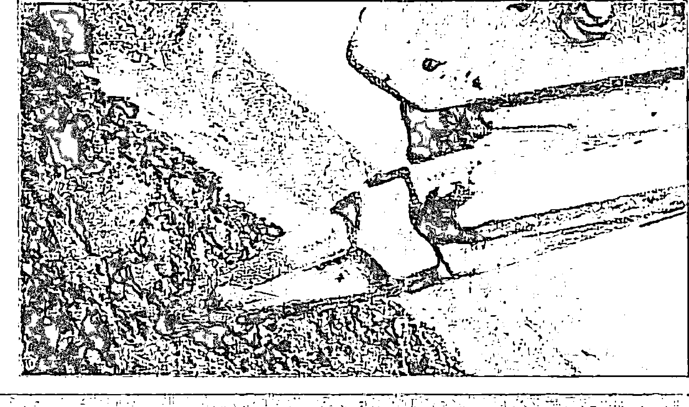

### 舌存齿亡

陈珊珊

殷商时期有一个很有学问的人叫商容。
商容生命垂危的时候，他的弟子来到他的床前问候老师，他问老师还有什么要吩咐的。商容问弟子：“你看我的舌头还在吗？”说完张开嘴。
弟子疑惑不解地说：“在啊！”
商容又问：“那你看我的牙齿还在吗？”
“全部掉光了。”
商容问弟子：“你知道什么意思了吗？”
弟子沉思了一会说：“我想这是过硬的易衰，而柔和的却能长存吧？”
商容笑着点了最后一下头。

> **魅力提示：**
天下的许多事物不也如此吗？学会灵巧的处世，才能立于不败之地。

## 杨修之死

佚名

杨修是个人才，属古代知识分子中的精英类人物，其人才思敏捷，聪颖过人，舌辩之士，得到曹操赏识器重，委以“总知外内”的主薄，成为丞相曹操身边的一位高级幕僚谋士，理应算得上一位重臣。

可是为什么曹操会杀他呢，是因为六件事。这六件事，层层叠加，不断地惹恼了他的主人曹操。最后曹操痛下决心，将其杀死。

第一件事是，曹操在花园的门上写一个“活”字，是曹操为了卖弄一下自己的才干。结果杨修这家伙不给他面子，偏要戳穿曹操的西洋镜不可。告诉门匠说把门打得开阔些，门上写“活”字，就是阔，意思是说，本来的门太过于窄小了——曹操“忌之”。
第二件事是，远方的客人送了“一合酥”给曹操，杨修认为这里的“合”应该是一人一口的意思，而原意是“盒”才对。被杨修一人一口与众分吃了——曹操“恶之”。
第三件事是，曹操本想以梦中杀人来警戒大家，杨修偏要在大家的面前揭穿不可，搞得曹操在众人面前没有面子——曹操“愈恶之”。
第四件事是，杨修告曹丕密请朝歌长吴质入内府商议，反被吴质用计陷害，曹操认为杨修是陷害曹丕——曹操“愈恶之”。
第五件事是，曹操本想试一试曹丕、曹植的才干。原本曹植没有那个本事，可杨修偏要教曹植怎么做，可是后来被曹操知道了，坏了曹操的好事——曹操“大怒”。
第六件事是，杨修为曹植作答教，被曹操得知——曹操“大怒”。
在发生了阔门、一合酥、曹操梦中杀人、吴质等事件后，曹操对杨修心中已暗存芥蒂，暗暗忌之戒备之，直到后来杨修又暗中插手废立太子之事，引起曹操极度不满和嫉恨。
这六件事，一步一步地逼迫曹操最后以“鸡肋”事件“惑乱军心”为借口杀死了杨修，也成了杨修之所以被曹操杀的一个客观的原因。

> 魅力提示：
聪明人懂得隐藏自己的锋芒，圆滑地为人处世，只有那些天真而头脑简单的人才会时刻表现自己，招人嫉恨。

## 魅力链接
- 书名：博弈与心计
- 作者：石斌 编著
- 出版社：吉林科学技术出版社
- 出版时间：2008-1-1
- 印刷时间：2008-1-1
- 包装：平装
- ISBN：9787538437409
- 开本：16开

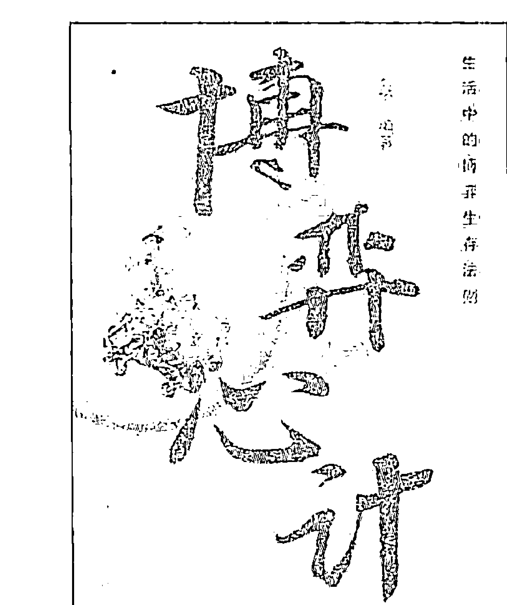

## 内容简介：
每个博弈者在决定采取何种行动时，不但要根据自身的利益和目的行事，还必须考虑到他的决策行为对周围人的可能影响，以及周围人的反应行为的可能后果，通过选择最佳行动计划，来寻求收益或效用的最大化。

人在社会上混，如果没有一丁点心计，遇事既不留心也不琢磨，那麻烦可就大了。在人与人的博弈中，你必须意识到，你的上级、商业对手、亲密的朋友，乃至你未来的伴侣都是聪明而有主见的人，是关心自己利益的活生生的人，而不是被动的和中立的角色。一方面，他们的目标常常与你的目标发生冲突；另一方面，他们当中包含着潜在的合作因素。为了自己，也为了与他人更好地合作，你需要学习一点博弈论的策略思维。

# 魔方第二面
做人篇

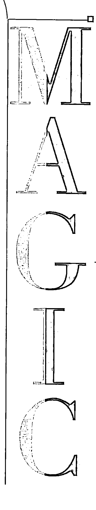

# 魅力失分
## 好奇心重
射手座的人是好奇宝宝，对一切他未知的事物都非常有兴趣。

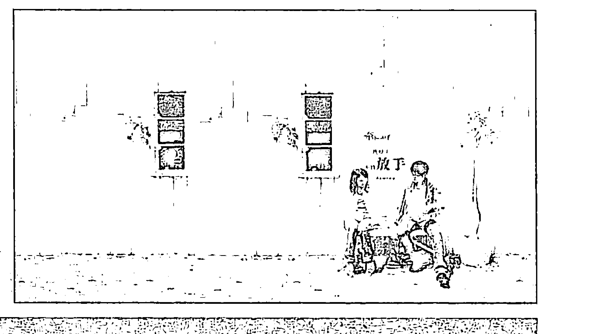

# 魅力改造
## 与珍贵的自己作一个约定
卡洛琳·李

一对新婚夫妇生活贫困。丈夫为了让妻子能过上体面日子，去了很远的地方打工，妻子答应在家忠贞地等他回来。

年轻人在老板那儿工作二十年后，临行时老板未给他发工钱，给了他三条忠告和三块面包。第一，永远不要走捷径。便捷而陌生的道路可能会要了你的命；第二，永远不要对可能是坏事的事情好奇，否则也可能要了你的命；第三，永远不要在仇恨和痛苦的时候作决定，否则你以后一定会后悔。老板给他的三个面包，两个让他路上吃，另一个等他回家后和妻子一起吃。

在远离自己深爱的妻子和家乡二十年之后，男人踏上了回家的路。一天后，他遇到了一个人，那人说：“你要走二十多天的路，这条路太远了，我知道一条捷径，几天就能到。”他高兴极了，正准备走捷径的时候，想起了老板的第一条忠告，于是他回到了原来的路上。后来，他得知那人让他走的所谓的捷径完全是一个圈套。

几天之后，他走累了，发现路边有家旅馆，他打算住一夜，付过房钱之后，他躺下睡了。睡梦中，他被一声惨叫惊醒。他跳了起来，走到门口，想看看发生了什么事，刚刚打开门，他想起了第二条忠告，于是回到床上继续睡觉。第二天，店主对他说：“您是第一个活着从这里出去的客人。我的独子有疯病，他昨晚大叫着引客人出来，然后将他们杀死埋了。”

男人接着赶路，终于在一天的黄昏时分，他远远望见了自己的小屋，还依稀可见妻子的身影。虽然天色昏暗，但他仍然看清了妻子不是一个人，还有一个男子伏在她的膝头，她抚摸着他的头发。看到这一幕，他真想跑过去杀了他们，这时他想起了第三条忠告，于是停了下来，想了想，决定在原地露宿一晚，第二天再作决定。天亮后，已恢复冷静的他对自己说：“我不能杀死我的妻子，我要回到老板那里，求他收留我，在这之前，我想告诉我的妻子我始终忠于她。”

他走到家门口敲了敲门，妻子打开门，认出了他，扑到他怀里，紧紧地抱住了他。妻子眼含热泪，并让儿子见过父亲。原来，年轻人走的时候妻子刚刚怀孕，现在儿子已经二十岁了。

丈夫走进家门，拥抱了自己的儿子。在妻子忙着做晚饭的时候，他给儿子讲述了自己的经历。接着，一家人坐下来一起吃面包，他把老板送的面包掰开，发现里面有一笔钱——那是他二十年辛苦劳动赚来的工钱。

> 魅力提示：
与珍贵的自己作个约定，永远不要走捷径；永远不要对可能是坏事的事情好奇；永远不要在仇恨和痛苦的时候作决定，只有这样你才会安然享受你所拥有的一切。

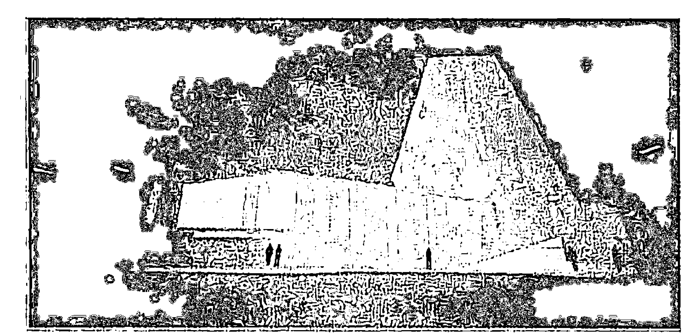

# 罗斯福的秘密
佚名

罗斯福当海军助理部长时，有一天一位好友来访，谈话间朋友问及海军在加勒比海某岛建立基地的事。

“我只要你告诉我，”他的朋友说，“我所听到的有关基地的传闻是否确有其事。”

这位朋友要打听的事在当时是不便公开的，但既是好朋友相求，那如何拒绝是好呢？

只见罗斯福望了望四周，然后压低嗓子向朋友问道：“你能对不便外传的事情保密吗？”

“能。”好友急切地回答。

“那么，”罗斯福微笑着说，“我也能。”

> **魅力提示：**
保守秘密的办法是打死也不说，打消别人好奇心的办法就是不对别人的事情好奇。

# 魅力改造

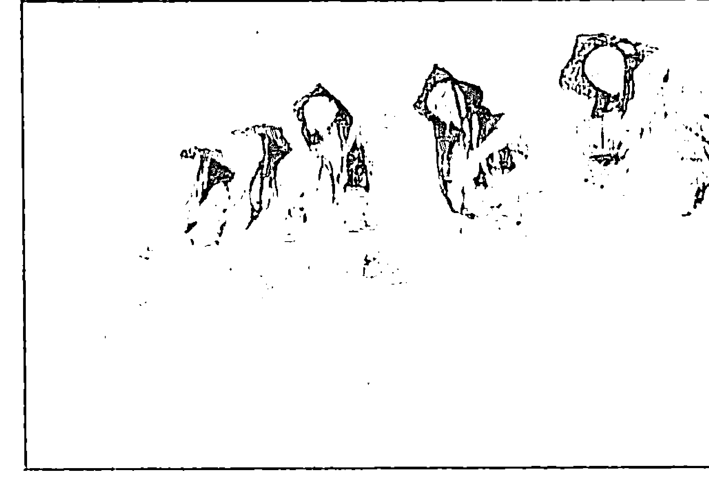

星座
## 仙女
泰戈尔

据说有一种仙女乔装打扮住在森林里靠近河流和湖泊会合的地方，在那儿，她们要等自己飞去以后，才让人们识破真相。

一个王子走进这座森林，当他走近河流和湖泊会合的地方，看见河岸上坐着一个乡下姑娘，她在拨弄流水，教百合在水上舞蹈。王子低声地问她：“告诉我，你是什么仙女？”

这个姑娘给他问得不禁笑了出来，山坡上回响着她的欢悦之声。王子心想她是爱笑的瀑布仙女。消息传到国王的耳朵里，说王子娶了一位仙女，他便派遣人马，把他们带到他的王宫里。

王后看见了这个新娘，厌恶地转过脸去，王子的妹妹窘得脸红，侍女们也在问，难道仙女就是这样打扮的吗？

“嘘！我的仙女是改扮了到咱们家里来的。”王子低声地说。

一年一度的节会来到了，王后对她的儿子说：“告诉你的新娘，咱们的亲戚要来看看仙女，教她不要在亲戚面前丢咱们的脸。”

于是王子对他的新娘说：“看在我对你的爱情的分上，在我们的亲戚面前显一显你的真相吧。”

她默默地坐了好久，继而点头允诺，这时候泪珠滚下了她的面颊。

圆月皎洁，王子穿着一身婚服，走进他的新娘的房间。房间空无一人，只有从窗口射进来的一道月光，斜照在床上。

皇亲国戚随着国王和王后拥进新房，王子的妹妹站在门旁。

大家异口同声问道：“仙女新娘在哪儿？”

王子回答说：“为了让你们认识她的真相，她已经永远消逝了。”

> 魅力提示：
好多时候，我们没有必要为了满足自己的那点好奇心而事事都“打破沙锅问到底”……一旦问到底了，沙锅碎了，而后悔也就来不及了。

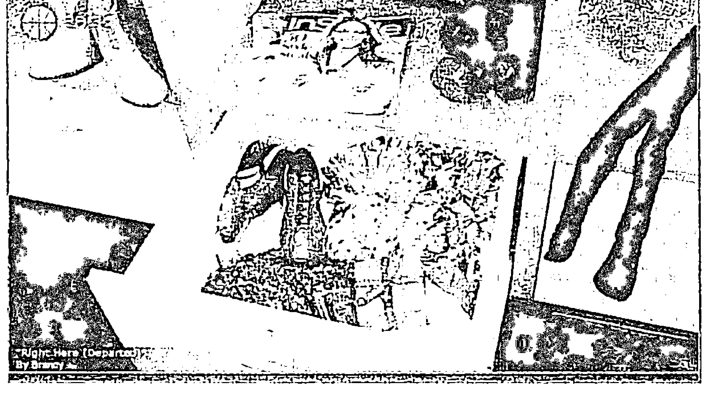

## 妻子的抽屉
佚名

有一对夫妻，两人感情很好，结婚多年从未拌过嘴。

惟一让丈夫不能理解的是，妻子有一个抽屉一直是锁着的，钥匙也一直被妻子藏着，妻子从未当着他的面打开过。丈夫也不好意思问妻子，因为那是她惟一的秘密。

一次，妻子出差去了。丈夫实在忍不住，一种强烈的好奇心驱使他想要知道箱子里的秘密。他翻箱倒柜终于找到了钥匙，当他打开抽屉时，他愣住了。

里面装的全是退回来的信——他写给从前的女友的——都没有拆封。他愣了半天，像突然明白了什么，轻轻地把抽屉锁好，把钥匙放回原地。

他从此不再跟她提起抽屉的事情，也不再给女友写信。

> **魅力提示：**
人就是这样，对越是保持神秘的事情越是好奇，想尽办法要去揭开谜底，其实，有些事情，不知道比知道要好。

## 魅力链接
- 书名：遇见未知的自己
- 作者：张德芬 编著
- 出版社：华夏出版社
- 出版时间：2008-01
- 包装：平装
- ISBN：750804401
- 开本：32开

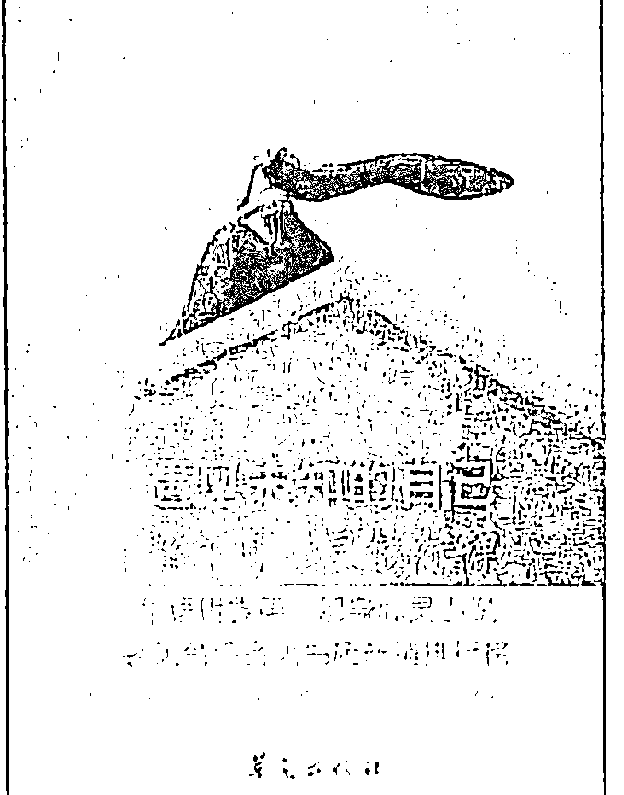

## 内容简介：
故事是从“冬天的雨夜，在荒郊野外的山区，一个没有手机、没有汽油的孤单女人”开始。
若菱，自名校毕业，拥有令人羡慕的工作，但心中却不时地自问：为什么我不能拥有想要的生活？为什么我不快乐？我该如何当自己生命的主人？
在一个下雨的冬夜，若菱巧遇一名智慧老者，在与智者数度交谈的过程中，她渐渐填补不快乐、挫败的心灵缺口，寻回最真实勇敢的自我……
你会不会担心和若菱一样，让身体的疲惫失控于华丽的业绩之中？
你是否也想遇见在你心中的智慧老者，穿越心事的重重黑纱，遇见全新的自己？

# 魔方第二面
做人篇

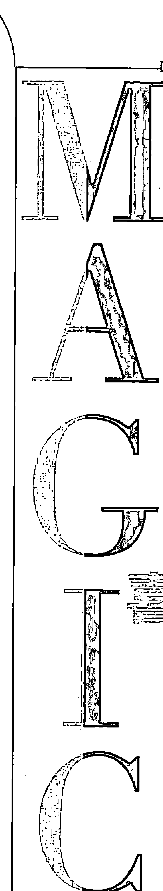

## 魅力失分
### 喜欢出风头
射手座很爱现，最喜欢做能让他出尽风头的事情。

# 慎言慎行好处多
靳西

远在 1909 年，风度优雅的布洛亲王就觉得交往中的谦卑、赞扬和关怀极有必要。布洛亲王当时是德国的总理大臣，而傲慢自大的德国皇帝威廉二世说了一些狂言和一些令人难以置信的话，震撼了整个欧洲大陆，引起了全世界各地一连串的风潮。更为糟糕的是，这位德国皇帝竟然公开这些愚蠢自大、荒谬无理的话。他在英国做客时就这么说，同时不允许伦敦的《每日电讯报》刊登他所说的话。例如，他宣称他是和英国友好的惟一的德国人。他说，他建立一支海军对抗日本的威胁；他说，他独自一人挽救了英国，使英国免于臣服于苏俄和法国之下；他说，由于他的策划，使得英国罗伯特爵士得以在南非打败波尔人；等等。

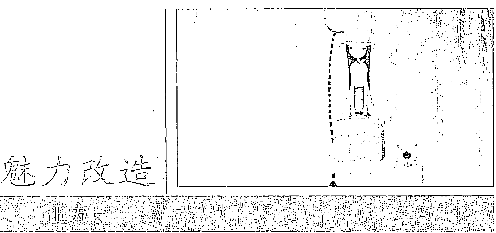

在一百多年的和平时期，从没有一位欧洲君主说过如此令人惊异的话。整个欧洲大陆立即愤怒起来，英国尤其愤怒，德国政治家惊恐万分。在这种狼狈的情况下，德国皇帝自己也慌张了，并向身为帝国总理大臣的布洛亲王建议，由他来承担一切的责难，希望布洛亲王宣布这全是他的责任，是他建议君王说出这些令人难以相信的话。

“但是，陛下，”布洛亲王说，“这对我来说几乎不可能。全德国和英国，没有人会相信我有能力的建议陛下说出这些话。”

布洛话一出口，就明白犯了大错。皇帝大为恼火。“你认为我是一个蠢人，”他叫起来，“只会做些你都不会犯的错事！”

布洛知道他应该先恭维几句，然后再提出批评；但既然已经太迟了，他只好采取进一步的最佳方法：在批评之后，再予称赞。这种称赞经常会产生意想不到的效果。

“我绝没有这种意思，”他尊敬地回答，“陛下在许多方面皆胜我许多，而且最重要的是自然科学方面。在陛下解释晴雨计，或是无线电报，或是伦琴射线的时候，我经常是注意倾听，内心十分佩服，并觉得十分惭愧，自己对自然科学的每一门皆茫然无知，对物理学或化学毫无概念，甚至连解释最简单的自然现象的能力也没有。但是，”布洛亲王继续说，“为了补偿这方面的缺点，我学习了某些历史知识，以及一些可能在政治上，特别是外交上有帮助的学识。”

皇帝脸上露出微笑。布洛亲王赞扬他，并使自己显得谦卑，这已值得皇帝原谅一切。“我不是经常告诉你，”他热诚地宣称，“我们两人互补长短，就可闻名于世吗？我们应该团结在一起，我们应该如此！”

他和布洛亲王握手，并十分激动地握紧双拳说：“如果任何人对我说布洛亲王的坏话，我就一拳头打在他的鼻子上。”

> 魅力提示：
俗话说枪打出头鸟，狂妄自大贪图表现的人往往会成为人们攻击的目标，而谦逊则能让人放下对你的防备。

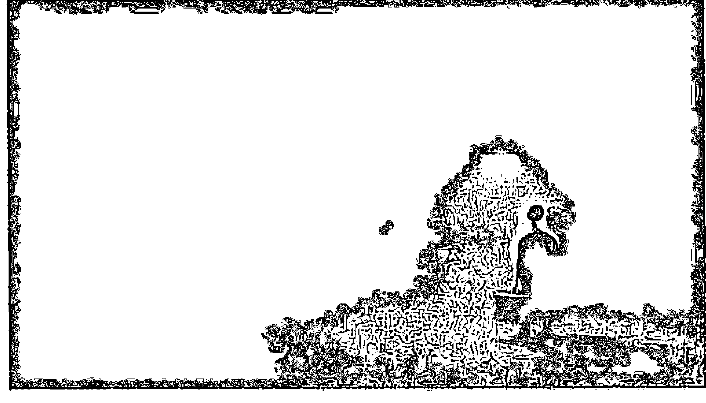

# 荒岛上的公爵兰
刘燕敏

挪威有一位叫威廉姆斯的探险家，从二十岁开始作环球旅行，四十年来，几乎走遍了世界上所有著名的荒漠、丛林和深山峡谷。

82 年，在结束南非裂谷带的探险后，记者曾问他有何感想。他说，我始终有两大遗憾：一是为世人遗憾。地球上有那么多瑰丽的景色，世人竟不得一睹；二是为景色遗憾。它们那么壮观美丽，而不为世人所知。

91 年，他到新西兰的斯奈尔斯岛，这次旅行彻底改变了他的这种心态。

斯奈尔斯是新西兰南部的一个小岛，仅六点七平方公里，由于远离新西兰本土，终年人迹罕至。威廉姆斯踏上这座小岛，发现这里竟生长着成片的公爵兰。这种兰，花姿奇秀、香味馥郁，在挪威甚至整个欧洲被列为群芳之冠。

看到这些兰花，他想，这些名贵珍稀的花卉如果在欧洲早就被呵护着去装点总统套房去了，可是在这儿它们却寂寞地生长着，几百年甚至上千年都无人知晓。

正当惋惜之情再一次从心底油然升起，不经意间，他发现在一个小山崖上有一窝野蜂，它们正忙碌着，把兰花上的花粉和蜜带回蜂窝，威廉姆斯看着眼前的一切，十几年的迷惑好像一下子被解开了。他在当天的旅行日记中这样写到：这一片公爵兰，有这一窝野蜂不就够了吗？有什么可遗憾的呢？世界上奇绝的景色，有一两个探险家走近过目睹过，不也就行了吗？

> **魅力提示：**
一些有才华的人默默无闻，这又有什么可遗憾的呢？威廉姆斯的发现告诉我们，一个人的才华也没有必要在所有的人面前显露，在这个世界上，有一两个人赏识也就足够了。

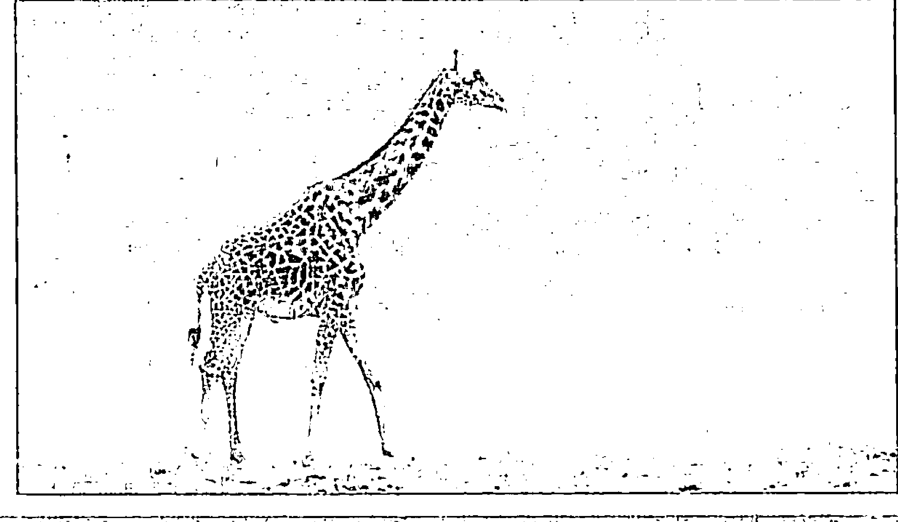

# 为自己而活
佚名

长颈鹿盖了一座高大挺拔的豪宅，森林里的动物纷纷去参观，个个都称赞：“这房子，真气派！”山鸡见状，非常羡慕，连忙回家将自己的草屋拆掉，费尽力气修了与长颈鹿同样高大气派的房屋，以为这样自己就会变成凤凰。

房子盖好后，所有的动物都前来祝贺。当大家赞叹时，山鸡很是得意。

冬天到了，山鸡住在自己冰冷的家中，缩成一团。不过，只要有人来看房，它便装作一副轻松愉悦的模样。

这时山雀来了，见屋内很冷，便劝道：“不要总为别人活，要为自己活，爱慕虚荣，最吃苦的是自己！”

山鸡非但不听，反而振振有词地教育山雀：“山雀毕竟是山雀，你总跳不出自己的圈子，目光短浅，怎么能成大事，应当不断追求卓越！”

天气一天天变冷，山鸡一天天挨冻，但它只要一想起别人的赞美，便又无怨无悔，最终冻死在赞美声中。

> **魅力提示：**
别人的赞美固然可以增长信心，但总是活在赞美中，甚至为了赞美而生存，难免会失去自己。为虚荣和名利所累，会给人生增添许多不必要的负担，也更容易从中迷失自己。认清自己，为真实而活，才能建立起自己真正的荣誉。

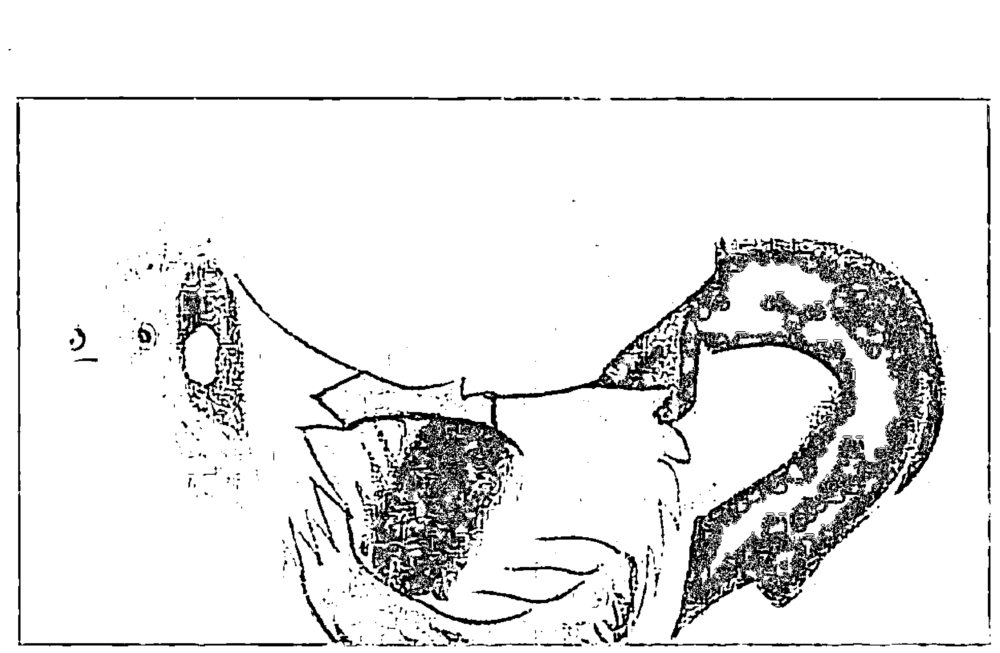

## 公鸡的金牌
吕金华

公鸡曾经是飞行健将，在多次飞行比赛中都获得了金牌。公鸡为自己这许多荣誉而骄傲。公鸡一骄傲就把所有金牌全挂在脖子上，一刻也不取下来。后来金牌多了，重得不得了，公鸡戴着这许多金牌就再也飞不动了。久而久之，公鸡就完全丧失了飞行能力。

于是，人们说，瞧，公鸡现在还全身戴着那些闪闪发光的金牌哩。

## 魅力提示：
一个人如果背负着太多的荣誉和金钱，而不懂得或不肯放下，他奔跑的步子势必会慢下来，同时过去那冒险、奋斗的勇气也会日渐丧失。世事多数如此，人们容易为盛名所累，结果就是，不少人功成名就之日，便是其才华殆尽之时。

## 魅力链接
- 书名：九型人格使用手册
- 作者：中原 著
- 出版社：鹭江出版社
- 出版时间：2009-9-1
- 印刷时间：2009-9-1
- 开本：16开
- ISBN：9787545901023
- 包装：平装

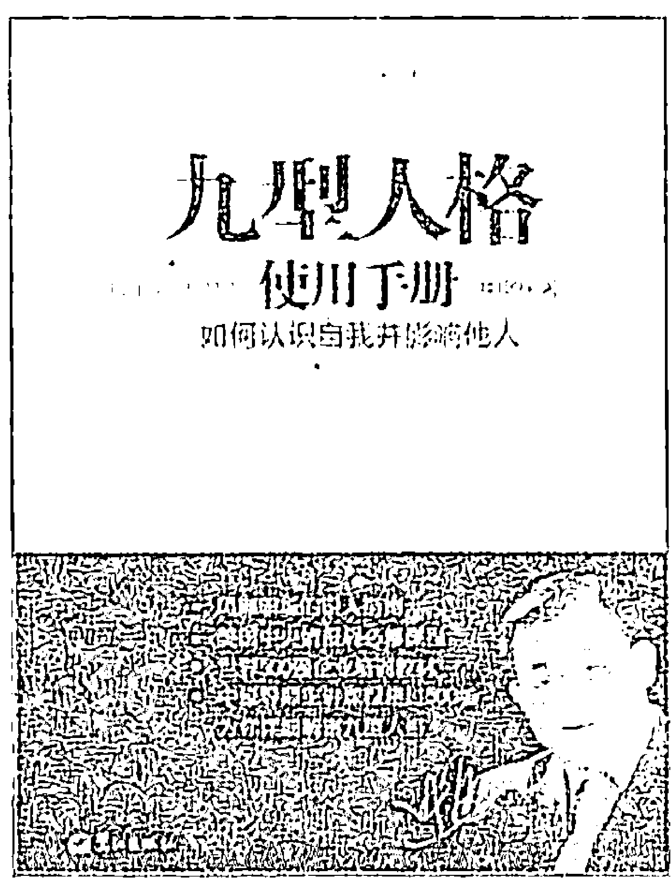

## 内容简介：
为什么有些人乐观，而有些人悲观？有些人喜欢出风头，而有些人非常低调？有些人喜欢独处，而有些人害怕寂寞？你知道其中的奥秘吗？这是因为人与人的性格千差万别。九型人格是一门关于性格的精深学问，它是认识自我的工具，也是人际交往的法宝。

本书将九型人格的理论与大量案例紧密结合，让你知道自己哪些地方需要提升以及如何提升，让你懂得如何跟上司打交道、怎样管理员工、如何创建健康团队、如何经营感情和婚姻，最终使你在事业、爱情、交际上获得成功。

# 魔方第三面
恋爱篇

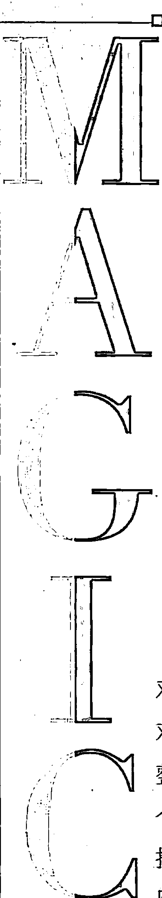

魅力失分
缺耐性

射手座追求速度，对一个人花了心思后感觉对方没多大回应会马上重整旗鼓，调转枪头向另一个目标发起攻势，更有“广撒网，多捕鱼”的可能。因为他的守护星是宙斯，所以难免有点跟宙斯一样的花心。

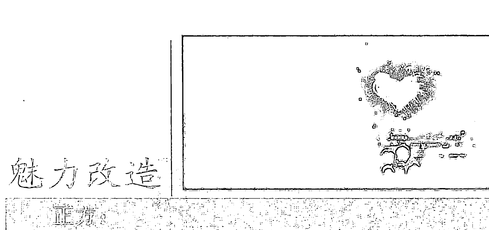

# 街对面的真心
欣 迪

当那个漂亮迷人的女人拄着一根盲杖小心翼翼地上车时，全车的乘客都对她报以同情的目光。她把车钱付给司机，摸索着走到司机留给她的座位，然后坐下来，将公文包放在膝盖上，那根白色的棍子就靠在她的腿边。

她是34岁的苏珊，一年前由于一次医疗上的误诊，她在突然之间失去了视力，从此被抛入黑暗、愤怒、沮丧和对自己的怜悯之中。

阴云笼罩着苏珊曾经乐观的心灵。每一天，她都在痛苦沮丧与疲惫不堪中度过，而她惟一所依靠的就是她的丈夫——马克。

马克是一位空军军官，他深深地爱着苏珊。当看到失明令苏珊那么沮丧与痛苦时，他便决心帮助妻子鼓起勇气与信心去开始新的生活。马克的军旅生涯曾训练他如何面对任何困难，但是他知道这一次却是最为困难的一场“战斗”。

最终，苏珊感到自己可以回去上班了。可她该如何到那儿去呢？她过去是乘公交车，但现在害怕一个人去。她还是如此脆弱，失明引起的怨恨还没有从心中消除。这个时候提这些，她会怎么想？

正如马克所预料的那样，苏珊害怕再搭公交车。

“我是个瞎子！”她愤怒地说，“我怎么知道自己到了哪儿？我想你是嫌我累赘了，想扔下我不管了！”

苏珊的这番话让马克的心都要碎了，但他知道什么是必须做的。他向苏珊保证每个早晨和晚上都会陪她一块乘车，接送她，直到她完全能够应付为止。

事情就按照马克所说的那样开始了。接下来的整整两个星期，马克身穿制服，每天都同苏珊一起搭车。

每天早上他们一起出发，把她送到地方以后，马克再乘出租车去自己的办公室。终于在一个星期一的早上，苏珊离家前，伸出胳膊搂住马克——她的同伴、她的丈夫、她最好的朋友。她的眼睛里充满了泪水，为马克的忠诚、耐心，以及对她的挚爱而深深感动。她对他说再见，之后——这么长时间以来——他们第一次各自走各自的。

星期一、星期二、星期三、星期四，每一天苏珊都很顺利，她以前从没感到这样好过。她成功了！她终于可以自己去上班了！

星期五早上，苏珊像往常一样坐车去上班，当她付车费时，司机说：“孩子，我好羡慕你。”

司机的话让苏珊感到纳闷，于是她反问道：“你这是什么意思？”

司机说：“你知道吗？过去几天，每个早上，在你下车时，都有一个穿一身军装、长得很帅的小伙子站在拐角对面的街上注视着你，在确定你安全地穿过街道并走进办公室以后，他会向你的方向抛一个飞吻，然后才转身离开。你真是一个幸运的女人。”

> **魅力提示：**
没有什么比灾难更能检验爱情，没有什么东西比爱更能治疗那些伴随灾难而来的痛苦。

## 请你等着我

佚名

在一个世纪前，有一个 12 岁的女孩克莱拉，爱上她父亲的学生舒曼。舒曼 19 岁，才华横溢，有着艺术家时而狂放时而阴郁的个性，这深深迷住了克莱拉。小小的她惟恐舒曼先爱上别人，央求他说：“请你等我长大！”

后来，舒曼练琴伤了手指，无法圆钢琴家的梦了，只好改学作曲，深情脉脉的克莱拉安慰他说：“我把我的手指借给你！”

不过，这段恋情为老父所阻。老父一怒之下将舒曼告上法院，最后却被法官以“爱情无罪”驳回。

克莱拉和舒曼一共生了 8 个孩子，生活的压力，加上创作太过耗神，舒曼不到 30 岁就出现精神不稳的现象，几度住进精神病院。

舒曼的病情日益严重，提早结束了自己短暂的一生。克莱拉痛不欲生，把自己完全封闭起来，不与任何人接触，最后还是舒曼的学生勃拉姆斯点醒了她，克莱拉忆起当年的承诺，她要把自己的手指借给深爱的人。从那一刻起，她把一生的岁月都放在四处巡回演奏舒曼的作品上。舒曼的作品能够流传至今，广为人知，克莱拉功不可没。

魅力提示：
爱情无需条件，不论理由。爱情还可以振奋身心延续生命。因此，若有深爱，在条件尚不成熟时，请你等着我。

## 少女与春天

乔叶

这是一则日本童话。

从前，有一位国王，性格冷酷。他国度里所有的地方都被埋在厚厚的白雪之下，从来就没有花的芳香和草的翠绿。他十分渴望春天来到他的国家，但是春天从来都不肯光临。

这时，一位流浪已久的少女，来到了皇宫的门前。她恳求国王给她一点食物和一个睡觉的地方，她实在太饿太累了。但是国王从来都不愿意帮助别人，他叫随从把少女赶走了。

可怜的少女在肆虐的风雪中走进了森林。在森林中，她遇到了一位厚道的农夫把她扶进屋，让她睡在温暖的火炉边，给她盖上毛毯，然后用仅有的一点面粉为少女做成了面包和热汤。当他把面包和热汤端到少女面前时，才发现少女已经死了。

农夫把少女埋在了田野里，并把面包和汤放进去，还为她盖上了毛毯。第二天一早，奇迹出现了：其他地方仍旧是白雪皑皑，但是少女的墓上，竟然开满了五彩斑斓的小花——这里的春天来了！

原来，这个女孩便是春天。农夫接纳了她，以诚相待，滋润了她，使她能够安息地离开，最终她用整个春天回报了农夫。

魅力提示：
只要付出，一切都会有收获。无论你付出得多么早，或者多么晚。没有什么可以真正地死去，除了一颗冷酷的心。

## 坚持与放弃

佚名

一对大学读书时曾经的恋人，后来因为一件小事闹翻了。毕业后，他们天各一方，各自走过了一段坎坷的人生旅途。他们的婚姻都不太美满，所以时时怀念年轻时的那段恋情。如今白发爬上了他们的额头，一次偶然的机会，他们又相聚了。闲谈中他们谈起了那件事。

男人问女人：“那天晚上，我来敲你的门，你为什么不开门？”

女人说：“我在门后等你。”

“等我！等我干什么？”

“等你敲第十下才开门——可你只敲了九下！”

男人和女人都为这件事后悔了。女人后悔自己过于执拗，她完全可以在男人敲第九下的时候把门打开，或者在他离去时把他叫回来，这样，她已经很有面子了，为什么非要坚持等那第十下不可呢？

男人呢？几十年后如梦初醒：原来那扇门并没有关死呀？可我为什么不继续敲下去呢？只要多敲一下，一切就会完全不同了呀！

魅力提示：
生命当中，有许多错失，有时错在固执地坚持了不该坚持的，或者错在轻易地放弃了不该放弃的。但该坚持的，永远不能放弃。

## 魅力链接

- 书名：《有用的聪明》
- 作者：吴淡如 著
- 出版社：国际文化出版公司
- 出版时间：2007-6-1
- 印刷时间：2007-6-1
- ISBN：9787801732583
- 包装：平装

### 内容简介

《有用的聪明》一书中，吴淡如用她细腻的文笔和朴实的生活语言，娓娓道来如何做一个聪明的女人，犹如一个长者向你讲述她自己的生活故事，也像一个朋友跟你聊她的感悟。同时，书中穿插了许多精彩的生活故事，看来不仅妙趣横生，而且颇富哲理。

阅读《有用的聪明》，会带给你心灵的共鸣，让你发出吴淡如一样的感慨：世界比你想象中复杂；人性比你想象中多面化；爱情比你想象中多波折；而你比你自己想象中更聪明！可以用努力改变的事情不能等，不能用努力改变的事情要有耐心。该做的事不能等，对结果却要有耐心。人生目标不能等，对人性却要有耐心。在解决麻烦上，不要等。如果命运的黑夜漫长又寒冷，请一边让行动促使自己发热，一边宽容地等。

## 魔方第三面 恋爱篇

### 魅力失分 太过爱自由

对于大部分射手座的人来说，他们总觉得一旦在感情上定下来就会不自由，而不自由毋宁死，他讨厌被亲密爱人束缚，所以也或多或少地害怕亲密关系。

### 魅力改造

#### 处方

#### 爱的劳役

倪新宁

她叫约翰·娜，这个世界上知道她的人少之又少。1889年晚春，她嫁给了个画商提·奥。

正是这时候，她丈夫提·奥的哥哥凡·高住进了圣雷米的精神病院。

一年后，她才初次见到凡·高，见到这位为艺术献身而发疯的画家。凡·高在她家小住了几天，就离开了，没想到这竟是永远的离别。

过了没多少天，三十七岁的凡·高自杀了，他怀着痛苦的绝望，告别了这个世界。

极度的精神痛苦，也压垮了和他感情深厚的兄弟提·奥。六个月后，提·奥也随着他的兄长撒手人寰。

留下的是年轻的约翰·娜，还有一个襁褓中的婴儿。

丈夫没有留下什么遗产。凡·高的画和书信，是约翰·娜所继承的最主要的“财富”。

然而，她没有成为富翁。虽然在今天，凡·高全部作品的价值已无法估量，但是当时，却并不被理解和欣赏。这位一直不得意的画家，生前只卖出过一幅画，而价值非常低廉。要是没有提·奥十多年始终如一的经济援助，凡·高不知该如何维持生活，并进行他的艺术创作。

她没有卖凡·高的作品，在她看来，那是不能卖的，她丈夫曾经至诚地爱着他的兄长，珍爱他的每幅画、每封信；她继承了丈夫的这种爱——虽然，她和凡·高相处只有几天的时间。

她的爱，用心，更用行动。她花费了几年的时间，编辑，翻译凡·高的书信——六百多页书信集，使他人得以看到这位艺术家的心，那饱尝人世痛苦而仍然渴望生活的心。

她为凡·高的作品获得应有的地位而奔走着、奋斗着，她爱他的艺术，而且要唤起更多人的爱。她不能忍受真正的艺术继续被冷落，以致沉没在寂静的忘却之中。

终于由于她的艰辛努力，在凡·高逝世十五年后，在画家的祖国荷兰，在阿姆斯特丹国家美术馆第一次举办了凡·高的画展。她的爱结出了硕果。一个普普通通的妇女，带着年幼的遗孤，独立地艰难谋生。为了凡·高和他的艺术，作出如此可贵的奉献，实在是很不容易的。

欧文·斯通说：这是一种爱的劳役。

魅力提示：
这是一种爱的劳役，心甘情愿被爱束缚一生，请记住这些为爱默默付出的人吧。

## “喂”了十年的爱

宋金歌

一本著名杂志上曾登过一则故事：一个日本人装修住宅拆开了墙壁。日式住宅的墙中间夹了木板，两边是泥土，里面是空的。他拆墙时，发现一只壁虎困在那里，一根从外面钉到里面的钉子，钉住了它的尾巴。主人很惊讶，因为那钉子是十年前盖房子时钉的，这说明这只壁虎困在墙壁里面已经整整十年了，这十年，被钉住尾巴的它，是靠什么生存下来的呢？

过了不久，从另一端又爬来一只壁虎，嘴里含着食物。主人一下被感动了，是爱情，是无比高尚的爱情，是生死不变的爱情！为了被钉住不能动的壁虎，另一只壁虎在这十年里一直在喂它。

魅力提示：
爱情像创作和培养孩子一样，需要从精神和意志上付出巨大努力。

### 魅力改造

展涛

## 天堂里的自由

佚名

一只可爱的画眉被主人关在笼子里，上帝于是对画眉说：“跟我到天堂去生活吧。”

“我现在生活得很好啊，为什么要去天堂呢？”画眉说道。

上帝反问道：“那你有自由吗？”

画眉沉默了。

画眉跟着上帝来到了天堂，上帝把它安排在翡翠宫里住下，自己便去忙别的事情。

过了很长一段时间，上帝突然想起了画眉，便去翡翠宫看它。他问画眉：“我亲爱的孩子，你现在过得还好吗？”

画眉哀叹一声，说：“房子很漂亮，大得我飞都飞不到边，可是我一个人孤零零地生活在这大房子里跟住在笼子里有什么区别呢？”

魅力提示：
跟失去自由相比，孤独更加可怕。对我们来说，寂寞才是真正的牢笼。

## 丢失了自己的人

范天涯

在一片鲜花盛开的草地上，年轻的男人遇见了年轻的女人。

“现在我才发现，我来到这个世界上，就是为了今天与你相遇。”

“我也一样，所以我们相遇了。”

男人和女人相拥而去。

之后的某天，年轻女人独自在那片草地上寻找着，双眸流露出惶惑和不安。

哲学家梭罗走过去：“孩子，你已经在此寻找许久了，你究竟丢失了什么？”

年轻女人一边搜寻着，一边不安地回答着梭罗的问话：“我在寻找我自己。自从那天在这里与他相遇，我就发现我丢失了自己。我的欢笑因他而产生，我的眼泪因他而流淌；我睁着双眼，看到的只有他的身影，我闭上双眸，听到的只是他的声音；我似乎是因他而生，我更会因他而死。然而，我呢？我到哪里去了？”

梭罗笑道：“孩子，不必寻找了。当爱产生时，‘我’就消失了。你们相爱着，你们已经彼此消失自我，融为一个整体，你的自我只能在他那里寻找，而他的自我也只能在你这里寻找。”

“可是，‘我’还能够返回么？即使返回，‘我’还会是从前的‘我’么？‘我’在新的整体那儿，会有幸福和快乐么？”女人问。

“唉！谁能预知明天发生的事呢？你们拥有今天灿烂的阳光，何必为明天天空的阴晴发愁呢？”

魅力提示：
当爱产生时，我们就消失在彼此的情感中，不再存在一个独立的自己。

## 魅力链接

- 书名：《我的孤儿宝贝》
- 作者：（英）库姆森 著；林淑娟 译
- 出版社：百家出版社
- 出版时间：2008-9-1
- 印刷时间：2008-9-1
- 开本：32开
- ISBN：9787807038313
- 包装：平装

### 内容简介

当爱情与友情难以并蓄，该如何取舍？当自由与责任无法相容，该如何抉择？

在结婚前夕，梅凯玲才发现最好的朋友是她爱情的第三者，甚至疼爱有加的小女孩，竟是好友与未婚夫的孩子。而真正让人不忍的是，梅凯玲那伪装的坚强面孔、自行吸收的孤独、紧闭多年的心门要如何迎接好友临终托付的女儿？

没有血缘关系的黑人妈咪与白人小女孩，痛失今生挚爱的这两人，被迫必须共同接受生命中的无法预知，交杂着爱情与背叛、亲情与死亡，锥心刺骨的伤痛让人难以再跨出一步，徘徊在爱与伤痛的边界，惶恐踌躇的她们却迟迟无法跨越……

## 魔方第三面 恋爱篇

### 魅力失分

#### 不负责任

射手座在爱一个人的时候，会很投入和专注，一旦热情过了，分手的时候，也会求速战速决，如此一来，容易给人留下薄情寡义不负责任的印象，射手还喜欢推卸责任，明明知道自己理屈，却还会有意无意地去贬损一下对方。

### 魅力改造

## 化雪之爱

诺伊·奇

在落基山脉普利斯特里山谷附近，年轻英俊的橄榄球运动员卡罗吻着他心爱的未婚妻贝蒂，贝蒂含羞地依偎在卡罗胸前，什么也没说，她早已沉醉在诗一般甜蜜浪漫的幻想中了。卡罗和贝蒂情意绵绵了一会儿，然后开始滑雪。但是很快两个人就迷了路，闯入一块也许从来就没有人到过的雪域。

这已是迷路的第二天。一阵凛冽的寒风推搡着贝蒂单薄的身躯，卡罗赶紧扶住她。他把贝蒂抱到附近一个积雪半掩的山洞里，用从雪野上拾来的为数不多的树枝为贝蒂燃起了一堆生命之火，然后卡罗转身去外面弄吃的。但他两手空空地回来，在这样一个寒冷荒芜的地方，哪儿来的食物呢？

就这样，两人在饥寒交迫的痛苦中熬了一日，贝蒂已变得极度虚弱。第三天上午，仍不肯放弃希望的卡罗又两手空空地回到了山洞，他脸色苍白，脚步踉跄，左臂不见了，只剩下血淋淋的残缺的袖管。贝蒂搂着心爱的恋人哭着询问，原来卡罗的胳膊被一只觅食的棕熊残忍地咬掉了。

贝蒂再也不奢望能够走出雪谷，两人紧紧依偎在一起，带着泪水也带着战栗的微笑，尽情享受着临别这个世界前的最后的温存。

夜幕降临了，贝蒂沉沉入睡，次日早晨醒来时，却发现火堆上放着一块烤肉。

“我夜里逮到了一只冻僵的野兔。”卡罗神情疲惫地说。

贝蒂于是狼吞虎咽地吃起来，卡罗却没有吃，他说早已吃饱了。贝蒂于是留了将近一半烧得漆黑的烤肉，准备在两人最需要的时候吃。然而，卡罗因为前一天失血过多，加上这几天体力消耗太大，终于倒在了落基山的雪地上，再也没有站起来。

贝蒂是在卡罗去世后的第五天下午被搜索小组救出的。那时，她已两眼呆滞，形容枯槁。在萨斯卡通红十字医院的病房里，当一个教授想了解贝蒂何以在满地冰雪的绝境里坚持了这么久时，贝蒂说：“是爱，还有这个！”她拿出了她保存下来的一小半截烤肉。

“这是人的肉啊！”教授凝视了一会儿那截烤肉后大叫，“这是人的左臂！”

贝蒂的脸色霎时苍白无比，她又想起了落基山上晶莹的雪，想起了男友卡罗痛苦的微笑和血淋淋的臂膀。她似乎看见了卡罗在锋锐的岩石上自戕的惨烈场面，她明白了，一切都明白了！

贝蒂把卡罗送给她的那枚订婚的蓝宝石戒指紧紧地捂在胸口，然后失声痛哭起来……

贝蒂后来嫁给了辛普森堡一个很富有的商人，不过两年后就离了婚。那富商不喜欢贝蒂，原因是她半夜老做噩梦，并且喃喃呼唤着卡罗的名字。

魅力提示：
这样不顾一切牺牲自己的爱会让很多不负责任爱着的人汗颜，也会让那些向往真爱的人感动和羡慕。

## 铭记

佚名

19 世纪，在斗牛盛行的西班牙，一位勇敢的斗牛士和一位美丽的姑娘相爱了。他们的约会和拥抱充溢着生活中的每个时刻，甚至就连在斗牛的竞技间隙，两个相爱的人也不会忘记用目光彼此问候。

斗牛是一项十分危险的运动，每次他上场，她都要亲吻他的额头，祈望着把幸运给他。在他们刚刚偷尝了爱的禁果不久后的万圣节，一场举国瞩目的斗牛竞技开始了。这场比赛的奖金足可以让他们举行婚礼，两个人都很兴奋。观众的惊叫声随着他和牛之间的每一次交锋起落着。她站在最前面一排的看台上，心随着竞技场上的每一个细微的变化而骤跳着，不停地祷告着他平安平安再平安。灾难还是发生了，当他再一次挥舞着长剑刺向那头已经鲜血淋漓的公牛时，被脚下的一块小石子绊倒在地，愤怒的公牛把他挑向天空，一次、两次、三次……锋利的牛角刺穿了他的心脏，她在人们的尖叫声中晕倒在地……

20年后，又一个万圣节，她将珍藏了20年的红腰带一点点地缠绕到儿子的腰间，然后，亲了亲儿子的额头，儿子向她点了点头，走向了斗牛竞技场，当她目睹着场上那头黝黑色毛皮的公牛在儿子的长剑下倒下去时，泪水模糊了双眼。看台上，掌声和欢呼声海啸般响起。她抬起头，看向天宇，喃喃而语：“你看到我们的儿子了吗……”

魅力提示：
爱的心宛如宝石，灾难、流变，乃至岁月都无济于事、束手无策，休想磨蚀去哪怕半点光泽，而只能越发将其打磨得熠熠生辉。

## 我们能够伤害谁

若风尘

大一住校，就寝前的二三十分钟是本寝室的社会论坛。

那天讨论的主题是：我们能伤害谁？有人说我们能伤害曾经伤害我们的人，还有人说我们能伤害自己讨厌的人，大家七嘴八舌就这样的话题，纷纷发表言论。这时，来自西部偏远山区的阿布清了清喉咙，大家都知道这个小伙子不善言辞，都侧耳倾听这个小伙子关于我们能伤害谁的言谈。

“那是刚上高中的时候，一个叫可可的女孩，在一次放学后，突然塞给我一张纸条，打开一看，我才知道那是一张和我交朋友的纸条，因为我对她也有好感，我们的交往也越来越频繁，但是没过多久，我们的事情还是被同学们给知道了，当时正竞选班长，我们的事情一旦被老师知道，那么，这对我将很不利。于是，在我主办的那期黑板报上，我写了一篇文章，文中的女孩就是可可的写照，文章一出来，大家一下都知道了是可可先追求我的，可第二天，那篇文章就被谁给擦掉了。后来，我如愿以偿地竞选上了班长，但是，一直到快毕业了，可可一直不再理我，直到高三毕业那年，我才告诉她那篇文章是我自己擦掉的，她才给我写下一张纸条说：‘你能擦掉心里的伤害吗？你认为你能伤害谁，你所能伤害的只是爱你的人！我不知该怎么原谅你。’”

“真的，无论你们的观点如何，我都要重复我的观点，生活在这个世界上，我们能伤害的只是爱我们的人，因为别人根本不在乎你，因此请你珍惜！”阿布加重语调说。

听完阿布的话，周围一片寂静。

魅力提示：
遇见一个知心爱人不容易，请珍惜爱着你的人吧，永远不要伤害他。

## 你能为我的未来负责吗？

佚名

一个三岁小男孩拉着一个三岁小女孩的手说：“我爱你。”

小女孩说：“你能为我的未来负责吗？”

小男孩说：“当然能，我们都不是一两岁的人了！”

魅力提示：
这是一个小笑话，但是却很有哲理。爱情不是儿戏，不是轻易就给的承诺，当你说爱的时候，你确定你能为这份爱负责吗？

## 魅力链接

- 书名：《责任与人生》
- 作者：刘加福 编著
- 出版社：中国纺织出版社
- 出版时间：2009-2-1
- 印刷时间：2009-2-1
- 开本：16开
- ISBN：9787506451383
- 包装：平装

### 内容简介

我们的人生就是一个充满责任的旅程；人，只有承担起自己的责任，实现自己在社会中的价值，才能展现人的意义。责任是一种承诺，在它身上承载着一个不渝的使命，只有忠实地履行这个使命，才意味着责任的实现。

人生，就意味着永远承担责任。肩负起自己的责任吧！因为责任意识会让我们表现得更卓越！只有承担责任的生命，才是真正的生命！

# 魔方第三面恋爱篇

## 魅力失分

### 怎么说都是他对

用自己的方式想事情是射手的特色，也是他所有令人不解行为的解答，他这么在乎你你竟还不知他的心意，真太不知好歹了，他只好伤心离开你。脑瓜不够灵活的恋人，可是很容易就因为他的荒谬理由而信服哦！

## 魅力改造

### 这么容易就幸福

简帧

幸福像春日的午后，可以缤纷，可以慵懒。放松手中紧握的丝线，让对方乘风驰骋，享受一个人的自在呼吸。相信，独自喝一口95度的茶是幸福，两人漫无目的的闲逛是幸福，大手握小手是幸福，而一个人狠狠地看两部好电影也是幸福。心满满的，生活随意俯拾皆幸福。

如果把亲密关系比喻为一趟航行，大多数人都得循序渐进地通过。相爱的人从罗曼蒂克中掉入狼狈不堪的现实，从相互爱慕到吹毛求疵，进而批评挑剔。这样的历程对我们大家来说都是耳熟能详了。

美国知名的教育训练家金克拉先生，有一回在飞机上，注意到坐在他身边的那位男士，把结婚戒指戴在右手的食指上，他好意提醒说：“先生，你的戒指戴错指头了。”

没想到那位先生的回答竟然是：“我知道，我是故意戴错的，因为我娶错老婆了。”

> > **魅力提示：**
> 任何一段美好长久的亲密关系，绝不仅仅只是维持就够了 要相处和谐，就要相互理解、相互包容

### 苏格拉底的妻子

佚名

苏格拉底的妻子既唠叨又凶悍。

有人问苏格拉底为什么要娶这样的妻子。

苏格拉底说：“如果你想练就一身优异的骑术，最好的办法就是去寻找一匹野性难驯的马；只要能驯服这匹野马，那世上其他的马还怕无法驾驭吗？如果我能跟我太太融洽相处，那么世上无论脾气多么古怪、暴躁粗鲁的人，我都能轻而易举地跟他们和平相处了！”

许多人以为，苏格拉底对自己的婚姻生活必定深恶痛绝。他们求教苏格拉底对婚姻的看法，苏格拉底说：“大家应该都要结婚，因为结婚实在有着太多的好处。你若娶到贤妻，当然是一大幸福；但若娶到像我太太这样的悍妇，还可以借此成为哲学家啊！”

> **魅力提示：**
婚姻是两个人的事，宽容与谅解必不可少。智者像艺术家一样，总能从另一个侧面发现配偶缺点中的优点；愚者则与配偶针锋相对，甚至你死我活，总能从对方的缺点中找到更多的缺点。

## 魅力改造

### 不会吵架的书生
范天涯

从前，有一个知书达理的书生，他待人总是彬彬有礼，人缘很好。可是，他偏偏娶到一个很爱吵架的老婆。

一天，书生从集市上买回来一条鱼，打算改善一下夫妻俩的伙食，让妻子少吵几句。没想到妻子看见鱼就骂：“一条鱼也要花钱买，你不会像渔夫那样去河里抓条鱼回来啊？”书生听了气不打一处来，但又觉得和她吵架会让邻里笑话，于是忍了。

几天后，他又买回来几斤鸡蛋，结果妻子又骂他：“你怎么这么笨，用买鸡蛋的钱买几只小鸡回来，过几个月就天天有鸡蛋吃了。”

后来，他们的儿子到了读书的年龄，书生想让儿子读书考取功名，没想到这样也被妻子破口大骂：“还要让儿子读书，将来像你一样，什么都考不上，只能在乡间私塾里教书，结果什么也不会干，连鱼也不会捕，只会买别人的鱼；读成书呆子，不知道买小鸡偏偏买鸡蛋吃。”书生彻底被激怒了，但他还是不想争吵什么，便决定离家出走。

在路上，他遇到一位禅师，便向禅师倾诉了他的苦闷。

禅师反问他：“为什么你不能跟她吵呢？”

“我一怕邻里们笑话，二怕越吵越凶导致夫妻感情破裂，再说我是读书人，不说粗话！”书生回答道。

“那你说说谁家没有吵过架？吵架的夫妻都离婚了吗？”禅师又问。

书生知道禅师说的有理，但是他还是不能放下书生的架子，不敢说粗话。

“你决定离家出走，说明你已不想和她过下去了，既然这样，何不回去骂骂她，泄泄你的火气呢？”禅师替他说话了。

“好吧，反正破罐子破摔了！”书生转身往家走。

一进家门他就对着妻子骂：“我买鱼给你吃，你嫌我不会捉鱼，可渔夫会教书吗？买鸡蛋给你，你嫌我不买小鸡，那小鸡能现吃吗？让儿子读书，你怕他将来考不上，只会教书，那你干吗嫁给我这个臭教书的？”撒完这些闷气，心情舒畅了的书生丢下妻子扬长而去。

而书生的妻子还没回过神来，呆呆地站在那里。

> **魅力提示：**
得理尚且要饶人，无理又怎能取闹呢？坚持什么都是自己对的人最后会让所有人对你敬而远之。

### 原来天使也会累

谢香枚

她和他是青梅竹马。只不过，一直都是他小心地呵护着她。

他大她三岁。在学校时，不同年级，不同系，但他的体贴却无处不在，他并不是每天都来找她，但电话每晚临睡前却总会响起，说一些天冷了，记得加衣服、晚上别在被窝里看书的话。所有的人都知道她有一个为她甘愿付出的男友。

她嘴里不说，心里却是得意的。他在校园里并非默默无闻之辈，长相俊朗，才气逼人，是多少女孩子暗恋的对象，这样的一个人，却独独对她用情至深。

她知道他的好，但她是父母宠坏的孩子，他就像是她父母的接力棒，父母不在身边时接着宠她，所以，她撒娇、任性，有时候蛮不讲理。

每次他们吵架，他生气走开，但最后回头的总是他。他说，丫头，我们和好吧。

她的心里涌出泪来，其实她是那么害怕失去他。

有人说，两个相爱的人之间发生了矛盾，第一个转身的就是他们感情上的天使。她想，他就是那个天使吧。

相继走出校园，他们选择了生活在一起。她是个玲珑剔透的女孩子，生活的琐碎让她不胜其烦，她的脾气越来越坏。

他一次又一次地忍受她的无理取闹，每次都是他转身说对不起，虽然她觉得等待他转身的时间越来越长。

后来有一次，她又为一件小事发脾气后，他走出了她的房间。

一天，两天，三天，她等待着他转身。

一个星期后，她耐不住这种等待的痛苦，决定到外地去几天，她想，当她回来的时候，一切都会烟消云散了。

当她回来时，她惊惧地发现，房间里已经没有了他的痕迹。他已辞职，去了外地。

她没有想到他会采取这种决绝的方式。她知道自己是深爱着他的，那么多的争吵都是因为自己任性，不懂得珍惜。而他，不是一直包容着她，扮演着感情的天使吗？很久以后，她把这件痛心的往事讲给朋友听，仍然不明白为什么他会突然离去。朋友听了，突然说：为什么你不转身呢？

那一刹那，她泪流满面，多么简单的一句话，可是当初为什么她没有转身呢？

> **魅力提示：**
美好的爱情故事大抵如此，总会有无数次转身，那最先转身的人是他们的爱情天使，但如果每次转身的都是同一个人，天使也会疲倦！

## 魅力链接

+   书名：谁会认错？
+   作者：（美）阿伦森 著，邢占军 译
+   出版社：华东师范大学出版社
+   出版时间：2008-11-1
+   印刷时间：2008-11-1
+   开本：16开
+   ISBN：9787561763506
+   包装：平装

**内容简介：**
当事情陷入僵局的时候，人们为什么会推卸责任？为什么会有如此之多的公众人物在事情搞砸时不能坦然面对？为什么难以计数的夫妻总是为孰是孰非争来争去？为什么我们总是看到他人的虚伪，而不去反顾自身？难道说我们都是骗子吗？或者说，我们都对自己所说出的话信以为真吗？
在这本极具洞察力和吸引力的著作中，著名社会心理学家卡罗尔·塔夫里斯和艾略特·阿伦森深入探讨了人类大脑是如何进行自我辩护的。每当犯下错误的时候，我们一定会消除那些动摇自我价值感的认知失调。我们会任凭自己的头脑虚构出免除责任的种种理由，不断强化自己聪明、有德行、不会犯错的信念，而这种信念却恰恰令我们变得愚蠢、没有德行、错误不断。

# 魔方第四面交友篇

## 魅力失分

### 反复无常

射手座的人反复无常，对人忽冷忽热，完全根据他的心情而定。

## 魅力改造

### 青年和羊

佚名

有一个年轻人，他走在前面，后面用绳子牵着一只羊。

“这只羊之所以跟着你跑，是因为你的一条绳束缚了它，而不是它真心跟随着你，也不是你真心喜欢它！”有人开他玩笑说。

这青年听了之后，马上松开了拴羊的绳扣，抛开羊就径直向前走去，并时不时地改变方位。

那羊呢，虽没有绳子的束缚，却寸步不离跟在青年后面跑，丝毫没有离开青年的意思。

“年轻人，这是为什么？”开玩笑的人感到很奇怪。

青年停下来说道：“因为我供给它饲料，并且精心照料它。”

> > **魅力提示：**
> 只有始终如一地真心对待你的朋友，你才能够得到他们的真诚回报

### 自制的美德

佚名

有一家中型超市，地段并不算很好，可是生意却做得有声有色。他们的特色之一，就是设置了让顾客尽情倾诉抱怨的柜台，在这里，经常可以看到这样的情形。

在超市受理顾客提出的“抱怨”的柜台前，许多女士排起了长龙，争着向柜台后的那位年轻女郎讲理，有的甚至讲出了很难听的话。

柜台后的这位年轻女郎一一接待这些愤怒和不满的顾客，但是没有表现出丝毫的嫌恶。她脸上带着微笑，指点这些妇女们前往相应的部门。她的态度优雅而镇静，其自制的修养令人大感惊讶。

站在她背后的是另一位年轻女郎，她在几张纸条上写下一些字，然后把它们交给站在前面的那位女郎。这些纸条很简要地记下了队列中妇女们抱怨的内容，但省略了这些妇女的“尖酸”话语及怒气。

柜台后面那位年轻女郎脸上亲切的微笑，对这些愤怒的妇女们产生了良好的影响。她们来到她面前时，个个像是咆哮怒吼的野狼，但当她们离开时，个个像是温顺柔和的绵羊。

事实上，她们中的某些人离开时，脸上甚至露出了“羞怯”的神情，因为这位年轻女郎的“自制”已使她们对自己的作为感到惭愧；当然，为了表示自己的歉意，她们很愿意为超市做些什么，因此从超市出来的时候，她们总是手提肩挎着满满当当的大包小包。

> **魅力提示：** 控制好自己的情绪，不要让你的脾气破坏了你的人际关系，甚至影响了你的事业。

### 变换性别的鬣狗

伊索

传说鬣狗每年要变换它们的性别，有时是雄的，有时是雌的。有条鬣狗看见狐狸，便指责它，说自己想要和它交朋友，狐狸却不理睬。狐狸回答道：“你不要指责我，而应该指责你自己，因为我不知道把你当女朋友好呢，还是当男朋友好。”

> **魅力提示：**
一个人经常变换自己的面目，令人猜不透他究竟是個什么样的人，自然就不能对他产生信任感，不会和他成为朋友。

### 人与森林之神

伊索

传说，从前有个人与一个森林之神萨堤罗斯交朋友。

冬天到了，天气变得十分寒冷，那人把手放到嘴边不断地呵起热气来。森林之神忙问这是什么原因，为什么要这样做。那人回答说：“天寒手冷，呵热气手可变暖和些。”

后来，他们同桌一起吃饭，桌上的饭菜热气腾腾，烫得很，那人夹起一点放到嘴边吹。森林之神又问他这是为何。他说饭菜太烫，把它吹凉。

森林之神对人说道：“喂，朋友！我只好同你绝交了，因为你这嘴能一会儿出热气，一会儿又出冷气。”

> **魅力提示：**
反复无常的人，是没有人愿意跟他交朋友的。

## 魅力链接

+   书名: 磨砺你的个性
+   作者: 赵文博 编著
+   出版社: 北京工业大学出版社
+   出版时间: 2007-7-1
+   印刷时间: 2007-7-1
+   ISBN : 9787563917952
+   包装: 平装

**内容简介：**
虚伪,豪爽,吝啬,反复无常,虽然不是与生俱来的,但可能伴随人的一生;宽容,暴躁,勇敢,怯懦,尽管千人千面,但某种个性必为你专属。我们可以张扬个性,但不能纵容个性。我们可以保有鲜明个性,但必须磨砺个性。谁能打造出优良个性,谁便能够赢取人生。本书专为受惑于种种个性繁复的人们而作。书中以大量的典型实例,系统剖析了个性的优劣好坏,旨在帮你摒弃恶劣个性,重塑优良个性,达到磨砺个性的目的,让个性不再摆布你。

# 魔方第四面交友篇

## 魅力失分

### 不听劝告

射手座的人是很不信邪的，别人说不好的事情、劝他不要做的事情他偏偏要去试试看。

### 当总经理重要

佚名

福特是福特汽车的创始人。在美国乃至整个世界的汽车制造业里都可谓是一个很有影响的重量级人物。

但没有人是十全十美的。在福特技术研究所内部,人们为内燃机是采用“水冷”还是“气冷”发生了激烈争论。福特是“气冷”的支持者,所以新开发出来的N360小轿车采用的都是“气冷”式内燃机。

在美国举行的一级方程式冠军赛上,一位车手驾驶福特公司的“气冷”式赛车参赛。由于速度快导致赛车失控撞到围墙上后油箱爆炸,车毁人亡。此事引起了福特“气冷”式N360的销量大减。技术人员要求研究“水冷”式,仍被福特拒绝。一气之下,几名主要技术人员准备辞职。

福特公司的副总经理感到事态严重就打电话给福特：“您觉得您在公司是当总经理重要,还是当一名技术人员重要？”福特在惊讶之余回答：“当然是当总经理重要。”

副总经理毫不留情地说：“那就同意他们去搞水冷引擎。”福特省悟过来,毫不犹豫地说：“好吧！”后来几个主要技术人员开发出适应市场的产品而使公司的销售量大增。这几个当初想辞职的技术人员均被福特委以重任。

> > **魅力提示：**
> 一个人无论地位多高或者拥有多么巨大的成就,都不可避免地会犯这样或那样的错误,能够虚心听取与自己主张相反的意见,才是一个聪明人。

### 侄子的信

金海

在庆祝美军在北非获胜的那天，查理将军被告知他的侄子在战场上失踪了。后来，他又被告知，他已经死了。查理将军悲伤得无以复加，在此之前，他一直觉得生活很美好。他热爱自己的工作，又用心带大了这个侄子，在他看来，他代表了年轻人美好的一切。查理觉得他以前的努力，正在丰收……可现在，他整个世界都粉碎了，觉得再也没有什么值得他活下去了。他决定放弃工作，离开家乡，把他自己藏在眼泪和悔恨之中。

就在他清理桌子准备辞职的时候，突然看到一封他已经忘了的信——几年前他母亲去世后，这个侄子寄来的信。

那信上说：当然，我们都会怀念她，尤其是你。不过，我知道你会支撑过去的。我永远也不会忘记那些你教我的真理，永远都会记得你告诉过我要微笑，要像一个男子汉，承受一切发生的事情。

他把那封信读了一遍又一遍，于是，他一再对自己说：事情到了这个地步，我没有能力去改变它，不过我能够像他所希望的那样，继续活下去。现在，他的生活比过去更充实、更完整。

> **魅力提示：**
事情不可避免、也不可能再有任何转机时，为了保持理智，我们就不要固执己见，放弃使自己无法生活下去的信念吧。

### 鹰和乌龟

伊索

一只乌龟厌倦了地上的生活，看见在高空盘旋的鹰羡慕极了。他异想天开地认为只要能离开地面，他就会像鸟儿一样飞翔。他央求鹰教他飞翔。鹰笑着说：“你真是想入非非。你没有翅膀，天生就不能飞行。你还是趁早断了这种念头吧。”乌龟不死心，仍苦苦地哀求，并且说只要鹰肯教他，他愿意拿出海里所有的宝贝来给鹰作为报酬。

鹰禁不住乌龟的软磨硬泡，最后只好答应了他的请求。

飞行开始了，鹰用利爪抓起乌龟，瞬时便直入云霄。乌龟感觉好极了，他兴奋地大叫：“看，我会飞了！瞧，我飞得多高！”他激动地命令鹰放开他，让他自己飞。鹰松开了爪子，还没来得及说什么，乌龟已经四脚朝天落在岩石上，摔得粉碎了。

> **魅力提示：**
不听劝告，一意孤行，往往只会害了自己。

### 鼹鼠与鹰王

佚名

鹰王和鹰后为躲避人类的猎枪，从遥远的地方飞到远离人类的森林，它们打算在密林深处定居下来。于是就挑选了一棵又高又大、枝繁叶茂的橡树，在最高的一根树枝上开始筑巢，准备夏天在这儿孵养后代。

鼹鼠听到这些消息后，大着胆子向鹰王提出忠告：“这棵橡树可不是安全的住所，它的根几乎烂光了，随时都有倒掉的可能。希望大王和王后不要在这儿筑巢。”

鹰王和鹰后，觉得很好笑：这真是咄咄怪事！我们是什么人？还需要鼹鼠来提醒？你们这些躲在洞里的家伙，每天就知道吃了就睡，按你的意思，好像是说我们老鹰的眼睛不是锐利的？你是什么东西，竟然胆敢跑出来干涉鹰大王的事情？

鹰王根本瞧不起鼹鼠的劝告，立刻动手筑巢，并且当天就把全家搬了进去。不久，鹰后孵出了一窝可爱的小家伙。

一天早晨，正当太阳升起来的时候，外出打猎的鹰王带着丰盛的早餐飞回家来，然而，那棵橡树已经倒掉了，它的鹰后和它的子女都已经摔死了。

看见眼前的情景，鹰王悲痛不已，它放声大哭道：“我多么不幸啊！我把最好的忠告当成了耳边风，所以，命运就给予我这样严厉的惩罚。我从来不曾料到，一只鼹鼠的警告竟会是这样准确，真是怪事！”鼹鼠谦恭地答道：“你想一想，我就在地底下打洞，和树根十分接近，树根是好是坏，有谁还会比我知道得更清楚呢？”

> **魅力提示：**
所有人给你的忠告都是经过实践得来的至理名言。如果你只是记住，而不去付诸行动，那么忠告对你而言只是丰富了词汇语言，而不具有任何警示和指导作用。

## 魅力链接

+   书名：谁动了我的奶酪？
+   作者：（美）斯宾塞·约翰逊 著，魏平 译
+   出版社：中信出版社
+   出版时间：2007-8-1
+   印刷时间：2007-8-1
+   ISBN：9787508609287
+   包装：精装

**内容简介：**
人生犹如“迷宫”，每个人都在其中寻找各自的“奶酪”——稳定的工作、身心的健康、和谐的人际关系、甜蜜美满的爱情，或是令人充满想象的财富……

本书以一则看似简单的寓言故事，引出了一个关于“变化”和抉择的问题。故事描述了四个住在“迷宫”里的人物，他们竭尽所能地在寻找能滋养他们身心、使他们快乐的“奶酪”的过程，但面临突如其来的变化，每个人应该如何做出选择？如何应对？是像匆匆那样取下挂在脖子上的鞋子迅速出发，还是像嗅嗅那样经常能嗅出“奶酪”变质的味道；或者像唧唧发现自身的问题之后敢于自嘲，勇敢面对变化的现实；抑或就是一个典型的哼哼，止步于自己的幻想和固执之中？

# 魔方第四面 交友篇

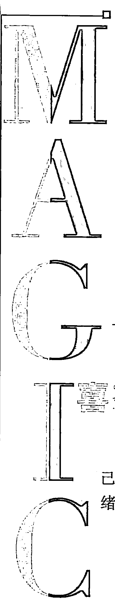

## 魅力失分

> 喜怒太形于色

射手座不懂控制自己的情绪，喜怒各种情绪完全摆在脸上。

## 魅力改造

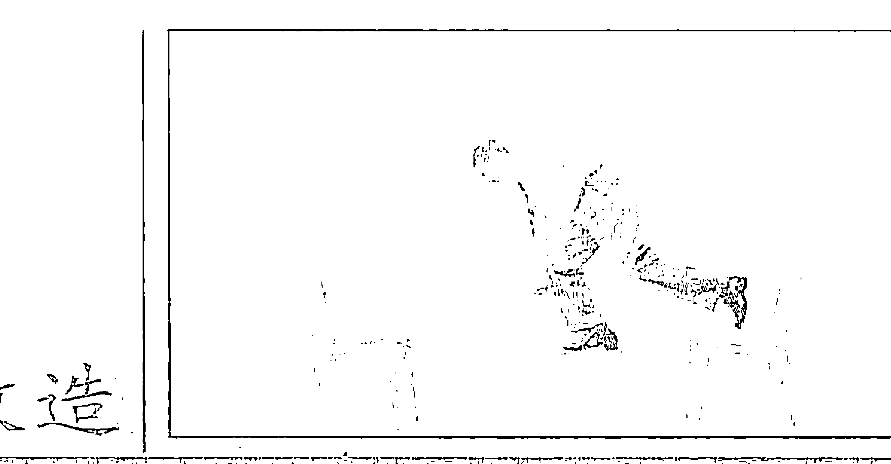

## 无法替代的员工

佚名

公司要裁员，内勤部的小晴与小文，规定一个月后离岗。那天，大伙看她俩都小心翼翼，更不敢和她们多说一句话。她俩的眼圈都红红的——这事搁在谁身上谁都难受。

第二天上班，小文的情绪仍很激动，有同事想劝她几句，她都怒冲冲的，像吃了一肚子火药似的，谁跟她说话就向谁开火。小文心里憋屈得很，只好找杯子、文件夹、抽屉撒气。“砰砰”、“咚咚”，大伙儿的心被她提上来又摔下去，空气都快凝固了。但人之将走，其行也哀，大伙也就忍着，不再说什么。

小文的情绪一直都糟糕极了。原先她负责的为办公室员工订盒饭、传递文件、收发信件的工作，现在也懒得去理了；同事们看她一副愁容满面的样子，也就不再支派她工作。她的心也变得异常敏感，每当别的同事之间小声说点什么，她就怀疑他们在背后嘲笑她。她每天用异样的目光在每个人脸上扫来刮去，仿佛有谁在背后捣她的鬼。许多同事开始怕她，都躲着她，大家都有点讨厌她了。

裁员名单公布后，小晴哭了一个晚上，第二天上班也无精打采，可打开电脑、拉开键盘，她就把工作以外的事都抛开了，和以往一样地勤恳工作。小晴见大伙不好意思再吩咐她做什么，便特地跟大家打招呼，主动揽活。她说，是福跑不了，是祸躲不过，反正都这样了，不如干好最后一个月，以后想干恐怕都没机会了。小晴仍然勤奋地打字复印，随叫随到，坚守在她的岗位上。

一个月满，小文如期下岗，而小晴却被从裁员名单中删除，留了下来。主任当众传达了老总的话：“小晴的岗位谁也无法替代；小晴这样的员工，公司永远不会嫌多！”

> 魅力提示：
人非圣贤，免不了七情六欲，有情绪是免不了的，关键是如何控制好它，不要让它信马由缰地破坏我们的形象、关系和工作。而且做情绪的主人也并不是要完全抑制情绪，而是要掌控它，让它以合适的方式爆发、宣泄。

## 镜子的妙用

佚名

有一个女孩子从小到大一直和父亲进行着无穷无尽的争执。
有一天，父女又吵得面红耳赤，怒目相对。
女孩气得像火山，都要炸了。可是这时候，风大，把窗子吹开来，正好反射出她的脸。女孩子突然吓了一跳，那玻璃窗上的脸，不就是老爸的脸吗？脸涨得红红的，眼睛瞪得鼓鼓的，那鼻子，那脸庞，都跟自己对面的老头一个样子。

女孩突然不再气了，她发现她正在欺负一个老人，父亲也正在欺负自己。自己的脾气，就像父亲的脾气；父母生了自己，就好像用他的左手，打了他的右手，父亲真可怜。

女孩子开始同情父亲，脸上的表情缓和了。奇妙的是，对面那个表情也缓和了，他们好像一面镜子，一起动作。

从此，女孩和爸爸一不高兴，就去照镜子，对着镜子里的自己发脾气，然后他们就都不气了。

> 魅力提示：
当你心情好的时候，看谁，都觉得面善；心情不好的时候，看谁，都觉得可憎。每个人的脸都是一面镜子，反映一切，也改变一切。当你觉得人人面目可憎的时候，先去照照镜子，是不是自己出了什么问题。

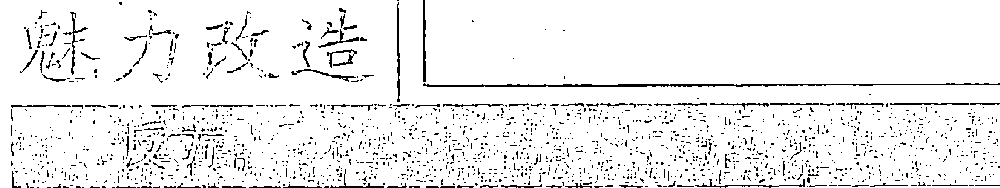

## 生气的代价

佚名

李志是一家家具销售公司的副总经理，临近中秋节的一个早上，他和老婆商量给在农村老家的父母寄点过节费，李志认为自己一年才回家一趟，怎么一次也要寄5000元吧，而老婆觉得过节费也就是个意思，再说老两口也花不了多少钱，2000元就够了，两人为此大吵一通。

最后，李志摔门而出，每次给自己的父母寄钱，老婆都不高兴，大加阻拦，而给她的父母寄钱买东西，她都会自己再偷偷添上一些。这样越想越生气，一路上总觉得看什么都不顺眼，心情糟糕透顶。

带着满腔怨气，李志来到了办公室，见工程部的刘经理正和下属们聚在一起有说有笑，李志的脾气因此一触而发。

“刘东，公司请你来做事，还是请你来讲笑话的？”平常都叫“刘经理”，现在是直呼其名，语气严厉。

“老大，我是在安排今天的工作。”刘东委屈地辩解。“老大？什么老大？你以为这里是黑社会啊？”李志对着刘东越吼越凶。而以前，刘东也是这样称呼他的，他每次也都会哈哈一乐，从没有责怪过。

刘东为自己莫名其妙地挨批非常生气，想自己在外面累死累活地做事情，在公司还要受这样的怨气，这哪里是人过的日子？于是，就和李志争吵了起来。后来的结果是，刘东一气之下辞了职，带走几个工程大户投奔到了竞争对手的门下，处处与李志的公司作对。

## 魅力提示

> 人非草木，孰能无情。人与动物的最大区别就是情感丰富、智力发达。心情也许难以控制，但是，至少表情应该受到理智的约束，否则，就会给自己带来无穷无尽的麻烦，也会伤害到别人。

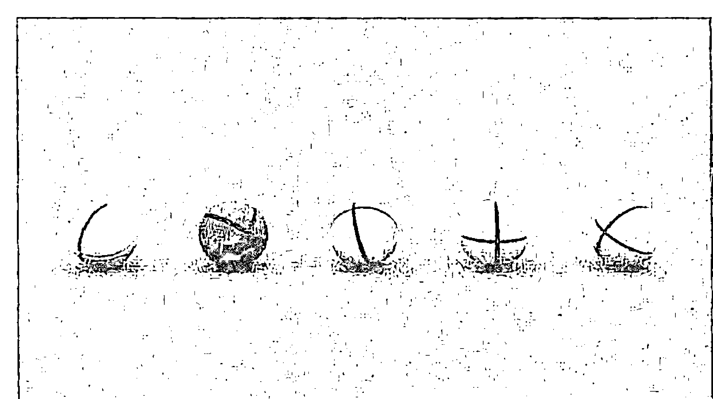

## 小李被炒

水 淼

小李是一个嘴里藏不住话，脸上藏不住事的人。他在一家广告公司做设计。公司一共只有三个设计人员，而他们的设计总监是市场总监兼任的，所以对专业上的事情不太懂。

设计总监总是站在市场的角度去想问题，他追求市场评价，而小李在设计方案的时候总是追求艺术上的完美，因此两人经常意见不一致。

有一次，小李设计了一个室外广告图案，总监看了直摇头，说没有冲击力，没有感觉。小李马上就在他背后露出鄙夷的目光。这时，总监突然转过头，跟小李的目光撞了个正着，仿佛听到小李在说：“你什么都不知道，就知道瞎说！”

总监看到小李对自己露出轻蔑的神情，马上对小李说：“怎么？我说得不对吗？”

“没有啊！”小李赶紧掩饰。

“那你这么看着我干什么？”其实总监也知道，自己在设计方面可能没有小李那么专业，但是他绝不能容忍自己的下属轻视自己的能力，看不起自己。

后来，总监也不给小李好脸色看，工作上故意为难他。没过多久，他就以小李做事不贴近市场为由，在老板面前告了小李一状。于是，小李就莫名其妙地被炒掉了。

> 魅力提示：
与人相处，高兴的时候情不自禁，不高兴的时候只因一句话不对马上就能翻脸。这其实是一种不成熟的表现。你如果能恰当地掌握你的情绪，那么你将在别人的心目中呈现“沉稳”、“可依赖”的形象。

## 魅力连接

- 书名：情绪管理
- 作者：曾仕强 著
- 出版社：鹭江出版社
- 出版时间：2008-1-1
- 印刷时间：2008-1-1
- 开本：16开
- ISBN：9787806718353
- 包装：平装

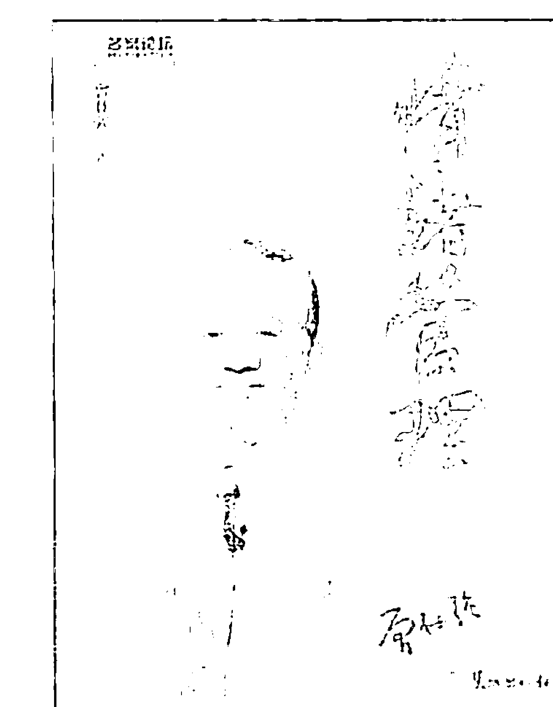

## 内容简介

如何了解你的情绪，如何控制你的情绪，如何改变你的情绪。你是情绪的主宰，情绪管理的最高境界是自由自在。曾仕强教授全新力作，中国式管理又添佳品。

# 魔方第四面
交友篇

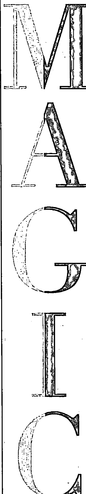

## 魅力失分

容易交到坏朋友

射手座的人有自己的一套标准，通常他去结交一个人，就是因为很有趣，而且他认为自己聪明，身手矫健，应该不会被欺骗，实际上经常不知不觉就陷入泥沼。

## 魅力星座智慧书之射手座

## 魅力改造

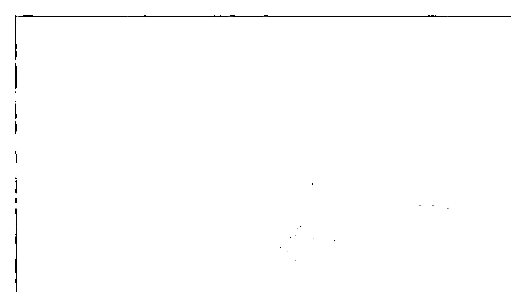

## 明天也要做伴

龙婧

德诺 10 岁那年因为输血不幸染上了艾滋病，伙伴们全都躲着他，只有大他 4 岁的艾迪依旧像从前一样跟他玩耍。离德诺家的后院不远，有一条通往大海的小河，河边开满了五颜六色的花朵，艾迪告诉德诺，把这些花草熬成汤，说不定能治他的病。

德诺喝了艾迪煮的汤，身体并不见好转，谁也不知道他还能活多久。艾迪的妈妈再也不让艾迪去找德诺了，她怕一家人都染上这可怕的病毒。但这并不能阻止两个孩子的交情。一个偶然的机会，艾迪在杂志上看见一则消息，说新奥尔良的费医生找到了能治疗艾滋病的植物，这让他兴奋不已。于是，在一个月明星稀的夜晚，他带着德诺，悄悄地踏上了去新奥尔良的路。

他们是沿着那条小河出发的。艾迪用木板和轮胎做了一条很结实的船，他们躺在小船上，听着流水哗哗的声响，看着满天闪烁的星星，艾迪告诉德诺，到了新奥尔良，找到费医生，他就可以像别人一样快乐地生活了。

不知漂了多远，船进水了。孩子不得不改搭顺路汽车。为了省钱，他们晚上就睡在随身带的帐篷里。德诺咳得很厉害，从家带的药也快吃完了。这天夜里，德诺冷得直发颤，他用微弱的声音告诉艾迪，他梦见二百亿年前的宇宙了，星星的光是那么暗那么黑，他一个人待在那里，找不到回来的路。艾迪把自己的球鞋塞到德诺的手上说：“以后睡觉，就抱着我的球鞋，想想艾迪的臭鞋还在你手上，艾迪肯定就在附近。”

孩子们身上的钱快用完了，可离新奥尔良还有三天三夜的路。德诺的身体越来越弱，艾迪不得不放弃了计划，带着德诺又回到家乡。不久，德诺就住进了医院。艾迪依旧常常去病房看他，两个好朋友在一起时病房便充满了欢乐。他们有时还会合伙玩装死游戏吓医院的护士，看见护士们上当的样子，两个人都忍不住大笑。艾迪给那家杂志社写了信，希望他们能帮忙找到费医生，结果却杳无音讯。

秋天的一个下午，德诺的妈妈上街去买东西了。艾迪陪着德诺，夕阳照着德诺瘦弱苍白的脸，艾迪问他想不想再玩装死的游戏，德诺点点头。然而这回，德诺却没有在医生为他摸脉时忽然睁眼笑起来，他真的死了。

那天，艾迪陪着德诺的妈妈回家，两人一路无话，直到分手的时候，艾迪才抽泣着说：“我很难过，没能为德诺找到治病的药。”

德诺的妈妈泪如泉涌地说：“不，艾迪，你找到了。”她紧紧地搂着艾迪，“德诺一生最大的病其实是孤独，而你给了他快乐，他一直为有你这个朋友而满足……”

三天后，德诺静静地躺在地下，双手抱着艾迪穿过的那只球鞋。

> **魅力提示：**
除了一个真心的朋友之外，没有一样药剂是可以通心的。在生活中，每一个人都应当是春晖，给别人以温暖。在今天，人与人之间的关系更应该如此。朋友之间，待之以诚，肝胆相照，不就是相互照耀，相互温暖吗？人之一生，交到一个真诚的朋友，是多么幸运的事情。

## 管鲍之交

佚名

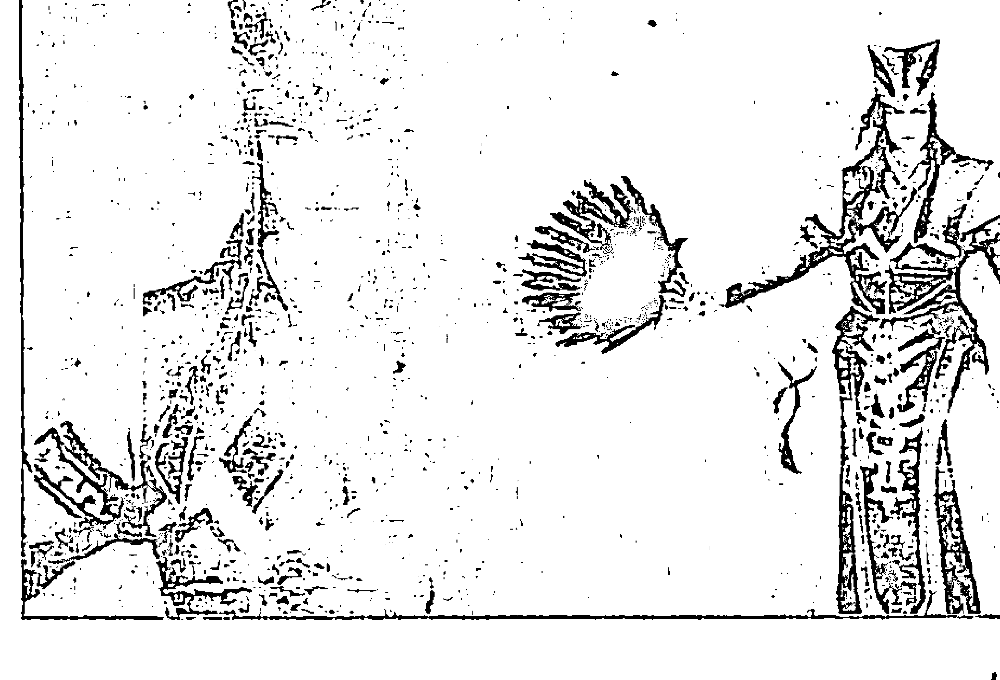

春秋时鲍叔牙和管仲是好朋友，二人相知很深。他们俩曾经合伙做生意，一样地出资出力，分利的时候，管仲总要多拿一些。别人都为鲍叔牙鸣不平，鲍叔牙却说，管仲不是贪财，只是他家里穷呀。管仲几次帮鲍叔牙办事都没办好，三次做官都被撤职，别人都说管仲没有才干。鲍叔牙又出来替管仲说话：“这绝不是管仲没有才干，只是他没有碰上施展才能的机会而已。”他俩还一起当过士卒，打起仗来，冲锋时，管仲在后，鲍叔牙在前；败退时，管仲在前，鲍叔牙在后。人们都讥笑管仲贪生怕死，但鲍叔牙还是替他辩护：“管仲不是贪生怕死之辈，他家里有老母亲需要奉养啊！”管仲曾感慨地说：“生我者父母，知我者鲍叔牙！”后来，鲍叔牙当了齐国公子小白的谋士，管仲为齐国公子纠效力。两位公子在回国继承王位的争夺战中，管仲曾驱车拦截小白，引弓射箭，正中小白的腰带，小白弯腰装死，骗过管仲，日夜驱车抢先赶回国内，继承了王位，称为齐桓公。公子纠失败被杀，管仲成了阶下囚。齐桓公登位后，要拜鲍叔牙为相，并欲杀管仲报一箭之仇。鲍叔牙不愿担任相国之位，并指出管仲之才远胜于己，力劝齐桓公不计前嫌，用管仲为相。齐桓公于是重用管仲，果然如鲍叔牙所言，管仲的才华逐渐施展出来，终使齐国成为春秋五霸之一。

> > **魅力提示：**
>
> 这是怎样的相识相知啊，他们不是利益权贵之交，而是真诚的心灵之交，所以，才会被传为千古佳话，令人称羡。

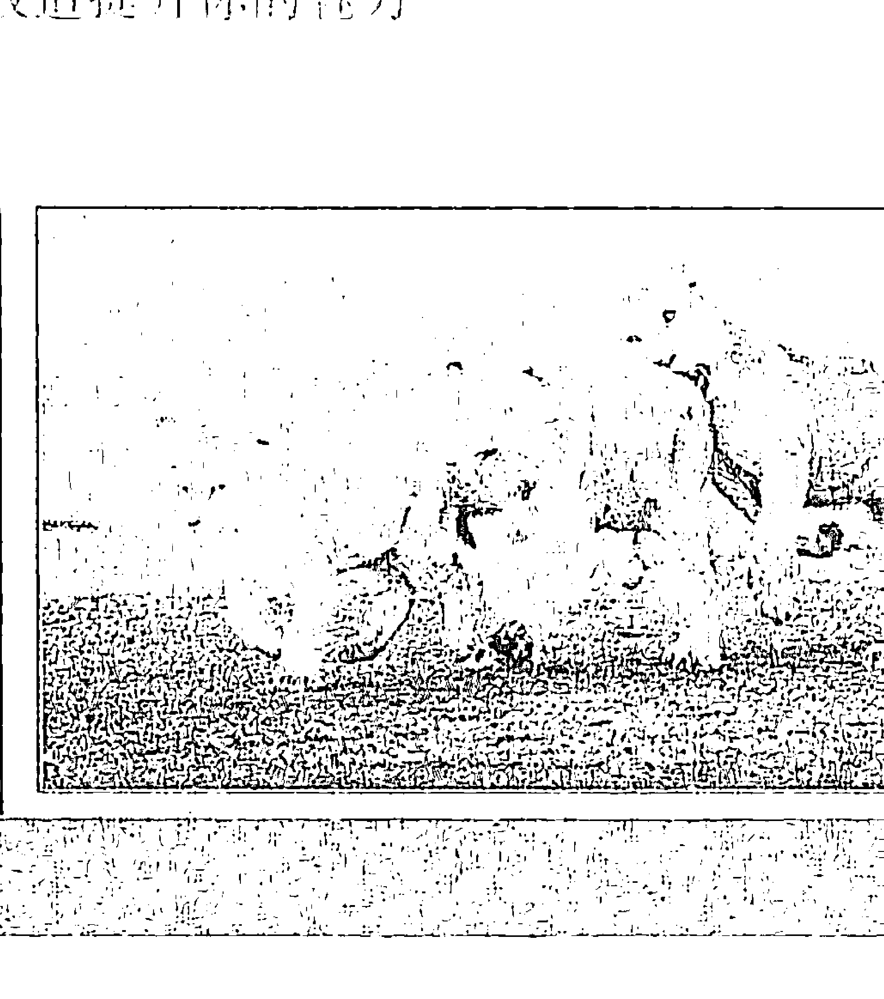

## 养狮人的悲剧

佚名

从前，有一个人在山路上捡到一只幼小的狮子，觉得非常可怜，便抱回家喂养。他对狮子照顾得无微不至，给它喂以美味的食物，给它梳毛，给它洗澡。狮子对他也亲密无间，扒他的肩膀，舔他的手脚，陪他散步，和他玩耍。狮子在他的怀中渐渐长大，长成一只威猛的雄狮，也温驯得如一条家狗。有一天他突发奇想：骑着狮子旅游。于是他骑上了狮子，踏上了旅程。一路上狮子很听话，平稳地驮着他。所到之处人们对他夹道喝彩，他更神气了。路上有人问他：“狮子不会吃你吗？”他说：“那怎么可能呢！”路上有条狗问狮子：“你怎么不吃他？”
狮子说：“那怎么可能呢！”
一天，他们要穿过一片沙漠，路上遇到了风沙，水和食物都被卷了去。
他在痛心之时也还去安慰狮子：“朋友忍着点，等过了沙漠，我让你饱餐一顿。”并跳下来步行。

一天过去了，狮子饿得围着他打转；两天过去了，狮子饿得舔他的手脚；三天过去了，狮子对他进行了轻轻地撕咬；四天过去了，狮子向他呲起了牙齿；第五天，饥饿的狮子向他瞪起了血红的眼睛，在他正要上前抚摸它时，狮子奋力一纵将他扑倒，瞬间把他撕成了碎片。至死他都不明白，狮子怎么会吃了他呢？

> 魅力提示：
世间的友谊，有些是建立在饱暖基础上的，吃饱穿暖了是亲密无间的朋友，生死存亡的时候便会露出凶残的本质。切记：被你视为亲密无间的朋友，有时常常能给你致命的一击。

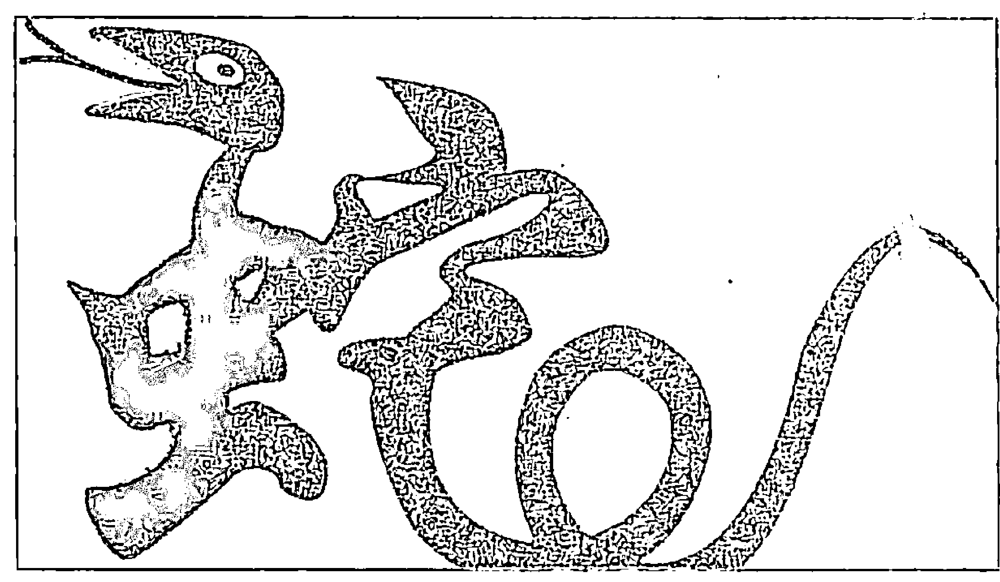

## 农夫和蛇

谢米哈尔科夫

有一天，农夫跟蛇交上了朋友。蛇是十分聪明的，它不久就设法使农夫对它十分亲热。农夫果然把它当成了好朋友，经常夸赞它，永远把它捧到天上。

然而，如今他的一切老朋友和亲戚，没有一个再来他家串门了。

农夫很奇怪：“这是怎么回事呢？请你们告诉我，你们谁也不来看我，这是什么缘故呢？是我的老婆没有按照礼数款待你们呢，还是你们嫌弃我的食物粗劣不可口呢？”

“不，”他的朋友们答道，“问题不在这里！我们极愿意和你一起聊天，你们两人谁也没有在什么地方叫我们不高兴或是把我们得罪了。没有人会这样埋怨你们的，我们可以保证！可是，如果你一块儿坐着，我们的心里总是不塌实，老是要东张西望的，时时提防着你的朋友蛇会爬过来从背后咬我们一口，那又有什么乐趣呢！”

## 魅力提示

交上了坏朋友的人，是难以得到世人的敬重的

## 魅力星座智慧书之射手座

## 魅力链接

- 书名：观色 观行 观心
- 作者：黄大钊 著
- 出版社：中国书籍出版社
- 出版时间：2006-1-1
- 印刷时间：2006-1-1
- ISBN：9787506813259
- 包装：平装

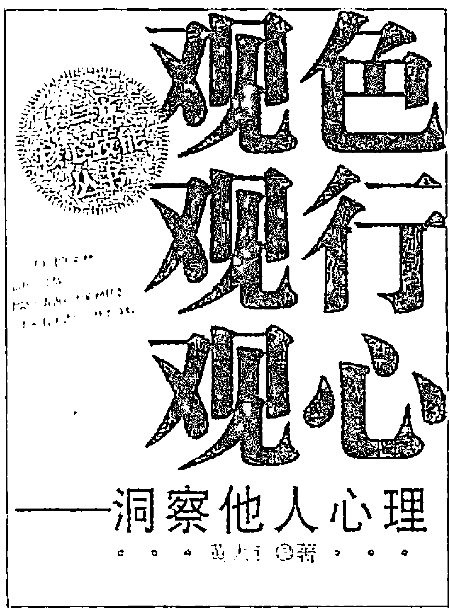

## 内容简介

一个不经意的眼神、动作、手势，都隐含着内心的某种状态，也影响着生活和工作的成败。本书旨在引导人们通过感知他人动作、体态、服饰、目光等“身体语言”暗藏的玄机，达到洞察他人内心之目的。阅读本书，能让你准确领悟他人意图，从而在事业上助你一臂之力；日常生活中让你受益无穷。

# 魔方第五面
学业事业篇

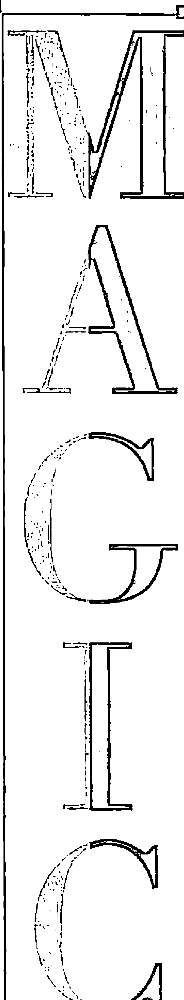

## 魅力失分

浮躁

射手座的人很浮躁，工作学习都很难沉得下心去做。

## 魅力改造

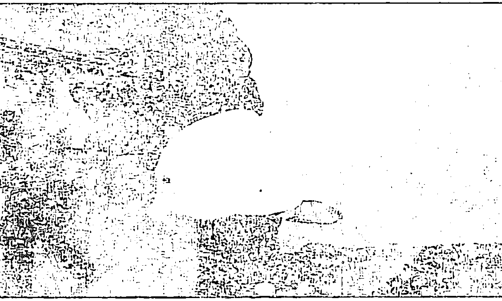

## 别让情绪把鱼吓跑

佚名

一位年轻人在岸边钓鱼，坐在他旁边的一个老人也在守望着一根长长的鱼竿。

一段时间过去了，奇怪的是，老人不时地就能钓到一条银光闪闪的鱼，可是年轻人的浮标却没有动静。年轻人迷惑不解地问老人：“我们钓鱼的地方相同，您也没有用什么特别的诱饵，为什么我就毫无所获呢？”

老人微笑着说：“这就是你们年轻人的通病，喜欢浮躁，情绪不稳定，动不动就烦乱不安。我钓鱼的时候，常常达到了浑然忘我的地步，我只是静静地守候，不像你会时不时地动动鱼竿，叹息一两声。我这边的鱼根本就感觉不到我的存在，所以，它们咬我的鱼饵，而你的举动和心态只会把鱼吓走，当然就钓不到鱼了。”

> 魅力提示：
钓鱼这一小小的事件却蕴藏着深刻的哲理：很多时候，我们输给对方的原因不是因为我们的条件比他们差，而是因为我们没有调整好心态。……一切都流于浮躁

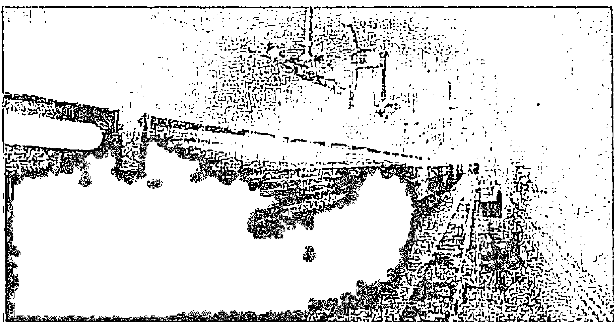

## 心躁与心静

蒋光宇

由于意外的塌方事故，矿井下的设施几乎完全瘫痪了，几个老矿工被困在了井下极深的坑道中。随着时间的流逝，连他们头上戴的矿灯也一个接一个地熄灭了。尽管他们在漆黑的世界里奋力四处寻找出路，但因辨不清楚方向而找不到出口。精疲力竭的几个老矿工，不得不坐下来歇息歇息。

一个老矿工打破了沉闷，建议说：“现在，上面一定在想方设法地营救我们。与其这样盲目乱找，不如静静地坐在这里，看看是否能感觉到风的流动，因为风一定是从坑口吹来的。”

他们就在原地坐了很久很久，刚开始没有丝毫的感觉，可是过一段时间以后，他们变得很敏锐，逐渐感受阵阵十分微弱的风轻抚脸上。他们顺着风的来处，终于找到出路了。
心躁使他们在死亡线上徘徊，心静帮助他们走向了新生。
有一个木匠在干活的时候，不小心将一块名贵的手表丢失了。他一面大声地抱怨自己倒霉，一面在满是木屑的地上寻找，可找了好久也没有找到。后来，几个伙伴与他一起找，还是没有找到。
等这些人去吃午饭的时候，木匠的孩子独自走进了寂静的厂房。没一会儿工夫，孩子居然找到手表了！
木匠又高兴又惊奇地问孩子：“你是怎么找到的？”
小孩回答说：“我只是静静地坐在地上。刚换了两个地方，我就听到‘滴答！滴答’的声音，很快就知道手表在哪里了。”
心躁使众人劳而无功，心静使孩子马到成功。

> > 在很多情况下，心躁则暗，心静则明。

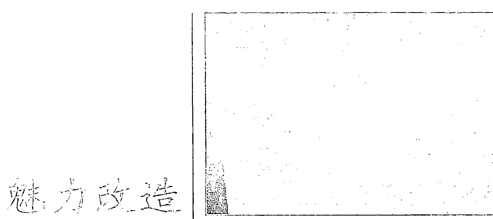

## 麦当劳的选择

佚名

20世纪70年代，麦当劳看好我国台湾市场，决定在当地培训一批高级管理人员。他们最先选中了一个年轻的企业家，此人条件不错。但是，在接下来的考察中，却始终都没有定下来。

麦当劳高层觉得，此人虽然诸方面条件都尚可，但在某些方面似乎有不易察觉的毛病，因此决定进一步试探。于是，有一次，总裁突然问：“如果你要你先去打扫厕所，你会怎么想？”那个企业家立即沉默不语，脸上还现出了尴尬的神情。

麦当劳的这位亚太总裁从他的表情中已经读出：要我一个小有名气的企业家打扫厕所，未免大材小用了吧？就这样，总裁最终还是放弃了这位自恃高才的企业家。

年轻的企业家希望事业有个高起点，本无可厚非，但现实中还需要脚踏实地做好基础工作。下文中的农家子弟便是很好的例子：

大虎是富豪子弟，与他同在名校管理系的小宁是农民的儿子。他们一起进入名校的热门专业，两人的起点似乎相同。不同的是，小宁在校期间家教、零工都做过，学校的团队工作他也积极参与，还是绿色志愿者；而大虎则有的是经济来源，有的是“仆人”，所以养尊处优，学习上也不肯太下功夫。

毕业了，大虎进入父亲的公司，不久就成为行政副总；小宁则到了一家小软件公司，干办公室工作。

十年过去了，大虎还是父亲那家公司的行政副总，而小宁也已升任行政副总，只不过他所在的公司随着 IT 产业的迅猛发展改组为集团。毕业十周年聚会，大家诧异起点那么悬殊的两个人如今何以此消彼长。

有人说：“这就好比爬杆儿，要看高低，也要看速度。速度够了，距离也就短了。”

> **魅力提示：**

中国有句古语：“不积跬步，无以至千里；不积细流，无以成江海。”要想有所成就，我们必须克服浮躁的情绪，踏踏实实，从小事做起，从基础做起，扎扎实实地把成功的基础夯实，我们的成功大厦才会坚久牢固

# 多管闲事的贾金斯

雷雪

在好多年前，当时有人正要将一块木板钉在树上当搁板，贾金斯便走过去管闲事，说要帮他一把。

他说：“你应该先把木板头子锯掉再钉上去。”于是，他找来锯子之后，还没有锯到两三下又撒手了，说要把锯子磨快些。

于是他又去找锉刀。接着又发现必须先在锉刀上安一个顺手的手柄。于是，他又去灌木丛中寻找小树，可砍树又得先磨快斧头。

磨快斧头需将磨石固定好，这又免不了要制作支撑磨石的木条。制作木条少不了木匠用的长凳，可这没有一套齐全的工具是不行的。于是，贾金斯到村里去找他所需要的工具，然而这一走，就再也不见回来了。

# 魅力提示：

想改变自己处境的人很多，但是很少有人将这种改变处境的欲望具体化为一个个清晰明确的目标，并为之奋斗。结果，这些人的欲望也仅仅是欲望而已。

# /魅力星座智慧书之射手座

# 魅力链接

- 书名：我们不可以浮躁
- 作者：付娜 编著
- 出版社：中国三峡出版社
- 出版时间：2010-2-1
- 印刷时间：2010-2-1
- 开本：16开
- ISBN：9787802236059
- 包装：平装

# 内容简介:

我们常常坐卧不宁；我们常常心不在焉；我们常常没有耐心做完一件事；我们常常计较自己做得太多，得到的太少；我们常常感到身心疲惫……

浮躁带给我们的是什么？

是没有耐心，是朝三暮四，是浅尝辄止，是患得患失，是焦虑不安，是急于求成……

无论是为人，还是做事，如果沾染了浮躁，不但解决不了问题，还会陷入盲区，导致新问题的发生。

所以，我们要学会满足，学会踏实做事，学会不浮躁，让自己的身心都处于一种宁静祥和的状态——真正静下来感受自己的心跳，静静地聆听来自遥远世界的天籁之音，去触摸我们灵魂深处的宁静……

# 魔方第五面

## 学业事业篇

### 魅力失分

#### 过度理想化

射手座的人过度理想化，他的很多想法和做法都会让身边的人觉得有点不切实际。

# 两只老鼠

伊索

《伊索寓言》中有一则关于乡下老鼠和城市老鼠的故事。
城市老鼠和乡下老鼠是好朋友。有一天，乡下老鼠写了一封信给城市老鼠，信上这么写着：“城市老鼠兄，有空请到我家来玩。在这里，可享受乡间的美景和新鲜的空气。过着悠闲的生活，不知意下如何？”
城市老鼠接到信后，高兴得不得了，立刻动身前往乡下。到那里后，乡下老鼠拿出很多大麦和小麦，放在城市老鼠面前。城市老鼠不屑地说：“你怎么能够老是过这种清贫的生活呢？住在这里，除了不缺食物，什么也没有，多么乏味呀！还是到我家玩吧，我会好好招待你的。”乡下老鼠于是就跟着城市老鼠进城去。

乡下老鼠看到那么豪华、干净的房子，非常羡慕。想到自己在乡下从早到晚，都在农田上奔跑，以大麦和小麦为食物，冬天还得在那寒冷的雪地上搜集粮食，夏天更是累得满身大汗，和城市老鼠比起来，自己实在太不幸了。

聊了一会儿，他们就爬到餐桌上开始享受美味的食物。突然，“砰”的一声，门开了，有人走了进来。他们吓了一跳，飞也似的躲进墙脚的洞里。

乡下老鼠吓得忘了饥饿，想了一会儿，戴起帽子，对城市老鼠说：“乡下平静的生活，还是比较适合我。这里虽然有豪华的房子和美味的食物，但每天都紧张兮兮的，倒不如回乡下吃麦子来得快活。”说罢，乡下老鼠就离开都市回乡下去了。

> **魅力提示：**

个性、习惯、需求的不同，最终会使我们回归到自己所熟悉的生活方式里。我们在做事情想问题的时候，也要充分考虑自己的个性、习惯。不考虑自己的优势和个性的目标，不仅舍近求远，难以实现，即便实现了也不会是自己喜欢的生活。

# 30岁要删除的3个梦想

林夕

阿文是我的编辑，毕业于复旦大学中文系，学生时代就在省级报刊发过作品，一毕业就被一家大报高薪聘了去，年纪轻轻就当上了部主任。可谓少年得志。那天他打电话给我，谈了会儿稿子的事，就在谈话快要结束时，他告诉我他刚刚过了30岁生日，语气中透着些许感慨。于是我问他有何感想。他说很多，最大的感想是终于明白了一个道理，那就是他一直埋在心里的3个梦想，现在终于明白，永远也无法实现了！既然无法实现，藏在心里只能折磨自己，所以决定删除。

我一时无语，静静地等着下文。

“第一个要删除的梦想，是英语。你知道吗？我从7岁就开始学英语，开始是被父母逼着学，为此没少挨打受骂，每天早晨还睡得迷迷糊糊时就被叫醒，起来背单词。到现在已经 20 多年了，用坏了 3 个录音机，两个复读机。结果呢，我的英语只能和中国人说，一遇到老外，就得去找翻译。现在回过头来想，真是傻透了！我既不想做职业翻译，也不想定居国外，一生中用英语的机会能有多少？需要时雇个翻译就行了，干吗这么折磨自己呢！这样一想，就通了，人也轻松了不少。”

我无声地笑了，暗想：像阿文这样被英语折磨过的人，在中国恐怕不是一个小数目吧？不知道他们听到这番话，会做何感想？是想像阿文那样选择放弃，还是坚持到底？

“第二个要删除的梦想——”阿文又继续说道，“是浪漫。我承认，浪漫的感觉的确很好，但只适合年轻人。我已经 30 岁了，不想再要什么过程，我要直接步入生活。比如下了班两个人一起去超市，买新鲜食物，或给家里换一个新款窗帘。像那种情人节花 20 元买一支玫瑰、圣诞节花几百元去吃哈根达斯的事，我不会再做了。这种事 30 岁之前做就叫浪漫，30 岁之后再做，就是浪费。”

我忍不住想笑，但好像被哽住了，没笑出来。

“第三个要删除的梦想，就是野心。野心这东西好是好，但和浪漫一样，是年轻人的特权。我不否认，世界上也有大器晚成的人，但那是极少数。对大多数人而言，如果 30 岁无迹象、40 岁无成果，恐怕一生就不过如此了。我今年 30 岁，虽然文章经常见报，书也出了几本，但我不得不承认一件事，那就是自己不可能成为海明威了！那种人是天才，是上帝用特殊材料造成的，几十年才能降一个。而我最多也不过就是一人才吧！就算终其一生不吃不喝日夜兼程地写作，也不可能写出《老人与海》那样的杰作，不如不去做这个天梦，给自己定一个更现实、更适合自己、通过努力能够实现的目标吧。”

阿文的一番感言，让我想起不知谁说过的一句话：男人 30 岁之前是半成品，30 岁之后才是成品。照此说法，阿文应该算是成品了。他今天说的这番话，也像是成年人所为。我相信，他以后的人生会更踏实，更平稳，更少犯错误，作为朋友，我应该为他感到高兴才是。但不知怎么，高兴之余，却有几分落寞。

有人说，人生就是一个不断妥协的过程。依我看，人生更像是一部分为上、下两集的连续剧，以 30 岁为界，上半场是一个不断积蓄、不断体验、不断爆发的过程。下半场则是一个不断丢失、不断内敛、不断删除的过程，直到最后，抵达终点，我们将删除自己的最后一样拥有——生命。这的确不是一件令人欣喜的事情，但又能怎么样呢？主动的删除总比被动的接受要好，我尊重那些 60 岁仍坚持自己、不肯放弃梦想的人，但像阿文这样 30 岁想要删除梦想的人，亦不敢轻看。

> 魅力提示：
坦然地面对生活，抛弃不切实际的想法，只有这样，你的生活才会轻松。

# 魅力改造

# 给猫挂上铃铛

佚名

一群老鼠在富翁家里过着无忧无虑的生活，不愁吃喝，安乐自在地繁衍后代。

然而，不知是主人担心积存的谷物，还是他的朋友无意送了他一只猫，总之，它们的天敌来了，更糟糕的是，这只猫是捉老鼠的神手，老鼠的数目眼看着一天天地减少。

老鼠们为此召开了一次全体会议。一只德高望重的老鼠站了起来，严肃地说道：“这是关系我们生死和未来的问题，我们即将面临着死亡！下面大家商讨一下解决的方案吧！”

大家都静下来了，死亡的阴影笼罩了整个会议。在智能测试中获得第一名的老鼠站了起来，清了清嗓子说：“我现在想出了一个好办法。大家都知道，所有的威胁都来自那只猫，我们只要躲开它，不被它抓住就行了。我们可以把一个铃铛挂到猫的脖子上，一旦猫向我们靠近，就会发出声音。我们听到铃声躲到洞里不就行了吗？”

聪明绝顶的老鼠刚说完，会场里响起热烈的掌声。“对呀，真是个好主意啊！”

那个老鼠满面笑容地接受着大家的夸奖，心中暗暗得意。这时，小老鼠一边往后退，一边胆怯地说：“可是谁去往猫脖子上挂铃铛呢？太可怕了，我可办不到。”

瞬时之间，会场变得寂静无声了。这个主意的确非常绝妙，也十分稳妥，但是派谁去实现呢？

> **魅力提示：**
我们每个人的一生，不是在自己的不切实际的想象中，而是在实实在在的社会中。因此，我们的认知，要符合实际，要经过自己的全部努力才能够实现。

# 尽力而为与量力而行

佚名

一位武术大师隐居于山林中。人们都千里迢迢来跟他学武。
人们到达深山的时候，发现大师正从山谷里挑水。他挑得不多，两只木桶里水都没有装满。

人们不解地问：“大师，这是什么道理？”
大师说：“挑水之道并不在于挑多，而在于挑得够用。一味贪多，适得其反。”

众人越发不解。
大师笑道：“你们看这个桶。”

众人看去，桶里画了一条线。大师说：“这条线是底线，水绝对不能超过这条线，否则就超过了自己的能力和需要。开始还需要画一条线，挑的次数多了以后就不用看那条线了，凭感觉就知道是多是少。这条线可以提醒我们，凡事要尽力而为，也要量力而行。”

众人又问：“那么底线应该定多低呢？”

大师说：“一般来说，越低越好，因为这样低的目标容易实现，人的勇气不容易受到挫伤，相反会培养起更大的兴趣和热情。长此以往，循序渐进，自然会挑得更多、挑得更稳。”

> **魅力提示：**

脱离实际的目标形同虚设，在制定和规划自己的目标时一定不要太脱离自己的实际情况。挑水如同武术，武术如同做人。循序渐进，逐步实现目标，才能避免许多无谓的挫折。

# 魅力链接

书名：读懂社会现实做人
作者：华业 编著
出版社：中国商业出版社
出版时间：2008-5-1
印刷时间：2008-5-1
开本：16开
ISBN：9787504461285
包装：平装

# 内容简介：

做人，要抛弃不切实际的幻想，天天不行动急功近利想一夜暴富，难免阴沟里翻船。成功需要一步一步地积累，而不是凭空想象就能得到的。

在这个现实的社会里，做人必须要现实，否则就无法立足。抱太多幻想，就不能脚踏实地，做出成绩；不懂得赚钱花钱，就没有办法体现价值；不具备防人之心，就很容易上当受骗；不结交贵人，就不会有人帮忙；不讲究语言的艺术，就没有好人缘；做人太张扬，就容易遭人嫉恨；做人太固执，就可能走错方向。

# 魅力第五面

## 事业事业篇

# MAGIC

### 魅力失分

#### 盲目

射手座做事情没有目标，想到什么就马上去做什么，做了再说，相当盲目。

# 给自己树一面旗帜

王加荣

罗杰·罗尔斯是美国纽约州历史上第一位黑人州长，他出生在纽约声名狼藉的大沙头贫民窟。这里环境肮脏，充满暴力，是偷渡者和流浪汉的聚集地。在这儿出生的孩子，耳濡目染，他们之中很多人从小就逃学、打架、偷窃，甚至吸毒，长大后很少有人从事体面的职业。

然而，罗杰·罗尔斯是个例外，他不仅考入了大学，而且还成了州长。在就职记者招待会上，一位记者对他提问：是什么把你推向州长宝座的？面对三百多名记者，罗尔斯对自己的奋斗史只字未提，只谈到了他上小学时的校长——皮尔·保罗。

1961年，皮尔·保罗被聘为诺必塔小学的董事兼校长。当时正值美国嬉皮士流行的时代，他走进大沙头诺必塔小学的时候，发现这儿的穷孩子比“迷惘的一代”还要无所事事。他们不与老师合作，旷课、斗殴，甚至砸烂教室的黑板。皮尔·保罗想了很多办法来引导他们，可是没有一个是有效的。后来他发现这些孩子都很迷信，于是在他上课的时候就多了一项内容——给学生看手相。他用这个办法来鼓励学生。

当罗尔斯从窗台上跳下，伸着小手走向讲台时，皮尔·保罗说：“我一看你修长的小拇指就知道，将来你是纽约州的州长。”当时，罗尔斯大吃一惊，因为长这么大，只有他奶奶让他振奋过一次，说他可以成为五吨重的小船的船长。这一次，皮尔·保罗先生竟说他可以成为纽约州的州长，着实出乎他的预料。他记下了这句话，并且相信了它。

从那天起，“纽约州州长”就像一面旗帜，罗尔斯的衣服不再沾满泥土，说话时也不再夹杂污言秽语。他开始挺直腰杆走路，在以后的四十多年间，他没有一天不按州长的身份要求自己。五十一岁那年，他终于成了州长。

> **魅力提示：**

很多时候，人们的理想和目标就如同一面在风中高高飘扬的旗帜，它指引着人们前进的方向。人生没有目标，就会随波逐流。树立明确的目标，同时努力进取，才能创造人生的奇迹。

# 把目标具体化

张彦庆

有人做过一个实验：组织三组人，让他们分别步行到十公里以外的三个村子。

第一组的人不知道村庄的名字，也不知道路程有多远，只告诉他们跟着向导走就行了。

这些人刚走了两三公里就有人叫苦，走了一半时有人几乎愤怒了，他们抱怨为什么要走这么远，何时才能走到。有人甚至坐在路边不愿走了，越往后走他们的情绪越低落。

第二组的人知道村庄的名字和路段，但路边没有里程碑，他们只能凭经验估计行走的时间和距离。走到一半的时候，大多数人就想知道他们已经走了多远，比较有经验的人说“大概走了一半的路程。”于是大家又簇拥着向前走。当走到全程的四分之三时，大家情绪低落，觉得疲惫不堪，而路程似乎还很长。当有人说：“快到了。”大家又振作起来加快了步伐。

第三组的人不仅知道村子的名字、路程，而且公路上每一公里就有一块里程碑。人们边走边看里程碑，每缩短一公里大家便有一小阵的快乐。行程中他们用歌声和笑声来消除疲劳，情绪一直很高涨，所以很快就到达了目的地。

> **魅力提示：**

人们如果清晰地了解自己行动的明确目标和自己的进行速度，就会自觉地克服一切困难，努力达到目标。目标设计得越具体越细化越容易实现

# 魅力改造

反方

# 毛虫实验

佚名

一队毛虫在树枝上排成长长的队伍前进，有一条带头，其余的依次跟着，食物就在枝头，一旦带头的找到目标，停了下来，它们就开始享受美味。

有人对此非常感兴趣，于是做了一个试验，将这一队毛虫放在一个大花盆的边上，使它们首尾相接，排成一个圆形，带头的那条毛虫也排在队伍中。那些毛虫开始移动，它们像一个长长的游行队伍，没有头，也没有尾。

观察者在毛虫队伍旁边摆放了一些它们喜爱吃的食物。但是，毛虫们想吃食物就得看它们的目标，也就是那只带头的毛虫是否停了下来，一旦停了下来毛虫们才会解散队伍不再前进。观察者预料，毛虫会很快厌倦这种毫无用处的爬行而转向食物。可是毛虫没有这样做。出乎预料之外，那只带头的毛虫一直跟着前面的毛虫的尾部，它失去了目标。整队毛虫沿着花盆边以同样的速度爬行了七天七夜，一直到饿死为止。

> **魅力提示：**

可怜的毛虫给予我们最深刻的启示：没有目标的行动只能走向灭亡。目标对我们非常重要，不容忽视，目标是所有奋斗者幸福的起点。抛开漫无目标和怯懦无能，开始为你的人生确定目标，这意味着你将加入强者的行列。

# 因为外面没有灯

陈前国

夜晚，一个人在房间里四处搜索着什么东西。
有一个人问道：“你在寻找什么呢？”
“我丢了一个金币。”他回答。
“你把它丢在房间的中间，还是墙边？”第二个人问。
“不是，我把它丢在了房间外面的草地上了。”他又回答。
“那你为什么不到外面去找呢？”
“因为外面没有灯光。”

## 魅力提示：

你肯定会觉得这个人很可笑，然而，我们中的有些人每天都在错误的地方寻找他们想要的东西。不要在不必要的地方付出你全部的精力，若要有所收获，必须选择正确的目标。

# Magic 缺点改造提升你的魅力

# 魅力链接

书名：忙要忙到点子上
作者：毛尧飞，杨立军 著
出版社：电子工业出版社
出版时间：2007-5-1
印刷时间：2007-5-1
ISBN：9787121041242
包装：平装

# 内容简介：

不知从何时起，“忙”成了我们的口头禅，也成了多数人生活的常态——忙于工作、开会、应酬、充电……忙得不可开交，似乎总有做不完的事。整日的忙碌让众多职场人士辛苦万分，同时也并非企业的管理者所乐见的。员工的过度忙碌对企业文化造成了负面的影响，造成了企业资源更多的消耗，也增加了企业人力资源管理的危机。忙，真的大有讲究，职场人士该如何才能忙出成效，忙得持久，忙得开心呢？本书将为职场人士阐释最适合自己的忙之道。

## 魔方第五面
### 学业事业篇

### 魅力失分
乐观

射手座是天生的乐观达人，从来不会担心什么，这让跟他合作的人常常不免为他担心。

## 魅力星座智慧书之射手座

### 魅力改造
### 星座

### 董偃的保身之策
佚名

馆陶公主是汉武帝的姑姑，她号称窦太主，嫁给了堂邑侯陈午。等到陈午死后，窦太主寡居，已经有五十多岁了，却和董偃私通。

原来董偃和母亲相依为命，靠卖珠维持生计，十三岁时便跟随母亲出入窦太主家。身边的侍从经常在窦太主面前说董偃容貌俊俏，窦太主便召见董偃，说：“我替你母亲抚养你吧。”于是就把他留在自己的府中，教他读书、写字、相马、驾车和射箭。

长到十八岁时，董偃加冠成人，窦太主在家的时候，董偃就在内中侍奉，外出的时候，董偃就为她驾车。董偃为人温柔可爱，因为他与窦太主的关系很好，各位公卿贵族都与他交游，满城都称颂他，号称董君。

窦太主十分喜爱董偃，趁势帮他广施钱财交结士人，她对府中说：“董君使用钱财，只有一天用丝帛超过千匹，用金子超过百斤，用钱超过百万的时候，才需要告诉我。”

安陵人袁叔是董偃最要好的朋友，他对董偃说：“您暗地里侍奉公主，随时都有可能被皇上处罚，您打算就这样若无其事地过下去吗？”

董偃惶恐地说：“其实我心里也很害怕，但一直想不出好的办法来。”

袁叔说：“城庙路远没有住宿的地方，再加上杂草丛生还要靠民力整治，您何不告诉窦太主让她把长门园献出来，这个地方皇上一直想要得到。要是这样做了，皇上知道了此计是您筹划的，那么您就可以安枕无忧，以后也就不用再担心了。要是您没有这样做，皇上就会提出请求，那时对您又会怎样看待呢？”

于是董偃叩头拜谢说：“一定照您说的去做。”

董偃接着去见窦太主，把这件事告诉了她，窦太主马上奏报皇上，决定把长门园献出来。皇上非常高兴，把长门主园改名为长门宫，董偃也安然无恙。

> 魅力提示：
当自己处于安乐中的时候，要看清其中潜在的危险，同时也要设法化解这种危险。

### 缺点改造提升你的魅力

## 滴水不洒
佚 名

牢房里关着一个死囚，很快就要被斩首。

他被带到了刑场，国王看到他难过的样子，突然大发善心，当着所有人对囚犯宣布：“只要你能够头顶一碗水绕着刑场走一圈而一滴水也不洒出来，我就赦免你的死罪。”

死囚答应了。执刑人员将一碗水端过来放在他的头顶，他站起来，小心地沿着刑场边缓慢地移动着脚步。刑场周围高低不平，杂草丛生，观看的人们也在一旁起哄。死囚头一动不动，眼睛直视前方，脚步缓缓地落下后稍作停顿，再轻轻地抬起另一只脚。他就这样一步一步，从上午一直走到太阳偏西，终于走到了出发点。一直跟在他身旁的执刑人员向国王报告——碗里一滴水也没洒出来。

国王很高兴，宣布释放死囚。人群中爆发出热烈的掌声。

后来有人问他是怎么做到滴水不洒的，他回答说：“哪里是水啊！分明就是我的生命。”

### 魅力提示：
“居安思危”，珍惜每一天的生命，因为日子过去了就不会回来。不要等感觉到生命逝去的恐惧时，再去后悔。时间老人永远不会赦免谁！

### 魅力改造

## 拉磨的战马
佚名

从前，有一个国家，连一匹马都没有。这一国的国王，非常忧虑，脑海中幻想着邻国强大的兵马，有一天攻打到本国的时候，实在无法应付，于是他下决心，用重金向四处购买骏马！如国王的希望，不久买来了五百匹高大的骏马，国王见了，心中非常欢喜，下令叫人加以训练。当五百匹马被训练得能够冲锋陷阵的时候，邻国对他的态度改变了。建立邦交，互派使节，表现得非常和气。国王的心中，以为高枕无忧了。

这样和平的日子，过了几年之后，国王看到这五百匹马，老是坐吃山空，这一笔经费的负担，颇为巨大，心中又忧虑起来！

忽然，他灵机一动，欢喜雀跃道：“何不把这些马，用来从事生产的事业？这样不就能增加国家财政的收入了吗？”

于是，下令将这五百匹马牵到磨房去磨米。

这五百匹马，每天就被工人们用布把眼睛紧紧蒙住，又用鞭子抽打，逼着它们拉着石磨旋转。起初，这些马非常不习惯，横竖乱窜，工人们也感到吃力，但后来，时间一久，五百匹战马，对拉磨已习以为常。

国王一见，更加高兴，他快乐地笑道：“哈哈！这些马既能保国，又能生产，一举两得！”不久，邻国突然进兵侵入他的国境，他即时下令召集那五百匹马，准备应战！国王领着五百骑兵，浩浩荡荡向战场进发，一路上，国王骄傲地想着：“大胆的敌人啊！我有这么多强壮的兵马，有何畏惧你们的侵略！你们何不睁开眼看看我那肥硕的马，你们简直是来讨死的，让我们的军队，杀得你们片甲不留！”走着走着，到了战场，两军交锋，展开激烈的战斗，国王的五百匹马虽很壮硕，但平常都已拉磨旋转成为习惯，此时和敌军交战，仍然不断地旋转着，骑在马上的兵将，一着急，提鞭加紧地抽打着，这样抽打越快，马旋转得也越快。敌军见状大喜，遂驱军直进，横杀直刺无不如意，把那国王的马兵杀得落花流水，全军覆没，逃窜而去。

魅力提示：志在成功的人，必须时刻保持旺盛的斗志，在顺利的时候，未雨绸缪，不断进取，这样，在困难和挫折面前才能够勇往直前，直到成功。

## 秋夜里的蚊子
佚名

深秋的夜晚，作家正伏案沉思。一只高脚的花蚊落在了作家的手背上，作家注视着这个不畏寒的小家伙，没有将手挪动。

高脚的花蚊子将它那黑细的针嘴插入作家的皮下，作家忍着那丝微的麻痒，看着那小生灵颤动的翅膀和渐渐鼓起的肚子。花蚊子忘乎所以地贪婪地吸食着作家的血液，完全不顾自己是否还能承受肚里的重量，它的肚皮已近乎透明，透出血液的鲜红。

终于，它像醉了似的从作家的手背上跌落在稿纸上！作家轻轻地把它按成一摊红色。

> 魅力提示：
灾难总是降临在你最麻痹的时刻，时刻要保持着危机感，不要放松警惕。

### 魅力链接

书名：犹太人为什么成功
作者：田在纬，莎文 著
出版社：中央编译出版社
出版时间：2006-10-1
印刷时间：2006-10-1
ISBN：9787802112087
包装：平装

### 内容简介：
犹太人原系游牧民族，于公元前18世纪左右，迁徙至目前以色列所在的土地上。一般都认为《圣经》里最先出现的犹太人亚伯拉罕，就是这个时期的人物。

犹太社会崇尚学问，拉比（犹太教士）最受大家尊敬。犹太童话故事里出现的英雄，既非勇士，也不是什么王子，而是贤人。

- 有一个拉比问：人有一口却有两耳，这是什么原因呢？另一个拉比回答：这是因为人要多听少说。
- 问：人的眼睛是由黑白两部分组成，为什么却从黑的部分来看事物呢？答：那是因为从黑暗面来看世界比较妥当。神告诫世人，凡事都不要从光明面来看，以免过分乐观。

## 魔方第五面 学业事业篇

### 魅力失分
### 缺点太重

射手座的人都是长不大的小孩，时刻都想着怎么好玩，因此而耽误正事的情况时有发生。

## 三个人的选择
佚名

有三个人要被关进监狱三年，监狱长答应满足他们三个人每人一个要求。美国人爱抽雪茄，要了三箱雪茄。法国人最浪漫，要一个美丽的女子相伴。而犹太人说，他要一部与外界沟通的电话。

三年过后，第一个冲出来的是美国人，嘴里鼻孔里塞满了雪茄，大喊道：“给我火，给我火！”原来他忘了要火了。接着出来的是法国人。只见他手里抱着一个小孩，美丽女子手里牵着一个小孩，肚子里还怀着第三个。最后出来的是犹太人，他紧紧握住监狱长的手说：“这三年来我每天与外界联系，我的生意不但没有停顿，反而增长了200%，为了表示感谢，我送你一辆劳斯莱斯！”

> 魅力提示：
什么样的选择决定什么样的生活。如果你选择现在玩乐享受，那你就要为以后的日子发愁，如果你选择现在努力为今后的生活打拼，那你以后的日子将有所成就。

## 闭门苦读
佚名

清朝初期的著名学者、史学家万斯同参与编撰了我国重要史书《二十四史》。

万斯同小的时候是一个顽皮的孩子。由于贪玩，万斯同在宾客们面前丢了面子，从而遭到了宾客们的批评。恼怒之下，万斯同掀翻了宾客们的桌子，被父亲关到了书屋里。万斯同从生气、厌恶读书，到闭门思过，并从《茶经》中受到启发，开始用心读书。

转眼一年多过去了，万斯同在书屋中读了很多书，父亲原谅了儿子，而万斯同也明白了父亲的良苦用心。经过长期的勤学苦读，万斯同终于成为一位通晓历史遍览群书的著名学者，并参与了《二十四史》之《明史》的编修工作。

> 魅力提示：
只有勤奋地学习和工作才能让人有所成就，只知玩乐而荒废学业事业的人，必将一事无成。

## 蚂蚁和蝉
伊索

认为自己是一个天生的歌唱家的蝉，整个夏天都在歌唱中度过。时间在不知不觉中向前推移，慢慢地进入北风呼啸的冬天。蝉猛一回神，发现曾经拥有的阳光、花朵还有树阴都没有了，最可怕的是连一丁点食物都找不到。它非常饥饿，于是就到了蚂蚁家。

蚂蚁正忙着把潮湿的谷子晒干，蝉流着泪水说：“小蚂蚁，求求你，给我点食物吧！”蚂蚁便问它：“你夏天干什么去了？为什么不积存一点吃的呢？”

蝉回答说：“那时我一点时间都没有，每天要忙着唱美妙动听的歌。”

蚂蚁便嘲笑它说：“哦，是吗？既然你夏季要唱歌，那么冬天不妨去跳舞吧。”

### 魅力提示：
要不失时机地工作、劳动，才能丰衣足食；如果一味玩乐，只能挨饿。千万不要等到饿得受不了的时候才知道后悔。命运的好与坏，都要看曾经的所作所为。

## 烽火戏诸侯
佚名

周朝，周幽王有个漂亮的妃子叫褒姒，但是她有个怪毛病，就是老皱着眉头，连笑都没有笑过一回。周幽王想尽法子引她发笑，她却怎么也笑不出来。一个大奸臣对周幽王说：“从前为了防备敌人侵犯我们的京城，建造了二十多座烽火台。万一敌人打进来，就一连串地放起烽火来，让邻近的诸侯瞧见，好出兵来救。这时候天下太平，烽火台早没用了。不如把烽火点着，叫诸侯们上个大当。娘娘见了这些兵马一会儿跑过来，一会儿跑过去，就会笑的。您说我这个办法好不好？”

周幽王眯着眼睛，拍手称好。烽火一点起来，半夜里满天全是火光。邻近的诸侯看见了烽火，赶紧带着兵马跑到京城。听说大王在细山，又急忙赶到细山。没想到一个敌人也没看见，也不像打仗的样子，只听见奏乐和唱歌的声音。大家我看你，你看我，都不知道是怎么回事。周幽王叫人去对他们说：“辛苦了，各位，没有敌人，你们回去吧！”诸侯们这才知道上了大王的当，十分愤怒，各自带兵回去了。

褒姒瞧见这么多兵马忙来忙去，于是笑了。周幽王很高兴，赏赐了这个奸臣。隔了没多久，西戎真的打到京城来了。周幽王赶紧把烽火点了起来。这些诸侯上回上了当，这回又当是在开玩笑，全都不理他。烽火点着，却没有一个救兵来，京城里的兵马本来就不多，只有一个郑伯友出去抵挡了一阵。可是他的人马太少，最后给敌人围住，被乱箭射死了。周幽王和奸臣都被敌人杀了，褒姒被掳走。

> > **魅力提示：**
为博美人一笑国家大事也拿来当儿戏，这样昏庸的人岂会有好的下场？

### 魅力链接

书名：20几岁，痴迷于学习吧
作者：（日）中岛孝志 著；罗明辉等 译
出版社：南海出版社
出版时间：2008-9-1
印刷时间：2008-9-1
开本：32开
ISBN：9787544242394
包装：平装

### 内容简介：
《20几岁，痴迷于学习吧》是一本指导二十几岁的年轻人学会学习的书，可谓是现在年轻人的学习指南。作者因为职业的关系，接触到无数的人，其中包括很多魅力人物，作者通过对他们的成功原因进行总结，并结合自己的深切体会，谆谆教导年轻人应该痴迷于学习，坚持自我磨砺，这将对自己以后的人生大有裨益。作者指的学习不仅是学习书本上的知识，更是学习在工作中、社会上提高自己能力的方法。

如果二十几岁时贪图玩乐，那么三十几岁时你将会疲于奔命；如果二十几岁时你未曾努力增长本领，那么你的一生都可能从此碌碌无为！明白了这一点就立即行动起来吧！年轻的人们，一切都还来得及！50个学习绝招，将赐予你走向成功的最强力量！

## 魔方第五面
### 学业事业篇

### 魅力失分
射手座是从来不做计划的，他做事情往往随性而为，不会按部就班。

### 魅力改造

### 增强自信的过程
蓝灿辉

已经去世的网坛名将亚瑟·艾虎大家一定很熟悉。他在生命后期，曾全力与艾滋病抗争，来唤起人们对这个“人类杀手”的重视。

但艾虎的伟大之处并不仅仅是在这里。在他之前，网球界一直是白人的天下，艾虎是打破网球界人种限制的第一人。

艾虎的成功是一个不断积累的过程。他的一生可以说是一个不断设定目标并完成的过程。他通过不断定立目标的方法，使自己登上了网坛的王座。他说：“我早期的教练常给我定下清楚明确的目标，并且这些目标正是我愿意遵循的。这些目标不见得一定要像赢得巡回赛那么的重大，而是将一些有待克服的困难、需要努力和做计划的事定为目标。如果能达成这个目标，一定会有某种收获。当然，不是只有赢得巡回赛才可以作为目标的。往往一些小目标渐渐一个个地达成后，我自己都会意外地发现，嘿！大奖离我越来越近了！”

艾虎一直以这种方式参加高难度的比赛。他说：“参加巡回赛，你总想能进入复赛。比赛时，你总希望漏接的反手球不超过某个数字。或者是你必须锻炼体力到一定的程度，气候太热时，你才不至于很快就感到疲倦。这一类的小目标，可以帮助你把成为世界第一或赢得巡回赛这类的远大目标分解为几个较易达成的小目标。”

艾虎一生都以这种方式过日子。他实现一个具体的目标，就再定立一个新的目标。他说：“每次你定立一个目标，然后完成那个目标，其实就是一个不断增强自信的过程。”

### 魅力提示：
成功人士和平庸之辈的差别，就在于前者注重积累，将生活中一个个平凡的目标当成自己实现卓越的阶梯。而平庸之辈只会好高骛远，轻率冒进，或者因为目标过于困难而放弃了奋争的勇气。

## 100万美金
黄小娟

有一次，爱德华·查利弗先生为了赞助一名童军参加在欧洲举办的世界童军大会，极需筹措一笔经费，于是就前往当时美国一家数一数二的大公司，拜会其董事长，希望他能解囊相助。

在爱德华·查利弗拜会他之前，对他做了详细的了解，打听到他曾开过一张面额100万美金的支票，后来那张支票因故作废，他还特地将之装裱起来，挂在墙上以作纪念。

所以当爱德华·查利弗一踏进他办公室之后，立即针对此事，要求参观一下他这张装裱起来的支票。爱德华·查利弗告诉他自己从未见过任何人开具过如此巨额的支票，很想见识见识，好回去说给小童军们听。

他毫不犹豫地就答应了，并将当时开那张支票的情形，详细地解说给查利弗听。

查利弗先生并没一开始就提起童军的事，更没提到筹措基金的事，他提到的只是他知道的对方一定很感兴趣的事，结果呢？

说完他那张支票的故事，未等查利弗先生提及，那位董事长就主动问他今天来是为了什么事。于是他才一五一十地说明来意。出乎他的意料，他非但答应了爱德华的要求，而且还答应赞助5个童军去参加该童军大会，并且要亲自带队参加，负责他们的全部开销，另外还亲笔写了封推荐函，要求他在欧洲分公司的主管，提供他们所需的一切服务。爱德华·查利弗先生满载而归。

### 魅力提示：
做事之前提前做好准备，因为有备而来往往可以让我们事半功倍，机遇也只偏爱那些有准备的头脑。

### 魅力改造

## 欲速则不达
邹维娜

一天，海马做了个美梦，梦中有七座金山在呼唤它。为了这个冥冥中的召唤，它决定去寻找属于自己的财富，并且变卖了它全部的家当，带上了换来的七个金币。

但是它觉得自己游得太慢，后来它看到了鳗鱼背上的鳍，于是就用四个金币买了下来。尽管速度提高了许多，但是海马还是没有看到梦中的金山。

半路上，它又看见了水母的快速滑行艇。为了提高自己的速度，海马忍痛用剩下的三个金币买下了这个小艇。这次它的速度提高了五倍，但是金山还是没有出现。

一条大鲨鱼出现在它的面前，热情地说：“要是有我的帮助，你想有多快就有多快。我本身就是一艘风驰电掣的大船，你上船吧！”大鲨鱼一脸的友好和善，张开了大嘴。

小海马高兴地说：“谢谢你！我就要找到金山了！”说完钻进鲨鱼的口里……

### 魅力提示：
盲目求快，欲速则不达。急功近利，只能适得其反。在现代的高节奏生活压力下，快不是解决问题的方法，要学会停下来思考，学会规划自己的职业目标，按照自己的计划一步一步执行。如果不顾一切，一味求快，必将自尝苦果。

## 完美的厕所
张万久

有一户人家，住在市镇与市镇之间的路上，以种菜为生，颇为肥料不足所苦。

有一天，主人灵机一动：“在这条路上，往来贸易的人很多。如果能在路边盖一个厕所，一方面给过路的人方便，另一方面也解决了肥料的问题。”

于是，他用竹子与茅草盖了一间厕所。果然来往的人无不称好，种菜的肥料也从此不缺，青菜萝卜都长得极为肥美。

路对面有一户人家也以种菜为生。他看到了邻里的收获，非常羡慕，心想：“我也就该在路边盖个厕所。而且，为了吸引更多人来，我要把厕所盖得清洁、美观、大方、豪华。”

于是，他用上好的砖瓦搭盖了一间厕所，内外都抹上石灰，比对面的茅厕大了一倍。

完工之后，他觉得非常满意。

然而，对面的茅厕人来人往，而自己盖的茅厕却无人光顾。这户人家感到非常奇怪，就问路过的人是怎么回事。原来，他盖的厕所太美、太干净，一般人以为是神庙，内急的人当然是跑茅厕，不会跑神庙了。

### 魅力提示：
凡事预则立不预则废，做事之前应该做好周密的计划安排，如果看到竞争对手采取了行动，而盲目仓促上马，很容易导致失败。

## 魅力链接

书名：我的人生“狠”字当头
作者：（美）皮肯斯 著，柏静静 译
出版社：中信出版社
出版时间：2010-1-1
印刷时间：2010-1-1
开本：16开
ISBN：9787508617411
包装：平装

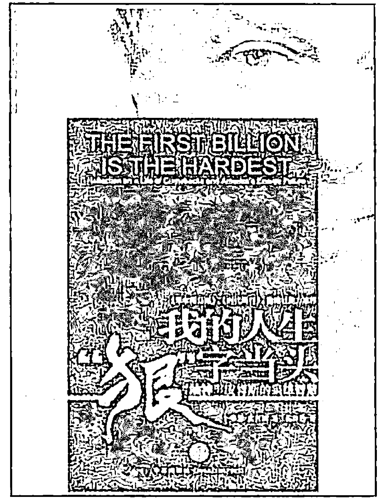

### 内容简介：

“油神”语录：
- 当失败者最好了，我就是个越挫越勇的人。
- 回顾一生，我始终是个不被看好但是频频胜出的黑马。
- 有计划的笨蛋比没计划的天才更聪明。
- 当你还在想的时候，我已经开始行动了。
- 让我再拼十年。相信我，你的一生同样不会缺少“补偿”二字。

他提出的耗资100亿美元的“皮肯斯新能源计划”已得到奥巴马、比尔·盖茨、托马斯·弗里德曼、纽约市长布隆伯格的支持。

我们提供知识，以应对变化的世界。

## 魔方第六面 形象礼仪篇

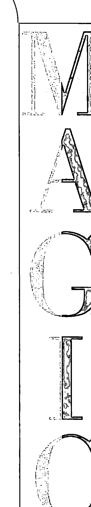

### 魅力失分

#### 过于豪放

射手座的人天生天真豪放，大大咧咧，不顾形象，比如他经常会不顾场合地开怀大笑，在一些正式场合就常常会引人侧目。

### 魅力改造

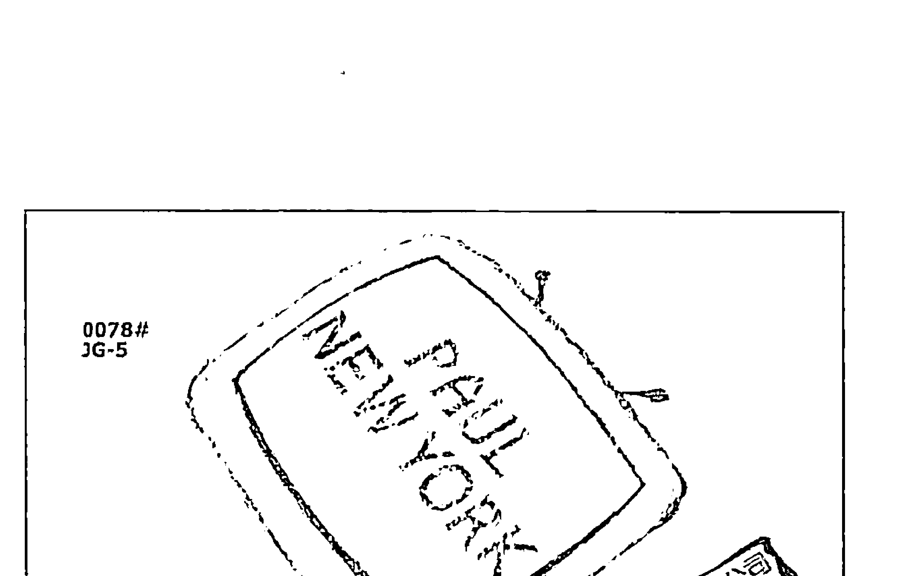

## 配方

### 专业的打扮

佚名

班·费德文是美国保险界的传奇人物，被誉为世界上最有创意的推销员。但他刚进入保险界时，业绩不好，公司准备辞退他了。

班·费德文非常着急，就向公司里的一位成功人士询问，那位成功人士对他说：

“这是因为你太不注意形象了。你一定要记住，要有好的业绩，首先要把自己打扮成一位优秀推销员的样子。”

“你知道我根本没钱打扮！”班·费德文说。

“但你要清楚那是帮你赚钱，你不会多花一分钱。我建议你去找一个专营男装的老板，他会告诉你如何打扮。这么做既省时间又省钱，为什么不去呢？这样更容易赢得别人的信任，赚钱也就更容易了。”那位朋友说。

班·费德文于是马上去了一家美发厅，特别理了一个推销员的发型，然后又去了那位朋友所说的男装店，请服装师帮他打扮一下。

服装师认认真真地教班·费德文打领带，又帮他挑西服，以及选择与之相配的衬衫、袜子、领带等。还特别送给班·费德文一本如何着装打扮的书。不仅如此，他还对班·费德文讲解了一年中什么时候该买什么样的衣服，买哪种衣服最划算。

从此，班·费德文焕然一新，他的穿着打扮有了专业销售人员的样子，推销起来也更加自信了，他的业绩也因此增加了两倍。

在日常生活和社会交往中，有时，第一印象起着决定性的作用。你的行为、穿着打扮一定要与场合相符，与你的身份相符。

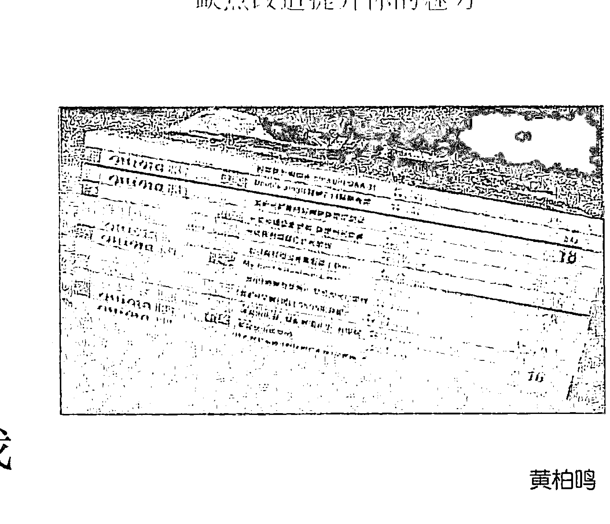

### 您怎么记得我

黄柏鸣

我去成都小住时，经历过这样一件事。刚刚搬来不久，那是我第三次去附近的报亭买报纸。报亭前有几个人在看杂志，我无法近前，只能在旁边站立等待。摊主正在为一个顾客寻找杂志，偶然间用余光瞥见了我。他马上停下手中的活，将一份《成都商报》和一份《华西都市报》折好了递给我，满面笑容。我有点意外，把一元钱探身递给他说声谢谢。他笑着点点头。

成都的冬天难得见到阳光，买完报纸后我便在附近溜达。返回时，看到报亭老板一个人坐着看报纸。我走过去问他：“您怎么记得我，还记得我要买什么报纸？”

他略有羞赧地说：“你那么有礼貌，我咋个会不记得？”

我想起来了。第一次去买报纸时，他正在整理新到的杂志，我微笑着说：“您好，麻烦给我一份《成都商报》和一份《华西都市报》。”面对如此礼貌的打招呼，他似乎有些惊讶，继而脸上堆满了笑容，把两份报纸折叠妥帖递给了我。虽然，他不曾说话，但我的问候给他留下的印象是深刻的。因此，他每次看到我，都会在我未曾开口之前，将报纸折成方便我携带的形状递给我，而且总是笑容满面。

魅力提示：

优雅得体的举止会让你给别人留下深刻的好印象，那是人际交往的基础。

## 魅力改造

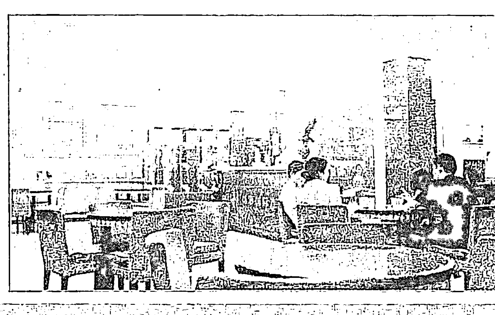

## 整洁的形象

李争平

莎拉和莫娜是同一天来到一家著名广告公司应聘美编的，单从两个人的作品上看，技术水平不相上下。不过莎拉在思路方面略胜一筹，因为她在佛罗里达做过三年这个行当，刚刚回到北方来，经验相对于才出校门的莫娜自然要丰富一些。两个人一起被通知参加试用，而且结果很明确，只能留下一个。

莎拉上班时间从来都是一身T恤短裤的打扮，光脚踩一双凉拖鞋，也不顾电脑室的换鞋规定，屋里屋外就这一双鞋，还振振有词地说：“佛罗里达那儿上班的人都这样，再说我这不是穿着拖鞋吗？”不管是在工作台前画图，还是在电脑前操作，只要活干得顺手，一高兴起来准把鞋踢飞。刚开始，同事们还把她的鞋藏起来，和她开玩笑，后来发现她根本不在乎，光着脚也到处乱跑。

相反，莫娜是第一次工作，多少有点拘谨，穿着也像她的为人一样——文静、雅致之外，带着少许灵气，她从来不通过怪发型、亮眼妆来标榜自己是搞艺术的，只是在小饰物上展示出不同于一般女孩的审美观点来，说话温温柔柔的，很可爱。

有一天中午，电脑室的空气中忽然飘出腥臭味道，弄得一帮人互相用猜疑目光观察对方的脚，想弄清到底谁是“发源地”。后来，大家发现窗台下面有窸窸窣窣的响声，原来那里放着一个黑色塑料袋，有胆子大的打开来一看，居然是一大袋海鲜。

众人的目光不约而同地集中在莎拉身上，没想到她坦坦荡荡地说：“小题大做，原来你们是在找这个。嗨，这可怪不得我，这里的海鲜只能算是海臭，一点都不新鲜，简直比佛罗里达的差远了。”

这时莫娜端过来一盆水：“莎拉姐，把海鲜放在水里吧，我帮你拿到走廊去，下班后你再装走。”

莎拉一边红着脸，一边把袋子拎走了。

结果呢，试用期才进行了两个月，莎拉就背包走人，尽管她的方案比莫娜做得要好，但是老板不想因为留下这样一个太不修边幅的人，而得罪一大批其他雇员。

临走的时候，老板对莎拉说：“你的才气和个性都不能成为你搅扰别人心情的原因，也许你更适合一个人在家里成立工作室，但要在大公司里与人相处，处事得体和合作精神是十分重要的。”

### 魅力提示：

决定一个陌生人的好恶的首要因素是他的形象，一个衣衫得体的人总是能赢得他人的好感。

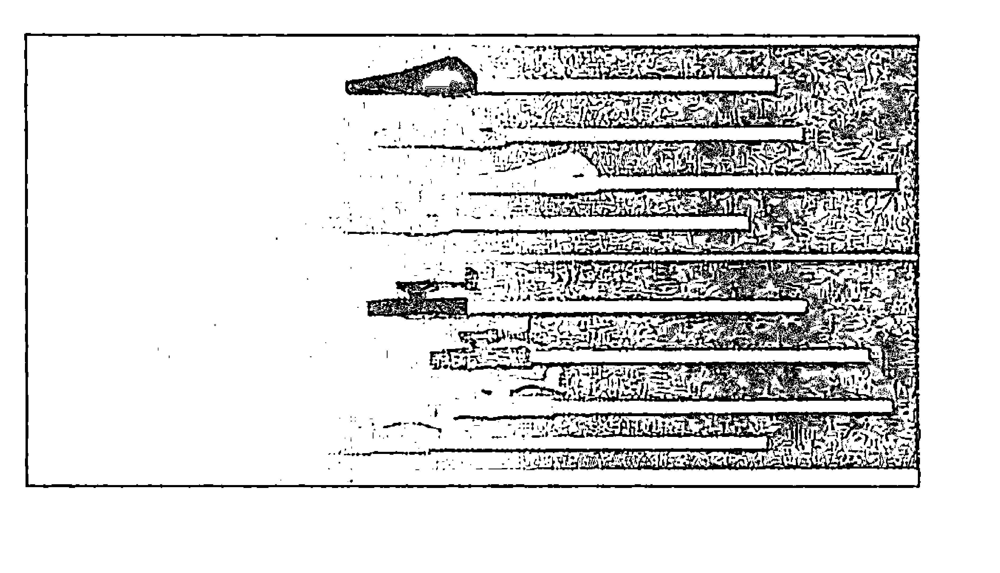

## 修养的作用

佚名

耶鲁大学有一批应届毕业生一共22个人，实习时被导师带到华盛顿的白宫某实验室里参观。全体学生坐在会议室里等待该实验室主任胡里奥的到来。这时有秘书给大家倒水，同学们表情木然地看着她忙活，其中一个还问了问：“有黑咖啡吗？天太热了。”秘书回答说：“抱歉，刚刚用完了。”

有一个名叫比尔的学生看着有点别扭，心里嘀咕：“人家给你倒水还挑三拣四的。”轮到他时，他轻声说：“谢谢，大热天的，辛苦了。”秘书抬头看了他一眼，满含着惊奇，虽然这是很普通的客气话，却是她今天听到的惟一的一句。

门开了，胡里奥主任走进来和大家打招呼，不知怎么回事，静悄悄的，没有一个人回应。比尔左右看了看，犹犹豫豫地鼓了几下掌，同学们这才稀稀落落地跟着拍手，由于不齐，越发显得零乱起来。

胡里奥主任挥了挥手：“欢迎同学们到这里来参观。平时这些事一般都是由办公室负责接待，因为我和你们的导师是老同学，非常要好，所以这次我亲自来给大家讲一些有关情况。我看同学们好像都没有带笔记本，这样吧，秘书，请你去拿一些我们实验室印的纪念手册，送给同学们作纪念。”

接下来，更尴尬的事情发生了，大家都坐在那里，很随意地用一只手接过胡里奥主任双手递过来的手册。

胡里奥主任脸色越来越难看，走到比尔面前时，已经快要没有耐心了。

就在这时，比尔礼貌地站起来，身体微倾，双手握住手册恭敬地说了一声：“谢谢您！”

胡里奥闻听此言，不觉眼前一亮，伸手拍了拍比尔的肩膀：“你叫什么名字？”比尔照实作答，胡里奥微笑点头回到自己的座位上。

早已汗颜的导师看到此情景，微微松了一口气。

两个月后，毕业生去向表上，比尔的去向栏里赫然写着该军事实验室。

有几位颇感不满的同学找到导师：“比尔的学习成绩最多算是中等，凭什么选他而没选我们？”

导师看了看这几张尚属稚嫩的脸，笑道：“是人家点名来要的。其实你们的机会是完全一样的，你们的成绩甚至比比尔还要好，但是除了学习之外，你们需要学的东西太多了，修养是第一课。”

### 魅力提示：

一个值得崇敬的人，首先是一个有修养的人，言行举止会注意场合。

## 魅力连接

书名：一生的忠告
作者：（英）查斯特菲尔德爵士 著；张帆，翟自洋 译
出版社：浙江文艺出版社
出版时间：2006-6-1
印刷时间：2006-6-1
开本：大 32 开
ISBN：9787533923211
包装：平装

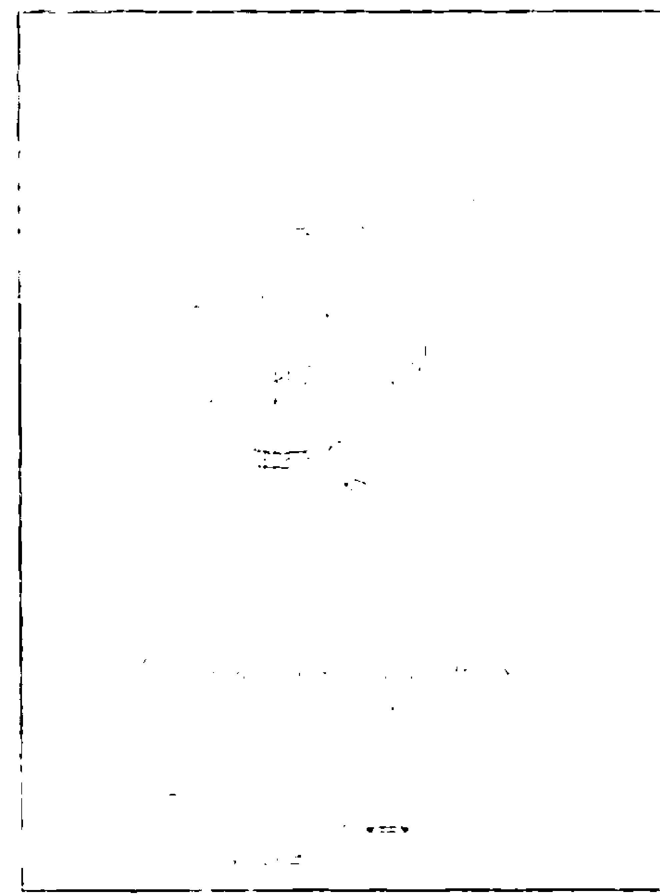

### 内容简介：

美德和学识若是没有优雅相伴，便会黯然失色。

迷人的风度、得体的谈吐、优雅的举止有助于人们发现你身上更伟大的品质。

那些以尽善尽美为目标的人往往更能接近完美。

学识就像怀表，只需放在口袋里，不必拿出来炫耀，只要让人知道你有表就行了。假如别人问你时间，你就拿出来看看，然后告诉他；若是没有人问起，就不要像个卖表人那样不断拿出来报时。

语言是思想的外衣。人们重着装，不会穿得衣衫褴褛、满身污垢；同样的，思想也需要语言的修饰，不至于太过苍白。