# 魅力星座之水瓶座

## 自由而叛逆的水瓶

他良好的人道精神和艺术品位，使他有着略带神秘的特质，以至魅力无限。爱情或友情，别人永远摸不透，只有他自己最清楚。同时他的童稚之美和慧巧的生活态度教人不由得喜欢他。

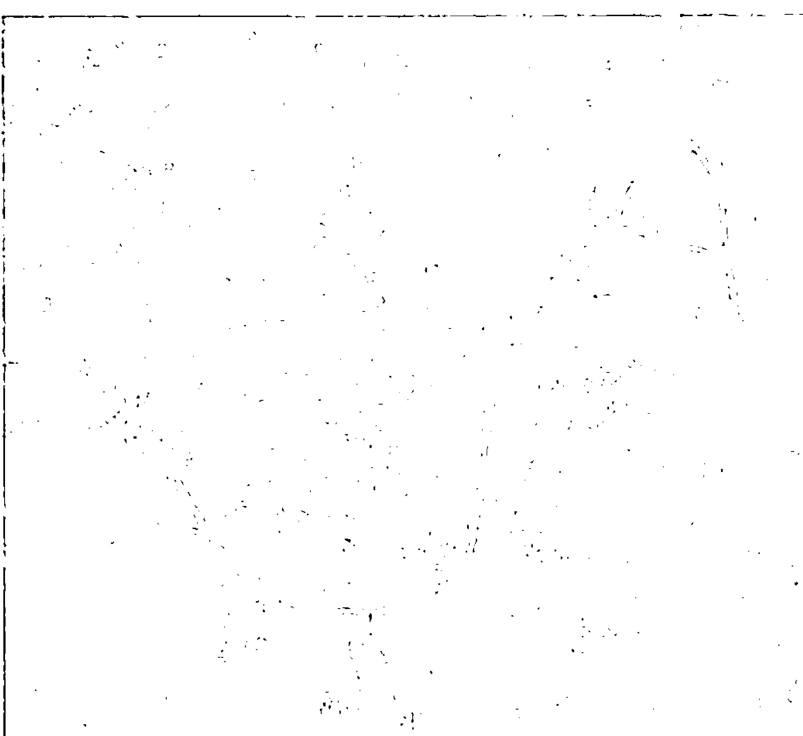

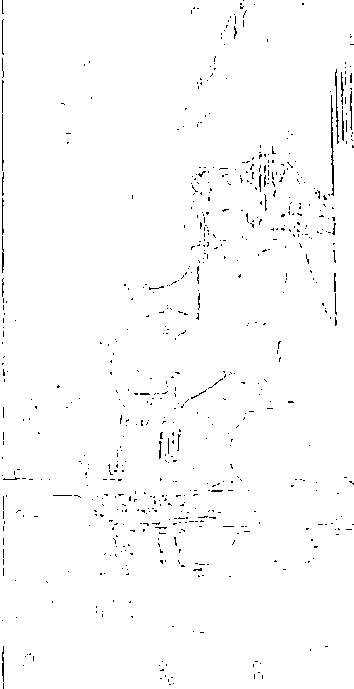

他从小不被娇生惯养，家庭任他风里行进雨里长，他更喜欢信马由缰自由驰骋。他的行动力较强，什么运动项目都想一试身手，但是没有耐性，往往浅尝辄止。在健康方面应当提请注意的是，顺应运动的惯性，适当坚持一定强度的锻炼，否则中年以后容易发胖。

领悟力较强，所学知识能融会贯通。但注意力易分散，抗干扰能力差。学习靠理解记忆，讨厌死记硬背。平时在班上不一定名列前茅，关键性的考试却能得到比预想要好的成绩，因为得益于课外读物中获得的知识积累。只要克服不求甚解的缺点，按照自己的意愿选择喜欢的专业，就能在学业上有所成绩。

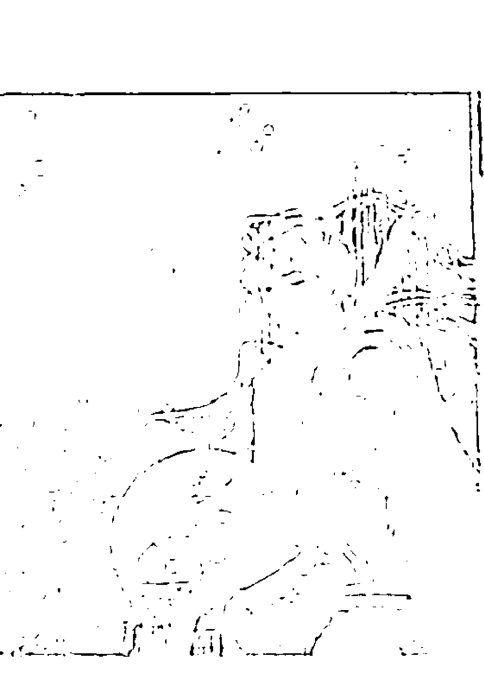

- 叛逆、标新立异、懒惰、理想主义者、太过理智、害怕被束缚、孤僻、思想多变、太相信自己的判断……

属水瓶座者是十二个星座中思想最为自由的人。敢为天下先，喜欢富有刺激与挑战性的工作。因此，属水瓶座者应尽量避免从事那些四平八稳、循规蹈矩、埋没个性的工作。可以尝试时尚方面的工作，领潮流，能充分施展个人才华的领域。机遇好，发展顺利者不难成为社会名流。

他属风，人在青春季节如“风动一杨”，漂泊天际，四海皆芳草。因此，恋爱切切，婚姻迟迟。他也不太在意形式与名分，有爱情相伴便罢，何须论婚姻？其实他并不浪漫，恰恰相反，他是太过理智。等到他需要家庭的时候，那就该是他走下轰轰烈烈的舞台，卸妆休息的时候了。

他追求的目标需要具备某种天赋，也许他从小就显露出一种超群出众的天分，若遇到名师，他可能会少年得志，一鸣惊人，在而立之年就能成就一番事业。但是他往往心气太高，意志薄弱，在掌声与鲜花到来之前，他可能就已经受不住汗水的浸泡。所以他奋斗的过程，并不是一条铺满鲜花的道路。在别人娱乐逍遥的时候，他一直是一个孤独的长跑者。他用青春换来的，也许只是光辉的瞬间，但是他的精神会长存。

“问渠哪得清如许，为有源头活水来”。他的财富源自于他的天赋，如果他奋斗成功，年纪轻轻就会很富有。他能心地单纯，既无聚财之心，也不任意挥霍自己的血汗。他回报父母养育之恩，感谢老师培养之情。亲朋好友在遇到困难的时候都会得到他的支援，他也会为公益事业尽一份心，出一份力。

## Magic

名人的榜样

## /魅力星座智慧书之

## 松下幸之助小资料

- 生日：1894年1月26日
- 星座：水瓶座
- 出生地：日本和歌山县
- 事业成就：是松下电器、松下政经塾与PHP研究所的创办者，在日本被称为“经营之神”

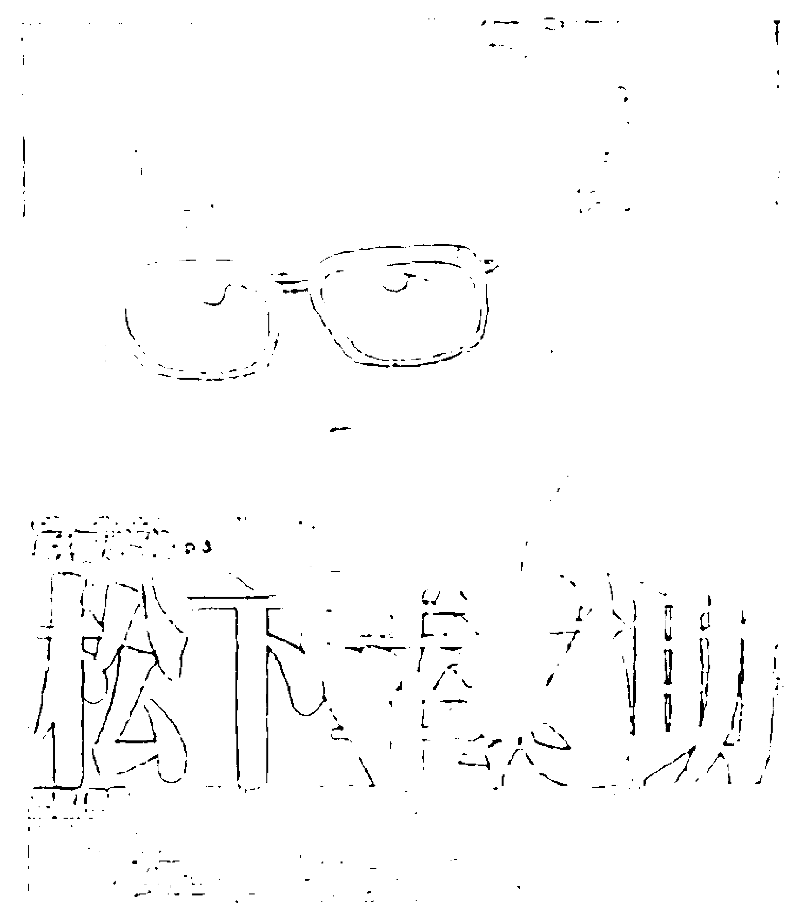

## “美丽”的松下幸之助

松下电器从一家日本企业发展至名扬世界的全球跨国公司，其中的关键因素便是创始人——松下幸之助。其经营哲学令人们高山仰止，其经营之道、管理之术又被人们学习借鉴。

“自来水哲学”、“堤坝式经营”、“非100即0的质量理念”、“玻璃式经营”被人们前赴后继地追随和实践。

他也因其思想的深邃、实践的广博、贡献的伟大而被企业管理者和理论研究者们称为“经营之神”。

今天，我们纵览松下幸之助的一生和事业，可以发现，这是一种对真善美不断追求的执著，是一种“达则兼济天下”的东方儒家风尚，然而这样的执著和风尚却指引和折射着西方管理思想的精髓——“规模效应”、“以人为本”、“用户至上”、“为客户创造价值”、“风险预警”、“以质量和服务取胜”等。

## 美丽的经营之神

健康和成熟的心智是美丽的，也是成功的关键。

从幼年的优渥，到父亲投机生意的失败、家境的落魄，松下幸之助经历了从无忧无虑到家徒四壁的童年。小学四年级，父亲要求松下幸之助到大阪当学徒，他自此开始了少小离家的孤独和日夜劳作的艰辛。

“苦其心志，劳其筋骨，饿其体肤，空乏其身，行拂乱其所为，所以动心忍性，曾益其所不能”这是成事者必经的磨练，松下幸之助亦然。无论是在火盆店、自行车店做学徒，还是在电灯公司做电工助手，以及创业后的艰难。这样的历练都给予了松下坚韧、忍耐、笃定的个性心智，也让他懂得了成功的来之不易。

当学徒之时，老板娘对他的仁慈而让他形成的“以人为本”的哲学基调、对于信念的憧憬和坚定的坚持、对于未来预见和判断的执著，在其以后的人生和事业道路中烁烁闪耀。

在1929年的大萧条中，松下的产品销量减少了一半，库存猛增。在这种局势下，多数企业开始裁员、降低工资。松下幸之助提出“工人一个不裁，工资一分不减，但产量减半，员工取消休假，全体从事销售，消化库存”的方案，仅仅用了两个月时间，库存消化完毕，生产恢复正常。这一事例既是紧急时局下高瞻远瞩的判断和执著，更是松下“以人为本”的哲学思想的体现，是其社会责任的体现。

“如果我们的心不受束缚，那么不论是阴雨还是晴天，我们都能自由自在地找到出路。如果我们画地为牢，那么天晴时也许还过得去，一旦遇到风雨就不知所措了，这样的话，事业决不会获得成功。” 松下先生对于自己内心世界的关注和审视，是对人性真善美的最忠实的把握。他将《青春》作为自己的座右铭，将青春的心境融入自己的人生和事业，将青春的进取和锐勇贯穿到企业精神，将青春的喜悦、达观、仁爱的精神贯穿在企业管理之中。

## 美丽的经营哲学

> “经营的最终目的不是利益，而只是将寄托在我们肩上的大众的希望通过数字表现出来，完成我们对社会的义务。企业的责任是：把大众需要的东西，变得像自来水一样便宜。”

1927年，松下成立电热部，计划生产电熨斗。当时全日本电熨斗每年销量不超过10万个，每个价格在4～5元。松下幸之助认为：“这么方便的东西，但因为价钱贵，很多想用的人都买不起。因此，只要降低价钱，就会有许多人去买。如果很多人要买，乍看起来月产1万个似乎多，但实际上是能够卖出去的；先决条件是，降低价格，使大家都能买得起。” 于是松下决定，以大量生产来降低价格，每月生产1万个，销售价格3.2元。他大获成功。

相对于“股东利益最大化”、“企业价值最大化”的豪言壮语，松下幸之助用简单而朴实的语言道出了企业使命的真谛：把大众需要的东西，变得像自来水一样便宜。松下公司也定出了企业纲领：“彻底认识产业者的使命，谋求社会的改善及进步，进而贡献于世界文化。” 企业的使命就是企业要承担起消除贫困的责任，为人类社会服务。而企业获得的财富则是在不断追求这样的使命中随之而来的。

正是在松下幸之助“自来水哲学”思想的影响下，松下公司的产品以“质优、价廉”引致了“规模化生产”，成本也随之降低，松下电器不断开发新的产品，而老百姓也从松下的不断实践中获益——电熨斗、收音机、电视机……一大批模仿和创新产品的大量面世大幅度提高了人们的生活质量。

今天我们试图用“客户第一，员工第二，股东第三”的排序来与松下的思想呼应，也试图用“企业社会价值”、“企业家慈善”这样的华丽辞藻来标榜松下公司，但这些都不及松下对企业使命的终极思考与实践的彻底和洗练。从“自来水哲学”中我们似乎看到了一美丽的社会财富和幸福的帕累托最优曲线的现实实践，看到了对于人的最大尊重，看到了对于人类社会的最大关心。

## 美丽的经营之道

“对于产品质量来说，不是100分就是0分——没有任何商量！”张瑞敏当年砸冰箱时的铿锵声至今在耳边回荡，其“非正品即废品”的质量理念正是来源于松下最基本的一条经营原则。松下强调“销售产品要像嫁女儿”一样，“将自己的产品呵护负责到底”，还强调“以质量竞争和以服务取胜”，为消费者提供价值，“厌恶压价倾销和排斥同行的不正当竞争手段”。松下对于产品质量和服务的认真和执著，不仅仅是对于产品的关注，而更多的是对人的认真、执著和关注。

不断发展壮大的松下公司并没有像江河入海般洪流奔涌，而是步步为营，稳扎稳打。松下幸之助的心态也并没有随着企业的日益壮大而变得浮躁，反而越发重视对风险的控制。

1965年2月，松下幸之助提出了“堤坝式经营”的理念。堤坝既能调整水流，又能利用水力发电。修建堤坝既能够保证安全，又能够创造价值。同样，市场如同河流，经营如同堤坝。在商品制造销售方面，松下幸之助主张建立后备设备以根据经济变化而调节商品供应；在资金、库存和人才方面，松下也有相应的“堤坝”进行调节，以避免经营过程中的周期性震荡，减少不确定性对企业的冲击。

在发展壮大之时保持头脑冷静，在风平浪静之时保持风险防范意识，创业历程中的跌宕起伏让松下幸之助更加理性、谨慎。不仅要建设和运用堤坝，还要注意堤坝的护理。要明确堤坝为消费者服务的宗旨，不能偏离顾客导向。松下幸之助平和而理性的经营心态与当下许多企业一味追求做大做强的浮躁心态形成鲜明对比。“堤坝式经营”理念不仅没有减缓松下公司前进的脚步，反而能使其经营变得更加稳健，获得高额利润进而为社会带来真正的安定和繁荣。

万科集团董事长王石也对松下的经营之道推崇备至，在我国地产正热之时，针对不少地产商低于40%的利润不做的暴利心态，万科提出了“高于25%的利润不做”的口号，拒绝追求暴利，而是通过规模化来实现利润，反而让万科得以茁壮发展，巩固了其业界霸主的地位。

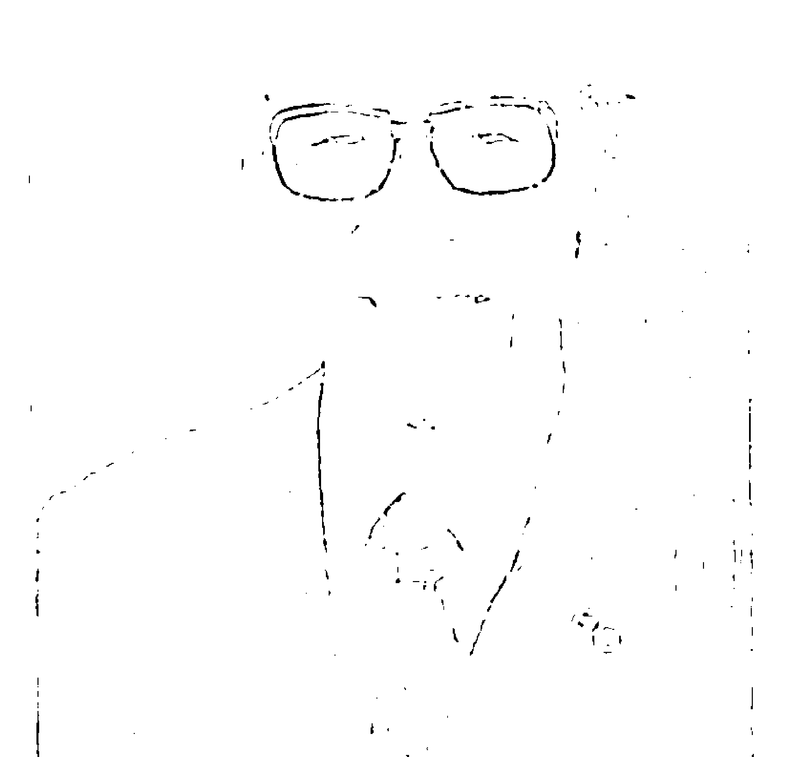

## 美丽的管理之术

松下幸之助认为：“人是万物之王”，企业是“人”的事业，好的企业要先培养人才，“造人”应先于“造物”。

松下幸之助整个经营思想都是建立在对人性的了解和对自然法则的掌握之上的。为了使员工能够认识到人性的本质和责任，松下幸之助为松下公司制定了著名的“松下精神法则”，即：产业报国；光明正大；亲爱精诚；奋斗向上；礼节谦让；顺应同化；感恩报德。

他关于人性与经营之间关系的这种认识立足于日本式的集体主义，在公司中充当家长角色，号召全部员工和睦相处，同舟共济。作为雇主，松下幸之助与员工坦诚相待，互相信任，他把创业之初随时将经营状况通报给员工的习惯一直保持下来，坚持“玻璃式经营”，定期对员工公开盈亏、阐明规划，从而有效激励士气，保证上下一心。

在他看来，企业经营就如同人的一生，人需要健康向上的人生观，企业也是如此。他认为企业的真正使命在于实现社会繁荣，而非赚取利润，这恰恰与前几年风靡一时的畅销书《基业长青》中阐述的观点不谋而合。企业有如人一样，利润就像人赖以生存的空气和水，没有利润，企业就无法生存，但是人不能只为了空气和水而生活，企业也应该有贡献社会的使命。

基于这样的人本理念和社会责任，“人才立业”成为松下的基本经营方针。松下幸之助不苛求“100分”的人才，而选择“适用”的人才。相比技术，他更看重人才的毅力和热忱。松下幸之助突出强调员工价值观和人生观的培养，要让员工充分理解和认同所在企业的使命。作为松下大家庭的家长，松下幸之助关注的不仅是激励员工为企业创利，也不忘为员工的自我发展铺垫道路。他在公司设立了“教育培训中心”，下属八个研修所和一个高等职业学校，使员工在工作之余得到自我提升。

好的艺术作品表达和驱使人们对真善美的追逐。如果说松下幸之助和松下公司是一幅艺术作品的话，那么他们所创造的恢弘气势和产业则如壮丽河山一样让人啧啧称赞，他们所具有的创造精神和不断追逐的勇气则像朝气蓬勃的绯红少女让人不断澎湃鼓舞，他们所具有的深沉意志和坚毅品格则如枯藤老树一样让人赞叹岁月。真善美，是艺术的最高追求，也是管理的最高境界，松下幸之助和松下公司实践着这一最高的使命，美丽的经营之神犹如一幅瑰丽而雄壮的画卷为我们的企业经营者指引出另一个仍需努力的方向。

## Magic 缺点改造

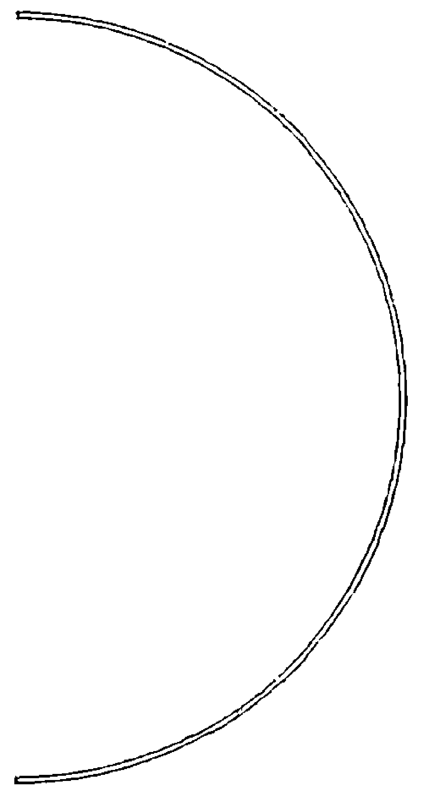

## 水瓶

### 魅力失分

水瓶座的人是天生的叛逆宝宝，在他们的字典里，没有“服从”两个字，制度、规则这些都不在他们的思维范畴之内，他们的一生都在叛逆期。

## /魅力星座智慧书之

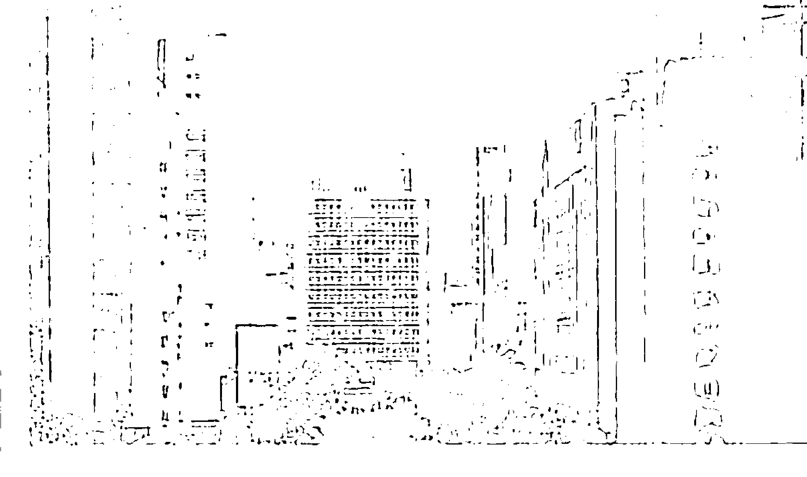

## 最没有教养的孩子

佚 名

詹姆斯·塞尔顿被认为是村上最没有教养的孩子，因为他说话很粗鲁，因而，他在路上经常被人指责。

如果碰到衣着讲究的人，他就会说人家是花花公子；如果碰到穿着破烂的人，他就说人家是叫花子。

一天下午，他和同伴放学回家，刚好碰到一个陌生人从村子里经过。那人衣着朴素，但却非常整洁。他手里拿着一根细木棍，棍的另一端还有一些行李，头上戴着一顶大遮阳的帽子。

很快，詹姆斯打上了这个陌生人的主意。他向同伴挤了一下眼睛，说：“看我怎么戏弄他。”他偷偷地走到那人背后，打掉他的大帽子就跑掉了。

那人转过身看了一下，还没等他开口说什么，詹姆斯就已经跑远了。那人捡起帽子戴上，继续赶路。詹姆斯用和上次一样的方法想要那个人，可是这次他被逮住了。

陌生人怔怔地看着詹姆斯的脸，詹姆斯却趁机挣脱了。一会儿他发现自己又安全了，就开始用石块砸那个陌生人。

当詹姆斯用石块把那人的头砸破后，他感到害怕了，便偷偷摸摸绕过田野，跑回了家。

当他快到家时，妹妹卡罗琳刚好出来碰到他。卡罗琳的手里拿着一条漂亮的金项链，还拿着一些新书。

卡罗琳激动地告诉詹姆斯，几年前离开他们的叔叔回来了，现在就住在他们家里，叔叔还给家里人买了许多漂亮的礼物。为了给哥哥和父亲一个惊喜，他把他的车停在了一里外的一家客栈。

卡罗琳还说，叔叔经过村庄时被几个坏孩子用石块砸伤了眼睛，不过母亲已经给他包扎上了。“你的脸看起来怎么这么苍白？”卡罗琳改变语气问詹姆斯。

詹姆斯告诉她没有没有什么事，就赶快跑回家，爬到自己楼上的房间，不一会儿，父亲叫他下来见叔叔。詹姆斯站在客厅门口，不敢进来。

母亲问：“詹姆斯，你为什么不进来呢？你平常可没有这么害羞呀！看看这块表多漂亮，是你叔叔给你买的。”

詹姆斯羞愧极了，卡罗琳抓住他的手，把他拉到客厅。詹姆斯低着头，用双手捂着脸。

叔叔来到詹姆斯的身旁，亲切地把他的手拿开，说：“詹姆斯，你不欢迎叔叔吗？”可是叔叔很快退了回来，说：“哥哥，他是你的儿子吗？！他就是在路上砸我的那个坏小孩。”

善良的父亲和母亲知道了事情的原委，既惊讶又难过。虽然叔叔的伤口慢慢地好了，可是父亲却怎么也不让詹姆斯要那块金表，也不给他那些好看的书，虽然那些都是叔叔买给他的。

其他的兄弟姐妹都分到了礼物，詹姆斯只得看着他们快乐。他永远也不会忘记这次教训，终于改掉了粗鲁无礼的陋习。

## 魅力提示：

无论何时何地，该遵守的规则一定要遵守，这不仅是对别人的尊重，也是对自己的尊重，更是你成功的前提。因为，行动养成习惯，习惯培养人格，人格影响命运。

## 球王贝利不抽烟

佚名

世界球王，被人们称为“黑珍珠”的巴西足球运动员贝利，自幼酷爱足球运动，并很早就显示出了他超人的才华。

有一次，小贝利参加了一场激烈的足球赛，累得喘不过气来。

休息时，贝利向小伙伴要了一支烟。他得意地吸起烟，嘴里吐出一缕缕淡淡的烟雾。小贝利有点儿陶醉了，似乎刚才极度的疲劳也烟消云散了。

这一切，全被父亲看到了，父亲的眉头皱起了一个大疙瘩。

晚上，父亲坐在椅子上问贝利：“你今天抽烟了？”

“抽了。”小贝利意识到自己做错了事，红着脸，低下了头，准备接受父亲的训斥。

但是，父亲并没有发火。他从椅子上站起来，在屋里来来回回走了好半天，才平静地对贝利说：“孩子，你踢球有几分天资，也许将来会有出息。可惜，抽烟，会损坏身体，你现在要抽烟了，你在比赛时就发挥不出应有的水平。” 小贝利的头更低了。父亲又语重心长地接着说：“作为父亲，我有责任教育你向好的方面努力，也有责任制止你的不良行为。但是，是向好的方向努力，还是向坏的方向滑去，做决定的是你自己。我只想问问你，你是愿意抽烟呢，还是愿意做个有出息的运动员呢？孩子，你该懂事了，自己选择吧。”说着，父亲还从口袋里掏出一沓钞票，递给贝利，并说道：“如果你不愿意做个有出息的运动员，执意要抽烟的话，这点钱就作为你抽烟的经费吧！”父亲说完便走了出去。

小贝利望着父亲远去的背影，仔细回味着父亲那深沉而又恳切的话语，不由地哭了。他哭得好难过，过了好一阵，才止住哭声。小贝利猛然醒悟了，他拿起桌上的钞票还给了父亲，并坚决地说：“爸爸，我再也不抽烟了，我一定要当个有出息的运动员。”

从此以后，贝利不但与烟隔绝，还刻苦训练，球艺飞速提高。他15岁参加桑拖斯职业足球队，16岁进入巴西国家队，并为巴西队永久占有“女神杯”立下奇功。如今，贝利已成为拥有众多企业的富翁，但他仍然不抽烟。

## 魅力提示

唯有以自爱、自识、自制指引人生，才能导出神圣的力量。

## 青蛙与老鼠

萧山

一只青蛙看着自己的老鼠邻居很不顺眼，总想找个机会教训教训它。

一天，青蛙见到老鼠，劝它到水里玩。老鼠不敢，青蛙说有办法保证它的安全，它说会用一根绳子把它们连在一起，老鼠终于同意一试。

下了水，青蛙大显神威，它时而游得飞快，时而潜到水底，把老鼠折腾得死去活来。老鼠最后被灌了一肚子水，泡涨了漂浮在水面上。

空中飞过的鹞子正在寻找食物，发现了漂浮的老鼠，就一把抓了起来，相连的绳子把青蛙也带了起来。吃掉老鼠后，意犹未尽的鹞子把嘴又伸向了青蛙。

在被鹞子吃掉之前，青蛙后悔地说：没想到把自己也给害了。

> 魅力提示：
> 这个世界是有规则的，当我们采取了不正当的手段去对付对手的时候，也许我们自己也已经踏入了失败的门槛

## 孙武练兵

佚名

春秋时代有个伟大的军事家名叫孙武。有一天，他去见吴王阖闾，吴王问他能不能训练女兵，孙武说：“可以。”于是吴王便拨了一百多位宫女给他。

孙武把宫女编成两队，用吴王最宠爱的两个妃子为队长，然后把一些军事的基本动作教给她们，并告诫她们要遵守军令，不可违背。不料孙武开始发令时，宫女们觉得好玩，都一个个笑了起来。孙武以为自己话没说清楚，便重复了一遍，等第二次再发令，宫女们还是只顾嬉笑。这次孙武生气了，便下令把队长拖去斩首，理由是队长领导无方。吴王听说要斩他的爱妃，急忙向他求情，但是孙武说：“君王既然已经把她们交给我来训练，我就必须依照军队的规定来管理她们，任何人违反了军令都该接受处分，这是没有例外的。” 结果还是把队长给杀了。

宫女们见他说到做到，都吓得脸色发白。他第三次发令时，没有一个人敢再开玩笑了。

> > **魅力提示：**
> 人生存在这个社会上就会要服从这个社会的游戏规则，下级服从上级，而军人更是以服从命令为天职，若是随意违抗命令，即使你地位再高，也会要受到惩罚。

## 魅力星座智慧书之

- 书名：人生中不可不想的事
- 作者：（印）克里希那穆提著 叶文可译
- 出版社：群言出版社
- 出版时间：2004-11-1
- 印刷时间：2004-11-1
- 开本：32开
- ISBN：9787800804427
- 包装：平装

## 内容简介

你从哪里来？生命是个伟大的谜，了解生命本身，比其他任何事情都重要，莫名的焦灼与恐惧，盘踞了我们的生活。

该书由印度著名哲学家克里希那穆提在各种场合的演讲和谈话集结而成。克里希那穆提主张个人了悟整理，用自己的光来照亮自己。他的著作既不能帮助读者迅速致富，也不能帮助读者获取名望；既不能教读者击败或驯服他人，也不能让读者博得更多掌声。它与生活的细枝末节无关，但它的重要之处在于提醒读者，从初入世界到今天，人们得到了许多，也丢失了人生中最重要的东西——快乐。当忧虑和焦灼占据人们心灵的时候，人们既不自由，也不快乐。作者的一生，都是在帮助人类从恐惧和无明中解脱出来，找到快乐。

### 水瓶座

### 魅力失分

水瓶座的人做事没有恒心和毅力，一些难以完成的事，最后大都了了之。

## 种出你的土豆

佚名

杰米原本是不爱吃土豆的，但自打听说了那个关于土豆的故事之后，杰米竟可笑地迷上了这不起眼的鬼东西。那个故事讲的是土豆从美洲引进到法国的历史。

在法国，土豆种植很长时间都没有得到推广。宗教信仰者不欢迎它，还给它起了个怪怪的名字——“鬼苹果”；医生们认定它对健康有害；农学家断言，种植土豆会使土壤变得贫瘠。

法国著名农学家安瑞·帕尔曼切曾在德国吃过土豆，决定在祖国培植它。可是，过了很长一段时间，他都未能说服任何人接受它。面对着人们根深蒂固的偏见，他一筹莫展。后来，帕尔曼切决定借助国王的权力来达到自己的目的。

1787年，他终于得到国王的许可，在一块出了名的低产田上栽培土豆。帕尔曼切发誓要让这不招人待见的“鬼苹果”走上法国人的餐桌！

他耍了个小小的花招——请求国王派出一支全副武装的卫队，每个白天都在那块地里严加看守。这异常的举动撩拨起人们强烈的偷窃欲望。每当夜幕降临，卫兵们撤走之后，人们便悄悄地摸到田里偷挖土豆，然后，再小心翼翼地将它移植到自家的菜园里。

每天晚上，土豆田里都能迎来一些蹑手蹑脚的偷窃者。就这样，土豆这丑丑的小东西昂然走进了千家万户。

帕尔曼切终于如愿以偿。

杰米为土豆感到庆幸，更为帕尔曼切的执著与智慧唏嘘不已。杰米常常凝视着自己的双手，殷殷叮嘱它：假若你捧住了一株值得捍卫的秧苗，你就要以心为圃，以血为泉，培植它，浇灌它，守望它，期待它，动用整个生命的力量去磨圆一个块茎，让世界知道，有一块方寸之地，最适宜种植奇迹……

## 魔力提示

事在人为，只要你足够执着足够有耐心足够智慧，任何事情都能做到；这个世界上不存在我们办不到的事。

## 多出巧艺

佚名

有一次，一个大型音乐会主持人想邀请瑞士钢琴家塔尔贝格做即席表演。
塔尔贝格问他：“演奏会什么时候开始？”
主持人答：“下个月1号。”
塔尔贝格接着说：“对不起，练习的时间不够，我无法参加。”
主持人不解地问：“大师还用专门的练习吗？”
塔尔贝格说：“我想，演奏一些新曲目，一般至少要1个月的练习时间。”
主持人又问：“3天时间还不够吗？我认识许多音乐家，从来没有一个人为一次演奏会练习4天以上，何况像你这种大师级的音乐家，更没有练习的必要了。”

> > 塔尔贝格不以为然地表示：“每次演奏新作品，我至少要练习1500次，否则不敢出场演奏。一天练习50次，也需要一个月的时间。如果你能等一个月，我就可以出席演奏。否则，很抱歉，我只好拒绝邀请。”

与瑞士钢琴大师演奏新曲目至少要求有1个月的练习时间相似，还有个画家3年画一只公鸡的传说。

从前，有一个皇帝非常喜欢公鸡。有一天，他下令让当时国内最有名的画家为他画一只公鸡。画家说，他需要3年时间。皇帝心里很不满意，但还是耐着性子恩准了。

3年期满，皇帝立即召见画家，却见他两手空空，便急切地问：“我的雄鸡图呢？”

画家不慌不忙，当场展纸挥毫，只见一阵笔飞墨舞，一只栩栩如生的大公鸡便跃然纸上，前后不到3分钟。

皇帝见状，不禁勃然大怒：“你这不是故意欺君犯上么？你总共只用3分钟，为何让朕整整等你3年？”

画家说：“皇上先息雷霆之怒，请随我来看。”画家随即领皇帝来到一间大屋子前，推开门一看，屋里堆满了画满公鸡的废稿纸。

于是，画家对皇帝说：“就是这些花了我整整3年的功夫啊！没有这3年的功夫，我哪能3分钟就画完一只大公鸡呢？”

## 魅力提示

功夫是艺术家最无法让渡的财富。献艺一分钟，练艺十年功，学到非凡艺，必下惊人功。其实，工多出巧艺，是各行各业的普遍规律。谁怕用功夫，谁就无法找到真理。

## 忍受雕琢的痛苦

张宏伟

有位雕刻大师在森林中漫步，找到了一块上等的木头。
大师将木头拿回家之后，决定将木头雕刻成一尊神像。他花了许多时间，用尽心血，终于雕出自己心目中满意的一尊神像。
大师完工之后，看了看一旁剩下的木料，拣起一块较大的，顺手将它做成了一个木鱼。
安置在庙里的神像，日日受到信徒的顶礼膜拜，享受着香火和供奉，身份地位尊荣备至。而那个木鱼则被放在神桌前，随着和尚早课晚课的诵经声，不断地被敲打着……
一天夜里，木鱼问神像道：“我们来自同一块木头，你可以享受供奉，而我却每天要被人打，难过死了。为什么我们的命运会相差这么大呢？”
神像说：“当初你不肯接受刀斧加身，而我所受到的雕琢之苦，不是语言可以形容的。因此，今天你我所受的待遇，当然会有天壤之别了。”

## 魅力提示

“玉不琢，不成器”，因为修身所受磨砺、规戒、坚忍、寂寞之苦使我们成其为人、因为避重就轻我们终身受着敲打。成为神像，或是木鱼，决定权完全在你手里。

## 学艺

佚名

从前有个人准备学一门手艺；

可是学什么好呢？他总是拿不定主意。想来想去，想到雨伞人人都要用，

于是去学制作雨伞。两年后，学成出师。师傅送给他一整套制伞的工具，让他自谋生计。

他回到故乡，开了一家雨伞铺，开始专心制伞。但是旱情持续了两年，他的雨伞总共没卖出去几把。他一气之下，把制伞工具都扔了，将铺子也关了，

他来到街上，看见很多人都在询问水车到哪儿买。于是他又开始去学制作水车。没想到学会之后，老天不停地下大雨，没人需要水车。他只好重新购置做雨伞的工具，可是等他刚做好几把雨伞，天又放晴了。

后来，他想，做雨伞，做水车都需要工具，而这些工具都是铁的，我何不去学铸铁呢？但岁月不饶人，此时的他已抡不动大锤。

## 魅力提示

做一件事要专心致志，持之以恒，如果遇到一点挫折就灰心丧气，不能坚持到底，将永远不会成功

## 魅力星座智慧书之

书名：有用的聪明

作者：吴淡如 著

出版社：国际文化出版公司

出版时间：2007-6-1

印刷时间：2007-6-1

开本：16开

ISBN：9787801732583

包装：平装

## 内容简介

世界比你想象的复杂；人性比你想象的多面化；爱情比你想象的多波折；而你比你自己想象的更聪明！

可以用努力改变的事情不能等，不能用努力改变的事情要有耐心。该做的事不能等，对结果却要有耐心。人生目标不能等，对人性却要有耐心。

在解决麻烦上，不要等。如果命运的黑夜漫长又寒冷，请一边让行动促使自己发热，一边宽容地等。

### 魅力失分

水瓶座的人一旦遇到阻碍，就会立即反抗，坚持己见和人抗争到底。

## 沉默有时是智慧

陈西

从科学发明的工作需要出发，爱迪生打算尽快建造一个实验室。因为手头没有足够的资金，他决定卖掉自动发报机及其技术专利。由于他对于市场行情不甚了了，不知道究竟开价多少合适，加上有资格出卖技术专利的人毕竟寥寥无几，便只好和妻子米娜商量。

其实，米娜也和丈夫一样心中无数，不知道这项发明究竟值多少钱。她一想到出卖专利的目的是建造实验室，就拿出了最大的勇气说：“就要2万美元吧。你掂量掂量，建造一个实验室的花销，大概不会少于2万美元吧。”

妻子开出的价码，远远超出爱迪生的想象。他展颜一笑说：“2万美元，太多了吧？”

米娜见丈夫有些异议，觉得有必要打消他的顾虑，就讲了下面这个不久前才听说的故事：

新泽西州一家印刷厂要处理一部旧印刷机，老板的最高期望值是卖到25万美元。恰巧另一家公司有意购买这部机器。在双方谈判的关键时刻，卖方老板的要价已经到了嘴边，又机灵地收了回去。他想：“别着急，不如先探探对方的口风。”

就在双方僵持的时刻，买方打破了沉闷的气氛，说这部机器有些陈旧，并指出它的毛病所在。买方见卖方没有辩解，便主动露出底牌说：“我们公司只能出 35 万美元买下这部机器，多一分钱也不行！”就这样，卖方的老板在关键时刻管住了自己的嘴，靠沉默多赚了 10 万美元。

米娜讲完后，鼓励他说：“我看能行。要不然，到时候探探买方的口气，让他先开个价再作定夺。”

很快，一位消息灵通的商人听说大发明家爱迪生有意出售自动发报机，并将转让这项发明的制造技术专利。他认定这笔生意有利可图，就主动找上门来洽谈。

听完爱迪生的介绍，商人顺其自然地问到价钱。由于爱迪生仍觉得事先和妻子商定的 2 万美元要价太高，竟不好意思说出口，只好沉默不语。

那位商人几次追问，爱迪生都没有吭声，只是期盼着妻子快些下班回来，好让她代替自己做出答复。没想到，没等到米娜露面，那位商人已经按捺不住自己的迫切，急不可待地摊牌说：“那我就先开个价吧，10万美元你看怎么样？”

这个价码是自己最高要价的 5 倍！爱迪生大喜过望，极力掩饰着内心的兴奋，当即就和那位商人拍板成交。

事后，颇有感触的爱迪生对米娜说：“没想到，只沉默了一会，就多赚了 8 万美元。”

## 魅力提示

> > 沉默是一种伟大的谈话艺术。知道什么时候该说话，什么时候该沉默，是一件大事。虽然沉默不等于智慧，但是当说话是愚蠢的时候，沉默就是智慧。

## 晋文公退兵制敌

振 北

晋献公的宠妃骊姬为把自己的亲生儿子奚齐立为嗣君，设计害死了长子申生，同时也将公子重耳和夷吾逼走了。

重耳历尽千辛万苦，经过齐、曹、宋及郑国，过着流亡的生活，很多国家对他态度冷淡，有的甚至不肯收留。在曹国，曹共公听说他肋骨长得不同寻常，便趁他洗澡时偷看，重耳感到很羞恼。后来，重耳来到楚国，楚成王热情地接待了他，这让他非常感动。

一天，楚成王设宴款待重耳，忽然问道：“如果公子能够回到晋国做国君，将怎样报答我？”

这个问题可把重耳难住了，他低头想了一下，回答说：“奇珍异宝，楚国都不会缺少，我也不知道该怎样报答您？”楚成王说：“不能一点表示都没有吧！”重耳只好回答：“如果我能够回国当上国君，将来万一楚晋交战，双方军队相遇，我将会率军退避三舍。”楚王满意地点了点头。

重耳离开楚国后到达秦国，在秦穆公的帮助下，在外飘泊了19年的重耳终于回到了晋国，登上了君位，他就是有名的晋文公。

晋文公励精图治，很快使晋国强大起来。有一次楚国攻打宋国，宋国向晋国求救。晋文公率领军队救援，终于与楚军在城濮相遇，想不到他在楚成王面前所说的“万一楚晋交战”竟变成了事实。其实，在那个诸侯混战的年代，大国之间刀兵相见算不了什么稀奇事，只是楚成王没有想到晋国的发展会这么快，现在竟然可以与他抗衡了，当时的一句“戏言”不幸而被道中了。

为了遵守当时许下的诺言，重耳下令晋军后退九十里，晋军将士都不能接受这个事实，认为退兵就意味着失败，目前晋军士气正旺，怎么能因为当时的一句玩笑而退兵呢。

唯有大臣狐偃明白晋文公的用意。他劝大家说：“退避三舍，一可避楚的锐气，积蓄自己的力量，二可使国君立信于世人，这是上好的计策呀！”晋文公正是这样想的，退避三舍是非常有利的，并非意味着失败。

但楚军却认为晋军胆怯，不敢迎战，顿时神气了起来，以为晋军不堪一击，便趁晋军退军之际，迫不及待地进攻。

谁知晋军收缩防线，退到了有利的地形处，便进行了有力的回击，很快就把楚军打败了，实现了晋文公以守为攻，转守为攻的策略，无论是在军事上还是在道义上都取了胜利。

城濮一战，奠定了晋文公称霸诸侯的基础，使他后来能够称霸诸侯。

## 魅力提示

有时候，退并不意味着失败，退可以积聚能量，只要找准有利时机，发动反攻，仍会夺回主动权

## 愤怒的乌龟

佚名

一个小池塘里住了一只乌龟，它和住在芦苇丛中的两只雁鸟是好朋友。后来发生旱灾，池水渐渐干涸，焦急万分的乌龟，再也无法支撑下去了，岸边的两只雁鸟知道后，想帮它迁移到另一个有水的地方。

最后它们想出了一个方法，找来一根树枝，教乌龟衔在口中，两只雁鸟各执一端，并交待乌龟在未到达目的地前，千万不能开口说话。

乌龟为了生存，只好听从指示，当它们在高空中飞过一个村庄的上空时，忽然被一群孩子发现，他们很惊讶的望着天空大声喊道：“乌龟被雁鸟衔去了，大家快来看呀！”

嘴巴紧咬树枝的乌龟，听到下面孩子的叫声觉得很受侮辱，心里非常生气，忍不住愤怒地回答：“我这样和你们有什么关系？”

乌龟嘴巴一松，立即从高空中跌下来，甩在坚硬的石头上，摔得粉身碎骨。

> 魅力提示：
> 祸从口出，在言语上逞强的人，暂时的满足远远不及由此带来的灾祸，何必让一时嘴上的痛快毁了自己生存的权利呢？

## 西山羊与东山羊

刘星宇

森林中有一条河流，河水湍急，不停地打着旋涡，奔向远方。河上有一座独木桥，窄得每次只能容一人经过。

某日，东山上的羊想到西山上去采草莓，而西山的羊想到东山上去采橡果，结果两只羊同时上了桥，到了桥中心，彼此挡住了，谁也走不过去。

东山的羊见僵持的时间已很长了，而西山的羊照样没有退让的意思，便冷冷地说道：“喂，你的眼睛是不是长在屁股上了，没见我要去西山吗？”

“我看你是干脆连眼都没长吧，要不，怎么会挡我的道？” 西山的羊反唇相讥。

“你让还是不让？不让开，我就闯。” 东山的羊摇了一下头，那意思是：看到没有，我的犄角就像两把利剑，它正想尝尝你的一身肥肉是否鲜美呢。

“哼，跟我斗，没门！” 西山的羊仰天长哞一声，便低头用犄角去顶东山的羊。

“好小子，我看你是不想活了。” 东山的羊边骂边低头迎上西山的羊。

“咔”，这是两只羊的犄角相互碰撞的声音。

“扑通”，这是两只羊失足同时落入河水中的声音。

森林里安静下来，两只羊跌入河心以后淹死了，尸体很快就被河水冲走了。

> 魅力提示：
> 谦让是一种美德，你若处处争强好胜，便会处处碰壁 而不懂得谦让所带来的恶果，有时是当事者自己部难以预料到的，当恶果发生时，你只能在上帝那里忏悔了。

## 魅力星座智慧书之

## 像佛陀一样生活

**书名：** 像佛陀一样生活
**作者：** 夏春瑞 编著
**出版社：** 现代出版社
**出版时间：** 2008-12-1
**印刷时间：** 2008-12-1
**开本：** 16开
**ISBN：** 9787802442450
**包装：** 平装

### 内容简介：

佛陀说，人们之所以痛苦烦恼都是由于内心有欲望。而欲望就像破水桶，添多少水都会被漏光，怎么也添不满。欲望不能够填满，就会有忧愁烦恼，有忧愁烦恼，心境就无法安定。我们诸多的痛苦，也都是因为欲望的不满足，欲望是无限的，但生命是有限的，如果用有限的生命来填充无限的欲望，我们总会感到力不从心，痛苦也就来了。俗话说，知足常乐，只有知足，克制自我，才能体会到合理的欲望满足后带来的幸福感，这是一种心态，一份从容，如果我们养成了习惯，就会在生活中更快乐。

真正的修行并非要出家，也并非必须天天吃斋念佛，而是把佛理体悟在心，在日常生活中运用佛法进行观照，懂得放下，懂得平等，懂得宽容与慈悲，懂得随缘与解脱……

#### 魅力得分

水瓶座的人追求独一无二，他们喜欢标新立异，不按牌理出牌。

### 巧募百万美元

佚名

芝加哥大学校长哈伯博士需要募集一百万美元来兴建新的教学大楼。他拿了一份芝加哥百万富翁的名单，研究向谁筹募这笔捐款。最后他选了其中两位，每位都是百万富翁，而且彼此都是仇恨很深的敌人。

其中一位是芝加哥市区电车公司的总裁。哈伯博士选了一天的中午时分去见这位总裁。因为这时候，办公室的人员，尤其是这位总裁的秘书，可能都已外出用餐了。他悠闲地走入总裁办公室，总裁对他的突然出现大吃一惊。

哈伯博士自我介绍道：“我叫哈伯，是芝加哥大学的校长。请原谅我自己闯了进来，但我发现外面办公室并没有人，于是我只好自己决定，走了进来。我曾多次想到你，以及你的市区电车公司。你已经建立了一套很好的电车系统，而且我知道你从这方面赚了很多的钱，但是，每想到你，我总是要想到，总有一天你就要进入那个不可知的世界。在你走后，你并未在这个世界上留下任何纪念物。因为其他人将接管你的金钱，而金钱一旦易手，很快就会忘记它原来的主人是谁。

“我常想提供一个让你的姓名永垂不朽的机会。我可以允许你在芝加哥大学兴建一所新的大楼，以你的姓名命名。我本想早给你这个机会，但是，学校董事会的一位董事先生希望把这份荣誉留给麦迪先生（这位是市区电车公司总裁的敌人）。不过，我个人在私下一向欣赏你，而且我现在还是支持你，如果你能允许我这样做，我将去说服校董事会的反对人士，让他们也来支持你。”

“今天我并不是来要求你做任何决定，只不过是我刚好经过这儿，想顺便来坐一下，和你见见面，谈一谈，你可以把这件事考虑一下，如果你希望和我再谈谈这件事，麻烦你有空拨个电话给我。”

“再见，先生！我很高兴能有机会和你聊一聊。”

说完这些，他低头致意，然后退了出去，不给这位电车公司的老板表示意见的机会。

事实上，这位电车公司的老板根本没有任何机会，都是哈伯先生在说话，这也是他事先计划好的。他进入对方的办公室只是为了埋下种子，他深信，只要时间来到，这种子就会发芽，成长壮大。

哈伯刚回到大学办公室，那电车公司老板就打来电话。他要求和哈伯博士订个约会。第二天早上，电车公司老板来到哈伯博士办公室，一小时后，一张一百万美元的支票已经交到哈伯博士的手上。

魅力提示：

聪明的年轻人以为，如果承认已经被别人承认过的真理，就会使自己丧失独创性，这是极大的错误。

### 走过去

佚名

在一堂心理课上，老师讲完后还多出一些时间，就说，我们来玩个游戏吧，游戏很简单，就是让每个同学从教室的这一头走到那一头，但是有一个要求，就是每个人的走法不能和别人相同。

小宋是班长，班级里的什么事情差不多都是他带头做，这次也不例外，可当他自告奋勇要“走”时，老师叫住他说：让别的同学先走吧，你这么机灵，你最后走。又补充道：等全部走完后，我们评出前三名。

- 第一个同学是捧着书走过去的。
- 第二名同学是唱着歌走过去的。
- 第三名同学是笑着走过去的。

游戏玩到后来，越来越五花八门：哭着走的，跳着走的，倒着走的，斜着走的，边打手机边走的，边吃东西边走的，追赶公共汽车的，跌倒了爬起来走的，负重着走的，瘸拐着走的……创意越来越多越来越出乎意料，引来一阵阵的掌声。

小宋起先也兴趣盎然，知道凭自己的创意和表演才能，一定能走得最好，进入前三名不会有问题。可是随着同学们的走法越来越丰富，自己先前想好的几个创意都被同学走掉了，再想一个又被同学走掉了，再想一个，又被同学走掉了，挖空心思再想一个，还是被在自己前面走的同学，抢先走掉了。小宋觉得很紧张，而偏偏这时轮到他了。

这时，同学们和老师都盯着他，想看他如何走得出彩。小宋自己也是这么想，认为自己必须与众不同，必须走得最好。可惜情况却糟透了——小宋竟然在教室的另一头愣住了。就在这时老师宣布游戏结束。

老师宣布游戏结束后，让小宋上讲台来谈谈自己的感想，小宋就像平时那样走到了讲台上。老师立即带头鼓掌，说：你到底走过来了。

机灵的小宋，一下子愣住了。

老师说，你们以后都有长长的路要走，在没有办法走得出彩时，平平淡淡地走，也不容易。因为毕竟走过去才是最重要的。

## 魅力提示：

> 是啊，走过去才是最重要的，何必一定要追求独一无二呢。

### 宝石不如草

诗言情

富商奥力姆和他的朋友玛迪，一起来到一座城市。奥力姆对玛迪说：“朋友，你知道吗，这座城市曾经救过我的性命。那一年我从这里路过，突然急病发作，昏倒在路旁。是这座城市里善良的人们把我背到医院，又是这座城市里最高明的医生为我治好了病。我不知道谁是我的救命恩人，因为他们都没有留下姓名。后来我离开了这座城市，随着财富的不断增加，我越来越思念这座有恩于我的城市，越来越想报答我的救命恩人。”

“那么，你准备为这座城市做点什么呢？”

“把我最珍贵的3颗宝石奉送给这里最善良的市民。”

他们在这座城市住了下来。

第二天，奥力姆就在自己的门口摆了一个小摊，上面摆着3颗光彩夺目的宝石。奥力姆还在摊位上写了一张告示：“我愿将这3颗珍贵的宝石无偿送给善良的人们。”

可是，过往的行人只是驻足观望了一会儿，然后又各走各的路去了。整整一天过去了，3颗宝石无人问津。两天过去了，3颗宝石仍遭冷落。三天过去了，3颗宝石还是寂寞无主。

奥力姆大惑不解。

玛迪笑了笑说：“让我来做个试验吧。”于是，玛迪找来一根稻草，将它装在一个精美的玻璃盒里，盒中铺上红丝绒布，标签上写着：“稻草一根、售价1万美元。”

此举一出，立刻吸引了很多人，人们争先恐后，前来询问稻草的非凡来历。玛迪说这根稻草乃某国国王所赠，系王室家中传家之物，保佑着主人的荣华富贵。

结果，这根稻草被人以8000美元买去。3颗宝石依然在熠熠放光，而在人们，只是把它们当做哄小孩子的东西而已。事后，玛迪对奥力姆说：“人们总是对难以到手的东西垂涎三尺，哪怕它只是一根稻草。”

## 魅力提示：

> > 人们往往为了追求独特而错失很多机会。柏拉图说：有一种胜利和失败——最辉煌的胜利和最悲惨的失败——不是掌握在别人手里，而是操纵在自己手中。

### 关于生活的三条忠告

付闻君

一次，一个猎人在森林里捕获了一只非常奇特的鸟。这只鸟它会说话。鸟儿挣扎着说:“你放心吧,我能说七十种语言,非常聪明。只要你放了我,我将给你三条忠告。” “先告诉我.” 猎人回答说, “我发誓我会放了你.” “好吧,第一条忠告是,” 鸟说道, “做事后就不要懊悔.” “第二条忠告是, 如果有人告诉你一件事, 你自己认为是不可能的就别相信.” “第三条忠告是: 当你爬不上去时, 就别强迫自己去爬.” 然后这只鸟对猎人说: “该放我走了吧.” 猎人依言将它放了。这只鸟飞起后落在一棵大树上,并向猎人大声喊道:“你真愚蠢。你放了我，但你并不知道在我的嘴中有一颗价值连城的大珍珠。正是这颗珍珠使我这样聪明。"

这个猎人一听，便又想去捕获这只被放飞的鸟。他跑到树跟前并开始爬树，但是当他爬到一半的时候，他掉了下来并摔断了双腿。

鸟嘲笑他，并向他喊道：“笨蛋！我刚才对你的忠告你全忘记了。我告诉你，一旦做了一件事情就别后悔，而你却后悔放了我；我告诉你，如果有人对你讲你认为是不可能的事，就别相信，而你却相信像我这样一只小鸟嘴里会有一颗大的珍珠；我告诉你，如果你爬不上去就别强迫自己去爬，而你却追赶我并试图爬上这棵大树，结果掉下去摔断了双腿。”

“这句箴言说的就是你：对聪明人来说，受一次教训比蠢人受一百次鞭挞还深刻。”说完，鸟就飞走了。

## 魅力提示：

前人总结出来的人生哲理，其道理听起来简单明白，真正做起来却并不容易。所以聪明的人，不要把前人的经验教训不当一回事。

### 智慧书：永恒的人生处世经典

**书名：** 智慧书：永恒的人生处世经典
**作者：** （西）葛拉西安 著，李汉昭译
**出版社：** 天津教育出版社
**出版时间：** 2008-5-1
**印刷时间：** 2008-5-1
**开本：** 大32开
**ISBN：** 9787530952092
**包装：** 平装

### 内容简介：

《智慧书》为巴尔塔沙·葛拉西安的代表作，浓缩了做人处世的智慧，汇集了关于知人、观事、判断和行动的300则箴言，其待人之理、律己之道，堪称则则精辟、字字珠玑。

本书自1647年问世以来，一直受到各国读者的喜爱；葛拉西安也被尊崇为世界文化史上的一代宗师。

#### 魅力得分

水瓶座的人总是很喜欢夸张，为了达到他的表达效果而夸大其词。

#### 推销的秘诀

加里·汉利

20年前，特里还是一位初出茅庐的推销员，他的工作就是向人推销各种窗户。他没有一点儿销售经验，“连向自己的祖母推销假牙都不会”，他的竞争对手则个个经验老到，巧舌如簧，甚至“能说动爱斯基摩人买他们的雪”。

上班第一天，老板就交给特里一项重任，让他到富人区向一位对他们产品感兴趣的客户推销一种双层玻璃窗。

特里非常紧张，站在客户门前，他的手脚都在打颤。但他还是叩门了。一位上了年纪的妇女打开门，听他结结巴巴地做完自我介绍后，请他进屋。

特里在她那儿待了3个小时。在喝掉几十杯茶、吃下成堆的饼干后，他终于让那位女士在合同上签了字：她买下了价值11000美元的窗户。

在这之前，那位女士已经打发走6位窗户推销员了，而且他们的开价都比特里的低。也就是说这位最没有经验的推销员成功地卖出了标价最高的产品原因其实很简单，那位女士说：“我喜欢这个小伙子。”

在那3个小时里，特里凭着他的谦恭、礼貌、真诚和可爱赢得了女士的信任，并最终赢得这笔生意。他靠的不是夸夸其谈的口才，而是“人格”与“印象”。特里成功的秘诀是他给客户留下了良好的第一印象。

## 魅力提示：

> 夸夸其谈的人并不能给人留下好印象。要想打动别人，还需要靠真诚可靠的品质。

#### 强者不吹牛

亚琼

小老鼠、小白兔、大公鸡在一起吹牛比谁最厉害。

老鼠说：“我最厉害，有一次和大象决斗，我钻进它鼻孔里，咬得它直喊饶命！对我来说，大象都不在话下，我还有什么可怕的呢！”

小白兔对小老鼠说：“你这个小地豆子，按体重比我小二十倍，也敢在此逞能！我是三次马拉松赛跑冠军的获得者，有一次还创造了世界纪录，连赛跑能手猎豹都惧我三分！”

大公鸡说：“你们都给我住嘴！俗语云‘雄鸡一唱天下白’，太阳都按我的叫声出来，连人类也听我的指挥，按我的命令起床下地，因此老子天下第一！”

它们正在不着边际地吹牛，旁边的草丛中躺着一只老虎，似睡非睡，似醒非醒，听了它们的话，闭目微笑。过了一阵，老虎忽然打了一个哈欠，不由自主地说：“好困呀！”

小老鼠、小白兔、大公鸡一看，无不抱头鼠窜……

## 魅力提示：

吹牛的人，充其量只能算只“纸老虎”，……一旦势力雄厚的“真老虎”出现在他面前，他就只会落荒而逃。所以，不断地给自己充电吧，机遇与成功，永远只会青睐有准备、有实力的。

#### 小老鼠比克

维·比安基

小老鼠比克长大了，再过一段时间就能够独立生活了，这本来是一件令人开心快乐的事情，可鼠妈妈最近却很烦恼，鼠妈妈在烦恼什么呢？

原来啊，小比克自小就从来不和其他的小老鼠一起玩，比克看不起其他所有的老鼠。比克最喜欢做的事情就是手拿一面镜子，一边照镜子，一边捻自己的胡须，它还老是问自己的妈妈：“妈妈，我现在是不是长得比大象还要大啊？我可以轻易地打败一头大象吗？”搞得妈妈哭笑不得。

刚开始的时候，小比克问这样的问题，妈妈总是会说：“你是小老鼠，怎么可能长得比大象还要大呢？”小比克显然很不满意这个回答。它经常在自己的鼠伙伴们面前吹嘘，自己可以轻易地打败一头大象。小伙伴们听了，都笑得喘不过气来了。

后来，比克再问妈妈，妈妈实在烦不过了，只好回答它：“是的，你长得比大象还要大，你可以轻易地打败一头大象。”比克再向小伙伴们吹嘘时，小伙伴们也都哈哈大笑着说：“是的，是这样的，比克，你可以不费吹灰之力打败一头巨大的大象的。”

现在，小老鼠长大了，马上就要过自己独立的生活了，别的老鼠都开始学些谋生的技艺，可小比克不这样。比克收拾好行李，告别了鼠妈妈和小伙伴们，踏上了寻找大象的旅途。

刚离开家不远，比克遇到了一只蚂蚁，比克大声问蚂蚁道：“请问你是大象吗？”

蚂蚁小声地答道：“我是蚂蚁，不是大象。”

比克大叫一声，然后说道：“幸亏你不是大象，要不然我就把你踩死了。”蚂蚁被比克的大叫吓坏了，急忙钻入了路旁的草丛，比克很满意地继续踏上了自己的路途。

第二天，比克在路上遇到了一只甲虫，它立即赶上去问道：“喂，你是大象吗？我是伟大的比克，专门来寻找大象，并要打败它。”

甲虫看到这只狂妄的小老鼠，没有理它，自顾自往前走，小老鼠见了，跳到甲虫的前面，大声叫道：“站住，大象，我要踏扁你。”

甲虫没有办法，只好站住，对小老鼠说道：“对不起，你看错了，我是一只甲虫，不是大象。”

比克听了，很是丧气，就继续往前走。它在路上遇到了一只松鼠。比克用尖锐的“吱吱”声叫道：“喂！你是大象吗？”

松鼠哈哈大笑起来。比克很生气，怒骂道：“你这家伙，快说你是不是大象，我是伟大的比克，我是来打败大象的。”

松鼠看到举起两只小拳头、怒气冲冲的小老鼠，笑得都快弯了腰，它笑着说道：“我……我……不是大象，我是……我是松鼠，你……你找的大……大象在前面。”

比克收起自己的拳头，继续往前走。然后它在一片开阔的草原上看到了一个小山一样的动物，比克对着那只动物喊道：“喂！你是大象吗？”

那个小山一样的动物没有任何反应，比克用尽全部的力量喊道：“喂……你是大象吗？”可那个动物还是没有反应。

比克费尽力气，爬到了一个树墩上，把手放在嘴边大声喊道：“喂……你是大象吗？”

这次，那个山一样的动物终于有反应了，它说了一句：“谁在喊我吗？”比克很愤怒，它继续挥舞着拳头喊着、咒骂着：“可恶的大象，我要打败你，我要踏扁你。”

大象终于发现了这个狂妄无知的小家伙，决定给它一些教训，大象把长长的鼻子放到水中，吸了一口水上来，把鼻孔对准比克，一股巨大的水柱喷了出来，把比克从树墩上冲了下来。比克呛了十几口水，费尽了全身的力气，才从大象一口水形成的池塘里爬上来。

这一口水也把狂妄自大、夸夸其谈的比克喷醒了，他回到了家乡，再也不夸夸其谈了，成了一只踏踏实实的老鼠，干了许多实实在在的事，受到了大家的称赞。鼠妈妈也再不为比克发愁了。

## 魅力提示：

你的成功最主要的是靠你的双手，而不是靠你的夸夸其谈。如果你需要说话的话，那就用简洁而明了的语言表达好了。如果你夸夸其谈，那我想，你也离狂妄不太远了。

#### 无一不晓

威威

有一天，萧伯纳应邀参加了一个丰盛的晚宴。席间有一青年在大文豪面前滔滔不绝地吹嘘自己的天才，好像自己天南海北样样通晓，大有不可一世的气概。

起初，萧伯纳缄口不言，洗耳恭听。后来，愈听愈觉得不是滋味。最后，他终于忍不住了，便开口说道：“年轻的朋友，只要我们两人联合起来，世界上的事情就无一不晓了。”

那人惊愕地说：“未必如此吧！”

萧伯纳说：“怎么不是，你是这样地精通世界万物，不过，尚有一点欠缺，就是不知夸夸其谈会使丰盛的佳肴也变得淡而无味，而我刚好明了这一点，咱俩合起来，岂不是无一不晓了吗？”

## 魅力提示：

很多时候，你的夸夸其谈往往会让你身边的人感觉不悦，从而给人留下非常不好的印象，做一个谦逊的人，才能赢得别人的喜欢。

#### 低调出奇迹

**书名：** 低调出奇迹
**作者：** 李嶷 编著
**出版社：** 中华工商联合出版社
**出版时间：** 2005-1-1
**印刷时间：** 2005-1-1
**开本：** 32开
**ISBN：** 9787801932075
**包装：** 平装

### 内容简介：

喜欢高调，是我们这个时代的时尚。事情还没有开始做，首先就先说出来；成功的可能性只有一点，首先就描述一个美好的蓝图；实在没有什么值得说了，还要“炒作”，因为我们唯一的目的就是：吸引所有的目光，吸引所有的注意，用一个虚幻的“前景”，取得别人的支持，把其他人拉进来，一起投入到一个连自己都没有把握的事情中去！

我们听多了夸夸其谈的论调，看多了外强中干的行为，他们最终的结果却是什么呢？如果我们仔细观察一下发生在我们身边的事情，可能你会发现，低调常常可以完成高调所完成不了的事情。

也许我们应该关注一下“低调”这种更高明的处事谋略！在现代社会，低调的人生态度，比高调更为难得；低调的气质，比高调的姿态更富有魅力；低调的方法，比赤裸的炒作更容易实现你的目标！
低调能够创造奇迹！

#### 魅力得分

水瓶座的人即使内心不断冷热交替，表面上还是不动声色，不跟任何人报备，他每踏出一步，都让人出乎意料跌破眼镜，我行我素到极点。

## 魅力星座智慧书之

### 顺从水的活动

佚名

孔子到吕梁山游览，那里的瀑布有几十丈高，流水水花远溅出数里，甲鱼、扬子鳄和鱼类都不能游，却看见一个男人在那里游水。孔子认为他是有痛苦想投水而死，便让学生沿着水流去救他，他却在游了几百步之后出来了，披散着头发，唱着歌，在河堤上漫步。孔子赶上去问他：“刚才我看到你在那里游，以为你是有痛苦要去寻死，便让我的学生沿着水流来救你，你却游出水面，我还以为你是鬼怪呢，请问你到那种深水里去有什么特别的方法么？”

> 他说：“没有，我没有方法。我起步于原来本质，成长于习性，成功于命运。水回旋，我跟着回旋进入水中；水涌出，我跟着涌出于水面。顺从水的活动，不自作主张。这就是我能游水的缘故。”

> 孔子说：“什么叫做起步于原来本质，成长于习性，成功于命运？”

> 他回答说：“我出生于陆地，安于陆地，这便是原来本质；我从小到大都与水为伴，便安于水，这就是习性；不知道为什么却自然能够这样，这是命运。”

## 魅力提示：

适者生存，这是人类一切问题的答案。那位智者让自己适应水流，而不是让水流适应他。就这样，智者成功了。这不是一种方法，也不是一个技巧，而是一种智慧。

# 火灾逃生

彭小东

有个外国老太来中国，她找了几个中国孩子，让他们做一个游戏。她把几个拴着细线的小球放进一个瓶子里，瓶口很小，一次只能容纳一个小球通过。

她说：“这是一个火灾现场，每个人只有逃出瓶子才能活下去。”

她让每个孩子拿一根细线，时间开始了，只见几个孩子从小到大，依次把小球取出来了。

老太很惊讶，她在许多国家做过这个实验，但是没有一个成功过，那些孩子无一例外地都争先恐后地把细线拼命往上拉，最后导致一堆小球堵在瓶口……

## 魅力提示：

这就是合作的力量啊！我们生活在这个社会，就无可避免地要与他人合作，才能更好地发展自己，而我行我素的人是得不到发展的

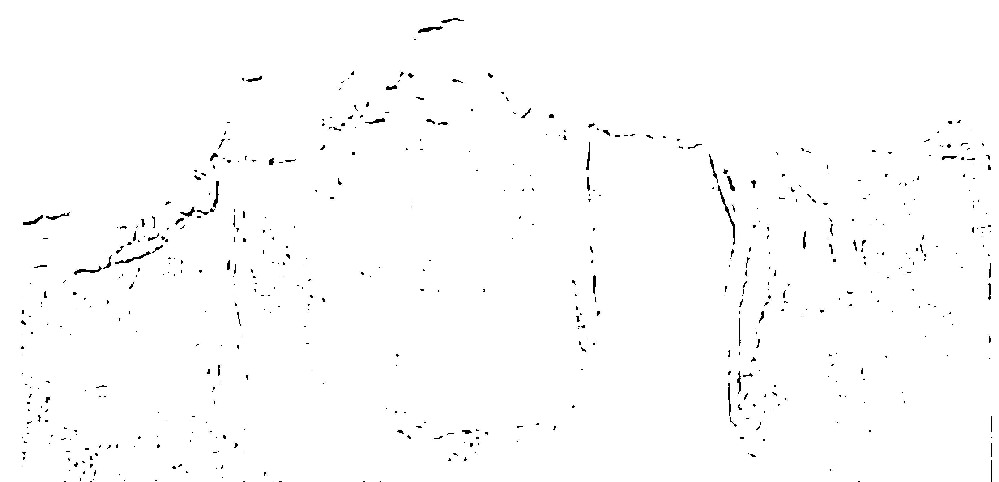

# 青瓷座钟的奇妙经历

陈光汉

一个星期五的早晨，乔治和尼娜从报上看到一则大拍卖的广告。
“我对大拍卖很感兴趣，”尼娜说，“不过我可不能去，因为今天我要上班。你去吧，乔治，今天你有空。”
于是，乔治去了大拍卖市场。有一台青瓷座钟正在出售。
“我喜欢那座钟，”他思考着，“尼娜和我都需要一台好座钟。”
乔治花了 10 美元，买了这座钟，他非常高兴。
他将钟拿回家，把它安放在起居室里。可是，秒针突然不走动了！他摇了几下，针又走动起来……然而，一会儿它又停了下来。

## Magic

“这座蹩脚钟是走不动的，”他盘算着，“我花了10美元，它却无法使用！”所以十分生气。乔治把这钟拿到钟表修理所那儿。“这是台好钟，”修理匠说，“我可以把它修好，只要花15美元。”“不，谢谢，”乔治说，“要价太高了。”“我怎么办呢？”乔治考虑着。突然，他闪出一个念头。他把钟拿回拍卖市场，这是吃午饭的时候。乔治问拍卖商：“请问，我能把这座钟卖掉吗？”“我没有把握，”拍卖商回答，“下午我可以试试看，就交给我吧。4点钟左右，请你再来！”乔治按时来到拍卖行，拍卖商说：“我把你的钟卖了20美元。”乔治高兴极了！他从拍卖商手里接过钱，立即返回家去。“我告诉你一个好消息。”乔治对尼娜说。“可是我将会使你大吃一惊！”尼娜说，“今天我们下班早，我就到了拍卖市场。”她把一包东西放到了起居室的桌子上，神采飞扬地继续说道：“我仅仅花了20美元，就从拍卖市场买到了这东西。”尼娜把包裹打了开来，原来是一台青瓷座钟。“那你的好消息是什么呢，乔治？”她问道。

## 魅力提示：

假如我们做事情的时候能及时跟身边的人沟通，生活中就不会出现这么可笑的事情。

# 自作主张的设计

一滴水

友人之子柏然大学毕业后应聘到一家建筑设计院做设计员。他工作很出色，因此在一年中加了两次薪，在设计院的年终表彰大会上，院长点名表扬了柏然，夸他能干、技术精、敬业，院里需要的就是他这样的人才。

从此以后柏然在院里的地位一下子提高了，他开始飘飘然起来，在给客户做设计时就有点自以为是了。

一次，设计院承包了一项大型的项目，院长让柏然担任设计主管，他一口应承下来，但这项任务并不像他想的那么容易。设计的几套方案都被客户否定了，客户怀疑设计院的业务水平，院长批评他没有尽心尽力，他有苦难言。经过反复的讨论，修改设计方案总算按客户的要求定下来了，但柏然自认为这个方案有价值的创意太少，到交工时他自作主张将设计方案做了小小的变动，没想到客户大发雷霆，坚决取消和该设计院的合作。

这件事在设计院里引起了很大的风波，柏然向全院职工道歉，并被扣发6个月的奖金，此时此刻，他的心情沮丧到了极点。

## 魅力提示：

> 工作上的事情需要跟自己的同事、领导商量再决定，而不能太自信，一味地自作主张，否则可能弄巧成拙。

- 书名：像青蛙一样思考
- 作者：雾满拦江 著
- 出版社：当代中国出版社
- 出版时间：2005-4-1
- 印刷时间：2005-4-1
- 开本：32开
- ISBN：9787801703620
- 包装：平装

### 内容简介：

这本书的名字叫做《像青蛙一样思考》，为什么会起这样一个名字？青蛙的思考方式远比人更高级吗？无论你对青蛙怀有何种不以为然的见解，但有一点是毫无疑问的，在泥潭之中，青蛙拥有更广阔的生存空间。

那么什么叫泥潭呢？你是否遭遇过泥潭呢？如果你在企业中遭遇过这种情况，又或者你更希望自己能够拥有敏锐的思维避过或解决泥潭，那么，请走进这本书。

你是忠于职守，还是忠于上司？上司或老板暗中询问你同事的动向，你该怎么办？处境糟糕的同事拿你当朋友，或是向你求助，你会如何？你的异性上司对你有过分亲昵的表示，你又会怎样？本书用诙谐幽默的语言诠释职场潜规则，助你解答你在职场中所遇到的种种困惑。

### 魅力失分

水瓶座的人有着天生的懒惰血液，即使是勤劳，也只有三分钟的勤劳。他不仅是懒得做事，有时候甚至还懒得想事。

# 路上的石头

常文劍

有一个非常聪明的国王，他懂得如何教导自己的臣民养成好习惯，他非常注重培养人民的勤勉与细心。

> > 如果人民只抱怨或者期待他人帮自己解决问题，那么好事就不会降临这个国家，上帝只赐福给那些将命运掌握在自己手里的人。

一天晚上，趁其他人都睡了，他把一块大石头放在通往皇宫的路上，然后躲在一边观察会发生什么事情。

首先，迎面而来的是一个农夫，他的马车上载满了谷物。

“是谁这么粗心大意？”他边说边把马车转向，绕过石头。

“为什么这些懒人不把石头移走？”尽管他在不断地抱怨其他人的懒惰，

他却碰都没碰那块石头。过了一会儿，一位年轻的战士唱着歌走过来。他心中还想着自己在战场上的英勇，并未看到石头，直到石头差点将他绊倒。他生气地举起剑，咆哮着责骂过路人的懒惰，竟然没有谁把它搬走。他跨过石头走远了。

时间一天天地过去了，许多人打此经过，但依然没有人设法移动这块石头。直到一天晚上，一个贫穷的青年正好从这里经过。他已经干了整整一天的活，非常疲惫，但是他看到了这块石头，他自言自语：“这么黑的天，如果有人经过这里会被石头绊倒的。我要把它挪开。”

青年开始搬石头，石头很大，他又非常劳累，移动起来很艰难，但是他最终还是将它移到了路边。但让他惊讶的是，石头移开之后，下面竟然有一个盒子。盒子上面写着一句话：“送给挪开石头的人。”他打开盖子，里面装满了金子！当农夫与战士以及其他人听到消息后，马上聚集到曾经放石头的地方，在附近仔细寻找，希望也能发现一块黄金，但他们失望了。

国王对他们说：“我们经常会遇到障碍与重担。如果选择绕过，可能会因此失去成功的机会，懒惰的代价往往是失望。”

## 魅力提示：

在路上习惯性地绕过障碍的人，其实也是在绕过可能及身的机会。生活中其实有着大量机会，也许只需举手之劳你就能够得到，但偏偏很多人举一下手都懒得，又怎能怪机会不垂青于你呢。

# 成功的原因

佚名

一天，一位年逾古稀的老太太，拿着一本旧作文问巴尔扎克：“大作家，你给我瞧瞧，这小子有没有天才，将来是不是块当作家的料？”

巴尔扎克接过看了看：“嗯，他天赋不大，灵气不多，凭这当作家很难。”

老太太一听，笑道：“好小子，我以为你们当作家的什么都懂，没想到你连自己三十多年前的小学作文都看不出来！”

巴尔扎克笑笑说：“我没说错呀，我之所以有今天，全靠苦熬苦写，并不是全靠天才和灵气啊！”

## 魅力提示：

爱迪生说过，天才就是百分之一的灵感加百分之九十九的汗水。没有勤奋，再多的天赋也只是天上飘的浮云，而有了勤奋，再愚笨的人也能成功。

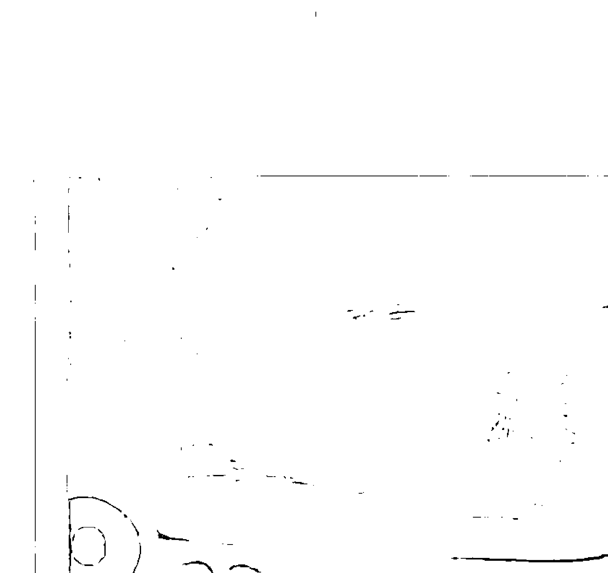

# 伏尔泰与小厮

佚名

伏尔泰有一个很忠实的随身小厮，但他有些懒惰。

一天，伏尔泰对他说：“约瑟夫，去把我的鞋拿来。”小厮遵命把鞋拿来了，伏尔泰一看惊呆了：鞋上仍然是昨天出门时沾的泥迹！他问小厮：“你怎么早晨忘了把它擦擦？”

“没忘，先生，”约瑟夫平静地回答，“路上尽是泥，两个小时以后，您的鞋子又要和现在一样脏的。”

伏尔泰微笑着穿上了鞋，走出门去，小厮却追了上来，喊道：“先生，慢走！钥匙呢？”

“钥匙？”“对，食厨上的钥匙。我还要吃午饭呢。”“我的朋友，吃什么午饭呢？”伏尔泰说道，“两个小时以后，你不也和现在一样肚皮还会饿吗？”

> > 魅力提示：
>
> 所谓生活，其实都是些很平常很一般的事情，翻来覆去地重复进行，再加上不多的创新而已。时间一天一天，一年一年地过去，地球一圈一圈地旋转，人们生老病死地反复进行，生活中有些重复的事情非得重复不可，又怎能贪图安逸自作简化呢？

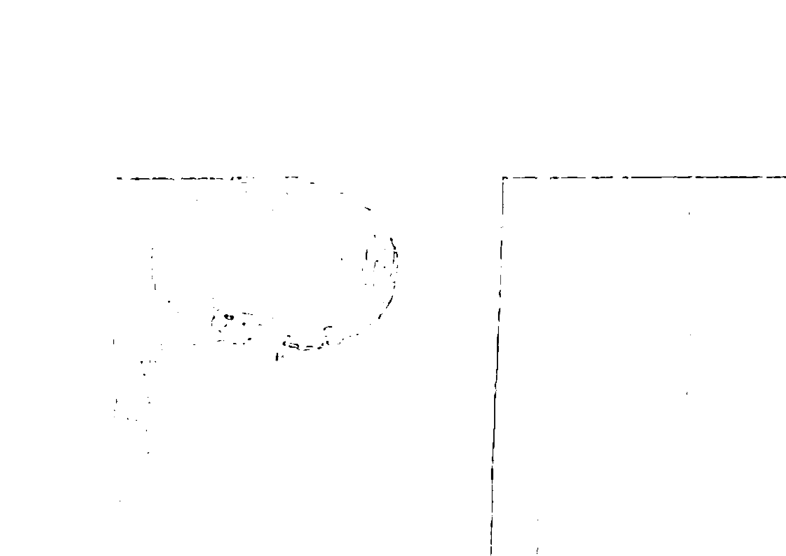

# 自由的查尔斯

佚名

查尔斯兰博曾在东印度公司从事文书工作，干久了，他自然十分厌烦这个工作。

终于有一天，他从这份工作中解脱出来了，他感到说不出的轻松和喜悦。他在给朋友的信中写道：

> > “十余年的无聊工作就换来这万把英镑，太不值了。”“我自由了，我终于自由了！我将自由自在地度过剩下的50年。一个人最痛快、最幸福的日子就是什么也不干。”

漫长的两年过去了，查尔斯享受着清闲的时光，但是他的心情却发生了根本的变化。他现在才发现那些单调乏味的工作原来一直挺适合他，可他却一直未曾认识到。时间以前是他的朋友，而今却成了他的敌人。

他在给朋友的信中写道：

> > “我真的相信，没有工作比过度劳累更糟糕，一个人一旦没有工作，他的心就会折磨自己。我几乎对什么东西都失去了兴趣。天堂的雨水也从来不会倾泻在那些无所事事者的头上。我唯一能做的，也是我做得最多的，就是周而复始的散步。我真是一个谋害时间的罪恶杀手，神的启示与我无缘了。”

## 魅力提示：

浮躁的社会风气，带来一股好逸恶劳之风。懒惰究竟是一个人的本性，还是一种惰性的习惯？答案并不重要，重要的是人活着就该努力工作。工作所带来的成就感和满足感绝非安逸所能替代。

- 书名：再见，懒惰！
- 作者：（韩）文翰著，杨华芸 译
- 出版社：中信出版社
- 出版时间：2008-6-1
- 印刷时间：2008-6-1
- 开本：大32开
- ISBN：9787508611594
- 包装：平装

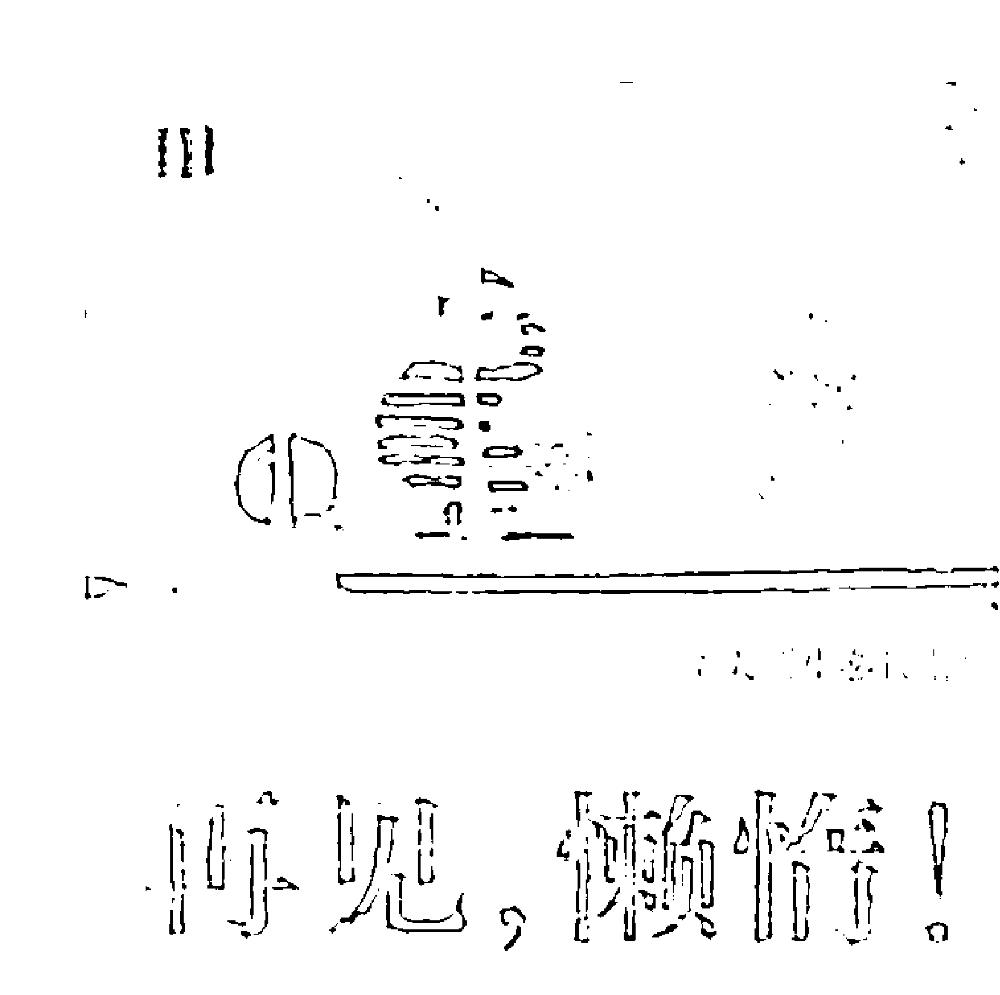

### 内容简介：

韩国销售15万册的懒人新生必读书！总在做决定的时候举棋不定，一拖再拖？总在临时抱佛脚，一次次上演“闪电行动”？总是回避迫在眉睫的事，却抓住一些无关紧要的小事不放？从未想过自己疲于奔命的目的何在，忙忙碌碌只因为大家都这么干？本书不会简单地教你用琐事把生活填满，而是指引你发现各种藏身在生活和工作中的懒惰。与此同时，还针对每种懒惰，为你贴心制定“再见，懒惰”十大攻略，希望能带领你在“速度中见悠闲，悠闲中拼速度”的二十一世纪，在瞬息万变的生活中找准自己的节奏，彻底远离被懒惰和焦躁包围的生活，迎接人生下一个高潮的来临。

### 魅力失分

水瓶座的人很理性，但是态度过于冷漠，缺乏热情。

# 难忘的假日之旅

杰克·沃特曼

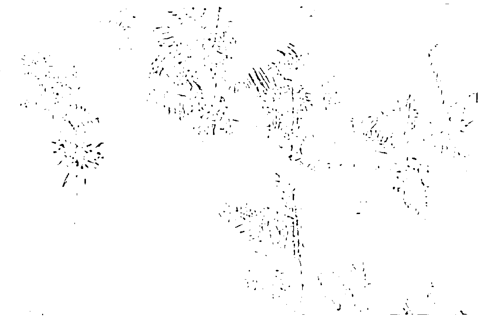

这一年的圣诞节，保罗的哥哥送给他一辆新车作为圣诞礼物。

圣诞节的前一天，保罗从他办公室出来时，看到街上一名男孩在他闪亮的新车旁走来走去，触摸它，满脸羡慕的神情。

保罗饶有兴趣地看着这个小男孩。从他的衣着来看，他的家庭显然不属于自己这个阶层。就在这时，小男孩抬起头，问道：“先生，这是你的车吗？”

“是啊，”保罗说，“我哥哥给我的圣诞节礼物。”

小男孩睁大了眼睛：“你是说，这是你哥哥给你的，而你不用花一角钱？”

保罗点点头。小男孩说：“哇！我希望……”

保罗认为他知道小男孩希望的是什么，他希望有一个这样的哥哥。

但小男孩说出的却是：“我希望自己也能当这样的哥哥。”

保罗深受感动地看着这个男孩，然后他问：“要不要坐我的新车去兜风？”

小男孩惊喜万分地答应了。

逛了一会儿之后，小男孩转身向保罗说：“先生，能不能麻烦你把车开到我家前面？”

保罗微微一笑。他理解小男孩的想法：坐一辆大而漂亮的车子回家，在小朋友的面前是很神气的事。

但他又想错了。

“麻烦你停在两个台阶那里，等我一下好吗？”

小男孩跳下车，三步两步跑上台阶，进入屋内，不一会儿他出来了，并带着一个显然是他弟弟的小孩，这小孩因患小儿麻痹症而跛着一只脚。他把弟弟安置在下边的台阶上，紧靠着坐下，然后指着保罗的车子说：

“看见了吗？就像我在楼上跟你讲的一样，很漂亮对不对？这是他哥哥送给他的圣诞节礼物，他不用花一角钱！将来有一天我也要送你一部和这一样的车子，这样你就可以看到我一直跟你讲的橱窗里那些好看的圣诞节礼物了。”

保罗的眼睛湿润了，他走下车子，将小弟弟抱到车子前排座位上，他的哥哥眼睛里闪着喜悦的光芒，也爬了上来。于是三人开始了一次令人难忘的假日之旅。

在这个圣诞节，保罗明白了一个道理：给予比接受更令人快乐。

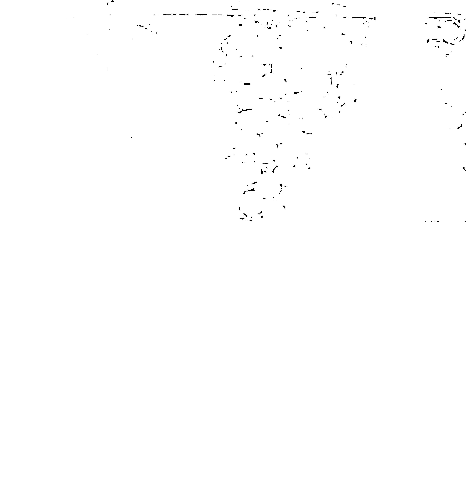

# 传递一串甜美的葡萄

冯华

一天，修道院的大门被叫开，看门人巴拉甘惊喜地看到，旁边果园的一个果农给他送来一大串晶莹剔透的葡萄。

果农对他说：“兄弟，我送给你这串葡萄，感谢你在我每次来修道院时对我的关照。”看门人对如此情意浓厚的礼物表示感谢，并对果农说修道院的人会很高兴享用这串葡萄的。

果农满意地离开修道院之后，看门人把葡萄洗净，得意地望着它。忽然，他想起修道院里的一个病人最近得病什么也不想吃，便决定把这好吃的葡萄送给他，让他开开胃：“他多么需要营养啊！”

于是，看门人把葡萄送到虚弱的病人床前，病人睁开双眼惊喜地看着葡萄，

看门人对他说：“马蒂亚斯，有人送给我这串葡萄，但是我知道你什么都不想吃，也许它能带给你食欲。”马蒂亚斯从心里感激他，对他说他将永远记住他，就是有一天死了，也会在天堂里感谢他。

看门人拿来一个大盘子，把葡萄放在上面，让病人享用。然后，他又回去继续工作了。病人拿起葡萄，又想起应该把它送给自己倾注了大量心血、整日整夜地为他操劳的护士，以慰藉自己的灵魂。

病人喊护士，护士以为病人出了什么问题，就迅速赶到了他的床前。病人对护士说：“埃斯特万，看门人惦记着我的病，送给我这串葡萄，让我品尝。由于我什么都没有吃，现在我吃了它可能伤胃，我想还是给你吃，你对我一直很不错。”护士坚持让病人吃，但是越坚持，病人越是拒绝。护士感谢病人送给他如此诱人的礼物，不得已便把葡萄带走。护士边走边想，这串葡萄应该送给兢兢业业为大家服务的厨师。于是，护士来到厨房，找到了厨师埃纳文图拉，对他说：“你的心像这串美丽的葡萄一样高尚，这串葡萄送给你吧。”厨师谢绝了护士的好意，最后把葡萄送给了为大家操劳的修道院长。

就这样，这串葡萄在整个修道院里传来传去，最后重新回到了看门人手中。看门人惊奇得不知所措，他觉得不能再让葡萄兜圈子了。于是他不再迟疑，开始吃起葡萄来。这时，他觉得从来没有吃过如此甜美的葡萄。

## 魅力提示：

人们传递的不只是一串甜美的葡萄，更是一颗感恩的心、一串人与人心灵的呵护与关爱！有了这份爱与感恩，不论生活的风雨多么强烈，不论前路多么困难重重，你都会从中收获快乐、感动、勇气。

# 把报纸落下

帕蒂·威甘德

威甘德登上了南行的“151”号公共汽车，凭窗而望，芝加哥的冬日景色实在一无是处：树木光秃，融雪摊摊，汽车溅泼着污水泥浆前进。

公共汽车在风景区林肯公园里行驶了几公里，可是谁都没有朝窗外看。乘客们穿着厚墩墩的衣服在车上挤成一堆，全都给单调的引擎声和车厢里闷热的空气弄得昏昏欲睡。

谁都没做声，这是在芝加哥搭车上班的不成文规矩之一。虽然威甘德每天碰到的大都是这些人，但大家都宁愿躲在自己的报纸后面。此举所象征的意义非常明显：彼此在利用几面薄薄的报纸来保持距离。

公共汽车驶到密歇根大道一排闪闪发光的摩天大厦前时，一个声音突然响起：“注意！注意！”报纸刷刷作响，人人伸长了脖颈。

“我是你们的司机。”
车厢内鸦雀无声，人人都瞧着那司机的后脑勺，他的声音很有威严。
“你们全都把报纸放下。”
报纸慢慢地放了下来。司机在等着乘客们把报纸折好，放在大腿上。
“现在，转过头去面对坐在你旁边的那个人，转啊！”
使人惊奇的是，乘客们全都这样做了，但是，仍然没有一个人露出笑容。他们只是盲目地服从。
威甘德面对着一个年龄较大的妇人。她的头被红围巾包得紧紧的，他几乎每天都看见她。他们四目相望，目不转睛地等候司机的下一个命令。
“现在跟着我说……”那是一道用军队教官的语气喊出的命令：“早安，朋友！”
他们的声音很轻，很不自然。对其中许多人来说，这是今天第一次开口说话。可是，他们像小学生那样，齐声对身旁的陌生人说了这四个字。
威甘德情不自禁地微微一笑，完全不由自主。他们松了一口气，知道不是被绑架或抢劫。而且他们还隐约地意识到，以往他们怕难为情，连普通礼貌也不讲，现在这腼腆之情一扫而空。他们把要说的话说了，彼此间的界限消除了。“早安，朋友！”说起来一点也不困难。有些人跟着又说了一遍，也有些人握手为礼，许多人都大笑起来。
司机没有再说什么，他已无需多说，没有一个人再拿起报纸。车厢里一片谈话声，你一言，我一语，热闹得很。大家开始都对这位古怪司机摇摇头，话说开了，就互相讲述别的搭车上班人的趣事。大家都听到了欢笑声，一种以前在“151”号公共汽车上从未听到过的温情洋溢的声音。

## 魅力提示：

> 历史给我们的最好的东西就是它所激起的热情。你给人以热情，当然也会得到同样的回报。

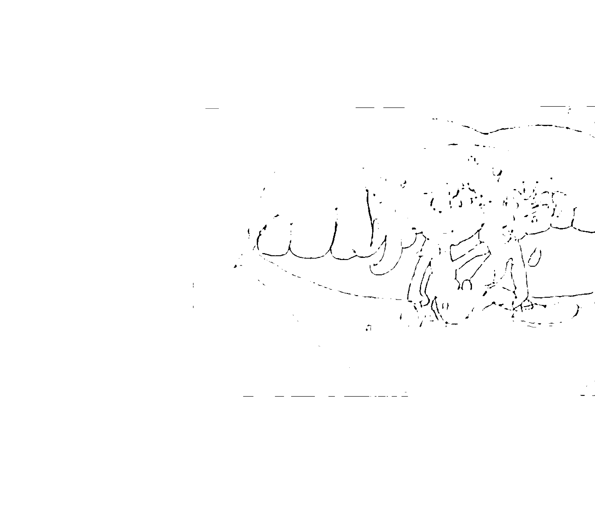

# 累赘

拿破仑·希尔

辛格和一个旅伴穿越高高的喜马拉雅山脉的某个山口，他们看到一个躺在雪地上的人。辛格想停下来帮助那个人，但他的同伴说：“如果我们带上他这个累赘，我们就会丢掉自己的命。”但辛格不能想象丢下这个人，让他死在冰天雪地之中的情景，于是他决定带这个人一起走。

当他的旅伴跟他告别时，辛格把那个人抱起来，放在自己背上。他使尽力气背着这个人往前走。渐渐地，辛格的体温使这个冻僵的身躯温暖起来，那人活过来了。过了不久，那个人恢复了行动能力，于是两个人并肩前进。当他们赶上那个旅伴时，却发现他死了——是冻死的。原来，辛格背着人走路加大了运动量，保持了自身的体温，和那个人一起抵御了寒冷。

> > 魅力提示：
>
> 对别人的冷漠其实是对自己的冷漠，你会因你的冷漠而失败。

**书名**：佛养心道养性  
**作者**：宋天天 编著  
**出版社**：新世界出版社  
**出版时间**：2009-6-1  
**印刷时间**：2009-6-1  
**开本**：16开  
**ISBN**：9787510402517  
**包装**：平装  

### 内容简介：

何谓慈悲？慈爱众生并给予快乐（与乐），称为慈；同感其苦，怜悯众生，并拔除其苦（拔苦），称为悲；二者合称为慈悲。慈悲是一切德行的根源，慈悲是无量智慧，慈悲是大爱。能感知一切众生的痛苦，能善待一切众生，并有想帮一切众生摆脱痛苦的心，就是慈悲心。慈悲心包括放下执著心、保持正心、宽容心、随缘心等。

本书共分八篇，以佛学思想为核心，分别从善念、放下、静心、做事、宽容、智慧、平常心、随缘八个方面，讲解了慈悲给我们带来的福报，以及怎样修得慈悲心。书中还有“佛陀格言”、“禅机妙语”、“佛家典籍”、“佛心故事”等版块内容，使读者能更好地了解和感悟佛法。

我佛慈悲。慈悲即佛。佛即慈悲。

### 水瓶座

魅力失分

水瓶座的人是个典型的理想主义者，容易将人或事理想化，不够实际。而且，即使别人觉得他某些地方做得不对他也懒得解释，相信公理自在人心，时间能证明一切。

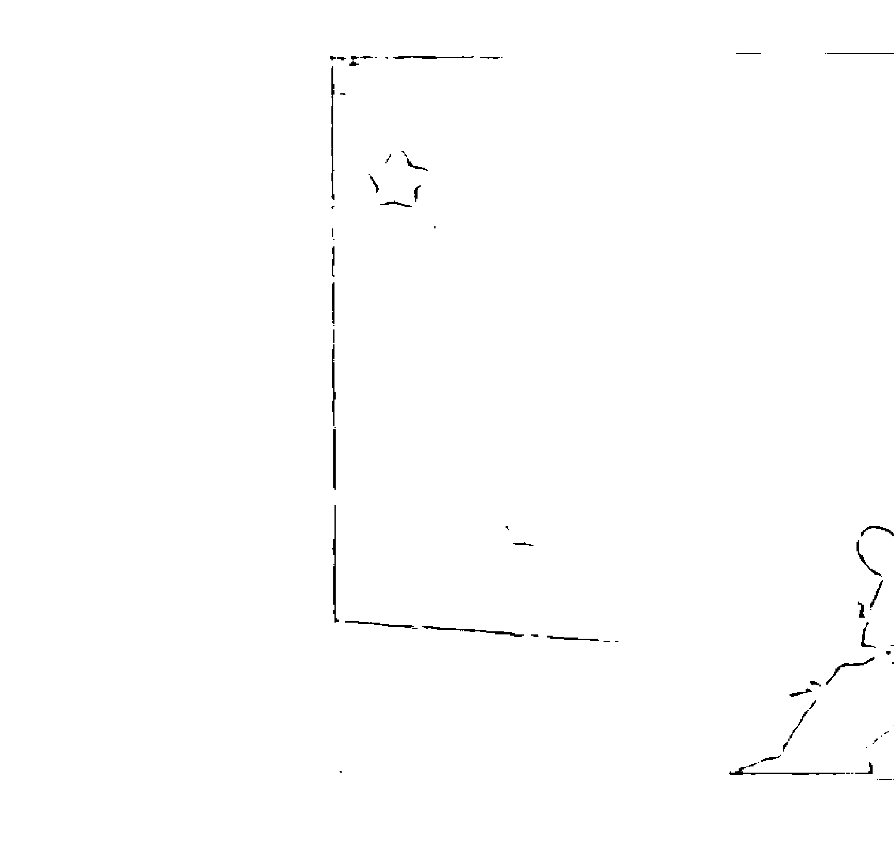

## 两只老鼠

伊索

《伊索寓言》中有一则关于乡下老鼠和城市老鼠的故事。

城市老鼠和乡下老鼠是好朋友，有一天，乡下老鼠写了一封信给城市老鼠，信上这么写着：“城市老鼠兄，有空请到我家来玩。在这里，可享受乡间的美景和新鲜的空气，过着悠闲的生活，不知意下如何？”

城市老鼠接到信后，高兴得不得了，立刻动身前往乡下。到那里后，乡下老鼠拿出很多大麦和小麦，放在城市老鼠面前。城市老鼠不屑地说：“你怎么能够老是过这种清贫的生活呢？住在这里，除了不缺食物，什么也没有，多么乏味呀！还是到我家玩吧，我会好好招待你的。”乡下老鼠于是就跟着城市老鼠进城了。

乡下老鼠看到那么豪华、干净的房子，非常羡慕。想到自己在乡下从早到晚，都在农田上奔跑，以大麦和小麦为食物，冬天还得在那寒冷的雪地上搜集粮食，夏天更是累得满身大汗，和城市老鼠比起来，自己实在太不幸了。

聊了一会儿，他们就爬到餐桌上开始享受美味的食物。突然，“砰”的一声，门开了，有人走了进来。他们吓了一跳，飞也似的躲进墙角的洞里。

乡下老鼠吓得忘了饥饿，想了一会儿，戴起帽子，对城市老鼠说：“乡下平静的生活，还是比较适合我。这里虽然有豪华的房子和美味的食物，但每天都紧张兮兮的，倒不如回乡下吃麦子来得快活。”说罢，乡下老鼠就离开都市回乡下去了。

## 魅力提示：

个性、习惯、需求的不同，最终会使我们回归到自己所熟悉的生活方式里。我们在做事情想问题的时候，也要充分考虑自己的个性、习惯。不考虑自己的优势和个性的目标，不仅舍近求远、难以实现，即便实现了也不会是自己喜欢的生活。

## 在脚下多垫些石头

阿健

大学刚毕业那会儿，我被分配到一个偏远的林区小镇当教师，工资低得可怜。其实我有着不少优势呢，教学基本功不错，还擅长写作。于是，我一边抱怨命运不公，一边羡慕那些拥有一份体面的工作、一份优厚的薪水的同窗。这样一来，不仅对工作没了热情，而且连写作也没兴趣。我整天琢磨着“跳槽”幻想能有机会调到一个好的工作环境，也拿一份优厚的报酬。

就这样两年时间匆匆过去了，我的本职工作干得一塌糊涂，写作上也没有什么收获。这期间，我试着联系了几个自己喜欢的单位，但最终没有一个接纳我。

然而，一件微不足道的小事，改变了我一直想改变的命运。

那天学校开运动会，这在文化活动极其贫乏的小镇，无疑是件大事，因而前来观看的人特别多。小小的操场四周很快围出一道密不透风的环形人墙。

我来晚了，站在人墙后面，跷起脚也看不到里面热闹的情景。这时，身旁一个很矮的小男孩吸引了我的注意力。只见他一趟趟地从不远处搬来砖头，在那厚厚的人墙后面，耐心地垒着一个台子，一层又一层，足有半米高。我不知道他垒这个台子花了多长时间，不知道他因此少看到多少精彩的比赛，但他登上那个自己垒起的台子时，冲我粲然一笑。那成功的喜悦和自豪，却是那样的清楚。

刹那间，我的心被震了一下——多么简单的事情啊：要想越过密密的人墙看到精彩的比赛，只要在脚下多垫些砖头。

从此以后，我满怀激情地投入到工作中去，踏踏实实，一步一个脚印。很快，我便成了远近闻名的教学能手，编辑的各类教材接连出版，各种令人羡慕的荣誉纷纷落到我的头上。业余时间，我笔耕不辍，各类文学作品频繁地见诸报刊、成了多家报刊的特约撰稿人。如今，我已被调至自己颇喜欢的中专学校任职。

## 魅力提示：

> > 其实，一个有理想的人只要埋首于现实，不辞辛苦，默默地在自己脚下多垫些“砖头”，就一定能够看到自己渴望看到的风景，摘到挂在高处的那些诱人的果实。

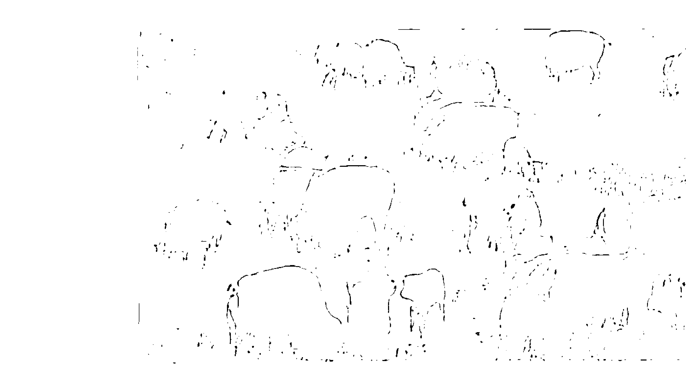

## 一头蒙住了眼睛的牛

李远峰

一头牛被主人从牛栏中拽出，去拉水车。牛很不情愿，在井台上总是走走停停。主人很着急，想方设法去调动牛的积极性。开始用草，后来用精饲料，可无论怎样激励，牛的干劲都毫无起色。后来主人想了想，用一块布蒙住了牛的眼睛。这下效果奇佳，牛很有劲地拉着水车走了下去。

傍晚，牛被牵回牛栏。另一头牛看它浑身是水，惊奇地问：“大哥，你到哪儿去了？”这头牛神秘地说：“老弟，今天我干了一项非常重要的工作，主人牵我去了一个很远很远的地方，是只有马才能有幸到达的地方，而且这工作对主人非常重要。主人对我的工作非常满意，一路上赞声不绝。”

第二天，主人又把这头牛牵出去拉水车，这头牛摇头摆尾，无比的自豪。这次它又被蒙上了眼睛，一圈圈地在井台上拉着。

## 魅力提示：

对于愚昧者来说，被人蒙上眼睛要比睁开眼睛走路开心得多，因为他们总是爱逃避现实，总是太相信幻觉，不尊重现实，更无法认清自己。他对于生活，只是一头蒙着眼睛的牛。

## 月亮水晶球

李若君

有个女孩偶然得到了一个做工精美而神秘的匣子，那是在一个有美丽月色的晚上，女孩好奇地把玩这匣子，幻想着其中的神秘物品。

匣子是那么不容易开启，以致女孩在竭尽全力开启匣子后，手一滑匣子跌落在了地上。刹那间成了无数不同截面的水晶块。瞬间，一个发着月光般光芒，变幻异常的水晶球滑过黑夜闪着神秘的亮光掉在了地上。水晶已碎，但那一闪即逝的美丽却永远驻留在了女孩的情怀中，完美而经典。

为了重新找到那份绚丽，女孩将匣子留在了身边，希望有一天重新找到一颗同样的水晶球放在里面。倘若找不到就让匣子成为一种曾经拥有的见证。

过了很多年，女孩的匣子依旧空着，这期间有许多希望得到女孩青睐的人送来了各种大而美丽的水晶球，但在女孩看来，那些纯正、光亮的水晶球都无法发出那绚烂的光芒，所以女孩拒绝了他们。就这样，女孩日复一日地苦苦等待心中的那颗水晶球。

又是一个同样的夜晚，女孩已经不知道是多少次独自来到那块曾经获得水晶球的地方，孤独和寂寞已经远远无法驱散女孩对那颗水晶球的痴心。面对那些曾经要博取自己欢心的男孩，她已经将他们连同他们的水晶球一并送给了别的女子。她只是冷傲地一笑，认为那些女子太容易满足，不懂得什么叫经典。

又是一个多么不寻常的夜，就在女孩默默祈祷奇迹快来临时，她惊奇地发现脚下出现了一个同样的水晶球，一切的一切如此熟悉，它璀璨依旧、神秘依旧，女孩此时感到世界如此美好，那匣子和自己的心都永远不会再空了！

太阳升起时，女孩又捧起水晶球，此时她竟然发现日光下水晶球已经不再闪亮，通明的外表被涂了一层紫荧光粉，擦去荧光粉，手中的居然是随便在哪个小摊上都可以找到的玻璃球，也正是女孩平时不屑一看的那种。

天哪，为什么这样，难道几年来自己所心仪、所等待的仅仅是一个玻璃球？不可能的呀——女孩决定去问世界上最聪明的智者。

智者告诉女孩，涂了荧光粉的玻璃球在夜晚都如此美丽，但白天就是玻璃。他还说，看一件物品要从多个方面看，夜幕下看到的往往不是真实的。人不应追求一个虚幻的经典，更不能为它而错过了所有真实的季节和美丽。

> 魅力提示：
人生就是这样，无论事业、爱情、生活都在进行着如此的故事……

**书名**：务实高于一切  
**作者**：韦良军 编著  
**出版社**：中国致公出版社  
**出版时间**：2008-7-1  
**印刷时间**：2008-7-1  
**开本**：16开  
**ISBN**：9787801796721  
**包装**：平装  

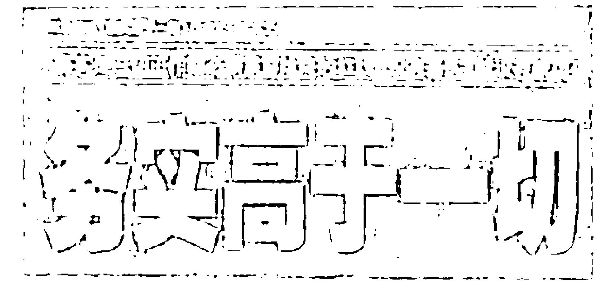

### 内容简介：

务实是一切工作都必须贯穿始终的红线，没有务实，就没有成功！
务实就是讲究实际、实事求是。实，就是充盈、稳固、脚踏实地；就是实在、实际、实话、实干。所有工作都要求真务实、少说空话，不做表面文章、不搞花架子、不搞形式主义理想主义。实干兴邦，空谈误国。要处处坚持重实际、说实话、务实事、求实效，必须大力发扬脚踏实地、埋头苦干的工作作风。

### 魅力失分

水瓶座的人很容易看不起比自己差的人，对人经常冷嘲热讽，令人有挫折感，打击别人自尊心。

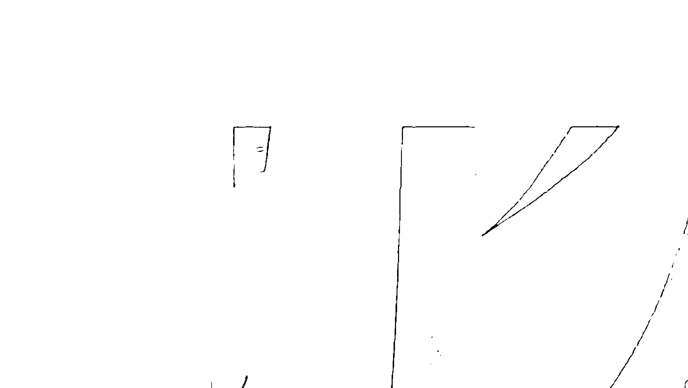

## 谢绝基辛格的酒吧

蒋光宇

耶路撒冷有一个名叫“芬克斯”的酒吧，面积仅三十平米左右。酒吧老板是位犹太人，名叫罗斯恰尔斯。在他的苦心经营下，酒吧的生意日渐兴隆，在当地声誉颇高。

那一天，正在中东出访的美国国务卿基辛格博士来到耶路撒冷，完成公务后，这位大人物突然想私下光顾一下当地酒吧。

在朋友们的推荐下，他选择了“芬克斯”。为给对方一个惊喜，基辛格决定亲自打个预约电话。他自报家门后，以婉转的口气对老板说：“我有十个随员，将和我一起前往，届时能否谢绝其他顾客？”

按常理说，对基辛格这样的世界级政要，仅出于安全考虑，这也是可以理解的要求，何况对任何一个老板来说，这的确是求之不得的好事。谁知罗斯恰尔斯一方面礼貌地接受了基辛格的预约，另一方面对“谢绝其他顾客”的要求则表示无法接受。他说：“您能光临本店，我深感荣幸，但是，因您的缘故而将他人拒之门外，是无论如何也做不到的，我不能将那些老顾客、老朋友拒之门外。”

对这意外的答复，基辛格几乎怀疑自己的耳朵听错了，但只能不理解地挂上了电话。

第二天傍晚，“芬克斯”的话筒里又传来了基辛格的声音，语气更加客气，他对昨天的失礼表示道歉后，说这次只带三个随从，只订一桌，且不必谢绝其他客人。

> > 罗斯恰尔斯说：“非常感谢您的诚意，但我还是无法满足您的要求。”

> > “为什么？”基辛格惊愕得从椅子上站了起来。

> > “对不起先生，明天是礼拜六，本店例休。”

> > “但是，我后天就要离开了，您能否破一次例呢？”

> > “那不行，作为犹太人后裔，您该知道，礼拜六是个神圣的日子，在礼拜六营业，是对神的亵渎。”

基辛格听后，无言以对，默默地挂上了电话。

一名美国记者获悉此事后，在美国报纸上撰写了一篇很有影响的文章，题目是《基辛格与芬克斯》。

显而易见，“芬克斯”酒吧并不是因为谢绝了基辛格才赫赫有名，否则基辛格也不会选中这个“芬克斯”。但世人得知罗斯恰尔斯合情合理地谢绝了基辛格之后，芬克斯酒吧的名声则更大。芬克斯酒吧连续三年被美国《新闻周刊》选入世界最佳酒吧前十五名之列。

## 魅力提示：

罗斯恰尔斯的成功，一方面得益于平时的苦心经营，另一方面也得益于面对世界级大人物所表现的平等待人、不分贵贱、尊重每一位顾客的高尚职业道德。

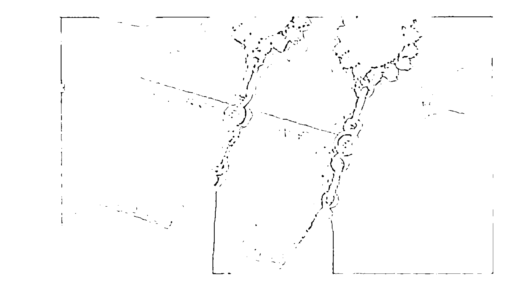

## 收留乞丐

佚名

几个朋友在议论，都说自己的亲戚是怎样一个高贵的人物。银行家啦，实业家啦，大财主啦，大官啦，大将军啦，全都有。大家你嚷我喧十分热闹。
可是有一个人不做声。别人叫他说，他说不必说了，再三地叫他讲，他才说：“街市上的叫花子，都是我的亲戚。拉黄包车的，也是我的朋友。”
大家都笑起来，说他骗人。他正色道：“所有的人类，无非是体面跟不体面两种，现在体面的，都被你们占尽了，只剩下这些不体面的丢在那里。我若不把他们收留来认作亲戚，恐怕他们会跑到各位府上，成为各位的亲戚，那就糟透了。”

## 魅力提示：

世界之大，三教九流也无所不容，上自皇室公卿，下至苦力乞丐，他们都生活在这同一世界上。我们不能也不应当忽视或否定他们的。即使是在自己的亲戚当中，也不会都是些高贵的人物，肯定大多数都是些底层人物，因此做人不要太势利眼！

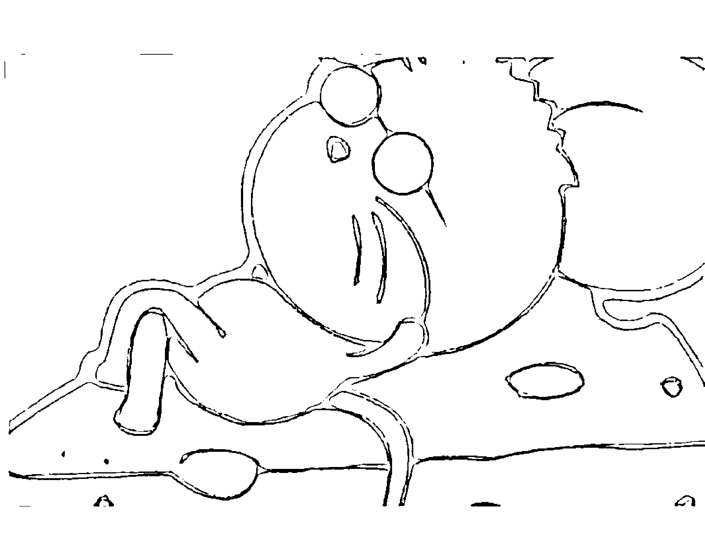

## 传世珍品与碎片

佚名

桌上放着一只存钱罐和一张白纸。一天，存钱罐挺了挺装满硬币的肚子，装出一副很有钱的腔调说：“哎呀，白纸先生，你一无所有，难道不感到空虚吗？瞧瞧我，肚子里有了钱那才是实在呢！”白纸说：“虽然我没有钱，但我并不感到空虚，因为我相信我的未来是会很充实的。”存钱罐听了，露出一丝不屑的笑。

一会儿，主人回来了，他很高兴，提起笔在白纸上写下了两行精美的字，然后裱成条幅挂在书房里。来往的客人见了这幅书法作品，无不啧啧称赞。后来这幅书法作品成了传世珍品，成了国家博物馆的永久收藏品。而那只存钱罐却早就被书法家的孙子为了取硬币而给砸碎了，变成了一堆废品永远躺在了垃圾堆。

## 魅力提示：

> 不要让骄傲和虚荣心占据你的心，否则你将一事无成，浪费时日。

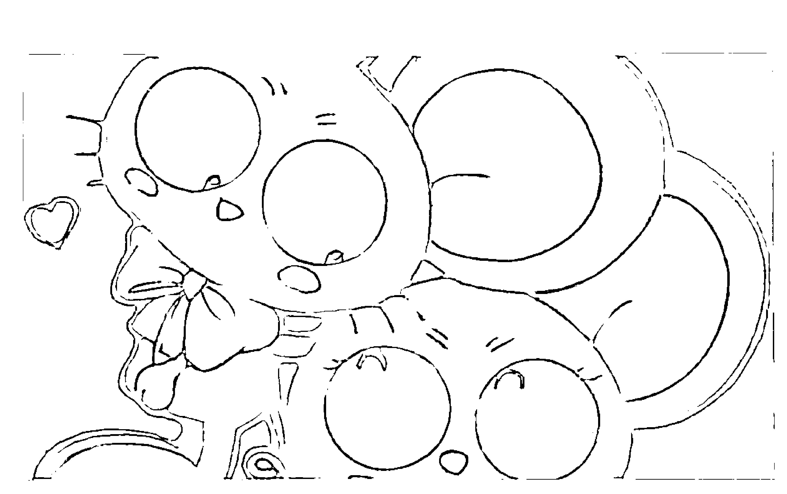

## 被拒绝的爱

佚名

一位外地的年轻人来到俄亥俄州的一个农场，他在农场主那里得到了一份打杂的工作。年轻人白天干着繁重的活，晚上睡在干草棚里。由于他工作勤奋，农场主十分满意，连农场主的女儿也喜欢上了这个年轻人。

年轻人爱上了农场主的女儿，他大胆地向农场主表示了对他女儿的爱意。农场主虽然很欣赏他的工作能力，却嫌他身份卑微，长相平凡，因此拒绝了他。年轻人很伤心地离开了农场，他走的时候谁也不知道。

过了三十几年，农场主在拆除已经没有用的干草棚时，意外地发现在支柱上刻着一行字，末尾是：詹姆斯·加菲尔德。大家都非常惊讶，想不到现今的美国总统，竟是当年那位貌不惊人的小伙子。

## 魅力提示：

人不可貌相，海水不可斗量。总统并非一生下来就是总统；乞丐也并非天生就是乞丐。一个人的价值体现在他内在的创造力和提升力上，而不是外在的容貌、财富、地位等等。

**书名**：拿来就用的心理学  
**作者**：黄胜 著  
**出版社**：中国物资出版社  
**出版时间**：2010-3-1  
**印刷时间**：2010-3-1  
**开本**：16开  
**ISBN**：9787504732842  
**包装**：平装  

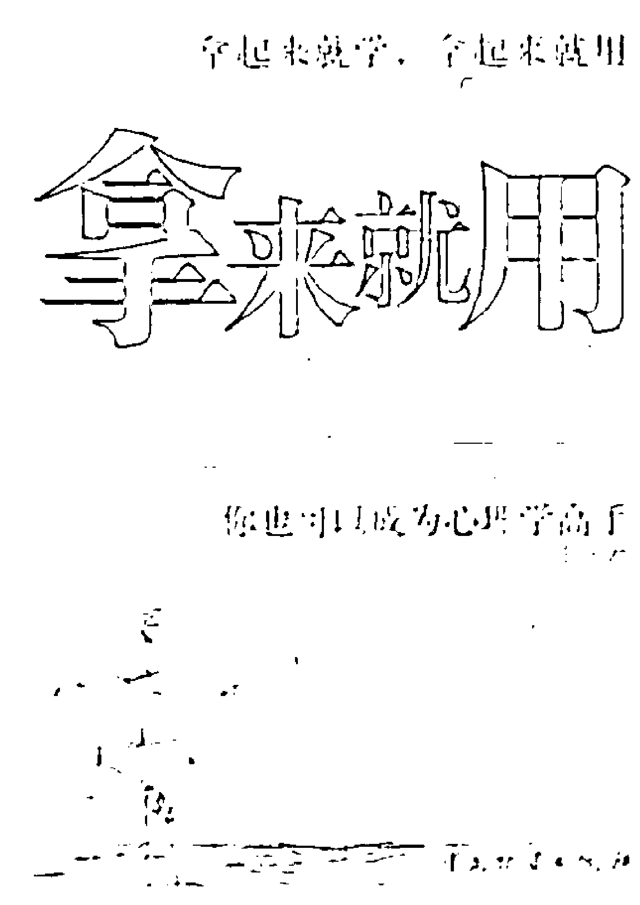

### 内容简介：

最妙趣横生的心理学课堂，一本教你如何运用心理学与心理战术战胜自己、也战胜别人的智慧宝典。书中充满了知识和挑战，既有妙趣横生的心理学效应，也有诡异深奥的心理学原理。如果你能将这些心理学法则铭记于心，你一定能收获更为充实精彩的人生以及更加和谐的人际关系。

心若改变，你的态度跟着改变；态度改变，你的行为跟着改变；行为改变，你的习惯跟着改变；习惯改变，你的性格跟着改变；性格改变，你的命运跟着改变！

### 魅力失分

水瓶座的人好奇的天性使他凡事都喜欢打破沙锅问到底，有时候，这样的个性是很让人受不了的。

## 与珍贵的自己作一个约定

卡洛琳·李

一对新婚夫妇生活贫困。丈夫为了让妻子能过上体面日子，去了很远的地方打工，妻子答应在家忠贞地等他回来。

年轻人在老板那儿工作二十年后，临行时老板未给他发工钱，给了他三条忠告和三块面包。第一，永远不要走捷径。便捷而陌生的道路可能会要了你的命；第二，永远不要对可能是坏事的事情好奇，否则也可能要了你的命；第三，永远不要在仇恨和痛苦的时候作决定，否则你以后一定会后悔。老板给他的三个面包，两个让他路上吃，另一个等他回家后和妻子一起吃。

在远离自己深爱的妻子和家乡二十年之后，男人踏上了回家的路。一天后，他遇到了一个人，那人说：“你要走二十多天的路，这条路太远了，我知道一条捷径，几天就能到。”他高兴极了，正准备走捷径的时候，想起了老板的第一条忠告，于是他决定按照原来的路走。

一条忠告，于是他回到了原来的路上。后来，他得知那人让他走的所谓的捷径完全是一个圈套。

几天之后，他走累了，发现路边有家旅馆，他打算住一夜，付过房钱之后，他躺下睡了。睡梦中，他被一声惨叫惊醒。他跳了起来，走到门口，想看看发生了什么事，刚刚打开门，他想起了第二条忠告，于是回到床上继续睡觉。第二天，店主对他说：“您是第一个活着从这里出去的客人。我的独子是个疯子，他昨晚大叫着引客人出来，然后将他们杀死埋了。”

男人接着赶路，终于在一天的黄昏时分，他远远望见了自己的小屋，还依稀可见妻子的身影。虽然天色昏暗，但他仍然看清了妻子不是一个人，还有一个男子伏在她的膝头，她抚摸着他的头发。看到这一幕，他真想跑过去杀了他们，这时他想起了第三条忠告，于是停了下来，想了想，决定在原地露宿一晚，第二天再作决定。天亮后，已恢复冷静的他对自己说：“我不能杀死我的妻子，我要回到老板那里，求他收留我，在这之前，我想告诉我的妻子我始终忠于她。”

他走到家门口敲了敲门，妻子打开门，认出了他，扑到他怀里，紧紧地抱住了他。妻子眼含热泪，并让儿子见过父亲。原来，丈夫走的时候妻子刚刚怀孕，现在儿子已经二十岁了。

丈夫走进家门，拥抱了自己的儿子。在妻子忙着做晚饭的时候，他给儿子讲述了自己的经历。接着，一家人坐下来一起吃面包，他把老板送的面包掰开，发现里面有一笔钱——那是他二十年辛苦劳动赚来的工钱。

## 魅力提示：

> > 与珍贵的自己作个约定，永远不要走捷径；永远不要对可能是坏事的事情好奇；永远不要在仇恨和痛苦的时候作决定，只有这样你才会安然享受你所拥有的一切。

## 你有勇气知道真相吗？

佚名

加菲猫和狗狗欧弟被抓走，卖到了宠物店。小家伙担心主人乔恩会伤心发狂，甚至抑郁而死。但没有想到的是，乔恩居然会来商店，开心地重新买下它们。加菲猫说，我永远都不想知道答案。为什么乔恩没有费尽心思寻找我们？为什么他会到宠物商店？

不去追问答案，加菲猫就能像从前一样抢猪肉卷吃，赖在乔恩的沙发上，用自己的娇憨赖皮得到更多爱意。而一旦打破砂锅问到底，要么是逼乔恩撒谎，而撒谎之后善良的乔恩心情必然不会太好，心中憋着无名火的主人还会对加菲猫无限宽容放纵吗？要么乔恩说实话，但实话有可能伤害到加菲猫的自尊心，让它从乔恩的心肝宝贝沦落到可有可无的地位。

这两种结果都不是加菲猫想要的，所以它选择装傻。

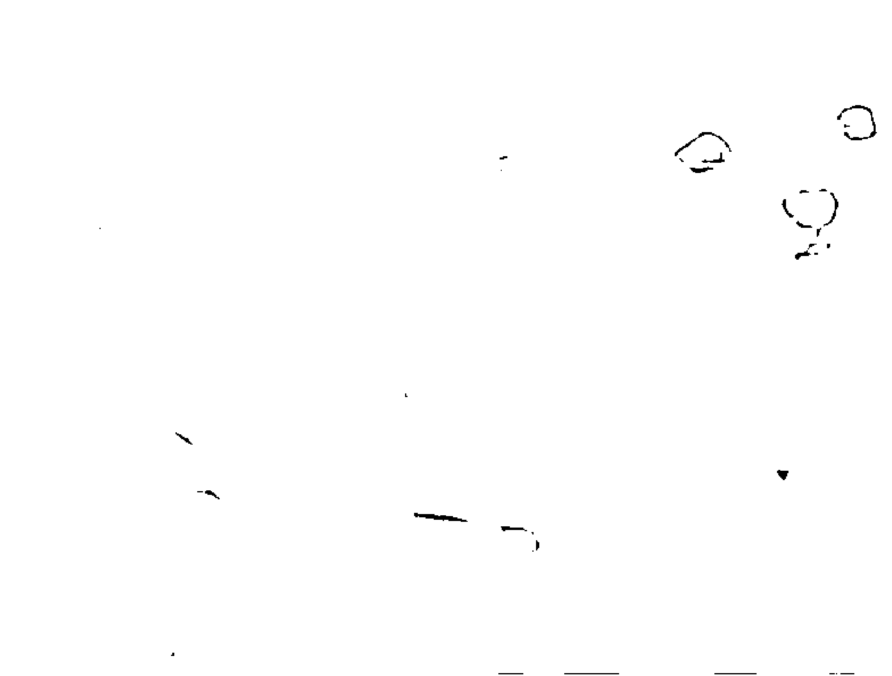

## 魅力提示：

加菲猫在大家眼里不过是一只贪嘴自私的肥猫，但它的处世智慧却堪称猫界翘楚。在有些事情面前，我们何不学习一下加菲猫，选择装傻不问的态度呢？

## 好奇的心

朱敬平

有一天，舒拉坐电车去体育场。车子上，有个大学生模样的小伙子正在给他的同伴讲故事，故事的内容深深地吸引了舒拉。

故事是这样说的：

一个有钱的英国人非常喜欢小鸟，这天，他去动物商店，让营业员帮他挑一只最好的鹦鹉。

于是营业员建议他买那只停在横杆上的鹦鹉，开价一万元。营业员说，这只鹦鹉训练有素，是独一无二的。如果拉一拉它左腿上的绳子，它就会朗诵名诗，如果拉一拉右腿上的绳子，它就会高唱圣歌。“太好了，太好了！”英国人听到这里，忍不住连连拍手叫好，他毫不犹豫地掏出钱，买下了这只鹦鹉。英国人兴高采烈地带着鹦鹉走出商店，突然又转回身来问营业员：“如果我同时拉两根绳子呢？”

年轻小伙子正说到兴头上，这时候电车进站了，他的同伴便急急忙忙把他拉下了车。

故事的结局会是怎么样的呢？这个悬念把舒拉搅了整整一个晚上，但最终他什么也没有想出来。

后来卫国战争爆发了，舒拉在守卫列宁格勒的部队服役。这天，在战斗间歇中，一个战友对舒拉说：“喂，伙计，给你讲一个有趣的笑话。有家商店出售一只珍贵的鹦鹉，它的两条腿上各拴着一根绳子，拉左边的绳子，它就朗诵名诗……

战友这番话把舒拉的好奇心又重新吊了起来。“后来怎么样？”舒拉急不可待地追问道。那个战友刚想说下去，营长派人来叫他，他走了。这个战友自此再也没有回来，他在执行任务时牺牲了。

战后，舒拉被抽到巡回演出小分队。在加里宁演出期间，有一次，演出间歇时马戏团的报幕员说：“喂，我给你讲一个有趣的笑话：一个商店里出售一只两条腿上分别拴着一根绳子的鹦鹉……” “结果怎么样？”舒拉的心简直要跳出来了，他不等报幕员说完，就急着追问结果。可是天下偏偏就有这样的巧事，报幕员要上场了。而且说出来谁也不会相信，就在报幕的时候，他突然心脏病发，被送进了医院，第二天就转到莫斯科去了，直到巡回演出结束，一直没有回来。

原本是一个普普通通的小故事，但由于这一次次近乎传奇的讲述经历，使它披上了一层神秘的色彩。事隔3年，故事的结局始终是一个深深的悬念，时刻缠绕在舒拉的脑海里。

3年后，舒拉因公出差又来到加里宁，得知那个报幕员现在在加里宁电台工作。

办完公务，舒拉来到了电台。推开办公室的门，顾不得寒暄应酬，开口就问：“腿上拴着两根绳子的鹦鹉后来怎么样了？” “什么鹦鹉？”报幕员丈二和尚摸不着头脑。 “就是那个故事，一个英国人在商店里买鹦鹉……” “噢——”报幕员笑了，“当那个有钱的英国人问营业员，如果同时拉鹦鹉腿上的两根绳子，鹦鹉会怎样时，那只鹦鹉说话了：‘笨——蛋，那我不就从杆子上掉下来了吗？’”

## 魅力提示：

有时打破沙锅问到底的结果就是…一场闹剧，而你却深陷其中。

## 卖真相

莫名

一名男子百无聊赖地在大街上闲逛。

他看到有一家商店的橱窗里什么也没有，便把脸贴在玻璃上使劲往里看，想看看这家商店到底卖什么，只见货架的牌子上写着各种各样的真相。

他感到很奇怪，便走了进去。

在一个柜台前，他向小姐问道：“这是卖真相的商店吗？”

小姐答道：“是的，先生，您要买什么真相？部分真相，相对真相，统计真相，还是完全真相？”

他没有想到会有一个能买到真相的商店，感到很有意思。太多的欺骗、隐瞒、谎言和假货使他伤透心了，于是他不假思索地说道：“我要买完全真相！”

“对不起，先生，您知道买完全真相要付出什么代价吗？”小姐问道。

“不知道。”他嘴上这样说，可是心里想，为了买到完全真相，不论什么代价他都愿意付出。

小姐告诉他，如果他要买走完全真相，需要付出的代价是自己永生不得安宁。他听后大吃一惊，没有想到买真相要付出如此巨大的代价，于是急匆匆地走出了商店。

他有些悲哀地意识到，他毕竟还需要一些谎言和借口把某些事情隐藏起来，他还没有能力直面所有赤裸裸的真相。

## 魅力提示：

人生的许多事情拆穿了就没有意思了，还不如轻轻松松地睁一只眼、闭一只眼来得逍遥自在

- 书名：20几岁必须看透的50个人生谬误
- 作者：黄志坚，成自来 编著
- 出版社：北京工业大学出版社
- 出版时间：2009-9-1
- 印刷时间：2009-9-1
- 开本：16开
- ISBN：9787563921461
- 包装：平装

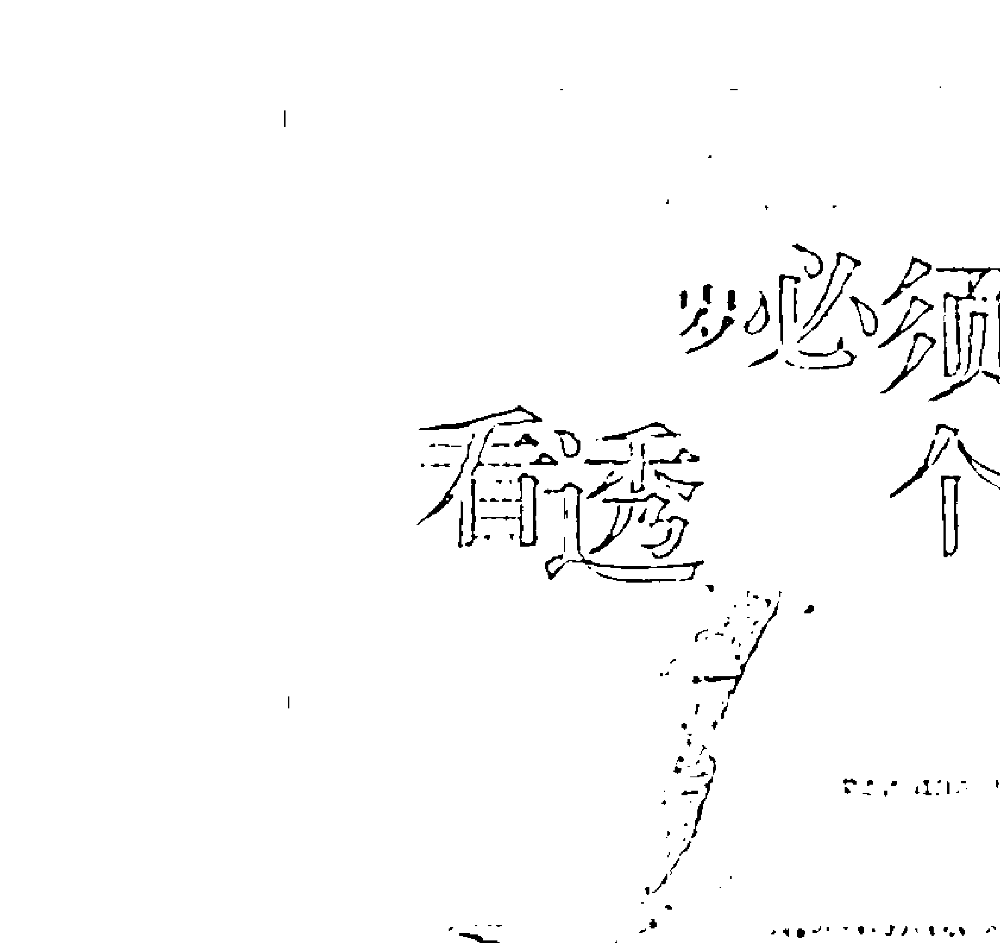

### 内容简介：

只要是人，都难免会遭遇到各种谬误，这些谬误可能短时间内无法对你造成坏的影响，但是它会制约你的发展，让你陷入一片混沌中难以自知，让你与成功渐行渐远。其实，陷入谬误的认知圈套中并不可怕，可怕的是难以自知，无法作出正确的判断和突破，最终沦为命运的奴隶。因此，认识上的觉醒胜过找寻规避谬误的方法。

本书总结出了每个人的人生当中可能遭遇到的50个谬误以及规避和解套的方法，它是你轻松跨越人生障碍、步步为营的人生指南。

## 十二星座

### 魅力失分

水瓶座的人非常在意生活的自主权，容不得别人对他的生活指手画脚，即使是好心的建议，他也不喜欢。

## 魅力星座智慧书之

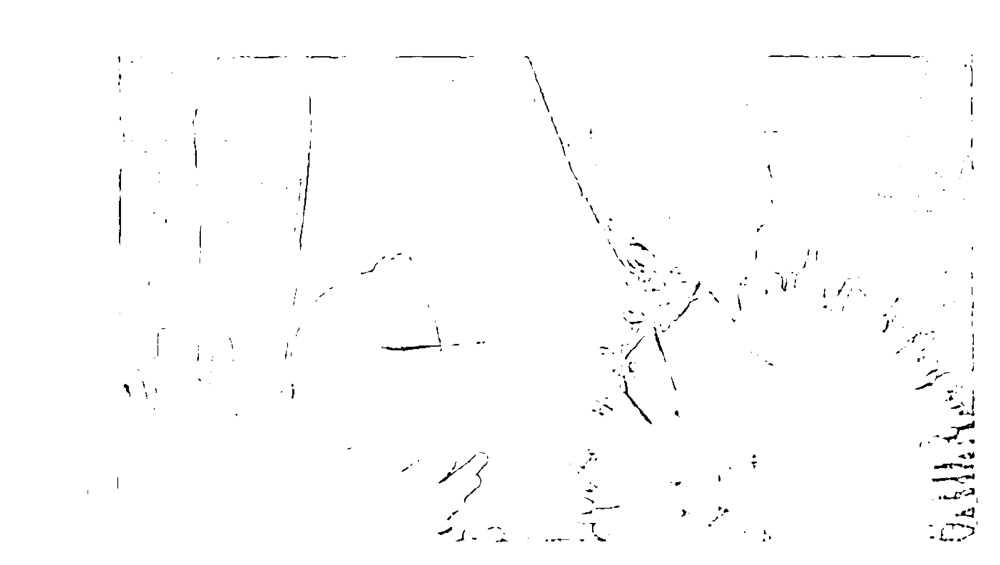

## 虚心纳谏的齐景公

佚名

齐景公爱喝酒，连喝七天七夜不停止。

大臣弦章上谏说：“君王已经连喝七天七夜了,请您以国事为重,赶快戒酒;否则就请先赐我死了。”

另一个大臣晏子后来觐见齐景公，齐景公向他诉苦说：“弦章劝我戒酒，要不然就赐死他；我如果听他的话，以后恐怕就享受不到喝酒的乐趣了；不听的话，他又不想活，这可怎么办才好？”

晏子听了便说：“弦章遇到您这样宽厚的国君，真是幸运啊！如果遇到夏桀、殷纣王，不是早就没命了吗？”

于是齐景公果真戒酒了。

## 魅力提示：

虽然每个人都有自己的喜好,你自己的生活怎么过也是你自己的权利,但是,对于别人好心而且正确的建议,我们还是应该虚心接受。

## 无我的教诲

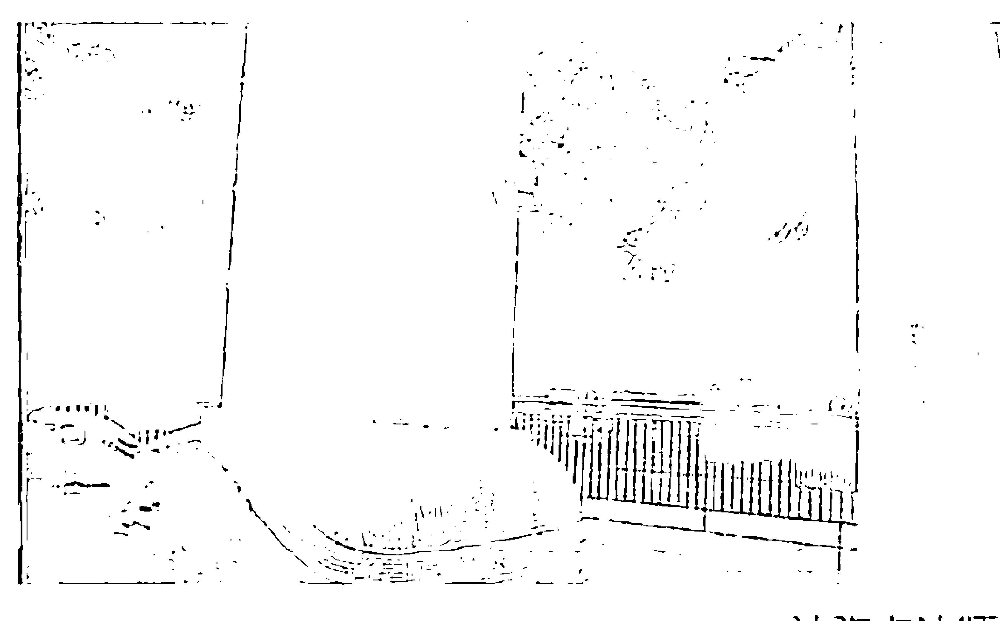

达弥卡法师

世尊对僧众说：“身体不是灵魂。如果它是灵魂就不会受苦；一个人也就可以说：我要我的身体这样，不要身体那样。既然身体不是灵魂，就一定会承受痛苦，而人就不可以说：我要我的身体这样，不要身体那样。受、想、行、识也是如此。你以为身体是永久的还是不永久的呢？”

“不永久的，世尊。”

“不永久的东西是痛苦的，还是快乐的？”

“痛苦的，世尊。”

“将无常的和痛苦的东西当成这是我的，这是我，这是我的灵魂，这样认为是适当的吗？”

“不适当，世尊。”

“受、想、行、识也是如此。所以，不论任何一种身、受、想、行、识——是过去、现在还是未来的，是粗俗的还是巧妙的，内在还是外在的，是低卑还是卓越的，是远还是近的，都应以正确的知识理解成：这不是我的，这不是我，这不是我的灵魂。”

如此观看与听闻后，圣洁弟子就不再执著于身、受、想、行、识。既然不再执著，激情会消退。激情消退，他就得到解脱，并且知道自己是解脱者。他体悟到：轮回已休止，我已经过修行生活和做了一切必须做的，我不再生死与受业报了。

## 魅力提示：

当我们不再执著于身、受、想、行、识，我们怎么还会在乎什么生活自主权呢？当然，这种无我的境界也许是很难达到的，但是可以是我们努力的方向。

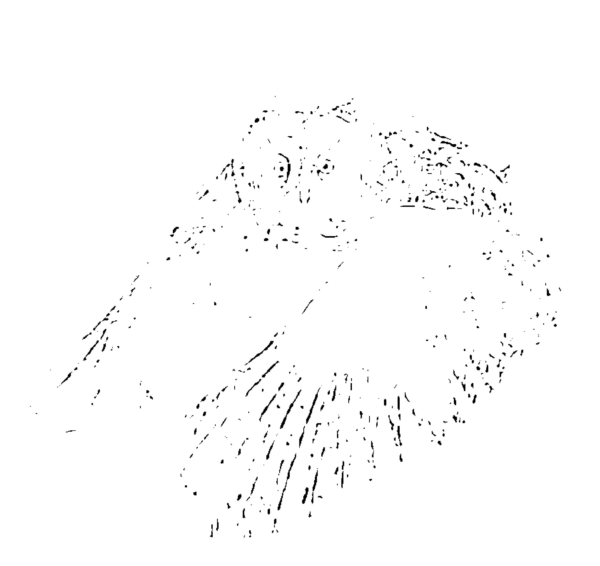

## 猫头鹰和野兔

列夫托尔斯泰

傍晚，猫头鹰开始在林中盘旋，暗中搜寻着猎物。

一只大灰兔跳到林中的草地上，开始梳理脸上的毛。老猫头鹰看了大灰兔一眼，停在树枝上。小猫头鹰说：“你怎么连兔子也不去捉呀！”

“我力不从心呀！”这只灰兔太大了，你要是抓住它，它会把你拖进密林里去的。”

可小猫头鹰说：“我用一只爪子抓住它不放，同时用另一只爪子迅速握住树枝。”

于是小猫头鹰就飞过去捉野兔。它用一只爪子紧紧抓住兔子的后背，连爪子都扎了进去；同时准备好用另一只爪子去抓树。兔子一挣扎，它就用另一只爪子抓住了树，心想：“我看你还怎么逃！”可是兔子猛地一冲，把小猫头鹰撕成了两半。它的一只爪子留在树上，另一只留在了兔子的后背上。

第二年，有个猎人打死了这只灰兔，拿起来一看，大吃一惊——兔背上长着一只猫头鹰的爪子。

## 魅力提示：

做事情千万不要一意孤行，对于他人善意的劝诫一定要认真听取

## 一根绚丽的羽毛

佚名

从前，一根绚丽耀眼的羽毛长在大鹏鸟的翅膀上。在众多的羽毛中，这根羽毛十分与众不同，它每时每刻都闪闪发亮，耀眼夺目，令其他羽毛羡慕不已。它自己也常常得意洋洋，摆出一副不可一世的样子。

有一天，亮丽的羽毛意气风发地对其他羽毛说：“大鹏鸟展翅飞翔时看起来如此壮观伟岸，还不都是因为有我参与。”其他羽毛听罢都低声附和。又过了一段日子，那根漂亮的羽毛更加自以为是地对其他同伴说：“我的贡献太大了，没有我的话，大鹏鸟哪里能够一飞冲天呢！”

漂亮的羽毛整天陷在自傲自负的泥沼里，无法自拔。终于它孤傲且目中无人地对大家宣布：“我觉得大鹏鸟已经成为我人生沉重的负担，要不是大鹏鸟硕大无比的躯体重重地压着我，我一定可以自由自在地飞翔，而且会飞得更远更高。”

说完，它就使出浑身解数，拼命地脱离大鹏鸟，最后它终于如愿以偿，从大鹏鸟的翅膀上掉落下来，但它在空中没飘多久，就无声无息地落在泥泞的土地上，从此再也无法飘扬远飞了。

## 魅力提示：

有些人固然拥有不错的才华，然而，却因此就自视高人一等，甚至目中无人，睥睨一切，狂妄到将所有的功劳都往自己身上揽。这种一意孤行的心志及行为，终将会让其自食恶果。

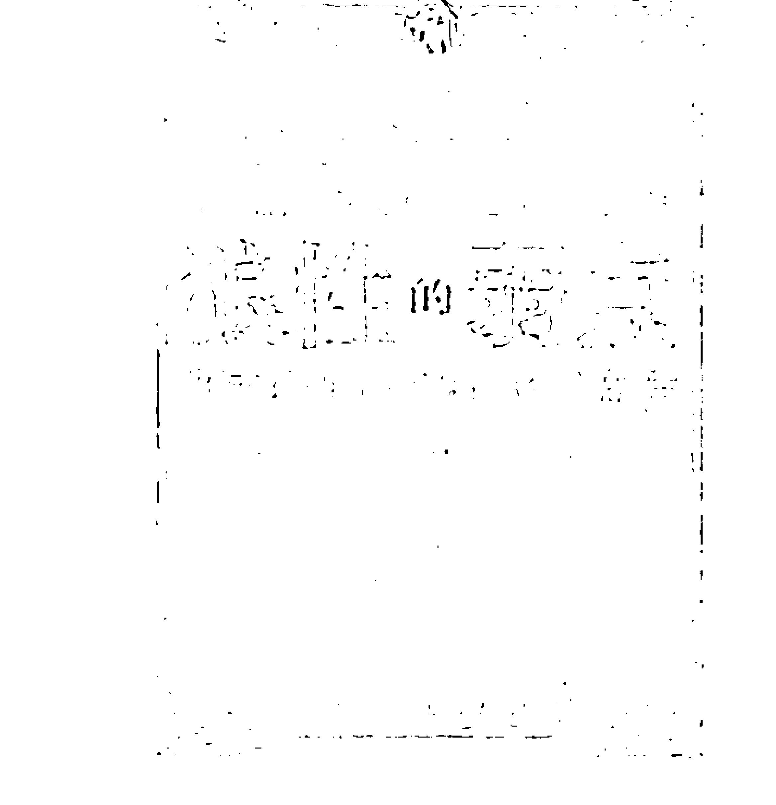

- 书名：狼性的弱点
- 作者：张志军 著
- 出版社：时事出版社
- 出版时间：2005-11-1
- 印刷时间：2005-11-1
- 开本：16开
- ISBN：9787800099373
- 包装：平装

### 内容简介：

狼都是不听劝告的一意孤行者，头狼更有独断专行的不良作风，这种行为往往导致它们最终陷入孤立无援的境地。作为企业领导者，学习和借鉴头狼控制绝对领导权的做法无可厚非，但一手遮天、一锤定音的决策方式对企业发展极为不利。

总之，对于狼性的种种弱点，企业管理者们切忌视而不见。只有认清并且克服狼性的弱点，同时再利用狼性的优点为企业经营管理服务，扬狼性之长，避狼性之短，才能使企业在竞争大潮中独占鳌头，称雄天下。

### 魅力失分

水瓶座的人是很博爱的，所以交了很多“男的朋友”或“女的朋友”，但都不是“男朋友”或“女朋友”，每次出去约会，不是“一对多”就是“多对多”，根本没有单独相处培养感情的机会。

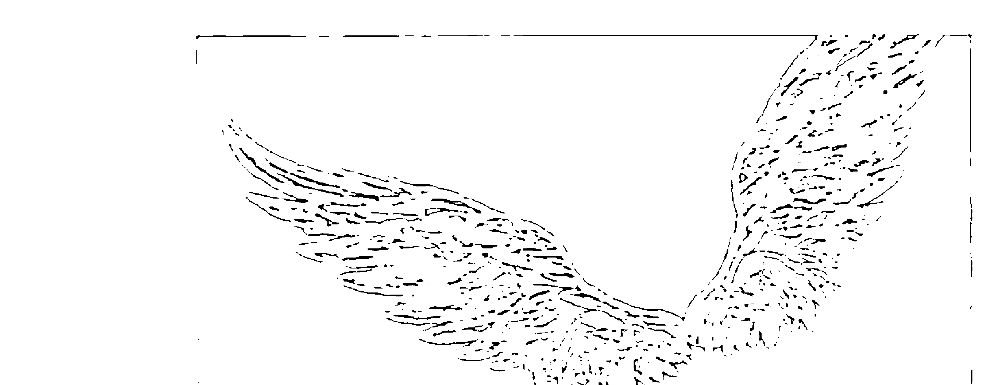

## 校花的苦恼

范天涯

刘依依是大学里的超级校花，不仅人长得极美、身段窈窕，还写得一手好文章，能歌善舞，是学生会主席，成为许多男生的追求对象。

可是令无数女孩羡慕的她却始终不快乐，因为每到过什么节目，她都会收到许多男孩的礼物。出于一种责任感，刘依依觉得如果不能接受人家的爱，送来的礼物就要送回去，不能让人家觉得自己是一个贪得无厌的人。可是，把送来的礼物退回去可是一门学问，既不能伤人自尊，又不能让人家觉得自己太清高，免得遭人讨厌，学生工作也不好开展。所以，每次收到男孩礼物的时候，都是她最头痛的时候。

后来，她的好朋友建议她找个男朋友就不会有那么多男生再惦记她了，她也就没有这么多小烦恼了。她想了想也是，于是接受了一个自己也有点感觉的男孩，和他恋爱了。

可谁知，她连谈个普普通通的恋爱都谈不成。

每次和男朋友约会的时候，都会有一些“百折不挠”的男生打电话过来，很是败坏两人的心情。

她也想把手机关掉，但身为学生干部的她，免不了有老师找她做事。结果没多久，那个男孩觉得和她在一起太没有安全感，只想找一个“安静”的女孩，无奈之下和她分手了。

就这样，一个非常出众的女孩却被人家给抛弃了。伤心之余，她终于想到了一个让自己清净的好办法。她通过好朋友传出去，她已经和一个男孩订婚了，男孩已经参加工作，人在外地。 在她看来，这样的做法或许能打消一些男生的进攻吧！

可是，消息传出去不到一个月，一个男生感到没有了进攻机会，因绝望而自杀，还留下了一份遗嘱，白纸黑字上写着是因为她而死。许多为那个男孩痛惜的人，开始在背地里议论她。这对她无疑是一场重大的打击，迫于无奈她辞去了学生会主席的职务，同时也不再参加任何活动。

从此，她度过了两年孤独的生活。

而每当看见身边那些看上去条件还不如自己的女孩，却享受着平平淡淡的爱情时，她都很羡慕。

## 魅力提示：

> 不要羡慕别人有许多人爱恋，更无需贪求自己得到太多的爱，因为爱多了会变成一种负担，爱太多了未必就幸福，有一份简单而真挚的爱情，有一个人愿意为你付出，为你遮风挡雨就已足够了

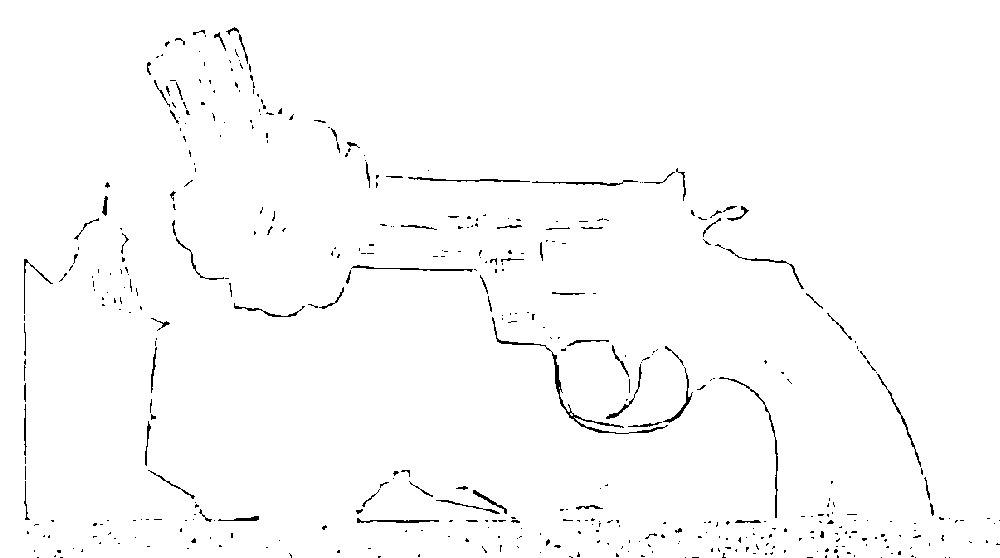

## 唯一幸存的男人

佚名

古时候，两座城市交战。其中一个城市被另一个城市放下水库的水围困，很快，整个城市就要被大水淹没。
围困者装作一副仁慈的模样，派船去营救“被围困者”，但是只允许女人带上一件自己最喜爱的东西上船。有的带上金银首饰；有的带上玉镯；有的带上铜镜……但是有一个妇女奋力地扛着自己的丈夫也来上船。
士兵不允许上船：“只许妇女上船，男人不能上船。”
女人说：“这是我最喜爱的东西。”
士兵无言以对，只好让他上船。这位妇女的丈夫成了被洪水淹没的城市里唯一的幸存者。

## 魅力提示：

真正相爱的人，是任何情况都不能使他们分离的。他们彼此都是对方的唯一，对方的最爱，在最关键的时刻，他们想到的不是自己，而是对方

## 丈夫的叮嘱

佚名

女人有了外遇，要和丈夫离婚。离婚前，丈夫想见见妻子的男朋友。女人便把一个高大英俊的中年男人带回家来。
女人本以为丈夫一见到自己的男朋友必定气势汹汹地讨伐。可他没有，他很有风度地和男人握了握手。然后，他说他很想和她男朋友谈一下，希望妻子回避。站在门外，女人心里七上八下，生怕两个男人打起来。然而几分钟后，两个男人相安无事地走了出来。
送男友回家的路上，女人忍不住问：“他和你谈了些什么？是不是说我的坏话。”男人一听，停下了脚步，他惋惜地摇摇头：“你太不了解你丈夫了，就像我不了解你一样！”女人听完，连忙申辩道：“我怎么不了解他，他木讷，缺少情趣，家庭保姆似的简直不像个男人。”“你既然这么了解他，就应该知道他跟我说了些什么。他说你心脏不好，但易暴易怒，结婚后，叫我凡事顺着你；他说你胃不好，但又喜欢吃辣椒，叮嘱我今后劝你少吃一点辣椒。”
“就这些？”女人有点吃惊。
“就这些，没别的。”
听完，女人慢慢低下了头。男人走上前，语重心长地说：“他是个好男人，比我心胸开阔。回去吧，他才是真正值得你依恋的人，他比任何人更懂得怎样爱你。”
说完，男人转过身，毅然离去。

## 魅力提示：

众里寻她千百度，蓦然回首，那人却在灯火阑珊处。在人生旅途中，终点有时就是起点。

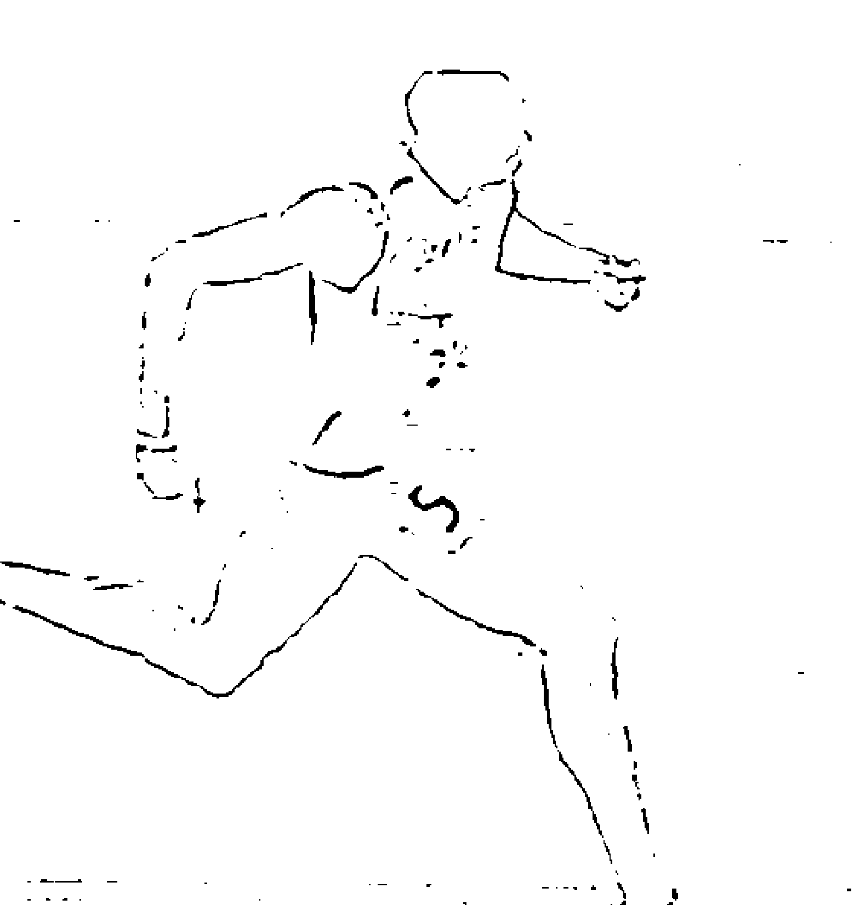

## 国王的困扰

佚名

从前有个年轻英俊的国王，他既有权势，又很富有，但却为两个问题所困扰：一个是，我一生中最重要的时光是什么时候呢？另一个是，我一生中最重要的人是谁？

他对全世界的哲学家宣布，凡是能圆满地回答出这两个问题的人，将分享他的财富。哲学家们从世界各个角落赶来了，但他们的答案却没有一个能让国王满意。

这时有人告诉国王说，在很远的山里住着一位非常有智慧的老人。国王马上就出发了。

国王到达那个智慧老人居住的山脚下，装扮成一个农民。

他来到智慧老人住的简陋的小屋前，发现老人盘腿坐在地上，正在挖着什么。“听说你是个智慧的人，能回答所有问题，”他说，“你能告诉我谁是我生命中最重要的人、何时是我一生中最重要的时刻吗？

> “帮我挖点土豆，”老人说，“把它们拿到河边洗干净。我烧些水，你可以和我一起喝一点汤。”

国王以为这是对他的考验，就照他说的做了。他和老人一起呆了几天，希望他的问题能得到解答，但老人却没有回答。

最后，国王对自己和这个人一起浪费了好几天时间感到非常气愤。他拿出自己的国王印玺，表明了自己的身份，宣布老人是个骗子。

> 老人说：“我们第一天相遇时，我就回答了你的问题，但你没明白我的答案。”

> “你的意思是什么呢？”国王问。

> “你来的时候我向你表示欢迎，让你住在我家里。”老人接着说，“要知道过去的已经过去，将来的还未来临——你生命中最重要的时刻就是现在，你生命中最重要的人就是现在和你呆在一起的人，因为正是他和你分享并体验着生活啊。”

## 魅力提示：

人的一生，最重要的就是把握好当下，无论是生活、工作，还是人人都向往的爱情。

## 魅力星座智慧书之

- 书名：花点心思谈恋爱
- 作者：李轶男 著
- 出版社：广西师范大学出版社
- 出版时间：2009-12-1
- 印刷时间：2009-12-1
- 开本：大32开
- ISBN：9787563391042
- 包装：平装

### 内容简介：

本书是一部畅销类情感专栏文集，全书几十余篇文章，全面地剖析了男女情感中所隐藏的不为人知的事儿。经典的妙语点评，细致入微的案例分析，泼辣大胆的文字风格，共同缔造了一部超人气的畅销热书。

恋爱，是每个人都会面临的问题，也是人类情感中最美好的事。但如何处理好恋爱，如何谈恋爱，却并非是每一个人都懂得。为爱而伤，还是为爱痴狂？是享受爱情的甜蜜，还是品味爱情的酸楚？阅读本书之后，一切都会了然于心。

### 魅力失分

水瓶座的人是像水一样自由奔放，无拘无束的，如果对方对他要求得太多会让他对生活产生莫名的恐惧感。

## 支点

易水寒

房东大娘的耳朵很背。刚跟她接触时，我打了个呵欠，她赶忙冲我说：“你说什么我听不清，你要大声一点！”

后来有一天闲聊，房东老大爷告诉我，大娘的耳朵是在一次病后留下的后遗症。那是一次惨痛的令人不忍回忆的经历。晚上睡觉时煤气泄漏了，大女儿和大女婿双双身亡。大娘由于离门比较近才幸免于难。但是她出院以后伤心过度，大病一场，耳朵就聋了。

不过，我在这个小院子里住了些日子，发现两位老人并没有因为其中一个耳朵聋而生活不便。每天早晨起来，大娘生火做饭，大爷在院子里收拾家什，待一会儿大爷就进来吃饭。一切井井有条，按部就班。大爷也从没大声向大娘喊过什么。

后来我终于发现了一个秘密，那就是大爷的耳朵特别灵敏。有一天晚上，我正在屋里看书，大爷忽然敲门进来问我什么东西在嗦嗦地响。我侧着耳朵听了听，再低头一看，原来是一只小耗子正在墙角啃我扔在那儿的苹果核。我刚才读书过于投入，没有注意到。我对大爷的举动感到有些奇怪——这么小的动静，你也能听得到？

大爷对我说：“你别看我都七十多岁了，论起听力来，你们这些年轻人都不是对手。”我问他，以前就是这样吗？他说不是。他是从房东大娘变聋以后，耳朵才在忽然之间变得特别灵敏的。

我看着大爷那满头花白的头发，觉得这背后似乎有着什么神秘的因缘。上帝让一个人失去了一件东西，又赋予他（她）最亲密的人双倍这样的功能，两个人依然是一个完整的整体。它是想让这些人获得一个生存的支点吗？我想一想，如果一个人的生命中没有一个深爱着自己的人，该会怎么样呢？这实在是太可怕了！

魅力提示：
因为有了爱，生命才会变得完美，珍惜身边爱你的人吧，这样你才不会留下遗憾。

## 诊断报告

佚名

有一对夫妻，结婚几年一直还没有生育。在农村，传统观念根深蒂固，加上男的又是独子。于是，公公、婆婆对儿媳的脸色就越来越不好看。老人们迷信，以为是生辰八字不合，便花钱请算命先生破解，在试过算命先生说的各式各样的土办法之后，儿媳还是没有怀孕的迹象。

不得已之下，这对夫妻决定去医院检查。过了两天，丈夫去医院领取检查结果后回到家，他神情沮丧地对父母说：“不是媳妇的错，是我身上的毛病。”他告诉妻子后，妻子一边捶着他一边呜呜直哭。这些年来，她一直生活在公公婆婆的脸色里，抬不起头。现在终于有了结论，再也不用受他们的窝囊气了。

父母知道是儿子的问题后，他们让儿子去医院治治，儿子却说：“医生说我这病是先天性的，无法医治。”听到这句话，老两口一下子好像苍老了许多。

丈夫打算到民政局领养一个孩子，他和妻子商量，妻子却不置可否。没过些日子，妻子就提出离婚，理由是男人没有生育能力。丈夫却坚决不同意离婚。他一次次劝妻子，说以前是父母的错，自己从来没有责怪她，一直在安慰她，鼓励她。妻子听不进丈夫的话，说她对这个家已经死心。

妻子回到了娘家，并向法院提出了离婚诉讼。丈夫在接到法院传票的那天，打电话给妻子，约她见上一面，妻子答应了。

妻子如约而至，丈夫什么也没说，递给妻子一个信封。妻子打开一看，是一份诊断报告：“先天性卵巢功能障碍”，再一看上面写着的是自己的姓名，妻子惊呆了。随即泪如雨下。

## 魅力提示：

> 真正的爱情是无私的，能够为对方牺牲自己的一切。爱是理解，爱是宽容。

## 给爱加层保鲜膜

原野

小两口，有了孩子之后，他们开始了分床而居的生活，二人之间的话越来越少。

“我有个郑重的要求。”女人首先意识到了他们之间潜伏的危机。一天，她对男人说。

“什么要求？”男人漫不经心地问。

“每天抱我一分钟。”

男人笑了：“有必要吗？”

“我提出了这个要求，就证明十分有必要；你发出了这个疑问，就证明更有必要。”

男人妥协了。他走到床边，抱了女人一分钟，笑道：“你这个虚荣的家伙。”

“每个女人都会对爱情虚荣。”

此后，每天他都会抽出时间抱她一会儿，有时是一分钟，有时是十分钟，有时甚至是一个或几个小时。每次他都会开玩笑说：“我又完成今天的任务了。”

“爱的任务是幸福的任务。”女人说。

渐渐地，两人的关系充满了一种新鲜的和谐。在每天拥抱的时候，虽然两人常常什么也不说，但这种沉默与未拥抱时的沉默在情境与意味上是有着天壤之别的。

终于有一天，女人要到一个很远的地方去长期进修。临上火车前，她对他说：“你终于暂时解脱了。”

“我怕我会想念这个任务呢。”男人笑道。

果然，第二天就接到了他的电话：“爱的任务是幸福的任务，我明白了。”

女人的眼睛顿时溢成了两汪深深的泉。

## 魅力提示：

爱的世界不存在束缚、因为有爱，即使束缚也是甜蜜的。

## 挨饿的小和尚

范天涯

一天，寺院里来了一个小和尚。这个小和尚家世很好，从小任性，父亲担心管教不好他，只好送到寺里当小和尚，并与方丈商量好，待他成年后让他还俗。

老方丈安排他和那些从小贫穷的小和尚生活在一起。可他晚上睡觉时，受不了其他小和尚的呼噜声，有时还会被枕头旁的老鼠吓醒。吃饭时，他总嫌清汤淡饭没有味道，老嚷嚷着要吃肉，惹得其他小和尚都笑他。

他跟方丈抱怨，可老和尚只问了他一句：“为什么别的小和尚没有跟我抱怨过啊？”

> 为什么别的小和尚没有跟我抱怨过啊？

求助无门，任性的小和尚打算用绝食的办法来应对眼前的“困境”，他觉得他父亲一定会很心疼他，把他带回去的。谁知，老方丈早已封锁消息。饿了两天两夜，小和尚终于受不了了。半夜里，他跑去了厨房，结果发现那里除了一缸水、一些青菜和生米外，什么都没有。

无奈之下，他只好在厨房里坐到天亮。等第二天师兄来做饭时，他一个劲地帮忙填柴，还老问快熟了没有。最后，好不容易熬到饭煮熟了，他打算捞一碗先吃。

这时，老方丈进来了，问他：“你不是决定不吃饭了吗？”

小和尚低下头不知道说些什么，直到方丈离开，他才赶紧捞饭吃。那一顿饭，让他觉得特别特别香。

## 魅力提示：

失去才知道珍贵，当你因害怕束缚而失去爱情的时候，你会后悔莫及。

## 魅力星座智慧书之

| 项目 | 信息 |
| :--- | :--- |
| 书名 | 我的孤儿宝贝 |
| 作者 | （英）库姆森 著；林淑娟 译 |
| 出版社 | 百家出版社 |
| 出版时间 | 2008-9-1 |
| 印刷时间 | 2008-9-1 |
| 开本 | 32开 |
| ISBN | 9787807038313 |
| 包装 | 平装 |

### 内容简介：

该书在全球售出 26 国版权；在英国总销售突破 100 万册；蝉联全英小说畅销总榜前 3 名、英国亚马逊畅销前 5 名；被选入英国最权威的“理查与茱蒂读书俱乐部”夏日读书。

当爱情与友情难以并蓄，该如何取舍？当自由与责任无法相容，该如何抉择？

在结婚前夕，梅凯玲才发现最好的朋友是她爱情的第三者，甚至疼爱有加的小女孩，竟是好友与未婚夫的孩子？而真正让人不忍的是，梅凯玲那伪装的坚强面孔、自行吸收的孤独，紧闭多年的心门要如何迎接好友临终托付的女儿？

没有血缘关系的黑人妈咪与白人小女孩，痛失今生挚爱的这两人，被迫必须共同接受生命中的无法预知，交杂着爱情与背叛、亲情与死亡，椎心刺骨的伤痛让人难以再跨出一步，徘徊在爱与伤痛的边界，惶恐踌躇的她们却迟迟无法跨越……

## JAY ZHOU

魅力失分

水瓶座的人非常理智，但是在爱情上如果一味的理智，就显得情趣不足，会让另一半难以接受。

## 一见钟情

佚名

荷兰足球明星克鲁伊夫风度翩翩，言谈举止十分讲究。他曾收到过许多姑娘的情书。一次，他收到一个用裘皮精装的日记本。每一页上都只有一个名字，他自己亲笔写的名字——克鲁伊夫。一直翻到最后才有一篇文章，那秀丽流畅的笔迹使克鲁伊夫惊诧不已，他一口气读完了它：

> ……我已经看过你踢的100多场球，每一场都要求你签名，而且也得到了，我多么幸运啊！当然，对于拥有无数崇拜者的你来说，我是微不足道的一个，“爱是群星向天使的膜拜”，我多么希望你对我已经有一点印象啊……

> 坦率地说，我爱你，这封信花了我整整一个星期，我曾经在月下彷徨，曾经在玫瑰园惆怅，也曾经在公园徘徊，好多次想迎着你，我毕竟才19岁，少女的羞涩仍不时漾上脸来，心中只有恐惧和向往……现在，爱神驱使我寄出了这个本子。

> ……如果你不能接受我奉上的爱情，请把这个本子还给我，那上面“克鲁伊夫”的名字会给我破碎的心一半的慰藉，那另一半就是你，我多么想也得到那另一半啊……

这封信的字里行间流露出的真挚感情，深深打动了克鲁伊夫。一星期后，克鲁伊夫和丹妮·考斯特尔相会了，21岁的世界足球明星和19岁的美丽姑娘一见钟情，成为一段佳话。

## 魅力提示：

> 当爱来临，请勇敢地射出爱神之箭。

## 永远

孙开元

他温柔的歌声飞出房门，传遍了楼上楼下。他不是世界上最好的歌唱家，但他那饱含着爱的歌声却是独一无二的。

我在医院探望一位朋友时，他向我介绍了这位唱歌的先生。

当每天的探视时间快要结束时，这位先生都要给他的妻子唱歌。“只要他的歌声响起，整个医院就会安静下来，平时这里是非常嘈杂的地方。”

我决定第二天再来一次医院，只为了再听一听他的歌声。

如同报时的钟声一样准时，当探视即将结束时，歌声又响了起来。

“我将永远爱你，直到地老天荒。当你需要一双慰藉的手，我将永远在你身边，永远……”

我对朋友说：“他真是个好丈夫，每天都来给他的妻子唱歌。”

“鲍伯，他不是来探望他的妻子。他也是病人。”朋友回答，“他是给住在急救室的妻子唱歌。他们的孩子现在在海外，只有他在妻子身边，但也无法见到妻子。她在急救室中接受全程观察，甚至不能说话了，所以医生安排她的家人按时给她打电话。在最后的几分钟，他都要唱歌给她听。”

“真让人难以置信。”

和朋友道别后，我朝着老人的病房走了过去。刚好他的房门开了一半儿，我看到这位老先生正扶着轮椅向窗外看。他背对着我，没发现我在身后。我正想上前和他打招呼，老先生突然举起了一只手，好像朝着远处的急救室挥舞着。

“做个好梦，亲爱的。”他说着，“晚安，我的天使。不会太久，我们就会永远地在一起了。永远、永远……”

我说不出话来，默默地站了一会，转身走开了。

## 魅力提示：

面对疾病和死亡，那种发自内心的真情表达，大概就是世界上最浪漫的爱情吧。

## 滴水的窗檐

佚名

他和她属于青梅竹马，相互熟悉得连呼吸的频率都相似。时间久了，婚姻便有了一种沉闷与压抑。

她知道他体贴，知道他心好，可还是感到不满，她问他：“你怎么一点情趣都没有？”

他尴尬地笑笑：“怎么才算有情趣？”

后来，她想离开他。

他问：“为什么？”她说：“我讨厌这种死水一样的生活。”

他说：“那就让老天来决定吧，如果今晚下雨，就是天意让我们在一起。”

到了晚上，她刚睡下，就听见雨滴打窗的声音，她一惊，真的下雨了？

她起身走到窗前，玻璃上正淌着水，望望夜空，却是繁星满天！

她爬上楼顶，天啊！他正在楼上一勺一勺地往下浇水。

她心里一动，从后面轻轻地把他抱住。

## 魅力提示：

爱情是需要一点情趣的，它就犹如沙漠中的一片绿洲，让我们疲劳的眼睛感到希望和美，适当地给“左手”和“右手”一种新鲜的感觉吧。

## 女王的真颜

上善若水

雍容华贵的公主爱上了一个小伙子，很快，他们步入了结婚殿堂。不久，公主成了女王。

随着岁月的增长，女王渐渐感到自己的花容月貌慢慢失色，不得不靠一层又一层的化妆品换回昔日的风采。

于是，她下达了一个苛刻的命令：不准在女王没化妆的时候偷看女王的容颜。

一个非常迷人的清晨，女王的丈夫早早起床在园林中散步。忽然，随着几声悦耳的啁啾鸟鸣，他发现树端一窝小鸟出世了。他抑制不住内心的喜悦，飞跑进宫，一下子推开了女王的房门。仓促间看到一张毫无粉饰的白脸。

结局不言而喻，即使是万众敬仰的女王丈夫，犯下了戒律，也必须与庶民同罪。

女王的心中充满了悲哀，她不忍心丈夫因为一时的鲁莽就惨遭杀害，但她又绝不能容忍世界上任何一个人知道她的秘密。执行斩首的那一天，女王泪水涟涟地去探望丈夫，终于，她问出了这些天一直困扰她的问题：“没有化妆的我，一定又老又丑吧？”

丈夫深情地望着妻子说：“相爱这么多年，我一直企盼着你能够洗却铅华，甚至摘下皇冠，让我们的灵魂赤诚相融。现在我终于看到了一个真实的妻子，终于可以以一个丈夫的胸怀爱她的一切美好和一切缺陷。在我的心中，我的妻子永远是美丽的。”

## 魅力提示：

对于在一起生活的夫妻而言，有什么比坦诚展示自己更重要呢？

| 项目 | 信息 |
| :--- | :--- |
| 书名 | 与爱人一起分享的50种浪漫 |
| 作者 | 指尖 著 |
| 出版社 | 中国对外翻译出版社 |
| 出版时间 | 2006-11-1 |
| 印刷时间 | 2006-11-1 |
| 开本 | 32开 |
| ISBN | 9787500116202 |
| 包装 | 平装 |

### 内容简介：

有一种浪漫是无声的，对两个人的深情来说，没有比浪漫更温柔、更贴身的词汇了。浪漫是爱情的保鲜剂，是系住我们的手，一起走向彼岸的红线。总是抱怨浪漫已经消亡，爱情缺乏情趣，其实，无论何时何地，只要有一颗善于发现的心。关于你和她的浪漫，便无处不在。
并不是所有的爱情都应该轰轰烈烈，有一个人，值得我们珍爱一世；有一本书，能让我们读懂与他（她）共享一生的浪漫。

### 魅力失分

水瓶座的人心思不够细腻，无法深入交往，也不懂如何表达内心感受，更没有办法体会到那微妙的“情爱”。

## 爱情密码

琦琦

一位女友终于决定请我们吃喜糖了，我们大家都非常惊诧，不是认为她唐突，而是因为她终于下了决心与和她热恋了两年多的男友结婚。

她以前受过伤害，大家都知道那个男孩子当初与她也爱得生生死死，但已经谈婚论嫁时，男孩子却突然负她而去，给她打击不小。所以，尽管她与后来的男友关系非同一般，却不敢轻言“结婚”两字。男友也一直默默地关爱着她，只是不提那两个字。

这次，男友到福州去进货，到了那里才发现货物价格上涨不少，带去的钱不够。男友打电话回来叫她取些钱电汇过去。他的存折就留在她那里，但他却没有告诉她存折的密码。也许是忘了，也许是他以为她本来就知道，因为他好多次取钱存钱都是与她一起去的，她应该知道密码。其实那密码也无非是他们的生日组合：他是1969年5月6日生的，她的生日是1972年2月8日。

与她一起去的朋友在银行门口等她，她在柜台前填了单子，银行小姐叫她输密码时她才想起自己忘了问男友，但事已至此，她隐约记得密码是与生日有关，便输了6956，那是男友出生日期，电脑提示她输错了；她又输 了6972，又错了。银行小姐看了她一眼，她不自在起来，想了一下又输入5628，结果还是错了，银行小姐用怀疑的眼光盯着她，她不敢再输号码了。

门口等她的朋友走了过来，问了几句之后，输了2856，结果密码对了。

在银行门口，她问朋友怎么知道的，朋友认真地对他说：“他如此的爱你，做什么事肯定都会先想起你然后才是他自己，设密码也会如此，首先想到你的生日……”

她汇了钱之后又给他打了电话，在电话末了她轻轻对他说：“回来之后，我们结婚吧……”

## 你没有做到的事

佚名

一个普通的美国家庭，母女相依为命，女儿四岁时，父亲应征入伍去了越南，不幸阵亡。母亲一生未再嫁，只是经常翻出丈夫的照片，努力使之继续生活在她们中间。

多年后，母亲去世，女儿在一个收藏纪念品的小盒子里，发现了一首母亲年轻时亲笔写的诗，题目叫《你没有做到的事》。

记得那一天，借用你的新车，而我撞坏了它，我以为你会骂我，但你没有。

记得那一次，我拖你去海滩，而你说天会下雨，果然下了，我以为你会说我明明告诉你啦，但你并没有。

记得那一回，我向别的男孩挑逗想故意引你妒忌，而你又没有。

记得那一次，我在新铺的地毯上撒了满地的草莓饼，我以为你一定会批我几句，但你没有。

记得那一回，我忘记告诉你那个舞会是穿礼服的，而你只穿牛仔裤到场，我以为你会生气离开，但你没有。

是的，有许多许多的事你全没有做，因为你容忍我、钟爱我、保护我。有许多许多的事我决心回报，当你从越南回来，但你没有。

## 魅力提示：

不要以为你所做的，对方会不在意。没有一种爱情不建立在细节之上。你凭什么以为当初吸引你的那个眼神，会不在意你手上的温度。好好珍惜对方，不要可怜到对自己爱的人，做几件“没有做到的事”都不会。

## 一只眼睛看爱人

古保祥

罗伯斯年轻时许多女孩子都追他，说实在的，他一直不喜欢眼前的爱人，虽然她年轻时貌美如花。他今天选择离家出走，他要无所顾忌地离开她，他觉得她唠叨，像得了什么怪病，令人讨厌。儿女们早已不在身边，所以，他是自由自在的。

他用了一个下午的时间去会见自己的几位老友，老友们都推托要陪老伴，没空，他大声骂他们没出息，然后便愤世嫉俗地来到约梦的门口。

约梦是他的初恋女友，三十多岁时，爱人便死了，她硬生生地守了二十多年的寡，没有人知道她是为了什么，罗伯斯一直觉得对不起他，他一直在等机会，谁知一晃便是20年。

坐在他面前的不是老态龙钟的约梦，她鲜活动得好像年轻了近10年，老罗伯斯相形见绌地凝望着她，眼神里尽是猜疑，因为他并未从约梦的脸上找到一丝一毫的对过去的伤感回忆，她的话题尽是当前政府的宽容，邻里之间的和谐，教堂里的故事。

他们的谈话快要结束时，罗伯斯忍不住地问她：关于过去的事情，你还有记忆吗？

约梦没有迟疑：当然，它们就坐在我的旁边，伸手可及。

可你的脸上没有对过去的无奈和对岁月的抱怨。

为什么要恨过去呢？那些都是我的财富，虽然生活给了我不想要的，但它也同时给了我想要的，比如说我的爱人杰克，他已经逝世近20年了，但我依然爱着他，就这么简单，就好像在昨天，杰克好像去远方出了趟差，马上要回家了。

约梦喝了口咖啡，接着说道：杰克的毛病是要命的，比如说脾气暴躁，他一直没有让着我，有时候让我下不了台，还有他以前有个相好的，我曾经为此与他为难，但现在想起来，他还是有许多优点的，比如说在我没回家前，他是绝对不会自己先吃饭的，因为他念着我；我有一次晚上拉肚子，他一个人跑了5公里的路程背我去医院；还有他的那个相好的，后来我才知道，他实际上一直在帮助她，因为她的生活十分艰难，他应该是一个敢爱敢恨的男人，可惜我明白得有些晚了。

在罗伯斯快要离开时，约梦拿了本书送给他，约梦说：这是我与杰克的爱情回忆录，我整理了近20年，刚刚出版。罗伯斯拿起来看时，书名很别致：《一只眼睛看爱人》。

> 在书的扉页上，约梦这样写道：让我们每个人都为自己拥有的爱人而自豪，因为他对你来说是世界上最独一无二的人。他也许会使你不开心，那是你不小心看到了他的缺点；他也许会气得你离家出走，那是因为天使刚刚经过你的家园，不小心借走了他对你的爱，所以，天使告诉我们，一只眼睛看爱人。闭上一只眼，你会发现，你会避开他左颊的黑痣，或者你可以看到你平时看不到的。

关怀。

罗伯斯若有所思地向家里走着，在第二个红绿灯路口，他看见一个熟悉的身影在寒风中守候着，他知道，那个女人的名字叫做汤妮。

## 魅力提示：

> 一只眼睛看爱情，也许你会看得更真切，那些被你两只眼睛忽视了的温情细节，在一只眼睛里，反而清晰起来。

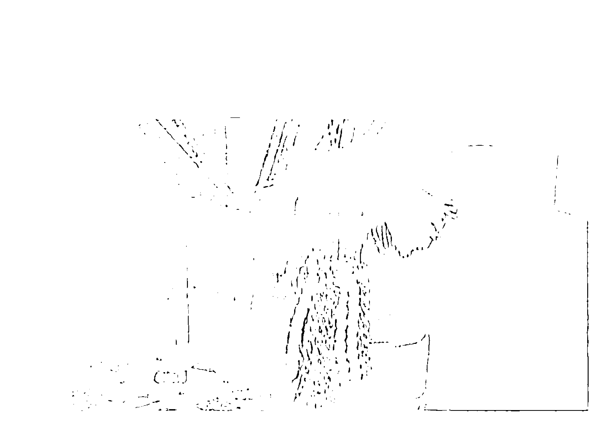

## 没有回报，爱就会死掉

龙力夫

- 他和孩子过生日，我总是当成很大一件事情，提前好长时间就为他们张罗忙碌；可是我过生日，他不是忘记就是很草草地打发了事。
- 刮风下雨降温，我在家总会想到出门在外的他是否带了雨具，是否穿足了衣裳。但是同样的情形下，如果我在外，他在家从没有这样关心我的冷暖。
- 偶尔出差，我一到目的地总习惯打电话向家里报平安，然后每天睡前总要问他晚安。而他出差在外，却可以一直都不给我打电话。

结论：这样的丈夫没有情趣，有就像无，还不如无。

然而，难道只有妻子会因自己付出的爱没有回报而光火？

丈夫们也会因为一些类似的事情对妻子抱怨有加。

一位丈夫也一口气向笔者讲了对妻子的三个不满：

- 不管节日大小，我都往她家拎东西，总记着孝敬岳父岳母，可结婚至今，她主动往我爹妈那里拎过几次？
- 她减肥买药练瑜伽，不知花了多少钱，我都舍得，可是我那根钓鱼竿已经快断成五截了，她从没说帮助换根新的。
- 她带同事到家里聚会，我可以牺牲公司业务在家为她们做主厨，为的是让她脸上有光。而我的朋友来家里做客，谈兴正浓，她居然拿起扫帚硬是扫他们的烟灰，朋友们误会她要赶人走呢，现在请都不敢来了。

结论：这样的老婆太自私，太不通情理，要她真的不如不要的好。

## 魅力提示：

爱应该讲回报，应该得到回报，每一个在爱里的人，不但要学会为爱付出，更应该学会重视对方的付出，哪怕是一些细枝末节的小事，也应该记住并予以回报。

书名: 爱的五种语言
作者: （美）查普曼 著，王云良 译
出版社: 中国轻工业出版社
出版时间: 2006-1-1
印刷时间: 2006-1-1
开本: 32开
ISBN: 9787501950423
包装: 平装

### 内容简介：

每一个人都有一个情绪的爱箱，只有当这个爱箱填满了的时候，人际关系才能发展。然而，不同人的爱箱需要用不同的语言来填满。查普曼博士发现人们基本上有五种爱的语言：肯定的言词、精心的时刻、接受礼物、服务的行动、身体的接触。
两性间许多误解、隔阂、争吵都是由于不了解或者忽略了对方的主要爱语造成的。当夫妻双方主动选择使用对方的主要爱语时，就能够很好地发展彼此的亲密关系，并积极地处理婚姻中的冲突和失败。
本书将带领读者跨越两性沟通的迷思与阻隔，填满自己和伴侣的爱箱，进行一场婚姻的内在革命。
如果爱情是一则神话，那么这本书可以使美梦成真；如果爱情是一颗蜜糖，那么这本书将教你如何防潮防腐，让爱情进入婚姻，永不褪色，永葆如新。

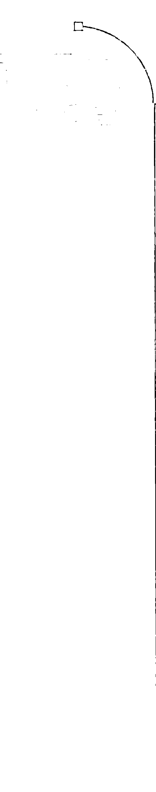

### 魅力失分

水瓶座的人总是逃避真爱。交往一阵后他忽然从你眼前消失？恭喜你，这意味着他对你有感觉，预感到生命将因你而变化。自己的人生不能自己掌握，这实在是太可怕的转变，所以一定要先逃开。

## 一封匿名求爱信

佚名

有个大学三年级的女生，不漂亮，甚至还有点丑。见同班的女同学皆有了男朋友，唯自己形影相吊，很是自卑，常常在背地里偷偷地流眼泪。

学校某系一位细心的老师觉察到了这件事，就假冒一个男生的名义，给她写了一封匿名的求爱信。

××：

你好！很久了，我一直默默地观察着你！你是个极有特色的好女孩儿——当你的女同胞接二连三地有了男友，你却一如既往地保持着女性的庄重，与你的女同胞相比，你显然比她们更有内涵，更有古典色彩，更有分量！因此，在我的心目中，你格外神圣、格外圣洁！自然，也正是因为你格外庄重、格外严谨，我才不敢放肆失礼——请恕我暂时不公开我的姓名，但我肯定会天天关注您，在得到你的认可之前，就让我从一个遥远的地方，小心翼翼地、满怀希冀地看着你吧！没有你，我将失望至极！

我一直坚信，你是我心目中最优秀的女孩。

一个一直渴望着得到你的青睐的关爱你的人。

×月×日

果然，就是这样一封信，从此彻底由身到心地改变了一个人。

想一想那原本自卑的女孩子吧，自打收到了这封信，就恢复了勇气和信心——她抬起了高贵的头，她的步伐从此充满了自信，她不再暗自垂泪，她奋发图强。到了年终，她以全优的成绩得到了全班师生的热切关注！

## 魅力提示：

爱情是伟大的，她不仅给你力量，给你自信，有时在不知不觉中会改变你的一生。

## 爱是心灵的产物

林夕

很长一段时间，我一直以为，爱情是年轻人的特权，与老年人无缘。

所以那次同学聚会，当听说独居多年、已过五旬的老师新近坠入情网、准备与一位小他十岁的女士结为伉俪时，我宽厚地笑道：“这与爱情无关，是年纪大了，想找个伴。”

“不，我觉得他们之间是爱情。”同学反驳我说。

“爱情？”我斜睨了他一眼，“爱情是年轻的产物，不适合生长在老的土壤上。”

“可我觉得他们之间是爱情，不信你可以去看看，看看他的眼神就知道了。”同学固执地说。

于是，一个夏日的午后，我怀揣心事，去拜访老师。

一进门，我不禁愣了。分别几年，老师倒愈发年轻了，一双眼睛闪着年轻人特有的热情和光芒，脸上的肌肤饱满而富有张力，虽然眼角不可避免地堆满了皱纹，但那皱纹恬静，从容，仿佛含着笑，不见岁月的沧桑，倒平添几分年轮的魅力。

“难道，他真的在恋爱？”趁老师去泡茶，我一边环视房间，一边在心里嘀咕道。

老师酷爱喝茶，家里藏有上等的好茶，每次来都能一饱口福。没想到这次他端来的是最普通不过的菊花茶，用的是那种很不讲究的大茶杯，上面星星点点冒着热气。

我有些不快，但天气炎热，加上刚才赶路，十分口渴，端起来几下就喝完了。

老师又给我倒了第二杯，这一次，用的是稍小的茶杯，温度也比刚才稍热。我一边喝、一边和老师聊天。天南海北，绕来绕去，一杯茶不知不觉就喝完了。

我放下杯，正想着怎么开口，这时，老师站起身，打开茶柜，从底层拿出一个紫色茶罐，和一套正宗的紫砂茶具，而后，为我端来一小杯上等好茶。

我怔怔地看着那小杯茶，又抬头看看老师。

老师微微一笑，缓缓地说道：“这第一杯茶是为你解渴的，所以用普通的茶和杯，温度要适当，量要大。这第二杯茶是为你润舌的，因为你已经喝了一大杯不会太渴了，但你要说话，要边说边喝，所以温度要稍热，量也要稍小些。现在——”说到这，老师稍停了一下，直了直身子，加重语气说：“你已经喝了两杯茶，既不需要解渴，也不需要润舌，纯粹是为品茶，所以给你一小杯上等的好茶。你现在慢慢品吧。”

我端起那一小杯茶。

不用说，我品到了纯正的茶香，也找到了我要的答案。

爱，是心灵的产物。它非常简单，简单到没有目的，爱本身就是目的。它非常纯粹，没有一点儿杂质，不需要任何手段。只需放下自己，打开心门，倾心去爱，去感受，就能得到爱的甜美和芳香。可惜，年轻时，我们不懂爱情，把需要当成爱，其实那更多是源于生理的饥渴，所以爱得卤莽而幼稚。中年时，我们肩负重任，把爱变成习惯，其实那更多的是源于心理的疲惫，所以爱的娴熟而圆滑。唯有步入老年，卸下一切责任，解除所有装备，还原为自己，单纯到只为爱而爱。

## 魅力提示：

爱，不是年轻人的特权，更应为老年人拥有。可惜，对于大多数老人，多年你经风雨沧桑，使他们的心也像他们的掌一样，生了一层厚厚的茧。又有几人能像老师那样，有一颗出污而未染的童子之心，去品那纯正清香的第三杯茶呢！

## 活100万次的猫

佐野洋子

有一只活了100万次的猫，它死了100万次，也活了100万次。但猫一直不喜欢任何人。

有一次，猫是国王的猫，国王很喜欢猫。国王命人做了一个美丽的篮子，把猫放在里面。每次国王打仗都把猫带在身边。不过猫很不快乐，有一次在打仗时，猫被箭射死了，国王抱着猫，哭得好伤心、好伤心，但是猫没有哭，猫不喜欢国王。

有一次，猫是渔夫的猫，渔夫很喜欢猫，每次渔夫出海捕鱼，都会带着猫，不过猫很不快乐，有一次在打鱼时，猫掉进海里，渔夫赶紧拿网子把猫捞起来，不过猫已经死了。渔夫抱着它，哭得好伤心、好伤心，但是猫并没有哭，猫不喜欢渔夫。

有一次，猫是马戏团的猫。马戏团的魔术师喜欢表演一样魔术，就是把猫放在箱子里，把箱子和猫一起切开，然后再把箱子合起来，而猫又变回一只活蹦乱跳的猫，不过猫很不快乐。有一次魔术师在表演这一个魔术时，不小心将猫真的切成了两半，猫死了。魔术师抱着切成了两半的猫，哭得好伤心、好伤心，不过猫并没有哭，猫不喜欢马戏团。

有一次，猫是老婆婆的猫，猫很不快乐，因为老婆婆喜欢静静地抱着猫，坐在窗前看着行人来来往往，就这样过了一天又一天、一年又一年。有一天，猫在老婆婆的怀里一动也不动，猫又死了，老婆婆抱着猫，哭得好伤心、好伤心，但是猫并没有哭，猫不喜欢老婆婆。

有一次，猫不是任何人的猫，猫是一只野猫，猫很快乐，每天猫有吃不完的鱼，每天都有母猫送鱼来给它吃。它的身旁总是围了一群美丽的母猫，不过猫并不喜欢它们，猫每次都是骄傲地说：“我可是一只活过100万次的猫喔。”有一天，猫遇到了一只白猫，白猫看都不看猫一眼，猫很生气地走到白猫面前对白猫说：“我可是一只活过100万次的猫喔。”白猫只是轻轻地“哼”了一声，就把头转开了。之后，猫每次遇到白猫，都会故意走到白猫面前说“我可是一只活过100万次的猫喔”，而白猫每次也都只是轻轻地“哼”一声，就把头转开。

猫变得很不快乐，一天，猫又遇到白猫，刚开始，猫在白猫身边独自玩耍，后来渐渐地走到白猫身边，轻轻地问了一句话：“我们在一起好吗？”而白猫也轻轻地点了点头“嗯”了一声，猫好高兴、好高兴，它们每天都在一起，白猫生了好多小猫，猫很用心地照顾小猫们，小猫长大了，一个个离开了。猫很骄傲，因为猫知道：小猫们是一只活过100万次的猫的小孩！白猫老了，猫很细心地照顾着白猫，每天猫都抱着白猫说故事给白猫听，直到睡着。

一天，白猫在猫的怀里一动也不动了，白猫死了，猫抱着白猫哭了，猫一直哭、一直哭、一直哭，直到有一天，猫不哭了，猫再也不动了，猫和白猫一起死了，猫也没有再活过来。

## 魅力提示：

没有情感地活着，即使活了100万次，也不如有爱地活上一辈子；无法体会生命地活着，即使活了100万次，更是不如用生命付出真爱的一辈子。

## 说爱要趁早

娜 娜

他们本是同窗好友，自小青梅竹马，情投意合，只是一直没有表白。后来有人追求她，她征求他的意见，原本是想试探一下他的心思。他却误解了，说：“那是个不错的男孩子，祝你幸福。”

她心痛欲绝。原来自己与他，只是自己一厢情愿自作多情。心灰意懒之下，她便接受了那个追求者。恋爱，结婚，生子，无惊无喜。生活渐渐磨蚀去了青春的梦想，只是，她还常常会梦见那张刻骨铭心的脸，便在午夜忽然醒来，黯然神伤。

毕业N年后同学聚会，他喝醉了，握着她的手，眼中有泪花：“其实，当年我很喜欢你。”

“哗”的一声，内心深处某个隐秘而柔软的地方被疼痛击穿了。她也是泣不成声：“那你为什么不说？为什么不说啊？”

爱情就是这样，你爱得早，不如说得早。

而我们，往往因为矜持，因为羞涩，因为没有经验，不能明白表达出来。于是，明明大好伴侣，却被别人捷足先登。

那么，对方不说，自己为什么就不能主动开口呢？有什么损失吗？而现在，时光如水流逝，他们，已经无法回到从前。

## 魅力提示：

爱里总是有许多遗憾。有一种遗憾，是说得太晚。爱得早不如说得早。说爱要趁早啊！

书名：真爱密码
作者：（美）罗区，（美）麦克纳利 著；黄晋 译
出版社：花城出版社
出版时间：2008-9-1
印刷时间：2008-9-1
开本：124开
ISBN： 9787536055049
包装：精装

### 内容简介：

真爱有吗？有！向何处寻？向你的心里去寻！这就是《真爱密码》，向我们发出的惊世之语。那是我们在阅历了人间纷繁跌宕的情感戏场，拨开浓重弥漫的悲欢迷情，得以往真爱之义的纵深处，一瞥究竟的玄远之门。

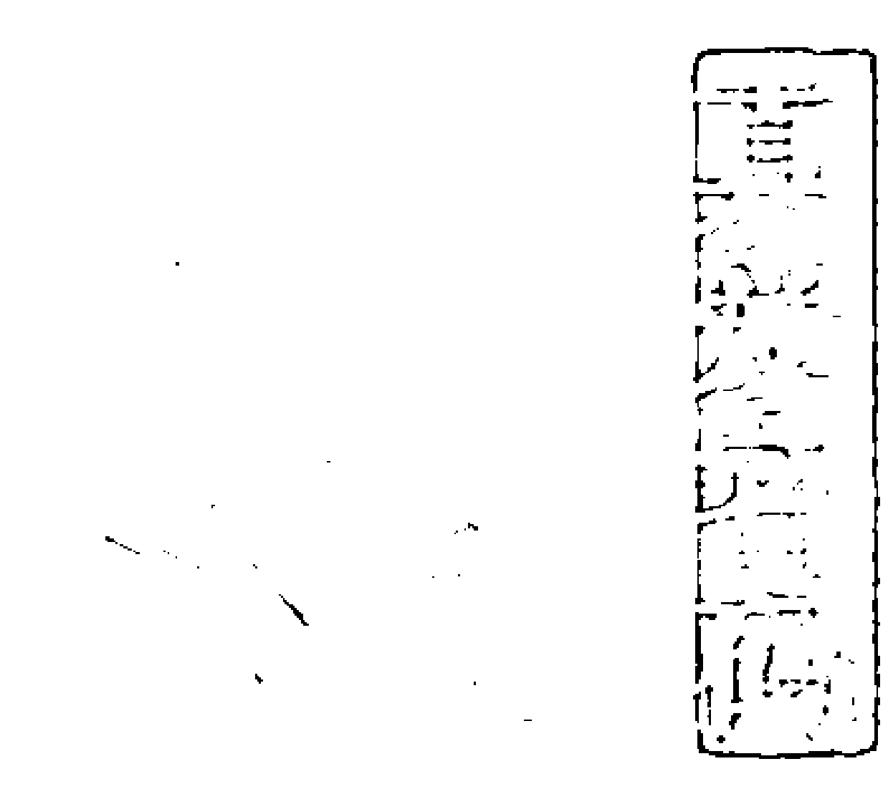

### 魅力失分

水瓶座的人孤僻不合群，他很难融入人群中，跟所有人一起玩乐。

## 快乐的城堡

张燕

这是一个流传很广的故事

一个叫塞尔玛的美国年轻女人随丈夫到沙漠腹地参加军事演习。塞尔玛孤零零一个人留守在一间集装箱一样的铁皮小屋里，炎热难耐，周围只有墨西哥人与印第安人，因为他们不懂英语，也无法进行交流。她寂寞无助，烦躁不安，于是写信给她的父母，想离开这鬼地方。

父亲的回信只写了一行字：“两个人同时从牢房的铁窗口望出去，一个人看到泥土，一个人看到了繁星。”塞尔玛开始没有读懂其中含义，反复读了几遍后，才感到无比的惭愧，决定留下来在沙漠中去寻找自己的“繁星”。她一改往日的消沉，积极地面对人生。她与当地人广交朋友、学习他们的语言。她付出了热情，人们也回报了她热情。她非常喜爱当地的陶器与纺织品，于是人们便将舍不得卖给游客的陶器、纺织品送给她作礼物。塞尔玛很受感动。她的求知欲望与日俱增。她十分投入地研究了让人痴迷的仙人掌和许多沙漠植物的生长情况，还掌握了有关土拨鼠的生活习性。观赏沙漠的日出日落，并饶有兴致地寻找海螺壳……她为自己的新发现而激动不已。她于是拿起了笔——一本名为《快乐的城堡》的书两年后出版了。

## 魅力提示：

世界美不美，生活好不好，关键在于你是否能走出“封闭”自己的小屋。消极、封闭自我，生命就会满是荒芜；积极、热爱生活，即使沙漠也会成为生命的绿洲。走出小屋吧，绚丽多彩的阳光就会照耀在我们身上。

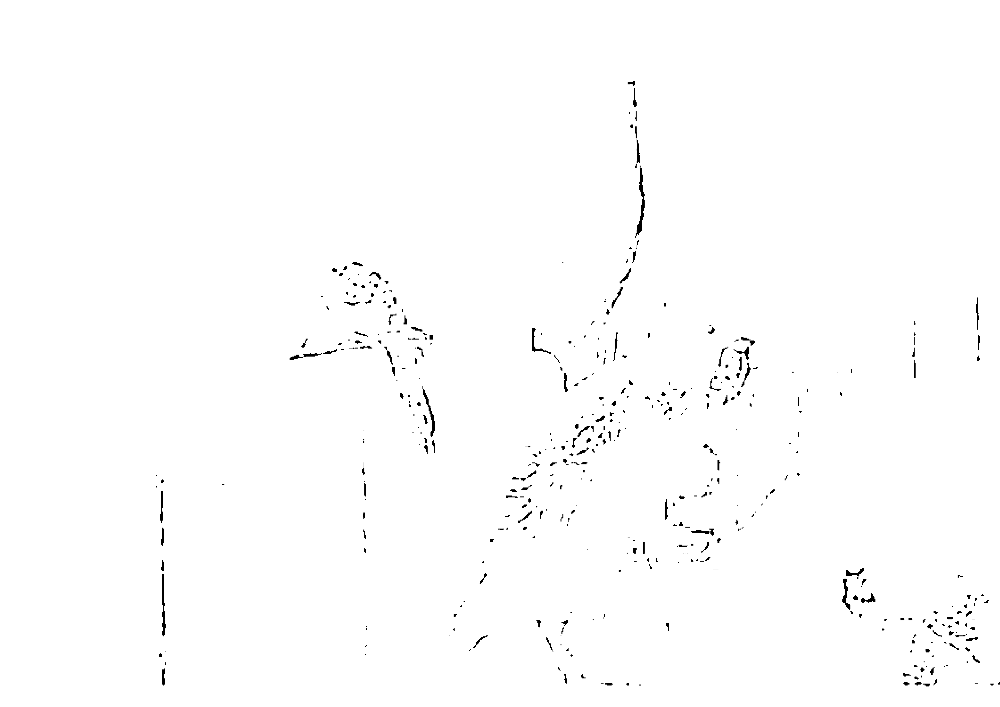

## 礼拜六方

佚名

黎明，佛陀入城。途中，看见一个男子，向着东方、南方、西方、北方、上方礼拜着。佛陀问他为什么这样做。

那男子说：“我叫做善生，每天向六方礼拜，是家族传下来的习惯。据说这样做，会得到幸福。”

- 孝顺父母。做儿女的要孝养、顺从，令爸妈欢喜、安慰。
- 敬重师长。做学生的要敬重师长，接受教导。
- 爱护妻子：是一个好助手，夫妻要互相敬爱。
- 对待朋友要诚实、互敬。
- 对待僧人要布施、恭敬。
- 对待仆人要宽大，不要令他过分疲倦。

这六种人是我们生活中心的人物，和他们相处得合理，会有快乐的家庭，美满的人生。单是礼拜六方，有什么用呢？善生很高兴，就皈依佛陀去了。

## 魅力提示：

只有处理好与身边所有人的关系，与他们友好和睦地相处，我们的人生才会美满快乐。

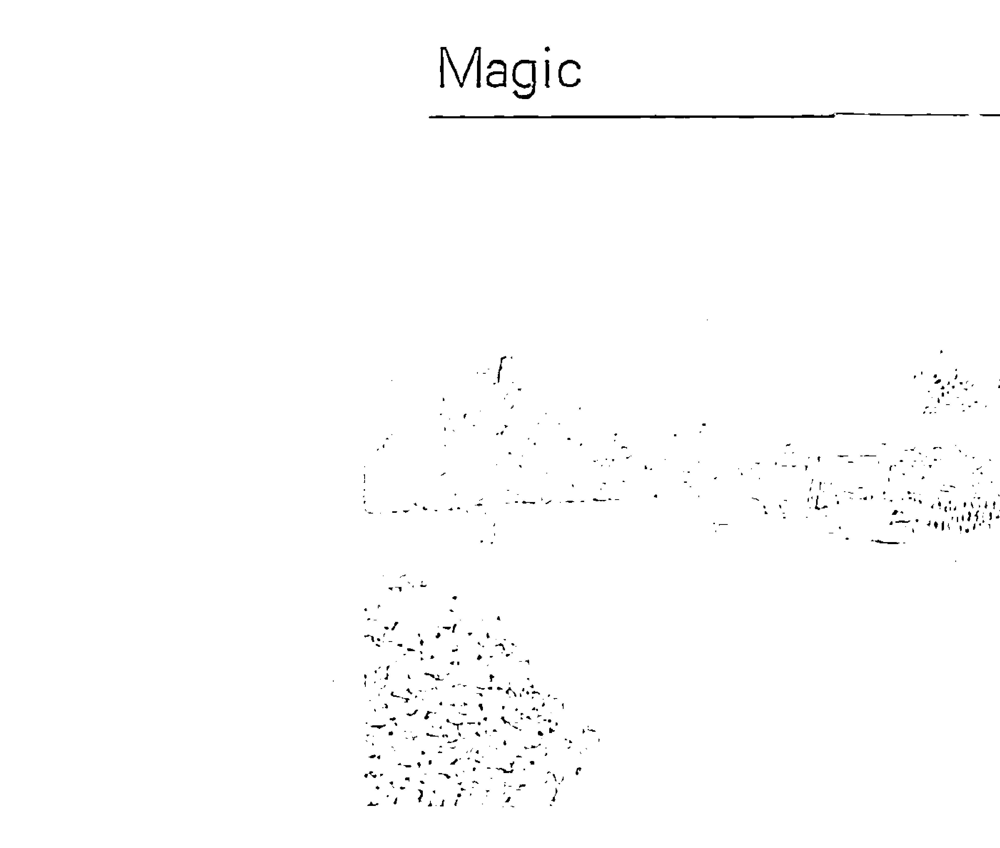

## 不要让心灵的花园荒芜

胡桂英

贝尔太太是美国一位有钱的贵妇人，她在亚特兰大城外修了一座花园。花园又大又美，吸引了许多游客，他们毫无顾忌地跑到贝尔太太的花园里游玩。年轻人在绿草如茵的草坪上跳起了欢快的舞蹈；小孩子扎进花丛中捕捉蝴蝶；老人蹲在池塘边垂钓；有人甚至在花园当中支起了帐篷，打算在此度过他们浪漫的盛夏之夜。贝尔太太站在窗前，看着这群快乐得忘乎所以的人们，看着他们在属于她的园子里尽情地唱歌、跳舞、欢笑。她越看越生气，就叫仆人在园门外挂了一块牌子，上面写着：私人花园，未经允许，请勿入内。可是这一点也不管用，那些人还是成群结队地走进花园游玩。贝尔太太只好让她的仆人前去阻拦，结果发生了争执，有人竟拆走了花园的篱笆墙。

后来贝尔太太想出了一个绝妙的主意，她让仆人把园门外的那块牌子取下来，换上了一块新牌子，上面写着：欢迎你们来此游玩，为了安全起见，本园的主人特别提醒大家，花园的草丛中有一种毒蛇，如果哪位不慎被蛇咬伤，请在半小时内采取紧急救治措施，否则性命难保。最后告诉大家，离此地最近的一家医院在威尔镇，驱车大约五十分钟即到。

这真是一个绝妙的主意，那些贪玩的游客看了这块牌子后，对这座美丽的花园望而却步了。

几年后，有人再往贝尔太太的花园去，却发现那里因为园子太大，走动的人太少而真的杂草丛生，毒蛇横行，几乎荒芜了。孤独、寂寞的贝尔太太守着她的大花园，她非常怀念那些曾经来她的园子里玩的快乐的游客。

## 魅力提示：

我们每个人心中都有一座美丽的大花园。如果我们愿意让别人在此种植快乐，同时也让这份快乐滋润自己，那么我们心灵的花园就永远不会荒芜。

## 不择优录取

王吴军

一家钢铁公司的老总对公司里的招聘解释说：“成绩优秀者只录取20%，是因为笔试成绩优秀并不等于在实际操作时一定是佼佼者，成绩优秀的人往往骄傲、不合群、共事困难、搞不好团结，我们在录取员工时，倾向于更多地吸收成绩并不十分出众但具有一定水平的人。实践证明，这批人中往往会出不少人才。而且，笔试成绩差的人中也不乏人才。他们中有的笔试成绩不太好，可是在实际操作中却令人十分满意。再说，如果工厂都不收他们，会造成社会问题。”

## 魅力提示：

往往有着良好的人际关系的人，更容易得到别人的认同。

书名：投降的勇气
作者：（芬）海尔斯丹·著；毛子欣，王蓓 译
出版社：中央广播电视大学出版社
出版时间：2009-5-1
印刷时间：2009-5-1
开本：大32开
ISBN：9787304043612
包装：平装

> 人生的希望不在…而在…

### 内容简介：

本书是芬兰心理治疗专家，畅销书作家汤米·海尔斯丹的最新力作。本书在芬兰的销售已突破50万册（芬兰人口约500多万），在全球售出15国版权。
在本书中，作者指出，我们从小就被教导，只有坚强，才能克服险阻、击败弱点，导致我们常会刻意否定自己的弱点，只在表面上逞强。他认为唯有面对自己的弱点，敢于“投降”，才能真正解决问题。作者提出了精神生活中的八项“悖论”，带领我们深刻体验生命，走向更为辽阔的人生。这八项“悖论”是：一、旅途始于驻足之后；二、真强必藏于弱；三、欲安全，必冒险；四、先舍而后得；五、做得越少，成就越多；六、唯独处，方能合群；七、唯合群，方能独处；八、活在当下，方能找到永恒。

### 魅力失分

水瓶座的人心性专制，不让别人违背自己的意愿。

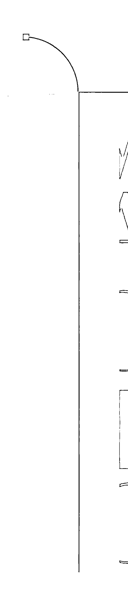

## 不会祷告的土人

李利霞

一个小岛上生活着的土人信奉基督教，但是，他们不会像圣经上那样祷告。

一个满腹经纶的主教在一次旅行中来到了这个小岛上，当他看到土人们不会祷告时，就耐心地教他们一句一句地背诵主祷文。主教花了一整天的时间总算使土人们能够背下主祷文了。

第二天早上，主教很高兴地离开这里。当船还没走多远的时候，主教看到那些土人们如同耶稣一样，自如地行走在水面上，气喘吁吁地来问主教：“先生，很不好意思，我们又忘了主祷文了，您是不是再教我们一遍？” 目瞪口呆的主教看到这些土人，感到了自己的卑微：“单纯的人们啊，就照你们原来的祷告文祷告吧！”

## 魅力提示：

每个人都有自己的行为习惯和处事方式，也许你认为是最好的习惯或方式灌输给别人，但也许对别人来说，这些习惯一点用也没有。

## 主编的气度

佚名

丹诺先生是纽约《太阳时报》的主编，他每天在审稿时，常常喜欢把自己认为重要的部分用红笔勾出，以免排校人员遗漏。但有一天一位青年校对员，却没有执行他的红笔指示。他读到一段主编用红笔勾出的文字，内容大致如下：

> 本报读者雷维特先生送给我们报馆一个大苹果，在通红光滑的苹果皮上露出一排白色的字母。仔细一看，原来是主编丹诺的名字。试想一个完整无缺的苹果上怎会出现整齐光洁的字迹呢？惊奇之余，多方猜测，百思而不解这些字的由来。

这位校对员是一位常识丰富的年轻人，他读了这段文字之后不禁失笑。因为他知道只要趁苹果还呈青色时，用纸剪成字形贴在上面，待苹果变红，再揭去纸字，就会有文字显露出来。他想如果这段文字登了出来，必遭人讥笑，认为主编竟会如此愚蠢，连这一点“小魔术”都会“多方猜测，百思而不解”。因此，他大胆地将这段文字删掉了。

第二天一早，主编丹诺先生气呼呼地问他：“昨天原稿中那段红笔勾出关于奇异苹果的话怎么不见了？”青年校对员如实说出了自己的想法。

听了青年校对员的陈述后，他和蔼地说：“原来如此。你做得十分得当，以后只要有确实可靠的理由，即使我用红笔勾出，你也可自定取舍。”

魅力提示：

聪明的人懂得接纳与自己不同的意见，并且有雅量承认别人的长处和自己的不足。

## “我也不是好惹的”

萧山

一个人买了一只憨态可掬的乌龟，放置案头，让它驮着厚重的砚台，朋友们无不称奇。这人淡淡一笑，“这有什么可奇怪的？据我所知，乌龟生性老实，又有极大的承受力，小小砚台何足道也！我让你们瞧瞧新鲜。”

说罢，他捉住乌龟，像砖头一样垫到桌腿下。乌龟纹丝不动，只是瞪着绿豆似的眼睛瞧瞧众人。

朋友们赞叹不已，兴致大起。这人来了劲，“乌龟的承受力大着呢，今儿个索性让他们瞧个够！”

他把乌龟置于石板上，举起铁锤就要往下砸。乌龟突然伸出头来，在他脚脖上狠狠地咬一口，愤怒地说：“不错，我老实、憨厚，又有极大的承受力，但这一切总有个限度，超过了这个限度，我也不是好惹的，难道我就这样等死吗？”

魅力提示：
再老实懦弱的人也经不起一味专制压迫，所以，我们应该多尊重别人的意见，不能只考虑自己。

## 等待上帝的拯救

佚名

一天，下了一场非常大的雨，洪水开始淹没城市。一个神父在教堂里祈祷，眼看洪水已经淹到他的身体了，突然一个救生员驾着小艇向神父喊道：“神父！快！快上来！不然洪水会把你淹死的！”

神父说：“不！我要守着我的殿堂！我深信上帝会来救我的！”

过了不久，洪水已经淹过神父肩膀了，神父只好勉强站在桌子上。

这时有一个警察开着小艇跟神父说：“神父！快！快上来！不然洪水会把你淹死的！”

神父说：“不！我要守着我的殿堂！我深信上帝会来救我的！”

又过了一会儿，洪水已经把教堂淹没了，神父只好抓着教堂顶端的十字架。一架直升机缓缓飞过来，丢下绳梯之后，飞行员大叫：“神父！快！快上来！不然洪水会把你淹死的！”

神父还是意志很坚定地说：“不！我深信上帝会来救我的！”

最后，神父被淹死了。神父上了天堂后，见了上帝就很生气地问：“你是怎么搞的呀？这样你的子民还会相信你吗？”

上帝说：“你到底想怎么样嘛？我已经派了两艘小艇和一架直升机去救你了，难道你要航空母舰才坐呀？”

## 魅力提示：

我们常常用自己的价值观硬套在别人身上，我们希望对方这么做，我们以为对方应该这么做，其实，做好同样一件事情，有很多种方式和途径。出现在彼此之间的误解，只是因为固执和迂腐而已。

书名：不要用爱控制我
作者：（美）埃文斯 编著，郑春蕾，梅子 译
出版社：京华出版社
出版时间：2007-7-1
印刷时间：2007-7-1
开本：16开
ISBN：9787806007099
包装：平装

### 内容简介：

人人都希望别人同意自己的观点，掌控一切；人都可能不由自主地对别人指手画脚、随意评价。有的人懂得校正自己的行为，适度控制，所以进退自如，生活得无比轻松。有的人却不明白这种行为给别人带来的痛苦。结果是失败的婚姻、紧张的人际关系和扭曲的心灵，自己也异常苦恼。

为什么人们会产生这种控制别人的欲望呢？为什么有人想改变这种行为，事到临头却总是无法自控？

本书以独特的视角，深入探讨了日常生活中、大家习以为常的这些下意识行为，揭示背后的实质、解开我们的困惑和痛苦，使我们学会识别、理解和应用控制，使我们的生活远离暴力，更加和谐、幸福。

作者新颖独到的观点和概念，必将在全球掀起讨论“控制”的风暴。

### 魅力失分

水瓶座的人很难与朋友进行深入交往，因此，很难交到推心置腹的朋友。

## 她是我的朋友

佚名

这是发生在越南的一个故事。

几发迫击炮弹突然落在一个小村庄的一所由传教士创办的孤儿院里。传教士和两名儿童当场被炸死，还有几名儿童受伤，其中有一个小姑娘，大约八岁。

村里人立刻向附近的小镇要求紧急医护救援，这个小镇和美军有通讯联系。终于，美国海军的一名医生和护士带着救护用品赶到。经过查看，这个小姑娘的伤很严重，如果不立刻抢救，她就会因为休克和流血过多而死去。

输血迫在眉睫，但得有一个与她血型相同的献血者。经过迅速验血表明，两名美国人都不具有她的血型，但几名未受伤的孤儿却可以给她输血。

医生用掺和着英语的越南语，护士讲着仅相当于高中水平的法语，加上临时编出来的大量手势，竭力想让他们幼小而惊恐的听众知道，如果他们不能补足这个小姑娘失去的血，她一定会死去。

他们询问是否有人愿意献血。一阵沉默作了回答。每个人都睁大了眼睛迷惑地望着他们。过了一会儿一只小手缓慢而颤抖地举了起来，但忽然又放下了，然后又一次举起来。

“噢，谢谢你。”护士用法语说，“你叫什么名字？”“麦克。”小男孩很快躺在草垫上。他的胳膊被酒精擦拭以后，一根针扎进他的血管。

输血过程中，麦克一动不动，一句话也不说。

过了一会儿，他忽然抽泣了一下，全身颤抖，并迅速用一只手捂住了脸。

“疼吗，麦克？”医生问道。他摇摇头，但一会儿，他又开始呜咽，并再一次试图用手掩盖他的痛苦。医生问他是否是针刺痛了他，他又摇了摇头。

医疗队显然觉得有点不对头。就在此刻，一名越南护士赶来援助。

她看见小男孩痛苦的样子，用极快的越语向他询问，听完他的回答，护士用轻柔的声音安慰他。顷刻之后，他停止了哭泣，用疑惑的目光看着那位越南护士。护士向他点点头，一种消除了顾虑与痛苦的释然表情立刻浮现在他的脸上。

越南护士轻声对两位美国人说：“他以为自己就要死了，他误会了你们的意思。他以为你们让他把所有的鲜血都给那个小姑娘，以便让她活下来。”

“但是他为什么愿意这样做呢？”海军护士问。

这个越南护士转身问这个小男孩：“你为什么愿意这样做呢？”

小男孩回答：“因为她是我的朋友。”

魅力提示：

真正的朋友不把友谊挂在口上，他们并不是为了友谊而互相要求一点什么，而是彼此为对方做一切办得到的事。

## 晏子赎越石父

佚名

春秋时期，齐相晏婴出使晋国，路过中牟地方，看见一个人头戴破帽子，反穿皮袄，身背饲草，正坐在路边休息。晏子一眼就看出他是一位有修养的君子，于是就派人问他：“你是叫什么名字？从哪里来？”那人回答说：“我是齐国人，名叫越石父。”晏子就把他叫到跟前问道：“为什么来到这里？是不是家里遭到什么不幸？”越石父说：“我在中牟卖身为奴，看见了使者路过，打算跟您回国。”晏子问：“为什么要卖身为奴？”越石父回答说：“由于饥寒交迫，我便卖身为奴了。”晏子问：“当奴仆几年了！”越石父回答：“已经三年了。”晏子问：“可以赎身吗？”

越石父回答：“可以。”

晏子便把拉车左套的马解下来，用这匹马把越石父赎买下来，并与他一起坐车回国。

回到相府，晏子没跟越石父告辞就进了自己的房门。越石父很生气，要与晏子绝交。

晏子派人传说：“我不曾与你结交，谈何绝交？你当了三年奴仆，我今天看见了才把你赎买回来，我对待你还可以吧？你怎么可以恩将仇报，说什么绝交？”

越石父说：“士人不在知己朋友面前，可以受屈辱；在知己朋友面前，可以得到舒展。所以君子不因为对人家有恩而轻视人家，也不因为人家对自己有恩而向人家屈服。我给人家当了三年奴仆，却没有人理解我。现在您把我赎买回来，我认为您理解我了。先前您坐车，不同我打招呼。我以为您是一时疏忽了。现在您又不向我告辞就直接进入屋门，这同把我看做奴仆是一样的。既然我还是奴仆的地位，就请再把我卖到社会上去吧！”

晏子听了越石父的回话，走出来，请求和越石父见礼。晏子说：“以前我只看到了客人的外表，现在理解了客人的内心。我听人说过：考察他人行为的人不助长人家的过失，体察他人实情的人不讥笑人家的言辞。我可以向您道歉，您能不抛弃我吗？我诚心改正错误的行为。”晏子命令人把厅堂打扫干净，用酒席盛情款待越石父。

越石父说：“我听说过，最高的尊敬不讲究形式，用尊贵的礼节待人不会遭到拒绝。先生以礼待我，我实在不敢当。”

晏子于是就把越石父奉为上宾。

魅力提示：

只有以礼待人才能结交知心朋友，帮助人也不要以恩人自居。

## 狐狸和仙鹤

伊索

这天，狐狸请仙鹤吃饭，可他却很吝啬，端出一只平底的小盘子，盘子里盛了一点儿肉汤，他还连声说：“仙鹤大姐，别客气，请吃吧，吃吧！”仙鹤一看，非常生气，因为她的嘴巴又尖又长，盘子里的肉汤一点也没喝到，可狐狸呢，张开他那又阔又大的嘴巴，呼噜呼噜没几下，就把汤喝光了，还假惺惺地问仙鹤：“您吃饱了吧！我烧的汤，不知合不合您口味？”

仙鹤对狐狸笑笑：“谢谢您的午餐，明天请到我们家吃饭吧！”狐狸正等着这句话呢，连忙说：“好的，明天中午我一定去，一定去。”

狐狸一心想在仙鹤家多吃点儿，这天晚饭没吃，第二天早饭也没吃，饿着肚皮，早早来到仙鹤家等着吃午饭了。狐狸一进仙鹤家的门就闻到一股香味儿。他仔细嗅了嗅：“嗯，准是在烧鲜鱼！”心里不由暗暗高兴。狐狸坐到饭桌前，不一会儿，仙鹤端出一只长颈瓶子放到狐狸面前，指着瓶子里的鱼和鲜汤说：“狐狸先生，请吃吧，别客气！”狐狸望着那么一点大的瓶口，他那阔嘴巴怎么也伸不进去。它闻着香味，肚子饿得咕咕叫，馋得直流口水。狐狸什么也吃不到，只能看着仙鹤把又尖又长的嘴巴伸进瓶子里，把鱼吃了，汤喝光，还挺客气地劝狐狸：“吃吧，放开吃吧！”

狐狸耷拉着脑袋，饿着肚皮回家了。

魅力提示：

人与人之间需要更多的真诚，而不是自以为是的小聪明，没有一个人会愿意活在欺骗与虚假中，大方些，真诚地面对每一个人，你会有意想不到的收获。

## 遗失的斧头

佚名

农夫甲和农夫乙忙完了田里的工作，一起回家。他们走在路上，农夫甲忽然发现地上有一把斧头，就跑过去捡起那把斧头。他看了看斧头，觉得还很新，就想带回家占为己有。农夫乙看到这把斧头就说：“我们发现了一把斧头。”

农夫甲认为这把斧头是他发现的，应该归他所有，就对农夫乙说：“你刚才说错了，你不应该说‘我们发现’。因为这是我先看见的，所以你应该改口说‘你发现了一把斧头’才对。”他们两个继续往前走，农夫甲的手上仍然拿着那把捡到的斧头。过了一会儿，遗失这把斧头的人走了过来，远远地看见农夫甲的手上拿着他的斧头，就匆匆忙忙地追上来，眼看对方就要追上来了。这时候农夫甲很紧张地看农夫乙一眼，然后说：“怎么办？这下子我们快被他捉到了。”

农夫乙听他这么一说，知道农夫甲想把责任归咎到两个人的身上。于是农夫乙就很严肃地对农夫甲说：“你说错了，刚才你说斧头是你发现的，现在人家追来了，你就应该说‘我快被他捉到了’，而不是说‘我们快被他捉到了’。”

## 魅力提示：

只想要占便宜的人，不会得到别人的帮助。朋友之间，一旦不愿让对方分享你的成就，就不能要求对方帮你分担痛苦，这就是所谓的“己所不欲，勿施于人”。

书名：勇气的力量
作者：（日）大川隆法 著，张石 译
出版社：中央编译出版社
出版时间：2009-1-1
印刷时间：2009-1-1
开本：大32开
ISBN：9787802118324
包装：平装

本书是享誉日本的畅销作家大川隆法的第 501 部著作。本书以人的本性为出发点，所倡导的勇气是以获得个人与他们的幸福为最终目的。本书的理念不拘泥于任何价值体系或传统，强调摒弃世俗偏见的独立思考，希望引导人们度过“无畏”的人生，常常一语道破人们的错误想法，教人们将失败和挫折转化为进取的智慧和力量。作者关于友情、学习、事业、挫折、成功话题的精彩讲述，有别于传统的思维，常常让我们有新的思想发现，而他对人生会经历的一切喜悦、不安与疑惑所独有的深刻了解，亦将激励着每一颗学习长大的心灵。它将告诉人们如何做人，如何做事，如何避免伤害，如何实现心灵的成长，如何成为一个勇敢的人，更重要的是如何通过这些成为一个真正幸福的人。

### 魅力失分

水瓶座的人打出生就没在乎过责任这两个字。他从来不觉得自己应该对什么事情负责。

## 15 美元的责任

佚名

1920 年的一天，美国一位 12 岁的小男孩正与他的小伙伴玩足球，一不小心，小男孩将足球踢到了邻近一户人家的窗户上，一块玻璃被击碎了。

一位老人立即从屋里跑出来，勃然大怒，大声责问是谁干的，伙伴们纷纷逃跑了，小男孩却走到老人跟前，低着头向老人认错，并请求老人宽恕。然而老人却十分固执，小男孩委屈得哭了，最后老人同意小男孩回家拿钱赔偿。

回到家，闯了祸的小男孩怯生生地将事情的经过告诉了父亲。父亲并没有因为其年龄还小而开恩，而是板着脸沉思着一言不发。坐在一旁的母亲总是为儿子说情，开导父亲。

过了不知多久，父亲才冷冰冰地说道：“家里虽然有钱，但是他闯的祸，就应该由他自己对过失行为负责。”停了一下，父亲还是掏出了钱，严肃地对小男孩说：“这 15 美元我暂时借给你赔人家，不过，你必须想法还给我。”

小男孩从父亲手中接过钱，飞快跑过去赔给了老人。

从此，小男孩一边刻苦读书，一边用空闲时间打工挣钱还父亲。由于人小，不能干重活，他就到餐馆帮别人洗盘子刷碗，有时还捡捡破烂。经过几个月的努力，他终于挣到了 15 美元，并自豪地交给了他的父亲。父亲欣然拍着他的肩膀说：“一个能为自己过失行为负责的人，将来一定会有出息的。”

许多年以后，这位男孩成为美利坚合众国的总统，他就是里根。后来，里根在回忆往事时，深有感触地说：那一次闯祸之后，我懂得了做人的责任。

魅力提示：

做人就得要为自己的行为负责任，这样的思想，必须从小就有。

## 因为责任

佚名

有些事常让我感动。

在火车上，一位孕妇临产，列车员广播通知，紧急寻找妇产科医生。这时，一位妇女站出来，说她是妇产科的。女列车长赶紧将她带进用床单隔开的病房。毛巾、热水、剪刀、钳子什么都到位了，只等最关键时刻的到来。产妇由于难产而非常痛苦地尖叫着。那位妇产科的妇女非常着急，将列车长拉到产房外，说明产妇的紧急情况，并告诉列车长，她其实只是妇产科的护士，并且由于一次医疗事故已被医院开除。今天这个产妇情况不好，人命关天，她自知没有能力处理，建议立即送往医院抢救。

列车行驶在京广线上，距最近的一站还要行驶一个多小时。列车长郑重地对她说：“你虽然只是护士，但在这趟列车上，你就是医生，你就是专家，我们相信你。”

列车长的话感染了护士，她准备了一下走进产房时又问：“如果万不得已，是保小孩还是大人？”

“我们相信你。”

护士明白了。她坚定地走进产房。列车长轻轻地安慰产妇，说现在正由一名专家在给她手术，请产妇安静下来好好配合。

出乎意料，那名护士几乎单独完成了她有生以来最为成功的手术，婴儿的啼声宣告了母子平安。

那对母子是幸福的，因为遇到了热心人；但那位护士更是幸福的，她不仅挽救了两个生命，而且找回了自己的信心与尊严。因为责任，因为信任，她由一个不合格的护士成为了一名最优秀的医生。

## 魅力提示：

> 每个人都有责任感，每个人都会为不辱使命而努力。责任能激发人的潜能，也能唤醒人的良知。给人责任，也就是给了信任和真诚；有了责任，也就成就了尊严和使命。

## 好心的客店主人

佚名

从前有一个好心人，想竭尽所能地为人们做善事，便开始琢磨怎么做才能不使任何人受委屈，让每一个人都受益，让每一个人都感到平等。

后来这个好心人想出了一个主意，在人来人往的地方建了一座客店，客店里置办齐了所有能让人们感到舒适和高兴的设施，在客店里造好了暖和的客房、上好的炉灶、木柴、灯火，库房里装满了各种粮食，地窑里储藏着蔬菜，还备有各种水果、饮料、床、被褥，里外的服装、靴子，把尽可能多的东西装备好。

好心人做完这一切之后就离开了，等着看结果怎么样。于是陆续有些善良的人来借住，吃点东西，喝点水，住上一夜，要不就呆上一两天，或者个把星期。有时谁需要就拿些衣服、靴子。用完了就收拾好，保持来之前的样子，以便别的旅客接着用。他们走的时候心里一直感激那个不知名的好心人。

但有一次，却来了一伙大胆而粗鲁的恶人。他们肆无忌惮地抢光了店里所有的东西，而且为了这些财物起了纷争。开始是互相谩骂，接下来就是拳脚相见，直至互相争抢，故意地毁坏财物，只要别人拿不到就好。一直闹到把所有东西都毁坏完，这时，他们才感到又冷又饿，又开始互相埋怨起来，接着就骂起这客店的主人来，这里为什么搞得这么糟糕，连看门的人也不安排一个，准备的东西又这么少，为什么把形形色色的坏人都放了进来。而另一些人则说这客店根本就没什么主人，客店本身也造得不好。

这些人离开了客店，又冷、又饿、怒气冲冲，只是一味地骂着建造这个客店的主人。

魅力提示：

> 当世上的人们不为灵魂，而只为肉体而生的时候，他们也是这样做的，他们毁坏着自己和他人的生活，却不知自责，只知互相指责。

## 谁都没有责任

佚名

三只饥寒交迫的小老鼠一起去偷油。它们决定采取叠罗汉的方式，轮流喝油。当其中一只老鼠爬到另一只老鼠的肩膀上，“胜利”在望时，不知什么原因，油瓶突然倒了，巨大的响声惊动了主人，它们只好抱头鼠窜、落荒而逃。

回到鼠洞后，它们聚在一起开了个内部会议，讨论这次集体偷油失败的潜在原因。

> 最上面的老鼠说：“因为下面的老鼠抖动了一下，所以我不小心碰倒了油瓶。”
> 中间那只老鼠说：“因为下面的老鼠抽搐了一下，所以我抖动了一下。”
> 最下面的老鼠说：“我隐约听到有猫的叫声，所以我抽搐了一下。”

原来如此——谁都没有责任。

## 魅力提示：

是否具有责任心，是衡量一个人是不是现代人的主要标志之一。对于个人来讲，一个人只有意识到要主动承担责任的时候，他的美好人格才开始形成，他也才有可能成为一个真正的人。

书名：勇敢去工作
作者：（美）特雷热 著，王晓竞 译
出版社：东方出版社
出版时间：2009-11-1
印刷时间：2009-11-1
开本：大32开
ISBN：9787506035873
包装：平装

### 内容简介：

我们是世界上唯一关注勇气构建的咨询顾问团队。作为其中一员，我坚信并提倡为工作注入更多的勇气。但需要承认的是，勇敢行为往往会带来一些“副作用”。在面临挑战或者身处危险情况时，人们会变得勇敢起来。但与此同时，勇敢行为也可能会带来新的挑战和风险。员工可能会因为犯错而被解雇。员工若是盲目听从错误决定，或者出于坦诚而太过激烈地反对上级意见，他们同样可能会被辞退，但这些并不能否认这样的事实：总体而言，勇敢的人更容易在事业上取得成功。

### 魅力失分

水瓶座的人想法很多变、做事三分钟热度，总是这件事还没做完就想去做另外一件事。

## 偷食的松鼠

卡耐基

丹尼是个成功的演说家和作家。他对鸟类特别感兴趣。

丹尼的家在郊外，附近草木葱茏。为了方便观察鸟儿，他就在后院里装了个喂鸟器。可是就在当天傍晚的时候，一群松鼠弄翻了喂鸟器，不仅吃掉了鸟食，还把鸟儿也吓跑了。

丹尼绞尽脑汁想尽各种办法让松鼠远离喂鸟器，但一点效果也没有，松鼠依然会在他不注意的时候偷吃鸟食。

一天，丹尼来到当地一家五金店买几颗螺丝，无意中他看见了一个新颖的喂鸟器——“防松鼠喂鸟器”。这下应该万无一失了吧，丹尼用它替换下以前的那个喂鸟器。但天黑以前，这个“防松鼠喂鸟器”还是被松鼠光顾过了。

丹尼气急败坏地拆下喂鸟器来到五金店要求退货。“别着急，我会给你退货的。”五金店的经理说，“不过你要理解，这个世上可没有什么真正的防松鼠喂鸟器。”

丹尼惊奇地问：“我们可以把人送到太空基地，可以在几秒钟之内把信息传到全球任何一个地方。难道我们最聪明的科学家和工程师都不能设计和制造出一个真正有效的喂鸟器，能够把那种脑子只有豌豆大的啮齿类小动物阻挡在外吗？”

“你说得很对。”经理说，“你是阻止不了松鼠的。”

丹尼好奇地问：“是吗？请你告诉我为什么吧。”

经理向丹尼问道：“你平均每天花多少时间让松鼠远离你的喂鸟器？”

丹尼想了一下，回答说：“我记不太清楚，大概每天10到15分钟吧。”

“和我猜的差不多，”那位经理说，“那你知道松鼠每天花多少时间来试图闯入你的喂鸟器吗？”

丹尼马上会意：松鼠醒着的每时每刻。

后来我在一本关于动物的习性的书上发现原来松鼠在不睡觉的时候，98%的时间都用来寻找食物。

## 魅力提示：

做得更好，不一定只能靠先进的技术和尖端的工具，抓住目标，心无旁骛地投入全部的时间同样会获得成功。

## 农场里的小女孩

佚 名

在一个农场里，佃农们正在向农场主缴谷租。一个黑人小女孩推开门走了进来，靠在门旁。
农场主看到小女孩，就对他粗声粗气地喊：“你要干什么？”
小女孩细声细气地答道：“妈咪说，请你给她五毛钱。”
“我不会给的，”农场主斥喝道：“你现在就给我回去。”
农场主接着忙他自己的事情，没有留意到小女孩并未离去。等到他突然抬头的时候，看到她仍然站在那里，农场主非常恼怒，就对她咆哮：“你怎么还没走？现在就走，再不走我就拿棍子来揍你。”
小女孩说：“好的，先生。”但是她一动没动。
农场主放下了手中的活，拿起做谷仓的板条，满脸怒容地朝小女孩走去。可是当他刚走近门边时，小女孩飞快地往前一跨，大眼直视农场主的眼睛，用最高亢的声音尖叫：“妈咪要拿到那五毛钱。”
农场主停下了脚步，端详了小女孩一下，然后慢慢放下了木条，从口袋里掏出了五毛钱，递给了小女孩。小女孩拿了钱，直盯着农场主，慢步退向门外。
小女孩走了后，农场主坐在箱子上，愣愣地望着窗外，好久。

## 魅力提示：

目标就在眼前，只要有着坚定的信念和不屈不挠的决心，就一定会实现。再大的困难和阻挡，在你的面前也会退却。

## 风景不在对岸

佚名

一条河隔开了两岸，此岸住着凡夫，彼岸住着僧人。凡夫们看到僧人们每天无忧无虑，诵经撞钟，十分羡慕他们；僧人们看到凡夫俗子每天日出而作，日落而息，也十分向往那样的生活。日子久了，他们都各自在心中渴望着：到对岸去。

终于有一天，凡夫们和僧人们达成了协议。于是，凡夫们渡过河过起了僧人的生活，僧人们渡过河过上了凡夫的日子。

没过多久，成了僧人的凡夫们就发现，原来僧人的日子并不好过，悠闲自在的日子只会让他们感到无所适从，便又怀念起以前当凡夫的生活来。

成了凡夫的僧人们也体会到，他们根本无法忍受世间的种种烦恼、辛劳、困惑。于是也想起做和尚的种种好处。

又过了一段日子，他们各自心中又开始渴望着：到对岸去。

## 魅力提示：

风景不在对岸。任何事情做久了都会令人心生厌倦，感到没有出路。其实，问题也许并非出在事情本身上，而只是人的心理作用。在人生旅途中，永远都不要忘记随时调整心态，因为旅途的突破取决于人自身的突破。

## 只瞄准自己的目标

萧山

老阿爸带着自己的三个儿子去草原打猎。四人来到草原上，这时老阿爸向三个儿子提出了一个问题。
“你们看到了什么呢？”
老大回答说：“我看到了我们手中的猎枪，在草原上奔跑的野兔，还有一望无际的草原。”
老阿爸摇摇头说：“不对。”
老二回答说：“我看到了阿爸、哥哥、弟弟、猎枪、野兔，还有茫茫无际的草原。”
老阿爸又摇摇头说：“不对。”
而老三回答说：“我只看到了野兔。”
这时老阿爸才说：“你答对了。”

## 魅力提示：

一个能顺利捕获猎物的猎人只瞄准自己的目标。我们有时之所以不成功，是因为看到的太多，想得太多，禁不住太多的诱惑，失去了自己的目标和方向。一个人只有专注于你真正想要的东西，你才会得到它。

书名：引爆生命力
作者：许伯恺，吴锦珠 著
出版社：石油工业出版社
出版时间：2008-2-1
印刷时间：2008-2-1
开本：16开
ISBN：9787502164379
包装：平装

### 内容简介：

在全亚洲畅销书作家“信义之星”吴锦珠小姐的协助下，这本《引爆生命力》终于在内地问世了。这本书告诉你的是一个没有背景的年轻人，如何背井离乡到中国内地打拼，成为中国第一潜能激发大师的过程，而且告诉你，如何才能开发出你自身巨大的潜能。在此书中，你能学到其他一万本书里学不到的成功秘密，也是追求成功时最重要、最关键的秘密。

人生失败的元凶是八大癌症：三分钟热度癌、找借口癌、抗拒提高收入癌等。本书教你如何与这些癌作战，激发你最大的潜能，从而走向成功。

### 魅力失分

水瓶座的人通常都缺乏远见，做事总是贸然行动，不考虑后果。

## 宠臣安陵君

佚名

战国时楚王的宠臣安陵君，能说会道，很受楚王器重。但他并不遇事张口就说，而是很讲究说话的时机。他有一位朋友名叫江乙，对他说：“您没有一寸土地，又没有至亲骨肉，然而身居高位，享受优厚的俸禄，国人见了您，无不整衣跪拜，无不接受您的号令，为您效劳，这是为什么呢？”

安陵君说：“这是大王太抬举我了，不然哪能这样！”

江乙便不无忧虑地指出：“用钱财相交的人，钱财一旦用尽，交情也就断了；靠美色相交的人，色衰则情移。因此，狐媚的女子不等卧席磨破，就遭遗弃；得宠的臣子不等车子坐坏，已被驱逐。如今您掌握楚国大权，却没有办法和大王深交，我暗自替您着急，觉得您的处境太危险了。”

安陵君一听，恍然大悟，毕恭毕敬地拜问江乙：“既然这样，请先生指点迷津。”

江乙说：“希望您一定要找个机会对大王说：‘愿随大王一起死，以身为大王殉葬。’如果您这样说了，必能长久地保住权位。”

安陵君说：“谨依先生之言。”

但是，过了很长时间，安陵君依然没有对楚王提起这话。江乙又去见安陵君，说：“我对您说的那些话，您为何至今不对楚王说？既然您不用我的计谋，我就再不管了。”

安陵君急忙回答：“我怎敢忘却先生的教诲，只是一时还没有合适的机会。”

又过了些时日，机会终于来了。楚王到云梦打猎，一箭射死了一头狂怒奔来的野牛。百官和护卫欢声雷动，齐声称赞。楚王也高兴得仰天大笑，说：“痛快啊！今天的游猎，寡人何等快活！待寡人万岁千秋之后，你们谁能和我共有今天的快乐呢？”

此时，安陵君抓住机会，泪流满面地走上前来，说：“臣进宫就与大王同共一席，出宫与大王同乘一车，如果大王万岁千秋之后，我愿随大王奔赴黄泉，变作芦草为大王阻挡蝼蚁，那便是臣最大的荣幸。”

楚王闻言，大受感动，正式设坛封他为安陵君，对他更加宠信了。

## 魅力提示：

做人要有高瞻远瞩的长远眼光，不要因为眼前的一时之宠就得意忘形，也不要为了时下的一点失利就一蹶不振。小聪明是翻不起大浪花的，大智慧才可保你一世成功。

## 有远见的野猪

伊索

那是一个秋高气爽，晴朗的好天气。黄莺在枝头歌唱，野兔在树下追逐，森里里一片轻松愉快的气氛。

狐狸从洞里出来，它的心情格外的好，想了想，决定去拜访朋友，不要浪费了这美好的天气。

它轻松地一路哼着歌儿走，走了一段路，看见前方树下有一个熟悉的身影——是野猪。野猪正在树干上磨它的獠牙。

“野猪兄，你好！”远远的，狐狸就高声打起招呼来，它的心情实在好极了。

“狐狸老弟，你好。上哪去？”

“想去拜访朋友，天气这么好，待在家里太可惜了。怎么样，一道去吧？”狐狸热情地邀请。

“谢谢你的好意，不过我正在磨牙，没有空。”

“怎么，熊或者猎豹要来找你的麻烦？还是有其他敌人会出现？”狐狸神色紧张起来。

“不，没有什么事。”野猪说。

狐狸松了一口气，不解地问：“既然如此，那你为什么磨牙呢？”

“老弟，你想想看，如果我等敌人出现才磨牙，怎么来得及？但我若平时就做好准备，当敌人来临，我便能从容应付，不至于惊慌失措了。”

## 魅力提示：

有远见的人懂得居安思危，在事前做好准备，不至于在事情来临的时候慌了手脚。

## 野鸭飞走了

佚名

一个猎人准备去打猎，他带着猎枪、弹药和准备用来装猎物的袋子。出门前家人都劝他把弹药先装好，可是他不理会，说看见了猎物后再装也来得及。说完就出发了。

当他来到一个湖边时，看到一大群野鸭正在湖面上嬉戏。他心里高兴极了，心想着要是一枪打去，至少也得打中七八只野鸭。于是他赶紧往猎枪里填装弹药，可是，就在这个时候，一只野鸭发现了他并发出一声叫喊，所有的野鸭都扑腾着飞了起来，朝着树林上空飞走。

猎人拎起刚装好弹药的猎枪就开始追，他沿着曲折的小径，奔跑着穿过树林，可是，鸭群早就不见了踪影。他气急败坏地蹲在了地上。

猎人想在树林里找点别的猎物，可是他什么也没发现。此时的他已经饥肠辘辘，没有力气了，正在他准备往回走的时候，老天又下起大雨。结果猎人拖着疲惫的、被雨水淋透的身体，双手空空地回到家中。

## 魅力提示：

能否顺利地完成一件事情，往往取决于是不是有充分的准备，临阵磨枪，只会功亏一篑。

## 鹳鸟移巢

李异鸣

子游做武城县官的时候，城门旁边小土堆上的鹳鸟，忽然把它的巢迁移到墓地的石碑上去了。看守墓园的老汉把这一情况报告给子游，说：“鹳鸟是能够预先知道天将下雨的鸟，它突然将巢迁移到高处，说不定武城要遭大水呢！”

子游说：“对。”便立即让全城的居民都准备好船只以防万一。

过了几天，大水果然来了。城门旁边的小土堆被淹没了，大雨仍然下个不停，眼看大水就要淹到墓园的石碑了，鹳鸟的巢摇摇晃晃，岌岌可危，鹳鸟飞来飞去哀鸣着，却不知道该把它的巢再迁移到什么地方去。

子游感叹地说：“真可怜啊！这些鹳鸟能预知水灾的到来，可惜它考虑得不够长远啊！”

## 魅力提示：

人们在处理问题的时候，不能只顾眼前，而应该放眼未来。

书名：你的未来可以预测
作者：东方觉慧 著
出版社：世界知识出版社
出版时间：2010-2-1
印刷时间：2010-2-1
开本：16 开
ISBN：9787501237401
包装：平装

### 内容简介：

面对未来，你是不是总觉得迷茫，不知道将会过什么样的生活？不知道自己的事业能达到怎样的高度？不知道以后的自己以何种面貌存在？甚至不知道自己目前所做的事情是否有意义？

不用担心。本书将为你展现身边一幕幕熟悉的场景和画面以及形象生动的寓言故事，由表及里地阐述面对这些问题的解决方案。

你的未来不是梦，在百转千回后的“重逢”里，与未来同行，与成功相随，人生充满惊喜。世界因你而不同！

### 魅力失分

水瓶座的人相当自信，甚至是自大，对于自己的判断，他从不怀疑。

## 睁开你的第二只眼

佚名

一个人去某地调查该地区贫困的原因。在出发前，有人告诉他，那儿的人特别好吃懒做，无所事事。他来到此地后，下车去田里暗访。他看到一个农夫模样的人在割草，那人坐在深深的草丛里，割一会儿就喘一会儿气。调查者想，连割草都要坐着，这儿的人真是懒得不可救药了。于是他生气地往回走。

就在他转身的一瞬间，眼睛不经意间又瞥了那人一眼，发现那农夫原来根本就没有双腿！调查者惊出了一身汗，想，幸亏我看了第二眼，否则我就要冤枉了一个勤劳的残疾人啊！

## 魅力提示：

人们常常被假象所迷惑，你要睁开你的第二只眼睛，第二只眼的意义就在于不为第一印象所迷惑，不急于下结论，凡事都要经过认真思考。

## 欧阳询读碑

雅 琴

唐代著名书法家欧阳询在一次骑马外出郊游时，偶然发现了晋代大书法家索靖的碑刻手迹，便立刻下马来看了一会儿。看完了觉得索靖的字很平常，没什么惊人之处。

他牵着马刚离开石碑不远，又不放心地回来看了一遍，这一次他觉得字写得还不错，有自己的风格，算得上是一位书法家。

等到他骑着马走了好一段路的时候，觉得石碑上的字似乎还没看够，于是他策马扬鞭又赶回来，仔细地欣赏起石碑上的字体来。这一次他越看越痴迷，深深地被索靖的书法所折服，在石碑前一坐就是三天三夜，依然不肯离去。

## 魅力提示：

很多事情仅凭一眼是很难看出个子午寅丑的，只有反复地审视和琢磨后你才能得到真实的体会。所以，对于自己尚未熟知的人或事物，不要过早地做出自己的评判或论断，这样得出的结果即使正确，也会有所偏差的。

## 丑婢破罐

李异鸣

从前，有一个名门家的媳妇被姑婆虐待。

有一天，这家的媳妇终于承受不了虐待的痛苦，就逃进森林想寻短见，忽然听见脚步声，连忙爬上树去，藏了起来。树下是一池明镜般的泉水，她的面影正好投在水中。

又来了一个丑陋的婢女，挑着瓦罐来池里汲水。她忽然看见水中的面影，以为是自己的，越看越喜欢，自言自语地说：“原来我的面容长得这样娇嫩俊俏，为什么还要帮人做婢女？”

她把瓦罐摔碎在地上，欢天喜地跑回村庄，对主人说：“现在我的容貌这样美丽端正，为什么还要叫我挑水打杂？”

众人听了都掩着嘴发笑，以为她被鬼魅迷了心窍。主人又拿出一个瓦罐，吩咐她再去打水。

婢女嘟嘟囔囔来到池边，又看见了水中的面影，还像先前一样美丽、鲜艳。她恨别人为什么都瞎了眼，想着想着，怒气冲了上来，又哗啦一声把瓦罐摔个粉碎。

这时候，一直躲在树上的媳妇一直在注视着婢女的举动，她不禁开口笑了。

婢女看见水中的面影忽然微笑起来，十分惊异，抬头看树上，只见树上坐着一个端庄美丽的女人，婢女顿时羞愧不已。

## 魅力提示：

“人贵有自知之明。”人如果不尊重客观存在，而一味坚持相信自己，就会遭到别人的耻笑。

## 夜郎自大终毁国

振北

齐王派大军进攻宋国。消息传到了狂妄自大的宋康王那里，他不大相信这是事实，便派人去侦察齐军到了什么地方。

时间不长，派去的人回来禀报：“齐军已经越过了边境。全国上下，人心浮动。”

左右近臣都对宋康王说：“这完全是俗话所说的‘肉自己生出蛆虫’啊！凭着宋国的强大和齐军的虚弱，怎么会这样呢？”

宋康王听罢大怒，把派去侦察的人杀掉了。他接着又派人去察看，第二个人的回报仍然和前一个人一样，宋康王又把他给杀了。这样一连杀了三个人，之后又派第四个人继续出去侦察。

当时，齐军已经要逼近宋国的国都了，国人确实已经感到恐慌。这个被派去侦察的人在路上恰巧碰到了他的哥哥。
他哥哥见他行色匆匆，便问：“国家已经十分危险了，你这是要到哪里去呢？”
“我是去替宋王侦察齐军的动向。没想到齐军已经威逼我国都这么近了，国人已经这么恐慌。我现在担心的是，先前有三个侦察齐军动静的人，都是由于回报齐军已经逼近而被屈杀了。如今我回报真情是死，不回报真情也是死。这该如何是好呢？”
哥哥想了想，说：“如果回报真情，你就会比国破后被杀和逃亡的人先遭受灾难，依我看你倒不如投其所好呢！”
于是侦察的人听从了哥哥的建议，回报宋康王说：“根本没有看到齐军的影子，国人也是非常的安定。”
宋康王听罢非常高兴，左右近臣都说：“看来那三个人我没有误杀。”宋康王大喜，赏赐了这个侦察的人大量的钱财。
由于宋军没有做出任何的防御，因此齐军一路长驱直入，攻破了宋国的国都。宋康王这才醒悟过来，急忙登上车，飞快地逃命去了。宋国从此也就灭亡了。

## 魅力提示：

我们对待问题一定要认真分析目前的形势，不可盲目自大，任何的主观臆测都可能导致失败。

书名：LQ——职场人必懂的“大圈小圈”定位法则

作者：江纬辰，傅家义 著

出版社：南京大学出版社

出版时间：2009-11-1

印刷时间：2009-11-1

开本：16开

ISBN：9787305065132

包装：平装

“大圈小圈”定位法则

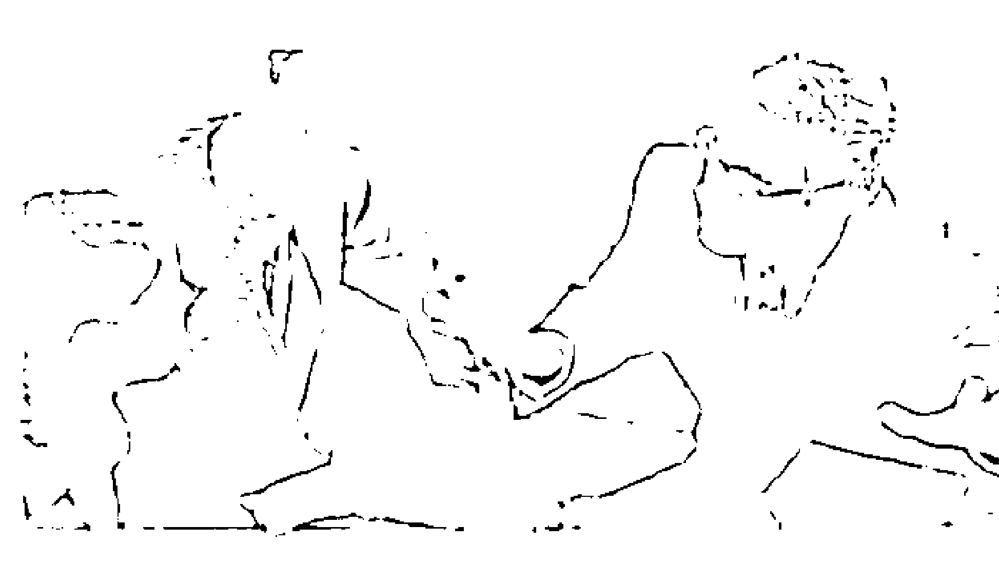

### 内容简介：

《LQ——职场人必懂的“大圈小圈”定位法则》：一个人的成功，99%来自精准的自我定位，只有1%来自运气。

人生是一场比赛，但开保时捷的，不一定比骑脚踏车的人，先到终点。没有精准定位，搞不清正确方向，马力再强，速度再快，也是白忙一场……人生成败取决于布局，没有LQ(定位商数)，就算你IQ或EQ再高，顶多也是别人的棋子；或者，是一台——没有方向盘的保时捷。

《LQ——职场人必懂的“大圈小圈”定位法则》论述了LQ定位商数的理论。LQ高的人不会自大。自大的人多半是因为缺乏LQ，完全不了解自己，才会不知道人外有人，天外有天。作者列举了“大圈小圈”定位法则，帮助读者认清自己所处的局势。

### 魅力失分

水瓶座的人一向是追求独特的，在形象礼仪上当然也不例外。

## 本色就是最美

金铭

20 世纪 80 年代，有位名叫安德森的模特公司经纪人，看中了一位身穿廉价产品不拘小节不施脂粉的大一女生。这位女生来自美国伊利诺州一个蓝领家庭，唇边长了一颗触目惊心的大黑痣。她从没看过时装杂志，没化过妆，要与她谈论时尚等话题，好比是牵牛上树。

每年夏天，她就跟随朋友一起，在德卡柏的玉米地里剥玉米穗，以赚取来年的学费。安德森偏偏要将这位还带着田野玉米气息的女生介绍给经纪公司，结果遭到一次次的拒绝。有的说她粗野，有的说她恶煞，恶评纷纭杂沓，归根结底是那颗唇边的大黑痣。安德森却下了决心，要把女生及黑痣捆绑着推销出去。他给女生做了一张合成照片，小心翼翼地把大黑痣隐藏在阴影里。然后拿着这张照片给客户看，客户果然满意，马上要见真人。真人一来，客户就发现“货不对版”，客户当即指着女生的黑痣说：“你给我把这颗痣拿下来。”

激光除痣其实很简单，无痛且省时。女生却说：“去你的，我就是不拿。”安德森有种奇怪的预感，他坚定不移地对女生说：“你千万不要摘下这颗痣，将来你出名了，全世界就靠着这颗痣来识别你。”

果然这女生几年后红极一时，日入3万美金，成为天后级人物，她就是名模辛迪·克劳馥。她的长相被誉为“超凡入圣”，她的嘴唇被称作芳唇（从前或许有人叫过驴嘴呢），芳唇边赫然入目的是那颗今天被视为性感象征的桀骜不驯的大黑痣。

有一天，媒体竟然盛赞辛迪有前瞻性眼光。辛迪回顾从前，一次次倒抽凉气，成名路上多艰辛，幸好遇上“保痣人士”安德森。如果她摘了那颗痣，就是一个通俗的美人，顶多拍几次廉价的广告，就淹没在繁花似锦的美女阵营里面。暑期到来，可能还要站在玉米地里继续剥玉米穗，与虫子、蜗牛为伍，以赚取来年的学费。

## 魅力提示：

刻意的去追求独特只会适得其反，自然的就是最美的，坚守自己的本色，你就能在不经意间为这个世界增添一抹独特的风景。

## 相衬的形象

裴玲

艾斯蒂·劳达是世界化妆品王国中的皇后，她拥有几十亿美元的化妆品王国。但艾斯蒂出身贫穷。最初，她以推销叔叔制作的护肤膏起家。为了使自己的产品能够多销售一些，她不得不走街串巷。

后来，她决定将产品定位于高档次上。可是，起初她的推销却没有什么效果。后来，她终于忍不住问一个拒绝购买产品的客户：“请问，您为什么拒绝购买我的产品呢？是我的推销技巧有什么问题吗？”

那位女士道：“不是技巧有问题，推销要什么技巧？是你的形象不好。你根本就是一个低档次的人，让我怎么相信你的产品就是高档次的？”这位女士的话明显带有对艾斯蒂·劳达轻视甚至污辱的成分，但聪明的劳达却兴奋异常，认为自己找到了问题的关键：那就是产品的高档次，首先在于推销人，也就是自己的高档次。

她想，换成自己也会是这样，推销人员本身的档次不高，自己也确实会怀疑产品的质量和品味。于是，她决心对自己的形象进行精心改造、包装。她模仿富贵名门和上层妇女，像她们一样穿着打扮，模仿她们的举止。另外，她注意培养自己的自信，让整个人看上去魅力四射。慢慢地，越来越多的人买下了她推销的产品。

从此，她一发不可收拾，直至建立化妆品王国……

## 魅力提示：

最好的衣着是穿适合你的服装，而不是一味追求与众不同。

## 与众不同的老鼠

白山

老鼠群和黄鼠狼群素来关系不好，经常为了一些事情大动干戈。但是，每一次老鼠们都被打得落花流水，落荒而逃，躲回到洞里半天不敢出来。老鼠们对这件事情尤为懊恼，它们在一起总结经验，最后得出一个结论——因为没有一个领导群体的将帅，所以老鼠部队屡次失败。

后来，老鼠们举手表决，选举了几只有很高威望的老鼠做将帅。为了区分将帅和一般老鼠的身份，老鼠们提议将帅应该与众不同。

“怎样才能让自己与众不同呢？”将帅们想来想去，最后一致认为在自己头上绑上角是最简单也是最好的办法。于是老鼠们齐心协力制作了几个非常特别的角，并想方设法绑在了将帅们的头上。

不久，战事又起，可是有了戴着角的将帅的老鼠群再次被打得一塌糊涂。

老鼠们四处逃窜，都想保住自己的一条小命。别的老鼠很容易地逃进了洞里，而那些将帅因头上有角却怎么也钻不回洞里去了，很快就被黄鼠狼吃掉了。

## 魅力提示：

与众不同的人往往是首当其冲的受害者，如果真的要出彩，无须追求与众不同，只要做得比其他人好一点就足够了。

/魅力星座智慧书之

## 失败的面试

佚名

王女士头脑聪慧，相貌秀美，是一家广告公司的卓越人才。干了两年的广告策划，王女士经验、能力更是大增，于是开始觉得公司的待遇、环境都不太能满足自己的要求了。她认为自己这样有能力有品位的人就该有更高的追求，更好的发展。于是就辞了原来的工作。

很快就有几家大的广告公司通知王女士面试。王女士也欣然准备前往。但这次找工作之前王女士有些犹豫，心想自己以前土里土气的，根本就显不出自己的品位，这次找工作一定要穿戴起来，大力展示自己的品位。王女士向往的是白领、金领，于是就提前到服装店挑选能展示自己品位的服装，经过一天的精挑细拣，王女士终于为自己选好了两身奇特的服装。以王女士看来，别人经常穿的普通款式的衣服太陈旧了，没有品位，自己穿起来会显得很俗套。有品位的衣服，穿起来既奇特新颖，又能显得年轻漂亮。

经过一番穿戴打扮，王女士信心十足地去面试了。第一家面试官是位中年女士，王女士一进门，就引起了面试官的注意。面试官上下打量一番这穿着奇特的姑娘，上衣一只袖子、半截领子，中间没系腰带还露着肚脐，下身裤子不像裤子，裙子不像裙子，上衣颜色黑白相间，下身裤子杂色刺眼。面试官还是头一次在面试场上见到这样的着装。虽然所应聘职位对服装要求不严格，但王女士这样的奇装异服真令人不敢恭维。

面试官表面上还是热情地与王女士进行了面谈。结果让王女士回去等通知。王女士很纳闷，自己有经验、有能力，为什么就没通过面试呢，觉得一定是那个面试官不识人才吧。于是就到别的公司应聘了，王女士一连去了三家，结果都一样被拒绝了，弄得王女士很是气愤。她疲惫不堪地回到家，王女士的母亲看出了女儿的过激之举，就劝王女士要清淡、朴素着装，以免别人看着奇装异服不舒服。王女士也有所察觉，觉得每次面试官看自己的眼神都怪怪的。她决定听母亲的，换为朴素、典雅的服饰。结果第四次去面试，很顺利地就被录用了。

王女士折腾了一圈儿，还是回到了朴素典雅。

## 魅力提示：

特立独行不代表就有品味，凡事都要结合自身情况而定，适合自己的才是最好的。

## 智慧书之

书名：晓梅说礼仪
作者：张晓梅 著
出版社：中国青年出版社
出版时间：2008-1-1
印刷时间：2008-3-1
开本：16开
ISBN：9787500679615
包装：平装

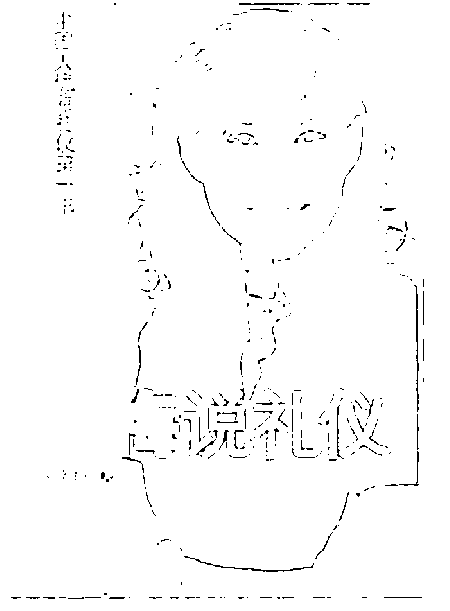

### 内容简介：

打动人心的是细节，而细节就体现在你的一举手一投足中，良好的礼仪修养，不仅是对别人的尊重，也是对自己的尊重和自信，让自己成为一位温雅而有魅力的人越来越成为现代社会的人们所追求的修养境界。本书中介绍了包括社交礼仪、商务礼仪、餐饮礼仪、生活礼仪、出国旅行礼仪在内的诸多礼仪细节，这些都是人们在生活和工作中经常遇到的情境，紧贴生活实际，详细而实用。在书中张晓梅女士亲自出镜，为读者演示正确的礼仪举止，不仅生动直观，更在赏心悦目中使这些礼仪规则潜移默化为读者自己的礼仪习惯。