# 魅力星座之白羊座

## 乐观而冲动的白羊

开朗乐观，豁达直率，善打抱不平，具有正义感，遇到看不惯的事，很少回避，心中之言不吐不快，有时不免得罪人。认准的事，多会不顾一切做下去，有时可能会过犹不及，顾此失彼，稍走点弯路。事业心较强，亦不免有点野心。喜欢出人头地和别人的恭维，分内的事不愿让别人插手，自己会做得更好。

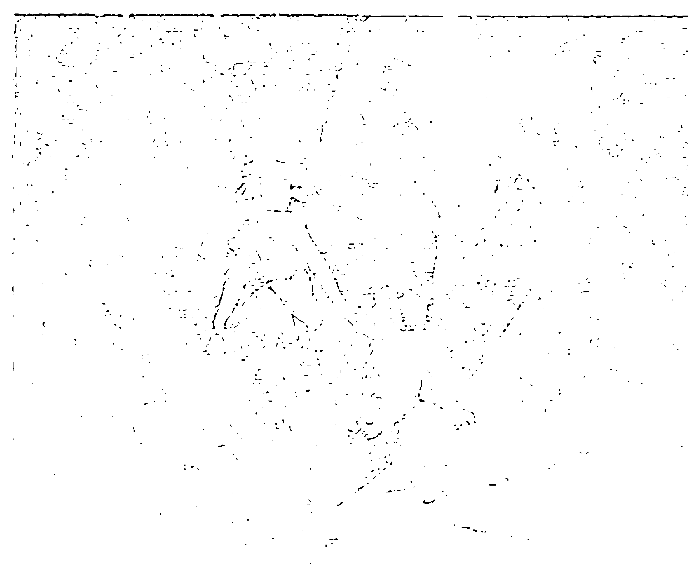

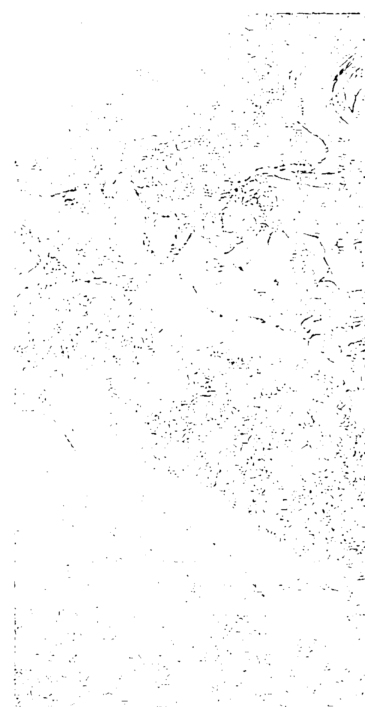

健康：才思敏捷，有个聪明的脑袋。因有好口福，年轻时便有发胖的趋势，害得你左右为难，不知是饱口福好，还是保持健美的体型好。要注意防止头部的疾病，用脑不要过度，保证睡眠时间，如出现头晕等症状，不妨查查脑血管有无问题。

事业：爱走两个极端，或中小学学习出人头地，总受教师夸奖，但到大学却像提前冲刺疲劳过度，成绩一般。或是中学成绩平平，不显山显水，到高中后显露才华，好似换了一个人。

婚姻：多数把婚姻看得比较重，相信有个爱的小巢是事业成功的保证。看似家中事无巨细均由妻子做主，但真遇大事，妻子还是请示丈夫决断。时常会有小小的婚姻危机，但风波过去，感情会更牢不可破。

强、好妒、专制、懒散、没耐性……冲动、好战、死要面子、自大狂、好奇心太

**职业：** 具有主动性、参与性，多具备领导才能。如上级慧眼识珠，安排你在适合的岗位上，会很快崭露头角。如在一个单位长久未受器重，可能会调动工作。喜欢去适应新的工作环境，愿在新的职业领域发展才干。

**经济：** 由于善于把握时机，步步都踩到点上，经济状况相当不错。多数属于小康人家，既少有暴富者，也不常见拮据者。多数靠勤俭持家，过上相当不错的生活，生活的期望会较快实现。

**事业：** 由于血型和性格的原因，多数知识分子具有较强的进取心和事业心，不甘居人后，内心里给自己定下各式各样的奋斗目标。为了实现心中的目标，会采取各种手段。一般在中年时就事业有成，如人过中年，晚年极少有辉煌的。

**白羊座母亲：** 与孩子关系密切，不论孩子做错什么事，都可以原谅他，前提是他一定要改正错误。

**白羊座父亲：** 对孩子不太惯纵，也不十分严格，任其向自己喜好的方向发展。

**白羊座丈夫：** 多为能挣会花的一家之主，妻子要买什么东西都能满足，但常不容忍妻子的唠叨。

**白羊座妻子：** 对烹调比对收拾家更有兴趣，喜欢在客人面前露一手。认为家里所有东西都是夫妻共有的。

**白羊座孩子：** 活泼好动，有运动方面的才能。在孩提时好充当首领角色，敢于与别的孩子抗争。

### Magic

名人的榜样

### 查理·卓别林

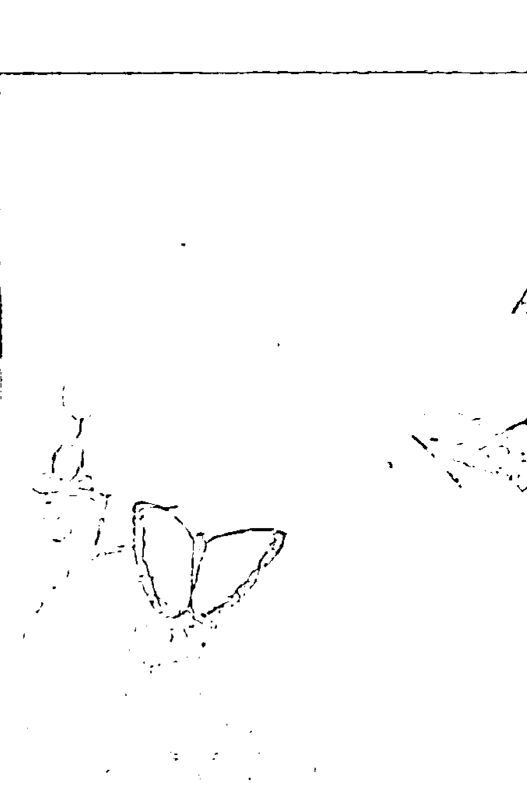

| 项目 | 内容 |
| :--- | :--- |
| 英文名 | Charlie Chaplin |
| 中文名 | 查理·卓别林 |
| 出生日期 | 1889年4月16日 |
| 星座 | 白羊座 |
| 出生地 | 伦敦 |
| 代表作品 | 《摩登时代》《大独裁者》《城市之光》等 |
| 星象资料 | 太阳白羊座、水星白羊座、金星金牛座、火星金牛座 |

### 用‘悲伤的喜剧’诠释真实的世界

1889年4月16日，卓别林生于英国伦敦一个贫苦的喜剧演员家庭，他的童年生活是极端困苦的。5岁时就登台表演，为了谋生，12岁时，他就进了一个滑稽剧团当演员。

### 5岁的卓别林幽默救场

1894年的一天，在伦敦一个俱乐部中，有一家歌舞剧团正在演出。台下坐的大半是粗鲁的士兵。台上的女演员正在唱着一首流行歌曲《杰克·琼斯》。

突然，优美的歌声中断了。女演员那清亮的嗓子像生锈的机器一样卡了壳，发出一种怪异沙哑的声音。她不得不轻声唱起来，声音小得像在说悄悄话。

台下的士兵们哄堂大笑，有的憋着嗓子发出尖叫声，有的竟学着猫儿怪叫。噪声越来越大，女演员不得不退场，台下更喧哗了。

就在这混乱之时，观众们看到一个最多只有5岁的小孩子从幕后闪了出来。只见他摇摇晃晃地走到台中央，大大方方地开口将刚才那首歌唱了下去。

这稚嫩却有节奏的童音一响起，士兵们立刻安静下来。歌词刚唱到一半儿，便有人开始往台上扔便士，一枚枚钱币滚到小歌童的脚下。

突然，小歌童停下来不唱了，观众们愣住了，不知这小孩儿要干什么。

> > “先生们请等一下，我把这些便士捡起来再为大家继续唱。”孩子一本正经地说。

观众们觉得这孩子更可爱了，不禁鼓起掌来。这时，剧团的一位工作人员赶快出来，笑着帮孩子捡起散落在台面上的便士。

> > 孩子却着急起来：“先生，您可不能捡着归自己呀，这些都是给我的啊！”

他急巴巴地紧跟在工作人员的屁股后面，直到看着他把钱交给了刚才那位女演员后，才又心满意足地回到台前，接着唱起歌来。

观众们被这小顽童的举动逗乐了，都笑得前仰后合，又有雨点般的便士在欢笑声中飞向孩童。直到演唱结束，女演员带着孩童出来谢幕，那掌声还不曾停止。

这5岁的孩童便是我们的主人公查理·卓别林，而那位女演员便是卓别林的妈妈。

### 童年卓别林

卓别林的生活环境原本不错。虽然一岁时，妈妈因为做演员的爸爸嗜酒如命，同他离婚，但是妈妈也是喜剧演员，每周也有 25 英镑的收入。小卓别林并不愁吃穿。

年轻漂亮的妈妈经常把小卓别林和哥哥打扮得漂漂亮亮，自己则撑起一把小花伞，牵着他们到河边散步。小卓别林穿一身蓝色天鹅绒外套，戴一副蓝色小手套，手举着一只大大的气球，走在街上，可神气了。那段时间是小卓别林在童年阶段最快乐最开心的日子。

然而，好景不长。爸爸因为酗酒而被老板开除，他便不能每月准时支付小卓别林的抚养费。而妈妈的嗓子又突然坏了，有时在台上，歌刚唱一半，嗓音就突然变得刺耳难听，搞得剧团无法向观众们交代。刚才的一幕便是这样。不过，幸好小卓别林平时在台下经常模仿妈妈表演，那简直是惟妙惟肖。这次，妈妈因不放心将他一人留在旅馆，把他带到了俱乐部，没想到却正好救了妈妈的场。这是 5 岁的卓别林第一次登台，就是它拉开了卓别林“舞台生涯”的第一幕，但却是妈妈的最后一次。

### 青年卓别林

> > “妈妈的嗓音一直不能恢复，家里的钱一点点儿花完了。妈妈便开始在家里做活。她一刻不停地蹬着缝纫机，然后把活计带到城里去。每缝一打上衣的衬里可以获得一个便士的报酬。她挣的钱勉强够我们糊口，这样怎么能对付得了房租呢？于是，我们不止一次地把我们的两个床垫，三张带有稻草衬垫的椅子和几只装着破旧衣服的空瘪箱子装上一辆大车，出去找另外一个安身的地方……”卓别林后来回顾起当时的生活时，曾这么说道。

### 小人物让你笑着流泪

卓别林在 1912 年随他当时所在的剧团到美国巡回演出到达纽约时，被美国喜剧电影之父赛纳特一眼看中，同他签订了去好莱坞的合同。他到了好莱坞赛纳特的启斯东公司后，拍摄的第一部影片《谋生》并没有给观众任何有关流浪汉即将出现的启示。

在拍摄第二部影片时，公司通知他洛杉矶正在举行一场汽车比赛，要他设法搞一身滑稽打扮，扮演一个在现场拍摄影片的摄影师。接到通知的卓别林迅速冲到化妆间，随手抓过一位以“胖哥”闻名的丑角的肥大的裤子和他的假发假须。破皮鞋是在化妆间的角落里捡到的，尺寸也明显过大。礼帽、手杖和过于窄小的上衣也都是那天上午随手捡拾的。在拍摄的过程中，卓别林想起了伦敦街头一个老摊贩横着走路的滑稽步伐，本能地借用了过来。这一切都完全不是出于事先的精心设计，而应当说是偶然的巧合，然而却在不知不觉中创造了不朽的流浪汉形象。

在启斯东公司，卓别林大约拍了 5 部笑片后，觉得这些笑片不能表现他对幽默的理解，便要求自编自导自演一部笑片。这部影片名叫《遇雨》，影片上映后，挺招人笑而且挺卖座。以后卓别林便自导自编自演自己的所有笑片。从此，影片上只要出现启斯东公司的广告，观众便一阵骚动和兴奋，卓别林一在影片上出现，观众就发出欢畅的笑声。

合同期满后，卓别林又去过爱塞耐公司、纽约互助公司和第一国家电影公司。和第一国家电影公司签订合同时，卓别林 29 岁，已是一个百万富翁。

在这里，卓别林拍摄了轰动全球的《狗的生涯》《从军记》《寻子遇仙记》。其中，《寻子遇仙记》这部影片被评为一流的艺术品。这时的卓别林已红遍美国，而且整个世界都在为他发狂。

在拍片过程中，卓别林开始发现了他偶然创造的流浪汉形象的深刻意义。离开启斯东公司后，流浪汉形象不再是单纯地挨打出丑，而是越来越表现出深沉的感情，越来越具有现实生活中无处不有的“小人物”的共同的悲剧色彩。在流浪汉里，观众发现，自己的笑声几次都突然被泪水噎住。

### “人生主要是由矛盾和痛苦组成的”

卓别林从1919年开始自行集资建厂，成了好莱坞第一个真正独立制片的艺术家。从20年代到40年代，卓别林拍出他一生中最杰出的作品《淘金记》《城市之光》《摩登时代》《大独裁者》。

人们这样评论卓别林的影片：“既让人笑得浑身颤抖，又忍不住泪水直往上涌。”卓别林影片的最大创新，就是喜剧中交融着悲剧的成分，这种笑中带泪的艺术以其撼人的力量带给观众别样的审美感受。这种笑中带泪的效果的产生，来自天才喜剧大师对人生和幽默的理解。他说：“人生主要是由矛盾和痛苦组成的。”

他的影片最突出的贡献是他塑造的流浪汉形象夏尔洛，这个人物走入世界的每一个角落，成为不朽的艺术经典。这个几乎贯穿了他所有影片的小人物，在亿万人们心中已合成一个代表某种具体概念、观念和理念的形象。通过这个形象，这位艺术大师不仅揭示了自己的内心世界，而且揭示了这个世界的内心。

> 法国电影史学家、诗人阿拉贡说：“他的影片曾经是我们这一世纪的光明，是整个一个世界，也是我们时代的历史。”

卓别林一生结过许多次婚，另外还有许多的女人，但卓别林在自己的回忆中都将她们淡化了，因为他觉得她们不胜烦恼。他所有的爱，都给了他最后的妻子乌娜。乌娜是诺贝尔奖金获得者，著名的剧作家尤金·奥尼尔的女儿。这位高贵的女人嫁给54岁的卓别林时只有18岁，他们一同生活了三十多年，她为卓别林生了8个儿女。卓别林在乌娜嫁给他后写道：“我们开始了天作之合的最幸福的生活，我一心只想将一切都毫无保留地献给她。”1977年12月24日卓别林在圣诞夜去世时，乌娜和他的8个儿女随侍在侧。

卓别林是继格里菲斯之后，无声电影领域最重要的电影制作人。通过对电影的清晰认识和不断的尝试，他为银屏喜剧设立的基本规则，现在还被人们遵循着。他的银屏形象将永远是人们最熟悉的角色之一。

> 美国电影史学家路易斯·约可布斯说：“谈论查理·卓别林也就是谈论电影。美国电影史上还没有一个人像查理·卓别林那样，成为全世界这样珍爱的人物。”

“当代最伟大的喜剧大师”、“杰出的电影艺术家”这样的头衔送给查理·卓别林是再适合不过的了。他一生创作了80多部影片，他是自己影片的编剧、总导演、主要演员，在多数场合又是剪辑导演，随着有声片的出现，他又成了自己影片的作曲家。这是电影史上从未有过的奇迹。这个几乎没有受过学校正规教育的人，以他超人的才华和渊博的知识，解决了自己在影片制作过程中遇到的一切难题，从而使自己的影片独树一帜，达到高度的统一、精美和完整。

### Magic

缺点改造

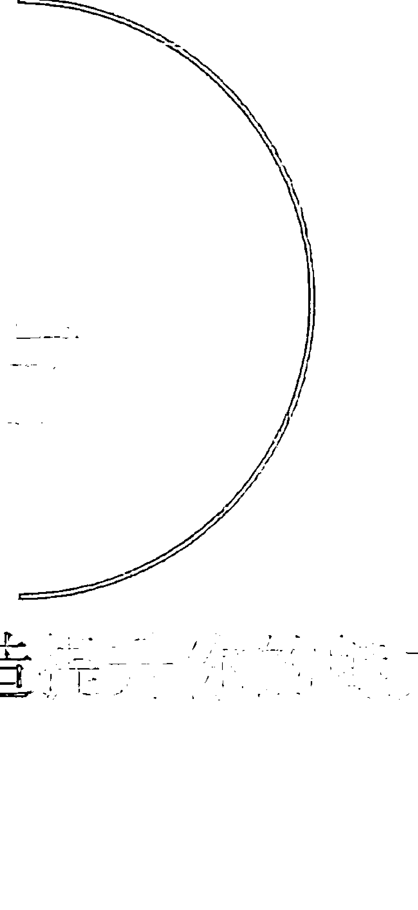

## 魅力失分

有着热血青年本质的白羊，只知闷着头往前冲，一下就因为头脑发热，思考不周而做错事，甚至连累别人！

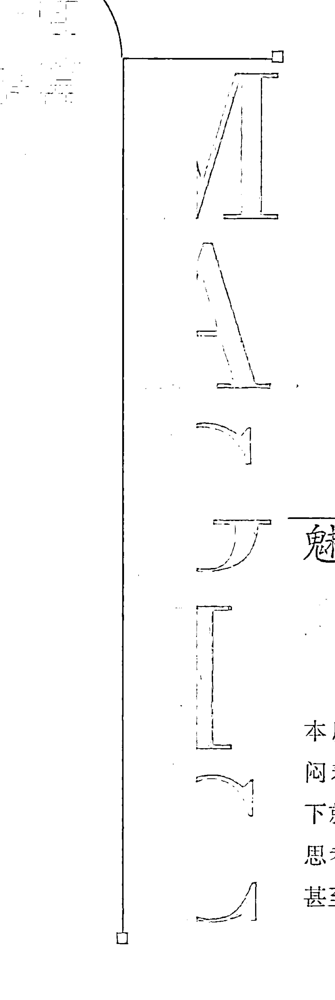

### 且慢下手

刘墉

大多数的同仁都很兴奋，因为单位里调来一位新主管，据说是个能人，专门被派来整顿业务。可是日子一天天过去，新主管却毫无作为，每天彬彬有礼进办公室，然后便躲在里面难得出门，那些本来紧张得要死的坏分子，现在反而更猖獗了。

> > “他哪里是个能人嘛！根本是个老好人，比以前的主管更容易唬！”

四个月过去，就在真正努力的员工对新主管感到失望时，新主管却发威了——坏分子一律开革，能人则获得晋升。下手之快，断事之准，与前四个月表现保守的他相比，简直像是全然换了个人。

年终聚餐时，新主管在酒过三巡之后致词：“相信大家对我新到任期间的表现，和后来的大刀阔斧，一定感到不解，现在听我说个故事，各位就明白了。我有位朋友，买了栋带着大院的房子，他一搬进去，就将那院子全面整顿，杂草树一律清除，改种自己新买的花卉。某日原先的屋主造访，进门大吃一惊的问：‘那最名贵的牡丹哪里去了？’我这位朋友才发现，他竟然把牡丹当草给铲了。”

后来他又买了一栋房子，虽然院子更是杂乱，他却是按兵不动，果然冬天以为是杂树的植物，春天里开了繁花；春天以为是野草的，夏天里成了锦簇；半年都没有动静的小树，秋天居然红了叶。直到暮秋，他才真正认清哪些是无用的植物，而大力铲除，并使所有珍贵的草木得以保存。”说到这儿，主管举起杯来：“让我敬在座的每一位，因为如果这办公室是个花园，你们就都是其间的珍木，珍木不可能一年到头开花结果，只有经过长期的观察才认得出啊！”

#### 魅力提示：

在你对别人有所决定和判断之前，请用心观察，认真思考，不要轻易盲目行事

### 梦想还有下一次

张世普

2006年5月中旬，夏普、罗丽莉和无腿的英格里斯，三位登山者先后向海拔8848米的世界最高点珠穆朗玛峰发起冲击。在8000米以上的高度，他们几乎同时遇到人生中最艰难的抉择。

罗丽莉5月11日出发，5月14日登上8680米的高峰。这时，罗丽莉双手被冻伤，体力也已不支。望着距离只有168米的最高点，经过痛苦的选择，她最终决定：下次再来一定把那剩下的168米走完。

另外一名登山者夏普不仅被冻伤，而且氧气瓶也快耗尽，但他依然继续向上攀登。寒冷、伤痛、登山器械残缺、氧气不足，夏普躺在了海拔8534米的一个岩石后面气息奄奄。随后无腿登山者英格里斯的登山分队从那里经过，经过激烈的讨论，最后他们离开夏普，继续登顶。不久，夏普在珠峰顶下约300米处死去，英格里斯则创造了奇迹，成为第一个借助假肢成功登上珠峰的人。

面对咫尺之遥的成功，狂热与冲动使夏普完全丧失实现梦想的可能。英格里斯放弃救助实现了梦想，8534米却从此成为他一生中再也无法逾越的道德高度。罗丽莉虽与世界之巅还有“一步之遥”，但作为一名普通女子，她已经站在大多数人一生无法站到的地方，并且她还有机会把剩下的168米走完。

梦想即将成真，喜悦冲淡伤痛，冲动淹没理智，悲剧最容易发生。人生之路有无数条，偏偏就有那么多登山者逞一时之勇，他们的失败大多不是准备不够充分，也不是意志力不够坚强，只不过是忽视了“还有下一次”这个简单的道理。

#### 魅力提示：

每个人都有自己的梦想，可对于大多数人来说并不是每个梦想都可以实现。很多时候，越接近成功我们越要告诫自己：千万不要冲动，不是每个梦想都可以实现，还有下一次。

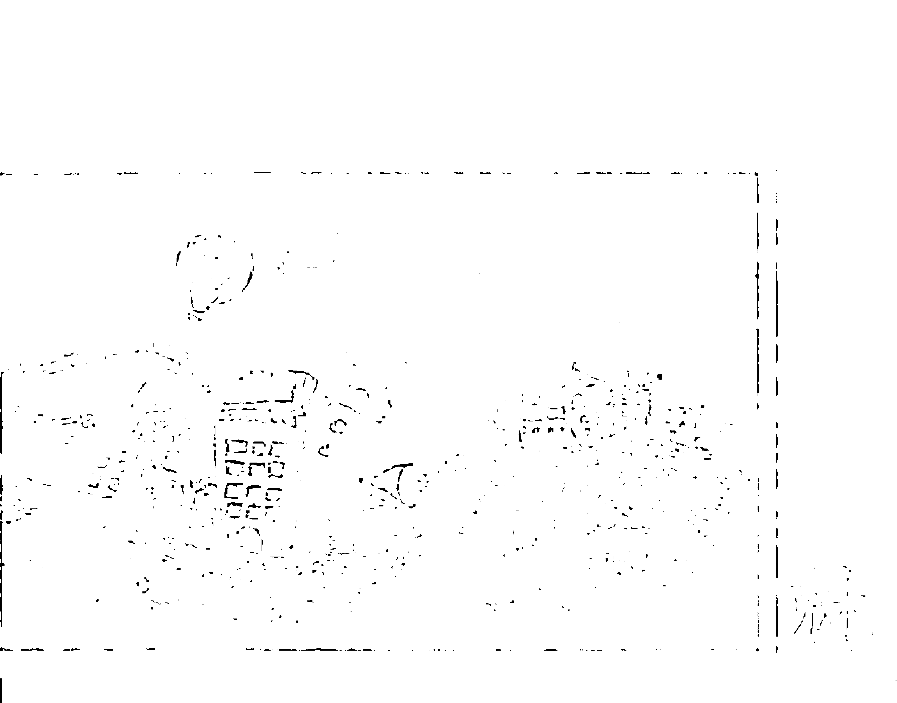

### 惊人的误会

佚名

早年在美国阿拉斯加这个地方，有一对年轻人结婚，婚后生育，他的太太因难产而死，遗下一孩子。
他忙生活，又忙于看家，因没有人帮忙看孩子，就训练一只狗，那狗聪明听话，能照顾小孩，咬着奶瓶喂奶给孩子喝，抚养孩子。
有一天，主人出门去了，叫它照顾孩子。
他到了别的乡村，因遇大雪，当日不能回来，第二天才赶回家，狗闻声立即出来迎接主人。他把房门打开一看，到处是血，抬头一望，床上也是血，孩子不见了，狗在身边，满口也是血。主人发现这种情形，以为狗性发作，把孩子吃掉了，大怒之下，拿起刀来向着狗头一劈，把狗杀死了。
之后，忽然听到孩子的声音，又见孩子从床下爬了出来，于是抱起孩子；虽然身上有血，但并未受伤。他很奇怪，不知究竟是怎么一回事，再看看狗身，腿上的肉没有了，旁边有一只狼，口里还咬着狗的肉；狗救了小主人，却被主人误杀了，这真是天下最令人惊奇的误会。

#### 魅力提示：
冲动之下，人往往会容易失去理智和耐心，缺乏思考，更不可能反省自己，以致做出追悔莫及的事情来。

### 国王的老鹰

佚名

有一天，国王到森林中去打猎，许多文官武将跟随其后，在他们身后还有一群带着猎犬的仆人，他们希望能够满载而归。

国王的手腕上站着一只强悍威武的老鹰，这只老鹰被训练出来专门打猎。只要国王一声令下，它就会飞向云端，向下四处寻找猎物。如果碰巧发现鹿或是兔子，它就会快速地扑上去，将其擒住。

这天，国王的运气并不好，他与大家走散了，天气又很热，国王觉得十分口渴。他希望能够看到清凉的泉水，但是，炎热的夏日早已将山溪烤干了，老鹰也在上空无奈地盘旋寻找。

终于，国王发现有一些水沿着一块岩石边缘滴流下来。他想再往上走一点儿路，一定有一道泉水，而现在一次就只有一滴水落下来。

国王从马背上跳了下来，从袋子里取出一个小银杯，将它拿去盛接那慢慢滴落下来的水珠。国王花了很长时间才将杯子装满。他实在太渴了，杯子几乎装满水了；他迫不及待地把嘴凑到杯边。就在这个时候，突然天空中传来呼呼的声音，接着他的杯子就被打翻了，水泼洒在地上，倏地就渗进缝隙了。国王抬头一看，原来是他养的老鹰。

国王捡起杯子，又继续接落下的水滴。这次，他没有等那么久，就在杯内的水才半满的时候，他就把杯子举到嘴边。但是，在杯子碰到他的嘴唇之前，那只老鹰又再一次扑下来，把杯子从他的手中打落。这下子，国王真生气了。

“如果你再来，我要把你的脖子砍断！”

然后，他又拿杯子盛水。但是，在他预备要喝水之前，老鹰又冲下来。愤怒的国王拔出剑刺中了它，可怜的老鹰倒在了血泊中，国王的杯子掉进了岩缝中。

国王只好继续向前走，他想找到水的源头。后来，他终于找到了一个积水的池塘，但是他也惊讶地发现，在水池里有一条死去的巨大的毒蛇。他顿时明白了。他哭喊道：

“我的老鹰救了我，它是我的朋友，而我竟然把它杀掉了。”

他又艰难地回去，找到老鹰的尸体，把它厚葬了，从此以后，当他再发怒时，就告诫自己：永远别在盛怒下做事。

#### 魅力提示：

遇事沉着冷静，任何时候都是有百益而无一害的。人在情绪极度激动，尤其是愤怒的时候做出来的决定往往不太理智。记住，不要在冲动下做任何事情。

+   - 书名：易冲动的人易吃亏
- 作者：萧胜萍 编著
- 出版社：中国纺织出版社
- ISBN：9787506447829
- 装帧：平装
- 开本：16开
- 出版日期：2008-03-01

### 内容简介：

冲动的人，缺乏理智。当一个人冲动时，全部的注意力都集中在导致他冲动的这一件事情上，对于其他的诸如后果之类的问题根本就没有时间与空间去考虑。是的，“冲动是魔鬼”。无数个令人扼腕叹息的悲剧一再向众人诠释了这句话，包括我们，在自己的经历中也多少有些亲身体会。

没有人真的喜欢自己冲动，愿意自己冲动，热衷于自己冲动。容易冲动的人只是自我控制力太弱了而已。

理智不但是一种明智，更是一种胸怀，没有胸怀的人，总是缺少理智。而一个没有胸怀和缺少理智的人则难成大器。“所取者远，则必有所待；所就者大，则必有所忍。”古往今来，大抵如此。

理智还是一种权衡，权衡轻重缓急，扬长避短，让自己走向成功，而一个好冲动的人，却较少考虑自身条件，凭着一时的冲动去行动，到头来一事无成，枉费了精力和时间。

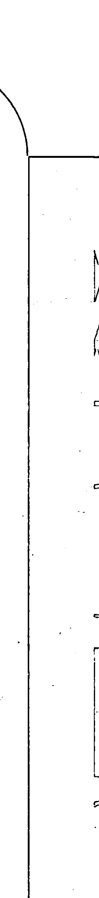

## 魅力失分

白羊最不喜欢遵守规则，是个屡屡犯规的人。四处碰壁但是到头来还死不悔改继续碰壁受伤，这和任性的脾气是分不开的。

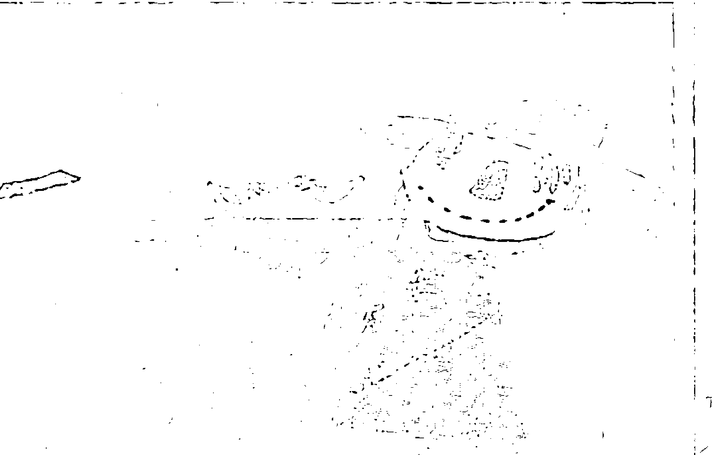

### 流淌的车灯之河

吴志翔

那是一个傍晚，我们乘车从墨尔本出发，往南端的菲律宾普岛赶。
菲律宾普岛是澳洲著名的企鹅岛，我们去那儿看企鹅归巢的美景。
从收音机里，我们知道岛上正在举办一场大规模的摩托车赛。听到这个消息后大家都显得忧心忡忡。因为根据估计，在我们到达企鹅岛之前约一个小时，这场大规模的摩托车赛就要结束。依照我们的经验，到时候观众散场，会有成千上万辆汽车往墨尔本方向开。因为这条路只有两车道，我们都担心会塞车，而真正可以看到企鹅归巢的时间只不过短短半小时，如果因塞车而耽误了时间，我们就会留下永久的遗憾。

担心的时刻终于来了。离企鹅岛还有 60 多公里时，对面蜂拥而来无尽的车流。其中有汽车，还有无数的摩托车。

此时此际，目力所及，从北往南开的车只有我们一辆，可是由南向北的却何止千辆！我们紧张地盯着所有从对面来的车辆。然而，出乎意料的是，我们双方的车子却依然行驶得非常顺畅。

我们终于开始注意到，对面驶来的所有车辆，没有一辆越过中线！

这是一个左右极不“平衡”的车道，一边是光光的道路，一边是密密麻麻的车子。然而没有一个“聪明人”试图去破坏这样的秩序，要知道这里是荒凉的澳洲最南端，没有警察，也没有监视器，有的只是车道中间的一道白线——看起来无任何约束力的白线。

这种“失衡”的图景在视觉上似乎丝毫没有美感可言，可是我却渐渐地受到了一种感动，我多么希望同样的场景尽早出现在中国的公路上！

夜幕降临，所有的车都打开了车灯，看着那来自对面的流动的灯光，我感觉到了一种无言的美。那是我平生见过的最美丽的景观之一，它给我留下的印象，甚至要比后来我们如愿看到的场景——那可爱的、憨态可掬的小企鹅从海浪里浮现出来，然后摇摇摆摆地踏上沙滩，一路追逐着回到沙丘巢穴还要深刻。

#### 魅力提示：
这是一种规则之美、制度之美，更深一层地来说，这是一种人性之美。

### 循规蹈矩的德国人

晨曦

最近读到一篇短文，是嘲笑循规蹈矩的德国人的：
中国的留德大学生见德国人做事刻板，不知变通，就存心捉弄他们一番。
大学生们在相邻的两个电话亭上分别标上了“男”“女”的字样，然后躲到暗处，看“死心眼”的德国人到底会怎么样做。
结果他们发现，所有到电话亭打电话的人，都像是看到厕所标志那样，毫无怨言地进入自己该进的那个亭子。
有一段时间，“女亭”闲置，“男亭”那边宁可排队也不往“女亭”这边运动。
我们的大学生惊讶极了，不晓得德国人何以“呆”到这分上。面对大学生的疑问，德国人平静地耸耸肩说：“规则嘛，不就是让人来遵守的吗？”

#### 魅力提示：
制度就是让人来遵守的！请大家牢记这一点！正是对规则制度的严格遵守，才能让人成功。

### 青蛙与老鼠

佚名

一只青蛙看着自己的老鼠邻居很不顺眼，总想找个机会教训教训它。
一天，青蛙见到老鼠，就劝它到水里玩。老鼠不敢，青蛙说有办法保证它的安全，用一根绳子把它们连在一起，老鼠终于同意一试。
下了水，青蛙大显神威，它时而游得飞快，时而潜到水底，把老鼠折腾得死去活来。老鼠最后被灌了一肚子水，泡胀了漂浮在水面上。
空中飞过的鹞子正在寻找食物，发现了漂浮的老鼠，就一把抓了起来，相连的绳子把青蛙也带了起来。吃掉老鼠后，意犹未尽的鹞子把嘴又伸向青蛙。
在被鹞子吃掉之前，青蛙后悔地说：没想到把自己也给害了。

#### 魅力提示：
这个世界是有规则的，当我们采取了不正当的手段去对付对手的时候，也许我们自己也已经踏入失败的门槛。

### 罚款

佚名

这是发生在英国的一件事情。

有一次我有急事要出去，但是妻子去锻炼身体了，并且没有带钥匙，于是我就开车出去找她，并送钥匙，才出去不远就看到妻子在往回走，于是我匆忙把车停在路边（发动机没有熄火），跑过去将钥匙递给她，随后开车离开，前后也就10来秒钟，之后我也就把这件事忘记了。

大概过了两三个星期，我收到一封罚款信，信上说我把车停在 Bus Stop（公交车站，这里小的公交车站往往只有一个牌子）附近，所以要罚196英镑。我当时就晕了，我没有印象自己曾把车停到 Bus Stop 附近，我仔细回忆了半天才想起这件事，于是我专门跑去看了一下我停车的地方，那里果然离一个 Bus Stop 不远，然后我又奇怪了，因为当时没有警察，也没有执法人员在场，他们是怎么知道的？

后来朋友告诉我，肯定是被什么人看到了，打电话给交通管理部门把你报了。

通过这件事，我真正体会到“人民的眼睛是雪亮的”这句话的含义。

#### 魅力提示：

其实在这个世界上，每个人随时随地都受到别人的监督，同时你也在监督着别人，所以不管做什么都最好多点自律。

## 魔力链接

书名：人生的游戏规则：希恩夫人的生存智慧
作者：[美国] 弗罗伦斯·S·希恩著 薛杰译
出版社：中国发展出版社
ISBN：780087761
装帧：平装
开本：21cm
出版日期：2004-11

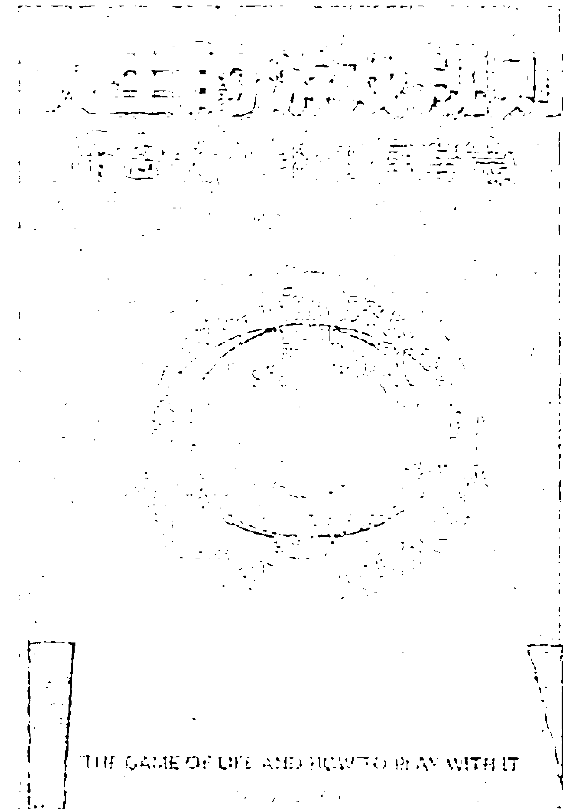

### 内容简介：

这是一本在美国经久不衰的经典畅销书。作为一位颇有影响的精神治疗大师，希恩夫人将自己生命的大部分时间花费在治疗人们心灵的创伤，阐述积极的态度与获取成功和幸福的关系，帮助人们实现自己的愿望上。希恩夫人利用《圣经》故事，让人们明白做人的道理和准则。她认为人生就是一种博弈，存在各种规则，我们只有遵行这些规则，才能获得幸福，找到通往成功之道。

【35】魅力星座智慧书之白羊座

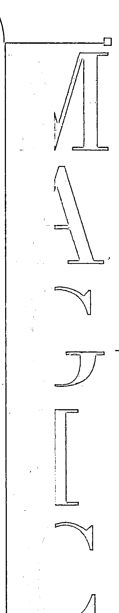

### 第一面 处事篇

## 魅力失分

### 主题

白羊多没主见，耳朵根儿软，自己做好坏分析的能力很差。

### 相信自己

云儿

有一位顶尖级的杂技高手，一次，他参加了一个极具挑战的演出。这次演出的主题是在两座山之间的悬崖上架一条钢丝，而他的表演节目是从钢丝的这边走到另一边。

演出就要开始了，整座山聚满了观众，当中有记者、主办单位、赞助商和看热闹的人群。这时，只见杂技高手走到悬在山上钢丝的一头，然后用眼睛注视着前方的目标，并伸开双臂，第一步、二步、三步，慢慢地杂技高手终于顺利地走了过去，这时，整座山响起了热烈的掌声和欢呼声。

“我要再表演一次，这次我要绑住我的双手走到另一边，你们相信我可” 以做到吗？”杂技高手对所有的人说。我们知道走钢丝靠的是双手的平衡，而他竟然要把双手绑上。但是，因为大家都想知道结果，所以都说：“我们相信你的，你是最棒的！”杂技高手真的用绳子绑住了双手，然后用同样的方式一步、两步终于又走了过去，“太棒了，太不可思议了！”所有的人都报以热烈的掌声。但没想到的是杂技高手又对所有的人说：“我再表演一次，这次我同样绑住双手然后把眼睛蒙上，你们相信我可以走过去吗？”所有的人都说：“我们相信你！你是最棒的！你一定可以做到的！”

杂技高手从身上拿出一块黑布蒙住了眼睛用脚慢慢地摸索到钢丝，然后一步一步地往前走，所有的人都屏住呼吸为他捏一把汗。终于，他走过去了！掌声雷动！“你真棒！你是最棒的！你是世界第一！”所有的人都在呐喊着。

表演好像还没有结束，只见杂技高手从人群中找到一个孩子，然后对所有的人说：“这是我的儿子，我要把他放到我的肩膀上，我同样还是绑住双手蒙住眼睛走到钢丝的另一边，你们相信我吗？”所有的人都说：“我们相信你！你是最棒的！你一定可以走过去的！”

“真的相信我吗？”杂技高手问道。“相信你！真的相信你！”所有的人都说。“我再问一次，你们真的相信我吗？”“相信！绝对相信你！你是最棒的！”所有的人都大声回答。“那好，既然你们都相信我，那我把我的儿子放下来，换上你们的孩子，有愿意的吗？”杂技高手说。

这时，整座山上的人鸦雀无声，再没有人敢说相信了。

在我们的现实工作中，许多人都会说：我相信我自己，我是最棒的！当我们在喊这些口号时，我们是否真的相信自己？我们会不会一出门后或遇到一点困难就忘掉刚才所喊的这句话呢？

#### 魅力提示：

只有自己真的相信，才能让别人相信你，只有自己感动了，才能感动别人。

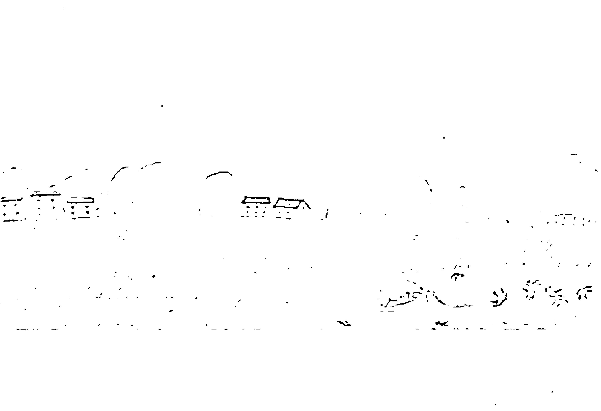

### 画家与观赏者

佚名

从前，有一位画家想画出一幅人人见了都喜欢的画。画毕，他拿到市场上去展出。画旁放了一支笔，并附上说明：每一位观赏者，如果认为此画有欠佳之笔，均可在画中做记号。晚上，画家取回了画，发现整个画面都涂满了记号——没有一笔一画不被指责。画家十分不快，对这次尝试深感失望。

画家决定换一种方法去试试。他又摹了同样的画拿到市场展出。可这一次，他要求每位观赏者将其最为欣赏的妙笔都标上记号。当画家再取回画时，他发现画面又涂遍了记号——一切曾被指责的笔画，如今却都换上了赞美的标记。

“哦！”画家不无感慨地说道，“我现在发现一个奥妙，那就是：我们不管干什么，只要使一部分人满意就够了。因为，在有些人看来是丑恶的东西，在另一些人眼里恰恰是美好的。”

#### 魅力提示：

一味听信于别人，便会丧失自己，人要有自己的主张和见解，这是走向成功的必要条件。

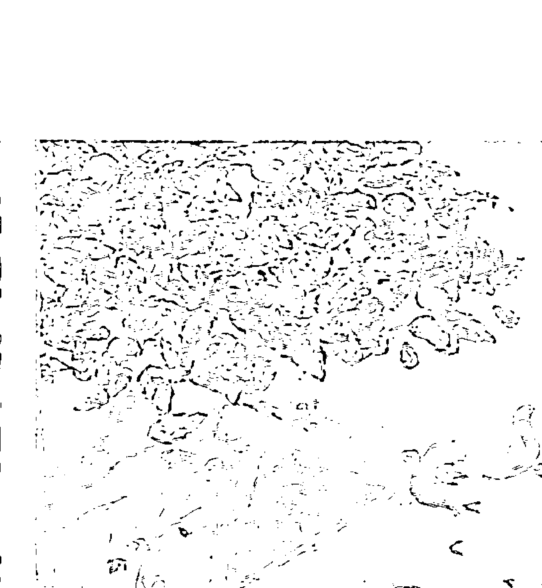

### 一只狼与一句话

佚名

一只狼出去找食物，找了半天都没有收获。偶然经过一户人家，听见房中孩子哭闹，接着传来一位老太婆的声音：
“别哭啦，再不听话，就把你扔出去喂狼。”
狼一听此言，心中大喜，便蹲在不远的地方等起来。太阳落山了，也没见老太婆把孩子扔出来。晚上，狼已经等得不耐烦了，转到房前想伺机而入，却又听老太婆说：
“快睡吧，别怕，狼来了，咱们就把它杀死煮了吃。”
狼听了，吓得一溜烟跑回老窝。同伴问它收获如何，它说：“别提了，老太婆说话不算数，害得我饿了一天，不过幸好后来我跑得快。”

#### 魅力提示：
别人信口开河，你就信以为真，全然不知许多时候人家只是随便说说而已。不要让别人的话改变了你的正常工作、生活。

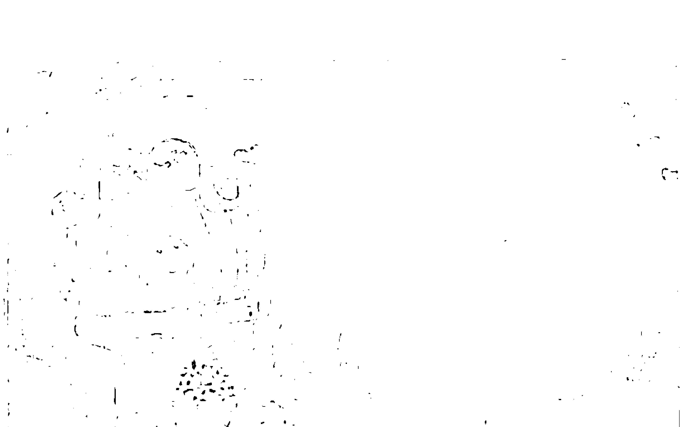

### 鹤的耳朵
张择端

一大清早，鹤就爬起来，拿起针线要给自己的白裙子上绣一朵花，以显出自己的妩媚动人。刚绣了几针，孔雀探过来问她：“鹤妹你绣的什么花呀？”

“我绣的是桃花，这样能显出我的娇媚。”鹤羞涩地说。

“咳，干吗要绣桃花哩？桃花是易落的花，不吉祥，还是绣朵月月红吧，又大方、又吉利！”

鹤听了孔雀姐姐的话觉得言之有理，便把绣好的金线拆了改绣月月红。正绣得入神时，只听锦鸡在耳边说道：“鹤姐，月月红花瓣太少了，显得有些单调，我看还是绣朵大牡丹吧，牡丹是富贵花呀，显得多么雍容华贵！”

鹤觉得锦鸡妹说得对，便又把绣好的月月红拆了，重新开始绣起牡丹来。

绣了一半，画眉飞过来，在头上惊叫道：“鹤嫂，你爱在水塘里栖歇，应该绣荷花才是，为什么要去绣牡丹呢？这跟你的习性太不协调了，荷花是多么清淡素雅，出污泥而不染，亭亭玉立的多美呀！”鹤听了，觉得也是，便把牡丹拆了改绣荷花……

每当鹤快绣好一朵花时，总有人提不同的建议。她绣了拆，拆了绣，直到现在白裙子上还是没有绣上任何的花朵。

#### 魅力提示：

每个人都要有自己的立场与决定，一旦决定了的事，就不要因为旁人的否定而轻易做出变化。在处理事情时，要立场坚定，不要犹豫不决，变来变去。

书名: 完全傻瓜指导系列: 坚持主见 增强信心
作者: [美] 杰夫·戴维森 (Davidson J.) 著 隋荣谊译
出版社: 辽宁教育出版社
ISBN: 753825514
装帧: 平装
开本: 32开
出版日期: 2002-03

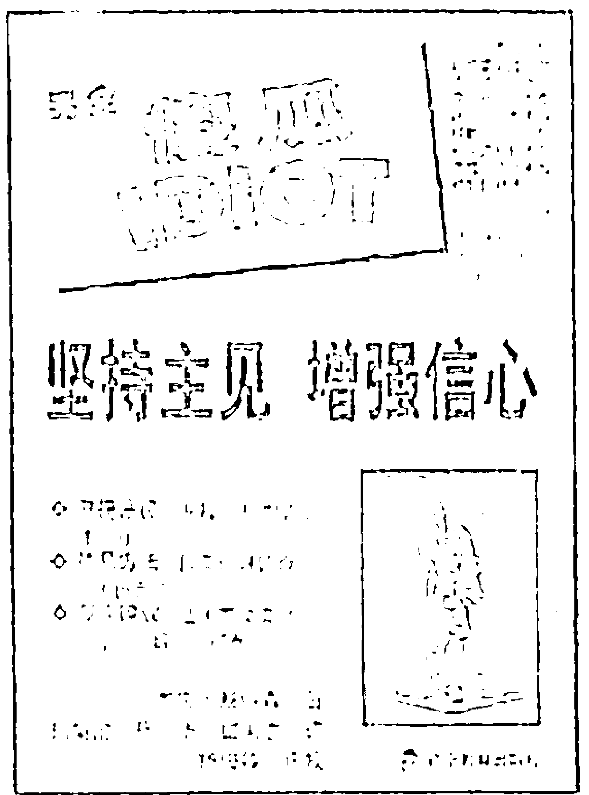

内容简介:
你当然不是傻瓜! 你工作很出色, 孩子教育得好, 甚至还参加社会活动, 然而, 当需要你在棘手的情况下坚持主见时, 你却恨不得钻到桌子底下躲起来。
要挺直腰板大声说话。《完全傻瓜指导系列: 坚持主见 增强信心》一书将帮你在任何人面前都能挺直腰板, 无论在你的孩子面前, 还是在你老板面前, 你可以和房东讲价, 在大会上发言, 甚至可以向岳父母说你不过去吃晚饭! 在本书中你还将学到:

+   - 该说 “不同意” 的时候不说 “同意”;
- 把握 “该说” 与 “不该说” 的机会;
- 如何在老板的面前理直气壮地表现自己。

### 白羊

魅力失分
白羊做事完全没有计划，东一榔头西一棒槌，毫无逻辑可言。

### 最有价值的十分钟

龙际礼

美国伯利恒钢铁公司的总裁查理斯·舒瓦普向效益专家艾维·利请教“如何更好地执行计划”。艾维·利递给舒瓦普一张空白纸，说：“请你在这张纸上写下你明天要做的6件最重要的事。” 舒瓦普用了5分钟写完。艾维·利接着说：“现在用数字标明每件事对于你和你公司的重要性的次序。”这又花了5分钟。艾维·利说：“好了，把这张纸放进口袋，明天早上第一件事就是把纸条拿出来，做第一项最重要的，不要看其他的，只看第一项。着手办第一件事，直至完成为止。然后用同样的方法对待第二项、第三项，直至你下班为止。如果只做完第一件事，那不要紧，你总是在做最重要的事！”艾维·利最后说：“每一天都要这样做——你刚才看见了，只用10分钟时间——你对这种方法的价值深信不疑之后，叫你公司的人也这样干。这个试验你爱做多久就做多久，然后给我寄支票来，你认为值多少就给我多少钱。”

一个月后，查理斯·舒瓦普给艾维·利寄去一张2.5万美元的支票，还有一封信。信上说，那是他一生中最有价值的一课。

5年之后，这个当年不为人知的小钢铁厂一跃而成为世界上最大的独立钢铁厂，人们普遍认为，艾维·利的方法功不可没。

#### 魅力提示：

人的能力毕竟有限，无法超越某些限度，如果能对准备工作尽量做到慎重研究、心中对事情的轻重缓急有数，虽说不一定能够成功，但至少可以将能力作更大的发挥。只有那些做事有秩序、有条理的人，才会成功。

### 天国的第一要律 佚名

一家大公司的总经理夫人史密斯太太出身于名门之后，有着良好的教育背景，在嫁给丈夫之前有一份相当体面的工作。当第三个孩子出生以后史密斯太太便辞去工作，专门在家里负责照顾丈夫的生活和三个孩子的身体健康和学习教育。

过去在外面工作时，繁忙的工作常常使史密斯太太感到筋疲力尽，家里的事情总是因为无暇顾及而一团糟。可是现在专门回到家里负责家庭事务时，她仍然感到每天都有一大堆没完没了的事情需要处理：一大堆的衣服需要清洗和熨烫，孩子们的玩具总是乱七八糟地被到处堆放，丈夫的文件和孩子们的课本也常常被混在一起……为了这些事情，史密斯太太的头都要大了，整个人每天都充满了紧张、焦虑和郁闷。

她知道自己现在的状态很不好，可是又不能停下来，因为一停下来家里的事情就会更加乱成一团。史密斯太太为此感到委屈，于是常常向丈夫和孩子们发出抱怨，当然她自己也知道这是非常不好的行为，虽然丈夫和孩子们并没有直截了当地反驳自己，但是她能感觉到自己似乎正在向一个令人讨厌的黄脸婆的方向发展。

一开始史密斯太太为自己的这一想法感到恐惧，可是后来她发现，如果自己继续维持目前的状态的话，那她真的离黄脸婆越来越近了。史密斯太太告诉自己必须马上着手改变这种状态，可是应该从哪里做起呢？她想起了丈夫公司的一位副总的太太，那就是罗文太太。实际上罗文太太各方面的条件并不比史密斯太太出色，但是每次遇到她都会感受到她那种从内而外散发出来的优雅，而且包括史密斯太太在内的许多人从来没有从她嘴里听到过对家庭事务的抱怨。

在一次受她和她丈夫的邀请之后，史密斯太太和丈夫去了罗文太太的家，史密斯太太发现罗文太太家的一切都那么井井有条，而罗文太太干起事来也总是那么从容自若，似乎自己过去所抱怨的忙乱和琐碎从来就不曾在她家出现过。

史密斯太太忍不住问罗文太太：“那些需要清洗和熨烫的衣服呢？”
“上午就处理完了。”罗文太太回答。
“那么，孩子们的书本、玩具还有你丈夫带回家需要处理的文件呢？”
“孩子们用得着的书本都在学校里，过去的书本在储物间专门的柜子里，丈夫的文件他已经在书房处理完了。”
“我想知道的是，究竟是什么使你总是这样有条不紊？说实话，我感到不可思议，你把该做的事情都做了，可是你看上去却一点都不忙乱。”史密斯太太又问道。

罗文太太回答：“家务事也许是琐碎的，不过，如果家庭主妇们都能按照华盛顿国会图书馆天花板上的几个醒目大字来做事的话，那么一切会变得十分有条理，这几个字是诗人波普写的，它们是：秩序是天国的第一要律。”

“秩序是天国的第一要律？”史密斯太太认真地领会这句话的含义。

很快，聪明的史密斯太太就知道自己过去忙得不可开交，可家中仍然总是一片狼藉的原因了。在她离开罗文太太家的三个星期之后，她的丈夫和孩子们都开始夸奖她的能干，而且她还可以腾出时间去健身和购物。

#### 魅力提示：

当桌子上、茶几上、床底下堆积了太多的文件和衣物时，你的生活肯定缺少了必要的秩序。当你养成凡事都有秩序的习惯之后，你就会发现过去所有的麻烦事都可以轻而易举地解决了，而且你本人也变得更有精神和风采

### 从头做起

陈东

有一个商人，在小镇上做了十几年的生意，到后来，他竟然失败了。当一位债主跑来向他要债的时候，这位可怜的商人正在思考他失败的原因。
商人问债主：“我为什么会失败呢？难道是我对顾客不热情、不客气吗？”
债主说：“也许事情并没有你想像的那么可怕，你不是还有许多资产吗？你完全可以再从头做起！”
“什么？再从头做起？”商人有些生气。
“是的，你应该把你目前经营的情况列在一张资产负债表上，好好清算一下，然后再从头做起。”债主好意劝道。
“你的意思是要我把所有的资产和负债项目详细核算一下，列出一张表格吗？是要把门面、地板、桌椅、橱柜、窗户都重新洗刷、油漆一下，重新开张吗？”商人有些纳闷。
“是的，你现在最需要的就是按你的计划去办事。”债主坚定地说道。
“事实上，这些事情我早在15年前就想做了，但是一直没有去做。也许你说的是对的。”商人喃喃自语道。后来，他确实按债主的主意去做了，在晚年的时候，他的生意成功了！

#### 魅力提示：

做事没有计划、没有条理的人，无论做什么都不可能成功。一个在商界颇有名气的经纪人把“做事没有条理”列为许多公司失败的一个重要原因。

### 如何吃大雁

佚名

有个人看见天空有一只大雁在飞，于是拉着弓说：“如果射下来，就煮着吃。” 一旁的弟弟听了，说：“这怎么行？鹅是煮的好吃，雁要烤的才好吃。” 两兄弟为了这个问题，吵得气喘如牛。最后，他们请村长来评理。 村长想了一下说：“干脆把大雁分成两半，一半煮，一半烤，问题不就解决了吗？” 两兄弟认为村长的话很有道理，立刻回到刚才大雁飞过的地方，打算把大雁射下来，谁知道，大雁早不知去向了。

机不可失，时不再来。机会来临之时，应当先将其抓在手中，再做相关的事情。 否则别的事情或准备功夫虽然做好了，而机会已然丧失，那将一切徒劳。须知， 某些事情，包括机遇，多是可遇而不可求的。

## 书名：条理与成功
- 作者：Holly Johnson
- 出版社：西安交通大学出版社
- ISBN：756052354
- 装帧：平装
- 开本：32开
- 出版日期：2007-03

### 内容简介：

《条理与成功》全面、系统地介绍了能够帮助您在学习、工作和生活中迅速提高条理性、保持高效率的技能。通过阅读本书，您将了解到条理化的目的、条理化的常用工具、工作中制约条理性的因素、个性与条理性的关系、优化的项目管理流程及多重优先排序的方法，等等。

### 第二面 做人篇

## 魅力失分

白羊无论岁数多大，都是好战的小朋友。非常喜欢就一点小事和别人争，这种时候，他脑子里根本没有主次，重要不重要，值得不值得这些考虑，争胜了就高兴，说不过别人甚至要翻脸。

### 海滩上的蓝甲蟹

刘东

海滩上蓝甲蟹分为两种，一种是较凶猛的，不知躲避危险，跟谁都敢开战；一种是温和的，不善抵抗，遇有敌人，便翻过身子，四脚朝天，任你怎么叼它，踩它，它都不理不动，一味装死。

经过千百年的演变，出现了一种有趣的现象，强悍凶猛的蓝甲蟹越来越少，成为了濒危动物。而较弱的蓝甲蟹，反而繁衍昌盛，遍布世界许多海滩。

动物学家研究发现，强悍的蓝甲蟹一是因为好斗，相互残杀中首先灭绝了一半，其次是因为强悍而不知躲避，被天敌吃掉一半。而软弱的，会装死的蓝甲蟹，则因为善于保护自己，反而繁衍了自身。

在澳洲，强悍的烈马，生命往往短暂，一般是被杀掉吃肉；而文弱的母马，往往却能被利用，驯服后在赛场上很有可能成为一匹夺冠的快马。快马得势，反而是建立在最初的懦弱上。

美国心理学家做过这样的调查，一名彪形大汉，在拥堵的马路上横穿而过，愿意给他让路的车辆不到50%，车祸率很高。而一个老弱病残者横穿马路，却是万人相让，大家还觉得自己是做了善事，车祸率为零。弱与强，在某种时候，收到的效果截然相反。弱，反而得了强势；强，反而处于弱势。

魅力提示：
放下架子，做个弱者，是人生在世心态平和的出发点。如今很多人都爱表现出强者的风范，往往碰得头破血流；而以弱者的姿态行事，人自然会谦虚谨慎，别人也会愿意接受，反而会使一切顺畅。

### 仁义胡同

佚名

古时候某人在朝为官，一日忽然接到老家书信。拆开一看，方知家中与邻人发生争执，起因是隔开两家院子的墙塌了，重新砌墙时都为多占些地皮而寸土不让。家人捎书来请他出面说话，以让邻人退缩。

不久，官员的家人收到了盼望已久的回信，里边却只有一首打油诗：

千里捎书为打墙，让他三尺又何妨。
万里长城今尚在，不见当年秦始皇。

家人乃明白了其中的道理，主动往后退让三尺，邻人也不甘落后，也往后让三尺，于是中间出现了一条六尺宽的胡同，可供村民行走。村人于是将胡同命名为“仁义胡同”。

#### 魅力提示：

你敬人一尺，人就会敬你一丈。为一些日常生活中鸡毛蒜皮的小事闹得面红耳赤，打得头破血流，实在是远不如心平气和，让人三分，彰显出自己不一般的气度来得划算。

### 跟踪老虎的猴子

王广田

猴子发现老虎向山上走去，心想，山上一定有鲜美的桃林，否则，老虎是不会离开家园，不辞辛苦地向山上爬的。

猴子抄近路，飞一般地抢在老虎的前面。翻过一座山后，果然有一片桃林出现在眼前。猴子怕老虎跟上来与它争吃桃子，赶快爬到树上，抓着树枝把桃子全摇落下来，然后转移到草丛中。

猴子躲藏在一旁的大树后面偷偷观察着老虎的行动。而老虎从这里经过时仍是一步一个脚印地走着。猴子的心中又暗暗嘀咕起来：前面一定有更美好的桃林，要不，老虎还会继续前行么？

猴子又抄近路，飞一般地抢在老虎前面，果然，又一片更大更好的桃林出现在它的眼前。它赶快摇落了树上的桃子，藏在草丛中……

老虎仍然一步一步地走着自己的路。在一座四周极开阔的山头上，老虎停了下来。它四下张望，山上山下所有动物的活动情况都尽收眼底。它选准了自己要猎取的目标、角度、时机，一股风暴般地扑了下去……

这时，躲在不远处偷看的猴子才明白：原来老虎所要寻找的并不是桃子。这时，猴子赶快顺着原路往回跑，可是，那藏在草丛中的一堆堆桃子已被蚂蚁、虫子糟蹋得不成样子，有的已被别的动物搬走了，有的已被雨水腐烂了。

**魅力提示：**
在生活中，追求中，实在不该把精力浪费在无谓的争斗中，使自己失去一些原本可能得到的成果。

### 好斗的蛇

佚名

蛇常年生活在原野里，不但要辛苦地寻找食物，还要忍受恶劣的自然环境。终于有一天，蛇决定搬到人的家里去住。因为人的家里夜晚温暖，白天凉快，而且人的家里还有它最喜欢的老鼠，用不着四处寻找食物，简直如天堂一般。

于是它立刻离开原野，搬到村里的铁匠家。

刚到这里，它对所有的东西都感到新奇，满怀着期待的心情，在铁匠家里四处游逛起来。

它来到铁匠的桌台上，发现那里躺卧着一条和自己长得很像的蛇，可是仔细一瞧，这条蛇既没有蜷成一团也不抬起脖子，只是随便地伸展着身子躺着。同时它发现还有一个长长的东西躺在旁边。

蛇没有想到会被别人抢先一步，大失所望，但是既然来到这里，它就不想再走回头路了，它决定把这条蛇赶出去，自己独占这个家。于是它蜷曲起来，然后高昂起镰刀形的脖子，露出尖利的牙齿，可是对方看了却没有任何反应，依然静静地躺在那里。于是，它抢上一步咬住了对方。

它一咬再咬，那家伙的鳞片发着乌黑的亮光，却硬得令它难以相信，再怎么张牙，对方都毫无反应。它那对重要的尖牙在一咬再咬的过程中逐渐毁损了，这也难怪，因为对方根本就不是蛇，而是一把蛇形的长条铁锉。

没过多久，这条可怜的蛇就把自己的牙齿磨掉了。

#### 魅力提示：

争强好斗的人，往往无中生有地为自己树立一些敌人，结果祸害的是自己。做一个与人为善、与邻为友的人，你的人生中将会有更多的朋友，而不是更多的敌人。

## 书名：成长比成功更重要
- 作者：凌志军
- 出版社：陕西师范大学出版社
- ISBN：756133606
- 包装：平装
- 开本：大32开
- 出版日期：2009-06

### 内容简介：

“成长”是一个关乎教育、人才乃至整个社会的话题。本书谈的正是一批最优秀的中国人成长的过程。他们并不拥有一个比我们更聪明的大脑，所经历的教育和我们的也没有什么不同。那么，他们凭什么变得和我们不一样了？
30个“微软小子”的成长故事证明一个道理：所有天才都是教育出来的。最重要的事情不是“打败别人”，而是“成为最好的你自己”。

## 魅力失分

得理不饶人
千万不要让白羊座站在了有理的一方，否则你会很难看，因为白羊就是一个得理不饶人的人。

### 禅师的胸襟

在仙崖禅师的禅院中，有一个贪玩的学僧，他耐不住寺院的寂寞，常常在傍晚时分偷偷溜到后院高墙下，架起一张高脚凳，翻墙出去玩耍。

仙崖禅师发现后，没有惊动任何人。一次，学僧又翻墙出去了，仙崖禅师随后将凳子搬到一边，自己坐在墙下，等那学僧归来。夜深人静，学僧兴尽归来，不知墙下的凳子已被搬走，从墙上翻下时，感觉到脚下的凳子变软了，下来一看，原来是踩在仙崖禅师肩上，顿时吓得魂飞魄散，跪在地上不敢言语。仙崖禅师把他拉起，并安慰道：“夜深露重，小心着凉，快回禅房休息吧！”

### Magic

学僧回房之后，心中忐忑不安，夜不能寐，担心禅师会当着所有学僧的面惩处自己。但事情一天天过去，禅师从来不提此事，更无他人知晓。学僧深感惭愧，从此再也没有私自外出，而是潜心修行，终成一代名僧。

如果你是禅师，你会怎样处置这件事？我想，一般人都会在众僧面前曝学僧的光，然后罚其面壁思过。

这样做的结果又会怎样呢？学僧被罚后，觉得非常丢脸，心中闷闷不乐，无心修行，最终只能成为一名庸僧，或卷起包袱走人，还俗去了。

但仙崖禅师处事不同凡人，他以自己宽阔的胸襟及大智大慧成就了一个名僧。

#### 魅力提示：

人非圣贤，孰能无过？对犯了错误的人以沉默的宽容态度待之，是无声胜有声的最好教育方式。宽容是一种良好的心理品质，宽容待人，如春风化雨、滋润万物，宽容是金，宽容的力量是无穷的！

### 撞车

博恩·崔西

退出政坛的丘吉尔，有一次骑着一辆自行车在路上闲逛。
这时，有一位女士也骑着自行车，从另一个方向急驶而来，由于没有刹住车，最后竟与丘吉尔相撞了。
“你这个糟老头没长眼睛吗？你到底会不会骑车？……”这位女士恶人先告状地破口大骂。
丘吉尔对那位女士的恶行恶状并不介意，只是不断地向对方道歉：“对不起！对不起！我还不太会骑车。看来你已经学会很久了，不是吗？”
这位女士的气立刻消了一半，再仔细一看，他竟然是伟大的首相，她感到羞愧难当，喃喃地说道：“不……不……您知道吗？我是半分钟之前才学会的……教我学会骑车的就是阁下您。”

魅力提示：
在人际交往中，得理要饶人，这样，你才会受到别人的尊敬。

### 心中的垃圾

喻红

我曾跟一堆垃圾展开了四天的心理战。

这堆垃圾，是一楼的一家人丢出来的。星期一上班时，我就看见了，可是我不去理会，心里觉得委屈。按单位卫生条例，住户的生活垃圾应该装袋，让清洁工上门回收。可这家人图自己方便，把垃圾扔到窗外了事。对这样的人，我从心里鄙视。我甚至想提一袋垃圾扔到那户人家里去看看他有什么反应。

星期二，我从那堆垃圾旁走过，想着：好吧，我就不扫，让你自己受罪。

星期三，我想如果他们还不扫，就让这堆垃圾保留到月底，让他们家肮脏一个月。对这样的人，就应该这样对付。

星期四，那堆垃圾还在，我已经没有了败兴的感觉。有些事情看多了，就会在心里慢慢冷淡。这天，我因为一件事情和女儿闹矛盾，内心生出许多感慨，换一个角度去看问题，发现我们都少了宽容的心态。与女儿握手言和后，我想到了那堆垃圾，想到自己每天见到这堆垃圾时心里的斗争、那种埋怨、那种愤恨、那种感叹，我们在抱怨别人的时候，却给自己种下了黑色的心情。

#### 魅力提示：

每个人心里都会有一堆垃圾，那些垃圾影响着我们的心情，何不宽容一点，学着及时把它扔到它该去的地方呢？

### 失礼，没有理由

吴铭

查尔斯的父亲早已过世，但是他和父亲之间的这个故事始终让他难以忘怀。

在查尔斯小的时候，他常在父亲开的杂货铺里帮忙。在那儿工作的都是成年人，父亲希望儿子能从他们身上学到一些有用的东西。

杂货铺里有一个不怎么受欢迎的人，伙计们背地里都叫他“堕落的老家伙”。大家都知道他对妻子不忠的事，从道德上来讲，他绝对不是一个值得尊敬的人。

查尔斯对这个人的人品也有所耳闻，所以与其他孩子一样，对他很不尊重。

孩子们称呼其他成年男性都是“某某先生”，而对于这个“老恶棍”，他们却只愿意称他为“乔”。
查尔斯的父亲有一天听到了儿子与“乔”的对话，于是便把儿子叫到了办公室里。
“儿子，”父亲说，“我曾经告诉过你，跟长辈说话一定要谦恭。但是刚才我听到你在大声叫‘乔’。”
儿子向父亲解释，为什么他要故意把“乔”和“史密斯先生”或“布朗先生”区别对待。
最后，儿子告诉父亲，“先生”一词是留给值得尊敬的人的，而那个家伙他不配！
“他配不配是他的事，而你这样对待他是你的问题，现在失礼的是你，年轻人！”父亲说，“对另一个人有看法不是你失礼的借口！”
这是他父亲给他上的一堂意义深远的课，这件事一直影响着查尔斯，即使在他成为一位非常成功的商人之后也是如此。

魅力提示：
生活中总有一些野蛮无理的斥责会刺痛我们。这时不要急于回击，应该先想想什么才是你应该做的。因为失礼时展示得更多的是我们自己，而不是我们所憎恨的人。同样，无礼地对待那些该轻蔑的人，也会降低我们在善良人眼中的地位。

书名: 宽容:学会遗忘·拥抱幸福
- 作者: 张茹
- 出版社: 湖北人民出版社
- ISBN: 721604493
- 包装: 平装
- 开本: 32开
- 出版日期: 2006-01

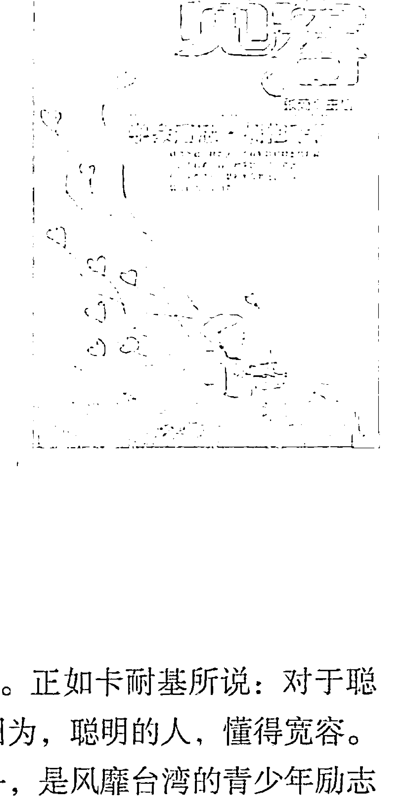

## 内容简介:

被执念遮住眼的人，生命的路会越走越阴霾。正如卡耐基所说：对于聪明的人来说，每一天都是一次新的生命的开始。因为，聪明的人，懂得宽容。本书为“青少年成才必备的六堂情商培训课”之一，是风靡台湾的青少年励志读本。阅读本书，让你我都拥有宽容和平和、达观和敦厚的心怀去生活处事，让每时每刻都充满喜悦。不论你是一个男子还是一个女人，待人温和宽大才配得上人的名称。一个真正英勇果断的人，决不会用拳头制止别人发言。善于或者能够忘记悲伤的人，他的每一天都将是快乐的。

## 魅力失分

任何事情只要稍微不顺心立刻就表现在脸上，白羊其实一直把自己当太阳看，什么都要围绕着自己转才可以。

### 我没什么重要的事

刘军

2008年，美国总统大选如火如荼地进行着，两大党派针锋相对，奥巴马和麦凯恩被推到了政治的风口浪尖。

当两个候选人为了谁更合适当总统争论得热火朝天时，有些人却在处心积虑地想找到让奥巴马颜面扫地的故事，想让他败在自己过去不良的行为上。

可是，奥巴马生活中谦虚谨慎，工作中公正称职，身边的人都喜欢他，他已经赢得了大量精英支持者，没有人站出来戳他的脊梁骨。于是他们就在奥巴马的一次违章停车上做起了文章，指责他不是个奉公守法的好市民，哪堪大任？

### 国之重负？

此时，获诺贝尔奖的贝克教授站出来说：

> “多数情形，人们犯规甚至犯法，并不是因为当事人很坏，是个坏蛋。相反，那完全是理性选择的结果。”

贝克教授用自己的权威成功为奥巴马解了围，这让奥巴马很意外，因为他完全不认识贝克教授。接着，贝克教授对媒体讲了个故事：一天奥巴马去纽约市主持一个会议，因为塞车眼看就要迟到了，和他一起到达停车场的是个老人，他们几乎同时看到了这个唯一的车位。

> “年轻人，你的工作更重要，你先停吧。”

奥巴马将车退了出来，做了个手势让老人停了进去，

> “我没有什么重要的事情，还是您先吧。”

这样为了开会不迟到，奥巴马就只有将车停在了外面并接受罚单。要说明的是，这个老人就是贝克教授。

如果奥巴马毫不谦虚地认为自己在做的事才是最重要的，去争夺这个车位，那他就永远也得不到贝克教授的声援。也许，在不经意中，点滴作为就已经成为你成功的基石。

#### 魅力提示：

> “满招损，谦受益”，人生路上，并非坦途，保持平和谦逊的态度，做一名谦谦君子会让你赢得好人缘，坐拥成功！

### 要记得低头

邢爱媛

被称为“美国之父”的富兰克林，一生功绩卓绝，这与他的一次拜访不无关系。

一次，富兰克林到一位前辈家拜访。一进门，他的头就狠狠地撞在了门框上，疼得他一边不住地用手揉搓，一边看着比正常标准低矮的门。出来迎接他的前辈看到他这副样子，笑笑说：“很痛吧？可是，这将是你今天来访我的最大收获。一个人要想平安无事地活在世上，就必须时时刻刻记住‘低头’。这也是我要教你的事情，不要忘记了。”

富兰克林把这次拜访看成最大的收获，牢牢记住了前辈的教导，并把它列入他一生的生活准则之中。谦虚谨慎是做人的美德。一个成熟的人，有成就的人，必备此种品格，宜低头、忍让，而非自高自大。这也许是许多成功人士之美德。

作为一个善于思考的哲学家，也有人问过苏格拉底：“你是天下最有学问的人，那么你说天与地之间的高度是多少？”苏格拉底毫不迟疑地说：“三尺！”那人不以为然：“我们每个人都有五尺高，天与地之间只有三尺，那不是戳破苍穹？”苏格拉底笑着说：“所以，凡是高度超过三尺的人，要长立于天地之间，就要懂得低头。”

大师们提到的“记住低头”和“懂得低头”之说，就是要记住不论你的资历、能力如何，在浩瀚的社会里，你只是一个小分子，无疑是渺小的。当我们把奋斗目标看得更高时，更要在人生舞台上唱低调，在生活中保持低姿态，把自己看轻些，把别人看重些。其实，我们的生活又何尝不是如此。自认怀才不遇的人，往往看不到别人的优秀；愤世嫉俗的人，往往看不到世界的美好；只有敢于低头并不断否定自己的人，才能够不断吸取教训，才会为别人的成功而欣喜，为自己善解人意而自得，才不会在挫折面前心安理得。

#### 魅力提示：

民间有句非常贴切的谚语：“低头的稻穗，昂头的稗子。”越成熟，越饱满的稻穗，头垂得越低。只有那些果实空空如也的稗子，才显得招摇，始终把头抬得更高。我们应当学会在适当的时候，保持适当的低姿态，这绝不是懦弱和畏缩，而是一种聪明的处世之道，是人生的大智慧、大境界。

### 狮子与野牛

伊索

一头饥饿的狮子发现了一群正在吃草的野牛，狮子塌腰沉背，借助青草的掩护，悄悄地向野牛靠近。

狮子离野牛越来越近，野牛们却丝毫没有感觉到危险，仍悠然地啃食着青草。

狮子进入了捕捉范围，跃身而起，箭一般射向野牛群。野牛惊慌奔逃。狮子紧追着一头还未长结实的野牛。野牛拼命奔逃着，每当狮子要追上时它便拐个弯，与狮子拉开一段距离。可没多久，野牛就体力不支了。狮子和野牛的距离在不断缩小。

这时，野牛刹住脚，猛转过身，锋利的犄角转向狮子。狮子也停下了脚步，左右试探着寻找进攻的机会，可野牛的犄角始终对着它。狮子和野牛对峙着，僵持着。

突然，野牛向前迈进了一步，狮子竟后退了一步，并仰面躺下，四肢朝天，宛如一只小猫，只是眯起的眼睛仍牢牢盯视着野牛。狮子的“懦弱”让野牛顿生豪气，用犄角猛扎着躺在地上的狮子……

这是中央电视台《人与自然》节目中的一组镜头。接下来，电视画面就被野牛硕大的躯体遮挡住了，足足有三秒钟，一动不动。这短短的三秒钟却分出了胜败，隔开了生死。

三秒钟后，威猛进攻的野牛硕壮的身体慢慢倒了下去，没有丝毫挣扎。狮子的血口利齿已紧咬在野牛的喉咙上。

弱肉强食是自然界的规律，无需感叹。但我总觉得：狮子不仅胜在利齿，还有狡黠；野牛不仅败在没有利齿，还有被蒙骗后的盲目自大。

#### 魅力提示：

> 勇敢是把利刃，可以斩落对手，自大也是一把利刃，却只能割伤自己。

### 大狮子和小甲虫

苏伯尔

有一天，一头大雄狮站在镜子里，前后左右地欣赏着自己。“看我这副威武样子，多么高贵！多么雄壮！”大雄狮自豪地说，“我一定要到外面走走，让那些忠实的臣民都瞧瞧，他们的领袖是一位多么气度非凡的兽中王！”

于是大雄狮走出皇宫。一路上没有谁敢大胆挡道。来不及躲避的都向他鞠躬行礼。“呵，这就对了。我理所当然地可以接受他们的敬意，我是他们的主人，当之无愧的兽中王！”大雄狮傲慢地说。

路旁有一只小小的甲虫躲避不及被大雄狮看见了。“大胆的小甲虫，本大王到了为何不施礼？立刻给我跪下！”

“尊敬的大王陛下，我心里明白，因我个子小，你看不清楚。如果你能挨近点看，或许会看见我正在向您跪着呢！”

大雄狮听了，果真向下弯了弯身子，伸了伸脑袋，仔细地瞧着。“小小甲虫，你到底跪没跪下，我还是看不清楚。”

“哎呀，尊敬的陛下，如果你能再挨近点看，肯定会看到我确实是向您跪着呢！”

大雄狮当真又向下弯了弯身子，伸了伸脑袋。这一弯腰，身上的礼服，头上的皇冠，脖子上的金银勋章哗哗啦啦垂了下来。大雄狮顿时感到头重脚轻，失去了平衡，一头栽倒在地上。随着一声吼叫滚进了路边的泥水沟里。

小甲虫吓得撒腿就跑。不可一世的兽中王成了一头泥狮子。

#### 魅力提示：

不管你有多么高的本领和声誉，切莫高傲自大，否则，你也很可能像狮子一样栽在小甲虫手里。

书名: 智慧书: 永恒的人生处世经典
- 作者: [西] 巴尔塔沙·葛拉西安 (Baltasar Gracian)
- 出版社: 天津教育出版社
- ISBN: 753095209
- 包装: 平装
- 开本: 大32开
- 出版日期: 2008-05

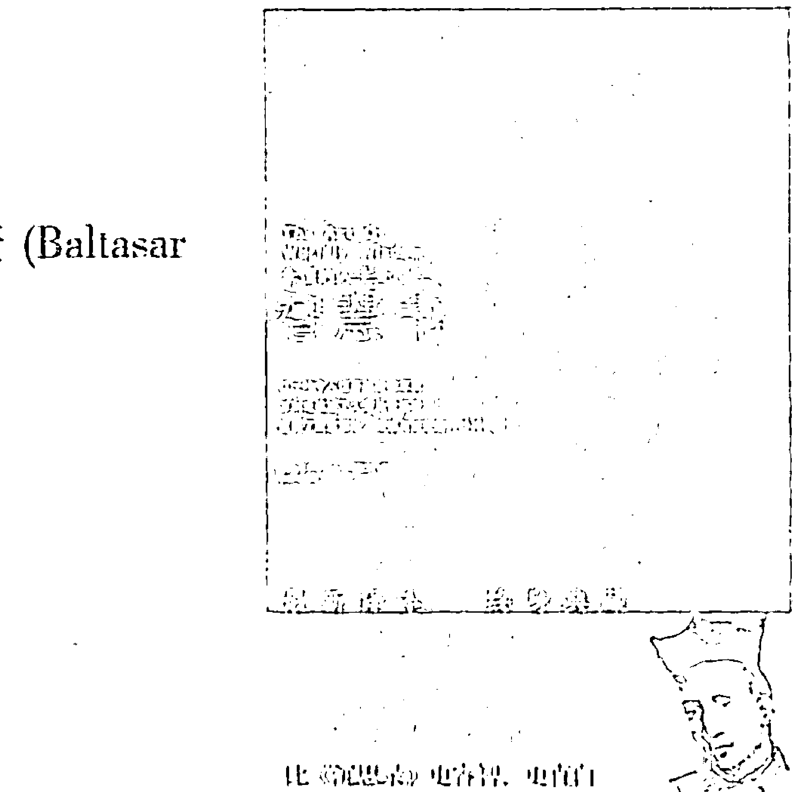

## 内容简介:

《智慧书》为巴尔塔沙·葛拉西安的代表作，浓缩了做人处世的智慧，汇集了关于知人、观事、判断和行动的300则箴言，其待人之理、律己之道，堪称则则精辟、字字珠玑。本书以一种令人惊异的冷峻态度，极深刻地描述了人生处世经验，提供了战胜艰险、困顿与迷茫的种种神机妙策。《智慧书》自1647年问世以来，一直受到各国普通读者的喜爱，已有七种英译本；葛拉西安也被尊崇为世界文化史上的一代宗师。

## 魅力失分

如果得不到别人的肯定，就会表现出不高兴的样子。白羊座就是那种死要面子活受罪的人，面子，比白羊座的生命还重要。

### 沃恩的秘密

佚名

沃恩每年都会受邀参加某单位的杂志评审工作，这个工作虽然报酬不多，但却是一项荣誉，很多人想参加却找不到门路，也有人只参加一两次，就再也没有机会了！沃恩年年有此“殊荣”，让大家都羡慕不已。

在他年届退休时，有人问他其中的奥秘，他微笑着向人们揭开谜底。

他说，他的专业眼光并不是关键，他的职位也不是重点，他之所以能年年被邀请，是因为他很会给别人“面子”。

他说，他在公开的评审会议上一定会把握一个原则：多称赞、鼓励，而少批评。但会议结束之后，他会找来杂志的编辑人员，私底下告诉他们编辑上的缺点。

因此，虽然杂志有先后名次，但每个人都保住了面子。也正是因为他顾虑到别人的面子，因此承办该项业务的人员和各杂志的编辑人员，都很尊敬他、喜欢他，当然也就每年找他当评审了！

#### 魅力提示：

> 要让自己有面子并不难，只要你懂得给人面子，赞扬和批评有一定的分寸和场合，既坚持原则性，也要讲究灵活性，既坚持真理，也不能得理不饶人。

### 克林顿的签名

风潇

美国前总统克林顿与一个小孩有过一件趣事，曾一度传为佳话。有一天，克林顿到医院探视病人，有一位小孩突然钻到他的身边。这个小孩不断地看着克林顿先生，什么话都不说。彼此沉默了几秒钟之后，克林顿首先开口：“你有什么话要跟我说吗？”“我想要你的签名！”小孩用洪亮的声音说。克林顿情不自禁地露出微笑，拿起名片，很快地写上名字，正要交给小孩时，小孩又要求说：“我可以要四张吗？”克林顿一脸笑意：“为什么要这么多张？一张不够用吗？”小孩回答他：“我要用三张你的签名去换迈克·乔丹的一张签名照。”克林顿总统并没有因此而不高兴，他又接连拿出三张名片，都签上了名字，同时开心地说：“我有一个侄子，最喜欢迈克·乔丹，改天有空我也要帮他去换一张迈克·乔丹的签名照。”

#### 魅力提示：

> 当有人做了让你感觉没面子的事情时，用一颗宽大的心去待人，不仅能挽回自己的面子，而且能得到别人加倍的赞许。

### 乌鸦的面子

汤礼春

在很早的时候，森林里的鸟儿都不会唱歌，直到有一天，从很远的地方飞来了一只很会唱歌的云雀，她的歌声那么婉约动听，感动了森林里所有的鸟。所有的鸟一致要求云雀教他们唱歌，经不住所有鸟儿的苦苦恳求，云雀答应了。

开始教歌的第一天，云雀首先教音符，她教一声，大家就唱一声。教了一会，云雀让他们一个一个地站出来单独试唱。第一个点的是乌鸦。乌鸦扭扭捏捏地站了起来，不好意思地低声发出了声音，因为她的羞涩，发出的音符走了调，大家一下哄堂大笑起来。云雀制止了大家的笑，为了更准确地纠正乌鸦的发音，她请乌鸦大声再唱一遍。乌鸦却想：“这不是存心丢我的面子吗？我才不愿再丢丑呢。”她一声不吭，愤怒地飞走了。从此再也不接受云雀的邀请。

云雀后来又让其他的鸟来唱，其他许多鸟最初的几次发音也走调，大家也同样地嘲笑他们，但那些鸟儿都没有像乌鸦那样飞走，而是总结经验，认真听从云雀的指导，耐心地学了下去。

后来森林里其他的鸟儿都学会了唱歌，声音悦耳动听，惟独乌鸦到现在也不会唱歌，偶尔叫喊几声仍然是当初走调的声音。

> 死要面子的人是学不到本领的，坚定自己的信心，虚心向他人求教，才是做好自己工作的正确途径。而死要面子不肯认错，或者逃避学习都只能导致失去工作和发展的机会。

### 接电话线

佚名

一位年轻律师在城东的一条繁华街新开了一家律师事务所，他花了很大的一笔资金装修他的事务所。又买了一部豪华的电话机，作最终的装饰。现在这部电话机正漂亮地在写字桌上亮相。

秘书报告一个顾客来访，对于首位顾客，年轻律师按规矩让他在候客室等了一刻钟。而后让顾客进来时，律师拿起了电话听筒，为了给客人更深的印象，他假装回答一通极为重要的电话：“可敬的总经理，我已对他说了，我们只是彼此浪费时间罢了……当然，我知道，好的……如果您一定要坚持的话……可是您要明白，低于2000万我不能接受……好，我同意……以后再联络，再见。”

他终于挂上了电话，对面那位在门口站着不动的顾客，好像非常尴尬。

“请问您有什么事？”律师微笑着问这位局促不安的客人。

客人犹豫了半晌，低声说：“我是技术工人，公司派我来给你接电话线。”

#### 魅力提示：

人与人之间的相处，应该是以诚相待，不能够因为你的虚荣心作祟就弄虚作假，否则真相被揭开，双方都会尴尬。

书名: 别让面子成为负担
- 作者: 李玉峰
- 出版社: 中国纺织出版社
- ISBN: 750645943
- 包装: 平装
- 开本: 小16开
- 出版日期: 2009-11

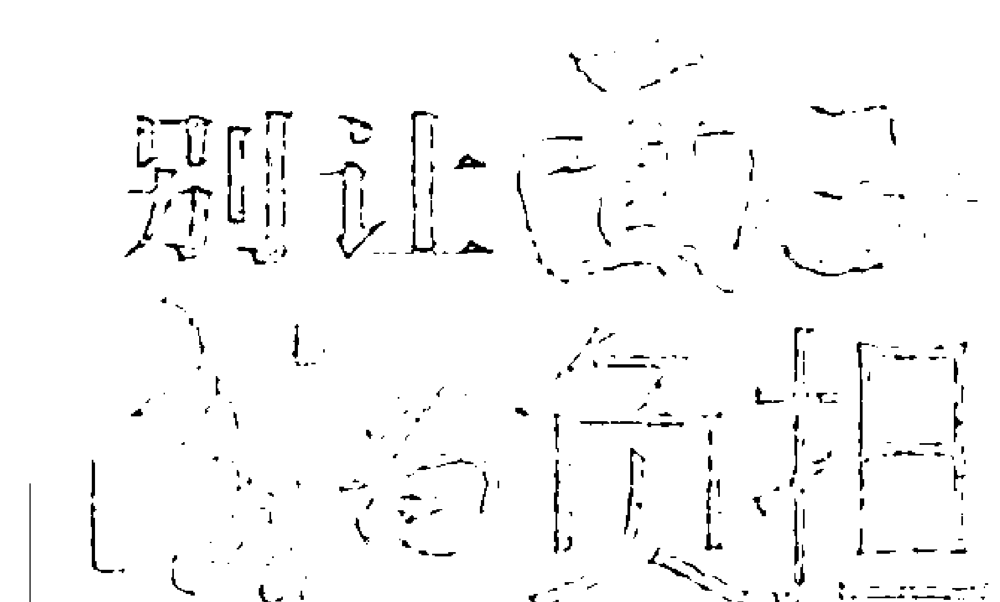

## 内容简介:

人们讲面子讲了几千年，几乎所有人都将面子像宝贝一样放在手心捧着，绞尽脑汁维持着。讳疾忌医、邯郸学步、沐猴而冠、夜郎自大……面子究竟给人们带来了什么？一个字——累！成功之路原本艰辛，何必再给自己套上面子的枷锁负重而行，放下面子是一种智慧的选择。放下的是面子，舍弃的是心灵的重负，得到的是幸福。学会放下面子，真正解放心灵，求得成功。

## 魅力失分

想法和说话速度一样快速的白羊座，往往只是把自己想讲的话讲出来就扬长而去，也不管人家是否了解他的意思，只要自己不会感觉不妥的话，他也甚少在意别人的感受。

### 柔和的舌头

斯蒂文

有一次我去拜访一位高中同学鲍伯，他那天要将货品送到位于达拉斯贸易中心的客户那儿。那时正好风雨交加。客户曾告诉鲍伯，可以把车停在大楼的后面卸货，所以我们就将车停在划黄线的卸货区。此时，一个大楼警卫冲过来大吼说：“喂！你们不准停在这里！”

我立刻反驳，我们已经报备过，也得到主管人员海根斯小姐的允许。我很不愿意在这种天气中把车停在半英里外，再辛苦地运这堆货品。

然而，鲍伯的反应正好解释了他为何能在高中时代获得最佳服务奖的荣誉。他立刻放下手中的货物，以非常诚恳的口气对那位警卫解释说：“海根斯小姐告诉我说，如果我只需要暂停几分钟的话，就可以利用这里卸货。不过，也可能是我自己搞错了，毕竟这里是你管理的。那么请你告诉我该怎么办，我就照着做好了。”他注视着那名警卫的双眼，微笑着等他回应。

我从来没有见过一个态度强硬的人软化得这么快，那位警卫竟然说：“嗯……我想……如果你只停几分钟而已的话，应该是没什么关系的。好吧！那我帮你看着车子好了，以免被别人开罚单。你尽管去忙吧！”

鲍伯非常感激地道谢，我们也因此能轻松愉快地把事办好，一滴雨都没沾到。而且我们离开时，那名警卫竟然还热心地搬开一些路障，让我们利用特别出口开出去呢！

#### 魅力提示：

凡事都站在别人的角度去想一想，予人尊重，同样也能得到别人的回报。

### 最受欢迎的人

佚名

韦恩是罗宾见到的最受欢迎的人士之一。他总能受到邀请。经常有人请他参加聚会、共进午餐、担任基瓦尼斯国际或扶轮国际的客座发言人、打高尔夫球或网球。

一天晚上，罗宾碰巧到一个朋友家参加一次小型社交活动。他发现韦恩和一个漂亮女孩坐在一个角落里。出于好奇，罗宾远远地注意了一段时间。罗宾发现那位年轻女士一直在说，而韦恩好像一句话也没说。他只是有时笑一笑，点一点头，仅此而已。几小时后，他们起身，谢过男女主人，走了。

第二天，罗宾见到韦恩时禁不住问道：“昨天晚上我在斯旺森家看见你和最迷人的女孩在一起。她好像完全被你吸引住了。你怎么抓住她的注意力的？”

“很简单。”韦恩说，“斯旺森太太把乔安介绍给我，我只对她说：‘你的皮肤晒得真漂亮，在冬季也这么漂亮，是怎么做的？你去哪呢？阿卡普尔科还是夏威夷？’

“‘夏威夷。’她说，‘夏威夷永远都风景如画。’

“‘你能把一切都告诉我吗？’我说。

“‘当然。’她回答。我们就找了个安静的角落，接下去的两个小时她一直在谈夏威夷。

“今天早晨乔安打电话给我，说她很喜欢我陪她。她说很想再见到我，因为我是最有意思的谈伴。但说实话，我整个晚上没说几句话。”

看出韦恩受欢迎的秘诀了吗？很简单，韦恩只是让乔安谈自己。他对每个人都这样——对他人说：“请告诉我这一切。”这足以让一般人激动好几个小时。人们喜欢韦恩就因为他注意他们。

#### 魅力提示：

假如你也想让大家都喜欢，千万千万不要谈自己，而要让对方谈他的兴趣、他的事业、他的高尔夫积分、他的成功、他的孩子、他的爱好和旅行，等等。不要急于表现自己，让他人谈自己，一心一意地倾听，那么无论走到哪里，你都会大受欢迎。

### 两个人的期待

佚名

美国一个军官，心里一直想升官，做梦都想。有一天，梦想终于实现了。这天下班后，军官没有像往常一样脱掉军装回家，而是神气十足地穿了回去，因为他想给妻子一个惊喜。军装上多了军官的标志，他想妻子肯定能注意到。到家后，咚，咚，咚，敲响家门，妻子像往常一样出来迎接，却没有说话。一直到吃饭，妻子还是没有说话，两个人沉默着吃完饭。饭后，妻子依然保持着沉默。到睡觉的时候，夫妻两人坐到床头，却都没有很快地躺下，似乎各怀心事。终于，妻子忍耐不住，眼泪不由自主地掉了下来，军官本来就因为妻子对他的军官标志视而不见而憋了一肚子气，见妻子无缘无故哭起来，便没好气地问妻子为什么哭泣，妻子大声地说：“难道我今天把头发烫了你都没有注意到吗？”

#### 魅力提示：

> 人总是以自我为中心，想让别人关注自己，却忘了付出努力去关注别人。要知道，只有关注别人，才能得到别人的关注。

### 乔·吉拉德卖车

佚名

美国汽车推销之王乔·吉拉德曾有过一次深刻的体验。

一次，某位名人来向他买车，他推荐了一种最好的车型给他。那人对车很满意，并掏出一万美元现钞，眼看就要成交了，对方却突然变卦而去。乔为此事懊恼了一下午，百思不得其解。到了晚上十一点他忍不住打电话给那人：

> “您好！我是乔·吉拉德，今天下午我曾经向您介绍一部新车，眼看您就要买下，却突然走了。”

> “喂，你知道现在是什么时候吗？”

> “非常抱歉，我知道现在已经是晚上十一点钟了，但是我检讨了一下午，”实在想不出自己错在哪里了，因此特地打电话向您讨教。”
“真的吗？”
“肺腑之言。”
“很好！你用心在听我说话吗？”
“是的，非常用心。”
“可是今天下午你根本没有用心听我说话。就在签字之前，我提到犬子吉米即将进入密执安大学念医科，我还提到犬子的学科成绩、运动能力以及他将来的抱负，我以他为荣，但是你毫无反应。”
乔不记得对方曾说过这些事，因为他当时根本没有注意。乔认为已经谈妥那笔生意了，他不但无心听对方说什么，而且在听办公室内另一位推销员讲笑话。
这就是乔失败的原因：那人除了买车，更需要得到对于一个优秀儿子的称赞。乔·吉拉德恰恰没有“站在对方立场思考与行动”。他只是想当然地以为“已经成交了”。

#### 魅力提示：

> > 与人沟通时，我们常常从自我的角度出发，急于表达自己，却忽略了耐心的倾听，这其实是一个很错误的认识。倾听也是一门学问，它和表达同样重要。成功的倾听者，在听的同时也站在了对方的立场上考虑了问题，这样他对问题的把握更全面、更周详。

## 魅力推荐

书名：倾听：推心置腹的智慧
作者：[韩] 赵信映，朴炫瓒著，金菊花译
出版社：南海出版社
ISBN：9787544240192
包装：平装
开本：大32开
出版日期：2008-05-01

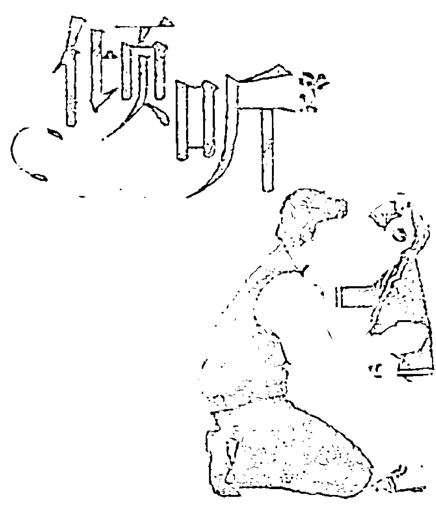

### 内容简介：

- 实践倾听的五大行为准则：
  1. 准备共鸣，准备对话时，首先要放下所有的主观意识和偏见。
  2. 肯定对方：集中精力观察对方的言行，肯定对方存在的重要性。
  3. 节制说话：要先去了解，再被理解。懂得节制说话，才能学会倾听。
  4. 保持谦虚的态度：即使对方的想法有悖于自己，仍然要谦虚地去感受对方的情感。
  5. 全身响应：倾听时一定要用全身来传达自己在注意倾听的自然状态。

倾听自己——学会发现：倾空所有的先入之见，倾听自己内面的声音，发现新的自我。

倾听你我——发掘共鸣：发现我中有你，你中有我，就能听到真实的声音。

倾听众人——共存之道：倾听对方的意见是共存共荣的途径。

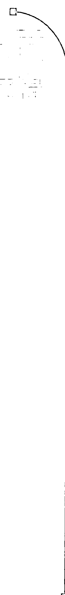

### Aries

## 魅力失分

白羊座有出了名的坏脾气，尤其是在自己的恋人面前，这种易怒的本性暴露无遗，有时被怒火冲昏头脑的白羊甚至会鬼使神差地向对方动手，造成暴力事件。

# / 魅力星座智慧书之白羊座

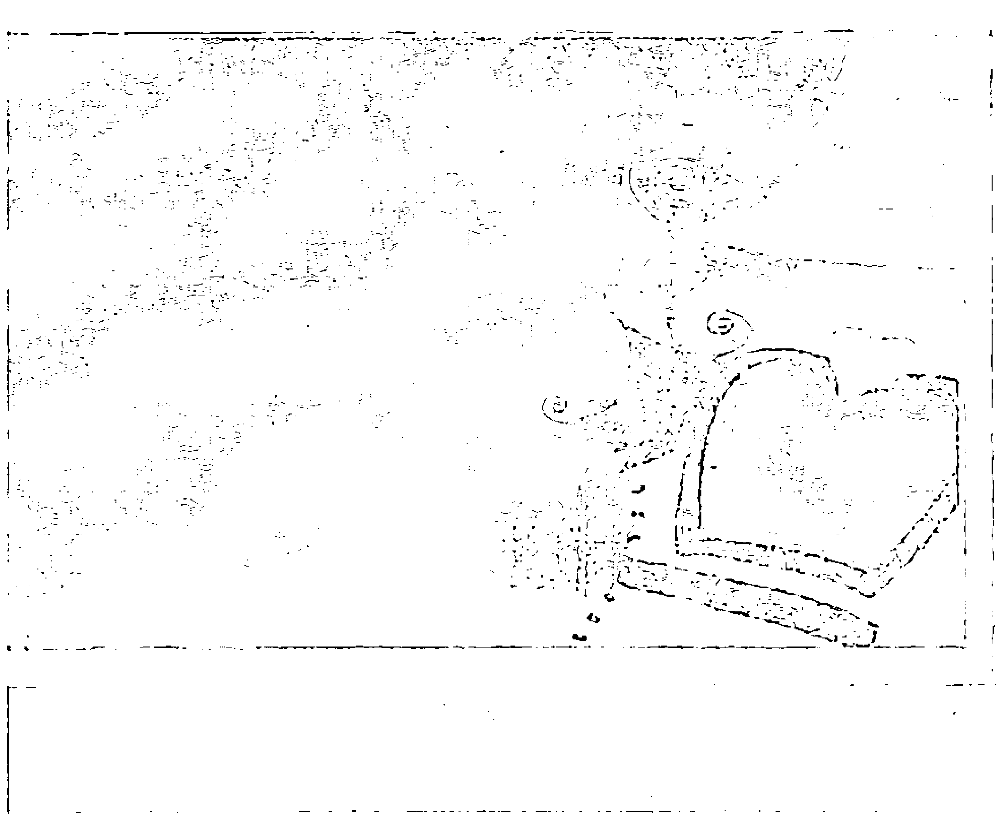

### 相遇，不是用来生气的

黎丹正

有一天，我坐在回家的公车上，乘客很多。一对上班族男女恰巧站在我身边，吸引了我的目光。

可能因为人多，男孩将手臂围挡在女孩的腰上，怕后面的人挤到了她，并轻声地问：“累不累？待会想吃些什么？”

只见女孩不耐烦地回答：“我已经够烦了，吃什么都还不先决定好，每次都要问我。”

男孩一脸无辜地低下头，而后说了一段令我印象深刻的话：“让你决定是因为希望能够陪你吃你喜欢的东西，然后看着你拥有满足的笑容，把今天工作中的不愉快暂时忘掉。你工作上所受的委屈我没法帮你，我所能做的也只有这样。”

女孩听了后，满怀愧疚地说声对不起。男孩这才似乎重燃信心般地说：“没关系，和你相遇不是用来生气的，只要你开心就好。”而后亲吻了女孩的头发。

公车到站，男孩牵着女孩的手下了车。汽车开动，我再回头看看这对情侣，男孩依旧小心翼翼地保护着女孩。

说得多好呀，“和你相遇，不是用来生气的”。两个人相恋，多么来之不易的缘分，何苦要用生气来抹杀所有的幸福。即使当爱情面临小小的险阻，我们也要心平气和地对待对方，然后用爱和勇敢去化解，而不是用生气的方式来鲁莽对待。

#### 魅力提示：

> > 在和亲爱的人生气之际，我们如能多想想“我不是为了生气而和你相遇的，而是为了一场美丽的相约”，那么就能为我们烦恼的心情辟出另一番安详。当自己快抓不住情绪时，想想这句话，或许会让幸福中多增加一些甜蜜的因子吧！

# # 老妻少夫

佚名

有一对夫妻因为一点小事闹别扭了，妻子赌气不吃饭，也不理睬丈夫。

聪明的丈夫一见，急忙哄妻子：

> > 生气老得快，愁一愁白了头，你想弄个老妻少夫呀？

妻子被丈夫的几句言语逗笑了。

丈夫接着说：

> > 这就对了，笑一笑十年少，笑十笑老来俏！

妻子的怨气顿时烟消云散、撒娇地说：

> > 哼，贫嘴，再说小心我休了你！

可心里却是甜滋滋的。

#### 魅力提示：

两个相爱的人，吵吵架发发脾气也许是非常常见的事情，如果每个人都多一点诙谐幽默，多一点宽容和理解，那生活能不幸福和谐吗？

### 捡拾碎片

佚名

有一对小夫妻只拌了几句嘴，就吵开了。
气头上的女人把结婚照撕成了两半，男人更冲动，夺过来接着撕，哧——，哧——，结婚照立刻成了碎片片。
女的哭了：“离婚！”男的火了：“离就离！这样的日子没法过了！”说着双双夺门而出。
邻家的一位老人听说了这件事，非常平静地对他们俩说：“慢，先别离，先回家看看，把满地的碎片片捡起来，把上面的花对齐了，会出现奇迹的！”

于是女的先回家，开始小心翼翼地捡拾地上的碎片。不久男的也回来了，也开始小心翼翼地捡拾地上的碎片。就这么捡着捡着，也就捡回了一串串极芳香极浪漫极温馨的回忆！

心里像有春风拂过，暖洋洋的。女的鼻子一酸，满腹的委屈随着泪水流出来，男的也傻愣愣地站着，一脸的懊悔，心疼地望着妻子。

突然，女的哇的一声扑进男的怀里，泪如雨下，男的也就一把搂着她，搂得越来越紧，一起看着那张重新拼接好的照片——照片上有花，他和她也像花一样笑容灿烂。

那以后，灿烂簇拥着他们，他们再也没吵过。

#### 魅力提示：

冲动的怒火会烧毁感情，当你生气的时候，请想一想对方曾经如花的笑容。

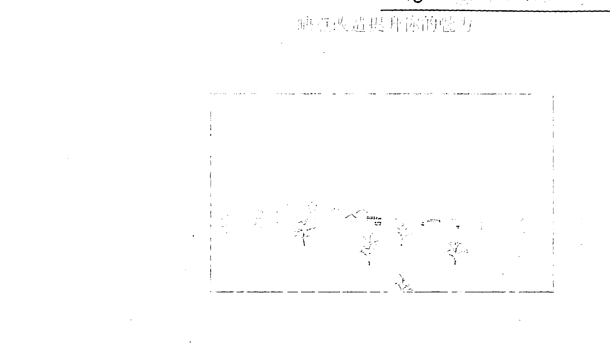

### 原来天使也会累

谢香枚

她和他是青梅竹马。只不过，一直都是他小心地呵护着她。

他大她三岁。在学校时，不同年级，不同系，但他的体贴却无处不在，他并不是每天都来找她，但电话每晚临睡前却总会响起，说一些天冷了，记得加衣服、晚上别在被窝里看书的话。所有的人都知道她有一个为她甘愿付出的男友。

她嘴里不说，心里却是得意的。他在校园里并非默默无闻之辈，长相俊朗，才气逼人，是多少女孩子暗恋的对象，这样的一个人，却独独对她用情至深。

她知道他的好，但她是父母宠坏的孩子，他就像是她父母的接力棒，父母不在身边时接着宠她，所以，她撒娇，任性，有时候蛮不讲理。

每次他们吵架，他生气走开，但最后回头的总是他。他说：“丫头，我们和好吧。”

她的心里涌出泪来，其实她是那么害怕失去他。

有人说，两个相爱的人之间发生了矛盾，第一个转身的就是他们感情上的天使。她想，他就是那个天使吧。

相继走出校园，他们选择了生活在一起。她是玲珑剔透的女孩子，生活的琐碎让她不胜其烦，她的脾气越来越坏。

他一次又一次地忍受她的无理取闹，每次都是他转身说对不起，虽然她觉得等待他转身的时间越来越长。

后来有一次，她又为一件小事发脾气后，他走出了她的房间。

一天，两天，三天，她等待着他转身。

一个星期后，她耐不住这种等待的痛苦，决定到外地几天，她想，当她回来的时候，一切都会烟消云散了。

当她回来时，她惊惧地发现，房间里已经没有了他的痕迹。他已辞职，去了外地。

她没有想到他会采取这种决绝的方式。她知道自己是深爱着他的，那么多的争吵都是因为自己任性，不懂得珍惜。而他，不是一直包容着她，扮演着感情的天使吗？很久以后，她把这件痛心的往事讲给朋友听，仍然不明白为什么他会突然离去。朋友听了，突然说：为什么你不转身呢？

那一刹那，她泪流满面，多么简单的一句话，可是当初为什么她没有转身呢？

#### 魅力提示：

再温柔的天使也难容忍一次又一次的无理取闹，再完美的爱情也会被日复一日的坏脾气磨得面目全非。珍惜身边容忍你坏脾气的那个天使吧，收敛你总是一触即发的怒火吧，不要等到天使累了，爱情远走了，才来后悔。

## 注：（待排）

- 书名：滋养和安顿我们的心灵
- 作者：朱建军
- 出版社：希望出版社
- ISBN：753793619
- 包装：平装
- 开本：小16开
- 出版日期：2006-08

### 内容简介：

身处不断变化的时代，社会发展的压力使人们越来越难以找到自我。焦虑、烦躁、愤怒、失落、紧张、恐惧等情绪在无形中蔓延，各种心理方面的问题日渐凸显，这已经成为困扰个人、家庭和社会的主要问题。如何摆脱焦虑、烦躁、愤怒、失落、紧张、恐惧的心理问题，如何做一个身心健康的人，《心理医生对你说丛书》将会告诉你，你不需要一定是他们的咨客，只要阅读资深治疗师所写的手记、随笔、杂文和小说，你就能得到你想要得到的健康身心。

|   |   | ... |
|---|---|---|
|   |   |   |

## 魅力失分

白羊座是十二星座中的第一个星座，既有天生的创新精神，同时也有天生的好奇心。白羊座的人喜欢窥视恋人的秘密，比如喜欢偷看对方的手机短信、趁对方不在家的时候会翻看对方的日记等。

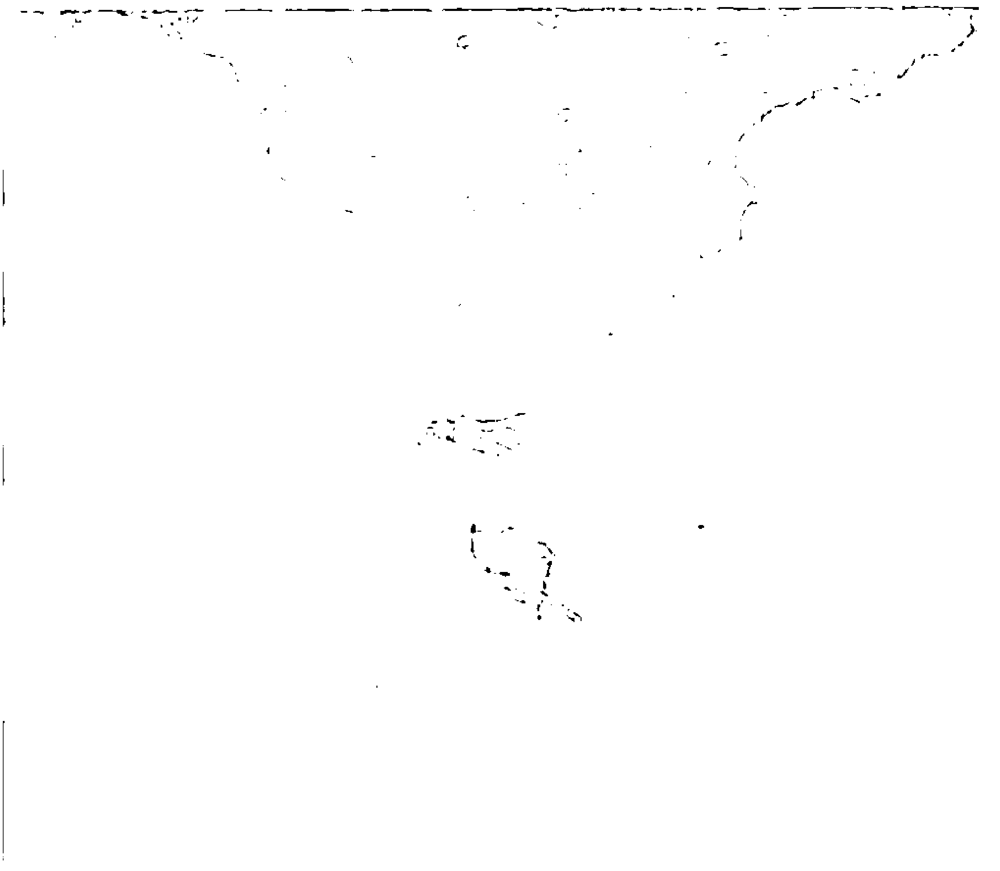

### 令人不安的爱情歌曲

就在凯莉·切斯荷姆的结婚一周年纪念日及25岁生日前夕，她发现自己并没有如她想像的那么了解她的丈夫。这一发现是由她的丈夫戴维每天早晨去淋浴时哼的小调产生的。戴维作为网球手，总能拿到高分，可是要作为一个歌手，只会扯着嗓子尖叫。

在他们婚后不久的日子里，凯莉是那么喜悦，以至于她确信自己欣赏那荒唐可笑的音调，并不介意戴维嘶哑的嗓音。

然而，随着时间的流逝，这支歌开始让她不安、烦乱。干吗老唱这个，不唱别的？

在她涮洗碗碟时，丈夫歌词中的“玛丽·安”仍缠绕着她。她知道有关戴维在高中时代的罗曼史，也了解他大学时的恋人。在他们相爱的日子里，凯莉也曾对戴维提到过自己的一两个旧情人，但谁也没有成为她的歌乐声中不朽的小伙子。

婚后一年，她找到了和戴维的共同爱好。然而，她却对玛丽·安一无所知。玛丽·安犹如一扇拒她而入的门。
几天后的晚上，凯莉和戴维被西蒙和爱丽丝老两口请去吃了晚饭，在他们手挽手散步回家的路上，凯莉对戴维说道：
“跟我谈谈她。”
“谈谁？”
“玛丽·安。”
“怎么想起这个？”
“她是我大学里的戏剧课教师。”戴维说。
“迷你的老太太？”她松了口气。
“并不太老，大概比我大4岁。”在家门口，他掏出钥匙边开门边说，“她是另一个我想与之结婚的女人。这就是你真正想知道的，是吗？真有那么严重？”
她在之前走进了屋子，小心地掩饰着自己。这突然而来的一阵嫉妒，使她感到自己幼稚而愚蠢。
“不过她拒绝了我。”戴维微笑着说。
“她很漂亮吗？”凯莉嘴上这样问，心里却希望她并非如此。
“她有修长的身材，加上那黑头发和大眼睛，很迷人。”戴维说，“当然，她是一个常因精彩表演而被观众掌声打断的演员。”
“她后来的情况怎么样？”
“不知道。你干吗问这些？这已经是好多年以前的事了。”
“我想我是嫉妒了。”她笑着默认道。
戴维微笑着伸出手臂搂住了她。
“你是我非常信赖的妻子。”他吻了吻她的鼻尖，“每个人心中都有一块属于自己的特殊的角落，你只不过是听厌了我的歌。”

#### 魅力提示：

猜疑和嫉妒之心，是破坏夫妻关系的腐蚀剂，它会给家庭生活带来不幸。相反，像真诚的戴维一样，毫无保留地信赖自己的妻子，会让家庭美满和谐。

## 我愿天天做新娘

佚名

我想起了上大学之前，我的一个乡村女友，不久前曾收到她从乡下寄来的贺卡，贺卡由硬纸自制而成，贺词很别致：

> 我愿天天做新娘
新郎只有一人

当时她已结婚数月。后来我专程去乡下看她，她仍然梳着两条黑黑长长的辫子，一边喂猪一边同我聊天，然后擦净手，拿出一个精心订制的本子，封面上画着一株破土而出的小芽芽。

我知道这是什么了，很奇怪：“你还写诗？”

“做不了诗人，还做不了业余诗人吗？”

“没想到你还留着辫子。”

“我觉得还是这样好。”

那一整天我们海阔天空地聊，包括今后的读书计划，明春的种地打算，甚至腹中胎儿的名字，因为她的愉快，我也相当愉快。

晚上，她丈夫被“请”回父母家去了，我悄悄问：“天天做新娘吗？”

她笑了：“今天不。”

我非常羡慕她，不是那份幸福，而是那份平静和自信。

#### 魅力提示：

爱情实际上是一份无需求证的证明，它浓烈的芬芳终究会趋于平淡，然而聪慧的人却懂得将它植入心中，懂得用自己生命中的那份从容和细致来浇灌。这样的爱情，永远保鲜，实在无需任何求证。

## 感情田园的稻草人

周海亮

她还记得男人给她讲稻草人的故事。稻草人穿着色彩艳丽的衣裙，忠心耿耿地守护着金灿灿的乡间田园。那时他们还读大学，校园的草坪上，她依着那个男生的肩膀，想着稻草人虚张声势地驱赶馋嘴的麻雀，偷偷地笑。

男人从乡村来到城市，一个人不停打拼，终于扎下了根。生活当然过得艰难。她为男人，为他们的家，付出了太多太多。好在男人的事业正朝好的方向发展，他每天穿着藏蓝色的西装，打着银灰色的领带，见各种各样的客户。男人在奔向成功，在他们婚后的第五个年头。可是女人突然发现了蛛丝马迹。

她知道男人偷偷地买过一套女装。很高档的那种，这之前，男人从来舍不得为她买。那天男人带着一位很时尚的女孩，那是男人公司的职员。她和女伴正在一扇窗子的后面喝茶，女伴说：“你老公！”男人就走过去了，目不斜视，臂弯上搭着那套女装。她说：“你看错了，不是他。”她极力为他辩护的谎言像一把锋利的刀子，忍着痛说了出来，却把心划开一道口子。

男人去很远的城市出差，回来鬼鬼祟祟，似乎藏着什么。夜里女人忍不住翻看他的皮包，翻出一枚镶了宝石的戒指。价值不菲的戒指，闪着柔和的光泽，刺得女人眼睛疼痛。早晨女人问男人：“有什么送给我吗？”男人变了表情，很慌乱的样子。他说：“有，当然有……我竟忘了！”急急地从一个旅行包里掏出一个披肩。“专门为你买的，咱们这里没有。”男人躲闪着她的眼睛说。但是，女人曾经在门口的服装超市，见过和这条一模一样的披肩。三五十块钱的东西，挂得到处都是。

什么叫天荒地老？女人想，所谓的天荒地老，或许，只是一种美妙的幻想罢了。女人开始挽救。她不想揭穿男人，但她要挽救他们的爱情。她给男人挑选最好的剃须刀，陪男人看味同嚼蜡的足球赛。她经常往男人的公司里打电话，装作不经意间打听男人的行踪。她抢先接听打进家里的每一个电话，然后柔声呼唤自己的丈夫。她为男人烧最可口的饭菜，然后在吃饭的时候笑着问男人，下午，你过得好不好？一个人，还是……

她甚至当着男人的面，虚伪地夸那个时尚女孩很清纯很可爱。说这些时候她盯着男人的脸。她试图从男人的脸上读到些什么。她或许真的读到了，或许没有。她搞不清楚。

她感觉自己现在真的变成一个穿着艳丽衣裙的稻草人，露着狰狞夸张的表情，守护着自己的感情田园。虚张声势地驱赶着看不见的来敌。多年的感情竟然要靠驱赶和恫吓来维系，她认为她和他的爱情，实在可怜。并且，她不知道自己这种夸张的表演，还能坚持多久。

那天男人回来很早，男人说：“知道今天是什么日子吗？”她问：“什么日子？”男人说：“结婚五周年纪念日啊。”女人愣了愣。这么重要的日子，她竟忘了。男人说：“今天，我终于可以兑现一个承诺。”他掏出一张皱巴巴的纸片，捧给女人。女人接过，那上面写着：八年内，为你买最漂亮的房子和汽车，买最昂贵的衣裙和戒指。下面，是男人的签名。

女人想起来了。大学时候吧，那一天，男人为她写下了这样的两行字。她以为是玩笑，随手丢开，却被男人捡起。想不到，男人竟把一句根本算不上承诺的话，保存到现在。

男人说：“房子和汽车，我们刚刚有，现在，让我兑现最后的两样。”

男人为她打开衣柜。女人惊喜地发现，她曾经和女伴一起看过的搭在男人臂弯上的漂亮衣服，不知什么时候，已经挂在那里。男人让女人闭上眼睛，然后，女人便感觉，一枚小巧的戒指，戴上了她的手指。

男人说：“爱情并不需要昂贵的物什来装饰，但是，所有的承诺，特别是爱人间的承诺，都是昂贵的，都需要兑现。” 男人说：“其实，两个月前，我就准备好了。想给你一个惊喜，就一直藏到现在。”

男人红了脸。他搓着手，像一位正值初恋的小男孩。

那夜的女人，自责到极点。她认为自己有些过分了。那么宁静的感情田园，她却硬生生虚构出并不存在的入侵者，然后进行一场虚假的保卫战。显然，过分的敏感，让她差一点点失去真正的感情田园。

#### 魅力提示：

其实，金灿灿的感情田园，并不需要虚张声势的稻草人。需要的，只是两位农夫，一起耕作，从青丝，到白头。

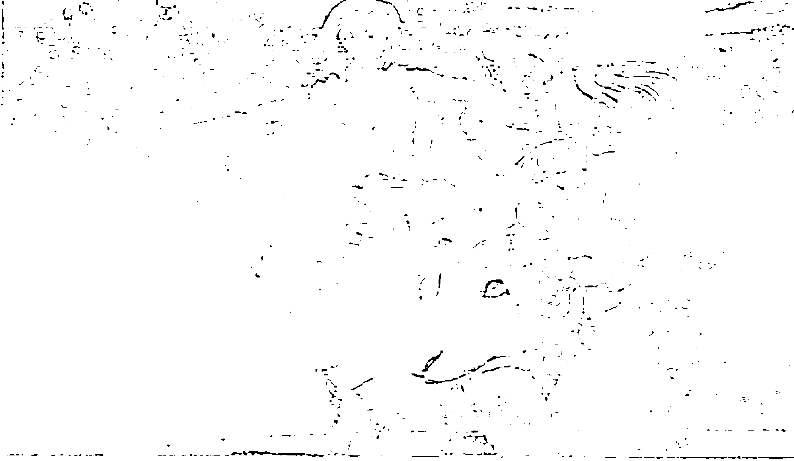

### 爱的考验

啸徐

临街的阳台上，站着一位明眸似水、秀发如云的妙龄女郎。不断引来路人驻足观望。

一位雅士途经此处，他被女郎的美貌摄去了魂魄，大胆向女郎示爱。

“如果你喜欢的话，请在阳台底下待上一百天时间，我自会下楼来会你。”女郎对雅士已很满意，但仍得意地说。

九十九天过去了，只剩一天。

女郎轻挑窗帘，偷窥那三个多月纹丝不动坐在那里的雅士。

太阳快落山了，女郎正欣喜间，突然发现那个“忠诚的骑士”缓缓地直起身，夹起椅子，若无其事地走了。

女郎顿时昏倒在地。

九十九天！雅士欠缺的看来并不是耐心，他恰如其分地表达了自己的爱，又恰如其分地保持了自己的尊严。

#### 魅力提示：

相爱的人，总会出一些形形色色的招法，来探视对方爱自己的程度。爱情需要检验，但是要掌握一个“度”，超过了这个“度”，伤了对方的尊严，考验就成了一种折磨，一种痛苦。

- 书名：遇见未知的自己
- 作者：张德芬
- 出版社：华夏出版社
- ISBN：750804401
- 包装：平装
- 开本：32开
- 出版日期：2008-01

### 内容简介：

故事是从“冬天的雨夜，在荒郊野外的山区，一个没有手机、没有汽油的孤单女人”开始。若菱，自名校毕业，拥有令人羡慕的工作，但心中却不时地自问：为什么我不能拥有想要的生活？为什么我不快乐？我该如何当自己生命的主人？在一个下雨的冬夜，若菱巧遇一名智慧老者，在与智者数度交谈的过程中，她渐渐填补不快乐、挫败的心灵缺口，寻回最真实勇敢的自我……你会不会担心和若菱一样，让身体的疲惫失控于华丽的业绩之中？你是否也想遇见在你心中的智慧老者，穿越心事的重重黑纱，遇见全新的自己？

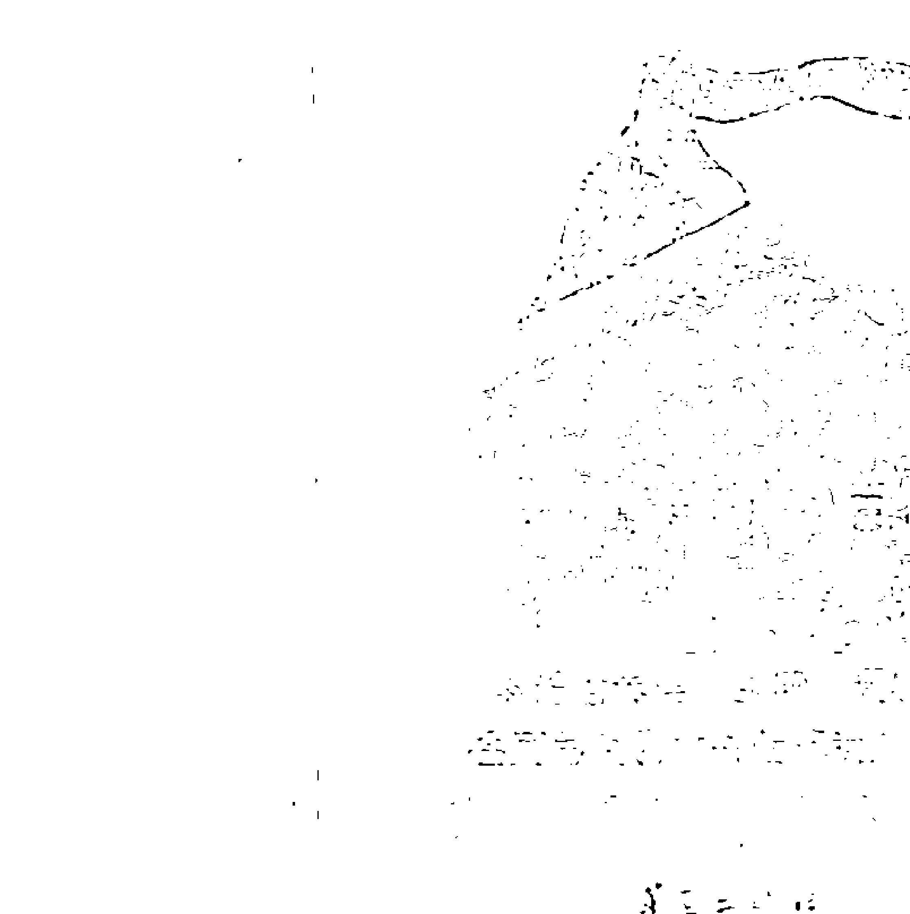# 第三回 恋爱篇

## 魅力失分

一旦你成了白羊的恋人，那么你就要做好思想准备，因为白羊可能会要求你二十四小时时刻报备，当然，你更不用想有别的异性朋友了。

### 真爱无敌

朴朴

猎人在一条长满了枯草的山道上铺设了捕兽器后，就在不远处搭起了帐篷。他想：如果运气好，天亮就可以去拿狐狸了。夜已深，猎人早已睡熟。突然，一声悲惨的尖叫划破了山里夜的宁静，紧接着这种叫声多了起来，猎人一个激灵坐起来，竖着耳朵听了听，知道一定是狐狸踩中捕兽器了。

原本想马上去取回那只到手的猎物，但听这声音，少说也有七八只狐狸。猎人想，这个时候去了不安全，等天亮吧！反正他的捕兽器厉害得很，即使再呆几天也跑不掉。

天快亮了，叫声也没了。猎人兴奋地去取被夹住的狐狸。然而，眼前的景象让猎人大吃一惊。捕兽器静静地躺在那儿，正夹着狐狸一只血淋淋的小腿，周围是狼藉的狐狸脚印和星星点点猩红的鲜血。猎人看了看自言自语道：这是一只白狐，它是咬断了自己的腿跑的。好顽强的家伙啊！没事！它跑不远的，沿着血迹我可以再找到它。猎人很自信。果然，跟着血迹走了不到半个小时，他看见的血迹已经不像先前的了，还没凝固。猎人尽量放轻脚步，以免惊动它们。

这是一片荆棘，长得很深。猎人习惯性地蹲下来四处张望着。不久，从荆棘的缝里，猎人看见了那只白色的狐狸，它身旁还有一只棕色的。两只狐狸的嘴角都沾满了血迹。白狐眼光凄迷地看着滴血的断腿，看得出似乎已经支持不下去了。棕狐轻轻地舔着白狐的鼻子，显出很温柔的样子。看着两只狐狸互相怜惜的样子，猎人想，它们是夫妻吧？猎人轻轻端起了枪，瞄准了那只棕狐狸。

他准备开枪时，一个黑影突然从眼前晃了一下，接着“哎哟”一声。猎人被那个突如其来的黑影猛蹬了一下。再看那黑影，已经跑开了，远远地看见它好像是个瘸子，后面左腿一跳一跳的。当然，猎人的响动让棕狐和白狐也趁机溜走了。猎人感觉到：那也是一只狐狸，而且和棕狐白狐之间一定有特殊的关系。但是是什么关系呢？猎人想了想，最后断定，它可能是白狐狸的追求者，而且可能是情场上的战败者。因为只有这种关系才能让它冒这个险。它还对白狐有感情，所以它没有像其他狐狸一样，早不知躲哪去了。

想到这里，猎人深深地吸了口气，隐约间，他自己似乎也感受到了爱的幸福。但是，猎人还是朝着棕狐和白狐的去向追了下去。当他再次来到一个岔路口时，弯下腰去仔细查看，猜测着两只狐狸会从哪条路跑。这时，那只瘸腿狐狸却蹿了出来。它晃了一下朝左边的路跑走了。

猎人想：那是瘸腿狐狸的声东击西之计，白狐狸和棕狐狸一定是从右边跑的。于是他向右边寻去。果然，走了不远，从他的左前方传来了轻微的叫声，猎人蹑手蹑脚走了过去。可声音又往前走了。他一直追着这叫声转了两个山头，最终追上了，然而看到的又是那只瘸腿狐狸。算了，打道回府吧。猎人气馁了，他想这次遇上聪明的狐狸了，准确地说也不是聪明，而是有经验的狐狸，那只狐狸的腿也一定是被捕兽器给夹瘸的。

当他从山道上下来的时候，走着走着，突然又站着不动了。他听到路旁的荆棘里传来一种低低的似呓语般的声音，凄凉而沉闷。待小心地拨开荆棘，两只狐狸再次出现在猎人的面前。对，是棕狐狸和白狐狸。白狐狸的眼睛似闭非闭，像是要死了。而且它们在哭，是的，四只眼睛里都有泪。猎人又举起枪，就在这时棕狐狸已经发现了他，只是这次它们没跑，白狐狸已经没了力气，仍卧着不动。棕狐狸却站了起来，狠狠地看着他，与举着枪的猎人对视。它的眼睛慢慢由蓝变红，又变绿……里面似乎饱含了许多内容。大概10分钟的对视后，猎人慢慢放下了枪，独自走了！

#### 魅力提示

真爱不是永远据为己有，而是给对方应有的自由，帮助对方得到真正的幸福。以爱为借口，却成为对方重新觅得真爱的绊脚石，是不懂得爱的真谛。

### 打开心窗

佚名

一栋房子如果没有窗户，温暖的阳光就无法照进来，新鲜的空气也不能飘进来。

人也如此，“心窗”没有打开的时候，就会感到气闷；“心窗”打开了，心才能够通达，心灵的视觉才更清晰。一旦心窗打开了，心灵的空间也就豁然开朗，对于一些事情也能看得更透彻了，如此再来了解“空”的道理，就能消化“有”的烦恼。

有位太太的先生是知名的企业家，对她百依百顺，依外人看起来，她是很享福的，因为她有享用不完的金钱和物质，可以说是幸福中的幸福人。但她仍觉得很苦，看到一个朋友时，她哭得很伤心，朋友问她：“你有什么不满意呢？”
她说：“你不知道啊！他对我感情不专一，使我很痛苦。”
朋友劝她说：“到底你要追求多少感情才满意呢？不要太强求，感情如同一个球，愈硬碰，它就跳得愈高愈远。”
她问：“那要如何解决呢？”
朋友回答道：“放宽尺度，你爱的范围太狭窄了，犹如把感情当成一条绳子，缚得他对你产生敬而远之的心理，才使你那么痛苦。你应该以柔和的感情来宽容他的一切，不要以占有欲、威力来加在感情上面，否则先生表面又顺又爱，但内心却又烦又畏，也就难怪他会有欺骗的行为。你若能把爱扩大到去爱他所爱的人，他一定会感谢你，同时也更珍惜这份感情中的恩情，因为你所给予他的爱是那么的自在。人的感情就像是烘炉，只要你多给他宽大的爱，满足他的感情，再冷再硬的心也会被它融化……”
这位为情所苦的太太，后来果真这样去做了。夫妻的感情如此，父母子女的感情也是如此。

#### 魅力提示

打开心灵的窗户，心才能够通达，心灵的视觉才会清晰。人与人的交流是心的交流；只有彼此敞开心扉，才能相互理解，产生幸福的共鸣。

### 爱情锁

佚名

女孩就要嫁给一位外国的小伙子了，他们相约到杭州千岛湖旅游。

在锁岛上，女孩买了一把铜质的锁，让工匠在上面刻上她和小伙子的名字。

小伙子在一旁微笑看着他的爱人。

字很快刻好了，女孩把锁挂在扶杆上。小伙子不解其意，问女孩为什么不把锁带走，而是挂在这里。

女孩说：“这叫同心锁，这意味着我们从此以后再也不能分开了，就像被锁锁住那样。” 小伙子听了大惑不解。回到城里，他一直闷闷不乐。

终于，小伙子提了这样一个问题：“为什么两个人要锁在一起？” 女孩说：“因为爱呀！” 小伙子问：“难道爱就可以限制自由吗？” 女孩笑了：“你不懂中国的传统文化，这是一种美好的祝福。”

小伙子说：“限制自由也是一种祝福？” 一个多月后，也就是在他们即将举行婚礼的前一个星期，这位外国的小伙子决定暂缓举行婚礼。

女孩问他为什么，难道他不爱她了吗？小伙子说仍然爱她，但是他不能接受这份爱情：“真是太可怕了，我的一生从此以后将要和你锁在一起，两个人的一生怎么可以从此锁定呢？”

小伙子的话让姑娘也感到可怕：“天哪，幸亏他早些说，原来他根本没有打算爱我一辈子。”相互猜疑之后，他们友好地分手了。

#### 魅力提示

爱情不是要锁住对方，恰恰相反，给对方一些自由的空间，让爱情自由呼吸，这样的爱情才能历久弥新。

### 爱是一扇窗户

佚名

一位男子娶了一位非常漂亮的妻子。他非常爱她，但又时时刻刻担心别的男子来勾引她，于是，他总爱把她关在屋子里，不允许她和别的男人交往。有一天，朋友知道此事，非常替他担心，就借机把他引到窗户前，问他：“透过窗户，人看到了什么？”他回答说：“阳光和世界。”朋友又问他：“看到了阳光和世界之后呢，有没有感受到什么？”他很干脆地回答道：“幸福，活着的乐趣。”朋友点点头，拎来一桶黑漆，并把它刷满整个窗户，再问他：“你现在看到了什么？”他回答说：“黑暗和囚牢。”朋友又问他：“看到了黑暗和囚牢之后又感受到什么呢？”这男子一听，赶紧把妻子从屋子里放了出来。

#### 魅力提示

如果婚姻是一间屋子，那么爱就是屋子里面的一扇窗，她既然愿意和你一起待在屋子里面，就是因为有扇爱的窗户令她依恋。你关上了窗户，想想她会怎么样呢？

---

**书名：** 生命密码
**作者：** [荷] 派瑞·哈本诺 (Patty Harpenau) 著；姬蕾译
**出版社：** 天津教育出版社
**ISBN：** 753095873
**包装：** 精装
**开本：** 大32开
**出版日期：** 2010-02

## 内容简介

一位年轻的荷兰女子只身远赴以色列，跟随一名犹太拉比探寻生命的秘密。在旅途中，世界宗教典籍中的七位精神导师相继现身，为她讲述了隐藏于伊斯兰教、犹太教和基督教教义中的七个生命密码：上帝密码、亚当密码、夏娃密码、约书亚密码、米丽亚姆密码、摩西密码和亚伯拉罕密码。

这些密码是每个人内心深处最隐秘的欲望，深深影响着我们生命旅途上的每一个脚印，能够帮助我们打开创造之门、富足之门、康复之门以及爱之门。一旦了解这些密码，我们的身心就会沉浸在宁静、幸福和快乐的光芒中。

## 第三章 恋爱篇

## 魅力失分

### 花痴恋

很多白羊座的人凡事先想到自己，再想到别人，他的基本反应都是在自己的利益上思考，很难会为别人的立场着想。这种人只有自己，没有别人，他明明是在爱你，奇怪的是没人有办法感激，谁教他的方式令人不敢领教。高兴就来，不高兴就走，这种专情让人觉得爱情好像是他一人的游戏。

### 如果只有一碗粥

佚名

一天，一个男孩对一个女孩说：“如果我只有一碗粥，我会把一半给我的母亲，另一半给你。”小女孩喜欢上了小男孩。那一年他12岁，她10岁。

过了10年，他们村子被洪水淹没了，他不停地救人，有老人，有孩子，有认识的，有不认识的，惟独没有亲自去救她。当她被别人救出后，有人问他：“你既然喜欢她，为什么不救她？”他轻轻地说：“正是因为我爱她，我才先去救别人。她死了，我也不会独活。”于是他们在那一年结了婚。那一年他22岁，她20岁。

后来，全国闹饥荒，他们同样穷得揭不开锅，最后只剩下一点点面了，做了一碗汤面。他舍不得吃，让她吃；她舍不得吃，让他吃！三天后，那碗汤面发霉了。当时，他42岁，她40岁！
因为祖父曾是地主，他受到了批斗。在那段年月里，“组织上”让她“划清界线、分清是非”，她说：“我不知道谁是人民内部的敌人，但是我知道，他是好人，他爱我，我也爱他，这就足够了！”于是，她陪着他挨批、挂牌游行，夫妻二人在苦难的岁月里接受了相同的命运！那一年，他52岁，她50岁！
许多年过去了，他和她为了锻炼身体一起学习气功。这时他们调到了城里，每天早上乘公共汽车去市中心的公园，当一个青年人给他们让座时，他们都不愿自己坐下而让对方站着。于是两人靠在一起手里抓着扶手，脸上都带着满足的微笑，车上的人竟不由自主地全都站了起来。那一年，他72岁，她70岁。
她说：“10年后如果我们都死了，我一定变成他，他一定变成我，然后他再来喝我送他的半碗粥！”
70年的风尘岁月，这就是爱情。

### 爱情的谎言

几米

他是个哑巴，虽然能听懂别人的话，却说不出自己的感受。

她是他的邻居，一个和外婆相依为命的女孩，她一直喊他哥哥。

他真像个哥哥，带她上学，伴她玩耍，听她唧唧喳喳讲话。他只能用手势和她交谈，可她能读懂他的每一个眼神。从哥哥注视她的目光里，她知道他有多么喜欢自己。

后来，她考上了大学。他便开始拼命地挣钱，然后源源不断地寄给她。她从没拒绝，终于，她毕业了，参加了工作。然后，她坚定地对他说：“哥哥，我要嫁给你！”

他像只受惊的兔子逃掉了，再也不肯见她，无论她怎么样哀求。她这样说：“你以为我同情你吗？想报答你吗？不是，从爱情出发我两岁就爱上你了。”可是，她得不到他的回答。

有一天，她突然住进了医院。他吓坏了，跑去看她。医生说，她喉咙里长了一个瘤，虽然已切除，但却破坏了声带，可能再也讲不了话了。病床上，她泪眼婆娑地注视着他。

于是，他们结婚了。很多年，没有人听他们讲过一句话。他们用手、用笔、用眼神交谈，分享喜悦和悲伤。他们成了相恋男女羡慕的对象。人们说，那是一对多么幸福的哑夫妻啊！

爱情阻挡不了死神的降临，他撇下她一个人先走了。人们怕她经受不住失去爱侣的打击来安慰她。这时，她收回注视他遗像的呆痴目光，突然开口讲话：“爱人已去谎言也该揭穿了。”

人们惊讶之余，都感叹不已，这是一份多么执著的，深厚的，像童话一样的爱呀！

#### 魅力提示

真正的爱情就像深厚的童话一般让人歌颂，只有那些爱得最深最无私，思得最痛最忘我的人才有被传咏下去的资格。

### 火柴人自焚

佚名

在黑暗年代有一个巫师的徒弟，因为无聊玩火而焚毁了巫师的堡垒，巫师为了惩罚他，将他变做火柴人，由五支巨大的火柴构成他的头和四肢。但，悲剧在于他仍可拥有思想和感情……

过了大约一百年，火柴人遇上美丽的公主，公主途经森林时，遇到大风雪而迷失了方向，幸得火柴人把她救援，带她到山洞避雪。火柴人对公主一见钟情，但公主并不喜欢他。火柴人为得公主的欢心，知道她感到寒冷，便甘心点燃那对用火柴造的腿来供应温暖。

腿被烧毁了，但公主还未等到士兵来拯救自己，她决定利用火柴人的双手再一次取得温暖；对火柴人说出绵绵情话，希望他能为爱情牺牲多一点，焚烧他双手。公主计谋得逞，痴情的火柴人只剩下头和身。

不过，外表美丽内心自私的公主，却没有丝毫感动，仍然想继续得到温暖，她要求火柴人献出剩余的一支火柴，也就是他的头和身。火柴人知道这样做会同时把生命终结，但他仍然愿意为公主做一切的事，只要公主感到快乐。

“嚓的”一声，火柴人把头燃着了，他对公主说出了最后的一段话：“既然命运把我变成火柴人，我宁愿为爱情轰轰烈烈地自焚，直至死亡，总好比再闷活一百年有意思，虽然，我知道你在利用我对你的爱，但我甘心被你利用。”

听到这里，公主真的被感动了。她开始想办法救火柴人。因为公主身边没有水源，她想用泪水熄灭火柴人身上的猛火，但这女人一向铁心得连眼泪也不流，已经忘记了怎样哭，等到第一滴眼泪流出来时，火柴人已经变成一堆黑炭，太迟了！

#### 魅力提示

不要让你的自私逼跑爱你的人，等到失去时再来后悔，就已经晚矣！

### 一块月饼

冰洁

50年代末，在上海一所大学校园，一对男女学生相爱了。那时校园里绝对禁止谈恋爱，校方对他们一再劝阻、警告，两个年轻人却始终如胶似漆。校方只有使出最后一招，毕业时将男的流放到大西北，女的留在上海，实际上是将两人拆散。女的不肯独自留在上海，死活要跟男的一道奔赴那天苍苍、野茫茫的内蒙古。

两人在蒙古包里落下户，卿卿我我，苦日子却过得很甜。然而三年自然灾害，一个饥饿的时代到来了。这天是中秋节，社里每户分一块月饼。男社员先收工把月饼领回来。

薄暮降临，女的还没回来。男的实在忍不住，把月饼对半切了，先吃了自己的那部分。不吃则已，一吃更馋。他想她要是在，肯定会省下她的那一半给他吃，那么，实际上这半块月饼的二分之一将属于他。于是他把半边月饼切开，把他认为她肯定会省给他吃的那一半吃了。女的还没回来。剩下的四分之一月饼，男的看着看着，怎么也忍不住，他甚至想不起自己是怎样向它伸出魔爪，一下把它吞噬掉了。

这时，女的回来了。她兴高采烈地说：“听说分了一块月饼呀？”男的愣愣地无言以对，片刻，支吾道：“我……太饿，我吃掉了。”

女的半天没吭声，后来忽然怒吼道：“我想不到你这样，我牺牲一切跟你来大西北，你呢？连半块月饼都不给我留着。我算看透你啦！”

女的就这样收拾了衣物，回到了上海。

#### 魅力提示

警台和流放都不能拆散一对情侣，一块月饼却轻而易举地做到了。爱情是神圣的，但它又是很实际的，真正的爱情，是在哪怕快要饿死的时候得到一块月饼，也想着和爱人一起分享。

---

**书名：** 职场和恋爱中的九型人格
**作者：** [美]海伦·帕尔默 (Helen Palmer)
**出版社：** 华夏出版社
**ISBN：** 750804172
**包装：** 平装
**开本：** 16开
**出版日期：** 2007-08

## 内容简介

《职场和恋爱中的九型人格》是一种深层次了解人的方法和学问，它按照人们的思维、情绪和行为，将人分为九种：完美主义者、给予者、实干者、浪漫主义者、观察者、怀疑论者、享乐主义者、保护者、调停者。九型人格最卓越之处在于能穿透人们表面的喜怒哀乐，进入人心最隐秘之处，发现人的最真实、最根本的需求和渴望。

九型人格具有科学性、实用性和系统性。“九型人格与领导力”被斯坦福商学院列为工商管理硕士的进修课程，同时它也是众多跨国公司广泛采用的人力资源培训项目。

### Aries

## 魅力失分

白羊是天生的争强好胜者，对于比他好的朋友，他时常会生出嫉妒之心。

### 增长你自己的线

蒲柏

我深深记着刚开始在埃德·帕克的武馆里训练时的情景。
有一次，我正在练习拳击，对手的技术比我要好，为了弥补我技术和经验的不足，我试图使诈，想轻易得分。但我还是被远远地超过了。
对抗结束后，我很沮丧。武馆教练帕克把我请到了他的办公室。
“你为什么不高兴？”
“因为我得不了分。”
帕克从桌子后面站起来，拿了一支粉笔，在地上画了一条长五英尺的线。
“你看怎么才能把这条线弄短？”他问道。
我端详了一阵后，给了他几个答案，说把线截成好几段。
他摇摇头。又画一条线，长过第一条，“现在你再看原来那条线怎么样了？”
“短了。”我说。
帕克点点头说：“提高、增长你自己的线，总比切断对手的线要强。”

#### 魅力提示

生活中的嫉妒情绪往往发生在双方及多方，所以要注意自己的修养，尊重并且乐于帮助他人。这样不但可以克服自己的嫉妒心理，而且可以使自己免受或少受嫉妒的伤害，使生活充满愉悦。

### 如此灾祸

佚名

宋朝大夫蒋瑗有十个儿子，一个驼背、一个跛脚、一个四肢萎缩、一个双足残废、一个疯癫、一个愚痴、一个耳聋、一个瞎眼、一个哑巴、一个死在监狱中。

公明子皋见了后，问道：“您做了什么事情，为什么灾祸会到如此地步呢？”

蒋瑗说：“我平生并没有做什么坏事，只不过总是嫉妒别人。比我好的人我就嫉妒他，奉承巴结我的人我就喜欢他。听到别人做了善事就加以怀疑，听到别人做了恶事则深信不疑。看见别人得到好处，好像自己损失了什么似的；遇见别人有了损失，好像自己得到了好处一样。”

子皋感叹着说：“您的心术这么坏，一定会有灭门之灾啊！恶报岂止只有这些。”

蒋瑗听了他的话，感到恐惧不安。

子皋又说：“上天虽然高远，但洞察世间的一切。如果您能痛改前非，就一定会转祸为福，现在改正还不算晚啊！”

蒋瑗从此警惕谨慎，痛改前非。不到几年时间，他儿子的病都一个一个地痊愈了。

#### 魅力提示

嫉妒让人不平不满，产生怨恨，甚至为其做出伤天害理之事。嫉妒是以自我为中心，是自私自利的一种表现。蒋瑗心怀嫉妒，毫无善念，因此受到了上天的责罚；在真正地改过迁善后，又转祸为福。

### 嫉妒因子

卡洛琳·李

自从理查德搬来和哈里成为邻居后，一连几天哈里的心情都不是很好，情绪烦躁，寝食难安，不佳的心理状况直接影响了他的健康状况，总是感觉浑身无力。

以前，理查德和哈里开着一样的福特汽车，可前不久他却换了一辆崭新的劳斯莱斯，那一直是哈里梦寐以求的汽车呀！虽然哈里知道自己的经济承受能力还远远没有达到开劳斯莱斯的水平，但每天看着邻居神气的样子，哈里心里实在不好受。

朋友为了安慰哈里，给他送来了一只小狗，名叫欧迪。哈里给欧迪买了很多好吃的食物，刚开始的时候，它还很喜欢，可自从见到了理查德，它就再也不吃哈里买的东西了。更奇怪的是，欧迪经常用爪子去敲理查德的门，有一次理查德给了它一根香肠，很快便被欧迪吃得精光。从此，欧迪几乎每天都往理查德家跑，去讨食物吃，就连吃剩的冷面包也会被它当做美味来享受，而对哈里给的香肠连看都不看一眼。

看到欧迪这样排斥自己的食物，哈里实在没有办法了，只好带着它敲开理查德的家门。哈里说：“理查德先生，这只狗好像和你很有缘，不如你就收养了它吧。”理查德有些惊喜地问：“你是说把欧迪送给我？”哈里说：“是的，因为它现在不吃我的东西，它只吃你的东西。”尽管哈里的心里很不愿意，但还是将欧迪送给了理查德。理查德高兴地收养了。

还没过几天，欧迪便用爪子来敲哈里的门。他给了它一根香肠，它很快便吃了个精光。当它吃完了哈里家里的所有香肠和狗粮后，他便不想给它买任何吃的东西了。因为它已经不属于哈里，而是属于理查德了。

一天，哈里正出门准备上班，理查德从后面追了上来，焦急地说：“您家里还有香肠吗？”哈里摇摇头。理查德接着问：“狗粮也没有吗？”哈里又摇了摇头。“那么，”理查德再次问，“您家里难道连吃剩的冷面包也没有吗？”

后来，欧迪还是被哈里的朋友带走了。走时他对哈里说：“这是科学家最新研制出来的一种狗，它的基因被植入了人类的嫉妒因子，所以总是以为别人的东西是最好的，才会导致上面发生的情况。”显然，朋友将欧迪送给哈里的用意很清楚，哈里感到很汗颜。

当即哈里就来到理查德家，向他道歉：“对不起，我不该嫉妒你的劳斯莱斯汽车。”令哈里意外的是，理查德居然也向他道歉：“说对不起的应该是我，哈里先生。我是嫉妒你家的房子比我的漂亮，所以将原来的汽车加后花园卖了，才买了辆劳斯莱斯汽车，目的就是想让自己的心理得到一点平衡。”

#### 魅力提示：

嫉妒如同一柄双刃剑，往往在毒害别人的时候，也把自己毒害了。而驱除这个“毒瘤”的最好的方法就是让嫉妒转化为奋斗的动力。从另一个角度来说，就是把精力集中在与对方的竞争上，让自己忙碌起来，等做出成绩之后，你就会发现嫉妒心已经消除了。

### 驴子和骡子

伊索

有一天，农夫带着驴子和骡子出门运东西。货物大大小小的，有好几袋，驴子和骡子运的东西一样多。一路上驴子和骡子风尘仆仆，累得大汗淋漓。到了歇息的时候，农夫喂给骡子的饲料总是驴子的两倍。

驴子十分气愤地对骡子说：“我驮的东西和你一样，也和你走同样的路，干同样的活，可是主人给你的却是双倍的饲料，我真是不明白这到底是为什么！”

“看起来一样，实质上还是不一样！”骡子只是这样回答了一句，就再也没有说什么。

接着它们又上路了，刚走一会儿，农夫看见驴子走得越来越慢，于是便从它背上拿下一部分货物，加在骡子背上。又过了一会儿，驴子落下了很长的一段距离，农夫转回来感叹道：“驴子和骡子就是不一样！骡子虽然吃得多，但是很顶事！”

说完农夫又从驴子背上取了一部分货物放到骡子背上。最后驴子背上只剩下半袋花生，它这才赶上驮着大堆货物的骡子。

这时，骡子回过头对驴子说：“喂、朋友，你现在还为我吃双倍饲料愤愤不平吗？”

#### 魅力提示：

成功的背后一定有更多的压力和艰辛，当然也有更多的贡献。当你嫉妒别人幸运、抱怨待遇不公时，想想你自己到底能出多少力，能顶多少事。

书名：不抱怨的世界
作者：[美国]威尔·鲍温 (Will Bowen)
出版社：陕西师范大学出版社
ISBN：756134594
包装：平装
开本：大32开
出版日期：2009-04

> 今天，你还在抱怨吗？
> 不抱怨=改善自我&提振团队！
> 冯仑 潘石屹 张德芬 奥普拉...

### 内容简介：

任何人和团队要想成功，就永远不要抱怨，因为抱怨不如改变，要有接纳批评的包容心，以及解决问题的行动力！

今天，你还在抱怨吗？不抱怨 = 改善自我 & 提振团队！

全世界 80 个国家，600 万人参与的心灵乐活运动！

什么是 21 天 “不抱怨” 活动？

美国知名牧师威尔·鲍温，发起了一项 “不抱怨” 活动，邀请每位参加者戴上一个特制的紫手环，只要一察觉自己抱怨，就将手环换到另一只手上，以此类推，直到这个手环能持续戴在同一只手上 21 天为止。觉得很难吗？不到一年，全世界就有 80 个国家、600 万人热情参与了这项运动，学习为自己创造美好的生活，让这个世界充满平静喜乐、活力四射的正面能量。而你也可以成为其中的一份子，戴上紫手环，接受 21 天的挑战，为自己创造心想事成的无怨人生！

## 星座四大天王篇

## 魅力失分

白羊爱到处宣扬别人的丑事，也许白羊并没有挖苦你的意思，但是往往给别人留下这样的印象：把自己的快乐建筑在别人的痛苦之上。

### 另一种善意

佚名

一天，美国的开国元勋富兰克林和年轻的助手一道外出办事，来到办公楼的出口处时，看见前面不远处正走着一位妙龄女郎。也许是她步履太匆忙突然脚下一个趔趄，身体失去平衡，一下子就跌坐在地上。

富兰克林一眼就认出了她，她是一位平时很注重自己的外在形象的职员，总是修饰得大方得体、光彩照人。

助手见状，刚要迈开大步，上前去扶她，却被富兰克林一把拉住，并示意他暂时回避。于是，两人很快折回到走廊的拐角处，悄悄地关注着那个女职员的动静。

面对助手满脸困惑的神情，富兰克林只轻轻地告诉他：“不是不要帮她，而是现在还不是时候，再等等看吧。”

一会儿，那位女职员就站起来了，她环顾四周，掸去身上的尘土，很快恢复了常态，若无其事地继续前行。

等那个女职员渐行渐远，助手仍有些不解。富兰克林淡淡一笑，反问道：“年轻人，你难道就愿意让人看到自己摔跤时那副倒霉的样子吗？”

助手听后，顿时恍然大悟。

#### 魅力提示：

有时候，并不是施予援手才能表达善意，适当地照顾别人的面子，也许才是别人真正需要的。

### 拔下的鸡毛

佚名

圣菲利普是十六世纪深受人们爱戴的罗马牧师，富人和穷人追随着他，贵族和平民也都喜欢他，这一切都是因为他的善解人意。

有一次，一位年轻的女孩来到圣菲利普面前倾诉自己的苦恼。圣菲利普明白了女孩的缺点，其实她心地倒不坏，只是她常常说三道四，喜欢说些无聊的闲话。这些闲话传出去后就会给别人造成许多伤害。

圣菲利普说：“你不应该谈论他人的缺点，我知道你也为此苦恼，现在我命令你要为此赎罪。你到市场上买一只母鸡，走出城镇后，沿路拔下鸡毛并四处散布。你要一刻不停地拔，直到拔完为止。你做完之后就回到这里告诉我。”女孩觉得这是非常奇怪的赎罪方式，但为了消除自己的烦恼，她没有任何异议。她买了鸡，走出城镇，并遵照吩咐拔下鸡毛。然后她回去找圣菲利普，告诉他自己按照他说的做了一切。

> 圣菲利普说：“你已完成了赎罪的第一部分，现在要进行第二部分。你必须回到你来的路上，捡起所有的鸡毛。”

> 女孩为难地说：“这怎么可能呢？在这个时候，风已经把它们吹得到处都是了。也许我可以捡回一些，但是我不可能捡回所有的鸡毛。”

> “没错，我的孩子。那些你脱口而出的愚蠢话语不也是如此吗？你不也常常从口中吐出一些愚蠢的谣言吗？然后它们不也是散落路途，口耳相传到各处吗？你有可能跟在它们后面，在你想收回的时候就收回吗？”

> 女孩说：“不能，神父。”

> “那么，当你说起别人的闲话时，请闭上你的嘴，不要让这些邪恶的羽毛散落路旁。”

#### 魅力提示：

是非之话一出口，便如散落于路途的鸡毛，随风乱飘，难以收回。说闲言之人一多，整个世界便会遍地鸡毛，无风三尺浪，风来吹满城，谣言四起，人心不定，清平与宁静将无端变得遥远。

### 忘年之交的破裂

王磊

在一个偶然的机会里，柴可夫斯基遇到了一个正在街头卖艺的年轻人。当听到这个年轻人拉出的优美曲子时，柴可夫斯基敏锐地感觉到自己可能遇到了一个才华横溢的年轻人。爱才心切的柴可夫斯基停下脚步和年轻人攀谈了一会儿之后，更加证明了他的判断——这年轻人是个难得的音乐天才。

从那之后，柴可夫斯基和年轻人就成了忘年之交。为了能让年轻人早日融入主流音乐圈，柴可夫斯基经常带着年轻人参加各种音乐界的社交活动。他慷慨而真诚地给了年轻人足够的金钱，让他不仅免受了在街头卖艺风吹雨淋的痛苦，而且还换上了高贵光鲜的服装。那时候，莫斯科音乐界每年都会举行一次大的沙龙聚会，为了能让年轻人认识更多的音乐家，柴可夫斯基带着年轻人一起去参加了这个沙龙聚会。

在聚会上，因为在作曲上取得了巨大成就而被视为“国宝”的柴可夫斯基自然而然地成为了人们追逐的对象，而他身边的年轻人也得到了人们极大的关注。那天晚上，人们好奇地打听着年轻人的来历，在得知这个衣着高贵的年轻人不久前还是一个街头艺人的时候，大家不由得发出了一阵阵的感叹声。那天晚上，热心而单纯的柴可夫斯基热情地忙着把年轻人介绍给自己的老朋友们，却没发现年轻人的脸色正在不停地变化着。

因为有了柴可夫斯基的大力推荐，再加上本身的过人天赋，年轻人很快就在音乐圈里站住了脚跟，并且以惊人的速度迅速成为了当红的音乐家。然而，谁都没想到，当年轻人成名之后却再也没有和柴可夫斯基联系过，柴可夫斯基为此大为不解。后来，年轻人通过别人转告柴可夫斯基：在那个众星云集的聚会上，大家一次次询问着他卑微的出身，并且意味深长地感叹着柴可夫斯基改变了他的命运。那一天，自己过往落魄的经历成了沙龙上谈论的热点，他感觉像被人剥光了一样，自尊心受到了莫大的羞辱。

柴可夫斯基知道事情的前因后果之后，苦笑良久，感叹着因为自己没注意照顾别人的情绪，一片好心竟然换来这么一个让人心碎的结果。

> 魅力提示：
> 永不提及对方落魄时的痛苦，是善良，也是一种修养。也只有这样，别人在和你交往的时候，才能感到自己受到了尊重，才会成为你真正贴心的朋友。

### 艾子做梦

佚名

从前，有个名叫艾子的人，他生病发高烧时，昏昏沉沉地做了一个梦。
他梦见迷迷糊糊地来到了阴曹地府，看到这样一个场面：阎王爷升堂问事，有几个鬼押着一个人走进来，其中一个鬼向阎王禀报说：“这个人在阳世间，专门收集别人的隐私，用来恐吓别人，借以诈骗钱财。即使有些人没有隐私，没有罪过，他也不放过，他设法捏造事端引诱下水，然后使人落入他的圈套。他实在是罪大恶极，应该放在汤锅里，用五百亿万斤柴火来烧煮，让他受尽蒸煮之苦，为自己犯下的罪孽受到惩罚，然后再放他回去。”阎王答应了，下令交给狱卒去执行。
马上就有一个牛头鬼上来揪住这个人连推带搡地押了下去。这个人见了牛头鬼问道：“你是什么人？”

牛头鬼说：“我是主管汤锅狱的狱主，有关汤锅的刑罚都归我管。”
这人把眼珠转了转问道：“您既然是狱主，那就是一把手了，可为什么您穿的豹皮裤这样破旧呢？”
牛头鬼说：“阴间没有这种皮子，只有阳间才有。假如阳间有人把这种皮子烧了寄给我，我才能得到。”
这人又装作非常关心的样子问：“为什么不让阳间的人烧一些给您寄来呢？”
牛头鬼说：“因为我的名声不好，家里又没有亲人，所以没有人把这种皮子在阳间烧了送给我。”
此人一看机会来了，就连忙毕恭毕敬地说：“您在阴间可是位高权重啊，当然应该享用上好的豹皮裤了。我阳间的舅舅是个打猎的，家里常常有这种皮货。如果蒙您可怜我，减少些烧柴的数目，让我少受些苦，等我安全地回去后，就让他们烧一些这样的皮子送给您做裤子。”
牛头鬼听了非常高兴，说：“那好吧，我给你把‘亿万’二字去掉，瞒过那些狱卒，这样你既可以早些回去，又可以少受些苦。”
牛头鬼说完便开始命令手下的小鬼行刑。行刑时，牛头鬼不断来询问情况，小鬼见狱主这样关心此人，一定是有意保护他，也就不把火烧得太旺，只是草草敷衍了事。
等到这个人行完刑从汤锅里出来，穿好衣服，系好腰带转身就走，牛头鬼赶上来说：“你回到阳间以后，千万别忘了给我烧皮子。”
此时这人回过头来说：“有句话送给您：大权在阎王手里不在您那里，你偷减官柴也就罢了，索取豹皮是犯法行为。”
牛头鬼一听勃然大怒，立刻把他重新打入汤锅，用加倍的柴火蒸煮起来。

#### 魅力提示：

祸从口出，做人不能为了一时之快，而把发生在别人身上的事当做笑话去到处宣扬。

书名：我以为我们再也不说话了：从疏远到和解
作者：[美]劳拉·戴维斯 (Laura Davis)
出版社：中信出版社
ISBN：780073667
包装：平装
开本：32开
出版日期：2003-03

### 内容简介：

成熟的人需要接受各种不完美关系的存在。心怀芥蒂的父母与孩子、感情破裂的兄弟姐妹、曾经亲密但日渐疏远的朋友……如果你在心里还会说：“我依然在乎你。让我们再试一下。”那么，这本书就是在和解路上给你添加勇气、灵感和智慧的一个礼物。在本书中，劳拉向人们描述了许多感人的和解故事，提供了化解矛盾的基本方法。她指出了和解与宽恕的区别，告诉人们如何和解，而不必理会过去的伤痛；阐明和解必备的品质，其中包括成熟、洞察力、决心、勇气、交流和同情心。

## 魅力失分

白羊是有些心胸狭窄的。对待朋友，会有点斤斤计较，如果你说了一句白羊不爱听的话，白羊一定谨记心底。

### 把伤害留给自己

佚名

“二战”期间，一支部队在森林中与敌军相遇发生激战，最后两名战士与部队失去了联系。他们之所以在激战中还能互相照顾、彼此不分，因为他们是来自同一个小镇的战友。

两人在森林中艰难跋涉，互相鼓励、安慰。十多天过去了，他们仍未与部队联系上，幸运的是，他们打死了一只鹿，依靠鹿肉又可以艰难度过几日了。

可也许因战争的缘故，动物四散奔逃或被杀光，这以后他们再也没看到任何动物。仅剩下的一些鹿肉，背在年轻战士的身上。这一天他们在森林中遇到了敌人，经过再一次激战，两人巧妙地避开了敌人。就在他们自以为已安全时，只听到一声枪响，走在前面的年轻战士中了一枪，幸亏在肩膀上。后面的战友惶恐地跑了过来，他害怕得语无伦次，抱起战友的身体泪流不止，赶忙把自己的衬衣撕下包扎战友的伤口。

晚上，未受伤的战士一直叨念着母亲，两眼直勾勾的。他们都以为他们的生命即将结束，身边的鹿肉谁也没动。天知道，他们怎么过的那一夜。第二天，部队救出了他们。

事隔30年，那位受伤的战士安德森说：

> 我知道谁开的那一枪，他就是我的战友。他去年去世了。在他抱住我时，我碰到了他发热的枪管，但当晚我就宽恕了他。我知道他想独吞我身上带的鹿肉活下来，但我也知道他活下来是为了他的母亲。此后30年，我装作根本不知道此事，也从不提及。战争太残酷了，他母亲还是没有等到他回来，我和他一起祭奠了老人家。他跪下来，请求我原谅他，我没让他说下去。我们又做了二十几年的朋友，我没有理由不宽恕他。

#### 魅力提示：

一个人，也许能容忍别人的固执己见、自以为是、傲慢无礼、狂妄无知，却很难容忍朋友对自己的恶意诽谤，更别说是致命的伤害。但惟有以德报怨，把伤害留给自己，让世界回归温馨、仁慈、友善与祥和，才是宽容的至高境界。

### 旅馆里的老鼠

佚名

因为屋子刚刚油漆完，戴维到附近一家很清静的小旅馆去避居几日。他带的行李只是一个装着两双袜子的雪茄烟盒，另有一份旧报纸包着一瓶酒，以备不时之需。

午夜左右，戴维忽然听到浴室中有一种奇怪的声音。过了一会儿，出来了一只小老鼠，它跳上镜台，嗅嗅他带来的那些东西。然后又跳下地，在地板上做了些怪异的老鼠体操，后来它又跑回浴室，不知忙些什么，一夜未停。

第二天早晨，戴维对打扫房间的女服务员说：“这间房里有老鼠，胆子很大，吵了我一夜。”

女服务员说：“这旅馆里没有老鼠。这是头等旅馆，而且所有的房间都刚刚装修过。那是您的幻觉。”

戴维下楼时对电梯司机说：“你们的女服务员倒真忠心。我告诉她昨天晚上有只老鼠吵了我一夜，她说那是我的幻觉。”

电梯司机说：“她说得对。这里绝对没有老鼠！”

戴维的话一定被他们传开了。柜台服务员和门卫在戴维走过时都用怪异的眼光看他：此人只带两双袜子和一瓶酒来住旅馆，偏又在绝对不会有老鼠的旅馆里看见了老鼠！

无疑，戴维的行为替他博得了近乎荒诞的评语，那是娇惯任性的孩子或是孤傲固执的老人病夫所常得到的评语。

第二天晚上，那只小老鼠又出来了，照旧跳来跳去，活动一番。戴维决定采取行动。

第三天早晨，戴维到店里买了只老鼠笼和一小包咸肉。他把这两件东西包好，偷偷带进旅馆，不让当时值班的员工看见。第二天早上他起身时，看到老鼠在笼里，既是活的，也没有受伤。戴维不准备对任何人说什么，只打算把装有老鼠的笼子提到楼下，放在柜台上，证明自己不是无中生有。但在准备走出房门时，他忽然想到：“我这样做，岂不是太无聊，而且很讨厌？是的！我所要做的是爽爽快快证明在这个所谓绝对没有老鼠的旅馆里确实有只老鼠，从而一举消灭它。我以雪茄烟盒装两双袜子，外带一瓶酒（现在只剩空瓶了）来住旅馆而博得怪人畸形的光彩。我这样做，是自贬身价，使我成为一个不惜以任何手段证明我没有错的气量狭窄、迂腐无聊的人……”

想到这，戴维赶快轻轻走回房间，把老鼠放出。让它从窗外宽阔的窗台跑到邻屋的屋顶上去。

半小时后，他下楼退掉房间，离开旅馆。出门时把空老鼠笼递给侍者。厅中的人都向戴维微笑点头，看着他推门而去。

#### 魅力提示：

即使一个非常宽容的人，在面对别人给予自己的错误评价时也会无法忍受。但给别人让步的同时自己也获得了更大的空间，睚眦必报只会逼得自己无力支招。有时宽容引起的道德震动比惩罚更强烈！

## 魅力星座智慧书之

### 最高大的人

佚名

两个世纪前的某一天，美国发明家富尔顿来到了金碧辉煌的凡尔赛宫，他刚发明了蒸汽机铁甲战船，正兴致勃勃地向拿破仑建议，用之取代当时法国的木制舰船。毫无疑问，蒸汽机铁甲战船比木制战船要先进得多，威力也不可同日而语。眼看拿破仑就要被富尔顿说动，准备采纳富尔顿的建议时，拿破仑的脸色陡变，两眼放射出难以抑制的怒火，眼睛直逼向富尔顿。合作告吹了，而莫名其妙的富尔顿也许永远不会知道，他失败的原因完全在于他毫不在意地顺口恭维了拿破仑一句：“伟大的陛下，您将成为世界上真正最高大的人！”在这里，富尔顿想表达的是“高贵”、“崇高”的意思，但他一不留神把法语的“高贵”、“崇高”一词说成了“高大”，恰恰富尔顿自己身材高大，这一下正好击中了拿破仑最自卑、最害怕被别人嘲笑的生理短处——个子很矮。

拿破仑又自卑又嫉恨，他对高个子的富尔顿咆哮道：“滚吧！先生！我不认为你是个骗子，但认为你是十足的蠢货！”这之后，富尔顿的发明专利被英国购买，自此英国凭借强大的海军，确立了世界海上霸主的地位，法国却远远落在了后面。直到上个世纪30年代末，爱因斯坦在建议美国总统罗斯福迅速研制原子弹的信里，才又一次重提旧事：“总统先生，如果1803年拿破仑接受了你们的富尔顿关于建造蒸汽机军舰的建议，今天的世界格局将不会是这样！”

#### 魅力提示：

拿破仑仅仅因为容忍不了别人无意间使用的“高大”一词，就拒绝了一项伟大的发明，也失去了一个称霸世界的绝好机会。因为他心胸狭窄，所以他失去了一个时代。

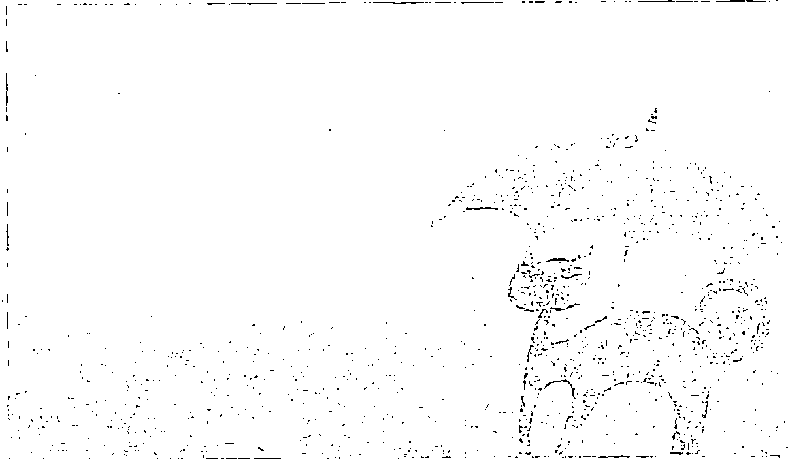

### 别让心里长草

佚名

小镇上有一个叫文志的年轻人出了几天远门，回来却得知邻居张武死了。他吃了一惊，忙问：“我上星期临走时还看见他在房顶上晒太阳呢，怎么突然就没了？他刚五十多岁呀！”那人说，一个星期前他突然失踪了，人们到处找也没找到。最后有人在山上的一个大坑里发现了他，已经断气了。其实坑不深，摔不死人，只是不容易爬上来。他可能是渴死、饿死的吧。

这时旁边一个老者说：“不不，他死于两棵草！”说话的人是黄老头儿。因为他喜欢给人算卦看相，神神道道的，人们都管他叫黄大仙。周围的人笑起来：“两棵草怎么能让人死呢？他是掉进大坑里死的。”

一个熟人又神秘兮兮地小声对文志说：“昨天晚上我和吴树在一起喝酒，他喝醉了说，那天他正好在附近打兔子，看到张武急匆匆地从大坑边经过，突然就滑下去了，还听见他喊救命了。其实，张武是因为吴树没救他才死的。”

黄大仙说：“不不，他死于两棵草！”那个熟人说：“什么死于两棵草呀，他就是因为吴树见死不救才死的。”

旁边的另一个熟人插言说：“也不能埋怨吴树见死不救，如果他俩没仇没恨，肯定会救的。我听我爸说，几年前张武曾带一伙人到吴树家打闹，砸了很多东西，吴树肯定早就怀恨在心呢。”

这时一个老太太说：“吴树也是欠砸！你们都不知道吧，一次吴树看见张武和一个外地女人在树林里说话，就添油加醋地到处说。张武的老婆听说张武和别人好上了，就又哭又闹，还差点离婚，张武的脸都丢尽了。后来张武追查出是吴树造的谣，这才闹到他家去了。唉，他到底还是让吴树给害了。”

黄大仙又说：“不不，他死于两棵草！”老太太说：“黄大仙老糊涂了吧，怎么老往两棵草上扯呢？”

有一个老头儿凑过来说：“我知道他俩很久以前的事。那时，张武二十多岁，靠养花、卖花赚钱。吴树十二三岁，母亲常年有病在床，家里很穷，没钱治病。他听说，常喝一种花泡的水就会减轻病情，便借了钱到张武家去买。可那种花很贵，自己的钱根本不够，他只好买了四棵幼苗自己养。几个月后，有两棵长出了花苞，可另两棵就是长不大，原来只是两棵草！他气得找张武大吵了一架，从那时起就恨上了张武。”

黄大仙说：“他还是死于两棵草吧！”文志说：“照这样推论，他还真是死于两棵草，原来你早就知道他们以前的事啊！”黄大仙说：“不知道。其实，道理很简单，不仅仅他死于两棵草，很多人都死于两棵草。当别人办了一件让你不服气、不满意的事时，你的心里就开始长草了，如果这草越长越多，你终将会受制于那些草。”人们这才恍然大悟。

- 书名：找回快乐
- 作者：[美] 理查德·卡尔森 (Richard Carlson)
- 出版社：机械工业出版社
- ISBN：711113373
- 包装：平装
- 开本：32开
- 出版日期：2004-01

### 内容简介：

把杂草从一个花园移开，留下的即是美丽。你不需要再种什么了，只需要带走那些破坏美丽的东西。为心灵除除草，留下的即是快乐。你不需要改变现状，只需要剪掉那些抑郁和焦虑的牵绊。这本书的目的是讨论荣格有关人类生存状态的评价，即包围着我们的忧愁和普遍程度。我将向你阐述怎样摆脱控制着你的生活的消极感觉，并用感恩、快乐和爱的感觉来代替它们。从本书获得最大收益的方法，就是以开放的心灵去阅读它。

魅力失分

白羊看似没心没肺地过着每一天，其实心思细腻得很。朋友做的很多事情或者不经意的一句话都会让他疑心半天。

### 我相信你

李明是一个德行不好的人，好吃懒做不说，还有偷偷摸摸的习惯，所有人都讨厌他，因为他借了别人的钱不还不算，还总是拿去赌博。所以周围的人都不借钱给他，即使他想做点小买卖都借不到钱。于是他跑到一个远房亲戚家借钱，那是他第一次向那个亲戚借钱，他以为亲戚不知道自己的底细。

李明很顺利地借到了钱。在他转身要走时，亲戚叫住了他，对他说了一句话：

“曾有人打电话告诉我不要借钱给你，因为你有了钱就会去赌，而且还借钱不还，但我不相信你是那样的人，我想他们可能对你有误解。”

李明听了心里一惊，因为他的确是准备拿这笔钱去赌博的。亲戚的话给了李明很大的震动，他没有说话，关上门走了。

几个月后，亲戚收到了李明从外地寄来的钱，原来那天亲戚的话让李明深受感动，他知道自己应该有另一种人生，他再也不想骗人了，他想让大家重新认可自己，相信自己，所以他带着那笔钱离开了家乡，到外地打工去了。

三年后，李明衣锦还乡，把从前的欠款全部还清了。

#### 魅力提示：

信任别人就是对别人的尊重，同样也会得到别人对你的尊重。其实世上并没有绝对的好人，也没有绝对的坏人，只要人与人交往时多一点信任，少一点猜疑和偏见，那么任何人都会向好的方面发展。

### 颜渊做饭

佚名

孔子被困在陈国、蔡国之间，只能吃野菜充饥，七天没有吃到粮食。孔子白天躺着睡觉，颜渊去讨米，回来后烧火做饭，饭快熟了，孔子的弟子看见颜渊抓锅里边的饭吃。

于是弟子便将此事告之孔子。

孔子说：“我相信颜渊。”

过了一会儿，饭做熟了，颜渊拜见孔子并且端上饭食，为了消除弟子对颜渊的怀疑，孔子假装不知颜渊抓饭吃的事，起身说：“今天我梦见了先君，我看把饭食弄干净了然后我们去祭扫先君。”

颜渊回答说：“不行。刚才灰尘落进饭锅里，扔掉粘着灰尘的食物不吉利，我抓出来吃了。”

于是，孔子对弟子叹息道：“我们所相信的是眼睛，可眼睛看到的还是不可以相信；所依靠的是心，可心里揣度的还是不可依靠。各位学生你们要记住：了解人本来就不容易呀。”

**魅力提示：**

人常说眼见为实，可是眼睛看到的也往往不过是表面现象而已，如果再戴着“有色眼镜”去看别人看外部事物，那就更看不到事情的真实和本来面目了。

### 借锤子

何晓健

有一个人想挂一张画。他有钉子，但没有锤子。邻居有锤子。于是他决定到邻居那儿去借锤子。就在这时候他起了疑心：要是邻居不愿意把锤子借我，那怎么办？昨天他对我只是漫不经心地打招呼，也许他匆匆忙忙，也许这种匆忙是他装出来的，其实他内心对我是非常不满的。什么事不满呢？我又没有做对不起他的事，是他自己在多心罢了。要是有人向我借工具，我立刻就借给他。而他为什么会不借呢？怎么能拒绝帮别人这么点儿忙呢？而他还自以为我依赖他，仅仅因为他有一个锤子！我受够了。于是他迅速跑过去，按响门铃。邻居开门了，还没来得及说声“早安”，这个人就冲着他喊道：“留着你的锤子给自己用吧，你这个恶棍！”

**魅力提示：**

消极的思想造成错误的行为，积极的心态可以避免一切不必要的麻烦和错误。

### 互动的怀疑

赵敏

船夫一大早就因为一件小事和妻子吵了起来。结果越吵越凶，妻子后来竟然把一个暖瓶摔到了地上。船夫生气极了，他不再理会仍在哭闹的妻子，觉得妻子真是不可理喻，他甚至想这样的日子真是过到了头。这样想着，船夫一气之下就把家里的5000元现金放在了衣服里。如果妻子不向他道歉，那他就在外面住下来，不再回家，他想。

船夫就这样带着一肚子气去岸边了。生气归生气，可是生活还要继续。

船夫刚到岸边就有两个年轻人雇了他的船。这两个年轻人上了船就发现船夫的神色有些不对劲，他一直板着脸、皱着眉头，看上去有些可怕。“难道上了贼船？听说江河边有很多强盗出没，他们假扮成船夫专门劫乘船人的财物，然后再把乘船人扔到江里淹死。”两个人这样想着，不由得害怕起来。他们刚刚从城里干活回来，好不容易挣到的几千块钱全都带在身上，这可是他们一年的全部收入啊，如果被强盗抢了去，那家里等着用钱的父母和妻儿可怎么办？况且如果就这样被强盗杀害，自己更是死不瞑目。于是两个人开始小心翼翼地商议应该如何对付这个身体强壮的船夫。

开始时船夫心里一直在想着与妻子吵架的事情，本来就是因为一点小事，自己为什么要发那么大的火呢？想到妻子平时为家里操劳、船夫更是后悔不已。他想等送走这两位客人，他一定要赶快回家去向妻子道歉。这样想着，船夫就抬起头来使劲划船，可他看到两位乘客背对着他鬼鬼祟祟地在商议着什么，难道这两个人是坏人？越看这两个人越不像好人。自己当初只顾着和妻子生气了，一直没注意这两个人是如此可疑，而且家中的5000元钱也全被自己带在了身上，船夫真是后悔至极！

两位乘客看到船夫的表情更加难看，心里更是害怕，可是他们互相鼓励不要害怕，要镇定。其中一个矮个子想到自己为儿子买了一支玩具手枪，于是拿出来壮胆，另一位高个子则故意大声暗示自己有十几个弟兄在岸边接应，如果到时候看不到他们上岸就会找江上的船夫算账。

船夫听到他们恶狠狠的话吓了一大跳。可是他也绝不能轻易放弃反抗，如果钱被这两个人抢去的话，那自己就更对不起妻子了。他这样想着，不料因用力过度将手中的船橹“咔”的一声就折成了两截。他一手拿着一半船橹怒视着两位乘客，船夫的这一举动吓坏了两位乘客，可是他们也不愿意就此将自己辛辛苦苦赚来的血汗钱拱手相让，于是他们决定做最后的一搏。高个子乘客相对来说比较有力气，于是他站起来做了几个功夫招式，然后用力一掌劈向船舷。船开始剧烈地摇晃，此时船夫想到了一个不得已的办法——跳船，也许只有这个办法可以逃生。两位乘客虽说游泳的技术不好，可是此时也顾不得那么多了，在船夫跳船的那一刻他们也纵身跳到了江里。双方都感到纳闷，怎么不见对方抢钱，反而跳进了水里呢？矮个子乘客的水性不好，刚游了几下就大呼救命，高个子一边在水里扑腾一边求船夫饶过他们，并说他们愿意将身上的钱全部交出来。船夫还没弄清是怎么回事，可是想到救人要紧，于是把两位乘客——救回船上。上船以后经过一番解释，三人才知道这是一场误会。大家不由得感慨：“误会的根源就是彼此怀疑。一次误会差点使三人都不明不白地丧命。”

#### 魅力提示：

相互怀疑常常会使人际交往形成一种恶性循环。许多原本很好的人际关系就是这样被破坏的。人际交往永远都是相互的，你给予对方真诚，对方也会与你坦诚相见；你向别人施以怀疑，那别人对你同样不会信任。

- 书名：信任的速度：一个可以改变一切的力量
- 作者：[美]史蒂芬·M·R·柯维(Stephen M. R. Covey) [美]丽贝卡·R·梅里尔(Rebecca R. Merrill)；王新鸿译
- 出版社：中国青年出版社
- ISBN：750068287
- 包装：平装
- 开本：大32开
- 出版日期：2008-08

### 内容简介：

《信任的速度》是本可读性很强的书，史蒂芬·M·R·柯维为我们展示了信任的力量——这个往往被忽视、被低估，但却“足以改变一切的力量”。这是一本突破性的书，它挑战了我们多年以来关于信任的成见，展现给我们的是，信任不仅是一种无形的社会美德，更是一个有形的经济推动力。它可以使组织改善业绩，使个人得到提升，使关系更加融洽。在《信任的速度》一书里，史蒂芬·M·R·柯维通过“五波信任”、“四个核心”以及世界各地高信任度领导者共有的“十三种行为”生动形象地阐述了如何在个人关系和职业生涯中激发和维护信任，层层递进地为我们展现了一幅通过培养品德和能力，增强领导力和信心，在各个层面建立信任的路线图。

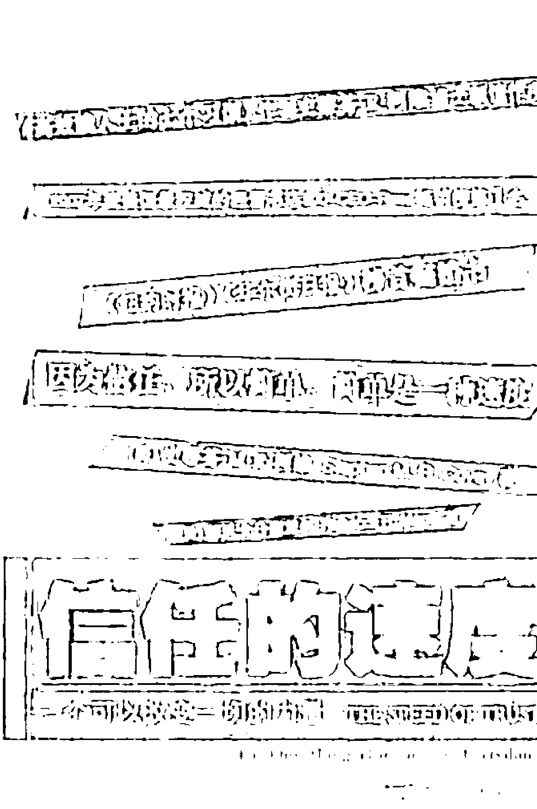

魅力失分

有时白羊实在专制得有些过分，喜欢将自己的想法强加于别人身上，很少从别人的角度出发，永远认为自己是对的。

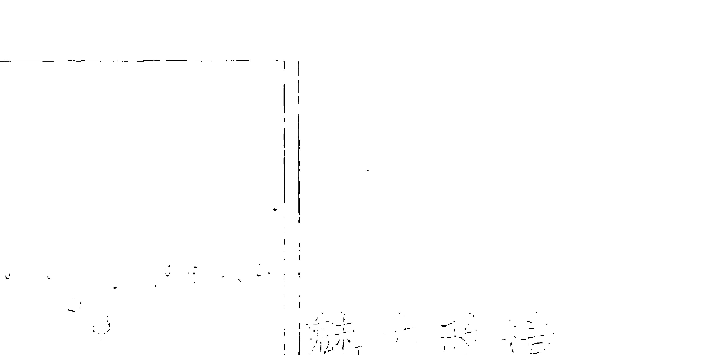

### 女巫的命运

佚名

年轻的亚瑟国王被邻国的伏兵抓获。邻国的君主被亚瑟的年轻和乐观所打动，没有杀他。并承诺只要亚瑟可以回答一个非常难的问题，他就可以给亚瑟自由。亚瑟有一年的时间来思考这个问题。如果一年的时间还不能给他答案，亚瑟就会被处死。

这个问题是：女人真正想要的是什么？

这个问题连最有见识的人都困惑难解，何况年轻的亚瑟，对于他这是一个无法回答的问题。但总比死亡要好得多，亚瑟接受了国王的命题——在一年的最后一天给他答案。

亚瑟回到自己的国家，开始向每个人征求答案：公主、牧师、智者、宫廷小丑。他问了所有的人，但没有人可以给他一个满意的回答。人们告诉他去请教一个老女巫，只有她才能知道答案。但是他们警告他，女巫的性格很怪异，不一定会帮他。

一年的最后一天到了，亚瑟别无选择，只好去找女巫。女巫答应回答他的问题，但他必须首先接受她的交换条件：和亚瑟王最高贵的圆桌武士之一，他最亲近的朋友——加温结婚。亚瑟王惊骇极了，看看女巫：驼背，丑陋不堪，只有一颗牙齿，身上发出臭水沟般难闻的气味，而且经常制造出猥亵的声音。他从没有见过如此不和谐的怪物。他拒绝了，他不能强迫他的朋友娶这样的女人而让自己背负沉重的精神包袱。加温知道这个消息后，对亚瑟说：“我同意和女巫结婚，没有比拯救亚瑟的生命和保存圆桌更重要的事了。”于是，女巫回答了亚瑟的问题：

女人真正想要的是主宰自己的命运。

每个人都立即知道了女巫说出了一个伟大的真理，亚瑟的生命被解救了。于是邻国的君主放了亚瑟王并给了他永远的自由。

来看看加温和女巫的婚礼吧，这是怎样的婚礼呀！亚瑟王在无法解脱的极度痛苦中哭泣。加温一如既往的谦和，而女巫却在庆典上表现出她最坏的行为：她用手抓东西吃，打嗝，放屁，让所有的人感到恶心，不舒服。

新婚的夜晚来临了：加温依然坚强地面对可怕的夜晚，走进新房。是怎样的景象在等待着他呀！一个他从没见过的美丽的少女半躺在婚床上！加温惊呆了，问她到底是怎么回事。美女回答说，因为当她是个丑陋的女巫时加温对她非常地好，于是她决定在一天的时间里一半是她丑陋的一面，另一半是她美少女的一面。

那么加温想要她在白天或夜晚是哪一面呢？

多么残酷的问题呀！加温开始思考他的困境：是选择在白天向朋友们展现一个美丽的女人，而在夜晚，在他自己的屋子里，面对的是一个又老又丑如幽灵般的女巫。还是选择白天拥有一个丑陋的女巫妻子，但在晚上与一个美丽的女人共同度过？如果你是加温，会怎样选择呢？

答案归纳起来，就是两种：一种选择白天是女巫，夜晚是美女，理由是妻子是自己的，不必爱慕虚荣，苦乐自知就可以了；一种选择白天是美女，因为可以得到别人羡慕的目光。

然而，你们知道加温的选择是什么吗？

加温没有做任何选择，只是对他的妻子说：“既然女人最想要的是主宰自己的命运，那么就由你自己决定吧。”于是女巫选择白天夜晚都是美丽的女人。

#### 魅力提示：

当我们遇到这样的问题的时候，有几个人能像加温一样呢，其实，当你给予别人尊重和理解，让别人按照自己的意愿去生活时，你会得到更多。

### 应听乌龟的意见

董国明

格洛丽亚·斯坦姆是女权主义运动的一位领导者兼作家。学生时代，在一次地理考察中，她上了人生中重要的一课。

在史密斯大学演讲时，斯坦姆和听众分享了这次经历：

在考察中，在蜿蜒的康涅狄格河畔，我发现了一只巨大的乌龟，它趴在一段路的护堤上。它显然是从河里爬出来的，经过一段土路才到了现在这个地方。它还在继续前进，随时有被汽车压死的危险。

同是地球上的生物，我觉得帮助它是责无旁贷的。于是我走上前，连拉带拽，最后总算把这只大乌龟从路障上带回岸边。这期间，它不断愤怒地想咬我一口。

当我正要把乌龟推回河里时，地理学教授走了过来，并对我说：“你知道，为了在路边的泥里产卵，那只乌龟可能花了一个月的时间才爬上公路，结果你要把它推回河里！”

我当时懊恼极了。不过，在后来的岁月里，我发现那次经历是我人生中生动的一课。

#### 魅力提示：

不要犯主观臆断的错误。不管你是激进的还是保守的，在做事关“乌龟”的决断时，都不要忘记先听听乌龟自己的意见。

### 伪装的神

佚名

有一尊神被钉在十字架上，来膜拜的人特别多。他的仆人很希望能分担神的痛苦。一天他向神表明这份心愿，意外地，他得到了允许，只是不论看到什么，听到什么，都不可以说一句话。

有一天，来了一位富商，当富商膜拜完后，竟然忘记拿身边的钱袋便离去了。伪装的神看在眼里，真想叫这位富商回来，但是，他得憋着不能说。

接着来了一位穷人，他祈祷神能帮助他渡过生活的难关。正要离去时，发现先前那位富商留下的袋子，高兴得不得了，认为是神有求必应，万分感谢地离去。伪装的神想告诉他，这不是你的。但是，有约定在先，他仍然憋着不能说。接下来有一位要出海远行的年轻人来了，他是来祈求神给他平安。正当他要离去时，富商冲进来，抓住年轻人的衣襟，要年轻人还钱，两人吵了起来。这时候，伪装的神终于忍不住，开口说话了。既然事情清楚了，富商便去找那穷人，而年轻人则匆匆离去。真正的神出现了，指着仆人说：“你下来吧，那个位置你没有资格呆了。”仆人说：“我把真相说出来，主持公道，难道不对吗？”神说：“你懂得什么？那位富商并不缺钱，可是对穷人来说，那袋钱则可以挽回一家大小的生命。最可怜的是那位年轻人，如果富商一直纠缠下去，延误了他出海的时间，他还能保住一条性命。而现在，他所搭乘的船正沉入海中……”

**魅力提示：**

我们常把自己的想法强加于人，自认为给予了别人最好的，但却往往事与愿违。

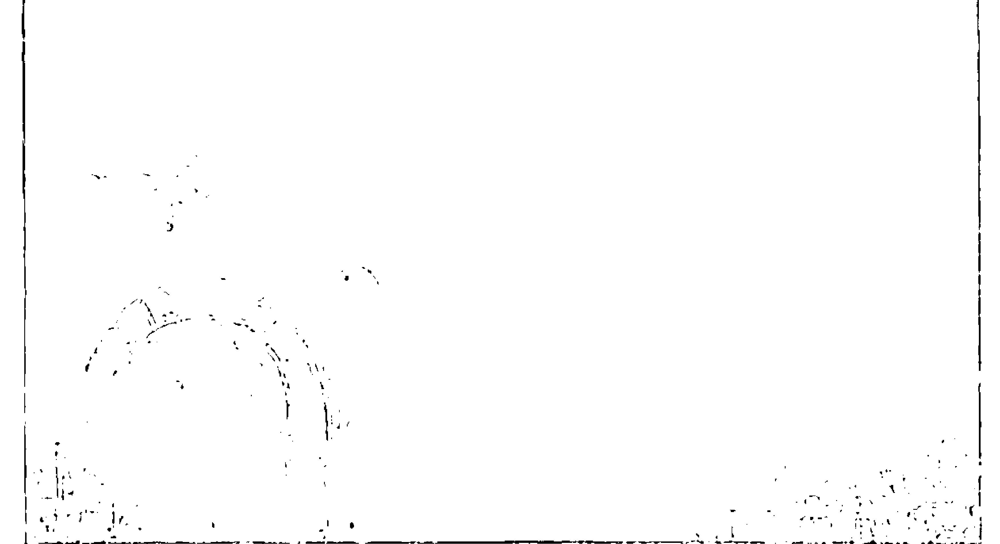

### 飞鸟与游鱼

佚名

天空中，有一只鸟儿在自由自在地飞翔着，看见下方有一个池塘，就落下来小憩。

鸟儿看见一条鱼儿在水中游来游去。它想：“多可怜的鱼儿呀！整天被无情地泡在冰冷的水里，无法上岸走走，更不能像我一样在天空自由自在地飞翔。我一定要把它救到天上来。”

于是鸟儿对鱼儿说：“亲爱的朋友，你可真傻啊，整天待在这沉闷冰凉的水里受罪，来吧，跟随我一起去天空自由自在地生活吧！”

“可是……我，好像无法离开这水呢。”鱼儿怀疑地回答。

“你可真笨！那么好吧，既然你自己没有办法离开这一池讨厌的水，那么，就让我来帮你吧！”

鸟儿说完，飞向水面然后一头扎进水里，把游鱼叼到了口里。接着，它奋起翅膀，向天空飞去。

“放下我！快放下我！”鱼儿感到呼吸困难，向鸟儿求救。可好心的鸟儿一心要拯救这只“可怜”的游鱼，它要让这鱼儿饱览高空美景，让它享受高空自由自在的生活，让它看看在森林中安家是一件多么惬意的事……

可是，当鸟儿最后把鱼儿放在林中自己的鸟巢里时，鱼儿早已经断了气。

#### 魅力提示：

给鱼离开水的自由，也就是给了它死亡。不要总是把自己的意愿强加于人，不要以为你所需要的也一定是别人所需要的。人与人的差异或许就如同飞鸟与游鱼的差异。

## 魅力星座智慧书之……

书名：当无所不知遇到自以为是……
作者：［美］里克·布林克曼（Rick Brinkman）［美］里克·克斯讷（Rick Kirschner）
出版社：中信出版社
ISBN：780073599
包装：平装
开本：大32开
出版日期：2003-01

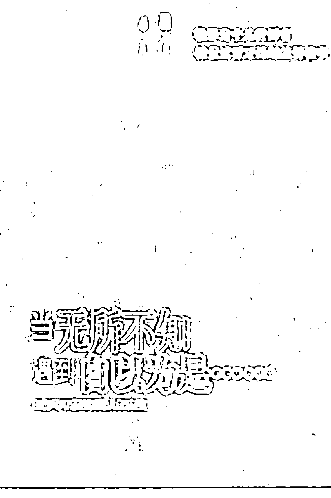

### 内容简介：

被译为十几种语言，销量过百万的超级畅销书。
如果有人问你身边有令人头痛的人吗？你肯定会不假思索地扳着手指数出一大堆名字。如果有人问你是否认为自己是一个不好相处的人，你思考再三之后的答案大约是：“我会吗？！”但本书作者的观点与你正好相反。他们认为：其实并没有天生难打交道的人，而你也并不总是通情达理。
在本书中，你将学会一整套特殊的攻略来应付上述高手和偶尔难缠的你自己。它们或可化干戈为玉帛，化冲动为理智，化暗藏敌意为诚恳对话；或可不战而屈人之兵，让刺头们乖乖地采取自己改变自己的方式；或可……

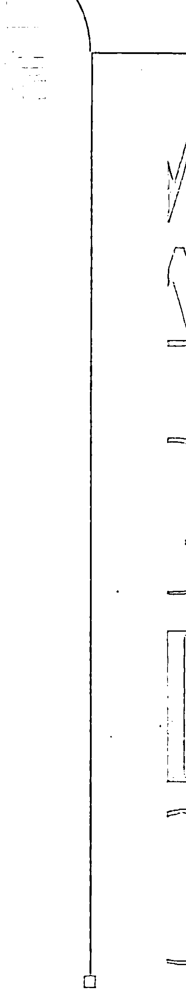

## 魅力失分

白羊们的特点就是喜欢自己承担一切，白羊真正交心的朋友其实真的没有几个，大多数时间白羊喜欢把一切心事都放在内心，只要是白羊不想说的，谁都问不出来什么。

### 最好的快乐

程青衣

一个 62 岁的老太太，带着 83 岁的老母亲去旅游。两个都是上了年纪的人，去深圳看“世界之窗”。83 岁的老母亲没有买票。“世界之窗”有规定：66 岁以上的老人不用买 120 元一张的门票。

这个在我们看来很普通的老太太，不过是一个退了休的职工，闲时扭扭秧歌、跳跳舞、看看报、读读书。但她从来不把自己当成老人，她和孙子一起唱周杰伦的《双截棍》，她和老伴一起驾车去旅行，看到自己落后了就去学电脑。人家问她的年龄，她总是笑着说：“26 岁。”其实，她是 62 岁。

她说：“为什么不快乐呢？快乐是一种生活的态度。”
重要的是，快乐还是一种资源，她感染着全家人，使他们安详和幸福地生活着，80多岁的老母亲也跟她学会了跳舞。老母亲说：“我还没有坐过飞机呢。我想去南方看看，人家邓小平80多岁还南巡呢。”
她听了，二话没说就去订飞机票。在她所居住的小区里，她被视为异端——有谁还敢带着一个80多岁的老太太坐飞机，而且是去玩？！
当她看到老母亲欣慰的微笑时，当她知道自己的快乐在不停地感染着别人时，她说：“我是世界上最幸福的女人。”

#### 魅力提示：

这就是最好的快乐，能够把自己的快乐带给别人。那种渗透和感染，是一种非常美丽的传播，是让人感到细水涓涓而流的清澈与美好。

## 魅力星座智慧书之

### 钓鱼

贺 晖

几个人在岸边岩石上垂钓，一旁有几名游客在欣赏海景之余，亦围观他们钓上岸的鱼。

只见一名钓者竿子一扬，钓上了一条约有三尺来长的鱼，落在岸上后，那条鱼的身体犹腾跳不已。钓者冷静地用脚踩着大鱼，解下鱼嘴内的钩钩，顺手将鱼丢回海中。

围观的众人响起一阵惊呼，这么大的鱼还不能使他满意，足见钓者的雄心之大。就在众人屏息以待之际，钓者的鱼竿又是一扬，这次钓上的是一条两尺长的鱼，钓者仍是不多看一眼，解下鱼钩，便将这条鱼放回海里。

第三次钓者的钓竿又再扬起，只见钓线末端钩着一条不到一尺长的小鱼。

围观众人的心中以为这条鱼也将和前两条大鱼命运相同，被放回大海。却不料钓者将鱼解下后，小心地放进自己的鱼篓中。

游客们都百思不得其解，其中有一个人问道：“别人钓鱼都要大的，您为什么放掉大鱼而留小鱼？难道大鱼不比小鱼好吗？”

钓者经此一问，回答：“喔，那是因为我家里最大的盘子，只不过有一尺长，太大的鱼钓回去，盘子也装不下。”

#### 魅力提示：

敞开自己的心门，去接受各式各样正面的讯息，你将会发现，一个人的胸中，竟可容下宇宙间永恒无尽的智慧。

### 最好的惩罚

佚名

有一个故事，说一位犹太教的长老，酷爱打高尔夫球。
在一个安息日，他觉得手痒，很想去挥杆，但犹太教义规定，信徒在安息日必须休息，什么事都不能做，连按电梯钮都不行。
这位长老却终于忍不住，决定偷偷去高尔夫球场，想着打9个洞就好了。
由于安息日犹太教徒都不会出门，球场上一个人也没有，因此长老觉得不会有人知道他违反规定。
然而，当长老在打第2洞时，却被天使发现了，天使生气地到上帝面前告状，

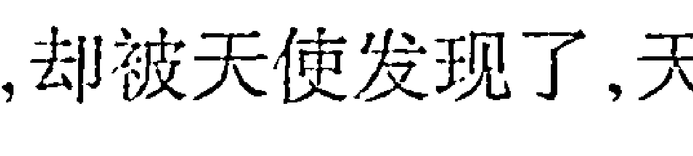

说某某长老不守教义，居然在安息日出门打高尔夫球。上帝听了，就跟天使说，会好好惩罚这个长老。第3个洞开始，长老打出超完美的成绩，几乎都是一杆进洞。

长老兴奋莫名，到打第7个洞时，天使又跑去找上帝：上帝呀，你不是要惩罚长老吗？为何还不见有惩罚？

上帝说：我已在惩罚他了。

直到打完第9个洞，长老都是一杆进洞。因为打得太神乎其神了，于是长老决定再打9个洞。

天使又去找上帝了：到底惩罚在哪里？上帝只是笑而不答。

打完18洞，成绩比任何一位世界级的高尔夫球手都优秀，这可把长老乐坏了。

天使很生气地问上帝：这就是你对长老的惩罚吗？

上帝说：正是，你想想，他有这么惊人的成绩，以及兴奋的心情，却不能跟任何人说，这不是最好的惩罚吗？

#### 魅力提示：

> 生活需要伴侣，快乐和痛苦都要有人分享。没有人分享的人生，无论面对的是快乐还是痛苦，都是一种惩罚。

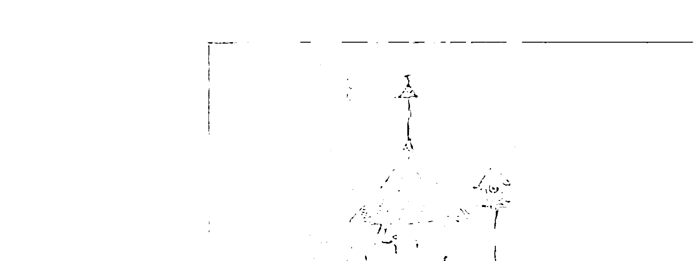

### 走出小屋

肖小林

家在加州旧金山的姗娜获准去一个远在澳大利亚沙漠深处的军事基地，看望阔别三年的恋人。当她来到基地时，恰巧恋人到海外执行任务，姗娜决定留下等他回来。

恋人一个月后回来了，姗娜对他急急地讲述到这里后的孤独和寂寞：基地周围都是沙漠，看不到几棵绿树，特别是附近的居民一看就是愚昧落后的土著人，和他们语言不通，每天我只好把自己关在小屋里。

恋人笑了。这里生活很美，不信，你走出小屋。半信半疑的姗娜试着去和周围的世界接触。她忽然发现，头顶的星空比在屋里向外望的那一块辽阔美丽多了，而那些看起来愚昧的土著人对她也十分友好。在晴朗的夜色下，部落里的一百多人燃起熊熊篝火，为她跳起了迷人的舞蹈。姗娜后悔早该从小屋里走出来。两个月不知不觉地过去，姗娜对这一片土地竟依依不舍。回到美国后她根据日记写出了畅销全国的《沙漠游记》。

> **魅力提示：**
世界美不美，生活好不好，关键在于你是否能走出“关闭”自己的小屋。消极，封闭自我，生命就会一片荒芜；积极，热爱生活，即使沙漠也会成为生命的绿洲。

## 魅力星座智慧书之...

- 书名：不自闭！交际的魅力
- 作者：[日]石原壮一郎 [日]伊藤美树 绘画 刘安彭 翻译
- 出版社：中国轻工业出版社
- ISBN：750196135
- 包装：平装
- 开本：32开
- 出版日期：2008-01

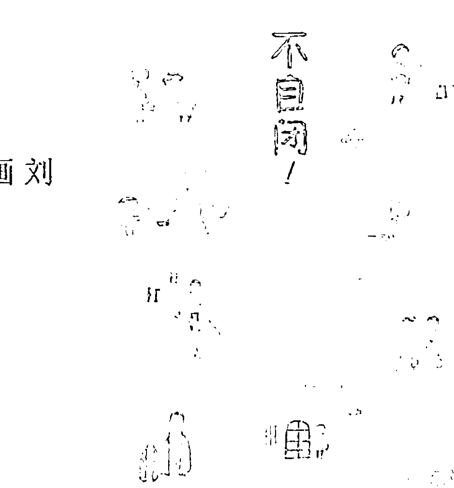

### 内容简介：

您对于交际是一种什么印象呢？复杂、麻烦、令人头疼？其实，夫妇、恋人、邻居、朋友、同事……与身边各种人的交际可以给我们带来许多美妙感觉。
能让别人和自己在共同的“时间和空间”里享受幸福，是很快乐的事情。
如何通过最得体的交际手段，使自己的心贴近你周围的人们……
学会本书礼仪和秘诀的目的，绝不是让您在日常生活中畏首畏尾，自我束缚；也不是为了维持表面的人际关系对人虚与委蛇，而是要让您充分享受与人交往的快乐。
“交际”可以充分地表达您“很想愉快、友好地与人交流沟通”的心情，“交际”可以让您深刻理解对方的心境和魅力，“交际”是您在生活中值得信赖的伙伴，“交际”是您创造美好的……

### JAY

## 魅力失分

白羊座总是想起来什么就做什么事情，对什么都无所谓，生活学习工作丝毫没有规律性。

### 请你做好最后一天

傅友福

那一年，我力挫群雄，以绝对优势应聘到一家台资公司任人事助理。一开始，我便全身心投入到工作中，而且自我感觉良好。可是没几天，这种新鲜感及喜悦之情便荡然无存了。我不时有逃离监狱又进牢房的感觉：时间太紧，事务繁忙，没有一点自由空间，公司规定又多。以前在港商公司懒散惯了，一下子无法适应这种环境。更要命的是，公司有三个经理，每件事都要向他们一一汇报，否则，另一个经理问起来，一定有你好受的。

就在这个节骨眼上，我犯了一个错误。台商协会通知总经理下午两点开会，当时总经理不在办公室，我便向另一个经理作了汇报。也许那经理是事不关己、高高挂起的心态，没有转告总经理，结果总经理没有接到开会的通知。第二天早上，总经理对我吹胡子瞪眼睛，狠狠责备了我：这点小事也做不好？

我何曾受过这等窝囊气？咱惹不起还躲得起呢。我拉开抽屉，拿出了辞职书，龙飞凤舞地写着，准备送给总经理。

总管刘生拦住了我，并拿走我的辞职书，锁进他的抽屉里。因当时他是我的顶头上司，我也不好再说什么。

刘生抽了一根烟，眯起眼睛，意味深长地对我说：“傅生，我知道你是能胜任这份工作的，也许他们错怪了你，你可以走人，找工作还不容易？但你不可以现在就走，你要是现在就走的话，那不是证明了你没有工作能力，是因为自己做不好，让别人炒了鱿鱼？我跟你说，失去一份工作并不可怕，可怕的是好好地又背上一个不能胜任的罪名。不如做好最后一天吧，让他们满意了你再走。到时候你走了是你炒了他们，而不是他们炒了你，别人也会说你有骨气。你说呢？

我细想一下，还真是那么回事，便听从了刘生的劝告，忍住心中的愤懑，决心做好最后一天再走。

可是，第二天，我又出了个差错，把经理要批阅的文件送到总经理的案上。经理说我做事不细心，马大哈。

第三天，一份发给台北的传真打错了一个字，另一个经理说我太马虎，那个字要是款项的数字，公司损失不就惨了？重打！

第四天，经理要我通知各部门主管到办公室开会，我又把五金部的主管给通知漏了，总经理毫不客气地数落我一番……

我清楚地记得，那是第十二天，我早早就作好了准备，当天的工作总有条不紊地进行着。那天，总经理也好，经理也好，他们交代的事情我都一一不漏地按时完成。临下班时，一切总算平安无事了。就在这个时候，总经理把我叫到办公室，笑着对我说：“做得不错嘛，年轻人就要这样，迅速改正错误，丢掉懒散的毛病，适应新的工作环境。其实呢，你很有悟性，照这样下去，前途无量啊！好好做，公司不会亏待你。”前途无量！好的，有你这句话，我就可以脱离苦海了。

下班后，我找到了刘生，告诉他我已做好了最后一天，总经理还夸了我。刘生听完我的话，依然眯起眼睛说：“你想要回那张辞职书吗？”我笑着点点头。他也笑了，笑得有点狡诈：“你能做好这一天，就不能再做好下一天，再下一天，再下下一天……你已经能胜任这份工作了，干吗还要辞职，有病啊……”

我又听从了刘生的话，终于没有辞职。工作中，每一天都让我当成是最后一天，做得好好的。如今，我还在这家台资公司做，而且在刘生走后，升任到行政主任，工作也越来越顺心了。

后来我仔细一想，恍然大悟了：我上了刘生的“当”了！能做好最后一天，为什么还要走？

#### 魅力提示：

> 把每一天当成是你在这个单位的最后一天，并把这一天做好，你就不会觉得他们是在故意刁难你了。同时要意识到自己不足的地方，而努力改进。当这一切都不复存在时，你懒散的毛病已经离你远去，你已经是个能胜任任何工作的人了。

### 福特捡纸

佚名

很久以前，有一个美国人去应聘。

在他的简历中，学历这一栏写着“初中未完”的字样。由于这家公司的知名度，有很多人来应聘，他的位置是靠后的。

看着应聘者一个一个进去，又一个一个垂头丧气地出来，他立刻感到了不安、要知道这里每一个人的学历都比他高得多！但是出于礼节考虑，他并未中途退出。很快，由于时间关系，应聘结束了。

后来参加应聘的人都带着遗憾和不满走出大厦。在走出安全门的那一刻，几乎人人都看到挡在前面的纸篓和躺在地上的一张废纸。但是，他们都视而不见地跨了过去。那个年轻人，弯下腰，捡起纸，扔进纸篓。身旁一个兴奋的声音响起：“干得很好，你已被录取了！”

这个幸运的年轻人就是福特。福特就这样进了这个公司，这个公司不久就扬名天下。后来，福特把这个公司改为“福特公司”，也相应改变了整个美国的国民经济状况，使美国汽车产业在世界独占鳌头。

这个福特捡纸的故事被奉为工商管理的“经典案例”。然而，有多少人真正读懂了呢？

> 魅力提示：
勤劳的态度和主动积极的精神是一个人成功的关键。勤奋不懈的毅力，再加上该有的观察能力，应该成为一种良好的生活习惯。这种好习惯可以为我们创造出更多的成功机会。

### 千万别小看“过去”

秦子来

有两个朋友，一个很努力，一个很懒散。

懒散的常常讥笑努力的白费力气。

努力的那个，积累了许多人生经验，成就了大事业，可是一不小心，却失败了。

懒散的看了，便又讥笑他：“你耗费了那么多心血，结果还不是和我一样，两手空空的，什么也没有。”

“谁说我什么也没有？”

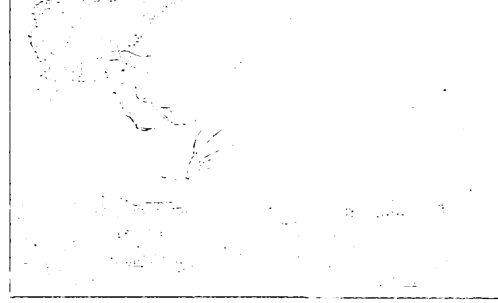

“那你还拥有什么？”
“过去。”努力的回答。
“还提过去做什么？过去的都已经过去了。”
努力的朋友一句话也没有再说，又重新开始经营他的事业。结果，他过去的朋友、同事看他又爬了起来，都跑来帮他的忙；再加上他过去的经验，很快地，他又成功了。
懒散的朋友看他成功了，非常羡慕，跑来问他成功的道理。
他说：“因为我有许多可贵的‘过去’。”
经过时间的累积，人拥有很多过去。
有的人的过去，用尽心血，绞尽脑汁，所以他在脑海里留下了很多智慧。
有的人的过去，什么事都做，什么苦都吃，所以他在生命中，留下了很多经验。
有的人的过去，很喜欢帮助别人，遇到有困难的人，他就伸出援手，所以他留下了许多朋友。
也有人什么事也不做，什么事也不想，只会吃喝玩乐，于是，他的脑海里只留下吃喝玩乐的过去。
经过时间的累积，每个人都拥有很多过去。遇到困难的时候，有的过去躲得远远的，一点用处也没有，有的过去却会过来帮忙。

#### 魅力提示：

> > 所以，千万别小看过去。过去，永远都不会过去。努力的人会得到对过去努力的回报。同样，懒散的人得到的只能是对过去懒散的回报。

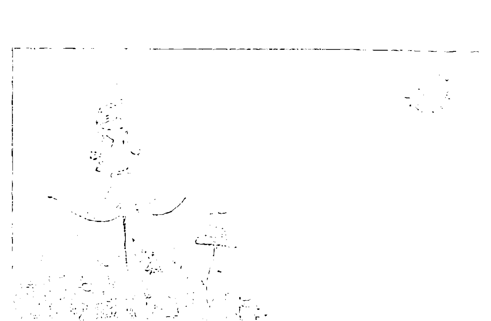

### 路边的青蛙

佚名

一天，一只路边的青蛙悠闲地在草丛中养神，突然听到有人叫：“老弟，老弟。”它懒洋洋地睁开眼睛，发现是田里的青蛙。

“你这里太危险了，搬来跟我住吧！”田里的青蛙关切地说，“到田里来，每天都有可以吃的昆虫，不但为庄稼除害，而且也不会有什么危险。”

路边的青蛙不耐烦地说：“我已经习惯了，干吗要费神搬到田里去？我懒得搬！况且，路边一样也有昆虫吃。”

田里的青蛙无可奈何地走了。几天后，它又去探望路边的青蛙，却发现路边的青蛙已被车子轧死了，暴尸在马路上。

#### 魅力提示：

很多灾难正是因为懒散的态度造成的，举手之劳却不愿为之，那就注定要为此付出沉重的代价。

### 魅力链接

书名：别把工作当儿戏
作者：杨凡用 著
出版社：中国城市出版社
ISBN：750741804
包装：平装
开本：32开
出版日期：2006-12

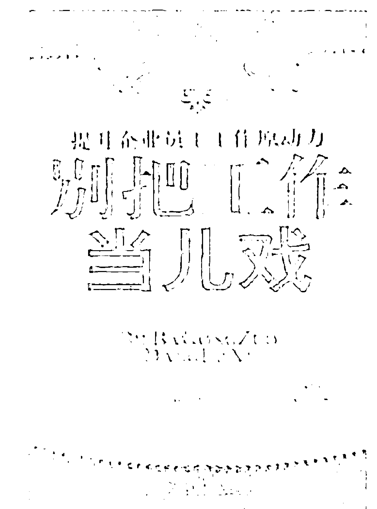

### 内容简介：

员工的工作原动力是任何企业都十分关注和感到棘手的老问题。如果不从根本上提升员工的工作原动力，任何企业的战略目标和规划都是难以实现的。提升员工的工作原动力，核心在于“忠诚”，关键在于“状态”，基础在于“能力”。一个企业能不能发展，最重要的因素是人，即这个企业的员工。而现在很多企业的现实是，员工的忠诚度下降，实行忠诚这个战略规划，就是要让员工明白，忠诚的最大受益者是奉行忠诚的本人！员工不忠诚，就没有用武之地，因为任何企业都不可能使用或重用一个有“反骨”的员工！忠诚的核心竞争力，是其他能力的统帅。员工获得老板信任的重要因素不仅是能力，更是忠诚！忠诚之于员工具有紧迫性，因为员工只有把自己的忠诚奉献给企业，企业才会给你回报，而不是相反。

### 今日运势

## 魅力失分

白羊做事的时候，往往急于知道成果或结论，所以可能会不断尝试失败的滋味。

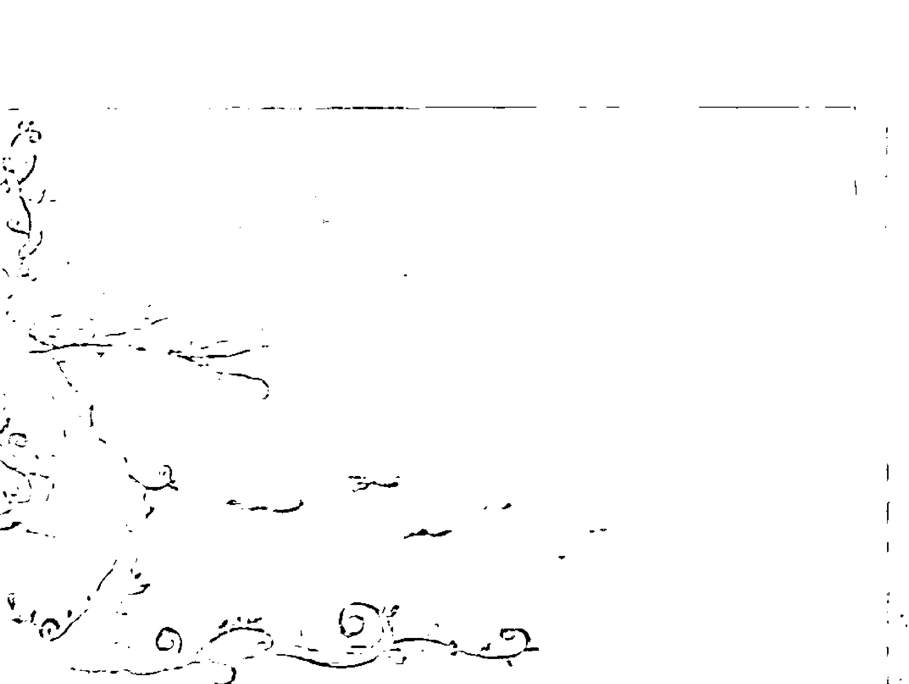

### 麦当劳的考察

佚名

20世纪70年代，麦当劳看好我国台湾市场，决定在当地培训一批高级管理人员。他们最先选中了一个年轻的企业家，此人条件不错。但是，在接下来的考察中，却始终都没有定下来。

麦当劳高层觉得，此人虽然诸方面条件都尚可，但在某些方面似乎有不易察觉的毛病，因此决定进一步试探。于是，有一次，总裁突然问：“如果要你先去打扫厕所，你会怎么想？”那个企业家立即沉默不语，脸上还现出了尴尬的神情。

麦当劳的这位亚太总裁从他的表情中已经读出：要我一个小有名气的企业家打扫厕所，未免大材小用了吧？就这样，总裁最终还是放弃了这位自恃高才的企业家。

年轻的企业家希望事业有个高起点，本无可厚非，但现实中还需要脚踏实地做好基础工作。下文中的农家子弟便是很好的例子：

大虎是富豪子弟，与他同在名校管理系的小宁是农民的儿子。他们一起进入名校的热门专业，两人的起点似乎相同。不同的是，小宁在校期间家教、零工都做过，学校的团队工作他也积极参与，还是绿色志愿者；而大虎则有的是经济来源，有的是“仆人”，所以养尊处优，学习上也不肯太下工夫。

毕业了，大虎进入父亲的公司，不久就成为行政副总；小宁则到了一家小软件公司，干办公室工作。

十年过去了，大虎还是父亲那家公司的行政副总，而小宁也已升任行政副总，只不过他所在的公司随着IT产业的迅猛发展改组为集团。毕业十周年聚会，大家诧异起点那么悬殊的两个人如今何以此消彼长。

> 有人说：“这就好比爬杆儿，要看高低，也要看速度。速度够了，距离也就短了。”

#### 魅力提示：

要想有所成就，我们必须克服浮躁的情绪，踏踏实实，从小事做起，从基础做起，扎扎实实地把成功的基础夯实，我们的成功大厦才会坚久牢固。

## 魅力星座智慧书之白羊座

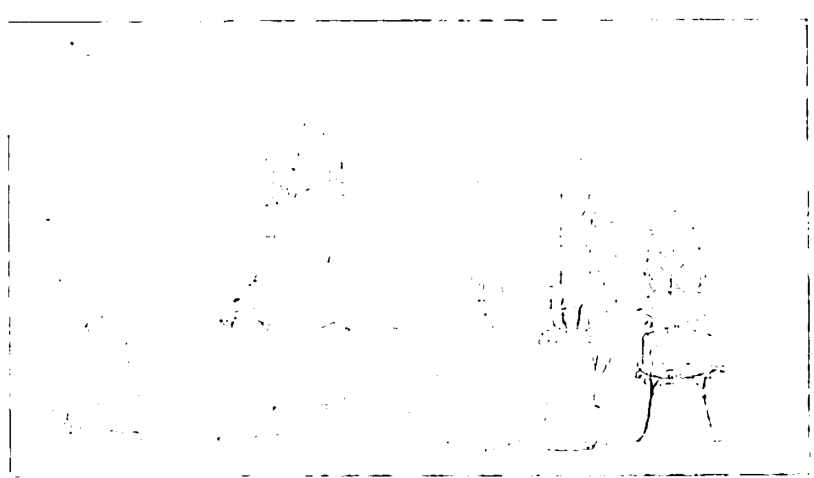

### 鹰的运气

鹏宏

两只鹰饥肠辘辘。它们在空中久久地盘旋着，想找到一只兔子或一只山鸡。但是，它们什么也没有找到，连一只老鼠的影子都没有。

一只山鹰忍耐不住了，落到山岩上，缩着脖子打瞌睡。另一只山鹰则继续盘旋着，一圈又一圈，终于，它发现了隐藏在草丛中的一只肥肥的兔子。

当它叼着战利品落到伙伴身边时，伙伴羡慕地说：“你的运气真好！”

捉到兔子的山鹰若有所思地说：“也许是吧，不过我发现，运气好像比较喜欢不辞辛劳、有耐心的人。”

> **魅力提示：**
捉到兔子的山鹰不辞辛劳、有耐心，才发现隐藏的兔子。可见，运气其实不完全是偶然的。运气还是会眷顾那些有准备的头脑。

### 抢跑与慢跑

阮定标

和朋友相约去爬山。山不过三百米高，从山脚到山顶有一条山道，平时慢悠悠地上去，倒不觉得它陡峭。

那一日，朋友向我挑战：“咱俩换一种登山方法，不再慢走上去，而是沿着山道跑到山顶，谁要是输了就买午餐的账单。” 我欣然同意。

仗着身材比朋友高大，加上平时爬山我也不输在他后，所以一迈脚我就信心十足。

我的步伐明显比朋友要快不少，差不多是他速度的两倍，很快，我就将他远远抛在了身后。

在山脚的转弯处，我会扭过头看一下朋友，眼见落后于我，他仍显得十分淡定，还是那样慢悠悠地跑着，一副不疾不徐的样子。

由于一开始用力过猛，我很快出现了呼吸急促的现象，大口大口地喘着气，心跳骤然加快，双脚仿佛不是踏在地面上，而像是踩在一堆棉花上。我机械地向前迈着脚步，但实际上，我的步伐较之开始，已慢下不少了。

最后，我终于支撑不住身体，只好停顿下来，坐在山道边的石凳上休息一下。

朋友很快来到我的身边，关切地问我有没有事，我向他摆摆手。

他继续向前跑着，仍然保持着一贯的步伐，每一脚都用力地踏在路面上，或昂首挺胸，或侧目山旁的花草，一切看似惬意而悠闲。

见朋友已超过了我，我也不敢懈怠，从石凳上站起，再次出发。我决定学习朋友的跑步方法，不再抢跑，努力保持一种慢跑的状态。

但这时我发现了两个问题：由于之前体力透支，我这时想要匀速前行竟有力不从心的感觉；同时，朋友跑在我前面，若是我仍然慢跑，就等于是弃子认输了。

这次失败的登山经历也让我想起另外两个朋友：

他俩都是撰稿人，可以说，两人在文学素养和教育经历上难分伯仲，但后来，两人的成就却有了天壤之别。

过程是这样的，其中一位特别好胜，一段时间写作产量很大，在为数不少的报刊上维持着较高的曝光率。另一位则不同，他每天坚持只写两千字，其余时间用来读书和思考。

然而，十年后的今天，第二位朋友已是省内知名的青年作家，第一位仍然在写着他的千字文。

魅力提示：
太想赢的人，最后往往很难赢；太想成功的人，往往很难成功；太想到达目标的人，往往不容易到达目标。欲速则往往不达，凡事不可急于求成。相反，以淡定的心态对之、处之，行之，以坚持恒久的姿态努力攀登，努力进取，成功的几率却会大大增加。

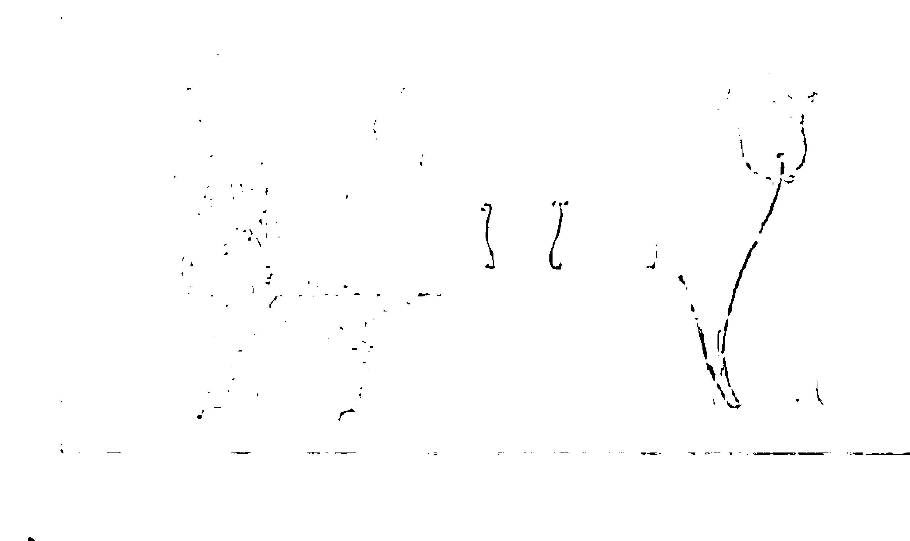

## 七座金山的召唤

佚名

一天，海马做了个美梦，梦中有七座金山在呼唤它。为了这个冥冥中的召唤，它决定去寻找属于自己的财富，并且变卖了它全部的家当，带上了换来的七个金币。

但是它觉得自己游得太慢，后来它看到了鳗鱼背上的鳍，于是就用四个金币买了下来。尽管速度提高了许多，但是海马还是没有看到梦中的金山。

半路上，它又看见了水母的快速滑行艇。为了提高自己的速度，海马忍痛用剩下的三个金币买下了这个小艇。这次它的速度提高了五倍，但是金山还是没有出现。

一条大鲨鱼出现在它的面前，热情地说：“要是有我的帮助，你想有多快就有多快。我本身就是一艘风驰电掣的大船，你上船吧！”大鲨鱼一脸的友好和善，张开了大嘴。

小海马高兴地说：“谢谢你！我就要找到金山了！”说完钻进鲨鱼的口里……

#### 魅力提示：

盲目求快，欲速则不达。急功近利，只能适得其反。在现代的高节奏生活压力下，快不是解决问题的方法、要学会停下来思考、学会规划自己的职业目标。如果不顾一切、一味求快，必将自尝苦果。

书名：不可能的事情只需要时间
- 作者：[美]阿特·伯格 (Art Berg)
- 出版社：辽宁教育出版社
- ISBN：753826537
- 包装：平装
- 开本：32开
- 出版日期：2003-01

### 内容简介：

1983年12月26日，年轻的阿特在看望未婚妻的途中，意外出了车祸，致使脖颈断裂，四肢瘫痪。医生当即对他的生活下了结论：他将不能行走，不能工作，不能有孩子。同时，医生坚持让阿特使用电动轮椅，因为手动轮椅会令他那萎缩的双臂疼痛。但是，阿特选择了手动轮椅，并创造了马拉松极限世界纪录。在不到十年的时间里，他创立了蒸蒸日上的事业，并成为一位极具号召力的演说家，每年在全美国演讲150多场。但是成功的道路并非没有沮丧、伤心、气愤和迷茫。他必须问自己许多尖锐的问题并教会自己寻找快乐。在经受身体瘫痪的折磨时，阿特意识到成千上万的人忍受着情感的折磨；他们已被命运击倒，感到失落和一事无成；他们被生活的局限致残，不知道生活的各种可能带给人们的快乐。

## 魅力失分

白羊对时间永远没有概念，如果他要你等五分钟，那么你就得做好等半个小时的准备，你不要期待他能在你约定的时间内把事情做完。

### 30秒的生命

徐剑

在美丽的草原上，曙光刚刚划破夜空，一群羚羊从睡梦中惊醒，“新的一天开始了，我们得抓紧时间跑，如果被猎豹发现了，就可能被吃掉！”于是，羚羊群起身向着太阳升起的方向飞奔而去……

几乎在羚羊群奔向远方的同时，一只猎豹也惊醒了，它起身抖搂壮实的身躯以抖去身上的灰尘，“已经有两天没吃东西了，我得立即开始寻找昨晚没有追上的猎物，如果今天还追不上它，我可能会饿死！” 猎豹望着太阳升起的方向，大吼一声，狂奔而去……

就这样，每当一天刚刚开始，地球上便会出现一幅壮观的景象：
猎豹紧紧追赶着羚羊群，它们各自拼命地奔跑，在它们身后扬起滚滚黄尘……

这场追逐的结局只有两种情况——羚羊快，猎豹可能会饿死；猎豹快，羚羊就会被吃掉……但是，哪怕羚羊只比猎豹早跑上30秒，就有可能保全性命，这30秒就意味着羚羊或猎豹是活着还是死去……

魅力提示：
时间就是生命，对待时间的方式，可以决定我们的命运，并且显示巨大的不同。我们的手中，握着的可能是失败的种子，也可能是成功的无限潜能，结局需要我们自己选择。

### 临时搭起的桥

薛贤荣

1779年，德国哲学家康德计划到一个名叫珀芬的小镇，去拜访老朋友威廉·彼特斯。康德动身前曾写信给彼特斯，说自己将于3月2日上午11时之前到达。

康德3月1日就赶到了珀芬小镇，第二天早上租了一辆马车前往彼特斯的家。老朋友的家住在离小镇12英里远的一个农场里，小镇和农场中间隔了一条河。当马车来到河边时，细心的车夫说：“先生，实在对不起，不能再往前走了，因为桥坏了，很危险。”

康德下了马车，看了看桥，中间的确已经断裂了。河面虽然不宽，但水很深，而且结了冰。

“附近还有别的桥吗？”康德焦急地问。

车夫回答说：“有，先生。在上游6英里远的地方还有一座桥。”

康德看了一眼怀表，已经10时了。
“如果赶往那座桥，我们以平常速度什么时候可以到达农场？”
“我想大概得12时30分。”
康德又问：“如果我们经过面前这座桥，以最快速度什么时间能到达？”
车夫回答说：“最快也得用40分钟。”
康德跑到河边的一座很破旧的农舍里，客气地向主人打听道：“请问你的这间房子要多少钱才肯出售？”
农妇大吃一惊：“您想买如此简陋的破房子，这究竟是为什么？”
“不要问为什么，您愿意还是不愿意？”
“那就给200法郎吧！”
康德付了钱，说：“如果您能马上从破房上拆下几根长木头，20分钟内把桥修好，我将把房子还给您。”
农妇把两个儿子叫来，让他们按时修好了桥。马车平安地过了桥，飞奔在乡间的路上，10时50分康德赶到了老朋友的家。
在门口迎候的彼特斯高兴地说：“亲爱的朋友，您可真守时啊！”
康德在与老朋友相会的日子里，根本没有对其提起为了守时而买房子、拆木头过河的经过。
后来，彼特斯在无意中听到那个农妇讲了此事，便很有感慨地给康德写了一封信。信中说到：“您太客气了，还是一如既往地守时。其实，老朋友之间的约会，晚一些时间是可以原谅的，何况您还遇到了意外。”
一向一丝不苟的康德，在给老朋友的回信中写了这样的一句话：“在我看来，在一定意义上可以说，无论是对老朋友，还是对陌生人，守时就是最大的礼貌。”

#### 魅力提示：

守时是一种美好的品质，它是人们彼此建立信任的基础。

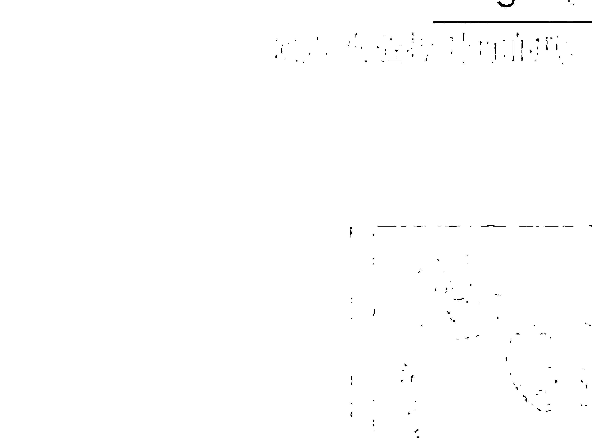

## 你只有10分钟

佚名

一位集团公司的人力资源部经理告诉我，他招聘人才的时间是5分钟，加上让应聘者走入他的办公室、入座、非正式简单对话的时间5分钟，总共不会超过10分钟。

也就是说，公司决定是否录用一个人，只有区区10分钟。所有的成功、失败都浓缩在这里。我说不公平，也不负责任。他说：“10分钟最公平，最负责任。”

他说70%以上的应聘者走入他的办公室不会首先打招呼说声“你好”；50%以上的应聘者衣冠不整洁；30%的应聘者态度紧张；20%的应聘者目光游移。还有什么好说的？让他们走吧！每个人只有10分钟，而他在前5分钟就已经输了。

我心悦诚服，应聘者的确已经输了。

想起一位公共关系学教授，他曾经在课堂上问我们：“你们看过孔雀开屏么？”同学们说看过，很美。教授说：“每个人都要学那孔雀，10分钟让整个世界记住自己的最美。”

那是《公共关系学》第一课时，教授的开场白。

每个人像孔雀那样用10分钟展示自己的美，好像不符合中国人的审美传统，我们喜欢相信“日久见人心”和“细水长流”。但在现代工业以分秒计算的工作时间里，你没有更多的时间表现自己。

#### 魅力提示：

即使你很优秀，可是你要知道，别人给予你关注的时间不会太多，10分钟，或者更少。因此，你必须在最短的时间内把自己的优秀展现出来，而不是让时间白白流走。

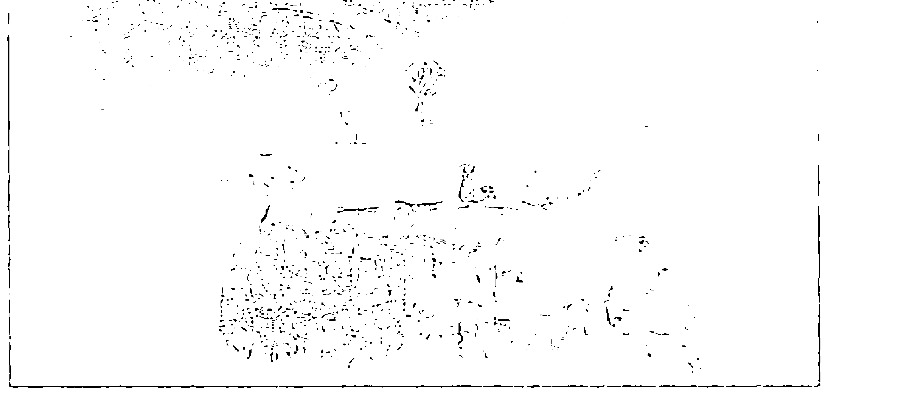

### 人生的入口

里克特

新年的夜晚，一位老人伫立在窗前。他悲戚地举目遥望苍天，繁星宛若玉色的百合漂浮在澄静的湖面上。老人又低头看看地面，几个比他自己更加无望的生命正走向它们的归宿——坟墓。老人在通往那块地方的路上，已经消磨掉六十个寒暑了。在那旅途中，他除了有过失望和懊悔之外，再也没有得到任何别的东西。他老态龙钟，头脑空虚，心绪忧郁。

年轻时代的情景浮现在老人眼前，他回想起那庄严的时刻，父亲将他置于两条道路的入口——一条路通往阳光灿烂的升平世界，田野里丰收在望，柔和悦耳的歌声四方回荡；另一条路却将行人引入漆黑的无底深渊，从那里涌流出来的是毒液而不是泉水，蛇蟒到处蠕动，吐着舌箭。

老人仰望夜空，苦恼地失声喊道：“青春啊，回来！父亲哟，把我重新放回人生的入口吧，我会选择一条正路的！”可是，父亲以及他自己的黄金时代都一去不复返了。

他看见阴暗的沼泽地上空闪烁着幽光，那光亮游移明灭，瞬息即逝了。那是他轻抛浪掷的年华。他看见天空中一颗流星陨落，消失在黑暗之中。那是他自身的象征。徒然的懊丧像一支利箭射穿了老人的心脏。他记起了早年和自己一同踏入生活的伙伴们，他们走的是高尚、勤奋的道路，在这新年的夜晚，载誉而归，无比快乐。

高耸的教堂钟楼鸣响了，钟声使他回忆起儿时双亲对他这浪子的疼爱。他想起了困惑时父母的教诲，想起了父母为他的幸福所作的祈祷。强烈的羞愧和悲伤使他不敢再多看一眼父亲居留的天堂。老人的眼睛黯然失神，泪珠儿泫然坠下，他绝望地大声呼唤：“回来，我的青春！回来呀！”

老人的青春真的回来了。原来，刚才那些只不过是他在新年夜晚打盹儿时做的一个梦。尽管他确实犯过一些错误，眼下却还年轻。他虔诚地感谢上天，时光仍然是属于他自己的，他还没有堕入漆黑的深渊，尽可以自由地踏上那条正路，进入福地洞天，丰硕的庄稼在那里的阳光下起伏翻浪。

#### 魅力提示：

依然在人生的大门口徘徊逡巡、踌躇的人们，记住吧，等到时间流逝，你们在漆黑的山路上步履踉跄时，再来痛苦地叫喊：“青春啊，回来！还我韶华”，那只能是徒劳的了。

书名：青木仁志的时间观
作者：［日］青木仁志 丁舒晟译
出版社：中央编译出版社
ISBN：780109775
包装：平装
开本：大32开
出版日期：2006-04

内容简介：
对每个人来说，一天都是24小时，1小时都是60分钟，1分钟都是60秒钟。不可思议的是一样的24小时产生的效果完全不一样。急性子的人是不会成功的。胡乱的奔走，毫无章法的就开始，就像没有导航仪而在沙漠里流浪。要想成功，就一定要好好思考。

## 魅力失分

白羊超级自信，
永远觉得工作自己
一个人能完成，完全
不需要跟别人合作，
“团队合作”这个词
在白羊的世界里不
存在。

### 依靠

万德岩

郭老师高烧不退。透视发现胸部有一块拳头大小的阴影，医生怀疑是肿瘤。同事们纷纷去医院探视，回来的人说：“有一个叫王端的女人，特地从北京赶到唐山来看郭老师，不知是郭老师的什么人。”又有人说：“那个叫王端的整天守在郭老师的病床前，喂水喂药端便盆，看样子跟郭老师可不是一般的关系呀。”

就这样，去医院探视的人几乎每天都能带来一些关于王端的花絮，更有人讲了一件令人不可思议的奇事，说郭老师和王端一人拿着一根筷子敲饭盒玩，王端敲几下，郭老师就敲几下，敲着敲着，两个人就又哭又笑起来……

十几天后，郭老师的病确诊不是肿瘤。不久，郭老师就喜气洋洋地回来上班了。有人问起了王端的事，郭老师深情地讲述了一段大地震中的经历——

“王端是我以前的邻居。大地震的时候，王端被埋在了废墟下面，大块的楼板在上面一层层压着，而父母的尸体就在身边，王端在下面吓得直哭。邻居们找来木棒铁棍撬那楼板，可说什么也撬不动，就说等着用吊车吊吧。

“天黑了，人们纷纷谣传大地要塌陷，于是就都抢着去占铁轨。只有我没动。我家活着出来的只有我一个人，我把王端看成了可以依靠的人，就像王端依靠我一样。我对着楼板的空隙冲下面喊：‘王端，天黑了，我在上面跟你做伴，你不要怕呀！现在，咱俩一人找一块砖头，你在下面敲，我在上面敲，你敲几下，我就敲几下——好，开始吧。’

“就这样，王端在下面敲‘当当’，我便也敲‘当当’，她敲‘当当当’，我便也敲‘当当当’……渐渐地，下面的声音弱了、断了，我也迷迷瞪瞪地睡去。

“不知过了多长时间，下面的敲击声又突然响起，我慌忙捡起一块砖头，回应着那求救般的声音。王端颤颤地喊着我的名字，激动得哭起来。

“第二天，王端被救了出来。”

### 漂浮的蚁球

佚名

从早上天就开始下雨，一直到黄昏的时候雨都没有停过。又过了一会儿，洪水最终撕开了江堤，一个个小院子连成了一片汪洋。清晨，受灾的人们三三两两地在堤上，凝望着水中的家园。

忽然，有人惊呼：“看，那是什么？”

众人随着这一声惊叫向水中望去，只见一个黑点正顺着波浪漂过来，一沉一浮，像一个人！有人“嗖”地跳下水去，很快就靠近了黑点，但见他只停了一下，掉头回游，很快上了岸。

“一个蚁球。”那人说。

“蚁球？”人们不解。

说话间蚁球正漂过来，越来越近。人们终于看清楚了。一个小足球大的蚁球！黑乎乎的蚂蚁密匝匝地紧紧抱在一起。风起波涌，蚁球漂流中不断有小团蚂蚁被浪头打开，像铁器上的油漆片剥离开去。

人们看得惊心动魄。

蚁球靠岸了。蚁球一层层散开，像打开的登陆艇。蚁群迅速而秩序井然地一排排冲上堤岸，胜利登陆了。岸边水中仍留下了不小的一团蚁球，那是勇敢的牺牲者，它们再也爬不上来了，但它们的尸体，仍然紧紧抱在一起。

#### 魅力提示：

要想成功，就必须有一个好的人际圈子，要知道仅凭一个人的能力是很难完成自己的事业的。只有有人愿意帮你跟你合作，不断地给你提供各种资源，你才能有更多的成功机会。

## 它比能力重要

王莉萍

碧妮大学毕业后进入一家公司工作，她执著地认为只要自己努力工作，展现出超人的工作能力，必然能够获得重用，并步步高升。可是一年过去了，碧妮虽然表现出了出色的工作能力，但薪水并不比那些表现一般的同事高，职位也没有得到晋升。

碧妮很不服气，于是工作起来更加努力。她认为，只要自己足够优秀，总有一天上司会看到她的能力与才华，从而给她加薪晋职，把她当作公司的骨干。

但是，又一年过去了，碧妮还是在原地停留。相反，与她同时进公司的同事已经是独当一面的主管了，薪水也比自己高出许多。

碧妮终于忍不住，向公司里唯一与她要好的同事抱怨自己的怀才不遇。

然而，没想到的是，同事却很直接地告诉她一个令她感到震惊的原因。原来，虽然碧妮工作非常出色，但由于她恃才傲物，认为自己比别人都要优秀，因此没把同事们放在眼里，平时也就缺少了对同事的尊重，与同事的关系没有处好。

上司虽然也知道碧妮工作很出色，但担心如果让她升任主管的话，同事们会不配合，这样当然不利于公司工作的开展与完成，所以一直迟迟未敢重用她。

就这样，工作细心、处事粗心的碧妮，怎么也没想到，自己竟然是因为忽略了人际关系，而一直未受到重视与提升。

#### 魅力提示：

培养了无数成功人士的哈佛大学商学院的一个调查表明：在事业有成的人士中，26%靠工作能力，5%靠家庭背景，而人际关系则占69%。可见，要想成为出类拔萃的顶尖人才，并不能仅仅靠提升才能，更重要的是拓展你的人际关系，提升你的人脉竞争力。

## 四肢和胃

佚名

四肢看到胃成天不干活，心理很不平衡，它们决定像胃那样，过一种不劳而获的绅士日子。

“没有我们四肢，”四肢说，“胃只能靠西北风活着。我们流汗流血，我们受苦，我们做牛做马地干活，都是为了谁？还不是为了胃！我们什么好处也没有得到，我们全在忙碌，为它操心一日三餐。我们现在马上停工别干了，只有这样，才会让它明白，它得让我们养着它。”

四肢这样说了，果真也这么做了。于是，双手停止了拿东西，手臂不再活动，而腿也歇下了，它们都对胃说已经侍候够了它，让胃自己劳动，自己去找吃的。

没过多久，饥饿的人就直挺挺地躺下了。因为心脏再也供不上新鲜的血液，四肢也就因此遭了殃，没有了力气，软绵绵地耷拉在身上。

这下，不想干活的四肢才发现，在全身的共同利益上，被它们认为是懒惰和不劳而获的胃，要比它们四肢的作用大得多。

#### 魅力提示：

人与人之间既是一个独立的个体，又是一个密不可分的群体。一个人如果完全脱离社会，那他根本就不可能生存下去。懂得他人的重要性，自己才会在生活工作中自由快乐。

书名：你的水桶有多满？
作者：[美]汤姆·拉思(Tom Rath)[美]唐纳德·克利夫顿(Donald O.Clifton)著；方晓光译
出版社：中国社会科学出版社
ISBN：750045056
包装：平装 (无盘)
开本：大32开
出版日期：2006-01

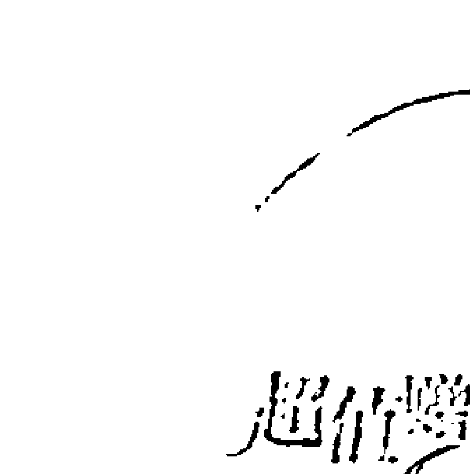

**内容简介：**

每个人都有一只看不见的水桶和一把看不见的勺子，水桶满溢使人乐观积极；水桶见底令人意志空虚。赞赏、肯定及积极的心态，增添积极的情感，让彼此的水桶满溢。
生命中的每一刻，都请为你我加水！
你与一个人交往之后感觉如何？那人——你的配偶、最要好的朋友、同事，甚至一个陌生人——“给你的水桶加水”，使你意气风发，还是“从你的水桶舀水”，使你垂头丧气？
本书的核心是一个勺子和水桶的简单比喻，以及长达50年的研究。它将帮助你在工作和生活中大大增加积极情感，同时减少消极情感。
《你的水桶有多满？》以独到的发现、高效的策略和引人入胜的故事来激发持续的变革，堪称经典。

### 第六面 形象礼仪篇

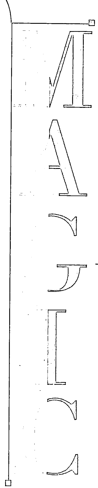

**魅力失分**

孩子气的白羊座不会放过任何玩乐的机会，而在玩乐的时候，从来不会顾及形象的问题。

最好的介绍信

佚名

一位先生要雇一名勤杂工到他的办公室做事，他挑中了一个男孩。

“我想知道，”他的一位朋友问道，“你为何喜欢那个男孩？他既没带一封介绍信，也没任何人的推荐。”

“你错了。”这位先生说，“他带来了许多介绍信。他在门口蹭掉脚上的土，进门后关上了门，这说明他做事小心仔细。进了办公室他先脱去帽子，证明他既懂礼貌又有教养。当看到那位残疾老人时，他立即起身让座，表明他心地善良，体贴别人。”

“其他所有人都从我故意放在地板上的那本书迈过，而这个男孩却俯身捡起那本书，并放在桌上。当我和他交谈时，我发现他衣着整洁，指甲修得干干净净。难道你不认为这些小节是极好的介绍信吗？”

魅力提示：
不要以为没有人注意你，与你交往的人往往都有一双雪亮的眼睛，即使你不说话、不做事，他也把你看得清清楚楚。所以，你要随时注意自己的形象，从小处入手。

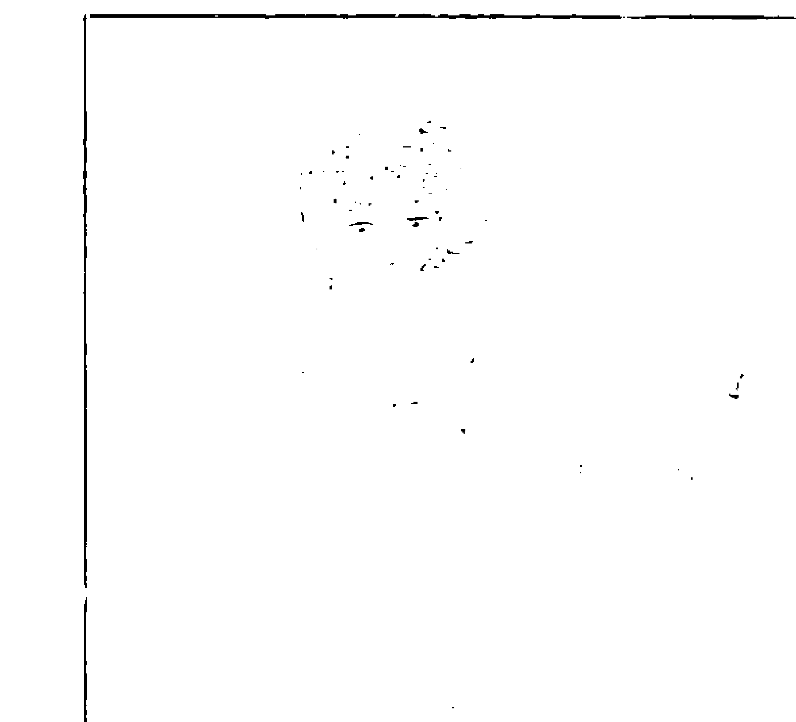

### 见义勇为的朋友

佚名

朋友的妻子打来电话，还没说话便哭了起来。我惊诧万分，一定出了什么事！果然，原来朋友身受重伤，正在医院抢救。

来不及多问，我挂上电话，火速赶往医院。朋友的妻子带着六岁的儿子正在手术室外坐立不安，居然还有个警察在一旁宽慰她！我心不由得一沉，怎么，这事还跟警察有关？

“怎么回事？”我迫不及待地问。“他带儿子出去玩……结果被歹徒捅了！幸亏警察同志把他送到医院……”刚说着，又抽泣了起来。

“他是见义勇为，勇斗歹徒才受的伤！”一旁的警察满脸肃穆道。“爸爸抓坏蛋！还跟坏蛋打架！”朋友的儿子在一旁噘起小嘴巴，自豪地冲着我宣布。

天！我的耳朵没出毛病吧？抓歹徒？跟歹徒搏斗？我的这位朋友？我没听错吧？他勇斗歹徒，打死我都不信！和朋友从小玩到大，他是谁，我还不知道？这世上最后一个去跟歹徒搏斗的恐怕都轮不到他！朋友的胆小怕事在圈里是出了名的。记得去年，那一次，我俩在一个小饭馆吃饭，他中途去方便了一下，回来之后脸色有些不对，我问怎么回事，他说没事。约莫过了十分钟的工夫，他突然跟我说他的钱包被人抢了！

“什么时候？”我问。“就是刚才上厕所的时候。”“你怎么不反抗？”“那家伙他手上有刀呢！”

“那你怎么现在才说！刚才怎么不喊？”

老天开眼，朋友总算是没去找马克思他老人家商讨关于共产主义实现的具体事宜。让我吃惊的是，这两天朋友的“大名”频频见诸本地各大媒体，并被冠以“英雄”称号！记者们有没有搞错？就他？勇斗歹徒？英雄？不信！

再去看他的时候，已是一星期后了，朋友已无大碍，正卧床静养。

我开口第一句话就是：“怎么回事？”

“什么怎么回事？”

“你的伤啊！报上居然说你勇斗歹徒！”

“本来就是嘛！跟那家伙搏斗时，让他拿刀子给捅的。”朋友说得倒平淡。

“没搞错吧！”直到此刻，我才极不情愿地相信这是事实，“英雄！你能不能告诉我你当时是哪根筋不对了？”

朋友笑了笑，显得很腼腆，却并没有开口。

“说啊！”我在一旁催促道。

“有什么好说的！”朋友反倒熊了我一下，“我带儿子出去玩，看见歹徒抢人钱，我就追了上去，然后跟他搏斗，结果受伤了，现在住院了，就这么简单！”

我被朋友的回答弄得有点哭笑不得：“我是问你当时怎么会想起来追歹徒的，还跟他搏斗！这可不是你的一贯作风啊！”

“唉……”朋友叹了口气，好半天，才一本正经道，“当时我儿子就在身边，他说：‘爸爸，你快去抓住那坏蛋吧！’我就去了……”

“就因为这？”我将信将疑地望着朋友，笑着问。

“是啊！”朋友很坚定地回答，怕我不信似的。

“你脑子进水啦？”我冲他直摆头，笑道，“为了小孩子家一句不知轻重的话，你就不要命啦！”

“你听清楚没有？！”朋友简直有点生气了，“我儿子叫我去抓坏蛋，难道我能跟他说：‘爸爸怕死，爸爸不敢去？’有没有搞错！我怎么能破坏我在我儿子心目中的形象！”

朋友注视着我，神情很庄重，甚至还带着少许的神圣。

这一次，我没有笑……

> 魅力提示：
> 要想获得别人的尊重，就要树立良好的形象，当然，这个形象并不只是衣着等等这些表面的东西。

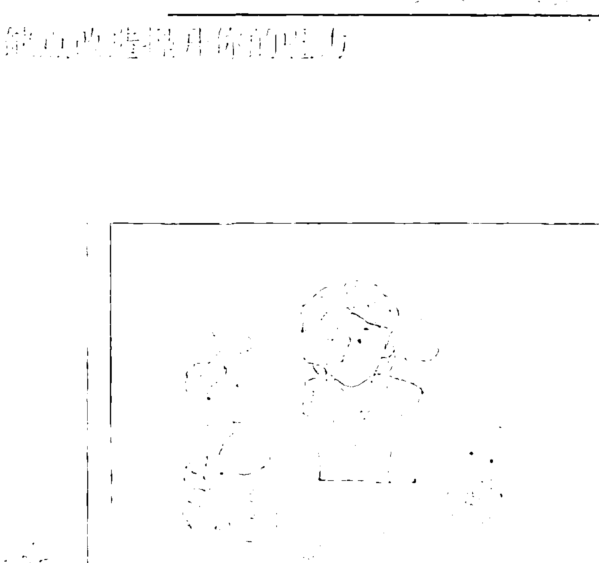

### 整洁的形象

卡耐基

莎拉和莫娜是同一天来到一家著名广告公司应聘美编的，单从两个人的作品上看，技术水平不相上下。不过莎拉在思路方面略胜一筹，因为她在佛罗里达做过3年这个行当，刚刚回到北方来，经验相对于才出校门的莫娜自然要丰富一些。两个人一起被通知参加试用，而且结果很明确，只能留下一个。

莎拉上班时间从来都是一身T恤短裤的打扮，光脚踩一双凉拖鞋，也不顾电脑室的换鞋规定，屋里屋外就这一双鞋，还振振有词地说：“佛罗里达那儿上班的人都这样，再说我这不是穿着拖鞋吗？”不管是在工作台前画图，还是在电脑前操作，只要活干得顺手，一高兴起来准把鞋踢飞。刚开始，同事们还把她的鞋藏起来，和她开玩笑，后来发现她根本不在乎，光着脚也到处乱跑。

相反，莫娜是第一次工作，多少有点拘谨，穿着也像她的为人一样——文静、雅致，带着少许灵气，她从来不通过怪发型、亮眼妆来标榜自己是搞艺术的，只是在小饰物上展示出不同于一般女孩的审美观点来，说话温温柔柔的，很可爱。

有一天中午，电脑室的空气中忽然飘出腥臭味道，弄得一班人互相用猜疑的目光观察对方的脚，想弄清到底谁是“发源地”。后来，大家发现窗台下面有窸窣的响声，原来那里放着一个黑色塑料袋，有胆子大的打开来一看，居然是一大袋海鲜。

众人的目光不约而同地集中在莎拉身上，没想到她坦坦荡荡地说：“小题大做，原来你们是在找这个。嗨，这可怪不得我，这里的海鲜只能算是海臭，一点都不新鲜，简直比佛罗里达的差远了。”

这时莫娜端过来一盆水：“莎拉姐，把海鲜放在水里吧，我帮你拿到走廊去，下班后你再装走。”

莎拉一边红着脸，一边把袋子拎走了。

结果呢，试用期才进行了两个月，莎拉就背包走人，尽管她的方案比莫娜做得要好，但是老板不想因为留下这样一个太不修边幅的人，而得罪一大批其他雇员。

临走的时候，老板对莎拉说：“你的才气和个性都不能成为你搅扰别人心情的原因，也许你更适合一个人在家里成立工作室，但要在大公司里与人相处，处事得体和合作精神是十分重要的。”

**魅力提示：**

决定一个陌生人好恶的首要因素是他的形象，一个衣衫得体的人总是能赢得他人的好感。

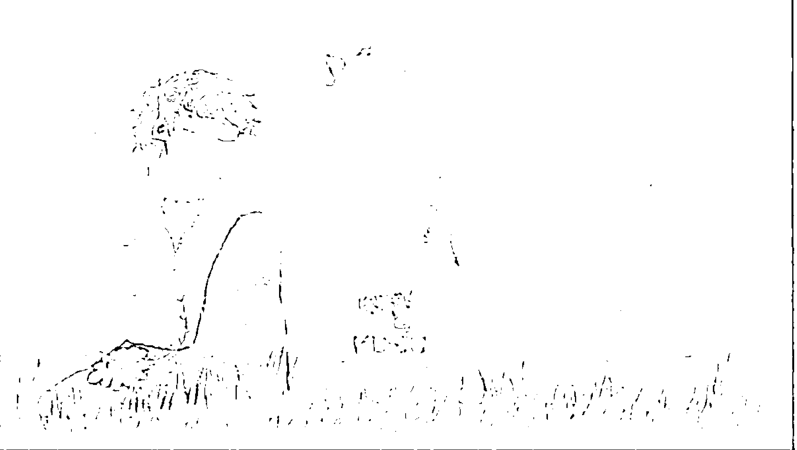

### 一口痰的杀伤力

佚名

一个国内酒厂跟外国公司谈判合作的事情，经过公关部经理的苦苦争取，外国公司老总终于答应留下来签订合同。

在最后的酒会上，却因为酒厂厂长喝酒误事。

厂长在酒桌上一转身随口吐了一口痰，正好被外国公司的老总看在眼里。

最后，外国老总因为这个厂长这一不负责任的行为而取消了即将签订的合同。

外国老总留下的一句话是：连个人形象都不注意的人，我不相信他能把一个公司管理好。因为这个小小的失误，这个酒厂错过了外来资金注入，错失了一次发展壮大的良好时机，到最后导致倒闭。

> 魅力提示：
> 小事成就大事，细节成就完美。成也细节，败也细节。生活中就是因为我们这些小小的不经意，错失了一次次成功的机会。而那些注意抓住细节、细心做人处事的人，却往往获得不经意的成功。

### 魅力链接

书名：一生的忠告
作者：[英]查斯特菲尔德爵士
译者：张帆 翟自洋
出版社：浙江文艺出版社
ISBN：753392321
包装：平装
开本：大32开
出版日期：2006-06

### 内容简介：

美德和学识若是没有优雅相伴，便会黯然失色。
迷人的风度、得体的谈吐、优雅的举止有助于人们发现你身上更伟大的品质。

那些以尽善尽美为目标的人往往更能接近完美。

学识就像怀表，只需放在口袋里，不必拿出来炫耀，只要让人知道你有表就行了。假如别人问你时间，你就拿出来看看，然后告诉他；若是没有人问起，就不要像个卖表人那样不断拿出来报时。

语言是思想的外衣。人们重着装，不会穿得衣衫褴褛、满身污垢；同样地，思想也需要语言的修饰，不至于太过苍白。