# 魅力星座之金牛座

## 踏实而迟钝的金牛

多数性格比较随和，通情达理，诚实可靠，做事踏实，对自己的判断力十分自信。但效率稍慢，喜欢按自己的逻辑思维和速度与规律有板有眼地干，讨厌别人督促检查。慢慢品尝美味佳肴，对他来说是最美不过的事。

男性比大多数人要健康，尤其是有耐力，从事持久的体力劳动和长期加班加点工作也很难累垮你。因为很少患病，有点小痛就感觉忍受不了，愿向别人诉说。小时候常跑医院寻医问药，随着年龄的渐长，身体日益强健，不少人适合体育运动。

学习成绩好不是靠智商和聪明取得的，多数是靠勤奋学习，死记硬背才保持中上等学习成绩。对学习很有兴趣，缺少业余爱好。摊上好老师，会在班上比较拔尖。当上学生干部后，社会活动多，学习成绩会有所下降。

婚姻：婚姻平淡无奇，既无轰轰烈烈的恋爱，也无坎坎坷坷的历程，好像很随缘的两人就走到一起组成家庭。婚后两人感情不错，但缺少生活乐趣，有了孩子后给家庭生活带来一些欢乐，总的来说，是个稳定而又单调的家庭。

职业：对事业有长远发展的眼光，会稳重踏实地从眼下的工作做起，一步步去接近和实现自己的目标。由于心细且会计划，善于理财，适合从事金融业工作。在这方面会有较大发展，升任高级经济师、业务主管亦有可能。

经济：因为收入得来不易，所以对钱财看得较重。家庭添置东西都是量入为出，要买大件家用电器时，总是犹豫再三。买日常生活用品，也是不厌其烦地“货比三家”，总买经济实惠、物美价廉之物。因此，家庭虽然不算富裕，但银行存款数字却稳中有升。

事业：由于具有较好的职业道德和事业心，被领导和同事誉为能干的人。在和你同处起跑线的人中，你以勤劳肯干，在事业上有所成就。领导会委派你在比较关键的岗位工作，使你有施展才华的机会。在别人眼中，你是在事业上比较成功者。

- 反应迟钝、缺乏应变能力、胆小、贪婪、事业心太强、常以自我为中心、木讷、顽固……

金牛座父亲：对孩子的期望值较高，当孩子学有成效时，愿以物质奖励激发孩子的热情。但平时对孩子极严。

金牛座母亲：随着孩子年龄的增长，对他的要求越来越严，越来越多。不怕孩子反抗她，就怕孩子懒惰和粗心。

金牛座丈夫：忠实可靠，对妻子很慷慨，在家中很受尊重。是妻子爱情与经济的保障，希望妻子少些唠叨。

金牛座妻子：有的有洁癖，家中总有干不完的活。最讨厌丈夫不勤换衣服以及吃饭出声。

金牛座孩子：独立意识及占有欲望较强。讨厌父母的管教。学业不用父母操心，倒是别的方面总令父母操心。

## V 星名堂 agic

名人的榜样成就你的自信

## 奥黛丽·赫本小资料

| 项目 | 内容 |
| :--- | :--- |
| 英文姓名 | Audrey Hepburn |
| 出生 | 1929年5月4日 |
| 星座 | 金牛座 |
| 出生地 | 比利时布鲁塞尔 |
| 家庭 | 父亲是一名富裕的英国银行家，母亲是一名荷兰女男爵 |
| 身高 | 170公分 |
| 体重 | 110磅（50公斤） |
| 三围 | 34（A）-20-34 |
| 发色 | 棕色 |
| 爱好 | 芭蕾 |

她接过金像说了一句话：“这真有点让人受不了。”又说了几句官样的感激话后，她就逃离了舞台。就像《罗马假日》中的安妮公主，从窗台跳下，来到人间。

“如果你不是罗马人，你就永远无法征服罗马”，而奥黛丽·赫本，不只是征服了罗马，也征服了整个世界。优雅、爽朗、完美，这就是奥黛丽·赫本，这就是人们心中永远的天使。

### 【小女孩，老太太】

1929年5月4日，奥黛丽·赫本生于比利时布鲁塞尔的一座豪宅邸里。奥黛丽·赫本的母亲是荷兰贵族，埃拉·冯·希姆斯特拉，她是荷兰驻圭亚那总督的女儿。因为是荷兰王室直系贵族血统的后裔，所以在名字后面还要加上男爵的称号。赫本的父亲是英国人，本名约瑟·安东尼·赫本·拉斯东，是英格兰银行布鲁塞尔分行的总经理，他相貌英俊，衣着考究。

父母的婚姻关系一直不好，尤其是父亲约瑟倾向纳粹，爱好杯中物，最后甚至还将连襟的钱拿去资助法西斯运动。1935年5月，拉斯东做了一件不可思议的事情。他抛弃了妻子与6岁的女儿，离家出走，赫本的母亲一夜白头。直到后来赫本回想起当时自己与母亲的反应时，仍然心有余悸。终其一生，她对父亲的失踪都感到遗憾。

赫本的童年让她坚强而又脆弱，造成了她两极化的个性，这点使她与同年代的美国人大不相同。有过战争经历的人不是变得刚强，就是变得温和。她则是后者。与同龄孩子相比，赫本显得过于文静，过于寡言少语，向来有“老太太”的绰号。观日出而知全天，从小就爱着芭蕾舞、巧克力、小狗，一生一世形影相随地跟着她。伴着二战隆隆的炮声，她一天天长大，并且舞姿日渐优美。舞蹈给了她一个情绪的出口，一种表达完美的方法，因为对舞蹈的执着和热爱，她在当时残酷的世界里找到了美好的事物。人的一生有许多梦想，而儿时的梦想恐怕是最刻骨铭心也是最难实现的。

### 【会走路的梦想】

1939年9月，欧战爆发，赫本随母亲来到荷兰，她跟着母亲在荷兰度过了少女时代。当纳粹德国侵入荷兰时，赫本也被卷入残酷的战争。她和母亲一起躲到了地下室，在里面整整呆了5年，母女俩饱受战争的蹂躏和饥饿的煎熬，赫本强烈地感受了残忍、恐怖的战争和贫穷而饥渴的流浪生活。这正是一个少女的发育时期，由于食品的匮乏，绝大多数人营养不良，赫本一米七O的身高，瘦得好像只剩下骨头。战争在她身上留下了永久的创伤，也成就了她后来始终清瘦、修长的身材。

战争一结束，她就回到了伦敦继续跟随玛丽·兰伯特学习。赫本小时候的梦想是成为芭蕾舞团的首席女演员。在她很小的时候就开始练习芭蕾舞，即便是在战争时期也没有中断，那个时候玛丽是世界上最著名的芭蕾舞老师之一。有一天，赫本找到玛丽，问她自己有没有机会成为一名首席女演员。玛丽非常恳切地回答说，她是最好的学生之一，但是已经错过了练习芭蕾最重要的年龄。赫本想，如果不能够成为一名芭蕾舞演员，如果不能够成为最出色的舞者，那么她会努力成为其他领域中最出色的人，所以她开始做些模特工作，也参加了些演出，由此开始了她的演艺之路。

在长年的生活中，赫本养成了一个习惯，不管去哪里都喜欢步行，这似乎是她生活中最重要的一部分，而且步速极快，别人总是不得不连跑带颠地跟着她走。

她说：“我只是想尽快到达目的地，所以不自觉地加快了脚步。”

导演林登回忆说：“奥黛丽·赫本小姐光彩照人，愉快，亲切，很有教养。她像小鸟似的叽叽喳喳，讲她的芭蕾舞训练。我立刻打电话把助手叫来。记得当时我对助手说：‘快来，你看见过一个会走路的梦吗？我看见了。’”

1952年5月，赫本赶到罗马参加《罗马假日》的拍摄。影片最终圆满完成并且在全世界取得了巨大的反响。1953年8月20日，赫本飞往伦敦参加首映式，然后又飞往威尼斯参加威尼斯电影节。该片在美国也举行了盛大的公映。在日本，它家喻户晓。甚至在斯堪的纳维亚半岛国家，《罗马假日》也是同期上映影片中最走红的一部。赫本在片中的短发造型一下子流行于全世界，赫本一跃成为国际名人，全世界都在黄金时间播放赞美她的新闻片。报纸上长篇累牍、欣喜若狂地赞美她的美貌、活力和典雅气质，称赞她是继嘉宝和鲍曼之后最好的女演员。

### 【不平坦的感情路】

21岁的时候，奥黛丽恋爱了，那幸运的男子叫詹姆斯·汉森，29岁，英国人，是卡车制造业家庭事业的继承人。他诚实可靠，个性坚强。赫本觉得，汉森是她理想的丈夫，会成为她的依靠和保护人。然而，同汉森结婚，就意味着放弃舞台事业。这对事业刚刚处于起步阶段的赫本来说，实在难以选择。最终，赫本放弃了“战斗”，彻底投降。在《吉吉》的芝加哥首映式上，赫本宣布说，她与詹姆斯·汉森的一切都过去了。而这个时候，可怜的詹姆斯·汉森正在做他的结婚计划呢！年轻美丽、纯洁无瑕的“吉吉”，终于因为罗马的假日而终结了她的初恋。

1953年8月，在伦敦《罗马假日》首映式晚会上，一个深色眼睛、高颧骨、脸庞线条如刀刻般清晰的男子向赫本走来，他就是导演、演员兼作家梅尔·费勒。奥黛丽·赫本与他一见钟情，赫本喜欢费勒的机智、幽默和英俊的外表，对这个具有领袖风范的人物产生了依恋之情，她对费勒说，希望能有机会和他一起演戏，请他挑选剧本。于是就有了后来出名的话剧《翁蒂娜》，1954年9月24日，奥黛丽演出《翁蒂娜》得到了东尼奖最佳女主角奖之后，与梅尔在瑞士结婚。他们在瑞士美丽的卢采恩湖畔一个小教堂举行了婚礼。

这对夫妻从许多方面来看，都具有浓厚的东方色彩。赫本对梅尔忠贞不渝，温柔体贴，而梅尔对赫本却控制得很严，且过于维护自己的男性权威。结婚十年后，他们最终还是在拍《窈窕淑女》期间出现了裂痕。赫本终于明白，梅尔对她的控制多于爱，梅尔对她不忠的行为时有发生，她的白头偕老完全只是一厢情愿。1968年秋天，赫本经历了一次流产，这次流产像不祥之兆笼罩着他们的婚姻，至此，赫本与梅尔的婚姻关系完全结束了。赫本对此十分痛苦、失望：“我一直尝试，极力想保住我们的婚姻，但太难、太难了。”

1968年金秋时节，赫本决定独自到希腊做一次休息旅行。在蔚蓝色泛着粼粼波光的爱琴海上，一艘豪华的游艇平稳地行进着。这时，一个高个子、金发碧眼的男子引起了她的兴趣。他是年仅30岁的意大利精神病学者安德烈·多蒂医生，出生于一个富有的家族，生长在罗马，当时在罗马大学执教，同时也与人一起开业行医。赫本与年轻英俊的多蒂医生一见钟情，不顾一切地投入到了这炙热的爱情之中。

1969年1月，两人的婚礼在瑞士举行，赫本身穿纪梵希为她设计的粉红色针织连衣裙行礼。然而，在意大利人的观点中，一个男子不认为一结婚就该终止自己自由的性生活，有一部分人认为在结婚之后有一个甚至几个情妇都是很合适的。多蒂婚后时常弄出许多丑闻，甚至同当时罗马城里最声名狼藉的美女搞在一起。这些对赫本的打击很沉重，她幸福生活的美梦又破灭了，她的婚姻又一次以悲剧宣告结束。

与多蒂办理了分居手续之后，单身的凄苦和晚年的孤寂使赫本很想找一个男子做生活伴侣。好友为她介绍了一个男子——英俊的演员罗伯特·沃德斯。罗伯特适逢妻子亡故，她的妻子是声誉卓著的好莱坞影星曼尔·奥伯朗。两人见面就被彼此吸引住了。赫本在外形和气质上都使罗伯特想起亡妻，他们都是身材纤细，高颧骨，吊眼梢，感情都同样细腻灵敏。赫本与罗伯特两人都经历过爱情的挫折和痛苦，因此格外珍惜这次机会，两人相爱了。

赫本对朋友说，她终于从她所爱的人身上找回了一个温柔的心灵。罗伯特在心灵上是温和善良的孩子，需要种母爱。而赫本身上兼有护士和母亲的双重品质，双方都找到了他们所需要的。1981年，罗伯特走了大胆的一步，他住进赫本在瑞士的家，开始了两人的同居生活。赫本与罗伯特住在风景优美的瑞士共度晚年。赫本在罗伯特身边找到了幸福，她辛勤劳碌的一生终于得到了宁静的归宿。

### 【世界是一个村落】

意大利有句谚语：整个世界就是个村落。赫本非常喜欢这句话。无论到任何地方，实际情况就是这样的。‘爱是种行动。’赫本这么对她的儿子说，“爱不仅仅是坐下来谈话，从来都不是。我们生下来就具备了爱的能力，但是我们还必须去锻炼它，就像我们锻炼肌肉一样。” 两次婚姻的失败让她非常失望，她与罗伯特之间的感情让她重新燃起了对生活的希望，正是这段感情激发她去面对世界上那些不幸的孩子，去面对联合国儿童基金会亲善大使这份艰难的工作。也许她想，如果不能去治愈那些所谓的成人心灵创伤，也许她可以帮助孩子。

1959年，在《修女传》中赫本扮演了一个名为路加的修女。在白色道袍下她美丽的脸庞依然动人。三十年后，赫本的所作所为与她在《修女传》里的表现不谋而合，她成为危难中的人们的希望。1988年赫本担任“联合国儿童基金会”的亲善大使，她也非常适合这项工作。她代表联合国儿童基金会奔赴饱受战乱、饥荒困扰的埃塞俄比亚，那情景使她想起了二战中的自己。在这之后的五年里，她的足迹遍及世界各地——埃塞俄比亚、土耳其、中非、南非、越南、索马里。

情感上的饥饿是食物无法缓解的，在赫本为联合国儿童基金会工作的那些年，她总是这样形容那些需要帮助的孩子们。“我是个母亲，所以我有责任这么做，我希望我的名气可以用来帮助儿童。” 那是她老年时的梦想，并且她一天天都在积累圆梦的可能性。

1989年，赫本最后一次面对摄像机，是在史蒂芬·斯皮尔伯格导演的《直到永远》中扮演一个身着白色长袍的纤弱天使。1993年1月20日，克林顿就任美国第42届总统的当天，赫本的死讯传遍了全世界，享年64岁，结肠癌。

## M 魅力魔方 agic

缺点改造提升你的魅力

## 魔方第一面
## 处事篇

### 魅力失分 缺乏应变能力

金牛座的人喜欢从容不迫地做事，突然出现的意外情况，对金牛来说，应付起来有点难。

#### 吴士宏的初次面试

佚名

经过1999年秋季媒体的狂炒，吴士宏已成为现代人耳熟能详的名人。其实在这番炒作之前，她的经历与业绩就不断见诸报端，只不过没有如此密集罢了。

在吴士宏努力向上的过程中，以她初次到IBM面试那段最为精彩。

当时还是个小护士的吴士宏，抱着个半导体学了一年半许国璋英语，就壮起胆子到IBM来应聘。

那是1985年，站在长城饭店的玻璃转门外，吴士宏足足用了5分钟的时间来观察别人怎么从容地步入这扇神奇的大门。

两轮的笔试和一次口试，吴士宏都顺利通过了。面试进行得也很顺利。最后，主考官问她：“你会不会打字？”
“会！”吴士宏条件反射般地说。
“那么你一分钟能打多少？”
“您的要求是多少？”
主考官说了一个数字，吴士宏马上承诺说可以。她环顾了四周，发现现场并没有打字机，果然考官说下次再考打字。
实际上，吴士宏从未摸过打字机。面试结束，她飞也似的跑了出去，找亲友借了170元买了一台打字机，没日没夜地敲打了一个星期，双手疲乏得连吃饭都拿不住筷子了，但她竟奇迹般地达到了考官说的那个专业水准。过了好几个月她才还清了那笔债务，但公司也一直没有考过她的打字功夫。
吴士宏的传奇从此开始。

**魅力提示：**
机不可失，时不再来。机遇可遇而不可求，但常常垂青于有准备的人。如何抓住转瞬即逝的机会，全看当事人的应变能力了。

#### 曹玮应变除叛军

佚名

北宋真宗时，宋夏边境上，两国经常发生战事。却说这一年，在北宋与西夏国交界的渭州（今甘肃宁夏部分地区），北宋兵偷偷投敌的特别多，西夏将军们高兴极了。可是有一天，一个埋伏在北宋中军帐的西夏军探子向主帅报告了这样一件事：
前天下午，宋军渭州守将曹玮正在和客人下象棋。有个部将向曹玮报告道：“将军，今天又发现50多个士兵叛逃西夏国。”
“知道了。”正在下棋下得兴致勃勃的曹玮，听完报告，镇定自若，一点也没有那种惊慌失措的样子。报告人的话音一落，他不假思索地回答道：“慌什么，那是我派过去的！”
曹玮这句话刚出口，好像马上发觉自己说漏了嘴，立即抬起头环顾左右右，见在场的都是自己的亲兵，便没说什么。可是，他的亲兵无意中把这一重要情况泄露给西夏国在宋军中的那个探子。

“原来是这样，我本就在疑心这些宋兵是否是真心投诚过来的。”西夏军主将恍然大悟。“来人哪，把所有投诚过来的宋兵全部都给我斩了！”一道令下，先后投向西夏军的几百宋军降兵，全部给杀了，西夏军兵把他们的脑袋一个个扔到国界上。

等到把这批降兵杀完之后，西夏军主将细细一想：“不好，我们中了曹玮的奸计了。”正当他后悔得跺脚捶首的时候，渭州将军府内曹玮正在哈哈大笑。原来，曹玮临机应变，用一句假话来借刀杀人。从此，宋军士兵便不敢向西夏军投降了。

### 魅力提示：

一个随机应变聪明地解决了叛军问题，这就是一种处理问题的能力。

#### 铁匠的小徒弟

丁慧中

一个小徒弟跟着铁匠师傅学艺，不久就能自己接活了。
在自己接活时，小徒弟打了四把斧子，自己特别满意。
第一个顾客是中年农民，他抱怨斧子太沉。小徒弟无言以对，师傅对农民说：“你的身体强壮，斧子大点看着才相称！”
第二位客人是屠夫，他不满意地说：“斧子太小，砍骨头恐怕不行？”
小徒弟心想可能是自己的技术不行，羞愧地低下了头。师傅对屠夫说：“这把斧子肯定能用，太大了手臂容易发酸。”屠夫连连点头。
第三位顾客是一位年轻的樵夫，他一进门就问：“怎么用了这么长时间？”小徒弟脸憋得红红的，心想，看样子要返工了。师傅连忙笑着说：“慢工出细活嘛！这斧子保管你一天砍一大堆！”樵夫满意地走了。
小徒弟想，再有人抱怨我就能应付了。
一会儿，一位老人走进来，皱着眉头说：“这么快就做好了？恐怕打得不到火候吧！”小徒弟哭笑不得，一脸窘迫，这时师傅上前解释到说：“这不是怕您老着急伤了身体吗？我这位徒弟可是连夜打出来的，质量绝对没问题！”老人一听，喜得眉开眼笑。付了钱，高兴地拿着走了。
小徒弟这时正低着头沉思……

### 魅力提示

学习真本事要老老实实，做事的时候还是要会随机应变。

#### 戴粪的呆子

佚名

有个养猪的人，见到一个荒废的村子里有干粪，便想：“将这些干粪用草捆起来，带回去可以喂饱小猪啊！”

于是他用草裹着干粪，顶在头上就回家了。

不料路上下起倾盆大雨，干粪都化成粪水，从他的头顶一直流到脚踝，众人碰到都说：

> “你这个笨蛋！粪便那么臭，没下雨时都不能顶在头上，你居然还在大雨中顶着走？”

那人听了之后反而骂：“你们才是笨蛋！不知道我家的小猪们正饿着呢！如果你们知道，就不会骂我笨了。”

### 魅力提示：

不懂得随机应变，将粪戴在头上，下雨天也不知拿下来，结果弄得满身臭味，这样的人总是会被人嘲笑。

**魅力链接**

**书名**：应变:变中求胜的9堂必修课
**作者**：格斯·西尔伯，沃尔夫冈·格鲁尔克著
**出版社**：中国人民大学出版社
**出版日期**：2005-12
**ISBN**：730006627
**包装**：平装
**开本**：小16开

**内容简介**：
应变不是一种选择，而是一种必然！
成功与失败的差别在于是否采取应变的态度，应变让你打破常规，抢占制胜先机！
应变已成为21世纪的信仰，然而应变本身并不能把你与“一般人”区分开来。要想在今天兴旺发达，就需要积极应变。

## 星座第一回

### 处事篇

> > **魅力失分**
> 反应迟钝
>
> 金牛做事总是慢半拍，因为个性慢吞吞的，反应又慢，所以经常延误时机。

## 努力让爱了不起

佚名

那是一个阳光很好的午后，可是27岁的昆塔尼拉心里却涌起一阵悲哀。那一天，两个儿子所在小学的校长对她说：“你的两个儿子反应很迟钝，我们只好把他们编入与他们能力相称的阅读小组里去了。”她知道校长话中的含义，被编入阅读小组的学生，通常就是被人们称为低能者或弱智的人。昆塔尼拉出生在墨西哥，13岁的时候，父亲带她去学校，由于英语智力测验成绩很差，因此被编入一年级。在一年级上了4个月后，由于处处觉得低人一等，她被迫辍学了。她也是一直被列入反应迟钝者之列，被周围的人“弱智、弱智”地叫着长大的。如今两个孩子也被列入低能者，可她知道儿子们是聪明的，只是由于英语不好才受到影响。晚上，她想和他们交谈，孩子们的话却让她的心再次震惊：“妈，努力是没有用的，他们说这是遗传！”那个晚上，昆塔尼拉彻夜未眠，她忽然明白，要想帮助孩子们，必须从自己开始。于是，27岁的她死啃教科书，硬背字典，可是进步却慢得使人灰心。看到孩子们嘲弄的目光，她下了另一个决心，那就是重新去上学！

得克萨斯南方学院为她强烈的求知欲所感动，便答应让她去上四门基础课。

第一学期，她受到院长的器重，在院长的鼓励下，她的成绩大幅度上升。一年后，她进入了潘·美洲大学。三年后，她以优异的成绩取得了潘·美洲大学的理科学士学位。

孩子们终于发现了母亲的与众不同。在她的鼓励和感染下，孩子们各方面的能力都迅速提高，自信心也增强了，不但转到了正常的班级上课，成绩还名列前茅。

此后，昆塔尼拉又赢得了许多荣誉。

她当年被看成是反应迟钝的两个儿子，一个成了著名的医生，一个成了律师。他们现在这样对人说：“假如说我们有所作为，那是因为我们母亲给了我们爱抚、自信和支持！”

> **魅力提示：**
>
> 爱催人努力，努力使人进步，即使是天生反应迟钝，只要努力也能成功，因为，勤能补拙。

## 骑马还是赶牛

佚名

有一次墨子责备了学生耕柱子，而耕柱子有些不高兴。

墨子把耕柱子找来，问他：“如果今天你与朋友相约在山上，你要骑马上山还是赶牛上山呢？”

耕柱子说：“当然是马呀！”

墨子问：“为什么不挑选牛呢？”

耕柱子回答：“牛再怎么驱赶，还是慢吞吞的，马只需轻轻鞭策，便会跑得又快又远呀！”

墨子这时笑了：“这就是我为什么要批评你、鞭策你呀！”

> ### 魅力提示：
> 我想，谁都愿意当一匹被人喜欢的有用的马吧。

## 你死了吗？

佚名

公园里的长凳上，依偎着一对恋人。
男孩问女孩：“我能吻你一下吗？”
女孩闭上眼睛没回答。
男孩又问：“你能让我吻一下吗？”
女孩还是没有回答。
男孩有些生气了：“咦，你聋了吗？”
女孩羞涩又生气，便大声嚷道：“你死了吗？”

### 魅力提示：

这是一个小笑话，然而也说明一定的道理。反应迟钝的男孩啊，难道一定要女孩认真地回答你说“恩，你亲吧”？

## 德国的小苹果

莫衣紫

不论是吃自助早餐，还是在商店里购买，柏林的苹果一律都是小而又小，绝对属于“歪瓜裂枣”一类的，根本不像国内水果摊上卖的那样，又大又漂亮。在国内，外表越是漂亮的苹果，价钱越贵；当然，越大越难吃，夸张一点说，“味同嚼蜡”。柏林的小苹果，样儿丑，可是真好吃，味儿冲，咬一口，啊，久违了，这才叫苹果。

恍然间，明白了一个道理。事物的发展往往是转圆圈的，转着转着就又转回去了。有的水果一开始又小又丑，随着科技的发展，又是化肥，又是农药，甚至还有什么激素、催肥剂、催壮剂等等，把水果搞得又大又漂亮，表面文章做得足而又足，可是就是一样——十分难吃，虚有其表。想想那些大草莓，外表极其可爱，吃到嘴里却只有伤心的份儿。

物极必反，德国人终于最先明白了，勇敢地把大苹果最先赶出了市场，不再培养那些漂亮货，取而代之的是那些天然的小苹果，小而丑，味道却是极好。

> > **魅力提示：**
> 反应总是慢半拍的人往往容易跟着别人的路走。别人走入误区，你也走入；别人出来了，你却还执迷不悟，干得火得很。

### 魅力链接

- 书名：成就你一生的第一反应
- 作者：陈辛 著
- 出版社：国际文化出版公司
- ISBN：780173814
- 包装：平装
- 开本：16开
- 出版日期：2008-08

### 内容简介：

职场就像是一个复杂的战场，假如我们在应对职场情况的时候，总能选择性地做出正确的、恰当的“第一反应”，将使得我们更加处置得当、游刃有余。但问题是，长期的生活、工作中，因为受到本能的、自我保护的影响，我们并没有“第一反应”的概念，而会做出很多违背职场要求和规则的、错误的、不恰当的反应。其结果，不仅限制着我们个人的成长与提升，也会严重影响到职业发展轨迹。

本书所倡导的“第一反应”，是那个经过加工处理后的反应。不仅包含着自己的职业判断、未来理想以及价值体现，而且还包括着智慧和感悟，是众多可供选择的反应中那个正确的、科学的、最佳的反应。

金牛座——固执耐用

### 魅力失分

金牛座做任何事的时候都是一副严肃认真的样子，这通常让身边的人也会跟着神经紧绷。

## 平和的心是金

刘燕敏

金字塔的建造者，不会是奴隶，应该是一批欢快的自由人！第一个作出这种预言的，是瑞士钟表匠塔·布克。1560年，他在埃及的金字塔游历时，作出了这个预言。

2003年，埃及最高文物委员会宣布，通过对吉萨附近六百处墓葬的发掘考证，金字塔是由当地具有自由身份的农民和手工业者建造的，而非希罗多德在《历史》中所记载的，由三十万奴隶所建造。

在四百年前，一个钟表匠为什么一眼就看出，金字塔是自由人建造的呢？自埃及考古工作者证实了布克的判断后，埃及国家博物馆馆长多玛斯便对这位钟表匠产生了兴趣。他想知道这个人到底是凭什么作出那种预言的。

为了搞清这个问题，他开始搜集布克的有关资料。最后，他发现布克是从钟表的制造，预知那个结果的。

布克原是法国的一名天主教信徒。1536年，因反对罗马教廷的刻板教规，被捕入狱。由于他是一位钟表大师，入狱后，被安排制作钟表。在那个失去自由的地方，他发现无论狱方采取什么高压手段，都不能使他们制作出日误差低于1/10秒的钟表。可是，入狱前的情形却不是这样。那时，他们在自己的作坊里，都能使钟表的误差低于1/100秒。

为什么会出现这种情况？起初，布克把它归结为制造的环境，后来，他们越狱逃往日内瓦，才发现真正影响钟准确度的不是环境，而是制作钟表时的心情。

对金字塔的建设者，他之所以能得出自由人的结论，就是基于他对钟表制作的那种认识。埃及国家博物馆馆长多玛斯在塔·布克的史料中发现了这么两段话：

> 一个钟表匠在不满和愤懑中，要想圆满地完成制作钟表的1200道工序，是不可能的；在对抗和憎恨中，要精确地磨锉出一块钟表所需要的254个零件，更是比登天还难。

金字塔这么大的工程，被建造得那么精细，各个环节被衔接得那么天衣无缝，建造者必定是一批怀有虔诚之心的自由人。真难想象，一群有懈怠行为和对抗思想的人，能让金字塔的巨石之间连一片刀片都插不进去。

塔·布克是第一批因反宗教统治，流亡瑞士的钟表匠，他是瑞士钟表业的奠基人和开创者。据说，瑞士到目前仍保持着塔·布克的制表理念：不与那些工作采取强制性、有克扣工人工资行为的国外企业联营。他们认为，那样的企业永远造不出瑞士表。

## 三只毛毛虫的故事

刘燕敏

三只毛毛虫，从很远的地方爬来。它们准备渡河，到一个开满鲜花的地方去。

一只说，我们必须先找到桥，然后从桥上爬过去，只有这样，我们才能抢在别人的前头，占领含蜜最多的花朵。

一只说，在这荒郊野外，哪里有桥？我们还是各造一条船，从水上漂过去，只有这样，我们才能尽快到达对岸，喝到更多的蜜。

最后一个说，我们走了那么多的路，已经疲惫不堪了，现在应该静下来休息两天。

另外两个很诧异。休息？简直是笑话！没看到对岸花丛中的蜜都快被喝光了吗？我们一路风风火火，马不停蹄，难道是来这儿睡觉的？说完，这两只毛毛虫便向对岸出发了。而主张休息的那只毛毛虫却爬上最高的一棵树，找了片叶子躺下来。河里的流水声如音乐一般动听，树叶在微风吹拂下如婴儿的摇篮，很快这只毛毛虫就睡着了。

不知过了多久，也不知自己在睡梦中到底做了些什么。一觉醒来，这只可爱的毛毛虫发现自己变成了一只美丽的蝴蝶。翅膀是那样美丽，那样轻盈，仅扇动了几下，就飞过了河。

此时，花开得正艳，每个花苞里都含有香甜的蜜。它很想找到另外两个伙伴，可是飞遍所有的花丛都没找到，因为它的伙伴一个累死在了路上，另一个被河水送进了大海。

> 魅力提示：
> 在这个世界上，没有什么比顺其自然更具有力量；没有什么比顺乎本性更具有魔力。该休息就休息，休息不是不工作，而是为了更好地工作，不会休息的人就不会工作，道理很简单，却不是每一个人都能够明白的。

## 上了弦的弓

刘燕敏

那次到内蒙古的一座小城旅游，看到一个店铺里面摆放的全都是弓箭，我感到很新奇，便在店里面东瞧西看起来。店里的墙壁上挂着的几张弓都是上好弦的，每张弓都绷得紧紧的；货架上面摆放的那些弓都未上弦，弓背就显得直一些。店主见我对弓箭很感兴趣，便从货架上拿起一张弓，递到我手上，说：“你仔细看一看，这可都是正儿八经的弓箭，价格也不贵。”

我问道：“这弓能把箭射多远？”

店主说道：“力气大的人，能射出一百多米，力气小一些的，也能射出七八十米。用铁铸的箭，一下子可以射死一只羊。”

我把玩着手里的那张弓，爱不释手，决定买两张带回去，一张自己留着玩，一张送给一位朋友。跟店主谈好价钱后，我让店主拿两张上好了弦的弓，店主认真地说：“这几张上了弦的弓挂在那儿主要是做样品的，一张弓上好了弦后，都是绷得紧紧的，长时间这样放着，弓背和弓弦的效用就差了，力道也减了，根本就射不出多远。买弓应买那没上弦的，现用现上弦就可以了。”

我笑着说：“我买这弓，也不是要用它射杀什么，就是为了玩，不必非得有实用价值。”

店主笑了笑，便摘下墙上的几张弓，放在我面前，又拿出几张未上弦的弓，叫我随便挑。挑了一阵，我就要了一张未上弦的和一张上好了弦的，末了，又买了一捆木制的箭。

回到家后，我找了一个空旷的地方，用两张弓试着射了几箭，那张现上弦的弓，一箭射出了九十多米，而先前上好了弦的那张弓，仅把箭射出了四十来米。

店主说的果然没有错，买弓就应该买那没上弦的。

## 一位重要和必不可少的人

陈音

曼纽尔一定要忙于做事，否则他就会感觉人生毫无意义，感觉他在浪费他的时间，感觉社会不再需要他，感觉没人爱他、没人想要他。

所以，他从早上起床就有一大堆事情要做:观看电视早晨新闻（过去的一个晚上可能发生了什么事情），阅读报纸(昨天可能发生了什么事情),叫他的妻子别让孩子们上学迟到了，备车，叫出租车，乘公共汽车和地铁，但却总是集中精神，寻找机会，看看手表，有可能的话，就用手机打几个电话——关键是要确保让每个人都看到他是一位重要的人，是一位对这个世间有用的人。

曼纽尔到达上班的地方后，立即就开始专心处理等待着他处理的成堆文件。如果他是一位雇员，他会尽一切可能让老板注意到他按时上班。如果他是一位老板，他就会让所有雇员立即开始工作。如果没有什么重要的活要做，曼纽尔就一定会去拓展一些、开创一些、实施一项新计划，让他们有新的事情去做。

曼纽尔去吃午饭的时候，从来不会独自一人去。如果他是老板，他会跟他的朋友坐在一起，讨论新的市场策略，大说竞争者的坏话，而且总是留有一手。他还会以自豪的口吻抱怨自己工作过度。如果曼纽尔是雇员，他也会跟他的朋友坐在一起，抱怨老板，说他经常要加班，很绝望（但带着自豪的口吻）地说公司太过于依赖他了。

曼纽尔整个下午都要工作，无论他是老板还是雇员。他会不时地看一眼手表，尽管已经到了下班时间，但他仍然要在这里解决一个细节，要到那里签署一个文件。他是一个诚实的男人，他想证明他是拿钱做事的人，他没有辜负别人对他的期望，没有辜负他父母的梦想。他父母为了让他能够得到必需的教育，付出了很多很多。

他最后终于还是回家了。到家后，他洗了澡，换上舒适的衣服，然后坐下来跟家人一起吃晚饭。他会问孩子们在学校的事情，问妻子这一天过得怎样。他还会不时地谈到他的工作，为的是起到一个榜样的作用——因为他并不想把忧虑带回家。吃完晚饭后，孩子们立即就离开餐桌，跑去玩电脑了，因为他们对榜样、责任之类的事情毫无兴趣。曼纽尔也走去坐在电视机前面，观看新闻，即那些可能发生在下午的事情。

他睡觉之前，总是要先看看那些放在床头柜上的技术书——无论他是老板还是雇员，他都知道竞争是激烈的，如果跟不上形势，就会有丢失工作的危险，然后就得面对最糟糕的诅咒:失业。

他会与妻子说一会儿话，毕竟，他是一位温和的、努力工作和有爱心的男人，关心他自己的家庭，任何情况下都要保卫这个家。睡意很快就来了，曼纽尔睡得很沉，因为他知道第二天将会是非常繁忙的一天，所以他得补足能量。

有一天晚上，曼纽尔做了一个梦。
一位天使问他：“你在为谁做事呢？”
他回答说他是个负责任的人。
天使接着问：“你一天之内是否能够就歇15分钟，什么也不做，只是看看这个世界，看看你自己呢？”
曼纽尔说他愿意这样做，但是他没有时间那样做。
“你是在愚弄我，”天使说，“每个人都有时间那样做，他们缺少的只是勇气。”

曼纽尔半夜里惊醒过来，一身全是冷汗。勇气？一个能够为家庭牺牲自己的男人怎可能没有勇气停下来歇15分钟呢？

> 允许你是一个对家庭负责、对工作严肃认真的人，但是，也请适当地停下来休息一下，哪怕是15分钟、放松你紧绷的神经，积蓄你继续下去的力量。

**/魅力星座智慧书之**

- 书名：如何面对紧张的生活节奏
- 作者：（德）科内莉亚·蒂尔斯 著，石左虎 译
- 出版社：上海科学普及出版社
- 出版日期：2004-04
- ISBN：754272379
- 开本：32开

### 内容简介：

置身竞争激烈的社会，面对紧张的生活节奏，德国心理学博士科内莉亚·蒂尔斯对我们说：

为了健康，不要漫无目的地忙碌在空闲时间里，让自己从压力下解脱出来，爱惜自己的精力，掌握适应自己的生活节奏，知足者最美丽的既不依赖于物质，也不依赖于成就。到处都可以听到很多人在抱怨他们身负的“压力”。他们在工作场所，在家里，甚至在休闲的时候都时常要考虑效率问题。他们的效率要求随着所处的职位的上升而提高，什么事情都要求做得尽善尽美，要在工作日期间创造出成果，这样才感觉到舒坦。但是，很多“效率”是不必要的，很多压力的烦恼甚至是自寻的，如果不摆脱它，还可能产生负面效应。相反的，人们需要的是更多的休闲时间，乐观的生活态度，少一些任务，多一些乐趣。足够的生活乐趣能使人们在工作日里精力充沛，这是最好的防止自己精力完全耗损的保护手段。

## 星座与个性特点

## MAGIC

> **魅力失分**
>
> **胆小**
>
> 金牛座的人有点胆小怕事，做事畏畏缩缩。

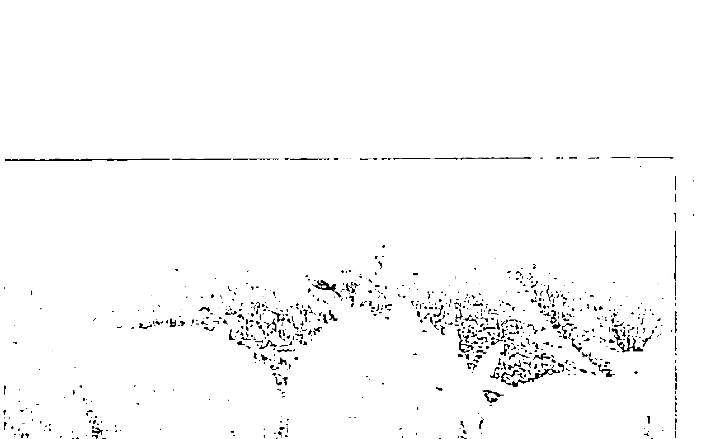

## 悬崖上的草莓

罗伯特·科利尔

他仿佛是天生的失败者——求学、创业、觅职，从未天遂人愿。胸中万千梦想，都只是七彩的肥皂泡，瞬间破灭。

那年春天，他的失意到达顶点，他甚至想就此结束自己的生命。有人告诉他：在深山云深不知处，有一位高僧掌握人间成功的秘诀。

他滔滔不绝地倾吐着自己的痛楚，高僧却只漫不经心抬手：“那边悬崖上有一丛草莓，你去给我采下来，我便告诉你该如何得到你的梦想。”

山并不高，却极其陡峭，悬崖冰冷矗立，青苔滑腻，那一簇小小红灯，看上去仿佛可望而不可即。

他不禁望而生畏，脱口而出：“我怎么爬得上去呢？”但高僧已闭目合十，不再理会。

他在悬崖下冥思苦想，始终想不出好办法，不由心烦意乱。想，或许高僧是骗人的吧，干脆算了，却又明知，这是自己最后的机会。

## Magic

他沉下心来，回去买来地图，对整座山认真研究，发现它的南面比较平坦，是最佳的途径。他参加了爬山学习班，购置了登山的器械，信心十足地开始攀爬——还不到三分之一，他不得不力竭而返。

抚着酸痛的四肢，他心灰意冷，却在朦胧月色里，依稀看见远处的草莓。

他每天更积极地锻炼身体，又向名师请教自己错在何处。之后，他开始第二次向顶峰攀登。

失败仍仿佛不可避免，但他心中却再也没有沮丧与愁苦。因为这一次，他离山头已不过几步之遥。

终于在第三次，他掌中盈满草莓的娇嫩与芳香。他急切地问：“大师，现在你可以告诉我成功的秘诀了吧？”

高僧只将草莓纳入口中，微笑。“很甜，”然后又问，“咦，你不是已经成功了吗？”

他在瞬间恍然大悟。

魅力提示：

这世上还有什么成功会比悬崖上的草莓更难以采撷？而他所凭借的，无非是勇气、智慧、心中的渴望、充足的准备和锲而不舍。

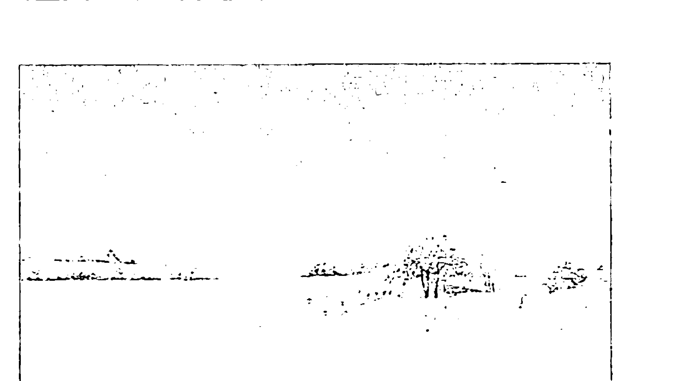

## 伦琴的25岁

佚 名

1890年一个阳光明媚的上午，德国沃兹堡大学偌大的教学楼里只有教师的讲课声和板书的嚓嚓声。这时一位风尘仆仆，连胡子都没来得及刮的年轻人，身背行囊，急匆匆地在教学楼走廊上东张西望，看得出他在找人。

“您是谁？”一位年轻的教授走过来问。

“我刚从苏黎世大学来，我叫伦琴，专程来投奔康特教授的。”

“啊，我就是。”康特教授一边带着他走进办公室，一边说。“你的论文和推荐你的信，我已经看到了。”

“教授，您不会笑我唐突和年轻幼稚吧，我才25岁。”

康特教授亲切地拍拍他的肩膀说：“啊，我也不过31岁。”

就这样，伦琴当了康特教授的助教，在名师的熏陶下，四年后，他便成了小有名气的物理学教授，1901年因发现X射线（又称“伦琴射线”）获得了诺贝尔物理学奖。

### 魅力提示：

勇敢正直好比一把尺子，可以用来丈量懦夫和能士之间的距离。拥有它，勇士增其勇；缺少它，懦夫愈显其懦。

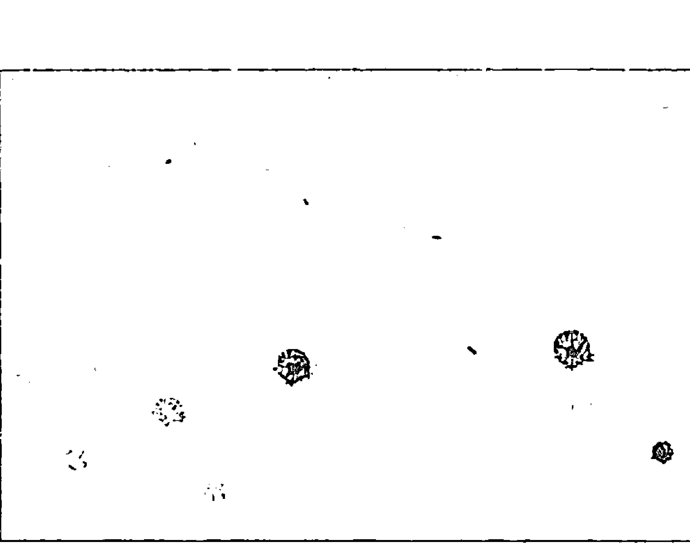

## 马与虎斗

佚名

从前，有个人养了一匹马，这马极其高大、俊美，雄壮而有力气。它头上长着长长的鬃毛，长得遮住了眼睛。

主人常常把它放到山中去吃草，因为马强壮的外形，山中的野兽都不敢去和它较量。

有一天，它遇到山中的一只老虎，老虎虎视眈眈地奔向它，想吃掉它。它也不甘示弱，就扑向老虎，和老虎搏斗起来。整整搏斗一天未分胜负，马只好退了下来回到家中。

看见马和老虎搏斗的人，向马的主人称赞了马的勇敢善斗。主人高兴地说：“我的马真是很雄壮呀！不过，我的马之所以没有战胜老虎，是因为它头上的鬃毛太长了，遮住了它的眼睛。如果把它头上的鬃毛剪掉，让它看得清楚些，它肯定会战胜老虎的。”于是二话不说，拿出剪刀剪掉了它头上的鬃毛。

第二天，马的主人跟在马的后边，到了山上，果然看见一只老虎，奔向他的马。马的主人本来想观看一下自己的马战胜老虎的壮观场面。没料到，马见了老虎之后，立刻惊慌失措，站不稳，还没斗过三个回合，马就被老虎吃掉了。

马的主人非常失望、惋惜。他在回家的路上一边走一边想：“马为什么昨天那样勇敢善斗，而今天却这样怯懦无力？”

主人百思不得其解，便去询问村里的一位德高望重的老者。

老者知道了后说：

> 天下的事成功在于勇敢，失败在于怯懦。马第一天因为鬃毛遮住了它的眼睛，所以不知道自己的对手是老虎，所以胆大勇猛，不知道害怕；第二天，它的鬃毛被剪短了，它看清楚自己的对手是老虎了，所以精神上就胆怯、气馁，就失败了。

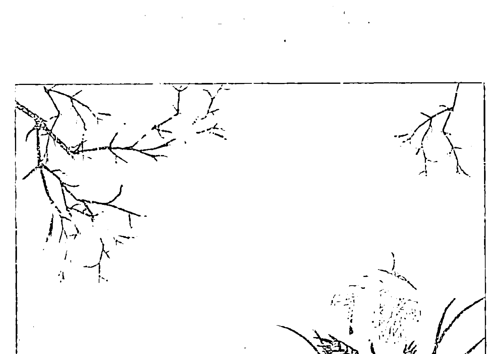

## 吓死的战俘

佚名

在第二次世界大战时期，德国科学家为了执行希特勒的命令，做了一项惨无人道的心理实验。

他们找了一位俘虏，然后告诉他将在他身上做一项生理实验，就是在他的手腕上划一个口子，然后看他身上的血一滴一滴地流光的生理反应。

这些德国士兵把这位战俘绑在实验台上，用黑布蒙上他的眼睛，然后用一块很薄的冰块在他的手腕上划了一下。同时科学家在他的手腕上放置了一个吊瓶，吊瓶里的水温跟人体血液的温度差不多，吊瓶管子的一端，放在这个战俘的手腕上方，于是水就从他的手腕慢慢地流下来。在他的下方，科学家放了一个铁桶，当这个战俘听着“滴答”、“滴答”的水声的时候，他就以为自己的血在往外流了。当然，他的手腕并没有被划破，但是他以为被划破了。

过了一个小时，这个战俘真的死了，而且死去的反应跟失血而死的人一模一样。因为他相信自己被放了血，于是就被自己吓死了。

魅力提示：

在严峻的现实和激烈的竞争面前，很多人在未行动前便败给了自己，因为他们恐惧失败比相信成功更强烈。每件事情的结果都有两种，成功或者失败，你相信哪个，哪个便会成为事实。

### 魅力链接

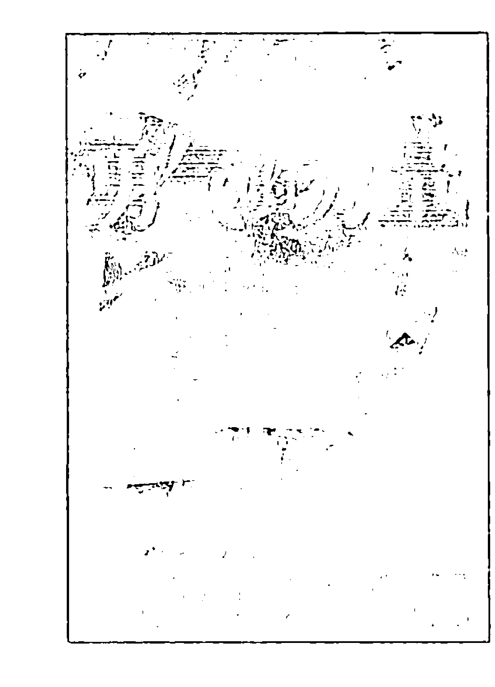

- 书名：勇气的力量
- 作者：（日）大川隆法著，张石 译
- 出版社：中央编译出版社
- 出版日期：2009-01
- ISBN：780211832
- 包装：平装
- 开本：大32开

### 内容简介：

《勇气的力量》一书是享誉日本的畅销作家大川隆法的第501部著作。作者以人的本性为出发点，所倡导的勇气是以获得个人的幸福为最终目的。本书的理念不拘泥于任何价值体系或传统，强调摒弃世俗偏见的独立思考，希望引导人们度过“无畏”的人生，常常一语道破人们的错误想法，教人们将失败和挫折转化为进取的智慧和力量。作者关于友情、学习、事业、挫折、成功话题的精彩讲述，有别于传统的思维，常常让我们有新的思想发现，而他对人生会经历的一切喜悦、不安与疑惑所独有的深刻了解，亦将激励着每一颗学习长大的心灵。它将告诉人们如何做人、如何做事、如何避免伤害、如何实现心灵的成长、如何成为一个勇敢的人，更重要的是如何通过这些成为一个真正幸福的人。

## 星座第二面
做人篇

## TAURUS

### 魅力失分
金牛座

对于金钱和物质的特殊钟爱，使得金牛显得有点贪得无厌。

## 讨债

吴营洲

表哥在一家陶瓷公司打工，平常沉默寡言，说话结结巴巴，从不与人争长论短。

公司有一笔30万元的货款还未进账，老板数次派人追讨，对方总是找出种种理由，一拖再拖。老板无计可施，认定这笔钱就此打了水漂。

老板宣称，谁能讨回30万元货款，将给予10万元的奖金。

公司里陆续有几个能说会道的高手先后请缨，结果都是焦头烂额而回，一分钱的债款也没讨回，还白花了路费。

这时，表哥站了出来，说：“老老老老板，我我我我想去去去试试……”

表哥的话还未说完，众人一阵大笑。老板说：“你若能讨回这30万元，太阳都从西边出来了。”

三天后，他居然真的将20万元交到老板手里。

众人惊愕之余，都向表哥请教，到底有何绝招。

原来，表哥与欠债人坐到谈判桌旁后，就开门见山地说，所欠30万元货款，只需交21万元，就算全部结清，并立了字据，保证日后不再追讨。

对方见来人如此大度，给了如此之多的甜头，又可了结日后的纠缠，欣然地把钱交出来。于是，表哥把20万元交给老板，自己留下1万元作为奖金。

对于表哥来说，这相当于他在公司两年收入的总和啊。

表哥对老板说：“那那那9万元，就就算是我赏给给给对方的了。”

众人一听，无不顿足懊悔，当初，他们都想狮子大开口，要足10万元奖金，最终，一分也得不到。

魅力提示：

不要太贪心，不要想着一个人占尽所有利益，适时地给别人一点好处，你才会有得。

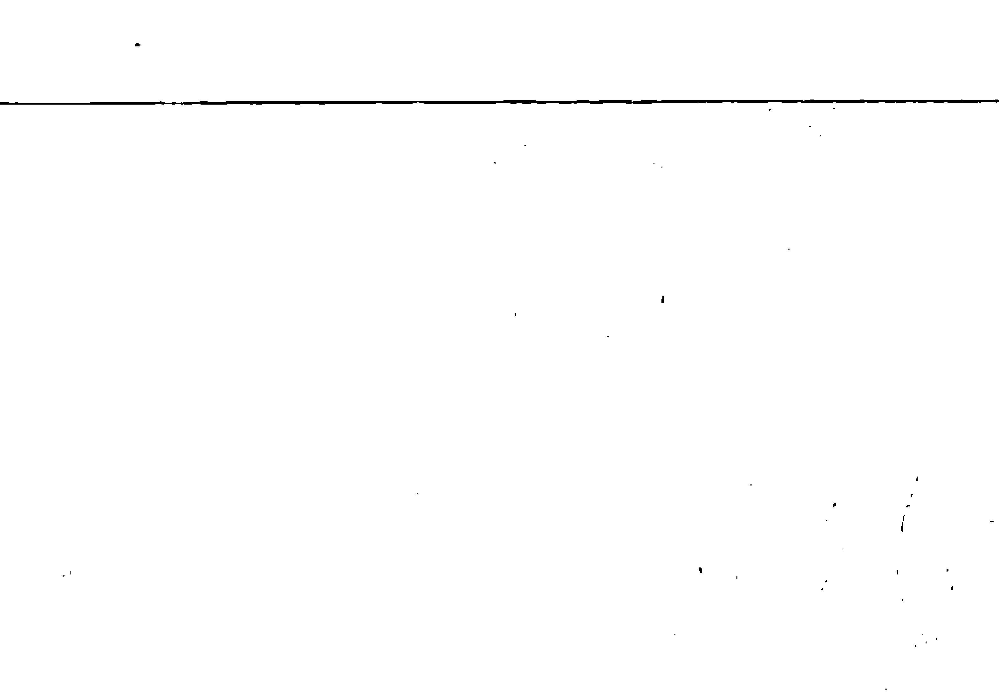

## 雷斯伊翰湾的灯塔

佚名

汤姆作为佛得角雷斯伊翰湾的守塔人，在这个偏僻的孤岛上已生活了将近四十年。当他还是二十多岁的小伙子时，就随他捕鱼的伯父来到了这座孤岛。汤姆和伯父白天捕鱼，晚上点起篝火，从此，辽阔的大西洋岸边多了一座灯塔。

汤姆已记不清楚他和伯父在暴风雨的夜里或是在飓风季节里救起了多少人。那些被救过的人偶尔路过孤岛，总不忘给汤姆叔侄俩捎上点什么，但每次都被他们拒绝。叔侄俩在雷斯伊翰湾不知不觉过了二十年。现在的雷斯伊翰湾少了一个人，添了一座坟墓，在汤姆看来，伯父仍陪伴着他。汤姆依旧白天捕鱼，晚上守候在伯父一生中唯一接受别人的一台风力发电机旁。雷斯伊翰湾的灯塔不再用篝火了。

### 魅力提示：

> 每个人处在特定的人生岗位上，都会有让人诱惑的“蛋糕”出现，这时，你可入鼻的只能是它的芳香，千万不可入口。一旦做了物质上的俘虏，你就会迷失方向，看不见给人生导航的“灯塔”，迷失在欲望的汪洋之中。

十月的雷斯伊翰湾气候格外恶劣，汤姆几乎整夜都醒着。他知道，每年的海难事故频发季节已经来临。汤姆的小屋外已经是惊涛骇浪，他一遍遍检查，还给风力发电机的轴承加了润滑油。此时的小岛像要摇动起来。汤姆从小屋里走出，像伯父一样敏锐地眺望大海，海面上黑压压一片，浪头拍打着礁石，发出一阵阵轰鸣。

突然，汤姆发现远处的海面上有一点亮光，只有萤火虫的光亮那么大。他立刻意识到什么，迅速爬上灯塔。灯塔里的灯又垫高了很多，汤姆在废弃的火坑里重又燃起了篝火。远处的亮点越来越大，渐渐驶向了汤姆居住的孤岛，等亮点到近处时，汤姆才发现灯火是从一艘挪威籍的货轮上发出的。天亮了，船长约翰带领船员在雷斯伊翰湾作短暂的停留，并打算给岛上的工作人员送去几吨食品，可当约翰走进岛上汤姆的屋子时，才发现汤姆的屋子还抵不上他船上的一个集装箱大。

“我要带你离开这里。”约翰感激地对汤姆说。
“为什么？”汤姆问。
“不为什么，我至少能给你每月两千五百美元的薪金。”约翰继续说。
“十年前，一位像你一样的船长曾答应给我每月三千美元的薪金。”汤姆平静地说。临别的时刻，约翰紧紧地拥抱了汤姆。

人的一生，守着什么岗位并不重要，可贵的是能给更多的人带来希望。

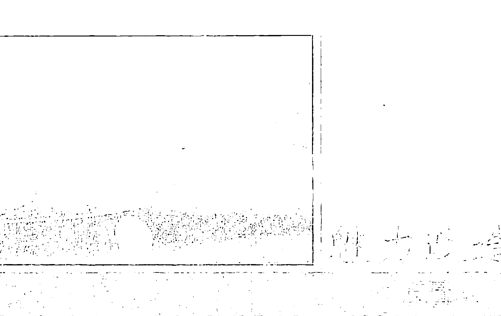

## 99块金币

王莉萍

皮克住在一座破庙里，他是地球上最快乐的叫花子。可是有一天，皮克脸上的快乐突然丢失了。这是因为，有一天，皮克在回破庙的路上捡到一袋金币，准确地说是99块金币。

捡到金币的那个晚上，皮克非常快乐。“我可以不再是叫花子了，我有了99块金币！这够我吃一辈子啊！99块，哈！我得再数数。”皮克怕这是一个梦，不敢睡觉，直到第二天太阳出来时他才相信这是真的。

第二天，皮克很晚也没有走出破庙，他要把这99块金币藏好，而这可真的需要费一番工夫。“这钱不能花，我得攒着。可是，为什么是99块呢？要是拥有100块金币就好了。我要拥有100块金币。”从来没有什么理想的皮克现在开始有了理想。他还需要一块金币，这对一个叫花子来说，绝对是一个非常远大的理想。

晌午了，皮克才出去讨饭。不，不是讨饭，而是讨钱，一分一分的。中午他很饿，只讨了一点剩饭。下午，他很早就“收工”了，他得用更多的时间守着他的金币。

“还差97分。”晚上，皮克反复地数着金币，他开始忘记了饥饿。

一连几天，皮克都是这样度过的。这样过的日子里，皮克就再也没有吃饱过，同时也再没有快乐过。

讨钱越来越难。难的原因之一，是别人愿意给剩饭而不愿意给钱；其次是皮克用来讨钱的时间越来越少了；此外更重要的是因为皮克不快乐了，别人也不愿再施舍给他了——谁愿意面对一个满脸苦相的人呢？

皮克越来越忧郁，越来越苦闷，也越来越瘦弱了。终于有一天，他病倒了。而这一切的起因，全是因为他拥有了那99块金币。

魅力提示：

当我们的物质贫穷时，也许我们的精神是快乐的，而当我们的物质条件有所改善的时候，我们却变得越来越不快乐，因为我们希望得到更多，其实，迷恋于身外之物，无疑是步入了人生的误区。

## /魅力星座智慧书之金牛座/

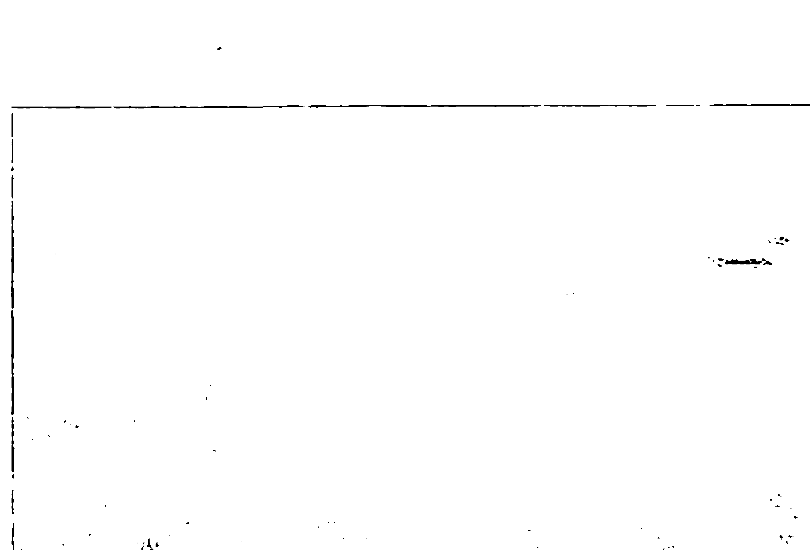

## 流走的金砂

佚 名

一条细细的山泉，沿着窄窄的石缝，叮咚地往下流淌，也不知过了多少年，竟然在岩石上冲刷出一个鸡蛋大小的浅坑。奇怪的是，山泉不知从哪儿冲来黄澄澄的金砂，填满了小坑，天天不增多也不减少。

有一天，一位采药的老汉来喝山泉水，偶然发现了清冽泉水中闪闪的金砂。惊喜之下，他小心翼翼地捧走了金砂。

从此，老汉不再受苦受累，不再爬山越岭采集药材。过个十天半月的，他就来取一次金砂，不用说，日子很快富裕起来。人们都感到蹊跷，不知老汉交上了什么财运，老汉对这个秘密守口如瓶，上不告父母，下不告妻小。

老汉的儿子跟踪窥视，发现了爹的秘密，认真看了看窄窄的石缝，细细的山泉，还有浅浅的小坑，他埋怨爹不该将这事瞒着，不然早发大财了。

儿子向爹建议，拓宽石缝，扩大山泉，不是能冲来更多的金砂吗？爹想了想，自己真是聪明一世，糊涂一时，怎么就没有想到这一点？

说干就干，父子俩丁丁当当，把窄窄的石缝凿宽了，山泉比原来大了几倍，又凿大凿深了坑。父子两个累得大汗淋漓，想到今后可以获得很多很多的金砂，高兴得一口气喝光了一瓶酒，醉成了一摊泥……

父子俩天天跑来看，却天天失望而归，金砂不但没增多，反而从此消失得无影无踪。父子俩百思不得其解：金砂哪里去了呢？

### 魅力提示：

越要拥有太多，往往失去越多。水流大了，金砂就一定不会再沉下来，贪婪的父子俩连原来的金砂也得不到了。

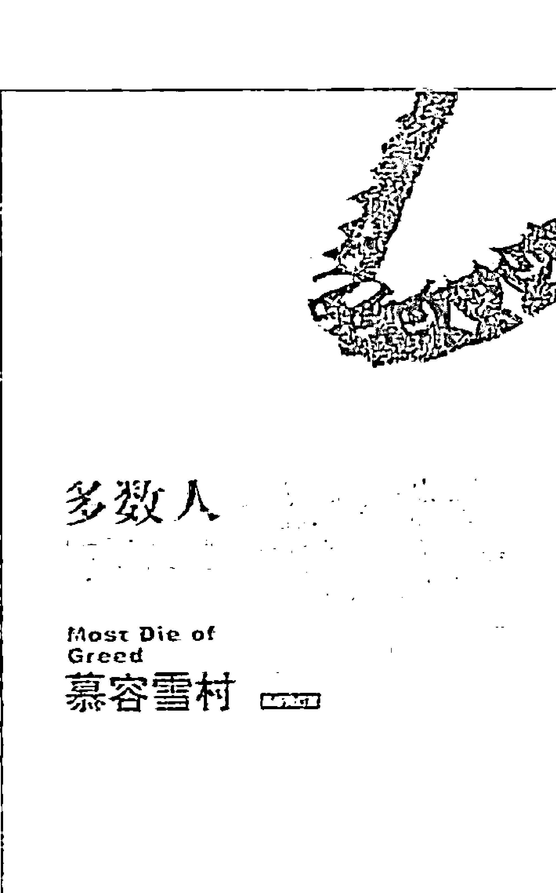

- 书名：多数人死于贪婪
- 作者：慕容雪村 著
- 出版社：万卷出版公司
- 出版日期：2009-01
- ISBN：780759370
- 包装：平装
- 开本：大32开

### 内容简介：

三块钱的东西卖三百块，你说他是骗子；三块钱的东西卖三百块，再开张发票，那就成了商业。 这世界有三种谎言最可恶：广告、广告，以及广告。 “阿琉达希卡”是什么？一种化妆品。这个词什么意思？没意思。 这世界骗来骗去的，骗子都被骗子骗了。 股评家都是好人啊，拿着庄家的工资冒充散户的亲戚。 骗人不是罪恶，骗不成才是。

> 作者慕容雪村，极尽讽刺了人贪婪的丑陋。这黑暗的黑暗中这苍白的脸 /这血红的血中这酸楚的心 /这冰雪下的花蕾 /这盘中的婴孩 /这无人掩埋的尸啊 /一条路还在生长 /一条无声断开……

## MAGIC

### 魅力失分

#### 牛脾气

金牛座不算暴躁易怒，但会将积压已久的怒气，一下子发泄出来，那时声势就相当惊人。

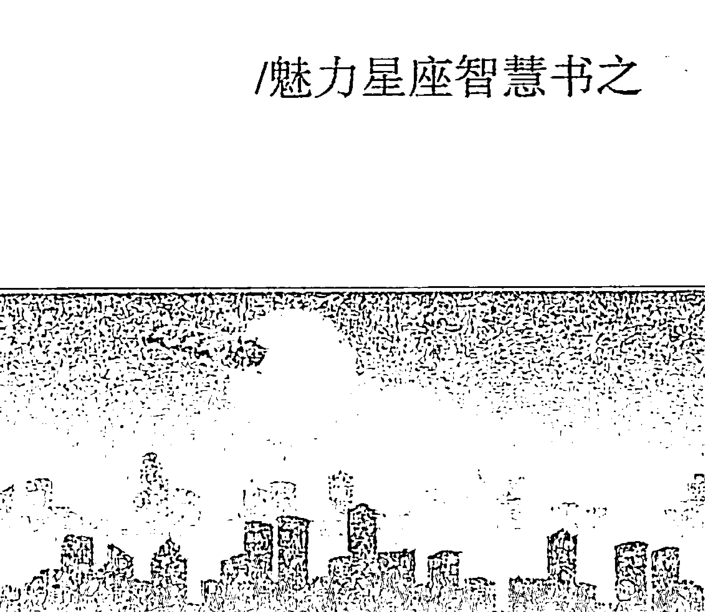

魅力金牛座 星座

## 不生气的秘诀

佚名

古时候，西藏有一个叫爱地巴的人。他一生气就跑回家去，然后绕自己的房子和土地跑三圈。后来，他的房子越来越大，土地也越来越广，而一生气，他仍要绕着房子、土地跑三圈，哪怕累得气喘吁吁，汗流浃背。当爱地巴很老了，走路已经要拄拐杖了，他生气时还要坚持绕着土地和房子转三圈。

一次，他生气了，拄着拐杖走到太阳已经下山了还在坚持，他的孙子怕他有闪失就跟着他。

> 孙子问：“阿公！您生气就绕着房子和土地跑。这里面有什么秘密？”

爱地巴对孙子说：“年轻时，我和人吵架、争论、生气时，就绕着自己的房子和土地跑，我边跑边想自己的房子这么小，土地这么少，哪还有时间和精力去跟人生气呢？一想到这里，我气就消了，气消了，我就有了更多的时间和精力来工作、学习了。”

孙子又问：“阿公！您年老了，成了富人，为什么还要绕着房子和土地跑呢？” 爱地巴笑着说：“老了生气时我绕着房子和土地跑三圈，边跑我就边想——我房子这么大，土地这么多，又何必和人计较呢？一想到这里，我的气就消了。”

魅力提示：
我们的人生太短，还有许多重要的事要做，没有必要在那些无谓的情绪中自我耗损。遇到什么不顺心的事情千万不要“气”，想想你要做的，还有你拥有的。

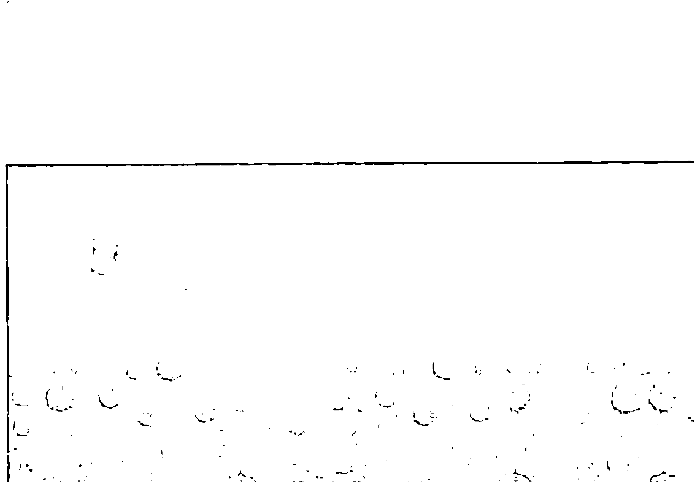

## 盆景的得失

佚名

有个老人用很长时间栽种盆景。一天要外出，他临行前交代儿子：一定要细心照顾好家里那盆自己视若生命的盆景。

在这期间，儿子总是精心照顾盆景。尽管这样，花架还是在浇水时不小心被碰倒了，所有的盆景都打碎了。

儿子因此非常害怕，他准备等父亲回来后接受处罚。

老人回来知道此事，便叫来儿子。他不但没有责备儿子，反而说：“我栽盆景是用来欣赏和美化家里环境的，不是为了生气的，以后做事小心点就可以了。”

魅力提示：

> 气由心生，如果无欲无求，了无牵挂，则气无处生。人生旅途中，只有平和心态，才不会愚蠢地去用别人的错误来惩罚自己。

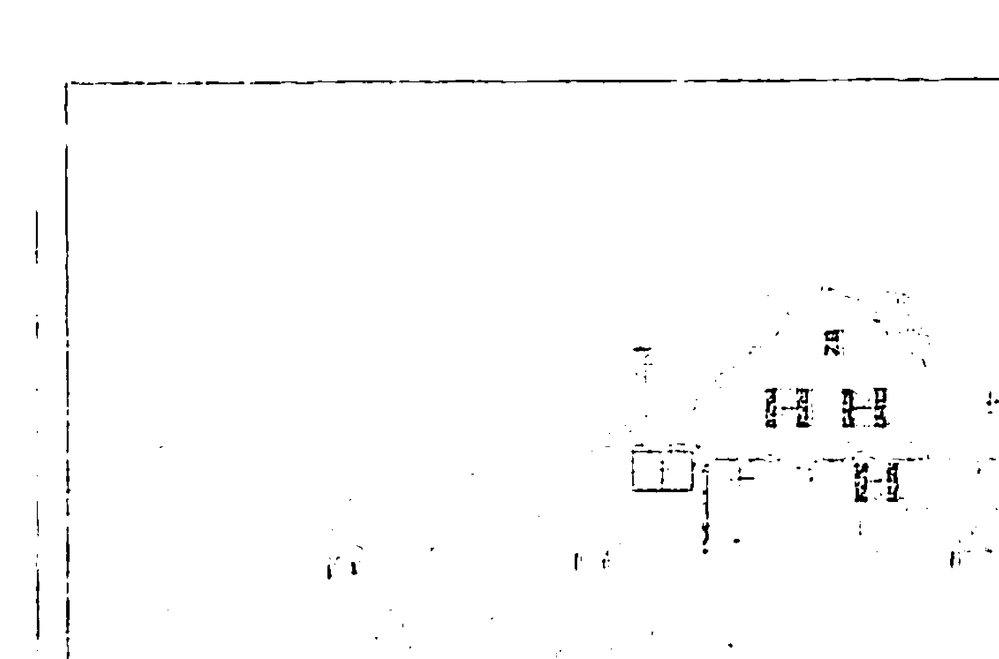

## 消气

佚名

古时有一个妇人，特别喜欢为一些琐碎的小事生气。她也知道自己这样不好，便去求一位高僧为自己谈禅说道，开阔心胸。

高僧听了她的讲述，一言不发地把她领到一座禅房中，落锁而去。

妇人气得跳脚大骂。骂了许久，高僧也不理会。妇人又开始哀求，高僧仍置若罔闻。妇人终于沉默了。高僧来到门外，问她：“你还生气吗？”

妇人说：“我只为我自己生气，我怎么会到这地方来受这份罪。”

“连自己都不原谅的人怎么能心如止水？”高僧拂袖而去。

过了一会儿，高僧又问她：“还生气吗？”

“不生气了。”妇人说。

“为什么？”

“气也没有办法呀。”

“你的气并未消逝，还压在心里，爆发后将会更加剧烈。”高僧又离开了。

高僧第三次来到门前，妇人告诉他：“我不生气了，因为不值得气。”

“还知道值不值得，可见心中还有衡量，还是有气根。”高僧笑道。

当高僧的身影迎着夕阳立在门外时，妇人问高僧：“大师，什么是气？”

高僧将手中的茶水倾洒于地。妇人视之良久，顿悟。叩谢而去。

魅力提示：

何苦要气？气便是别人吐出而你却接到口里的那种东西，你吞下便会反胃。你不看它时，它便会消散了。气是用别人的过错来惩罚自己的蠢行。夕阳如金，皎月如银，人生的幸福和快乐尚且享受不尽，哪里还有时间去气呢？

## 农场的动乱

佚名

有一只鸭子在谷仓边不小心踩到一只公鸡的脚，公鸡恼怒地说：“我要报仇！”说完便扑向这只鸭子，可是就在同时，它的翅膀打到了旁边的一只母鹅。

母鹅也很生气，认为公鸡是故意打它的，于是对公鸡说：“我要报仇！”说完就扑向公鸡。扑过去的时候，它的脚不小心拨乱了猫的毛。

“我要报仇！”猫儿喵喵地叫着，然后奔向母鹅。可是就在它奔过去的时候，它的脚碰到了一只山羊。

“我要报仇！”山羊咩咩地叫着，便向猫撞过去。但就在这时有一只牧羊犬从那儿走过，被山羊撞倒了。

“我要报仇！”牧羊犬大吠一声，便横冲直撞地追向山羊。它跑得飞快，因为闪避不及和门边的一头母牛撞了个满怀。

“我要报仇！”母牛也怒吼起来，开始追牧羊犬。但这条牧羊犬在一匹马屁股后头跑，这头母牛在慌乱之中，不小心踢了马一脚。

“我要报仇！”马也嘶鸣起来，冲向母牛。

由此，农场引发了一场混战！家禽牲畜们相互追逐着都要报仇。而这一切混战的起因只是从这只鸭子意外地踩到公鸡的脚趾开始的。农夫听到骚乱声，马上跑出来，气得把这些动物统统关到各自的笼子或栏圈里。它们自由自在的好时光就这样结束了，而这都因为它们太在意一件无关紧要的小过错。

### 魅力提示：

智者忍气含怒，愚者怒气全发。一件小事往往就可以让我们耿耿于怀甚至暴跳如雷。我们的心态有时也和这些动物一样。学会换个心情看事情，不要任凭怒气包围着自己。

| 项目 | 内容 |
| :--- | :--- |
| 书名 | 宽容：学会遗忘·拥抱幸福 |
| 作者 | 张茹 著 |
| 出版社 | 湖北人民出版社 |
| ISBN | 721604493 |
| 出版日期 | 2006-01 |
| 包装 | 平装 |
| 开本 | 32开 |

内容简介：

被执念遮住眼的人，生命的路会越走越阴霾。正如卡耐基所说：对于聪明的人来说，每一天都是一次新的生命开始。因为，聪明的人，懂得宽容。本书为“青少年成才必备的六堂情商培训课”之一，是风靡台湾的青少年励志读本。阅读本书，让你我都拥有宽容和平直、达观和敦厚的心怀去生活处世，让每时每刻都充满喜悦。

不论你是一个男子还是一个女人，待人温和宽大才配得上人的名称。一个人真正的英勇果断，决不等于用拳头制止别人发言。善于或者能够忘记悲伤的人，他的每一天都将是快乐的。

## 魅力第二面 他人眼

## 魅力失分 缺乏热情

与白羊座充满激情的性格不同，金牛座是不轻易浪费自己的能量的，要看到他对一件事情表现出相当的热情是很难的。

## 生命的指示灯

佚名

1823年，大诗人拜伦已经开始失去生活的热情了，他的生活变得无聊，死一般的无聊。

于是，他准备把自己的躯体献给战争。

那年夏天，他跟着军队朝希腊进发，行军途中，他写信给诗人歌德，告诉他自己的苦恼。

那年，拜伦35岁，风华正茂。而歌德已75岁高龄了。一个年轻的生命没有生活目标，没有恋人，不想结婚，更不敢谈恋爱，将生活寄托于一场战争。

而另一个垂垂老矣的生命却正准备向一个年轻的女人求婚，他的感情像一个年轻小伙一样旺盛。

歌德是在拜伦的鼓励下向那个只有19岁的姑娘求婚的，他对这场有着巨大的年龄差距的爱情充满了万丈激情。事后得知的拜伦在异国他乡更加忧伤，他说自己是年轻的老人，而歌德是年老的年轻人。一年后，他在没有结果的战争中病死。临死前他对医生说：“我对生活早就烦透了，我来希腊，就是为了结束我所厌倦的生活，你们对我的挽救是徒劳的，请走开！”

拜伦就这样死了。

而高龄的歌德正和那个青春靓丽的女子一起享受着生活，他的诗作一篇比一篇华丽而又激情万丈。

> 魅力提示：
> 生活的热情有时候是生命火焰的指示灯。热情灭了，一切也就完了。

## 什么让我如此欣喜

佚名

世界著名的励志大师拿破仑·希尔描述过他和他的母亲一起乘船渡江到纽约的经历。

那是一个有浓雾的夜晚，他们俩站在船上望着茫茫大海，母亲突然欢叫道：“这是多么令人欣喜的景观啊！”

“什么东西让您如此欣喜呢？”希尔问道。

母亲依旧充满热情：“你看呀，那浓雾，那四周若隐若现的灯光，还有消失在雾中的船带走了令人迷惑的灯光，多么令人不可思议。”

母亲的热情极大地感染了拿破仑·希尔，他也着实感觉到厚厚的白色雾中那种隐藏着的神秘、虚无及点点的迷惑。一颗迟钝的心得到了一些新鲜血液的渗透，不再没有感觉了。

母亲转过头，凝望着希尔，语重心长地说：“从你出生之日起，你就一直在聆听着我给你的忠告。不管以前的忠告你有没有听进去，但今天的忠告你一定要听，而且要永远牢记。那就是，世界从来就有美丽和兴奋存在，她本身就是如此动人、如此令人神往，所以，你自己必须要对她敏感，永远不要让自己感觉迟钝、嗅觉不灵，永远不要让自己失去那份应有的热情。”

母亲的这番话让拿破仑·希尔永远地记在了脑海里，并在以后的日子里始终实践着。

### 魅力提示：

真正懂得享受人生、把握人生的人，即使在生活平淡如水时也能发现激情的所在，他们会调整自己，他们能让平静的水面泛起涟漪，他们会时时刻刻让自己保持对生活对人生的热情和信心。这样，他们的热情就一直很饱满，思考力与创造力一直都很旺盛。如果两个人具有完全相同的才能，那么，必定是更具热情的那个人取得更大的成就。

## /魅力星座智慧书之

## 失去的热心

佚名

有一位已失去传道热忱的牧师，夜里做了一个梦，梦到自己被带到天堂，接受他一生为上帝工作的赏赐。

刚开始有个天使送来一个华丽灿烂的冠冕，上面镶满了珍珠宝玉，旁边的仙女说：“拿错了，这是20年前为他预备的，那时候他拼命为信仰作见证，可惜不一会的工夫，他就冷淡退却了，所以要换一个次等的冠冕给他。”

换来的次等的冠冕，虽然没有头个那么华丽，他还是觉得不错。然而那个仙女又说：“你们还是拿错了，这是10年前为他预备的，不幸世上的欲望和引诱迷住了他，使他成了一个不冷不热的人，再去换个冠冕吧！”

于是再换来一个，上面一粒珠宝都没有，毫无光彩。

这位牧师惊醒过来，原来是南柯一梦，从此之后，他勤奋传道，立志要讨上帝的喜悦，成了最热心的传道人。

### 魅力提示：

对生活充满热忱十分重要，然而热忱的保持未必能够长久。多年的热忱渐趋冷凉之时，可以多想想往昔那些辉煌的岁月，想想世间还有无数人士在默默奋斗坚持，以再次鼓舞起自己的热忱，朝自己所选定的有益的目标继续前行。

## 没有热情能打动谁

乔·库尔曼

我成为一名推销员，并非命中注定；成为一名优秀的推销员，也并非命中注定。先前，我从来没想过，我会靠推销吃饭；现在，我却因推销而闻名。命运反复，谁能预料！

那时候，我加入了寿险公司，想碰碰运气。干推销，完全是为生活所迫，因此，我只想试一试。8个月后，我准备退出。

那一段日子真是折磨人啊，你实在是看不到一点希望。开始，他们总是鼓动说“某某某又签下一单，提成多少”，我热血沸腾：他签一单等于我做一年，干吗还不行动呢？可是8个月下来，我什么都没有拉到。既然不适合做推销，还待在那里干什么？

我又开始翻招聘广告了。无意中翻到了戴尔·卡耐基先生的成功学讲座。他的名声我早听说了，抱着死马当作活马医的态度，我决定去听听。

谁能想到，戴尔·卡耐基先生随手一指，竟要我当场发言。惶惶无主中，我战战兢兢立起身来，感觉手无处放，结结巴巴吐出一点声音来。

“等一等，先生，请等一等！” 戴尔·卡耐基先生，毫不客气地打断我，“拿出生气来，年轻人！您这样讲话，哪一个爱听？没有热情，能打动谁？

戴尔·卡耐基先生就此大谈“热情”话题，讲到激动处，他挥手摔断了一条椅腿，演讲也戛然而止。声音洪亮，感情饱满，目光坚定，意气奔放，余音绕梁，回肠荡气，这就是我对那堂课的印象。

“没有热情，能打动谁！”那晚我失眠了，反复念叨着那句话。

“‘开谈多含情，话终有余响。’他的热情就是这样的么？我的热情在哪里呢？我的热情消失了，我的生命枯萎了。我怎么能这样呢？不！决不！我怎能一事无成！”

“现在不奋斗，更待何时？等我老了吗？那怎么行啊！我怎能随波逐流！”一夜辗转反侧，我决定要改变自己的命运。太阳升起，我听见了婉转的鸟叫。

那天打出的第一个电话，我永生难忘。我精神饱满，信心十足，没有任何畏惧。那一次真是速决战，对方立刻答应面谈。会谈时，我热情洋溢，妙语如珠，对方当场就签了单。他是费城的谷物商安蒙斯先生。他说：“如果我的员工都有您这样的热情，我的生意一定能好十倍。”然后我们成了好朋友。他是我的第一个顾客，我一辈子都记得他。

从那一天起，我感受到奋斗的乐趣，第一次体会到“做自己主人”的美好感觉。

### 魅力提示：

是的，没有热情能打动谁？假如你自己都对自己所做的事情毫无热情，别人又凭什么被你打动呢？

## 魅力精选

- 书名：奔跑的鹿
- 作者：赵曙光 著
- 出版社：民主与建设出版社
- 出版日期：2007-01
- ISBN：780112751
- 包装：平装
- 开本：32开

> 这是一剂独特的职场药方，它托住你的工作很长时间的激情
> 当你真正找到奔跑的乐趣时，你的激情将如火山一样喷发
> 生活是一片广阔的原野，我们不妨自由一样奔跑

### 内容简介：

有一只来自远方的鹿，他风尘仆仆奔跑而来，跑过森林、跑过乡村、跑过都市，他向遇到的每一个人讲述自己的传奇经历，并且兴致勃勃地告诉人们一个永恒的真理，当你真正找到奔跑的乐趣时，你的激情将如火山一样喷发！

## 魅力第二面

## 做人篇

## MAGIC

### 魅力失分

## 过分自信

有时候，金牛座的人往往过高地估计了自己的能力，自以为是。

## 玫瑰与蒿草

香草情人

有两个孩子一起走进天使的玫瑰园，他俩都希望天使能够赐予自己一束幸福的玫瑰花。然而，天使却送给他俩每人一束绿色的玫瑰枝，两个孩子都有点失望。

天使便把他俩分别叫到面前微笑着说：“孩子，你能跟我描述一下你的那个伙伴吗？如果你比对方英俊，你将获得一束幸福的玫瑰花。”

第一个孩子说：“我比他的个子高，而且眼睛也比他的大；你看他的鼻子还塌塌的，当然我要比他英俊，请天使赐予我一束幸福的玫瑰花吧！”

第二个孩子听了天使提出的这个条件之后，他转身端详了对方几眼，然后诚恳地说；“他的个子高高的，眼睛大大的，鼻子也挺挺的，真好看。天使只有一束玫瑰花，就请赐给他吧！”

结果，第二个孩子手中的那一束玫瑰枝，陡然绽开了芳香的花朵。而第一个孩子手中的绿色的玫瑰枝，竟变成了一束枯萎的蒿草。

### 魅力提示：

不盲目自信，大方面豁达地承认自己不如别人，真诚地欣赏别人的优点、你手中希望的绿枝也会陡然绽开芬芳的花蕾，甚至有一座玫瑰园在等着你去采摘！

## 高调做事，低调做人

吾心木

朋友在办公室的墙上挂了他自撰自书的条幅，上写：竖起桅杆做事，砍断桅杆做人。他说，这是他一次惊心动魄的经历的结晶。

朋友出生在渔民家庭，从小就喜欢海，几次请求爷爷带他出海打鱼，可爷爷总是以他还小为借口拒绝。他懂得爷爷的心思，爷爷是怕他这根独苗发生意外。

长大后，他将要到远离家乡的地方去工作，那是个看不见海的地方。在等待行期的日子里，爷爷决定带他出一次海，一来了却他一直的心愿，二来让他去见识见识大海的博大，开阔开阔他的心胸，或许对他的人生会有益处。

他非常兴奋，跟着爷爷跑前跑后，做好所有准备工作之后，在一个风和日丽的日子扬帆出海了。

## //魅力星座智慧书之金牛座

大海深处，爷爷教他如何使舵，如何下网，如何根据海水颜色的变化辨识鱼群。可是天有不测风云，大海的脾气也让人捉摸不透。刚刚还晴空万里、风平浪静，突然间就狂风大作、巨浪滔天，几乎要把渔船掀翻。连爷爷这个老水手都措手不及，但他丝毫不慌，吃力地掌着舵，同时以命令的口气大喊：“快拿斧头把桅杆砍断，快！”他不敢怠慢，用尽力气砍断了桅杆。

没有桅杆的小船在海上漂着，直漂到大海重新恢复平静，祖孙俩才用手摇着橹返航。途中，由于没有桅杆，无法升帆，船前进缓慢。他问爷爷：“为什么要砍断桅杆？”爷爷说：“帆船前进靠帆，升帆靠桅杆，桅杆是帆船前进动力的支柱。但是，由于高高竖立的桅杆使船的重心上移，削弱了船的稳定性，一旦遭遇风暴，就有倾覆的危险，桅杆又成了灾难的祸端。所以，砍断桅杆是为了降低重心，保持稳定，保住人的生命，人是最重要的。”

行期到了，虽然离开了爷爷，但他把爷爷的话记在了心里，那次历险也在他的心里扎下了根。他的工作非常出色，职务也一再升迁。但他仍然脚踏实地做人，无论取得多大成绩，无论地位多么显赫，绝不凌驾于他人之上。他说：高调做事，低调做人。每当春风得意之时，总会想起那砍断的桅杆。

> > 魅力提示：
> > 时刻记住，用一种谦逊低调的态度做人，人生的船才能够行得稳。

## 三个旅行者

雅 琴

三个旅行者同时住进一家旅店。早上出门时，一个旅行者带了一把伞，一个拿了一根拐杖，第三个则两手空空。

晚上归来时，拿雨伞的人淋湿了衣服，拿拐杖的人跌得身上不少泥，而空手者却什么事都没有。前两人都很奇怪，问第三人这是为什么。

第三个旅行者没有回答，而是问拿伞的人，“你为什么淋湿而没有摔跤呢？”

> > “下雨的时候，我很高兴有先见之明，撑开伞大胆地在雨中走，衣服还是湿了不少。泥泞难行的地方，因为没有拐杖，走起来小心翼翼，就没有摔跤。”

再问拿拐杖者，他说：“下雨时，没有伞我就拣能躲雨的地方走或停下来休息。泥泞难行的地方我便用拐杖拄着走，却反而跌了跤。”

空手的旅行者哈哈大笑，说：“下雨时我拣能躲雨的地方走，路不好时我细心走，所以我没有淋着也没有摔着，你们有凭借的优势，就不够仔细小心，以为有优势就没问题，所以反而有伞的淋湿了，有拐杖的摔了跤。”

### 魅力提示：

许多时候，我们不是跌倒在自己的缺陷上，而是在自以为有优势没问题的地方出了差错。因为缺陷带给我们以提醒，而优势则让人忘乎所以。

## 棋逢对手

苗向东

清朝名臣左宗棠喜欢下棋，而且棋艺高超，少有敌手。有一次他微服出巡，在街上看到一个老人摆棋阵，并且在招牌上写着“天下第一棋手”，左宗棠觉得老人太过狂妄，立刻前去挑战，没有想到老人不堪一击，连连败北。左宗棠洋洋得意，命他把那块招牌拆了，不要再丢人现眼。

当左宗棠从新疆平乱回来时，见老人居然还把牌子悬在那里，他很不高兴，又去和老人下棋，但是这次竟然三战三败，被打得落花流水。第二天再去，仍然惨遭败北，他很惊讶老人为什么这么短的时间内，棋艺能进步如此地快？

老人笑着回答：“上次你虽然微服出巡，但我一看就知道你是左公，而且即将出征，所以让你赢，好使你有信心立大功。如今已凯旋归来，我就不再客气了。”左宗棠听了心服口服。

### 魅力提示：

天外有天，人外有人。当自己做事情一帆风顺的时候，自己应当想到，其中很可能还有他人在暗中相助，所以位高者更应谦虚谨慎，不可太自以为是，也不可忘了他人的功劳

### 魅力链接

- 书名：智慧书：永恒的人生处世经典
- 作者：（西）巴尔塔沙·葛拉西安 著
- 出版社：天津教育出版社
- 出版日期：2008-05
- ISBN：753095209
- 包装：平装
- 开本：大32开

### 内容简介：

《智慧书》为巴尔塔沙·葛拉西安的代表作，浓缩了做人处世的智慧，汇集了关于知人、观事、判断和行动的300则箴言，其待人之理、律己之道，堪称则则精辟、字字珠玑。本书以一种令人惊异的冷峻态度，极深刻地描述了人生处世经验，提供了战胜艰险、困顿与迷茫的种种神机妙策。《智慧书》自1647年问世以来，一直受到各国普通读者的喜爱，已有七种英译本；葛拉西安也被尊崇为世界文化史上的一代宗师。

## 魔戒第二面

## 做人篇

MAGIC

### 魅力失分

## 斤斤计较

对金牛来说，钱就是他的命，你要他不计较金钱利益简直是不可思议的事，即使是他最爱的生活享受也要精打细算一番，如果你是他的朋友、亲人或者恋人，而他就会把你当做他财产的一部分，那么对你所有的事情也会很计较。

## 多付一倍工钱

韩天才

唐代宗时，刘晏在扬州设立造船场。每造一艘船，就付给船工工钱一千缗。这是一个非常高的价钱。有人提出实际开销不到所付工钱的一半，要求削减。

刘晏说：“不。计划大事业不能计较小的花费。凡事必须考虑到长久的利益。现在管事的人很多，应当使他们的私人花费不太窘迫，这样公家的财物才不会受损失。如果和他们斤斤计较，岂能长久行事？”

在他的坚持下，船的质量很好，漕运非常兴旺。一百年后，即懿宗咸通年间，主管人员按实际费用给付工钱，再没有剩余，结果所造的船越来越脆薄易碎，漕运也随之衰败了。

> 魅力提示：
> 斤斤计较的人，一生只得两斤。而要想获得更多，就不要计较小的得失。

## 等于救己

佚名

这是一场血腥的战争，士兵们早已将自己的生死存亡置之度外，为了国家的荣誉，死亡也变得如此崇高。这也是一场大会战，直接关系到整个战争的成败。战斗也异常激烈。敌人的战斗机群在上空盘旋，随即扔下了许多的炸弹，炮声隆隆，枪林弹雨。

一位前线的指挥官，正拿着望远镜观察战情，随时按照现场的情况和上级的指示调遣自己的部队。突然，他发现一架敌机正呼啸着朝自己的阵地俯冲过来。情况之危急，除了马上卧倒，避免炸弹的袭击，别无他法。

指挥官正打算卧倒的瞬间，突然发现距离自己四公尺左右的壕沟边，还站着一个年轻的士兵，正扣动着扳机，厮杀着进攻的敌人，根本没意识到危险正在到来。指挥官来不及思考，一个跳跃飞身过去，将小士兵压在身下。

紧接着，一颗炸弹从敌机上扔了下来，随着一声巨响，地上的泥土飞溅起来，覆盖在指挥官身上。指挥官扶着士兵爬了起来，士兵连忙向指挥官行了一个军礼，并向指挥官表示感谢。指挥官示意士兵继续战斗。可是，当指挥官回过头时，看见眼前的一幕，突然愣住了。原来，在指挥官刚才站的地方已经被炸弹炸出了一个大坑！指挥官做了个长长的深呼吸，庆幸自己还站在这里指挥战斗。

指挥官因为舍身救那位士兵，同时也救了自己的生命。这确实是一种莫大的回报。

> 魅力提示：
有的人做事喜欢在利益之间斤斤计较，对于有利的便趋之若鹜，对于不利的便敬而远之。但是，他们却忽略了一点，在做对别人有利的事的同时也会有利于自己。在前进的道路上，当我们积极主动地为别人搬开脚下的绊脚石时，我们也是在为自己铺平道路。

## 驴与骡子

伊索

有一天，驴夫赶着驴子和骡子一起驮货赶路。驴子十分气愤它们俩驮的东西一样多，而骡子却吃双倍饲料。他们刚走一会儿，驴夫看见驴子有点走不动了，便从它背上拿下一部分货物，加在骡子背上。他们又走了一会儿，驴夫看到驴累得更加不行了，又取了一部分货物，最后把驴驮的所有货物，全加在骡子背上。这时，骡子回过头对驴子说：“喂，朋友，你现在还气愤我吃双倍饲料吗？”

魅力提示：不要与别人斤斤计较，各人都有自己该做的事，该得的酬劳。

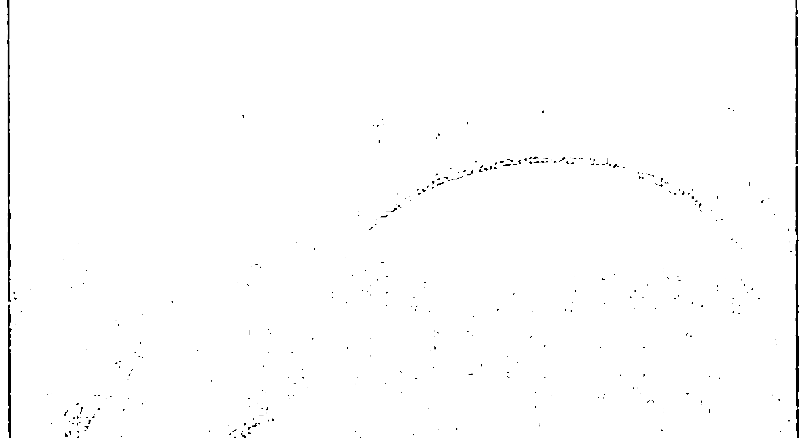

### 尖锐的钢刀

风中的眼睛

一个男孩爱上了一个女孩，可是女孩却不爱他。男孩苦苦地追求女孩，而女孩对此无动于衷。无论风霜雨雪，男孩都守候在女孩单位门口，远远地跟在她后面送她下班回家。

男孩家很有钱，总是隔三岔五变着花样给女孩送礼物。尤其是当男孩知道女孩不舒服的消息，就茶不思，饭不想，牵肠挂肚。

男孩对女孩的付出超出了常人的限度。精诚所至，金石为开。时间长了，女孩也动心了。有一次，女孩到男孩的单位去找他，在男孩办公室，女孩听见男孩的同事问他：“你傻不傻？付出了那么多，人家都无动于衷。”男孩说：“我就不信她不心动，我付出多少爱我就应该得到多少爱。”

这句话像一把尖锐的钢刀扎在了女孩柔软、脆弱的心上。

她拒绝了男孩的爱。

>> 魅力提示：
若是在付出之前就想着回报，一心计较着自己的得失，那么，你是无论如何也得不到真爱的。

### 魅力链接

书名：找回快乐
作者：（美）理查德·卡尔森 著
出版社：机械工业出版社
出版日期：2004-01
ISBN：711113373
包装：平装
开本：32开

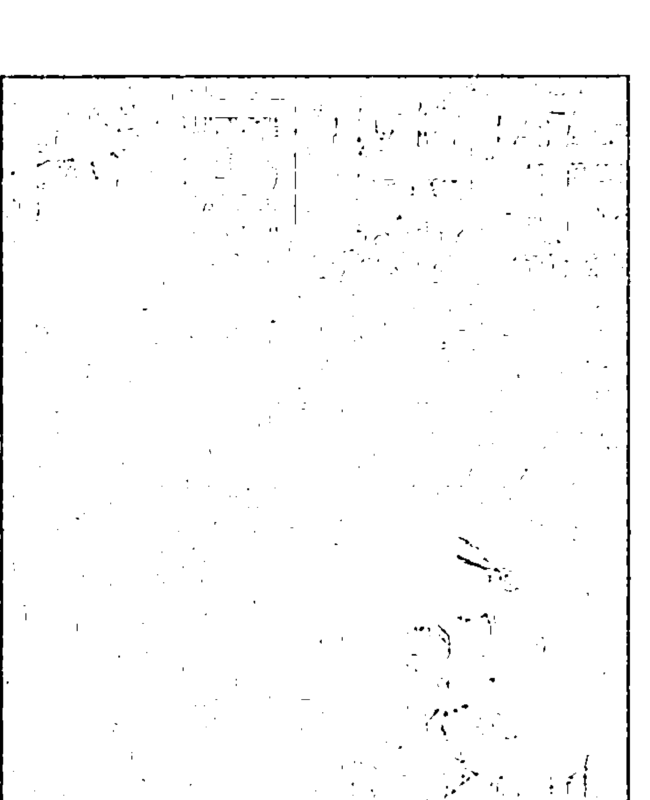

内容简介：把杂草从一个花园移开，留下的即是美丽。你不需要再种什么了，只需要带走那些破坏美丽的东西。为心灵除除草，留下的即是快乐。你不需要改变现状，只需要剪掉那些抑郁和焦虑的牵绊。这本书的目的是讨论荣格有关人类生存状态的评价，即包围着我们的忧愁和普遍程度。我将向你阐述怎样摆脱控制着你的生活的消极感觉，并用感恩、快乐和爱的感觉来代替它们。从本书获得最大收益的方法，就是以开放的心灵去阅读它。

## 魔术第二面
### 做人篇

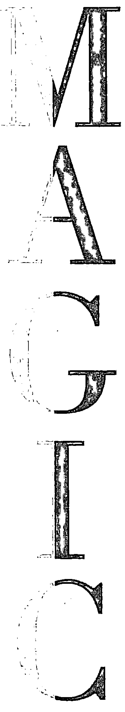

### 魅力失分
### 缺少朋友

金牛座平常就跟人保持距离，而且不喜欢说话，别人自认为是他的朋友，他也不会否认，但是他常常在默默观察对方是一个什么样的人，他知道自己的聪明程度到哪里，也知道自己需要的朋友是怎样的，因此常常有些自认为是他的朋友的人在金牛座的主观意识中就被淘汰了，他也不会主动出击，抱着这种消极又骄傲的心态，很多金牛座终其一生都没有什么朋友。

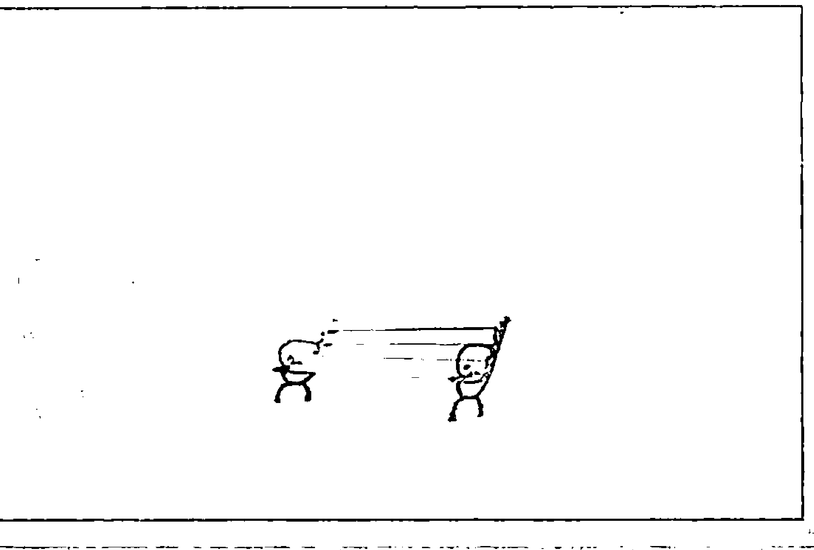

### 真正的朋友

佚名

一位犹太父亲自知自己将不久于人世，于是他把惟一的儿子叫到病榻前并且叮嘱他，“除了一生积攒下来的财富，我留给你的还有一生当中惟一的朋友。他住在一个非常遥远的地方，这是他的地址，如果你遇到解决不了的困难，那就去找他。”说完父亲把手中一个写着陌生地址的纸条交到了儿子手里，然后就撒手人世了。

失去了父亲的儿子感到万分的悲痛，在悲痛之余他又为父亲临终时留下来的话感到不解，“父亲明明知道我有许多形影不离的好朋友，为什么父亲要我在遇到困难时去找他那位已经多年不再联系的惟一的朋友呢？”虽然对父亲的话感到有些纳闷，但是一向听从父亲教诲的他还是把父亲留下来的纸条保存在一个稳妥的地方。

在父亲死后的几年里，儿子依然像父亲在世的时候一样大把花钱，不断宴请自己结交的朋友，当朋友遇到困难时他总是慷慨解囊，但是他却忘了小时候父亲对于自己如何理财的教诲。由于过度花费又没有其他进账，所以父亲留下来的钱财很快就被他花光了。几乎一无所有的他向那些他曾经帮助过的朋友们寻求帮助，没想到过去热脸相迎的朋友们一个个都变得冷漠至极。

正所谓“破屋又遭连阴雨，漏船偏遇顶头风”。一次，高利贷者到他家向他要账，由于对方恶语相向，他一时气愤便把对方打了个头破血流。他知道对方一定不会善罢甘休，也许过不了多久自己就会被抓进监狱。一想到这些，年轻人开始害怕起来，他决定先到朋友那里躲一躲，然后让他们帮助自己解决这场灾难。于是他连夜到各个朋友家敲门求助，可是没有一个朋友愿意惹官司上身，甚至大多数朋友连家门都不愿意让他进。

在心灰意冷之际，他想到了父亲临终时留下的纸条。于是他简单地打点行装，开始寻找父亲的那位多年不见的朋友去了。

虽然一路上历经磨难，但他还是来到了父亲的老友门前。父亲的老友显然并不富裕，看到这些他不由得又对父亲的话多了几分不解。当他疑虑重重地向对方说明自己的身份并且表明自己目前的处境时，对面的老人很快将他拉到了家中，叫妻子赶快为年轻人准备可口的饭菜，他自己则迅速走了出去。过了将近一个小时的时间他才满头大汗地回来，并从外面抱回来一个年代很久的坛子。今年轻人感到吃惊的是，坛子里面居然有十几块闪闪发光的金币，更令他感到出乎意料的是，这位老人居然要将这些金币全部送给他。老人一边将金币送到年轻人手中，一边对他说：“这是我年轻的时候和你父亲一起做生意时分得的利润，你全部拿去，用它们还清债务，剩下的钱你就用它们去创造更大的财富吧。年轻人，想想你父亲当年的做法，以后要知道怎样积累钱财。”

年轻人带着十几块金币走了，他同时带走的还有对真正友谊的大彻大悟。

### 魅力提示：

真正的朋友往往不是那些锦上添花之辈，而是雪中送炭之人。危难之际见真情，真正的朋友必定能够经得起时间和环境的考验。如果只能同享乐而不能共患难，那就不是真正的朋友。人生，若能得到这样的朋友，便是一生最珍贵的财富。

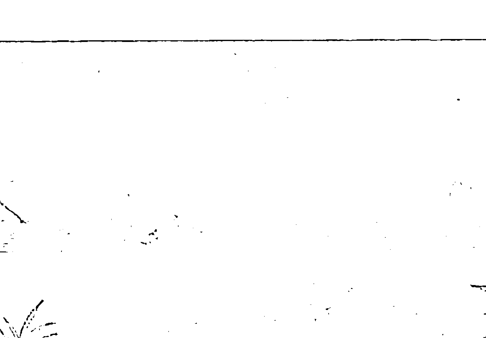

### 两只流浪狗的遭遇

佚名

一只流浪狗因为偷吃了一户人家厨房里的食物，所以被这户人家的男主人一路追打。流浪狗一路猛跑，终于摆脱了那人的追赶。结果，在仓皇逃跑的时候，它闯进了一间四面都镶着玻璃镜的屋子。

极其狼狈的流浪狗突然看到很多只狗同时出现在这个屋子里，大吃一惊，于是便冲着镜子里的狗龇牙咧嘴地表达自己的不满，而且还示威性地发出阵阵低沉的怒吼声。而镜子里所有的狗看来也都十分生气，每只狗都以同样愤怒的表情向着流浪狗表达了自己的不友好。

看到所有的狗都龇牙咧嘴地朝着自己怒吼，这只流浪狗十分害怕，不知所措的它只好不停地绕着屋子乱跑，可是它发现，镜子中的那些狗也开始像疯了一样乱跑。流浪狗害怕它们一起朝自己发动进攻，于是急忙夹着尾巴跑出了屋子。以后，它再也没有来过这个屋子，因为它觉得自己在这里得到的只有敌意，同时它还为自己的处境感到难过，因为无论在哪里它都感觉不到丝毫的友好和温暖。

另外一只流浪狗为了躲避风雨的袭击，也在无意之中发现了这间四面都镶着玻璃镜的屋子。这只流浪狗进到屋子里看到有那么多的狗，它为自己有了更多的伙伴感到很高兴，它想，也许从今以后，自己就再也不用孤零零的了。这样想着，它朝着镜中的其他狗摇了几下尾巴，然后它看到，镜子中所有的狗也朝着自己友好地摇了摇尾巴。虽然此时这只流浪狗又冷又饿，但是因为有了这么多的新伙伴，它的内心却是过去从未有过的温暖。

等到它醒来的时候，屋外已经是雨过天晴。看到屋子外明媚的阳光，有了更多“伙伴”支持的流浪狗觉得自己充满了力量，它充满信心地出外寻觅食物。而且，从那以后，这只流浪狗几乎每天都要在这间无人居住的屋子里休息一段时间，有时它来这里只是纯粹为了看望那些“友好的伙伴”。

### 魅力提示：

人与人之间的交往也是这样，要是你能友善地对待他人，周围的人必然也会回报给你同样的友善。如果你态度恶劣地对待周围的环境或人，那你将面对的只能是恶劣的环境和对自己态度恶劣的人们。试着对他们更主动地表达你心中的善意，情形必会有所改善。

### 山谷中的回音

佚名

有一家人祖祖辈辈都生活在偏僻的小山村，贫瘠的土壤几乎被一代又一代的山里人掏空了。为了使妻子和几个孩子填饱肚子，这家的男主人不得不和其他村里人一起走出大山去碰运气。当父亲离开之后，家里所有的农活都压在了母亲一个人身上。为了帮助母亲分忧解难，家中的长子约翰只好离开了自己热爱的学校，和母亲一起照顾年幼的弟弟妹妹。

有一天，当干完了农活之后，约翰又忍不住来到了日夜思念的学校。可是学校里的一位富人家的子弟却嘲笑他“活像一只从地底下爬出的土耗子”。本来就对自己上不了学感到几分委屈的约翰实在受不了这样的嘲笑，带着满腹的委屈和愤怒，向那位富家子弟挥出了有力的拳头。一记拳头下去，那位富家子弟已经满脸是血。此事很快就惊动了学校，并且传到了约翰母亲那里。

听到这个消息时，母亲简直惊呆了。因为他们必须要向那位富家子弟支付一大笔医药费，而这笔医药费几乎要使他们倾家荡产。母亲把约翰叫到了家中，严厉地批评了他的所作所为，而且还警告他“不许再跨进学校的大门一步”。

约翰感到委屈到了极点，他非常气愤地跑出了家门，一口气跑到了山谷中。到了山谷中他依然感到胸腔内充满了怒火，于是他站在那里大声地喊“我恨你，我恨你，我恨你”，他的声音刚刚停下，他就听到山谷中传来了更大的声音“我恨你，我恨你，我恨你——”这声音一声接着一声，简直要穿透他的整个心脏。听到山谷中的回音，他强迫自己冷静下来，懂事善良的他很快就想到了母亲的艰难，想起了母亲对自己种种的好来，于是他又大声对着空旷的山谷喊道：“我爱你，我爱你，我爱你”，山谷中很快传来了同样的回音“我爱你，我爱你，我爱你——”这声音更加婉转绵长。

约翰心中的委屈已经被这山谷的回音冲刷得一干二净了。他重新回到家里和母亲一起辛勤劳动，此后他再也没有顶撞过母亲，对待弟弟妹妹们他也是尽可能地关心和爱护。当他第一次收到弟妹大学毕业后寄给自己的钱、书籍和营养品时，感到了莫大的幸福。

### 魅力提示：

你对别人怎样，别人便以怎样的态度对你。所以，当我们渴望得到周围人的关爱时，首先就要向对方付出自己的真诚和友善，否则我们得到的只有冷漠和孤独。

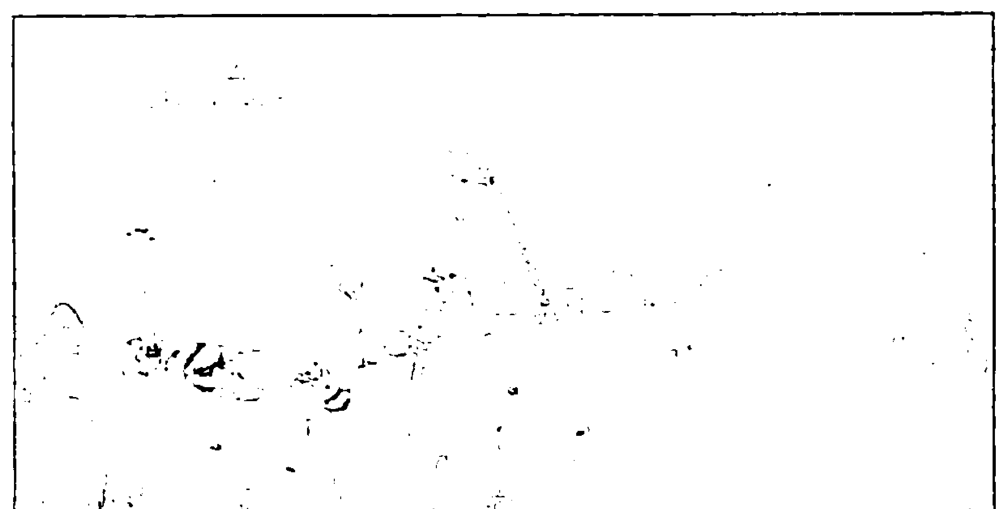

### 友谊不会从天而降

佚 名

一个人凭借自己的勤劳和努力白手起家，在多年之后终于拥有万贯家财，成为当地有名的富翁。

很多人都以为人一旦有了钱之后就可以坐在家里轻松地享受，再也不必辛苦劳动了。其实，事实上并非如此，大多数人有了钱之后，才发现自己的生活更加忙碌了，操心的事情更多了。这位白手起家的富翁就是这样，他经常督促自己不能松懈，结果每天就像一个陀螺一样不停地转。

如此忙碌和紧张的生活真让他感到痛苦，他时时都想找一位朋友来倾诉自己心中的愁苦。可是在生意场上哪里有真正的朋友，多年的经验也告诉他不可以轻易地将那些人当成朋友；公司里的员工，见到他不是畏惧就是溜须拍马，更不会有什么朋友；也许只有在工作之余才能找到真正的朋友。

可是在生活中，这位富翁更是没有可以谈天说地的知己。由于常年忙碌，他几乎连谈恋爱的时间也没有，三十几岁了还没有结婚。也正是因为过于忙碌，所以过去的同学、朋友早已失去了联系。邻居倒是有一些，可是富翁却觉得那些邻居小市民气太重，以自己的身份是不屑于和他们结交的。

实际上，富翁和邻居之间的关系处得相当糟糕。他嫌弃邻居们目光短浅、无所事事。而邻居们则认为他过于趾高气扬，看不起众人，而且还认为他为人自私，不知道替别人考虑，邻居们这样评价富翁是有理由的，富翁经常开着名牌汽车出入，在进入街巷之时从来没有降低速度，即使在雨天也是如此；他养的大狼狗经常对邻居家的小孩露出可怕的尖牙；当邻居遇到他时，他总是皱着眉头，板着一张脸；每逢他看到邻居家的小孩想要抚摸一下他的汽车时，他总会粗鲁地将孩子呵斥一顿……

富翁就这样富有而孤独地生活在邻居中间。

随着市场竞争的激烈，富翁公司的生意很快萧条下来。在一次三角债风波中，公司因为被银行查封了，这下他终于有时间休息了。公司被封之后，无事可干的富翁更是觉得孤单无比，他现在看到邻居们坐在一起其乐融融的样子真是羡慕，于是他希望也能走到邻居当中。可是，他发现每当自己开启大门走出院子时，邻居们就会自动走到离他家更远的地方去谈天。当他主动与邻居聊天时，邻居总是板着面孔一副不情愿的样子。甚至当他亲热地抚摸小孩子的头时，小孩子竟然立刻大哭起来……

他感到很委屈，认为邻居们简直不近人情，同时他也为自己得不到友谊而痛苦。一天，他在家中看杂志时，发现这样一句话：要想收获友谊之树，必须种下真心的种子，还需要用心培植，并且需要日积月累的付出。

富翁顿然醒悟，于是，他皱紧的眉头开始舒展，脸上也有了笑容，看到邻居家的孩子他会主动带上他们开着车去兜风，他养的大狼狗则被一条粗壮的铁链拴到了自家院子的角落，当他开车进入街巷之时，他会主动降低速度，在雨天更是减速慢行……

最后银行审查结束，他的公司恢复了运转，而他在忙碌之余也享受到了包括邻居在内的许多人的关心和体贴。

### 魅力提示：

如果你不想在失意的时候一个人独自承受，那么就要去结交一些朋友，而要交朋友，就要先为别人做一些需要花费时间和精力、需要投入情感和体力才能做到的事情——友谊不会从天而降。更值得注意的是，你必须要付出真心。

## /魅力星座智慧书之...

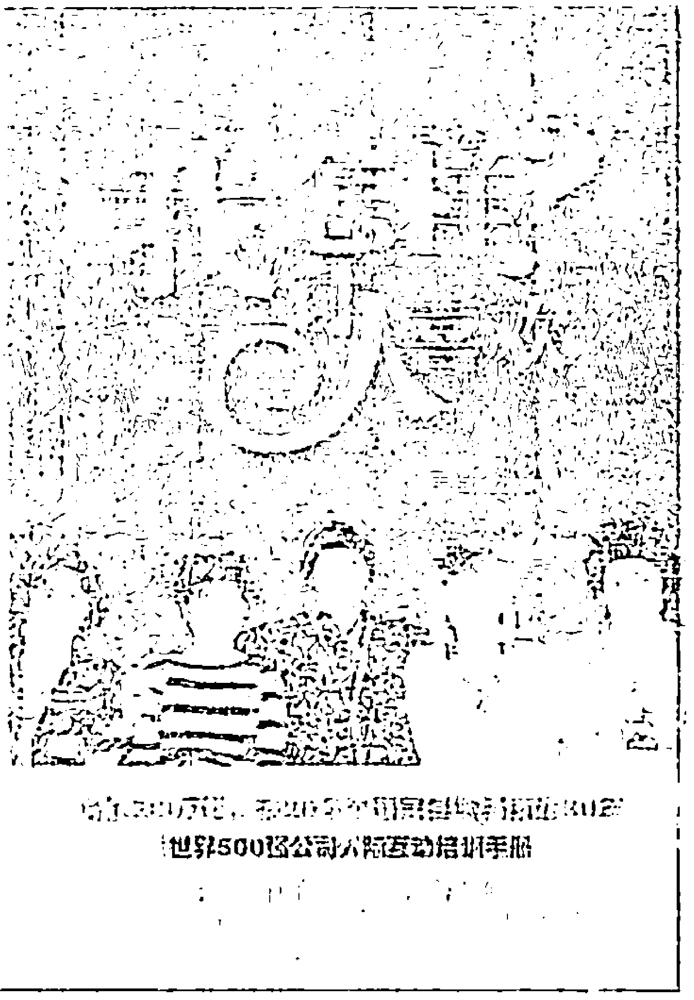

- 书名：我怎样讨人喜欢
- 作者：（美）艾伦·罗·麦金尼 著，王伍惠亚、刘莉 译
- 出版社：江西人民出版社
- 出版日期：2009-01
- ISBN：721003931
- 包装：平装
- 开本：大32开

### 内容简介：

我为什么要讨人喜欢？我需要讨人喜欢吗？这样的问题或许是某些人的第一反应，但正如英国诗人约翰·多恩那句著名的话：“没有人是一座孤岛，每个人都是大陆的一片。”人性最真实的状况，是每个人，就算所谓的宅男宅女，其实都需要与其他人链接；每个人的内心都有最深切的渴望：爱与被爱。《我怎样讨人喜欢》的作者透过温馨轻快的谈话式笔调，大量感人的案例，结合心理学的知识，精辟地讲述了加深友谊的五种方式、培养亲密友谊的五大指南、如何对付消极情绪而不破坏关系以及怎样挽救衰退中的友谊，更特别关注个体的自我价值感与友情的关系，帮助读者学习让自己变成一个更可爱的人，从而收获更健康快乐的人际关系与祝福满满的丰盛生命。

>> “没有人是一座孤岛，每个人都是大陆的一片。”

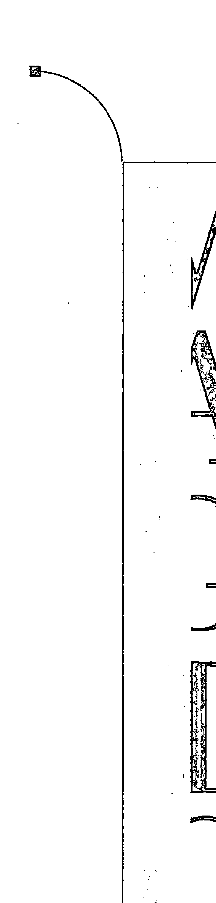

### 魅力失分

在爱情方面，金牛座有很强的占有欲。与女友一起逛街，如果女友对街上的帅哥多看了几眼也会令他暗吃闷醋。

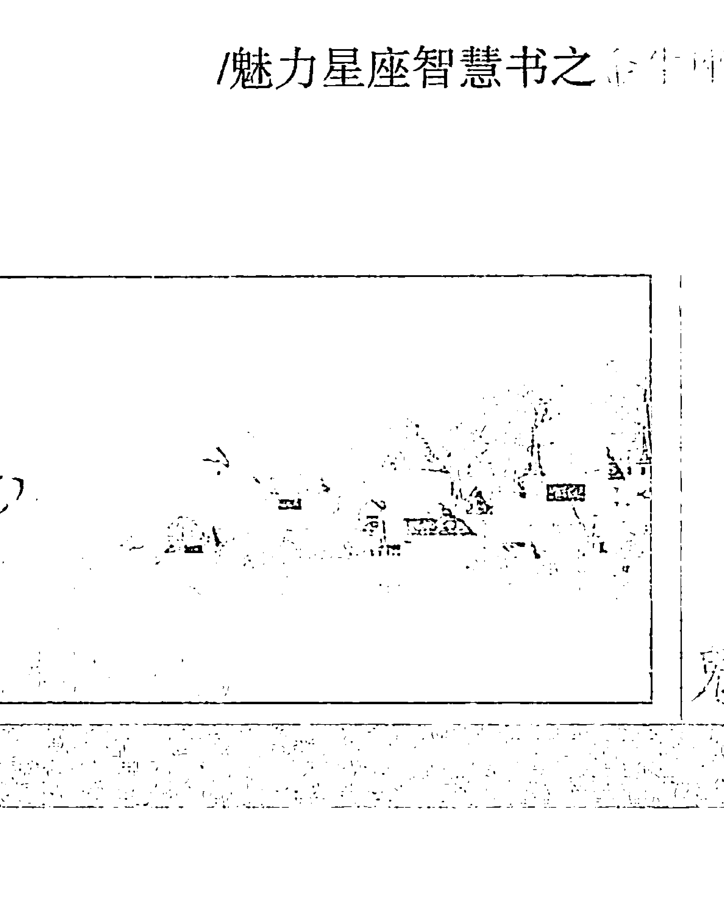

## 距离是一种神奇

佚名

前不久，在《译林》上读到这么一个故事：

寒冷的冬天，一群豪猪挤到一起取暖，但各自身上的刺迫使它们不得不马上分开。御寒的本能迫使它们又聚到一起，然而疼痛使它们再次分开。这样经过几次反复，它们终于找到了相隔的最佳距离——在最轻的疼痛下得到最大的温暖。

不知怎的，读毕，竟使我想起柴可夫斯基和梅克夫人。

柴可夫斯基和梅克夫人是一对相互爱慕而又从不见面的恋人。梅克夫人是一位酷爱音乐、有一群儿女的富孀。她在柴可夫斯基最孤独、最失落的时候，不仅给了他经济上的援助，而且在心灵上给了他极大的鼓励和安慰，她使柴可夫斯基在音乐殿堂里一步步走向顶峰。柴可夫斯基最著名的《交响曲》和《悲怆交响曲》都是为这位夫人而作的。

他们从未想见面的原因并非他们二人相距遥远，相反，他们的居住地有时仅一片草地之隔，他们之所以永不见面，是因为他们怕心中的那种朦胧的美和爱，在一见面后被某种太现实、太物质的东西所代替。

不过，不可避免的相见也发生过。那是一个夏天，柴可夫斯基和梅克夫人本来已安排了他们的日程，使得一个外出，另一个一定留在家里。但是有一次，他们终于在计算上出了差错，两个人同时都出来了。他们的马车沿着大街渐渐靠近。当两驾马车相互擦过的时候，柴可夫斯基无意中抬起头，看到了梅克夫人的眼睛，他们彼此凝视了好几秒钟，柴可夫斯基一言不发地欠了欠身子，孀妇也同样回欠了一下，就命令马车夫继续赶路了。柴可夫斯基一回到家就写了一封信给梅克夫人：“原谅我的粗心大意吧！维拉蕾托夫娜！我爱你胜过其他任何一个人，我珍惜你胜过世界上所有的东西。”

在他们的一生中，这是他们最亲密的一次接触。

现在想来，柴可夫斯基和梅克夫人是在用距离创造美——创造迷人和朦胧，创造向往和动力。他们是聪明的，他们没有让欲念任意驰骋，而是把爱的欢乐放在和理性等距离的位置上，让它升华成崇高的品格，升华成完美的人性，升华成一个永恒的故事。

### 魅力提示：

有些人会把握距离，让它成为一道美丽的风景，使爱和友谊充满情致。有些人从不知道距离为何物，时而把它装潢得天堂一般，时而又把它搞成人间地狱。就爱而言，距离不再是空间意义的长度，而是交往的层次和质量。如何像豪猪一样寻找到一个合适的距离，不仅是爱的艺术，推而广之，它也是生存的艺术。

### 美丽的侧影

佚名

这是一个现代都市里的浪漫爱情故事。他得了绝症。她辞掉了自己的工作，专心地在医院里照顾他。两年并不是一个很短的时间，她始终不渝地在床前端饭端药，跑前跑后地伺候着，虽然没有正式结婚，但他们纯洁的恋情打动了所有的人。他们的病友换了一个又一个，而小伙子的病情不见好转也不见恶化。

终于有一天，医生告诉他们一个沉痛的消息：小伙子挺不过这一周了。女孩痛哭失声，小伙子却长舒了一口气。报社的记者知道了这个感人的故事也匆匆赶来了。

他们诉说了自己的挚爱，说自己美好的愿望；他们倾听，听两人怦怦的心跳，听悲苦但无憾的美丽。听得每个人脸上淌满了泪水。

> 记者们提出让两个人拍一张合影，但小伙子却拦住了：“还是不要拍了吧？”
“为什么？”
“将来她还要嫁人呢！我不能打搅她以后正常的生活。”
她扑进他怀里失声痛哭。
第二天报纸上登出的是女孩的侧面照——一张美丽得让人心碎的侧影。

### 魅力提示：

爱情不是自私地占有。爱情本身就是生命，它不会死亡，只会迁徙。

# 真正的礼物

佚名

一家新开业的礼品店热闹了一阵后，慢慢静了下来。年轻的女老板黛丝刚把凌乱的柜台整理好，一位20多岁的男青年进了店。他瘦瘦的脸颊，戴副近视眼镜。他冷冰冰的目光在店中游弋、搜索，最后落在窗边那个柜台里。黛丝顺着男青年的目光看去，见他正盯着一只绿色玻璃龟出神。

她走过去轻声问道：“先生，你喜欢这只龟吗？我拿出来给你看。”

男青年似乎对看与不看并不在意，伸手把钱包掏出来，问道：“多少钱一只？”

“20美元。”

青年连价都没讲，“啪”地把钞票拍在柜台上。

面对黛丝递过来的乌龟，青年人眯起眼睛慢慢欣赏着，脸上的肌肉时不时地抽动一下，继而一丝笑容勉强地跳了出来。他自言自语道：“好，把它作为结婚礼物是再好不过了。”青年人的脸兴奋得有点扭曲，两眼灼灼闪着光。

黛丝在一旁细心观察着青年人，她对青年人自言自语道出的那句话感到极大的震惊。虽然她刚刚离开校门不久，但她知道那种东西若出现在婚礼上，将无疑是投下一颗重磅炸弹。

黛丝表情平静地问道：“先生，结婚的礼物应当好好包装一下的。”说完弯腰到柜台下找着什么。

“真不巧，包装盒用完了。”黛丝说道。

“那怎么行，明天一早我就要急用的。”

黛丝忙说：“不要紧，你先到别处转一下，20分钟以后再来。我马上让人送来包装，包装好等你，保证让你满意。”

20分钟以后，青年人如约取走了那盒包装得极精美的礼物，像战士奔赴战场一样，去参加他以前曾经深深爱过的一位姑娘的婚礼。婚礼的第二天晚上，青年人终于等到姑娘打来的电话，当他听到那久违而又熟悉的声音时，双腿一软竟坐在了地板上。这一天他度日如年，是在悔恨和自责的心态中熬过的。他像一个等待法官宣判的罪人一样，等待着姑娘对他的怒斥。可他万万没想到，电话中传来的却是姑娘甜甜的道谢声：“我代表我的先生，感谢你参加我们的婚礼，尤其你送来的那件礼物，更让我们爱不释手……”

“爱不释手？”他简直不相信自己的耳朵。他不知通话是怎么结束的……

青年人度过了一个不眠之夜。清早，他来到礼品店，进门一眼就看见那只乌龟还安详地躺在柜台里，他似乎一切都明白了。

对青年人的突然出现，黛丝的确有些感到意外。望着他那红肿的眼睛，发现里面已不再是那绝望的冷酷。青年人嘴唇哆嗦了一下，似乎要说些什么。突然他走到黛丝面前深深地鞠了一躬，等他再抬起头时，已是泪流满面。他哽咽地说道：“谢谢你，谢谢你阻止我滑向那可怕的深渊。”

黛丝见青年人已经明白了一切，从柜台里取出一个盒子，打开后交给了他，轻声说道：“这才是你送去的真正礼物。”原来那是一尊水晶玻璃心，两颗相交在一起的、什么力量也无法把他们分开的水晶玻璃心。此时，一缕晨光透过窗子照在水晶心上，折射出一串绚丽的七彩光来。

青年人惊叹道：“太美了，实在太美了！这么贵重的礼物，我付的钱一定不够的。”

黛丝忙打断他说道：“论价值它们是有差别的，但它如果能了却你们以前的恩恩怨怨，化干戈为玉帛，那它也就物有所值了。至于两件礼物之间所差的那点钱，也不必想它，将来你还会遇到更好的姑娘，那时候你再到我的店里多买些礼物送给她，就算感谢我了。”

### 魅力提示：

有限的爱情要求占有对方，有时候，它会使人迷失心智，而无限的爱情则只要求爱的本身，它使人变得宽厚豁达。

# 握紧的拳头

林少波

有一位男士和女友经常为一些鸡毛蒜皮的小事争吵，渐渐地，两人之间便产生了裂痕。明知相处已无意义，可谁也不忍提出分手。为此，双方痛苦不堪。

那天，这位男士去拜访一位心理学教授。教授听完他的讲述，微微点了点头，起身从卧室找出一个空花瓶，将一个橘子丢入其中，让他用手伸进去把橘子拿出来。结果，手伸进去了，橘子却拿不出来。因为瓶口比抓住了橘子的拳头要小。

> “怎么样，拿不出来吧。你想抓住橘子，橘子也借瓶口套牢了你的手。若你松开它，你的手怎样伸进去的，还能怎样出来。现在，你和你的女友已经无法和睦相处了，你还想抓住她，结果，你把自己也囚禁了，如果你能再理智一些，趁早放手，不仅放开了她，你也可以放开自己了。”教授意味深长地说。

两个人相爱有时就像在拉皮筋，拽得太紧反而会伤害彼此。不知小的时候你有没有这样玩过，抓两只蜻蜓，拿一根线把两只蜻蜓分别绑在线的两端。如果蜻蜓齐心合力便可以飞起来，如果它们分别向着不同的方向飞，不仅无法飞走，而且会被彼此牵制得筋疲力尽。

### 魅力提示：

两个人在一起，也许最大的伤害不是分手，而是难以和谐的时候还硬生生地绑在一起。

书名：生命密码
作者：(荷) 派瑞·哈本诺 著，姬蕾译
出版社：天津教育出版社
ISBN：753095873
包装：精装
开本：大32开
出版日期：2010-02

### 内容简介：

一位年轻的荷兰女子只身远赴以色列，跟随一名犹太拉比探寻生命的秘密。在旅途中，世界宗教典籍中的七位精神导师相继现身，为她讲述了隐藏于伊斯兰教、犹太教和基督教教义中的七个生命密码：上帝密码、亚当密码、夏娃密码、约书亚密码、米丽亚姆密码、摩西密码和亚伯拉罕密码。
这些密码是每个人内心深处最隐秘的欲望，深深影响着我们生命旅途上的每一个脚印，能够帮助我们打开创造之门、富足之门、康复之门以及爱之门。一旦了解这些密码，我们的身心就会沉浸在宁静、幸福和快乐的光芒中。

# 魅力第三面
恋爱篇

### 魅力失分
唯利是图

不少金牛座的人把金钱的价值置于一切价值之上，只认钱不认人，而且为了积聚金钱，愿意牺牲自己的一切，对人常存怀疑，深怕在经济上和别人有何牵连瓜葛，因此很难和恋人进入亲密关系。

## 懂得淡泊才幸福

佚名

有两个很要好的女孩，她们是大学里的同学和室友。

其中一个女孩叫宁宁，另一个女孩叫欢欢，她们在大学时就是有着无数追求者的校花。

大四那年，宁宁选择了一个追求者，虽然那男孩没什么好条件，但为人真诚、进取上进。而欢欢非常反对宁宁的选择，她劝说宁宁应该找个老外，然后出国生活。对此，宁宁只是笑笑说：“我恐怕没有那福分，还是你去吧，到时候我就有身处国外的深闺密友了！”

欢欢见劝不动她，就不再阻挡了。从那以后，宁宁经常出去约会，欢欢变得孤单了。但她一直相信自己能等到白马王子。

事情果然如她所愿，临近毕业还有3个月时，欢欢和一个美籍男子相爱了。欢欢出色的英语使他们的爱情如闪电一般，一触即发。

从那天起，每晚回到寝室，欢欢都会有意无意地向宁宁炫耀自己的男友如何的有钱，出手都是美元，给她买的东西都是国际大品牌。而宁宁并不受刺激，她每次都会顺着欢欢说：“我好羡慕你哦！”

后来大学毕业了，宁宁和欢欢这对好朋友互道珍重。宁宁和男朋友都留在了北京，在一家公司里打工，过着平凡的日子。而欢欢则和她的美籍男友一起去了美国，很是开心。

起初，欢欢经常会给宁宁打电话，诉说她在国外的生活多么潇洒，住着花园洋房，开着名车，几乎不用上班，反正有老公养着。宁宁还是像以前那样说：“我好羡慕你哦，我每天上班挤公交车，晚上还得找时间读书充电，买的房子是按揭的，贷款压力很大。买不起好衣服，穿不上好鞋子，什么都比不上你……”但宁宁只是说给欢欢听而已，她心里一直很幸福。

每当欢欢听到宁宁这么苦，都会劝她为啥不像她一样找个外国人，反正趁着现在年轻、漂亮。但宁宁每次都回应她——反正这辈子就是这么苦命了，不奢想喽！

这样的生活大约过了一年。有一天，宁宁老公出差了，宁宁睡得很早，半夜突然被欢欢的电话吵醒。

电话那头传来欢欢哭泣的声音：“宁宁，我要回国了，实在跟这个男人过不下去了。他居然背着我，在外面养着两个女人……”

宁宁听后，一下子不知道怎么安慰她，只是觉得自己曾经担心的事终于发生了。她只得说：“欢欢，你冷静冷静，看看这件事还有没有商量处理的办法，实在不行再回来，我永远支持你！”

最后，欢欢还是拎着一个行李箱回国了，而宁宁家的宝宝也在那一天出生了。

> **魅力提示：**

不同的价值观导致了不同的爱情选择，但名利似乎永远与幸福的爱情相冲突，而平淡却与幸福相守相约。懂得淡泊的人，才会拥有幸福的爱情、幸福的人生。

## 幸福的一百万

佚名

一对青年男女双双步入了婚姻的殿堂，甜蜜的爱情高潮过去之后，他们开始面对日益艰难的生计。妻子整天为缺少财富而忧郁不乐，他们需要很多很多的钱，一万，十万，最好有一百万。可是他们的钱太少了，少得只够维持最基本的日常开支。

她的丈夫却是个很乐观的人，他不断寻找机会开导妻子。

有一天，他们去医院看望一个朋友。朋友说，他的病是累出来的，常常为了挣钱不吃饭不睡觉。回到家里，丈夫就问妻子：“假如给你钱，但同时让你跟他一样躺在医院里，你要不要？”妻子想了想，说：“不要。”

过了几天，他们去郊外散步。他们经过的路边有一幢漂亮的别墅。从别墅里走出来一对白发苍苍的老者。丈夫又问妻子：“假如现在就让你住上这样的别墅，同时变得跟他们一样老，你愿意不愿意？”妻子不假思索地回答：“我才不愿意呢。”

他们所在的城市破获了一起重大团伙抢劫案，这个团伙的主犯抢劫现钞超过一百万，被法院判处死刑。罪犯押赴刑场的那一天，丈夫对妻子说：“假如给你一百万，让你马上去死，你干不干？”妻子生气了：“你胡说什么呀？给我一座金山我也不干！”

丈夫笑了：“这就对了。你看，我们原来是这么富有：我们拥有生命，拥有青春和健康，这些财富已经超过了一百万，我们还有创造财富的双手，你还愁什么呢？”

妻子把丈夫的话细细地咀嚼、品味了一番，也变得快乐起来。

## 你所有的财富买不到一天时间

佚名

阿拉伯有个守财奴，他一生贪婪而且吝啬节俭，积攒了一百万元。不想死神突然降临，要夺去他的生命。守财奴这才意识到自己没有好好享受过人生，他对死神说：“我把我财富的三分之一给你，你卖给我一年活着的时间吧。” “不。”死神的口气不容商量。 “那就分五十万给你，我现在只求你给我半年的时间，总可以了吧？”守财奴恳求道。 “不行。”死神还是不同意。 守财奴有点着急了，说：“那……我把所有的财富都给你，你给我一天的时间行吗？” “不行。”死神说完，走过来伸手要他的命。 守财奴绝望了，他向死神提出最后一个请求：“请你给我一分钟时间，我要给我的爱人写下遗嘱。” 死神这次同意了守财奴的请求。守财奴用颤抖的双手，艰难地写下一行字：“爱人啊，尽情地享受我留下的钱财吧，因为——我所有的财富买不到一天时间。”

### 魅力提示：

人们为金钱的获取付出了一生的努力，却换不来多一分一秒的时间。金钱是为人服务的，只有正确认识金钱，正确使用金钱，才会享受到成功快乐的人生。

## 糊涂的爱

郭 霞

有一个名叫韦格的奥地利女孩，天生丽质，男友非常爱她，为她筹备个人画展，鼓励她参加世界小姐选美。她拿着男友好不容易凑足的高达五千美元的报名费，一路选到了拉斯维加斯，成了那一年度的世界小姐。

身为世界小姐后，她已经不需要画展了，更不需要男友的温情，她已不缺浪漫。慢慢地，她患上了一种名叫克里曼特的综合症。这种病症的最大危机在于，双眼视力逐渐衰竭，直到失明。消息传出，一位名叫帕迪的南非小男孩给她寄来了一包土，说他们那里的人用此治病。她不相信那包土，怀着姑且一试的想法用了，奇迹却发生了，她康复了。

康复后她又开始了原先的浪漫生活，并很快嫁给了一个美国富翁。

她先后嫁了六次，可是没有一个男人令她倾心。她自杀了。

### 魅力提示：

你可以用自己不喜欢的方式赚到财富，也可以用自己不相信的药治好病，但你无法从自己不爱的人身上获得幸福。

### 魅力链接

| 字段 | 内容 |
| --- | --- |
| 书名 | 别让金钱毁了你 |
| 作者 | 何国松 著 |
| 出版社 | 吉林大学出版社 |
| 出版日期 | 2010-01 |
| ISBN | 756015122 |
| 包装 | 平装 |
| 开本 | 小16开 |

### 内容简介：

工作中当常怀律己之心，常思贪欲之害，虽然君子爱财，但是也要取之有道啊！金钱应该用来寻求幸福与安定，寻求爱与情谊，而不是用来寻求金钱本身，那样我们才能回答“一个人一生需要多少财富才够”。我们的社会应该变成一个让幸福感、安定感，让爱和情谊也可以在数量上不断增加的社会；应该让越来越多的人相信，世界上除了金子，还有很多好的东西也在不断增加。

# JULY

## 第四章
魅力篇

### 魅力失分

## 第三十六名

金牛座有着超级模式化的价值观，比如，一定要在朋友面前给足他面子，和他生活必须勤俭节约之类。

## “您”的最好解释

佚名

有两位退休的教授，他们是一对模范夫妻，据说结婚三十多年从来没有红过脸。据说他们不管在公众场合还是私下里，都以“您”互称。每天晚饭过后，准能见他们相偎相扶地在黄昏的校园里散步。他们每次走过用几块石头垫脚而过的小溪流时，老先生都要去拉紧妻子的手，而每次走过溪流后，妻子都会对老先生说：“谢谢您，又麻烦您了。”

一辈子都这么客套能算是爱吗？和老教授熟悉的弟子便把疑问当着教授夫妻的面提出来了。

师母安详地说：“他可是从来没有说过什么爱之类的话的，不过我觉得这也挺好。”老教授则对妻子说：“您不也从来没有对我说过爱之类的话吗？”说完，两人便像顽皮的孩子一样相视而笑。

老先生的去世改变了人们的看法。人们开始以为他妻子会承受不了相濡以沫的丈夫撒手先去，谁知她一直都表现得非常平稳镇定，替丈夫操办后事有条不紊。最后告别的时候，她把丈夫的手拉起，放在了自己脸上。“亲爱的，我爱你。我一直想对你说……你永远都会在我心上……我也很快会来与你相聚的……等到那天，又得麻烦您拉着我的手了……”这是丈夫死后，她的第一次失声痛哭。

### 魅力提示：

你永远都会在我心上，这就是把“您”字拆开来的正确解释！----对相亲相爱、相敬如宾的花甲夫妻用一生诠释了“您”的含义 爱是一种尊重，永恒的爱在于相敬如宾，而加上很多条件的爱不是爱。

# 带走的钥匙

爱在深秋

他和她邂逅在火车上，他坐在她对面，他是个画家。他一直在画她，当他把画稿送给她时，他们才知道彼此住在一个城市。两周后，她便认定了他是她一生所爱。

那年，她做了新娘，就像实现了一个梦想，感觉真好。但是，婚后的生活就像划过的火柴，擦亮之后就再没了光亮。

他不拘小节、不爱干净、不擅交往，他崇尚自由，喜欢无拘无束，虽然她乖巧得像上帝的羔羊，可他仍觉得婚姻束缚了他。但是他们仍然相爱，而且他品行端正，从不拈花惹草。

她含着泪和他离了婚，但是带走了家门的钥匙。她不再管他蓬乱的头发，不再管他几点休息，不再管他到哪里去、和谁在一起，只是一如既往地去收拾房间，清理那些垃圾。他也习惯她偶尔地光临，也比在婚姻中更浪漫地爱她，烛光晚餐、远足旅游、玫瑰花床，她都不是在恋爱和婚姻中享受到的，而是在现在。除了大红的结婚证变成了离婚证外，他们和夫妻没什么两样。

后来，他终于成为了有名的艺术家，那一尺尺堆高的画稿，变成了一沓沓花花绿绿的钞票，她帮他经营帮他管理帮他消费。他们就一直那样过着，直到他被确诊为癌症晚期。弥留之际，他拉着她的手问她，为什么会一生无悔地陪着他。她告诉他，爱要比婚姻长得多，婚姻结束了，爱却没有结束，所以她才会守候他一生。

### 魅力提示：

爱比婚姻的长度要长，婚姻结束，爱还可以继续，爱不在于有任何形式和模式，而在于内容。

# 玫瑰与花园

佚名

男孩粗心，女孩细心。

情人节，女孩们都收到了玫瑰，而这个女孩没有收到。

下一个情人节，她又盼着收到一朵玫瑰，他也答应了，但是正好公司派他出差，临走前他答应，到时候一定赶回来，如果不能赶回来，一定会用鲜花礼仪电报寄给她一朵玫瑰的。

2月14日来临了，但是直到晚上，她也没有收到他寄的玫瑰，倒是一个一直对她单相思的男人送了她一束玫瑰，她本来不想接受，但是出于一种奇怪而微妙的心理，她还是收下了，她流下了眼泪，自己也说不清是心酸还是喜悦，在她的泪光中，他无比高大英俊。

原来的男友在她心中矮了下去，虽然第二天，他特地赶到了她的身边，送她一大束玫瑰，并一再解释原因。

他们终于分手，她跟给她送玫瑰的那个男人恋爱了。

时间不久她就发现，他一身毛病，不仅自己不工作，一切依靠父母，还特别好赌。

她想回到原来的男友身边，却又觉得愧对于他。

> 魅力提示：

固执地要在情人节那一天收到玫瑰，似乎那可以证明些什么。也许，我们都是那个迷失的女孩，我们不珍惜自己拥有的花园，却艳羡别人的一束玫瑰！

## 男人和鸟

佚名

一个男人在林子里碰到了一只羽毛鲜艳、歌喉婉转的小鸟，他很喜欢这只小鸟，希望带她回家，并承诺会好好照顾她；而小鸟也很依恋这个男人，情愿为了他而放弃整片树林，于是和他一起回到了小小的家里。

男人不知道，小鸟需要吃很珍贵的果子，羽毛才能保持亮丽；需要喝最甘冽的泉水，歌喉才能保持婉转。男人没有那么多的钱，小鸟也就沉默地不去要求这些，于是毛色一天天黯淡、嗓子一天天变哑。对此，男人有点不太高兴，但他还是克制住了。

后来有一天，男人发现别人家的小鸟会拔掉自己的羽毛来装饰客厅，于是男人希望自己的小鸟也能这么做。小鸟很爱男人，于是忍着痛苦将羽毛一根一根拔下来，男人的客厅变得漂亮了起来，男人觉得很有面子，可是小鸟却从此彻底变成了一只丑陋的秃鸟。当男人的目光落在小鸟身上的时候，已经掩饰不住嫌恶的神情，他想，别人家的鸟为什么可以长出新的羽毛，我这只鸟为什么就不行呢？这是多么懒惰的一只鸟啊！可是他不知道，别人家的鸟是吃掉了多少贵重的补品才让羽毛重生的。

现在男人已经很厌烦自己的小鸟了，他没办法对一只秃鸟产生爱意，他在心里开始惦念树林里其他那些漂亮的小鸟，还有他更早遇见却没能跟他回家的那只小鸟，他觉得如果当初是带她们回家，结果肯定会不一样吧。

可是男人不愿意承认自己是一个只注重外表的人，于是他依然在拼命克制着自己的嫌恶，他认为自己至少还给了小鸟一个家，小鸟应该是知足的。他不知道他内心的嫌恶小鸟其实全都看得到，更让小鸟心痛的是，男人的家人也开始在男人耳边嘀嘀咕咕，说小鸟很丑、很难看，而且性情似乎也越来越暴躁了。男人因为这些闲言碎语而越发讨厌小鸟，他看不到已经失去所有的小鸟有多么绝望。

终于有一天，小鸟在又一次听到男人家人对男人说她坏话的时候，忍无可忍地冲过去又扇又啄，这样一来，男人终于为自己早就嫌弃了小鸟的那颗心找到了充分的理由——因为她本来就是一只疯鸟嘛，不仅丑陋而且品德败坏，不尊重他的家人、不懂得给他留面子，她是世界上最可恶的鸟，根本配不上他的爱！他当初真是瞎了眼才会带她回家的！

男人从头到尾都没有想过，自己除了给过小鸟一个名义上的、冷冰冰的家，还曾经给过她什么呢？他也从不知道，当小鸟拔光了美丽的羽毛、嘶哑了清脆的歌喉时，如果他能给她一句温存的安慰、一个怜惜的眼神，那么即使没有那些珍贵的果实和泉水，小鸟依然会拼尽全力长出新的羽毛、努力为他歌唱。

书名：心灵处方
作者：毕淑敏
出版社：作家出版社
出版日期：2008-11
ISBN：750633676
包装：精装
开本：小16开

### 内容简介：

这是一部益智心理散文，是著名女作家毕淑敏近年来最优秀的有关心理方面的散文。

幸福不喜欢喧嚣浮华，常常在暗淡中降临。贫困中相濡以沫的一块糕饼，患难中心心相印的一个眼神……毕淑敏以她敏锐的目光，宽厚的心怀和智性的文字，像是在月光下、小溪边给我们缓缓地道着一个神秘而迷人的小故事。这些故事会让你走投无路的时候看到一线柔和的晨光，你将因此找到心灵的出口。

## MAGIC

### 魅力失分

当爱情得手之后，金牛座会把他“良好”的耐性和毅力更多地投入到对“面包”的寻找，于是他的恋人就有着“独守寂寞”的感慨了。

## 谁的妻子最快乐

燕妮

弗兰西斯·霍勒是沙特王宫的一名外籍家庭教师，主要任务是陪7位小公主阅读英文童话，每年的收入是英国首相布莱尔的40倍。不过，她被解聘了。在重返剑桥读书的那天，有200多名记者云集在圣凯瑟琳学院门口打探内幕，鉴于有协议在先，她回避了所有的提问。

一位陪同小公主阅读童话的人到底出了什么差错？人们有很多猜测。法国的一家报纸说，是因为弗兰西斯和某位王子产生了恋情，在王宫里上演了灰姑娘的故事；德国的一家报纸说，弗兰西斯是被美国安全局买通的一名特工，在传递情报时露了马脚；阿拉伯的一家报纸说，弗兰西斯小姐合同期满，她的离开属正常解聘……总之，众说纷纭，谁也不知道哪一条是弗兰西斯被解聘的真正原因。

2001年圣诞节，一封来自沙特公主的电子邮件透露了实情。这封邮件是向弗兰西斯问候圣诞快乐的。在邮件中，小公主回忆了和弗兰西斯共同度过的快乐时光。她说：你还记得我们一起读《安徒生童话》时问你的问题吗？我们傻乎乎的，真是愚蠢至极，以至于造成今日的离别。

原来公主们在读童话时，问了弗兰西斯这么一个问题：“谁的妻子最快乐？”

当时弗兰西斯反问了她们：“你们认为呢？”

7位小公主齐声回答：“农夫的妻子最快乐！”

“难道国王的妻子、百万富翁的妻子、政治家的妻子、诗人的妻子不快乐吗？”弗兰西斯问。

“不快乐。”7位小公主回答。

“为什么？”弗兰西斯接着问。7位小公主答不上来，她们只知道，在童话故事里，没有一个国王的妻子是快乐的，也没有一个百万富翁的妻子是快乐的。

后来，弗兰西斯给她们讲了其中的原因，并告诉她们：在这个世界上，只有真正快乐的男人，才能带给女人真正的快乐。谁知这句话被人告密，第二天她就接到了解除聘约的通知。

2001年末，美国《纽约时报》财经版评选“十大金句”，弗兰西斯的那句话破天荒地被选了进去。因为她因那句话，失去了100万英镑。

## 公狼逃生的奥秘

佚名

两只狼外出捕食猎物，雪地里一片白茫茫的，很少能看见在外游走的小动物。

狼夫妇早已饥肠辘辘，正在这个时候，前面有一只受伤的野鸡在挣扎。公狼连忙跑上去，母狼在后面提醒说：“小心有陷阱……”话还没有说完，只听一声闷响，公狼掉进一个很深的枯井里。

母狼伤心地看着丈夫在下面挣扎，可是根本就不管用，井太深了，尽管自己一直不停地鼓励，可是任凭公狼怎么努力也没有爬上来。母狼把那只受伤的野鸡给了公狼，让它积蓄能量。

母狼不顾饥饿、寒冷和疲倦，把井边的雪刨开，用两只前爪不停地往里边刨土。丈夫很快就明白了妻子的意图。

公狼用尾巴把土扫拢到一起，垒起来，就这样，母狼在上面不停地刨，狼丈夫不停地垒土垫在自己脚下，往上爬。经过两天两夜，狼丈夫在妻子的倾力相助下总算是死里逃生，爬了上来，而井周围到处都是狼妻子爪子上的斑斑血迹。

### 魅力提示：

一个人事业的成功往往离不开家庭的成功，所以，不要光顾着事业而忽略了另一半，在相爱的人共同合作，相互支持的条件下、事业才更容易走向成功。

## 华丽的坟墓

徐霖

母狮病故，狮王看着母狮的尸体心如刀绞，好几天不吃不喝。它的臣民们对它说：“狮王呀！狮后既然去了，就让她入土为安吧！”狮王一听，觉得也对，就为母狮举行了一个隆重的葬礼，精心为母狮建了一座华丽的坟墓。

从那以后，狮王没事总要到母狮的坟墓旁走走。有一天，它发现母狮的坟墓孤零零的一点儿都不好看，于是它就在母狮的坟墓旁种下了许多鲜花。这样一来，它觉得好看多了。

没过多久，狮王又觉得母狮的坟墓旁还是差了点什么，它想了想，又在妻子坟墓旁种了不少树木。

多年过去了，树木们长得郁郁葱葱，花儿们开得娇艳欲滴，狮王深深地陶醉在这种美景里。

蓦然，它心里又觉得此景里似乎有一种遗憾，而这种遗憾到底是什么呢？它想啊想啊，终于发现母狮的坟墓破坏了眼前的完美。于是，它下令让狮子们把母狮的坟墓挪出了这个美丽的地方。

这样一来，狮王总算感到完美了。可是它却忘了当初美化这个地方的初衷了。

### 魅力提示：

其实人们也常常犯这样的错误。我们谈恋爱组建家庭，是为了能与心爱的人在一起。在外打拼，是为了让心爱的人过上更加幸福的生活。但许多人在物质条件越来越高级时，感情却越来越淡，有些甚至分道扬镳。原来聪明的人，也难免会犯像狮王一样忘本的错误啊！

## 青草娃娃

佚名

约翰在礼品店外徘徊良久。玛丽的生日即将来临，他想给自己心仪已久的女孩买个礼物，表明他暗恋她的心迹啊！他终于鼓足勇气，迈进了那家装饰精美的小店。看着柜台里时尚的礼品，又看看数目不菲的价格，囊中羞涩的他只能竖起衣领尴尬离开。

“买个青草娃娃吧，只要2美元。”一位中年妇女迎面走过来。他看到她的篮子里满是青草娃娃，用各色的花布和橡皮筋扎成娃娃的样子，面部还缝了黑黑的眼睛、红红的嘴巴，很可爱。花布里面包着泥土，最顶上撒着花籽草种。

“你每天给它浇水，大约半个月以后，种子就会发芽，长出青青的草，很逗女孩子喜欢的。”妇女似乎看出了他的心思，一个劲儿地怂恿他。他想，她的年龄足够做他的母亲了，应该不会骗他吧，于是他拿出攥了很久的钱，小心地递给了她。

回到宿舍，约翰把青草娃娃放在窗台上。每天用自己的茶杯浇水时，他都怀着虔诚的心祈祷：快点儿发芽吧，快点儿长出一片青草吧。是啊，在这灰暗的严冬，他送她一片绿色的春意，这样别致的礼物，肯定能打动她的心，然后，他们将甜蜜相爱……

在玛丽的生日晚会上，她的追求者们送来了许多礼物，有生日蛋糕，有高档时装，有芬芳的鲜花，甚至有人送了昂贵的首饰，摆在桌上，琳琅满目。

约翰也来了，两手空空地来了，他的青草娃娃没有发芽。

玛丽满怀期待地望着他，她其实早已注意到他灼热的目光，而且他的才学、他的气质都令她怦然心动。她等待着今天晚上他当众向她表白，她就可以幸福地挽住他的手臂，谢绝其他人的追求。

然而，约翰不敢迎接她的目光，在这一大堆豪华的礼物面前，他自惭形秽，如坐针毡，躲到了最阴暗的角落。终于，晚会还未结束，他就离开了。他甚至没有告别，起身就匆匆地来到门口，当然，他也没有看见她暗藏的幽怨和伤心。

他心灰意冷，再也没给青草娃娃浇水。

紧接着就要期末考试，约翰忙于复习功课，把每天的时间都排得紧紧的，压抑自己不去想她。他暗暗发誓：等他将来有钱了，一定要给她买最昂贵的礼物。

放寒假了，大家都收拾行囊，准备回家。约翰突然发现窗台上有一片绿，仔细一看，青草娃娃的头上竟然真的长出了一片嫩绿的青草！压抑很久的思念，突然像这些青草一样蓬勃升起。他想起了久未见面的玛丽。他把青草娃娃揣在怀里，飞也似的跑去找她。

他顾不上等车和坐电梯，一路飞跑，当他大汗淋漓地跑进她的宿舍，已经人去楼空！别人告诉他，学校已于前天放假，她和男朋友一起走的。

他只觉得心里一下空荡荡的，一直等待着欣赏青草娃娃的好时机，与所爱的女孩儿共赏这生命最甜美的一场盛宴。然而，好不容易等到青草娃娃发芽了，心爱的人却已去了远方。早知如此，应该在生日那天就送给她，两人一起浇灌这爱情的幼芽。

### 魅力提示：

> 纯洁的爱情是人生中的一种积极因素，是幸福的源泉。事业、金钱、物质等等最多是为它锦上添花，决不能取代它。

### 魅力链接

书名：你的水桶有多满？
作者：（美）汤姆·拉思（美）唐纳德·克利夫顿 著，方晓光 译
出版社：中国社会科学出版社
出版日期：2006-01
ISBN：750045056
包装：平装(无盘)
开本：大32开

### 内容简介：

每个人都有一只看不见的水桶和一把看不见的勺子，水桶满溢使人乐观积极；水桶见底令人意志空虚。
赞赏、肯定及积极心态，增添积极情感，让彼此的水桶满溢。
生命中的每一刻，都请为你我加水！
你与一个人交往之后感觉如何？ 那人——你的配偶，最要好的朋友、同事，甚至一个陌生人——

> > “给你的水桶加水”，使你意气风发，还是 “从你的水桶舀水”，使你垂头丧气？

本书的核心是一个勺子和水桶的简单比喻，以及长达50年的研究。它将帮助你在工作和生活中大大增加积极情感，同时减少消极情感。
《你的水桶有多满？》以独到的发现、高效的策略和引人入胜的故事来激发持续的变革，堪称经典。

### 魅力失分

说也说不听，金牛就是执意照自己的进度去做任何事，即使是命运共同体也一样，大部分时间他让你做主，但关键时刻你会发现，毫无商量余地，他早已做了决定，你只要负责接受就可以了，不接受的话请便，那是两人相处的另一个问题了，他的心意还是不会有任何改变的。

## 未经相商的合作

佚名

凯米特和妻子结婚已经20多年了，显得很幸福。他们都学会了在生活中彼此做一些必要的让步，并且两人的性格都很腼腆。从事写作的凯米特一直保持着有限的知名度。但对他来说，这已经足够了。如果想沾点“畅销作家”的光彩，他就得在各种仪式上抛头露面。对于这些，他总是一概谢绝。朋友们爱说他过分谦虚，究其实，是缺少勇气。

对凯米特来说，回家的第一件事是拥抱一下妻子，亲亲她的前额，说一句几乎总是一成不变的话：“亲爱的，我希望我不在家时你没有过于烦闷，是吧？”

得到的差不多总是同样的回答：“没有。家里有这么多事情要做哪。但看到你回来，我还是很高兴的。”

凯米特太太负责在打字机上打印丈夫定期在《里昂晚报》上发表的短篇小说，然后用稿纸誊清，封装好，寄出去。这份微不足道的工作足以使她想到自己是丈夫的一个合作者。

可是，凯米特太太万万没有想到，一个刚刚离婚的女人最近居然把凯米特弄得昏头昏脑。她叫奥尔嘉，人长得漂亮，有着一般“女光棍”的“不知廉耻”的劲头，把凯米特降服了。有一天，就像跟他要一件新奇首饰一样，她要求跟他结婚。

凯米特必须先离婚。“噢，这件事应该容易办到。结婚已经整整23年，大概妻子不再爱我了，分开可能不会痛苦。”想法不错。可是一个性格腼腆的丈夫该怎样摊牌呢？

凯米特想出了一个新鲜法子。他编了一个故事，把自己与太太的现实处境转托成两个虚构人物的历史。为了能被妻子领悟，他还着意引用了他们夫妇间以往生活中若干特有的细节。在故事结尾，他让那对夫妻离了婚，并特意说明，既然妻子对丈夫已经没有了爱情，就一滴眼泪也没有流地走开了，后来隐居南方的森林小屋，有足够的收入，悠闲自得地消磨幸福的时光……

他把这份手稿交给妻子打印时，心里不免有些不安。晚上回到家里时，心里嘀咕妻子会怎样接待他。“亲爱的，我希望我不在家时你没有过于烦闷，是吧？”话里带着几分犹豫。

她却像平常一样安详：“没有。家里有这么多事情要做哪。但看到你回来，我还是很高兴的。”

难道她没有看懂？凯米特猜测，兴许她把打印的事安排到了明天。然而，一询问，故事已经打印好，并经仔细校对后寄往《里昂晚报》编辑部了。

她为什么不吭声？她的沉默不可理解！“显然，她是个性格内向的人，可是她该看得懂的……”

故事在报上发表后，凯米特才算打开了闷葫芦。原来，妻子把故事的结局改了：既然丈夫提出了这个要求，夫妻俩还是离了婚。可是，那位在结婚23年之后依然保持着自己纯真的爱情的妻子，却在前往南方的森林小屋途中抑郁而死了。

这就是回答！

凯米特震惊了，忏悔了。当天就和那个不知底细的女人来了个一刀两断。但是，如同妻子不向他说明曾经同他进行过一次未经相商的合作一样，他永远没有向她承认自己看过她的新结局。

“亲爱的，我希望我不在家时你没有过于烦闷，是吧？”凯米特回到家里时间道，不过比往常更加温柔。

“没有。家里有这么多事情要做哪。但看到你回来，我还是很高兴的。”妻子一面回答，一面向他伸出手臂。

### 魅力提示：

相爱和婚姻都是两个人的事情，是两个人合作将爱情进行下去的。所以，当你有了新想法的时候，也别自作主张，想想你的另一半，让爱情圆满。

## 轮流当天使

西风

他们初次的相逢，是在片场。她和他都是影片的主角。年轻的他们有许多共同的语言：戏里的角色、青春、生活，喜欢吃的食品、喜欢听的音乐……

在电影中，他们一次次演绎着令观众潸然泪下的旷世奇恋，短短几年之间，她就成了国际巨星。明星都想着怎么能让自己更红，火的时间更长，大多都选择晚婚。然而她却在自己红得发紫而且才20岁出头的时候选择了结婚，嫁给了他——三浦友和，并宣布退出演艺圈，甘心在家做一个家庭主妇。

说到这里，大家都知道了她是谁——曾经在屏幕上一次次感动我们的山口百惠。许多明星失败的婚姻让人们觉得，山口百惠和三浦友和的婚姻不会长久。两个同是星光四射的人物，在生活中一旦有摩擦，谁肯低头呢？从他们结婚以后，众多的记者就日夜蹲守在他们的住宅附近，希望能得到一些可以做爆料的新闻，最好是他们吵架甚至动手的镜头。然而，这一等等得太漫长了。25年了，一直都有记者在家附近蹲守，但是没有谁能拿出一条可以吸引人们的新闻。他们看到的只是山口百惠和三浦友和两个人相敬如宾，一起打扫家里的卫生，一起去倒垃圾，一起去超市购物……

舌头和牙总有打架的时候，哪有夫妻不闹别扭的。山口百惠和三浦友和真的没有红过脸吗？实际上他们恩爱，他们幸福，但他们也有闹矛盾的时候。美国一家电视台的记者戴森基在2006年4月曾经到山口百惠的家里做客，谈到她的婚姻时，戴森基笑着问：“在人们的心目中，你们的婚姻是明星们的楷模，看起来一直都那么恩爱和幸福，你们是怎样经营你们的婚姻的？”

山口百惠坦言：“我们也有不愉快的时候，生活中的摩擦谁也避免不了。但是我们有一个约定——轮流当天使。”

“轮流当天使？”戴森基不解地问。

“是的，我们轮流当天使，有人说，夫妻两个人之间发生了矛盾，第一个低头认错的就是他们爱的天使。但是，不能总是由一方来当天使，因为天使也会累。我们约定轮流当天使，发生矛盾后，不论谁对谁错，总要有一方先低头认错，哄对方开心。如果这次是我，那下次就是他了。这样，我们都是天使，我们谁也不会累。”

这就是山口百惠和三浦友和婚姻幸福的秘诀——轮流当天使。

### 魅力提示：

天使无私、天使懂得爱、天使大度，天使会忍让、天使宽容，但是一切都有个限度，天使也会疲倦，所以轮流当天使吧，这样的爱情才会幸福长久。

## 恋爱不是领导关系

苏岑

一对青年男女，二十四五岁的年纪。多年前偶然的相遇，于是缘分从那时候开始。当然，后来也有过分手——恋爱总免不了分手。

女孩子说：“分手吧。不要拖泥带水，从此别再有瓜葛。”

男孩子痛苦，但没有因此停下继续追求的脚步，后来，在男孩子的二度追求攻势下，女孩子重新成为了他的女友……

五年后，这对男女又遭遇了分手。

男孩子说：“分手吧。五年前再次追上你，就是为了甩掉你！让你尝尝被甩的滋味！”

女孩子抬起一张惊愕痛苦的脸……

女孩子分手时的一句话，男孩子记了整整五年！

### 魅力提示：

爱情不是领导关系，而是合作关系。不要总想着自己能不能成为爱情里的第一主宰，这样的爱情态度注定了你的爱走不到善的结局。报复什么都别报复爱情，等年华渐渐老去，你会发现：如果说人生中有什么值得记忆的，那么，只有爱情……

## 回归的爱

佚名

某天，他拿着一本书坐在长椅上读，而周围长椅上对对情侣的浓烈的爱意让他显得很孤独。 他只能满怀惆怅地离开长椅，背影显得很落寞。

就在这时，有个女生从对面走来，先是擦身而过，随后是蓦然回首，四目相对，他们都感觉到了彼此眼睛中闪烁的光芒。

然后，他们就相爱了，不顾一切的盲目与幸福，爱上一个人原本就是很简单的事情，而两个人相爱着，却是一件复杂的事情。

他会兴奋地拉着她一起坐自己喜欢的旋转木马，幸福得甚至没有留意她的表情。爱情中的男女往往如此，只是觉得与她在一起做自己喜欢的事情是莫大的幸福，可是，却没想过她是否会喜欢。

她会猜测、愤怒、有很多小情绪，两个人总会莫名地争吵，她撕破他们合影的照片，决绝得像是从此可以形同陌路。
他也不懂得体谅，不能纵容她的胡闹。
偶尔的争吵能让自己知道自己有多爱对方，不然，她不会默默地把撕破的合影再用胶水粘上。 但是，一味的争吵，一味的想让对方跟着自己的步伐走，却不懂付出，就算是撕破的照片能再粘上，而两个人爱情的破痕怎么也粘不上。
于是，他们分手了。
落寞又重新回来了，他又开始孤独了。
他看着别人的幸福，想到了她，那种无助与痛苦，可以促使他将手枪对准自己的脑袋。
他反省着，迷茫着，思念着，顿悟着……
他去找她，还好，她在等他。
他们又回归到了爱情，那种勇敢而不顾一切的爱着对方。
可以在车水马龙的街头疯狂地拥吻。
可以在教堂前，神圣而深情地凝望着对方，把自己藏在对方的心里。
她拉着他在街上狂奔，咯咯地笑着，那种不顾一切的，一直狂奔着，一直狂奔着。

### 魅力提示：

> > 如果爱情还在，两个人都还能回归，这是莫大的幸福，怕就怕，一个人懂得了爱情，想回去，但另一个人回不去了。爱情不是一个人的主宰，是两个人的协作，要无私，不能自私，但是若不是经过千锤百炼，谁又能懂得爱情的真谛呢？

## 魅力作者

书名：职场和恋爱中的九型人格
作者：（美）海伦·帕尔默 著
出版社：华夏出版社
出版日期：2007-08
ISBN：750804172
包装：平装
开本：16开

### 内容简介：

职场和恋爱中的九型人格是一种深层次了解人的方法和学问，它按照人们的思维、情绪和行为，将人分为九种：完美主义者、给予者、实干者、浪漫主义者、观察者、怀疑论者、享乐主义者、保护者、调停者。九型人格最卓越之处在于能穿透人们表面的喜怒哀乐，进入人心最隐秘之处，发现人的最真实、最根本的需求和渴望。

九型人格具有科学性、实用性和系统性。“九型人格与领导力”被斯坦福商学院列为工商管理硕士的进修课程，同时它也是众多跨国公司广泛采用的人力资源培训项目。

# 魅力失分 双子座

### 魅力失分

#### 木讷

做事稳健扎实，勤劳，金牛也许是一流的，但木讷也是天生的，内心里酝酿半天也讲不出一句让人顺耳或动听的话，尤其是在在意之人的面前，更加的词不达意，像个闷葫芦。

## 四两拨千斤

佚名

美国知名作家马克·吐温，有一次因为看不惯国会议员在国会通过某个法案，因此在报纸上刊登了一个广告，上面写着：“国会议员有一半是混蛋。”

报纸一卖出，许多抗议电话随之而来，这些国会议员可不认为自己是混蛋，纷纷要求马克·吐温更正。

马克·吐温于是又登了一个更正启事：“我错了，国会议员，有一半不是混蛋。”

魅力提示：

善于表达的人，有的是论点犀利，一针见血，有的是滔滔雄辩，口若悬河、而马克·吐温是更高一种境界，他用幽默的话语令听者发出真心微笑。

## 天使的语言

俞慧霞

一位牧师正在向周围的一群听众讲解教义。牧师的声音很好听，而且他能把那些平常令非教徒感觉枯燥无味的教义讲解得非常生动。他说：“上帝深爱着他的每一位子民，并且给予了他们同样公平的机会和能力，只不过有的人对深藏在自己体内的能力发掘得较早，而有的人则晚一点而已。只要不放弃，每个人都会得到上帝的帮助。”最后他以一句非常富有感情的话作为这次讲解教义的结束语：“共同努力吧，每一位上帝珍爱的子民，每一位从天而降的完美天使！”

当牧师准备走下讲坛的时候，周围的群众当中有人表示，牧师的讲解虽然煽动人心，可是却并没有正确地按照事实说话。所以这些人要直接与牧师对话，希望牧师能够解答他们心中的疑问。牧师表示十分愿意和他们一起面对难题。

首先向牧师提出疑问的是一位嗓门很大的青年男子。这位男子用右手食指指着自己的塌鼻子对牧师说：“如果像你说的那样，上帝对他的每一位子民都是公平的，那他为什么把别人塑造成漂亮的天使，而我却长着这样一个难看的鼻子？"

青年男子的话引起了周围人的一阵哄笑。也许他们是在笑能言善辩的牧师遇到了难题，也许是在对青年男子的自嘲感到好笑，但是他们的这阵笑声却更令青年男子感到不开心。他认为众人是在嘲笑自己的塌鼻子，所以直直地瞪着牧师，等待牧师的回答。

牧师依然微笑着，依然用自己娓娓动听的声音回答了青年男子的问题：“你当然也是上帝最珍爱的完美天使，只不过在从天而降的时候，你的鼻子先着地而已。”

牧师的话说完，周围的人一阵会心地微笑。年轻人也听出此时人们的笑充满了善意和理解。

接下来，又有一位天生跛腿的女子也向牧师就自身的生理缺陷提出了疑问，她认为上帝对自己极不公平。

牧师用同样的声调和态度对眼前这位看上去很自卑的女子说：“在你从天而降的时候，你忘了在降落的过程中打开降落伞，而且你是用单腿着地的。”然后牧师指了指自己的一双短腿笑着说道：“我同样忘记在降落的过程中打开降落伞，不过我是双腿一齐着地的。”

当牧师的话音落下之后，讲坛下响起了一片掌声，而那两位提出疑问的青年男女的脸上洋溢着难得的自信笑容。过去他们总是为自己的一点缺陷而自卑、难过，可是现在他们可以从容地站在人群当中了，因为他们相信，自己同样是上帝珍爱的完美天使。

> 魅力提示：
善意而沁人心脾的话，能够给人以轻松愉悦的感觉。这种话更容易让人接受和喜欢，说话的人也更容易得到别人的关注和喜爱。所以，我们应该学着更好地表达自己，做一个招人喜欢的善于表达的人。

## 勤快狗和懒惰猫

佚名

一户人家养了一条狗、一只猫。

狗是勤快的。每天，当主人家中无人时，狗便竖起两只耳朵，虎视眈眈地巡视在主人家的周围，哪怕有一丁点的动静，狗也要狂吠着疾奔过去，兢兢业业地为主人家看家护院。

每当主人家有人时，它的精神便稍稍放松了，有时还会伏地沉睡。于是，在主人家每一个人的眼里，这只狗是懒惰的，极不称职的，便经常不喂饱它，更别提奖赏它好吃的了。

猫是懒惰的。每当家中无人时，便伏地大睡，哪怕三五成群的老鼠在主人家中肆虐。睡好了，就到处散散步，活动身子骨。等主人家中有人时，它的精神也养好了，这儿瞅瞅那儿望望，时不时地，它还要去给主人舔舔脚、逗逗趣。在主人的眼中，这无疑是一只极勤快极尽职守的猫。好吃的自然给了它。

由于猫的不尽职守，主人家的耗子越来越多。终于有一天，耗子将主人家惟一值钱的家当咬坏了。主人震怒了。他召集家人说：“你们看看，我们家的猫这样勤快，耗子都猖狂到了这种地步，我认为一个重要的原因就是那只懒狗，它整天睡觉也不帮猫捉几只耗子。我郑重宣布，将狗赶出家门，再养一只猫。大家意见如何？” 家人纷纷附和说，这只狗是够懒的，每天只知道睡觉，你看猫，每天多勤快，抓耗子吃得多胖，都有些走不动了。是该将狗赶走，再养一只猫。于是，狗一步三回头地被赶出了家门。自始至终，它也不明白赶它走的原因。它只看到，那只肥猫在它身后窃窃地轻蔑地笑着。

> 魅力提示：不爱表露，不善言辞，默默无闻做事的人，往往得不到别人的肯定。反之，爱在别人面前表露自己，其实自己什么也没干的人，往往能被人喜欢。我们当然不是鼓励大家去做那只懒惰猫，但是勤快狗如果适时地表现一下自己，能让自己的贡献得到别人的肯定，又何乐而不为呢？

## 真理也需要装饰

方广

有一位国王，梦到自己的牙齿都掉光了。他召来智者为其解梦。这个耿直的智者愁眉苦脸地对国王说：“陛下，每掉一颗牙齿，就意味着您将会失去一个亲人。”国王听后勃然大怒：“你竟敢信口开河胡说八道，给我滚出去！”

国王不甘心，下令找来另一位智者。这位智者一脸喜气地对国王说：“高贵的陛下，您真有福气呀！这梦意味着您会比所有的亲人都长寿。”国王听后大喜，奖赏这第二位智者100个金币。

年轻的礼宾官很不理解地问：“您对梦的解释其实同第一位智者的解释在本质上是一样的，为什么他受到的是重罚，而您得到的却是重奖呢？”

智者先讲了一个简短的寓言故事：“有一位年轻美貌的姑娘，一丝不挂、满身污垢地去见国王。国王看后将她赶了出去。后来，这位姑娘把自己洗得干干净净，如出水芙蓉一般，穿上了漂亮的时装之后又去见国王。国王高兴地接见了她，并将其留在身边。这位姑娘的名字就叫‘真理’。”智者又说，“任何时候都要坚持讲真话，但人们听了赤裸裸的真理往往会觉得刺耳，所以，在说出真相的时候也要选择适当的方式。”

说话、做事一定要讲究方法，只有做得恰到好处，才能够很快地达到预期的效果。

书名: 你是最会说话的人
作者: 赵宏编
出版社: 地震出版社
出版日期: 2003-04
ISBN: 750282248
包装: 精装
开本: 32开

### 内容简介:

本书通过大量贴近生活的事例和精炼的要点，从如何说话最能吸引人、怎样说话最受欢迎、如何赞美别人效果最好、怎样批评别人最恰当、怎样说话别人最容易接受、如何拒绝别人最不得罪人、怎样说话最得体、如何说话最能避免难堪、怎样说话最能取得别人的谅解、如何说话最利于沟通、怎样回答面试的问题最得体、如何谈判能争取最大的利益和怎样求人最容易办成事等13个方面，生动而具体地讲述了提高说话水平、改善沟通能力的具体方法和实用技巧。

### 魅力失分

金牛座是很爱钻牛角尖的，他会很执著地卡在那个牛角尖里出不来，他是只会往前不会退后也不会转身，他就只能一直钻。

## 跳河的兔子

佚名

兔子的胆小是出了名的，经常受到的惊吓总是像石头一样压在它们的心上。

有一次，众多兔子聚集在一起，为自己的胆小无能而难过，悲叹自己的生活中充满了危险和恐惧。

它们越谈越伤心，就好像已经有许多不幸发生在自己身上，而这也就是它们之所以成为兔子的原因。到了这种地步，负面的想像便无止境地涌现出来。它们怨叹自己天生不幸，既没有力气和翅膀，也没有尖利牙齿，日子只能在东怕西怕中度过，就连想要抛弃一切大睡一觉，也有什么都听得见的长耳朵的阻挠，赤红的眼睛也就变得更加鲜红了。

它们觉得自己的这种生活是毫无意义的，这又成了它们自我厌恶的根源。它们都觉得，与其一生心惊胆战，还不如一死了之好。

于是，它们一致决定从山崖上跳下去了结自己的生命，结束一切烦恼。就这样决定了，于是它们一齐奔向山崖，想要投河自尽。这时，一些青蛙正围在湖边蹲着，听到急促的脚步声，如临大敌，立刻跳到深水里逃命去了。

这是兔子每次到池塘边都会看到的情景，但是今天，有一只兔子突然明白了什么，它大声地说：“快停下来，我们不必吓得去寻死觅活了，因为我们现在可以看见，还有比我们更胆小的动物呢！”

这么一说，兔子们的心情奇妙地豁然开朗起来了，好像有一股勇气喷涌而出，于是它们欢天喜地回家去了。

> 魅力提示：

凡事不要怨天尤人地钻牛角尖，退一步想，你就能感觉到海阔天空。

## 危险的森林里

佚名

一个人在森林中漫游时，突然遇见了一只饥饿的老虎，老虎大吼一声就扑了上来。他立刻用最快的速度逃开，但是老虎紧追不舍，他一直跑一直跑，最后被老虎逼到了断崖边。

站在悬崖边上，他想：“与其被老虎捉到，活活被咬死，还不如跳入悬崖，说不定还有一线生机。”

他纵身跳入悬崖，非常幸运地卡在一棵树上。那是长在断崖边的梅树，树上结满了梅子。

正在庆幸之时，他听到断崖深处传来巨大的吼声，往崖底望去，原来有一只凶猛的狮子正抬头看着他，狮子的声音使他心颤，但转念一想：“狮子与老虎是相同的猛兽，被什么吃掉，都是一样的。”

刚一放下心，又听见了一阵声音，仔细一看，两只老鼠正用力地咬着梅树的树干。他先是一阵惊慌，立刻又放心了，他想：“被老鼠咬断树干摔死，总比被狮子咬死好。”

情绪平复下来后，他看到梅子长得正好，就采了一些吃起来。他觉得一辈子从没吃过那么好吃的梅子，他找到一个三角形的枝丫休息，心想：“既然迟早都要死，不如在死前好好睡上一觉吧！”于是靠在树上沉沉地睡去了。

睡醒之后，他发现黑白老鼠不见了，老虎和狮子也不见了。他顺着树枝，小心翼翼地攀上悬崖，终于脱离了险境。原来就在他睡着的时候，饥饿的老虎按捺不住，终于大吼一声，跳下了悬崖。

黑白老鼠听到老虎的吼声，惊慌地逃走了。跳下悬崖的老虎与崖下的狮子展开激烈的打斗，双双负伤逃走了。

> 魅力提示：

人生就是这样，困难、危险、挫折等等负面的东西像死亡一样无法避免。如果你用豁达的心境去面对，这些都会变得无足轻重，而如果你偏偏死命地往那些黑洞里钻，你就只会越来越不快乐。

## 囚禁的章鱼

晨 宇

一只章鱼的体重可以达70磅。但是，如此庞大的家伙，身体却非常柔软，柔软到几乎可以将自己塞进任何想去的地方。

章鱼没有脊椎，这使它可以穿过一个银币大小的洞。它们最喜欢做的事情，就是将自己的身体塞进海螺壳里躲起来，等到鱼虾走近，就咬断它们的头部，注入毒液，使其麻痹而死，然后美餐一顿。对于海洋中的其他生物来说，它可以被称得上是最可怕的动物之一。

但是，人类却有办法制伏它。渔民掌握了章鱼的天性，他们将小瓶子用绳子串在一起沉入海底。章鱼一看见小瓶子，都争先恐后地往里钻，不论瓶子有多么小、多么窄。

结果，这些在海洋里无往不胜的章鱼，成了瓶子里的囚徒，变成了渔民的猎物，变成人类餐桌上的美餐。

是什么囚禁了章鱼？是瓶子吗？不，瓶子放在海里，瓶子不会走路，更不会去主动捕捉。囚禁了章鱼的是它们自己。它们向着最狭窄的路越走越远，不管那是一条多么黑暗的路，即使那条路是死胡同。

> 魅力提示：
工作生活中，我们经常会遇到许多羁绊和束缚，对于它们，我们毫无办法。殊不知囚禁我们的不是别人，而是自己，是我们不健康的心态和偏激的态度。

## 老太太的担忧

计利珍

有位老太太生了两个女儿，大女儿嫁给了伞店老板，小女儿当上了洗衣作坊的女主管。于是老太太整天忧心忡忡，每逢遇上下雨天，她担心洗衣作坊的衣服晾不干；每逢遇上晴天呢，她又生怕伞店的雨伞卖不出去，天天为女儿担忧，日子过得十分忧郁。

后来，一位聪明人告诉她：“老太太，您真是好福气！下雨天，您大女儿家生意兴隆；大晴天你小女儿家顾客盈门，哪一天你都有好消息啊。”

**魅力提示：**

现实生活中，很多人总是被事情的阴暗面困扰着，从来都没有换个角度去想一下。天还是老样子，只是脑筋变了一变，生活的色彩竟然焕然一新。

### 魅力链接

### 书名: 豁达: 人生不能不有的一种态度
- 作者: (美) 哈伯德 著, 罗林 译
- 出版社: 九州出版社
- 出版日期: 2004-03
- ISBN: 780114993
- 包装: 精装
- 开本: 大32开

### 内容简介：

本书精心编选了近年来备受读者欢迎的，世界级成功大师们关于心灵的论述，这些大师有：阿尔伯特·哈伯德、詹姆士·艾伦、巴尔塔沙·葛拉西安、奥里森·马尔登、塞缪尔·斯迈尔斯、戴尔·卡耐基、诺曼·文生·皮尔、拿破仑·希尔、奥格·曼狄诺……本书为读者们梳理出大师们几乎共同谈到的，成功人生的心灵因素。这些最值得铭记的励志经典篇章，在人生的各个阶段，就好像一杯杯心灵的咖啡，时而甜美，时而苦涩，时而急饮，时而慢品；然而，或甜、或苦、或急、或徐，不过是你冲泡入饮时的心情，这其中，豁达、自信、轻松、乐观和勇气，便由心灵融入咖啡，又由咖啡调适着心灵……

## 魅力第四面 交友篇

> > 魅力失分
> 缺乏安全感
>
> 金牛十分注重安全感，假如你不能让他感觉安心可靠，那你们是绝对不会成为朋友的。

## 我知道你会来救我的

佚名

一艘货轮在烟波浩淼的大西洋上行使。一个在船尾搞勤杂的黑人小孩不慎掉进了波涛滚滚的大西洋。孩子大喊救命，无奈风大浪急，船上的人谁也没有听见，他眼睁睁的看着货轮拖着浪花越走越远……

求生的本能使孩子在冰冷的海水里拼命地游，睁大眼睛盯着轮船远去的方向。

船越走越远，船身越来越小，到后来，什么都看不见了，只剩下一望无际的汪洋。孩子的力气也快用完了，他觉得自己要沉下去了。放弃吧，他对自己说。这时候，他想起老船长那张慈祥的脸和友善的眼神。不，船长知道我掉进海里后，一定会来救我的！想到这里，孩子鼓足勇气用生命的最后力量又朝前游去……

船长终于发现那黑人孩子失踪了，当他断定孩子是掉进海里后，下令返航。这时，有人规劝：“这么长时间了，就是没有被淹死，也让鲨鱼吃了……”船长犹豫了一下，还是决定回去找。又有人说：“为一个黑奴孩子，值得吗？”船长大喝一声：“住嘴！”

终于，在那孩子就要沉下去的最后一刻，船长赶到了，救起了孩子。当孩子苏醒过来跪在地上感谢船长的救命之恩时，船长扶起孩子问：“孩子，你怎么能坚持这么长时间？”孩子回答：“我知道您会来救我的，一定会的！”

“你怎么知道我一定会来救你的？”“因为我知道你是那样的人！”

## 小丑的病

佚名

有一个人去看医生，他对医生说：“我常睡不着，心中充满了各式各样的忧虑和烦恼。”

医生经过详细检查后，发现这人并没有任何问题，只不过是情绪低落而已。因此，医生建议他多休息，并可以去看看马戏团表演。

医生说：“城里刚来的马戏团表演很精彩，特别是那个小丑非常出色，他一定能使你发笑，让你忘掉烦恼。”

病人无奈地说：“没有用的，他帮不了我。因为我正是那个小丑。”

### 魅力提示：

> 惟有穿鞋的人才知道鞋的哪一处挤脚。没有人能真正给我们安全感，惟有多多地自我观照才有可能对自己有更多的认识，也才真正明白，只有自己才能让自己安全。

## 独木桥的走法

弗洛姆是美国一位著名的心理学家。一天，几个学生向他请教：心态对一个人会产生什么样的影响？

他微微一笑，什么也不说，就把他们带到一间黑暗的房子里。在他的引导下，学生们很快就穿过了这间伸手不见五指的神秘房间。接着，弗洛姆打开房间里的一盏灯，在这昏黄如烛的灯光下，学生们才看清楚房间的布置，不禁吓出了一身冷汗。原来，这间房子的地面就是一个很深很大的水池，池子里蠕动着各种毒蛇，包括一条大蟒蛇和三条眼镜蛇，有好几条毒蛇正高高地昂着头，朝他们“滋滋”地吐着信子。就在这蛇池的上方，搭着一座很窄的木桥，他们刚才就是从这座木桥上走过来的。

弗洛姆看着他们，问：“现在，你们还愿意再次走过这座桥吗？”大家你看看我，我看看你，都不作声。

过了片刻，终于有三个学生犹犹豫豫地站了出来。其中一个学生一上去，就异常小心地挪动着双脚，速度比第一次慢了好多倍；另一个学生战战兢兢地踩在小木桥上，身子不由自主地颤抖着，才走到一半，就挺不住了；第三个学生干脆弯下身来，慢慢地趴在小桥上爬了过去。

“啪”，弗洛姆又打开了房内另外几盏灯，强烈的灯光一下子把整个房间照耀得如同白昼。学生们揉揉眼睛再仔细看，才发现在小木桥的下方装着一道安全网，只是因为网线的颜色极暗淡，他们刚才都没有看出来。弗洛姆大声地问：“你们当中还有谁愿意现在就通过这座小桥？”

学生们没有作声，“你们为什么不愿意呢？”弗洛姆问道。“这张安全网的质量可靠吗？”学生心有余悸地反问。

弗洛姆笑了：“我可以解答你们的疑问了，这座桥本来不难走，可是桥下的毒蛇对你们造成了心理威慑，于是，你们就失去了平静的心态，乱了方寸，慌了手脚，表现出各种程度的胆怯——心态对行为当然是有影响的啊。”

> > **魅力提示：**
>
> 其实人生又何尝不是如此呢？在面对各种挑战时，也许失败的原因不是因为势单力薄，不是因为智能低下，也不是没有把整个局势分析透彻，反而是把困难看得太清楚、分析得太透彻、考虑得太详尽，才会失去了安全感，被困难吓倒，因而举步维艰。倒是那些没把困难完全看清楚的人，更能够勇往直前。

## 错误的恐慌

佚名

安德鲁·杰克逊，1837年曾任美国总统，美国历史上最出色的政客之一，这是关于他的一个小故事。

在他妻子死后，杰克逊对自己的健康状况变得非常地担忧，家中已经有好几个人死于瘫痪性中风，杰克逊因此认定他必会死于同样的症状，所以他一直在这这种阴影下极度恐慌地生活着。

一天，他正在朋友家与一位年轻的小姐下棋。突然杰克逊的手垂了下来，整个人看上去非常的虚弱，脸色发白，呼吸沉重。他的朋友走到他身边。

“最后还是来了，”杰克逊乏力地说，“我得了中风，我的整个右侧瘫痪了。”

“你是怎么知道的呢？”朋友问。

“因为，”杰克逊答道，“刚才我在右腿上捏了几次，但是一点感觉也没有。”

“可是，先生，”和杰克逊下棋的那位姑娘说道，“您刚才捏的是我的腿啊！”

### 魅力提示：

别让那些无谓的疑心和担忧扰乱了我们正常的生活，别让自己时刻陷于没有安全感的恐慌之中，那样是很愚蠢的行为。

### 魅力链接

- 书名：遇见未知的自己
- 作者：张德芬 著
- 出版日期：2008-01
- 出版社：华夏出版社
- ISBN：750804401
- 包装：平装
- 开本：32开

### 内容简介：

故事是从“冬天的雨夜，在荒郊野外的山区，一个没有手机、没有汽油的孤单女人”开始。

若菱，自名校毕业，拥有令人羡慕的工作，但心中却不时地自问：为什么我不能拥有想要的生活？为什么我不快乐？我该如何当自己生命的主人？

在一个下雨的冬夜，若菱巧遇一名智慧老者，在与智者数度交谈的过程中，她渐渐填补不快乐、挫败的心灵缺口，寻回最真实勇敢的自我……

你会不会担心和若菱一样，让身体的疲惫失控于华丽的业绩之中？

你是否也想遇见在你心中的智慧老者，穿越心事的重重黑纱，遇见全新的自己？

## 星座物语 艾克薇

### 魅力失分

### 嫉妒炉

金牛座的嫉妒心强是与生俱来的，而别人在与他相处的时候或许很难发现，因为他会隐藏得很好。

## 截冠公鸡

佚 名

唐朝时期，有个名叫李翱的人，有一次他出门来到了陕西零口。

到了那里以后，他就住在一个老百姓家的土窑里，那家人养了22只鸡，其中7只公鸡、15只母鸡。这些鸡啄食、饮水，很好接近人，李翱很喜欢它们，经常给它们喂食。这些鸡见李翱经常喂它们，所以李翱只要一从屋子里面出来，它们就会立刻迎上去。

有一次，李翱捧来一些米撒在地上，唤它们来吃。这时有只冠子被截去一半的公鸡，看见地上的米，没有立即就吃。而是仰起头来高叫，眼睛向四周望，好像在呼唤别的鸡来吃。

群鸡听到呼唤飞跑过来，抢着啄食地上的米。而那只被截了冠子的公鸡却被群起而攻之。有的啄它，有的拖它，有的羞辱它，一直把它赶走为止。

傍晚，群鸡成群结队栖息在堂前屋梁上，咯咯嗒嗒不停地叫着，好像在聊天，讲着白天发生的事情，十分热闹。那只被截了冠子的公鸡也跑过来，想跟大家一起聊天，一起过夜。它立在屋梁下，仰起头望了望，向四处看了看，小声叫了几下，又大声叫了几下，好像在向群鸡乞求，声音十分悲哀。

屋梁上的群鸡，听到它乞求的叫声无动于衷，而且还不时地发出嗤之以鼻的声音，好像是不允许它跟它们一起过夜。那只被截了冠子的公鸡无奈，只好默默离开。它来到院子里，叫了几声，飞上一棵大树顶，独自过夜去了。

恰巧李翱看到了此情此景，便对这家的主人说道：“被截了冠子的公鸡发现食物呼唤同伴共享，这是讲义气呀！别的鸡不是因为它的呼唤才获得食物的吗？为什么还要羞辱它赶它走呢？为什么不让它人群为伴呢？”

主人告诉李翱说：“这只公鸡是只客鸡。它是邻居陈家的鸡，因为陈家的母鸡死了，只剩下它一只鸡，所以就把它寄养在这里。这只鸡勇猛善斗，我家那六只公鸡联合起来，也不是它的对手。群鸡妒忌，所以才联合起来对付它，不让它吃食，不让它一同栖息。即使这样，那只公鸡还一如既往，见了食物仍然热情地呼唤群鸡，即使群鸡不报答它，它也不改变自己的做法。”

李翱听到主人的介绍，非常感慨地说：“禽鸟，虽然是小东西，也有讲究义气、性格耿直的，也有小肚鸡肠、欺生排外的。鸡群当中都是这样，何况是人呢？何况是朋友呢？何况是朝廷呢？我一定记下这件事，让它成为社会的一面镜子。”

> 魅力提示：
那些嫉贤妒能的人是不会有好下场的；而那些宽容大度、高风亮节的人一定会得到该有的报酬。

## 懂得欣赏才能赢得朋友

吕东琴

花园里种着各式各样的花，在春天温柔的和风里，大家纷纷展示自己的美丽。玫瑰开起红色的花，散发一阵阵扑鼻的清香，使得其他花朵都为它的娇艳所倾倒，暗暗自叹不如。

种在玫瑰旁边的鸡冠花，长得瘦瘦长长的，头顶上的花朵像鸡冠一样鲜红。当它看见玫瑰绽放出高贵迷人的花朵，觉得自己真是不好看，于是它带着既羞怯又羡慕的口吻对玫瑰花说：“玫瑰呀！你的花朵真漂亮，简直就是花园里的皇后！每个人看到你都忍不住要停下来，欣赏你那柔媚的姿态。即使是神，也会被你的美丽吸引。我虽然长得不好看，但我会永远祝福你美丽、芬芳。”

玫瑰听到鸡冠花对它深深的赞美，心里十分高兴。可是它却不骄傲，因为玫瑰知道自己也有缺点，于是玫瑰说：“鸡冠花，谢谢你的称赞，我的外表虽然美丽，但是能够维持的时间却不长。只要风吹大一点、雨下多一点，我的花瓣很快就会掉落。即使没有刮风下雨，没有人来攀折，花朵也是很快就枯萎了。不像你，无论刮风下雨，都开着花朵，看起来一直很健康、年轻。”

懂得欣赏别人却不嫉妒的鸡冠花与谦虚的玫瑰从此成为无话不谈的好朋友，花园也更加美丽了。

> 魅力提示：
你看，懂得谦虚并欣赏别人，一点也不会让自己为难，反而让朋友间的友情更加坚固了。

## 威风凛凛和骑虎难下

宗叔

从前，有一个青年要到一个村庄去办事，途中要经过一座大山。临行前，家人嘱咐他：遇到野兽也不必惊慌，爬到树上，野兽便奈何不了你了。年轻人牢记在心，一个人上路了。

他小心翼翼地走了很长时间，并没有发现有野兽出现，看来家人的担心是多余的了。他放下心来，脚步也轻松了几分。正在这时，他突然看到一只猛虎飞奔而来，于是连忙爬到树上。老虎围着树干咆哮不已，拼命往上跳。年轻人本想抱紧树干，但却因为惊慌过度，一不小心从树上跌了下来，刚好跌到猛虎背上。他只得抱住虎身不放，而老虎也受了惊吓，立即拔腿狂奔。

另外一个路人不知事情的缘由，看到这一场景，十分羡慕，赞叹不已：

> “这个人骑着老虎多威风啊！简直就像神仙一般快活。”

骑在虎背上的年轻人真是苦不堪言：“你看我威风快活，却不知我是骑虎难下，心里惶恐万分，怕得要死呢！”

### 魅力提示：

当我们看到一些人似乎威风八面，心里羡慕嫉妒不已时，岂不知他正愁苦不堪，不知所措。所以，生活中切勿盲目地嫉妒别人，而要真实地生活在自己的世界里。

## 嫉妒者的愿望

佚名

有这样一个故事。一天，有个人幸运地遇见了上帝。上帝对他说：从现在起，我可以满足你任何一个愿望，但前提是你的邻居必须得到双份。那人听了喜不自禁，但仔细一想后心里很不平衡：要是我得了一份田产，那邻居就会得到两份田产；要是我得到一箱金子，那邻居就会得到两箱金子；更要命的是，要是我得到一个绝色美女，那个注定要打一辈子光棍的家伙就同时拥有两个绝色美女！那人想来想去，不知该提出什么样的愿望，因为他实在不甘心让邻居占了便宜。最后，他咬咬牙对上帝说：“万能的主啊，请挖去我的一只眼吧！”

### 魅力提示：

这个故事看了让人毛骨悚然。它告诉我们：如果让人类的这种心态恶性循环下去，所有美好的东西将成为嫉妒的陪葬品。嫉妒其实还有积极的一面：你好，我要比你更好！生活的强者常把嫉妒当作一种动力，激励自己努力进取。

- 书名：心灵暗礁
- 作者：陈栋辉 著
- 出版社：重庆出版社
- 出版时间：2008-12-1
- 印刷时间：2008-12-1
- ISBN：9787229002800
- 包装：平装
- 开本：16开

### 内容简介：

揭开人性面纱，解救心灵伤痛。穿越心灵的冰山，排解人性的暗礁。
人性的傲慢是一种自我孤立和慢性自杀。一些老谋深算的政治家，总是在向人诉苦，吟唱着一首“正在活受罪”的咏叹调，其实就是钝化别人嫉妒锋芒的一种策略。嫉妒从一降生，就已经与刽子手和绞刑架结伴而行，直到一条船上的人们同船一起沉掉，嫉妒才会开口笑。报复是人性中一处扭曲的心理死结。贪婪是失去权利的罪魁祸首，也是毁灭人生的恶魔。

## 魅力第四章

### 支支篇

### MAGIC

### 魅力失分

顽固
顽固不听劝告，坚持己见，不知变通。

## 侄子的信

黄海伟

在庆祝美军在北非获胜的那天，查理将军被告知他的侄子在战场上失踪了。后来，他又被告知，他已经死了。查理将军悲伤得无以复加，在此之前，他一直觉得生活很美好。他热爱自己的工作，又用心带大了这个侄子，在他看来，他代表了年轻人美好的一切。查理觉得他以前的努力，正在丰收……可现在，他整个世界都粉碎了，觉得再也没有什么值得他活下去了。他决定放弃工作，离开家乡，把他自己藏在眼泪和悔恨之中。

就在他清理桌子准备辞职的时候，突然看到一封他已经忘了的信——几年前他母亲去世后，这个侄子寄来的信。

那信上说：当然，我们都会怀念她，尤其是你。不过，我知道你会支撑过去的。我永远也不会忘记那些你教我的真理，永远都会记得你告诉过我要微笑，要像一个男子汉，承受一切发生的事情。

他把那封信读了一遍又一遍，于是，他一再对自己说：事情到了这个地步，我没有能力去改变它，不过我能够像他所希望的那样，继续活下去。现在，他的生活比过去更充实、更完整。

### 魅力提示：

事情不可避免，也不可能再有任何转机时，为了保持理智，我们就不要固执己见，放弃使自己无法生活下去的信念吧。

## 卡耐基的变通

佚名

钢铁大王安德鲁·卡耐基，19岁的时候在宾夕法尼亚铁路公司做电报员，全心全意地跟随上司斯考特先生（即后来的宾夕法尼亚铁路公司总经理）。在他的培养下，卡耐基逐渐开始负责一些超过其工作范围的事。

一次偶然的机会，卡耐基处理了一件意外事件，使他得到提升。

当时的铁路是单线的，管理系统尚处于初期阶段，用电报发指令只是一种应急手段，有很大的风险，只有主管才有权力用电报给列车发指令。

斯考特先生经常得在晚上去故障或事故现场，指挥疏通铁路线，因此许多时候他都无法按时来办公室。

一天上午，卡耐基到办公室后，得知东部发生了一起严重事故，耽误了向西开的客车，而向东的客车则是信号员一段一段地引领前进，两个方向的货车都停了。到处都找不到斯考特先生，卡耐基终于忍不住了，发出了“行车指令”。他知道，一旦他的指令错误，就意味着解雇和耻辱，也许还有刑事处罚。

卡耐基在自传中写道：“然而我能让一切都运转起来，我知道我行。平时我在记录斯考特先生的命令时，不都干过吗？我知道要做什么，我开始做了。我用他的名义发出指令，将每一列车都发了出去，特别小心，坐在机器旁关注每一个信号，把列车从一个站调到另一个站。当斯考特先生到达办公室时，一切都已顺利运转了。他已经听说列车延误了，第一句话就是：‘事情怎么样了？’”

当斯考特先生详细检查了情况后，从那天起斯考特先生就很少亲自给列车发指令了。不久公司总裁汤姆逊先生来视察，见到卡耐基便叫出他的名字，原来总裁已经听说了他那次指挥列车的冒险事迹。

### 魅力提示：

很显然，在列车停滞的情况下，按规定卡耐基是无权调度的。但他的责任感、信心与技能，使他选择了变通规则的做法。他知道出错的后果将非常可怕，但他仍然尽力完善地解决了问题，并得到上司的默许，更得到老板的赏识。

## 鼻子太大

佚名

几乎世界上没有人不知道大理石雕刻大卫像，它是意大利艺术家米开朗基罗被公认的最伟大的作品。但是，在当米开朗基罗刚雕好大卫像的时候，主管这件事的官员跑去看，竟然觉得不满意。

米开朗基罗问：“有什么地方不对吗？”

“鼻子太大了！”那位官员说。

“是吗？”米开朗基罗站在雕像前看了看，好像也赞同他的观点，大叫一声，“可不是吗！鼻子是大了一点，没关系，我马上改，等一会绝对让您觉得满意。”说着就拿起工具爬上架子，丁丁当当地修饰起来。

随着米开朗基罗的凿刀，掉下好多大理石粉，那官员不得不躲开。隔一会儿，米开朗基罗就修好了雕像，他请那位官员到架子上去检查：“您看，现在可以了吧！”那个官员爬上了架子看了看，高兴地说：“是啊，好极了！这样才对啊！”

送走了官员，他的朋友问他：“我觉得你雕刻得很好啊，为什么他说不好，你就马上修改？”米开朗基罗回答道：“我刚才只是偷偷抓了一小块大理石和一把石粉，到上面做做样子，其实我根本没有改动原来的雕刻。而官员之所以觉得雕像有问题，就是因为刚开始他是在高高的架子下仰视。”

### 魅力提示：

放下你的固执，换个角度看问题，你会觉得豁然开朗。

## 先主报仇

佚 名

公元221年，刘备正式在蜀中称帝，首都为成都，年号为章武，百姓都称刘备为“先主”。

先主自从二弟关羽被孙权杀害以后，每天都是以泪洗面、眼中流血。由于思念关羽，又想着光复汉家天下，所以好几天都没有进食，面容逐渐消瘦，后来在诸葛亮的劝谏下，才肯吃饭，过了几天身体也逐渐好了起来。

过了两天，先主上朝聚文武议事。

> “朕自从与二弟关羽、三弟张飞桃园结义以来，一直是同甘共苦，现在，朕做皇帝了，正准备和两弟共享天下，谁想二弟竟被吴狗孙权所杀，朕若不报此仇，死后有什么脸面见云长？”说罢，掩面大哭。

> “臣以为不可，现在三分天下，魏、吴三年都不曾进兵，他们是怕万一打不赢，那就有损自己的实力，如果三国有一国打了败仗，那么其他的两个国家就会一同攻打那个国家，所以，其他两国都在等待时机，陛下千万不可因仇恨而妄动干戈，其中利害还请陛下明察。”

> “国家之仇，是公；兄弟之仇，是私。国贼是曹操而不是孙权，陛下应该率领精兵讨伐曹操，到时，百姓们一定都拿着粮食以迎王师；倘若陛下兴兵东征孙权，路途险阻，况且有大江为屏障，恐怕不好拿下，请陛下明察！”
其他的大臣也都纷纷谏阻，先主稍微有点回心转意，就在先主回心转意的时候，车骑将军张飞哭着跑进金銮殿，一进殿内就跪下对先主说：“陛下现在做了皇帝，早就忘了以前桃园结义之情了吧？二哥被吴狗所害，陛下却不为二哥报仇。”说罢，就放声大哭。
先主叹了一口气，说道：“朕怎么会忘记以前的盟约呢？只是百官劝阻。”
张飞说道：“他人怎么知道昔日之盟呢？”说完又哭。
先主也哭，愤愤地说道：“朕决定三日后起倾国之兵为二弟报仇，再有劝谏者斩。三弟，你赶快回去准备一下，三日后出兵伐吴，你为先锋。”
张飞说道：“臣领旨，三日后，定将吴狗杀尽，才能够雪我心头之恨。”
可是，当天晚上张飞也被害了，这使得先主更痛心、发誓：不踏平东吴，誓不还国。
章武元年先主大兴蜀兵70万，又借得羌兵5万，共75万，号称百万大军，都大喊着“踏平东吴”的口号，令关羽的儿子关兴和张飞的儿子张苞为左先锋；令老将黄忠为右先锋。
百万大军就这样浩浩荡荡向东吴开来。吴将看到这样的气势早吓得屁滚尿流了，一连十几场仗都输给了蜀兵，孙权吓得胆都快破了，后来有人向孙权推荐了一员叫陆逊的将领，统帅十万精兵用火烧连营的计策把先主打败了，75万军队，最后只剩下几百名受伤的骑兵，老将黄忠也战死了。
先主回到白帝城感叹不已，每天忧心忡忡，积劳成疾，不久就驾崩了。

### 魅力提示：

讲义气，“为朋友两肋插刀”，本是一件让人敬佩的事情，但是不能太固执、意气用事，要多听听别人的意见。

| 项目 | 内容 |
|---|---|
| 书名 | 拿得起 放得下 |
| 作者 | 燕鸣泉 编著 |
| 出版社 | 九州出版社 |
| 出版时间 | 2007-6-1 |
| 印刷时间 | 2007-6-1 |
| ISBN | 9787801956583 |
| 包装 | 平装 |
| 开本 | 16开 |

### 内容简介：

拿得起是什么？它是一种强者的执著。拿得起需要最准确的眼光，需要超人的自信，需要随时准备的积极心态，需要强有力的行动，需要有勇有谋的智慧头脑，需要钢铁般的坚强意志，等等。拥有这些，您才可能在残酷的竞争中激流勇进，勇往直前，得到自己该得到的一切，成为人们心目中的强者。

但是，人生最大的包袱不是拿不起来，而是放不下去。学会放下吧！放下自卑，赢得从容的人生；放下贪欲，赢得幸福的人生；放下固执，赢得变通的人生；放下烦恼，赢得快乐的人生；放下狭隘，赢得博大的人生……

### 魅力失分

二〇二一年五月六日

金牛有些拘泥，在工作学习上缺乏求新求变的想法。

## 名人效应

日上三竿

名人是人们心目中的偶像，有着一呼百应的作用。

一出版商有一批滞销书久久不能脱手，他忽然想出了非常妙的主意：给总统送去一本书，并三番五次去征求意见。忙于政务的总统不愿与他多纠缠，便回了一句：“这本书不错。”出版商便大做广告：“现有总统喜爱的书出售。”于是这些书被一抢而空。

不久，这个出版商又有书卖不出去，又送了一本给总统。总统上了一回当，想奚落他，就说：“这本书糟透了。”出版商闻之，脑子一转，又做广告：“现有总统讨厌的书出售。”又有不少人出于好奇争相购买，书又售罄。

第三次，出版商将书送给总统，总统接受了前两次教训，便不作任何答复。出版商却又大做广告：“现有令总统难以下结论的书，欲购从速。”居然又被一抢而空。

总统哭笑不得，商人大发其财。

### 魅力提示：

创新的思维是何等的重要！是习惯于传统思维、一成不变、囿于现状、人云亦云，人家干什么自己就干什么；还是眼观六路、耳听八方、随机应变、善于逆向思维，以敏锐的眼光、超凡的胆识适时调整策略，效果往往截然两样。这在现实生活中，恐怕不仅仅局限于经商之道吧。

## 把木梳卖给和尚

赵欣

有一家效益相当好的大公司，决定进一步扩大经营规模，高薪招聘营销主管。广告一打出来，报名者云集。

面对众多应聘者，招聘工作的负责人说：“相马不如赛马。为了能选拔出高素质的营销人员，我们出一道实践性的试题：就是想办法把木梳尽量多地卖给和尚。”

绝大多数应聘者感到困惑不解，甚至愤怒：出家人剃度为僧，要木梳有何用？岂不是神经错乱，拿人开涮？

过一会儿，应聘者接连拂袖而去，几乎散尽。

最后只剩下3个应聘者：小伊、小石和小钱。

负责人对剩下的这三个应聘者交代：“以10日为限，届时请各位将销售成果向我汇报。”

10日期到。负责人问小伊：“卖出多少？”答：“一把。”

“怎么卖的？”小伊讲述了历尽的辛苦，以及受到众和尚的责骂和追打的委屈。好在下山途中遇到一个小和尚一边晒着太阳，一边使劲挠着又脏又厚的头皮。小伊灵机一动，赶忙递上了木梳，小和尚用后满心欢喜，于是买下一把。

负责人又问小石：“卖出多少？”答：“10把。”“怎么卖的？”小石说他去了一座名山古寺。由于山高风大，进香者的头发都被吹乱了。小石找到了寺院的住持说：“蓬头垢面是对佛的不敬。应在每座庙的香案前放把木梳，供善男信女梳理鬓发。”住持采纳了小石的建议。那山共有10座庙，于是买下10把木梳。

负责人又问小钱：“卖出多少？”答：“1000把。”负责人惊问：“怎么卖的？”小钱说他到了一个颇具盛名、香火极旺的深山宝刹，朝圣者如云，施主络绎不绝。小钱对住持说：“凡来进香朝拜者，多有一颗虔诚之心，宝刹应有所回赠，以做纪念，保佑其平安吉祥，鼓励其多做善事。我有一批木梳，你的书法超群，可先刻上‘积善梳’三个字，然后便可做赠品。”住持大喜，立即买下1000把木梳，并请小钱小住几天，共同出席了首次赠送“积善梳”的仪式。得到“积善梳”的施主与香客，很是高兴，一传十，十传百，朝圣者更多，香火也更旺。这还不算完，好戏跟在后头。住持希望小钱再多卖一些不同档次的木梳，以便分层次地赠给各种类型的施主与香客。

### 魅力提示：

墨守成规的人不会有什么大的成就，而善于变通的人总能够在绝境中找到出路。

## 走出人生的循环圈

涯滨

法国著名昆虫学家法布尔曾做过一项有趣的实验，他把一群蚂蚁放在一个圆盘的周围，使它们头尾相接，绕圆盘排成一个圆形。于是这群蚂蚁开始前进了，它们一个紧跟着一个，像一支长长的游行队伍。法布尔在蚂蚁队伍旁边放置了一些食物。这些蚂蚁要想得到食物，就必须要离开原来的队伍，不能再绕原来的圈子前进。

法布尔预料，蚂蚁会很快厌倦这种无始无终、毫无目的的前行，而选择分散队伍，寻找食物。可蚂蚁并没有这样做，出于纯粹的本能，它们只是沿着自己或自己族类留下的化学信号前行。它们沿着圆盘的周围，一直以同样的速度走了七天七夜，一直走到它们累死、饿死为止。

这虽是个生物现象，但世上的很多人又何尝不是如此？

### 魅力提示：

凡是身安心寂、不思改变、长年囿于既定模式中生活的人，绝不可能拥有精彩的人生。而不满于现状，积极寻求改变才是人生进步的真正力量所在。所以积极向上的人生只能主动求变，只有变，才能串起人生的璀璨斑斓。

## 飞不出瓶口的蜜蜂

刘田

如果你把六只蜜蜂和同样多只苍蝇装进一个玻璃瓶中，然后将瓶子平放，让瓶底朝着窗户，会发生什么情况？

你会看到，蜜蜂不停地想在瓶底上找到出口，一直到它们力竭倒毙或饿死；而苍蝇则会在不到两分钟之内，穿过另一端的瓶颈逃逸一空——事实上，正是由于蜜蜂对光亮的喜爱，由于它们的智力，蜜蜂才灭亡了。

蜜蜂以为，囚室的出口必然在光线最明亮的地方，它们不停地重复着这种合乎逻辑的行动。对蜜蜂来说，玻璃是一种超自然的神秘之物，它们在自然界中从没遇到过这种突然不可穿透的大气层；而它们的智力越高，这种奇怪的障碍就越显得无法接受和不可理解。

那些愚蠢的苍蝇则对事物的逻辑毫不留意，全然不顾亮光的吸引，四下乱飞，结果误打误撞地碰上了好运气。这些头脑简单者总是在智者消亡的地方顺利得救，因此，苍蝇得以最终发现那个正中下怀的出口，并因此获得自由和新生。

### **魅力提示：**
这个世界变化太大，我们需要张开双臂，全身心地投入这一时代，学会用不同的方式思考问题，在这个充满变革的时代里，我们要加快速度前进。只有努力创新，才会有前途，墨守成规或一味模仿他人，到最后一定会失败。

### 魅力链接

- 书名：塔木德大全集
- 作者：柯友辉 主编
- 出版社：新世界出版社
- 出版时间：2008-12-1
- 印刷时间：2008-12-1
- ISBN：9787802283282
- 包装：平装
- 开本：16开

### 内容简介：

为什么犹太人可凭一己之智慧就把全世界的钱都赚到自己的口袋里？为什么他们面对疯狂的杀戮仍然精神不死？为什么在世界群雄争先崛起之时，他们的“世界第一商人”的黄金椅仍然毫不动摇？

《塔木德》是犹太民族中商界精英引领风骚的根源所在。是“世界第一商人”当之无愧的致富秘笈，它凝聚了上千年来2000余名犹太学者对本民族历史、民族文化、民族智慧的发掘、思考和提炼，是整个犹太民族生活方式的指明灯。从生到死，从零开始到亿万富翁，从经营到变革，犹太人从未停止过对它的阅读和膜拜。

今天，《塔木德》被赋予了更多的意义，它不再只是犹太人的精神支柱和行动指南，更被世人看做智慧与金钱合一的象征，经商与为人合一的象征。

### 魅力失分

### 协调性

金牛座刻板老实的个性使得他不会协调人际关系，不善于分工合作，往往喜欢事必躬亲。

## 鹦鹉老板

肖理

一个人去买鹦鹉，看到一只鹦鹉前标着：此鹦鹉会两门语言，售价二百元。
另一只鹦鹉前则标道：此鹦鹉会四门语言，售价四百元。该买哪只呢？两只都毛色光鲜，非常灵活可爱。
这人转啊转，拿不定主意。结果突然发现一只老掉了牙的鹦鹉，毛色暗淡散乱，标价八百元。
这人赶紧将老板叫来：这只鹦鹉是不是会说八门语言？
店主说：不。
这人奇怪了：那为什么又老又丑，又没有能力，会值这个数呢？
店主回答：因为另外两只鹦鹉叫这只鹦鹉老板。

### 魅力提示：

真正的领导人，不一定自己能力有多强，只要懂信任，懂放权，懂分工合作，就能团结比自己更强的力量，从而提升自己的身价。相反许多能力非常强的人却因为过于完美主义，事必躬亲，觉得什么人都不如自己，最后只能做最好的公关人员、销售代表，成不了优秀的领导人。

## 高明的佛祖

欧阳严明

去过庙的人都知道，一进庙门，首先是弥陀佛，笑脸迎客，而在他的北面，则是黑口黑脸的韦陀。但相传在很久以前，他们并不在同一个庙里，而是分别掌管不同的庙。

弥陀佛热情快乐，所以来的人非常多，但他什么都不在乎，丢三落四，没有好好地管理账务，所以依然入不敷出。而韦陀虽然管账是一把好手，但成天阴着个脸，太过严肃，搞得人越来越少，最后香火断绝。

佛祖在查香火的时候发现了这个问题，就将他们俩放在同一个庙里，由弥陀佛负责公关，笑迎八方客，于是香火大旺。而韦陀铁面无私，锱铢必较，则让他负责财务，严格把关。在两人的分工合作中，庙里一派欣欣向荣景象。

### 魅力提示：

其实在用人大师的眼里，没有废人，正如武功高手，不需名贵宝剑，摘花飞叶即可伤人，关键看如何运用。

## 猴子试验

李时

美国加利福尼亚大学的学者做了这样一个实验：把6只猴子分别关在3间空房子里，每间两只，房子里分别放着一定数量的食物，但放的位置高度不一样。第一间房子的食物就放在地上，第二间房子的食物分别从易到难悬挂在不同高度的适当位置上，第三间房子的食物悬挂在房顶。

数日后，他们发现第一间房子的猴子一死一伤，伤的缺了耳朵断了腿，奄奄一息。

第三间房子的猴子也死了。

只有第二间房子的猴子活得好好的。

究其原因，第一间房子的两只猴子一进房间就看到了地上的食物，于是，为了争夺唾手可得的食物而大动干戈，结果伤的伤，死的死。

第三间房子的猴子虽做了努力，但因食物太高，难度过大，够不着，被活活饿死了。

只有第二间房子的两只猴子先是各自凭着自己的本能蹦跳取食，最后，随着悬挂食物高度的增加，难度增大，两只猴子只有协作才能取得食物，于是，一只猴子托起另一只猴子跳起取食。这样，每天都能取得够吃的食物，很好地活了下来。

### 魅力提示：

我们要对同事的能力进行充分的分析，然后进行合理的人员分工。根据个人能力，针对不同岗位进行安排，这样，才能真正体现出能力与水平，充分发挥人的能动性和智慧。

## 把事情交给专业人士去做

喻明

加州是一个治安很好的地方，我却非常不幸地在那里遭遇过一次抢劫。那天，我和朋友佛利在一个市场里买小饰品。忽然，一个黑人猛地撞了我一下，抢过我的包跑了。我奋力追了上去。

我一边追一面向前面的路人们呼喊帮助，帮我拦住他。路人们很快就明白我的意思，但他们却一个个都闪开身来，给劫匪让开了一条路，任劫匪逃窜而去，然后纷纷掏出电话。我心里一阵痛心：这么多的路人，居然都是胆小鬼，居然没有一个人敢站出来拔刀相助。

我极不甘心地继续往前追，我觉得凭我的速度应该可以追上那个可恶的劫匪。我的身后佛利也追了上来。追过了好几条街之后，我依旧紧紧地咬着劫匪不放。那劫匪似乎也越来越紧张，一边跑一边不住地回头望。就在这时，他一个不小心，重重地摔倒在地上。我心中一阵狂喜，心想这下我可以收拾你了。我在心中早已暗自估量过，凭我高大的身材是足以对付瘦小的劫匪的。

可就在我要冲上去抓劫匪的时候，我忽然被一个人死死地扯住了，险些将我扯倒。我回头一看，原来是佛利。我想来得正好，一起来收拾劫匪。没想到佛利却顺势抱住我，说道：“我终于追上你了！”

我一阵惊讶，说：“快放开我，我要去抓劫匪呀！”

佛利死死地抱住我，一脸严肃地说：“不用你抓！大家已经报警了！”

我一阵泄气，回头看时，劫匪早已逃之夭夭了！

我极为愤怒和不解地责问佛利说：“你不帮我抓劫匪也就罢了，为什么要阻拦我去抓劫匪呢？”

他笑着解释说：“因为抓劫匪不是我们的专长，我们应该将事情交给专业人士去做，比如警察！”

面对这美国式的幽默解释，我只是鄙夷地一笑，冷冷地想：胆小也就罢了，居然还找个美丽的托词。

警察很快就到了，颇为热情地为我备了案。走出警局，我心中一阵失落，还不知道什么时候能找回我被抢的包呢。回想起路人的淡漠和佛利的怯懦，我的心中隐隐作痛。

可就在第二天，警局就来了电话，说劫匪抓获了，要我去领包。

我欣喜若狂地来到警局，见到了警长。警长见我是个外国人，便顺口讲起了他们抓劫匪的情况，他说：“劫匪是个惯犯，身上带着匕首，曾试图用匕首袭击我们的警员，幸好我们的警员非常警觉，才把他制服了……”我听到这里，心中一阵寒战，心想：幸好昨天佛利拉住了我，如果以昨天那般粗心大意去抓那个连警察都敢反抗的劫匪，现在可能就生死难卜了。

### 魅力提示：

在生活中，我们似乎总是喜欢跨越自己的能力企图做更多的事情，而往往将失败和伤害徒加于身！只有将事情交给专业的人去做，我们才能最大限度地避免失败及伤害，才能得到最大的成功，从而得到人才甚至人性的最佳优化！整个人类是一个大事业，需要每一个人分工合作才能继续下去。

### 魅力链接

- 书名: 内向所以成功
- 作者: (日) 稜本博明 著, 于广涛 译
- 出版社: 科学出版社
- 出版时间: 2009-1-1
- 印刷时间: 2009-1-1
- ISBN: 9787030233967
- 包装: 平装
- 开本: 16开

### 内容简介：

“职场实战图解——人际交往系列”主要针对人们的工作和日常交际，点拨思维、行为和语言技巧。以提升个人的魅力、素质和修养为出发点，从思维和行为的细节入手，通过轻松的文字和精美的图片，将为人处世的要诀娓娓道来，从而帮助读者具备犀利的眼光和独到的判断力，树立良好的人际形象。

本书是该系列之一，重点介绍内向所以成功。本书首先从具有内向性格的人内心所面对的各种烦恼入手，介绍了某些场合人们内心所表现出来的内向性的一面，然后提出了排除这些阻碍、激励人们积极向上的因素的办法，包括寻找自身的长处、客观地评价自己、对外向性格的人有一个正确的认识，从而开阔自己的眼界，树立信心，以更加卓越的表现，在工作和人际交往过程中展示自己的强项，创造佳绩。

### 魅力失分

金牛座是很容易依赖人的，但前提是，那个人已经得到他的肯定，能让他放心依赖。

## 自助者天助

佚名

拿破仑年轻的时候，一次到郊外去打猎，突然听到河里有呼救的声音。他快步走到河边，看见一个岁数并不太大的男子正在水中挣扎。其实这条河并不宽，那人时浮时沉地手脚乱动，这也说明河水并不是很深。

于是，拿破仑端起猎枪对准那个人喝道：“你再不爬上来，我就要对着你开枪！干脆把你打死在水里。”

溺水者一听，非但得不到帮助，还多了一重可能被猎枪射杀的危险。他于是奋发，拼命自救，很快就爬上了岸。

### 魅力提示：

自助者天助：自己的生命本应该是自己负责的，外力可以助自己一臂之力，可以帮助自己调整心态，然而摆脱灾难与困境，真正起作用的，还是自己的努力。生命的战场不是没有同盟者，但真正奋力死战求生的，还是自己。如果你坚强，别人也许愿意拉你一把，如果你懦弱，看客多数会袖手旁观。

## 小花的依靠

赵斌

有一朵看似弱不禁风的小花，生长在一棵高耸的大松树下。小花非常庆幸有大松树成为它的保护伞，为它遮风挡雨，每天可以高枕无忧。

有一天，突然来了一群伐木工人，两三下就把大树整个锯断了。

小花非常伤心，痛哭道：“天啊！我所有的保护都失去了，从此那些嚣张的狂风会把我吹倒，滂沱的大雨会把我打倒！”

远处的另一棵树安慰它说：“不要这么想，刚好相反，少了大树的阻挡，阳光会照耀你、甘霖会滋润你；你弱小的身躯会长得更茁壮，你盛开的花瓣将一一呈现在灿烂的阳光下，人们就会看到你，并且称赞你说，这朵可爱的小花长得真美丽啊！”

### 魅力提示：

不要怕失去保护，失去靠山，那样你会更加独立、更加坚强，因为除了阳光雨露照耀滋润你以外，你还会经历无数次的风吹雨打。

## 我也在等

叶梓

齐总正坐在会议室开会，突然秘书慌慌张张地进来说：“齐总，小豫刚刚打来电话，说在106国道上出车祸了。您的手机一直关机，他急坏了。”

齐总的脸色变了：“人怎么样？受伤了吗？”小豫是他的儿子。

“人没事。他的车追尾，前保险杠断了，他叫您马上过去处理。”

齐总放下手中的文件，打开手机，正拨着号，小豫的电话打了进来：“爸爸，你快来吧！我的车都撞烂了，急死我了！”

“报警了吗？”

“没有。”

“跟前面的车主协商了吗？”

“没有。”

“你在干什么？”

“我在等你啊！我不知道该怎么办。交警一定会罚款，会扣分，不知道会不会吊销驾驶证。我在国道往北京方向的岔道口，你开车20分钟就能到。”

齐总沉默了两三秒，突然挂断电话把手机关了。他转身对秘书说：“小豫再来电话就说我不在。”

秘书惊讶地看着他——小豫可是他最疼爱的独生子。以齐总的地位，这样的事他派助手出面就行了。

齐总在办公室待了整整一天，像平常一样处理文件，召集部门经理开会，和员工开开玩笑，神色毫无异常。

晚上7点钟，齐总回到家。小豫已经在客厅里，呆呆地坐着，看上去失魂落魄，脸色阴沉。“没事了？”齐总问儿子。

“我等了你一天，整整一天！你还是我的父亲吗？”小豫站起身，眼睛红红的，气愤地大声喊道。

齐总笑笑，没有回答。

“你今天是不是有特别重要的事？可再重要的事能比儿子更重要吗？公司比儿子重要吗？在你的眼里，我是可有可无的吗？我是你的儿子，我希望得到一个合理的解释。”小豫见父亲不说话，情绪更激动了。

齐总并没有生气，他拍拍儿子的肩，坐下说：“儿子，我的确有重要的事要做。公司不比你重要，钱也不比你重要，可问题是我今天遇到了个难题，不知道该怎么解决。”

儿子看着父亲，死死地盯着父亲。

“因为我不知道怎么解决问题，所以，我只好在办公室里等。我在等你的爷爷，等他来告诉我怎么办。我等了整整一天。”

小豫呆了。半晌儿，他忽然明白了父亲话中的含义，深深地低下了头——爷爷，已经在十年前去世了。

### 魅力提示：

任何人都不能成为你长久的依赖，包括你最信任的人，因为他也可能会因为各种原因离你而去。所以，凡事学着自己想办法解决吧。

## 谁来度我

佚名

有一个人在屋檐下躲雨，忽然看见观音正撑着一把伞从身边走过。

这人连忙说：“观音菩萨，普度一下众生吧，请带我一程，以解救我淋雨之苦，如何？”

观音回答说：“我在雨里，你在檐下，而檐下无雨，你无须我度。”

于是，这人立刻跳出屋檐下，站在雨中说：“现在我也在雨中，该救我了吧？”

观音又说：“你在雨中，我也在雨中，我不被淋，因为有伞；你被雨淋，因为无伞。所以不是我度自己，是伞度我。你要想度，请找伞去。”说完便消失在雨中。

第二天，这人碰到了一件棘手的事，他又想到了观音，便去庙里祈求观音。一进庙，发现庙里观音像前也有一个跪拜者，长得和观音一模一样。
这人走上前去问道：“你是观音吗？”
那位跪拜者答道：“我正是观音。”
这人又问：“那你为什么还自己拜自己？”
观音笑道：“我也遇到了难事，但我知道，求人不如求己。”

### 魅力提示：

人，谁都想依赖强者，但真正可以依赖的只有自己。在人生的波涛中，首先想到的应该是自己，而不应是别人。因为靠别人是靠不住的，只有自己最可靠，拯救自己的只有自己。

### 魅力链接

- 书名：心灵桑拿
- 作者：沈曦 编著
- 出版社：中国档案出版社
- 出版时间：2006-10-1
- 印刷时间：2006-10-1
- ISBN：9787801667410
- 包装：平装

### 内容简介：

精神修炼，心理锻造，人生茁壮，进退从容！剪断万千烦恼丝，一本自我祈祷的灵经！心灵的革命换来万事的明彻与顿悟，快乐正是自身修为的最高境界！ 朋友，你正处在焦虑之中，感到抑郁吗？你是一个好强的人吗？感到生活紧张的压力？你是否常常犹豫不决？你是否总是想要依赖别人？或是感到了空虚？你冲动了？虚荣了？……你常常孤独，觉得没人体会你的艰难。其实，生活对于每一个人是公平的，关键在于你怎么去对待生活，过犹不及，这里有个尺度。你应该建立一本自己的心理辞典。只有珍惜自己所拥有的一切，善于发现生活中值得感谢的地方，我们才能生活得更快乐。

# # 第五面

## 学业事业篇

### 魅力失分

#### 自我满足

金牛座的人很容易自我满足，一点点的小成就就可以让他骄傲很久。

### 魅力改造

正面

# # 永不满足于现状

陈静华

一个不安于现状，具有强烈进取精神的人，是不会被社会所淘汰，被人所遗忘的。

毕加索在九十岁高龄开始画一幅新的画时，对世界上的事物好像还是第一次看到一样，他仍然像年轻人一样生活着。他不安于现状，寻找新的思路并用新的表现手法来表达他的艺术感受。

大多数画家在创造了一种适合于自己的绘画风格后，就不再改变追求了，当他们的作品得到人们的赞赏时更是这样。随着艺术家的年龄增长，他们的绘画风格，变化不会很大。而毕加索却像一位终生没有找到他的特殊艺术风格的画家，千方百计寻找完美的手法来表达他那不平静的心灵。

毕加索作画，不仅仅用眼睛，而且用思想。毕加索的画，有些色彩丰富、柔和，非常美丽，有些用黑色勾画出鲜明的轮廓，显得难看、凶狠、古怪，但是这些画启发我们的想象力，使我们对世界的看法更深刻。

从毕加索的身上，我们可以学到他那不安于现状、朝气蓬勃永不满足的精神，也只有具有这种精神的人，才能获得事业的成功和精神上的富有。

### 魅力提示：

> 如果小有成就就满足，那么我们永远也无法攀登事业的高峰，永远也无法取得骄人的成绩，只有当我们保持谦虚谨慎的心态时，才可能收获更多。

# # 下一个

佚名

世界球王贝利在20多年的足球生涯里，参加过1364场比赛，共踢进1282个球。并创造了一个队员在一场比赛中进8个球的纪录。

他超凡的技艺不仅令万千观众心醉，而且常使球场上的对手拍手称绝。

他不仅球艺高超，而且谈吐不凡。

> 当他个人进球纪录满1000个时，有记者问他：“您最满意哪个球？”

> 贝利笑着说：“下一个。”

### 魅力提示：

永远是下一个，永不自满，才有了追求的动力，贝利如此，我们怎能不如此？

# # 人生的绊脚石

佚名

福特汽车的创始人亨利·福特，在制造著名的V8汽车时，明确指出要造一个内附八个汽缸的引擎，并指示手下的工程师马上着手设计。

但其中一个工程师却认为，要在一个引擎中装设八个汽缸是根本不可能的。他对福特说：“天啊，这种设计简直是天方夜谭！以我多年的经验来判断，这是绝对不可能的事。我愿意和您打赌，如果谁能设计出来，我宁愿放弃一年的薪水。”

福特先生笑着答应了他的赌约，他坚信自己的设想：“尽管现在世界上还没有这种车，但无论如何，只要多搜集一些资料，并把它们的长处广泛地加以分析和改进，是完全可以设计和生产出来的。”

后来，其他工程师通过对全世界范围的汽车引擎资料的搜集、整理和精心设计，结果奇迹出现了，不但成功设计出八个汽缸的引擎，而且还正式生产出来了。

那个工程师对福特先生说：“我愿意履行自己的赌约，放弃一年的薪水。”

此时，福特先生严肃地对他说：“不用了，你可以领走你的薪水，但看来你并不适合在福特公司工作了。”

### 魅力提示：

一个人如果很容易满足现状，从来不为更高的目标作准备的话，那么他永远都不会超越自己，只能永远停留在自己原来的水平上，被不断进步的社会和不断更新的工作淘汰。

# # 魅力星座智慧书之

# # 不要停止你前进的步伐

刘艳霞

有一个叫李洋的人，他曾经在一家合资企业任首席财务官。在成为首席财务官之前，他工作非常卖命，并作出了突出的成绩。老板非常赏识他，第一年就把他提拔为财务部经理，第二年提拔为首席财务官。

坐上首席财务官职位后，拿着丰厚的薪水，驾着公司配备的专车，住着公司购买的豪宅，他的生活品质得到了很大的提升。然而，他的工作热情却一落千丈，他把更多的精力放在了享乐上面。

当朋友问他还有什么追求时，他说：“我应该满足了，在这家公司里，我已经到达自己能够到达的顶点了。”李洋认为公司的CEO是董事长的侄子，自己做CEO是不可能的，能够做到首席财务官就到达顶点了。

他在首席财务官的位置上坐了差不多一年的时间，却没有干出一点值得一提的业绩。朋友善意地提醒他：“应该上进一点了，没有业绩是危险的。”

没想到，李洋竟然说：“我是公司的功臣，而且这家公司离不了我李洋，老板不会把我怎么样的！”

他甚至在心里对自己说，丰厚的薪水永远属于我，车子永远属于我，房子永远属于我，没有人可以夺去，因为没有人可以替代我。

的确，公司很多工作都离不开李洋。然而，他的糟糕表现，还是让老板动了换人的念头。终于，在一个清晨，李洋驾着车，和往日一样来到公司，优越感十足地迈着方步踱进办公室里，第一眼看到的就是一份辞退通知书。

被辞退了，丰厚的薪水没了，车子不得不还给公司。而且，他还从舒适的房子里搬了出来，不得不去租一间小得可怜、上厕所都不方便的小套间。

> 魅力提示：
> 不断追求更高的自我定位，从根本上说，是为了自身不断地进步、不断进取的过程更是重塑自我的过程。

# # 魅力链接

- 书名：激情高燃：24岁亿万富翁的成长
- 作者：陶不安，王进凤 著
- 出版社：吉林大学出版社
- 出版时间：2009-6-1
- 印刷时间：2009-6-1
- ISBN：9787560143507
- 包装：平装
- 开本：16开

# # 内容简介：

《激情高燃:24岁亿万富翁的成长》向广大读者揭示了一个张狂而执著的高燃、“蛮霸”的高燃、幽默的高燃，将新时代创业年青人的梦想和激情表现得淋漓尽致。更重要的是，《激情高燃:24岁亿万富翁的成长》告诉大家，只要有梦想，有努力，就会有收获。高燃，1981年生，湖南人，清华大学新闻系毕业。MySee创始人，现任海川传媒总裁。从一个外出打工的中专生，到清华大学的高材生；从一个普通的财经记者，到创业成功的财富新贵。24岁，他成为了中国最年轻的亿万富翁之一。奇迹是怎么创造的？高燃是怎样做到的？这是一个不可复制但是却绝对值得借鉴的创业故事，更将会是一本感动百万创业者，影响千万青少年的精神宝典。

金牛座——西方十二星座

# # 魅力失分 太过优雅

金牛座的人时刻注意自己的形象，追求完美，优雅得有些过分，不够轻松，常给人“木头人”的印象。

# # 简单化妆是礼貌

西紫木

有人会问：“在办公室必须化妆吗？”或有人说：“除了重要的事情外，我一向不化妆。”对于这个问题，国际美容大师的回答是：即使你是坐在办公桌前，也经常要跟别人接触，当和别人接触时，如果有人看到你那张秃秃的脸，虽然你极注意说话的态度不使别人感到不愉快，却还不能算是一位完整的社会人。

### 魅力提示：

简单的化妆就有如客人来到家中拜访时，你会把家里打扫干净，给人以舒适的感觉。然而凡事过犹不及，如果太注重形象，又会给人不够亲切的感觉。

# # 断臂的美

吕国荣

米洛斯的维纳斯雕像是希腊划时代的一件不寻常的杰作，她以卓越的雕刻技巧、完美的艺术形象、高度的诗意和巨大的魅力获得了观众的赞赏。她失去的双臂更是令人觉得有一种摄人心魄的魅力，散发出一种缺憾的美。

曾几许，有人想为她接上断臂而提出过种种奇思异想。认为如果把她失去的双臂复原的话，那一定会更加完美。但是，“十全”的是否就一定“十美”？美是否一定要“全”呢？维纳斯失去了美丽的双臂，但却出乎意料地获得了一种不可思议的抽象的艺术效果，给人一种难以准确描绘的神秘气氛。

> 魅力提示：
> 生活中，许多人喜欢追求完美，但真正的完美没有人能追求到，于是就有了遗憾，有了痛苦，有了失落感。缺憾也有它的美，就看人们是否能体会得到。

# # 被优雅所伤

流沙

有个9岁的孩子，钢琴考级通过了六级。但是，他的父亲作了一个决定，不再让孩子继续学琴，并且把家中的那台钢琴卖掉了。这缘于一起微不足道的事件。孩子父亲所在公司搞联欢活动，孩子被邀请参加表演。孩子为了能在父亲公司的联欢活动中表现好一点，提前一周练习一首难度较大的《月光奏鸣曲》。到了联欢活动前，这首曲子弹得非常到位，孩子自己也很满意。联欢活动节目丰富多彩，有相声、有对唱，还有游戏。轮到孩子上场时，已快到用餐的时候了。孩子来到钢琴前，按下了第一个音符，如水一样的旋律在大厅里流淌开来。但是，大厅里到处是走动的人，有的人在打电话，有的在笑谈，还有服务员在换台布，准备上菜……主持人也站在台侧，和一位漂亮女孩谈兴正浓。孩子显然注意到了这一切，他戛然而止，找寻着父亲，希望得到帮助。孩子的父亲对这样的场面束手无策，他示意孩子继续。孩子加大演奏力度，音乐再次响起。但是，除了孩子的父亲，也许没有人在真正欣赏孩子的演奏。孩子把曲子演奏完，向台下深深鞠了一躬，但孩子没有听到掌声。孩子是哭着走下舞台的，他来到父亲面前委屈地问：“爸爸，是不是我弹得不好？”父亲说：“不，孩子，你弹得很好。”孩子问：“那为什么我得不到掌声？”父亲无言以对。不久，孩子的父亲作出一个决定，让孩子去学简单得多的电子琴。孩子的父亲说，在一个缺乏文明和教养的环境里，孩子的钢琴弹得再好，也不会有更多的欣赏者，我不想让孩子以后被自己的优雅所伤。

### 魅力提示：

一个人的优雅要在适当的时间适当的地方适当的人面前展现，一味地坚持随时随地在所有人面前表现优雅，也许，你就会被你的优雅所伤。

# # 完美的缺陷

刘建伟

吉吉超市新购进一批高档杯子，样式新颖，色调匀称，超市艾经理相信它们一定能成为一批抢手货。

然而，奇怪的是，一周过去了，一个月过去了，顾客购买的却很少。看到这么漂亮的杯子，许多顾客先是一阵惊喜，但当拿到手仔细看过之后，均摇摇头，放下杯子走开了。

艾经理百思不得其解，就去求教一位心理学家。

心理学家拿起杯子，细细看过之后，便叫经理马上派人把这批杯子上的盖子全部取走，但杯子仍放在柜台上原价出售。

> “这批杯子，杯身设计新颖、做工精细，但它们的盖子却有一处缺陷，顾客们想买下杯子，却又总觉得买了吃亏。如今盖子一去，它们又成为了一批完美的杯子。”

十天后，这批杯子被抢购一空。

### 魅力提示：

很多时候，我们的烦恼不是来自于对“美”的追求，而是来自于对“完美”的追求。由于刻意追求完美，我们不能容忍缺陷的存在，结果，经常一点小小的缺陷，就可能遮蔽住我们审美的眼睛，使我们的目光滞留在缺陷上，而忽略了周围其他的美好之处，以致错过了许多美好的东西。

- 书名：接纳不完美的自己
- 作者：（美）福特 著，严冬冬 译
- 出版社：吉林文史出版社
- 出版时间：2009-11-1
- 印刷时间：2009-11-1
- ISBN：9787807029502
- 包装：平装
- 开本：16开

# # 内容简介：

荣格曾问，你究竟愿意做一个好人，还是一个完整的人？

每个人都是不完美的，每个人身上都有自己不愿意触碰的一面——阴暗面，亲人朋友不愿意接受，连我们自己也无法面对。于是，我们不惜代价、竭力伪装成人人喜欢的好人，活得很累。

事实上，我们的每个缺点背后都隐藏着优点，每个阴暗面都对应着一个生命礼物：好出风头只是自信过度的表现；邋遢说明你内心自由；胆小能让你躲过飞来横祸；泼妇在有些场合是解决问题的最好方式……阴暗面也是生命的一部分，只有真心拥抱它，我们才能活出完整的生命。